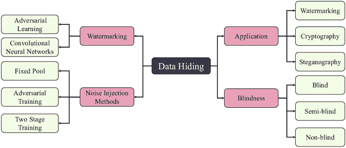
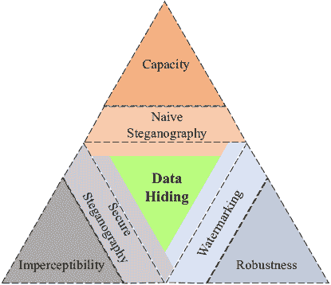
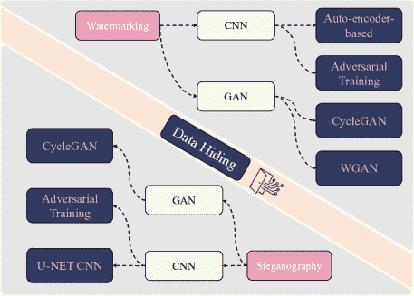
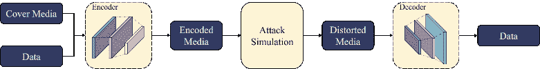

<!--yml

类别：未分类

date: 2024-09-06 19:52:37

-->

# [2107.09287] 利用深度学习的数据隐藏：统一数字水印和隐写的综述

> 来源：[`ar5iv.labs.arxiv.org/html/2107.09287`](https://ar5iv.labs.arxiv.org/html/2107.09287)

# 利用深度学习的数据隐藏：统一数字水印和隐写的综述

王子涵 CSIRO’s Data61，澳大利亚 昆士兰大学，澳大利亚 奥利维亚·伯恩斯 阿德莱德大学，澳大利亚 胡望 阿德莱德大学，澳大利亚 容玺 CSIRO’s Data61，澳大利亚 毛聪博 阿德莱德大学，澳大利亚 陈华明 悉尼大学，澳大利亚 齐吴 阿德莱德大学，澳大利亚 许敏辉 CSIRO’s Data61，澳大利亚

###### 摘要

通过使用深度学习技术进行数据隐藏，安全通信和身份验证领域的进步显著提升。通过将信息嵌入到耐噪声的信号中，如音频、视频或图像，数字水印和隐写技术可以用于保护敏感的知识产权并实现保密通信，确保嵌入的信息仅对授权方可访问。本综述概述了近年来深度学习技术在数据隐藏中的应用，系统地按模型架构和噪声注入方法进行分类。目标函数、评估指标和用于训练这些数据隐藏模型的数据集被全面总结。此外，提出并探讨了结合数字水印和隐写的潜在未来研究方向，以提升安全性和降低风险。这一贡献进一步推动了更值得信赖的数字世界的创建，并推动负责任的人工智能的进步。

###### 索引词：

人工智能，网络安全，软件工程。

## I 引言

关于人工智能是否能做出负责任的决策或行为负责任，提出了严重的担忧，例如产生不公平的结果、导致工作岗位流失或隐私和数据安全保护不足。作为回应，负责任的人工智能旨在解决这些问题，并为人工智能系统创建问责机制。

数据隐藏被认为是实现负责任 AI 数据安全的一种有前景的方法。通常，数据隐藏涉及将信息以特定形式隐藏在另一种媒体中。它可以采用不同的形式，例如将机密信息编码到现有的文本中，或将音频文件嵌入数字图像中。随着数字资产变得更加多样化和普及，数据隐藏应用的重要性和范围只会不断增长[1]。在今天的数字时代，随着数字通信和多媒体数据的日益普及，数据隐藏过程变得至关重要。确保负责任的 AI，例如作为服务的机器学习，按要求，需要在所有媒介中进行安全通信，而负责任 AI 的责任，例如数字知识产权，需保护免受盗窃和滥用。在其传统形式中，数据隐藏过程可以分为三类：水印、隐写术和加密[2]。本调查关注前两类（水印和隐写术），因为它们在保护 AI 系统学习的敏感数据方面表现出优越的能力。

数字水印利用数据隐藏技术将标识（ID）嵌入数字媒体中，以与知识产权（IP）的所有者进行通信，防止未经授权的复制或修改。因此，如果尝试复制或修改原始媒体，ID 可以被提取以识别所有者。数字水印的主要应用是数字资产的认证，但该过程也被用于许可证和身份识别[3]、数字取证[4]以及智能城市中的数据保护[5, 6]。数字水印不仅对标记图像和文档有用，还对实时音频和视频[7, 8]、语言[9]以及电子产品中的芯片和硬件保护[10]有用。

隐写术和水印技术有相似之处，均涉及将数据嵌入媒体中。然而，水印的目的是识别工件的创作者，而隐写术则以避免被检测、拦截或解码的方式嵌入秘密信息。与加密技术不同，加密旨在利用复杂性来保护数据，隐写术的主要目标是确保隐藏数据后，覆盖媒体的格式可读且未失真。公众仍应能够看到原始的覆盖媒体，而不注意到嵌入的消息。隐写术被应用于包括医学、国防和多媒体领域在内的各个行业，凡是机密性对安全通信至关重要的地方[11]。

图 1：一个层次图展示了不同的深度学习数据隐藏技术分类方法。盲性指的是数据隐藏方法的功能，详细说明见第 II 节。

历史上，数据隐藏使用了根据其操作领域（空间域或频率域）分类的专门算法。空间域技术通过操控比特流或像素值直接将数据嵌入到覆盖媒体中。与其他技术相比，它们在计算上较为简单，因此更容易受到对手的移除和失真影响。频率域技术依赖于信号介质中频率系数的操控。这些技术在抗攻击方面具有更高的鲁棒性，但计算上更为复杂[1]。

这些传统算法的缺点在于其应用范围狭窄，并且这些算法的创造者需要对嵌入过程有专家级的知识。特定的技术适用于某些有限的任务，随着水印去除和退化攻击的日益复杂，这些算法的有效性可能在不久的将来受到影响[12, 13]。

深度学习领域的新进展涉及许多行业，因深度神经网络具有强大的表示能力。在数据隐藏领域，深度学习模型提供了适应性强、通用的框架，可用于水印和隐写等各种应用。目前，该领域的大多数工作集中在基于图像的数据隐藏上，这些工作将在本调查中进行比较。这些机器学习模型能够学习先进的嵌入模式，这些模式比传统的水印或隐写算法更有效地抵抗更广泛的攻击[12]。进一步的研究[14, 15, 9, 16]确立了开发通用数据隐藏框架的潜力和关键性，这些框架能够处理各种封面媒体类型，以强健地嵌入数据并提供高度安全的内容认证和通信服务。深度学习方法的优势在于网络可以重新训练，以抵御新类型的攻击，或强调特定目标，如有效载荷容量或不可察觉性，而无需为每个新应用创建专门的算法[16]。深度数据隐藏技术的另一个优势是它们可以增强嵌入消息的安全性。深度神经模型的高度非线性使得对手几乎不可能检索嵌入的信息[12]。与传统方法相比，基于深度学习的方法不仅更安全，更能适应不同的应用，而且在对抗性攻击和失真方面提供了更强的鲁棒性。同时，它们还能实现更不可察觉的数据嵌入形式。

数据隐藏过程，包括消息嵌入和提取，可以自然地映射到编码器-解码器网络架构中。这种方法涉及将学习模型划分为两个网络：编码器网络，它学习将输入消息嵌入到图像中；解码器网络，它从经过各种攻击（如模糊、裁剪、压缩等）处理后的失真图像中提取原始消息。该网络通过最小化目标函数进行训练，该函数考虑了封面图像（即数据载体）和编码图像之间的差异，以及嵌入和提取的输入消息之间的差异。

首批探索神经网络技术在数据隐藏方面能力的论文发布于 2017 年，基于卷积神经网络[12, 17]。近年来，基于生成对抗网络（GAN）的方法获得了关注，由 HiDDeN 模型[16]推广，该模型是第一个端到端可训练的数字水印和隐写术模型。这些深度学习模型采用不同的消息嵌入策略来提高鲁棒性，例如使用对抗样本、注意力掩模和通道编码。深度学习数据隐藏模型的持续发展将大大提高数字知识产权保护的有效性和安全性，并确保秘密通信。

由于这是一个相对较新的研究领域，目前关于数据隐藏的调查主要集中在传统算法上。虽然已有一些研究审视了基于深度学习的隐写术和加密技术[18, 19]，但对深度水印技术的研究仍然缺乏。现有的调查研究了基于深度学习的水印和隐写术[20]；然而，统一数字水印和隐写术的深度数据隐藏模型的全面调查仍然缺乏。据我们所知，本调查是第一个审视深度学习技术用于深度学习基础的数字水印和隐写术的调查，涵盖了最新的广泛工作。随着这一研究领域的不断扩展，总结和审查当前方法是非常重要的。本调查旨在系统地分类和讨论现有的深度学习数据隐藏模型，按照水印或隐写术的应用进行分离，并展示研究可能的发展方向。本调查的主要贡献如下：

+   •

    本调查系统地对基于深度学习的数据隐藏模型进行分类和比较，无论是在水印技术还是隐写术方面，基于网络架构和噪声注入方法进行分析。

+   •

    我们全面讨论和比较了当前最先进的深度数据隐藏技术中使用的不同目标策略、评估指标和训练数据集。

+   •

    我们还概述了深度学习数据隐藏未来发展的广泛研究方向。

论文整理。我们的调查涉及从 Google Scholar¹¹1https://scholar.google.com/ 和 DBLP²²2https://dblp.org/ 收集、分析和讨论超过 30 篇论文，使用的搜索关键词包括数据隐藏、数字水印、隐写术、深度神经网络和生成对抗网络（GAN）。这些论文从顶级的安全与隐私、计算机视觉和机器学习会议及期刊中挑选出来。

调查组织。在接下来的部分中，我们的调查将覆盖最近的基于深度学习的数据隐藏方法，分为两种形式：数字水印和隐写术。第 II 节给出了数据隐藏的问题描述。第 III 节重点介绍了数据隐藏的架构，并提供了基于深度学习的数据隐藏技术的全面综述。本调查还总结了第 IV 节中的噪声注入技术，第 V 节中的目标函数，第 VI 节中的评估指标，以及第 VII 节中的现有数据集。最后，第 VIII 节讨论了深度学习基于的数据隐藏任务的开放问题和未来工作。第 IX 节总结了本文。

## II 问题陈述

当我们评估数据隐藏技术的有效性时，应该考虑许多因素。最重要的三个因素是容量，即可以嵌入到载体媒体中的信息量；隐蔽性，即数据被检测到的难易程度；以及鲁棒性，即数据对攻击的抵抗能力。在这里，攻击指的是对嵌入媒体的任何修改，目的是降低或移除嵌入的数据。这三种特性之间存在隐含的权衡。例如，如果负载容量很高，那么信息将更容易被检测到，导致隐蔽性降低。同样，提高对攻击的鲁棒性可能会降低负载容量和隐蔽性，因为编码图像中增加了冗余以抵御失真。

在数字水印中，通常更看重鲁棒性而非隐秘性，因为抵御攻击和失真的能力比水印的不可察觉性更为重要。相反，在隐写术中，隐秘性更受青睐，因为最高优先级是信息保持秘密。这个关系在图 2 中得到了说明。由于基于深度学习的方法具有适应性，用户可以显著控制这些指标之间的权衡，而鲁棒性和隐秘性这两个关键属性支撑着深度学习系统的目标。

图 2：展示了三种主要数据隐藏属性之间的权衡；鲁棒性、隐秘性和容量，以及各数据隐藏应用偏向的属性。

### II-A 数字水印和隐写术术语

基本的数据隐藏过程包括编码和解码过程。编码器 $E$ 接收封面媒体 $C$ 和待隐藏的信息 $M$，并输出编码后的媒体 $C^{\prime}$，使得：$E(C,M)=C^{\prime}$。然后，解码器接收编码后的媒体作为输入并提取信息 $M^{\prime}$，使得：$D(C^{\prime})=M^{\prime}$。在一个鲁棒的实现中，$M$ 和 $M^{\prime}$ 应该在有效策略中尽可能相似。类似地，通过最小化 $C$ 和 $C^{\prime}$ 之间的差异来最大化隐秘性属性。数据隐藏的类型可以根据各种属性进行分类，如下 [1]：

+   •

    盲性：与从编码媒体中提取原始数据所需的信息量相关。盲技术不需要原始封面媒体或原始数据即可提取嵌入的数据，且最具实际用途。半盲技术只需要原始数据，而非盲技术则需要原始封面媒体和数据以进行数据提取。

+   •

    脆弱性：与嵌入的数据对攻击和失真反应的程度相关。脆弱的数据设计为显示所有施加的攻击，以便在提取时可以验证对媒体施加了哪些攻击。这在验证媒体的完整性时非常有用。半脆弱的数据对意图性失真（如变形和噪声过滤）不够鲁棒，但对保持内容不变的失真（如压缩和增强）却足够鲁棒。因此，可以用来追踪对媒体所做的任何非法失真。

+   •

    可见性：嵌入的数据是否对人眼可见。

+   •

    可逆性：指嵌入的数据是否可以从封面介质中移除。可逆数据可以被移除，而不可逆数据则不能。

+   •

    鲁棒性：嵌入的数据在遭受攻击时保持不变的能力。

+   •

    安全性：决定了对抗方从封面图像中提取数据的难易程度。

## III 基于深度学习的数据隐藏技术

基于深度学习的数据隐藏模型利用编码器-解码器网络结构来训练模型，以隐秘且稳健地隐藏信息。与传统数据隐藏算法相比，它们具有优势，因为可以重新训练以抵御多种攻击，并应用于不同的最终使用场景。深度学习方法消除了在制定数据隐藏算法时对专家知识的需求，并由于深度学习模型的黑箱特性而提高了安全性。

以下部分讨论了基于深度学习的数据隐藏技术，这些技术分为关注水印和隐写术的技术。然后在本节末尾讨论检测和移除机制。本节详细分类的基于深度学习的数据隐藏技术在图 3 中概述。需要注意的是，包含对抗训练的 CNN 与基于 GAN 的方法不同。在此情况下，对抗训练指的是在攻击模拟阶段使用训练好的 CNN 进行噪声注入，而基于 GAN 的方法则结合了一个鉴别器来审查编码和封面图像，以改善嵌入的隐秘性[21]。

图 3：一个层次结构图，展示了本调查中提出的基于深度学习的数据隐藏模型的分类。‘对抗训练’指的是在训练过程中进行攻击模拟，包括由训练好的 CNN 生成的噪声攻击。

目前，大多数新的水印模型使用基于卷积神经网络（CNN）的编码器-解码器架构。基于深度学习的数据隐藏过程的简单示意图可以在图 4 中找到。

图 4：展示数字水印的一般编码器-解码器架构的示意图。

在这些模型中，编码器将数据嵌入到一块封面媒体中；这种编码媒体会经过攻击模拟，然后数据由解码网络提取。通过迭代学习过程，嵌入策略变得更加抵抗模拟中施加的攻击，而提取过程则提高了提取数据的完整性。这种技术相比于以往的传统算法的优势在于不需要专业知识进行编程，而是可以简单地重新训练以适应不同的应用和攻击类型，而不是需要从头开始设计。系统作为一个高度非线性的黑箱存在，其中嵌入系统的复杂性未知且无法确定。这使得基于深度学习的方法非常安全，并且能够适应不同的最终使用场景。上述简单的 CNN 编码器-解码器方法的一些变体包括卷积自编码器和具有对抗训练组件的 CNN。由于图像分割能力，U-Net CNN 架构在隐写术应用中很常见。

许多模型采用生成对抗网络（GAN）结构[22]。GAN 框架由一个生成模型和一个判别模型组成。在深度数据隐匿中，判别网络接收编码过和未修改的图像的混合，并必须对其进行分类。在学习过程中，生成模型在数据嵌入能力方面不断改进，生成的样本几乎不可察觉，而判别模型在识别编码图像方面不断提高。当判别器只能以 50%的概率识别真正的编码图像时，训练过程就结束了——它是在进行随机猜测。使用判别网络可以大大增加数据的隐蔽性，因此对于隐写术和水印应用非常有用。

GAN 框架还有进一步的变体，包括 Wasserstein GAN（WGAN）和 CycleGAN。CycleGAN 架构对于图像到图像的转换非常有用，并包括两个生成模型和两个判别模型。CycleGAN 的主要优势在于模型可以在没有配对样本的情况下进行训练。相反，第一个生成器从领域 A 生成图像，第二个生成器从领域 B 生成图像，其中每个生成器将来自另一个领域的图像作为输入进行转换。然后，判别器 A 将领域 A 的图像和生成器 A 的输出图像作为输入，确定它们是真实的还是虚假的（反之亦然对于判别器 B）。这种架构在图像之间的转换中非常有用。

### III-A 基于深度学习的水印技术

在本节中，当前的数字水印深度学习模型根据其网络架构设计进行分类。

#### III-A1 编码器-解码器框架

由于数据隐藏过程中编码和解码任务的核心地位，编码器-解码器深度学习框架非常适合数据隐藏模型。编码器和解码器网络结合了 CNN，这些网络因其在检测、识别和分类等应用中的独特能力而被广泛使用，这些能力可以用有限数量的参数表示数据。CNN 中的层学习非线性、复杂的特征集，通过权重共享机制表示网络的输入和输出。以下深度水印模型采用编码器-解码器框架，但不包括一个特征化 GAN 架构的判别器[12、23、24、25、26、21]。编码器-解码器深度水印结构的简单示意图可以在图 4 中找到。

基于自编码器的模型。编码器-解码器架构是一个通用框架，自编码器是编码器-解码器结构的一个特殊情况。然而，自编码器通常用于通过重建输入的无监督学习场景。CNN-based 编码器-解码器框架在数字图像水印中的潜力首次在[12]中探索，该框架使用两个传统的卷积自编码器进行水印嵌入和提取。基于自编码器的 CNN 被选择用于特征提取和视觉任务中的去噪，如面部识别和生成，以及重建手写数字。直觉是，自编码器 CNN 能够以一种在嵌入到封面图像中时几乎不可察觉的形式表示水印输入。这种早期的 CNN-based 方法应用两个深度自编码器在位级别重新排列封面图像像素，以创建水印图像。该技术在鲁棒性和不可察觉性方面优于最强的传统频域方法。尽管对深度水印的未来充满希望，但该技术是非盲的，因此在实际中不够有用。

可以使用相对较浅的网络实现鲁棒且盲的数字水印结果，正如 WMNet [24] 所示。水印过程分为三个阶段：水印嵌入、攻击模拟，其中 CNN 自适应地捕捉各种攻击的鲁棒特征，以及更新，其中模型的权重被更新以最小化损失函数，从而正确提取水印消息。通过逐渐改变图像块来表示水印位来实现嵌入。模型经过训练，从应用攻击模拟后的图像块中提取水印位。

WMNet [24] 中使用的反向传播嵌入技术仅使用了单个检测器网络，发现如果反向传播操作中的梯度计算受到批量归一化（BN）的影响，会导致性能下降。通过添加自编码器网络以及视觉遮罩来改善这一缺陷，以允许灵活控制水印的可见性和鲁棒性。自编码器网络被添加到编码器中，从而缩短了嵌入和检测所需的时间，因为前馈操作通常比反向传播要快。这些改进在其后续工作中得到了确认。

鲁棒性控制和输入预处理。在上述早期技术[12, 24]之后，后续工作集中于将水印过程概括到多个应用中。引入了诸如鲁棒性控制等机制，以影响鲁棒性/不可感知性的权衡，旨在使模型适用于水印和隐写术应用，并开发了诸如主机和水印适应性等机制来预处理输入。

通过使用基于 CNN 的系统实现了一种盲目且强健的水印技术[23]。该模型的目的是通过训练深度神经网络学习水印嵌入和提取的一般规则，从而使其能够用于各种应用并应对意外的失真。网络结构的特点是一个不变性层，该层能够容忍在网络训练过程中未见的失真。该层使用正则化项来实现稀疏的神经元激活，这增强了水印的鲁棒性和计算效率。该层还包括一个冗余参数，可调整以增加结果图像中的冗余水平，从而使模型具有更高的错误容忍度并增加鲁棒性。这些特性的主要目的是使水印规则得到概括，而不至于过拟合。该模型与两种自编码器 CNN 方法[12, 24]进行了比较，发现由于采用了新特性，其鲁棒性得到了提高。

ReDMark [25] 使用两个全卷积神经网络（FCNs）进行嵌入和提取，并结合一个可微分攻击层来模拟不同的失真，创建了一个端到端的训练方案。ReDMark 能够在不同的变换域中学习许多嵌入模式，并可以针对特定攻击或一系列攻击进行训练。该模型还包括一个基于圆形卷积层的扩散机制，使水印数据能够在图像的广泛区域内扩散，而不是局限于一个图像块。这提高了对强攻击的鲁棒性，因为即使一个图像块被裁剪或损坏，水印仍然可以被恢复。鲁棒性和不可察觉性之间的权衡可以通过一个强度因子来控制，这个因子可以影响嵌入网络的模式强度。

Lee 等人开发的水印模型[26] 使用一个简单的 CNN 进行嵌入和提取，而不使用任何分辨率依赖的层。这允许宿主图像分辨率的适应性——意味着任何分辨率的图像都可以作为输入进行水印处理。该模型具有一个图像预处理网络，可以将任何分辨率的图像适应于水印处理过程。还有水印预处理，意味着系统可以处理用户定义的水印数据。这是通过使用随机二进制数据作为水印，在每次训练迭代中更新来实现的。该模型还采用了强度缩放因子，这使得鲁棒性和不可察觉性之间的权衡具有可控性。该方法表现出与 ReDMark [25] 和两个基于生成对抗的模型 [16, 27] 相当甚至更好的性能。

对抗性训练。通过采用训练的 CNN 进行攻击模拟，对基于 CNN 的编码器-解码器框架进行了进一步改进。虽然许多其他工作使用固定的攻击池或可微分攻击层，但使用训练的 CNN 生成攻击可以大大提高鲁棒性，并为模型训练引入对抗性组件。Distortion Agnostic（DA）模型[21]的重点是直接改进 HiDDeN 模型[16]，主要通过在模型训练过程中添加对水印系统的鲁棒性，特别是在模型训练过程中处理多种失真而非单一预定类型的情况下。与从固定池中显式建模不同，失真通过训练的 CNN 进行对抗性训练生成。当应用训练过程中未见过的失真到图像时，发现 DA 框架在鲁棒性方面表现优于 HiDDeN[16]。DA 框架还结合了信道编码，即在信号传输过程中检测和纠正错误的方法，通过注入额外的冗余来增加图像的额外鲁棒性。水印消息最初通过信道编码器添加冗余，然后输入到编码器模型中。类似地，在提取之前，冗余的水印消息会输入到信道解码器中以检索最终消息。

#### III-A2 生成对抗网络

深度水印的第二种主要方法使用 GAN，基于前述技术。目前采用 GAN 框架的模型包括[16、28、29、30、27]。许多以下模型也在其网络架构中使用 CNN，但它们对 GAN 框架生成和判别组件的使用使其与前述实现区别开来。

第一个端到端可训练的数据隐藏框架是一个名为 HiDDeN 的模型[16]，它使用对抗性判别器来提高性能。这是一篇具有高度影响力的论文，自发布以来对深度水印模型的发展产生了重要影响。该模型由一个编码器网络组成，训练以在覆盖图像中嵌入编码位串，同时最小化感知扰动；一个解码器网络，接收编码图像并尝试提取信息；以及一个对抗性网络，预测图像是否已被编码。

HiDDeN [16] 使用了一种基于对抗样本的新型嵌入策略。当神经网络将图像样本分类到特定目标类别时，图像中的不可见扰动可能会使网络错误分类该样本 [31]。这些扰动已被证明在各种图像变换下能够保持不变 [32]。对抗样本通常是神经网络的缺陷，因为它们降低了分类准确性。然而，由于可以从不可察觉的图像扰动中提取有意义的信息，因此有人推测，可以以类似的方式将有意义的信息编码在对抗性失真中，并用作水印嵌入策略。这种嵌入技术结合了 GAN 框架，能够比其他常见的数据隐藏机制（如高度不可检测的隐写术（HUGO）[33]、小波获得的权重（WOW）[34]和 S-UNIWARD [35]）实现更高的负载能力（以每像素位数衡量）。HiDDeN [16] 的一个缺点是，仅在针对特定攻击类型训练时，编码和解码消息之间的损失被最小化，而在多种攻击类型的组合下则不然。这表明，该模型在针对一种攻击类型进行专门训练时效果最佳，但在训练多种攻击类型时效果不佳。

这种缺点在模型 ROMark [28]中得到了改进，该模型在 HiDDeN [16]的框架基础上，通过使用最小-最大公式进行鲁棒优化。这样做是为了实现两个主要目标：首先，获取具有最大解码误差的最坏情况水印图像；其次，在处理最坏情况时优化模型的参数，以最小化解码损失。该技术的理念是跨越多种攻击最小化解码损失，而不是训练模型以抵御特定攻击，从而创建一个更通用和适应性强的框架。由于 ROMark [28] 针对最坏情况失真进行了优化，当模型在多种攻击的组合上进行训练时，特别是在训练期间未见过的攻击上表现更好。ROMark [28] 在一些专门攻击类别中也更具鲁棒性，尽管 HiDDeN [16] 在这些类别中的准确性更高。

Hamamoto 等人[36]对 HiDDeN [16]框架进行了额外改进。这项工作使用神经网络进行攻击模拟，而不是单一的可微噪声层。它包含一个旋转层和一个附加噪声层，使模型能够学习对几何旋转攻击的鲁棒性。它还具有噪声强度因子，以控制鲁棒性/隐蔽性的权衡。经过测试，发现该模型在水印嵌入后实现了更高的图像质量，并且对 JPEG 压缩的鲁棒性更强。这个模型是第一个在满足信息隐藏标准（IHC）以增强鲁棒性的同时，能够抵抗几何旋转攻击的模型。建议未来的工作将该架构与尺度不变特征变换（SIFT）检测器[37]相结合，SIFT 检测器能够检测出对传统水印算法中的几何攻击具有鲁棒性的图像特征。

最近采用了一种使用逆梯度注意力（IGA）的新嵌入策略[30]。与基于注意力的数据隐藏[29]类似，重点是通过使用注意力掩码来识别用于数据隐藏的鲁棒像素。在 IGA 方法中，注意力掩码表示输入封面图像的梯度值，显示了每个像素在消息重建中的鲁棒性。它建立在第一次用于数字水印的对抗样本的思想之上，在 HiDDeN [16]中使用，并利用注意力机制定位最坏情况的扰动像素。通过识别鲁棒像素区域，这种方法进一步提高了水印图像在对以下文献[16, 38, 21]测试中的负载能力和鲁棒性。

刘等人介绍了一种新颖的两阶段可分离深度学习（TSDL）框架用于水印[27]，该框架解决了一阶段端到端训练（OET）存在的问题，例如收敛慢导致图像质量下降，以及必须使用可微分层模拟噪声攻击。TSDL 框架能够在训练过程中使用真正的非可微噪声攻击，如 JPEG 压缩，而不是依赖于可微分的近似。在 OET 模型中，编码器和解码器使用可微噪声层进行训练，这意味着噪声必须支持反向传播。TSDL 框架包括噪声自由的端到端对抗训练（FEAT），用于训练一个自主编码水印的编码器，且无需参考任何噪声。噪声感知解码器仅训练（ADOT）用于训练解码器，使其具有鲁棒性并能从任何类型的噪声攻击中提取水印。该模型经过 HiDDeN[16]和 ReDMark[25]测试，发现对所有攻击类别（除了裁剪）表现出优越的鲁棒性。然而，两阶段训练方法对封装在图像处理软件中的黑盒噪声攻击也具有鲁棒性，而这些攻击在以往的工作中未被测试。

Wasserstein GAN。传统 GAN 技术的一个流行变种是 Wasserstein GAN（WGAN）[39]。这种技术提高了训练过程中的模型稳定性，并降低了训练过程对模型架构和超参数配置的敏感性。WGAN 框架还提供了一个与生成图像质量相关的损失函数。这对于图像领域中的水印和隐写尤其有用，因为图像质量必须得到有效优化。WGANs 用一个评论器代替了网络中的鉴别器。评论器不是预测给定图像是真实还是虚假的概率，而是输出一个表示输入图像“真实性”的分数。在数据隐藏场景中，编码器的目标是最大化评论器对真实实例（即编码图像）给出的分数。当前采用 WGAN 框架进行水印模型的论文包括[38, 40, 41, 42]。

Zhang 等人 [38] 引入了 SteganoGAN。探索了三种不同的编码器架构变体，每种变体具有不同的连接模式。基本变体应用了两个卷积块，其中编码图像是第二个块的输出。残差连接已被证明能提高模型稳定性 [43]，在残差变体中，将封面图像添加到编码器输出中，使其学习生成残差图像。第三种变体使用了受 DenseNet [44] 启发的方法，其中在卷积块之间存在额外的特征连接，使得早期块生成的特征图可以与后续块生成的特征图进行拼接。

通过对抗训练，该模型实现了 4.4 BPP 的相对负载，比竞争的深度学习方法高出 10 倍。尽管两篇工作 [16, 38] 都有处理任意大小封面图像作为输入的机制，但 [38] 更高的负载能力意味着它可以支持更广泛的水印数据。该论文还提出了一种新的度量标准，Reed Solomon Bits Per Pixel (RS-BPP)，用于测量基于深度学习的数据隐藏技术的负载能力，以便将结果与传统的数据隐藏方法进行比较。尽管 SteganoGAN 的主要重点是隐写术，但 SteganoGAN 生成图像的高负载能力和低检测率也可以应用于水印。

同一作者的另外两项工作也使用了 WGAN 框架。Plata 等人引入了一种新的嵌入技术，其中水印在图像的空间域上展开[40]。水印信息被转换为一系列元组，其中每个元组的第一个元素被转换为二进制表示。空间信息通过将二进制转换后的元组随机分配到信息的各个部分来创建，包括冗余数据以增加鲁棒性。论文还引入了一种用于不可微失真差异化噪声近似的新技术，这使得模拟子采样攻击成为可能。攻击训练池从以前的工作中扩展，包含了子采样和调整大小攻击，这种广泛的攻击范围在训练过程中增加了整体鲁棒性。然而，空间扩展嵌入技术减少了嵌入容量，因此仅适用于容量不是优先考虑的应用。此外，所提出的训练框架所需的时间仅为以前方法的一半[16, 25, 21]。作者在后续论文[41]中进一步扩展了这项工作，引入了双重判别器-检测器架构。判别器位于噪声层之后，并接收噪声覆盖图像和噪声编码图像，因此判别器学习区分已应用攻击的水印图像和未水印图像。在实际情况下，这很有用，因为它减少了对 IP 盗窃的错误指控。如果图像已经被攻击并且必须证明包含水印，这种训练技术是有用的。关键是，它不会降低编码图像的整体鲁棒性。

Wang 等人基于纹理分析引入了一种改进编码图像质量的技术[42]。封面图像的纹理特征通过灰度共现矩阵进行分析，该矩阵将图像划分为复杂和简单区域。论文利用 StegaStamp 网络[45]将水印嵌入到简单纹理区域。这减少了图像修改的程度，提升了编码图像的质量和*隐蔽性*。StegaStamp[45]中的网络从低对比度样本生成高质量图像，因此对比度值被用来计算图像的纹理复杂度。

表 I：基于深度学习的数字水印方法汇总表。

| 架构 | 模型 | 领域 | 嵌入网络 | 提取网络 | RA | RC | 备注 |
| --- | --- | --- | --- | --- | --- | --- | --- |
| AE CNN | [12] | 频率 | AE CNN | AE CNN |  |  | 首个用于水印的 CNN。盲方法 |
| [24] | 空间 | AE & RB | RB |  | ✓ | 自编码器 + 视觉掩码 |
| CNN | [21] | 空间 | 通道编码 & CNN | 通道编码 & CNN |  |  | 攻击的通道编码 & CNN |
| [25] | 频率 | CC 层 & DCT 层 | DCT 层 | ✓ | ✓ | 扩散机制 |
| [23] | 空间 | CNN | CNN | ✓ | ✓ | 不变层和图像融合 |
| [26] | 空间 | CNN & AP | CNN | ✓ | ✓ | 针对几何攻击的鲁棒性 |
| GAN | [16] | 空间 | AL | GP & CNN |  |  | 嵌入的对抗性示例 |
| [30] | 频率 | IG 注意力掩码 & CNN | CNN |  |  | IG 掩码提高容量和鲁棒性 |
| [28] | 空间 | AL | FC 层 |  | ✓ | 用于鲁棒优化的最小-最大公式 |
| [27] | 空间 | AL | FC 层 | ✓ | ✓ | 两阶段训练 |
| [36] | 空间 | CNN | CNN + FC 层 |  | ✓ | 针对旋转和 JPEG 压缩的鲁棒性 |
| WGAN | [38] | 空间 | CB & ASP | CNN |  |  | 高负载能力 |
| [40] | 空间 | CNN | CNN + AP |  |  | 空间扩展嵌入技术 |
| [41] | 空间 | CNN | CNN + AP |  |  | 双重鉴别器-检测器 |
| [42] | 空间 | CNN & MP | CNN & MP |  | ✓ | 使用纹理分析 |

+   AE: 自编码器，RB: 残差块，AP: 平均池化，ASP: 自适应空间池化，AL: 对抗损失，CB: 卷积块，FC: 全连接，IG: 逆梯度，GP: 全局池化，MP: 最大池化，CC: 圆形卷积，RA: 分辨率适应性，RC: 鲁棒性权衡控制。

基于注意力的数据隐藏（ADBH）[29] 引入了一种注意力机制，帮助生成编码器确定最适合数据嵌入的覆盖图像区域。注意力模型是一种输入处理技术，使网络能够一次关注复杂输入的特定方面。注意力模型生成一个注意力掩码，表示覆盖图像中每个像素的注意力敏感度。该值被正则化为一个概率，表示更改相应像素是否会导致图像中显著的感知差异，从而被鉴别器检测到。这改善了编码器网络的嵌入过程。

与隐藏二进制水印信息不同，这种技术在封面图像中隐藏秘密图像。在采用的 CycleGAN 框架中，有一个目标图像生成模型和一个秘密图像生成模型。前者生成带水印的图像，然后将其输入到封面图像判别模型中，并基于 PatchGAN 模型对每个图像块进行操作[46]。类似地，秘密图像生成模型作为秘密图像判别模型的输入。该架构在嵌入和提取过程中均使用对抗学习，确保封面图像与编码图像之间，以及编码水印与提取水印之间的分布不可区分。提取网络也作用于未标记的封面图像，并使用不一致损失确保在这种情况下，提取的数据与原始水印之间没有相关性。

本文的三个核心贡献——注意力模型、循环判别模型的使用以及额外的不一致损失目标——都经过了单独测试，发现它们在图像质量和鲁棒性方面都能整体提升模型性能。

#### III-A3 讨论

从上述最先进的深度学习方法来看，由于在目标计算中包含对抗损失，GAN 框架在鲁棒性和保密性优化方面似乎最具前景。以 HiDDeN [16] 为例，在未包括对抗网络的情况下进行的测试发现包含了可察觉的变化，而包括对抗者则大大提高了性能，产生了不可见的水印技术。在鲁棒性比较测试中，基于 GAN 的模型表现良好，但通过针对鲁棒像素进行水印嵌入的技术，如 Attention-based Data Hiding [29] 和 IGA 方法 [30]，效果得到了提升。

模型对各种攻击的鲁棒性也很重要。Hamamoto 等人[36] 和 Plata 等人[40] 的论文分别涉及几何旋转技术和子采样及重采样攻击。在训练过程中拥有更广泛的攻击类型可以提高通用鲁棒性。此外，如 Liu 等人[27] 所开发的两阶段训练技术中所示，使用真实的非可微噪声在 JPEG 压缩方面比使用可微近似模型的效果更佳。利用训练好的 CNN 生成攻击，Distortion Agnostic Watermarking [21] 也是一种有前景的方法，用于多样化训练过程中遇到的攻击。

为了生成一个可适应的、通用的框架，包含诸如主机和水印分辨率适应性以及影响鲁棒性/不可察觉性权衡的控制等特性是重要的。鲁棒性控制使这些模型适用于水印和隐写术，后者更侧重于不可察觉性。理想的数字水印模型应包括用于输入任何水印数据或封面图像的预处理网络，因为该框架是由 Lee 等人开发的[26]，同时还应利用对抗性判别器或评论家。[28]中用于通过获取和优化 ROMark 最坏情况示例的参数来提高鲁棒性的技术也是一种有前景的提高鲁棒性的方法。

如果未来的模型能够结合这些特性：改进嵌入的注意机制、抵御几何攻击的鲁棒性、主机和水印分辨率控制、鲁棒性控制以及处理最坏情况失真，它可能会导致一个高度鲁棒和适应性强的框架。然而，所有这些附加特性的额外开销在实践中可能会成为一个问题。

表 I 总结了上述部分评审的深度水印模型。它显示了嵌入策略是否在空间域或频率域中操作、水印嵌入和提取网络的性质、技术是否支持主机分辨率适应性（以便使用任何封面图像分辨率），以及是否包括影响不可察觉性和鲁棒性之间权衡的控制。备注栏描述了论文中的任何重要信息或新颖贡献。

### III-B 基于深度学习的隐写术技术

本节根据模型架构对深度隐写技术进行分类。大多数技术采用图 4 中所示的编码器-解码器结构，并基于卷积神经网络（CNNs）。许多隐写实现与水印实现的不同之处在于使用了 U-Net 结构进行图像分割[47]。表 II 总结了本节评审的基于深度学习的隐写方法。

#### III-B1 编码器-解码器框架

基于 CNN 的编码-解码结构已在以下论文中采用 [17, 48, 49, 50, 51, 45, 52, 53]。编码-解码深度水印结构的简单示意图见图 4。

来自 Google 研究的论文 [17]，发表于 2017 年，提出了一种深度隐写技术，用于将图像隐藏在其他图像中。该结构总共有三个组成部分。第一个是预处理网络，具有两个目的；将较小的秘密图像调整到适合隐藏图像的大小，并将基于颜色的像素转换为可编码到隐藏图像中的可识别特征。编码器的第二层被称为隐藏网络。顾名思义，这一层生成最终的隐写图像。最后一层是揭示网络，用于解码第二层的输出。该研究 [17] 的实验主要旨在表明可以在覆盖介质中完全编码大量数据而不会造成明显的视觉干扰。然而，该技术缺乏鲁棒性、安全性，且质量不高。攻击者可以利用训练好的网络恢复覆盖图像和秘密图像。

另一种图像编码技术称为 StegNet [48]，于 2018 年发布。StegNet 结合了自编码器和 GAN 的结构来建立编码网络。在 CNN 编码结构之前，覆盖图像和秘密图像通过一个通道进行串联。在编码器和解码器的损失计算中加入了方差损失。研究发现，包含方差损失有助于神经网络将损失分布到整个图像中，而不是集中在感知损失的区域，从而提高了嵌入的整体隐蔽性。所提出的技术对统计分析具有高度鲁棒性，当用于对抗常用的隐写分析工具 StegExpose [54]时，它也能抵抗这些攻击。尽管稳健，但该方法仍存在一些限制。秘密图像和覆盖图像必须匹配大小，并且在平滑区域中噪声仍然较为明显。

比较 Baluja 等人 [17] 和 StegNet [48]的方法，图像隐藏技术有了显著的改进。StegNet [48] 中结合了从 GAN 和自编码器中改编的组件，提高了隐写图像的鲁棒性，因此对 StegExpose [54] 更具抵抗力。尽管 StegNet [48] 颇具鲁棒性，但在一些领域如质量、图像尺寸限制和噪声方面仍然存在不足。

在[49]中介绍了一种更快的 R-CNN（区域卷积神经网络）方法。首先，封面图像通过一个区域提议网络，这使得特征提取的选择变得更快。使用 Softmax 损失来框定这些区域，然后选择并分配特定的现有隐写算法到这些框定的区域。由于[49]使用了选择不同隐写算法的技术，结合使用了 HUGO [33]、S-UNIWARD [35] 和 WOW [34] 算法，它能够实现高度不可察觉的嵌入。能够选择有效区域的封面图像还使得 Meng 等人[49]能够保持较高的鲁棒性。

融合技术[49]的适应性允许提取的隐写图像具有最小的失真。在查看 StegNet [48]时，关注点在于封面照片中较平滑区域的噪声。尽管[48]已经被证明具有鲁棒性，但如果结合了融合方法[49]的框选择功能，它可以在这方面得到进一步改进。这确实会导致容量困境，因为如果有一种方法将 StegNet [48]和融合方法[49]结合起来，后者自然会使用较少的封面图像区域，因此相对于 StegNet [48]具有较小的容量。

Sharma 等人[50]展示了一种独特的隐写方法。在这篇论文中，编码器和解码器都由两层组成。在第一层，即准备层，将较小的图像放大以正确适应封面图像，进行基于颜色的像素重构以创建更多有用的特征，并且对像素进行混洗和置换。第二层，即隐藏层，生成具有第一层输出和封面图像输入的隐写图像。解码器由揭示层和解密层组成。揭示层去除封面图像，解密层解密揭示层的输出。这种技术的优势在于第一层及其加密方法类似于密码学实践，从而允许嵌入的隐写图像更加安全。即使攻击者知道封面媒体，解码秘密图像仍然要安全得多且困难。这种技术也可以应用于音频。

Chang 等人 [53] 介绍了一种可逆图像隐藏方法。该结构依赖于一种称为长短期记忆的概念。为了编码，覆盖图像通过一个神经网络以获得预测，称为参考图像。通过从参考图像中减去覆盖图像，计算覆盖残差（预测误差）。在覆盖残差上使用直方图移位（HS）产生隐写残差，以及一个后来用于解码器的溢出图。隐写图像通过将隐写残差加到参考图像上来创建。在像素强度流动的地方，预先计算溢出图以标记这些像素。解码器本质上是编码器的反向过程，其中隐写图像通过神经网络以获得参考图像，其余部分按反向顺序进行。这种技术生成高质量、高容量且噪声最小的图像。其可恢复覆盖图像的可逆特性在许多其他基于 CNN 的隐写方法中独特。

Tang 等人 [55] 提出了一个使用对抗嵌入的隐写技术，称为 ADV-EMB。该网络能够隐藏隐写消息，同时欺骗基于 CNN 的隐写分析器。编码网络包括一个失真最小化框架，该框架根据来自 CNN 隐写分析器的特征（梯度反向传播）调整和最小化图像的成本。ADV-EMB [55] 的重点在于防止隐写分析器检测隐写图像。其结果显示出高安全性和更高的隐蔽性。他们还能够通过使用本地表现良好的 CNN 隐写分析器作为目标分析器来训练系统以应对未知的隐写分析器，从而实现多样化的应用。尽管 ADV-EMB [55] 能够降低对抗性隐写分析器的有效性，但其在像素域上较弱。然而，增加负载容量会提高隐写分析器的检测率。

U-Net CNN。U-Net CNN 用于通过图像分割促进更细致的特征映射。这在图像隐写应用中很有用，因为覆盖图像可以根据某个特性（例如，[51] 使用热图来评分适合的嵌入区域）被分成不同的段。

表 II：基于深度学习的隐写方法总结表。

| 架构 | 模型 | 嵌入网络 | 提取网络 | 备注 |
| --- | --- | --- | --- | --- |
| CNN | [17] | CNN | CNN | 在彩色覆盖图像中嵌入彩色图像 |
| [48] | CNN | CNN | 连接通道进行嵌入 |
| [49] | R-CNN & CNN | N/A | 基于选定区域使用多种技术 |
| [50] | CNN | CNN | 通过打乱和排列像素进行嵌入 |
| [53] | LSTM w/ CNN & HS | 带卷积层的 LSTM 和 HS | 使用 HS 实现可逆性 |
| [55] | CNN 与对抗嵌入 | 无 | 使用隐写分析器训练隐写图像 |
| 带有对抗训练的 CNN | [56] | 带 ReLU 的 CNN | 带 ReLU 的 CNN | 针对不同优先级的多个模型 |
| U-Net CNN | [51] | 带 BN 和 ReLU 的 U-Net CNN | 带 BN 和 ReLU 的 CNN | 能够承受高频和低频 |
| [45] | CNN U-Net | CNN | 将超链接嵌入图像 |
|  | [52] | U-Net 来自 Cycle-GAN | CNN | 针对多样化用途对[16]的改进 |
| GAN | [57] | CNN | CNN | 隐藏数据于封面图像的 Y 通道 |
| [58] | GAN 与 CNN | 无 | 生成纹理化的封面图像 |
| [59] | CNN | CNN | 在容量和安全性方面对[38]的改进 |

Ni 等人开发了一种用于可逆隐写的 U-Net CNN 技术[51]。该技术通过将秘密图像连接到六通道张量中，能够直接将秘密图像编码到封面图像中。其解码器由六个卷积层组成，每个卷积层后面跟随一个批量归一化层和一个 ReLu 激活层。该嵌入技术不易受高频或低频区域的影响。它还能够生成高质量图像，其容量通常优于其他基于封面选择和封面合成的隐写技术。即使具有高容量能力，像其他不注重鲁棒性的隐写技术一样，过高的嵌入率会比基于鲁棒性的隐写技术更显著地增加失真率。

Universal Deep Hiding (UDH) 是一种用于数字水印、隐写和光场消息传递的模型[52]。编码器使用简化的 Cycle-GAN 的 U-Net[60]，解码器使用密集的 CNN。编码器以无关封面图像的方式隐藏图像，意味着它不依赖于封面图像。由于编码图像与封面图像之间的高频差异，UDH 是一种有效的方法。这种差异使得在低频封面图像中的嵌入更为鲁棒。UDH 对封面图像上的像素强度变化也不太敏感。UDH 方法与基于封面的深度隐写 (DDH) 进行了比较。由于秘密图像的编码与封面图像独立，因此没有方法可以根据封面图像调整编码机制。封面图像可能有一些较平滑的区域，这些区域可能不适合嵌入数据，但使用 UDH 没有方法找出这些信息。UDH 也无法很好地处理严重的均匀随机噪声。

含有对抗性训练的 CNN。在训练过程中加入对抗攻击网络可以帮助提高抗隐写分析能力并增强鲁棒性。对抗性训练可以帮助系统区分未经训练的隐写方法可能会绕过的微小扰动。这是隐写术中一个重要的特性，因为它的主要目标是保护信息安全。陈等人开发了一种模型，该模型结合了一个训练有素的基于 CNN 的攻击网络，该攻击网络生成失真图像[56]，类似于西央等人在《失真不敏感水印技术》[21]中使用的技术。编码结构基于一个简单的模型，将秘密的灰度图像隐藏到彩色盖图的通道 B（蓝色）中，两者必须具有相同的分辨率。在这个基本模型的基础上，该论文还能够添加另外两个增强型模型，一个安全模型和一个安全鲁棒模型。安全模型将隐写分析网络插入到基本模型中，其目标是增加对隐写分析的安全性。安全和鲁棒模型使用安全模型，并插入一个攻击网络以增强系统的鲁棒性。每个模型的分离允许陈等人的框架[56]在几种不同的场景中使用，使用户能够根据自己的需求进行调整。不足之处是用户无法发送 RGB 图片，只能限制在灰度图像上。

安全模型在所有模型中显示了最好的隐蔽性，并且与以下方法[17, 61]相比仍然是最好的。安全和鲁棒模型的性能不及安全模型，但仍然能够得到改善。基本模型和安全模型在这个比较中显示出了增加的视觉效果，其中安全模型具有最好的视觉效果。安全和鲁棒模型的视觉效果与 ISGAN[57]类似。

#### III-B2 基于生成式对抗网络的模型

在深度隐写领域，生成式对抗网络（GANs）被广泛使用。各种新的结构使得简单的 GAN 结构得以改进，从而增强了隐写术的有效性。它带来了一些有趣的技术，比如无盖隐写和生成盖图的能力。GAN-based 架构已经在以下论文中使用[57, 58, 62, 59, 63]。

ISGAN 是一种使用 GAN 结构的隐写技术[57]。类似于 Chen 等人开发的安全技术[56]，ISGAN 只能发送灰度秘密图像。编码器首先将封面图像转换到 YCrCb 颜色空间，其中仅使用 Y 通道来隐藏秘密图像，因为它包含亮度信息而不包含颜色信息。这种颜色空间转换不会影响反向传播。编码器还使用了一个 inception 模块，帮助融合具有不同接收域大小的特征图。为了提高训练速度，该技术还添加了一个残差模块和批量归一化。在解码时使用 CNN，并在每个卷积层后添加批量归一化，除了最后一层。该模型的结果显示它能够实现高水平的鲁棒性，在使用隐写分析工具检查时具有低可检测性。

相较于[61]，ISGAN 的残差不那么明显，这表明 ISGAN 提取的秘密图像比[61]更接近原图。由于 ISGAN 使用灰度图像，它还能够实现更高程度的隐蔽性。因此，图像的复杂性（即 RGB 值）与嵌入信息的不可感知性之间存在权衡。

Li 等人提出了[58]中的两个独立设计，研究了将数据嵌入纹理图像中的方法。第一个模型将纹理图像生成和秘密图像嵌入过程分开。使用深度卷积生成对抗网络生成纹理图像，然后将其作为隐蔽网络的输入进行图像隐藏。第二个模型将隐蔽网络与深度卷积生成对抗网络整合在一起。第二个网络应能够在生成纹理图像的同时嵌入另一张图像。第一个模型更容易训练，且比第二个模型适用于更多样化的应用。隐写分析工具的检测率在两种情况下几乎为 0。这些模型提供了高安全性，但也有一些局限性。首先，生成的封面图像仅为纹理，其他主题未被考虑。第二个模型中，当封面图像和秘密图像相差过大时，还会发生颜色失真。

无需盖体的隐写术之所以可行，是因为 GAN 的特性。所提议的无盖隐写方法的总体编码思路[59]是首先使用卷积块处理盖图像以获取张量 a。然后，将秘密消息连接到 a，并通过另一个卷积块处理，以获得与 a 大小相同的 b。论文详细介绍了两种不同的模型，一种叫做基本模型，另一种叫做密集模型。基本模型使用上述编码方案，而密集模型则包括一个跳跃连接以增加嵌入率。两个模型的解码器都在从隐写图像生成的张量上使用 Reed Solomon 算法。该模型的目标是提高其他无盖隐写术未能实现的容量和质量。与[38]相比，编码图像质量和隐写图像的负载能力得到了改善。由 Quin 等人提出的基本模型[59]在这些方面表现显著优越，而密集模型只能匹敌 SteganoGAN [38]。无盖方法[59]中使用的解码网络也比 SteganoGAN [38]中提出的网络更准确。但在编码的介质方面存在差异，无盖方法[59]编码的是一串二进制消息，而 SteganoGAN [38]则能够编码图像。

许多隐写术技术并不可逆，并且在去除秘密介质后会使盖图像失真。通过 Chang 等人提出的方法[63]，模型能够实现可逆隐写术。该方法基于 Regular-Singular (RS) 方法。RS 通过可逆噪声隐藏实现无损数据嵌入。该技术中使用了三个判别块——常规、奇异和不可用——以获得 RS 映射。对抗学习组件用于捕捉自然图像的规律性。该模型使用条件 GAN 进行合成，其中生成器使用 U-Net 结构，并使用 Markovian 判别器。将 GAN 与 RS 方法结合使用大大改善了以前基于 RS 的模型的结果。

目前，论文[51]使用了基本 GAN 结构，并可以通过其他 GAN 结构的适配进一步改进或多样化。这可能会在盖图像恢复的质量方面带来进一步的改进。总体而言，GAN 模型中采用的对抗学习使隐写术应用具有更大的鲁棒性。

CycleGAN。CycleGAN 是一种用于图像到图像转换的 GAN 架构变体。CycleGAN 框架被用于隐写术中的 S-CycleGAN [62]。在该模型中，有三个鉴别器，其中两个使用与原始 CycleGAN 框架相同的功能。第三个是增加的隐写分析模块，用于区分隐写图像和生成的图像。训练周期包括三个阶段。第一阶段是将图像从 X 域转换到 Y 域的风格。第二阶段是使用 LSB 匹配算法将秘密信息嵌入到第一阶段的输出中。第三阶段是将隐写图像重建为从第一个生成器到第二个生成器的输入图像。完整的目标函数包括所有鉴别器的对抗损失以及生成模型的循环一致性损失。S-CycleGAN 的优点在于能够生成高质量的图像，同时对隐写分析具有较强的鲁棒性。总体而言，S-CycleGAN [62] 展现了更强的抗检测能力，提高了嵌入隐写图像的隐蔽性。

与 SGAN [64] 相比，S-CycleGAN [62] 的图像质量要高得多，Inception Score 高出 2.6 倍，Frechet Inception Distance 高出 7 倍。总体而言，S-CycleGAN [62] 的结果显示，它比 SGAN 更加鲁棒，并且其效果结合了原始 CycleGAN 框架和传统隐写算法 S-UNIWARD [35]。

### III-C 数据隐藏检测与移除机制

改进的数据隐藏技术促使了更先进的隐藏数据检测与移除策略的发展。在隐写术的背景下，隐写分析领域致力于识别和提取隐秘信息。与隐写术不同，水印技术主要用于识别媒体的所有者，而非隐藏秘密信息。因此，在水印中防止数据被检测的优先级较低，只要数据不能被修改或从封面媒体中移除即可。在水印技术中，对手更关心的是去除或降低水印的效果，而不改变原始的封面媒体。根据应用的不同，理解对手在数据隐藏中的目标和方法是很重要的，因为这些场景应通过数据隐藏策略来应对。

#### III-C1 隐写分析

隐写分析是指从对手的角度检测隐秘隐写信息的过程。这些技术涉及分析媒体，以识别嵌入过程中的任何缺陷，并确定其是否已被编码。隐写分析技术主要有两大类：签名隐写分析和统计隐写分析，如参考文献 [11] 所述。

签名隐写分析包括两种类型，分别是特定签名隐写分析和通用签名隐写分析。在特定签名隐写分析中，攻击者知道所使用的嵌入方法，而通用签名隐写分析则不需要这些知识。因此，通用签名隐写分析可以用于检测多种隐写技术[11, 65]。

隐写分析的发展以及新隐写技术的出现至关重要，因为它显示了新嵌入技术对不断改进的检测技术的鲁棒性。

#### III-C2 水印去除策略

水印去除技术可以分为三类[66]。第一类是盲水印去除技术，这是深度学习方法可以通过多样的攻击模拟策略进行防御的技术。在盲去除技术中，攻击者对水印过程一无所知，试图通过压缩和几何失真等攻击来削弱水印。在密钥估计攻击中，攻击者对水印方案有一些了解，并能够估计用于嵌入的秘密密钥。同样，在篡改攻击中，攻击者对水印方案有完全的了解，导致水印系统完全崩溃，秘密密钥被明确获得。在基于深度学习的水印技术中，系统即使对其创建者也是一个黑箱，因此水印方案无法被攻击者揭示。基于深度学习的策略只需防御第一类攻击，即盲攻击。然而，随着水印去除技术通过深度学习方法的改进，这种情况可能会发生变化[13]。

### III-D 结果

本节展示并比较了各种深度数据隐藏模型的鲁棒性和隐蔽性。尽管目前没有被普遍接受的标准数据集用于测试深度数据隐藏模型，但 COCO [67]是使用最广泛的数据集。因此，使用该数据集取得的结果进行了比较。比特错误率（BER）和峰值信噪比（PSNR）是两项常用的度量指标，尽管有些论文仅报告其中之一。需要注意的是，测试是使用不同的封面图像和水印尺寸进行的，如表中所示。此外，一些论文在测试期间使用了固定的攻击池。因此，结果并不完全可比，但提供了模型相对性能的一般指示。

表 III 比较了基于比特错误率（BER）的深度数据隐藏模型，这是衡量鲁棒性的一种指标。所有模型都使用 COCO [67] 数据集进行测试。由于封面图像的分辨率和水印负载的大小不同，所有模型的 BER 不能直接比较。例如，嵌入高分辨率图像中的水印可以在不牺牲编码图像质量的情况下保持完整性，从而提高鲁棒性。相反，较小的水印负载可以嵌入而不会显著降低封面图像质量，也能提高鲁棒性。

表 III：比较基于深度学习的水印模型的鲁棒性，通过比特错误率（BER）进行测量。‘Results Origin’ 列指示每个 BER 结果的来源论文。

| Model | Results Origin | Architecture | Cover Image Dimensions | Watermark Bits | BER (%) |
| --- | --- | --- | --- | --- | --- |
| HiDDeN [16] | [30] | GAN | 128 x 128 | 30 | 20.12 |
| IGA [30] | [30] | GAN | 128 x 128 | 30 | 17.88 |
| DA [21] | [30] | GAN | 128 x 128 | 30 | 20.48 |
| ReDMark [25] | [25] | GAN | 128 x 128 | 30 | 18.18 |
| Rotation [36] | [36] | GAN | 64 x 64 | 8 | 8.0 |
| DNN [23] | [23] | CNN | 128 x 128 | 32 | 20.12 |
| Double Detector-Discriminator [41] | [41] | GAN | 256 x 256 | 32 | 5.53 |
| Spatial-Spread [40] | [41] | GAN | 256 x 256 | 32 | 8.38 |
| Two-Stage [27] | [27] | GAN | 128 x 128 | 30 | 8.3 |

表 IV 比较了基于峰值信噪比（PSNR）的深度数据隐藏模型，这是衡量编码图像质量的一种指标。所有模型都使用 COCO [67] 数据集进行测试。

表 IV：比较基于编码图像质量的深度数据隐藏模型，通过 PSNR 进行测量。‘Results Origin’ 列显示了 PSNR 结果的来源论文。

| Model | Results Origin | Architecture | Cover Image Dimensions | Watermark Bits | PSNR (dB) |
| --- | --- | --- | --- | --- | --- |
| Two-Stage [27] | [27] | GAN | 128 x 128 | 30 | 33.51 |
| ABDH [29] | [29] | CycleGAN | 512 x 512 | 256 | 31.79 |
| ISGAN [57] | [29] | GAN | 512 x 512 | 256 | 24.08 |
| DA [21] | [21] | GAN | 128 x 128 | 30 | 33.7 |
| HiDDeN [16] | [21] | GAN | 128 x 128 | 30 | 32.3 |
| DNN [23] | [23] | CNN | 128 x 128 | 32 | 39.93 |
| WMNET [26] | [23] | CNN | 128 x 128 | 32 | 38.01 |
| ROMark [28] | [28] | GAN | 128 x 128 | 30 | 27.80 |
| IGA [30] | [30] | GAN | 128 x 128 | 30 | 32.80 |
| SteganoGAN [38] | [30] | GAN | 128 x 128 | 30 | 30.10 |

## IV 噪声注入技术

除了模型架构，基于深度学习的数据隐藏技术还可以根据所使用的噪声注入方法进行分类。这些方法在训练过程中使用，以模拟攻击并提高最终模型的鲁棒性。

通过攻击模拟，已经使用了几种技术来增强基于深度学习的数据隐藏模型的鲁棒性。最常用的方法是使用预定义的攻击集，这些攻击通过可微分的噪声层和后续的几何层进行模拟。其他方法包括使用训练好的卷积神经网络（CNN）生成新的噪声模式，如参考文献 [21] 和 [56] 中讨论的，以及采用两阶段训练过程来增加模拟攻击的复杂性，如参考文献 [27] 中描述的。以下部分提供了各种噪声注入技术的概述，以及它们各自的优缺点。

### IV-A Identity

一些早期的基于深度学习的数据隐藏技术 [12] 并未涉及攻击模拟，主要作为概念验证展示。随后的模型通常包括一个控制训练场景，在该场景中没有添加噪声，例如 HiDDeN [16] 中的“Identity”层。训练过程中没有攻击模拟的技术通常会导致显著较低的鲁棒性。例如，当遭遇 JPEG 和裁剪失真时，仅使用 Identity 层训练的 HiDDeN 模型成功提取水印的概率仅为 50%，在面对其他类型的攻击时表现更差。

### IV-B 预定义攻击池

最常见的噪声注入技术是使用固定池的预定义攻击类型。然后，在训练过程中，模型可以暴露于一种、多种或全部攻击类型。每种攻击包含一个强度因子，可以调整以改变训练过程中攻击的强度。在理想情况下，模型在对抗整个攻击范围时应该和只训练一种特定攻击时一样有效。在大多数情况下，模型使用可微分噪声层，这意味着所有基于噪声的攻击必须支持反向传播，以便与神经网络协同工作[16]。由于 JPEG 压缩等不可微分噪声攻击在实际攻击场景中很常见，因此它们通过可微分近似方法被纳入训练[16]。这些近似的准确性对于创建抗不可微分噪声的鲁棒模型至关重要，因此已做出努力来修订和改进这些近似[40]。

对预定义攻击池的进一步改进包括更广泛的攻击范围。例如，Hamamoto 等人[36]在框架中添加了旋转层，Plata 等人[40]则加入了子采样和调整大小攻击。为了提高模型在多种攻击下的性能，已引入各种技术，因为早期使用此方法的技术[16]显示，在针对特定攻击而非范围进行训练时，性能有所提高。例如，ROMarK[28]采用了一种技术，即生成产生最大解码错误的失真，并在训练过程中用以优化模型的参数。

### IV-C 对抗训练

另一种噪声注入技术不使用固定的预定义攻击集，而是使用单独训练的 CNN 生成新型的基于噪声的失真[21, 56]。失真无关模型[21]基于对抗样本生成失真，使用 CNN 生成一组多样的图像失真。失真无关模型在对 HiDDeN 进行测试时暴露于训练过程中未见过的多种失真，例如饱和度、色调和调整大小攻击，发现效果更佳。虽然失真无关模型在仅使用特定攻击训练时无法超越 HiDDeN 的效果，但这种训练设置并不适合实际应用场景。使用训练好的 CNN 进行攻击生成可以大大提高鲁棒性，因为失真是在对抗训练场景中生成的。这意味着在训练过程中，失真是明确生成的，以干扰解码网络。

### IV-D 噪声注入的两阶段训练

刘等人开发了一种新颖的训练方法[27]，在两个方面改进了噪声注入技术。首先，使用了一种称为“两阶段可分离深度学习（TSDL）”的训练方法。这种训练的第二阶段被应用于解码器，使其能够应对任何类型的噪声攻击，从而提高了实用性。由于这种新颖的训练场景，该模型可以使用真实的不可微分失真进行训练，而不是微分近似。除了这一区别之外，训练过程中仍使用固定的预定义攻击池。使用真实的不可微分噪声进行训练提高了对这些攻击的鲁棒性，包括 GIF 和 JPEG 压缩，但从这项工作中尚不清楚 TDSL 框架增加的开销是否为这种性能提升提供了合适的权衡，考虑到微分近似的相对准确性。

## V 目标函数

目标函数在训练机器学习模型时用于优化其性能。该函数测量实际数据点和预测数据点之间的差异。通过优化损失函数，模型会迭代地学习减少预测错误。用于讨论的数据隐藏模型的损失函数属于回归类别，这涉及到在连续范围内预测值，而不是固定数量的类别。

数据隐藏模型的目标是优化鲁棒性和不可察觉性，在这两个属性之间找到平衡，具体取决于应用的需求。深度数据隐藏模型最常见的架构是编码器-解码器架构，其中模型被分为两个独立的网络，用于编码和解码。评估损失的常用方法是对编码器和解码器分别使用两个独立的方程式，并将系统的总损失计算为加权和。包含对抗网络的架构还包括对抗损失。在优化不可察觉性时，必须最小化初始封面图像和最终编码图像之间的损失。在优化鲁棒性时，必须最小化初始秘密信息或水印信息与最终提取信息之间的损失。这是编码器-解码器损失方法的基础。本节将介绍一些在深度学习数据隐藏模型中常用的目标函数，以及不遵循编码器-解码器损失框架的新策略。

### V-A 均方误差（MSE）

用于计算两组数据之间差异的函数。它平方数据点之间的差异，以突出回归线远离的错误。在基于图像的数据隐藏中，它可以通过取每个图像中所有像素之间差异的平方，并将其除以像素数量，来比较覆盖图像和编码图像。该方程对离群值的敏感性使其在定位两幅图像之间明显的感知差异时非常有用。例如，明显不同于原始图像的像素簇在感知上很明显，而分布在所有图像像素上的变化则更难察觉。该方程还用于计算某些应用中原始水印和编码水印之间的差异。对于尺寸为 W $\times$ H 的两幅图像 $X$ 和 $Y$，均方误差由以下方程给出：

|  | $MSE(X,Y)=\frac{1}{WH}\sum_{i=1}^{W}\sum_{j=1}^{H}(X_{i,j}-Y_{i,j})^{2}.$ |  | (1) |
| --- | --- | --- | --- |

MSE 在这些工作中 [26, 38, 36, 40, 41, 59, 57, 58] 被用来计算编码器的损失，而许多工作 [27, 25, 50, 48, 51, 56, 16, 21, 42, 45] 使用它来计算编码器和解码器的损失。MSE 与 SSIM 17 ‣ VI-B Quality ‣ VI Evaluation Metrics ‣ Data Hiding with Deep Learning: A Survey Unifying Digital Watermarking and Steganography") 结合使用来计算编码器的感知差异 [57, 58]。论文 [42, 45] 还使用 LPIPS 感知损失 [68] 来评估编码器的损失，这在第 VI-B 节中讨论。扭曲无关模型 [21] 在其欧几里得距离函数中加入了额外的对抗损失。编码器的损失结合了 GAN 损失和谱归一化，以进一步控制编码图像的质量。它类似于 [16] 中在公式 (6) 中使用的对抗损失函数，但它被纳入编码器损失函数中，而不是在整体加权和中单独加权。

### V-B 平均绝对误差 (MAE)

类似于 MSE，MAE 用于计算两个数据集之间的差异，但它取数据点差异的绝对值。因此，它不会突出回归线之外的误差或对离群点给予特别意义。它用于计算[26]中的解码器损失。由于秘密消息或水印由二进制值组成，因此使用适合离散值的 MAE 来计算差异，以确保编码器和解码器网络的平衡训练。此外，它还用于计算[63，53，48，52]中的编码器和解码器损失。对于尺寸为$X$ x $Y$的两个二进制水印$M$和$M^{\prime}$，均方误差由以下公式给出：

|  | $MAE(M,M^{\prime})=\frac{1}{XY}\sum_{i=1}^{X}\sum_{j=1}^{Y}&#124;M{(i,j)}-M^{\prime}{(i,j)}&#124;$ |  | (2) |
| --- | --- | --- | --- |

### V-C 交叉熵损失

该函数用于测量给定变量的两个概率分布之间的差异，在这里是初始和提取的二进制水印消息。该方程使用$p(x)$，即真实分布，以及$q(x)$，即估计分布。在数字水印中，这对应于原始水印和提取水印，其中$q(x)$是解码器网络的输出，表示水印位的概率。交叉熵损失取预测概率的对数，因此，模型将因对真实分布的高概率预测而受到‘惩罚’。交叉熵损失由以下方程给出：

|  | $H(p,q)=-\sum_{x}p(x)log(q(x)).$ |  | (3) |
| --- | --- | --- | --- |

该技术用于测量[38，25，42，36，45]中的解码器损失，并用于计算[55，63]中的对抗性损失。

### V-D 均方方差损失

方差损失用于计算损失在整个分布中的变化。将方差损失与均值计算结合使用可以使损失分布在整个图像中，而不是集中在某些区域。在计算编码器的损失时，重要的是没有集中差异的区域，因为这将很容易被察觉。论文[48]采用了方差损失和 MAE 损失来计算编码器和解码器的损失。

[40, 41] 采用了类似的技术，但原因不同。方差损失用于在解码器中计算损失，而不是使用 MSE，因为用于创建水印消息的冗余数据意味着原始水印和提取的水印不必完全相同。与 [26] 中提取冗余数据的方法不同，这里的损失函数被修改为联合均值和方差函数。对于原始消息 $M$ 和提取的消息 $M^{\prime}$，均值和方差由以下公式给出：

|  | $L_{m}=(M,M^{\prime})=\frac{b^{2}}{HW(n+k)}&#124;&#124;M-M^{\prime}&#124;&#124;_{1},$ |  | (4) |
| --- | --- | --- | --- |
|  | $L_{v}=(M,M^{\prime})=\frac{b^{2}}{HW}\sum^{H_{b}}_{h=0}\sum^{W_{b}}_{w=0}Var(&#124;M-M^{\prime}&#124;),$ |  | (5) |

其中 $b$ 是每个 $M$ 的“切片”在空间扩展嵌入技术中在图像中复制的次数 [40]，$k$ 与该技术中创建的序列的元组数量相关。

### V-E 对抗损失

对于使用判别网络进行对抗学习的深度学习模型，整体优化中会增加一个额外的损失函数，以考虑判别器检测编码图像的能力。对抗损失可以与编码器的损失结合，因为编码器是生成网络，以提高编码水印的不可察觉性。判别器接收一个图像 $X$，该图像可能是编码的或未更改的，并预测 $A(I)\epsilon[0,1]$，表示 $X$ 被编码了水印的概率。判别器优化以下方程给出的对抗损失函数：

|  | $l_{a}(X,Y)=log(1-A(I_{c})+log(A(Y)),$ |  | (6) |
| --- | --- | --- | --- |

其中 $X$ 是封面图像，$Y$ 是编码图像。这个方程与 [16, 28, 36] 中的编码器损失函数结合使用。

### V-F KL 散度

KL 散度用于量化给定随机变量的概率分布之间的差异，例如实际概率分布与观察到的概率分布之间的差异。它通常在生成对抗网络中用于逼近目标概率分布。这个方程在 [59] 中用于计算对抗损失，在该方程中与 JS 散度一起使用。计算对抗损失的方法可以表示为以下形式：

|  | $KL(P&#124;&#124;Q)=\sum_{c\epsilon{C}}P(c)log\frac{P(c)}{Q(c)},$ |  | (7) |
| --- | --- | --- | --- |
|  | $JS(P&#124;&#124;Q)=\frac{1}{2}KL(P&#124;&#124;\frac{P+Q}{2})+\frac{1}{2}KL(Q&#124;&#124;\frac{P+Q}{2}),$ |  | (8) |

其中 $c$ 是封面图像，$P$ 是所有封面图像的概率分布函数，$Q$ 是生成的隐写图像的概率分布函数。

### V-G 循环一致性损失

该函数通常用于 CycleGAN 实现。该函数执行无配对的图像到图像的转换，适用于映射函数之间的前向和反向一致性很重要的问题。在 [29, 62] 中，使用了两个生成模型和两个判别模型，因此框架需要学习两个图像集合之间的双射映射关系，第一个集合包含原始的封面图像，第二个集合包含作为水印的秘密图像。生成模型需要学习从一个源图像域到另一个图像域的转换，这种映射关系无法确保提取的水印与原始水印相同。Cycle 一致性损失在 [62] 中详细说明了将 X 域风格图像转换为 Y 域风格图像的方程，其中两个域的生成器模型满足反向循环一致性。循环对抗损失被抽象为以下内容：

|  | $D_{M}(M,M^{\prime})=G_{S}(G_{e}(X,M,A)),$ |  | (9) |
| --- | --- | --- | --- |

其中 $D_{S}$ 代表判断提取水印的循环判别网络，$M$ 是原始秘密水印，$M^{\prime}$ 是提取的水印，$G_{S}$ 是生成模型，用于生成作为水印的秘密图像，$X$ 是封面图像，$A$ 是注意力掩膜。

### V-H Wasserstein 损失

以下模型 [38, 40, 41, 42, 45] 使用 WGAN 框架，因此使用评论网络而非判别网络来训练编码器。评论网络输出一个数字，而不是将样本分类为“真实”或“虚假”。目标是最大化“真实”实例的这个数字，在此情况下，“真实”实例是已经编码了消息的图像。Wasserstein 损失由以下方程给出：

|  | $l_{w}=C(X)-C(E(X,M)),$ |  | (10) |
| --- | --- | --- | --- |

其中 $C(X)$ 是初始封面图像的评论输出，$C(E(X,M))$ 代表由封面图像和水印消息 $M$ 组成的编码图像 $E$ 的评论输出。

### V-I 新颖方法

某些性能优化方法并不遵循上述优化框架，而是采用编码器和解码器的优化方法，并可能包含第三个对抗组件。

图像融合。[23] 中开发的技术与许多其他数字水印深度学习技术不同，通过将过程视为图像融合任务，旨在最大化图像特征空间之间的相关性。

之前的技术重点在于在生成的编码图像中保留覆盖图像的某些部分。应用了不同的优化方法来控制嵌入和提取，并使用权重来控制水印强度。相反，[23] 采用了两个输入空间，$C$ 表示覆盖图像，$W$ 表示水印。$W$ 被映射到其潜在特征空间 $W_{f}$ 之一。水印嵌入由函数 $\{W_{f},C\}\to M$ 执行，其中 $M$ 表示水印和覆盖图像的融合特征空间，创建了一个中间潜在空间。在该系统中，使用以下公式计算损失：

|  | $\displaystyle\psi(m_{i},w_{f}^{i})=\frac{1}{2}(\|g(f_{1}(w_{f}^{i})),g(f_{1}(m_{i}))\|_{1}+$ |  | (11) |
| --- | --- | --- | --- |
|  | $\displaystyle\|g(f_{2}(w_{f}^{i})),g(f_{2}(m_{i}))\|_{1}),$ |  |

其中 $m_{i}$ 和 $w_{f}^{i}$ 分别是空间 $M$ 和 $W$ 的示例。$g$ 表示所有可能内积的 Gram 矩阵，$f$ 代表编码器网络中的卷积块。在[49]中独立开发的类似图像融合方法被应用于此。

失真最小化框架。隐写模型的详细信息见[55]，隐写被表述为具有负载约束的优化问题：

|  | $min_{S}D(X,Y),\psi(Y)=k,$ |  | (12) |
| --- | --- | --- | --- |

其中 $X$ 是覆盖图像，$Y$ 是编码后的隐写图像，$D(X,Y)$ 是一个函数，用于测量通过修改 $X$ 生成 $Y$ 所引起的失真。$\psi(S)$ 表示从 $Y$ 中提取的数据，$k$ 是组成数据的位数。不同的附加失真函数可能用于 $D$，这些函数测量将覆盖图像中每个像素值增加 1 的成本。较大的成本值分配给更可能在最终隐写图像中造成永久性差异的像素，因此在嵌入过程中这些像素的修改概率较低。

不一致损失。[29] 中介绍了 CycleGAN 模型，其中有一个额外的损失函数称为不一致损失，确保秘密水印图像只能从编码图像中提取出来。由于提取水印的第二个生成模型 $G_{S}$ 也接受未编码的覆盖图像作为输入，因此它提取的任何数据应该与真实的秘密水印图像完全不同。这由以下方程给出：

|  | $max_{G_{S}}(G_{S},M^{\prime})=max_{G_{S}}\|G_{S}(X)-G_{S}(Y)\|,$ |  | (13) |
| --- | --- | --- | --- |

其中 $M^{\prime}$ 是提取的水印图像，$X$ 是原始覆盖图像，$Y$ 是编码后的‘目标’图像。[29] 将此与对抗损失和循环对抗损失相结合，以评估模型的整体性能。

## VI 评估指标

数据隐藏技术的评估指标可以分为两个主要类别：评估鲁棒性的指标和评估编码图像质量的指标。此外，还有用于测量信息容量的指标。

### VI-A 鲁棒性

以下指标用于评估嵌入数据的鲁棒性。在对编码图像施加攻击并提取数据后，这些指标用于计算原始消息数据和从图像中提取的数据之间的差异，以判断数据在经过失真处理后存活的情况。

#### VI-A1 比特误码率 (BER)

是在某个时间框架内传输的总比特数与比特错误数的比率。因此，它给出了传输过程中错误比特的百分比。它用于比较提取的消息和初始消息，每个消息都转换为二进制。原始消息 $X$ 和提取消息 $Y$ 之间的 BER 由以下方程给出：

|  | $BER(X,Y)=100\,\frac{\text{{\small\#}\;Bits in error}}{\,\text{{\small\#}}_{Total}\;\text{Bits transmitted}}$ |  | (14) |
| --- | --- | --- | --- |

#### VI-A2 归一化相关性 (NC)

是对两个信号之间相似性的相对位移函数的度量。归一化相关性给出 [0,1] 范围内的值，值越高表示图像之间的相似度越高。原始消息 $X$ 和提取消息 $Y$ 之间的归一化相关性由以下方程给出：

|  | $NC(X,Y)=\frac{1}{WH}\sum_{i=0}^{W-1}\sum_{j=0}^{H-1}\delta(X_{i,j},Y_{i,j}),$ |  | (15) |
| --- | --- | --- | --- |

其中

|  | $\delta({X,Y})=\begin{cases}1,&\text{if}\ X=Y\\ 0,&\text{otherwise}\end{cases}$ |  |
| --- | --- | --- |

### VI-B 质量

以下指标用于评估编码图像的质量。这与不可感知性的特性相关，因为嵌入的数据不应在图像中产生任何可检测的扰动。

#### VI-B1 峰值信噪比 (PSNR)

计算两幅图像之间的差异，通过取信号的最大功率与影响信号的噪声功率之间的比率。在数据隐藏中，它用于评估原始图像和编码图像之间的差异，显示嵌入技术的有效性。PSNR 以分贝 (dB) 的对数刻度表示，值超过 30dB 通常表示图像差异对人眼不可见。因此，PSNR 可用于量化数据的不可感知性。PSNR 的定义是通过以下方程计算两幅图像（原始图像 $I_{c}$ 和加水印图像 $I_{w}$）的均方误差 (MSE)。

|  | $PSNR(I_{c},I_{w})=10\,log_{10}\left(\frac{255^{2}}{MSE(I_{c},I_{w})}\right)$ |  | (16) |
| --- | --- | --- | --- |

#### VI-B2 结构相似性指数 (SSIM)

一种基于感知的模型，用于衡量图像退化作为结构信息的感知变化。它考虑了方差和协方差，这些量度了图像中像素的动态范围。与测量绝对误差的 MSE 和 PSNR 不同，SSIM 考虑了空间上相近像素之间的依赖关系，结合了亮度和对比度掩蔽。SSIM 的范围是[-1.0,1.0]，1 表示两个图像完全相同。两个图像的 SSIM 表示如下，其中两个图像的均值由 $\mu_{x}$ 和 $\mu_{y}$ 给出，其方差由 $\sigma^{2}_{x}$ 和 $\sigma^{2}_{y}$ 给出。

|  | $SSIM(x,y)=\frac{(2\mu_{x}\mu_{y}+k_{1})(2\sigma_{x}\sigma_{y}+k_{2})}{(\mu^{2}_{x}+\mu^{2}_{y}+k_{1})(\sigma^{2}_{x}+\sigma^{2}_{y}+k_{2})}$ |  | (17) |
| --- | --- | --- | --- |

常数 $k_{1}$ 和 $k_{2}$ 的存在是为了防止 0/0 计算。在默认配置下，$k_{1}=0.01$ 和 $k_{2}=0.03$。

#### VI-B3 学习感知图像块相似度（LPIPS）

是另一种类型的感知损失。LPIPS [68] 的目标是通过超越更简单的 SSIM 17 和 PSNR 16 指标，来衡量人类的感知能力，研究人类感知的更深层次细微差别。它是一个评估图像块之间距离的模型。该模型使用了大量的失真和真实算法输出。考虑了传统的失真、噪声模式、滤波、空间变形操作和基于 CNN 的算法输出。由于使用了比其他类似数据集更大的数据集，并能够使用真实算法的输出，LPIPS 的表现更佳。LPIPS 具有一个评分系统，分数越低，表示与比较图像越相似，而分数越高则表示图像之间的差异越大。

#### VI-B4 Frechet Inception 距离（FID）

是一个衡量合成图像质量的模型。它主要用于检查由 GAN 结构生成的图像的质量和性能。FID 使用 inception v3 模型[69]，在 FID 的最后一层中，用于获取输入图像的计算机视觉特征。这些特征会对所有图像（真实的和生成的）进行激活计算。然后使用 FID 计算这两个分布。该评分通过 inception v3 如何将图像分类为 1,000 个已知对象之一来比较合成图像的质量。本质上，生成的图像不是与真实图像比较，而是与其他已经与真实图像比较过的合成图像进行比较，从而评分其相似性。低 FID 分数表示图像质量较高，而高 FID 分数表示图像质量较低。

### VI-C 容量

容量是衡量可以包含在数据负载中的信息量，并随后嵌入到载体媒体中的度量。

#### VI-C1 每像素位数（BPP）

位数用于定义像素的颜色值。较高的 BPP 值表示像素可能的颜色值更多。因此，较高的 BPP 值表明更高的数据承载能力，显示更多的识别数据可以嵌入到图像的像素中。BPP 用于计算数据承载能力，如[38]所述。

#### VI-C2 Reed-Solomon 每像素位数（RS-BPP）

论文[38]介绍了一种基于 Reed-Solomon 编码的新指标 RS-BPP。在深度数据隐藏模型中，每像素可以嵌入的位数的测量取决于模型、覆盖图像和模型本身，因此仅用 BPP 来测量并非易事。给定一个以概率$p$返回错误位的算法，目标是使错误位的数量小于或等于可以纠正的位数。这可以用以下方程表示：

|  | $pn\leq\frac{n-k}{2},$ |  | (18) |
| --- | --- | --- | --- |

其中，$\frac{k}{n}$ 比率是每个消息位可以传输的数据位数。RS-BPP 允许将深度数据隐藏技术（如[38]）与传统算法在容量方面进行直接比较。

## VII 数据集

本节提供了一个表格，展示了用于训练本调查中讨论的深度数据隐藏模型的图像数据库。

描述性纹理数据集（DTD）：DTD 数据集包括多种标签纹理图像，总计 5640 张图像，用于训练[58]。

表 V：用于训练基于深度学习的数据隐藏模型的数据集汇总表。

| 名称 | 训练 | 描述 |
| --- | --- | --- |
| COCO [67] | [16, 38, 30, 29, 21, 36, 40, 41, 58, 49] | 330 张日常场景图像。对数据隐藏有用的杂乱图像 |
| DIV2K [70] | [38, 30, 59] | 1k 低分辨率图像。包括对 DH 来说具有挑战性的开放风景 |
| CIFAR-10 [71] | [25, 23] | 60k 32x32 单物体图像 |
| Pascal VOC [72] | [25, 57] | 15k 单物体图像 |
| BOSSBase [73] | [24, 26, 63, 55, 53] | 9k 512x512 灰度图像，PGM 格式 |
| ImageNet [74] | [23, 57, 62, 55, 56, 17, 48, 51, 52, 45] | 基于 WordNet 层次结构组织的 14 百万图像 |
| MIRFLICKR [75] | [42, 45] | 100 万 Flickr 图像，采用 Creative Commons 许可证 |
| Flickr30k [76] | [50] | 31k 来自 Flickr 的图像，采用 Creative Commons 许可证 |
| Labeled Faces in the Wild (LFW) [77] | [57] | 13k 来自网络的面部图像 |
| Describable Textures Dataset (DTD) [78] | [58] | 5k 标签纹理图像 |

COCO: COCO 是一个大规模的目标检测、分割和标注数据集 [67]。该数据集包含 33 万张复杂的日常场景图像，包括常见物体。数据集的目标是通过结合图像分类、物体定位和语义分割的较窄目标来推进 AI 场景理解。由于数据集包含相对杂乱的多物体图像，因此具有更多的表面和纹理变化以嵌入水印数据，使其在数据隐藏应用中非常有用和受欢迎。COCO 被用于训练 [16, 38, 30, 29, 21, 36, 40, 41, 58, 49] 和测试 [25, 23, 27, 28]。

DIV2K: Div2K 是一个包含 1000 张不同场景图像的单图像超分辨率数据集。该数据集包含不同类型退化处理的低分辨率图像。与 COCO 相比，它包含更多的开放风景图像，这对数据嵌入提出了挑战。因此，它与 [67] 一起用于训练 [38, 30]，以确保模型在多种不同类型的图像上进行训练。单独使用时，它被用于训练 [59]。

CIFAR-10: CIFAR-10 是 80 百万 Tiny Images 数据集的一个标注子集[71]，包含 6 万张 32x32 的小图像。这些图像大多描绘单一物体，如动物或车辆，并根据主题分为 10 个类别，尽管这些类别在数据隐藏应用中被忽略。CIFAR-10 被用于训练[25, 23]。

Pascal VOC: 与[71]类似，Pascal VOC 数据集[72]包括了如车辆和动物等物体的图像，而不是多个物体的完整场景。该数据集已被广泛用于对象检测、语义分割和分类任务的基准测试。它被用于训练[25, 57]。

BOSSBase: 该数据集包含了 9074 张 512x512 的灰度 PGM 格式图像[73]。它被广泛用于训练隐写算法。该数据集被用于训练[24, 26, 63, 55, 53]。

ImageNet: ImageNet 包含了 1400 万张图像，这些图像根据 WordNet 层级进行组织[74]。图像被根据其主题分类为“同义词集”，所有这些都被相应地排序和标记。它被用于训练[23, 57, 62, 55, 56, 17, 48, 51, 52, 45]。

MIRFLICKR: MIRFLICKR 数据集[75]包含了 100 万张在知识共享许可证下的 Flickr 图像。它被用于训练[42, 45]。

Flickr30k: Flickr30k 数据集[76]包含了从 Flickr 收集的 31,000 张图像，以及由人工标注员提供的 5 个参考句子。它被用于训练[50]。

Labeled Faces in the Wild (LFW): LFW 数据集[77]是一个用于人脸验证的公共基准，包含了从网络收集的超过 13,000 张人脸图像。该数据集被用于训练[57]。

## 第八章 开放问题与未来工作

数据隐藏的深度学习是一个新兴且不断发展的研究领域，未来还有许多不同的方向需要考虑。本节将讨论一些我们认为值得进一步研究和考虑的开放问题，包括将数字水印的应用扩展到其他媒体领域，探索基于深度学习的语言水印，提升对基于深度学习的水印去除攻击的鲁棒性，对机器学习模型进行水印处理，打击利用水印发起的机器学习模型后门攻击，以及探索水印在检测和识别合成媒体中的应用。最后，讨论了隐写术的未来方向，包括其在传播恶意软件中的潜在使用。

### 第八章-A 扩展深度学习数字水印模型的应用

尽管本研究中讨论的深度水印模型主要集中在图像水印上，但在其他类型媒体上应用水印仍存在巨大潜力。虽然已经有许多传统算法专注于视频水印，音频水印，3D 模型和电子设备的水印，但目前还没有专注于这些领域的深度学习模型。例如，已经有各种技术提出用于水印 3D 模型[79], 包括用于水印顶点数据的新方法[80]。还有一些关于 GAN 生成 3D 模型 [81, 82] 的研究。此外，谷歌最近发表的一篇论文[15]详细介绍了一种有前途的深度学习技术，将水印消息嵌入简单的 3D 网格中，然后可以从多个角度和光照配置的 2D 渲染图像中解码。这篇论文指出，在实际应用之前，需要改进的有鲁棒性和容量，特别是非可微分的 3D 攻击的鲁棒性。更复杂的模型和照明设置可以通过更高质量的渲染器进行探索。由 Google 研究的 Innfarn 等人的一篇论文[15]为基于深度学习的 3D 模型水印制定了先例，但在开发出通用的、实用的 3D 水印框架之前，还需要进行更多工作。

类似地，音频水印也面临类似情况。尽管已经存在用于音频水印的传统方法和基于 GAN 的音频生成框架[83, 84], 但目前还没有专门针对音频水印设计的深度学习框架的深入探索。这表明机器学习模型有可能学习音频嵌入技术并将其应用于音频数据库。据我们所知，目前没有研究深度学习框架进行音频水印。然而，鉴于对这一领域的兴趣日益增长，很可能会有相关的工作出现。

除了图像和音频水印外，视频水印也是一个有前景的研究方向。目前已有传统的视频水印算法[8]，同时也在考虑深度学习技术，例如在[85]中提到。本文介绍了 RIVAGAN，一种用于强健视频水印的新架构。基于注意力机制的架构对常见的视频处理攻击（如缩放、裁剪和压缩）具有很强的鲁棒性。在该框架中，32 位水印被嵌入到一系列帧中，水印可以从任何单个帧或帧集提取。该框架使用注意力机制来识别嵌入的鲁棒区域，并生成几乎无法被人眼识别的水印视频（检测准确率约为 52%）。此外，Google Research 还开发了 DVMark [14]，它采用了多尺度设计，将水印分布在多个时空尺度上。与传统的视频水印算法（3D-DWT）和 HiDDeN [16]的基于深度学习的图像水印框架相比，它在对抗视频失真方面更具鲁棒性，同时保持了较高的质量。在训练过程中使用了模拟视频压缩攻击的 3D-CNN，以实现高水平的鲁棒性。DVMark [14]框架还包括一个水印检测器，可以分析长视频并定位多个短时段的版权内容。这对于在 YouTube 等在线视频平台上可靠地识别版权侵权可能非常有用。

### VIII-B 文本水印用于打击虚假信息

深度水印技术的另一个有前景的应用是文本水印。随着自然语言生成技术的进步，机器学习模型能够生成高度流畅的语言，可能会欺骗人工检测器[86]。越来越多的人担心这些模型将被用来传播虚假信息和‘假新闻’。Sahar 等人开发的对抗水印变换器（AWT）[9]是第一个端到端的深度学习语言水印模型。语言水印本质上比图像、视频和音频水印更复杂，因为必须改变语言本身，这可能导致语法和语义的剧烈变化。之前的技术包括同义词替换和句子结构调整，这些技术依赖于固定的规则基础技术。这些技术的目标是实现高效性、保密性和鲁棒性，同时对文本进行微小的改变，保持正确的结构和语法以及语言统计。深度学习模型 AWT[9]使用注意机制和对抗训练来实现对去噪、随机变化和再水印等攻击的鲁棒性。该模型经过人工评估，取得了比最先进的同义词替换基线更好的结果。这项技术仅在长文本（如新闻文章）中有效，而较短的文本则需要较长的相对水印，从而显著降低原始文本的质量。在实际场景中，建议将此 AWT 技术与自动化或人工事实检查结合使用，以减少假阳性的可能性。随着文本生成模型的持续改进和可能恶意行为者的广泛使用，进一步研究基于深度学习的语言水印模型非常重要。这将有助于识别虚假信息，并区分生成的文本和真实文本。

### VIII-C 缓解水印移除攻击

随着水印嵌入技术的提高，攻击和去除这些水印的技术也在不断进步。因此，这一过程可以被视为内容拥有者和攻击者之间不断演变的对抗游戏。目前，存在基于深度学习的水印去除技术，能够去除通过顶频域算法鲁棒嵌入的信息[13]。这一技术使用简单的 CNN 执行去噪去除攻击，能够不仅去除水印，还能在没有显著质量退化的情况下恢复原始封面图像。该技术在使用先进的 DCT、DWT 和 DFT 传统算法创建的水印图像数据集上进行了测试，采用了黑箱设置。尽管这一技术专注于传统算法，但随着数字水印深度学习技术的发展，针对去除这些水印的对抗性技术必将继续发展。因此，继续提升水印技术的鲁棒性以抵抗这些新兴的基于深度学习的去除方法是非常重要的。

目前的深度水印策略已经经过了对一系列攻击的测试，包括裁剪、像素丢失、压缩和模糊。然而，在大多数模型中，这些攻击被封装在一个可微分的攻击层中，如[16, 25, 28]所实施的，这意味着它们必须支持反向传播，这并不代表许多现实世界中的攻击场景。然而，需要注意的是，这些模型仍然可以通过使用可微分的近似来模拟非可微分的 JPEG 压缩。用于改善训练期间攻击范围的有前途的技术包括使用经过训练的 CNN 生成对抗性示例[21]，以及使用黑箱噪声[27]，这些噪声来自于图像处理软件中封装的算法，这些算法难以模拟。为了实现最佳的鲁棒性，重要的是训练模型以应对来自对抗网络生成的攻击，以改善结果，而不是从固定的可微分攻击池中生成攻击，如早期实现中所做的那样。

### VIII-D 保护机器学习模型的水印技术

数字水印的另一个重要应用是保护机器学习模型作为知识产权。尽管调查已讨论了图像、音频和视频等数字媒体的水印，但机器学习模型本身需要越来越多的计算资源和私人训练数据来训练和操作。因此，保护机器学习模型作为知识产权的需求不断增长。数字水印只是许多曾经使用传统算法完成的任务中的一个，现在被转移到机器学习策略的有效性上。随着这种情况的发展，保护这些模型免受盗窃和滥用变得至关重要，不仅因为所有者在创建这些模型时的资源支出，还因为其巨大的计算能力可能被用于恶意活动。目前，许多技术正在研究用于水印机器学习模型，其中大多数依赖于将识别信息嵌入到训练数据集中 [87]。然而，正如通过对抗样本的概念所了解到的，即使训练实例中的小扰动也会导致模型性能的极端下降。因此，许多水印策略也牺牲了模型的分类准确性。

一个著名的例子是 DeepSigns [88]，这是一个端到端的 IP 保护框架，通过将数字水印嵌入到网络不同层次的激活集合的概率密度函数中来将水印插入到深度学习模型中。它对一系列攻击具有鲁棒性，包括模型压缩、微调和水印覆盖，这些都是以前的模型水印技术面临的挑战。

一种近期且有前景的训练数据集水印技术是 Entangled Watermarking Embeddings [89]。与仅从任务分布中学习特征不同，防御模型在分类数据时还会采样编码水印的数据。因此，水印数据与合法的训练数据纠缠在一起，因此试图去除水印的对手必须损害训练数据本身，从而牺牲性能。这种方法使用 Soft Nearest Neighbour Loss 来增加纠缠度，这是一种新的损失函数。该方法在图像和音频领域进行评估，结果表明，使用这种方法，所有者可以以 95% 的信心声称，模型提取已经发生，从而通过提取预测向量生成了具有相似性能的模型。这种技术特别显示出对适应性对手的鲁棒性，这意味着对手知道正在使用的水印技术。

随着机器学习模型在各种行业中的普及，将数字水印策略实施到模型内部变得尤为重要，以确保所有者的私人信息保持安全。然而，不可避免地，未来会有技术被开发出来以去除水印，即便是从机器学习模型中去除。例如，REFIT 是一个基于微调的最新统一水印去除框架。它不需要了解被去除的水印，并且对当前多种水印技术都有效 [90]。

### VIII-E 发起后门攻击的水印技术

深度神经网络已经被证明易受后门攻击，其中触发器可以通过数据隐藏嵌入到深度神经网络中，并且可以通过精心设计的触发器欺骗模型产生意外行为。例如，可以将水印嵌入到机器学习模型的训练样本中，以便在模型部署时导致分类不准确。许多第三方云计算服务提供商，如谷歌、微软、Azure 和亚马逊，提供机器学习即服务（MLaaS）来训练机器学习模型。恶意方可以将水印嵌入到训练数据图像中，并训练模型使其错误分类这些样本，可能是随机的（随机目标攻击），或者错误标记为不同的样本（单一目标攻击）。随着越来越多的第三方提供商提供 MLaaS，并且机器学习模型变得越来越普及，对神经网络的后门攻击必然会变得更加常见。因此，能够检测训练样本中嵌入的触发器非常重要。随着数字水印技术通过深度学习变得越来越先进，如本次调查所述，这将变得更加困难。在这种情况下，可以追求改进的水印去除技术，以便用于善意而非恶意的目的。尽管现有的研究讨论了嵌入在训练图像中的可见水印 [91, 92]，但也有越来越多的努力在构建无法被人工审核者或自动化后门检测技术检测到的不可见后门攻击 [93, 94]。虽然本次调查中提出的技术在数字知识产权保护方面前景广阔，但它们不可避免地也会被用于恶意目的，例如在机器学习模型中嵌入不可检测的隐形后门。

### VIII-F 深度伪造检测与识别

合成媒体技术正在迅速发展，更容易生成看起来和听起来越来越真实的媒体，如图像、音频和视频。由于深度伪造经常呈现出一个人说或做一些他们没有做过或说过的事情，人们需要能够识别已经被编辑的媒体的原始来源。同样，重要的是能够首先将一段媒体识别为合成媒体，而不是让恶意方将识别标记移除，并呈现合成媒体为真实的。为此，合成媒体的识别和检测成为数字水印的一个有前景的应用。

一篇最近的论文提出了 DeepTag，一个端到端的深度水印框架，其中包括一个 GAN 模拟器，用于给面部图像应用常见的扭曲[95]。水印可以被还原以识别原始未经改变的面部图像。未来，随着围绕深度伪造的法规的出现，对抗 GAN 扭曲的水印技术将变得越来越重要。一个相关的应用是将水印嵌入到合成媒体中，以便可以轻松地识别其为合成媒体。

### VIII-G 利用隐写术的恶意软件

数字隐写术可以被恶意使用来将恶意软件传播到受害技术上。在图像或音频文件中隐藏可执行文件的能力为攻击者提供了一个轻松的攻击矢量，以针对毫不知情的用户。也已知攻击者使用隐写术通过毫不知情的平台传输数据的情况。他们可以轻松地为接收者设置一个时间，并上传或临时更新一张图像。在设定的时间，接收者可以下载并保存照片，解码消息，然后攻击者可以将图像恢复为原始状态或删除图像。当第三方不知道攻击将在何处发生时，几乎不可能检测到这一点，如果使用的隐写图像高度不可察觉，更不太可能捕捉到行为。现代深度学习方法现在很容易实现这种高水平的不可察觉性。

隐写分析可以被实现到杀毒软件中，不仅扫描图像，还在进入网站之前扫描网站。尽管这将是一项艰巨的任务，因为它需要大量的电力，不断扫描几乎每个网站或网页上的物品，以防存在恶意软件。可能会有一个过滤器，决定何时可以使用隐写分析，比如用户决定继续访问已扫描的可疑网站的情况。目前的可能性是有限的，但随着隐写术技术的性能提高和对公众变得更加普遍可获取，隐写分析在杀毒软件中的实施可能在未来是必不可少的。

## IX 结论

本调查提供了当前数据隐藏深度学习技术的广泛概述，包括水印和隐写方法。通过分析网络架构和模型性能，本调查展示了数字水印和隐写技术如何共享嵌入信息于数字媒体的共同目标，以及这两者如何从深度学习技术中受益。此外，本调查探讨了未来研究方向，并强调了这一领域在负责任的 AI 软件产业中革新数字知识产权保护和通信安全的潜力。随着深度学习技术的不断进步，它们预计将在所有类型的媒体中超越传统算法，*最终*提升 AI 的问责性和安全性。这个充满希望的领域具有巨大潜力，预计将在数字安全方面产生重大影响。

## 致谢

我们要感谢 Wendy La 对论文的讨论和反馈。

## 参考文献

+   [1] C. Kumar, A. K. Singh, 和 P. Kumar，“图像水印技术及其在电子政务中的应用的最新调查，” *多媒体工具与应用*，第 77 卷，页码 3597–3622, 2018 年。

+   [2] A. Rasmi, B. Arunkumar, 和 V. M. Anees，“数字数据隐藏技术的全面回顾，” *模式识别与图像分析*，第 29 卷，页码 639–646, 2019 年。

+   [3] A. Herrigel, S. Voloshynovskiy, 和 Z. Hrytskiv，“基于数字水印技术的光学/数字识别/验证系统，” *SPIE - 国际光学工程学会会议录*，2000 年 03 月。

+   [4] S. Bhattacharya，“数字水印调查——数字取证与安全应用，” *计算机科学与软件工程高级研究国际期刊 ISSN 编号：2277-128X*，第 4 卷，第 11 页, 2014 年 11 月。

+   [5] R. Lu, G. Zhang, L. Kou, L. Zhang, C. Liu, Q. Da, 和 J. Sun，“一种用于物联网感知层数据完整性保护的新数字水印方法，” *安全与通信网络*，第 2017 卷，第 12 页, 2017 年 10 月。

+   [6] A. Ferdowsi 和 W. Saad，“基于深度学习的动态水印技术用于物联网中的安全信号认证，”收录于 *2018 IEEE 国际通信大会（ICC）*。 IEEE, 2018, 页码 1–6。

+   [7] G. Hua, J. Huang, Y. Q. Shi, J. Goh, 和 V. L. Thing，“二十年数字音频水印——全面回顾，” *信号处理*，第 128 卷，页码 222–242, 2016 年。

+   [8] A. Jadhav 和 M. Kolhekar，“视频中的数字水印用于版权保护，”收录于 *国际电子系统、信号处理和计算技术会议论文集，ICESC 2014*。 印度那格浦尔：IEEE, 2014 年 01 月，页码 140–144。

+   [9] S. Abdelnabi 和 M. Fritz，“对抗性水印变换器：利用数据隐藏追踪文本来源，”收录于 *2021 IEEE 安全与隐私研讨会（SP）*。 IEEE, 2021 年，页码 121–140。

+   [10] S. P. Mohanty, A. Sengupta, P. Guturu, 和 E. Kougianos, “你需要了解的关于水印的一切：从纸质标记到硬件保护。” *IEEE 消费电子杂志*，第 6 卷，页 83–91，2017 年。

+   [11] I. J. Kadhim, P. Premaratne, P. J. Vial, 和 B. Halloran, “图像隐写术的全面调查：技术、评估及未来研究趋势，” *神经计算*，第 335 卷，页 299–326，2019 年。

+   [12] H. Kandi, D. Mishra, 和 S. R. S. Gorthi, “探索卷积神经网络在强健图像水印中的学习能力，” *计算机与安全*，第 65 卷，页 247–268，2017 年。

+   [13] L. Geng, W. Zhang, H. Chen, H. Fang, 和 N. Yu, “对强健水印工具的实时攻击：基于 CNN，” *实时图像处理期刊*，第 17 卷，2020 年 6 月。

+   [14] Luo, Xiyang 和 Li, Yinxiao 和 Chang, Huiwen 和 Liu, Ce 和 Milanfar, Peyman 和 Yang, Feng, “Dvmark：一种用于视频水印的深度多尺度框架，” *arXiv 预印本 arXiv:2104.12734*，2021 年。

+   [15] I. Yoo, H. Chang, X. Luo, O. Stava, C. Liu, P. Milanfar, 和 F. Yang, “深度 3D 到 2D 水印：在 3D 网格中嵌入消息并从 2D 渲染中提取消息，” *ArXiv*，第 abs/2104.13450 卷，2021 年。

+   [16] J. Zhu, R. Kaplan, J. Johnson, 和 L. Fei-Fei, “隐藏：利用深度网络隐藏数据，” 见于 *欧洲计算机视觉会议（ECCV）论文集*，2018 年，页 657–672。

+   [17] S. Baluja, “隐形图像：深度隐写术，” 见于 *第 31 届国际神经信息处理系统会议论文集*，2017 年，页 2066–2076。

+   [18] S. Kartik, A. Aggarwal, T. Singhania, D. Gupta, 和 A. Khanna, “利用密码学和深度神经网络在图像中隐藏数据，” *人工智能与系统期刊*，页 143–162，2019 年。

+   [19] S. T. Hussain I, Zeng J, “深度卷积神经网络在图像隐写术和隐写分析中的调查，” *KSII 互联网与信息系统交易*，第 14 卷，页 1228–1248，2020 年。

+   [20] C. Zhang, C. Lin, P. Benz, K. Chen, W. Zhang, 和 I. S. Kweon, “基于深度学习的数据隐藏、隐写术和水印技术简要调查，” 2021 年。

+   [21] X. Luo, R. Zhan, H. Chang, F. Yang, 和 P. Milanfar, “失真无关的深度水印技术，” 见于 *IEEE/CVF 计算机视觉与模式识别会议论文集*，2020 年，页 13 548–13 557。

+   [22] I. J. Goodfellow, J. Pouget-Abadie, M. Mirza, B. Xu, D. Warde-Farley, S. Ozair, A. Courville, 和 Y. Bengio, “生成对抗网络，” *神经信息处理系统进展*，第 3 卷，第 11 期，2014 年。

+   [23] X. Zhong, P.-C. Huang, S. Mastorakis, 和 F. Y. Shih, “基于深度神经网络的自动化和强健的图像水印方案，” *IEEE 多媒体学报*，第 23 卷，页 1951–1961，2020 年。

+   [24] S.-M. Mun, S.-H. Nam, H. Jang, D. Kim 和 H.-K. Lee，"从攻击中寻找鲁棒域：盲水印的学习框架"，*神经计算*，第 337 卷，页码 191–202，2019 年。

+   [25] M. Ahmadi, A. Norouzi, S. M. R. Soroushmehr, N. Karimi, K. Najarian, S. Samavi 和 A. Emami，"Redmark: 深度网络上的残差扩散水印框架"，*专家系统与应用*，第 146 卷，页码 113157，2020 年。

+   [26] J.-E. Lee, Y.-H. Seo 和 D.-W. Kim，"基于卷积神经网络的数字图像水印，自适应于图像和水印的分辨率"，*应用科学*，第 10 卷，第 19 期，页码 6854，2020 年。

+   [27] Y. Liu, M. Guo, J. Zhang, Y. Zhu 和 X. Xie，"一种新颖的两阶段可分离深度学习框架用于实际盲水印"，*第 27 届 ACM 国际多媒体会议论文集*，2019 年，页码 1509–1517。

+   [28] B. Wen 和 S. Aydore，"Romark: 使用对抗训练的鲁棒水印系统"，*arXiv 预印本 arXiv:1910.01221*，2019 年。

+   [29] C. Yu，"基于注意力的数据隐藏与生成对抗网络"，*AAAI 人工智能会议论文集*，第 34 卷，第 01 期，2020 年，页码 1120–1128。

+   [30] H. Zhang, H. Wang, Y. Cao, C. Shen 和 Y. Li，"使用逆梯度注意力的鲁棒数据隐藏"，*arXiv 预印本 arXiv:2011.10850*，2020 年。

+   [31] I. J. Goodfellow, J. Shlens 和 C. Szegedy，"解释和利用对抗样本"，*arXiv 预印本 arXiv:1412.6572*，2014 年。

+   [32] A. Kurakin, I. J. Goodfellow 和 S. Bengio，"物理世界中的对抗样本"，*人工智能安全与保障*。Chapman 和 Hall/CRC，2018 年，页码 99–112。

+   [33] G. Gul 和 F. Kurugollu，"隐写分析中的新方法：打破高度不可检测的隐写术 (hugo)"，*国际信息隐藏研讨会*，第 6958 卷，页码 71–84，2011 年。

+   [34] V. Holub 和 J. Fridrich，"使用方向滤波器设计隐写失真"，*IEEE 国际信息取证与安全研讨会*，页码 234–239，2012 年 12 月。

+   [35] V. Holub, J. Fridrich 和 T. Denemark，"用于任意领域隐写术的通用失真函数"，*EURASIP 信息安全期刊*，2014 年。

+   [36] I. HAMAMOTO 和 M. KAWAMURA，"包括针对旋转和压缩攻击的攻击模拟器的神经水印方法"，*IEICE 信息与系统事务*，第 E103.D 卷，第 1 期，页码 33–41，2020 年。

+   [37] D. Lowe，"来自尺度不变关键点的独特图像特征"，*国际计算机视觉期刊*，第 60 卷，页码 91–110，2004 年 11 月。

+   [38] K. A. Zhang, A. Cuesta-Infante, L. Xu 和 K. Veeramachaneni，"Steganogan: 使用 GAN 的高容量图像隐写术"，*arXiv 预印本 arXiv:1901.03892*，2019 年。

+   [39] M. Arjovsky, S. Chintala 和 L. Bottou，"Wasserstein 生成对抗网络"，*国际机器学习大会*。PMLR，2017 年，页码 214–223。

+   [40] M. Plata 和 P. Syga, “稳健的空间扩展深度神经图像水印技术，” 收录于 *2020 IEEE 第 19 届计算与通信中的信任、安全与隐私国际会议 (TrustCom)*，2020 年，第 62–70 页。

+   [41] Plata, Marcin 和 Syga, Piotr, “双重检测器-判别器方法的稳健水印技术，” *arXiv 预印本 arXiv:2006.03921*，2020 年。

+   [42] K. Wang, L. Li, T. Luo, 和 C.-C. Chang, “基于纹理分析的深度神经网络水印技术，” 收录于 *人工智能与安全*，X. Sun, J. Wang, 和 E. Bertino 编。 新加坡: Springer Singapore，2020 年，第 558–569 页。

+   [43] K. He, X. Zhang, S. Ren, 和 J. Sun, “用于图像识别的深度残差学习，” 收录于 *2016 IEEE 计算机视觉与模式识别会议 (CVPR)*。 拉斯维加斯，NV，美国: IEEE，2016 年，第 770–778 页。

+   [44] G. Huang, Z. Liu, L. Van Der Maaten, 和 K. Q. Weinberger, “密集连接的卷积网络，” 收录于 *IEEE 计算机视觉与模式识别会议论文集*，2017 年，第 4700–4708 页。

+   [45] M. Tancik, B. Mildenhall, 和 R. Ng, “Stegastamp: 物理照片中的隐形超链接，” 收录于 *IEEE/CVF 计算机视觉与模式识别会议论文集*，2020 年，第 2117–2126 页。

+   [46] P. Isola, J.-Y. Zhu, T. Zhou, 和 A. A. Efros, “使用条件对抗网络的图像到图像翻译，” 2018 年。

+   [47] O. Ronneberger, P. Fischer, 和 T. Brox, “U-net: 用于生物医学图像分割的卷积网络，” 收录于 *医学图像计算与计算机辅助干预–MICCAI 2015: 第 18 届国际会议，德国慕尼黑，2015 年 10 月 5-9 日，论文集，第三部分 18*。 Springer，2015 年，第 234–241 页。

+   [48] P. Wu, Y. Yang, 和 X. Li, “Stegnet: 基于深度卷积网络的超大图像隐写容量，” *未来互联网*，第 10 卷，第 6 期，第 54 页，2018 年。

+   [49] R. Meng, S. G. Rice, J. Wang, 和 X. Sun, “基于 faster r-cnn 的融合隐写算法，” *计算机、材料与连续介质*，第 55 卷，第 1 期，第 1–16 页，2018 年。

+   [50] K. Sharma, A. Aggarwal, T. Singhania, D. Gupta, 和 A. Khanna, “利用密码学和深度神经网络在图像中隐藏数据，” *arXiv 预印本 arXiv:1912.10413*，2019 年。

+   [51] X. Duan, K. Jia, B. Li, D. Guo, E. Zhang, 和 C. Qin, “基于 u-net 结构的可逆图像隐写方案，” *IEEE Access*，第 7 卷，第 9314–9323 页，2019 年。

+   [52] C. Zhang, P. Benz, A. Karjauv, G. Sun, 和 I. S. Kweon, “UDH: 用于隐写、水印和光场消息的通用深度隐藏技术，” *神经信息处理系统进展*，第 33 卷，第 10 223–10 234 页，2020 年。

+   [53] C.-C. Chang, “具有长短期记忆的神经可逆隐写术，” *安全与通信网络*，第 2021 卷，2021 年。

+   [54] B. Boehm, “Stegexpose: 一种检测 LSB 隐写的工具，” *arXiv 预印本 arXiv:1410.6656*，2014 年。

+   [55] W. 唐, B. 李, S. 谭, M. 巴尔尼, 和 J. 黄, “基于 CNN 的对抗嵌入用于图像隐写术，” *IEEE 信息取证与安全交易*, 第 14 卷，第 8 期，页码 2074–2087，2019 年。

+   [56] B. 陈, J. 王, Y. 陈, Z. 金, H. J. 沈, 和 Y.-Q. 施, “通过对抗网络实现高容量鲁棒图像隐写术。” *KSII 网络与信息系统交易*, 第 14 卷，第 1 期，2020 年。

+   [57] R. 张, S. 董, 和 J. 刘, “通过生成对抗网络的隐形隐写术，” *多媒体工具与应用*, 第 78 卷，第 7 期，页码 8559–8575，2019 年。

+   [58] C. 李, Y. 蒋, 和 M. 切斯利亚尔, “通过生成的中间介质嵌入图像，使用深度卷积生成对抗网络，” *计算机、材料与连续介质*, 第 56 卷，第 2 期，页码 313–324，2018 年。

+   [59] J. 秦, J. 王, Y. 谭, H. 黄, X. 项, 和 Z. 贺, “基于生成对抗网络的无覆盖图像隐写术，” *数学*, 第 8 卷，第 9 期，文章 1394，2020 年。

+   [60] J.-Y. 朱, T. 朴, P. 伊索拉, 和 A. A. 艾弗罗斯, “使用循环一致对抗网络进行非配对图像到图像转换，” 2020 年。

+   [61] R. 拉希姆, S. 纳迪姆, *等*, “用于图像隐写术的端到端训练 CNN 编码器-解码器网络，” 见 *欧洲计算机视觉会议（ECCV）研讨会论文集*，2018 年，页码 0–0。

+   [62] R. 孟, Q. 崔, Z. 周, Z. 傅, 和 X. 孙, “基于 CycleGAN 的隐写术算法用于物联网中的隐秘通信，” *IEEE Access*, 第 7 卷，页码 90 574–90 584，2019 年。

+   [63] C.-C. 张, “用于可逆隐写术的对抗学习，” *IEEE Access*, 第 8 卷，页码 198 425–198 435，2020 年。

+   [64] D. 沃尔洪斯基, I. 纳扎罗夫, 和 E. 布尔纳耶夫, “隐写生成对抗网络，” 见 *第十二届国际机器视觉会议（ICMV 2019）*，第 11433 卷。国际光学与光子学学会，2020 年，第 114333M 页。

+   [65] A. 尼萨尔 和 A. 米尔, “隐写分析技术分类：研究，” *数字信号处理*, 第 20 卷，第 6 期，页码 1758–1770，2010 年。

+   [66] L. 佩雷斯-弗雷雷, P. 科梅萨尼亚, J. R. 特龙科索-帕斯托里萨, 和 F. 佩雷斯-冈萨雷斯, “水印安全性：综述。” *计算机科学讲义*, 第 4300 卷，页码 41–72，2006 年 1 月。

+   [67] T.-Y. 林, M. 梅尔, S. 贝隆吉, L. 博尔德夫, R. 吉尔什克, J. 海斯, P. 佩罗纳, D. 拉马南, C. L. 齐特尼克, 和 P. 多拉尔, “Microsoft COCO：上下文中的常见物体，” 2015 年。

+   [68] R. 张, P. 伊索拉, A. A. 艾弗罗斯, E. 谢赫特曼, 和 O. 王, “深度特征作为感知度量的非凡效果，” 2018 年。

+   [69] C. 塞戈迪, W. 刘, Y. 贾, P. 塞尔马内特, S. 里德, D. 安吉洛夫, D. 埃尔汉, V. 范霍克, 和 A. 拉宾诺维奇, “通过卷积深入探讨，” 见 *IEEE 计算机视觉与模式识别会议（CVPR）论文集*，2015 年 6 月。

+   [70] E. Agustsson 和 R. Timofte，“Ntire 2017 单幅图像超分辨率挑战赛：数据集与研究”，发表于 *2017 IEEE 计算机视觉与模式识别会议工作坊（CVPRW）*，2017 年，pp. 1122–1131。

+   [71] A. Krizhevsky，“从微小图像中学习多层特征”，*多伦多大学*，2012 年 5 月。

+   [72] M. Everingham, L. Van Gool, C. K. I. Williams, J. Winn 和 A. Zisserman，“PASCAL 视觉目标分类（VOC）挑战赛”，*国际计算机视觉期刊*，第 88 卷，第 2 期，pp. 303–338，2010 年 6 月。

+   [73] P. Bas, T. Filler 和 T. Pevný，““打破我们的隐写系统”：组织老板的来龙去脉”，发表于 *信息隐藏*，T. Filler, T. Pevný, S. Craver 和 A. Ker 编著。柏林，海德堡：施普林格·柏林·海德堡，2011 年，pp. 59–70。

+   [74] O. Russakovsky, J. Deng, H. Su, J. Krause, S. Satheesh, S. Ma, Z. Huang, A. Karpathy, A. Khosla, M. Bernstein, A. C. Berg 和 L. Fei-Fei，“ImageNet 大规模视觉识别挑战赛”，2015 年。

+   [75] M. J. Huiskes 和 M. S. Lew，“MIR Flickr 检索评估”，发表于 *第 1 届 ACM 国际多媒体信息检索会议论文集*，2008 年，pp. 39–43。

+   [76] P. Young, A. Lai, M. Hodosh 和 J. Hockenmaier，“从图像描述到视觉指称：针对事件描述的语义推断的新相似度度量”，*计算语言学协会会刊*，第 2 卷，pp. 67–78，2014 年 2 月。[在线]. 可用：[`doi.org/10.1162/tacl_a_00166`](https://doi.org/10.1162/tacl_a_00166)

+   [77] G. B. Huang, M. Ramesh, T. Berg 和 E. Learned-Miller，“野外标记人脸：一个用于研究不受约束环境中人脸识别的数据库”，马萨诸塞大学安姆斯特，技术报告 07-49，2007 年 10 月。

+   [78] M. Cimpoi, S. Maji, I. Kokkinos, S. Mohamed 和 A. Vedaldi，“在野外描述纹理”，发表于 *IEEE 计算机视觉与模式识别会议（CVPR）论文集*，2014 年。

+   [79] C.-M. Chou 和 D. Tseng，“3D 模型水印技术：综述”，*国际工程与应用科学期刊*，第 2 卷，pp. 126–136，2008 年 7 月。

+   [80] M. Botta, D. Cavagnino, M. Gribaudo 和 P. Piazzolla，“在变换域中对 3D 模型进行脆弱水印处理”，*应用科学*，第 10 卷，第 9 期，2020 年。[在线]. 可用：[`www.mdpi.com/2076-3417/10/9/3244`](https://www.mdpi.com/2076-3417/10/9/3244)

+   [81] C. Öngün 和 A. Temizel，“使用条件生成对抗网络生成配对的 3D 模型”，2019 年。

+   [82] S. Bendale，“生成对抗网络在 3D 建模中的研究”，*国际工程与技术研究期刊*，第 6 卷，pp. 826–830，2020 年 5 月。

+   [83] J.-Y. Liu, Y.-H. Chen, Y.-C. Yeh 和 Y.-H. Yang，“利用生成对抗网络和循环正则化进行无条件音频生成”，*arXiv 预印本 arXiv:2005.08526*，2020 年。

+   [84] S. Ji, J. Luo, 和 X. Yang, “深度音乐生成的全面调查：多层次表示、算法、评估和未来方向，” *arXiv 预印本 arXiv:2011.06801*，2020 年。

+   [85] X. Luo, Y. Li, H. Chang, C. Liu, P. Milanfar, 和 F. Yang, “具有注意力的鲁棒隐形视频水印，” *arXiv 预印本 arXiv:2104.12734*，2021 年。

+   [86] D. I. Adelani, H. Mai, F. Fang, H. H. Nguyen, J. Yamagishi, 和 I. Echizen, “使用神经语言模型生成情感保持的虚假在线评论及其人工和机器检测，” 在 *高级信息网络与应用：第 34 届国际高级信息网络与应用会议（AINA-2020）论文集*。  Springer, 2020 年，pp. 1341–1354。

+   [87] F. Boenisch, “关于模型水印神经网络的调查，” 2020 年。

+   [88] B. D. Rouhani, H. Chen, 和 F. Koushanfar, “Deepsigns: 一个通用的深度学习模型知识产权保护水印框架，” *arXiv 预印本 arXiv:1804.00750*，2018 年。

+   [89] H. Jia, C. A. Choquette-Choo, V. Chandrasekaran, 和 N. Papernot, “纠缠水印作为防御模型提取的手段。” 在 *USENIX 安全研讨会*，2021 年，pp. 1937–1954。

+   [90] X. Chen, W. Wang, C. Bender, Y. Ding, R. Jia, B. Li, 和 D. Song, “REFIT: 一个用于数据有限的深度学习系统的统一水印去除框架，” *CoRR*, vol. abs/1911.07205, 2019\. [在线]. 可用: [`arxiv.org/abs/1911.07205`](http://arxiv.org/abs/1911.07205)

+   [91] T. Gu, K. Liu, B. Dolan-Gavitt, 和 S. Garg, “Badnets: 评估对深度神经网络的后门攻击，” *IEEE Access*, vol. 7, pp. 47 230–47 244, 01 2019。

+   [92] Y. Liu, S. Ma, Y. Aafer, W.-C. Lee, J. Zhai, W. Wang, 和 X. Zhang, “神经网络上的特洛伊木马攻击，” *网络和分布式系统安全研讨会（NDSS）*，2017 年。

+   [93] S. Li, M. Xue, B. Zhao, H. Zhu, 和 X. Zhang, “通过隐写术和正则化对深度神经网络进行隐形后门攻击，” *IEEE 可靠和安全计算学报*，vol. PP, pp. 1–1, 09 2020。

+   [94] S. Li, H. Liu, T. Dong, B. Z. H. Zhao, M. Xue, H. Zhu, 和 J. Lu, “以人为中心的语言模型中的隐藏后门，” *ACM 计算机与通信安全会议（CCS）*，2021 年。

+   [95] R. Wang, F. Juefei-Xu, Q. Guo, Y. Huang, L. Ma, Y. Liu, 和 L. Wang, “Deeptag: 对深度伪造溯源的鲁棒图像标记，” *arXiv 预印本 arXiv:2009.09869*，vol. 3, 2020 年。
