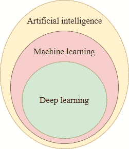
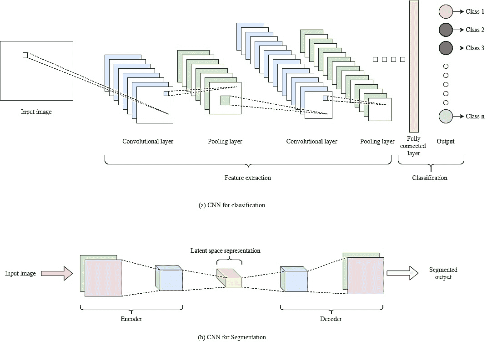
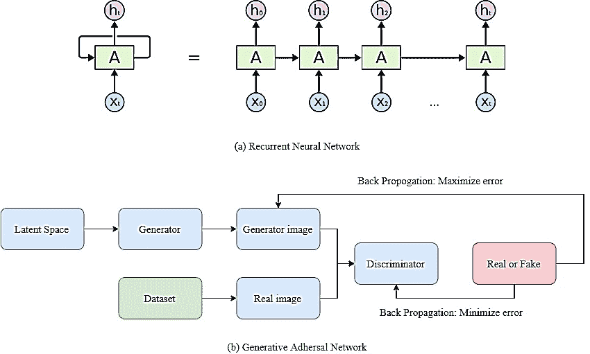

<!--yml

分类：未分类

date: 2024-09-06 19:52:34

-->

# [2107.14037] 医学与药物发现中智能系统构建的机器学习和深度学习方法：综合调查

> 来源：[`ar5iv.labs.arxiv.org/html/2107.14037`](https://ar5iv.labs.arxiv.org/html/2107.14037)

# 医学与药物发现中智能系统构建的机器学习和深度学习方法：综合调查

Jignesh Chowdary G Suganya G suganya.g@vit.ac.in Premalatha M Asnath Victy Phamila Y Karunamurthy K Vellore Institute of Technology Chennai, Tamilnadu, India

###### 摘要

随着计算机技术的进步，智能系统的发展迅速，这些系统能够理解数据中的复杂关系，从而进行预测和分类。基于人工智能的框架正在迅速革新医疗保健行业。这些智能系统依靠机器学习和深度学习的强大模型进行疾病的早期诊断，并为一线临床医生和外科医生提供了一种有前景的补充诊断方法。基于机器学习和深度学习的系统可以简化和优化从临床和基于图像的数据中诊断疾病的步骤，从而显著支持临床医生并优化工作流程。它们模仿人类认知，甚至能够诊断出无法通过人类智慧诊断的疾病。本文重点调查了机器学习和深度学习在 16 个医学专业中的应用，包括牙科医学、血液学、外科、心脏病学、呼吸病学、骨科、放射学、肿瘤学、内科、精神病学、内分泌学、神经病学、皮肤病学、肝病学、肾病学、眼科和药物发现。本文除了调查外，还讨论了这些系统在医学实践中的进展以及它们对医疗专业人员的影响。

###### 关键词：

\KWDMachine learning, Deep learning, Medical specialities, Optimization, Complex diseases, Neural networks, CNN for healthcare, Healthcare Datasets.^†^†期刊：医学图像分析

## 1 背景

机器学习和深度学习是人工智能的子集，如图 1 所示，这些技术在这些年里经历了快速发展。这些技术已被证明在各个医学专业的疾病诊断中非常有效。

图 1：AI、ML 和 DL

### 1.1 机器学习

机器学习技术是用于对给定数据进行预测和分类的统计模型。机器学习模型根据学习技术的类型分为监督学习和无监督学习[6]。在监督学习[105]中，机器学习模型通过与已知输出相关的一组输入数据（或特征）进行训练。一旦机器学习模型的训练成功，它就能够对新数据进行预测。监督学习算法做出的预测可以是连续的或离散的。一些监督学习算法的例子包括随机森林、决策树、逻辑回归、K 近邻和支持向量机[67, 113, 76, 71]。这些技术用于诊断糖尿病、甲状腺病、糖尿病视网膜病、心肌病等疾病。另一方面，无监督技术在没有任何标签（或结果）的输入数据上运行。这些算法的主要目标是识别未标记数据集中的未定义模式。这些技术主要用于通过从数据中提取重要特征来减少数据集的维度。通过减少特征的数量，可以避免如高计算成本和多重共线性等问题[26]。一些最常用的无监督学习算法是潜在狄利克雷分析和主成分分析。

### 1.2 深度学习

深度学习是机器学习广泛领域的一个子集。深度学习模型在解决图像分类和自然语言处理相关问题上取得了成功。这些深度学习算法[53]基于神经网络，这些网络具有多个层，用于提取高级特征和去除问题特征，因此深度学习算法的性能优于机器学习算法。一些广泛使用的深度学习架构[104]包括卷积神经网络（CNN）、递归神经网络（RNN）和生成对抗神经网络（GAN）。卷积神经网络[4]主要用于解决计算机视觉和图像分类任务。与完全连接的神经网络相比，CNN 减少了参数的数量。卷积神经网络用于器官分割、肿瘤识别以及从放射图像中分类各种癌症。CNN 在分类和分割中的基本结构如图 2 所示。

图 2：用于分类和分割的基本 CNN 架构。

RNN（循环神经网络）用于解决音频识别和自然语言处理问题。RNN’s [45] 可用于序列数据分析，因为它们显示出时间动态行为。RNN 的这一特性可用于辅助分数放射治疗。GAN（生成对抗网络）是生成模型 [130]，在给定训练数据集时，这些模型能够生成具有与训练数据相同统计特征的新数据。GAN 通过其鉴别器和生成器之间的对抗竞争进行学习。GAN 主要用于医学图像合成和训练数据的图像增强，以避免过拟合和数据稀缺等问题。RNN 和 GAN 的基本结构如图 3 所示。

图 3：循环神经网络和生成对抗网络的基本结构。

本文介绍了各种机器学习（ML）和深度学习（DL）模型的调查，这些模型可以用于构建智能系统，以诊断医疗保健中 16 个医学专业的各种疾病。除了这 16 个医学专业外，我们还介绍了药物发现中的 ML 和 DL 模型。本文考虑的 16 个医学专业包括牙科医学、血液学、外科、心脏病学、肺病学、骨科、放射学、肿瘤学、内科、精神病学、内分泌学、神经学、皮肤科、肝脏病学、肾脏病学和眼科学。除了调查，我们还讨论了基于机器学习和深度学习的诊断系统在医学领域的进展，以及这些系统对医学专业人员的影响。论文的其余部分组织如下：第二部分描述了调查方法，第三部分描述了文献综述，第四部分讨论了这些方法的影响，第五部分总结了工作，第六部分则提出了未来工作的建议。

## 2 调查方法

本文调查的文章均发表在 IEEE、Elsevier、ACM 和 Springer 的高质量会议和期刊上。用于搜索这些文章的术语包括机器学习、深度学习、牙科医学、血液学、外科、心脏病学、肺病学、骨科、放射学、肿瘤学、内科、精神病学、内分泌学、神经学、皮肤科、肝脏病学、肾脏病学、眼科学和药物发现。本文调查的文章直接与机器学习和深度学习在医学和药物发现中的应用主题相关。对于本工作，考虑了与上述主题相关的实证和综述文章。

## 3 文献综述

### 3.1 牙科医学

表 1 展示了一些研究人员用于诊断牙科疾病的流行方法。[87] 使用机器学习方法对三种不同疾病进行分类，即龋齿、周期性感染和牙周炎。作者考虑了 251 张放射视频影像（RVG） X 光图像用于分类，其中 80 张图像为龋齿，110 张图像为周期性感染，61 张图像为牙周炎。建立了三种模型，它们是卷积神经网络（CNN）、使用 VGG16 作为特征提取器的 CNN 迁移学习以及带有微调的 CNN 迁移学习模型。[116] 设计了一个基于模糊规则的模型来诊断牙科疾病。在该模型中，使用了不同的特征提取方法；它们是熵、边缘值、强度、局部二值模式、梯度特征、红绿蓝和补丁级别特征。这些提取的特征用于建立数据库。为此工作，使用了模糊 c-means 聚类和 Mamdani 的模糊接口方法。[119] 使用机器学习算法来优化牙科铣削过程。在本文中，设计了两种具有贝叶斯正则化和早期停止技术的前馈网络模型。使用贝叶斯正则化构建的前馈网络的人工神经网络结构有两层，第一层具有 5 个双曲目标单元，第二层具有 30 个隐藏的双曲目标单元和一个输出单元。使用早期停止技术构建的第二个前馈网络结构与第一个模型相同，但这两个网络分别使用 Lenvenberg-Marquardt 方法和拟牛顿方法进行估算。这些模型的性能见表 1。

表 1：牙科医学中的 ML 和 DL 方法。

| 作者 | 方法 | 诊断/应用 | 指标 | 发现 |
| --- | --- | --- | --- | --- |
| [87] | CNN | 龋齿、周期性感染和牙周炎 | 准确率 | 0.7307 |
| 迁移学习 | 0.8846 |

|

&#124; 细化的迁移学习 &#124;

&#124; 调优 &#124;

| 0.8846 |
| --- |
| [116] | 模糊接口系统 | 牙科 X 光异常 | 均方误差 | 0.2445 |
| 平均绝对误差 | 0.1264 |
| 准确率 | 90.29% |
| [119] |

&#124; 前馈网络 &#124;

&#124; 早期停止 &#124;

| 牙科矿工过程的优化 | 归一化均值误差 | 89.95% |
| --- | --- | --- |

|

&#124; 前馈网络 &#124;

&#124; 贝叶斯正则化 &#124;

| 归一化均值误差 | 87.98% |
| --- | --- |

### 3.2 血液学

血液相关疾病的诊断非常复杂且耗时。血液学家使用机器学习技术以较少的时间准确诊断疾病。[78] 使用机器学习分类技术构建了一个自动化的血液计数系统模型。图像的分割使用了轮廓模型，即蛇形模型和气球模型。分类时考虑了基于纹理和形状的特征。使用了四种机器学习分类器进行分类，它们是 K-最近邻、线性向量量化、多层感知器和支持向量机。这些分类器的准确性如表 LABEL:tb2 所示。[85] 提出了机器学习在血栓分割和跟踪中的应用。Adaboost 和决策树模型用于分割，而 K-最近邻算法用于跟踪。这些分类算法通过 Dice 系数进行评估，正预测值和跟踪方法也通过 Dice 系数进行评估。[46] 提出了使用机器学习分类镰状细胞病。在这项工作中，对各种机器学习算法的性能进行了分析，如表 2 所示，其中莱文伯格-马夸特和随机森林算法产生了优异的结果。

表 2: 血液学中的 ML 和 DL 方法。

| 作者 | 方法 | 诊断/应用 | 评价指标 | 结果 |
| --- | --- | --- | --- | --- |
| [78] | K-最近邻 | 自动化血液计数系统 | 准确率 | 81% |
| 线性向量量化 | 准确率 | 83% |
| 多层感知器 | 准确率 | 90% |
| 支持向量机 | 准确率 | 91% |
| [85] | 决策树 | 血栓 | Dice 系数 | 0.89 ±0.02 |
| 正预测值 | 0.94 ±0.04 |
| Ada Boost | Dice 系数 | 0.87 ±0.02 |
| 正预测值 | 0.90 ±0.05 |
| 跟踪 | 正预测值 | 0.94 ±0.05 |
| [46] | 随机预言机模型 | 镰状细胞病 | 准确率 | 53.9% |
|  |  | ROC 曲线下面积 | 0.524 |
|  |

&#124; 莱文伯格-马夸特 &#124;

&#124; 学习算法 &#124;

|  | 准确率 | 99.2% |
| --- | --- | --- |
|  |  |  | ROC 曲线下面积 | 0.991 |
|  |

&#124; 可训练决策树 &#124;

&#124; 分类器 &#124;

|  | 准确率 | 92.1% |
| --- | --- | --- |
|  |  |  | ROC 曲线下面积 | 0.95 |
|  |

&#124; 随机森林，决策 &#124;

&#124; 树集合分类器 &#124;

|  | 准确率 | 91.5% |
| --- | --- | --- |
|  |  |  | ROC 曲线下面积 | 0.961 |
|  |

&#124; 莱文伯格-马夸特 &#124;

&#124; 学习算法和 &#124;

&#124; 随机森林，结合 &#124;

&#124; 使用莱文伯格神经网络 &#124;

&#124; 网络 &#124;

|  | 准确率 | 99.2% |
| --- | --- | --- |
|  |  |  | ROC 曲线下面积 | 0.988 |
|  |

&#124; 莱文伯格-马夸特 &#124;

&#124; 学习神经网络 &#124;

&#124; 和随机森林， &#124;

&#124; 使用 Fischer 结合 &#124;

&#124; 判别分析 &#124;

|  | 准确度 | 98.9% |
| --- | --- | --- |
|  |  |  | ROC 曲线下面积 | 0.995 |
|  | 功能链接神经网络 |  | 准确度 | 96.2% |
|  |  |  | ROC 曲线下面积 | 0.972 |
|  | 线性组合网络 |  | 准确度 | 84% |
|  |  |  | ROC 曲线下面积 | 0.849 |

### 3.3 手术

机器学习技术被用作术后规划的决策支持系统以及许多关键手术的导航系统。为了了解膝关节植入物在手术后的功能，[49] 使用机器学习技术构建了统计模型。本文提出的模型的映射函数是使用手术前后特征构建的，这些特征通过主成分分析从临床数据库中提取。评估结果如表 3 所示。为了避免手术过程中的并发症并缩短患者的恢复时间，外科医生们正在进行最小侵入性手术。大多数最小侵入性手术是使用机器人进行的。为了在操作机器人时避免震颤，[60] 提出了一个使用机器学习减轻震颤的方法。该方法基于使用粒子群优化技术优化参数，并建立一个具有集成核的混合支持向量机来减轻震颤。镫骨切开术是一种改善听力的外科手术，需要估计镫骨的厚度，这通常通过在骨头上钻孔完成。[44] 使用机器学习技术进行厚度估计。为此，作者使用了一种称为模糊格子神经计算的机器学习方案。在复杂创伤手术中，外科医生们正在使用增强现实来理解解剖结构、工具和植入物之间的关系。Olivier [84] 提出了一个使用增强现实提高手术场景理解的模型。为此工作，使用随机森林识别场景中的对象，并使用对象特定的查找表创建了像素级的α图进行图像融合。该模型的数据来自 C 臂设备与 Kinect RGB-深度传感器。[70] 使用了 K-近邻、朴素贝叶斯和感知机算法等机器学习算法，并采用不均匀边界来分类半结构化和非结构化病理报告。他强调，使用二元出现类型词向量、停用词过滤和剪枝的 K-近邻算法在分类半结构化报告中表现出高准确率。

表 3：手术中的 ML 和 DL 方法。

| 作者 | 方法 | 诊断/应用 | 指标 | 发现 |
| --- | --- | --- | --- | --- |
| [49] |

&#124; 统计运动学 &#124;

&#124; 模型 &#124;

|

&#124; 理解功能 &#124;

&#124; 膝关节植入物的 &#124;

&#124; 手术 &#124;

|

&#124; 平均相关性 &#124;

&#124; 系数 &#124;

| 0.79 |
| --- |
|  |  |  |

&#124; 平均值 &#124;

&#124; 均方根误差 &#124;

| 3.44 mm |
| --- |
| [70] |

&#124; K-最近邻算法 &#124;

&#124; 二进制算法 &#124;

&#124; 出现类型词 &#124;

&#124; 向量，停用词 &#124;

&#124; 过滤和剪枝 &#124;

|

&#124; 非结构化数据分类 &#124;

&#124; 病理报告 &#124;

| 准确度 | 99.4% |
| --- | --- |

### 3.4 心脏病学

心血管疾病是威胁生命的疾病，需要高度的准确性和精确度进行诊断。机器学习提高了疾病诊断的准确率。[40] 描述了使用机器学习来监测患有心血管疾病的患者。[1] 提出了应用深度神经网络从心电图（ECG）信号中检测心肌梗塞（心脏病发作）。用于这项工作的神经网络包含 11 个卷积层，其中六个层由整流线性单元（ReLU）激活函数激活，最后一层由 Soft-max 函数激活，所使用的池化函数是最大池化。结果的评估针对数据集中的有噪声和无噪声的心跳信号进行。Peshala [110] 提出了一个新方法，通过使用统计模型和监督算法来检测保留射血分数的心力衰竭。这项工作的数据通过 KNNimpute 方法进行预处理，并为静息和运动的时空表示构建了三个主成分分析模型，使用距离加权的最近邻算法进行诊断。[5] 对使用机器学习网络结构诊断糖尿病和心血管疾病进行了比较分析。根据这一分析，使用 Levenberg-Marquardt 学习算法（LMLA）和朴素贝叶斯网络构建的网络比 2008 年到 2017 年间考虑的其他模型具有更好的准确性。肥厚型心肌病（HCM）是一种慢性心脏疾病，会导致心肌增厚并限制血液流动。[91] 提出了一种从 10 秒、12 导联心电图（ECG）信号中检测肥厚型心肌病的方法。在这项工作中，特征通过信息增益准则选择，使用随机森林和支持向量机进行诊断。[25] 提出了使用机器学习技术诊断患者心脏病的方法。这项工作的数据被预处理以适合分类。使用了包括逻辑回归、随机森林、梯度提升、支持向量机和朴素贝叶斯在内的五种机器学习算法对数据进行分类。这些分类器的准确率在表 4 中列出，其中逻辑回归的准确率最高。[22] 提出了基于集成投票的心脏疾病诊断集成学习方法。该方法基于逻辑回归、人工神经网络、高斯朴素贝叶斯、随机森林和 K 最近邻算法的集成投票。他们的模型达到了 89% 的准确率，91.6% 的精确度，86% 的灵敏度和 91% 的特异性。动脉粥样硬化是心血管疾病如心脏病发作的主要因素。[127] 提出了一种新方法，重点在于从不同阶段的颈动脉粥样硬化中检测导致心血管疾病的风险因素。该方法着重于使用决策树算法结合神经网络、逻辑回归和支持向量机进行准确预测。地震心动图信号用于研究心肺交互作用。[31] 使用 k 均值聚类结合时间域幅度特征对地震心动图信号进行聚类。单光子发射计算机断层扫描（SPET）成像是一种使用伽马射线捕捉心脏功能的核成像技术。[14] 使用机器学习将临床信息和 SPET 成像数据结合起来，以预测主要不良心脏事件（MACE）。[88] 提出了用于康复评估的机器学习应用。处理了热量和心率数据，并使用具有 Sigmoid 和概率传输函数的神经网络进行评估。

表 4: 心脏病学中的 ML 和 DL 方法。

| 作者 | 方法 | 诊断/应用 | 指标 | 发现 |
| --- | --- | --- | --- | --- |
| [1] | 卷积神经网络 | 心肌梗死 | 准确率 |

&#124; 噪声干扰的 beats: 93.53 &#124;

&#124; 无噪声干扰的 beats: 95.22 &#124;

|

| 灵敏度 |
| --- |

&#124; 噪声干扰的 beats: 93.71 &#124;

&#124; 无噪声干扰的 beats: 95.49 &#124;

|

| 特异性 |
| --- |

&#124; 噪声干扰的 beats: 92.83 &#124;

&#124; 无噪声干扰的 beats: 94.19 &#124;

|

| [110] | 统计模型和距离加权最近邻 (DWNN) | 心力衰竭 | 灵敏度 | 86% |
| --- | --- | --- | --- | --- |
| 特异性 | 82% |
| ROC 曲线下面积 | 0.89 |
| 准确率 | 85% |
| [5] | 带有 Levenberg-Marquardt 学习算法的多层前馈神经网络。 | 一般糖尿病和心血管疾病 | 准确率 | 87.29%(糖尿病) |

|

&#124; 89.38% &#124;

&#124; (心血管疾病) &#124;

|

| 朴素贝叶斯网络 | 99.51%(糖尿病) |
| --- | --- |

|

&#124; 97.52% &#124;

&#124; (心血管疾病) &#124;

|

| [91] | 对于随机森林和支持向量机 | 肥厚型心肌病 | 精确度 | 0.84 |
| --- | --- | --- | --- | --- |
| 召回率 | 0.89 |
| 特异性 | 0.93 |
| F-测量 | 0.86 |
| [25] | 逻辑回归 | 一般心脏病 | 准确率 | 0.8651685 |
| 随机森林 | 0.8089888 |
| 朴素贝叶斯 | 0.8426966 |
| 梯度提升 | 0.8426875 |
| 支持向量机 | 0.7977528 |
| [22] | 逻辑回归、人工神经网络、高斯朴素贝叶斯、随机森林和 K 最近邻的集成投票。 | 一般心脏病 | 准确率 | 89% |
| 精确度 | 91.6% |
| 灵敏度 | 86% |
| 特异性 | 91% |
| [127] |

&#124; 支持下的决策树算法 &#124;

&#124; 向量机，&#124;

&#124; 逻辑回归和神经网络 &#124;

| 颈动脉粥样硬化 | 准确率 | 87.2% |
| --- | --- | --- |

### 3.5 呼吸科

呼吸系统疾病是非常复杂的疾病，不仅影响肺部，还影响身体其他器官。提前预测这些疾病可以减少治疗过程中的并发症。许多研究人员使用机器学习技术进行呼吸系统疾病的诊断。急性疾病如呼吸窘迫综合症（ARDS）是通过机器学习进行诊断的 [92]。在这项工作中，构建了四种不同版本的支持向量机。根据准确率和 ROC 曲线下面积来评估这些算法的性能，如表 5 所示。音频听诊是专家在看到病人时进行的主要检查方法。音频听诊被认为是检测心脏和肺部异常的最佳初步方法。[18] 进行了一种使用音频听诊检测呼吸系统疾病的方法。在这种方法中，使用自动声音提取器从 ICBHI-2017 挑战数据库中提取特征，并使用提升决策树算法来检测呼吸系统疾病的声音。[80] 进行了一项使用支持向量机和 K 近邻算法从肺部声学信号中诊断呼吸病理学的研究。[93] 进行了一项比较研究，通过使用从心电图导出的呼吸信号（EDR）和呼吸胸部信号来检测阻塞性睡眠呼吸暂停。建立了三个模型，即支持向量机、线性判别分析和极限学习机。通过呼吸胸部信号训练时，这三个模型以高准确率诊断疾病。[131] 使用地震心动图周期来识别呼吸阶段，如吸气和呼气，并利用机器学习进行分析。为建立该模型，采用了支持向量机，并使用了由不列颠哥伦比亚省卫生当局批准的 50%的数据进行训练。[33] 提出了一个名为 FissureNet 的新方法，从计算机断层扫描（CT）图像中检测肺裂。该 FissureNet 是由两个 Seg3DNet 神经网络算法组成的精细级联源。与使用 U-Net 架构和 Hessian 矩阵构建的模型相比，所提出的方法达到了更高的准确率。

表 5：肺病学中的机器学习和深度学习方法。

| 作者 | 方法 | 疾病 | 评估指标 | 结果 |
| --- | --- | --- | --- | --- |
| [92] | 带有类别加权成本函数的随机采样支持向量机 | 呼吸窘迫综合症 | 准确率 | 0.7478 |

|

&#124; 曲线下面积 &#124;

&#124; ROC 曲线 &#124;

| 0.7703 |
| --- |
| 带有类别加权成本函数且没有任何采样的支持向量机 | 准确率 | 0.7094 |

|

&#124; 曲线下面积 &#124;

&#124; ROC 曲线 &#124;

| 0.7122 |
| --- |
| 带有标签不确定性随机采样的支持向量机 | 准确率 | 0.7698 |

|

&#124; 面积 &#124;

&#124; ROC 曲线 &#124;

| 0.7989 |
| --- |
| 带标签不确定性的支持向量机无任何采样 | 准确性 | 0.7188 |

|

&#124; 面积 &#124;

&#124; ROC 曲线 &#124;

| 0.7431 |
| --- |
| [18] | 提升型决策树 |

&#124; 呼吸异常 &#124;

&#124; 从音频听诊 &#124;

| 准确性 | 85% |
| --- | --- |
| [131] | 支持向量机 |

&#124; 呼吸阶段识别 &#124;

&#124; （吸气和呼气） &#124;

| 准确性 | 88.4% |
| --- | --- |
| [33] |

&#124; FissureNet &#124;

&#124; （粗到细的两个 Seg3DNets 级联） &#124;

| 肺裂 |
| --- |

&#124; 面积 &#124;

&#124; 精确度 &#124;

&#124; 召回曲线 &#124;

| 0.991 |
| --- |

### 3.6 骨科

骨质疏松症、关节炎等疾病的风险通过机器学习进行预测。[48] 提出了骨质疏松症风险评估的方法。在该方法中，使用支持向量机进行风险评估，并且该方法在韩国政府调查的数据集上进行了测试。[66] 提出了从 X 光图像中诊断类风湿关节炎的方法。使用支持向量机及方向梯度直方图进行诊断。表 6 展示了检测指关节、侵蚀估计和关节间隙变窄（JSN）模型的准确性。[15] 提出了从 X 光图像中评估骨密度的方法。在该方法中，传统的 GoogleNet 卷积神经网络通过增加大量滤波器并结合多层感知器进行修改。该修改后的神经网络的结果优于传统神经网络。

表 6：骨科中的机器学习和深度学习方法。

| 作者 | 方法 | 诊断/应用 | 指标 | 结果 |
| --- | --- | --- | --- | --- |
| [48] | 支持向量机 | 骨质疏松症的风险评估 | ROC 曲线下面积 | 0.827 |
| 准确性 | 76.7% |
| 灵敏度 | 77.8% |
| 特异性 | 76.0% |
| [66] | 支持向量机 | 类风湿关节炎 | 准确性 |

&#124; 81.4% &#124;

&#124; （检测指关节） &#124;

|

|

&#124; 50.09 &#124;

&#124; （侵蚀估计） &#124;

|

|

&#124; 64.3% &#124;

&#124; （JSN 评分） &#124;

|

| [15] |
| --- |

&#124; 修改版 GoogleNet &#124;

&#124; 卷积神经网络 &#124;

| 骨密度评估 | 准确性 | 91.3% |
| --- | --- | --- |

### 3.7 放射学

放射学处理许多疾病的准确、精确的诊断和治疗。[55] 使用机器学习算法进行肺癌肿瘤的门控与追踪。在这项工作中，使用主成分分析和带有反向传播算法的神经网络进行门控，使用人工神经网络进行追踪。结果见表 7。[112] 比较了三种卷积神经网络架构，即 GoogleNet、InceptionV3 和 ResNet50，用于检测胸部 X 光片中的异常。该工作使用了斯坦福正常放射学诊断数据集中的图像，并在训练 CNN 模型之前进行了直方图均衡化预处理。[17] 提出了从 X 光图像中检测骨折的方法。在这项工作中，融合了多种特征以建立堆叠随机森林模型，用于检测骨折。这种堆叠随机森林与支持向量机相比表现出增强的性能。[74] 使用机器学习分类器和主动学习方法来分类放射学报告。在这项工作中，分析了自信、简单、平衡 EE 和核最远点等四种主动学习方法，以提升支持向量机分类器在报告分类中的性能。使用规则基预处理方法对数据进行预处理。[123] 进行了一项关于使用机器学习对恶性和良性微钙化进行分类的研究。在这项工作中，研究了五种不同的机器学习和深度学习算法，即支持向量机、核 Fisher 判别、相关向量机、前馈神经网络和 Ada Boost，并评估了它们的性能。分类器的性能在表 7 中描述。[126] 使用机器学习从乳腺 X 光图像中检测乳腺癌。该方法建立了一个三层前馈神经网络，并使用反向传播算法进行乳腺癌检测。这个神经网络在由经验丰富的放射科医师提取的乳腺 X 光特征上进行训练。Jakub [77] 使用神经网络方法对骨科创伤 X 光片中的异常进行诊断。考虑了来自 Caffe 库的五个开放网络，并进行了 13 个周期的再训练。所有网络的性能相似，准确率达到 90。

表 7：放射学中的机器学习和深度学习方法。

| 作者 | 方法 | 应用/诊断 | 指标 | 发现 |
| --- | --- | --- | --- | --- |
| [55] |

&#124; 主成分分析与 &#124;

&#124; 人工神经网络（门控） &#124;

| 肺癌肿瘤的门控与追踪 | 精度 | 96.5 |
| --- | --- | --- |
| 人工神经网络（追踪） | 平均定位误差 | 2.1 像素 |

|

&#124; 在 95% 时的最大误差 &#124;

&#124; 信心水平 &#124;

| 4.6 像素 |
| --- |
| [112] | 带有 GoogLeNet 架构的 CNN | 胸部 X 光异常检测 | 准确率 | 0.8 |
| F1 分数 | 0.66 |
| cite{t61} | 堆叠随机森林特征融合。 | 骨折 | 精确度 | 24.7% |
| [74] | 支持向量机 | 放射科报告分类 | 敏感性 | 98.25% |
| 特异性 | 96.14% |
| [123] | 支持向量机 | 恶性和良性微钙化 | 标准差 | 0.0259 |
| 核 Fisher 判别分析 | 标准差 | 0.0254 |
| 相关向量机 | 标准差 | 0.0243 |
| 前馈神经网络 | 标准差 | 0.0266 |
| Ada Boost | 标准差 | 0.0268 |
| [126] | 人工神经网络 | 乳腺癌 | ROC 曲线下面积 | 1 |

### 3.8 一般医学

计算机辅助诊断用于根据患者的症状诊断疾病。一般医学中的机器学习模型调查见表 9\. [t74] 提出了提高计算机诊断系统性能的机器学习方法。为此，使用了一种名为 co-Forest 的半监督学习算法。[68] 提出了一个用于诊断发热的模型。该模型使用了 Naive Bayes 算法和 Dempster Shafer 理论构建。登革出血热是一种致命疾病，主要存在于亚洲南部。[69] 提出了一个用于评估该疾病风险水平的机器学习模型。通过极限学习机预测疾病的风险水平。为避免吸入性肺炎，[41] 开发了一个使用机器学习技术的吞咽评估模型。特征通过线性预测编码提取，使用支持向量机对吞咽困难的患者进行分类。[54] 使用卷积神经网络诊断疟疾。神经网络的性能优于支持向量机。

表 8: 一般医学中的 ML 和 DL 方法。

| 作者 | 方法 | 应用/诊断 | 指标 | 发现 |
| --- | --- | --- | --- | --- |
| [68] |

&#124; Dempster Shafer 与 Naive &#124;

&#124; 贝叶斯 &#124;

| 发热 | 准确率 | 56.25% |
| --- | --- | --- |
| [69] | 极限学习机 | 登革出血热 | 平均绝对误差 | 0.08698 |

|

&#124; 平均绝对误差 &#124;

&#124; 百分比误差 &#124;

| 3.00536 |
| --- |
| [41] | 线性预测编码的支持向量机 | 吞咽困难 | 敏感性 | 82.4% |
| 特异性 | 86% |
| [54] | 卷积神经网络 | 疟疾 | 准确率 | 97.37% |
| 敏感性 | 96.99% |
| 特异性 | 97.75% |
| F1 分数 | 97.36% |
| 精确度 | 97.73% |

|

&#124; Matthews 相关系数 &#124;

&#124; 系数 &#124;

| 94.75% |
| --- |

### 3.9 肿瘤学

疾病如癌症需要准确的预测来进行诊断和治疗。一项比较研究由[102]进行，研究了使用机器学习来诊断宫颈癌。本研究分析了各种现有的机器学习模型。[117] 对使用机器学习进行癌症诊断进行了分析。研究了如 Xgboost、Deepboost、BoostI 和支持向量机等机器学习技术。这些算法的表现显示在表 8 中。[52] 提出了一个使用遗传算法诊断乳腺癌的模型。这种遗传算法的准确率达到了 97.2%。[34] 提出了从 CT 结肠造影图像中检测结肠癌的方法。采用了方向梯度直方图来提取特征，并使用全连接神经网络进行诊断。卷积神经网络在诊断中表现优于其他现有算法。许多男性因前列腺癌而死于癌症。[115] 开发了一个神经网络模型，从多参数 MRI 扫描图像中检测前列腺癌。该卷积神经网络具有 5 层卷积层，并根据 ROC 曲线下面积进行评估。[101] 应用了机器学习和深度学习技术来对癌症样本进行分类。此项工作中使用了带反向传播算法的前馈神经网络和支持向量机来进行数据的聚类和分类。[10] 使用神经网络方法从胸部 X 射线图像中检测肺癌。该工作中使用了 121 层神经网络和迁移学习方法来建立模型。模型在三个不同数据集上的表现显示在表 8 中。[42] 使用机器学习技术预测放射肿瘤科患者的等待时间。该研究分析了四种不同的算法，即支持向量机、线性回归、随机森林和决策树。与其他三种算法相比，随机森林算法表现最佳。

表 9: 肿瘤学中的机器学习和深度学习方法。

| 作者 | 方法 | 诊断/应用 | 评价指标 | 发现 |
| --- | --- | --- | --- | --- |
| [117] | Xgboost | 甲状腺癌、结肠癌和肝癌 |

&#124; 平均值 &#124;

&#124; 曲线下面积 &#124;

|

&#124; 甲状腺结节: 0.811 &#124;

&#124; 结肠: 0.872 &#124;

&#124; 肝脏: 0.797 &#124;

|

| AMACC |
| --- |

&#124; 甲状腺结节: 0.798 &#124;

&#124; 结肠: 0.857 &#124;

&#124; 肝脏: 0.775 &#124;

|

| 支持向量机 |
| --- |

&#124; 平均值 &#124;

&#124; 曲线下面积 &#124;

|

&#124; 甲状腺结节: 0.750 &#124;

&#124; 结肠: 0.897 &#124;

&#124; 肝脏: 0.897 &#124;

|

| AMACC |
| --- |

&#124; 甲状腺结节: 0.726 &#124;

&#124; 结肠: 0.890 &#124;

&#124; 肝脏: 0.895 &#124;

|

| DeepBoost |
| --- |

&#124; 平均值 &#124;

&#124; 曲线下面积 &#124;

|

&#124; 甲状腺结节: 0.758 &#124;

&#124; 结肠: 0.822 &#124;

&#124; 肝脏: 0.791 &#124;

|

| AMACC |
| --- |

&#124; 甲状腺结节: 0.744 &#124;

&#124; 结肠: 0.833 &#124;

&#124; 肝脏: 0.786 &#124;

|

| Boost I |
| --- |

&#124; 平均值 &#124;

&#124; 曲线下面积 &#124;

|

&#124; 甲状腺结节: 0.500 &#124;

&#124; 结肠: 0.500 &#124;

&#124; 肝脏: 0.500 &#124;

|

| AMACC |
| --- |

&#124; 甲状腺结节: 0.658 &#124;

&#124; 结肠: 0.694 &#124;

&#124; 肝脏: 0.652 &#124;

|

| [52] | 遗传算法 | 乳腺癌 | 准确度 | 97.2% |
| --- | --- | --- | --- | --- |
| [34] | 卷积神经网络 | 结肠癌 | 准确度 |

&#124; 结肠检测: 87.03% &#124;

&#124; 结肠息肉检测: 88.56 &#124;

|

| 灵敏度 | 结肠息肉检测: 88.77% |
| --- | --- |
| 特异性 | 结肠息肉检测: 87.35% |
| cite{t70} | 深度卷积神经网络 | 前列腺癌 | ROC 曲线下面积 | 0.903±0.009 |
| [101] |

&#124; 前馈网络和 &#124;

&#124; （聚类）&#124;

| 癌症类型分类 | 准确度 | 87.51（针对 100 个样本） |
| --- | --- | --- |
| 支持向量机（分类） | 准确度 | 93.57（针对 100 个样本） |
| [10] | 121 层密集连接卷积网络 | 肺癌 | 平均准确度 | 74.43±6.01% |
| 平均特异性 | 74.96±9.85% |
| 平均灵敏度 | 74.68±15.33% |
| [42] | 随机森林回归器 | 预测患者等待时间 | 中位数绝对误差 [分钟] | 3.3 |
| 平均绝对误差 [分钟] | 4.6 |
| 标准差误差 [分钟] | 6.1 |
| R 平方值 | 0.47 |

### 3.10 精神病学

精神疾病是世界范围内数百万人正在遭受的常见健康问题。机器学习和深度学习有助于根据来自许多来源的数据诊断抑郁等问题。调查了用于诊断精神疾病的模型如表 10 所示。一种方法由[125]提出，根据社交网络站点的数据对抑郁症患者进行分类。多层神经网络被用于对社交网络数据中的抑郁症患者进行分类。另一种方法由[9]提出，利用深度学习来分类抑郁症。对于这种方法，利用粒子群优化算法进行特征提取，并且采用基于投影的元认知神经网络用于分类。一项研究由[94]进行，利用机器学习诊断 2 型糖尿病患者的抑郁症。对于这项研究，建立了四种机器学习算法，即 K 均值、模糊 C 均值、概率神经网络和支持向量机。与其余的算法相比，支持向量机的表现更好。为了检测压力，[109]提出了一个机器学习框架。使用逻辑回归模型从心电图信号中诊断不同程度的压力。精神疾病在新生儿中很常见，这是从抑郁症家长那里遗传下来的。[56]进行了一项研究，利用机器学习和深度学习从 MRI 扫描中检测患者的家族性抑郁症。在这项研究中，分析了逻辑回归、图卷积神经网络和支持向量机。[96]比较了各种机器学习算法，以诊断患者中的抑郁症和焦虑症。评估了五种不同的分类器，即逻辑回归、随机森林、CatBoost、朴素贝叶斯和支持向量机。[82]进行了一项关于利用机器学习构建检测心理压力系统的综合调查。在这项调查中，讨论了常见的特征选择方法。[32]进行了一项关于利用随机森林和神经网络根据运动活动分类患者的抑郁症的比较研究。与神经网络相比，随机森林的性能更好。[39]开发了一种混合模型，使用机器学习技术从脑波中预测学习者的情绪状态。WEKA 软件用于这种方法，并且情绪状态是使用 K 最近邻算法进行预测。

表 10：精神病学中的机器学习和深度学习方法。

| 作者 | 算法 | 应用/诊断 | 指标 | 发现 |
| --- | --- | --- | --- | --- |
| [9] |

| 元认知神经网络 |

| 使用网络 |

| 基于投影的学习 |

| 框架和粒子 |

&#124; 蜂群优化 &#124;

|

&#124; 分类 &#124;

&#124; 抑郁症 &#124;

| 效率 | 85.94% (平均) |
| --- | --- |
|  |  |  |  | 89.4% (总体) |
|  |  |  | 敏感性 | 74.11% (平均) |
|  |  |  |  | 96.55% (平均) |
| [94] | 支持向量机 | 抑郁症 | 准确率 | 96.475 |
|  | 模糊 C_MEAN |  |  | 95.455 |
|  | 概率神经网络 |  |  | 93.75 |
|  | K-Means |  |  | 87.879 |
| [109] | 逻辑回归分类器 | 压力 | 准确率 |

&#124; 94.6% 对于 &#124;

&#124; 两级识别 &#124;

|

|  |  |  |  |
| --- | --- | --- | --- |

&#124; 83.4% 对于 &#124;

&#124; 多级识别 &#124;

|

| [56] |
| --- |

&#124; 带正则化的逻辑回归 &#124;

&#124; 正则化 &#124;

| 熟悉的抑郁症 | 准确率 | 97.78% |
| --- | --- | --- |
|  | 支持向量机 |  |  | 93.67% |
|  |

&#124; 图卷积神经网络 &#124;

&#124; 网络 &#124;

|  |  | 89.58% |
| --- | --- | --- |
| [96] | CatBoost | 抑郁症和焦虑 | 准确率 | 89.3% |
|  | 逻辑回归 |  |  | 87.5% |
|  | 支持向量机 |  |  | 82.1% |
|  | 朴素贝叶斯 |  |  | 82.1% |
|  | 随机森林 |  |  | 78.6% |
| [82] | 随机森林 | 压力 | F1-得分 | 73% |
|  |  |  |

&#124; 马修斯相关系数 &#124;

&#124; 系数 &#124;

| 0.44 |
| --- |
|  | 神经网络 |  | F1-得分 | 69% |
|  |  |  |

&#124; 马修斯相关系数 &#124;

&#124; 系数 &#124;

| 0.35 |
| --- |
| [32] | K-最近邻 | 抑郁症 | 精确率 | 79.2% - 84% |
|  |  |  | 召回率 | 78.7% - 82.2% |
|  |  |  | F-测量 | 79.2% - 83.5% |
|  |  |  | KAPPA | 0.78 |
|  |  |  | 敏感性 | 82.27% |

### 3.11 内分泌学

#### 3.11.1 糖尿病

糖尿病是许多致命疾病的主要原因，如心血管疾病、脑卒中等。调查论文中的观察结果记录在表 11 中。[27]提出了一种使用机器学习诊断糖尿病的方法。在这一方法中，使用了随机森林分类器，其性能优于逻辑回归和支持向量机。[108]进行了一项使用支持向量机诊断糖尿病的研究。对于这项研究，分析了线性和非线性支持向量机，并在 UCI 库的标准数据集上进行了测试。[3]进行了一项关于使用机器学习进行糖尿病预防性诊断的研究。在这项研究中，分析了四种机器学习算法，即朴素贝叶斯、k-近邻、支持向量机和神经网络。人工神经网络在所有其他分类器中表现最好。[12]提出了使用径向基函数（RBF）核的支持向量机来诊断糖尿病的方法。为此，使用 K-means 聚类算法对数据进行了采样。[111]提出了一种预测糖尿病患者医院再入院率的方法。使用 C.45 算法在 UCI 机器学习库的标准数据集上进行预测。

表 11：内分泌学（糖尿病）中的机器学习和深度学习方法。

| 作者 | 方法 | 诊断/应用 | 指标 | 发现 |
| --- | --- | --- | --- | --- |
| [27] | 随机森林 | 糖尿病 | 准确率 | 84% |
| [108] | 支持向量机 | 糖尿病 | 准确率 | 80.20% |
| [3] | 人工神经网络 | 糖尿病 | 准确率 | 77.50% |
|  | 支持向量机 |  |  | 71.25% |
|  | k-近邻 |  |  | 73.75% |
|  | 朴素贝叶斯 |  |  | 67.5% |
| [12] | 支持向量机 | 糖尿病 | 准确率 | 94% |
|  |  |  | 敏感性 | 93% |
|  |  |  | 特异性 | 94% |
| [111] | C4.5 算法 | 预测糖尿病患者的再入院率 | 准确率 | 74.5% |

#### 3.11.2 甲状腺

一项比较研究由[64]进行，用于诊断甲状腺疾病。在他的研究中，他分析了六种模型，即感知器网络、具有径向基函数（RBF）内核的神经网络、人工免疫识别系统、学习向量量化和带有反向传播算法的前馈网络。这些模型的性能如表 12 所示。[2]提出了使用机器学习对甲状腺类型进行分类的方法。一个支持向量机分类器被用来对从 UCI 数据集和巴基斯坦一家知名医院获得的实时数据进行分类。[98]提出了从超声扫描图像中分割和分类甲状腺图像的方法。对于该模型，使用了极限学习机和支持向量机进行超声图像的分割和分类。这些模型的性能如表 12 所示。

表 12：内分泌学（甲状腺）的机器学习和深度学习方法。

| 作者 | 方法 | 诊断/应用 | 指标 | 结果 |
| --- | --- | --- | --- | --- |
| [64] | 具有 RBF 的神经网络 | 甲状腺 | 准确率 | 95.35% |
|  | 感知器 |  |  | 91.16% |
|  |

&#124; 人工免疫识别 &#124;

&#124; 系统 &#124;

|  |  | 93.5% |
| --- | --- | --- |
|  | 反向传播算法 |  |  | 69.77% |
|  | 多层感知器 |  |  | 96.74% |
|  | 学习向量量化 |  |  | 93.50% |
| [2] | 支持向量机 | 甲状腺 | 准确率 | 95.7% |
| [98] | 支持向量机 | 甲状腺 | 准确率 | 84.78 |
|  | 极限学习机 |  | 准确率 | 93.56 |

### 3.12 神经学

机器学习和深度学习方法在神经学中被用于早期诊断神经系统疾病。用于诊断神经系统疾病的模型性能见表 13。[75]提出了从 MRI 扫描中诊断慢性疾病如精神分裂症的方法。该方法采用了 Boruta 算法进行特征选择，并构建了多种机器学习算法，包括支持向量机、线性判别分析、朴素贝叶斯、K 近邻、C5.0 决策树、高斯过程分类器和随机森林。[132]提出了一种分类正常和异常脑部计算机断层扫描(CT)图像的方法。该方法基于灰度、形状和纹理、对称特征提取特征。基于这些特征构建了 See5 和具有径向基函数的神经网络。脑部微出血是导致人死亡的慢性脑出血。[59]提出了使用深度学习从磁化率加权成像(SWI)扫描中诊断脑部微出血的方法。建立并训练了一个八层卷积神经网络模型，使用了 8000 张图像进行诊断。[23]提出了一种使用机器学习和深度学习方法来识别和预测震颤和运动障碍严重性的方法。为此，建立了三种模型，即隐马尔可夫模型、支持向量机和神经网络，用于检测震颤和运动障碍。使用贝叶斯最大似然分类器预测震颤和运动障碍的严重性。Daniel [107]提出了一种使用机器学习诊断痴呆症和轻度认知障碍的方法。为此，建立了三种模型，即极端梯度提升、随机梯度提升和随机森林，使用 RelieF 方法提取的特征。[121]提出了一种用于分类帕金森病步态的两步法。在该方法中，第一步是使用多重回归方法对数据进行归一化，第二步是使用随机森林进行分类。该方法的性能优于支持向量机和核 Fisher 判别分析的性能。[65]提出了一种使用机器学习从加速度信号中检测癫痫发作的方法。为此，使用最小二乘支持向量机对癫痫发作和非癫痫发作时段进行分类。数据是从四个加速度计收集的，这些加速度计绑在患者的手腕和脚踝上。[29]提出了一种用于评估帕金森病的神经网络模型。为此，建立了一个带有修正线性单元(ReLU)激活函数的卷积神经网络，并且其性能优于 K 近邻、支持向量机、AdaBoost 和部分决策树。布拉迪动症是诊断帕金森病的重要因素。[63]提出了一种基于支持向量机预测每个患者的评分的方法。考虑了诸如指尖敲击、交替运动和脚趾敲击等动作。[83]提出了一种使用多任务特征学习分类神经性步态障碍的方法，如帕金森病和中风。为建立这种多任务特征学习方法，使用了支持向量机和神经网络。[43]提出了一种从脑部 MRI 扫描中分割胶质母细胞瘤的方法。该方法专注于用机器学习替代脑部 MRI 扫描的人工分割。在该方法中，使用 K 均值聚类进行分割，该模型的分割准确率优于人工分割的准确率。[58]提出了一种使用机器学习检测慢性创伤性脑病的方法。为此，建立了随机分类器、随机森林、支持向量机（RBF 核）和 K 近邻等模型。这些模型使用来自磁共振波谱的两种序列，即 PRESS 和 L-COSY 的数据进行训练。当模型使用 L-COSY 进行训练时，分类器的准确率更高。

表 13：神经学中的 ML 和 DL 方法。

| 作者 | 方法 | 诊断/应用 | 指标 | 结果 |
| --- | --- | --- | --- | --- |
| [75] | 支持向量机 | 精神分裂症 | 准确率 | 94.12% |
|  | C4.5 决策树 |  |  | 91.18% |
|  | 随机森林 |  |  | 91.18% |
|  | K-最近邻 |  |  | 79.41% |
|  | 线性判别分析 |  |  | 79.41% |
|  |

&#124; 高斯过程分类器 &#124;

&#124; （拉普拉斯点） &#124;

|  |  | 92% |
| --- | --- | --- |
|  | 朴素贝叶斯 |  |  | 85.29% |
| [132] | See5 | 大脑异常 | 准确率 | 90%-94% |
|  |

&#124; 径向贝叶斯函数神经网络 &#124;

&#124; 网络 &#124;

|  |  | 77%-82% |
| --- | --- | --- |
| [59] | 卷积神经网络 | 脑微出血 | 灵敏度 | 97.29% |
| [23] | 神经网络 |

&#124; 震颤检测 &#124;

&#124; 和运动障碍 &#124;

| 全局错误率 |
| --- |

&#124; 震颤：6.2% &#124;

&#124; 运动障碍：8.8% &#124;

|

|  | 支持向量机 |  |  |
| --- | --- | --- | --- |

&#124; 震颤：7.2% &#124;

&#124; 运动障碍：9.1% &#124;

|

|  | 隐马尔可夫模型 |  |  |
| --- | --- | --- | --- |

&#124; 震颤：6.1% &#124;

&#124; 运动障碍：12.3% &#124;

|

|  |
| --- |

&#124; 贝叶斯最大似然 &#124;

&#124; 分类器 &#124;

|

&#124; 震颤的严重程度 &#124;

&#124; 和运动障碍 &#124;

| 灵敏度 |
| --- |

&#124; 震颤：96.3% &#124;

&#124; 运动障碍：99.3% &#124;

|

| [107] |
| --- |

&#124; 极端梯度 &#124;

&#124; 提升 &#124;

| 痴呆和轻度认知障碍 | 准确率 | 0.88 |
| --- | --- | --- |

|

&#124; 随机 &#124;

&#124; 梯度 &#124;

&#124; 提升 &#124;

| 0.87 |
| --- |
| 随机森林 | 0.87 |
| [121] | 核 Fisher 判别分析 | 帕金森病 | 准确率 | 86.2% |
|  | 支持向量机 |  |  | 80.4% |
|  | 随机森林 |  |  | 92.6% |
| [65] |

&#124; 最小二乘支持向量机- &#124;

&#124; 机器分类器 &#124;

| 癫痫发作 | 中位数灵敏度 |
| --- | --- |

&#124; 100% &#124;

&#124; （针对癫痫发作 &#124;

&#124; 比 &#124;

&#124; 30 秒 &#124;

|

|  |  |  |
| --- | --- | --- |

&#124; 假阳性检测 &#124;

&#124; 率 &#124;

|

&#124; 0.39 h-1 &#124;

&#124; （针对癫痫发作 &#124;

&#124; 比 &#124;

&#124; 30 秒 &#124;

|

| [29] | 卷积神经网络 | 帕金森病 | 准确率 | 90.9 |
| --- | --- | --- | --- | --- |
| [63] | 支持向量机 | 帕金森病 | 分类错误 |

&#124; 15-16.5% &#124;

&#124; （手指敲击） &#124;

|

|  |  |  |  |
| --- | --- | --- | --- |

&#124; 9.3-9.8% &#124;

&#124; （交替运动） &#124;

|

|  |  |  |  |
| --- | --- | --- | --- |

&#124; 18.2-20.2% &#124;

&#124; （脚趾敲击） &#124;

|

| [83] | 多任务特征学习 | 帕金森病 |
| --- | --- | --- |

&#124; 曲线下面积 &#124;

&#124; ROC 曲线 &#124;

| 0.96 |
| --- |
| [43] | K 均值聚类 | 胶质母细胞瘤 | Dice 系数 | 0.82321 |
| [58] | 随机分类器(L-COSY) |

&#124; 慢性创伤性 &#124;

&#124; 脑病 &#124;

| 准确率 | 61% |
| --- | --- |
|  |

&#124; 支持向量 &#124;

&#124; 机器-RBF(L-COSY) &#124;

|  |  | 38% |
| --- | --- | --- |
|  | 随机森林（L-COSY） |  |  | 61% |
|  | K-最近邻（L-COSY） |  |  | 87% |
|  | 随机分类器（PRESS） |  |  | 45% |
|  |

&#124; 支持向量机 &#124;

&#124; 机器-RBF（PRESS） &#124;

|  |  | 60% |
| --- | --- | --- |
|  | 随机森林（PRESS） |  |  | 70% |
|  | K-最近邻（PRESS） |  |  | 75% |

### 3.13 皮肤科

皮肤病的诊断方法使用机器学习和深度学习是由 [50] 提出的。构建并训练了三种机器学习模型，即神经网络、决策树和第 n 邻近算法，使用了一个标准数据集。[8] 采用了人工神经网络来从彩色图像中诊断皮肤病。应用了图像裁剪和颜色梯度生成等方法来预处理数据。使用了带有反向传播算法的前馈神经网络进行诊断。[97] 提出了使用机器学习对皮肤溃疡图像进行分割的方法。在这项研究中，分析了几种模型，如极限学习机、J48、支持向量机、K-最近邻、随机森林、多层感知器和朴素贝叶斯。这些算法在溃疡分割中的性能如表 14 所示。[37] 对基于颜色和纹理特征的皮肤病分类使用机器学习算法进行了调查。在这项调查中，使用线性判别分析、人工神经网络、朴素贝叶斯和支持向量机对皮肤病进行了诊断，病种包括湿疹、苔藓植物病和脓疱型银屑病。[51] 提出了一种新方法，利用集成建模诊断红斑鳞屑性皮肤病。使用基于粗糙集理论提取的特征构建了支持向量机、多层感知器和 k-最近邻算法。通过多数投票法（集成方法）将这些算法的结果进行组合。[133] 提出了使用神经网络方法诊断黑色素细胞痣、脂溢性角化病、基底细胞癌和银屑病。在该方法中，使用了 GoogleNet InceptionV3 的迁移学习进行诊断。为了该方法，使用了两个具有相同疾病和特征的不同数据集来训练模型。通过估计皮肤的成分可以实现早期皮肤肿瘤诊断。[120] 提出了使用机器学习估计皮肤成分的方法。使用了支持向量回归模型来估计皮肤成分。

表 14：皮肤科中的机器学习和深度学习方法。

| 作者 | 方法 | 应用/诊断 | 指标 | 结果 |
| --- | --- | --- | --- | --- |
| [50] | 决策树 |

&#124; 银屑病、脂溢性皮炎 &#124;

&#124; 湿疹、扁平苔藓 &#124;

&#124; 玫瑰糠疹、慢性 &#124;

&#124; 湿疹、红斑鳞屑性皮肤病 &#124;

&#124; 毛囊炎 &#124;

| 准确率 | 95% |
| --- | --- |
|  | 神经网络 |  |  | 95% |
|  | Kth 近邻 |  |  | 95% |
| [8] |

&#124; 前馈 &#124;

&#124; 反向传播人工神经网络 &#124;

|

&#124; 痤疮，湿疹，银屑病，&#124;

&#124; 体癣，疥疮和 &#124;

&#124; 白癜风 &#124;

| 准确率 | 95.99% 用于疾病皮肤检测 |
| --- | --- |
|  |  |  |  | 94.016% 用于疾病识别 |
| [97] | 朴素贝叶斯 | 皮肤溃疡 | 准确率 |

&#124; 全区域识别：0.64 &#124;

&#124; 边界区域识别：0.67 &#124;

&#124; 中心区域识别：0.65 &#124;

|

|  | K-近邻 |  |  |
| --- | --- | --- | --- |

&#124; 全区域识别：0.93 &#124;

&#124; 边界区域识别：0.71 &#124;

&#124; 中心区域识别：0.95 &#124;

|

|  | 极限学习机 |  |  |
| --- | --- | --- | --- |

&#124; 全区域识别：0.87 &#124;

&#124; 边界区域识别：0.67 &#124;

&#124; 中心区域识别：0.88 &#124;

|

|  | 支持向量机 |  |  |
| --- | --- | --- | --- |

&#124; 全区域识别：0.94 &#124;

&#124; 边界区域识别：0.71 &#124;

&#124; 中心区域识别：0.95 &#124;

|

|  | J48 |  |  |
| --- | --- | --- | --- |

&#124; 全区域识别：0.92 &#124;

&#124; 边界区域识别：0.69 &#124;

&#124; 中心区域识别：0.93 &#124;

|

|  | 朴素贝叶斯 |  |  |
| --- | --- | --- | --- |

&#124; 全区域识别：0.64 &#124;

&#124; 边界区域识别：0.67 &#124;

&#124; 中心区域识别：0.65 &#124;

|

|  | 随机森林 |  |  |
| --- | --- | --- | --- |

&#124; 全区域识别：0.93 &#124;

&#124; 边界区域识别：0.71 &#124;

&#124; 中心区域识别：0.95 &#124;

|

|  | 多层感知机 |  |  |
| --- | --- | --- | --- |

&#124; 全区域识别：0.94 &#124;

&#124; 边界区域识别：0.70 &#124;

&#124; 中心区域识别：0.95 &#124;

|

| [37] | 人工神经网络 |
| --- | --- |

&#124; 湿疹，苔藓植物，&#124;

&#124; 和瘟疫性银屑病 &#124;

| 准确率 | 62.9 |
| --- | --- |
|  |  |  | 标准差 | 33.11 |
|  | 线性判别分析 |  | 准确率 | 80.9 |
|  |  |  | 标准差 | 23.62 |
|  | 朴素贝叶斯 |  | 准确率 | 67.42 |
|  |  |  | 标准差 | 21.84 |
|  | 支持向量机 |  | 准确率 | 81.61 |
|  |  |  | 标准差 | 22.87 |
| [51] |

&#124; 多层感知机的多数投票 &#124;

&#124; 感知机，K-近邻 &#124;

&#124; 邻近和支持 &#124;

&#124; 向量机 &#124;

| 红斑鳞状皮肤病 | 准确率 | 97.78% |
| --- | --- | --- |
| [133] |

&#124; GoogleNet Inception v3 &#124;

&#124; 使用迁移学习 &#124;

|

&#124; 黑色素细胞痣，&#124;

&#124; 脂溢性角化病，基底细胞癌 &#124;

&#124; 癌细胞和银屑病 &#124;

| 平均准确率 | 86.54% |
| --- | --- |
|  |  |  | 标准差 | 3.63% |

### 3.14 肝脏学

[36] 对使用机器学习技术诊断慢性肝纤维化晚期的研究进行了比较。在这项研究中，分析了五种机器学习算法，即交替决策树、粒子群优化、多元线性回归、具有零点标准的交替决策树和遗传算法。[73] 提出了一个通过机器学习和搜索算法从肝活检中诊断肝纤维化的方法。在该方法中，使用相关对象、Skipper 算法查询数据库，并使用基于规则的子集算法进行诊断。预测肝纤维化的阶段对治疗疾病至关重要。[11] 提出了使用机器学习预测肝纤维化阶段的方法。在该方法中，使用决策树算法将肝纤维化分为五个阶段。[16] 提出了一个基于极限学习机算法的方法，用于预测肝纤维化阶段和炎症活动，数据来源于慢性肝炎 C 型患者的血清指标。

表 15: 肝病学中的机器学习（ML）和深度学习（DL）方法。

| 作者 | 方法 | 诊断/应用 | 指标 | 结果 |
| --- | --- | --- | --- | --- |
| [36] | 多元线性回归 | 肝纤维化 | 准确率 | 69.1% |
|  |  |  | 灵敏度 | 69.0% |
|  |  |  | 特异性 | 69.1% |
|  | 遗传算法 |  | 准确率 | 69.6% |
|  |  |  | 灵敏度 | 68.9% |
|  |  |  | 特异性 | 69.7% |
|  | 交替决策树 |  | 准确率 | 66.3% |
|  |  |  | 灵敏度 | 73.0% |
|  |  |  | 特异性 | 65.0% |
|  | 粒子群优化 |  | 准确率 | 66.4% |
|  |  |  | 灵敏度 | 70.4% |
|  |  |  | 特异性 | 65.6% |
|  |

&#124; 交替决策树 &#124;

&#124; 带有标准点的模型 &#124;

&#124; 为零 &#124;

|  | 准确率 | 84.4% |
| --- | --- | --- |
|  |  |  | 灵敏度 | 70% |
|  |  |  | 特异性 | 99% |
| [73] |

&#124; 相关对象 Skipper &#124;

&#124; 带有 &#124;

&#124; 规则基础的子集 &#124;

&#124; 分类器 &#124;

| 肝纤维化 | 准确率 | 99.48% |
| --- | --- | --- |
| [11] | 决策树分类器 | 肝纤维化 | 准确率 | 93.7% |
| [16] | 极限学习机 |

&#124; 肝纤维化和 &#124;

&#124; 炎症活动 &#124;

| 准确率 |
| --- |

&#124; 69.11% &#124;

&#124; (纤维化阶段) &#124;

|

|  |  |  |  |
| --- | --- | --- | --- |

&#124; 69.92% &#124;

&#124; (炎症活动) &#124;

|

### 3.15 肾脏学

使用机器学习预测慢性肾病的研究由[19]提出。在这项工作中，探讨了四种机器学习算法，即支持向量机、决策树、k-最近邻和逻辑回归，以找到最佳分类器。发现支持向量机是最佳分类器。通过[120]提出了一种使用支持向量机诊断慢性肾病的方法。该方法基于数据的标准差选择特征。[124]提出了一种使用机器学习为慢性肾病患者建议最佳饮食计划的模型。该系统通过预测患者的钾区来推荐最佳饮食计划。实验由多种多分类分类器进行，即决策树、决策丛、逻辑回归和神经网络。决策树表现更佳。调查的模型列在表 16 中。

表 16：肾脏病学中的机器学习与深度学习方法。

| 作者 | 方法 | 诊断/应用 | 指标 | 结果 |
| --- | --- | --- | --- | --- |
| [19] | 支持向量机 | 慢性肾病 | 准确率 | 98.3% |
|  |  |  | 敏感性 | 99% |
|  |  |  | 特异性 | 98% |
|  | 逻辑回归 |  | 准确率 | 96.55% |
|  |  |  | 敏感性 | 94% |
|  |  |  | 特异性 | 98% |
|  | 决策树 |  | 准确率 | 94.8% |
|  |  |  | 敏感性 | 93% |
|  |  |  | 特异性 | 96% |
|  | K-最近邻 |  | 准确率 | 98.1% |
|  |  |  | 敏感性 | 96% |
|  |  |  | 特异性 | 99% |
| [20] | 支持向量机 | 慢性肾病 | 准确率 | 82% |
| [124] |

&#124; 多分类逻辑回归 &#124;

&#124; 回归 &#124;

| 慢性肾病饮食计划 | 准确率 | 89.17% |
| --- | --- | --- |
|  |

&#124; 多分类神经网络 &#124;

&#124; 网络 &#124;

|  |  | 82.50% |
| --- | --- | --- |
|  | 多分类决策丛 |  |  | 99.17% |
|  |

&#124; 多分类决策 &#124;

&#124; 决策丛 &#124;

|  |  | 97.50% |
| --- | --- | --- |

### 3.16 眼科学

[35] 和 [114] 进行了一项研究，使用卷积网络检测白内障、青光眼和视网膜病变等眼科疾病。[62] 对用于检测眼病的各种模型进行了分析，包括决策树、神经网络、朴素贝叶斯和随机森林。这些算法的性能如表 18 所示。在这些算法中，随机森林和决策树表现更好。像糖尿病眼病这样的视力损害疾病在当今世界中是主要问题。[99] 提出了从热成像图像中诊断糖尿病眼病的方法。该研究使用支持向量机分类器的基于纹理的特征进行诊断。渗出物和出血是糖尿病视网膜病的两个主要原因。[95] 提出了从视网膜扫描中诊断糖尿病视网膜病的方法。该方法通过主成分分析和支持向量机提取特征并检测视网膜图像中的硬性渗出物和出血。[24] 提出了使用神经网络框架从视网膜图像中检测糖尿病视网膜病和青光眼的方法。该研究关注于改变 VGG 19 神经网络的参数值以实现准确诊断。

表 17：眼科中的机器学习和深度学习方法。

| 作者 | 方法 | 诊断/应用 | 指标 | 发现 |
| --- | --- | --- | --- | --- |
| [62] | 决策树 | 青光眼，未特指的原发性闭角型青光眼 | 准确率 | 85.81% |
| 随机森林 | 86.63% |
| 朴素贝叶斯 | 81.53% |
| 神经网络 | 85.98% |
| [99] | 支持向量机 | 糖尿病眼病 | 准确率 | 86.22% |
| 敏感性 | 94.07% |
| 特异性 | 79.17% |
| [95] | 支持向量机 | 糖尿病视网膜病 | 准确率 | 96% |
| 敏感性 | 94% |

### 3.17 药物发现

本节讨论了机器学习算法在制药行业的应用。[79] 使用机器学习进行药物设计。在这项工作中，使用支持向量机预测从嘧啶中抑制二氢叶酸还原酶的情况。此研究的数据来自加州大学欧文分校（UCI）机器学习数据集。在本文中，支持向量机的性能与修剪网络、多层感知器（MLP）前馈网络、径向基函数网络（RBF）、动态网络和 C5.0 进行了比较。支持向量机在上述算法中表现最佳，训练时间为 93 秒。[86] 使用机器学习预测人类的近端小管毒性。为此，研究人员开发了一个一步法协议，将人诱导多能干细胞（hiPCS）分化为近端小管样细胞。预测使用了随机森林算法。该算法的评估基于敏感度、特异性和准确度，见表 18。[47] 使用机器学习预测药物的可能性。在这项工作中，开发了贝叶斯分类器和递归分割模型来预测药物的可能性，并根据来自传统中药化合物数据库（TCMCD）的化合物对这些模型进行了评估。具有 LCFP_6 指纹集和理化属性的贝叶斯分类器优于递归分割模型。[118] 进行了一项关于在药物发现中使用机器学习和深度学习技术的研究。在本文中，作者调查了在靶点识别和验证、小分子设计和优化、生物标志物发现、药物敏感性预测以及计算病理学中使用的不同机器学习和深度学习模型。

表 18: 药物发现中的机器学习和深度学习方法。

| 作者 | 方法 | 应用 | 指标 | 发现 |
| --- | --- | --- | --- | --- |
| [79] | SVM | 药物设计 | 错误 | 0.1269 |
| [86] | 随机森林 | 近端小管毒性 | 敏感度 | 89.0% |
|  |  |  | 特异性 | 85.0% |
|  |  |  | 准确度 | 87.0% |
| [47] | 朴素贝叶斯分类器 | 药物可能性 |

&#124; 准确度 &#124;

&#124; (测试集) &#124;

| 90.9% |
| --- |
|  |  |  |

&#124; 准确度 &#124;

&#124; (训练集) &#124;

| 91.4% |
| --- |

### 3.18 COVID-19

ML 和 DL 模型在当前疫情 COVID-19 中扮演了重要角色。研究人员广泛使用 ML 和 DL 方法帮助医疗专业人员通过多个来源（从 X 光片到个人合并症）诊断疾病。作者进行了全面的文献研究，结果显示在表格 19 中。[38] 提出了一个名为 COVIDX-Net 的深度学习模型，该模型由七个卷积神经网络 (CNN) 组成。该 COVIDX-Net 模型通过 X 光图像诊断 COVID-19 感染，F1 分数为 0.91。[122] 提出了一个名为 COVID-Net 的深度学习开源模型来诊断 COVID-19。该模型能够将 X 光图像分类为正常、肺炎和 COVID-19 三类，准确率为 92$\%$。[7] 对使用 VGG19、MobileNet、Xception、Inception 和 Inception ResNet v2 等最先进的深度学习架构进行 COVID-19 诊断进行了比较研究。根据这项研究，VGG19 和 MobileNet 的性能优于其他模型，准确率分别为 98.75$\%$ 和 97.40$\%$。[72] 对使用 ResNet50、ResNet152、ResNet101、Inception-ResNetV2 和 InceptionV3 从三个不同数据集的胸部 X 光图像中诊断 COVID-19 进行了比较研究。根据这项研究，ResNet50 在所有三个数据集中的表现优于其他模型，准确率分别为 96.1$\%$、99.5$\%$ 和 99.7$\%$。[100] 使用经过 ResNet50 模型提取特征的支持向量机从 X 光图像中诊断 COVID-19。[106] 开发了一个名为 DeepPneumonia 的基于深度学习的诊断系统，用于诊断 COVID-19 和细菌性肺炎。在这项工作中，作者使用了来自中国 19 家医院的数据，包括 86 名健康人、101 名细菌性肺炎患者和 88 名 COVID-19 患者。该模型使用来自两个数据集的图像进行测试。[134] 开发了一个弱监督深度学习模型，用于从胸部 CT 图像中诊断 COVID-19。在这项工作中，使用了预训练的 U-Net 架构来分割图像中的肺部区域，并使用 3D 深度神经网络来诊断肺部的 COVID-19 感染。该系统处理 CT 图像的速度非常快，仅需 1.93 秒，并以 90.1$\%$ 的准确率和 91.1$\%$ 的特异性诊断疾病。[129] 提出了一个用于诊断 COVID-19 肺炎和流感 A 型病毒性肺炎的方法。在该方法中，使用了 3D CNN 模型来分割肺部中的候选区域，并使用位置注意力分类器将这些区域分类为 COVID-19 肺炎、流感 A 型病毒性肺炎和正常，最后使用噪声或贝叶斯函数计算感染概率。[13] 研究了使用支持向量机作为分类器，训练时使用五种不同算法提取的特征进行 COVID-19 CT 图像的诊断。这项工作中使用的五种特征提取算法是局部方向模式 (LDP)、灰度共生矩阵 (GLCM)、灰度级大小区矩阵 (GLSZM)、灰度级运行长度矩阵 (GLRLM) 和离散小波变换 (DWT)。根据这项研究，使用 GLSZM 算法提取特征训练的支持向量机表现优于其他特征提取算法，准确率为 99.68$\%$。[61] 提出了一个使用多级阈值和支持向量机来诊断 COVID-19 的方法。[21] 设计了一个使用迁移学习 UNet 的深度学习模型来诊断 COVID-19。在这项工作中，使用了从武汉市人民医院收集的 46,096 张匿名 CT 图像，其中 51 名患者被诊断为 COVID-19。[81] 提出了一个通过微调预训练模型 VGG16 进行 COVID-19 诊断的迁移学习模型。[90] 比较了使用残差网络 ResNet34 和 ResNet50 进行肺炎和 COVID-19 诊断的两个深度学习模型。根据这篇论文，ResNet50 的表现优于 ResNet32，准确率为 72.38$\%$。[103] 提出了一个使用 VGG16 和更快的 R-CNN 框架设计的深度学习模型，用于诊断 COVID-19。

表 19: COVID-19 诊断的机器学习和深度学习方法。

| 作者 | 方法 | 疾病 | 指标 | 发现 |
| --- | --- | --- | --- | --- |
| [38] |

&#124; 7 个模型的集成 &#124;

&#124; 卷积神经网络 &#124;

&#124; 神经网络 &#124;

| COVID-19 | f1-score | 0.91 |
| --- | --- | --- |
| [122] | 深度 CNN |

&#124; 肺炎和 &#124;

&#124; COVID-19 &#124;

| 准确率 | 92% |
| --- | --- |
| [100] |

&#124; 支持向量机 &#124;

&#124; 机器训练的 &#124;

&#124; 具有特征的 &#124;

&#124; 由 VGG16 提取的 &#124;

| COVID-19 | 准确率 | 95.38% |
| --- | --- | --- |
| [106] | 深度 CNN |

&#124; COVID-19 和 &#124;

&#124; 细菌性肺炎 &#124;

| 准确率 | 86% |
| --- | --- |
|  |  |  | 灵敏度 | 96% |
| [128] |

&#124; 迁移学习 &#124;

&#124; InceptionV3 的 &#124;

|

&#124; COVID-19 和病毒性 &#124;

&#124; 肺炎 &#124;

| 准确率 | 89.5% |
| --- | --- |
| [134] |

&#124; 基于 U-Net 的 &#124;

&#124; 分割和 &#124;

&#124; 弱监督 &#124;

&#124; 基于学习 &#124;

&#124; 分类器 &#124;

| COVID-19 | 准确率 | 90.1% |
| --- | --- | --- |
| [129] |

&#124; 基于 3D CNN 的 &#124;

&#124; 分割与 &#124;

&#124; 基于注意力的分类器 &#124;

|

&#124; COVID-19 肺炎 &#124;

&#124; 和甲型流感病毒性 &#124;

&#124; 肺炎 &#124;

| 准确率 | 86.7% |
| --- | --- |
| [61] |

&#124; 多级阈值 &#124;

&#124; 和 SVM &#124;

| COVID-19 | 准确率 | 97.84% |
| --- | --- | --- |
|  |  |  | 灵敏度 | 95.76% |
|  |  |  | 特异度 | 99.7% |
| [21] |

&#124; 迁移学习的 &#124;

&#124; U-Net &#124;

| COVID-19 | 准确率 | 98.85% |
| --- | --- | --- |
| [81] |

&#124; 通过迁移学习 &#124;

&#124; 精细调整 VGG16 &#124;

| COVID-19 | 准确率 | 96% |
| --- | --- | --- |
| [103] |

&#124; 使用 CNN 设计的 &#124;

&#124; VGG16 和 Faster &#124;

&#124; RCNN 框架 &#124;

| COVID-19 | 准确率 | 97.36% |
| --- | --- | --- |
|  |  |  | 灵敏度 | 97.65% |
|  |  |  | 精度 | 99.28% |

## 4 讨论

### 4.1 使用机器学习和深度学习的智能医疗系统

机器学习和深度学习模型的使用对各个领域，特别是医疗行业产生了巨大的影响。尽管有许多报告和扫描技术出现，人类决策仍是诊断疾病的唯一方式。这有时可能由于人类决策中的偏差而导致不可靠的诊断。像机器学习和深度学习这样智能化的技术可以用于提高诊断的可靠性，从而拯救大量生命。因此，研究人员开始提出各种模型用于自动化医疗诊断，涵盖了包括骨科（估计骨密度、诊断类风湿关节炎）、放射科（解释乳腺 X 光检查、计算机断层扫描和磁共振成像扫描）、眼科（糖尿病视网膜病变、白内障、青光眼的诊断）、心脏病学（如肥厚型心肌病的复杂疾病的诊断）等多个专业领域。这些诊断可能有助于拯救人类生命。例如，根据美国癌症协会进行的一项研究[28]，发现超过 50$\%$的接受年度乳腺 X 光检查的女性在 10 年内有假阳性结果。这些假阳性结果可能导致不必要的检查，如超声检查、MRI，甚至活检，而这可以通过使用基于机器学习和深度学习的系统来避免。

### 4.2 计算机化诊断系统对医生的影响

机器学习和深度学习在药物发现的所有阶段中发挥了关键作用。这些技术被广泛用于更好地理解疾病机制、非疾病和疾病表型、识别新靶点以及开发药物效率和预后的生物标志物。这些系统在疾病的诊断和预测分析方面变得比医疗专业人员更为有效[89, 57]。这引发了一个主要担忧，即这些系统将在不久的将来取代医疗专业人员，尤其是放射科医生。这个担忧的主要原因是它们能够从数百万张图像中学习，这种学习使计算机系统能够诊断最复杂的疾病，而这些疾病对经验丰富的医疗专业人员来说很难诊断。但这些系统存在一些限制，因此我们不能完全依赖这些系统进行诊断。但这些系统可以成为放射科医生生活的一部分，通过在诊断过程中协助他们，提高工作准确性和效率。

在其他医学专业中，计算机系统不能替代医生，因为这些系统无法获得患者的信任，也无法与患者进行高水平的互动。尽管有人可能会说这些系统未来可能会进行临床对话。但是，即使计算机系统被构建到能够进行实时 MRI、CT 和其他影像检查并执行自动化手术的程度，它们仍然不能替代医生。医生仍然需要对新颖和模糊的病例进行诊断和治疗。这些计算机系统在新疾病、药物引起的副作用方面表现不佳，因为没有可供这些系统学习的先例[30]。因此，可以得出结论，智能计算机系统将通过在疾病诊断和治疗中辅助医生，而不是替代医生。

## 5 结论

疾病诊断是一个复杂且耗时的过程。传统的诊断程序并不十分准确。医疗专业人员正在使用智能计算机系统进行快速且准确的疾病诊断。在这个领域有很多研究。因此，本文的主要目的是提供对各种机器学习和深度学习模型的综合调查，这些模型用于构建计算机系统以在医学的各个专业中诊断疾病。除了调查外，我们还讨论了基于机器学习和深度学习系统的医疗保健进展及这些系统对医疗专业人员的影响。本文深入探讨了不同的框架、模型和工具，以及在医疗领域中的实际问题和考虑因素，包括牙科医学、血液学、外科、心脏病学、肺病学、骨科、放射学、肿瘤学、普通医学、精神病学、内分泌学、神经学、皮肤科、肝病学、肾脏病学和眼科学。除了上述医学专业，我们还介绍了药物发现中的机器学习和深度学习模型的调查。

### 5.1 工作亮点

+   1.

    探讨设计各种强健的智能医疗系统的突出研究工作，这些系统利用机器学习和深度学习技术进行早期疾病诊断。

+   2.

    审查展示前线临床医生和外科医生有前景的补充诊断方法的建设性研究成果。

+   3.

    对 16 个医学专业（即牙科医学、血液学、外科、心脏病学、肺病学、骨科、放射学、肿瘤学、普通医学、精神病学、内分泌学、神经学、皮肤科、肝病学、肾脏病学、眼科学和药物发现）中机器学习和深度学习应用的深入分析。

+   4.

    深入探讨不同的机器学习和深度学习框架、模型和工具，以及健康护理领域的实际问题、挑战和考虑因素。

+   5.

    研究机器学习和深度学习机制在预测 COVID-19 这种致命传染病中的应用。

+   6.

    关注计算机诊断系统对医生的影响，并讨论未来研究的前景。

+   7.

    记录相关的公共数据集列表，以供未来工作使用。

## 6 未来工作的建议

+   1.

    可以构建基于模糊的诊断系统，用于诊断癌症、心脏病发作和糖尿病视网膜病变等复杂疾病。

+   2.

    构建基于神经网络的系统，用于从图像数据（如 X 光、CT 和 MRI 扫描）中诊断疾病。

+   3.

    可以构建迁移学习模型，用于诊断难以检测的疾病，如新型发热、腹腔疾病、脑癌和卵巢癌、糖尿病眼病和青光眼。

+   4.

    设计利用机器学习和物联网(IoT)技术评估器官及通过血样诊断血液疾病的系统。

+   5.

    开发基于模式识别的模型用于心血管和肺部疾病的诊断。

+   6.

    构建融合图像识别方法的混合系统，用于各种癌症的分期以及神经系统疾病如脑出血和脑积水的诊断。

+   7.

    开发机器人和手术助手工具，运用机器学习技术进行机器人和微创手术。

+   8.

    构建一个系统，估计压力水平并建议减少压力所需的生活方式改变。

+   9.

    构建使用集成方法的不同算法组合系统，用于疾病诊断。

## 7 缩写列表

AI   -   人工智能

ML   -   机器学习

DL   -   深度学习

MRI   -   磁共振成像

RVG   -   放射影像学

CNN   -   卷积神经网络

UCI   -   加州大学

MLP   -   多层感知器

RBF   -   径向基函数

hiPCS   -   人工诱导多能干细胞

TCMCD   -   中医药复合数据库

ECG   -   心电图

ReLU   -   修正线性单元

HCM   -   肥厚型心肌病

SPET   -   单光子发射计算机断层扫描

MACE   -   主要不良心脏事件

ARDS   -   急性呼吸窘迫综合症

ROC   -   接受者操作特征

EDR   -   心电图衍生呼吸

CT   -   计算机断层扫描

JSN   -   关节间隙变窄

SWI   -   磁敏感加权成像

LASIK   -   激光原位角膜塑形术

IoT   -   物联网

SVM   -   支持向量机

KNN   -   K-最近邻

LMLA   -   莱文伯格-马夸特学习算法

DWNN   -   距离加权最近邻

ELM   -   极限学习机

RVM   -   相关向量机

LVQ   -   线性向量量化

LR   -   逻辑回归

GA   -   遗传算法

GAN   -   生成对抗网络

## 8 公共数据集列表

+   1.

    ChestXpert

    [`stanfordmlgroup.github.io/competitions/chexpert/`](https://stanfordmlgroup.github.io/competitions/chexpert/)

+   2.

    ChestXray-NIHCC

    [`nihcc.app.box.com/v/ChestXray-NIHCC`](https://nihcc.app.box.com/v/ChestXray-NIHCC)

+   3.

    MIMIC-CXR

    [`physionet.org/physiobank/database/mimiccxr/`](https://physionet.org/physiobank/database/mimiccxr/)

+   4.

    PadChest

    [`bimcv.cipf.es/bimcv-projects/padchest/`](http://bimcv.cipf.es/bimcv-projects/padchest/)

+   5.

    IBM Xray Eye Gaze

    [`physionet.org/content/egd-cxr/1.0.0/`](https://physionet.org/content/egd-cxr/1.0.0/)

+   6.

    癌症影像档案

    [`www.cancerimagingarchive.net/`](http://www.cancerimagingarchive.net/)

+   7.

    国家肺癌筛查试验

    [`wiki.cancerimagingarchive.net/display/NLST/ National+Lung+Screening+Trial`](https://wiki.cancerimagingarchive.net/display/NLST/%20National+Lung+Screening+Trial)

+   8.

    DeepLesion

    [`nihcc.app.box.com/v/DeepLesion`](https://nihcc.app.box.com/v/DeepLesion)

+   9.

    EchoNet-Dynamic

    [`echonet.github.io/dynamic/`](https://echonet.github.io/dynamic/)

+   10.

    ABCD 神经认知预测挑战赛

    [`sibis.sri.com/abcd-np-challenge/`](https://sibis.sri.com/abcd-np-challenge/)

+   11.

    AAPM 稀疏视图 CT 重建挑战赛

    [`www.aapm.org/GrandChallenge/DL-sparse-view-CT/`](https://www.aapm.org/GrandChallenge/DL-sparse-view-CT/)

+   12.

    横断面多领域词汇处理

    [`openneuro.org/datasets/ds002236`](https://openneuro.org/datasets/ds002236)

+   13.

    Neurite-OASIS

    [`github.com/adalca/medical-datasets/blob/master/neurite-oasis.md`](https://github.com/adalca/medical-datasets/blob/master/neurite-oasis.md)

+   14.

    MRNet

    [`stanfordmlgroup.github.io/competitions/mrnet/`](https://stanfordmlgroup.github.io/competitions/mrnet/)

+   15.

    fastMRI

    [`fastmri.med.nyu.edu/`](https://fastmri.med.nyu.edu/)

+   16.

    OCMR

    [`ocmr.info/`](https://ocmr.info/)

+   17.

    PREVENT-AD

    [`openpreventad.loris.ca/`](https://openpreventad.loris.ca/)

+   18.

    医学分割十项全能

    [`medicaldecathlon.com/`](http://medicaldecathlon.com/)

+   19.

    MASSIVE

    [`massive-data.org/download.html`](http://massive-data.org/download.html)

+   20.

    AOMIC：阿姆斯特丹开放 MRI 集合

    [`nilab-uva.github.io/AOMIC.github.io/`](https://nilab-uva.github.io/AOMIC.github.io/)

+   21.

    MRIdata

    [`mridata.org/`](http://mridata.org/)

+   22.

    脑部 MRI LGG FLAIR 异常分割

    [`www.kaggle.com/mateuszbuda/lgg-mri-segmentation`](https://www.kaggle.com/mateuszbuda/lgg-mri-segmentation)

+   23.

    Studyforrest

    [`studyforrest.org/data.html`](http://studyforrest.org/data.html)

+   24.

    肺部影像数据库联盟

    [`wiki.cancerimagingarchive.net/display/Public/LIDC-IDRI`](https://wiki.cancerimagingarchive.net/display/Public/LIDC-IDRI)

+   25.

    英国生物库

    [`biobank.ctsu.ox.ac.uk/crystal/download.cgi`](https://biobank.ctsu.ox.ac.uk/crystal/download.cgi)

+   26.

    BrixIA: COVID19 严重程度评分评估数据库

    [`brixia.github.io/`](https://brixia.github.io/)

+   27.

    COVID-CT

    [`github.com/UCSD-AI4H/COVID-CT`](https://github.com/UCSD-AI4H/COVID-CT)

+   28.

    医学影像数据资源中心 (MIDRC)

    [`wiki.cancerimagingarchive.net/pages/`](https://wiki.cancerimagingarchive.net/pages/)

    [`wiki.cancerimagingarchive.net/pages/viewpage.action?pageId=70230281`](https://wiki.cancerimagingarchive.net/pages/viewpage.action?pageId=70230281)

+   29.

    BIMCV-COVID19

    [`bimcv.cipf.es/bimcv-projects/bimcv-covid19/`](http://bimcv.cipf.es/bimcv-projects/bimcv-covid19/)

+   30.

    MosMedData Covid19

    [`mosmed.ai/en/`](https://mosmed.ai/en/)

+   31.

    COVID-19 肺部 CT 病变分割挑战

    [`covid-segmentation.grand-challenge.org/Data/`](https://covid-segmentation.grand-challenge.org/Data/)

+   32.

    MedSeg COVID-19 CT

    [`medicalsegmentation.com/covid19/`](http://medicalsegmentation.com/covid19/)

+   33.

    COVID-胸部 X 光

    [`github.com/ieee8023/covid-chestxray-dataset`](https://github.com/ieee8023/covid-chestxray-dataset)

+   34.

    BSTI COVID19

    [`bsticovid19.cimar.co.uk/worklist/?embedded=`](https://bsticovid19.cimar.co.uk/worklist/?embedded=)

+   35.

    RICORD

    [`www.rsna.org/covid-19/COVID-19-RICORD/RICORD-resources`](https://www.rsna.org/covid-19/COVID-19-RICORD/RICORD-resources)

+   36.

    FIRE (眼底图像配准数据集)

    [`paperswithcode.com/dataset/fire`](https://paperswithcode.com/dataset/fire)

+   37.

    DRIVE: 数字视网膜图像用于血管提取

    [`drive.grand-challenge.org/`](https://drive.grand-challenge.org/)

+   38.

    FLARE: 快速低 GPU 内存腹部器官分割

    [`flare.grand-challenge.org/`](https://flare.grand-challenge.org/)

+   39.

    糖尿病

    [`archive.ics.uci.edu/ml/datasets/Diabetes`](https://archive.ics.uci.edu/ml/datasets/Diabetes)

+   40.

    甲状腺疾病

    [`archive.ics.uci.edu/ml/datasets/Thyroid+Disease`](https://archive.ics.uci.edu/ml/datasets/Thyroid+Disease)

+   41.

    乳腺癌

    [`archive.ics.uci.edu/ml/datasets/Breast+Cancer`](https://archive.ics.uci.edu/ml/datasets/Breast+Cancer)

## 参考文献

+   Acharya 等 [2017] Acharya, U.R., Fujita, H., Oh, S.L., Hagiwara, Y., Tan, J.H., Adam, M., 2017. 应用深度卷积神经网络进行心肌梗死的自动检测, 信息科学 415, 190–198。

+   Ahmed 和 Soomrani [2016] Ahmed, J., Soomrani, M.A.R., 2016. Tdtd: 甲状腺疾病类型诊断, 见: 2016 年国际智能系统工程会议（ICISE）, IEEE. 第 44–50 页。

+   Alassaf 等 [2018] Alassaf, R.A., Alsulaim, K.A., Alroomi, N.Y., Alsharif, N.S., Aljubeir, M.F., Olatunji, S.O., Alahmadi, A.Y., Imran, M., Alzahrani, R.A., Alturayeif, N.S., 2018. 使用机器学习进行糖尿病预诊, 见: 2018 年第 21 届沙特计算机协会全国计算机会议（NCC）, IEEE. 第 1–5 页。

+   Albawi 等 [2017] Albawi, S., Mohammed, T.A., Al-Zawi, S., 2017. 卷积神经网络的理解，发表于：2017 年工程与技术国际会议（ICET），IEEE，第 1–6 页。

+   Alić 等 [2017] Alić, B., Gurbeta, L., Badnjević, A., 2017. 用于糖尿病和心血管疾病分类的机器学习技术，发表于：2017 年第 6 届地中海嵌入式计算会议（MECO），IEEE，第 1–4 页。

+   Angra 和 Ahuja [2017] Angra, S., Ahuja, S., 2017. 机器学习及其应用：综述，发表于：2017 年国际大数据分析与计算智能会议（ICBDAC），IEEE，第 57–60 页。

+   Apostolopoulos 和 Mpesiana [2020] Apostolopoulos, I.D., Mpesiana, T.A., 2020. Covid-19：利用卷积神经网络进行 X 射线图像的自动检测。医学中的物理与工程科学 43, 635–640。

+   Arifin 等 [2012] Arifin, M.S., Kibria, M.G., Firoze, A., Amini, M.A., Yan, H., 2012. 使用彩色皮肤图像进行皮肤病诊断，发表于：2012 年国际机器学习与网络安全会议，IEEE，第 1675–1680 页。

+   Arun 等 [2018] Arun, V., Prajwal, V., Krishna, M., Arunkumar, B., Padma, S., Shyam, V., 2018. 在投影学习框架下的神经网络用于 mynah 队列中的抑郁症分类，发表于：2018 年 IEEE 计算智能研讨会系列（SSCI），IEEE，第 25–32 页。

+   Ausawalaithong 等 [2018] Ausawalaithong, W., Thirach, A., Marukatat, S., Wilaiprasitporn, T., 2018. 使用深度学习方法从胸部 X 射线图像中自动预测肺癌，发表于：2018 年第 11 届生物医学工程国际会议（BMEICON），IEEE，第 1–5 页。

+   Ayeldeen 等 [2015] Ayeldeen, H., Shaker, O., Ayeldeen, G., Anwar, K.M., 2015. 通过机器学习模型预测肝纤维化阶段：一种决策树方法，发表于：2015 年第 3 届复杂系统世界大会（WCCS），IEEE，第 1–6 页。

+   Barakat 等 [2010] Barakat, N., Bradley, A.P., Barakat, M.N.H., 2010. 诊断糖尿病的可解释支持向量机。IEEE 生物医学信息技术交易 14, 1114–1120。

+   Barstugan 等 [2020] Barstugan, M., Ozkaya, U., Ozturk, S., 2020. 使用机器学习方法通过 CT 图像分类冠状病毒 (covid-19)。arXiv 预印本 arXiv:2003.09424。

+   Betancur 等 [2018] Betancur, J., Otaki, Y., Motwani, M., Fish, M.B., Lemley, M., Dey, D., Gransar, H., Tamarappoo, B., Germano, G., Sharir, T., 等，2018. 结合临床和心肌灌注成像数据的预后价值使用机器学习。JACC: 心血管影像 11, 1000–1009。

+   Bian 和 Zhang [2018] Bian, Z., Zhang, R., 2018. 基于深度卷积神经网络的骨龄评估方法，发表于：2018 年第 8 届电子信息与应急通信国际会议（ICEIEC），IEEE，第 194–197 页。

+   Cai 等人 [2018] Cai, J., Chen, T., Qiu, X., 2018. 基于极限学习机的慢性丙型肝炎纤维化及炎症活动分析，见于：2018 第 9 届医学与教育信息技术国际会议（ITME），IEEE。第 177–181 页。

+   Cao 等人 [2015] Cao, Y., Wang, H., Moradi, M., Prasanna, P., Syeda-Mahmood, T.F., 2015. 通过堆叠随机森林特征融合检测 X 射线图像中的骨折，见于：2015 IEEE 第 12 届国际生物医学成像研讨会（ISBI），IEEE。第 801–805 页。

+   Chambres 等人 [2018] Chambres, G., Hanna, P., Desainte-Catherine, M., 2018. 利用肺音分析自动检测呼吸系统疾病患者，见于：2018 年基于内容的多媒体索引国际会议（CBMI），IEEE。第 1–6 页。

+   Charleonnan 等人 [2016] Charleonnan, A., Fufaung, T., Niyomwong, T., Chokchueypattanakit, W., Suwannawach, S., Ninchawee, N., 2016. 利用机器学习技术进行慢性肾病的预测分析，见于：2016 管理与创新技术国际会议（MITicon），IEEE。第 MIT–80 页。

+   Chen 等人 [2014] Chen, C.J., Pai, T.W., Fujita, H., Lee, C.H., Chen, Y.T., Chen, K.S., Chen, Y.C., 2014. 基于超声检查的慢性肾病阶段诊断，见于：2014 第 11 届模糊系统与知识发现国际会议（FSKD），IEEE。第 525–530 页。

+   Chen 等人 [2020] Chen, J., Wu, L., Zhang, J., Zhang, L., Gong, D., Zhao, Y., Chen, Q., Huang, S., Yang, M., Yang, X., 等人, 2020. 基于深度学习的高分辨率计算机断层扫描检测 2019 新型冠状病毒肺炎的模型。科学报告 10, 1–11。

+   Chowdary 等人 [2020] Chowdary, G.J., 等人, 2020. 使用多种机器学习算法集群进行心血管疾病的有效预测。临床评论期刊 7, 1865–1875。

+   Cole 等人 [2014] Cole, B.T., Roy, S.H., De Luca, C.J., Nawab, S.H., 2014. 从可穿戴传感器中动态学习和跟踪震颤及运动障碍。IEEE 神经系统与康复工程学报 22, 982–991。

+   Das 等人 [2019] Das, A., Giri, R., Chourasia, G., Bala, A.A., 2019. 使用迁移学习方法对视网膜疾病进行分类，见于：2019 年国际通信与电子系统会议（ICCES），IEEE。第 2080–2084 页。

+   Dinesh 等人 [2018] Dinesh, K.G., Arumugaraj, K., Santhosh, K.D., Mareeswari, V., 2018. 使用机器学习算法预测心血管疾病，见于：2018 年国际会议关于当前趋向融合技术（ICCTCT），IEEE。第 1–7 页。

+   Dormann 等人 [2013] Dormann, C.F., Elith, J., Bacher, S., Buchmann, C., Carl, G., Carré, G., Marquéz, J.R.G., Gruber, B., Lafourcade, B., Leitão, P.J., 等人, 2013. 共线性：处理方法综述及其性能评估的模拟研究。生态地理学 36, 27–46。

+   Dutta 等 [2018] Dutta, D., Paul, D., Ghosh, P., 2018. 使用机器学习分析糖尿病预测的特征重要性，见：2018 年 IEEE 第 9 届信息技术、电子与移动通信会议（IEMCON），IEEE. 第 924–928 页。

+   Egan [1966] Egan, R.L., 1966. 乳腺摄影。《美国护理杂志》，108–111 页。

+   Eskofier 等 [2016] Eskofier, B.M., Lee, S.I., Daneault, J.F., Golabchi, F.N., Ferreira-Carvalho, G., Vergara-Diaz, G., Sapienza, S., Costante, G., Klucken, J., Kautz, T., 等，2016. 传感器基础移动分析中的近期机器学习进展：用于帕金森病评估的深度学习，见：2016 年第 38 届 IEEE 医学与生物工程年会（EMBC），IEEE. 第 655–658 页。

+   Froomkin 等 [2019] Froomkin, A.M., Kerr, I., Pineau, J., 2019. 当人工智能超过医生时：应对因机器学习过度依赖带来的挑战。亚利桑那法律评论，61，33 页。

+   Gamage 等 [2018] Gamage, P.T., Azad, M.K., Taebi, A., Sandler, R.H., Mansy, H.A., 2018. 使用无监督机器学习对震颤心电图事件进行聚类，见：2018 年 IEEE 医学与生物信号处理研讨会（SPMB），IEEE. 第 1–5 页。

+   Garcia-Ceja 等 [2018] Garcia-Ceja, E., Riegler, M., Jakobsen, P., Torresen, J., Nordgreen, T., Oedegaard, K.J., Fasmer, O.B., 2018. 基于运动活动的抑郁症分类：单极和双极患者的比较，见：2018 年 IEEE 第 31 届计算机医学系统国际研讨会（CBMS），IEEE. 第 316–321 页。

+   Gerard 等 [2018] Gerard, S.E., Patton, T.J., Christensen, G.E., Bayouth, J.E., Reinhardt, J.M., 2018. Fissurenet：一种用于 CT 图像中肺裂检测的深度学习方法。IEEE 医学成像交易，38，156–166 页。

+   Godkhindi 和 Gowda [2017] Godkhindi, A.M., Gowda, R.M., 2017. 在结肠癌诊断中使用深度学习算法自动检测 CT 结肠造影图像中的息肉，见：2017 年国际能源、通信、数据分析与软计算会议（ICECDS），IEEE. 第 1722–1728 页。

+   Grewal 等 [2018] Grewal, P.S., Oloumi, F., Rubin, U., Tennant, M.T., 2018. 眼科学中的深度学习：综述。《加拿大眼科杂志》，53，309–313 页。

+   Hashem 等 [2017] Hashem, S., Esmat, G., Elakel, W., Habashy, S., Raouf, S.A., Elhefnawi, M., Eladawy, M.I., ElHefnawi, M., 2017. 预测慢性丙型肝炎患者晚期肝纤维化的机器学习方法比较。IEEE/ACM 计算生物学与生物信息学交易，15，861–868 页。

+   Hegde 等 [2018] Hegde, P.R., Shenoy, M.M., Shekar, B., 2018. 使用颜色和纹理特征进行皮肤病分类的机器学习算法比较，见：2018 年计算、通信与信息学进展国际会议（ICACCI），IEEE. 第 1825–1828 页。

+   Hemdan 等 [2020] Hemdan, E.E.D., Shouman, M.A., Karar, M.E., 2020. Covidx-net: 一种深度学习分类器框架，用于诊断 X 射线图像中的 COVID-19。arXiv 预印本 arXiv:2003.11055。

+   Heraz 等 [2007] Heraz, A., Razaki, R., Frasson, C., 2007. 使用机器学习预测学习者的情绪状态，载于：第七届 IEEE 高级学习技术国际会议（ICALT 2007），IEEE。第 853–857 页。

+   Hijazi 等 [2016] Hijazi, S., Page, A., Kantarci, B., Soyata, T., 2016. 心脏健康监测和决策支持中的机器学习。Computer 49, 38–48。

+   Inoue 等 [2018] Inoue, K., Yoshioka, M., Yagi, N., Nagami, S., Oku, Y., 2018. 使用机器学习及呼吸流量、喉部运动和吞咽声音的组合来分类安全和不安全的吞咽。IEEE 生物医学工程学报 65, 2529–2541。

+   Joseph 等 [2017a] Joseph, A., Hijal, T., Kildea, J., Hendren, L., Herrera, D., 2017a. 使用机器学习预测放射肿瘤科的等待时间，载于：2017 年第 16 届 IEEE 机器学习与应用国际会议（ICMLA），IEEE。第 1024–1029 页。

+   Joseph 等 [2017b] Joseph, N., Sanghani, P., Ren, H., 2017b. 使用机器学习技术对脑部 MRI 中的胶质母细胞瘤进行半自动分割，载于：2017 年第 16 届 IEEE 机器学习与应用国际会议（ICMLA），IEEE。第 1149–1152 页。

+   Kaburlasos 等 [1999] Kaburlasos, V.G., Petridis, V., Brett, P.N., Baker, D.A., 1999. 使用机器学习技术估算镫骨手术中的镫骨骨厚度。IEEE 生物医学信息技术学报 3, 268–277。

+   Khalaf 等 [2017] Khalaf, M., Hussain, A.J., Keight, R., Al-Jumeily, D., Keenan, R., Chalmers, C., Fergus, P., Salih, W., Abd, D.H., Idowu, I.O., 2017. 用于分析生物医学数据集的递归神经网络架构，载于：2017 年第 10 届 eSystems 工程发展国际会议（DeSE），IEEE。第 232–237 页。

+   Khalaf 等 [2016a] Khalaf, M., Hussain, A.J., Keight, R., Al-Jumeily, D., Keenan, R., Fergus, P., Idowu, I.O., 2016a. 复合机器学习模型在镰状细胞病医学数据集分类中的应用，载于：2016 年第六届数字信息处理与通信国际会议（ICDIPC），IEEE。第 37–41 页。

+   Khalaf 等 [2016b] Khalaf, M., Hussain, A.J., Keight, R., Al-Jumeily, D., Keenan, R., Fergus, P., Idowu, I.O., 2016b. 复合机器学习模型在镰状细胞病医学数据集分类中的应用，载于：2016 年第六届数字信息处理与通信国际会议（ICDIPC），IEEE。第 37–41 页。

+   Kim 等人[2013] Kim, S.K., Yoo, T.K., Kim, D.W., 2013. 使用机器学习和传统方法预测骨质疏松风险，载于 2013 年第 35 届 IEEE 医学与生物学工程年会（EMBC），IEEE。第 188–191 页。

+   Kobashi 等人[2016] Kobashi, S., Hossain, B., Nii, M., Kambara, S., Morooka, T., Okuno, M., Yoshiya, S., 2016. 使用机器学习在临床大数据中预测术后植入膝关节功能，载于 2016 年国际机器学习与网络安全大会（ICMLC），IEEE。第 195–200 页。

+   Kumar 等人[2016] Kumar, V.B., Kumar, S.S., Saboo, V., 2016. 利用图像处理和机器学习检测皮肤病，载于 2016 年第三届国际人工智能与模式识别大会（AIPR），IEEE。第 1–6 页。

+   Lahijanian 等人[2016] Lahijanian, B., Farahani, F.V., Zarandi, M.F., 2016. 基于粗集特征选择的红斑鳞屑病诊断的新多重分类系统，载于 2016 年 IEEE 国际模糊系统大会（FUZZ-IEEE），IEEE。第 2309–2316 页。

+   Lambrou 等人[2009] Lambrou, A., Papadopoulos, H., Gammerman, A., 2009. 用于乳腺癌诊断的进化性保守预测，载于 2009 年第 9 届国际生物医学信息技术与应用会议，IEEE。第 1–4 页。

+   Lauzon[2012] Lauzon, F.Q., 2012. 深度学习简介，载于 2012 年第 11 届国际信息科学、信号处理及其应用会议（ISSPA），IEEE。第 1438–1439 页。

+   Liang 等人[2016] Liang, Z., Powell, A., Ersoy, I., Poostchi, M., Silamut, K., Palaniappan, K., Guo, P., Hossain, M.A., Sameer, A., Maude, R.J., 等人，2016. 基于 CNN 的图像分析用于疟疾诊断，载于 2016 年 IEEE 国际生物信息学与生物医学会议（BIBM），IEEE。第 493–496 页。

+   Lin 等人[2008] Lin, T., Cervino, L., Tang, X., Vasconcelos, N., Jiang, S.B., 2008. 使用机器学习技术进行肺癌放疗的肿瘤靶向，载于 2008 年第七届国际机器学习与应用大会，IEEE。第 533–538 页。

+   Liu 等人[2017] Liu, A., Liu, B., Lee, D., Weissman, M., Posner, J., Cha, J., Yoo, S., 2017. 利用机器学习预测家族抑郁症历史，载于 2017 年纽约科学数据峰会（NYSDS），IEEE。第 1–4 页。

+   Loh[2018] Loh, E., 2018. 医学与机器人崛起：人工智能在健康领域的近期进展的定性回顾。BMJ Leader，leader–2018。

+   Louis 等人[2017] Louis, M.S., Alosco, M., Rowland, B., Liao, H., Wang, J., Koerte, I., Shenton, M., Stern, R., Joshi, A., Lin, A.P., 2017. 使用机器学习技术识别与慢性创伤性脑病相关的光谱生物标志物，载于 2017 年 IEEE 应用图像模式识别研讨会（AIPR），IEEE。第 1–5 页。

+   Lu 等人[2017] Lu, S., Lu, Z., Hou, X., Cheng, H., Wang, S., 2017. 基于深度卷积神经网络的脑微出血检测, 见: 2017 第十四届小波主动介质技术与信息处理国际计算机会议（ICCWAMTIP），IEEE，第 93–96 页。

+   Luo 等人[2018] Luo, J., Yang, C., Dai, S.L., Liu, Z., 2018. 使用参数优化的支持向量机进行手术机器人颤抖衰减, 见: 2018 第十届先进计算智能国际会议（ICACI），IEEE，第 667–672 页。

+   Mahdy 等人[2020] Mahdy, L.N., Ezzat, K.A., Elmousalami, H.H., Ella, H.A., Hassanien, A.E., 2020. 基于多级阈值和支持向量机的自动 X 射线 COVID-19 肺部图像分类系统。MedRxiv，2020–03。

+   Malik 等人[2019] Malik, S., Kanwal, N., Asghar, M.N., Sadiq, M.A.A., Karamat, I., Fleury, M., 2019. 基于数据驱动的眼病分类方法，应用科学 9，2789。

+   Martinez-Manzanera 等人[2015] Martinez-Manzanera, O., Roosma, E., Beudel, M., Borgemeester, R., van Laar, T., Maurits, N.M., 2015. 使用方向传感器和分类算法的自动客观评分方法, IEEE 生物医学工程学报 63，1016–1024 页。

+   Maysanjaya 等人[2015] Maysanjaya, I.M.D., Nugroho, H.A., Setiawan, N.A., 2015. 甲状腺疾病诊断分类方法的比较, 见: 2015 智能技术及其应用国际研讨会（ISITIA），IEEE，第 89–92 页。

+   Milošević等人[2014] Milošević, M., Van de Vel, A., Bonroy, B., Ceulemans, B., Lagae, L., Vanrumste, B., Van Huffel, S., 2014. 通过机器学习方法从加速度计信号中检测癫痫发作, 见: 2014 IEEE 信号处理机器学习国际研讨会（MLSP），IEEE，第 1–6 页。

+   Morita 等人[2017] Morita, K., Tashita, A., Nii, M., Kobashi, S., 2017. 基于机器学习的类风湿关节炎计算机辅助诊断系统, 见: 2017 国际机器学习与网络安全会议（ICMLC），IEEE，第 357–360 页。

+   Muhamedyev 等人[2015] Muhamedyev, R., Yakunin, K., Iskakov, S., Sainova, S., Abdilmanova, A., Kuchin, Y., 2015. 分类算法的比较分析, 见: 2015 第九届信息和通信技术应用国际会议（AICT），IEEE，第 96–101 页。

+   Mulyani 等人[2016] Mulyani, Y., Rahman, E.F., Riza, L.S., 等, 2016. 使用 Dempster-Shafer 和朴素贝叶斯的疾病预测新方法, 见: 2016 第二届信息技术科学国际会议（ICSITech），IEEE，第 367–371 页。

+   Najar 等人[2018] Najar, A.M., Irawan, M.I., Adzkiya, D., 2018. 极限学习机方法用于登革热出血热爆发风险水平预测, 见: 2018 国际智能计算与电子企业会议（ICSCEE），IEEE，第 1–5 页。

+   Napolitano 等 [2016] Napolitano, G., Marshall, A., Hamilton, P., Gavin, A.T., 2016. 手术病理报告的机器学习分类与信息提取噪声减少的块识别。医学人工智能 70，77–83。

+   Narayanan 等 [2017] Narayanan, U., Unnikrishnan, A., Paul, V., Joseph, S., 2017. 关于各种监督分类算法的调查，发表于：2017 年国际能源、通信、数据分析与软计算会议 (ICECDS)，IEEE。第 2118–2124 页。

+   Narin 等 [2021] Narin, A., Kaya, C., Pamuk, Z., 2021. 使用 X 光图像和深度卷积神经网络自动检测冠状病毒疾病 (COVID-19)。模式分析与应用，1–14。

+   Nasr 等 [2017] Nasr, M., El-Bahnasy, K., Hamdy, M., Kamal, S.M., 2017. 基于非侵入性方法的肝纤维化预测新模型，发表于：2017 年第 13 届国际计算机工程会议 (ICENCO)，IEEE。第 276–281 页。

+   Nguyen 和 Patrick [2014] Nguyen, D.H., Patrick, J.D., 2014. 监督机器学习和主动学习在放射学报告分类中的应用。《美国医学信息学协会杂志》 21，893–901。

+   Nimkar 和 Kubal [2018] Nimkar, A.V., Kubal, D.R., 2018. 使用机器学习技术优化精神分裂症诊断预测，发表于：2018 年第 4 届计算机与信息科学国际会议 (ICCOINS)，IEEE。第 1–6 页。

+   Obulesu 等 [2018] Obulesu, O., Mahendra, M., ThrilokReddy, M., 2018. 机器学习技术和工具：综述，发表于：2018 年创新计算应用国际会议 (ICIRCA)，IEEE。第 605–611 页。

+   Olczak 等 [2017] Olczak, J., Fahlberg, N., Maki, A., Razavian, A.S., Jilert, A., Stark, A., Sköldenberg, O., Gordon, M., 2017. 用于分析骨科创伤 X 光片的人工智能：深度学习算法——它们在骨折诊断方面是否能与人类相媲美？《骨科研究杂志》 88，581–586。

+   Ongun 等 [2001a] Ongun, G., Halici, U., Leblebicioglu, K., Atalay, V., Beksac, M., Beksac, S., 2001a. 一种自动化的血液计数系统，发表于：2001 年 IEEE 医学与生物工程年会第 23 届国际会议论文集，IEEE。第 2583–2586 页。

+   Ongun 等 [2001b] Ongun, G., Halici, U., Leblebicioglu, K., Atalay, V., Beksac, M., Beksac, S., 2001b. 一种自动化的血液计数系统，发表于：2001 年 IEEE 医学与生物工程年会第 23 届国际会议论文集，IEEE。第 2583–2586 页。

+   Palaniappan 等 [2014] Palaniappan, R., Sundaraj, K., Sundaraj, S., 2014. 使用肺部声学信号进行呼吸系统疾病诊断的 svm 和 k-nn 机器学习算法的比较研究。《BMC 生物信息学》 15，1–8。

+   Pandit 和 Banday [2020] Pandit, M.K., Banday, S.A., 2020. 使用深度神经网络从胸部 X 光图像中检测 SARS-CoV-2-19。国际普适计算与通信杂志。

+   Panicker 和 Gayathri [2019] Panicker, S.S., Gayathri, P., 2019. 生理学中基于机器学习的心理压力检测系统的调研。生物控制论与生物医学工程 39, 444–469。

+   Papavasileiou 等 [2017] Papavasileiou, I., Zhang, W., Wang, X., Bi, J., Zhang, L., Han, S., 2017. 使用多任务特征学习对神经性步态障碍进行分类，见：2017 IEEE/ACM 连接健康国际会议：应用、系统与工程技术（CHASE），IEEE. 页码 195–204。

+   Pauly 等 [2015] Pauly, O., Diotte, B., Fallavollita, P., Weidert, S., Euler, E., Navab, N., 2015. 基于机器学习的增强现实用于改进手术场景理解。计算医学成像与图形 41, 55–60。

+   Peter 等 [2012a] Peter, L., Brieu, N., Jansen, S., Smethurst, P.A., Ouwehand, W.H., Navab, N., 2012a. 自动分割和跟踪体外显微视频序列中的血栓形成，见：2012 年第 9 届 IEEE 国际生物医学成像研讨会（ISBI），IEEE. 页码 1635–1638。

+   Peter 等 [2012b] Peter, L., Brieu, N., Jansen, S., Smethurst, P.A., Ouwehand, W.H., Navab, N., 2012b. 自动分割和跟踪体外显微视频序列中的血栓形成，见：2012 年第 9 届 IEEE 国际生物医学成像研讨会（ISBI），IEEE. 页码 1635–1638。

+   Prajapati 等 [2017] Prajapati, S.A., Nagaraj, R., Mitra, S., 2017. 使用 CNN 和迁移学习对牙科疾病进行分类，见：2017 年第 5 届国际计算与商业智能研讨会（ISCBI），IEEE. 页码 70–74。

+   Procházka 等 [2018] Procházka, A., Charvátová, H., Vaseghi, S., Vyšata, O., 2018. 用于热量和心率数据处理的康复评估中的机器学习。IEEE 神经系统与康复工程学报 26, 1209–1214。

+   Puaschunder [2020] Puaschunder, J.M., 2020. 人工智能在医疗保健中的潜力。可在 SSRN 3525037 上获取。

+   Punia 等 [2020] Punia, R., Kumar, L., Mujahid, M., Rohilla, R., 2020. 计算机视觉与放射学用于 COVID-19 检测，见：2020 年新兴技术国际会议（INCET），IEEE. 页码 1–5。

+   Rahman 等 [2015] Rahman, Q.A., Tereshchenko, L.G., Kongkatong, M., Abraham, T., Abraham, M.R., Shatkay, H., 2015. 利用基于 ECG 的心跳分类识别肥厚型心肌病。IEEE 纳米生物科学学报 14, 505–512。

+   Reamaroon 等 [2018] Reamaroon, N., Sjoding, M.W., Lin, K., Iwashyna, T.J., Najarian, K., 2018. 计算急性呼吸窘迫综合症检测中的标签不确定性。IEEE 生物医学与健康信息学杂志 23, 407–415。

+   Sadr 和 de Chazal [2016] Sadr, N., de Chazal, P., 2016. 比较心电图导出的呼吸信号与胸部呼吸信号用于阻塞性睡眠呼吸暂停的检测，发表于：2016 年计算心脏病学会议（CinC），IEEE。第 1029–1032 页。

+   Sahoo 等 [2020] Sahoo, A.K., Pradhan, C., Das, H., 2020. 不同机器学习方法和基于深度学习的卷积神经网络在健康决策中的性能评估，发表于：自然启发计算数据科学。Springer，第 201–212 页。

+   Santhakumar 等 [2016] Santhakumar, R., Tandur, M., Rajkumar, E., Geetha, K., Haritz, G., Rajamani, K.T., 2016. 用于视网膜图像分析的机器学习算法，发表于：2016 年 IEEE 第 10 区会议（TENCON），IEEE。第 1236–1240 页。

+   Sau 和 Bhakta [2019] Sau, A., Bhakta, I., 2019. 使用机器学习技术筛查海员的焦虑和抑郁。医学信息解锁 16, 100228。

+   Seixas 等 [2015] Seixas, J.L., Barbon, S., Mantovani, R.G., 2015. 利用机器学习算法在医学图像中识别下肢皮肤溃疡的模式，发表于：2015 年 IEEE 第 28 届计算机医学系统国际研讨会，IEEE。第 50–53 页。

+   Selvathi 和 Sharnitha [2011] Selvathi, D., Sharnitha, V., 2011. 基于机器学习算法的超声图像甲状腺分类和分割，发表于：2011 年信号处理、通信、计算和网络技术国际会议，IEEE。第 836–841 页。

+   Selvathi 和 Suganya [2019] Selvathi, D., Suganya, K., 2019. 基于支持向量机的自动检测糖尿病眼病的方法，发表于：2019 年第 1 届信息与通信技术创新国际会议（ICIICT），IEEE。第 1–6 页。

+   Sethy 和 Behera [2020] Sethy, P.K., Behera, S.K., 2020. 基于深度特征的冠状病毒疾病（COVID-19）检测。

+   Sharma 和 Rani [2017] Sharma, A., Rani, R., 2017. 使用机器学习对癌症档案进行分类，发表于：2017 年机器学习和数据科学国际会议（MLDS），IEEE。第 31–36 页。

+   Shetty 和 Shah [2018] Shetty, A., Shah, V., 2018. 使用机器学习进行宫颈癌预测的调查：一种比较方法，发表于：2018 年第 9 届计算、通信和网络技术国际会议（ICCCNT），IEEE。第 1–6 页。

+   Shibly 等 [2020] Shibly, K.H., Dey, S.K., Islam, M.T.U., Rahman, M.M., 2020. COVID Faster R-CNN：一种用于 X 射线图像中诊断新型冠状病毒疾病（COVID-19）的新框架。医学信息解锁 20, 100405。

+   Shrestha 和 Mahmood [2019] Shrestha, A., Mahmood, A., 2019. 深度学习算法和架构的综述。IEEE Access 7, 53040–53065。

+   Singh 等 [2016] Singh, A., Thakur, N., Sharma, A., 2016. 监督机器学习算法综述，发表于：2016 年第 3 届可持续全球发展计算国际会议（INDIACom），IEEE。第 1310–1315 页。

+   Song 等人 [2021] Song, Y., Zheng, S., Li, L., Zhang, X., Zhang, X., Huang, Z., Chen, J., Wang, R., Zhao, H., Zha, Y., 等人, 2021. 深度学习使新型冠状病毒（COVID-19）CT 图像的准确诊断成为可能。IEEE/ACM 计算生物学与生物信息学汇刊。

+   Stamate 等人 [2018] Stamate, D., Alghamdi, W., Ogg, J., Hoile, R., Murtagh, F., 2018. 预测痴呆症和轻度认知障碍的机器学习框架，见：2018 年第 17 届 IEEE 国际机器学习与应用会议（ICMLA），IEEE。第 671–678 页。

+   Stoean 等人 [2006] Stoean, R., Stoean, C., Preuss, M., El-Darzi, E., Dumitrescu, D., 2006. 用于糖尿病诊断的进化支持向量机，见：2006 年第 3 届国际 IEEE 智能系统会议，IEEE。第 182–187 页。

+   Subhani 等人 [2017] Subhani, A.R., Mumtaz, W., Saad, M.N.B.M., Kamel, N., Malik, A.S., 2017. 多级心理压力检测的机器学习框架。IEEE Access 5, 13545–13556。

+   Tabassian 等人 [2018] Tabassian, M., Sunderji, I., Erdei, T., Sanchez-Martinez, S., Degiovanni, A., Marino, P., Fraser, A.G., D’hooge, J., 2018. 保留射血分数的心力衰竭诊断：左心室变形的时空变化的机器学习。美国超声心动图学会杂志 31, 1272–1284。

+   Tamin 和 Iswari [2017] Tamin, F., Iswari, N.M.S., 2017. C4.5 算法在糖尿病患者医院再入率确定中的实施，见：2017 年第 4 届新媒体研究国际会议（CONMEDIA），IEEE。第 15–18 页。

+   Tataru 等人 [2017] Tataru, C., Yi, D., Shenoyas, A., Ma, A., 2017. 用于胸部 X 光图像异常检测的深度学习，见：IEEE 深度学习会议。

+   Telnoni 等人 [2019] Telnoni, P.A., Budiawan, R., Qana’a, M., 2019. 基于文本的推特案例中机器学习分类方法的比较，见：2019 年智能社会信息通信技术国际会议（ICISS），IEEE。第 1–5 页。

+   Ting 等人 [2019] Ting, D.S.W., Pasquale, L.R., Peng, L., Campbell, J.P., Lee, A.Y., Raman, R., Tan, G.S.W., Schmetterer, L., Keane, P.A., Wong, T.Y., 2019. 人工智能与深度学习在眼科的应用。英国眼科杂志 103, 167–175。

+   Tsehay 等人 [2017] Tsehay, Y., Lay, N., Wang, X., Kwak, J.T., Turkbey, B., Choyke, P., Pinto, P., Wood, B., Summers, R.M., 2017. 基于活检引导的深度卷积神经网络学习用于多参数 MRI 的前列腺癌检测，见：2017 年第 14 届 IEEE 生物医学成像国际研讨会（ISBI 2017），IEEE。第 642–645 页。

+   Tuan 等人 [2017] Tuan, T.M., Duc, N.T., Van Hai, P., 等人, 2017. 使用模糊规则系统从 X 光图像进行牙科诊断。模糊系统应用国际杂志（IJFSA）6, 1–16。

+   Turki [2018] Turki, T., 2018. 关于癌症识别的机器学习算法的实证研究，载于：2018 IEEE 第 15 届国际网络、传感与控制会议 (ICNSC)，IEEE. 页码 1–5。

+   Vamathevan 等 [2019] Vamathevan, J., Clark, D., Czodrowski, P., Dunham, I., Ferran, E., Lee, G., Li, B., Madabhushi, A., Shah, P., Spitzer, M., 等，2019. 机器学习在药物发现与开发中的应用。自然评论药物发现 18, 463–477。

+   Vera 等 [2010] Vera, V., Garcia, A.E., Suarez, M.J., Hernando, B., Redondo, R., Corchado, E., Sanchez, M.A., Gil, A., Sedano, J., 2010. 通过软计算技术优化牙科铣削过程，载于：2010 年第 10 届国际智能系统设计与应用会议，IEEE. 页码 1430–1435。

+   Vyas 等 [2014] Vyas, S., Meyerle, J., Burlina, P., 2014. 通过超光谱与基于超声的皮肤厚度估计进行交叉验证，载于：2014 年第 6 届超光谱图像与信号处理研讨会：遥感中的进化 (WHISPERS)，IEEE. 页码 1–4。

+   Wahid 等 [2015] Wahid, F., Begg, R.K., Hass, C.J., Halgamuge, S., Ackland, D.C., 2015. 使用时空步态特征对帕金森病步态进行分类。IEEE 生物医学与健康信息学杂志 19, 1794–1802。

+   Wang 等 [2020] Wang, L., Lin, Z.Q., Wong, A., 2020. Covid-net: 一种针对从胸部 X 射线图像中检测 COVID-19 案例的定制深度卷积神经网络设计。科学报告 10, 1–12。

+   Wei 等 [2005] Wei, L., Yang, Y., Nishikawa, R.M., Jiang, Y., 2005. 多种机器学习方法用于恶性和良性聚集微钙化的分类研究。IEEE 医学影像学汇刊 24, 371–380。

+   Wickramasinghe 等 [2017] Wickramasinghe, M., Perera, D., Kahandawaarachchi, K., 2017. 通过考虑血钾水平来预测慢性肾病 (CKD) 患者的饮食，载于：2017 IEEE 生命科学会议 (LSC)，IEEE. 页码 300–303。

+   Wongkoblap 等 [2018] Wongkoblap, A., Vadillo, M.A., Curcin, V., 2018. 基于社交网络数据的多实例学习对抑郁用户进行分类，载于：2018 IEEE 国际医疗信息学会议 (ICHI)，IEEE. 页码 436–436。

+   Wu 等 [1993] Wu, Y., Giger, M.L., Doi, K., Vyborny, C.J., Schmidt, R.A., Metz, C.E., 1993. 乳腺摄影中的人工神经网络：应用于乳腺癌诊断的决策制定。放射学 187, 81–87。

+   Xie 等 [2017] Xie, J., Wang, H., Zhang, J., Meng, C., Kong, Y., Mao, S., Xu, L., Zhang, W., 2017. 一种新型的混合子集学习方法用于预测动脉粥样硬化的风险因素，载于：2017 IEEE 国际生物信息学与生物医学会议 (BIBM)，IEEE. 页码 2124–2131。

+   [128] Xu, B., Meng, X., . 使用 CT 图像筛查冠状病毒病 (COVID-19) 的深度学习算法。预印本。

+   Xu 等人[2020] Xu, X., Jiang, X., Ma, C., Du, P., Li, X., Lv, S., Yu, L., Ni, Q., Chen, Y., Su, J., 等，2020. 一种用于筛查新型冠状病毒病 2019 肺炎的深度学习系统。Engineering 6, 1122–1129。

+   Yang 等人[2017] Yang, Y., Fasching, P.A., Tresp, V., 2017. 采用递归神经网络编码器和多项式分层回归解码器的转移性乳腺癌治疗决策预测建模，发表于：2017 IEEE 国际医疗信息学会议（ICHI），IEEE。第 46–55 页。

+   Zakeri 和 Tavakolian[2015] Zakeri, V., Tavakolian, K., 2015. 使用地震心电图识别呼吸阶段：一种机器学习方法，发表于：2015 计算心脏病学会议（CinC），IEEE。第 305–308 页。

+   Zhang 和 Wang[2007] Zhang, W.L., Wang, X.Z., 2007. 人脑 CT 图像的特征提取和分类，发表于：2007 国际机器学习与网络安全会议，IEEE。第 1155–1159 页。

+   Zhang 等人[2017] Zhang, X., Wang, S., Liu, J., Tao, C., 2017. 使用深度学习算法的四种常见皮肤病的计算机辅助诊断，发表于：2017 IEEE 国际生物信息学与生物医学会议（BIBM），IEEE。第 1304–1306 页。

+   Zheng 等人[2020] Zheng, C., Deng, X., Fu, Q., Zhou, Q., Feng, J., Ma, H., Liu, W., Wang, X., 2020. 基于深度学习的胸部 CT 图像 COVID-19 检测方法，MedRxiv。
