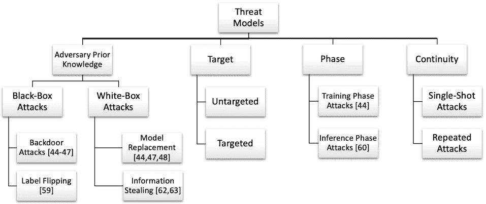

<!--yml

category: 未分类

date: 2024-09-06 19:52:32

-->

# [2108.03980] 多接入边缘计算的去中心化深度学习：关于通信效率和可信度的综述

> 来源：[`ar5iv.labs.arxiv.org/html/2108.03980`](https://ar5iv.labs.arxiv.org/html/2108.03980)

# 多接入边缘计算的去中心化深度学习：关于通信效率和可信度的综述

Yuwei Sun    Hideya Ochiai    和 Hiroshi Esaki    \IEEEmembershipMember, IEEE 2021 年 11 月 19 日。这项工作部分得到了 RIKEN 高级智能项目 JRA 计划的支持。Yuwei Sun、Hideya Ochiai 和 Hiroshi Esaki 均为东京大学信息科学与技术研究生院的成员，地址：日本东京 1138654（电子邮件：ywsun@g.ecc.u-tokyo.ac.jp，ochiai@elab.ic.i.u-tokyo.ac.jp，hiroshi@wide.ad.jp）。这一段将包含处理您论文的副编辑。

###### 摘要

更广泛的覆盖范围和更好的 5G 延迟降低解决方案需要将其与多接入边缘计算（MEC）技术结合。去中心化深度学习（DDL），例如联邦学习和群体学习，作为保护隐私的数据处理的有前景的解决方案，利用局部客户端网络中的多层神经网络的分布式计算，而无需公开原始的本地训练数据。特别是在金融和医疗等敏感数据谨慎维护的行业中，DDL 可以促进这些机构之间的合作，以提高训练模型的性能，同时保护参与客户端的数据隐私。在这篇综述论文中，我们展示了 DDL 的技术基础，它通过去中心化学习惠及社会各个领域。此外，我们通过概述 DDL 面临的挑战以及从通信效率和可信度的新颖视角出发的相关解决方案，提供了该领域当前最先进的技术的全面概述。

{IEEEImpStatement}

基于深度学习的智能设备和边缘应用的普及正在重新塑造未来高性能边缘计算的轮廓，例如智能环境传感器、自动驾驶车辆、智能电网等。分散式深度学习（DDL）作为多接入边缘计算的关键推动者，通过分布式模型训练和全球共享的训练知识使整个社会受益。然而，首先必须克服关键的基本挑战，使 DDL 变得可行和可扩展，即分散化技术、通信效率和可信性。本调查从以上角度提供了全面的概述，表明 DDL 正在得到全面的研究，特别是在隐私保护、边缘异构性和对抗性攻击与防御方面。此外，DDL 的未来趋势侧重于诸如有效资源分配、异步通信和完全分散式框架之类的主题。

{IEEE 关键词}

集体智能，数据隐私，分布式计算，边缘计算，信息安全，多层神经网络

## 1 引言

深度学习（DL）最初是为了解决需要收集一组训练数据进行集中式数据处理的问题而提出的。近年来，随着这一领域的快速发展，其应用领域已扩展到各个行业，使人们的生活受益。然而，收集和传输如此庞大的数据到集中式存储设施通常是耗时的，低效的，并且存在隐私问题。网络带宽等方面的限制可能会导致高延迟。此外，与向集中式计算资源传输数据相关的个人数据泄露风险引起了数据隐私的担忧。特别是随着社会对数据隐私意识的增强，诸如《通用数据保护条例》（GDPR）[1]之类的法律限制已经被推广，使得这样的集中式框架甚至不切实际。

相比之下，与客户必须向中央服务器提供原始数据进行模型训练的集中式框架相比，在分散式框架中，客户的敏感数据直接在其本地设备上进行处理。分散式深度学习（DDL）的概念首次被提出，旨在利用成千上万个 CPU 核心进行数十亿参数的深度网络训练[2]。几年后，谷歌提出了著名的联邦学习（FL）[3]，通过利用设备上的模型训练和经过训练的模型共享，在边缘设备之间进行保护隐私的协作学习。首先，本地模型训练极大地降低了集中式框架中的延迟。另一个重要的观点是，由成千上万个客户组成的大型系统通过聚合本地模型训练的结果来提高性能，而不会透露原始的训练数据。

尽管 FL 取得了成功，但在实际生活中，参与的本地设备通常需要一定的资格才能进行高效的本地模型训练。设备的内存和计算能力的限制会大大增加客户端的本地训练时间，而网络带宽的限制则可能导致客户端在传输模型时等待时间增加，从而导致 FL 训练周期的延迟。此外，客户端的非独立同分布（Non-IID）数据会导致 FL 的收敛时间变长。为了解决通信效率的问题，提出了如分割学习（SL）和智能客户端选择等 DDL 方法。

此外，利用多智能体多接入边缘计算来实现未来的集成社会，必须在这些新兴技术中建立信任，即可信度。然而，最近的研究表明，联邦学习（FL）可能并不总是提供足够的个人数据隐私和深度学习模型完整性的保障。即使在像 FL 这样的去中心化框架中，攻击者仍然可以通过向客户端的本地训练数据或本地模型中注入木马来破坏系统，并且这种攻击还可以通过模型共享进一步扩展其影响到其他客户端。在其他情况下，攻击者甚至可以通过观察传输的模型梯度来窃取客户端的信息。为了克服这些威胁，FL 中应用了旨在提高系统鲁棒性和检测恶意行为的防御策略。为此，开发可扩展去中心化深度学习有三个支柱，涵盖 FL 技术基础、通信效率以及安全和隐私（可信度）（见图 1）。

图 1：可扩展去中心化深度学习的三个支柱。

本调查论文组织如下。第二部分全面展示了促进 DDL 和相关应用的技术基础。第三部分从边缘异质性和可信度的角度介绍了未来可扩展 DDL 的主要挑战和有前景的方法。第四部分总结了论文，讨论了开放挑战和未来方向。

## 2 向去中心化深度学习迈进

### 2.1 多接入边缘计算

根据诺基亚 2020 年的一份年度报告[4]，在接下来的五年中，将观察到宽带物联网和关键物联网设备数量的大幅增长，如 AR、VR 和云机器人。同样，各种类型的仪表和传感器等大规模物联网设备的数量也将大大增加。这些设备大多数将基于**人工智能（AI）**进行操作。在这方面，随着基于 AI 的智能设备和应用在网络边缘的普及，如智能环境传感器、自动驾驶汽车、医疗保健、智能电网等，AI 在数据处理、知识获取和资源管理中扮演着关键角色。例如，AI 已被用于车辆互联网（IoV）[5]中的边缘服务优化以及无线网络中集体智能的其他有力应用[6]。传统上，智能设备生成的数据会被发送到远程计算服务器进行处理。虽然 5G 旨在为多种设备提供更大的连接性，并大幅提升大数据处理速度，但仍需更广泛的覆盖以促进高效的数据处理。因此，降低延迟的更好解决方案是结合多接入边缘计算（MEC）技术。紧密相关的 MEC 通过利用更接近终端用户的网络计算资源（如本地服务器和网关）来减少延迟。

### 2.2 数据隐私与去中心化深度学习

感知器的数学模型最早在 1958 年提出[7]，这是一个用于信息存储和组织的概率模型。多层感知器[8]增强了神经网络的实用性，是传统统计建模技术的有用替代方案。Lecun 等人[9]提出了深度学习（DL），允许由多个处理层组成的计算模型学习具有多个抽象层次的数据表示。如今，各种深度学习模型已经被开发并广泛应用于社会的许多领域，如卷积神经网络（CNNs）、递归神经网络（RNNs）等。

此外，深度学习主要有两种处理分布式数据的拓扑结构，即集中式深度学习（面向服务器）和去中心化深度学习（面向客户端或无服务器）（图 2）。集中式或独立框架利用中央高性能计算资源，通过从各种数据源收集数据来实现所需的模型性能。在这种情况下，收集的数据通常暴露在云端的 AI 算法中。相比之下，去中心化框架被视为一种隐私保护架构，利用基于资源受限设备（如智能手机）上的分布式数据源进行本地模型训练。自引入以来，去中心化框架[10]在学术界和工业界迅速普及。Li 等人[11]进一步扩展了参数服务器框架的概念，并展示了一种强大、通用且高性能的实现，能够处理基于本地训练数据的多样化分布式机器学习算法。此外，近年来，联邦学习（FL）成为最著名的去中心化框架之一，它最初由谷歌提出，用于提升谷歌键盘（Gboard）在下一个词预测中的表现[3]。FL 的架构允许用户充分利用 AI 算法而无需披露其原始本地训练数据，弥合了集中计算资源和分布式数据源之间的差距。FL 通过利用全球共享的模型参数来实现更好的模型。

图 2: 去中心化深度学习的崛起。

此外，完全去中心化框架指的是基于区块链和边缘共识技术[12, 13, 14, 15, 16, 17]的无服务器架构，以及临时网络[18]。例如，Swarm Learning (SL) [12] 是一种去中心化的方法，它结合了边缘计算、基于区块链的点对点网络以及其他前沿的去中心化技术，用于处理分布式医疗数据的疾病分类。此外，Li 等人[13]提出了一种基于区块链的去中心化联邦学习框架，用于全球模型存储和本地模型更新交换，其中本地更新在委员会共识后被加密并存储在区块链的块中。同样，Kim 等人[17]展示了一种端到端延迟模型的链式联邦学习架构，其中最优的区块生成率由通信、计算和共识延迟决定。

近年来，数据隐私成为了一个主要关注点，这一问题因剑桥分析丑闻[19]和 FBI-苹果加密争议[20]等社会事件而加剧。传统深度学习流程的集中数据处理所带来的数据隐私问题，需要在隐私保护系统设计和数据保护策略上更多地考虑。为此，去中心化框架为大规模多智能体协作学习中的数据隐私问题提供了一个有前景的解决方案。例如，大规模去中心化节点可以应用于各种用例，如工业物联网[21]、使用各种传感器的环境监测[22]、从监控摄像头进行的人体行为识别[23]、机器人技术以及联网自主车辆控制[24, 25]、跨多个方的联邦网络入侵检测[26, 27]等。

### 2.3 从网络系统视角看联邦学习

#### 2.3.1 跨领域与跨设备

FL 的跨孤岛设置代表了一个多方协作模型训练的场景（见图 3），其中来自本地设备的数据被发送到组织内部的边缘服务器进行计算。在这种情况下，应用了一个上层的远程服务器进行进一步计算。数据对组织内部的所有客户端是透明的，但不会暴露在组织外部。例如，医疗机构可以采用这种方案来分享医学图像以识别罕见疾病[28]。在这种情况下，跨孤岛设置允许机构在数据保护下共享关于疾病的见解。另一方面，跨设备设置是一种更严格的场景，收集的数据不能离开设备。这需要高效的设备端计算和及时的模型传输到远程服务器。

图 3：联邦学习利用多方模型共享实现隐私保护的机器学习。

#### 2.3.2 客户端选择策略

通常，为了减少等待的延迟，在每一轮中，参数服务器（PS）随机选择 m 个客户端中的一个小子集 k 进行本地模型训练，并将当前的全局模型 w 广播到选定的客户端。然后，从 w 开始，每个客户端$i$通过在其数据上进行训练来更新其本地模型 wi，并将本地模型更新传回 PS。此外，还采用了其他客户端选择策略，如基于集群的选择和基于强化学习的选择，以减少全局模型收敛的时间成本（见 3.1.2）。

#### 2.3.3 同步

客户端调度方法有两种，即同步 FL 和异步 FL。在同步 FL 中，在每一轮中，参数服务器（PS）等待所有分配的本地训练完成。然而，在这种情况下，由于数据量较大、计算设备限制等原因，最慢的本地训练任务成为训练的瓶颈。相比之下，异步 FL 允许客户端在训练的任何阶段上传本地更新。此外，客户端可以提供多种功能，包括本地模型训练、网络流量转发等[29、30]。

#### 2.3.4 聚合

如前所述，下一轮的全局模型采用所有本地模型更新的聚合结果。联邦平均（FedAvg）[31] 计算加权平均，如 (1)，以更新全局模型，因为本地训练数据的量因客户端而异（贡献也不同）。

|  | $w_{t+1}=w_{t}+\sum_{i\in k}\frac{n_{i}}{n_{k}}(w_{t}^{i}-w_{t})$ |  | (1) |
| --- | --- | --- | --- |

其中 $w_{t}$ 代表当前全局模型的权重，$w_{t+1}$ 是下一轮更新后的全局模型的权重，$w_{t}^{i}$ 是客户端$i$训练的本地模型的权重，$n_{i}$ 和 $n_{k}$ 分别代表客户端$i$的本地训练数据量和所有选定客户端的总训练数据量。

此外，强健的聚合策略通过测量本地模型更新之间的相似性来排除恶意更新（见 3.2.5）。根据本地更新的完整性，只有合格的更新才会在每轮中聚合到全局模型中。

#### 2.3.5 深度学习模型

当前大多数有关联邦学习的研究和应用基于监督模型，其中模型在标记数据上进行训练，通常用于分类任务。然而，在现实生活中，收集的数据通常是未标记的，监督模型并不适用。深度学习模型，包括无监督学习和强化学习，在联邦学习背景下尚未充分研究。例如，通过利用联邦学习进行机器人的强化任务，全局代理可以从多样化的环境中同时高效地学习多个动作策略 [32]。

#### 2.3.6 客户端服务器网络安全

从网络系统的角度来看，FL 主要面临来自系统三个组件的威胁，即参数服务器（PS）、客户端和传输路径。与边缘设备相比，PS 通常具有较好的安全性和维护。此外，PS 与客户端之间的通信通常也通过端到端加密保护。另一方面，尽管客户端的完整性经过验证以参与 FL 训练，但由于本地采取的防御策略相对不完整，边缘仍然会遭遇对手的入侵。在 FL 中，由于所有客户端在每轮通过聚合模型广播平等访问全球模型，这为对手攻击系统提供了巨大的攻击面。为此，我们认为被攻陷的边缘是 FL 系统的主要威胁（参见 3.2）。

## 3 可扩展的去中心化深度学习面临的挑战与方法

### 3.1 边缘异质性下的通信效率

通信效率是评估分布式处理性能和可扩展性的一个重要因素。去中心化深度学习（DDL）通过在训练过程中同步不同的模型来减少计算时间。然而，随着模型大小的增加或收敛变慢，这会导致通信成本的增加。值得注意的是，今天在现实中扩展 FL 最大的挑战之一是边缘设备的资格各异。特别是，这种异质性体现在两个主要方面，即设备能力和数据分布。

首先，对于设备能力，特别是在跨设备的联邦学习（FL）情况下，深度学习（DL）模型通常在资源受限的移动设备上运行，例如智能手机。这些移动设备的能力由于硬件限制和成本约束而有所不同。此外，本地网络（LAN）的网络带宽也大大限制了模型传输效率，导致去中心化学习周期的延迟。

其次，对于数据分布，不同客户端持有的样本通常在数据大小和分布上具有多样性，即非独立同分布（non-IID）。例如，在一个具有 $C$ 类别的多分类任务中。每个客户端$k$ 拥有一个本地数据集 $D^{(k)}$，该数据集包含具有不平衡标签 $\{1,2,…,C\}$ 的样本。然后，客户端 1 有 80%的样本来自标签 1，而客户端 2 有 80%的样本来自标签 2。数学上讲，假设 $f_{w}:x\rightarrow y$ 表示一个具有参数 $w$ 的监督神经网络分类器，输入 $x_{i}\in x$ 并输出一个实值向量，其中输出向量的第 $j$ 个元素表示 $x_{i}$ 被识别为类别 $j$ 的概率。给定 $f_{w}(x)$，预测由 $\hat{y}=\mbox{arg}\max_{j}f_{w}(x)_{j}$ 给出，其中 $f_{w}(x)_{j}$ 表示 $f_{w}(x)$ 的第 $j$ 个元素。我们假设 FL 中所有客户端共享的共同数据分布 $p(x|y)$，并且客户端$i$ 拥有 $p_{i}(y)$。当客户端持有的样本在不同的 $p_{i}(y)$ 下呈现偏斜时，$p_{i}(x,y)=p(x|y)p_{i}(y)\,s.t.\,p_{i}(y)\neq p_{j}(y)$，对所有 $i\neq j$。客户端 1 遵循 $p_{1}(x,y)$，客户端 2 遵循 $p_{2}(x,y)$，即它们是非独立同分布的。尽管经典 FL 中的随机客户端选择策略旨在减少等待时间，但所选客户端的非 IID 本地数据可能导致时间消耗较大的收敛过程，甚至无法收敛到全局模型。在本节中，我们展示了用于传播和减少服务器与客户端之间交换的数据量的最相关的方法，解决边缘异质性问题（表 1）。

表 1：在边缘异质性下提高通信效率的方法

| 挑战 | 工作 | 年份 | 方法 | 应用 |
| --- | --- | --- | --- | --- |
| 资源受限 | Vepakomma 等人 [33] | 2018 | 分割学习 | 图像分类 |
| 边缘 | Nishio 等人 [34] | 2018 | 资源调度 | 图像分类 |
|  | Singh 等人 [35] | 2019 | 分割学习 | 物联网、医疗保健 |
|  | Thapa 等人 [36] | 2020 | 分割学习 | 医疗保健、图像分类 |
|  | Khan 等人 [29] | 2020 | Stackelberg 博弈理论 | 图像分类 |
| 数据异质性 | Jeong 等人 [37] | 2018 | 联邦数据增强 | 图像分类 |
|  | Sener 等人 [38] | 2018 | K-中心聚类 | 图像分类 |
|  | Zhao 等人 [39] | 2018 | 数据共享策略 | 图像分类 |
|  | Wang 等人 [40] | 2020 | 强化学习 | 图像分类 |
|  | Duan 等人 [41] | 2020 | 数据增强与重新调度 | 图像分类 |
|  | Sun 等人 [24] | 2021 | 分段联邦学习 | 网络安全 |

#### 3.1.1 资源受限的边缘

尽管 FL 允许每个客户端训练其本地模型，但 FL 的通信效率在很大程度上受到客户端端资质的限制，如网络带宽、设备内存和计算能力等。在这些情况下，提出了 Split Learning (SL) [36, 33] 以便于基于边缘云计算的模型训练。在 SL 中，复杂的 DL 模型被分为两个子网络，这些子网络基于一个特定的层称为切分层，然后这些子网络分别在客户端和 PS 上进行训练（图 4(a)）。每一轮中，客户端利用本地数据进行其本地子网络的前向传播，然后将切分层的本地数据中间表示及标签（原始 Split Learning）发送给 PS，以完成前向传播和损失计算。最终，云端子网络的梯度通过反向传播计算，并被发送回客户端以更新其本地模型。因此，每轮训练中，客户端与 PS 之间需要多次传输。

图 4： (a) 原始 Split Learning [33] 的架构。 (b) FL 和 SL 在模型参数总数和客户端总数方面的性能比较。双曲线显示了一个模型在通信效率上优于另一个模型的区域 [35]。

此外，Singh 等人[35] 提出了 SL 和 FL 之间通信效率的全面比较。为了研究通信效率与总客户端数和模型参数数量等因素之间的关系，展示了两种模型之间的权衡（图 4(b)），其中双曲线显示了在通信效率方面一个模型优于另一个模型的区域，换句话说，就是客户端和 PS 之间的数据传输较少。此外，通过在用户范围从数百到数百万不等的智能手表的实际场景中比较 SL 和 FL，结果表明，当客户端数量较多和 DL 模型较大时，SL 更高效且更具可扩展性。

此外，为了解决计算资源和无线信道条件的各种限制，Nishio 等人[34] 演示了一种称为 FedCS 的方法。在 FedCS 中，PS 根据客户端的资源信息估算进行多个 FL 步骤所需的时间，并安排客户端，使其能够汇总尽可能多的客户端更新，从而加快训练过程中的性能提升。与经典 FL 相比，这种方法显示出了显著更短的训练时间。此外，Khan 等人[29] 提出了一个基于 Stackelberg 博弈理论的激励型 FL 框架，以激励设备参与学习过程，同时优化客户端选择，以最小化计算和通信的整体训练成本。

#### 3.1.2 数据异质性

尽管在 FedAvg 中，随机客户端选择方法在数据样本由不同客户端持有且这些样本是独立且同分布的（IID）情况下效果很好[42]，但当应用于真实世界的数据样本时，这种方案的效果并不理想，因为这些样本通常是非 IID 的。因此，在联邦学习（FL）训练过程中，采用高效的客户端选择策略对于全球模型的快速收敛至关重要，而不是随机客户端选择策略。Sener 等人[38] 提出了 K-Center 聚类算法，用于从一个非常大的集合中选择要采用的图像。他们的目标是找到一个子集，使得该子集上的模型性能与整个数据集上的模型性能尽可能接近（图 5）。此外，通过在非 IID 设置下利用 K-Center 算法，参与的客户端可以根据其数据分布被聚类为不同的组。然后，通过在训练过程中从每个组中精心选择客户端，有助于加快全球模型的收敛速度和性能提升[40]。

图 5：K-Center 聚类算法旨在寻找一个核心集（蓝色点）以代表整个数据集（蓝色和红色点）进行训练。[38]

同样，Wang 等人提出了一种基于强化学习（RL）的联邦学习方法用于非独立同分布数据[40]，其中一种名为 FAVOR 的经验驱动控制框架智能地选择参与每轮联邦学习的客户端（见图 6）。这一方法旨在平衡由非独立同分布数据引入的偏差，从而加快全局模型的收敛。该方法的目标是在最少的轮次内实现所需的模型性能。特别地，采用深度 Q 学习（DQN）来学习如何在每轮选择一部分客户端，从而最大化基于当前奖励和预期未来奖励计算的奖励。此外，RL 的主要组件有三个，即状态、动作和奖励[43]。这里环境的状态定义为全局模型和本地模型的压缩权重。对于 RL 代理来说，可用的动作空间为大小为$\binom{N}{K}$的空间，其中$K$是客户端的总数，$N$是每轮联邦学习中选择的客户端数量。最后，DQN 代理的奖励包括实现高准确度的激励和为了实现所需性能而需要更多轮次的惩罚。

图 6：基于 RL 的客户端选择策略，用于加快 FL 的收敛速度。[40]

此外，分段联邦学习（Segmented-FL）被提出以解决网络入侵检测中的数据异质性[24]。具有高度偏斜的非独立同分布（non-IID）网络流量数据的参与者被分成不同的组，以便根据其近期行为进行个性化的联邦学习。然后，每个组被分配一个独立的全局模型进行聚合。此外，在每轮训练中，会形成一个新的组划分，并根据当前全局模型、来自组的本地模型更新和其他现有全局模型的加权平均来更新该组的全局模型。因此，结果表明，针对大规模分布数据源的网络入侵检测的 Segmented-FL 优于经典的联邦学习方法。

此外，赵等人[39] 提出了一个数据共享策略，通过创建一个在所有边缘设备之间全球共享的小数据子集来改善非 IID 数据上的训练。实验表明，与 FL 的准确性相比，仅使用 5%的全球共享数据可以使 CIFAR10 数据集的准确性提高 30%。同样，Jeong 等人[37] 提出了联邦增强（FAug），其中每个设备训练一个生成模型，从而增强其本地数据以产生一个 IID 数据集。结果表明，相较于 FL，实现所需测试准确性的通信开销减少了约 26 倍。

### 3.2 可信度

去中心化框架如联邦学习（FL）面临来自恶意 AI 的威胁。如第二部分所述，来自边缘客户端的威胁比服务器和中间数据传输的安全性更常见和关键。FL 扩展了攻击者妥协一个或多个参与者的表面。在这方面，攻击者可以通过一个被妥协的边缘作为后门侵入这样的去中心化系统，或通过操纵本地训练数据[44、45、46、47] 或替换本地模型更新[44、47、48]，触发攻击者期望的行为。这种攻击通过恶意模型共享和中毒的模型权重将其影响扩展到系统中的其他客户端。（参见 3.2.1、3.2.2、3.2.3、3.2.4)

相对而言，近年来围绕 FL 威胁的争议也得到了广泛讨论。这些防御策略主要可以分为两类，即稳健聚合和异常检测。对于稳健聚合，它涉及通过精心选择用于聚合的本地模型 [49, 50, 51] 或通过向聚合模型中添加噪声来平衡恶意更新 [47, 52, 53] 来提高聚合算法（例如 FedAvg）的弹性。另一方面，各种异常检测方法被用于识别恶意本地模型更新，包括比较本地更新之间的相似性，找到那些明显偏离其他更新的 [54, 55, 56, 57, 58]，应用带有少量数据样本的云验证集 [15] 等。（见 3.2.5）

#### 3.2.1 威胁模型

我们的威胁模型分类（图 7）全面展示了去中心化深度学习系统中的各种攻击方法。

图 7：我们在去中心化深度学习系统中的威胁模型分类。

根据对受损客户端的先验知识水平，FL（联邦学习）的攻击可以分为白盒攻击和黑盒攻击。在黑盒设置下，攻击者只能访问客户端的本地数据集，目标是用受损的后门数据替换数据集。典型的黑盒攻击包括后门攻击和标签翻转攻击 [59]。另一方面，在白盒设置下，攻击者被认为对客户端的本地数据和模型都有控制。在这种情况下，攻击者可以将其选择的任何恶意模型发送回 PS。一个典型的白盒攻击是模型替换。

此外，根据攻击者的目标，攻击可以是无目标攻击，旨在降低 FL 模型的准确性，也可以是有目标攻击，旨在使 FL 模型输出对手期望的标签。此外，根据攻击时间，攻击可以在训练阶段[44]或推理阶段[60]进行，其中训练阶段指的是 FL 中的模型训练，推理阶段指的是在获得收敛模型后的应用。

此外，攻击的连续性也会影响攻击性能，其中单轮攻击通常涉及一个恶意参与者，旨在通过在单轮训练中实施攻击来将一个长期存在的恶意特洛伊植入模型，而重复攻击通常涉及一个或多个恶意参与者，且很可能在多个训练轮次中进行。

在接下来的几个章节中，我们概述了对 FL 最有效的攻击，包括后门攻击、模型替换和信息窃取。

#### 3.2.2 后门攻击

后门攻击的目标是破坏其他客户端在特定子任务上的模型性能。鉴于攻击者只能访问客户端的本地数据（黑箱攻击），特洛伊后门[44, 45]通过将特洛伊模式添加到数据中并将其重新标记为目标类别，从而破坏一部分本地训练数据（见图 8）。此外，Lin 等人[46]采用了现有良性特征和场景中的物体组合作为触发器。它利用混合器生成混合的有毒样本，然后在这些样本以及原始良性数据上训练本地模型。此外，语义后门使模型在未修改的图像上产生攻击者选择的输出。例如，Wang 等人展示了一种边缘案例后门，目标是那些不太可能出现在训练或测试数据集中但自然存在的预测子任务[47]。为了进行攻击，他们根据特洛伊后门和良性训练数据的混合比例训练了本地模型。结果表明，这种攻击可以绕过简单的基于范数的防御算法，如范数界限[55]。

图 8：各种类型的特洛伊后门样本。[45]

#### 3.2.3 模型替换

模型替换是一种白盒攻击[44]，通过用恶意模型替换全局模型。正如前面提到的，在 FedAvg 中，PS 通过对所有本地训练模型进行加权平均来更新全局模型。模型替换攻击的目的是提交一个恶意模型更新 $w_{t}^{m}=\frac{n_{k}}{n_{adv}}(w_{t}^{adv}-w_{t})+w_{t}$，而不是 $w_{t}^{adv}$，其中 $w_{t}^{adv}$ 表示基于前述方法（如后门攻击）中毒的本地模型，$n_{adv}$ 表示对手拥有的样本数量。由于攻击通常在全局模型收敛后进行，当额外的本地模型训练不会改善全局模型且其损失在最优值附近的误差范围内稳定时，每个诚实的客户端$i$将获得一个更新的本地模型 $w_{t}^{i}$，大致等于当前的全局模型 $w_{t}$。$w_{t}^{i}-w_{t}\approx 0$。方程 (2) 是模型替换攻击的数学证明。

|  | <math alttext="\begin{gathered}w_{t+1}=w_{t}+\sum_{i\in k}\frac{n_{i}}{n_{k}}(w_{t}^{i}-w_{t})\\ =w_{t}+\frac{n_{1}}{n_{k}}(w_{t}^{1}-w_{t})+..+\frac{n_{adv}}{n_{k}}(w_{t}^{m}-w_{t})\\

\approx w_{t}+\frac{n_{adv}}{n_{k}}(w_{t}^{m}-w_{t})\\

=w_{t}+\frac{n_{adv}}{n_{k}}(\frac{n_{k}}{n_{adv}}(w_{t}^{adv}-w_{t})+w_{t}-w_{t})\\

=w_{t}^{adv}\end{gathered}" display="block"><semantics ><mtable displaystyle="true" rowspacing="0pt" ><mtr ><mtd ><mrow ><msub ><mi >w</mi><mrow ><mi >t</mi><mo >+</mo><mn >1</mn></mrow></msub><mo >=</mo><mrow ><msub ><mi >w</mi><mi >t</mi></msub><mo rspace="0.055em" >+</mo><mrow ><munder ><mo movablelimits="false" >∑</mo><mrow ><mi >i</mi><mo >∈</mo><mi >k</mi></mrow></munder><mrow ><mfrac ><msub ><mi >n</mi><mi >i</mi></msub><msub ><mi >n</mi><mi >k</mi></msub></mfrac><mo lspace="0em" rspace="0em" >​</mo><mrow ><mo stretchy="false" >(</mo><mrow ><msubsup ><mi >w</mi><mi >t</mi><mi >i</mi></msubsup><mo >−</mo><msub ><mi >w</mi><mi >t</mi></msub></mrow><mo stretchy="false" >)</mo></mrow></mrow></mrow></mrow></mrow></mtd></mtr><mtr ><mtd ><mrow ><mo >=</mo><msub ><mi >w</mi><mi >t</mi></msub><mo >+</mo><mfrac ><msub ><mi >n</mi><mn >1</mn></msub><msub ><mi >n</mi><mi >k</mi></msub></mfrac><mrow ><mo stretchy="false" >(</mo><msubsup ><mi >w</mi><mi >t</mi><mn >1</mn></msubsup><mo >−</mo><msub ><mi >w</mi><mi >t</mi></msub><mo stretchy="false" >)</mo></mrow><mo rspace="0em" >+</mo><mo lspace="0em" rspace="0.0835em" >.</mo><mo lspace="0.0835em" rspace="0em" >.</mo><mo lspace="0em" >+</mo><mfrac ><msub ><mi >n</mi><mrow ><mi >a</mi><mo lspace="0em" rspace="0em" >​</mo><mi >d</mi><mo lspace="0em" rspace="0em" >​</mo><mi >v</mi></mrow></msub><msub ><mi >n</mi><mi >k</mi></msub></mfrac><mrow ><mo stretchy="false" >(</mo><msubsup ><mi >w</mi><mi >t</mi><mi >m</mi></msubsup><mo >−</mo><msub ><mi >w</mi><mi >t</mi></msub><mo stretchy="false" >)</mo></mrow></mrow></mtd></mtr><mtr ><mtd ><mrow ><mo >≈</mo><mrow ><msub ><mi >w</mi><mi >t</mi></msub><mo >+</mo><mrow ><mfrac ><msub ><mi >n</mi><mrow ><mi >a</mi><mo lspace="0em" rspace="0em" >​</mo><mi >d</mi><mo lspace="0em" rspace="0em" >​</mo><mi >v</mi></mrow></msub><msub ><mi >n</mi><mi >k</mi></msub></mfrac><mo lspace="0em" rspace="0em" >​</mo><mrow ><mo stretchy="false" >(</mo><mrow ><msubsup ><mi >w</mi><mi >t</mi><mi >m</mi></msubsup><mo >−</mo><msub ><mi >w</mi><mi >t</mi></msub></mrow><mo stretchy="false" >)</mo></mrow></mrow></mrow></mrow></mtd></mtr><mtr ><mtd ><mrow ><mo >=</mo><mrow ><msub ><mi >w</mi><mi >t</mi></msub><mo >+</mo><mrow ><mfrac ><msub ><mi >n</mi><mrow ><mi >a</mi><mo lspace="0em" rspace="0em" >​</mo><mi >d</mi><mo lspace="0em" rspace="0em" >​</mo><mi >v</mi></mrow></msub><msub ><mi >n</mi><mi >k</mi></msub></mfrac><mo lspace="0em" rspace="0em" >​</mo><mrow ><mo stretchy="false" >(</mo><mrow ><mrow ><mrow ><mfrac ><msub ><mi >n</mi><mi >k</mi></msub><msub ><mi >n</mi><mrow ><mi >a</mi><mo lspace="0em" rspace="0em" >​</mo><mi >d</mi><mo lspace="0em" rspace="0em" >​</mo><mi >v</mi></mrow></msub></mfrac><mo lspace="0em" rspace="0em" >​</mo><mrow ><mo stretchy="false" >(</mo><mrow ><msubsup ><mi >w</mi><mi >t</mi><mrow ><mi >a</mi><mo lspace="0em" rspace="0em" >​</mo><mi >d</mi><mo lspace="0em" rspace="0em" >​</mo><mi >v</mi></mrow></msubsup><mo >−</mo><msub ><mi >w</mi><mi >t</mi></msub></mrow><mo stretchy="false" >)</mo></mrow></mrow><mo >+</mo><msub ><mi >w</mi><mi >t</mi></msub></mrow><mo >−</mo><msub ><mi >w</mi><mi >t</mi></msub></mrow><mo stretchy="false" >)</mo></mrow></mrow></mrow></mrow></mtd></mtr><mtr ><mtd ><mrow ><mo >=</mo><msubsup ><mi >w</mi><mi >t</mi><mrow ><mi >a</mi><mo lspace="0em" rspace="0em" >​</mo><mi >d</mi><mo lspace="0em" rspace="0em" >​</mo><mi >v</mi></mrow></msubsup></mrow></mtd></mtr></mtable><annotation encoding="application/x-tex" >\begin{gathered}w_{t+1}=w_{t}+\sum_{i\in k}\frac{n_{i}}{n_{k}}(w_{t}^{i}-w_{t})\\ =w_{t}+\frac{n_{1}}{n_{k}}(w_{t}^{1}-w_{t})+..+\frac{n_{adv}}{n_{k}}(w_{t}^{m}-w_{t})\\ \approx w_{t}+\frac{n_{adv}}{n_{k}}(w_{t}^{m}-w_{t})\\ =w_{t}+\frac{n_{adv}}{n_{k}}(\frac{n_{k}}{n_{adv}}(w_{t}^{adv}-w_{t})+w_{t}-w_{t})\\ =w_{t}^{adv}\end{gathered}</annotation></semantics></math> |  | (2)

语义后门和模型替换的结合形成了对系统的持久且隐形的攻击。例如，Bagdasaryan 等人[44] 演示了一种在 CIFAR-10 数据集上对约束和缩放的攻击方法，旨在利用具有特定特征（赛车条纹、绿色和有条纹的背景墙）的汽车图像集作为触发器来毒害全球模型。具体而言，约束和缩放方法定义如下（3）。他们发起了一次单次模型替换攻击，其中选择了一个恶意参与者进行 FL 中的单轮攻击。然后，通过基于主类和后门类的模型预测准确性以及异常检测算法的准确性来更新模型，旨在实现所需的恶意性能，同时绕过异常检测。最后，这表明此类攻击可以绕过异常检测，并且在单次攻击后保持高准确性。

|  | $L_{model}=\alpha L_{class}+(1-\alpha)L_{ano}$ |  | (3) |
| --- | --- | --- | --- |

其中 $L_{class}$ 捕获了主任务和后门任务的准确性，$L_{ano}$ 表示在 PS 上采集的异常检测算法的性能，而 $\alpha$ 控制绕过异常检测的重要性。

#### 3.2.4 信息窃取

通过利用生成对抗网络（GANs）[61]，对手可以通过仅下载全球模型 [62] 来重建联邦学习中另一客户端的训练数据。在 GANs 中，判别器和生成器之间存在权衡，判别器根据是否成功区分生成器生成的对抗样本与来自目标数据类别的真实数据进行训练，而生成器则根据是否成功欺骗判别器进行训练。在每轮联邦学习中，对手用来自参数服务器的最新全球模型替换实现的 GANs 的判别器。然后，GANs 的生成器从高斯噪声中生成对抗样本，并根据判别器的推断结果和目标数据类别的标签进行自我更新。在这种情况下，通过对抗训练，对手的生成器可以生成更清晰的样本，以使用目标数据类别的假样本训练本地深度学习模型。此外，对手的恶意模型参数随后通过模型聚合传输给受害者。由于受害者在模型训练中需要更多的努力，因此会更加容易识别真实数据与假数据，导致受害者暴露更多训练数据的细节。因此，受害者的模型更新将使对手能够生成越来越清晰的对抗样本，从而揭示原始训练数据。

此外，Nasr 等人 [63] 展示了针对白盒成员推断攻击的全面分析，其中只有与本地训练数据相关的信息从模型共享中泄漏。不同于前述的重建攻击，后者的目标是重建受害者原始训练数据，这种攻击旨在推断特定数据样本是否在受害者的本地模型训练中使用过。

#### 3.2.5 防御模型

目前对 FL 中的威胁模型的防御策略主要可以分为两类，即稳健聚合和异常检测。在稳健聚合方面，除了在 FedAvg 中采用随机客户端选择策略之外，还提出了其他应对潜在恶意本地更新的选择方法，如 Krum[49]、修剪均值[50]等。Krum 基于本地更新之间的配对欧几里得距离，从$m$个本地模型中选择一个与其他模型相似的本地更新作为全局模型。具体来说，对于每个模型，它计算一个本地模型与其最接近的$m-c-2$个本地模型之间距离的总和，其中$m$是客户端的总数，$c$是假定的最大被攻陷客户端数。另一方面，修剪均值在每一轮中对所有本地更新进行排序，即$w_{1j}$、$w_{2j}$、···、$w_{mj}$，其中$w_{ij}$表示第$i$个客户端的第$j$轮模型。然后通过去除其中最大的和最小的$\beta$，使用剩下的$m-2\beta$个模型的均值作为第$j$轮全局模型的结果。此外，稳健聚合的另一个重要策略是差分隐私（DP），它通过向本地更新的参数中添加少量高斯噪声来限制恶意更新对模型聚合的影响。特别地，云端 DP 通过直接将噪声添加到聚合的全局模型中，限制了如信息盗取[47、52]等攻击的成功。而客户端 DP 则将噪声添加到每个客户端的本地更新中，旨在实现防御效率和 FL 主要任务模型性能之间的优化权衡[53]。

此外，范数约束和异常检测是用于删除恶意更新的技术。在范数约束中，本地更新的范数是一个投影的正向量，例如模型参数向量的长度。由于基于后门攻击和对手模型替换攻击的恶意更新可能会产生与其他诚实客户端相比具有大范数的模型参数，因此一种有效的方法是删除范数超过某个阈值的更新[55]。同样，FL 中的异常检测通常基于比较本地更新之间的相似性。例如，Cao 等人[54]提出了一种基于欧几里得距离的恶意本地模型检测方法。他们展示了如果本地模型与超过一半的本地模型的距离在某个限制下，则可能是良性的。Tolpegin 等人[56]提出了一种基于 PCA 的对抗标签翻转攻击的防御方法。他们观察并绘制了本地更新的标准化参数，以区分良性和恶意的更新。此外，Zhao 等人[57]提出了一种使用生成对抗网络的毒化防御方法。通过从本地更新中重建数据，并将生成的数据输入到每个客户端模型中，他们旨在将出现次数最多的标签指定为每个输入的真实标签。最后，通过使用获得的标签评估生成数据上的预测准确性，将本地更新划分为良性集群和恶意集群。

## 4 结论

在多接入边缘计算中，去中心化深度学习（DDL）被认为有助于从大量不同类型的边缘数据中实现隐私保护的知识获取。本综述从通信效率和可信度两个新颖视角概述了 DDL，提供了最先进的技术来应对利用 DDL 进行社会实践中的挑战。

联邦学习作为一种经典的数据隐私解决方案，旨在利用本地模型训练来实现多个客户端之间的集体机器学习。然而，现实生活中的挑战，如边缘异质性和对抗攻击，极大地限制了这一技术的能力和可扩展性。鉴于边缘设备的能力限制，复杂模型的收敛既昂贵又耗时。一个更兼容的架构似乎是分割学习，它弥合了集中计算资源与分散数据源之间的差距。此外，在应用真实世界数据时，数据异质性是一个常见的问题，为此，更具适应性的客户端选择策略可能有利于联邦学习的快速收敛。此外，近年来对数据驱动学习（DDL）中可信度的关注也呈现爆炸式增长。我们总结了基于各种标准的 DDL 最新威胁模型，并提供了我们的新分类。最后，我们讨论了针对联邦学习（FL）中这些威胁的一些最有前景的防御策略。此外，本调查仍未涵盖其他重要主题，包括减少 DDL 中的算法偏见[64、65]和移动设备参与的激励机制[29、66]。

当前深度学习在社会中的快速发展和广泛应用，要求我们建立对这种新兴技术的信任。隐私保护的 DDL 为未来大规模多接入边缘计算提供了实际解决方案。调查的文献广度表明，DDL 正在受到密集研究，特别是在隐私保护、边缘异质性以及对抗攻击和防御方面。此外，DDL 的未来趋势侧重于有效资源分配、异步通信和完全去中心化框架等主题。

## 致谢

作者感谢匿名评审人提供的有益评论。

## 参考文献

+   [1] “通用数据保护条例，” [`gdpr-info.eu`](https://gdpr-info.eu)，访问日期：2021-09-13。

+   [2] J. Dean, G. Corrado, R. Monga, K. Chen, M. Devin, M. Mao, M. a. Ranzato, A. Senior, P. Tucker, K. Yang, Q. Le, 和 A. Ng, “大规模分布式深度网络”，见 *Neural Information Processing Systems 进展*，第 25 卷。Curran Associates, Inc., 2012.

+   [3] J. Konečný, H. B. McMahan, F. X. Yu, P. Richtarik, A. T. Suresh, 和 D. Bacon, “联邦学习：提高通信效率的策略，”见 *NIPS 隐私多方机器学习研讨会*，2016。

+   [4] “爱立信移动报告，” [`www.ericsson.com/en/mobility-report`](https://www.ericsson.com/en/mobility-report)，访问日期：2021-09-13。

+   [5] X. Xu, H. Li, W. Xu, Z. Liu, L. Yao, 和 F. Dai, “用于车辆互联网边缘服务优化的人工智能：综述,” *清华科学技术*, 卷 27, 期 2, 页 270–287, 2022 年。

+   [6] J. Wang, C. Jiang, H. Zhang, Y. Ren, K. Chen, 和 L. Hanzo, “三十年的机器学习：通向帕累托最优无线网络的道路,” *IEEE 通信综述与教程*, 卷 22, 期 3, 页 1472–1514, 2020 年。[在线]. 可用： [`doi.org/10.1109/COMST.2020.2965856`](https://doi.org/10.1109/COMST.2020.2965856)

+   [7] F. Rosenblatt, “感知器：大脑中信息存储和组织的概率模型,” *心理学评论*, 卷 65, 期 6, 页 386–408, 1958 年。[在线]. 可用： [`ci.nii.ac.jp/naid/20001617891/en/`](https://ci.nii.ac.jp/naid/20001617891/en/)

+   [8] R. Schalkoff, “模式识别：统计、结构和神经方法 / 罗伯特·J·沙尔科夫,” 1992 年。

+   [9] Y. LeCun, Y. Bengio, 和 G. Hinton, “深度学习,” *自然*, 卷 521, 期 7553, 页 436–444, 2015 年。[在线]. 可用： [`doi.org/10.1038/nature14539`](https://doi.org/10.1038/nature14539)

+   [10] A. J. Smola 和 S. M. Narayanamurthy, “并行主题模型的架构,” *VLDB 会议录*, 卷 3, 期 1, 页 703–710, 2010 年。[在线]. 可用： [`www.vldb.org/pvldb/vldb2010/pvldb_vol3/R63.pdf`](http://www.vldb.org/pvldb/vldb2010/pvldb_vol3/R63.pdf)

+   [11] M. Li, D. G. Andersen, J. W. Park, A. J. Smola, A. Ahmed, V. Josifovski, J. Long, E. J. Shekita, 和 B. Su, “使用参数服务器扩展分布式机器学习,” 见 *第 11 届 USENIX 操作系统设计与实现研讨会, OSDI ’14, 布鲁姆菲尔德, CO, USA, 2014 年 10 月 6-8 日*, J. Flinn 和 H. Levy 编辑. USENIX 协会, 2014 年, 页 583–598。

+   [12] S. Warnat-Herresthal, H. Schultze, K. L. Shastry, S. Manamohan, S. Mukherjee, V. Garg, R. Sarveswara, K. Händler, P. Pickkers, N. A. Aziz, S. Ktena, C. Siever, M. Kraut, M. Desai, B. Monnet, M. Saridaki, C. M. Siegel, A. Drews, M. Nuesch-Germano, H. Theis, M. G. Netea, F. Theis, A. C. Aschenbrenner, T. Ulas, M. M. Breteler, E. J. Giamarellos-Bourboulis, M. Kox, M. Becker, S. Cheran, M. S. Woodacre, E. L. Goh, J. L. Schultze, 和 G. C.-. O. I. (DeCOI), “用于去中心化和保密临床机器学习的群体学习,” 2021 年。

+   [13] Y. Li, C. Chen, N. Liu, H. Huang, Z. Zheng, 和 Q. Yan, “基于区块链的去中心化联邦学习框架与委员会共识,” *IEEE 网络*, 卷 35, 期 1, 页 234–241, 2021 年。[在线]. 可用： [`doi.org/10.1109/MNET.011.2000263`](https://doi.org/10.1109/MNET.011.2000263)

+   [14] Y. Qi, M. S. Hossain, J. Nie, 和 X. Li, “基于区块链的隐私保护联邦学习用于交通流预测,” *未来一代计算系统*, 卷 117, 页 328–337, 2021 年。

+   [15] Y. Sun, H. Esaki, 和 H. Ochiai, “基于区块链的联邦学习防御端点对抗性数据篡改，” 见 *第 19 届 IEEE 国际机器学习与应用大会，ICMLA 2020，迈阿密，FL，美国，2020 年 12 月 14-17 日*。 IEEE，2020 年，页码 729–734。 [在线]. 可用： [`doi.org/10.1109/ICMLA51294.2020.00119`](https://doi.org/10.1109/ICMLA51294.2020.00119)

+   [16] Y. Lu, X. Huang, Y. Dai, S. Maharjan, 和 Y. Zhang, “用于隐私保护数据共享的区块链与联邦学习在工业物联网中的应用，” *IEEE 工业信息学学报*，第 16 卷，第 6 期，页码 4177–4186，2020 年。 [在线]. 可用： [`doi.org/10.1109/TII.2019.2942190`](https://doi.org/10.1109/TII.2019.2942190)

+   [17] H. Kim, J. Park, M. Bennis, 和 S. Kim, “基于区块链的设备端联邦学习，” *IEEE 通信快报*，第 24 卷，第 6 期，页码 1279–1283，2020 年。

+   [18] N. I. Mowla, N. H. Tran, I. Doh, 和 K. Chae, “基于联邦学习的飞行自组网中的干扰攻击认知检测，” *IEEE Access*，第 8 卷，页码 4338–4350，2020 年。 [在线]. 可用： [`doi.org/10.1109/ACCESS.2019.2962873`](https://doi.org/10.1109/ACCESS.2019.2962873)

+   [19] “Facebook-cambridge analytica 数据丑闻，” [`en.wikipedia.org/wiki/Facebook%E2%80%93Cambridge_Analytica_data_scandal`](https://en.wikipedia.org/wiki/Facebook%E2%80%93Cambridge_Analytica_data_scandal)，访问时间：2021-09-13。

+   [20] “Apple 加密争议，” [`en.wikipedia.org/wiki/FBI%E2%80%93Apple_encryption_dispute`](https://en.wikipedia.org/wiki/FBI%E2%80%93Apple_encryption_dispute)，访问时间：2021-09-14。

+   [21] P. M, S. P. R. M, Q.-V. Pham, K. Dev, P. K. R. Maddikunta, T. R. Gadekallu, 和 T. Huynh-The, “联邦学习与工业物联网的融合：综述”，2021 年。

+   [22] Y. Gao, L. Liu, B. Hu, T. Lei, 和 H. Ma, “边缘计算系统中的联邦区域学习环境感知，” *IEEE 网络科学与工程学报*，第 7 卷，第 4 期，页码 2192–2204，2020 年。

+   [23] Y. Liu, A. Huang, Y. Luo, H. Huang, Y. Liu, Y. Chen, L. Feng, T. Chen, H. Yu, 和 Q. Yang, “Fedvision：由联邦学习驱动的在线视觉对象检测平台，” *AAAI 人工智能会议论文集*，第 34 卷，第 08 期，页码 13 172–13 179，2020 年 4 月。 [在线]. 可用： [`ojs.aaai.org/index.php/AAAI/article/view/7021`](https://ojs.aaai.org/index.php/AAAI/article/view/7021)

+   [24] S. R. Pokhrel 和 J. Choi, “面向自动驾驶车辆的区块链联邦学习：分析与设计挑战，” *IEEE 通信学报*，第 68 卷，第 8 期，页码 4734–4746，2020 年。

+   [25] B. Liu, L. Wang, M. Liu, 和 C. Xu, “终身联邦强化学习：一种用于云机器人系统导航的学习架构，” *CoRR*，第 abs/1901.06455 卷，2019 年。 [在线]. 可用： [`arxiv.org/abs/1901.06455`](http://arxiv.org/abs/1901.06455)

+   [26] Y. Sun, H. Esaki, 和 H. Ochiai, “大规模局域网中的自适应入侵检测与分段联邦学习，” *IEEE 开放通信学报*，第 2 卷，第 102–112 页，2021 年。[在线]. 可用链接: [`doi.org/10.1109/OJCOMS.2020.3044323`](https://doi.org/10.1109/OJCOMS.2020.3044323)

+   [27] S. A. Rahman, H. Tout, C. Talhi, 和 A. Mourad, “物联网入侵检测：集中式、设备端还是联邦学习？” *IEEE 网络*，第 34 卷，第 6 期，第 310–317 页，2020 年。

+   [28] M. G. Poirot, P. Vepakomma, K. Chang, J. Kalpathy-Cramer, R. Gupta, 和 R. Raskar, “医疗保健中的协作深度学习的分割学习，” *CoRR*，第 abs/1912.12115 卷，2019 年。[在线]. 可用链接: [`arxiv.org/abs/1912.12115`](http://arxiv.org/abs/1912.12115)

+   [29] L. U. Khan, S. R. Pandey, N. H. Tran, W. Saad, Z. Han, M. N. H. Nguyen, 和 C. S. Hong, “边缘网络中的联邦学习：资源优化与激励机制，” *IEEE 通讯杂志*，第 58 卷，第 10 期，第 88–93 页，2020 年。

+   [30] Y. Lu, X. Huang, Y. Dai, S. Maharjan, 和 Y. Zhang, “城市信息学中的移动边缘计算的差分隐私异步联邦学习，” *IEEE 工业信息学汇刊*，第 16 卷，第 3 期，第 2134–2143 页，2020 年。[在线]. 可用链接: [`doi.org/10.1109/TII.2019.2942179`](https://doi.org/10.1109/TII.2019.2942179)

+   [31] B. McMahan, E. Moore, D. Ramage, S. Hampson, 和 B. A. y Arcas, “从分散数据中高效通信学习深度网络，” 发表在*第 20 届国际人工智能与统计会议论文集*，机器学习研究论文集，A. Singh 和 J. Zhu 主编，第 54 卷。美国佛罗里达州劳德代尔堡：PMLR，2017 年 4 月 20–22 日，第 1273–1282 页。[在线]. 可用链接: [`proceedings.mlr.press/v54/mcmahan17a.html`](http://proceedings.mlr.press/v54/mcmahan17a.html)

+   [32] H.-K. Lim, J.-B. Kim, J.-S. Heo, 和 Y.-H. Han, “用于训练多个物联网设备控制策略的联邦强化学习，” *传感器*，第 20 卷，第 5 期，2020 年。[在线]. 可用链接: [`www.mdpi.com/1424-8220/20/5/1359`](https://www.mdpi.com/1424-8220/20/5/1359)

+   [33] P. Vepakomma, O. Gupta, T. Swedish, 和 R. Raskar, “健康领域的分割学习：无需共享原始病人数据的分布式深度学习，” *CoRR*，第 abs/1812.00564 卷，2018 年。[在线]. 可用链接: [`arxiv.org/abs/1812.00564`](http://arxiv.org/abs/1812.00564)

+   [34] T. Nishio 和 R. Yonetani, “移动边缘中具有异质资源的联邦学习客户端选择，” 发表在*2019 年 IEEE 国际通讯会议，ICC 2019，中国上海，2019 年 5 月 20-24 日*。IEEE，2019 年，第 1–7 页。[在线]. 可用链接: [`doi.org/10.1109/ICC.2019.8761315`](https://doi.org/10.1109/ICC.2019.8761315)

+   [35] A. Singh, P. Vepakomma, O. Gupta 和 R. Raskar， “分割学习和联邦学习的通信效率详细比较”， *CoRR*，卷 abs/1909.09145，2019 年。 [在线]. 可用： [`arxiv.org/abs/1909.09145`](http://arxiv.org/abs/1909.09145)

+   [36] C. Thapa, M. A. P. Chamikara 和 S. Camtepe， “Splitfed: 当联邦学习遇上分割学习”， *CoRR*，卷 abs/2004.12088，2020 年。 [在线]. 可用： [`arxiv.org/abs/2004.12088`](https://arxiv.org/abs/2004.12088)

+   [37] E. Jeong, S. Oh, H. Kim, J. Park, M. Bennis 和 S. Kim， “通信高效的设备端机器学习：在非独立同分布私有数据下的联邦蒸馏和增强”， *CoRR*，卷 abs/1811.11479，2018 年。 [在线]. 可用： [`arxiv.org/abs/1811.11479`](http://arxiv.org/abs/1811.11479)

+   [38] O. Sener 和 S. Savarese， “卷积神经网络的主动学习：核心集方法”， 收录于 *第 6 届国际学习表征会议，ICLR 2018，加拿大不列颠哥伦比亚省温哥华，2018 年 4 月 30 日 - 5 月 3 日，会议论文集*。 OpenReview.net，2018 年。 [在线]. 可用： [`openreview.net/forum?id=H1aIuk-RW`](https://openreview.net/forum?id=H1aIuk-RW)

+   [39] Y. Zhao, M. Li, L. Lai, N. Suda, D. Civin 和 V. Chandra， “具有非独立同分布数据的联邦学习”， *CoRR*，卷 abs/1806.00582，2018 年。 [在线]. 可用： [`arxiv.org/abs/1806.00582`](http://arxiv.org/abs/1806.00582)

+   [40] H. Wang, Z. Kaplan, D. Niu 和 B. Li， “使用强化学习优化非独立同分布数据上的联邦学习”， 收录于 *第 39 届 IEEE 计算机通信会议，INFOCOM 2020，加拿大安大略省多伦多，2020 年 7 月 6-9 日*。 IEEE，2020 年，第 1698–1707 页。 [在线]. 可用： [`doi.org/10.1109/INFOCOM41043.2020.9155494`](https://doi.org/10.1109/INFOCOM41043.2020.9155494)

+   [41] M. Duan, D. Liu, X. Chen, R. Liu, Y. Tan 和 L. Liang， “在移动系统中具有全局不平衡数据的自平衡联邦学习”， *IEEE Trans. Parallel Distributed Syst.*，卷 32，第 1 期，第 59–71 页，2021 年。 [在线]. 可用： [`doi.org/10.1109/TPDS.2020.3009406`](https://doi.org/10.1109/TPDS.2020.3009406)

+   [42] B. McMahan, E. Moore, D. Ramage, S. Hampson 和 B. A. y Arcas， “从去中心化数据中高效学习深度网络”， 收录于 *第 20 届国际人工智能与统计会议，AISTATS 2017，2017 年 4 月 20-22 日，美国佛罗里达州劳德代尔堡*， 机器学习研究会议论文集，第 54 卷。 PMLR，2017 年，第 1273–1282 页。 [在线]. 可用： [`proceedings.mlr.press/v54/mcmahan17a.html`](http://proceedings.mlr.press/v54/mcmahan17a.html)

+   [43] L. P. Kaelbling, M. L. Littman 和 A. W. Moore， “强化学习：一项综述”， *J. Artif. Intell. Res.*，卷 4，第 237–285 页，1996 年。 [在线]. 可用： [`doi.org/10.1613/jair.301`](https://doi.org/10.1613/jair.301)

+   [44] E. Bagdasaryan, A. Veit, Y. Hua, D. Estrin, 和 V. Shmatikov，"如何在联邦学习中植入后门"，见于*第 23 届国际人工智能与统计会议，AISTATS 2020，2020 年 8 月 26-28 日，在线[巴勒莫，西西里岛，意大利]*，系列：机器学习研究文集，第 108 卷。PMLR，2020 年，页码 2938–2948。[在线]。可用链接：[`proceedings.mlr.press/v108/bagdasaryan20a.html`](http://proceedings.mlr.press/v108/bagdasaryan20a.html)

+   [45] E. Bagdasaryan 和 V. Shmatikov，"深度学习模型中的盲后门"，*CoRR*，第 abs/2005.03823 卷，2020 年。[在线]。可用链接：[`arxiv.org/abs/2005.03823`](https://arxiv.org/abs/2005.03823)

+   [46] J. Lin, L. Xu, Y. Liu, 和 X. Zhang，"通过混合现有良性特征进行深度神经网络的复合后门攻击"，见于*CCS ’20: 2020 年 ACM SIGSAC 计算机与通信安全会议，虚拟会议，美国，2020 年 11 月 9-13 日*。ACM，2020 年，页码 113–131。[在线]。可用链接：[`doi.org/10.1145/3372297.3423362`](https://doi.org/10.1145/3372297.3423362)

+   [47] H. Wang, K. Sreenivasan, S. Rajput, H. Vishwakarma, S. Agarwal, J. Sohn, K. Lee, 和 D. S. Papailiopoulos，"尾部攻击：是的，你真的可以在联邦学习中植入后门"，见于*神经信息处理系统 33：2020 年神经信息处理系统年度会议，NeurIPS 2020，2020 年 12 月 6-12 日，虚拟会议*，2020 年。[在线]。可用链接：[`proceedings.neurips.cc/paper/2020/hash/b8ffa41d4e492f0fad2f13e29e1762eb-Abstract.html`](https://proceedings.neurips.cc/paper/2020/hash/b8ffa41d4e492f0fad2f13e29e1762eb-Abstract.html)

+   [48] Y. Ji, X. Zhang, S. Ji, X. Luo, 和 T. Wang，"对深度学习系统的模型重用攻击"，*CoRR*，第 abs/1812.00483 卷，2018 年。[在线]。可用链接：[`arxiv.org/abs/1812.00483`](http://arxiv.org/abs/1812.00483)

+   [49] P. Blanchard, E. M. E. Mhamdi, R. Guerraoui, 和 J. Stainer，"带有对手的机器学习：拜占庭容忍的梯度下降"，见于*神经信息处理系统 30：2017 年神经信息处理系统年度会议，2017 年 12 月 4-9 日，洛杉矶，加州，美国*，2017 年，页码 119–129。[在线]。可用链接：[`proceedings.neurips.cc/paper/2017/hash/f4b9ec30ad9f68f89b29639786cb62ef-Abstract.html`](https://proceedings.neurips.cc/paper/2017/hash/f4b9ec30ad9f68f89b29639786cb62ef-Abstract.html)

+   [50] E. M. E. Mhamdi, R. Guerraoui, 和 S. Rouault，"拜占庭中的分布式学习隐患"，见于*第 35 届国际机器学习大会，ICML 2018，斯德哥尔摩，瑞典，2018 年 7 月 10-15 日*，系列：机器学习研究文集，第 80 卷。PMLR，2018 年，页码 3518–3527。[在线]。可用链接：[`proceedings.mlr.press/v80/mhamdi18a.html`](http://proceedings.mlr.press/v80/mhamdi18a.html)

+   [51] W. Xu, D. Evans 和 Y. Qi，“特征挤压：检测深度神经网络中的对抗样本，” 见于 *第 25 届年度网络与分布式系统安全研讨会，NDSS 2018，圣地亚哥，加利福尼亚州，美国，2018 年 2 月 18-21 日*。互联网协会，2018 年。[在线]. 可用: [`wp.internetsociety.org/ndss/wp-content/uploads/sites/25/2018/02/ndss2018_03A-4_Xu_paper.pdf`](http://wp.internetsociety.org/ndss/wp-content/uploads/sites/25/2018/02/ndss2018_03A-4_Xu_paper.pdf)

+   [52] L. Melis, C. Song, E. D. Cristofaro 和 V. Shmatikov，“利用协作学习中的意外特征泄露，” 见于 *2019 年 IEEE 安全与隐私研讨会，SP 2019，旧金山，加州，美国，2019 年 5 月 19-23 日*。IEEE，2019 年，第 691-706 页。[在线]. 可用: [`doi.org/10.1109/SP.2019.00029`](https://doi.org/10.1109/SP.2019.00029)

+   [53] H. B. McMahan, D. Ramage, K. Talwar 和 L. Zhang，“学习不同 ially privacy 的递归语言模型，” 见于 *第六届国际学习表征会议，ICLR 2018，温哥华，加拿大，2018 年 4 月 30 日 - 5 月 3 日，会议论文集*。OpenReview.net，2018 年。[在线]. 可用: [`openreview.net/forum?id=BJ0hF1Z0b`](https://openreview.net/forum?id=BJ0hF1Z0b)

+   [54] D. Cao, S. Chang, Z. Lin, G. Liu 和 D. Sun，“理解联邦学习中的分布式中毒攻击，” 见于 *第 25 届 IEEE 国际并行与分布式系统大会，ICPADS 2019，天津，中国，2019 年 12 月 4-6 日*。IEEE，2019 年，第 233-239 页。[在线]. 可用: [`doi.org/10.1109/ICPADS47876.2019.00042`](https://doi.org/10.1109/ICPADS47876.2019.00042)

+   [55] T. Nguyen, P. Rieger, M. Miettinen 和 A. Sadeghi，“基于联邦学习的物联网入侵检测系统的中毒攻击，” 2020 年。

+   [56] V. Tolpegin, S. Truex, M. E. Gursoy 和 L. Liu，“针对联邦学习系统的数据中毒攻击，” 见于 *计算机安全 - ESORICS 2020 - 第 25 届欧洲计算机安全研究研讨会，ESORICS 2020，吉尔福德，英国，2020 年 9 月 14-18 日，论文集，第 I 部分*，系列：计算机科学讲义笔记，第 12308 卷。Springer，2020 年，第 480-501 页。[在线]. 可用: [`doi.org/10.1007/978-3-030-58951-6_24`](https://doi.org/10.1007/978-3-030-58951-6_24)

+   [57] Y. Zhao, J. Chen, J. Zhang, D. Wu, J. Teng 和 S. Yu，“PDGAN：一种利用生成对抗网络的联邦学习中的新型中毒防御方法，” 见于 *并行处理的算法与架构 - 第 19 届国际会议，ICA3PP 2019，墨尔本，维多利亚州，澳大利亚，2019 年 12 月 9-11 日，论文集，第 I 部分*，系列：计算机科学讲义笔记，第 11944 卷。Springer，2019 年，第 595-609 页。[在线]. 可用: [`doi.org/10.1007/978-3-030-38991-8_39`](https://doi.org/10.1007/978-3-030-38991-8_39)

+   [58] C. Fung, C. J. M. Yoon, 和 I. Beschastnikh, “缓解联邦学习中对抗者的影响,” *CoRR*, 卷 abs/1808.04866, 2018\. [在线]. 可用: [`arxiv.org/abs/1808.04866`](http://arxiv.org/abs/1808.04866)

+   [59] H. Xiao, H. Xiao, 和 C. Eckert, “对支持向量机的对抗标签翻转攻击，” 在 *ECAI 2012 - 第 20 届欧洲人工智能会议. 包括人工智能的著名应用 (PAIS-2012) 系统演示轨道, 法国蒙彼利埃, 2012 年 8 月 27-31 日*, 系列. 人工智能与应用前沿, 卷 242。IOS 出版社, 2012, 第 870-875 页\. [在线]. 可用: [`doi.org/10.3233/978-1-61499-098-7-870`](https://doi.org/10.3233/978-1-61499-098-7-870)

+   [60] M. Barreno, B. Nelson, R. Sears, A. D. Joseph, 和 J. D. Tygar, “机器学习能否安全？” 在 *2006 年 ACM 信息、计算机与通信安全研讨会论文集, ASIACCS 2006, 台北, 台湾, 2006 年 3 月 21-24 日*。ACM, 2006, 第 16-25 页\. [在线]. 可用: [`doi.org/10.1145/1128817.1128824`](https://doi.org/10.1145/1128817.1128824)

+   [61] I. J. Goodfellow, J. Pouget-Abadie, M. Mirza, B. Xu, D. Warde-Farley, S. Ozair, A. C. Courville, 和 Y. Bengio, “生成对抗网络,” *CoRR*, 卷 abs/1406.2661, 2014\. [在线]. 可用: [`arxiv.org/abs/1406.2661`](http://arxiv.org/abs/1406.2661)

+   [62] B. Hitaj, G. Ateniese, 和 F. Pérez-Cruz, “GAN 下的深度模型：来自协作深度学习的信息泄漏，” 在 *2017 年 ACM SIGSAC 计算机与通信安全会议论文集, CCS 2017, 达拉斯, TX, 美国, 2017 年 10 月 30 日 - 11 月 3 日*。ACM, 2017, 第 603-618 页。 [在线]. 可用: [`doi.org/10.1145/3133956.3134012`](https://doi.org/10.1145/3133956.3134012)

+   [63] M. Nasr, R. Shokri, 和 A. Houmansadr, “深度学习的全面隐私分析：针对集中式和联邦学习的被动和主动白盒推断攻击，” 在 *2019 年 IEEE 安全与隐私研讨会 (SP)*, 2019, 第 739-753 页。

+   [64] A. Amini, A. P. Soleimany, W. Schwarting, S. N. Bhatia, 和 D. Rus, “通过学习的潜在结构揭示和缓解算法偏见，” 在 *2019 年 AAAI/ACM 人工智能、伦理与社会会议论文集, AIES 2019, 檀香山, HI, 美国, 2019 年 1 月 27-28 日*。ACM, 2019, 第 289-295 页。

+   [65] B. H. Zhang, B. Lemoine, 和 M. Mitchell, “通过对抗学习缓解不希望的偏见，” 在 *2018 年 AAAI/ACM 人工智能、伦理与社会会议论文集, AIES 2018, 新奥尔良, LA, 美国, 2018 年 2 月 02-03 日*。ACM, 2018, 第 335-340 页\. [在线]. 可用: [`doi.org/10.1145/3278721.3278779`](https://doi.org/10.1145/3278721.3278779)

+   [66] S. Feng, D. Niyato, P. Wang, D. I. Kim, 和 Y. Liang，“联合服务定价和合作中继通信在联邦学习中的应用，”在*2019 国际物联网大会（iThings）和 IEEE 绿色计算与通信（GreenCom）和 IEEE 网络、物理和社会计算（CPSCom）和 IEEE 智能数据（SmartData），iThings/GreenCom/CPSCom/SmartData 2019，乔治亚州亚特兰大，美国，2019 年 7 月 14-17 日*。IEEE，2019，第 815-820 页。[在线]。可用：[`doi.org/10.1109/iThings/GreenCom/CPSCom/SmartData.2019.00148`](https://doi.org/10.1109/iThings/GreenCom/CPSCom/SmartData.2019.00148)

{IEEEbiography}

[![[无标题图片]](img/7c398bdb2d7b2b2912dc82225c31c86d.png)]Yuwei Sun（M’20）是东京大学信息科学与技术研究生院的博士生。他于 2018 年在华北电力大学获得计算机科学与技术学士学位，2021 年在东京大学获得信息与通信工程硕士学位（荣誉）。2020 年，他是麻省理工学院高级研究项目（ASP）的研究员。自 2019 年以来，他一直与联合国大学网络安全中心的校园计算中心合作。他是 RIKEN 先进智能项目中心的 AI 安全与隐私团队成员，专注于可信赖的人工智能，并且是日本学术振兴会（JSPS）的研究员。

{IEEEbiography}

[![[无标题图片]](img/c46ce44d0e271839d1227584fcf8f22d.png)]Hideya Ochiai（M’10）是日本东京大学的副教授。他于 2006 年获得学士学位，2008 年获得硕士学位，2011 年获得博士学位，均来自同一大学。他的研究兴趣包括传感器网络、延迟容忍网络、建筑自动化系统、物联网协议和网络安全。他参与了 IEEE1888、ISO/IEC 和 ASHRAE 的设施信息访问协议的标准化工作。

{IEEEbiography}

[![[无标题图片]](img/0e0affee36b5dd30c98a4f9129209296.png)]Hiroshi Esaki（M’08）于 1998 年从东京大学获得博士学位。1987 年，他加入了东芝公司研究与开发中心。从 1990 年到 1991 年，他在新泽西州的 Bell-core Inc.应用研究实验室担任驻场研究员。从 1994 年到 1996 年，他在纽约哥伦比亚大学电信研究中心工作。从 1998 年起，他一直担任东京大学教授，并且是 WIDE 项目的董事会成员。目前，他是 IPv6 推广委员会的执行董事，JPNIC 的副主席，IPv6 论坛研究员，以及 WIDE 项目的主任。
