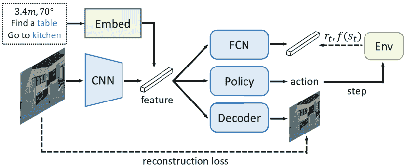

<!--yml

category: 未分类

日期：2024-09-06 19:52:25

-->

# [2108.04097] 《深度学习在具身视觉导航研究中的应用：综述》

> 来源：[`ar5iv.labs.arxiv.org/html/2108.04097`](https://ar5iv.labs.arxiv.org/html/2108.04097)

# 《深度学习在具身视觉导航研究中的应用：综述》

朱凤达、朱怡、Vincent CS Lee、梁晓丹和常晓军。朱凤达和 Vincent CS Lee 供职于蒙纳士大学信息技术学院数据科学与人工智能系。朱怡供职于中国科学院大学。梁晓丹供职于中山大学智能系统工程学院。常晓军供职于 RMIT 大学计算技术学院。手稿收到日期：2021 年 7 月 8 日。

###### 摘要

“具身视觉导航”问题要求代理在 3D 环境中主要依赖其第一人称观察进行导航。由于在吸尘器、救援机器人等广泛应用，这一问题近年来引起了越来越多的关注。一个导航代理应该具备各种智能技能，如视觉感知、建图、规划、探索和推理等。构建一个能够观察、思考和行动的代理是实现真正智能的关键。深度学习方法的卓越学习能力使得代理能够完成具身视觉导航任务。尽管如此，由于需要许多高级技能，包括感知部分观察到的视觉输入、探索未见区域、记忆和建模已见场景、理解跨模态指令以及适应新环境等，具身视觉导航仍处于初期阶段。近年来，具身视觉导航引起了社区的广泛关注，许多研究提出了学习这些技能的方法。本文试图通过提供全面的文献综述，建立该领域当前工作的概述。我们总结了基准和指标，回顾了不同的方法，分析了挑战，并突出了最先进的方法。最后，我们讨论了具身视觉导航领域尚未解决的挑战，并提出了未来研究的有前景方向。

###### 索引词：

深度学习、具身环境、具身视觉导航、跨模态导航、导航机器人。

## 1 引言

图 1：具身导航的深度学习方法分类。

构建一个可以自主完成任务的机器人已经是一个研究了很长时间的话题[1, 2, 3]。一些复杂的应用，如吸尘、帮助残疾人和救援，需要一个代理在 3D 环境中导航以完成不同地点的多个子任务。因此，导航是构建现实世界中智能可导航机器人的关键能力之一。在导航过程中，机器人需要通过感知具体的视觉输入来移动以找到目标位置，这被称为“具体视觉导航”。通过其物理实体与环境互动的代理被称为“具体代理”[4]。图 2 展示了一个导航过程。代理首先接收到指令“*把客厅里的椅子放到第二个阳台上*”。然后，它导航找到目标椅子。代理拿起椅子并导航到阳台上并放下椅子。

早期关于机器人导航的工作[5, 6]主要依赖于手工特征，如光流和传统算法，如马尔可夫定位[7]、增量定位[8]或地标跟踪[9]。这些方法涉及大量的超参数，并且在未见过的环境中无法很好地泛化。深度学习的最新发展揭示了其从大规模数据中学习稳健模型的能力。通过端到端深度学习方法训练的视觉机器人更加稳健，超参数更少，并且在未见过的环境中具有更好的泛化能力。

然而，在实现具体视觉导航的深度学习过程中，一些挑战需要解决：1) 从现实世界收集数据很昂贵；2) 从部分观察中学习的模型不稳定；3) 学习长期导航技能如探索和记忆困难；4) 感知自然语言指令具有挑战性，因为自然语言多样且格式灵活；5) 模拟环境与现实世界环境之间的大领域差距阻碍了导航策略的适应等。

本文讨论了机器人导航领域的相关工作，并为构建真实世界的导航机器人提供了有前景的方向。本文的结构如图 1 所示。在真实世界中进行训练和测试存在许多缺点：1）由于真实机器人一次只能采样一个轨迹，而模拟器可以高效地在多处理环境中采样轨迹，真实世界的数据采样效率非常低；2）真实世界环境的复杂性和动态性限制了可复制性；3）不同环境之间存在较大的领域偏差等。3D 仿真技术的发展使研究人员能够构建一个模拟环境[10, 11, 12, 13, 14]，以研究在其中构建稳健导航代理。模拟器渲染这些 3D 资产以生成 RGB-D 图像，并提供物理传感器、GPS 传感器等来模拟真实的具身机器人环境。在模拟环境中学习导航是一个广泛的领域，有许多挑战需要解决。在解决目标驱动导航问题时，研究人员提出了无模型方法[15, 10, 16]，自监督方法[17, 18, 19]，基于规划的方法[20, 21, 22]。感知自然语言是一项具有挑战性的任务，因为其多样性和复杂性。这要求代理不仅能够逐步执行句子指令[12, 23, 24]，还要理解对话[20, 21, 22]或导航以回答问题[20, 21, 22]。在构建真实世界导航机器人时，一些工作[25, 26, 27]建议直接在真实环境中训练代理，而其他工作[28, 29, 30]则建议引入迁移学习，将从模拟环境中学习到的导航策略转移到真实环境中。

图 2：导航过程的演示，其中机器人移动到几个地方以完成任务。

与之前的机器人导航综述[6, 5]相比，我们的论文专注于解决具身导航问题的深度学习方法：

1.  1.

    据我们所知，我们的论文是首个全面研究深度学习方法在具身导航任务中进展的工作。

1.  2.

    本文总结并比较了最近提出的具身导航数据集、模拟器和任务的独特见解。

1.  3.

    这篇论文介绍了用于具身视觉导航的深度学习方法，包括它们的动机和贡献。

1.  4.

    本文对近年来的研究结果进行了分类，并给出了一些有前景的具身导航方向。

本文的组织结构如下。第二部分讨论了当前的具身数据集和具身模拟器。第三部分介绍了具身导航基准，包括导航任务和导航指标。第四部分列出了在模拟具身导航环境中训练代理导航的方法，其中第 4.1 节列出了面向目标的任务的方法，第 4.2 节介绍了跨模态任务的方法。第五部分总结了建立导航机器人的工作。第六部分阐明了模拟环境与现实环境之间的领域差距，并介绍了解决这些挑战的方法。在第七部分，我们重点介绍了最近的最先进工作，讨论了当前工作的局限性，并提出了在构建现实世界导航机器人方面的有希望的方向。

| 数据集 | 年份 | 场景 | 房间 | 对象类别 | RGB | 深度 | 2D 语义 |
| --- | --- | --- | --- | --- | --- | --- | --- |
| Stanford Scene* [31] | 2012 | 130 | 130 | - | 合成 | ✗ | ✗ |
| SceneNet* [32] | 2016 | 57 | 57 | 218 | 合成 | ✗ | ✓ |
| 2D-3D-S* [33] | 2017 | 270 | 270 | 13 | 合成 | ✓ | ✓ |
| SUNCG [34] | 2017 | 45,622 | 775,574 | 84 | 合成 | ✓ | ✓ |
| CHALET [35] | 2018 | 10 | 58 | 150 | 合成 | ✗ | ✗ |
| Matterport3D [36] | 2017 | 90 | 2,056 | 40 | 现实 | ✓ | ✓ |
| Gibson [14] | 2018 | 572 | 8,854 | 84 | 现实 | ✓ | ✓ |
| Replica [37] | 2019 | 18 | 35 | 88 | 现实 | ✓ | ✓ |

表 I：现有具身数据集的比较 (*: 数据集仅渲染一个房间作为场景)。

图 3：每个数据集的渲染场景。

## 2 具身导航环境

在这里，我们讨论用于具身导航的环境。我们总结了提供 3D 资产的数据集，以及渲染资产并为导航代理提供交互界面的模拟器。

### 2.1 具身数据集

具身数据集包含用于渲染的 3D 资产，如纹理和网格，以及用于高层任务的其他配置数据，如物体位置、物体类别和相机姿态。所提数据集的比较见表格 I。

早期工作集中于渲染复合 RGB 视图 [31]。它训练一个概率模型，以基于手工创建的场景生成合成数据。后来，SceneNet [32] 引入了一个生成模型来注释 2D 语义。由于深度通道被证明对导航代理有帮助 [19, 38]，2D-3D-S [33] 提供了带有深度信息的资产。与这些一次渲染单个房间的工作不同，后来的工作 [34, 39, 40] 提供了大量场景，包括卧室、客厅、浴室、厨房等。然而，上述数据集使用的合成视图与真实世界场景相差较大，这限制了数据集的应用。为此，Matterport3D [36] 通过 3D 重建提供了照片级真实的全景视图，并提供了这些视图的 2D 和 3D 语义。Gibson [14] 提供了一个包含 572 栋房屋的更多样化的数据集。Replica [37] 提出了一个包含 18 个室内场景的数据集，具有密集网格和高分辨率纹理。一些工作，如 AI2-THOR [40]、RoboTHOR [39] 和 CHALET [35]，依赖于当前未发布的数据集。一些数据集的渲染场景见图 3。

### 2.2 具身模拟器

具身模拟器提供了一个界面，使代理能够与环境互动。我们在表 II 中比较了现有模拟器的不同特性。模拟器配备了许多传感器，如 RGB 传感器、深度传感器、物理传感器和位置传感器。早期的模拟器由于 3D 渲染技术的限制，提供了低 RGB 分辨率和不真实的图像。视觉细节的缺乏限制了代理的导航性能。随后，为了解决这个问题，Matterport3D 模拟器 [12]、Gibson 模拟器 [14] 和 Habitat [13] 等模拟器提出了高分辨率的照片真实全景视图，以模拟更真实的环境。渲染帧率对于具身模拟器也很重要，因为它对训练效率至关重要。MINOS [11] 的帧率超过了每秒 100 帧（FPS），是其前作的 10 倍。Habitat [13] 在 $512\times 512$ RGB-D 图像上超过了 1000 FPS，使其成为现有模拟器中速度最快的。[12]中的离散状态空间简化了导航问题，使代理更容易学习复杂的视觉-语言导航任务。然而，连续状态空间更受欢迎，因为它有助于将已学习的代理转移到现实世界的机器人上。可定制的模拟器能够通过移动物体、改变物体的纹理和重新配置灯光来生成更多样的数据。多样的数据偏差较小，因此使深度学习能够学习到稳健的导航策略。尽管在静态房间中寻找目标物体，但互动是现实世界机器人另一个关键技能。一些复杂的任务可能需要机器人与物体互动，例如捡起杯子、移动椅子或打开门。AI2-THOR [40]、iGibson [41] 和 RoboTHOR [39] 提供了互动环境来训练这种技能。多智能体强化学习 [42, 43] 是一个新兴的合作与竞争问题。AI2-THOR 和 iGibson 也支持多智能体训练以研究合作任务。

| 模拟器 | 年份 | 使用数据集 | 分辨率 | 物理 | 帧率 | 可定制 | 互动 | 多智能体 |
| --- | --- | --- | --- | --- | --- | --- | --- | --- |
| MINOS [11] | 2017 | SUNCG, Matterport3D | $84\times 84$ | ✓ | 100 | ✗ | ✗ | ✗ |
| AI2-THOR* [40] | 2017 | - | $300\times 300$ | ✓ | 120 | ✓ | ✓ | ✓ |
| House3D [10] | 2018 | SUNCG | $120\times 90$ | ✗ | 600 | ✓ | ✗ | ✗ |
| CHALET [35] | 2018 | CHALET | $800\times 600$ | ✗ | 10 | ✗ | ✗ | ✗ |
| Matterport3D [12] | 2018 | Matterport3D | $512\times 512$ | ✗ | 1,000 | ✗ | ✗ | ✗ |
| Gibson [14] | 2018 | Gibson, Matterport3D, 2D-3D-S | $512\times 512$ | ✓ | 400 | ✗ | ✗ | ✗ |
| iGibson [41] | 2018 | Gibson | $512\times 512$ | ✓ | 400 | ✓ | ✓ | ✓ |
| Habitat [13] | 2019 | Matterport3D, Gibson, Replica | $512\times 512$ | ✓ | 10,000 | ✗ | ✗ | ✗ |
| RoboTHOR* [39] | 2020 | - | $300\times 300$ | ✓ | 1200 | ✓ | ✓ | ✗ |

表 II：现有体现模拟器的比较（*: 模拟器使用的数据集目前尚未发布）。

## 3 体现导航基准

在这里，我们介绍了几个任务以研究体现的视觉导航问题。这些任务可以分为三类：目标驱动导航任务、跨模态导航任务和互动导航任务。

### 3.1 目标驱动导航任务

PointGoal 导航，首先由安德森 *等人* [44] 定义，是一个任务，其中代理从随机起始位置和方向初始化，然后要求导航到一个目标位置。目标位置由其相对于起始位置的相对坐标指示。这个任务要求代理估计从起始位置到目标的累计距离，以便代理知道离目标有多远。从理论上讲，这个任务可以应用于所有体现环境。

ObjectGoal 导航是由朱 *等人* [15] 提出的。在这个任务中，代理被初始化到一个随机起始位置，并要求找到一个特定的物体，例如桌子或床。代理找到物体后停止。如果代理在目标物体附近，则导航过程被视为 *成功*。除了房间结构，*ObjectGoal* 导航任务还需要物体标签和位置。物体识别和探索是 *ObjectGoal* 导航的关键技能。

RoomGoal 导航是由吴 *等人* [10] 提出的。在这个任务中，代理从随机位置初始化，要求导航到一个房间（例如卧室或厨房）。如果代理停在目标房间内，则导航过程被视为 *成功*。*RoomGoal* 导航需要房间注释。房间的概念是一种高级语义。因此，*RoomGoal* 导航代理需要根据视觉细节，如家具类型和房间布局，来理解场景。

多目标导航（MultiON）最近，越来越多的研究者关注于长期导航任务，其中一个智能体需要记住所有访问过的场景。受到这一点的启发，Wani *et al.* [45] 提出了 MultiON，一个用于多目标导航的基准。在 MultiON 中，智能体被要求逐一导航到多个目标对象，这使得导航轨迹相当长。当智能体到达指定目标时，会发出 FOUND 动作。部分观察下的感知和有效规划将是解决此任务的关键。

### 3.2 跨模态导航任务

视觉-语言导航（VLN）VLN 是一个任务，要求智能体逐步遵循自然语言指令进行导航 [12]。以前的任务如 *ObjectGoal* 和 *RoomGoal* 将对象和房间的语义硬编码为一个独热向量。相反，VLN 引入自然语言句子来指导导航过程，如 *“上楼，经过正前方的钢琴和拱门。走廊尽头遇到图片和桌子时右转。停在墙上悬挂的驼鹿角旁等待”*。如果智能体按照指令停在接近预期目标的位置，则 VLN 任务成功完成。

已经提出了几个用于视觉-语言导航的数据集：R2R [12]、R4R [46] 和 RxR [47]。房间到房间（R2R）数据集在 [12] 中被提出，用于研究视觉-语言导航。R2R 数据集包含 21,567 条导航指令，平均长度为 29 个单词。然而，R2R 数据集存在几个缺点：1) 参考路径是直接到达目标，因此 R2R 指令缺乏描述复杂路径的能力；2) 指令由几个句子组成且不够细化；3) 训练数据量小，模型容易过拟合；4) 指令语言仅为英语，不包含其他语言。为了解决这些问题，提出了更多先进的数据集。Jain *et al.* [46] 将 R2R 中的轨迹和指令交叉连接，生成了一个新的数据集，名为 R4R。FGR2R [48] 通过子指令及其对应的轨迹丰富了 R2R。RxR [47] 是一个时间对齐的数据集，它缓解了轨迹中的已知偏差，并引出了更多对 R2R 中可见实体的引用。

从对话历史进行导航（NDH） 在陌生环境中导航时，人类通常会寻求帮助并根据其他人的回答继续导航。然而，构建一个能够自主提出自然语言问题并对回答做出反应的代理仍然是机器人导航的长期目标。在 NDH[49]中，要求代理根据对话历史进行导航，对话历史由多个问答对组成。研究 NDH 对于构建真实世界的对话导航机器人至关重要。

具身问答（EQA） 视觉问答（VQA）[50] 是一种跨模态任务，其中系统根据给定的图像回答基于文本的问题。VQA 很快成为最受欢迎的计算机视觉任务之一，因为它揭示了人类与人工智能代理在自然语言中的交互可能性[51, 52, 53]。与 VQA 相比，更先进的活动是通过自我探索在未知环境中回答问题。具身问答（EQA）[54] 是一种任务，其中一个代理在 3D 环境中的随机位置生成并被问到一个问题。EQA 是一个具有挑战性的任务，因为它需要广泛的 AI 技能：视觉感知、语言理解、目标驱动导航、常识推理等。除了其他任务中的导航准确性，EQA 还提出了 EQA 准确性来衡量代理是否正确回答了问题。

REVERIE 最近，齐*等人*[55]提出了在真实室内环境中的远程具身视觉参考表达，简称 REVERIE，以研究自然语言指令与视觉语义的关联。与 VLN 不同，VLN 给出的指令是描述目标的逐步轨迹，而 REVERIE 中的自然语言指令指向一个远程目标对象。与*ObjectGoal*导航相比，REVERIE 提供了丰富的语言描述，以帮助代理在房屋中找到唯一的目标。

音频视觉导航，由陈*等人*[56]提出，引入了音频模式以用于具身导航环境。该任务要求代理通过视觉和听觉导航到一个声音对象。这鼓励研究人员研究音频在导航中的作用。这项工作还提供了用于音频视觉导航任务的 SoundSpaces[56]数据集。SoundSpaces 数据集建立在两个模拟器上，Replica 和 Matterport3D。它包含了 102 种自然声音，涵盖了多种类别：铃声、开门声、音乐、人声、电话铃声等。

| 指标名称 | $\uparrow\downarrow$ | 公式 | PS | SP | UO | SI | OS | CC |
| --- | --- | --- | --- | --- | --- | --- | --- | --- |
| 路径长度 (PL) | - | $\sum_{1\leq i<&#124;P&#124;}d(p_{i},p_{i+1})$ | - | ✓ | - | ✗ | ✗ | $O(&#124;P&#124;)$ |
| 导航误差（NE） | $\downarrow$ | $d(p_{&#124;P&#124;},r_{&#124;R&#124;})$ | ✗ | ✓ | ✗ | ✗ | ✗ | $O(1)$ |
| 预测导航误差（ONE） | $\downarrow$ | $\min_{p\in P}d(p,r_{&#124;R&#124;})$ | ✗ | ✓ | ✗ | ✗ | ✗ | $O(&#124;P&#124;)$ |
| 成功率（SR） | $\uparrow$ | $\mathbbm{1}[\text{NE}(P,R)\leq d_{th}]$ | ✗ | ✗ | ✗ | ✓ | ✗ | $O(1)$ |
| 预测成功率（OSR） | $\uparrow$ | $\mathbbm{1}[\text{ONE}(P,R)\leq d_{th}]$ | ✗ | ✗ | ✗ | ✓ | ✗ | $O(&#124;P&#124;)$ |
| 按 PL 加权的成功率（SPL） | $\uparrow$ | $\text{SR}(P,R)\cdot\dfrac{d(p_{1},r_{&#124;R&#124;})}{\max\{\text{PL}(P),d(p_{1},r_{&#124;R&#124;})\}}$ | ✗ | ✓ | ✓ | ✓ | ✗ | $O(&#124;P&#124;)$ |
| 按编辑距离加权的成功率（SED） | $\uparrow$ | $\text{SR}(P,R)\left(1-\dfrac{\text{ED}(P,R)}{\max{\{&#124;P&#124;,&#124;R&#124;}\}-1}\right)$ | ✓ | ✗ | ✓ | ✓ | ✗ | $O(&#124;R&#124;\cdot&#124;P&#124;)$ |
| 路径覆盖（PC） | $\uparrow$ | $\dfrac{1}{&#124;R&#124;}\sum_{r\in R}\exp\left(-\dfrac{d(r,P)}{d_{th}}\right)$ | ✓ | ✓ | ✓ | ✓ | ✗ | $O(&#124;R&#124;\cdot&#124;P&#124;)$ |
| 长度评分（LS） | - | $\dfrac{1}{1+&#124;1-\frac{\text{PL}(P)}{\text{PC}(P,R)\cdot\text{PL}(R)}&#124;}$ | ✗ | ✓ | ✗ | ✗ | ✗ | $O(&#124;R&#124;\cdot&#124;P&#124;)$ |
| 按 LS 加权覆盖（CLS） | $\uparrow$ | $\text{PC}(P,R)\cdot\text{LS}(P,R)$ | ✓ | ✓ | ✓ | ✓ | ✗ | $O(&#124;R&#124;\cdot&#124;P&#124;)$ |
| 标准化动态时间规整（nDTW） | $\uparrow$ | $\exp\left({-\dfrac{\min\limits_{W\in\mathcal{W}}\sum_{(i_{k},j_{k})\in W}d(r_{i_{k}},p_{j_{k}})}{&#124;R&#124;\cdot d_{th}}}\right)$ | ✓ | ✓ | ✓ | ✓ | ✓ | $O(&#124;R&#124;\cdot&#124;P&#124;)$ |

表 III：我们从多个方面比较现有指标，包括性能（$\uparrow$表示越高越好，$\downarrow$表示越低越好）、公式、路径相似度（PS）、软惩罚（SP）、唯一最优（UO）、尺度不变性（SI）、顺序敏感性（OS）和计算复杂度（CC）。假设我们有一个预测轨迹$P$和一个真实轨迹$R$。$p_{i}$和$r_{i}$分别是轨迹$P$和$R$上的第 i 个节点。$|P|$和$|R|$分别表示$P$和$R$的长度。房子的 Dijkstra 距离已预处理，任何$d(p_{i},r_{j})$的计算复杂度为$O(1)$。

多目标具身问答（MT-EQA）EQA 中的自然语言问题很简单，因为每个问题仅描述一个对象，缺少属性和多个目标之间的关系。在 MT-EQA [57]中，指令类似于*“卧室里的梳妆台是否比厨房里的烤箱大”*，其中*梳妆台*和*烤箱*位于不同的地方，具有不同的属性。因此，智能体必须导航到多个地方，找到所有目标，分析它们之间的关系，并回答问题。

### 3.3 交互导航任务

交互式问答（IQA）构建一个能够与动态环境互动的代理是 AI 社区的长期目标。最近提出的交互式模拟器[41, 39, 40] 提供了基本功能，如开门或移动椅子，这使研究人员能够构建一个交互式导航代理。交互式问答（IQA）[58] 让代理通过与环境中的物体互动来回答问题。IQA 包含 76,800 个训练问题，包括存在问题、计数问题、空间关系问题。

“帮助，安娜！”（HANNA）HANNA [59] 是一个对象寻找任务，允许代理在迷路时请求自动自然导航助理（ANNA）的帮助。与提供全球对话历史作为指令的 NDH 不同，HANNA 提供了一个环境，在这个环境中，指令会根据情况动态变化。这个环境创建了一个接口，使得人在测试期间能够帮助代理在迷路时。

### 3.4 评估指标

已提出许多评估指标来评估导航代理的表现。我们将这些指标分为两类：轨迹无关指标和轨迹相关指标。轨迹无关指标 Zhu *et al.* [15] 使用从随机起点到达目标所需的平均步数（即，平均轨迹长度）。然而，当导航环境变得更复杂且导航任务变得更具挑战性时，大比例的轨迹会失败。后续工作[10, 60, 11] 引入了成功率（SR）来衡量代理成功到达目标的频率，其他工作[60, 54] 报告了导航误差（NE），即代理最终停止时距离目标的平均距离。提出了 Oracle Success Rate（OSR）来评估代理是否按照 oracle 停止规则正确停止[61, 12]。这些指标测量代理完成任务的概率，但未能衡量完成任务的比例。

**轨迹敏感度量** **成功按路径长度加权（SPL）** 是第一个评估导航代理的效率和效果的度量，并被视为 VLN 中的主要度量。SPL 忽略了转向动作和代理方向。*按编辑距离加权的成功*（SED）[62]考虑了转向动作并解决了这个问题。SED 设计用于基于图的环境中的指令遵守，其中存在某条正确路径。然而，在一些任务中，如 R4R [46] 和 R6R [63]，指令路径并不是直接到达目标。因此，使用 SPL 来评估导航性能是不合适的。因此，提出了*按长度加权的覆盖度得分*（CLS）[46]来测量代理行为对描述路径的一致性。CLS 是两个变量的乘积：路径覆盖率和长度分数。Ilharco *等* 吸收了广泛应用于各种领域的动态时间规整[64]的理念[65, 66, 67]，并提出了标准化动态时间规整（nDTW）度量[68]来评估导航性能。与 CLS 类似，nDTW 评估预测路径与真实路径之间的距离。此外，nDTW 对导航路径的顺序敏感，而 CLS 对顺序不敏感。nDTW 可以通过高效的动态规划算法实现。路径敏感度量，如 CLS 和 nDTW，在作为奖励函数使用时表现优于目标导向奖励函数，用于强化学习中的导航[46, 68]。

**度量的测量** 每个度量根据其公式具有独特的特性。我们在表格 III 中比较了现有度量的公式和特性。在这一部分，我们介绍了评估度量函数的测量方法：

1) **路径相似性（PS）**描述了$P$和$R$之间的相似性概念。这意味着度量应依赖于$P$中的所有节点以及$R$中的所有节点。PS 惩罚与真实路径的偏离，即使这些偏离最终达到相同的目标。这不仅是谨慎的，因为如果不加以强制，代理可能会在不希望的地形上游荡，而且还明确衡量了预测与所提供语言指令的一致性。

2) **软惩罚（SP）**根据图中的距离以一种软性不相似的方式惩罚与真实路径的差异。这确保了较大的偏差会比较小的偏差受到更严厉的惩罚，并且 SP 不应仅依赖于交叉点的二分观点。

3) 唯一最优（UO）仅当参考路径和预测路径完全匹配时才会产生完美得分。这确保了完美得分是明确无误的：参考路径$R$因此被视为黄金标准。没有其他路径应该有与参考路径相同或更高的得分。

4) 尺度不变性（SI）衡量一个度量在不同数据集上是否独立。如果度量在数据集上变异，例如导航误差，则其在不同数据集上的得分不能直接比较。

5) 顺序敏感性（OS）指示一个度量是否对具有相同轨迹长度、成功率等的导航顺序敏感。导航顺序揭示了一些导航策略，尽管通常很难评估。

6) 计算复杂度（CC）衡量计算一对$(P,R)$的成本。设计一个快速算法来计算自动验证和测试的得分是重要的。

### 3.5 总结

具身导航基准定义了不同设置下的任务和指标。像*PointGoal*、*ObjectGoal*和*RoomGoal*导航这样的目标导向任务可以通过 3D 资产提供标签，不需要额外的人为注释。跨模态导航任务，如 R2R [12]、Visual Dialogue Navigation [49] 或 REVERIE [55] 需要人工标注轨迹和相应的语言描述。交互式任务 [59, 41] 需要代理学习操作对象，由于其在现实场景中的广泛应用，引起了越来越多的关注。

## 4 模拟环境中的方法

在本节中，我们主要讨论模拟环境中的两个问题：目标驱动导航和跨模态导航。并介绍了解决这些问题的方法。

### 4.1 目标驱动导航

针对这个问题的方法主要集中在从随机起始位置导航到目标。目标可以由 RGB 图像、向量或单词指定。代理预测诸如*向左转*、*向右转*、*向前移动*等动作，以在具身环境中导航，并预测*停止*表示停止动作。解决此问题的方法多种多样，包括：1) 无模型方法；2) 基于规划的方法；和 3) 自监督方法。

#### 4.1.1 无模型方法

无模型方法通过端到端学习来导航，而不对环境进行建模，如图 4 所示。学习目标包括模仿学习或强化学习。学习目标的公式为：

|  | $\mathcal{L}=\sum_{t}-a_{t}^{*}log\left(p_{t}\right)-\sum_{t}a_{t}log\left(p_{t}\right)A_{t},$ |  | (1) |
| --- | --- | --- | --- |

其中 $a^{*}$ 是真实的动作，$p_{t}$ 是动作的概率，而 $A_{t}$ 是 A3C 中的优势[69]。虽然广泛的强化学习研究[70, 71, 61] 长期以来一直研究代理在每一步接收全局状态的二维导航问题，但具有部分观察的体态导航问题仍然具有挑战性。许多机器人控制的研究[72, 73, 74, 75] 更关注于避障而非轨迹规划。

图 4：无模型视觉导航模型的示意图。该模型通过模仿学习和强化学习进行学习。$r_{t}$ 是奖励，$f(s_{t})$ 表示从状态 $s_{t}$ 计算的标签。而 $a^{\prime}$ 是代表最佳动作的标签。

Zhu *等* [15] 首先提出使用深度学习进行特征匹配和深度强化学习进行策略预测，这使得代理能够更好地在未见过的环境中进行泛化。随后，提出了后继表示 (SR) [76] 以使代理能够与对象互动。该框架考虑了对象的状态和场景的离散描述。后继表示编码了语义信息，并将其与视觉表示连接起来，如[15] 中所述。与仅使用强化学习来学习策略预测器的[15]不同，后继表示模型通过模仿学习引导强化学习。以前的模型缺乏编码时间信息的能力。通过引入 LSTM 层以编码历史信息，Wu *等* [10] 能够构建一个能够在未见过的场景中进行泛化的代理。在消融研究中，该工作证明了 A3C [69] 在视觉导航任务中优于 DDPG [77]，并且从语义掩码中学到的模型优于从 RGB 输入中学到的模型。尽管通过策略深度强化学习算法解决视觉导航问题，但一些工作采用了其他算法。Li *等* [78] 提出了一个基于 Q 学习的端到端模型，该模型学习视角不变和目标不变的视觉伺服，以进行本地移动机器人导航。

许多研究使用对象的分割掩膜来增强视觉输入。Mousavian *et al.* [16] 通过引入在 MSCOCO 数据集 [79] 上训练的 Faster-RCNN 检测器和 [80] 定义的分割器来利用视觉输入中的实例特征，以检测和分割对象。Shen *et al.* [81] 通过融合多样的视觉表示（包括 RGB 特征、深度特征、分割特征、检测特征等）来提高导航代理的零样本泛化能力。不同的视觉表示被自适应加权以进行融合。为了进一步提高鲁棒性，他们提出了一种任务间亲和性正则化，鼓励代理选择更多互补且冗余较少的表示进行融合。尽管检测器和分割器表现良好，学习一个鲁棒的导航策略仍然具有挑战性。例如，寻找杯子时，人们会在咖啡机附近搜索柜子，而寻找水果时，人们可能会首先检查冰箱。为了解决这个问题，Lv *et al.* [82] 将 3D 知识图谱和子目标集成到深度强化学习框架中。为了增强跨场景泛化，Wu *et al.* [83] 将信息论正则化项引入 RL 目标，并通过学习变分生成模型来建模动作-观察动态。

一些研究探讨了室外导航以外的问题设置，例如街景导航或结合其他模态。Khosla *et al.* [84] 首次尝试通过具身视觉导航方法解决户外街道导航任务，其中代理纯粹依靠全景街景进行导航。DeepNav [85] 基于卷积神经网络（CNN），使用局部可见的街景图像在大城市中进行导航。这些研究依赖于带有真实方向输入的监督训练，但在现实世界中，指南针有时可能不可用。另一个研究 [86] 提出了一个端到端的深度强化学习框架，使用来自 Google 街景的街景场景作为视觉输入，但没有真实的指南针。认识到地方特定知识对导航的重要性，他们提出了一种双通道架构，允许地方特定特征被封装。AV-WaN [87] 被提出以应对音频-视觉导航中的挑战。该模型以音频-视觉路径点为基础，基于其音频-视觉观察和部分地图动态设置中间目标位置，以端到端的方式进行学习。

图 5：端到端视觉导航模型的自监督目标示意图。$r_{t}$ 是奖励，$f(s_{t})$ 代表从状态 $s_{t}$ 计算出的标签。

#### 4.1.2 自监督方法

自监督学习是利用各种前置任务进行额外训练信号的长期研究课题。它使得智能体能够在没有额外人工注释的情况下学习更多知识。在深度学习领域，已经提出了各种自监督任务，例如上下文预测 [88]、解决拼图难题 [89]、颜色化 [90]、旋转 [91]。在强化学习中，也提出了一些辅助任务，以提高数据效率和泛化能力。Xie *et al.* [17] 将自监督学习与基于模型的强化学习相结合，以解决机器人任务。受传统 UVFA 架构的启发 [92]，该架构通过特征学习来学习价值函数，Jaderberg *et al.* [18] 发明了辅助控制和奖励预测任务，显著提高了数据效率和鲁棒性。

在具身导航中，环境包含了结构不规范的语义信息，这在端到端方式中很难学习。尽管可以使用 SLAM 或记忆机制显式建模环境，自监督学习提供了另一种学习这些结构不规范知识的可行方法。Mirowski *et al.* [19] 提出了一个在线导航模型，具有两个自监督辅助目标：通过 RGB 视图预测当前深度视图和检测回环闭合。类似的思想 [93] 已经应用于游戏应用 [94] 中，以实现快速探索。辅助任务还可以加速学习。Ye *et al.* [95, 96] 通过将强化学习与各种辅助任务相结合，在 *PointGoal* 和 *ObjectGoal* 导航中取得了巨大的成功，其形式为：

|  | $L_{total}=L_{RL}+\sum_{i}^{n}\beta_{i}L_{Aux,i}.$ |  | (2) |
| --- | --- | --- | --- |

视觉感知对于视觉导航至关重要。但强化学习提供的训练信号含有过多噪声，难以训练出一个稳健的特征感知网络。编码器-解码器架构被证明在视觉编码和分割预测中是有益的[97]。此外，采用辅助任务来惩罚分割误差，这有助于特征感知的学习。然而，这种自监督辅助任务仅学习了两个相邻状态之间的低级动态功能，未能学习高级语义信息。为了保证轨迹中动作的语义一致性，刘*等*[98]提出了一种辅助正则化任务来惩罚表示的不一致性。这个正则化任务鼓励策略网络从每个传感器中提取显著特征。由于存在驱动噪声（如轮胎打滑、运动传感器误差、反弹等），现实世界的机器人运动远非确定性。为了减少噪声，Datta *等*[99]通过时间差分引入了一种定位估计的辅助任务。该辅助任务用于训练 CNN 网络，并将估计的运动作为策略网络的输入。一个好奇心驱动的自监督目标[100]被应用于鼓励探索，同时惩罚重复动作。一个稳定的好奇心驱动的策略在没有重复动作的情况下可以提高探索效率。自监督辅助任务在导航的跨模态理解中也很有帮助。Dean *等*[101]使用音频作为自监督探索的额外模态。它包括一个好奇心驱动的内在奖励，鼓励智能体探索不同感官模态（音频和视觉）之间的新关联。自监督导航方法的流程概述见图 5。智能体首先将视觉图像和指令嵌入为特征。然后将视觉特征和指令特征融合以预测动作。辅助任务使用融合特征进行预测，如预测奖励或重建输入的视觉图像。

图 6: “神经 SLAM”模型的常见实践概述。“ST”是空间变换函数。

#### 4.1.3 基于规划的方法

在解决定位问题的同时对未知环境进行地图构建的问题被称为**同时定位与地图构建**（SLAM）[102, 103]。早期的视觉导航研究使用了立体摄像机[104, 105]和单目摄像机，如 MonoSLAM[106]。在过去的十年里，传统的几何基础方法[107, 108, 109]仍然主导了这一领域。随着深度学习的发展，提出了一些方法，如 CNN-SLAM[110]、DVO[111]和 D3VO[112]。一些室内任务被提出用于研究 SLAM，例如 KITTI[113]和 EuRoC[114]。然而，这些任务与体现导航任务不同。里程计基准是估计给定视觉输入序列的位置，而导航任务是将指令与环境语义对齐。

最近，研究人员发现定位能力对导航非常重要，尤其是在长期路径规划中。因此，一些工作引入 SLAM 方法来建模房屋并提高代理的定位能力。Neural Map[115]将这一理念推广到所有深度强化学习代理，而不仅仅是导航。然而，这项工作假设代理的位置始终已知，并且未利用这一记忆的二维结构。Neural SLAM[116]通过将类似 SLAM 的过程嵌入软注意力[117]来解决这一问题。为了避免与重复变形相关的空间模糊，MapNet[118]建议使用以世界为中心而非以自我为中心的地图。与之前的工作不同，MapNet 通过一个深度神经网络模块保持 2.5D 表示，该模块学习从 3D 体现视觉输入中提炼视觉表示。Gordon *et al.*[58]提出了层次互动记忆网络（HIMN），这是一个用于 IQA 任务的层次控制器框架。高层控制器是一个规划者，它决定长期导航目标，低层控制器则预测动作，与环境互动并回答问题。Gupta *et al.*[20]在体现导航中引入了 Neural-SLAM 方法。该工作包括两个部分：地图构建和规划。地图构建机制维护一个 2D 记忆地图。对于每一步，它将体现场景转换为 2D 特征，并用该特征更新地图。规划机制使用价值函数来输出策略。

高效的探索被广泛认为是强化学习（RL）中的主要挑战之一[119, 120, 121]。类似地，它在导航中也很重要，因为目标从起始位置并不总是可见，代理需要探索未见过的场景并寻找目标。最近，基于明确建模的语义记忆的探索被证明是高效的。为了学习具有空间记忆的策略，Chen *et al.* [122] 通过模仿学习引导模型并用完全来自车载传感器的覆盖奖励进行微调。主动神经 SLAM（ANS）[22] 是一种成功的神经 SLAM 方法，在 CVPR 2019 Habitat *Pointgoal* 导航挑战中达到了最先进的水平。ANS 提出了一个用于规划的层次结构。受到层次化 RL[123, 124] 思想的启发，ANS 通过强化学习学习高层规划器，通过模仿学习学习低层规划器。映射器通过预测 2D 地图的辅助任务来实现。地图的第一个通道表示是否存在障碍物，第二个地图表示位置是否已被探索。然而，预定义的 2D 地图无法帮助长期导航，因为不同视角下场景的语义信息未被编码在地图中。神经拓扑 SLAM[125] 提出了一种更先进的方法，存储观察到的特征表示。这种方法引入了一个图更新模块以利用语义。图更新模块维护一个拓扑特征记忆。每一步，模块将当前观察定位到记忆节点中。如果观察未被定位到记忆中的任何节点，图更新模块将添加一个新节点到拓扑特征记忆中。面向目标的语义探索（SemExp）[126] 解决了现实环境中的目标导航任务。这种方法首先建立一个情景语义地图，并基于目标对象的类别使用它来探索环境。这种方法在 Habitat ObjectNav Challenge 2020 中达到了最先进的水平。图 6 展示了基于‘神经 SLAM’的模型的常见做法。除了图 5 中所示的视觉编码器和指令编码器外，‘神经 SLAM’模型还有一个独特的模块，将具身视觉视图投影到特征表示中，并将其存储在 2D 自上而下的地图中。

|  | $m_{t},\hat{x_{t}}=f_{SLAM}(s_{t},x_{t-1:t}^{\prime},m_{t-1} | \theta_{S})$ |  | (3) |
| --- | --- | --- | --- | --- |

其中 $x_{t-1:t}^{\prime}$ 代表之前的姿态，$m_{t-1}$ 是之前的地图，$\theta_{S}$ 代表参数。这个地图模型描述了房间的结构和场景的视觉表现。投影特征表示与视觉特征和指令特征融合，以共同预测一个动作。

#### 4.1.4 总结

与传统的机器人方法相比，无模型方法能够通过使用具身模拟器采样大规模数据来获得稳健的导航模型。一些工作采用检测和分割方法以获得更好的视觉视图。尽管主要应用于室内场景，无模型方法在街道场景和多模态环境中取得了巨大成功。提出了自监督方法，通过辅助任务利用额外的知识以提高学习效率和泛化能力。基于规划的方法利用 2D 地图或拓扑记忆在导航过程中对环境进行建模。

### 4.2 跨模态导航

一种理解自然语言的导航机器人可以完成更复杂的任务，例如“*拿起厨房里的杯子*”或“*帮我找找楼上的玻璃杯*”。在这一部分，我们介绍了三种解决跨模态导航任务的方法：1）逐步方法；2）基于预训练的方法；3）基于规划的方法。

#### 4.2.1 序列到序列导航

Anderson *et al.* [12] 首先提出了一种与 [127] 类似的序列到序列模型来解决视觉语言导航问题。该模型逐步编码语言指令的每个词，将句子特征与视觉图像特征拼接，并解码动作序列。然而，序列到序列模型由于未考虑现实世界环境中的动态性，缺乏稳定性和泛化性。RPA [23] 通过配备‘前瞻’模块来解决泛化问题，该模块学习预测未来状态和奖励。为提高指令-轨迹对齐的泛化能力，Fried *et al.* [24] 提出了一种名为“speaker-follower”的数据增强方法来提升模型泛化性。为了生成增强数据，发言者首先将随机轨迹翻译成指令，而跟随者则将指令翻译成轨迹：

|  | $\underset{r\in R(d)}{\mathrm{argmax}}P_{S}(d | r)\cdot P_{F}(r | d)^{(1-\gamma)},$ |  | (4) |
| --- | --- | --- | --- | --- | --- |

其中 $P_{S}$ 是说话者，$P_{F}$ 是跟随者，$d$ 代表指令，$r$ 代表轨迹，$\gamma$ 是加权因子。本文的另一个贡献[24]是定义了一个高层次的动作，该动作在全景空间中向某个方向移动，而不是像*向左转*、*向右转*和*向前走*这样低层次的动作。与低层次动作的定义相比，这种方法大大减少了描述相同轨迹的动作序列长度。通过高层次动作空间进行导航需要的预测次数更少，这使得模型更容易训练，并且在测试时更为稳健。然而，之前的方法仅通过指令-轨迹数据对进行模仿学习来进行导航，这种方法监督了最短路径，却忽略了次优轨迹，从而导致了过拟合。为了解决这个问题，Wang *et al.* [128] 提出了通过模仿学习和强化学习共同学习导航代理的方法。

图 7：VLN 和 VQA 中 seq-to-seq 模型的比较。

此外，这种方法引入了一个 LSTM 来编码视觉特征的时间信息，并引入了一个跨模态机制以实现更好的视觉-语言导航能力。Ma *et al.* [129] 提出了一个自我监控代理，配备了视觉-文本共同定位模块和进度监控器。进度监控器利用共同定位模块中的跨模态特征来估计完成进度。由于视觉-语言任务中的指令引导代理逐步到达目标，因此进度信息包含丰富的知识，帮助提高代理的感知。Ma *et al.* 在[130] 中提出了*后悔代理*，它包含一个后悔模块，该模块使用估计的进度来指示代理是否导航到了错误的位置并需要返回。类似于*后悔代理*，Ke *et al.* [131] 提出了一个使用异步搜索来提升 VLN 导航器的框架，支持显式回溯。Anderson *et al.* [132] 将逐步导航过程视为视觉跟踪任务。这种方法在贝叶斯状态跟踪[3]框架内实现导航代理，并制定了一个端到端可微分的直方图滤波器[133]，具有可学习的观察和运动模型。常用的一种缓解视觉过拟合的方法是对视觉特征应用 dropout[134]层，这些特征由预训练网络如 VGG[135]或 ResNet[136]提取。Tan *et al.* [137] 认为，仅仅在视觉特征上应用 dropout 层会导致不一致，例如在这一帧中的一把椅子可能在下一帧中被丢弃。为了解决这个问题，他们提出了一种环境 dropout 层，在轨迹中随机丢弃一些固定通道。Zhu *et al.* [138] 提出了 AuxRN，一个引入自监督辅助任务的框架，以从多个方面挖掘环境知识。除了引入在其他具身视觉导航方法中广泛使用的时间差异辅助任务[96, 19]，AuxRN 还引入了轨迹重述任务和指令-轨迹匹配任务，学习轨迹的时间语义。Fu *et al.* [139] 提出了逆事实思维的概念，用以采样具有挑战性的路径来增强训练数据集。他们展示了一个与模型无关的对抗路径采样器（APS），用于选择困难的轨迹并仅考虑有用的逆事实条件。

与早期基于数据增强和其他经典导航方法的研究不同，一些研究发现自然语言对视觉语言导航（VLN）的重要性。Thomason *等* [140] 发现单模态基线优于随机基线，甚至优于一些多模态对比基线。因此，该研究主张，评估单模态以检测偏差对于提出数据集是重要的。Huang *等* [141] 的研究显示，只有在 [24] 中有限数量的增强路径是有用的，在使用了 60% 的增强数据后，额外的增强数据带来的改进会减小。为了避免在奖励工程中进行大量工作，Wang *等* [142] 提出了一个软专家奖励学习模型，该模型包括两个部分：1）软专家蒸馏，鼓励智能体以软性方式表现得像专家；2）自我感知，推动智能体尽快到达最终目标。Xia *等* [143] 利用多种指令作为同一路径的不同描述，以解决语言歧义并提高泛化能力。这项工作表明，VLN 中的人类标注在很大程度上受特定场景和轨迹的偏见影响。视觉特征的质量对于提升体现导航的表现至关重要。以往的研究通过预训练的 CNN 网络（如 ResNet-101）从全景视图中提取全局视觉特征 [136]。Hong *等* [144] 引入 Faster-RCNN 来检测导航中的物体，并建立视觉和语言实体之间的关系图，用于视觉语言对齐。尽管有视觉输入，结构信息也有助于导航。Hu *等* [145] 发现语言指令包含高级语义信息，而视觉表示则是低级模态，这使得视觉语言对齐变得困难。受到此启发，他们将基础定位过程分解为一组具有不同模态访问的专家模型，并在预测时进行集成。为了更好地研究语言理解在 VLN 任务中扮演的角色，Hong *等* [48] 认为中间监督在视觉语言对齐中是重要的。因此，他们提出了 FGR2R 方法，使导航过程可追踪，并鼓励智能体在子指令的层次上移动。

图 8：基于预训练框架的示例。

#### 4.2.2 基于预训练的方法

在视觉语言导航的研究过程中发现了几个挑战：1) 训练效率低；2) 大数据偏差（包括视觉和语言）；3) 从已见场景到未见场景的泛化不足。为了解决这些挑战，提出了基于预训练的模型来从其他来源的大规模数据集中学习，并快速适应未见的场景。

训练效率低 传统的编码器-解码器框架首先通过教师强制或学生强制采样整个轨迹，然后反向传播梯度。在其他深度学习任务中，如图像分类 [1] 或文本识别 [146]，模型直接预测结果。然而，在视觉语言导航任务中，代理通过逐步与环境交互来预测轨迹，这样的过程非常耗时，从而降低了训练效率。

图 9：三种具身视觉语言导航任务的比较：EQA-v1 [54]、MT-EQA [57] 和 VDN [49]。

大数据偏差 视觉语言导航场景的多样性非常高，以至于 R2R 中的 61 个房屋无法覆盖所有场景。从自然语言的角度来看，在 R2R 任务中，只有 69% 的双词组在训练和评估之间共享。

泛化不足 尽管提出了诸如轨迹增强、视觉特征增强和自然语言增强等数据增强方法，但缺乏多样化的训练数据仍然在很大程度上限制了泛化。因此，引入来自其他任务和数据集的额外知识成为一个有前途的课题。

基于预训练的方法通过在大规模数据上学习，显著提升了模型的泛化能力 [136, 51]。此外，基于 BERT 的方法 [147, 148] 通过代理任务预训练一个 Transformer 网络，在视觉、语言和跨模态任务中取得了巨大的成功。许多研究者考虑通过基于预训练的方法解决视觉语言导航问题。Li *et al.* [149] 提出了 PreSS，首先引入预训练的语言模型以学习指令表示。他们还提出了一种随机采样方案，以减少训练中的专家动作与测试中采样动作之间的差距。Majumdar *et al.* [150] 倡导通过利用大规模的网络数据来改进模型。然而，将静态图像数据转移到 VLN 任务中是困难的。因此，他们提出了 VLN-bert，这是一种基于 Transformer 的模型，通过静态图像及其说明进行预训练。Prevalent [151] 在从具身环境中采样的大量图像-文本-动作三元组上自监督预训练，具有两个预训练目标：掩码语言建模 (MLM) 和动作预测 (AP)。

|  | $\displaystyle\begin{split}&amp;L_{MLM}=-\mathbb{E}_{s\sim p(\tau),(\tau,x)\sim D_{E}}\mathrm{log}\ p(x_{i}&#124;\textbf{x},s),\\ &amp;L_{AP}=-\mathbb{E}_{(a,s)\sim p(\tau),(\tau,x)\sim D_{E}}\mathrm{log}\ p(\textbf{x}&#124;x_{[CLS]},s),\end{split}$ |  | (5) |
| --- | --- | --- | --- |

其中 $(s,a)$ 是状态-动作对。经过验证，Prevalent 在多个视觉-语言导航数据集上表现出有效性，包括 R2R、CVDN 和 HANNA。具身导航代理接收到的是部分观察而非全局观察，这更适合被建模为部分可观察的马尔可夫决策过程。与编码器-解码器模型不同，之前基于预训练的模型在导航过程中不会记住先前看到的场景，也不利用时间知识，这会导致动作预测中的信息丢失。受此启发，Hong *et al.* [152] 提出了一个时间感知的递归多层 Transformer 网络，用于 VLN。这种方法引入了一种 Transformer，它保持一个特征向量来表示时间上下文。

#### 4.2.3 问答导航

Das *et al.* [57] 建议，智能代理不仅要被动接收来自人类指挥官的自然语言指令，还应该能够通过导航回答问题。因此，Das *et al.* 提出了一个名为 EQA（具身问答）的新任务，其中代理在 3D 环境中的随机位置生成，并被要求回答一个问题。为了回答这个问题，代理必须首先进行导航以探索环境，通过自我中心视觉收集信息，然后回答问题。为了解决这一具有挑战性的任务，Das *et al.* 提出了 PACMAN，这是一种具有自适应计算时间（ACT）模块的 CNN-RNN 模型 [153]，用于决定执行一个动作的重复次数 [57]。PACMAN 通过最短路径示例进行初始化，然后通过 RL 进行微调。然而，这种方法缺乏高层次表示能力。在后续工作中 [154]，Das *et al.* 提出了一个名为神经模块控制器（NMC）的层次策略，它在多个时间尺度上运行，其中高层次的主策略提出子目标，由低层次子策略执行。Anand *et al.* [155] 发现了一个盲目（仅问题）基线在 EQA 上，并发现该基线表现超越了之前的最先进模型。他们建议之前的 EQA 模型在利用环境上下文方面效果不佳，而且 EQAv1 数据集噪声较多。

吴*等*[156]提出了一种简单的监督学习基线，与最先进的 EQA 方法具有竞争力。为了在未见环境中提高 EQA 性能，本文提出了一种设置，允许智能体通过适应回答问题。于*等*[57]认为 EQA 任务假设每个问题有一个明确的目标，这限制了其应用。因此，于*等*提出了多目标 EQA（MT-EQA），这是 EQA 的一个广义版本。该任务的问题包含多个目标，并且要求智能体对多个目标进行比较推理，而不仅仅是感知一个目标的属性。Wijmans*等*[157]将 EQA 问题扩展到逼真的环境中。在这种环境下，他们发现点云表示对导航更为有效。罗*等*[158]指出视觉感知能力限制了 EQA 的性能。他们引入了 Flownet2[159]，这是一个高速视频分割框架，作为支持导航和问题回答的骨干。李*等*[160]提出了一个 MIND 模块，模拟环境影像并生成作为短期子目标的心理图像。谭*等*[161]研究了多目标之间的问题问答。在这个任务中，智能体必须导航到多个地点，找到所有目标，分析它们之间的关系，并回答问题。受到最近视觉问答（VQA）[50]和视频问答（VideoQA）[162]进展的启发，Cangea*等*[163]提出了 VideoNavQA，一个包含在 House3D 环境中生成的问题和视频对的数据集。这个数据集填补了 VQA 和 EQA 之间的空白。VideoNavQA 任务代表了 EQA 范式的另一种视角：通过为智能体提供近似最优的轨迹，相比推理问题，导航问题更易解决。邓*等*[164]提出了操作问答（MQA），其中机器人通过操作环境来主动探索并寻找问题的答案。为了建议解决 MQA 的有前途方向，他们提供了一个包含 QA 模块（VQA 框架）和操作模型（Q 学习框架）的框架。Nilsson*等*[165]建立了一个智能体，该智能体在 3D 环境中探索，并在导航过程中偶尔请求注释。同样，Roman*等*[166]建议了一种双智能体范式，用于合作视觉与对话导航。他们的模型学习了多项技能，包括导航、提问和问答组件。

#### 4.2.4 带对话的导航

人类使用对话来指导机器人已有悠久的历史[167, 168]。在具身导航领域，Banerjee *et al.* [59] 提出了“Help, Anna!”（HANNA），这是一个互动式逼真模拟器，其中一个代理通过请求和解释自然语言及视觉辅助来完成物体寻找任务。Nguyen *et al.* [169] 提出了一个名为 VLNA 的任务，其中一个代理通过语言引导来寻找物体。然而，这两个任务中的语言指令与现实世界问题相距甚远：HANNA 的响应是从训练模型中自动生成的，而 VLNA 的指导则以编码黄金标准规划动作的模板化语言形式出现。Vries *et al.* [170] 提出了“Talk The Walk”（TtW），在这个任务中，两个人类在户外环境中通过交流来达到目标位置。然而，在 TtW 中，人类使用的是抽象的语义地图，而不是环境的自我中心视图。

Thomason *et al.* [49] 提出了视觉与对话导航（VDN），这是一个用于导航中心问题提问和回答任务的框架，其中代理跟随多轮对话历史进行导航，而不是仅仅依赖指令。与 R2R 数据集中单轮指令相比，VDN 提供了多轮注释，其中每轮对话描述了一个子轨迹。更细粒度的对话注释有助于研究人员研究自然语言中的导航问题。Zhu *et al.* [138] 提出了一个具有跨模态记忆机制的框架，以捕捉对话轮次与子轨迹之间的层次关联。更一般地说，几种方法，如 Prevalent [151] 和 BabyWalk [63]，通过句子指令和对话指令验证其导航能力。不幸的是，这些工作严重依赖于劳动密集型的对话注释。为了缓解这一问题，Roman *et al.* [166] 试图基于视觉视图生成对话问题答案。这项工作解决了建模轮转对话中的四个挑战，包括：1) 决定何时提问；2) 生成导航问题；3) 生成指导用的问答对；4) 生成导航员动作。为此，Roman *et al.* [166] 引入了一个双代理范式，其中一个代理进行导航并提问，而另一个代理提供回答。与之前使用模板语言指导导航员的工作不同，这项工作通过在 CVDN 对话上进行预训练来初始化 oracle 模型，以生成自然语言。

对话并不总是描述一个一步一步的导航过程。相反，oracle 描述目标场景，并让导航员去找到它，这种情况通常发生在有人在新建筑物中迷路时。Hahn *et al.*[171] 提出了一个 LED 任务（根据对话历史定位观察者）来实现当它迷路时。受此启发，他们提出了一个名为“你在哪”的数据集[171],其中包含 6k 对话。由于真实世界中多智能体通信系统[172, 173]的广泛应用，研究人员对在物理环境中实现对话导航产生了兴趣。Marge *et al.*[174]提出了 MRDwH，这是一个在大型室外模拟环境中实现自主对话管理和两个模拟机器人导航的平台。Banerjee *et al.*[175]提出了 RobotSlang 基准测试，这是一个通过配对一个控制物理机器人的人类“驾驶员”和向人类“指挥官”提问的数据集。

我们在图 9 中比较了具有实体问题回答（EQA）[54]，多目标实体问题回答（MT-EQA）[57]和视觉与对话导航（VDN）[49]的差异。我们以一个导航轨迹的三个不同对话为例进行展示。与 EQA 相比，MT-EQA 中的问题更加复杂，因为它应该描述多个目标。Agent 必须获得高级技能，如推理，比较和多目标定位，以完成 MT-EQA。在 EQA 和 MT-EQA 任务中，agent 需要通过导航来回答人类的问题。然而，在 VDN 任务中，agent 是导航员和提问者，他向人类寻求提示以找到目标。任务设置的不同导致了导航模型的不同设计。

#### 4.2.5 总结

自然语言为人类与机器人交互提供了接口。具有跨模态理解能力的机器人能够完成诸如遵循自然语言指示或对话导航，询问 oracle 以获取更多细节等复杂任务。已经提出了许多研究面向不同方面的视觉-语言导航问题。

图 10: 一个模拟环境和真实世界环境的输入空间和动作空间的比较。

## 真实环境中的 5 种方法

在模拟环境中体现的导航方法为解决现实世界的导航问题提供了有希望的方向。在这一部分，我们将 1）介绍现实世界应用的方法；2）与模拟器中的方法进行比较；3）讨论模拟到现实的转移可能性。

### 5.1 现实世界导航方法

#### 5.1.1 室内机器人导航

深度学习在现实世界应用的室内导航中扮演着重要角色。LeCun *et al.* [176] 首次采用卷积网络进行避障。Hadsell *et al.* [177] 提出了一个自监督学习过程，通过分层深度模型准确分类长距离视觉语义。这一方法在应用于地面机器人（LAGR）上得到验证[25]。随后，越来越多的现实世界机器人采用深度学习来感知和提取独特的视觉特征[178]。Zhang *et al.* [179] 研究了现实机器人在简单迷宫环境中导航的问题。基于强化学习算法在解决挑战性控制任务中的成功[180, 77]，Zhang *et al.* 运用后继表示进行学习以实现快速适应。Morad *et al.* [26] 提出了一个名为 NavACL 的室内物体驱动导航方法，该方法使用自动课程学习，并能够轻松推广到新环境和目标。Kahn *et al.* [181] 采用多任务学习和离策略强化学习，直接从现实世界事件中学习。这一方法使得机器人能够自主学习，并能轻松部署于多个现实世界任务中，无需任何人为提供的标签。

#### 5.1.2 户外机器人导航

人类研究户外导航机器人的历史悠久。Thorpe *et al.* [27] 提出了两种算法：一种基于 RGB 的道路跟随方法和一种基于 3D 的障碍物检测方法，用于让机器人在校园内学习导航。Ross *et al.* [182] 结合深度学习和强化学习，学习无人机的避障。Morad *et al.* 评估了 NavACL 在两个模拟环境 Gibson 和 Habitat 中的表现。我们将导航转移到 Turtlebot3 轮式机器人（AGV）和 DJI Tello 四旋翼无人机（UAV）上。定量和定性结果都表明，在模拟环境中训练的 NavACL 策略在 AGV 和 UAV 中表现出意外的有效性。Manderson *et al.* [183] 使用条件模仿学习来训练水下车辆，在没有任何先验地图的情况下，接近稀疏的地理航点进行导航。

#### 5.1.3 长距离导航

他们的模型在现实机器人平台上表现出最佳性能，并显示出具有竞争力的泛化能力。Borenstein *et al.* [184] 提出了一个世界模型 [185]，该模型不断实时更新以避免障碍。世界模型学习并模拟现实世界环境，减少数据采样的成本 [185]。Liu *et al.* 提出了终身联邦强化学习（LFRL），这是一个用于云机器人系统导航的学习架构，以解决这一问题。

长距离导航对现实世界机器人来说是具有挑战性的。为了解决这个问题，Francis *et al.* [186] 提出了 PRM-RL，一种分层机器人导航方法。PRM-RL 模型包括一个强化学习代理，从噪声传感器中学习短距离障碍物避免，以及一个基于采样的规划器来映射导航空间。Shah *et al.* [187] 提出了 ViNG，这是一种基于学习的导航系统，用于到达视觉指示的目标，并在实际移动机器人平台上展示了该系统。与以往工作不同，ViNG 仅使用离线经验，不需要模拟器或在线数据收集，这显著提高了训练效率。映射 [188] 和路径规划 [189] 也被广泛应用于许多现实世界的应用中。Davison *et al.* [190] 构建了一个自动系统，能够在目标导向导航过程中检测、存储和跟踪合适的地标特征。他们展示了机器人如何使用主动视觉提供持续和准确的全球定位，从而实现高效导航。Sim *et al.* [191] 通过采用 3D 点地标的混合地图表示，使机器人能够准确定位其位置。

## 6 从模拟器到现实世界的导航

在本节中，我们首先通过比较模拟环境与现实世界环境的差异来展示现实世界导航的挑战。然后，我们介绍了专注于解决这些挑战的方法。

### 6.1 模拟与现实导航的比较

目前，模拟导航的现有成果仍然远未建立一个现实世界的导航机器人。与模拟环境相比，现实世界的导航环境要复杂得多且不断变化。模拟环境（Habitat [13])与现实世界环境之间的输入比较见图 10。

#### 6.1.1 领域差距的原因

我们总结了导致模拟与现实领域差距的三个方面：1) 观测空间；2) 动作空间；3) 环境动态。

观察差异。模拟环境中的观察可以是 RGB 图像、深度图像或真实地图。RGB 图像和深度图像输入的质量很高。环境包含所有静态物体信息，并提供真实信息，如房间结构、分割或物体标签。模拟环境提供的虚拟合成图像包含较少的物体，而现实世界环境则复杂得多，物体更多。现实世界环境中的传感器，包括 RGB、GPS 和速度传感器，通常存在噪声，而模拟环境中的传感器没有噪声。尽管一些模拟器[11, 13, 14]提供了物理传感器并模拟了一些物理交互（如碰撞和加速度），但它们的物理引擎性能仍远未达到真实水平。

行动差异。与模拟环境中仅包含“向左转”，“向右转”和“前进”的简单动作空间不同，现实世界中的动作空间更具挑战性，这取决于机器人结构。在现实世界导航中存在许多障碍物，这些障碍物阻挡了机器人转弯或前进。现实世界环境通常是动态的，因为环境非常复杂，许多因素在长期或短期内发生变化，如温度、湿度、摩擦、障碍物和行人。另一个通常在模拟环境中被忽视的挑战是动作空间的复杂性和不稳定性。例如，由于物理条件的变化，例如轮子打滑或卡住，相同动作的执行结果是不确定的。

环境动态。环境条件的变化，如温度、湿度或零件磨损，会导致环境动态。没有在线适应能力的策略无法很好地处理这个问题。最近，越来越多的关注被集中在学习动态环境的自适应策略上。一些工作[192, 193, 194]提出了模拟机器人环境来实现这一点，但这些模拟仍远比现实世界简单。

图 11：方法在 Habitat *ObjectGoal* 导航中的表现，包括 DD-PPO [195]、主动探索 [22]、SemExp [126] 和 6-Act Tether [96]。

| 方法 | R2R 验证见过 | R2R 验证未见过 | R2R 测试未见过 |
| --- | --- | --- | --- |
| TL | NE$\downarrow$ | SR$\uparrow$ | SPL$\uparrow$ | TL | NE$\downarrow$ | SR$\uparrow$ | SPL$\uparrow$ | TL | NE$\downarrow$ | SR$\uparrow$ | SPL$\uparrow$ |
| 随机 | 9.58 | 9.45 | 16 | - | 9.77 | 9.23 | 16 | - | 9.89 | 9.79 | 13 | 12 |
| 人类 | - | - | - | - | - | - | - | - | 11.85 | 1.61 | 86 | 76 |
| Seq2Seq [12] | 11.33 | 6.01 | 39 | - | 8.39 | 7.81 | 22 | - | 8.13 | 7.85 | 20 | 18 |
| Speaker-Follower [24] | - | 3.36 | 66 | - | - | 6.62 | 35 | - | 14.82 | 6.62 | 35 | 28 |
| RPA [23] | 8.46 | 5.56 | 43 | - | 7.22 | 7.65 | 25 | - | 9.15 | 7.53 | 25 | - |
| SMNA [129] | - | 3.22 | 67 | 58 | - | 5.52 | 45 | 32 | 18.04 | 5.67 | 48 | 35 |
| RCM+SIL [128] | 10.65 | 3.53 | 67 | - | 11.46 | 6.09 | 43 | - | 11.97 | 6.12 | 43 | 38 |
| Regretful [130] | - | 3.23 | 69 | 63 | - | 5.32 | 50 | 41 | 13.69 | 5.69 | 48 | 40 |
| PRESS* [149] | 10.57 | 4.39 | 58 | 55 | 10.36 | 5.28 | 49 | 45 | 10.77 | 5.49 | 49 | 45 |
| FAST-Short [131] | - | - | - | - | 21.17 | 4.97 | 56 | 43 | 22.08 | 5.14 | 54 | 41 |
| EnvDrop [137] | 11.00 | 3.99 | 62 | 59 | 10.70 | 5.22 | 52 | 48 | 11.66 | 5.23 | 51 | 47 |
| AuxRN [138] | - | 3.33 | 70 | 67 | - | 5.28 | 55 | 50 | - | 5.15 | 55 | 51 |
| PREVALENT* [151] | 10.32 | 3.67 | 69 | 65 | 10.19 | 4.71 | 58 | 53 | 10.51 | 5.30 | 54 | 51 |
| Active Exploration [196] | 19.70 | 3.20 | 70 | 52 | 20.60 | 4.36 | 58 | 40 | 21.6 | 4.33 | 60 | 41 |
| RelGraph [144] | 10.13 | 3.47 | 67 | 65 | 9.99 | 4.73 | 57 | 53 | 10.29 | 4.75 | 55 | 52 |
| VLN $\circlearrowright$ BERT* [152] | 11.13 | 2.90 | 72 | 68 | 12.01 | 3.93 | 63 | 57 | 12.35 | 4.09 | 63 | 57 |

表 IV：在单次运行设置中代理性能的比较。*基于预训练的方法。

#### 6.1.2 领域差距的解决方案

领域差距带来了关键挑战，研究人员提出了填补这两种设置之间差距的方法。移动机器人导航被视为几何问题，这要求机器人感知环境的几何形状，以规划无碰撞的路径以到达目标。避障是最重要的挑战之一，许多方法 [27, 176, 186] 在之前的工作中被提出以实现这一目标。然而，机器人在模拟任务中的导航被视为一个策略学习问题，该问题从起始位置到目标位置在复杂环境中学习一个稳健的导航策略，有许多可能的路线。基于 SLAM 的方法如 [60, 116] 对于映射和路径规划贡献很大，这对模拟和真实导航都适用。深度学习在处理图像和学习机器人控制策略方面展示了其能力，这在这两种设置中都被广泛应用。然而，深度学习的应用在模拟导航和真实导航之间是不同的。在真实世界导航中，深度神经网络用于感知 RGB 输入 [177]、预测未来 [197] 和学习导航策略 [186]。然而，由于采样效率低和真实世界环境的复杂动态因素，策略的稳健性不足。一些工作 [185, 184] 提出了建模环境，而其他工作 [186] 采用手工规则来提高导航策略的稳健性。数据采样在模拟环境中效率更高。大多数模拟器每秒渲染 RGB 和深度图像超过数百帧（FPS），其中最快的模拟器 Habitat [13] 实现了 100,000 FPS。快速的数据采样使得使用大批量数据进行学习成为可能。许多工作证明，大的训练批量大小导致了表示的稳健性 [198, 45]。尽管渲染的 RGB 和深度图像，一些模拟环境能够提供语义分割掩码 [157, 14, 13]。更准确的模拟器具有较少噪声以促进训练。借助更丰富、无噪声的数据，研究人员可以在导航代理上应用更深的神经网络，而不必担心过拟合。例如，Transformer [117] 因其特征表示能力而在模拟环境中的导航工作中被广泛应用，但如果在噪声数据上训练，它容易过拟合。

图 12：在 Habitat *PointGoal* 挑战中方法的表现，包括 DD-PPO [195]、自我定位 [99]、占用预测 [199] 和 SLAM-net。

#### 6.1.3 学习效率

许多研究者关注学习效率，因为现实世界中的数据采样既慢又昂贵。Lobos-Tsunekawa *等人* [200] 提出了一个无需地图的视觉导航方法，用于双足类人机器人。在此方法中，使用 DDPG 算法 [77] 从彩色图像中提取信息，以生成运动指令。该方法在物理机器人上运行 20 毫秒，使其可以用于实时应用。Bruce *等人* [201] 提出了一种学习移动机器人在固定目标处导航的方法。通过使用对环境单次遍历的互动回放和随机环境增强，Bruce *等人* 在真实世界环境变化下展示了零样本迁移，无需微调。为了进一步提高采样效率，Pfeiffer *等人* [202] 利用先前专家演示进行预训练，以便在微调过程中大幅降低训练成本。

### 6.2 导航迁移

迁移学习在具身导航中受到越来越多的关注。研究者们从两个方面受到激励：1）学习一种能够在不同领域和任务中执行准确高效导航的智能体；2）将训练于模拟环境中的智能体部署到现实世界的导航机器人中。

训练一个模型以学习在不同领域中导航的技能具有挑战性。此外，由于模拟环境和现实世界环境之间的巨大领域差距，训练于模拟环境中的高效导航策略不能轻易迁移到现实世界环境中。已经提出了许多导航任务以研究在不同场景下的导航能力。

在本节中，我们从两个不同的层面讨论导航中的迁移学习：1）任务级迁移；2）环境级迁移，包括模拟到现实的迁移。任务级迁移要求智能体学习适应不同输入模态或目标的策略；环境级迁移要求模型对不同的动态和转换函数保持不变。

DisCoRL[28] 引入了一种策略蒸馏方法 [203] 来传递二维导航策略。除了导航策略外，视觉和语言嵌入层也可以被转移 [29]。受到元学习成功的启发 [204]，维度变量技能转移 (DVST) [205] 通过深度强化学习获得一个元代理，然后使用名为维度变量技能转移的方法将元技能转移到具有不同维度配置的机器人上。类似地，李 *等人* [206] 提出了一个无监督强化学习方法来学习可转移的元技能。朱 *等人* [63] 将长导航指令分解为较短的指令，从而使模型能够轻松转移到具有更长轨迹的导航任务中。Chaplot *等人* [207] 提出了一个多任务模型，该模型共同学习多模态任务，并在任务间转移视觉-语言知识。该模型采用双重注意力单元来解耦视觉知识和语言知识，并使它们相互对齐。

图 13：构建先进机器人以应对真实世界导航的未来方向总结。

王 *等人* [208] 提出了学习环境无关表示的方法，以便在视觉-语言导航 (VLN) 和对话历史导航 (NDH) 任务中都能表现良好。燕 *等人* [30] 提出了 MVV-IN，这是一种通过多模态输入获得可转移的元技能的方法，以应对新任务。刘 *等人* [209] 研究了如何使机器人融合和转移其经验，以便有效地利用先验知识并迅速适应新环境。戈登 *等人* [210] 提出了将视觉感知和策略解耦的方法，以促进在新环境和任务中的转移。

真实与模拟环境的转移在机器人控制领域已经得到了很好的研究[211, 212]。Sadeghi *等人*[213] 首先提出了一种基于学习的方法，该方法在模拟器中完全训练一个导航代理，然后将其转移到现实世界环境中，而无需在任何真实图像上进行微调。因此，Yuan *等人*[214] 采用了一种模拟-现实转移策略，通过端到端策略将原始像素作为视觉输入映射到控制动作，而不进行任何形式的特征工程提取。Tai *等人*[215] 使用异步 DDPG[77] 算法在模拟环境中训练机器人，并将学习到的控制器直接部署到真实机器人上进行导航转移。Rusu *等人*[212] 引入了一种渐进网络，将学习到的策略从模拟环境转移到现实世界。同样，敌对特征适应方法[216] 也适用于模拟到现实的策略转移[217]。深度强化学习策略的模拟到现实转移可以应用于复杂的导航任务[218]，包括六足机器人[219]、足球比赛机器人[220]等。

### 6.3 总结

在本节中，我们首先比较模拟环境和现实世界环境之间的差异。然后，我们推理导致领域差距的原因。最后，我们介绍了一些在导航领域的迁移学习工作，为解决这个问题提供了一个有前景的方向。

## 7 未来方向

尽管大量工作已经从不同方面解决了导航问题，但目前的研究进展仍远未达到真正的人工智能水平。此外，当前的工作无法为现实世界导航构建一个强健的机器人。我们将解决具身 AI 的挑战总结为以下几个方面：1) 功能和性能受限于具身环境；2) 导航问题定义不明确；3) 复杂环境中的具身 AI 代理的表现仍然较差；4) 学习自然语言感知困难；5) 将训练好的导航策略部署到现实世界应用中困难。

未来的具身环境。环境中的高级功能有助于导航模型获得高级能力。例如，与早期的具身环境相比，Matterport3D[36] 中的大场景首先要求导航模型探索并记忆复杂的房间结构。视觉-语言导航基准[12] 使得代理能够感知自然语言。像 AI2-THOR[40] 和 iGibson[41] 这样的互动具身环境使代理能够执行交互动作。在互动环境中学习的代理能够移动物体、放置物体和开门。

一个具有更多功能的环境是学习智能体的基础。一个智能体必须能够处理动态环境中的对象，当房间里的条件不断变化时。在可以导航的区域如[12, 13]中导航只是其中之一，我们期望智能体能够在充满障碍物的房间内找到可能的道路。此外，我们需要一个互动性强的智能体，它可以捡起和放下物体、移动椅子，并与人类互动。如果我们想在复杂的室内环境中构建一个强大的导航系统，还需要考虑行走、奔跑和攀爬等其他模式。

定义高级导航任务。尽管已经提出了许多具身导航任务和导航指标，但什么是好的导航策略仍然不清楚。这个问题有两个方面：1) 需要考虑哪些因素；2) 如何平衡这些因素。正如我们在第 3.4 节分析的那样，准确性和效率是评估导航性能的两个主要因素。然而，准确性和效率在不同指标中的重要性有所不同。最优的导航策略会根据不同的指标有所变化。在[221]提出的互动导航任务中，智能体的性能通过路径效率分数和努力效率分数来评估。互动导航任务在评估中变化分数权重，以测试智能体在不同设置下的表现。然而，因素权重如何影响测试结果以及在实际应用中的设置仍不清楚。

此外，在类似 Help Anna[59]或 RMM[166]的问答设置中，需要考虑智能体提问或请求的频率。目前的方法认为，如果智能体向人类请求更多信息，则性能较低。平衡提问的“成本”和导航的“成本”仍然是一个具有挑战性的问题。我们希望社区能发布更多关于如何评估高级导航行为或比较智能体与人类导航策略差异的研究。

提升导航性能。当前的导航代理在*PointGoal*任务和*ObjectGoal*任务等简单导航任务中的表现仍然很差，如图 12 和图 11 所示。*PointGoal*任务的最先进模型在成功率（SR）上达到 64.5%，在 SPL 上达到 37.7%；而在*ObjectGoal*任务中，最佳模型在成功率（SR）上为 21.08%，在 SPL 上为 8.38%。如图 IV 所示，当前在视觉-语言导航任务中的最先进模型[152]在 SR 上表现为 63%，在 SPL 上为 57%，而人类的表现则为 SR 86%和 SPL 76%。当前模型的导航性能仍然远远落后于人类表现。此外，现有模型在视觉-语言导航这一具有挑战性的任务上通常表现不佳。如表 IV 所示，最先进模型与人类基线之间存在约 19%的性能差距。在交互对话任务[59, 166, 222]中，代理用于与 oracle 互动的自然语言存在许多错误且不够流畅。最近提出的任务中的基线[221]几乎无法完成任务。此外，现实世界中的导航机器人无法像在模拟环境中那样表现出色。

受最近工作的启发，有几个有前景的方向可以解决这些问题。Transformer [117] 显示了其在特征提取和跨模态融合方面的能力。一些工作 [151, 152] 基于 Transformer 构建了导航模型，并在视觉-语言导航任务中取得了巨大成功，这表明 Transformer 结构对跨模态导航策略是有利的。Chaplot *et al.* [125] 将神经 SLAM 模块构建到导航模型中，并通过分层强化学习训练该模型。该模型能够学习房间的结构，并在具有连续状态空间的环境中执行稳健的低级导航策略。我们建议模型驱动的方法 [96, 138] 和分层强化学习 [223] 是构建稳健导航模型的关键。

智能感知自然语言。自然语言对于机器人来说是一种复杂的模态，因为其多样性和复杂性。然而，目前，教一个导航机器人学习理解语言需要大量的自然语言注释，每一个注释描述了一个路径、一个场景或一种行为的语义。语言注释可以是一个词、一句话、一个问答对或一个对话，这些都相当昂贵且劳动密集。

即使我们拥有足够的语言注释来训练导航机器人，机器人正确理解语言指令仍然具有挑战性。例如，由于描述同一路径或场景的自然语言变体众多，使用路径-指令对来监督代理可能导致严重的过拟合。此外，感知自然语言的技能需要先验知识。例如，“找到客厅中的第四把椅子”要求代理能够进行计数，而“安全导航到浴室”要求代理平稳转弯并避免碰触任何物体。一些工作 [151, 152] 采用预训练方法以获得更好的语言理解技能和先验知识。基于这些工作的成功，我们认为从其他大规模语言数据集 [224, 225, 147] 学习并转移先验知识可能是解决理解自然语言指令挑战的一个有前景的方向。

在现实世界中部署稳健的策略。尽管我们在模拟环境中获得了稳健的导航策略，但如何将该策略部署到现实世界仍然具有挑战性。如第 6.1 节所示，三个主要差异导致了模拟-现实领域之间的巨大差距：1) 观测；2) 动作空间；3) 环境动态。模拟-现实领域之间的巨大差距阻碍了所学导航策略的直接部署。有两种解决这一问题的方向。一种方法是构建一个逼真的模拟器，包括逼真的视觉图像渲染机制、先进的物理传感器、障碍物、动态模拟、机器人组件如轮子和齿轮的模拟等。然而，这种逼真的视觉模拟器计算成本高。解决模拟-现实部署问题的另一种方法是通过迁移学习或元强化学习实现在线适应[226, 204]。这些方法使代理能够调整其策略以适应环境。这种方法不仅具有高计算效率，而且在发生意外时具有更强的适应能力。

## 8 结论

本文通过总结数百项工作，呈现了对具身导航场景的全面调查。我们深入调查了环境、任务和指标，以介绍研究人员试图解决的问题。我们介绍了数百种在具身环境中解决这些任务的方法，并比较了它们的差异。然后，我们介绍了现实世界环境中的方法，并展示了领域差距如何导致导航性能下降。最后，我们分析了具身导航中存在的当前问题，并提出了四个未来方向以改善我们的社区。

## 参考文献

+   [1] A. Krizhevsky, I. Sutskever, 和 G. E. Hinton，“使用深度卷积神经网络进行 Imagenet 分类，” *ACM 通讯*，第 60 卷，第 6 期，第 84–90 页，2017 年。

+   [2] Y. LeCun, Y. Bengio, 和 G. Hinton，“深度学习，” *自然*，第 521 卷，第 7553 期，第 436–444 页，2015 年。

+   [3] S. Thrun，*概率机器人学*，2005 年。

+   [4] P. Dourish，*行动所在：具身互动的基础*，2001 年。

+   [5] T. Kruse, A. K. Pandey, R. Alami, 和 A. Kirsch，“人类感知的机器人导航：综述，” *机器人与自主系统*，第 61 卷，第 12 期，第 1726–1743 页，2013 年。

+   [6] G. N. DeSouza 和 A. C. Kak，“移动机器人导航的视觉：综述，” *TPAMI*，第 24 卷，第 2 期，第 237–267 页，2002 年。

+   [7] S. Thrun，“机器人中的概率算法，” *AI 杂志*，第 21 卷，第 4 期，第 93–109 页，2000 年。

+   [8] A. Kosaka 和 A. Kak，“使用基于模型的推理和不确定性预测的快速视觉引导移动机器人导航，” 见 *IROS*，第 3 卷，1992 年，第 2177–2186 页。

+   [9] M. Kabuka 和 A. Arenas，“使用标准模式对移动机器人进行位置验证，”*ICRA*，第 3 卷，第 6 期，第 505–516 页，1987 年。

+   [10] Y. Wu, Y. Wu, G. Gkioxari, 和 Y. Tian，“利用真实且丰富的 3D 环境构建通用代理，”发表于*ICLR (Workshop)*，2018 年。

+   [11] M. Savva, A. X. Chang, A. Dosovitskiy, T. A. Funkhouser, 和 V. Koltun，“Minos：用于在复杂环境中导航的多模态室内模拟器。” *arXiv 预印本 arXiv:1712.03931*，2017 年。

+   [12] P. Anderson, Q. Wu, D. Teney, J. Bruce, M. Johnson, N. Sunderhauf, I. Reid, S. Gould, 和 A. van den Hengel，“视野与语言导航：在真实环境中解释视觉基础的导航指令，”发表于*CVPR*，2018 年，第 3674–3683 页。

+   [13] M. Savva, A. Kadian, O. Maksymets, Y. Zhao, E. Wijmans, B. Jain, J. Straub, J. Liu, V. Koltun, J. Malik *等*，“Habitat：一个用于体现 AI 研究的平台，”发表于*ICCV*，2019 年，第 9339–9347 页。

+   [14] F. Xia, A. R. Zamir, Z. He, A. Sax, J. Malik, 和 S. Savarese，“Gibson env：为体现代理提供现实世界的感知，”发表于*CVPR*，2018 年，第 9068–9079 页。

+   [15] Y. Zhu, R. Mottaghi, E. Kolve, J. J. Lim, A. Gupta, L. Fei-Fei, 和 A. Farhadi，“使用深度强化学习进行室内场景的目标驱动视觉导航，”发表于*ICRA*，2017 年，第 3357–3364 页。

+   [16] A. Mousavian, A. Toshev, M. Fiser, J. Kosecka, A. Wahid, 和 J. Davidson，“用于语义目标驱动导航的视觉表示，”发表于*ICRA*，2019 年，第 8846–8852 页。

+   [17] C. Xie, S. Patil, T. Moldovan, S. Levine, 和 P. Abbeel，“基于模型的强化学习与参数化物理模型和乐观驱动的探索，”发表于*ICRA*，2016 年，第 504–511 页。

+   [18] M. Jaderberg, V. Mnih, W. M. Czarnecki, T. Schaul, J. Z. Leibo, D. Silver, 和 K. Kavukcuoglu，“带有无监督辅助任务的强化学习，”发表于*ICLR 2017 : ICLR 2017*，2017 年。

+   [19] P. Mirowski, R. Pascanu, F. Viola, H. Soyer, A. Ballard, A. Banino, M. Denil, R. Goroshin, L. Sifre, K. Kavukcuoglu, D. Kumaran, 和 R. Hadsell，“学习在复杂环境中导航，”发表于*ICLR*，2017 年。

+   [20] S. Gupta, V. Tolani, J. Davidson, S. Levine, R. Sukthankar, 和 J. Malik，“视觉导航的认知映射与规划，”*IJCV*，第 128 卷，第 5 期，第 1311–1330 页，2020 年。

+   [21] W. Qi, R. T. Mullapudi, S. Gupta, 和 D. Ramanan，“利用便利性图进行运动学习，”发表于*ICLR*，2020 年。

+   [22] D. S. Chaplot, D. Gandhi, S. Gupta, A. Gupta, 和 R. Salakhutdinov，“使用主动神经 SLAM 进行探索学习，”发表于*ICLR*，2020 年。

+   [23] X. Wang, W. Xiong, H. Wang, 和 W. Yang Wang，“三思而后行：弥合无模型和基于模型的强化学习以实现计划视野和语言导航，”发表于*ECCV*，2018 年，第 37–53 页。

+   [24] D. Fried, R. Hu, V. Cirik, A. Rohrbach, J. Andreas, L.-P. Morency, T. Berg-Kirkpatrick, K. Saenko, D. Klein, 和 T. Darrell，“面向视野和语言导航的讲者-跟随者模型，”发表于*NeurIPS*，2018 年，第 3314–3325 页。

+   [25] L. D. Jackel, E. Krotkov, M. Perschbacher, J. Pippine, 和 C. Sullivan, “DARPA LAGR 计划：目标、挑战、方法论及第一阶段结果，” *领域机器人学杂志*，第 23 卷，第 11-12 期，第 945–973 页，2006 年。

+   [26] S. D. Morad, R. Mecca, R. P. K. Poudel, S. Liwicki, 和 R. Cipolla, “在真实环境中通过自动课程学习进行具身视觉导航，” 发表在 *IEEE Robotics and Automation Letters*，第 6 卷，第 2 期，2021 年，第 683–690 页。

+   [27] C. Thorpe, M. H. Hebert, T. Kanade, 和 S. A. Shafer, “卡内基梅隆导航实验室的视觉与导航，” *TPAMI*，第 10 卷，第 3 期，第 362–373 页，1988 年。

+   [28] R. Traoré, H. Caselles-Dupré, T. Lesort, T. Sun, G. Cai, N. Díaz-Rodríguez, 和 D. Filliat, “Discorl：通过策略蒸馏进行持续强化学习，” *NeurIPS 深度强化学习研讨会*，2019 年。

+   [29] H. Huang, V. Jain, H. Mehta, A. Ku, G. Magalhaes, J. Baldridge, 和 E. Ie, “在视觉与语言导航中进行可迁移表示学习，” 发表在 *ICCV*，2019 年，第 7404–7413 页。

+   [30] L. Yan, D. Liu, Y. Song, 和 C. Yu, “用于记忆视觉-语音室内导航的多模态聚合方法与元学习，” 发表在 *IROS*，2020 年，第 5847–5854 页。

+   [31] M. Fisher, D. Ritchie, M. Savva, T. Funkhouser, 和 P. Hanrahan, “基于示例的 3d 物体排列合成，” 发表在 *国际计算机图形学与交互技术会议*，第 31 卷，第 6 期，第 135 页，2012 年。

+   [32] A. Handa, V. Patraucean, S. Stent, 和 R. Cipolla, “Scenenet：用于室内场景理解的注释模型生成器，” 发表在 *ICRA*，2016 年，第 5737–5743 页。

+   [33] I. Armeni, S. Sax, A. R. Zamir, 和 S. Savarese, “用于室内场景理解的联合 2d-3d-语义数据。” *arXiv preprint arXiv:1702.01105*，2017 年。

+   [34] S. Song, F. Yu, A. Zeng, A. X. Chang, M. Savva, 和 T. Funkhouser, “从单一深度图像完成语义场景，” 发表在 *CVPR*，2017 年，第 190–198 页。

+   [35] C. Yan, D. K. Misra, A. Bennett, A. Walsman, Y. Bisk, 和 Y. Artzi, “Chalet：康奈尔住宅代理学习环境。” *arXiv preprint arXiv:1801.07357*，2018 年。

+   [36] A. Chang, A. Dai, T. Funkhouser, M. Halber, M. Niebner, M. Savva, S. Song, A. Zeng, 和 Y. Zhang, “Matterport3d：从室内环境中的 rgb-d 数据学习，” 发表在 *3DV*，2017 年，第 667–676 页。

+   [37] J. Straub, T. Whelan, L. Ma, Y. Chen, E. Wijmans, S. Green, J. J. Engel, R. Mur-Artal, C. Ren, S. Verma, A. Clarkson, M. Yan, B. Budge, Y. Yan, X. Pan, J. Yon, Y. Zou, K. Leon, N. Carter, J. Briales, T. Gillingham, E. Mueggler, L. Pesqueira, M. Savva, D. Batra, H. M. Strasdat, R. D. Nardi, M. Goesele, S. Lovegrove, 和 R. A. Newcombe, “Replica 数据集：室内空间的数字副本。” *arXiv preprint arXiv:1906.05797*，2019 年。

+   [38] L. Tai 和 M. Liu, “通过深度强化学习实现认知探索以用于移动机器人，” *arXiv preprint arXiv:1610.01733*，2016 年。

+   [39] M. Deitke, W. Han, A. Herrasti, A. Kembhavi, E. Kolve, R. Mottaghi, J. Salvador, D. Schwenk, E. VanderBilt, M. Wallingford *等*，“Robothor：一个开放的模拟到现实的具身人工智能平台，” 见 *CVPR*，2020 年，第 3164–3174 页。

+   [40] E. Kolve, R. Mottaghi, D. Gordon, Y. Zhu, A. Gupta, 和 A. Farhadi，“Ai2-thor：一个用于视觉人工智能的互动 3D 环境。” *arXiv 预印本 arXiv:1712.05474*，2017 年。

+   [41] F. Xia, W. B. Shen, C. Li, P. Kasimbeg, M. E. Tchapmi, A. Toshev, R. Martin-Martin, 和 S. Savarese，“互动 Gibson 基准：一个用于拥挤环境中互动导航的基准，” *IEEE Robotics and Automation Letters*，第 5 卷，第 2 期，第 713–720 页，2020 年。

+   [42] M. L. Littman，“马尔可夫博弈作为多智能体强化学习的框架，” 见 *ICML*，1994 年，第 157–163 页。

+   [43] M. Tan，“多智能体强化学习：独立与合作代理，” 见 *ICML*，1997 年，第 487–494 页。

+   [44] P. Anderson, A. X. Chang, D. S. Chaplot, A. Dosovitskiy, S. Gupta, V. Koltun, J. Kosecka, J. Malik, R. Mottaghi, M. Savva, 和 A. R. Zamir，“关于具身导航代理的评估。” *arXiv 预印本 arXiv:1807.06757*，2018 年。

+   [45] S. Wani, S. Patel, U. Jain, A. X. Chang, 和 M. Savva，“Multion：使用多物体导航基准测试语义地图记忆，” 见 *NeurIPS*，第 33 卷，2020 年。

+   [46] V. Jain, G. Magalhaes, A. Ku, A. Vaswani, E. Ie, 和 J. Baldridge，“保持在路径上：视觉与语言导航中的指令保真度，” 见 *ACL*，2019 年，第 1862–1872 页。

+   [47] A. Ku, P. Anderson, R. Patel, E. Ie, 和 J. Baldridge，“跨房间：具有密集时空基础的多语言视觉与语言导航，” 见 *EMNLP*，2020 年，第 4392–4412 页。

+   [48] Y. Hong, C. Rodriguez, Q. Wu, 和 S. Gould，“子指令感知的视觉与语言导航，” 见 *EMNLP*，2020 年，第 3360–3376 页。

+   [49] J. Thomason, M. Murray, M. Cakmak, 和 L. Zettlemoyer，“视觉与对话导航，” *CoRL*，第 394–406 页，2019 年。

+   [50] S. Antol, A. Agrawal, J. Lu, M. Mitchell, D. Batra, C. L. Zitnick, 和 D. Parikh，“VQA：视觉问答，” 见 *ICCV*，2015 年，第 2425–2433 页。

+   [51] P. Anderson, X. He, C. Buehler, D. Teney, M. Johnson, S. Gould, 和 L. Zhang，“用于图像描述和视觉问答的自下而上和自上而下的注意力机制，” 见 *CVPR*，2018 年，第 6077–6086 页。

+   [52] R. Krishna, Y. Zhu, O. Groth, J. Johnson, K. Hata, J. Kravitz, S. Chen, Y. Kalantidis, L.-J. Li, D. A. Shamma, M. S. Bernstein, 和 L. Fei-Fei，“视觉基因组：通过众包密集图像注释连接语言和视觉，” *IJCV*，第 123 卷，第 1 期，第 32–73 页，2017 年。

+   [53] Z. Yang, X. He, J. Gao, L. Deng, 和 A. Smola，“用于图像问答的堆叠注意力网络，” 见 *CVPR*，2016 年，第 21–29 页。

+   [54] A. Das, S. Datta, G. Gkioxari, S. Lee, D. Parikh, 和 D. Batra，“具身问答，” 见 *CVPR Workshops (CVPRW)*，2018 年，第 1–10 页。

+   [55] Y. Qi, Q. Wu, P. Anderson, X. Wang, W. Y. Wang, C. Shen 和 A. van den Hengel，“Reverie: 在真实室内环境中进行远程具身视觉指代表达”，在*CVPR*，2020 年，第 9982–9991 页。

+   [56] C. Chen, U. Jain, C. Schissler, S. V. A. Gari, Z. Al-Halah, V. K. Ithapu, P. Robinson 和 K. Grauman，“Soundspaces: 3D 环境中的音频-视觉导航”，在*ECCV*，2020 年，第 17–36 页。

+   [57] L. Yu, X. Chen, G. Gkioxari, M. Bansal, T. L. Berg 和 D. Batra，“多目标具身问答”，在*CVPR*，2019 年，第 6309–6318 页。

+   [58] D. Gordon, A. Kembhavi, M. Rastegari, J. Redmon, D. Fox 和 A. Farhadi，“Iqa: 互动环境中的视觉问答”，在*CVPR*，2018 年，第 4089–4098 页。

+   [59] K. Nguyen 和 H. Daumé，“Help, anna! 基于视觉的导航与自然多模态辅助通过回顾性好奇心鼓励模仿学习”，在*EMNLP*，2019 年，第 684–695 页。

+   [60] S. Gupta, J. Davidson, S. Levine, R. Sukthankar 和 J. Malik，“视觉导航的认知映射与规划”，在*CVPR*，2017 年，第 7272–7281 页。

+   [61] D. K. Misra, J. Langford 和 Y. Artzi，“将指令和视觉观察映射到行动的强化学习”，在*EMNLP*，2017 年，第 1004–1015 页。

+   [62] H. Chen, A. Suhr, D. Misra, N. Snavely 和 Y. Artzi，“Touchdown: 在视觉街道环境中的自然语言导航和空间推理”，在*CVPR*，2019 年，第 12,538–12,547 页。

+   [63] W. Zhu, H. Hu, J. Chen, Z. Deng, V. Jain, E. Ie 和 F. Sha，“Babywalk: 通过逐步小步走在视觉和语言导航中走得更远”，在*ACL*，2020 年，第 2539–2556 页。

+   [64] D. J. Berndt 和 J. Clifford，“使用动态时间规整查找时间序列中的模式”，在*AAAIWS’94 第三届国际知识发现与数据挖掘大会论文集*，1994 年，第 359–370 页。

+   [65] H. Sakoe 和 S. Chiba，“用于语音识别的动态规划算法优化”，*IEEE 声学、语音和信号处理学报*，第 26 卷，第 1 期，第 43–49 页，1978 年。

+   [66] A. Vakanski, I. Mantegh, A. Irish 和 F. Janabi-Sharifi，“使用隐马尔可夫模型和动态时间规整进行机器人编程示范的轨迹学习”，*IEEE 系统、人与控制学报*，第 42 卷，第 4 期，第 1039–1052 页，2012 年。

+   [67] E. J. Keogh 和 M. J. Pazzani，“扩大动态时间规整以适用于数据挖掘应用”，在*KDD*，2000 年，第 285–289 页。

+   [68] G. Ilharco, V. Jain, A. Ku, E. Ie 和 J. Baldridge，“使用动态时间规整的指令条件导航的通用评估”，*ViGIL@NeurIPS*，2019 年。

+   [69] V. Mnih, A. P. Badia, M. Mirza, A. Graves, T. Harley, T. P. Lillicrap, D. Silver 和 K. Kavukcuoglu，“深度强化学习的异步方法”，在*ICML*，2016 年，第 1928–1937 页。

+   [70] A. Tamar, Y. Wu, G. Thomas, S. Levine 和 P. Abbeel，“价值迭代网络”，在*IJCAI*，2017 年，第 4949–4953 页。

+   [71] L. Lee, E. Parisotto, D. S. Chaplot, E. P. Xing, 和 R. Salakhutdinov，“门控路径规划网络，”发表于*ICML*，2018 年，第 2947–2955 页。

+   [72] S. Lenser 和 M. Veloso，“视觉声呐：使用单目视觉进行快速障碍物避免，”发表于*IROS*，第 1 卷，2003 年，第 886–891 页。

+   [73] E. Royer, J. Bom, M. Dhome, B. Thuilot, M. Lhuillier, 和 F. Marmoiton，“使用单目视觉的户外自主导航，”发表于*IROS*，2005 年，第 1253–1258 页。

+   [74] H. Haddad, M. Khatib, S. Lacroix, 和 R. Chatila，“使用势场进行户外环境的反应式导航，”发表于*IROS*，第 2 卷，1998 年，第 1232–1237 页。

+   [75] A. Remazeilles, F. Chaumette, 和 P. Gros，“基于视觉记忆的机器人运动控制，”发表于*ICRA*，第 5 卷，2004 年，第 4695–4700 页。

+   [76] Y. Zhu, D. Gordon, E. Kolve, D. Fox, L. Fei-Fei, A. Gupta, R. Mottaghi, 和 A. Farhadi，“使用深度继任表示进行视觉语义规划，”发表于*ICCV*，2017 年，第 483–492 页。

+   [77] T. P. Lillicrap, J. J. Hunt, A. Pritzel, N. Heess, T. Erez, Y. Tassa, D. Silver, 和 D. Wierstra，“使用深度强化学习进行连续控制，”发表于*ICLR*，2016 年。

+   [78] Y. Li 和 J. Kosecka，“学习视图和目标不变的视觉伺服导航，”发表于*ICRA*，2020 年，第 658–664 页。

+   [79] T.-Y. Lin, M. Maire, S. J. Belongie, J. Hays, P. Perona, D. Ramanan, P. Dollár, 和 C. L. Zitnick，“Microsoft coco: 上下文中的常见物体，”发表于*ECCV*，2014 年，第 740–755 页。

+   [80] A. Mousavian, H. Pirsiavash, 和 J. Kosecka，“联合语义分割和深度估计的深度卷积网络，”发表于*3DV*，2016 年，第 611–619 页。

+   [81] W. Shen, D. Xu, Y. Zhu, L. Fei-Fei, L. Guibas, 和 S. Savarese，“视觉导航的情境融合视觉表示，”发表于*ICCV*，2019 年，第 2881–2890 页。

+   [82] Y. Lv, N. Xie, Y. Shi, Z. Wang, 和 H. T. Shen，“通过关注 3D 空间关系提高目标驱动的视觉导航，”*arXiv preprint arXiv:2005.02153*，2020 年。

+   [83] Q. Wu, K. Xu, J. Wang, M. Xu, X. Gong, 和 D. Manocha，“基于强化学习的视觉导航与信息理论正则化，”发表于*IEEE Robotics and Automation Letters*，第 6 卷，第 2 期，2021 年，第 731–738 页。

+   [84] A. Khosla, B. An, J. J. Lim, 和 A. Torralba，“超越可见场景的观察，”发表于*CVPR*，2014 年，第 3710–3717 页。

+   [85] S. Brahmbhatt 和 J. Hays，“Deepnav: 学习在大城市中导航，”发表于*CVPR*，2017 年，第 3087–3096 页。

+   [86] P. Mirowski, M. K. Grimes, M. Malinowski, K. M. Hermann, K. Anderson, D. Teplyashin, K. Simonyan, K. Kavukcuoglu, A. Zisserman, 和 R. Hadsell，“在没有地图的情况下学习城市导航，”发表于*NeurIPS*，第 31 卷，2018 年，第 2419–2430 页。

+   [87] C. Chen, S. Majumder, Z. Al-Halah, R. Gao, S. K. Ramakrishnan, 和 K. Grauman，“学习设置音视频导航的路径点，”发表于*ICLR*，2021 年。

+   [88] C. Doersch, A. Gupta, 和 A. A. Efros，“通过上下文预测进行无监督视觉表示学习，”发表于*ICCV*，2015 年，第 1422–1430 页。

+   [89] M. Noroozi 和 P. Favaro，“通过解决拼图来进行无监督视觉表征学习”，在 *ECCV*，2016 年，第 69–84 页。

+   [90] R. Zhang, P. Isola 和 A. A. Efros，“丰富的图像着色”，在 *ECCV*，2016 年，第 649–666 页。

+   [91] Y. Sun, X. Wang, Z. Liu, J. Miller, A. A. Efros 和 M. Hardt，“自我监督的测试时训练以应对分布变化的泛化”，在 *ICML*，2020 年，第 9229–9248 页。

+   [92] T. Schaul, D. Horgan, K. Gregor 和 D. Silver，“通用价值函数逼近器”，在 *ICML*，2015 年，第 1312–1320 页。

+   [93] A. Dosovitskiy 和 V. Koltun，“通过预测未来学习行动”，在 *ICLR*，2016 年。

+   [94] M. Kempka, M. Wydmuch, G. Runc, J. Toczek 和 W. Jaśkowski，“Vizdoom：基于 Doom 的视觉强化学习 AI 研究平台”，在 *CIG*。 IEEE，2016 年，第 1–8 页。

+   [95] J. Ye, D. Batra, E. Wijmans 和 A. Das，“辅助任务加速点目标导航学习。” *arXiv 预印本 arXiv:2007.04561*，2020 年。

+   [96] J. Ye, D. Batra, A. Das 和 E. Wijmans，“辅助任务和探索使对象导航成为可能。” *arXiv 预印本 arXiv:2104.04112*，2021 年。

+   [97] X. Ye, Z. Lin, J.-Y. Lee, J. Zhang, S. Zheng 和 Y. Yang，“Gaple：通用的接近策略学习用于室内环境中的机器人目标搜索”，*IEEE 机器人与自动化通讯*，第 4 卷，第 4 期，第 4003–4010 页，2019 年。

+   [98] G.-H. Liu, A. Siravuru, S. P. Selvaraj, M. M. Veloso 和 G. Kantor，“学习端到端多模态传感器策略以实现自主导航。” *CoRL*，第 249–261 页，2017 年。

+   [99] S. Datta, O. Maksymets, J. Hoffman, S. Lee, D. Batra 和 D. Parikh，“整合自我中心定位以实现更现实的点目标导航代理”，*arXiv 预印本 arXiv:2009.03231*，2020 年。

+   [100] R. Bigazzi, F. Landi, M. Cornia, S. Cascianelli, L. Baraldi 和 R. Cucchiara，“探索与解释：自我监督导航与讲述”，在 *ICPR*，2021 年，第 1152–1159 页。

+   [101] V. Dean, S. Tulsiani 和 A. Gupta，“看、听、探索：通过视听关联激发好奇心”，在 *NeurIPS*，第 33 卷，2020 年。

+   [102] H. Durrant-Whyte 和 T. Bailey，“同时定位与映射：第一部分”，*IEEE 机器人与自动化杂志*，第 13 卷，第 2 期，第 99–110 页，2006 年。

+   [103] M. Filipenko 和 I. Afanasyev，“室内环境中各种 SLAM 系统的比较”，在 *IS*，2018 年，第 400–407 页。

+   [104] S. Se, D. G. Lowe 和 J. J. Little，“使用尺度不变视觉地标的移动机器人定位与映射”，*国际机器人研究期刊*，第 21 卷，第 8 期，第 735–758 页，2002 年。

+   [105] C. F. Olson, L. H. Matthies, M. Schoppers 和 M. W. Maimone，“使用立体视觉运动的探测器导航”，*机器人与自主系统*，第 43 卷，第 4 期，第 215–229 页，2003 年。

+   [106] Davison，“使用单台相机的实时同时定位与映射”，在 *ICCV*，第 2 卷，2003 年，第 1403–1410 页。

+   [107] J. Engel, V. Koltun, 和 D. Cremers, “直接稀疏里程计，” *TPAMI*，第 40 卷，第 3 期，第 611–625 页，2017 年。

+   [108] J. Engel, T. Schöps, 和 D. Cremers, “Lsd-slam：大规模直接单目 slam，” 发表在 *ECCV*。 Springer, 2014 年，第 834–849 页。

+   [109] R. Mur-Artal 和 J. D. Tardós, “Orb-slam2：一个开源的单目、立体和 rgb-d 相机 slam 系统，” *IEEE 机器人学报*，第 33 卷，第 5 期，第 1255–1262 页，2017 年。

+   [110] K. Tateno, F. Tombari, I. Laina, 和 N. Navab, “Cnn-slam：具有学习深度预测的实时稠密单目 slam，” 发表在 *CVPR*，2017 年，第 6243–6252 页。

+   [111] C. Wang, J. Miguel Buenaposada, R. Zhu, 和 S. Lucey, “使用直接方法从单目视频中学习深度，” 发表在 *CVPR*，2018 年，第 2022–2030 页。

+   [112] N. Yang, L. v. Stumberg, R. Wang, 和 D. Cremers, “D3vo：单目视觉里程计的深度深度、深度姿态和深度不确定性，” 发表在 *CVPR*，2020 年，第 1281–1292 页。

+   [113] A. Geiger, P. Lenz, 和 R. Urtasun, “我们为自动驾驶做好准备了吗？KITTI 视觉基准套件，” 发表在 *CVPR*。 IEEE, 2012 年，第 3354–3361 页。

+   [114] M. Burri, J. Nikolic, P. Gohl, T. Schneider, J. Rehder, S. Omari, M. W. Achtelik, 和 R. Siegwart, “EUROC 微型飞行器数据集，” *国际机器人研究期刊*，第 35 卷，第 10 期，第 1157–1163 页，2016 年。

+   [115] E. Parisotto 和 R. Salakhutdinov, “神经地图：深度强化学习的结构化记忆。” 发表在 *ICLR*，2017 年。

+   [116] J. Zhang, L. Tai, J. Boedecker, W. Burgard, 和 M. Liu, “神经 slam：学习使用外部记忆进行探索，” *arXiv 预印本 arXiv:1706.09520*，2017 年。

+   [117] A. Vaswani, N. Shazeer, N. Parmar, J. Uszkoreit, L. Jones, A. N. Gomez, L. Kaiser, 和 I. Polosukhin, “注意力机制是你所需的一切，” 发表在 *NeurIPS*，第 30 卷，2017 年，第 5998–6008 页。

+   [118] J. F. Henriques 和 A. Vedaldi, “Mapnet：一种用于环境映射的分配空间记忆，” 发表在 *CVPR*，2018 年，第 8476–8484 页。

+   [119] T. Jaksch, R. Ortner, 和 P. Auer, “强化学习的近似最优遗憾界限，” *JMLR*，第 11 卷，第 51 期，第 1563–1600 页，2010 年。

+   [120] C. Jin, Z. Allen-Zhu, S. Bubeck, 和 M. I. Jordan, “Q 学习是否可证明高效？” 发表在 *NeurIPS*，第 31 卷，2018 年，第 4863–4873 页。

+   [121] M. G. Azar, I. Osband, 和 R. Munos, “强化学习的最小化遗憾界限，” 发表在 *ICML*，2017 年，第 263–272 页。

+   [122] T. Chen, S. Gupta, 和 A. Gupta, “为导航学习探索策略，” 发表在 *ICLR*，2019 年。

+   [123] A. G. Barto 和 S. Mahadevan, “层次强化学习的最新进展，” *离散事件动态系统*，第 13 卷，第 1 期，第 41–77 页，2003 年。

+   [124] P. Dayan 和 G. E. Hinton, “封建式强化学习，” 发表在 *NeurIPS*，第 5 卷，1992 年，第 271–278 页。

+   [125] D. S. Chaplot, R. Salakhutdinov, A. Gupta, 和 S. Gupta, “用于视觉导航的神经拓扑 slam，” 发表在 *CVPR*，2020 年，第 12 875–12 884 页。

+   [126] D. S. Chaplot, D. P. Gandhi, A. Gupta, 和 R. R. Salakhutdinov, “基于目标导向的语义探索进行物体目标导航，” 发表在 *NeurIPS*，第 33 卷，2020 年。

+   [127] I. Sutskever, O. Vinyals 和 Q. V. Le，“基于神经网络的序列到序列学习，” *NeurIPS*，第 27 卷，页码 3104–3112，2014。

+   [128] X. Wang, Q. Huang, A. Celikyilmaz, J. Gao, D. Shen, Y.-F. Wang, W. Y. Wang 和 L. Zhang，“强化的跨模态匹配和自监督模仿学习用于视觉-语言导航。” 见 *CVPR*，2018，页码 6629–6638。

+   [129] C.-Y. Ma, J. Lu, Z. Wu, G. AlRegib, Z. Kira, R. Socher 和 C. Xiong，“通过辅助进度估计的自我监控导航代理，” 见 *ICLR*，2019。

+   [130] C.-Y. Ma, Z. Wu, G. AlRegib, C. Xiong 和 Z. Kira，“令人遗憾的代理：通过进度估计的启发式辅助导航，” 见 *CVPR*，2019，页码 6732–6740。

+   [131] L. Ke, X. Li, Y. Bisk, A. Holtzman, Z. Gan, J. Liu, J. Gao, Y. Choi 和 S. Srinivasa，“战术回溯：通过回溯在视觉和语言导航中的自我纠正，” 见 *CVPR*，2019，页码 6741–6749。

+   [132] P. Anderson, A. Shrivastava, D. Parikh, D. Batra 和 S. Lee，“追踪幽灵：将指令跟随作为贝叶斯状态跟踪，” 见 *NeurIPS*，2019，页码 371–381。

+   [133] R. Jonschkowski 和 O. Brock，“端到端可学习的直方图滤波器，” 2016。

+   [134] N. Srivastava, G. Hinton, A. Krizhevsky, I. Sutskever 和 R. Salakhutdinov，“Dropout：一种防止神经网络过拟合的简单方法，” *The JMLR*，第 15 卷，第 1 期，页码 1929–1958，2014。

+   [135] K. Simonyan 和 A. Zisserman，“用于大规模图像识别的非常深的卷积网络，” 见 *ICLR*，2015。

+   [136] K. He, X. Zhang, S. Ren 和 J. Sun， “用于图像识别的深度残差学习，” 见 *CVPR*，2016，页码 770–778。

+   [137] H. Tan, L. Yu 和 M. Bansal，“学习在未见环境中导航：环境丢失的反向翻译，” 见 *NAACL*，2019，页码 2610–2621。

+   [138] Y. Zhu, F. Zhu, Z. Zhan, B. Lin, J. Jiao, X. Chang 和 X. Liang，“通过探索跨模态记忆进行视觉对话导航，” 见 *CVPR*，2020，页码 10,730–10,739。

+   [139] T.-J. Fu, X. E. Wang, M. F. Peterson, S. T. Grafton, M. P. Eckstein 和 W. Y. Wang，“通过对抗路径采样进行反事实视觉和语言导航，” 见 *ECCV*，2019，页码 71–86。

+   [140] J. Thomason, D. Gordon 和 Y. Bisk，“改变基线：视觉导航和问答的单模态表现，” 见 *NAACL*，2019，页码 1977–1983。

+   [141] H. Huang, V. Jain, H. Mehta, J. Baldridge 和 E. Ie，“用于视觉和语言导航的多模态判别模型，” 见 *RoboNLP*，2019，页码 40–49。

+   [142] H. Wang, Q. Wu 和 C. Shen，“用于视觉和语言导航的软专家奖励学习，” 见 *ECCV*，2020，页码 126–141。

+   [143] Q. Xia, X. Li, C. Li, Y. Bisk, Z. Sui, J. Gao, Y. Choi 和 N. A. Smith，“用于视觉和语言导航的多视图学习。” *arXiv 预印本 arXiv:2003.00857*，2020。

+   [144] Y. Hong, C. Rodriguez, Y. Qi, Q. Wu 和 S. Gould，“用于代理导航的语言和视觉实体关系图，” 见 *NeurIPS*，第 33 卷，2020。

+   [145] R. Hu, D. Fried, A. Rohrbach, D. Klein, T. Darrell, 和 K. Saenko, “你在看吗？视觉和语言导航中的多模态基础，”发表于*ACL*，2019 年，第 6551–6557 页。

+   [146] B. Shi, X. Wang, P. Lyu, C. Yao, 和 X. Bai, “具有自动矫正的鲁棒场景文本识别，”发表于*CVPR*，2016 年，第 4168–4176 页。

+   [147] J. Devlin, M.-W. Chang, K. Lee, 和 K. N. Toutanova, “Bert：用于语言理解的深度双向变换器的预训练，”发表于*NAACL*，2018 年，第 4171–4186 页。

+   [148] H. Tan 和 M. Bansal, “Lxmert：从变换器学习跨模态编码器表示，”发表于*EMNLP*，2019 年，第 5099–5110 页。

+   [149] X. Li, C. Li, Q. Xia, Y. Bisk, A. Celikyilmaz, J. Gao, N. A. Smith, 和 Y. Choi, “通过语言预训练和随机采样实现鲁棒导航，”发表于*EMNLP*，2019 年，第 1494–1499 页。

+   [150] A. Majumdar, A. Shrivastava, S. Lee, P. Anderson, D. Parikh, 和 D. Batra, “通过来自网络的图像-文本对改进视觉和语言导航，”发表于*ECCV*，2020 年，第 259–274 页。

+   [151] W. Hao, C. Li, X. Li, L. Carin, 和 J. Gao, “通过预训练学习用于视觉和语言导航的通用代理，”发表于*CVPR*，2020 年，第 13 137–13 146 页。

+   [152] Y. Hong, Q. Wu, Y. Qi, C. Rodriguez-Opazo, 和 S. Gould, “Vln bert：用于导航的递归视觉和语言 bert，”发表于*CVPR*，2021 年，第 1643–1653 页。

+   [153] A. Graves, “递归神经网络的自适应计算时间，”*arXiv 预印本 arXiv:1603.08983*，2016 年。

+   [154] A. Das, G. Gkioxari, S. Lee, D. Parikh, 和 D. Batra, “用于具身问答的神经模块控制，”发表于*CoRL*，2018 年。

+   [155] A. Anand, E. Belilovsky, K. Kastner, H. Larochelle, 和 A. C. Courville, “具身问答的盲目基线。” *arXiv:计算机视觉和模式识别*，2018 年。

+   [156] Y. Wu, L. Jiang, 和 Y. Yang, “重新审视具身问答：一个简单的基线及其超越，”*IEEE 图像处理学报*，第 29 卷，第 3984–3992 页，2020 年。

+   [157] E. Wijmans, S. Datta, O. Maksymets, A. Das, G. Gkioxari, S. Lee, I. Essa, D. Parikh, 和 D. Batra, “在光照逼真的环境中使用点云感知的具身问答，”发表于*CVPR*，2019 年。

+   [158] H. Luo, G. Lin, Z. Liu, F. Liu, Z. Tang, 和 Y. Yao, “Segeqa：基于视频分割的视觉注意力用于具身问答，”发表于*ICCV*，2019 年，第 9667–9676 页。

+   [159] E. Ilg, N. Mayer, T. Saikia, M. Keuper, A. Dosovitskiy, 和 T. Brox, “Flownet 2.0：通过深度网络演化的光流估计，”发表于*CVPR*，2017 年，第 2462–2470 页。

+   [160] J. Li, S. Tang, F. Wu, 和 Y. Zhuang, “心灵漫步：增强心理意象的具身问答，”发表于*ACM Multimedia*，2019 年，第 1211–1219 页。

+   [161] S. Tan, W. Xiang, H. Liu, D. Guo, 和 F. Sun, “在交互环境中的多智能体具身问答，”发表于*ECCV*，2020 年，第 663–678 页。

+   [162] Y. Ye, Z. Zhao, Y. Li, L. Chen, J. Xiao, 和 Y. Zhuang, “通过属性增强注意力网络学习的视频问答，”发表于*ACM*，2017 年，第 829–832 页。

+   [163] C. Cangea, E. Belilovsky, P. Liò, 和 A. C. Courville, “Videonavqa：弥合视觉与体现问答之间的差距，”发表于*ViGIL@NeurIPS*，2019 年，页码 280。

+   [164] Y. Deng, D. Guo, X. Guo, N. Zhang, H. Liu, 和 F. Sun, “Mqa：通过机器人操控回答问题，”发表于*RSS*，第 17 卷，2021 年。

+   [165] D. Nilsson, A. Pirinen, E. Gärtner, 和 C. Sminchisescu, “用于语义分割的体现视觉主动学习，”发表于*AAAI*，2020 年，页码 2373–2383。

+   [166] H. R. Roman, Y. Bisk, J. Thomason, A. Celikyilmaz, 和 J. Gao, “Rmm：对话导航的递归心理模型，”发表于*EMNLP*，2020 年，页码 1732–1745。

+   [167] J. Thomason, A. Padmakumar, J. Sinapov, N. Walker, Y. Jiang, H. Yedidsion, J. Hart, P. Stone, 和 R. J. Mooney, “通过人机对话改善扎根自然语言理解，”发表于*ICRA*。 IEEE，2019 年，页码 6934–6941。

+   [168] S. Tellex, R. A. Knepper, A. Li, D. Rus, 和 N. Roy, “通过逆语义请求帮助，”发表于*Robotics: Science and Systems 2014*，第 10 卷，2014 年。

+   [169] K. Nguyen, D. Dey, C. Brockett, 和 B. Dolan, “基于视觉的导航与语言辅助通过模仿学习与间接干预，”发表于*CVPR*，2019 年，页码 12 527–12 537。

+   [170] H. de Vries, K. Shuster, D. Batra, D. Parikh, J. Weston, 和 D. Kiela, “Talk the walk: 通过扎根对话导航纽约市，”*arXiv: Artificial Intelligence*，2018 年。

+   [171] M. Hahn, J. Krantz, D. Batra, D. Parikh, J. M. Rehg, S. Lee, 和 P. Anderson, “你在哪里？从体现对话中定位，”发表于*EMNLP*，2020 年，页码 806–822。

+   [172] U. Jain, L. Weihs, E. Kolve, M. Rastegari, S. Lazebnik, A. Farhadi, A. G. Schwing, 和 A. Kembhavi, “双体问题：协作视觉任务完成，”发表于*CVPR*，2019 年，页码 6689–6699。

+   [173] A. Singh, T. Jain, 和 S. Sukhbaatar, “在多智能体合作与竞争任务中，学习何时进行大规模沟通，”发表于*ICLR*，2018 年。

+   [174] M. Marge, S. Nogar, C. J. Hayes, S. M. Lukin, J. Bloecker, E. Holder, 和 C. R. Voss, “一个用于多机器人与人类对话的研究平台，”发表于*Proceedings of the 2019 Conference of the North American Chapter of the Association for Computational Linguistics (Demonstrations)*，2019 年，页码 132–137。

+   [175] S. Banerjee, J. Thomason, 和 J. J. Corso, “robotslang 基准测试：对话引导下的机器人定位与导航，”*arXiv: Robotics*，2020 年。

+   [176] U. Muller, J. Ben, E. Cosatto, B. Flepp, 和 Y. L. Cun, “通过端到端学习进行越野障碍物避让，”发表于*NeurIPS*。 Citeseer，2006 年，页码 739–746。

+   [177] R. Hadsell, P. Sermanet, J. Ben, A. Erkan, M. Scoffier, K. Kavukcuoglu, U. Muller, 和 Y. LeCun, “为自主越野驾驶学习长距离视觉，”*Journal of Field Robotics*，第 26 卷，第 2 期，页码 120–144，2009 年。

+   [178] W. Zhang, K. Liu, W. Zhang, Y. Zhang, 和 J. Gu, “用于室内外环境无线定位的深度神经网络，”*Neurocomputing*，第 194 卷，页码 279–287，2016 年。

+   [179] J. Zhang, J. T. Springenberg, J. Boedecker, 和 W. Burgard， “使用后继特征的深度强化学习在相似环境中的导航，” 发表在*IROS*，2017 年，页码 2371–2378。

+   [180] V. Mnih, K. Kavukcuoglu, D. Silver, A. A. Rusu, J. Veness, M. G. Bellemare, A. Graves, M. Riedmiller, A. K. Fidjeland, G. Ostrovski, S. Petersen, C. Beattie, A. Sadik, I. Antonoglou, H. King, D. Kumaran, D. Wierstra, S. Legg, 和 D. Hassabis， “通过深度强化学习实现人类级别的控制，” *Nature*，第 518 卷，第 7540 期，页码 529–533，2015 年。

+   [181] G. Kahn, A. Villaflor, P. Abbeel, 和 S. Levine， “可组合的动作条件预测器：灵活的离线学习用于机器人导航，” 发表在*CoRL*。 PMLR，2018 年，页码 806–816。

+   [182] S. Ross, N. Melik-Barkhudarov, K. S. Shankar, A. Wendel, D. Dey, J. A. Bagnell, 和 M. Hebert， “在杂乱自然环境中学习单目反应无人机控制，” 发表在*ICRA*。 IEEE，2013 年，页码 1765–1772。

+   [183] T. Manderson, J. C. G. Higuera, S. Wapnick, J.-F. Tremblay, F. Shkurti, D. Meger, 和 G. Dudek， “基于视觉的目标条件策略用于在障碍物存在下的水下导航，” 发表在*RSS*，第 16 卷，2020 年。

+   [184] J. Borenstein 和 Y. Koren， “在杂乱环境中快速移动机器人实时障碍物规避，” 发表在*ICRA*。 IEEE，1990 年，页码 572–577。

+   [185] D. Ha 和 J. Schmidhuber， “世界模型，” *arXiv 预印本 arXiv:1803.10122*，2018 年。

+   [186] A. Francis, A. Faust, H.-T. L. Chiang, J. Hsu, J. C. Kew, M. Fiser, 和 T.-W. E. Lee， “使用 PRM-RL 进行长距离室内导航，” *IEEE 机器人学报*，第 36 卷，第 4 期，页码 1115–1134，2020 年。

+   [187] D. Shah, B. Eysenbach, G. Kahn, N. Rhinehart, 和 S. Levine， “Ving: 使用视觉目标学习开放世界导航，” *arXiv 预印本 arXiv:2012.09812*，2020 年。

+   [188] S. Thrun， “概率机器人，” *ACM 通讯*，第 45 卷，第 3 期，页码 52–57，2002 年。

+   [189] S. M. LaValle， *规划算法*。 剑桥大学出版社，2006 年。

+   [190] A. J. Davison 和 D. W. Murray， “使用主动视觉进行移动机器人定位，” 发表在*ECCV*。 Springer，1998 年，页码 809–825。

+   [191] R. Sim 和 J. J. Little， “使用混合地图和 Rao-Blackwell 化粒子滤波器进行自主视觉探索和映射，” 发表在*IROS*。 IEEE，2006 年，页码 2082–2089。

+   [192] G. Berseth, D. Geng, C. M. Devin, N. Rhinehart, C. Finn, D. Jayaraman, 和 S. Levine， “SMIRL: 在不稳定环境中最小化惊讶的强化学习，” 发表在*ICLR*，2021 年。

+   [193] A. Nagabandi, I. Clavera, S. Liu, R. S. Fearing, P. Abbeel, S. Levine, 和 C. Finn， “通过元强化学习在动态现实世界环境中学习适应，” 发表在*ICLR*，2018 年。

+   [194] K. Lee, Y. Seo, S. Lee, H. Lee, 和 J. Shin， “用于模型基础强化学习的上下文感知动态模型，” 发表在*ICML*，第 1 卷，2020 年，页码 5757–5766。

+   [195] E. Wijmans, A. Kadian, A. Morcos, S. Lee, I. Essa, D. Parikh, M. Savva, 和 D. Batra, “Dd-ppo：从 25 亿帧中学习近乎完美的点目标导航器”，在 *第八届 ICLR*，2020 年。

+   [196] H. Wang, W. Wang, T. Shu, W. Liang, 和 J. Shen, “用于视觉语言导航的主动视觉信息收集”，在 *ECCV*，2020 年，页码 307–322。

+   [197] C. Finn 和 S. Levine, “用于规划机器人运动的深度视觉预见”，在 *ICRA*。IEEE，2017 年，页码 2786–2793。

+   [198] N. Malone 和 V. Kypraios, “Dd t07 - 设计用于评估虚拟学习环境中结构化问题解决能力的情境判断测试”，2012 年。

+   [199] S. K. Ramakrishnan, Z. Al-Halah, 和 K. Grauman, “高效探索和导航的占用预测”，在 *ECCV*，2020 年，页码 400–418。

+   [200] K. Lobos-Tsunekawa, F. Leiva, 和 J. Ruiz-del-Solar, “使用深度强化学习的双足类人机器人视觉导航”，在 *IEEE Robotics and Automation Letters*，第 3 卷，第 4 期，2018 年，页码 3247–3254。

+   [201] J. Bruce, N. Sünderhauf, P. Mirowski, R. Hadsell, 和 M. Milford, “用于机器人导航的一次性强化学习与交互回放”，*arXiv 预印本 arXiv:1711.10137*，2017 年。

+   [202] M. Pfeiffer, S. Shukla, M. Turchetta, C. Cadena, A. Krause, R. Siegwart, 和 J. I. Nieto, “强化模仿：通过利用先前演示进行样本高效的深度强化学习以实现无地图导航”，在 *IEEE Robotics and Automation Letters*，第 3 卷，第 4 期，2018 年，页码 4423–4430。

+   [203] A. A. Rusu, S. G. Colmenarejo, C. Gulcehre, G. Desjardins, J. Kirkpatrick, R. Pascanu, V. Mnih, K. Kavukcuoglu, 和 R. Hadsell, “策略蒸馏”，在 *ICLR*，2016 年。

+   [204] C. Finn, P. Abbeel, 和 S. Levine, “模型无关的元学习用于深度网络的快速适应”，在 *ICML*，2017 年，页码 1126–1135。

+   [205] W. Zhang, Y. Zhang, 和 N. Liu, “无地图导航：用于不同尺寸机器人单一 DRL 控制器”，*arXiv 预印本 arXiv:2002.06320*，2020 年。

+   [206] J. Li, X. Wang, S. Tang, H. Shi, F. Wu, Y. Zhuang, 和 W. Y. Wang, “无监督强化学习用于具身导航的可转移元技能”，在 *CVPR*，2020 年，页码 12 123–12 132。

+   [207] D. S. Chaplot, L. Lee, R. Salakhutdinov, D. Parikh, 和 D. Batra, “具身多模态多任务学习”，在 *IJCAI*，第 3 卷，2020 年，页码 2442–2448。

+   [208] X. E. Wang, V. Jain, E. Ie, W. Y. Wang, Z. Kozareva, 和 S. Ravi, “环境无关的多任务学习用于自然语言基础的导航”，在 *ECCV*，2020 年，页码 413–430。

+   [209] B. Liu, L. Wang, 和 M. Liu, “终身联邦强化学习：一种用于云机器人系统导航的学习架构”，在 *IEEE Robotics and Automation Letters*，第 4 卷，第 4 期，2019 年，页码 4555–4562。

+   [210] D. Gordon, A. Kadian, D. Parikh, J. Hoffman, 和 D. Batra, “Splitnet：用于具身视觉导航的 Sim2sim 和任务到任务的转移”，在 *ICCV*，2019 年，页码 1022–1031。

+   [211] J. Tobin, R. Fong, A. Ray, J. Schneider, W. Zaremba, 和 P. Abbeel，“领域随机化：将深度神经网络从仿真转移到现实世界，”在 *IROS* 中。 IEEE，2017 年，第 23–30 页。

+   [212] A. A. Rusu, M. Večerík, T. Rothörl, N. Heess, R. Pascanu, 和 R. Hadsell，“通过渐进网络从像素中学习的模拟到现实机器人学习，”在 *CoRL* 中。 PMLR，2017 年，第 262–270 页。

+   [213] F. Sadeghi 和 S. Levine，“Cad2rl：在没有真实图像的情况下进行真实单图像飞行，”在 *RSS* 中，第 13 卷，2017 年。

+   [214] W. Yuan, K. Hang, D. Kragic, M. Y. Wang, 和 J. A. Stork，“通过深度强化学习和仿真到现实转移进行端到端的非抓取重排，” *机器人与自主系统*，第 119 卷，第 119–134 页，2019 年。

+   [215] L. Tai, G. Paolo, 和 M. Liu，“虚拟到现实深度强化学习：无地图导航的移动机器人连续控制，”在 *IROS* 中。 IEEE，2017 年，第 31–36 页。

+   [216] E. Tzeng, J. Hoffman, K. Saenko, 和 T. Darrell，“对抗性判别领域适应，”在 *CVPR* 中，2017 年，第 7167–7176 页。

+   [217] F. Zhu, L. Zhu, 和 Y. Yang，“用于 3D 室内导航的模拟-现实联合强化转移，”在 *CVPR* 中，2019 年，第 11 388–11 397 页。

+   [218] W. Zhao, J. P. Queralta, 和 T. Westerlund，“深度强化学习中的模拟到现实转移用于机器人：综述，”在 *SSCI* 中，2020 年，第 737–744 页。

+   [219] B. Qin, Y. Gao, 和 Y. Bai，“从模拟到现实：使用深度强化学习和课程学习的六足机器人控制，”在 *ICRAE* 中，2019 年。

+   [220] H. F. Bassani, R. A. Delgado, J. N. de O. Lima Junior, H. R. Medeiros, P. H. M. Braga, 和 A. Tapp，“通过强化学习学习踢足球并将模拟到现实应用于现实世界竞赛，” *CoRR*，2020 年。

+   [221] B. Shen, F. Xia, C. Li, R. Martín-Martín, L. Fan, G. Wang, S. Buch, C. D’Arpino, S. Srivastava, L. P. Tchapmi, M. E. Tchapmi, K. Vainio, L. Fei-Fei, 和 S. Savarese，“igibson，一个用于大型真实场景交互任务的仿真环境。” *arXiv 预印本 arXiv:2012.02924*，2020 年。

+   [222] Y. Zhu, Y. Weng, F. Zhu, X. Liang, Q. Ye, Y. Lu, 和 J. jiao，“用于现实世界视觉对话导航的自我激励通信代理，”在 *ICCV* 中，2021 年。

+   [223] L. Jeni, Z. Istenes, P. Korondi, 和 H. Hashimoto，“用于机器人导航的分层强化学习及智能空间概念，”在 *2007 年第 11 届智能工程系统国际会议* 中。 IEEE，2007 年，第 149–153 页。

+   [224] Z. Yang, Z. Dai, Y. Yang, J. G. Carbonell, R. Salakhutdinov, 和 Q. V. Le，“Xlnet：用于语言理解的广义自回归预训练，”在 *NeurIPS* 中，第 32 卷，2019 年，第 5753–5763 页。

+   [225] J. Lee, W. Yoon, S. Kim, D. Kim, S. Kim, C. H. So, 和 J. Kang，“Biobert：一个用于生物医学文本挖掘的预训练生物医学语言表示模型。” *生物信息学*，第 36 卷，第 4 期，第 1234–1240 页，2019 年。

+   [226] S. Levine 和 P. Abbeel, “在未知动态下通过引导策略搜索学习神经网络策略，” *NeurIPS*, 第 27 卷, 2014 年, 第 1071–1079 页。

| ![[未标注的图片]](img/ac4f7f759354922f4a1911a5471a0a93.png) | Fengda Zhu 于 2017 年获得北京航空航天大学软件工程学院学士学位。他目前在蒙纳士大学信息技术学院攻读博士学位，导师是**Xiaojun Chang** 教授。他的研究兴趣包括机器学习、深度学习和强化学习。 |
| --- | --- |
| ![[未标注的图片]](img/9dd2a220972e7f7575653f27538e17a3.png) | Yi Zhu 于 2013 年获得广州中山大学软件工程学士学位。从 2015 年起，她在中国科学院电子电气与通信工程学院攻读计算机科学博士学位。她目前的研究兴趣包括物体识别、场景理解、弱监督学习和视觉推理。 |
| ![[未标注的图片]](img/234615cc3789528ac7f8116446fdc825.png) | Vincent Lee 目前是澳大利亚蒙纳士大学信息技术学院数据科学与人工智能系机器学习与深度学习学科的副教授。他是 IEEE USA 的高级会员。他获得了澳大利亚联邦政府奖学金，于 1988 年至 1991 年在澳大利亚新城大学攻读博士学位。在 1973 年至 1974 年间，他获得了新加坡国防部和英国国防部联合研究奖学金，前往英国皇家空军学院进行飞机电气和仪表系统的研究生学习。他在 2006 年 11 月至 2007 年 3 月期间曾是清华大学经济与管理学院的访问学者；同时也是新加坡信息通信研究所的访问教授，从 1994 年 7 月到 1995 年 6 月。 |
| ![[未标注的图片]](img/f2314019aa8bc325d8c9781fa6137750.png) | Xiaodan Liang 目前是中山大学的副教授。她曾在 2016 年至 2018 年担任卡内基梅隆大学机器学习部门的博士后研究员，与 Eric Xing 教授合作。她于 2016 年在中山大学获得博士学位，导师是梁林。她在与人相关的分析领域发表了多项前沿研究，包括人类解析、行人检测和实例分割、2D/3D 人体姿态估计和活动识别。 |
| ![[未标注的图像]](img/0dd571195b6a48400f1f5040616c97bf.png) | Xiaojun Chang 目前是澳大利亚 RMIT 大学计算技术学院的副教授。在加入 RMIT 之前，他曾是澳大利亚维多利亚州克莱顿的蒙纳士大学信息技术学院的高级讲师。他还与蒙纳士大学数据科学中心合作。他曾是美国宾夕法尼亚州匹兹堡卡内基梅隆大学计算机科学学院的博士后研究员，与 A. Hauptmann 教授合作。他主要致力于探索多种信号（视觉、听觉和文本）用于自动内容分析，特别是在非约束或监控视频中。Chang 博士是 2019 至 2021 年的 ARC Discovery Early Career Researcher Award (DECRA) 奖学金获得者。他在 TRECVID MED、TRECVID SIN 和 TRECVID AVS 等各种国际竞赛中取得了优异的成绩。 |
