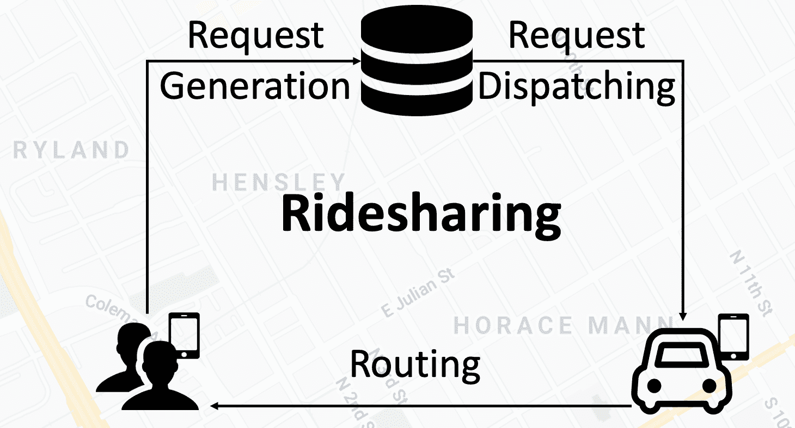

<!--yml

类别：未分类

日期：2024-09-06 19:52:16

-->

# [2108.04462] 深度强化学习在需求驱动的物流与运输系统中的应用：综述

> 来源：[`ar5iv.labs.arxiv.org/html/2108.04462`](https://ar5iv.labs.arxiv.org/html/2108.04462)

# 深度强化学习在需求驱动的物流与运输系统中的应用：综述

Zefang Zong, Tao Feng, Tong Xia, Depeng Jin 和 Yong Li Z. Zong, T. Feng, T. Xia, D. Jin 和 Y. Li 现为北京国家信息科学与技术研究中心（BNRist）以及清华大学电子工程系，北京 100084，中国。电子邮件：zongzf19@mails.tsinghua.edu.cn，{liyong07, jindp}@tsinghua.edu.cn。

###### 摘要

近期技术发展带来了大量新兴的需求驱动服务（DDS），包括共享出行、按需配送、快递系统和仓储。在 DDS 中，服务循环是基本结构，包括服务工作者、服务提供者和相应的服务目标。服务工作者应将人或包裹从提供者运输到目标地点。因此，DDS 中的各种规划任务可以分为两个阶段：1）调度，即从需求/供应分布中形成服务循环，2）路线规划，即决定在构建的循环内的具体服务顺序。在这两个阶段生成高质量的策略对于 DDS 的发展至关重要，但面临许多挑战。同时，深度强化学习（DRL）近年来得到了快速发展。DRL 是解决这些问题的有力工具，因为它可以在不依赖太多问题基础假设的情况下学习参数模型，并通过学习序列决策来优化长期效果。在这项综述中，我们首先定义 DDS，然后重点介绍其中的常见应用和重要决策/控制问题。对于每个问题，我们全面介绍现有的 DRL 解决方案，并进一步总结在 https://github.com/tsinghua-fib-lab/DDS_Survey。我也介绍了开发和评估 DDS 应用程序的开放模拟环境。最后，我们分析了剩余的挑战，并讨论了在 DDS 的 DRL 解决方案中进一步的研究机会。

###### 索引词：

深度强化学习，运输，物流，调度，路线规划，订单匹配，车队管理，车辆路径问题

## 1 引言

持续的城市化和移动通信的发展带来了许多新的应用需求，进入了城市日常生活。其中，按照个人需求或系统要求将人或包裹运输到指定目的地的服务在当今城市物流和运输中至关重要。我们将这种服务定义为需求驱动服务（DDS）。例如，按需配送服务作为典型的 DDS 被广泛使用，因为它显著提高了饮食便利性。每一天在美团点评平台上生成的订单超过 3000 万，这是全球最大的按需配送服务提供商之一[1]。另一个例子是，大规模的在线共享出行服务，如 Uber 和滴滴，已经显著改变了交通格局，为提升当前的交通效率提供了巨大的机会。这些 DDS 应用在城市运营中提供了显著的效率提升，同时也为相关研究领域提供了许多机会。对 DDS 系统进行智能控制，尽量减少人工干预，对于保证其有效性至关重要，并引起了许多研究兴趣。

在一个典型的 DDS 任务中，涉及多个角色，实施的系统应考虑这些角色，包括服务工作者、服务提供者和相应的目标。例如，在一个按需配送系统中，订餐的人可以被视为服务目标，而餐厅则是服务提供者。这些配送任务会被分配给快递员，即工作者来完成。这些核心 DDS 元素形成了一个 DDS 循环，这种示例在图 1 中进行了说明。在共享出行场景中也可以构建相同的模型。每个叫车的顾客有其目的地作为目标，而司机则充当服务工作者。支持配送或共享出行服务的 DDS 平台应提供相应的算法，以 1) 构建合理的服务循环和 2) 指导工作者在循环中完成任务。我们在表 I 中展示了多个典型场景下的 DDS 循环模型，包括按需配送、共享出行、快递系统和仓储。

|   DDS 场景 | DDS 循环 |
| --- | --- |
| 服务提供者 | 服务目标 | 服务工作者 |
| 按需配送 | 餐厅 | 顾客 | 快递员 |
| 共享出行 | 乘客起点 | 目的地 | 司机 |
| 快递（寄件） | 发件人 | 仓库 | 快递员 |
| 快递（配送） | 仓库 | 收货人 | 快递员 |
| 仓储 | 货架、入口、车站 | 货架、入口、车站 | AGV |
|   |  |  |  |

表 I：多个典型 DDS 场景（包括按需配送、拼车、快递系统和仓储）的 DDS 循环中的元素。AGV 是自主引导车辆的缩写。

图 1：使用即时配送作为示例的两个独立服务循环的可视化。餐馆、客户和快递员分别充当服务提供者、服务目标和服务工作者。

在定义了基本的 DDS 元素后，如何管理不同的服务需求对（提供者和目标），调度可用的服务工作者并控制整个服务系统成为开发集中智能 DDS 平台的主要目标。主要研究问题可以分为两个方面。首先，围绕需求对和工作者形成 DDS 循环，也称为调度，是需要解决的首要挑战。循环形成过程，即需求与工作者之间的匹配，可以源于传统的二分图匹配问题，而整个环境中的动态特征带来了更多复杂性。一个好的调度机制不仅要考虑工作者的当前状态和分散的需求，还要考虑未来的分布以实现长期优化。此外，即使一个工作者目前未与服务需求匹配，仍然存在大量的操作空间将空闲工作者安排到其他区域，这形成了车队管理问题。循环形成阶段可以被视为完整 DDS 的第一个阶段。

其次，在被分配大量需求后，如何执行已形成的循环，即调度详细的路径规划策略，包括计划需求集的访问顺序和对实际道路地图的选择，也是决定整个系统效率的关键。路径规划问题可以源于传统的旅行商问题[2]，其中一个销售员需要访问所有城市而不重复访问其中任何一个。进一步的车辆路径规划问题（VRP）[3]及其变体在大多数实际路径规划场景的数学表述中具有重要价值[4, 5, 6, 7]。高质量的路径规划策略应最小化总旅行距离，以减少工作者的开支。路径规划阶段可以被视为调度之后的第二阶段。生成稳健且稳定的路径规划策略也很重要，以将决策信息反馈给调度阶段。我们在图 2 中说明了两个阶段之间的关系。

图 2：DDS 问题的概述，包括调度阶段和路线规划阶段。我们在纵轴上展示了从原始数学公式到工业应用的转化，并在横轴上区分了两个不同的规划阶段。请注意，这两个阶段并不是严格分开的，但这样的分类有助于集中关注不同实际场景中的主要挑战。低需求/工人比例意味着主要挑战在于确定如何匹配工人与需求，而较大的比例则表明主要的优化空间在于路线规划阶段。我们将在第二部分中详细讨论这种关系。

两个阶段的数学公式的解决方案之前已广泛研究。例如，Kuhn-Munkres (KM) 算法用于二分图匹配，分支限界法用于旅行商问题（TSP）和车辆路径问题（VRP），可以为简单的静态问题提供精确解[8, 9]。考虑到多种现实世界的约束和额外因素，更复杂的调度和路线规划问题在运筹学、应用数学等领域也得到了广泛的研究[10, 11, 12, 13]。在规模较大的复杂场景中，几乎不可能获得精确的优化解。与此同时，启发式和元启发式方法被广泛接受为一种替代方案，以在这两个 DDS 阶段内在更合理的时间内生成近似解[14, 15]。这些基于启发式的方法可以在在线场景中生成令人满意的解决方案，因此在许多现实世界的 DDS 系统中是实用的。然而，在更大规模下探索更高质量、更高效率的解决方案仍有很大潜力。

由于近年来机器学习展现出了惊人的性能，利用基于学习的技术进一步发展 DDS 系统具有巨大的潜力。强化学习（RL）方法已经在许多规划任务中得到了发展和应用[16]。RL 通过将决策过程建模为马尔可夫决策过程（MDP）来生成策略。从长期角度来看，预定义的奖励作为对任何行动尝试的反馈信号，以便 RL 可以优化连续决策。试错过程可以训练代理选择与不同内部状态和外部环境相对应的最佳行动。由于深度神经网络在特征表示和模式识别上提供了更强大的能力，将神经网络与 RL 结合显示出了卓越的性能[17]。许多深度 RL（DRL）算法被进一步提出，并成为控制和调度任务中的最新框架。DRL 不必依赖于手动设计的假设和特征，通过训练一个参数化模型来学习最优控制。考虑将其作为解决 DDS 中一系列规划任务的结构是显而易见的。

在本调查中，我们重点关注 DRL 如何在调度阶段和路线阶段分别促进 DDS 系统的发展。我们首先介绍主要的 DRL 算法和城市操作中的四种典型 DDS。然后，我们根据以下维度总结现有的基于 DRL 的解决方案：

+   •

    问题。我们将调度和路线阶段的研究问题细分为更精确的子问题。调度阶段包括订单调度和车队管理的研究。至于路线阶段的众多 DRL 解决方案，我们首先介绍解决典型的容量 VRP（CVRP）的数学解决方案，同时还讨论了针对 VRP 变体的更实际的路线解决方案。在本调查中，我们考虑了四种具有额外约束的变体问题，包括动态 VRP（DVRP）、电动 VRP（EVRP）、带时间窗口的 VRP（VRPTW）和带取件和交付的 VRP（VRPPD）。

+   •

    场景。上述研究问题存在于几个适用场景中，本调查包括了四种常见的 DDS 场景。在交通系统中，我们介绍了共享出行服务，其中车辆被分配去将乘客送到目的地。具体来说，共享出行可以进一步分为打车服务，每位司机仅为一个乘客提供循环服务，以及拼车服务，多个乘客可以同时共享一辆车。至于物流系统中包裹从供应商运输到目标的情况，我们总结了两种解决方案，一种是满足人们即时需求的按需配送系统，另一种是服务时间较长的传统快递系统。我们还介绍了现代仓储系统，其中自主导引车辆（AGVs）将包裹从一个地点运输到另一个地点。需要注意的是，一些提供数学公式解决方案的重要文献也被包括在内[18, 19]。

+   •

    算法。我们区分了模型训练过程中使用的详细 RL 算法。现有工作中最常用的算法属于无模型 RL 方法，包括 DQN[17]、PPO[20]、REINFORCE[21]等。我们还讨论了 DDS 任务是否被构建为单代理 MDP 或多代理 MDP。

+   •

    网络结构。我们还区分了文献中的神经网络设计。常用的网络包括卷积神经网络（CNN）、图神经网络（GNN）及其变体（包括 GCN 等）、基于注意力（ATT）的网络及其变体（包括单头$\verb|/|$多头注意力）。

+   •

    数据类型和数据方案。我们指出了每篇文献中使用的数据类型，既包括基于预定义随机种子和给定分布生成的真实数据，也包括基于预定义随机种子生成的虚拟数据。同时，数据的空间位置以不同程度的简化方式被利用。一般来说，来自真实道路网络的数据方案有四种，如下所示：具有基本方向的 4 向连接、具有序数方向的 8 向连接、基于六边形网格的 6 向连接，以及原始的离散图结构。需要注意的是，前两种也可以总结为方格网。不同的数据方案见图 3。

+   •

    数据和代码可用性。为了展示所调查文献的可重复性，我们报告了所提出方法的数据可用性。一个勾号表示数据由研究人员发布，或可以通过直接的网络搜索轻松找到。我们还报告了代码的可用性。既考虑了原始的开源代码，也考虑了第三方的重新实现。

此外，我们还介绍了 DDS 可用的模拟环境，这对以更少的成本模拟现实世界场景至关重要。最后，总结了使用 DRL 解决 DDS 的几个挑战以及仍然存在的研究问题。

以往文献中探讨相关问题的综述包括 Haydari 等人[22]、Qin 等人[23]和关于 VRP 的若干评论[24]。然而，Haydari 等人[22] 关注的是智能交通系统中的一般规划问题，其中强调了交通信号控制 (TSC) 和自动驾驶。Qin 等人[23] 仅研究了共享出行场景中的调度问题，而 Mazyavkina 等人[24] 引入了数学 VRP 的 DRL 解决方案，这些问题包含在更一般的组合优化中。相比之下，我们首次从实际系统层面定义 DDS，并在多个场景中分类特定的研究问题，并提出基于 DRL 的解决方案。我们调查了 DRL 如何促进其发展。讨论了 DDS 的两个阶段，包括形成服务循环的调度和执行服务循环的路由。相关文献总结见表 II 和表 III。

总体而言，本文对解决 DDS 系统中的规划问题的 DRL 技术进行了全面的综述。我们的贡献可以总结如下：

+   •

    据我们所知，这是第一次全面定义和研究 DDS 系统及最新 DRL 技术作为解决方案的综述。

+   •

    我们对完整的 DDS 系统中的不同阶段进行分类，包括调度阶段和路由阶段。我们还探讨了这两个阶段对应的常见应用，从广泛的角度介绍了 DRL 的理论背景，并解释了几个重要的算法。

+   •

    我们调查了利用 DRL 处理 DDS 系统的现有工作。我们从几个维度总结了这些工作，并讨论了各自的方法。

+   •

    我们通过 DRL 说明了 DDS 问题中的挑战和若干开放问题。我们相信，总结出的研究方向将有助于相关研究，并为未来的工作提供指导。

剩余部分的调查组织如下。我们首先介绍本调查的背景，包括 DRL 和四种常见的 DDS 场景，见第二部分。调度和路线的阶段定义及更具体的问题和相应的解决方案分别总结在第三部分和第四部分。两阶段中常用的模拟环境在第五部分介绍。然后，我们在第六部分和第七部分总结了 DRL 在 DDS 设计中的若干挑战和开放研究问题。最后，在第八部分总结了本调查。

图 3：不同网格基础导航和分区方案的示例：（a）通过基本方向的 4 路连通，（b）带有序方向的 8 路连通，（c）使用六边形表示的 6 路连通。（d）完全连通，也可以建模为图结构。

## 2 背景

图 4：强化学习控制循环。

图 5：DRL 算法的分类与发展。实箭头表示类别归属，虚箭头表示方法的发展。

### 2.1 强化学习

RL 是一种从环境状态映射到动作的学习方式。其目标是使代理在与环境互动的过程中获得最大的累积奖励 [25]。通常，马尔可夫决策过程 (MDP) 可以用来建模 RL 问题。在 MDP 设置下，RL 有几个核心元素，包括代理、环境、状态、动作、奖励和转移。我们绘制了图 4 来表示强化学习控制循环，详细描述如下，

+   •

    环境。DRL 的环境是提供来自外部动态的基本信息的基本设置。

+   •

    代理。RL 中的代理应提供动作并与整个环境进行互动。甚至可能有多个代理，这进一步形成了多代理 RL 设置。

+   •

    状态。$S$ 是所有环境状态的集合。通过将规划任务建模为 MDP 作为先验，代理在决策步骤 $t$ 的状态 $s_{t}\in S$ 描述了最新情况。代理的状态作为影响决策的内生特征。

+   •

    动作。$A$ 是代理可执行动作的集合。动作 $a_{t}$ 是代理在决策步骤 $t$ 时与环境互动的方式。任何动作都可能影响代理的当前状态。

+   •

    奖励。$f:S\times A\rightarrow R$ 是奖励函数。通过不断执行动作以改变状态，代理最终将获得与任务相关的相应奖励 $r_{t}\sim f(s_{t},a_{t})$，该奖励是代理在决策步骤 $t$ 时在状态 $s_{t}$ 执行动作 $a_{t}$ 后获得的。以 $R$ 作为任务信号，RL 的整个训练过程是为了获得高奖励，这代表代理在完成给定任务上的成功程度。

+   •

    转移。$p:S\times A\times S\rightarrow[0,1]$ 是状态转移概率分布函数。$s_{t+1}\times p(s_{t},a_{t})$ 表示代理在状态 $s_{t}$ 执行动作 $a_{t}$ 并转移到下一个状态 $s_{t+1}$ 的概率。

在 RL 中，策略 $\pi:S\rightarrow A$ 是从状态空间到动作空间的映射。这意味着代理在状态 $s_{t}$ 下选择一个动作，执行动作 $a_{t}$ 并以概率 $p(s_{t},a_{t})$ 转移到下一个状态 $s_{t+1}$，同时从环境反馈中获得奖励 $r_{t}$。假设未来每个时间步骤获得的即时奖励必须乘以折扣因子 $\gamma$。从时间 $t$ 到在时间 $T$ 的 episode 结束，累积奖励定义为 $R_{t}=\sum_{t^{{}^{\prime}}=t}^{T}\gamma^{t^{{}^{\prime}}-t}r_{t^{{}^{\prime}}}$，其中 $\gamma\in[0,1]$，用于权衡未来奖励的影响。

状态动作值函数$Q^{\pi}(s,a)$指的是代理在当前状态$s$下执行动作$a$并按照策略$\pi$执行直到回合结束过程中获得的累计奖励，可以表示为$Q^{\pi}(s,a)=E[R_{t}|s_{t}=s,a_{t}=a,\pi]$。对于所有状态-动作对，如果某策略$\pi^{\ast}$的期望回报大于或等于所有其他策略的期望回报，则策略$\pi^{\ast}$称为最优策略。可能存在多个最优策略，但它们共享一个状态-动作值函数$Q^{\ast}(s,a)=\max_{\pi}E[R_{t}|s_{t}=s,a_{t}=a,\pi]$，这个函数称为最优状态-动作值函数。这样的函数遵循贝尔曼最优性方程$Q^{\ast}(s,a)=E_{s^{{}^{\prime}}\sim S}[r+\gamma \max_{a^{{}^{\prime}}}Q(s^{{}^{\prime}},a^{{}^{\prime}})|s,a]$。

在传统的强化学习（RL）中，解决$Q$值函数通常通过迭代贝尔曼方程$Q_{i+1}(s,a)=E_{s^{{}^{\prime}}\sim S}[r+\gamma \max_{a^{{}^{\prime}}}Q_{i}(s^{{}^{\prime}},a^{{}^{\prime}})|s,a]$进行。通过不断迭代，状态-动作值函数最终会收敛，从而获得最优策略：$\pi^{\ast}=arg\max_{a\in A}Q^{\ast}(s,a)$。然而，对于实际问题，这种搜索最优策略的过程是不可行的，因为迭代贝尔曼方程的计算成本因状态空间庞大而迅速增长。为了解决这个问题，深度学习（DL）被引入到 RL 中，形成了深度强化学习（DRL），它利用深度神经网络进行传统 RL 模型中的函数近似，并显著提高了许多挑战性应用的性能 [26, 17, 27]。一般来说，一个 RL 代理可以通过两种方式进行操作：（1）通过了解/建模状态转移，这称为基于模型的 RL，和（2）通过与环境互动而不建模转移模型，这称为无模型 RL。无模型 RL 算法包括两类算法：基于价值的方法和基于策略的方法。在基于价值的 RL 中，代理学习状态-动作对的价值函数，然后基于该价值函数选择动作 [25]。而在基于策略的 RL 中，动作直接由策略网络决定，该网络通过策略梯度训练 [25]。我们将首先介绍基于价值的方法和基于策略的方法，然后讨论它们的组合。我们绘制了图 5 以展示这些方法的分类和发展。此外，我们还介绍了作为一个特殊类别的多智能体 RL。

基于价值的强化学习（Value-based RL）。Mnih 等人 [26, 17, 27] 首次将卷积神经网络与传统强化学习中的 $Q$ 学习 [28] 算法相结合，并提出了深度 Q 网络（DQN）框架。该模型首次用于处理视觉感知，是基于价值的强化学习领域中的开创性和代表性工作。DQN 在训练过程中使用经验回放机制 [29]，并处理转移样本 $e_{t}=(s_{t},a_{t},r_{t},s_{t+1})$ 进行训练。在每个时间步 $t$，从代理与环境的交互中获得的转移样本被存储在回放缓冲区 $D={e_{1},...e_{t}}$ 中。在训练过程中，每次从 $D$ 中随机选择一个小批量的转移样本，利用随机梯度下降（SGD）算法和 TD 误差 [30] 更新网络参数 $\theta$。在训练过程中，样本通常要求彼此独立。这种随机采样方法大大减少了样本之间的相关性，从而提高了算法的稳定性。除了使用具有参数 $\theta$ 的深度卷积网络来逼近当前的价值函数外，DQN 还使用另一个网络来生成目标 $Q$ 值。具体来说，$Q(s,a,\theta)$ 表示当前价值网络的输出，用于评估当前状态下动作对的价值函数。同时，$Q(s,a,\theta_{-})$ 表示目标价值网络的输出，用于逼近价值函数，即目标 $Q$ 值。当前价值网络的参数 $\theta$ 实时更新。在每 $N$ 次迭代后，目标价值网络的参数 $\theta_{-}$ 由 $\theta$ 更新，并在接下来的 $N$ 次迭代中保持不变。整个网络通过最小化当前 $Q$ 值与目标 $Q$ 之间的均方误差来训练。这样的冻结目标机制减少了当前 $Q$ 值与目标 $Q$ 值之间的相关性，从而提高了训练过程的稳定性。

动作的选择和评估是基于目标值网络$\theta_{i}^{-}$，这在学习过程中容易高估$Q$值。为了解决这个问题，研究人员提出了一系列基于 DQN 的方法。Hasselt 等人[31] 提出了基于双重 Q 学习算法[32]（double Q-learning）的深度双重 Q 网络（DDQN）算法。双重 Q 学习中有两组不同的参数：$\theta$ 和 $\theta^{-}$。其中，$\theta$ 用于选择对应最大$Q$值的动作，而 $\theta^{-}$ 用于评估最优动作的$Q$值。这种参数分离将动作选择和策略评估分开，从而减少了高估$Q$值的风险。实验表明，DDQN 能够比 DQN 更准确地估计$Q$值。DDQN 的成功表明，减少$Q$值评估误差能够提高性能。受此启发，Bellemare 等人[33] 在贝尔曼方程中基于优势学习（AL）[34] 定义了一种新操作符，以增加最优动作值与次优动作值之间的差异，以缓解由最大$Q$值对应的动作引起的评估误差。实验表明，AL 误差项能够有效减少$Q$值评估中的偏差，从而提升学习质量。此外，Wang 等人[35] 基于 DQN 改进了网络架构，提出了对决 DQN，这大大加快了任务学习速度。

基于价值的强化学习方法适用于低维离散动作空间。然而，它们无法解决连续动作空间中的决策问题，如自动驾驶、机器人运动等。因此，我们进一步引入了基于策略的强化学习方法，这些方法能够解决连续决策问题。

基于策略的 RL。基于策略的 RL [36] 通过计算策略的累积奖励关于策略参数的梯度直接更新策略参数，最终收敛到最优策略 $max_{\theta}E[R|\pi_{\theta}],$ 其中 $R=\sum_{t=0}^{T-1}r_{t}$ 表示在一个回合中获得的奖励总和。策略梯度的最常见思想是提高高奖励轨迹的概率。假设完整回合的状态、动作和奖励轨迹是 $\tau=\{s_{0},a_{0},r_{0},s_{1},a_{1},r_{1},...,s_{T-1},a_{T-1},r_{T-1},s_{T}\}$。然后策略梯度表示为：$g=\sum_{t=0}^{T-1}R\triangledown_{\theta}log\pi(a_{t}|s_{t};\theta).$ 这样的梯度可以用来调整策略参数 $\theta\leftarrow\theta+\alpha g,$ 其中 $\alpha$ 是学习率，控制策略参数更新的速度。梯度项 $\sum_{t=0}^{T-1}\triangledown_{\theta}log\pi(a_{t}|s_{t};\theta)$ 表示可以增加轨迹 $\tau$ 出现概率的方向。通过与得分函数 $R$ 相乘，可以使高奖励轨迹的概率密度更大。在收集到不同总奖励的轨迹时，上述训练过程将引导概率密度向这些高奖励轨迹靠拢，并最大化相应的出现概率。

然而，上述方法缺乏区分不同质量轨迹的能力，这将导致训练过程缓慢且不稳定。为了解决这些问题，Williams 等人 [21] 提出了 REINFORCE 算法，该算法以基准作为奖励的相对标准：$g=\sum_{t=0}^{T-1}\triangledown_{\theta}log\pi(a_{t}|s_{t};\theta)(R-b),$ 其中 $b$ 是与当前轨迹 $\tau$ 相关的基准，通常设置为 $R$ 的期望估计，以减少 $R$ 的方差。可以看出，$R$ 越超过参考 $b$，对应轨迹 $\tau$ 被选择的概率越大。因此，在大规模状态的 DRL 任务中，策略可以通过深度神经网络参数化，传统的策略梯度方法可以用来求解最优策略。

然而，由于基准 $b$ 的估计不准确，基于策略的强化学习（RL）方法在训练过程中非常不稳定，并且由于需要完整的回合来更新参数，这些方法效率低下。为了解决这些问题，研究人员提出了演员-评论家方法，该方法结合了基于价值的 RL 方法和基于策略的 RL 方法。

Actor Critic 强化学习。V. R. Konda 等人 [37] 首次提出了演员-评论家（AC）方法，这些方法结合了基于值的方法和基于策略的方法的优点。AC 方法包括两个估计器：一个演员，通过与环境互动并根据当前策略生成动作，扮演基于策略的方法的角色；而评论家则通过在训练过程中估计当前状态的价值，扮演基于值的方法的角色。在 AC 方法中，评论家对当前状态价值的估计使得强化学习训练过程更为稳定。此外，还有一些演员-评论家强化学习方法引入了梯度限制或重放缓存，以便重用收集的数据，从而提高训练效率。

R. S. Sutton 等人[25] 提出了 Advantage Actor-Critic (A2C) 方法，该方法在$Q$值中添加了基准线，从而使反馈可以是正面的也可以是负面的。V. Mnih 等人[38] 将分布式机器学习方法引入 A2C，并提出了一个新算法，称为 Asynchronous Advantage Actor-Critic (A3C)，大大提高了 A2C 算法的效率。Wang 等人将 AC 方法与经验重放结合，提出了 actor-critic with experience replay (ACER) [39] 方法。该方法使 AC 框架能够以离策略方式进行训练，以提高数据利用效率。Lillicrap 等人[40] 利用 DQN 的思想将 Q 学习算法扩展到确定性策略梯度[41] (DPG) 方法，并提出了一种基于 actor-critic 框架的 Deep Deterministic Policy Gradient 方法 (DDPG)，可用于解决连续动作空间中的决策问题。此外，它还引入了重放缓冲区，以便重用收集的数据来提高训练效率。虽然 DDPG 有时能取得良好表现，但在超参数方面仍然较为脆弱。DDPG 常见的失败原因是对真实$Q$值的过高估计，从而使学习到的策略变差。为了解决这个问题，Fujimoto 等人[42] 提出了 Twin Delayed DDPG (TD3)，该方法在 DDPG 的基础上引入了三种技术。TD3 采用了剪辑双 Q 学习来减少$Q$值估计的偏差。它还利用延迟策略更新和目标策略平滑来降低$Q$值估计偏差对策略训练的影响。此外，Schulman 等人[20] 采用了重要性采样[43] 方法，并对强化学习的网络梯度更新进行了调整，使训练过程更加稳健。Schulman 等人[44] 还提出了一种名为 Trust Region Policy Optimization (TRPO) 的方法。TRPO 的核心思想是强制将旧策略和新策略在相同数据批次上的$KL$差异保持在一定范围内，以避免过度梯度更新并确保训练过程的稳定性。然而，TRPO 采用了共轭梯度算法来解决约束优化问题，这大大降低了计算效率并增加了实现成本。因此，Schulman 等人[20] 提出了 Proximal Policy Optimization 算法 (PPO)，通过引入简化的代理目标函数来摆脱约束优化产生的计算。

多智能体强化学习。许多现实世界的问题需要不同智能体之间的互动建模，因此需要多智能体强化学习算法。一个常见的方法是为每个智能体分配一个独立的训练机制。这种分布式学习架构减少了学习实施的难度和计算复杂度。对于具有大规模状态空间的深度强化学习（DRL）问题，使用 DQN 算法而不是 Q 学习算法来单独训练每个智能体，可以构建一个简单的多智能体 DRL 系统。Tampuu 等人[45] 根据不同的目标动态调整奖励模型，并提出了一种多智能体可以相互合作和竞争的 DRL 模型。当面临需要多个智能体相互沟通的推理任务时，DQN 模型通常无法学习到有效的策略。为了解决这个问题，Foerster 等人[46] 提出了一种称为深度分布式递归 Q 网络（DDRQN）的方法，用于多智能体通信和合作，具有部分可观察状态。除了分布式学习，合作学习、竞争学习和直接参数共享等其他机制也被应用于不同的多智能体场景[47]。

### 2.2 应用概述

如上所述，DDS 系统根据个人需求或系统要求将人或包裹运送到指定目的地。我们简要介绍几个在我们日常生活中具有重要意义的城市 DDS 应用，如图 6 所示。

图 6：几个在我们日常生活中具有重要意义的城市 DDS 应用概述。

#### 2.2.1 拼车

相比于传统的出租车叫车服务，其中乘客的接送是随机的，共享乘车服务根据乘客通过移动应用程序（如滴滴[48]、优步[49]等）提交的需求来匹配乘客和司机。当潜在的乘客通过应用程序向中央平台提交请求时，平台会首先估算行程价格并返回。如果乘客接受，匹配模块会尝试将乘客与附近的可用司机匹配。由于实时车辆的可用性，匹配过程可能需要时间，因此可能会出现预匹配取消的情况。在成功匹配后，司机将前往乘客处，并将其送到目的地。司机在到达后将获得行程费用。为了减少成功匹配的平均等待时间，平台通常在后台利用车队管理模块，通过引导车辆到新的请求可能性更高的地方来不断重新平衡闲置车辆。匹配和车队管理的决策最终在路线阶段执行。车辆会根据这些策略被导航服务乘客或重新定位到新区域。在共享乘车场景中，循环服务的工作者指的是车辆，而提供者和目标分别指乘客的接送地点和目的地。

共享乘车服务可以进一步分为叫车服务（即每次仅分配一个乘客的司机）和拼车服务（也称为拼车），其中多个乘客共享一辆车。注意，在一些文献中，多个乘客的场景也被称为共享乘车。在本调查中，我们特指拼车服务以避免歧义，参考[23]。

#### 2.2.2 按需配送

全球许多平台提供食品配送服务，如 PrimeNow[50]、UberEats[51]、美团[1]和饿了么[52]。除了送餐外，新兴的即时配送服务还可以从一个客户处配送小包裹到另一个客户处，或者直接从当地商店或药房（如药品）购买其他日常商品。食品配送和即时配送都可以被视为一种按需配送。与传统的配送平台（如 FedEx 和 UPS）相比，按需配送平台的订单期望在相对较短的时间内完成，例如 30 分钟到 1 小时。典型的按需配送过程涉及四方：作为服务目标的客户、作为服务提供者的商家、作为工作者的快递员，以及中央平台。客户首先在平台的手机应用程序中下单，商家开始准备订单，平台分配快递员去取货。最后，快递员将订单送达客户处。

#### 2.2.3 快递系统

作为一个长期存在的 DDS 系统，快递系统需要同时完成从发货人处取件到固定仓库，并将从仓库装载的包裹送达收货人的任务。在实际的快递系统中，如 FedEx [53]和 Cainiao [54]，取件和送货通常被同时考虑，并且可以在同一服务循环内完成。快递员在仓库装载包裹，然后通过送货车将包裹逐一送达目的地。同时，在送货过程中，可能会有来自本地客户的新取件请求，每个请求都与一个服务地点相关。快递员还需要前往这些地点完成取件请求。快递员需要在特定时间内从仓库出发并返回，以配合定期往返于车站的卡车的时间表。

#### 2.2.4 仓储

除了与人直接互动的 DDS 应用外，新兴的自主技术使得本地仓储能够无人管理。货物的发运请求，通常是大型和重型货物，在一个仓库内或多个仓库之间很常见。货物被移入目标货架，并持续移动以满足全球发货要求。为了减少开支并提高效率，现代仓储场景中通常使用自主导向车辆（AGVs）。在仓储服务循环中，服务提供者指的是原始货架，而服务目标指的是相应的目的地。AGVs 在整个过程中充当工人。一个智能集中平台负责控制所有 AGVs，以实现高效操作。

(a) 按需配送的示意图。

(b) 拼车的示意图。

(c) 快递系统的示意图。

(d) 仓储的示意图。

图 7：四种典型 DDS 应用的示意图。

### 2.3 两个阶段之间的关系

通常，实际的 DDS 系统中的研究问题可以分为两个阶段，即派遣和路由。派遣阶段主要处理服务工人与需求对之间的关系，从而构建服务循环，而路由阶段则专注于如何在每个建立的循环中执行服务。我们在此指出，这两个阶段并不是严格分开的。一个合理的派遣算法应该将未来的循环内路由策略作为测量代理。是否能够生成更好的路由解决方案是判断不同派遣策略的直接标准。例如，快递员不应被分配一个距离他较远的需求请求，因为这样的循环中的路由距离将过长。另一方面，在实际的路由场景中，如果有一支工人队伍在值班，那么不同工人之间的合作需要考虑，因此派遣也包括在内。

然而，这样的分类是必要的，以便集中关注不同实际场景中的主要挑战。本次调查中展示的一个重要参考指标是需求/工人比例。低比例意味着在每个构建的循环中，工人和需求对的数量是平衡的，因此主要的优化空间是确定不同请求的分配方式。例如，司机在打车服务中只能接一名乘客，在拼车服务中则不超过两名乘客。如何将司机与客户请求匹配对整体效率至关重要，而计算循环内的路由策略并不计算开销很大。同时，在比例较大的场景中，这意味着一个工人必须在其循环内处理大量的需求请求。路由阶段，即如何执行循环，因此具有较高的问题复杂性，需要进行密集的优化过程。例如，快递系统中的快递员可能会被分配到数百个包裹，由于其 NP-难度性质，生成其最佳路由策略成为主要挑战。

在接下来的部分中，我们将重点讨论派遣和路由阶段。我们将分别讨论各自的子问题，并介绍现有的解决方案。

## 第三阶段 1：派遣

在提供的工人信息和持续更新的服务需求对的基础上，DDS 的第一阶段是协调需求与可用工人之间的关系，从而有效且高效地建立服务循环。我们将这种循环形成过程称为“调度”。通常，调度阶段包括两个方面：1) 订单匹配，旨在找到工人和需求之间的最佳匹配策略，2) 车队管理，重新定位闲置工人以平衡本地的供需比，从而在未来获得更好的订单匹配。图 8 展示了 DDS 中调度阶段的概述。

将其制定为优化问题，调度场景中的两个任务因三个挑战而变得复杂。首先，不断变化的需求分布和工人状态给整个马尔可夫决策过程带来了高度动态性。准确评估不同决策尝试的回报并非易事。其次，一个成功的匹配策略应考虑长期回报[55]。一个仅考虑当前服务分布的简单最大结果可能会导致长期损失。例如，将所有车辆分配到当前的所有需求中可能是拼车中的局部最大值，但可能会在下一个时间窗口中减少利润，因为一些车辆被分配到几乎没有新需求的区域。第三，集中式平台应考虑多个甚至大量工人。有效建模他们之间的合作和有时的竞争对于提高系统效率至关重要。

针对这些挑战，相较于传统方法和其他基于学习的方法，DRL 在解决订单匹配问题上具有天然优势。许多在线强化学习方法已被开发出来，以处理 MDP 建模中的非平稳性。将预期回报作为学习信号，DRL 是优化顺序决策任务（包括调度任务）的合适框架。此外，将工人建模为代理是一种自然的决策问题处理方式，无论是通过使用相同策略对所有工人进行均质建模，还是考虑多个代理之间的互动。

图 8：[56] 提出的总体调度架构。

在本节中，我们介绍了订单匹配和车队管理问题。具体而言，对于每个问题，我们首先介绍问题定义和常见指标，并分别介绍几种传统方法。然后，我们详细讨论运输和物流的具体应用。基于 DRL 的调度阶段文献总结在表 II。

### 3.1 订单匹配

订单匹配过程是将当前未服务的需求分配给可用的工人。它也被称为其他名称，例如共享出行服务中的订单-司机分配。数学公式源于在线二分图匹配问题，其中供应（工人）和需求都是动态的。这是实时在线 DDS 应用中一个重要的模块，如共享出行和按需配送[14, 11, 57]。包括未服务的需求、旅行成本和工人可用性等信息持续更新，这给问题带来了复杂性。

除了纯粹将需求分配给工人，实际的 DDS 系统还考虑其他附加的行动选择。例如，当没有合适的需求分配给车辆时，共享出行系统中的车辆可以被指定为空闲状态。随着电动车的广泛使用和部署，是否充电或继续接受新需求形成了新的决策问题[58]。此外，控制分配给同一工人的需求数量也扩展了行动空间，例如同时考虑打车和拼车场景[58]。当每个司机可以在一个循环中接送多个客户时，行动是决定接送多少客户以及接送哪些客户。

关于订单匹配的目标，通常有两个方面需要考虑，包括优化平台的利润和需求方的体验：

+   •

    最大化总商品交易量（GMV）。[56] 对于每个服务周期的定价，一个有效的订单匹配系统的核心评估指标是最大化所有服务的总收入。在专门的打车服务中，某些文献中也称为累积司机收入（ADI）[59]。通常，从利润角度来看，代表了工人和整个平台的利益。

+   •

    最大化订单响应率（ORR）。[59] 由于在现实世界中未能满足所有需求是常见的，另一个目标是最大化 ORR，这评估了需求方的满意度。基于总响应时间随着 ORR 增加的直觉，它也可以作为表示客户兴趣的另一种方式。注意，ORR 与 GMV 高度相关，因为满足的需求越多，平台在一定时间内获得的收入也越多。

表 II：使用 DRL 解决 DDS 问题的应用。每个文献参考的信息包括出版年份、解决的问题、使用的 DRL 训练范式、数据类型（Dtype）、数据是否可用（Davail）以及代码是否发布。

| 参考 | 年份 | 问题 | 场景 | 算法 | 网络结构 | 数据方案 | 数据类型 | 数据可用性 | 代码 |
| --- | --- | --- | --- | --- | --- | --- | --- | --- | --- |
| Li et al.[59] | 2019 | 订单匹配 | 共享出行 | MFRL[60] | MLP | 六边形网格 | 真实 | x | x |
| Zhou et al.[61] | 2019 | 订单匹配 | 共享出行 | 双重 DQN[31] | MLP | 六边形网格 | 真实, 仿真 | ✓ | x |
| Xu et al.[56] | 2018 | 订单匹配 | 共享出行 | TD[30] | - | 方形网格 | 真实, 仿真 | x | x |
| Wang et al.[62] | 2018 | 订单匹配 | 共享出行 | DQN[17] | MLP, CNN | 六边形网格 | 真实 | x | x |
| Tang et al.[63] | 2019 | 订单匹配 | 共享出行 | 双重 DQN[31] | MLP | 六边形网格 | 真实 | x | x |
| Jindal et al.[58] | 2018 | 订单匹配 | 共享出行 | DQN[17] | MLP | 方形网格 | 真实 | ✓ | x |
| He et al.[64] | 2019 | 订单匹配 | 共享出行 | 双重 DQN[31] | MLP, CNN | 方形网格 | 真实 | x | x |
| Al-Abbasi et al.[65] | 2019 | 订单匹配 | 共享出行 | DQN[17] | CNN | 方形网格 | 真实 | x | x |
| Qin et al.[66] | 2021 | 订单匹配 | 共享出行 | AC [37], ACER [39] | MLP | 方形网格 | 真实 | x | x |
| Wang et al.[67] | 2019 | 订单匹配 | 共享出行 | Q-Learning [28] | - | 基于图 | 真实, 仿真 | ✓ | x |
| Ke et al.[68] | 2020 | 订单匹配 | 共享出行 | DQN [17], A2C [25], ACER [39], PPO [20] | MLP | 方形/六边形网格 | 真实, 仿真 | ✓ | x |
| Yang et al.[69] | 2021 | 订单匹配 | 共享出行 | TD [30] | MLP | 方形网格 | 真实 | x | x |
| Chen et al.[70] | 2019 | 订单匹配 | 按需配送 | PPO[20] | MLP | 方形网格 | 真实, 仿真 | x | x |
| Li et al.[59] | 2019 | 订单匹配 | 快递 | DQN [17] | MLP, CNN | 方形网格 | 真实 | x | x |
| Li et al.[71] | 2020 | 订单匹配 | 快递 | DQN [17] | MLP, CNN | 方形网格 | 实际 | x | x |
| Hu et al.[72] | 2020 | 订单匹配 | 仓储 | DQN [17] | MLP | 基于图的 | 实际 | x | x |
| Lin et al.[73] | 2018 | 车队管理 | 共享出行 | A2C [25], DQN [17] | MLP | 六边形网格 | 实际 | ✓ | ✓ |
| Zhang et al.[74] | 2020 | 车队管理 | 共享出行 | 对抗 DQN [35] | MLP | 六边形网格 | 实际 | ✓ | ✓ |
| Wen et al.[75] | 2017 | 车队管理 | 共享出行 | DQN [17] | MLP | 方形网格 | 实际, 模拟 | x | ✓ |
| Oda et al.[76] | 2018 | 车队管理 | 共享出行 | DQN [17] | CNN | 方形网格 | 实际 | x | x |
| Liu et al.[77] | 2020 | 车队管理 | 共享出行 | DQN [17] | GCN [78] | 方形网格 | 实际 | ✓ | ✓ |
| Shou et al.[79] | 2020 | 车队管理 | 共享出行 | DQN [17] | AC [37] | 方形网格 | 实际 | ✓ | ✓ |
| Jin et al.[80] | 2019 | 匹配+车队管理 | 共享出行 | DDPG [40] | MLP, RNN | 六边形网格 | 实际 | ✓ | ✓ |
| Holler et al.[81] | 2019 | 匹配+车队管理 | 共享出行 | DQN [17], PPO [20] | MLP | 方形网格 | 实际, 模拟 | x | x |
| Guo et al.[82] | 2020 | 匹配+车队管理 | 共享出行 | 双重 DQN [31] | CNN | 方形网格 | 模拟 | x | x |
| Liang et al.[83] | 2021 | 匹配+车队管理 | 共享出行 | DQN [17], A2C [25] | MLP | 基于图的 | 实际 | x | x |
|   |  |  |  |  |  |  |  |  |  |

#### 3.1.1 订单匹配的传统方法

订单匹配问题及其许多变体在运筹学（OR）领域得到了广泛研究。在给定工作者和需求的确定性信息的情况下，该问题可以总结为二分匹配，并可以通过传统的 Khun-Munkres（KM）算法[8]解决。早期的方法使用贪心算法将最近的可用车辆分配给乘车请求[10]。这些方法忽略了全局的需求和供应，因此无法在长期内实现最佳性能。随着新需求和工作者状态的不断更新，随机建模成为一个主要挑战。研究人员开发了启发式方法来有效应对[11, 84, 85, 14]。根据历史数据和需求的可预测模式，Sungur 等[84]使用随机编程来建模快递送货场景中的不确定需求。Lowalekar 等[85]通过 Bender 分解的随机优化方法解决了该问题，并提出了一个按需打车的匹配框架。Hu 和 Zhou 等[14]也将其制定为动态问题，并使用启发式策略来探索最佳的结构空间。

#### 3.1.2 运输系统中的订单匹配的深度强化学习

订单匹配是运输系统应用中的一个重要决策和优化问题，例如拼车服务。现代出租车和在服务中的车辆可以通过移动网络将其实时坐标和状态分享给集中平台。另一方面，每个客户可以生成新的请求，包括提供的接送地点和目的地作为需求对。平台接收新出现的需求，因此执行在线匹配策略。在需求/工作者比例相对较低的运输 DDS 中，需求与供应之间的协调是主要问题。因此，它们之间的订单匹配对于提高系统操作效率至关重要。从代理的角度来看，制定订单匹配 MDP 的直观想法是将系统中的所有司机建模为不同的代理，利用多智能体强化学习（MARL）技术[59, 61]。然而，现实世界场景中直接的多智能体建模可能会遭遇数千个代理的庞大联合动作空间。作为解决方案，Li 等[59]使用了均值场强化学习（MFRL）[60]，将代理之间的相互作用建模为每个代理与其他代理的平均值。Zhou 等[61]认为在大规模场景中不需要明确的合作或通信。他们提出了一种去中心化执行方法，通过联合评估来调度订单。

作为对比，另一种简化且广泛接受的合作建模方法是训练一个单一的策略并将其应用于所有工作者在线[56, 62, 63, 86]。在这种表述中，所有工作者都被定义为具有相同的状态、动作空间和奖励定义。尽管从全局角度来看系统仍是多智能体，但训练阶段只考虑一个智能体。具体而言，Xu 等人[56]将订单匹配建模为一个顺序决策问题，并开发了一个联合学习和规划的方法。他们在学习阶段使用时间差分（TD）[30]来学习近似的驱动值函数，然后在规划阶段使用 KM 算法解决基于学习值的二分匹配问题。Wang 等人[62]提出了一种迁移学习方法，以提高学习的适应性和效率，其中学习到的订单匹配模型可以迁移到其他城市。他们使用 DQN 算法来估计值网络。Tang 等人[63]进一步利用双 DQN 框架来获得更稳定的学习过程。由于在线动态订单匹配场景需要综合考虑时空特征，他们开发了一种特殊的网络结构，使用层次化粗编码和小脑嵌入记忆以获得更好的表示。利用 ST 特征，He 等人[64]还开发了一种基于胶囊的网络以获得更好的表示。Jindal 等人[58]只集中于拼车任务，并设计了他们的智能体来决定一辆车是接单个乘客还是多个乘客。详细匹配则留给低级算法。均质智能体的表述避免了多智能体强化学习的常见挑战，包括不同智能体的指数决策空间。此外，由于所有智能体共享相同的状态，也避免了复杂的通信。

在不将不同的工作者视为代理的情况下，整个请求列表被视为代理。杨等人[69]将每个需求建模为一个代理，并训练一个价值网络来估计需求的价值，而不是工作者。基于学习到的价值，进一步执行一个独立的多对多匹配过程。由于在线订单匹配包含来自高动态的非平稳性，一些文献还尝试通过关注每个时间窗口，将其转化为静态问题[68，67]，以这种代理建模方式。柯等人[68]将每个请求建模为一个代理，所有代理共享相同的策略。每个代理的动作空间被视为是否将当前请求延迟到下一个时间窗口以做进一步匹配决策。王等人[67]训练一个代表整个请求列表的单一代理，并决定当前窗口持续多久。在这两种形式中，最终的匹配结果是通过静态二分图匹配生成的。

#### 3.1.3 物流系统中的订单匹配的 DRL

订单匹配不仅在运输实践中重要，在现代物流系统中也至关重要。由于取件请求实时出现，许多快递员进行包裹取件，如何管理快递员以确保他们之间的合作，并在较长时间内完成更多的取件任务是重要且具有挑战性的。

由于需要快速响应按需配送客户，现代按需配送系统需要有效的匹配策略来将新需求分配给快递员。陈等人提出了一个框架，利用空间-时间地图的多层图像捕捉服务区域的实时表示。他们将不同的快递员建模为多个代理，并使用 Proximal Policy Optimization (PPO) [20] 来训练相应的策略。对于更常见的快递系统，研究人员也专注于通过优化订单匹配问题来开发有效且高效的智能快递系统。张等人首先系统地研究了大规模动态城市快递问题，并采用批量分配策略，为在短时间内接收到的一组请求计算取货-配送路线，而不是逐个处理每个请求[87]。李等人进一步提出了一种名为 BDSB 的软标签聚类算法，将包裹分派给每个区域的快递员[59]。进一步提出了一种新的上下文协作强化学习（CCRL）模型，以指导每个快递员在每个短时间内的配送和服务。李等人还提出了一种合作多智能体强化学习模型，以学习快递员调度策略[71]。

### 3.2 车队管理

当服务人员没有被分配任务并暂时闲置时，针对他们的良好重新定位策略可以增加未来服务机会的可能性，从而增加整个平台的收入。这样的重新定位过程形成了重要的车队管理问题，也被称为车辆定位或出租车调度[77]。一个简单的直觉是，合理的管理可以帮助平衡不同区域的需求和供应，从而提高需求匹配率。我们介绍了车队管理问题的常见 MDP 建模，并调查了相关的 DRL 应用。

#### 3.2.1 传统的车队管理方法

对于运输系统中 DDS 工作人员和需求的分配平衡进行了广泛的研究。例如，出租车和顾客的平衡在高效的运输系统中至关重要[88]。传统的方法主要基于数据驱动的方法，这些方法高度依赖于对供应和需求分布的历史记录进行调查。苗等人通过时空特征捕捉随机需求概率分布的不确定集合[89]。袁等人和屈等人还构建了一个推荐系统，为车辆提供重新定位的推荐选项[90, 91]。各种技术，包括混合整数规划和组合优化，均被用于建模和解决车队管理问题[92, 93]。

#### 3.2.2 用于车队管理的 DRL

根据将城市区域划分为局部网格以降低计算成本的想法，车队管理的 MDP 建模也基于离散维度空间构建。考虑到车队中工作人员的时空状态作为个体代理和动态更新的顾客信息，直观的做法是将可用的工作人员重新定位到需求/供应比率高于当前地点的位置。为了计算效率，同一网格在同一时间段内的代理通常被视为相同的代理[73]。平台的目标是最大化所有代理的长期收入或总响应率，因此在订单匹配中也是如此。由于测量包括需求和工作人员之间的详细匹配，一个直观的假设是一个工作人员只能与其当前邻近网格的需求提供者匹配。每个代理的动作是基于网格地图定义的，网格地图包含 $x+1$ 个离散动作选择，包括移动到 $x$-方式连接网格中的一个邻居或保持当前位置。

根据这样的表述，近年来已经提出了许多基于 DRL 的方法来解决车队管理问题 [73, 76, 75, 94, 95, 74, 77, 79]。Lin 等人 [73] 将车队内的合作建模为多代理环境，并提出了一种基于 MARL 的车队管理解决方案。Zhang 等人 [74] 开发了一种基于 DDQN [35] 的框架，以学习重写当前的重新定位策略。Wen [75] 探索了对车队管理问题的新出租车司机视角。他们专注于提高司机的个人收入，并证明司机的更高收入可以帮助吸引更多的司机加入平台，从而提高服务客户的服务可用性。Shou 等人 [79] 进一步解决了由于不同司机之间的竞争而导致的次优均衡。他们提出了一种奖励设计方案，并建立了不同司机的多代理建模。在这些工作中，由于城市中车队管理的动作空间可能非常大，因此深度 Q 网络学习 [17] 已被最先进的方法广泛采用，以加速策略学习过程。代理可以基于学习到的 Q 值快速与环境交互，并相应地决定他们的下一步动作。

### 3.3 订单匹配与车队管理的联合调度

除了对订单匹配和车队管理的个别研究外，研究人员还尝试开发针对这两个问题的算法，并将其视为一个综合调度阶段[80, 81, 82]。

由于这两个问题的动作空间是异质的，Jin 等人 [80] 提出了一个基于层次化 DRL 的结构来度量这两个阶段。具体来说，他们设计了一个统一的动作作为排序权重向量，以对匹配的具体订单或车队管理的目的地进行排序和选择。Holler 等人 [81] 将联合平台的两个阶段分开。他们首先将司机视为订单匹配的独立代理，然后建立一个中央车队管理代理，负责所有独立的司机。Guo 等人 [82, 8] 使用基于双重 DQN 的框架来提前解决车队管理问题，并将详细的订单匹配留给传统的 Khun-Munkres (KM) 算法。Liang 等人 [83] 保留了初始图形化的供需分布结构的拓扑，而不是使用网格视图对其进行离散化。开发了一个特殊的集中编程规划模块，用于实时调度成千上万的出租车。

整合整个调度阶段的主要挑战在于很难建模两个个别阶段中的异质性动作。设计良好的统一潜在状态表示对于增强策略探索能力和在联合 DRL 框架中的训练鲁棒性至关重要。进一步联合研究这两个阶段仍然是有效 DDS 的机会。

## 4 Stage2: 路线规划

通过将任务分配给不同的工作者并平衡工作者与需求之间的关系，服务循环被构建。DDS 调度的第二阶段是确定如何在构建的服务循环内服务每对需求。例如，在拼车情况下，司机可能在车上同时有几位乘客，并需要决定每位乘客的个体服务优先级。路线规划是物流系统中一个更常见的问题，其中工作者/需求的比例要大得多。例如，一辆快递车可能在其当前服务循环内被分配超过一百个配送需求。精心设计的访问策略对于减少开支至关重要。

通常，路线规划问题可以从传统的 VRP 问题中推导出来。为了方便起见，我们首先提供典型容量限制 VRP (CVRP) 的数学表述，然后讨论最近基于 DRL 的解决方案在解决路线规划问题上的应用。

### 4.1 典型 CVRP 的表述

VRP 的基本要求是为一组已知客户的需求设计一项最小成本的路线策略。所有客户必须被分配到一辆车上，以便其包裹能够被取件或配送。所有车辆都有有限的容量 $c_{i}$，并应从给定的仓库 $v_{0}$ 出发和结束，仓库还提供重新装载服务。

我们表示一个由 $V$ 表示的车队，以及一个由 $C$ 表示的 $n$ 个已知客户的集合，这些形成了一个有向图 $G$。整个图包括 $|C|+2$ 个顶点，其中仓库由顶点 $0$ 和 $n+1$ 双重表示。表示客户和仓库之间以及客户之间旅行成本的弧集用 $A$ 表示。当 $i \neq j$ 时，我们将空间距离 $c_{ij}$ 和时间距离成本 $t_{ij}$ 与每个 $arc(i,j)$ 相关联。$G$ 包括 $|V|$ 个子图。每个连接的子图表示由车辆 $m$ 行驶的单一路径，并必须从顶点 $0$ 开始，结束于顶点 $n+1$，中间有几个客户，表示为 $G_{m}$。每辆车 $m$ 有一个容量 $c_{m}$。每个客户 $i$ 有一个需求 $d_{i}$。实时运输不应超过 $c_{m}$。

我们进一步表示两个决策变量 $x_{ijm}$ 和 $s_{im}$，并定义 $x_{ijm}=1$，当且仅当 $arc(i,j)$ 包含在 $G_{m}$ 中，其中 $i \neq j, i \neq n+1, j \neq 0$，而 $s_{im}$ 表示车辆 $m$ 服务客户 $i$ 的时间戳。通过这些表示，我们将 VRP 数学化表述如下：

|  |  | $\displaystyle\min\ \sum\nolimits_{m=1}^{ | V | }\sum\nolimits_{i=0}^{ | C | }\sum\nolimits_{j=1}^{ | C | +1}c_{ij}x_{ijm},$ |  | (1) |
| --- | --- | --- | --- | --- | --- | --- | --- | --- | --- | --- |
|  |  | $\displaystyle\ s.t.\ \ \sum\nolimits_{m=1}^{ | V | }\sum\nolimits_{j=1}^{ | C | +1}x_{ijm},\forall i\in C,$ |  | (2) |
|  |  | $\displaystyle\quad\ \ \ \ \sum\nolimits_{i=0}^{ | C | }x_{i,n+1,m}=\sum\nolimits_{j=1}^{ | C | +1}x_{0,j,m}=1,\forall m\in V,$ |  | (3) |
|  |  | $\displaystyle\quad\quad\ x_{ijm}\in\{0,1\},\forall i,j\in C,\forall minV,$ |  | (4) |
|  |  | $\displaystyle\quad\ \ \ \ \sum\nolimits_{i=1}^{ | C | }d_{i}\sum\nolimits_{j=1}^{ | C | +1}x_{ijm}\leq c_{m},\forall minV,$ |  | (5) |

其中 (1) 表示路由目标。约束条件 (2)、(3) 和 (4) 确保所有客户都被访问且仅访问一次。(5) 表明车辆应始终遵守其容量限制，(6) 要求所有服务都在各自的时间窗口内完成。

图 9：典型 VRP 及其常见变体的概述插图。

表 III：使用深度强化学习解决 DDS 问题的应用。每篇文献参考的信息包括出版年份、解决的问题、所使用的 DRL 训练范式、使用的数据类型（Dtype）、数据是否可用（Davail）以及代码是否发布。

|  参考 | 年份 | 问题 | 场景 | 算法 | 网络 | Dscheme | Dtype | 数据是否可用 | 代码 |
| --- | --- | --- | --- | --- | --- | --- | --- | --- | --- |
|  Nazari 等人 [18] | 2018 | 典型 VRP | 数学 | REINFORCE [21], A3C[38] | RNN | 基于图的 | 仿真 | ✓ | ✓ |
| Kool 等人 [19] | 2019 | 典型 VRP | 数学 | REINFORCE[21] | ATT | 基于图的 | 仿真 | ✓ | ✓ |
| Chen 等人 [96] | 2019 | 典型 VRP | 数学 | A2C[25] | MLP | 基于图的 | 仿真 | ✓ | ✓ |
| Lu 等人 [97] | 2019 | 典型 VRP | 数学 | REINFORCE [21] | MLP, ATT | 基于图的 | 仿真 | ✓ | ✓ |
| Duan 等人 [98] | 2020 | 典型 VRP | 物流 | REINFORCE[21] | GCN, ATT | 基于图的 | 真实 | x | x |
| Delarue 等人 [99] | 2020 | 典型 VRP | 数学 | 基于模型 | MLP | 基于图的 | 仿真 | x | x |
| Xin 等人 [100] | 2020 | 典型 VRP | 数学 | REINFORCE[21] | ATT | 基于图的 | 仿真 | x | x |
| Joe 等人 [101] | 2020 | 动态 VRP | 物流 | DQN[17] | MLP | 基于图的 | 真实 | x | x |
| Ottoni 等人 [102] | 2021 | 带加油的 TSP（作为 EVRP） | 数学 | Q-Learning [28], SARSA [16] | - | 基于图的 | 仿真 | x | x |
| Qin 等人 [103] | 2021 | 异质 VRP | 数学 | Double-DQN[31] | MLP, CNN | 基于图的 | 仿真 | x | x |
| Bogyrbayeva et al.[104] | 2021 | 电动 VRP | 共享出行 | REINFORCE[21] | RNN | 基于图的 | 模拟 | x | x |
| Shi et al.[105] | 2020 | 动态电动 VRP | 共享出行 | TD[30] | MLP | 基于图的 | 模拟 | x | x |
| James et al.[106] | 2019 | 带时间窗的电动 VRP | 物流 | REINFORCE[21] | RNN | 基于图的 | 真实 | x | ✓ |
| Lin et al. [107] | 2020 | 带时间窗的电动 VRP | 物流 | REINFORCE[21] | ATT, RNN | 基于图的 | 模拟 | x | x |
| Zhang et al. [108] | 2020 | 带时间窗的 VRP | 物流 | REINFORCE[21] | ATT | 基于图的 | 模拟 | x | x |
| Falkner et al.[109] | 2020 | 带时间窗的车辆路径问题 (VRP) | 数学模型 | REINFORCE[21] | MLP, ATT | 基于图的 | 模拟 | ✓ | x |
| Zhao et al. [110] | 2020 | 带时间窗的 VRP | 数学模型 | AC [37] | ATT | 基于图的 | 模拟 | ✓ | x |
| Li et al. [111] | 2021 | 带取送货的 VRP | 数学模型 | REINFORCE[21] | ATT | 基于图的 | 模拟 | x | x |
| Li et al.[112] | 2021 | 带取送货的 VRP | 物流 | Double-DQN[31] | MLP, ATT | 基于图的 | 真实 | x | x |
| Lee et al.[113] | 2021 | 带取送货的车辆路径问题 (VRP) | 仓储 | Q-Learning[28] | - | 方格网 | 模拟 | x | x |
|   |  |  |  |  |  |  |  |  |  |

### 4.2 现实世界的路线规划问题

除了典型的 VRP 设置外，现实世界的路线规划问题通常需要额外的考虑，具备更现实的约束和目标。因此，许多解决这些实际约束的 VRP 变种更贴近工业应用，并且被研究者广泛研究。我们简要介绍几种重要的 VRP 变种，包括动态 VRP (DVRP)、电动 VRP (EVRP)、带时间窗的 VRP (VRPTW) 和带取送货的 VRP (VRPPD)。典型 VRP 及上述变种的概述见图 9。

#### 4.2.1 动态 VRP (DVRP)

在现实世界中，服务需求可能不会被平台预先获取，因此，新的需求需要动态地分配给工作人员[6]。这与调度阶段讨论的常见挑战相同。然而，与单纯协调需求不同，路线阶段还需要针对每个工作人员的匹配需求的访问订单制定特定的路线策略。Joe 等人[101]利用 DQN 估计车辆个体状态的 Q 值，并将新需求插入现有的解决方案序列中。深度强化学习有潜力估计未来的奖励，并适合解决动态车辆路径规划问题。

#### 4.2.2 电动汽车路径规划问题（EVRP）

随着电动汽车（EV）近年来的广泛接受，研究人员逐渐对如何规划电动汽车车队的路线产生了兴趣，从而形成了一个特殊的电动汽车路径规划问题（EVRP）[4]。他们关注电动汽车在叫车和快递系统中的应用潜力[105, 106]。由于当前电动汽车的电池寿命比传统车辆更短，EVRP 将充电阶段视为电动汽车代理的一个额外且必要的行动。此外，环境通常包含充电站位置的信息。

对于电动汽车（EV）在叫车服务中的使用，Shi 等人将电动汽车车队建模为动态电动汽车路径规划问题（EVRP）[105]。在每个决策步骤中，电动汽车代理可以选择继续空闲、在本地站点充电或满足客户需求。客户分配的详细订单调度由 KM 算法执行[8]。在送货和快递系统中，James 等人考虑了电动汽车的充电需求以及在给定时间内并非所有客户都能访问的可能性[106]。这种框架的优化目标是最大化已交付的物流请求数量并最小化所有电动汽车的总行驶距离。两个目标通过加权和同时考虑。Lin 等人考虑了电动汽车路径规划问题（EVRP）建模以及不同客户的个体时间窗限制，这将在以下内容中讨论[107]。

#### 4.2.3 带时间窗的车辆路径规划问题（VRPTW）

当服务需求提供时，可能还会附带相应的时间窗，工作人员需要在给定的时间窗内满足服务，即服务必须在规定的时间窗内到达服务目标位置[5, 114]。在实际操作中，从餐馆订餐的客户可能希望食物在变凉之前送达。时间窗限制的详细考虑在实际路线规划场景中至关重要。

Zhang 等人[108]通过将时间窗口约束构建为额外的惩罚，提出了一个多代理框架，并一个接一个地生成不同车辆的路由解决方案。James 等人[106]也在在线电动车路由问题中考虑了相同的约束，但不强制车辆访问所有给定的需求。Falkner 等人[109]提出了一种联合注意力机制来平衡车辆和需求之间的协调。Zhao 等人[110]设计了 DRL 和局部搜索的混合结构，以解决典型的 VRP 和 VRPTW 问题。

#### 4.2.4 带取货和送货的 VRP (VRPPD)

除了服务提供者和服务目标共享相同位置的简化情况外，VRPPD 在实际应用中是更常见的问题设置[7]。例如，共享乘车的司机应首先从起点接送客户，然后送到目的地。如何处理不同服务提供者-目标对之间的关系，即取送对，是一个重大挑战。Li 等人[111] [111]提出了一种基于注意力的结构，通过设计特殊的异质注意力来处理。他们设计了几种异质注意力来利用静态图中客户之间的不同关系，包括配对送货的取货、其他送货的取货、其他取货的取货，以及如果我们交换取货和送货的角色则反之亦然。

### 4.3 路由的传统方法

在早期阶段定义了 VRP 时[3]，研究人员尝试找到精确的方法来探索最佳策略。

研究人员在 VRP 最初定义和构建时尝试找到解决 VRP 的精确方法。分支定界法作为组合优化的常见方法被用作解决方案[9]。提出了基于拉格朗日松弛的方法[115, 116]，通过这些方法，问题可以通过最小度约束的 K-树问题来解决。此外，Desrochers 等人首次使用列生成法解决 VRP[117]。随后的基于列生成的方法初始化问题时使用小子集的变量，计算相应的解决方案，并基于线性规划逐步改进结果。然而，由于 VRP 的 NP 难度，精确方法的表现通常较差且计算开销大。精确方法只能在小型数据集上缓慢生成结果。

作为对性能较差的补充，许多基于启发式的方法进一步发展，以找到近似最优的结果。考虑到 VRP 及其变体的复杂性，接受解决方案质量上的损失可以获得显著的效率提升。例如，禁忌搜索和局部搜索作为传统的元启发式方法被提出用于解决 VRP[118, 119]。当前解邻域中的新解不断建立和评估。相反，遗传算法在一系列解中进行操作，而不是仅仅一个解[120, 116]。遵循遗传学的思想，从上一代的最佳解父母生成子代解。这种迭代可以帮助找到近似最优解。蚁群优化方法则利用多个蚁群来优化不同的函数，如车辆数量、总距离等[12]。

尽管这些启发式方法在找到更好解决方案方面优于精确方法，但它们在实时决策中存在限制。例如，重新搜索方法需要几个小时为一万个实例（每个实例有 100 个客户）生成解决方案，这在实时应用中不适用。作为另一个缺点，启发式方法的最优逼近高度依赖于手动定义的规则和专家知识，这远远不够，无法覆盖巨大的搜索空间。需要新的技术机制来进一步提升解决方案质量。

### 4.4 深度强化学习用于路径规划

图 10：通过 RL 生成 VRP 解决方案的序列生成方法的示意图。在每个决策步骤中，代理选择下一个要访问的供应商/目标位置。

近年来，许多研究者尝试利用深度强化学习（RL）方法解决 VRP 和其他组合优化问题，因为它能通过自驱动机制提高解决方案质量，并且具有高效的解决方案生成过程。保证了解决方案质量后，基于 DRL 的方法受益于离线训练和在线推断的分离。尽管在离线阶段训练一个完全收敛的策略可能需要几个小时甚至几天，但在工业在线应用中对新问题实例的推断可能只需一秒钟，而相比之下，元启发式方法可能需要几分钟或几小时[19]。一般来说，当前使用 DRL 解决 VRP 及其变体的工作可以分为基于序列生成的方法和基于重写的方法。

#### 4.4.1 序列生成方法

生成 VRP 解的常见方法是逐步生成部分序列，最终获得完整的解。在这种 MDP 建模中，不同状态之间的更新是将一个新的未访问节点纳入当前解中，这自然形成了序列生成代理的动作。在每一个决策步骤中，动作空间是对所有未访问节点的选择，代理选择其中一个作为下一个访问的节点。值得注意的是，在更实际的 VRP 变体中，实际约束可能会限制选择空间，因为可能会生成不可行的解。因此，代理需要考虑这些约束，通常设计一个掩码方案来过滤掉不可行的选择。序列生成方法如图 10 所示。

一种特殊的$PointerNetwork$（PN）在这种机制下首次提出。PN 结构遵循经典的编码器-解码器结构，独立于编码器长度，输出序列是输入的一个子集，并且有生成的顺序[121]。尽管原始 PN 是使用监督学习训练的，但它开始通过 DRL 进行研究探索，以获得更先进的 VRP 解决方案。其基本结构通常用于以下研究中的路由问题。Bello 等人[122]首先通过 DRL 开发了一个特殊的神经组合优化框架（NCO），在 TSP 和背包问题上表现出了在性能和生成效率上的有效性。尽管典型的 VRP 没有被研究，NCO 作为一个重要的基准，利用 DRL 探索更有效的组合优化解决方案结构。Nazari 等人[18]进一步跟随 NCO 结构，首次将其应用于 VRP。Kool 等人[19]将该结构与注意力机制结合作为增强，并获得了性能提升。他们调查了几种路由问题，包括 TSP、典型的 CVRP、分裂交付 VRP（SDVRP）、定向问题（OP）、奖品收集 TSP（PCTSP）和随机 PCTSP（SPCTSP）。基于注意力的结构被后续研究者进一步发展。Xin 等人[100]提出了一种多解码器机制，以同时生成多个部分解，并使用树搜索将它们结合起来以扩展搜索空间。另一方面，Duan 等人[98]关注于网络自身更有效的特征表示能力。他们通过 GCN 增强了该结构，并使用 DRL 和监督学习开发了联合学习方法。Delarue 等人[99]将每个状态的动作选择建模为混合整数规划（MIP），并将动作空间的组合结构与通过适应分支-切割算法的预训练神经价值函数相结合[123]。

由于独立的训练和推理阶段，序列生成方法具有高推理结果生成速度。例如，为 100 个客户生成路由解决方案只需 8 秒，而最先进的基于启发式的方法 LKH3[124]。基于重写的方法在图 11 中进行了说明。

图 11：基于重写的方法通过 RL 生成 VRP 解的示意图。初始解已预先建立。在每个决策步骤中，代理利用预定义的规则之一来修改当前解，从而提高整体解的质量。

Chen 等人[96] 提出了一个框架，在第一阶段构建一个完整的解决方案，并在 RL 代理的引导下逐步推广。设计了一个局部重写规则，该规则不断更新当前的解决方案。Lu 等人[97] 进一步提出了一个 Learn-to-Iterate (L2I) 框架，该框架不仅改进了当前的解决方案，还为更多的探索选择创造了扰动。这些方法借鉴了运筹学的思想，持续重写当前解。这些基于重写的方法相对于序列生成方法较慢，但由于扩展的探索能力，在获得更好性能方面具有更大的潜力。

## 5 个用于 DDS 的开放模拟器和数据集

由于现有的 DDS 问题的 RL 方法是无模型的，因此需要通过与环境的交互生成大量的训练数据。然而，直接与真实环境交互会导致高成本和高风险。因此，在 DDS 场景中进行模拟是非常必要的。一个可靠的模拟器具有重要的实际意义。目前已有一些现有的 DDS 模拟器。我们将介绍现有的开放模拟器和数据集。

用于调度的模拟器和数据集。

调度模拟器从实际数据中学习订单生成和状态转换[63]。有许多公开的调度相关数据集。最常用的数据集由纽约市 TLC（出租车和豪华轿车委员会）提供[125]，其中包含了 2009 年到 2020 年间各种服务的旅行记录，包括黄出租车、绿出租车和 FHV（租赁车辆）。[126] 提供了 NYC FHV 数据的子集，包含了取件地点的 GPS 坐标。OD 对之间的旅行时间数据可以通过 Uber Movement[127] 获得。此外，滴滴出行通过[128] 发布了中国成都的旅行记录（常规和汇总）及车辆轨迹数据集，从中还开发了一个模拟器来建模调度状态。模拟器通常包括两个部分：订单生成模型、司机移动和转换模型。订单生成模型学习订单的生成和分布，而司机移动和转换模型则从数据集中学习状态转换。调度模拟器通常通过将其模拟生成的总商品交易额（GMV）与真实数据的 GMV 进行比较来验证模拟器的实际效果[73]。为了使模拟器更真实，有时会更详细地建模气候和交通条件[129]。最近，滴滴[130] 基于现有调度模拟器的研究开发了其调度模拟平台，作为一个开源的网约车环境，用于训练调度代理。

路由的模拟器和数据集。

路由模拟器从历史数据中学习订单和车辆的生成及状态转换[112]。当模拟开始时，它首先初始化订单和车辆的状态。强化学习（RL）代理观察状态，然后调度一辆确定的车辆来服务订单。在 RL 代理实施学习到的策略后，生成模型和车辆状态转换模型被用来更新选定车辆的信息。这个过程会重复直到模拟结束。最近，华为[131]基于现有路由模拟器的研究开发了其模拟平台，作为一个开源的车辆路由环境，用于训练调度代理以应对基于动态 VRP 的物流场景，包括取件和送件。关于路由的开放数据集，[132]总结了几个规模不同的开放 CVRP 实例数据集，最大到 $30000$。作为一种特殊变种的路由问题，VRPTW 的公共数据集包括在 Solomon 数据集[133]和 Homberg 数据集[134]中。同时，Li&Lim 基准[135]专门处理带时间窗的 VRPPD。

## 6 个挑战

由于 DRL 的优势，许多实际框架被开发以解决 DDS 的两个阶段，并能够在大规模上高效生成高质量的解决方案。然而，在构建更实际的 DDS 应用程序时，挑战仍然存在。我们简要总结了开发 DDS 解决方案的主要挑战。

### 6.1 关联空间-时间表示

捕捉不同服务循环中分布的动态变化对有效的 DDS 应用至关重要。良好的 ST 表示可以很好地反映空间关系和完成服务所需的潜在时间消耗。例如，He 等人 [64] 开发了一种基于胶囊的网络，以捕捉来自乘客的新需求和订单匹配任务中可用司机的表示。良好学习的表示可以提升整体框架的性能。

尽管 ST 表示不是一个新的研究主题，并且在城市计算文献中已被作为重要任务讨论过 [136, 137, 138]，但关联 ST 形成了新的挑战。在大多数 DDS 应用中，服务目标是与其提供者之间的绑定关系，因此 ST 表示应该反映这种配对关系。一些文献提出了针对关联挑战的特殊设计。例如，Li 等人 [111] 提出了一种基于注意力的特殊结构，以利用 VRP 中的所有客户节点之间的不同关系进行挑选和配送。总共有六种不同的注意力机制被计算作为对所有节点的全面测量。然而，上述解决方案按照遍历的方式考虑所有可能的解决方案，基于给定的网络结构进行全面测量。开发更多合适和灵活的表示方法、学习机制和整体算法仍然是 DDS 发展的挑战。

### 6.2 船队异质性

在现实世界的交通和物流系统中，给定的工作队伍中的工人通常是异质的。例如，不同容量的车辆可以用于包裹配送，而不同电池容量的电动出租车可以安排在一起用于打车服务。在这种情况下，如何考虑整个车队的异质性形成了现实世界 DDS 的另一个挑战。目前大多数调度和路线规划阶段的解决方案假设系统中的所有工人是同质的，以大大降低大规模设置中的计算成本。然而，异质性仍然是一个不可避免的挑战。

对于基于 DRL 的方法，一个直观的想法是将此类问题建模为 MARL 模型，其中几种类型的代理合作完成平台给出的整个服务任务。然而，随着代理数量的增加，状态和动作空间将迅速增长。如何使用 MARL 解决此类问题，或者找到一种使用集中建模的替代方法仍然是解决车队异质性挑战的宝贵问题。

### 6.3 MDP 建模中的变体约束

在 DRL 设计中考虑多个约束是一个重要的研究问题，已经被广泛研究[139, 140]。与此同时，DDS 设计中的实际约束尤为重要。例如，实际的路径规划问题比数学上的 VRP 复杂得多，因为它涉及到众多的约束条件，包括时间窗口、充电要求、取件和送件之间的结构限制。有效的 DRL 训练需要对这些额外的约束进行相应的考虑。

一种常用的解决方案是针对这些约束进行专门设计。然而，为所有约束采用这种解决方案可能会导致结构设计复杂化，当约束数量增加时，训练整个模型可能会变得更加困难。另一种解决方案是将这些限制转化为软约束。例如，为了处理带有时间窗口的 VPR，Zhang 等人[108]将时间窗口的可能违约作为对总奖励的惩罚。代理可以学习最小化对约束的超出。然而，这种解决方案不适用于严格的、甚至略微不能违反的限制场景。如何有效地建模这些实际挑战仍然是一个关键挑战。

### 6.4 大规模部署

在大规模上实施算法是从纯研究到工业应用的必要步骤。然而，直接在大规模场景中训练模型需要巨大的计算资源和时间。为了应对这一挑战，常用的方法是放弃多代理在不同服务工作者上的自然表达。直接提供集中控制或将它们建模为具有共享参数的同质代理可以帮助简化训练过程[56, 62, 63]。减少计算负担的另一种方法是利用“分而治之”的思想，将城市范围的规划任务划分为多个区域任务[59]。这种思想在现实世界的按需配送系统中被广泛使用，其中整个配送范围被划分为若干个区域，快递员被指派完成“最后一公里配送”[141]。

然而，目前的解决方案仍然远远不足以解决大规模问题，特别是在路由阶段。由于其 NP 难度的特性，生成最佳解决方案的复杂性随着问题规模的增长而呈指数级增长。因此，大多数现有文献在解决路由问题时将实验规模限制在图形数据方案中的一百个需求节点以内[19, 97]。通过更敏捷的公式或更先进的轻量级训练算法来开发新的训练框架可以帮助适应大规模环境并促进部署能力。

### 6.5 动态性与实时调度

真实世界的 DDS 场景包括来自环境的高动态性。新的需求不断出现，现有需求也可能发生变化。例如，呼叫打车服务的乘客可能会更改目的地，甚至直接取消当前请求。这些动态在两个阶段的实时调度中至关重要。

许多现有文献使用 DRL 进行调度时，通过特别设计的网络结构明确测量动态特征。例如，Tang 等人[63] 使用分层粗编码来表示时空特征，而 He 等人[64] 则相应地开发了一种特殊的胶囊网络。至于路由阶段，DVRP 被特别构建以利用实时调度中的动态性。需求的变化更新当前的服务循环，从而带来更多的复杂性。然而，目前只有有限数量的 DRL 解决方案针对这种动态路由场景提出[101, 105]。基于动态性的实时调度对于 DDS 的发展仍然具有挑战性。

## 7 个开放问题

面对多重挑战，开发更有效的 DDS 系统仍然存在许多未解的难题和未来的研究机会。在这一部分，我们简要讨论了一些我们认为在这一领域具有潜力的研究方向。

### 7.1 高级 DRL 方法用于 DDS

随着 DRL 理论和方法近年来的快速发展，新型先进的 DRL 算法在开发更强大、有效和高效的 DDS 应用方面具有巨大潜力。例如，利用调度问题，我们在这项调查中研究的大多数文献使用了 DQN 作为训练算法。然而，这种离线策略框架在与环境互动方面存在局限性，即使使用了多源数据。因此，其他环境中的可重复性将面临巨大困难，从而导致性能比较上的公平性问题。虽然最近离线 RL[142]的发展提供了分别解决这些挑战的新机会。基于大规模代理经验数据的完整离线学习范式可能有助于提高训练的稳健性并解决可重复性问题。除了离线 RL，其他先进的 RL 技术，如利用多目标优化的因果 RL[143]，也可能为 DDS 的发展带来新的研究机会。

### 7.2 两个阶段的联合优化

目前，尽管调度阶段和路线规划阶段都得到了充分研究，但将这两个阶段纳入 DRL 学习范式的研究仍然缺乏。这是一个主要问题，特别是在对适用系统中新变化的反应速度上。例如，当前基于订单学习的调度系统仍然计算密集，因为采用的是传统的 VRP 求解器，而不是基于 DRL 的[144, 145]，后者有助于预测未来收入和车辆状态。两个阶段的联合考虑可以帮助提高整体性能，包括规划质量和推理速度。此类建模的主要挑战在于更加复杂的状态空间和不同动作空间的异质性。研究潜力在于跨阶段的状态和动作表示。规划质量将与层次化框架设计高度相关。

### 7.3 从工人的角度看公平性

在当前的 DDS 问题解决方案中，几乎默认将调度目标设置为最大化整个平台的利润。尽管提出了新的目标，如第 3.1.1 节中的订单响应率（ORR），但这些目标仍然符合整体集中的利润。与此不同的是，少数研究从服务工作者的角度出发。随着 DDS 和 AI 伦理的发展，社会科学研究者逐渐关注服务工作者如何看待他们在 DDS 中的角色。在继续将优化集中利润作为首要目标的同时，如何考虑服务工作者之间的个体差异及其主动性是一个具有潜力的研究问题。一方面，工人之间的公平性是一个基本问题。仅仅最大化整体利润可能导致个人收入的极端差异。一个设计良好的 DDS 系统应该保障不同服务工作者的公平性。另一方面，个别工人可能对调度或路线策略有自己的偏好。个人历史模式在没有智能算法干预的情况下可能有助于发现这些偏好，并可能进一步被考虑作为使用智能算法指导的因素。

### 7.4 部分合规性考虑

在调度阶段，当前的算法通常将服务工作者完全服从视为简化假设。然而，在实际应用中，工人可能会拒绝来自集中平台的建议，而根据个人偏好进行操作。这种不服从可能导致整体性能预测的不准确，因此需要额外的研究。

除了将部分合规性作为系统中的一个因素外，导致这种合规性的原因和相应的解决方案形成了另一个重要的研究任务。例如，雨天的快递员通常对接受远程配送任务有抵触情绪。一个解决方案是向快递员提供额外津贴。基于特定任务生成订单匹配决策和确定不同快递员的具体津贴配额的联合决策是一个适合 DRL 建模的序列决策任务。

### 7.5 定价问题

除了直接调度不同角色在人工参与的 DDS 循环中如何操作以提高整体效率外，另一个重要的研究问题在于如何确定工人提供的服务价格。动态定价问题存在于短服务时长和人类参与的 DDS 应用中，如拼车和即时/食品配送。定价模块影响服务工作者的供应分配和客户方面的新服务需求。

动态定价的基于强化学习的方法在单边零售市场中进行了研究和应用[146，147]。在这些场景中，定价只会从顾客的角度改变需求模式。然而，在更为复杂的 DDS 系统中，一个好的定价策略应该考虑到顾客、工作者和其他动态时空信息。

在人力参与的 DDS 应用中，开发高质量的定价模块并不容易，主要有两个挑战。首先，由于与 DDS 中的其他调度任务密切相关，优化定价任务非常复杂，本文中已经讨论过这个问题。提前估计路径对价格的影响很大，并进一步影响调度阶段的质量。如何联合优化几个模块是一个非常关键的研究问题。其次，设计用于评估定价质量的指标是另一个挑战。一个好的定价策略既应该合理又要让顾客能够理解，并有助于提高平台和所有服务工作者的总收入，同时保持公平性。因此，问题表述的多方面考虑和算法本身的可解释性强化学习设计可能成为未来的核心研究方向。

### 7.6 模拟环境

对于需要与环境进行高度互动的场景，例如经常更新需求和工作者分布的顺风车或即时配送，通过直接与真实场景进行交互来评估算法的成本太高了。因此，在模拟环境中部署和评估算法非常重要。然而，当前的模拟器在环境设置方面相当简单，对于 DDS 中的调度或真实路径规划的完整建模来说还不够。至于调度阶段，许多可能发生的真实世界问题应该在模拟测试中考虑，以评估所提出算法的鲁棒性，包括请求的随机取消、不同匹配结果的智能定价策略以及不同驾驶员的个人偏好等。至于路径规划阶段，实际的路径执行很少能像算法预测的那样准确。模拟环境的改变、实时交通拥堵和需求更新对于动态决策至关重要。

据我们所知，目前很少有考虑上述因素的模拟器发布。在开发能够使代理与最逼真的环境完全互动的模拟器方面，具有很大的研究潜力，并因此具备足够的鲁棒性进行部署。设计良好的模拟器对于 DDS 的先离线训练环境而言非常关键。

### 7.7 大规模在线调度系统

针对第六部分中讨论的挑战，利用深度强化学习（DRL）在需求驱动服务（DDS）中的**终极**基准是建立一个大规模的在线调度系统，以处理现实世界中的 DDS 任务。完整的系统开发需要对解决耦合和动态特性、建模车队中的异质性、在大规模中保持高效性以及适应实际约束进行深入的考虑。构建 DDS 设计的集中平台既需要通用的高质量和稳健的算法，也需要在特定场景中的特定考虑。通过 DRL 开发的大规模在线调度 DDS 系统将对相关研究和工业领域产生强大的影响。

## 8 结论

需求驱动服务（DDS），如打车和快递系统，在现代城市生活中具有重要意义。这些应用中的规划和调度过程需要有效性和高效性。在本调查中，我们将 DDS 问题分为两个阶段，即调度阶段和路径阶段。调度阶段负责协调未分配的服务需求和可用服务工作者，而路径阶段则在每个服务循环中生成策略。我们研究了利用深度强化学习（DRL）技术解决这两个阶段的 DDS 问题的最新工作。我们还讨论了使用 DRL 构建高质量 DDS 系统的进一步挑战和开放问题。

## 致谢

本工作部分得到了中国国家重点研发计划（资助号 2018YFB1800804）、中国国家自然科学基金（资助号 U1936217、61971267、61972223、61941117、61861136003）、北京市自然科学基金（资助号 L182038）、北京市信息科学与技术国家研究中心（资助号 20031887521）以及清华大学-腾讯互联网创新技术联合实验室的研究基金的支持。

## 参考文献

+   [1] 美团，“美团首页，” https://about.meituan.com/en。

+   [2] M. M. Flood，“旅行推销员问题，” *运筹学*，第 4 卷，第 1 期，页码 61–75，1956 年。

+   [3] G. B. Dantzig 和 J. H. Ramser，“卡车调度问题，” *管理科学*，第 6 卷，第 1 期，页码 80–91，1959 年。

+   [4] M. Schneider, A. Stenger, 和 D. Goeke，“具有时间窗和充电站的电动汽车路径问题，” *交通科学*，第 48 卷，第 4 期，页码 500–520，2014 年。

+   [5] J. Desrosiers, F. Soumis, 和 M. Desrochers，“通过列生成进行时间窗路由，” *网络*，第 14 卷，第 4 期，页码 545–565，1984 年。

+   [6] H. N. Psaraftis，“动态车辆路径问题，” *车辆路径：方法与研究*，第 16 卷，页码 223–248，1988 年。

+   [7] H. Min， “具有同时交付和取件点的多车路径问题，” *运输研究 A 部分：一般*，第 23 卷，第 5 期，第 377–386 页，1989 年。

+   [8] J. Munkres， “任务分配和运输问题的算法，” *工业与应用数学学会期刊*，第 5 卷，第 1 期，第 32–38 页，1957 年。

+   [9] P. Toth 和 D. Vigo， “用于容量限制 VRP 的分支界限算法，” 收录于 *车辆路径问题*。SIAM，2002 年，第 29–51 页。

+   [10] Z. Liao， “基于全球定位系统的实时出租车调度，” *ACM 通信*，第 46 卷，第 5 期，第 81–83 页，2003 年。

+   [11] E. Özkan 和 A. R. Ward， “实时拼车的动态匹配，” *随机系统*，第 10 卷，第 1 期，第 29–70 页，2020 年。

+   [12] L. M. Gambardella, Éric Taillard, 和 G. Agazzi， “MACS-VRPTW：一种用于带时间窗的车辆路径问题的多殖民系统，” 收录于 *优化新思想*。麦格劳-希尔，1999 年，第 63–76 页。

+   [13] G. Schrimpf, J. Schneider, H. Stamm-Wilbrandt, 和 G. Dueck， “使用破坏与重建原则的记录破纪录优化结果，” *计算物理学期刊*，第 159 卷，第 2 期，第 139–171 页，2000 年。[在线]. 可用: http://www.sciencedirect.com/science/article/pii/S0021999199964136

+   [14] M. Hu 和 Y. Zhou， “动态类型匹配，” *制造与服务运营管理*，2021 年。

+   [15] D. Favaretto, E. Moretti, 和 P. Pellegrini， “用于具有多个时间窗和多个访问点的 VRP 的蚁群系统，” *跨学科数学期刊*，第 10 卷，第 2 期，第 263–284 页，2007 年。

+   [16] R. S. Sutton 和 A. G. Barto， *强化学习：导论*。MIT 出版社，2018 年。

+   [17] V. Mnih, K. Kavukcuoglu, D. Silver, A. A. Rusu, J. Veness, M. G. Bellemare, A. Graves, M. Riedmiller, A. K. Fidjeland, G. Ostrovski *等*， “通过深度强化学习实现人类水平的控制，” *自然*，第 518 卷，第 7540 期，第 529–533 页，2015 年。

+   [18] M. Nazari, A. Oroojlooy, L. V. Snyder, 和 M. Takáč， “解决车辆路径问题的强化学习，” 2018 年。

+   [19] W. Kool, H. van Hoof, 和 M. Welling， “注意力，学习解决路径问题！” 2018 年。

+   [20] J. Schulman, F. Wolski, P. Dhariwal, A. Radford, 和 O. Klimov， “近端策略优化算法，” *arXiv 预印本 arXiv:1707.06347*，2017 年。

+   [21] R. J. Williams， “用于连接主义强化学习的简单统计梯度跟随算法，” *机器学习*，第 8 卷，第 3-4 期，第 229–256 页，1992 年。

+   [22] A. Haydari 和 Y. Yilmaz， “用于智能交通系统的深度强化学习：综述，” *IEEE 智能交通系统汇刊*，2020 年。

+   [23] Z. Qin, H. Zhu, 和 J. Ye， “共享出行的强化学习：综述，” *arXiv 预印本 arXiv:2105.01099*，2021。

+   [24] N. Mazyavkina, S. Sviridov, S. Ivanov, 和 E. Burnaev， “用于组合优化的强化学习：综述，” *计算机与运筹研究*，第 105400 页，2021 年。

+   [25] R. S. Sutton 和 A. G. Barto，“强化学习：导论，” 2011 年。

+   [26] V. Mnih, K. Kavukcuoglu, D. Silver, A. Graves, I. Antonoglou, D. Wierstra 和 M. Riedmiller，“使用深度强化学习玩 Atari 游戏，” *arXiv 预印本 arXiv:1312.5602*，2013 年。

+   [27] D. Silver, A. Huang, C. J. Maddison, A. Guez, L. Sifre, G. Van Den Driessche, J. Schrittwieser, I. Antonoglou, V. Panneershelvam, M. Lanctot *等*，“通过深度神经网络和树搜索掌握围棋，” *自然*，第 529 卷，第 7587 期，第 484–489 页，2016 年。

+   [28] C. J. C. H. Watkins，“从延迟奖励中学习，” 1989 年。

+   [29] L.-J. Lin, *使用神经网络进行机器人的强化学习*。 卡内基梅隆大学，1992 年。

+   [30] R. S. Sutton，“通过时间差分方法学习预测，” *机器学习*，第 3 卷，第 1 期，第 9–44 页，1988 年。

+   [31] H. Van Hasselt, A. Guez 和 D. Silver，“使用双重 Q 学习的深度强化学习，” 载于 *AAAI 人工智能会议论文集*，第 30 卷，第 1 期，2016 年。

+   [32] H. Hasselt，“双重 Q 学习，” *神经信息处理系统进展*，第 23 卷，第 2613–2621 页，2010 年。

+   [33] M. G. Bellemare, G. Ostrovski, A. Guez, P. Thomas 和 R. Munos，“增加动作间隙：强化学习的新操作符，” 载于 *AAAI 人工智能会议论文集*，第 30 卷，第 1 期，2016 年。

+   [34] L. C. Baird III, “通过梯度下降进行强化学习，” 卡内基梅隆大学计算机科学系，技术报告，1999 年。

+   [35] Z. Wang, T. Schaul, M. Hessel, H. Hasselt, M. Lanctot 和 N. Freitas，“用于深度强化学习的对抗网络架构，” 载于 *国际机器学习会议*。 PMLR，2016 年，第 1995–2003 页。

+   [36] R. S. Sutton, D. A. McAllester, S. P. Singh, Y. Mansour *等*，“用于函数逼近的策略梯度方法。” 载于 *NIPs*，第 99 卷。 Citeseer，1999 年，第 1057–1063 页。

+   [37] V. R. Konda 和 J. N. Tsitsiklis，“演员-评论员算法，” 载于 *神经信息处理系统进展*，2000 年，第 1008–1014 页。

+   [38] V. Mnih, A. P. Badia, M. Mirza, A. Graves, T. Lillicrap, T. Harley, D. Silver 和 K. Kavukcuoglu，“深度强化学习的异步方法，” 载于 *国际机器学习会议*。 PMLR，2016 年，第 1928–1937 页。

+   [39] Z. Wang, V. Bapst, N. Heess, V. Mnih, R. Munos, K. Kavukcuoglu 和 N. de Freitas，“样本高效的演员-评论员与经验重放，” *arXiv 预印本 arXiv:1611.01224*，2016 年。

+   [40] T. P. Lillicrap, J. J. Hunt, A. Pritzel, N. Heess, T. Erez, Y. Tassa, D. Silver 和 D. Wierstra，“使用深度强化学习进行连续控制，” *arXiv 预印本 arXiv:1509.02971*，2015 年。

+   [41] D. Silver, G. Lever, N. Heess, T. Degris, D. Wierstra 和 M. Riedmiller，“确定性策略梯度算法，” 载于 *国际机器学习会议*。 PMLR，2014 年，第 387–395 页。

+   [42] S. Fujimoto, H. Hoof, 和 D. Meger，“在演员-评论家方法中解决函数逼近误差，” 在 *国际机器学习会议*。PMLR，2018 年，第 1587–1596 页。

+   [43] C. R. Shelton，“多目标强化学习中的重要性采样，” 2001 年。

+   [44] J. Schulman, S. Levine, P. Abbeel, M. Jordan, 和 P. Moritz，“信任区域策略优化，” 在 *国际机器学习会议*。PMLR，2015 年，第 1889–1897 页。

+   [45] A. Tampuu, T. Matiisen, D. Kodelja, I. Kuzovkin, K. Korjus, J. Aru, J. Aru, 和 R. Vicente，“使用深度强化学习进行多智能体合作与竞争，” *PloS one*，第 12 卷，第 4 期，第 e0172395 页，2017 年。

+   [46] J. N. Foerster, Y. M. Assael, N. de Freitas, 和 S. Whiteson，“学习通过深度分布式递归 Q 网络来解决谜题，” *arXiv 预印本 arXiv:1602.02672*，2016 年。

+   [47] L. Buşoniu, R. Babuška, 和 B. De Schutter，“多智能体强化学习：概述，” *多智能体系统与应用-1*，第 183–221 页，2010 年。

+   [48] DiDi，“滴滴首页，” https://www.didiglobal.com。

+   [49] Uber，“优步首页，” https://www.uber.com/。

+   [50] PrimeNow，“PrimeNow 首页，” https://primenow.amazon.com/onboard?forceOnboard=1&sourceUrl=%2Fhome。

+   [51] UberEats，“优食首页，” https://www.ubereats.com。

+   [52] Eleme，“饿了么首页，” https://www.ele.me。

+   [53] FedEx，“联邦快递首页，” https://www.fedex.com/en-us/home.html，2021 年。

+   [54] Cainiao，“菜鸟首页，” https://global.cainiao.com，2021 年。

+   [55] L. Zhang, T. Hu, Y. Min, G. Wu, J. Zhang, P. Feng, P. Gong, 和 J. Ye，“基于组合优化的出租车订单调度模型，” 在 *第 23 届 ACM SIGKDD 国际知识发现与数据挖掘会议论文集*，2017 年，第 2151–2159 页。

+   [56] Z. Xu, Z. Li, Q. Guan, D. Zhang, Q. Li, J. Nan, C. Liu, W. Bian, 和 J. Ye，“大规模订单调度在按需打车平台中的应用：学习与规划方法，” 在 *第 24 届 ACM SIGKDD 国际知识发现与数据挖掘会议论文集*，2018 年，第 905–913 页。

+   [57] C. Yan, H. Zhu, N. Korolko, 和 D. Woodard，“打车平台中的动态定价与匹配，” *海军研究物流（NRL）*，第 67 卷，第 8 期，第 705–724 页，2020 年。

+   [58] I. Jindal, Z. T. Qin, X. Chen, M. Nokleby, 和 J. Ye，“通过强化学习和时空挖掘优化出租车拼车政策，” 在 *2018 IEEE 国际大数据会议（Big Data）*。IEEE，2018 年，第 1417–1426 页。

+   [59] Y. Li, Y. Zheng, 和 Q. Yang，“通过上下文协作强化学习实现高效和有效的快递服务，” 在 *第 25 届 ACM SIGKDD 国际知识发现与数据挖掘会议论文集*，2019 年，第 510–519 页。

+   [60] Y. Yang, R. Luo, M. Li, M. Zhou, W. Zhang, 和 J. Wang，“均值场多智能体强化学习，” 在 *国际机器学习会议*。PMLR，2018 年，第 5571–5580 页。

+   [61] M. Zhou, J. Jin, W. Zhang, Z. Qin, Y. Jiao, C. Wang, G. Wu, Y. Yu, 和 J. Ye，“通过订单-车辆分配匹配的多智能体强化学习用于订单调度，”收录于 *第 28 届 ACM 国际信息与知识管理会议论文集*，2019，第 2645–2653 页。

+   [62] Z. Wang, Z. Qin, X. Tang, J. Ye, 和 H. Zhu，“基于知识迁移的深度强化学习用于在线接单调度，”收录于 *2018 IEEE 国际数据挖掘会议 (ICDM)*。IEEE, 2018，第 617–626 页。

+   [63] X. Tang, Z. Qin, F. Zhang, Z. Wang, Z. Xu, Y. Ma, H. Zhu, 和 J. Ye，“一种基于深度价值网络的多司机订单调度方法，”收录于 *第 25 届 ACM SIGKDD 国际知识发现与数据挖掘会议论文集*，2019，第 1780–1790 页。

+   [64] S. He 和 K. G. Shin，“基于时空胶囊的强化学习用于按需网络协调，”收录于 *世界万维网会议*，2019，第 2806–2813 页。

+   [65] A. O. Al-Abbasi, A. Ghosh, 和 V. Aggarwal，“Deeppool：一种分布式无模型算法用于共享出行的深度强化学习，” *IEEE 智能交通系统事务*，第 20 卷，第 12 期，第 4714–4727 页，2019 年。

+   [66] G. Qin, Q. Luo, Y. Yin, J. Sun, 和 J. Ye，“使用强化学习优化网约车服务的匹配时间间隔，” *运输研究 C 部分：新兴技术*，第 129 卷，第 103239 页，2021 年。

+   [67] Y. Wang, Y. Tong, C. Long, P. Xu, K. Xu, 和 W. Lv，“自适应动态二分图匹配：一种强化学习方法，”收录于 *2019 IEEE 第 35 届国际数据工程会议 (ICDE)*。IEEE, 2019，第 1478–1489 页。

+   [68] K. Jintao, H. Yang, J. Ye *等*，“在网约车系统中学习延迟：一种多智能体深度强化学习框架，” *IEEE 知识与数据工程事务*，2020 年。

+   [69] L. Yang, X. Yu, J. Cao, X. Liu, 和 P. Zhou，“探索深度强化学习在自主按需服务中的任务调度，” *ACM 数据知识发现事务 (TKDD)*，第 15 卷，第 3 期，第 1–23 页，2021 年。

+   [70] Y. Chen, Y. Qian, Y. Yao, Z. Wu, R. Li, Y. Zhou, H. Hu, 和 Y. Xu，“复杂调度策略是否可以通过强化学习获得？”收录于 *第 18 届国际自主代理与多智能体系统会议论文集*，2019，第 1395–1403 页。

+   [71] Y. Li, Y. Zheng, 和 Q. Yang，“快递系统中的合作多智能体强化学习，”收录于 *第 29 届 ACM 国际信息与知识管理会议论文集*，2020，第 805–814 页。

+   [72] H. Hu, X. Jia, Q. He, S. Fu, 和 K. Liu，“基于深度强化学习的 AGV 实时调度与混合规则用于工业 4.0 的灵活车间，” *计算机与工业工程*，第 149 卷，第 106749 页，2020 年。

+   [73] K. Lin, R. Zhao, Z. Xu, 和 J. Zhou，“通过多智能体深度强化学习进行大规模车队管理”，发表于 *第 24 届 ACM SIGKDD 国际知识发现与数据挖掘会议论文集*，2018 年，第 1774–1783 页。

+   [74] W. Zhang, Q. Wang, J. Li, 和 C. Xu，“使用重写深度强化学习的动态车队管理”，*IEEE Access*，第 8 卷，第 143 333–143 341 页，2020 年。

+   [75] J. Wen, J. Zhao, 和 P. Jaillet，“共享按需移动系统的再平衡：一种强化学习方法”，发表于 *2017 年 IEEE 第 20 届国际智能交通系统会议（ITSC）*。IEEE，2017 年，第 220–225 页。

+   [76] T. Oda 和 C. Joe-Wong，“Movi: 一种无模型的动态车队管理方法”，发表于 *IEEE INFOCOM 2018-IEEE 计算机通信会议*。IEEE，2018 年，第 2708–2716 页。

+   [77] Z. Liu, J. Li, 和 K. Wu，“基于深度强化学习的城市规模上下文感知出租车调度”，*IEEE 智能交通系统汇刊*，2020 年。

+   [78] T. N. Kipf 和 M. Welling，“基于图卷积网络的半监督分类”，*arXiv 预印本 arXiv:1609.02907*，2016 年。

+   [79] Z. Shou 和 X. Di，“使用多智能体强化学习的司机重定位奖励设计”，*运输研究 C 部分：新兴技术*，第 119 卷，第 102738 页，2020 年。

+   [80] J. Jin, M. Zhou, W. Zhang, M. Li, Z. Guo, Z. Qin, Y. Jiao, X. Tang, C. Wang, J. Wang *等人*，“Coride: 多尺度叫车平台的联合订单调度和车队管理”，发表于 *第 28 届 ACM 国际信息与知识管理会议论文集*，2019 年，第 1983–1992 页。

+   [81] J. Holler, R. Vuorio, Z. Qin, X. Tang, Y. Jiao, T. Jin, S. Singh, C. Wang, 和 J. Ye，“用于多驾驶员车辆调度和重定位问题的深度强化学习”，发表于 *2019 年 IEEE 数据挖掘国际会议（ICDM）*。IEEE，2019 年，第 1090–1095 页。

+   [82] G. Guo 和 Y. Xu，“一种用于自主按需移动系统中拼车车辆调度的深度强化学习方法”，*IEEE 智能交通系统杂志*，2020 年。

+   [83] E. Liang, K. Wen, W. H. Lam, A. Sumalee, 和 R. Zhong，“用于在线出租车调度的强化学习和集中编程集成方法”，*IEEE 神经网络与学习系统汇刊*，2021 年。

+   [84] I. Sungur, Y. Ren, F. Ordóñez, M. Dessouky, 和 H. Zhong，“带有不确定性的快递配送问题模型及算法”，*运输科学*，第 44 卷，第 2 期，第 193–205 页，2010 年。

+   [85] M. Lowalekar, P. Varakantham, 和 P. Jaillet，“在随机和动态领域中的在线时空匹配”，*人工智能*，第 261 卷，第 71–112 页，2018 年。

+   [86] Z. Qin, X. Tang, Y. Jiao, F. Zhang, Z. Xu, H. Zhu, 和 J. Ye，“通过强化学习在滴滴出行平台上的订单调度”，*INFORMS 应用分析期刊*，第 50 卷，第 5 期，第 272–286 页，2020 年。

+   [87] S. Zhang, L. Qin, Y. Zheng, 和 H. Cheng, “有效且高效：大规模动态城市快递，” *IEEE 知识与数据工程汇刊*，第 28 卷，第 12 期，页码 3203–3217，2016 年。

+   [88] M. Nourinejad 和 M. Ramezani, “为城市网络开发大规模出租车调度系统，” 见 *2016 IEEE 第 19 届智能交通系统国际会议*。IEEE, 2016 年，页码 441–446。

+   [89] F. Miao, S. Han, A. M. Hendawi, M. E. Khalefa, J. A. Stankovic, 和 G. J. Pappas, “基于数据的分布鲁棒车辆平衡，使用动态区域分区，” 见 *第 8 届国际网络物理系统会议论文集*，2017 年，页码 261–271。

+   [90] M. Qu, H. Zhu, J. Liu, G. Liu, 和 H. Xiong, “一个成本效益高的出租车司机推荐系统，” 见 *第 20 届 ACM SIGKDD 国际知识发现与数据挖掘会议论文集*，2014 年，页码 45–54。

+   [91] N. J. Yuan, Y. Zheng, L. Zhang, 和 X. Xie, “T-finder: 一个寻找乘客和空车的推荐系统，” *IEEE 知识与数据工程汇刊*，第 25 卷，第 10 期，页码 2390–2403，2012 年。

+   [92] J. Xu, R. Rahmatizadeh, L. Bölöni, 和 D. Turgut, “基于需求和目的地建模的出租车调度规划，” 见 *2018 IEEE 第 43 届本地计算网络会议*。IEEE, 2018 年，页码 377–384。

+   [93] X. Xie, F. Zhang, 和 D. Zhang, “Privatehunt: 多源数据驱动的租车系统调度，” *ACM 交互式、移动、可穿戴及无处不在技术论文集*，第 2 卷，第 1 期，页码 1–26，2018 年。

+   [94] T. Verma, P. Varakantham, S. Kraus, 和 H. C. Lau, “通过强化学习增强出租车司机的决策以提高收入，” 见 *自动规划与调度国际会议论文集*，第 27 卷，第 1 期，2017 年。

+   [95] Y. Gao, D. Jiang, 和 Y. Xu, “基于强化学习优化出租车驾驶策略，” *国际地理信息科学杂志*，第 32 卷，第 8 期，页码 1677–1696，2018 年。

+   [96] X. Chen 和 Y. Tian, “学习执行局部重写以进行组合优化，” 见 *神经信息处理系统进展*，2019 年，页码 6278–6289。

+   [97] H. Lu, X. Zhang, 和 S. Yang, “一种基于学习的迭代方法来解决车辆路径问题，” 见 *学习表示国际会议*，2020 年。

+   [98] L. Duan, Y. Zhan, H. Hu, Y. Gong, J. Wei, X. Zhang, 和 Y. Xu, “高效解决实际车辆路径问题：一种新颖的联合学习方法，” 见 *第 26 届 ACM SIGKDD 国际知识发现与数据挖掘会议论文集*，2020 年，页码 3054–3063。

+   [99] A. Delarue, R. Anderson, 和 C. Tjandraatmadja, “具有组合动作的强化学习：在车辆调度中的应用，” *arXiv 预印本 arXiv:2010.12001*，2020 年。

+   [100] L. Xin, W. Song, Z. Cao, 和 J. Zhang, “用于解决车辆路径规划问题的多解码器注意力模型与嵌入视角，” *arXiv 预印本 arXiv:2012.10638*，2020 年。

+   [101] W. Joe 和 H. C. Lau, “解决具有随机客户的动态车辆路径规划问题的深度强化学习方法，” 收录于 *国际自动化规划与调度会议论文集*，第 30 卷，2020 年，第 394–402 页。

+   [102] A. L. Ottoni, E. G. Nepomuceno, M. S. de Oliveira, 和 D. C. de Oliveira, “用于旅行商问题的强化学习与加油，” *复杂与智能系统*，第 1–15 页，2021 年。

+   [103] W. Qin, Z. Zhuang, Z. Huang, 和 H. Huang, “一种新型的基于强化学习的超启发式方法用于异质车辆路径规划问题，” *计算机与工业工程*，第 156 卷，第 107252 页，2021 年。

+   [104] A. Bogyrbayeva, S. Jang, A. Shah, Y. J. Jang, 和 C. Kwon, “用于电动车共享系统重新平衡的强化学习方法，” *IEEE 智能交通系统汇刊*，2021 年。

+   [105] J. Shi, Y. Gao, W. Wang, N. Yu, 和 P. A. Ioannou, “使用强化学习操作电动车队进行叫车服务，” *IEEE 智能交通系统汇刊*，第 21 卷，第 11 期，第 4822–4834 页，2019 年。

+   [106] J. James, W. Yu, 和 J. Gu, “结合神经组合优化与深度强化学习的在线车辆路径规划，” *IEEE 智能交通系统汇刊*，第 20 卷，第 10 期，第 3806–3817 页，2019 年。

+   [107] B. Lin, B. Ghaddar, 和 J. Nathwani, “用于具有时间窗口的电动车路径问题的深度强化学习，” *arXiv 预印本 arXiv:2010.02068*，2020 年。

+   [108] K. Zhang, F. He, Z. Zhang, X. Lin, 和 M. Li, “具有软时间窗口的多车辆路径规划问题：一种多智能体强化学习方法，” *运输研究 C 部分：新兴技术*，第 121 卷，第 102861 页，2020 年。

+   [109] J. K. Falkner 和 L. Schmidt-Thieme, “通过联合注意力学习解决具有时间窗口的车辆路径规划问题，” *arXiv 预印本 arXiv:2006.09100*，2020 年。

+   [110] J. Zhao, M. Mao, X. Zhao, 和 J. Zou, “深度强化学习与局部搜索的混合方法用于车辆路径规划问题，” *IEEE 智能交通系统汇刊*，2020 年。

+   [111] J. Li, L. Xin, Z. Cao, A. Lim, W. Song, 和 J. Zhang, “用于解决取送货问题的异质注意力深度强化学习方法，” *IEEE 智能交通系统汇刊*，2021 年。

+   [112] X. Li, W. Luo, M. Yuan, J. Wang, J. Lu, J. Wang, J. Lü, 和 J. Zeng, “学习优化行业规模的动态取送货问题，” 收录于 *2021 IEEE 第 37 届国际数据工程会议 (ICDE)*。IEEE，2021 年，第 2511–2522 页。

+   [113] H. Lee 和 J. Jeong, “基于强化学习算法的移动机器人路径优化技术在仓储环境中的应用，” *应用科学*，第 11 卷，第 3 期，第 1209 页，2021 年。

+   [114] M. M. Solomon，“带有时间窗约束的车辆路径规划和调度问题的算法”，《运筹学》杂志，卷 35，第 2 期，页码 254-265，1987 年。

+   [115] O. B. G. Madsen, M. L. Fisher, and K. O. Jornsten，《带时间窗的车辆路径规划：两种优化算法》，1997 年。

+   [116] J. H. Holland，“自然和人工系统中的适应性”，1992 年。

+   [117] M. Desrochers, J. Desrosiers, and M. Solomon，“一种针对带时间窗车辆路径问题的新型优化算法”，《运筹学》，卷 40，页码 342-354，1992 年 4 月。

+   [118] F. Glover，“禁忌搜索 - 第一部分”，《计算机管理研究》杂志，卷 2，页码 4-32，1990 年 1 月。

+   [119] C. Groër, B. Golden, and E. Wasil，“车辆路径问题的局部搜索启发式方法库”，《数学规划计算》，卷 2，第 2 期，页码 79-101，2010 年。

+   [120] D. E. Goldberg，“遗传算法在搜索、优化和机器学习中的应用”，1989 年。

+   [121] O. Vinyals, M. Fortunato, and N. Jaitly，“指针网络”，《神经信息处理系统进展》，2015 年，页码 2692-2700。

+   [122] I. Bello, H. Pham, Q. V. Le, M. Norouzi, and S. Bengio，“利用强化学习的神经组合优化”，2016 年。

+   [123] R. Anderson, J. Huchette, W. Ma, C. Tjandraatmadja, and J. P. Vielma，“针对训练神经网络的强混合整数规划公式”，《数学规划》，页码 1-37，2020 年。

+   [124] K. Helsgaun，“一个用于约束旅行推销员问题和车辆路径问题的 lin-kernighan-helsgaun 旅行推销员问题求解器的扩展”，《Roskilde：Roskilde 大学》，2017 年。

+   [125] TLC，“纽约出租车和私人豪华车委员会旅行记录数据。2020 年。” https://www1.nyc.gov/site/tlc/about/tlc-trip-record-data.page ，2020 年。

+   [126] Kaggle，“纽约城市的优步接送 - 超过 2000 万次优步（以及其他出租车）在纽约的旅行数据。2017 年。” https://www.kaggle.com/fivethirtyeight/uber-pickups-in-new-york-city" ，2017 年。

+   [127] Uber，“Uber 移动平台。2021 年。” https://movement.uber.com/?lang=en-US ，2021 年。

+   [128] GAIA，“Didi gaia 开放数据集：Kdd cup 2020。2020 年。” https://outreach.didichuxing.com/appEn-vue/KDD_CUP_2020?id=1005 ，2020 年。

+   [129] Y. Li, Y. Zheng, and Q. Yang，“动态自行车重新定位：一种时空强化学习方法”，《第 24 届 ACM SIGKDD 国际数据挖掘与知识发现会议论文集》，2018 年，页码 1724-1733。

+   [130] GAIA，“Kdd cup 2020: 学习调度和重新定位的移动出行平台。2020 年。” https://www.biendata.xyz/competition/kdd_didi/ ，2020 年。

+   [131] 华为，“ICAPS 2021：动态接送问题”，https://competition.huaweicloud.com/information/1000041411/introduction ，2021 年。

+   [132] CVRPLib，“Cvrplib 主页”，http://vrp.atd-lab.inf.puc-rio.br/index.php/en/ 。

+   [133] Solomon-基准，“Solomon-基准。2008 年。” https://www.sintef.no/Projectweb/TOP/VRPTW/Solomon-benchmark/ ，2008 年。

+   [134] homberger benchmark, “homberger-benchmark. 2008.” https://www.sintef.no/projectweb/top/vrptw/homberger-benchmark/，2008 年。

+   [135] Li&Lim-benchmark, “Li&lim-benchmark. 2008.” https://www.sintef.no/projectweb/top/pdptw/，2008 年。

+   [136] Z. Zong, J. Feng, K. Liu, H. Shi, 和 Y. Li, “Deepdpm：通过深度神经网络进行动态人群映射，” 见 *AAAI 人工智能会议论文集*，第 33 卷，第 01 期，2019 年，第 1294–1301 页。

+   [137] J. Feng, Y. Li, C. Zhang, F. Sun, F. Meng, A. Guo, 和 D. Jin, “Deepmove：使用注意力递归网络预测人类移动，” 见 *2018 年全球网络会议论文集*，2018 年，第 1459–1468 页。

+   [138] Z. Lin, J. Feng, Z. Lu, Y. Li, 和 D. Jin, “Deepstn+：用于大都市人流预测的上下文感知空间-时间神经网络，” 见 *AAAI 人工智能会议论文集*，第 33 卷，第 01 期，2019 年，第 1020–1027 页。

+   [139] P. Geibel, “带约束的 MDP 的强化学习，” 见 *欧洲机器学习会议*。Springer，2006 年，第 646–653 页。

+   [140] S. Miryoosefi, K. Brantley, H. Daumé III, M. Dudík, 和 R. Schapire, “带有凸约束的强化学习，” *arXiv 预印本 arXiv:1906.09323*，2019 年。

+   [141] E. Taniguchi 和 R. G. Thompson, *城市物流：映射未来*。CRC Press，2014 年。

+   [142] R. Agarwal, D. Schuurmans, 和 M. Norouzi, “离线强化学习的乐观视角，” 见 *国际机器学习大会*。PMLR，2020 年，第 104–114 页。

+   [143] A. Gupta, R. Mendonca, Y. Liu, P. Abbeel, 和 S. Levine, “结构化探索策略的元强化学习，” *arXiv 预印本 arXiv:1802.07245*，2018 年。

+   [144] X. Yu 和 S. Shen, “一种集成分解和近似动态规划的方法用于按需拼车，” *IEEE 智能交通系统汇刊*，第 21 卷，第 9 期，第 3811–3820 页，2019 年。

+   [145] S. Shah, M. Lowalekar, 和 P. Varakantham, “用于按需拼车的神经近似动态规划，” 见 *AAAI 人工智能会议论文集*，第 34 卷，第 01 期，2020 年，第 507–515 页。

+   [146] C. Raju, Y. Narahari, 和 K. Ravikumar, “零售市场动态定价中的强化学习应用，” 见 *EEE 国际电子商务会议，2003 年。CEC 2003*。IEEE，2003 年，第 339–346 页。

+   [147] D. Bertsimas 和 G. Perakis, “动态定价：一种学习方法，” 见 *拥堵收费的数学和计算模型*。Springer，2006 年，第 45–79 页。

| ![[未标注的图片]](img/8c23f2b4111719e5f9acaca80794609c.png) | Zefang Zong 于 2019 年获得了中国北京清华大学电子工程系的学士学位。目前，他正在清华大学电子工程系攻读大数据方向的博士学位。他的研究兴趣包括强化学习、组合优化和城市计算。 |
| --- | --- |
| ![[未加标题的图片]](img/d756bd92a09e42884f83d016e82e8701.png) | 冯涛于 2019 年获得天津大学电气与信息工程学院的学士学位。他目前是清华大学电子工程系的硕士研究生。他的研究方向集中在强化学习、图神经网络和深度学习。 |
| ![[未加标题的图片]](img/6f0b7ffdae94a2d523325bb354b22719.png) | 夏彤于 2017 年获得武汉大学电气信息学院的电气工程学士学位，并于 2020 年获得清华大学电子工程硕士学位。目前，她在剑桥大学计算机科学系攻读机器学习博士学位。她的研究兴趣包括用户行为建模、普适计算和人工智能。 |
| ![[未加标题的图片]](img/241e7ee02bd35bac80764d656cc8fa15.png) | 金德鹏（M’2009）于 1995 年和 1999 年分别获得清华大学电子工程学士和博士学位。他现在是清华大学电子工程系的副教授兼副主任。金博士于 2002 年获得国家科技创新二等奖。他的研究领域包括电信、高速网络、ASIC 设计和未来互联网架构。 |
| ![[未加标题的图片]](img/2462e7dec33f93bd70268613c9fb2591.png) | 李勇（M’09-SM’16）目前是清华大学电子工程系的终身副教授。他于 2012 年获得清华大学电子工程博士学位。他的研究兴趣包括机器学习和大数据挖掘，特别是自动机器学习和城市计算的时空数据挖掘、推荐系统以及知识图谱。李博士曾担任多个国际研讨会和会议的总主席、TPC 主席、SPC/TPC 成员，并且是两个 IEEE 期刊的编辑委员会成员。他在 KDD、WWW、UbiComp、SIGIR、AAAI、TKDE、TMC 等顶级国际会议和期刊上发表了 100 多篇论文，总引用次数超过 8300 次。其中，有十篇是计算机科学领域的 ESI 高被引论文，五篇获得了会议最佳论文（提名）奖。他获得了 IEEE 2016 ComSoc 亚太区杰出青年研究员、中华全国科学技术协会青年人才计划和国家青年人才支持计划。 |
