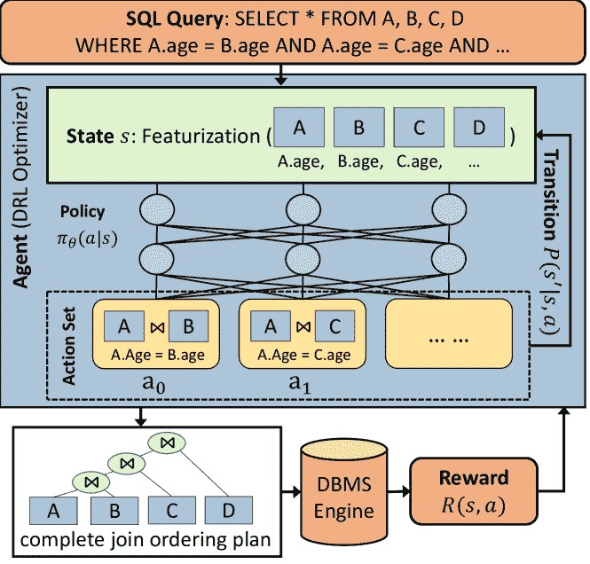
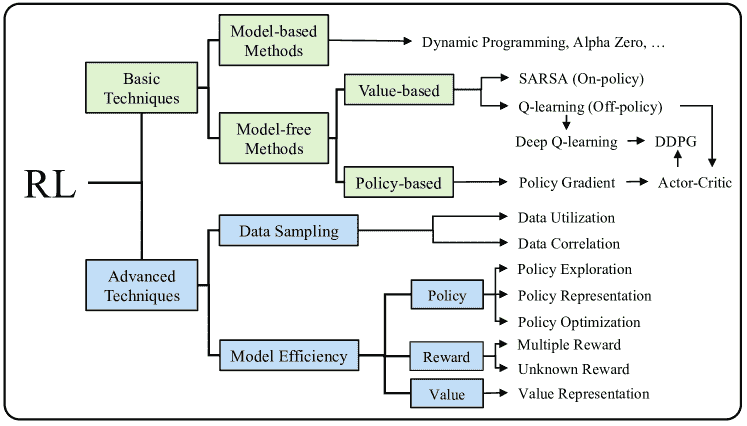
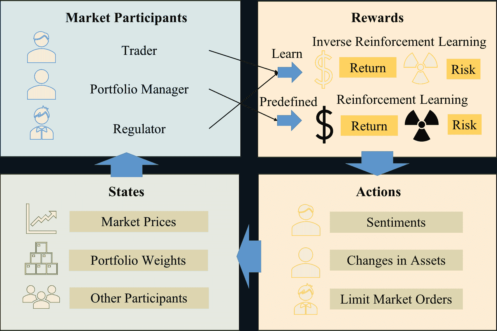

<!--yml

分类：未分类

日期：2024-09-06 19:52:11

-->

# [2108.04526] 关于深度强化学习在数据处理和分析中的调查

> 来源：[`ar5iv.labs.arxiv.org/html/2108.04526`](https://ar5iv.labs.arxiv.org/html/2108.04526)

# 关于深度强化学习在数据处理和分析中的调查

###### 摘要

数据处理和分析是基础且普遍的。算法在数据处理和分析中扮演着重要角色，许多算法设计已融入了人类知识和经验中的启发式和通用规则，以提高其效果。近年来，强化学习，特别是深度强化学习（DRL），在许多领域得到越来越多的探索和利用，因为它能在与复杂环境互动中学习比静态设计算法更好的策略。受到这一趋势的激励，我们提供了一项关于利用 DRL 改善数据处理和分析的最新工作的全面综述。首先，我们介绍了 DRL 中的关键概念、理论和方法。接下来，我们讨论了 DRL 在数据库系统上的部署，促进数据处理和分析的各个方面，包括数据组织、调度、调优和索引。然后，我们调查了 DRL 在数据处理和分析中的应用，从数据准备、自然语言处理到医疗保健、金融科技等。最后，我们讨论了使用 DRL 进行数据处理和分析的重要开放挑战及未来研究方向。

关于深度强化学习在数据处理和分析中的调查

Qingpeng Cai^(∗†), Can Cui^(∗†), Yiyuan Xiong^(∗†)^†^†^∗这些作者对本研究贡献相同，M. Zhang 是通讯作者。, Wei Wang^†,

Zhongle Xie^§, Meihui Zhang^‡

^†新加坡国立大学    ^§ 浙江大学

^‡北京理工大学

{qingpeng, cuican, yiyuan, wangwei}@comp.nus.edu.sg   xiezl@zju.edu.cn   meihui_zhang@bit.edu.cn

## 1 引言

在大数据时代，数据处理和分析是基础的、普遍存在的，并且对许多正在进行数字化转型以改善和改造业务及运营的组织至关重要。数据分析通常包括数据获取、数据清洗、数据集成、建模等其他关键操作，之后才能提取见解。大数据可以在许多领域（如医疗保健和零售）释放出显著的价值[56]。然而，数据的复杂性（例如高容量、高速度和高多样性）在数据分析中提出了许多挑战，因此提取有意义的见解变得困难。为了应对挑战并高效、有效地促进数据处理和分析，研究人员和从业者设计了大量的算法和技术，并开发了许多学习系统，如 Spark MLlib[63]和 Rafiki[106]。

为了支持快速数据处理和准确的数据分析，大量算法依赖于基于人类知识和经验开发的规则。例如，最短作业优先是一种调度算法，它选择下一个执行时间最短的作业。然而，如果没有充分利用负载的特征，它的性能可能会比基于学习的调度算法差[58]。另一个例子是计算机网络中的数据包分类，它将数据包匹配到规则集合中的规则之一。一种解决方案是使用手动调整的启发式方法构建决策树进行分类。具体而言，这些启发式方法是为特定规则集合设计的，因此可能不适用于具有不同特征的其他负载[47]。我们观察到现有算法的三个局限性[97, 46]。首先，算法是次优的。像数据分布这样的有用信息可能被忽略或未被充分利用。其次，算法缺乏适应性。为特定负载设计的算法在其他不同负载中可能表现不好。第三，算法设计是一个耗时的过程。开发人员必须花费大量时间尝试许多规则以找到一个经验上有效的规则。

基于学习的算法也已被用于数据处理和分析。通常使用两种学习方法：**监督学习**和**强化学习**。它们通过直接优化性能目标来实现更好的性能。**监督学习**通常需要大量高质量的标注训练数据，这可能很难获取。例如，配置调优对于优化数据库管理系统（DBMS）的整体性能非常重要[44]。可能有数百个调优参数，这些参数在离散和连续空间中是相关的。此外，数据库实例、多样的查询工作负载、硬件特性使得数据收集变得不可行，尤其是在云环境中。与**监督学习**相比，**强化学习**表现出良好的性能，因为它采用了试错搜索，并且需要较少的训练样本来找到云数据库的良好配置[123]。另一个具体的例子是查询处理中的查询优化。数据库系统优化器的任务是找到查询的最佳执行计划，以减少查询成本。传统的优化器通常会枚举许多候选计划，并使用成本模型来找到成本最低的计划。优化过程可能会很慢且不准确[42]。在不依赖于不准确的成本模型的情况下，**深度强化学习（DRL）**方法通过与数据库交互来改进执行计划（例如，改变表的连接顺序）[61, 37]。图 1 展示了使用**DRL**进行查询优化的典型工作流程。当查询被发送到代理（即**DRL**优化器）时，它通过对基本信息（如访问的关系和表）进行特征化生成状态向量。以状态作为输入，代理使用神经网络生成动作集合的概率分布，其中动作集合可能包含所有可能的连接操作作为潜在动作。每个动作表示对一对表的部分连接计划，并且一旦采取了动作，状态将被更新。在采取可能的动作后，将生成一个完整的计划，然后由**DBMS**执行以获得奖励。在这个查询优化问题中，奖励可以通过实际延迟计算。在训练过程中，通过奖励信号，代理可以改进策略，并生成具有更高奖励（即更少延迟）的更好连接顺序。

图 1：**DRL**进行查询优化的工作流程。A、B、C 和 D 是四个表。

强化学习（RL）[89] 侧重于学习如何在环境中做出智能决策。RL 算法基于探索和利用的原则，通过环境反馈来提升自身。在过去几十年中，RL 在理论和技术方面都取得了巨大的进展[86, 89]。特别地，深度强化学习（DRL）结合了深度学习（DL）技术，以处理复杂的非结构化数据，并被设计用来从历史数据和自我探索中学习，以解决那些著名的难题和大规模问题（例如，AlphaGo[85]）。近年来，来自不同领域的研究人员提出了 DRL 解决方案，以应对数据处理和分析中的问题[116, 58, 52]。我们从两个角度对现有的 DRL 研究进行分类：系统和应用。从系统的角度来看，我们关注从一般性的研究主题（如调度）到系统特定的研究主题（如数据库中的查询优化）等基础研究课题。我们还将重点讨论其在马尔可夫决策过程中的表述方式，并讨论 DRL 如何比传统方法更有效地解决问题。许多技术（如采样和仿真）被采用以提高 DRL 训练效率，因为在真实系统中执行工作负载和收集数据可能是非常耗时的[31]。从应用的角度来看，我们将涵盖数据处理和数据分析中的各种关键应用，以提供对 DRL 的可用性和适应性的全面理解。许多领域通过采用 DRL 而发生了转变，这有助于学习关于应用程序的特定领域知识。

本调查旨在提供关于在数据系统、数据处理和分析中应用深度强化学习（DRL）的最新进展的广泛和系统的综述。在第二部分中，我们介绍了强化学习中的关键概念、理论和技术，为基础奠定基础。为了更深入地了解 DRL，读者可以参考最近出版的书籍 [13]，该书详细阐述了选定的 DRL 研究主题和应用。在第三部分中，我们回顾了使用 DRL 进行系统优化以支持数据处理和分析的最新重要研究成果。我们涵盖了基本主题，如数据组织、调度、系统调优、索引、查询优化和缓存管理。在第四部分中，我们讨论了 DRL 在数据处理和分析中的应用，包括数据准备、自然语言交互以及各种现实世界应用，如医疗保健、金融科技、电子商务等。在第五部分中，我们突出了各种开放挑战和潜在的研究问题。我们在第六部分中总结。本文调查关注于探索 RL 在数据处理和分析中的最新进展，特别是在数据库和数据挖掘社区中引发了极大兴趣。还有讨论 DRL 在其他领域的调查论文。我们建议读者参考 [118] 关于医疗保健的 DRL 调查，[54] 关于通信和网络的 DRL 调查，以及 [76] 关于 RL 解释性的调查。另一项工作[107] 讨论了深度学习如何用于优化数据库系统设计，反之亦然。本文中，我们将“DRL”和“RL”互换使用。

## 2 强化学习的理论基础和算法

强化学习（RL）的目标是解决序列决策问题，其目的是采取最大期望奖励的行动。具体来说，智能体遵循一个策略在环境的不同状态下做出一系列决策（即采取行动），这些状态和行动的序列形成一个轨迹。为了评估策略的好坏，策略下的每个决策将通过轨迹中的累积奖励进行评估。评估策略后，智能体会通过提高做出高期望奖励决策的概率来改进策略。通过重复这些步骤，智能体可以通过试错法改进策略，直到策略达到最优，这样的序列决策过程通过马尔可夫决策过程（MDP）进行建模。

### 2.1 马尔可夫决策过程

从数学角度来看，MDP，如图 1 所示，是一个由五个元素组成的随机控制过程 $\mathcal{M}$，定义为一个五元组 $\mathcal{M}=(\mathcal{S},\mathcal{A},\mathcal{R},\mathcal{P},\gamma)$，其含义如下。

+   •

    状态 $\mathcal{S}$: $\mathcal{S}$ 是表示环境中不同情况的状态空间，$s_{t}\in\mathcal{S}$ 表示时间 $t$ 时的状态。

+   •

    行动 $\mathcal{A}$: $\mathcal{A}$ 是智能体可以采取的行动空间；这些行动可以是离散的或连续的，$a_{t}\in\mathcal{A}$ 表示在时间 $t$ 采取的行动。

+   •

    奖励函数 $\mathcal{R}(s_{t},a_{t})$: 它表示在状态 $s_{t}$ 下采取行动 $a_{t}$ 的即时奖励。

+   •

    转移函数 $\mathcal{P}(s_{t+1}=s^{\prime}|s_{t}=s,a_{t}=a)$: 它表示在时间 $t+1$ 转移到状态 $s^{\prime}$ 的概率，给定当前状态 $s$ 和在时间 $t$ 采取的行动 $a$。

+   •

    折扣因子 $\gamma\in[0,1]$: 某个行动的总奖励包括即时奖励和未来奖励，而 $\gamma$ 量化了我们对未来奖励的重要性。

我们采用图示 1 中展示的查询优化问题来帮助解释 MDP 的五个组成部分。在这个例子中，状态表示为状态向量，它总结了查询 $q$ 评估的关系和表的信息。在每个状态下，强化学习智能体生成一个概率分布，覆盖所有潜在的行动，其中每个行动表示一对表的部分连接计划。在重复这两个过程后，它达到一个终态，生成最终的连接顺序供智能体执行，并且所有行动的目标奖励通过实际性能（即延迟）或成本模型来衡量。至于转移函数，这个问题和大多数其他数据库问题中的状态转移都是确定性的。

在强化学习中，我们的目标是训练一个好的策略 $\pi$，它是从状态到行动的映射函数。通过这个策略，智能体可以采取一系列行动，这将导致状态的持续变化，并且遵循策略 $\pi$ 的状态和行动序列形成一个轨迹 $\tau=(s_{0},a_{0},s_{1},a_{1},...)$。从每个 $\tau$ 中，我们可以通过累积奖励 $\mathcal{G}$ 来评估每个行动的效果，它包括此行动的即时奖励和轨迹中后续行动的折扣奖励。行动 $a_{t}$ 的总结果 $\mathcal{G}$ 如下：$\mathcal{G}(\tau)=\sum_{t=0}\gamma^{t}r_{t}$，其中 $\gamma$ 量化了我们对未来奖励的重要性。更大的 $\gamma$ 会使得强化学习智能体更可能采取任何当前可能即时奖励较少但期望未来奖励更大的行动。

强化学习（RL）持续评估策略$\pi$并改进它，直到达到最优策略$\pi^{*}=\arg\max_{(\tau\sim\pi)}\mathcal{G}(\tau)$，在这种情况下，智能体总是采取最大化预期回报的行动。为了评估策略$\pi$，RL 算法通过函数$\mathcal{V}$和函数$\mathcal{Q}$分别估计状态和状态-动作对的好坏。这两个价值函数都是根据折扣回报$\mathcal{G}$的期望值计算的，可以写成：

|  | $\displaystyle\mathcal{V}^{\pi}(s)=E_{\tau\sim\pi}[\mathcal{G}(\tau)&#124;s_{0}=s]$ |  | (1) |
| --- | --- | --- | --- |
|  | $\displaystyle\mathcal{Q}^{\pi}(s,a)=E_{\tau\sim\pi}[\mathcal{G}(\tau)&#124;s_{0}=s,a_{0}=a]$ |  | (2) |

这两个价值函数之间有密切的关联，其中$\mathcal{V}^{\pi}(s_{t})$是根据策略$\pi$在状态$s_{t}$下所有可能动作的函数$\mathcal{Q}$的期望值，而$\mathcal{Q}^{\pi}(s_{t},a_{t})$是动作$a_{t}$的即时奖励和在状态$s_{t}$下采取动作$a_{t}$后所有可能状态值的期望值的组合。因此，我们有：

|  | $\displaystyle\mathcal{V}^{\pi}(s)$ | $\displaystyle=$ | $\displaystyle\sum_{a\in\mathcal{A}}\pi(a&#124;s)\mathcal{Q}^{\pi}(s,a)$ |  | (3) |
| --- | --- | --- | --- | --- | --- |
|  | $\displaystyle\mathcal{Q}^{\pi}(s,a)$ | $\displaystyle=$ | $\displaystyle R(s,a)+\gamma\sum_{s^{\prime}\in\mathcal{S}}\mathcal{P}(s^{\prime}&#124;s,a)\mathcal{V}^{\pi}(s^{\prime})$ |  | (4) |

给定一个策略$\pi$，我们可以通过贝尔曼方程[89]来评估其价值函数，这些方程利用了这些价值函数的递归关系。正式地，贝尔曼方程推导出给定状态（即函数$\mathcal{V}$）或给定状态-动作对（即函数$\mathcal{Q}$）与其后继状态之间的关系，可以写成：

|  | $\displaystyle\mathcal{V}^{\pi}(s)=\sum_{a_{t}\in\mathcal{A}}\pi(a&#124;s)[R(s,a)+\gamma\sum_{s^{\prime}\in\mathcal{S}}\mathcal{P}(s^{\prime}&#124;s,a)\mathcal{V}^{\pi}(s^{\prime})]$ |  | (5) |
| --- | --- | --- | --- |
|  | $\displaystyle\mathcal{Q}^{\pi}(s,a)=\sum_{s^{\prime}\in\mathcal{S}}\mathcal{P}(s^{\prime}&#124;s,a)[R(s,a)+\gamma\sum_{a^{\prime}\in\mathcal{A}}\pi(a^{\prime}&#124;s^{\prime})\mathcal{Q}^{\pi}(s^{\prime},a^{\prime})]$ |  | (6) |

通过迭代贝尔曼方程，我们可以轻松获得策略的价值函数，并且为了比较策略，我们定义策略 $\pi$ 比 $\pi^{\prime}$ 更优，如果 $\pi$ 对应的函数 $\mathcal{V}$ 对所有状态都不低于 $\pi^{\prime}$ 对应的函数 $\mathcal{V}$，即 $\mathcal{V}^{\pi}(s)\geq\mathcal{V}^{\pi^{\prime}}(s),\forall s$。在[89]中已证明，在 MDP 问题中最优策略 $\pi^{*}$ 的存在是有保障的，其中 $\mathcal{V}^{*}(s)=\max_{\pi}\mathcal{V}^{\pi}(s)$ 和 $\mathcal{Q}^{*}(s)=\max_{\pi}\mathcal{Q}^{\pi}(s)$。这两个函数被定义为最优函数 $\mathcal{V}$ 和最优函数 $\mathcal{Q}$。我们可以通过最大化 $\mathcal{Q}^{*}(\pi)$ 来获得最优策略 $\pi^{*}$，其表示为：

|  | $\displaystyle\pi^{*}(a&#124;s)=\arg\max\mathcal{Q}^{*}(s,a)$ |  | (7) |
| --- | --- | --- | --- |

为了改进策略，我们应用贝尔曼最优性方程[89]通过采取具有最大值的动作来更新价值函数，而不是尝试所有可能的动作。为了促进策略的优化，许多 RL 技术从不同角度提出，图 2 提供了一个图示，概述了这些技术的广泛分类，展示了这些技术的应用方式。

图 2：RL 技术的广泛分类。

### 2.2 基本技术

基于 MDP 元素的表示，基本技术可以分为两类：基于模型的方法和无模型的方法。主要区别在于代理是否可以访问环境模型，即代理是否知道转移函数和奖励函数。在基于模型的方法中，这两个函数已经是已知的，其中动态规划（DP）[6]和 Alpha-Zero [86]是经典方法，这些方法在许多应用中取得了显著成果。在这些方法中，代理被允许预先思考并计划对环境的未来作用。此外，代理可以从计划的经验中学习最优策略，从而实现高样本效率。

在许多强化学习问题中，由于环境复杂及其内在机制复杂，奖励和转移函数通常是未知的。例如，如图 1 所示，我们无法获得实际延迟作为联合查询优化示例中的奖励。此外，在随机作业调度问题[59]中，由于实际场景中作业到达的随机性，也无法直接建模转移函数。因此，在这些问题中，代理通常采用无模型的方法，这些方法可以纯粹从与环境交互过程中获得的经验中学习策略。无模型的方法主要可以分为两类，即基于价值的方法和基于策略的方法。在基于价值的方法中，强化学习算法通过最大化价值函数来学习最优策略。估计价值函数的主要方法有两种，分别是蒙特卡罗（MC）方法和时序差分（TD）方法。MC 方法通过直接应用其定义来计算 $\mathcal{V}(s)$，即方程 1。MC 方法一旦获得新的轨迹 $\tau$ 就可以直接更新价值函数，如下所示：

|  | $\displaystyle\mathcal{V}^{\pi}(s)\leftarrow\mathcal{V}^{\pi}(s)+\alpha(\mathcal{G}_{\tau\sim\pi}(\tau&#124;s_{0}=s)-\mathcal{V}^{\pi}(s))$ |  | (8) |
| --- | --- | --- | --- |

其中 $\alpha\in0,1)$ 表示学习率，控制用新经验更新策略的速率。然而，它有一个明显的缺点，即完整的轨迹要求代理达到终止状态，而在一些应用中，如在线系统，这并不实际。与 MC 方法不同，TD 方法基于价值函数的递归关系，因此可以从不完整的轨迹中学习。从数学上讲，TD 方法的更新可以写成：

|  | $\displaystyle\mathcal{V}^{\pi}(s)\leftarrow\mathcal{V}^{\pi}(s)+\alpha(R(s,a)+\gamma\mathcal{V}^{\pi}(s^{\prime})-\mathcal{V}^{\pi}(s))$ |  | (9) |
| --- | --- | --- | --- |

然而，使用 TD 方法估计函数 $\mathcal{V}$ 时存在偏差，因为它们是通过递归关系进行学习的。为了减少偏差，TD 方法可以扩展不完整轨迹的长度，通过考虑更多的步骤来更新函数 $\mathcal{V}$，这被称为 $n$ 步 TD 方法。随着 $n$ 增长到整个轨迹的长度，MC 方法可以被视为 TD 方法的一个特例，其中函数 $\mathcal{V}$ 是无偏估计。另一方面，随着长度 $n$ 的增加，轨迹的方差也会增加。除了上述考虑之外，基于 TD 的方法更高效，所需的存储和计算也更少，因此在 RL 算法中更受欢迎。

在基于值的方法中，我们可以通过方程 [7 通过贪心策略获得最优策略。TD 方法中函数 $\mathcal{Q}$ 的更新类似于函数 $\mathcal{V}$ 的更新，具体如下：$\mathcal{Q}^{\pi}(s,a)\leftarrow\mathcal{Q}^{\pi}(s,a)+\alpha(R(s,a)+\gamma\mathcal{Q}^{\pi^{\prime}}(s^{\prime},a^{\prime})-\mathcal{Q}^{\pi}(s,a))$，其中代理根据策略 $\pi$ 执行动作，并根据策略 $\pi^{\prime}$ 来最大化函数 $\mathcal{Q}$。如果这两个策略相同，即 $\pi^{\prime}=\pi$，我们称这种 RL 算法为在线策略方法，其中 SARSA[77] 是代表方法。此外，其他策略也可以在 $\pi^{\prime}$ 中使用。例如，在 Q-learning[109] 中，代理应用贪心策略并通过其后继中的最大值来更新函数 $\mathcal{Q}$。其更新公式可以写作：$\mathcal{Q}^{\pi}(s,a)\leftarrow\mathcal{Q}^{\pi}(s,a)+\alpha(R(s,a)+\gamma\max_{a^{\prime}}\mathcal{Q}^{\pi}(s^{\prime},a^{\prime})-\mathcal{Q}^{\pi}(s,a))$。这两种基于值的方法在没有环境模型的情况下都能很好地工作，而 Q-learning 直接学习最优策略，而 SARSA 在探索过程中学习接近最优的策略。从理论上讲，Q-learning 应该比 SARSA 更快收敛，但其生成的样本具有较高的方差，可能会面临收敛问题。

在强化学习（RL）中，当状态或动作数量庞大时，存储和计算成本非常高。为了解决这个问题，深度强化学习（DRL）作为 RL 的一个分支，采用深度神经网络（DNN）来用神经网络替代表格表示。对于函数$\mathcal{V}$，DNN 将状态$s$作为输入，并输出其状态值$\mathcal{V}_{\theta}(s)\approx\mathcal{V}^{\pi}(s)$，其中$\theta$表示 DNN 中的参数。对于函数$\mathcal{Q}$，它将状态$s$和动作$a$的组合作为输入，并输出状态-动作对的值$\mathcal{Q}_{\theta}(s,a)\approx\mathcal{Q}^{\pi}(s,a)$。至于神经网络，我们可以通过应用在深度学习中广泛使用的技术（例如梯度下降）来优化它们。深度 Q 学习网络（DQN）[65]，作为 DRL 中的一种代表方法，将 DNN 与 Q 学习相结合，其损失函数如下：

|  | $\mathcal{L}_{w}=\mathbf{E}_{\mathcal{D}}[(R(s,a)+\gamma\max_{a^{*}\in\mathcal{A}}\mathcal{Q}_{w}(s^{\prime},a^{*})-\mathcal{Q}_{w}(s,a))^{2}]$ |  | (10) |
| --- | --- | --- | --- |

其中，$\mathcal{D}$表示经验回放，累积生成的样本并可以稳定训练过程。

基于策略的方法是模型自由 RL 算法的另一个分支，它们对策略$\pi(a|s)$有明确的表示，并且可以解决在基于价值的方法中遇到的几个挑战。例如，当动作空间是连续的时，基于价值的方法需要离散化动作，这可能会增加问题的维度，以及内存和计算消耗。基于价值的方法学习一个确定性的策略，通过一个最优函数$\mathcal{Q}$生成给定状态下的动作（即$\pi(s)=a$）。然而，对于基于策略的方法，它们可以学习一个随机策略（即$\pi_{\theta}(a_{i}|s)=p_{i},\sum_{i}p_{i}=1$）作为最优策略，其中$p_{i}$表示在状态$s$下采取动作$a_{i}$的概率，而$\theta$表示参数，其中神经网络可以用来逼近策略。策略梯度[90]方法是主要的基于策略的方法之一，它可以解决上述挑战。其目标是通过使用梯度上升法优化参数$\theta$，并且目标可以用一个广义表达式表示：

|  | $\nabla_{\theta}J(\theta)=\mathbf{E}_{\tau\sim\pi_{\theta}}[R(\tau)\nabla_{\pi_{\theta}}\log_{\pi_{\theta}}(a&#124;s)]$ |  | (11) |
| --- | --- | --- | --- |

具体的证明过程可以参考[89]。通过 MC 方法进行采样，我们可以获得整个轨迹，以改善基于策略的方法的策略。

训练后，期望奖励较高的动作将有更高的概率被选择，反之亦然。对于连续动作，从策略梯度学到的最优策略是随机的，仍然需要采样来获得动作。然而，当搜索空间巨大时，随机策略仍然需要大量样本来训练模型。确定性策略梯度（DPG）[87] 作为策略梯度的扩展，通过使用随机策略进行采样，同时应用确定性策略输出动作，从而克服了这一问题，减少了所需样本量。

基于价值的方法和基于策略的方法各有优缺点，但它们并不相互矛盾。Actor-Critic (AC) 方法作为两者的融合，将模型分为两个部分：actor 和 critic。actor 部分基于参数化的策略选择动作，而 critic 部分专注于评估价值函数。与之前的方法不同，AC 评估优势函数 $\mathcal{A}^{\pi}(s,a)=\mathcal{Q}^{\pi}(s,a)-\mathcal{V}^{\pi}(s)$，它反映了某个动作 $a$ 相对于所有动作的平均值的相对优势。价值函数的引入还允许 AC 通过 TD 方法逐步更新，并且政策方法的结合使 AC 适用于连续动作。然而，两种方法的结合也使得 AC 方法更难以收敛。此外，Deep Deterministic Policy Gradient (DDPG) [49] 作为 AC 的扩展，吸收了 DQN 和 DPG 的先进技术，使 DDPG 能够更有效地学习策略。

在上述所有方法中，总是存在探索未知情况和利用已学知识之间的权衡。一方面，利用已学知识可以帮助模型更快收敛，但它总是将模型引向局部最优而非全局最优。另一方面，探索未知情况可以找到一些新的、更好的解决方案，但始终处于探索过程中的模型难以收敛。为了平衡这两个过程，研究人员一直在致力于寻找良好的启发式策略，例如 $\epsilon$-贪婪策略、Boltzmann 探索（Softmax 探索）、上置信界（UCB）算法 [2]、Thompson 采样 [92] 等。在这里，我们以 $\epsilon$-贪婪策略为例，$\epsilon$-贪婪通常选择具有最大 Q 值的动作来利用已学经验，同时偶尔随机选择一个动作以探索未知情况。具有 $m$ 个动作的 $\epsilon$-贪婪探索策略可以表示如下：

|  | $\pi(a&#124;s)=\left\{\begin{array}[]{ll}\epsilon/m+(1-\epsilon)&amp;a^{*}=arg\max_{a\in\mathcal{A}}\mathcal{Q}(s,a),\\ \epsilon/m&amp;a\not=a^{*}.\end{array}\right.$ |  | (12) |
| --- | --- | --- | --- |

$\epsilon\in0,1)$ 是探索因子。当 $\epsilon$ 趋近于 1 时，智能体更可能随机选择动作，而 $\epsilon$ 将在训练过程中持续减少。

### 2.3 高级技术

本节主要讨论了强化学习中的一些高级技术，这些技术集中在有效利用有限样本和构建复杂模型结构以获得更好的表示和优化。根据不同的改进，这些技术大致可以分为两部分：数据采样和模型效率。

#### 2.3.1 数据采样

数据采样是训练 DRL 时数据处理和分析中最重要的关注点之一。在大多数应用中，样本生成过程耗费大量时间和计算资源。例如，一个样本可能指的是工作负载的执行运行和数据库的重分区，这可能需要大约 40 分钟[[31]。因此，为了用有限的样本训练模型，我们需要提高数据利用率并减少数据相关性。

数据利用：大多数深度强化学习（DRL）算法同时训练最优策略和采样数据。与训练后丢弃样本不同，经验回放[50]将样本积累在一个大表中，在学习阶段期间随机选择样本。通过这种机制，样本的利用率更高，方差更低，从而可以稳定训练过程并加快训练收敛。经过多次迭代后的样本可能与当前策略不同，因此，Growing-batch [40]可以持续刷新表格并替换这些过时的样本。此外，应更加关注那些远离当前策略的样本，而优先经验回放[79]使用 TD 误差作为优先级来衡量样本的重要性，从而更多地关注高误差的样本。总之，通过经验回放，DRL 不仅可以稳定学习阶段，还可以通过更少的样本高效优化策略。

数据相关性：训练数据的强相关性是另一个可能导致智能体学习到次优解而非全局最优解的问题。除了经验回放外，分布式环境的机制是缓解此问题的另一个研究方向。例如，异步优势演员-评论家（A3C）[64] 和 分布式 PPO（DPPO）[27]应用多线程来构建多个独立环境，在这些环境中，多个智能体并行采取行动，更新会周期性且分别地计算，从而可以加速采样过程并减少数据相关性。

#### 2.3.2 模型效率

更高效的 RL 模型是 RL 发展的主要推动力，许多研究者从三个主要方面进行改进，即政策、奖励函数和价值函数。

政策：与政策相关的技术集中于稳定和有效地学习全面的政策，高级技术有效地学习政策可以详细分类为三部分，即政策探索、政策表示和政策优化。

a) 政策探索：其目标是在训练过程中尽可能多地探索各种动作，以防政策陷入局部最优。例如，熵正则化 [64] 将动作概率的熵添加到损失项中，这可以充分探索动作。此外，向动作中添加噪声是另一个研究方向，用于增加政策探索的随机性。DDPG 应用 Ornstein–Uhlenbeck 过程 [96] 生成时间噪声 $\mathcal{N}$，这些噪声直接注入政策中。Noisy-Net [22] 将噪声融入神经网络的参数中，这种方法易于实现，且表现优于 $\epsilon-greedy$ 和熵正则化方法。此外，Plappert 等人 [75] 研究了一种有效的方式，将参数空间噪声结合起来，以丰富探索行为，这对政策方法和离政策方法都有好处。

b) 政策表示：一些 RL 问题中的状态具有巨大的维度，这在训练过程中带来了挑战。为了近似更好的政策，一些 DRL 模型通过将卷积神经网络（CNN）引入 DQN 来改进政策表示，例如 Dueling DQN [108]、DRQN [26] 等。此外，DRQN 还结合了 LSTM 结构，以增加政策的容量，能够捕捉时间信息，例如速度、方向。

策略优化：根据方程 5 和 6 更新的价值函数倾向于高估价值函数，并引入偏差，因为它们从估计中学习。Mnih 等人[66]通过使用两个相同的 Q 网络将两个估计过程分开，从而减少两个估计过程的相关性，从而稳定训练过程。然而，具有最大 Q 值的动作可能在两个 Q 网络之间有所不同，这将使收敛变得困难。双重 DQN（DDQN）[99]通过将选择动作和计算最大 Q 值的步骤分开来缓解这个问题。

当我们应用基于策略的强化学习方法时，策略的学习率在实现优越性能中起着至关重要的作用。较高的学习率可以始终最大化策略的逐步改进，但也会导致学习阶段的不稳定性。因此，信任域策略优化（TRPO）[80]通过 KL 散度对旧策略和新策略施加约束，以控制策略变化在可接受的范围内。有了这个约束，TRPO 可以通过一个可以单调改善策略的代理目标函数来迭代优化策略。然而，KL 约束的设计使得训练变得困难，临近策略优化（PPO）[81]通过两种方式简化了约束：将其添加到目标函数中，并设计了一个裁剪函数来控制更新速率。经验上，PPO 方法实现起来要简单得多，并且至少能够达到与 TRPO 相当的性能。

奖励：奖励函数作为马尔可夫决策过程（MDP）中的关键组成部分，在强化学习（RL）中扮演着重要角色。在一些特定问题中，代理需要实现多个目标，这些目标可能存在某种关系。例如，机器人只有在找到钥匙后才能通过门。为解决这一挑战，分层 DQN [38] 提出了两个层级的分层 RL (HRL) 模型，以重复选择新的目标并实现选定目标。然而，其局限性在于目标需要手动预定义，这在一些环境中可能未知或不可测量，如市场和药物效果。为了克服这个问题，逆强化学习（IRL） [68] 从给定的专家演示（即手工制作的轨迹）中学习奖励函数，但 IRL 中的代理只能优先考虑整个轨迹而非其他轨迹。当代理进入一个从未出现过的状态时，这将导致偏移。生成对抗模仿学习（GAIL） [32] 作为一种模仿学习算法，应用对抗训练方法生成虚假样本，并能够明确直接地学习专家的策略。

价值：如我们之前提到的，价值函数的表格表示法有若干局限，这些局限可以通过深度强化学习（DRL）来缓解。不同于直接将状态-动作对作为输入来计算 Q 函数，Dueling DQN [108] 通过近似两个独立的部分来估计其价值，即状态价值和优势价值，因此能够区分价值是由状态还是动作带来的。

上述高级算法和技术从不同角度改善和增强了 DRL，这使得基于 DRL 的算法成为提高数据处理和分析的有前途的方法。我们观察到具有以下特点的问题可能适合 DRL 优化。首先，问题极其复杂且困难。系统和应用涉及复杂的操作环境（例如，大规模、高维状态）和内部实现机制，很难准确构建白盒模型。DRL 可以处理复杂数据并通过交互产生经验进行学习，这自然适用于存在多种数据并频繁处理的数据处理和分析。其次，优化目标可以作为奖励轻松表示和计算，因为 RL 代理在训练过程中通过最大化奖励自我改进，奖励可以计算很多次。第三，环境可以很好地描述为 MDP。DRL 已被证明能够解决 MDP，并且具有理论保证和实证结果。因此，涉及顺序决策的问题，如规划、调度、结构生成（例如，树、图）和搜索，可以表示为 MDP，并且非常适合 DRL。第四，大规模收集所需的数据标签很困难。与监督学习相比，DRL 可以有效利用数据以获得良好的性能。

## 3 数据系统优化

DRL 通过与系统交互来学习系统知识并优化系统。在本节中，我们重点讨论数据处理和分析中系统优化的几个基本方面，包括数据组织、调度、调整、索引、查询优化和缓存管理。我们讨论了如何通过定义系统中的三个关键元素（动作、状态和奖励）将每个问题表述为 MDP，并由 DRL 解决。通常，状态由系统的一些关键特征定义。动作是可能的决策（例如，系统配置），影响系统性能，而奖励则基于性能指标（例如，吞吐量、延迟）进行计算。表 1 展示了代表性工作的总结，每项工作的状态和动作空间的估计维度范围作为 DRL 训练难度的信号。作为对比，OpenAI Five[8]，一个玩 Dota 的 AI，将状态观察为 20,000 个数字，代表有用的游戏信息，每个英雄约有 1,000 个有效动作（例如，命令英雄移动到某个位置）。Dota 是一个实时战略游戏，由两个五人团队进行，每个玩家控制一个称为“英雄”的角色。

### 3.1 数据组织

#### 3.1.1 数据分区

有效的数据分区策略对于加速数据处理和分析至关重要，因为它通过跳过给定查询的不相关数据来实现。这是一项具有挑战性的任务，因为需要考虑许多因素，包括工作负载和数据特性、硬件配置以及系统实现。

在数据分析系统中，数据被分割成块存储在主内存或辅助存储中，这些块会被相关查询访问。一个查询可能会冗余地提取许多块，因此，有效的块布局可以避免读取不必要的数据，减少块访问次数，从而提高系统性能。杨等人[116]提出了一种称为 qd-tree 的框架，该框架通过在分析负载上使用 DRL 将数据分区成块。qd-tree 类似于经典的 k-d 树，描述了多维数据空间的划分，其中每个内部节点使用特定谓词分割数据，并表示一个子空间。叶节点中的数据被分配到同一个块中。在 MDP 中，每个状态是一个节点，代表整个数据的子空间，并以范围和类别谓词的串联形式呈现。代理在采取行动生成两个子节点后，将产生两个新状态，并在稍后进行探索。可用的动作集是从工作负载查询中解析出的谓词。奖励通过所有查询中跳过块的归一化数量来计算。他们不执行查询，而是使用采样技术来高效地估计奖励。使用 DRL 学习树的公式类似于 NeuroCuts[47]，后者学习用于数据包分类的树。然而，qd-tree 可能不支持包含用户定义函数（UDFs）查询的复杂工作负载。

数据库中的水平分区选择大表的属性，并将其拆分到多个机器上，以提高分析工作负载的性能。该设计依赖于数据库管理员（DBA）的经验或通常不准确的成本模型[42]来预测不同分区的运行时间。在云环境中，数据收集过于复杂和昂贵，难以训练出准确的监督学习模型。Hilprecht 等人[31] 使用深度强化学习（DRL）在云数据库中的分析工作负载上进行分区学习，因为 DRL 能够高效地导航分区搜索，并且需要较少的训练数据。在马尔可夫决策过程（MDP）中，状态包括两个部分。数据库部分编码了一个表是否被复制、一个属性是否用于分区以及哪些表是共同分区的。工作负载部分包含了代表性查询的归一化频率。支持的操作包括：使用属性对表进行分区、复制表和更改表的共同分区。奖励是工作负载运行时间的负值。一个挑战是数据库分区的成本在训练过程中较高。为了解决这个问题，代理在模拟环境中进行训练，并通过采样估算奖励在真实环境中进一步优化。一个限制是由于只考虑了查询的频率特征，它可能无法很好地支持新查询。Durand 等人[17, 18] 利用 DRL 改进垂直分区，以优化物理表布局。他们展示了 DQN 算法可以很容易地用于一个表的单一工作负载，但难以推广到随机工作负载。

对于非结构化数据上的 UDF 分析工作负载，分区更具挑战性，因为 UDF 可能表达复杂的计算，而非结构化数据中没有功能依赖。Zou 等人[127]提出了 Lachesis 系统，以提供对非关系数据分析的自动分区。Lachesis 将 UDF 转换为基于图的中间表示（IR），并根据 IR 的子图作为双端图来识别分区候选。Lachesis 采用 DRL 来学习选择最佳候选。状态包括从历史工作流中提取的每个分区的特征：频率、执行间隔、最近运行时间、复杂性、选择性、键分布、协同分区的数量和大小。此外，状态还包括其他特征，如硬件配置。动作是选择一个分区候选。奖励是与应用程序历史执行的平均吞吐量相比的吞吐量加速。为了减少训练时间，奖励是从历史延迟统计中得出的，在运行应用程序时无需对数据进行分区。一个局限性是 Lachesis 在设计状态和计算奖励时很大程度上依赖于历史统计，这可能会导致统计数据不足时性能较差。

#### 3.1.2 数据压缩

数据压缩被广泛使用以节省存储空间。然而，压缩方案的有效性依赖于数据类型和模式。在时间序列数据中，模式可能随时间变化，固定的压缩方案可能不适用于整个期间。Yu 等人[120]提出了一个两级压缩框架，其中通过在顶层提取全局特征构建方案空间，并在底层为每个点选择一个压缩方案。所提出的 AMMMO 框架包括压缩原语和控制参数，这些定义了压缩方案空间。由于枚举在计算上不可行，该框架建议采用 DRL 来寻找压缩方案。代理将一个包含 32 个数据点的块（包括压缩头和数据段、时间戳和度量值）作为状态。动作是从压缩方案空间中选择一个方案，然后计算压缩比作为奖励。局限性在于该方法可能不适用于其他数据类型，如图像和视频。

表 1：使用 DRL 进行数据系统优化的代表性工作。D(X)表示 X 空间的近似维度。

| 领域 | 工作 | 算法 | D(状态) | D(动作) | 基于 DRL 的方法 | 开源 |
| --- | --- | --- | --- | --- | --- | --- |
| 数据组织 | 分析系统数据分区[116] | PPO | 10 - 100 | 100 - 1000 | 利用工作负载模式并生成树 | 否 |
|  | 数据库水平分区 [31] | DQN | 100 | 10 | 高效导航分区搜索 | NO |
|  | UDF-中心工作负载数据分区 [127] | A3C | 10 | 1-10 | 利用分区和搜索的特性 | YES |
|  | 时间序列数据压缩 [120] | PG | 100 | 10 | 交互式搜索参数 | NO |
| 调度 | 分布式作业处理 [58] | PG | 100 | 10 | 利用作业依赖关系并学习调度决策 | YES |
|  | 分布式流数据 [45] | DDPG | 100 | 10-100 | 学习调度决策 | NO |
| 调优 | 数据库配置 [123] [44] | DDPG | 100 | 10 | 交互式搜索配置参数 | YES |
| 索引 | 索引选择 [84] | CEM | 100 | 10 | 交互式搜索索引 | NO |
|  | R 树构建 [24] | DQN | 10-100 | 10 | 学习生成树 | NO |
| 查询优化 | 连接顺序选择 [61, 37, 119, 29] | PG, DQN, … | 10-100 | 1-10 | 学习决定连接顺序 | 仅 [29] |
| 缓存管理 | 视图物化 [121] | DQN | 100 | 10 | 将问题建模为 IIP 并解决 | NO |

### 3.2 调度

调度是数据处理和分析系统中的一个关键组成部分，以确保资源得到合理利用。分布式计算集群中的作业调度面临许多挑战因素，例如工作负载（如作业依赖、大小、优先级）、数据本地性和硬件特性。现有的算法使用诸如最短作业优先等通用启发式方法，没有很好地利用这些因素，导致性能不佳。为此，Mao 等人[58]提出了 Decima，利用深度强化学习（DRL）来学习调度具有依赖阶段的作业，以改善数据处理集群的作业完成时间。在数据处理系统中，如 Hive[93]、Pig[70]、Spark-SQL[1]，作业可能有多达数百个阶段，许多阶段并行运行，这些都表示为有向无环图（DAGs），其中节点是执行阶段，每条边表示依赖关系。为了处理作业 DAG 中的并行性和依赖性，Decima 首先应用图神经网络（GNN）来提取特征作为状态，而不是手动设计它们，同时实现可扩展性。生成了三种类型的特征嵌入。节点嵌入捕获关于节点及其子节点的信息，包括剩余任务数、忙碌和可用的执行器、持续时间以及执行器的本地性。作业嵌入汇总了作业中的所有节点嵌入，而集群嵌入则结合了作业嵌入。为了平衡可能的大行动空间和长的行动序列，行动决定了下一个要调度的作业阶段和执行器的并行限制。奖励基于平均作业完成时间。为了在作业流环境中有效训练，Decima 逐渐增加训练作业的长度以进行课程学习[7]。应用了方差减少技术[59]来处理随机作业到达以提高鲁棒性。然而，我们注意到 Decima 是非抢占性的，并且不会为更高优先级的作业重新调度。

在分布式流数据处理领域，连续数据流以实时方式在规模上进行处理。调度算法将工作线程分配给数据处理任务，每个工作线程使用多个线程来处理数据元组，旨在最小化平均数据元组处理时间。Li 等人[45]设计了一种使用深度强化学习（DRL）的调度算法，用于分布式流数据处理，该算法学习将元组分配给工作线程。状态包括调度计划（例如，当前的工作线程分配）和负载信息（例如，元组到达率）。行动是将线程分配给机器。奖励是平均负的元组处理时间。研究表明，DQN 表现不佳，因为动作空间过大，因此改用 DDPG 训练基于演员-评论员的代理。为了找到好的行动，提出的方法寻找演员网络输出的动作的 k 个最近邻，并选择评论员网络输出值最高的邻居。该算法在 Apache Storm 上实现，并通过代表性应用进行评估：日志流处理、连续查询和词频统计。

最近提出了许多改进调度的工作，使用了 DRL[122，35]。查询调度决定了查询的执行顺序，这对数据库系统中的查询性能和资源利用率有着重要影响。SmartQueue[122]通过利用查询之间的数据访问重叠来改进查询调度，并通过 DRL 学习提高缓存命中率。此外，Tim 等人[35]在 SageDB 中设计了一种使用强化学习（RL）技术的调度系统。其他使用 RL 进行调度的工作包括异构集群中的贝叶斯 RL 调度[3]、设备中的操作调度[23]、集群中的应用容器调度[102]等。

### 3.3 调优

调整数据处理和分析系统的配置在提高系统性能中起着关键作用。这个任务很具挑战性，因为可能存在多达数百个参数以及它们之间的复杂关系。此外，硬件和工作负载等其他因素也会影响性能。现有的工作通常采用基于搜索或监督学习的方法。前者需要较长时间才能获得可接受的配置，而后者如 OtterTune[98] 则需要大量高质量的数据，这在实践中不易获得。Zhang 等人[123] 设计了一个使用 DRL 的云数据库调优系统 CDBTune，以在高维配置空间中找到最佳参数。CDBTune 将 MDP 公式化如下。状态由内部指标（例如，缓冲区大小、读取页面）表示。动作是增加或减少控制参数值。奖励是两个状态之间的性能差异，通过吞吐量和延迟计算。CDBTune 在离线训练模拟和实际环境中的在线训练上需要几个小时。与 OtterTune 相比，CDBTune 减轻了收集大量训练数据集的负担。在实验中，CDBTune 被证明优于 DBA 专家和 OtterTune，并在四个数据库的 6 种不同工作负载下提高了调优效率。该方法的一个局限性是忽略了工作负载信息，因此当查询工作负载发生变化时，可能表现不佳。

为了解决这个问题，Li 等人[44] 提出了 QTune，它利用 DRL 考虑查询信息来调优数据库。首先，Qtune 从 SQL 查询中提取特征，包括类型（例如，插入、删除）、表以及数据库引擎估算的操作（例如，扫描、哈希连接）成本。查询中的列属性和操作如选择条件被忽略。随后，Qtune 训练一个 DNN 模型来预测在执行工作负载中的查询后，状态中统计信息（例如，更新的元组、提交事务的数量）的差异，并使用这些信息更新状态。动作和奖励设计类似于 CDBTune。此外，QTune 支持三种调优粒度级别，以平衡吞吐量和延迟。对于查询级别，QTune 输入查询向量，并尝试为每个查询找到合适的控制参数。对于工作负载级别，合并所有查询的向量并使用。对于集群级别，QTune 使用基于深度学习的聚类方法来分类查询并将查询合并为簇。QTune 的一个缺点是查询特征化可能会丢失关键的信息，如查询属性（即列），并且在成本估算不准确时可能会影响性能。因此，准确的训练数据对于训练状态变化预测模型至关重要，因此端到端的训练框架是一个必要且值得探索的方向。

### 3.4 索引

#### 3.4.1 数据库索引选择

数据库索引选择考虑哪些属性需要创建索引以最大化查询性能。Sharma 等人[84] 展示了如何使用深度强化学习（DRL）根据给定的工作负载推荐索引。状态编码了工作负载查询和数据库模式中列的选择性值及当前列索引。动作是在某一列上创建索引。奖励是相较于没有索引的基线的改进。实验表明，该方法的性能与对所有列创建索引相当或更好。Sadri 等人[78] 利用 DRL 选择集群数据库中的索引，同时考虑查询处理和负载均衡。Welborn 等人[110] 通过为数据库中的索引选择任务引入任务特定知识来优化动作空间设计。然而，这些工作仅考虑了单列索引的情况。Lan 等人[39] 提出了使用 DRL 进行单属性和多属性索引选择。提出了五条规则来减少动作和状态空间，这有助于代理更容易地学习有效策略。该方法使用 what-if caller[9] 在特定索引配置下获取查询的成本，而无需实际构建索引。这些工作进行的实验都是基础的、使用小型简单数据集的。因此，需要使用真实数据集进行广泛的大规模实验，以基准测试这些方法，以确保它们能够良好扩展。

#### 3.4.2 索引结构构建

最近提出的学习索引作为替代索引被建议用来替换 B^+-树和布隆过滤器，通过将索引视为模型，并使用深度学习模型作为索引[36]。DRL 可以增强传统索引，而不是替代它们。

层级结构如 B^+-树和 R-tree 是重要的索引机制，可以有效地定位感兴趣的数据，而无需扫描大量数据库。与单维度的对应结构相比，R-tree 因边界框效率和多路径遍历而更难优化。早期的传统方法使用启发式算法来确定这两个操作（即选择插入子树和拆分溢出的节点）在构建 R-tree 的过程中[71]。Gu 等人[24]提议使用 DRL 来替代启发式算法构建 R-tree，并提出了 RLR-tree。这种方法将两个操作 ChooseSubtree 和 Split 分别建模为两个 MDP，并将它们结合起来生成一个 R-Tree。对于 ChooseSubtree，状态表示为每个选定子节点的四个特征（即面积、周长、重叠度、占用率）的串联。评估了更多特征，但在报告的实验中没有提高性能。动作是从前 k 个子节点中选择一个节点进行插入，以增加面积。奖励是 RLR-tree 的性能改进。对于 Split MDP，状态是通过所有前 k 个拆分生成的两个节点的面积和周长，按总面积的升序排列。动作是从 k 个规则中选择一个拆分规则，奖励类似于 ChooseSubtree。两个代理交替训练。正如预期的那样，这些优化使 RLR-tree 在范围查询和 KNN 查询中表现更佳。

图可以作为有效的索引来加速最近邻搜索[55, 15]。现有的图构建方法通常提出不同的规则来生成图，但不能为不同的工作负载提供适应性[104]。Baranchuk 等人[5]使用 DRL 来优化图以进行最近邻搜索。这种方法学习图中边的概率，并试图最大化搜索效率。它将初始图和搜索算法视为状态。动作是保留边或不保留。奖励是搜索的性能。它选择 TRPO[80]算法进行训练。报告的实验结果表明，代理能够细化最先进的图并实现更好的性能。然而，这种方法未能学习探索和添加可能影响性能的新边。

搜索和构建新的索引结构是另一条有趣的研究方向[33]。受神经架构搜索（NAS）[126]的启发，吴等人[112]提出了一种基于 RNN 的神经索引搜索（NIS）框架，该框架利用 DRL 在给定工作负载的情况下搜索索引结构和参数。NIS 可以通过形式化抽象有序块和无序块逐层生成树状索引结构，这可以提供一个设计良好的搜索空间。有序块中的键按升序排序，可以使用跳表或 B^+-树。无序块中的键通过自定义函数进行分区，可以使用哈希桶。总体而言，整个学习过程类似于 NAS。

### 3.5 查询优化

查询优化旨在寻找在数据库管理系统中执行查询的最有效方式。针对查询数据有许多不同的访问计划，这些计划的处理时间差异可以从秒到小时不等。查询计划的性能主要取决于表连接顺序。传统上，查询优化器使用某些启发式方法结合动态规划来枚举可能的高效执行计划，并使用成本模型进行评估，这些模型可能会产生较大的误差[42]。Marcus 等人[61]提出了 Rejoin，它应用 DRL 来学习选择更好的连接顺序，利用过去的经验。状态编码连接树结构和连接谓词。动作是合并两个子树，其中每个子树表示一个输入关系。奖励基于优化器中的成本模型分配。实验表明，ReJOIN 可以与 PostgreSQL 中的优化器匹敌或超越。与 ReJoin 相比，DQ[37]提出了一种可扩展的特征化方案用于状态表示，并使用 DQN[65]算法提高了训练效率。Heitz 等人[29]比较了包括 DQN[65]、DDQN[49]和 PPO[81]在内的不同 RL 算法进行连接顺序优化，并使用对称矩阵来表示状态，而不是向量。Yu 等人[119]引入了一个结合 DRL 的图神经网络（GNN）用于连接顺序选择，用学到的可扩展 GNN 表示替代了 Rejoin[61]和 DQ[37]中的固定长度手动调整向量，并更好地捕捉和区分连接树结构信息。这些工作主要在于编码哪些信息以及如何编码它们。

Trummer 等人[94]提出了 SkinnerDB，通过从当前查询执行状态中学习，使用强化学习优化查询的剩余执行。具体而言，SkinnerDB 将查询执行拆分为许多小的时间间隔（例如，每秒几十到上千个切片），并对查询进行自适应处理。在每个时间间隔的开始，强化学习代理选择连接顺序并测量执行进度。SkinnerDB 采用了类似于 Eddies[95]的自适应查询处理策略，并使用 UCT 算法[34]，该算法提供了形式化的保证，代理获得的奖励与最佳选择之间的差异是有界的。奖励通过当前间隔的进度进行计算。设计了一种量身定制的执行引擎，以充分利用带有元组表示的学习策略和专门的多路连接算法。SkinnerDB 提供了几个优势。首先，它对查询分布变化具有内在的鲁棒性，因为其执行仅依赖于当前查询。其次，它比传统优化器依赖的假设和信息（例如基数模型）更少，因此更适合基数难以估计的复杂环境。第三，它基于实际性能预测最佳连接顺序。然而，它可能引入由于连接顺序切换带来的开销。

提出的基于学习的方法通常需要较高的训练开销，因为它们必须从零开始学习。为了缓解这一问题，Bao [60]（Bandit 优化器）被设计为利用现有的查询优化器。具体而言，Bao 通过向现有优化器传递不同的标志或提示，学习从查询计划候选中选择最佳计划。Bao 将查询计划树转换为向量，并采用树卷积神经网络来识别树中的模式。然后，它将选择任务表述为一个上下文多臂赌博问题，并使用 Thompson 采样[92]来解决。Bao 是一个查询优化的混合解决方案。它在训练时间上表现良好，并且对工作负载的变化具有鲁棒性[60]。

表 2: 查询优化的方法。

| 方法 | 技术 | 训练 | 工作负载适应性 |
| --- | --- | --- | --- |
| Rejoin[61], DQ[37] | 从执行经验中学习 | 高 | 低 |
| SkinnerDB [94] | 从当前执行状态中学习 | 中等 | 中等 |
| Bao[60] | 学习选择现有优化器 | 低 | 高 |

### 3.6 缓存管理

#### 3.6.1 视图物化

视图物化是决定缓存哪个视图（即查询或子查询的结果）的过程。在数据库系统中，视图被表示为表格，其他查询可以通过读取该表来加速，而不是访问原始表。原始表更新时，物化和维护视图会有一定的开销。现有方法基于启发式规则，这些规则要么依赖简单的最近最少使用（Least-Recently-Used）规则，要么基于成本模型的方法[74]。这些方法的性能受到限制，因为它们没有纳入视图物化的历史性能反馈。梁等人[48]实现了深度 Q-物化（DQM）系统，该系统利用深度强化学习（DRL）来改进 OLAP 系统中的视图物化过程。首先，DQM 分析 SQL 查询以寻找当前查询的候选视图。其次，它训练一个 DRL 代理，从候选集中过滤选择。第三，它使用驱逐策略删除已物化的视图。在马尔可夫决策过程（MDP）中，状态编码视图状态和工作负载信息。动作是创建视图或什么都不做。奖励是通过查询时间改进减去摊销创建成本来计算的。此外，驱逐策略基于信用，驱逐得分最低的已物化视图。

袁等人[121]提出了一种不同的方法，使用 DRL 来自动生成视图，并选择最有利的子查询进行物化。首先，该方法使用深度神经网络（DNN）来估计物化视图的收益，从中提取表格、查询和视图计划的特征。然后，该方法将选择建模为整数线性规划（ILP）问题，并引入迭代优化方法来解决。然而，该方法无法保证收敛。为了解决这个问题，该问题被公式化为 MDP。状态编码为选择进行物化的子查询以及查询是否使用这些物化视图。动作是选择是否物化子查询。奖励是两个状态收益变化的差异。成本估计和视图选择模型均使用查询的实际成本和收益进行离线训练。然后，成本估计模型用于视图物化的在线推荐。性能研究表明其表现良好；然而，它缺乏与 DQM 的比较。

#### 3.6.2 存储

缓存管理直接影响具有层次硬件结构的计算机系统的性能。一般来说，缓存策略考虑缓存哪些对象，当缓存满时驱逐哪些对象，以最大化缓存中的命中率。在许多系统中，最优缓存策略依赖于工作负载特征。Phoebe[111]是一个基于 RL 的缓存管理框架，用于存储模型。状态编码了来自前一个固定长度访问序列的信息，每个访问提取了九个特征，包括数据块地址、数据块地址增量、频率、重用距离、倒数第二次重用距离、平均重用距离、滑动窗口中的频率、缓存未命中的次数和优先级值。动作是为数据设置一个范围在$[-1,1]$内的优先级值。奖励从缓存是否命中计算，值分别为 1 和-1。它应用 DDPG 算法训练代理。周期性训练用于摊销在线训练的成本。在网络系统中，一个问题是大缓存系统中的奖励延迟非常长，即 CDN 缓存可以托管多达数百万个对象。Wang 等[100]提出了一种通过对对象进行哈希的子采样技术，以缓解在缓存系统上应用 RL 时的问题。

## 4 数据分析应用

表 3: RL 应用的代表性工作。D(X)表示 X 空间的大致维度。

| 领域 | 工作 | 算法 | D(State) | D(Action) | 基于 DRL 的方法 |
| --- | --- | --- | --- | --- | --- |
| 数据处理 | 实体匹配[11, 20] | PG | 100 - 1000 | 100 - 1000 | 从候选实体中选择目标实体 |
| 应用 | 用自然语言进行数据库交互[125, 14] | PG | 100 - 1000 | 100 - 1000 | 学习生成查询 |
|  | 特征工程[52] | DQN | 100 | 1-10 | 选择特征并建模状态下的特征相关性 |
|  | 探索性数据分析[4] | A3C | 10-100 | 100000 | 学习查询数据集的关键特征 |
|  | 异常检测[69] | IRL | 1-10 | 1-10 | 学习正常序列的奖励函数 |
|  | AutoML 管道生成[28] | DQN | 10 | 100 | 学习选择管道模块 |
| 医疗保健 | 治疗推荐[103] | DDPG | 10 | 100-1000 | 从候选治疗中选择治疗方案 |
|  | 诊断推理[51] | DQN | 100-1000 | 1-10 | 学习诊断决策 |
|  | 医院资源分配[19] | DDPG | 100 | 1000-10000 | 学习资源调度 |
| 金融科技 | 投资组合优化[12] | Q-Learning | 100 | 100 | 选择股票的投资组合权重 |
|  | 交易[115, 114] | IRL | 1-10 | 10 | 学习交易行为的奖励函数 |
|  | 欺诈检测 [114] | IRL | 100 | 10-100 | 学习交易行为的奖励函数 |
| E- | 在线广告 [124] | DQN | 1-10 | 1-10 | 学习调度广告 |
| 商业 | 在线推荐 [10] | DQN | 100 | 10000 | 学习调度推荐 |
|  | 搜索结果聚合 [91] | DQN | 10-100 | 10-100 | 学习调度搜索结果 |
| 其他 | 用户画像 [105] | DQN | 100-1000 | 1000-10000 | 通过建模空间语义选择用户的下一步活动 |
|  | 垃圾邮件检测 [16] | PG | 100 | 100 | 通过与垃圾邮件发送者互动来寻找检测器 |
|  | 交通运输 [83] | PG | 1000-10000 | 1000 | 学习调度交通运输 |

在本节中，我们将从数据处理和数据分析的角度讨论深度强化学习（DRL）的应用。这两类 DRL 应用构成了一个管道中不可或缺的部分，其中数据处理为数据分析提供了更好的基础。此外，这两类应用共享一些重叠的主题，使这些主题相互激励和刺激。我们在表 3 中总结了不同应用的技术比较。我们将首先讨论数据准备中的 DRL 应用，然后讨论数据分析中的 DRL 应用。

### 4.1 数据准备

#### 4.1.1 实体匹配

实体匹配是一项数据清洗任务，用于在上下文中对齐相同实体的不同提及。Clark 等人 [11] 识别出启发式损失函数无法有效优化评估指标 $B^{3}$ 的问题，并提出使用强化学习直接优化该指标。该问题被表述为一个序贯决策问题，其中每个动作都是在文档的一个提及上执行的。该动作通过提及排名模型在每一步将提及映射到数据库中的一个实体。然后使用评估指标 $B^{3}$ 计算奖励。这项工作最初提出通过测量每个动作对最终奖励的影响来缩放每个动作的权重，因为每个动作是独立的。然而，这项工作并未考虑实体之间的全局关系。Fang 等人 [20] 提出了一个基于强化学习的框架，基于一个事实：更容易的实体会为后续的实体匹配创建更好的上下文。具体来说，模型化了实体提及的局部和全局表示，并设计了一个学习的策略网络来选择下一步动作（即，识别哪个实体）。然而，选择更容易的实体来学习上下文可能不如使用 NLP 中的更先进技术（如变压器）进行上下文建模更为有效。

#### 4.1.2 数据库与自然语言的交互

为了方便关系型数据库的查询构造，已经有一些工作致力于从各种其他方式生成 SQL 查询，这些方式不需要了解 SQL 和模式。钟等人[125] 提出了使用强化学习从自然语言生成 SQL。对于由自然语言构造的查询，模型 Seq2SQL 将学习一种将查询转化为 SQL 查询的策略。然后，转化后的查询将在数据库系统中执行以获取结果。这些结果将与真实结果进行比较，以生成 RL 奖励。早期的工作[14] 使用通用的自编码器模型进行语义解析，并以 Softmax 作为最终层，可能会为 SQL 查询生成任务产生不必要的大输出空间。因此，利用 SQL 的结构来修剪查询生成的输出空间，并基于策略的强化学习来优化那些无法通过交叉熵优化的部分。然而，[113] 观察到 RL 由于不必要的查询序列化建模，其性能提升有限。

高效查询文档数据库是一个有前途的数据处理应用。Karthik 等人[67] 提出了从外部文档来源收集证据，以提高对数据可能稀缺的原始来源的提取准确性。这个问题被表述为一个 MDP 问题，其中每一步代理需要决定是否接受当前提取的文章并停止查询，或者这些文章被拒绝并且查询更多相关的文章。数据对账（来自原始来源）和数据检索（来自外部来源）被表示为状态。提取准确性和额外检索操作的惩罚在奖励函数中体现。

#### 4.1.3 特征工程

特征工程可以被表述为单一智能体强化学习问题，以在大空间中搜索最佳特征子集：智能体在每一步动作中选择一个特征。状态是当前的特征子空间。根据当前特征子集的预测性能为智能体分配奖励。刘等人[52]提出了一种将特征工程重新表述为多智能体强化学习问题的方法。多智能体 RL（强化学习）表述减少了单一智能体的大动作空间，因为现在每个智能体对于特征选择有一个更小的动作空间。然而，这种表述也带来了挑战：智能体之间的交互、环境的表征和样本的选择。在[52]中提出了三种技术方法来分别解决这些问题：将特征间信息添加到奖励表述中，使用元统计和深度学习方法来学习环境的表征，以及使用高斯混合模型来独立确定样本。然而，尽管这种表述减少了动作空间，但代价是需要更多的计算资源来支持更多智能体的学习。此外，该方法难以扩展到大型特征空间。

#### 4.1.4 探索性数据分析

探索性数据分析（EDA）对于用户理解新数据集的特征非常有用。在[4]中，问题被表述为 MDP（马尔科夫决策过程）。动作空间是有限操作集及其相应参数的组合，用于查询数据集。查询的结果展示了数据集的特征。这些特征被建模为状态，由描述性统计和最新操作表示。奖励信号通过一系列 EDA 操作来衡量特征的趣味性、多样性和连贯性。DRL（深度强化学习）应用于 MDP 中的非差分信号和离散状态。然而，当给定大量可能的操作作为参数化操作（即每种操作的对应可能动作是所有参数可能值的笛卡尔积）时，应用深度强化学习会面临挑战。在[4]中，提出了一种双层架构，将全局 softmax 层替换为两个局部层，从而有效减少了难以处理的大量动作。然而，这种方法并未考虑操作和属性的全局交互。

#### 4.1.5 异常检测

异常检测在高风险应用中非常重要，例如医疗保健（例如，预测患者的状态）和金融科技（例如，金融犯罪）。根据假设，这个问题有两种方法。一种方法将未标记数据集中的动态建模为一个序列决策过程，其中代理在每次观察时执行一个动作。Oh 等人 [69] 提议使用 IRL 学习奖励函数，并使用贝叶斯网络来估计潜在异常观察的置信度分数。为此，假设奖励函数的先验分布。然后从该分布中抽样奖励函数，以确定样本生成策略，该策略生成样本背景轨迹。正如第 2.3.2 节奖励部分所解释的，专家轨迹被观察。通过这些专家轨迹和样本背景轨迹，更新奖励函数的参数，从而改进策略。动作序列作为输入进入神经网络。该网络经过训练，以学习目标代理的正常模式，并预测下一个观察是否异常。然而，这种方法过于依赖挖掘未标记数据集，而忽视了标记数据集。为了解决这个问题，另一种方法也使用 DRL，但关注于未标记和标记数据集上的利用-探索权衡。Pang 等人 [73] 提出了一种 DRL 模型，具有从未标记和标记数据集中选择数据实例的采样功能。该采样功能帮助 DRL 模型利用稀缺但有用的标记异常数据实例，并探索大量未标记数据集中的新颖异常数据实例。因此，选择更多异常数据实例来训练 DRL 模型，从而提升模型能力。

#### 4.1.6 AutoML 流水线生成

流水线生成包括生成所有数据处理和分析步骤或模块以执行机器学习任务。Heffetz 等人 [28] 提出使用网格世界来表示数据流水线每一步的所有可能的家族作为单元，并将所有可能的单元连接成图形。随后，采用分层方法来减少所有操作的空间，并通过簇的层次来表示所有操作。最后，状态表示作为输入进入 DQN 网络中的价值子网络，而动作表示作为输入用于评估优势与平均子网络。

### 4.2 医疗保健

随着医疗治疗的进步以及医疗数据和计算能力的增加，医疗分析受到了越来越多的关注 [41]。自然，大量的努力被投入到将 DRL 应用于医疗领域。与以往一样，在医疗领域实施基于 DRL 的模型需要理解应用背景并定义 MDP 的关键要素。然而，在学习更好决策的方法上存在差异：通过 IRL 学习专家决策的动机、通过与环境互动学习更好的决策，或通过将专家决策作为监督信号与环境互动。

#### 4.2.1 治疗推荐

治疗推荐系统旨在帮助医生基于电子健康记录做出更好的决策。然而，医生的处方不是绝对真相，而是针对高风险医疗案例的宝贵建议。真正的真相是患者的延迟状况。因此，模型的预测不能过于偏离医生的判断，也不能将这些判断作为真实标签。为了解决这个问题，Wang 等人 [103] 提出了一个结合监督学习和强化学习的架构。该模型减少了通过监督学习从医生处方中学习到的指标信号与通过强化学习从患者长期结果中学习到的评估信号之间的不一致。在制定的 MDP 中，领域专家基于未知策略做出决策。目标是学习一个策略，既减少代理选择的行动与专家决策之间的差异，又最大化折扣奖励的加权和。

#### 4.2.2 诊断推断

使用 DRL 进行诊断可以通过历史医疗记录提供第二意见，从而减少诊断错误。Ling 等人 [51] 提出将外部证据的整合建模为 MDP，以捕捉诊断概念。目标是找到最优的策略函数。输入是病例叙述，输出是改进的概念和推断的诊断。状态是一组衡量当前概念与外部提取概念相似度的度量。行动是是否接受（部分）来自外部证据的提取概念。环境是来自维基百科的顶级提取病例叙述作为概念提取的文档库，以及用于评估当前最佳概念的知识库。奖励是基于将概念映射到诊断的外部知识库进行评估的。整个过程通过 DQN 建模。在每一步，提取病例和证据，提供初始概念和外部概念。代表代理对学习概念信心的状态被适当地计算。然后将状态发送到 DQN 代理，以估计奖励以建模代理学习概念的长期准确性。通过迭代，模型逐渐收敛到更好的概念和诊断。

#### 4.2.3 医院资源分配

分配有限的医院资源是为患者提供及时治疗的关键。在[19]中，这个问题被表述为一个分类问题，其中给出了患者的特征，目标是预测入院的位置。RL 框架使用一个学生网络来解决分类问题。学生网络的权重被用作状态，并输入到教师网络中以生成行动，选择训练学生网络的数据批次。分类的准确性被用作奖励。这种方法从课程学习的角度提供了对资源分配问题的看法。然而，数据样本的时间信息没有被考虑，但它可能影响资源分配，因为一天中的某些小时可能会有比其他时间段更少的患者。

### 4.3 金融科技

强化学习在金融领域有广泛的应用。首先，强化学习为金融研究社区提供了新的视角，让他们重新审视许多经典的金融研究课题。例如，传统的金融研究课题如期权定价，通常由经典的布莱克–舒尔斯模型解决，可以通过强化学习的基于数据的洞察来引导[25]。其次，投资组合优化通常被表述为随机最优控制问题，可以通过强化学习来解决。最后，代理是具有不同意图的金融市场参与者。奖励函数可以学习以建模这些意图，从而做出更好的决策，如图 3 所示。我们建议对金融领域有进一步兴趣的读者参考[62]。

图 3: 金融科技应用中的深度强化学习（DRL）。

#### 4.3.1 动态投资组合优化

投资组合优化问题具有挑战性，因为高维度的规模和股票价格数据的高噪声信号比。噪声观测的问题会导致学到的策略的不确定性。因此，[12]提出了一种基于 Q 学习的新型模型结构来处理噪声数据并扩展到高维度。奖励函数的二次形式被证明具有计算效率高的半解析解。在问题的表述中，代理的行动被表示为每个时间步资产的变化。状态是市场信号和代理持有资产的拼接。这种方法通过引入一个测量数据噪声的熵项来增强 Q 学习。这个熵项作为一个正则化项，迫使学到的策略接近由高斯分布建模的参考策略。

#### 4.3.2 算法交易策略识别

从历史交易中识别算法交易策略对于欺诈检测和维护健康的金融环境至关重要。[114] 提出使用 IRL 来学习交易行为背后的奖励函数。问题被构造为逆马尔可夫决策过程（IMDP）。状态是买入订单和卖出订单的量之间的差异，这些差异根据量的值被离散化为三个区间。动作是限价订单和市场订单，每个动作按其值离散化为 10 个区间。奖励函数的先验分布是由 $\theta$ 参数化的高斯过程。给定 $\theta$，奖励的后验分布的近似是通过最大后验概率（MAP）进行的。这一步会给出奖励的 MAP 估计值。$\theta$ 通过对观察值后验的对数似然函数进行优化。优化过程可以证明是凸的，这保证了全局最小值。然后使用学习到的特征来识别和分类金融市场中的交易策略。

#### 4.3.3 基于情绪的交易

股票交易中的主要预测因素之一是情绪，它驱动买入订单和卖出订单的需求。情绪分数通常通过如新闻或推特等非结构化文本数据表示。[115] 提出将情绪视为所有市场参与者的聚合行动，这种方法的优点是简化了众多市场参与者的建模。具体而言，情绪分数被分类为三个区间：高、中、低，作为行动空间。与之前的研究相比，提出的方法可以通过策略函数建模情绪与市场状态之间的依赖关系。这种方法基于高斯逆强化学习 [43]，类似于 [114]，如第 4.3 节开头所讨论的，这对于处理股票环境中的不确定性是有效的。这种方法为建模市场情绪提供了一种方法。然而，由于 IRL 面临奖励的非唯一性 [13]，该方法没有解决多个市场参与者的聚合行动如何推断唯一奖励函数的问题。

### 4.4 电子商务

#### 4.4.1 在线广告

随着企业数字化程度的提高，销售和市场份额竞争也同步转移到线上。因此，在线广告在其存在和重要性方面不断增加，并在各个方面利用 RL。在线广告的一个话题，竞价优化，可以被表述为一个序列决策问题：广告商需要对竞价关键词进行战略性提案，以最大化总体利润。在[124]中，识别了使用静态转移概率建模动态环境的问题，并提出了一种新的 DRL 模型来利用从动态环境中发现的模式。

包括但不限于广告，冯等人[21]建议考虑用户查询序列中发生的多个排名任务的整体情况。提出了一种新的多智能体强化学习模型，使多个智能体能够部分观察输入，并通过各自的行动者网络选择动作。智能体通过集中式批评模型进行通信，以优化共享目标。这使得不同的排名算法在执行各自动作时能够相互协调，并考虑上下文信息。

#### 4.4.2 在线推荐

未稳定奖励函数的问题出现是因为在线推荐中的动态环境。例如，用户偏好在 DRL 中被建模为奖励，当某些产品发生特殊折扣时，这种偏好会意外变化。在[10]中，提出了一种随机分层抽样方法，通过将更多样本分配给具有更多加权方差的层来计算最佳分层方式。然后，重放抽样得到改进，考虑了顾客的关键属性（如性别、年龄等），这些属性在动态环境中变化较小。这允许基于来自较长时间范围池的抽样来建模奖励函数，从而减少奖励函数估计中的偏差。最后，动态环境在设定用于遗憾的最佳策略时提出了挑战。在[10]中，提出了一种新方法来训练离线模型，以计算子集顾客的实时奖励，以逼近参考策略，并作为奖励再校准中的偏移量，用于稳定 DRL 算法的性能。

#### 4.4.3 搜索结果聚合

在在线购物搜索中汇总有用的搜索结果对于改善购物体验至关重要。然而，常常会遇到汇总异质数据源的挑战。在线购物中的异质数据源包括不同的产品类别，如鞋子品牌组或特定主题组，每个类别都是一个排序系统。在[91]中提出了一种新模型，将任务分解为两个子任务。第一个子任务是根据历史用户在以前页面上的点击选择当前页面的搜索结果数据源。学习为每个页面选择正确的数据源是一个序列决策问题。第二个子任务是通过从候选数据源中选择最佳来源来填充页面的序列。然而，由于不同来源的项目具有异质性，不能直接进行比较。通过将子任务公式化为 RL 任务来解决问题，让代理填充序列。然而，这种方法的一个局限性是缺乏完整的项目相关性评分注释，这可能限制模型在各种场景中的表现[91]。

### 4.5 其他应用

DRL 已应用于各种其他应用。这些 DRL 方法通常与知识图谱、混杂因素或博弈论一起使用，以建模特定应用的动态。这些方法不仅在各自的应用中有很好的动机，而且足够通用，可以应用于其他应用。然而，这些方法往往在其他应用中的实验评估上失败。

移动用户画像问题旨在识别用户档案以提供个性化服务。在[105]中，动作是选择访问的地点。环境包括所有用户和一个学习空间实体语义连接的知识图谱。知识图谱在用户执行新活动时会更新，并影响代理的预测。状态是用户的嵌入表示和当前时间步骤的知识图谱。奖励由几个指标确定，这些指标衡量预测的空间实体与真实情况之间的相似性。这种方法考虑了实体的空间语义，但没有考虑用户关键属性（例如职业）的变化如何影响活动预测和政策学习，这可能会导致政策更新的不稳定。

在交通系统中，司机经常会收到建议并提供反馈以改进服务。然而，当司机在复杂环境中做出决策时，这些建议往往失败。为了解决这个问题，在[83]中提出了一种新的方法，用于建模复杂环境中的隐藏因果因素，即混杂因素。具体来说，[32]中的框架被扩展以包含这些混杂因素。首先，所有三个元素（即策略代理、环境、混杂因素）都被视为代理。混杂因素的影响被建模为隐藏代理的策略，该策略以政策代理的观察和动作作为输入并执行一个动作。环境则根据隐藏代理的动作和政策代理的动作及观察作为输入来执行动作。

垃圾邮件检测问题旨在检测生成垃圾邮件的策略。挑战在于检测器只检测较简单的垃圾邮件，而遗漏了具有策略的垃圾邮件。在[16]中，该问题被公式化为两个相互对抗的代理。一个代理是垃圾邮件发送者，其策略是保持垃圾邮件策略的分布，行动是从分布中抽样。另一个代理是检测器，其状态是垃圾邮件攻击后的检测结果，行动是识别垃圾邮件。这两个代理的奖励分别通过赢得或失去收入操控来衡量。该方法的限制是无法保证均衡。

## 5 开放挑战与未来方向

RL 方法为传统启发式或基于监督学习的算法提供了强有力的替代方案。然而，许多挑战仍待解决，以使 RL 成为数据处理和分析中的实际解决方案。我们也预见到许多重要的未来研究方向有待发展。

### 5.1 系统优化中的开放挑战

#### 5.1.1 MDP 公式化与缺乏理由说明

MDP 的设计对 RL 算法的性能和效率有很大影响。状态应该满足马尔可夫性质，其表示必须包含足够的相关信息，以便 RL 代理能够做出最佳决策。状态应简洁地总结环境，因为复杂的状态设计会导致更多的训练和推理成本。动作空间应精心设计，以平衡学习性能和计算复杂性。奖励定义直接影响优化方向和系统性能。此外，奖励计算过程可能涉及在数据系统优化中成本高昂的数据收集和计算。目前，许多研究依赖实验探索和经验来制定 MDP，而一些研究则利用领域知识，通过将任务特定的知识注入动作空间来改进 MDP 的制定[110]。一般来说，MDP 可以影响计算复杂性、所需数据和算法性能。不幸的是，许多研究缺乏对其 MDP 制定的消融研究，也未以令人信服的方式证明设计。因此，MDP 制定的自动化仍然是一个未解决的问题。

#### 5.1.2 RL 算法和技术选择

RL 算法和技术具有不同的权衡和假设。基于值的 DRL 算法，如 DQN，通常不稳定且无法保证收敛。基于策略的 DRL 算法，如 TRPO 和 PPO，通常效率较低。基于模型的 DRL 算法无法保证更好的模型会导致更好的策略。基于值的方法假设完全可观察，而基于策略的方法假设是逐步学习。离策略算法通常比在策略算法在样本效率方面更有效。例如，DQ[37] 使用离策略深度 Q 学习来提高数据效率，减少所需的训练查询次数。训练效率可能是 DRL 系统优化中的一个大问题，特别是当系统的工作负载可能发生剧烈变化且模型需要频繁重新训练时。一般来说，RL 算法和技术的选择对训练效率和效果有很大影响。

#### 5.1.3 与现有系统的集成

将基于 RL 的方法更自然、无缝地整合到实际系统中面临许多挑战。当系统环境（例如工作负载）发生变化并且性能下降时，RL 代理必须进行演变。我们需要设计新的模型管理机制来监控、维护和升级模型。此外，我们发现基于 RL 的解决方案可以是轻量级的或侵入性的。轻量级的方法中，RL 代理不是作为系统的组成部分进行设计，例如使用 RL 生成 qd-tree[116]，因为它不会显著改变系统的架构，从而更容易集成到系统中。相比之下，像使用 RL 模型进行连接顺序优化[61]的侵入性方法深嵌于系统中，因此可能需要重新设计和优化原始系统架构，以高效支持模型推理。SageDB[35]提出通过整合 RL 和其他机器学习技术来学习各种数据库系统组件。然而，所提出的模型驱动数据库系统尚未完全实现和基准测试。数据系统架构可能需要彻底改革或显著修改，以便将数据驱动的 RL 解决方案无缝植入数据系统，从而实现整体性能的提升。

#### 5.1.4 可重复性和基准测试

在数据系统优化问题中，由于缺乏开源代码、工作负载、历史统计数据以及 RL 算法的性能不稳定等诸多因素，RL 算法不容易被复制。系统优化中的问题范围广泛且多样，这可能阻碍了对未来研究工作和实际部署的公平比较和优化。缺乏基准测试是评估这些 RL 方法的另一个挑战。因此，基准测试旨在提供标准化的环境和评估指标，以进行不同 RL 方法的实验。已有一些努力来缓解这一问题。例如，Park[57]是一个开放平台供研究人员进行 RL 实验。然而，它仅提供基本接口，缺乏系统规格。为了促进 RL 方法的开发和采用，在可重复性和基准测试方面还有很大的改进空间[30]。

### 5.2 应用领域的开放挑战

#### 5.2.1 适应性不足

对于数据管道单一组件的方法缺乏对整体的适应性。例如，许多研究集中在数据清理任务如实体匹配上。然而，少有研究展示了它们在端到端数据管道中的效率。这些工作将任务与管道中的其他任务孤立对待，从而限制了管道的性能。在医疗保健中，每种方法应用于整个治疗过程中的不同步骤，而未被整合和评估为一个管道。一个可能的方向是将 DRL 视为数据管道优化中的一个模块。然而，数据管道优化一直专注于比 DRL 更简单的模型，以便于快速管道评估[53]。如何有效地将 DRL 融入数据管道优化仍然是一个挑战。

#### 5.2.2 与不同应用比较的困难

迄今为止，大多数具有通用贡献的工作仅在特定领域进行评估。研究问题通常在其自身平台上进行制定，例如电子商务。这使得在不同环境中评估方法变得困难。例如，[83]中隐藏因果因素的混淆建模也可以贡献于电子商务中的 DRL 建模。这是因为建模客户兴趣总是受到环境变化的影响，而新环境可能包含隐藏的因果因素。例如，消费者更愿意为特定情况如 Covid-19 购买相关产品。因此，一种通用的 DRL 方法尚未在不同应用环境中展示其鲁棒性和有效性。

#### 5.2.3 多模态中的预测缺失

在医疗保健和金融领域，多个数据来源带来不同的视角。例如在医疗保健中，电子健康记录、图像扫描和医学测试可以提供不同的特征以便于准确预测。此外，这些具有不同采样频率的数据源为建模患者的医院就诊或症状发展提供了上下文信息。然而，大多数医疗保健创新集中在某一特定的数据源上。如何有效地将上下文信息与多模态整合仍然是一个未解决的难题。

#### 5.2.4 在经验重放中注入领域知识

在医疗和金融等高风险应用中，注入领域知识可以使强化学习中的决策过程更加稳健且具有解释性。一个可能的方式是将人类经验的知识注入到代理的经验池中，作为策略的先验分布。例如，在动态投资组合优化中，投资组合经理可能会有大量的风险管理和利润优化的经验。这些经验对于提升代理在搜索空间中的探索具有帮助。一些研究已经展示了领域知识注入在选择重要经验（即，转移样本）方面的积极效果[79]。尽管如此，从经验中注入有用和相关的知识到代理的经验池中仍然是一个巨大的挑战。

### 5.3 未来研究方向

#### 5.3.1 数据结构设计

DRL 提供了一种通过反馈寻找良好数据结构的替代方式，而不是基于人类知识和经验设计数据结构，例如，决策树[47]和 qd-tree[116]。这些树通过与环境交互学习，从而得到了更好的优化。DRL 在图形设计（例如，分子图[117]）方面也表现出了有效性。然而，使用 DRL 进行大规模图形生成是困难且令人生畏的，因为它涉及一个巨大的搜索空间。使用 DRL 生成其他重要结构仍有待探索。Idreos 等人[33]提出了一种数据炼金术士，通过 DRL 和其他技术，包括遗传算法和贝叶斯优化，来学习合成数据结构。总之，DRL 在通过与环境交互和学习来设计更高效的数据结构方面发挥着作用。这些索引必须适应不同的数据分布和工作负载。

#### 5.3.2 可解释性

DRL 代理的基本逻辑仍然未知。在医疗等高风险应用领域，如果这些方法做出了错误决策而人们由于缺乏可解释性而不知道原因，那么采用 DRL 将是一个大问题。许多技术已经被提出以减轻这一问题并提供可解释性[76]。然而，它们忽略了相关领域和应用中的领域知识，解释对人类用户并不有效。为了增强对 DRL 基于系统在实践中部署的信心，可解释性是一个重要组成部分，我们应避免将 DRL 解决方案视为黑箱，特别是在关键应用中。

#### 5.3.3 通过因果推理的鲁棒性

用 DRL 建模现实世界应用不可避免地会遇到分布变化的问题。现实世界有独立的物理机制，可以视为不同的模块。例如，图像受到环境光的影响。鉴于模块化特性，关注因果机制的结构化建模可以提取不变的因果机制，并在分布变化中展示鲁棒性[82]。朝向 DRL 鲁棒决策的一个研究方向是从因果视角进行过去动作的采样。鉴于因果机制的不变性，可以通过捕捉变化环境中的不变机制来重用过去的动作。

#### 5.3.4 扩展到其他领域

除了现有的研究，数据系统和分析中的许多经典问题可能通过深度强化学习（DRL）得到解决。例如，Polyjuice[101] 通过在并发控制的背景下定义细粒度的动作和状态来学习给定工作负载的并发控制算法。尽管他们使用了一种进化算法来学习并超越了简单的 DRL 基准，我们相信还有巨大的潜力可以进一步提升 DRL 在特定应用中的表现。因此，我们预计未来在各个领域将会有更多的问题被探索并通过 DRL 解决。

#### 5.3.5 朝向智能和自主数据库

虽然 DRL 算法可以在许多任务上提供比传统方法更突破的性能，但在智能和自主数据库方面仍然需要解决许多问题。首先，数据库模式可能会更新，基于之前快照训练的 DRL 模型可能不再有效。DRL 算法需要解决泛化问题[72]。其次，对于每种场景和设置，从头训练模型既昂贵又不可行。利用现有模型的迁移学习可能是大大减轻工作负担的一种潜在方式。第三，我们必须像 AutoML 一样自动选择合适的 DRL 算法。第四，当前的 DBMS 系统在设计时并未充分考虑学习机制。基于学习中心架构，可能需要提出一种全新的 DBMS 设计。为了支持智能和自主的数据库系统，DRL 模型具有智能行为，并可能为基于奖励最大化和试错经验实现人工通用智能提供坚实基础[88]。

## 6 结论

在本次调研中，我们呈现了近期在数据处理和分析中利用深度强化学习的进展的综合回顾。深度强化学习代理可以通过正确的激励学习理解和解决各种任务。首先，我们介绍了深度强化学习的基本基础和实用技术。接下来，我们从系统和应用两个角度对深度强化学习在数据处理和分析中的应用进行调查和回顾。我们涵盖了大量主题，从系统领域的基本问题如调优和调度到重要应用如医疗保健和金融科技。最后，我们讨论了在数据处理和分析中应用深度强化学习的关键挑战和未来方向。我们希望这次调研能够成为该新兴领域研究和发展的基础，并促进深度强化学习技术更好地集成到数据处理管道和堆栈中。

## 参考文献

+   [1] M. Armbrust, R. S. Xin, C. Lian, Y. Huai, D. Liu, J. K. Bradley, X. Meng, T. Kaftan, M. J. Franklin, A. Ghodsi 等. Spark sql: Spark 中的关系数据处理。ACM SIGMOD, 页码 1383–1394, 2015。

+   [2] P. Auer. 使用置信界限进行利用-探索权衡。机器学习研究期刊, 3(Nov):397–422, 2002。

+   [3] S. Banerjee, S. Jha, Z. Kalbarczyk 和 R. Iyer. 基于归纳偏置的强化学习在异构集群中高效调度的应用。ICML, 页码 629–641\. PMLR, 2020。

+   [4] O. Bar El, T. Milo 和 A. Somech. 使用深度强化学习自动生成数据探索会话。ACM SIGMOD, 页码 1527–1537, 2020。

+   [5] D. Baranchuk 和 A. Babenko. 基于深度强化学习构建的相似性图。arXiv 预印本 arXiv:1911.12122, 2019。

+   [6] R. Bellman. 动态规划。科学, 153(3731):34–37, 1966。

+   [7] Y. Bengio, J. Louradour, R. Collobert 和 J. Weston. 课程学习。ICML, 页码 41–48, 2009。

+   [8] C. Berner, G. Brockman, B. Chan, V. Cheung, P. Debiak, C. Dennison, D. Farhi, Q. Fischer, S. Hashme, C. Hesse 等. 使用大规模深度强化学习的 Dota 2。arXiv 预印本 arXiv:1912.06680, 2019。

+   [9] S. Chaudhuri 和 V. Narasayya. Autoadmin “what-if” 索引分析工具。ACM SIGMOD Record, 27(2):367–378, 1998。

+   [10] S.-Y. Chen, Y. Yu, Q. Da, J. Tan, H.-K. Huang 和 H.-H. Tang. 在动态环境中稳定强化学习及其在在线推荐中的应用。ACM SIGKDD, 页码 1187–1196, 2018。

+   [11] K. Clark 和 C. D. Manning. 用于提及排序核心 ference 模型的深度强化学习。arXiv 预印本 arXiv:1609.08667, 2016。

+   [12] M. Dixon 和 I. Halperin. G-learner 和 girl: 基于目标的财富管理与强化学习。arXiv 预印本 arXiv:2002.10990, 2020。

+   [13] H. Dong, H. Dong, Z. Ding, S. Zhang 和 Chang. 深度强化学习。Springer, 2020。

+   [14] L. Dong 和 M. Lapata. 使用神经注意力的语言到逻辑形式。arXiv 预印本 arXiv:1601.01280, 2016。

+   [15] W. Dong, C. Moses 和 K. Li. 用于通用相似性度量的高效 k 最近邻图构建. 在 WWW，页码 577–586, 2011.

+   [16] Y. Dou, G. Ma, P. S. Yu 和 S. Xie. 通过纳什强化学习进行鲁棒的垃圾邮件检测. 在 ACM SIGKDD，页码 924–933, 2020.

+   [17] G. C. Durand, M. Pinnecke, R. Piriyev, M. Mohsen, D. Broneske, G. Saake, M. S. Sekeran, F. Rodriguez 和 L. Balami. Gridformation: 朝向自驱动在线数据分区的强化学习. 在《第一届国际人工智能技术数据管理研讨会论文集》，页码 1–7, 2018.

+   [18] G. C. Durand, R. Piriyev, M. Pinnecke, D. Broneske, B. Gurumurthy 和 G. Saake. 使用深度强化学习的自动化垂直分区. 在《数据库与信息系统进展欧洲会议》，页码 126–134. Springer, 2019.

+   [19] R. El-Bouri, D. Eyre, P. Watkinson, T. Zhu 和 D. Clifton. 通过强化学习的学生-教师课程学习: 预测医院住院位置. 在 ICML，页码 2848–2857, 2020.

+   [20] Z. Fang, Y. Cao, Q. Li, D. Zhang, Z. Zhang 和 Y. Liu. 使用深度强化学习的联合实体链接. 在 WWW，页码 438–447, 2019.

+   [21] J. Feng, H. Li, M. Huang, S. Liu, W. Ou, Z. Wang 和 X. Zhu. 学习合作: 通过多智能体强化学习进行多场景排名. 在 WWW，页码 1939–1948, 2018.

+   [22] M. Fortunato, M. G. Azar, B. Piot, J. Menick, I. Osband, A. Graves, V. Mnih, R. Munos, D. Hassabis, O. Pietquin 等. 用于探索的噪声网络. arXiv 预印本 arXiv:1706.10295, 2017.

+   [23] Y. Gao, L. Chen 和 B. Li. Spotlight: 优化深度神经网络训练的设备放置. 在 ICML，页码 1676–1684. PMLR, 2018.

+   [24] T. Gu, K. Feng, G. Cong, C. Long, Z. Wang 和 S. Wang. RLR 树: 基于强化学习的空间数据 R 树. arXiv 预印本 arXiv:2103.04541, 2021.

+   [25] I. Halperin. QLBS Q-learner 变为核武器: 拟合 Q 迭代、逆向 RL 和选项组合. 《定量金融》，19(9):1543–1553, 2019.

+   [26] M. Hausknecht 和 P. Stone. 深度递归 Q 学习用于部分可观察 MDPs. arXiv 预印本 arXiv:1507.06527, 2015.

+   [27] N. Heess, D. TB, S. Sriram, J. Lemmon, J. Merel, G. Wayne, Y. Tassa, T. Erez, Z. Wang, S. Eslami 等. 在丰富环境中出现的运动行为. arXiv 预印本 arXiv:1707.02286, 2017.

+   [28] Y. Heffetz, R. Vainshtein, G. Katz 和 L. Rokach. Deepline: 使用深度强化学习和分层动作过滤的自动化工具生成管道. 在 ACM SIGMOD，页码 2103–2113, 2020.

+   [29] J. Heitz 和 K. Stockinger. 使用深度强化学习算法的联接查询优化. arXiv 预印本 arXiv:1911.11689, 2019.

+   [30] P. Henderson, R. Islam, P. Bachman, J. Pineau, D. Precup 和 D. Meger. 重要的深度强化学习. 在 AAAI，第 32 卷, 2018.

+   [31] B. Hilprecht, C. Binnig, 和 U. Röhm. 为云数据库学习分区顾问。在 ACM SIGMOD, 页码 143–157, 2020。

+   [32] J. Ho 和 S. Ermon. 生成对抗模仿学习。arXiv 预印本 arXiv:1606.03476, 2016。

+   [33] S. Idreos, K. Zoumpatianos, S. Chatterjee, W. Qin, A. Wasay, B. Hentschel, M. Kester, N. Dayan, D. Guo, M. Kang, 等. 学习数据结构炼金术。TCDE, 42(2), 2019。

+   [34] L. Kocsis 和 C. Szepesvári. 基于赌博的蒙特卡洛规划。在欧洲机器学习会议, 页码 282–293. Springer, 2006。

+   [35] T. Kraska, M. Alizadeh, A. Beutel, H. Chi, A. Kristo, G. Leclerc, S. Madden, H. Mao, 和 V. Nathan. Sagedb：一个学习型数据库系统。在 CIDR, 2019。

+   [36] T. Kraska, A. Beutel, E. H. Chi, J. Dean, 和 N. Polyzotis. 学习的索引结构的案例。ACM SIGMOD, 页码 489–504, 2018。

+   [37] S. Krishnan, Z. Yang, K. Goldberg, J. Hellerstein, 和 I. Stoica. 使用深度强化学习优化连接查询。arXiv 预印本 arXiv:1808.03196, 2018。

+   [38] T. D. Kulkarni, K. R. Narasimhan, A. Saeedi, 和 J. B. Tenenbaum. 分层深度强化学习：整合时间抽象与内在动机。arXiv 预印本 arXiv:1604.06057, 2016。

+   [39] H. Lan, Z. Bao, 和 Y. Peng. 使用深度强化学习的索引顾问。在 CIKM, 页码 2105–2108, 2020。

+   [40] S. Lange, T. Gabel, 和 M. Riedmiller. 批量强化学习。在《强化学习》，页码 45–73. Springer, 2012。

+   [41] C. Lee, Z. Luo, K. Y. Ngiam, M. Zhang, K. Zheng, G. Chen, B. Ooi, 和 J. Yip. 大型医疗数据分析：挑战与应用。在《智能医疗大规模分布式计算手册》，2017。

+   [42] V. Leis, A. Gubichev, A. Mirchev, P. Boncz, A. Kemper, 和 T. Neumann. 查询优化器到底有多好？VLDB, 9(3):204–215, 2015。

+   [43] S. Levine, Z. Popovic, 和 V. Koltun. 使用高斯过程的非线性逆强化学习。NIPS, 24:19–27, 2011。

+   [44] G. Li, X. Zhou, S. Li, 和 B. Gao. Qtune：一个基于深度强化学习的查询感知数据库调优系统。VLDB, 12(12):2118–2130, 2019。

+   [45] T. Li, Z. Xu, J. Tang, 和 Y. Wang. 基于深度强化学习的分布式流数据处理的无模型控制。VLDB, 11, 2018。

+   [46] W. Li, X. Li, H. Li, 和 G. Xie. Cutsplit：一个结合剪切和分割的决策树，用于可扩展的数据包分类。IEEE INFOCOM 2018-IEEE 计算机通信会议, 页码 2645–2653. IEEE, 2018。

+   [47] E. Liang, H. Zhu, X. Jin, 和 I. Stoica. 神经网络数据包分类。ACM SIGCOMM, 页码 256–269. 2019。

+   [48] X. Liang, A. J. Elmore, 和 S. Krishnan. 使用深度强化学习的机会视图物化。arXiv 预印本 arXiv:1903.01363, 2019。

+   [49] T. P. Lillicrap, J. J. Hunt, A. Pritzel, N. Heess, T. Erez, Y. Tassa, D. Silver, 和 D. Wierstra. 使用深度强化学习的连续控制。arXiv 预印本 arXiv:1509.02971, 2015。

+   [50] L.-J. Lin. 基于强化学习、规划和教学的自我改进反应性智能体。《机器学习》，8(3-4):293–321, 1992。

+   [51] Y. Ling, S. A. Hasan, V. Datla, A. Qadir, K. Lee, J. Liu, 和 O. Farri. 通过改进临床概念提取的诊断推理与深度强化学习：初步研究。在 MLHC, 2017。

+   [52] K. Liu, Y. Fu, P. Wang, L. Wu, R. Bo, 和 X. Li. 通过多智能体强化学习自动化特征子空间探索。在 ACM SIGKDD 上，页码 207–215, 2019。

+   [53] Z. Luo, S. H. Yeung, M. Zhang, K. Zheng, L. Zhu, G. Chen, F. Fan, Q. Lin, K. Y. Ngiam, 和 B. Chin Ooi. Mlcask: 在协作数据分析管道中高效管理组件演化。在 ICDE 上，页码 1655–1666, 2021。

+   [54] N. C. Luong, D. T. Hoang, S. Gong, D. Niyato, P. Wang, Y.-C. Liang, 和 D. I. Kim. 深度强化学习在通信和网络中的应用：综述。《IEEE 通信调查与教程》，21(4):3133–3174, 2019。

+   [55] Y. A. Malkov 和 D. A. Yashunin. 使用层次导航小图进行高效且稳健的近似最近邻搜索。PAMI, 42(4):824–836, 2018。

+   [56] J. Manyika, M. Chui, B. Brown, J. Bughin, R. Dobbs, C. Roxburgh, A. Hung Byers 等. 大数据：创新、竞争和生产力的下一个前沿。麦肯锡全球研究院，2011。

+   [57] H. Mao, P. Negi, A. Narayan, H. Wang, J. Yang, H. Wang, R. Marcus, R. Addanki, M. Khani Shirkoohi, S. He 等. Park: 一个用于学习增强计算机系统的开放平台。NIPS, 2019。

+   [58] H. Mao, M. Schwarzkopf, S. B. Venkatakrishnan, Z. Meng, 和 M. Alizadeh. 为数据处理集群学习调度算法。在 ACM SIGCOMM 上，页码 270–288, 2019。

+   [59] H. Mao, S. B. Venkatakrishnan, M. Schwarzkopf, 和 M. Alizadeh. 在输入驱动环境中用于强化学习的方差减少。在 ICLR, 2019。

+   [60] R. Marcus, P. Negi, H. Mao, N. Tatbul, M. Alizadeh, 和 T. Kraska. Bao: 使学习的查询优化变得实用。在 ACM SIGMOD 上，页码 1275–1288, 2021。

+   [61] R. Marcus 和 O. Papaemmanouil. 用于联接顺序枚举的深度强化学习。在第一次国际人工智能技术数据管理研讨会上，页码 1–4, 2018。

+   [62] F. D. Matthew, H. Igor, 和 B. Paul. 金融中的机器学习：从理论到实践, 2021。

+   [63] X. Meng, J. Bradley, B. Yavuz, E. Sparks, S. Venkataraman, D. Liu, J. Freeman, D. Tsai, M. Amde, S. Owen 等. Mllib: Apache Spark 中的机器学习。《机器学习研究期刊》，17(1):1235–1241, 2016。

+   [64] V. Mnih, A. P. Badia, M. Mirza, A. Graves, T. Lillicrap, T. Harley, D. Silver, 和 K. Kavukcuoglu. 深度强化学习的异步方法。在 ICML 上，页码 1928–1937, PMLR, 2016。

+   [65] V. Mnih, K. Kavukcuoglu, D. Silver, A. Graves, I. Antonoglou, D. Wierstra, 和 M. Riedmiller. 用深度强化学习玩 Atari 游戏。arXiv 预印本 arXiv:1312.5602, 2013。

+   [66] V. Mnih, K. Kavukcuoglu, D. Silver, A. A. Rusu, J. Veness, M. G. Bellemare, A. Graves, M. Riedmiller, A. K. Fidjeland, G. Ostrovski，等。通过深度强化学习实现的人类级控制。nature，518(7540)：529–533，2015 年。

+   [67] K. Narasimhan, A. Yala 和 R. Barzilay. 通过强化学习获取外部证据来改进信息提取。arXiv 预印本 arXiv:1603.07954，2016 年。

+   [68] A. Y. Ng, S. J. Russell, 等。用于逆强化学习的算法。在 ICML，第 1 卷，页码 2，2000 年。

+   [69] M.-h. Oh 和 G. Iyengar. 使用逆强化学习进行顺序异常检测。在 ACM SIGMOD，页码 1480–1490，2019 年。

+   [70] C. Olston, B. Reed, U. Srivastava, R. Kumar 和 A. Tomkins. Pig latin：一个并不陌生的数据处理语言。在 ACM SIGMOD，页码 1099–1110，2008 年。

+   [71] B. C. Ooi, R. Sacks-Davis 和 J. Han. 空间数据库中的索引。未发表/技术论文，1993 年。

+   [72] C. Packer, K. Gao, J. Kos, P. Krähenbühl, V. Koltun 和 D. Song. 评估深度强化学习的泛化能力。arXiv 预印本 arXiv:1810.12282，2018 年。

+   [73] G. Pang, A. van den Hengel, C. Shen 和 L. Cao. 朝向深度监督异常检测：从部分标记的异常数据中学习强化学习。在 ACM SIGKDD，页码 1298–1308，2021 年。

+   [74] L. L. Perez 和 C. M. Jermaine. 历史感知查询优化与素材化中间视图。在 ICDE，页码 520–531，2014 年。

+   [75] M. Plappert, R. Houthooft, P. Dhariwal, S. Sidor, R. Y. Chen, X. Chen, T. Asfour, P. Abbeel 和 M. Andrychowicz. 用于探索的参数空间噪声。arXiv 预印本 arXiv:1706.01905，2017 年。

+   [76] E. Puiutta 和 E. M. Veith. 可解释的强化学习：一项调查。在 CD-MAKE，页码 77–95。Springer，2020 年。

+   [77] G. A. Rummery 和 M. Niranjan. 在线 Q-learning 使用 connectionist 系统，第 37 卷。剑桥大学，剑桥工程学系，1994 年。

+   [78] Z. Sadri, L. Gruenwald 和 E. Lead. Drlindex：用于集群数据库的深度强化学习指数顾问。在第 24 届国际数据库工程和应用研讨会论文集，页码 1–8，2020 年。

+   [79] T. Schaul, J. Quan, I. Antonoglou 和 D. Silver. 优先经验重播。arXiv 预印本 arXiv:1511.05952，2015 年。

+   [80] J. Schulman, S. Levine, P. Abbeel, M. Jordan 和 P. Moritz. 信任区域策略优化。在 ICML，页码 1889–1897。PMLR，2015 年。

+   [81] J. Schulman, F. Wolski, P. Dhariwal, A. Radford 和 O. Klimov. 近端策略优化算法。arXiv 预印本 arXiv:1707.06347，2017 年。

+   [82] B. Schölkopf, F. Locatello, S. Bauer, N. R. Ke, N. Kalchbrenner, A. Goyal 和 Y. Bengio. 朝向因果表示学习。IEEE 论文集，109(5)：612–634，2021 年。

+   [83] W. Shang, Y. Yu, Q. Li, Z. Qin, Y. Meng 和 J. Ye. 用于基于强化学习的推荐的隐含混杂因素的环境重建。在 ACM SIGKDD，页码 566–576，2019 年。

+   [84] A. 沙尔马，F. M. 舒赫克内赫特 和 J. 迪特里希。使用深度强化学习进行自动化数据库管理的案例。arXiv 预印本 arXiv:1801.05643，2018 年。

+   [85] D. 银，A. 黄，C. J. 马迪森，A. 盖兹，L. 西弗，G. 范·登·德里谢赫，J. 施里特维瑟，I. 安托诺格鲁，V. 潘内谢尔瓦姆，M. 兰克托 等。利用深度神经网络和树搜索掌握围棋游戏。自然，529(7587):484–489，2016 年。

+   [86] D. 银，T. 休伯特，J. 施里特维瑟，I. 安托诺格鲁，M. 莱，A. 盖兹，M. 兰克托，L. 西弗，D. 库马兰，T. 格雷佩尔 等。一个通用的强化学习算法，通过自我对弈掌握国际象棋，将棋和围棋。科学，362(6419):1140–1144，2018 年。

+   [87] D. 银，G. 莱弗，N. 希斯，T. 德格里斯，D. 维尔斯特拉 和 M. 里德米勒。确定性策略梯度算法。在 ICML，第 387–395 页。PMLR，2014 年。

+   [88] D. 银，S. 辛格，D. 普雷库普，和 R. S. 萨顿。奖励足够了。人工智能，第 103535 页，2021 年。

+   [89] R. S. 萨顿 和 A. G. 巴托。强化学习：导论。MIT 出版社，2018 年。

+   [90] R. S. 萨顿，D. A. 麦卡利斯特，S. P. 辛格 和 Y. 曼索尔。用于函数逼近的策略梯度方法。NIPS，第 1057–1063 页，2000 年。

+   [91] R. 高信，T. 庄，M. 黄，J. 风，H. 唐 和 B. 郑。通过层次化强化学习从异构来源聚合电子商务搜索结果。在 WWW，第 1771–1781 页，2019 年。

+   [92] W. R. 汤普森。基于两个样本的证据，一个未知概率超过另一个的可能性。生物计量学，25:285–294，1933 年。

+   [93] A. 塔苏，J. S. 萨尔马，N. 贾因，Z. 邵，P. 查卡，S. 安东尼，H. 刘，P. 威科夫 和 R. 穆尔提。Hive：基于 Map-Reduce 框架的数据仓储解决方案。VLDB，2(2):1626–1629，2009 年。

+   [94] I. 特鲁默，J. 王，D. 马拉姆，S. 摩斯利，S. 乔 和 J. 安托纳卡基斯。Skinnerdb：通过强化学习实现的有悔界限查询评估。在 ACM SIGMOD，第 1153–1170 页，2019 年。

+   [95] K. 佐马斯，T. 塞利斯 和 C. S. 詹森。一种用于自适应查询处理的强化学习方法。历史，2008 年。

+   [96] G. E. 乌伦贝克 和 L. S. 奥恩斯坦。关于布朗运动的理论。物理评论，36:823，1930 年。

+   [97] B. 瓦马南，G. 沃斯库伦 和 T. 维贾伊库马尔。Efficuts：优化内存和吞吐量的包分类。ACM SIGCOMM，40(4):207–218，2010 年。

+   [98] D. 范·阿肯，A. 帕夫洛，G. J. 戈登 和 B. 张。通过大规模机器学习进行自动化数据库管理系统调优。在 ACM SIGMOD，第 1009–1024 页，2017 年。

+   [99] H. 范·哈斯尔特，A. 盖兹 和 D. 银。结合双重 Q 学习的深度强化学习。在 AAAI，第 30 卷，2016 年。

+   [100] H. 王，H. 何，M. 阿里扎德 和 H. 毛。通过子采样学习缓存策略。NeurIPS 机器学习系统研讨会，2019 年。

+   [101] J. 王，D. 丁，H. 王，C. 克里斯滕森，Z. 王，H. 陈，和 J. 李。Polyjuice：通过学习的并发控制实现高性能事务。在 OSDI，第 198–216 页，2021 年 7 月。

+   [102] L. Wang, Q. Weng, W. Wang, C. Chen, 和 B. Li. Metis：在共享容器集群中大规模调度长期运行应用的学习。发表于 SC20，第 1–17 页。IEEE，2020 年。

+   [103] L. Wang, W. Zhang, X. He, 和 H. Zha. 使用递归神经网络的监督强化学习用于动态治疗推荐。发表于 ACM SIGKDD，第 2447–2456 页，2018 年。

+   [104] M. Wang, X. Xu, Q. Yue, 和 Y. Wang. 基于图的近似最近邻搜索的综合调查和实验比较。arXiv 预印本 arXiv:2101.12631，2021 年。

+   [105] P. Wang, K. Liu, L. Jiang, X. Li, 和 Y. Fu. 增量移动用户画像：结合空间知识图的强化学习用于建模事件流。发表于 ACM SIGKDD，第 853–861 页，2020 年。

+   [106] W. Wang, J. Gao, M. Zhang, S. Wang, G. Chen, T. K. Ng, B. C. Ooi, J. Shao, 和 M. Reyad. Rafiki：作为分析服务系统的机器学习。VLDB，12(2):128–140，2018 年。

+   [107] W. Wang, M. Zhang, G. Chen, H. Jagadish, B. C. Ooi, 和 K.-L. Tan. 数据库遇上深度学习：挑战与机遇。ACM SIGMOD 记录，45(2):17–22，2016 年。

+   [108] Z. Wang, T. Schaul, M. Hessel, H. Hasselt, M. Lanctot, 和 N. Freitas. 深度强化学习的对抗网络架构。发表于 ICML，第 1995–2003 页。PMLR，2016 年。

+   [109] C. J. Watkins 和 P. Dayan. Q 学习。机器学习，8(3-4):279–292，1992 年。

+   [110] J. Welborn, M. Schaarschmidt, 和 E. Yoneki. 具有结构化动作空间的索引选择学习。arXiv 预印本 arXiv:1909.07440，2019 年。

+   [111] N. Wu 和 P. Li. Phoebe：使用强化学习进行在线缓存以适应新兴存储模型。arXiv 预印本 arXiv:2011.07160，2020 年。

+   [112] S. Wu, X. Yu, X. Feng, F. Li, W. Cao, 和 G. Chen. 数据库系统的渐进神经索引搜索。arXiv 预印本 arXiv:1912.07001，2019 年。

+   [113] X. Xu, C. Liu, 和 D. Song. Sqlnet：从自然语言生成结构化查询，无需强化学习。arXiv 预印本 arXiv:1711.04436，2017 年。

+   [114] S. Y. Yang, Q. Qiao, P. A. Beling, W. T. Scherer, 和 A. A. Kirilenko. 基于高斯过程的算法交易策略识别。定量金融，15(10):1683–1703，2015 年。

+   [115] S. Y. Yang, Y. Yu, 和 S. Almahdi. 使用高斯逆强化学习算法的投资者情绪奖励交易系统。专家系统应用，114:388–401，2018 年。

+   [116] Z. Yang, B. Chandramouli, C. Wang, J. Gehrke, Y. Li, U. F. Minhas, P.-Å. Larson, D. Kossmann, 和 R. Acharya. Qd-tree：为大数据分析学习数据布局。发表于 ACM SIGMOD，第 193–208 页，2020 年。

+   [117] J. You, B. Liu, R. Ying, V. Pande, 和 J. Leskovec. 用于目标导向分子图生成的图卷积策略网络。发表于 NIPS，第 6412–6422 页，2018 年。

+   [118] C. Yu, J. Liu, 和 S. Nemati. 医疗保健中的强化学习：一项调查。arXiv 预印本，2019 年。

+   [119] X. Yu, G. Li, C. Chai, 和 N. Tang. 使用树状 LSTM 的强化学习用于联接顺序选择。发表于 ICDE，第 1297–1308 页。IEEE，2020 年。

+   [120] X. Yu, Y. Peng, F. Li, S. Wang, X. Shen, H. Mai, 和 Y. Xie。基于机器学习的时间序列数据库双层数据压缩。在 ICDE 会议上，页面 1333–1344。IEEE，2020 年。

+   [121] H. Yuan, G. Li, L. Feng, J. Sun, 和 Y. Han。利用深度学习和强化学习自动生成视图。在 ICDE 会议上，页面 1501–1512。IEEE，2020 年。

+   [122] C. Zhang, R. Marcus, A. Kleiman, 和 O. Papaemmanouil。通过深度强化学习的缓冲池感知查询调度。arXiv 预印本 arXiv:2007.10568，2020 年。

+   [123] J. Zhang, Y. Liu, K. Zhou, G. Li, Z. Xiao, B. Cheng, J. Xing, Y. Wang, T. Cheng, L. Liu, 等。使用深度强化学习的端到端自动云数据库调优系统。在 ACM SIGMOD 会议上，页面 415–432，2019 年。

+   [124] J. Zhao, G. Qiu, Z. Guan, W. Zhao, 和 X. He。深度强化学习在赞助搜索实时竞标中的应用。在 ACM SIGKDD 会议上，页面 1021–1030，2018 年。

+   [125] V. Zhong, C. Xiong, 和 R. Socher。Seq2sql：使用强化学习从自然语言生成结构化查询。arXiv 预印本，2017 年。

+   [126] B. Zoph 和 Q. V. Le。使用强化学习的神经网络架构搜索。arXiv 预印本 arXiv:1611.01578，2016 年。

+   [127] J. Zou, P. Barhate, A. Das, A. Iyengar, B. Yuan, D. Jankov, 和 C. Jermaine。Lachesis：大数据应用的持久分区自动生成。VLDB, 14(8), 2021 年。
