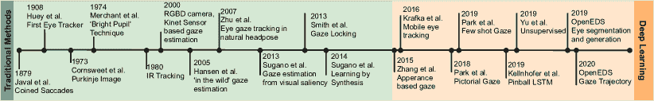
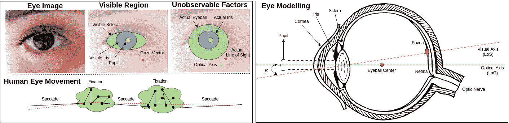
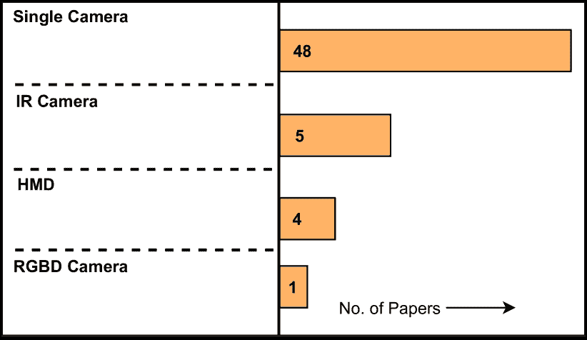
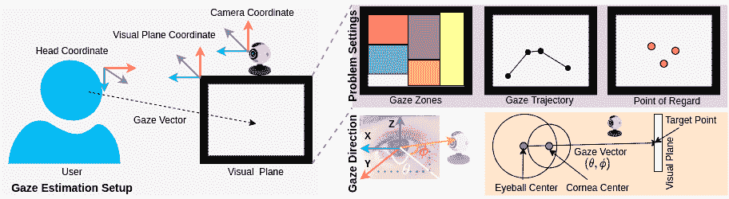
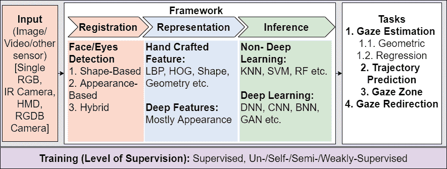
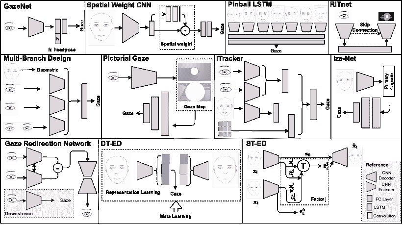
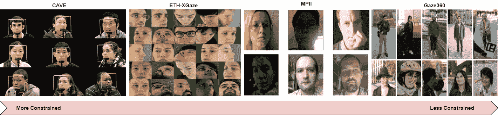
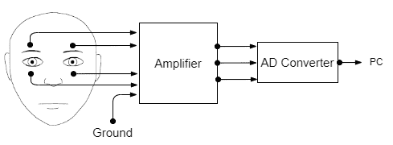
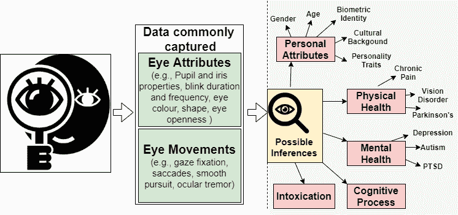

<!--yml

类别：未分类

日期：2024-09-06 19:52:08

-->

# [2108.05479] 自动注视分析：深度学习方法综述

> 来源：[`ar5iv.labs.arxiv.org/html/2108.05479`](https://ar5iv.labs.arxiv.org/html/2108.05479)

# 自动注视分析：深度学习方法综述

Shreya Ghosh、Abhinav Dhall、Munawar Hayat、Jarrod Knibbe、Qiang Ji S. Ghosh 和 M. Hayat 均隶属于蒙纳士大学。（电子邮件：{shreya.ghosh, munawar.hayat}@monash.edu）。A. Dhall 除了在蒙纳士大学外，还在印度理工学院罗帕尔分校工作。（电子邮件：abhinav.dhall@monash.edu）。J. Knibbe 就职于墨尔本大学。（电子邮件：jarrod.knibbe@unimelb.edu.au）。Q. Ji 在伦斯勒理工学院工作。（电子邮件：jiq@rpi.edu）。

###### 摘要

眼动分析是计算机视觉和人机交互领域中的一个重要研究问题。尽管在过去 10 年中取得了显著进展，由于眼睛外观的独特性、眼头交互、遮挡、图像质量和照明条件等因素，自动注视分析仍然具有挑战性。仍然存在几个未解的问题，包括在没有先验知识的非约束环境中如何解读注视方向的重要线索，以及如何实时编码这些线索。我们回顾了在各种注视分析任务和应用中的进展，以阐明这些基本问题，识别注视分析中的有效方法，并提供可能的未来方向。我们分析了近期的注视估计和分割方法，特别是在无监督和弱监督领域，基于其优点和报告的评估指标。我们的分析表明，开发一种稳健且通用的注视分析方法仍需解决现实世界中的挑战，如非约束设置和较少监督下的学习。我们通过讨论未来研究方向来总结，以设计一个能够推广到其他领域的现实世界注视分析系统，包括计算机视觉、增强现实（AR）、虚拟现实（VR）和人机交互（HCI）。项目页面：[`github.com/i-am-shreya/EyeGazeSurvey`](https://github.com/i-am-shreya/EyeGazeSurvey)

###### 索引术语：

注视分析，自动注视估计，眼部分割，注视跟踪，无监督和自监督注视分析，人机交互。

## 1 引言

人类通过自愿或非自愿的眼动来感知环境，从而接收、固定和跟踪视觉刺激，或对听觉或认知刺激做出反应。因此，眼动可以提供对我们视觉注意力[1]和认知（情感、信念和欲望）[2]的见解。此外，我们在日常交流和社交互动中广泛依赖这些见解。

自动注视分析开发了通过观察眼睛运动来估计目标物体位置的技术。然而，准确的注视分析是一个复杂的问题。一个准确的方法应该能够解开注视，同时对包括：眼睛与头部的相互作用、光照变化、眼睛登记错误、遮挡和身份偏见在内的各种挑战具有弹性。此外，研究[3]显示了人类注视在眼睛运动过程中遵循任意轨迹，这进一步增加了注视估计的挑战。

凝视分析的研究主要涉及粗略或细致的凝视估计。凝视分析有三个方面：注册、表示和识别。第一步，注册，涉及眼睛（或与眼睛相关的关键点，有时甚至只是脸）的检测。在第二步，表示，检测到的眼睛被投影到一个有意义的特征空间。在最后阶段，识别，根据第二阶段的特征预测相应的凝视方向或凝视位置。自动凝视分析的研究兴趣涵盖多个学科。早期对凝视分析的探索之一发生在 1879 年，当时 Javal 等人[4]首次研究并创造了“眼跳”这一术语。然而，凝视分析的广泛兴趣随着眼动追踪技术的出现而发展（最初在 1908 年，之后在 70 年代末期获得发展，如‘Purkinje Image’[5]和‘Bright Pupil’[6]）。随后，自动凝视分析在计算机视觉相关的辅助技术[7, 8]中获得了关注，并通过人机交互[9, 10, 11]、消费者行为分析[12]、增强现实和虚拟现实[13, 14]、自我中心视觉[15]、生物识别系统[16]及其他领域[17, 18]传播开来。图 1 展示了具有重要里程碑的开创性凝视分析方法的简要年表。然而，对凝视追踪技术的依赖带来了自身的挑战，即这些设备的成本和对特定受控环境的要求。为了克服这些限制并处理通用的无约束环境[19, 20]，大多数传统的凝视分析模型依赖于手工制作的低级特征（例如颜色[21]、形状[22, 21]和外观[23]）以及某些几何启发式方法[20]。自 2015 年以来，凝视分析的方法发生了变化，转向了深度学习[24, 25, 26]，类似于其他计算机视觉任务。随着基于深度学习的模型和大规模训练数据集的可用性，过去几年中与光照变化、相机设置、眼头互动等相关的挑战大大减少。然而，这些性能提升也伴随着对大规模注释数据的需求，这些数据获取成本高昂。因此，最近，具有有限注释的深度学习方法获得了越来越高的关注[27, 28, 29]。

<svg version="1.1" width="684.93" height="70.57" overflow="visible"><g transform="translate(0,70.57) scale(1,-1)"><g transform="translate(-657.26,17.3)"><g transform="translate(0,9.8242700982427) scale(1, -1)"><foreignobject width="79.0092707900927" height="7.3336100733361" overflow="visible">[4]</foreignobject></g></g><g transform="translate(-642.04,89.94)"><g transform="translate(0,9.8242700982427) scale(1, -1)"><foreignobject width="105.853051058531" height="7.3336100733361" overflow="visible">[30]</foreignobject></g></g><g transform="translate(-560.4,89.94)"><g transform="translate(0,9.8242700982427) scale(1, -1)"><foreignobject width="108.205341082053" height="7.3336100733361" overflow="visible">[6]</foreignobject></g></g><g transform="translate(-575.2,31.13)"><g transform="translate(0,9.8242700982427) scale(1, -1)"><foreignobject width="116.645911166459" height="7.3336100733361" overflow="visible">[5]</foreignobject></g></g><g transform="translate(-453.85,30.44)"><g transform="translate(0,9.8242700982427) scale(1, -1)"><foreignobject width="82.3301508233015" height="7.3336100733361" overflow="visible">[22]</foreignobject></g></g><g transform="translate(-437.25,85.79)"><g transform="translate(0,9.8242700982427) scale(1, -1)"><foreignobject width="76.3802407638024" height="7.3336100733361" overflow="visible">[19]</foreignobject></g></g><g transform="translate(-377.75,35.98)"><g transform="translate(0,9.8242700982427) scale(1, -1)"><foreignobject width="116.645911166459" height="7.3336100733361" overflow="visible">[31]</foreignobject></g></g><g transform="translate(-332.09,80.25)"><g transform="translate(0,9.8242700982427) scale(1, -1)"><foreignobject width="81.9150408191504" height="7.3336100733361" overflow="visible">[23]</foreignobject></g></g><g transform="translate(-304.41,35.98)"><g transform="translate(0,9.8242700982427) scale(1, -1)"><foreignobject width="102.808911028089" height="7.3336100733361" overflow="visible">[20]</foreignobject></g></g><g transform="translate(-239.38,31.83)"><g transform="translate(0,9.8242700982427) scale(1, -1)"><foreignobject width="112.218071122181" height="7.3336100733361" overflow="visible">[24]</foreignobject></g></g><g transform="translate(-182.65,29.06)"><g transform="translate(0,9.8242700982427) scale(1, -1)"><foreignobject width="78.3174207831742" height="7.3336100733361" overflow="visible">[26]</foreignobject></g></g><g transform="translate(-232.46,87.17)"><g transform="translate(0,9.8242700982427) scale(1, -1)"><foreignobject width="79.4243807942438" height="7.3336100733361" overflow="visible">[25]</foreignobject></g></g><g transform="translate(-172.96,83.02)"><g transform="translate(0,9.8242700982427) scale(1, -1)"><foreignobject width="73.1977307319773" height="7.3336100733361" overflow="visible">[29]</foreignobject></g></g><g transform="translate(-115.4,83.02)"><g transform="translate(0,9.8242700982427) scale(1, -1)"><foreignobject width="105.299571052996" height="7.3336100733361" overflow="visible">[28]</foreignobject></g></g><g transform="translate(-55.35,83.02)"><g transform="translate(0,9.8242700982427) scale(1, -1)"><foreignobject width="100.456621004566" height="7.3336100733361" overflow="visible">[32]</foreignobject></g></g><g transform="translate(-103.78,27.67)"><g transform="translate(0,9.8242700982427) scale(1, -1)"><foreignobject width="113.878511138785" height="7.3336100733361" overflow="visible">[33]</foreignobject></g></g><g transform="translate(-85.24,8.03)"><g transform="translate(0,9.8242700982427) scale(1, -1)"><foreignobject width="126.746921267469" height="7.3336100733361" overflow="visible">[34]</foreignobject></g></g></g></svg>

图 1：开创性注视分析工作的简要年表。最早的注视模式建模可以追溯到 Javal 等人 1879 年的工作[4]。其中一个基于深度学习的外观驱动注视估计模型是在$2015$年提出的[24]。

本文通过隔离其基本组成部分来调查不同的注视分析方法，并讨论每个组成部分如何解决上述注视分析中的挑战。本文从注视分析的角度讨论了计算机视觉和 AR/VR 领域的新趋势和发展。我们涵盖了近期在非监督、自监督和弱监督领域的注视分析技术，并介绍了为注视分析量身定制的验证协议和评估指标。我们还讨论了各种数据捕捉设备，包括：RGB/IR 摄像头、平板电脑/笔记本电脑摄像头、天牛摄像头及其他注视追踪器（包括视频眼动描记仪[21]）等。

由于计算机视觉领域的快速进展（参见图 1），通过详尽的调查/综述文章获得全面指导变得越来越有用。在 2010 年和 2013 年，Hansen 等人[21]和 Chennamma 等人[35]回顾了最先进的眼睛检测和注视跟踪技术。这些综述提供了硬件、用户界面、眼睛检测和注视映射技术的全面视角。由于这些综述是在深度学习时代之前，它们包含了从手工制作技术中利用的相关特征。随后在 2016 年，Jing 等人[36]回顾了 2-D 和 3-D 注视估计方法。2017 年，Kar 等人[37]提供了有关算法、系统配置和用户条件问题的见解。2020 年，Cazzato 等人[38]提出了对基于深度学习的注视估计方法的更全面和详细的研究。然而，迄今为止，还没有综合性的综述文章探讨从少量监督中学习的最新趋势。此外，所有现有的综述仅关注注视估计，而忽视了眼睛分割、注视区域估计、注视轨迹预测、注视重定向以及单人和多人设置下的无约束注视估计等重要工作。本文的贡献总结如下：

1.  1.

    对自动注视分析的全面综述。我们通过考虑数据捕捉传感器、平台、计算机视觉中流行的注视估计任务、监督程度和学习范式，来对现有方法进行分类和总结。提出的分类法旨在帮助研究人员更深入地理解注视分析中的关键组成部分。

1.  2.

    在一个框架下的不同流行任务。根据我们的知识，我们是第一个将不同的眼睛和视线相关流行任务放在一个框架下的。除了视线估计，我们还考虑视线轨迹、视线区域估计和视线重定向任务。

1.  3.

    应用。我们探索了使用计算机视觉进行视线分析的主要应用，即增强现实和虚拟现实 [[13](https://example.org), [39](https://example.org)]，驾驶员参与度 [[40](https://example.org), [41](https://example.org)] 和医疗保健 [[42](https://example.org), [43](https://example.org)]。

1.  4.

    隐私问题。我们还简要回顾了视线数据的隐私问题及其可能的影响。

1.  5.

    开放问题和潜在研究方向的概述。我们回顾了与当前视线分析框架（即模型设计、数据集收集等）相关的若干问题，并讨论了可能的未来研究方向。

图 2：左上角：人类视觉系统、眼睛建模和眼球运动的概述。对于基于计算机视觉的自动视线分析，我们考虑包含眼睛的图像（左）作为输入。因此，这些方法分析可见的眼睛区域（中间）并预测 2D/3D 视线向量作为输出。然而，有一些不可观察的因素，我们可以通过这些因素预测真实的视线方向（右），这需要个体特定的信息和其他因素 [[44](https://example.org)]。左下角：除了基于静态图像的视线估计，动态眼球运动是计算机视觉中的另一条研究方向，它提供了关于人类行为特征的线索。右侧：关于眼睛解剖学的实际视线建模。我们只突出显示相关部分，即瞳孔、角膜、虹膜、巩膜、中央凹、LOS 和 LOG。LOG 和 LOS 之间的角度称为κ角 ($\kappa$)。

## 2 初步工作

人类视觉系统是一个复杂的认知过程。因此，理解和建模人类视线已经成为心理学、神经学、认知科学和计算机视觉中的一个基本研究问题。为了为本综述奠定基础，以下是对人类视觉系统和眼睛建模（第[2.1](https://example.org)节）、眼球运动（第[2.2](https://example.org)节）、自动视线分析中的问题设置（第[2.3](https://example.org)节）以及相关挑战（第[2.4](https://example.org)节）的简要描述。

### 2.1 人类视觉系统和眼睛建模

基于计算机视觉的人类视觉感知方法通过图像或视频数据定量估计视线。这些方法分析眼睛的可见区域（虹膜和巩膜，见图 2），并尝试近似眼睛的不可观测特征（这些特征对确定视线方向至关重要）。这些近似可以基于人眼模型，通过时间的运动模式得出，或通过大规模数据的表示学习得出。对于视线估计，我们通常将眼睛近似为半径为 12-13 毫米的球体。随后，我们相对于光学轴建模视线方向，也称为注视线（LoG），或视觉轴，视线（LoS）（见图 2 右）。注视线（LoG）连接瞳孔、角膜和眼球中心。相反，视线（LoS）是连接中央凹和角膜中心的线。通常，LoS 被认为是视线的真实方向。视觉轴与光学轴的交点称为眼的结点点（解剖学上为角膜中心），通常编码一个主体依赖的角度偏移。这个个体偏移是进行视线追踪设备主体依赖校准的主要动机。根据之前的研究[45, 46]，中央凹大约位于光学轴水平下方 4-5°和垂直下方 1.5°的位置。在更广泛的人群中，这可能在个体之间变化高达 3°[46]。此外，头部姿势在视线分析中也发挥重要作用。通过头部姿势的三维坐标位置和方向（欧拉角），可以确定主体的粗略视线方向[21]。大多数情况下，LoS 和头部姿势的结合方向提供了关于人们在看什么的信息。

### 2.2 眼部运动与中央视觉

我们通过眼部运动感知环境。这些运动可以是自愿的或非自愿的，帮助我们获取、固定和追踪视觉刺激（见图 2）。眼部运动分为三类：眼跳、平滑追踪和注视。

眼跳。眼跳是快速而反射性的眼部运动，主要用于调整到视觉环境中的新位置。它可以是自愿或非自愿的，作为光动学测量的一部分[47]。眼跳通常持续 10 到 100 毫秒。

平滑追踪。平滑追踪发生在跟踪移动目标时。这种无意识动作取决于目标运动的范围，因为惊人的是，人眼能够在一定程度上跟随移动目标的速度。

凝视（微小震颤、漂移和震颤）。凝视是眼睛在一个静止的兴趣对象上稳定注意力的运动。凝视的特点是三种微小眼动：震颤、漂移和微小震颤[47]。在凝视过程中，由于控制系统中的噪声，微小眼动发生，以保持凝视稳定。这种噪声发生在凝视区域，约 5°视角。为了简化自然过程，这种噪声在凝视过程中被忽略。

中央视力。人眼的中央凹区域负责感知清晰和高分辨率的视觉。为了感知环境，需要将中央视力定向到选择的兴趣区域（这个过程被称为‘中央凹注视’）。这种清晰的中央视力在 1-5°范围内迅速衰减。超出这个范围，人眼视力变得模糊且低分辨率。这被称为周边视力。我们的周边视力在整体视觉体验中扮演着重要角色，特别是对运动的检测。从抽象层面来看，我们的视觉感知是大脑将中央视力和周边视力合并的结果。

### 2.3 凝视估计：问题设置

凝视估计的主要任务是确定瞳孔的视线。图 4 描绘了一个典型的基于视觉传感器的实时凝视估计设置，包含用户、数据捕捉传感器和视觉平面。此设置中的主要标定因素包括：

+   •

    相机标定参数的估计，包括内在和外在相机参数。

+   •

    几何标定参数的估计，包括相机、光源和屏幕的相对位置。

+   •

    个人标定的估计，包括头部姿态和眼睛特定参数，如角膜曲率、眼睛的结点等。

在某些应用中，标定参数在特定任务设置中进行估计。例如，用户被要求将视线固定在一些预定义的点上进行标定。类似地，用户特定的信息在设备中注册以进行个体特定的标定。随着计算机视觉和深度学习的进步，如今的凝视估计技术基于外观特征开发，不需要显式的标定步骤。例如，CalibMe[48] 是一种快速且无监督的标定技术，旨在克服重复标定的负担。

<svg version="1.1" width="621.24" height="97.17" overflow="visible"><g transform="translate(0,97.17) scale(1,-1)"><g transform="translate(-339.01,172.96)"><g transform="translate(0,36.9447903694479) scale(1, -1)"><foreignobject width="621.281306212813" height="7.3336100733361" overflow="visible">[49, 24, 50, 51, 52, 53, 26, 54, 55, 56, 57, 58, 59, 60]</foreignobject></g></g><g transform="translate(-339.01,159.13)"><g transform="translate(0,36.9447903694479) scale(1, -1)"><foreignobject width="619.482496194825" height="7.3336100733361" overflow="visible">[61, 62, 63, 49, 29, 64, 65, 66, 27]</foreignobject></g></g><g transform="translate(-339.01,117.61)"><g transform="translate(0,9.8242700982427) scale(1, -1)"><foreignobject width="378.44195378442" height="7.3336100733361" overflow="visible">[67, 68, 32, 34, 69]</foreignobject></g></g><g transform="translate(-339.01,69.19)"><g transform="translate(0,9.8242700982427) scale(1, -1)"><foreignobject width="373.460633734606" height="7.3336100733361" overflow="visible">[70, 68, 32, 34]</foreignobject></g></g><g transform="translate(-339.01,20.76)"><g transform="translate(0,9.8242700982427) scale(1, -1)"><foreignobject width="75.1349107513491" height="7.3336100733361" overflow="visible">[71]</foreignobject></g></g></g></svg>

图 3：该图展示了过去 10 年间不同数据捕捉设备在研究文章中的受欢迎程度。在这里，HMD：头戴式设备，RGBD：RGB 深度相机。

数据捕捉传感器的作用。视觉刺激为基于计算机视觉的注视估计技术提供了有价值的信息。图 3 中提到了一些广泛使用传感器的权衡。这些数据捕捉传感器主要分为两类：侵入式和非侵入式。使用专用硬件，需要与人体皮肤或眼睛有物理接触的方法被称为侵入式传感器。广泛使用的侵入式传感器包括头戴式设备（HMD）、电极或巩膜线圈 [69, 72]。这些设备可能会导致不愉快的用户体验，这些系统的准确性取决于设备的耐受性、准确的受试者特定校准和其他因素。另一方面，不需要物理接触的数据捕捉设备 [73] 被称为非侵入式传感器。主要包括 RGB、RGBD 和 IR 摄像头。这些方法面临多个挑战，包括眼睑部分遮挡虹膜、不同的光照条件、头部姿势、用户佩戴眼镜时的镜面反射、虹膜边界检测无法使用标准形状拟合，以及其他效果如运动模糊和图像过度饱和 [73]。为了应对这些挑战，大多数现有的注视估计方法都在受限的环境下进行，例如受限的头部姿势、控制的光照条件和摄像头角度。在上述所有因素中，瞳孔的可见性起着重要作用，因为稳健的注视估计需要准确的瞳孔中心定位。快速而准确的瞳孔中心定位仍然是一个具有挑战性的任务 [74]，尤其对于低分辨率图像。图 3 中提到了一些广泛使用传感器的权衡。

头部姿势的作用。由于眼睛与头部的相互作用，注视估计是一项具有挑战性的任务。头部姿势在注视估计中发挥着最重要的作用。一个主体的注视方向由头部姿势和眼球的位置信息和方向的综合效果决定。可以通过维持静态或动态的头部姿势或同时移动两者来改变注视方向。通常，这个过程依赖于个体。人们调整头部姿势和注视方向以保持舒适的姿势。因此，注视估计任务需要同时考虑注视和头部姿势。因此，考虑头部姿势信息在注视估计方法中是更加常见的，无论是隐式还是显式 [24, 50, 75]。

图 4：注视估计设置的概述（有关更多细节，请参见第 2.3 节）。传统的注视分析设置考虑头部、视觉平面和相机坐标的影响。注视分析任务包括注视区域、注视点、注视轨迹估计等（参见第三部分）。注视向量由极坐标系统中的角度（$\theta,\phi$）定义，如注视方向部分所示。

视觉平面的作用。视觉平面是包含注视目标点的平面，即被观察者所看的地方，这通常称为注视点（PoG）。用户与视觉平面之间的距离在实际环境中差异很大。因此，最近的深度学习方法不依赖于视觉平面的距离或位置。最常见的注视分析设置使用放置在离用户 20 - 70 厘米处的 RGB 相机，在非约束设置中，即没有任何侵入性传感器或固定设置。在不同的实际环境中，视觉平面可以是桌面（约 60 厘米）、手机（约 20 厘米）、汽车（约 50 厘米）等。概述见表 I。

表 I：广泛用于注视分析的不同平台的属性。这里，Dist.：距离（以厘米为单位），VA：视角（以度为单位），HMD：头戴设备，FV：自由观看，UC：用户条件，ET：外部目标。

| 平台 | 距离 | 视角 | 用户条件 | 论文 |
| --- | --- | --- | --- | --- |

|

&#124; 桌面，&#124;

&#124; 电视面板 &#124;

|

&#124; 30-50，&#124;

&#124; 200-500 &#124;

|

&#124; 约 40 °，&#124;

&#124; 40°-60° &#124;

|

&#124; 静态，&#124;

&#124; 坐姿，&#124;

&#124; 直立 &#124;

|

&#124; [49, 24, 50, 51, 52, 53, 26, 54, 55, 56, 57] &#124;

&#124;  [61, 62, 63, 49, 29, 64, 65, 66] &#124;

&#124;  [76, 71, 58, 59, 60] &#124;

|

| 头戴显示器 | 2-5 | 55°-75° |
| --- | --- | --- |

&#124; 独立 &#124;

&#124; （靠背，&#124;

&#124; 坐姿，&#124;

&#124; 直立）&#124;

|

&#124;  [77, 78, 32, 34] &#124;

|

| 汽车 | 50 | 40°-60° |
| --- | --- | --- |

&#124; 移动设备，&#124;

&#124; 坐姿，&#124;

&#124; 直立 &#124;

|

&#124;  [40, 79, 80, 81, 82, 83, 84, 85] &#124;

|

| 手持设备 | 20-40 | 5°-12° |
| --- | --- | --- |

&#124; Leanfwd，&#124;

&#124; 坐着，&#124;

&#124; 站立，&#124;

&#124; 移动 &#124;

|

&#124;  [25, 63, 86, 87, 88, 89] &#124;

|

| ET/ FV | – | – |
| --- | --- | --- |

&#124; Leanfwd，&#124;

&#124; 坐着，&#124;

&#124; 站立，&#124;

&#124; 直立 &#124;

|

&#124;  [90, 27] &#124;

|

### 2.4 挑战

数据注释。通常，基于深度学习的方法需要大量的标注数据来进行泛化表示学习。整理大规模标注的注视数据集并非易事[90, 24, 87]，耗时且需要昂贵的设备设置。目前通过可穿戴传感器记录数据的模式可能会导致用户体验不适，而且需要专业知识。当前数据集的另一个常见特点是记录时的受限环境（例如，CAVE [23] 数据集是在室内环境中记录的，头部姿势受到限制）。最近，已经提出了一些数据集 [90, 87] 以填补这一空白，通过在非受限的室内和室外环境中进行记录。与数据注释相关的另一个挑战是参与者的配合。然而，假设参与者会按照给定的指示固定他们的注视[90, 24, 87]。尽管有这些尝试 [90, 24, 87]，数据注释仍然复杂、嘈杂且耗时。自监督/弱监督/无监督学习范式 [27, 28] 可能有助于解决数据集创建和注释的挑战。

主观偏差。自动注视分析方法的另一个挑战是主观偏差。个体眼睛的结点点差异使得自动和通用的注视分析变得更加困难。在理想情况下，任何注视分析方法都应编码与眼睛区域外观相关的丰富特征，这为注视分析提供了相关信息。为应对这一挑战，已经广泛采用了少样本学习方法 [29, 91]，其动机是以最少的个体特定信息适应新对象。应对主观偏差的另一种方法是将经典眼部模型方法与几何约束 [92] 相结合，因为这种方法有可能在不同个体之间实现良好的泛化。

眼睑闪烁。眨眼是眼睑的非自主性和周期性运动。它们对注视分析提出了挑战，因为眨眼会导致数据帧丢失。一些近期的研究[90, 40]假设头部姿态信息可以作为眨眼时注视的适当替代，因为头部姿态与注视之间存在共同视线。然而，值得注意的是，受试者重新睁开眼睛后，注视可能会有很大偏移。为了简化情况，一些注视分析方法忽略了眼睑闪烁数据（例如，[87, 57]），而一些则将眨眼视为一种单独的数据类别（例如，[93, 41]）。这种系统在现实世界中的一个可能应用是通过从相邻帧的标签中插值生成注视标签，以应对眨眼的检测[40]。

数据属性。多个因素，如眼头互动、遮挡、模糊图像和光照，可能会影响注视分析模型的性能。这些属性的任何子集的存在都可能降低系统的性能[90, 87]。许多方法使用面部对齐[24, 25]和 3-D 头部姿态估计[24]作为预处理步骤。然而，在无约束环境下捕捉的图像上进行面部对齐可能会在系统中引入噪声。为了解决这个问题，近期的方法[90, 94, 57, 27]避免了这些预处理步骤，并显示出注视预测性能的提升。

注视估计中的另一个关键挑战是眼头互动。以往的研究通常通过隐式训练[25, 95]来解决这个问题，或将头部姿态信息单独提供作为特征[24]。同样，在部分遮挡下估计注视也具有挑战性。当头部的偏航旋转角度大于 90°时，面部的一侧相对于相机会被遮挡。一些以往的研究[25, 24]通过忽略这些帧来避免这些场景。然而，Kellnhofer 等人[90]认为，当头部偏航角在 90°-135°范围内时，部分可见性仍提供了有关注视方向的相关信息。该研究还提出了通过“弹球损失”进行分位回归，以减少训练数据中部分遮挡的影响。尽管进行了所有这些尝试，注视估计在这些属性存在时仍然具有挑战性。仍有空间消除这些属性的影响，使注视分析模型在实际部署中更具鲁棒性。

应用特定挑战。注视分析还有应用特定的要求，例如 AR、VR、机器人、以自我为中心的视觉和 HCI 中的粗略或精确注视估计。因此，任何眼动追踪设备背后的工作算法需要适应应用环境。

## 3 计算机视觉中的注视分析

我们提供了针对视觉应用的不同注视分析任务的细分。任何统计注视建模主要估计输入视觉数据与注视点/注视方向之间的关系。

2-D/3-D 注视估计。大多数现有研究将注视估计视为 3-D 空间中的注视方向或 2-D/3-D 坐标中的注视点（见图 4）。我们可以将注视估计方法分为以下几种类型：

1) 几何方法：这些几何方法从眼睛的几何模型中计算注视方向（见图 2），其中考虑了眼睛的解剖结构以获取 3-D 注视方向或注视向量。这些方法在更多深度学习方法出现之前被广泛使用[21]。这些近期的深度学习方法在学习过程中隐式建模这些几何参数，因此不需要显式地考虑经常噪声较大的特定于个体的参数，如角膜半径、角膜中心、κ角（即图 2 中的$\kappa$）、虹膜半径、瞳孔中心与角膜中心之间的距离等。

2) 回归方法：基于回归的方法[96, 24, 26, 28] 将视觉刺激（图像或图像相关特征）映射到 2-D/3-D 中的注视坐标或注视角度。输出映射是特定于应用的。例如，这些技术通常用于将 2-D/3-D 注视坐标主要映射到屏幕坐标（例如用于人机交互应用中的参与度或注意力监测）。基于回归的方法可以分为两种类型：参数化方法和非参数化方法。参数化方法（例如[96, 28]）假设注视轨迹为多项式，其任务是估计多项式方程的参数。非参数化方法直接处理映射，而不需要显式计算注视方向与被注视物体之间的交点[24, 26, 57]。近期的深度学习方法是非参数化的[26, 97, 28, 54, 90]。

轨迹预测。注视估计在增强现实/虚拟现实中具有潜在应用，特别是在焦点渲染（FR）和注意力隧道（AT）中，未来眼睛轨迹预测是非常期望的。为了满足这一要求，最近提出了一种新的研究方向（即未来注视轨迹预测）[34]。在这里，可以根据先前的注视点、视觉平面的内容或它们的组合来估计可能的未来注视位置。因此，问题陈述可以表述为：给定$n$个先前的注视点，算法将预测用户特定设置下$m$个未来帧的注视方向。

注视区域。在许多基于注视估计的应用中，如驾驶员注视[40, 41, 93, 27]，游戏平台[98]，网站设计[99]等，不需要瞳孔视线的精确位置或角度。因此，在这些情况下使用注视区域方法进行估计。在这里，注视区域指的是二维或三维空间中的一个区域。例如，在简化的驾驶员注视区域估计中，驾驶员可能直视前方、注视方向盘、收音机或镜子。类似的例子是在网站设计中检测更为视觉显著的区域[99]。

注视重定向。由于在不同的注视条件下面临的挑战，实时生成正在获得越来越多的关注[100, 34]。其目的是从个体的少量眼睛图像中捕捉特定的信号，并在不同的眼睛状态（注视方向、摄像头位置、眼睛开合度等）下生成逼真的眼睛图像。注视重定向可以在控制和非控制的方式下进行[101, 100, 102]。此外，眼睛渲染是另一种研究方向，旨在根据个人的外观和注视方向生成逼真的眼睛图像。它在虚拟代理、社交机器人、行为生成以及动画产业中具有潜在应用[103]。

非约束注视估计。非约束设置下的注视估计可以分为两种类型：

1) 单人设置：在基于网络摄像头或 RGB 摄像机的注视估计方法中，通常使用几何模型基础的眼睛跟踪[104, 105]，因为它速度快且不需要训练数据。然而，它依赖于准确的眼睛位置和关键点检测，这在实际环境中很难实现。基于深度学习的方法[106, 97]在某种程度上消除了这个问题，但由于其在不同环境中的泛化能力不足，这仍然是一个挑战。

2) 多人设置：在无约束的多人环境中，追踪眼睛是非常困难的。例如，在社交互动场景中，理解每个人的凝视行为为解读社会动态提供了重要线索[107]。为此，引入了一个新的研究方向，其中问题定义为人们在给定的视频序列中是否相互注视（LAEO）[108, 109, 110]。类似地，凝视交流[111]和 GazeOnce[112]是与此领域相关的另一研究方向。

视觉注意力估计。人类视觉注意力估计是另一条研究方向，主要关注于人们看向何处，无论眼睛是否可见。这个方向上的流行子任务包括凝视跟踪[113, 114, 62, 115, 116]，凝视交流[111]，目标驱动环境中的人类注意力[117]，分类视觉搜索[118]，视觉问答中的视觉扫描路径分析[119]，以及自然环境[120, 121]。这些方法主要依靠场景的显著性、头部方向或其他任务。基于视觉注意力的方法具有直接从场景信息中定位凝视目标的潜力，从而增强自然凝视行为模式的可扩展性。

## 4 凝视分析框架

我们将凝视分析框架分解为其基本组件（图 5），并讨论它们在眼睛检测和分割（节 4.1）、网络架构（节 4.2）和监督等级（节 4.3）中的作用。

### 4.1 眼睛检测与分割

眼睛注册是凝视分析的第一阶段，需要检测眼睛及相关的兴趣区域。

眼睛检测方法。眼睛检测算法的主要目标是从输入图像中准确识别眼睛区域。眼睛检测算法需要在诸如遮挡、眼睛开度、眼睛大小变化、头部姿态、光照和视角等挑战条件下运行，同时平衡外观、动态变化和计算复杂度之间的权衡。以往关于眼睛检测的研究可以分为三类：基于形状的[22]、基于外观的[122, 123, 49, 105]和混合方法[123]。最受欢迎的眼睛和面部点检测库包括 [Dlib](https://github.com/davisking/dlib) [106]、[OpenFace](https://github.com/cmusatyalab/openface) [105, 104]、[MTCNN](https://github.com/kpzhang93/MTCNN_face_detection_alignment) [124]、[Duel Shot Face Detector](https://github.com/Tencent/FaceDetection-DSFD) [125] 和 [FaceX-Zoo](https://github.com/JDAI-CV/FaceX-Zoo) [126]。

眼睛的瞳孔和虹膜区域通常比巩膜更暗，这提供了一个重要的线索来区分或定位瞳孔。瞳孔中心定位使用专用且昂贵的设备[69, 72]，这需要特定于个人的预校准。为克服这一限制，基于深度学习的瞳孔定位方法使用了随机森林集成[127]、局部自相似匹配[73]、自适应梯度提升[128]、霍夫回归森林[129]、基于深度学习的标志定位模型[97, 106]、异构 CNN 模型[130]等。在以往的文献中，眼睛注册过程的选择受输入图像与所提方法学习目标之间的相关性影响。除此之外，眼睛定位的准确性和算法运行时间复杂度之间的权衡以任务特定的方式进行优化。在这个背景下，OpenFace 和 Dlib 是最受欢迎的。此外，眼睛/面部注册过程的选择还可能取决于它们在不同挑战性现实世界条件下检测眼部组件的能力。

图 5：一个通用的注视分析框架包含不同的组件，包括注册、注视表示和推断。尽管在基于深度学习的方法中，表示和推断模块之间存在高度重叠。有关更多细节，请参见第四部分。

眼睛分割。眼睛分割的主要任务是像素级或区域级区分可见的眼睛部分。通常，眼睛区域分为三个部分：巩膜（眼睛的白色区域），虹膜（围绕瞳孔的彩色组织环）和瞳孔（黑暗的虹膜区域）。先前的研究[131，132，133，134]主要探讨了虹膜和巩膜区域的分割。也有少数研究[32，34]将瞳孔区域纳入分割任务。眼睛分割广泛应用于生物识别系统[135]和合成眼睛生成的先验研究[136]。

眼睑检测。眼睑是无意识且周期性的活动，可以帮助判断一个人的认知活动（例如，司机的疲劳[137]，谎言检测[138]）。KLT 跟踪器和各种传感器也被广泛用于获取眼睛运动信息以跟踪眼睑[139]。现有的眼睑检测方法旨在解决一个二元分类问题（眨眼/不眨眼），无论是基于启发式还是数据驱动的方法。基于启发式的方法主要包括运动定位[139]和模板匹配[140]。由于这些方法高度依赖预定义的阈值，它们可能对主观偏见、光照和头部姿势敏感。为了克服这一局限性，数据驱动的方法基于外观的时间运动特征[141，139]或空间特征[142]进行推断。在混合方法[143]中，使用多尺度 LSTM 基础框架通过空间和时间信息来检测眼睑。

<svg version="1.1" width="627.35" height="37.36" overflow="visible"><g transform="translate(0,37.36) scale(1,-1)"><g transform="translate(-654.49,381.9)"><g transform="translate(0,9.8242700982427) scale(1, -1)"><foreignobject width="112.218071122181" height="7.3336100733361" overflow="visible">[24]</foreignobject></g></g><g transform="translate(-470.46,373.6)"><g transform="translate(0,9.8242700982427) scale(1, -1)"><foreignobject width="68.3547806835478" height="7.3336100733361" overflow="visible">[51]</foreignobject></g></g><g transform="translate(-232.46,386.05)"><g transform="translate(0,9.8242700982427) scale(1, -1)"><foreignobject width="79.9778607997786" height="7.3336100733361" overflow="visible">[90]</foreignobject></g></g><g transform="translate(-89.94,386.05)"><g transform="translate(0,9.8242700982427) scale(1, -1)"><foreignobject width="107.651861076519" height="7.3336100733361" overflow="visible">[136]</foreignobject></g></g><g transform="translate(-586.69,290.58)"><g transform="translate(0,9.8242700982427) scale(1, -1)"><foreignobject width="101.425211014252" height="7.3336100733361" overflow="visible">[57]</foreignobject></g></g><g transform="translate(-445.55,290.58)"><g transform="translate(0,9.8242700982427) scale(1, -1)"><foreignobject width="78.3174207831742" height="7.3336100733361" overflow="visible">[26]</foreignobject></g></g><g transform="translate(-283.66,290.58)"><g transform="translate(0,9.8242700982427) scale(1, -1)"><foreignobject width="79.4243807942438" height="7.3336100733361" overflow="visible">[25]</foreignobject></g></g><g transform="translate(-83.02,290.58)"><g transform="translate(0,9.8242700982427) scale(1, -1)"><foreignobject width="120.658641206586" height="7.3336100733361" overflow="visible">[27]</foreignobject></g></g><g transform="translate(-560.4,131.45)"><g transform="translate(0,9.8242700982427) scale(1, -1)"><foreignobject width="105.299571052996" height="7.3336100733361" overflow="visible">[28]</foreignobject></g></g><g transform="translate(-496.75,141.14)"><g transform="translate(0,9.8242700982427) scale(1, -1)"><foreignobject width="73.1977307319773" height="7.3336100733361" overflow="visible">[29]</foreignobject></g></g><g transform="translate(-242.15,141.14)"><g transform="translate(0,9.8242700982427) scale(1, -1)"><foreignobject width="77.7639407776394" height="7.3336100733361" overflow="visible">[101]</foreignobject></g></g></g></svg>

图 6：不同的注视分析任务所使用的管道的简要概述。有关网络的更多详细信息，请参见第 4.2 节。

### 4.2 代表性深度网络架构

在这一部分，我们提供了注视分析的通用公式和表示。给定一个 RGB 图像 $\mathbf{I}\in\mathbb{R}^{W\times H\times 3}$，一个基于深度学习的模型将其映射到特定任务的标签空间。输入的 RGB 图像通常是面部或眼部区域。根据文献中采用的主要网络架构，我们将模型分类为以下几类：基于 CNN 的、基于多分支网络的、基于时间序列的、基于 Transformer 的和基于 VAE/GAN 的。概述见图 6。

#### 4.2.1 基于 CNN 的

最近的大多数解决方案采用了基于 CNN 的架构 [24, 51, 50, 25, 26, 92]，旨在学习端到端的空间表示，然后进行注视预测。采用的模型通常是视觉中流行的 CNN 的修改版本（例如，AlexNet [27]、VGG [54]、ResNet-18 [90, 67]、ResNet-50 [94]、胶囊网络 [27]）。这些 CNN 从单一流的 RGB 图像（例如，面部、左眼或右眼区域）[24, 51]，或多个信息流（例如，面部和眼部区域）[57, 25]，以及基于眼睛解剖学或几何约束的先验知识 [26] 中进行学习。

GazeNet。它是第一个基于深度学习的注视估计方法的扩展版本 [24]，旨在通过使用卷积操作捕捉低级和高级外观特征。GazeNet 以灰度眼部区域图像 $\mathbf{I}\in\mathbb{R}^{W\times H}$ 为输入，并将其映射到角度注视向量 $\mathbf{g}\in\mathbb{R}^{2}$。由于头部姿态提供了与注视方向相关的特征，因此头部姿态向量也被添加到全连接层中以进行更好的推断（参见图 6 左上图"）。扩展版本 [50] 是从 VGG 网络改编而来的，进一步提升了性能。为了训练这些模型，考虑了预测的 $\mathbf{\hat{g}}$ 和实际注视角度向量 $\mathbf{g}$ 之间的 $\ell_{2}$ 损失的总和。

空间权重 CNN。这是一种基于全脸外观的注视估计方法[51]，通过标准 CNN 架构使用空间加权机制对面部图像 $\mathbf{I}\in\mathbb{R}^{W\times H\times 3}$ 的重要位置进行编码（参见图 6 中的顶部行第二列图像）。该加权机制（又称为注意力）自动为对注视估计贡献更多的区域分配更多的权重。它包括三个额外的 $1\times 1$ 卷积层，后接 ReLU 激活。给定一个 $N\times H\times W$ 维激活图（$U$）作为输入（其中 $N$、$H$ 和 $W$ 是特征通道数、高度和宽度），空间权重模块通过以下函数从 $W$ 与原始激活 $U$ 的逐元素乘法中学习权重矩阵 $W$：$W\bigodot U_{c}$，跨通道维度。因此，模型学会为特定区域分配更多权重，从而消除输入中的不必要噪声。对于 2-D 注视估计，利用预测注视位置与真实注视位置在目标屏幕坐标系中的 $\ell_{1}$ 距离。同样，对于 3-D 注视估计，使用预测注视角度向量与真实注视角度向量在归一化空间中的 $\ell_{1}$ 距离。

扩张卷积。另一种用于注视估计的有趣架构是扩张卷积层，它在不妥协参数数量的情况下保持空间分辨率，同时增加感受野的大小[64]。它旨在捕捉由于眼睛运动而导致的像素微小变化。给定一个核大小为 $N\times M\times K$ ($N$：高度，$M$：宽度，$K$：通道，带有权重 $W$ 和偏置 $b$) 的输入特征图 $U$ 和扩张率 ($r_{1}$, $r_{2}$)，输出特征图 $v$ 可以定义如下：

|  | $v(x,y)=\sum\limits_{k=1}^{K}\sum\limits_{m=0}^{M-1}\sum\limits_{n=0}^{N-1}u(x+nr_{1},y+mr_{2},k)w_{nmk}+b$ |  |
| --- | --- | --- |

扩张卷积在面部和左/右眼补丁中应用，然后再推断注视。对于网络训练，使用标签空间中的交叉熵损失。通过 MinENet [144] 的表示学习也依赖于扩张和不对称卷积，通过增加模型的感受野容量来为眼睛的分段区域提供上下文信息。

贝叶斯卷积神经网络（Bayesian CNN）。另一种变体是贝叶斯卷积神经网络（Bayesian CNN），它用于在不同条件下进行鲁棒且可泛化的眼动追踪[145]。与使用单一训练眼部模型预测眼动不同，它使用模型集成进行眼动追踪，从而减轻了过拟合问题，在数据不足的情况下更具鲁棒性，并且可以在数据集之间更好地泛化。与基于点的眼部标志估计方法相比，BNN 模型的泛化能力更强，在挑战性的实际条件下也更具鲁棒性。此外，BCNN 的扩展版本（即单阶段模型到多阶段模型，形成级联 BCNN）允许将当前阶段的不确定性信息传递到下一个阶段，从而逐步提高注视估计的准确性。这可能是一个有趣的进一步研究领域。

图像注视（Pictorial Gaze）。图像注视[26]旨在建模眼球和虹膜的相对位置以获取注视方向。该网络[26]由两部分组成：1) 从眼部图像到中间注视图的回归，其次是 2) 从注视图到注视方向向量$g$的回归（参考图 6 中的第二行第二列图像）。注视图是对人眼和虹膜的简单模型的中间表示，图像尺寸为$m\times n$，其中投影的眼球直径为$2r=1.2n$，虹膜中心坐标为($u_{i},v_{i}$)，如下：$u_{i}=\frac{m}{2}-r^{\prime}sin\ \phi\ cos\ \theta,v_{i}=\frac{n}{2}-r^{\prime}sin\ \theta$，其中$r^{\prime}=r\ cos\ (sin^{-1}\frac{1}{2})$，注视方向为$g=(\theta,\phi)$。基本上，虹膜是一个椭圆，其主轴直径为 r，副轴直径为$r|cos\ \theta cos\ \phi|$。第一部分通过一个堆叠的沙漏架构实现，该架构假设能够编码复杂的空间关系，包括遮挡关键点的位置。因此，对于第二部分，使用了 DenseNet 架构，该架构将中间注视图映射到注视向量$\hat{g}$。它通过定义为$||g-\hat{g}||_{2}$的注视方向回归损失以及预测的注视图和真实注视图之间的交叉熵损失进行训练。

Ize-Net。该框架用于从粗到细的视线表示学习。其主要思想是通过将视线位置划分为视线区域来学习粗略的视线表示。此外，将视线区域映射到更精细的视线向量。所提出的网络 [27]（参见图 6 第二行右侧图像）是卷积层和初级胶囊层的组合。在卷积层之后，附加了初级胶囊层，其作用是将卷积层学到的特征组合起来，以考虑面部对称性。该网络为粗略视线区域进行训练，并在下游的 2-D/3-D 视线估计中进行微调。

EyeNet。由修改过的残差单元、注意力块和多尺度监督结构组成。该网络在低分辨率、图像模糊、光斑、光照、角度偏差、偏轴、反射、眼镜和不同虹膜颜色等挑战下表现稳健。

#### 4.2.2 基于多分支网络

有几个工作 [54, 25, 57] 使用多个输入以获得更好的推断结果。

iTracker。iTracker 框架 [25] 将左眼、右眼、检测到的面部区域和原始帧中的面部位置作为二进制掩模（大小均为 $224\times 224$），并预测与相机的距离（单位为厘米）。该模型与 x 和 y 视线位置的欧几里得损失共同训练。框架的概述如图 6 第二行第三列图像所示。

多分支设计。类似于 iTracker，Jyoti 等人 [57] 提出了一个框架，该框架以全脸、左右眼以及两个眼部补丁作为输入来推断视线（参见图 6 第二行左侧图像）。训练该网络时，使用真实视线点/方向与预测视线点/方向之间的均方误差。

双流 VGG 网络。在 [54] 中，使用双流 VGG 网络进行视线推断，同时以左右眼部补丁作为输入。与先前的工作类似，它利用预测和真实视线向量之间的 $\ell_{2}$ 损失的总和来训练集成网络。

#### 4.2.3 时间视线建模

人眼注视是一个连续且动态的过程。在扫描环境时，相关主体执行各种眼动，包括注视、扫视、平滑追踪、聚焦以及前庭眼动。此外，某一时刻的图像帧与之前时间步骤的注视方向具有高度相关性。基于这一推理，多项工作[146, 90, 65, 66, 56, 147] 利用时间信息和眼动动态来提升注视估计性能，相比于基于图像的静态方法。给定一系列帧，任务是估计相关人员的注视方向。为此建模，探索了流行的递归神经网络结构（如 GRU [148], LSTM/bi-LSTM [90]）。

多模态递归 CNN。Palmero 等人[56] 提出了一个多模态递归 CNN 框架，其中将所有输入帧的静态特征输入到一个多对一的递归模块，以预测序列中最后一帧的 3D 注视方向。他们的方法显著提升了最先进的注视估计性能（即在 EYEDIAP 数据集上提高了 4%）。

DGTN。Wang 等人[66] 提出了基于半马尔可夫方法的动态注视转移网络（DGTN），该方法建模了人眼运动动态。DGTN 首先使用 CNN 计算每帧的注视，然后利用学习到的动态信息进一步优化。

改进版 iTracker + bi-LSTM。引入了双向递归模块基础的时间建模方法[65]，这些方法依赖于过去和未来的帧。尽管由于未来帧通常不可用，这些方法在实时应用中的适用性较低，但对于低到中等分辨率的图像和视频（帧率约为 $\sim 30$ fps）却非常有益。

钢珠 LSTM。为了在时间域内编码上下文信息，提出了钢珠 LSTM [90]。这个基于视频的凝视估计模型使用双向 LSTM，考虑了 7 帧序列来估计中央帧的凝视方向。图 6 第一行第三列的图像展示了模型的架构。每帧的面部区域作为输入提供给具有 ResNet-18 架构的骨干 CNN。它将输入图像映射到 256 维特征空间。此外，两个层的双向 LSTM 将这些特征映射到标签空间，通过一个带有误差分位估计的全连接层，即 ($\theta,\phi,\sigma$)，其中 ($\theta,\phi$) 是在球坐标系中预测的凝视方向，对应于眼睛坐标系中的真实凝视向量 $g$，表示为 $\theta=-arctan\ \frac{g_{x}}{g_{z}}$ 和 $\phi=arcsin\ g_{y}$。另一方面，$\sigma$ 对应于从预测凝视的偏移，即 $\theta+\sigma$ 和 $\phi+\sigma$ 在其分布的 90% 分位数中，而 $\theta-\sigma$ 和 $\phi-\sigma$ 则在 10% 分位数中。钢珠损失计算如下：给定真实标签 $y=(\theta_{gt},\phi_{gt})$，对于分位数 $\tau$ 和角度 $\alpha\in\{\theta,\phi\}$，损失 $L_{\tau}$ 可以表示为：

|  | $L_{\tau}(\alpha,\sigma,\alpha_{gt})=max(\tau\hat{q_{\tau}},-(1-\tau)\hat{q_{\tau}})$ |  |
| --- | --- | --- |

其中，$\hat{q_{\tau}}=\alpha_{gt}-(\alpha-\sigma)$，对于 $\tau\leq 0.5$，否则为 $\alpha_{gt}-(\alpha+\sigma)$。该损失强制 $\theta$ 和 $\phi$ 收敛到其真实值。

静态 + LSTM。在一项有趣的研究中，Palmero 等人 [146] 分析了使用静态 CNN 网络结合递归模块来捕捉眼动动态的序列信息对基于外观的凝视估计的影响。该模型基于高分辨率眼部图像序列，执行在 VR 场景中的刺激引发的注视和扫视任务。所提出的模型通过准确定位凝视运动过渡来学习眼动动态。

讨论。尽管最初的研究确认了利用时间信息的好处 [146, 90, 65, 66, 56]，但在任务驱动的实际环境中探索眼动学仍然有一定的空间。有时，使用分辨率低、帧率差的视频很难准确捕捉眼动的动态。因此，如何以及为什么时间信息能提升眼动动态的注视估计性能仍然是一个挑战。此外，需要对眼动模式有深入的理解，因为现有的数据集仅基于任务驱动的诱发。将现有的生物力学眼动模型与数据整合，以实现稳健且数据高效的眼动追踪也很重要。在任务相关和自然行为的眼动动态（即注视方向、速度和注视轨迹）方面，这一研究领域仍存在若干未解决的问题。

#### 4.2.4 基于 Transformer

Transformer 模型最近因其在广泛视觉任务中的显著表现而受到关注。同样，在注视估计领域，迄今为止有两种类型的 Transformer 被用于 ViT 框架之上。第一种是纯 Transformer 的注视估计（GazeTR-Pure）[149]，另一种是混合 Transformer 的注视估计（GazeTR-Hybrid）[149]。GazeTR-Pure [149] 将裁剪后的面部图像作为输入，并加上一个额外的标记。这个额外的标记是一个可学习的嵌入，它将图像特征汇聚在一起。另一方面，GazeTR-Hybrid [149] 由 CNN 和 Transformer 组成。它基于这样的事实：注视估计是一个回归任务，仅通过局部补丁相关性很难获得注视的感知。这些模型利用了 Transformer 的注意机制来提升注视估计性能。这些都是利用 Transformer 主干的初步探索，还有巨大的潜力去探索这种架构。

#### 4.2.5 基于 VAE/GAN

变分自编码器和 GAN 已被用于无监督或自监督的表示学习（参见图 6）。在这里，自编码器模型的潜在空间特征用于注视估计推断 [29, 28, 101]。除了表示学习之外，基于 VAE 和 GAN 的模型在注视重定向任务中也被广泛使用 [150, 101, 102, 100]。

DT-ED。为了通过目光重定向进行无关人的表征学习，常常利用变分自编码器 [29, 101]。Disentangling Transforming Encoder-Decoder (DT-ED) 框架 [29] 接受输入图像 $x$，通过编码器 $E$（即 $E(x):x\to z$）将其映射到潜在空间 $z$。在潜在空间中，DT-ED 解开了与目光相关的三个重要因素，即目光方向 ($z_{g}$)、头部方向 ($z_{h}$) 和眼睛区域的外观 ($z_{a}$)。因此，$z$ 可以表示为：$z=\{z_{a};z_{g};z_{h}\}$。该框架通过明确应用与目光和头部姿态旋转相关的约束来解开这些因素。此外，解码器 $D$ 将 $z$ 映射回重定向图像（即 $D(E(x)):z\to\hat{x}$）。目光方向是从潜在嵌入的 $z_{g}$ 部分估计的。整体示意图见图 6（底行中图）。

ST-ED。类似地，Self-Transforming Encoder-Decoder (ST-ED) 架构 [101]（参见图 6 底行右图）将一对图像 $x_{i}$ 和 $x_{t}$ 作为输入，解开主体的个人不变嵌入 ($z^{0}_{i}$ 和 $z^{0}_{t}$)，考虑伪标签条件 ($\hat{c_{i}}$ 和 $\hat{c_{t}}$) 和嵌入表示 ($z_{i}$ 和 $z_{t}$)。变换的学习目标依赖于伪条件标签，这些标签考虑了缺少真实注释的外部因素。

目光重定向网络。无监督目光重定向网络的主要动机 [28] 是通过目光重定向捕捉通用的眼睛表征（参见图 6 底行左图）。该框架接受眼部图像 $I_{i}$ 作为输入，并预测重定向后的眼部图像 $I_{o}$ 作为输出，同时保留旋转差异 $\Delta_{r}=r_{i}-r_{o}=G_{\phi}(I_{i})-G_{\phi}(I_{o})$。在这项工作中，目光重定向被用作表征学习的前置任务。

RITnet。RITnet[136]（参见图 6 顶部右侧图像）是基于完全卷积网络（FCN）的 U-Net 和 DenseNet 的混合版本。为了平衡性能和计算复杂性之间的权衡，它由编码器中的 5 个下采样块和解码器中的 4 个上采样块组成，其中编码器块的最后一层被称为瓶颈层。每个下采样块具有 5 个带 LeakyReLU 激活的卷积层，并且这些层与之前的层共享连接，类似于 DenseNet 架构。同样，每个上采样块具有 4 个带 LeakyReLU 激活的卷积层。所有上采样块与对应的下采样块有跳跃连接，这是一种有效的表征学习策略。为了训练模型，使用了以下损失函数：1）标准交叉熵损失（CEL）在每个像素上应用，将每个像素分类为四个类别（即背景、虹膜、巩膜和瞳孔）。2）广义 Dice 损失（GDL）根据地面真实像素与相应预测之间的重叠惩罚像素。3）边界感知损失（BAL）根据距离加权每个像素与其两个最近邻的像素。该损失有助于避免 CEL 在边界区域的混淆。4）表面损失（SL）通过基于距离的缩放来帮助恢复小区域和轮廓。总体损失定义如下：

|  | $\ell=\ell_{CEL}(\lambda_{1}+\lambda_{2}\ell_{BAL})+\lambda_{3}\ell_{GDL}+\lambda_{4}\ell_{SL}.$ |  |
| --- | --- | --- |

同样，另一种轻量级模型[151]使用具有深度可分离卷积的 MobileNet 来提高效率。它还利用了一个挤压和激励（SE）模块，通过建模通道独立性来提升性能。此外，还利用了连接组件的启发式过滤，以确保网络的生物学一致性。一些工作[152, 153]也使用了多类别分类策略来进行丰富的表征学习。

其他统计建模。基于统计推断的映射是基于 k-NN [87]、支持向量回归 [23, 87] 和随机森林 [87, 20] 进行的。这些方法的简要概述总结在表 II 中。以往关于语义眼部分割的深度学习工作主要集中在通过模糊 C 均值聚类、Otsu 二值化、k-NN [154] 等进行虹膜或巩膜分割。自 2015 年以来组织了巩膜分割挑战，以促进该领域的发展 [154, 133, 155]。最近，Facebook Research 于 2019 年组织了 OpenEDS 挑战，其中眼部分割是子挑战之一。该挑战中的大多数方法使用了深度学习技术 [136, 156, 144]。

表 II：关于注册（Reg.）、表示（Represent.）、监督级别、模型、预测、在基准数据集上的验证（validation）、平台（Plat.）、出版场所（Publ.）和年份的注视分析方法比较。这里，GV：注视向量，Scr.：屏幕，LOSO：留一人法，LPIPS：学习的感知图像块相似度，MM：可变形模型，RRF：随机回归森林，AEM：解剖眼模型，GRN：注视回归网络，ET：外部目标，FV：自由观看，HH：手持设备，HMD：头戴设备，Seg.：分割，GR：注视重定向，LAEO：彼此注视。

| 参考 | 注册 | 表示 |
| --- | --- | --- |

&#124; 级别 &#124;

&#124; 监督 &#124;

| 模型 | 预测 | 验证 | 平台 | 出版 | 年份 |
| --- | --- | --- | --- | --- | --- | --- | --- | --- | --- |
| [23] |

&#124; 面部[157] &#124;

|

&#124; 出现 &#124;

| 完全监督 | SVM |
| --- | --- |

&#124; 注视锁定 &#124;

|

&#124; [23] &#124;

| 屏幕 |
| --- |

&#124; UIST &#124;

| 2013 |
| --- |
| [158] | 3-D MM |

&#124; 出现 &#124;

|

&#124; 完全监督 &#124;

| 凸包 | 3-D GV |
| --- | --- |

&#124; [158] &#124;

| ET. |
| --- |

&#124; ETRA &#124;

| 2014 |
| --- |
| [20] |

&#124; 面部，眼 [20] &#124;

|

&#124; 出现 &#124;

|

&#124; 完全监督 &#124;

|

&#124; RRF &#124;

| 3-D GV |
| --- |

&#124; [20] &#124;

| 任意 |
| --- |

&#124; CVPR &#124;

| 2014 |
| --- |
| [159] |

&#124; 眼 &#124;

|

&#124; 出现 &#124;

|

&#124; 完全监督 &#124;

|

&#124; CNN+CLNF &#124;

|

&#124; 3-D GV &#124;

|

&#124; [24] &#124;

| 任意 |
| --- |

&#124; ICCV &#124;

| 2015 |
| --- |
| [24] |

&#124; 面部，L/R 眼 &#124;

|

&#124; 出现 &#124;

|

&#124; 完全监督 &#124;

|

&#124; CNN [24] &#124;

|

&#124; 3-D GV &#124;

|

&#124; [24] &#124;

| 屏幕 |
| --- |

&#124; CVPR &#124;

| 2015 |
| --- |
| [25] |

&#124; Face, L/R Eye &#124;

|

&#124; Appear. &#124;

|

&#124; Fully-Sup. &#124;

|

&#124; iTracker [25] &#124;

|

&#124; 2-D Scr. &#124;

|

&#124; [87, 25] &#124;

| HH |
| --- |

&#124; CVPR &#124;

| 2016 |
| --- |
| [160] |

&#124; Eye &#124;

|

&#124; Appear. &#124;

|

&#124; Fully-Sup. &#124;

|

&#124; CNN [25] &#124;

|

&#124; GR Img. &#124;

|

&#124; [160] &#124;

| Any |
| --- |

&#124; ECCV &#124;

| 2016 |
| --- |
| [87] |

&#124; Eye[161] &#124;

|

&#124; Appear. &#124;

|

&#124; Fully-Sup. &#124;

|

&#124; SVR &#124;

| 2-D Scr. |
| --- |

&#124; [87] &#124;

| HH |
| --- |

&#124; MVA &#124;

| 2017 |
| --- |
| [54] |

&#124; Eye [162] &#124;

|

&#124; Appear. &#124;

|

&#124; Fully-Sup. &#124;

|

&#124; VGG-16+FC [54] &#124;

|

&#124; 3-D GV &#124;

|

&#124; [24, 54] &#124;

| Scr. |
| --- |

&#124; ECCV &#124;

| 2018 |
| --- |
| [26] |

&#124; Eyes &#124;

|

&#124; Appear. &#124;

|

&#124; Fully-Sup. &#124;

|

&#124; CNN &#124;

|

&#124; 3-D GV &#124;

|

&#124; [24, 158] &#124;

| Scr. |
| --- |

&#124; ECCV &#124;

| 2018 |
| --- |
| [57] |

&#124; Face [104] &#124;

|

&#124; Geo.+Appear. &#124;

|

&#124; Fully-Sup. &#124;

|

&#124; CNN [57] &#124;

|

&#124; 3-D GV &#124;

|

&#124; [87, 23] &#124;

| Desk. |
| --- |

&#124; ICPR &#124;

| 2018 |
| --- |
| [92] |

&#124; Eye &#124;

|

&#124; Geo.+Appear. &#124;

|

&#124; Fully-Sup. &#124;

|

&#124; HGSM+c-BiGAN &#124;

|

&#124; Eye, GV &#124;

|

&#124;  [24, 158] &#124;

| Any |
| --- |

&#124; CVPR &#124;

| 2018 |
| --- |
| [64] |

&#124; Face, L/R Eye &#124;

|

&#124; Appear. &#124;

|

&#124; Fully-Sup. &#124;

|

&#124; Dilated CNN &#124;

|

&#124; 3-D GV &#124;

|

&#124;  [24, 25, 23] &#124;

| Scr. |
| --- |

&#124; ACCV &#124;

| 2018 |
| --- |
| [29] |

&#124; Face &#124;

|

&#124; Appear. &#124;

|

&#124; Few-Shot &#124;

|

&#124; DT-ED+ML &#124;

|

&#124; 3-D GV &#124;

|

&#124;  [24, 25] &#124;

| Scr. |
| --- |

&#124; ICCV &#124;

| 2019 |
| --- |
| [90] |

&#124; Face &#124;

|

&#124; Appear. &#124;

|

&#124; Fully-Sup. &#124;

|

&#124; Pinball LSTM &#124;

|

&#124; 3-D GV &#124;

|

&#124;  [24, 23, 87] &#124;

| ET |
| --- |

&#124; ICCV &#124;

| 2019 |
| --- |

|

&#124; [32] &#124;

| Eye | Appear. |
| --- | --- |

&#124; Fully-Sup. &#124;

| SegNet [163] | Seg. Map |
| --- | --- |

&#124;  [32] &#124;

| HMD |
| --- |

&#124; ICCVW &#124;

| 2019 |
| --- |
| [66] |

&#124; Face, L/R Eye &#124;

|

&#124; Appear. &#124;

|

&#124; Fully-Sup. &#124;

|

&#124; DGTN &#124;

|

&#124; GV &#124;

|

&#124;  [66] &#124;

| Desk. |
| --- |

&#124; CVPR &#124;

| 2019 |
| --- |
| [164] |

&#124; Face &#124;

|

&#124; Appear. &#124;

|

&#124; Fully-Sup. &#124;

|

&#124; MeNet &#124;

|

&#124; 3-D GV &#124;

|

&#124;  [24, 20, 25] &#124;

| 屏幕 |
| --- |

&#124; CVPR &#124;

| 2019 |
| --- |
| [145] |

&#124; 脸部, 眼睛 &#124;

|

&#124; 外观 &#124;

|

&#124; 半监督/无监督 &#124;

|

&#124; BCNN &#124;

|

&#124; 3-D GV &#124;

|

&#124;  [24, 158] &#124;

| 桌面 |
| --- |

&#124; CVPR &#124;

| 2019 |
| --- |
| [136] |

&#124; 眼睛 &#124;

|

&#124; 外观 &#124;

|

&#124; 完全监督 &#124;

|

&#124; 混合 U-net &#124;

|

&#124; 分割图 &#124;

|

&#124;  [32] &#124;

| HMD |
| --- |

&#124; ICCVW &#124;

| 2019 |
| --- |
| [165] |

&#124; 眼睛 &#124;

|

&#124; 外观 &#124;

|

&#124; 完全监督 &#124;

|

&#124; 修改版 Resnet &#124;

|

&#124; 分割图 &#124;

|

&#124;  [32] &#124;

| HMD |
| --- |

&#124; ICCVW &#124;

| 2019 |
| --- |
| [156] |

&#124; 眼睛 &#124;

|

&#124; 外观 &#124;

|

&#124; 完全监督 &#124;

|

&#124; Eye-MMS &#124;

|

&#124; 分割图 &#124;

|

&#124;  [32] &#124;

| HMD |
| --- |

&#124; ICCVW &#124;

| 2019 |
| --- |
| [144] |

&#124; 眼睛 &#124;

|

&#124; 外观 &#124;

|

&#124; 完全监督 &#124;

|

&#124; 膨胀 CNN &#124;

|

&#124; 分割图 &#124;

|

&#124;  [32] &#124;

| HMD |
| --- |

&#124; ICCVW &#124;

| 2019 |
| --- |
| [91] |

&#124; 眼睛 &#124;

|

&#124; 外观+分割 &#124;

|

&#124; 少样本 &#124;

|

&#124; GR &#124;

|

&#124; 2-D GV &#124;

|

&#124; [24, 23] &#124;

| 任何 |
| --- |

&#124; CVPR &#124;

| 2019 |
| --- |
| [28] |

&#124; 眼睛 &#124;

|

&#124; 外观 &#124;

|

&#124; 无监督 &#124;

|

&#124; GR &#124;

|

&#124; 2-D GV &#124;

|

&#124; [24, 23] &#124;

| 任何 |
| --- |

&#124; CVPR &#124;

| 2019 |
| --- |
| [27] |

&#124; 脸部, 眼睛 &#124;

|

&#124; 外观 &#124;

|

&#124; 无监督 &#124;

|

&#124; IzeNet &#124;

|

&#124; 3-D GV &#124;

|

&#124; [23, 87] &#124;

| FV |
| --- |

&#124; IJCNN &#124;

| 2019 |
| --- |
| [166] |

&#124; 眼睛 &#124;

|

&#124; 外观+分割 &#124;

|

&#124; 完全监督 &#124;

|

&#124; Seg2Eye &#124;

|

&#124; 眼睛图像 &#124;

|

&#124;  [32] &#124;

| HMD |
| --- |

&#124; ICCVW &#124;

| 2019 |
| --- |
| [167] |

&#124; 眼睛序列 &#124;

|

&#124; 外观 &#124;

|

&#124; 无监督 &#124;

|

&#124; 分层 HMM &#124;

|

&#124; 眼睛运动 &#124;

|

&#124;  [168] &#124;

| 任何 |
| --- |

&#124; ECCVW &#124;

| 2019 |
| --- |
| [169] |

&#124; 眼睛 &#124;

|

&#124; 外观 &#124;

|

&#124; 半监督/无监督 &#124;

|

&#124; mSegNet+Discre. &#124;

|

&#124; 分割图 &#124;

|

&#124;  [32] &#124;

| HMD |
| --- |

&#124; ECCVW &#124;

| 2019 |
| --- |
| [170] |

&#124; 眼睛 &#124;

|

&#124; 外观 &#124;

|

&#124; 少样本 &#124;

|

&#124; EyeSeg &#124;

|

&#124; 分割图 &#124;

|

&#124;  [32] &#124;

| HMD |
| --- |

&#124; ECCVW &#124;

| 2019 |
| --- |
| [101] |

&#124; 脸部 &#124;

|

&#124; 外观 &#124;

|

&#124; 完全监督 &#124;

|

&#124; ST-ED &#124;

|

&#124; GR &#124;

|

&#124; [25, 23, 158] &#124;

| Scr. |
| --- |

&#124; NeurIPS &#124;

| 2020 |
| --- |

|

&#124; [34] &#124;

| 眼睛 | 出现 |
| --- | --- |

&#124; 完全监督 &#124;

| 修改版 ResNet | GR 图像 |
| --- | --- |

&#124; [34] &#124;

| HMD |
| --- |

&#124; ECCVW &#124;

| 2020 |
| --- |
| [148] |

&#124; 眼睛 &#124;

|

&#124; 出现 &#124;

|

&#124; 完全监督 &#124;

|

&#124; ResNet-18+GRU &#124;

|

&#124; PoG,3-D GV &#124;

|

&#124; [148] &#124;

| Scr. |
| --- |

&#124; ECCV &#124;

| 2020 |
| --- |
| [94] |

&#124; 面部 &#124;

|

&#124; 出现 &#124;

|

&#124; 完全监督 &#124;

| ResNet-50 | 3-D GV |
| --- | --- |

&#124; [24, 25, 90, 158] &#124;

| Scr. |
| --- |

&#124; ECCV &#124;

| 2020 |
| --- |
| [171] |

&#124; 面部 &#124;

|

&#124; 出现 &#124;

|

&#124; 半监督 &#124;

|

&#124; GRN &#124;

|

&#124; GV &#124;

|

&#124; [113] &#124;

| FV |
| --- |

&#124; WACV &#124;

| 2020 |
| --- |
| [60] |

&#124; 面部, 眼睛 &#124;

|

&#124; 出现 &#124;

|

&#124; 完全监督 &#124;

|

&#124; RSN+GazeNet &#124;

|

&#124; GV &#124;

|

&#124; [158, 24, 25] &#124;

| Scr. |
| --- |

&#124; BMVC &#124;

| 2020 |
| --- |
| [59] |

&#124; 面部, 眼睛 &#124;

|

&#124; 出现 &#124;

|

&#124; 完全监督 &#124;

|

&#124; CA-Net &#124;

|

&#124; GV &#124;

|

&#124; [24, 158] &#124;

| Scr. |
| --- |

&#124; AAAI &#124;

| 2020 |
| --- |
| [172] |

&#124; 面部, 眼睛 &#124;

|

&#124; 出现 &#124;

|

&#124; 完全监督 &#124;

|

&#124; FAR-Net &#124;

|

&#124; GV &#124;

|

&#124; [158, 24, 54] &#124;

| Scr. |
| --- |

&#124; TIP &#124;

| 2020 |
| --- |
| [102] |

&#124; 眼睛 &#124;

|

&#124; 出现+AEM &#124;

|

&#124; 完全监督 &#124;

|

&#124; MT c-GAN &#124;

|

&#124; 眼睛图像 &#124;

|

&#124; [24, 23, 20] &#124;

| Scr. |
| --- |

&#124; WACV &#124;

| 2021 |
| --- |
| [89] |

&#124; 面部, 眼睛 &#124;

|

&#124; 出现 &#124;

|

&#124; 完全监督 &#124;

|

&#124; AFF-Net &#124;

|

&#124; Scr., GV &#124;

|

&#124; [25, 51] &#124;

| Scr. |
| --- |

&#124; Arxiv &#124;

| 2021 |
| --- |
| [173] |

&#124; 面部 &#124;

|

&#124; 出现 &#124;

|

&#124; 无监督 &#124;

|

&#124; PureGaze &#124;

|

&#124; 面部, GV &#124;

|

&#124; [94, 90, 24, 20] &#124;

| Scr. |
| --- |

&#124; Arxiv &#124;

| 2021 |
| --- |
| [110] |

&#124; 面部 &#124;

|

&#124; 出现 &#124;

|

&#124; 弱监督 &#124;

|

&#124; ResNet-18+LSTM &#124;

|

&#124; GV &#124;

|

&#124; [94, 90, 110, 25] &#124;

| 任意 |
| --- |

&#124; CVPR &#124;

| 2021 |
| --- |
| [109] |

&#124; 面部 &#124;

|

&#124; 出现 &#124;

|

&#124; 完全监督 &#124;

|

&#124; LAEO-Net++ &#124;

|

&#124; LAEO &#124;

|

&#124; [108] &#124;

| 任意 |
| --- |

&#124; TPAMI &#124;

| 2021 |
| --- |
| [174] |

&#124; 面部, 眼睛 &#124;

|

&#124; 出现 &#124;

|

&#124; 有限监督 &#124;

|

&#124; ResNet-50 &#124;

|

&#124; GV &#124;

|

&#124;  [23, 24, 90, 40] &#124;

| 任意 |
| --- |

&#124; WACV &#124;

| 2022 |
| --- |

#### 4.2.6 讨论

为了总结最近基于深度网络的注视分析方法，我们提出了一些主要的要点如下：

+   •

    总体注视估计方法分为两大类：1) 2-D 注视估计：在这种情况下，提出的方法将输入图像映射到视觉平面上的 2-D 注视点（PoR）。视觉平面可以是可观察的对象或屏幕。非深度学习方法或早期深度学习方法 [21, 24, 50, 51] 执行这些映射。2) 3-D 注视估计：3-D 注视估计基本上考虑注视向量而不是 2-D PoR。注视向量是连接瞳孔中心点与注视点的直线。近期的工作 [94, 26, 29, 148, 110] 主要依赖于 3-D 注视估计方法。注视估计方法的选择依赖于应用和需求。

+   •

    基于单支路 CNN 的架构 [24, 51, 50, 25, 26, 92] 在过去几年中被广泛使用，以在基准数据集上进行渐进式改进。这些网络的输入限制为单只眼睛、眼罩或面部。因此，为了进一步提升性能，提出了多支路网络，这些网络利用眼睛、面部、几何约束、视觉平面网格作为输入。

+   •

    单支路或多支路网络都依赖于空间信息。然而，眼动具有动态特性。因此，少数最近提出的架构 [90, 92] 使用时间信息进行推断。

+   •

    对于表示学习，基于 VAE 和 GAN 的架构 [29, 28, 101] 已被探索。然而，观察到这些架构相较于单支路或多支路 CNN 可能具有较高的时间复杂度。

+   •

    基于先验的外观编码是编码丰富特征表示的另一种方法。少数工作基于眼睛解剖结构[26]、几何约束[172]定义了先验作为改进泛化的偏差。尽管直接的外观编码，Park 等人[26] 提出了一个中间图示表示，称为“注视图”（参见图 6）来简化注视估计任务。类似地，‘双眼不对称’属性被用于注视估计[172]，其基本假设是尽管由于环境因素两个眼睛的外观有所不同，注视方向仍大致相同。基于 CNN 的回归模型被假定为与身份分布无关，然而，由于眼睛的节点点的主体特定偏差，注视数据集存在身份特定的偏差。Xiong 等人[164] 通过混合不同的模型将这种偏差注入为先验。类似地，为了处理这种偏差，注视被分解为主体无关和依赖偏差，以提高性能和更好的泛化[175]。

+   •

    为了训练基于深度学习的模型，使用了 $\ell_{2}$ [24, 51, 50] 和余弦相似度基于的损失[94, 148]。然而，提出了一种新型的弹球损失[90]，用于建模注视估计中的不确定性，特别是在无约束的设置中。

+   •

    对于基于深度学习的眼睛分割方法，眼睛图像到分割的映射以非参数方式进行，这种方式隐式编码了形状、几何、外观和其他因素[176, 165, 152, 136, 67, 32]。眼睛分割最流行的网络架构是 U-net [177]、SegNet 的修改版本[32]、RITnet [136]、EyeNet [165]。这些基于 VAE 的架构具有较高的时间和空间复杂度。然而，最近的方法[165, 136]确实在不妨碍性能的情况下考虑了这些因素。

### 4.3 监督级别

根据监督类型，训练过程可以分为以下几类：完全监督、半监督/自监督/弱监督/无监督。

#### 4.3.1 完全监督

监督学习范式是注视估计文献 [23, 20, 24, 87, 26, 97] 和眼睛分割文献 [136, 165, 156, 144, 135, 154, 133, 155, 11] 中最常用的训练框架。由于完全监督的方法需要大量准确标注的数据，准确标注注视数据是一个复杂、容易出错且耗时的任务，有时需要昂贵的数据采集设置。此外，由于参与者在数据收集期间的干扰、眼睛眨动活动以及数据整理设置中的固有测量误差，存在高噪声或错误标注的可能性。数据整理设置的变化限制了多个数据集的合并以进行监督。数据集特定的数据采集过程在第 5.1 节中讨论。因此，研究社区正逐步向少监督学习方向发展。

多任务学习。多任务学习结合了不同的任务，这些任务提供辅助信息作为偏置，以提高模型性能。辅助信息可以是 Gaze+Landmark [61]、PoG+屏幕显著性 [148, 178]、Gaze+深度 [71]、Gaze+头部姿态 [52]、分割+Gaze [67] 和 Gaze-方向+Gaze-不确定性 [90]。这些与注视对齐的任务通过额外的任务基础监督促进了强大的表示学习。

图 7：基准数据集不同设置下的数据收集程序。从左到右的示例来自 CAVE [23]、Eth-XGaze [94]、MPII [50] 和 Gaze360 [90] 数据集。最左边的是更具约束性的，而最右边的是较少约束性的。图像取自各自的数据集 [90, 94, 50, 23]。有关更多细节，请参见表 III。

#### 4.3.2 半监督/自监督/弱监督/无监督。

在很大程度上，监督深度学习方法的性能依赖于标注数据的质量和数量。然而，注视数据的手动标注是一个复杂、耗时且劳动密集的过程。在这方面，半监督/自监督/弱监督/无监督学习范式提供了一个有前景的替代方案，以从大量现成的未标注数据中进行学习。对于监督较少的学习范式，以下方法被详细描述：

弱监督和伪标签学习。弱监督学习旨在弥合完全监督和完全无监督技术之间的差距。在注视估计领域，至今弱监督主要通过‘相互注视 (LAEO)’[179]和伪标注[174]进行。对于弱监督，Kothari 等人[179]利用了两人互动场景中的强注视相关几何约束。另一方面，MTGLS[174]框架利用了来自非标注面部图像数据的三种互补信号，即（1）瞳孔的视线，（2）头部姿态以及（3）眼睛灵活性。

无监督和自监督表征学习。自监督学习已成为从大量未标注数据中学习有意义表征的热门技术。它需要为任何预设计任务提供伪标签，这通常被称为辅助任务或前置任务。预设计任务通常与注视估计对齐。Dubey 等人[27]提出了一种前置任务，其中注视的视觉区域通过几何约束划分为不同区域。这些伪标签用于表征学习。Yu 等人[28]使用特定主体的注视重定向作为前置任务。Swapping Affine Transformations (SwAT) [180]是 Swapping Assignments Between Views (SwAV)的扩展版本，SwAV 是一个流行的自监督学习框架，用于利用不同的数据增强技术进行注视表征学习。自监督表征学习有潜力消除注视数据标注的主要缺点，即困难且容易出错。该领域的未来方向可能包括设计更好的前置任务，并将多个前置任务结合起来共同预训练模型[174]。此外，将数据驱动的眼动追踪与基于模型的眼动追踪相结合，也可能是未来的一个方向，因为基于模型的眼动追踪可以提供伪标签或预训练模型。

少样本学习。少样本学习旨在通过极少的样本适应新任务[29, 91]。在少样本范式中，主要挑战是过拟合问题，因为高度过参数化的深度网络需要仅从少量训练样本中学习。为此，主要提出了注视重定向策略[91]和少样本自适应注视估计（FAZE）[29]框架。其中，FAZE 展示了一种两阶段适应策略。在第一阶段，基于编码器-解码器框架学习旋转感知的潜在空间嵌入。随后，在特征上进行适应，使用 MAML 这一个流行的元学习范式。FAZE 能够通过$\leq 9$样本适应新主体，表现相当有前景。

学习合成。‘学习合成’这一术语由 Sugano 等人[20]提出。其主要目的是从定量和定性角度合成不同的凝视视角，以扩充数据，而非依赖手动标注。其他一些研究[20、160、181、182、91、183、92]也采用了数据生成方法，以应对头部姿态和眼睛旋转的多样性。然而，这些生成模型具有较高的计算复杂性，并且受到生成图像质量的限制。

讨论。在凝视估计领域，仍然很少有关于半监督、自监督、弱监督或无监督学习范式的研究。在这些研究中，从伪标签学习存在一定局限性，因为标签空间中包含噪声。另一方面，凝视重定向合成基于相同或不同个体的眼睛旋转数据或旋转角度的先验知识。因此，使用最少或无需监督来学习稳健且可泛化的凝视表示仍然是一个悬而未决的研究问题。缓解这个问题的一个可能方向是将数据驱动的眼动追踪与基于模型的眼动追踪相结合，以生成在训练过程中数据高效且在测试时泛化更好的物理上可信的眼动追踪模型。

## 5 验证

在本节中，我们回顾了文献中对各种数据集常见的评估程序以及采用的指标。

### 5.1 凝视分析数据集

随着凝视分析领域的快速进展，已经提出了多个用于不同凝视分析任务的数据集（见第三部分）。数据集收集技术已经从受限的实验室环境[23]发展到无约束的室内[87、50、51、54]和室外环境[90]（参见图 7）。我们在表 III 中提供了数据集的详细概述。与早期数据集[23、158]相比，最近发布的数据集[90、148]通常更先进，偏差较小，复杂性更高，规模也更大。这些数据集更适合用于训练和评估。以下是一些重要数据集的描述：

CAVE [23] 包含 56 个受试者的 5,880 张图像，具有不同的注视方向和头部姿态。每个人有 21 个不同的注视方向，数据是在受限的实验室环境中收集的，具有 7 个水平和 3 个垂直的注视位置。

Eyediap 数据集 [184] 旨在克服与头部姿态、个人和三维目标变化相关的主要挑战，同时应对环境和传感条件的变化。

TabletGaze [87] 是一个大规模的非约束数据集，包含 51 个受试者的 4 种不同姿势和 35 个注视位置，这些数据是在室内环境中使用平板电脑收集的。TabletGaze 数据集还以 $7\times 5$ 的网格格式进行收集。

MPII [50] 注视数据集包含 213,659 张图像，这些图像是在三个月的时间里，从 15 个受试者在笔记本电脑前的自然日常事件中收集的。MPII 注视数据集通过向参与者展示笔记本电脑屏幕上的随机点来收集。此外，Zhang 等人 [51] 组织了 MPIIFaceGaze 数据集，假设在考虑整个面部时，注视可以被更准确地预测。

RT-GENE 数据集 [54] 记录在一个更自然的环境中，具有多样的注视角度和头部姿态。地面真实度注释是使用运动捕捉系统和移动眼动追踪眼镜完成的。

Gaze360 [90] 是一个大规模注视估计数据集，从 238 个受试者处收集，涵盖了非约束的室内和室外环境，并具有广泛的头部姿态。

ETH-XGaze [94] 是一个大规模数据集，收集于一个受限环境中，具有广泛的头部姿态和高分辨率图像。该数据集包含来自不同摄像机位置和照明条件的图像，以增加数据的挑战性。

EVE [148] 也是在受限的室内环境中收集的，具有不同的摄像机视角，以在屏幕坐标中映射人类注视。

与注视估计类似，近年来已经提出了多个基准数据集用于眼睛和巩膜分割。用于巩膜分割的数据集是在受限环境中收集的，并且受试者数量非常少 [185, 186, 187]。一个更具挑战性的公开数据集是在巩膜识别挑战中发布的 [154, 133, 155]。最近，发布了一个名为 OpenEDS: Open Eye Dataset [32] 的大规模数据集，其中包含使用 VR 头戴设备收集的眼睛图像。此外，还有两台同步的眼部对摄像机，帧率为 200 Hz。数据是在受控的照明条件下收集的，包含 12,759 张带有眼部分割掩码的图像，来自 152 名参与者。

表 III: 数据集。不同注视数据集在多个属性（即受试者数量（# sub）、注视标签、模态、头部姿势和注视角度在偏航和俯仰轴上、环境（Env.）、基线方法、数据统计（# data）、以及出版年份）方面的比较。使用的缩写包括：In: 室内，Out: 室外，Both: 室内 + 室外，Gen.: 生成，u/k: 未知，Seq.: 序列，VF: 视觉场，EB: 眼睑眨动，GE: 注视事件 [179]，GBRT: 梯度提升回归树，GC: 注视交流，GNN: 图神经网络 和 Seg.: 分割。

| 数据集 | # 受试者 | 标签 | 模态 | 头部姿势 | 注视 | 环境 | 基线 | # 数据 | 年份 |
| --- | --- | --- | --- | --- | --- | --- | --- | --- | --- |
| [CAVE](https://www.cs.columbia.edu/CAVE/databases/columbia_gaze/) [23] | 56 | 3-D |

&#124; 图像 &#124;

&#124; 尺寸:$5184\times 3456$ &#124;

| $0$°, $\pm 30$° | $\pm 15$°, $\pm 10$° | 室内 |
| --- | --- | --- |

&#124; SVM &#124;

&#124; 评估:交叉验证 &#124;

|

&#124; 总计:5880 &#124;

| 2013 |
| --- |
| [EYEDIAP](https://www.idiap.ch/en/dataset/eyediap) [158] | 16 | 3-D |

&#124; 图像 &#124;

&#124; 尺寸: HD 和 VGA &#124;

| $\pm 15$°, $30$° | $\pm 25$°, $20$° | 室内 |
| --- | --- | --- |

&#124; 凸包 &#124;

&#124; 评估: Hold out &#124;

|

&#124; 总计:237 min &#124;

| 2014 |
| --- |
| [UT MV](https://www.ut-vision.org/datasets/) [20] | 50 | 3-D |

&#124; 图像 &#124;

&#124; 尺寸:$1280\times 1024$ &#124;

| $\pm 36$°, $\pm 36$° | $\pm 50$°, $\pm 36$° | 室内 |
| --- | --- | --- |

&#124; 随机回归 &#124;

&#124; 森林 &#124;

&#124; 评估:Hold out &#124;

|

&#124; 总计:64,000 &#124;

| 2014 |
| --- |
| OMEG [188] | 50 | 3-D |

&#124; 图像 &#124;

&#124; 尺寸: $1280\times 1024$ &#124;

| $0$°, $\pm 30$° |
| --- |

&#124; $-38$°到 $+36$°， &#124;

&#124; $-10$°到 $+29$° &#124;

| 室内 |
| --- |

&#124; SVR &#124;

&#124; 评估:LOSO &#124;

|

&#124; 总计:44,827 &#124;

| 2015 |
| --- |
| [MPIIGaze](https://www.mpi-inf.mpg.de/departments/computer-vision-and-machine-learning/research/gaze-based-human-computer-interaction/appearance-based-gaze-estimation-in-the-wild) [24] | 15 | 3-D |

&#124; 图像 &#124;

&#124; 尺寸: $1280\times 720$ &#124;

| $\pm 15$°, $30$° | $\pm 20$°, $\pm 20$° | 室内 |
| --- | --- | --- |

&#124; CNN 变体 [24] &#124;

&#124; 评估:LOSO &#124;

|

&#124; 总计:213,659 &#124;

| 2015 |
| --- |
| [GazeFollow](http://gazefollow.csail.mit.edu/index.html) [189] | 130,339 | 3-D |

&#124; 图像 &#124;

&#124; 尺寸: 变量 &#124;

| 变量 | 变量 | 室内和室外 |
| --- | --- | --- |

&#124; CNN 变体 [189] &#124;

&#124; 评估:Hold out &#124;

|

&#124; 总计:122,143 &#124;

| 2015 |
| --- |
| [SynthesEye](https://www.cl.cam.ac.uk/research/rainbow/projects/syntheseyes/) [159] | NA | 3-D |

&#124; 图像 &#124;

&#124; 尺寸:$120\times 80$ &#124;

| $\pm 50$°, $\pm 50$° | $\pm 50$°, $\pm 50$° | Syn |
| --- | --- | --- |

&#124; CNN [159] &#124;

&#124; 评估:Hold out &#124;

|

&#124; 总计:11,400 &#124;

| 2015 |
| --- |
| [GazeCapture](https://gazecapture.csail.mit.edu/) [25] | 1450 | 2-D |

&#124; 图像 &#124;

&#124; 尺寸：$640\times 480$ &#124;

| $\pm 30$°, $40$° | $\pm 20$°, $\pm 20$° | 两者 |
| --- | --- | --- |

&#124; CNN [25] &#124;

&#124; 评估：保留 &#124;

|

&#124; 总数：2,445,504 &#124;

| 2016 |
| --- |
| [UnityEyes](https://www.cl.cam.ac.uk/research/rainbow/projects/unityeyes/) [190] | NA | 3-D |

&#124; 图像 &#124;

&#124; 尺寸：$400\times 300$ &#124;

| 变量 | 变量 | 同步 |
| --- | --- | --- |

&#124; KNN &#124;

&#124; 评估：NA &#124;

|

&#124; 总数：1,000,000 &#124;

| 2016 |
| --- |
| [TabletGaze](https://sh.rice.edu/cognitive-engagement/%20tabletgaze/) [87] | 51 | 2-D Sc. |

&#124; 视频 &#124;

&#124; 尺寸：$1280\times 720$ &#124;

| $\pm 50$°, $\pm 50$° | $\pm 20$°, $\pm 20$° | 在 |
| --- | --- | --- |

&#124; SVR &#124;

&#124; 评估：交叉验证 &#124;

|

&#124; 总数：816 序列 &#124;

&#124; $\sim$ 300,000 图像 &#124;

| 2017 |
| --- |

|

&#124; [MPIIFaceGaze](https://www.mpi-inf.mpg.de/departments/computer-vision-and-machine-learning/research/gaze-based-human-computer-interaction/its-written-all-over-your-face-full-face-appearance-based-gaze-estimation) &#124;

&#124; [51] &#124;

| 15 | 3-D |
| --- | --- |

&#124; 图像 &#124;

&#124; 尺寸：$1280\times 720$ &#124;

| $\pm 15$°, $30$° | $\pm 20$°, $\pm 20$° | 在 |
| --- | --- | --- |

&#124; CNN 变体 [51] &#124;

&#124; 评估：LOSO &#124;

|

&#124; 总数：213,659 &#124;

| 2017 |
| --- |
| [InvisibleEye](https://www.mpi-inf.mpg.de/departments/computer-vision-and-machine-learning/research/gaze-based-human-computer-interaction/invisibleeye-mobile-eye-tracking-using-multiple-low-resolution-cameras-and-learning-based-gaze-estimation) [70] | 17 | 2-D Sc |

&#124; 图像 &#124;

&#124; 尺寸：$5\times 5$ &#124;

| 未知 |
| --- |

&#124; $2560\times 1600$ &#124;

&#124; 像素视场 &#124;

| 在 |
| --- |

&#124; ANN [70] &#124;

&#124; 评估：保留 &#124;

|

&#124; 总数：280,000 &#124;

| 2017 |
| --- |
| [RT-GENE](https://github.com/Tobias-Fischer/rt_gene) [54] | 15 | 3-D |

&#124; 图像 &#124;

&#124; 尺寸：$1920\times 1080$ &#124;

| $\pm 40$°, $\pm 40$° | $\pm 40$°, $-40$° | 在 |
| --- | --- | --- |

&#124; CNN [54] &#124;

&#124; 评估：交叉验证 &#124;

|

&#124; 总数：122,531 &#124;

| 2018 |
| --- |
| [Gaze 360](http://gaze360.csail.mit.edu/) [90] | 238 | 3-D |

&#124; 图像 &#124;

&#124; 尺寸：$4096\times 3382$ &#124;

| $\pm 90$°, u/k | $\pm 140$°, $-50$° |
| --- | --- |

&#124; 两者 &#124;

|

&#124; Pinball LSTM &#124;

&#124; 评估：保留 &#124;

|

&#124; 总数：172,000 &#124;

| 2019 |
| --- |
| [RT-BENE](https://github.com/Tobias-Fischer/rt_gene) [191] | 17 | EB |

&#124; 图像 &#124;

&#124; 尺寸：$1920\times 1080$ &#124;

| $\pm 40$°, $\pm 40$° | $\pm 40$°, $-40$° | 在 |
| --- | --- | --- |

&#124; CNNs &#124;

&#124; 评估：交叉验证 &#124;

|

&#124; 总数：243,714 &#124;

| 2019 |
| --- |
| [NV Gaze](https://sites.google.com/nvidia.com/nvgaze) [68] | 30 |

&#124; 3-D, &#124;

&#124; 分割 &#124;

|

&#124; 图像（合成） &#124;

&#124; 尺寸：$1280\times 960$ &#124;

&#124; $640\times 480$ &#124;

| 未知 |
| --- |

&#124; $30$°$\times 40$° &#124;

&#124; VF &#124;

|

&#124; 两者 &#124;

|

&#124; CNN [192] &#124;

&#124; 评估：保留 &#124;

|

&#124; 总计：2,500,000 &#124;

| 2019 |
| --- |

|

&#124; [HUST-LEBW](https://github.com/thorhu/Eyeblink-in-the-wild) &#124;

&#124;  [143] &#124;

| 172 | EB |
| --- | --- |

&#124; 视频 &#124;

&#124; 尺寸：$1280\times 720$ &#124;

| 变量 | 变量 | 两者 |
| --- | --- | --- |

&#124; MS-LSTM &#124;

&#124; 评估：保留 &#124;

|

&#124; 总计：673 &#124;

| 2019 |
| --- |

|

&#124; [VACATION](https://github.com/LifengFan/Human-Gaze-Communication) &#124;

&#124;  [111] &#124;

| 206,774 | GC |
| --- | --- |

&#124; 视频 &#124;

&#124; 尺寸：$640\times 360$ &#124;

| 变量 | 变量 | 两者 |
| --- | --- | --- |

&#124; GNN &#124;

&#124; 评估：保留 &#124;

|

&#124; 总计：96,993 &#124;

| 2019 |
| --- |

|

&#124; [OpenEDS-19](https://research.facebook.com/openeds-challenge/) [32] &#124;

&#124; 路径 1：语义 &#124;

&#124; 分割 &#124;

| 152 | 分割 |
| --- | --- |

&#124; 图像 &#124;

&#124; 尺寸：$640\times 400$ &#124;

| 未知 | 未知 | 在 |
| --- | --- | --- |

&#124; SegNet [163] &#124;

&#124; 评估：保留 &#124;

|

&#124; 总计：12,759 &#124;

&#124; （在 # SegSeq [32]) &#124;

| 2019 |
| --- |

|

&#124; [OpenEDS-19](https://research.facebook.com/openeds-challenge/) [32] &#124;

&#124; 路径 2：合成 &#124;

&#124; 眼睛生成 &#124;

| 152 | 生成 |
| --- | --- |

&#124; 图像 &#124;

&#124; 尺寸：$640\times 400$ &#124;

| 未知 | 未知 | 在 |
| --- | --- | --- |

&#124; 评估：保留 &#124;

|

&#124; 总计：252,690 &#124;

| 2019 |
| --- |

|

&#124; [OpenEDS-20](https://research.facebook.com/openeds-2020-challenge/) [34] &#124;

&#124; 路径 1：注视 &#124;

&#124; 预测 &#124;

| 90 | 3-D |
| --- | --- |

&#124; 图像 &#124;

&#124; 尺寸：$640\times 400$ &#124;

| 未知 | $\pm 20$°, $\pm 20$° | 在 |
| --- | --- | --- |

&#124; 修改的 ResNet &#124;

&#124; 评估：保留 &#124;

|

&#124; 总计：8,960 序列，&#124;

&#124; 550,400 张图像 &#124;

| 2020 |
| --- |

|

&#124; [OpenEDS-20](https://research.facebook.com/openeds-2020-challenge/) [34] &#124;

&#124; 路径 2：稀疏 &#124;

&#124; 时序语义 &#124;

&#124; 分割 &#124;

| 90 | 分割 |
| --- | --- |

&#124; 图像 &#124;

&#124; 尺寸：$640\times 400$ &#124;

| 未知 | $\pm 20$°, $\pm 20$° | 在 |
| --- | --- | --- |

&#124; SegNet [163] &#124;

&#124; （功率 &#124;

&#124; 高效版本) &#124;

&#124; 评估：保留 &#124;

|

&#124; 总计：200 序列 &#124;

&#124; 29,500 张图像 &#124;

| 2020 |
| --- |
| [mEBAL](https://github.com/BiDAlab/mEBAL)[142] | 38 | EB |

&#124; 图像 &#124;

&#124; 尺寸：$1280\times 720$ &#124;

| 变量 | 变量 | 在 |
| --- | --- | --- |

&#124; VGG-16 变体 &#124;

&#124; 评估：保留 &#124;

|

&#124; 总计：756,000 &#124;

| 2020 |
| --- |
| [ETH-XGaze](https://ait.ethz.ch/projects/2020/ETH-XGaze/) [94] | 110 | 3-D |

&#124; 图像 &#124;

&#124; 尺寸：$6000\times 4000$ &#124;

| $\pm 80$°, $\pm 80$° | $\pm 120$°, $\pm 70$° | 在 |
| --- | --- | --- |

&#124; ResNet-50 &#124;

&#124; 评估：保留 &#124;

|

&#124; 总数：1,083,492 &#124;

| 2020 |
| --- |
| [EVE](https://ait.ethz.ch/projects/2020/EVE/) [148] | 54 | 3-D |

&#124; 图片 &#124;

&#124; 尺寸：$6000\times 4000$ &#124;

| $\pm 80$°, $\pm 80$° | $\pm 80$°, $\pm 80$° | 在 |
| --- | --- | --- |

&#124; ResNet-18 &#124;

&#124; 评估：保留 &#124;

|

&#124; 总数：12,308,334 &#124;

| 2020 |
| --- |
| [GW](http://www.cis.rit.edu/%C2%A0rsk3900/gaze-in-wild/) [179] | 19 | GE |

&#124; 图片 &#124;

&#124; 尺寸：$1920\times 1080$ &#124;

| 变量 | 变量 | 在 |
| --- | --- | --- |

&#124; RNN &#124;

&#124; 评估：保留 &#124;

|

&#124; 总数：$\sim$ 5,800,000 &#124;

| 2020 |
| --- |
| [LAEO](https://github.com/AVAuco/ucolaeodb) [110] | 485 | 3-D |

&#124; 图片 &#124;

&#124; 尺寸：变量 &#124;

| 变量 | 变量 | 两者 |
| --- | --- | --- |

&#124; ResNet-18+LSTM &#124;

&#124; 评估：保留 &#124;

|

&#124; 总数：800,000 &#124;

| 2021 |
| --- |
| [GOO](https://github.com/upeee/GOO-GAZE2021) [193] | 100 | 3-D |

&#124; 图片 &#124;

&#124; 尺寸：变量 &#124;

| 变量 | 变量 | 两者 |
| --- | --- | --- |

&#124; ResNet-50 &#124;

&#124; 评估：保留 &#124;

|

&#124; 总数：201,552 &#124;

| 2021 |
| --- |
| [OpenNEEDS](https://research.facebook.com/publications/openneeds-a-dataset-of-gaze-head-hand-and-scene-signals-during-exploration-in-open-ended-vr-environments/) [194] | 44 | 3-D |

&#124; 图片 &#124;

&#124; 尺寸：$128\times 71$ &#124;

| 变量 | 变量 | VR |
| --- | --- | --- |

&#124; GBRT &#124;

&#124; 评估：保留 &#124;

|

&#124; 总数：2,086,507 &#124;

| 2021 |
| --- |

表 IV：跨数据集研究。不同凝视估计数据集在角度误差（以°为单位）上的跨数据集泛化研究。

| 模型 |
| --- |

&#124; 测试$\rightarrow$ &#124;

&#124; 训练 &#124;

&#124; $\downarrow$ &#124;

|

&#124; 数据集 &#124;

|

| --- | --- | --- |
| --- | --- | --- |
| Pinball-LSTM [90] |

&#124; CAVE &#124;

&#124; MPIIFace &#124;

&#124; RT-GENE &#124;

&#124; Gaze360 &#124;

|

&#124; CAVE &#124; MPIIFace &#124; RT-GENE &#124; Gaze360 &#124;

&#124; – &#124; 12.3° &#124; 32.8° &#124; 57.9° &#124;

&#124; 12.4° &#124; – &#124; 26.5° &#124; 57.8° &#124;

&#124; 24.2° &#124; 18.9 &#124; – &#124; 56.6° &#124;

&#124; 9.0° &#124; 12.1 &#124; 13.4° &#124; – &#124;

|

| ETH-X Gaze [94] |
| --- |

&#124; MPIIGaze &#124;

&#124; EYEDIAP &#124;

&#124; Gaze-Capture &#124;

&#124; RT-GENE &#124;

&#124; Gaze360 &#124;

&#124; ETHXGaze &#124;

|

&#124; MPIIGaze &#124; EYEDIAP &#124; Gaze-Capture &#124; RT-GENE &#124; Gaze360 &#124; ETH-X Gaze &#124;

&#124; – &#124; 17.9° &#124; 6.3° &#124; 14.9° &#124; 31.7° &#124; 34.9° &#124;

&#124; 16.9° &#124; – &#124; 14.2° &#124; 15.6° &#124; 33.7° &#124; 41.7° &#124;

&#124; 4.5° &#124; 13.7° &#124; – &#124; 14.7° &#124; 30.2° &#124; 29.4° &#124;

&#124; 12.0° &#124; 21.2° &#124; 13.2° &#124; – &#124; 34.7° &#124; 42.6° &#124;

&#124; 10.3° &#124; 11.3° &#124; 12.9° &#124; 26.6° &#124; – &#124; 17.0° &#124;

&#124; 7.5° &#124; 11.0° &#124; 10.5° &#124; 31.2° &#124; 27.3° &#124; – &#124;

|

数据生成/注视重定向。由于注视数据的收集和标注是一个昂贵且耗时的过程，研究社区转向了一种具有大量数据属性变异的数据生成过程来进行基准测试。该领域的先前工作生成了合成和真实图像。这些方法基于生成对抗网络（GANs）。为了捕捉图像中的可能旋转变化，注视重定向技术[160, 181, 182, 91, 183]非常流行。早期的注视操控工作[195]使用了测试期间对几个潜在眼睛替代物的预录制。此外，Kononenko 等人[196]提出了基于包装的注视重定向方法，该方法通过流场来学习注视重定向，以将眼球和相关像素从输入图像移动到输出图像。由于依赖于训练样本和训练方法，注视重定向方法可能在外推时遇到困难。此外，这些工作还存在生成质量低和重定向精度低的问题。为了解决这个问题，Chen 等人[100]提出了一个多模态引导注视重定向（MGGR）框架，该框架利用注视图像和目标角度来通过学习调整给定的眼睛外观。其他方法主要基于随机森林[196]和风格迁移[197]。随机森林用于决定可能的注视方向，而风格迁移则主要编码基于外观的特征。Sela 等人[197]提出了一个基于 GAN 的框架，用于生成具有受试者、头部姿势、相机设置和真实性多样性的高分辨率眼睛图像的大型数据集。然而，基于 GAN 的方法在保持内容（即眼睛形状）方面的能力不足以进行基准测试。Buhler 等人[166]通过保持参考图像的风格和内容，使用给定的语义分割掩码合成特定于人的眼睛图像。总之，尽管为了生成逼真的眼睛图像付出了很多努力，但由于若干限制（完美的注视方向、图像质量），这些图像尚未用于基准测试。

### 5.2 评估策略

在本节中，我们描述了注视分析领域中最广泛使用的注视指标。

注视估计。测量注视估计准确性/误差的最常见做法是以角度误差（以 ° 为单位）[26, 94, 29, 148] 和注视位置（以像素或厘米/毫米为单位）[87, 148] 来衡量。角度误差是实际注视方向（$\mathbf{g}\in\mathbb{R}^{3}$）和预测注视方向（$\hat{\mathbf{g}}\in\mathbb{R}^{3}$）之间的测量，定义为 $\frac{\mathbf{g}.\hat{\mathbf{g}}}{||\mathbf{g}||.||\hat{\mathbf{g}}||}$。另一方面，欧几里得距离是测量原始注视点（PoG）和预测点之间的距离。

注视重定向。注视重定向评估以定量和定性方式进行 [101, 100, 102]。定量分析是通过估计预测值和其目标值之间的角度注视重定向误差来完成的。在这项任务中，眼睛瞳孔的运动是预定义的，因此这个角度误差在一定程度上量化了眼睛重定向的准确性，尽管测量角度的方法存在一些固有噪声。对于定性分析，使用学习的感知图像块相似性（LPIPS）指标，该指标用于衡量注视重定向任务中配对图像的相似性。

眼睛分割。眼睛分割方法常用的评估指标是平均交并比（mIoU）。尽管如此，对于最近的 OpenEDS 挑战 [32]，mIoU 指标是针对所有类别计算的，而模型大小（S）则作为可训练参数数量（以兆字节 MB 为单位）的函数来计算。

### 5.3 跨数据集分析。

数据集在定义注视分析研究进展中发挥着重要作用。除了作为训练模型的来源外，它还帮助量化性能度量。在注视分析领域，数据集策划的目标是尽可能接近真实世界场景设置。因此，有必要评估模型在不同数据采集设置下的鲁棒性和泛化能力，以便更好地适应。

在这方面，我们探讨了两个方面：首先，我们探讨了基于两个最先进模型（即 Pinball-LSTM [90]和 ETH-X-Gaze [94]）的注视估计方法的跨数据集泛化能力。为此，训练是在一个数据集上进行，而测试则在另一个数据集上进行。（参见表 IV）。进一步地，我们探讨了最先进方法在不同数据集上的表现，以展示模型的鲁棒性（参见表 V）。角度误差（以°为单位）被用作评估指标。为了在数据集间泛化，我们计算了跨数据集的平均角度误差。以下是从我们的实验结果中得出的一些重要观察结果。

数据收集设置。数据集收集设置在泛化能力和方法的鲁棒性中发挥着重要作用。由于 CAVE 数据集是在受限设置下收集的，并且具有高分辨率图像，因此在此数据上训练的模型无法很好地适应低分辨率和合成图像的数据。因此，在 CAVE 数据上训练的 pinball-LSTM 在 Gaze360（$\sim$ 57.9°）和 RT-GENE（$\sim$ 32.8°）数据集中误差较大。在 MPII 数据集中也观察到了类似的模式。在该数据集上训练的模型在适应 RT-GENE（$\sim$ 26.5°）和 Gaze360（$\sim$ 57.8°）时误差较大。

跨数据集泛化。通过观察跨数据集的泛化表现，我们可以确定训练数据集从泛化角度的多样性。从表 IV 中，我们观察到 Gaze360、Gaze-Capture 和 ETH-X Gaze 数据集是最具挑战性的数据集。在这两个数据集上训练模型是一个不错的选择，因为它在不同数据集上的泛化表现更好。相反，RT-GENE 和 Gaze-Capture 数据集包含显著的偏差，在它们上面训练的模型将导致较差的跨数据集泛化表现。

鲁棒建模。为了研究在任何数据集上训练的模型的鲁棒性，我们建议在 Gaze360、Gaze-Capture 和 ETH-X Gaze 数据集上评估模型。这些数据集在背景环境、眼睛可见度、遮挡、低分辨率图像等方面表现出多种变化，并可能作为实际应用的重要指标。我们还建议将模型在所有基准数据集上一起训练，并期望比在单个数据集上训练获得更好的泛化效果，无论是在新环境还是实际环境中。

表 V：我们目前的情况。不同模型在相关基准数据集上的注视相关任务的性能的时间比较。

| 任务 | 方法 | 数据集 | 年份 |
| --- | --- | --- | --- |

|

&#124; 注视 &#124;

&#124; 估计 &#124;

|

&#124; GazeNet [24] &#124;

&#124; Dilated-Conv. [64] &#124;

&#124; 基于地标 [97] &#124;

&#124; RT-GENE [54] &#124;

&#124; Pinball-LSTM [90] &#124;

&#124; CA-Net [59] &#124;

&#124; [GazeTR-Hybrid](https://github.com/yihuacheng/GazeTR) [149] &#124;

|

&#124; CAVE &#124; MPIIGaze &#124; EYEDIAP &#124; UT MV &#124; MPIIFace &#124; Gaze360 &#124; ETH-X Gaze &#124;

&#124; – &#124; 5.70° &#124; 7.13° &#124; 6.44° &#124; 5.76° &#124; – &#124; – &#124;

&#124; – &#124; 4.39° &#124; 6.57° &#124; – &#124; 4.42° &#124; 13.73° &#124; – &#124;

&#124; 8.7° &#124; 8.3° &#124; 26.6° &#124; – &#124; – &#124; – &#124; – &#124;

&#124; – &#124; 4.61° &#124; 6.30° &#124; – &#124; 4.66° &#124; 12.26 &#124; – &#124;

&#124; 9.0° &#124; 12.1° &#124; 5.58° &#124; – &#124; 12.1° &#124; 11.04° &#124; 4.46° &#124;

&#124; – &#124; 4.27° &#124; 5.63° &#124; – &#124; 4.27° &#124; 11.20° &#124; – &#124;

|

&#124; 2015 &#124;

&#124; 2018 &#124;

&#124; 2018 &#124;

&#124; 2019 &#124;

&#124; 2020 &#124;

&#124; 2021 &#124;

|

|

&#124; CAVE                                MPIIGaze                                Eth-X-Gaze                                Gaze360 &#124;

&#124; <svg version="1.1" width="708" height="299.77" overflow="visible"><g transform="translate(0,299.77) scale(1,-1)"><g  transform="translate(0,0)"><g transform="translate(0,99) scale(1, -1)"><foreignobject width="177" height="99" overflow="visible">![[无标题图像]](img/48a0aea43ea0880805f9894f3ed96d12.png)</foreignobject></g></g><g transform="translate(0,0)"><g transform="translate(0,99) scale(1, -1)"><foreignobject width="177" height="99" overflow="visible">![[无标题图像]](img/840c52201db3080a9432864eab9fe3ee.png)</foreignobject></g></g><g transform="translate(0,0)"><g transform="translate(0,99) scale(1, -1)"><foreignobject width="177" height="99" overflow="visible">![[无标题图像]](img/50ce207c826a845fbd20e093d130a6fa.png)</foreignobject></g></g><g transform="translate(0,0)"><g transform="translate(0,99) scale(1, -1)"><foreignobject width="177" height="99" overflow="visible">![[无标题图像]](img/7a7fa04f4edbb116ab0349c55d877340.png)</foreignobject></g></g></g></svg> &#124;

|

| 在图表中，y 轴表示角度误差（以°为单位），x 轴表示时间轴。 |
| --- |
| 任务 | 数据集 | 方法（评估 AI） | 年份 |

|

&#124; 轨迹 &#124;

&#124; 估计 &#124;

|

&#124; 团队名称 $\rightarrow$ &#124;

&#124; OpenEDS2020 [34] &#124;

&#124; 团队名称 $\rightarrow$ &#124;

&#124; OpenNEEDS [194] &#124;

|

&#124; Random_B &#124; caixin &#124; EyMazing &#124; fgp200709d &#124; vipl_gaze &#124; 基线 &#124;

&#124; [3.078°](https://repushko.com/all/openeds2020/) &#124; 3.248° &#124; 3.313° &#124; 3.347° &#124; 3.386° &#124; 5.368° &#124;

&#124; XiaodongWang &#124; Hebut_Lyx &#124; tetelias &#124; TCS_Research &#124; Baseline &#124; AnotherShot &#124;

&#124; 1.68° &#124; 1.75° &#124; 1.99° &#124; 2.05° &#124; 7.18° &#124; 7.94° &#124;

|

&#124; [2020](https://eval.ai/web/challenges/challenge-page/605/leaderboard/1682) &#124;

&#124; [2021](https://eval.ai/web/challenges/challenge-page/895/leaderboard/2361) &#124;

|

| 任务 | 数据集 | 方法 | 年份 |
| --- | --- | --- | --- |

|

&#124; 目光 &#124;

&#124; 区域 &#124;

|

&#124; [EmotiW2020](http://users.cecs.anu.edu.au/%C2%A0Tom.Gedeon/pdfs/Emotiw%202020%20Driver%20gaze%20group%20emotion%20student%20engagement%20and%20physiological%20signal%20based%20challenges.pdf) $\rightarrow$ &#124;

&#124; DGW [40] &#124;

|

&#124; DD_Vision &#124; SituAlgorithm &#124; Overfit &#124; DeepBlueAI &#124; UDECE &#124; X-AWARE &#124; Baseline &#124;

&#124; 82.52% &#124; 81.51% &#124; 78.87% &#124; 75.88% &#124; 74.57% &#124; 71.62% &#124; 60.98% &#124;

|

&#124; 2020 &#124;

|

| 任务 | 数据集 | 方法 | 年份 |
| --- | --- | --- | --- |

|

&#124; 视觉 &#124;

&#124; Attention &#124;

|

&#124; GazeFollowing [113] (AUC $\uparrow$) &#124;

&#124; GazeCommunication [111] &#124;

&#124; 1\. 原子级别（Top-1%） &#124;

&#124; 2\. 事件级别（Top-1%） &#124;

&#124; VisualSearch [118] &#124;

&#124; 1\. 微波炉（多重匹配） &#124;

&#124; 2\. 时钟（多重匹配） &#124;

&#124; SharedAttention [114] &#124;

|

&#124; 人工 &#124; [114] &#124; [62] &#124; [113] &#124; Center &#124; Random &#124;

&#124; 0.924 &#124; 0.921 &#124; 0.896 &#124; 0.878 &#124; 0.633 &#124; 0.504 &#124;

&#124; ST-GNN &#124; CNN+LSTM &#124; CNN+SVM &#124; CNN+RF &#124; CNN &#124; Chance &#124;

&#124; 55.02% &#124; 24.65% &#124; 36.23% &#124; 37.68% &#124; 23.05% &#124; 16.44% &#124;

&#124; 55.90% &#124; – &#124; – &#124; – &#124; – &#124; 22.70% &#124;

&#124;

&#124; 行为 &#124;

&#124; 协议 &#124;

&#124; CNN &#124;

&#124; RNN &#124;

&#124; LSTM &#124; GRU &#124; 扫描路径 &#124;

&#124; 0.714 &#124; 0.621 &#124; 0.677 &#124; 0.684 &#124; 0.664 &#124; Direction &#124;

&#124; 0.701 &#124; 0.633 &#124; 0.673 &#124; 0.669 &#124; 0.659 &#124; Direction &#124;

&#124;

&#124; ST-CNN &#124;

&#124; +LSTM &#124;

&#124; ST-GNN &#124;

&#124; Gaze+Saliency &#124;

&#124; +LSTM &#124;

&#124; Gaze+Saliency &#124; GazeFollow &#124; Random &#124;

&#124; 83.3% &#124; 71.4% &#124; 66.2% &#124; 59.4% &#124; 58.7% &#124; 22.70% &#124;

|

&#124; 2015 &#124;

&#124; 2019 &#124;

&#124; 2019 &#124;

&#124; 2020 &#124;

|

### 5.4 我们现在的现状？

在表 Table V 中，我们分析了过去几年不同方法在数据集特定改进方面的表现。接下来，我们讨论一些来自表 Table V 的重要观察结果。

受限设置下的注视估计。大多数流行的 2D-3D 注视估计数据集[50, 94, 23]是在用户与视觉屏幕之间存在一定距离的受限场景中收集的。此外，由于人眼的结点点具有个体特定的偏移（大约 2-3°），使用眼睛的可见区域很难将角度误差降低到某一极限。在这方面，一些注视估计方法[24, 51, 94]在受限数据集如 CAVE、MPII 和 Eth-X-Gaze 上的表现似乎已经达到了瓶颈（参见表格中的图 Table V）。

无受限设置下的注视估计。在无受限环境下的注视估计仍然大多未解决，主要由于缺乏大规模标注数据。Gaze360[90]和 GazeCapture[25]是用于此目的的两个流行的公共数据集。特别是在 Gaze360 数据集中，很多情况下眼睛不可见，这使得追踪人的注视方向更加具有挑战性。在自然环境中估计注视非常困难，因此在这方面进行更多的探索是非常有必要的。

有限监督下的注视估计。有限监督下的注视估计是一个有前途的研究方向。由于人工注释注视数据是一个容易出错的过程，标注中有较高的噪声可能性。为此，提出的方法主要基于“学习-合成”[20]、层次生成模型[92]、条件随机场[198]、无监督注视目标发现[95]、少样本学习[29, 91]、伪标注[174]以及自我/无监督[28, 27]。尽管这些方法已利用了领域特定知识，但从有限标注数据中开发出具有增强泛化能力的鲁棒方法，在不同真实场景中仍然大多未解决。

视觉注意力估计。眼睛的可见性在估计一个人的注视方向中起着重要作用。为此，视觉注意力估计主要关注于个人的注视方向，而不考虑眼睛的可见性。为了推动这一方向的研究，提出了 GazeFollow[113]和 VideoAttentionTarget[114]数据集。一些重要的研究方向包括场景显著性、视觉搜索和人类扫描路径[117, 119]。

注视轨迹建模。注视轨迹建模和估计是另一个需要进一步研究的方向[34]。自然注视动态包括一系列连续的注视事件，如注视、扫视、追踪、前庭眼动反射、视动反射、调节和眨眼[rayner1995eye]。这些前述的动态可以受到显著性、任务相关信息和环境因素的影响。人类的自然眼动范围为一个椭圆区域，水平轴大于 $\sim 100$°，垂直轴跨度为 $\sim 70$°。由于缺乏标注的时间注视轨迹数据，目前只有少数几项研究[34, 146]关注与注视轨迹相关的任务。

## 6 应用

### 6.1 增强现实、虚拟现实和 360°视频流中的注视

我们正在见证虚拟现实（VR）、增强现实（AR）和 360°视频流技术的巨大进展。眼动追踪有可能在 AR/VR 和 360°视频流的沉浸式视频应用领域带来革命，因为它可以通过了解用户在任何给定时间的注意力来增强设备的感知。因此，基于用户焦点的优化减少了这些设备的功耗[199, 200, 34, 201]。在这一部分，我们将探讨眼动追踪技术的重要性，以及它如何提升 AR/VR 和 360°视频流设备的用户体验，包括通过眼间瞳距来估计图像感知质量、通过眼动模式进行人物识别或状态估计、改善互动等。

注视渲染（也称为视线依赖眼动追踪）是一种旨在仅以完整细节向用户显示他们所注视的部分内容的过程[200, 32, 34]。焦点区域跟随用户的视觉范围。使用注视渲染显示的图像更符合我们看物体的方式。通常，用户通过头戴显示设备观看 AR/VR 环境或 360°视频。现有平台会流式传输整个 360°场景，而用户只能查看场景中的小部分，水平约为 90°-120°，垂直为 90°。定量而言，这不到整个场景的 20%。因此，大量的电力和网络带宽被浪费在从未利用的显示上。在理想条件下，显示将仅出现在用户的视觉范围内，而周围部分则模糊。以下是基于用户视觉范围的渲染过程的三个重要好处：1. 提高图像质量：它可以在当前一代图形处理单元（GPU）上启用 4k 显示而不会性能下降。2. 降低成本：同样，最终用户可以在低成本硬件上运行 AR/VR 和 360°视频流应用，而不会影响性能。3. 增加每秒帧数（FPS）：最终用户可以在相同图形设置下以更高的帧率运行。有两种类型的注视渲染：动态注视渲染和静态注视渲染。动态注视渲染使用眼动追踪跟踪用户的视线轨迹，并在所需区域渲染清晰图像，但在许多场景中，眼动追踪是具有挑战性的。另一方面，静态注视渲染考虑到视图设备中心的固定区域的最高分辨率，而不管用户的视线如何。它依赖于用户的头部运动，因此，在用户从视场中心偏离时，图像质量会显著下降。准确的眼睛位置/视觉注意力估计的主要关键方面是通过提供高图像质量来增强用户体验。这需要个性化校准，因为人类的节点点有特定的偏移。因此，将其泛化到不同用户在注视分析社区中面临挑战[202]。另一方面，预测用户视点可能会面临许多挑战，因为人眼运动本质上是弹道性的。用户的视觉注意力因此可以根据屏幕上的内容突然变化。因此，预测算法还需要处理不完美的预测，并且需要与比特率控制集成。此过程将使用户特定的推荐和其他设施成为可能，以增强用户体验[203]。

### 6.2 驱动程序参与

随着自动驾驶和智能汽车的发展，对自动驾驶员监测的需求已经显现，研究人员已经在这一问题上工作了几年 [81, 79, 40, 204]。在文献中，这个问题被视为注视区域估计问题。注视估计基准的总结见表 VI。提出的方法可以分为两类：

基于传感器的跟踪。这些方法主要利用专用传感器集成的硬件设备来实时监测驾驶员的注视。这些设备需要准确的预校准，并且这些设备价格昂贵。一些传感器的例子包括红外 (IR) 相机 [205]、头戴式设备 [77, 206] 和其他系统 [207, 208]。

表 VI: 驾驶员注视估计数据集的比较，涉及受试者数量 (# 受试者)、区域数量 (# 区域)、照明条件和标注过程。

| 参考文献 | # 受试者 | # 区域 | 照明 | 标注 |
| --- | --- | --- | --- | --- |
| Choi 等 [84] | 4 | 8 |

&#124; 明亮 & &#124;

&#124; 昏暗 &#124;

| 3-D 陀螺仪 |
| --- |

|

&#124; Lee 等 [85] &#124;

| 12 | 18 | 日间 | 手动 |
| --- | --- | --- | --- |

|

&#124; Fridman 等 [82] &#124;

| 50 | 6 | 日间 | 手动 |
| --- | --- | --- | --- |
| Tawari 等 [79] | 6 | 8 | 日间 | 手动 |
| Vora 等 [41] | 10 | 7 |

&#124; 差异 &#124;

&#124; 日间时间 &#124;

| 手动 |
| --- |
| Jha 等 [77] | 16 | 18 | 日间 |

&#124; 头部- &#124;

&#124; 带 &#124;

|

| Wang 等 [209] | 3 | 9 | 日间 |
| --- | --- | --- | --- |

&#124; 运动 &#124;

&#124; 传感器 &#124;

|

|

&#124; DGW[40] &#124;

| 338 | 9 |
| --- | --- |

&#124; 差异 日间时间 &#124;

| 自动 |
| --- |

|

&#124; MGM[204] &#124;

| 60 | 21 |
| --- | --- |

&#124; 差异 日间时间 &#124;

|

&#124; 多个 &#124;

&#124; 传感器 &#124;

|

图像处理和基于视觉的方法。这些方法主要集中在两种类型：仅基于头部姿势的方法 [85, 80, 210, 209] 和同时基于头部姿势和眼动注视的方法 [81, 79, 80, 82, 83, 84]。驾驶员的头部姿势提供了关于其注视方向的部分信息，因为眼球运动与头部姿势之间可能存在相互作用 [83]。因此，依赖头部姿势信息的方法可能无法区分固定头部姿势下的眼球运动。因此，依赖头部姿势和注视预测的结合方法更为可靠。

### 6.3 健康护理与福祉中的注视

注视在医疗领域被广泛应用，以提高诊断性能。通常，眼动模式被广泛用作各种心理健康问题的行为生物标记，包括抑郁症 [211]、创伤后应激障碍 [212] 和帕金森病 [42]。同样，诊断为自闭症谱系障碍的个体在社交场合中表现出注视回避 [42]。即使是饮酒和/或其他药物使用的醉酒状态也会反映在眼睛和注视特性上，特别是眼跳的准确性和速度下降、瞳孔大小的变化以及在移动物体上固定的能力受损。近期的调查 [42] 讨论了包括脑震荡 [43] 和多发性硬化症 [213] 在内的医疗潜在应用。

生理信号。一个注视估计系统可能成为一种用于严重残疾人士的沟通方式，他们无法进行任何类型的手势和语言。Sakurai 等人 [214] 开发了一种使用紧凑且轻便的电眼图（EOG）信号的眼动追踪方法。此外，这个原型通过使用与眼动变化强相关的 EOG 组件得到了改进 [215]（参见图 8）。该设备仅通过眼睛和面部肌肉的运动即可检测物体扫描。实验结果展示了通过 EOG 信号和 Kinect 传感器进行眼动追踪的可能性。沿着这个方向的研究对残疾人士非常有用。

图 8: 基于电眼图（EOG）的注视估计方法 [215]。这个原型为严重残疾人士提供了沟通的可能性。有关更多细节，请参见第 6.3 节。

## 7 注视估计中的隐私

由于过去几年内的快速进展，注视估计技术变得更加可靠、便宜、紧凑，并在许多领域中得到越来越多的应用，如游戏、营销、驾驶安全和医疗保健。因此，这些技术的扩展应用引发了严重的隐私担忧。注视模式可以揭示用户不愿意和意料之外的更多信息。通过描绘注视跟踪数据的敏感性，本节提供了隐私问题及其后果的简要概述。图 9 显示了隐私问题的概述，包括常见的数据捕获场景及其可能的影响。最近的分析 [216] 显示，眼动追踪数据可能隐含着有关用户生物识别身份的信息 [217]，个人属性（如性别、年龄、种族、性格特征、醉酒状态、情感状态、技能等） [218, 219, 220]，身体和心理健康 [42, 211]。一些眼动追踪措施甚至可能揭示潜在的认知过程 [17]。眼动追踪的广泛应用提升了在许多方面改善我们生活的潜力，但该技术也可能对隐私构成实质性威胁。因此，有必要从整体角度理解注视数据的敏感性，以防止其被滥用。

图 9: 与注视分析框架相关的潜在隐私问题 [216]。有关更多细节，请参见第七部分。

## 8 结论与未来方向

视线分析是一项在多个领域（主要是辅助技术和人机交互）寻找应用的技术。视线相关技术的广泛应用正在迅速增长。因此，为社区提供了许多研究机会。在本文中，我们从不同角度对视线分析框架进行了全面审查。我们首先介绍了视线建模和眼动的基本知识，接着详细阐述了该领域的挑战、视线分析框架的概述及其在不同领域的潜在应用。对于眼部分析，主要几何和外观特性在先前的工作中被广泛探索。尽管有近期进展，但由于眼睛头部互动、遮挡和其他在第 2.4 节提到的挑战，视线分析仍然具有挑战性。因此，在这方面未来有发展空间。此外，所有在该领域提出的数据集都是在受限环境中收集的。为了克服这些限制，生成对抗网络基础的数据生成方法已经开始发挥作用。由于若干图像质量相关的问题，这些数据集未被用于基准测试。基于准确启发式的自动标记图像可以大大减轻数据注释负担。未来眼部和视线跟踪器的方向包括：

非约束设置中的视线分析：最精确的视线估计方法是通过侵入式传感器、红外相机和 RGBD 相机进行的。这些系统的主要缺点是它们在实际环境中的性能会下降。未来，视线估计模型应考虑这些情况。尽管目前在这方面的几项努力采用了技术，但仍需进一步研究。此外，大多数当前的视线估计基准数据集需要适当的几何安排以及用户配合（例如，CAVE、TabletGaze、MPII、Eyediap、ETH-XGaze 等）。探索在更灵活的设置中进行视线估计将是一个有趣的方向。

学习与更少监督：随着在这个领域无监督、自监督、弱监督技术的激增，需要更多探索以消除对真实视线标签的依赖，因为真实标签可能因数据采集限制而出现错误。

视线推断：除了定位眼睛和确定视线外，视线模式提供了编码相关人员认知和情感状态的重要线索。更多探索和跨领域研究可能是编码视觉感知的另一个方向。

AR/VR：眼动追踪在 AR/VR 中的潜在应用包括聚焦渲染（FR）和注意力隧道。基于注视的交互需要低延迟的注视估计。在这些应用中，视觉环境在用户注视的点上呈现高质量的图像，同时模糊其他外围区域。直观的目标是降低功耗而不影响感知质量以及用户体验。然而，眼动是快速且不自主的动作，这限制了这种技术（在 FR 中）的使用，因为眼动追踪管道中的延迟。为了应对这个问题，最近引入了一个新的研究方向，即未来注视轨迹预测[34]。沿着这个方向的更多探索是非常可取的。

眼睛模型和基于学习的混合方法：传统的几何眼睛模型和基于外观的学习方法各有其互补优势。几何眼睛模型的方法不需要训练数据。此外，它具有强大的泛化能力，但高度依赖于眼睛标志点的定位性能。在现实世界中，准确定位眼睛标志点具有相当大的挑战，因为受试者可能会有极端的头部姿势、遮挡、光照和其他环境因素。另一方面，基于学习的方法可以编码眼睛外观特征，但在不同环境下的泛化能力较差。因此，能够利用这两种情况优势的混合模型可能是注视估计和眼动追踪领域的一个研究方向。

多模态/跨模态注视估计：在过去十年里，头部姿势合成成为了一个有趣的研究方向。该领域的先前工作主要使用了手工制作的音频特征，如基于能量的特征[221]、MFCC（梅尔频率倒谱系数）[222]、LPC（线性预测编码）[222]和滤波器组[222, 223]来生成逼真的头部姿势。该领域的主要挑战是头部运动合成的音频数据注释，这是一个噪声多且容易出错的过程。先前的工作通过多流 HMMs[221]、MLP 回归建模[222]、bi-LSTM[223]和条件变分自编码器（CVAE）[224]来解决这个问题。在视觉领域，主要利用视觉刺激进行注视估计。尽管音频信号对于注视估计来说并非简单，但它有可能粗略定义注视方向[225]。沿着这个方向的研究有可能在视觉刺激失效的挑战性情况下估计注视。

本文调查的技术侧重于从不同角度分析注视，但这些技术对其他计算机视觉和人机交互任务也可能有用。注视分析及其广泛应用是一个独特且定义明确的主题，已经影响了近期的技术。学术界对注视估计的兴趣在大量学科中建立。它主要源于与视觉相关的辅助技术，随后传播到其他领域，并在各个领域引起了大量未来研究的关注。

## 参考文献

+   [1] H. Liu 和 I. Heynderickx，“基于眼动数据的客观图像质量评估中的视觉注意力，” *IEEE Transactions on Circuits and Systems for Video Technology*，第 21 卷，第 7 期，页码 971–982，2011 年。

+   [2] A. Frischen, A. P. Bayliss 和 S. P. Tipper，“注意力的注视提示：视觉注意力、社会认知和个体差异。” *Psychological Bulletin*，第 133 卷，页码 694，2007 年。

+   [3] D. Purves, Y. Morgenstern 和 W. T. Wojtach，“感知与现实：为何需要完全经验范式来理解视觉，” *Frontiers in systems neuroscience*，第 9 卷，页码 156，2015 年。

+   [4] E. Javal，“阅读生理学试验，” *Annales d’Ocilistique*，第 80 卷，页码 97–117，1878 年。

+   [5] T. N. Cornsweet 和 H. D. Crane，“使用第一和第四普尔金捷像的精确二维眼动仪，” *JOSA*，第 63 卷，第 8 期，页码 921–928，1973 年。

+   [6] J. Merchant, R. Morrissette 和 J. L. Porterfield，“允许受试者在一立方英尺空间内运动的远程眼动方向测量，” *IEEE transactions on biomedical engineering*，第 4 期，页码 309–317，1974 年。

+   [7] M. Borgestig, J. Sandqvist, R. Parsons, T. Falkmer 和 H. Hemmingsson，“使用基于注视的辅助技术的严重身体残疾儿童的眼动表现——一项纵向研究，” *Assistive technology*，第 28 卷，第 2 期，页码 93–102，2016 年。

+   [8] F. Corno, L. Farinetti 和 I. Signorile，“眼动辅助技术的经济有效解决方案，” 见 *IEEE 国际多媒体与博览会议*，第 2 卷，2002 年，页码 433–436。

+   [9] A. W. Joseph 和 R. Murugesh，“潜在的眼动跟踪指标和测量认知负荷的指标在人机交互研究中的应用，” *Journal of Scientific Research*，第 64 卷，第 1 期，2020 年。

+   [10] J. Pi, P. A. Koljonen, Y. Hu 和 B. E. Shi，“动态贝叶斯调整停留时间以加快眼动输入，” *IEEE Transactions on Neural Systems and Rehabilitation Engineering*，第 28 卷，第 10 期，页码 2315–2324，2020 年。

+   [11] Z. Chen, D. Deng, J. Pi 和 B. E. Shi，“基于外观的注视估计中的无监督异常检测，” 见 *IEEE/CVF 国际计算机视觉会议论文集*，2019 年，页码 0–0。

+   [12] M. Wedel 和 R. Pieters，“市场营销中眼动研究的综述，” 见 *市场营销研究综述*。 Routledge，2017 年，页码 123–147。

+   [13] A. Patney, J. Kim, M. Salvi, A. Kaplanyan, C. Wyman, N. Benty, A. Lefohn, 和 D. Luebke，“基于感知的视网膜虚拟现实”，发表于 *SIGGRAPH 新兴技术*。ACM，2016 年，页 1–2。

+   [14] R. T. Azuma，“增强现实调查”，*存在感：遥操作与虚拟环境*，第 6 卷，第 4 期，页 355–385，1997 年。

+   [15] F. Ragusa, A. Furnari, S. Battiato, G. Signorello, 和 G. M. Farinella，“Ego-ch：使用自我中心视觉理解访客行为的数据集和基本任务”，*模式识别快报*，第 131 卷，页 150–157，2020 年。

+   [16] A. K. Jain, R. Bolle, 和 S. Pankanti，*生物识别：网络社会中的个人身份识别*。Springer Science & Business Media，2006 年，第 479 卷。

+   [17] M. K. Eckstein, B. Guerra-Carrillo, A. T. M. Singley, 和 S. A. Bunge，“超越眼动：眼动追踪还能揭示关于认知和认知发展的什么？”*发展性认知神经科学*，第 25 卷，页 69–91，2017 年。

+   [18] M. A. Miller 和 M. T. Fillmore，“饮酒社交者对与酒精相关刺激的注意力偏向的持续性”，*药物与酒精依赖*，第 117 卷，第 2-3 期，页 184–189，2011 年。

+   [19] Z. Zhu 和 Q. Ji，“自然头部运动下的新型眼动追踪技术”，*IEEE 生物医学工程学报*，第 54 卷，第 12 期，页 2246–2260，2007 年。

+   [20] Y. Sugano, Y. Matsushita, 和 Y. Sato，“基于外观的 3D 凝视估计的合成学习”，发表于 *IEEE 计算机视觉与模式识别*，2014 年，页 1821–1828。

+   [21] D. W. Hansen 和 Q. Ji，“在观察者的眼中：眼睛和凝视模型的调查”，*IEEE 模式分析与机器智能学报*，第 32 卷，第 3 期，页 478–500，2009 年。

+   [22] D. Hansen 和 A. Pece，“野外中的眼动追踪”，*计算机视觉与图像理解*，2005 年。

+   [23] B. Smith, Q. Yin, S. Feiner, 和 S. Nayar，“凝视锁定：用于人机交互的被动眼睛接触检测”，发表于 *ACM 用户界面软件与技术*，2013 年。

+   [24] X. Zhang, Y. Sugano, M. Fritz, 和 A. Bulling，“野外中的基于外观的凝视估计”，发表于 *IEEE 计算机视觉与模式识别*，2015 年，页 4511–4520。

+   [25] K. Krafka, A. Khosla, P. Kellnhofer, H. Kannan, S. Bhandarkar, W. Matusik, 和 A. Torralba，“面向所有人的眼动追踪”，发表于 *IEEE 计算机视觉与模式识别*，2016 年，页 2176–2184。

+   [26] S. Park, A. Spurr, 和 O. Hilliges，“深度图像化凝视估计”，发表于 *欧洲计算机视觉会议*，2018 年，页 721–738。

+   [27] N. Dubey, S. Ghosh, 和 A. Dhall，“从网络中无监督学习眼睛凝视表示”，发表于 *2019 国际神经网络联合会议（IJCNN）*。IEEE，2019 年，页 1–7。

+   [28] Y. Yu 和 J. Odobez，“用于凝视估计的无监督表示学习”，*IEEE 计算机视觉与模式识别会议*，页 1–13，2020 年。

+   [29] S. Park, S. D. Mello, P. Molchanov, U. Iqbal, O. Hilliges 和 J. Kautz，“少样本自适应凝视估计，” 见 *IEEE 国际计算机视觉会议*，2019 年，第 9368–9377 页。

+   [30] E. B. Huey，“阅读的心理学和教学法：回顾阅读和写作的历史以及阅读方法、文本和卫生，” 1908 年。

+   [31] Y. Sugano, Y. Matsushita 和 Y. Sato，“基于外观的凝视估计使用视觉显著性，” *IEEE 模式分析与机器智能汇刊*，第 35 卷，第 2 期，第 329–341 页，2012 年。

+   [32] S. J. Garbin, Y. Shen, I. Schuetz, R. Cavin, G. Hughes 和 S. S. Talathi，“Openeds: 开放眼睛数据集，” *arXiv 预印本 arXiv:1905.03702*，2019 年。

+   [33] P. Kellnhofer, A. Recasens, S. Stent, W. Matusik 和 A. Torralba，“Gaze360: 在野外进行物理上不受约束的凝视估计，” 见 *IEEE 国际计算机视觉会议*，2019 年，第 6912–6921 页。

+   [34] C. Palmero, A. Sharma, K. Behrendt, K. Krishnakumar, O. V. Komogortsev 和 S. S. Talathi，“Openeds2020: 开放眼睛数据集，” *arXiv 预印本 arXiv:2005.03876*，2020 年。

+   [35] H. Chennamma 和 X. Yuan，“眼动追踪技术综述，” *arXiv 预印本 arXiv:1312.6410*，2013 年。

+   [36] H. Jing-Yao, X. Yong-Yue, L. Lin-Na, X.-C. ZHANG, Q. Li 和 C. Jian-Nan，“眼动追踪关键技术综述，” *DEStech 计算机科学与工程学报*，第 aice-ncs 期，2016 年。

+   [37] A. Kar 和 P. Corcoran，“消费者平台中眼动估计系统、算法和性能评估方法的综述与分析，” *IEEE Access*，第 5 卷，第 16,495–16,519 页，2017 年。

+   [38] D. Cazzato, M. Leo, C. Distante 和 H. Voos，“当我看着你的眼睛时：关于计算机视觉对人类凝视估计和跟踪的贡献的综述，” *传感器*，第 20 卷，第 13 期，第 3739 页，2020 年。

+   [39] V. Clay, P. König 和 S. U. König，“虚拟现实中的眼动追踪，” *眼动研究期刊*，第 12 卷，第 1 期，2019 年。

+   [40] S. Ghosh, A. Dhall, G. Sharma, S. Gupta 和 N. Sebe，“Speak2label：利用领域知识创建大规模驾驶员凝视区域估计数据集，” *arXiv 预印本 arXiv:2004.05973*，2020 年。

+   [41] S. Vora, A. Rangesh 和 M. M. Trivedi，“使用卷积神经网络进行驾驶员凝视区域估计：通用框架和消融分析，” *IEEE 智能车辆汇刊*，第 254–265 页，2018 年。

+   [42] K. Harezlak 和 P. Kasprowski，“眼动追踪在医学中的应用：调查、研究问题和挑战，” *计算机化医学成像与图形*，第 65 卷，第 176–190 页，2018 年。

+   [43] Y. Kempinski，“利用凝视和眼动追踪进行诊断的系统和方法，” 2016 年 4 月 21 日，uS 专利申请 14/723,590。

+   [44] S. Park，“基于网络摄像头的凝视估计的表示学习，” 博士学位论文，苏黎世联邦理工学院，2020 年。

+   [45] R. H. Carpenter，*眼睛运动，第 2 版修订版*。 Pion Limited，1988 年。

+   [46] E. D. Guestrin 和 M. Eizenman，"使用瞳孔中心和角膜反射的远程注视估计的通用理论"，*IEEE 生物医学工程学报*，第 53 卷，第 6 期，pp. 1124–1133，2006 年。

+   [47] A. T. Duchowski 和 A. T. Duchowski，*眼动追踪方法论：理论与实践*。Springer，2017 年。

+   [48] T. Santini, W. Fuhl 和 E. Kasneci，"Calibme：用于注视基础的普适人机交互的快速无监督眼动追踪校准"，发表于*ACM 计算机系统中的人因会议*，2017 年，pp. 2594–2605。

+   [49] X. Zhang, Y. Sugano 和 A. Bulling，"基于外观的方法评估及其对注视应用的影响"，发表于*2019 年计算机系统中的人因（CHI）会议论文集*，2019 年，pp. 1–13。

+   [50] X. Zhang, Y. Sugano, M. Fritz 和 A. Bulling，"Mpiigaze：真实世界数据集与深度外观基础注视估计"，*IEEE 模式分析与机器智能学报*，2017 年。

+   [51] ——，"全脸外观基础注视估计：写在你脸上的所有信息"，发表于*IEEE 计算机视觉与模式识别研讨会*，2017 年。

+   [52] W. Zhu 和 H. Deng，"单目自由头部 3D 注视追踪结合深度学习与几何约束"，发表于*IEEE 国际计算机视觉会议论文集*，2017 年，pp. 3143–3152。

+   [53] W. Cui, J. Cui 和 H. Zha，"通过卷积神经网络和领域适应的儿童专用注视估计"，发表于*2017 年 IEEE 国际图像处理会议（ICIP）*。IEEE，2017 年，pp. 3305–3309。

+   [54] T. Fischer, H. J. Chang 和 Y. Demiris，"RT-GENE：自然环境中的实时眼动注视估计"，发表于*欧洲计算机视觉会议*，2018 年，pp. 339–357。

+   [55] Y. Cheng, F. Lu 和 X. Zhang，"基于外观的注视估计通过评估引导的非对称回归"，发表于*欧洲计算机视觉会议（ECCV）*，2018 年，pp. 100–115。

+   [56] C. Palmero, J. Selva, M. A. Bagheri 和 S. Escalera，"用于 3D 注视估计的递归 CNN 结合外观和形状线索"，*arXiv 预印本 arXiv:1805.03064*，2018 年。

+   [57] S. Jyoti 和 A. Dhall，"使用几何与纹理基础网络的自动眼动注视估计"，发表于*国际模式识别会议*。IEEE，2018 年，pp. 2474–2479。

+   [58] G. Liu, Y. Yu, K. A. F. Mora 和 J.-M. Odobez，"一种用于注视估计的差分方法"，*IEEE 模式分析与机器智能学报*，2019 年。

+   [59] Y. Cheng, S. Huang, F. Wang, C. Qian 和 F. Lu，"一种从粗到细的自适应网络用于基于外观的注视估计"，发表于*AAAI 人工智能会议论文集*，第 34 卷，第 07 期，2020 年，pp. 10 623–10 630。

+   [60] X. Zhang, Y. Sugano, A. Bulling 和 O. Hilliges，"基于学习的区域选择用于端到端注视估计"，发表于*英国机器视觉会议（BMVC 2020）*，2020 年。

+   [61] Y. Yu, G. Liu, 和 J.-M. Odobez， “基于约束地标-视线模型的深度多任务视线估计，” 见于 *欧洲计算机视觉会议 (ECCV) 研讨会*，2018 年，第 0–0 页。

+   [62] E. Chong, N. Ruiz, Y. Wang, Y. Zhang, A. Rozga, 和 J. M. Rehg， “连接视线、场景和注意力：通过视线和场景显著性联合建模的一般化注意力估计，” 见于 *欧洲计算机视觉会议 (ECCV) 论文集*，2018 年，第 383–398 页。

+   [63] X. Zhang, M. X. Huang, Y. Sugano, 和 A. Bulling， “从用户与多个设备的交互中训练特定于个人的视线估计器，” 见于 *2018 年计算机系统人因会议 (CHI) 会议论文集*，2018 年，第 1–12 页。

+   [64] Z. Chen 和 B. E. Shi， “基于外观的视线估计使用扩张卷积，” 见于 *亚洲计算机视觉会议*。   Springer，2018 年，第 309–324 页。

+   [65] X. Zhou, J. Lin, J. Jiang, 和 S. Chen， “结合改进的 Itracker 和双向 LSTM 学习 3D 视线估计器，” 见于 *2019 IEEE 国际多媒体与展会会议 (ICME)*。   IEEE，2019 年，第 850–855 页。

+   [66] K. Wang, H. Su, 和 Q. Ji， “基于神经启发的眼动追踪，” 见于 *IEEE 计算机视觉与模式识别会议论文集*，2019 年，第 9831–9840 页。

+   [67] Z. Wu, S. Rajendran, T. Van As, V. Badrinarayanan, 和 A. Rabinovich， “Eyenet：一种用于离轴眼动估计的多任务深度网络，” 见于 *2019 IEEE/CVF 国际计算机视觉会议研讨会 (ICCVW)*。   IEEE，2019 年，第 3683–3687 页。

+   [68] J. Kim, M. Stengel, A. Majercik, S. De Mello, D. Dunn, S. Laine, M. McGuire, 和 D. Luebke， “Nvgaze：一个用于低延迟、近眼视线估计的解剖学数据集，” 见于 *2019 年计算机系统人因会议 (CHI) 会议论文集*，2019 年，第 1–12 页。

+   [69] D. Xia 和 Z. Ruan， “基于红外图像的眼动估计，” 见于 *IEEE ACIS 软件工程、人工智能、网络及并行/分布式计算国际会议*，第 1 卷，2007 年，第 220–224 页。

+   [70] M. Tonsen, J. Steil, Y. Sugano, 和 A. Bulling， “Invisibleeye：使用多个低分辨率摄像头和基于学习的视线估计进行移动眼动追踪，” *ACM 交互式、移动、可穿戴和无处不在技术会议论文集*，第 1 卷，第 3 期，第 1–21 页，2017 年。

+   [71] D. Lian, Z. Zhang, W. Luo, L. Hu, M. Wu, Z. Li, J. Yu, 和 S. Gao， “基于 RGBD 的视线估计通过多任务 CNN，” 见于 *AAAI 人工智能会议论文集*，第 33 卷，第 01 期，2019 年，第 2488–2495 页。

+   [72] A. Tsukada, M. Shino, M. Devyver, 和 T. Kanade， “用于第一人称视觉可穿戴设备的无光照视线估计方法，” 见于 *IEEE 国际计算机视觉会议研讨会*，2011 年。

+   [73] M. Leo, D. Cazzato, T. De Marco, 和 C. Distante， “通过微分几何和局部自相似性进行无监督眼瞳定位，” *公共科学图书馆*，第 9 卷，第 8 期，2014 年。

+   [74] C. Gou, Y. Wu, K. Wang, K. Wang, F. Wang, 和 Q. Ji, “一种用于同时眼睛检测和眼睛状态估计的联合级联框架，” *模式识别*，2017。

+   [75] J. Pi 和 B. E. Shi, “任务嵌入的在线眼动仪标定以提高对头部运动的鲁棒性，” 见 *第 11 届 ACM 眼动研究与应用研讨会论文集*，2019，页 1–9。

+   [76] D. Lian, L. Hu, W. Luo, Y. Xu, L. Duan, J. Yu, 和 S. Gao, “基于深度卷积神经网络的多视角多任务凝视估计，” *IEEE 神经网络与学习系统汇刊*，第 30 卷，第 10 期，页 3010–3023，2018。

+   [77] S. Jha 和 C. Busso, “使用密集分类的驾驶员凝视区域概率估计，” 见 *IEEE 国际智能交通系统会议*，2018，页 697–702。

+   [78] Z. Hu, S. Li, C. Zhang, K. Yi, G. Wang, 和 D. Manocha, “Dgaze: 基于 CNN 的动态场景中凝视预测，” *IEEE 可视化与计算机图形学汇刊*，第 26 卷，第 5 期，页 1902–1911，2020。

+   [79] A. Tawari, K. H. Chen, 和 M. M. Trivedi, “驾驶员在看哪里: 头部、眼睛和虹膜的分析用于鲁棒的凝视区域估计，” 见 *IEEE 智能交通系统会议*，2014，页 988–994。

+   [80] A. Tawari 和 M. M. Trivedi, “通过对多个面部视频的动态分析实现鲁棒且连续的驾驶员凝视区域估计，” 见 *IEEE 智能车辆研讨会*，2014，页 254–265。

+   [81] B. Vasli, S. Martin, 和 M. M. Trivedi, “关于驾驶员凝视估计: 几何和数据驱动方法的探索与融合，” 见 *IEEE 智能交通系统*，2016，页 655–660。

+   [82] L. Fridman, P. Langhans, J. Lee, 和 B. Reimer, “无需使用眼动的驾驶员凝视估计，” *IEEE 智能系统*，页 49–56，2015。

+   [83] L. Fridman, J. Lee, B. Reimer, 和 T. Victor, “‘owl’和‘lizard’: 驾驶员凝视分类中的头部姿势和眼睛姿势模式，” *IET 计算机视觉*，第 10 卷，第 4 期，页 308–314，2016。

+   [84] I. H. Choi, S. K. Hong, 和 Y. G. Kim, “使用深度学习技术的驾驶员凝视区域实时分类，” 见 *国际大数据与智能计算会议*。 IEEE，2016，页 143–148。

+   [85] S. Lee, J. Jo, H. Jung, K. Park, 和 J. Kim, “基于驾驶员头部朝向的实时凝视估计器用于前方碰撞警告系统，” *IEEE 智能交通系统汇刊*，第 12 卷，第 1 期，页 254–267，2011。

+   [86] J. He, K. Pham, N. Valliappan, P. Xu, C. Roberts, D. Lagun, 和 V. Navalpakkam, “设备上的少样本个性化以实现实时凝视估计，” 见 *IEEE 计算机视觉研讨会*，2019，页 0–0。

+   [87] Q. Huang, A. Veeraraghavan, 和 A. Sabharwal, “Tabletgaze: 用于移动平板的无约束外观基础凝视估计的数据集与分析，” *机器视觉与应用*，第 28 卷，第 5-6 期，页 445–461，2017。

+   [88] T. Guo, Y. Liu, H. Zhang, X. Liu, Y. Kwak, B. In Yoo, J.-J. Han, 和 C. Choi, “面向智能手机的通用且稳健的实际注视估计方法，” 见于 *IEEE/CVF 国际计算机视觉会议论文集*，2019 年，页码 0–0。

+   [89] Y. Bao, Y. Cheng, Y. Liu, 和 F. Lu, “用于移动平板的自适应特征融合网络进行注视跟踪，” *arXiv 预印本 arXiv:2103.11119*，2021 年。

+   [90] P. Kellnhofer, A. Recasens, S. Stent, W. Matusik, 和 A. Torralba, “Gaze360：野外物理上不受限的注视估计，” 见于 *IEEE 国际计算机视觉会议*，2019 年。

+   [91] Y. Yu, G. Liu, 和 J. Odobez, “通过注视重定向合成改善少样本用户特定注视适应，” 见于 *IEEE 计算机视觉与模式识别会议*，2019 年，页码 11 937–11 946。

+   [92] K. Wang, R. Zhao, 和 Q. Ji, “用于眼睛图像合成和注视估计的层次生成模型，” 见于 *IEEE 计算机视觉与模式识别会议论文集*，2018 年，页码 440–448。

+   [93] S. Vora, A. Rangesh, 和 M. M. Trivedi, “使用卷积神经网络进行驾驶员注视区域估计的泛化，” 见于 *IEEE 智能车辆研讨会（IV）*。IEEE，2017 年，页码 849–854。

+   [94] X. Zhang, S. Park, T. Beeler, D. Bradley, S. Tang, 和 O. Hilliges, “Eth-xgaze：用于极端头部姿势和注视变化下的注视估计的大规模数据集，” 见于 *欧洲计算机视觉会议*。Springer，2020 年，页码 365–381。

+   [95] X. Zhang, Y. Sugano, 和 A. Bulling, “利用无监督注视目标发现的日常眼神接触检测，” 见于 *ACM 用户界面软件与技术*，2017 年，页码 193–203。

+   [96] C. H. Morimoto 和 M. R. Mimica, “用于交互应用的眼动追踪技术，” *计算机视觉与图像理解*，第 98 卷，第 1 期，页码 4–24，2005 年。

+   [97] S. Park, X. Zhang, A. Bulling, 和 O. Hilliges, “学习在无约束环境下为远程注视估计找到眼睛区域标志点，” 见于 *2018 ACM 眼动追踪研究与应用研讨会论文集*，2018 年，页码 1–10。

+   [98] P. M. Corcoran, F. Nanu, S. Petrescu, 和 P. Bigioi, “用于游戏设计和消费电子系统的实时眼动追踪，” *IEEE 消费电子学报*，第 58 卷，第 2 期，页码 347–355，2012 年。

+   [99] S. Chu, N. Paul, 和 L. Ruel, “使用眼动追踪技术检查新闻网站设计元素的有效性。” *信息设计杂志（IDJ）*，第 17 卷，第 1 期，2009 年。

+   [100] J. Chen, J. Zhang, J. Fan, T. Chen, E. Sangineto, 和 N. Sebe, “Mggr：基于多模态引导的注视重定向与粗到细学习，” *arXiv 预印本 arXiv:2004.03064*，2020 年。

+   [101] Y. Zheng, S. Park, X. Zhang, S. De Mello, 和 O. Hilliges, “自学习变换以改善注视和头部重定向，” *arXiv 预印本 arXiv:2010.12307*，2020 年。

+   [102] J. Chen, J. Zhang, E. Sangineto, T. Chen, J. Fan, 和 N. Sebe，“粗到细的注视重定向与数字和图示指导，”发表于 *IEEE/CVF 计算机视觉冬季会议*，2021 年，第 3665–3674 页。

+   [103] K. Ruhland, C. E. Peters, S. Andrist, J. B. Badler, N. I. Badler, M. Gleicher, B. Mutlu, 和 R. McDonnell，“虚拟代理、社交机器人和人机交互中眼神的回顾：行为生成、用户交互和感知，”发表于 *计算机图形学论坛*，第 34 卷，第 6 期。 Wiley 在线图书馆，2015 年，第 299–326 页。

+   [104] T. Baltrušaitis, P. Robinson, 和 L.-P. Morency，“OpenFace：一个开源面部行为分析工具包，”发表于 *IEEE 冬季计算机视觉应用会议*，2016 年，第 1–10 页。

+   [105] T. Baltrusaitis, A. Zadeh, Y. C. Lim, 和 L.-P. Morency，“OpenFace 2.0：面部行为分析工具包，”发表于 *2018 年第 13 届 IEEE 国际自动面部与姿态识别会议 (FG 2018)*。 IEEE，2018 年，第 59–66 页。

+   [106] D. E. King，“Dlib-ml：一个机器学习工具包，” *机器学习研究杂志*，第 1755–1758 页，2009 年。

+   [107] P. Müller, M. X. Huang, X. Zhang, 和 A. Bulling，“在自然多人交互中使用注视和语言行为的鲁棒眼神接触检测，”发表于 *ACM 国际眼动研究与应用研讨会 (ETRA)*，2018 年，第 31:1–31:10 页。

+   [108] M. J. Marin-Jimenez, V. Kalogeiton, P. Medina-Suarez, 和 A. Zisserman，“Laeo-net：重新审视视频中彼此注视的人，”发表于 *IEEE/CVF 计算机视觉与模式识别会议*，2019 年，第 3477–3485 页。

+   [109] ——，“LAEO-Net++：重新审视视频中彼此注视的人，”发表于 *IEEE 模式分析与机器智能汇刊 (TPAMI)*，2021 年。

+   [110] R. Kothari, S. De Mello, U. Iqbal, W. Byeon, S. Park, 和 J. Kautz，“弱监督物理无约束的注视估计，”发表于 *IEEE/CVF 计算机视觉与模式识别会议 (CVPR)*，2021 年 6 月，第 9980–9989 页。

+   [111] L. Fan, W. Wang, S. Huang, X. Tang, 和 S.-C. Zhu，“通过时空图推理理解人类注视交流，”发表于 *IEEE/CVF 国际计算机视觉大会*，2019 年，第 5724–5733 页。

+   [112] M. Zhang, Y. Liu, 和 F. Lu，“GazeOnce：实时多人注视估计，”发表于 *IEEE/CVF 计算机视觉与模式识别会议 (CVPR)*，2022 年 6 月，第 4197–4206 页。

+   [113] A. Recasens, A. Khosla, C. Vondrick, 和 A. Torralba，“他们在看哪里？”发表于 *神经信息处理系统进展*，第 28 卷。 Curran Associates, Inc.，2015 年。

+   [114] E. Chong, Y. Wang, N. Ruiz, 和 J. M. Rehg，“在视频中检测注意到的视觉目标，”发表于 *IEEE/CVF 计算机视觉与模式识别会议*，2020 年，第 5396–5406 页。

+   [115] D. Tu, X. Min, H. Duan, G. Guo, G. Zhai, 和 W. Shen, “基于变换器的端到端人类注视目标检测”，发表于 *IEEE/CVF 计算机视觉与模式识别会议 (CVPR)*，2022 年 6 月，页码 2202–2210。

+   [116] B. Wang, T. Hu, B. Li, X. Chen, 和 Z. Zhang, “Gatector: 一个统一的注视对象预测框架”，发表于 *IEEE/CVF 计算机视觉与模式识别会议 (CVPR)*，2022 年 6 月，页码 19,588–19,597。

+   [117] Z. Yang, L. Huang, Y. Chen, Z. Wei, S. Ahn, G. Zelinsky, D. Samaras, 和 M. Hoai, “使用逆强化学习预测目标导向的人类注意力”，发表于 *IEEE/CVF 计算机视觉与模式识别会议*，2020 年，页码 193–202。

+   [118] G. Zelinsky, Z. Yang, L. Huang, Y. Chen, S. Ahn, Z. Wei, H. Adeli, D. Samaras, 和 M. Hoai, “类别视觉搜索中的注视预测基准测试”，发表于 *IEEE/CVF 计算机视觉与模式识别会议研讨会*，2019 年，页码 0–0。

+   [119] X. Chen, M. Jiang, 和 Q. Zhao, “在视觉问答中预测人类扫描路径”，发表于 *IEEE/CVF 计算机视觉与模式识别会议*，2021 年，页码 10,876–10,885。

+   [120] M. Kümmerer 和 M. Bethge, “人类扫描路径预测的最新进展”，*arXiv 预印本 arXiv:2102.12239*，2021 年。

+   [121] J. Bao, B. Liu, 和 J. Yu, “Escnet: 通过理解 3D 场景进行注视目标检测”，发表于 *IEEE/CVF 计算机视觉与模式识别会议 (CVPR)*，2022 年 6 月，页码 14,126–14,135。

+   [122] K. Liang, Y. Chahir, M. Molina, C. Tijus, 和 F. Jouen, “基于外观的注视追踪结合光谱聚类和半监督高斯过程回归”，发表于 *2013 年南非眼动追踪会议*，2013 年，页码 17–23。

+   [123] K. Wang 和 Q. Ji, “基于 Kinect 的混合模型和外观基础眼动追踪”，发表于 *第九届 ACM 眼动研究与应用双年会*，2016 年，页码 331–332。

+   [124] K. Zhang, Z. Zhang, Z. Li, 和 Y. Qiao, “使用多任务级联卷积网络的联合面部检测与对齐”，*IEEE 信号处理快报*，第 23 卷，第 10 期，页码 1499–1503，2016 年。

+   [125] J. Li, Y. Wang, C. Wang, Y. Tai, J. Qian, J. Yang, C. Wang, J. Li, 和 F. Huang, “Dsfd: 双镜头面部检测器”，发表于 *IEEE 计算机视觉与模式识别会议*，2019 年。

+   [126] J. Wang, Y. Liu, Y. Hu, H. Shi, 和 T. Mei, “Facex-zoo: 一个用于面部识别的 pytorch 工具箱”，*arXiv 预印本 arXiv:2101.04407*，2021 年。

+   [127] N. Markuš, M. Frljak, I. S. Pandžić, J. Ahlberg, 和 R. Forchheimer, “基于随机森林集成的瞳孔定位”，*模式识别*，2014 年。

+   [128] D. Tian, G. He, J. Wu, H. Chen, 和 Y. Jiang, “基于自适应梯度提升决策树的精确瞳孔定位方法”，发表于 *2016 视觉通信与图像处理 (VCIP)*。IEEE，2016 年，页码 1–4。

+   [129] A. Kacete, J. Royan, R. Seguier, M. Collobert, 和 C. Soladie, “使用霍夫回归森林的实时眼瞳定位,” 见于 *2016 IEEE 冬季计算机视觉应用会议 (WACV)*. IEEE, 2016, 第 1–8 页。

+   [130] J. H. Choi, K. I. Lee, Y. C. Kim, 和 B. C. Song, “使用异构 CNN 模型的精确眼瞳定位,” 见于 *2019 IEEE 国际图像处理会议 (ICIP)*. IEEE, 2019, 第 2179–2183 页。

+   [131] W. Sankowski, K. Grabowski, M. Napieralska, M. Zubert, 和 A. Napieralski, “眼部图像中虹膜分割的可靠算法,” *图像与视觉计算*, 卷 28, 第 2 期, 第 231–237 页, 2010。

+   [132] P. Radu, J. Ferryman, 和 P. Wild, “一种鲁棒的巩膜分割算法,” 见于 *2015 IEEE 第七届国际生物特征识别理论、应用与系统会议 (BTAS)*. IEEE, 2015, 第 1–6 页。

+   [133] A. Das, U. Pal, M. A. Ferrer, M. Blumenstein, D. Štepec, P. Rot, Ž. Emeršič, P. Peer, V. Štruc, S. A. Kumar *等*, “Sserbc 2017: 巩膜分割与眼睛识别基准竞赛,” 见于 *2017 IEEE 国际联合生物特征识别会议 (IJCB)*. IEEE, 2017, 第 742–747 页。

+   [134] D. R. Lucio, R. Laroca, E. Severo, A. S. Britto, 和 D. Menotti, “全卷积网络和生成对抗网络在巩膜分割中的应用,” 见于 *2018 IEEE 第九届国际生物特征识别理论、应用与系统会议 (BTAS)*. IEEE, 2018, 第 1–7 页。

+   [135] A. Das, U. Pal, M. Blumenstein, 和 M. A. F. Ballester, “巩膜识别-综述,” 见于 *2013 第二届 IAPR 亚洲模式识别会议*. IEEE, 2013, 第 917–921 页。

+   [136] A. K. Chaudhary, R. Kothari, M. Acharya, S. Dangi, N. Nair, R. Bailey, C. Kanan, G. Diaz, 和 J. B. Pelz, “Ritnet: 实时语义分割眼睛用于注视跟踪,” 见于 *2019 IEEE/CVF 国际计算机视觉会议研讨会 (ICCVW)*. IEEE, 2019, 第 3698–3702 页。

+   [137] N. N. Pandey 和 N. B. Muppalaneni, “基于眼睛状态分析的实时困倦识别,” 见于 *2021 国际人工智能与智能系统会议 (ICAIS)*. IEEE, 2021, 第 1182–1187 页。

+   [138] M. Monaro, P. Capuozzo, F. Ragucci, A. Maffei, A. Curci, C. Scarpazza, A. Angrilli, 和 G. Sartori, “利用眨眼频率检测欺骗：验证自动眨眼检测器和新的撒谎者与诚实者视频数据集的研究,” 见于 *国际人机交互会议*. Springer, 2020, 第 494–509 页。

+   [139] T. Drutarovsky 和 A. Fogelton, “使用运动矢量的方差进行眼睛眨动检测,” 见于 *欧洲计算机视觉会议*. Springer, 2014, 第 436–448 页。

+   [140] A. Królak 和 P. Strumiłło, “用于人机交互的眨眼检测系统,” *信息社会中的普遍访问*, 卷 11, 第 4 期, 第 409–419 页, 2012。

+   [141] J. Cech 和 T. Soukupova，“使用面部标志点进行实时眼睑检测，” *中央机器感知，电气工程系，捷克理工大学布拉格*，第 1–8 页，2016 年。

+   [142] R. Daza, A. Morales, J. Fierrez, 和 R. Tolosana，“mebal：用于眼睑检测和注意水平估计的多模态数据库，” 见 *2020 年国际多模态交互会议伴刊*，2020 年，第 32–36 页。

+   [143] G. Hu, Y. Xiao, Z. Cao, L. Meng, Z. Fang, J. T. Zhou, 和 J. Yuan，“迈向实时眼睑检测：数据集、理论与实践，” *IEEE 信息取证与安全汇刊*，第 15 卷，第 2194–2208 页，2019 年。

+   [144] J. Perry 和 A. Fernandez，“Minenet：用于眼部特征语义分割的膨胀卷积神经网络，” 见 *IEEE 国际计算机视觉会议研讨会论文集*，2019 年，第 0–0 页。

+   [145] K. Wang, R. Zhao, H. Su, 和 Q. Ji，“通过贝叶斯对抗学习泛化眼动追踪，” 见 *IEEE/CVF 计算机视觉与模式识别会议*，2019 年，第 11 907–11 916 页。

+   [146] C. Palmero Cantarino, O. V. Komogortsev, 和 S. S. Talathi，“基于外观的注视估计中的时间信息优势，” 见 *ACM 眼动追踪研究与应用研讨会*，2020 年，第 1–5 页。

+   [147] S. Nonaka, S. Nobuhara, 和 K. Nishino，“远程动态三维注视：基于时间的眼头体协调的深度注视估计，” 见 *IEEE/CVF 计算机视觉与模式识别会议（CVPR）*，2022 年 6 月，第 2192–2201 页。

+   [148] S. Park, E. Aksan, X. Zhang, 和 O. Hilliges，“迈向端到端视频眼动追踪，” 见 *欧洲计算机视觉大会（ECCV）*，2020 年。

+   [149] Y. Cheng 和 F. Lu，“使用变压器进行注视估计，” *arXiv 预印本 arXiv:2105.14424*，2021 年。

+   [150] A. Shrivastava, T. Pfister, O. Tuzel, J. Susskind, W. Wang, 和 R. Webb，“通过对抗训练从模拟和无监督图像中学习，” 见 *IEEE 计算机视觉与模式识别会议*，2017 年，第 2107–2116 页。

+   [151] S.-H. Kim, G.-S. Lee, H.-J. Yang *等*，“使用轻量级模型进行眼部语义分割，” 见 *2019 IEEE/CVF 国际计算机视觉会议研讨会（ICCVW）*。 IEEE，2019 年，第 3694–3697 页。

+   [152] P. Rot, Ž. Emeršič, V. Struc, 和 P. Peer，“用于眼部生物识别的深度多类眼睛分割，” 见 *2018 IEEE 国际生物启发智能工作会议（IWOBI）*。 IEEE，2018 年，第 1–8 页。

+   [153] B. Luo, J. Shen, Y. Wang, 和 M. Pantic，“ibug 眼睛分割数据集，” 见 *2018 帝国学院计算学生研讨会（ICCSW 2018）*。 Schloss Dagstuhl-Leibniz-Zentrum fuer Informatik，2019 年。

+   [154] A. Das, U. Pal, M. A. Ferrer, 和 M. Blumenstein，“SSRB 2016：巩膜分割与识别基准竞赛，” 见 *2016 年国际生物识别会议（ICB）*。 IEEE，2016 年，第 1–6 页。

+   [155] A. Das, U. Pal, M. Blumenstein, C. Wang, Y. He, Y. Zhu, 和 Z. Sun, “跨分辨率环境下的巩膜分割基准竞赛，”发表于 *2019 年生物识别国际会议 (ICB)*。   IEEE，2019 年，第 1–7 页。

+   [156] F. Boutros, N. Damer, F. Kirchbuchner, 和 A. Kuijper, “Eye-mms: 嵌入式应用中关键眼睛区域的微型多尺度分割网络，”发表于 *IEEE 国际计算机视觉会议研讨会论文集*，2019 年，第 0–0 页。

+   [157] “OKAO vision, 公开地址 = [`www.omron.com/r_d/coretech/vision/okao.html.`](http://www.omron.com/r_d/coretech/vision/okao.html.)”

+   [158] K. A. Funes Mora, F. Monay, 和 J.-M. Odobez, “Eyediap: 用于从 RGB 和 RGB-D 相机开发和评估注视估计算法的数据库，”发表于 *眼动追踪研究与应用研讨会论文集*，2014 年，第 255–258 页。

+   [159] E. Wood, T. Baltrusaitis, X. Zhang, Y. Sugano, P. Robinson, 和 A. Bulling, “眼睛渲染用于眼形注册和注视估计，”发表于 *IEEE 国际计算机视觉会议论文集*，2015 年，第 3756–3764 页。

+   [160] Y. Ganin, D. Kononenko, D. Sungatullina, 和 V. Lempitsky, “Deepwarp: 用于注视操控的光照真实图像重合成，”发表于 *欧洲计算机视觉会议*。   Springer，2016 年，第 311–326 页。

+   [161] “Yu, S.:Harr 特征卡特树级联眼睛检测器主页， 公开地址 = [`yushiqi.cn/research/eyedetection`](http://yushiqi.cn/research/eyedetection).”

+   [162] J. Xiang 和 G. Zhu, “使用 MTCNN 的联合人脸检测和面部表情识别，”发表于 *2017 年第四届信息科学与控制工程国际会议 (ICISCE)*。   IEEE，2017 年，第 424–427 页。

+   [163] V. Badrinarayanan, A. Kendall, 和 R. Cipolla, “Segnet: 用于图像分割的深度卷积编码解码架构，” *IEEE 模式分析与机器智能汇刊*，第 39 卷，第 12 期，第 2481–2495 页，2017 年。

+   [164] Y. Xiong, H. J. Kim, 和 V. Singh, “混合效应神经网络（MENETS）及其在注视估计中的应用，”发表于 *IEEE/CVF 计算机视觉与模式识别会议论文集*，2019 年，第 7743–7752 页。

+   [165] P. Kansal 和 S. Devanathan, “Eyenet: 基于注意力的卷积编码解码网络用于眼睛区域分割，”发表于 *2019 IEEE/CVF 国际计算机视觉会议研讨会 (ICCVW)*。   IEEE，2019 年，第 3688–3693 页。

+   [166] M. Bühler, S. Park, S. De Mello, X. Zhang, 和 O. Hilliges, “具有风格的现实眼睛的内容一致生成，” *arXiv 预印本 arXiv:1911.03346*，2019 年。

+   [167] Y. Zhu, Y. Yan, 和 O. Komogortsev, “用于眼动分类的层次 HMM，”发表于 *欧洲计算机视觉会议*。   Springer，2020 年，第 544–554 页。

+   [168] O. V. Komogortsev 和 A. Karpov, “在注视和眼动过程中自动分类和评分平滑追踪眼动,” *行为研究方法*, 第 45 卷，第 1 期, 页码 203–215, 2013 年。

+   [169] Y. Shen, O. Komogortsev, 和 S. S. Talathi, “眼睛分割的领域适应,” 收录于 *欧洲计算机视觉会议*. Springer, 2020 年, 页码 555–569。

+   [170] J. Perry 和 A. S. Fernandez, “Eyeseg: 快速高效的少样本语义分割,” 收录于 *欧洲计算机视觉会议*. Springer, 2020 年, 页码 570–582。

+   [171] P. A. Dias, D. Malafronte, H. Medeiros, 和 F. Odone, “用于辅助生活环境的注视估计,” 收录于 *IEEE/CVF 计算机视觉冬季会议论文集*, 2020 年, 页码 290–299。

+   [172] Y. Cheng, X. Zhang, F. Lu, 和 Y. Sato, “通过探索双眼不对称进行注视估计,” *IEEE 图像处理汇刊*, 第 29 卷, 页码 5259–5272, 2020 年。

+   [173] Y. Cheng, Y. Bao, 和 F. Lu, “Puregaze: 用于可泛化注视估计的注视特征净化,” *arXiv 预印本 arXiv:2103.13173*, 2021 年。

+   [174] S. Ghosh, M. Hayat, A. Dhall, 和 J. Knibbe, “Mtgls: 限制监督下的多任务注视估计,” 收录于 *IEEE/CVF 计算机视觉冬季会议论文集*, 2022 年, 页码 3223–3234。

+   [175] Z. Chen 和 B. Shi, “通过注视分解进行基于外观的注视估计的偏移校准,” 收录于 *IEEE/CVF 计算机视觉冬季会议论文集*, 2020 年, 页码 270–279。

+   [176] B. Luo, J. Shen, S. Cheng, Y. Wang, 和 M. Pantic, “用于野外眼睛分割的形状约束网络,” 收录于 *IEEE 冬季计算机视觉会议*, 2020 年, 页码 1952–1960。

+   [177] O. Ronneberger, P. Fischer, 和 T. Brox, “U-net: 生物医学图像分割的卷积网络,” 收录于 *国际医学图像计算与计算机辅助干预会议*. Springer, 2015 年, 页码 234–241。

+   [178] W. Wang, J. Shen, X. Dong, A. Borji, 和 R. Yang, “从人类注视中推断显著对象,” *IEEE 模式分析与机器智能汇刊*, 第 42 卷，第 8 期, 页码 1913–1927, 2019 年。

+   [179] R. Kothari, Z. Yang, C. Kanan, R. Bailey, J. B. Pelz, 和 G. J. Diaz, “Gaze-in-wild: 研究日常活动中眼睛与头部协调的数据集,” *Scientific Reports*, 第 10 卷，第 1 期, 页码 1–18, 2020 年。

+   [180] A. Farkhondeh, C. Palmero, S. Scardapane, 和 S. Escalera, “朝向自监督注视估计,” *arXiv 预印本 arXiv:2203.10974*, 2022 年。

+   [181] Z. He, A. Spurr, X. Zhang, 和 O. Hilliges, “使用生成对抗网络进行照片级真实的单目注视重定向,” 收录于 *IEEE 国际计算机视觉会议论文集*, 2019 年, 页码 6932–6941。

+   [182] E. Wood, T. Baltrušaitis, L.-P. Morency, P. Robinson, 和 A. Bulling, “Gazedirector: 视频中的全关节眼动重定向，” 见于 *计算机图形学论坛*，第 37 卷，第 2 期。Wiley Online Library，2018 年，页码 217–225。

+   [183] H. Kaur 和 R. Manduchi, “基于主题的眼部图像合成及其在注视重定向中的应用，” 见于 *IEEE/CVF 计算机视觉应用冬季会议论文集*，2021 年，页码 11–20。

+   [184] K. A. Funes Mora, F. Monay, 和 J.-M. Odobez, “Eyediap: 一个用于从 RGB 和 RGB-D 相机开发和评估注视估计算法的数据库，” 见于 *ACM 眼动追踪研究与应用研讨会*，2014 年。

+   [185] R. Derakhshani, A. Ross, 和 S. Crihalmeanu, “一种基于结膜血管的新型生物特征识别模态，” 见于 *工程中的人工神经网络会议论文集*，2006 年，页码 1–8。

+   [186] R. Derakhshani 和 A. Ross, “一种基于纹理的神经网络分类器，用于使用眼表血管进行生物特征识别，” 见于 *2007 年国际神经网络联合会议*。IEEE，2007 年，页码 2982–2987。

+   [187] S. Crihalmeanu, A. Ross, 和 R. Derakhshani, “结膜血管匹配的增强与配准方案，” 见于 *国际生物特征识别会议*。Springer，2009 年，页码 1240–1249。

+   [188] Q. He, X. Hong, X. Chai, J. Holappa, G. Zhao, X. Chen, 和 M. Pietikäinen, “Omeg: Oulu 多姿态眼动数据集，” 见于 *斯堪的纳维亚图像分析会议*。Springer，2015 年，页码 418–427。

+   [189] A. Recasens^∗, A. Khosla^∗, C. Vondrick, 和 A. Torralba, “他们在看哪里？” 见于 *神经信息处理系统（NIPS）进展*，2015 年，^∗表示同等贡献。

+   [190] E. Wood, T. Baltrušaitis, L.-P. Morency, P. Robinson, 和 A. Bulling, “从一百万张合成图像中学习基于外观的注视估计器，” 见于 *第九届 ACM 双年会眼动追踪研究与应用研讨会论文集*，2016 年，页码 131–138。

+   [191] K. Cortacero, T. Fischer, 和 Y. Demiris, “Rt-bene: 一个用于自然环境中实时眨眼估计的数据集和基准，” 见于 *IEEE/CVF 国际计算机视觉会议工作坊论文集*，2019 年，页码 0–0。

+   [192] S. Laine, T. Karras, T. Aila, A. Herva, S. Saito, R. Yu, H. Li, 和 J. Lehtinen, “使用深度卷积神经网络的生产级面部性能捕捉，” 见于 *ACM SIGGRAPH/Eurographics 计算机动画研讨会论文集*，2017 年，页码 1–10。

+   [193] H. Tomas, M. Reyes, R. Dionido, M. Ty, J. Mirando, J. Casimiro, R. Atienza, 和 R. Guinto, “Goo: 用于零售环境中注视对象预测的数据集，” 见于 *IEEE/CVF 计算机视觉与模式识别会议论文集*，2021 年，页码 3125–3133。

+   [194] K. J. Emery, M. Zannoli, J. Warren, L. Xiao, 和 S. S. Talathi，“Openneeds: 一套关于在开放式虚拟现实环境中探索期间的注视、头部、手部和场景信号的数据集，” 收录于 *ACM 眼动追踪研究与应用研讨会*，2021 年，第 1–7 页。

+   [195] L. Wolf, Z. Freund, 和 S. Avidan，“以眼还眼：一种单摄像头注视替代方法，” 收录于 *2010 IEEE 计算机学会计算机视觉与模式识别会议*。IEEE，2010 年，第 817–824 页。

+   [196] D. Kononenko 和 V. Lempitsky，“学习向上看：使用机器学习进行实时单目注视校正，” 收录于 *IEEE 计算机视觉与模式识别会议论文集*，2015 年，第 4667–4675 页。

+   [197] M. Sela, P. Xu, J. He, V. Navalpakkam, 和 D. Lagun，“Gazegan-无配对对抗图像生成用于注视估计，” *arXiv 预印本 arXiv:1711.09767*，2017 年。

+   [198] B. Benfold 和 I. Reid，“无监督学习的场景特定粗略注视估计器，” 收录于 *IEEE 国际计算机视觉大会*，2011 年，第 2344–2351 页。

+   [199] T. Li, Q. Liu, 和 X. Zhou，“虚拟现实的超低功耗注视追踪，” *GetMobile: 移动计算与通信*，第 22 卷，第 3 期，第 27–31 页，2019 年 1 月。[在线]。可用链接：[`doi.org/10.1145/3308755.3308765`](https://doi.org/10.1145/3308755.3308765)

+   [200] A. Patney, M. Salvi, J. Kim, A. Kaplanyan, C. Wyman, N. Benty, D. Luebke, 和 A. Lefohn，“朝向视网膜渲染的注视跟踪虚拟现实，” *ACM 图形学汇刊（TOG）*，第 35 卷，第 6 期，第 1–12 页，2016 年。

+   [201] S. Park, A. Bhattacharya, Z. Yang, S. R. Das, 和 D. Samaras，“Mosaic: 利用机器学习提升 360 度视频流的用户体验，” *IEEE 网络与服务管理汇刊*，第 18 卷，第 1 期，第 1000–1015 页，2021 年。

+   [202] D. Alexandrovsky, S. Putze, M. Bonfert, S. Höffner, P. Michelmann, D. Wenig, R. Malaka, 和 J. D. Smeddinck，“考察虚拟现实用户研究中问卷设计的选择，” 第 CHI ’20 卷。纽约，NY，美国：计算机协会，2020 年，第 1–21 页。[在线]。可用链接：[`doi.org/10.1145/3313831.3376260`](https://doi.org/10.1145/3313831.3376260)

+   [203] G.-A. Koulieris, K. Akşit, C. Richardt, 和 R. Mantiuk，“前沿虚拟现实/增强现实显示技术（注视、适应、运动感知和 HDR 支持），” 收录于 *SIGGRAPH Asia 2018 课程*，第 SA ’18 卷。纽约，NY，美国：计算机协会，2018 年。[在线]。可用链接：[`doi.org/10.1145/3277644.3277771`](https://doi.org/10.1145/3277644.3277771)

+   [204] S. Jha, M. F. Marzban, T. Hu, M. H. Mahmoud, 和 N. A.-D. C. Busso，“多模态驾驶员监测数据库：一个用于研究驾驶员注意力的自然语料库，” *arXiv 预印本 arXiv:2101.04639*，2020 年。

+   [205] M. W. Johns, A. Tucker, R. Chapman, K. Crowley, 和 N. Michael, “通过红外反射眼动仪监测眼睛和眼睑运动以测量驾驶员的瞌睡情况，” *Somnologie-Schlafforschung und Schlafmedizin*, vol. 11, no. 4, pp. 234–242, 2007.

+   [206] S. Jha 和 C. Busso, “使用现有工具对自然驾驶记录中的头部姿态估计的挑战，” 在 *IEEE 智能交通系统国际会议*，2017, pp. 1–6.

+   [207] Y. Feng, G. Cheung, W.-t. Tan, P. Le Callet, 和 Y. Ji, “用于互动网络视频流的低成本眼动预测系统，” *IEEE Transactions on Multimedia*, vol. 15, no. 8, pp. 1865–1879, 2013.

+   [208] C. Zhang, Q. He, J. Liu, 和 Z. Wang, “探索触摸式移动游戏广播中的观众注视模式，” *IEEE Transactions on Multimedia*, vol. 19, no. 10, pp. 2333–2344, 2017.

+   [209] Y. Wang, G. Yuan, Z. Mi, J. Peng, X. Ding, Z. Liang, 和 X. Fu, “使用 rgb-d 摄像头进行连续驾驶员注视区域估计，” *Sensors*, p. 1287, 2019.

+   [210] S. S. Mukherjee 和 N. M. Robertson, “深度头部姿态：多模态视频中的注视方向估计，” *IEEE Transactions on Multimedia*, vol. 17, no. 11, pp. 2094–2107, 2015.

+   [211] S. Alghowinem, R. Goecke, M. Wagner, G. Parker, 和 M. Breakspear, “用于抑郁症检测的眼动分析，” 在 *2013 年 IEEE 国际图像处理会议*。IEEE, 2013, pp. 4220–4224.

+   [212] M. E. Milanak, M. R. Judah, H. Berenbaum, A. F. Kramer, 和 M. Neider, “创伤后应激障碍症状与对情境化情感面孔的显性注意：来自眼动追踪的证据，” *Psychiatry research*, vol. 269, pp. 408–413, 2018.

+   [213] O. Avital, “使用眼动追踪评估受试者的方法和系统，” 2015 年 10 月 8 日, 美国专利申请 14/681,083.

+   [214] K. Sakurai, M. Yan, H. Tamura, 和 K. Tanno, “基于眼睛和面部方向的注视估计系统研究，” 在 *2016 年世界自动化大会 (WAC)*. IEEE, 2016, pp. 1–6.

+   [215] K. Sakurai, M. Yan, K. Tanno, 和 H. Tamura, “基于眼动电图信号和 kinect 传感器的注视估计方法，” *Computational intelligence and neuroscience*, vol. 2017, 2017.

+   [216] J. L. Kröger, O. H.-M. Lutz, 和 F. Müller, “你的注视透露了什么？关于眼动追踪的隐私影响，” 在 *IFIP 国际隐私与身份管理暑期学校*。Springer, 2019, pp. 226–241.

+   [217] B. John, S. Koppal, 和 E. Jain, “Eyeveil：在眼动追踪头戴设备中降低虹膜认证的可靠性，” 在 *第 11 届 ACM 眼动研究与应用研讨会论文集*，2019, pp. 1–5.

+   [218] M. Erbilek, M. Fairhurst, 和 M. C. D. C. Abreu, “基于虹膜生物特征的年龄预测，” 在 *第五届国际犯罪检测与预防成像会议 (ICDP 2013)*. IET, 2013, pp. 1–5.

+   [219] F. J. M. Moss, R. Baddeley, 和 N. Canagarajah, “性别和个性对自然图像的眼动影响，” *PloS one*, vol. 7, no. 11, p. e47870, 2012.

+   [220] S. Hoppe, T. Loetscher, S. A. Morey, 和 A. Bulling，“日常行为中的眼动预测人格特质，” *人类神经科学前沿*，第 12 卷，第 105 页，2018。

+   [221] A. Ben Youssef, H. Shimodaira, 和 D. A. Braude，“用于语音驱动的头部运动合成的发音特征，” *国际语音会议论文集，法国里昂*，第 3 卷，2013。

+   [222] C. Ding, L. Xie, 和 P. Zhu，“使用深度神经网络从语音合成头部运动，” *多媒体工具与应用*，第 74 卷，第 22 期，第 9871–9888 页，2015。

+   [223] C. Ding, P. Zhu, 和 L. Xie，“用于语音驱动的头部运动合成的 Blstm 神经网络，” 见于 *第十六届国际语音通信协会年会*，2015。

+   [224] D. Greenwood, S. Laycock, 和 I. Matthews，“使用条件变分自编码器预测头部姿态。” ISCA，2017。

+   [225] S. Ghosh, A. Dhall, M. Hayat, 和 J. Knibbe，“Av-gaze：一种关于音频引导的视觉注意力估计在非特征面部中的有效性的研究，” *arXiv 预印本 arXiv:2207.03048*，2022。

| ![[未标注图片]](img/ea0c78a05b66f2bbd6975147856c2158.png) | 舒雷亚·戈什目前在澳大利亚蒙纳士大学攻读博士学位。她在印度罗帕尔印度理工学院获得计算机科学与工程硕士（研究型）学位。在印度政府工程与纺织技术学院（塞兰布尔）获得计算机科学与工程学士学位。她的研究兴趣包括情感计算、计算机视觉和深度学习。她是 IEEE 的学生会员。 |
| --- | --- |
| ![[未标注图片]](img/5a06e0077b3a72e7e211785a411b49ec.png) | 阿比纳夫·达哈尔是印度罗帕尔印度理工学院的助理教授，同时也是蒙纳士大学的兼职高级讲师。他于 2014 年在澳大利亚国立大学获得博士学位，随后在滑铁卢大学和堪培拉大学进行了博士后研究。他在 ACM ICMR 2013 获得了最佳博士论文奖，在 IEEE AFGR 2013 获得了最佳学生论文荣誉提名，并在 IEEE ICME 2012 获得了最佳论文提名。他的研究兴趣包括用于情感计算和辅助技术的计算机视觉。他是 IEEE 会员，同时是 IEEE《情感计算汇刊》的副编辑。 |
| ![[未标注图片]](img/a62a13f26859d4780b4d83fd177939f2.png) | 穆纳瓦尔·哈亚特目前是澳大利亚蒙纳士大学的高级研究员。他在西澳大学（UWA）获得了博士学位。他的博士论文获得了多个奖项，包括院长名单荣誉奖和罗伯特·街奖。在获得博士学位后，他加入了 IBM 研究所担任博士后，随后转到堪培拉大学担任助理教授。他曾是阿联酋启迪人工智能研究院的高级科学家。他获得了 ARC DECRA 奖学金。他的研究兴趣包括计算机视觉、机器学习、深度学习和情感计算。 |
| ![[无标题图片]](img/d395d166c18346e7c2cdfb3fb15a888b.png) | 贾罗德·克尼布目前在澳大利亚墨尔本大学工作。他于 2016 年获得布里斯托大学的博士学位。之后，他在哥本哈根大学完成了以人为本计算的博士后研究。他的研究兴趣包括交互设计和用户体验，重点关注基于身体的用户界面、电肌肉刺激和虚拟现实。他在《人机交互》领域的顶级会议上发表了超过 25 篇论文，包括 CHI、UIST、CSCW 和 Ubicomp。 |
| ![[无标题图片]](img/d5057ee31cdcdacb016803d3aa365eaa.png) | 姜强是伦斯勒理工学院（RPI）电气、计算机与系统工程系的教授。他在华盛顿大学获得电气工程博士学位。他曾担任国家科学基金会的项目主任，负责管理 NSF 的计算机视觉和机器学习项目。他还曾在伊利诺伊大学香槟分校、卡内基梅隆大学和内华达大学里诺分校担任教学和研究职位。他的研究兴趣包括计算机视觉、概率机器学习及其应用。他已发表超过 300 篇论文，因其工作获得多项奖项，担任多个国际期刊的编辑，并组织了众多国际会议/研讨会。他是 IEEE 和 IAPR 的会士。 |
