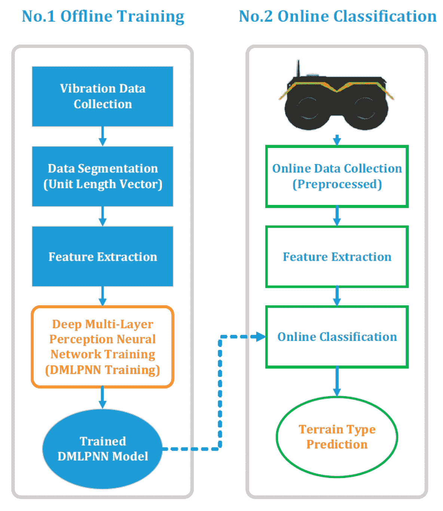
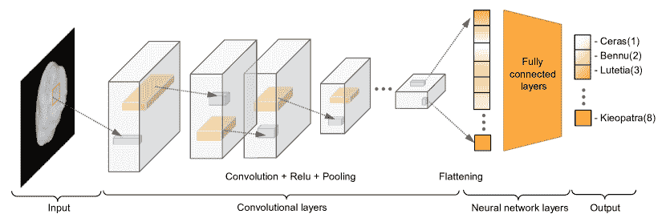

<!--yml

类别：未分类

日期：2024-09-06 19:52:03

-->

# [2108.08876] 基于深度学习的航天器相对导航方法：综述

> 来源：[`ar5iv.labs.arxiv.org/html/2108.08876`](https://ar5iv.labs.arxiv.org/html/2108.08876)

# 基于深度学习的航天器相对导航方法：综述

**蒋宁**¹¹1 等贡献²²2 电子与电气工程系博士后研究员 jianing.song@city.ac.uk **杜阿特·朗道**³³3 等贡献⁴⁴4 电子与电气工程系博士后研究员 duarte.rondao@city.ac.uk **纳比尔·奥夫**⁵⁵5 机器人与自主系统教授，电子与电气工程系 nabil.aouf@city.ac.uk 伦敦城市大学，ECV1 0HB 伦敦，英国

###### 摘要

自主航天器相对导航技术已被计划并应用于许多著名的太空任务。机载电子系统的发展使得基于视觉和激光雷达的方法能够实现更好的性能。同时，深度学习在不同领域取得了巨大成功，特别是在计算机视觉领域，这也引起了空间研究人员的关注。然而，航天器导航与地面任务不同，由于对高可靠性的要求而缺乏大规模数据集。这项综述旨在系统地调查当前基于深度学习的自主航天器相对导航方法，重点关注具体的轨道应用，如航天器对接和在小天体或月球上的着陆。首先，从航天器对接、小行星探索和地形导航三个角度总结了基于深度学习的相对导航算法的基本特征、主要动机和贡献。此外，还比较和总结了流行的视觉跟踪基准及其各自的特性。最后，讨论了潜在的应用和预期的障碍。

###### 关键词：

深度学习，空间相对导航，地形导航，小行星探索^†^†期刊：Acta Astronautica\setabbreviationstyle

[acronym]long-postshort-user \glssetcategoryattributeacronymnohyperfirsttrue \DTMusemodulebritishen-GB

## 术语表

2D

二维

3D

三维

AI

人工智能

ALHAT

自主着陆危险规避技术

ANN

人工神经网络

BCE

二进制交叉熵

CD

陨石坑检测

CI

陨石坑识别

CL

卷积层

CNN

卷积神经网络

COCO

上下文中的常见物体

CRO

区域物体候选

DEM

数字高程图

DL

深度学习

DNN

深度神经网络

DoF

自由度

DRCNN

深度递归卷积神经网络

EKF

扩展卡尔曼滤波器

ESA

欧洲航天局

FCL

全连接层

FPGA

可编程逻辑阵列

GPOPS II

通用最优控制软件

HDA

危险检测与避免

HRNet

高分辨率网络

ICP

迭代最近点

KPEC

Kelvin 姿态估计挑战

KRN

关键点回归网络

LCLF

以月球为中心、固定月球坐标

LoG

高斯拉普拉斯

LRO

月球 reconnaissance 卫星

LSTM

长短期记忆

LVLH

本地垂直、本地水平

ML

机器学习

MLP

多层感知器

均方误差

均方误差

NASA

美国国家航空航天局

NEA

近地小行星

NN

神经网络

ODN

目标检测网络

PDS

行星数据系统

P$n$P

透视-n-点

PyCDA

Python 陨石坑检测算法

RANSAC

随机样本一致性

R-CNN

基于区域的卷积神经网络

RGB

红绿蓝

均方根误差

均方根误差

RNN

循环神经网络

RoI

关注区域

RPN

区域建议网络

S/C

航天器

SoC

芯片系统

SPEED

航天器姿态估计数据集

SPN

航天器姿态网络

TRN

地形相对导航

URSO

虚幻渲染的在轨航天器

VO

视觉里程计

WAC

广角相机

## 1 引言

近年来，人工智能（AI）、机器学习（ML）和深度学习（DL）在科学、技术、工程和数学学科中引起了越来越多的关注。历史上对 AI 的定义有多种方法；最常见的定义是指能够使机器模拟人类智能的技术。接着，ML 是负责在 AI 内部自动处理数据的关键组件。神经网络（NN）是一个特定的 ML 模型，旨在通过定义映射$y=f({\bm{x}},{\bm{\theta}})$并学习${\bm{\theta}}^{\ast}$参数来近似某个函数$f^{\ast}$，将训练示例${\bm{x}}$与标签$y$相关联。NNs 通过堆叠多个不同的函数（称为层）来工作，层的数量定义了 NN 的深度。DL 一词源于此，通常表示具有大深度的 NN [1]。这三个概念之间的粗略关系在图 7 中总结并说明。

在空间探索领域，基于视觉的航天器（S/C）自主导航是一个关键领域，具有从 \glsxtrshortdnn（\glsxtrlong*dnn）估计方法中极大受益的潜力。由于紧凑且轻便的被动光学传感器作为可行的机载仪器的引入，摄像头正在迅速成为自主交会的首选传感器[2]。此外，视觉技术已经在飞行中用于深空导航任务[3]。未来潜在的应用领域包括：1) 与航天器的非合作交会；2) 降落和着陆的地形导航；以及 3) 小行星探测和小行星补丁定位。

图 1: AI、ML 和 DL 之间的关系（转载自 Mathworks.⁷⁷7[`explore.mathworks.com/machine-learning-vs-deep-learning/chapter-1-129M-833I7.html`](https://explore.mathworks.com/machine-learning-vs-deep-learning/chapter-1-129M-833I7.html)）。

所有这些场景都涉及对追踪器或着陆器航天器的相对状态进行估计，通常通过目标物体框架$\underaccent{\vec{}}{\bm{\mathcal{F}}}_{t}$相对于追踪器框架$\underaccent{\vec{}}{\bm{\mathcal{F}}}_{c}$的六个自由度（DoF）位姿${\bm{T}}_{ct}$来进行，其中包括旋转${\bm{R}}_{ct}$和平移$\prescript{c}{}{{\bm{t}}}_{ct}$（见图 2）。传统的位姿估计方法通过将目标（在$\underaccent{\vec{}}{\bm{\mathcal{F}}}_{t}$中表达）特征与由机载摄像头捕获的图像（在$\underaccent{\vec{}}{\bm{\mathcal{F}}}_{c}$中表达）进行关联来工作，而使用 DNN 模型可以充分捕捉输入传感器数据与状态估计之间的内在非线性，尤其适用于图像或数字高程图（DEMs）。

(a) 与非合作航天器的交会

(b) 通过补丁分类进行的小行星定位

(c) 地形导航

图 2: 应用 \Glsxtrshortpldnn 的潜在相对导航场景识别。

以往的研究探讨了基于 DL 的太空导航主题。Kothari 等人[4]整理了基于 DL 在太空中的各种应用，简要讨论了航天器对接和着陆过程中实现的和预期的目标。专门针对非合作航天器会合，Cassinis 等人[5]首先提供了\glsxtrshortcnn-based（\glsxtrlong*cnn）方案在单目姿态估计系统中的综述，详细讨论了几项工作（例如[6, 7, 8]）。

图 3: 本文回顾的基于 DL 的 S/C 相对导航方法的树状图。黄色、蓝色和白色的框分别表示应用、方法和候选参考文献。

然而，针对一般太空相对导航的 DL 方法的比较分析仍然不足。通过本次调查，我们旨在弥补这一差距，并为希望利用深度学习进行这一研究的研究人员和工程师提供全面参考，特别是针对图 2 中识别的三种主要应用。图 3 展示了我们调查涵盖的研究方法和应用领域。在图 3 中，直接 DNN 方法是使用 DNNs 的端到端方法，它们构成了从输入$x$到期望量$y$的直接、不间断的管道。相比之下，间接 DNN 方法是指 DNN 专门负责对输入进行图像处理，而实际要估计的量则通过将此输出与其他方法（如经典 ML、基于几何的优化和卡尔曼滤波）结合来实现。

本文组织结构如下。第二部分回顾了 DL 基于的航天器交会姿态估计算法。第三部分包含了使用 DNNs 的 Terrain Relative Navigation (TRN) 的陨石坑和危险检测的详细回顾。第四部分提供了针对小行星探测的 DL 技术的回顾。最后，第五部分列出了主要的结论和讨论。

## 2 \glsfmtshortdl 基于的航天器相对导航姿态估计

### 2.1 地面姿态估计的相关工作

随着深度学习方法在各个研究领域的成功应用，基于 \glsxtrshortdl 的相机相对姿态确定技术在地面场景中引起了相当大的关注。

Kendall 等人 [9] 提出了 PoseNet 架构用于 6-DoF 运动估计，采用端到端的方法。为了开发姿态回归网络，他们使用了经过修改的预训练 GoogLeNet [10]，将所有 softmax 分类器替换为仿射回归器。选择位置向量和姿态四元数的 $L^{2}$ 误差范数的加权和作为损失函数，以更好地同时训练位置和方向。他们的结果表明，对于大规模户外场景，精度为 $2\text{\,}\mathrm{m}$ 和 $3\text{\,}\mathrm{d}\mathrm{e}\mathrm{g}$，对于室内环境，精度为 $0.5\text{\,}\mathrm{m}$ 和 $5\text{\,}\mathrm{d}\mathrm{e}\mathrm{g}$。

与基于已知世界模型进行自我定位不同，Wang 等人[11]提出了 DeepVO 架构，该架构基于单目视觉里程计（VO）从帧到帧获取车辆的自我运动。该流程遵循深度递归卷积神经网络（DRCNN）的架构[12]，其中一个预训练的 FlowNet [13]首先从一系列红绿蓝（RGB）图像中学习特征，然后由长短期记忆（LSTM）单元处理这些特征以估计姿态。端到端的 DRCNN 框架在长度为$100\text{\,}\mathrm{m}$到$800\text{\,}\mathrm{m}$的轨迹上，对位置和姿态的平均均方根误差（RMSE）漂移分别为$5.96\text{\,}\mathrm{\char 37\relax}$和$6.12\text{\,}\mathrm{d}\mathrm{e}\mathrm{g}$，显示出相对于单目 VISO2 [14]的竞争力表现。

与上述端到端或直接方法不同，一些工作选择采用间接方法，其中 DNN 专门负责对输入进行图像处理，而实际需要估计的量则通过将该输出与其他方法（如经典的 ML 或卡尔曼滤波）结合来实现。例如，Rad 和 Lepetit [15]开发了 BB8 算法，通过结合一个 CNN 来回归定义其边界框的八个三维（3D）点的二维（2D）位置，以及一个透视-n-点（P$n$P）算法[16]，基于这些对应关系恢复姿态。他们选择了 VGG 架构[17]作为工作的基础，并使用经典的重投影（或几何）误差作为对应的损失函数[18]。

图 4：基于\Glsxtrshortdl 的姿态估计中的直接方法与间接方法。前者使用\Glsxtrshortdnn 直接从输入中估计姿态，而后者则专门用于识别目标上的特征或标记点，然后将这些特征输入到\Glsxtrshortml 算法中。

图 4 说明了直接方法和间接方法之间的区别，本节将进一步探讨这些方法。

### 2.2 挑战与动机

DL 的最新进展在经典方法方面展示了有前景的替代方案，相关的地面框架也激发了基于\glsxtrshortdl 的航天器相对导航的想法。然而，这两个应用领域之间仍然存在差距。

空间中物体的相对姿态估计与地球上物体的姿态确定由于环境的巨大差异而是一个不同的问题。此外，用于训练 DL 算法的实际标注轨道图像昂贵且难以获得，这导致了空间图像数据集的缺乏。针对在空间任务中应用基于视觉的 DL 方法的挑战，可以从之前的研究[7, 19, 20, 21, 22, 23, 24, 25, 26]总结如下：

+   $\bullet$

    行星和恒星作为导航系统的背景干扰物；

+   $\bullet$

    由于缺乏大气层和光线散射，视觉条件具有挑战性；

+   $\bullet$

    更强的阴影和多变的照明条件导致极端的图像对比度和低信噪比；

+   $\bullet$

    空间硬件在功耗和计算资源方面的有限属性（例如，低传感器分辨率）；

+   $\bullet$

    用于非合作导航的空间物体的训练数据集稀缺；

+   $\bullet$

    对 DL 技术可靠性的担忧阻碍了其在航天工业中的应用。

空间图像的特征也对传统的基于视觉的航天器导航算法构成挑战，而 DL 技术提供了有前景的解决方案和性能，能够缓解这些问题。在动态照明方面，基于\glsxtrshortdnn 的方案显示出在姿态初始化方面的增强鲁棒性[22, 27]。随着高性能设备的部署，基于\glsxtrshortcnn 的方法不仅可以在姿态获取过程中提供较低的计算复杂性，还可以减少对复杂动态模型的需求[28]。此外，DNN 管道能够输出各种信息，并与导航滤波器或其他过程结合[25]。

受以上描述的吸引力所激发，并为克服当前空间航行器相对姿态估计的局限性， 欧洲空间局（ESA） 在 2019 年启动了 Kelvins Pose Estimation Challenge (KPEC) ⁸⁸8[`kelvins.esa.int/satellite-pose-estimation-challenge`](https://kelvins.esa.int/satellite-pose-estimation-challenge)。，邀请社区以灰度图像直接提出和验证新的方法。此次挑战的训练和测试数据来自斯坦福的 Spacecraft Pose Estimation Dataset (SPEED)，其中包含标记的 Tango 卫星合成图像，以及在实验室中使用目标复制品获取的小型真实图像集。

### 2.3 直接航天器相对姿态估计框架

在本调查中，直接\glsxtrshortdl 为基础的框架被定义为那些完全依靠于 DNN 来估计期望的量，从而形成从输入到输出的连续、不间断的流水线。对于航天器相对导航，问题被提出为在追逐者的参考系$\underaccent{\vec{}}{\bm{\mathcal{F}}}_{c}$中估计目标$\underaccent{\vec{}}{\bm{\mathcal{F}}}_{t}$的 6-DoF 姿态（如图 2(a)）。目标可能是非合作的，这种情况下它将不会向追逐者的机载导航系统中传递任何明确的信息，相对姿态仅从目标获取的图像中估计。

通过将相对姿态空间划分为离散的假设，如果目标航天器有已知模型，就可以建立分类框架。Sharma 等人[7]已提出了一个深度 CNN 用于非合作航天器的相对姿态分类。利用迁移学习，基于大型 ImageNet 数据集[30]预训练的 AlexNet 模型[29]被修改，以适应 Prisma 任务[31]中 Tango 航天器的太空图像。从合成图像中创建了十个具有不同噪声的数据集。该方法显示出比使用经典姿态估计技术从 2D-3D 特征匹配的基线方法更准确，但被认为除了粗略初始化外，不适用于任何应用。

Sharma 和 D’Amico [8] 随后通过创建 航天器姿态网络 (SPN) 改进了他们的原始工作。 SPN（图 5）使用了一个五层的 CNN 主干网络，其中的激活连接到三个不同的分支。第一个分支使用 Faster 基于区域的卷积神经网络 (R-CNN) 架构 [32] 来检测输入图像中目标的 2D 边界框。为了对抗干扰背景元素（即地球的存在），通过第一个分支的最终激活图输出的特定特征通过 R-CNN 的 感兴趣区域 (RoI) 池化技术提取，然后输入到包含三个全连接层的 CNN 的其他两个分支中。

第二个分支根据离散类别的概率分布对目标姿态进行分类。它对视球中 $N$ 个最接近的姿态标签最小化标准交叉熵损失。最后，第三个分支利用从前一个分支获得的 $N$ 个候选者，并最小化另一种交叉熵损失，以产生每个候选者的相对权重。最终的精细化姿态通过四元数平均法结合计算的权重得到，这可以被视为一种软分类方法。

图 5：\glsxtrlong*spn (\glsxtrshortspn) 架构。转载自 Sharma 和 D’Amico [33]。

从数学上讲，SPN 利用高斯-牛顿算法来解决相对位置的最小化问题，为此所需的初始猜测是通过边界框获得的（类似于 Kehl 等人 [34]）。网络首先在 ImageNet 数据集上进行训练，然后使用 SPEED 数据集进行 $80\text{\,}\mathrm{\char 37\relax}20\text{\,}\mathrm{\char 37\relax}$ 的训练-验证划分进一步训练分支层。正如他们报告的那样，SPN 方法在相对姿态和位置误差上分别达到了度级和厘米级的表现。

在参考文献[33]中，Sharma 和 D’Amico 通过讨论 SPN 的两个特性来扩展他们的会议论文[8]，即目标内目标姿态估计和不确定性量化。估计与 SPN 估计姿态相关的不确定性的能力强调了 SPN 可以与传统导航滤波器集成。此外，作者详细介绍了提出的 SPEED 数据集，考虑了合成图像的太阳照射和通过真实图像的相对姿态的真实标定。SPN 还通过使用不同的数据集进行三种版本的训练，包括 SPEED、”Apogee Motor”、”Imitation-25”和”PRISMA-25”。还进行了实验以展示 SPN 方法的两个关键特性，并将其与他们之前的工作进行比较，即\glsxtrshortcnn-based [7]和基于图像处理的特征检测和匹配[35]方法。

Proença 和 Gao[36]修改了一个经过预训练的 ResNet 架构[37]，使用在 COCO 数据集上训练的初始权重，以保持空间特征分辨率，而不是采用边界框特征检测。与参考文献[8]类似，设计了两个分支来分别估计 3D 位置和方向。位置估计包括一个简单的回归分支，具有两个全连接层，并且为了更好的泛化，最小化了相对误差的损失权重幅度。然后，通过软分类方法[38]实现连续的姿态估计。此外，作者提出了他们自己的合成虚幻渲染航天器在轨（URSO）数据集，用于训练包含 Soyuz。对 URSO 和 SPEED 数据集的渲染图像进行了实验，以评估所提出的框架，使用该框架，他们的模型在 KPEC 的 SPEED 合成测试集和真实测试集类别中分别获得了第三名和第二名。此外，实验结果表明，通过软分类估计方向比直接回归方法表现更好。

(a) 简化的架构模型

(b) ResNet 模块

图 6: 参考文献[36]中的卷积神经网络（CNN）流程图。CNN 的前端基于 ResNet，其基本模块实现了跳跃连接，有助于缓解在非常深的网络中出现的梯度消失问题。

Hirano 等人 [24] 提出了一种基于 AlexNet 的 CNN 架构的 3D 关键点估计器，该方法直接回归航天器姿态信息，而不是从 2D 关键点的位置检索 3D 对象。AlexNet 的参数为了姿态估计任务而进行了调整，并在所有的 Convolutional Layer (CL) 和 Fully Connected Layer (FCL) 中使用了批量归一化层 [39] 以实现训练过程中的收敛。通过 Gazebo 仿真器 [40] 生成的带有 3D 关键点位置标签的 3D 模型的合成图像被用来训练 CNN。通过硬件模拟器拍摄的真实图像被导入以评估训练后的 CNN。训练和测试数据集中包括了光照、阴影和随机噪声的影响，这使得所提出的框架在实际空间任务中具有潜在应用。

Arakawa 等人 [41] 也将姿态估计视为基于 \glsxtrshortcnn 的回归问题，以从构建的图像中获取航天器姿态四元数，其中所提出的 CNN 的输出是四个独立的实数，分别对应四个四元数元素。在 Blender 软件中建立了 JCSAT-3 卫星的 3D 模型，用于生成训练图像数据集。渲染图像应用了点扩散函数，以模拟大气波动和光学效应。与传统的图像匹配方法相比，他们的结果在准确性、鲁棒性和计算成本上都有所改进。

考虑到基于自然特征的方法在航天器姿态估计中并不总是足够的，Sonawani 等人 [19] 发展了一种改进模型，以协助空间组装任务中的合作目标跟踪器。所提出的 CNN 架构类似于文献 [7]，但使用 VGG-19 作为骨干，并将最后一层替换为一个 7 节点的层而不是激活函数。开发了两种不同的模型，即基于分支的模型和基于并行的模型，用于估计相对姿态。这两种模型的框架在图 7 中说明，其中并行模型包含两个并行流，用于位置预测和姿态估计。合成图像在 Gazebo 中生成，包括标记了姿态的桁架状物体。预测姿态与实际姿态之间的欧几里得距离误差定义为损失函数。仿真结果表明，他们的模型与当前特征选择方法相当，并且对其他类型的航天器具有鲁棒性。

(a) 分支模型

(b) 并行模型

图 7：Sonawani 等人基于 VGG-19 的架构 [19]。该分支用于保留后续池化层丢弃的特征位置信息。

针对基于视觉的非合作对接操作，Phisannupawong 等人 [42] 通过提出一个先进的在 URSO 上预训练的 GoogLeNet 来构建航天器姿态估计模型。原始的 GoogLeNet 框架通过使用文献 [9] 中提出的 23 层 CNN 进行了修改，航天器姿态的输出为一个七元素向量。实验分别使用了指数损失函数和加权欧几里得损失函数。模拟结果表明，加权欧几里得基的姿态估计模型成功实现了中等偏高的预测精度，但指数基的模型导致了较差的方向估计精度。

Kechagias-Stamatis 等人 [43] 提出了一个 DRCNN 模型，用于从帧到帧回归航天器的相对姿态，而不是在单个时间步估计姿态。对于相对航天器导航系统，这些链式姿态作为连续输出，其中连续性对自主任务（如对接和编队飞行）至关重要。具体而言，DRCNN 包括一个 CNN 模块和一个 LSTM 模块，分别用于提取输入图像的特征和自动建模相对动态（见图 8）。3D 激光雷达数据被投影到图像平面上，生成三个不同的 2D 深度图像，然后由普通 CNN 处理。如参考文献 [11] 所示，损失函数最小化姿态 均方误差 (MSE)，但姿态通过方向余弦矩阵表示。实验在合成数据和真实数据上进行。对于前者，使用 Elite 目标卫星平台创建自遮挡点云。真实数据集通过 Envisat 的缩放模型获取。他们在模拟和真实激光雷达数据场景中的结果表明，DRCNN 在较低的计算需求下实现了比当前算法（如 迭代最近点 (ICP) [44] 和 $H_{\infty}$ 滤波的描述符匹配）更好的里程计精度。

图 8: Kechagias-Stamatis 等人 [43] 的 DRCNN 架构。采用浅层 CNN 架构提取投影图像的低级特征，然后使用 LSTMs 对其进行建模。

Oestreich 等人 [22] 研究了通过采用基于 AlexNet 的迁移学习和后分类姿态精化算法进行轨道相对姿态初始化，为未来的基于 \glsxtrshortcnn 的航天器姿态初始化工作奠定了基础。他们的研究重点回答了几个关于 DL 在该领域适用性的问题，包括所需的训练图像量、姿态标签离散化以及光照和图像背景对 CNN 性能的影响。因此，AlexNet 作为所提框架的骨干，仅改变了最终的 FCL 以生成姿态标签。得到的姿态，与 Ref. [8] 的单分支不同，通过方向余弦矩阵平均使用八个最可能的标签进行精化。使用 Blender 在固定范围 $20\text{\,}\mathrm{m}$ 渲染 SpaceX Dragon 胶囊的合成图像。创建了四个不同的合成图像集，以研究所提出方案的性能并回答提出的问题，即考虑黑色和空白背景、太阳角度变化、地球背景变化和传感器噪声。根据他们的实验结果，指出：1) 分类准确率和姿态误差都表现出渐近趋势；2) CNN 在太阳变化数据集的较为苛刻光照条件下表现良好，但在地球背景和传感器噪声数据集中的表现较差；3) 在精化步骤中使用置信度拒绝阈值可以稍微提高估计精度。

最近，Cosmas 和 Kenichi [23] 首次研究了基于 \glsxtrshortcnn 的航天器姿态估计的可行性，评估了模型的板载推理能力。考虑到功耗和成本效益，建议使用 Xilinx Zynq Ultrascale+ 多处理器 片上系统 (SoC) 混合 现场可编程门阵列 (FPGA) 作为合适的解决方案。两种典型的方法和一个提出的框架在 Google Colab 上使用 SPEED 数据集进行训练，结果表明，基于 U-Net 的检测网络表现优于基于 ResNet-50 的直接回归方案，但仍不如开发的 ResNet34-U-Net 模型。随后，ResNet34-U-Net 流水线在提议的硬件上实现，首先使用 YOLOv3 进行 RoI 检测，然后使用地标定位网络预测关键点。推理实验，包括性能评估、与桌面实现的比较、DL 处理单元资源利用率和功耗分析，结果显示精度令人满意，芯片功耗低至 $3.5\text{\,}\mathrm{W}$。

为了对上述方法进行清晰的比较，表格 1 总结了调查过的基于\glsxtrshortdl 的相对姿态估计的直接框架。正如所示，超过一半的解决方案采用了迁移学习，这在传统上也被认为是最成功的 DNNs 在地形导航问题上的应用之一。在框架类型方面，大多数采用回归或软分类器进行估计。真实图像的开放数据集有限；仅有 PRISMA-25 和 SPEED 可用。另一方面，合成图像可以通过不同的软件或平台进行模拟，例如 OpenGL、Gazebo、Unreal Engine 4 和 Blender，从而生成如 URSO 等数据集。此外，近期的研究输出量表明，对基于\glsxtrshortdl 的空间飞行器姿态估计的兴趣正在增加，甚至包括对 FPGAs 的首次报告。

表 1: 基于\glsxtrshortdl 的空间飞行器相对导航的直接姿态估计方法总结。

| 参考文献 | 主干 | 迁移 | 类型 | 数据集 | 评论 |
| --- | --- | --- | --- | --- | --- |
|  |  | 学习 |  |  |  |
| [7] | AlexNet | ImageNet | 分类器 | PRISMA，合成 | 粗略初始化 |
| [8] | FasterR-CNN | ImageNet | 软分类器 | SPEED，合成 | SPN 的介绍 |
| [33] | SPN | ImageNet | 软分类器 | SPEED，PRISMA，合成（OpenGL） | 优于参考文献[7] |
| [36] | ResNet-50 | COCO | 软分类器 | URSO (Soyuz S/C) | 软分类器在姿态估计中优于回归器 |
| [24] | AlexNet | ✗ | 回归器 | 合成（Gazebo），真实 | 直接 3D 关键点回归 |
| [41] | 2 层 CNN | ✗ | 回归器 | 合成（Blender，JCSAT-3 S/C） | 评估对噪声的鲁棒性，输出四元数 |
| [19] | VGG-19 | ImageNet | 回归器 | 合成（Gazebo） | 协作对象跟踪器 |
| [42] | GoogLeNet | PoseNet | 回归器 | 合成（Unreal Engine 4，Soyuz S/C） | 两种损失函数的比较 |
| [43] | 浅层 CNN + LSTM | ✗ | 回归器 | 合成（Elite S/C），真实（Envisat S/C） | 帧到帧的运动估计器 |
| [23] | U-Net, ResNet, YOLOv3 | ✗ | 回归器 | SPEED | 机载 FPGAs 实现 |
| [22] | AlexNet | ImageNet | 分类器 | 合成 (Dragon S/C) | 太阳角度分析、地球存在、噪声 |

### 2.4 航天器相对姿态估计的间接框架

使用端到端的\glsxtrshortdl 方法从图像中估计姿态被认为提供了不足的特征表示和有限的解释性，这些方法的表现与基于几何的方法相比一直不尽如人意。Sattler 等人[45]讨论了端到端的\glsxtrshortcnn 基于地形姿态回归的局限性，并建议在实际应用中存在差距。此外，DNN 模型有过拟合的风险，这会导致训练图像和测试图像之间的性能不可预测地下降，因为它记住了前者的属性，而不是学习，这些属性在后者上效果不好[1]。因此，一些研究方向最近重新聚焦于间接方法，旨在结合 DL 和传统几何方法来改进姿态估计。

为了促进\glsxtrshortdl 基于的姿态估计在空间任务中的实际应用，Park 等人[46]采用了 SPN 框架[8]，并通过采用新型的 CNN 进行目标检测和随机样本一致性（RANSAC）算法来解决 P$n$P 问题来对其进行修改。提出的 CNN 被解耦为检测和姿态估计网络，以分别确定 2D 边界框的 RoI 和回归 2D 关键点的位置。如图 9(a)所示，对象检测网络（ODN）和关键点回归网络（KRN）紧随 YOLOv2/YOLOv3[47]的流程，但分别使用 MobileNetv2[48]和 MobileNet[49]。为了大幅减少网络参数数量，网络的传统卷积操作被深度卷积和点卷积所替代（见图 9(b)）。

考虑到缺乏具有代表性纹理和表面照明特性的实际空间数据集，Park 等人[46]还通过一种新的训练程序来提高 CNNs 对仅在合成数据上训练的空间影像的鲁棒性。受参考文献[50]的启发，他们通过将神经风格迁移技术[51]应用于具有与 SPEED 相同姿态分布的自定义合成数据集，生成了一个新的数据集。在用新的纹理随机化数据集训练之后，提出的网络在空间影像上的表现更好，并在 KPEC 中获得了第 4 名。

(a) 姿态估计网络

(b) 不同的卷积操作

图 9: 参考文献[46]中提出的 DNN 框架以及三种卷积操作的比较。

第一名的 KPEC 解决方案也是陈等人提出的基于\glsxtrshortdl 的间接方案[20]，其中 DL 和几何优化相结合，呈现出一个基于\glsxtrshortcnn 的管道，用于从单幅图像中进行姿态估计。首先，通过多视角三角测量从训练集中计算卫星的 3D 标志点。然后，训练一个高分辨率网络 (HRNet) [52]来回归从输入灰度图像中投影的 2D 角点标志物的位置。最后，通过基于模拟退火的几何优化算法获得最佳姿态，其中初始姿态是通过 P$n$P 求解器估计的。更具体地说，提出的 DNN 框架包含两个模块。第一个模块使用 HRNet 前端和 Faster R-CNN 组合来检测输入图像中目标的 2D 边界框。然后对 RoI 进行裁剪和调整大小，以便在第二个模型中使用，第二个模型由纯 HRNet 构成，并在每张图像中预测的可见标志点的热图与实际热图之间的 MSE 损失上进行训练。

为了实现快速准确的姿态估计，Huo 等人 [53] 开发了一种基于**DLs**的创新方法，该方法结合了 P$n$P 和几何优化。设计了一个新的轻量级 tiny-YOLOv3 框架，用于预测构建的 3D 模型的投影关键点的 2D 位置。图 10 显示了相应的回归网络，其中 tiny-YOLOv3 的输出被修改，以建立一个用于检测 S/C 并预测 2DRoI 的框可靠性判断模式。接下来，通过用 CLs 替换 FCLs 来生成热图，实现了 S/C 关键点的回归。最后，利用 P$n$P 和束调整生成初始姿态并分别进行优化，从而提高了所提方法的准确性和鲁棒性。他们的方法在 SPEED 数据集上进行了评估，在航天器姿态估计方面表现出色，并且计算负担更轻。

图 10：Huo 等人 [53] 设计的网络总体结构。

另一种间接的 DLs 基础方案将一个基于\glsxtrshortcnn 的特征检测器与一个 P$n$P 求解器和一个扩展卡尔曼滤波器 (EKF)结合，以确保稳健的姿态估计[27]。作者构建了一个沙漏形状的 CNN，由一个六块编码器和一个六块解码器组成，用于估计 Envisat 航天器上$16$个预定义角点的热图。由于背景中地球的存在未被考虑，目标检测模块未被纳入。利用热图中的权重，计算了相关地标协方差。然后进行了两个测试阶段。第一个阶段使用由单张图像组成的数据集，并通过将回归地标的协方差纳入 P$n$P 程序中来计算相对姿态[54]。第二个阶段考虑了一个模拟 V-bar 接近的序列数据集，其中 Envisat 在固定相对距离下进行滚转，与局部垂直-局部水平 (LVLH)参考系相关。相对姿态通过基于 Clohessy-Wiltshire 动力学模型的紧耦合 EKF 进行估计。滤波器的传感器测量输入包括地标位置和协方差，来自 CNN。该滤波器在所有轴上达到低于$0.2\text{\,}\mathrm{m}$的稳态位置误差，姿态误差低于$2\text{\,}\mathrm{deg}$。

Huan 等人[21]研究了一种类似于 Ref. [53]的流程，在位置和姿态估计的精度和准确度方面，相对于 SPN 框架取得了近一个数量级的改进。训练方法包括四个步骤：1) 从训练数据集中手动选择用于重建目标 3D 模型的图像，2) 通过 ODN 检测 2D 边界框，3) 从 KRN 中估计关键点的 2D 图像位置，4) 将 3D 真实关键点投影到图像平面上，并从与估计关键点的对应关系中解决 P$n$P 问题。与 Ref. [53]不同的是，Ref. [21]中的目标检测网络和 KRN 采用了最先进的 HRNet 作为骨干网络。最终通过 Huber 重投影损失的非线性最小化来预测 6-DoF 姿态。训练数据集由合成的灰度图像构成，测试集图像则使用单目相机实时捕获。

Shi 等人 [6] 将最先进的 CNN 技术应用于目标 CubeSat 检测，但未进一步讨论姿态估计。Inception-ResNet-V2 [55] 和 ResNet-101 [37] 被结合并训练，以估计目标 S/C 的边界框，使用实验室测试平台。ResNet-101 的最终 FCL 被减少为两个类别，以区分“1U_CubeSat”和“3U_CubeSat”标签。预训练的 CNN 权重来自 COCO 数据集 [56]，并在实际和合成的 CubeSat 图像混合数据上进一步训练。他们的模拟结果表明，Inception-ResNet-V2 框架在 S/C 检测中实现了略高的准确性和精确度，而 ResNet-101 网络则计算负担较轻。为解决类似问题，Ming [57] 基于 Faster R-CNN [32] 在 CNN Caffe [58] 开放平台上构建了一个特征提取网络和 区域提议网络 (RPN) 结构框架。所提网络在图像序列中智能识别航天器模块，并过滤出特定感兴趣的组件。

对于其他超越会合的太空任务，Yi [59] 研究了对接任务的相对位置估计问题（低于 $10\text{\,}\mathrm{m}$）。假设相对姿态已经调整，该方法利用修改后的 VGG-16 来回归对接环之间的相对位置。进一步的位置平滑和相对速度估计通过卡尔曼滤波实现。此外，Jiaming [60] 讨论了一种基于 DL 的卫星定位误差补偿技术。大量数据被收集以生成一个鲁棒的模型；一个 CNN、一个深度置信网络和一个 递归神经网络 (RNN) 在由中国科学院技术研究所收集的卫星位置数据上进行训练，目的是生成一个鲁棒的模型。一个 CNN、一个深度置信网络和一个 RNN 在收集的数据上进行训练，其中 CNN 产生了最佳的补偿结果。

表 2: 基于 \glsxtrshortdl 的航天器相对导航间接姿态估计方法汇总。

[b] 参考文献 主干 转移类型 数据集 学习中姿态估计 [46] YOLO, MobileNet ✗ 关键点回归器 合成 (\glsxtrshortnst¹ ), SPEED P$n$P [20] HRNet + Faster R-CNN ✗ 关键点回归器 SPEED P$n$P [53] tiny-YOLOv3 COCO 关键点回归器 SPEED P$n$P [27] Hourglass 网络 ✗ 关键点回归器 合成 (Cinema 4D, Envisat S/C) P$n$P + EKF [21] 2 层 CNN ✗ 关键点回归器 合成, 实验室 (实际) P$n$P [59] VGG-16 ✗ 位置回归器 合成 (Blender) EKF [6] ResNet COCO 分类器 合成, 实际 CubeSat 检测 [57] Faster R-CNN ✗ 回归器 合成 物体检测 [60] LSTM ✗ 回归器 实际 位置误差补偿

+   1\glsxtrlong

    *nst; 应用于随机化飞行器的纹理。

表格 2 包含了间接 \glsxtrshortdl-based 飞行器姿态估计和相关应用的简要总结。如图所示，早期的研究（最后四篇引用的）更侧重于姿态估计任务的部分，例如检测和位置估计。P$n$P 和 EKF 通常结合使用来优化 DNNs 输出的姿态。此外，当 DL 方法与优化器结合使用时，迁移学习和非常深的网络很少被利用。这可能是因为这些管道在最后阶段高度依赖于这些优化步骤，这些步骤能够保证姿态的合理估计。这样，浅层网络可以降低计算成本，这对实际使用和潜在的机载实施是有利的。

## 3 火山口和危险检测用于地形导航，使用 \glsfmtshortdl

探索和登陆月球表面长期以来一直是空间技术和科学中备受关注的挑战。最近在深度学习领域的进展重新激发了对基于学习的地形相对导航的兴趣。陨石坑是月球和小行星表面相对导航的理想标志物[61, 62]。此外，为了成功着陆，必须避免危险。因此，本节从三个方面回顾了基于\glsxtrshortdl 的地形导航领域：陨石坑检测、危险检测和地形相对导航方法，均使用 DNNs。图 11 展示了这三个方面的示意图和区别。

图 11：陨石坑检测、危险检测以确保安全着陆区域及地形导航的场景。

### 3.1 陨石坑检测

随着计算机视觉的进步和 CNNs 在目标检测领域的成功应用，基于 CNN 的陨石坑检测算法也开始出现。然而，大多数早期方法仅将 CNN 用作分类器来验证选定特征，如参考文献[63, 64, 65]。自然陨石坑的形状在形态上各不相同，包括峰环、中央凹坑和壁阶[66]。一些陨石坑可能还会重叠。考虑到照明条件和机载相机的不同姿态，成像的陨石坑在尺寸和外观上可能会有所不同[61]。相反，已通过应用 DNNs 对原始陨石坑图像进行全面处理，开发出稳健的陨石坑检测算法，显示出有前景的结果，吸引了大量兴趣。

Python 陨石坑检测算法 (PyCDA) [67] 是一个开源的陨石坑检测库，包括检测器、提取器和分类器，专注于检测从未被编目过的新陨石坑。PyCDA 使用缩小版的 U-Net 架构，从灰度强度图像输入中计算每个像素的陨石坑边缘可能性。然后将像素预测图传递给提取器，以生成陨石坑候选列表。最后，应用分类器 CNN 来确定真正的陨石坑。得益于 PyCDA，大量陨石坑已被检测和分类，从而帮助生成新的标记数据集，以便训练和测试深度学习算法。

图 12：Wang 等人复现的 CraterIDNet 框架 [61]。

Wang 等人[61] 提出了一个端到端的完全卷积神经网络，CraterIDNet，用于同时检测和识别火山口。CraterIDNet 接收各种尺寸的遥感图像，并输出检测到的火山口位置、明显直径以及识别到的火山口索引。与使用大型现成深度神经网络模型不同，首先开发了一个小型的卷积神经网络架构，该架构在火星火山口样本[68]上进行了预训练，以提取特征图。接下来，提出了两个流程，即火山口检测（CD）和火山口识别（CI），用于同时检测和识别火山口。CD 过程涉及检测图像中是否存在火山口以及定位这些火山口。然后将 CD 的输出馈送给 CI 过程，将检测到的火山口与已知数据库中的地表标志匹配，且 CI 的匹配结果将提供位置估计。图 12 显示了 CraterIDNet 的整体框架。CD 修改了 RPN 架构[32]作为骨干网络，从特征图中回归物体性分数和火山口直径。由于火山口大小不同，设计了两个 CD 流程，通过共享相同的 CLs 但使用不同的参数。随后，通过结合提出的网格模式层和卷积神经网络框架来进行 CI 火山口识别。对于训练和测试数据集，$1600$个火山口被手动编目并通过数据增强扩大到最终的$16\,000$个实例。实验结果表明，体积为$4\text{\,}\mathrm{MB}$的轻量级 CraterIDNet 表现优于以前的算法[64]。

Silburt 等人[69]使用卷积神经网络架构进行月球表面的稳健火山口检测，利用数字高程模型。该方法依赖于开发的 DeepMoon 网络来识别火山口的质心和半径，并输出火山口边缘的像素级置信度图。DeepMoon 通过更改输入图像尺寸、每个卷积层中的滤波器数量以及在扩展路径中使用 dropout[71]以应对内存限制和正则化，来修改 U-Net [70]。图 13 展示了 DeepMoon 架构。

图 13：DeepMoon 网络架构 [69]

对于训练，DeepMoon 使用的数据是通过合并两个人工生成的陨石坑目录生成的，这些目录分别是 Lunar Reconnaissance Orbiter (LRO) Wide Angle Camera (WAC) 全球月球 DEM [72] 和 LRO 月球轨道激光高度计 DEM [73]。数据集被分割成相等的训练-验证-测试部分，每部分生成 $30\,000$ 张 DEM 图像。选择的最小化损失函数是按像素计算的 Binary Cross-Entropy (BCE)。DeepMoon 生成一个陨石坑边缘预测掩模，然后将其输入低级图像处理和模板匹配过程，以确定实际的陨石坑。中位数经度、纬度和半径误差为 $11\text{\,}\mathrm{\char 37\relax}$ 或更少，表示与人工生成的数据集的良好一致性。此外，从月球地图训练到水星地图测试的迁移学习也得到了成功的定性展示。

Downes 等人 [25] 提出了 LunaNet 框架来检测月球 TRN 的陨石坑，该框架与 DeepMoon 非常相似，不同之处在于它接受灰度图像作为输入。因此，该方法更适合用于配备光学相机的航天器上，而无需深度传感器。与 DeepMoon 一样，CNN 的输出是一个陨石坑边缘预测掩模。然而，陨石坑是通过不同的方法提取的，图 14 展示了 LunaNet 的每个特征提取步骤，包括预测掩模、腐蚀和阈值预测、轮廓检测和椭圆拟合。数据准备过程也类似于 DeepMoon 的过程，包括 LRO WAC 全球月球 DEM 数据集 [72]，随后对输入的灰度图像进行直方图重标定，以匹配 DEM 图像的强度分布。基于预训练的 DeepMoon 权重，LunaNet 减少了训练工作量并提高了最终检测结果。实验结果表明，LunaNet 在对噪声图像的鲁棒性、位置精度和平均陨石坑检测时间方面超越了 DeepMoon 和 PyCDA。

图 14：LunaNet 的特征提取步骤 [25]

观察发现，在太阳角度较低且阴影严重的区域，陨石坑检测的可靠性降低。Lee 等人 [74] 使用 \glsxtrshortcnn 基于的目标检测器来区分可能的地标候选，并预测沿不同光照几何飞行路径的检测概率，旨在通过光学导航系统识别高价值的地标。收集了一个基于真实月球表面数据的大型数据集。定义 区域对象候选 (CRO) 为具有特定纬度和经度的图像对象。然后使用 LunarNet 架构 (图 15；另见 Ref. [74] 中基于 LunarNet 的地标选择过程) 进行训练，以通过最大化月球局部区域之间的辨别度来识别 CROs。最后，基于考虑到太阳在一年中的方位角和高度角的得分 CROs 形成 CRO 性能图。数值实验结果表明，即使在太阳角度小于 $1.8\text{\,}\mathrm{deg}$ 的高地区域，该地标检测管道也能提供可用的导航信息，这表明在南极附近最黑暗的高地应用成功。

图 15: \glsxtrshortcnn 基于 CRO 鉴别器 (LunarNet) [74]

### 3.2 危险检测

危险检测被认为是空间 TRN 的重要研究领域，以避免着陆过程中发生故障。1974 年，阿波罗计划官员引入了月球下降引导的手动危险和目标选择 [75]。在过去十年中，许多算法得益于处理器设备计算能力的提高。自 2006 年以来，由 国家航空航天局 (NASA) 进行的 自主着陆危险规避技术 (ALHAT) 项目 [76] 推动了对基于 DEMs 的危险估计的兴趣。2012 年，Furfaro 等人 [77] 实施了一个 AI 系统，以在具有安全地形的区域内自主选择软着陆点。2015 年，Maturana 和 Scherer [78] 使用他们称之为 3D-CNN 的技术为直升机的自主着陆区检测创建了一个安全地图。

早期在 \glsxtrshortnn 基于 危险检测与规避 (HDA) 的研究由 Lunghi 和 Lavagna [79] 以及 Lunghi 等人 [80] 进行，他们展示了 人工神经网络 (ANNs) 在实时应用中的能力和吸引人的特性。地面实况通过阈值化像素级数据从相应的 数字高程模型 (DEM) 中计算得出。地形的输入图像以 $1024\text{\times}1024\text{\,}\mathrm{p}\mathrm{x}$ 的分辨率手动处理，以提取每个像素的 $13$ 维向量，包括图像强度均值、标准差、梯度和三种不同尺度下的 拉普拉斯高斯 (LoG)，以及太阳的倾斜角度。接下来，将提取的特征输入到神经网络中，输出一个 $256\text{\times}256\text{\,}\mathrm{p}\mathrm{x}$ 的危险图，每个像素值表示置信度值。从输出的危险图中，通过像素阈值化获取候选着陆点，并通过分析最小径向尺寸要求、到先验名义着陆点的距离以及候选半径内像素的 NN 分数来评分全球着陆潜力。目标着陆点被选为最大化全球得分的点。开发了两种不同的管道：一种基于具有 $15$ 个节点的 多层感知器 (MLP)，另一种基于具有逐层添加隐藏信息的级联 NN。利用包括四种地形在两种太阳倾斜角度下的 $8$ 张图像的测试集来评估这两种管道。训练期间预测的危险图之间的差异可以忽略不计，MLP 为 $0.0194$，而像素级 MSE 的级联为 $0.020\,39$。然而，前者在确定安全着陆点方面表现更好。此外，还展示了由 Rosetta 探测器获取的小行星图像的定性结果。

最近，Moghe 和 Zanetti [81] 提出了一个更现代的方法来解决相同的问题。针对 ALHAT 项目的危险检测，作者实现了一个类似沙漏的 CNN 结构，该结构基于 U-Net [70] 并具有复制和裁剪连接。该框架直接处理 DEM 数据，并通过输出图对安全和危险的着陆点进行分类。通过数据增强和转换现有数据集，他们从 LRO 数据集 [63] 创建了一个新数据集。输出结果类似于 Ref. [80]，是一个置信度图，随后应用阈值生成二元着陆/非着陆评分，尽管未提供具体的着陆点。在 100 张测试图像的结果表明，平均危险映射 Dice 精度分数为 $83\text{\,}\mathrm{\char 37\relax}$，并表明未来任务中实时处理的潜力。随后，Moghe 和 Zanetti [81] 在 Ref. [82] 中扩展和修改了他们的工作，使用相同的网络结构，但改进了涵盖输入大小、输出大小和层宽度的层。修改后的网络的拓扑结构如图 16 所示。同样地，Albumentations 数据增强套件 [83] 被用来准备数据。修改后的 \glsxtrshortcnn 基于的网络在 Ref. [81] 的相同测试数据集上输出了约 $\sim 92\text{\,}\mathrm{\char 37\relax}$ 的像素平均准确率。

图 16：网络的拓扑结构见 [82]

### 3.3 地形导航

在基于图像的行星 TRN 领域，Campbell 等人[28]首次利用训练于从 DEM 渲染的一系列图像的 CNN 架构，输出航天器相对于地面的一个方向的位置。问题通过从原始$1024\text{\times}1024\text{\,}\mathrm{p}\mathrm{x}$的天顶基图像中取出一个宽$128\text{\,}\mathrm{p}\mathrm{x}$的中心条带提出，考虑条带上每个像素位置作为其自己的类别。$128\text{\times}128\text{\,}\mathrm{p}\mathrm{x}$的训练图像通过在条带上每$8\text{\,}\mathrm{p}\mathrm{x}$水平采样并在不同的太阳照射角度下渲染$11$次生成。$1024$维的独热向量用于标记沿轨迹线的位置，并应用于每个图像。该 CNN 由三个 CLs 组成，每个 CL 后面跟着一个最大池化层。渲染了 30 张在未见过的太阳角度下的图像，以组成测试数据集。六张图像被正确分类，而通常观察到的最大误差为$5\text{\,}\mathrm{p}\mathrm{x}$。对于$0.5\text{\,}\mathrm{m}$的地面采样距离，这意味着实现的位置误差被限制在$2.5\text{\,}\mathrm{m}$。对以$4\text{\,}\mathrm{p}\mathrm{x}$重新采样的训练图像重复测试，误差降至最大$3\text{\,}\mathrm{p}\mathrm{x}$（或$1.5\text{\,}\mathrm{m}$）。

2020 年，Downes 等人[26]探讨了如何将他们的 LunaNet 应用于 TRN 问题，并报告了一个用于稳健估计相对位置和速度信息的系统。因此，LunaNet 被用来检测和匹配从一个轨迹帧到另一个帧的已知月球地标的陨石坑。匹配的陨石坑被视为特征，输入到基于特征的 EKF 中，其中滤波器的状态是 Lunar-Centred, Lunar-Fixed Coordinates (LCLF)下的相机位置和速度，以及在相同参考框架中检测到的特征的位置。与基于图像处理的陨石坑检测方法[84]相比，LunaNet + EKF 组合在 TRN 的准确性上有显著提升，并在变光条件下表现可靠。

(a) \glsxtrshortnn-based classification flow

(b) \glsxtrshortdmlpNN 的结构

图 17: \glsxtrshortdmlpNN 分类流程和 Bai 等人[85]提出的架构。

准确识别探测到的地形环境有助于实现依靠行星探测车的成功任务。然而，基于视觉的 TRN 系统难以有效感知地形环境的材料和机械特性。因此，Bai 等人[85]和 Chengchao[86]研究了几种基于振动的地形分类和识别方法，使用 DNNs。实验和 NN 分类流程如图 17(a)所示。作者比较了三种不同的基于学习的方法来进行地形材料感知和分类：改进的 NN 算法、\glsxtrshortdmlpNN 算法和基于 CNN-LSTM 的算法。在这三种方案中，\glsxtrshortdmlpNN 表现最佳[85]。为了分类纹理，\glsxtrshortdmlpNN（见图 17(b)）采用了五层 FCL 架构，其中前四层和最后一层的激活函数分别为 ReLU 和 softmax。对于数据集和训练，首先将传感器收集的三维原始振动数据分割为固定时长的向量。利用快速傅里叶变换，将向量转移到频域，从中获得特征向量用于网络训练。五种不同的纹理，包括砖块、沙子、平整、混凝土和土壤，由\glsxtrshortdmlpNN 进行高整体分类准确率的训练和识别。

对于自主月球着陆场景，Furfaro 等人[87]提出了一种 DNN 架构，该架构仅使用由机载着陆相机拍摄的原始灰度图像来预测燃料最优控制动作（见图 18）。该架构是一个五层的 CNN，每个时间步使用三幅连续图像作为输入。DNN 经过修改，配备了一个 LSTM 后端，连接到两个进一步的分支：一个用于回归，一个用于分类。为了训练网络，通过使用通用最优控制软件（GPOPS II） [88]的高斯伪谱采样方法，数值计算了一组最优轨迹，生成了一组初始和最终的相对位置和速度。最优轨迹的每个状态通过射线追踪月球表面的一块 DEM 来模拟，产生了$562$幅$256\text{\,}\mathrm{p}\mathrm{x}$ $\times$ $256\text{\,}\mathrm{p}\mathrm{x}$分辨率的图像。为了获得更好的性能，模型会明确地用在第一次尝试中结果不佳的数据子集重新训练[89]。

图 18：Furfaro 等人提出的架构 [87]

### 3.4 简要总结

由于缺乏标注数据库，使用 DNNs 进行陨石坑和危险检测的研究并不广泛。确实存在一些公开的包含陨石坑图像的数据集，例如月球陨石坑数据库⁹⁹9[`astrogeology.usgs.gov/search/map/Moon/Research/Craters/lunar_crater_database_robbins_2018`](https://astrogeology.usgs.gov/search/map/Moon/Research/Craters/lunar_crater_database_robbins_2018)。[63] 或 Robbins 火星陨石坑数据库 [68]。然而，对于应用监督式 DL 方法，如[61, 90, 25, 72, 73]所示，仍然需要手动编目的陨石坑。自动生成 DL 陨石坑数据集仍存在差距，在过去两年中，关于 DNNs 的研究增加了，并且在 TRN 任务中表现出良好的前景。

## 基于\glsfmtshortdl 的相对导航用于小行星研究

### \glsxtrshortdl 为小行星探测带来的挑战和动机

小型行星探测的近期趋势导致了包括小行星和彗星在内的研究激增，推动力来自科学、行星防御和资源开采动机[91, 92]。由于小行星附近的长通信延迟和复杂动态环境，需要自主导航[93]。因此，开发新的自主导航算法以用于未来的小行星采样和返回任务变得必要，其中 DL 技术可能提供了一个潜在的替代方案。

前述研究展示了 DNNs 在处理地形导航中光照变化不变的图像块分类的潜力。相同的原则也可以用于其他相关导航应用，例如小行星定位，如图 2(b)所示。然而，近地小行星 (NEA)任务比月球任务更具挑战性；这是因为对于小行星的引力和环境信息有限。如果天体及其轨道环境存在很大不确定性，那么所有在地面上制定的计划在空间实施时可能会极其失败[94]。此外，小行星缺乏标注的真实数据，这也挑战了 DL 技术在小行星探测和着陆中的应用和发展[95]。

### 4.2 之前对该领域的贡献工作

对于小行星任务，早期的研究人员在\glsxtrshortnn 基础上的轨道和动力学不确定性估计方面做出了各种贡献。Harl 等人[96]开发了一种基于\glsxtrshortnn 的状态观测器，以估计航天器在小行星轨道场景中经历的引力不确定性。所提议的状态观测器的 NN 输出作为状态函数的不确定性，而不是 EKF 的离散值。Guffanti[94]训练了一个神经网络作为自主运动规划单元，以计算最佳的航天器轨道配置，考虑了由导航滤波器创建的不确定 NEA 动态参数和选择的权衡。Song 等人[97]还使用了一个六层隐藏的 DNN 来快速估计不规则小行星的引力和梯度，并进一步在轨道动力学分析中应用基于 DNN 的引力模型。Kalita 等人[98]则引入了一个 NN 到小行星任务的规划和设计阶段，而 Feruglio 等人[99]利用前馈 NN 来自主识别 S/C 碰撞事件。Viavattene 和 Ceriotti[100]利用 NN 来映射 NEA 接近轨迹的转移时间和成本。

\glsxtrshort

基于 DNN 的光学导航在小行星探测任务中越来越重要，这可以解决之前方案的挑战，包括传统的高成本和高风险航天器系统、不规则和被照亮的小行星以及传统图像处理技术。在这种情况下（见图 2(b)），追踪器可能会被指令检查它已经会合的小行星表面的特定区域（在帧 $\underaccent{\vec{}}{\bm{\mathcal{F}}}_{c}$ 上观察到），这本质上是一个定位任务，需要估计 ${\bm{T}}_{ct}$。如果小行星已经被事先绘制了地图，并且存在一个带有标注地标的代码本（在帧 $\underaccent{\vec{}}{\bm{\mathcal{F}}}_{t}$ 上）用于比较，有两种可能的方法。第一种方法遵循与参考文献 28 相同的直接分类程序，其中使用 DNN 将观察到的区域与代码本中对应的区域进行匹配，该代码本带有相对姿态，但数据集为月球表面。另一种方法是对数据库中的每个区域使用单一类别，并训练 DNN 以对视角失真具有鲁棒性，然后依赖经典图像处理技术根据观察到的特征与匹配区域之间的差异来推断姿态。

Pugliatti 和 Topputo [101] 首次提出了基于 \glsxtrshortcnn 的方法用于车载小型天体形状分类，因为形状信息可以增强图像处理和自我任务规划的自主性。选取了来自行星数据系统 (PDS)节点的 $8$ 个著名模型¹⁰¹⁰10[`sbn.psi.edu/pds/shape-models`](https://sbn.psi.edu/pds/shape-models)以代表小型小行星的最重要特征。图 19 展示了构建数据库的步骤草图以及用于分类小行星的卷积神经网络 (CNN)框架。数据库在 Blender 中生成，假设了相机指向和照明，并在 TensorFlow [102] 中进一步通过随机旋转、平移和缩放进行增强。包含 $20\,988$ 张图像的数据库根据 $80\text{\,}\mathrm{\char 37\relax}$-$10\text{\,}\mathrm{\char 37\relax}$-$10\text{\,}\mathrm{\char 37\relax}$ 的比例被划分为训练、验证和测试集。他们的卷积神经网络 (CNN)架构有五个卷积层 (CL)，每个卷积层后跟一个池化层、一个重塑操作和三个全连接层 (FCL)进行分类。使用超参数搜索以获得网络参数。比较了三种传统方法，如 Hu 不变矩、傅里叶描述符和极坐标轮廓，其中提出的 \glsxtrshortcnn 基于方案表现最佳。

(a) 数据库生成的步骤流程

(b) 提出的 CNN 的示意图

图 19：Pugliatti 和 Topputo 提出的数据库生成流程及卷积神经网络 (CNN)架构[101]。

后来，Pugliatti 和 Topputo [91] 提出了使用分割图和 CNN 在航天器相对于小行星固定参考系的定位。来自 MobileNetV2 网络 [48] 的 CNN 将分割图分类，以从输入中生成位置信息的粗略估计。通过使用高级归一化互相关方法对 CNN 的输出进行精细化处理，最终获得相对位置。Didymos 和 Hartley 被选为常规和不规则小天体的代表来创建数据集，其中包括 $49\,716$ 个五种不同场景的合成图像样本。实验结果表明， CNN 在预测正确类别方面具有能力，并且相对位置误差低于 $5\text{\,}\mathrm{\char 37\relax}8\text{\,}\mathrm{\char 37\relax}$。

在 2021 年，Ravani 等人 [95] 开发了一种新型的 Mask-Region CNN 用于检测小行星的自动软着陆地点。由于没有公开标注有真实数据的潜在着陆点数据集，作者首先从 NASA 的 PDS ¹¹¹¹11[`pds.nasa.gov`](https://pds.nasa.gov) 收集了小行星 Vesta 的图像拼接，并将大图像分割成固定大小的小图像。接着，训练数据集进行了人工标注。对于 Mask-Region CNN 流水线，它采用 ResNet-50-C4 作为初始化的骨干网络；使用 RPN 提取特征图；使用 Faster R-CNN 进行 RoI 对齐；网络头部使用 FCLs 计算边界框；FCL 网络 [103] 的掩膜头用于计算像素级掩膜。与传统图像处理方法相比，该网络在其数据集上的准确率达到 $94\text{\,}\mathrm{\char 37\relax}$，且在实施阶段的计算时间成本较低。

## 5 总结与结论

本文调查了深度学习技术在空间应用中的 6-自由度相对姿态估计的最新趋势。介绍了计算机视觉领域的贡献，并展示了来自文献的具体应用，如自主航天器导航，包括空间姿态估计、地形相对导航的坑洞和危险检测，以及基于深度学习的 asteroid 导航。此次调查受到深度学习技术在未来空间任务中相对航天器导航应用的启发，即对接、对接、编队飞行、月球表面下降和着陆、绕行和检查小行星。综述了本研究领域中应用的一般 DNN 框架，包括网络结构、网络类型、训练方法、数据集拓扑和生成，以及所达到的性能。

首先，对基于 DNN 的 S/C 相对姿态估计技术进行了回顾，其中对监督和无监督方法进行了高级别的区分，在空间领域的贡献被发现完全属于前者。建立了之前地面应用的背景。进一步进行了较低级别的分类；特别是发现许多技术倾向于直接方法（所谓的“端到端”），其中 DNN 管道直接在图像上进行训练以产生相对状态。的确，这是深度学习非常吸引人的特性，因为不仅特征提取任务被转交给了 CNN，而且建模任务也是如此，消除了“中介”，允许用户主要关注架构设计和可学习参数的优化。然而，发现通过将它们与经典方法结合，可以获得更准确的解决方案。对于这些间接方法，CNN 负责回归目标上的 2D 关键点的位置，并通过几何对应关系与它们的 3D 对应点来估计相对姿态，使用如 P$n$P 或非线性优化等技术。此外，这些解决方案可以轻松地纳入导航滤波器，以进一步通过连续的平滑一致性（甚至超出姿态估计）来细化估计。RNNs 的角色，特别是 LSTMs，在处理连续图像流方面得到了强调。表 1 和 2 总结了这些关于航天器会合 DL 应用的相对姿态估计误差的发现。

其次，对 DNNs 在 TRN 中的应用进行了三个方面的调查，其中基于 DNN 的陨石坑和危险检测方法被认为是构建地形导航系统的重要贡献者。指出了用于训练和测试基于 DNN 的 TRN 框架的公共开放数据有限。此外，还提供了关注小行星任务的 DL 基于相对导航的方法。在详细回顾这一领域之前，讨论了挑战和动机。

最后，关于无监督学习方法（即在训练期间每个输入的期望输出未给出），对这种空间导航技术的关注远远不足。然而，无监督技术如 CNN-\glsxtrshortslam (\glsxtrlong*slam*) 或无监督 VO 被认为是空间领域潜在的新方法，并可能在未来进行研究。此外，大多数出版物以理论方式研究 DL 在空间中的应用，而不关注计算性能；事实上，只有少数出版物 [19, 22, 81] 专注于硬件上的实际部署，考虑了执行时间和训练数据集的大小。因此，可以得出结论，这些关于实际工程实践的研究讨论甚少，需要进一步发展。

## 参考文献

+   Goodfellow et al. [2016] Ian Goodfellow, Yoshua Bengio, 和 Aaron Courville. *深度学习*。麻省理工学院出版社，2016 年。

+   Wie et al. [2014] Bong Wie, Vaios Lappas, 和 Jesús Gil-Fernández. 姿态和轨道控制系统。见 Malcolm Macdonald 和 Viorel Badescu 编，*国际空间技术手册*，第十二章，第 362 页。Springer Praxis 图书，2014 年。doi:[10.1007/978-3-642-41101-4](https://doi.org/10.1007/978-3-642-41101-4)。

+   Bhaskaran et al. [1998] Shyam Bhaskaran, S Desai, P Dumont, B Kennedy, G Null, W Owen Jr, J Riedel, S Synnott, 和 R Werner. 深空 1 号自主导航系统的轨道确定性能评估。见 *AAS/AIAA 太空飞行力学会议*，1998 年。网址 [`trs.jpl.nasa.gov/bitstream/handle/2014/19040/98-0222.pdf?sequence=1`](https://trs.jpl.nasa.gov/bitstream/handle/2014/19040/98-0222.pdf?sequence=1)。

+   Kothari et al. [2020] Vivek Kothari, Edgar Liberis, 和 Nicholas D. Lane. 最终边界：空间中的深度学习。见 *第 21 届国际移动计算系统与应用研讨会论文集*，HotMobile ’20，第 45–49 页，美国纽约，2020 年。计算机协会。ISBN 9781450371162。doi:[10.1145/3376897.3377864](https://doi.org/10.1145/3376897.3377864)。

+   Cassinis et al. [2019] Lorenzo Pasqualetto Cassinis, Robert Fonod, 和 Eberhard Gill. 单目姿态估计系统在与非合作航天器的相对导航中的鲁棒性和适用性的综述。*航空航天科学进展*，110:100548，2019 年。ISSN 0376-0421。doi:[`doi.org/10.1016/j.paerosci.2019.05.008`](https://doi.org/10.1016/j.paerosci.2019.05.008)。

+   Shi et al. [2018] Jian Feng Shi, Steve Ulrich, 和 Stéphane Ruel. 使用单目相机图像和卷积神经网络进行立方体卫星模拟和检测。见 *2018 AIAA 导航、控制会议*，第 1604 页，2018 年。doi:[10.2514/6.2018-1604](https://doi.org/10.2514/6.2018-1604)。

+   Sharma 等 [2018a] Sumant Sharma, Connor Beierle 和 Simone D'Amico。利用卷积神经网络进行非合作性航天器对接的姿态估计。见于 *2018 IEEE 航空航天会议*。IEEE，2018 年 3 月。doi：[10.1109/aero.2018.8396425](https://doi.org/10.1109/aero.2018.8396425)。

+   Sharma 和 D’Amico [2019] Sumant Sharma 和 Simone D’Amico。利用神经网络进行非合作性航天器对接的姿态估计。见于 *AIAA/AAS 航天飞行力学会议论文集*，2019。网址 [`arxiv.org/abs/1906.09868v1`](https://arxiv.org/abs/1906.09868v1)。报告编号：AAS 19-350。

+   Kendall 等 [2015] Alex Kendall, Matthew Grimes 和 Roberto Cipolla。PoseNet：一种用于实时 6-DOF 相机重定位的卷积网络。见于 *2015 IEEE 国际计算机视觉会议 (ICCV)*，第 2938–2946 页，智利圣地亚哥，2015 年 10 月。IEEE。doi：[10.1109/iccv.2015.336](https://doi.org/10.1109/iccv.2015.336)。

+   Szegedy 等 [2015] Christian Szegedy, Wei Liu, Yangqing Jia, Pierre Sermanet, Scott Reed, Dragomir Anguelov, Dumitru Erhan, Vincent Vanhoucke 和 Andrew Rabinovich。更深层次的卷积网络。见于 *2015 IEEE 计算机视觉与模式识别会议 (CVPR)*。IEEE，2015 年 6 月。doi：[10.1109/cvpr.2015.7298594](https://doi.org/10.1109/cvpr.2015.7298594)。

+   Wang 等 [2017] Sen Wang, Ronald Clark, Hongkai Wen 和 Niki Trigoni。DeepVO：基于深度递归卷积神经网络的端到端视觉里程计。见于 *2017 IEEE 国际机器人与自动化会议 (ICRA)*。IEEE，2017 年 5 月。doi：[10.1109/icra.2017.7989236](https://doi.org/10.1109/icra.2017.7989236)。

+   Donahue 等 [2015] Jeff Donahue, Lisa Anne Hendricks, Sergio Guadarrama, Marcus Rohrbach, Subhashini Venugopalan, Trevor Darrell 和 Kate Saenko。用于视觉识别和描述的长期递归卷积网络。见于 *2015 IEEE 计算机视觉与模式识别会议 (CVPR)*。IEEE，2015 年 6 月。doi：[10.1109/cvpr.2015.7298878](https://doi.org/10.1109/cvpr.2015.7298878)。

+   Dosovitskiy 等 [2015] Alexey Dosovitskiy, Philipp Fischer, Eddy Ilg, Philip Hausser, Caner Hazirbas, Vladimir Golkov, Patrick van der Smagt, Daniel Cremers 和 Thomas Brox。FlowNet：使用卷积网络学习光流。见于 *2015 IEEE 国际计算机视觉会议 (ICCV)*。IEEE，2015 年 10 月。doi：[10.1109/iccv.2015.316](https://doi.org/10.1109/iccv.2015.316)。

+   Geiger 等 [2011] Andreas Geiger, Julius Ziegler 和 Christoph Stiller。StereoScan：实时稠密 3D 重建。见于 *2011 IEEE 智能车辆研讨会 (IV)*。IEEE，2011 年 6 月。doi：[10.1109/ivs.2011.5940405](https://doi.org/10.1109/ivs.2011.5940405)。

+   Rad 和 Lepetit [2017] Mahdi Rad 和 Vincent Lepetit. BB8：一种可扩展、准确、对部分遮挡具有鲁棒性的方法，用于预测具有挑战性的物体的 3D 姿态而不使用深度信息。发表于*2017 IEEE 国际计算机视觉大会 (ICCV)*，2017 年 10 月。doi:[10.1109/iccv.2017.413](https://doi.org/10.1109/iccv.2017.413)。

+   Szeliski [2010] Richard Szeliski. *计算机视觉：算法与应用*。Springer 科学与商业媒体，2010 年。doi:[10.1007/978-1-84882-935-0](https://doi.org/10.1007/978-1-84882-935-0)。

+   Simonyan 和 Zisserman [2014] Karen Simonyan 和 Andrew Zisserman. 用于大规模图像识别的非常深的卷积网络，2014。网址 [`arxiv.org/abs/1409.1556`](https://arxiv.org/abs/1409.1556)。

+   Hartley 和 Zisserman [2004] Richard Hartley 和 Andrew Zisserman. *计算机视觉中的多视图几何*。剑桥大学出版社，第 2 版，2004 年。doi:[10.1017/CBO9780511811685](https://doi.org/10.1017/CBO9780511811685)。

+   Sonawani 等 [2020] Shubham Sonawani, Ryan Alimo, Renaud Detry, Daniel Jeong, Andrew Hess 和 Heni Ben Amor. 使用卷积神经网络进行轨道组装的辅助相对姿态估计。发表于*AIAA Scitech 2020 论坛*。美国航空航天学会，2020 年 1 月。doi:[10.2514/6.2020-2096](https://doi.org/10.2514/6.2020-2096)。

+   Chen 等 [2019] Bo Chen, Jiewei Cao, Alvaro Parra 和 Tat-Jun Chin. 基于深度标志回归和非线性姿态优化的卫星姿态估计。发表于*2019 IEEE/CVF 国际计算机视觉大会研讨会 (ICCVW)*。IEEE，2019 年 10 月。doi:[10.1109/iccvw.2019.00343](https://doi.org/10.1109/iccvw.2019.00343)。

+   Huan 等 [2020] Wenxiu Huan, Mingmin Liu 和 Qinglei Hu. 基于深度学习的非合作航天器姿态估计。发表于*2020 年第 39 届中国控制会议 (CCC)*，页 3339–3343，2020 年。doi:[10.23919/CCC50068.2020.9189253](https://doi.org/10.23919/CCC50068.2020.9189253)。

+   Oestreich 等 [2020] Charles Oestreich, Tae W. Lim 和 Randy Broussard. 通过卷积神经网络进行轨道上相对姿态初始化。发表于*AIAA Scitech 2020 论坛*。美国航空航天学会，2020 年 1 月。doi:[10.2514/6.2020-0457](https://doi.org/10.2514/6.2020-0457)。

+   Cosmas 和 Kenichi [2020] Kiruki Cosmas 和 Asami Kenichi. 在基于 CNN 的航天器姿态估计中利用 FPGA 进行地标定位的机载推理。*航空航天*，7(11)，2020 年。ISSN 2226-4310。doi:[10.3390/aerospace7110159](https://doi.org/10.3390/aerospace7110159)。

+   Hirano et al. [2018] Daichi Hirano, Hiroki Kato, 和 Tatsuhiko Saito. 基于深度学习的空间姿态估计。发表于 *国际人工智能、机器人技术和空间自动化研讨会 (i-SAIRAS) 论文集*，2018 年。网址 [`robotics.estec.esa.int/i-SAIRAS/isairas2018/Papers/Session%203c/4_isairas2018_deep_ver1-39-77-Hirano-Daichi.pdf`](https://robotics.estec.esa.int/i-SAIRAS/isairas2018/Papers/Session%203c/4_isairas2018_deep_ver1-39-77-Hirano-Daichi.pdf)。

+   Downes et al. [2020a] Lena Downes, Ted J. Steiner, 和 Jonathan P. How. 基于深度学习的月球地形相对导航陨石坑检测。发表于 *AIAA Scitech 2020 论坛*。美国航空航天学会，2020 年 1 月。doi: [10.2514/6.2020-1838](https://doi.org/10.2514/6.2020-1838)。

+   Downes et al. [2020b] Lena M. Downes, Ted J. Steiner, 和 Jonathan P. How. 使用卷积神经网络进行月球地形相对导航以进行视觉陨石坑检测。发表于 *2020 年美国控制会议 (ACC)*，第 4448–4453 页，2020 年。doi: [10.23919/ACC45564.2020.9147595](https://doi.org/10.23919/ACC45564.2020.9147595)。

+   Cassinis et al. [2020] Lorenzo Pasqualetto Cassinis, Robert Fonod, Eberhard Gill, Ingo Ahrns, 和 Jesus Gil Fernandez. 基于 CNN 的姿态估计系统用于与不合作航天器的近距离操作。发表于 *AIAA Scitech 2020 论坛*。美国航空航天学会，2020 年 1 月。doi: [10.2514/6.2020-1457](https://doi.org/10.2514/6.2020-1457)。

+   Campbell et al. [2017] Tanner Campbell, Roberto Furfaro, Richard Linares, 和 David Gaylor. 一种用于光学自主行星相对地形导航的深度学习方法。发表于 *第 27 届 AAS/AIAA 航天飞行力学会议, 2017*，第 3293–3302 页。Univelt Inc.，2017 年。网址 [`arclab.mit.edu/wp-content/uploads/2018/10/2017_06.pdf`](http://arclab.mit.edu/wp-content/uploads/2018/10/2017_06.pdf)。

+   Krizhevsky et al. [2012] Alex Krizhevsky, Ilya Sutskever, 和 Geoffrey E Hinton. 基于深度卷积神经网络的 Imagenet 分类。由 F. Pereira, C. J. C. Burges, L. Bottou, 和 K. Q. Weinberger 编辑，*神经信息处理系统进展*，第 25 卷。Curran Associates, Inc.，2012 年。网址 [`proceedings.neurips.cc/paper/2012/file/c399862d3b9d6b76c8436e924a68c45b-Paper.pdf`](https://proceedings.neurips.cc/paper/2012/file/c399862d3b9d6b76c8436e924a68c45b-Paper.pdf)。

+   Deng et al. [2009] Jia Deng, Wei Dong, Richard Socher, Li-Jia Li, Kai Li, 和 Li Fei-Fei. Imagenet: 一个大规模的层次化图像数据库。发表于 *2009 IEEE 计算机视觉与模式识别会议*，第 248–255 页，2009 年。doi: [10.1109/CVPR.2009.5206848](https://doi.org/10.1109/CVPR.2009.5206848)。

+   Persson et al. [2006] Staffan Persson, Per Bodin, Eberhard Gill, Jon Harr, 和 John Jörgensen. PRISMA - 一项自主编队飞行任务。发表于 *小型卫星系统与服务 - 4S 研讨会*，2006 年。网址 [`elib.dlr.de/46839/`](https://elib.dlr.de/46839/)。

+   Ren 等人 [2017] Shaoqing Ren, Kaiming He, Ross Girshick, 和 Jian Sun. Faster R-CNN: 面向实时目标检测的区域提议网络。*IEEE 模式分析与机器智能汇刊*，39(6):1137–1149，2017 年 6 月。doi:[10.1109/tpami.2016.2577031](https://doi.org/10.1109/tpami.2016.2577031)。

+   Sharma 和 D’Amico [2020] Sumant Sharma 和 Simone D’Amico. 基于神经网络的姿态估计用于非合作航天器对接。*IEEE 航天与电子系统汇刊*，56(6):4638–4658，2020 年。doi:[10.1109/TAES.2020.2999148](https://doi.org/10.1109/TAES.2020.2999148)。

+   Kehl 等人 [2017] Wadim Kehl, Fabian Manhardt, Federico Tombari, Slobodan Ilic, 和 Nassir Navab. SSD-6D: 使基于 RGB 的 3D 检测和 6D 姿态估计重焕辉煌。在*2017 IEEE 国际计算机视觉会议（ICCV）*。IEEE，2017 年 10 月。doi:[10.1109/iccv.2017.169](https://doi.org/10.1109/iccv.2017.169)。

+   Sharma 等人 [2018b] Sumant Sharma, Jacopo Ventura, 和 Simone D’Amico. 稳健的基于模型的单目姿态初始化用于非合作航天器对接。*航天器与火箭期刊*，55(6):1414–1429，2018 年 11 月。doi:[10.2514/1.a34124](https://doi.org/10.2514/1.a34124)。

+   Proença 和 Gao [2020] P. F. Proença 和 Y. Gao. 基于深度学习的航天器姿态估计来自逼真的渲染。在*2020 IEEE 国际机器人与自动化会议（ICRA）*，第 6007–6013 页，法国巴黎，2020 年。doi:[10.1109/ICRA40945.2020.9197244](https://doi.org/10.1109/ICRA40945.2020.9197244)。

+   He 等人 [2016] Kaiming He, Xiangyu Zhang, Shaoqing Ren, 和 Jian Sun. 深度残差学习用于图像识别。在*IEEE 计算机视觉与模式识别会议（CVPR）*，第 770–778 页，2016 年。doi:[10.1109/cvpr.2016.90](https://doi.org/10.1109/cvpr.2016.90)。

+   Liu 等人 [2011] Lingqiao Liu, Lei Wang, 和 Xinwang Liu. 为软分配编码辩护。在*2011 国际计算机视觉大会*，第 2486–2493 页，2011 年。doi:[10.1109/iccv.2011.6126534](https://doi.org/10.1109/iccv.2011.6126534)。

+   Ioffe 和 Szegedy [2015] Sergey Ioffe 和 Christian Szegedy. 批量归一化：通过减少内部协变量偏移加速深度网络训练。在*国际机器学习会议*，第 448–456 页。PMLR，2015 年。URL [`proceedings.mlr.press/v37/ioffe15.html`](http://proceedings.mlr.press/v37/ioffe15.html)。

+   Koenig 和 Howard [2004] Nathan Koenig 和 Andrew Howard. Gazebo 的设计和使用范式，一个开源多机器人模拟器。在*2004 IEEE/RSJ 国际智能机器人与系统会议（IROS）（IEEE Cat. No. 04CH37566）*，第 3 卷，第 2149–2154 页，2004 年。doi:[10.1109/iros.2004.1389727](https://doi.org/10.1109/iros.2004.1389727)。

+   Arakawa et al. [2019] Ryohei Arakawa、Yuri Matsushita、Toshiya Hanada、Yasuhiro Yoshimura 和 Shuji Nagasaki。利用成像观测和深度学习进行空间物体的姿态估计。在*高级毛伊光学和空间监视技术会议*，第 21 页，2019 年。URL [`amostech.com/TechnicalPapers/2019/Non-Resolved-Object-Characterization/Arakawa.pdf`](https://amostech.com/TechnicalPapers/2019/Non-Resolved-Object-Characterization/Arakawa.pdf)。

+   Phisannupawong et al. [2020] Thaweerath Phisannupawong、Patcharin Kamsing、Peerapong Torteeka、Sittiporn Channumsin、Utane Sawangwit、Warunyu Hematulin、Tanatthep Jarawan、Thanaporn Somjit、Soemsak Yooyen、Daniel Delahaye 和 Pisit Boonsrimuang。基于视觉的航天器姿态估计通过深度卷积神经网络用于非合作对接操作。*Aerospace*，7(9)：126，2020 年。doi：[10.3390/aerospace7090126](https://doi.org/10.3390/aerospace7090126)。

+   Kechagias-Stamatis et al. [2020] Odysseas Kechagias-Stamatis、Nabil Aouf、Vincent Dubanchet 和 Mark A Richardson。DeepLO：用于空间轨道机器人会合相对导航的多投影深度 LIDAR 里程计。*Acta Astronautica*，177：270–285，2020 年。doi：[10.1016/j.actaastro.2020.07.034](https://doi.org/10.1016/j.actaastro.2020.07.034)。

+   Besl and McKay [1992] P.J. Besl 和 Neil D. McKay。一种 3-D 形状配准的方法。*IEEE 计算机学会模式分析与机器智能汇刊*，14(2)：239–256，1992 年 2 月。doi：[10.1109/34.121791](https://doi.org/10.1109/34.121791)。

+   Sattler et al. [2019] Torsten Sattler、Qunjie Zhou、Marc Pollefeys 和 Laura Leal-Taixe。理解基于 CNN 的绝对相机姿态回归的局限性。在*2019 IEEE/CVF 计算机视觉与模式识别会议（CVPR）*，页 3302–3312，2019 年。doi：[10.1109/cvpr.2019.00342](https://doi.org/10.1109/cvpr.2019.00342)。

+   Park et al. [2019] Tae Ha Park、Sumant Sharma 和 Simone D’Amico。朝向稳健的基于学习的非合作航天器姿态估计。2019 年。URL [`arxiv.org/abs/1909.00392`](http://arxiv.org/abs/1909.00392)。

+   Redmon and Farhadi [2018] Joseph Redmon 和 Ali Farhadi。Yolov3：一种增量改进。2018 年。URL [`arxiv.org/abs/1804.02767`](http://arxiv.org/abs/1804.02767)。

+   Sandler et al. [2018] Mark Sandler、Andrew Howard、Menglong Zhu、Andrey Zhmoginov 和 Liang-Chieh Chen。MobileNetV2：倒置残差和线性瓶颈。在*2018 IEEE/CVF 计算机视觉与模式识别会议*。IEEE，2018 年 6 月。doi：[10.1109/cvpr.2018.00474](https://doi.org/10.1109/cvpr.2018.00474)。

+   Howard et al. [2017] Andrew G Howard、Menglong Zhu、Bo Chen、Dmitry Kalenichenko、Weijun Wang、Tobias Weyand、Marco Andreetto 和 Hartwig Adam。MobileNets：用于移动视觉应用的高效卷积神经网络。2017 年。URL [`arxiv.org/abs/1704.04861`](http://arxiv.org/abs/1704.04861)。

+   Geirhos 等人 [2018] Robert Geirhos、Patricia Rubisch、Claudio Michaelis、Matthias Bethge、Felix A Wichmann 和 Wieland Brendel。ImageNet 训练的 CNN 对纹理有偏见；增加形状偏见可提高准确性和鲁棒性。2018 年。网址 [`arxiv.org/abs/1811.12231`](http://arxiv.org/abs/1811.12231)。

+   Huang 和 Belongie [2017] Xun Huang 和 Serge Belongie。实时任意风格迁移与自适应实例归一化。发表于*2017 IEEE International Conference on Computer Vision (ICCV)*，第 1501–1510 页，2017 年。doi:[10.1109/iccv.2017.167](https://doi.org/10.1109/iccv.2017.167)。

+   Sun 等人 [2019] Ke Sun、Bin Xiao、Dong Liu 和 Jingdong Wang。用于人体姿态估计的深度高分辨率表示学习。发表于*2019 IEEE/CVF Conference on Computer Vision and Pattern Recognition (CVPR)*。IEEE，2019 年 6 月。doi:[10.1109/cvpr.2019.00584](https://doi.org/10.1109/cvpr.2019.00584)。

+   Huo 等人 [2020] Yurong Huo、Zhi Li 和 Feng Zhang。基于盒子可靠性和关键点存在判断的单幅空间图像快速准确航天器姿态估计。*IEEE Access*，8:216283–216297，2020 年。doi:[10.1109/ACCESS.2020.3041415](https://doi.org/10.1109/ACCESS.2020.3041415)。

+   Ferraz 等人 [2014] Luis Ferraz、Xavier Binefa 和 Francesc Moreno-Noguer。在 PnP 问题中利用特征不确定性。发表于*Proceedings of the British Machine Vision Conference 2014*。英国机器视觉协会，2014 年。doi:[10.5244/c.28.83](https://doi.org/10.5244/c.28.83)。网址 [`doi.org/10.5244%2Fc.28.83`](https://doi.org/10.5244%2Fc.28.83)。

+   Szegedy 等人 [2017] Christian Szegedy、Sergey Ioffe、Vincent Vanhoucke 和 Alexander Alemi。Inception-v4、Inception-ResNet 及残差连接对学习的影响。发表于*Proceedings of the AAAI Conference on Artificial Intelligence*，2017 年。网址 [`arxiv.org/abs/1602.07261`](http://arxiv.org/abs/1602.07261)。

+   Lin 等人 [2014] Tsung-Yi Lin、Michael Maire、Serge Belongie、James Hays、Pietro Perona、Deva Ramanan、Piotr Dollár 和 C Lawrence Zitnick。微软 COCO：上下文中的常见物体。发表于*Computer Vision – ECCV 2014*，第 740–755 页，2014 年。doi:[10.1007/978-3-319-10602-1_48](https://doi.org/10.1007/978-3-319-10602-1_48)。

+   Ming [2018] Yang Ming。基于深度学习的非合作空间目标多模式三维智能重建方法。硕士学位论文，哈尔滨工业大学，哈尔滨，2018 年。

+   Jia 等人 [2014] Yangqing Jia、Evan Shelhamer、Jeff Donahue、Sergey Karayev、Jonathan Long、Ross Girshick、Sergio Guadarrama 和 Trevor Darrell。Caffe：用于快速特征嵌入的卷积架构。发表于*Proceedings of the 22nd ACM international conference on Multimedia*，第 675–678 页，2014 年。doi:[10.1145/2647868.2654889](https://doi.org/10.1145/2647868.2654889)。

+   Yi [2020] 林毅。对接环空间位置智能感知方法的研究。硕士论文，哈尔滨工业大学，哈尔滨，2020。URL [`cdmd.cnki.com.cn/Article/CDMD-10213-1020396416.htm`](https://cdmd.cnki.com.cn/Article/CDMD-10213-1020396416.htm)。

+   Jiaming [2018] 陈佳明。基于卷积神经网络的卫星定位误差补偿技术研究与模拟。硕士论文，北京邮电大学，北京，2018。

+   Wang 等 [2018] Hao Wang、Jie Jiang 和 Guangjun Zhang。CraterIDNet：一个端到端的全卷积神经网络，用于遥感行星图像中的撞击坑检测和识别。*遥感*，10(7):1067，2018。doi:[10.3390/rs10071067](https://doi.org/10.3390/rs10071067)。

+   Vaniman 等 [1991] David Vaniman、Robert Reedy、Grant Heiken、Gary Olhoeft 和 Wendell Mendell。月球环境。*月球参考书*，第 27–60 页，1991。URL [`ci.nii.ac.jp/naid/10003734174/en/`](https://ci.nii.ac.jp/naid/10003734174/en/)。

+   Emami 等 [2015] Ebrahim Emami、George Bebis、Ara Nefian 和 Terry Fong。使用凸分组和卷积神经网络进行自动化撞击坑检测。*国际视觉计算研讨会论文集*，第 213–224 页，2015。doi:[10.1007/978-3-319-27863-6_20](https://doi.org/10.1007/978-3-319-27863-6_20)。

+   Cohen 等 [2016] Joseph Paul Cohen、Henry Z Lo、Tingting Lu 和 Wei Ding。通过卷积神经网络进行撞击坑检测。2016。URL [`arxiv.org/abs/1601.00978`](http://arxiv.org/abs/1601.00978)。

+   Palafox 等 [2017] Leon F Palafox、Christopher W Hamilton、Stephen P Scheidt 和 Alexander M Alvarez。使用卷积神经网络自动检测火星上的地质地貌。*计算机与地球科学*，101:48–56，2017。doi:[10.1016/j.cageo.2016.12.015](https://doi.org/10.1016/j.cageo.2016.12.015)。

+   O’Keefe 和 Ahrens [1999] J. D. O’Keefe 和 T. J. Ahrens. 复杂撞击坑：地层学和环形结构与撞击条件的关系。*地球物理研究行星学报*，104:27091–27104，1999。doi:[10.1029/1998je000596](https://doi.org/10.1029/1998je000596)。

+   Klear [2018] Michael R Klear. Pycda: 一个用于自动化撞击坑检测的开源库。*第九届行星撞击坑协会年会论文集，科罗拉多州博尔德*，2018。URL [`planetarycraterconsortium.nau.edu/KlearPCC9.pdf`](http://planetarycraterconsortium.nau.edu/KlearPCC9.pdf)。

+   Robbins 和 Hynek [2012] Stuart J. Robbins 和 Brian M. Hynek. 一个新的火星撞击坑全球数据库 $\geq$1 km: 2. 全球撞击坑属性及简单-复杂过渡直径的区域变化。*地球物理研究：行星学报*，117(E6)，2012 年 6 月。doi:[10.1029/2011je003967](https://doi.org/10.1029/2011je003967)。

+   Silburt et al. [2019] Ari Silburt, Mohamad Ali-Dib, Chenchong Zhu, Alan Jackson, Diana Valencia, Yevgeni Kissin, Daniel Tamayo, 和 Kristen Menou. 通过深度学习识别月球陨石坑。*Icarus*, 317:27–38, 2019. doi:[10.1016/j.icarus.2018.06.022](https://doi.org/10.1016/j.icarus.2018.06.022).

+   Ronneberger et al. [2015] Olaf Ronneberger, Philipp Fischer, 和 Thomas Brox. U-net: 用于生物医学图像分割的卷积网络. 见 *Lecture Notes in Computer Science*, 第 234–241 页。Springer International Publishing, 2015. doi:[10.1007/978-3-319-24574-4_28](https://doi.org/10.1007/978-3-319-24574-4_28).

+   Srivastava et al. [2014] Nitish Srivastava, Geoffrey Hinton, Alex Krizhevsky, Ilya Sutskever, 和 Ruslan Salakhutdinov. Dropout: 一种防止神经网络过拟合的简单方法。*Journal of Machine Learning Research*, 15(1):1929–1958, 2014. URL [`www.cs.toronto.edu/~rsalakhu/papers/srivastava14a.pdf`](http://www.cs.toronto.edu/~rsalakhu/papers/srivastava14a.pdf).

+   Povilaitis et al. [2018] RZ Povilaitis, MS Robinson, CH Van der Bogert, Harald Hiesinger, HM Meyer, 和 LR Ostrach. 陨石坑密度差异：探索月球的区域再造、二次陨石坑群体和陨石坑饱和平衡。*Planetary and Space Science*, 162:41–51, 2018. doi:[10.1016/j.pss.2017.05.006](https://doi.org/10.1016/j.pss.2017.05.006).

+   Head et al. [2010] James W Head, Caleb I Fassett, Seth J Kadish, David E Smith, Maria T Zuber, Gregory A Neumann, 和 Erwan Mazarico. 大型月球陨石坑的全球分布：对再造和撞击体群体的影响。*science*, 329(5998):1504–1507, 2010. doi:[10.1126/science.1195050](https://doi.org/10.1126/science.1195050).

+   Lee et al. [2020] Hoonhee Lee, Han-Lim Choi, Dawoon Jung, 和 Sujin Choi. 基于深度神经网络的月球高地光学导航地标选择方法。*IEEE Access*, 8:99010–99023, 2020. doi:[10.1109/ACCESS.2020.2996403](https://doi.org/10.1109/ACCESS.2020.2996403).

+   Klumpp [1974] Allan R Klumpp. 阿波罗月球下降引导. *Automatica*, 10(2):133–146, 1974. doi:[10.1016/0005-1098(74)90019-3](https://doi.org/10.1016/0005-1098(74)90019-3).

+   Epp et al. [2008] Chirold D Epp, Edward A Robertson, 和 Tye Brady. 自动着陆与危险规避技术（ALHAT）。见 *2008 IEEE Aerospace Conference*, 第 1–7 页, 2008. doi:[10.1109/aero.2008.4526297](https://doi.org/10.1109/aero.2008.4526297).

+   Furfaro et al. [2012] Roberto Furfaro, Wolfgang Fink, 和 Jeffrey S Kargel. 使用进化模糊认知图进行金星和泰坦的自主实时着陆点选择。*Applied Soft Computing*, 12(12):3825–3839, 2012. doi:[10.1016/j.asoc.2012.01.014](https://doi.org/10.1016/j.asoc.2012.01.014).

+   Maturana 和 Scherer [2015] Daniel Maturana 和 Sebastian Scherer。用于从 LiDAR 中检测着陆区的 3D 卷积神经网络。见于 *2015 IEEE 国际机器人与自动化会议 (ICRA)*，页码 3471–3478，2015 年。doi:[10.1109/icra.2015.7139679](https://doi.org/10.1109/icra.2015.7139679)。

+   Lunghi 和 Lavagna [2014] Paolo Lunghi 和 Michèle Lavagna。用于行星着陆阶段的自主视觉基础危险地图生成器。见于 *第 65 届国际宇航大会 (IAC)*，页码 5103–5114，2014 年。URL [`hdl.handle.net/11311/861150`](http://hdl.handle.net/11311/861150)。

+   Lunghi 等 [2016] Paolo Lunghi、Marco Ciarambino 和 Michèle Lavagna。用于基于视觉的自主行星着陆的多层感知机危险检测器。*太空研究进展*，58(1)：131–144，2016 年 7 月。doi:[10.1016/j.asr.2016.04.012](https://doi.org/10.1016/j.asr.2016.04.012)。

+   Moghe 和 Zanetti [2020a] Rahul Moghe 和 Renato Zanetti。用于精确月球着陆的在线危险检测算法，采用语义分割技术。见于 *AIAA Scitech 2020 论坛*。美国航空航天学会，2020 年 1 月。doi:[10.2514/6.2020-0462](https://doi.org/10.2514/6.2020-0462)。

+   Moghe 和 Zanetti [2020b] Rahul Moghe 和 Renato Zanetti。用于自主月球着陆的深度学习危险检测方法。*宇航科学杂志*，67(4)：1811–1830，2020 年。doi:[10.1007/s40295-020-00239-8](https://doi.org/10.1007/s40295-020-00239-8)。

+   Buslaev 等 [2020] Alexander Buslaev、Vladimir I Iglovikov、Eugene Khvedchenya、Alex Parinov、Mikhail Druzhinin 和 Alexandr A Kalinin。Albumentations：快速且灵活的图像增强技术。*信息*，11(2)：125，2020 年。doi:[10.3390/info11020125](https://doi.org/10.3390/info11020125)。

+   Singh 和 Lim [2008] Leena Singh 和 Sungyung Lim。关于月球轨道视觉导航：基于地形映射和特征跟踪的扩展卡尔曼滤波。见于 *AIAA 指导、导航与控制会议及展览*，页码 6834，2008 年。doi:[10.2514/6.2008-6834](https://doi.org/10.2514/6.2008-6834)。

+   Bai 等 [2019] Chengchao Bai、Jifeng Guo、Linli Guo 和 Junlin Song。基于深度多层感知的行星探测车地形分类。*传感器*，19(14)：3102，2019 年。doi:[10.3390/s19143102](https://doi.org/10.3390/s19143102)。

+   Chengchao [2019] Bai Chengchao。*基于视觉/振动的探测车地形感知研究*。博士学位论文，哈尔滨工业大学，哈尔滨，2019 年。

+   Furfaro 等 [2018] Roberto Furfaro、Ilaria Bloise、Marcello Orlandelli、Pierluigi Di Lizia、Francesco Topputo、Richard Linares 等。深度学习用于自主月球着陆。见于 *2018 AAS/AIAA 天体动力学专业会议*，页码 3285–3306，2018 年。URL [`hdl.handle.net/11311/1063150`](http://hdl.handle.net/11311/1063150)。

+   Patterson and Rao [2014] Michael A. Patterson 和 Anil V. Rao. GPOPS-II: 一个 MATLAB 软件，用于解决多阶段最优控制问题，采用 hp-adaptive 高斯积分配置方法和稀疏非线性规划。*ACM Transactions on Mathematical Software*，41(1):1–37，2014 年 10 月。doi:[10.1145/2558904](https://doi.org/10.1145/2558904)。

+   Furfaro and Law [2016] Roberto Furfaro 和 Andrew M. Law. 通过极端学习机实现对小天体的相对光学导航。发表于*2015 AAS/AIAA Astrodynamics Specialist Conference*，第 156 卷，第 1959–1978 页，2016 年。网址 [`www.scopus.com/inward/record.url?scp=85007336458&partnerID=8YFLogxK`](http://www.scopus.com/inward/record.url?scp=85007336458&partnerID=8YFLogxK)。

+   Silburt et al. [2018] Ari Silburt, Chenchong Zhu, Mohamad Ali-Dib, Kristen Menou 和 Alan Jackson. DeepMoon: 卷积神经网络训练器，用于识别月球陨石坑。*Astrophysics Source Code Library*，2018 年。网址 [`ui.adsabs.harvard.edu/abs/2018ascl.soft05029S`](https://ui.adsabs.harvard.edu/abs/2018ascl.soft05029S)。

+   Pugliatti and Topputo [2021] Mattia Pugliatti 和 Francesco Topputo. 通过分割图实现对不规则天体的导航。发表于*31st Space Flight Mechanics Meeting*，第 AAS21–383 页，2021 年。网址 [`hdl.handle.net/11311/1163932`](http://hdl.handle.net/11311/1163932)。

+   Beauchamp et al. [2017] P. M. Beauchamp, J. A. Cutts, C. Mercer 和 L. A. Dudzinski. 为 NASA 未来的行星科学任务进行技术规划。发表于*Planetary Science Vision 2050 Workshop*，第 1989 卷，第 8051 页，2017 年 2 月。网址 [`ui.adsabs.harvard.edu/abs/2017LPICo1989.8051B`](https://ui.adsabs.harvard.edu/abs/2017LPICo1989.8051B)。

+   Shuang and Pingyuan [2008] 李爽 和 崔平原。基于地标跟踪的自动导航方案，用于在小行星上着陆。*Acta Astronautica*，62(6-7):391–403，2008 年。doi:[10.1016/j.actaastro.2007.11.009](https://doi.org/10.1016/j.actaastro.2007.11.009)。

+   Guffanti [2018] Tommaso Guffanti. 多目标自主航天器在近地小行星附近的运动规划，采用机器学习方法。技术报告 1-6，2018 年。网址 [`cs229.stanford.edu/proj2018/report/223.pdf`](http://cs229.stanford.edu/proj2018/report/223.pdf)。CS 229: 期末项目。

+   Ravani et al. [2021] Khilan Ravani, S. Mathavaraj 和 Radhakant Padhi. 使用深度学习进行小行星上自动软着陆的站点检测。*Transactions of the Indian National Academy of Engineering*，6(2):365–375，2021 年。doi:[10.1007/s41403-021-00207-0](https://doi.org/10.1007/s41403-021-00207-0)。

+   Harl et al. [2013] Nathan Harl, Karthikeyan Rajagopal 和 SN Balakrishnan. 基于神经网络的改进状态观测器用于轨道不确定性估计。*Journal of Guidance, Control, and Dynamics*，36(4):1194–1209，2013 年。doi:[10.2514/1.55711](https://doi.org/10.2514/1.55711)。

+   Song 等 [2019] Yu Song、Lin Cheng 和 Shengping Gong. 基于深度神经网络的非规则小行星引力场的快速估计及其应用。在*《航天科学进展 AAS/AIAA 空间飞行力学》*，第 168 卷，第 AAS 19–397 页，2019 年。网址 [`www.researchgate.net/profile/Yu-Song-45/publication/331523846_FAST_ESTIMATION_OF_GRAVITATIONAL_FIELD_OF_IRREGULAR_ASTEROIDS_BASED_ON_DEEP_NEURAL_NETWORK_AND_ITS_APPLICATION/links/5c7e5d9c458515831f8421a7/FAST-ESTIMATION-OF-GRAVITATIONAL-FIELD-OF-IRREGULAR-ASTEROIDS-BASED-ON-DEEP-NEURAL-NETWORK-AND-ITS-APPLICATION.pdf`](https://www.researchgate.net/profile/Yu-Song-45/publication/331523846_FAST_ESTIMATION_OF_GRAVITATIONAL_FIELD_OF_IRREGULAR_ASTEROIDS_BASED_ON_DEEP_NEURAL_NETWORK_AND_ITS_APPLICATION/links/5c7e5d9c458515831f8421a7/FAST-ESTIMATION-OF-GRAVITATIONAL-FIELD-OF-IRREGULAR-ASTEROIDS-BASED-ON-DEEP-NEURAL-NETWORK-AND-ITS-APPLICATION.pdf)。

+   Kalita 等 [2017] Himangshu Kalita、Erik Asphaug、Stephen Schwartz 和 Jekanthan Thangavelautham. 用于小行星撞击研究的纳米着陆器网络。在*第 68 届国际宇航大会（IAC）*，澳大利亚阿德莱德，2017 年。网址 [`arxiv.org/abs/1709.02885`](http://arxiv.org/abs/1709.02885)。

+   Feruglio 等 [2016] Lorenzo Feruglio、Sabrina Corpino 和 Daniele Calvi. 用于事件检测的神经网络：一次星际立方卫星小行星任务案例研究。在*AIAA SPACE 2016*。美国航空航天学会，2016 年 9 月。doi:[10.2514/6.2016-5615](https://doi.org/10.2514/6.2016-5615)。

+   Viavattene 和 Ceriotti [2019] Giulia Viavattene 和 Matteo Ceriotti. 用于初步多个近地天体会合任务的人工神经网络，采用低推力。在*第 70 届国际宇航大会（IAC），美国华盛顿特区*，2019 年。网址 [`eprints.gla.ac.uk/202035/1/202035.pdf`](http://eprints.gla.ac.uk/202035/1/202035.pdf)。

+   Pugliatti 和 Topputo [2020] Mattia Pugliatti 和 Francesco Topputo. 使用卷积神经网络进行小天体形状识别并与显式特征方法进行比较。在*2020 AAS/AIAA 天体动力学专家会议*，第 1–20 页，2020 年。网址 [`re.public.polimi.it/retrieve/handle/11311/1145538/537728/PUGLM01-20.pdf`](https://re.public.polimi.it/retrieve/handle/11311/1145538/537728/PUGLM01-20.pdf)。

+   Abadi 等 [2016] Martín Abadi、Ashish Agarwal、Paul Barham、Eugene Brevdo、Zhifeng Chen、Craig Citro、Greg S Corrado、Andy Davis、Jeffrey Dean、Matthieu Devin 等。Tensorflow：在异构分布式系统上的大规模机器学习。2016 年。网址 [`arxiv.org/abs/1603.04467`](http://arxiv.org/abs/1603.04467)。

+   Long 等人 [2015] Jonathan Long、Evan Shelhamer 和 Trevor Darrell。用于语义分割的全卷积网络。发表于 *IEEE 计算机视觉与模式识别会议论文集*，第 3431–3440 页，2015 年。网址 [`openaccess.thecvf.com/content_cvpr_2015/papers/Long_Fully_Convolutional_Networks_2015_CVPR_paper.pdf`](https://openaccess.thecvf.com/content_cvpr_2015/papers/Long_Fully_Convolutional_Networks_2015_CVPR_paper.pdf)。
