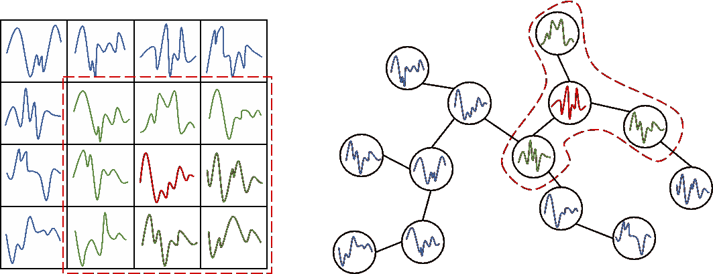
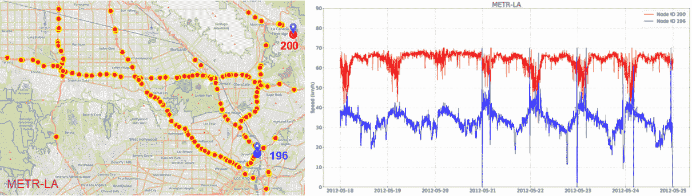
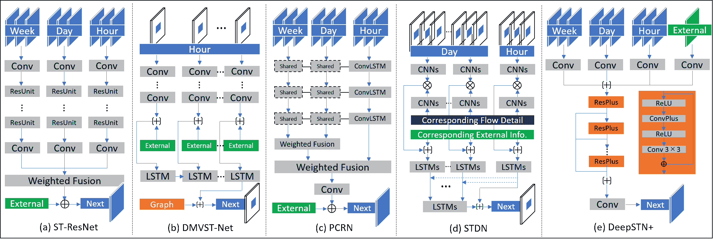
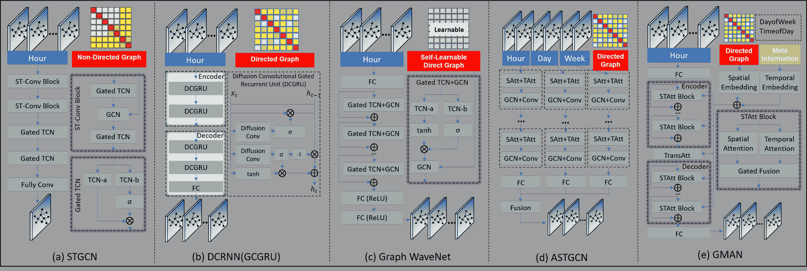
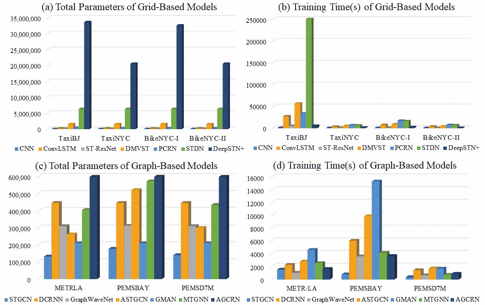
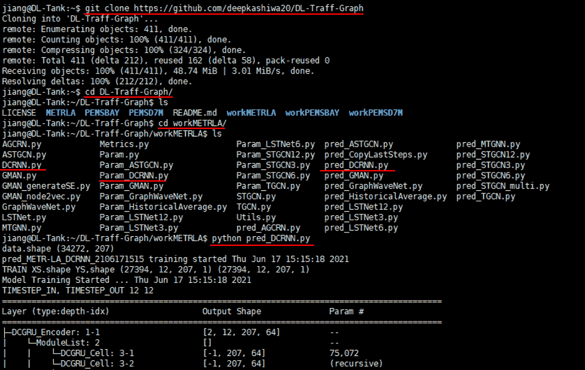

<!--yml

类别：未分类

日期：2024-09-06 19:51:58

-->

# [2108.09091] DL-Traff: 城市交通预测的深度学习模型调查与基准

> 来源：[`ar5iv.labs.arxiv.org/html/2108.09091`](https://ar5iv.labs.arxiv.org/html/2108.09091)

# DL-Traff: 城市交通预测的深度学习模型调查与基准

Renhe Jiang^(1,2)*, Du Yin²*, Zhaonan Wang¹, Yizhuo Wang², Jiewen Deng², Hangchen Liu², Zekun Cai¹, Jinliang Deng^(2,3), Xuan Song${}^{2,1}\dagger$, Ryosuke Shibasaki¹ ¹东京大学 日本 ²南方科技大学 中国 ³悉尼科技大学 澳大利亚 jiangrh@csis.u-tokyo.ac.jp; yind7@outlook.com; songxuan@csis.u-tokyo.ac.jp(2021)

###### 摘要。

如今，随着物联网（IoT）和网络物理系统（CPS）技术的快速发展，大量的时空数据正在通过手机、车载导航系统和交通传感器生成。通过利用这些数据上的最先进深度学习技术，城市交通预测在人工智能和智能交通系统社区中引起了广泛关注。这个问题可以用一个 3D 张量（T, N, C）来统一建模，其中 T 表示总时间步，N 表示空间域的大小（即网格或图节点），C 表示信息通道。根据具体的建模策略，最先进的深度学习模型可以分为三类：基于网格的、基于图的和多变量时间序列模型。在这项研究中，我们首先综合回顾了深度交通模型及其广泛使用的数据集，然后构建了一个标准基准，以相同的设置和指标全面评估它们的性能。我们的研究 DL-Traff 采用了两个最流行的深度学习框架，即 TensorFlow 和 PyTorch，已经公开为两个 GitHub 库：[`github.com/deepkashiwa20/DL-Traff-Grid`](https://github.com/deepkashiwa20/DL-Traff-Grid) 和 [`github.com/deepkashiwa20/DL-Traff-Graph`](https://github.com/deepkashiwa20/DL-Traff-Graph)。通过 DL-Traff，我们希望为那些对时空数据分析感兴趣的研究人员提供一个有用的资源。

交通预测，多变量时间序列，深度学习，普适计算和移动计算，调查和基准* 平等贡献；$\dagger$ 通讯作者。此项工作得到了日本学术振兴会（JSPS）早期职业科学家资助（20K19859）的支持。^†^†期刊年份：2021^†^†版权：acmcopyright^†^†会议：第 30 届 ACM 国际信息与知识管理会议论文集；2021 年 11 月 1 日至 5 日；虚拟会议，澳大利亚昆士兰州^†^†书名：第 30 届 ACM 国际信息与知识管理会议论文集（CIKM ’21），2021 年 11 月 1 日至 5 日，虚拟会议，澳大利亚昆士兰州^†^†价格：15.00^†^†doi: 10.1145/3459637.3482000^†^†isbn: 978-1-4503-8446-9/21/11^†^†ccs: 信息系统 信息系统应用^†^†ccs: 信息系统 地理信息系统^†^†ccs: 计算方法 人工智能

| 基于网格 | 会议 | 引用 | 数据集（*表示开放） | 预测任务 | 指标 |
| --- | --- | --- | --- | --- | --- |
| ST-ResNet(Zhang et al., 2017) | AAAI17 | 867 | TaxiBJ*, BikeNYC* | 出租车进出流 | RMSE |
| DeepSD(Wang et al., 2017) | ICDE17 | 125 | 滴滴出租车（杭州） | 出租车需求 | MAE, RMSE |
| DMVST-Net(Yao et al., 2018) | AAAI18 | 456 | 滴滴出租车（广州） | 出租车需求 | RMSE, MAPE |
| Periodic-CRN(Zonoozi et al., 2018) | IJCAI18 | 57 | TaxiBJ*, TaxiSG | 出租车密度/进出流 | RMSE |
| Hetero-ConvLSTM(Yuan et al., 2018) | KDD18 | 121 | 车辆事故数据* | 交通事故 | MSE, RMSE, CE |
| DeepSTN+(Lin et al., 2019) | AAAI19 | 53 | MobileBJ, BikeNYC-I* | 人群/出租车进出流 | MAE, RMSE |
| STDN(Yao et al., 2019) | AAAI19 | 204 | TaxiNYC*, BikeNYC-II* | 出租车/自行车 O-D 数量 | RMSE, MAPE |
| MDL(Zhang et al., 2019) | TKDE19 | 92 | TaxiBJ, BikeNYC | 出租车过渡/进出流 | MAE, RMSE |
| DeepUrbanEvent(Jiang et al., 2019) | KDD19 | 32 | Konzatsu Toukei | 人群密度/流量 | MSE |
| Curb-GAN (Zhang et al., 2020b) | KDD20 | 1 | 出租车速度/流入（深圳）* | 出租车速度/流入 | RMSE, MAPE |
| 基于图 | 会议 | 引用 | 数据集（*表示开放） | 预测任务 | 指标 |
| STGCN(Yu et al., 2018) | IJCAI18 | 660 | BJER4, PeMSD7(M)*, PeMSD7(L) | 交通流量/速度 | MAE, RMSE, MAPE |
| DCRNN(GCGRU)(Li et al., 2018) | ICLR18 | 691 | METR-LA*, PeMS-BAY* | 交通流量/速度 | MAE, RMSE, MAPE |
| Multi-graph(Chai et al., 2018) | SIGSPATIAL18 | 89 | 自行车流量（纽约和芝加哥） | 自行车进出流 | RMSE |
| ASTGCN(Guo et al., 2019) | AAAI19 | 239 | PeMSD4-I*, PeMSD8-I* | 交通流量/速度 | MAE, RMSE |
| DGCNN(Diao et al., 2019) | AAAI19 | 56 | TrafficNYC, PeMS | 交通流量/速度 | MAE, RMSE |
| ST-MGCN(Geng et al., 2019) | AAAI19 | 182 | 自行车需求（北京和上海） | 自行车需求 | MAE, RMSE, MAPE |
| Graph WaveNet（Wu 等，2019） | IJCAI19 | 144 | METR-LA*，PeMS-BAY* | 交通量/速度 | MAE，RMSE，MAPE |
| STG2Seq（Bai 等，2019） | IJCAI19 | 33 | DidiSY，BikeNYC*，TaxiBJ* | 出租车/自行车需求 | MAE，RMSE，MAPE |
| T-GCN（Zhao 等，2019） | TITS19 | 195 | TaxiSZ*，METR-LA* | 交通量/速度 | MAE，RMSE，Acc，$R^{2}$，var |
| TGC-LSTM（Cui 等，2019） | TITS19 | 166 | Seattle-Loop*，INRIX Traffic | 交通量/速度 | MAE，RMSE，MAPE |
| GCGA（Yu 和 Gu，2019） | TITS19 | 27 | 科隆交通 | 交通量/速度 | MAPE |
| GMAN（Zheng 等，2020） | AAAI20 | 73 | Taxi Xiamen，PeMS-BAY* | 交通量/速度 | MAE，RMSE，MAPE |
| MRA-BGCN（Chen 等，2020） | AAAI20 | 28 | METR-LA*，PeMS-BAY* | 交通量/速度 | MAE，RMSE，MAPE |
| STSGCN（Song 等，2020） | AAAI20 | 39 | PeMS03*，PeMS04*，PeMS07*，PeMS08* | 交通量/速度 | MAE，RMSE，MAPE |
| SLCNN（Zhang 等，2020a） | AAAI20 | 13 | METR-LA*，PeMS-BAY* | 交通量/速度 | MAE，RMSE，MAPE |
| PeMSD7（M）*，BJF，BRF，BRF-L |
| STGNN（Wang 等，2020） | WWW20 | 24 | METR-LA*，PeMS-BAY* | 交通量/速度 | MAE，RMSE，MAPE |
| H-STGCN（Dai 等，2020） | KDD20 | 9 | W3-715，E5-2907（北京） | 交通量/速度 | MAE，MAPE，RMSE |
| AGCRN（Bai 等，2020） | NeurIPS20 | 9 | PeMSD4*，PeMSD8* | 交通量/速度 | MAE，RMSE，MAPE |
| T-MGCN（Lv 等，2020） | TITS20 | 7 | HZJTD*，PeMSD10* | 交通量/速度 | MAE，RMSE，MAPE |
| DGCN（Guo 等，2020） | TITS20 | 1 | PeMSD4*，PeMSD8*，PHILADELPHIA | 交通量/速度 | MAE，RMSE |
| 多变量时间序列 | 场所 | 引用 | 数据集（* 表示公开） | 预测任务 | 评价指标 |
| LSTNet（Lai 等，2018） | SIGIR18 | 318 | PeMS-BAY*，太阳能* | 多变量时间序列 | RSE，CORR |
| 电力*，汇率* | 交通量/速度 |
| GaAN（GGRU）（Zhang 等，2018） | UAI18 | 214 | PPI，Reddit，METR-LA* | 节点分类 | MAE，RMSE |
| 交通量/速度 |
| GeoMAN（Liang 等，2018） | IJCAI18 | 182 | 水质，空气质量 | 多变量时间序列 | MAE，RMSE |
| ST-MetaNet（Pan 等，2019） | KDD19 | 91 | TaxiBJ-I*，METR-LA* | 出租车进出流量 | MAE，RMSE |
| 交通量/速度 |
| TPA-LSTM（Shih 等，2019） | ECMLPKDD19 | 88 | 太阳能*，交通（PeMS）* | 多变量时间序列 | RAE，RSE，CORR |
| 电力*，音乐*，汇率* | 交通量/速度 |
| Transformer（Li 等，2019） | NeurIPS19 | 84 | 电力*，交通*，太阳能*，风能* | 多变量时间序列 | $\rho$-分位数 |
| MTGNN（Wu 等，2020） | KDD20 | 32 | 太阳能*，交通（PeMS）* | 多变量时间序列 | MAE，RMSE，MAPE |
| 电力*，汇率* | 交通量/速度 | RSE，CORR |

表 1\. 先进模型的总结 *引用编号来源于 Google Scholar，截止至 2021/6/13*

## 1\. 介绍

如今，随着物联网（IoT）和网络物理系统（CPS）技术的快速发展，大量时空数据正从手机、车载导航系统和交通传感器中产生。基于这些数据，城市交通预测被认为是一个重要的研究问题，也是构建智能城市特别是智能交通系统的关键技术。从 2014 年到 2017 年，在深度学习技术在计算机视觉和自然语言处理领域取得巨大成功的鼓舞下，智能交通系统领域的研究人员开始将长短期记忆（LSTM）和卷积神经网络（CNN）应用于成熟的交通预测任务（Huang 等，2014；Lv 等，2014；Ma 等，2015，2017），并取得了前所未有的成功。继这些先驱者之后，研究人员利用先进的深度学习技术开发了各种预测模型，并在主要的人工智能和交通领域发表了大量研究，如表 1 所示。尽管预测任务可能有所不同，但它们都可以归类为深度交通模型。

图 1\. 基于网格的交通与基于图的交通。

无论是基于网格还是图形，图中的交通数据 1 都可以用一个 3D 张量$\mathbb{R}^{T\times N\times C}$来统一表示，其中 T 表示时间域的大小（即具有恒定采样率的时间段），N 表示空间域的大小（即网格或图节点），C 表示信息通道的数量。例如，假设部署了 300 个交通传感器，每 30 分钟记录一次交通速度（channel1）和流量（channel2），持续 100 天，则总数据可以由张量$\mathbb{R}^{4800\times 300\times 2}$表示。除了交通流量和速度，通道还可以用于存储人群密度、出租车需求、交通事故、车/打车订单以及人群/出租车/自行车的流入和流出。更具体地说，基于网格的模型将整个空间域划分为$H\times W$细粒度的网格，并将 3D 表示转换为 4D 张量$\mathbb{R}^{T\times H\times W\times C}$格式。基于图形的模型引入了有向或无向图$G$ = $(V,E)$，利用城市道路网络的拓扑结构进行建模，其中$v\in V$是一个节点，$|V|$ = $N$，$e\in E$是一个边。多变量时间序列模型自然将 N 个空间单元视为 N 个时间序列变量，并与基于图形的模型共享相同的表示，即$\mathbb{R}^{T\times N\times C}$。因此，表 1 中列出的深度学习模型可以根据空间轴上的特定建模策略分为三类。

通过表格 1 中的引用编号，我们可以了解这些研究在我们的 AI 和数据科学社区中引起了多少关注。但由于相关工作的数量庞大，研究人员往往难以跟进每个模型的具体细节。更重要的是，这类模型的评估仍然令人困惑且不够有组织。例如，某些模型通过使用不同的数据集或指标（如表格 1 所示）显示出比现有模型更优的性能，而一些模型利用了自设计的目标函数或额外的数据来源，如兴趣点（POI）数据（Lin et al., 2019）或导航应用数据（Dai et al., 2020）来提高预测准确性。为了解决这些问题，简明而精确的综述将对参与这一新兴主题的研究人员大有帮助。然而，仅有综述还不够。进行标准化的性能评估同样重要，通过使用相同的数据集、指标和其他实验设置来检验每个空间和时间组件的实际功能。本论文通过提供简明的综述并跟随最近深度交通模型的全面基准评估来满足这些需求。

我们首先在第二部分定义了两个基准任务，一个是基于网格数据的单步流入和流出预测，另一个是基于图数据的多步交通速度预测。其次，在第三部分中，我们调查了网格数据集和图数据集，并选择了一些公开的、广泛使用的基准数据，包括 TaxiBJ、BikeNYC、TaxiNYC、METR-LA、PeMS-BAY 和 PeMSD7M。接下来，在第四部分中，我们将模型分解为空间和时间单元，并给出模型在空间和时间轴上演变的路线图。此外，我们以直观且对比的方式绘制了一些代表性模型的架构（例如 ST-ResNet(Zhang et al., 2017)，DMVST-Net(Yao et al., 2018)，STDN(Yao et al., 2019)，DeepSTN+(Lin et al., 2019)，STGCN(Yu et al., 2018)，DCRNN(Li et al., 2018)，Graph WaveNet(Wu et al., 2019))。然后，在第五部分中，我们使用基准任务和数据集在相同的设置和指标（RMSE，MAE，MAPE）下对网格数据模型和图数据模型进行全面评估。在第六部分中，我们简要介绍了我们的基准测试的实现细节、可用性和实用性。最后，我们在第七部分给出了结论。我们的工作贡献总结如下：

+   •

    我们对近期的深度交通模型进行了简明但具体的综述。技术细节和演变在空间和时间轴上得到了清晰的总结。

+   •

    我们精心选择了两个交通流量预测任务、四个基于网格的交通数据集和三个基于图的交通数据集，并实现了大量的网格/图形状态的最新技术，形成了一个完整的基准测试集，称为 DL-Traff。

+   •

    在这个基准测试集上，我们对最新技术的有效性和效率进行了全面评估。

+   •

    我们的基准测试集是用两个最受欢迎的深度学习框架实现的，即 TensorFlow 和 PyTorch。DL-Traff 已经作为两个 GitHub 仓库公开：[`github.com/deepkashiwa20/DL-Traff-Grid`](https://github.com/deepkashiwa20/DL-Traff-Grid) 和 [`github.com/deepkashiwa20/DL-Traff-Graph`](https://github.com/deepkashiwa20/DL-Traff-Graph)。

使用 DL-Traff，（1）用户可以快速掌握有关最新深度时空模型的技术细节；（2）用户可以顺利复现本文报告的预测结果并将其作为基准；（3）用户可以轻松启动新的深度解决方案，使用 TensorFlow 或 PyTorch，不仅适用于交通流量预测任务，还可以用于其他时空问题，如异常/事故、电力消耗、空气质量等。

## 2\. 问题

在本文中，我们将以下两个预测任务纳入我们的基准测试集。

1.  (1)

    基于网格的流入和流出预测由(Hoang et al., 2016; Zhang et al., 2016)提出。问题是预测在下一个时间间隔内每个网格中将有多少出租车/自行车流入或流出。它以$\alpha$步的历史观测作为输入，给出下一个步骤的预测如下：[$X_{t-(\alpha-1)}$,…,$X_{t-1}$,$X_{t}$] $\rightarrow$ $X_{t+1}$，其中$X_{i}$ $\in$ $\mathbb{R}^{H\times W\times C}$，$H,W$是网格的索引，C 分别等于 2，用于流入和流出。

1.  (2)

    图形基础的交通速度预测如(Yu et al., 2018; Li et al., 2018)中所定义。为了对第一个任务进行变化，我们将此任务定义为多步到多步的任务，如下所示：[$X_{t-(\alpha-1)}$,…,$X_{t-1}$,$X_{t}$] $\rightarrow$ [$X_{t+1}$,$X_{t+2}$,…,$X_{t+\beta}$]，其中$X_{i}$ $\in$ $\mathbb{R}^{N\times C}$，$\alpha$/$\beta$是观测/预测的步骤数，$N$是交通传感器的数量（即节点），$C$等于 1，仅存储交通速度。

表 2\. 公共交通数据集的总结

| 基于网格的 | 参考文献 | 数据描述 / 数据来源 | 空间范围 | 时间段 | 时间间隔 |
| --- | --- | --- | --- | --- | --- |
| TaxiBJ* | (Zhang et al., 2017; Zonoozi et al., 2018) | 北京的出租车进出流量 / 出租车 GPS 数据 | 32$\times$32 网格 | 2013/7/1$\sim$2016/4/10 | 30 分钟 |
| (Bai et al., 2019) | *四个时间段* |
| TaxiBJ-I* | (Pan 等，2019) | 北京出租车进出流量 / 出租车 GPS 数据（TDrive） | 32$\times$32 网格 | 2015/2/1$\sim$2015/6/2 | 60 分钟 |
| BikeNYC* | (Zhang 等，2017； Bai 等，2019) | 纽约市自行车进出流量 / 自行车出行数据 | 16$\times$8 网格 | 2014/4/1$\sim$2014/9/30 | 60 分钟 |
| Citi Bike: [`www.citibikenyc.com/system-data`](https://www.citibikenyc.com/system-data) |
| BikeNYC-I* | (Lin 等，2019) | 纽约市自行车进出流量 / 自行车出行数据 | 21$\times$12 网格 | 2014/4/1$\sim$2014/9/30 | 60 分钟 |
| BikeNYC-II* | (Yao 等，2019) | 纽约市自行车进出流量 / 自行车出行数据 | 10$\times$20 网格 | 2016/7/1$\sim$2016/8/29 | 30 分钟 |
| TaxiNYC* | (Yao 等，2019) | 纽约市出租车进出流量 / 出租车出行数据 | 10$\times$20 网格 | 2015/1/1$\sim$2015/3/1 | 30 分钟 |
| 纽约市出租车及豪华轿车委员会 |
| (TLC) [`www1.nyc.gov/site/tlc/about/data.page`](https://www1.nyc.gov/site/tlc/about/data.page) |
| 基于图的 | 参考 | 数据描述 / 数据来源 | 空间领域 | 时间周期 | 时间间隔 |
| METR-LA* | (Wang 等，2020) | 洛杉矶县交通速度传感器 | 207 个传感器 | 2012/3/1$\sim$2012/6/30 | 5 分钟 |
| (Zhao 等，2019； Li 等，2018) | 洛杉矶大都市运输管理局 |
| (Wu 等，2019； Zhang 等，2018) | *与南加州大学合作* |
| (Chen 等，2020； Pan 等，2019) | [`imsc.usc.edu/platforms/transdec/`](https://imsc.usc.edu/platforms/transdec/) |
| PeMS-BAY* | (Li 等，2018； Lai 等，2018) | 加州交通速度传感器 | 325 个传感器 | 2017/1/1$\sim$2017/5/31 | 5 分钟 |
| (Wu 等，2019； Chen 等，2020) | Caltrans 性能测量系统（PeMS） |
| (Wang 等，2020； Zheng 等，2020) | PeMS: [`pems.dot.ca.gov/`](http://pems.dot.ca.gov/) |
| PeMSD7(M)* | (Yu 等，2018) | 加州交通速度传感器（PeMS） | 228 个传感器 | 2012/5/1$\sim$2012/6/30 | 5 分钟 |
| PeMS03* | (Song 等，2020) | 加州交通速度传感器（PeMS） | 358 个传感器 | 2018/9/1$\sim$2018/11/30 | 5 分钟 |
| PeMSD4(PeMS04)* | (Song 等，2020； Bai 等，2020) | 加州交通速度传感器（PeMS） | 307 个传感器 | 2018/1/1$\sim$2018/2/28 | 5 分钟 |
| PeMS07* | (Song 等，2020) | 加州交通速度传感器（PeMS） | 883 个传感器 | 2017/5/1$\sim$2017/8/31 | 5 分钟 |
| PeMSD8(PeMS08)* | (Song 等，2020； Bai 等，2020) | 加州交通速度传感器（PeMS） | 170 个传感器 | 2016/7/1$\sim$2016/8/31 | 5 分钟 |
| PeMSD4-I* | (郭等，2019) | 加利福尼亚的交通速度传感器（PeMS） | 3848 个传感器 | 2018/1/1$\sim$2018/2/28 | 5 分钟 |
| PeMSD8-I* | (郭等，2019) | 加利福尼亚的交通速度传感器（PeMS） | 1979 个传感器 | 2016/7/1$\sim$2016/8/31 | 5 分钟 |
| PeMSD10* | (吕等，2020) | 加利福尼亚的交通速度传感器（PeMS） | 608 个传感器 | 2018/1/1$\sim$2018/3/31 | 15 分钟 |
| Traffic(PeMS)* | (史等，2019；吴等，2020) | 加利福尼亚的交通速度传感器（PeMS） | 862 个传感器 | 2015/1/1$\sim$2016/12/31 | 60 分钟 |
| LOOP-SEATTLE* | (崔等，2019) | 大西雅图地区的交通速度传感器 | 323 个传感器 | 2015/1/1$\sim$2015/12/31 | 5 分钟 |
| TaxiSZ* | (赵等，2019) | 深圳的出租车道路速度/出租车 GPS 数据 | 156 条道路 | 2015/1/1$\sim$2015/1/31 | 15 分钟 |
| HZJTD* | (吕等，2020) | 杭州的交通速度传感器 | 202 个传感器 | 2013/10/16$\sim$2014/10/3 | 15 分钟 |
| 杭州综合交通研究中心 |

## 3\. 数据集

用于城市交通预测的公开数据集汇总在表格 2 中，其中列出了参考文献、来源、空间和时间规格。我们选择了一些广泛使用的数据集作为我们的基准数据集。

图 2\. METR-LA 的可视化。

### 3.1\. 基于网格的交通数据集

TaxiBJ。这是由（张等，2017）发布的出租车进出流量数据，来源于北京市四个不同时间段的出租车 GPS 数据：2013/7/1-2013/10/30、2014/3/1-2014/6/30、2015/3/1-2015/6/30，以及 2015/11/1-2016/4/10。基于相同的出租车 GPS 数据（T-Drive），（潘等，2019）创建了一个类似的数据集，标记为 TaxiBJ-I。

BikeNYC。这是来自 2014/4/1 到 2014/9/30 的纽约市自行车进出流量数据，使用了（张等，2017）。原始自行车行程数据由纽约市官方自行车共享系统 Citi Bike 发布，包含：行程时长、起始和结束车站 ID、开始和结束时间。类似的数据集 BikeNYC-I 和 BikeNYC-II 分别被（林等，2019）和（姚等，2019）使用。由于空间范围更大，我们将在实验中使用这两个数据集。

TaxiNYC。这是 2015/1/1 到 2015/3/1 的纽约市出租车进出流量数据，由（姚等，2019）使用。原始出租车行程数据由纽约市出租车和豪华车委员会（TLC）发布，包括接送时间/日期、接送地点、行程距离、详细费用、司机报告的乘客数量等。

### 3.2\. 基于图的交通数据集

METR-LA。这是由(Li et al., 2018)发布的洛杉矶交通数据。数据收集自 2012 年 3 月 1 日至 2012 年 6 月 30 日的 207 个高速公路传感器。许多研究使用了这个数据集，如表 2 所示。为了直观展示，制作了数据可视化图，如图 2 所示。

PeMS-BAY。这是从加州交通管理局绩效测量系统（PeMS）收集的交通流量数据集。它包含 2017 年 1 月 1 日至 2017 年 5 月 31 日的 325 个交通传感器。大量研究还利用相同的来源生成了各种 PeMS 数据集。

PeMSD7M。这一交通数据集由(Yu et al., 2018)创建和发布，也收集自 PeMS。它涵盖了 2012 年 5 月 1 日至 2012 年 6 月 30 日的 228 个交通传感器，工作日采样率为 5 分钟。

总结。由 Citi Bike 和纽约市 TLC 发布的出租车和自行车出行数据，以及来自加州 PeMS 的交通传感器数据，被认为是三种可靠且广泛使用的交通预测数据来源。研究人员可以通过表 2 中列出的 URL 轻松访问这些数据。

表 3\. 空间和时间建模所采用的基础技术

|  | 空间轴 | 时间轴 |  | 空间轴 | 时间轴 |
| --- | --- | --- | --- | --- | --- |
| 模型 | CNN | GCN | Attn. | LSTM | GRU | TCN | Attn. | 模型 | CNN | GCN | Attn. | LSTM | GRU | TCN | Attn. |
| ST-ResNet(Zhang et al., 2017) | ✓ |  |  |  |  |  |  | STGCN(Yu et al., 2018) |  | ✓ |  |  |  | ✓ |  |
| DMVST-Net(Yao et al., 2018) | ✓ |  |  | ✓ |  |  |  | GaAN(GGRU)(Zhang et al., 2018) |  | ✓ | ✓ |  | ✓ |  |  |
| STDN(Yao et al., 2019) | ✓ |  |  | ✓ |  |  | ✓ | DCRNN(GCGRU)(Li et al., 2018) |  | ✓ |  |  | ✓ |  |  |
| DeepSTN+(Lin et al., 2019) | ✓ |  |  |  |  |  |  | 多图（Chai et al., 2018) |  | ✓ |  | ✓ |  |  |  |
| LSTNet(Lai et al., 2018) | ✓ |  |  |  | ✓ | ✓ | ✓ | ASTGCN(Guo et al., 2019) |  | ✓ | ✓ |  |  |  | ✓ |
| GeoMAN(Liang et al., 2018) |  |  | ✓ | ✓ |  |  | ✓ | TGCN(Zhao et al., 2019) |  | ✓ |  |  | ✓ |  |  |
| TPA-LSTM(Shih et al., 2019) |  |  |  | ✓ |  | ✓ | ✓ | Graph WaveNet(Wu et al., 2019) |  | ✓ |  |  |  | ✓ |  |
| Transformer(Li et al., 2019) |  |  |  |  |  |  | ✓ | MTGNN(Wu et al., 2020) |  | ✓ |  |  |  | ✓ |  |
| ST-MetaNet(Pan et al., 2019) |  |  | ✓ |  | ✓ |  |  | STGNN(Wang et al., 2020) |  | ✓ | ✓ |  | ✓ |  | ✓ |
| GMAN（郑等，2020） |  |  | ✓ |  |  |  | ✓ | AGCRN（白等，2020） |  | ✓ |  |  | ✓ |  |  |

## 4\. 模型

复杂的空间和时间依赖性是城市交通预测任务中的关键挑战。从时间上看，未来预测依赖于近期观察结果以及过去的周期性模式；从空间上看，某个网格或图节点的交通状态受到附近及远处节点的影响。为了捕捉时间依赖性，LSTM（Hochreiter 和 Schmidhuber，1997）及其简化变体 GRU（Chung 等，2014）被模型分别利用，如表 3 所示。与 RNNs 并行，1D CNN 及其增强版 TCN（Yu 和 Koltun，2016）也被用作时间建模的核心技术，并展现了优越的时间效率和与 LSTM 及 GRU 相匹配的效果。

另一方面，为了捕捉空间依赖性，基于网格的模型由于网格间距的自然欧几里得属性，简单地使用常规卷积操作（LeCun 等，1998）；基于图的模型则利用非欧几里得空间中的图卷积（Defferrard 等，2016；Kipf 和 Welling，2017），通过涉及每对空间单元之间的邻接关系 $A\in$ $\mathbb{R}^{N*N}$。与此同时，自注意力机制（Vaswani 等，2017），也称为 Transformer，自 2020 年以来已迅速在 AI 社区从自然语言（GPT-3）到视觉领域取得了突破。因此，自注意力机制也被引入作为建模空间和时间依赖性的基础技术。

我们选择了表格 1 中的最具代表性的模型，并总结了每个模型在空间和时间建模中使用的基础技术，如表格 3 所示。另一方面，为了更好地理解，我们将包括 ST-ResNet(Zhang et al., 2017)、DMVST-Net(Yao et al., 2018)、Periodic-CRN(PCRN)(Zonoozi et al., 2018)、STDN(Yao et al., 2019)和 DeepSTN+(Lin et al., 2019)在内的五种基于网格的模型的网络架构统一简化并绘制，如图 3 所示，以及五种基于图的模型，即 STGCN(Yu et al., 2018)、DCRNN(Li et al., 2018)、Graph WaveNet(Wu et al., 2019)、ASTGCN(Guo et al., 2019)和 GMAN(Zheng et al., 2020)，如图 4 所示。通过图 3$\sim$4，我们可以轻松理解表格 3 中列出的空间和时间模块如何组装成一个集成模型。

此外，我们在接下来的两个小节中描述了所采用技术在空间和时间轴上的演变情况，包括网格模型和图模型。需要注意的是，多变量时间序列（MTS）模型，如 LSTNet(Lai et al., 2018)、TPA-LSTM(Shih et al., 2019)、GeoMAN(Liang et al., 2018)和 Transformer(Li et al., 2019)也在逐渐沿着空间和时间轴演变。从空间角度来看，它们关注于变数之间的相关性/依赖性；从时间角度来看，它们旨在利用时间序列中的周期性模式。但由于篇幅限制，本文不详细扩展这些 MTS 模型的细节。

### 4.1\. 基于网格模型的路线图

ST-ResNet（Zhang 等，2017）是最早且最具代表性的网格基深度学习方法，用于交通流量预测。它通过在每个时间步连接通道，将 4D 张量（$T$,$H$,$W$,$C$）转换为 3D 张量（$H$,$W$,$T$*$C$），以便 CNN 可以像处理图像一样捕捉空间依赖性。然后，它创造性地提出了一组称为$Closeness$、$Period$和$Trend$的时间特征，分别对应于*最新的观察数据*、*每日周期性*和*每周趋势*。直观地，这三部分特征可以表示为：

$X^{Closeness}$ = [$X_{t-l_{c}}$, $X_{t-(l_{c}-1)}$, …, $X_{t-1}$]

$X^{Period}$ = [$X_{t-l_{p}\times s_{p}}$, $X_{t-(l_{p}-1)\times s_{p}}$, …, $X_{t-s_{p}}$]

$X^{Trend}$ = [$X_{t-l_{q}\times s_{q}}$, $X_{t-(l_{q}-1)\times s_{q}}$, …, $X_{t-s_{q}}$]

其中，$l_{c}$、$l_{p}$、$l_{q}$分别是{$Closeness$、$Period$、$Trend$}的序列长度，$s_{p}$和$s_{q}$是$Period$和$Trend$的时间跨度，$Closeness$的跨度$s_{c}$默认为 1。这个特征不仅被后来的网格基模型如 STDN（Yao 等，2019）和 DeepSTN+（Lin 等，2019）继承，还被一些图基模型如 ASTGCN（Guo 等，2019）所采用，目前仍被视为最先进的时间特征。为了捕捉网格间的长距离空间依赖性，它采用了 Residual Learning 来构建足够深的 CNN 网络。此外，它还进一步利用外部信息，包括天气、事件和元数据（即 DayOfWeek、WeekdayOrWeekend），来辅助增强时空建模。

图 3\. 代表性网格基模型的架构。

图 4\. 代表性图基模型的架构。

空间轴的改进。与 ST-ResNet 使用整个网格作为输入不同，DMVST-Net（Yao 等，2018）和 STDN（Yao 等，2019）仅使用一个网格及其周围网格（即 $S$$\times$$S$ 区域）作为输入，因此一个局部 CNN 足以捕捉仅在附近网格之间的空间依赖性。对于全局空间依赖性，DMVST-Net 引入了一个加权图作为额外输入，其中节点为网格，每个边表示任意两个网格之间两个时间序列值（即历史出租车需求）的相似性。该图将被手动嵌入到特征向量中，以便与其他部分进行连接。通过这种方式，DMVST-Net 获得了捕捉长距离空间依赖性的能力。此外，STDN 和（Zhang 等，2019；Jiang 等，2019）考虑了局部流信息（即从一个中心网格到其周围 $S$$\times$$S$ 网格的流量），以促进对中心网格交通量的预测，这在 STDN 中通过流量门控机制实现，在（Zhang 等，2019；Jiang 等，2019）中通过多任务学习实现。DeepSTN+（Lin 等，2019）使用兴趣点（POI）数据作为外部信息（例如办公室/住宅/购物区），以考虑位置功能对人群/交通流的影响。

时间轴的改进。ST-ResNet 的一个主要缺点是它没有明确处理时间轴，因为它强制将类似视频的张量（$T$，$H$，$W$，$C$）转换为类似图像的张量（$H$，$W$，$T$*$C$）。为了解决这个问题，DMVST-Net 和 STDN 使用 LSTM 与每个时间戳的独立且不共享的 CNN 连接。STDN 进一步考虑了周期性（即交通数据并不严格周期性）的时间偏移问题，并设计了 *周期性偏移注意机制* 来解决该问题。具体而言，它设置了一个小时间窗口，以收集当前预测时间前后 $Q$ 个时间间隔的数据。然后，注意力机制用于从 LSTM 生成的 $Q$ 个表示 {$h_{1}$，$h_{2}$，$...$，$h_{Q}$} 中获得加权平均表示 $h$。为此，LSTM 和 CNN 共同工作，分别且顺序地建模空间和时间依赖性。卷积 LSTM（Xingjian 等，2015）将全连接 LSTM（FC-LSTM）扩展为在输入到状态和状态到状态转换中都具有卷积结构，并在视频建模任务上取得了许多成功。受到此启发，（Zonoozi 等，2018；Yuan 等，2018；Jiang 等，2019）利用 ConvLSTM 及其变体 ConvGRU 来同时捕捉空间和时间依赖性。

表 4\. 基于网格的交通数据集单步预测性能评估

|  | TaxiBJ | BikeNYC-I | BikeNYC-II | TaxiNYC |
| --- | --- | --- | --- | --- |
| 模型 | RMSE | MAE | MAPE | RMSE | MAE | MAPE | RMSE | MAE | MAPE | RMSE | MAE | MAPE |
| 历史平均 | 45.004 | 24.475 | 8.04% | 15.676 | 4.882 | 5.45% | 4.874 | 1.500 | 3.30% | 21.535 | 7.121 | 4.56% |
| CopyLastStep | 23.609 | 13.372 | 6.20% | 14.152 | 4.344 | 5.01% | 4.999 | 1.606 | 3.50% | 18.660 | 6.497 | 4.91% |
| CNN(LeCun et al., 1998) | 23.550 | 13.797 | 8.46% | 12.064 | 4.088 | 5.82% | 4.511 | 1.574 | 3.98% | 16.741 | 6.884 | 8.08% |
| ConvLSTM(Xingjian et al., 2015) | 19.247 | 10.816 | 5.61% | 6.616 | 2.412 | 3.90% | 3.174 | 1.133 | 2.90% | 12.143 | 4.811 | 5.16% |
| ST-ResNet(Zhang et al., 2017) | 18.702 | 10.493 | 5.19% | 6.106 | 2.360 | 3.72% | 3.191 | 1.169 | 2.86% | 11.553 | 4.535 | 4.32% |
| DMVST-Net(Yao et al., 2018) | 20.389 | 11.832 | 5.99% | 7.990 | 2.833 | 3.93% | 3.521 | 1.287 | 2.97% | 13.605 | 4.928 | 4.49% |
| PCRN(Zonoozi et al., 2018) | 18.629 | 10.432 | 5.45% | 6.680 | 2.351 | 3.63% | 3.149 | 1.107 | 2.78% | 12.027 | 4.606 | 4.62% |
| DeepSTN+(Lin et al., 2019) | 18.141 | 10.126 | 5.14% | 6.205 | 2.489 | 3.48% | 3.205 | 1.245 | 2.80% | 11.420 | 4.441 | 4.45% |
| STDN(Yao et al., 2019) | 17.826 | 9.901 | 4.81% | 5.783 | 2.410 | 3.35% | 3.004 | 1.167 | 2.67% | 11.252 | 4.474 | 4.09% |

表 5\. 图基交通数据集多步预测的性能评估

|  |  | 3 Steps / 15 Minutes Ahead | 6 Steps / 30 Minutes Ahead | 12 Steps / 60 Minutes Ahead |
| --- | --- | --- | --- | --- |
| 数据集 | 模型 | RMSE | MAE | MAPE | RMSE | MAE | MAPE | RMSE | MAE | MAPE |
| METR-LA | 历史平均 | 14.737 | 11.013 | 23.34% | 14.737 | 11.010 | 23.34% | 14.736 | 11.005 | 23.33% |
| CopyLastSteps | 14.215 | 6.799 | 16.73% | 14.214 | 6.799 | 16.73% | 14.214 | 6.798 | 16.72% |
| LSTNet(Lai et al., 2018) | 8.067 | 3.914 | 9.27% | 10.181 | 5.219 | 12.22% | 11.890 | 6.335 | 15.38% |
| STGCN(Yu et al., 2018) | 7.918 | 3.469 | 8.57% | 9.948 | 4.263 | 10.70% | 11.813 | 5.079 | 13.09% |
| DCRNN(Li et al., 2018) | 7.509 | 3.261 | 8.00% | 9.543 | 4.021 | 10.12% | 11.854 | 5.080 | 13.08% |
| Graph WaveNet(Wu et al., 2019) | 7.512 | 3.204 | 7.62% | 9.445 | 3.922 | 9.52% | 11.485 | 4.848 | 11.93% |
| ASTGCN(Guo et al., 2019) | 7.977 | 3.624 | 9.13% | 10.042 | 4.514 | 11.57% | 12.092 | 5.776 | 14.85% |
| GMAN(Zheng et al., 2020) | 8.869 | 4.139 | 10.88% | 9.917 | 4.517 | 11.77% | 11.910 | 5.475 | 14.10% |
|  | MTGNN(Wu et al., 2020) | 7.707 | 3.277 | 8.02% | 9.625 | 3.999 | 10.00% | 11.624 | 4.867 | 12.17% |
|  | AGCRN(Bai et al., 2020) | 7.558 | 3.292 | 8.17% | 9.499 | 4.016 | 10.16% | 11.502 | 4.901 | 12.43% |
| PeMS-BAY | 历史平均 | 6.687 | 3.333 | 8.10% | 6.686 | 3.333 | 8.10% | 6.685 | 3.332 | 8.10% |
| CopyLastSteps | 7.022 | 3.052 | 6.84% | 7.016 | 3.049 | 6.84% | 7.05 | 3.044 | 6.83% |
| LSTNet（Lai 等，2018） | 3.224 | 1.643 | 3.47% | 4.375 | 2.383 | 5.04% | 5.515 | 2.974 | 6.86% |
| STGCN（Yu 等，2018） | 2.827 | 1.327 | 2.79% | 3.887 | 1.698 | 3.81% | 4.748 | 2.055 | 5.02% |
| DCRNN（Li 等，2018） | 2.867 | 1.377 | 2.96% | 3.905 | 1.726 | 3.97% | 4.798 | 2.091 | 4.99% |
| Graph WaveNet（Wu 等，2019） | 2.759 | 1.322 | 2.78% | 3.737 | 1.660 | 3.75% | 4.562 | 1.991 | 4.75% |
| ASTGCN（Guo 等，2019） | 3.057 | 1.435 | 3.25% | 4.066 | 1.795 | 4.40% | 4.770 | 2.103 | 5.30% |
| GMAN（Zheng 等，2020） | 4.219 | 1.802 | 4.47% | 4.143 | 1.794 | 4.40% | 5.034 | 2.186 | 5.29% |
|  | MTGNN（Wu 等，2020） | 2.849 | 1.334 | 2.84% | 3.800 | 1.658 | 3.77% | 4.491 | 1.950 | 4.59% |
|  | AGCRN（Bai 等，2020） | 2.856 | 1.354 | 2.94% | 3.818 | 1.670 | 3.84% | 4.570 | 1.964 | 4.69% |
| PEMSD7M | HistoricalAverage | 7.077 | 3.917 | 9.90% | 7.083 | 3.920 | 9.92% | 7.095 | 3.925 | 9.95% |
| CopyLastSteps | 9.591 | 5.021 | 12.33% | 9.594 | 5.022 | 12.33% | 9.597 | 5.024 | 12.34% |
| LSTNet（Lai 等，2018） | 4.308 | 2.423 | 5.73% | 8.951 | 5.132 | 12.22% | 10.881 | 6.624 | 16.72% |
| STGCN（Yu 等，2018） | 4.051 | 2.124 | 5.02% | 5.532 | 2.783 | 6.96% | 6.695 | 3.374 | 8.74% |
| DCRNN（Li 等，2018） | 4.143 | 2.213 | 5.33% | 5.679 | 2.907 | 7.41% | 7.138 | 3.670 | 9.81% |
| Graph WaveNet（Wu 等，2019） | 3.992 | 2.130 | 5.00% | 5.332 | 2.715 | 6.75% | 6.431 | 3.266 | 8.47% |
| ASTGCN（Guo 等，2019） | 4.257 | 2.340 | 5.83% | 5.506 | 2.992 | 7.69% | 6.587 | 3.572 | 9.48% |
| GMAN（Zheng 等，2020） | 5.711 | 2.877 | 7.25% | 6.171 | 3.084 | 7.77% | 7.897 | 3.988 | 10.02% |
|  | MTGNN（Wu 等，2020） | 4.032 | 2.120 | 5.02% | 5.373 | 2.687 | 6.70% | 6.496 | 3.204 | 8.24% |
|  | AGCRN（Bai 等，2020） | 4.073 | 2.167 | 5.19% | 5.479 | 2.769 | 6.89% | 6.733 | 3.358 | 8.55% |

### 4.2\. 基于图的模型路线图

STGCN（Yu et al., 2018）是最早利用图神经网络进行交通流预测的模型之一。从时间上看，它使用了 TCN（Yu and Koltun, 2016）和一个门控机制，如图 4 所示，而不是 RNN，以捕捉仅来自$Closeness$特征的依赖关系。从空间上看，它应用了两个谱图卷积，ChebyNet（Defferrard et al., 2016）和 ChebyNet 的 1 阶近似（Kipf and Welling, 2017）。TCN 和 GCN 被堆叠在一起，形成一个 ST-Conv 块，用于顺序地进行空间和时间建模。STGCN 的一个主要限制是，它使用对称的邻接矩阵（即，无向图），只考虑两个路传感器之间的欧几里得距离。因此，很难建模一条道路上双向交通流的差异。DCRNN（Li et al., 2018）是另一个开创性地利用图卷积进行交通流预测的模型。与 STGCN 中的谱卷积相比，DCRNN 应用了一种称为扩散卷积的空间图卷积，该卷积通过在有向图（即，非对称邻接矩阵）上进行双向随机游走来实现，从而可以捕捉来自上下游交通流的空间影响。对于时间轴，类似于 ConvLSTM，它用提议的扩散卷积替代了 GRU 中的普通矩阵乘法，然后组装了一个扩散卷积门控递归单元（DCGRU），能够同时进行空间和时间建模。利用这个 DCGRU，它进一步实现了一个编码器-解码器结构，以支持多步到多步的预测。受到 STGCN 和 DCRNN 的启发，已经提出了大量基于图的交通模型，如表 1 所总结的。

沿时间轴的改进。对于时间特征，ASTGCN(Guo et al., 2019) 继承了 ST-ResNet 中的 $Closeness$、$Period$ 和 $Trend$，并改进了仅采用 $Closeness$ 的 STGCN。此外，STSGCN(Song et al., 2020) 通过将所有节点与前后步骤的节点连接起来来构建局部时间图，将邻接矩阵从 $A$$\in$$\mathbb{R}^{N*N}$ 更新为 $A^{\prime}$$\in$$\mathbb{R}^{3N*3N}$，然后仅使用 GCN 同时进行空间和时间建模。另一方面，为了获得更好的时间建模能力，T-GCN(Zhao et al., 2019) 和 TGC-LSTM(Cui et al., 2019) 分别使用 GRU 和 LSTM 替代 TCN 来改进 STGCN；GCGA(Yu and Gu, 2019) 将生成对抗网络(GAN)和自编码器与 GCN 结合；STGNN(Wang et al., 2020) 采用 transformer（注意力机制）以实现更好的全球/长期时间建模；STG2Seq(Bai et al., 2019) 使用 GCN 进行时间建模，这是一个有趣的尝试。

沿空间轴的改进。大量工作集中在空间轴，即图上。(1) 从单图到多图。STGCN 和 DCRNN 仅使用单个图（有向或无向）来描述空间关系。然而，区域之间存在多模态相关性和复合空间依赖。因此，一系列研究将单图提升为多图。例如，(Chai et al., 2018) 和 ST-MGCN(Geng et al., 2019) 将空间邻近、功能相似性和道路连通性视为多图，T-MGCN(Lv et al., 2020) 也是如此；H-STGCN(Dai et al., 2020) 将旅行时间相关矩阵和最短路径距离矩阵视为复合矩阵；MRA-BGCN(Chen et al., 2020) 根据道路网络距离构建节点图，根据连通性和竞争构建边缘图。(2) 从静态图到自适应图。Graph WaveNet(Wu et al., 2019)、TGC-LSTM(Cui et al., 2019) 和 AGCRN(Bai et al., 2020) 采用自适应/可学习图，而不是 STGCN 和 DCRNN 中使用的静态图；DGCNN(Diao et al., 2019) 提出通过张量分解学习动态拉普拉斯矩阵；SLCNN(Zhang et al., 2020a) 设计了结构学习卷积（SLC）以动态学习全局/局部图结构。除此之外，增强注意力的 GCN 在 GaAN(Zhang et al., 2018)、ASTGCN 和 GMAN(Zheng et al., 2020) 中也表现出了更好的空间建模性能。

## 5. 评估

### 5.1. 设置

针对第二部分列出的基准任务，我们挑选了一些代表性模型并进行了全面的性能评估。除了深度模型外，我们还实现了两个简单的基线模型，如下所示：（1）HistoricalAverage(HA)。我们将历史天的数据值取平均作为预测结果；（2）CopyLastStep(s)。我们直接将最后一步或多步的结果作为预测结果。我们的实验在配备四块 GeForce GTX 2080Ti 显卡的 GPU 服务器上进行。作为基准评估，每个模型的设置保持一致。网格模型的观察步长设置为 6，而图形模型的观察步长和预测步长都设置为 12。训练、验证和测试的数据比例设置为 7:1:2。Adam 被设置为默认优化器，学习率设为 0.001，批量大小默认设为 64。均方误差（Mean Absolute Error）被统一用作损失函数。如果验证误差在 10 个周期内收敛，则训练算法将提前停止，或者在 200 个周期后停止，最佳模型将保存于验证数据上。根均方误差（RMSE）、均方误差（MAE）和平均绝对百分比误差（MAPE）被用作评估指标，其中零值将被忽略。

### 5.2\. 效果评估

单步预测的网格模型评估见表 4；多步预测的图形模型评估见表 5。

对于网格模型的评估：表格 4 显示，最先进的模型确实在基准（HA $\sim$ ConvLSTM）上具有优势。特别是，STDN 表现出更好的总体性能，PCRN 和 DeepSTN+ 分别在 BikeNYC-I 和 TaxiNYC 上达到了最低 MAE。目前，没有这些基于网格的模型能够被认为是主导的。通过实验，我们发现它们的主要局限性如下：（1）ST-ResNet 将视频样的数据转换为高维图像样的数据，并使用简单的融合机制来处理不同类型的时间依赖关系；（2）通过实验发现，PCRN 需要更多的训练轮次才能收敛，并且容易导致过拟合；（3）DMVST-Net 和 STDN 使用局部 CNN 将网格（像素）作为计算单元，导致训练时间较长；（4）DeepSTN+ 在 $ConvPlus$ 模块中使用了全连接层，这会导致 TaxiBJ 上参数数量较大；（5）多任务学习模型（Zhang et al., 2019; Jiang et al., 2019）需要多个数据源作为输入，这限制了其适用性。

对于基于图的模型的评估：表格 5 比较了我们选择的模型在 METR-LA、PeMS-BAY、PEMSD7M 数据集上 15 分钟、30 分钟、60 分钟的预测性能。通过表格 5，我们可以发现：（1）尽管时间序列模型 LSTNet 在短期预测中的效果良好，但随着预测时间的延长，其性能会恶化；（2）几乎所有基于图的模型在所有指标上均优于传统方法和时间序列模型，这证明了空间信息的增加会带来显著的性能提升；（3）尽管模型的性能或多或少取决于数据集，但 DCRNN、Graph WaveNet 和 MTGNN 在所有数据集上的评分均排在前 3 名，这也证明了它们在交通预测任务中的鲁棒性和多样性；（4）GMAN 被发现更容易过拟合，因此在所有三个数据集上的表现不如 LSTNet；这可能是因为 GMAN 采用了全局注意力机制来捕捉节点对之间的空间依赖；（5）MTGNN 和 GraphWaveNet 在不同数据集和指标上获得了大多数最高分。自适应/可学习的图展示了其在交通预测中的巨大有效性。

图 5\. 基于图的数据显示的案例研究。

案例研究：我们随机选择了一天（24 小时）和一个传感器（节点）从三个数据集（即 METR-LA、PEMS-BAY 和 PEMSD7M），并绘制了真实值和预测值的时间序列，如图 5。为了使时间序列图清晰，除了真实值外，我们仅绘制了 LSTNet、DCRNN 和 Graph WaveNet 的预测结果，而不是表 5 中列出的所有模型。通过图 5，我们可以观察到：(1) 三个模型都能学习所有三个数据集中的峰值和谷值趋势；(2) 基于图的模型 DCRNN 和 Graph WaveNet 始终优于时间序列模型 LSTNet，这证明了 GCN 在捕捉空间相关性和依赖性方面的优异性能；(3) 在所有三个预测结果中都能观察到时间滞后，特别是当原始时间序列中发生剧烈波动时，如 PEMSD7M 中的 2012/6/20 21:00。这一问题在长期预测如 60 分钟预测时会被放大。尽管如此，基于图的模型在波动预测误差方面仍表现出更好的性能，这进一步验证了 GCN 在交通预测中的有效性和鲁棒性。

图 6\. 效率总结。

### 5.3\. 效率评估

除了比较这些深度模型的效果外，我们还提供了它们效率的分析。这些方法的空间复杂度和时间复杂度对其未来应用至关重要，因此我们通过柱状图展示了每个模型的可训练参数数量和训练时间，如图 6。

对于基于网格的模型：从图 6-(a) 和图 6-(b) 可以观察到：(1) DeepSTN+ 和 STDN 的参数数量多于其他模型，尤其是 DeepSTN+，它通过利用全连接层捕获了城市范围的空间关联；(2) ST-ResNet 拥有最少的可训练参数，在空间复杂度方面优于其他模型；(3) STDN 和 DMVST 的训练时间比其他模型长，因为它们利用 LSTM 捕捉时间依赖性，并将每个网格作为计算单位，而不是整个网格。

图 6-(c) 和图 6-(d) 显示了以下结论：(1) STGCN 和 GMAN 的空间复杂度相对较低；(2) AGCRN 和 DCRNN 需要比其他模型更多的参数，因为它们基于 RNN；(3) 在 PEMSBAY 上，ASTGCN 和 MTGNN 的参数数量显著增加。这是因为这两个模型有更多的 GNN 层，并且对节点数量更为敏感；(4) GMAN 在 PEMSBAY 上的训练时间超过其他模型，因为它对整个图（节点）应用了全局注意力机制。总之，像 STGCN 和 Graph WaveNet 这样的基于 TCN 的模型具有更高的计算效率。

## 6\. 可用性和实用性

DL-Traff 已在 GitHub 上以 MIT 许可证发布，包含以下两个库：一个用于基于网格的数据集/模型 [`github.com/deepkashiwa20/DL-Traff-Grid`](https://github.com/deepkashiwa20/DL-Traff-Grid)，另一个用于基于图的的数据集/模型 [`github.com/deepkashiwa20/DL-Traff-Graph`](https://github.com/deepkashiwa20/DL-Traff-Graph)。它使用 Python 和最流行的深度学习框架实现：Keras(Chollet, 2015) 在 TensorFlow(Abadi et al., 2015) 和 PyTorch(Paszke et al., 2019) 上。图 7 展示了以 DCRNN 模型在 METR-LA 数据集上的用例。要运行基准测试，应将仓库克隆到本地并创建一个包含必要依赖项的 conda 环境。目录结构为扁平样式，只有两个层级。交通数据集存储在 DATA 目录（例如，METRLA）中，Python 文件放在 workDATA 目录（例如，workMETRLA）中。进入某个数据集的工作目录，我们可以找到 MODEL 类文件（例如，DCRNN.py）及其相应的运行程序名为 pred_MODEL.py（例如，pred_DCRNN.py）。我们可以运行“python MODEL.py”来简单检查模型架构而无需输入训练数据，并运行“python pred_MODEL.py”来训练和测试模型。此外，Param.py 文件包含第 5.1 节中描述的各种超参数，以统一方式定制实验。Metrics.py 文件包含第 5.1 节中列出的度量函数。Utils.py 文件集成了一组支持函数，如 pickle 文件读取器和自定义损失函数。有关可用性和实现的更多细节，请参见 GitHub。

图 7\. DL-Traff 使用案例示意图。

## 7\. 结论

在本文中，我们首先调查了用于城市交通预测的深度学习模型及广泛使用的数据集。然后，我们建立了一个标准基准，全面评估选定开放数据集上的深度交通模型。调查和基准结合起来形成了我们的研究，称为 DL-Traff，该研究已经在[`github.com/deepkashiwa20/DL-Traff-Grid`](https://github.com/deepkashiwa20/DL-Traff-Grid)和[`github.com/deepkashiwa20/DL-Traff-Graph`](https://github.com/deepkashiwa20/DL-Traff-Graph)上提供。通过 DL-Traff，我们希望向人工智能和数据科学社区的研究人员提供一个有用且及时的资源。

## 参考文献

+   (1)

+   Abadi 等人（2015）Martín Abadi、Ashish Agarwal、Paul Barham、Eugene Brevdo、Zhifeng Chen、Craig Citro、Greg S. Corrado、Andy Davis、Jeffrey Dean、Matthieu Devin、Sanjay Ghemawat、Ian Goodfellow、Andrew Harp、Geoffrey Irving、Michael Isard、Yangqing Jia、Rafal Jozefowicz、Lukasz Kaiser、Manjunath Kudlur、Josh Levenberg、Dan Mané、Rajat Monga、Sherry Moore、Derek Murray、Chris Olah、Mike Schuster、Jonathon Shlens、Benoit Steiner、Ilya Sutskever、Kunal Talwar、Paul Tucker、Vincent Vanhoucke、Vijay Vasudevan、Fernanda Viégas、Oriol Vinyals、Pete Warden、Martin Wattenberg、Martin Wicke、Yuan Yu 和 Xiaoqiang Zheng. 2015. TensorFlow: 大规模异构系统上的机器学习。 [`tensorflow.org/`](http://tensorflow.org/) 软件可从 tensorflow.org 获取。

+   Bai 等人（2019）Lei Bai、Lina Yao、Salil Kanhere、Xianzhi Wang、Quan Sheng 等. 2019. Stg2seq: 空间-时间图到序列模型用于多步乘客需求预测。见于 *IJCAI*。1981–1987。

+   Bai 等人（2020）Lei Bai、Lina Yao、Can Li、Xianzhi Wang 和 Can Wang. 2020. 用于交通预测的自适应图卷积递归网络。见于 *第 34 届神经信息处理系统会议*。

+   Chai 等人（2018）Di Chai、Leye Wang 和 Qiang Yang. 2018. 使用多图卷积网络进行自行车流量预测。见于 *第 26 届 ACM SIGSPATIAL 国际地理信息系统进展会议论文集*。397–400。

+   Chen 等人（2020）Weiqi Chen、Ling Chen、Yu Xie、Wei Cao、Yusong Gao 和 Xiaojie Feng. 2020. 用于交通预测的多范围注意力双组件图卷积网络。见于 *AAAI 人工智能会议论文集*，第 34 卷。3529–3536。

+   Chollet（2015）François Chollet. 2015. keras. [`github.com/fchollet/keras`](https://github.com/fchollet/keras)。

+   Chung 等人（2014）Junyoung Chung、Caglar Gulcehre、Kyunghyun Cho 和 Yoshua Bengio. 2014. 对序列建模中的门控递归神经网络的实证评估。见于 *NIPS 2014 深度学习研讨会，2014 年 12 月*。

+   Cui 等人（2019）Zhiyong Cui、Kristian Henrickson、Ruimin Ke 和 Yinhai Wang. 2019. 交通图卷积递归神经网络：网络规模交通学习与预测的深度学习框架。 *IEEE 智能交通系统汇刊*（2019）。

+   Dai 等人（2020）Rui Dai、Shenkun Xu、Qian Gu、Chenguang Ji 和 Kaikui Liu. 2020. 混合时空图卷积网络：通过导航数据改善交通预测。见于 *第 26 届 ACM SIGKDD 知识发现与数据挖掘国际会议论文集*。3074–3082。

+   Defferrard 等人（2016）Michaël Defferrard、Xavier Bresson 和 Pierre Vandergheynst. 2016. 图上的卷积神经网络与快速局部光谱过滤。见于 *神经信息处理系统进展*。3844–3852。

+   Diao 等人（2019）Zulong Diao、Xin Wang、Dafang Zhang、Yingru Liu、Kun Xie 和 Shaoyao He. 2019. 用于交通预测的动态时空图卷积神经网络。载于 *AAAI 人工智能会议论文集*，第 33 卷，890–897 页。

+   Geng 等人（2019）Xu Geng、Yaguang Li、Leye Wang、Lingyu Zhang、Qiang Yang、Jieping Ye 和 Yan Liu. 2019. 用于打车需求预测的时空多图卷积网络。载于 *2019 AAAI 人工智能会议（AAAI’19）*。

+   Guo 等人（2020）Kan Guo、Yongli Hu、Zhen Qian、Yanfeng Sun、Junbin Gao 和 Baocai Yin. 2020. 基于拉普拉斯矩阵估计的潜在网络的动态图卷积网络用于交通预测。*IEEE 智能交通系统汇刊*（2020）。

+   Guo 等人（2019）Shengnan Guo、Youfang Lin、Ning Feng、Chao Song 和 Huaiyu Wan. 2019. 基于注意力的时空图卷积网络用于交通流量预测。载于 *AAAI 人工智能会议论文集*，第 33 卷，922–929 页。

+   Hoang 等人（2016）Minh X Hoang、Yu Zheng 和 Ambuj K Singh. 2016. 基于大数据的城市范围人群流量预测。*ACM SIGSPATIAL*（2016）。

+   Hochreiter 和 Schmidhuber（1997）Sepp Hochreiter 和 Jürgen Schmidhuber. 1997. 长短期记忆。*神经计算* 9, 8（1997），1735–1780 页。

+   Huang 等人（2014）Wenhao Huang、Guojie Song、Haikun Hong 和 Kunqing Xie. 2014. 用于交通流预测的深度架构：带有多任务学习的深度信念网络。*IEEE 智能交通系统汇刊* 15, 5（2014），2191–2201 页。

+   Jiang 等人（2019）Renhe Jiang、Xuan Song、Dou Huang、Xiaoya Song、Tianqi Xia、Zekun Cai、Zhaonan Wang、Kyoung-Sook Kim 和 Ryosuke Shibasaki. 2019. DeepUrbanEvent：一个预测城市重大事件人群动态的系统。载于 *第 25 届 ACM SIGKDD 国际知识发现与数据挖掘会议论文集*。ACM，2114–2122 页。

+   Kipf 和 Welling（2017）Thomas N Kipf 和 Max Welling. 2017. 基于图卷积网络的半监督分类。（2017）。

+   Lai 等人（2018）Guokun Lai、Wei-Cheng Chang、Yiming Yang 和 Hanxiao Liu. 2018. 使用深度神经网络建模长期和短期时间模式。载于 *第 41 届国际 ACM SIGIR 信息检索研究与开发会议*。95–104 页。

+   LeCun 等人（1998）Yann LeCun、Léon Bottou、Yoshua Bengio 和 Patrick Haffner. 1998. 应用于文档识别的基于梯度的学习。*IEEE 计算机学报* 86, 11（1998），2278–2324 页。

+   Li 等人（2019）Shiyang Li、Xiaoyong Jin、Yao Xuan、Xiyou Zhou、Wenhu Chen、Yu-Xiang Wang 和 Xifeng Yan. 2019. 增强变换器在时间序列预测中的局部性并突破记忆瓶颈。载于 *神经信息处理系统进展*。5243–5253 页。

+   Li 等（2018）**雅光·李**、**罗斯·余**、**赛勒斯·沙赫比** 和 **燕·刘**。2018。扩散卷积递归神经网络：数据驱动的交通预测。在*国际学习表征会议*。

+   Liang 等（2018）**玉轩·梁**、**松宇·柯**、**俊博·张**、**修文·易** 和 **宇·郑**。2018。Geoman：用于地理传感时间序列预测的多层注意力网络。在*国际人工智能会议（IJCAI）*。3428–3434。

+   Lin 等（2019）**子倩·林**、**杰·冯**、**紫阳·卢**、**勇·李** 和 **德朋·金**。2019。DeepSTN+：用于大都市人群流动预测的上下文感知空间-时间神经网络。AAAI。

+   Lv 等（2020）**明奇·吕**、**赵雄·洪**、**凌·陈**、**铁名·陈**、**天甜·朱** 和 **寿龄·季**。2020。用于交通流预测的时间多图卷积网络。*IEEE 智能交通系统汇刊*（2020）。

+   Lv 等（2014）**义生·吕**、**艳杰·段**、**文文·康**、**正熙·李** 和 **飞跃·王**。2014。利用大数据进行交通流预测：一种深度学习方法。*IEEE 智能交通系统汇刊* 16, 2（2014），865–873。

+   Ma 等（2017）**晓磊·马**、**庄·戴**、**正兵·何**、**季辉·马**、**勇·王** 和 **云鹏·王**。2017。将交通学习视为图像：用于大规模交通网络速度预测的深度卷积神经网络。*传感器* 17, 4（2017），818。

+   Ma 等（2015）**晓磊·马**、**志敏·陶**、**银海·王**、**海洋·余** 和 **云鹏·王**。2015。利用遥感微波传感器数据进行交通速度预测的长短期记忆神经网络。*交通研究 C 部分：新兴技术* 54（2015），187–197。

+   Pan 等（2019）**哲毅·潘**、**玉轩·梁**、**伟峰·王**、**勇·余**、**宇·郑** 和 **俊博·张**。2019。利用深度元学习进行城市交通预测。在*第 25 届 ACM SIGKDD 国际知识发现与数据挖掘大会论文集*。ACM，1720–1730。

+   Paszke 等（2019）**亚当·帕兹克**、**萨姆·格罗斯**、**弗朗西斯科·马萨**、**亚当·勒雷**、**詹姆斯·布拉德伯里**、**格雷戈里·查南**、**特雷弗·基林**、**曾铭·林**、**娜塔利亚·吉梅尔谢因**、**卢卡·安蒂加**、**阿尔班·德斯梅松**、**安德烈亚斯·科普夫**、**爱德华·杨**、**扎克里·德维托**、**马丁·赖森**、**阿利汗·特贾尼**、**萨桑克·基拉姆库尔西**、**布诺瓦·斯坦**、**卢·方**、**俊杰·白** 和 **苏米特·钦塔拉**。2019。PyTorch：一种命令式风格的高性能深度学习库。在*神经信息处理系统进展 32*，H. Wallach、H. Larochelle、A. Beygelzimer、F. d'Alché-Buc、E. Fox 和 R. Garnett（编）。Curran Associates, Inc., 8024–8035。 [`papers.neurips.cc/paper/9015-pytorch-an-imperative-style-high-performance-deep-learning-library.pdf`](http://papers.neurips.cc/paper/9015-pytorch-an-imperative-style-high-performance-deep-learning-library.pdf)

+   Shih 等（2019）**舜耀·石**、**凡铿·孙** 和 **洪一·李**。2019。用于多变量时间序列预测的时间模式注意力。*机器学习* 108, 8-9（2019），1421–1441。

+   Song et al. (2020) Chao Song, Youfang Lin, Shengnan Guo, 和 Huaiyu Wan. 2020. 空间-时间同步图卷积网络：一种用于空间-时间网络数据预测的新框架。发表于 *AAAI 人工智能会议*，第 34 卷。914–921。

+   Vaswani et al. (2017) Ashish Vaswani, Noam Shazeer, Niki Parmar, Jakob Uszkoreit, Llion Jones, Aidan N Gomez, Lukasz Kaiser, 和 Illia Polosukhin. 2017. 注意力机制即为一切。发表于 *NIPS*。

+   Wang et al. (2017) Dong Wang, Wei Cao, Jian Li, 和 Jieping Ye. 2017. DeepSD：使用深度神经网络进行在线打车服务的供需预测。发表于 *2017 IEEE 第 33 届数据工程国际会议 (ICDE)*。IEEE, 243–254。

+   Wang et al. (2020) Xiaoyang Wang, Yao Ma, Yiqi Wang, Wei Jin, Xin Wang, Jiliang Tang, Caiyan Jia, 和 Jian Yu. 2020. 通过空间-时间图神经网络进行交通流量预测。发表于 *The Web Conference 2020*。1082–1092。

+   Wu et al. (2020) Zonghan Wu, Shirui Pan, Guodong Long, Jing Jiang, Xiaojun Chang, 和 Chengqi Zhang. 2020. 连接点：使用图神经网络进行多变量时间序列预测。发表于 *第 26 届 ACM SIGKDD 国际知识发现与数据挖掘会议*。753–763。

+   Wu et al. (2019) Zonghan Wu, Shirui Pan, Guodong Long, Jing Jiang, 和 Chengqi Zhang. 2019. 图 WaveNet 用于深度空间-时间图建模。发表于 *IJCAI*。1907–1913。

+   Xingjian et al. (2015) SHI Xingjian, Zhourong Chen, Hao Wang, Dit-Yan Yeung, Wai-Kin Wong, 和 Wang-chun Woo. 2015. 卷积 LSTM 网络：一种用于降水预报的机器学习方法。发表于 *Advances in neural information processing systems*。802–810。

+   Yao et al. (2019) Huaxiu Yao, Xianfeng Tang, Hua Wei, Guanjie Zheng, 和 Zhenhui Li. 2019. 重新审视空间-时间相似性：一种用于交通预测的深度学习框架。发表于 *2019 AAAI 人工智能会议 (AAAI’19)*。

+   Yao et al. (2018) Huaxiu Yao, Fei Wu, Jintao Ke, Xianfeng Tang, Yitian Jia, Siyu Lu, Pinghua Gong, Jieping Ye, 和 Zhenhui Li. 2018. 深度多视图时空网络用于出租车需求预测。发表于 *第三十二届 AAAI 人工智能会议*。

+   Yu et al. (2018) Bing Yu, Haoteng Yin, 和 Zhanxing Zhu. 2018. 时空图卷积网络：一种用于交通预测的深度学习框架。发表于 *第 27 届国际人工智能联合会议*。AAAI Press, 3634–3640。

+   Yu and Koltun (2016) Fisher Yu 和 Vladlen Koltun. 2016. 通过扩张卷积进行多尺度上下文聚合。发表于 *ICLR*。

+   Yu and Gu (2019) James Jian Qiao Yu 和 Jiatao Gu. 2019. 基于图卷积生成自编码器的实时交通速度估计。*IEEE Transactions on Intelligent Transportation Systems* 20, 10 (2019), 3940–3951。

+   Yuan et al. (2018) Zhuoning Yuan, Xun Zhou, 和 Tianbao Yang. 2018. Hetero-ConvLSTM: 一种用于异质时空数据交通事故预测的深度学习方法。见于*第 24 届 ACM SIGKDD 国际知识发现与数据挖掘会议*。ACM, 984–992。

+   Zhang et al. (2018) Jiani Zhang, Xingjian Shi, Junyuan Xie, Hao Ma, Irwin King, 和 Dit Yan Yeung. 2018. GaAN: 用于大规模时空图学习的门控注意力网络。见于*第 34 届人工智能不确定性会议 2018，UAI 2018*。

+   Zhang et al. (2017) Junbo Zhang, Yu Zheng, 和 Dekang Qi. 2017. 城市范围人群流动预测的深度时空残差网络。见于*AAAI*。1655–1661。

+   Zhang et al. (2016) Junbo Zhang, Yu Zheng, Dekang Qi, Ruiyuan Li, 和 Xiuwen Yi. 2016. 基于 DNN 的时空数据预测模型。见于*第 24 届 ACM SIGSPATIAL 国际地理信息系统进展会议*。ACM, 92。

+   Zhang et al. (2019) Junbo Zhang, Yu Zheng, Junkai Sun, 和 Dekang Qi. 2019. 基于多任务深度学习的时空网络流量预测。*IEEE 知识与数据工程学报* (2019)。

+   Zhang et al. (2020a) Qi Zhang, Jianlong Chang, Gaofeng Meng, Shiming Xiang, 和 Chunhong Pan. 2020a. 用于交通预测的时空图结构学习。见于*AAAI 人工智能会议论文集*，第 34 卷。1177–1185。

+   Zhang et al. (2020b) Yingxue Zhang, Yanhua Li, Xun Zhou, Xiangnan Kong, 和 Jun Luo. 2020b. Curb-GAN: 通过时空生成对抗网络的城市交通条件估计。见于*第 26 届 ACM SIGKDD 国际知识发现与数据挖掘会议*。842–852。

+   Zhao et al. (2019) Ling Zhao, Yujiao Song, Chao Zhang, Yu Liu, Pu Wang, Tao Lin, Min Deng, 和 Haifeng Li. 2019. T-gcn: 一种用于交通预测的时间图卷积网络。*IEEE 智能交通系统学报* (2019)。

+   Zheng et al. (2020) Chuanpan Zheng, Xiaoliang Fan, Cheng Wang, 和 Jianzhong Qi. 2020. Gman: 用于交通预测的图形多重注意力网络。见于*AAAI 人工智能会议论文集*，第 34 卷。1234–1241。

+   Zonoozi et al. (2018) Ali Zonoozi, Jung-jae Kim, Xiao-Li Li, 和 Gao Cong. 2018. Periodic-CRN: 用于人群密度预测的卷积递归模型与周期性模式。见于*IJCAI*。3732–3738。
