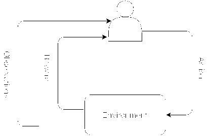

<!--yml

分类：未分类

日期：2024-09-06 19:51:45

-->

# [2108.11510] 计算机视觉中的深度强化学习：综合调查

> 来源：[`ar5iv.labs.arxiv.org/html/2108.11510`](https://ar5iv.labs.arxiv.org/html/2108.11510)

# 计算机视觉中的深度强化学习：

综合调查

Ngan Le^(∗∗)    Vidhiwar Singh Rathour^∗    Kashu Yamazaki^∗    Khoa Luu    Marios Savvides

###### 摘要

深度强化学习扩展了强化学习框架，并利用了深度神经网络的强大表示能力。最近的研究展示了深度强化学习在金融、医学、医疗保健、视频游戏、机器人技术和计算机视觉等多个领域的显著成功。在这项工作中，我们提供了对计算机视觉中深度强化学习的最新和最前沿研究进展的详细回顾。我们从*理解理论*开始，包括深度学习、强化学习和深度强化学习。接着我们*提出了一种分类*的深度强化学习方法，并*讨论了它们的优点和局限性*。特别是，我们根据在计算机视觉中的应用，将深度强化学习分为*七个主要类别*，即 (i) 地标定位 (ii) 物体检测 (iii) 物体跟踪 (iv) 2D 图像和 3D 图像体数据的配准 (v) 图像分割 (vi) 视频分析；以及 (vii) 其他应用。每个类别都进一步分析了强化学习技术、网络设计和性能。此外，我们提供了对现有公开数据集的全面分析，并检查了源代码的可用性。最后，我们提出了一些未解的问题，并讨论了计算机视觉中深度强化学习的未来研究方向。

## 1 引言

强化学习（RL）是一种通过试错学习在交互环境中学习一系列动作的机器学习技术，其目标是最大化期望奖励 [351]。深度强化学习（DRL）是强化学习与深度学习（DL）的结合，已成为当前人工智能领域最引人注目的领域之一。DRL 能够解决广泛的复杂现实世界决策问题，这些问题以前是无法处理的，并具有类似人类的智能。DRL 被[316]和[106]分别选为 2013 年和 2017 年的十项突破性技术之一。

过去几年见证了深度强化学习（DRL）的迅速发展，得益于其在解决现实世界复杂决策问题上的惊人成就。DRL 已经成功应用于许多领域，包括游戏、机器人技术、自动驾驶、医疗保健、自然语言处理和计算机视觉。与需要大量标记训练数据的监督学习不同，DRL 从环境中采样训练数据。这为那些没有大量标记训练数据的机器学习应用打开了许多可能性。

与监督学习不同，基于 DRL 的方法专注于解决顺序决策问题。它们旨在根据通过与环境互动收集的一系列经验，决定在不确定环境中的行动序列以实现某些目标。不同于监督学习，其中反馈在每次系统动作后都可以获得，DRL 框架中的反馈通常只是一个可能会延迟的标量值。例如，整个系统的成功或失败是在一系列动作之后才会反映出来。此外，监督学习模型是基于输出的损失/错误进行更新的，并且当输出错误时没有机制来获取正确值。DRL 中的策略梯度通过在没有可微分损失函数的情况下分配梯度来解决这个问题。这旨在教会模型随机尝试，并学会更多地做正确的事情。

最近介绍了许多关于 DRL 领域的综述论文，包括[13] [97] [414]。虽然[13]涵盖了 DRL 中的核心算法，[97]提供了对 DRL 模型、算法和技术的介绍，特别关注与泛化相关的方面以及 DRL 如何用于实际应用。最近，[414]介绍了一项综述，讨论了 RL 技术在医疗保健领域的广泛应用，从慢性疾病和重症监护中的动态治疗方案，到从非结构化和结构化临床数据中自动医疗诊断，再到渗透到医疗保健系统各个方面的许多控制或调度领域。与之前的工作不同，我们的综述专注于如何在各种计算机视觉应用中实现 DRL，如地标检测、物体检测、物体跟踪、图像配准、图像分割和视频分析。

我们的目标是为读者提供关于 RL/DRL 原理的良好知识，并全面覆盖 DRL 在计算机视觉任务中应用的最新示例。我们将本文的其余部分结构化如下：我们首先在第二部分介绍深度学习（DL）的基础知识，包括多层感知机（MLP）、自编码器、深度信念网络、卷积神经网络（CNNs）、递归神经网络（RNNs）。然后，我们在第三部分介绍 RL 的理论，从马尔可夫决策过程（MDP）开始，继续讲解价值函数和 Q 函数。在第三部分的最后，我们介绍了 RL 中两类技术：基于模型的和无模型的 RL。接下来，我们在第四部分介绍 DRL，重点讲解价值方法、策略梯度方法和演员-评论家方法在基于模型和无模型类别中的主要技术。然后，第 5、第 6、第 7、第 8、第 9、第 10、第十一部分分别介绍了 DRL 在地标检测、目标检测、目标跟踪、图像配准、图像分割、视频分析和 DRL 其他应用中的应用。每个应用类别首先介绍问题，然后讨论和比较该领域的最新方法，通过总结表格呈现。我们将在第十二部分讨论一些未来的展望，包括 DRL 在计算机视觉中的挑战和近期先进技术。

## 2 深度学习简介

### 2.1 多层感知机（MLP）

简单来说，深度学习模型是大型且深层的人工神经网络。我们以最简单的神经网络为例，这种网络被称为“神经元”，如图 1 ‣ 2 Introduction to Deep Learning ‣ Deep Reinforcement Learning in Computer Vision: A Comprehensive Survey") 所示。一个神经元的计算模型被称为感知器，它由一个或多个输入、一个处理器和一个输出组成。

图 1：一个神经元的示例，它以 $\textbf{x}=[x_{1},x_{2},x_{3}]$ 作为输入，以截距项 $+1$ 作为偏置，并计算输出 o。

图 2：多层感知器网络 (MLP) 的示例

图 3：各种深度学习架构的示意图。（a）：自编码器 (AE)；（b）：深度置信网络；（c）：卷积神经网络 (CNN)；（d）：递归神经网络 (RNN)。

在这个例子中，神经元是一个计算单元，它以 $\textbf{x}=[x_{0},x_{1},x_{2}]$ 作为输入，以截距项 $+1$ 作为偏置 b，计算输出 o。这个简单网络的目标是学习一个函数 $f:\mathrm{R^{N}}\rightarrow\mathrm{R^{M}}$，其中 $N$ 是输入 x 的维度数量，$M$ 是输出的维度数量，计算公式为 $\textbf{o}=f(\textbf{x},\theta)$，其中 $\theta$ 是一组权重，称为权重 $\theta=\{w_{i}\}$。在数学上，一个神经元的输出 o 定义为：

|  | $\textbf{o}=f(\textbf{x},\theta)=\sigma\left(\sum_{i=1}^{N}{w_{i}x_{i}+b}\right)=\sigma(\textbf{W}^{T}\textbf{x}+b)$ |  | (1) |
| --- | --- | --- | --- |

在这个方程中，$\sigma$ 是逐点非线性激活函数。隐藏单元的常见非线性激活函数有双曲正切（Tanh）、sigmoid、softmax、ReLU 和 LeakyReLU。一个典型的多层感知器（MLP）神经网络由一个输入层、一个输出层和多个隐藏层组成。每一层可能包含多个单元。在这个网络中，x 是输入层，o 是输出层。中间层称为隐藏层。在图 2 ‣ 2 Introduction to Deep Learning ‣ Deep Reinforcement Learning in Computer Vision: A Comprehensive Survey")(b) 中，MLP 包含 3 个输入层单元、3 个隐藏层单元和 1 个输出层单元。

一般来说，我们考虑一个具有 $L$ 层隐藏单元的 MLP 神经网络，一个输入单元层和一个输出单元层。输入单元的数量是 $N$，输出单元的数量是 $M$，第 $l^{th}$ 层的隐藏单元数量是 $N^{l}$。第 $l^{th}$ 层的第 $j^{th}$ 单元和 $(l+1)^{th}$ 层的第 $i^{th}$ 单元之间的权重用 $w_{ij}^{l}$ 表示。第 $l^{th}$ 层的第 $i^{th}$ 单元的激活值为 $\textbf{h}_{i}^{l}$。

图 4：典型卷积网络的架构用于图像分类，包含三个基本层：卷积层、池化层和全连接层

### 2.2 自编码器

自编码器是一种无监督算法，用于表示学习，如特征选择或维度减少。有关变分自编码器（VAE）的温和介绍见[11]，VAE 框架在图 3 ‣ 2 Introduction to Deep Learning ‣ Deep Reinforcement Learning in Computer Vision: A Comprehensive Survey")(a)中有所说明。一般来说，VAE 旨在通过最大化训练数据的边际对数似然来学习一个参数化的潜变量模型。

### 2.3 深度置信网络

深度置信网络（DBN）和深度自编码器是两种常见的无监督学习方法，它们被用来初始化网络而不是随机初始化。虽然深度自编码器基于自编码器，深度置信网络则基于限制玻尔兹曼机（RBM），RBM 包含一个输入数据层和一个隐含单元层，隐含单元层学习表示能够捕捉数据中高阶相关性的特征，如图 3 ‣ 2 Introduction to Deep Learning ‣ Deep Reinforcement Learning in Computer Vision: A Comprehensive Survey")(b)所示。

### 2.4 卷积神经网络（CNN）

卷积神经网络（CNN）[204] [203] 是一种特殊的全连接 MLP，它实现了权重共享以处理数据。CNN 利用信号的空间相关性，以更合理的方式利用架构。其架构在一定程度上受到生物视觉系统的启发，具有两个关键属性，使其在图像应用中极为有用：空间共享权重和空间池化。这些网络学习的特征是平移不变的，即在整个图像中都有效的滤波器（因为图像统计是静态的）。池化层负责减少输出对输入轻微位移和失真的敏感性，并增加下一层的接受域。自 2012 年以来，深度学习领域最显著的成果之一是使用 CNN 在 ImageNet 分类挑战中取得了显著的目标识别改进[72] [187]。

一个典型的 CNN 由多个阶段组成，如图 3 ‣ 2 深度学习介绍 ‣ 计算机视觉中的深度强化学习：全面综述")(c) 所示。每个阶段的输出由一组称为特征图的 2D 数组组成。每个特征图是一个卷积（及可选的池化）滤波器应用于整个图像的结果。每次卷积后都会应用一个逐点非线性激活函数。在其更一般的形式下，CNN 可以写作

|  | <math alttext="\begin{split}\textbf{h}^{0}=&amp;\textbf{x}\\ \textbf{h}^{l}=&amp;pool^{l}(\sigma_{l}(\textbf{w}^{l}\textbf{h}^{l-1}+\textbf{b}^{l})),\forall l\in{1,2,...L}\\

\textbf{o}=&amp;\textbf{h}^{L}\\

\end{split}" display="block"><semantics ><mtable columnspacing="0pt" displaystyle="true" rowspacing="0pt" ><mtr ><mtd columnalign="right" ><mrow ><msup ><mtext >h</mtext><mn  >0</mn></msup><mo >=</mo></mrow></mtd><mtd columnalign="left" ><mtext >x</mtext></mtd></mtr><mtr ><mtd  columnalign="right" ><mrow ><msup ><mtext >h</mtext><mi >l</mi></msup><mo >=</mo></mrow></mtd><mtd columnalign="left" ><mrow ><mrow ><mrow ><mrow ><mi  >p</mi><mo lspace="0em" rspace="0em"  >​</mo><mi >o</mi><mo lspace="0em" rspace="0em"  >​</mo><mi >o</mi><mo lspace="0em" rspace="0em"  >​</mo><msup ><mi  >l</mi><mi >l</mi></msup><mo lspace="0em" rspace="0em"  >​</mo><mrow ><mo stretchy="false" >(</mo><mrow ><msub ><mi >σ</mi><mi >l</mi></msub><mo lspace="0em" rspace="0em" >​</mo><mrow ><mo stretchy="false" >(</mo><mrow ><mrow ><msup ><mtext >w</mtext><mi >l</mi></msup><mo lspace="0em" rspace="0em" >​</mo><msup ><mtext >h</mtext><mrow ><mi >l</mi><mo >−</mo><mn >1</mn></mrow></msup></mrow><mo >+</mo><msup ><mtext >b</mtext><mi >l</mi></msup></mrow><mo stretchy="false"  >)</mo></mrow></mrow><mo stretchy="false"  >)</mo></mrow></mrow><mo >,</mo><mrow ><mo rspace="0.167em"  >∀</mo><mi >l</mi></mrow></mrow><mo >∈</mo><mn >1</mn></mrow><mo >,</mo><mrow ><mn >2</mn><mo >,</mo><mrow ><mi mathvariant="normal"  >…</mi><mo lspace="0em" rspace="0em"  >​</mo><mi >L</mi></mrow></mrow></mrow></mtd></mtr><mtr ><mtd  columnalign="right" ><mrow ><mtext >o</mtext><mo >=</mo></mrow></mtd><mtd columnalign="left" ><msup ><mtext >h</mtext><mi >L</mi></msup></mtd></mtr></mtable><annotation-xml encoding="MathML-Content" ><apply ><csymbol cd="ambiguous" >formulae-sequence</csymbol><apply ><apply  ><apply ><csymbol cd="ambiguous" >superscript</csymbol><ci ><mtext >h</mtext></ci><cn type="integer" >0</cn></apply><apply ><ci ><mtext >x</mtext></ci><apply ><csymbol cd="ambiguous" >superscript</csymbol><ci ><mtext >h</mtext></ci><ci >𝑙</ci></apply></apply></apply><apply ><apply  ><ci >𝑝</ci><ci >𝑜</ci><ci  >𝑜</ci><apply ><csymbol cd="ambiguous" >superscript</csymbol><ci >𝑙</ci><ci >𝑙</ci></apply><apply ><apply  ><csymbol cd="ambiguous"  >subscript</csymbol><ci >𝜎</ci><ci >𝑙</ci></apply><apply ><apply ><apply ><csymbol cd="ambiguous" >superscript</csymbol><ci ><mtext >w</mtext></ci><ci >𝑙</ci></apply><apply ><csymbol cd="ambiguous" >superscript</csymbol><ci ><mtext >h</mtext></ci><apply ><ci >𝑙</ci><cn type="integer" >1</cn></apply></apply></apply><apply ><csymbol cd="ambiguous" >superscript</csymbol><ci ><mtext >b</mtext></ci><ci >𝑙</ci></apply></apply></apply></apply></apply></apply><apply ><csymbol cd="ambiguous" >formulae-sequence</csymbol><apply ><apply ><csymbol cd="latexml" >for-all</csymbol><ci >𝑙</ci></apply><list ><cn type="integer" >1</cn><cn type="integer" >2</cn></list></apply><apply ><apply  ><ci >…</ci><ci >𝐿</ci><ci ><mtext >o</mtext></ci></apply><apply ><csymbol cd="ambiguous" >superscript</csymbol><ci ><mtext >h</mtext></ci><ci >𝐿</ci></apply></apply></apply></apply></annotation-xml><annotation encoding="application/x-tex" >\begin{split}\textbf{h}^{0}=&\textbf{x}\\ \textbf{h}^{l}=&pool^{l}(\sigma_{l}(\textbf{w}^{l}\textbf{h}^{l-1}+\textbf{b}^{l})),\forall l\in{1,2,...L}\\ \textbf{o}=&\textbf{h}^{L}\\ \end{split}</annotation></semantics></math> |  | (2) |

其中 $\textbf{w}^{l},\textbf{b}^{l}$ 是像 MLPs 中层 $l^{th}$ 的可训练参数。$\textbf{x}\in\mathrm{R}^{c\times h\times w}$ 是从输入图像向量化得到的，其中 $c$ 为颜色通道，$h$ 为图像高度，$w$ 为图像宽度。$\textbf{o}\in\mathrm{R}^{n\times h^{\prime}\times w^{\prime}}$ 是从输出向量（维度为 $n$）的 $h^{\prime}\times w^{\prime}$ 的数组向量化得到的。$pool^{l}$ 是层 $l^{th}$ 的（可选）池化函数。

与传统的机器学习方法相比，CNN 在包括图像理解、视频分析和音频/语音识别等许多领域中取得了最先进的性能。在图像理解中 [404], [426], CNN 超越了人类的能力 [39]。视频分析 [422], [217] 是另一个应用，它将 CNN 模型从检测器 [374] 转变为跟踪器 [94]。作为图像分割 [194], [193] 的特殊情况，显著性检测是另一个利用 CNN 的计算机视觉应用 [381], [213]。除了之前的应用，姿态估计 [290], [362] 是另一个有趣的研究，利用 CNN 估计人体姿势。静态图像和视频中的动作识别是识别的特殊情况，并且是一个具有挑战性的问题。[110] 利用基于 CNN 的上下文信息表示，其中在大量目标提议区域中最具代表性的次区域与上下文特征一起，用于描述主要区域。基于 CNN 的视频序列动作识别的综述见 [420]。使用 CNN 的文本检测和识别是光学字符识别（OCR） [406] 和词汇检测 [160] 的下一步。CNN 不仅在计算机视觉中取得成功，还成功应用于语音识别和语音合成 [274], [283], 生物识别 [242], [85], [281], [350], [304], [261], 生物医学 [191], [342], [192], [411]。

### 2.5 循环神经网络（RNN）

RNN 是一种极为强大的序列模型，早在 1990 年代初期就被引入 [172]。一个典型的 RNN 包含三个部分，即序列输入数据（$\textbf{x}_{t}$）、隐藏状态（$\textbf{h}_{t}$）和序列输出数据（$\textbf{y}_{t}$），如图 3 ‣ 2 深度学习简介 ‣ 计算机视觉中的深度强化学习：全面调查")(d) 所示。

RNN 利用序列信息，并对序列的每个元素执行相同的任务，其中输出依赖于之前的计算。时间步 $t$ 的隐藏状态激活作为当前输入符号 $\bf{x}_{t}$ 和之前隐藏状态 $\bf{h}_{t-1}$ 的函数 $f$ 来计算。时间 $t$ 的输出作为当前隐藏状态 $\bf{h}_{t}$ 的函数 $g$ 计算如下

|  | $\begin{split}\textbf{{h}}_{t}&=f(\textbf{Ux}_{t}+\textbf{Wh}_{t-1})\\ \textbf{y}_{t}&=g(\textbf{Vh}_{t})\end{split}$ |  | (3) |
| --- | --- | --- | --- |

其中 $\bf{U}$ 是输入到隐藏的权重矩阵，$\bf{W}$ 是状态到状态的递归权重矩阵，$\bf{V}$ 是隐藏到输出的权重矩阵。$f$ 通常是逻辑 sigmoid 函数或双曲正切函数，$g$ 定义为 softmax 函数。

大多数关于 RNN 的研究使用了通过时间的反向传播（BPTT）[318] 方法来训练参数集 $(\bf{U},\bf{V},\bf{W})$ 并将误差向后传播。在经典的反向传播中，误差或损失函数定义为

|  | $E(\textbf{y'},\textbf{y})=\sum_{t}{\|\textbf{y'}_{t}-\textbf{y}_{t}\|^{2}}$ |  | (4) |
| --- | --- | --- | --- |

其中 $\textbf{y}_{t}$ 是预测值，$\textbf{y'}_{t}$ 是标记的真实值。

对于特定的权重 W，梯度下降的更新规则定义为 $\textbf{W}^{new}=\textbf{W}-\gamma\frac{\partial E}{\partial\textbf{W}}$，其中 $\gamma$ 是学习率。在 RNN 模型中，使用随机梯度下降（SGD）和链式法则来学习误差相对于参数 U、V 和 W 的梯度。

训练 RNN 以捕捉长期依赖性的难度已在[26]中研究过。为了应对学习长期依赖性的问题，Hochreiter 和 Schmidhuber [139] 提出了长短期记忆（LSTM），它可以在内部维持一个独立的记忆单元，仅在必要时更新并暴露其内容。最近，[51] 提出了门控循环单元（GRU），使每个循环单元能够自适应地捕捉不同时间尺度的依赖性。与 LSTM 单元类似，GRU 具有门控单元来调节信息在单元内部的流动，但没有独立的记忆单元。

后来介绍了几种 RNN 的变体，并成功应用于各种任务，如自然语言处理 [257]、[214]、语音识别 [115]、[54]、机器翻译 [175]、[241]、问答 [138]、图像描述 [247]、[78] 等。

## 3 强化学习基础

本节简要介绍了 RL 中的理论模型和技术。为了提供 RL 方法主要组成部分的快速概述，某些基本概念和主要理论问题也得到澄清。RL 是一种机器学习方法，其中代理通过试错学习最优策略。与监督学习不同，反馈在每次系统动作后可用，在 RL 框架中，反馈只是一个可能会延迟的标量值，例如，整个系统的成功或失败是在一系列动作后体现的。此外，监督学习模型是基于输出的损失/错误进行更新的，并且没有机制在出错时获取正确的值。RL 中的策略梯度通过分配梯度而不使用可微分的损失函数来解决这个问题，这旨在教导模型随机尝试，并学习做正确的事情更多。

受行为心理学启发，RL 被提出以解决许多应用中存在的序列决策问题，如游戏、机器人、医疗保健、智能电网、股票、自动驾驶等。与给定数据的监督学习不同，人工代理通过与环境交互在 RL 框架中收集经验（数据）。然后收集这些经验以优化累积奖励/效用。

在本节中，我们重点讨论 RL 问题如何被形式化为一个能够在环境中做出决策以优化在奖励函数下呈现的一些目标的代理。RL 的一些关键方面是：(i) 解决序列决策问题；(ii) 没有监督者，只有以标量数字呈现的奖励；(iii) 反馈高度延迟。马尔可夫决策过程（MDP）是一个框架，通常用于解决大多数具有离散动作的 RL 问题，因此我们将首先讨论 MDP。在本节结束时，我们介绍值函数以及如何将 RL 分类为基于模型或无模型的方法。最后，我们讨论 RL 中的一些挑战。

图 5：RL 中代理与环境交互的示意图

### 3.1 马尔可夫决策过程

RL 的标准理论由马尔可夫决策过程（MDP）定义，它是马尔可夫过程（也称为马尔可夫链）的扩展。从数学上讲，马尔可夫过程是一种离散时间随机过程，其未来状态的条件概率分布仅依赖于当前状态，并且它提供了建模决策情境的框架。一个 MDP 通常由以下五个元素定义：

+   •

    $S$：环境的状态或观察空间集合。$s_{0}$ 是起始状态。

+   •

    $\mathcal{A}$：代理可以选择的动作集。

+   •

    $T$: 转移概率函数 $T(s_{t+1}|s_{t},a_{t})$，指定如果代理在状态 $s_{t}\in S$ 下采取动作 $a_{t}\in\mathcal{A}$，环境将以概率转移到状态 $s_{t+1}\in S$。

+   •

    $R$: 奖励函数，其中 $r_{t+1}=R(s_{t},s_{t+1})$ 是在状态 $s_{t}$ 下采取动作 $a_{t}$ 并转移到下一个状态 $s_{t+1}$ 时获得的奖励。

+   •

    $\gamma$: 折扣因子。

考虑 MDP($S$, $\mathcal{A}$, $\gamma$, $T$, $R$)，代理根据策略 $\pi(a_{t}|s_{t})$ 在状态 $s_{t}$ 下选择动作 $a_{t}$。值得注意的是，代理在给定当前状态 $s$ 时选择动作 $a$ 的算法，通常可以视为分布 $\pi(a|s)$，称为策略（策略）。环境接收到动作，产生奖励 $r_{t+1}$ 并根据转移概率 $T(s_{t+1}|s_{t},a_{t})$ 转移到下一个状态 $s_{t+1}$。该过程继续，直到代理到达终止状态或达到最大时间步。在强化学习框架中，元组 $(s_{t},a_{t},r_{t+1},s_{t+1})$ 称为转移。多个顺序转移通常被称为回滚。完整的序列 $(s_{0},a_{0},r_{1},s_{1},a_{1},r_{2},...)$ 被称为轨迹。理论上，轨迹是无限长的，但在大多数实际情况下具有 episodic 属性。某个有限长度 $\tau$ 的轨迹称为一个回合。对于给定的 MDP 和策略 $\pi$，观察到 $(s_{0},a_{0},r_{1},s_{1},a_{1},r_{2},...)$ 的概率称为轨迹分布，记作：

|  | $\mathcal{T}_{\pi}=\prod_{t}{\pi(a_{t} | s_{t})T(s_{t+1} | s_{t},a_{t})}$ |  | (5) |
| --- | --- | --- | --- | --- | --- |

强化学习的目标是为代理找到最优策略 $\pi^{*}$，该策略最大化累积奖励，这被称为回报。对于每个回合，回报被定义为即时奖励的加权和：

|  | $\mathcal{R}=\sum_{t=0}^{\tau-1}{\gamma^{t}r_{t+1}}$ |  | (6) |
| --- | --- | --- | --- |

因为策略会引发一个轨迹分布，所以期望奖励最大化可以写作：

|  | $\mathbb{E}_{{\mathcal{T}_{\pi}}}\sum_{t=0}^{\tau-1}{r_{t+1}}\rightarrow\max_{\pi}$ |  | (7) |
| --- | --- | --- | --- |

因此，给定 MDP 和策略 $\pi$，折扣期望奖励被定义为：

|  | $\mathcal{G}(\pi)=\mathbb{E}_{{\mathcal{T}_{\pi}}}\sum_{t=0}^{\tau-1}\gamma^{t}{r_{t+1}}$ |  | (8) |
| --- | --- | --- | --- |

强化学习的目标是找到一个最优策略 $\pi^{*}$，使折扣期望奖励最大化，即 $\mathcal{G}(\pi)\rightarrow\max_{\pi}$。

### 3.2 价值函数和 Q-函数

价值函数用于评估代理利用策略 $\pi$ 访问状态 $s$ 的好坏。这里的“好”是通过期望回报来定义的，即可以预期在未来收到的奖励，它取决于将采取的行动。数学上，价值是回报的期望值，价值的近似通过 Bellman 期望方程得到，如下所示：

|  | $\begin{split}V^{\pi}(s_{t})=\mathbb{E}[r_{t+1}+\gamma V^{\pi}(s_{t+1})]\end{split}$ |  | (9) |
| --- | --- | --- | --- |

$V^{\pi}(s_{t})$ 也称为状态价值函数，期望项可以展开为策略、转移概率和回报的乘积，如下所示：

|  | $\begin{split}V^{\pi}(s_{t})=\sum_{a_{t}\in\mathcal{A}}{\pi(a_{t} | s_{t})}\sum_{s_{t+1}\in S}{T(s_{t+1} | s_{t},a_{t})[R(s_{t},s_{t+1})+\gamma V^{\pi}(s_{t+1})]}\end{split}$ |  | (10) |
| --- | --- | --- | --- | --- | --- |

这个方程被称为贝尔曼方程。当智能体总是按照最大化价值的最优策略 $\pi^{*}$ 选择动作时，贝尔曼方程可以表示如下：

|  | $\begin{split}V^{*}(s_{t})=&\max_{a_{t}}\sum_{s_{t+1}\in S}{T(s_{t+1} | s_{t},a_{t})[R(s_{t},s_{t+1})+\gamma V^{*}(s_{t+1})]}\\ \overset{\Delta}{=}&\max_{a_{t}}Q^{*}(s_{t},a_{t})\end{split}$ |  | (11) |
| --- | --- | --- | --- | --- |

然而，获取最优价值函数 $V^{*}$ 并不能提供足够的信息来重建某些最优策略 $\pi^{*}$，因为现实世界环境复杂。因此，质量函数（Q-函数）也称为策略 $\pi$ 下的动作价值函数。Q-函数用于估计在策略 $\pi$ 下，智能体在某状态 ($s_{t}$) 执行动作 ($a_{t}$) 的好坏，它的引入如下：

|  | $Q^{\pi}(s_{t},a_{t})=\sum_{s_{t+1}}{T(s_{t+1} | s_{t},a_{t})[R(s_{t},s_{t+1})+\gamma V^{\pi}(s_{t+1})]}$ |  | (12) |
| --- | --- | --- | --- | --- |

与指定状态优劣的价值函数不同，Q-函数指定了在某状态下动作的优劣。

### 3.3 类别

一般而言，强化学习可以分为基于模型的方法或无模型的方法。在这里，“模型”由两个量定义：转移概率函数 $T(s_{t+1}|s_{t},a_{t})$ 和奖励函数 $R(s_{t},s_{t+1})$。

#### 3.3.1 基于模型的强化学习

基于模型的强化学习是一种使用学习到的模型，即 $T(s_{t+1}|s_{t},a_{t})$ 和奖励函数 $R(s_{t},s_{t+1})$ 来预测未来动作的方法。主要有四种基于模型的技术如下：

+   •

    价值函数：价值函数方法的目标是通过最大化每个状态下的价值函数来获得最佳策略。强化学习问题的价值函数可以定义为公式 10，而最优的状态价值函数在公式 11 中给出，这些被称为贝尔曼方程。该组中的一些常见方法包括：微分动态规划 [208], [266], 时间差分学习 [249], 策略迭代 [334] 和蒙特卡洛 [137]。

+   •

    转移模型：转移模型决定了如何从状态 s，采取动作 a 到下一个状态（s’），它对基于模型的强化学习算法的性能有着重要影响。根据预测未来状态 s’是否基于随机变量的概率分布，这个组别主要有两种方法：随机和确定性。一些常见的确定性模型方法有决策树 [280] 和线性回归 [265]。一些常见的随机模型方法有高斯过程 [71]、[1]、[12]、期望最大化 [59] 和动态贝叶斯网络 [280]。

+   •

    策略搜索：策略搜索方法通过修改参数直接搜索最优策略，而价值函数方法则间接找到在每个状态下最大化价值函数的动作。该组别中的一些流行方法有：基于梯度的 [87]、[267]、信息理论 [1]、[189] 和基于采样的 [21]。

+   •

    回报函数：回报函数决定了如何在一个回合中汇总奖励或惩罚。它们影响模型的收敛性和可行性。这个组别主要有两种方法：折扣回报函数 [21]、[75]、[393] 和平均回报函数 [34]、[3]。在这两种方法中，前者更为流行，它表示对未来奖励的不确定性。虽然小的折扣因子提供了更快的收敛速度，但其解可能并不是最优的。

实际中，转移和奖励函数很少被知道且难以建模。所有基于模型的技术的比较性能已在 [385] 中报告，包括超过 18 个基准环境（包括噪声环境）。图 6 总结了不同的基于模型的强化学习方法。

#### 3.3.2 无模型方法

通过与环境互动获得的经验进行学习，即无模型方法试图从经验中估计离散问题的转移概率函数和奖励函数，以利用它们来获取策略。策略梯度和基于价值的算法在无模型方法中被广泛使用。

+   •

    策略梯度方法：在这种方法中，强化学习任务被视为带有随机一阶优化的优化问题。策略梯度方法直接优化折扣期望回报，即 $\mathcal{G}(\pi)\rightarrow\max_{\pi}$ 以获得最优策略 $\pi^{*}$，而无需任何有关 MDP 的额外信息。为此，使用相对于策略参数的梯度的近似估计。以 [392] 为例，策略梯度参数化策略并更新参数 $\theta$，

    |  | $\mathcal{G}^{\theta}(\pi)=\mathbb{E}_{{\mathcal{T}_{\phi}}}\sum_{t=0}{log(\pi_{\theta}(a_{t}&#124;s_{t}))\gamma^{t}\mathcal{R}}$ |  | (13) |
    | --- | --- | --- | --- |

    其中 $\mathcal{R}$ 是总累计回报，如公式 6 所定义。常用的策略有 Gibbs 策略 [20]、[352] 和高斯策略 [294]。Gibbs 策略用于离散问题，而高斯策略用于连续问题。

+   •

    基于价值的方法：在这种方法中，通过获得最优 Q 函数 $Q^{*}(s,a)$ 的近似来隐式地实现最优策略 $\pi^{*}$。在基于价值的方法中，智能体更新价值函数以学习合适的策略，而基于策略的强化学习智能体直接学习策略。为此，Q 学习是典型的基于价值的方法。Q 学习的更新规则与学习率 $\lambda$ 定义为：

    |  | $Q(s_{t},a_{t})=Q(s_{t},a_{t})+\lambda\delta_{t}$ |  | (14) |
    | --- | --- | --- | --- |

    其中 $\delta_{t}=R(s_{t},s_{t+1})+\gamma\text{arg}\max_{a}{Q(s_{t+1},a)-Q(s_{t},a)}$ 是时序差分（TD）误差。

    以自我博弈象棋为目标，[394] 研究了是否可以利用定性反馈来学习游戏的评估函数。[319] 提供了使用偏好学习和使用最小二乘时序差分学习在游戏轨迹样本中学习线性评估函数的比较。基于价值的方法依赖于特定的最优策略，因此转移学习较为困难。

+   •

    Actor-critic 是一种改进的策略梯度方法，具有基于价值的评论员 $\Gamma$，因此，公式 13 被重写为：

    |  | $\mathcal{G}^{\theta}(\pi)=\mathbb{E}_{{\mathcal{T}_{\phi}}}\sum_{t=0}{log(\pi_{\theta}(a_{t}&#124;s_{t}))\gamma^{t}\Gamma_{t}}$ |  | (15) |
    | --- | --- | --- | --- |

    评论员函数 $\Gamma$ 可以定义为 $Q^{\pi}(s_{t},a_{t})$ 或 $Q^{\pi}(s_{t},a_{t})-V^{\pi}_{t}$ 或 $R[s_{t-1},s_{t}]+V^{\pi}_{t+1}-V^{\pi}_{t}$

Actor-critic 方法是仅有演员方法和仅有评论员方法的组合。因此，actor-critic 方法通常用于 RL。根据奖励设置，有两组 actor-critic 方法，即折扣回报[282]、[30]和平均回报[289]、[31]。基于模型和无模型方法的比较见表 1。

{forest}

基于模型的 RL [ 价值函数 [ 微分动态规划 [[208], [266] ]  时序差分学习 [[249] ]  策略迭代 [[334] ]  蒙特卡罗 [[137] ] ]  转移模型 [ 确定性模型 [ 决策树 [[280] ]  线性回归 [[265] ] ]  随机模型 [ 高斯过程 [[71], [1], [12] ]  期望最大化 [[59] ]  动态贝叶斯网络 [[280] ] ] ]  策略搜索 [ 基于梯度 [[87], [267] ]  信息理论 [[1], [189] ]  基于采样 [[21] ] ]  回报函数 [ 折扣回报函数 [[21], [75], [393] ]  平均回报函数 [[34], [3] ] ] ] ] ]

图 6：基于模型的 RL 方法总结

表 1：基于模型的 RL 和无模型 RL 的比较

| 因素 | 基于模型的 RL | 无模型 RL |
| --- | --- | --- |

|

&#124; 迭代次数之间 &#124;

&#124; 代理和环境 &#124;

| 小 | 大 |
| --- | --- |
| 收敛性 | 快 | 慢 |
| 过渡的先验知识 | 是 | 否 |
| 灵活性 |

&#124; 强烈依赖于 &#124;

&#124; 一个学习的模型 &#124;

|

&#124; 基于调整 &#124;

&#124; 基于试验和错误 &#124;

|

## 4 深度强化学习简介

DRL 作为 RL 和 DL 的结合体得到了迅速的发展，这得益于 DL 的丰富上下文表示。在 DRL 中，前述的价值和策略可以通过神经网络表达，从而处理以前难以用表格表示的连续状态或动作。类似于 RL，DRL 可以分为基于模型的算法和无模型算法，本节将介绍这两类算法。

### 4.1 无模型算法

有两种方法，即基于价值的 DRL 方法和策略梯度 DRL 方法，用于实现无模型算法。

#### 4.1.1 基于价值的 DRL 方法

深度 Q 学习网络 (DQN)：深度 Q 学习[264](DQN)是最著名的深度强化学习模型，它通过 CNN 直接从高维输入中学习策略。在 DQN 中，输入是原始像素，输出是一个质量函数，用于估计未来的奖励，如图 7 中所示。以回归问题为例。让 $y$ 表示我们回归任务的目标，对于输入 $(s,a)$ 的回归，目标 $y(s,a)$ 和均方误差损失函数为：

|  | <math   alttext="\begin{split}\mathcal{L^{DQN}}&amp;=\mathcal{L}(y(s_{t},a_{t}),Q^{*}(s_{t},a_{t},\theta_{t}))\\ &amp;=&#124;&#124;y(s_{t},a_{t})-Q^{*}(s_{t},a_{t},\theta_{t})&#124;&#124;^{2}\\ 

$\mathcal{L^{DQN}}$=\mathcal{L}(y(s_{t},a_{t}),Q^{*}(s_{t},a_{t},\theta_{t}))\\ &= ||y(s_{t},a_{t})-Q^{*}(s_{t},a_{t},\theta_{t})||^{2}\\ y(s_{t},a_{t})=R(s_{t},s_{t+1})+\gamma\max_{a_{t+1}}Q^{*}(s_{t_{1}},a_{t+1},\theta_{t})$ |  | (16) |

其中$\theta$是参数向量，$\theta\in\mathbb{R}^{|S||R|}$，$s_{t+1}$是从$T(s_{t+1}|s_{t},a_{t})$中抽样得到的，以$(s_{t},a_{t})$为输入。

最小化损失函数得到一个梯度下降步骤公式，以更新$\theta$如下：

|  | $\theta_{t+1}=\theta_{t}-\alpha_{t}\frac{\mathcal{\partial L^{DQN}}}{\partial\theta}$ |  | (17) |
| --- | --- | --- | --- |

图 7：深度 Q 网络（DQN）的网络结构，其中 Q 值 Q(s,a)为给定状态生成所有动作的值。

双重 DQN：在 DQN 中，许多领域的$Q^{*}$值由于$max$的存在而导致过高估计。在公式 16 中，$y(s,a)=R(s,s^{\prime})+\gamma\max_{a^{\prime}}Q^{*}(s^{\prime},a^{\prime},\theta)$使 Q 值估计偏向于高奖励的动作或过高估计的近似误差的动作。双重 DQN [370] 是 DQN 的改进，结合了双重 Q 学习 [130] 和 DQN，旨在通过更好的性能减少观察到的过高估计。双重 DQN 的思想是基于使用其自己的$Q^{*}$近似来分离动作选择和动作评估，如下：

|  | $\begin{split}\max_{a_{t+1}}Q^{*}(s_{t+1},a_{t+1};\theta)=Q^{*}(s_{t+1},\underset{a_{t+1}}{\arg\max}Q^{*}(s_{t+1},a_{t+1};\theta_{1});\theta_{2})\end{split}$ |  | (18) |
| --- | --- | --- | --- |

因此

|  | $y=R(s_{t},s_{t+1})+\gamma Q^{*}(s_{t+1},\underset{a_{t+1}}{\arg\max}Q^{*}(s_{t+1},a_{t+1};\theta_{1});\theta_{2})$ |  | (19) |
| --- | --- | --- | --- |

实现双重 DQN 的最简单且最昂贵的方法是运行两个独立的 DQN，如下：

|  | <math   alttext="\begin{split}y_{1}=R(s_{t},s_{t+1})+\\ \gamma Q^{*}_{1}(s_{t+1},\underset{a_{t+1}}{\arg\max}Q^{*}_{2}(s_{t+1},a_{t+1};\theta_{2});\theta_{1})\\

y_{2}=R(s_{t},s_{t+1})+\\

\(\gamma Q^{*}_{2}(s_{t+1},\underset{a_{t+1}}{\arg\max}Q^{*}_{1}(s_{t+1},a_{t+1};\theta_{1});\theta_{2})\end{split}" display="block"><semantics ><mtable displaystyle="true" rowspacing="0pt" ><mtr ><mtd  columnalign="right" ><mrow ><msub  ><mi >y</mi><mn >1</mn></msub><mo >=</mo><mrow ><mrow  ><mi >R</mi><mo lspace="0em" rspace="0em"  >​</mo><mrow ><mo stretchy="false" >(</mo><msub ><mi  >s</mi><mi >t</mi></msub><mo >,</mo><msub ><mi  >s</mi><mrow ><mi >t</mi><mo >+</mo><mn >1</mn></mrow></msub><mo stretchy="false"  >)</mo></mrow></mrow><mo >+</mo></mrow></mrow></mtd></mtr><mtr ><mtd columnalign="right"  ><mrow ><mi >γ</mi><mo lspace="0em" rspace="0em" >​</mo><msubsup ><mi  >Q</mi><mn >1</mn><mo >∗</mo></msubsup><mo lspace="0em" rspace="0em"  >​</mo><mrow ><mo stretchy="false" >(</mo><msub ><mi  >s</mi><mrow ><mi >t</mi><mo >+</mo><mn >1</mn></mrow></msub><mo >,</mo><mrow ><munder accentunder="true" ><mrow  ><mi >arg</mi><mo lspace="0.167em"  >⁡</mo><mi >max</mi></mrow><msub ><mi >a</mi><mrow ><mi >t</mi><mo >+</mo><mn >1</mn></mrow></msub></munder><mo lspace="0.167em" rspace="0em"  >​</mo><msubsup ><mi >Q</mi><mn >2</mn><mo >∗</mo></msubsup><mo lspace="0em" rspace="0em" >​</mo><mrow ><mo stretchy="false"  >(</mo><msub ><mi >s</mi><mrow ><mi >t</mi><mo >+</mo><mn >1</mn></mrow></msub><mo >,</mo><msub ><mi  >a</mi><mrow ><mi >t</mi><mo >+</mo><mn >1</mn></mrow></msub><mo >;</mo><msub ><mi  >θ</mi><mn >2</mn></msub><mo stretchy="false"  >)</mo></mrow></mrow><mo >;</mo><msub ><mi  >θ</mi><mn >1</mn></msub><mo stretchy="false"  >)</mo></mrow></mrow></mtd></mtr><mtr ><mtd columnalign="right"  ><mrow ><msub ><mi  >y</mi><mn >2</mn></msub><mo >=</mo><mrow ><mrow ><mi  >R</mi><mo lspace="0em" rspace="0em"  >​</mo><mrow ><mo stretchy="false" >(</mo><msub ><mi  >s</mi><mi >t</mi></msub><mo >,</mo><msub ><mi  >s</mi><mrow ><mi >t</mi><mo >+</mo><mn >1</mn></mrow></msub><mo stretchy="false"  >)</mo></mrow></mrow><mo >+</mo></mrow></mrow></mtd></mtr><mtr ><mtd columnalign="right"  ><mrow ><mi >γ</mi><mo lspace="0em" rspace="0em" >​</mo><msubsup ><mi  >Q</mi><mn >2</mn><mo >∗</mo></msubsup><mo lspace="0em" rspace="0em"  >​</mo><mrow ><mo stretchy="false" >(</mo><msub ><mi  >s</mi><mrow ><mi >t</mi><mo >+</mo><mn >1</mn></mrow></msub><mo >,</mo><mrow ><munder accentunder="true" ><mrow  ><mi >arg</mi><mo lspace="0.167em"  >⁡</mo><mi >max</mi></mrow><msub ><mi >a</mi><mrow ><mi >t</mi><mo >+</mo><mn >1</mn></mrow></msub></munder><mo lspace="0.167em" rspace="0em"  >​</mo><msubsup ><mi >Q</mi><mn >1</mn><mo >∗</mo></msubsup><mo lspace="0em" rspace="0em" >​</mo><mrow ><mo stretchy="false"  >(</mo><msub ><mi >s</mi><mrow ><mi >t</mi><mo >+</mo><mn >1</mn></mrow></msub><mo >,</mo><msub ><mi  >a</mi><mrow ><mi >t</mi><mo >+</mo><mn >1</mn></mrow></msub><mo >;</mo><msub ><mi  >θ</mi><mn >1</mn></msub><mo stretchy="false"  >)</mo></mrow></mrow><mo >;</mo><msub ><mi  >θ</mi><mn >2</mn></msub><mo stretchy="false"  >)</mo></mrow></mrow></mtd></mtr></mtable><annotation-xml encoding="MathML-Content" ><apply ><apply  ><apply ><csymbol cd="ambiguous" >subscript</csymbol><ci >𝑦</ci><cn type="integer" >1</cn></apply><apply ><apply ><ci  >𝑅</ci><interval closure="open"  ><apply ><csymbol cd="ambiguous" >subscript</csymbol><ci >𝑠</ci><ci >𝑡</ci></apply><apply ><csymbol cd="ambiguous" >subscript</csymbol><ci >𝑠</ci><apply ><ci >𝑡</ci><cn type="integer" >1</cn></apply></apply></interval></apply><apply ><ci >𝛾</ci><apply ><csymbol cd="ambiguous" >subscript</csymbol><apply ><csymbol cd="ambiguous" >superscript</csymbol><ci >𝑄</ci></apply><cn type="integer" >1</cn></apply><vector ><apply  ><csymbol cd="ambiguous"  >subscript</csymbol><ci >𝑠</ci><apply ><ci >𝑡</ci><cn type="integer" >1</cn></apply></apply><apply ><apply  ><apply ><csymbol cd="ambiguous"  >subscript</csymbol><ci >𝑎</ci><apply ><ci >𝑡</ci><cn type="integer"  >1</cn></apply></apply></apply><apply ><csymbol cd="ambiguous" >subscript</csymbol><apply ><csymbol cd="ambiguous" >superscript</csymbol><ci >𝑄</ci></apply><cn type="integer"  >2</cn></apply><vector ><apply ><csymbol cd="ambiguous" >subscript</csymbol><ci >𝑠</ci><apply ><ci >𝑡</ci><cn type="integer" >1</cn></apply></apply><apply ><csymbol cd="ambiguous" >subscript</csymbol><ci >𝑎</ci><apply ><ci >𝑡</ci><cn type="integer" >1</cn></apply></apply><apply ><csymbol cd="ambiguous" >subscript</csymbol><ci >𝜃</ci><cn type="integer" >2</cn></apply></vector></apply><apply ><csymbol cd="ambiguous" >subscript</csymbol><ci >𝜃</ci><cn type="integer" >1</cn></apply></vector><apply ><csymbol cd="ambiguous" >subscript</csymbol><ci >𝑦</ci><cn type="integer" >2</cn></apply></apply></apply></apply><apply ><apply ><apply  ><ci >𝑅</ci><interval closure="open"  ><apply ><csymbol cd="ambiguous" >subscript</csymbol><ci >𝑠</ci><ci >𝑡</ci></apply><apply ><csymbol cd="ambiguous" >

对偶 DQN：在 DQN 中，当代理访问一个不利状态时，不是降低其值$V^{*}$，而是通过更新$Q^{*}$只记住低回报。为了应对这一限制，对偶 DQN[390]通过在计算图中显式地引入优势函数来近似$V^{*}$，如下所示：

|  | $A^{\pi}(s_{t},a_{t})=Q^{\pi}(s_{t},a_{t})-V^{\pi}(s_{t})$ |  | (21) |
| --- | --- | --- | --- |

因此，我们可以重新表述 Q 值：$Q^{*}(s,a)=A^{*}(s,a)+V^{*}(s)$。这意味着在深度学习后，特征图被分解为两个部分，分别对应$V^{*}(v)$和$A^{*}(s,a)$，如图 8 所示。这可以通过将 DQN 架构中的全连接层分开来计算优势函数和状态值函数，然后将它们组合回一个单一的 Q 函数来实现。有趣的结果表明，如果将对偶 DQN 表述为：

|  | $Q^{*}(s_{t},a_{t})=V^{*}(s_{t})+A^{*}(s_{t},a_{t})-\max_{a_{t+1}}A^{*}(s_{t},a_{t+1})$ |  | (22) |
| --- | --- | --- | --- |

在实际实现中，使用的是平均而不是最大值，即

|  | $Q^{*}(s_{t},a_{t})=V^{*}(s_{t})+A^{*}(s_{t},a_{t})-\text{mean}_{a_{t+1}}A^{*}(s_{t},a_{t+1})$ |  |
| --- | --- | --- |

此外，为了应对在每个决策点的记忆限制和不完全信息，深度递归 Q 网络（DRQN）[131]通过用 RNN 替换第一个全连接层将 RNN 引入 DQN。多步 DQN [68]是 DQN 最受欢迎的改进之一，通过用 N 步替代一步近似。

图 8：对偶 DQN 的网络结构，其中价值函数$V(s)$和优势函数$A(s,a)$被组合以预测给定状态下所有动作的 Q 值$Q(s,a)$。

#### 4.1.2 策策渐进深度强化学习方法

策策渐进定理：与基于价值的深度强化学习方法不同，策略梯度深度强化学习通过优化以下目标函数直接优化策略，该函数被定义为$\theta$的函数。

|  | $\mathcal{G}(\theta)=\mathbb{E}_{\mathcal{T}\sim\pi_{\theta}}\sum_{t=1}{\gamma^{t-1}R(s_{t-1},s_{t})}\rightarrow\max_{\theta}$ |  | (23) |
| --- | --- | --- | --- |

对于任何 MDP 和可微分策略$\pi_{\theta}$，目标方程 Eq.23 的梯度由策略梯度定理[353]定义如下：

|  | $\bigtriangledown_{\theta}\mathcal{G}(\theta)=\mathbb{E}_{\mathcal{T}\sim\pi_{\theta}}\sum_{t=0}{\gamma^{t}Q^{\pi}(s_{t},a_{t})\bigtriangledown_{\theta}\text{log}\pi_{\theta}(a_{t} | s_{t})}$ |  | (24) |
| --- | --- | --- | --- | --- |

REINFORCE: REINFORCE 是由 [392] 引入的，用于通过蒙特卡洛估计近似计算 Eq.24 中的梯度。在 REINFORCE 近似估计器中，Eq.24 被重新表述为：

|  | $\bigtriangledown_{\theta}\mathcal{G}(\theta)\approx\sum_{\mathcal{T}}^{N}\sum_{t=0}{\gamma^{t}\bigtriangledown_{\theta}\text{log}\pi_{\theta}(a_{t}&#124;s_{t})(\sum_{t^{\prime}=t}{\gamma^{t^{\prime}-t}R(s_{t^{\prime}},s_{t^{\prime}+1})})}$ |  | (25) |
| --- | --- | --- | --- |

其中 $\mathcal{T}$ 是轨迹分布，在 Eq.5 中定义。从理论上讲，REINFORCE 可以直接应用于任何参数化的 $\pi_{\theta}(a|s)$。然而，由于收敛的时间消耗和局部最优问题，它在实际使用中并不实用。基于随机梯度下降的收敛速度直接依赖于梯度估计的方差的观察，提出了方差减少技术来解决原始 REINFORCE 的局限性，通过添加一个项来减少方差而不影响期望值。

#### 4.1.3 Actor-Critic DRL 算法

基于价值的方法和策略梯度算法各有优缺点，即策略梯度方法在连续和随机环境中表现更好，且收敛速度更快，而基于价值的方法则在样本效率和稳定性上更为出色。最近，演员-评论家算法 [182] [262] 的出现融合了基于价值和策略梯度方法的优点，同时限制了它们的缺点。演员-评论家架构通过使用基于价值的评论家函数来估计期望的未来奖励，从而计算策略梯度。演员-评论家的主要思想是将模型分为两个部分：（i）基于状态计算动作和（ii）生成动作的 Q 值。如图 9 所示，演员以状态 $s_{t}$ 为输入，输出最佳动作 $a_{t}$。它本质上通过学习最优策略（基于策略）来控制代理的行为。而评论家则通过计算价值函数（基于价值）来评估动作。最基本的演员-评论家方法（超出表格情况）是朴素策略梯度（REINFORCE）。演员-评论家的关系类似于孩子和母亲。孩子（演员）通过新的动作探索周围环境，即经历困难的火灾、撞墙、爬树等，而母亲（评论家）则观察孩子并对其进行批评或赞扬。孩子随后根据母亲的反馈调整自己的行为。当孩子长大后，他/她能够意识到哪些动作是好或坏的。

图 9：显示演员-评论家算法结构的流程图。

图 10：演员-评论家算法在两种情况下的示意图：共享参数 (a) 和不共享参数 (b)。

优势演员-评论家（A2C）优势演员-评论家（A2C） [263] 包含两个神经网络，即代表策略的演员网络 $\pi_{\theta}(a_{t}|s_{t})$ 和带有参数 $\omega$ 的评论家网络 $V^{\pi}_{\omega}$，后者大致估计演员的表现。为了确定采取特定动作相对于平均水平有多大优势，定义了优势值为：

|  | $A^{\pi}(s_{t},a_{t})=Q^{\pi}(s_{t},a_{t})-V^{\pi}(s_{t})$ |  | (26) |
| --- | --- | --- | --- |

与其为 Q 值和 V 值分别构建两个神经网络，不如使用贝尔曼优化方程，我们可以将优势函数重写为：

|  | $A^{\pi}(s_{t},a_{t})=R(s_{t},s_{t+1})+\gamma V^{\pi}_{\omega}(s_{t+1})-V^{\pi}_{\omega}(s_{t})$ |  | (27) |
| --- | --- | --- | --- |

对于给定的策略 $\pi$，其价值函数可以通过点迭代来求解：

|  | $V^{\pi}(s_{t})=\mathbb{E}_{a_{t}\sim\pi(a_{t}&#124;s_{t})}\mathbb{E}_{s_{t+1}\sim T(s_{t+1}&#124;a_{t},s_{t})}(R(s_{t},s_{t+1})+\gamma V^{\pi}(s_{t+1}))$ |  | (28) |
| --- | --- | --- | --- |

类似于 DQN，在每次更新时，使用当前近似值计算目标：

|  | $y=R(s_{t},s_{t+1})+\gamma V^{\pi}_{\omega}(s_{t+1})$ |  | (29) |
| --- | --- | --- | --- |

在时间步 t，A2C 算法可以按以下步骤实施：

+   •

    第一步：使用 Eq.27 计算优势函数。

+   •

    第二步：使用 Eq.29 计算目标。

+   •

    第三步：用 MSE 损失计算评论家损失：$\mathcal{L}=\frac{1}{B}\sum_{T}||y-V^{\pi}(s_{t}))||^{2}$，其中 $B$ 是批量大小，$V^{\pi}(s_{t})$ 在 Eq.28 中定义。

+   •

    第四步：计算评论家梯度：$\bigtriangledown^{critic}=\frac{\partial\mathcal{L}}{\partial\omega}$。

+   •

    第五步：计算演员梯度：$\bigtriangledown^{actor}=\frac{1}{B}\sum_{T}{\bigtriangledown_{\theta}\text{log}\pi(a_{t}|s_{t})A^{\pi}(s_{t},a_{t})}$

异步优势演员-评论家（A3C）除了 A2C，还有另一种策略来实现一个演员-评论家代理。异步优势演员-评论家（A3C）[263] 方法不使用经验回放，因为这需要大量的内存。相反，A3C 异步地在多个环境实例上并行执行不同的代理。每个工作者（网络的副本）将异步更新全局网络。由于 A3C 的异步特性，一些工作者（代理的副本）将使用旧的参数值。因此，聚合更新将不是最优的。另一方面，A2C 同步更新全局网络。A2C 等待所有工作者完成他们的训练并计算其梯度以进行平均，然后更新全局网络。为了更新整个网络，A2C 等待每个演员完成其经验段后再更新全局参数。因此，训练将更具凝聚力且更快。与 A3C 不同的是，A2C 中的每个工作者都有相同的权重，因为 A2C 同时更新所有工作者。简而言之，A2C 是 A3C 同步版本的替代方案。在 A2C 中，它等待每个演员完成其经验段后进行更新，对所有演员进行平均。在实际实验中，由于批量大小较大，这种实现更有效地使用了 GPU。演员-评论家算法的结构可以根据参数共享分为两种类型，如图 10 所示。

为了克服速度的限制，GA3C [16] 被提出，并且与原始的 CPU 实现相比，实现了显著的加速。为了更有效地训练 A3C，[141] 提出了 FFE，这种方法在训练过程中强制在合适的时间进行随机探索，这可以提高训练性能。

### 4.2 基于模型的算法

到目前为止，我们讨论了包括基于价值的方法和策略梯度方法的无模型方法。在本节中，我们重点介绍基于模型的方法，它通过学习一个转移模型来处理环境的动态，该模型允许在不直接与环境互动的情况下模拟环境。与无模型方法不同，基于模型的方法通过函数近似从经验中学习。理论上，基于模型的 RL/DRL 不需要特定的先验知识，但结合先验知识可以帮助更快的收敛和更好的训练模型，缩短训练时间以及减少训练样本的数量。虽然使用原始像素数据，基于模型的 RL 在高维和动态环境中难以工作。DRL 通过使用自编码器 [95] 将高维观察嵌入到低维空间来解决这一问题。许多 DRL 方法已基于将 RL 先前工作扩展到高维问题。关于高维问题的基于模型的 RL 的良好概述可以在 [297] 中找到，该文献将基于模型的 DRL 分为三个类别：给定转移上的显式规划、学习转移上的显式规划以及规划和转移的端到端学习。一般来说，DRL 目标是训练 DNNs 来近似最优策略 $\pi^{*}$ 以及最优价值函数 $V^{*}$ 和 $Q^{*}$。接下来，我们将介绍最常见的基于模型的 DRL 方法，包括价值函数和策略搜索方法。

#### 4.2.1 价值函数

我们从 DQN [264] 开始，这一方法已成功应用于经典的 Atari 游戏，并在图 7 中展示。DQN 使用 CNNs 来处理像素等高维状态空间，以近似 Q 值函数。

蒙特卡洛树搜索（MCTS）[62] 是一种最受欢迎的前瞻搜索方法，它与基于 DNN 的转移模型结合，用于构建 [9] 中的模型基 DRL。在这项工作中，学习的转移模型预测下一帧以及一步之遥的奖励，使用的是代理的第一人称视角图像的最后四帧和当前动作作为输入。然后，蒙特卡洛树搜索算法使用该模型规划代理执行的最佳动作序列。

值目标回归（UCRL-VTR）Alex 等人提出了用于后悔最小化的基于模型的 DRL [167]。在他们的工作中，在每一集时构建一组与收集的数据“一致”的模型。这里的一致性定义为总的平方误差，而值函数通过解决带有构建模型集的问题来确定。

#### 4.2.2 策略搜索

策略搜索方法旨在通过无梯度或基于梯度的方法直接寻找策略。

模型集成信任区域策略优化（ME-TRPO）ME-TRPO [190] 主要基于信任区域策略优化（TRPO）[327]，该方法对策略施加信任区域约束，以进一步稳定学习。

基于模型的元策略优化（MB-MPO）MB-MPO [58] 解决了模型基于 DRL 在学习动态模型时，相比于模型自由 DRL 的性能限制。MB-MPO 学习一组动态模型，一个策略可以通过一个策略梯度步骤快速适应该集合中的任何模型。结果是，所学的策略表现出较少的模型偏差，无需采取保守的行为。

表格 2 给出了模型基于和无模型 DRL 算法的总结。在该表中，我们还将 DRL 技术分为 on-policy 或 off-policy。在 on-policy RL 中，它允许使用较旧的样本（使用较旧策略收集）进行计算。策略 $\pi^{k}$ 使用由 $\pi^{k}$ 自身收集的数据进行更新。在 off-policy RL 中，数据被假定为由不同的策略 $\pi^{0},\pi^{1},...,\pi^{k}$ 组成。每个策略有自己的数据收集，然后使用从 $\pi^{0}$、$\pi^{1}$、…、$\pi^{k}$ 收集的数据来训练 $\pi^{k+1}$。

表 2：基于模型和无模型的 DRL 算法的总结，包括值基于和策略梯度方法。

| DRL 算法 | 描述 | 类别 |
| --- | --- | --- |
| DQN [264] | 深度 Q 网络 | 值基于 Off-policy |
| 双重 DQN [370] | 双重深度 Q 网络 | 值基于 Off-policy |
| 对抗 DQN [390] | 对抗深度 Q 网络 | 值基于 Off-policy |
| MCTS [9] | 蒙特卡罗树搜索 | 值基于 On-policy |
| UCRL-VTR[167] | 乐观规划问题 | 值基于 Off-policy |
| DDPG [223] | 带有确定性策略梯度的 DQN | 策略梯度 Off-policy |
| TRPO [327] | 信任区域策略优化 | 策略梯度 On-policy |
| PPO [328] | 近端策略优化 | 策略梯度 On-policy |
| ME-TRPO [190] | 模型集成信任区域策略优化 | 策略梯度 On-policy |
| MB-MPO [58] | 基于模型的元策略优化 | 策略梯度在线策略 |
| A3C [263] | 异步优势演员评论家 | 演员评论家在线策略 |
| A2C [263] | 优势演员评论家 | 演员评论家在线策略 |

### 4.3 良好实践

受到深度 Q 学习的启发 [264]，我们讨论了一些在实际 DRL 框架中训练代理时使用的有用技术。

经验回放 经验回放 [417] 是离策略学习中的一个有用部分，通常在 RL 框架中训练代理时使用。通过尽可能多地消除过去经验中的信息，它去除了训练数据中的相关性，减少了学习过程的波动。因此，它使代理能够记住并重新利用过去的经验，这在许多权重更新中增加了数据效率。

小批量学习 小批量学习是一种常用技术，通常与经验回放一起使用。小批量学习允许在每一步学习多个训练样本，从而使学习过程对异常值和噪声具有鲁棒性。

目标 Q 网络冻结 如[264]所述，训练过程中使用了两个网络。在目标 Q 网络冻结中：一个网络与环境交互，另一个网络则扮演目标网络的角色。第一个网络用于生成目标 Q 值，这些 Q 值用于计算损失。第二个网络，即目标网络的权重是固定的，并且缓慢更新为第一个网络的权重 [224]。

奖励剪辑 奖励是由环境提供的标量数值，旨在优化网络。为了保持奖励在合理的范围内并确保适当的学习，奖励被剪辑到特定范围（-1，1）。这里 1 表示正向强化或奖励，-1 表示负向强化或惩罚。

基于模型的方法与无模型的方法 选择基于模型的方法还是无模型的方法主要取决于模型架构，即策略和价值函数。

## 5 DRL 在地标检测中的应用

自主地标检测在过去几年中受到了越来越多的关注。这种关注度增加的主要原因之一是自动化数据评估的兴起。使用算法进行地标检测而非人工标注的动机在于，人工标注是一项耗时且乏味的任务，并且容易出错。为实现这一任务的自动化，已经付出了许多努力。大多数发布的相关工作采用机器学习算法来解决这个问题。[64] 提出了基于回归森林的方法来检测全身 CT 扫描中的地标。尽管该方法较快，但在处理大器官时准确性较低。[101] 通过增加从分割掩膜中派生的统计形状先验，并结合级联回归，扩展了[64] 的工作。

为了解决先前解剖检测工作中的局限性，[105] 将检测问题重新表述为一个使用 MDP 的人工智能代理的行为学习任务。通过利用 DRL 和尺度空间理论[226]，学习基于多尺度图像信息的解剖结构的最佳搜索策略。在他们的方法中，搜索从最粗尺度级别开始，以捕捉全局背景，然后继续在更精细的尺度上捕捉更多局部信息。在他们的强化学习配置中，代理在时间$t$的状态$s_{t}=I(\vec{p}_{t})$被定义为从图像$I$中提取的、以图像空间中体素位置$\vec{p}_{t}$为中心的图像强度轴对齐框。一个动作$a_{t}$允许代理从任意体素位置$\vec{p}_{t}$移动到相邻的体素位置$\vec{p}_{t+1}$。奖励函数表示基于距离的反馈，如果代理接近目标结构，则为正，否则为负。在这项工作中，使用 CNN 提取深层语义特征。搜索从最粗尺度级别$M-1$开始，算法尝试最大化奖励，即在移动尺度窗口跨越图像前后，真实位置和预测地标位置之间距离的变化。收敛后，尺度级别更改为$M-2$，搜索从尺度级别$M-1$的收敛点继续。这个过程在接下来的尺度上重复，直到在最细尺度上收敛。作者在 3D CT 扫描上进行了实验，获得了 20-30$\%$的平均准确度提升，以及比其他技术如 SADNN[104]和 3D-DL[427]更低的距离误差。

关注于 3D 胎儿超声图像中的解剖标志物定位，[10] 提出了并演示了几种不同深度 Q 网络 RL 模型的使用案例，以训练能够精确定位医学扫描中目标地标的代理。在他们的工作中，他们将地标检测问题表述为一个目标导向的 MDP，其中一个人工代理被训练去做出一系列决策以达到感兴趣的目标点。在每个时间步，代理应决定它需要移动的方向以找到目标地标。这些连续的动作形成了一个学习到的策略，从起始点到目标地标形成了一条路径。这个连续决策过程在 RL 下被逼近。在这种 RL 配置中，环境被定义为 3D 输入图像，动作 $A$ 是一组六个动作 $a_{x}+,a_{x}-,a_{y}+,a_{y}-,a_{z}+,a_{z}-$ 对应于三个方向，状态 $s$ 被定义为围绕目标地标的 3D 兴趣区域（ROI），奖励被选为两个欧几里得距离之间的差值：上一步和当前步骤。这个奖励表示代理是离期望目标位置更近还是更远。在这项工作中，他们还提出了一种新颖的固定和多尺度最优路径搜索策略，具有层次化动作步骤，用于基于代理的地标定位框架。

尽管纯粹的策略或基于价值的方法已被广泛用于解决基于 RL 的定位问题，[7] 采用了一种基于演员-评论家的[262] 直接策略搜索方法，并将其框架设定在时间差分学习方法中。在他们的工作中，状态被定义为代理位置的函数，这允许代理在任何位置观察到一个 $m\times m\times 3$ 的周围体素块。类似于其他先前的工作，动作空间为 $a_{x}+,a_{x}-,a_{y}+,a_{y}-,a_{z}+,a_{z}-$。奖励被选为一个简单的二元奖励函数，如果一个动作使代理更接近目标地标，则给予正奖励，否则给予负奖励。与先前的工作大相径庭的是，他们的方法提出了一种由 MLP 表示的非线性策略函数逼近器，而价值函数逼近器则由另一个 MLP 表示，该 MLP 堆叠在策略网络的相同 CNN 上。策略（演员）和价值（评论家）网络通过演员-评论家学习进行更新。为了改进学习，他们引入了部分基于策略的 RL，以通过在较小的部分领域中学习最佳策略来解决大规模定位问题。部分策略的目标是在实际动作空间的投影上获得多个简单策略，其中投影策略可以重建原始动作空间上的策略。

基于所有解剖地标的位置在人体解剖结构中是相互依赖且非随机的这一假设，并且由于不同地标的定位需要学习部分异质策略，[377] 认为一个地标可以帮助推测其他地标的位置。为了集体利益，代理在训练过程中共享他们积累的知识。在他们的方法中，状态定义为围绕代理位置的 RoI。奖励函数定义为其在时间$t$的当前位置与目标地标位置之间的欧几里得距离的相对改进。每个代理被视为部分可观测马尔可夫决策过程（POMDP）[107]，并根据其策略不相交来计算其个人奖励。为了减少定位多个地标的计算负担并通过解剖学相互依赖提高准确性，他们提出了一种协作式多代理地标检测框架（Collab-DQN），其中 DQN 建立在 CNN 之上。所有代理共享主干 CNN，而策略制定的全连接层对每个代理是分开的。

表 3：比较各种基于 DRL 的地标检测方法。第一组为单一地标检测（SLD），第二组为多地标检测（MLD）

| 方法 | 年份 | 训练技术 | 动作 | 备注 | 性能 | 数据集和源代码 |
| --- | --- | --- | --- | --- | --- | --- |
| SLD [105] | 2017 | DQN | 6 个动作：每个轴 2 个 | 状态：以体素位置为中心的轴对齐框。动作：从$\vec{p}_{t}$移动到$\vec{p}_{t+1}$。奖励：基于距离的反馈 | 平均准确度提高 20-30%。比其他技术（如 SADNN [104]和 3D-DL [427]）具有更低的距离误差 | 3D CT 扫描 |
| SLD [10] | 2019 | DQN, DDQN, Duel DQN 和 Duel DDQN | 6 个动作：每个轴 2 个 | 环境：3D 输入图像。状态：围绕目标地标的 3D RoI。奖励：预测点与真实点之间的欧几里得距离。 | Duel DQN 在右侧小脑（FS）、左侧小脑（FS、MS）表现最佳；Duel DDQN 在右侧小脑（MS）表现最佳；DQN 在间隔膜窦（FS、MS）表现最佳 | 胎头，超声扫描 [219]。 [可用代码](https://github.com/amiralansary/rl-medical) |
| SLD [7] | 2019 | 基于 Actor-Critic 的部分策略 RL | 6 个动作：每个轴 2 个 | 状态：代理位置的函数。奖励：二进制奖励函数。策略函数：MLP。价值函数：MLP | 更快和更好的收敛，优于其他传统的 actor-critic 和 Q 学习 | CT 体积：主动脉瓣。CT 体积：LAA 种子点。MR 图像：椎骨中心 [42]。 |
| MLD [377] | 2019 | Collab DQN | 6 个动作：每轴 2 个 | 状态：以代理为中心的 ROI。奖励：欧几里得距离的相对改善。每个代理是一个 POMDP，有自己的奖励。Collab-DQN：减少计算负荷 | Collab DQN 比监督 CNN 和 DQN 得到更好的结果 | 大脑 MRI 地标 [158]，心脏 MRI 地标 [70]，胎儿大脑地标 [10]。 [可用代码](https://github.com/thanosvlo/MARL-for-Anatomical-Landmark-Detection) |
| MLD [161] | 2020 | DQN | 每轴 6 个动作 2 个 | 状态：3D 图像补丁。奖励：欧几里得距离和 $\in[-1,1]$。骨干 CNN 在代理之间共享，每个代理有其自己的全连接层 | 随着缺失信息的增加，检测错误增加。性能受地标选择的影响 | 3D 头部 MR 图像 |

不同于之前基于强化学习的地标检测工作，这些工作主要检测单一地标，[161] 提出了多地标检测方法，以提高时间效率和对缺失数据的鲁棒性。在他们的方法中，每个地标由一个代理引导。MDP 的模型如下：状态定义为 3D 图像补丁。奖励值范围在[-1, +1]之间，定义为上一个时间步预测的地标与目标之间的欧几里得距离和当前时间步预测的地标与目标之间的欧几里得距离之间的差异。动作空间定义如其他之前的工作，即动作空间中有 6 个动作 $a_{x}+,a_{x}-,a_{y}+,a_{y}-,a_{z}+,a_{z}-$。为了使代理能够共享通过检测一个地标获得的信息，以用于检测其他地标，使用了多任务学习中的硬参数共享。在这项工作中，骨干网络在各代理之间共享，每个代理都有自己的全连接层。

表 LABEL:tab:landmark 总结并比较了所有用于地标检测的 DRL 方法，并且图 11 显示了使用 DRL 的地标检测的基本实现。该图展示了借助 DRL 进行地标检测的一般实现，其中状态是从图像中裁剪出的当前地标位置周围的兴趣区域 (ROI)，DRL 代理执行的动作负责在图像中移动 ROI 形成新的状态，而奖励对应于迭代中真实值与预测地标位置之间欧几里得距离的改善，如 [105], [7], [10], [377], [161] 使用的那样。

图 11：用于地标检测的 DRL 实现，红点对应当前地标位置，红色框是以地标为中心的兴趣区域（ROI），DRL 代理的动作将 ROI 在图像上移动，以最大化对应于真实位置和预测地标位置之间距离改进的奖励。

## 6 DRL 在对象检测中的应用

对象检测是一个要求算法在给定图像中找到所有对象的边界框的任务。许多尝试已被提出用于对象检测。[109] 提出了一个边界框预测方法，其中通过从图像中提取区域提案，然后将每个提案输入到 CNN 中以分类每个区域。[108] 对此技术进行了改进，他们使用 CNN 的特征来提出区域提案，而不是直接使用图像，从而实现了快速检测。[309] 进一步改进，作者提出使用区域提案网络（RPN）来识别兴趣区域，从而实现了更快的检测。其他尝试，包括焦点损失[225] 和快速 YOLO[332]，已被提出以解决对象检测中的数据不平衡问题，焦点损失[225] 处理对象检测中的数据不平衡问题，而快速 YOLO[332] 实现了在嵌入式设备上实时执行视频中的对象检测。

考虑将 MDP 作为解决问题的框架，[43] 使用 DRL 进行主动对象定位。作者考虑了 8 种不同的动作（向上、向下、向左、向右、放大、缩小、更胖、更高）以改善围绕对象的边界框拟合，并增加了一个触发目标状态的动作。他们使用了特征向量和动作历史的元组作为状态，并将动作间的 IOU 变化作为奖励。

对[43]的改进由[25] 提出，作者通过将对象检测问题视为 MDP，使用了分层方法进行对象检测。在他们的方法中，代理负责在图像中找到一个兴趣区域，然后将该兴趣区域缩小以从之前选择的区域中找到更小的区域，从而形成层次结构。对于奖励函数，他们使用了动作间的交并比（IOU）变化，并使用了 DQN 作为代理。如他们的论文中所述，使用了两个网络，即 Image-zooms 和 Pool45-crops，具有 VGG-16 [340] 主干，以提取形成 DQN 状态的特征信息以及最后四个动作的记忆向量。

使用顺序搜索策略，[251] 提出了一个利用 DRL 的对象检测方法。作者用一组图像区域训练了模型，在每个时间步，代理返回指定图像中位置的固定动作以供演员下一个探索，而终止状态由 $done$ 动作指定。状态包括一个三元组：观察区域历史 $H_{t}$、选择的证据区域历史 $E_{t}$ 和固定历史 $F_{t}$。$fixate$ 动作也是一个三元组：$fixate$ 动作、证据区域的索引 $e_{t}$ 和下一个固定点的图像坐标 $z_{t}$。$done$ 动作包括：$done$ 动作、表示检测输出的区域索引 $b_{t}$ 和检测置信度 $c_{t}$。作者定义了一个对检测位置、最终状态下的置信度敏感的奖励函数，并对每个区域评估施加了惩罚。

为了映射不同对象之间的相互依赖关系，[170] 提出了一个树结构的 RL 代理（Tree-RL），通过将问题视为 MDP 进行对象定位。在其实现中，作者考虑了两种类型的动作：平移和缩放，其中缩放包括五个动作，而平移包括八个动作。在指定的工作中，作者使用状态作为当前窗口的特征向量、整张图像的特征向量和已采取动作的历史的拼接。特征向量是从一个在 ImageNet [72] [320] 上训练的 VGG-16 [340] 模型中提取的，而奖励则是基于动作间 IOU 的变化。Tree-RL 采用从整张图像开始的自上而下的树搜索，每个窗口递归地从每个动作组中选择最佳动作，从而生成两个新的窗口。这个过程会递归地重复，以找到对象。

乳腺病变检测任务是医学影像领域中的一个具有挑战性但非常重要的任务。[246] 提出了一个用于乳腺主动病变检测的 DRL 方法，作者将问题公式化为 MDP。在其公式中，共使用了九个动作，包括 6 个平移动作、2 个缩放动作和 1 个触发动作。在指定的工作中，动作间的 dice 系数变化被用作平移和缩放动作的奖励，而对于触发动作，当 dice 系数大于 $r_{w}$ 时奖励为 $+\eta$，否则为 $-\eta$，其中 $\eta$ 和 $r_{w}$ 是作者选择的超参数。对于网络结构，使用了 ResNet [133] 作为骨干网络，并使用 DQN 作为代理。

与之前的方法不同，[386] 提出了一个使用深度强化学习（DRL）进行物体定位的多任务学习方法。作者将问题视为马尔可夫决策过程（MDP），其中代理负责对边界框执行一系列变换，使用一系列动作。利用 RL 框架，状态包括特征向量和历史动作的拼接，共使用了 8 种边界框变换动作（左、右、上、下、更大、更小、更胖、更高）。奖励方面，作者使用了动作间 IOU 的变化，IOU 增加时奖励为 0，否则为 -1。然而，对于终端动作，当 IOU 大于 0.5 时奖励为 8，否则为 -8。文中作者使用了 DQN 与多任务学习进行定位，将终端动作和 8 种变换动作分为两个网络，并一同训练。

对于贪婪选择区域兴趣点（ROIs）的区域提议网络，[295] 提出了改进方法，他们使用了强化学习（RL）来处理这个任务。本文作者使用了类似于 Fast 和 Faster R-CNN 的两阶段检测器，但在决策过程中使用了 RL。奖励方面，他们使用了交并比（IOU）的归一化变化。

[15] 提出了一个使用 RL 的边界框细化（BAR）方法，而不是从大量数据中学习策略。文中提到，一旦作者通过某算法预测出不准确的边界框，他们使用 BAR 算法预测一系列动作以细化边界框。他们考虑了 8 种边界框变换动作（上、下、左、右、更宽、更高、更胖、更瘦），并将问题视为一个顺序决策问题（SDMP）。他们提出了一种离线方法 BAR-DRL 和一种在线方法 BAR-CB，训练在每张图像上进行。在 BAR-DRL 中，作者对包含从 ResNet50 [133] [354] 提取的特征和 10 个动作的历史向量的状态训练了 DQN。BAR-DRL 的奖励为 1（如果 IOU 在动作后增加），否则为 -3。对于 BAR-CB，他们将 LinUCB [216] 算法应用于回合场景，并考虑了方向梯度直方图（HOG）作为状态来捕捉目标物体的轮廓和边缘。在线方法（BAR-CB）中的动作与离线方法相同，奖励为 1（如果 IOU 增加），否则为 0。对于这两种实现，作者将 $\beta$ 视为终端 IOU。

对于[251]中提出的顺序搜索策略的改进，由[367]提出了一种新方法，该方法使用了一个由粗略搜索和精细搜索两个模块组成的框架。根据作者的说法，这种方法在处理大图像（尺寸大于 3000 像素）中的物体检测时非常高效。作者首先对大图像进行粗略搜索，以找到一组用于精细搜索的补丁。精细和粗略搜索均使用了两步式的情景 MDP，其中策略网络负责返回所有动作的概率分布。在论文中，作者将动作定义为二元动作数组（0,1），其中 1 表示代理将考虑为特定补丁获取子补丁。在他们的实现中，作者将补丁和子补丁的数量分别设置为 16 和 4，并使用了$R_{acc}$（检测召回率）和$R_{cost}$的线性组合，其中$R_{cost}$结合了图像获取成本和运行时性能奖励。

表 4：比较各种基于 DRL 的物体检测方法

| 方法 | 年份 | 训练技术 | 动作 | 备注 | 主干网络 | 性能 | 数据集和源代码 |
| --- | --- | --- | --- | --- | --- | --- | --- |
| 主动物体定位 [43] | 2015 | DQN | 8 个动作：上、下、左、右、更大、更小、更胖、更高 | 状态：观察区域的特征向量和动作历史。奖励：IOU 变化。 | 5 层预训练 CNN | 与未使用区域提议的方法（如 MultiBox [89]、RegionLets [433]、DetNet [356]）相比，mAP 更高，与 R-CNN [109]相比，mAP 排名第二 | Pascal VOC-2007 [90]，2012 [91] 图像数据集。 |
| 层次化物体检测 [25] | 2016 | DQN | 5 个动作：每张图像的四分之一区域一个动作，中心区域一个动作 | 状态：当前区域和使用 Image-zooms 及 Pool45-crops 的记忆向量。奖励：IOU 变化。 | VGG-16 [340] | 每张图像检测到的物体非常少的区域提议 | Pascal VOC-2007 图像数据集 [90]。 [可用代码](https://github.com/imatge-upc/detection-2016-nipsws) |
| 视觉物体检测 [251] | 2016 | 策略采样和状态转换算法 | 2 个动作：固定和完成，每个动作是一个三元组 | 状态：观察区域历史、证据区域历史和固定历史。奖励：对检测位置敏感 | 深度 NN [187] | 与其他方法（如穷举滑动窗口搜索（SW）、对 CPMC 和区域提议集（RP）进行穷举搜索 [112]  [366]）相比，mAP 相当且运行时间较低 | Pascal VOC 2012 物体检测挑战 [91]。 |
| 树状序列目标定位 (Tree-RL) [170] | 2016 | DQN | 13 个动作：8 个平移，5 个缩放。 | 状态：当前区域和整个图像的特征向量。奖励：IOU 的变化。 | 在 ImageNet [72] [320] 上训练的 CNN | Tree-RL 与 Faster R-CNN 结合，相比于使用 Fast R-CNN [108] 的 RPN，在 AP 上表现更好，并与 Faster R-CNN [309] 结果相当 | Pascal VOC 2007 [90] 和 2012 [91]。 |
| 主动乳腺病变检测 [246] | 2017 | DQN | 9 个动作：6 个平移，2 个缩放，1 个触发 | 状态：当前区域的特征向量，奖励：定位改进。 | ResNet [133] | 与 SL [253] 和 Ms-C [116] 相比，具有相似的真实正例和假正例比例，但推断时间更短。 | DCE-MRI 和 T1 加权解剖数据集 [253] |
| 多任务目标定位 [386] | 2018 | DQN | 8 个动作：左、右、上、下、变大、变小、更胖和更高 | 状态：特征向量、历史动作。奖励：IOU 的变化。不同的网络用于变换动作和终端动作。 | 使用 ImageNet [72] 预训练的 VGG-16 [340] [320] | 与 MultiBox [89]、Caicedo 等 [43] 相比，具有更好的 mAP，次于 R-CNN [109]。 | Pascal VOC-2007 图像数据集 [90]。 |
| 边界框自动精炼 [15] | 2020 | DQN | 8 个动作：上、下、左、右、变大、变小、更胖、更高 | 离线和在线实现状态：离线（BAR-DRL）的特征向量，在线（BAR-CB）的 HOG。奖励：IOU 的变化 | ResNet50 [133] | 与 RetinaNet [225] 等方法生成的框相比，最终 IOU 更好。 | Pascal VOC-2007 [90]，2012 [91] 图像数据集。 |
| 大图像中的高效目标检测 [367] | 2020 | DQN | 二进制动作数组：其中 1 表示智能体会考虑获取特定补丁的子补丁 | 课程 CPNet 和细化 FPNet 层级搜索。状态：选择的区域。奖励：检测召回图像获取成本。策略：REINFORCE [351] | 策略网络使用 ResNet32 [133]，目标检测器使用 YOLOv3 [306] 和 DarkNet-53 | 相比于其他方法，如 [99]，具有更高的 mAP 和更低的运行时间。 | Caltech 行人数据集 (CPD) [77] [可用代码](https://github.com/uzkent/EfficientObjectDetection) |
| CT 中器官定位 [275] | 2020 | DQN | 11 种动作：6 种平移，2 种缩放，3 种变形 | 状态：边界框内的区域。奖励：IOU 的变化。 | 架构类似于 [10] | 相较于其他方法如 3D-RCNN [409] 和 CNNs [152]，器官定位的距离误差和运行时间更低 | 来自 VISCERAL 数据集的 CT 扫描 [171] |
| 单目 3D 目标检测 [231] | 2020 | DQN [264] | 15 种动作，每种动作修改 3D 边界框的一个特定参数 | 状态：3D 边界框参数，2D 图像由 2D 检测边界框裁剪出的对象。奖励：应用动作后的准确性提升。 | ResNet-101 [133] | 相比于 [268]、[302]、[210] 和 [35]，平均精度（AP）更高 | KITTI [102] |

CT 扫描中器官的定位是获取器官图像、计划放射治疗等的重要预处理要求。[275] 提出了用于器官定位的 DRL 方法，其中问题被形式化为 MDP。在实现中，智能体负责预测围绕器官的 3D 边界框。作者使用了最后 4 个状态作为智能体的输入，以稳定搜索，动作空间包括 11 种动作：6 种用于边界框的位置，2 种用于放大和缩小，最后 3 种用于高度、宽度和深度。奖励方面，他们使用了跨动作的交并比（IOU）的变化。

单目 3D 目标检测是一个需要从单个 2D 图像中检测对象的 3D 边界框的问题。尽管基于采样的方法是 SOTA 方法，但它有一个巨大的缺陷，即它生成的大多数样本与真实标签不重叠。为了解决这个问题，[231] 引入了强化轴向细化网络（RARN），通过利用强化学习模型迭代地细化采样的边界框，使其与真实边界框的重叠度更高。在给定一个状态，该状态具有 3D 边界框的坐标和图像的图像补丁时，模型在每个时间步中从 15 个动作中预测一个动作，以在一个方向上细化边界框坐标，模型通过 DQN 方法训练，其即时奖励是每对时间步之间检测准确度的改善。整个管道，即 RAR-Net，在真实世界的 KITTI 数据集 [102] 上进行了评估，并取得了最先进的性能。

所有这些方法都已在表 LABEL:tab:obs 中总结并比较，并且使用 DRL 的物体检测的基本实现已展示在图 12。该图展示了使用 DRL 进行物体检测的一般实现，其中状态是使用由其他算法或 DRL 先前迭代产生的边界框裁剪的图像段，DRL 代理预测的动作预测一系列边界框变换，以更好地适应物体，从而形成新的状态，奖励是随着迭代而提高的交并比（IOU），参考了[43], [25], [15], [386], [170], [275]。

图 12：DRL 在物体检测中的实现。红色框对应于初始边界框，对于 t=0，由其他算法预测或由 DRL 先前迭代使用动作变换得到的边界框，以最大化 IOU 的改进。

## 7 DRL 在物体跟踪中的应用

实时物体跟踪在自动驾驶、机器人技术、安全监控以及运动场景中有着广泛的应用，比如裁判需要准确估计球的运动以做出决策。物体跟踪可以分为两大类：单目标跟踪（SOT）和多目标跟踪（MOT）。

对于 SOT 和 MOT 都做出了许多尝试。SOT 可以分为两种类型，主动和被动。在被动跟踪中，假设被跟踪的物体始终在摄像头视野中，因此不需要移动摄像头。而在主动跟踪中，则需要决定是否移动摄像头，以确保物体始终在视野中。被动跟踪已经由 [397], [146] 执行，其中 [146] 进行了单目标和多目标的跟踪。这些论文的作者提出了各种解决方案来克服常见问题，如光照变化和遮挡。与被动跟踪相比，主动跟踪稍微困难一些，因为需要额外的摄像头移动决策。针对主动跟踪的一些努力包括 [74] [270] [178]。这些解决方案将物体检测和物体跟踪视为两个独立的任务，当存在背景噪声时往往会失败。

提出了一个使用深度强化学习（DRL）的端到端主动物体跟踪器[240]，其中作者在实现中使用了卷积神经网络（CNNs）和长短期记忆（LSTM） [139]。他们使用了演员-评论家算法 [262] 来计算不同动作的概率分布和状态的价值，并利用物体的方向和与相机的距离来计算奖励。实验中，作者使用了 VizDoom 和 Unreal Engine 作为环境。

使用序列搜索策略和深度强化学习（DRL）提出了一种用于 SOT 的端到端方法[418]。该方法包括使用递归神经网络（RNN）和 REINFORCE [392] 算法来训练网络。作者使用了一个函数 $f(W_{0})$，它以 $S_{t}$ 和帧作为输入，其中 $S_{t}$ 是第一帧的目标位置，其余位置为零。输出结果被送入具有过去隐藏状态 $h_{t}$ 的长短期记忆（LSTM）模块 [139]。作者通过使用插入与并集（IoU）以及平均值和最大值之间的差异来计算奖励函数。

提出了一个可实时预测边界框及面部地标的可变形面部跟踪方法[118]。论文中提到的双代理深度强化学习（DADRL）方法由两个代理组成：跟踪代理和对齐代理。物体跟踪问题被构建为一个马尔可夫决策过程（MDP），状态由通过边界框提取的图像区域组成，总共使用了 8 个动作（左、右、上、下、放大、缩小、停止和继续），其中前六个是跟踪代理使用的移动动作，最后两个是对齐代理使用的动作。跟踪代理负责更改当前可观察区域，而对齐代理决定是否终止迭代。对于跟踪代理，奖励与对齐误差下降相关，对于对齐代理，当对齐误差小于阈值时奖励为 $+\eta$，否则为 $-\eta$。DADRL 实现还包括了除了跟踪代理和对齐代理之外的通信消息通道。跟踪代理包括一个 VGG-M [340] 主干，后接一层 Q-网络，而对齐代理设计为堆叠的沙漏网络与置信度网络的组合。这两个通信消息通道分别通过反卷积层和 LSTM 单元 [139] 进行编码。

处理变形和突发变化时的视觉对象跟踪可能是一项具有挑战性的任务。[308] 提出了一个用于对象跟踪的迭代移位 DRL 方法。该方法（DRL-IS）由三个网络组成：演员网络、预测网络和评论网络，所有三个网络共享相同的 CNN 和一个全连接层。给定初始帧和边界框，将裁剪后的帧输入 CNN，以提取用于网络状态的特征。动作包括继续、停止并更新、停止并忽略以及重启。对于继续，边界框根据预测网络的输出进行调整；对于停止并更新，迭代被停止，并根据预测网络更新目标的外观特征；对于停止并忽略，忽略目标外观特征的更新；重启意味着目标丢失，算法需要从初始边界框重新开始。论文的作者将奖励设置为：IoU 变化大于阈值为 1，IoU 变化在阈值的 + 和 - 之间为 0，否则为 -1。

针对演员-评论框架在各种应用中的表现，[45] 提出了一个用于实时对象跟踪的演员-评论 [262] 框架。论文的作者使用预处理函数通过边界框获取图像补丁，将其输入网络以在后续帧中找到边界框位置。对于动作，作者使用了 $\triangle x$ 表示相对水平位移，$\triangle y$ 表示相对垂直位移，以及 $\triangle s$ 表示相对尺度变化，奖励则使用 IoU 大于阈值为 1，否则为 -1。他们提出了离线训练和在线跟踪，其中离线训练使用了预训练的 VGG-M [340] 作为主干，并使用 DDPG 方法 [224] 对演员-评论网络进行训练。

对 [45] 的 SOT 改进由 [84] 提出，其中使用 DRL 和专家演示者制定了一个视觉跟踪器。作者将问题视为一个 MDP，其中状态由使用前一个帧的边界框裁剪得到的两个连续帧组成，并使用缩放因子控制裁剪时的偏移。动作包括四个元素：$\triangle x$ 表示相对水平位移，$\triangle y$ 表示相对垂直位移，$\triangle w$ 表示宽度缩放，$\triangle h$ 表示高度缩放，奖励通过判断 IoU 是否大于阈值来计算。对于代理架构，作者使用了 ResNet-18 [133] 作为主干，后接 LSTM 单元 [391][139] 编码过去的信息，并基于 on-policy A3C 框架 [262] 进行训练。

在 MOT（多目标跟踪）中，算法负责跟踪给定视频中多个物体的轨迹。MOT 经历了许多尝试，包括[53]、[55]和[143]。然而，由于环境约束，如拥挤或物体重叠，MOT 是一个具有挑战性的任务。MOT 可以分为两种主要技术：离线[53]和在线[55] [143]。在离线批处理模式下，跟踪通过使用小批量数据来获取轨迹片段，然后将这些片段连接起来以获得完整轨迹。在线方法包括使用当前帧和过去帧来计算轨迹。一些常见的方法包括卡尔曼滤波[177]、粒子滤波[284]或马尔可夫决策[401]。然而，这些技术由于环境约束容易产生错误。

为了克服以前方法中 MOT 的限制，[401]提出了一种将问题视为 MDP（马尔可夫决策过程）的 MOT 方法。作者通过马尔可夫决策过程跟踪每一帧中的物体，每个物体有四个状态：活动、跟踪、丢失和非活动。物体检测处于活动状态，当物体在丢失状态下持续一定时间后被认为是非活动状态，即终止状态。实现中的奖励函数通过逆向强化学习问题[279]从数据中学习得到。

以前的 MOT 方法采用了容易出错的检测跟踪技术。[307]提出了一种改进方案，其中物体的检测和跟踪同时进行。作者使用了协作 Q-网络来跟踪多个物体的轨迹，给定物体的初始位置，算法跟踪该物体在所有后续帧中的轨迹。对于动作，作者使用了$\triangle x$表示相对水平平移，$\triangle y$表示相对垂直平移，$\triangle w$表示宽度缩放，$\triangle h$表示高度缩放，奖励值由基于 IoU 的 1、0 和-1 组成。

另一种用于 MOT 的方法由 [168] 提出，作者使用了 LSTM [139] 和 DRL 来解决多目标跟踪问题。文中描述的方法使用了三个基本组件：一个 YOLO V2 [260] 物体检测器、多个单目标跟踪器以及一个数据关联模块。首先，YOLO V2 物体检测器用于在帧中找到物体，然后每个检测到的物体经过由 CNN 组成的代理，接着是 LSTM，用于对物体的过去信息进行编码。状态包括图像块和过去 10 次动作的历史，其中六个动作（右、左、上、下、放大、缩小）用于在帧中移动边界框，终态则有一个停止动作。为了给代理提供强化，如果 IOU 大于阈值，奖励为 1，否则为 0。在他们的实验中，作者使用了 VGG-16 [340] 作为 CNN 主干，并在 MOT 基准 [201] 上进行了人群跟踪实验。

表 5：比较各种基于 DRL 的物体跟踪方法。第一组为单目标跟踪（SOT），第二组为多目标跟踪（MOT）。

| 方法 | 年份 | 训练技术 | 动作 | 备注 | 主干网络 | 性能 | 数据集和源代码 |
| --- | --- | --- | --- | --- | --- | --- | --- |
| 端到端主动物体跟踪 [240] | 2017 | Actor-Critic (a3c) [262] | 6 个动作：向左转、向右转、向左转并前进、向右转并前进、前进、无操作 | 环境：虚拟环境。奖励：根据物体方向和位置计算。使用 LSTM [139] 进行跟踪 | ConvNet-LSTM | 相较于 MIL [17]、Meanshift [60]、KCF [134] 等方法，获得了更高的累计奖励和回合长度。 | ViZDoom [176]，虚幻引擎 |
| 用于物体跟踪的 DRL [418] | 2017 | DRLT | 无 | 状态：特征向量，奖励：IOU 变化，使用 LSTM [139] 和 REINFORCE [392] | YOLO 网络 [305] | 相较于 STUCK [126] 和 DLT [384]，具有更高的曲线下面积（成功率 vs 重叠阈值）、精度和速度（fps）。 | 物体跟踪基准 [397]。 [代码可用](https://github.com/fgabel/Deep-Reinforcement-Learning-for-Visual-Object-Tracking-in-Videos) |
| 双代理可变形面部跟踪器 [118] | 2018 | DQN | 8 种动作：左、右、上、下、放大、缩小、停止和继续。 | 状态：使用边界框的图像区域。奖励：距离误差。使用 LSTM [139] 进行面部标志检测和跟踪 | VGG-M [340] | 相较于 ICCR [187]、MDM [336]、Xiao 等 [32]，标志点的归一化点对点误差更低，面部跟踪成功率更高 | 大规模面部跟踪数据集，300-VW 测试集 [336] |
| 迭代移动跟踪 [308] | 2018 | Actor-critic [262] | 4 种动作：继续、停止并更新、停止并忽略、重启 | 状态：使用边界框的图像区域。奖励：IOU 的变化。三个网络：actor、critic 和 prediction 网络 | 3 层 CNN 和 FC 层 | 相较于 CREST [345]、ADNet [416]、MDNet [273]、HCFT [243]、SINT [358]、DeepSRDCF [67] 和 HDT [301]，成功率与重叠阈值的曲线下面积更高，以及精度与位置误差阈值的曲线下面积更高 | OTB-2015 [398]、Temple-Color [220] 和 VOT-2016 数据集 [186] |
| 使用 actor-critic 的跟踪 [45] | 2018 | Actor-critic [262] | 3 种动作：$\triangle x$、$\triangle y$ 和 $\triangle s$ | 状态：使用边界框的图像区域。奖励：IOU 大于阈值。离线训练，在线跟踪 | VGG-M [340] | 相较于 PTAV [93]、CFNet [368]、ACFN [52]、SiameFC [29]、ECO-HC [67] 等，平均精度分数更高 | OTB-2013 [397]、OTB-2015 [398] 和 VOT-2016 数据集 [186] [可用代码](https://github.com/bychen515/ACT) |
| 视觉跟踪和专家演示 [84] | 2019 | Actor-critic (a3c) [262] | 4 种动作：$\triangle x$、$\triangle y$、$\triangle w$ 和 $\triangle h$ | 状态：使用边界框的图像区域。奖励：IOU 的变化。SOT 使用 LSTM [391][139] | ResNet-18 [133] | 相较于 LADCF [408]、SiamRPN [209] 和 ECO [66]，成功率和精度得分相当 | GOT-10k [148]、LaSOT [92]、UAV123 [269]、OTB-100 [397]、VOT-2018 [185] 和 VOT-2019 |
| 决策制定的目标跟踪 [401] | 2015 | TLD Tracker [174] | 7 种动作：对应于在活动、跟踪、丢失和非活动等状态之间移动目标 | 状态：4 种状态：活动、跟踪、丢失和非活动。奖励：逆向强化学习问题 [279] | 无 | 与 DPNMS [296]、TCODAL [18]、SegTrack [259]、MotiCon [200] 等相比，可比较的多目标跟踪准确率 (MOTA) 和多目标跟踪精度 (MOTP) [28] | M0T15 数据集 [201] [可用代码](https://github.com/yuxng/MDP_Tracking) |
| 协作多目标跟踪器 [307] | 2018 | DQN | 4 种动作：$\triangle x$、$\triangle y$、$\triangle w$ 和 $\triangle h$ | 状态：使用边界框的图像区域。奖励：IOU 大于阈值。2 个网络：预测网络和决策网络 | 3 层 CNN 和全连接层 | 与 SCEA [143]、MDP [401]、CDADDALpb [19]、AMIR15 [321] 相比，可比较的多目标跟踪准确率 (MOTA) 和多目标跟踪精度 (MOTP) [28] | MOT15 [201] 和 MOT16 [258] 数据集 |
| 视频中的多目标跟踪 [168] | 2018 | DQN | 6 种动作：右、左、上、下、放大、缩小 | 状态：使用边界框的图像区域。奖励：IOU 大于阈值。使用 YOLO-V2 [260] 进行检测器和 LSTM [139]。 | VGG-16 [340] | 与 RNN-LSTM [201]、LP-SSVM [401]、MDPSubCNN [199] 和 SiameseCNN [123] 相比，多目标跟踪准确率 (MOTA) 和多目标跟踪精度 (MOTP) [28] 可比或更好 | MOT15 数据集 [201] |
| 多智能体多目标跟踪器 [169] | 2019 | DQN | 9 种动作：向右移动、向左移动、向上移动、向下移动、放大、缩小、变胖、变高和停止 | 状态：使用边界框的图像区域。奖励：IOU 大于阈值。YOLO-V3 [306] 用于检测，LSTM [139]。 | VGG-16 [340] | 更高的运行时间，与 RNN-LSTM [201]、LP-SSVM [401]、MDPSubCNN [199] 和 SiameseCNN [123] 相比，多目标跟踪准确率 (MOTA) 和多目标跟踪精度 (MOTP) [28] 可比或更好 | MOT15 挑战基准 [201]。 |

为了解决现有跟踪方法中的目标数量变化、非实时跟踪等问题，[169] 提出了基于多代理 DRL 跟踪器（MADRL）的多物体跟踪算法。在他们的物体跟踪流程中，作者使用了 YOLO-V3 [306] 作为物体检测器，其中 YOLO-V3 产生的多个检测结果通过 IOU 进行过滤，选出的结果作为多个代理输入到多代理检测器中。输入的代理被输入到预训练的 VGG-16 [340] 中，接着是一个 LSTM 单元 [139]，该单元可以在代理之间共享信息，并返回编码为 9 维向量（向右移动、向左移动、向上移动、向下移动、放大、缩小、纵横比变胖、纵横比变高和停止）的动作，此外，还使用了类似于 [168] 的奖励函数。

在表 LABEL:tab:track 中总结了物体跟踪领域的各种工作，并且在图 13 中展示了使用 DRL 的物体跟踪基本实现。该图展示了在视频中使用 DRL 的物体跟踪的通用实现，其中状态由两个连续帧 $(F_{t},F_{t+1})$ 组成，第一帧的边界框由另一个算法或 DRL 代理的前几次迭代生成。动作对应于在图像上移动边界框以适应帧 $F_{t+1}$ 中的物体，从而形成新的状态，包括帧 $F_{t+1}$ 和帧 $F_{t+2}$ 以及由前一次迭代预测的帧 $F_{t+1}$ 的边界框，奖励则对应于 IOU 是否大于给定的阈值，如 [118], [308], [45], [84], [307], [168], [169] 所用。

图 13：物体跟踪的 DRL 实现。这里的状态由两个连续的帧组成，第一帧的边界框位置由某些物体检测算法或 DRL 的前几次迭代预测，动作是将第一帧中存在的边界框移动以适应第二帧中的物体，从而最大化奖励，即 IOU 是否大于给定的阈值。

## 8 DRL 在图像配准中的应用

图像配准是对 3D 医学图像进行的一个非常有用的步骤，用于对齐两个或多个图像。3D 医学图像配准的目标是找到不同患者或相同患者在不同时间的两幅图像之间的相关性，这些图像可以是计算机断层扫描（CT）、磁共振成像（MRI）或正电子发射断层扫描（PET）。在此过程中，图像被带到相同的坐标系统中，并彼此对齐。图像配准成为一个具有挑战性的任务的原因在于所使用的两幅图像可能具有不同的坐标系统、比例或分辨率。

许多尝试已用于自动图像配准。[359] 进行了一个使用局部优化器的多分辨率策略来执行 2D 或 3D 图像配准。然而，多分辨率在不同视场下往往会失败。为了解决这个问题，[252] 提出了启发式半全局优化方案，并通过模拟退火和遗传算法 [317] 使用了这些方案。然而，它们的计算成本非常高。[256] 提出了基于 CNN 的方法，并且 [79] 提出了一个 2D RGB 图像之间的光流方法。[395] 提出了通过 CNN 学习的描述符，作者使用 2D 图像编码了 3D 对象的姿态和身份。尽管所有这些方法都产生了令人满意的结果，但这些方法不能直接应用于 3D 医学图像。

为了克服以前方法面临的问题，[238] 提出了通过 RL 和不确定性评估来改进概率图像配准的方法。该方法涉及预测回归函数，该函数通过回归随机森林（RRF）[37] 方法从特征集中预测配准误差。作者在 3D MRI 图像上进行了实验，并获得了高达 25%的准确性提升。

以前的图像配准方法通常针对特定问题进行定制，对图像质量和伪影敏感。为了克服这些问题，[221] 提出了一个使用 DRL 的鲁棒方法。作者将问题视为一个 MDP，其目标是找到一组变换，以便对浮动图像进行配准到参考图像上。他们使用了未来奖励衰减的 gamma 值，并使用预测变换与实际变换之间 L2 范数的变化来计算奖励。作者还使用了层次化方法来解决不同 FOV 和分辨率的问题。

表 6：比较各种基于 DRL 的图像配准方法。

| 方法 | 年份 | 训练技术 | 动作 | 备注 | 主干网络 | 性能 | 数据集 |
| --- | --- | --- | --- | --- | --- | --- | --- |
| 使用不确定性评估的图像配准 [238] | 2013 | DQN | 未指定 | 使用回归随机森林（RRF）的概率模型 [37] | 未指定 | 相较于随机种子选择和基于网格的种子选择等其他方法，具有更高的最终 Dice 分数（DSC） | 来自 LONI 概率脑图谱（LPBA40）的 3D MRI 图像 [数据集](http://www.loni.ucla.edu/) |
| 鲁棒图像配准 [221] | 2017 | DQN | 12 个行动：对应于不同的变换 | 状态：当前变换。奖励：距离误差。 | 5 层 Conv3D 和 3 层全连接层 | 相较于 ITK [153]、准全局 [255] 和语义配准 [277]，成功率更高 | 腹部脊柱 CT 和 CBCT 数据集，心脏 CT 和 CBCT |
| 多模态图像配准 [244] | 2017 | Duel-DQN Double-DQN | 行动更新浮动图像上的变换 | 状态：裁剪后的 3D 图像。Duel-DQN 用于价值估计，Double DQN 用于更新权重。 | 批量归一化，随后是 5 层 Conv3D 和 3 层 Maxpool | 相较于 Hausdorff、ICP、DQN [264]、Dueling [390] 等方法，欧几里得距离误差更低 | 胸部和腹部（ABD）数据集 |
| 鲁棒的非刚性基于代理的配准 [184] | 2017 | DQN | 对于 n 维 $\theta$ 向量的 2n 个行动 | 状态：固定图像和移动图像。奖励：变换误差的变化。具有统计形变模型和模糊行动控制。 | 多层 CNN、池化和全连接层。 | 相较于 LCC-Demons [237] 和 Elastix [180] 等方法，具有更高的平均 Dice 分数和更低的 Hausdorff 距离。 | MICCAI 挑战 PROMISE12 [227] |
| 鲁棒的多模态配准 [349] | 2018 | Actor-Critic (a3c) [262] | 8 个行动：用于不同的变换 | 状态：固定图像和移动图像。奖励：距离误差。使用 Monte-carlo 方法与 LSTM [139]。 | 多层 CNN 和全连接层 | 相较于 SIFT [239]、Elastix [180]、Pure SL、RL-matrix、RL-LME 等方法，目标配准误差具有可比性或更低 | CT 和 MR 图像 |

[244]提出了一种用于图像配准的多模态方法，作者使用深度强化学习（DRL）对深度数据与医学图像进行对齐。在指定的工作中，使用了 Duel DQN 作为估计状态值和优势函数的代理，并将两种数据模态的裁剪 3D 图像张量视为状态。算法的目标是通过最大化固定图像与移动图像之间的相似性函数来估计一个变换函数，使得移动图像与固定图像对齐。使用了大量卷积层和池化层来提取高级上下文信息，批量归一化和将最后一层卷积层的特征向量与动作历史向量连接起来，用于解决振荡和闭环问题，并使用了 Double DQN 架构来更新网络权重。

先前的图像配准方法无法应对大变形和外观变化。为了克服这些问题，[184]提出了一种鲁棒的非刚性基于代理的图像配准方法。该方法涉及找到一个空间变换$T_{\theta}$，通过在每个时间步骤执行动作来映射固定图像与浮动图像，即负责优化$\theta$。如果$\theta$是一个 d 维向量，则将有 2d 个可能的动作。在这项工作中，使用了 DQN 作为值估计的代理，并使用了与$\theta$变化距离（即真实值和预测变换之间的距离）相关的奖励。

对先前方法的改进由[349]提出，作者使用了带有强化学习（RL）的递归网络来解决问题。类似于[221]，他们将两张图像视为参考/固定图像和浮动/移动图像，算法负责预测移动图像上的变换以将其注册到固定图像上。在指定的工作中，使用了 LSTM [139]来编码过去的隐藏状态，Actor-critic [262]用于策略估计，并使用了与真实值和变换预测地标之间距离相对应的奖励函数。

表 LABEL:tab:reg 总结并比较了图像配准领域的各种方法，并在图 14 中展示了使用 DRL 的图像配准的基本实现。该图展示了使用 DRL 的图像配准的一般实现，其中状态由固定图像和浮动图像组成。DRL 代理在浮动图像上预测一组变换作为动作，以将其配准到固定图像上，从而形成新的状态，并接受基于地面真实值和预测变换之间距离误差改进的奖励，如[349]、[184]、[221]所述。

图 14：图像配准的 DRL 实现。状态由固定图像和浮动图像组成，变换形式的动作在浮动图像上执行，以通过最小化地面真实值和预测变换之间的距离来最大化奖励。

## 9 DRL 在图像分割中的应用

图像分割是计算机视觉中最广泛执行的任务之一，其中算法负责将每个像素位置标记为前景或背景，与图像中被分割的对象相对应。图像分割在医学、机器人、天气等领域有着广泛的应用。图像分割的早期尝试之一包括[125]。随着检测技术的改进和 CNN 的引入，每年都有新的图像分割方法问世。Mask R-CNN [132] 通过在边界框预测之后添加分割层，扩展了 Faster R-CNN [309] 的工作。一些早期的工作包括[109]、[127]、[128]等。这些工作大多数在图像分割中取得了有希望的结果。然而，由于 CNN 和 R-CNN 的监督性质，这些算法需要大量的数据。在医学等领域，数据有时并不容易获得，因此我们需要一种方法来训练算法，在数据受限的情况下执行特定任务。幸运的是，当数据量不大时，RL 表现得尤为出色。

通过 RL 进行图像分割的首个方法之一由[324]提出，作者为医学图像分割提出了一个 RL 框架。在他们的工作中，他们使用了 Q 矩阵，其中动作负责调整阈值以预测掩码，而奖励是动作步骤之间质量度量的标准化变化。[325]也使用了类似的表格方法。

为了克服之前分割方法的限制，[310] 提出了通过 RL 实现室内语义分割的方法。在他们的论文中，作者提出了一种使用 RL 的顺序策略，将不同对象的二进制掩码组合成一个多对象分割掩码。他们在条件随机场框架（CRF）中对二进制掩码进行了公式化，并使用了 AdaBoost 的逻辑回归版本 [140] 进行分类。作者将多个二进制分割合并为一个的问题视为 MDP，其中状态由图像中不同对象的概率分布列表组成，动作对应于顺序语义分割中某一对象的对象/背景分割选择。在 RL 框架中，奖励被考虑为在任何阶段的动作集合上计算的像素频率加权 Jaccard 指数。

交互式分割是为图像中的对象生成交互式掩码的任务。这个领域的大多数先前工作严重依赖于用户依赖的输入分布，因此产生了不充分的结果。[343] 提出了改进，其中作者提出了 SeedNet，一种通过 RL 进行鲁棒交互式分割的自动种子生成方法。通过图像和初始种子点，该算法能够生成额外的种子点和图像分割结果。该实现包括使用 Random Walk (RW) [114] 作为分割算法，并通过将问题视为 MDP 使用 DQN 进行价值估计。他们使用当前的二进制分割掩码和图像特征作为状态，动作对应于在大小为 $20\times 20$ 的稀疏矩阵中选择种子点（有 800 种不同的动作可能），奖励由 IOU 在动作中的变化组成。此外，作者使用了指数 IOU 模型以更准确地捕捉 IOU 值的变化。

大多数以前的图像分割工作在处理 3D 医学数据时未能产生令人满意的结果。[222]尝试了 3D 医学图像分割，提出了一种迭代精化的交互式多智能体方法用于 3D 医学图像分割。他们提出了一种方法，通过 RL 精化由某些分割方法产生的初始粗略分割，其中状态包括图像、之前的分割概率和用户提示图。动作对应于调整分割概率以精化分割，并使用基于相对交叉熵增益的奖励来以受限的方向更新模型。简单来说，就是以前分割相对于当前分割的相对改进。作者使用异步优势演员-评论家算法来确定状态的策略和值。

表 7：比较各种基于 DRL 的图像分割方法

| 方法 | 年份 | 训练技术 | 动作 | 备注 | 主干网络 | 性能 | 数据集 |
| --- | --- | --- | --- | --- | --- | --- | --- |
| 室内场景的语义分割[310] | 2016 | DQN | 每个对象 2 个动作：对象，背景 | 状态：当前概率分布。奖励：像素级别频率加权 Jaccard 指数。分类的条件随机场框架（CRF）和 AdaBoost [140]的逻辑回归版本。 | 未指定 | 像素级 Jaccard 指数与 Gupta-L [121]和 Gupta-P [120]相当。 | NYUD V2 数据集 [338] |
| SeedNet [343] | 2018 | DQN、Double-DQN、Duel-DQN | 800 个动作：每个像素 2 个动作 | 状态：图像特征和分割掩模。奖励：IOU 变化。用于分割算法的随机游走（RW） [114]。 | 多层 CNN | 比 FCN [236]和 iFCN [407]等方法表现更好。 | MSRA10K 显著性数据集 [49] |
| 迭代精化的多智能体分割 [222] | 2020 | Actor-critic (a3c) [262] | 每个体素一个动作用于调整分割概率 | 状态：3D 图像分割概率和提示图。奖励：基于交叉熵增益的框架。 | R-net [378] | 比 MinCut [183]、DeepIGeoS (R-Net) [378]和 InterCNN [36]等方法表现更好。 | BraTS 2015[254]、MM-WHS [432]和 NCI-ISBI 2013 挑战赛 [33] |
| 多步骤医学图像分割 [360] | 2020 | Actor-critic (a3c) [262] | 动作控制刷子笔画的位置和形状以修改分割 | 状态：图像、分割掩码和时间步。奖励：距离误差的变化。策略：DPG [339]。 | ResNet18 [133] | 相较于 Grab-Cut [315]、PSPNet [425]、FCN [236]、U-Net [313] 等方法，具有更高的平均 Dice 分数和更低的 Hausdorff 距离 | 前列腺 MR 图像数据集 (PROMISE12, ISBI2013) 和视网膜眼底图像数据集 (REFUGE 挑战数据集 [285]) |
| 图像中的异常检测 [56] | 2020 | REINFORCE [392] | 9 个动作，其中 8 个用于将提取的补丁的中心位置移动到其他方向，最后一个动作是切换到随机的新图像 | 环境：模型的输入图像。状态：由预测的兴趣中心对齐的图像中观察到的补丁。 | 无 | 与 U-Net [313] 和 [27] 中的基线无监督方法相比，在所有指标（如精度、召回率和 F1）上表现优越，但在 [44] 中仅在召回率上获胜 | MVTec AD [27]、NanoTWICE [44]、CrackForest [337] |

医学图像分割结果的进一步改进由 [360] 提出。作者提出了一种使用 RL 的多步骤医学图像分割方法，其中采用了基于 actor-critic 框架的深度确定性策略梯度方法 (DDPG) [262]，类似于确定性策略梯度 (DPG) [339]。作者使用 ResNet18 [133] 作为 actor 和 critic 网络的骨干，并结合批量归一化 [157] 和带有翻译 ReLU [400] 的权重归一化。在他们的 MDP 公式中，状态由图像、当前分割掩码和步骤索引组成，奖励对应于在一个动作中预测的分割和真实值之间均方误差的变化。根据论文，动作被定义为控制用于修改分割的刷子笔画的位置和形状。

在医学领域之外的图像分割示例是 [56] 提出的，该示例旨在解决图像中的异常检测和分割问题（例如，集成电路芯片的损坏引脚、织物中的小裂缝）。 [56] 利用附加模块仅关注由预测中心标记的特定图像区域，而不是整个图像，这个模块有助于减少正常区域和异常位置之间的不平衡。给定一张图像，该模块，即神经批量采样（NBS），从随机初始化的中心开始，并通过八个方向反复移动该中心，直到找到图像中的异常位置（如果存在），并具有一个额外的动作，当中心已经收敛到异常位置或无法观察到异常时，停止移动中心。NBS 模块由 REINFORCE 算法 [392] 训练，整个模型在多个数据集上进行评估，例如 MVTec AD [27]、NanoTWICE [44]、CrackForest [337]。

图表 LABEL:tab:seg 中总结并比较了图像分割领域的各种工作，并在图 15 中展示了使用深度强化学习的图像分割的基本实现。该图展示了使用深度强化学习进行图像分割的一般实现。状态包括图像及用户提示（由其他算法提供的地标或分割掩码）用于第一次迭代或前一次迭代的分割掩码。动作负责将每个像素标记为前景或背景，奖励与每次迭代中的 IOU 改进相关，参考 [343], [222]。

图 15：图像分割的深度强化学习实现。状态包括待分割的图像及 t=0 时的用户提示或前几次迭代的分割掩码。深度强化学习代理通过将每个像素标记为前景或背景来执行动作，以最大化 IOU 在迭代过程中的改进。

## 10 视频分析中的深度强化学习

视频中的目标分割是计算机视觉领域中一个非常有用但具有挑战性的任务。视频目标分割任务侧重于为每一帧标记每个像素为前景或背景。视频目标分割领域的先前工作可以分为三种主要方法：无监督 [288][402]、弱监督 [48][163][419] 和半监督 [41][164][292]。

一种基于深度强化学习（DRL）的框架用于视频目标分割，该框架由[323]提出，其中作者将图像划分为一组子图像，然后在每个子图像上应用算法。他们提出了一组可以用来改变每个子图像内局部值的动作，并且代理根据每个子图像内分割对象质量的变化来获得奖励。在提出的方法中，使用了深度信念网络（DBN）[47]来近似 Q 值。

外科手势识别是计算机视觉领域中一个非常重要且具有挑战性的任务。它在评估外科技能和高效培训外科医生方面非常有用。[228]提出了一种用于外科手势分类和分割的 DRL 方法。该方法可以处理由视频帧或通过某种手段收集的运动学数据帧提取的特征，以及真实标签。分类和分割问题被视为一个马尔可夫决策过程（MDP），其中状态是当前帧的 TCN [195][199]特征的拼接，2 个未来帧，特定数量帧后的转移概率，以及用于手势类别的一热编码向量。动作可以分为两个子动作，一个用于决定最佳步长，另一个用于选择手势类别，奖励的设计方式是鼓励代理采取较大的步长，同时对因动作导致的错误进行惩罚。作者使用了信任区域策略优化（TRPO）[326]来训练策略，并使用空间卷积神经网络（CNN）[196]来提取特征。

早期的视频对象分割方法需要大量的操作才能完成任务。[124] 提出了改进方案，作者们使用了一种 RL 方法进行视频中的对象分割。他们提出了一个强化切割代理学习框架，其中切割代理包括一个切割策略网络（CPN）和一个切割执行网络（CEN）。CPN 学习预测对象-上下文框对，而 CEN 学习根据推断出的对象-上下文框对预测掩模。作者们使用 MDP 以半监督的方式解决问题。对于 CPN 的状态，作者们使用了输入帧信息、动作历史和第一帧提供的分割掩模。CPN 输出的框作为 CEN 的输入。CPN 网络的动作包括 4 个平移动作（上、下、左、右）、4 个缩放动作（水平收缩、垂直收缩、水平放大、垂直放大）和 1 个终止动作（停止），奖励与每个动作的 IOU 变化对应。对于网络架构，使用了 Fully-Convolutional DenseNet56 [166] 作为主干网络，以及 DQN 作为 CPN 的代理，并为 CEN 使用了下采样后跟上采样的架构。

无监督视频对象分割是计算机视觉领域中的一个直观任务。[111] 提出了一个 DRL 方法来解决这个任务，作者们提出了一种面向运动的无监督方法来进行视频中的图像分割（MOREL）。他们提出了一个两步流程来实现任务：首先，通过无监督视频对象分割学习输入的表示，以了解所有移动对象；然后，将权重转移到 RL 框架中，以联合训练分割网络以及策略和价值函数。该方法的第一部分以两个连续的帧作为输入，预测多个分割掩模、相应的对象平移和相机平移。他们使用了修改版的 actor-critic [262][329][371] 作为第一步的网络。遵循无监督的方式，作者们使用类似于 [375] 的方法，训练网络在连续帧之间进行插值，并使用掩模和平移来估计光流，使用的是 Spatial Transformer Networks [159] 中提出的方法。他们还使用了结构性不相似度（DSSIM） [388] 来计算重建损失，并使用 actor-critic [262] 算法来学习第二步的策略。

[387] 提出了一种用于动态语义面部视频分割的 DRL 方法，其中利用了 Deep Feature Flow [431] 作为特征传播框架，RL 被用来制定高效而有效的调度策略。该方法涉及将帧划分为关键帧 ($I_{k}$) 和非关键帧 ($I_{i}$)，并使用最后一个关键帧的特征来进行非关键帧的分割。策略网络所做的动作对应于将帧分类为 $I_{k}$ 或 $I_{i}$，状态包括偏差信息和专家信息，其中偏差信息描述了当前 $I_{i}$ 和上一个 $I_{k}$ 之间的差异，专家信息则包含了关键决策历史。作者利用 FlowNet2-s 模型 [156] 作为光流估计函数，将网络分为特征提取模块和任务特定模块。在由一个卷积层、4 个全连接层和 2 个连接通道（包括 KAR（关键全比率：决策历史中关键帧与其他帧的比例）和 LKD（上一个关键距离：当前和上一个关键帧之间的距离））组成的策略网络预测动作后，如果当前帧被分类为关键帧，特征提取模块会生成帧特征，任务特定模块则预测分割。然而，如果帧被分类为非关键帧，任务特定模块则使用来自最后一个关键帧的特征和光流来预测分割。作者提出了两种类型的奖励函数，第一个奖励函数通过考虑关键动作和非关键动作的 IOU 差异来计算。第二个奖励函数则针对没有地面真实值的情况提出，通过考虑关键动作和非关键动作的分割准确度评分来计算。

表 8：比较与视频相关的各种方法。第一组用于视频目标分割，第二组用于动作识别，第三组用于视频摘要。

| 方法 | 年份 | 训练技术 | 动作 | 备注 | 主干网络 | 性能 | 数据集和源代码 |
| --- | --- | --- | --- | --- | --- | --- | --- |
| 视频中的目标分割[323] | 2016 | 深度置信网络 [47] | 动作改变子图中的局部值 | 状态：子图。奖励：分割质量。 | 未指定 | 未指定 | 未指定 |
| 外科手势分割与分类 [228] | 2018 | 信任区域策略优化 (TRPO) [326] | 2 种类型：最优步长和手势类别 | 状态：TCN [[195], [199]] 和未来帧。奖励：鼓励更大的步长并最小化动作误差。手势概率的统计语言模型 [311]。 | 空间 CNN [196] | 相较于 SD-SDL [331]、Bidir LSTM [76]、LC-SC-CRF [197]、Seg-ST-CNN [196]、TCN [198] 等方法，具有可比的准确性以及更高的编辑和 F1 分数 | JIGSAWS [[6], [100]] 基准数据集 [可用代码](https://github.com/Finspire13/RL-Surgical-Gesture-Segmentation) |
| 视频对象分割的切割策略 [124] | 2018 | DQN | 8 种动作：4 种平移动作（上、下、左、右）、4 种缩放动作（水平方向收缩、垂直方向收缩、水平方向放大、垂直方向放大）和 1 种终端动作（停止） | 状态：输入帧、动作历史和分割掩码。奖励：IOU 的变化。用于框上下文对的切割策略网络和用于掩码生成的切割执行网络 | DenseNet [166] | 相较于 MSK [292]、ARP [173]、CTN [165]、VPN [164] 等方法，具有更高的均值区域相似性、计数准确性和时间稳定性 [293] | DAVIS 数据集 [293] 和 YouTube Objects 数据集 [162]、[300] |
| 无监督视频对象分割 (MOREL) [111] | 2018 | Actor-critic (a2c) [262] | 未指定 | 状态：连续帧。通过空间变换网络 [159] 进行光流的两步处理和使用结构差异 [388] 的重建损失。 | 多层 CNN | 相较于未使用 MOREL 的 Actor-critic 方法，具有更高的总情节奖励 | 59 款 Atari 游戏。 [可用代码](https://github.com/vik-goel/MOREL) |
| 面部视频分割 [387] | 2020 | 未指定 | 2 种动作：将帧分类为关键帧或非关键帧 | 状态：描述当前非关键帧与上一个关键帧决策之间差异的偏差信息，以及封装关键决策历史的专家信息。奖励：改善关键帧和非关键帧分割之间的平均 IOU/准确性分数 | 多层 CNN | 比如 DVSNet [410]、DFF [431] 等方法，具有更高的平均 IOU。 | 300VW 数据集 [336] 和 Cityscape 数据集 [61] |
| 多智能体视频目标分割 [373] | 2020 | DQN | 2 种类型的动作：移动动作（上、下、左、右）和设置动作（将位置放置在补丁上的随机位置） | 状态：输入帧、来自前一帧的光流 [156] 和动作历史。奖励：由游戏化产生的点击。与 U-Net [313] 类似的下采样和上采样 | DenseNet [147] | 与半监督方法如 SeamSeg [14]、BSVS [248]、VSOF [363]、OSVOS [41] 和弱监督方法如 GVOS [346]、Spftn [419] 相比，具有更高的平均区域相似度和轮廓精度 [293] | DAVIS-17 数据集 [293] |
| 基于骨架的动作识别 [357] | 2018 | DQN | 3 种动作：向左移动、保持不变和向右移动 | 状态：全局视频信息和选择的帧。奖励：类别概率的变化。2 步网络 (FDNet) 过滤帧，GCNN 用于动作标签 | 多层 CNN | 对 NTU+RGBD 数据集 [333] 的跨主体和跨视角度量更高，对 SYSU-3D [145] 和 UT-Kinect 数据集 [399] 的准确率更高，与其他方法如动态骨架 [145]、HBRNN-L [81]、Part-aware LSTM [333]、LieNet-3Blocks [151]、Two-Stream CNN [211] 等相比。 | NTU+RGBD [333]、SYSU-3D [145] 和 UT-Kinect 数据集 [399] |
| 视频总结 [429] | 2018 | DQN | 2 种动作：选择和拒绝帧 | 状态：由输入帧特征生成的双向 LSTM [150] 状态。奖励：多样性-代表性奖励函数。 | GoogLeNet [355] | 与均匀采样、K-medoids、字典选择 [88]、视频-MMR [218]、Vsumm [69] 等方法相比，F-score [421] 较高。 | TVSum [344] 和 SumMe [122]。[可用代码](https://github.com/KaiyangZhou/pytorch-vsumm-reinforce) |
| 视频摘要 [430] | 2018 | Duel DQN Double DQN | 2 种动作：选择和拒绝帧 | 状态：帧序列 奖励：多样性-代表性奖励函数 2 阶段实现：使用双向 GRU 网络和 LSTM [150] 的分类和总结网络 | GoogLeNet [355] | 与字典选择 [88]、GAN [245]、DR-DSN [429]、Backprop-Grad [287] 等方法相比，F-score [421] 较高。 | TVSum [344] 和 CoSum [57] 数据集。[可用代码](https://github.com/KaiyangZhou) |
| 超声视频摘要 [233] | 2020 | 未指定 | 2 种动作：选择和拒绝帧 | 状态：帧潜在分数 奖励：$R_{det}$、$R_{rep}$ 和 $R_{div}$ 双向 LSTM[150] 和内核时间分割[298] | 未指定 | 与 FCSN[312]和 DR-DSN[429]等方法相比，监督和非监督方式下的 F1 得分更高。 | 胎儿超声[179] |

使用人类提供的位置先验进行的视频对象分割已能够产生令人满意的结果。一种针对该任务的强化学习方法由[373]提出，其中作者提出了 MASK-RL，一个用于视频中对象分割的多智能体强化学习框架。他们提出了一种弱监督方法，其中位置先验通过用户点击的形式提供，并通过游戏化（Web 游戏收集不同用户的位置先验）来支持分割，并使用高斯滤波器来强调这些区域。分割网络接收一个 12 通道的输入张量，该张量包含一系列视频帧及其对应的位置先验（3 $\times$ 3 色彩通道 + 三张灰度图像）。作者使用了一种完全卷积的 DenseNet[147]，其下采样和上采样方式类似于 U-Net[313]，以及用于分割网络的 LSTM[139]。对于强化学习方法，演员在一个被划分为大小相等的补丁的帧上采取一系列步骤，并决定补丁中是否存在对象。在他们的 MDP 模型中，状态包括输入帧、来自前一帧的光流（由[156]计算）、来自前一迭代的补丁和情节位置历史，动作包括移动动作（上、下、左和右）和设置动作（在补丁上的随机位置放置位置先验的动作），并使用了两种奖励，一种用于设置动作，另一种用于移动动作。奖励是使用游戏玩家生成的点击来计算的。

动作识别是计算机视觉领域中的一项重要任务，专注于对视频帧中正在执行的动作进行分类。为了解决这一问题，[357] 提出了一个用于骨架视频的深度渐进强化学习（DPRL）方法。作者提出了一种方法，通过考虑帧的质量以及帧与完整视频的关系，并结合图形结构将人体映射为关节和顶点，提取最有信息量的帧并丢弃模糊帧。DPRL 被用于过滤视频中的信息帧，而基于图形的卷积神经网络（CNNs）则用于学习关节之间的空间依赖关系。该方法包括两个子网络：一个帧提取网络（FDNet）用于使用 DPRL 从输入序列中筛选出固定数量的帧，另一个是 GCNN，用于通过 FDNet 生成的图形结构输出识别动作标签。作者将问题建模为一个马尔可夫决策过程（MDP），其中状态由两个张量 $F$ 和 $M$ 的拼接组成，其中 $F$ 包含视频的全局信息，$M$ 包含过滤后的帧。对应于 FDNet 输出的动作被分为三种类型：向左移动、保持不变和向右移动，奖励函数与将视频分类为与真实标签相等的概率变化相关，并在[-1 和 1]之间裁剪，由 GCNN 提供给 FDNet。

视频摘要是计算机视觉领域中一项有用但困难的任务，涉及预测视频中正在执行的对象或任务。[429] 提出了一个无监督视频摘要的深度强化学习（DRL）方法，作者提出了一种多样性-代表性奖励系统和一个深度摘要网络（DSN），该网络能够为每个视频帧预测一个概率，以指定选择该帧的可能性，并采取行动形成视频摘要。他们为 DSN 使用了一个编码-解码框架，其中预训练于 ImageNet [320] [72] 的 GoogLeNet [355] 被用作编码器，双向 RNN（BiRNNs）加上全连接层（FC）被用作解码器。作者将问题建模为一个 MDP，其中动作对应于选择或拒绝一个帧的任务。他们在实现中提出了一种新颖的多样性-代表性奖励函数，其中多样性奖励对应于选择的帧在特征空间中的不相似程度，而代表性奖励则衡量生成的摘要对原始视频的代表性。对于 RNN 单元，他们使用了 LSTM [139] 以捕捉长期视频依赖关系，并使用 REINFORCE 算法训练策略函数。

图 16：视频摘要的 DRL 实现。对于状态，使用一系列连续的帧，DRL 代理决定是否将帧包含在用于预测视频摘要的摘要集中。

对于[429]的改进由[430]提出，其中摘要网络使用了深度 Q 学习（DQSN）进行实现，并且使用了一个训练好的分类网络来为训练 DQSN 提供奖励。该方法包括使用（Bi-GRU）双向递归网络与门控递归单元（GRU）[50]来处理分类和摘要网络。作者首先使用有监督的分类损失训练分类网络，然后使用固定权重的分类网络对摘要网络生成的摘要进行分类。摘要网络包括一个基于 MDP 的框架，其中状态由一系列视频帧组成，而动作反映了要么保留帧，要么丢弃帧。他们使用了一种类似于 Duel-DQN 的结构，其中价值函数和优势函数一起训练。在他们的实现中，作者考虑了 3 种不同的奖励：使用分类网络的全局可识别性奖励，+1 作为奖励，-5 作为惩罚；摘要网络对接受或拒绝帧的动作进行奖励的局部相对重要性奖励；以及一个无监督奖励，该奖励使用[429]中提出的无监督多样性-代表性（DR）奖励进行全局计算。作者使用在 ImageNet [72]上预训练的 GoogLeNet [355]生成的特征训练了这两个网络。

[233]提出了一种使用 DRL 的视频摘要方法，其中作者提出了一种以编码器-解码器方式构建的深度摘要网络，并使用双向 LSTM（Bi-LSTM）[150]进行序列建模。在他们的实现中，编码器-解码器卷积网络从视频帧中提取特征，并将其输入到 Bi-LSTM 中。RL 网络接受来自 Bi-LSTM 的潜在分数形式的状态，并产生动作，其中动作包括将视频帧包含或丢弃在用于生成视频摘要的摘要集中。作者使用了三种不同的奖励：$R_{det}$，$R_{rep}$和$R_{div}$，其中$R_{det}$评估帧作为标准诊断平面的可能性，$R_{rep}$定义了代表性奖励，$R_{div}$是评估所选摘要质量的多样性奖励。他们使用了 Kernel 时间分割（KTS）[298]来进行视频摘要泛化。

与视频分析相关的各种工作已经在表格 LABEL:tab:vid 中总结和比较，使用深度强化学习（DRL）进行视频摘要的基本实现已在图 16 中展示，其中状态包括一系列视频帧。DRL 代理执行动作以包括或丢弃摘要集合中的帧，之后由摘要网络用来预测视频摘要。每篇研究论文为此应用提出了自己的奖励函数，例如 [429] 和 [430] 使用了多样性代表性奖励函数，[233] 使用了各种奖励函数的组合。

## 11 个其他应用

物体操控指的是使用机器人处理和操控物体的任务。[250] 提出了使用强化学习（RL）进行可变形物体操控的方法，其中作者使用了修改版的深度确定性策略梯度（DDPG）[224]。他们使用了模拟器 Pybullet [63] 作为环境，其中观察值是 $84\times 84\times 3$ 图像，状态包括关节角度和夹持器位置，四维动作：前三维为速度，最后一维为夹持器速度。作者使用了稀疏奖励来完成任务，任务完成时返回奖励。他们使用该算法执行折叠和悬挂布料等任务，并取得了高达 90% 的成功率。

基于视觉感知的控制指的是使用视觉输入来控制机器人系统的任务。[142] 提出了一个使用语义分割进行控制的虚拟到现实方法，作者结合了多个模块，例如感知模块、控制策略模块和视觉指导模块来执行任务。在感知模块中，作者直接使用了如 DeepLab [46] 和 ICNet [424] 这样的模型，这些模型在 ADE20K [428] 和 Cityscape [61] 上进行了预训练，并将这些模型的输出用作控制策略模块的状态。他们使用了 actor-critic [262] 框架来实现控制策略模块，其中动作包括前进、右转和左转。在他们的实现中，每个时间步给予 0.001 的奖励。他们使用 Unity3D 引擎作为环境，并取得了比 ResNet-A3C 和 Depth-A3C 等其他实现更高的成功率和更低的碰撞率。

自动追踪轴突和血管等结构在生物医学成像领域是一个重要但具有挑战性的任务。[65] 提出了用于亚像素神经跟踪的 DRL 方法，其中作者使用了 2D 灰度图像作为环境。他们考虑了一个全分辨率的 11px $\times$ 11px 窗口和一个缩小到 11px $\times$ 11px 的 21px $\times$ 21px 窗口作为状态，动作负责通过连续控制在 2D 空间中移动代理的位置，因为轴突可能比像素还要小。作者使用了一个奖励，该奖励通过计算代理当前位置与下一个位置之间的强度平均积分来获得，如果代理不移动或改变方向超过一次，则会受到惩罚。他们使用了 Actor-critic [262] 框架来估计价值和策略函数。

[8] 提出了一种用于腹部 CT 图像中急性阑尾炎自动诊断的 RL 方法，其中作者使用 RL 来寻找阑尾的位置，然后使用 CNN 分类器来确定急性阑尾炎的可能性，最后他们使用输出分数的空间表示定义了低熵区域 (RLE) 来获得最佳诊断分数。作者将阑尾定位问题视为 MDP，其中状态由预测阑尾位置周围的 $50\times 50\times 50$ 体积组成，使用了 6 个动作（每个轴 2 个），奖励包括预测阑尾位置和实际阑尾位置之间的距离变化。他们利用 Actor-critic [262] 框架来估计策略和值函数。

表 9：比较除地标检测、物体检测、物体跟踪、图像配准、图像分割、视频分析之外的各种方法，这些方法与深度强化学习（DRL）相关

| 方法 | 年份 | 训练技术 | 动作 | 备注 | 骨干网络 | 性能 | 数据集 源代码 |
| --- | --- | --- | --- | --- | --- | --- | --- |
| 物体操作 [250] | 2018 | Rainbow DDPG | 4 个动作：3 个用于速度，1 个用于抓取器速度 | 状态：关节角度和抓取器位置。奖励：任务结束时。 | 多层 CNN | 成功率高达 90% | Pybullet [63]。 [代码](https://github.com/JanMatas/Rainbow_ddpg) |
| 基于视觉的控制 [142] | 2018 | Actor-critic (a3c) [262] | 3 个动作：前进、向右转和向左转 | 状态：由骨干网络输出。奖励：每个时间步为 0.001。 | DeepLab [46] 和 ICNet [424] | 成功率更高，碰撞率低于 ResNet-A3C 和 Depth-A3C | Unity3D 引擎 |
| 自动追踪 [65] | 2019 | 演员-评论员 [262] | 4 个动作 | 状态：11px $\times$ 11px 窗口。奖励：代理当前和下一个位置之间强度的平均积分。 | 多层 CNN | 与其他方法如 Vaa3D 软件 [291] 和 APP2 神经元追踪器 [403] 相比，收敛率$\%$ 和平均误差相当 | 合成数据集和显微镜数据集 [24] |
| 自动诊断 (RLE) [8] | 2019 | 演员-评论员 [262] | 6 个动作：每轴 2 个 | 状态：$50\times 50\times 50$ 体积。奖励：距离误差的变化。 | 全连接 CNN | 与仅 CNN 分类器和不使用 RLE 的带 RL CNN 分类器相比，灵敏度和特异性更高。 | 腹部 CT 扫描 |
| 学习绘画 [149] | 2019 | 带有 DDPG 的演员-评论员 | 动作控制笔触参数：位置、形状、颜色和透明度 | 状态：参考图像、绘图画布和时间步长。奖励：鉴别器分数的变化（通过 WGAN-GP [117] 在动作中计算）。GANs [113] 用于提高图像质量 | ResNet18 [133] | 能在很大程度上复制原始图像，并且与 SPIRAL [98] 在相同数量的笔触下更好地与原始图像相似。 | MNIST [202]、SVHN [276]、CelebA [235] 和 ImageNet [320]。 [代码](https://github.com/hzwer/ICCV2019-LearningToPaint) |
| 指导医疗机器人 [129] | 2020 | Double-DQN，Duel-DQN | 5 个动作：上、下、左、右和停止 | 状态：探针位置。奖励：靠近：0.05，远离：-0.1，正确停止：1.0，错误停止：-0.25。 | ResNet18 [133] | 与 CNN 分类器相比，政策正确性和可达性更高，其中 MS-DQN 表现最佳 | 超声图像 [数据集](https://github.com/hhase/sacrumdata-set)。 [代码](https://github.com/hhase/spinal-navigation-rl) |
| 人群计数 [230] | 2020 | DQN | 9 个动作：-10、-5、-2、-1、+1、+2、+5、+10 和结束 | 状态：权重向量 $W_{t}$ 和图像特征向量 $FV_{I}$。奖励：中间奖励和结束奖励 | VGG16 [340] | 与其他方法如 DRSAN [232]、PGCNet [412]、MBTTBF [341]、S-DCNet [405]、CAN [234] 等相比，均方误差 (MSE) 和平均绝对误差 (MAE) 更低/相当 | 上海科技大学 (SHT) 数据集 [423]、UCFCC50 数据集 [154] 和 UCF-QNRF 数据集 [155]。 [代码](https://github.com/poppinace/libranet) |
| 自动曝光包围 [389] | 2020 | 未指定 | 从候选中选择最佳包围 | 状态：生成的 HDR 图像的质量。奖励：峰值信噪比的改善 | AlexNet [188] | 与 Barakat [22]、Pourreza-Shahri [299]、Beek [369] 等方法相比，具有更高的峰值信噪比 | 提出的基准数据集。 [代码/数据](https://github.com/wzhouxiff/EBSNetMEFNet) |
| 城市自动驾驶 [361] | 2020 | Rainbow-IQN | 36 或 108 个动作：($9\times 4$) 或 ($27\times 4$)，9/27 个转向和 4 个油门 | 状态：环境变量，如交通灯、行人、与中心车道的相对位置。奖励：由 CARLA 路径点 API 生成 | Resnet18 [133] | 赢得了 2019 年仅限相机的 CARLA 挑战 [314]。 | CARLA 城市驾驶模拟器 [314] [代码](https://github.com/valeoai/learningbycheating) |
| 缓解面部识别中的偏见 [382] | 2020 | DQN | 3 个动作：（边距调整）保持不变、调整到更大值和调整到更小值 | 状态：种族组、当前自适应边距和种族组与高加索人之间的偏见。奖励：类间和类内偏见的总和变化 | 多层 CNN | 与 CosFace [379] 和 ArcFace [73] 等方法相比，提出的算法具有更高的验证准确率。 | RFW [383] 和提出的新数据集：BUPT-Globalface 和 BUPT-Balancedface [数据](http://www.whdeng.cn/RFW/index.html) |
| 用于提升 CNN 性能的注意力机制 [212] | 2020 | DQN [264] | 动作是特征图中每个位置或通道的权重。 | 状态：模型每个中间层的特征图。奖励：由 LSTM 模型预测。 | ResNet-101 [133] | 提高了 [144]、[205] 和 [396] 的性能，这些方法分别关注特征通道、空间通道和风格 | ImageNet [72] |

图 17：一种用于代理运动的通用 DRL 实现，使用视觉输入。状态由环境提供，代理基于此执行运动动作，从环境中获得新的状态和奖励。

使用算法进行绘画是计算机视觉领域一个极具挑战性的任务。[149]提出了一种自动化绘画方法，作者在此任务中引入了一种基于模型的 DRL 技术。指定的工作涉及在 DRL 中使用神经渲染器，代理负责决定每一笔的的位置和颜色，并做出长期决策以将这些笔触组织成一幅视觉杰作。在这项工作中，使用了生成对抗网络（GANs） [113] 来提高图像质量至像素级，并利用 DDPG [224] 确定策略。作者将问题表述为一个 MDP，其中状态包括三部分：目标图像 $I$，执行动作（绘画笔触）的画布 $C_{t}$，以及时间步。对应一组参数的动作控制笔触的位置、形状、颜色和透明度，奖励则由 WGAN 带梯度惩罚（WGAN-GP）[117] 计算，判别器分数在目标图像 $I$ 和画布 $C_{t}$ 之间的变化被用作奖励。预测笔触参数的代理以类似于 Resnet18 [133] 的骨干网在演员-评论家 [262] 模式下进行训练，演员生成的笔触参数由神经渲染器网络用于预测绘画笔触。神经渲染器和判别器的网络结构包括多个卷积层和全连接块。

使用超声图像辅以深度强化学习（DRL）来引导医疗机器人这一方法由[129]提出。作者将问题视为一个马尔可夫决策过程（MDP），其中代理以超声图像作为输入并估计状态，因此问题变为部分可观测马尔可夫决策过程（POMDP）。他们使用了 Double-DQN 和 Duel-DQN 来估计 Q 值，并使用了 ResNet18 [133]作为特征提取的骨干网，同时配备了优先级回放记忆。在他们的实现中，动作空间包括 8 个动作（上、下、左、右和停止），探头位置相对于骶骨被用作状态，奖励通过考虑代理位置与目标的相对位置来计算（靠近：0.05，远离：-0.1，正确停止：1.0，错误停止：-0.25）。在他们的实现中，作者提出了 V-DQN、M-DQN 和 MS-DQN 等各种架构，并在超声图像上进行了实验。

人群计数在计算机视觉中被认为是一个棘手的任务，对人类来说更是如此。[230] 提出了一个用于人群计数的深度强化学习（DRL）方法，其中作者通过强化学习（RL）使用序列决策方法来解决这一任务。在指定的工作中，作者提出了一种基于称重秤动机的 DQN 智能体（LibraNet）。在他们的实现中，人群计数被建模为一个称重秤，其中智能体负责在秤的一侧依次添加重量，以平衡另一侧的拥挤图像。添加重量以平衡秤的一侧的问题被表述为一个马尔可夫决策过程（MDP），其中状态由重量向量 $W_{t}$ 和图像特征向量 $FV_{I}$ 组成，动作空间的定义类似于称重秤和货币系统 [372]，包含值 $(-10,-5,-2,-1,+1,+2,+5,+10,end)$。为了增强智能体的表现，利用了两种不同的奖励：终结奖励和中间奖励，其中终结奖励（参见 [43]）通过比较真实计数和累积值之间的绝对误差与误差容忍度来计算，同时，为了计算中间奖励，还计算了三个特定的计数奖励：强制终结奖励、指导奖励和挤压奖励。

曝光包围是一种数字摄影方法，其中通过多次曝光捕

在城市环境中进行自动驾驶是一项具有挑战性的任务，因为有大量的环境变量和约束条件。[361] 提出了一个解决该问题的 DRL（深度强化学习）方法。在他们的实现中，作者提出了一种端到端的无模型 RL 方法，其中引入了一种称为隐式可用性的创新技术。环境使用了 CARLA 模拟器[80]，该模拟器提供了观测信息，训练奖励通过使用 CARLA waypoint API 获得。在创新的隐式可用性技术中，训练被分为两个阶段。第一阶段包括使用 Resnet18[133]编码器预测各种环境变量的状态，如交通信号灯、行人、相对于中心车道的位置等，输出特征用作 RL 代理的状态，为此使用了 Rainbow-IQN Ape-X 的修改版[136]。CARLA 模拟器接受连续的转向和油门值，因此为了使其与支持离散动作的 Rainbow-IQN 兼容，作者将转向值采样为 9 或 27 个离散值，将油门值采样为 4 个离散值（包括制动），总共形成了 36（$9\times 4$）或 108（$27\times 4$）个动作。

种族歧视一直是 21 世纪最热门的话题之一。为了减少面部识别中的种族歧视，[382] 提出了一种使用偏斜感知强化学习（RL）的面部识别方法。根据作者的说法，面部识别算法中的种族偏见可能由于数据或算法本身造成，因此作者提供了两个种族感知的数据集，BUPT-Globalface 和 BUPT-Balancedface，以及一个基于 RL 的种族平衡网络（RL-RBN）。在他们的实现中，作者制定了一个 MDP（马尔可夫决策过程）用于自适应边际策略学习，其中状态包括三个部分：种族组（0: 印度人，1: 亚洲人，2: 非洲人）、当前自适应边际，以及种族组与高加索人之间的偏见或偏斜。使用了 DQN 作为策略网络，它执行三种动作（保持不变、调整为更大值和调整为更小值）以改变自适应边际，并接受以类间和类内偏见变化形式的奖励。

注意力机制目前越来越受到关注，因为它能够强大地消除输入中不重要的部分，以利用其他更有用的信息部分。最近，注意力机制已经被集成到每个典型 CNN 模型的每一层中，以加强每层的中间输出，从而提高最终的图像识别预测。该模型通常采用弱监督方法进行训练，但这种优化方法可能导致注意力模块的子优化权重。因此，[212] 提出了通过深度 Q 学习训练注意力模块，并利用 LSTM 模型预测奖励，整个过程称为深度强化注意力学习（DREAL）。

此处指定的各种工作已在表 LABEL:tab:oth 中总结和比较，DRL 方法在环境中控制智能体运动的一般实现已显示在图 17 中，其中状态由环境提供的图像帧组成，DRL 智能体预测动作以在环境中移动智能体，提供下一个状态，奖励由环境提供，例如 [142]。

## 12 未来展望

### 12.1 挑战讨论

DRL 是一个强大的框架，已成功应用于各种计算机视觉应用，包括地标检测、物体检测、物体跟踪、图像配准、图像分割、视频分析和其他计算机视觉应用。DRL 也被证明是解决困难优化问题的有效替代方案，包括调整参数、选择数据增强策略和神经网络结构搜索（NAS）。然而，我们审查的大多数方法假设一个静态环境，从中获取观察。例如，地标检测考虑到图像本身，每个状态被定义为包含地标位置的图像块。在这种情况下，环境是已知的，而 RL/DRL 框架自然适应动态环境，即环境本身随着状态和动作的变化而演变。实现 DRL 在计算机视觉中的全部潜力需要解决几个挑战。在本节中，我们将讨论 DRL 在实际系统中的计算机视觉挑战。

+   •

    奖励函数：在大多数实际应用中，很难定义一个指定的奖励函数，因为这需要来自不同领域的知识，而这些知识可能并不总是可用的。因此，每个时间步的中间奖励并不总是容易计算。此外，奖励函数的延迟过长会使训练变得困难。相反，为每个动作分配奖励需要仔细和手动的人为设计。

+   •

    连续状态和动作空间：在连续状态和动作空间上训练 RL 系统具有挑战性，因为大多数 RL 算法，如 Q 学习，只能处理离散状态和离散动作空间。为了解决这一限制，大多数现有工作将连续状态和动作空间离散化。

+   •

    高维状态和动作空间：在高维动作空间上训练 Q 函数具有挑战性。因此，现有的工作使用低维参数化，其维度通常少于 10，但有一个例外[184]使用 15-D 和 25-D 来分别建模 2D 和 3D 配准。

+   •

    环境复杂：几乎所有我们希望部署 DRL/RL 的实际系统都是部分可观测和非平稳的。目前，我们回顾的方法假设了一个平稳的环境，从中获取观察数据。然而，DRL/RL 框架自然适应动态环境，即环境本身随着状态和动作而演变。此外，这些系统通常比大多数模拟环境更具随机性和噪声（动作延迟、传感器和动作噪声）。

+   •

    训练数据需求：RL/DRL 需要大量的训练数据或专家演示。带有注释的大规模数据集既昂贵又难以获得。

在[82]中讨论了实现 RL/DRL 在实际应用中的困难挑战的更多细节。在这项工作中，他们设计了一组实验并分析了其对常见 RL 代理的影响。此工作还提供了一个开源环境套件，[realworldrl-suite](https://github.com/google-research/realworldrl_suite) [83]。

### 12.2 DRL 最近的进展

一些高级 DRL 方法，如逆向 DRL、多智能体 DRL、元 DRL 和模仿学习，值得关注，并可能为许多机器学习和计算机视觉任务提供新的见解。

+   •

    逆向 DRL：DRL 已成功应用于奖励函数明确的领域。然而，这在实际应用中受到限制，因为这需要来自不同领域的知识，这些知识可能并不总是可用。逆向 DRL 是模仿学习的一个特殊案例。一个例子是自动驾驶，奖励函数应该基于所有因素，如驾驶员行为、油耗、时间、速度、安全性、驾驶质量等。在实际场景中，控制所有这些因素是耗时且困难的。与 DRL 不同，逆向 DRL[278], [4], [413], [86] 是模仿学习[286]的一种特定形式，它通过给定智能体的策略或观察到的行为来推断奖励函数，从而避免了对奖励函数的手动指定。在自动驾驶的同一问题中，逆向 RL 首先使用从人类生成的驾驶数据集中收集的数据，然后近似奖励函数。逆向 RL 已成功应用于许多领域[4]。最近，为了分析复杂的人体运动和控制高维机器人系统，[215] 提出了一个在线逆向 RL 算法。[2] 将 RL 和逆向 RL 结合起来，以解决自动驾驶中的规划问题。

+   •

    多智能体 DRL：大多数成功的 DRL 应用如游戏[38], [376], 机器人[181], 和自动驾驶[335], 股票交易[206], 社会科学[207]等，涉及多个玩家，这需要一个多智能体模型。以自动驾驶为例，多智能体 DRL 解决了一个序列决策问题，该问题涉及许多自主智能体，每个智能体都旨在通过与环境和其他智能体互动来优化自身的效用回报[40]。在多智能体场景中学习比在单智能体场景中更困难，因为非平稳性[135], 多维性[40], 归因问题[5]等，取决于多智能体 DRL 方法是完全合作还是完全竞争。智能体可以合作以优化长期效用，或竞争以使效用总和为零。最近的多智能体 RL 研究关注于学习新标准或新设置[348]。

+   •

    元 DRL：如前所述，DRL 算法消耗大量经验来学习个别任务，并且无法将学习到的策略推广到新的问题。为了解决数据挑战，Meta-RL 算法[330]、[380]的研究使得智能体能够从少量经验中学习新技能。最近，meta RL [271]、[119]、[322]、[303]、[229]的研究兴趣逐渐增加，每种方法使用不同的方法。为了对 meta RL 算法进行基准测试和评估，[415]提出了 Meta-world，这是一种包含 50 个不同机器人操作任务的开源模拟器。

+   •

    模仿学习：模仿学习接近于从示范中学习，旨在训练一个策略来模仿专家的行为，前提是从专家那里收集样本。模仿学习也被视为解决序列决策问题的 RL/DRL 替代方案。除了逆向 DRL，前述的模仿学习方法，行为克隆是另一种在监督学习方式下训练策略的模仿学习方法。Bradly 等人[347]提出了一种无监督的第三方模仿学习方法，以观察其他人如何执行任务并推断任务内容。在 Deep Deterministic Policy Gradients 和 Hindsight Experience Replay 的基础上，Nair 等人[272]提出了行为克隆损失，以增加对示范的模仿。除了 Q-learning，生成对抗模仿学习[364]提出了 P-GAIL，将模仿学习整合到策略梯度框架中。P-GAIL 通过利用 Deep P-Network [365]，在策略更新中考虑了平滑性和因果熵。

## 结论

深度强化学习（DRL）如今是人工智能体通过经验学习接近最优策略的最流行技术。本文旨在提供一个前沿的深度强化学习在计算机视觉领域各种决策问题中的应用的综合调查。在这项工作中，我们首先对深度学习（DL）的理论基础进行了结构化总结，包括自动编码器（AE）、多层感知机（MLP）、卷积神经网络（CNN）和递归神经网络（RNN）。然后，我们继续介绍了强化学习研究中的关键技术，包括基于模型的方法（价值函数、转换模型、策略搜索、回报函数）和无模型的方法（基于价值的、基于策略的、演员-评论员）。接下来，深度强化学习的主要技术在基于模型和无模型的方法两个类别下进行了介绍。我们进一步调查了深度强化学习方法在解决计算机视觉领域各种问题中的广泛应用，包括地标检测、目标检测、目标跟踪、图像配准、图像分割、视频分析以及计算机视觉领域的其他许多应用。最后，我们讨论了实现深度强化学习在计算机视觉领域的全部潜力所面临的若干挑战。最后的讨论中包括了一些最新的先进深度强化学习技术。

## 参考文献

+   [1] 基于模型的上下文策略搜索用于机器人技能的数据高效泛化。《人工智能》，247:415 – 439，2017 年。

+   [2] 使用强化学习和深度逆向强化学习进行自主车辆的高级规划。《机器人与自主系统》，114:1 – 18，2019 年。

+   [3] Pieter Abbeel、Adam Coates 和 Andrew Y. Ng. 通过学徒学习实现自主直升机特技飞行。《国际机器人研究杂志》，29(13):1608–1639，2010 年。

+   [4] Pieter Abbeel 和 Andrew Y. Ng. 通过逆向强化学习进行学徒学习。载于《第二十一届国际机器学习会议论文集》，第 1–8 页。计算机协会，2004 年。

+   [5] Adrian K. Agogino 和 Kagan Tumer. 统一的时间和结构信用分配问题。载于《第三届国际自主代理和多代理系统联合会议论文集 - 第二卷》，第 980–987 页。IEEE 计算机学会，2004 年。

+   [6] Narges Ahmidi、Lingling Tao、Shahin Sefati、Yixin Gao、Colin Lea、Benjamin Bejar Haro、Luca Zappella、Sanjeev Khudanpur、René Vidal 和 Gregory D Hager. 用于机器人手术中手势分割和识别的数据集和基准。IEEE 生物医学工程学报，64(9):2025–2041，2017 年。

+   [7] Walid Abdullah Al 和 Il Dong Yun. 基于部分策略的强化学习在三维医学图像中的解剖标志物定位。IEEE 医学成像学报，2019 年。

+   [8] Walid Abdullah Al、Il Dong Yun 和 Kyong Joon Lee。基于强化学习的腹部 CT 急性阑尾炎自动诊断。arXiv 预印本 arXiv:1909.00617，2019 年。

+   [9] Stephan Alaniz。在 Minecraft 中使用模型学习和蒙特卡洛树搜索的深度强化学习。发表于强化学习与决策会议，2018 年。

+   [10] Amir Alansary、Ozan Oktay、Yuanwei Li、Loic Le Folgoc、Benjamin Hou、Ghislain Vaillant、Konstantinos Kamnitsas、Athanasios Vlontzos、Ben Glocker、Bernhard Kainz 等。评估用于解剖标志检测的强化学习代理。医学图像分析，53:156–164，2019 年。

+   [11] Jinwon An 和 Sungzoon Cho。基于变分自编码器的异常检测，使用重建概率。IE 特别讲座，2(1):1–18，2015 年。

+   [12] O. Andersson、F. Heintz 和 P. Doherty。在连续环境中使用实时约束优化的基于模型的强化学习。发表于 AAAI，2015 年。

+   [13] Kai Arulkumaran、Marc Peter Deisenroth、Miles Brundage 和 Anil Anthony Bharath。深度强化学习的简要综述。arXiv 预印本 arXiv:1708.05866，2017 年。

+   [14] S Avinash Ramakanth 和 R Venkatesh Babu。Seamseg：使用补丁接缝的视频对象分割。发表于 IEEE 计算机视觉与模式识别会议，页码 376–383，2014 年。

+   [15] Morgane Ayle、Jimmy Tekli、Julia El-Zini、Boulos El-Asmar 和 Mariette Awad。Bar-a 一种用于边界框自动优化的强化学习代理。

+   [16] Mohammad Babaeizadeh、Iuri Frosio、Stephen Tyree、Jason Clemons 和 Jan Kautz。GA3C：基于 GPU 的 A3C 深度强化学习。CoRR，abs/1611.06256，2016 年。

+   [17] Boris Babenko、Ming-Hsuan Yang 和 Serge Belongie。基于在线多实例学习的视觉跟踪。发表于 2009 年 IEEE 计算机视觉与模式识别会议，页码 983–990。IEEE，2009 年。

+   [18] Seung-Hwan Bae 和 Kuk-Jin Yoon。基于跟踪片段置信度和在线区分外观学习的鲁棒在线多目标跟踪。发表于 IEEE 计算机视觉与模式识别会议，页码 1218–1225，2014 年。

+   [19] Seung-Hwan Bae 和 Kuk-Jin Yoon。基于置信度的数据关联和用于鲁棒在线多目标跟踪的区分深度外观学习。IEEE 模式分析与机器智能汇刊，40(3):595–610，2017 年。

+   [20] J. Bagnell。学习决策：鲁棒性、不确定性和近似。2012 年 4 月。

+   [21] J. A. Bagnell 和 J. G. Schneider。使用强化学习策略搜索方法的自主直升机控制。发表于 2001 年 ICRA。IEEE 国际机器人与自动化会议（Cat. No.01CH37164），第 2 卷，页码 1615–1620，2001 年。

+   [22] Neil Barakat、A Nicholas Hone 和 Thomas E Darcie。用于高动态范围图像捕获的最小括号集合。IEEE 图像处理汇刊，17(10):1864–1875，2008 年。

+   [23] Jonathan T Barron. 一种通用和自适应的鲁棒损失函数. 见《IEEE 计算机视觉与模式识别会议论文集》，第 4331–4339 页, 2019.

+   [24] Cher Bass、Pyry Helkkula、Vincenzo De Paola、Claudia Clopath 和 Anil Anthony Bharath. 在 3d 双光子图像中检测轴突突触. 《PloS one》，12(9):e0183309, 2017.

+   [25] Miriam Bellver、Xavier Giró-i Nieto、Ferran Marqués 和 Jordi Torres. 基于深度强化学习的层次化物体检测. arXiv 预印本 arXiv:1611.03718, 2016.

+   [26] Yoshua Bengio、Patrice Simard 和 Paolo Frasconi. 使用梯度下降学习长期依赖关系是困难的. 《IEEE 神经网络汇刊》，5(2):157–166, 1994.

+   [27] P. Bergmann、M. Fauser、D. Sattlegger 和 C. Steger. MVTEC AD — 用于无监督异常检测的综合真实世界数据集. 见《2019 年 IEEE/CVF 计算机视觉与模式识别会议（CVPR）》，第 9584–9592 页, 2019.

+   [28] Keni Bernardin 和 Rainer Stiefelhagen. 评估多目标跟踪性能：CLEAR MOT 指标. 《EURASIP 图像与视频处理期刊》，2008:1–10, 2008.

+   [29] Luca Bertinetto、Jack Valmadre、Joao F Henriques、Andrea Vedaldi 和 Philip HS Torr. 用于物体跟踪的全卷积 Siamese 网络. 见《欧洲计算机视觉会议》，第 850–865 页. Springer, 2016.

+   [30] Shalabh Bhatnagar. 一种用于折扣成本约束马尔可夫决策过程的演员–评论员算法与函数近似. 《系统与控制快报》，59(12):760–766, 2010.

+   [31] Shalabh Bhatnagar、Richard S. Sutton、Mohammad Ghavamzadeh 和 Mark Lee. 自然演员–评论员算法. 《自动化》，45(11):2471 – 2482, 2009.

+   [32] Michael J Black 和 Yaser Yacoob. 使用局部参数模型跟踪和识别刚性和非刚性面部运动. 见《IEEE 国际计算机视觉会议论文集》，第 374–381 页\. IEEE, 1995.

+   [33] N Bloch、A Madabhushi、H Huisman、J Freymann、J Kirby、M Grauer、A Enquobahrie、C Jaffe、L Clarke 和 K Farahani. Nci-isbi 2013 挑战：前列腺结构的自动分割. 《癌症影像档案》，370, 2015.

+   [34] J. Boedecker、J. T. Springenberg、J. Wülfing 和 M. Riedmiller. 基于稀疏高斯过程模型的近似实时最优控制. 见《2014 年 IEEE 自适应动态规划与强化学习研讨会（ADPRL）》，第 1–8 页, 2014.

+   [35] Garrick Brazil 和 Xiaoming Liu. M3d-rpn: 单目 3d 区域提议网络用于物体检测. 见《IEEE 国际计算机视觉会议论文集》，首尔，韩国，2019 年.

+   [36] Gustav Bredell、Christine Tanner 和 Ender Konukoglu. 用于分割编辑网络的迭代交互训练. 见《国际医学影像机器学习研讨会》, 第 363–370 页\. Springer, 2018.

+   [37] Leo Breiman. Bagging 预测器. 《机器学习》，24(2):123–140, 1996.

+   [38] Noam Brown 和 Tuomas Sandholm. 超人级人工智能用于多人扑克游戏。科学, 365(6456):885–890, 2019。

+   [39] Antoine Buetti-Dinh, Vanni Galli, Sören Bellenberg, Olga Ilie, Malte Herold, Stephan Christel, Mariia Boretska, Igor V. Pivkin, Paul Wilmes, Wolfgang Sand, Mario Vera, 和 Mark Dopson. 深度神经网络在表征生物浸出细菌生物膜成分方面超越了人类专家的能力。生物技术报告, 22:e00321, 2019。

+   [40] L. Busoniu, R. Babuska, 和 B. De Schutter. 多智能体强化学习的全面调查。IEEE 系统、人和控制论汇刊 C 部分（应用与评论）, 38(2):156–172, 2008。

+   [41] Sergi Caelles, Kevis-Kokitsi Maninis, Jordi Pont-Tuset, Laura Leal-Taixé, Daniel Cremers, 和 Luc Van Gool. 一次性视频物体分割。发表于 IEEE 计算机视觉与模式识别会议论文集, 页码 221–230, 2017。

+   [42] Yunliang Cai, Said Osman, Manas Sharma, Mark Landis, 和 Shuo Li. 使用 3D 变形层次模型在任意视角下的多模态椎骨识别。IEEE 医学成像汇刊, 34(8):1676–1693, 2015。

+   [43] Juan C Caicedo 和 Svetlana Lazebnik. 基于深度强化学习的主动物体定位。发表于 IEEE 国际计算机视觉会议论文集, 页码 2488–2496, 2015。

+   [44] D. Carrera, F. Manganini, G. Boracchi, 和 E. Lanzarone. 纳米纤维材料的半成像缺陷检测。IEEE 工业信息学汇刊, 13(2):551–561, 2017。

+   [45] Boyu Chen, Dong Wang, Peixia Li, Shuang Wang, 和 Huchuan Lu. 实时“演员-评论员”跟踪。发表于欧洲计算机视觉会议（ECCV）论文集, 页码 318–334, 2018。

+   [46] Liang-Chieh Chen, George Papandreou, Iasonas Kokkinos, Kevin Murphy, 和 Alan L Yuille. Deeplab: 基于深度卷积网络、空洞卷积和全连接条件随机场的语义图像分割。IEEE 模式分析与机器智能汇刊, 40(4):834–848, 2017。

+   [47] Yushi Chen, Xing Zhao, 和 Xiuping Jia. 基于深度置信网络的高光谱数据谱-空间分类。IEEE 地球观测与遥感精选专题汇刊, 8(6):2381–2392, 2015。

+   [48] Jingchun Cheng, Yi-Hsuan Tsai, Shengjin Wang, 和 Ming-Hsuan Yang. Segflow: 视频物体分割与光流的联合学习。发表于 IEEE 国际计算机视觉会议论文集, 页码 686–695, 2017。

+   [49] Ming-Ming Cheng, Niloy J Mitra, Xiaolei Huang, Philip HS Torr, 和 Shi-Min Hu. 基于全局对比度的显著区域检测。IEEE 模式分析与机器智能汇刊, 37(3):569–582, 2014。

+   [50] Kyunghyun Cho, Bart Van Merriënboer, Caglar Gulcehre, Dzmitry Bahdanau, Fethi Bougares, Holger Schwenk, 和 Yoshua Bengio. 使用 RNN 编码器-解码器学习短语表示用于统计机器翻译。arXiv 预印本 arXiv:1406.1078, 2014。

+   [51] Kyunghyun Cho, Bart van Merrienboer, Çaglar Gülçehre, Fethi Bougares, Holger Schwenk, 和 Yoshua Bengio。利用 RNN 编码器-解码器学习短语表示，用于统计机器翻译。CoRR, abs/1406.1078, 2014。

+   [52] Jongwon Choi, Hyung Jin Chang, Sangdoo Yun, Tobias Fischer, Yiannis Demiris, 和 Jin Young Choi。用于自适应视觉跟踪的注意力相关滤波器网络。在 IEEE 计算机视觉与模式识别会议论文集，第 4807–4816 页，2017。

+   [53] Wongun Choi。使用聚合的局部流描述符进行近在线多目标跟踪。在 IEEE 国际计算机视觉会议论文集，第 3029–3037 页，2015。

+   [54] Jan Chorowski, Dzmitry Bahdanau, Dmitriy Serdyuk, KyungHyun Cho, 和 Yoshua Bengio。基于注意力的语音识别模型。CoRR, abs/1506.07503, 2015。

+   [55] Qi Chu, Wanli Ouyang, Hongsheng Li, Xiaogang Wang, Bin Liu, 和 Nenghai Yu。使用基于 cnn 的单目标跟踪器和时空注意力机制的在线多目标跟踪。IEEE 计算机视觉国际会议论文集，第 4836–4845 页，2017。

+   [56] Wen-Hsuan Chu 和 Kris M. Kitani。使用强化学习的神经批量采样用于半监督异常检测。在欧洲计算机视觉会议论文集，第 751–766 页，2020。

+   [57] Wen-Sheng Chu, Yale Song, 和 Alejandro Jaimes。视频共同总结：通过视觉共现进行视频总结。在 IEEE 计算机视觉与模式识别会议论文集，第 3584–3592 页，2015。

+   [58] Ignasi Clavera, Jonas Rothfuss, John Schulman, Yasuhiro Fujita, Tamim Asfour, 和 Pieter Abbeel。通过元策略优化的基于模型的强化学习。CoRR, abs/1809.05214, 2018。

+   [59] Adam Coates, Pieter Abbeel, 和 Andrew Y. Ng。用于直升机控制的学徒学习。Commun. ACM, 52(7):97–105, 2009 年 7 月。

+   [60] Dorin Comaniciu, Visvanathan Ramesh, 和 Peter Meer。利用均值漂移实时跟踪非刚性物体。在 IEEE 计算机视觉与模式识别会议论文集。CVPR 2000（Cat. No. PR00662），第 2 卷，第 142–149 页。IEEE, 2000。

+   [61] Marius Cordts, Mohamed Omran, Sebastian Ramos, Timo Rehfeld, Markus Enzweiler, Rodrigo Benenson, Uwe Franke, Stefan Roth, 和 Bernt Schiele。城市景观数据集用于语义城市场景理解。在 IEEE 计算机视觉与模式识别会议论文集，第 3213–3223 页，2016。

+   [62] Rémi Coulom。蒙特卡罗树搜索中的高效选择性和备份操作符。在第 5 届国际计算机与游戏会议论文集，第 72–83 页，2006。

+   [63] Erwin Coumans 和 Yunfei Bai。Pybullet，一个用于游戏、机器人和机器学习的物理仿真 Python 模块。2016。

+   [64] Antonio Criminisi, Jamie Shotton, Duncan Robertson 和 Ender Konukoglu. 用于 CT 研究的高效解剖检测与定位的回归森林。见于国际 MICCAI 医学计算机视觉研讨会，页码 106–117。Springer，2010 年。

+   [65] Tianhong Dai, Magda Dubois, Kai Arulkumaran, Jonathan Campbell, Cher Bass, Benjamin Billot, Fatmatulzehra Uslu, Vincenzo De Paola, Claudia Clopath 和 Anil Anthony Bharath. 用于亚像素神经跟踪的深度强化学习。见于国际医学影像深度学习会议，页码 130–150，2019 年。

+   [66] Martin Danelljan, Goutam Bhat, Fahad Shahbaz Khan 和 Michael Felsberg. ECO：用于跟踪的高效卷积操作符。见于 IEEE 计算机视觉与模式识别会议论文集，页码 6638–6646，2017 年。

+   [67] Martin Danelljan, Gustav Hager, Fahad Shahbaz Khan 和 Michael Felsberg. 学习空间正则化相关滤波器用于视觉跟踪。见于 IEEE 国际计算机视觉会议论文集，页码 4310–4318，2015 年。

+   [68] Kristopher De Asis, J Fernando Hernandez-Garcia, G Zacharias Holland 和 Richard S Sutton. 多步强化学习：统一算法。见于第三十二届 AAAI 人工智能会议，2018 年。

+   [69] Sandra Eliza Fontes De Avila, Ana Paula Brandão Lopes, Antonio da Luz Jr 和 Arnaldo de Albuquerque Araújo. VSUMM：一种用于生成静态视频摘要的机制及一种新型评估方法。模式识别快报，32(1)：56–68，2011 年。

+   [70] Antonio de Marvao, Timothy JW Dawes, Wenzhe Shi, Christopher Minas, Niall G Keenan, Tamara Diamond, Giuliana Durighel, Giovanni Montana, Daniel Rueckert, Stuart A Cook 等。心肌肥厚的群体研究：高分辨率心血管磁共振图谱提高了统计能力。心血管磁共振杂志，16(1)：16，2014 年。

+   [71] M. P. Deisenroth, P. Englert, J. Peters 和 D. Fox. 机器人多任务策略搜索。见于 2014 IEEE 国际机器人与自动化会议（ICRA），页码 3876–3881，2014 年。

+   [72] Jia Deng, Wei Dong, Richard Socher, Li-Jia Li, Kai Li 和 Li Fei-Fei. ImageNet：大规模分层图像数据库。见于 2009 IEEE 计算机视觉与模式识别会议，页码 248–255。IEEE，2009 年。

+   [73] Jiankang Deng, Jia Guo, Niannan Xue 和 Stefanos Zafeiriou. ArcFace：用于深度人脸识别的加性角度边际损失。见于 IEEE 计算机视觉与模式识别会议论文集，页码 4690–4699，2019 年。

+   [74] Joachim Denzler 和 Dietrich WR Paulus. 主动运动检测和物体跟踪。见于第一届国际图像处理会议论文集，第 3 卷，页码 635–639。IEEE，1994 年。

+   [75] B. Depraetere, M. Liu, G. Pinte, I. Grondman 和 R. Babuška. 无模型与有模型方法在羽毛球机器人时间最优击球控制中的比较。机电一体化，24(8)：1021–1030，2014 年。

+   [76] Robert DiPietro, Colin Lea, Anand Malpani, Narges Ahmidi, S Swaroop Vedula, Gyusung I Lee, Mija R Lee 和 Gregory D Hager. 使用递归神经网络识别手术活动。发表于医学图像计算与计算机辅助干预国际会议，页码 551–558。Springer，2016 年。

+   [77] Piotr Dollár, Christian Wojek, Bernt Schiele 和 Pietro Perona. 行人检测：一个基准。发表于 2009 IEEE 计算机视觉与模式识别会议，页码 304–311。IEEE，2009 年。

+   [78] Jeff Donahue, Lisa Anne Hendricks, Sergio Guadarrama, Marcus Rohrbach, Subhashini Venugopalan, Kate Saenko 和 Trevor Darrell. 用于视觉识别和描述的长期递归卷积网络。CoRR，abs/1411.4389，2014 年。

+   [79] Alexey Dosovitskiy, Philipp Fischer, Eddy Ilg, Philip Hausser, Caner Hazirbas, Vladimir Golkov, Patrick Van Der Smagt, Daniel Cremers 和 Thomas Brox. Flownet：使用卷积网络学习光流。发表于 IEEE 国际计算机视觉会议论文集，页码 2758–2766，2015 年。

+   [80] Alexey Dosovitskiy, German Ros, Felipe Codevilla, Antonio Lopez 和 Vladlen Koltun. Carla：一个开放的城市驾驶模拟器。arXiv 预印本 arXiv:1711.03938，2017 年。

+   [81] Yong Du, Wei Wang 和 Liang Wang. 基于骨架的动作识别的层次递归神经网络。发表于 IEEE 计算机视觉与模式识别会议论文集，页码 1110–1118，2015 年。

+   [82] Gabriel Dulac-Arnold, Nir Levine, Daniel J. Mankowitz, Jerry Li, Cosmin Paduraru, Sven Gowal 和 Todd Hester. 对现实世界强化学习挑战的实证调查，2020 年。

+   [83] Gabriel Dulac-Arnold, Nir Levine, Daniel J. Mankowitz, Jerry Li, Cosmin Paduraru, Sven Gowal 和 Todd Hester. 对现实世界强化学习挑战的实证调查。2020 年。

+   [84] Matteo Dunnhofer, Niki Martinel, Gian Luca Foresti 和 Christian Micheloni. 利用深度强化学习和专家演示者进行视觉跟踪。发表于 IEEE 国际计算机视觉研讨会论文集，页码 0–0，2019 年。

+   [85] Chi Nhan Duong, Kha Gia Quach, Ibsa Jalata, Ngan Le 和 Khoa Luu. Mobiface：一种轻量级的移动设备深度学习面部识别。发表于 2019 IEEE 第十届生物特征理论、应用和系统国际会议（BTAS），页码 1–6。IEEE，2019 年。

+   [86] Chi Nhan Duong, Kha Gia Quach, Khoa Luu, T. Hoang Le, Marios Savvides 和 Tien D. Bui. 从纵向面部演示中学习——可处理的深度建模与逆强化学习相遇的地方。127(6–7)，2019 年。

+   [87] A. El-Fakdi 和 M. Carreras. 基于策略梯度的强化学习用于真实的自主水下电缆跟踪。发表于 2008 IEEE/RSJ 国际智能机器人与系统会议，页码 3635–3640，2008 年。

+   [88] Ehsan Elhamifar, Guillermo Sapiro 和 Rene Vidal。通过查看少量信息看清所有：用于寻找代表性对象的稀疏建模。在 2012 年 IEEE 计算机视觉与模式识别大会上，第 1600–1607 页。IEEE，2012 年。

+   [89] Dumitru Erhan, Christian Szegedy, Alexander Toshev 和 Dragomir Anguelov。使用深度神经网络进行可扩展对象检测。在 IEEE 计算机视觉与模式识别大会论文集中，第 2147–2154 页，2014 年。

+   [90] Mark Everingham, Luc Van Gool, Christopher KI Williams, John Winn 和 Andrew Zisserman。Pascal 视觉对象类别挑战 2007 (voc2007) 结果。2007 年。

+   [91] Mark Everingham 和 John Winn。Pascal 视觉对象类别挑战 2012 (voc2012) 开发工具包。模式分析、统计建模与计算学习，技术报告，第 8 期，2011 年。

+   [92] Heng Fan, Liting Lin, Fan Yang, Peng Chu, Ge Deng, Sijia Yu, Hexin Bai, Yong Xu, Chunyuan Liao 和 Haibin Ling。Lasot：高质量的大规模单目标跟踪基准。在 IEEE 计算机视觉与模式识别大会论文集中，第 5374–5383 页，2019 年。

+   [93] Heng Fan 和 Haibin Ling。并行跟踪与验证：一种用于实时和高精度视觉跟踪的框架。在 IEEE 国际计算机视觉大会论文集中，第 5486–5494 页，2017 年。

+   [94] Jialue Fan, Wei Xu, Ying Wu 和 Yihong Gong。使用卷积神经网络进行人体跟踪。IEEE 神经网络交易，21(10)：1610–1623，2010 年。

+   [95] Chelsea Finn, Xin Yu Tan, Yan Duan, Trevor Darrell, Sergey Levine 和 Pieter Abbeel。用于视觉运动学习的深度空间自编码器。在 Danica Kragic, Antonio Bicchi 和 Alessandro De Luca 编辑的 2016 年 IEEE 国际机器人与自动化会议，ICRA 2016，瑞典斯德哥尔摩，2016 年 5 月 16-21 日，第 512–519 页。

+   [96] J Michael Fitzpatrick 和 Jay B West。刚体点对点配准中的目标注册误差分布。IEEE 医学影像交易，20(9)：917–927，2001 年。

+   [97] Vincent François-Lavet, Peter Henderson, Riashat Islam, Marc G Bellemare 和 Joelle Pineau。深度强化学习简介。arXiv 预印本 arXiv:1811.12560，2018 年。

+   [98] Yaroslav Ganin, Tejas Kulkarni, Igor Babuschkin, SM Eslami 和 Oriol Vinyals。使用强化对抗学习合成图像程序。arXiv 预印本 arXiv:1804.01118，2018 年。

+   [99] Mingfei Gao, Ruichi Yu, Ang Li, Vlad I Morariu 和 Larry S Davis。用于大图像快速对象检测的动态缩放网络。在 IEEE 计算机视觉与模式识别大会论文集中，第 6926–6935 页，2018 年。

+   [100] Yixin Gao, S Swaroop Vedula, Carol E Reiley, Narges Ahmidi, Balakrishnan Varadarajan, Henry C Lin, Lingling Tao, Luca Zappella, Benjamín Béjar, David D Yuh 等人。Jhu-isi 手势与技能评估工作集 (jigsaws)：用于人体运动建模的外科活动数据集。在 Miccai workshop: M2cai，第 3 卷，第 3 页，2014 年。

+   [101] Romane Gauriau, Rémi Cuingnet, David Lesage 和 Isabelle Bloch. 结合全局到局部回归和置信图的多器官定位。发表于《医学图像计算与计算机辅助手术国际会议论文集》，第 337–344 页。Springer，2014 年。

+   [102] A. Geiger, P. Lenz 和 R. Urtasun. 我们准备好进行自动驾驶了吗？KITTI 视觉基准套件。发表于 2012 年 IEEE 计算机视觉与模式识别会议论文集，第 3354–3361 页，2012 年。

+   [103] Michaël Gharbi, Jiawen Chen, Jonathan T Barron, Samuel W Hasinoff 和 Frédo Durand. 实时图像增强的深度双边学习。ACM 图形学汇刊（TOG），36(4)：1–12，2017 年。

+   [104] Florin C Ghesu, Edward Krubasik, Bogdan Georgescu, Vivek Singh, Yefeng Zheng, Joachim Hornegger 和 Dorin Comaniciu. 边际空间深度学习：高效的体积图像解析架构。IEEE 医学影像学汇刊，35(5)：1217–1228，2016 年。

+   [105] Florin-Cristian Ghesu, Bogdan Georgescu, Yefeng Zheng, Sasa Grbic, Andreas Maier, Joachim Hornegger 和 Dorin Comaniciu. 实时 3D 标志检测的多尺度深度强化学习。IEEE 模式分析与机器智能汇刊，41(1)：176–189，2017 年。

+   [106] M Giles. 《麻省理工科技评论》。谷歌研究人员已 reportedly 实现了“量子霸权” URL: https:/www.technologyreview. com/f, 614416, 2017 年。

+   [107] Justin Girard 和 M Reza Emami. 机器人团队学习的并发马尔可夫决策过程。人工智能工程应用，39：223–234，2015 年。

+   [108] Ross Girshick. 快速 R-CNN。发表于《IEEE 国际计算机视觉大会论文集》，第 1440–1448 页，2015 年。

+   [109] Ross Girshick, Jeff Donahue, Trevor Darrell 和 Jitendra Malik. 准确的物体检测和语义分割的丰富特征层次结构。发表于《IEEE 计算机视觉与模式识别会议论文集》，第 580–587 页，2014 年。

+   [110] Georgia Gkioxari, Ross Girshick 和 Jitendra Malik. 使用 R* CNN 的上下文动作识别。发表于《IEEE 国际计算机视觉会议论文集》，第 1080–1088 页，2015 年。

+   [111] Vikash Goel, Jameson Weng 和 Pascal Poupart. 无监督视频物体分割用于深度强化学习。发表于《神经信息处理系统进展》，第 5683–5694 页，2018 年。

+   [112] Abel Gonzalez-Garcia, Alexander Vezhnevets 和 Vittorio Ferrari. 一种高效物体类别检测的主动搜索策略。发表于《IEEE 计算机视觉与模式识别会议论文集》，第 3022–3031 页，2015 年。

+   [113] Ian Goodfellow, Jean Pouget-Abadie, Mehdi Mirza, Bing Xu, David Warde-Farley, Sherjil Ozair, Aaron Courville 和 Yoshua Bengio. 生成对抗网络。发表于《神经信息处理系统进展》，第 2672–2680 页，2014 年。

+   [114] Leo Grady. 图像分割的随机游走。IEEE 模式分析与机器智能汇刊，28(11)：1768–1783，2006 年。

+   [115] Alex Graves, Abdel-rahman Mohamed, 和 Geoffrey E. Hinton. 使用深度递归神经网络的语音识别. CoRR, abs/1303.5778, 2013.

+   [116] Albert Gubern-Mérida, Robert Martí, Jaime Melendez, Jakob L Hauth, Ritse M Mann, Nico Karssemeijer, 和 Bram Platel. DCE-MRI 中乳腺癌的自动定位. 医学图像分析, 20(1):265–274, 2015.

+   [117] Ishaan Gulrajani, Faruk Ahmed, Martin Arjovsky, Vincent Dumoulin, 和 Aaron C Courville. 改进的 Wasserstein GAN 训练. 在神经信息处理系统进展, 页码 5767–5777, 2017.

+   [118] Minghao Guo, Jiwen Lu, 和 Jie Zhou. 双代理深度强化学习用于可变形面部跟踪. 在欧洲计算机视觉会议 (ECCV) 论文集, 页码 768–783, 2018.

+   [119] Abhishek Gupta, Russell Mendonca, YuXuan Liu, Pieter Abbeel, 和 Sergey Levine. 结构化探索策略的元强化学习. 在神经信息处理系统进展, 页码 5302–5311, 2018.

+   [120] Saurabh Gupta, Pablo Arbelaez, 和 Jitendra Malik. 从 RGB-D 图像中感知组织与室内场景识别. 在 IEEE 计算机视觉与模式识别会议论文集, 页码 564–571, 2013.

+   [121] Saurabh Gupta, Ross Girshick, Pablo Arbeláez, 和 Jitendra Malik. 从 RGB-D 图像中学习丰富特征以进行物体检测与分割. 在欧洲计算机视觉大会, 页码 345–360. Springer, 2014.

+   [122] Michael Gygli, Helmut Grabner, Hayko Riemenschneider, 和 Luc Van Gool. 从用户视频中创建摘要. 在欧洲计算机视觉大会, 页码 505–520. Springer, 2014.

+   [123] Seyed Hamid Rezatofighi, Anton Milan, Zhen Zhang, Qinfeng Shi, Anthony Dick, 和 Ian Reid. 重新审视联合概率数据关联. 在 IEEE 国际计算机视觉会议论文集, 页码 3047–3055, 2015.

+   [124] Junwei Han, Le Yang, Dingwen Zhang, Xiaojun Chang, 和 Xiaodan Liang. 用于视频对象分割的强化学习切割代理. 在 IEEE 计算机视觉与模式识别会议论文集, 页码 9080–9089, 2018.

+   [125] Robert M Haralick 和 Linda G Shapiro. 图像分割技术. 计算机视觉、图形学与图像处理, 29(1):100–132, 1985.

+   [126] Sam Hare, Stuart Golodetz, Amir Saffari, Vibhav Vineet, Ming-Ming Cheng, Stephen L Hicks, 和 Philip HS Torr. STRUCK: 使用核的结构化输出跟踪. IEEE 模式分析与机器智能学报, 38(10):2096–2109, 2015.

+   [127] Bharath Hariharan, Pablo Arbeláez, Ross Girshick, 和 Jitendra Malik. 同时检测与分割. 在欧洲计算机视觉大会, 页码 297–312. Springer, 2014.

+   [128] Bharath Hariharan, Pablo Arbeláez, Ross Girshick, 和 Jitendra Malik. 用于物体分割和细粒度定位的 Hypercolumns. 在 IEEE 计算机视觉与模式识别会议论文集, 页码 447–456, 2015.

+   [129] Hannes Hase, Mohammad Farid Azampour, Maria Tirindelli, Magdalini Paschali, Walter Simson, Emad Fatemizadeh 和 Nassir Navab。利用深度强化学习进行超声引导的机器人导航。arXiv 预印本 arXiv:2003.13321, 2020。

+   [130] Hado V Hasselt。双重 Q 学习。发表于神经信息处理系统进展, 页码 2613–2621, 2010。

+   [131] Matthew J. Hausknecht 和 Peter Stone。深度递归 Q 学习用于部分可观测的 MDPS。CoRR, abs/1507.06527, 2015。

+   [132] Kaiming He, Georgia Gkioxari, Piotr Dollár 和 Ross Girshick。Mask R-CNN。发表于 IEEE 国际计算机视觉会议论文集, 页码 2961–2969, 2017。

+   [133] Kaiming He, Xiangyu Zhang, Shaoqing Ren 和 Jian Sun。图像识别的深度残差学习。发表于 IEEE 计算机视觉与模式识别会议论文集, 页码 770–778, 2016。

+   [134] João F Henriques, Rui Caseiro, Pedro Martins 和 Jorge Batista。使用核相关滤波器的高速跟踪。IEEE 模式分析与机器智能学报, 37(3):583–596, 2014。

+   [135] Pablo Hernandez-Leal, Michael Kaisers, Tim Baarslag 和 Enrique Munoz de Cote。关于多智能体环境中的学习调查：处理非平稳性。CoRR, abs/1707.09183, 2017。

+   [136] Matteo Hessel, Joseph Modayil, Hado Van Hasselt, Tom Schaul, Georg Ostrovski, Will Dabney, Dan Horgan, Bilal Piot, Mohammad Azar 和 David Silver。Rainbow：结合深度强化学习的改进。arXiv 预印本 arXiv:1710.02298, 2017。

+   [137] Todd Hester, Michael Quinlan 和 Peter Stone。一种实时基于模型的强化学习架构用于机器人控制。CoRR, abs/1105.1749, 2011。

+   [138] Felix Hill, Antoine Bordes, Sumit Chopra 和 Jason Weston。Goldilocks 原则：通过显式记忆表示阅读儿童书籍。CoRR, abs/1511.02301, 2015。

+   [139] Sepp Hochreiter 和 Jürgen Schmidhuber。长短期记忆。神经计算, 9(8):1735–1780, 1997。

+   [140] Derek Hoiem, Alexei A Efros 和 Martial Hebert。从图像中恢复表面布局。国际计算机视觉杂志, 75(1):151–172, 2007。

+   [141] James B. Holliday 和 Ngan T.H. Le。跟随再觅探索：改进异步优势演员-评论员。国际软计算、人工智能与应用会议（SAI 2020）, 页码 107–118, 2020。

+   [142] Zhang-Wei Hong, Chen Yu-Ming, Shih-Yang Su, Tzu-Yun Shann, Yi-Hsiang Chang, Hsuan-Kung Yang, Brian Hsi-Lin Ho, Chih-Chieh Tu, Yueh-Chuan Chang, Tsu-Ching Hsiao 等。虚拟到真实：在视觉语义分割中学习控制。arXiv 预印本 arXiv:1802.00285, 2018。

+   [143] Ju Hong Yoon, Chang-Ryeol Lee, Ming-Hsuan Yang 和 Kuk-Jin Yoon。通过结构约束事件聚合进行在线多目标跟踪。发表于 IEEE 计算机视觉与模式识别会议论文集, 页码 1392–1400, 2016。

+   [144] 胡杰、申龙和孙刚。挤压与激励网络。见于 2018 IEEE/CVF 计算机视觉与模式识别会议，页码 7132–7141, 2018。

+   [145] 胡建芳、郑伟石、赖建煌和张建国。联合学习异构特征进行 RGB-D 活动识别。见于 IEEE 计算机视觉与模式识别会议论文集，页码 5344–5352, 2015。

+   [146] 胡维明、李熙、罗文汉、张晓琴、斯蒂芬·梅银行和张中飞。使用对数欧几里得黎曼子空间和块划分外观模型进行单对象和多对象跟踪。IEEE 模式分析与机器智能学报，34(12):2420–2440, 2012。

+   [147] 高黄、刘庄、劳伦斯·范·德尔·马滕和基利安·Q·温伯格。密集连接卷积网络。见于 IEEE 计算机视觉与模式识别会议论文集，页码 4700–4708, 2017。

+   [148] 梁华、辛赵和黄凯琪。Got-10k：用于野外通用目标跟踪的大型高多样性基准。IEEE 模式分析与机器智能学报，2019。

+   [149] 黄哲伟、温恒和邹舒畅。基于模型的深度强化学习绘画。见于 IEEE 国际计算机视觉会议论文集，页码 8709–8718, 2019。

+   [150] 黄志恒、徐伟和余凯。用于序列标注的双向 LSTM-CRF 模型。arXiv 预印本 arXiv:1508.01991, 2015。

+   [151] 黄志武、万成德、托马斯·普罗布斯特和卢克·范·古尔。基于李群的深度学习用于骨架动作识别。见于 IEEE 计算机视觉与模式识别会议论文集，页码 6099–6108, 2017。

+   [152] 加布里埃尔·埃弗兰·洪皮雷-马马尼、阿尔诺·阿林德拉·阿迪约索·塞蒂奥、布拉姆·范·吉尼肯和科林·雅各布斯。利用多标签卷积神经网络在胸腹部 CT 扫描中高效定位器官。医学与生物学物理学，63(8):085003, 2018。

+   [153] 路易斯·伊班内斯、威尔·施罗德、莉迪亚·吴和乔什·凯茨。ITK 软件指南：更新至 ITK 版本 2.4, 2005。

+   [154] 哈伦·伊德里斯、伊姆兰·萨利米、科迪·塞伯特和穆巴拉克·沙赫。极其密集人群图像中的多源多尺度计数。见于 IEEE 计算机视觉与模式识别会议论文集，页码 2547–2554, 2013。

+   [155] 哈伦·伊德里斯、穆罕默德·塔亚布、基尚·阿特雷、董张、索玛雅·阿尔-马阿德德、纳西尔·拉杰普特和穆巴拉克·沙赫。用于密集人群计数、密度图估计和定位的组合损失。见于欧洲计算机视觉会议 (ECCV) 论文集，页码 532–546, 2018。

+   [156] 埃迪·伊尔格、尼古拉斯·迈耶、汤莫伊·赛基亚、玛格丽特·凯普尔、阿列克谢·多索维茨基和托马斯·布罗克。Flownet 2.0：深度网络的光流估计演变。见于 IEEE 计算机视觉与模式识别会议论文集，页码 2462–2470, 2017。

+   [157] Sergey Ioffe 和 Christian Szegedy。批量归一化：通过减少内部协变量偏移来加速深度网络训练。arXiv 预印本 arXiv:1502.03167，2015 年。

+   [158] Clifford R Jack Jr、Matt A Bernstein、Nick C Fox、Paul Thompson、Gene Alexander、Danielle Harvey、Bret Borowski、Paula J Britson、Jennifer L. Whitwell、Chadwick Ward 等。阿尔茨海默病神经影像学计划（ADNI）：MRI 方法。《磁共振成像杂志：国际磁共振学会官方期刊》，27(4)：685–691，2008 年。

+   [159] Max Jaderberg、Karen Simonyan、Andrew Zisserman 等。空间变换网络。发表于神经信息处理系统进展，第 2017–2025 页，2015 年。

+   [160] Max Jaderberg、Andrea Vedaldi 和 Andrew Zisserman。用于文本检测的深度特征。发表于欧洲计算机视觉会议，第 512–528 页。Springer，2014 年。

+   [161] Arjit Jain、Alexander Powers 和 Hans J Johnson。鲁棒的自动多标志检测。发表于 2020 IEEE 第 17 届国际生物医学成像研讨会（ISBI），第 1178–1182 页。IEEE，2020 年。

+   [162] Suyog Dutt Jain 和 Kristen Grauman。视频中的超像素一致前景传播。发表于欧洲计算机视觉会议，第 656–671 页。Springer，2014 年。

+   [163] Suyog Dutt Jain、Bo Xiong 和 Kristen Grauman。Fusionseg：学习结合运动和外观以实现视频中通用对象的完全自动分割。发表于 2017 IEEE 计算机视觉与模式识别会议（CVPR），第 2117–2126 页。IEEE，2017 年。

+   [164] Varun Jampani、Raghudeep Gadde 和 Peter V Gehler。视频传播网络。发表于 IEEE 计算机视觉与模式识别会议论文集，第 451–461 页，2017 年。

+   [165] Won-Dong Jang 和 Chang-Su Kim。通过卷积三叉网进行在线视频对象分割。发表于 IEEE 计算机视觉与模式识别会议论文集，第 5849–5858 页，2017 年。

+   [166] Simon Jégou、Michal Drozdzal、David Vazquez、Adriana Romero 和 Yoshua Bengio。百层提拉米苏：用于语义分割的全卷积 DenseNets。发表于 IEEE 计算机视觉与模式识别会议研讨会论文集，第 11–19 页，2017 年。

+   [167] Zeyu Jia、Lin Yang、Csaba Szepesvari 和 Mengdi Wang。基于模型的强化学习与价值目标回归。发表于第二届动态与控制学习会议论文集，第 120 卷，机器学习研究论文集，第 666–686 页，Cloud，2020 年 6 月 10–11 日。

+   [168] Ming-xin Jiang、Chao Deng、Zhi-geng Pan、Lan-fang Wang 和 Xing Sun。基于 LSTM 和深度强化学习的视频多目标跟踪。复杂性，2018 年，2018 年。

+   [169] Mingxin Jiang、Tao Hai、Zhigeng Pan、Haiyan Wang、Yinjie Jia 和 Chao Deng。用于多目标跟踪的多智能体深度强化学习。IEEE Access，第 7 卷：32400–32407，2019 年。

+   [170] Zequn Jie, Xiaodan Liang, Jiashi Feng, Xiaojie Jin, Wen Lu 和 Shuicheng Yan. 用于顺序物体定位的树状结构强化学习。载于《神经信息处理系统进展》，页码 127–135，2016 年。

+   [171] Oscar Jimenez-del Toro, Henning Müller, Markus Krenn, Katharina Gruenberg, Abdel Aziz Taha, Marianne Winterstein, Ivan Eggel, Antonio Foncubierta-Rodríguez, Orcun Goksel, András Jakab 等。基于云的解剖结构分割和标志物检测算法评估：内脏解剖基准。IEEE 医学影像交易，35(11):2459–2475，2016 年。

+   [172] V Craig Jordan. 乳腺癌的长期辅助他莫昔芬治疗。乳腺癌研究与治疗，15(3):125–136，1990 年。

+   [173] Yeong Jun Koh 和 Chang-Su Kim. 基于区域增强和缩减的视频中主要物体分割。载于 IEEE 计算机视觉与模式识别会议论文集，页码 3442–3450，2017 年。

+   [174] Zdenek Kalal, Krystian Mikolajczyk 和 Jiri Matas. 跟踪-学习-检测。IEEE 模式分析与机器智能交易，34(7):1409–1422，2011 年。

+   [175] Nal Kalchbrenner 和 Phil Blunsom. 循环连续翻译模型。计算语言学协会，2013 年 10 月。

+   [176] Michał Kempka, Marek Wydmuch, Grzegorz Runc, Jakub Toczek 和 Wojciech Jaśkowski. Vizdoom：一个基于 Doom 的视觉强化学习 AI 研究平台。载于 2016 IEEE 计算智能与游戏会议 (CIG)，页码 1–8，IEEE，2016 年。

+   [177] Du Yong Kim 和 Moongu Jeon. 基于卡尔曼滤波的雷达和图像测量数据融合用于多物体跟踪。信息科学，278:641–652，2014 年。

+   [178] Kye Kyung Kim, Soo Hyun Cho, Hae Jin Kim 和 Jae Yeon Lee. 使用主动摄像头检测和跟踪移动物体。载于第七届国际先进通信技术大会，2005 年，ICACT 2005，第 2 卷，页码 817–820，IEEE，2005 年。

+   [179] Donna Kirwan. Nhs 胎儿异常筛查计划。英格兰国家标准和指南，18(0)，2010 年。

+   [180] Stefan Klein, Marius Staring, Keelin Murphy, Max A Viergever 和 Josien PW Pluim. Elastix：一个基于强度的医学图像配准工具箱。IEEE 医学影像交易，29(1):196–205，2009 年。

+   [181] Jens Kober, J. Andrew Bagnell 和 Jan Peters. 机器人中的强化学习：综述。《国际机器人研究期刊》，32(11):1238–1274，2013 年。

+   [182] Vijay R Konda 和 John N Tsitsiklis. Actor-critic 算法。载于《神经信息处理系统进展》，页码 1008–1014，2000 年。

+   [183] Philipp Krähenbühl 和 Vladlen Koltun. 高斯边缘潜力下全连接 CRF 的高效推断。载于《神经信息处理系统进展》，页码 109–117，2011 年。

+   [184] Julian Krebs, Tommaso Mansi, Hervé Delingette, Li Zhang, Florin C Ghesu, Shun Miao, Andreas K Maier, Nicholas Ayache, Rui Liao 和 Ali Kamen。通过基于代理的动作学习实现鲁棒的非刚性配准。发表于国际医学图像计算与计算机辅助干预会议，页码 344–352。Springer，2017 年。

+   [185] Matej Kristan, Ales Leonardis, Jiri Matas, Michael Felsberg, Roman Pflugfelder, Luka Cehovin Zajc, Tomas Vojir, Goutam Bhat, Alan Lukezic, Abdelrahman Eldesokey 等。第六届视觉目标跟踪 VOT2018 挑战赛结果。发表于欧洲计算机视觉会议（ECCV）论文集，页码 0–0，2018 年。

+   [186] Matej Kristan, Jiri Matas, Ales Leonardis, Michael Felsberg, Luka Cehovin, Gustavo Fernandez, Tomas Vojir, Gustav Hager, Georg Nebehay 和 Roman Pflugfelder。视觉目标跟踪 VOT2015 挑战赛结果。发表于 IEEE 国际计算机视觉会议论文集，页码 1–23，2015 年。

+   [187] Alex Krizhevsky, Ilya Sutskever 和 Geoffrey E Hinton。使用深度卷积神经网络进行 Imagenet 分类。发表于神经信息处理系统进展，页码 1097–1105，2012 年。

+   [188] Alex Krizhevsky, Ilya Sutskever 和 Geoffrey E Hinton。使用深度卷积神经网络进行 Imagenet 分类。ACM 通讯，60(6):84–90，2017 年。

+   [189] A. Kupcsik, M. Deisenroth, Jan Peters 和 G. Neumann。利用上下文策略搜索实现机器人技能的数据高效泛化。发表于 AAAI，2013 年。

+   [190] Thanard Kurutach, Ignasi Clavera, Yan Duan, Aviv Tamar 和 Pieter Abbeel。模型集成信任区域策略优化。2018 年 2 月。

+   [191] Ngan Le, Trung Le, Kashu Yamazaki, Toan Duc Bui, Khoa Luu 和 Marios Savides。医学分割中用于不平衡问题的偏移曲线损失。arXiv 预印本 arXiv:2012.02463，2020 年。

+   [192] Ngan Le, Kashu Yamazaki, Dat Truong, Kha Gia Quach 和 Marios Savvides。用于脑肿瘤检测与分割的多任务上下文扩张残差网络。arXiv 预印本 arXiv:2012.02073，2020 年。

+   [193] T Hoang Ngan Le, Chi Nhan Duong, Ligong Han, Khoa Luu, Kha Gia Quach 和 Marios Savvides。用于场景标注的深度上下文递归残差网络。模式识别，80:32–41，2018 年。

+   [194] T Hoang Ngan Le, Kha Gia Quach, Khoa Luu, Chi Nhan Duong 和 Marios Savvides。将水平集重新表述为深度递归神经网络方法以进行语义分割。IEEE 图像处理汇刊，27(5):2393–2407，2018 年。

+   [195] Colin Lea, Michael D Flynn, Rene Vidal, Austin Reiter 和 Gregory D Hager。用于动作分割和检测的时间卷积网络。发表于 IEEE 计算机视觉与模式识别会议论文集，页码 156–165，2017 年。

+   [196] Colin Lea, Austin Reiter, René Vidal 和 Gregory D Hager。用于细粒度动作分割的分段时空卷积神经网络。发表于欧洲计算机视觉会议，页码 36–52。Springer，2016 年。

+   [197] Colin Lea、René Vidal 和 Gregory D Hager。学习卷积动作原语以进行细粒度动作识别。在 2016 年 IEEE 国际机器人与自动化会议（ICRA）上，页码 1642–1649。IEEE，2016 年。

+   [198] Colin Lea、Rene Vidal、Austin Reiter 和 Gregory D Hager。时间卷积网络：一种统一的动作分割方法。在欧洲计算机视觉会议上，页码 47–54。Springer，2016 年。

+   [199] Laura Leal-Taixé、Cristian Canton-Ferrer 和 Konrad Schindler。通过跟踪学习：用于稳健目标关联的孪生 CNN。在 IEEE 计算机视觉与模式识别会议论文集的研讨会上，页码 33–40，2016 年。

+   [200] Laura Leal-Taixé、Michele Fenzi、Alina Kuznetsova、Bodo Rosenhahn 和 Silvio Savarese。学习基于图像的运动上下文以进行多人物跟踪。在 IEEE 计算机视觉与模式识别会议的论文集中，页码 3542–3549，2014 年。

+   [201] Laura Leal-Taixé、Anton Milan、Ian Reid、Stefan Roth 和 Konrad Schindler。Motchallenge 2015：迈向多目标跟踪的基准。arXiv 预印本 arXiv:1504.01942，2015 年。

+   [202] Yann LeCun。手写数字的 MNIST 数据库。http://yann.lecun.com/exdb/mnist/，1998 年。

+   [203] Yann LeCun、Léon Bottou、Genevieve B Orr 和 Klaus-Robert Müller。高效反向传播。在《神经网络：技巧与窍门》中，页码 9–50。Springer，1998 年。

+   [204] Yann LeCun、D Touresky、G Hinton 和 T Sejnowski。反向传播的理论框架。在 1988 年连接主义模型暑期学校论文集中，页码 21–28。CMU，匹兹堡，Pa：Morgan Kaufmann，1988 年。

+   [205] Hyunjae Lee、Hyo-Eun Kim 和 Hyeonseob Nam。SRM：一种基于风格的卷积神经网络重校准模块。页码 1854–1862，2019 年 10 月。

+   [206] Jae Won Lee、Jonghun Park、Jangmin O、Jongwoo Lee 和 Euyseok Hong。日常股票交易的多智能体 Q 学习方法。Trans. Sys. Man Cyber. A 部分，37(6)：864–877，2007 年 11 月。

+   [207] Joel Z. Leibo、Vinícius Flores Zambaldi、Marc Lanctot、Janusz Marecki 和 Thore Graepel。序列社会困境中的多智能体强化学习。CoRR，abs/1702.03037，2017 年。

+   [208] Sergey Levine 和 Vladlen Koltun。通过轨迹优化学习复杂的神经网络策略。在第 31 届国际机器学习会议论文集中，页码 829–837，2014 年。

+   [209] Bo Li、Junjie Yan、Wei Wu、Zheng Zhu 和 Xiaolin Hu。高性能视觉跟踪与孪生区域提议网络。在 IEEE 计算机视觉与模式识别会议论文集，页码 8971–8980，2018 年。

+   [210] Buyu Li、Wanli Ouyang、Lu Sheng、Xingyu Zeng 和 Xiaogang Wang。GS3D：用于自动驾驶的高效 3D 物体检测框架。在 IEEE 计算机视觉与模式识别会议（CVPR 2019），洛杉矶，加州，美国，2019 年 6 月 16-20 日，页码 1019–1028。计算机视觉基金会/IEEE，2019 年。

+   [211] Chao Li、Qiaoyong Zhong、Di Xie 和 Shiliang Pu。基于骨架数据的共现特征学习，用于动作识别与检测的层次聚合。arXiv 预印本 arXiv:1804.06055，2018 年。

+   [212] Duo Li 和 Qifeng Chen。用于质量感知视觉识别的深度强化注意力学习。在欧洲计算机视觉会议论文集中，第 493–509 页，2020 年。

+   [213] Guanbin Li 和 Yizhou Yu。基于多尺度深度特征的视觉显著性。arXiv 预印本 arXiv:1503.08663，2015 年。

+   [214] Jiwei Li、Minh-Thang Luong 和 Dan Jurafsky。用于段落和文档的层次神经自编码器。CoRR，abs/1506.01057，2015 年。

+   [215] K. Li、M. Rath 和 J. W. Burdick。通过函数近似进行逆强化学习用于临床运动分析。在 2018 年 IEEE 国际机器人与自动化会议（ICRA）论文集中，第 610–617 页，2018 年。

+   [216] Lihong Li、Wei Chu、John Langford 和 Robert E Schapire。基于上下文的个性化新闻推荐方法。在第 19 届国际万维网大会论文集中，第 661–670 页，2010 年。

+   [217] Peixia Li、Dong Wang、Lijun Wang 和 Huchuan Lu。深度视觉跟踪：综述与实验比较。模式识别，76：323–338，2018 年。

+   [218] Yingbo Li 和 Bernard Merialdo。基于视频-MMR 的多视频摘要。在第 11 届多媒体互动服务图像分析国际研讨会 WIAMIS 10 中，第 1–4 页。IEEE，2010 年。

+   [219] Yuanwei Li、Amir Alansary、Juan J Cerrolaza、Bishesh Khanal、Matthew Sinclair、Jacqueline Matthew、Chandni Gupta、Caroline Knight、Bernhard Kainz 和 Daniel Rueckert。使用基于补丁的迭代网络的快速多标记点定位。在医学图像计算与计算机辅助干预国际会议论文集中，第 563–571 页。Springer，2018 年。

+   [220] Pengpeng Liang、Erik Blasch 和 Haibin Ling。用于视觉跟踪的颜色信息编码：算法与基准。IEEE 图像处理汇刊，24(12)：5630–5644，2015 年。

+   [221] Rui Liao、Shun Miao、Pierre de Tournemire、Sasa Grbic、Ali Kamen、Tommaso Mansi 和 Dorin Comaniciu。用于稳健图像配准的人工智能代理。在第三十一届 AAAI 人工智能会议，2017 年。

+   [222] Xuan Liao、Wenhao Li、Qisen Xu、Xiangfeng Wang、Bo Jin、Xiaoyun Zhang、Yanfeng Wang 和 Ya Zhang。基于多智能体强化学习的迭代优化交互式 3D 医学图像分割。在 IEEE/CVF 计算机视觉与模式识别会议论文集中，第 9394–9402 页，2020 年。

+   [223] Timothy P. Lillicrap、Jonathan J. Hunt、Alexander Pritzel、Nicolas Heess、Tom Erez、Yuval Tassa、David Silver 和 Daan Wierstra。基于深度强化学习的连续控制。arXiv 电子版，第 arXiv:1509.02971 页，2015 年 9 月。

+   [224] 提摩太·P·利利克拉普，乔纳森·J·亨特，亚历山大·普里策尔，尼古拉斯·赫斯，汤姆·埃雷兹，尤瓦尔·塔萨，大卫·银，和丹·维尔斯特拉。使用深度强化学习进行连续控制。arXiv 预印本 arXiv:1509.02971，2015。

+   [225] 林宗义，普莉雅·戈亚尔，罗斯·吉什克，凯明·何，和皮奥特·多拉尔。用于密集物体检测的焦点损失。见于 IEEE 国际计算机视觉会议论文集，第 2980–2988 页，2017。

+   [226] 托尼·林德伯格。计算机视觉中的尺度空间理论，第 256 卷。施普林格科学与商业媒体，2013。

+   [227] 吉尔特·利特金斯，罗伯特·托斯，温迪·范·德·文，卡罗琳·霍克斯，肖尔德·克克斯特拉，布拉姆·范·吉内肯，格雷厄姆·文森特，格温埃尔·吉亚尔德，尼尔·比贝克，金当张等。前列腺分割算法在 MRI 中的评估：PROMISE12 挑战。医学影像分析，第 18 卷第 2 期：359–373，2014。

+   [228] 道昌·刘和婷婷·姜。用于手术手势分割和分类的深度强化学习。见于国际医学影像计算与计算机辅助干预会议论文集，第 247–255 页。施普林格，2018。

+   [229] 郝刘，理查德·索彻，和蔡铭·熊。驯服 MAML：高效无偏的元强化学习。见于国际机器学习会议论文集，第 4061–4071 页，2019。

+   [230] 梁刘，郝陆，洪伟邹，海鹏熊，志国曹，和春华申。称重计数：通过强化学习进行的序列人群计数。2020。

+   [231] 李杰·刘，楚凡·吴，纪文·卢，凌熙·谢，杰·周，和齐天。用于单目 3D 物体检测的强化轴向细化网络。见于欧洲计算机视觉会议 ECCV 论文集，第 540–556 页，2020。

+   [232] 凌博·刘，洪军·王，关斌·李，万里·欧阳，和梁林。使用深度递归空间感知网络进行人群计数。arXiv 预印本 arXiv:1807.00601，2018。

+   [233] 天睿·刘，庆杰·孟，阿萨纳修斯·弗伦佐斯，杰里米·谭，丹尼尔·鲁克特，和伯恩哈德·凯因茨。使用深度强化学习进行超声视频摘要。arXiv 预印本 arXiv:2005.09531，2020。

+   [234] 魏哲·刘，马修·萨尔茨曼，和帕斯卡尔·富阿。上下文感知的人群计数。见于 IEEE 计算机视觉与模式识别会议论文集，第 5099–5108 页，2019。

+   [235] 自伟·刘，平·罗，肖刚·王，和肖欧·唐。在自然环境下进行深度学习面部属性分析。见于 IEEE 国际计算机视觉会议论文集，第 3730–3738 页，2015。

+   [236] 乔纳森·隆，埃文·谢尔哈默，和特雷弗·达雷尔。用于语义分割的全卷积网络。见于 IEEE 计算机视觉与模式识别会议论文集，第 3431–3440 页，2015。

+   [237] 马尔科·洛伦齐，尼古拉斯·阿亚切，乔瓦尼·B·弗里索尼，泽维尔·佩内克，阿尔茨海默病神经影像倡议（ADNI）等。Lcc-demons：一种稳健而准确的对称差分配准算法。神经影像，第 81 卷：470–483，2013。

+   [238] Tayebeh Lotfi、Lisa Tang、Shawn Andrews 和 Ghassan Hamarneh. 通过强化学习和不确定性评估改进概率图像配准。在《医学影像中的机器学习国际研讨会》上，页面 187–194\. Springer，2013 年。

+   [239] David G Lowe. 从尺度不变关键点提取独特的图像特征。《国际计算机视觉杂志》，60(2)：91–110，2004 年。

+   [240] Wenhan Luo、Peng Sun、Fangwei Zhong、Wei Liu、Tong Zhang 和 Yizhou Wang. 通过强化学习进行端到端的主动对象跟踪。arXiv 预印本 arXiv:1705.10561，2017 年。

+   [241] Thang Luong、Ilya Sutskever、Quoc V. Le、Oriol Vinyals 和 Wojciech Zaremba. 解决神经机器翻译中的稀有词问题。CoRR，abs/1410.8206，2014 年。

+   [242] Khoa Luu、Chenchen Zhu、Chandrasekhar Bhagavatula、T Hoang Ngan Le 和 Marios Savvides. 一种深度学习方法用于联合面部检测和分割。在《面部检测与面部图像分析进展》一书中，页面 1–12\. Springer，2016 年。

+   [243] Chao Ma、Jia-Bin Huang、Xiaokang Yang 和 Ming-Hsuan Yang. 用于视觉跟踪的层次卷积特征。在《IEEE 国际计算机视觉会议论文集》上，页面 3074–3082，2015 年。

+   [244] Kai Ma、Jiangping Wang、Vivek Singh、Birgi Tamersoy、Yao-Jen Chang、Andreas Wimmer 和 Terrence Chen. 使用深度上下文强化学习进行多模态图像配准。在《医学图像计算与计算机辅助干预国际会议》上，页面 240–248\. Springer，2017 年。

+   [245] Behrooz Mahasseni、Michael Lam 和 Sinisa Todorovic. 使用对抗性 LSTM 网络进行无监督视频摘要。在《IEEE 计算机视觉与模式识别会议论文集》上，页面 202–211，2017 年。

+   [246] Gabriel Maicas、Gustavo Carneiro、Andrew P Bradley、Jacinto C Nascimento 和 Ian Reid. 用于主动乳腺病变检测的深度强化学习。 在《医学图像计算与计算机辅助干预国际会议》上，页面 665–673\. Springer，2017 年。

+   [247] Junhua Mao、Wei Xu、Yi Yang、Jiang Wang 和 Alan L. Yuille. 使用多模态递归神经网络 (m-rnn) 进行深度图像描述。CoRR，abs/1412.6632，2014 年。

+   [248] Nicolas Märki、Federico Perazzi、Oliver Wang 和 Alexander Sorkine-Hornung. 双边空间视频分割。在《IEEE 计算机视觉与模式识别会议论文集》上，页面 743–751，2016 年。

+   [249] T. Martinez-Marin 和 T. Duckett. 用于视觉引导移动机器人的快速强化学习。在 2005 年 IEEE 国际机器人与自动化会议论文集上，页面 4170–4175，2005 年。

+   [250] Jan Matas、Stephen James 和 Andrew J Davison. 用于可变形物体操作的模拟到现实强化学习。arXiv 预印本 arXiv:1806.07851，2018 年。

+   [251] Stefan Mathe, Aleksis Pirinen, 和 Cristian Sminchisescu。用于视觉物体检测的强化学习。在 IEEE 计算机视觉与模式识别会议论文集中，页面 2894–2902，2016 年。

+   [252] George K Matsopoulos, Nicolaos A Mouravliansky, Konstantinos K Delibasis, 和 Konstantina S Nikita。使用全局优化技术的自动视网膜图像配准方案。《IEEE 生物医学信息技术汇刊》，3(1)：47–60，1999 年。

+   [253] Darryl McClymont, Andrew Mehnert, Adnan Trakic, Dominic Kennedy, 和 Stuart Crozier。使用均值漂移和图割在区域邻接图上进行乳腺 MRI 的完全自动化病变分割。《磁共振成像杂志》，39(4)：795–804，2014 年。

+   [254] Bjoern H Menze, Andras Jakab, Stefan Bauer, Jayashree Kalpathy-Cramer, Keyvan Farahani, Justin Kirby, Yuliya Burren, Nicole Porz, Johannes Slotboom, Roland Wiest 等人。多模态脑肿瘤图像分割基准（BRATS）。《IEEE 医学成像汇刊》，34(10)：1993–2024，2014 年。

+   [255] Shun Miao, Rui Liao, Marcus Pfister, Li Zhang, 和 Vincent Ordy。用于非对比增强 CBCT 和对比增强 CT 之间 3D/3D 配准的系统和方法，用于腹主动脉瘤支架置入。在国际医学图像计算与计算机辅助干预会议上，页面 380–387。Springer，2013 年。

+   [256] Shun Miao, Z Jane Wang, 和 Rui Liao。一种用于实时 2D/3D 配准的 CNN 回归方法。《IEEE 医学成像汇刊》，35(5)：1352–1363，2016 年。

+   [257] Tomas Mikolov, Stefan Kombrink, Lukás Burget, Jan Cernocký, 和 Sanjeev Khudanpur。递归神经网络语言模型的扩展。在 ICASSP 会议上，页面 5528–5531，2011 年。

+   [258] Anton Milan, Laura Leal-Taixé, Ian Reid, Stefan Roth, 和 Konrad Schindler。Mot16：多目标跟踪基准。arXiv 预印本 arXiv:1603.00831，2016 年。

+   [259] Anton Milan, Laura Leal-Taixé, Konrad Schindler, 和 Ian Reid。多个目标的联合跟踪与分割。在 IEEE 计算机视觉与模式识别会议论文集中，页面 5397–5406，2015 年。

+   [260] Anton Milan, S Hamid Rezatofighi, Anthony Dick, Ian Reid, 和 Konrad Schindler。使用递归神经网络的在线多目标跟踪。在第 31 届 AAAI 人工智能大会上，2017 年。

+   [261] Shervin Minaee, AmirAli Abdolrashidi, Hang Su, Mohammed Bennamoun, 和 David Zhang。基于深度学习的生物识别识别：综述。CoRR，abs/1912.00271，2019 年。

+   [262] Volodymyr Mnih, Adria Puigdomenech Badia, Mehdi Mirza, Alex Graves, Timothy Lillicrap, Tim Harley, David Silver, 和 Koray Kavukcuoglu。深度强化学习的异步方法。在国际机器学习会议上，页面 1928–1937，2016 年。

+   [263] Volodymyr Mnih, Adria Puigdomenech Badia, Mehdi Mirza, Alex Graves, Timothy Lillicrap, Tim Harley, David Silver, 和 Koray Kavukcuoglu. 用于深度强化学习的异步方法. 见于第 33 届国际机器学习大会论文集，页码 1928–1937，2016 年 6 月 20–22 日。

+   [264] Volodymyr Mnih, Koray Kavukcuoglu, David Silver, Andrei A Rusu, Joel Veness, Marc G Bellemare, Alex Graves, Martin Riedmiller, Andreas K Fidjeland, Georg Ostrovski 等. 通过深度强化学习实现人类水平的控制. 《自然》，518(7540):529–533，2015 年。

+   [265] I. Mordatch, N. Mishra, C. Eppner, 和 P. Abbeel. 将基于模型的策略搜索与在线模型学习结合用于物理类人机器人控制. 见于 2016 IEEE 国际机器人与自动化会议（ICRA），页码 242–248，2016 年。

+   [266] J. Morimoto, G. Zeglin, 和 C. G. Atkeson. 极小极大微分动态规划：应用于双足行走机器人. 见于 2003 IEEE/RSJ 国际智能机器人与系统会议（IROS 2003）论文集（Cat. No.03CH37453），第 2 卷，页码 1927–1932，2003 年。

+   [267] Jun Morimoto 和 Christopher G. Atkeson. 用于学习双足行走的近似庞加莱映射的非参数表示. 见于《自主机器人》，页码 131–144，2009 年。

+   [268] A. Mousavian, D. Anguelov, J. Flynn, 和 J. Košecká. 使用深度学习和几何进行 3D 边界框估计. 见于 2017 IEEE 计算机视觉与模式识别会议（CVPR），页码 5632–5640，2017 年。

+   [269] Matthias Mueller, Neil Smith, 和 Bernard Ghanem. 无人机跟踪的基准和模拟器. 见于欧洲计算机视觉会议，页码 445–461. Springer, 2016 年。

+   [270] Don Murray 和 Anup Basu. 使用主动相机进行运动跟踪. IEEE 模式分析与机器智能交易，16(5):449–459，1994 年。

+   [271] Anusha Nagabandi, Ignasi Clavera, Simin Liu, Ronald S Fearing, Pieter Abbeel, Sergey Levine, 和 Chelsea Finn. 通过元强化学习在动态真实环境中学习适应. arXiv 预印本 arXiv:1803.11347，2018 年。

+   [272] A. Nair, B. McGrew, M. Andrychowicz, W. Zaremba, 和 P. Abbeel. 通过演示克服强化学习中的探索问题. 见于 2018 IEEE 国际机器人与自动化会议（ICRA），页码 6292–6299，2018 年。

+   [273] Hyeonseob Nam 和 Bohyung Han. 学习多领域卷积神经网络用于视觉跟踪. 见于 IEEE 计算机视觉与模式识别会议论文集，页码 4293–4302，2016 年。

+   [274] Ali Bou Nassif, Ismail Shahin, Imtinan Attili, Mohammad Azzeh, 和 Khaled Shaalan. 使用深度神经网络进行语音识别：系统评价. IEEE Access, 7:19143–19165, 2019 年。

+   [275] Fernando Navarro, Anjany Sekuboyina, Diana Waldmannstetter, Jan C Peeken, Stephanie E Combs, 和 Bjoern H Menze. 用于 CT 中器官定位的深度强化学习. arXiv 预印本 arXiv:2005.04974，2020 年。

+   [276] Yuval Netzer, Tao Wang, Adam Coates, Alessandro Bissacco, Bo Wu 和 Andrew Y Ng。使用无监督特征学习阅读自然图像中的数字。2011 年。

+   [277] Dominik Neumann, Saša Grbić, Matthias John, Nassir Navab, Joachim Hornegger 和 Razvan Ionasec。用于稳健 3D/3D 融合的概率稀疏匹配，在最小侵入性手术中。IEEE 医学成像交易，34(1):49–60，2014 年。

+   [278] Andrew Y. Ng 和 Stuart J. Russell。逆向强化学习的算法。发表于第十七届国际机器学习大会，ICML ’00，第 663–670 页，美国加利福尼亚州旧金山，2000 年。摩根考夫曼出版社。

+   [279] Andrew Y Ng, Stuart J Russell 等。逆向强化学习的算法。发表于 Icml，第 1 卷，第 2 页，2000 年。

+   [280] Trung Thanh Nguyen, Zhuoru Li, Tomi Silander 和 Tze-Yun Leong. 基于模型的强化学习的在线特征选择。发表于第 30 届国际机器学习大会论文集 - 卷 28，第 I–498–I–506 页，2013 年。

+   [281] Chi Nhan Duong, Kha Gia Quach, Khoa Luu, Ngan Le 和 Marios Savvides。面部年龄进展和年龄不变面部识别的时间非体积保持方法。发表于 IEEE 国际计算机视觉会议，页码 3735–3743，2017 年。

+   [282] C. Niedzwiedz, I. Elhanany, Zhenzhen Liu 和 S. Livingston。用于高维 POMDPs 的综合演员-评论家模型与函数逼近。发表于 AAAI 2008POMDP 求解器进展研讨会，2008 年。

+   [283] Yishuang Ning, Sheng He, Zhiyong Wu, Chunxiao Xing 和 Liang-Jie Zhang。基于深度学习的语音合成综述。应用科学，9(19)，2019 年。

+   [284] Kenji Okuma, Ali Taleghani, Nando De Freitas, James J Little 和 David G Lowe。增强型粒子滤波器：多目标检测与跟踪。发表于欧洲计算机视觉会议，页码 28–39。施普林格，2004 年。

+   [285] José Ignacio Orlando, Huazhu Fu, João Barbosa Breda, Karel van Keer, Deepti R Bathula, Andrés Diaz-Pinto, Ruogu Fang, Pheng-Ann Heng, Jeyoung Kim, JoonHo Lee 等人。难治性青光眼挑战：评估自动化青光眼评估方法的统一框架。医学图像分析，59:101570，2020 年。

+   [286] T. Osa, J. Pajarinen, G. Neumann, J. A. Bagnell, P. Abbeel 和 J. Peters。2018 年。

+   [287] Rameswar Panda, Abir Das, Ziyan Wu, Jan Ernst 和 Amit K Roy-Chowdhury。弱监督的网络视频摘要。发表于 IEEE 国际计算机视觉会议，页码 3657–3666，2017 年。

+   [288] Anestis Papazoglou 和 Vittorio Ferrari。无约束视频中的快速物体分割。发表于 IEEE 国际计算机视觉会议，页码 1777–1784，2013 年。

+   [289] I. C. Paschalidis、K. Li 和 R. Moazzez Estanjini。使用最小二乘时间差学习的演员-评论家方法。在第 48 届 IEEE 决策与控制会议（CDC）与 2009 年第 28 届中国控制会议联合举行的会议论文集上，第 2564–2569 页，2009 年。

+   [290] Massimiliano Patacchiola 和 Angelo Cangelosi。利用卷积神经网络和自适应梯度方法在自然环境中进行头部姿态估计。模式识别，71:132–143，2017 年。

+   [291] Hanchuan Peng、Zongcai Ruan、Fuhui Long、Julie H Simpson 和 Eugene W Myers。V3d 实现大规模生物图像数据集的实时 3d 可视化和定量分析。自然生物技术，28(4):348–353，2010 年。

+   [292] Federico Perazzi、Anna Khoreva、Rodrigo Benenson、Bernt Schiele 和 Alexander Sorkine-Hornung。从静态图像中学习视频目标分割。在 IEEE 计算机视觉与模式识别会议论文集上，第 2663–2672 页，2017 年。

+   [293] Federico Perazzi、Jordi Pont-Tuset、Brian McWilliams、Luc Van Gool、Markus Gross 和 Alexander Sorkine-Hornung。视频目标分割的基准数据集和评估方法。在 IEEE 计算机视觉与模式识别会议论文集上，第 724–732 页，2016 年。

+   [294] Jan Peters 和 Stefan Schaal。使用策略梯度的运动技能强化学习。神经网络，21(4):682–697，2008 年。

+   [295] Aleksis Pirinen 和 Cristian Sminchisescu。用于目标检测的区域提议网络的深度强化学习。在 IEEE 计算机视觉与模式识别会议论文集上，第 6945–6954 页，2018 年。

+   [296] Hamed Pirsiavash、Deva Ramanan 和 Charless C Fowlkes。用于跟踪可变数量对象的全局最优贪婪算法。在 CVPR 2011 上，第 1201–1208 页。IEEE，2011 年。

+   [297] Aske Plaat、Walter Kosters 和 Mike Preuss。用于高维问题的深度模型基础强化学习，综述，2020 年。

+   [298] Danila Potapov、Matthijs Douze、Zaid Harchaoui 和 Cordelia Schmid。类别特定的视频总结。在欧洲计算机视觉会议上，第 540–555 页。Springer，2014 年。

+   [299] Reza Pourreza-Shahri 和 Nasser Kehtarnavaz。通过自动曝光选择进行曝光包围。在 2015 IEEE 国际图像处理会议（ICIP）上，第 320–323 页。IEEE，2015 年。

+   [300] Alessandro Prest、Christian Leistner、Javier Civera、Cordelia Schmid 和 Vittorio Ferrari。从弱标注视频中学习对象类别检测器。在 2012 IEEE 计算机视觉与模式识别会议上，第 3282–3289 页。IEEE，2012 年。

+   [301] Yuankai Qi、Shengping Zhang、Lei Qin、Hongxun Yao、Qingming Huang、Jongwoo Lim 和 Ming-Hsuan Yang。风险对冲深度跟踪。在 IEEE 计算机视觉与模式识别会议论文集上，第 4303–4311 页，2016 年。

+   [302] Zengyi Qin, Jinglu Wang, 和 Yan Lu. Monogrnet: 一种用于单目 3D 物体定位的几何推理网络。发表于 AAAI 人工智能会议论文集，33(01):8851–8858，2019 年 7 月。

+   [303] Kate Rakelly, Aurick Zhou, Chelsea Finn, Sergey Levine, 和 Deirdre Quillen. 通过概率上下文变量进行高效的离策略元强化学习。发表于国际机器学习会议，页码 5331–5340，2019 年。

+   [304] Vidhiwar Singh Rathour, Kashu Yamakazi, 和 T Le. 粗糙度指数和粗糙度距离用于医学分割基准测试。arXiv 预印本 arXiv:2103.12350，2021 年。

+   [305] Joseph Redmon, Santosh Divvala, Ross Girshick, 和 Ali Farhadi. 你只看一次: 统一的实时目标检测。发表于 IEEE 计算机视觉与模式识别会议，页码 779–788，2016 年。

+   [306] Joseph Redmon 和 Ali Farhadi. Yolov3: 增量改进。arXiv 预印本 arXiv:1804.02767，2018 年。

+   [307] Liangliang Ren, Jiwen Lu, Zifeng Wang, Qi Tian, 和 Jie Zhou. 协作深度强化学习用于多目标跟踪。发表于《欧洲计算机视觉会议论文集》(ECCV)，页码 586–602，2018 年。

+   [308] Liangliang Ren, Xin Yuan, Jiwen Lu, Ming Yang, 和 Jie Zhou. 具有迭代偏移的深度强化学习用于视觉跟踪。发表于《欧洲计算机视觉会议论文集》(ECCV)，页码 684–700，2018 年。

+   [309] Shaoqing Ren, Kaiming He, Ross Girshick, 和 Jian Sun. Faster R-CNN: 通过区域提议网络实现实时目标检测。发表于《神经信息处理系统进展》，页码 91–99，2015 年。

+   [310] Md Reza, Jana Kosecka, 等。用于室内场景语义分割的强化学习。arXiv 预印本 arXiv:1606.01178，2016 年。

+   [311] Alexander Richard 和 Juergen Gall. 使用统计语言模型进行时间动作检测。发表于 IEEE 计算机视觉与模式识别会议，页码 3131–3140，2016 年。

+   [312] Mrigank Rochan, Linwei Ye, 和 Yang Wang. 使用全卷积序列网络的视频总结。发表于《欧洲计算机视觉会议论文集》(ECCV)，页码 347–363，2018 年。

+   [313] Olaf Ronneberger, Philipp Fischer, 和 Thomas Brox. U-net: 用于生物医学图像分割的卷积网络。发表于国际医学图像计算与计算机辅助干预会议，页码 234–241。Springer，2015 年。

+   [314] German Ros, Vladfen Koltun, Felipe Codevilla, 和 Antonio Lopez. Carla 自主驾驶挑战赛，2019 年。

+   [315] Carsten Rother, Vladimir Kolmogorov, 和 Andrew Blake. “grabcut” 交互式前景提取使用迭代图割。ACM 图形学交易 (TOG)，23(3):309–314，2004 年。

+   [316] David Rotman. MIT 技术评论。摘录自《遇见拥有廉价且简单计划以阻止全球变暖的人》: [`www.technologyreview.com/featuredstory/511016/a-cheap-and-easy-plan-to-stop-globalwarming`](http://www.technologyreview.com/featuredstory/511016/a-cheap-and-easy-plan-to-stop-globalwarming)，2013 年。

+   [317] J-M Rouet、J-J Jacq 和 Christian Roux。用于稳健 3D MR-CT 配准的遗传算法。《IEEE 生物医学信息技术汇刊》，4(2):126–136，2000 年。

+   [318] David E Rumelhart。心智的架构：一种连接主义方法。《心智阅读》，页面 207–238，1998 年。

+   [319] T. P. Runarsson 和 S. M. Lucas。从游戏轨迹中模仿游戏：时间差分学习与偏好学习。在 2012 IEEE 计算智能与游戏会议（CIG），页面 79–82，2012 年。

+   [320] Olga Russakovsky、Jia Deng、Hao Su、Jonathan Krause、Sanjeev Satheesh、Sean Ma、Zhiheng Huang、Andrej Karpathy、Aditya Khosla、Michael Bernstein 等。Imagenet 大规模视觉识别挑战。《计算机视觉国际期刊》，115(3):211–252，2015 年。

+   [321] Amir Sadeghian、Alexandre Alahi 和 Silvio Savarese。追踪不可追踪的目标：学习追踪多个线索与长期依赖。在 IEEE 计算机视觉国际会议论文集，页面 300–311，2017 年。

+   [322] Steindór Sæmundsson、Katja Hofmann 和 Marc Peter Deisenroth。具有潜在变量高斯过程的元强化学习。arXiv 预印本 arXiv:1803.07551，2018 年。

+   [323] Farhang Sahba。用于视频序列中物体分割的深度强化学习。在 2016 年国际计算科学与计算智能会议（CSCI），页面 857–860。IEEE，2016 年。

+   [324] Farhang Sahba、Hamid R Tizhoosh 和 Magdy MA Salama。用于医学图像分割的强化学习框架。在 2006 年 IEEE 国际联合神经网络会议论文集，页面 511–517。IEEE，2006 年。

+   [325] Farhang Sahba、Hamid R Tizhoosh 和 Magdy MMA Salama。基于对抗的强化学习在图像分割中的应用。在 2007 年 IEEE 计算智能在图像与信号处理中的应用研讨会，页面 246–251。IEEE，2007 年。

+   [326] John Schulman、Sergey Levine、Pieter Abbeel、Michael Jordan 和 Philipp Moritz。信任区域策略优化。在国际机器学习会议，页面 1889–1897，2015 年。

+   [327] John Schulman、Sergey Levine、Philipp Moritz、Michael I. Jordan 和 Pieter Abbeel。信任区域策略优化。arXiv 电子预印本，2015 年 2 月。

+   [328] John Schulman、Filip Wolski、Prafulla Dhariwal、Alec Radford 和 Oleg Klimov。近端策略优化算法。arXiv 电子预印本，2017 年 7 月。

+   [329] John Schulman、Filip Wolski、Prafulla Dhariwal、Alec Radford 和 Oleg Klimov。近端策略优化算法。arXiv 预印本 arXiv:1707.06347，2017 年。

+   [330] Nicolas Schweighofer 和 Kenji Doya。强化学习中的元学习。《神经网络》，16(1):5–9，2003 年。

+   [331] Shahin Sefati、Noah J Cowan 和 René Vidal。学习共享的、区分性字典用于外科手势分割与分类。在 MICCAI 工作坊：M2CAI，第 4 卷，2015 年。

+   [332] Mohammad Javad Shafiee, Brendan Chywl, Francis Li, 和 Alexander Wong. 快速 YOLO：用于实时嵌入式视频目标检测的快速“你只看一次”系统。arXiv 预印本 arXiv:1709.05943，2017 年。

+   [333] Amir Shahroudy, Jun Liu, Tian-Tsong Ng, 和 Gang Wang. NTU RGB+D：用于 3D 人类活动分析的大规模数据集。发表于 IEEE 计算机视觉与模式识别会议论文集，第 1010–1019 页，2016 年。

+   [334] M. R. Shaker, Shigang Yue, 和 T. Duckett. 基于视觉的强化学习使用近似策略迭代。发表于 2009 年国际先进机器人会议论文集，第 1–6 页，2009 年。

+   [335] Shai Shalev-Shwartz, Shaked Shammah, 和 Amnon Shashua. 用于自主驾驶的安全多智能体强化学习。CoRR，abs/1610.03295，2016 年。

+   [336] Jie Shen, Stefanos Zafeiriou, Grigoris G Chrysos, Jean Kossaifi, Georgios Tzimiropoulos, 和 Maja Pantic. 第一个野外面部标志点跟踪挑战：基准和结果。发表于 IEEE 国际计算机视觉研讨会论文集，第 50–58 页，2015 年。

+   [337] Y. Shi, L. Cui, Z. Qi, F. Meng, 和 Z. Chen. 使用随机结构森林的自动道路裂缝检测。IEEE 智能交通系统学报，17(12)：3434–3445，2016 年。

+   [338] Nathan Silberman, Derek Hoiem, Pushmeet Kohli, 和 Rob Fergus. 从 RGBD 图像中进行室内分割和支持推断。发表于欧洲计算机视觉会议论文集，第 746–760 页。Springer，2012 年。

+   [339] David Silver, Guy Lever, Nicolas Heess, Thomas Degris, Daan Wierstra, 和 Martin Riedmiller. 确定性策略梯度算法。2014 年。

+   [340] Karen Simonyan 和 Andrew Zisserman. 大规模图像识别的深度卷积网络。arXiv 预印本 arXiv:1409.1556，2014 年。

+   [341] Vishwanath A Sindagi 和 Vishal M Patel. 多层次的自下而上和自上而下特征融合用于人群计数。发表于 IEEE 国际计算机视觉会议论文集，第 1002–1012 页，2019 年。

+   [342] Satya P. Singh, Lipo Wang, Sukrit Gupta, Haveesh Goli, Parasuraman Padmanabhan, 和 Balázs Gulyás. 医学图像上的 3D 深度学习：综述，2020 年。

+   [343] Gwangmo Song, Heesoo Myeong, 和 Kyoung Mu Lee. SeedNet：用于鲁棒交互分割的深度强化学习自动种子生成。发表于 IEEE 计算机视觉与模式识别会议论文集，第 1760–1768 页，2018 年。

+   [344] Yale Song, Jordi Vallmitjana, Amanda Stent, 和 Alejandro Jaimes. TVSum：使用标题总结网页视频。发表于 IEEE 计算机视觉与模式识别会议论文集，第 5179–5187 页，2015 年。

+   [345] Yibing Song, Chao Ma, Lijun Gong, Jiawei Zhang, Rynson WH Lau, 和 Ming-Hsuan Yang. Crest: 卷积残差学习用于视觉跟踪。发表于 IEEE 国际计算机视觉会议论文集，第 2555–2564 页，2017 年。

+   [346] Concetto Spampinato, Simone Palazzo, 和 Daniela Giordano. 视频对象分割的游戏化。 IEEE 模式分析与机器智能期刊，39(10):1942–1958, 2016。

+   [347] Bradly C. Stadie, Pieter Abbeel, 和 Ilya Sutskever. 第三人称模仿学习。 CoRR，abs/1703.01703, 2017。

+   [348] Jayakumar Subramanian 和 Aditya Mahajan. 静止均场博弈中的强化学习。 页码 251–259。国际独立智能体和多智能体系统基金会, 2019。

+   [349] Shanhui Sun, Jing Hu, Mingqing Yao, Jinrong Hu, Xiaodong Yang, Qi Song, 和 Xi Wu. 利用深度递归强化学习进行多模态图像配准。 在亚洲计算机视觉会议上，页码 511–526。 Springer, 2018。

+   [350] Kalaivani Sundararajan 和 Damon L. Woodard. 深度学习在生物特征识别中的应用：一项调查。51(3), 2018.

+   [351] Richard S Sutton 和 Andrew G Barto. 强化学习导论。 麻省理工学院出版社, 2018。

+   [352] Richard S. Sutton, David McAllester, Satinder Singh, 和 Yishay Mansour. 用于带有函数逼近的强化学习的策略梯度方法。 在第 12 届国际神经信息处理系统会议论文集 NIPS’99 中，页码 1057–1063, 1999。

+   [353] Richard S Sutton, David A. McAllester, Satinder P. Singh, 和 Yishay Mansour. 用于带有函数逼近的强化学习的策略梯度方法。 在第 12 届神经信息处理系统国际会议论文集中，页码 1057–1063, 2000。

+   [354] Christian Szegedy, Sergey Ioffe, Vincent Vanhoucke, 和 Alexander A Alemi. Inception-v4，inception-resnet 及残差连接对学习的影响。 在第 31 届 AAAI 人工智能大会上，2017。

+   [355] Christian Szegedy, Wei Liu, Yangqing Jia, Pierre Sermanet, Scott Reed, Dragomir Anguelov, Dumitru Erhan, Vincent Vanhoucke, 和 Andrew Rabinovich. 深入卷积。 在 IEEE 计算机视觉和模式识别会议论文集中，页码 1–9, 2015。

+   [356] Christian Szegedy, Alexander Toshev,和 Dumitru Erhan. 目标检测的深度神经网络。 在神经信息处理系统的进展中，页码 2553–2561, 2013。

+   [357] Yansong Tang, Yi Tian, Jiwen Lu, Peiyang Li,和 Jie Zhou. 基于骨架的行为识别的深度逐步强化学习。 在 IEEE 计算机视觉和模式识别会议论文集中，页码 5323–5332, 2018。

+   [358] Ran Tao, Efstratios Gavves, 和 Arnold WM Smeulders. 用于跟踪的共生实例搜索。 在 IEEE 计算机视觉和模式识别会议论文集中，页码 1420–1429, 2016。

+   [359] Philippe Thévenaz 和 Michael Unser. 多分辨率图像配准的互信息优化。 IEEE 图像处理期刊，9(12):2083–2099, 2000。

+   [360] Zhiqiang Tian、Xiangyu Si、Yaoyue Zheng、Zhang Chen 和 Xiaojian Li。基于强化学习的多步骤医学图像分割。《环境智能与人性化计算杂志》，2020 年。

+   [361] Marin Toromanoff、Emilie Wirbel 和 Fabien Moutarde。用于城市驾驶的端到端无模型强化学习，利用隐式赋能。发表于《IEEE/CVF 计算机视觉与模式识别会议》，第 7153–7162 页，2020 年。

+   [362] Alexander Toshev 和 Christian Szegedy。Deeppose：通过深度神经网络进行人体姿态估计。发表于《IEEE 计算机视觉与模式识别会议》，第 1653–1660 页，2014 年。

+   [363] Yi-Hsuan Tsai、Ming-Hsuan Yang 和 Michael J Black。通过对象流进行视频分割。发表于《IEEE 计算机视觉与模式识别会议》，第 3899–3908 页，2016 年。

+   [364] Y. Tsurumine、Y. Cui、K. Yamazaki 和 T. Matsubara。用于机器人布料操控的生成对抗模仿学习，配有深度 P 网络。发表于 2019 IEEE-RAS 第 19 届国际人形机器人会议（Humanoids），第 274–280 页，2019 年。

+   [365] Yoshihisa Tsurumine、Yunduan Cui、Eiji Uchibe 和 Takamitsu Matsubara。具有平滑策略更新的深度强化学习：应用于机器人布料操控。《机器人与自主系统》，112:72 – 83，2019 年。

+   [366] Jasper RR Uijlings、Koen EA Van De Sande、Theo Gevers 和 Arnold WM Smeulders。用于目标识别的选择性搜索。《国际计算机视觉杂志》，104(2):154–171，2013 年。

+   [367] Burak Uzkent、Christopher Yeh 和 Stefano Ermon。利用深度强化学习在大图像中进行高效目标检测。发表于《IEEE 计算机视觉应用冬季会议》，第 1824–1833 页，2020 年。

+   [368] Jack Valmadre、Luca Bertinetto、Joao Henriques、Andrea Vedaldi 和 Philip HS Torr。基于相关滤波器的端到端表示学习跟踪。发表于《IEEE 计算机视觉与模式识别会议》，第 2805–2813 页，2017 年。

+   [369] Peter van Beek。改进的图像选择用于基于堆栈的 HDR 成像。arXiv 预印本 arXiv:1806.07420，2018 年。

+   [370] Hado van Hasselt、Arthur Guez 和 David Silver。双重 Q 学习的深度强化学习。arXiv 电子印刷版，第 arXiv:1509.06461 页，2015 年 9 月。

+   [371] Hado Van Hasselt、Arthur Guez 和 David Silver。通过双重 Q 学习的深度强化学习。发表于第三十届 AAAI 人工智能会议，2016 年。

+   [372] Leo Van Hove。硬币和纸币的最佳面额：支持最小努力原则。 《货币、信贷与银行杂志》，第 1015–1021 页，2001 年。

+   [373] Giuseppe Vecchio、Simone Palazzo、Daniela Giordano、Francesco Rundo 和 Concetto Spampinato。Mask-rl：通过强化学习的多代理视频对象分割框架。《IEEE 神经网络与学习系统汇刊》，2020 年。

+   [374] Kashu Yamakazi Akihiro Sugimoto Viet-Khoa Vo-Ho, Ngan T.H. Le 和 Triet Tran。用于时序动作提议生成的代理-环境网络。在国际声学、语音和信号处理会议上。2021 年。

+   [375] Sudheendra Vijayanarasimhan, Susanna Ricco, Cordelia Schmid, Rahul Sukthankar 和 Katerina Fragkiadaki。Sfm-net：从视频中学习结构和运动。arXiv 预印本 arXiv:1704.07804，2017 年。

+   [376] Oriol Vinyals, Igor Babuschkin, Junyoung Chung, Michael Mathieu, Max Jaderberg, Wojtek Czarnecki, Andrew Dudzik, Aja Huang, Petko Georgiev, Richard Powell, Timo Ewalds, Dan Horgan, Manuel Kroiss, Ivo Danihelka, John Agapiou, Junhyuk Oh, Valentin Dalibard, David Choi, Laurent Sifre, Yury Sulsky, Sasha Vezhnevets, James Molloy, Trevor Cai, David Budden, Tom Paine, Caglar Gulcehre, Ziyu Wang, Tobias Pfaff, Toby Pohlen, Dani Yogatama, Julia Cohen, Katrina McKinney, Oliver Smith, Tom Schaul, Timothy Lillicrap, Chris Apps, Koray Kavukcuoglu, Demis Hassabis 和 David Silver。AlphaStar：掌握实时策略游戏《星际争霸 II》。 [`deepmind.com/blog/alphastar-mastering-real-time-strategy-game-starcraft-ii/`](https://deepmind.com/blog/alphastar-mastering-real-time-strategy-game-starcraft-ii/)，2019 年。

+   [377] Athanasios Vlontzos, Amir Alansary, Konstantinos Kamnitsas, Daniel Rueckert 和 Bernhard Kainz。使用多智能体强化学习进行多重标志物检测。在国际医学图像计算与计算机辅助手术会议上，页码 262–270。Springer，2019 年。

+   [378] Guotai Wang, Maria A Zuluaga, Wenqi Li, Rosalind Pratt, Premal A Patel, Michael Aertsen, Tom Doel, Anna L David, Jan Deprest, Sébastien Ourselin 等。Deepigeos：用于医学图像分割的深度交互地质框架。IEEE 模式分析与机器智能交易，41(7):1559–1572，2018 年。

+   [379] Hao Wang, Yitong Wang, Zheng Zhou, Xing Ji, Dihong Gong, Jingchao Zhou, Zhifeng Li 和 Wei Liu。Cosface：用于深度人脸识别的大间隔余弦损失。在 IEEE 计算机视觉与模式识别会议的论文集中，页码 5265–5274，2018 年。

+   [380] Jane X. Wang, Zeb Kurth-Nelson, Dhruva Tirumala, Hubert Soyer, Joel Z. Leibo, Rémi Munos, Charles Blundell, Dharshan Kumaran 和 Matthew Botvinick。学习强化学习。CoRR，abs/1611.05763，2016 年。

+   [381] Lijun Wang, Huchuan Lu, Xiang Ruan 和 Ming-Hsuan Yang。通过局部估计和全局搜索进行显著性检测的深度网络。在计算机视觉与模式识别（CVPR）会议上，页码 3183–3192。IEEE，2015 年。

+   [382] Mei Wang 和 Weihong Deng。使用偏斜感知强化学习减轻面部识别中的偏差。在 IEEE/CVF 计算机视觉与模式识别会议的论文集中，页码 9322–9331，2020 年。

+   [383] 王梅、邓伟宏、胡佳妮、陶迅强和黄耀海。野外的种族面孔：通过信息最大化适应网络减少种族偏见。发表于《IEEE 国际计算机视觉会议论文集》，第 692–702 页，2019 年。

+   [384] 王乃彦和叶迪燕。学习用于视觉跟踪的深度紧凑图像表示。发表于《神经信息处理系统进展》，第 809–817 页，2013 年。

+   [385] 汤婷婷、包旭铨、伊格纳西·克拉维拉、杰里克·黄、温叶明、埃里克·朗格洛伊斯、张顺施、张国栋、皮特·阿贝尔和吉米·巴。基于模型的强化学习基准测试。CoRR, abs/1907.02057，2019 年。

+   [386] 王艳、张磊、王立川和王子洲。用于目标定位的多任务学习与深度强化学习。IEEE 认知与发展系统学报，11(4):573–580，2018 年。

+   [387] 王玉江、董明智、沈杰、吴杨、程世阳和玛雅·潘提克。通过强化学习进行动态面部视频分割。发表于《IEEE/CVF 计算机视觉与模式识别会议论文集》，第 6959–6969 页，2020 年。

+   [388] 周望、艾伦·C·博维克、哈米德·R·谢赫和埃罗·P·西蒙切利。图像质量评估：从误差可视性到结构相似性。IEEE 图像处理学报，13(4):600–612，2004 年。

+   [389] 周霞、张家伟、林木德、王炯、罗平和吉米·任。学习一种强化代理用于灵活曝光包围选择。发表于《IEEE/CVF 计算机视觉与模式识别会议论文集》，第 1820–1828 页，2020 年。

+   [390] 王子瑜、汤姆·肖尔、马泰奥·赫塞尔、哈多·范·哈塞尔、马克·兰克托和南多·德·弗雷塔斯。用于深度强化学习的对抗网络架构。arXiv 预印本 arXiv:1511.06581，2015 年。

+   [391] 韦恩·A·威克尔格伦。记忆的长短。心理学公报，80(6):425，1973 年。

+   [392] 罗纳德·J·威廉姆斯。用于连接主义强化学习的简单统计梯度跟随算法。机器学习，8(3-4):229–256，1992 年。

+   [393] 亚伦·威尔逊、艾伦·费恩和普拉萨德·塔德帕利。使用轨迹数据改进贝叶斯优化的强化学习。机器学习研究杂志，15(8):253–282，2014 年。

+   [394] C·维尔特和 J·弗尔克兰茨。关于从游戏注释中学习。IEEE 计算智能与游戏中的人工智能学报，7(3):304–316，2015 年。

+   [395] 保罗·沃尔哈特和文森特·勒佩提。用于对象识别和 3D 姿态估计的描述符学习。发表于《IEEE 计算机视觉与模式识别会议论文集》，第 3109–3118 页，2015 年。

+   [396] 吴相贤、朴钟灿、李俊英和权仁素。CBAM：卷积块注意力模块。发表于《欧洲计算机视觉会议》，第 3–19 页，2018 年。

+   [397] 吴毅、林宗宇和杨名轩。在线目标跟踪：一个基准。发表于《IEEE 计算机视觉与模式识别会议论文集》，第 2411–2418 页，2013 年。

+   [398] 吴毅，林钟宇，和杨名轩。物体跟踪基准。IEEE《模式分析与机器智能学报》，37(9):1834–1848，2015 年。

+   [399] 陆霞，陈家志，和杰克·K·阿格瓦尔。使用 3D 关节直方图进行视角不变的人体动作识别。载于 2012 IEEE 计算机学会计算机视觉与模式识别研讨会论文集，第 20–27 页。IEEE，2012 年。

+   [400] 向思涛和李浩。批量和权重归一化在生成对抗网络中的效果。arXiv 预印本 arXiv:1704.03971，2017 年。

+   [401] 向宇，亚历山大·阿拉希，和西尔维奥·萨瓦雷斯。学习跟踪：通过决策进行在线多物体跟踪。载于《IEEE 国际计算机视觉会议论文集》，第 4705–4713 页，2015 年。

+   [402] 翻译小和李永杰。跟踪与分割：一种迭代无监督的视频物体提议方法。载于《IEEE 计算机视觉与模式识别会议论文集》，第 933–942 页，2016 年。

+   [403] 萧航和彭汉川。App2：基于灰度加权图像距离树的层次修剪的 3D 神经元形态自动追踪。生物信息学，29(11):1448–1454，2013 年。

+   [404] 谢奇哲，刘敏祥，爱德华·霍维，和阮国伟。自我训练与噪声学生改进 ImageNet 分类。载于《IEEE/CVF 计算机视觉与模式识别会议论文集》，第 10687–10698 页，2020 年。

+   [405] 熊海鹏，卢浩，刘承鑫，刘亮，曹志国，和沈春华。从开放集到闭合集：通过空间分治计数物体。载于《IEEE 国际计算机视觉会议论文集》，第 8362–8371 页，2019 年。

+   [406] 许海亮和苏峰。基于深度卷积特征的鲁棒种子定位与生长，用于场景文本检测。载于《第 5 届 ACM 国际多媒体检索会议论文集》，第 387–394 页。ACM，2015 年。

+   [407] 徐宁，布赖恩·普赖斯，斯科特·科恩，杨吉美，和托马斯·S·黄。深度交互式物体选择。载于《IEEE 计算机视觉与模式识别会议论文集》，第 373–381 页，2016 年。

+   [408] 许天阳，冯振华，吴晓军，和约瑟夫·基特勒。通过保持时间一致性的空间特征选择学习自适应判别性相关滤波器，以实现鲁棒的视觉物体跟踪。IEEE《图像处理学报》，28(11):5596–5609，2019 年。

+   [409] 徐玄昂，周富根，刘博，傅东山，和白向智。使用 3D 区域提议网络在 CT 图像中高效定位多个器官。IEEE《医学成像学报》，38(8):1885–1898，2019 年。

+   [410] 徐宇轩，傅子睿，杨宣珑，和李春艺。动态视频分割网络。载于《IEEE 计算机视觉与模式识别会议论文集》，第 6556–6565 页，2018 年。

+   [411] Kashu Yamazaki, Vidhiwar Singh Rathour, 和 T Le. 具有正则化的可逆残差网络用于有效的医学图像分割。arXiv 预印本 arXiv:2103.09042, 2021。

+   [412] Zhaoyi Yan, Yuchen Yuan, Wangmeng Zuo, Xiao Tan, Yezhen Wang, Shilei Wen, 和 Errui Ding. 面向视角的卷积网络用于人群计数。发表于 IEEE 国际计算机视觉大会论文集，第 952–961 页，2019。

+   [413] Zhibo Yang, Lihan Huang, Yupei Chen, Zijun Wei, Seoyoung Ahn, Gregory Zelinsky, Dimitris Samaras, 和 Minh Hoai. 使用逆强化学习预测目标导向的人类注意力。发表于 IEEE/CVF 计算机视觉与模式识别会议（CVPR），2020 年 6 月。

+   [414] Chao Yu, Jiming Liu, 和 Shamim Nemati. 医疗保健中的强化学习：综述。arXiv 预印本 arXiv:1908.08796, 2019。

+   [415] Tianhe Yu, Deirdre Quillen, Zhanpeng He, Ryan Julian, Karol Hausman, Chelsea Finn, 和 Sergey Levine. Meta-world：用于多任务和元强化学习的基准和评估。发表于机器人学习会议论文集，第 1094–1100 页，2020。

+   [416] Sangdoo Yun, Jongwon Choi, Youngjoon Yoo, Kimin Yun, 和 Jin Young Choi. 用深度强化学习进行视觉跟踪的动作决策网络。发表于 IEEE 计算机视觉与模式识别会议论文集，第 2711–2720 页，2017。

+   [417] Daochen Zha, Kwei-Herng Lai, Kaixiong Zhou, 和 Xia Hu. 经验回放优化。arXiv 预印本 arXiv:1906.08387, 2019。

+   [418] Da Zhang, Hamid Maei, Xin Wang, 和 Yuan-Fang Wang. 深度强化学习用于视频中的视觉目标跟踪。arXiv 预印本 arXiv:1701.08936, 2017。

+   [419] Dingwen Zhang, Le Yang, Deyu Meng, Dong Xu, 和 Junwei Han. Spftn：一种自适应微调网络，用于分割弱标记视频中的对象。发表于 IEEE 计算机视觉与模式识别会议论文集，第 4429–4437 页，2017。

+   [420] Jing Zhang, Wanqing Li, Philip O Ogunbona, Pichao Wang, 和 Chang Tang. 基于 RGB-D 的动作识别数据集：综述。模式识别，60:86–105, 2016。

+   [421] Ke Zhang, Wei-Lun Chao, Fei Sha, 和 Kristen Grauman. 基于长短期记忆的视频摘要。发表于欧洲计算机视觉会议论文集，第 766–782 页。Springer，2016。

+   [422] Pengyu Zhang, Dong Wang, 和 Huchuan Lu. 多模态视觉跟踪：综述与实验比较，2020。

+   [423] Yingying Zhang, Desen Zhou, Siqin Chen, Shenghua Gao, 和 Yi Ma. 通过多列卷积神经网络进行单图像人群计数。发表于 IEEE 计算机视觉与模式识别会议论文集，第 589–597 页，2016。

+   [424] Hengshuang Zhao, Xiaojuan Qi, Xiaoyong Shen, Jianping Shi, 和 Jiaya Jia. 用于高分辨率图像的实时语义分割的 Icnet。发表于欧洲计算机视觉会议论文集（ECCV），第 405–420 页，2018。

+   [425] 赵恒双、石剑平、齐晓娟、王小刚和贾佳雅。《金字塔场景解析网络》。在 IEEE 计算机视觉与模式识别会议论文集，页码 2881–2890，2017 年。

+   [426] 赵中秋、徐守涛、刘典、田伟东和蒋志达。《图像集分类综述》。神经计算，335:251–260，2019 年。

+   [427] 郑业峰、刘大伟、乔治斯库、阮贤和科马尼丘。《用于体积数据中高效且鲁棒的地标检测的 3D 深度学习》。在国际医学图像计算与计算机辅助干预会议论文集，页码 565–572。斯普林格，2015 年。

+   [428] 周博磊、赵航、普伊格、桑贾·菲德勒、阿德拉·巴里乌索和安东尼奥·托拉尔巴。《通过 ade20k 数据集进行场景解析》。在 IEEE 计算机视觉与模式识别会议论文集，页码 633–641，2017 年。

+   [429] 周开扬、乔宇和向涛。《具有多样性-代表性奖励的无监督视频总结的深度强化学习》。在第三十二届 AAAI 人工智能会议，2018 年。

+   [430] 周开扬、向涛和安德烈亚·卡瓦拉罗。《基于深度强化学习的 视频总结分类》。arXiv 预印本 arXiv:1807.03089，2018 年。

+   [431] 朱熙洲、熊钰文、戴季峰、袁露和魏一辰。《用于视频识别的深度特征流》。在 IEEE 计算机视觉与模式识别会议论文集，页码 2349–2358，2017 年。

+   [432] 夏海庄和卷申。《用于 MRI 整体心脏分割的多尺度补丁和多模态图谱》。医学图像分析，31:77–87，2016 年。

+   [433] 威尔·Y·邹、王晓宇、孙苗和林元庆。《通过密集神经模式和区域块进行通用物体检测》。arXiv 预印本 arXiv:1404.4316，2014 年。
