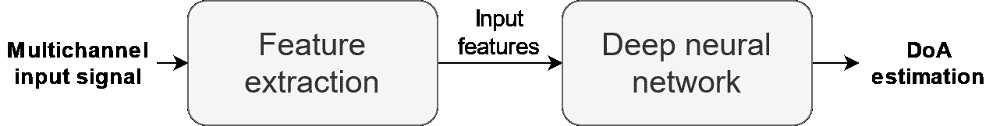
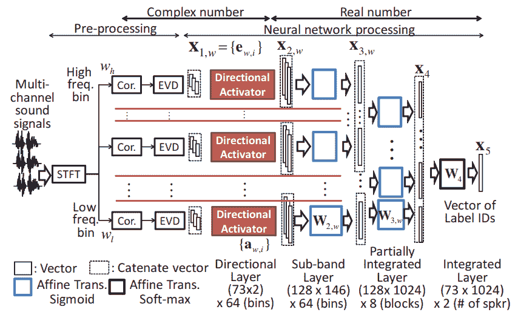
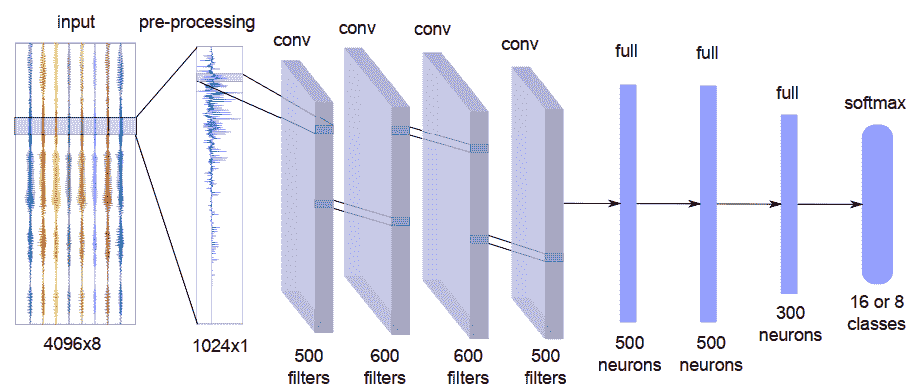
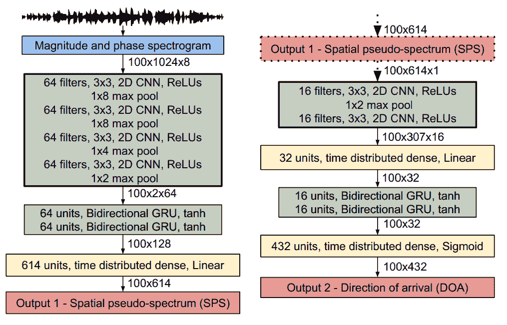
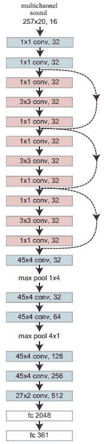
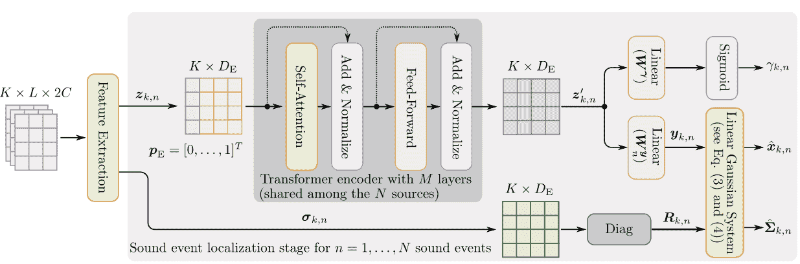
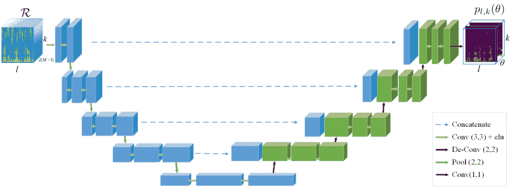

<!--yml

分类: 未分类

日期: 2024-09-06 19:51:40

-->

# [2109.03465] 深度学习方法的声源定位综述

> 来源：[`ar5iv.labs.arxiv.org/html/2109.03465`](https://ar5iv.labs.arxiv.org/html/2109.03465)

# 深度学习方法的声源定位综述

皮埃尔-阿莫里·格吕缪

Nantes Université, École Centrale Nantes, CNRS, LS2N

2 chemin de la Houssinière

F-44332 Nantes, 法国

pierreamaury.grumiaux@gmail.com & Srđan Kitić

Orange Labs

4 Rue du Clos Courtel

35510 Cesson-Sévigné, 法国

srdan.kitic@orange.com & Laurent Girin

Univ. Grenoble Alpes, Grenoble-INP, GIPSA-lab

11 Rue des Mathématiques

38400 Saint-Martin-d’Hères, 法国

laurent.girin@grenoble-inp.fr & Alexandre Guérin

Orange Labs

4 Rue du Clos Courtel

35510 Cesson-Sévigné, 法国

alexandre.guerin@orange.com 在撰写本文期间，皮埃尔-阿莫里·格吕缪还在 Orange Labs，4 Rue du Clos Courtel, F-35510 Cesson-Sévigné, 法国，以及 Univ. Grenoble Alpes, Grenoble-INP, CNRS, GIPSA-lab, 11 Rue des Mathématiques, F-38400 Saint-Martin-d’Hères, 法国。

###### 摘要

本文综述了单声源和多声源定位的深度学习方法，重点讨论了在存在混响和扩散噪声的室内环境中的声源定位。我们提供了在这一背景下基于神经网络的声源定位文献的广泛拓扑，按神经网络架构、输入特征类型、输出策略（分类或回归）、用于模型训练和评估的数据类型以及模型训练策略进行组织。文献综述的表格在本文末尾提供，便于快速查找具有特定目标特征的方法。

## 1 引言

声源定位（SSL）是指基于录制的多通道声学信号，估计一个或多个声源相对于某个任意参考位置（通常是录音麦克风阵列的位置）的过程。在大多数实际情况下，SSL 被简化为声源到达方向（DoA）的估计，*即*，它专注于估计方位角和仰角，而不估计到麦克风阵列的距离（因此，除非另有说明，在本文中我们将“SSL”和“DoA 估计”交替使用）。SSL 有许多实际应用——例如，在源分离中，如（Chazan 等，2019）、自动语音识别（ASR）中，如（Lee 等，2016）、语音增强中，如（Xenaki 等，2018）、人机交互中，如（Li 等，2016b）、噪声控制中，如（Chiariotti 等，2019）和房间声学分析中，如（Amengual Garí 等，2017）。如以下详细介绍，本文专注于室内（办公室或家庭）环境中的可听范围内的声源（通常是语音和音频信号）。

尽管 SSL 是一个长期以来被广泛研究的课题（Gerzon, 1992；DiBiase et al., 2001；Argentieri et al., 2015；Cobos et al., 2017；Benesty et al., 2008；Knapp 和 Carter, 1976；Brandstein 和 Ward, 2001；Nehorai 和 Paldi, 1994；Hickling et al., 1993），但至今仍然是一个非常具有挑战性的问题。传统的 SSL 方法基于信号/通道模型和信号处理（SP）技术。尽管这些方法在这些年中取得了显著进展，但在噪声、混响和多个同时发射的声源等困难且常见的场景下，它们的表现较差（Blandin et al., 2012；Evers et al., 2020）。在过去十年中，数据驱动的深度学习（DL）技术在处理这些困难场景方面引起了越来越多的关注。因此，近年来提出了越来越多基于深度神经网络（DNN）的 SSL 系统。大多数报道的研究表明，基于 DNN 的 SSL 方法优于传统的（即，基于 SP 的）SSL 方法。例如，Chakrabarty 和 Habets (2017a) 证明，在低信噪比条件下，使用 CNN 比使用传统的称为导向响应功率与相位变换（SRP-PHAT）的方法提高了两倍的 DoA 分类准确率（见第三部分）。在 Perotin et al. (2018b) 的研究中，作者能够在使用卷积递归神经网络（CRNN）时，比使用基于独立成分分析（ICA）的方法提高 $25\%$ 的 DoA 分类准确率。最后，Adavanne et al. (2018) 证明，采用 CRNN 可以在混响条件下将平均角度误差减少 $50\%$，相比于传统的 MUSIC 算法（见第三部分）。

这种结果进一步激发了关于深度学习应用于声源定位的科学论文的扩展。同时，现有方法尚未有全面的综述，这对领域中的研究人员和从业者非常有用。尽管我们可以找到主要关注传统方法的综述，例如（Argentieri et al., 2015; Cobos et al., 2017; Evers et al., 2020; Gannot et al., 2019），但据我们所知，只有极少数专门针对深度学习方法的声源定位。Ahmad et al. (2021) 在提出他们自己的深度学习架构之前，简要综述了几种现有的深度学习模型和数据集。Bianco et al. (2019) 和 Purwins et al. (2019) 对应用于音频和声学的各种问题的机器学习进行了有趣的概述。然而，这两篇综述中仅有短短一部分专门讨论了深度神经网络（DNNs）在声源定位中的应用。

### 1.1 论文的目的

本文的目标是填补这一空白，并使用深度学习技术对声源定位（SSL）文献进行彻底的综述。更具体地说，我们检查和回顾了 2011 年至 2021 年间发表的 156 篇论文。我们根据所用方法的特点和所涉及的配置（例如，单源与多源定位设置或神经网络架构；详细列表见第 1.3 节）对不同的方法进行分类和讨论。换句话说，我们展示了过去十年中基于深度学习的声源定位文献的分类法。在论文的末尾，我们以四个表格的形式总结了这次综述（一个针对 2011–2018 年，另外三个分别针对 2019 年、2020 年和 2021 年）。我们回顾的所有方法都在这些表格中列出，并以不同的列展示其特点。这使读者能够快速选择具有特定特点的子集方法，如果他们对那种特定类型的方法感兴趣的话。

请注意，在这篇综述论文中，我们的目标并不是评估和比较不同系统的性能。由于基于深度神经网络的自监督学习论文数量庞大且配置多样，这样的贡献将是非常困难且繁琐的（尽管非常有用），特别是因为讨论的系统通常是在不同的数据集上进行训练和评估的。如我们后续所见，列举并评论这些不同的数据集仍然是我们综述工作的一部分。另请注意，我们不考虑除了声音之外还利用其他模态的自监督学习系统，例如视听系统（Ban et al., 2018; Wu et al., 2021a; Masuyama et al., 2020）。最后，我们考虑基于深度学习的方法用于联合声音事件定位和检测（SELD），这是一种声音事件检测（SED；这里的检测实际上是指分类）和自监督学习的结合，在这种情况下，我们重点关注定位任务。特别地，我们在综述中包括了提交至 DCASE 挑战（和/或相应的 DCASE 研讨会）的 SELD 方法，这些挑战分别在 2019、2020 和 2021 年举办（请参见 DCASE 网站 [`dcase.community/`](https://dcase.community/)）。这个挑战的一个任务专门用于 SELD，这有助于使基于深度学习的自监督学习（和 SED）问题在近年来成为一个热门研究话题。

### 1.2 基于深度学习的自监督学习（DL-based SSL）的基本原理

图 1：基于深度学习的自监督学习系统的一般流程。

基于深度学习的自监督学习方法和系统的一般原理可以用一个简单的流程图示化，如图 1 所示。一个通过麦克风阵列录制的多通道输入信号会被特征提取模块处理，以提供输入特征。这些输入特征被输入到深度神经网络中，该网络提供源位置或到达角度（DoA）的估计。正如本文后续讨论的那样，最近的趋势是跳过特征提取模块，直接将多通道原始数据输入网络。无论如何，这种自监督学习设计的两个基本原因如下所述。

首先，用空间中分布的 $I$ 个麦克风阵列录制的多通道信号包含了关于声源位置的信息。实际上，当麦克风相互靠近，与它们与声源之间的距离相比时，从远处看虽然麦克风信号波形看起来相似，但根据实验设置，在延迟和幅度方面会出现更多或更少显著和复杂的差异。这些通道间差异是由于从源到不同麦克风的传播路径不同，无论是直接路径（源与麦克风之间的视线）还是组成室内环境混响的众多反射。换句话说，源信号 $s_{j}(t)$ 与不同的房间脉冲响应（RIRs） $a_{i,j}(t)$ 进行卷积，这些响应取决于源位置、麦克风位置和指向性（$i$ 表示阵列中的麦克风索引），以及声学环境配置（例如房间形状）：

|  | $\displaystyle x_{i}(t)=a_{i,j}(t)\star s_{j}(t)+n_{i}(t)=\sum_{\tau=0}^{T-1}a_{i,j}(\tau)s_{j}(t-\tau)+n_{i}(t),$ |  | (1) |
| --- | --- | --- | --- |

其中 $x_{i}(n)$ 表示麦克风 $i$ 处的录制信号，$n_{i}(t)$ 是麦克风 $i$ 处的噪声信号（扩散的、“背景”噪声以及可能的一些传感器噪声），$\star$ 表示卷积（注意我们处理的是数字信号，$t$ 和 $\tau$ 是离散时间索引；$T$ 是 RIR 的有效长度）。因此，录制的信号包含了源与麦克风阵列之间相对位置的信息。麦克风信号通常在时间-频率（TF）域中表示，使用短时傅里叶变换（STFT），其中方程 (1) 中的卷积假定转化为源信号 $S_{j}(f,n)$ 和声学传递函数（ATF） $A_{i,j}(f)$ 之间的乘积，而 ATF 是相应 RIR 的（离散）傅里叶变换，因此编码了源的空间信息（$f$ 表示频率 bin，$n$ 是 STFT 帧索引）（Gannot 等， 2017；Vincent 等， 2018）：

|  | $X_{i}(f,n)=A_{i,j}(f)S_{j}(f,n)+N_{i}(f,n).$ |  | (2) |
| --- | --- | --- | --- |

当存在多个，例如 $J$ 个声源时，录制信号是它们贡献的总和（加上噪声）：

|  | $x_{i}(t)=\sum_{j=1}^{J}a_{i,j}(t)\star s_{j}(t)+n_{i}(t).$ |  | (3) |
| --- | --- | --- | --- |

这个方程通常在 TF 域中以矩阵形式重新表述：

|  | $\mathbf{X}(f,n)=\mathbf{A}(f)\mathbf{S}(f,n)+\mathbf{N}(f,n),$ |  | (4) |
| --- | --- | --- | --- |

其中，$\mathbf{X}(f,n)=[X_{1}(f,n),...,X_{I}(f,n)]^{\top}$ 是麦克风信号向量，$\mathbf{A}(f)$ 是汇聚 ATFs 的矩阵，$\mathbf{S}(f,n)=[S_{1}(f,n),...,S_{J}(f,n)]^{\top}$ 是源信号向量，而 $\mathbf{N}(f,n)=[N_{1}(f,n),...,N_{I}(f,n)]^{\top}$ 是噪声向量。在多源情况下，SSL 问题的难点在于不同源的贡献通常在时间上重叠。因此，SSL 需要进行某种形式的源聚类，这在频域或时频域中通常更容易进行，因为在这些领域音频源的自然稀疏性（Rickard, 2002）。在本文中，我们不对源到麦克风传播的基础进行更详细的描述。有关详细信息，请参考一些关于一般声学的文献，例如，（Jacobsen 和 Juhl, 2013；Rossing, 2007），房间声学，例如，（Kuttruff, 2016），阵列信号处理，例如，（Brandstein 和 Ward, 2001；Benesty 等, 2008；Jarrett 等, 2017；Rafaely, 2019），语音增强和音频源分离，例如，（Gannot 等, 2017；Vincent 等, 2018），以及许多关于传统 SSL 的论文。

设计基于 DNN 的 SSL 系统的第二个原因是，即使多通道信号中包含的信息与源位置之间的关系通常很复杂（特别是在多源混响和噪声环境下，参见 Eqs. (3) 和 (4)），DNN 是强大的模型，能够自动识别并利用这种关系，只要提供足够多的具有代表性的训练样本。数据驱动的 DL 方法能够替代基于信号/通道模型和 SP 技术的传统方法——或至少其中的一部分，因为特征提取模块可以基于传统处理——这使得它们在解决如 SSL 等问题时具有吸引力。虽然一些传统方法可以适应观测到的信号，例如 Dvorkind 和 Gannot (2005); Li 等 (2016c); Laufer-Goldshtein 等 (2020); Li 等 (2016b)，但它们都本质上基于某些（或多或少合理的）建模假设，这可能会限制它们在面对现实世界声学复杂性时的有效性。深度学习模型并不*明确*施加任何这样的假设，而是有效地适应所呈现的训练数据。然而，这也是基于 DNN 的方法的主要缺陷，因为它们不如传统方法通用。为特定配置（例如，特定的麦克风阵列几何）设计和训练的深度模型，如果设置发生变化（Liu 等，2018; Le Moing 等，2021），将无法提供令人满意的定位结果，除非可以使用一些相关的适应方法，这在 DL 中仍然是一个未解问题。

### 1.3 论文概述

论文的其余部分组织如下。在第二部分，我们指定了调查的背景和范围，包括考虑的声学环境和声源配置。在第三部分，我们简要介绍了最常见的传统 SSL 方法，原因有二：首先，它们常作为 DL 方法评估的基准；其次，我们将看到传统方法提取的几种特征可以用于 DL 方法。第四部分旨在分类用于 SSL 的不同神经网络架构。第五部分介绍了用于 SSL 的各种输入特征。在第六部分，我们解释了 DL-based SSL 中使用的两种输出策略：分类和回归。随后，在第七部分讨论了用于训练和评估模型的数据集。在第八部分，从 SSL 的角度讨论了监督学习或半监督学习等学习范式。第九部分提供了两个总结表并结束论文。注意，由于本调查论文中使用了大量缩略语，我们在第 1 表中提供了这些缩略语的列表。

表 1：缩略语表。

| ACCDOA | 活动耦合笛卡尔到达方向 |
| --- | --- |
| AE | 自编码器 |
| ATF | 声学传递函数 |
| ASR | 自动语音识别 |
| BGRU | 双向门控递归单元 |
| BIR | 双耳脉冲响应 |
| BRIR | 双耳房间脉冲响应 |
| CC | 交叉相关 |
| CNN | 卷积神经网络 |
| CRNN | 卷积递归神经网络 |
| CPS | 交叉功率谱 |
| DCASE | 检测与分类 |
|  | 声学场景与事件 |
| DIRHA | 远程语音交互 |
|  | 用于鲁棒家用应用 |
| DL | 深度学习 |
| DNN | 深度神经网络 |
| DoA | 到达方向 |
| DP-RTF | 直接路径相对传递函数 |
| DRR | 直接到混响比 |
| EM | 期望最大化 |
| ESPRIT | 信号参数估计 |
|  | 通过旋转不变性技术 |
| EVD | 特征值分解 |
| FFNN | 前馈神经网络 |
| FOA | 一阶 Ambisonics |
| GAN | 生成对抗网络 |
| GCC | 广义互相关 |
| GLU | 门控线性单元 |
| GMM | 高斯混合模型 |
| GMR | 高斯混合回归 |
| GPU | 图形处理单元 |
| GRU | 门控递归单元 |
| HATS | 头部和躯干模拟器 |
| HOA | 高阶 Ambisonics |
| HRTF | 与头部相关的传递函数 |
| ICA | 独立成分分析 |
| ILD | 耳间水平差 |
| IPD | 耳间相位差 |
| ITD | 耳间时间差 |
| ISM | 图像源方法 |
| LSTM | 长短期记忆 |
| MHSA | 多头自注意力 |
| MLP | 多层感知器 |
| MOT | 多目标跟踪 |
| MUSIC | 多信号分类 |
| NLP | 自然语言处理 |
| NoS | 源的数量 |
| PHAT | 相位变换 |
| RIR | 房间脉冲响应 |
| RNN | 循环神经网络 |
| RTF | 相对传递函数 |
| SA | 自注意力 |
| SCM | 空间协方差矩阵 |
| SED | 声音事件检测 |
| SELD | 声音事件定位与检测 |
| SH | 球面谐波 |
| SMIR | 球面麦克风脉冲响应 |
| SMN | 序列匹配网络 |
| SP | 信号处理 |
| SPS | 空间伪谱 |
| SRP | 引导功率响应 |
| SSL | 声源定位 |
| STFT | 短时傅里叶变换 |
| TCN | 时间卷积网络 |
| TDoA | 到达时间差 |
| TF | 时频 |
| VAD | 语音活动检测 |
| VAE | 变分自编码器 |
| WDO | W-不相交正交性 |

## 2 声学环境和声音源配置

SSL 已经在不同配置中得到应用，具体取决于应用场景。在本节中，我们指定了我们调查的范围，包括声学环境（噪声、混响或甚至多房间）以及所考虑声音源的性质（它们的类型、数量以及静态/移动状态）。

### 2.1 声学环境

在本文中，我们关注于室内环境中的 SSL，即当麦克风阵列和声音源存在于一个封闭的房间内，通常是中等大小的办公室或家庭环境时。这意味着存在混响：除了直接的源到麦克风的传播路径，录制的声音还包含了许多其他来自同一源的多路径成分。所有这些成分形成了房间脉冲响应（RIR），它针对每个源位置和麦克风阵列位置（包括方向）以及给定的房间配置进行定义。

一般而言，混响的存在被视为一个显著的扰动，使得 SSL（声源定位）比起假设没有混响的简单（但有些不现实的）无混响情况更为复杂，这种无混响情况通常在自由场传播设置中获得。另一个在 SSL 中需要考虑的重要不利因素是噪声。一方面，噪声可能来自周围环境中的干扰声源：电视、背景音乐、宠物、街道噪声穿过开窗或闭窗等。噪声通常被认为是扩散的，*即*，它没有来自明确的方向。另一方面，录音设备的缺陷是另一个噪声来源，这些噪声通常被视为伪影。

早期关于使用神经网络进行方向估计（DoA）的研究大多只考虑了直接路径传播（即无混响设置），例如（Rastogi et al., 1987; Goryn and Kaveh, 1988; Jha et al., 1988; Jha and Durrani, 1989, 1991; Falong et al., 1993; Yang et al., 1994; Southall et al., 1995; El Zooghby et al., 2000)，尽管 Datum et al. (1996)使用了声学环境模型来生成模拟数据以训练神经网络。这些工作大多来自深度学习之前的时代，使用了只有一层或两层隐藏层的“浅层”神经网络（Goodfellow et al., 2016）。虽然我们在综述中没有详细介绍这些工作，但我们承认它们是神经网络基础的方向估计问题的开创性贡献。基于更“现代”神经网络架构的一些较新研究也只关注无混响传播，或未考虑可听带宽中的声源（Liu et al., 2018; Ünlerşen and Yaldiz, 2016; Bialer et al., 2019; Elbir, 2020; Choi and Chang, 2020）。

### 2.2 源类型

在 SSL 文献中，许多系统专注于定位语音源，因为它们在与语音增强或语音识别等相关任务中的重要性。关于扬声器定位系统的例子可以在 Chakrabarty 和 Habets（2019b）；Grumiaux 等人（2021b）；He 等人（2021a）；Hao 等人（2020）的论文中找到。在这些系统中，神经网络被训练来估计语音源的 DoA，以便它们在这类源上有一定的专长。其他系统，特别是参与 DCASE 挑战赛的系统，考虑了各种声音源类型（Politis 等人，2020b）。根据挑战任务及其相应的数据集，这些方法能够定位警报声、婴儿哭声、撞击声、狗吠声、男性/女性尖叫声、男性/女性语音、脚步声、敲门声、铃声、电话铃声和钢琴声。请注意，即使这些源在时间上重叠，它们的定位问题也不一定比多个重叠的说话者更难，因为前者通常具有明显的谱特征，神经模型可以利用这些特征来提高检测和定位的准确性。

### 2.3 源数量

在录制混合信号中的源数量（NoS）是 SSL 的一个重要参数。在 SSL 文献中，NoS 可能被视为已知（作为工作假设）。或者，它可以与源位置一起估计，在这种情况下，SSL 问题是检测和定位的结合。关于包含 NoS 估计的传统（非深度）SSL 工作的例子可以在 Arberet 等人的论文中找到（2009）；Landschoot 和 Xiang（2019）。

许多基于 DNN 的工作只考虑了一种来源进行定位，因为这是最简单的解决方案，例如（Perotin 等人，2018b; Bologni 等人，2021; Liu 等人，2021）。我们将这种情况称为单源 SSL。在这种情况下，网络在仅有最多一个活动源的数据集上进行训练和评估（源在发出声音时被称为活动，否则为非活动）。在 NoS 方面，我们在这里要么有 1 个活动源，要么没有活动源。在处理的信号中，源的活动性通常包含背景噪音，可以人为控制，即，源活动的知识是一个工作假设。这是一个合理的方法，当使用合成数据进行训练时，但在真实世界的测试数据中，这种方法是相当不现实的。或者，可以估计源的活动性，这是在测试时更现实的方法。在后一种情况下，处理源活动检测问题有两种方法。第一种方法是在实施 SSL 方法之前使用源检测算法，然后仅对具有活动源的信号部分应用 SSL 方法。例如，Kim 和 Hahn 的 SSL 系统中使用了语音活动检测（VAD）技术（2018）；Chang 等人（2018）；Sehgal 和 Kehtarnavaz（2018）；Li 等人（2016d）。另一种方法是在与定位算法同时检测源的活动性。例如，Yalta 等人在他们的 DNN 的输出层中添加了一个额外的神经元，当没有源活动时输出$1$（在这种情况下，所有其他定位神经元被训练为输出$0$），否则输出$0$（2017）。

多源定位比单源 SSL 是一个更困难的问题。当前最先进的基于 DL 的方法在恶劣环境中解决多源 SSL 问题。在本调查中，我们将多源定位定义为多个源在时间上重叠（即它们同时发射），而不考虑它们的类型（例如，可能有多个发言者或几种不同的声音事件）。一个特定的多发言者对话的情况是否存在语音重叠与发言者辨识问题（“谁在何时说话？”）密切相关（Tranter 和 Reynolds，2006；Anguera 等人，2012；Park 等人，2021b）。说话者定位，辨识和（语音）源分离是内在相关的问题，因为解决每个问题所取得的信息对其他问题的解决方案也是有用的（Vincent 等人，2018；Kounades-Bastian 等人，2017；Jenrungrot 等人，2020）。对这些联系的调查不在本调查的范围之内。

在多源场景中，源检测问题转化为源计数问题，但与单源场景中的考虑相同。在一些工作中，NoS 的知识是一个工作假设，例如，（Grumiaux 等人，2021b；Ma 等人，2015；He 等人，2019a；Perotin 等人，2019b；Fahim 等人，2020；Bohlender 等人，2021；Grumiaux 等人，2021a），源的 DoA 可以直接估计。如果 NoS 未知，可以事先应用源计数系统，例如，使用专用的 DNN（Grumiaux 等人，2020）。例如，Tian（2020）训练了一个单独的神经网络来估计录音混合信号中的 NoS，然后将这些信息与 DoA 估计神经网络的输出一起使用。或者，NoS 可以与 DoAs 一起估计，就像在单源场景中一样，基于 SSL 网络输出。当使用分类范式时，网络输出通常预测每个离散化空间区域内存在源的概率（见第八部分）。因此，可以对这个估计概率设置一个阈值，这隐含地提供了源计数。¹¹1 注意，这个问题在基于深度学习（DL）的多源 SSL 方法和传统方法中是常见的，其中估计源活动概况并通常使用峰值选择算法来选择活跃的源。否则，通常使用真实值或估计的 NoS 来选择具有最高概率的对应类别数量。

最终，几种基于深度神经网络（DNN）的方法被专门设计用来估计噪声源（NoS）以及到达角（DoAs）。例如，Nguyen 等人提出的方法（2020a）使用了一个具有两个输出分支的神经网络架构：第一个分支用于估计 NoS（最多四个源；问题被表述为分类任务），而第二个分支则用于将方位角分类到多个区域中。同样地，我们可以提到在 DCASE 挑战赛中展示的众多系统，其中声源定位（SED）任务与声源分离（SSL）联合进行，自然提供了 NoS 的估计。注意，许多 DCASE 挑战赛候选系统将在本调查的核心部分进行回顾。

### 2.4 移动源

源追踪是估计源位置随时间演变的问题，特别是当源是移动的。在这篇综述论文中，我们没有单独讨论追踪问题，这通常在使用应用 SSL 处理的连续时间窗口获得的 DoA 估计序列的单独算法中完成（Vo 等人，2015）。尽管如此，已经有几种基于深度学习的 SSL 系统被证明能够在训练数据集中包括这种类型的源时更准确地定位移动源（Adavanne 等人，2019c；Diaz-Guerra 等人，2021a；Guirguis 等人，2020；He 等人，2021b）。在其他情况下，由于实际移动源数据集数量有限且模拟移动源信号繁琐，许多在静态源上训练的系统在处理移动源时仍保持良好表现，例如（Opochinsky 等人，2021；Grumiaux 等人，2021a；Sundar 等人，2020）。

## 3 传统 SSL 方法

在深度学习出现之前，一套信号处理技术被开发出来以解决 SSL 问题。DiBiase 等人对这些技术进行了详细回顾（2001）。Argentieri 等人对特定机器人领域的回顾（2015）。在本节中，我们简要介绍了最常见的传统 SSL 方法。正如引言中简要提到的，原因有二：首先，传统 SSL 方法通常用作基于深度学习的方法的基准；其次，许多基于深度学习的 SSL 方法使用了传统方法提取的输入特征（见第五部分）。

当麦克风阵列的几何结构已知时，可以通过估计麦克风之间源的到达时间差（TDoA）来进行 DoA 估计（Xu 等人，2013）。广义互相关相位变换（GCC-PHAT）是处理 2 个麦克风阵列时最常用的方法之一（Knapp 和 Carter，1976）。它被计算为两个麦克风信号之间交叉功率谱（CPS）加权版本的逆傅里叶变换：

|  | $r_{1,2}(\tau)=\sum_{f=0}^{F-1}\frac{X_{1}(f)X_{2}(f)^{*}}{&#124;X_{1}(f)X_{2}(f)^{*}&#124;}e^{j2\pi\frac{f\tau}{N}},$ |  | (5) |
| --- | --- | --- | --- |

其中 $X_{i}(f)$ 是麦克风信号 $x_{i}(t)$ 的 $N$ 点傅里叶变换，$X_{1}(f)X_{2}(f)^{*}$ 是 CPS（^∗ 表示共轭复数）。然后通过找到使 GCC-PHAT 函数最大化的麦克风信号之间的时间延迟来获得 TDoA 估计：

|  | $\hat{\tau}=\arg\max_{\tau}r_{1,2}(\tau).$ |  | (6) |
| --- | --- | --- | --- |

GCC 方法已经扩展到多个麦克风的阵列，特别是显示了通过利用多个麦克风对可以提高定位精度（DiBiase 等，2001；Benesty 等，2008）。

构建声学功率图 $P(\mathbf{x})$，其中 $\mathbf{x}$ 为空间坐标，通常为规则网格，是获取一个或多个源的方向估计的另一种方法，因为该图的局部最大值主要对应于源的方向估计。Steered-Response Power (SRP) 图谱被广泛使用：它通过将延迟和求和波束形成器指向每个候选网格位置，并测量从这些方向产生的能量来实现。其 PHAT 版本，因对混响更为鲁棒，毫无疑问是最受欢迎的。实际上，它可以通过计算所有麦克风对的 GCC-PHAT 的平均值来得到（DiBiase 等，2001）：

|  | $P(\mathbf{x})=\sum_{m_{1}=1}^{M}\sum_{m_{2}=m_{1}+1}^{M}r_{1,2}(\tau_{m_{1},m_{2}}(\mathbf{x})),$ |  | (7) |
| --- | --- | --- | --- |

其中 $\tau_{m_{1},m_{2}}(\mathbf{x})$ 是与空间位置 $\mathbf{x}$ 相关的麦克风 $m_{1}$ 和 $m_{2}$ 之间的延迟。

构建基于 SRP 的声学图谱的一个替代方法是利用声强进行定位——这种方法通常计算开销较大，因为它通常需要进行网格搜索。利用声强进行源定位有着悠久的历史，例如，（Nehorai 和 Paldi，1994；Hickling 等，1993；Jarrett 等，2010；Tervo，2009；Raangs 和 Druyvesteyn，2002；Basten 等，2008）。在有利的声学条件下，声强与传播声波的方向平行（见第 5.5 节），因此，方向估计（DoA）可以高效地估算。不幸的是，声强的准确性在声学反射存在时迅速下降（Daniel 和 Kitić，2020）。

子空间方法是另一类经典的定位算法。这些方法依赖于（时间平均）CPS 矩阵 $\mathbf{R}(f)$ 的计算，该矩阵定义为：

|  | $\mathbf{R}(f)=\sum_{n=1}^{N}\mathbf{X}(f,n)\mathbf{X}(f,n)^{H},$ |  | (8) |
| --- | --- | --- | --- |

其中$\mathbf{X}(f,n)$是多通道信号向量的 STFT（或更一般地，局部离散傅里叶变换）（4 "In 1.2 General principle of DL-based SSL ‣ 1 Introduction ‣ A Survey of Sound Source Localization with Deep Learning Methods"）的特征值分解。假设目标源信号和噪声不相关，则多信号分类（MUSIC）方法（Schmidt，1986）将特征值分解应用于估计信号和噪声子空间。在方程式(4 "In 1.2 General principle of DL-based SSL ‣ 1 Introduction ‣ A Survey of Sound Source Localization with Deep Learning Methods")之后，假设信号子空间基底对应于混合矩阵$\mathbf{A}(f)$的列，这些列是源的多通道 ATF（在这种情况下通常称为*指向向量*）。然后，信号或噪声子空间基底用于检测给定方向上是否存在源，即应用*空间滤波*或*波束成形*（Van Veen 和 Buckley，1988; Benesty 等，2008）。使用估计信号参数通过旋转不变性技术（ESPRIT）算法（Roy 和 Kailath，1989）可以放宽这一耗时的搜索，该算法利用源子空间的结构直接推断出源的 DoA。然而，与 MUSIC 相比，这通常会产生更不准确的预测（Mabande 等，2011）。MUSIC 和 ESPRIT 都假设是窄带信号，尽管已经提出了宽带扩展，例如（Dmochowski 等，2007; Hogg 等，2021）。子空间方法对噪声具有鲁棒性，并且可以产生高度准确的估计，但是它们对混响非常敏感。

基于概率生成混合模型的方法已由例如 Roman 和 Wang (2008)；Mandel 等 (2009)；May 等 (2011)；Woodruff 和 Wang (2012)；Schwartz 和 Gannot (2013)；Dorfan 和 Gannot (2015)；Li 等 (2017) 提出。通常，这些模型是高斯混合模型（GMM）的变体，每个源位置或候选源位置对应一个高斯成分。在极少数的文献中（例如，（May 等， 2011）），该模型使用专门的训练数据集进行离线训练。但大多数情况下，模型参数是直接在“测试时”估计的，即使用包含源的多通道信号进行定位。这是通过最大化数据似然函数来实现的，采用基于直方图或期望最大化（EM）算法，利用时频（TF）域中声音源的稀疏性（Rickard, 2002），这一过程可能计算量很大。Deleforge 和 Horaud (2012) 提出了一个直接在回归模式下运行的 GMM 变体，即高斯混合回归（GMR）形式，用于单源定位，并且后来扩展到多源定位（以及可能的分离）（Deleforge 等，2013，2015）。GMR 在局部是线性的，但在全局上是非线性的，模型参数的估计是在训练数据上离线完成的。因此，它的精神接近于基于 DNN 的 SSL。使用与合成 RIRs 卷积的白噪声信号进行训练。该方法显示出在语音信号上的良好泛化能力，因为语音信号在 TF 域中比噪声更稀疏，这得益于使用了一个潜在变量来建模每个 TF 框中的信号活动。

混合模型与贝叶斯推断有很强的关联，贝叶斯推断考虑了在给定观察数据的情况下模型参数的后验分布（因此涉及到似然函数和模型参数的先验分布）。Escolano 等人 (2014) 考虑了在拉普拉斯源混合模型上应用贝叶斯推断，使用 GCC-PHAT 特征在双麦克风阵列设置中。有趣的是，他们使用了两级贝叶斯推断：一个用于估计 NoS（这是模型的超参数），使用贝叶斯模型选择；另一个用于估计模型参数（从而估计相应的源方向角），使用后验分布评估。在这项工作中，涉及的分布的评估是通过采样技术完成的，例如马尔科夫链蒙特卡洛（MCMC）方法。同样的方法论被 Bush 和 Xiang (2018) 应用在由两个叠加的、空间下采样的均匀线性阵列（Vaidyanathan 和 Pal，2010）组成的互质阵列中，以及被 Landschoot 和 Xiang (2019) 在球面谐波领域使用球面麦克风阵列中（见第五部分")。

压缩感知和稀疏恢复方法在声学中用于不同的目的（Gerstoft et al., 2018; Xenaki et al., 2014），包括 SSL（Yang et al., 2018）。其主要前提是，许多高维信号可以承认低维表示，这可以通过例如*稀疏合成*（Candes et al., 2006）或*稀疏分析*（Nam et al., 2013）模型来查看。关于 SSL 问题，通常在空间（或空间束）域中假设稀疏性，例如 Chardon 和 Daudet（2012）；Noohi et al.（2013）；Fortunati et al.（2014）；Kitić et al.（2014）；Gerstoft et al.（2016），并通过凸优化、贪婪或贝叶斯方法来解决所得问题，例如 Foucart 和 Rauhut（2013）；Gerstoft et al.（2018）。这一概念导致了一些杰出的定位方法，取得了显著的性能。然而，尽管具有强大的理论保证，压缩感知方法仍然存在两个缺点。其一，通常要求源信号与某些预定义网格的点一致，尽管在某些特定情况下已提出无网格方法，例如 Xenaki 和 Gerstoft（2015）；Yang 和 Xie（2015）。第二个问题与其他传统方法相同，即强建模假设，例如（亚高斯）字典矩阵的已知结构。已提出字典学习技术以在某种程度上缓解这一问题，例如 Wang et al.（2018）；Hahmann et al.（2021b）；Zea 和 Laudato（2021）。稀疏贝叶斯学习（SBL）是将贝叶斯框架与稀疏表示和压缩感知原则相结合的一种方法。它通常涉及使用稀疏数组，例如上述提到的互质数组和嵌套数组（Pal 和 Vaidyanathan，2010）。SBL 已被用于 SSL，例如 Nannuru et al.（2018）；Zhang et al.（2014）；Liu et al.（2012）；Gerstoft et al.（2016）；Xenaki et al.（2018）；Ping et al.（2020）。

最终，ICA 是一类算法，旨在通过假设和利用源信号之间的统计独立性来提取混合信号中的不同源信号。ICA 最常用于音频处理中的盲源分离，但它在多源 SSL 中也被证明是有用的（Sawada et al., 2003）。如前所述，在多源场景中，SSL 与源分离问题密切相关，因为定位可以帮助分离，而分离可以帮助定位（Gannot et al., 2017; Vincent et al., 2018）。

## 4 神经网络架构用于 SSL

在这一节中，我们讨论了文献中提出的用于解决 SSL 问题的神经网络架构。然而，我们不会介绍这些神经网络的基础知识，因为它们在一般的深度学习（DL）文献中已有广泛描述，例如（LeCun 等，2015; Goodfellow 等，2016; Chollet，2017）。对于特定应用，深度神经网络（DNN）的设计通常需要研究（并可能结合）不同的架构，并调整它们的超参数。这在过去十年中的 SSL 领域也是如此，基于 DL 的 SSL 技术的发展跟随了 DNNs 向越来越复杂的架构或由 DL 和 SP 社区广泛采用的新型高效模型的发展，即大大超出了 SSL 问题的范围（例如，注意力模型）。换句话说，SSL 中使用的 DNN 架构通常继承自其他（相关或更远）领域的工作，因为它们在音频信号或其他类型的信号上表现良好。在同样的精神下，不同的模型通常被结合（以并行和/或顺序的方式）。

因此，我们根据网络中使用的层类型组织了展示内容，采用了在复杂性方面渐进和“包容性”的方法：一个特定类别的网络可以包含来自之前展示的其他类别的层。我们首先介绍基于前馈神经网络（FFNNs）的系统。然后，我们重点介绍卷积神经网络（CNNs）和递归神经网络（RNNs），它们通常包含一些前馈层。接下来，我们回顾结合 CNNs 和 RNNs 的架构，即卷积递归神经网络（CRNNs）。然后，我们关注具有残差连接和注意力机制的神经网络。最后，我们介绍具有编码器-解码器架构的 SSL 系统。

### 4.1 前馈神经网络

图 2：Takeda *等人* 在几篇论文中使用的 MLP 架构（Takeda 和 Komatani，2016b，a，2017; Takeda 等人，2018）。多个子带前馈层，以 $w$ 为索引，被训练来从 CPS 矩阵特征向量 $\mathbf{e}_{w,i}$ 中提取特征，这些特征向量被用作方向激活函数。获得的子带向量 $\mathbf{X}_{2,w}$ 通过其他前馈层逐步整合到子带中，得到 $\mathbf{X}_{3,w}$，然后是 $\mathbf{X}_{4}$。输出层最终将其输入分类为候选的到达角（向量 $\mathbf{X}_{5}$ 的条目）。注意：转载自（Takeda 和 Komatani，2016a）；版权归 IEEE 所有；经许可转载。

FFNN 是第一个也是最简单的人工神经网络类型。在这样的网络中，数据从输入层到输出层沿一个方向移动，可能通过一系列隐藏层（Goodfellow et al., 2016; LeCun et al., 2015）。通常在每一层之后使用非线性激活函数（输出层可能除外）。尽管这种 FFNN 的定义非常通用，可能包括诸如 CNNs（将在下一小节讨论）的架构，但在这里我们主要关注由完全连接层构成的架构，即感知机和多层感知机（MLP）（Goodfellow et al., 2016; LeCun et al., 2015）。感知机没有隐藏层，而 MLP 的概念有些模糊：一些作者认为 MLP 有一个隐藏层，而其他作者允许有更多隐藏层。在本文中，我们称一个具有一个或多个隐藏层的 FFNN 为 MLP。

一些先驱性的 SSL 方法使用浅层神经网络（感知机或一个隐藏层的 MLP）并应用于“非现实”设置（例如，仅假设直接路径声音传播）在第 2.1 节中被简要提及。Kim 和 Ling (2011) 提出了第一个使用 MLP 进行 SSL 的方法，他们实际上考虑了几种 MLP。一个网络估计 NoS，然后使用一个独立的网络对每个考虑的 NoS 进行 SSL。作者在回声数据上评估了他们的方法，即使他们假设了一个无回声的环境。Tsuzuki 等人 (2013) 提出了使用复数值 MLP 来处理基于两个麦克风的复杂特征，这比使用实值 MLP 得到了更好的结果。Youssef 等人 (2013) 还使用 MLP 从机器人头部的双耳录音中估计声音源的方位角。双耳时间差（ITD）和双耳水平差（ILD）值（参见第五部分）被分别输入到输入层，并由特定的神经元集合处理。Xiao 等人 (2015) 使用了一个单隐藏层 MLP，将基于 GCC-PHAT 的特征作为输入，并将 SSL 视为分类问题（参见第八部分），在模拟和真实数据上显示了相对于传统方法的改进。Vesperini 等人 (2016) 提出了类似的方法，但定位是在水平面上通过回归进行的。

自然地，具有更深架构的 MLP（*即* 更多隐藏层）也已被用于 SSL 研究。Roden 等人 (2015) 比较了具有两个隐藏层的 MLP 和不同输入类型的性能，隐藏神经元的数量与输入特征的类型相关（详见第五部分）。Yiwere 和 Rhee (2017) 使用了一个具有三个隐藏层的 MLP（用不同数量的神经元进行测试）来输出源的方位和距离估计。He 等人 (2018a) 测试了一个具有四个隐藏层的 MLP 用于多源定位和语音/非语音分类，结果与一个 4 层 CNN 相似（见第 4.2 节）。

Ma 等人 (2015) 提出了对不同频率子带使用不同的多层感知机（MLP），每个 MLP 具有八个隐藏层。这一想法基于这样的假设：在多个来源存在的情况下，每个频率带主要被单一来源主导，这使得训练可以仅在单一来源数据上进行。每个子带 MLP 的输出对应于方位区域上的概率分布，最终的方位估计通过在频率带上积分概率值来获得。Takeda *等人* 在几篇论文中提出了类似的系统（Takeda 和 Komatani, 2016b, a, 2017; Takeda 等人, 2018）。在这些工作中，记录信号的通道间相关矩阵的特征向量被分别输入到网络的平行分支中，特别是输入到特定的全连接层中。然后，几个附加的全连接层逐步整合了频率依赖的输出（见图 2）。作者展示了这种特定架构在无回声和混响单一及多源信号上优于传统的 7 层 MLP 和经典的 MUSIC 算法。Opochinsky 等人 (2019) 提出了一个小型的 3 层 MLP 来估计单一来源的方位，使用信号的相对传递函数（RTF，见第 5.1.1 ‣ 5.1 Inter-channel features ‣ 5 Input features ‣ A Survey of Sound Source Localization with Deep Learning Methods") 节）。他们的方法是弱监督的，因为损失函数的一部分在没有真实的 DoA 标签的情况下计算（见第八部分）。

Pak 和 Shin (2019) 探索了 MLP 的间接使用，他们使用了一个 3 层的 MLP 来增强输入信号的耳间相位差（IPD）（见第五部分"），然后用于 DoA 估计。

### 4.2 卷积神经网络

CNN 是一种广泛用于模式识别的 DNN 类，由于其平移等变性（Cohen 等，2019; Goodfellow 等，2016），它们被广泛应用于各种任务，如图像分类（例如，（Krizhevsky 等，2017）），自然语言处理（NLP），例如，（Kim，2014）或自动语音识别（例如，（Waibel 等，1989））。CNN 也被用于 SSL，如下所述。

据我们了解，Hirvonen (2015) 是第一个将 CNN 应用于 SSL 的研究者。他采用这种架构将包含一个语音或音乐源的音频信号分类到八个空间区域之一（见图 3）。这个 CNN 由四个卷积层组成，用于从多通道幅度谱图中提取特征图（见第五部分"），然后通过四个全连接层进行分类。由于作者认为经典池化与音频表示无关，因此未使用池化。相反，使用了 4-步长和 2-重叠的方式来减少参数数量。这种方法在单源信号上表现良好，并能够适应不同的配置而无需手工调整。然而，作者指出了该系统的两个热点问题：网络对源位置变化的鲁棒性和隐藏特征的解释难度。

图 3：Hirvonen (2015) 为 SSL 提出的 CNN 架构。输入为 8 通道信号。对于每个短时帧，将 8 个幅度谱（$128$ 频率 bin）串联形成一个 $1024\times 1$ 张量，该张量被输入到一系列具有 $500$ 或 $600$ 可学习内核的卷积层中。提取的特征随后通过几个前馈层，这些层包含 $500$ 或 $300$ 个神经元。输出层包含 $8$ 个神经元（如果还考虑源类型则为 $16$），并使用 softmax 激活函数估计源存在于八个候选 DoA 中的概率。注：转载自（Hirvonen，2015）；版权归作者所有；经许可转载。

Chakrabarty 和 Habets 还设计了一个卷积神经网络（CNN），用于预测在混响环境中一个（Chakrabarty 和 Habets, 2017a）或两个（Chakrabarty 和 Habets, 2019b, 2017b）说话人的方位。输入特征是多通道短时傅里叶变换（STFT）相位频谱图（见第五部分）。在（Chakrabarty 和 Habets, 2017a）中，他们提出使用三层连续卷积层，每层有 $64$ 个 $2\times 2$ 大小的滤波器，以考虑相邻频带和麦克风。在（Chakrabarty 和 Habets, 2017b）中，他们将滤波器大小减少到 $2\times 1$ （频率轴上为 $1$），这是由于语音信号的 W-离散正交性（WDO）假设，该假设认为多个说话者不会在同一时间频率（TF）窗内同时活跃（Rickard, 2002）。在（Chakrabarty 和 Habets, 2019b）中，他们展示了对于一个 $M$-麦克风阵列，利用相邻麦克风之间的相位相关性的最优卷积层数为 $M-1$。

He 等人 (2018a) 比较了 4 层 MLP 和 4 层 CNN 在多说话人检测和定位任务中的表现。结果显示，两种架构的准确性相似。Yalta 等人 (2017) 提出了更深的架构，根据实验不同，卷积层数量从 11 层到 20 层不等。这些更深的 CNN 相比于 MUSIC 在噪声方面表现出了鲁棒性，同时训练时间也较短，但这部分是由于残差块的存在（见第 4.5 节）。He 等人 (2018b) 提出了类似的架构，具有许多卷积层和一些残差块，但配置为特定的多任务处理。网络的末端分为两个卷积分支，一个用于方位估计，另一个用于语音/非语音信号分类。

虽然大多数定位系统旨在估计方位角或方位角和俯仰角，但 Thuillier 等人 (2018) 研究了仅使用卷积神经网络（CNN）和双耳输入特征来估计俯仰角：同侧和对侧头相关传递函数（HRTF）幅度响应（见第五部分）。Vera-Diaz 等人 (2018) 选择将 CNN 直接应用于原始多通道波形，这些波形被并排组装成图像，以预测单个静态或移动扬声器的笛卡尔坐标 $(x,y,z)$。连续的卷积层包含大约一百个滤波器，从第一个层的大小 $7\times 7$ 到最后一层的 $3\times 3$。Ma 和 Liu (2018) 也使用 CNN 进行回归，但他们使用 CPS 矩阵作为输入特征（见第五部分）。为了估计方位角和俯仰角，Nguyen 等人 (2018) 使用了相对较小的 CNN（两个卷积层）进行回归模式，并使用双耳输入特征。Sivasankaran 等人 (2018) 考虑了一种类似的方法来进行基于 CNN 的扬声器定位。他们展示了在输入层注入扬声器标识符，特别是估计的用于说出特定关键词的扬声器的掩码，与双耳特征一起使用，可以改善到达方向（DoA）估计。

Vecchiotti 等人 (2018) 开发了一个联合语音活动检测（VAD）和 DoA 估计的 CNN。他们展示了在多房间环境中可以使用相同的架构来同时处理这两个问题，尽管在两个独立的输入分支中考虑了不同的输入特征（GCC-PHAT 和对数梅尔谱）。这些分支随后在进一步的层中进行拼接。Vecchiotti 等人 (2019b) 通过探索几种变体架构和实验配置扩展了这项工作，而 Vecchiotti 等人 (2019a) 开发了一种基于 CNN 的端到端听觉启发系统，其中包括 Gammatone 滤波器层在神经网络架构中。Zhang 等人 (2019b) 提出了基于掩码估计的方法，其中估计了 TF 掩码并用于清理或附加到输入特征上，从而通过 CNN 促进 DoA 估计。

Nguyen 等人 (2020a) 提出了一个包含 10 层卷积层和平均池化的多任务 CNN，用于推断 NoS 和声源的 DoA。他们在最多四个声源的信号上评估了他们的网络，在模拟和实际环境中表现非常好。Varanasi 等人 (2020) 使用一个小型的 3 层 CNN 来推断方位角和仰角，使用了第三阶球面谐波分解的信号（见第五部分"）。作者尝试了几种输入特征的组合，包括仅使用球面谐波分解的幅度和/或相位。

在助听器的背景下，Varzandeh 等人 (2020) 将 CNN 应用于 VAD 和 DoA 估计。该系统基于两个输入特征，GCC-PHAT 和周期性度，分别送入两个卷积分支。这两个分支在进一步的层中连接，然后是前馈层。Fahim 等人 (2020) 将 8 层 CNN 应用于所谓的第一阶 Ambisonics 输入特征的模态一致性（见第五部分")，以在混响环境中定位多个声源。他们提出了一种新的方法，用单声道训练数据训练多声道 DoA 估计网络，相比 Chakrabarty 和 Habets (2019b) 的系统有所改进，尤其是对于三个扬声器的信号。Hao 等人 (2020) 研究了使用相对较小架构（三个卷积层）的 CNN 实时实现 SSL。

Krause 等人 (2020a) 研究了几种类型的卷积。他们报告称，使用 3D 卷积（在时间、频率和通道轴上）的网络相比基于 2D 卷积、复杂卷积和深度可分离卷积（所有这些都在时间和频率轴上）取得了更好的定位准确性，但计算成本较高。他们还展示了使用深度可分离卷积在准确性和模型复杂性之间达到了良好的折衷（据我们所知，他们是首个探索这种卷积类型的研究者）。

Bologni 等人（2021）提出了一种神经网络架构，包括一组用于帧级特征提取的 2D 卷积层，之后是几个用于时间聚合的 1D 卷积层。Diaz-Guerra 等人（2021a）在 SRP-PHAT 功率图上应用了 3D 卷积层，计算方位角和高度角估计。他们还在网络末端使用了几个 1D 因果卷积层来执行单一来源跟踪。他们的整个架构被设计为在完全因果模式下运行，以便可以适应实时应用。Wu 等人（2021b）提出了使用一种受到计算机视觉工作启发的监督图像映射方法，称为图像翻译。他们使用了一种 CNN（补充了残差层，见第 4.5 节）将输入的 2D 图像（通过传统波束形成提取的 DoA 特征，并根据笛卡尔坐标 $(x,y)$ 进行重塑）映射到目标源位置的输出 2D 图像（在该图像中，像素强度随源距离的增加而迅速减少），从中获得源的位置。

如引言中提到的，DCASE 挑战包括一个 SELD 任务，CNN 也被用于一些挑战候选系统（Politis 等人，2020b）。Chytas 和 Potamianos（2019）使用了具有数百个 $4\times 10$ 大小滤波器的卷积层进行回归模式下的方位角和高度角估计。Kong 等人（2019）比较了不同数量的卷积层用于 SELD，而 Noh 等人（2019）提出了一种 8 层 CNN 来改善基线结果。

Salvati 等人（2018）提出了一种间接使用卷积神经网络（CNN）的方法。他们训练了神经网络以估计输入层每个窄带 SRP 组件的权重，从而计算这些组件的加权组合。在他们的实验中，他们在几个测试示例上展示了这种方法可以更好地融合窄带组件，并减少噪声和混响的影响，从而提高定位准确性。

在 DoA 估计文献中，一些研究探索了在 DNN 中使用扩张卷积。扩张卷积，也称为 atrous 卷积，是一种卷积层，其卷积核比经典卷积核宽，但通过插入零来保持参数数量不变。形式上，具有扩张因子 $l$ 的 1D 扩张卷积定义为

|  | $(x*k)(n)=\sum_{i}x(n-li)k(i),$ |  | (9) |
| --- | --- | --- | --- |

其中 $x$ 是输入，$k$ 是卷积核。常规线性卷积在 $l=1$ 时获得。这个定义可以扩展到多维卷积。

Chakrabarty 和 Habets（2019a）展示了将膨胀卷积与逐渐增加的膨胀因子结合使用可以减少其原始 CNN 架构（Chakrabarty 和 Habets，2019b）的卷积层的最佳数量（在本节中已讨论）。这导致了一个具有类似 SSL 性能和较低计算成本的架构。

### 4.3 递归神经网络

RNNs 是用于建模数据时间序列的神经网络（LeCun 等，2015；Goodfellow 等，2016）。特定类型的 RNNs 包括长短期记忆（LSTM）单元（Hochreiter 和 Schmidhuber，1997）和门控循环单元（GRUs）（Cho 等，2014）。这两种类型的 RNNs 已经变得非常流行，因为它们能够规避常规 RNNs 面临的训练困难，特别是梯度消失和梯度爆炸问题（LeCun 等，2015；Goodfellow 等，2016）。

关于仅使用 RNNs 的 SSL 的公开工作很少，因为递归层通常与卷积层结合使用（见第 4.4 节）。Nguyen 等人（2021a）使用 RNN 来对齐 SED 和 DoA 预测，这些预测是为每种可能的声音事件类型单独获得的。RNN 最终被用来确定哪个 SED 预测与哪个 DoA 估计匹配。Wang 等人（2019）使用双向 LSTM 网络来估计 TF 掩膜以增强信号，并进一步通过传统方法（如 SRP 或子空间方法）促进 DoA 估计。

### 4.4 卷积递归神经网络

CRNNs 是包含一个或多个卷积层和一个或多个递归层的神经网络。自 2018 年以来，CRNNs 因其各层的能力而被广泛用于 SSL：卷积层已被证明适合提取 SSL 所需的相关特征，而递归层则设计良好，适合于在时间上整合信息。

在一系列论文中（Adavanne 等人，2019c，2018，a），Adavanne *et al.* 使用了 CRNN 进行 SELD，并采用了多任务配置，输入特征为一阶 Ambisonics (FOA)（见第五部分）。在（Adavanne 等人，2018）中，他们的架构包含了一系列连续的卷积层，每个卷积层后跟一个最大池化层和两个双向 GRU (BGRU) 层。然后，一个前馈层提供了由 MUSIC 算法（Schmidt，1986）生成的空间伪谱 (SPS) 的估计，作为中间输出（见图 4）。该 SPS 随后被输入到神经网络的第二部分，该部分由两个卷积层、一个密集层、两个 BGRU 层和一个最终的前馈层组成，用于通过分类估计方位角和俯仰角。使用中间 SPS 输出的方式被提出以帮助神经网络学习一种已经被证明对使用传统方法进行 SSL 有用的表示。

在（Adavanne 等人，2019a）和（Adavanne 等人，2019c）中，这种中间输出不再使用。相反，使用一组卷积层、一组 BGRU 层和一个前馈层直接估计 DoA。该系统能够本地化和检测多个声音事件，即使它们在时间上重叠，只要它们是不同类型的（例如，语音和汽车，见第 2.2 节的讨论）。该 CRNN 是 2019 年和 2020 年 DCASE 挑战任务 3 的基线系统。因此，它激发了许多其他工作，许多 DCASE 挑战候选系统基于 Adavanne 等人（2019a）的系统，并进行了各种修改和改进。

例如，Lin 和 Wang (2019) 向输入频谱图中添加了高斯噪声，以训练网络对噪声更具鲁棒性。Lu (2019) 集成了一些额外的卷积层，并将 BGRU 层替换为双向 LSTM 层。Leung 和 Ren (2019) 使用了相同的架构，并结合了所有交叉通道功率谱，而 Nustede 和 Anemüller (2019) 则测试了用组延迟替换输入特征。Maruri 等 (2019) 将 GCC-PHAT 特征作为输入特征添加。Zhang 等 (2019a) 在训练过程中使用了数据增强，并对网络输出进行了平均，以实现更稳定的 DoA 估计。Xue 等 (2019) 将输入特征分别送入卷积层的不同分支，一方面是 log-mel 和恒定 Q 变换特征，另一方面是相位频谱图和 CPS 特征（见第五部分）。Cao 等 (2019b) 将 log-mel 频谱图和 GCC-PHAT 特征拼接，并将它们分别输入到两个独立的 CRNN 中用于 SED 和 DoA 估计（他们还将强度向量并入了 (Cao 等， 2019a））。与 Adavanne 等 (2019a) 的基线相比，使用了更多的卷积层和一个单独的 BGRU 层。DoA 网络的卷积部分从 SED CRNN 转移而来，随后对 DoA 分支进行了微调，将该方法标记为两阶段。这导致在 Adavanne 等 (2019a) 的 DCASE 挑战基线上的定位性能显著提升。Pratik 等 (2019) 也测试了对该基线的小改动，例如使用 Bark 规模频谱图作为输入特征、修改激活函数或池化层以及使用数据增强，结果在一些实验中取得了显著改进。

Kapka 和 Lewandowski（2019）使用了 Adavanne 等人（2019a）的相同基线神经架构，每个子任务有一个独立（但相同，除了输出层）CRNN 实例：源计数（最多两个源）、源 1 的 DoA 估计（如适用）、源 2 的 DoA 估计（如适用）和声音类型分类。作者展示了他们的方法比基线更高效。Krause 和 Kowalczyk（2019）探索了在 CRNN 中分割 SED 和 DoA 估计任务的不同方式。虽然一些配置在 SED 上显示出改进，但在报告的实验中，定位准确性低于基线。Park 等人（2019b）研究了门控线性单元（GLU，一种具有门控机制的卷积块）和格雷斯网络（包含卷积和递归层，详细信息见 Bai 等人（2019）的论文）的组合，获得了比基线更好的结果。作者通过改善整体架构和调查其他损失函数（Park 等人，2020）扩展了这项工作以应对 DCASE 2020 挑战。Grondin 等人（2019）还提出了一种非直接 DoA 估计方案，他们使用 CRNN 估计 TDoA，并从中推断 DoA。

我们还在 2020 年版的 DCASE 挑战中发现了基于 CRNN 系统的提案。Singla 等人（2020）使用了与 Adavanne 等人（2019a）基线相同的 CRNN，只是他们没有为 SED 和 DoA 估计使用两个分开的输出分支。而是将 SED 输出与前一层的输出连接起来以估计 DoA。Song（2020）使用了类似于 Adavanne 等人（2019a）的分开神经网络，以顺序方式处理 NoS 估计和 DoA 估计。Tian（2020）训练了多个 CRNN：一个用于估计 NoS（最多两个源），另一个用于估计假设只有一个活动源的 DoA，另一个（与基线相同）用于估计两个同时活动源的 DoAs。Cao 等人（2020）设计了一种端到端 CRNN 架构，用于检测和估计可能的两个相同声音事件的 DoA。Ronchini 等人（2020）调查了添加一维卷积滤波器以利用特征轴上的信息。Sampathkumar 和 Kowerko（2020）通过为网络提供更多输入特征（对数-梅尔频谱图、GCC-PHAT 和强度向量，见第五部分"）来增强 Adavanne 等人（2019a）的基线系统。

图 4：Adavanne 等人（2018, 2019c, 2019a）的 CRNN 架构，启发了众多 SELD 系统。输入是多通道 STFT 域 FOA 幅度和相位谱图。首先，通过四个连续的卷积层提取特征，每个卷积层有$64$个$3\times 3$的卷积核，后跟一个最大池化层。然后使用两个 BGRU 层，每个层有$64$个单元和 tanh 激活函数，以捕捉提取特征的时间演变。接着，使用时间分布的前馈层计算中间 SPS 输出（即，此层在时间轴上的每个向量上分别计算）。然后，两个$16$-核卷积层，后跟一个$32$-单元的时间分布前馈层和两个$16$-单元的 BGRU 层处理估计的 SPS。最后，使用具有 sigmoid 激活函数的$432$-单元时间分布前馈层来推断 DoA。注：转载自（Adavanne 等人，2018）；版权归 IEEE 所有；经许可转载。

不依赖于 DCASE 挑战，Adavanne 等人（2019a）的 CRNN 被 Comminiello 等人（2019）改编以接收四元数 FOA 输入特征，这略微提高了 CRNN 的性能。Perotin *等人* 提出了使用具有双向 LSTM 层的 CRNN，在 FOA 伪强度向量上定位一个（Perotin 等人，2018b）或两个（Perotin 等人，2019b）扬声器。他们展示了这种架构在模拟和真实混响环境中的静态扬声器上表现非常好（两种输入特征的讨论见 5 节）。Grumiaux 等人（2021a）在此工作的基础上进行了扩展，通过添加更多卷积层并减少最大池化，显著提高了相较于 Perotin 等人（2019b）的 CRNN 的性能，能够定位最多三个同时发言的扬声器。

Li 等人 (2018) 在其 CRNN 架构中使用了非方形卷积滤波器和单向 LSTM 层。Xue 等人 (2020) 提出了一个具有两种输入特征的 CRNN：CPS 的相位和信号波形。前者首先经过一系列卷积层处理，然后与后者拼接。Adavanne 等人 (2019a) 的网络的另一个改进是由 Komatsu 等人 (2020) 提出的，他们用 GLUs 替代了经典的卷积块，基于 GLUs 更适合从相位谱图中提取相关特征的假设。与 Adavanne 等人 (2019a) 的基线相比，这导致了定位性能的显著提高。Bohlender 等人 (2021) 提出了 Chakrabarty 和 Habets (2019b) 系统的扩展，其中 LSTMs 和时间卷积网络（TCNs）替代了原架构的最后一层密集层。TCN 由具有递增扩展因子的连续 1D 膨胀因果卷积层组成 (Lea 等人，2017)。作者展示了使用这样的时间层考虑时间上下文实际上提高了定位准确性。

最后，我们可以提到 Nguyen 等人 (2020c) 的原始方法，其中使用了两个 CRNN 的两步混合方法：第一步，使用第一个 CRNN 进行 SED，并使用单源直方图（传统）方法进行 DoA 估计。第二步，使用基于第二个 CRNN 的网络，称为序列匹配网络（SMN），来匹配来自 SED 和 DoA 分支的估计序列。这种方法的动机是重叠声音通常具有不同的开始和结束，通过匹配两个分支的输出，可以将估计的 DoA 与相应的声音类别关联。该方法在 DCASE 2020 挑战 (Nguyen 等人，2020b) 的框架中扩展到了移动源定位，通过调整方位和高度直方图的分辨率以及使用 SMNs 的集成。

### 4.5 残差神经网络

残差神经网络最初由 He 等人 (2016) 引入，他们指出设计非常深的网络可能会导致梯度爆炸或消失，这是由于非线性激活函数以及整体性能的退化。残差连接旨在使特征能够绕过层块并与常规过程并行进行。这使得梯度能够直接流经网络，通常导致更好的训练效果。

据我们了解，Yalta 等人（2017）首次提出了使用残差连接的网络用于 SSL。如图 5 所示，该网络包括三个残差块，每个块都是由多个层堆叠而成，其中一个层与更深层的另一个层具有残差连接。这些块中的每一个由三层卷积层组成，第一层和最后一层设计为$1\times 1$滤波器，中间层设计为$3\times 3$滤波器。在每个残差块的输入和输出之间使用了残差连接。He 等人（2019a，2018b）在进行声音分类（语音或非语音）时也使用了相同类型的残差块用于 SSL。Suvorov 等人（2018）使用了一系列 1D 卷积层和多个残差连接用于单一源定位，直接从多通道波形中获取。

Pujol 等人（2019，2021）将残差连接与逐渐增大的 1D 膨胀卷积层结合使用。他们使用多通道波形作为网络输入。在输入层之后，架构被划分为几个子网络，其中包含作为滤波器组的膨胀卷积层。Ranjan 等人（2019）将原始 ResNet 架构（He 等人，2016）的修改版本与递归层结合用于 SELD。研究表明，与 Adavanne 等人（2019a）的基线相比，这可以将 DoA 误差减少 20°以上。同样，Bai 等人（2021）也使用了（He 等人，2016）的 ResNet 模型，后接两个 GRU 层和两个全连接层用于 SELD。Kujawski 等人（2019）也采用了原始的 ResNet 架构，并将其应用于单一源定位问题。

Naranjo-Alcazar 等人 (2020) 为 DCASE 2020 挑战赛提出了另一种有趣的包含残差连接的架构。在递归层（由两个 BGRUs 组成）之前，三个残差块依次处理输入特征。这些残差块包含两个残差卷积层，之后是一个 squeeze-excitation 模块（Hu 等人，2020）。这些模块旨在提高对输入特征通道之间相互依赖关系的建模能力，相较于传统的卷积层。类似的 squeeze-excitation 机制被 Sundar 等人 (2020) 用于多源定位。Huang 和 Perez (2021) 报告了另一种将残差网络与 squeeze-excitation 块相结合的方法，他们在样本级 CNN 框架中实现了这一方法（即，应用于时间域信号样本的 CNN）（Lee 等人，2017）。这些块进一步跟随两个 Conformer 块（见下一个小节）。结合这些不同模型的动机是它们在其他音频处理任务中（如 SED）的有效性观察结果。

Shimada 等人 (2020b) 和 Shimada 等人 (2020a) 将 Takahashi 等人 (2018) 原本为声音源分离提出的 MMDenseLSTM 架构适应到了 SELD 问题中。这种架构由一系列包含卷积和递归层的块组成，并带有残差连接。他们的系统在 DCASE 2020 挑战赛中表现非常优秀。Wang 等人 (2020) 使用了一种集成学习方法，其中训练了多个残差神经网络和递归层的变体来估计 DoA，实现了 DCASE 2020 挑战赛的最佳表现。

图 5: Yalta 等人 (2017) 使用的残差神经网络架构。在该网络中使用了三个残差块，每个块由两个 $32$ 个 $1\times 1$ 过滤器的卷积层和一个包含 $32$ 个 $3\times 3$ 过滤器的卷积层组成。对于所有三个残差块，输入与输出通过残差连接相加，如图中虚线箭头所示。作者展示了残差连接的使用不仅减少了学习成本，而且提高了模型性能。注：转载自 (Yalta 等人，2017)；根据知识共享署名-禁止演绎 4.0 国际许可证。

Guirguis 等人（2020）设计了一个神经网络，其中除了经典的 2D 卷积和残差连接外，还加入了 TCN。该架构并没有使用通常考虑的循环层，而是由 TCN 块组成，这些块由几个残差块组成，包括一个具有增加的扩张因子的 1D 扩张卷积层。作者表明，用 TCN 替换循环层使得网络的硬件实现更加有效，同时与 Adavanne 等人（2019a）的基线相比，稍微改善了 SELD 的性能。

Yasuda 等人（2020）以间接方式利用带有残差连接的 CRNN 来进行方位角估计，使用 FOA 伪强度向量输入（见第 5.5）提出了注意力机制，用于改善诸如 RNN 在机器翻译等序列到序列模型。其一般原则是在使用这些向量的组合来估计输出序列的一个向量时，为输入序列的向量分配不同的权重。该模型被训练为计算反映输入序列向量之间的关系（自注意力）和解释每个输出向量的输入向量的相关性（解码器的注意力）的最佳权重。这项开创性工作启发了现在流行的 Transformer 架构，由 Vaswani 等人（2017）提出，并大大改善了机器翻译的性能。在 Transformer 中，RNN 被移除，即它们完全被注意力模型取代。

注意力模型现在在越来越多的深度学习应用中使用，包括 SSL。Phan 等人（2020a，b）提交了一种基于注意力的神经系统用于 DCASE 2020 挑战。他们的架构由若干卷积层组成，之后是一个 BGRU，然后使用自注意力层来推断每个时间步的活动和多个不同声音事件的方向。Schymura 等人（2020）在 CRNN 的递归层之后添加了一个注意力机制，以输出声音源活动及其方位/俯仰的估计。与 Adavanne 等人（2019a）的基线相比，添加注意力机制显示了在 SELD 中对时间信息的更好利用。Mack 等人（2020）提出了一种基于注意力机制的 Chakrabarty 和 Habets（2019b）系统的扩展。注意力被用来估计二进制掩码，专注于目标源占优势的频率区间。第一个注意力阶段出现在输入层之后（类似于（Chakrabarty 和 Habets，2019b），他们的网络使用相位谱图作为输入），而第二个注意力阶段则在使用卷积层提取新特征之后进行。Adavanne 等人（2021）在 GRU 之后使用了自注意力层，以估计匹配预测和参考的关联矩阵。这解决了最优分配问题，并在定位误差方面取得了显著改进。

多头自注意力（MHSA），即并行使用多个 Transformer 类型的注意力模型（Vaswani 等，2017），也启发了 SSL 方法。在 DCASE 2021 挑战赛中，Emmanuel 等人（2021）在几个卷积模块之后使用了 MHSA 层，以学习不同的光谱特征。Yalta 等人（2021）提出在使用几个卷积层之外，还利用 Transformer 架构的整个编码器部分，从输入数据中提取特征。Wang 等人（2021）将 Conformer 架构（最初由 Gulati 等人（2020）为自动语音识别设计）调整为 SSL。这种架构包括一个基于 ResNet 的特征提取模块和一个学习局部及全局上下文表示的 MHSA 模块。作者展示了在该模型上使用特定数据增强技术的好处。Zhang 等人（2021）在 DCASE 2021 挑战赛中也使用了这种架构。如前一小节简要提到的，Conformer 块也被用于 Huang 和 Perez（2021）提出的架构中，他们在残差连接和挤压激励后的样本级 CNN 之后使用了 Conformer 块。Rho 等人（2021）提出的用于 SELD 的架构中也使用了 Conformer 块，位于卷积和全连接层之后、BGRU 层之前。Cao 等人（2021）在一系列卷积层之后设置了一个 8 头注意力层，以跟踪不同源（在他们的实验中最多两个源）的源位置预测。Schymura 等人（2021）在一系列卷积层之后，沿时间轴使用了三个 4 头自注意力编码器，在估计多个声音事件的活动和位置之前（见图 6）。这种神经架构在 Adavanne 等人（2019a）的 DCASE 挑战基线之上显示了改进。类似地，Xinghao 等人（2021）用自适应卷积层（使用不同膨胀因子的膨胀卷积）和注意力块的组合替代了基线中的传统卷积层。Park 等人（2021a）的工作中也可以找到基于 MHSA 的 Transformer 模型用于 SSL。在这项工作中，预训练模型通过迁移学习进行了微调。每个 3 秒输入数据序列对应的输出序列被平均，以提供一个 DoA 估计。Sudarsanam 等人（2021）通过一组 MHSA 块和全连接层增强了 Adavanne 等人（2019a）的 CRNN 基线。他们分析了 MHSA 块的数量和维度（发现最佳数量为 2）以及头数（最佳为 8），以及位置嵌入、归一化层和残差连接的影响。Grumiaux 等人（2021b）展示了用自注意力编码器替换 CRNN 的递归层显著减少了计算时间。此外，MHSA 的使用在考虑的多说话人定位任务中略微提升了 Perotin 等人（2019b）的 CRNN 架构的定位性能。

最后，我们可以提到 Lee 等人（2021a）使用的跨模态注意力（CMA）模型用于 SSL。CMA 模型是自注意力的推广，具有两个数据流而不是一个，这在 Transformer 解码器中使用（Vaswani 等人，2017）。Lee 等人（2021a）使用两个独立的 SED 和 DoA 估计 CNN 模块分别生成 SED 和 DoA 嵌入（这与大多数 DCASE 候选系统相反，其中第一个模块在 SED 和 DoA 估计之间共享）。然后，这些嵌入被合并，首先通过加权线性组合，然后通过使用两个镜像 CMA 模型的第二个更复杂的对齐过程。最后，CMA 模块的 SED 和 DoA 输出分别发送到三个并行的全连接网络进行最终估计（这是因为在 DCASE 2021 挑战 SELD 任务中，最多可以同时激活三个源）。

一般而言，注意力模块，特别是 MHSA，似乎有取代最近 SSL DNN 中递归单元的趋势，沿袭了 Vaswani 等人（2017）的“Attention is all you need”开创性观点。这是因为与 RNN 相比，注意力模块可以以更低的计算成本建模长期依赖，并且在训练时可以高度受益于并行计算。这一趋势在其他应用领域也有观察到，我们将在第九部分中讨论。

图 6：Schymura 等人（2021）的基于自注意力的神经网络架构。输入是形状为 $K\times L\times 2C$ 的多通道谱图，其中 $K$ 是频率箱的数量，$L$ 是帧的数量，$C$ 是通道的数量。首先通过卷积层（图中未详细说明）进行特征提取，生成 $\mathbf{z}_{k,n}$，并附加一个位置编码向量 $\mathbf{p}_{E}$。然后，Transformer 编码器计算出形状为 $K\times D_{E}$ 的新表示，用于计算源活动 $\gamma_{k,n}$ 和多变量高斯分布的均值 $\mathbf{\hat{x}}_{k,n}$，这些高斯分布代表目标源的位置（相应的协方差矩阵 $\mathbf{\hat{\Sigma}}_{k,n}$ 是通过一个平行的（更简单的）机制计算的）。注意：转载自（Schymura 等人，2021）；版权归作者所有；经许可转载。

### 4.7 编码器-解码器神经网络

编码器-解码器网络是由两个构建块组成的架构：一个编码器，它接收输入特征并输出输入数据的特定表示；一个解码器，它将编码器的新数据表示转换为期望的输出数据。遵循这一原则的架构在深度学习文献中得到了广泛探索，因为它们能够以无监督的方式提供紧凑的数据表示（Goodfellow 等人，2016）。

#### 4.7.1 自编码器

自编码器（AE）是一种编码器-解码器神经网络，经过训练以输出输入的副本。通常，编码器最后一层的输出维度相比于数据的维度较小。这一层被称为瓶颈层，它提供了输入数据的压缩编码。最初，AE 由前馈层组成，但这个术语现在也用来指代具有其他类型层（如卷积层或递归层）的 AE 网络。据我们所知，Zermini 等人 (2016) 首次使用 AE 进行方向估计。他们使用了一个简单的 AE 来估计每个可能的方向的 TF 掩膜，这些掩膜随后用于源分离。Huang 等人 (2020) 提出了一个有趣的 AE 方法，其中训练了一个 AE 集合以在输出端重现多通道输入信号，每个候选源位置一个 AE。由于不同通道间的共同潜在信息是干信号，每个编码器大致从给定的麦克风中解卷积信号。假设源确实在假定位置，这些干信号估计应该是相似的；因此，通过找到具有最一致潜在表示的 AE 来执行定位。然而，尚不清楚这个模型是否能很好地推广到未见过的源位置和声学条件。

Le Moing 等人（2020）提出了一种具有大量卷积层（以及转置卷积层，即处理与编码器中相应卷积层的逆操作的解码器层）的自编码器（AE），该自编码器可以估计 $(x,y)$ 平面中每个子区域的潜在源活动，从而实现多个源的定位。他们评估了几种类型的输出（包括二值型、高斯型以及二值型后跟回归精炼），每种输出在模拟数据和真实数据上均显示出有前景的结果。这项工作的扩展在（Le Moing 等人，2021）中提出，其中他们建议使用对抗训练（参见第八部分"）来提高网络在真实数据上的性能，以及在训练集中未见过的麦克风阵列上，通过无监督训练方案实现。为此，他们引入了一种新型显式变换层，帮助网络对麦克风阵列布局保持不变。He 等人（2021b）提出了另一种编码器-解码器架构，其中多通道波形被送入一个具有可学习参数的滤波器组，之后，1D 卷积编码器-解码器网络处理滤波器组输出。最后解码器的输出被分别送入两个分支，一个用于声音事件检测（SED），另一个用于到达角（DoA）估计。

Wu 等人（2021c）提出了一种编码器-解码器结构，其中一个编码器后接两个独立的解码器。首先，将从多个麦克风阵列记录的信号转换到短时傅里叶变换域（参见第五部分"），然后堆叠成一个 4D 张量（其维度为时间、频率、麦克风阵列和麦克风）。该张量被送入由一系列卷积层和若干残差块组成的编码器块。编码器的输出被送入两个独立的解码器，第一个解码器训练以输出每个候选 $(x,y)$ 区域的源存在概率，而第二个解码器则以相同的方式进行训练，但加入了范围补偿以增强网络的鲁棒性。Wu 等人（2021b）提出的 2D 图像映射方法采用了相同的编码器-解码器结构。请注意，这里网络由编码器中的卷积层和解码器中的转置卷积层组成，这在计算机视觉中的图像映射应用中是典型的。

Vera-Diaz 等人（2020）提出了一种间接使用 AE 的方法，他们利用卷积层和转置卷积层从基于 GCC 的输入特征中估计 TDoA。主要思想是依赖编码器-解码器的能力来减少输入数据的维度，使瓶颈表示迫使解码器输出更平滑的 TDoA 版本。这项技术在报告的实验中被证明优于传统的 GCC-PHAT 方法。这项工作在存在两个源的情况下得到了扩展（Vera-Diaz 等人，2021）。

#### 4.7.2 变分自编码器

变分自编码器（VAE）是一种生成模型，最初由 Kingma 和 Welling（2014）以及 Rezende 等人（2014）提出，现在在深度学习（DL）社区中非常流行。VAE 可以看作是自编码器（AE）的概率版本。与传统的 AE 不同，VAE 在解码器的输出端学习数据的概率分布，同时也建模了所谓的潜在向量在瓶颈层的概率分布，这使得 VAE 与无监督表示学习（Bengio 等人，2013）的概念紧密相关。因此，可以通过采样这些分布来使用解码器获得新数据。

据我们了解，Bianco 等人（2020）是首个将 VAE 应用于 SSL 的研究者。他们的 VAE 由卷积层组成，经过训练以生成微音频 RTF 的相位（参见第 5.1.1 ‣ 5.1 通道间特征 ‣ 5 输入特征 ‣ 关于深度学习方法的声源定位综述") 节），并与一个从 RTF 相位中估计说话者方向（DoA）的分类器联合训练。使用 VAE 的好处在于，这种生成模型最初是为无监督训练设计的，但在这里使用大规模未标记 RTF 数据集以及有限标记数据（RTF 值 + 相应的 DoA 标签）的半监督配置进行训练。在这样的有限标记数据集配置中，证明该模型在混响场景中优于基于 SRP-PHAT 的方法和监督 CNN。这种半监督（或弱监督）方法在第 9.1 节中进一步讨论。这项工作的扩展已在（Bianco 等人，2021）中提出，改进了网络架构，并提供了更现实的声学场景。

#### 4.7.3 U-Net 架构

U-Net 架构是一种特定的全卷积神经网络，最初由 Ronneberger 等人提出 (2015)，用于生物医学图像分割。在 U-Net 中，输入特征通过编码器层分解为连续的特征图，然后通过解码器层重新组合成“对称”的特征图，类似于 CNNs。在编码器和解码器的相同层级上具有相同维度的特征图，可以通过残差连接直接从编码器层向对应的解码器层传播信息。这导致了典型的 U 形图示（见图 7）。

图 7：Chazan 等人提出的 U-Net 网络架构 (2019)。输入矩阵 $\mathcal{R}$ 包含从 RTFs 中提取的角度特征（见第 5.1.1 ‣ 5.1 通道间特征 ‣ 5 输入特征 ‣ 基于深度学习方法的声音源定位调查")节）。其中 $l$、$k$ 和 $M$ 分别表示时间索引、频率 bin 和麦克风数量。使用了几个编码器阶段（蓝色）和解码器阶段（绿色）。在每个编码器（或解码器）阶段，使用两个或三个 $3\times 3$ 的卷积层来计算新的表示，该表示作为下一个编码器（或解码器）的输入，除了瓶颈阶段，其输出被作为输入送入上级解码器。使用残差连接将一个编码器的输出与同阶段解码器的输入连接，以缓解信息丢失问题。该系统的输出是每个考虑的 DoA $\theta$ 的一个 TF 掩模 $p_{l,k}(\theta)$。注意：转载自 (Chazan 等人, 2019); 版权所有 © IEEE; 经许可转载。

关于 SSL 和 DoA 估计，几个工作受到了原始 U-Net 论文的启发。Chazan 等人(2019)采用这种架构来估计每个考虑的 DoA 一个 TF 掩膜（见图 7），其中每个 TF bin 与一个特定的 DoA 相关联。最终应用该光谱掩膜进行源分离。Hammer 等人(2021)将该系统扩展以考虑多个移动扬声器。Jenrungrot 等人(2020)提出了一种基于 U-Net 架构的联合定位和分离系统。在该系统中，基于 1D 卷积层和 GLU 训练了 U-Net。输入是多通道原始波形，伴随一个角度窗口，帮助网络在特定区域进行分离。如果网络在窗口上的输出为空，则没有检测到源；否则，检测到一个或多个源，并且该过程会在较小的角度窗口中重复，直到角度窗口达到$2$°。该系统在包含多达八个扬声器的合成和真实混响数据上显示了有趣的结果。

对于 DCASE 2020 挑战赛，Patel 等人(2020)提出了一种在卷积块之间具有多个 BGRU 层的 U-Net 用于声源定位（SELD）。该 U-Net 的最后一个转置卷积层输出每个声音事件的单通道特征图，表示其活动和方向（DoA）在所有帧中的情况。这显示出相较于 Adavanne 等人(2019a)的基线在 DoA 误差方面的改进。Comanducci 等人(2020a)在他们提出的神经网络的第二部分中使用了 U-Net 架构来估计源坐标$x$和$y$。第一部分由卷积层组成，学习将 GCC-PHAT 特征映射到所谓的射线空间（其中源位置对应于线性模式，*参见*（Bianchi 等人，2016）），这是作为 U-Net 架构输入的中间表示。

## 5 输入特征

在本节中，我们提供了基于 DL 的 SSL 文献中输入特征类型的多样性概述。一般而言，考虑的特征可以是低级信号表示，如波形或谱图，手工制作的特征，如双耳特征，或者它们可以借用自传统的 SP 方法，如 MUSIC 或 GCC-PHAT。

绝大多数 SSL 神经网络的输入特征都基于信号处理中常用的一些表示，通常强调信号中嵌入的空间和/或 TF 信息。尽管其他领域中的学习特征表示直接从原始数据中学习的趋势日益增长，但这似乎仍能产生良好的结果。一个解释可能是 SSL 中的网络结构通常相对较小，相对其他领域使用端到端模型（如自然语言处理）的规模较小。一些出版物已经比较了 SSL 的不同类型输入特征，例如（Roden et al.，2015; Krause et al.，2020b）。

提供网络使用不同性质的特征进行拼接是非常常见的（即使这些特征携带冗余信息），这通常对性能有积极影响。这可以归因于学习过程的灵活性，学习过程似乎会调整网络权重，使相关信息有效地“路由”从输入到网络的上层，然后融合成一个抽象的优化特征表示。

我们将本节组织成以下特征类别：通道间、基于互相关、基于谱图、Ambisonics、基于强度，最后是直接使用多声道波形。请注意，如上所述，不同类型的特征通常会在 SSL 神经网络的输入层进行组合。

### 5.1 通道间特征

#### 5.1.1 相对传递函数（RTF）

RTF 是一种非常通用的通道间特征，已被广泛应用于传统（非深度）SSL 和其他空间音频处理，如源分离和波束成形（Gannot et al.，2017）以及声学回声消除（Valero and Habets，2017），现在也被认为适用于基于 DL 的 SSL。RTF 针对给定声源位置和麦克风对被定义为两个麦克风的声源到麦克风的 ATF 的比值 $H(f)=A_{2}(f)/A_{1}(f)$ （这里我们是在频率或 STFT 域中工作，我们回忆一下 ATF 是对应的 RIR 的离散傅里叶变换）。因此，它对于源的 DoA（对于给定的记录设置）非常依赖。在具有两个以上麦克风的多声道设置中，我们可以为每个麦克风对定义一个 RTF。通常，一个麦克风被用作参考麦克风，并且所有其他麦克风的 ATF 都除以该参考麦克风的 ATF。

作为 ATF 比率，RTF 是一个每个频率单元都有定义的向量。如果录制信号中只有一个定向源且背景噪声（扩散噪声）可以忽略，则方程 (2) 表明可以为每个 STFT 帧（由 $n$ 索引）、每个频率单元和每对麦克风（由 $i$ 和 $k$ 索引）获得一个 RTF 估计，通过取两个考虑的通道 $X_{i}(f,n)$ 和 $X_{k}(f,n)$ 的录制波形的 STFT 变换之间的比值：

|  | $\hat{H}_{i,k}(f)=\frac{X_{k}(f,n)}{X_{i}(f,n)}\approx\frac{A_{k}(f)S(f,n)}{A_{i}(f)S(f,n)}=\frac{A_{k}(f)}{A_{i}(f)}=H_{i,k}(f),$ |  | (10) |
| --- | --- | --- | --- |

其中 $S(f,n)$ 是源信号的短时傅里叶变换。如果存在背景/传感器噪声，则必须使用更复杂的 RTF 估计程序，例如 (Cohen, 2004; Markovich-Golan 和 Gannot, 2015; Li 等, 2015)。如果存在多个源，情况会变得更加复杂，但通过利用语音/音频信号在 TF 域的自然稀疏性，*即*，假设每个 TF 单元中最多只有一个源是活动的 (Rickard, 2002)，可以在每个 TF 单元中单独应用与一个活动源相同的原则。因此，可以使用在不同频率（如果源是静态的或移动不太快，可能在不同时间帧）上的多组估计 RTF 进行多源定位。有关 RTF 估计问题的更多信息，请参见 (Gannot 等, 2017) 及其参考文献。

RTF 是一个复值向量。在实践中，通常使用等效的实值向量对。我们可以使用实部和虚部或模和幅角。通常使用的是互通道功率比的对数平方值，*即*，互通道功率比的 dB 值，而 RTF 估计的幅角理想上对应于 ATF 相位的差异。这种基于 RTF 的表示法已在几个基于 DNN 的 SSL 系统中使用。例如，Chazan 等 (2019)、Hammer 等 (2021) 和 Bianco 等 (2020, 2021) 使用了从所有麦克风对中获得的测量 RTF 的幅角作为输入特征。

#### 5.1.2 双耳特征

双耳特征在 SSL 中也被广泛使用，无论是在传统系统还是深度系统中（Argentieri 等，2015）。这些特征对应于特定的双通道录音设置，该设置试图以尽可能真实的方式再现人类听觉。为此，使用带耳内麦克风的假头/身体来模拟源到人耳的传播，特别是头部和外耳（耳廓）的影响，这些对人类感知系统的源定位非常重要。在无响室的双耳设置环境中，（双通道）源到麦克风的脉冲响应称为双耳脉冲响应（BIR）。BIR 的频域表示即为 HRTF。BIR 和 HRTF 都是源方向的函数。为了在现实世界 SSL 应用中考虑房间声学，BIR 被扩展为双耳房间脉冲响应（BRIR），它结合了头部/身体效应和房间效应（特别是混响，详见第 7.1 节中的 BRIR 模拟讨论）。

一些双耳特征源自双耳录音：耳间级差对应于 STFT 域中两个双耳通道之间比率的短期对数功率幅度，即$X_{2}(f,n)$和$X_{1}(f,n)$。

|  | $ILD(f,n)=20\log_{10}\displaystyle\left\lvert\frac{X_{2}(f,n)}{X_{1}(f,n)}\right\rvert.$ |  | (11) |
| --- | --- | --- | --- |

耳间相位差是该比率的辩值。

|  | $IPD(f,n)=\angle\frac{X_{2}(f,n)}{X_{1}(f,n)},$ |  | (12) |
| --- | --- | --- | --- |

而耳间时间差是最大化两个通道之间的互相关延迟，类似于（6）中的 TDoA。就像 RTF 一样，这些特征实际上是具有频率依赖条目的向量。实际上，ILD 和 IPD 与 RTF 的对数功率和相位密切相关（甚至可以说相似），如比较（11）和（12）与（10 ‣ 5.1 通道间特征 ‣ 5 输入特征 ‣ 深度学习方法的声音源定位调查")）相比，差异更多依赖于设置而不是特征本身。RTF 可以被看作是一个更通用的（多通道）概念，而双耳特征则指的是特定的双通道双耳设置。至于 RTF，ILD、IPD 和 ITD 隐式编码了声音源的位置。同样，当存在多个声音源时，TF 域中语音/音频信号的稀疏性允许 ILD/IPD/ITD 值提供关于多个同时活动源位置的信息。

Youssef 等人 (2013) 使用了分别输入到 MLP 的 ILD 和 ITD 向量。Ma 等人 (2015) 和 Yiwere 与 Rhee (2017) 将两个双耳通道的交叉相关与 ILD 连接在一起，然后输入到网络的输入层。Ma 等人 (2015) 用两个论点来解释这一选择。第一个是为了避免在计算 ITD 时峰值选择操作的噪声敏感性，第二个是由于交叉相关函数随源方位角的系统性变化。Nguyen 等人 (2018) 将 IPD 作为一个单位复数的参数，该复数被分解为实部和虚部。这些部分与 ILD 在多个频率槽和时间帧中连接，形成一个 2D 张量，然后输入到 CNN 中。Pang 等人 (2019) 也使用 CNN 来处理 TF 域中的 ILD 和 IPD 特征，但 ILD 和 IPD 2D 张量直接在 CNN 输入处连接。Pak 和 Shin (2019) 提出了一个仅依赖于 IPD 的系统。一个 MLP 被训练来输出噪声输入 IPD 的清晰版本，以便使用传统方法更好地检索 DoA。Sivasankaran 等人 (2018) 以几个频率槽和时间帧的 IPD 的余弦和正弦的连接作为输入特征。这一选择基于之前的工作，显示这种输入特征与经典相位图相比表现相似，但维度更低。Thuillier 等人 (2018) 以一种独特的方式使用了不寻常的双耳特征。他们使用了同侧和对侧谱。这些特征被证明对使用 CNN 进行高程估计是相关的。我们最终发现其他基于 DNN 的系统使用了 ILD，例如 (Roden 等人，2015; Zermini 等人，2016)，ITD，例如 (Roden 等人，2015)，或 IPD，例如 (Shimada 等人，2020b, a; Zermini 等人，2016; Subramanian 等人，2021b)，以及其他类型的特征。

### 5.2 基于交叉相关（CC）的特征

提取和利用依赖于源位置的通道间信息的另一种方式是使用基于不同通道信号之间的互相关（CC）的特征。特别是，如第三部分所示，CC 的一个变体，称为 GCC-PHAT，是经典定位方法中常用的特征（Knapp 和 Carter，1976）。它对语音信号变化的敏感性低于标准 CC，但可能会受到噪声和混响的负面影响（Blandin 等，2012）。因此，它已经在神经网络框架中使用，这被揭示出对这类干扰/伪影具有鲁棒性。在几个系统中，GCC-PHAT 被计算用于每对麦克风和几个时间延迟，所有这些都被串联起来形成一个 1D 向量，用作 MLP 的输入，例如，（Xiao 等，2015；Vesperini 等，2016；He 等，2018a）。其他架构包括卷积层，从多帧 GCC-PHAT 特征中提取有用的信息，例如，（He 等，2018a；Vecchiotti 等，2018，2019b；Noh 等，2019；Lu，2019；Maruri 等，2019；Pratik 等，2019；Song，2020；Li 等，2018；Comanducci 等，2020a）。

一些 SSL 系统依赖于 CPS，这在第三部分中已经提到，并且通过傅里叶变换操作与 CC 相关联（在实践中，CPS 的短期估计是通过将一个通道的 STFT 与另一个通道的共轭 STFT 相乘获得的）。Leung 和 Ren（2019）以及 Xue 等（2020）将 CPS 输入到 CRNN 架构中，以提高相对于 Adavanne 等（2019a）（参见第四部分）的定位性能。Grondin 等（2019）也在其架构的卷积块中使用了每对麦克风的交叉谱，而 GCC-PHAT 特征被串联在更深的层中。CPS 也被 Ma 和 Liu（2018）用作输入特征。声学成像传统上对 CPS 特征表现出一定的兴趣，以预测竞争源的定位和声压级；结合不同的架构，从简单的 MLP（Castellini 等，2021）到复杂的 CNN DenseNet 网络（Xu 等，2021a），作者们已经证明，使用 DNN 可以超越传统的去卷积方法，无论是性能还是计算时间。

传统的定位方法，如 MUSIC（Schmidt，1986）或 ESPRIT（Roy 和 Kailath，1989），在文献中已经被广泛研究（见第三部分）。这些方法基于多通道录音的 CC 矩阵的特征值分解。几种基于 DNN 的 SSL 系统（Takeda 和 Komatani，2016b，a，2017；Takeda 等人，2018）受到这些方法的启发，并将这些特征作为神经网络的输入。Nguyen 等人（2020a）计算了基于 MUSIC 算法的空间伪谱，然后将其作为 CNN 的输入特征。

功率图方法，如第三部分中讨论的，也被用于为基于 DNN 的 SSL 系统导出输入特征。Salvati 等人（2018）提出计算一组候选 TDoA 的窄带标准化引导响应功率，这些 TDoA 对应于一个角度网格，并将其输入到卷积层中。这种方法相较于传统的 SRP-PHAT 方法提高了定位性能。Diaz-Guerra 等人（2021a）也使用了这种功率图作为 3D 卷积层的输入。在声学成像中，SRP 图也是一个标准特征，其主要目标是找到位置和声学水平。一些近期的研究使用了 CNN（Gonçalves Pinto 等人，2021）或 U-Net（Lee 等人，2021b）来生成干净的去卷积图，从而超越了阵列的固有分辨率。

### 5.3 基于声谱图的特征

另一种方法是直接向 SSL 系统提供“原始”的多通道信息，*即*，在通道维度上不进行任何预处理，这与已经编码了通道间相对信息的通道间特征或基于 CC 的特征不同。

这并不妨碍在其他维度上进行一些预处理，从历史角度来看，我们注意到许多这种类型的模型使用了光谱或光谱时间特征而不是原始波形（见下节）作为输入。在实践中，通常使用（多通道）STFT 声谱图（Vincent 等人，2018）。这些多通道声谱图通常组织为 3D 张量，其中一个维度表示时间（或帧），一个维度表示频率（频段），一个维度表示通道。基于 DNN 的 SSL 方法的一般精神是，网络应该能够“自我观察”并自动提取和利用通道维度上 TF 声谱图之间的差异，同时利用 TF 信号表示的“稀疏性”。

在几项工作中，不同 STFT 帧的单独光谱向量被独立地提供给神经网络，这意味着网络没有考虑它们的时间相关性（一般情况下，定位结果是针对每一帧独立获得的）。因此，在这种情况下，网络输入是一个大小为 $M\times K$ 的矩阵，其中 $M$ 是麦克风的数量，$K$ 是考虑的 STFT 频率 bin 的数量。Hirvonen (2015) 将每个单独分析帧的八个通道的对数光谱连接起来，并作为 2D 矩阵输入到 CNN 中。Chakrabarty 和 Habets (2019b, 2017a, 2017b, a) 和 Mack 等 (2020) 使用了多通道相位光谱图作为输入特征，而忽略了幅度信息。这一选择的动机是它允许从白噪声信号中轻松生成训练数据集。作为这项工作的扩展，Bohlender 等 (2021) 也利用了相位图。

当考虑多个连续帧时，多个时间步长和多个频率 bin 的 STFT 系数为每个录音通道形成一个 2D 矩阵。通常，这些光谱图在第三维度上堆叠在一起形成 3D 输入张量。一些系统只考虑幅度光谱图，例如 (Yalta 等, 2017; Wang 等, 2019; Patel 等, 2020; Pertilä 和 Cakir, 2017)，而其他系统则只考虑相位光谱图，例如 (Zhang 等, 2019b; Subramanian 等, 2021b)。当同时考虑幅度和相位时，它们也可以在第三维度（以及通道）中堆叠。这种表示方法已经在许多基于 DNN 的 SSL 系统中使用，例如 (He 等, 2021a; Guirguis 等, 2020; Krause 等, 2020a; Lin 和 Wang, 2019; Maruri 等, 2019; Zhang 等, 2019a; Kapka 和 Lewandowski, 2019; Krause 和 Kowalczyk, 2019; Schymura 等, 2021)。

Yang 等 (2021a) 将其 CRNN 的不同输入分支专门用于幅度和相位特征。其他作者则提议将复值光谱图分解为实部和虚部，例如 (Hao 等, 2020; He 等, 2018b; Le Moing 等, 2020; Küçük 等, 2019)。最后，Leung 和 Ren (2019) 尝试了从复值多通道光谱图计算的几种特征组合，包括幅度和相位、实部和虚部以及 CPS。他们声称，提供这些冗余信息可以帮助神经网络更好地进行定位。

基本的（STFT）谱图考虑了等间距的频率分 bins，而 mel 频谱图和 Bark 频谱图则用非线性的子带划分来表示，符合感知尺度（低频子带的分辨率高于高频子带）（Peeters，2004）。在多个 SSL 神经网络中，mel 频谱图被优于 STFT 频谱图，例如，（Vecchiotti 等，2018；Kong 等，2019；Cao 等，2019a，b；Ranjan 等，2019）。Bark 频率尺度也在 Pratik 等人 (2019) 的 SSL 系统中被探索。

### 5.4 Ambisonic 信号表示

在 SSL 文献中，许多系统利用 Ambisonics 格式，*即*，球面谐波（SH）分解系数（Jarrett 等，2017），来表示输入信号。Ambisonics 是一种多通道格式，由于其能够表示声音场的空间属性，并且对麦克风阵列配置具有无关性，越来越受到使用（Zotter 和 Frank，2019）。

SH 分解是在与麦克风阵列同心的球面 $\mathbb{S}^{2}$ 上测得的声压进行的。对于远场的固定声源，STFT 领域中顺序 $\ell$ 和度 $m\in[-\ell,\ell]$ 的分解系数由 Jarrett 等人 (2017) 给出。

|  | $B_{\ell,m}(f,n)=\int_{\Omega\in\mathbb{S}^{2}}X(f,n,\Omega)Y^{*}_{\ell,m}(\Omega)d\Omega,$ |  | (13) |
| --- | --- | --- | --- |

其中 $X(f,n,\Omega)$ 和 $Y_{\ell,m}(\Omega)$ 分别是在方向 $\Omega$ 上的声压和 SH 函数。在实践中，由于麦克风阵列的数量有限，这个积分通过求积规则进行近似。这样的近似意味着压力 $X(f,n,\Omega)$ 被假设为一个（几乎）“有序限制”的球面函数 Rafaely (2019)，这意味着 $B_{\ell>L,m}(f,n)=0$，对于某个最大顺序 $L$（取决于阵列中的麦克风数量）。因此，对于 FOA ($L=1$)，Ambisonics 表示（13）每个 TF bin 仅包含 $4$ 个系数（通道）。另外，更高阶的 Ambisonics（HOA），$L>1$，信号有超过四个通道。

平面波，具有幅度 $S(f,n)$，并来自方向 $\Omega$，有一个简单的 SH 表示 $B_{\ell,m}(f,n)=S(f,n)Y_{\ell,m}(\Omega)$ Rafaely (2019)。因此，与其他类型的麦克风阵列相比，Ambisonic 通道是同相的，因为每个通道的空间响应 $Y_{\ell,m}(\Omega)$ 是 TF-独立的²²2 在实践中，由于高频范围的空间混叠和低频下的噪声放大，Ambisonic 麦克风的空间响应在一定带宽内（由 HOA 阶数决定）大致是频率独立的 Zotter 和 Frank (2019)。类似于 (3)，由于 $J$ 个源和混响，多通道 Ambisonic 频谱图 $\mathbf{B}(f,n)$ 由多变量表达式给出：

|  | $\mathbf{B}(f,n)=\sum\limits_{j=1}^{J}\sum\limits_{r=0}^{\infty}A_{jr}(f,n)S_{j}(f,n)\mathbf{Y}(\Omega_{jr})+\mathbf{N}(f,n),$ |  | (14) |
| --- | --- | --- | --- |

其中 $A_{jr}$ 是源 $S_{j}$ 的 $r$^(th) 反射的幅度（$r=0$ 对应直接路径），$\mathbf{Y}$ 是一个向量，其元素是所有考虑的 Ambisonic 阶数的适当球面谐波 $Y_{\ell,m}$，而 $\mathbf{N}$ 是附加噪声向量。请注意，复值幅度 $A_{jr}$ 考虑了相应平面波分量的衰减和相位偏移。

FOA 声谱图被分解为幅度和相位成分，已被如 Adavanne 等人（2019c）；Guirguis 等人（2020）；Adavanne 等人（2018、2019a）；Kapka 和 Lewandowski（2019）以及 Krause 和 Kowalczyk（2019）等使用。Varanasi 等人（2020）和 Poschadel 等人（2021a、b）使用了三阶 Ambisonics 声谱图。Poschadel 等人（2021a、b）比较了 CRNN 在 HOA 声谱图从 $1$ 阶到 $4$ 阶的表现，显示出阶数越高，网络的定位精度越好（但仍低于所谓的 FOA 伪强度特征的性能，我们将在第 5.5 节中讨论）。他们使用相位和幅度来进行高程和方位角估计。Comminiello 等人（2019）提出了另一种表示 Ambisonics 格式的方法。他们基于 FOA 声谱图，建议将其作为基于四元数的输入特征，这在之前的研究中证明是一种合适的表示方法（Parcollet 等人，2018）。为应对这种输入特征，调整了来自 Adavanne 等人（2019a）的神经网络，显示出相较于基线的改进。

### 5.5 基于强度的特征

声强是一个声学量，定义为声压和粒子速度的乘积（Jacobsen 和 Juhl，2013；Rossing，2007）。在频率域或时频域，声强是一个复向量，其实部（称为“主动”强度）与声压相位的梯度成正比，*即*，它与波前正交。这是一个有用的属性，已被广泛用于 SSL，例如（Nehorai 和 Paldi，1994；Hickling 等，1993；Jarrett 等，2010；Tervo，2009；Evers 等，2014；Kitić 和 Guérin，2018；Pavlidi 等，2015）。虚部（“反应”强度）与振荡局部能量转移相关，其物理解释不太明显（Maysenhölder，1993）。因此，尽管在房间声学中它是相关的，但它在 SSL 社区中被大多忽视（Nolan 等，2019）。虽然压力可以通过常规麦克风直接测量，粒子速度需要特定的传感器，如声学矢量传感器（Nehorai 和 Paldi，1994；Jacobsen 和 Juhl，2013），例如“Microflown”传感器 de Bree（2003）。否则，它必须通过声压测量进行近似。在某些条件下，粒子速度可以被假设为与声压的空间梯度成正比（Rossing，2007；Merimaa，2006），这允许通过，例如，有限差分法（Tervo，2009）或使用前一节讨论的 FOA 通道（Zotter 和 Frank，2019）来进行估计。后者的近似通常称为（FOA）复 *伪强度* 向量 Jarrett 等（2010）：

|  | $\mathbf{I}(f,n)=B_{0,0}(f,n)\mathbf{B}_{\ell=1,m}(f,n)^{*},$ |  | (15) |
| --- | --- | --- | --- |

其中 $\mathbf{B}_{\ell=1,m}^{*}(f,n)$ 是一阶 SH 系数的向量，排除零阶 $B_{0,0}(f,n)$。在自由场条件下，假设 TF bin $(f,n)$ 处存在一个单一源，$\Re\left(\mathbf{I}(f,n)\right)$ 的条目是与源的到达方向共线的向量的笛卡尔坐标（其中 $\Re$ 表示复值的实部）。

Perotin 等人（2018b）首次使用了基于 DL 的 SSL 的 Ambisonics 伪强度向量，并显示了相比于原始 Ambisonics 波形和传统 Ambisonics 方法的性能优势。有趣的是，作者们展示了同时使用主动和反应强度可以提高 SSL 性能。此外，他们通过能量归一化每个频段的强度向量，这可以证明在球谐域中产生类似于 RTFs 的特征（Daniel 和 Kitić，2020；Jarrett 等人，2017）。Yasuda 等人（2020）提出使用两个 CRNN 来精炼输入 FOA 伪强度向量。第一个 CRNN 在假设存在两个主动源并且 WDO 假设成立的情况下，训练以估计去噪和分离掩膜。第二个 CRNN 估计另一个掩膜以去除剩余的噪声成分（例如，混响）。因此，这两个网络产生了每个主动源的“干净”强度向量估计（NoS 也由他们的系统估计）。伪强度向量因此被用于一些其他近期的研究中，例如（Grumiaux 等人，2021b；Perotin 等人，2019b；Grumiaux 等人，2021a；Nguyen 等人，2021a；Cao 等人，2019a；Park 等人，2020；Song，2020；Cao 等人，2021；Tang 等人，2019；Perotin 等人，2019a）。

Liu 等人（2021）也探讨了声音强度，但未使用 Ambisonics 表示。作者计算了瞬时复合声音强度，使用了四个考虑通道的声音压力平均值和两个正交的粒子速度分量，利用了两个麦克风对之间的声音压力差异。他们只保留了估计声音强度的实部（主动强度），并应用了 PHAT 加权以提高对混响的鲁棒性。

### 5.6 波形

自 2018 年以来，几位作者提出直接将原始多通道录制信号波形提供给他们的神经网络模型。这一想法依赖于 DNN 寻找 SSL 最佳表示的能力，无需手工特征或任何形式的预处理。这与 DL 的总体趋势一致，即朝着在许多其他应用中，包括语音/音频处理，观察到的端到端方法发展。当然，这也伴随着网络、数据集和计算能力的不断增加。

据我们所知，Suvorov 等人 (2018) 是首次应用这一思想的。他们直接用录制的八通道波形训练神经网络，通过堆叠多个 1D 卷积层来提取高级特征，以进行最终的方向角（DoA）分类。Vera-Diaz 等人 (2018)，Vecchiotti 等人 (2019a)，Chytas 和 Potamianos (2019)，Cao 等人 (2020) 和 Pujol 等人 (2019, 2021) 将原始多通道波形输入到 2D 卷积层中。Huang 和 Perez (2021) 将原始多通道波形（以麦克风格式和 FOA 格式）输入到带有残差连接和压缩激励块的 1D CNN 中。需要注意的是，这个模型用于 SELD（声源定位和分类），作者通过“SED 和 DOA 可能有一些在原始音频[波]形中更好保留的共同特征”这一事实来说明使用原始波形输入的理由。Huang 等人 (2020) 将多通道波形输入到 AE 中。Jenrungrot 等人 (2020) 在将每个通道的波形注入到网络的输入层之前，先将它们按 TDoA（时间差）进行时间对齐。类似地，Huang 等人 (2018, 2019) 提出了通过计算麦克风位置和候选源位置之间的时间延迟来对多通道信号进行时间偏移，这需要对所有候选位置进行扫描。

基于波形的特征的一个潜在缺点是，利用这些数据的架构通常更复杂，因为网络的一部分需要专门用于特征提取。此外，一些论文报告了在输入信号中存在噪声时，从原始数据中学习“最佳”特征表示变得更加困难（Wichern 等人，2019），甚至在某些情况下可能会损害泛化能力（Sato 等人，2021）。然而，有趣的是，某些端到端（基于波形）神经网络的输入层学习权重的视觉检查显示，它们类似于通常在 SSL（见第 5.3）和其他各种经典语音/音频处理任务中应用的滤波器组（Sainath 等人，2017; Luo 和 Mesgarani，2019）。

### 5.7 其他类型的特征

Varzandeh 等人（2020）提出了一些不属于上述类别的特征。特别是，他们在 CNN 中使用了周期度特征以及 GCC-PHAT 特征。周期度特征是针对给定帧和周期计算的，它等于给定周期的谐波功率信号与总功率信号之间的比率。这将源信号的谐波内容传达给 CNN。

## 6 输出策略

在本节中，我们讨论了文献中提出的不同策略，以获得最终的 DoA 估计。我们通常将这些策略分为两类：分类和回归。当 SSL 网络设计用于分类任务时，源位置搜索空间通常被划分为几个区域，对应于不同的类别，神经网络为每个类别输出一个概率值。至于回归，目标是直接估计（连续的）源位置/方向值，这些值通常是笛卡尔坐标 $(x,y,z)$，或者球面坐标 $(\theta,\phi,r)$（尽管源-麦克风距离 $r$ 很少被考虑）。然而，后者是一个重要因素，因为它会影响估计的准确性（例如，由于直接声与混响声比（DRR）的影响 Vincent 等人（2018））。因此，为了获得一个鲁棒的模型，训练数据集需要足够多样，以便网络能够接触到来自不同方向的源，但也要接触到不同源-麦克风距离的数据。在最后一节中，我们报告了一些非直接方法，其中神经网络不会在其输出层估计源的位置。相反，它要么帮助其他（传统的）算法最终检索所需的 DoA，要么位置估计是某些中间网络层的副产品。对分类和回归方法比较特别感兴趣的读者可以查阅 Tang 等人（2019）和 Perotin 等人（2019a）的论文。

### 6.1 通过分类进行 DoA 估计

许多系统将 DoA 估计视为分类问题，即每个类别表示在考虑的搜索空间中的某个区域。换句话说，空间被划分为若干子区域，通常大小相似，神经网络被训练以为每个子区域产生一个活跃源存在的概率。这样的分类问题通常通过在网络的最后一层使用前馈层来解决，最后一层的神经元数量与考虑的子区域数量相等。最终层的神经元一般与两种激活函数相关：softmax 和 sigmoid 函数。Softmax 确保所有神经元输出的总和为 $1$，因此适合单源定位场景。使用 sigmoid 时，所有神经元输出独立地位于 $[0,1]$ 之内，这适合多源定位。最后一层的输出通常被称为空间（伪）谱，其峰值对应于相应区域内源活动的高概率。

如第 2.3 节中所述，最终的 DoA 估计值通常通过峰值提取算法得出：如果已知源的数量 $J$，则选择 $J$ 个最高的峰值来进行多源 DoA 估计；如果源的数量未知，通常选择超过某个用户定义阈值的峰值，从而得到联合的源数量和定位估计。一些预处理步骤，如空间谱平滑或角距离约束，可以用于更好的 DoA 估计。因此，这种分类策略可以轻松用于单源和/或多源定位，因为神经网络被训练来估计每个区域的源活动概率，无论源的数量如何。

#### 6.1.1 球坐标系

关于源位置空间的量化，即定位网格，已经提出了不同的方法。大多数早期工作集中于仅估计源相对于麦克风阵列位置的方位角 $\theta$，将 $360$° 方位角空间划分为 $N_{\theta}$ 个相等大小的区域，从而得到网格量化步长 $\frac{360}{N_{\theta}}$。文献中出现了许多不同的 $N_{\theta}$ 值，例如 $N_{\theta}=7$（Roden 等，2015），$N_{\theta}=8$（Hirvonen，2015），$N_{\theta}=20$（Suvorov 等，2018），$N_{\theta}=37$（Vecchiotti 等，2019a），$N_{\theta}=72$（Ma 等，2015），以及 $N_{\theta}=360$（Xiao 等，2015）。一些其他工作没有考虑整个 $360$° 方位角空间。例如，Chazan 等（2019）集中于区域 $[0,180]$，并使用 $N_{\theta}=13$。

仅估计俯仰角 $\phi$ 在文献中并未频繁研究，可能是因为在室内场景中缺乏有趣的应用。据我们了解，只有一篇论文专注于单独估计俯仰角（Thuillier 等人，2018）。作者将整个俯仰角范围划分为九个相等大小的区域。最近的大多数 SSL 神经网络被训练来估计源的方位角和俯仰角，只要麦克风阵列几何形状使之成为可能。为此，文献中提出了几种方案。可以使用两个独立的输出层，每个层的神经元数量与相应维度中的子区域数量相同。例如，Fahim 等人（2020）提出的神经网络架构的输出层被分为两个分支，一个用于方位角估计（$N_{\theta}$ 个神经元），另一个用于俯仰角估计（$N_{\phi}$ 个神经元）。也可以有一个单独的输出层，其中每个神经元对应于单位球面上的一个区域，即一个独特的对 $(\theta,\phi)$，例如（Grumiaux 等人，2021b；Perotin 等人，2019b）。最后，还可以直接设计两个独立的神经网络，每个网络估计方位角或俯仰角，例如（Varanasi 等人，2020）。

然而，大多数采用分类策略进行联合方位角和俯仰角估计的神经网络都设计为输出对应于单位球面上的二维网格。例如，Perotin 等人（2018b，2019b）和 Grumiaux 等人（2021a）使用了一个准均匀球面网格，共有 $429$ 类，每类由网络输出层中的一个独特神经元表示。Adavanne 等人（2018）对单位球面进行采样，覆盖整个方位角轴，但俯仰角范围有限为 $[-60\degree,60\degree]$，产生了一个对应 $432$ 类的输出向量。

距离估计在 SSL 文献中几乎没有被研究，这突显了这是一个困难的问题。Roden 等人（2015）通过将距离范围划分为五个候选类别来处理距离估计以及方位角或俯仰角预测。Yiwere 和 Rhee（2017）将距离范围量化为四个类别，并结合三个可能的方位角值进行估计。在 Takeda 和 Komatani（2016b）的论文中，方位角轴被分类为 $I=72$ 类，结合了源的距离和高度，但后两者被分类为一小组可能的对：$(30,30)$，$(90,30)$ 和 $(90,90)$（以厘米为单位）。Bologni 等人（2021）训练了一个 CNN，将单一源信号分类为表示方位角和距离维度的二维地图。

#### 6.1.2 笛卡尔坐标

一些研究将分类范式应用于估计笛卡尔坐标。Le Moing 等人 (2021, 2020) 和 Ma 和 Liu (2018) 将水平 $(x,y)$ 平面划分为大小相同的小区域，每个区域在输出层中作为一个类别。然而，这种表示方式存在一个缺陷，即远离麦克风阵列的区域之间的角度差逐渐减小，这可能是为什么通常更倾向于使用回归来估计笛卡尔坐标的原因。

### 6.2 通过回归进行方向角估计

在回归 SSL 网络中，源位置的估计由一个或多个输出神经元提供的连续值直接给出（无论我们考虑笛卡尔坐标还是球面坐标，以及感兴趣的源坐标数量）。这种技术的优点在于，可能提供更准确的方向角估计，因为没有量化的影响。其缺点有两个方面。首先，需要知道或假设源的数量，因为基于定位回归无法估计源是否处于活动状态。其次，基于回归的 SSL 通常面临着众所周知的源排列问题（Subramanian 等人，2021b），这种问题发生在多源定位配置中，并且在基于深度学习的源分离方法中很常见。确实，在训练时计算损失函数的过程中，目标和实际输出之间存在关联的模糊性——换句话说，哪个估计应该与哪个目标关联？在评估过程中也会出现这个问题。一个可能的解决方案是强制 SSL 网络训练具备排列不变性（Subramanian 等人，2021b），这与为音频源分离所提出的方法一致（Yu 等人，2017）。

与分类类似，使用回归时，有多种可能的坐标类型可以估计。这些可能性中的选择更多地受到背景或应用的驱动，而不是设计限制，因为回归通常只需要少量的输出神经元。

#### 6.2.1 球面坐标

Tsuzuki 等人（2013）提出了一种用于 SSL 的复数值神经网络方法。网络的输出是一个单位幅度的复数，其幅角是源的方位角的估计值。Nguyen 等人（2018）采用了一种直接回归方案，使用一个两神经元的输出层来预测单源环境中的方位角和仰角值。Opochinsky 等人（2019）的系统仅进行方位角估计。关于 DCASE 2019 挑战赛（Politis 等人，2020b），一些候选系统使用每种事件类型两个神经元来估计考虑事件的方位角和仰角，例如（Chytas 和 Potamianos，2019；Cao 等人，2019a；Park 等人，2019b），同时联合估计事件活动以提取（或不提取）相应的坐标。Sudo 等人（2019）提出将输出表示为包含方位角和仰角的余弦和正弦的四元数，从中提取 DoA 角度值。这有助于解决角度区间边界（例如，$-180\degree$和$180\degree$）的间断性问题。

在 Maruri 等人（2019）的系统中，方位角和仰角的估计分别在两个网络分支中进行，每个分支包含一个特定的密集层。Sundar 等人（2020）提出了一种依赖于先前分类步骤的回归方法：将方位角空间划分为$I$个相等的子区域，神经网络的输出由$3I$个神经元构成。假设每个子区域最多有一个活动源，每个子区域关联三个神经元：一个神经元被训练用来检测源的存在，另外两个神经元则估计源的距离和方位角。训练的损失函数是分类任务的加权交叉熵和回归任务的均方误差的加权和。

#### 6.2.2 笛卡尔坐标

另一种使用回归预测 DoA 的方法是估计源的笛卡尔坐标。Vesperini 等人（2016）设计了一个仅有两个神经元的网络输出层，用于估计水平面上的坐标$x$和$y$，输出范围在$[0,1]$内归一化，代表每个维度的房间大小的缩放版本。根据相同的思路，Vecchiotti 等人（2018，2019b）也使用了两个神经元来估计$(x,y)$，但添加了一个第三个神经元来估计源的活动。

对三维笛卡尔坐标 $(x,y,z)$ 的估计已在多个系统中进行过研究。Vera-Diaz 等人 (2018) 和 Krause 等人 (2020a) 设计了具有三个神经元的输出层，用于通过回归估计单一源的坐标。Adavanne 等人 (2019c, a) 采用了相同的策略。然而，他们执行了多种类型事件的 SELD，因此有三个输出神经元为每种事件类型提供 $(x,y,z)$ 估计，并且还有一个额外的输出神经元用于估计该事件是否处于活动状态。对定位神经元使用双曲正切激活函数，以保持输出值在 $[-1,1]$ 范围内，从而得到单位球上的方向角估计。Comminiello 等人 (2019) 在这项工作的扩展中也采用了相同的策略。

在 Shimada 等人 (2020a) 的研究中，作者提出了活动耦合的笛卡尔方向角（ACCDOA）表示法，该方法将源活动与方向角编码为一个单独的向量，分别针对每个要定位的声音类别。更具体地说，ACCDOA 向量编码了笛卡尔坐标 $(x,y,z)$，然后进行归一化，再乘以源活动 ($\in[0,1]$)。通过使用阈值，可以通过该向量范数检测活动源，并从归一化的笛卡尔坐标中检索其各自的方向角。该 ACCDOA 输出表示法已在其他研究中得到应用，例如，(Shimada 等人，2020b; Sudarsanam 等人，2021; Shimada 等人，2021; Nguyen 等人，2021b; Emmanuel 等人，2021; Naranjo-Alcazar 等人，2021)。

### 6.3 非直接方向角估计

神经网络也被应用于回归模式，以估计中间量，这些中间量随后被非神经算法用于预测最终的方向角（DoA）。

Pertilä 和 Cakir（2017）建议使用 CNN 回归模式来估计 TF 掩模。然后将该掩模应用于带噪声的多通道谱图，以获得干净的多通道谱图估计，接着应用经典的 SRP-PHAT 方法来检索最终的 DoA。Wang 等人（2019）使用双向 LSTM 网络进行另一种 TF 掩模估计，以改进传统的 DoA 估计方法，如 GCC-PHAT 或 MUSIC。Pak 和 Shin（2019）训练了一个 MLP 来去除 IPD 输入特征中的不需要的伪影。然后使用清理后的特征通过非神经方法来估计 DoA。Yasuda 等人（2020）提出了一种通过 TF 掩模估计来过滤混响和其他不希望的效应的方法。过滤后的强度向量比基于强度的传统方法导致更好的 DoA 估计。Yang 等人（2021a）使用两阶段神经网络系统来估计直接路径 RTF（DP-RTF），即 RTF 中与直接源到麦克风传播相对应的部分（Li 等人，2016c）。在（Yang 等人，2021a）中，源 DoA 是从预计算的 DP-RTFs 字典中获得的 DP-RTF 的方向参数，对应于与网络估计最接近的匹配。

Huang 等人（2018，2019）使用神经网络处理多通道波形，这些波形在时间上有所偏移，延迟时间对应于某个候选源位置，以估计原始干信号。对一组候选位置进行此操作后，他们计算了所有候选源位置的估计干源信号之间的 CC 系数之和。最终估计的位置是导致最大和的位置。

Jenrungrot 等人（2020）提出了一种联合定位和分离方案。神经网络被训练来估计来自某个方向的信号，该方向在某个角度窗口内，其参数被注入到每一层中。因此，网络像雷达一样扫描所有方向，然后逐步缩小角度窗口，直到达到所需的角度分辨率。

几项研究建议使用神经网络来更好地预测 TDoA，然后利用这些预测来确定 DoA，如传统方法中常做的那样。Grondin 等人（2019）使用超曲正切激活函数在输出层的回归模式中估计 TDoA。Vera-Diaz 等人（2020）使用 AE 从基于 GCC 的特征（类似于 TDoA）中估计一个函数，该函数展示了一个与估计的 DoA 对应的明显峰值。他们的工作在存在两个源的情况下进行了扩展（Vera-Diaz 等人，2021）。在 Comanducci 等人（2020b）的研究中，作者采用 U-Net 回归方式来清理来自噪声和混响的基于 GCC 的特征。

Subramanian 等人（2021a）提出了一种基于堆叠定位网络、参数波束形成器和语音识别网络的神经系统。由于这些模块都是可微分的，该系统最终采用端到端模式进行训练，使用 ASR 特定的成本函数。尽管该系统针对 ASR 进行了优化，但其在源分离和定位方面也表现出非常好的性能，其预测结果是中间结果，可以在相应处理模块的输出中检索到。

## 7 数据

在本节中，我们详细介绍了在模型训练或测试过程中处理数据的不同方法。由于我们处理的是室内家庭/办公室环境，噪声和混响在真实世界信号中很常见。我们依次检查了在 DNN 基于 SSL 的应用中使用合成数据集和记录数据集的情况。

### 7.1 合成数据

监督学习（参见第八部分") 在 SSL 中的一个著名局限性是缺乏标记的训练数据。一般而言，生产具有不同空间配置（可能还有不同光谱内容）的记录信号数据集是困难的，这些数据集需要足够大以便有效地训练 SSL 神经模型。因此，人们通常需要模拟大量数据来获得一个高效的 SSL 系统。

为了生成逼真的数据，同时考虑混响，需要模拟房间声学。这通常通过合成 RIR 来完成，以模拟“虚拟”源-麦克风对的声音传播。这对阵列中的所有麦克风（以及大量源位置和麦克风阵列位置，见下文）进行。这时，将一个“干燥”（*即*，干净的无混响的单声道）源信号与这个 RIR 卷积，以获得模拟的麦克风信号（这对于麦克风阵列的每个通道进行）。正如在第 1.2 节中已经陈述的那样，SSL 的基础是源相对于麦克风阵列位置的相对位置被隐式编码在（多通道）RIR 中，SSL DNN 学会从示例中提取和利用这些信息。因此，这种数据生成必须在许多不同的干燥信号和大量不同源和麦克风阵列位置的模拟 RIR 上进行。后者必须代表 SSL 系统在实际应用中使用的配置。此外，其他参数，如房间尺寸和混响时间，可能也需要变化，以考虑 SSL 中其他因素的变化。

这种方法的一个优势是存在许多干燥信号数据集，特别是语音信号，例如，（Garofolo 等，1993b；Lamel 等，1991；Garofolo 等，1993a）。因此，许多 SSL 方法是在与模拟 RIR 卷积的干燥语音信号上训练的。Chakrabarty 和 Habets （2017a，b）使用白噪声作为训练的干燥信号，使用语音信号进行测试。这种方法让人联想到 Deleforge 等人的工作（2013，2015），基于 GMR，并且如在第三部分中已经提到的那样。使用白噪声作为干燥信号可以获取在 TF 域中“密集”的训练数据。然而，Vargas 等人（2021）表明，即使信号是用生成对抗网络（GAN）模拟的，训练语音或音乐信号比基于噪声的训练效果更好。此外，Krause 等人（2021）的结果表明，使用语音、噪声和声音事件数据的结合可以获得更好的定位性能，甚至比“匹配”的训练和测试信号更佳。

关于 RIR 模拟，存在几种方法（及其变体）和许多声学模拟软件。详细讨论这些方法和软件实现超出了本文的范围，但感兴趣的读者可以查阅相关参考资料，例如，（Rindel，2000；Svensson 和 Kristiansen，2002；Siltanen 等，2010）。我们仅提到，基于图像源方法（ISM）（Allen 和 Berkley，1979）的模拟器在 SSL 社区中被广泛使用，这可能是因为它们在模拟保真度（特别是 RIR 的“头部”，*即* 直接传播和早期反射（Rindel，2000））与计算复杂性之间提供了相对较好的权衡。在公开可用的库中，Habets 的 RIR 生成器（2006）、相关信号生成器（Habets，2022）、Campbell 等的 Roomsim 工具箱（2005）及其扩展至移动源的 Roomsimove（Vincent 和 Campbell，2008）、Jarrett 等的球形麦克风脉冲响应（SMIR）生成器（2012）、Scheibler 等的 Pyroomacoustics 工具箱（2018）以及 Wabnitz 等的多通道房间声学模拟器（MCRoomSim）（2010）都非常受欢迎。这些库被例如 Chakrabarty 和 Habets（2019b）；Perotin 等（2019b）；Grumiaux 等（2021a）；Nguyen 等（2020a）；Varanasi 等（2020）；Salvati 等（2018）；Li 等（2018）；Bianco 等（2020）使用。最近，Diaz-Guerra 等（2021b）提出了一种高效的开源 ISM 方法实现，依赖于图形处理单元（GPU）加速，并在 Diaz-Guerra 等（2021a）中用于模拟移动源。

基于 ISM 的其他改进模型也被用于模拟脉冲响应，例如 Hirvonen (2015) 提出的模型。该模型依赖于 Lehmann 和 Johansson (2010) 的模型，后者在原始 ISM 方法中增加了扩散混响模型。Hübner et al. (2021) 提出了一个低复杂度模型的训练数据生成方法，包括一个用于直接路径的确定性模型和一个用于晚期混响的统计模型。研究表明，使用该方法生成的数据训练的 SSL 神经网络，能够达到与在常规 ISM 数据集上训练的相同架构相当的定位性能。然而，所提出的模拟方法在计算上更为高效。Gelderblom et al. (2021) 对几种模拟方法进行了研究，包括 ISM 的扩展，即带有定向声源的 ISM 和由于散射产生的扩散场 ISM。Gelderblom et al. (2021) 通过训练 MLP（回归和分类模式）比较了模拟算法，并显示出带有散射效应和定向声源的 ISM 导致了最佳的 SSL 性能。更复杂的软件，如 ICARE^® Bouatouch et al. (2006)，通常将 ISM 与高效的光线追踪和统计方法相结合，允许模拟更复杂的房间几何和声学效果。然而，需要注意的是，基于几何声学的方法无法准确模拟某些波动现象，如衍射 Kuttruff (2016).

训练和测试双耳 SSL 系统需要直接使用在双耳设置中录制的信号（见下一小节），或使用一个双通道 BIR 数据集，并将这些 BIR 与（语音/音频）干信号卷积，就像在常规设置中的模拟一样。大多数情况下，BIR 是录制的（见下一小节；虽然存在一些 BIR 模拟器，但我们不会详细讨论这一特定方面）。为了考虑实际 SSL 应用中的房间声学效果，BIR 效果通常与 RIR 效果结合。这不是通过简单地级联 BIR 和 RIR 滤波器来实现的，因为 BIR 取决于声源的方向角（DoA），这意味着需要将其与来自许多不同方向的 RIR 组件集成 Bernschütz (2016)。然而，这种过程被包含在几个 RIR 模拟器中，这些模拟器能够生成对应的组合响应，称为双耳房间脉冲响应（BRIR），例如 (Campbell et al., 2005)。请注意，BIR 经常在频域中操作（称为 HRTFs），其中它们是频率和声源 DoA 的函数。

### 7.2 真实数据

收集真实标记数据对于评估 SSL 神经网络在真实环境中的鲁棒性至关重要。然而，这是一项繁琐的任务。至今，仅存在少量此类录音的数据集。其中，几个脉冲响应数据集公开可用，并已用于生成训练和/或测试数据。

Cristoforetti 等人（2014）提出的远场语音交互（DIRHA）模拟语料库已被用于基于实际 RIRs 模拟麦克风语音信号，这些 RIRs 录制在多房间环境中（Vesperini 等人，2016；Vecchiotti 等人，2018）。另一个公开可用的数据库包含来自三间具有不同声学特性的房间的录制 RIRs（Hadad 等人，2014），使用三种麦克风阵列配置来捕获来自不同源方位的信号，范围为$[-90\degree,90\degree]$。Fernandez-Grande 等人（2021）发布的 RIR 数据集旨在用于 DoA 估计，并包含来自三通道阵列的测量。其他 RIR 数据集由例如 Szöke 等人（2019）、Eaton 等人（2015）、Hahmann 等人（2021a）、Koyama 等人（2021）、Kristoffersen 等人（2021）以及 Riezu 和 Grande（2021）发布。最后四个数据集最初设计用于声音场分析和合成，包含来自单通道麦克风的测量（*即*，非麦克风阵列）。然而，获得的 RIRs 对应于房间内多个位置，可能用于模拟麦克风阵列。

对于 BIR 数据集录音，使用物理头肩模拟器（HATS）（又称“假头”），耳麦插入假头耳朵中。为了将头部和躯干效果与其他环境效果如混响隔离，双耳录音通常在消声室内进行。例如，Thiemann 和 Van De Par（2015）发布的数据集使用了四个不同的假头，并由 Roden 等人（2015）用于 SSL。

Surrey 双耳室内脉冲响应数据库由 Francombe 发布（2017），并已被 Ma 等人（2015）用于 SSL，以合成信号以评估所提出的方法。该数据库使用 HATS 在四种房间配置下录制，声音来自扬声器。它结合了双耳效果与房间效果。

几年来还组织了多个挑战，并建立了真实录音的评估数据集，以评估候选系统。数据集是为 DCASE 挑战的 SELD 任务创建的，分别在 2019 年（Adavanne 等，2019b）、2020 年（Politis 等，2020a）和 2021 年（Politis 等，2021）。这些数据集包含在混响和噪声环境中的声音事件，这些声音事件是从真实 RIR 的录音合成的。这些数据有两种四麦克风空间音频格式：四面体麦克风阵列和 FOA。数据集包括 12 种声音事件类型，例如，狗叫声、女性/男性讲话或铃声，最多可以有三个同时发生的事件重叠。在 2019 年的数据集中，源是静态的，而在 2020 年和 2021 年的数据集中，源既有静态的也有移动的，声学条件更加多样化。最后，在 2021 年版的 DCASE 数据集中，录音中增加了额外的声音事件，以充当（方向性）干扰源（这些事件不需要进行分类）。这些数据集已被许多 SSL 系统使用，例如，（Cao 等，2019a；Park 等，2019b；Grondin 等，2019；Cao 等，2020；Naranjo-Alcazar 等，2020；Shimada 等，2020b；Wang 等，2020；Mazzon 等，2019）。最近，又有一个 SELD 挑战专注于 3D 声音（Guizzo 等，2021），其中使用了一对 FOA 麦克风在办公室里捕捉大量的 RIR，从而生成了音频数据。

声源定位和跟踪（LOCATA）挑战（Evers 等，2020）是针对语音源定位的最全面的挑战之一。挑战任务包括单声道和多声道的 SSL，每种任务都在源和/或麦克风静态或移动的环境中进行。录音使用了几种类型的麦克风阵列，包括 Brutti 等的平面阵列（2010）、em32 Eigenmike${}^{\text{\textregistered}}$ 球形阵列、助听器和安装在机器人头部的一组麦克风。真实数据包括通过光学跟踪系统获得的位置数据、手工标注的 VAD 元数据和干（或近距离讲话）源信号。这个数据集已在多个研究中用于验证提出方法在“现实生活”录音中的有效性，例如，（Grumiaux 等，2021a；Diaz-Guerra 等，2021a；Sundar 等，2020；Pak 和 Shin，2019；Varanasi 等，2020；Tang 等，2019；Yang 等，2021b）。

一些音视频数据集也已开发并公开，这些数据集中音频数据与视频信息相结合。这类数据集专门用于音视频定位和跟踪技术的发展和测试，而这超出了本调查论文的范围。在这些语料库中，AV16.3 语料库（Lathoud 等，2004）和 CHIL 数据库（Stiefelhagen 等，2007）为几个（纯音频）SSL 系统（Vera-Diaz 等，2018，2020，2021）提供了评估基础，这些系统只考虑了音视频数据集中的音频部分。

最后，我们还发现了一系列论文，其中神经网络使用了专门在研究人员自己实验室中录制的真实数据进行测试，例如（Chazan 等，2019；Grumiaux 等，2021b；He 等，2021a；Perotin 等，2018b；Grumiaux 等，2021a；Nguyen 等，2020a；He 等，2018a；Varanasi 等，2020；Le Moing 等，2020；Perotin 等，2019a）。

### 7.3 数据增强技术

为了限制模拟数据的大量使用，这可能会限制网络在现实世界数据上的鲁棒性，并且克服真实数据量的限制，几位作者提出了采用数据增强技术的方案。数据增强在不产生更多录音的情况下，可以创建额外的训练样本，通常会导致网络性能的提升。

对于 DCASE 挑战，许多提交的系统在训练数据集上使用了数据增强技术。Mazzon 等人 (2019) 提出了并评估了三种增强训练数据的技术，利用他们的 SSL 神经网络所使用的 FOA 表示：FOA 通道的交换或反转、标签导向旋转（旋转以产生所需标签），或通道导向旋转（旋转直接应用于期望矩阵）。有趣的是，通道导向旋转方法在他们的实验中效果最差，而其他两种方法则提高了神经网络性能。Zhang 等人 (2019a) 应用了 Park 等人 (2019a) 的 SpecAugment 方法，该方法通过掩蔽光谱图的某些时间帧或频率，或者同时掩蔽两者，生成新的数据示例。这种方法也被，例如，Yalta 等人 (2021)、Shimada 等人 (2021)、Bai 等人 (2021)、Krause 等人 (2021) 所采用。在 Pratik 等人 (2019) 的工作中，使用 Zhang 等人 (2018) 的 Mixup 方法创建了新的训练材料，该方法依赖于现有训练数据对的凸组合。Noh 等人 (2019) 使用了音高偏移和块混合数据增强 (Salamon 和 Bello，2017)。Mazzon 等人 (2019) 和 Zhang 等人 (2019a) 的技术被 Shimada 等人 (2020b、2021) 采用，用于创建新的混合样本，以及 Takahashi 等人 (2016) 提出的另一种数据增强方法，该方法基于两个训练信号的随机混合。

Wang 等人 (2021) 将四种新的数据增强技术应用于 DCASE 数据集 (Politis 等人，2021)。第一种技术利用 FOA 格式的优势，通过交换音频通道来改变源的位置。第二种方法基于提取源的空间和频谱信息，然后对其进行修改和重新组合以创建新的训练样本。第三种方法依赖于混合多个示例，生成新的多源标签混合样本。第四种技术基于随机 TF 掩蔽。作者评估了这些数据增强方法单独使用和顺序应用时的效果。

## 8 种学习策略

一般而言，在训练神经网络以完成特定任务时，需要选择一种训练范式，这通常取决于可用数据的类型和数量。在基于 DNN 的 SSL 文献中，大多数系统依赖于监督学习，尽管也可以找到一些半监督和弱监督学习的例子。

### 8.1 监督学习

在使用监督学习训练神经网络时，训练数据集必须包含每个输入数据对应的输出目标（也称为标签，特别是在分类模式下）。成本函数（或损失函数）用于量化输出目标与神经网络对于给定输入数据的实际输出之间的误差，训练过程包括最小化训练数据集上的平均损失函数。我们在第六部分中看到，在分类范式的单一源自监督学习场景中，通常使用 softmax 输出函数。在这种情况下，成本函数通常是分类交叉熵，例如（Perotin et al., 2018b; Yalta et al., 2017; Chakrabarty and Habets, 2017a）。在处理多源的情况下，仍然采用分类范式，使用 sigmoid 激活函数和二元交叉熵损失函数，例如（Perotin et al., 2019b; Grumiaux et al., 2021a; Chakrabarty and Habets, 2017b）。在回归方案中，大多数系统选择的成本函数是均方误差，例如（He et al., 2021a; Nguyen et al., 2018; Krause et al., 2020a; Salvati et al., 2018; Adavanne et al., 2019a; Shimada et al., 2020a; Pertilä and Cakir, 2017）。我们有时也会看到其他成本函数的使用，例如角度误差（Perotin et al., 2019a）和$\ell_{1}$-范数（Jenrungrot et al., 2020）。

监督学习的局限性在于训练依赖大量的标记数据，而实际收集到的有限大小的真实世界数据集仅适用于自监督学习。这些数据集对于深度学习模型的稳健训练来说是不够的。为了解决这些问题，可以选择数据模拟方法，如第 7.1 节所示，或数据增强技术，如第 7.3 节所示。否则，可以采用替代的训练策略，如半监督学习和弱监督学习，如下文所述。

### 8.2 半监督学习和弱监督学习

无监督学习指的是使用不包含标签的数据集进行模型训练。在当前的 SSL 框架中，这意味着我们将有一个记录的声学信号数据集，而没有源位置/方向的知识，因此单独使用无监督学习在实践中不适用于 SSL。半监督学习指的是学习的一部分以监督的方式进行，另一部分以无监督的方式进行。通常，网络会先使用带标签的数据进行预训练，然后使用无监督学习（即无需依赖标签）进行细化（或微调）。在 SSL 文献中，半监督学习被提出用于改善神经网络在监督训练期间未见过的条件或真实数据上的表现，相比于仅在监督方式下训练的表现。它可以被视为一种替代方式，用于丰富标签训练数据集的数量过于有限或条件不足（见第七部分）。

例如，Takeda 和 Komatani（2017）以及 Takeda 等人（2018）以无监督的方式将预训练的神经网络适应于未见过的条件。在代价函数中，交叉熵被修改为仅用估计输出进行计算，从而最小化整体熵。他们还应用了一种专门的参数选择方法以避免过拟合，以及早期停止。Bianco 等人（2020）结合了监督和无监督学习，使用了基于 VAE 的系统。一个生成网络被训练来推断 RTF 的相位，RTF 作为输入特征用于分类网络。代价函数直接包含一个监督项和一个无监督项，在训练过程中，样本可以有标签也可以没有标签。

Le Moing 等人（2021）提出了一种半监督方法，用于在网络使用模拟数据集训练后，将其适应到现实世界数据中。该策略通过对抗训练（Goodfellow 等人，2014）实施。在当前的 SSL 背景下，训练了一个判别网络来将输入数据标记为合成数据或真实数据，而生成网络则学习如何欺骗判别器。这使得 DoA 估计网络能够从真实数据中进行推断。

一种不同的训练方法，称为弱监督，已被 He 等人（2019a，2021a）使用。作者通过调整代价函数以适应弱标签（即 NoS，假定已知）来微调一个预训练的神经网络。这有助于通过减少不一致的预测来提高网络性能。Opochinsky 等人（2019）也使用了弱监督。在假设只有少量训练数据带有标签的情况下，计算一个三元组损失函数。在每次训练步骤中，抽取三个样本：一个作为常规样本的查询样本，一个靠近查询样本的正样本，以及一个来自更远源位置的负样本。然后，基于这三个组件得出三元组损失，使得网络学习将正样本的位置推断得更接近查询样本而非负样本。

## 9 结论与展望

在本文中，我们提供了 2011 年至 2021 年间基于 DL 方法的 SSL 技术文献的全面概述。我们尝试根据方法的不同特征（包括源（混合）配置、神经网络架构、输入数据类型、输出策略、训练和测试数据集以及学习策略）对该领域的众多出版物进行分类。表 II–V 总结了我们的综述：这些表格汇总了我们审阅的基于 DL 的 SSL 论文的参考文献，并将提出的方法的主要特征（即我们在不同方法分类法中使用的特征）报告在不同的列中。我们相信这些表格对于快速查找具有特定特征的方法非常有用。

为总结这篇综述论文，我们可以评论一些当前的趋势，并对未来的研究方向提出一系列展望，这些方向可能对提升 SSL 系统的性能并更好地理解其行为具有兴趣。需要注意的是，这些展望中有些涉及到深度学习中的一般性方法论问题，这些问题在许多应用中都很常见，而其他一些则更具体于 SSL。还需注意的是，这个研究方向的列表并不是详尽无遗的。

### 9.1 适应（有限集的）真实世界数据

一般来说，我们观察到当在模拟数据上训练的深度神经网络（DNNs）在真实世界信号上测试时，性能会下降。这个现象在深度学习研究中是众所周知的，它是 DNNs 在训练和测试数据显著不匹配时较差的泛化能力的一个特例（LeCun et al., 2015; Goodfellow et al., 2016）。我们回顾到，由于开发大规模标注数据集（即具有可靠真实源位置注释的数据集）和使用模拟训练数据的难度，这个问题在自监督学习（SSL）中尤为关键。这适用于使用常见的“鞋盒”声学模拟生成的训练数据集。这样的几何形状在真实世界环境中很少遇到。此外，模拟麦克风阵列的放置通常不现实（例如，它漂浮在空中，而实际录音设备通常放置在桌子上，导致强烈的反射）。

解决这个问题的第一个方法是考虑更复杂的房间声学模拟器，能够考虑更复杂的房间几何形状和声学现象，如散射或衍射，请参见第 7.1 节的相关讨论。然而，这带来了更高的计算成本，这需要与生成的数据量进行平衡。另一条研究方向是逐步训练网络，使其处理越来越真实的信号，例如，首先使用模拟的 SRIRs 生成的信号进行训练，然后用真实 SRIRs 生成的信号微调网络，进一步用录制的数据进行微调。这符合领域适应（DA）（Kouw and Loog, 2019）和迁移学习（Bengio, 2012; Zhuang et al., 2020）的通用方法，这些方法用于许多深度学习应用中，旨在在网络在另一个领域（这里是模拟数据）上训练之后，提高其在特定领域（在我们的案例中是现实世界数据）上的性能。对于 SSL，想法是“优化”模型以适应目标声学环境和/或声源。领域适应本身是一个有前途的研究领域，最近才引起了 SSL 社区的关注。据我们所知，Le Moing et al. (2021)的对抗性方法和 Takeda 和 Komatani (2017)的基于熵的适应是 SSL 领域领域适应的唯一代表。

另一条研究方向是从基于流形学习的弱监督 SSL 方法中获得灵感（Laufer-Goldshtein 等人，2020）。一般原则是高维多通道观察数据存在于低维声学空间中，由有限数量的潜变量（主要是房间尺寸、声源和麦克风位置以及反射系数）控制。这个低维空间或流形可以使用大量的未标记数据和无监督的数据维度减少技术来识别。然后，可以使用有限数量的标记数据来识别“在流形中”观察数据与源位置之间的关系，从而估计从新的观察数据中源的位置（例如，使用插值技术）。这一原则主要由 Laufer-Goldshtein 等人（2020）发展，他们提出了几种非深度流形识别技术和相应的 SSL 算法。相同的原则也可以应用于 DL 方法，特别是使用如 VAE 这样的深度潜变量生成模型，这在 Bianco 等人（2020，2021）的半监督 VAE-SSL 模型中已经提到（参见第 4.7.2 节）。另见 Sadok 等人（2022）的基于弱监督 VAE 的语音信号源-滤波器分解的例子。据我们所知，基于“深度流形学习”的 SSL 在文献中仍然是一个被忽视且开放的话题，但它提供了处理有限标注数据集的有希望的方向。

### 9.2 训练模型的灵活性

与传统的 SP 技术不同，后者可以参数化以适应系统设置的变化，DL 方法通常假设训练和推理阶段的设置是相同的。特别是，组成阵列的麦克风的数量、几何排列和指向性通常被假定为固定的。这是一个严重的缺点，因为尽管任务（SSL）保持不变，网络仍需要为不同的麦克风阵列重新训练。一种部分补救措施是使用与阵列无关的输入，例如 Ambisonics，例如（Adavanne 等人，2018；Perotin 等人，2019b；Grumiaux 等人，2021a），CPS 特征向量，例如（Takeda 和 Komatani，2016b）或空间伪谱，例如（Nguyen 等人，2020a；Wu 等人，2021b）。另一种可能性是采用来自端到端多通道语音增强的阵列不变技术，例如 Luo 等人（2020）。

此外，还可以应用之前讨论的迁移学习和 DA 技术，使得为特定麦克风阵列训练的模型能够适应其他麦克风阵列。这些技术不仅对麦克风阵列设置的变化有益，还对输入信号参数的变化有益，如采样率、帧和重叠长度以及 STFT 窗口函数的类型。一种激进的方法是使方法本质上独立于参数化，将输入信号视为点云，正如 Subramani 和 Smaragdis（2021）最近建议的那样。

### 9.3 多任务学习

多任务训练是一种通用的方法，通过训练模型同时处理几个其他任务，从而提高基于 DNN 系统在给定任务上的性能（Zhang 和 Yang，2021; Ruder，2017）。实际观察表明，这通常会导致在第一个目标任务上的更好表现。这个原则通常以以下方式实现：模型的早期部分（例如，由多个层或多个层块组成的公共特征提取模块）对不同任务是共用的，然后模型分裂成不同的分支，每个分支专注于不同的任务。假定公共部分允许发现高效的信号表示，而这个表示用于多个下游任务，某种程度上增强了表示提取的效率。

这一原则可以应用于 SSL。事实上，这在本调查中已经通过 DCASE 挑战中的 SELD 任务（Politis 等人，2020b）和为这一挑战提出的众多候选方案（我们在本调查中报告的）得到了广泛的说明。绝大多数候选 DNN 遵循上述架构，具有一个通用特征提取模块，后跟两个 SED 和 SSL 分支。在 2021 年，许多研究人员采用了 ACCDOA 表示方法，见第 6.2.2 节，并实现了 SED 和 SSL 过程的联合处理，直到最后的模型层。我们相信，将 SSL 任务与其他任务（交替于 SED 或与之并行）如源分离或 ASR 结合可能会带来进一步的进展。例如，Grumiaux 等人（2021a）的研究表明，除了 SSL 进行源计数能够提高 SSL 性能（请注意，这里源计数是显式和高分辨率的，即在短期帧级别估计活跃源的数量，而在 DCASE 挑战的 SELD 任务中，它通常是隐式的，并且在较大的时间尺度上进行）。关于 SSL 的多任务学习的其他例子可以在 Wu 等人（2021c, b）的工作中找到。将 SSL 与源分离结合在 DL 框架中进一步讨论如下。

与多任务方法有所不同，Subramanian 等人（2021a）提出的端到端的*任务导向*学习方法涵盖了整个处理链（堆叠的定位、DoA 参数化波束形成和 ASR 模块），为解决 DoA 注释数据的缺乏提供了一种新颖的思路。例如，通过使用预训练的 ASR 模块，并在训练过程中“冻结”系统中的所有部分，只保留定位部分，可以利用大量标注的语音语料作为定位任务的替代信息。这种系统可以结合神经网络模块和基于传统 SP 的处理模块，如下一小节所讨论的那样。

### 9.4 DL 和传统 SP 技术的结合

在本调查论文中，我们看到基于 DL 的数据驱动方法在过去十年中在一定程度上取代了传统的 SP 方法。然而，传统方法能够“明确地”利用有关物理基础过程的强先验知识，通过信号和传播模型，而 DNNs 大多通过“隐式”方式利用混合信号中包含的空间信息。因此，SSL 的一个主要前景是获取两全其美，即将 DL 与传统的多通道 SP 技术结合起来。

这可以从例如语音增强和语音/音频源分离中得到启发。在单通道配置中，基于深度学习的语音增强和分离大多基于时频（TF）域中的掩蔽方法。通过深度神经网络（DNN）从噪声信号中估计二进制掩蔽或软掩蔽（类似于著名的单通道维纳滤波器），并将其应用于信号以获得清洁版本，参见 Wang 和 Chen 的综述（2018）。对于多通道语音增强和分离，直接的方法是将多通道信号输入到掩蔽估计网络中。然而，也可以提出更巧妙的策略。例如，Erdogan 等人（2016）、Heymann 等人（2016）和 Higuchi 等人（2017）提出将基于 DNN 的单通道掩蔽与波束形成技术（Van Veen 和 Buckley，1988）相结合。在这些工作中，DNN 估计的 TF 域掩蔽被用来选择以语音为主的 TF 点与以噪声为主的 TF 点，然后用来估计语音和噪声的空间协方差矩阵，最后用于构建波束形成滤波器。这些论文报告了比直接 TF 掩蔽或单独应用基本波束形成更好的自动语音识别（ASR）得分。这种方法被 Perotin 等人（2018a）扩展，增加了一个 HOA 域中的波束形成第一阶段，以改善掩蔽估计。在 TF 域中，Meng 等人（2017）和 Heymann 等人（2017）考虑了掩蔽估计器、波束形成器以及可能的 ASR 声学模型的联合端到端优化，而 Li 等人（2016a）则在时域中进行了类似的考虑。更接近源分离而非波束形成，Nugraha 等人（2016）将训练用于从噪声语音光谱图中估计清洁语音光谱图的 DNN 与基于空间协方差矩阵（SCM）模型和 Duong 等人（2010）的维纳滤波技术相结合。Leglaive 等人（2019）提出了一种无监督的多通道语音增强系统，将用于建模（单通道）清洁语音信号的变分自编码器（VAE）与用于建模多通道信号空间特征的 SCM 模型相结合。

尽管我们可以找到许多基于深度学习（DL）和基于信号处理（SP）的方法结合用于波束形成和源分离的例子，但据我们所知，并且如我们调查所示，这一原则在自监督学习（SSL）中应用较少。然而，强大的深度模型，特别是深度生成模型，如 GANs（Goodfellow 等，2014），VAEs（Kingma 和 Welling，2014），以及动态 VAEs（Girin 等，2021）现在可以用来建模声音的时间和/或频谱特征，并且可以与基于 SP 的模型结合。此外，正如本调查中早前提到的，音频源分离、分段和 SSL 之间的联系是紧密且互惠的（每个任务可以帮助解决其他任务），并且已经在许多传统系统中得到应用（Vincent 等，2018；Gannot 等，2017）。因此，未来的工作可以考虑在结合强大的 DL 模型和传统 SP 技术的混合方法中联合处理声音源定位、分段和分离/增强。现在已经建立了 DNN 参数与“传统”参数的联合优化的一般框架，并可以加以利用（Engel 等，2020；Shlezinger 等，2020）。

### 9.5 移动源和深度跟踪

在本调查中，我们对移动声音源的情况和在这种情况下依赖跟踪算法的必要性考虑较少。这些算法以每个时间帧单独获得的 SSL 结果作为输入，并通过时间将它们连接起来。这通常基于源动态模型的使用。在多源情况下，动态模型通常与源外观模型（如果是音频信号，则建模声音纹理或不同说话者的声音）结合，形成具有一致源“身份”的源轨迹。跟踪算法还估计轨迹的“出生”和“死亡”，即相应源的激活或停用时间。这些多目标跟踪（MOT）算法有着悠久的历史，其详细描述超出了本文的范围；有关这一领域的良好概述，请参见 Vo 等（2015）和 Luo 等（2021）的综述文章。

最近，针对 MOT 问题的深度方法已经出现，这一发展主要由计算机视觉社区推动（Ciaparrone 等，2020）。例如，RNN 已被用于替代传统的卡尔曼滤波器，以建模视频中的物体动态，例如，（Babaee 等，2018；Sadeghian 等，2017；Liang 和 Zhou，2018；Saleh 等，2021；Xiang 等，2019）。当前的趋势是用类似 Transformer 的模型替代 RNN，如第 4.6 节末讨论的那样，例如，（Xu 等，2021b；Sun 等，2020；Meinhardt 等，2021）。在声音源跟踪系统中，将深度外观模型（自动说话人识别，SED）与深度动态模型相结合仍是一个基本未解的问题，确实是未来在不良声学环境和复杂场景中进行鲁棒多源声学场景分析的重要组成部分。鉴于 SSL 中标注数据稀缺的问题，基于深度学习的声音源定位和跟踪可能会受到最近提出的无监督深度方法的启发，例如，（Luiten 等，2020；Karthik 等，2020；He 等，2019b；Crawford 和 Pineau，2020；Lin 等，2022）。

表 2：2011 年至 2018 年发布的基于深度学习的半监督学习系统的总结，按时间顺序然后按字母顺序组织。类型：R = 回归，C = 分类。学习：S = 有监督，SS = 半监督，WS = 弱监督。来源：NoS = 考虑的来源数量，Kno. 表示在估算 DoA 之前是否知道 NoS（✓= 是，✗= 否），Mov. 指定是否考虑移动来源。数据：SA = 合成无回声，RA = 真实无回声，SR = 合成混响，RR = 真实混响。

作者 年份 架构 类型 学习- 输入特征 输出 来源 数据 NoS 知识 运动 训练 测试 采样 SA RA SR RR SA RA SR RR Kim 和 Ling (2011) 2011 MLP R S 多束的功率 $\theta$ 1-5 ✗ ✗ ✓ ✗ ✗ ✗ ✗ ✗ ✗ ✓ Tsuzuki 等 (2013) 2013 MLP R S 时间延迟、相位延迟、声压差 $\theta$ 1 ✗ ✗ ✓ ✗ ✗ ✗ ✗ ✓ ✗ ✗ Youssef 等 (2013) 2013 MLP R S ILD、ITD $\theta$ 1 ✗ ✗ ✓ ✗ ✓ ✗ ✓ ✗ ✓ ✓ Hirvonen (2015) 2015 CNN C S 幅度谱图 $\theta$ 1 ✓ ✗ ✗ ✗ ✓ ✗ ✗ ✗ ✓ ✗ Ma 等 (2015) 2015 MLP C S 双耳互相关 + ILD $\theta$ 1-3 ✓ ✗ ✗ ✓ ✗ ✗ ✗ ✗ ✗ ✓ Roden 等 (2015) 2015 MLP C S ILD、ITD、双耳幅度 + 相位谱图，$\theta$ / $\phi$ / $r$ 1 ✓ ✗ ✗ ✗ ✗ ✓ ✗ ✗ ✗ ✓ 双耳实部 + 虚部谱图 Xiao 等 (2015) 2015 MLP C S GCC-PHAT $\theta$ 1 ✓ ✗ ✗ ✗ ✓ ✗ ✗ ✗ ✓ ✓ Takeda 和 Komatani (2016b) 2016 MLP C S 相关矩阵中的复特征向量 $\theta$、$z$、$r$ 0-1 ✓ ✗ ✗ ✓ ✗ ✓ ✗ ✓ ✗ ✓ Takeda 和 Komatani (2016a) 2016 MLP C S 相关矩阵中的复特征向量 $\theta$ 0-2 ✗ ✗ ✗ ✓ ✗ ✓ ✗ ✓ ✗ ✓ Vesperini 等 (2016) 2016 MLP R S GCC-PHAT $x$、$y$ 1 ✓ ✗ ✗ ✗ ✓ ✓ ✗ ✗ ✓ ✓ Zermini 等 (2016) 2016 AE C S 混合向量 + ILD + IPD $\theta$ ✓ ✗ ✗ ✗ ✗ ✓ ✗ ✗ ✗ ✓ Chakrabarty 和 Habets (2017a) 2017 CNN C S 相位图 $\theta$ 1 ✓ ✗ ✗ ✗ ✓ ✗ ✗ ✗ ✓ ✓ Chakrabarty 和 Habets (2017b) 2017 CNN C S 相位图 $\theta$ 2 ✓ ✗ ✗ ✗ ✓ ✗ ✗ ✗ ✓ ✗ Pertilä 和 Cakir (2017) 2017 CNN R S 幅度谱图 TF 掩模 1 ✓ ✓ ✗ ✗ ✗ ✓ ✗ ✗ ✗ ✓ Takeda 和 Komatani (2017) 2017 MLP C SS 相关矩阵中的复特征向量 $\theta$、$\phi$ 1 ✓ ✗ ✗ ✓ ✗ ✓ ✗ ✓ ✗ ✓ Yalta 等 (2017) 2017 Res. CNN C S 幅度谱图 $\theta$ 1 ✓ ✗ ✗ ✗ ✗ ✓ ✗ ✗ ✗ ✓ Yiwere 和 Rhee (2017) 2017 MLP C S 双耳互相关 + ILD $\theta$、$d$ 1 ✓ ✗ ✗ ✗ ✗ ✓ ✗ ✗ ✗ ✓ Adavanne 等 (2018) 2018 CRNN C S 幅度 + 相位谱图 SPS、$\theta$、$\phi$ $\infty$ ✓ ✗ ✗ ✗ ✓ ✗ ✓ ✗ ✓ ✗ He 等 (2018a) 2018 MLP、CNN C S GCC-PHAT $\theta$ 0-2 ✗/✓ ✗ ✗ ✗ ✗ ✓ ✗ ✗ ✗ ✓ He 等 (2018b) 2018 Res. CNN C S 实部 + 虚部谱图 $\theta$ $\infty$ ✗ ✗ ✗ ✗ ✗ ✓ ✗ ✗ ✗ ✓ Huang 等 (2018) 2018 DNN R S 波形干信号 1 ✓ ✗ ✗ ✗ ✓ ✗ ✗ ✗ ✓ ✗ Li 等 (2018) 2018 CRNN C S GCC-PHAT $\theta$ 1 ✗ ✗ ✗ ✗ ✓ ✗ ✗ ✗ ✓ ✗ Ma 和 Liu (2018) 2018 CNN C S CPS $x$、$y$ 3 ✓ ✗ ✓ ✗ ✗ ✗ ✓ ✗ ✗ ✗ Nguyen 等 (2018) 2018 CNN R S ILD + IPD $\theta$、$\phi$ 1 ✓ ✗ ✗ ✗ ✗ ✓ ✗ ✗ ✗ ✓ Perotin 等 (2018b) 2018 CRNN C S 强度 $\theta$、$\phi$ 1 ✓ ✗ ✗ ✗ ✓ ✗ ✗ ✗ ✓ ✓ Salvati 等 (2018) 2018 CNN C/R S 窄带 SRP 组件 SRP 权重 1 ✓ ✗ ? ✗ ✗ ✓ ✓ Sivasankaran 等 (2018) 2018 CNN C S IPD $\theta$ 1 ✓ ✗ ✗ ✗ ✓ ✗ ✗ ✗ ✓ ✗ Suvorov 等 (2018) 2018 Res. CNN C S 波形 $\theta$ 1 ✓ ✗ ✗ ✗ ✗ ✓ ✗ ✗ ✗ ✓ Takeda 等 (2018) 2018 MLP C SS 相关矩阵中的复特征向量 $\theta$ 1 ✓ ✗ ✗ ✓ ✗ ✓ ✗ ✓ ✗ ✓ Thuillier 等 (2018) 2018 CNN C S 同侧 + 对侧耳输入信号 $\phi$ 1 ✓ ✗ ✗ ✗ ✗ ✓ ✗ ✗ ✗ ✓ Vecchiotti 等 (2018) 2018 CNN R S GCC-PHAT + mel 谱图 $x$、$y$ 1 ✓ ✗ ✗ ✗ ✗ ✓ ✗ ✗ ✗ ✓ Vera-Diaz 等 (2018) 2018 CNN R S 波形 $x$、$y$、$z$ 1 ✓ ✓ ✗ ✗ ✓ ✓ ✗ ✗ ✗ ✓

表 3：2019 年发布的基于 DL 的 SSL 系统总结，按字母顺序排列。有关缩写的说明，请参见表 I 的说明。

作者 年份 架构 类型 学习 输入特征 输出 数据 源 NoS 知识点 运动 训练 测试 SA RA SR RR SA RA SR RR Adavanne 等 (2019a) 2019 CRNN R S FOA 幅度 + 相位声谱图 $x$, $y$, $z$ 1 ✓ ✗ ✓ ✓ ✓ ✓ ✓ ✓ ✓ ✓ Adavanne 等 (2019c) 2019 CRNN R S FOA 幅度 + 相位声谱图 $x$, $y$, $z$ 1 ✓ ✓ ✓ ✓ ✓ ✓ ✓ ✓ ✓ ✓ Cao 等 (2019a) 2019 CRNN R S Log-Mel 声谱图 + GCC-PHAT + 强度 $\theta$, $\phi$ 1 ✓ ✗ ✗ ✗ ✗ ✓ ✗ ✗ ✗ ✓ Cao 等 (2019b) 2019 CRNN R S Log-Mel 声谱图 + GCC-PHAT $\theta$, $\phi$ 1 ✓ ✗ ✗ ✗ ✗ ✓ ✗ ✗ ✗ ✓ Chakrabarty 和 Habets (2019a) 2019 CNN C S 相位图 $\theta$ 2 ✓ ✗ ✗ ✗ ✓ ✗ ✗ ✗ ✓ ✗ Chakrabarty 和 Habets (2019b) 2019 CNN C S 相位图 $\theta$ 2 ✓ ✗ ✗ ✗ ✓ ✗ ✗ ✗ ✓ ✓ Chazan 等 (2019) 2019 U-net C S 每对麦克风间的 RTF 相位图 $\theta$ $\infty$ ✗ ✗ ✗ ✗ ✓ ✗ ✗ ✗ ✗ ✓ Chytas 和 Potamianos (2019) 2019 CNN R S 波形 $\theta$, $\phi$ 1 ✓ ✗ ✗ ✗ ✗ ✓ ✗ ✗ ✗ ✓ Comminiello 等 (2019) 2019 CRNN R S 四元 FOA $x$, $y$, $z$ 1 ✓ ✗ ✓ ✗ ✗ ✗ ✓ ✗ ✗ ✗ Grondin 等 (2019) 2019 CRNN R S CPS + GCC-PHAT $\theta$, $\phi$ 1 ✓ ✗ ✗ ✗ ✗ ✓ ✗ ✗ ✗ ✓ He 等 (2019a) 2019 Res. CNN C WS 真实 + 虚数声谱图 $\theta$ 1-2 ✓ ✗ ✗ ✗ ✓ ✗ ✗ ✗ ✗ ✓ Huang 等 (2019) 2019 CNN R S 波形 干信号 1 ✓ ✗ ✗ ✗ ✓ ✗ ✗ ✗ ✓ ✗ Kapka 和 Lewandowski (2019) 2019 CRNN R S 幅度 + 相位声谱图 $x$, $y$, $z$ 1-2 ✗ ✗ ✗ ✗ ✗ ✓ ✗ ✗ ✗ ✓ Kong 等 (2019) 2019 CNN R S Log-Mel 幅度 FOA 声谱图 $\theta$, $\phi$ 1 ✓ ✗ ✗ ✗ ✗ ✓ ✗ ✗ ✗ ✓ Krause 和 Kowalczyk (2019) 2019 CRNN R S 幅度 / 相位声谱图 $\theta$, $\phi$ 1 ✓ ✗ ✗ ✗ ✗ ✓ ✗ ✗ ✗ ✓ Küçük 等 (2019) 2019 CNN C S 真实 + 虚数声谱图 $\theta$ 1 ✓ ✗ ✗ ✗ ✓ ✓ ✗ ✗ ✓ ✓ Kujawski 等 (2019) 2019 Res. CNN R S 波束形成图 $x$, $y$ 1 ✓ ✗ ✓ ✗ ✗ ✗ ✓ ✗ ✗ ✗ Leung 和 Ren (2019) 2019 CRNN R S CPS + 真实/虚数声谱图 + 幅度/相位声谱图 $\theta$, $\phi$ 1 ✓ ✗ ✗ ✗ ✗ ✓ ✗ ✗ ✗ ✓ Lin 和 Wang (2019) 2019 CRNN C S 幅度和相位声谱图 $\theta$, $\phi$ 1 ✓ ✗ ✗ ✗ ✗ ✓ ✗ ✗ ✗ ✓ Lu (2019) 2019 CRNN R S GCC-PHAT $\theta$, $\phi$ 1 ✓ ✗ ✗ ✗ ✗ ✓ ✗ ✗ ✗ ✓ Maruri 等 (2019) 2019 CRNN R S GCC-PHAT + 幅度 + 相位声谱图 $\theta$, $\phi$ 1 ✓ ✗ ✗ ✗ ✗ ✓ ✗ ✗ ✗ ✓ Mazzon 等 (2019) 2019 CRNN R S Mel-声谱图 + GCC-PHAT/强度 $\theta$, $\phi$ 1 ✓ ✗ ✗ ✗ ✗ ✓ ✗ ✗ ✗ ✓ Noh 等 (2019) 2019 CNN C S GCC-PHAT $\theta$, $\phi$ 1 ✓ ✗ ✗ ✗ ✗ ✓ ✗ ✗ ✗ ✓ Nustede 和 Anemüller (2019) 2019 CRNN R S 群延迟 $\theta$, $\phi$ 1 ✓ ✗ ✗ ✗ ✗ ✓ ✗ ✗ ✗ ✓ Opochinsky 等 (2019) 2019 MLP R WS RTFs $\theta$ 1 ✓ ✗ ✗ ✗ ✓ ✗ ✗ ✗ ✓ ✗ Pak 和 Shin (2019) 2019 MLP R S IPD (清晰) IPD ✓ ✗ ✗ ✗ ✓ ✗ ✗ ✗ ✓ ✗ Pang 等 (2019) 2019 CNN R S ILD + IPD $\theta$, $\phi$ 1 ✓ ✗ ✗ ✗ ✗ ✓ ✗ ✗ ✗ ✓ Park 等 (2019b) 2019 CRNN R S Log-Mel 声谱图 + 强度 $\theta$, $\phi$ 1 ✓ ✗ ✗ ✗ ✗ ✓ ✗ ✗ ✗ ✓ Perotin 等 (2019b) 2019 CRNN C S FOA 伪强度 $\theta$, $\phi$ 2 ✓ ✗ ✗ ✗ ✓ ✗ ✗ ✗ ✓ ✓ Perotin 等 (2019a) 2019 CRNN C/R S FOA 伪强度 $\theta$, $\phi$ / $x$, $y$, $z$ 1 ✓ ✗ ✗ ✗ ✓ ✗ ✗ ✗ ✓ ✓ Pratik 等 (2019) 2019 CRNN R S GCC-PHAT + Mel/Bark 声谱图 $\theta$, $\phi$ 1 ✓ ✗ ✗ ✗ ✗ ✓ ✗ ✗ ✗ ✓ Pujol 等 (2019) 2019 Res. CNN R S 波形 $x$, $y$ 1 ✓ ✗ ✗ ✗ ✓ ✗ ✓ ✗ ✓ ✗ Ranjan 等 (2019) 2019 Res. CRNN C S Log-Mel 声谱图 $\theta$, $\phi$ 1 ✓ ✗ ✗ ✗ ✗ ✓ ✗ ✗ ✗ ✓ Sudo 等 (2019) 2019 CRNN R S cos(IPD), sin(IPD) $cos(\theta)$, $sin(\theta)$, 1 ✓ ✗ ✗ ✗ ✗ ✓ ✗ ✗ ✗ ✓ $cos(\phi)$, $sin(\phi)$ Tang 等 (2019) 2019 CRNN C/R S FOA 伪强度 $\theta$, $\phi$ / $x$, $y$, $z$ 1 ✓ ✗ ✗ ✗ ✓ ✗ ✗ ✗ ✗ ✓ Vecchiotti 等 (2019b) 2019 CNN R S GCC-PHAT + Mel-声谱图 $x$, $y$ 1 ✓ ✗ ✗ ✗ ✓ ✓ ✗ ✗ ✓ ✓ Vecchiotti 等 (2019a) 2019 CNN C S 波形 $\theta$ 1 ✓ ✗ ✗ ✓ ✗ ✓ ✓ ✓ ✗ ✓ Wang 等 (2019) 2019 RNN R S

表 4：2020 年发布的基于深度学习的自监督学习系统总结，按字母顺序排列。有关缩略语的说明请参见表 I 的标题。

作者 年份 架构 类型 学习 输入特征 输出 来源 数据 NoS 知识 运动 训练 测试 SA RA SR RR SA RA SR RR Bianco 等人 (2020) 2020 VAE C SS RTFs $\theta$ 1 ✓ ✗ ✗ ✗ ✓ ✗ ✗ ✗ ✓ ✗ Cao 等人 (2020) 2020 CRNN R S FOA 波形 $\theta$, $\phi$ 0-2 ✗ ✓ ✗ ✗ ✗ ✓ ✗ ✗ ✗ ✓ Comanducci 等人 (2020a) 2020 CNN/U-Net C S GCC-PHAT $x$, $y$ 1 ✓ ✗ ✓ ✗ ✓ ✗ ✗ ✗ ✓ ✓ Comanducci 等人 (2020b) 2020 U-Net R S GCC Clean GCC 1 ✓ ✗ ✓ ✗ ✓ ✗ ✗ ✗ ✓ ✓ Fahim 等人 (2020) 2020 CNN C S FOA 模态一致性 $\theta$, $\phi$ 1-7 ✓ ✗ ✗ ✗ ✓ ✗ ✗ ✗ ✓ ✓ Hao 等人 (2020) 2020 CNN C S 实际 + 虚拟频谱图 + 频谱流量 $\theta$ 1 ✓ ✗ ✗ ✗ ✗ ✓ ✗ ✗ ✗ ✓ Huang 等人 (2020) 2020 AE R S 波形 $\theta$ 1 ✓ ✗ ✓ ✗ ✗ ✗ ✓ ✗ ✗ ✗ Hübner 等人 (2021) 2020 CNN C S 相位图 $\theta$ 1 ✓ ✗ ✗ ✗ ✓ ✗ ✗ ✗ ✗ ✓ Jenrungrot 等人 (2020) 2020 U-Net R S 波形 $\theta$ 0-8 ✗ ✓ ✗ ✗ ✓ ✗ ✗ ✗ ✓ ✓ Mack 等人 (2020) 2020 CNN + 注意力 C S 相位图 $\theta$ 2 ✓ ✗ ✗ ✗ ✓ ✗ ✗ ✗ ✓ ✗ Le Moing 等人 (2020) 2020 AE C,R S 实际 + 虚拟频谱图 $x$, $y$ 1-3 ✗ ✗ ✗ ✗ ✓ ✓ ✗ ✗ ✓ ✓ Le Moing 等人 (2021) 2020 AE C SS 实际 + 虚拟频谱图 $x$, $y$ 1-3 ✗ ✗ ✓ ✗ ✗ ✓ ✗ ✗ ✗ ✓ Naranjo-Alcazar 等人 (2020) 2020 Res. CRNN R S 对数-梅尔幅度频谱图 + GCC-PHAT $x$, $y$, $z$ 1 ✓ ✓ ✗ ✗ ✗ ✓ ✗ ✗ ✗ ✓ Nguyen 等人 (2020a) 2020 CNN C S 空间伪谱 $\theta$ 0-4 ✗ ✗ ✗ ✗ ✓ ✗ ✗ ✗ ✓ ✓ Nguyen 等人 (2020b) 2020 CRNN R S 从基于直方图的方法获得的方向角 $\theta$, $\phi$ 1 ✓ ✓ ✗ ✗ ✗ ✓ ✗ ✗ ✗ ✓ Nguyen 等人 (2020c) 2020 CRNN R S 从基于直方图的方法获得的方向角 $\theta$, $\phi$ 1 ✓ ✗ ✗ ✗ ✗ ✓ ✗ ✗ ✗ ✓ Park 等人 (2020) 2020 CRNN R S 对数-梅尔能量 + 强度 $\theta$, $\phi$ 1 ✓ ✓ ✗ ✗ ✗ ✓ ✗ ✗ ✗ ✓ Patel 等人 (2020) 2020 U-Net R S 梅尔频谱图 $x$, $y$, $z$ 1 ✓ ✓ ✗ ✗ ✗ ✓ ✗ ✗ ✗ ✓ Phan 等人 (2020a) 2020 CRNN + SA R S FOA 对数-梅尔频谱图 + 主动/反应性 $x$, $y$, $z$ 1 ✓ ✓ ✗ ✗ ✗ ✓ ✗ ✗ ✗ ✓ 强度，或 GCC-PHAT Phan 等人 (2020b) 2020 CRNN + SA R S FOA 对数-梅尔频谱图 + 主动/反应性 $x$, $y$, $z$ 1 ✓ ✓ ✗ ✗ ✗ ✓ ✗ ✗ ✗ ✓ 强度，或 GCC-PHAT Ronchini 等人 (2020) 2020 CRNN R S FOA 对数-梅尔频谱图 + 对数-梅尔强度 $x$, $y$, $z$ 1 ✓ ✓ ✗ ✗ ✗ ✓ ✗ ✗ ✗ ✓ Sampathkumar 和 Kowerko (2020) 2020 CRNN R S MIC + FOA 梅尔频谱图 + 主动强度 $\theta$, $\phi$ 1 ✓ ✓ ✗ ✗ ✗ ✓ ✗ ✗ ✗ ✓ + GCC-PHAT Shimada 等人 (2020a) 2020 Res. CRNN R S FOA 幅度频谱图 + IPD ACCDOA 1 ✓ ✗ ✗ ✗ ✗ ✓ ✗ ✗ ✗ ✓ Shimada 等人 (2020b) 2020 Res. CRNN R S FOA 幅度频谱图 + IPD ACCDOA 1 ✓ ✓ ✗ ✗ ✗ ✓ ✗ ✗ ✗ ✓ Singla 等人 (2020) 2020 CRNN R S FOA 对数-梅尔频谱图 + 对数-梅尔强度 $x$, $y$, $z$ 1 ✓ ✓ ✗ ✗ ✗ ✓ ✗ ✗ ✗ ✓ Song (2020) 2020 CRNN R S GCC-PHAT + FOA 主动强度 $x$, $y$, $z$ 1 ✗ ✓ ✗ ✗ ✗ ✓ ✗ ✗ ✗ ✓ Sundar 等人 (2020) 2020 Res. CNN C/R S 波形 $d$, $\theta$ 1-3 ✗ ✓ ✓ ✗ ✓ ✗ ✓ ✗ ✓ ✓ Tian (2020) 2020 CRNN ? S Ambisonics ? ? ✗ ✓ ✗ ✗ ✗ ✓ ✗ ✗ ✗ ✓ Varanasi 等人 (2020) 2020 CNN C S 第三阶球谐函数（相位或相位+幅度） $\theta$, $\phi$ 1 ✓ ✓ ✗ ✗ ✓ ✗ ✗ ✗ ✓ ✓ Varzandeh 等人 (2020) 2020 CNN C S GCC-PHAT + 周期性度 $\theta$ 0-1 ✗ ✗ ✗ ✓ ✗ ✗ ✗ ✗ ✗ ✓ Vera-Diaz 等人 (2020) 2020 AE R S GCC-PHAT 时间延迟 1 ✓ ✓ ✗ ✗ ✗ ✓ ✗ ✗ ✗ ✓ Wang 等人 (2020) 2020 Res. CRNN R S FOA 伪强度 + FOA 对数-梅尔频谱图 $x$, $y$, $z$ 1 ✓ ✓ ✗ ✗ ✗ ✓ ✗ ✗ ✗ ✓ + GCC-PHAT Xue 等人 (2020) 2020 CRNN C S CPS + 波形 + 波束形成输出 $\theta$, $\phi$ 1 ✓ ✗ ✗ ✗ ✗ ✓ ✗ ✗ ✗ ✓ Yasuda 等人 (2020) 2020 Res. CRNN R S FOA 对数-梅尔频谱图 + 强度去噪 IV 2 ✓ ✗ ✗ ✗ ✗ ✓ ✗ ✗ ✗ ✓

表 5：2021 年发布的基于深度学习的自监督学习系统的总结，按字母顺序排列。有关缩写的说明，请参见表 I 的说明。

作者 年份 架构 类型 学习 输入特征 输出 来源 数据 NoS 知识 移动 训练 测试 SA RA SR RR SA RA SR RR Adavanne et al. (2021) 2021 CRNN + SA R S FOA Mel 频谱图 + 强度 + GCC-PHAT x,y,z 2 ✓ ✓ ✗ ✗ ✗ ✓ ✗ ✗ ✗ ✓ Bai et al. (2021) 2021 Res. CRNN R S Log-Mel 频谱图 + 强度 $x$, $y$, $z$ 1 ✓ ✓ ✗ ✗ ✗ ✓ ✗ ✗ ✗ ✓ Bianco et al. (2021) 2021 VAE C SS RTF $\theta$ 1 ✓ ✗ ✗ ✗ ✓ ✗ ✗ ✗ ✓ ✓ Bohlender et al. (2021) 2021 CNN/CRNN C S 相位图 $\theta$ 1-3 ✓ ✗ ✗ ✗ ✓ ✗ ✗ ✗ ✗ ✓ Bologni et al. (2021) 2021 CNN C S 波形 $\theta$, $d$ 1 ✓ ✗ ✗ ✗ ✓ ✗ ✗ ✗ ✓ ✗ Cao et al. (2021) 2021 SA R S Log-Mel 频谱图 + 强度 $x$, $y$, $z$ 0-2 ✗ ✓ ✗ ✗ ✗ ✓ ✗ ✗ ✗ ✓ Castellini et al. (2021) 2021 MLP R S 真实 + 虚拟 CPS $x$, $y$ 1-3 ✓ ✗ ✓ ✗ ✗ ✗ ✗ ✗ ✗ ✓ Diaz-Guerra et al. (2021a) 2021 CNN R S SRP-PHAT 功率图 $x$, $y$, $z$ 1 ✓ ✓ ✗ ✗ ✓ ✗ ✗ ✗ ✓ ✓ Emmanuel et al. (2021) 2021 CNN + SA R S Log-频谱图 + 强度 ACCDOA 1 ✓ ✓ ✗ ✗ ✗ ✓ ✗ ✗ ✗ ✓ Gelderblom et al. (2021) 2021 MLP C/R S GCC-PHAT $\theta$ 2 ✓ ✗ ✗ ✗ ✓ ✗ ✗ ✗ ✗ ✓ Gonçalves Pinto et al. (2021) 2021 CNN R S 幅度 CPS $x$, $y$ 1-10 ✗ ✗ ✓ ✗ ✗ ✗ ✓ ✗ ✗ ✗ Grumiaux et al. (2021a) 2021 CRNN C S 强度 $\theta$, $\phi$ 1-3 ✓ ✓ ✗ ✗ ✓ ✗ ✗ ✗ ✓ ✓ Grumiaux et al. (2021b) 2021 CNN + SA C S 强度 $\theta$, $\phi$ 1-3 ✓ ✗ ✗ ✗ ✓ ✗ ✗ ✗ ✓ ✓ Guirguis et al. (2020) 2021 TCN R S 幅度 + 相位频谱图 $x$, $y$, $z$ 1 ✓ ✓ ✓ ✓ ✓ ✓ ✓ ✓ ✓ ✓ Hammer et al. (2021) 2021 U-net C S 每对麦克风之间的 RTF 相位图 $\theta$ $\infty$ ✗ ✓ ✗ ✗ ✓ ✗ ✗ ✗ ✗ ✓ He et al. (2021a) 2021 Res. CNN C WS 幅度 + 相位频谱图 $\theta$ 1-4 ✓/✗ ✗ ✗ ✗ ✓ ✓ ✗ ✗ ✗ ✓ He et al. (2021b) 2021 CNN R S 波形 $x$, $y$, $z$ 1 ✓ ✓ ✓ ✓ ✓ ✓ ✓ ✓ ✓ ✓ Huang and Perez (2021) 2021 Res. CNN + SA R S 波形 ACCDOA 1 ✓ ✓ ✗ ✗ ✗ ✓ ✗ ✗ ✗ ✓ Komatsu et al. (2020) 2021 CRNN R S FOA 幅度 + 相位频谱图 $\theta$, $\phi$ 1 ✓ ✓ ✓ ✓ ✓ ✓ ✓ ✓ ✓ ✓ Krause et al. (2020a) 2021 CNN R S 幅度 + 相位频谱图 $x$, $y$, $z$ 1 ✓ ✗ ✗ ✗ ✓ ✗ ✗ ✗ ✓ ✗ Krause et al. (2020b) 2021 CRNN R S 其他 $\theta$, $\phi$ 1 ✓ ✗ ✗ ✗ ✗ ✓ ✗ ✗ ✗ ✓ Lee et al. (2021b) 2021 U-Net R S SRP 功率图 $x$,$y$ 1-3 ✗ ✗ ✓ ✗ ✗ ✗ ✗ ✓ ✗ ✗ Lee et al. (2021a) 2021 CNN + attention C S Log-Mel 频谱图 + 强度 $\theta$ 1 ✓ ✓ ✗ ✗ ✓ ✗ ✗ ✗ ✓ ✓ Liu et al. (2021) 2021 CNN C S 强度 $\theta$ 1 ✓ ✗ ✗ ✗ ✓ ✗ ✗ ✗ ✓ ✓ Naranjo-Alcazar et al. (2021) 2021 Res. CRNN R S Log-Mel 频谱图 + GCC-PHAT ACCDOA 1 ✓ ✓ ✗ ✗ ✗ ✓ ✗ ✗ ✗ ✓ Nguyen et al. (2021a) 2021 CRNN C S 强度/GCC-PHAT $\theta$, $\phi$ 1 ✓ ✓ ✓ ✓ ✓ ✓ ✓ ✓ ✓ ✓ Nguyen et al. (2021b) 2021 CNN + RNN/SA R S Log-频谱图 + DRR + SCM 特征向量 ACCDOA 1 ✓ ✓ ✗ ✗ ✗ ✓ ✗ ✗ ✗ ✓ Park et al. (2021a) 2021 SA R S log-Mel 频谱图 + 强度 $x$, $y$, $z$ 1 ✓ ✓ ✗ ✗ ✗ ✓ ✗ ✗ ✗ ✓ Poschadel et al. (2021a) 2021 CRNN C S HOA 幅度 + 相位频谱图 $\theta$, $\phi$ 1 ✓ ✗ ✗ ✗ ✓ ✗ ✗ ✗ ✓ ✓ Poschadel et al. (2021b) 2021 CRNN C S HOA 幅度 + 相位频谱图 $\theta$, $\phi$ 2-3 ✓ ✗ ✗ ✗ ✓ ✗ ✗ ✗ ✓ ✓ Pujol et al. (2021) 2021 Res. CNN R S 波形 $\theta$, $\phi$ 1 ✓ ✗ ✗ ✗ ✓ ✗ ✗ ✓ ✓ ✓ Rho et al. (2021) 2021 CRNN + SA R S Log-Mel 频谱图 + 强度 $\theta$, $\phi$ 1 ✓ ✓ ✓ ✓ ✓ ✓ ✓ ✓ ✓ ✓ Schymura et al. (2021) 2021 CNN + SA R S 幅度 + 相位频谱图 $\theta$, $\phi$ 1 ✓ ✗ ✓ ✗ ✓ ✓ ✓ ✗ ✓ ✓ Schymura et al. (2020) 2021 CNN + AE + attention R S FOA 幅度 + 相位频谱图 $\theta$, $\phi$ 1 ✓ ✗ ✓ ✓ ✓ ✓ ✓ ✓ ✓ ✓ Shimada et al. (2021) 2021 Res. CRNN + SA R S IPD ACCDOA 1 ✓ ✓ ✗ ✗ ✗ ✓ ✗ ✗ ✗ ✓ Subramanian et al. (2021a) 2021 CRNN C/R S 相位频谱图 $\theta$ 2 ✓ ✗ ✗ ✗ ✓ ✗ ✗ ✗ ✓ ✗ Subramanian et al. (2021b) 2021 CRNN C 相位频谱图，IPD $\theta$ 2 ✓ ✗ ✗ ✗ ✓ ✗ ✗ ✗ ✓ ✗ Sudarsanam et al. (2021) 2021 SA R S Log-Mel 频谱图 +

## 致谢

这项工作由法国技术研究协会（ANRT CIFRE 合同 2019/0533）资助，并由人工智能多学科研究所 MIAI@Grenoble-Alpes（ANR-19-P3IA-0003）部分资助。

## 参考文献

+   Adavanne 等 [2018] S. Adavanne, A. Politis, 和 T. Virtanen. 使用卷积递归神经网络进行多声源的到达方向估计。在 *Proc. Europ. Signal Process. Conf. (EUSIPCO)*, 罗马, 意大利, 2018 年 9 月。

+   Adavanne 等 [2019a] S. Adavanne, A. Politis, J. Nikunen, 和 T. Virtanen. 使用卷积递归神经网络的重叠源声音事件定位和检测。*IEEE J. Sel. Topics Signal Process.*, 13(1):34–48, 2019 年 3 月。

+   Adavanne 等 [2019b] S. Adavanne, A. Politis, 和 T. Virtanen. 用于声音事件定位和检测的多房间混响数据集。在 *Proc. Detection and Classification of Acoustic Scenes and Events Workshop (DCASE Workshop)*, 纽约, NY, 2019 年 10 月。

+   Adavanne 等 [2019c] S. Adavanne, A. Politis, 和 T. Virtanen. 使用卷积递归神经网络对多个移动声音源进行定位、检测和跟踪。在 *Proc. Detection and Classification of Acoustic Scenes and Events Workshop (DCASE Workshop)*, 纽约, NY, 2019 年 4 月。

+   Adavanne 等 [2021] S. Adavanne, A. Politis, 和 T. Virtanen. 基于可微分跟踪的深度学习声音源定位器训练。在 *Proc. IEEE Workshop Appl. Signal Process. Audio Acoust. (WASPAA)*, 页码 211–215, New Paltz, NY, 2021 年 10 月。

+   Ahmad 等 [2021] M. Ahmad, M. Muaz, 和 M. Adeel. 关于声学方向发现的深度神经网络综述。在 *Proc. IEEE Int. Conf. Digital Futures Transf. Technol. (ICoDT2)*, 伊斯兰堡, 巴基斯坦, 2021 年 5 月。

+   Allen 和 Berkley [1979] J. B. Allen 和 D. A. Berkley. 高效模拟小房间声学的图像方法。*J. Acoust. Soc. Am.*, 65(4):943–950, 1979.

+   Amengual Garí 等 [2017] S. V. Amengual Garí, W. Lachenmayr, 和 E. Mommertz. 使用四面体麦克风进行房间声学的空间分析和听觉化。*J. Acoust. Soc. Am.*, 141(4):EL369–EL374, 2017.

+   Anguera 等 [2012] X. Anguera, S. Bozonnet, N. Evans, C. Fredouille, G. Friedland, 和 O. Vinyals. 说话人分离：近期研究综述。*IEEE Trans. Audio, Speech, Lang. Process.*, 20(2):356–370, 2012。

+   Arberet 等 [2009] S. Arberet, R. Gribonval, 和 F. Bimbot. 一种用于计数和定位多通道不足混合中的音频源的鲁棒方法。*IEEE Trans. Signal Process.*, 58(1):121–133, 2009.

+   Argentieri 等 [2015] S. Argentieri, P. Danes, 和 P. Souères. 关于机器人中声音源定位的综述：从双耳处理到阵列处理方法。*Computer Speech Lang.*, 34(1):87–112, 2015.

+   Babaee 等人 [2018] M. Babaee, Z. Li 和 G. Rigoll. 使用 RNN 处理多人的遮挡问题. 在 *IEEE 国际图像处理会议 (ICIP)* 上, 第 2715–2719 页, 希腊雅典, 2018 年。

+   Bahdanau 等人 [2016] D. Bahdanau, K. Cho 和 Y. Bengio. 神经机器翻译通过联合学习对齐和翻译, 2016 年 5 月. arXiv:1409.0473.

+   Bai 等人 [2021] J. Bai, Z. Pu 和 J. Chen. DCASE 2021 任务 3: 基于 Resnet 和随机片段增强的 SELD 系统. 技术报告, 2021 年 11 月. DCASE 2021 挑战。

+   Bai 等人 [2019] S. Bai, J. Z. Kolter 和 V. Koltun. 用于序列建模的格网网络, 2019 年 3 月. arXiv:1810.06682.

+   Ban 等人 [2018] Y. Ban, X. Li, X. Alameda-Pineda, L. Girin 和 R. Horaud. 考虑房间声学的视听多说话者跟踪. 在 *IEEE 国际声学、语音和信号处理会议 (ICASSP)* 上, 第 6553–6557 页, 加拿大阿尔伯塔, 2018 年 4 月。

+   Basten 等人 [2008] T. Basten, H. de Bree 和 S. Sadasivan. 声学眼睛: 一种新型的声音源定位和监测技术，使用 3D 声音探头. 在 *国际噪声与振动工程会议 (ISMA)* 上, 比利时鲁汶, 2008 年。

+   Benesty 等人 [2008] J. Benesty, J. Chen 和 Y. Huang. *麦克风阵列信号处理*. Springer 科学与商业媒体, 2008 年。

+   Bengio [2012] Y. Bengio. 深度学习表示用于无监督学习和迁移学习. 在 *ICML 无监督与迁移学习研讨会* 上, 第 17–36 页, 华盛顿州贝尔维尤, 2012 年。

+   Bengio 等人 [2013] Y. Bengio, A. Courville 和 P. Vincent. 表示学习: 回顾与新视角. *IEEE 模式分析与机器智能学报*, 35(8):1798–1828, 2013 年。

+   Bernschütz [2016] B. Bernschütz. *麦克风阵列和声音场分解用于动态双耳录音*. 博士学位论文, 柏林工业大学 (德国), 2016 年。

+   Bialer 等人 [2019] O. Bialer, N. Garnett 和 T. Tirer. 深度神经网络在到达角度估计中的性能优势. 在 *IEEE 国际声学、语音和信号处理会议 (ICASSP)* 上, 第 3907–3911 页, 英国布莱顿, 2019 年。

+   Bianchi 等人 [2016] L. Bianchi, F. Antonacci, A. Sarti 和 S. Tubaro. 光线空间变换: 一种新的波场处理框架. *IEEE 信号处理学报*, 64(21):5696–5706, 2016 年 11 月。

+   Bianco 等人 [2019] M. J. Bianco, P. Gerstoft, J. Traer, E. Ozanich, M. A. Roch, S. Gannot 和 C.-A. Deledalle. 声学中的机器学习: 理论与应用. *美国声学学会杂志*, 146(5):3590–3628, 2019 年。

+   Bianco 等人 [2020] M. J. Bianco, S. Gannot 和 P. Gerstoft. 使用深度生成建模的半监督源定位. 在 *IEEE 国际机器学习信号处理研讨会 (MLSP)* 上, 芬兰埃斯波 (虚拟会议), 2020 年。

+   Bianco 等人 [2021] M. J. Bianco, S. Gannot, E. Fernandez-Grande 和 P. Gerstoft. 在混响环境中利用深度生成建模进行半监督源定位. *IEEE Access*, 9:84956–84970, 2021 年。

+   Blandin 等人 [2012] C. Blandin, A. Ozerov, 和 E. Vincent. 使用角谱和聚类在混响音频中进行多源 TDOA 估计。*信号处理*, 92(8):1950–1960, 2012。

+   Bohlender 等人 [2021] A. Bohlender, A. Spriet, W. Tirry, 和 N. Madhu. 利用时间上下文进行基于 CNN 的多源方向估计。*IEEE/ACM 音频、语音与语言处理汇刊*, 29:1594–1608, 2021。

+   Bologni 等人 [2021] G. Bologni, R. Heusdens, 和 J. Martinez. 使用神经网络从立体录音中定位声学反射器。*IEEE 国际声学、语音与信号处理会议（ICASSP）*会议录, 第 1–5 页, 加拿大多伦多（虚拟会议）, 2021 年 6 月。

+   Bouatouch 等人 [2006] K. Bouatouch, O. Deille, J. Maillard, J. Martin, 和 N. Noé. 实时声学渲染复杂环境，包括衍射和曲面。*音频工程学会（AES）会议论文集*, 巴黎，法国, 2006。

+   Brandstein 和 Ward [2001] M. Brandstein 和 D. Ward. *麦克风阵列：信号处理技术与应用*. Springer 科学与商业媒体, 2001。

+   Brutti 等人 [2010] A. Brutti, L. Cristoforetti, W. Kellermann, L. Marquardt, 和 M. Omologo. 用于互动电视的 WOZ 声学数据收集。*语言资源评估*, 44(3):205–219, 2010。

+   Bush 和 Xiang [2018] D. Bush 和 N. Xiang. 基于模型的贝叶斯框架用于使用互质麦克风阵列进行声源计数和到达方向估计。*美国声学学会期刊*, 143(6):3934–3945, 2018。

+   Campbell 等人 [2005] D. Campbell, K. Palomaki, 和 G. Brown. Matlab 模拟用于研究和教学的鞋盒房间声学。*计算信息系统*, 9(3):48, 2005。

+   Candes 等人 [2006] E. J. Candes, J. K. Romberg, 和 T. Tao. 从不完整和不准确的测量中稳定地恢复信号。*纯粹与应用数学通讯：由 Courant 数学科学研究所发布的期刊*, 59(8):1207–1223, 2006。

+   Cao 等人 [2019a] Y. Cao, T. Iqbal, Q. Kong, M. B. Galindo, W. Wang, 和 M. D. Plumbley. 使用强度向量和广义互相关的两阶段声音事件定位和检测。技术报告, 2019a。DCASE 2019 挑战。

+   Cao 等人 [2019b] Y. Cao, Q. Kong, T. Iqbal, F. An, W. Wang, 和 M. Plumbley. 使用两阶段策略的多音声音事件检测和定位。*声学场景和事件检测与分类研讨会（DCASE Workshop）*会议录, 纽约, NY, 2019 年 10 月。

+   Cao 等人 [2020] Y. Cao, T. Iqbal, Q. Kong, Y. Zhong, W. Wang, 和 M. D. Plumbley. 用于多音声音事件定位和检测的事件无关网络。*声学场景和事件检测与分类研讨会（DCASE Workshop）*会议录, 东京, 日本, 2020 年。

+   Cao 等 [2021] Y. Cao, T. Iqbal, Q. Kong, F. An, W. Wang 和 M. D. Plumbley. 改进的事件独立网络用于多音频事件定位和检测。发表于 *IEEE 国际声学、语音与信号处理会议（ICASSP）*，加拿大多伦多（虚拟会议），2021。

+   Castellini 等 [2021] P. Castellini, N. Giulietti, N. Falcionelli, A. F. Dragoni 和 P. Chiariotti. 基于神经网络的麦克风阵列方法用于无网格噪声源定位。*应用声学*，177:107947，2021。ISSN 0003-682X。

+   Chakrabarty 和 Habets [2017a] S. Chakrabarty 和 E. A. P. Habets. 使用噪声信号训练的卷积神经网络进行宽带到达角估计。发表于 *IEEE 应用信号处理与音频声学研讨会（WASPAA）*，第 136–140 页，美国纽约州新帕尔茨，2017a。

+   Chakrabarty 和 Habets [2017b] S. Chakrabarty 和 E. A. P. Habets. 使用噪声训练的卷积神经网络进行多扬声器定位，2017b。arXiv:1712.04276。

+   Chakrabarty 和 Habets [2019a] S. Chakrabarty 和 E. A. P. Habets. 多尺度相位信息聚合以降低基于 CNN 的到达角估计的计算成本。发表于 *欧洲信号处理会议（EUSIPCO）*，西班牙拉科鲁尼亚，2019a。

+   Chakrabarty 和 Habets [2019b] S. Chakrabarty 和 E. A. P. Habets. 使用噪声信号训练的深度卷积网络进行多扬声器到达角估计。*IEEE 选择主题信号处理期刊*，13(1):8–21，2019b。ISSN 1932-4553，1941-0484。

+   Chang 等 [2018] S.-Y. Chang, B. Li, G. Simko, T. N. Sainath, A. Tripathi, A. van den Oord 和 O. Vinyals. 使用膨胀卷积和门控的时间建模用于语音活动检测。发表于 *IEEE 国际声学、语音与信号处理会议（ICASSP）*，第 5549–5553 页，加拿大卡尔加里，2018 年 4 月。

+   Chardon 和 Daudet [2012] G. Chardon 和 L. Daudet. 在未知混响环境中使用波场稀疏分解进行窄带源定位。发表于 *IEEE 国际声学、语音与信号处理会议（ICASSP）*，第 9–12 页，京都，日本，2012。

+   Chazan 等 [2019] S. E. Chazan, H. Hammer, G. Hazan, J. Goldberger 和 S. Gannot. 基于深度到达角估计的多麦克风扬声器分离。发表于 *欧洲信号处理会议（EUSIPCO）*，西班牙拉科鲁尼亚，2019 年 9 月。

+   Chiariotti 等 [2019] P. Chiariotti, M. Martarelli 和 P. Castellini. 用于噪声源定位的声学波束形成——综述、方法和应用。*机械系统与信号处理*，120:422–448，2019。

+   Cho 等 [2014] K. Cho, B. van Merrienboer, C. Gulcehre, D. Bahdanau, F. Bougares, H. Schwenk 和 Y. Bengio. 使用 RNN 编码器-解码器进行统计机器翻译的短语表示学习，2014 年 9 月。arXiv:1406.1078。

+   Choi 和 Chang [2020] J. Choi 和 J.-H. Chang. 基于卷积神经网络的到达角估计，用于无人机的立体声麦克风。发表于 *电子信息通信国际会议（ICEIC）*，第 1–5 页，西班牙巴塞罗那，2020 年 1 月。

+   Chollet [2017] F. Chollet. *Python 深度学习*。Simon and Schuster，2017 年。

+   Chytas 和 Potamianos [2019] S. P. Chytas 和 G. Potamianos. 使用具有自适应阈值的卷积神经网络进行声音事件的层次检测及其定位。在 *声音场景与事件检测与分类研讨会（DCASE 研讨会）* 上，纽约，NY，2019 年。

+   Ciaparrone 等人 [2020] G. Ciaparrone, F. Luque Sánchez, S. Tabik, L. Troiano, R. Tagliaferri, 和 F. Herrera. 视频多目标跟踪中的深度学习：综述。 *神经计算*，381:61–88，2020 年。

+   Cobos 等人 [2017] M. Cobos, F. Antonacci, A. Alexandridis, A. Mouchtaris, 和 B. Lee. 无线声学传感网络中声音源定位方法的综述。 *无线通信与移动计算*，2017 年，2017 年。

+   Cohen [2004] I. Cohen. 使用语音信号的相对传递函数识别。 *IEEE 语音与音频处理汇刊*，12(5):451–459，2004 年。

+   Cohen 等人 [2019] T. Cohen, M. Weiler, B. Kicanaoglu, 和 M. Welling. 量规等变卷积网络和二十面体卷积神经网络。在 *国际机器学习会议* 上，页码 1321–1330，PMLR，2019 年。

+   Comanducci 等人 [2020a] L. Comanducci, F. Borra, P. Bestagini, F. Antonacci, S. Tubaro, 和 A. Sarti. 基于深度学习和射线空间变换的混响环境中使用分布式麦克风进行源定位。 *IEEE/ACM 音频、语音与语言处理汇刊*，28:2238–2251，2020 年。

+   Comanducci 等人 [2020b] L. Comanducci, M. Cobos, F. Antonacci, 和 A. Sarti. 使用卷积神经网络从频率滑动广义互相关估计到达时间差。在 *IEEE 国际声学、语音和信号处理会议（ICASSP）* 上，页码 4945–4949，西班牙巴塞罗那（虚拟会议），2020 年 5 月。

+   Comminiello 等人 [2019] D. Comminiello, M. Lella, S. Scardapane, 和 A. Uncini. 用于检测和定位三维声音事件的四元数卷积神经网络。在 *IEEE 国际声学、语音和信号处理会议（ICASSP）* 上，英国布莱顿，2019 年。

+   Crawford 和 Pineau [2020] E. Crawford 和 J. Pineau. 利用空间不变性进行可扩展的无监督目标跟踪。在 *AAAI 人工智能会议* 上，纽约，NY，2020 年。

+   Cristoforetti 等人 [2014] L. Cristoforetti, M. Ravanelli, M. Omologo, A. Sosi, 和 A. Abad. DIRHA 模拟语料库。在 *国际语言资源评价会议（LREC）* 上，页码 2629–2634，冰岛雷克雅未克，2014 年。

+   Daniel 和 Kitić [2020] J. Daniel 和 S. Kitić. 用于重现多路径传播的时间域速度向量。在 *IEEE 国际声学、语音和信号处理会议（ICASSP）* 上，页码 421–425，西班牙巴塞罗那（虚拟会议），2020 年。

+   Datum 等人 [1996] M. S. Datum, F. Palmieri, 和 A. Moiseff. 用于声音定位的人工神经网络，使用双耳线索。 *声学学会杂志*，100(1):372–383，1996 年。

+   de Bree [2003] H.-E. de Bree. 微型流技术概述。*《声学学报与声学》*, 89(1):163–172, 2003.

+   Deleforge 和 Horaud [2012] A. Deleforge 和 R. Horaud. 在双耳流形上的 2D 声源定位。见 *《IEEE 国际机器学习信号处理研讨会论文集 (MLSP)》*, 页码 1–6, 西班牙桑坦德, 2012.

+   Deleforge 等 [2013] A. Deleforge, F. Forbes, 和 R. Horaud. 用于双耳声音源分离和定位的变分 EM。见 *《IEEE 国际声学、语音与信号处理会议论文集 (ICASSP)》*, 加拿大温哥华, 2013.

+   Deleforge 等 [2015] A. Deleforge, R. Horaud, Y. Y. Schechner, 和 L. Girin. 使用双耳特征和局部线性回归的图像中音频源的共同定位。*《IEEE/ACM 音频、语音与语言处理汇刊》*, 23(4):718–731, 2015.

+   Diaz-Guerra 等 [2021a] D. Diaz-Guerra, A. Miguel, 和 J. R. Beltran. 使用 SRP-PHAT 和 3D 卷积神经网络的鲁棒声音源追踪。*《IEEE/ACM 音频、语音与语言处理汇刊》*, 29:300–311, 2021a.

+   Diaz-Guerra 等 [2021b] D. Diaz-Guerra, A. Miguel, 和 J. R. Beltran. gpuRIR：一个用于房间冲击响应模拟的 Python 库，具有 GPU 加速。*《多媒体工具与应用》*, 80(4):5653–5671, 2021b.

+   DiBiase 等 [2001] J. H. DiBiase, H. F. Silverman, 和 M. S. Brandstein. 在混响房间中的鲁棒定位。见 M. Brandstein 和 D. Ward, 编辑, *《麦克风阵列：信号处理技术与应用》*, 页码 157–180. Springer, Berlin, 2001. ISBN 978-3-662-04619-7.

+   Dmochowski 等 [2007] J. P. Dmochowski, J. Benesty, 和 S. Affes. 宽带 MUSIC：多源定位的机会与挑战。见 *《IEEE 应用信号处理与音频声学研讨会论文集 (WASPAA)》*, 页码 18–21, New Paltz, NY, 2007.

+   Dorfan 和 Gannot [2015] Y. Dorfan 和 S. Gannot. 基于树的递归期望最大化算法用于声源定位。*《IEEE/ACM 音频、语音与语言处理汇刊》*, 23(10):1692–1703, 2015.

+   Duong 等 [2010] N. Q. Duong, E. Vincent, 和 R. Gribonval. 使用满秩空间协方差模型的欠定混响音频源分离。*《IEEE 音频、语音与语言处理汇刊》*, 18(7):1830–1840, 2010.

+   Dvorkind 和 Gannot [2005] T. G. Dvorkind 和 S. Gannot. 在嘈杂和混响环境中语音源的到达时间差估计。*《信号处理》*, 85(1):177–204, 2005.

+   Eaton 等 [2015] J. Eaton, N. D. Gaubitch, A. H. Moore, 和 P. A. Naylor. ACE 挑战——语料库描述和性能评估。见 *《IEEE 应用信号处理与音频声学研讨会论文集 (WASPAA)》*, 页码 1–5, New Paltz, NY, 2015 年 10 月.

+   El Zooghby 等 [2000] A. El Zooghby, C. Christodoulou, 和 M. Georgiopoulos. 基于神经网络的智能天线用于多源追踪。*《IEEE 天线与传播汇刊》*, 48(5):768–776, 2000.

+   Elbir [2020] A. M. Elbir. DeepMUSIC: 通过深度学习的多信号分类。*IEEE Sensors Lett.*, 4(4):1–4, 2020 年 4 月。

+   Emmanuel et al. [2021] P. Emmanuel, N. Parrish, 和 M. Horton. 多尺度网络用于声音事件定位和检测。技术报告，2021 年。DCASE 2021 挑战。

+   Engel et al. [2020] J. Engel, L. Hantrakul, C. Gu, 和 A. Roberts. DDSP：可微分数字信号处理，2020 年。arXiv:2001.04643。

+   Erdogan et al. [2016] H. Erdogan, J. R. Hershey, S. Watanabe, M. Mandel, 和 J. Le Roux. 使用单通道掩蔽预测网络的改进 MVDR 波束形成。在 *Proc. Interspeech Conf.*，加利福尼亚州旧金山，2016 年。

+   Escolano et al. [2014] J. Escolano, N. Xiang, J. M. Perez-Lorenzo, M. Cobos, 和 J. J. Lopez. 使用双麦克风阵列的贝叶斯到达方向模型。*J. Acoust. Soc. Am.*, 135(2):742–753, 2014 年。

+   Evers et al. [2014] C. Evers, A. H. Moore, 和 P. A. Naylor. 球面谐波域中的多源定位。在 *Proc. IEEE Int. Workshop Acoustic Signal Enhanc. (IWAENC)*，第 258–262 页，法国安提布，2014 年。

+   Evers et al. [2020] C. Evers, H. W. Löllmann, H. Mellmann, A. Schmidt, H. Barfuss, P. A. Naylor, 和 W. Kellermann. LOCATA 挑战：声源定位和跟踪。*IEEE/ACM Trans. Audio, Speech, Lang. Process.*, 28:1620–1643, 2020 年。

+   Fahim et al. [2020] A. Fahim, P. N. Samarasinghe, 和 T. D. Abhayapala. 通过模式识别的多源方向估计。*IEEE/ACM Trans. Audio, Speech, Lang. Process.*, 28:605–618, 2020 年。

+   Falong et al. [1993] L. Falong, J. Hongbing, 和 Z. Xiaopeng. 使用神经网络的最大似然轴承估计。*J. Electronics (China)*, 10(1):1–8, 1993 年。

+   Fernandez-Grande et al. [2021] E. Fernandez-Grande, M. J. Bianco, S. Gannot, 和 P. Gerstoft. DTU 三通道房间脉冲响应数据集，用于到达方向估计 2020，2021 年。网址 [`dx.doi.org/10.21227/c5cn-jv76`](https://dx.doi.org/10.21227/c5cn-jv76)。

+   Fortunati et al. [2014] S. Fortunati, R. Grasso, F. Gini, M. S. Greco, 和 K. LePage. 使用压缩感知的单快照方向估计。*EURASIP J. Advances Signal Process.*, 2014(1):1–17, 2014 年。

+   Foucart and Rauhut [2013] S. Foucart 和 H. Rauhut. 压缩感知入门。在 *A mathematical introduction to compressive sensing*，第 1–39 页。Springer，2013 年。

+   Francombe [2017] J. Francombe. IoSR 听音室多通道 BRIR 数据集，2017 年。萨里大学。

+   Gannot et al. [2017] S. Gannot, E. Vincent, S. Markovich-Golan, 和 A. Ozerov. 对多麦克风语音增强和源分离的综合观点。*IEEE/ACM Trans. Audio, Speech, Lang. Process.*, 25(4):692–730, 2017 年。

+   Gannot et al. [2019] S. Gannot, M. Haardt, W. Kellermann, 和 P. Willett. 引入动态现实场景中声源的定位和跟踪。 *IEEE 信号处理专题杂志*, 13(1):3–7, 2019 年.

+   Garofolo et al. [1993a] J. Garofolo, D. Graff, D. Paul, 和 D. Pallett. CSR-I (WSJ0) Sennheiser LDC93S6B.*语言数据联盟, 费城*, 1993a. URL [`catalog.ldc.upenn.edu/LDC93S6B`](https://catalog.ldc.upenn.edu/LDC93S6B).

+   Garofolo et al. [1993b] J. S. Garofolo, L. Lamel, W. M. Fisher, J. G. Fiscus, D. S. Pallett, N. L. Dahlgren, 和 V. Zue. TIMIT 声学语音语料库. *语言数据联盟, 费城*, 1993b. URL [`catalog.ldc.upenn.edu/LDC93s1`](https://catalog.ldc.upenn.edu/LDC93s1).

+   Gelderblom et al. [2021] F. B. Gelderblom, Y. Liu, J. Kvam, 和 T. A. Myrvoll. 室内语音的 DNN-DOA 估计的合成数据。 In *Proc. IEEE Int. Conf. 声学、语音、信号处理(ICASSP)*, 多伦多, 加拿大 (虚拟会议), 2021 年.

+   Gerstoft et al. [2016] P. Gerstoft, C. F. Mecklenbräuker, A. Xenaki, 和 S. Nannuru. DOA 的多快照稀疏贝叶斯学习。 *IEEE 信号处理信件*, 23(10):1469–1473, 2016.

+   Gerstoft et al. [2018] P. Gerstoft, C. F. Mecklenbräuker, W. Seong, 和 M. Bianco. 引入声学压缩感知。 *声学学会杂志*, 143(6):3731–3736, 2018.

+   Gerzon [1992] M. A. Gerzon. 声学定位的通用元理论. In *Proc. 音频工程协会（AES）大会*, 奥地利维也纳, 1992 年 3 月.

+   Girin et al. [2021] L. Girin, S. Leglaive, X. Bie, J. Diard, T. Hueber, 和 X. Alameda-Pineda. 动态变分自动编码器: 详细评论。 *机器学习基础和趋势*, 15(1–2):1–175, 2021 年。

+   Gonçalves Pinto et al. [2021] W. Gonçalves Pinto, M. Bauerheim, 和 H. Parisot-Dupuis. 利用深度神经网络解卷积声学波束成像图。 In *Proc. 降噪大会*, 5397–5408 页, 虚拟会议, 2021 年 8 月.

+   Goodfellow et al. [2014] I. Goodfellow, J. Pouget-Abadie, M. Mirza, B. Xu, D. Warde-Farley, S. Ozair, A. Courville, 和 Y. Bengio. 生成对抗网络。 In *Proc. NIPS Advances Neural Inform. Process. Syst.*, 加拿大蒙特利尔, 2014 年.

+   Goodfellow et al. [2016] I. Goodfellow, Y. Bengio, 和 A. Courville. *深度学习*. MIT 出版社, 2016.

+   Goryn and Kaveh [1988] D. Goryn 和 M. Kaveh. 窄带和宽带定向导航的神经网络。 In *Proc. IEEE Int. Conf. 声学、语音、信号处理(ICASSP)*, 纽约, 纽约州, 1988 年.

+   Grondin et al. [2019] F. Grondin, I. Sobieraj, M. Plumbley, 和 J. Glass. 使用 CRNN 对麦克风对定位和检测声音事件。 In *Proc. 声学场景和事件检测分类研讨会(DCASE Workshop)*, 84–88 页, 美国纽约大学, 纽约, 2019 年.

+   Grumiaux et al. [2020] P.-A. Grumiaux, S. Kitic, L. Girin, 和 A. Guerin. 使用 CRNN 和 Ambisonics 特征在混响房间中进行高分辨率扬声器计数。见 *Proc. Europ. Signal Process. Conf. (EUSIPCO)*, Amsterdam, 荷兰 (虚拟会议), 2020。

+   Grumiaux et al. [2021a] P.-A. Grumiaux, S. Kitic, L. Girin, 和 A. Guérin. 改进的特征提取用于基于 CRNN 的多声源定位。见 *Proc. Europ. Signal Process. Conf. (EUSIPCO)*, Dublin, 爱尔兰 (虚拟会议), 2021a。

+   Grumiaux et al. [2021b] P.-A. Grumiaux, S. Kitic, P. Srivastava, L. Girin, 和 A. Guérin. SALADnet: 自注意力多源定位在 Ambisonics 领域的应用。见 *Proc. IEEE Workshop Appl. Signal Process. Audio Acoust. (WASPAA)*, New Paltz, NY (虚拟会议), 2021b。

+   Guirguis et al. [2020] K. Guirguis, C. Schorn, A. Guntoro, S. Abdulatif, 和 B. Yang. SELD-TCN: 通过时间卷积网络进行声音事件定位与检测。见 *Proc. Europ. Signal Process. Conf. (EUSIPCO)*, 页 16–20, Amsterdam, 荷兰 (虚拟会议), 2020。

+   Guizzo et al. [2021] E. Guizzo, R. F. Gramaccioni, S. Jamili, C. Marinoni, E. Massaro, C. Medaglia, G. Nachira, L. Nucciarelli, L. Paglialunga, M. Pennese, 等. L3DAS21 挑战: 用于 3D 音频信号处理的机器学习, 2021. arXiv:2104.05499。

+   Gulati et al. [2020] A. Gulati, J. Qin, C.-C. Chiu, N. Parmar, Y. Zhang, J. Yu, W. Han, S. Wang, Z. Zhang, Y. Wu, 和 R. Pang. Conformer: 卷积增强的 Transformer 用于语音识别。见 *Proc. Interspeech Conf.*, 页 5036–5040, 上海, 中国 (虚拟会议), 2020 年 10 月。

+   Habets [2006] E. A. P. Habets. 房间脉冲响应生成器。技术报告，Eindhoven 理工大学，2006 年。

+   Habets [2022] E. A. P. Habets. 信号生成器, 2022. URL [`github.com/ehabets/Signal-Generator/`](https://github.com/ehabets/Signal-Generator/). (最后查看时间 2022 年 3 月 31 日)。

+   Hadad et al. [2014] E. Hadad, F. Heese, P. Vary, 和 S. Gannot. 不同声学环境中的多通道音频数据库。见 *Proc. IEEE Int. Workshop Acoustic Signal Enhanc. (IWAENC)*, 页 313–317, Antibes, 法国, 2014 年 9 月。

+   Hahmann et al. [2021a] M. Hahmann, S. Verburg, 和 E. Fernandez-Grande. 空的立方体房间的声学频率响应。2021a. URL [`data.dtu.dk/articles/dataset/Acoustic_frequency_responses_of_an_empty_cuboid_room/13315289`](https://data.dtu.dk/articles/dataset/Acoustic_frequency_responses_of_an_empty_cuboid_room/13315289)。

+   Hahmann et al. [2021b] M. Hahmann, S. A. Verburg, 和 E. Fernandez-Grande. 使用局部和数据驱动函数的声音场空间重建。*J. Acoust. Soc. Am.*, 150(6):4417–4428, 2021b。

+   Hammer et al. [2021] H. Hammer, S. E. Chazan, J. Goldberger, 和 S. Gannot. 基于时间频率域动态定位多个扬声器。*EURASIP J. Audio, Speech, Music Process.*, 2021(1):1–10, 2021。

+   Hao et al. [2020] Y. Hao, A. Küçük, A. Ganguly, 和 I. M. S. Panahi. 基于光谱流量的卷积神经网络架构用于语音源定位及其实时实现。*IEEE Access*，8:197047–197058，2020 年。

+   He et al. [2016] K. He, X. Zhang, S. Ren, 和 J. Sun. 用于图像识别的深度残差学习。见于*Proc. IEEE Conf. Computer Vision Pattern Recogn. (CVPR)*，页面 770–778，美国拉斯维加斯，2016 年。

+   He et al. [2018a] W. He, P. Motlicek, 和 J.-M. Odobez. 用于多讲者检测和定位的深度神经网络。见于*IEEE Int. Conf. Robotics Autom. (ICRA)*，页面 74–79，澳大利亚布里斯班，2018 年。

+   He et al. [2018b] W. He, P. Motlicek, 和 J.-M. Odobez. 使用多任务神经网络进行多声源的联合定位和分类。见于*Proc. Interspeech Conf.*，页面 312–316，印度海得拉巴，2018 年。

+   He et al. [2019a] W. He, P. Motlicek, 和 J.-M. Odobez. 通过弱监督和领域对抗训练来适应多声源定位神经网络。见于*Proc. IEEE Int. Conf. Acoust., Speech, Signal Process. (ICASSP)*，页面 770–774，英国布莱顿，2019 年 5 月。

+   He et al. [2021a] W. He, P. Motlicek, 和 J.-M. Odobez. 神经网络适应和数据增强用于多讲者到达方向估计。*IEEE/ACM Trans. Audio, Speech, Lang. Process.*，29:1303–1317，2021 年。

+   He et al. [2021b] Y. He, N. Trigoni, 和 A. Markham. SoundDet：从原始波形中进行多声部移动声音事件检测和定位。见于*Proc. Int. Conf. Mach. Learn. (ICML)*，虚拟会议，2021 年 6 月。

+   He et al. [2019b] Z. He, J. Li, D. Liu, H. He, 和 D. Barber. 通过动画进行跟踪：多目标关注跟踪器的无监督学习。见于*Proc. IEEE Conf. Computer Vision Pattern Recogn. (CVPR)*，页面 1318–1327，美国长滩，2019 年。

+   Heymann et al. [2016] J. Heymann, L. Drude, 和 R. Haeb-Umbach. 基于神经网络的光谱掩蔽估计用于声学波束形成。见于*Proc. IEEE Int. Conf. Acoust., Speech, Signal Process. (ICASSP)*，中国上海，2016 年。

+   Heymann et al. [2017] J. Heymann, L. Drude, C. Boeddeker, P. Hanebrink, 和 R. Haeb-Umbach. Beamnet：支持波束形成的多通道自动语音识别系统的端到端训练。见于*Proc. IEEE Int. Conf. Acoust., Speech, Signal Process. (ICASSP)*，美国新奥尔良，2017 年。

+   Hickling et al. [1993] R. Hickling, W. Wei, 和 R. Raspet. 使用矢量声强探头寻找声源的方向。*J. Acoust. Soc. Am.*，94(4):2408–2412，1993 年。

+   Higuchi et al. [2017] T. Higuchi, K. Kinoshita, M. Delcroix, K. Zmolkova, 和 T. Nakatani. 基于深度聚类的波束形成用于未知数量声源的分离。见于*Proc. Interspeech Conf.*，瑞典斯德哥尔摩，2017 年。

+   Hirvonen [2015] T. Hirvonen. 使用卷积神经网络进行空间音频位置和内容的分类。见于*Audio Eng. Soc. Conv.*，波兰华沙，2015 年。

+   Hochreiter 和 Schmidhuber [1997] S. Hochreiter 和 J. Schmidhuber. 长短期记忆。 *Neural Comp.*, 9(8):1735–1780, 1997 年 11 月。

+   Hogg 等人 [2021] A. O. Hogg, V. W. Neo, S. Weiss, C. Evers, 和 P. A. Naylor. 一种多项式特征值分解 MUSIC 方法用于宽带声源定位。在 *Proc. IEEE Workshop Appl. Signal Process. Audio Acoust. (WASPAA)*，美国纽约州新帕尔茨（虚拟会议），2021 年。

+   Hu 等人 [2020] J. Hu, L. Shen, S. Albanie, G. Sun, 和 E. Wu. 挤压与激励网络。 *IEEE Trans. Pattern Anal. Mach. Intell.*, 42(8):2011–2023, 2020 年 8 月。

+   Huang 和 Perez [2021] D. Huang 和 R. Perez. SSELDNET：一个完全端到端的样本级框架，用于声音事件定位和检测。技术报告，2021 年 11 月。DCASE 2021 挑战赛。

+   Huang 等人 [2018] Y. Huang, X. Wu, 和 T. Qu. 基于深度神经网络的麦克风阵列声源定位方法。在 *Proc. Int. Conf. Inform., Electron. Comm. Eng. (IECE)*，中国北京，2018 年 12 月。

+   Huang 等人 [2019] Y. Huang, X. Wu, 和 T. Qu. 一种基于时间域的端到端声源定位方法，利用多任务学习。在 *Proc. IEEE Int. Conf. Inform. Comm. Signal Process. (ICSP)*，第 52–56 页，中国威海，2019 年 9 月。

+   Huang 等人 [2020] Y. Huang, X. Wu, 和 T. Qu. 基于时间域的无监督学习声源定位方法。在 *Int. Conf. Inform. Comm. Signal Process.*，第 26–32 页，中国上海，2020 年 9 月。

+   Hübner 等人 [2021] F. Hübner, W. Mack, 和 E. A. P. Habets. 基于相位的到达角估计的高效训练数据生成。在 *Proc. IEEE Int. Conf. Acoust., Speech, Signal Process. (ICASSP)*，加拿大多伦多（虚拟会议），2021 年。

+   Jacobsen 和 Juhl [2013] F. Jacobsen 和 P. M. Juhl. *普通线性声学基础*。John Wiley & Sons，2013 年。

+   Jarrett 等人 [2012] D. Jarrett, E. Habets, M. Thomas, 和 P. Naylor. 硬球房间脉冲响应模拟：算法与应用。 *J. Acoust. Soc. Am.*, 132(3):1462–1472, 2012 年。

+   Jarrett 等人 [2010] D. P. Jarrett, E. A. Habets, 和 P. A. Naylor. 使用伪强度向量在球谐域中的 3D 源定位。在 *Proc. Europ. Signal Process. Conf. (EUSIPCO)*，第 442–446 页，丹麦奥尔堡，2010 年。

+   Jarrett 等人 [2017] D. P. Jarrett, E. A. Habets, 和 P. A. Naylor. *球形麦克风阵列处理的理论与应用*。Springer，2017 年。

+   Jenrungrot 等人 [2020] T. Jenrungrot, V. Jayaram, S. Seitz, 和 I. Kemelmacher-Shlizerman. 沉默的圆锥：通过定位进行语音分离，2020 年。arXiv:2010.06007。

+   Jha 和 Durrani [1989] S. Jha 和 T. Durrani. 使用神经优化方法进行方位估计。在 *Proc. IEE Int. Conf. Artif. Neural Networks*，第 129–133 页，英国伦敦，1989 年。

+   Jha 和 Durrani [1991] S. Jha 和 T. Durrani. 使用人工神经网络进行到达方向估计。 *IEEE Trans. Systems, Man, Cybern.*, 21(5):1192–1201, 1991 年。

+   Jha 等 [1988] S. Jha, R. Chapman 和 T. Durrani. 使用神经网络的方向估计。见 *IEEE 国际声学、语音和信号处理会议 (ICASSP)*，第 2156–2159 页，美国纽约，1988 年。

+   Kapka 和 Lewandowski [2019] S. Kapka 和 M. Lewandowski. 使用连续 CRNN 模型集成的声音源检测、定位和分类。见 *声音场景和事件检测与分类研讨会 (DCASE Workshop)*，美国纽约，2019 年。

+   Karthik 等 [2020] S. Karthik, A. Prabhu 和 V. Gandhi. 简单的无监督多目标跟踪，2020 年。arXiv:2006.02609。

+   Kim 和 Hahn [2018] J. Kim 和 M. Hahn. 使用自适应上下文注意力模型的语音活动检测。*IEEE 信号处理快报*，25(8):1181–1185，2018 年 8 月。

+   Kim [2014] Y. Kim. 用于句子分类的卷积神经网络，2014 年。arXiv:1408.5882。

+   Kim 和 Ling [2011] Y. Kim 和 H. Ling. 使用人工神经网络的小型传感器阵列的人体到达方向估计。*电磁学研究进展*，27:127–149，2011 年。

+   Kingma 和 Welling [2014] D. P. Kingma 和 M. Welling. 自编码变分贝叶斯。见 *国际学习表示大会 (ICLR)*，加拿大班夫，2014 年。

+   Kitić 和 Guérin [2018] S. Kitić 和 A. Guérin. TRAMP：基于实时 AMbisonic 的粒子滤波跟踪。见 *IEEE-AASP 声源定位与跟踪挑战赛 (LOCATA)*，2018 年。

+   Kitić 等 [2014] S. Kitić, N. Bertin 和 R. Gribonval. 透过墙壁听声音：利用共稀疏性定位隔壁房间的源。见 *IEEE 国际声学、语音和信号处理会议 (ICASSP)*，第 3087–3091 页，意大利佛罗伦萨，2014 年。IEEE。

+   Knapp 和 Carter [1976] C. Knapp 和 G. Carter. 时间延迟估计的广义相关方法。*IEEE 声学、语音和信号处理汇刊*，24(4):320–327，1976 年 8 月。

+   Komatsu 等 [2020] T. Komatsu, M. Togami 和 T. Takahashi. 使用卷积递归神经网络和门控线性单元的声音事件定位和检测。见 *欧洲信号处理会议 (EUSIPCO)*，第 41–45 页，荷兰阿姆斯特丹（虚拟会议），2020 年。

+   Kong 等 [2019] Q. Kong, Y. Cao, T. Iqbal, W. Wang 和 M. D. Plumbley. 跨任务学习用于音频标记、声音事件检测和空间定位。技术报告，2019 年。DCASE 2019 挑战。

+   Kounades-Bastian 等 [2017] D. Kounades-Bastian, L. Girin, X. Alameda-Pineda, S. Gannot 和 R. Horaud. 用于多通道卷积语音混合源分离和分段的 EM 算法。见 *IEEE 国际声学、语音和信号处理会议 (ICASSP)*，第 16–20 页，美国路易斯安那州新奥尔良，2017 年。

+   Kouw 和 Loog [2019] W. M. Kouw 和 M. Loog. 无目标标签的领域适应综述。*IEEE 模式分析与机器智能汇刊*，43(3):766–785，2019 年。

+   Koyama 等 [2021] S. Koyama, T. Nishida, K. Kimura, T. Abe, N. Ueno 和 J. Brunnström. MeshRIR：一个用于评估声场分析和合成方法的网格点房间冲激响应数据集。在 *Proc. IEEE Workshop Appl. Signal Process. Audio Acoust. (WASPAA)*，页码 1–5，美国纽约州新帕尔茨（虚拟会议），2021。

+   Krause 和 Kowalczyk [2019] D. Krause 和 K. Kowalczyk. 用于声音事件检测和定位的树状神经网络架构。技术报告，2019。DCASE 2019 挑战。

+   Krause 等 [2020a] D. Krause, A. Politis 和 K. Kowalczyk. CNN 基于特征提取的卷积类型比较，用于声音源定位。在 *Proc. Europ. Signal Process. Conf. (EUSIPCO)*，页码 820–824，荷兰阿姆斯特丹（虚拟会议），2020a。

+   Krause 等 [2020b] D. Krause, A. Politis 和 K. Kowalczyk. 使用麦克风阵列的声音事件检测和定位的联合建模特征概述。在 *Proc. Europ. Signal Process. Conf. (EUSIPCO)*，页码 31–35，荷兰阿姆斯特丹（虚拟会议），2020b。

+   Krause 等 [2021] D. Krause, A. Politis 和 K. Kowalczyk. 改善基于 DNN 的并发声音事件定位的数据多样性。在 *Proc. Europ. Signal Process. Conf. (EUSIPCO)*，页码 236–240，爱尔兰都柏林（虚拟会议），2021。

+   Kristoffersen 等 [2021] M. S. Kristoffersen, M. B. Møller, P. Martínez-Nuevo 和 J. Østergaard. 真实房间中的深度声场重建：介绍 ISOBEL 声场数据集，2021。arXiv:2102.06455。

+   Krizhevsky 等 [2017] A. Krizhevsky, I. Sutskever 和 G. E. Hinton. 使用深度卷积神经网络的 ImageNet 分类。*Comm. ACM*，60(6):84–90，2017。

+   Kujawski 等 [2019] A. Kujawski, G. Herold 和 E. Sarradj. 一种用于无网格定位和量化声音源的深度学习方法。*J. Acoust. Soc. Am.*，146(3):EL225–EL231，2019 年 9 月。

+   Kuttruff [2016] H. Kuttruff. *Room Acoustics*。CRC Press，2016。

+   Küçük 等 [2019] A. Küçük, A. Ganguly, Y. Hao 和 I. M. S. Panahi. 基于卷积神经网络的智能手机实时语音源定位。*IEEE Access*，7:169969–169978，2019。

+   Lamel 等 [1991] L. Lamel, J.-L. Gauvain 和 M. Eskenazi. BREF，一个大型法语口语语料库。在 *Proc. Europ. Conf. Speech Comm. Technol. (Eurospeech)*，页码 4–7，意大利热那亚，1991。

+   Landschoot 和 Xiang [2019] C. R. Landschoot 和 N. Xiang. 使用球形麦克风阵列的基于模型的贝叶斯到达方向分析。*J. Acoust. Soc. Am.*，146(6):4936–4946，2019。

+   Lathoud 等 [2004] G. Lathoud, J.-M. Odobez 和 D. Gatica-Perez. AV16.3：用于说话人定位和跟踪的视听语料库。在 *Proc. Int. Workshop Mach. Learn. Multimodal Interact.*，页码 182–195，瑞士马蒂尼，2004。ISBN 978-3-540-24509-4 978-3-540-30568-2。

+   Laufer-Goldshtein et al. [2020] B. Laufer-Goldshtein, R. Talmon, 和 S. Gannot. 数据驱动的多麦克风扬声器定位方法。*Found. and Trends in Signal Process.*，14(1–2):1–161, 2020。

+   Le Moing et al. [2020] G. Le Moing, P. Vinayavekhin, T. Inoue, J. Vongkulbhisal, A. Munawar, R. Tachibana, 和 D. J. Agravante. 学习多声源的二维定位。见于 *Proc. IEEE Int. Workshop Multimedia Signal Process. (MMSP)*，坦佩雷，芬兰（虚拟会议），2020。

+   Le Moing et al. [2021] G. Le Moing, P. Vinayavekhin, D. J. Agravante, T. Inoue, J. Vongkulbhisal, A. Munawar, 和 R. Tachibana. 面向现实世界的多声源二维定位的数据高效框架。见于 *Proc. IEEE Int. Conf. Acoust., Speech, Signal Process. (ICASSP)*，多伦多，加拿大（虚拟会议），2021。

+   Lea et al. [2017] C. Lea, M. D. Flynn, R. Vidal, A. Reiter, 和 G. D. Hager. 用于动作分割和检测的时间卷积网络。见于 *Proc. IEEE Conf. Computer Vision Pattern Recogn. (CVPR)*，第 1003–1012 页，檀香山，夏威夷，2017 年 7 月。

+   LeCun et al. [2015] Y. LeCun, Y. Bengio, 和 G. Hinton. 深度学习。*Nature*，521(7553):436–444, 2015。

+   Lee et al. [2016] H. Lee, J. Cho, M. Kim, 和 H. Park. 基于 DNN 的特征增强，使用 DoA 约束的 ICA 进行鲁棒语音识别。*IEEE Signal Process. Lett.*，23(8):1091–1095, 2016 年 8 月。

+   Lee et al. [2017] J. Lee, J. Park, K. L. Kim, 和 J. Nam. 基于样本级深度卷积神经网络的音乐自动标签技术，2017。arXiv:1703.01789。

+   Lee et al. [2021a] S.-H. Lee, J.-W. Hwang, S.-B. Seo, 和 H.-M. Park. 使用跨模态注意力和参数共享进行声音事件定位和检测，以应对 DCASE2021 挑战。技术报告，2021 年 11 月。DCASE 2021 挑战。

+   Lee et al. [2021b] S. Y. Lee, J. Chang, 和 S. Lee. 基于深度学习的多声源高分辨率和高精度定位方法。*Mech. Syst. Signal Process.*，161:107959, 2021b。

+   Leglaive et al. [2019] S. Leglaive, L. Girin, 和 R. Horaud. 使用变分自编码器和非负矩阵分解的半监督多通道语音增强。见于 *Proc. IEEE Int. Conf. Acoust., Speech, Signal Process. (ICASSP)*，第 101–105 页，布赖顿，英国，2019。

+   Lehmann 和 Johansson [2010] E. A. Lehmann 和 A. M. Johansson. 用于高效图像源模拟的扩散混响模型。*IEEE Trans. Audio, Speech, Lang. Process.*，18(6):1429–1439, 2010 年 8 月。

+   Leung 和 Ren [2019] S. Leung 和 Y. Ren. 频谱组合和卷积递归神经网络用于声音事件的联合定位和检测。技术报告，2019 年 6 月。DCASE 2019 挑战。

+   Li et al. [2016a] B. Li, T. N. Sainath, R. J. Weiss, K. W. Wilson, 和 M. Bacchiani. 用于鲁棒多通道语音识别的神经网络自适应波束形成。见于 *Proc. Interspeech Conf.*，旧金山，加州，2016a。

+   Li 等 [2018] Q. Li, X. Zhang, 和 H. Li. 基于深度学习的在线到达方向估计。发表于 *Proc. IEEE Int. Conf. Acoust., Speech, Signal Process. (ICASSP)*，第 2616–2620 页，加拿大卡尔加里，2018 年 4 月。

+   Li 等 [2015] X. Li, L. Girin, R. Horaud, 和 S. Gannot. 基于分段功率谱密度矩阵减法的静态噪声下相对传递函数估计。发表于 *Proc. IEEE Int. Conf. Acoust., Speech, Signal Process. (ICASSP)*，第 320–324 页，澳大利亚布里斯班，2015。

+   Li 等 [2016b] X. Li, L. Girin, F. Badeig, 和 R. Horaud. 基于直达路径相对传递函数的混响声定位。发表于 *Proc. IEEE/RSJ Int. Conf. Intell. Robots Systems (IROS)*，第 2819–2826 页，韩国大田，2016b。

+   Li 等 [2016c] X. Li, L. Girin, R. Horaud, 和 S. Gannot. 监督下声音源定位的直达路径相对传递函数估计。*IEEE/ACM Trans. Audio, Speech, Lang. Process.*，24(11):2171–2186，2016c。

+   Li 等 [2016d] X. Li, R. Horaud, L. Girin, 和 S. Gannot. 基于统计似然比和自适应阈值的语音活动检测。发表于 *Proc. IEEE Int. Workshop Acoustic Signal Enhanc. (IWAENC)*，第 1–5 页，中国西安，2016d。

+   Li 等 [2017] X. Li, L. Girin, R. Horaud, 和 S. Gannot. 基于直达路径特征和具有空间稀疏性正则化的似然最大化的多扬声器定位。*IEEE/ACM Trans. Audio, Speech, Lang. Process.*，25(10):1997–2012，2017。

+   Liang 和 Zhou [2018] Y. Liang 和 Y. Zhou. 结合多重线索的 LSTM 多目标跟踪器。发表于 *Proc. IEEE Int. Conf. Image Process. (ICIP)*，第 2351–2355 页，希腊雅典，2018。

+   Lin 等 [2022] X. Lin, L. Girin, 和 X. Alameda-Pineda. 基于动态变分自编码器的无监督多目标跟踪，2022。arXiv:2202.09315。

+   Lin 和 Wang [2019] Y. Lin 和 Z. Wang. 关于声音事件定位和检测的报告。技术报告，2019。DCASE 2019 挑战。

+   Liu 等 [2021] N. Liu, H. Chen, K. Songgong, 和 Y. Li. 使用两个正交一阶微分麦克风阵列的深度学习辅助声音源定位。*J. Acoust. Soc. Am.*，149(2):1069–1084，2021 年 2 月。

+   Liu 等 [2012] Z.-M. Liu, Z.-T. Huang, 和 Y.-Y. Zhou. 基于稀疏贝叶斯学习的到达方向估计的高效最大似然方法。*IEEE Trans. Wireless Comm.*，11(10):1–11，2012。

+   Liu 等 [2018] Z.-M. Liu, C. Zhang, 和 P. S. Yu. 基于深度神经网络且对阵列缺陷具有鲁棒性的到达方向估计。*IEEE Trans. Antennas Propag.*，66(12):7315–7327，2018。

+   Lu [2019] Z. Lu. 基于 CNN 和 LSTM 的声音事件检测和定位。技术报告，2019。DCASE 2019 挑战。

+   Luiten 等 [2020] J. Luiten，I. E. Zulfikar 和 B. Leibe。UnOVOST: 无监督离线视频物体分割和跟踪。在 *IEEE Winter Conf. Appl. Comput. Vis. (WACV)*，页 1989–1998，美国科罗拉多州 Snowmass Village，2020。

+   Luo 等 [2021] W. Luo，J. Xing，A. Milan，X. Zhang，W. Liu 和 T.-K. Kim。多目标跟踪：文献综述。*Artif. Intell.*，293:103448，2021。ISSN 0004-3702。

+   Luo 和 Mesgarani [2019] Y. Luo 和 N. Mesgarani。Conv-TASnet: 超越理想的时频幅度屏蔽，用于语音分离的 *IEEE/ACM Trans. Audio, Speech, Lang. Process.*，27(8):1256–1266，2019。

+   Luo 等 [2020] Y. Luo，Z. Chen，N. Mesgarani 和 T. Yoshioka。端到端麦克风置换和数不变多通道语音分离。在 *ICASSP 2020-2020 IEEE International Conference on Acoustics, Speech and Signal Processing (ICASSP)*，页 6394–6398。IEEE，2020。

+   Ma 等 [2015] N. Ma，G. Brown 和 T. May。在混响条件下利用深度神经网络和头部运动进行多说话者双耳定位。在 *Proc. Interspeech Conf.*，页 160–164，德国德累斯顿，2015。

+   Ma 和 Liu [2018] W. Ma 和 X. Liu。用于声源定位的相位麦克风阵列和深度学习。*Aerospace Syst.*，2(2):71–81，2018。

+   Mabande 等 [2011] E. Mabande，H. Sun，K. Kowalczyk 和 W. Kellermann。基于子空间和指向性波束形成器的反射定位方法的比较。在 *Proc. Europ. Signal Process. Conf. (EUSIPCO)*，西班牙巴塞罗那，2011。

+   Mack 等 [2020] W. Mack，U. Bharadwaj，S. Chakrabarty 和 E. A. P. Habets。利用注意机制进行信号感知的宽带 DoA 估计。在 *Proc. IEEE Int. Conf. Acoust., Speech, Signal Process. (ICASSP)*，页 4930–4934，西班牙巴塞罗那（虚拟会议），2020 年 5 月。

+   Mandel 等 [2009] M. I. Mandel，R. J. Weiss 和 D. P. Ellis。基于模型的期望最大化源分离和定位。*IEEE Trans. Audio, Speech, Lang. Process.*，18(2):382–394，2009。

+   Markovich-Golan 和 Gannot [2015] S. Markovich-Golan 和 S. Gannot。对协方差减法方法进行性能分析，用于相对传递函数估计并与协方差白化方法进行比较。在 *Proc. IEEE Int. Conf. Acoust., Speech, Signal Process. (ICASSP)*，澳大利亚布里斯班，2015。

+   Maruri 等 [2019] H. A. C. Maruri，P. L. Meyer，J. Huang，J. A. d. H. Ontiveros 和 H. Lu。多个房间中同时声音事件定位和检测（SELD）的 GCC-PHAT 互相关音频特征。技术报告，2019。DCASE 2019 挑战赛。

+   Masuyama 等 [2020] Y. Masuyama，Y. Bando，K. Yatabe，Y. Sasaki，M. Onishi 和 Y. Oikawa。通过概率空间建模实现自监督的神经音频-视觉声源定位。在 *Proc. IEEE/RSJ Int. Conf. Intell. Robots Systems (IROS)*，页 4848–4854，美国内华达州拉斯维加斯，2020。

+   May 等 [2011] T. May, S. Van De Par 和 A. Kohlrausch. 基于双耳听觉前端的稳健定位的概率模型。*IEEE Trans. Audio, Speech, Lang. Process.*, 19(1):1–13, 2011。

+   Maysenhölder [1993] W. Maysenhölder. 一般时间谐波结构传播声场的反应强度。在 *Proc. Int. Congress Intensity Techniques*，第 63–70 页，1993 年。

+   Mazzon 等 [2019] L. Mazzon, Y. Koizumi, M. Yasuda 和 N. Harada. 基于 DNN 的到达方向估计的一级 Ambisonics 域空间增强。在 *Proc. Detection and Classification of Acoustic Scenes and Events Workshop (DCASE Workshop)*，美国纽约，2019 年。

+   Meinhardt 等 [2021] T. Meinhardt, A. Kirillov, L. Leal-Taixe 和 C. Feichtenhofer. Trackformer: 多目标跟踪与变换器，2021。arXiv:2101.02702。

+   Meng 等 [2017] Z. Meng, S. Watanabe, J. R. Hershey 和 H. Erdogan. 用于多通道稳健语音识别的深度长短期记忆自适应波束形成网络。在 *Proc. IEEE Int. Conf. Acoust., Speech, Signal Process. (ICASSP)*，美国新奥尔良，2017 年。

+   Merimaa [2006] J. Merimaa. *空间声音的分析、合成和感知：耳声定位建模和多声道扬声器重现*。博士论文，赫尔辛基理工大学，2006 年。

+   Nam 等 [2013] S. Nam, M. E. Davies, M. Elad 和 R. Gribonval. 稀疏分析模型和算法。*Applied Computational Harmonic Anal.*, 34(1):30–56, 2013。

+   Nannuru 等 [2018] S. Nannuru, A. Koochakzadeh, K. L. Gemba, P. Pal 和 P. Gerstoft. 使用稀疏线性阵列的稀疏贝叶斯学习进行波束形成。*J. Acoust. Soc. Am.*, 144(5):2719–2729, 2018。

+   Naranjo-Alcazar 等 [2020] J. Naranjo-Alcazar, S. Perez-Castanos, J. Ferrandis, P. Zuccarello 和 M. Cobos. 使用 squeeze-excitation 残差 CNNs 的声音事件定位和检测。技术报告，2020 年 6 月。DCASE 2020 挑战。

+   Naranjo-Alcazar 等 [2021] J. Naranjo-Alcazar, S. Perez-Castanos, M. Cobos, F. J. Ferri 和 P. Zuccarello. 使用 squeeze-excitation 残差 CNNs 的声音事件定位和检测。技术报告，2021 年 11 月。DCASE 2021 挑战。

+   Nehorai 和 Paldi [1994] A. Nehorai 和 E. Paldi. 声学矢量传感器阵列处理。*IEEE Trans. Signal Process.*, 42(9):2481–2491, 1994。

+   Nguyen 等 [2018] Q. Nguyen, L. Girin, G. Bailly, F. Elisei 和 D.-C. Nguyen. 通过类人机器人进行声音源定位的自主感觉运动学习。在 *IEEE/RSJ IROS Workshop Crossmodal Learn. Intell. Robotics*，西班牙马德里，2018 年。

+   Nguyen 等 [2020a] T. N. T. Nguyen, W.-S. Gan, R. Ranjan 和 D. L. Jones. 使用空间伪谱和卷积神经网络进行稳健的源计数和方向估计。*IEEE/ACM Trans. Audio, Speech, Lang. Process.*, 28:2626–2637, 2020a。

+   Nguyen et al. [2020b] T. N. T. Nguyen, D. L. Jones, 和 W. S. Gan. 动态声音事件定位、检测和跟踪的序列匹配网络集成。见 *Proc. Detection and Classification of Acoustic Scenes and Events Workshop (DCASE Workshop)*，日本东京，2020 年 11 月。

+   Nguyen et al. [2020c] T. N. T. Nguyen, D. L. Jones, 和 W.-S. Gan. 用于多音声音事件定位和检测的序列匹配网络。见 *Proc. IEEE Int. Conf. Acoust., Speech, Signal Process. (ICASSP)*，页码 71–75，西班牙巴塞罗那（虚拟会议），2020 年。

+   Nguyen et al. [2021a] T. N. T. Nguyen, N. K. Nguyen, H. Phan, L. Pham, K. Ooi, D. L. Jones, 和 W.-S. Gan. 使用迁移学习和递归神经网络的声音事件定位和检测的通用网络架构。见 *Proc. IEEE Int. Conf. Acoust., Speech, Signal Process. (ICASSP)*，页码 935–939，加拿大多伦多（虚拟会议），2021 年 6 月。

+   Nguyen et al. [2021b] T. N. T. Nguyen, K. Watcharasupat, N. K. Nguyen, D. L. Jones, 和 W. S. Gan. DCASE 2021 任务 3: 用于多音声音事件定位和检测的频谱时间对齐特征。技术报告，2021 年。DCASE 2021 挑战。

+   Noh et al. [2019] K. Noh, J.-H. Choi, D. Jeon, 和 J.-H. Chang. 三阶段声音事件定位和检测方法。技术报告，2019 年。DCASE 2019 挑战。

+   Nolan et al. [2019] M. Nolan, S. A. Verburg, J. Brunskog, 和 E. Fernandez-Grande. 在混响室中声场的实验特性描述。*J. Acoust. Soc. Am.*，145(4):2237–2246，2019 年。

+   Noohi et al. [2013] T. Noohi, N. Epain, 和 C. T. Jin. 通过独立成分分析和稀疏恢复组合估计球形麦克风阵列的到达方向。见 *Proc. IEEE Int. Conf. Acoust., Speech, Signal Process. (ICASSP)*，页码 346–349，加拿大温哥华，2013 年。

+   Nugraha et al. [2016] A. A. Nugraha, A. Liutkus, 和 E. Vincent. 使用深度神经网络的多通道音频源分离。*IEEE/ACM Trans. Audio, Speech, Lang. Process.*，24(9):1652–1664，2016 年。

+   Nustede and Anemüller [2019] E. J. Nustede 和 J. Anemüller. 用于声音事件检测和定位的群延迟特征。技术报告，2019 年。DCASE 2019 挑战。

+   Opochinsky et al. [2019] R. Opochinsky, B. Laufer-Goldshtein, S. Gannot, 和 G. Chechik. 基于深度排序的声音源定位。见 *Proc. IEEE Workshop Appl. Signal Process. Audio Acoust. (WASPAA)*，页码 283–287，纽约新帕尔茨，2019 年。

+   Opochinsky et al. [2021] R. Opochinsky, G. Chechik, 和 S. Gannot. 基于深度排序的到达方向跟踪算法。见 *Proc. Europ. Signal Process. Conf. (EUSIPCO)*，页码 1020–1024，爱尔兰都柏林（虚拟会议），2021 年。

+   Pak and Shin [2019] J. Pak 和 J. W. Shin. 基于相位差增强的声音定位，使用深度神经网络。*IEEE/ACM Trans. Audio, Speech, Lang. Process.*，27(8):1335–1345，2019 年。

+   Pal 和 Vaidyanathan [2010] P. Pal 和 P. P. Vaidyanathan。嵌套数组：一种具有增强自由度的数组处理新方法。*IEEE Trans. Signal Process.*，58(8)：4167–4181，2010。

+   Pang 等人 [2019] C. Pang, H. Liu, 和 X. Li。时间频率 CNN 的多任务学习用于声音源定位。*IEEE Access*，7：40725–40737，2019。

+   Parcollet 等人 [2018] T. Parcollet, Y. Zhang, M. Morchid, C. Trabelsi, G. Linarès, R. De Mori, 和 Y. Bengio。用于端到端自动语音识别的四元数卷积神经网络，2018 年 6 月。arXiv:1806.07789。

+   Park 等人 [2019a] D. S. Park, W. Chan, Y. Zhang, C.-C. Chiu, B. Zoph, E. D. Cubuk, 和 Q. V. Le。SpecAugment：一种简单的数据增强方法，用于自动语音识别。见 *Proc. Interspeech Conf.*，第 2613–2617 页，奥地利格拉茨，2019a 年 9 月。

+   Park 等人 [2019b] S. Park, W. Lim, S. Suh, 和 Y. Jeong。基于 TrellisNet 的声音事件定位和检测架构，结合重新组合学习。见 *Proc. Detection and Classification of Acoustic Scenes and Events Workshop (DCASE Workshop)*，纽约，2020 年 10 月。

+   Park 等人 [2020] S. Park, S. Suh, 和 Y. Jeong。利用各种损失函数进行声音事件定位和检测。技术报告，2020 年。DCASE 2020 挑战。

+   Park 等人 [2021a] S. Park, Y. Jeong, 和 T. Lee。多对多音频谱图变换器：用于声音事件定位和检测的变换器。见 *Proc. Detection and Classification of Acoustic Scenes and Events Workshop (DCASE Workshop)*，第 105–109 页，西班牙巴萨罗那，2021 年 11 月。ISBN 978-84-09-36072-7。

+   Park 等人 [2021b] T. J. Park, N. Kanda, D. Dimitriadis, K. J. Han, S. Watanabe, 和 S. Narayanan。讲者分离的综述：深度学习的最新进展，2021 年 6 月。arXiv:2101.09624。

+   Patel 等人 [2020] S. J. Patel, M. Zawodniok, 和 J. Benesty。用于声音源定位和检测的单阶段全卷积神经网络。技术报告，2020 年。DCASE 2020 挑战。

+   Pavlidi 等人 [2015] D. Pavlidi, S. Delikaris-Manias, V. Pulkki, 和 A. Mouchtaris。在单一源区的强度向量估计下，多重声音源的 3D 定位。见 *Proc. Europ. Signal Process. Conf. (EUSIPCO)*，第 1556–1560 页，法国尼斯，2015 年。

+   Peeters [2004] G. Peeters。CUIDADO 项目中的大量音频特征集用于声音描述（相似性和分类）。*CUIDADO Project Report 54.0*，2004 年。

+   Perotin 等人 [2018a] L. Perotin, R. Serizel, E. Vincent, 和 A. Guérin。基于高阶 Ambisonics 录音的多通道语音分离。见 *Proc. IEEE Int. Conf. Acoust., Speech, Signal Process. (ICASSP)*，加拿大卡尔加里，2018 年。

+   Perotin 等人 [2018b] L. Perotin, R. Serizel, E. Vincent, 和 A. Guérin。基于 CRNN 的联合方位角和高度定位，结合 Ambisonics 强度向量。见 *Proc. IEEE Int. Workshop Acoustic Signal Enhanc. (IWAENC)*，第 241–245 页，日本东京，2018 年 9 月。

+   Perotin et al. [2019a] L. Perotin, A. Défossez, E. Vincent, R. Serizel, 和 A. Guérin. 神经网络基于音频源定位的回归与分类。见 *Proc. IEEE Workshop Appl. Signal Process. Audio Acoust. (WASPAA)*，美国纽约州新帕尔茨，2019 年。

+   Perotin et al. [2019b] L. Perotin, R. Serizel, E. Vincent, 和 A. Guérin. 基于 CRNN 的多重到达方向估计，使用声学强度特征用于 Ambisonics 录音。*IEEE J. Sel. Topics Signal Process.*，13(1):22–33，2019 年 3 月。

+   Pertilä 和 Cakir [2017] P. Pertilä 和 E. Cakir. 基于卷积神经网络的稳健方向估计，采用引导响应功率。见 *Proc. IEEE Int. Conf. Acoust., Speech, Signal Process. (ICASSP)*，第 6125–6129 页，美国路易斯安那州新奥尔良，2017 年 3 月。

+   Phan et al. [2020a] H. Phan, L. Pham, P. Koch, N. Q. K. Duong, I. McLoughlin, 和 A. Mertins. 使用多任务回归网络的音频事件检测和定位。技术报告，2020 年。DCASE 2020 挑战。

+   Phan et al. [2020b] H. Phan, L. Pham, P. Koch, N. Q. K. Duong, I. McLoughlin, 和 A. Mertins. 关于音频事件检测和定位的多任务损失函数。见 *Proc. Detection and Classification of Acoustic Scenes and Events Workshop (DCASE Workshop)*，第 160–164 页，日本东京，2020 年。

+   Ping et al. [2020] G. Ping, E. Fernandez-Grande, P. Gerstoft, 和 Z. Chu. 使用稀疏贝叶斯学习在球形麦克风阵列上进行三维源定位。*J. Acoust. Soc. Am.*，147(6):3895–3904，2020 年。

+   Politis et al. [2020a] A. Politis, S. Adavanne, 和 T. Virtanen. 一个包含移动源的混响空间声音场数据集，用于声音事件定位和检测。见 *Proc. Detection and Classification of Acoustic Scenes and Events Workshop (DCASE Workshop)*，第 165–169 页，日本东京，2020 年 11 月。

+   Politis et al. [2020b] A. Politis, A. Mesaros, S. Adavanne, T. Heittola, 和 T. Virtanen. DCASE 2019 中声音事件定位和检测的概述与评估。*IEEE/ACM Trans. Audio, Speech, Lang. Process.*，29:684–698，2020 年 9 月。

+   Politis et al. [2021] A. Politis, S. Adavanne, D. Krause, A. Deleforge, P. Srivastava, 和 T. Virtanen. 一个包含定向干扰源的动态混响声音场数据集，用于声音事件定位和检测。见 *Proc. Detection and Classification of Acoustic Scenes and Events Workshop (DCASE Workshop)*，西班牙巴塞罗那，2021 年 6 月。

+   Poschadel et al. [2021a] N. Poschadel, R. Hupke, S. Preihs, 和 J. Peissig. 使用卷积递归神经网络与高阶 Ambisonics 信号对噪声语音进行到达方向估计。见 *Proc. Europ. Signal Process. Conf. (EUSIPCO)*，爱尔兰都柏林（虚拟会议），2021 年 3 月。

+   Poschadel et al. [2021b] N. Poschadel, S. Preihs, and J. Peissig. 使用卷积递归神经网络和高阶 Ambisonics 信号进行噪声语音的多源到达方向估计。发表于 *欧洲信号处理会议 (EUSIPCO)*, 页码 1015–1019, 都柏林, 爱尔兰 (虚拟会议), 2021b.

+   Pratik et al. [2019] P. Pratik, W. J. Jee, S. Nagisetty, R. Mars, and C. Lim. 使用带 Mixup 的 CRNN 架构进行声事件定位和检测，以实现模型泛化。发表于 *声学场景和事件检测与分类研讨会 (DCASE Workshop)*, 纽约, NY, 2019 年 10 月.

+   Pujol et al. [2019] H. Pujol, E. Bavu, and A. Garcia. 在混响房间中使用深度学习和麦克风阵列进行声源定位。发表于 *国际声学大会 (ICA)*, 亚琛, 德国, 2019.

+   Pujol et al. [2021] H. Pujol, E. Bavu, and A. Garcia. BeamLearning: 一种端到端的深度学习方法，用于使用原始多通道声压数据进行声音源的角度定位。 *声学学会杂志*, 149(6):4248–4263, 2021 年 4 月。

+   Purwins et al. [2019] H. Purwins, B. Li, T. Virtanen, J. Schlüter, S.-Y. Chang, and T. Sainath. 用于音频信号处理的深度学习。 *IEEE 选择性信号处理期刊*, 13(2):206–219, 2019.

+   Raangs and Druyvesteyn [2002] R. Raangs and E. Druyvesteyn. 使用三维 PU 探头测量的声强进行声源定位。发表于 *音频工程学会 (AES) 会议*, 慕尼黑, 德国, 2002.

+   Rafaely [2019] B. Rafaely. *球面阵列处理基础*. Springer, 2019.

+   Ranjan et al. [2019] R. Ranjan, S. Jayabalan, T. N. T. Nguyen, and W.-S. Lim. 使用残差网络和递归神经网络进行声音事件检测和到达方向估计。发表于 *声学场景和事件检测与分类研讨会 (DCASE Workshop)*, 纽约, NY, 2019.

+   Rastogi et al. [1987] R. Rastogi, P. Gupta, and R. Kumaresan. 使用互连的类神经元元件进行阵列信号处理。发表于 *IEEE 国际声学、语音和信号处理会议 (ICASSP)*, 页码 2328–2331, 达拉斯, TX, 1987.

+   Rezende et al. [2014] D. J. Rezende, S. Mohamed, and D. Wierstra. 随机反向传播和深度生成模型中的近似推断。发表于 *国际机器学习会议 (ICML)*, 北京, 中国, 2014.

+   Rho et al. [2021] D. Rho, S. Lee, J. Park, T. Kim, J. Chang, and J. Ko. 一种用于声音事件定位和检测的多种神经网络组合。技术报告, 2021 年 11 月. DCASE 2021 挑战。

+   Rickard [2002] S. Rickard. 关于语音的近似 W-不相干性。发表于 *IEEE 国际声学、语音和信号处理会议 (ICASSP)*, 页码 529–532, 奥兰多, 佛罗里达, 2002.

+   Riezu 和 Grande [2021] S. A. V. Riezu 和 E. F. Grande。房间脉冲响应数据集 - ACT，DTU Elektro (011，IEC; 平面，球体)。2021 年 4 月。网址 [`data.dtu.dk/articles/dataset/Room_Impulse_Response_Dataset_-_ACT_DTU_Elektro_011_IEC_plane_sphere_/14320166`](https://data.dtu.dk/articles/dataset/Room_Impulse_Response_Dataset_-_ACT_DTU_Elektro_011_IEC_plane_sphere_/14320166)。

+   Rindel [2000] J. H. Rindel。计算机建模在房间声学中的应用。*振动工程学报*，3(4):219–224，2000 年。

+   Roden 等 [2015] R. Roden, N. Moritz, S. Gerlach, S. Weinzierl 和 S. Goetze。基于深度神经网络的语音信号声源定位。在 *德国声学年会 (DAGA)*，德国纽伦堡，2015 年。ISBN 978-3-939296-08-9。

+   Roman 和 Wang [2008] N. Roman 和 D. Wang。多声道跟踪移动源。*IEEE 音频、语音和语言处理学报*，16(4):728–739，2008 年。

+   Ronchini 等 [2020] F. Ronchini, D. Arteaga, 和 A. Pérez-López。基于 CRNN 的声音事件定位与检测，使用矩形滤波器和通道旋转数据增强。在 *声学场景和事件检测与分类研讨会 (DCASE Workshop)*，日本东京，2020 年 10 月。

+   Ronneberger 等 [2015] O. Ronneberger, P. Fischer 和 T. Brox。U-Net: 用于生物医学图像分割的卷积网络。在 *国际医学图像计算与计算机辅助干预会议 (MICCAI)*，第 234–241 页，德国慕尼黑，2015 年 5 月。

+   Rossing [2007] T. D. Rossing. *斯普林格声学手册*。斯普林格，2007 年。

+   Roy 和 Kailath [1989] R. Roy 和 T. Kailath。ESPRIT：通过旋转不变性技术估计信号参数。*IEEE 声学、语音和信号处理学报*，37(7):984–995，1989 年 7 月。

+   Ruder [2017] S. Ruder。深度神经网络中的多任务学习概述。*arXiv 预印本 arXiv:1706.05098*，2017 年。

+   Sadeghian 等 [2017] A. Sadeghian, A. Alahi 和 S. Savarese。跟踪不可跟踪的目标：学习跟踪具有长期依赖的多个线索。在 *IEEE 国际计算机视觉会议 (ICCV)*，第 300–311 页，意大利威尼斯，2017 年。

+   Sadok 等 [2022] S. Sadok, S. Leglaive, L. Girin, X. Alameda-Pineda 和 R. Séguier。利用变分自编码器学习和控制语音的源-滤波器表示，2022 年。arXiv:2204.07075。

+   Sainath 等 [2017] T. N. Sainath, R. J. Weiss, K. W. Wilson, B. Li, A. Narayanan, E. Variani, M. Bacchiani, I. Shafran, A. Senior 等。使用深度神经网络进行多通道信号处理以实现自动语音识别。*IEEE/ACM 音频、语音和语言处理学报*，25(5):965–979，2017 年。

+   Salamon 和 Bello [2017] J. Salamon 和 J. P. Bello。用于环境声音分类的深度卷积神经网络和数据增强。*IEEE 信号处理快报*，24(3):279–283，2017 年 3 月。

+   Saleh 等人 [2021] F. Saleh, S. Aliakbarian, H. Rezatofighi, M. Salzmann, 和 S. Gould. 用于多目标跟踪的概率轨迹评分和修补. 见 *Proc. IEEE Conf. Computer Vision Pattern Recogn. (CVPR)*, 页 14329–14339, 虚拟会议, 2021 年。

+   Salvati 等人 [2018] D. Salvati, C. Drioli, 和 G. L. Foresti. 利用 CNN 在噪声和混响条件下改进声源定位. *IEEE Trans. Emerg. Topics Comput. Intell.*, 2(2):103–116, 2018 年 4 月。

+   Sampathkumar 和 Kowerko [2020] A. Sampathkumar 和 D. Kowerko. 使用 CRNN 模型进行声音事件检测和定位. 技术报告, 2020 年. DCASE 2020 挑战。

+   Sato 等人 [2021] I. Sato, G. Liu, K. Ishikawa, T. Suzuki, 和 M. Tanaka. 端到端训练的深度模型是否总是优于非端到端模型？ *Electronic Imaging*, 2021(10):240–1, 2021 年。

+   Sawada 等人 [2003] H. Sawada, R. Mukai, 和 S. Makino. 使用独立成分分析对多个源信号进行到达方向估计. 见 *IEEE Int. Symp. Signal Process. Applic.*, 页 411–414, 法国巴黎, 2003 年。

+   Scheibler 等人 [2018] R. Scheibler, E. Bezzam, 和 I. Dokmanić. Pyroomacoustics: 用于音频房间模拟和阵列处理算法的 Python 包. 见 *Proc. IEEE Int. Conf. Acoust., Speech, Signal Process. (ICASSP)*, 页 351–355, 加拿大卡尔加里, 2018 年 4 月。

+   Schmidt [1986] R. Schmidt. 多发射器位置和信号参数估计. *IEEE Trans. Antennas Propag.*, 34(3):276–280, 1986 年 3 月。

+   Schwartz 和 Gannot [2013] O. Schwartz 和 S. Gannot. 使用递归 EM 算法进行说话人跟踪. *IEEE/ACM Trans. Audio, Speech, Lang. Process.*, 22(2):392–402, 2013 年。

+   Schymura 等人 [2020] C. Schymura, T. Ochiai, M. Delcroix, K. Kinoshita, T. Nakatani, S. Araki, 和 D. Kolossa. 利用基于注意力的序列到序列架构进行声音事件定位. 见 *Proc. Europ. Signal Process. Conf. (EUSIPCO)*, 荷兰阿姆斯特丹（虚拟会议）, 2020 年。

+   Schymura 等人 [2021] C. Schymura, B. Bönninghoff, T. Ochiai, M. Delcroix, K. Kinoshita, T. Nakatani, S. Araki, 和 D. Kolossa. PILOT: 引入 Transformers 用于概率声音事件定位. 见 *Proc. Interspeech Conf.*, 捷克共和国布尔诺, 2021 年 6 月。

+   Sehgal 和 Kehtarnavaz [2018] A. Sehgal 和 N. Kehtarnavaz. 用于实时语音活动检测的卷积神经网络智能手机应用. *IEEE Access*, 6:9017–9026, 2018 年。

+   Shimada 等人 [2020a] K. Shimada, Y. Koyama, N. Takahashi, S. Takahashi, 和 Y. Mitsufuji. ACCDOA: 结合活动的笛卡尔到达方向表示用于声音事件定位和检测. 见 *Proc. IEEE Int. Conf. Acoust., Speech, Signal Process. (ICASSP)*, 西班牙巴塞罗那（虚拟会议）, 2020 年。

+   Shimada 等人 [2020b] K. Shimada, N. Takahashi, S. Takahashi 和 Y. Mitsufuji. 使用活动耦合的笛卡尔 DoA 向量和 RD3net 进行声音事件定位和检测。技术报告，2020 年 6 月。DCASE 2020 挑战。

+   Shimada 等人 [2021] K. Shimada, N. Takahashi, Y. Koyama, S. Takahashi, E. Tsunoo, M. Takahashi 和 Y. Mitsufuji. 使用 d3nets 和脉冲响应模拟的 accdoa 和 einv2 基系统的集成，用于声音事件定位和检测。技术报告，2021。DCASE 2021 挑战。

+   Shlezinger 等人 [2020] N. Shlezinger, J. Whang, Y. C. Eldar 和 A. G. Dimakis. 基于模型的深度学习，2020。arXiv:2012.08405。

+   Siltanen 等人 [2010] S. Siltanen, T. Lokki 和 L. Savioja. 射线还是波？理解计算房间声学建模技术的优缺点。见 *Proc. Int. Symp. Room Acoust. (ISRA)*, 墨尔本, 澳大利亚, 2010。

+   Singla 等人 [2020] R. Singla, S. Tiwari 和 R. Sharma. 使用 CRNN 的声音事件检测和定位的序列系统。技术报告，2020。DCASE 2020 挑战。

+   Sivasankaran 等人 [2018] S. Sivasankaran, E. Vincent 和 D. Fohr. 基于关键词的说话人定位：在多说话人环境中定位目标说话人。见 *Proc. Interspeech Conf.*, 海得拉巴, 印度, 2018。

+   Song [2020] J.-m. Song. 使用连续的 2D-CRNN 集成进行移动声音源的定位和检测。技术报告，2020。DCASE 2020 挑战。

+   Southall 等人 [1995] H. Southall, J. Simmers 和 T. O’Donnell. 使用神经网络波束形成器进行相控阵列方向寻找。*IEEE Trans. Antennas Propag.*, 43(12):1369–1374, 1995。

+   Stiefelhagen 等人 [2007] R. Stiefelhagen, K. Bernardin, R. Bowers, R. T. Rose, M. Michel 和 J. Garofolo. CLEAR 2007 评估。见 *Proc. Multimodal Technol. Percept. Humans*, 页 3–34, Baltimore, MD, 2007。

+   Subramani 和 Smaragdis [2021] K. Subramani 和 P. Smaragdis. 点云音频处理。见 *Proc. IEEE Workshop Appl. Signal Process. Audio Acoust. (WASPAA)*, 页 31–35, New Paltz, NY (虚拟会议), 2021。

+   Subramanian 等人 [2021a] A. S. Subramanian, C. Weng, S. Watanabe, M. Yu, Y. Xu, S.-X. Zhang 和 D. Yu. 定向 ASR：具有源定位的端到端多说话人语音识别的新范式。见 *Proc. IEEE Int. Conf. Acoust., Speech, Signal Process. (ICASSP)*, 页 8433–8437, 多伦多, 加拿大 (虚拟会议), 2021a。

+   Subramanian 等人 [2021b] A. S. Subramanian, C. Weng, S. Watanabe, M. Yu 和 D. Yu. 基于深度学习的多源定位与源分裂及其在多说话人语音识别中的有效性，2021 年 2 月。arXiv:2102.07955。

+   Sudarsanam 等人 [2021] P. A. Sudarsanam, A. Politis 和 K. Drossos. 对学得特征的自注意力评估用于声音事件定位和检测。见 *Proc. Detection and Classification of Acoustic Scenes and Events Workshop (DCASE Workshop)*, 页 100–104, 巴塞罗那, 西班牙, 2021 年 11 月。ISBN 978-84-09-36072-7。

+   Sudo 等 [2019] Y. Sudo, K. Itoyama, K. Nishida 和 K. Nakadai. 使用四元数输出改善声事件定位与检测中的 DOA 估计。见于 *Proc. Detection and Classification of Acoustic Scenes and Events Workshop (DCASE Workshop)*, 纽约，NY，2019 年 10 月。

+   Sun 等 [2020] P. Sun, J. Cao, Y. Jiang, R. Zhang, E. Xie, Z. Yuan, C. Wang 和 P. Luo. Transtrack：基于变换器的多目标跟踪，2020 年。arXiv:2012.15460。

+   Sundar 等 [2020] H. Sundar, W. Wang, M. Sun 和 C. Wang. 基于原始波形的端到端深度卷积网络用于多个声学源的空间定位。见于 *Proc. IEEE Int. Conf. Acoust., Speech, Signal Process. (ICASSP)*, 页码 4642–4646, 巴萨罗那，西班牙（虚拟会议），2020 年 5 月。

+   Suvorov 等 [2018] D. Suvorov, G. Dong 和 R. Zhukov. 时间域声源定位的深度残差网络，2018 年 8 月。arXiv:1808.06429。

+   Svensson 和 Kristiansen [2002] P. Svensson 和 U. R. Kristiansen. 声学空间的计算建模与仿真。见于 *Proc. Audio Eng. Soc. Conf.*, 埃斯波，芬兰，2002 年。

+   Szöke 等 [2019] I. Szöke, M. Skácel, L. Mošner, J. Paliesek 和 J. Černocký. 实际房间脉冲响应数据集的构建与评估。*IEEE J. Sel. Topics Signal Process.*, 13(4):863–876, 2019 年 8 月。

+   Takahashi 等 [2016] N. Takahashi, M. Gygli, B. Pfister 和 L. V. Gool. 深度卷积神经网络与数据增强用于声学事件识别。见于 *Proc. Interspeech Conf.*, 页码 2982–2986, 旧金山，CA，2016 年 9 月。

+   Takahashi 等 [2018] N. Takahashi, N. Goswami 和 Y. Mitsufuji. MMDenseLSTM：高效结合卷积神经网络和递归神经网络用于音频源分离。见于 *Proc. IEEE Int. Workshop Acoustic Signal Enhanc. (IWAENC)*, 东京，日本，2018 年 5 月。

+   Takeda 和 Komatani [2016a] R. Takeda 和 K. Komatani. 基于独立位置模型的深度神经网络判别性多声源定位。见于 *IEEE Spoken Language Technol. Workshop*, 页码 603–609, 圣胡安，葡萄牙，2016 年。

+   Takeda 和 Komatani [2016b] R. Takeda 和 K. Komatani. 基于深度神经网络的声源定位，利用相位信息的方向激活函数。见于 *Proc. IEEE Int. Conf. Acoust., Speech, Signal Process. (ICASSP)*, 页码 405–409, 上海，中国，2016b 年。

+   Takeda 和 Komatani [2017] R. Takeda 和 K. Komatani. 利用熵最小化的深度神经网络无监督适应用于声源定位。见于 *Proc. IEEE Int. Conf. Acoust., Speech, Signal Process. (ICASSP)*, 页码 2217–2221, 新奥尔良，LA，2017 年。

+   Takeda 等 [2018] R. Takeda, Y. Kudo, K. Takashima, Y. Kitamura 和 K. Komatani. 利用消除约束的神经网络无监督适应用于判别性声源定位。见于 *Proc. IEEE Int. Conf. Acoust., Speech, Signal Process. (ICASSP)*, 页码 3514–3518, 卡尔加里，加拿大，2018 年。

+   Tang 等 [2019] Z. Tang, J. D. Kanu, K. Hogan, 和 D. Manocha. 使用卷积递归神经网络进行到达方向估计的回归和分类。在 *Proc. Interspeech Conf.*，页 654–658，奥地利格拉茨，2019。

+   Tervo [2009] S. Tervo. 基于声音强度向量的方向估计。在 *Proc. Europ. Signal Process. Conf. (EUSIPCO)*，页 700–704，苏格兰格拉斯哥，2009。

+   Thiemann 和 Van De Par [2015] J. Thiemann 和 S. Van De Par. 多模型高空间分辨率 HRTF 测量。在 *Proc. Deutsche Jahrestagung Akustik (DAGA)*，德国纽伦堡，2015。

+   Thuillier 等 [2018] E. Thuillier, H. Gamper, 和 I. J. Tashev. 使用卷积神经网络发现空间音频特征。在 *Proc. IEEE Int. Conf. Acoust., Speech, Signal Process. (ICASSP)*，页 6797–6801，加拿大卡尔加里，2018。

+   Tian [2020] C. Tian. 多重 CRNN 用于 SELD。技术报告，2020 年。DCASE 2020 挑战。

+   Tranter 和 Reynolds [2006] S. E. Tranter 和 D. A. Reynolds. 自动说话人分离系统概述。*IEEE 音频、语音、语言处理汇刊*，14(5):1557–1565, 2006。

+   Tsuzuki 等 [2013] H. Tsuzuki, M. Kugler, S. Kuroyanagi, 和 A. Iwata. 基于复数值神经网络的声源定位方法。*IEICE 信息系统汇刊*，96(10):2257–2265, 2013。

+   Vaidyanathan 和 Pal [2010] P. P. Vaidyanathan 和 P. Pal. 使用互质采样器和阵列的稀疏感知。*IEEE 信号处理汇刊*，59(2):573–586, 2010。

+   Valero 和 Habets [2017] M. L. Valero 和 E. A. Habets. 使用相对回声传递函数的多麦克风声学回声消除。在 *Proc. IEEE Workshop Appl. Signal Process. Audio Acoust. (WASPAA)*，页 229–233，美国纽约新帕尔茨，2017。

+   Van Veen 和 Buckley [1988] B. D. Van Veen 和 K. M. Buckley. 波束形成：一种多功能的空间滤波方法。*IEEE 声学、语音、信号处理杂志*，5(2):4–24, 1988。

+   Varanasi 等 [2020] V. Varanasi, H. Gupta, 和 R. M. Hegde. 基于球面谐波分解的鲁棒方向估计深度学习框架。*IEEE/ACM 音频、语音、语言处理汇刊*，28:1248–1259, 2020。

+   Vargas 等 [2021] E. Vargas, J. R. Hopgood, K. Brown, 和 K. Subr. 关于改进 CNN 的声源定位训练。*IEEE/ACM 音频、语音、语言处理汇刊*，29:720–732, 2021。

+   Varzandeh 等 [2020] R. Varzandeh, K. Adiloğlu, S. Doclo, 和 V. Hohmann. 利用周期特征联合检测和声源方向估计，采用卷积神经网络。在 *Proc. IEEE Int. Conf. Acoust., Speech, Signal Process. (ICASSP)*，页 566–570，西班牙巴塞罗那（虚拟会议），2020 年 5 月。

+   Vaswani 等 [2017] A. Vaswani, N. Shazeer, N. Parmar, J. Uszkoreit, L. Jones, A. N. Gomez, L. Kaiser, 和 I. Polosukhin. 注意力机制才是你所需的，2017 年 12 月。arXiv:1706.03762。

+   Vecchiotti 等人 [2018] P. Vecchiotti、E. Principi、S. Squartini 和 F. Piazza. 用于联合语音活动检测和说话者定位的深度神经网络。在 *Proc. Europ. Signal Process. Conf. (EUSIPCO)*，第 1567–1571 页，意大利罗马，2018。

+   Vecchiotti 等人 [2019a] P. Vecchiotti、N. Ma、S. Squartini 和 G. J. Brown. 从原始波形中进行端到端双耳声定位。在 *Proc. IEEE Int. Conf. Acoust., Speech, Signal Process. (ICASSP)*，第 451–455 页，英国布赖顿，2019a。

+   Vecchiotti 等人 [2019b] P. Vecchiotti、G. Pepe、E. Principi 和 S. Squartini. 使用深度神经网络和声学数据增强检测说话者的活动和位置。*Expert Syst. with Applic.*，134：53–65，2019b。

+   Vera-Diaz 等人 [2018] J. M. Vera-Diaz、D. Pizarro 和 J. Macias-Guarasa. 基于深度学习的端到端声学定位：从音频信号到源位置坐标。*Sensors*，18(10)：3418，2018。ISSN 1424-8220。

+   Vera-Diaz 等人 [2020] J. M. Vera-Diaz、D. Pizarro 和 J. Macias-Guarasa. 基于 CNN 的声学定位中的领域独立性进展。在 *Proc. Europ. Signal Process. Conf. (EUSIPCO)*，第 226–230 页，荷兰阿姆斯特丹（虚拟会议），2020。

+   Vera-Diaz 等人 [2021] J. M. Vera-Diaz、D. Pizarro 和 J. Macias-Guarasa. 基于深度广义交叉相关的声源定位。*Signal Process.*，187：108169，2021 年 10 月。

+   Vesperini 等人 [2016] F. Vesperini、P. Vecchiotti、E. Principi、S. Squartini 和 F. Piazza. 一种基于神经网络的多房间环境中说话者定位算法。在 *IEEE Int. Workshop Machine Learning for Signal Process.*，第 1–6 页，意大利萨莱诺，2016。

+   Vincent 和 Campbell [2008] E. Vincent 和 D. R. Campbell. Roomsimove。*GNU 公共许可证*，2008。网址 [`homepages.loria.fr/evincent/software/Roomsimove_1`](http://homepages.loria.fr/evincent/software/Roomsimove_1)。

+   Vincent 等人 [2018] E. Vincent、T. Virtanen 和 S. Gannot. *音频源分离与语音增强*。John Wiley & Sons，2018。

+   Vo 等人 [2015] B.-n. Vo、M. Mallick、Y. Bar-shalom、S. Coraluppi、R. Osborne、R. Mahler 和 B.-t. Vo. 多目标跟踪。在 *Wiley Encyclopedia of Electrical and Electronics Engineering*。2015。ISBN 978-0-471-34608-1。

+   Wabnitz 等人 [2010] A. Wabnitz、N. Epain、C. Jin 和 A. Van Schaik. 多通道麦克风阵列的房间声学模拟。在 *Proc. Int. Symp. Room Acoust. (ISRA)*，第 1–6 页，澳大利亚墨尔本，2010。

+   Waibel 等人 [1989] A. Waibel、T. Hanazawa、G. Hinton、K. Shikano 和 K. Lang. 使用时间延迟神经网络的音素识别。*IEEE Trans. Acoust., Speech, Signal Process.*，37(3)：328–339，1989。

+   Wang 和 Chen [2018] D. Wang 和 J. Chen. 基于深度学习的监督语音分离：概述。*IEEE/ACM Trans. Audio, Speech, Lang. Process.*，26(10)：1702–1726，2018。

+   Wang 等人 [2018] L. Wang, Y. Liu, L. Zhao, Q. Wang, X. Zeng 和 K. Chen. 在强混响环境中通过参数贝叶斯字典学习进行声学源定位。*Signal Process.*, 143:232–240, 2018 年。

+   Wang 等人 [2020] Q. Wang, H. Wu, Z. Jing, F. Ma, Y. Fang, Y. Wang, T. Chen, J. Pan, J. Du 和 C.-H. Lee. USTC-IFLYTEK 系统用于 DCASE 2020 挑战的声音事件定位和检测。技术报告，2020 年。DCASE 2020 挑战。

+   Wang 等人 [2021] Q. Wang, J. Du, H.-X. Wu, J. Pan, F. Ma 和 C.-H. Lee. 一种四阶段数据增强方法用于基于 ResNet-Conformer 的声学建模，用于声音事件定位和检测，2021 年 1 月。arXiv:2101.02919。

+   Wang 等人 [2019] Z. Wang, X. Zhang 和 D. Wang. 基于深度学习时间频率掩蔽的鲁棒说话人定位。*IEEE/ACM Trans. Audio, Speech, Lang. Process.*, 27(1):178–188, 2019 年 1 月。

+   Wichern 等人 [2019] G. Wichern, J. Antognini, M. Flynn, L. R. Zhu, E. McQuinn, D. Crow, E. Manilow 和 J. L. Roux. Wham!：将语音分离扩展到噪声环境中。在 *Proc. Interspeech Conf.*, 奥地利格拉茨，2019 年。

+   Woodruff 和 Wang [2012] J. Woodruff 和 D. Wang. 在混响和噪声环境中的双耳定位。*IEEE Trans. Audio, Speech, Lang. Process.*, 20(5):1503–1512, 2012 年。

+   Wu 等人 [2021a] X. Wu, Z. Wu, L. Ju 和 S. Wang. 双耳视听定位。在 *Proc. AAAI Conf. Artif. Intell.*, 第 2961–2968 页，虚拟会议，2021a。

+   Wu 等人 [2021b] Y. Wu, R. Ayyalasomayajula, M. J. Bianco, D. Bharadia 和 P. Gerstoft. 基于多任务学习和图像翻译网络的声音源定位。*J. Acoust. Soc. Am.*, 150(5):3374–3386, 2021b。

+   Wu 等人 [2021c] Y. Wu, R. Ayyalasomayajula, M. J. Bianco, D. Bharadia 和 P. Gerstoft. SSLIDE：基于深度学习的室内声音源定位。在 *Proc. IEEE Int. Conf. Acoust., Speech, Signal Process. (ICASSP)*，加拿大多伦多（虚拟会议），2021c。

+   Xenaki 和 Gerstoft [2015] A. Xenaki 和 P. Gerstoft. 无网格压缩波束形成。*J. Acoust. Soc. Am.*, 137(4):1923–1935, 2015 年。

+   Xenaki 等人 [2014] A. Xenaki, P. Gerstoft 和 K. Mosegaard. 压缩波束形成。*J. Acoust. Soc. Am.*, 136(1):260–271, 2014 年。

+   Xenaki 等人 [2018] A. Xenaki, J. Bünsow Boldt 和 M. Græsbøll Christensen. 使用稀疏贝叶斯学习波束形成的声音源定位和语音增强。*J. Acoust. Soc. Am.*, 143(6):3912–3921, 2018 年 6 月。

+   Xiang 等人 [2019] J. Xiang, G. Zhang 和 J. Hou. 基于特征表示和贝叶斯过滤的在线多目标跟踪，嵌入深度学习架构中。*IEEE Access*, 7:27923–27935, 2019 年。

+   Xiao 等人 [2015] X. Xiao, S. Zhao, X. Zhong, D. L. Jones, E. S. Chng 和 H. Li. 基于学习的方法估计噪声和混响环境中的到达方向。在 *Proc. IEEE Int. Conf. Acoust., Speech, Signal Process. (ICASSP)*，第 2814–2818 页，澳大利亚布里斯班，2015 年。

+   Xinghao 等人 [2021] S. Xinghao, Y. Hu, X. Zhu, 和 L. He. 基于自适应混合卷积和多尺度特征提取器的声音事件定位和检测。发表于 *声学场景与事件检测和分类研讨会 (DCASE 研讨会)*，页面 130–134，西班牙巴塞罗那，2021 年 11 月。ISBN 978-84-09-36072-7。

+   Xu 等人 [2013] B. Xu, G. Sun, R. Yu, 和 Z. Yang. 无需时间同步的高精度 TDOA 定位。*IEEE 并行与分布式系统汇刊*，24(8):1567–1576, 2013 年 8 月。

+   Xu 等人 [2021a] P. Xu, E. J. G. Arcondoulis, 和 Y. Liu. 使用密集连接卷积网络的声源成像。*机械系统信号处理*，151:107370, 2021a。

+   Xu 等人 [2021b] Y. Xu, Y. Ban, G. Delorme, C. Gan, D. Rus, 和 X. Alameda-Pineda. Transcenter: 使用密集查询的变换器用于多目标跟踪，2021b。arXiv:2103.15145。

+   Xue 等人 [2019] W. Xue, T. Ying, Z. Chao, 和 D. Guohong. 多波束和多任务学习用于联合声音事件检测与定位。技术报告，2019 年。DCASE 2019 挑战。

+   Xue 等人 [2020] W. Xue, Y. Tong, C. Zhang, G. Ding, X. He, 和 B. Zhou. 基于多重 DoA 波束形成和多任务学习的声音事件定位和检测。发表于 *国际语音通信会议*，中国上海（虚拟会议），2020 年 10 月。

+   Yalta 等人 [2017] N. Yalta, K. Nakadai, 和 T. Ogata. 使用深度学习模型的声源定位。*机器人与机电学报*，29(1):37–48, 2017。

+   Yalta 等人 [2021] N. Yalta, Y. Sumiyoshi, 和 Y. Kawaguchi. Hitachi DCASE 2021 任务 3 系统：使用自注意力层处理定向干扰。技术报告，2021 年。DCASE 2021 挑战。

+   Yang 等人 [2021a] B. Yang, X. Li, 和 H. Liu. 监督学习的直接路径相对传递函数用于双耳声源定位。发表于 *IEEE 国际声学、语音与信号处理会议 (ICASSP)*，页面 825–829，加拿大多伦多（虚拟会议），2021a。

+   Yang 等人 [2021b] B. Yang, H. Liu, 和 X. Li. 学习深度直接路径相对传递函数用于双耳声源定位。*IEEE/ACM 音频、语音与语言处理汇刊*，29:3491–3503, 2021b。

+   Yang 等人 [1994] W.-H. Yang, K.-K. Chan, 和 P.-R. Chang. 用于到达方向估计的复值神经网络。*电子快报*，30(7):574–575, 1994。

+   Yang 和 Xie [2015] Z. Yang 和 L. Xie. 通过重加权原子范数最小化增强稀疏性和分辨率。*IEEE 信号处理汇刊*，64(4):995–1006, 2015。

+   Yang 等人 [2018] Z. Yang, J. Li, P. Stoica, 和 L. Xie. 用于到达方向估计的稀疏方法。*学术出版社信号处理图书馆*，7:509–581, 2018。

+   Yasuda et al. [2020] M. Yasuda, Y. Koizumi, S. Saito, H. Uematsu, 和 K. Imoto. 基于 DNN 去噪和源分离的声音强度向量的声音事件定位。见 *IEEE 国际声学、语音和信号处理会议论文集 (ICASSP)*, 页码 651–655, 巴塞罗那，西班牙（虚拟会议）, 2020 年 5 月。

+   Yiwere and Rhee [2017] M. Yiwere 和 E. J. Rhee. 使用深度神经网络在混响条件下的声音源距离估计和定位。*国际工程研究应用杂志*, 12(22):12384–12389, 2017 年。

+   Youssef et al. [2013] K. Youssef, S. Argentieri, 和 J. Zarader. 一种基于学习的鲁棒双耳声源定位方法。见 *IEEE/RSJ 国际智能机器人系统会议论文集 (IROS)*, 页码 2927–2932, 东京，日本, 2013 年。

+   Yu et al. [2017] D. Yu, M. Kolbæk, Z.-H. Tan, 和 J. Jensen. 针对说话者独立的多说话人语音分离的置换不变训练。见 *IEEE 国际声学、语音和信号处理会议论文集 (ICASSP)*, 页码 241–245, 新奥尔良，LA, 2017 年 3 月。

+   Zea and Laudato [2021] E. Zea 和 M. Laudato. 关于在时空和波数-频率域中局部化波前的表示。*JASA Express Letters*, 1(5):054801, 2021 年。

+   Zermini et al. [2016] A. Zermini, Y. Yu, Y. Xu, W. Wang, 和 M. D. Plumbley. 基于深度神经网络的音频源分离。见 *IMA 国际数学信号处理会议论文集*, 伯明翰，英国, 2016 年。

+   Zhang et al. [2018] H. Zhang, M. Cisse, Y. N. Dauphin, 和 D. Lopez-Paz. Mixup: 超越经验风险最小化, 2018 年 4 月。arXiv:1710.09412。

+   Zhang et al. [2019a] J. Zhang, W. Ding, 和 L. He. 基于数据增强和先验知识的正则化用于声音事件定位和检测。技术报告, 2019 年。DCASE 2019 挑战赛。

+   Zhang et al. [2019b] W. Zhang, Y. Zhou, 和 Y. Qian. 基于卷积神经网络和时频掩蔽的鲁棒方向估计。见 *Interspeech 会议论文集*, 页码 2703–2707, 格拉茨，奥地利, 2019 年 9 月。

+   Zhang and Yang [2021] Y. Zhang 和 Q. Yang. 关于多任务学习的调查。*IEEE 知识与数据工程学报*, 2021 年。

+   Zhang et al. [2014] Y. Zhang, Z. Ye, X. Xu, 和 N. Hu. 使用阵列协方差矩阵和块稀疏贝叶斯学习的离网方向估计。*信号处理*, 98:197–201, 2014。

+   Zhang et al. [2021] Y. Zhang, S. Wang, Z. Li, K. Guo, S. Chen, 和 Y. Pang. 基于数据增强和类别集成的 CNN-Conformer 网络用于声音事件定位和检测。技术报告, 2021 年。DCASE 2021 挑战赛。

+   Zhuang et al. [2020] F. Zhuang, Z. Qi, K. Duan, D. Xi, Y. Zhu, H. Zhu, H. Xiong, 和 Q. He. 迁移学习的综合调查。*IEEE 会议录*, 109(1):43–76, 2020。

+   Zotter and Frank [2019] F. Zotter 和 M. Frank. *Ambisonics: 录音、工作室制作、声音增强和虚拟现实的实用 3D 音频理论*。Springer Nature, 2019 年。

+   Ünlerşen 和 Yaldiz [2016] M. F. Ünlerşen 和 E. Yaldiz. 使用人工神经网络的到达方向估计。见于 *Proc. Euro. Modelling Symp.*，第 242–245 页，意大利比萨，2016 年 11 月。
