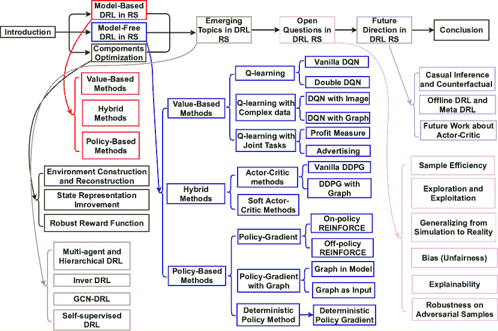
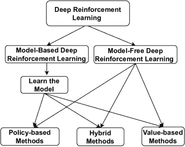
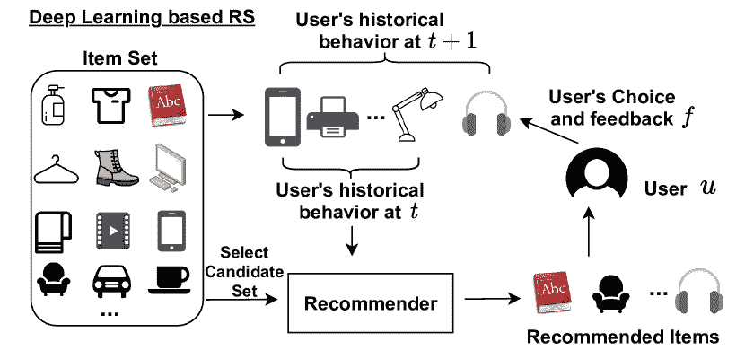
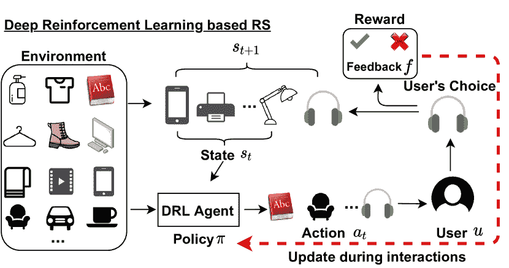
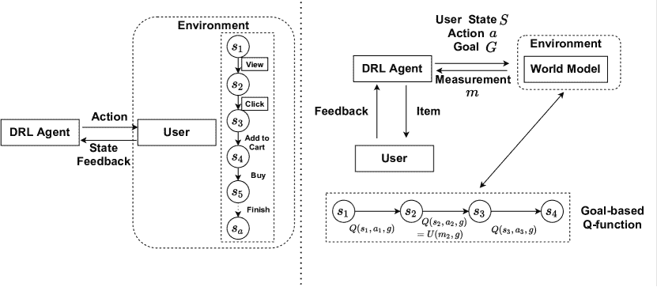
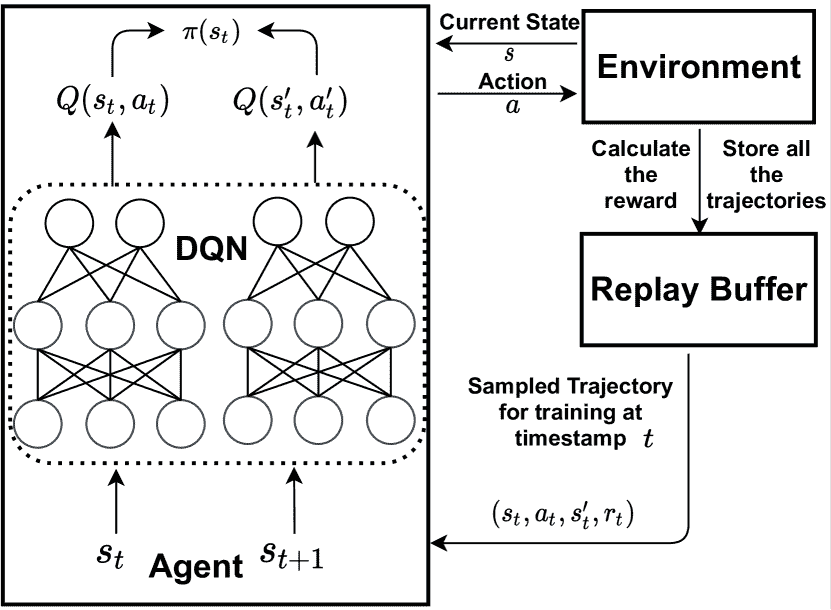
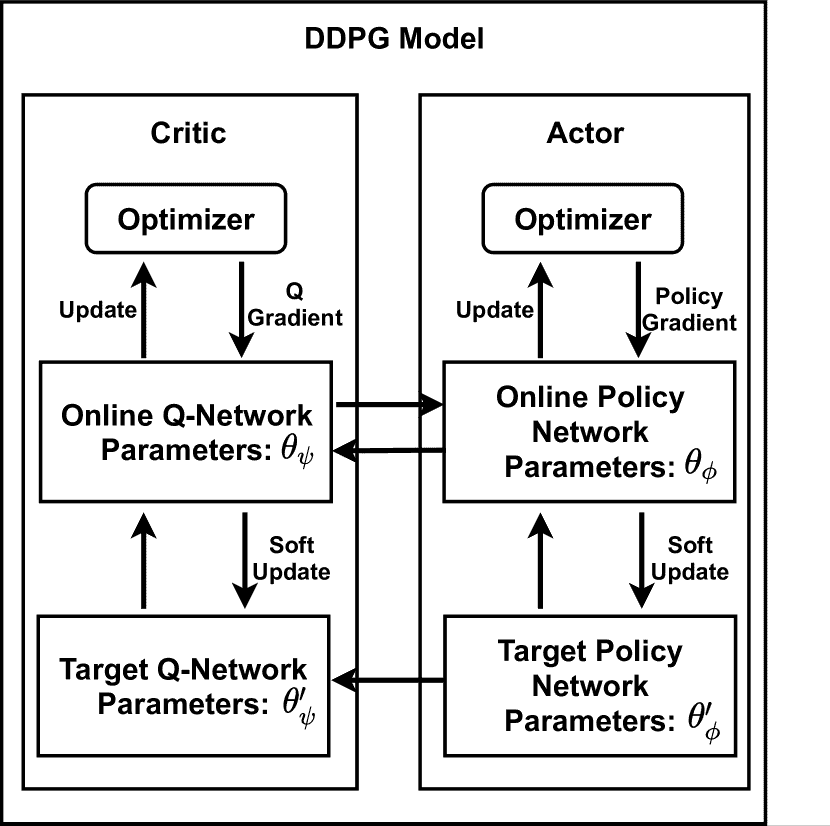
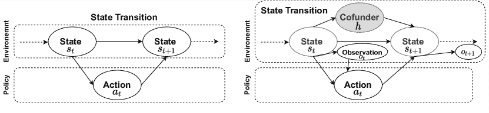
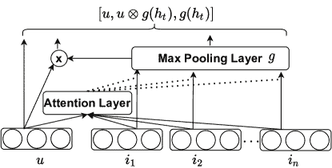

<!--yml

分类：未分类

日期：2024-09-06 19:51:37

-->

# [2109.03540] 深度强化学习在推荐系统中的调查：系统回顾与未来方向

> 来源：[`ar5iv.labs.arxiv.org/html/2109.03540`](https://ar5iv.labs.arxiv.org/html/2109.03540)

# 深度强化学习在推荐系统中的调查：系统回顾与未来方向

Xiaocong Chen xiaocong.chen@unsw.edu.au 新南威尔士大学 悉尼 NSW 澳大利亚，Lina Yao lina.yao@unsw.edu.au 新南威尔士大学 悉尼 NSW 澳大利亚，Julian Mcauley jmcauley@eng.ucsd.edu 加州大学圣地亚哥分校 CA USA，Guanglin Zhou guanglin.zhou@unsw.edu.au 新南威尔士大学 悉尼 NSW 澳大利亚，以及 Xianzhi Wang xianzhi.wang@uts.edu.au 先进技术大学 悉尼 NSW 澳大利亚（2021）

###### 摘要。

鉴于深度强化学习（DRL）在推荐系统研究中的兴起以及近年来取得的一些丰硕成果，本调查旨在提供对深度强化学习在推荐系统中最新趋势的及时而全面的概述。我们从应用 DRL 于推荐系统的动机开始，然后提供当前基于 DRL 的推荐系统的分类法和现有方法的总结。我们讨论了新兴话题和开放性问题，并提供了我们对推动该领域发展的观点。本调查作为学术界和工业界读者的入门材料，并识别了进一步研究的显著机会。

深度强化学习、深度学习、推荐系统^†^†版权：acmcopyright^†^†期刊年份：2021^†^†doi：10.1145/1122445.1122456^†^†期刊：JACM^†^†期刊卷号：37^†^†期刊期号：4^†^†文章：111^†^†出版月份：9^†^†ccs：信息系统 推荐系统^†^†ccs：计算方法 强化学习^†^†ccs：计算方法 神经网络

## 1\. 引言

近年来，推荐技术取得了显著进展，从传统推荐技术（如协同过滤、基于内容的推荐和矩阵分解（Lu 等， 2015））到基于深度学习的技术。特别是，深度学习在解决复杂任务和处理复杂数据方面表现出强大的优势，因为它能够捕捉非线性的用户-项目关系，并处理各种类型的数据源，如图像和文本。因此，它在推荐系统中的应用越来越广泛。基于深度学习的推荐系统在捕捉兴趣动态（Chen 等， 2020b；Zhang 等， 2019b）方面存在局限性，因为分布偏移，即训练阶段基于的现有数据集可能无法反映快速变化的真实用户偏好。相比之下，深度强化学习（DRL）旨在训练一个可以通过结合深度学习和强化学习的力量，从环境提供的互动轨迹中学习的代理。由于 DRL 中的代理可以通过用户的实时反馈主动学习以推断动态用户偏好，DRL 特别适合从互动中学习，如人机协作；它还推动了视频游戏、Alpha Go 和自动驾驶等一系列互动应用的显著进展（Arulkumaran 等， 2017）。鉴于 DRL 在推荐系统中的重要性和最近的进展，我们旨在及时总结和评论基于 DRL 的推荐系统。

最近的一项关于基于强化学习的推荐系统的调查（Afsar 等， 2021）提供了对推荐系统中强化学习的总体评述，但未对不断发展的深度强化学习领域进行深入探讨。我们的调查在于提供对现有 DRL 基于推荐系统方法的系统和全面的概述，同时讨论新兴话题、开放问题和未来方向。本调查介绍了这一主题的研究人员、从业者和教育工作者，并促进了对该领域关键技术的理解。

本调查的主要贡献包括：

+   •

    我们提供了关于推荐系统中深度强化学习的最新全面回顾，包括最先进的技术和核心参考文献。我们认为，这是第一份关于深度强化学习基于推荐系统的全面调查。

+   •

    我们呈现了推荐系统中深度强化学习文献的分类法。结合概述的分类法和文献综述，我们讨论了优点、缺点并提出了未来研究方向的建议。

+   •

    我们阐明了基于 DRL 的推荐系统的新兴话题和开放性问题。我们还指出了可能对推进基于 DRL 的推荐系统至关重要的未来方向。

本调查的其余部分组织如下：第二部分提供了推荐系统、DRL 及其集成的概述。第三部分提供了文献综述，包含分类和分类机制。第四部分回顾了新兴话题，第五部分指出了开放性问题。最后，第六部分提供了一些有前景的未来方向，以促进该领域的进一步发展。

图 1. 本调查中的基于深度强化学习的推荐系统的分类

## 2\. 背景

在本节中，我们介绍与动态推荐系统（RS）和深度强化学习（DRL）相关的关键概念，并激励将 DRL 引入动态推荐系统。

### 2.1\. 为什么选择深度强化学习进行推荐？

推荐系统需要通过估计快速变化的用户偏好并主动向用户推荐项目来应对*动态*环境。设 $\mathcal{U}$ 为一个用户集合，其基数为 $|\mathcal{U}|$，$\mathcal{I}$ 为一个项目集合，其基数为 $|\mathcal{I}|$。对于每个用户 $u\in\mathcal{U}$，我们观察到一个用户行为序列 $\mathbb{X}^{u}=[x_{1}^{u},x_{2}^{u},\cdots,x_{T_{u}}^{u}]$，其中项目 $x_{t}^{u}\in\mathcal{I}$，即用户序列中的每个事件都来自于项目集合。我们将用户做出决策称为与项目的交互。假设用户提供的反馈（例如，评分或点击行为）为 $\mathcal{F}$，则动态推荐系统维护相应的推荐策略 $\pi^{u}_{t}$，该策略将根据在时间戳 $t$ 与项目 $i\in\mathcal{I}$ 交互过程中收到的反馈 $f^{u}_{i}\in\mathcal{F}$ 系统地更新。

深度学习与强化学习的结合推动了推荐系统的突破。基于 DRL 的推荐系统由三个构建块组成：环境构建、状态表示和推荐策略学习。环境构建的目标是基于一组用户的历史行为建立一个环境。状态表示由包含特定用户信息的环境提供，包括历史行为、人口统计数据（等）。推荐策略学习是理解和预测用户未来行为的关键组件。基于 DL 的推荐系统接收用户反馈（例如评分或点击）以反映用户兴趣并更新推荐系统，而基于 DRL 的推荐系统则接收环境提供的奖励以更新策略。环境提供的奖励是一个预定义的函数，包含几个因素。DL-based RS 和 DRL-based RS 映射的详细过程可以在 图 3 中找到。

### 2.2\. 深度强化学习的基础

DRL 的典型定义特征是利用深度学习来近似强化学习的价值函数，并解决高维的马尔可夫决策过程（MDPs） (Arulkumaran et al., 2017)。形式上，MDP 可以表示为一个元组（$\mathcal{S},\mathcal{A},\mathcal{P},\mathcal{R},\gamma$）。代理在状态$s_{t}\in\mathcal{S}$下，根据策略$\pi_{t}(s_{t})$选择一个动作$a_{t}\in\mathcal{A}$。环境接收该动作并产生一个奖励$r_{t+1}\in\mathcal{R}$，然后根据转移概率$P(s_{t+1}|s_{t},a_{t})\in\mathcal{P}$将奖励转移到下一个状态$s_{t+1}$。在 DRL 中，转移概率$\mathcal{P}$事先是未知的。这样的过程继续进行，直到代理达到终止状态或超过预定义的最大时间步。总体目标是最大化期望的折扣累积奖励，

| (1) |  | $\displaystyle\mathbb{E}_{\pi}[r_{t}]=\mathbb{E}_{\pi}\big{[}\sum_{0}^{\infty}\gamma^{k}r_{t+k}\big{]}$ |  |
| --- | --- | --- | --- |

其中$\gamma\in[0,1]$是折扣因子，用于平衡未来奖励和即时奖励。

图 2. 推荐系统中深度强化学习的分类

深度强化学习可以分为两类：*基于模型* 和 *无模型* 方法（详细分类可以参见图 2）。这两者之间的主要*d*ifference 在于代理是否能够学习环境模型。基于模型的方法旨在估计转换函数和奖励函数，而无模型的方法旨在从经验中估计价值函数或策略。在基于模型的方法中，代理访问环境并进行前瞻性规划，而无模型的方法通过使用比基于模型的方法更广泛开发和测试的模型来提高样本效率（Arulkumaran 等，2017）。

深度强化学习方法被分为三种流派：*基于价值*，*基于策略* 和 *混合* 方法。在基于价值的方法中，代理更新价值函数以学习策略；基于策略的方法直接学习策略；而混合方法结合了基于价值和基于策略的方法，称为*actor-critic*方法。Actor-critic 包含两个不同的网络，其中一个 actor 网络使用基于策略的方法，critic 网络使用基于价值的方法来评估代理学习的策略。

表 1. 符号

| 符号 | 名称 | 符号 | 名称 | 注释 |
| --- | --- | --- | --- | --- |
| $Q(\cdot)$ | Q-价值函数 | $s$ | 状态 | 用户的偏好 |
| $V(\cdot)$ | 价值函数 | $a$ | 行动 | 推荐项目 |
| $\gamma$ | 折扣因子 | $\pi$, $\mu(\cdot)$ | 策略 | 推荐策略 |
| $\mathbb{E}$ | 期望值 | $r(\cdot,\cdot)$ | 奖励 | 用户的点击行为 |
| $\theta$ | 模型参数 | $\alpha$ | 常数 $\in[0,1]$ | - |
| $p(\cdot)$ | 转移概率 | $\tau$ | 采样轨迹 | 一个元组 $(s_{t},a_{t},s^{\prime}_{t},r_{t})$ |

深度强化学习可以分为*在策略*和*离策略* 方法。在离策略方法中，行为策略 $\pi_{b}$ 用于探索，而目标策略 $\pi$ 用于决策。对于在策略方法，行为策略与目标策略相同。

Q-learning（Watkins 和 Dayan，1992）是一种离策略的基于价值的学习方案，用于寻找贪婪目标策略：

| (2) |  | $\displaystyle\pi(s)=\operatorname*{arg\,max}_{a}Q_{\pi}(s,a)$ |  |
| --- | --- | --- | --- |

其中 $Q_{u}(s,a)$ 表示 $Q$-值，并用于小型离散动作空间。对于确定性策略，$Q$ 值可以计算如下

| (3) |  | $\displaystyle Q(s_{t},a_{t})=\mathbb{E}_{\tau\sim\pi}[r(s_{t},a_{t})+\gamma Q(s^{\prime}_{t},a^{\prime}_{t})].$ |  |
| --- | --- | --- | --- |

深度 Q 学习（DQN）（Mnih 等人，2015）使用深度学习来近似由 $\theta_{q}$ 参数化的非线性 Q 函数：$Q_{\theta_{q}}(s,a)$。DQN 设计了一个网络 $Q_{\theta_{q}}$，通过最小化均方误差（MSE）来异步更新：

| (4) |  | $\displaystyle\mathcal{L}(\theta_{q})=\mathbb{E}_{\tau\sim\pi}\Big{[}Q_{\theta_{q}}(s_{t},a_{t})-(r(s_{t},a_{t})+\gamma Q_{\theta_{q}}(s^{\prime}_{t},a^{\prime}_{t}))\Big{]}^{2}$ |  |
| --- | --- | --- | --- |

其中 $\tau$ 是包含 $(s,a,s^{\prime},r(s,a))$ 的采样轨迹。特别地，$s^{\prime}_{t}$ 和 $a^{\prime}_{t}$ 来自行为策略 $\pi_{b}$，而 $s,a$ 来自目标策略 $\pi$。值得一提的是，值函数 $V_{\pi}(s)$ 代表期望回报。$V_{\pi}(s)$ 用于评估状态的好坏，而 $Q_{\pi}(s_{t},a_{t})$ 用于评估动作。$V_{\pi}(s)$ 可以定义为

| (5) |  | $\displaystyle V_{\pi}(s)=\mathbb{E}_{\tau\sim\pi}\bigg{[}\sum_{t=0}^{T}\gamma^{t}r(s,a)&#124;s_{0}=s\bigg{]}.$ |  |
| --- | --- | --- | --- |

$V_{\pi}(\cdot)$ 和 $Q_{\pi}(\cdot)$ 具有以下关系：

| (6) |  | $\displaystyle V_{\pi}(s)=\mathbb{E}_{a\sim\pi}[Q_{\pi}(s,a)].$ |  |
| --- | --- | --- | --- |

值函数使用以下规则与时序差分（TD）方法进行更新，

| (7) |  | $\displaystyle V_{\pi}(s_{t})\leftarrow V_{\pi}(s_{t})+\alpha[\underbrace{r(s^{\prime}_{t},a^{\prime}_{t})+\gamma V_{\pi}(s^{\prime}_{t})-V_{\pi}(s_{t})}_{\text{TD-error}}]$ |  |
| --- | --- | --- | --- |

其中 $\alpha$ 是一个常数。

策略梯度（Williams, 1992）是一种基于策略的方法，它可以处理高维或连续的动作，这些动作不能被 Q 学习轻松处理。策略梯度的最终目标是找到 $\pi_{\theta}$ 的参数 $\theta$ 以最大化累计奖励。为此，它最大化从起始状态的期望回报：

| (8) |  | $\displaystyle J(\pi_{\theta})=\mathbb{E}_{\tau\sim\pi_{\theta}}[r(\tau)]=\int\pi_{\theta}(\tau)r(\tau)d\tau$ |  |
| --- | --- | --- | --- |

其中 $\pi_{\theta}(\tau)$ 是 $\tau$ 发生的概率。策略梯度通过下述梯度 $\nabla_{\theta}J(\pi_{\theta})$ 来学习参数 $\theta$：

|  | $\displaystyle\nabla_{\theta}J(\pi_{\theta})=\int\pi_{\theta}(\tau)r(\tau)d\tau$ | $\displaystyle=\int\pi_{\theta}(\tau)\nabla_{\theta}\log\pi_{\theta}(\tau)r(\tau)d\tau$ |  |
| --- | --- | --- | --- |
| (9) |  |  | $\displaystyle=\mathbb{E}_{\tau\sim d_{\pi_{\theta}}}[\sum_{t=1}^{T}r(s_{t},a_{t})\sum_{t=1}^{T}\nabla_{\theta}\log\pi_{\theta}(s_{t},a_{t})].$ |  |

上述推导包含以下替代，

| (10) |  | $\displaystyle\pi_{\theta}(\tau)=p(s_{1})\prod_{t=1}^{T}\pi_{\theta}(s_{t},a_{t})p(s_{t+1}&#124;s_{t},a_{t})$ |  |
| --- | --- | --- | --- |

其中 $p(\cdot)$ 与策略参数 $\theta$ 无关，在推导过程中被省略。蒙特卡洛采样已被以前的策略梯度算法（例如 REINFORCE）用于 $\tau\sim d_{\pi_{\theta}}$。

Actor-critic 网络结合了 Q 学习和策略梯度的优点。它们可以是在线的（Konda 和 Tsitsiklis， 2000）或离线的（Degris 等， 2012）。一个 actor-critic 网络由两个组件组成：i) actor，它在 $\nabla_{\theta}J(\pi_{\theta})$ 的指导下优化策略 $\pi_{\theta}$；ii) critic，它通过使用 $Q_{\theta_{q}}(s,a)$ 来评估学习到的策略 $\pi_{\theta}$。整体梯度表示如下：

| (11) |  | $\displaystyle\mathbb{E}_{s\sim d_{\pi_{\theta}}}[Q_{\theta_{q}}(s,a)\nabla_{\theta}\log\pi_{\theta}(s,a)].$ |  |
| --- | --- | --- | --- |

在处理离线策略学习时，值函数 $\pi_{\theta}(a|s)$ 可以通过确定性策略梯度（DPG）进一步确定，如下所示：

| (12) |  | $\displaystyle\mathbb{E}_{s\sim d_{\pi_{\theta}}}[\nabla_{a}Q_{\theta_{q}}(s,a) | _{a=\pi_{\theta}(s)}\nabla_{\theta}\pi_{\theta}(s,a)].$ |  |
| --- | --- | --- | --- | --- |

传统的策略梯度计算状态空间 $\mathcal{S}$ 和动作空间 $\mathcal{A}$ 的积分，而 DPG 只需计算状态空间 $\mathcal{S}$ 的积分。给定状态 $s\in\mathcal{S}$，使用 DPG 将只有一个相应的动作 $a\in\mathcal{A}:\mu_{\theta}(s)=a$。具体而言，深度确定性策略梯度（DDPG）是一个结合了 DQN 和 DPG 技术的算法。DDPG 包含四个不同的神经网络：Q 网络 $Q$、策略网络、目标 Q 网络 $Q^{\mathit{tar}}$ 和目标策略网络。它使用 Q 网络 $Q$ 和策略网络 $\mu$ 的目标网络以确保训练过程中的稳定性。假设 $\theta_{q},\theta_{\pi},\theta_{q^{\prime}}$ 和 $\theta_{\pi^{\prime}}$ 是上述网络的参数；然后 DDPG 对目标网络进行软更新（Lillicrap 等， 2015）：

| (13) |  | $\displaystyle\text{Actor: }\theta_{\pi^{\prime}}\leftarrow\alpha\theta_{\pi}+(1-\alpha)\theta_{\pi^{\prime}}\text{ Critic: }\theta_{q^{\prime}}\leftarrow\alpha\theta_{q}+(1-\alpha)\theta_{q^{\prime}}$ |  |
| --- | --- | --- | --- |

### 2.3\. DRL 遇到 RS：问题表述

DRL 通常被表述为马尔可夫决策过程（MDP）。给定一组用户 $\mathcal{U}=\{u,u_{1},u_{2},u_{3},...\}$ 和一组项目 $\mathcal{I}=\{i,i_{1},i_{2},i_{3},...\}$，系统首先向用户 $u$ 推荐项目 $i$，然后获取反馈 $f_{i}^{u}$。系统旨在将反馈纳入考虑，以改善未来的推荐，并需要确定一个关于向用户推荐哪个项目的**最优策略** $\pi^{*}$ 以获得积极反馈。MDP 的建模将用户视为环境，将系统视为代理。DRL 基于 RS 的 MDP 的关键组成部分包括：

+   •

    状态 $\mathcal{S}$：状态 $S_{t}\in\mathcal{S}$ 由用户信息和用户在时间 $t$ 之前感兴趣的最近 $l$ 项目决定。

+   •

    行动 $\mathcal{A}$：一个行动 $a_{t}\in\mathcal{A}$ 代表了代理在时间 $t$ 预测的用户动态偏好。$\mathcal{A}$ 代表了整个（可能有数百万个）候选项的集合。

+   •

    转移概率 $\mathcal{P}$：转移概率 $p(s_{t+1}|s_{t},a_{t})$ 被定义为在执行行动 $a_{t}$ 时，从状态 $s_{t}$ 转移到状态 $s_{t+1}$ 的概率。在推荐系统中，转移概率指的是用户行为的概率。$\mathcal{P}$ 仅在基于模型的方法中使用。

+   •

    奖励 $\mathcal{R}$：一旦代理根据时间 $t$ 的当前状态 $S_{t}$ 选择了合适的行动 $a_{t}$，用户将收到代理推荐的项目。用户对推荐项目的反馈构成了奖励 $r(S_{t},a_{t})$。反馈用于改进代理学到的策略 $\pi$。

+   •

    折扣因子 $\gamma$：折扣因子 $\gamma\in[0,1]$ 用于平衡未来和即时奖励——当 $\gamma=0$ 时，代理只关注即时奖励，而在其他情况下则会考虑所有的（即时和未来的）奖励。

基于深度强化学习的推荐问题可以使用 MDP 进行定义。给定历史 MDP，即 $(\mathcal{S},\mathcal{A},\mathcal{P},\mathcal{R},\gamma)$，目标是找到一组推荐策略（$\{\pi\}:\mathcal{S}\to\mathcal{A}$），以最大化与用户交互过程中累积的奖励。

###### 问题定义 0。

给定一个包含所有项的环境 $\mathcal{I}$，当用户 $u\in\mathcal{U}$ 与系统互动时，从环境中采样一个初始状态 $s$，该状态包含候选项列表和用户的历史数据。DRL 代理需要基于状态 $s$ 制定推荐策略 $\pi$ 并生成相应的推荐项目列表 $a$。用户将对该列表提供反馈，通常表示为点击或未点击。DRL 代理将利用反馈来改进推荐策略，并进入下一次互动周期。

（a）基于深度学习的推荐系统

（b）基于深度强化学习的推荐系统

图 3. 深度学习推荐系统与深度强化学习推荐系统之间的区别。深度学习推荐系统可能仅在训练阶段更新推荐策略。当用户的兴趣发生重大变化时，它们通常需要重新训练，这在计算上是低效的。而基于深度强化学习的推荐系统会随着新奖励的接收不断更新推荐策略。

## 3. 深度强化学习在推荐系统中的应用

基于 DRL 的推荐系统面临一些独特的挑战，如状态构建、奖励估计和环境模拟。我们将现有的基于 DRL 的推荐工作分为基于模型的方法和无模型的方法（分类见图 2）。

### 3.1\. 基于模型的深度强化学习方法

基于模型的方法假设下一步的期望奖励或动作可用，以帮助代理更新策略。

表 2. 基于模型的 DRL 推荐系统的出版物列表

| 方法 | 工作 |
| --- | --- |
| 基于价值 | (张等人, 2017; 陈等人, 2019c; 邹等人, 2020; 王等人, 2021) |
| 基于策略 | (白等人, 2019; 洪等人, 2020) |
| 混合 | (赵等人, 2020c) |

##### 基于策略的方法

IRecGAN (白等人, 2019) 是一种基于模型的方法，采用生成对抗训练来提高策略学习的鲁棒性。通过使用离线数据代替模拟环境，它可以减少推荐系统的交互成本。IRecGAN 利用生成对抗网络 (Goodfellow 等人, 2014) 来基于离线数据集生成用户数据。它使用一种基于策略梯度的 DRL 方法称为 REINFORCE 来训练推荐代理。该代理旨在根据以下梯度学习策略，

| (14) |  | $\displaystyle\mathbb{E}_{\tau\sim\{g,data\}}\big{[}\sum_{t=0}^{T}\sum_{t^{\prime}=t}^{T}\gamma^{t^{\prime}-t}q_{D}(\tau_{0:t}^{n})r_{t}\nabla_{\theta_{a}}(c_{t}\in\pi_{\theta_{a}}(s_{t})\big{]},q_{D}(\tau_{0:t}^{n})=\frac{1}{N}\sum_{n=1}^{N}D(\tau_{0:T}^{n}),\tau_{0:T}^{n}\in MC^{\mathcal{U}}(N)$ |  |
| --- | --- | --- | --- |

其中，$\mathit{MC}^{\mathcal{U}}(N)$表示从$\mathcal{U}$与代理之间的交互中采样的$N$个序列，使用蒙特卡罗树搜索算法，$D$是鉴别器，$T$是$\tau$的长度，$g$表示离线数据，数据表示生成的数据。

Hong 等人 (2020) 提出了 NRSS 用于个性化音乐推荐。NRSS 使用无线传感数据来学习用户的当前偏好。NRSS 考虑三种不同类型的反馈：分数、选项和无线传感数据。由于多个因素被视为奖励，NRSS 设计了一个奖励模型，包括用户偏好奖励 $r_{p}$ 和一个新的过渡奖励 $r_{\textit{trans}}$，它们由 $\theta_{r_{p}}$ 和 $\theta_{r_{\textit{trans}}}$ 参数化。NRSS 的目标是通过使用蒙特卡洛树搜索来找到最佳参数 $\theta_{r_{p}}$ 和 $\theta_{r_{\textit{trans}}}$，从而提高推荐性能。然而，无线传感反馈缺乏泛化能力，因为它仅适用于某些任务或场景，这使得动态用户兴趣的确定变得困难。

##### 基于价值的方法

在 Q-learning 之前，价值迭代是一种更传统的基于价值的强化学习算法，重点在于价值函数的迭代。Gradient Value Iteration (GVI) (Zhang 等人，2017) 被提出以利用转移概率和多智能体设置来改进传统的价值迭代算法，用于预测时间顺序的作者合作。它引入了一个名为‘状态’的新参数，以反映代理需要从这个状态中学习的知识量。只有当新状态与旧状态之间的距离小于预定义阈值时，策略才会更新。然而，价值迭代需要转移概率，这在大多数情况下很难获得。因此，Q-learning 及其变体在基于 DRL 的 RS 中被广泛使用。Cascading DQN (CDQN) 与生成用户模型 (Chen 等人，2019c) 被提出以处理具有未知奖励和环境动态的环境。生成用户模型采用 GANs 基于离线数据集生成用户模型。与以往的工作不同，它将为每个用户生成奖励函数以解释用户的行为。用户模型可以写作，

| (15) |  | $\displaystyle\operatorname*{arg\,max}_{\phi\in\triangle^{k-1}}\mathbb{E}_{\phi}[r(s_{t},a_{t})]-R(\phi)/\eta$ |  |
| --- | --- | --- | --- |

其中 $\triangle^{k-1}$ 是概率单纯形，$R(\phi)$ 是探索的正则化项，$\eta$ 是一个常数。

伪 Dyna-Q (PDQ) (Zou et al., 2020)指出，蒙特卡罗树搜索可能会导致极大的行动空间和训练样本的重要性权重无界。因此，提出了一个世界模型，通过模仿离线数据集来减少与用户交互时的收敛不稳定性和高计算成本。通过世界模型，代理将与学习的世界模型交互，而不是环境，以提高样本效率和收敛稳定性。PDQ 中引入的世界模型学习过程可以描述为寻找参数$\theta_{M}$，

| (16) |  | $\displaystyle\operatorname*{arg\,min}_{\theta_{M}}\mathbb{E}_{\xi\in P_{\xi}^{\pi}}[\sum_{t}^{T-1}\gamma^{t}\prod_{j=0}^{t}\frac{\pi(s_{j},a_{j})}{\pi_{b}(s_{j},a_{j})}\Delta_{t}(\theta_{M})]$ |  |
| --- | --- | --- | --- |

其中$\xi$由记录的策略$\pi_{b}$生成，$\prod_{j=0}^{t}\frac{\pi(s_{j},a_{j})}{\pi_{b}(s_{j},a_{j})}$是用于重要性采样的比例，$\Delta$是世界模型中的奖励和真实奖励之间的差异。此外，GoalRec (Wang et al., 2021)设计了一个解耦的通用价值函数，集成到世界模型中，以帮助代理处理不同的推荐任务。通用价值函数定义为

| (17) |  | $\displaystyle V_{\pi}(s)=\mathbb{E}[\sum_{t=0}^{\infty}r(s_{t},a_{t})\prod_{k=0}^{t}\gamma s_{k}&#124;s_{0}=s].$ |  |
| --- | --- | --- | --- |

此外，GoalRec 引入了一个新的变量目标$g\in G$，用于表示用户的未来轨迹和测量$ m\in M $。$m$是一个指标，反映了用户对基于历史行为的给定未来轨迹的响应。基于此，最佳行动将根据

| (18) |  | $\displaystyle a^{*}=\max_{a}U(M(s,a),g)$ |  |
| --- | --- | --- | --- |

使用自定义的线性函数$U(\cdot)$。

图 4。左侧是无模型方法的一般结构。右侧是 GoalRec 的结构，它是基于模型的方法。一个示例轨迹用来展示它们之间的区别 (Wang et al., 2021)。

##### 混合方法

混合方法可以被认为是基于价值的方法和基于策略梯度的方法之间的一个中间点。DeepChain (Zhao et al., 2020c)利用多代理设置来缓解次优性问题。次优性问题是由于“一个适用于所有”的设置优化了一个策略来服务所有用户。因此，DeepChain 设计了一个多代理设置，采用多个代理来学习连续场景，并联合优化多个推荐策略。主要的训练算法是 DDPG。为此，用户的行动可以用基于模型的形式表示如下：

| (19) |  | $\displaystyle\sum_{m,d}[p_{m}^{s}(s_{t},a_{t})\gamma Q_{\theta}(s^{\prime}_{t},\pi_{m}(s^{\prime}_{t}))+p_{m}^{c}(s_{t},a_{t})(r_{t}+\gamma Q_{\theta}(s^{\prime}_{t},\pi_{d}(s^{\prime}_{t})))+p_{m}^{l}(s_{t},a_{t})r_{t}]1_{m}$ |  |
| --- | --- | --- | --- |

其中$m$表示演员网络的数量，$c,l,s$表示三种不同的场景，$1_{m}$用于控制两个演员的激活，$(m,d)\in\{(1,2),(2,1)\}$。

##### 讨论

基于模型的方法旨在学习一个模型或表示来表征整个环境，以便代理可以提前规划并获得更好的样本效率。这种方法的缺点是，在推荐场景中，由于环境动态变化，无法获得环境的真实表示，从而导致偏差的表示。此外，基于模型的方法使用转移概率函数$\mathcal{P}$来估计最优策略。如前所述，转移概率函数通常等同于用户的行为概率，而在推荐系统中很难确定。因此，现有的工作（Zhao et al., 2020c; Bai et al., 2019; Wang et al., 2021; Zou et al., 2020; Chen et al., 2019c; Zhang et al., 2017）通过神经网络近似$\mathcal{P}$或将其嵌入到世界模型中。Zhao et al. (2020c)设计了一个概率网络来估计$\mathcal{P}$，而（Bai et al., 2019; Chen et al., 2019c）则使用 GAN 生成用户行为，其中$\mathcal{P}$嵌入在潜在空间中。与他们不同的是，（Wang et al., 2021; Zou et al., 2020）依赖于世界模型来预测用户的下一步行为，并将其输入到策略学习过程中。

基于模型的 DRL 面临的挑战在推荐系统中使用不广泛，可以总结为以下几个方面：

+   •

    在现实世界的推荐系统中，$\mathcal{P}$很难确定。

+   •

    如果使用近似来估计$\mathcal{P}$，总体模型复杂性将显著增加，因为这需要通过大量的用户行为数据来近似两个不同的函数$\mathcal{P}$和推荐策略$\pi$。

+   •

    基于世界模型的方法需要定期重新训练，以确保模型能够及时反映用户的兴趣，这增加了计算成本。

(a) DQN

(b) DDPG

图 5. DQN 和 DDPG 的典型结构

### 3.2\. 基于模型无关的深度强化学习方法

与基于模型的方法相比，基于模型的方法较少研究。与基于模型的方法不同，在基于模型的方法中，$\mathcal{P}$ 是未知的且不需要。在这一小节中，我们将基于模型的方法的 DRL 在推荐系统中分为三个部分：基于值的方法、基于策略的方法和混合方法。

表 3. 综述的无模型 DRL 基础推荐系统文献列表

| 任务 | 注释 | 工作 |
| --- | --- | --- |
| 基于值的方法 | 原始 DQN 及其扩展 | (郑等，2018；赵等，2018a；雷等，2019) |
| 优化状态/动作空间的 DQN | (肖等，2020；雷和李，2019；邹等，2019；艾等，2019b) |
| 图像/图形输入的 DQN | (雷等，2020；桂等，2019；奥耶莱克等，2018；赵等，2018b；高等，2019；周等，2020) |
| 联合学习的 DQN | (裴等，2019；赵等，2020e；赵等，2021) |
| 基于策略的方法 | 原始 REINFORCE | (潘等，2019；王等，2018a；陈等，2019a；徐等，2020；马等，2020；陈等，2021；蒙塔泽拉赫姆等，2020；季等，2020；余等，2019) |
| REINFORCE 使用图结构/输入 | (王等，2020a；萧等，2019；王等，2020b；陈等，2019b) |
| 非 REINFORCE 基础 | (胡等，2018；张等，2019d) |
| 混合方法 | 原始 DDPG | (赵等，2019b，2018a；刘等，2020b；王等，2018b；蔡等，2018) |
| 知识图谱 | (陈等，2020b；赵等，2020b；冯等，2018；张等，2021；何等，2020，2020；哈诺贾等，2018；赵等，2020d；谢等，2021) |

##### 基于值的方法

如前所述，深度 Q 学习及其变体是典型的基于值的深度强化学习（DRL）方法，广泛应用于基于 DRL 的推荐系统（RS）。DRN（郑等，2018）是首个在推荐系统中利用深度 Q 网络（DQN）的工作。它采用双重 DQN（DDQN）（范·哈塞尔特等，2016）来构建用户画像，并设计了一个活跃度评分，以反映用户在一次推荐后返回的频率，以及用户的行为（点击或未点击）作为奖励。DRN 提供了一种在处理动态环境时将 DRL 集成到推荐系统中的新方法。关键目标函数如下，

| (20) |  | $\displaystyle\mathbb{E}[r_{t+1}+\gamma Q_{\theta_{t}^{\prime}}(s_{t+1},\operatorname*{arg\,max}_{a^{\prime}}Q_{\theta_{t}}(s_{t},a^{\prime}))]$ |  |
| --- | --- | --- | --- |

其中 $a^{\prime}$ 是根据 $\theta_{t}$ 给出的最大未来奖励的动作，$\theta_{t}$ 和 $\theta_{t}^{\prime}$ 是两个不同 DQN 的不同参数。赵等人（2018a）指出，负反馈也会影响推荐性能，而 DRN 并未考虑这一点。此外，由于 RS 中候选项的数量庞大，正反馈是稀疏的。仅使用正反馈会导致收敛问题。因此，DEERS 被提出以同时考虑正反馈和负反馈，并使用 DQN。使用门控递归单元（GRU）来捕捉用户对正状态 $s^{+}$ 和负状态 $s^{-}$ 的偏好，最终的目标函数可以计算为：

| (21) |  | $\displaystyle\mathbb{E}[r_{t+1}+\gamma\max_{a_{t+1}}Q_{\theta_{q}}(s^{+}_{t+1},s^{-}_{t+1},a_{t+1})\mid s^{+}_{t},s^{-}_{t},a_{t}]$ |  |
| --- | --- | --- | --- |

雷等人（2019）将注意力机制引入 DQN，以利用用户之间的社会影响。具体而言，社会影响表示 $U_{v}$ 被引入状态表示中。采用矩阵分解来确定用户之间的相似性，从而呈现社会影响。引入社会注意力以提炼最终的状态表示。此外，一些研究关注用户画像以提高推荐性能（肖等人，2020；雷和李，2019；邹等人，2019）。雷和李（2019）声称，即使用户不喜欢推荐的项目，用户反馈中也包含有用的信息。一些现有研究关注最终反馈，却忽略了早期步骤到后续步骤的重要性。因此，提出了用户特定 DQN（UQDN）以考虑来自用户的多步骤反馈。它采用矩阵分解生成用户特定的潜在状态空间。使用用户特定潜在状态空间的新定义目标函数可以表示为：

| (22) |  | $\displaystyle\mathbb{E}[r_{t+1}+\gamma\max_{a_{t+1}}\overline{Q}_{\theta_{q}}(s_{t+1},a_{t+1})+\overline{\textbf{b}}_{u}-Q_{\theta_{q}}(s_{t+1},a_{t+1})]$ |  |
| --- | --- | --- | --- |

其中 $\overline{\textbf{b}}_{u}$ 是学习得到的用户潜在表示。Zou 等人（2019）还指出，大多数研究未考虑用户在状态表示中的长期参与，因为它们专注于即时奖励。FeedRec 被提出，它将即时反馈和延迟反馈结合到模型中，以表示长期奖励，并通过使用 DQN 优化长期参与。具体而言，time-LSTM 被用于跟踪用户的层次行为，以表示包含三种不同操作的延迟反馈：$h_{\mathit{skip}},h_{\mathit{choose}},h_{\mathit{order}}$。状态空间是这些操作和用户潜在表示的串联。不同的是，Xiao 等人（2020）关注推荐系统中的用户隐私问题。Deep user profile perturbation (DUPP) 被提出在推荐过程中通过使用 DQN 向用户配置文件添加扰动。具体来说，DUPP 将扰动向量添加到用户点击的项目以及状态空间中，这些空间包含用户的先前行为。

与专注于优化用户配置文件或状态空间的先前研究不同，一些研究旨在优化由与项目互动形成的动作空间。在篮子推荐的情况下，用户被建议多个作为一组的项目，这称为推荐 slate。它导致组合上很大的动作空间，使得基于 DQN 的推荐模型不可处理。

SlateQ（Ie 等人，2019b）被提出用于将 slate Q 值分解，以估计单个项目的长期价值，它的表示为，

| (23) |  | $\displaystyle Q_{\theta_{q}}(s_{t},a_{t})=\sum_{i\in a_{t}}p(i | s_{t},a_{t})\overline{Q}_{\theta_{q}}(s_{t},i)$ |  |
| --- | --- | --- | --- | --- |

其中 $\overline{Q}_{\theta}(s,i)$ 是项 $i$ 的分解 Q 值。分解 Q 值将通过以下规则进行更新，该规则类似于传统的 DQN，

| (24) |  | $\displaystyle\overline{Q}_{\theta_{q}}(s_{t},i)\leftarrow\alpha\bigg{(}r_{t}+\gamma\sum_{j\in a_{t+1}}p(j | s_{t+1},a_{t+1})\overline{Q}_{\theta_{q}}(s_{t+1},j)\bigg{)}+(1-\alpha)\overline{Q}_{\theta_{q}}(s_{t},i).$ |  |
| --- | --- | --- | --- | --- |

与其他无模型方法不同，Slate-Q 假设转移概率 $p(i|s_{t},a_{t})$ 是已知的。

Vanilla DQN 方法可能没有足够的知识来处理复杂的数据，如图像和图表。Tang 和 Wang (2018) 首次将用户的点击行为建模为潜在空间中的嵌入矩阵，以包括序列模式的跳过行为，用于序列推荐。基于此，Gao 等人 (2019) 提出了 DRCGR，该方法将 CNN 和 GAN 引入 DQN，以帮助代理更好地理解高维数据，例如矩阵。使用了两种不同的卷积核来捕捉用户的积极反馈。同时，DRCGR 使用 GAN 学习负反馈表示，以提高鲁棒性。另一种典型的数据格式是图，这在推荐系统中广泛使用，包括知识图谱。Lei 等人 (2020) 提出了 GCQN，该方法将图卷积网络（GCN） (Kipf 和 Welling, 2017) 引入 DQN，构建状态和动作空间作为图感知表示。与不同的是，GCQN 引入了注意力聚合器：$\sum_{w\in\mathcal{N}(i)}\alpha_{iu}e_{u}$，其性能优于均值聚合器和池化聚合器。对于项目 $i$，图感知表示可以表示为，

| (25) |  | $\displaystyle\sigma\bigg{(}W_{fc}[e_{i}\oplus\sum_{w\in\mathcal{N}(i)}\alpha_{iu}e_{u}+b_{fc}]\bigg{)}$ |  |
| --- | --- | --- | --- |

其中 $W_{fc},b_{fc}$ 是全连接层的参数，$e_{u}$ 是用户 $u$ 的嵌入，$\mathcal{N}(i)$ 是图 $G(i)$ 中项目 $i$ 的一热邻居集合。Zhou 等人 (2020) 提出了 KGQR，采用类似的策略将信息转化为知识图谱，并输入 GCN 以生成状态表示。值得注意的是，KGQR 提出了不同的状态表示生成方法。对于给定节点 $i$，具有 $k$-跳邻域聚合器的邻域表示可以表示为，

| (26) |  | $\displaystyle e_{i}^{k}=\sigma\bigg{(}W_{k}\frac{1}{\left | \mathcal{N}(i)\right | }\sum_{t\in\mathcal{N}(i)}e_{t}^{k-1}+B_{k}e_{i}^{k-1}\bigg{)}$ |  |
| --- | --- | --- | --- | --- | --- |

其中 $\mathcal{N}(i)$ 是邻接节点的集合，$W_{k},B_{k}$ 是聚合器的参数。这些邻域表示将被输入到 GRU 中，生成状态表示。另一个使用图数据的应用领域是职位推荐，这需要考虑多个因素，如薪水、职位描述、职位地点等。SRDQN (Sun 等人, 2021) 构建了一个概率图来表示候选人的技能集，并采用多任务 DQN 结构来同时处理这些不同的因素。

有些研究在电子商务环境中同时针对推荐和广告（Pei et al., 2019; Zhao et al., 2020e; Zhao et al., 2021）。Pei 等人 (2019) 提到，当将推荐系统部署到如电子商务场景等现实世界平台时，期望是提高系统的利润。提出了一种新的度量标准，即总商品交易额（GMV），以衡量推荐系统的盈利能力，为广告中评估推荐系统提供了新的视角。与 GMV 不同，赵等人 (2020e) 将推荐和广告分为两个不同的任务，并提出了 Rec/Ads Mixed display (RAM) 框架。RAM 设计了两个代理：一个推荐代理和一个广告代理，其中每个代理都使用 CDQN 来执行相应的任务。赵等人 (2021) 发现广告和推荐可能会相互影响，并提出了推荐/广告权衡。他们提出的解决方案 DEARS 包含两个 RNN。两个 RNN 被用来分别捕捉用户对推荐和广告的偏好。在此基础上，DQN 被用来将这两个输出作为输入来构建状态并输出广告。

##### 基于策略的方法

基于策略的 DRL 可以分为两个部分，即约束策略优化（CPO） (Achiam et al., 2017) 和策略梯度。张等人 (2019d) 使用 CPO 识别文本反馈与历史偏好之间的矛盾。这为在用户反馈与先前反馈完全不同的推荐系统（RS）中使用 DRL 提供了解决方案。基于策略梯度的方法是基于策略的 DRL 方法中的另一类方法。这些方法旨在直接优化策略 $\pi$，而不是像 DQN 那样估计 Q 值。在推荐系统中，一个著名且广泛使用的策略梯度方法是 REINFORCE，它对策略 $\pi_{\theta_{\pi}}$ 使用以下规则，

| (27) |  | $\displaystyle\theta\leftarrow\theta+\alpha\mathbb{E}_{\tau\sim d_{\pi_{\theta_{\pi}}}}\bigg{[}\sum_{t=1}^{T}r(s_{t}^{i},a_{t}^{i})\sum_{t=1}^{T}\nabla_{\theta_{\pi}}\log\pi_{\theta_{\pi}}(s_{t}^{i},a_{t}^{i})\bigg{]}$ |  |
| --- | --- | --- | --- |

其中 $i$ 是从 $\pi_{\theta}(a_{t}|s_{t})$ 中采样的轨迹。潘等人 (2019) 提出了用于情境推荐的策略梯度（PGCR），它采用 REINFORCE 并考虑了情境信息。PGCR 假设策略遵循多项分布，在这种情况下，可以通过从之前见过的情境中采样来轻松估计转移概率。

王等人 (2018a) 将 CNN 和注意力机制结合到 REINFORCE 中，以实现可解释推荐。具体来说，这项工作设计了一个耦合代理结构，其中一个代理生成解释，而另一个代理基于生成的解释进行推荐。

Chen 等人 (2019a) 提高了 REINFORCE 的可扩展性，以确保它能够处理推荐场景下的极大动作空间。具体而言，它在 REINFORCE 中引入了策略修正梯度估计器，通过进行重要性采样来减少每个梯度的方差。新的更新规则变为

| (28) |  | $\displaystyle\theta_{\pi}\leftarrow\theta_{\pi}+\alpha\sum_{\tau\sim\beta}\bigg{[}\sum_{t=1}^{T}\frac{\pi_{\theta_{\pi}}(s_{t},a_{t})}{\pi_{\beta}(s_{t},a_{t})}r(s_{t}^{i},a_{t}^{i})\sum_{t=1}^{T}\nabla_{\theta_{\pi}}\log\pi_{\theta_{\pi}}(s_{t}^{i},a_{t}^{i})\bigg{]}$ |  |
| --- | --- | --- | --- |

其中 $\pi_{\beta}$ 是基于状态-动作对的行为策略，不考虑长期奖励，而 $\pi_{\theta}$ 是仅基于长期奖励训练的。值得一提的是，普通 REINFORCE 算法是在线策略，而重要性采样会使 REINFORCE 行为类似于离线策略，具有以下梯度格式，

| (29) |  | $\displaystyle\mathbb{E}_{\tau\sim d_{\pi_{\theta}}}\bigg{[}\prod_{t^{\prime}=1}^{t}\frac{\pi_{\theta}(s_{t},a_{t})}{\pi_{\theta_{s}}(s_{t^{\prime}},a_{t^{\prime}})}\sum_{t^{\prime}=t}^{T}r(s_{t},a_{t})\sum_{t=1}^{T}\nabla_{\theta}\log\pi_{\theta}(s_{t},a_{t})\bigg{]}$ |  |
| --- | --- | --- | --- |

其中 $\pi_{\theta_{s}}$ 是样本策略参数。Xu 等人 (2020) 还发现 REINFORCE 方法存在高方差梯度问题，并提出了成对策略梯度（PPG）。不同于策略修正，PPG 使用蒙特卡洛采样来采样两个不同的动作 $a,b$ 并比较梯度以更新 $\theta$，

| (30) |  | $\displaystyle\mathbb{E}_{\tau\sim d_{\pi_{\theta_{\pi}}}}\bigg{(}\sum_{a}\sum_{b}(r(s,a)-r(s,b))\sum_{t=1}^{T}(\nabla_{\theta_{\pi}}\log_{\pi_{\theta_{\pi}}}(s_{t},a_{t})-\nabla_{\theta_{\pi}}\log_{\pi_{\theta_{\pi}}}(s_{t},b_{t}))\bigg{)}.$ |  |
| --- | --- | --- | --- |

Ma 等人 (2020) 将策略修正梯度估计器扩展到两阶段设置，其中 $p(s_{t},a^{p})$ 和 $q(s_{t},a|a^{p})$，策略可以表示为

| (31) |  | $\displaystyle\sum_{a^{p}}p(s_{t},a^{p})q(s_{t},a&#124;a^{p}).$ |  |
| --- | --- | --- | --- |

此外，使用权重限制和自归一化重要性采样进一步减少方差。此外，大状态空间和动作空间会导致样本效率问题，因为 REINFORCE 依赖于当前采样的轨迹 $\tau$。Chen 等人 (2021) 发现辅助损失可以帮助提高样本效率（Jaderberg 等人，2016；Sermanet 等人，2018）。具体而言，将线性投影应用于状态 $s_{t}$，输出与动作 $a_{t}$ 结合以计算辅助损失，并将其附加到最终的整体目标函数中进行优化。

另一种基于 DRL 的推荐系统的普通策略梯度原型是策略网络。Montazeralghaem 等人 (2020) 设计了一个策略网络，以提取特征并表示相关反馈，帮助代理做出决策。与 DQN 类似，该工作使用神经网络直接近似 Q 值和策略，而没有进行理论分析。Ji 等人 (2020) 通过引入时空特征融合来扩展策略网络，以帮助代理理解复杂特征。具体而言，它同时考虑了当前和未来路线上的空闲出租车数量，以推荐出租车路线。Yu 等人 (2019) 引入了多模态数据作为新特征，通过使用历史数据训练 REINFORCE 来进行视觉-语言推荐。ResNet 和注意力机制分别用于编码视觉和文本信息。此外，引入了两个奖励，并使用自定义比率 $\lambda$ 来平衡视觉和文本信息。

知识图谱（KG）在推荐系统（RS）中被广泛应用，以丰富辅助信息、提供可解释性并提高推荐性能。与 DQN 类似，普通的 REINFORCE 无法很好地处理图状数据。王等人 (2020a) 提出了一种名为知识引导强化学习（KERL）的方法，将知识图谱集成到 REINFORCE 算法中。具体而言，KERL 采用 TransE（Bordes et al., 2013）将知识图谱转化为图嵌入，并利用多层感知器（MLP）来预测用户偏好的未来知识。状态表示可以写作：

| (32) |  | $\displaystyle h_{t}\oplus\mathit{TransE}(\mathcal{G})\oplus\mathit{MLP}(\mathit{TransE}(\mathcal{G}))$ |  |
| --- | --- | --- | --- |

其中 $h_{t}$ 是来自 GRU 的隐藏表示，用于序列行为，而 $\mathcal{G}$ 是知识图谱。

与 KERL 不同，Xian 等人 (2019) 提出了政策引导路径推理（PGPR），将整个环境建模为知识图谱。代理通过使用 REINFORCE 被训练以找到在 KG 中基于起始用户的良好项目。PGPR 使用元组 $(u,e_{t},h_{t})$ 来表示状态，而不是图嵌入，其中 $e_{t}$ 是代理在时间 $t$ 对用户 $u$ 到达的实体，$h_{t}$ 是在时间 $t$ 之前的先前动作。PGPR 中的动作被定义为基于 $h_{t}$ 对 $e_{t}$ 所有出边的预测。

王等人 (2020b) 提出了一个知识图谱策略网络（KGPolicy），将知识图谱（KG）嵌入到策略网络中，并采用 REINFORCE 进行优化。此外，KGPolicy 使用负采样而非随机采样，以克服假负样本问题——采样项在训练和推断过程中的行为有所不同。与 GCQN 类似，KGPolicy 也使用注意力机制来建立其邻居的表示。

由于 REINFORCE 的策略性质，它在大规模推荐系统中应用困难，因为收敛速度将是一个关键问题。为了解决这个问题，Chen 等人 (2019b) 提出了 TPGR，该方法设计了一种树状结构的策略梯度方法，以分层处理大规模离散动作空间。TPGR 使用平衡的层次聚类来构建聚类树。具体来说，它将大规模数据分割成多个层级，并为每个层级维护多个策略网络来进行推荐。结果在最终阶段进行整合。

如前所述，策略梯度可以进一步扩展到确定性策略梯度（DPG）（Silver 等人，2014）。Hu 等人（2018）提出了具有完全备份估计的确定性策略梯度（DPG-FBE），用于完成推荐的一个子任务。DPG-FBE 考虑了一个包含有限样本的搜索会话 MDP（SSMDP），在这种情况下，像 REINFORCE 这样的随机策略梯度方法效果不佳。

##### 混合方法

最常用的无模型混合方法是演员-评论员算法，其中评论员网络使用 DQN，而演员使用策略梯度。用于训练演员-评论员的常见算法是 DDPG，其目标函数如下，

| (33) |  | $\displaystyle\mathbb{E}[r_{t}+\gamma Q_{\theta_{q}^{\prime}}(s_{t+1},\mu_{\theta_{\pi}^{\prime}}(s_{t+1}))-Q_{\theta_{q}}(s_{t},a_{t})]$ |  |
| --- | --- | --- | --- |

其中 $\theta_{q},\theta_{q}^{\prime}$ 是时间 $t,t+1$ 的 Q-learning 参数，而 $\theta_{\pi}^{\prime}$ 是时间 $t+1$ 的确定性策略梯度参数。赵等人 (2019b) 提出了 LIRD，它使用基础的 actor-critic 框架进行列表推荐。为了展示 LIRD 的有效性，使用预训练的用户模拟器来评估 LIRD 的有效性，其中过渡概率通过给定状态-动作对 $s_{t},a_{t}$ 的余弦相似度进行近似。赵等人 (2018a) 进一步将 LIRD 扩展到页面级推荐，并提出了 DeepPage。类似于其他先前的工作，GRU 被用来处理序列模式。此外，类似于 DRCGR，DeepPage 将状态公式化为页面，然后使用 CNN 来捕捉特征，并将其传递给评论网络。最终的状态表示是序列模式和页面特征的连接。此外，还有一些研究关注于不同的场景，例如顶端感知推荐 (Liu et al., 2020b)、治疗推荐 (Wang et al., 2018b)、印象分配 (Cai et al., 2018) 等。Liu et al. (2020b) 介绍了一个监督学习模块 (SLC) 作为指标来识别当前策略与历史偏好之间的差异。SLC 将进行排名过程，以确保推荐策略不会受到位置偏差的影响——在顶部出现的项目会获得更多点击。同样，Wang et al. (2018b) 也将监督学习范式整合到 DRL 中，但方式不同。当评论员评估策略时，会提供一个专家行动 $\hat{a}_{t}$，更新规则与正常的 DQN 略有不同。

| (34) |  | $\displaystyle\theta_{q}\leftarrow\theta_{q}+\alpha\sum_{t}[Q_{\theta_{q}}(s_{t},\hat{a}_{t})-r_{t}-\gamma Q_{\theta_{q^{\prime}}}(s_{t},\mu_{\theta_{\pi^{\prime}}}(s_{t}))]\nabla_{\theta_{q}}Q_{\theta_{q}}(s_{t},a_{t}).$ |  |
| --- | --- | --- | --- |

然而，这种方法并不是普遍适用的，因为获取专家行动是困难的，并且依赖于应用领域。

类似于策略梯度和 DQN，知识图谱（KG）也被用于基于演员-评论家的方法中。陈等人（2020b）提出了 KGRL，将知识图谱的丰富信息融入评论家网络，以帮助评论家更好地评估生成的策略。一个知识图谱被嵌入到评论家网络中。与以前将 KG 用作环境或状态表示的研究不同，KGRL 将 KG 作为评论家中的一个组件，这可以通过测量与最优路径的接近程度来指导演员找到更好的推荐策略。具体来说，图卷积网络用于加权图，Dijkstra 算法用于找到最优路径，以最终确定相应的 Q 值。赵等人（2020b）认为人的示范可以改善路径搜索，并提出了 ADAC。ADAC 也在 KG 中搜索最优路径，但进一步采用了对抗性模仿学习，并使用专家路径来促进搜索过程。冯等人（2018）提出了 MA-RDPG，该方法通过利用多演员强化学习设置扩展了标准的演员-评论家算法，以处理多个场景。具体而言，初始化两个不同的演员网络，而只有一个评论家网络会做出最终决策。这两个演员网络可以相互通信以共享信息并近似全局状态。张等人（2021）发现有多个因素可以影响电动充电站的选择。因此，它使用类似的思想，通过考虑当前供应、未来供应和未来需求来推荐电动车充电站。何等人（2020）发现 MA-RDPG 中的通信机制会对演员造成伤害，因为他们处理的是独立模块，且没有交集。因此，何等人（2020）将 MA-RDPG 扩展到包含多个演员-评论家对的多智能体设置，并移除了通信机制以确保独立性。

与（Feng 等，2018）不同，He 等人（2020）使用“软”演员-评论家（SAC）（Haarnoja 等，2018），该方法将最大熵项$\mathcal{H}(\pi(s_{t},\phi_{t}))$引入演员-评论家，以改进具有随机策略$\pi(s_{t},\phi_{t})$的探索和稳定性。类似于多智能体的想法，Zhao 等人（2020d）使用层次设置，通过设置多个演员和评论家来帮助智能体学习多个目标。相比之下，层次 RL 使用多个演员-评论家网络来处理同一任务。它将推荐任务分成两个子任务：发现长期行为和捕捉短期行为。最终的推荐策略是这两个子任务最佳策略的组合。同样，Xie 等人（2021）通过使用不同来源的数据来进行综合推荐。其目标是逐层制定每个来源的子策略，然后形成最终的推荐策略。

##### 讨论

在 RS 中，模型自由的方法通常比基于模型的方法更灵活，因为它们不需要知道过渡概率。我们总结了模型自由类别下三种方法的优缺点。DQN 是第一个用于 RS 的 DRL 方法，适用于小的离散动作空间。DQN 在 RS 中的问题是：

+   •

    RS 通常包含大而高维的动作空间。

+   •

    奖励函数难以确定，这会导致价值函数近似不准确。

具体来说，在推荐系统的背景下，高维度的动作空间被认为是 DQN 的主要缺点（Mnih 等，2015；Tavakoli 等，2018）。原因在于候选项的数量庞大。因此，DQN 作为最流行的方案之一，在许多情况下并不是 RS 的最佳选择。此外，设计 RS 奖励函数时需要考虑一些独特的因素，例如社会推断。它会引入额外的参数到 Q 网络中，并阻碍收敛。

策略梯度不需要奖励函数来估计价值函数。相反，它直接估计策略。然而，策略梯度是为连续动作空间设计的。更重要的是，它会在梯度中引入高方差。演员-评论家算法结合了 DQN 和策略梯度的优点。然而，演员-评论家会将大的离散动作空间映射到一个小的连续动作空间，以确保其可微分，这可能导致潜在的信息损失。演员-评论家使用 DDPG，因此继承了 DQN 和 DPG 的缺点，包括确定奖励函数的困难和探索能力差。

### 3.3\. 深度强化学习中基于 RS 的组件优化

有一些研究使用深度强化学习（DRL）在推荐系统（RS）中的目标不是提升推荐性能或提出新的应用领域。我们根据以下组件划分文献：环境、状态表示和奖励函数。现有研究通常专注于优化 DRL 设置中的一个单一组件（如图 1 所示）。

表 4. 本节回顾的文献列表

| 组件 | 工作 |
| --- | --- |
| 环境 | (Shi et al., 2019a; Rohde et al., 2018; Shi et al., 2019b; Ie et al., 2019a; Shang et al., 2019; Huang et al., 2020; Santana et al., 2020; Zhao et al., 2019a) |
| 状态 | (Liu et al., 2018; Liu et al., 2020a; Liu et al., 2020c) |
| 奖励 | (Chen et al., 2018) |

#### 3.3.1\. 环境仿真与重建

许多环境可用于评估深度强化学习。其中两个较为流行的环境是基于 OpenAI gym 的环境（Brockman et al., 2016）和 MuJoCo¹¹1http://mujoco.org/。不幸的是，目前没有针对强化学习推荐系统的标准化仿真平台或基准。现有的深度强化学习（DRL）在推荐系统（RS）中的工作通常通过离线数据集或实际应用中的部署进行评估。评估离线数据集的缺点包括：

+   •

    不同的研究使用不同的环境构建方法，这导致了不公平的比较。例如，一些研究使用知识图谱（KG）作为环境，而一些研究假设环境类似于 gym，或者为特定任务设计了模拟器。

+   •

    使用离线数据集时，用户的动态兴趣和环境动态难以维护。将这种方法应用于实际应用中对于学术研究来说是困难的，因为这需要时间和费用。因此，标准化的仿真环境是一个理想的解决方案。

图 6. 左侧是传统的 MDP 转移；右侧是考虑环境混淆因素如社会影响的 POMDP（Shang et al., 2019）。

有多项研究提供了标准化的基于**Gym**²²2https://gym.openai.com/-的模拟平台，用于在不同场景下的基于 DRL 的推荐系统研究。RecSim (Ie et al., 2019a)是一个可配置的平台，支持系统与用户之间的顺序交互。RecSim 包含三种不同的任务：兴趣演变、兴趣探索和长期满意度。RecoGym (Rohde et al., 2018)提供了推荐和广告的环境。此外，RecoGym 还提供了在线实验的模拟，如 A/B 测试。然而，RecSim 和 RecoGym 设计用于赌博行为，这意味着用户的兴趣不会随时间变化。VirtualTB (Shi et al., 2019b)旨在缓解这些问题。VirtualTB 采用模仿学习来学习用户模型与代理进行交互。GAN 被用于生成用户兴趣。类似于 VirtualTB，Recsimu (Zhao et al., 2019a)使用 GAN 来解决复杂的项目分布。此外，PyRecGym (Shi et al., 2019a)将标准基准数据集整合到基于 Gym 的环境中。MARS-Gym (Santana et al., 2020)提供了市场推荐的基准框架。 (Huang et al., 2020)指出，现有的模拟环境由于有偏的日志数据而存在偏差。讨论了两种常见的偏差：受欢迎偏差和积极性偏差。为了减少这些偏差的影响，SOFA 引入了中间偏差缓解步骤以进行去偏处理。

一项工作讨论了通过考虑混杂因素进行环境重建。 (Shang et al., 2019)声称，用户的兴趣可能会受到社交网络的影响，这可能引入额外的偏差到状态中并影响决策过程。引入了多智能体设置，将环境视为一个智能体，这可以部分缓解隐藏的混杂因素效应。具体来说，提出了一种去混杂环境重建方法 DEMER。与之前提到的方法不同，DEMER 假设环境是部分观测的，并将整个推荐任务建模为部分观测的马尔可夫决策过程（POMDP）。与 MDP 不同，POMDP 包含一个额外的观测组件$o\in\mathcal{O}$，且行动$a_{t}$是基于观测$o_{t}$而非状态$s_{t}$推导的，即$a_{t}=\pi_{a}(o_{t})$。DEMER 假设对观测$o_{h}$存在一个混杂策略$\pi_{h}$，它由$a_{t}$和$o_{t}$组成：$a_{h}=\pi_{h}(a_{t},o_{t})$。此外，还引入了另一个观测$o_{b}$来观察过渡。$\pi_{b}$是对应的策略，$a_{b}=\pi_{b}(o_{b})=\pi_{b}(o_{t},a_{t},a_{h})$。DEMER 使用生成对抗模仿学习（GAIL）来模仿策略$A,B$。给定不同策略$A$和$B$的轨迹$\{o_{t},o_{h},o_{b}\}$，目标函数被定义为

|  | $\displaystyle(\pi_{a},\pi_{b},\pi_{h})=\operatorname*{arg\,min}_{(\pi_{a},\pi_{b},\pi_{h})}\mathbb{E}_{s\sim\tau}(L(s,a_{t},a_{b}))$ |  |
| --- | --- | --- |
| (35) |  | $\displaystyle\text{where }L(s,a_{t},a_{b})=\mathbb{E}_{(\pi_{a},\pi_{b},\pi_{h})}[\log D(s,a_{t},a_{b})]-\lambda\sum_{\pi\in\{\pi_{a},\pi_{b},\pi_{h}\}}H(\pi)$ |  |

其中 $L(\cdot)$ 是损失函数，$D(\cdot)$ 是一个判别器，$H(\pi)$ 在 GAIL 中引入。

#### 3.3.2\. 状态表示

状态表示是基于深度强化学习的推荐系统中的另一个组件，无论是在基于模型的方法还是无模型的方法中都存在。Liu 等（2018）发现无模型方法中的状态表示会影响推荐性能。现有研究通常直接使用嵌入作为状态表示。Liu 等（2020a）；Liu 等（2020c）提出了一种监督学习方法，通过利用注意力机制和池化操作来生成更好的状态表示，如图 7 所示。这种表示方法在训练主要策略网络时需要训练一个表示网络，从而增加了模型的复杂性。

图 7. 在工作中使用的状态表示（Liu 等，2020a；Liu 等，2020c）。$h_{t}$ 是一个注意力层的输出，该层以时间 $t$ 的用户历史表示为输入，$g(\cdot)$ 是池化操作。

#### 3.3.3\. 奖励函数的稳健性

奖励函数对于涉及 DQN 的方法至关重要。一个稳健的奖励函数可以显著提高训练效率和性能。Kostrikov 等（2019）发现当进入吸收状态时，DQN 可能无法接收到正确的奖励值。也就是说，当达到吸收状态时，代理将收到零奖励，这会损害策略学习。其原因在于，在设计环境时，通常会隐式地将零奖励分配给吸收状态，因为在这种状态下很难确定奖励值。Chen 等（2018）提出了一种稳健的 DQN 方法，该方法能够在面对吸收状态时稳定奖励值。新的奖励公式可以提高稳健性，其定义如下：

| (36) |  | $\displaystyle r=\begin{cases}r_{t}&\text{如果 }s_{t+1}\text{ 是吸收状态}\\ r_{t}+\gamma Q_{\theta^{\prime}}(s_{t+1},a_{t+1})&\text{否则}.\end{cases}$ |  |
| --- | --- | --- | --- |

主要区别在于 $r_{t}$ 被分配给吸收状态，以确保智能体可以继续学习。目前基于深度强化学习的推荐系统中仍然存在一个问题，即奖励稀疏性，即大状态和动作空间使得奖励稀疏性问题更加严重。一个可能的解决方案是通过使用奖励塑形（Ng 等，1999）来更好地设计奖励。

## 4. 新兴话题

尽管现有研究为基于深度强化学习的推荐系统研究奠定了坚实的基础，本节概述了几个有前景的新兴研究方向。

### 4.1. 基于多智能体和层次化深度强化学习的推荐系统

推荐系统是包含搜索、排序、推荐、广告、个性化等任务的整体系统，以及用户和项目等多样化利益相关者。大多数现有方法基于单一智能体。

多智能体强化学习（MARL）是强化学习的一个子领域，能够学习多个策略和策略。

尽管单一智能体强化学习框架只能处理单一任务，但许多研究考虑了推荐系统中的多任务情况，并采用了多智能体深度强化学习（MADRL）或层次化深度强化学习（HDRL）。HDRL（Kulkarni 等，2016）旨在通过将复杂任务拆分为几个小组件来处理这些任务，并要求智能体确定子策略。HDRL 属于单一智能体强化学习框架，其中智能体包含一个元控制器和多个控制器。元控制器拆分任务，而控制器则为指定任务学习价值和奖励函数，以获得一系列子策略。目前已有一些研究在推荐系统中使用 HDRL。Xie 等（2021）针对集成推荐，以捕捉用户对异质项目和推荐渠道的偏好。具体而言，元控制器用于项目推荐，控制器则根据用户渠道层级偏好来寻找个性化渠道。Zhang 等（2019a）将 HDRL 应用于大规模在线课程推荐，包含两个不同任务：个人信息修订和推荐。元控制器旨在通过使用控制器修订后的个人信息来进行课程推荐。

与 HDRL 不同，MADRL（Egorov, 2016）引入了多个代理来处理子任务。Gui 等人（2019）使用 MADRL 进行 Twitter 提及推荐，其中初始化了三个代理。这三个代理需要为以下任务生成不同的表示：查询文本、来自作者的历史文本以及来自候选用户的历史文本。一旦表示被最终确定，模型将根据表示的拼接进行推荐。Feng 等人（2018）和 He 等人（2020）提供了 MADRL 中通信机制的两种不同视角，并演示了代理可以协作或单独工作。Zhao 等人（2020e）设计了一个 MADRL 框架用于两个任务，其中两个代理分别用于广告和推荐。Zhang 等人（2017）使用 MADRL 进行协同推荐，每个代理负责一个用户。MADRL 被采用以帮助推荐系统同时考虑用户间的协作和潜在竞争。Zhang 等人（2021）设计了一个用于智能电动车的充电推荐系统，利用去中心化的代理处理子任务，并使用中心化的评判者做出最终决定。

分层多代理强化学习（HMARL）（Makar 等人，2001）证明了 MARL 和 HRL 可以结合。最近，Yang 等人（2018）将 HMADRL 引入连续动作空间，为推荐系统提供了一个方向。Zhao 等人（2020d）使用 HMARL 进行多目标推荐，其中元控制器考虑用户的长期偏好，控制器则关注短期点击行为。尽管 HDRL 中的元控制器和控制器处理属于单一任务的子任务，HMARL 则关注多任务或多目标学习，其中元控制器和控制器属于不同的代理，并处理不同的任务或目标。

HMADRL 将是未来基于 DRL 的推荐系统研究中的一种合适解决方案，其中 HDRL 可以用于将复杂任务分解为多个子任务，如用户的长期兴趣和短期点击行为，而 MADRL 可以联合考虑多个因素，如广告（Zhao 等人，2020d）。

### 4.2\. 用于推荐系统的逆深度强化学习

如前所述，奖励函数在基于 DRL 的推荐系统中起着至关重要的作用。在许多现有的研究中，奖励函数是手动设计的。常见的方法是利用用户的点击行为来表示奖励，从而反映用户的兴趣。然而，这种设置不能代表用户的长期目标 (Zou et al., 2019)，因为点击与否仅仅描绘了用户反馈信息的一部分。由于影响用户决策的因素众多，例如社交互动或差评，这些因素可能会对推荐性能产生负面影响，因此设计奖励函数需要付出大量的努力。由于并非每一个因素都能被恰当地表示，因此很难将所有潜在的因素纳入奖励函数中。一些研究 (Gong et al., 2019; Chen et al., 2020c) 表明，通过使用逆向强化学习（IRL） (Ng et al., 2000) 或生成对抗模仿学习（GAIL） (Ho and Ermon, 2016) 可以省略手动设计的奖励函数。这些基于逆向 DRL 的方法需要使用专家示范作为真实情况。然而，在推荐场景中，专家示范通常难以获得。这两项研究在一个可以访问专家示范的离线数据集模拟环境中进行实验。相比之下，Chen et al. (2020c) 使用 IRL 作为主要算法来训练智能体，而 Gong et al. (2019) 使用示范和奖励来训练智能体。Zhao et al. (2020b) 也采用 GAIL 来提高推荐性能。在这项工作中，GAIL 用于学习 KG 内部的推理路径，以提供辅助信息帮助智能体学习策略。尽管 IRL 在推荐系统中取得了一些进展，但缺乏示范是阻碍其在推荐系统中应用的关键短板。一个可能的解决方案是使用 IRL 方法进行因果推理，从而提高解释性 (Bica et al., 2020)，进而提升推荐性能。或者，IRL 可能适合用于学习用户的长期和静态行为，以支持奖励函数。

### 4.3\. 图神经网络在提升基于 DRL 的推荐系统中的应用

图数据和知识图谱在推荐系统中被广泛使用。图建模使推荐系统能够利用用户和推荐者之间的互动进行推理或提高可解释性。根据现有关于深度学习推荐系统的研究 (Zhang 等人，2019b)，嵌入是一种用于获取输入数据表示的技术。图嵌入是处理图状数据的常见解决方案。GCN 是一种广泛用于推荐系统处理图数据的图嵌入方法。Wang 等人 (2019) 提出了一个 GCN 的变体，用于学习知识图谱的嵌入。具体而言，他们提出了知识图谱卷积网络 (KGCN)，以捕捉知识图谱中实体之间的高阶结构接近性。

在 DRL 基于的推荐系统中，图数据的处理方式类似——将其转化为嵌入并输入到代理中。Wang 等人 (2020a) 使用传统的图嵌入方法 TransE (Bordes 等人，2013) 为 DRL 基于的推荐系统生成状态表示。有几个研究在不同设置下使用 GCN 在 DRL 中进行推荐。Jiang 等人 (2020) 提出了一个图卷积 RL (DGN) 方法，该方法将 GCN 集成到 Q 学习框架中，通过用 GCN 层替换状态编码层来解决一般 RL 问题。Lei 等人 (2020) 将此方法扩展到深度学习领域，并将其应用于推荐系统。具体来说，多个 GCN 层被用来处理给定项目 $i$ 的子图。Chen 等人 (2020b) 在演员-评论家算法中应用知识图谱来帮助代理学习策略。具体而言，评论家网络包含一个 GCN 层，用来给图赋权并在图中进行搜索以找到最优路径，从而指导策略学习的优化。然而，这种方法计算开销相对较大，因为它需要联合训练 GCN 和演员-评论家网络。Gong 等人 (2019) 将图注意力网络 (GAT) (Veličković 等人，2017) 应用于演员-评论家网络中以进行推荐。此外，GAT 还用作编码器以获得状态表示。

在 DRL 基于的推荐系统中使用 GCN 或其变体的一种常见方式是状态编码器。相关挑战是环境难以向 GCN 提供图状输入。

### 4.4\. 自监督 DRL 基于推荐系统

自监督学习（SSL）是一种模型通过自身训练而无需外部标签信息的技术。SSL-DRL 在机器人技术中受到越来越多的关注（Kahn et al., 2018；Zeng et al., 2018）。Kahn et al. (2018) 显示，SSL 可以用于通过提供现实世界的经验来学习策略。Zeng et al. (2018) 证明，SSL-DRL 可以帮助代理学习两个相似策略之间的协同作用，从而使代理能够执行两种不同的任务。最近的 SSL 强化学习进展表明，SSL 也可以为 RL 提供可解释性，这对可解释的推荐系统研究是有希望的（Shi et al., 2020）。Shi et al. (2020) 表明，基于 SSL 的 RL 可以突出任务相关信息以指导代理的行为。此外，Xin et al. (2020) 表示，SSL 可以用来为基于 DRL 的推荐系统提供负反馈，以提高推荐性能。具体来说，将自监督损失函数附加到普通的 DRL 损失函数中，

| (37) |  | $\displaystyle-\sum_{i=1}^{n}Y_{i}\log\bigg{(}\frac{e^{y_{i}}}{\sum_{i^{\prime}=1}^{n}e^{y_{i^{\prime}}}}\bigg{)}+L_{\mathit{DRL}}$ |  |
| --- | --- | --- | --- |

其中 $Y_{i}$ 是一个指示函数，用来显示用户是否与物品 $i$ 互动。$L_{\mathit{DRL}}$ 可能会有所变化，如果采用 DQN，则应使用 方程 4。近年来，SSL 在视觉表示方面表现出良好的性能，这可能是生成状态表示的一种解决方案，因为一些基于 DRL 的推荐系统研究采用 CNN 处理类似图像的数据并将其转化为状态（Liu et al., 2020b；Gao et al., 2019）。此外，作为一种无监督学习方法，SSL 将通过学习不同状态之间的共同模式以及多任务学习，提供一种关于定义奖励函数的新方向。

## 5\. 开放性问题

在本节中，我们概述了 DRL 基础的推荐系统研究中存在的几个开放性问题和挑战。我们认为这些问题对 DRL 基础的推荐系统未来的发展可能至关重要。

### 5.1\. 样本效率

样本效率低下是无模型深度强化学习（DRL）方法中的一个著名挑战。无模型 DRL 需要大量样本，因为没有保证接收到的状态是有用的。通常，在经过大量回合后，代理可能会开始学习，因为代理最终收到一个有用的状态和奖励信号。一个常见的解决方案是经验回放技术，这仅在脱离策略的方法中有效。经验回放仍然存在样本效率低下的问题（Schaul et al., 2015），因为不是每一个过去的经验都值得回放。Isele 和 Cosgun (2018) 提出了选择性经验回放（SER），只将有价值的经验存储到回放缓冲区，从而提高样本效率。虽然传统 DRL 环境中通常只有几个候选项，例如 MuJoCo 中的动作数量少于一百，但在基于 DRL 的推荐系统中，代理必须处理一个显著更大的动作空间，因为推荐系统可能包含大量候选项。现有的基于 DRL 的推荐系统研究中的传统经验回放方法通常显示出较慢的收敛速度。Chen 等人 (2021) 设计了一种用户模型，通过辅助学习来提高样本效率。具体而言，他们将辅助损失应用于状态表示，模型区分低活跃用户，并要求代理根据高活跃用户更频繁地更新推荐策略。

另一方面，基于模型的方法在样本效率方面更高。然而，这些方法引入了额外的复杂性，因为代理需要同时学习环境模型和策略。由于推荐系统（RS）中的动作空间极其庞大以及可能存在的大状态空间（取决于用户的上下文信息），同时近似环境模型和策略变得具有挑战性。

### 5.2. 探索与利用

探索与利用的困境是强化学习研究中的一个基本且具有挑战性的问题，并在深度强化学习（DRL）中受到广泛关注。这个困境描述了获取新知识和利用这些知识来提高性能之间的权衡。许多基于 DQN 的方法在重放缓冲区未满时专注于探索，而在缓冲区满后则专注于利用。因此，它需要一个极大的重放缓冲区来存储所有推荐的可能性。DRN 采用对抗性赌博梯度下降（DBGD）（Yue 和 Joachims, 2009）来鼓励探索，而（Chen 等, 2019c; He 等, 2020）则在目标函数中引入正则化或熵项来实现这一点。（Ie 等, 2019b）利用动作空间的庞大来确保足够的探索。（Wang 等, 2020a; Xian 等, 2019; Wang 等, 2020b）则使用单独的 KG 或精细的图探索操作来进行探索。（Chen 等, 2019a）采用 Boltzmann 探索来获得探索数据的好处而不会对用户体验产生负面影响。此外，$\epsilon$-贪婪是最常用的鼓励探索的技术（Zou 等, 2020; Lei 等, 2020; Lei 和 Li, 2019; Zou 等, 2019; Lei 等, 2019; Wang 等, 2021; Cai 等, 2018; Liu 等, 2020b; Xie 等, 2021）。其余研究依赖于模拟器进行探索。然而，由于模拟与真实在线应用之间的差距，它可能会受到噪声和过拟合的影响（Xie 等, 2021）。对于大多数基于 DRL 的方法，如原始 DQN、策略梯度或演员-评论家方法，$\epsilon$-贪婪是探索的一个不错选择。此外，将噪声注入动作空间也对那些基于演员-评论家的方法有帮助（Lillicrap 等, 2015）。对于涉及 KG 的方法，$\epsilon$-贪婪可能有帮助，但精细的图探索方法可能会有更好的表现。

### 5.3\. 从模拟到现实世界推荐的泛化

现有工作通常在模拟环境或离线数据集中训练深度强化学习（DRL）算法。将 DRL 算法部署到实际应用中具有挑战性，因为模拟和现实应用之间存在差距。模拟环境不包含领域知识或社会影响。它们无法涵盖现实世界推荐中的领域知识和任务特定的工程。如何弥合模拟与实际应用之间的差距是一个具有挑战性的话题。Sim2real（赵等，2020a）是一种迁移学习方法，它将 DRL 策略从模拟环境转移到现实中。Sim2real 使用领域适应技术来帮助智能体转移学到的策略。具体来说，它采用生成对抗网络（GANs）通过生成不同样本来进行适应。RL-CycleGAN（ Rao 等，2020）是一种用于视觉任务的 sim2real 方法。它使用 CycleGAN（Zhu 等，2017）进行像素级领域适应。具体而言，它在 GAN 训练期间保持循环一致性，并鼓励适应后的图像保留输入图像的某些属性。在基于 DRL 的推荐系统中，sim2real 可能是将从模拟环境中学到的策略推广到现实的一个可行解决方案。然而，sim2real 是一种仍在探索的新技术。它在简单任务中显示出足够的能力，但需要更多的努力来处理复杂任务，如推荐。我们相信它是将模拟推广到现实的一个可行解决方案。

### 5.4\. 偏见（不公平性）

陈等人（2020a）观察到用户行为数据是观察性的而非实验性的，这导致了偏见和不公平性的问题。

偏见如此普遍有两个原因。首先，用户行为数据的固有特性是观察性的而非实验性的。换句话说，输入推荐系统的数据存在选择偏差（Schnabel 等，2016）。例如，视频推荐系统中的用户倾向于观看、评分和评论他们感兴趣的电影。其次，存在分布差异，这意味着推荐系统中的用户和项目分布并不均匀。推荐系统可能会遭遇“流行偏见”，即热门项目的推荐频率远高于其他项目。然而，“长尾”中的被忽视产品对企业同样至关重要，因为它们更不容易被发现。

Friedman 和 Nissenbaum（1996）将不公平性定义为系统在系统地和不公平地歧视某些个人或个人群体，以偏袒其他人。

大量研究通过利用强化学习（RL）中的代理机制探索动态推荐系统，将信息寻求和决策视为序列交互。如何高效评估策略是基于 RL 的推荐系统的一大挑战。在线 A/B 测试不仅昂贵且耗时，而且有时会损害用户体验。离线策略评估是一种替代策略，利用历史用户行为数据来评估策略。然而，如前所述，用户行为数据存在偏差，这导致了基于 RL 的推荐系统的策略与最佳策略之间存在差距。

为了消除偏差和不公平的影响，Chen 等人 (2019a) 使用历史政策概率的倒数来加权政策梯度。Huang 等人 (2020) 引入了一个去偏步骤，纠正记录数据中存在的偏差，然后再用于模拟用户行为。Zou 等人 (2020) 提出了构建一个客户模拟器，旨在模拟环境并处理记录数据的选择偏差。

### 5.5\. 解释性

尽管基于深度学习的模型通常可以提高推荐系统的性能，但它们并不容易解释。因此，使推荐结果具有解释性，同时提供高质量推荐成为一项重要任务。推荐系统中的高解释性不仅有助于最终用户理解推荐的项目，还使系统设计者能够检查推荐系统的内部机制。Zhang 和 Chen (2020) 回顾了不同的信息来源和各种类型的模型，这些模型可以促进可解释的推荐。注意力机制和知识图谱技术在实现推荐系统的解释性方面目前发挥着重要作用。

注意力模型在提升预测性能和解释性方面具有巨大优势（Zhang 等人，2019c）。Wang 等人 (2018a) 引入了一个将注意力模型与强化学习框架相结合的解释性推荐方法。首先，它通过将推荐模型与解释生成器分离来实现模型无关性。其次，基于注意力的神经网络实例化的代理可以生成句子级别的解释。

知识图谱包含了关于用户和项目的丰富信息，这可以帮助生成更直观和更量身定制的推荐系统解释（Zhang and Chen, 2020）。最近的工作通过使用强化学习和知识图谱推理实现了更大的可解释性。来自（Xian et al., 2019）的算法通过与知识图谱环境交互，学习找到从用户到感兴趣项目的路径。Zhao et al. (2020b) 通过最小标注工作提取不完美路径演示，并提出了一种用于演示指导路径查找的对抗演员-评论家模型。此外，通过强化学习和知识图谱推理，它实现了更好的推荐准确性和可解释性。

### 5.6\. 对抗样本和攻击的鲁棒性

对抗样本展示了基于深度学习的方法的脆弱性。因此，鲁棒性成为了 RS 和 DRL 的一个悬而未决的问题。具体而言，近年来对 RS 中的对抗攻击和防御受到了很多关注，因为安全性在 RS 中至关重要。此外，DRL 策略对对抗性扰动很敏感（Lin et al., 2017）。Gleave et al. (2020) 提供了一种扰动观察的对抗攻击方法，从而影响学习的策略。因此，提高鲁棒性是 DRL 和 RS 的共同兴趣，这将是 DRL 基于 RS 的一个关键问题。Cao et al. (2020) 提供了一种针对 DRL 基于 RS 的对抗攻击检测方法，该方法使用 GRU 将动作空间编码到低维空间中，并设计解码器以检测潜在的攻击。然而，它仅考虑了基于快速梯度符号方法（FGSM）的攻击和战略性时机攻击（Lin et al., 2017）。因此，它缺乏检测其他类型攻击的能力。此外，它仅提供检测方法，而防御仍然是一个未解之谜。

我们认为零样本学习技术将是训练通用对抗攻击检测器的一个良好方向。对于防御而言，基于 DRL 的推荐系统仍然是一个悬而未决的问题，不过最近在 DRL 中的对抗防御进展可能会提供一些见解（Lütjens et al., 2020; Wang et al., 2020c; Chen et al., 2019d）。

## 6\. 未来方向

在这一部分中，我们提供了一些基于 DRL 的推荐系统的潜在未来方向。得益于 DRL 研究的最新进展，我们相信这些主题可以推动基于 DRL 的推荐系统研究的发展。

### 6.1\. 因果和反事实推断

因果关系是原因和结果之间的通用关系。此外，推断因果效应是计算广告、搜索引擎和推荐系统等许多应用中的一个基本问题（Bottou et al., 2013）。

最近，一些研究人员将强化学习与因果学习相结合，以提高解决序列决策问题的效果。此外，强化学习框架中的学习智能体面临一个更加复杂的环境，其中集成了大量异质数据。从我们的角度来看，因果关系可以通过引入因果关系的方向性来改善推荐结果。用户的先前选择对后续行动有影响。这可以被看作是一个干预性数据生成推荐系统动态的问题。通过将强化学习中的策略视为一种干预，我们可以检测到强化学习中的未观察到的混杂因素，并选择一个期望回报的策略，以更好地估计因果效应 (Shang 等人，2019)。一些研究利用因果知识作为附加信息来改进强化学习模型。另一类工作则使用因果推断方法来实现无偏的奖励预测 (Guo 等人，2020)。

Yang 等人 (2021) 提出了一个因果推断 Q 网络，该网络通过引入额外噪声和不确定发明来改善鲁棒性，从而将观察性推断引入深度强化学习。具体而言，在这项工作中，噪声和不确定性被添加到训练状态的状态空间中，智能体需要通过考虑这些扰动来学习因果推断模型。Dasgupta 等人 (2019) 首次展示了无模型强化学习可以用于因果推理。他们探索了元强化学习以解决因果推理问题。通过递归网络训练的智能体能够从观察数据中进行因果推断，并输出反事实预测。Forney 等人 (2017) 通过数据融合将强化学习与因果性连接起来。具体而言，在线智能体结合观察、实验和反事实数据来学习环境，即使存在未观察到的混杂因素。类似地，Gasse 等人 (2021) 使基于模型的强化学习智能体以因果方式在部分可观测马尔可夫决策过程 (POMDP) 设置下探索环境。他们将干预数据和观察数据共同考虑，并将基于模型的强化学习解释为因果推断问题。通过这种方式，他们通过将强化学习和因果性中的共同概念联系起来，弥合了强化学习与因果性的差距。

关于强化学习中的可解释性，Madumal 等人 (2020) 提出了通过因果科学来解释强化学习中智能体的行为。作者在强化学习中编码因果关系，并学习结构性因果模型，该模型用于基于反事实分析生成解释。通过反事实探索，这项工作能够为“为什么”和“为什么不”问题生成两个对比性解释。

在因果发现中寻找有向无环图（DAG）非常重要。考虑到传统方法依赖于局部启发式和预定义的评分函数，Zhu et al. (2019) 提出使用强化学习来搜索 DAG 以进行因果发现。他们使用观察数据作为输入，将 RL 代理作为搜索策略，并输出由编码器-解码器神经网络模型生成的因果图。

### 6.2\. 离线 DRL 和元 DRL

推荐系统通常需要处理多种场景，如联合推荐和广告，离线 DRL 和元 DRL 为同时实现多个场景提供了有希望的方向。

离线 DRL 是一种新的 DRL 范式，可以与现有的方法结合，如自监督学习和迁移学习，以向实际应用设置迈进。离线 DRL (Levine et al., 2020)（也称为批量 DRL）旨在处理包含大量数据的任务。给定一个包含过去交互的大数据集，离线 DRL 利用该数据集进行多轮训练，但不与环境交互。离线 DRL 提供了一种可以推广到新场景的解决方案，因为它是通过大规模数据集训练的。这种推广能力对推荐系统至关重要，因为推荐系统可能需要处理多个场景或多个客户。尽管离线 DRL 可以为基于 DRL 的推荐系统提供新方向，但它仍面临着处理现有数据集与实际交互之间分布变化的一些问题。

元 DRL (Wang et al., 2016) 被定义为 DRL 领域的元学习。元 DRL 是另一种帮助代理泛化到新任务或新环境的方法。与离线 DRL 不同，元 DRL 包含一个由递归神经网络形成的记忆单元，用于记忆不同任务的共性知识。与离线 DRL 不同，元 DRL 不需要大量数据进行训练。

### 6.3\. 行为-评论家方法的进一步发展

行为-评论家方法使用传统的策略梯度方法，该方法由于行为策略（即代理用于动作选择的策略）和目标策略（即代理试图学习的策略）之间的差距而存在高方差问题。常用的缓解高方差问题的方法是优势行为-评论家（A2C）。与传统的行为-评论家方法不同，A2C 使用优势函数来替代评论家网络中的 Q 函数。优势函数 $A(s_{t})$ 定义为 TD-误差的期望值。策略梯度的新目标函数可以写作，

| (38) |  | $\displaystyle\mathbb{E}_{\tau\sim d_{\pi_{\theta}}}[\sum_{t=1}^{T}\underbrace{(Q(s_{t},a_{t})-V(s_{t}))}_{A(s_{t})}\sum_{t=1}^{T}\nabla_{\theta}\log\pi_{\theta}(s_{t},a_{t})].$ |  |
| --- | --- | --- | --- |

然而，A2C 仍然使用 DDPG 作为主要的训练算法，这可能在估计 Q 值时遇到函数逼近误差。Twin-Delayed DDPG (TD3) (Fujimoto et al., 2018) 旨在改进 DDPG 中的函数逼近问题，它使用剪切的双重 Q 学习来更新评论家。梯度更新可以表示为，

| (39) |  | $\displaystyle\mathbb{E}_{\tau\sim d_{\pi_{\theta}}}[\sum_{t=1}^{T}r(s_{t},a_{t})+\gamma\min(Q_{1}(s_{t},a_{t}+\epsilon),Q_{2}(s_{t},a_{t}+\epsilon))\sum_{t=1}^{T}\nabla_{\theta}\log\pi_{\theta}(s_{t},a_{t})].$ |  |
| --- | --- | --- | --- |

其中 $\epsilon\sim\textit{clip}(\mathcal{N}(0,\sigma,-c,c))$，$\sigma$ 是标准差，$c$ 是用于剪切的常数。

另一种改进演员-评论家方法的方式是信任区域策略优化 (TRPO) (Schulman et al., 2015) 和邻近策略优化 (PPO) (Schulman et al., 2017)，这两者都集中于优势函数的修改。TRPO 旨在限制每个梯度的步长，以确保它不会变化过大。其核心思想是对优势函数添加约束，

| (40) |  | $\displaystyle\frac{\pi(a | s)}{\pi_{old}(a | s)}A(s),$ |  |
| --- | --- | --- | --- | --- | --- |

其中 KL 散度将用于测量当前策略与旧策略之间的距离是否足够小。PPO 的目标与 TRPO 相同，即尽量在当前数据上找到最大的可能改进步长。PPO 是 TRPO 的简化版本，引入了剪切操作，

| (41) |  | $\displaystyle\min\bigg{(}\frac{\pi(a | s)}{\pi_{old}(a | s)}A(s),\text{clip}\bigg{(}\frac{\pi(a | s)}{\pi_{old}(a | s)}A(s),1-\epsilon,1+\epsilon\bigg{)}A(s)\bigg{)}.$ |  |
| --- | --- | --- | --- | --- | --- | --- | --- |

Soft Actor-Critic (SAC) (Haarnoja et al., 2018) 是演员-评论家算法的另一种有前途的变体，并广泛应用于 DRL 研究。SAC 使用熵项来鼓励代理进行探索，这可能是解决探索与利用困境的一个可能方向。此外，SAC 为对代理同样有吸引力的动作分配相等的概率，以捕捉那些近似最优的策略。相关工作示例 (He et al., 2020) 使用 SAC 改进了推荐系统中训练过程的稳定性。

## 7\. 结论

在本次调查中，我们提供了深度强化学习在推荐系统中的应用的全面概述。我们介绍了现有研究的分类方案并按类别讨论它们。我们还提供了这些新兴主题的概述，并指出了一些有前景的方向。我们希望这项调查能够提供对基于 DRL 的推荐系统的关键概念的系统理解，并为未来的研究提供有价值的见解。

## 参考文献

+   (1)

+   Achiam et al. (2017) Joshua Achiam, David Held, Aviv Tamar, 和 Pieter Abbeel. 2017. 受限策略优化。发表于 *国际机器学习会议*。PMLR, 22–31.

+   Afsar 等（2021）M Mehdi Afsar、Trafford Crump 和 Behrouz Far。2021。基于强化学习的推荐系统：综述。*arXiv 预印本 arXiv:2101.06286*（2021）。

+   Arulkumaran 等（2017）Kai Arulkumaran、Marc Peter Deisenroth、Miles Brundage 和 Anil Anthony Bharath。2017。深度强化学习：简要综述。*IEEE 信号处理杂志* 34，6（2017），26–38。

+   Bai 等（2019）Xueying Bai、Jian Guan 和 Hongning Wang。2019。基于模型的强化学习与对抗训练用于在线推荐。*神经信息处理系统进展* 32（2019），10735–10746。

+   Bica 等（2020）Ioana Bica、Daniel Jarrett、Alihan Hüyük 和 Mihaela van der Schaar。2020。学习“如果”解释以进行序列决策。在*国际学习表示会议*。

+   Bordes 等（2013）Antoine Bordes、Nicolas Usunier、Alberto Garcia-Duran、Jason Weston 和 Oksana Yakhnenko。2013。用于建模多关系数据的嵌入翻译。在*神经信息处理系统（NIPS）*，1–9。

+   Bottou 等（2013）Léon Bottou、Jonas Peters、Joaquin Quiñonero-Candela、Denis X Charles、D Max Chickering、Elon Portugaly、Dipankar Ray、Patrice Simard 和 Ed Snelson。2013。反事实推理与学习系统：以计算广告为例。*机器学习研究期刊* 14，11（2013）。

+   Brockman 等（2016）Greg Brockman、Vicki Cheung、Ludwig Pettersson、Jonas Schneider、John Schulman、Jie Tang 和 Wojciech Zaremba。2016。OpenAI Gym。*arXiv 预印本 arXiv:1606.01540*（2016）。

+   Cai 等（2018）Qingpeng Cai、Aris Filos-Ratsikas、Pingzhong Tang 和 Yiwei Zhang。2018。电子商务中的强化机制设计。在*2018 年全球网络大会论文集*，1339–1348。

+   Cao 等（2020）Yuanjiang Cao、Xiaocong Chen、Lina Yao、Xianzhi Wang 和 Wei Emma Zhang。2020。对抗攻击与检测在基于强化学习的交互推荐系统中的应用。在*第 43 届国际 ACM SIGIR 信息检索研究与发展会议论文集*，1669–1672。

+   Chen 等（2019b）Haokun Chen、Xinyi Dai、Han Cai、Weinan Zhang、Xuejian Wang、Ruiming Tang、Yuzhou Zhang 和 Yong Yu。2019b。大规模交互推荐与树结构策略梯度。在*AAAI 人工智能大会论文集*第 33 卷，3312–3320。

+   Chen 等（2020a）Jiawei Chen、Hande Dong、Xiang Wang、Fuli Feng、Meng Wang 和 Xiangnan He。2020a。推荐系统中的偏差与去偏差：综述与未来方向。arXiv:arXiv:2010.03240

+   Chen 等（2019a）Minmin Chen、Alex Beutel、Paul Covington、Sagar Jain、Francois Belletti 和 Ed H Chi。2019a。REINFORCE 推荐系统的 Top-k 离策略修正。在*第十二届 ACM 国际网络搜索与数据挖掘会议论文集*，456–464。

+   Chen 等（2021）Minmin Chen、Bo Chang、Can Xu 和 Ed H Chi。2021 年。改进 REINFORCE 推荐系统的用户响应模型。发表于*第 14 届 ACM 国际网络搜索与数据挖掘会议论文集*。121–129。

+   Chen 等（2018）Shi-Yong Chen、Yang Yu、Qing Da、Jun Tan、Hai-Kuan Huang 和 Hai-Hong Tang。2018 年。在动态环境中稳定强化学习并应用于在线推荐。发表于*第 24 届 ACM SIGKDD 国际知识发现与数据挖掘会议论文集*。1187–1196。

+   Chen 等（2019d）Tong Chen、Jiqiang Liu、Yingxiao Xiang、Wenjia Niu、Endong Tong 和 Zhen Han。2019d 年。在强化学习中的对抗攻击与防御——从人工智能安全视角。*网络安全* 2，1（2019 年），1–22。

+   Chen 等（2020b）Xiaocong Chen、Chaoran Huang、Lina Yao、Xianzhi Wang、Wenjie Zhang 等。2020b 年。用于交互式推荐的知识引导深度强化学习。发表于*2020 年国际神经网络联合会议（IJCNN）*。IEEE，1–8。

+   Chen 等（2019c）Xinshi Chen、Shuang Li、Hui Li、Shaohua Jiang、Yuan Qi 和 Le Song。2019c 年。用于强化学习推荐系统的生成对抗用户模型。发表于*国际机器学习会议*。PMLR，1052–1061。

+   Chen 等（2020c）Xiaocong Chen、Lina Yao、Aixin Sun、Xianzhi Wang、Xiwei Xu 和 Liming Zhu。2020c 年。用于在线推荐的生成对抗深度强化学习。*arXiv 预印本 arXiv:2011.02248*（2020 年）。

+   Dasgupta 等（2019）Ishita Dasgupta、Jane Wang、Silvia Chiappa、Jovana Mitrovic、Pedro Ortega、David Raposo、Edward Hughes、Peter Battaglia、Matthew Botvinick 和 Zeb Kurth-Nelson。2019 年。来自元强化学习的因果推理。*arXiv 预印本 arXiv:1901.08162*（2019 年）。

+   Degris 等（2012）Thomas Degris、Martha White 和 Richard S Sutton。2012 年。离策略演员-评论家。*arXiv 预印本 arXiv:1205.4839*（2012 年）。

+   Deldjoo 等（2021）Yashar Deldjoo、Tommaso Di Noia 和 Felice Antonio Merra。2021 年。关于对抗推荐系统的调查：从攻击/防御策略到生成对抗网络。*ACM 计算机调查（CSUR）* 54，2（2021 年），1–38。

+   Egorov（2016）Maxim Egorov。2016 年。多智能体深度强化学习。*CS231n: 视觉识别中的卷积神经网络*（2016 年），1–8。

+   Feng 等（2018）Jun Feng、Heng Li、Minlie Huang、Shichen Liu、Wenwu Ou、Zhirong Wang 和 Xiaoyan Zhu。2018 年。学习协作：通过多智能体强化学习进行多场景排名。发表于*2018 年全球互联网大会论文集*。1939–1948。

+   Forney 等（2017）Andrew Forney、Judea Pearl 和 Elias Bareinboim。2017 年。针对在线强化学习者的反事实数据融合。发表于*国际机器学习会议*。PMLR，1156–1164。

+   Friedman 和 Nissenbaum（1996）Batya Friedman 和 Helen Nissenbaum。1996 年。计算机系统中的偏见。*ACM 信息系统学报（TOIS）* 14，3（1996 年），330–347。

+   Fujimoto 等（2018）斯科特·藤本、赫尔克·霍夫和大卫·梅格。2018 年。在*国际机器学习会议*上，讨论了演员-评论家方法中的函数逼近误差。PMLR，1587–1596。

+   Gao 等（2019）高戎、夏海峰、李静、刘东华、陈帅和陈刚。2019 年。在*2019 年 IEEE 数据挖掘国际会议（ICDM）*上，提出了结合 CNN 和基于 GAN 的深度强化学习框架用于交互推荐。IEEE，1048–1053。

+   Gasse 等（2021）马克西姆·加斯、达米安·格拉塞、吉约姆·戈德龙和皮埃尔-伊夫·乌德耶。2021 年。使用观察性和干预性数据的因果强化学习。arXiv:2106.14421 [cs.LG]

+   Gleave 等（2020）亚当·格里夫、迈克尔·丹尼斯、科迪·怀尔德、尼尔·坎特、谢尔盖·列维宁和斯图尔特·拉塞尔。2020 年。对抗性策略：攻击深度强化学习。在*国际学习表示大会*上。[`openreview.net/forum?id=HJgEMpVFwB`](https://openreview.net/forum?id=HJgEMpVFwB)

+   Gong 等（2019）龚宇、朱宇、段璐、刘青文、关子瑜、孙飞、欧文武和朱肯尼。2019 年。在*第 25 届 ACM SIGKDD 知识发现与数据挖掘国际会议论文集*中，讨论了通过最大团优化的精确 k 推荐。617–626。

+   Goodfellow 等（2014）伊恩·J·古德费洛、让·普盖-阿比代、梅赫迪·米尔扎、丁鑫、戴维·沃德-法利、谢尔吉尔·奥扎尔、亚伦·库尔维尔和约书亚·本吉奥。2014 年。生成对抗网络。*arXiv 预印本 arXiv:1406.2661*（2014 年）。

+   Gui 等（2019）陶桂、刘鹏、张琪、朱亮、彭敏龙、周云华和黄轩景。2019 年。在*第 42 届国际 ACM SIGIR 信息检索研究与开发会议论文集*中，讨论了使用合作多智能体强化学习的 Twitter 提及推荐。535–544。

+   Guo 等（2020）郭若诚、程璐、李军东、P. Richard Hahn 和刘欢。2020 年。数据驱动的因果学习综述：问题与方法。*ACM 计算机调查* 53, 4, 文章 75（2020 年 7 月），37 页。[`doi.org/10.1145/3397269`](https://doi.org/10.1145/3397269)

+   Haarnoja 等（2018）图马斯·哈诺贾、奥瑞克·周、彼得·阿比尔和谢尔盖·列维宁。2018 年。在*国际机器学习会议*上，介绍了软演员-评论家：一种具有随机演员的离策略最大熵深度强化学习。PMLR，1861–1870。

+   He 等（2020）何旭、安博、李杨华、陈海凯、王润东、王鑫润、余润生、李鑫和王智容。2020 年。在*第十四届 ACM 推荐系统会议*上，探讨了无通信的多智能体强化学习中的多模块推荐协作。210–219。

+   Ho 和 Ermon（2016）乔纳森·霍和斯特法诺·埃尔蒙。2016 年。生成对抗模仿学习。*arXiv 预印本 arXiv:1606.03476*（2016 年）。

+   Hong 等人（2020）Daocheng Hong, Yang Li, 和 Qiwen Dong. 2020. 基于非侵入式传感和强化学习的自适应个性化音乐推荐。在*第 43 届国际 ACM SIGIR 信息检索研究与开发会议论文集*中，1721–1724 页。

+   Hu 等人（2018）Yujing Hu, Qing Da, Anxiang Zeng, Yang Yu, 和 Yinghui Xu. 2018. 电子商务搜索引擎中的强化学习排序：形式化、分析与应用。在*第 24 届 ACM SIGKDD 国际知识发现与数据挖掘会议*中，368–377 页。

+   Huang 等人（2020）Jin Huang, Harrie Oosterhuis, Maarten de Rijke, 和 Herke van Hoof. 2020. 将数据集偏差排除在模拟之外：一个去偏模拟器用于基于强化学习的推荐系统。在*第十四届 ACM 推荐系统会议*中，190–199 页。

+   Ie 等人（2019a）Eugene Ie, Chih-wei Hsu, Martin Mladenov, Vihan Jain, Sanmit Narvekar, Jing Wang, Rui Wu, 和 Craig Boutilier. 2019a. Recsim：一个可配置的推荐系统模拟平台。*arXiv 预印本 arXiv:1909.04847*（2019）。

+   Ie 等人（2019b）Eugene Ie, Vihan Jain, Jing Wang, Sanmit Narvekar, Ritesh Agarwal, Rui Wu, Heng-Tze Cheng, Tushar Chandra, 和 Craig Boutilier. 2019b. SlateQ：一种用于推荐集的强化学习的可处理分解。在*第 28 届国际人工智能联合会议（IJCAI-19）*中，中国澳门，2592–2599 页。

+   Isele 和 Cosgun（2018）David Isele 和 Akansel Cosgun. 2018. 用于终身学习的选择性经验回放。在*美国人工智能协会会议论文集*中，第 32 卷。

+   Jaderberg 等人（2016）Max Jaderberg, Volodymyr Mnih, Wojciech Marian Czarnecki, Tom Schaul, Joel Z Leibo, David Silver, 和 Koray Kavukcuoglu. 2016. 带有无监督辅助任务的强化学习。*arXiv 预印本 arXiv:1611.05397*（2016）。

+   Ji 等人（2020）Shenggong Ji, Zhaoyuan Wang, Tianrui Li, 和 Yu Zheng. 2020. 通过深度强化学习进行动态出租车路线推荐的时空特征融合。*基于知识的系统* 205（2020），106302。

+   Jiang 等人（2020）Jiechuan Jiang, Chen Dun, Tiejun Huang, 和 Zongqing Lu. 2020. 图卷积强化学习。在*国际学习表征会议*中。 [`openreview.net/forum?id=HkxdQkSYDB`](https://openreview.net/forum?id=HkxdQkSYDB)

+   Kahn 等人（2018）Gregory Kahn, Adam Villaflor, Bosen Ding, Pieter Abbeel, 和 Sergey Levine. 2018. 自监督深度强化学习与广义计算图用于机器人导航。在*2018 年 IEEE 国际机器人与自动化会议（ICRA）*中，IEEE，5129–5136 页。

+   Kipf 和 Welling（2017）Thomas N. Kipf 和 Max Welling. 2017. 基于图卷积网络的半监督分类。在*国际学习表征会议（ICLR）*中。

+   Konda 和 Tsitsiklis (2000) Vijay R Konda 和 John N Tsitsiklis. 2000. 演员-评论家算法。发表于 *神经信息处理系统进展*。Citeseer, 1008–1014。

+   Kostrikov 等人 (2019) Ilya Kostrikov, Kumar Krishna Agrawal, Debidatta Dwibedi, Sergey Levine, 和 Jonathan Tompson. 2019. 判别器-演员-评论家：解决对抗模仿学习中的样本低效和奖励偏差。发表于 *国际学习表示会议*。[`openreview.net/forum?id=Hk4fpoA5Km`](https://openreview.net/forum?id=Hk4fpoA5Km)

+   Kulkarni 等人 (2016) Tejas D Kulkarni, Karthik Narasimhan, Ardavan Saeedi, 和 Josh Tenenbaum. 2016. 层次深度强化学习：整合时间抽象和内在动机。*神经信息处理系统进展* 29 (2016), 3675–3683。

+   Lei 和 Li (2019) Yu Lei 和 Wenjie Li. 2019. 基于用户特定深度强化学习的交互式推荐。*ACM 数据知识发现事务 (TKDD)* 13, 6 (2019), 1–15。

+   Lei 等人 (2020) Yu Lei, Hongbin Pei, Hanqi Yan, 和 Wenjie Li. 2020. 基于图卷积 Q 网络的强化学习推荐。发表于 *第 43 届国际 ACM SIGIR 信息检索研究与开发会议论文集*，1757–1760。

+   Lei 等人 (2019) Yu Lei, Zhitao Wang, Wenjie Li, 和 Hongbin Pei. 2019. 社会注意力深度 Q 网络推荐。发表于 *第 42 届国际 ACM SIGIR 信息检索研究与开发会议论文集*，1189–1192。

+   Levine 等人 (2020) Sergey Levine, Aviral Kumar, George Tucker, 和 Justin Fu. 2020. 离线强化学习：教程、综述以及开放问题的展望。*arXiv 预印本 arXiv:2005.01643* (2020)。

+   Lillicrap 等人 (2015) Timothy P Lillicrap, Jonathan J Hunt, Alexander Pritzel, Nicolas Heess, Tom Erez, Yuval Tassa, David Silver, 和 Daan Wierstra. 2015. 基于深度强化学习的连续控制。*arXiv 预印本 arXiv:1509.02971* (2015)。

+   Lin 等人 (2017) Yen-Chen Lin, Zhang-Wei Hong, Yuan-Hong Liao, Meng-Li Shih, Ming-Yu Liu, 和 Min Sun. 2017. 对深度强化学习代理的对抗攻击策略。*arXiv 预印本 arXiv:1703.06748* (2017)。

+   Liu 等人 (2020a) Feng Liu, Huifeng Guo, Xutao Li, Ruiming Tang, Yunming Ye, 和 Xiuqiang He. 2020a. 基于深度强化学习的端到端推荐系统，结合监督嵌入。发表于 *第十三届国际网络搜索与数据挖掘会议论文集*，384–392。

+   Liu 等人 (2020b) Feng Liu, Ruiming Tang, Huifeng Guo, Xutao Li, Yunming Ye, 和 Xiuqiang He. 2020b. 基于 Top 感知的强化学习推荐。*神经计算* 417 (2020), 255–269。

+   Liu 等人 (2018) Feng Liu, Ruiming Tang, Xutao Li, Weinan Zhang, Yunming Ye, Haokun Chen, Huifeng Guo, 和 Yuzhou Zhang. 2018. 基于深度强化学习的推荐系统，显式建模用户-项目交互。*arXiv 预印本 arXiv:1810.12027* (2018)。

+   Liu 等（2020c）刘峰、唐瑞明、李旭涛、张维南、叶云鸣、陈浩坤、郭惠锋、张宇舟、和贺修强。2020c。《基于深度强化学习的状态表示建模推荐》。*知识基础系统* 205（2020），106170。

+   Lu 等（2015）卢洁、吴点爽、毛鸣松、王伟、和张广全。2015。《推荐系统应用开发：综述》。*决策支持系统* 74（2015），12–32。

+   Lütjens 等（2020）比约恩·吕特延斯、迈克尔·埃弗雷特、和乔纳森·P·霍。2020。《深度强化学习的认证对抗鲁棒性》。见于 *机器人学习会议*。PMLR，1328–1337。

+   Ma 等（2020）贾奇·马、赵哲、伊新扬、杨集、陈敏敏、唐佳玺、洪立婵、和 Ed H Chi。2020。《双阶段推荐系统中的脱策略学习》。见于 *2020 年网络会议论文集*。463–473。

+   Madumal 等（2020）普拉尚·马杜马尔、蒂姆·米勒、利兹·索农伯格、和弗兰克·维特雷。2020。《通过因果视角解释强化学习》。见于 *AAAI 人工智能会议论文集*，第 34 卷。2493–2500。

+   Makar 等（2001）拉吉巴拉·马卡尔、斯里达尔·马哈德万、和穆罕默德·戈瓦姆扎德。2001。《分层多智能体强化学习》。见于 *第五届国际自主体会议论文集*。246–253。

+   Mnih 等（2015）弗拉基米尔·穆尼赫、科拉伊·卡武克乔格鲁、大卫·西尔弗、安德烈·A·鲁苏、乔尔·维内斯、马克·G·贝勒梅尔、亚历克斯·格雷夫斯、马丁·里德米勒、安德烈亚斯·K·菲季延德、乔治·奥斯特罗夫斯基 等。2015。《通过深度强化学习实现人类水平控制》。*自然* 518，7540（2015），529–533。

+   Montazeralghaem 等（2020）阿里·蒙塔泽拉赫姆、哈梅德·扎马尼、和詹姆斯·艾伦。2020。《一个用于相关反馈的强化学习框架》。见于 *第 43 届国际 ACM SIGIR 信息检索研究与开发会议论文集*。59–68。

+   Ng 等（1999）安德鲁·Y·Ng、原大志、和斯图尔特·拉塞尔。1999。《奖励变换下的策略不变性：理论及其在奖励塑造中的应用》。见于 *Icml*，第 99 卷。278–287。

+   Ng 等（2000）安德鲁·Y·Ng、斯图尔特·J·拉塞尔 等。2000。《逆强化学习的算法》。见于 *Icml*，第 1 卷。2。

+   Oyeleke 等（2018）理查德·O·奥耶莱克、陈友余、和卡尔·K·张。2018。《用于智能家居日常活动任务推荐的情境中心强化学习》。见于 *2018 IEEE 第 42 届计算机软件与应用大会（COMPSAC）*，第 2 卷。IEEE，317–322。

+   Pan 等（2019）潘飞扬、蔡青鹏、唐平中、庄福贞、和何青。2019。《上下文推荐的策略梯度》。见于 *全球互联网会议*。1421–1431。

+   Pei 等（2019）裴昌华、杨鑫如、崔青、林晓、孙飞、姜鹏、欧文武、和张永峰。2019。《基于强化利润最大化的价值感知推荐》。见于 *全球互联网会议*。3123–3129。

+   Rao 等（2020）Kanishka Rao、Chris Harris、Alex Irpan、Sergey Levine、Julian Ibarz 和 Mohi Khansari。2020 年。Rl-cyclegan：考虑强化学习的模拟到现实。在*IEEE/CVF 计算机视觉与模式识别会议论文集*上，第 11157–11166 页。

+   Rohde 等（2018）David Rohde、Stephen Bonner、Travis Dunlop、Flavian Vasile 和 Alexandros Karatzoglou。2018 年。Recogym：一个用于在线广告产品推荐问题的强化学习环境。*arXiv 预印本 arXiv:1808.00720*（2018 年）。

+   Santana 等（2020）Marlesson RO Santana、Luckeciano C Melo、Fernando HF Camargo、Bruno Brandão、Anderson Soares、Renan M Oliveira 和 Sandor Caetano。2020 年。MARS-Gym：一个用于建模、训练和评估市场推荐系统的 Gym 框架。*arXiv 预印本 arXiv:2010.07035*（2020 年）。

+   Schaul 等（2015）Tom Schaul、John Quan、Ioannis Antonoglou 和 David Silver。2015 年。优先经验回放。*arXiv 预印本 arXiv:1511.05952*（2015 年）。

+   Schnabel 等（2016）Tobias Schnabel、Adith Swaminathan、Ashudeep Singh、Navin Chandak 和 Thorsten Joachims。2016 年。推荐作为治疗：去偏学习与评估。arXiv:arXiv:1602.05352

+   Schulman 等（2015）John Schulman、Sergey Levine、Pieter Abbeel、Michael Jordan 和 Philipp Moritz。2015 年。信任区域策略优化。在*国际机器学习会议*上。PMLR，第 1889–1897 页。

+   Schulman 等（2017）John Schulman、Filip Wolski、Prafulla Dhariwal、Alec Radford 和 Oleg Klimov。2017 年。近端策略优化算法。*arXiv 预印本 arXiv:1707.06347*（2017 年）。

+   Sermanet 等（2018）Pierre Sermanet、Corey Lynch、Yevgen Chebotar、Jasmine Hsu、Eric Jang、Stefan Schaal、Sergey Levine 和 Google Brain。2018 年。时间对比网络：从视频中自监督学习。在*2018 年 IEEE 国际机器人与自动化会议（ICRA）*上。IEEE，第 1134–1141 页。

+   Shang 等（2019）Wenjie Shang、Yang Yu、Qingyang Li、Zhiwei Qin、Yiping Meng 和 Jieping Ye。2019 年。具有隐藏混杂因素的环境重建用于基于强化学习的推荐。在*第 25 届 ACM SIGKDD 国际知识发现与数据挖掘大会论文集*上，第 566–576 页。

+   Shi 等（2019a）Bichen Shi、Makbule Gulcin Ozsoy、Neil Hurley、Barry Smyth、Elias Z Tragos、James Geraci 和 Aonghus Lawlor。2019a 年。PyRecGym：一个用于推荐系统的强化学习 Gym。在*第 13 届 ACM 推荐系统会议论文集*上，第 491–495 页。

+   Shi 等（2019b）Jing-Cheng Shi、Yang Yu、Qing Da、Shi-Yong Chen 和 An-Xiang Zeng。2019b 年。Virtual-taobao：虚拟化现实世界在线零售环境用于强化学习。在*AAAI 人工智能会议论文集*上，第 33 卷。4902–4909 页。

+   Shi 等（2020）Wenjie Shi、Gao Huang、Shiji Song、Zhuoyuan Wang、Tingyu Lin 和 Cheng Wu。2020。自监督发现可解释特征用于强化学习。*IEEE 模式分析与机器智能汇刊*（2020）。

+   Silver 等（2014）David Silver、Guy Lever、Nicolas Heess、Thomas Degris、Daan Wierstra 和 Martin Riedmiller。2014。确定性策略梯度算法。在*国际机器学习会议*。PMLR，387–395。

+   Sun 等（2021）尹 Sun、傅震 Zhuang、恒述 Zhu、青 He 和 惠 Xiong。2021。基于深度强化学习的成本效益高且可解释的职业技能推荐。在*2021 年网络会议论文集*。3827–3838。

+   Takanobu 等（2019）Ryuichi Takanobu、Tao Zhuang、Minlie Huang、Jun Feng、Haihong Tang 和 Bo Zheng。2019。通过层次化强化学习聚合来自异质来源的电子商务搜索结果。在*全球网络会议*。1771–1781。

+   Tang 和 Wang（2018）Jiaxi Tang 和 Ke Wang。2018。通过卷积序列嵌入进行个性化的 top-n 序列推荐。在*第十一届 ACM 国际网络搜索与数据挖掘会议论文集*。565–573。

+   Tavakoli 等（2018）Arash Tavakoli、Fabio Pardo 和 Petar Kormushev。2018。深度强化学习的行动分支架构。在*AAAI 人工智能会议论文集*，第 32 卷。

+   Van Hasselt 等（2016）Hado Van Hasselt、Arthur Guez 和 David Silver。2016。双重 Q 学习的深度强化学习。在*AAAI 人工智能会议论文集*，第 30 卷。

+   Veličković 等（2017）Petar Veličković、Guillem Cucurull、Arantxa Casanova、Adriana Romero、Pietro Lio 和 Yoshua Bengio。2017。图注意网络。*arXiv 预印本 arXiv:1710.10903*（2017）。

+   Wang 等（2020c）Feng Wang、Chen Zhong、M Cenk Gursoy 和 Senem Velipasalar。2020c。通过深度强化学习对抗对抗性干扰攻击的防御策略。在*2020 年第 54 届信息科学与系统年会（CISS）*。IEEE，1–6。

+   Wang 等（2019）Hongwei Wang、Miao Zhao、Xing Xie、Wenjie Li 和 Minyi Guo。2019。用于推荐系统的知识图谱卷积网络。在*全球网络会议*。3307–3313。

+   Wang 等（2016）Jane X Wang、Zeb Kurth-Nelson、Dhruva Tirumala、Hubert Soyer、Joel Z Leibo、Remi Munos、Charles Blundell、Dharshan Kumaran 和 Matt Botvinick。2016。学习强化学习。*arXiv 预印本 arXiv:1611.05763*（2016）。

+   Wang 等（2021）Kai Wang、Zhene Zou、Qilin Deng、Runze Wu、Jianrong Tao、Changjie Fan、Liang Chen 和 Peng Cui。2021。具有解耦通用价值函数的项目推荐强化学习。在*AAAI 人工智能会议论文集*，第 35 卷。4427–4435。

+   Wang et al. (2018b) Lu Wang, Wei Zhang, Xiaofeng He, and Hongyuan Zha. 2018b. 具有递归神经网络的监督强化学习用于动态治疗推荐。发表于 *第 24 届 ACM SIGKDD 国际知识发现与数据挖掘会议论文集*。2447–2456。

+   Wang et al. (2020a) Pengfei Wang, Yu Fan, Long Xia, Wayne Xin Zhao, Shaozhang Niu, and Jimmy Huang. 2020a. KERL: 一个知识指导的强化学习模型用于序列推荐。发表于 *第 43 届国际 ACM SIGIR 信息检索研究与发展会议论文集*。209–218。

+   Wang et al. (2018a) Xiting Wang, Yiru Chen, Jie Yang, Le Wu, Zhengtao Wu, and Xing Xie. 2018a. 一个用于可解释推荐的强化学习框架。发表于 *2018 年 IEEE 国际数据挖掘会议（ICDM）*。IEEE，587–596。

+   Wang et al. (2020b) Xiang Wang, Yaokun Xu, Xiangnan He, Yixin Cao, Meng Wang, and Tat-Seng Chua. 2020b. 针对推荐的知识图谱强化负采样。发表于 *2020 年 Web 会议论文集*。99–109。

+   Watkins and Dayan (1992) Christopher JCH Watkins 和 Peter Dayan. 1992. Q-学习。*机器学习* 8, 3-4 (1992), 279–292。

+   Williams (1992) Ronald J Williams. 1992. 简单的统计梯度跟随算法用于连接主义强化学习。*机器学习* 8, 3-4 (1992), 229–256。

+   Xian et al. (2019) Yikun Xian, Zuohui Fu, S Muthukrishnan, Gerard De Melo, and Yongfeng Zhang. 2019. 用于可解释推荐的强化知识图谱推理。发表于 *第 42 届国际 ACM SIGIR 信息检索研究与发展会议论文集*。285–294。

+   Xiao et al. (2020) Yilin Xiao, Liang Xiao, Xiaozhen Lu, Hailu Zhang, Shui Yu, and H Vincent Poor. 2020. 基于深度强化学习的用户资料扰动用于隐私保护推荐。*IEEE 物联网杂志* (2020)。

+   Xie et al. (2021) Ruobing Xie, Shaoliang Zhang, Rui Wang, Feng Xia, and Leyu Lin. 2021. 用于综合推荐的层次强化学习。发表于 *AAAI 会议论文集*。

+   Xin et al. (2020) Xin Xin, Alexandros Karatzoglou, Ioannis Arapakis, and Joemon M Jose. 2020. 自监督强化学习用于推荐系统。发表于 *第 43 届国际 ACM SIGIR 信息检索研究与发展会议论文集*。931–940。

+   Xu et al. (2020) Jun Xu, Zeng Wei, Long Xia, Yanyan Lan, Dawei Yin, Xueqi Cheng, and Ji-Rong Wen. 2020. 使用成对策略梯度的强化学习排序。发表于 *第 43 届国际 ACM SIGIR 信息检索研究与发展会议论文集*。509–518。

+   Yang et al. (2021) Chao-Han Huck Yang, I Hung, Te Danny, Yi Ouyang, and Pin-Yu Chen. 2021. 因果推断 Q-网络：迈向韧性强化学习。*arXiv 预印本 arXiv:2102.09677* (2021)。

+   Yang 等（2018）Zhaoyang Yang, Kathryn Merrick, Lianwen Jin, 和 Hussein A Abbass。2018。用于连续动作控制的层次化深度强化学习。*IEEE Transactions on Neural Networks and Learning Systems* 29, 11（2018 年），5174–5184。

+   Yu 等（2019）Tong Yu, Yilin Shen, Ruiyi Zhang, Xiangyu Zeng, 和 Hongxia Jin。2019。通过属性增强的多模态强化学习进行视觉-语言推荐。见于*第 27 届 ACM 国际多媒体会议论文集*，39–47。

+   Yue 和 Joachims（2009）Yisong Yue 和 Thorsten Joachims。2009。将信息检索系统的交互优化视作对抗赌博问题。见于*第 26 届年度国际机器学习会议论文集*，1201–1208。

+   Zeng 等（2018）Andy Zeng, Shuran Song, Stefan Welker, Johnny Lee, Alberto Rodriguez, 和 Thomas Funkhouser。2018。通过自监督深度强化学习学习推动与抓取之间的协同。见于*2018 IEEE/RSJ 国际智能机器人与系统会议（IROS）*。IEEE，4238–4245。

+   Zhang 等（2019a）Jing Zhang, Bowen Hao, Bo Chen, Cuiping Li, Hong Chen, 和 Jimeng Sun。2019a。MOOCs 课程推荐的层次化强化学习。见于*AAAI 人工智能会议论文集*，第 33 卷，435–442。

+   Zhang 等（2019d）Ruiyi Zhang, Tong Yu, Yilin Shen, Hongxia Jin, 和 Changyou Chen。2019d。基于文本的交互式推荐通过约束增强强化学习。见于*神经信息处理系统进展*，H. Wallach, H. Larochelle, A. Beygelzimer, F. d'Alché-Buc, E. Fox, 和 R. Garnett（编辑），第 32 卷。Curran Associates, Inc. [`proceedings.neurips.cc/paper/2019/file/52130c418d4f02c74f74a5bc1f8020b2-Paper.pdf`](https://proceedings.neurips.cc/paper/2019/file/52130c418d4f02c74f74a5bc1f8020b2-Paper.pdf)

+   Zhang 等（2019b）Shuai Zhang, Lina Yao, Aixin Sun, 和 Yi Tay。2019b。基于深度学习的推荐系统：综述与新视角。*ACM Computing Surveys (CSUR)* 52, 1（2019 年），1–38。

+   Zhang 等（2019c）Shuai Zhang, Lina Yao, Aixin Sun, 和 Yi Tay。2019c。基于深度学习的推荐系统：综述与新视角。*ACM Comput. Surv.* 52, 1, Article 5（2019 年 2 月），38 页。 [`doi.org/10.1145/3285029`](https://doi.org/10.1145/3285029)

+   Zhang 等（2021）Weijia Zhang, Hao Liu, Fan Wang, Tong Xu, Haoran Xin, Dejing Dou, 和 Hui Xiong。2021。基于多智能体强化学习的智能电动车充电推荐。见于*2021 年 Web 会议论文集*，1856–1867。

+   Zhang 和 Chen（2020）Yongfeng Zhang 和 Xu Chen。2020。可解释的推荐：综述与新视角。*Foundations and Trends® in Information Retrieval* 14, 1（2020 年），1–101。 [`doi.org/10.1561/1500000066`](https://doi.org/10.1561/1500000066)

+   Zhang et al. (2017) 杨张、陈伟张和肖中刘。2017。通过竞争性多智能体强化学习进行动态学术合作推荐。在*第十一届 ACM 推荐系统会议论文集*。331–335。

+   Zhao et al. (2020d) 董阳赵、梁张、博张、李周郑、永军鲍和伟鹏闫。2020d。MaHRL：基于多目标抽象的深度层次强化学习推荐。在*第 43 届国际 ACM SIGIR 信息检索研究与开发会议论文集*。871–880。

+   Zhao et al. (2020b) 康志赵、希婷王、雨仁张、李赵、郑刘、春晓邢和邢谢。2020b。利用演示进行知识图谱上的强化推荐推理。在*第 43 届国际 ACM SIGIR 信息检索研究与开发会议论文集*。239–248。

+   Zhao et al. (2020a) 文帅赵、豪尔赫·佩尼亚·奎拉尔塔和托米·韦斯特伦。2020a。在深度强化学习机器人中的模拟到现实转移：综述。在*2020 IEEE 计算智能研讨会系列 (SSCI)*。IEEE，737–744。

+   Zhao et al. (2021) 向宇赵、长生顾、浩胜伦张、西望杨、晓冰刘、慧刘和季良唐。2021。DEAR：用于推荐系统中的在线广告展示的深度强化学习。在*AAAI 人工智能会议论文集*，第 35 卷。750–758。

+   Zhao et al. (2018a) 向宇赵、龙夏、梁张、卓业丁、大伟尹和季良唐。2018a。用于逐页推荐的深度强化学习。在*第 12 届 ACM 推荐系统会议论文集*。95–103。

+   Zhao et al. (2020c) 向宇赵、龙夏、利新邹、慧刘、大伟尹和季良唐。2020c。全链推荐。在*第 29 届 ACM 国际信息与知识管理会议论文集*。1883–1891。

+   Zhao et al. (2019a) 向宇赵、龙夏、利新邹、大伟尹和季良唐。2019a。面向强化学习推荐的环境模拟。*arXiv 预印本 arXiv:1906.11462* (2019)。

+   Zhao et al. (2018b) 向宇赵、梁张、卓业丁、龙夏、季良唐和大伟尹。2018b。通过成对深度强化学习进行负反馈推荐。在*第 24 届 ACM SIGKDD 国际知识发现与数据挖掘会议论文集*。1040–1048。

+   Zhao et al. (2019b) 向宇赵、梁张、龙夏、卓业丁、大伟尹和季良唐。2019b。用于列表推荐的深度强化学习。*DRL4KDD ’19* (2019)。

+   Zhao et al. (2020e) 向宇赵、许东郑、西望杨、晓冰刘和季良唐。2020e。联合学习推荐与广告。在*第 26 届 ACM SIGKDD 国际知识发现与数据挖掘会议论文集*。3319–3327。

+   Zheng et al. (2018) Guanjie Zheng, Fuzheng Zhang, Zihan Zheng, Yang Xiang, Nicholas Jing Yuan, Xing Xie, and Zhenhui Li. 2018. DRN：一个用于新闻推荐的深度强化学习框架。发表于*2018 年万维网大会论文集*，167–176。

+   Zhou et al. (2020) Sijin Zhou, Xinyi Dai, Haokun Chen, Weinan Zhang, Kan Ren, Ruiming Tang, Xiuqiang He, and Yong Yu. 2020. 通过知识图谱增强的强化学习进行互动推荐系统。发表于*第 43 届国际 ACM SIGIR 信息检索研究与开发会议论文集*，179–188。

+   Zhu et al. (2017) Jun-Yan Zhu, Taesung Park, Phillip Isola, and Alexei A Efros. 2017. 使用循环一致性对抗网络进行非配对图像到图像转换。发表于*IEEE 国际计算机视觉会议论文集*，2223–2232。

+   Zhu et al. (2019) Shengyu Zhu, Ignavier Ng, and Zhitang Chen. 2019. 使用强化学习进行因果发现。*arXiv 预印本 arXiv:1906.04477* (2019)。

+   Zou et al. (2019) Lixin Zou, Long Xia, Zhuoye Ding, Jiaxing Song, Weidong Liu, and Dawei Yin. 2019. 强化学习优化推荐系统中的长期用户参与。发表于*第 25 届 ACM SIGKDD 国际知识发现与数据挖掘会议论文集*，2810–2818。

+   Zou et al. (2020) Lixin Zou, Long Xia, Pan Du, Zhuo Zhang, Ting Bai, Weidong Liu, Jian-Yun Nie, and Dawei Yin. 2020. 伪 Dyna-Q：一种用于互动推荐的强化学习框架。发表于*第 13 届国际网络搜索与数据挖掘会议论文集*，816–824。
