<!--yml

类别：未分类

日期：2024-09-06 19:51:27

-->

# [2109.14335] 从初学者到大师：基于深度学习的单图像超分辨率综述

> 来源：[`ar5iv.labs.arxiv.org/html/2109.14335`](https://ar5iv.labs.arxiv.org/html/2109.14335)

\UseRawInputEncoding

# 从初学者到大师：基于深度学习的单图像超分辨率综述

李俊成^($\dagger$)、裴泽华^($\dagger$) 和曾铁勇 *：通讯作者。$\dagger$：对本研究贡献相等，为共同第一作者。J. Li、Z. Pei 和 T. Zeng 现为香港中文大学数学系数学人工智能中心（CMAI）成员。（电子邮件：cvjunchengli@gmail.com, pzehua2000@gmail.com, zeng@math.cuhk.edu.hk。）

###### 摘要

单图像超分辨率（SISR）是图像处理中的一个重要任务，旨在提高成像系统的分辨率。最近，SISR 在深度学习（DL）的帮助下取得了巨大的飞跃，并取得了令人鼓舞的成果。在本综述中，我们概述了基于 DL 的 SISR 方法，并根据其目标（如重建效率、重建精度和感知准确度）对其进行分组。具体而言，我们首先介绍问题定义、研究背景以及 SISR 的重要性。其次，我们介绍了一些相关工作，包括基准数据集、上采样方法、优化目标和图像质量评估方法。第三，我们详细调查了 SISR，并给出了一些领域特定的应用。第四，我们展示了一些经典 SISR 方法的重建结果，以直观了解其性能。最后，我们讨论了 SISR 中仍存在的一些问题，并总结了一些新的趋势和未来方向。这是一项全面的 SISR 综述，可以帮助研究人员更好地理解 SISR，并激发该领域更多激动人心的研究。有关 SISR 的调查项目请访问 [`github.com/CV-JunchengLi/SISR-Survey`](https://github.com/CV-JunchengLi/SISR-Survey)。

###### 索引词：

图像超分辨率、单图像超分辨率、SISR、综述、概述。

## 1 引言

图像超分辨率（SR），特别是单图像超分辨率（SISR），是一种图像转换任务，已受到学术界和工业界的日益关注。如图 1 所示，SISR 旨在从其降解的低分辨率（LR）图像中重建超分辨率（SR）图像。它广泛应用于各种计算机视觉应用，包括安全和监控图像、医学图像重建、视频增强和图像分割。

许多单图像超分辨率（SISR）方法在很早以前就已经被研究，例如基于插值的双三次插值和 Lanczos 重采样[1]。然而，SISR 本质上是一个病态问题，总是存在多个高分辨率（HR）图像对应于一个原始的低分辨率（LR）图像。为了解决这个问题，一些数值方法利用先验信息来限制重建的解空间，例如基于边缘的方法[2]和基于图像统计的方法[3]。同时，也有一些广泛使用的学习方法，如邻域嵌入方法[4]和稀疏编码方法[5]，这些方法假设 LR 和 HR 图像块之间存在一种变换。

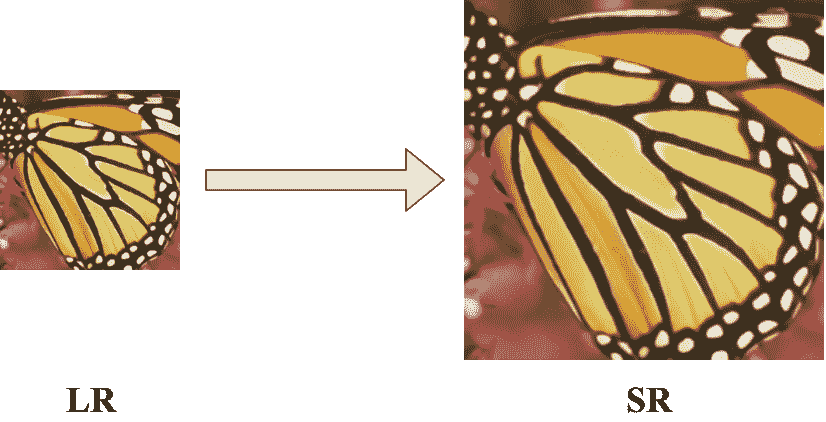

图 1：SISR 的目标是从降级的低分辨率（LR）图像中重建一个超分辨率（SR）图像。

最近，深度学习（DL）[6]在许多人工智能领域，如计算机视觉[7]和自然语言处理[8]，表现出了比传统机器学习模型更好的性能。随着 DL 技术的快速发展，提出了大量基于 DL 的方法用于 SISR，持续推动了最先进技术（SOTA）的进步。像其他图像转换任务一样，SISR 任务通常可以分为三个步骤：特征提取与表示、非线性映射和图像重建[9]。在传统数值模型中，设计一个满足所有这些过程的算法既费时又低效。相反，DL 可以将 SISR 任务转移到一个几乎端到端的框架中，涵盖这三个过程，这可以大大减少人工和计算开销[10]。此外，考虑到 SISR 的病态特性可能导致结果的不稳定和难以收敛，DL 可以通过高效的网络架构和损失函数设计缓解这个问题。此外，现代 GPU 使得更深、更复杂的 DL 模型能够快速训练，这些模型展示了比传统数值模型更强的表现力。

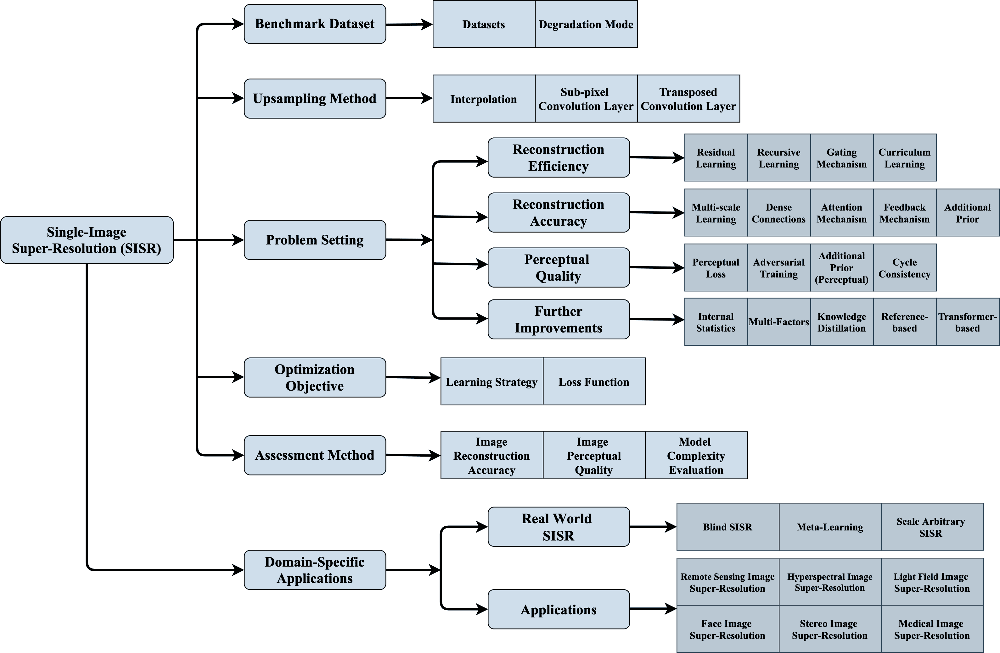

图 2：本调查的内容和分类。在本调查中，我们将基于深度学习（DL）的 SISR 方法分为四类，这些分类依据它们的具体目标进行。其中，深灰色块是本调查中的重点方法。

众所周知，基于 DL 的方法可以分为监督式和无监督式方法。这是最简单的分类标准，但这个分类标准的范围过大且不够明确。因此，许多技术上不相关的方法可能会被归类为同一类型，而具有类似策略的方法可能会被分类为完全不同的类型。与之前使用监督作为分类标准或以纯文献方式介绍方法的 SISR 调查[11, 12]不同，本调查尝试对基于 DL 的 SISR 方法进行全面概述，并根据其特定目标进行分类。在图 2 中，我们展示了本调查的内容和分类法。显然，我们将基于 DL 的 SISR 方法分为四类：重建效率方法、重建准确性方法、感知质量方法和进一步改进方法。这种基于目标的调查有一个清晰的背景，因此方便读者查阅。具体来说，在本调查中，我们首先介绍了 SISR 的问题定义、研究背景和意义。然后，我们介绍了一些相关工作，包括基准数据集、上采样方法、优化目标和评估方法。之后，我们提供了对 SISR 方法的详细调查，并给出了它们的重建结果。最后，我们讨论了 SISR 中仍然存在的一些问题，并提供了一些新趋势和未来方向。总体来说，本调查的主要贡献如下：

(1). 我们根据目标对基于 DL 的 SISR 方法进行了全面概述。这是一个新的视角，使调查具有明确的背景，因此方便读者查阅。

(2). 本调查涵盖了 100 多种 SR 方法，并介绍了近年来 SISR 扩展的新任务和领域特定应用。

(3). 我们提供了重建结果的详细比较，包括经典方法、最新方法和 SOTA SISR 方法，以帮助读者直观地了解它们的性能。

(4). 我们讨论了 SISR 中仍然存在的一些问题，并总结了一些新趋势和未来方向。

## 2 问题设置及相关工作

### 2.1 问题定义

图像超分辨率是一种经典技术，用于提高成像系统的分辨率，根据输入的 LR 图像数量可以分为单图像超分辨率（SISR）和多图像超分辨率（MISR）。其中，MISR 逐渐发展为视频超分辨率（VSR）。与 MISR/VSR 相比，SISR 要困难得多，因为 MISR/VSR 具有额外的参考信息，而 SISR 仅有单张输入图像的信息用于重建缺失的图像特征。

将低分辨率图像定义为 $I_{x}\in\mathbb{R}^{h\times w}$，将真实高分辨率图像定义为 $I_{y}\in\mathbb{R}^{H\times W}$，其中 $H>h$ 且 $W>w$。通常，在 SISR 框架中，低分辨率图像 $I_{x}$ 被建模为 $I_{x}=\mathcal{D}(I_{y};\theta_{\mathcal{D}})$，其中 D 是一个降级映射 $\mathbb{R}^{H\times W}\to\mathbb{R}^{h\times w}$，$\theta_{D}$ 表示降级因子。在大多数情况下，降级过程是未知的。因此，研究人员正尝试对其建模。最流行的降级模式是：

|  | $\mathcal{D}(I_{y};\theta_{\mathcal{D}})=(I_{y}\otimes\kappa)\downarrow_{s}+n,$ |  | (1) |
| --- | --- | --- | --- |

其中 $I_{y}\otimes\kappa$ 表示模糊核 $\kappa$ 和高分辨率图像 $I_{y}$ 之间的卷积，$\downarrow_{s}$ 是一个具有尺度因子 $s$ 的下采样操作，而 $n$ 通常是具有标准差 $\sigma$ 的加性白噪声（AWGN）。在单图像超分辨率（SISR）任务中，我们需要从低分辨率图像 $I_{x}$ 恢复一个超分辨率图像 $I_{SR}$。因此，该任务可以表述为 $I_{SR}=\mathcal{F}(I_{x};\theta_{\mathcal{F}})$，其中 $\mathcal{F}$ 是超分辨率算法，$\theta_{\mathcal{F}}$ 是超分辨率过程的参数集。

最近，研究人员已将 SISR 转换为端到端学习任务，依赖于大量训练数据和有效的损失函数。与此同时，由于卷积神经网络（CNN）强大的表示能力及其在前向和反向计算中的便利性，越来越多的基于深度学习（DL）模型被提出。因此，SISR 任务可以转化为以下优化目标：

|  | $\hat{\theta}_{\mathcal{F}}=\mathop{\arg\min}_{\theta_{\mathcal{F}}}\mathcal{L}(I_{SR},I_{y})+\lambda\Phi(\theta),$ |  | (2) |
| --- | --- | --- | --- |

其中 $\mathcal{L}$ 表示生成的超分辨率图像 $I_{SR}$ 和高分辨率图像 $I_{y}$ 之间的损失函数，$\Phi(\theta)$ 表示正则化项，而 $\lambda$ 是用于控制正则化项百分比的折中参数。

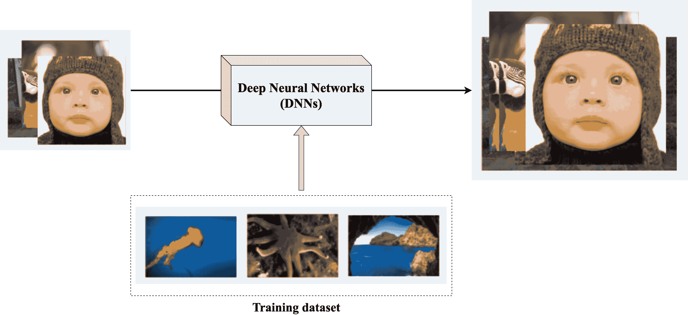

图 3: 基于数据驱动的深度神经网络的训练过程。

### 2.2 基准数据集

数据对数据驱动模型来说总是至关重要的，特别是对于基于深度学习的 SISR 模型，以实现令人满意的重建性能（见图 3）。如今，工业界和学术界已经推出了多个可用的 SISR 数据集。

表 I: 单图像超分辨率（SISR）的基准数据集。

| 名称 | 用途 | 数量 | 格式 | 描述 |
| --- | --- | --- | --- | --- |
| General-100 [13] | 训练 | 100 | BMP | 边缘清晰但平滑区域较少的常见图像 |
| T91 [5] | 训练 | 91 | PNG | 常见图像 |
| WED [14] | 训练 | 4744 | MAT | 常见图像 |
| Flickr2K [15] | 训练 | 2650 | PNG | 来自 Flickr 的 2K 图像 |
| DIV2K [16] | 训练/验证 | 1000 | PNG | CVPR NTIRE 竞赛的高质量数据集 |
| BSDS300 [17] | 训练/验证 | 300 | JPG | 常见图像 |
| BSDS500 [18] | 训练/验证 | 500 | JPG | 常见图像 |
| RealSR [19] | 训练/验证 | 100 | 训练/验证 | 100 对真实世界的低分辨率和高分辨率图像对 |
| OutdoorScene [20] | 训练/验证 | 10624 | PNG | 户外场景图像 |
| City100 [21] | 训练/测试 | 100 | RAW | 常见图像 |
| Flickr1024 [22] | 训练/测试 | 100 | RAW | 用于立体超分辨率的立体图像 |
| SR-RAW [23] | 训练/测试 | 7*500 | JPG/ARW | 真实世界计算缩放产生的原始图像 |
| PIPAL [24] | 测试 | 200 | PNG | 感知图像质量评估数据集 |
| Set5 [25] | 测试 | 5 | PNG | 常见图像，仅 5 张图像 |
| Set14 [26] | 测试 | 14 | PNG | 常见图像，仅 14 张图像 |
| BSD100 [17] | 测试 | 100 | JPG | BSDS500 的一个子集，用于测试 |
| Urban100 [27] | 测试 | 100 | PNG | 真实世界结构的图像 |
| Manga109 [28] | 测试 | 109 | PNG | 日本漫画 |
| L20 [29] | 测试 | 20 | PNG | 常见图像，非常高分辨率 |
| PIRM [30] | 测试 | 200 | PNG | 常见图像，用于 ECCV PIRM 竞赛的数据集 |

#### 2.2.1 训练和测试数据集

最近，许多用于单幅图像超分辨率（SISR）任务的数据集被提出，包括 BSDS300 [17]、DIV2K [16] 和 Flickr2K [15]。与此同时，还有许多测试数据集可以有效地测试模型的性能，如 Set5 [25]、Set14 [26]、Urban100 [27] 和 Manga109 [28]。在表 I 中，我们列出了一系列常用的数据集，并注明了它们的详细属性。

在这些数据集中，DIV2K [16] 是用于模型训练的最广泛使用的数据集，它是一个高质量的数据集，包含 800 张训练图像、100 张验证图像和 100 张测试图像。Flickr2k 是一个大规模扩展的数据集，包含来自 Flickr 的 2650 张 2K 图像。RealSR [19] 是第一个真正收集的具有配对低分辨率和高分辨率图像的 SISR 数据集。除了列出的数据集外，一些广泛用于其他计算机视觉任务的数据集也被作为 SISR 的补充训练数据集使用，如 ImageNet [31] 和 CelebA [32]。此外，结合多个数据集（例如 DF2K）进行训练以进一步提高模型性能也被广泛使用。

#### 2.2.2 降质模式

由于 SISR 任务的特殊性，难以构建大规模配对的真实 SR 数据集。因此，研究人员经常在上述数据集上应用降级模式，以获得相应的降级图像来构建配对数据集。然而，现实世界中的图像很容易受到各种因素的干扰（例如传感器噪声，运动模糊和压缩伪影），导致捕捉到的图像比模拟的图像更复杂。为了缓解这些问题并训练更有效和通用的 SISR 模型，一些作品将降级模式建模为几种操作的组合（见 Eq. 1）。基于这个降级公式，提出了三种最广泛使用的降级模式：BI、BD 和 DN。其中，BI 是最广泛使用的降级模式，用于模拟 LR 图像，实质上是双三次降采样操作。对于 BD，HR 图像通过一个大小为$7\times 7$，标准差为 1.6 的高斯核模糊后，再以 3 倍的缩放因子进行降采样。为了获得 DN 模式的 LR 图像，先对 HR 图像进行 3 倍缩放的双三次降采样操作，然后在图像中加入$level=30$的高斯噪声。

### 2.3 上采样方法

SISR 的目的是将较小尺寸的图像放大成较大尺寸并尽可能准确地保持其信息。因此，放大操作，也称为上采样，是 SISR 中的一个重要步骤。当前的上采样机制可分为四种类型：预上采样 SR、后上采样 SR、渐进式上采样 SR 和迭代上下采样 SR。在本节中，我们将讨论支持这些上采样机制的几种上采样方法。

#### 2.3.1 插值方法

插值是最广泛使用的上采样方法。目前主流的插值方法包括最近邻插值、双线性插值和双三次插值。这些方法具有很高的可解释性且易于实现，因此今天仍被广泛使用。其中，最近邻插值是一种简单直观的算法，它为每个待插值的位置选择最近的像素值，执行时间较快，但生成高质量结果较为困难。双线性插值在图像的两个轴上依次执行线性插值操作。这种方法可以比最近邻插值获得更好的结果，同时保持相对较快的速度。双三次插值在两个轴上执行三次插值。与双线性插值相比，双三次插值的结果更平滑，伪影更少，但速度较慢。插值也是构建 SISR 配对数据集的主流方法，并广泛应用于基于 CNN 的 SISR 模型的数据预处理。

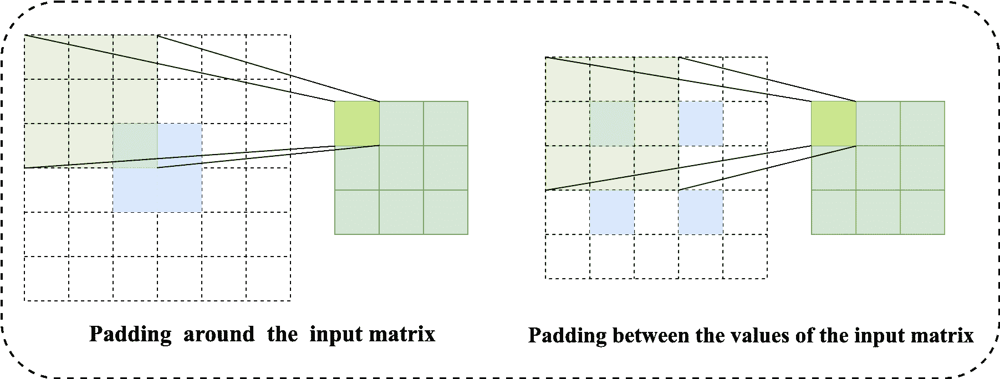

图 4：两种转置卷积层。

#### 2.3.2 转置卷积层

如图 4 所示，研究人员通常考虑两种转置卷积操作：一种是在输入矩阵周围添加填充，然后应用卷积操作，另一种是在输入矩阵的值之间添加填充，之后直接进行卷积操作。后一种也称为分数步幅卷积，因为它的工作方式类似于使用小于一的步幅进行卷积。在转置卷积层中，上采样水平由填充的大小控制，实际上是普通卷积层操作的反向。转置卷积层首次在 FSRCNN [13] 中提出，并广泛应用于基于 DL 的 SISR 模型。

#### 2.3.3 亚像素卷积层

在 ESPCN [33] 中，Shi *等人* 提出了一个高效的亚像素卷积层。亚像素方法不是通过直接增加 LR 特征图的数量来提高分辨率，而是首先增加 LR 特征图的维度，即 LR 特征图的数量，然后使用周期性重排操作将这些点在扩展特征图中重新排列，以获得 HR 输出（图 5）。详细来说，亚像素卷积层的公式可以定义如下：

|  | $I_{SR}=f^{L}(I_{x})=\mathcal{PS}(W_{L}*f^{L-1}(I_{x})+b_{L}),$ |  | (3) |
| --- | --- | --- | --- |

其中，$\mathcal{PS}$ 表示周期性洗牌操作符，它将一个 $h\times w\times C\cdot r^{2}$ 张量转换为 $rh\times rw\times C$ 的张量，其中 $rh\times rw$ 明确表示高分辨率图像的大小，$C$ 是操作通道的维度。此外，卷积滤波器 $W_{L}$ 的形状是 $n_{L-1}\times r^{2}C\times K_{L}\times K_{L}$，其中 $n_{L}$ 是 $L-1$ 层中特征图的数量。与转置卷积层相比，亚像素卷积层显示出更好的效率，因此在基于深度学习的 SISR 模型中也得到了广泛应用。

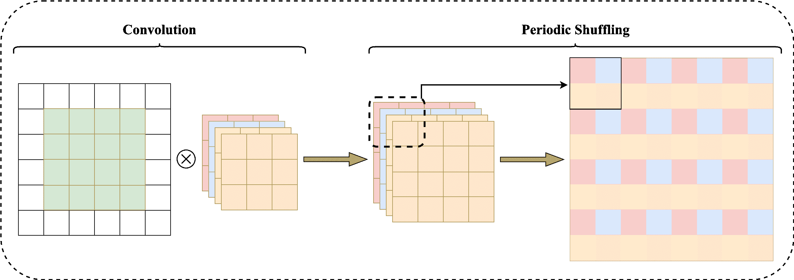

图 5：亚像素卷积层的原理。

### 2.4 优化目标

评估和参数更新是所有基于深度学习的模型中的重要步骤。在本节中，我们将介绍模型训练过程中的必要步骤。

#### 2.4.1 学习策略

根据不同的策略，基于深度学习的 SISR 模型主要可以分为监督学习方法和无监督学习方法。

监督学习：在监督学习 SISR 中，研究人员计算真实图像 $I_{y}$ 和重建图像 $I_{SR}$ 之间的重建误差：

|  | $\hat{\theta}_{\mathcal{F}}=\mathop{\arg\min}_{\theta_{\mathcal{F}}}\mathcal{L}(I_{SR},I_{y}).$ |  | (4) |
| --- | --- | --- | --- |

另外，研究人员有时可能会寻找一个映射 $\Phi$，例如预训练的神经网络，将图像或图像特征图转换到其他空间，然后计算误差：

|  | $\hat{\theta}_{\mathcal{F}}=\mathop{\arg\min}_{\theta_{\mathcal{F}}}\mathcal{L}(\Phi(I_{SR}),\Phi(I_{y})).$ |  | (5) |
| --- | --- | --- | --- |

其中，$\mathcal{L}$ 是损失函数，用于最小化重建图像与真实图像之间的差距。根据不同的损失函数，模型可以实现不同的性能。因此，有效的损失函数对于单图像超分辨率（SISR）也至关重要。

无监督学习：在无监督学习 SISR 中，评估和参数更新的方法通过不同的无监督学习算法发生变化。例如，ZSSR [34] 使用测试图像及其下采样图像以及数据增强方法来构建“训练数据集”，然后应用损失函数来优化模型。在 CinCGAN [35] 中，提出了一个由两个 CycleGAN [36] 组成的模型，其中通过在每个周期中优化生成对抗损失、循环一致性损失、身份损失和总变差损失来更新参数。

#### 2.4.2 损失函数

在 SISR 任务中，损失函数用于通过计算某种误差来指导模型的迭代优化过程。同时，与单一损失函数相比，研究人员发现多种损失函数的组合可以更好地反映图像恢复的情况。在这一部分，我们将简要介绍几种常用的损失函数。

像素损失：像素损失是 SISR 中最简单和最流行的损失函数类型，它旨在衡量两张图像之间的像素级差异，使这两张图像尽可能接近。它主要包括 L1 损失、均方误差（MSE 损失）和 Charbonnier 损失（一种 L1 损失的可微分变体）：

|  | $\mathcal{L}_{L1}(I_{SR},I_{y})=\frac{1}{hwc}\sum_{i,j,k}\left\|I_{SR}^{i,j,k}-I_{y}^{i,j,k}\right\|,$ |  | (6) |
| --- | --- | --- | --- |
|  | $\mathcal{L}_{MSE}(I_{SR},I_{y})=\frac{1}{hwc}\sum_{i,j,k}(I_{SR}^{i,j,k}-I_{y}^{i,j,k})^{2},$ |  | (7) |
|  | $\mathcal{L}_{Char}(I_{SR},I_{y})=\frac{1}{hwc}\sum_{i,j,k}\sqrt{(I_{SR}^{i,j,k}-I_{y}^{i,j,k})^{2}+\epsilon^{2}},$ |  | (8) |

其中，$h$、$w$ 和 $c$ 是图像的高度、宽度和通道数。$\epsilon$ 是一个数值稳定性常数，通常设置为 $10^{-3}$。由于大多数主流图像评估指标与逐像素差异高度相关，像素损失仍然广受青睐。然而，这种损失函数重建的图像通常缺乏高频细节，因此很难获得优异的视觉效果。

内容损失：内容损失也称为感知损失，它使用预训练的分类网络来衡量图像之间的语义差异，并可以进一步表示为这两张图像的高层表示之间的欧几里得距离：

|  | $\mathcal{L}_{Cont}(I_{SR},I_{y},\phi)=\frac{1}{h_{l}w_{l}c_{l}}\sum_{i,j,k}(\phi^{i,j,k}_{(l)}(I_{SR})-\phi^{i,j,k}_{(l)}(I_{y})),$ |  | (9) |
| --- | --- | --- | --- |

其中，$\phi$ 代表预训练的分类网络，$\phi_{(l)}(I_{HQ})$ 代表从网络的第 $l$ 层提取的高层表示。$h_{l}$、$w_{l}$ 和 $c_{l}$ 分别是第 $l$ 层特征图的高度、宽度和通道数。使用这种方法，可以使这两张图像的视觉效果尽可能一致。其中，VGG [37] 和 ResNet [38] 是最常用的预训练分类网络。

对抗损失：为了使重建的 SR 图像更逼真，已经提出并引入了生成对抗网络（GANs [39]) 到各种计算机视觉任务中。具体来说，GAN 由生成器和判别器组成。生成器负责生成伪造样本，而判别器用于判断生成样本的真实性。例如，SRGAN [38] 提出了基于交叉熵的判别损失函数：

|  | $\mathcal{L}_{Adversarial}(I_{x},G,D)=\sum_{n=1}^{N}-logD(G(I_{x})),$ |  | (10) |
| --- | --- | --- | --- |

其中 $G(I_{LQ})$ 是重建的 SR 图像，$G$ 和 $D$ 分别表示生成器和判别器。

先验损失 除了上述损失函数之外，还可以将一些先验知识引入到 SISR 模型中以参与高质量图像重建，例如稀疏先验、梯度先验和边缘先验。其中，梯度先验损失和边缘先验损失是最广泛使用的先验损失函数，其定义如下：

|  | $\small\mathcal{L}_{TV}(I_{SR})=\frac{1}{hwc}\sum_{i,j,k}\sqrt{(I_{SR}^{i,j+1,k}-I_{y}^{i,j,k})^{2}+(I_{SR}^{i+1,j,k}-I_{y}^{i,j,k})^{2}},$ |  | (11) |
| --- | --- | --- | --- |
|  | $\mathcal{L}_{Edge}(I_{SR},I_{y},E)=\frac{1}{hwc}\sum_{i,j,k}\left | E(I_{SR}^{i,j,k})-E(I_{y}^{i,j,k})\right | .$ |  | (12) |

其中 $E$ 是图像边缘检测器，$E(I_{SR}^{i,j,k})$ 和 $E(I_{y}^{i,j,k})$ 是由检测器提取的图像边缘。先验损失的目的是优化图像的某些特定信息，以期达到预期目标，使模型能够更快地收敛，并且重建的图像将包含更多的纹理细节。

### 2.5 评估方法

图像质量评估（IQA）通常可以分为客观方法和主观方法。客观方法通常使用特定的公式来计算结果，这些方法简单且公平，因此成为 SISR 的主流评估方法。然而，它们只能从数值角度反映图像像素的恢复，难以准确测量图像的真实视觉效果。相比之下，主观方法始终基于人的主观判断，更相关于评估图像的感知质量。基于上述两种方法的优缺点，下面简要介绍了几种评估方法，涉及图像重建精度、图像感知质量和重建效率方面。

#### 2.5.1 图像重建精度

应用于评估图像重建精度的方法也称为*失真度量*，这些方法是全参考的。具体来说，给定一个失真图像 $\hat{x}$ 和一个真实参考图像 $x$，全参考失真通过测量 $\hat{x}$ 与 $x$ 之间的差异[40] 来量化 $\hat{x}$ 的质量，使用不同的算法。

峰值信噪比（PSNR）：PSNR 是超分辨率领域中最广泛使用的图像质量评估方法，通常通过真实图像 $I_{y}\in\mathbb{R}^{H\times W}$ 和重建图像 $I_{SR}\in\mathbb{R}^{H\times W}$ 之间的均方误差（MSE）来定义：

|  | $MSE=\frac{1}{HW}\sum_{i=0}^{H-1}\sum_{j=0}^{W-1}(I_{y}(i,j)-I_{SR}(i,j))^{2},$ |  | (13) |
| --- | --- | --- | --- |
|  | $PSNR=10\cdot\log_{10}(\frac{MAX^{2}}{MSE}),$ |  | (14) |

其中 MAX 是图像的最大可能像素。由于 PSNR 与 MSE 密切相关，因此用 MSE 损失训练的模型预计会有较高的 PSNR 分数。尽管较高的 PSNR 通常表示重建质量较高，但它只考虑了每个像素的 MSE，因此未能捕捉感知差异 [41]。

结构相似性指数度量（SSIM）：SSIM [42] 是另一种流行的评估方法，用于在感知基础上测量两幅图像之间的相似性，包括结构、亮度和对比度。与在像素级别计算绝对误差的 PSNR 不同，SSIM 认为空间上相近的像素之间存在强烈的相互依赖。这些依赖关系包含了与结构感知相关的重要信息。因此，SSIM 可以表示为三种比较度量的加权组合：

|  | $\begin{split}SSIM(I_{SR},I_{y})&=(l(I_{SR},i_{y})^{\alpha}\cdot c(I_{SR},I_{y})^{\beta}\cdot s(I_{SR},I_{y})^{\gamma})\\ & =\frac{(2\mu_{I_{SR}}\mu_{I_{y}}+c_{1})(2\sigma_{I_{SR}I_{y}}+c_{2})}{(\mu_{I_{SR}}^{2}+\mu_{I_{y}}^{2}+c_{1})(\sigma_{I_{SR}}^{2}+\sigma_{I_{y}}^{2}+c_{2})}.\end{split}$ |  | (15) |
| --- | --- | --- | --- |

其中 $l$、$c$ 和 $s$ 分别表示 $I_{SR}$ 和 $I_{y}$ 之间的亮度、对比度和结构。$\mu_{I_{SR}}$、$\mu_{I_{y}}$、$\sigma_{I_{SR}}^{2}$、$\sigma_{I_{y}}^{2}$ 和 $\sigma_{I_{SR}I_{y}}$ 分别是对应项目的均值($\mu$)、方差($\sigma^{2}$) 和协方差($\sigma$)。

更高的 SSIM 表示两幅图像之间的相似性更高，由于其在评估感知质量方面的便利性和稳定性，SSIM 被广泛使用。此外，还有一些 SSIM 的变体，如多尺度 SSIM，它通过多级子采样的过程在多个尺度上进行。

#### 2.5.2 图像感知质量

由于人类视觉系统复杂，涉及多个方面来判断两幅图像之间的差异，例如图像内部的纹理和流动，因此追求绝对相似性差异的方法（如 PSNR/SSIM）并不总是表现良好。尽管失真度量已被广泛使用，但重建精度的提升并不总是伴随着视觉质量的提升。实际上，研究人员已表明，在某些情况下，失真和感知质量是相悖的[40]。图像 $\hat{x}$ 的感知质量定义为它看起来像自然图像的程度，这与其与任何参考图像的相似性无关。

平均意见得分（MOS）：MOS 是一种主观方法，可以直接评估感知质量。具体而言，若干观众通过双刺激[43]对一组图像的质量进行评分，即每位观众都有源图像和测试图像。所有观众完成评分后，结果会映射到数值上，平均分数将成为最终的 MOS。由于需要人工参与，MOS 是一种耗时且昂贵的方法。同时，MOS 也被怀疑不稳定，因为 MOS 差异可能对用户不明显。此外，该方法过于主观，难以保证公平性。

自然图像质量评估器（NIQE）：NIQE [44] 是一种完全盲目的图像质量评估方法。NIQE 不需要对预期失真的形式（如训练样本和相应的人类意见分数）有任何知识，只利用从自然图像中观察到的统计规律的可测量偏差。它基于自然场景统计（NSS）模型从图像中提取一组局部（质量感知）特征，然后将特征向量拟合到多元高斯（MVG）模型中。测试图像的质量通过其 MVG 模型与从自然图像中学习到的 MVG 模型之间的距离来预测：

|  | $\small D(\nu_{1},\nu_{2},\Sigma_{1},\Sigma_{2})=\sqrt{((\nu_{1}-\nu_{2})^{T}(\frac{\Sigma_{1}+\Sigma_{2}}{2})^{-1}(\nu_{1}-\nu_{2}))},$ |  | (16) |
| --- | --- | --- | --- |

其中 $\nu_{1}$、$\nu_{2}$ 和 $\Sigma_{1}$、$\Sigma_{2}$ 分别是 HR 和 SR 图像 MVG 模型的均值向量和协方差矩阵。请注意，较高的 NQIE 指数表示较低的图像感知质量。与 MOS 相比，NIQE 是一种更方便的感知评估方法。

Ma: Ma *等人* [45] 提出了基于学习的无参考图像质量评估方法。该方法旨在关注 SR 图像，而其他基于学习的方法则应用于噪声、压缩或快速衰减的退化图像，而不是 SR 图像。它从涉及大量 SR 图像的人体研究的感知评分中学习。然后，它通过三种统计属性量化 SR 伪影，即局部/全局频率变化和空间不连续性。接着，这些特征分别由三个独立的可学习回归森林建模，以拟合 SR 图像的感知评分，$\hat{y}_{n}(n=1,2,3)$。最终预测的质量评分是 $\hat{y}=\sum_{n}\lambda_{n}\cdot\hat{y}_{n}$，权重$\lambda$通过最小化$\lambda^{*}=\mathop{\arg\min}_{\lambda}(\sum_{n}\lambda_{n}\cdot\hat{y}_{n}-y)^{2}$来学习。

Ma 在匹配 SR 图像的感知评分方面表现良好，但与其他基于学习的无参考方法相比，仍然有限，因为它只能评估其训练的失真类型所引起的质量下降。

PI: 在 2018 年 PIRM 挑战赛上首次提出感知指数（PI）来评估感知质量 [30]。它是无参考图像质量测量 Ma 和 NIQE 的结合：

|  | $PI=\frac{1}{2}((10-Ma)+NIQE).$ |  | (17) |
| --- | --- | --- | --- |

较低的 PI 表示更好的感知质量。这是一个新的图像质量评估标准，近年来得到了广泛推广和应用。

除了上述评估方法外，这些年还提出了一些新方法。例如，Zhang *等人* [46] 提出了 $Ranker$ 来学习 NR-IQA 方法（即 NIQE）在某些感知 SR 模型结果中的排名顺序。Zhang *等人*[47] 引入了一个新的人体感知相似性判断数据集。同时，构建了一种感知评估指标，学习感知图像块相似性（LPIPS），通过学习该数据集中的感知判断来实现。总之，更准确和高效地测量 SR 图像的感知质量是一个需要探索的重要问题。

#### 2.5.3 重建效率

尽管设计更深的网络是获得更好重建性能的最简单方法，但不可忽视的是，这些模型还会带来更多的参数、执行时间和计算成本。为了扩大 SISR 的实际应用，我们需要考虑模型性能与模型复杂性之间的权衡。因此，通过以下基本评估来评估重建效率是重要的。

模型大小：模型大小与设备需要存储数据的存储空间相关。包含更多参数的模型对硬件有限的设备来说更难以运行。因此，构建轻量级模型有助于算法的推广和应用。在所有指标中，模型的参数量是衡量模型大小的最直观指标。

执行时间：通常，轻量级模型往往需要较短的执行时间，但复杂策略如注意力机制的出现打破了这种平衡。换句话说，当模型中引入一些复杂操作时，轻量级网络也可能需要较长的执行时间。因此，评估模型的执行时间至关重要。

Mult-Adds：乘加操作的数量或 Mult-Adds 通常用于衡量模型计算，因为 CNN 模型中的操作主要是乘法和加法。Mult-Adds 的值与运行模型所需的速度或时间相关。

总结而言，模型性能与模型复杂性之间的权衡仍然需要关注。

## 3 单幅图像超分辨率

### 3.1 基于 DL 的 SISR 基准框架

2014 年，Dong *等人* [9] 提出了超分辨率卷积神经网络（SRCNN）。SRCNN 是第一个基于 CNN 的 SISR 模型。它表明深度 CNN 模型相当于基于稀疏编码的方法，这是一种基于示例的 SISR 方法。最近，越来越多的 SISR 模型将其视为端到端学习任务。因此，构建深度神经网络直接学习 LR 和 HR 图像之间的映射已成为 SISR 中的主流方法。受到 SRCNN 的启发，基于 CNN 的 SISR 方法正蓬勃发展，不断刷新最佳结果。

根据不同目标，我们将基于 DL 的 SISR 模型分为四类：重建效率方法、重建准确性方法、感知质量方法和进一步改进方法。

### 3.2 重建效率方法

硬件限制导致的低精度问题提高了对高效 SISR 模型研究的需求。因此，设计轻量级的 SISR 模型以实现与繁重模型相同甚至更好的性能是迫切需要的。在本节中，我们将讨论一些有助于高效网络结构设计的方法。

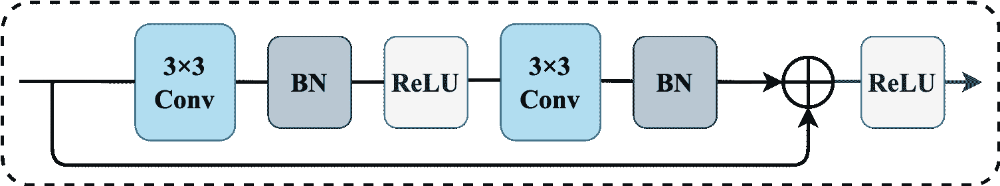

图 6：残差学习架构/残差块的示意图。

#### 3.2.1 残差学习

在 SRCNN 中，研究人员发现通过添加更多的卷积层来增加感受野，可以获得更好的重建性能。然而，直接堆叠层会导致梯度消失/爆炸和退化问题 [48]。同时，添加更多层会导致更高的训练误差和更昂贵的计算成本。

在 ResNet [49] 中，He *等人* 提出了一个残差学习框架，其中希望得到一个残差映射，而不是拟合整个基础映射（图 6）。在 SISR 中，由于 LR 图像和 HR 图像共享大部分相同的信息，因此很容易明确建模 LR 和 HR 图像之间的残差图像。残差学习使得网络更深，并缓解了梯度消失和退化的问题。在残差学习的帮助下，Kim [50] 提出了一个非常深的超分辨率网络，也称为 VDSR。为了方便网络设计，残差块 [49] 已逐渐成为网络结构中的基本单元。在卷积分支中，它通常具有两个 $3\times 3$ 的卷积层、两个批量归一化层和一个 ReLU 激活函数。值得注意的是，批量归一化层在 SISR 任务中通常会被移除，因为 EDSR [51] 指出，批量归一化层会消耗更多的内存，但不会提高模型性能。

全局和局部残差学习：全局残差学习是一个从输入到最终重建层的跳跃连接，这有助于改善信息从输入到输出的传输，并在一定程度上减少信息的丢失。然而，随着网络的加深，经过这么多层后，图像细节不可避免地会丢失。因此，提出了局部残差学习，它在每隔几层的堆叠层中进行，而不是从输入到输出。在这种方法中，形成了多路径模式，携带丰富的图像细节，并且有助于梯度流动。此外，许多新的特征提取模块引入了局部残差学习以增强强大的学习能力[52, 53]。当然，现在结合局部残差学习和全局残差学习也非常流行[38, 51, 53]。

残差缩放：在 EDSR [51] 中，Lim *et al.* 发现将特征图（即通道维度）增加到某个水平以上会使训练过程数值不稳定。为了解决这些问题，他们采用了残差缩放 [54]，其中残差在添加到主路径之前通过乘以 0 和 1 之间的常数进行缩放。借助这一残差缩放方法，模型性能可以进一步提高。

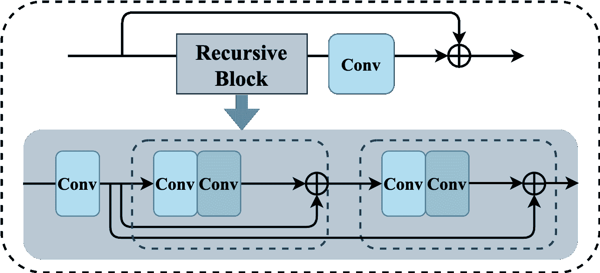

图 7：DRRN 的模型结构，其中阴影部分表示递归块，虚线框中的参数是共享的。

#### 3.2.2 递归学习

为了在不增加模型参数的情况下获得较大的感受野，提出了递归学习用于单图像超分辨率（SISR），其中相同的子模块在网络中重复应用，并且它们共享相同的参数。换句话说，递归块是递归单元的集合，其中这些递归单元之间的相应结构共享相同的参数。例如，在 DRCN [55] 中，相同的卷积层被应用了 16 次，从而得到一个 41 $\times$ 41 的感受野。然而，在基于递归学习的模型中，堆叠过多的层仍然会导致梯度消失/爆炸的问题。因此，在 DRRN [56] 中，递归块是基于残差学习进行的（见图 7）。最近，越来越多的模型在其递归单元中引入了残差学习策略，如 MemNet [57]、CARN [58] 和 SRRFN [59]。

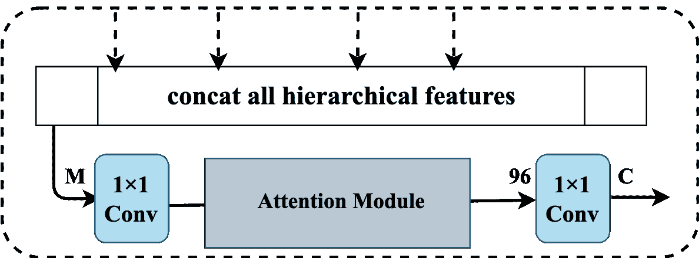

图 8：层次特征蒸馏块（HFDB）的结构。

#### 3.2.3 门控机制

上述残差学习中的跳跃连接往往使输出特征的通道维度极高。如果在后续层中这种高维通道保持不变，计算成本将会非常大，从而影响重建效率和性能。直观上，跳跃连接后的输出特征应该被高效地重新融合，而不是简单地拼接。

为解决这个问题，研究人员建议使用门控机制来自适应地提取和学习更有效的信息。大多数时候，采用$1\times 1$卷积层来完成门控机制，这可以减少通道维度并保留更多有效信息。在 SRDenseNet [60]和 MSRN [52]中，这样的$1\times 1$卷积层充当重建模块之前的瓶颈层。在 MemNet [57]中，它是每个记忆块末尾的门控单元，用于控制长期记忆和短期记忆的权重。请注意，门控不仅可以作为网络末尾的瓶颈层，还可以在网络中连续进行。例如，在 MemNet [57]、IDN [61]和 CARN [62]中，门控机制同时用于全局和局部区域。有时，它可以与其他操作结合，如注意机制，以构建更有效的门控模块实现特征蒸馏。例如，Li *et al.* 提出了一个分层特征蒸馏块（见图 8），通过结合$1\times 1$卷积层和注意机制，在 MDCN [63]中进行。

#### 3.2.4 课程学习

课程学习指的是逐步增加学习任务的难度。对于一些序列预测任务或顺序决策问题，课程学习被用来减少训练时间并提高泛化性能。由于 SISR 是一个病态问题，常因大规模因子、未知退化核和噪声等不利条件面临巨大学习难度，因此适合利用课程学习来简化学习过程并提高重建效率。

在 LapSRN [64]中，课程学习用于逐步重建高分辨率图像的子带残差。在 ProSR [65]中，每个金字塔层次逐渐融入，以减少对先前训练层的影响，并逐步添加每个尺度的训练对。在 SRFBN [66]中，课程学习策略用于解决复杂的退化任务，其中不同难度的目标被有序地学习。借助课程学习，复杂问题可以被分解为多个简单任务，从而加速模型收敛并获得更好的重建结果。

### 3.3 重建精度方法

在单图像超分辨率中，重建图像的质量始终是主要关注点。在本节中，我们将介绍一些经典的方法和策略，帮助提高 SISR 模型的重建精度。

#### 3.3.1 多尺度学习

众所周知，丰富且准确的图像特征对于超分辨率图像重建至关重要。同时，许多研究工作 [67, 68, 64] 指出，图像在不同的尺度下可能表现出不同的特征，因此充分利用这些特征可以进一步提高模型的性能。受到 inception 模块 [68] 的启发，Li *等人* [52] 提出了一个多尺度残差块（MSRB，图 9）用于特征提取。MSRB 将不同的卷积核集成到一个块中，以自适应地提取不同尺度的图像特征。之后，Li *等人* [63] 进一步优化了结构，提出了一种更高效的多尺度密集交叉块（MDCB）用于特征提取。MDCB 本质上是一个双路径密集网络，可以有效地检测局部和多尺度特征。

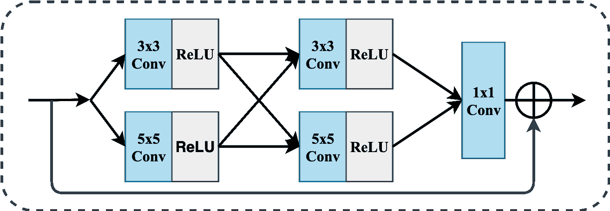

图 9：多尺度残差块（MSRB [52]）的结构。

最近，越来越多的多尺度 SISR 模型被提出。例如，Qin *等人* [69] 提出了一个多尺度特征融合残差网络（MSFFRN），以充分利用图像特征进行 SISR。Chang *等人* [70] 通过将多尺度学习与密集连接相结合，提出了一个多尺度密集网络（MSDN）。Cao *等人* [71] 开发了一种新的 SR 方法，称为多尺度残差通道注意力网络（MSRCAN），它将通道注意力机制引入了 MSRB。以上所有示例都表明，提取和利用多尺度图像特征在进一步提高重建图像质量方面越来越重要。

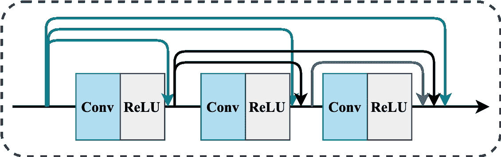

图 10：简单密集连接模块的结构。

#### 3.3.2 密集连接

密集连接机制是在 DenseNet [72] 中提出的，近年来在计算机视觉任务中被广泛使用。不同于仅将层级特征传递到最终重建层的结构，密集块中的每一层接收所有前置层的特征 (图 10)。在大多数层之间创建的短路径有助于缓解梯度消失/爆炸问题，并增强通过层的深层信息流，从而进一步提高重建准确性。

受密集连接机制的启发，*Tong et al.* 将其引入到 SISR 中，并提出了 SRDenseNet [60]。SRDenseNet 不仅使用了层级密集连接，还使用了块级密集连接，其中每个密集块的输出都通过密集连接相连。这样，低层特征和高层特征被结合并充分利用来进行重建。在 RDN [73] 中，密集连接与残差学习结合形成了残差密集块 (RDB)，这允许低频特征通过多个跳跃连接绕过，使主分支专注于学习高频信息。除了上述模型外，密集连接还应用于 MemNet [57]、RPMNet [74]、MFNet [75] 等。在密集连接机制的帮助下，网络中不同深度的信息流可以被充分利用，从而提供更好的重建结果。

#### 3.3.3 注意力机制

注意力机制可以被视为一种工具，用于将可用资源分配到输入的最有信息量的部分。为了提高学习过程中的效率，一些研究提出了引导网络更多关注感兴趣区域的方法。例如，*Hu et al.* [76] 提出了 squeeze-and-excitation (SE) 块，用于建模图像分类任务中的通道关系。*Wang et al.* [77] 提出了通过结合非局部操作进行视频分类的非局部注意力神经网络。受这些方法的启发，注意力机制也被引入到 SISR 中。

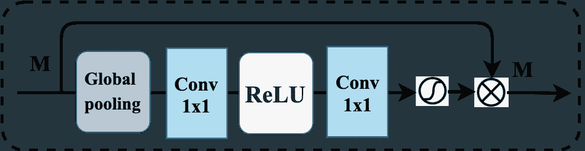

图 11：通道注意力机制 (CAM) 原理。

通道注意力：在 SISR 中，我们主要希望恢复尽可能多的有价值的高频信息。然而，常见的基于 CNN 的方法对通道特征进行均等处理，这在处理不同类型的信息时缺乏灵活性。为了解决这个问题，许多方法 [53, 78] 在 SISR 模型中引入了 SE 机制。例如，Zhang *et al.* [53] 提出了一个基于 SE 机制的新模块，称为残差通道注意力块（RCAB）。如图 11 所示，使用全局平均池化层后跟 Sigmoid 函数来重新缩放每个特征通道，使网络能够集中关注更有用的通道，并增强辨别学习能力。在 SAN [79] 中，探讨了特征的二阶统计量，以基于协方差归一化进行注意力机制。大量实验表明，二阶通道注意力可以帮助网络获得更具辨别力的表示，从而提高重建准确性。

非局部注意力：当基于 CNN 的方法在局部感受野内进行卷积时，忽略了该区域外的上下文信息，而远离区域的特征可能具有较高的相关性，并能提供有效信息。针对这个问题，提出了非局部注意力作为一种过滤算法，以计算图像所有像素的加权均值。通过这种方式，远处的像素也可以对关注位置的响应做出贡献。例如，非局部操作在有限的邻域内进行，以提高 NLRN [80] 的鲁棒性。在 RNAN [81] 中，提出了一种非局部注意力块，其中同时在其掩码分支中使用了通道和空间的注意力机制，以更好地指导主干分支的特征提取。同时，在 HAN [82] 中提出了一种整体注意力网络，该网络由层级注意力模块和通道-空间注意力模块组成，以建模层、通道和位置之间的整体相互依赖关系。在 CSNLN [83] 中，提出了一种跨尺度非局部注意力模块，以挖掘 LR 特征与同一特征图中大尺度 HR 补丁之间的长期依赖关系。所有这些方法展示了非局部注意力的有效性，进一步提升了模型的性能。

#### 3.3.4 反馈机制

反馈机制指的是将输出概念带回到之前的状态，允许模型具有自我修正的过程。值得注意的是，反馈机制与递归学习不同，因为在反馈机制中，模型参数保持自我修正并且不共享。最近，反馈机制在许多计算机视觉任务中得到了广泛应用 [84, 85]，这也有利于 SR 图像的重建。具体来说，反馈机制允许网络将高层信息传递回前面的层，并细化低层信息，从而全面指导 LR 图像恢复高质量的 SR 图像。

在 DBPN [86]中，提供了迭代的上采样和下采样层，以实现每个阶段的投影误差的错误反馈机制。在 DSRN [87]中，提出了一种双状态递归网络，其中递归信号在这两个状态之间通过延迟反馈进行双向交换。在 SFRBN [66]中，提出了一种反馈块，其中每次迭代的输入是上一次的输出作为反馈信息。紧接着是几个按顺序排列的投影组以及密集的跳跃连接，低层次表示得到了细化，并变得更强大的高层次表示。

#### 3.3.5 附加先验

大多数方法倾向于构建端到端的 CNN 模型来实现 SISR，因为这种方法简单且易于实现。然而，由于大量有用特征已经丢失或损坏，它们重建真实的高频细节相当困难。为了解决这个问题，提出了先验指导的 SISR 框架。大量实验表明，在图像先验的帮助下，模型可以更快地收敛，并获得更好的重建精度。最近，许多图像先验被提出，例如总变差先验、稀疏先验和边缘先验。

受到这一启发，杨*等人*将边缘先验与递归网络集成，提出了一种深度边缘引导递归残差网络（DEGREE [88]）用于 SISR。此后，方*等人*提出了一种高效且准确的软边缘辅助网络（SeaNet [89]）。与 DEGREE 直接应用现成的边缘检测器检测图像边缘不同，SeaNet 自动从构建的 Edge-Net 中学习更准确的图像边缘。同时，作者指出，引入更准确的先验会带来性能的显著提升。

### 3.4 感知质量方法

大多数方法只是试图重建具有高 PSNR 和 SSIM 的超分辨率图像。然而，重建精度的提升并不总是伴随着视觉质量的改善。Blau *等* [90] 指出存在感知与失真之间的权衡。只能改善感知质量或失真，而提升其中一个必须以牺牲另一个为代价。因此，在本节中，我们提供了缓解这一权衡问题的方法，希望在保持图像良好感知质量的同时减少失真。

#### 3.4.1 感知损失

尽管像素级损失，如 L1 和 MSE 损失，已广泛用于实现高图像质量，但它们无法捕捉 SR 图像和 HR 图像之间的感知差异。为了应对这个问题，并使损失函数更好地衡量图像之间的感知和语义差异，提出了内容损失、纹理损失和目标感知损失。其中，内容损失已广泛用于获得更具感知性和自然的图像 [91, 38, 20]，这已在 Sec. 2.4.1 中介绍。除了获得更相似的内容外，还需要相同的风格，例如颜色、纹理、常见模式和语义信息。因此，还需要考虑其他感知损失。

纹理损失：纹理损失，也称为风格重建损失，由 Gatys *等* [92, 93] 提出，可以使模型重建高质量的纹理。纹理损失被定义为输出图像和真实图像 Gram 矩阵$G_{j}^{\phi}(x)$之间差异的平方 Frobenius 范数：

|  | $\mathcal{L}^{\phi,j}_{texture}(I_{SR},I_{y})=&#124;&#124;G_{j}^{\phi}(I_{SR})-G_{j}^{\phi}(I_{y})&#124;&#124;^{2}_{F}.$ |  | (18) |
| --- | --- | --- | --- |

在纹理损失的帮助下，模型在训练期间趋向于生成与 HR 图像具有相同局部纹理的图像 [94]。

目标感知损失：传统的感知损失估计整个图像的重建误差，而不考虑语义信息，导致能力有限。Rad *等* [95] 提出了目标感知损失，基于对象、背景和边界的标签对不同语义级别的图像进行惩罚。因此，可以获得更逼真的纹理和更清晰的边缘，从而重建逼真的超分辨率图像。

#### 3.4.2 对抗训练

2014 年，Goodfellow *等人* 提出了生成对抗网络（GANs）[39]，该方法已广泛应用于计算机视觉任务，如风格迁移和图像修复。GANs 由生成器和鉴别器组成。当鉴别器被训练来判断图像是真实还是虚假的时候，生成器的目标是欺骗鉴别器，而不是最小化与特定图像的距离，因此它倾向于生成与训练集具有相同统计特征的输出。

受 GAN 启发，Ledig *等人* 提出了超分辨率生成对抗网络（SRGAN [38]）。在 SRGAN 中，生成器$G$本质上是一个 SR 模型，旨在欺骗鉴别器$D$，而$D$则被训练以区分 SR 图像和 HR 图像。因此，生成器可以学习生成与 HR 图像高度相似的输出，从而重建出更具感知性和自然的 SR 图像。根据这种方法，生成损失$\mathcal{L}_{Gen}(I_{x})$可以定义为：

|  | $\mathcal{L}_{Gen}=-\log D_{\theta_{D}}(G_{\theta_{G}}(I_{x})),$ |  | (19) |
| --- | --- | --- | --- |

鉴别器相关的损失是：

|  | $\mathcal{L}_{Dis}=-\log(D_{\theta_{D}}(I_{y}))-\log(1-D_{\theta_{D}}(G_{\theta_{G}}(I_{x}))).$ |  | (20) |
| --- | --- | --- | --- |

因此，我们需要解决以下问题：

|  | $\begin{split}\min_{\theta_{G}}\ \max_{\theta_{D}}\ &amp;\mathbb{E}_{I_{y\sim p_{data}(I_{y})}}(\log D_{\theta_{D}}(I_{y}))\ +\\ &amp;\mathbb{E}_{I_{x\sim p_{G}(I_{x})}}(\log(1-D_{\theta_{D}}(G_{\theta_{G}}(I_{x})))).\end{split}$ |  | (21) |
| --- | --- | --- | --- |

在 SRGAN [38]中，生成器是 SRResNet，鉴别器使用了 Radford *等人* 提出的架构[96]。在 ESRGAN [97]中，Wang *等人* 对 SRResNet 做了两项修改：（1）用残差中的残差密集块替换原始的残差块；（2）去除 BN 层以提高模型的泛化能力。在 SRFeat [98]中，Park *等人* 指出基于 GAN 的 SISR 方法在重建图像中往往会产生较少有意义的高频噪声。因此，他们采用了两个鉴别器：一个图像鉴别器和一个特征鉴别器，其中后者训练以基于从 VGG 网络中提取的中间特征图来区分 SR 图像和 HR 图像。在 ESRGAN [97]中，Wang *等人* 采用了相对生成对抗网络（Relativistic GAN）[99]，将标准鉴别器替换为相对平均鉴别器，以学习两幅图像之间的相对真实性。这一修改帮助生成器学习更清晰的边缘和更详细的纹理。

#### 3.4.3 附加先验（感知）

在第 3.3.5 节中，我们介绍了先验知识在基于 CNN 的单图像超分辨率模型中的应用。在这一节中，我们将展示在基于 GAN 的模型中使用额外先验的好处。所有引入的额外先验的目标是提高重建的超分辨率图像的感知质量。

例如，语义类别先验用于通过空间特征变换（SFT）生成更丰富、更真实的纹理，在 SFTGAN[20]中得到了应用。利用来自高级任务的信息，可以更容易地区分相似的低分辨率补丁，并生成更自然的纹理细节。在 SPSR[100]中，作者利用梯度图引导图像恢复，以解决基于 GAN 方法的结构失真问题。其中，梯度图来自梯度分支，并集成到超分辨率分支中以提供结构先验。借助梯度图，我们可以知道应该更多关注哪个区域，从而指导图像生成并减少几何失真。

#### 3.4.4 循环一致性

循环一致性假设源领域和目标领域之间存在某些潜在关系，并尝试在领域级别进行监督。具体而言，我们希望捕捉一个图像集合的一些特殊特征，并找出如何将这些特征转换到另一个图像集合中。为此，Zhu *等* [36] 提出了循环一致性机制，其中不仅学习了从源领域到目标领域的映射，而且还结合了反向映射。具体来说，给定源领域 $X$ 和目标领域 $Y$，我们有一个翻译器 $G:X\rightarrow Y$ 和另一个翻译器 $F:Y\rightarrow X$，它们同时训练，以保证 $G(X)\approx Y$ 和 $F(Y)\approx X$ 的 $对抗损失$，以及 $F(G(X))\approx X$ 和 $G(F(Y))\approx Y$ 的 $循环一致性损失$。

在 SISR 中，循环一致性的概念也得到了广泛讨论。给定低分辨率图像领域 $X$ 和高分辨率图像领域 $Y$，我们不仅学习从低分辨率到高分辨率的映射，还学习反向过程。研究人员已经表明，首先在没有配对数据的情况下学习如何进行图像退化可以帮助生成更真实的图像 [101]。在 CinCGAN [35] 中，提出了一个循环网络中的循环，其中嘈杂和模糊的输入首先被映射到无噪声的低分辨率领域，然后用预训练模型上采样，最后映射到高分辨率领域。在 DRN [102] 中，从高分辨率到低分辨率图像的映射被学习以估计下采样核并重建低分辨率图像，这形成了一个闭环来提供额外的监督。DRN 还为无监督学习超分辨率提供了一种新颖的方法，其中深度网络同时用配对和未配对的数据进行训练。

### 3.5 进一步改进方法

在上述部分中，我们介绍了设计高效 SISR 模型的方法，以及获得高重建精度和高感知质量的超分辨率图像。尽管当前的 SISR 模型在实现重建精度和感知质量之间的平衡方面取得了显著突破，但探索更有效的模型仍然是一个热门话题。

#### 3.5.1 内部统计

在 [103] 中，Zontak *等* 发现某些补丁只存在于特定图像中，无法在任何外部示例数据库中找到。因此，基于外部图像训练的超分辨率方法在这些图像上可能效果不好，因为缺乏补丁信息，而基于内部统计的方法可能表现良好。同时，Zontak *等* 指出，单个图像内的补丁的内部熵远小于一般自然图像集合中的补丁的外部熵。因此，利用内部图像统计来进一步提高模型性能是一个不错的选择。

在 ZSSR [34] 中，利用内部图像统计的属性来训练图像特定的 CNN，其中训练样本从测试图像本身提取。在训练阶段，通过数据增强生成多个低分辨率-高分辨率对，并用这些对训练 CNN。在测试时，将低分辨率图像 $I_{LR}$ 作为输入馈送到训练好的 CNN 以获得重建图像。在这个过程中，模型充分利用了图像本身的内部统计进行自学习。在 SinGAN [104] 中，提出了一种无条件生成模型，使用一个完全卷积的 GAN 金字塔来学习图像不同尺度的内部补丁分布。为了利用内部信息的递归性，他们将低分辨率图像多次上采样（根据最终尺度）以获得最终的超分辨率输出。

#### 3.5.2 多因素学习

通常，在 SISR 中，我们常常需要为不同的上采样因子训练特定的模型，很难期望一个模型可以应用于多个上采样因子。为了解决这个问题，一些针对多个上采样因子的模型已被提出，如 LapSRN [105]、MDSR [51] 和 MDCN [63]。

在 LapSRN [105]中，低分辨率图像在金字塔网络中逐步重建，以获得大尺度的结果，其中中间结果可以直接作为对应的多个因子的结果。在[51]中，Lim *et al.*发现了多个尺度任务之间的相关现象，即用预训练的低尺度网络初始化高尺度模型参数可以加速训练过程并提高性能。因此，他们在模型的头部和尾部提出了特定尺度处理模块，以处理不同的上采样因子。为了进一步利用不同上采样因子之间的尺度间相关性，Li *et al.*在 MDCN [63]中进一步优化了策略。与在模型的头部和尾部都引入特定尺度处理策略的 MDSR 不同，MDCN 能够最大化模型参数的重用，并学习尺度间的相关性。

#### 3.5.3 知识蒸馏

知识蒸馏是指将大型（教师）模型的表征能力转移到小型（学生）模型中，以增强学生模型的性能的技术。因此，它已被广泛用于网络压缩或进一步提高学生模型的性能，这在许多计算机视觉任务中已显示出有效性。同时，知识蒸馏主要有两种类型：软标签蒸馏和特征蒸馏。在软标签蒸馏中，教师模型的 softmax 输出被视为软标签，以为学生模型提供有信息的暗知识 [106]。在特征蒸馏中，中间特征图被转移到学生模型中 [107, 108]。

受到此启发，一些研究将知识蒸馏技术引入到单幅图像超分辨率（SISR）中，以进一步提高轻量级模型的性能。例如，在 SRKD [109]中，一个小而高效的学生网络通过深层且强大的教师网络指导，达到与教师网络相似的特征分布。在[110]中，教师网络利用高分辨率图像作为特权信息，并通过特征蒸馏将教师网络解码器的中间特征传递给学生网络，使得学生能够从使用高分辨率图像训练的教师那里学习高频细节。

#### 3.5.4 基于参考的 SISR

与仅使用单张 LR 图像作为输入的 SISR 不同，基于参考的 SISR（RefSR）采用参考图像来辅助 SR 过程。参考图像可以从各种来源获取，如相册、视频帧和网页图像搜索。同时，已经提出了几种增强图像纹理的方法，如图像对齐和补丁匹配。最近，一些 RefSR 方法 [111, 112] 选择对 LR 图像和参考图像进行对齐，假设参考图像与 LR 图像具有相似内容。例如，Yue *等* [111] 在参考图像和 LR 图像之间进行了全局配准和局部匹配，以解决能量最小化问题。在 CrossNet [112] 中，提出了光流方法在不同尺度下对齐参考图像和 LR 图像，然后将其连接到解码器的相应层。然而，这些方法假设参考图像与 LR 图像有良好的对齐，否则其性能将受到显著影响。与这些方法不同，Zhang *等* [23] 应用补丁匹配在 LR 图像和参考图像的 VGG 特征之间，自适应地将纹理从参考图像转移到 LR 图像。在 TTSR [113] 中，Yang *等* 提出了一个纹理变换网络，基于注意力机制从参考图像中搜索和转移相关纹理到 LR 图像。

#### 3.5.5 基于 Transformer 的 SISR

Transformer 的关键思想是“自注意力”机制，它可以捕捉序列元素之间的长期信息。最近，Transformer [114] 在自然语言处理任务中取得了辉煌的成果。例如，预训练的深度学习模型（如 BERT [115]，GPT [116]）在效果上超越了传统方法。受到这些启发，越来越多的研究人员开始探索 Transformer 在计算机视觉任务中的应用，并在许多任务中取得了突破性成果。

目前，一些研究人员尝试将 Transformer 引入图像恢复任务。例如，Chen *et al.* 提出了在大规模数据集上预训练的图像处理 Transformer（IPT [117]）。此外，针对不同的图像处理任务引入了对比学习。因此，经过微调后，预训练的模型可以有效地用于所需任务。然而，IPT [117] 依赖于大规模数据集，并且参数数量庞大（超过 115.5M 参数），这大大限制了其应用场景。为了解决这个问题，Liang *et al.* 提出了基于 Swin Transformer [119] 的 SwinIR [118] 用于图像恢复。具体来说，提出了用于特征提取的 Swin Transformer 块（RSTB），并使用 DIV2K+Flickr2K 进行训练。此外，Lu *et al.* [120] 提出了一个高效超分辨率 Transformer（ESRT），以实现快速且准确的 SISR。值得注意的是，ESRT 是一个轻量级模型，具有较少的参数和低计算成本却能取得具有竞争力的结果。Transformer 是一项强大的技术，但如何使用更少的参数和数据集有效训练模型仍值得深入探讨。

## 4 个特定领域的应用

### 4.1 真实世界的 SISR

在现实场景中，降解模式复杂且未知，通常在各向异性模糊后进行下采样，有时还会加入信号相关噪声。这也受到相机内部信号处理（ISP）流程的影响。因此，基于双三次降解训练的 SISR 模型在处理真实图像时表现不佳。此外，所有上述模型只能应用于特定的整数放大因子，但为了不同实际应用，需要开发尺度任意的 SISR 模型。

最近，已经提出了一些数据集和新技术用于真实场景下的超分辨率重建（SISR）。在 [19]中，提出了 RealSR 数据集，其中通过调整数字相机的焦距拍摄了同一场景的配对低分辨率（LR）和高分辨率（HR）图像。同时，使用这个数据集训练了基于拉普拉斯金字塔的内核预测网络（LP-KPN），以学习每个像素的内核来恢复超分辨率图像。之后，提出了一系列基于真实图像对的方法 [121, 122, 123]。然而，这些数据集经过后处理，且难以大规模收集，这仍然限制了模型的性能。除此之外，一些新技术也被提出，如无监督学习 [124, 125], 自监督学习 [34, 126], 零样本学习 [34, 127], 元学习 [128, 129], 盲目超分辨率重建（Blind SISR），以及尺度任意超分辨率重建 [130, 131]。在这一部分，我们介绍后三种方法，因为它们在前瞻性和多样性方面表现突出。

#### 4.1.1 盲目超分辨率重建（Blind SISR）

盲超分辨率重建（Blind SISR）由于在实际应用中的重要性，受到了越来越多的关注，它的目标是对具有未知退化的低分辨率图像进行超分辨率重建。根据退化建模的方法，它们可以简单地分为两类：显式退化建模方法和隐式退化建模方法。其中，显式退化建模方法可以进一步分为两类，依据是否使用内核估计技术。例如，张*等人*提出了一种简单且可扩展的深度卷积神经网络（CNN）框架用于多种退化的学习（SRMD [132]）。在 SRMD 中，经过维度拉伸策略的连接低分辨率图像和退化图被作为输入。在 DPSR [133]中，深度超分辨率重建器可以作为新的退化模型的先验，以处理具有任意模糊内核的低分辨率图像。随后，UDVD [134]、AMNet [135]、USRNet[136]及一系列盲超分辨率重建方法被提出，这些方法使用退化图作为额外输入进行超分辨率图像重建。相比之下，一些盲超分辨率重建方法关注于在超分辨率过程中内核的估计[137, 138, 139, 140]。例如，在 IKC [137]中，提出了迭代内核校正过程，以帮助盲超分辨率任务找到更准确的模糊内核。在 DAN [138]中，洛*等人*采用交替优化算法在一个网络中同时估计模糊内核和恢复超分辨率图像，使得恢复器和估计器能够很好地兼容，从而在内核估计中取得了良好的结果。然而，上述方法的重建精度在很大程度上依赖于退化模式估计的准确性。为了解决这个问题，提出了更多隐式退化建模方法[35, 141, 142]，这些方法旨在通过外部数据集隐式地学习潜在的退化模式。

#### 4.1.2 元学习

人工智能代理难以像人类智能那样迅速适应新事物/数据，因为将先前经验与少量新信息整合是一项挑战。元学习，或学习如何学习，是为学习问题提出的机制，通常用于少样本/零样本学习和迁移学习。在元学习中，训练过的模型可以在大任务空间中快速学习新任务，其中测试样本用于优化元学习器，因此，当遇到新任务时，模型可以在元学习器的帮助下快速适应。在 SISR 中，考虑到真实配对样本的缺乏，我们希望模型可以在模拟配对数据集上训练，然后将学到的经验转移到真实的 SISR 任务中。为了解决这个问题，*Soh*等人提出了 MZSR [128]。在 MZSR 中，提出了一种基于元迁移学习的新型训练方案，以快速适应新任务的零样本无监督设置，从而使模型可以应用于现实世界场景并取得良好结果。在[129]中，*Park*等人提出了一种有效的元学习方法，以进一步提高模型性能而无需更改常规 SISR 网络的结构。该方法可以应用于任何现有的 SISR 模型，并有效处理未知的超分辨率核。在[143]中，*Hu*等人提出了第一个统一的超分辨率网络，用于具有元学习的任意退化参数，称为 Meta-USR [143]。

#### 4.1.3 尺度任意 SISR

在实际应用场景中，除了处理真实图像外，使用单一模型处理任意尺度因子也非常重要。为此，*Hu*等人提出了两个简单但强大的方法，分别称为 Meta-SR [130]和 Meta-USR [143]。其中，Meta-SR 是第一个可以用于任意尺度因子的 SISR 方法，而 Meta-USR 是一个改进版本，可以应用于任意退化模式（包括任意尺度因子）。尽管 Meta-SR 和 Meta-USR 在非整数尺度因子上取得了令人满意的性能，但它们无法处理具有不对称尺度因子的超分辨率。为了解决这个问题，*Wang*等人[131]建议从尺度特定网络中学习尺度任意的 SISR 模型，并为现有模型开发了一个插件模块以实现尺度任意的超分辨率。具体而言，所提出的插件模块使用条件卷积根据输入尺度信息动态生成滤波器，因此配备了该模块的网络可以仅用一个模型实现任意尺度下的良好结果。

### 4.2 遥感图像超分辨率

随着卫星图像处理技术的发展，遥感变得越来越重要。然而，由于当前成像传感器的限制和复杂的大气条件，如有限的空间分辨率、光谱分辨率和辐射分辨率，我们在遥感应用中面临着巨大的挑战。

最近，许多方法被提出用于遥感图像超分辨率。例如，在 [144]中，提出了一种新的无监督沙漏神经网络用于超分辨率遥感图像。该模型使用生成随机噪声引入更高种类的空间模式，这些模式可以根据全局重建约束提升到更高的尺度。在 [145]中，提出了一种深度残差挤压和激励网络（DRSEN），以克服遥感图像分布高复杂度的问题。在 [146]中，提出了一种混合高阶注意力网络（MHAN），它由一个用于特征提取的特征提取网络和一个具有高阶注意力机制的特征精炼网络组成，用于细节恢复。在 [147]中，作者开发了一种密集采样超分辨率网络（DSSR），用于探索遥感图像的大规模 SR 重建。

### 4.3 高光谱图像超分辨率

与只能接触可见光的人眼相比，高光谱成像是一种收集和处理整个电磁波谱范围内的信息的技术[148]。由于入射能量的限制，高光谱系统常常受到限制，因此在空间和光谱分辨率之间存在权衡。因此，高光谱图像超分辨率的研究旨在解决这一问题。

在 [149]中，提出了一种 3D 全卷积神经网络，用于提取高光谱图像的特征。在 [150]中，Li *等* 提出了一种分组深度递归残差网络，通过设计一个组递归模块并将其嵌入到全局残差结构中。在 [151]中，提出了一种无监督的基于 CNN 的方法，有效地利用了高光谱图像的潜在特征。在 [152]中，Jiang *等* 提出了一种组卷积和渐进上采样框架，以减少模型的大小，并使其在小数据条件下获得稳定的训练结果成为可能。在 [153]中，提出了一种光谱分组和注意力驱动的残差密集网络，以促进所有光谱带的建模，并专注于空间-光谱特征的探索。

### 4.4 光场图像超分辨率

光场 (LF) 相机是一种能够捕捉场景发出的光场信息并提供场景多视角的相机。近年来，LF 图像变得越来越重要，因为它可以用于后期重聚焦、深度感测和去遮挡。然而，LF 相机面临空间分辨率和角度分辨率之间的权衡 [154]。为了解决这个问题，引入了 SR 技术以实现空间和角度分辨率之间的良好平衡。

在 [155] 中，介绍了一种级联卷积神经网络，以同时上采样光场图像的空间和角度分辨率。同时，提出了一个新的光场图像数据集用于训练和验证。为了减少对光场图像超分辨率的准确深度或视差信息作为先验的依赖，Sun *等人* [156] 提出了一个双向递归卷积神经网络和一个隐式多尺度融合方案用于 SR 图像重建。在 [154] 中，Wang *等人* 提出了一个空间-角度交互网络 (LF-InterNet) 用于 LF 图像 SR。同时，他们设计了一个角度可变形对齐模块用于特征级对齐，并提出了一个可变形卷积网络 (LF-DFnet [157]) 来处理 LF 图像 SR 的视差问题。

### 4.5 面部图像超分辨率

面部图像超分辨率是应用 SR 技术于特定领域图像的最著名领域之一。由于在安全和监控等面部识别系统中的潜在应用，面部图像超分辨率已经成为一个活跃的研究领域。

最近，基于 DL 的方法在面部图像超分辨率方面取得了显著进展。在 [158] 中，提出了一种名为 CPGAN 的方法，旨在同时解决面部幻觉和光照补偿问题，该方法通过传统的面部幻觉损失和新的光照补偿损失进行优化。在 [159] 中，Zhu *等人* 提出了联合学习面部幻觉和面部空间对应场估计的方法。在 [160] 中，生成器架构中使用了空间变换网络，以克服输入图像对齐问题。在 [161, 162] 中，通过最小化 SR 和 HR 面部图像的嵌入向量之间的距离，利用了身份损失来保留与身份相关的特征。在 [163] 中，将遮挡处理为图像噪声，并构建了一个联合协作学习网络 (JDSR-GAN) 用于遮挡面部超分辨率任务。

### 4.6 医学图像超分辨率

医学成像方法，如计算机断层扫描（CT）和磁共振成像（MRI），对于临床诊断和手术计划至关重要。因此，高分辨率的医学图像是非常需要的，以提供人体的必要视觉信息。最近，许多方法被提出用于医学图像超分辨率。

例如，Chen *等* 提出了一个多层次密集连接超分辨率网络（mDCSRN [164]），通过 GAN 引导训练生成高分辨率 MR 图像，该网络可以快速训练和推断。在 [165] 中，提出了一个 3D 超分辨率卷积神经网络（3DSRCNN），用于提高 3D-CT 体积图像的分辨率。在 [166] 中，Zhao *等* 提出了一个深度通道分割网络（CSN），以减轻深度模型的表征负担，并进一步提高 MR 图像的超分辨率性能。在 [167] 中，Peng *等* 引入了一个空间感知插值网络（SAINT），用于医学切片合成，以缓解体积数据带来的内存限制。所有这些方法都是构建智能医疗系统的基石，具有重要的研究意义和价值。

### 4.7 立体图像超分辨率

双摄像头已被广泛用于估计深度信息。同时，立体成像也可以应用于图像恢复。在立体图像对中，我们有两幅视差远大于一个像素的图像。因此，充分利用这两幅图像可以增强空间分辨率。

在 StereoSR [168] 中，Jeon *等* 提出了一个方法，通过学习亚像素视差先验来增强立体图像的空间分辨率。然而，在 StereoSR 中，右侧图像的数量是固定的，这使得它无法处理视差变化较大的不同立体图像。为了解决这个问题，Wang *等* [169, 170] 提出了一个视差注意力机制，该机制在极线方向上具有全局感受野，可以生成立体图像对之间的可靠对应关系，并提高重建超分辨率图像的质量。在 [22] 中，提出了一个名为 Flickr1024 的数据集，用于立体图像超分辨率，其中包含 1024 对高质量的立体图像。在 [171] 中，提出了一个立体注意力模块，以扩展预训练的单图像超分辨率网络（SISR）用于立体图像超分辨率，该模块以对称紧凑的方式双向交互立体信息。在 [172] 中，提出了一个对称双向视差注意力模块和一个内联遮挡处理方案，以有效地交互视图信息。在 [173] 中，提出了一个立体超分辨率和视差估计反馈网络（SSRDE-FNet），以统一框架同时处理立体图像超分辨率和视差估计。

表 II: Set5 ($\times 4$)、Set14 ($\times 4$) 和 Urban100 ($\times 4$) 上的 PSNR/SSIM 比较。同时，提供了训练数据集和模型参数的数量。按 Set5 的 PSNR 进行升序排序。最佳结果已突出显示。请放大以查看详细信息。

|       模型 |       Set5       PSNR/SSIM |       Set14       PSNR/SSIM |       Urban100       PSNR/SSIM |       训练数据集 |       参数 |
| --- | --- | --- | --- | --- | --- |
|       SRCNN [174] |       30.48/0.8628 |       27.50/0.7513 |       24.52/0.7221 |       T91+ImageNet |       57K |
|       ESPCN [33] |       30.66/0.8646 |       27.71/0.7562 |       24.60/0.7360 |       T91+ImageNet |       20K |
|       FSRCNN [13] |       30.71/0.8660 |       27.59/0.7550 |       24.62/0.7280 |       T91+General-100 |       13K |
|       VDSR [50] |       31.35/0.8838 |       28.02/0.7680 |       25.18/0.7540 |       BSD+T91 |       665K |
|       LapSRN [64] |       31.54/0.8855 |       28.19/0.7720 |       25.21/0.7560 |       BSD+T91 |       812K |
|       DRRN [56] |       31.68/0.8888 |       28.21/0.7721 |       25.44/0.7638 |       BSD+T91 |       297K |
|       MemNet [57] |       31.74/0.8893 |       28.26/0.7723 |       25.50/0.7630 |       BSD+T91 |       677K |
|       AWSRN-S [175] |       31.77/0.8893 |       28.35/0.7761 |       25.56/0.7678 |       DIV2K |       588K |
|       IDN [61] |       31.82/0.8903 |       28.25/0.7730 |       25.41/0.7632 |       BSD+T91 |       678K |
|       NLRN [80] |       31.92/0.8916 |       28.36/0.7745 |       25.79/0.7729 |       BSD+T91 |       330K |
|       CARN-M [58] |       31.92/0.8903 |       28.42/0.7762 |       25.62/0.7694 |       DIV2K |       412K |
|       MAFFSRN [176] |       32.24/0.8952 |       28.61/0.7819 |       26.11/0.7858 |       DIV2K |       550K |
|       RFDN [177] |       32.18/0.8948 |       28.58/0.7812 |       26.04/0.7848 |       DIV2K |       441K |
|       ESRT [120] |       32.19/0.8947 |       28.69/0.7833 |       26.39/0.7962 |       DIV2K |       751K |
|       IMDN [178] |       32.21/0.8949 |       28.58/0.7811 |       26.04/0.7838 |       DIV2K |       715K |
|       MSFIN [179] |       32.28/0.8957 |       28.57/0.7813 |       26.13/0.7865 |       DIV2K |       682K |
|       DSRN [87] |       31.40/0.8830 |       28.07/0.7700 |       25.08/0.7470 |       T91 |       1.2M |
|       DRCN [55] |       31.53/0.8838 |       28.02/0.7670 |       25.14/0.7510 |       T91 |       1.8M |
|       MADNet [180] |       31.95/0.8917 |       28.44/0.7780 |       25.76/0.7746 |       DIV2K |       1M |
|       SRMD [132] |       31.96/0.8925 |       28.35/0.7787 |       25.68/0.7731 |       BSD+DIV2K+WED |       1.6M |
|       SRDenseNet [60] |       32.02/0.8934 |       28.50/0.7782 |       26.05/0.7819 |       ImageNet |       2.0M |
|       SRResNet [38] |       32.05/0.8910 |       28.49/0.7800 |       ——-/——- |       ImageNet |       1.5M |
|       MSRN [52] |       32.07/0.8903 |       28.60/0.7751 |       26.04/0.7896 |       DIV2K |       6.3M |
|       CARN [58] |       32.13/0.8937 |       28.60/0.7806 |       26.07/0.7837 |       BSD+T91+DIV2K |       1.6M |
|       SeaNet [89] |       32.33/0.8970 |       28.81/0.7855 |       26.32/0.7942 |       DIV2K |       7.4M |
|       CRN [58] |       32.34/0.8971 |       28.74/0.7855 |       26.44/0.7967 |       DIV2K |       9.5M |
|       EDSR [51] |       32.46/0.8968 |       28.80/0.7876 |       26.64/0.8033 |       DIV2K |       43M |
|       RDN [73] |       32.47/0.8990 |       28.81/0.7871 |       26.61/0.8028 |       DIV2K |       22.6M |
|       DBPN [86] |       32.47/0.8980 |       28.82/0.7860 |       26.38/0.7946 |       DIV2K+Flickr2K |       10M |
|       SRFBN [66] |       32.47/0.8983 |       28.81/0.7868 |       26.60/0.8015 |       DIV2K+Flickr2K |       3.63M |
|       MDCN [63] |       32.48/0.8985 |       28.83/0.7879 |       26.69/0.8049 |       DIV2K |       4.5M |
|       RNAN [81] |       32.49/0.8982 |       28.83/0.7878 |       26.61/0.8023 |       DIV2K |       7.5M |
|       SRRFN [59] |       32.56/0.8993 |       28.86/0.7882 |       26.78/0.8071 |       DIV2K |       4.2M |
|       IGNN [181] |       32.57/0.8998 |       28.85/0.7891 |       26.84/0.8090 |       DIV2K |       48M |
|       NLSA [182] |       32.59/0.9000 |       28.87/0.7891 |       26.96/0.8109 |       DIV2K |       41M |
|       RCAN [183] |       32.63/0.9002 |       28.87/0.7889 |       26.82/0.8087 |       DIV2K |       16M |
|       SAN [79] |       32.64/0.9003 |       28.92/0.7888 |       26.79/0.8068 |       DIV2K |       15.7M |
|       HAN [82] |       32.64/0.9002 |       28.90/0.7890 |       26.85/0.8094 |       DIV2K |       16.1M |
|       IPT [117] |       32.64/——– |       29.01/——– |       27.26/——– |       ImageNet |       115.5M |
|       RFANet [177] |       32.66/0.9004 |       28.88/0.7894 |       26.92/0.8112 |       DIV2K |       11M |
|       DRN-S [102] |       32.68/0.9010 |       28.93/0.7900 |       26.84/0.8070 |       DIV2K+Flickr2K |       4.8M |
|       RRDB [97] |       32.73/0.9011 |       28.99/0.7917 |       27.03/0.8153 |       DIV2K+Flickr2K |       16.7M |
|       DRN-L [102] |       32.74/0.9020 |       28.98/0.7920 |       27.03/0.8130 |       DIV2K+Flickr2K |       9.8M |
|       SwinIR [118] |       32.92/0.9044 |       29.09/0.7950 |       27.45/0.8254 |       DIV2K+Flickr2K |       11.8M |

## 5 重建结果

为了帮助读者直观地了解上述 SISR 模型的性能，我们提供了这些模型重建结果的详细比较。根据模型参数的数量，我们将 SISR 模型分为两类：轻量级模型和大型模型。需要注意的是，我们将参数少于 1000K 的模型称为轻量级模型，将参数多于 1M（M=百万）的模型称为大型模型。具体而言，我们收集了 44 个具有代表性的 SISR 模型，包括最经典、最新和 SOTA SISR 模型。

在表 II 中，我们提供了这些模型的重建结果、训练数据集和模型参数（轻量级模型和大型模型通过**黑色粗线**分开）。根据结果，我们可以发现：(1) 使用大型数据集（例如，DIV2K+Flickr2K）可以使模型获得更好的结果；(2) 模型参数越多，模型性能越好并不完全正确。这意味着不合理地增加模型规模不是最佳解决方案；(3) 基于 Transformer 的模型展示了强大的优势，无论是在轻量级模型（例如，ESRT [120]）还是大型模型（例如，SwinIR [118]）；(4) 对微型模型（参数少于 1000K）的研究仍然不足。未来，探索更多有辨别力的评估指标和开发更有效的 SISR 模型仍然很重要。

## 6 剩余问题与未来方向

的确，上述模型已取得了令人鼓舞的结果，并极大地推动了 SISR 的发展。然而，我们不能忽视 SISR 中仍然存在的许多挑战性问题。在这一部分，我们将指出一些挑战，并总结一些有前景的趋势和未来方向。

### 6.1 面向边缘设备的轻量级 SISR

随着智能终端市场的巨大增长，轻量级 SISR 模型的研究获得了越来越多的关注。虽然现有的轻量级 SISR 模型在模型尺寸和性能之间取得了良好的平衡，但我们发现它们仍然不能用于边缘设备（例如，智能手机、智能相机）。这是因为这些模型的模型尺寸和计算成本仍然超出了边缘设备的限制。因此，探索可在边缘设备上实际使用的轻量级 SISR 模型具有重要的研究意义和商业价值。为此，更高效的网络结构和机制值得进一步探索。此外，还需要使用像网络二值化[184]和网络量化[185]等技术来进一步减少模型尺寸。未来，将轻量级 SISR 模型与模型压缩方案相结合，实现 SISR 在边缘设备上的应用是值得的。

### 6.2 灵活可调的 SISR

尽管基于深度学习（DL）的单图像超分辨率（SISR）模型已取得了令人满意的成果，我们注意到一个现象，即所有这些模型在训练和测试期间的结构必须保持一致。这极大地限制了模型的灵活性，使得相同的模型难以应用于不同的应用场景。换句话说，以前的方法需要特别设计模型以满足不同平台的要求。然而，这将需要大量的人力和物力。因此，我们需要设计一个灵活可调的 SISR 模型，该模型可以在不同平台上部署而无需重新训练，同时保持良好的重建结果。

### 6.3 新的损失函数和评估方法

过去，大多数 SISR 模型依赖于 L1 损失或均方误差（MSE）损失。尽管已经提出了一些其他新的损失函数，如内容损失、纹理损失和对抗损失，但它们仍然不能在重建精度和感知质量之间取得良好的平衡。因此，探索可以缓解感知-失真权衡的新损失函数仍然是一个重要的研究课题。同时，一些新的评估方法是主观的和不公平的。因此，同时有效反映图像感知和失真的新评估方法也是必不可少的。

### 6.4 与高层任务的相互促进

众所周知，高级计算机视觉任务（例如，图像分类、图像分割和图像分析）高度依赖输入图像的质量，因此 SISR 技术通常用于预处理。同时，SR 图像的质量将极大地影响这些任务的准确性。因此，我们推荐使用高级计算机视觉任务的准确性作为评估指标来衡量 SR 图像的质量。同时，我们可以设计一些与高级任务相关的损失函数，从而结合其他任务的反馈进一步提高 SR 图像的质量。另一方面，我们发现使用 SISR 模型进行图像预处理的两步法效率低下，不能充分利用图像本身的潜在特征，导致模型性能较差。因此，我们建议探索可以与高级计算机视觉任务互动的 SISR 模型，从而实现 SISR 与其他任务的互促与学习。

### 6.5 高效且准确的实际 SISR

实际的 SISR 注定会成为这一领域的未来主流。因此，它将不可避免地成为未来几年研究者的焦点。一方面，足够大且准确的真实图像数据集对实际 SISR 至关重要。为了实现这一目标，除了手动收集外，我们推荐使用生成技术来模拟图像，并利用生成对抗网络来模拟足够的降质模式，从而构建大规模真实数据集。另一方面，考虑到构建真实图像数据集的难度，开发基于无监督学习的 SISR、基于元学习的 SISR 以及盲 SISR 显得尤为重要。其中，无监督学习可以使模型摆脱对数据集的依赖，元学习可以帮助模型通过简单的微调从模拟数据集迁移到真实数据，而盲 SISR 可以显示或隐式地学习图像的降质模式，然后基于学习到的降质模式重建高质量的 SR 图像。尽管已经提出了大量的盲 SISR 方法，但它们总是存在性能不稳定或有严格前提条件的问题。因此，将这些方法结合起来可能会为实际 SISR 带来新的解决方案。

### 6.6 高效且准确的任意尺度 SISR

SISR 已经在各种现实场景和用户中得到了应用。因此，有必要开发一个灵活且通用的尺度任意 SISR 模型，以适应任何尺度，包括不对称和非整数尺度因子。目前，大多数基于深度学习的 SISR 模型仅适用于一个或有限数量的多重上采样因子。尽管也提出了一些尺度任意的 SISR 方法，但它们往往缺乏使用的灵活性和实现的简便性，这极大地限制了它们的应用场景。因此，探索一种基于卷积神经网络的准确尺度任意 SISR 模型，其简单且灵活如双三次插值，是 SISR 技术推广的关键。

### 6.7 考虑不同图像的特征

尽管已经提出了一系列针对特定领域应用的模型，但大多数模型直接将单图像超分辨率（SISR）方法应用于这些特定领域。这是最简单且可行的方法，但也会抑制模型性能，因为这些方法忽略了特定领域图像的数据结构特征。因此，充分挖掘和利用特定领域图像的潜在先验和数据特征对高效准确构建领域特定的 SISR 模型是有利的。未来，基于先验知识和特定领域图像特征进一步优化现有 SISR 模型将成为一种趋势。

## 7 结论

在这项调查中，我们对基于深度学习的单图像超分辨率方法进行了全面概述，包括重建效率、重建精度、感知质量以及其他可以进一步提高模型性能的技术。同时，我们详细介绍了 SISR 的相关工作，并介绍了一系列由 SISR 扩展的新任务和特定领域应用。为了更直观地查看每个模型的性能，我们还提供了详细的重建结果比较。此外，我们提出了一些 SISR 中的潜在问题，并介绍了几个值得进一步探索的新趋势和未来方向。我们相信，这项调查可以帮助研究人员更好地理解该领域，并进一步推动该领域的发展。

## 参考文献

+   [1] C. E. Duchon，《一维和二维的 Lanczos 滤波》，*应用气象学与气候学杂志*，第 18 卷，1979 年。

+   [2] Jian Sun, Zongben Xu, 和 Heung-Yeung Shum，《使用梯度轮廓先验进行图像超分辨率》，在*计算机视觉与模式识别大会*，2008 年。

+   [3] K. I. Kim 和 Y. Kwon，《使用稀疏回归和自然图像先验的单图像超分辨率》，*IEEE 模式分析与机器智能汇刊*，第 32 卷，2010 年。

+   [4] H. Chang, D.-Y. Yeung, 和 Y. Xiong，《通过邻域嵌入进行超分辨率》，在*计算机视觉与模式识别大会*，2004 年。

+   [5] J. Yang, J. Wright, T. S. Huang, 和 Y. Ma，“通过稀疏表示实现图像超分辨率，”*IEEE Transactions on Image Processing*，第 19 卷，2010 年。

+   [6] Y. LeCun, Y. Bengio, 和 G. Hinton，“深度学习，”*Nature*，第 521 卷，2015 年。

+   [7] A. Krizhevsky, I. Sutskever, 和 G. E. Hinton，“利用深度卷积神经网络进行 Imagenet 分类，”2012 年。

+   [8] R. Collobert 和 J. Weston，“自然语言处理的统一架构：带有多任务学习的深度神经网络，”发表于*ICML*，2008 年。

+   [9] C. Dong, C. C. Loy, K. He, 和 X. Tang，“学习深度卷积网络以实现图像超分辨率，”发表于*ECCV*，2014 年。

+   [10] W. Dong, L. Zhang, G. Shi, 和 X. Wu，“通过自适应稀疏领域选择和自适应正则化进行图像去模糊和超分辨率，”*IEEE Transactions on Image Processing*，第 20 卷，2011 年。

+   [11] W. Yang, X. Zhang, Y. Tian, W. Wang, J.-H. Xue, 和 Q. Liao，“深度学习在单图像超分辨率中的应用：简要综述，”*IEEE Transactions on Multimedia*，第 21 卷，2019 年。

+   [12] Z. Wang, J. Chen, 和 S. C. Hoi，“深度学习在图像超分辨率中的应用：综述，”*IEEE Transactions on Pattern Analysis and Machine Intelligence*，第 43 卷，2020 年。

+   [13] C. Dong, C. C. Loy, 和 X. Tang，“加速超分辨率卷积神经网络，”发表于*ECCV*，2016 年。

+   [14] K. Ma, Z. Duanmu, Q. Wu, Z. Wang, H. Yong, H. Li, 和 L. Zhang，“Waterloo 探索数据库：图像质量评估模型的新挑战，”*IEEE Transactions on Image Processing*，第 26 卷，2016 年。

+   [15] R. Timofte, E. Agustsson, L. Van Gool, M.-H. Yang, 和 L. Zhang，“Ntire 2017 单图像超分辨率挑战赛：方法与结果，”发表于*CVPRW*，2017 年。

+   [16] E. Agustsson 和 R. Timofte，“Ntire 2017 单图像超分辨率挑战赛：数据集与研究，”发表于*CVPRW*，2017 年。

+   [17] D. Martin, C. Fowlkes, D. Tal, 和 J. Malik，“人类分割自然图像数据库及其在评估分割算法和测量生态统计中的应用，”发表于*ICCV*，2001 年。

+   [18] P. Arbelaez, M. Maire, C. Fowlkes, 和 J. Malik，“轮廓检测与分层图像分割，”*IEEE Transactions on Pattern Analysis and Machine Intelligence*，第 33 卷，2011 年。

+   [19] J. Cai, H. Zeng, H. Yong, Z. Cao, 和 L. Zhang，“迈向现实世界的单图像超分辨率：新的基准和模型，”发表于*ICCV*，2019 年。

+   [20] X. Wang, K. Yu, C. Dong, 和 C. C. Loy，“通过深度空间特征变换恢复图像超分辨率中的逼真纹理，”发表于*CVPR*，2018 年。

+   [21] C. Chen, Z. Xiong, X. Tian, Z.-J. Zha, 和 F. Wu，“相机镜头超分辨率，”发表于*CVPR*，2019 年。

+   [22] Y. Wang, L. Wang, J. Yang, W. An, 和 Y. Guo，“Flickr1024：一个用于立体图像超分辨率的大规模数据集，”发表于*ICCVW*，2019 年。

+   [23] Z. Zhang, Z. Wang, Z. Lin, 和 H. Qi，“通过神经纹理转移实现图像超分辨率，”发表于*CVPR*，2019 年。

+   [24] G. Jinjin, C. Haoming, C. Haoyu, Y. Xiaoxing, J. S. Ren, 和 D. Chao，“Pipal：用于感知图像恢复的大规模图像质量评估数据集”，在*ECCV*，2020 年。

+   [25] M. Bevilacqua, A. Roumy, C. Guillemot, 和 M. L. Alberi-Morel，“基于非负邻域嵌入的低复杂度单幅图像超分辨率”，在*BMVC*，2012 年。

+   [26] R. Zeyde, M. Elad, 和 M. Protter，“基于稀疏表示的单幅图像放大”，在*ICCS*，2010 年。

+   [27] J.-B. Huang, A. Singh, 和 N. Ahuja，“从变换的自我示例中实现单幅图像超分辨率”，在*CVPR*，2015 年。

+   [28] A. Fujimoto, T. Ogawa, K. Yamamoto, Y. Matsui, T. Yamasaki, 和 K. Aizawa，“Manga109 数据集及其元数据的创建”，在*MANPU*，2016 年。

+   [29] R. Timofte, R. Rothe, 和 L. Van Gool，“改进基于示例的单幅图像超分辨率的七种方法”，在*CVPR*，2016 年。

+   [30] Y. Blau, R. Mechrez, R. Timofte, T. Michaeli, 和 L. Zelnik-Manor，“2018 年感知图像超分辨率挑战”，在*ECCVW*，2018 年。

+   [31] J. Deng, W. Dong, R. Socher, L.-J. Li, K. Li, 和 L. Fei-Fei，“Imagenet：一个大规模层次图像数据库”，在*CVPR*，2009 年。

+   [32] Z. Liu, P. Luo, X. Wang, 和 X. Tang，“深度学习中的面部属性识别”，在*ICCV*，2015 年。

+   [33] W. Shi, J. Caballero, F. Huszár, J. Totz, A. P. Aitken, R. Bishop, D. Rueckert, 和 Z. Wang，“使用高效的子像素卷积神经网络进行实时单幅图像和视频超分辨率”，在*CVPR*，2016 年。

+   [34] A. Shocher, N. Cohen, 和 M. Irani，“使用深度内部学习的‘零样本’超分辨率”，在*CVPR*，2018 年。

+   [35] Y. Yuan, S. Liu, J. Zhang, Y. Zhang, C. Dong, 和 L. Lin，“使用循环内循环生成对抗网络的无监督图像超分辨率”，在*CVPRW*，2018 年。

+   [36] J.-Y. Zhu, T. Park, P. Isola, 和 A. A. Efros，“使用循环一致对抗网络的无配对图像到图像转换”，在*ICCV*，2017 年。

+   [37] K. Simonyan 和 A. Zisserman，“用于大规模图像识别的非常深度卷积网络”，*arXiv preprint arXiv:1409.1556*，2014 年。

+   [38] C. Ledig, L. Theis, F. Huszár, J. Caballero, A. Cunningham, A. Acosta, A. P. Aitken, A. Tejani, J. Totz, Z. Wang *等*，“使用生成对抗网络的逼真单幅图像超分辨率”，在*CVPR*，2017 年。

+   [39] I. Goodfellow, J. Pouget-Abadie, M. Mirza, B. Xu, D. Warde-Farley, S. Ozair, A. Courville, 和 Y. Bengio，“生成对抗网络”，*NeurIPS*，2014 年。

+   [40] Y. Blau 和 T. Michaeli，“感知与失真之间的权衡”，在*CVPR*，2018 年。

+   [41] Z. Wang 和 A. C. Bovik，“均方误差：喜欢它还是放弃它？对信号保真度测量的新看法”，*IEEE Signal Processing Magazine*，第 26 卷，2009 年。

+   [42] Z. Wang, A. C. Bovik, H. R. Sheikh, 和 E. P. Simoncelli，“图像质量评估：从误差可视性到结构相似性”，*IEEE Transactions on Image Processing*，第 13 卷，2004 年。

+   [43] A. Mittal, A. K. Moorthy, 和 A. C. Bovik，“空间域的无参考图像质量评估，” *IEEE Transactions on Image Processing*，第 21 卷，2012 年。

+   [44] A. Mittal, R. Soundararajan, 和 A. C. Bovik，“打造一个*完全盲目的*图像质量分析器，” *IEEE Signal Processing Letters*，第 20 卷，2012 年。

+   [45] C. Ma, C.-Y. Yang, X. Yang, 和 M.-H. Yang，“学习一种无参考质量度量用于单幅图像超分辨率，” *Computer Vision and Image Understanding*，第 158 卷，2017 年。

+   [46] W. Zhang, Y. Liu, C. Dong, 和 Y. Qiao，“Ranksrgan: 使用排名器的生成对抗网络用于图像超分辨率，” 发表在 *ICCV*，2019 年。

+   [47] R. Zhang, P. Isola, A. A. Efros, E. Shechtman, 和 O. Wang，“深度特征作为感知度量的*不合理有效性*，” 发表在 *CVPR*，2018 年。

+   [48] K. He 和 J. Sun，“约束时间成本下的卷积神经网络，” 发表在 *CVPR*，2015 年。

+   [49] K. He, X. Zhang, S. Ren, 和 J. Sun，“用于图像识别的深度残差学习，” 发表在 *CVPR*，2016 年。

+   [50] J. Kim, J. Kwon Lee, 和 K. Mu Lee，“使用非常深的卷积网络进行准确的图像超分辨率，” 发表在 *CVPR*，2016 年。

+   [51] B. Lim, S. Son, H. Kim, S. Nah, 和 K. M. Lee，“增强型深度残差网络用于单幅图像超分辨率，” 发表在 *CVPRW*，2017 年。

+   [52] J. Li, F. Fang, K. Mei, 和 G. Zhang，“多尺度残差网络用于图像超分辨率，” 发表在 *ECCV*，2018 年。

+   [53] Y. Zhang, K. Li, K. Li, L. Wang, B. Zhong, 和 Y. Fu，“使用非常深的残差通道注意网络实现图像超分辨率，” 发表在 *ECCV*，2018 年。

+   [54] C. Szegedy, S. Ioffe, V. Vanhoucke, 和 A. A. Alemi，“Inception-v4、Inception-ResNet 及残差连接对学习的影响，” 发表在 *AAAI*，2017 年。

+   [55] J. Kim, J. Kwon Lee, 和 K. Mu Lee，“用于图像超分辨率的深度递归卷积网络，” 发表在 *CVPR*，2016 年。

+   [56] Y. Tai, J. Yang, 和 X. Liu，“通过深度递归残差网络实现图像超分辨率，” 发表在 *CVPR*，2017 年。

+   [57] Y. Tai, J. Yang, X. Liu, 和 C. Xu，“Memnet: 用于图像修复的持久记忆网络，” 发表在 *CVPR*，2017 年。

+   [58] N. Ahn, B. Kang, 和 K.-A. Sohn，“通过级联残差网络实现快速、准确且轻量级的超分辨率，” 发表在 *ECCV*，2018 年。

+   [59] J. Li, Y. Yuan, K. Mei, 和 F. Fang，“用于图像超分辨率的轻量级且准确的递归分形网络，” 发表在 *ICCVW*，2019 年。

+   [60] T. Tong, G. Li, X. Liu, 和 Q. Gao，“通过密集跳跃连接实现图像超分辨率，” 发表在 *ICCV*，2017 年。

+   [61] Z. Hui, X. Wang, 和 X. Gao，“通过信息蒸馏网络实现快速且准确的单幅图像超分辨率，” 发表在 *CVPR*，2018 年。

+   [62] N. Ahn, B. Kang, 和 K.-A. Sohn，“通过渐进级联残差网络实现图像超分辨率，” 发表在 *CVPRW*，2018 年。

+   [63] J. Li, F. Fang, J. Li, K. Mei, 和 G. Zhang，“Mdcn: 多尺度密集交叉网络用于图像超分辨率，” *IEEE Transactions on Circuits and Systems for Video Technology*，第 31 卷，2020 年。

+   [64] W.-S. Lai, J.-B. Huang, N. Ahuja 和 M.-H. Yang, “用于快速准确超分辨率的深度拉普拉斯金字塔网络，” 见 *CVPR*，2017 年。

+   [65] Y. Wang, F. Perazzi, B. McWilliams, A. Sorkine-Hornung, O. Sorkine-Hornung 和 C. Schroers, “一种完全渐进的单幅图像超分辨率方法，” 见 *CVPRW*，2018 年。

+   [66] Z. Li, J. Yang, Z. Liu, X. Yang, G. Jeon 和 W. Wu, “用于图像超分辨率的反馈网络，” 见 *CVPR*，2019 年。

+   [67] C. Szegedy, V. Vanhoucke, S. Ioffe, J. Shlens 和 Z. Wojna, “重新思考计算机视觉的 inception 架构，” 见 *CVPR*，2016 年。

+   [68] F. Chollet, “Xception: 使用深度可分离卷积的深度学习，” 见 *CVPR*，2017 年。

+   [69] J. Qin, Y. Huang 和 W. Wen, “用于单幅图像超分辨率的多尺度特征融合残差网络，” *Neurocomputing*，第 379 卷，2020 年。

+   [70] C.-Y. Chang 和 S.-Y. Chien, “用于单幅图像超分辨率的多尺度密集网络，” 见 *ICASSP*，2019 年。

+   [71] F. Cao 和 H. Liu, “通过多尺度残差通道注意力网络进行单幅图像超分辨率，” *Neurocomputing*，第 358 卷，2019 年。

+   [72] G. Huang, Z. Liu, L. Van Der Maaten 和 K. Q. Weinberger, “密集连接卷积网络，” 见 *CVPR*，2017 年。

+   [73] Y. Zhang, Y. Tian, Y. Kong, B. Zhong 和 Y. Fu, “用于图像超分辨率的残差密集网络，” 见 *CVPR*，2018 年。

+   [74] K. Mei, A. Jiang, J. Li, B. Liu, J. Ye 和 M. Wang, “基于深度残差精炼的伪多帧网络用于有效的单幅图像超分辨率，” *IET 图像处理*，第 13 卷，2019 年。

+   [75] M. Shen, P. Yu, R. Wang, J. Yang, L. Xue 和 M. Hu, “用于单幅图像超分辨率的多路径前馈网络，” *多媒体工具与应用*，第 78 卷，2019 年。

+   [76] J. Hu, L. Shen 和 G. Sun, “压缩与激励网络，” 见 *CVPR*，2018 年。

+   [77] X. Wang, R. Girshick, A. Gupta 和 K. He, “非局部神经网络，” 见 *CVPR*，2018 年。

+   [78] K. Mei, A. Jiang, J. Li, J. Ye 和 M. Wang, “使用压缩与激励网络的有效单幅图像超分辨率模型，” 见 *NeurIPS*，2018 年。

+   [79] T. Dai, J. Cai, Y. Zhang, S.-T. Xia 和 L. Zhang, “用于单幅图像超分辨率的二阶注意力网络，” 见 *CVPR*，2019 年。

+   [80] D. Liu, B. Wen, Y. Fan, C. C. Loy 和 T. S. Huang, “用于图像恢复的非局部递归网络，” *arXiv 预印本 arXiv:1806.02919*，2018 年。

+   [81] Y. Zhang, K. Li, K. Li, B. Zhong 和 Y. Fu, “用于图像恢复的残差非局部注意力网络，” *arXiv 预印本 arXiv:1903.10082*，2019 年。

+   [82] B. Niu, W. Wen, W. Ren, X. Zhang, L. Yang, S. Wang, K. Zhang, X. Cao 和 H. Shen, “通过整体注意力网络进行单幅图像超分辨率，” 见 *ECCV*，2020 年。

+   [83] Y. Mei, Y. Fan, Y. Zhou, L. Huang, T. S. Huang 和 H. Shi, “具有交叉尺度非局部注意力和全面自示例挖掘的图像超分辨率，” 见 *CVPR*，2020 年。

+   [84] J. Carreira, P. Agrawal, K. Fragkiadaki 和 J. Malik, “通过迭代误差反馈进行人体姿态估计，” 见 *CVPR*，2016 年。

+   [85] C. Cao, X. Liu, Y. Yang, Y. Yu, J. Wang, Z. Wang, Y. Huang, L. Wang, C. Huang, W. Xu *等*，“再三思考：使用反馈卷积神经网络捕捉自上而下的视觉注意力，”发表于 *ICCV*，2015。

+   [86] M. Haris, G. Shakhnarovich, 和 N. Ukita, “用于单幅图像超分辨率的深度反向投影网络，” *arXiv preprint arXiv:1904.05677*，2019。

+   [87] W. Han, S. Chang, D. Liu, M. Yu, M. Witbrock, 和 T. S. Huang, “通过双状态递归网络进行图像超分辨率，”发表于 *CVPR*，2018。

+   [88] W. Yang, J. Feng, J. Yang, F. Zhao, J. Liu, Z. Guo, 和 S. Yan, “深度边缘引导的递归残差学习用于图像超分辨率，” *IEEE Transactions on Image Processing*，第 26 卷，2017。

+   [89] F. Fang, J. Li, 和 T. Zeng, “用于单幅图像超分辨率的软边辅助网络，” *IEEE Transactions on Image Processing*，第 29 卷，2020。

+   [90] Y. Blau 和 T. Michaeli, “感知-失真权衡，”发表于 *CVPR*，2018。

+   [91] M. S. Sajjadi, B. Scholkopf, 和 M. Hirsch, “Enhancenet：通过自动纹理合成实现单幅图像超分辨率，”发表于 *ICCV*，2017。

+   [92] L. Gatys, A. S. Ecker, 和 M. Bethge, “使用卷积神经网络进行纹理合成，”2015。

+   [93] L. A. Gatys, A. S. Ecker, 和 M. Bethge, “艺术风格的神经算法，” *arXiv preprint arXiv:1508.06576*，2015。

+   [94] J. Johnson, A. Alahi, 和 L. Fei-Fei, “用于实时风格转移和超分辨率的感知损失，”发表于 *ECCV*，2016。

+   [95] M. S. Rad, B. Bozorgtabar, U.-V. Marti, M. Basler, H. K. Ekenel, 和 J.-P. Thiran, “Srobb：针对单幅图像超分辨率的目标感知损失，”发表于 *ICCV*，2019。

+   [96] A. Radford, L. Metz, 和 S. Chintala, “通过深度卷积生成对抗网络进行无监督表征学习，” *arXiv preprint arXiv:1511.06434*，2015。

+   [97] X. Wang, K. Yu, S. Wu, J. Gu, Y. Liu, C. Dong, Y. Qiao, 和 C. C. Loy, “Esrgan：增强型超分辨率生成对抗网络，”发表于 *ECCV*，2018。

+   [98] S.-J. Park, H. Son, S. Cho, K.-S. Hong, 和 S. Lee, “Srfeat：具有特征区分的单幅图像超分辨率，”发表于 *ECCV*，2018。

+   [99] A. Jolicoeur-Martineau, “相对主义判别器：标准 gan 中缺失的关键元素，” *arXiv preprint arXiv:1807.00734*，2018。

+   [100] C. Ma, Y. Rao, Y. Cheng, C. Chen, J. Lu, 和 J. Zhou, “具有梯度引导的结构保留超分辨率，”发表于 *CVPR*，2020。

+   [101] A. Bulat, J. Yang, 和 G. Tzimiropoulos, “要学习图像超分辨率，首先使用 gan 学习如何进行图像降解，”发表于 *ECCV*，2018。

+   [102] Y. Guo, J. Chen, J. Wang, Q. Chen, J. Cao, Z. Deng, Y. Xu, 和 M. Tan, “闭环重要性：用于单幅图像超分辨率的双重回归网络，”发表于 *CVPR*，2020。

+   [103] M. Zontak 和 M. Irani, “单幅自然图像的内部统计特性，”发表于 *CVPR*，2011。

+   [104] T. R. Shaham, T. Dekel, 和 T. Michaeli, “Singan：从单幅自然图像学习生成模型，”发表于 *ICCV*，2019。

+   [105] W.-S. Lai, J.-B. Huang, N. Ahuja, 和 M.-H. Yang，“用于快速准确超分辨率的深度拉普拉斯金字塔网络”，见 *CVPR*，2017 年。

+   [106] G. Hinton, O. Vinyals, 和 J. Dean，“提炼神经网络中的知识”，*arXiv 预印本 arXiv:1503.02531*，2015 年。

+   [107] S. Ahn, S. X. Hu, A. Damianou, N. D. Lawrence, 和 Z. Dai，“用于知识转移的变分信息蒸馏”，见 *CVPR*，2019 年。

+   [108] A. Romero, N. Ballas, S. E. Kahou, A. Chassang, C. Gatta, 和 Y. Bengio，“Fitnets: 细深网络的提示”，*arXiv 预印本 arXiv:1412.6550*，2014 年。

+   [109] Q. Gao, Y. Zhao, G. Li, 和 T. Tong，“使用知识蒸馏的图像超分辨率”，见 *ACCV*，2018 年。

+   [110] W. Lee, J. Lee, D. Kim, 和 B. Ham，“利用特权信息进行高效图像超分辨率学习”，见 *ECCV*，2020 年。

+   [111] H. Yue, X. Sun, J. Yang, 和 F. Wu，“通过检索网络图像进行标志性图像超分辨率”，*IEEE 图像处理学报*，第 22 卷，2013 年。

+   [112] H. Zheng, M. Ji, H. Wang, Y. Liu, 和 L. Fang，“Crossnet: 一种基于参考的端到端超分辨率网络，使用跨尺度变形”，见 *ECCV*，2018 年。

+   [113] F. Yang, H. Yang, J. Fu, H. Lu, 和 B. Guo，“学习纹理 transformer 网络用于图像超分辨率”，见 *CVPR*，2020 年。

+   [114] A. Vaswani, N. Shazeer, N. Parmar, J. Uszkoreit, L. Jones, A. N. Gomez, Ł. Kaiser, 和 I. Polosukhin，“注意力即一切”，见 *NeurIPS*，2017 年。

+   [115] J. Devlin, M.-W. Chang, K. Lee, 和 K. Toutanova，“Bert: 用于语言理解的深度双向 transformers 预训练”，*arXiv 预印本 arXiv:1810.04805*，2018 年。

+   [116] A. Radford, J. Wu, R. Child, D. Luan, D. Amodei, I. Sutskever *等*，“语言模型是无监督的多任务学习者”，*OpenAI 博客*，第 1 卷，2019 年。

+   [117] H. Chen, Y. Wang, T. Guo, C. Xu, Y. Deng, Z. Liu, S. Ma, C. Xu, C. Xu, 和 W. Gao，“预训练的图像处理 transformer”，见 *CVPR*，2021 年。

+   [118] J. Liang, J. Cao, G. Sun, K. Zhang, L. Van Gool, 和 R. Timofte，“Swinir: 使用 swin transformer 的图像恢复”，见 *ICCVW*，2021 年。

+   [119] Z. Liu, Y. Lin, Y. Cao, H. Hu, Y. Wei, Z. Zhang, S. Lin, 和 B. Guo，“Swin transformer: 使用移位窗口的层次化视觉 transformer”，*arXiv 预印本 arXiv:2103.14030*，2021 年。

+   [120] Z. Lu, H. Liu, J. Li, 和 L. Zhang，“用于单幅图像超分辨率的高效 transformer”，*arXiv 预印本 arXiv:2108.11084*，2021 年。

+   [121] Y. Shi, H. Zhong, Z. Yang, X. Yang, 和 L. Lin，“Ddet: 用于现实世界图像超分辨率的双路径动态增强网络”，*IEEE 信号处理通讯*，第 27 卷，2020 年。

+   [122] P. Wei, Z. Xie, H. Lu, Z. Zhan, Q. Ye, W. Zuo, 和 L. Lin，“用于现实世界图像超分辨率的组件分治”，见 *ECCV*，2020 年。

+   [123] W. Sun, D. Gong, Q. Shi, A. van den Hengel, 和 Y. Zhang，“通过学习缩小来学习放大：通过生成和适应退化实现现实世界的超分辨率”，*IEEE 图像处理学报*，第 30 卷，2021 年。

+   [124] K. Prajapati, V. Chudasama, H. Patel, K. Upla, R. Ramachandra, K. Raja, 和 C. Busch，“无监督单图像超分辨率网络（usisresnet）用于真实数据，使用生成对抗网络，” 发表在*CVPRW*，2020。

+   [125] G. Kim, J. Park, K. Lee, J. Lee, J. Min, B. Lee, D. K. Han, 和 H. Ko，“使用循环生成对抗网络和领域判别器进行无监督实际超分辨率，” 发表在*CVPRW*，2020。

+   [126] J. Kim, C. Jung, 和 C. Kim，“基于双重反向投影的内部学习用于盲超分辨率，” *IEEE 信号处理通讯*，第 27 卷，2020。

+   [127] M. Emad, M. Peemen, 和 H. Corporaal，“Dualsr: 零样本双重学习用于实际超分辨率，” 发表在*WACV*，2021。

+   [128] J. W. Soh, S. Cho, 和 N. I. Cho，“用于零样本超分辨率的元迁移学习，” 发表在*CVPR*，2020。

+   [129] S. Park, J. Yoo, D. Cho, J. Kim, 和 T. H. Kim，“通过元学习快速适应超分辨率网络，” 发表在*ECCV*，2020。

+   [130] X. Hu, H. Mu, X. Zhang, Z. Wang, T. Tan, 和 J. Sun，“Meta-sr: 一个放大任意的超分辨率网络，” 发表在*CVPR*，2019。

+   [131] L. Wang, Y. Wang, Z. Lin, J. Yang, W. An, 和 Y. Guo，“学习一个单一网络用于尺度任意的超分辨率，” 2021。

+   [132] K. Zhang, W. Zuo, 和 L. Zhang，“学习一个单一的卷积超分辨率网络以应对多种退化，” 发表在*CVPR*，2018。

+   [133] ——，“深度即插即用超分辨率用于任意模糊核，” 发表在*CVPR*，2019。

+   [134] Y.-S. Xu, S.-Y. R. Tseng, Y. Tseng, H.-K. Kuo, 和 Y.-M. Tsai，“统一动态卷积网络用于具有变分退化的超分辨率，” 发表在*CVPR*，2020。

+   [135] Z. Hui, J. Li, X. Wang, 和 X. Gao，“学习盲超分辨率的非可微优化，” 发表在*CVPR*，2021。

+   [136] K. Zhang, L. V. Gool, 和 R. Timofte，“用于图像超分辨率的深度展开网络，” 发表在*CVPR*，2020。

+   [137] J. Gu, H. Lu, W. Zuo, 和 C. Dong，“盲超分辨率与迭代核校正，” 发表在*CVPR*，2019。

+   [138] Z. Luo, Y. Huang, S. Li, L. Wang, 和 T. Tan，“展开交替优化用于盲超分辨率，” *arXiv 预印本 arXiv:2010.02631*，2020。

+   [139] S. Y. Kim, H. Sim, 和 M. Kim，“Koalanet: 使用面向核的自适应局部调整进行盲超分辨率，” 发表在*CVPR*，2021。

+   [140] M. Yamac, B. Ataman, 和 A. Nawaz，“Kernelnet: 一个盲超分辨率核估计网络，” 发表在*CVPR*，2021。

+   [141] L. Wang, Y. Wang, X. Dong, Q. Xu, J. Yang, W. An, 和 Y. Guo，“无监督退化表示学习用于盲超分辨率，” 发表在*CVPR*，2021。

+   [142] X. Wang, L. Xie, C. Dong, 和 Y. Shan，“Real-esrgan: 使用纯合成数据训练现实世界盲超分辨率，” *arXiv 预印本 arXiv:2107.10833*，2021。

+   [143] X. Hu, Z. Zhang, C. Shan, Z. Wang, L. Wang, 和 T. Tan, “Meta-usr: 用于多重退化参数的统一超分辨率网络，” *IEEE Transactions on Neural Networks and Learning Systems*, vol. 32, 2020.

+   [144] J. M. Haut, R. Fernandez-Beltran, M. E. Paoletti, J. Plaza, A. Plaza, 和 F. Pla, “一种新的深度生成网络用于无监督遥感单图像超分辨率，” *IEEE Transactions on Geoscience and Remote sensing*, vol. 56, 2018.

+   [145] J. Gu, X. Sun, Y. Zhang, K. Fu, 和 L. Wang, “用于遥感图像超分辨率的深度残差压缩和激励网络，” *Remote Sensing*, vol. 11, 2019.

+   [146] D. Zhang, J. Shao, X. Li, 和 H. T. Shen, “通过混合高阶注意力网络进行遥感图像超分辨率，” *IEEE Transactions on Geoscience and Remote Sensing*, vol. 59, 2020.

+   [147] X. Dong, L. Wang, X. Sun, X. Jia, L. Gao, 和 B. Zhang, “使用二阶多尺度网络进行遥感图像超分辨率，” *IEEE Transactions on Geoscience and Remote Sensing*, vol. 59, 2020.

+   [148] L. J. Rickard, R. W. Basedow, E. F. Zalewski, P. R. Silverglate, 和 M. Landers, “Hydice: 一种用于高光谱成像的机载系统，” 在 *Imaging Spectrometry of the Terrestrial Environment*, vol. 1937, 1993.

+   [149] S. Mei, X. Yuan, J. Ji, Y. Zhang, S. Wan, 和 Q. Du, “通过 3D 全卷积神经网络进行高光谱图像空间超分辨率，” *Remote Sensing*, vol. 9, 2017.

+   [150] Y. Li, L. Zhang, C. Dingl, W. Wei, 和 Y. Zhang, “使用分组深度递归残差网络进行单个高光谱图像超分辨率，” 在 *BigMM*, 2018.

+   [151] Y. Fu, T. Zhang, Y. Zheng, D. Zhang, 和 H. Huang, “具有优化 RGB 引导的高光谱图像超分辨率，” 在 *CVPR*, 2019.

+   [152] J. Jiang, H. Sun, X. Liu, 和 J. Ma, “用于高光谱图像超分辨率的空间-光谱先验学习，” *IEEE Transactions on Computational Imaging*, vol. 6, 2020.

+   [153] D. Liu, J. Li, 和 Q. Yuan, “用于高光谱图像超分辨率的光谱分组和注意力驱动的残差密集网络，” *IEEE Transactions on Geoscience and Remote Sensing*, vol. 59, 2021.

+   [154] Y. Wang, L. Wang, J. Yang, W. An, J. Yu, 和 Y. Guo, “光场图像超分辨率的空间-角度交互，” 在 *ECCV*, 2020.

+   [155] Y. Yoon, H.-G. Jeon, D. Yoo, J.-Y. Lee, 和 I. S. Kweon, “使用卷积神经网络进行光场图像超分辨率，” *IEEE Signal Processing Letters*, vol. 24, 2017.

+   [156] Y. Wang, F. Liu, K. Zhang, G. Hou, Z. Sun, 和 T. Tan, “Lfnet: 一种新型的双向递归卷积神经网络用于光场图像超分辨率，” *IEEE Transactions on Image Processing*, vol. 27, 2018.

+   [157] Y. Wang, J. Yang, L. Wang, X. Ying, T. Wu, W. An, 和 Y. Guo, “使用可变形卷积进行光场图像超分辨率，” *IEEE Transactions on Image Processing*, vol. 30, 2020.

+   [158] E. Zhou, H. Fan, Z. Cao, Y. Jiang, 和 Q. Yin, “学习野外的人脸幻觉，” 发表在 *AAAI*，2015 年。

+   [159] S. Zhu, S. Liu, C. C. Loy, 和 X. Tang, “深度级联双网络用于人脸幻觉，” 发表在 *ECCV*，2016 年。

+   [160] X. Yu 和 F. Porikli, “通过变换式判别自编码器幻觉非常低分辨率的未对齐和噪声人脸图像，” 发表在 *CVPR*，2017 年。

+   [161] K. Zhang, Z. Zhang, C.-W. Cheng, W. H. Hsu, Y. Qiao, W. Liu, 和 T. Zhang, “用于人脸幻觉的超身份卷积神经网络，” 发表在 *ECCV*，2018 年。

+   [162] B. Dogan, S. Gu, 和 R. Timofte, “无面部标记的人脸图像超分辨率的示例指导，” 发表在 *CVPRW*，2019 年。

+   [163] G. Gao, D. Zhu, H. Lu, Y. Yu, H. Chang, 和 D. Yue, “通过核局部约束耦合层回归进行鲁棒的人脸图像超分辨率，” *ACM 互联网技术学报*，第 21 卷，2021 年。

+   [164] Y. Chen, F. Shi, A. G. Christodoulou, Y. Xie, Z. Zhou, 和 D. Li, “使用生成对抗网络和 3D 多层密集连接网络进行高效准确的 MRI 超分辨率，” 发表在 *MICCAI*，2018 年。

+   [165] Y. Wang, Q. Teng, X. He, J. Feng, 和 T. Zhang, “利用 3D 卷积神经网络进行岩石样本 CT 图像超分辨率，” *计算机与地球科学*，第 133 卷，2019 年。

+   [166] X. Zhao, Y. Zhang, T. Zhang, 和 X. Zou, “单个 MR 图像超分辨率的通道分裂网络，” *IEEE 图像处理学报*，第 28 卷，2019 年。

+   [167] C. Peng, W.-A. Lin, H. Liao, R. Chellappa, 和 S. K. Zhou, “Saint: 空间感知插值网络用于医学切片合成，” 发表在 *CVPR*，2020 年。

+   [168] D. S. Jeon, S.-H. Baek, I. Choi, 和 M. H. Kim, “利用视差先验增强立体图像的空间分辨率，” 发表在 *CVPR*，2018 年。

+   [169] L. Wang, Y. Wang, Z. Liang, Z. Lin, J. Yang, W. An, 和 Y. Guo, “学习立体图像超分辨率的视差注意力，” 发表在 *CVPR*，2019 年。

+   [170] L. Wang, Y. Guo, Y. Wang, Z. Liang, Z. Lin, J. Yang, 和 W. An, “用于无监督立体对应学习的视差注意力，” *IEEE 模式分析与机器智能学报*，2020 年。

+   [171] X. Ying, Y. Wang, L. Wang, W. Sheng, W. An, 和 Y. Guo, “立体图像超分辨率的立体注意力模块，” *IEEE 信号处理通讯*，第 27 卷，2020 年。

+   [172] Y. Wang, X. Ying, L. Wang, J. Yang, W. An, 和 Y. Guo, “用于立体图像超分辨率的对称视差注意力，” 发表在 *CVPR*，2021 年。

+   [173] Q. Dai, J. Li, Q. Yi, F. Fang, 和 G. Zhang, “用于互相增强的立体图像超分辨率和视差估计的反馈网络，” *arXiv 预印本 arXiv:2106.00985*，2021 年。

+   [174] C. Dong, C. C. Loy, K. He, 和 X. Tang, “学习深度卷积网络用于图像超分辨率，” 发表在 *ECCV*，2014 年。

+   [175] C. Wang, Z. Li, 和 J. Shi, “具有自适应加权学习网络的轻量级图像超分辨率，” *arXiv 预印本 arXiv:1904.02358*，2019 年。

+   [176] A. Muqeet, J. Hwang, S. Yang, J. Kang, Y. Kim, 和 S.-H. Bae，“基于多重注意力的超轻量级图像超分辨率”，发表于 *ECCV*，2020 年。

+   [177] J. Liu, W. Zhang, Y. Tang, J. Tang, 和 G. Wu，“用于图像超分辨率的残差特征聚合网络”，发表于 *CVPR*，2020 年。

+   [178] Z. Hui, X. Gao, Y. Yang, 和 X. Wang，“具有信息多蒸馏网络的轻量级图像超分辨率”，发表于 *ACMMM*，2019 年。

+   [179] Z. Wang, G. Gao, J. Li, Y. Yu, 和 H. Lu，“具有多尺度特征交互网络的轻量级图像超分辨率”，发表于 *ICME*，2021 年。

+   [180] R. Lan, L. Sun, Z. Liu, H. Lu, C. Pang, 和 X. Luo，“Madnet: 一种快速且轻量级的单图像超分辨率网络”，*IEEE Transactions on Cybernetics*，第 51 卷，2020 年。

+   [181] S. Zhou, J. Zhang, W. Zuo, 和 C. C. Loy，“用于图像超分辨率的跨尺度内部图神经网络”，*arXiv preprint arXiv:2006.16673*，2020 年。

+   [182] Y. Mei, Y. Fan, 和 Y. Zhou，“具有非局部稀疏注意力的图像超分辨率”，发表于 *CVPR*，2021 年。

+   [183] Y. Zhang, K. Li, K. Li, L. Wang, B. Zhong, 和 Y. Fu，“使用非常深的残差通道注意力网络进行图像超分辨率”，发表于 *ECCV*，2018 年。

+   [184] Y. Ma, H. Xiong, Z. Hu, 和 L. Ma，“使用二值化神经网络的高效超分辨率”，发表于 *CVPRW*，2019 年。

+   [185] H. Li, C. Yan, S. Lin, X. Zheng, B. Zhang, F. Yang, 和 R. Ji，“Pams: 通过参数化最大尺度的量化超分辨率”，发表于 *ECCV*，2020 年。

| ![[未标注图片]](img/ad35a6525c198730bceb3301c40e89fb.png) | Juncheng Li 于 2021 年获得了中国东华大学计算机科学与技术学院的博士学位。他目前是香港中文大学（CUHK）数学人工智能中心（CMAI）的博士后研究员。他的研究兴趣包括人工智能及其在计算机视觉和图像处理中的应用（例如，图像超分辨率、图像去噪、图像去模糊、图像去雾和图像增强）。 |
| --- | --- |
| ![[未标注图片]](img/aa9d90b244c30c98f3b28e57ed5a6089.png) | Zehua Pei 目前是香港中文大学（CUHK）数学系的本科生。他将在 2022 年获得学士学位。他的研究兴趣包括数据挖掘、计算机视觉、优化和图像处理（例如，图像超分辨率、图像去噪、图像去雾和图像增强）。 |
| ![[未标注图片]](img/c3a19a21fb1c890e6633b67d2e9e07e8.png) | 曾铁勇于 2000 年获得北京大学的学士学位，2004 年获得法国巴黎高科的硕士学位，并于 2007 年获得法国巴黎第十三大学的博士学位。他目前是香港中文大学（CUHK）数学系的教授，同时也是香港中文大学数学人工智能中心的主任。他已经发表了 100 多篇论文。他的研究兴趣包括图像处理、优化、人工智能、科学计算、计算机视觉、机器学习以及逆问题。 |
