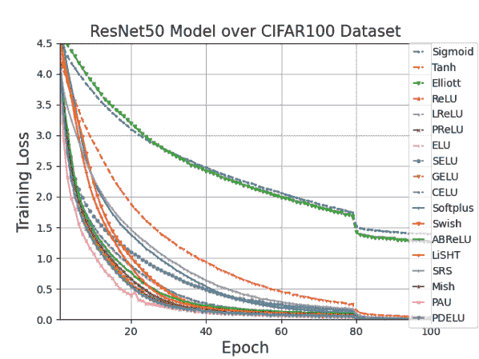

<!--yml

分类：未分类

日期：2024-09-06 19:51:18

-->

# [2109.14545] 深度学习中的激活函数：综合调查与基准测试

> 来源：[`ar5iv.labs.arxiv.org/html/2109.14545`](https://ar5iv.labs.arxiv.org/html/2109.14545)

# 深度学习中的激活函数：综合调查与基准测试

Shiv Ram Dubey¹, Satish Kumar Singh¹, Bidyut Baran Chaudhuri² ¹Computer Vision and Biometrics Laboratory, Indian Institute of Information Technology, Allahabad, India。

²Techno India University, Kolkata, India 和 Indian Statistical Institute, Kolkata, India。

srdubey@iiita.ac.in, sk.singh@iiita.ac.in, bidyutbaranchaudhuri@gmail.com

本文已被《Neurocomputing》接受。版权将转移至 Elsevier。

###### 摘要

神经网络在近年来显示出了巨大的增长，用于解决众多问题。各种类型的神经网络已经被引入，以应对不同类型的问题。然而，任何神经网络的主要目标是使用一系列层将非线性可分的输入数据转换为更线性可分的抽象特征。这些层是线性和非线性函数的组合。最流行和常见的非线性层是激活函数（AFs），如 Logistic Sigmoid、Tanh、ReLU、ELU、Swish 和 Mish。本文对神经网络中深度学习的 AFs 进行了全面概述和调查。涵盖了不同类别的 AFs，如基于 Logistic Sigmoid 和 Tanh 的、基于 ReLU 的、基于 ELU 的和基于学习的。还指出了 AFs 的几个特征，如输出范围、单调性和光滑性。还对 18 种最先进的 AFs 在不同网络和不同类型的数据上的性能进行了比较。AFs 的见解旨在为研究人员提供进一步研究的参考，并为从业人员在不同选择中进行选择提供帮助。用于实验比较的代码发布在：[`github.com/shivram1987/ActivationFunctions`](https://github.com/shivram1987/ActivationFunctions)。

^†^†期刊：Neurocomputing

## 1 引言

近年来，深度学习在解决诸如物体检测[1]、语义分割[2]、人物重新识别[3]、图像检索[4]、异常检测[5]、皮肤疾病诊断[6]等具有挑战性的问题方面表现出了巨大的增长。深度学习中定义了各种类型的神经网络，以从数据中学习抽象特征，例如多层感知器（MLP）[7]、卷积神经网络（CNN）[8]、递归神经网络（RNN）[9]和生成对抗网络（GAN）[10]。神经网络的重要方面包括权重初始化[11]、损失函数[12]、不同层次[13]、过拟合[14]和优化[15]。

激活函数（AFs）在神经网络中扮演着非常关键的角色[16]，通过非线性变换学习抽象特征。激活函数的一些常见属性如下：a) 应该在优化景观中添加非线性曲率，以提高网络的训练收敛性；b) 不应大幅增加模型的计算复杂性；c) 不应阻碍训练过程中的梯度流；d) 应该保留数据的分布，以促进网络的更好训练。近年来，为了实现上述属性，已经探索了几种激活函数。本调查专注于神经网络中激活函数领域的发展。不同激活函数的见解及其理由被呈现出来，以造福深度学习社区。本调查的主要贡献如下：

1.  1.

    本调查提供了对广泛激活函数的详细分类。它还非常全面地涵盖了激活函数，包括逻辑斯蒂函数/双曲正切函数、整流单元、指数单元和自适应激活函数。

1.  2.

    本调查从各个角度丰富了读者对最先进激活函数的分析。它特别涵盖了深度学习中激活函数的发展。

1.  3.

    本调查还总结了激活函数的简要亮点和重要讨论，以描绘其对不同数据类型的适用性（参见表格 6）。

1.  4.

    本调查与现有调查和性能分析进行了比较，以显示其重要性（参见表格 7）。

1.  5.

    本文还展示了在 4 个不同模态的基准数据集上使用 18 种最先进的 AFs 和不同类型网络的性能比较（请参见表 8、9 和 11）。

AFs 的演变在第二部分中进行了说明。Logistic Sigmoid 和 Tanh、整流、指数、自适应及其他各种 AFs 的进展分别总结在第 3、4、5、6 和 7 节中讨论。AFs 的一些方面在第八部分中进行了讨论。第九部分进行了全面的性能分析。第十部分提供了总结、结论和建议。

## 2 激活函数的演变

线性函数可以被认为是一个简单的 AF，对于输入 $x$ 输出 $c\times x$，其中 $c$ 是一个常数。线性 AF 在图 1 中为 $c=1$（即单位函数）进行了说明。请注意，线性 AF 不会为网络引入非线性。然而，神经网络需要引入非线性。否则，即使有多层，神经网络也会将输出视为输入的线性函数。此外，在实际应用中，数据通常不是线性可分的；因此，非线性层有助于在特征空间中以非线性方式投影数据，这可以与不同的目标函数一起使用。本节概述了深度学习中 AF 的演变。图 2 展示了不同属性和特征类型的分类。

图 1：线性、Logistic Sigmoid 和 Tanh AFs 的示意图。

Logistic Sigmoid/Tanh 单位基础的激活函数：为了将非线性引入神经网络，早期使用了 Logistic Sigmoid 和 Tanh AF。生物神经元的激发是使用 Logistic Sigmoid 和 Tanh AF 与人工神经元的动机。Logistic Sigmoid AF 是一个非常流行和传统的非线性函数。其形式为，

|  | $\text{Logistic Sigmoid}(x)=\frac{1}{1+e^{-x}}.$ |  | (1) |
| --- | --- | --- | --- |

这个 AF 将输出压缩到[$0$, $1$]之间，如图 1 所示。Logistic Sigmoid 函数的输出在较高和较低输入时会饱和，这导致了梯度消失问题。梯度消失问题描述了一个场景，其中目标函数相对于某个参数的梯度变得非常接近零，导致在使用随机梯度下降技术训练网络时，参数几乎没有更新。因此，在梯度消失场景下，训练几乎会被“杀死”。此外，输出不遵循零中心特性会导致收敛性差。Tanh 函数也被用作神经网络中的 AF。它类似于 Logistic Sigmoid 函数，同时展现了零中心特性，如图 1 所示。Tanh 函数表示为，

|  | $\text{Tanh}(x)=\frac{e^{x}-e^{-x}}{e^{x}+e^{-x}}.$ |  | (2) |
| --- | --- | --- | --- |

双曲正切函数也将输入压缩，但范围在$[-1,1]$。双曲正切函数也存在与 Logistic Sigmoid 函数类似的缺点，如梯度消失和计算复杂性。Logistic Sigmoid 和双曲正切 AF 主要遭遇梯度消失的问题。基于 Logistic Sigmoid 和双曲正切 AF 的几项改进已在 3 节中详细描述。

图 2：激活函数的分类。

经过修正的线性单元（ReLU）基础的激活函数：饱和输出和增加的复杂性是上述 Logistic Sigmoid 和双曲正切基础的激活函数的主要限制。由于其简单性和性能提升，经过修正的线性单元（ReLU）[17] 已成为最先进的激活函数。ReLU 也被用于 AlexNet 模型 [8]。已通过解决其缺点（如负值未利用、有限的非线性和无界输出）对 ReLU 的各种变体进行了研究，详细内容见 4 节。

表 1：主要激活函数的优缺点。

| 激活函数 | 渐减 | 有限 | 优化 | 缺乏 | 计算 |
| --- | --- | --- | --- | --- | --- |
| 梯度 | 非线性 | 难度 | 适应性 | 低效 |
| --- | --- | --- | --- | --- |
| Sigmoid | 是 | 否 | 是 | 是 | 是 |
| 双曲正切（Tanh） | 是 | 否 | 部分 | 是 | 是 |
| ReLU | 部分 | 是 | 部分 | 是 | 否 |
| ELU | 否 | 部分 | 否 | 是 | 部分 |
| APL | 否 | 部分 | 否 | 否 | 否 |
| Swish | 否 | 部分 | 否 | 否 | 部分 |

表 2：Logistic Sigmoid 和双曲正切基础的激活函数总结。

| 激活函数名称 | 参数化 | 单调 | 光滑 | 有界 |
| --- | --- | --- | --- | --- |
| Logistic Sigmoid | 否 | 是 | 是 | 是 |
| 双曲正切（Tanh） | 否 | 是 | 是 | 是 |
| 缩放的双曲正切（sTanh），1998 [18] | 是 | 是 | 是 | 是 |
| 经过修正的双曲正割（ReSech），2016 [19] | 否 | 否 | 是 | 是 |
| 缩放 Sigmoid（sSigmoid），2016 [20] | 否 | 是 | 是 | 是 |
| 罚项双曲正切（pTanh），2016 [20] | 否 | 是 | 否 | 是 |
| Hexpo，2017 [21] | 否 | 是 | 是 | 是 |
| 改进的 Sigmoid（ISigmoid），2018 [22] | 否 | 是 | 是 | 否 |
| Sigmoid 加权线性单元（SiLU），2018 [23] | 否 | 否 | 是 | 对于负输入 |
| 线性缩放双曲正切（LiSHT），2019 [24] | 否 | 否 | 是 | 否 |
| Elliott，2019 [25] | 否 | 是 | 是 | 是 |
| Soft-Root-Sign (SRS)，2020 [26] | 是 | 否 | 是 | 是 |

指数单位基激活函数：Logistic Sigmoid 和 Tanh 基于 AF 面临的主要问题是对于大正值和负值输入的饱和输出。类似地，ReLU 基于 AF 的主要问题是负值的利用不足，导致梯度消失。为了应对这些限制，文献中使用了基于指数函数的 AF。指数线性单元（ELU）[27] 基于 AF 利用指数函数来处理负值。文献中介绍了几种 ELU 变体，如第五部分中详细介绍。

学习/自适应激活函数：大多数基于 Sigmoid、Tanh、ReLU 和 ELU 的 AF 是手动设计的，可能无法充分利用数据的复杂性。基于学习的自适应 AF 是近期的趋势。这类 AF 包含可学习的参数，例如自适应分段线性（APL）[28] 和 Swish [29] AF 分别包含两个和一个可学习的参数。最近，已经提出了几种基于学习的 AF，如第六部分所示。

杂项激活函数：近年来，许多其他 AF 也被研究，如第七部分所述。这些激活函数包括 Softplus 单元、概率函数、多项式函数和核函数。

表 1 突出了主要 AF 在梯度消失、非线性限制、优化难度、计算低效和适应性不足方面的优缺点。可以注意到，Tanh 函数在计算上效率低，因为它涉及多次计算指数[30]。然而，在实现中可以通过 Sigmoid 函数的帮助来使用单次指数计算。这些现有 AF 的限制是驱动近期 AF 发展的因素，如本文进一步章节所述。

## 3 Logistic Sigmoid 和 Tanh 基于 AF

传统的 AFs，如 Logistic Sigmoid 和 Tanh，在神经网络的早期被广泛使用。然而，这些 AFs 由于饱和输出而使得深度网络的训练受阻。为了改进这些 AFs，也进行了多次尝试。表 2 对 Logistic Sigmoid 和 Tanh 基础 AFs 的属性进行了比较，包括参数化、单调、平滑和有界。

为了解决 Tanh 的输出范围有限和零梯度的问题，使用了 scaled Hyperbolic Tangent (sTanh)[18]，其定义如下，

|  | $sTanh(x)=A\times Tanh(B\times x)$ |  | (3) |
| --- | --- | --- | --- |

输出范围为$[-A,A]$。提出了 Parametric Sigmoid Function (PSF)作为一个连续、可微分、有界函数，如下，

|  | $PSF(x)=\frac{1}{(1+e^{-x})^{m}}$ |  | (4) |
| --- | --- | --- | --- |

其中$m$是一个超参数[31]。当$m$取较高值时，梯度流会得到改善。作为 AF 的 shifted log-sigmoid 的和也被探索，保持了生成特征的对称性[32]。Rectified Hyperbolic Secant (ReSech) AF 是可微分的、对称的，并且有界[19]，其定义如下，

|  | $ReSech(x)=x\times Sech(x)$ |  | (5) |
| --- | --- | --- | --- |

输出范围为$[-1,1]$。然而，由于 Logistic Sigmoid 和 Tanh 在大正负输入时表现出饱和行为，导致了梯度消失问题。由于这一特性，训练深度网络变得困难[20]。为了减轻这一限制，定义了 Scaled Sigmoid (sSigmoid)，如下，

|  | $sSigmoid(x)=(4\times Sigmoid(x)-2)$ |  | (6) |
| --- | --- | --- | --- |

输出范围为$[-2,2]$，Penalized Tanh (pTanh)定义如下，

|  | $pTanh(x)=\begin{cases}Tanh(x),&x\geq 0\\ a\times Tanh(x),&x<0\end{cases}$ |  | (7) |
| --- | --- | --- | --- |

输出范围为$[-a,1]$，其中$a\in(0,1)$。然而，Sigmoid 和 pTanh AFs 也存在梯度消失问题。注意到 pTanh AF 在自然语言处理（NLP）任务中表现更好[33]。

表 3：基于修正线性单元的激活函数总结。

| 名称 | Parametric | 单调 | 平滑 | 有界 |
| --- | --- | --- | --- | --- |
| Rectified Linear Unit (ReLU), 2010 [17] | 否 | 是 | 否 | 对于负输入 |
| Leaky ReLU (LReLU), 2013 [34] | 否 | 是 | 否 | 否 |
| Parametric ReLU (PReLU), 2015 [35] | 是 | 是 | 否 | 否 |
| Randomized ReLU (RReLU), 2015 [35] | 否 | 是 | 否 | 否 |
| Concatenated ReLU (CReLU), 2016 [36] | 否 | 是 | 否 | 对于负输入 |
| Bounded ReLU (BReLU), 2016 [37] | 否 | 是 | 否 | 是 |
| 参数化 Tanh 线性单元（PTELU），2017 [38] | 是 | 是 | 是 | 针对负输入 |
| 灵活 ReLU（FReLU），2018 [39] | 是 | 是 | 否 | 针对负输入 |
| 弹性 ReLU（EReLU），2018 [40] | 否 | 是 | 否 | 针对负输入 |
| 随机平移 ReLU（RTReLU），2018 [41] | 否 | 是 | 否 | 针对负输入 |
| 双重 ReLU（DualReLU），2018 [42] | 否 | 是 | 否 | 否 |
| 配对 ReLU（PairedReLU），2018 [43] | 是 | 是 | 否 | 否 |
| 平均偏置 ReLU（ABReLU），2018 [44] | 否 | 是 | 否 | 针对负输入 |
| 自然对数（NLReLU），2019 [45] | 否 | 是 | 否 | 针对负输入 |
| 多分箱可训练线性单元（MTLU），2019 [46] | 是 | 否 | 否 | 否 |
| Lipschitz ReLU（L-ReLU），2020 [47] | 是 | 取决于 $\phi$ 和 $\eta$ | 取决于 $\phi$ 和 $\eta$ | 取决于 $\phi$ 和 $\eta$ |

含噪声的激活函数被定义为克服梯度消失问题 [48]。由于加入了噪声，即使在饱和区域，梯度也能顺利流动。梯度消失问题通过 Hexpo 函数 [21] 得到最小化，该函数类似于 Tanh，但具有缩放的梯度。其定义为，

|  | $Hexpo(x)=\begin{cases}-a\times(e^{-x/b}-1),&amp;x\geq 0\\ c\times(e^{x/d}-1),&amp;x<0\end{cases}$ |  | (8) |
| --- | --- | --- | --- |

在输出范围 $[-c,a]$ 内。Sigmoid 函数的输出与其输入在 sigmoid 加权线性单元（SiLU）激活函数 [23] 中相乘，如下所示

|  | $SiLU(x)=x\times Sigmoid(x)$ |  | (9) |
| --- | --- | --- | --- |

在输出范围 $(-0.5,\infty)$ 内。同时，提出了一种改进的逻辑 Sigmoid（ISigmoid）激活函数 [22]，旨在通过将 Sigmoid 与分段的 sigmoidal 和线性函数结合来解决 Sigmoid 的梯度消失问题。其定义为，

|  | <math alttext="ISigmoid(x)=\begin{cases}\alpha\times(x-a)+Sigmoid(a),&amp;x\geq a\\ Sigmoid(x),&amp;-a<x<a\\

\(\alpha\times(x+a)+\text{Sigmoid}(a),\text{当}\ x\leq-a\end{cases}\)" display="block"><semantics ><mrow  ><mrow ><mi  >I</mi><mo lspace="0em" rspace="0em"  >​</mo><mi >S</mi><mo lspace="0em" rspace="0em" >​</mo><mi >i</mi><mo lspace="0em" rspace="0em" >​</mo><mi  >g</mi><mo lspace="0em" rspace="0em"  >​</mo><mi >m</mi><mo lspace="0em" rspace="0em" >​</mo><mi >o</mi><mo lspace="0em" rspace="0em" >​</mo><mi  >i</mi><mo lspace="0em" rspace="0em"  >​</mo><mi >d</mi><mo lspace="0em" rspace="0em" >​</mo><mrow ><mo stretchy="false"  >(</mo><mi >x</mi><mo stretchy="false" >)</mo></mrow></mrow><mo  >=</mo><mrow ><mo  >{</mo><mtable columnspacing="5pt" displaystyle="true" rowspacing="0pt" ><mtr  ><mtd columnalign="left"  ><mrow ><mrow ><mrow  ><mi >α</mi><mo lspace="0.222em" rspace="0.222em"  >×</mo><mrow ><mo stretchy="false"  >(</mo><mrow ><mi >x</mi><mo >−</mo><mi >a</mi></mrow><mo stretchy="false"  >)</mo></mrow></mrow><mo >+</mo><mrow ><mi >S</mi><mo lspace="0em" rspace="0em" >​</mo><mi >i</mi><mo lspace="0em" rspace="0em"  >​</mo><mi >g</mi><mo lspace="0em" rspace="0em"  >​</mo><mi >m</mi><mo lspace="0em" rspace="0em"  >​</mo><mi >o</mi><mo lspace="0em" rspace="0em"  >​</mo><mi >i</mi><mo lspace="0em" rspace="0em"  >​</mo><mi >d</mi><mo lspace="0em" rspace="0em"  >​</mo><mrow ><mo stretchy="false"  >(</mo><mi >a</mi><mo stretchy="false" >)</mo></mrow></mrow></mrow><mo >,</mo></mrow></mtd><mtd columnalign="left"  ><mrow ><mi >x</mi><mo  >≥</mo><mi >a</mi></mrow></mtd></mtr><mtr ><mtd columnalign="left"  ><mrow ><mrow  ><mi >S</mi><mo lspace="0em" rspace="0em"  >​</mo><mi >i</mi><mo lspace="0em" rspace="0em"  >​</mo><mi >g</mi><mo lspace="0em" rspace="0em"  >​</mo><mi >m</mi><mo lspace="0em" rspace="0em"  >​</mo><mi >o</mi><mo lspace="0em" rspace="0em"  >​</mo><mi >i</mi><mo lspace="0em" rspace="0em"  >​</mo><mi >d</mi><mo lspace="0em" rspace="0em"  >​</mo><mrow ><mo stretchy="false" >(</mo><mi >x</mi><mo stretchy="false" >)</mo></mrow></mrow><mo >,</mo></mrow></mtd><mtd columnalign="left"  ><mrow ><mrow ><mo  >−</mo><mi >a</mi></mrow><mo ><</mo><mi >x</mi><mo  ><</mo><mi >a</mi></mrow></mtd></mtr><mtr ><mtd columnalign="left"  ><mrow ><mrow  ><mrow ><mi >α</mi><mo lspace="0.222em" rspace="0.222em" >×</mo><mrow ><mo stretchy="false"  >(</mo><mrow ><mi >x</mi><mo >+</mo><mi >a</mi></mrow><mo stretchy="false"  >)</mo></mrow></mrow><mo >+</mo><mrow ><mi >S</mi><mo lspace="0em" rspace="0em" >​</mo><mi >i</mi><mo lspace="0em" rspace="0em"  >​</mo><mi >g</mi><mo lspace="0em" rspace="0em"  >​</mo><mi >m</mi><mo lspace="0em" rspace="0em"  >​</mo><mi >o</mi><mo lspace="0em" rspace="0em"  >​</mo><mi >i</mi><mo lspace="0em" rspace="0em"  >​</mo><mi >d</mi><mo lspace="0em" rspace="0em"  >​</mo><mrow ><mo stretchy="false"  >(</mo><mi >a</mi><mo stretchy="false" >)</mo></mrow></mrow></mrow><mo >,</mo></mrow></mtd><mtd columnalign="left"  ><mrow ><mi >x</mi><mo  >≤</mo><mrow ><mo >−</mo><mi  >a</mi></mrow></mrow></mtd></mtr></mtable></mrow></mrow><annotation-xml encoding="MathML-Content" ><apply  ><apply ><ci >𝐼</ci><ci  >𝑆</ci><ci >𝑖</ci><ci >𝑔</ci><ci  >𝑚</ci><ci >𝑜</ci><ci >𝑖</ci><ci  >𝑑</ci><ci >𝑥</ci></apply><apply ><csymbol cd="latexml"  >cases</csymbol><apply ><apply ><ci >𝛼</ci><apply ><ci >𝑥</ci><ci >𝑎</ci></apply></apply><apply ><ci >𝑆</ci><ci >𝑖</ci><ci >𝑔</ci><ci >𝑚</ci><ci >𝑜</ci><ci >𝑖</ci><ci >𝑑</ci><ci >𝑎</ci></apply></apply><apply ><ci  >𝑥</ci><ci >𝑎</ci></apply><apply ><ci >𝑆</ci><ci >𝑖</ci><ci >𝑔</ci><ci >𝑚</ci><ci >𝑜</ci><ci >𝑖</ci><ci >𝑑</ci><ci >𝑥</ci></apply><apply ><apply  ><apply ><ci >𝑎</ci></apply><ci >𝑥</ci></apply><apply ><ci  >𝑎</ci></apply></apply><apply ><apply ><ci >𝛼</ci><apply ><ci >𝑥</ci><ci >𝑎</ci></apply></apply><apply ><ci >𝑆</ci><ci >𝑖</ci><ci >𝑔</ci><ci >𝑚</ci><ci >𝑜</ci><ci >𝑖</ci><ci >𝑑</ci><ci >𝑎</ci></apply></apply><apply ><ci  >𝑥</ci><apply ><ci >𝑎</ci></apply></apply></apply></apply></annotation-xml><annotation encoding="application/x-tex" >ISigmoid(x)=\begin{cases}\alpha\times(x-a)+\text{Sigmoid}(a),&x\geq a\\ \text{Sigmoid}(x),&-a<x<a\\ \alpha\times(x+a)+\text{Sigmoid}(a),&x\leq-a\end{cases}</annotation></semantics></math> |  | (10) |

在输出范围为 $(-\infty,\infty)$。线性缩放双曲正切 (LiSHT) AF 以线性方式缩放 Tanh 以克服梯度消失问题 [24]。LiSHT 可以定义为，

|  | $LiSHT(x)=x\times Tanh(x)$ |  | (11) |
| --- | --- | --- | --- |

在输出范围为 $0,\infty)$。LiSHT 函数是对称的，但它的缺点是仅包含无界和非负输出。Elliott AF [[25] 在特性图上与 Sigmoid 函数类似，定义为，

|  | $Elliott(x)=\frac{0.5\times x}{1+&#124;x&#124;}+0.5$ |  | (12) |
| --- | --- | --- | --- |

在输出范围为 $[0,1]$。Soft-Root-Sign (SRS) AF [26] 定义为，

|  | $SRS(x)=\frac{x}{\frac{x}{\alpha}+e^{-x/\beta}}$ |  | (13) |
| --- | --- | --- | --- |

在输出范围为 $[\frac{\alpha\times\beta}{\beta-\alpha\times e},\alpha]$，其中 $\alpha$ 和 $\beta$ 是可学习参数。使用额外的参数增加了 SRS 函数的复杂性。大多数 Sigmoid/Tanh AF 的变体尝试克服梯度消失问题。然而，这个问题在大多数这些 AF 中仍然存在。

## 4 纠正激活函数

纠正激活函数的总结如表 3 所示。纠正线性单元 (ReLU) 是一个简单的函数，对于正输入是恒等函数，对于负输入是零，定义为，

|  | $ReLU(x)=max(0,x)=\begin{cases}x,&amp;\text{if }x\geq 0\\ 0,&amp;\text{otherwise}\end{cases}.$ |  | (14) |
| --- | --- | --- | --- |

因此，ReLU 的范围为 $0,\infty)$。对于正输入和负输入的梯度分别为一和零。ReLU 函数解决了 Logistic Sigmoid 和 Tanh 函数的计算复杂性问题。ReLU 的缺点在于负输入的梯度消失问题。尽管存在梯度消失问题，ReLU AF 在深度学习模型中得到了广泛使用。本节的其余部分讨论了基于 ReLU 的 AF 的进展。

### 4.1 关于 ReLU 的负值未利用问题

梯度消失是 ReLU AF 的主要问题，由于未利用负值而造成。Leaky Rectified Linear Unit (LReLU) 是 ReLU 的扩展，通过利用负值 [[34]。LReLU 定义为，

|  | $LReLU(x)=\begin{cases}x,&amp;x\geq 0\\ 0.01\times x,&amp;x<0\end{cases}$ |  | (15) |
| --- | --- | --- | --- |

在输出范围为 $(-\infty,\infty)$。LReLU 在许多应用中表现出良好的性能。LReLU 关联的一个主要问题是为负输入找到合适的斜率。不同的斜率可能适合不同的问题和网络。因此，它通过将负输入的斜率作为可训练参数扩展为 Parametric ReLU (PReLU) [35]。PReLU 定义为，

|  | $PReLU(x)=\begin{cases}x,&amp;x\geq 0\\ p\times x,&amp;x<0\end{cases}$ |  | (16) |
| --- | --- | --- | --- |

在输出范围 $(-\infty,\infty)$ 内，其中 $p$ 是可训练参数。然而，它容易导致过拟合，这是 PReLU 的缺点。Maxout 层计算多个线性单元的最大值，也作为 AF 使用 [49]。ReLU 和 Leaky ReLU 可以看作是 Maxout 的特例。随机 ReLU (RReLU) 在训练期间从均匀分布 $U(l,u)$ 随机考虑 LReLU 的斜率 [50]。RReLU 定义为，

|  | $RReLU(x)=\begin{cases}x,&amp;x\geq 0\\ R\times x,&amp;x<0\end{cases}$ |  | (17) |
| --- | --- | --- | --- |

在输出范围 $(-\infty,\infty)$ 内，其中 $R\sim{~{}}U(l,u)$，$l<u$ 且 $l,u\in0,1)$。在测试时使用确定性值 $x/\left(\frac{l+u}{2}\right)$。

ReLU 无法利用负值中的潜在有用信息。在大多数网络中，作为 AF 输入的特征图在零附近是密集的。因此，修正点的微小抖动可能导致训练困难。连接 ReLU（CReLU）[[36] 将 ReLU 的输出连接到原始输入和负输入。CReLU 可以表示为，

|  | $CReLU(x)=[ReLU(x),ReLU(-x)]$ |  | (18) |
| --- | --- | --- | --- |

在输出范围 $0,\infty)$ 内。CReLU 源于 CNN 模型中下层卷积核形成相位相反的对。特征图在 ReLU 层之前还会进行多个偏置的移动 [[51]。然而，这增加了模型的复杂性，因为需要更多的 ReLU。也使用了参数化双曲正切线性单元（P-TELU）作为 AF [38]。P-TELU 定义为，

|  | $PTELU(x)=\begin{cases}x,&amp;x\geq 0\\ \alpha\times\text{Tanh}(\beta\times x),&amp;x<0\end{cases}$ |  | (19) |
| --- | --- | --- | --- |

在输出范围 $-\alpha,\infty)$ 内，其中 $\{\alpha,\beta\}\geq 0$ 是可学习的参数。

表 4：基于指数线性单元的激活函数总结。

| 名称 | 参数化 | 单调 | 光滑 | 有界 |
| --- | --- | --- | --- | --- |
| Exponential Linear Unit (ELU), 2016 [[27] | 是 | 是 | 是 | 针对负输入 |
| Scaled ELU (SELU), 2017 [52] | 是 | 是 | 是 | 针对负输入 |
| Continuously Differentiable ELU (CELU), 2017 [53] | 是 | 是 | 否 | 针对负输入 |
| Parametric ELU (PELU), 2017 [54] | 是 | 是 | 否 | 针对负输入 |
| Multiple PELU (MPELU), 2018 [55] | 是 | 是 | 否 | 针对负输入 |
| Fast ELU (FELU), 2019 [56] | 是 | 是 | 否 | 针对负输入 |
| Parametric Rectified Exponential Unit (PREU), 2019 [57] | 是 | 否 | 是 | 针对负输入 |
| Elastic ELU (EELU), 2020 [58] | 是 | 是 | 否 | 针对负输入 |
| Parametric Deformable ELU (PDELU), 2020 [59] | 是 | 是 | 是 | 针对负输入 |

Flexible ReLU (FReLU) [39] 通过在 Shifted ReLU [39]中将整流点视为可训练的来捕捉负值。FReLU 定义为，

|  | $FReLU(x)=ReLU(x)+b$ |  | (20) |
| --- | --- | --- | --- |

在输出范围为$b,\infty)$中。类似的安排也被 Random Translation ReLU (RTReLU) [[41] 通过利用从高斯分布中采样的偏移量所遵循，定义为，

|  | $RTReLU(x)=\begin{cases}x+a,&amp;x+a>0\\ 0,&amp;x+a\leq 0\end{cases}$ |  | (21) |
| --- | --- | --- | --- |

在输出范围为$0,\infty)$中，其中$a$是一个随机数。在测试时，偏移量设置为零。还研究了一种依赖于数据的平均偏置 ReLU (AB-ReLU) [[44]，通过基于特征平均值的水平位移来处理负值。ABReLU 可以写成，

|  | $ABReLU(x)=\begin{cases}x-\beta,&amp;x-\beta\geq 0\\ 0,&amp;x-\beta<0\end{cases}$ |  | (22) |
| --- | --- | --- | --- |

输出范围为$0,\infty)$，其中$\beta$计算为输入激活图到激活函数的平均值。Dynamic ReLU (D-ReLU) [[60]使用 ReLU 的批次相关阈值。Dual ReLU (DualReLU) [42] 是用于递归神经网络的二维激活函数。DualReLU 定义为，

|  | $DualReLU(a,b)=\max(0,a)-\max(0,b)$ |  | (23) |
| --- | --- | --- | --- |

在输出范围为$(-\infty,\infty)$中，其中$a$和$b$是不同维度的输入。类似于 CReLU，PairedReLU 激活函数用于图像超分辨率 [43]。PairedReLU 定义为，

|  | $PairedReLU(x)=[\max(s\times x-\theta,0),max(s_{p}\times x-\theta_{p},0)]$ |  | (24) |
| --- | --- | --- | --- |

在输出范围为$(-\infty,\infty)$中。然而，与 CReLU 相比，PairedReLU 的计算复杂度增加了。在另一种尝试中，V 形 ReLU (vReLU) 激活函数 [61] 被定义为，

|  | $vReLU(x)=\begin{cases}x,&amp;x\geq 0\\ -x,&amp;x<0\end{cases}$ |  | (25) |
| --- | --- | --- | --- |

输出范围为$[0,\infty]$。vReLU 激活函数存在非对称输出的问题。SignReLU 激活函数利用负值使用 Softsign 函数 [62]。SignReLU 的正部分与 ReLU 相同。

Displaced ReLU (DisReLU) [63] 设计为 Shifted ReLU [39] 的推广。DisReLU 通过将整流点移位来考虑负值，定义为，

|  | $DisReLU(x)=\begin{cases}x,&amp;x\geq-\delta\\ -\delta,&amp;x<-\delta\end{cases}$ |  | (26) |
| --- | --- | --- | --- |

输出范围为$[-\delta,\infty]$。研究了可弯曲线性单元 (BLU) 激活函数，如下所示，

|  | $BLU(x)=\beta\times(\sqrt{x^{2}+1}-1)+x$ |  | (27) |
| --- | --- | --- | --- |

其中$-1\leq\beta\leq 1$ 是一个可学习的参数，用于适应身份函数和整流函数之间的形状 [64]。Lipschitz ReLU (L-ReLU) 激活函数使用分段线性函数来建模特征的存在程度和缺失程度 [47]。L-ReLU 定义为，

|  | $L\text{-}ReLU(x)=\begin{cases}\max(\phi(x),0),&amp;x\geq 0\\ \min(\eta(x),0),&amp;x<0\end{cases}$ |  | (28) |
| --- | --- | --- | --- |

其中 $\phi$ 和 $\eta$ 是非线性函数。此外，L-ReLU 的范围也取决于 $\phi$ 和 $\eta$ 函数的值。

### 4.2 ReLU 的有限非线性

S 形 ReLU (SReLU) 通过将三个线性函数与四个可学习的参数结合起来，提高了 ReLU 的非线性 [65]。类似地，多-bin 可训练线性单元 (MTLU) [46] 通过考虑多个区间来增加非线性容量。MTLU 可以写成，

|  | <math   alttext="MTLU(x)=\begin{cases}a_{0}\times x+b_{0},&amp;x\leq c_{0}\\ a_{k}\times x+b_{k},&amp;c_{k-1}<x\leq c_{k}\\

...&amp;\\

\(M_{T L U}(x) = \begin{cases}a_{0}\times x + b_{0},& x \leq c_{0} \\ a_{k}\times x + b_{k},& c_{k-1} < x \leq c_{k} \\ \vdots & \\ a_{K}\times x + b_{K},& c_{K-1} < x \end{cases}\)

输出范围为$(-\infty,\infty)$。箱子的数量和范围是超参数，而箱子的线性函数是可训练的（即，$a_{0},...,a_{K}$和$b_{0},...,b_{K}$是可学习的参数）。MTLU 的缺点是多个点的非可微性质。Elastic ReLU (EReLU)在训练过程中对正输入考虑从均匀分布中随机抽取的斜率，以控制非线性的量[40]。EReLU 定义为，

|  | $EReLU(x)=max(R\times x,0)$ |  | (30) |
| --- | --- | --- | --- |

在输出范围$0,\infty)$中，其中$R$是随机数。在测试时，EReLU 对正输入变成恒等函数。Linearized Sigmoidal Activation (LiSHA)函数考虑了三个线性函数以增加非线性特性[[66]。它还扩展为自适应线性 Sigmoidal AF，通过学习上下线性函数的斜率。ReLU 与 Tanh 结合形成 Rectified Linear Tanh (ReLTanh) [67]，以增加 ReLU 的非线性并克服 Tanh 的梯度消失问题。然而，ReLTanh 在正负两个方向上都是无界的。Natural-Logarithm ReLU (NLReLU)通过使用对数函数修改 ReLU 对正输入的输出，以增加非线性程度[45]。NLReLU 定义为，

|  | $NLReLU(x)=\ln(\beta\times\max(0,x)+1.0)$ |  | (31) |
| --- | --- | --- | --- |

输出范围为$0,\infty)$，其中$\beta$是常数。NLReLU 不影响负值范围，因此会受到梯度消失的影响。Leaky ReLU (LReLU)的概念进一步改进为 Dynamic ReLU [[68]，通过考虑基于均方误差（MSE）的附加超参数。这样，它可以根据收敛情况在每个训练周期控制 Dynamic ReLU 的斜率。Piecewise Linear Unit (PLU) [69]定义为，

|  | $PLU(x)=max(\alpha\times(x+c)-c,min(\alpha\times(x-c)+c,x))$ |  | (32) |
| --- | --- | --- | --- |

输出范围为$[-\infty,+\infty]$，其中$\alpha$和$c$是常数。基本上，PLU 激活函数由三个线性函数组成，但保持连续。因此，它避免了饱和，并在反向传播过程中通过激活函数提供了良好的梯度流，以解决 ReLU 和 Tanh 的梯度消失问题。然而，PLU 激活在正负两个方向上都是无界的。

### 4.3 关于 ReLU 的无界输出

ReLU 及其许多变体的无界输出可能导致训练不稳定。此外，专用硬件嵌入式系统应用需要有界的激活函数。ReLU 被扩展为 Bounded ReLU (BReLU) [37]，定义为，

|  | $BReLU(x)=\min(\max(0,x),A)$ |  | (33) |
| --- | --- | --- | --- |

输出范围为 $[0,A]$。由于两个校正（即在 $0$ 和 $A$），BReLU 的训练稳定性得到改善。ReLU 是深度学习中常用的选择。基于 ReLU 的激活函数通常效率高。ReLU 的主要缺点，如负输入的梯度消失、有限的非线性和无界性，在不同的激活函数中有所改善。然而，ReLU 的变体无法解决 ReLU 的所有问题。

## 5 指数激活函数

指数激活函数解决了 ReLU 的梯度消失问题。表 4 列出了指数激活函数的属性。指数线性单元（ELU） [27] 定义为，

|  | $ELU(x)=\begin{cases}x,&amp;x>0\\ \alpha\times(e^{x}-1),&amp;x\leq 0\end{cases}$ |  | (34) |
| --- | --- | --- | --- |

输出范围为 $-1,\infty)$，其中 $\alpha$ 是一个可学习的参数。ELU 函数展现了 ReLU 函数的所有优点。ELU 是可微分的，对大负输入饱和，并且减少了偏移。与 Leaky ReLU 和参数化 ReLU 相比，ELU 的负饱和状态对噪声具有一定的鲁棒性。通过使用缩放超参数使得正输入的斜率大于一，ELU 被扩展为缩放 ELU（SELU） [[52]。SELU 可以定义为，

|  | $SELU(x)=\lambda\times\begin{cases}x,&amp;x>0\\ \alpha\times(e^{x}-1),&amp;x\leq 0\end{cases}$ |  | (35) |
| --- | --- | --- | --- |

输出范围为 $-\lambda,\infty)$，其中 $\alpha$ 是一个超参数。基本上，SELU 使得自我归一化自动收敛到零均值和单位方差。参数化 ELU（PELU） [[54] 改变了饱和点和指数衰减，并且调节了正输入的线性函数的斜率以便于可微分性。PELU 激活函数可以写成，

|  | $PELU(x)=\lambda\times\begin{cases}\frac{a}{b}\times x,&amp;x\geq 0\\ a\times(e^{x/b}-1),&amp;x<0\end{cases}$ |  | (36) |
| --- | --- | --- | --- |

输出范围为 $-a,\infty)$，其中 $a$ 和 $b$ 是可训练的参数。参数化 ELU 还在连续可微分 ELU（CELU） [[53] 中进行了探索，针对负输入。CELU 定义为，

|  | $CELU(x)=\begin{cases}x,&amp;x\geq 0\\ \alpha\times(e^{x/\alpha}-1),&amp;x<0\end{cases}$ |  | (37) |
| --- | --- | --- | --- |

输出范围为 $-\alpha,\infty)$，其中 $\alpha$ 是一个可学习的参数。PELU 还被扩展为多参数 PELU（MPELU） [[55]，通过使用两个可学习的参数来表示 MPELU 为修正、指数或组合形式。MPELU 可以表示为，

|  | $MPELU(x)=\begin{cases}x,&amp;x>0\\ \alpha_{c}\times(e^{\beta_{c}\times x}-1),&amp;x\leq 0\end{cases}$ |  | (38) |
| --- | --- | --- | --- |

输出范围为$-\alpha_{c},\infty)$，其中$\alpha_{c}$和$\beta_{c}$是可训练的参数。

一种软指数激活函数通过可训练参数在指数、线性和对数函数之间进行插值[[70]。还探讨了一种 Shifted ELU (ShELU) 激活函数作为局部最优函数[71]。一种参数化的修正指数单元（PREU）[57]定义为，

|  | $PREU(x)=\begin{cases}\alpha\times x,&amp;x>0\\ \alpha\times x\times e^{\beta\times x},&amp;x\leq 0\end{cases}$ |  | (39) |
| --- | --- | --- | --- |

输出范围为$-1,\infty)$，其中$\alpha$和$\beta$是可训练的参数。PREU 有效地利用了接近零的负信息。ELU 的效率在 Fast ELU (FELU)激活函数[[56]中得到了提高，借助简单的位移位和整数代数运算。FELU 定义为，

|  | $FELU(x)=\begin{cases}x,&amp;x>0\\ \alpha\times(e^{x/\ln(2)}-1),&amp;x\leq 0\end{cases}$ |  | (40) |
| --- | --- | --- | --- |

输出范围为$-\alpha,\infty)$，其中$\alpha$是一个可学习的参数。最近，ELU 和 RELU 的特性被用于设计弹性 ELU（EELU）激活函数[[58]。EELU 定义为，

|  | $EELU(x)=\begin{cases}k\times x,&amp;x>0\\ \alpha\times(e^{\beta\times x}-1),&amp;x\leq 0\end{cases}$ |  | (41) |
| --- | --- | --- | --- |

输出范围为$-\alpha,\infty)$，其中$\alpha$和$\beta$是可训练的参数。EELU 保持了一个小的非零梯度用于负输入，并对正输入展示了弹性斜率。一种参数化可变形 ELU (PDELU) 激活函数尝试通过灵活的映射形状将输出的均值向零靠近[[59]。PDELU 定义为，

|  | $PDELU(x)=\begin{cases}x,&amp;x>0\\ \alpha\times([1+(1-t)\times x]^{\frac{1}{1-t}}-1),&amp;x\leq 0\end{cases}$ |  | (42) |
| --- | --- | --- | --- |

输出范围为$-1,\infty)$，其中$\alpha$是一个可学习的参数。一种类似 ReLU-Memristor 的激活函数（RMAF）[[72]使用两个超参数，以使其对正输入具有类似 ReLU 的形状，并对接近零的负值给予更多重视。在[73]中定义了指数线性 Sigmoid SquasHing（ELiSH），其公式为，

|  | $ELiSH(x)=\begin{cases}x/(1+e^{-x}),&amp;x\geq 0\\ (e^{x}-1)/(1+e^{-x}),&amp;x<0\end{cases}$ |  | (43) |
| --- | --- | --- | --- |

此外，它还扩展为 HardELiSH，这是一种在正部分乘以 HardSigmoid 和 Linear，在负部分乘以 HardSigmoid 和 ELU 的函数。这里，HardSigmoid 定义为，

|  | $HardELish(x)=max(0,min(1,(x+1)/2)).$ |  | (44) |
| --- | --- | --- | --- |

基于 ELU 的激活函数在不妥协非线性的情况下充分利用负输入。一些 ELU 变体还修改了对正输入的函数以使其有界。

表 5：自适应和基于学习的激活函数总结。

| 名称 | 参数化 | 单调 | 平滑 | 有界 |
| --- | --- | --- | --- | --- |
| 自适应分段线性单元（APL），2015 [28] | 是 | 否 | 否 | 否 |
| 样条激活函数（SAF），2016 [74] | 是 | 是 | 是 | 否 |
| 双模态导数自适应激活函数（BDAA），2017 [75] | 是 | 是 | 是 | 是 |
| 自适应激活函数（AAF），2018 [76] | 是 | 是 | 否 | 否 |
| Swish，2018 [29] | 是 | 否 | 是 | 否 |
| ESwish，2018 [77] | 是 | 否 | 是 | 否 |
| 可训练激活函数（TAF），2018 [78] | 是 | 否 | 是 | 否 |
| 自学习激活函数（SLAF），2019 [79] | 是 | 否 | 是 | 否 |
| 墨西哥 ReLU（MeLU），2019 [80] | 是 | 否 | 否 | 否 |

## 6 学习/自适应激活函数

上述大多数激活函数并不是自适应的，可能无法根据数据集的复杂性进行调整。这个问题通过学习/自适应激活函数得到解决，如表 5 所总结的。一些早期提到的激活函数也是自适应的，例如 PReLU [57]、SReLU [65]、PTELU [38]、MTLU [46]、PELU [54]、MPELU [55]、PREU [57]、EELU [58]、PDELU [59]、SRS [26] 等。

自适应分段线性（APL）定义为一组铰链形状函数的和 [28]。其公式为，

|  | $APL(x)=\text{max}(0,x)+\sum^{S}_{s=1}a_{s}\times\text{max}(0,b_{s}-x),$ |  | (45) |
| --- | --- | --- | --- |

其中 $a$ 和 $b$ 是可训练的参数，$S$ 是表示铰链数量的超参数。APL 的输出范围是 $0,\infty)$。由于有可训练参数，不同的神经元可以学习不同的激活函数。

Ramachandran 等人 [[29] 进行了自动搜索，结果得到了 Swish 激活函数。其定义为，

|  | $Swish(x)=x\times Sigmoid(\beta\times x)$ |  | (46) |
| --- | --- | --- | --- |

其中 $\beta$ 是一个可学习的参数。Swish 的输出范围是 $(-\infty,\infty)$。基于 $\beta$ 的学习值，Swish 激活函数的形状在线性函数和 ReLU 函数之间调整。较小和较高的 $\beta$ 值分别趋向于线性函数和 ReLU 函数。因此，它可以根据数据集和网络复杂性控制非线性的程度。Swish 也通过将 Swish 与一个可学习的参数相乘来扩展为 E-Swish，以控制正方向上的斜率 [77]。E-Swish 定义为，

|  | $ESwish(x)=\beta\times x\times Sigmoid(x)$ |  | (47) |
| --- | --- | --- | --- |

输出范围为$(-\infty,\infty)$，$\beta$是可训练参数。Flatten-T Swish 对负输入考虑零函数，类似于 ReLU [81]。Adaptive Richard’s Curve 加权激活函数（ARiA）也受到 Swish 的启发，将 sigmoidal 函数替换为 Richard’s Curve [82]。ARiA AF 使用五个超参数来控制非线性形状。

基本 AFs 与可学习权重结合形成自适应 AFs [76]。设计在 PReLU [35] 和 PELU [54] 上的 Adaptive AF (AAF) 为，

|  | $AAF(x)=\sigma(w\times x)\times PRELU(x)+(1-\sigma(w\times x))\times PELU(x)$ |  | (48) |
| --- | --- | --- | --- |

输出范围为$[0,1]$，其中$\sigma$是 sigmoidal 函数，$w$是可学习参数。在实践中，AAF 成本较高，因为涉及多个 AFs。在 [83] 中，每个神经元的 AF 从一个 AFs 库中选择。在 [84] 中，不同的身份函数、ReLU 和 Tanh 组合被自动学习。在另一个尝试中，定义了一个 Adaptive Blending Unit (ABU) 以允许网络学习其首选的 AFs [85]。ABU 将一组 AFs 与可训练权重结合。Lookup Table Unit (LuTU) 函数 [86] 使用单周期余弦掩模平滑和线性插值，基于一组锚点。在 [87] 中，每层使用激活集成，每个 AF 的贡献由可训练权重控制。同样，Self-Learnable AF (SLAF) 计算集成中不同函数的加权和，其系数由学习得出 [79]。SLAF 可以表示为，

|  | $SLAF(x)=\sum_{i=0}^{N-1}a_{i}\times x^{i}$ |  | (49) |
| --- | --- | --- | --- |

输出范围为$(-\infty,\infty)$，其中$a_{i}$是可训练参数。[80]中提出了一种墨西哥 ReLU (MeLU) AF，使用了“墨西哥帽型”函数，表达式为，

|  | $MeLU(x)=PReLU(x)+\sum_{j=1}^{k}{c_{j}\times\max(\lambda_{j}-\|x-a_{j}\|,0)}$ |  | (50) |
| --- | --- | --- | --- |

输出范围为$(-\infty,\infty)$，其中$c_{j}$是可训练参数，$\lambda_{j}$和$a_{j}$是实数。

立方样条插值也用于从数据中学习 AF [74]，其表达式为，

|  | $SAF(x)=\Phi(s;\textbf{q})$ |  | (51) |
| --- | --- | --- | --- |

输出范围为 $(-\infty,\infty)$，其中 $\Phi(.)$ 由一个三次向量参数化。傅里叶级数展开用于非参数学习 AF (NPF) [88]。超激活利用了一个在激活网络之上的超网络，用于探索 AF 搜索空间 [89]。在激活网络中使用浅层神经网络为每个输入生成输出，而在超网络中使用神经网络为另一个网络生成权重。双模导数自适应激活 (BDAA) 函数使用双极极值导数 sigmoid 函数 [75]，通过自适应参数控制极值位置。BDAA 定义为，

|  | $BDAA(x)=\frac{1}{2}\times\left(\frac{1}{1+e^{-x}}-\frac{1}{1+e^{-x-a}}\right)$ |  | (52) |
| --- | --- | --- | --- |

在 $[0,1]$ 的输出范围内，其中 $a$ 是一个可学习的参数。作者在四种 AF 上利用了双模导数。 [78] 使用线性回归训练每个神经元的 AF，这会导致不同神经元使用不同的 AF。TAF 定义为，

|  | $TAF(x)=\sqrt{(x-a)^{2}+b^{2}}$ |  | (53) |
| --- | --- | --- | --- |

在 $b,\infty)$ 的输出范围内，其中 $a$ 和 $b$ 是可训练的参数。最近，某些非自适应 AF 如 Sigmoid、Tanh 和 ReLU 中使用了可训练参数，以使其适应 [[90]。

自适应和可训练的 AF 是根据数据和网络复杂性调整非线性的最新趋势。然而，参数数量增加带来的最小负担有所增加。尽管可调 AF 的复杂性相对高于不可调 AF，但在实际应用中与整个网络的所有参数相比，可以忽略不计。实验上也有类似观察，见表 10 的训练时间。

## 7 其他激活函数

本节涵盖了其他 AF 尝试，如 Softplus、概率、整数、子网络和核函数。

### 7.1 Softplus 激活函数

Softplus 函数 [91] 于 2001 年提出，其形式为 $\log(e^{x}+1)$，主要用于统计应用。随着深度学习的突破，softmax 函数作为 AF 被使用 [92]。Softmax 函数生成等效的分类概率分布输出。基于 Softplus 单元的 AF 也在深度神经网络中使用 [93]。Softplus 的平滑特性有助于可微性。嘈杂的 softplus AF [94] 适用于尖峰神经网络 (SNNs)。Softplus 线性单元 (SLU) 也通过考虑带有整流单元的 softplus 提出 [95]。SLU AF 定义为，

|  | $SLU(x)=\begin{cases}\alpha\times x,&amp;x\geq 0\\ \beta\times\log(e^{x}+1)-\gamma,&amp;x<0\end{cases}$ |  | (54) |
| --- | --- | --- | --- |

其中 $\alpha$、$\beta$ 和 $\gamma$ 是可训练的参数，其中 $\alpha$ 控制正方向的斜率，$\beta$ 控制负方向的饱和点，$\gamma$ 控制相对于水平轴的负方向偏移。Rectified Softplus（ReSP）激活函数引入了对 Softplus 激活的正输入的修正[96]。为了使 softplus 函数符合零均值，在 [97] 中对输出进行了平移和缩放。Rand Softplus（RSP）激活函数将生物神经元的随机适应性建模为，

|  | $RSP(x)=(1-\rho)\times\max(0,x)+\rho\times\log(1+e^{x})$ |  | (55) |
| --- | --- | --- | --- |

其中 $\rho$ 是一个随机超参数[98]。它提高了网络对噪声的能力。softplus 函数还与 Tanh 函数一起用于 Mish 激活函数[99]，其定义为，

|  | $Mish(x)=x\times Tanh(Softplus(x)).$ |  | (56) |
| --- | --- | --- | --- |

Mish 是一种非单调且平滑的激活函数。最近，YOLOv4 模型在目标检测中使用了它[100]。然而，由于多重函数的增加，Mish 的复杂性可能对深度网络构成限制。

### 7.2 概率激活函数

目前，由于采样过程昂贵，随机激活函数尚未得到充分探索。这类激活函数很少，如随机化 ReLU（RReLU）[50]、弹性 ReLU（EReLU）[40]、随机平移 ReLU（RTReLU）[41] 和高斯误差线性单元（GELU）[101]。GELU [101] 将非线性视为由随机正则化驱动的变换，并定义为，

|  | $GELU(x)=x\times P(X\leq x).$ |  | (57) |
| --- | --- | --- | --- |

其中 $P$ 是概率。由于使用了概率性质，GELU 的复杂性增加。GELU 还被扩展为对称高斯误差线性单元（SGELU）[102]，以增强其双向收敛能力。双重截断高斯分布[103] 是一种非线性函数族，可以通过设置适当的截断点生成不同的激活函数，如 Sigmoid、Tanh 和 ReLU。概率激活函数（ProbAct）引入了 ReLU 输出中的可适应和可训练的方差[104]，这导致了模型的泛化。然而，ProbAct 也存在 ReLU 的所有其他缺陷。

### 7.3 多项式激活函数

平滑自适应 AF (SAAF) 定义为分段多项式函数 [105]。将对称于 ReLU 线性部分的两个幂函数组合在 [106] 中，以提高 ReLU 的性能。还从数据中学习了一种基于分段多项式近似的 AF [107]。这种激活函数导致适用于 FPGA 和微控制器的轻量级模型。AF 还被视为累积分布函数 [108]。ReLU 也扩展为正输入的修正幂单元 (RePU) 如下，

|  | $RePU(x)=\begin{cases}x^{s},&amp;x\geq 0\\ 0,&amp;x<0\end{cases}$ |  | (58) |
| --- | --- | --- | --- |

其中 $s$ 是一个超参数 [109]。RePU 适合于接近零的平滑梯度。然而，RePU 的缺点包括梯度消失、无限制和非对称性。相比之下，多项式的有理函数更适合用来近似 ReLU [110]。最近，使用 Padé 近似来开发非光滑的 Padé 激活单元 (PAU) [111] 如下，

|  | $PAU(x)=\frac{P(x)}{Q(x)}$ |  | (59) |
| --- | --- | --- | --- |

其中 $P(x)$ 和 $Q(x)$ 是两个分别为 $m$ 和 $n$ 次的多项式。PAUs 可以近似常用的手动设计的 AFs。此外，它还可以学习具有紧凑表示的新 AFs。最近，提出了一种有理 AF (RAF) [112] 来解决 PAU 函数的非光滑性问题。

### 7.4 作为子网络的激活

变量 AF (VAF) 用作 ReLUs 的子网络 [113]。它使用具有可学习参数的 ReLUs 的集成。在非常类似的方法中，多个线性函数的最大值被用于动态 ReLU (DY-ReLU) [114]。在宽隐藏扩展 (WHE) [115] 中，每个 WHE 中间通道之后跟随一个 AF，然后连接到输出通道，以增加网络的非线性。AF 单元 (AFU) [116] 使用一个小型神经网络来建模激活。原始网络中的所有神经元在 AFU 中共享权重。AFU 的优势在于不同的 AFs 可以在不同的层中学习。

### 7.5 核激活函数

基于核的非参数 AF (KAF) [117] 使用一种廉价的核扩展来使激活更加灵活。KAF 进一步扩展为多核 AFs (multi-KAF) [118]。还为复数值神经网络引入了几种 AFs [119], [120], [121]。

表 6: 现有最先进的激活函数总结。

| 激活函数 | 模型 | 数据集 | 见解与备注 |
| --- | --- | --- | --- |
| 图像数据集 |
| 宽隐藏扩展（WHE） - 2020 [115] | ResNet、SENet 和 MobileNet | CIFAR100 和 ImageNet 分类、Pascal VOC 2007 和 COCO 检测 | 比基准模型的识别和检测 Top-1 准确率高出最多 2%。 |
| Soft-Root-Sign（SRS） - 2020 [26] | VGG 和 MobileNet | CIFAR10 和 CIFAR100 分类 | SRS 在 MobileNet 上的表现优于这两个数据集，而在 VGG 上对 CIFAR100 更好。LReLU 在 VGG 上对 CIFAR10 更好。 |
| Relu-忆阻器样激活函数（RMAF） - 2020 [72] | ResNet、AlexNet、SqueezeNet 和 DenseNet | CIFAR10、CIFAR100、MNIST 和 ImageNet 分类 | RMAF 的表现优于 ReLU、ELU、SELU、PReLU、Tanh 和 Swish。 |
| 参数化可变形 ELU（PDELU） - 2020 [59] | NIN 和 ResNet | CIFAR10 和 CIFAR100 分类 | PDELU 的表现优于 ReLU、ELU 和 FReLU。 |
| Pade 激活单元（PAU） - 2020 [111] | VGG8、MobileNetV2、ResNet 和 DenseNet | MNIST、Fashion-MNIST、CIFAR10 和 ImageNet 分类 | PAU 将激活函数编码为有理函数，表现优于许多现有的激活函数。 |
| 弹性指数线性单元（EELU） - 2020 [58] | 一个简单的 CNN 模型和 VGG16 | CIFAR10、CIFAR100、ImageNet 和 Tiny ImageNet 分类 | EELU 显示出比 ReLU、ELU、EPReLU 和 Swish 更好的结果。 |
| 动态 ReLU（DY-ReLU） - 2020 [114] | MobileNetV2 | ImageNet 分类和 COCO 检测 | DY-ReLU 适用于轻量级网络。 |
| 可变激活函数（VAF） - 2019 [113] | 浅层 CNN 模型 | MNIST、Fashion MNIST 和 CIFAR10 分类 | VAF 显示出有前景的表现。 |
| 多通道可训练线性单元（MTLU） - 2019 [46] | FDnet 和 FSRnet | 图像去噪和超分辨率 | MTLU 显著更快，且结果与最先进的技术相当。 |
| Swish - 2018 [29] | MobileNet、ResNet、WRN 和 DenseNet | CIFAR10、CIFAR100 和 ImageNet 分类 | Swish 中的可学习参数使得性能优于 Softplus。 |
| 关于时间序列数据集 |
| 可变激活函数（VAF） - 2019 [113] | 多层神经网络 | 回归任务（运动学、能源冷却、游艇等） | 在运动学、能源冷却和游艇数据集上表现更佳。 |
| 自学习激活函数（SLAF） - 2019 [79] | 多层神经网络 | 波士顿房价和稀疏多项式回归学习 | 更新的参数空间使得优化更容易。 |
| 关于文本数据集 |
| Soft-Root-Sign（SRS） - 2020 [26] | 一个 6 层的 transformer 网络 | IWSLT 2016 德英翻译 | SRS 在 tst2011 和 tst2012 测试集上表现更好，而 SELU 和 LReLU 分别在 tst2013 和 tst2014 测试集上表现更好。 |
| Swish - 2018 [29] | 12 层变换器网络 | WMT 2014 英德数据集 | Swish 的性能可与最先进的技术媲美。 |
| PenalizedTanh - 2018 [33] | MLP、CNN 和 RNN | 句子分类、文档分类和句子标注 | 与 Swish 函数相比，PenalizedTanh 在不同任务中表现出稳定性。 |
| 信号数据集 |
| 线性整流 Tanh (ReLTanh) - 2019 [67] | 基于堆叠自编码器 (SAE) 的深度神经网络 | 旋转机械故障诊断的振动信号 | ReLTanh 使梯度更大，学习更快，并减少了梯度消失。 |
| 游戏数据集 |
| Sigmoid 加权线性单元 (SiLU) - 2018 [23] | 深度强化学习算法 | SZ-Tetris、$10\times 10$ Tetris 和 Atari 2600 游戏 | SiLU 激活函数在强化学习中优于 ReLU 函数。 |

## 激活函数的 8 个方面

本节总结了权重初始化的效果、激活函数的理解以及与不同数据类型的适用性。使用基于动态同构的正交权重初始化可以显著加快网络的学习速度[122]。一组参数初始化条件也提升了具有 sigmoid 激活函数的网络的性能[123]。基于对称概率分布的权重和偏置初始化导致网络出现 ReLU 死亡问题。然而，非对称初始化解决了 ReLU 死亡问题[124]。初始化期间的过度参数化也有利于训练[125]。使用数据子集的依赖数据权重初始化最小化了 ReLU 的问题[126]，而基于初始参数共享的初始化保证了 ReLU 的动态同构[127]。

许多研究者尝试通过不同的策略来理解 AFs 的工作原理和影响。已建立网络复杂度的下界和上界，以实现深度网络中的 ReLU 比浅层网络更有效地近似平滑函数[128]。即使在输入维度指数增长的情况下，一个仅有一层隐藏层的 ReLU 网络也能在多项式时间内达到全局最优[129]。基于 ReLU 的神经网络产生了远离训练数据的过度自信预测[130]。然而，通过采用对抗性信心增强训练可以解决这个问题。对 ReLU 学习进行的高斯边际驱动的时间与精度权衡分析也已完成[131]。对 ReLU 层的奇异值进行分析，以了解 ReLU 与线性组件的交互[132]。对 ReLU 网络权重的高斯后验分布进行的近似解决了过度自信的问题[133]。

尽管大多数 AFs 是在图像数据上进行测试的，但涉及其他数据类型的 AFs 的研究论文却很少。表 6 总结了最新 AFs 在各种网络和数据集上的见解和备注。

## 9 性能比较与分析

本调查与现有调查/性能分析进行比较，并对所选的 AFs 在图像、文本和语音数据上的实验性能分析进行评估。

### 9.1 与现有调查/性能分析的比较

在 [134] 中使用多层感知机网络对激活函数进行了性能分析。在比较的激活函数中，Tanh 显示出更好的性能。对不同激活函数的比较性能分析表明，Elliott 函数更适合用于 LSTM 网络的分类 [25]。在 MNIST 分类任务中，ELU 的表现优于 ReLU、LReLU 和 SELU 激活函数 [135]。根据 [136]，在 [135] 中报告了 ELU 在足够大的数据集上优于 ReLU、LReLU、PReLU 和 PELU，用于语音识别。然而，对于较小的数据集，ReLU 更受欢迎。 [137] 中也报告了类似的趋势，并指出 ELU 和 SELU 激活函数的收敛速度比 ReLU 和 LReLU 激活函数更快。在 [138] 中列出了 21 种激活函数，但没有进行实验结果比较。与 [138] 相比，本文提供了对激活函数的全面调查。基于 ReLU 的深度网络在性能上优于或仅稍逊于 spline 方法 [139]。在 [140] 中，通过考虑 9 种函数，包括 Sigmoid、Tanh、PReLU 和 adaptTanh，对自适应函数进行了综述。在 [141] 中，使用 CNN 在 MNIST 数据集上对 ReLU 和 LReLU 进行了比较。还通过参数化的一般化方法对 ReLU 激活函数的变体进行了实证研究 [142]。对自适应学习向量量化的激活函数也进行了比较 [143]。在 [144] 中，ReLU 激活函数在对象、面部和文本数据集上表现更好。然而，SELU 和 Maxout 分别在医学和声音数据集上表现更好 [144]。在 [145] 中，分段激活函数更适合面部表情识别。在 [146] 中，对自适应激活函数进行了调查，但未进行实验比较。在 [147] 中，对七种激活函数进行了简单网络下的评估，而在我们的调查中，我们涵盖了不同的激活函数，并进行了实验比较。

表 7: 本次调查与现有调查和性能评估的比较。

| 方法 | 模型 | 激活函数 | 数据集 | 备注 |
| --- | --- | --- | --- | --- |
| Karlik 和 Olgac [134] | 多层感知机 (MLP) | 5 种激活函数，包括双极 sigmoid、单极 sigmoid、Tanh 等 | 分类 | 与其他传统激活函数相比，Tanh 表现更好。 |
| Vydana 和 Vuppala (2017) [136] | 隐马尔可夫模型-深度神经网络 (HMM-DNN) | 5 种激活函数，包括 ReLU、LReLU、PReLU、ELU 和 PELU | TIMIT 和 WSJ 语音识别 | 对于足够大的数据集，ELU 表现更好。然而，对于较小的数据集，ReLU 更受青睐。 |
| Alcantara (2017) [135] | 一个具有 2 层隐藏层、每层 100 个神经元的神经网络 | 4 种激活函数，包括 ReLU、LReLU、ELU 和 SELU | MNIST 分类 | ELU 激活函数优于其他激活函数。 |
| Pedamonti (2018) [137] | 一个具有 2 层隐藏层、每层 100 个神经元的神经网络 | 5 种激活函数，包括 Sigmoid、ReLU、LReLU、ELU 和 SELU | MNIST 分类 | ELU 和 SELU 激活函数的收敛速度比 ReLU 和 LReLU 更快。 |
| Lau 和 Lim (2018) [140] | 深度神经网络 (DNN) | ReLU 和自适应 ReLU | MNIST 分类 | 自适应激活函数提高了网络的泛化能力。 |
| Farzad 等 (2019) [25] | 长短期记忆网络 (LSTM) | 23 种激活函数，包括 Elliott、Gaussian、Logarithmic、Loglog 等 | IMDB、电影评论、MNIST 分类 | Elliott 函数更适合 LSTM 网络。 |
| Dubey 和 Jain (2019) [141] | 简单卷积神经网络 (CNN) | 2 种激活函数，包括 ReLU 和 Leaky ReLU | MNIST 分类 | ReLU 的表现优于 Leaky ReLU (LReLU)。 |
| Banerjee 等 (2019) [142] | 卷积神经网络 (CNN) | 广义 ReLU | MNIST 分类 | 网络学习不同 ReLU 变体的参数。 |
| Villmann 等 (2019) [143] | 广义学习向量量化 (GLVQ) | 12 种激活函数，包括 Sigmoid、Swish、ReLU、Softplus 等 | Tecator、Indian Pine 和 Wisconsin-Breast-Cancer 分类 | Sigmoid、Swish 和 Softplus 激活函数更适合 GLVQ。 |
| Castaneda 等 (2019) [144] | 6 种不同模型用于不同应用 | 3 种激活函数，包括 ReLU、SELU 和 Maxout | 对象、面部、文本、医疗和声音数据集 | ReLU 更适用于对象、面部和文本数据集，而 SELU 和 Maxout 分别更适用于医疗和声音数据集。 |
| Wang 等 (2020) [145] | Inception-v3 模型 | 6 种激活函数，包括 Sigmoid、Tanh、ReLU 等 | JAFFE 和 FER2013 面部表情识别 | log、softdesign 和 ReLU 激活函数的组合提供了更好的性能。 |
| Szandala (2020) [147] | 一个简单的网络 | 7 种激活函数，包括 Sigmoid、Tanh、ReLU、LReLU、Swish 等 | CIFAR10 分类 | LReLU 的表现更佳。ReLU 效率较高。 |
| 我们的调查和性能分析 | MobileNet、VGG、GoogLeNet、ResNet、SENet、DenseNet 等 | 激活函数的详尽列表，包括 $18$ 种最先进的激活函数性能分析 | CIFAR10 分类、语言翻译、语音识别 | 对激活函数进行分类、分析，并比较最先进激活函数的性能。 |

表 7 显示了与现有调查和 AF 性能分析的比较总结。以下是观察结果：

+   1.

    本调查提供了详细的分类，以覆盖广泛的 AFs，与现有调查和性能分析相比更为全面。

+   2.

    本调查涵盖了截至目前的最新 AFs，而现有的调查/性能分析要么涵盖有限数量的 AFs，要么仅涵盖基础的 AFs。

+   3.

    本文中进行的性能分析考虑了不同数据类型下的广泛神经网络，涵盖了十八种 AFs，而现有分析仅限于单一数据和网络类型。

+   4.

    本调查强调了趋势，以帮助研究人员进一步探索更好的 AFs（激活函数）以及实践者根据数据和网络类型做出选择。

表 8: 在 CIFAR10 数据集上的实验结果比较。

| 准确率 | CNN 模型 |
| --- | --- |
| 激活函数 | MobileNet | VGG16 | GoogleNet | ResNet50 | SENet18 | DenseNet121 |
| --- | --- | --- | --- | --- | --- | --- |
| Sigmoid | 88.60 $\pm$ 0.17 | 87.69 $\pm$ 0.49 | 87.33 $\pm$ 2.48 | 80.13 $\pm$ 3.33 | 90.29 $\pm$ 0.29 | 89.92 $\pm$ 1.96 |
| Tanh | 87.21 $\pm$ 0.24 | 90.49 $\pm$ 0.11 | 90.16 $\pm$ 1.86 | 89.09 $\pm$ 1.47 | 90.44 $\pm$ 0.09 | 91.80 $\pm$ 0.69 |
| Elliott [25] | 88.48 $\pm$ 0.18 | 87.94 $\pm$ 0.49 | 89.84 $\pm$ 3.43 | 81.60 $\pm$ 3.91 | 90.25 $\pm$ 0.25 | 91.53 $\pm$ 1.04 |
| ReLU [8] | 90.10 $\pm$ 0.22 | 92.84  $\pm$ 0.19 | 93.43  $\pm$ 0.48 | 93.74 $\pm$ 0.34 | 93.70 $\pm$ 0.16 | 93.96  $\pm$ 0.51 |
| LReLU [17] | 90.10 $\pm$ 0.19 | 91.09 $\pm$ 0.09 | 89.28 $\pm$ 0.82 | 93.83  $\pm$ 0.42 | 93.66 $\pm$ 0.19 | 93.85 $\pm$ 0.48 |
| PReLU [35] | 90.43 $\pm$ 0.18 | 92.19 $\pm$ 0.08 | 92.85 $\pm$ 0.55 | 92.99 $\pm$ 0.62 | 92.76 $\pm$ 0.26 | 92.82 $\pm$ 0.63 |
| ELU [27] | 90.92 $\pm$ 0.25 | 88.55 $\pm$ 1.17 | 92.47 $\pm$ 0.76 | 93.53 $\pm$ 0.66 | 93.39 $\pm$ 0.20 | 92.89 $\pm$ 0.62 |
| SELU [52] | 90.11 $\pm$ 0.32 | 92.25 $\pm$ 0.28 | 91.87 $\pm$ 0.84 | 93.53 $\pm$ 0.52 | 89.96 $\pm$ 0.31 | 92.71 $\pm$ 0.73 |
| GELU [101] | 90.71 $\pm$ 0.20 | 92.42 $\pm$ 0.09 | 93.16 $\pm$ 0.61 | 93.81 $\pm$ 0.46 | 93.72  $\pm$ 0.18 | 93.90  $\pm$ 0.41 |
| CELU [53] | 91.04  $\pm$ 0.17 | 88.11 $\pm$ 0.14 | 92.60 $\pm$ 0.60 | 94.09  $\pm$ 0.17 | 91.63 $\pm$ 0.22 | 93.46 $\pm$ 0.35 |
| Softplus [93] | 91.05  $\pm$ 0.22 | 92.69 $\pm$ 0.20 | 92.66 $\pm$ 0.66 | 93.34 $\pm$ 0.65 | 93.25 $\pm$ 0.11 | 93.07 $\pm$ 0.70 |
| Swish [29] | 90.66 $\pm$ 0.34 | 92.32 $\pm$ 0.20 | 92.68 $\pm$ 0.53 | 93.02 $\pm$ 0.85 | 93.24 $\pm$ 0.19 | 93.16 $\pm$ 0.51 |
| ABReLU [44] | 88.97 $\pm$ 0.47 | 92.36 $\pm$ 0.15 | 93.34 $\pm$ 0.23 | 93.29 $\pm$ 0.52 | 93.35 $\pm$ 0.14 | 93.26 $\pm$ 0.55 |
| LiSHT [24] | 86.53 $\pm$ 0.49 | 89.83 $\pm$ 0.28 | 90.27 $\pm$ 0.80 | 90.89 $\pm$ 0.66 | 90.25 $\pm$ 0.84 | 87.91 $\pm$ 0.93 |
| SRS [26] | 89.43 $\pm$ 0.81 | 92.06 $\pm$ 0.26 | 91.36 $\pm$ 1.19 | 92.28 $\pm$ 0.48 | 78.05 $\pm$ 1.37 | 90.64 $\pm$ 1.93 |
| Mish [99] | 90.82 $\pm$ 0.15 | 92.85 $\pm$ 0.25 | 93.29 $\pm$ 0.61 | 93.69 $\pm$ 0.63 | 93.66 $\pm$ 0.12 | 93.62 $\pm$ 0.62 |
| PAU [111] | 90.67 $\pm$ 0.17 | 92.00 $\pm$ 0.26 | 92.80 $\pm$ 0.65 | 93.67 $\pm$ 0.52 | 93.08 $\pm$ 0.20 | 93.05 $\pm$ 0.53 |
| PDELU [59] | 90.18 $\pm$ 0.19 | 92.80 $\pm$ 0.13 | 93.49 $\pm$ 0.30 | 93.42 $\pm$ 0.71 | 93.71 $\pm$ 0.07 | 93.96 $\pm$ 0.59 |

Table 9: CIFAR100 数据集上的实验结果比较。

| 准确率 | CNN 模型 |
| --- | --- |
| 激活函数 | MobileNet | VGG16 | GoogleNet | ResNet50 | SENet18 | DenseNet121 |
| --- | --- | --- | --- | --- | --- | --- |
| Sigmoid | 61.88 $\pm$ 0.18 | 37.75 $\pm$ 0.59 | 70.31 $\pm$ 0.54 | 46.78 $\pm$ 5.42 | 66.17 $\pm$ 1.16 | 68.31 $\pm$ 2.41 |
| Tanh | 53.10 $\pm$ 0.51 | 58.43 $\pm$ 0.38 | 67.66 $\pm$ 2.32 | 64.32 $\pm$ 1.69 | 60.13 $\pm$ 1.86 | 69.53 $\pm$ 1.68 |
| Elliott [25] | 60.70 $\pm$ 0.34 | 33.20 $\pm$ 0.97 | 64.85 $\pm$ 6.28 | 49.88 $\pm$ 4.03 | 66.30 $\pm$ 0.28 | 69.58 $\pm$ 2.40 |
| ReLU [8] | 61.33 $\pm$ 0.34 | 67.47 $\pm$ 0.44 | 74.05 $\pm$ 1.69 | 71.96 $\pm$ 0.94 | 70.45 $\pm$ 0.73 | 72.99 $\pm$ 1.35 |
| LReLU [17] | 61.13 $\pm$ 0.41 | 65.72 $\pm$ 0.14 | 63.79 $\pm$ 2.38 | 72.77 $\pm$ 0.49 | 70.58 $\pm$ 0.45 | 73.33 $\pm$ 1.25 |
| PReLU [35] | 59.86 $\pm$ 0.35 | 65.26 $\pm$ 0.40 | 69.57 $\pm$ 1.50 | 71.08 $\pm$ 1.70 | 69.77 $\pm$ 0.48 | 68.23 $\pm$ 1.55 |
| ELU [27] | 61.97 $\pm$ 0.24 | 51.35 $\pm$ 3.01 | 72.57 $\pm$ 1.76 | 71.41 $\pm$ 1.63 | 71.27 $\pm$ 0.58 | 72.06 $\pm$ 1.93 |
| SELU [52] | 59.62 $\pm$ 0.39 | 64.55 $\pm$ 0.43 | 71.47 $\pm$ 1.39 | 69.94 $\pm$ 1.92 | 55.01 $\pm$ 0.98 | 70.15 $\pm$ 1.04 |
| GELU [101] | 61.20 $\pm$ 0.61 | 67.25 $\pm$ 0.38 | 74.27 $\pm$ 0.70 | 71.58 $\pm$ 0.87 | 71.14 $\pm$ 0.29 | 73.31 $\pm$ 1.70 |
| CELU [53] | 61.90 $\pm$ 0.21 | 55.78 $\pm$ 0.69 | 72.87 $\pm$ 1.52 | 70.95 $\pm$ 1.40 | 63.43 $\pm$ 0.81 | 72.68 $\pm$ 1.16 |
| Softplus [93] | 62.59 $\pm$ 0.21 | 67.70 $\pm$ 0.19 | 73.08 $\pm$ 1.66 | 71.99 $\pm$ 2.03 | 71.16 $\pm$ 0.46 | 72.54 $\pm$ 1.73 |
| Swish [29] | 59.40 $\pm$ 0.41 | 66.05 $\pm$ 0.82 | 71.56 $\pm$ 1.66 | 71.12 $\pm$ 2.08 | 68.42 $\pm$ 1.62 | 71.34 $\pm$ 1.10 |
| ABReLU [44] | 56.21 $\pm$ 0.53 | 66.95 $\pm$ 0.09 | 71.83 $\pm$ 2.26 | 71.96 $\pm$ 1.43 | 70.47 $\pm$ 0.91 | 73.79 $\pm$ 1.45 |
| LiSHT [24] | 54.09 $\pm$ 1.54 | 58.87 $\pm$ 0.81 | 66.66 $\pm$ 2.50 | 65.28 $\pm$ 1.33 | 66.01 $\pm$ 1.04 | 65.61 $\pm$ 1.10 |
| SRS [26] | 54.93 $\pm$ 0.80 | 58.22 $\pm$ 1.09 | 70.39 $\pm$ 1.09 | 67.11 $\pm$ 1.46 | 36.95 $\pm$ 0.93 | 64.52 $\pm$ 1.39 |
| Mish [99] | 61.81 $\pm$ 0.54 | 68.13 $\pm$ 0.40 | 73.76 $\pm$ 1.48 | 71.89 $\pm$ 1.12 | 70.80 $\pm$ 0.68 | 73.49 $\pm$ 1.39 |
| PAU [111] | 59.81 $\pm$ 0.61 | 64.14 $\pm$ 0.62 | 70.48 $\pm$ 1.53 | 68.59 $\pm$ 2.15 | 68.29 $\pm$ 0.77 | 67.83 $\pm$ 0.35 |
| PDELU [59] | 61.35 $\pm$ 0.56 | 67.92 $\pm$ 0.32 | 74.48 $\pm$ 1.23 | 72.11 $\pm$ 1.60 | 70.81 $\pm$ 0.47 | 73.71 $\pm$ 1.64 |

图 3: CIFAR100 数据集上的收敛图。

### 9.2 实验性能分析

为了比较 AFs，本文进行了三项实验，包括图像分类、语言翻译和语音识别。考虑了十八种最先进的 AFs 进行分析，包括 Logistic Sigmoid、Tanh、Elliott [25]、ReLU [8]、LReLU [34]、PReLU [35]、ELU [27]、SELU [52]、GELU [101]、CELU [53]、Softplus [93]、Swish [29]、ABReLU [44]、LiSHT [24]、Soft-Root-Sign (SRS) [26]、Mish [99]、PAU [111] 和 PDELU [59]。注意，Swish、ABReLU、LiSHT、SRS、Mish、PAU 和 PDELU 是最新的函数。大多数实验使用了基于 Google Colab 的计算资源。也有少数实验在配备 8 GB GPU 的桌面系统上进行。所有实验均使用了 PyTorch 框架。

CIFAR10 和 CIFAR100 数据集¹¹1[`www.cs.toronto.edu/~kriz/cifar.html`](https://www.cs.toronto.edu/~kriz/cifar.html) [148] 被用于本文中的图像分类实验。CIFAR10 数据集包含 $50,000$ 张训练图像和 $10,000$ 张测试图像，涵盖 $10$ 个物体类别。CIFAR100 数据集包含 $50,000$ 张训练图像和 $10,000$ 张测试图像，涵盖 $100$ 个物体类别。我们还利用了语言翻译和语音识别数据集进行实验。在 CIFAR-10 和 CIFAR-100 数据集上的实验中，训练进行 $100$ 个 Epoch。CIFAR-10 的批次大小为 $128$，CIFAR-100 的批次大小为 $64$。前 $80$ 个 Epoch 的学习率为 $0.001$，最后 $20$ 个 Epoch 的学习率为 $0.0001$。在训练过程中使用了随机裁剪和随机水平翻转作为数据增强方法。数据标准化在训练和测试时均有进行。训练使用 Adam 优化器和交叉熵损失函数。所有现有激活函数（除了 softmax）均被替换为不同网络中的相应激活函数。

测试准确率在表格 8 和 9 中分别报告了 CIFAR10 和 CIFAR100 数据集上的结果。在这些表格中，报告了每种激活函数（AF）在 5 次实验中的图像分类准确率的均值和标准差。此外，更好的结果会被突出显示。在此次实验中使用了不同类型的 CNN 模型，例如普通模型（即，MobileNet [149] 和 VGG16 [150]）、Inception 模型（即，GoogLeNet [151]）和基于跳跃/残差连接的模型（即，ResNet50 [152]、SENet18 [153] 和 DenseNet121 [154]）。MobileNet、GoogLeNet 和 SENet18 是轻量级模型，而 VGG16、ResNet50 和 DenseNet121 是在可训练参数数量上较重的模型。总体上观察到，Softplus、ELU 和 CELU 更适合与 MobileNet 配合使用。ReLU、Mish 和 PDELU 在 VGG16、GoogLeNet 和 DenseNet 上表现良好。ReLU、LReLU、ELU、GELU、CELU、ABReLU 和 PDELU 激活函数更适合具有残差连接的网络，如 ResNet50、SENet18 和 DenseNet121。为了展示不同 AF 的收敛情况，图 3 中绘制了不同模型在 CIFAR100 数据集上的训练损失与迭代次数的关系。PAU 在大多数情况下表现出最快的收敛速度，成为一种有前景的激活函数。PReLU、GELU 和 PDELU 激活函数也具有一致的良好收敛性。需要注意的是，SENet18 模型在使用 SRS 时训练会出现发散。Sigmoid 和 Elliott 激活函数的收敛效果最差。使用不同 CNN 模型在 CIFAR100 数据集上计算了不同 AF 的训练时间，并在表 10 中报告了这些结果。这些结果是使用配备 32 GB RAM 和 8 GB Nvidia GPU 卡的台式计算机系统进行 100 轮训练计算得出的。时间以 hh:mm:ss 格式表示。显然，PDELU 激活函数效率非常低。此外，SRS 和 Elliott 激活函数的训练时间也较长。像 ReLU、ELU、CELU 和 Softplus 这样的激活函数在准确性和训练时间之间表现出良好的权衡。

表 10：CIFAR100 数据集上的训练时间 (hh:mm:ss) 比较。

| 训练时间 | CNN 模型 |
| --- | --- |
| 激活函数 | MobileNet | VGG16 | GoogleNet | ResNet50 | SENet18 | DenseNet121 |
| --- | --- | --- | --- | --- | --- | --- |
| Sigmoid | 00:33:15 | 00:49:16 | 04:55:54 | 03:36:03 | 01:13:14 | 04:12:24 |
| Tanh | 00:33:18 | 00:49:55 | 04:58:02 | 03:33:03 | 01:13:18 | 04:09:24 |
| Elliott [25] | 00:49:52 | 00:59:13 | 06:53:55 | 05:38:49 | 01:41:38 | 07:46:55 |
| ReLU [8] | 00:31:22 | 00:47:19 | 04:55:10 | 03:32:30 | 01:15:33 | 04:15:06 |
| LReLU [34] | 00:31:48 | 00:49:03 | 05:01:30 | 03:33:00 | 01:18:38 | 04:14:09 |
| PReLU [35] | 00:44:24 | 00:49:01 | 05:42:18 | 03:55:57 | 01:27:05 | 04:55:47 |
| ELU [27] | 00:31:05 | 00:47:38 | 04:57:37 | 03:36:47 | 01:13:25 | 04:08:39 |
| SELU [52] | 00:29:40 | 00:47:31 | 04:54:57 | 03:33:47 | 01:13:27 | 04:09:17 |
| GELU [101] | 00:29:43 | 00:47:22 | 04:55:53 | 03:32:32 | 01:13:32 | 04:11:26 |
| CELU [53] | 00:29:36 | 00:46:47 | 05:00:44 | 03:31:40 | 01:14:08 | 04:18:11 |
| Softplus [93] | 00:29:44 | 00:47:06 | 04:58:55 | 03:32:03 | 01:14:02 | 04:12:08 |
| Swish [29] | 00:43:13 | 00:55:37 | 06:18:38 | 04:58:38 | 01:32:15 | 06:41:14 |
| ABReLU [44] | 00:38:51 | 00:53:49 | 05:43:59 | 04:27:02 | 01:25:30 | 05:42:53 |
| LiSHT [24] | 00:37:01 | 00:54:10 | 05:40:00 | 04:25:57 | 01:23:59 | 05:38:15 |
| SRS [26] | 01:06:38 | 01:11:36 | 08:43:09 | 07:35:35 | 02:05:33 | 11:10:27 |
| Mish [99] | 00:40:19 | 00:54:23 | 05:59:48 | 04:46:45 | 01:28:53 | 06:10:27 |
| PAU [111] | 00:41:59 | 00:54:10 | 05:54:22 | 04:12:31 | 01:25:37 | 05:39:57 |
| PDELU [59] | 05:23:38 | 04:01:55 | 34:22:00 | 36:48:48 | 08:32:40 | 50:23:00 |

表 11：德语到英语的语言翻译和语音识别任务的实验结果。

|  | 语言翻译 |  | 语音识别 |
| --- | --- | --- | --- |
| 激活函数 | Bleu Score |  | 平均 CER | 平均 WER |
| --- | --- | --- | --- | --- |
| Sigmoid | 14.59 $\pm$ 0.47 |  | 0.53 $\pm$ 0.18 | 1.19 $\pm$ 0.39 |
| Tanh | 20.93  $\pm$ 0.91 |  | 0.26 $\pm$ 0 | 0.68 $\pm$ 0 |
| Elliott [25] | 14.49 $\pm$ 0.96 |  | 0.40 $\pm$ 0.01 | 0.93 $\pm$ 0.01 |
| ReLU [8] | 18.88 $\pm$ 0.86 |  | 0.24  $\pm$ 0.01 | 0.66  $\pm$ 0.01 |
| LReLU [34] | 18.89 $\pm$ 0.82 |  | 0.24  $\pm$ 0 | 0.66  $\pm$ 0.01 |
| PReLU [35] | 20.04 $\pm$ 0.98 |  | 0.24  $\pm$ 0 | 0.65  $\pm$ 0 |
| ELU [27] | 19.40 $\pm$ 1.33 |  | 0.25  $\pm$ 0 | 0.67 $\pm$ 0 |
| SELU [52] | 20.85  $\pm$ 0.64 |  | 0.26 $\pm$ 0 | 0.69 $\pm$ 0.01 |
| GELU [101] | 18.75 $\pm$ 1.83 |  | 0.24  $\pm$ 0 | 0.65  $\pm$ 0 |
| CELU [53] | 18.71 $\pm$ 0.55 |  | 0.25  $\pm$ 0 | 0.67 $\pm$ 0 |
| Softplus [93] | 16.78 $\pm$ 0.84 |  | 0.30 $\pm$ 0.01 | 0.76 $\pm$ 0.02 |
| Swish [29] | 19.51 $\pm$ 0.97 |  | 0.24  $\pm$ 0.01 | 0.65  $\pm$ 0.01 |
| ABReLU [44] | 17.55 $\pm$ 0.63 |  | 0.25  $\pm$ 0 | 0.68 $\pm$ 0 |
| LiSHT [24] | 20.39 $\pm$ 0.93 |  | 0.29 $\pm$ 0.01 | 0.74 $\pm$ 0.01 |
| SRS [26] | 20.66 $\pm$ 0.78 |  | 0.28 $\pm$ 0 | 0.72 $\pm$ 0 |
| Mish [99] | 19.56 $\pm$ 1.15 |  | 0.24  $\pm$ 0 | 0.65  $\pm$ 0 |
| PAU [111] | 20.11 $\pm$ 1.24 |  | 0.24  $\pm$ 0 | 0.65  $\pm$ 0.01 |
| PDELU [59] | 19.07 $\pm$ 0.95 |  | 0.25  $\pm$ 0 | 0.67 $\pm$ 0.01 |

语言翻译和语音识别的结果在表格 11 中展示。德语到英语的翻译用于测试激活函数在文本数据上的表现。实验中使用了基于长短期记忆（LSTM）的自动编码器网络作为基准 Seq2Seq 模型。模型和数据集从 Kaggle 下载²²2https://www.kaggle.com/parthplc/pytorch-seq2seq-machine-translation/notebook。在 dropout 层之前，将激活函数应用于特征嵌入。对于语言翻译实验，训练轮数设置为 50，学习率为 0.001，批量大小为 256。编码器和解码器的嵌入大小为 300。编码器和解码器的 dropout 因子均为 0.5。训练使用 Adam 优化器和交叉熵损失。表格 11 中的第$2^{nd}$列报告了不同激活函数的$4$-gram Bleu 分数。每个激活函数的 Bleu 分数的均值和标准差在 5 次实验中报告。观察到 Tanh 和 SELU 激活函数更适合语言翻译。PReLU、LiSHT、SRS 和 PAU 激活函数在语言翻译中表现也较好。

还进行了语音识别实验，以展示不同激活函数对时间序列信号数据的性能。使用了来自 assemblyai³³3https://www.assemblyai.com/blog/end-to-end-speech-recognition-pytorch 的端到端语音识别 Deep Speech 2 框架。该模型由 $2$ 层残差卷积层组成，用于学习相关音频特征，并且有 $2$ 层双向门控循环单元（GRUs）来使用学到的残差卷积音频特征。实验使用了来自 LibriSpeech 数据集的 $100$ 小时转录英语音频数据。语音识别实验中使用了 torchaudio 0.4.0 和 torch 1.4.0。模型由 2 层 CNN 和 2 层 RNN 组成。RNN 层的维度为 512。数据集中类别数量为 29。Dropout 因子为 0.5。学习率为 0.0005，批量大小为 10，Epoch 数为 10。表 11 中报告了 5 次试验的字符错误率（CER）和词错误率（WER）的均值和标准差。最近的激活函数如 PReLU、GELU、Swish、Mish 和 PAU 激活函数在本实验中被发现最适合语音识别。

## 10 结论和建议

本文进行了广泛且最新的激活函数调查。考虑了不同类型的激活函数，包括基于 Logistic Sigmoid 和 Tanh 的、基于 ReLU 的、基于 ELU 的和基于学习的。然而，主要关注的是针对深度学习神经网络应用的激活函数的最新发展。本文对激活函数的概述重点关注激活函数的详细覆盖、分类及在图像、文本和语音数据上的性能比较。

以下是通过本文进行的调查和性能分析的总结：

+   1.

    Logistic Sigmoid 和 Tanh 的大多数改进旨在解决非零均值和零梯度问题。然而，这些改进带来了复杂性增加的缺陷。

+   2.

    ReLU 的变体试图解决 ReLU 的三个主要问题，即负值的未充分利用、有限的非线性和无界输出。这些激活函数在一些应用中表现良好，例如 LReLU 和 ABReLU 在残差网络中效果更佳。然而，大多数激活函数未能比 ReLU 表现得更好，例如 LReLU、PReLU 和 ABReLU 对 MobileNet、VGG 和 GoogleNet 模型的改进不明显。需要注意的是，ReLU、Leaky ReLU 和 PReLU 激活函数因其简单性而成为研究者的最常用选择。此外，许多网络将 ReLU 作为激活函数的默认选择。

+   3.

    基于指数的激活函数也关注更好地利用负值并避免对重要特征的饱和。然而，大多数指数激活函数由于函数的不光滑性而受到影响。

+   4.

    基于学习的自适应激活函数（AF）试图找到最佳参数以表示给定数据集所需的非线性。这类激活函数近年来变得越来越受欢迎。然而，这类激活函数面临的主要问题是如何找到更好的基函数和可训练参数的数量。如果初始化不当，一些激活函数在训练过程中可能会发散。

+   5.

    与现有的调查相比，本调查涵盖了各种类型的激活函数的详尽列表。此外，对不同数据类型使用多种激活函数的性能分析为未来的研究提供了新的见解。

以下是从本调查和性能分析中整理出的建议：

+   1.

    为了加快训练速度，应同时使用负值和正值以确保接近零的均值。

+   2.

    在深度学习中，最重要的方面是找到与数据集复杂性匹配的网络。如果模型的复杂性过高，可能会导致过拟合；如果模型的复杂性过低，可能会导致欠拟合。因此，激活函数应在训练过程中根据模型和数据集的复杂性自动弥合这一差距。

+   3.

    Logistic Sigmoid 和 Tanh 激活函数应避免用于卷积神经网络，因为它们会导致较差的收敛性。然而，这类激活函数在递归神经网络中常被用作门控单元。

+   4.

    尽管 ReLU 是一个流行的选择，但最近提出的激活函数如 Swish、Mish 和 PAU 在不同问题上也值得尝试。

+   5.

    ReLU、Mish 和 PDELU 激活函数在 VGG16 和 GoogleNet 上表现良好。ReLU、LReLU、ELU、GELU、CELU 和 PDELU 函数更适合具有残差连接的图像分类网络。

+   6.

    一般来说，参数化激活函数表现出更好的收敛性，因为它可以通过从数据中学习参数来更快地适应数据。特别是，PAU、PReLU 和 PDELU 表现出了更好的收敛性。

+   7.

    一些激活函数会导致训练时间复杂度的增加。PDELU 和 SRS 就是这样的例子。然而，ReLU、SELU、GELU 和 Softplus 等激活函数在准确性和训练时间之间表现出一种有希望的折衷。

+   8.

    指数型激活函数通常会由于负值的使用而导致非线性的增加。

+   9.

    Tanh 和 SELU 激活函数在语言翻译中表现较好，同时 PReLU、LiSHT、SRS 和 PAU 也效果不错。

+   10.

    建议在语音识别中使用 PReLU、GELU、Swish、Mish 和 PAU 激活函数。

## 参考文献

+   [1] F. Shao, L. Chen, J. Shao, W. Ji, S. Xiao, L. Ye, Y. Zhuang, J. Xiao, 深度学习在弱监督目标检测和定位中的应用：综述, Neurocomputing (2022).

+   [2] Y. Mo, Y. Wu, X. Yang, F. Liu, Y. Liao, 基于深度学习的语义分割技术的最新进展综述，《神经计算》 (2022)。

+   [3] Y. Guo, F. Feng, X. Hao, X. Chen, Jac-net：具有自适应探索和简洁注意力的联合学习用于无监督领域自适应人重新识别，《神经计算》 (2022)。

+   [4] S. R. Dubey, 基于深度学习的内容检索十年综述，《IEEE 视频技术电路与系统期刊》 (2021)。

+   [5] X. Xia, X. Pan, N. Li, X. He, L. Ma, X. Zhang, N. Ding, 基于 GAN 的异常检测：综述，《神经计算》 (2022)。

+   [6] H. Li, Y. Pan, J. Zhao, L. Zhang, 基于深度学习的皮肤疾病诊断：综述，《神经计算》464 (2021) 364–393。

+   [7] C. H. Dagli, 智能制造的人工神经网络，Springer Science & Business Media，2012。

+   [8] A. Krizhevsky, I. Sutskever, G. E. Hinton, 使用深度卷积神经网络进行 Imagenet 分类，收录于：神经信息处理系统进展，2012，pp. 1097–1105。

+   [9] A. Graves, A.-r. Mohamed, G. Hinton, 使用深度递归神经网络进行语音识别，收录于：IEEE 国际声学、语音与信号处理会议，2013，pp. 6645–6649。

+   [10] K. K. Babu, S. R. Dubey, PCSGAN：用于热成像和近红外到可见光图像转换的感知循环合成生成对抗网络，《神经计算》 (2020)。

+   [11] J. Liu, Y. Liu, Q. Zhang, 基于非对称激活函数的神经网络权重初始化方法，《神经计算》 (2022)。

+   [12] Y. Srivastava, V. Murali, S. R. Dubey, 对深度人脸识别损失函数的性能评估，收录于：计算机视觉、模式识别、图像处理与图形学全国会议，Springer，2019，pp. 322–332。

+   [13] S. S. Basha, S. R. Dubey, V. Pulabaigari, S. Mukherjee, 全连接层对卷积神经网络图像分类性能的影响，《神经计算》378 (2020) 112–119。

+   [14] Q. Xu, M. Zhang, Z. Gu, G. Pan, 通过稀疏正则化缓解过拟合在 CNNs 的全连接层中的应用，《神经计算》328 (2019) 69–74。

+   [15] S. R. Dubey, S. Chakraborty, S. K. Roy, S. Mukherjee, S. K. Singh, B. B. Chaudhuri, Diffgrad：一种优化卷积神经网络的方法，《IEEE 神经网络与学习系统期刊》31 (11) (2019) 4500–4511。

+   [16] W. Duch, N. Jankowski, 神经网络传递函数的调查，《神经计算调查》2 (1) (1999) 163–212。

+   [17] V. Nair, G. E. Hinton, 纠正线性单元改善限制玻尔兹曼机，收录于：国际机器学习会议，2010，pp. 807–814。

+   [18] Y. LeCun, L. Bottou, Y. Bengio, P. Haffner, 基于梯度的学习应用于文档识别，《IEEE 期刊》86 (11) (1998) 2278–2324。

+   [19] A. N. S. Njikam, H. Zhao, 一种用于多层前馈神经网络的新型激活函数，《应用智能》45 (1) (2016) 75–82。

+   [20] B. Xu, R. Huang, M. Li, 修订饱和激活函数，国际学习表征会议研讨会 (2016)。

+   [21] S. Kong, M. Takatsuka, Hexpo：一种防止消失的激活函数，见：国际联合神经网络会议，2017 年，第 2562–2567 页。

+   [22] Y. Qin, X. Wang, J. Zou, 优化的深度信念网络与改进的逻辑 sigmoid 单元及其在风力涡轮机行星齿轮箱故障诊断中的应用，IEEE 工业电子学报 66 (5) (2018) 3814–3824。

+   [23] S. Elfwing, E. Uchibe, K. Doya, 用于强化学习中的神经网络函数逼近的 sigmoid 加权线性单元，Neural Networks 107 (2018) 3–11。

+   [24] S. K. Roy, S. Manna, S. R. Dubey, B. B. Chaudhuri, Lisht: 用于神经网络的非参数线性缩放双曲正切激活函数，arXiv 预印本 arXiv:1901.05894 (2019)。

+   [25] A. Farzad, H. Mashayekhi, H. Hassanpour, 在 LSTM 网络中对不同激活函数进行的分类性能比较分析，Neural Computing and Applications 31 (7) (2019) 2507–2521。

+   [26] Y. Zhou, D. Li, S. Huo, S.-Y. Kung, Soft-root-sign 激活函数，arXiv 预印本 arXiv:2003.00547 (2020)。

+   [27] D.-A. Clevert, T. Unterthiner, S. Hochreiter, 通过指数线性单元（ELUs）实现快速而准确的深度网络学习，见：国际学习表征会议，2016 年。

+   [28] F. Agostinelli, M. Hoffman, P. Sadowski, P. Baldi, 学习激活函数以改善深度神经网络，国际学习表征会议研讨会 (2015)。

+   [29] P. Ramachandran, B. Zoph, Q. V. Le, 寻找激活函数，国际学习表征会议研讨会 (2018)。

+   [30] Y. LeCun, Y. Bengio, G. Hinton, 深度学习，Nature 521 (7553) (2015) 436–444。

+   [31] P. Chandra, Y. Singh, 一种适应性训练算法的激活函数用于 sigmoid 前馈网络，Neurocomputing 61 (2004) 429–437。

+   [32] S. S. Sodhi, P. Chandra, 用于 sigmoid 前馈网络的双模态导数激活函数，Neurocomputing 143 (2014) 182–196。

+   [33] S. Eger, P. Youssef, I. Gurevych, 是否该进行激活函数的切换？比较不同 NLP 任务中的深度学习激活函数，arXiv 预印本 arXiv:1901.02671 (2019)。

+   [34] A. L. Maas, A. Y. Hannun, A. Y. Ng, 整流非线性函数改进神经网络声学模型，见：国际机器学习会议，第 30 卷，2013 年，第 3 页。

+   [35] K. He, X. Zhang, S. Ren, J. Sun, 深入研究整流器：在 ImageNet 分类上超越人类水平，见：IEEE 国际计算机视觉会议，2015 年，第 1026–1034 页。

+   [36] W. Shang, K. Sohn, D. Almeida, H. Lee, 通过串联的整流线性单元理解和改进卷积神经网络，见：国际机器学习会议，2016 年，第 2217–2225 页。

+   [37] S. S. Liew, M. Khalil-Hani, R. Bakhteri, 用于视觉模式识别问题的深度神经网络增强训练稳定性的有界激活函数, 《神经计算》216 (2016) 718–734。

+   [38] R. Duggal, A. Gupta, P-telu: 深度神经网络的参数化双曲正切线性单元激活函数, 见: IEEE 国际计算机视觉研讨会, 2017, 第 974–978 页。

+   [39] S. Qiu, X. Xu, B. Cai, Frelu: 灵活整流线性单元用于改进卷积神经网络, 见: 国际模式识别会议, 2018, 第 1223–1228 页。

+   [40] X. Jiang, Y. Pang, X. Li, J. Pan, Y. Xie, 使用弹性整流线性单元的深度神经网络用于物体识别, 《神经计算》275 (2018) 1132–1139。

+   [41] J. Cao, Y. Pang, X. Li, J. Liang, 受 relu 输入分布启发的随机平移激活函数, 《神经计算》275 (2018) 859–868。

+   [42] F. Godin, J. Degrave, J. Dambre, W. De Neve, 双整流线性单元（drelus）：替代 quasi-recurrent 神经网络中的 tanh 激活函数, 《模式识别通讯》116 (2018) 8–14。

+   [43] Z. Tang, L. Luo, H. Peng, S. Li, 一种结合 paired relus 激活的联合残差网络用于图像超分辨率, 《神经计算》273 (2018) 37–46。

+   [44] S. R. Dubey, S. Chakraborty, 基于平均偏置 relu 的 cnn 描述符用于改进人脸检索, arXiv 预印本 arXiv:1804.02051 (2018)。

+   [45] Y. Liu, J. Zhang, C. Gao, J. Qu, L. Ji, 卷积神经网络中的自然对数整流激活函数, 见: 国际计算机与通信会议, 2019, 第 2000–2008 页。

+   [46] S. Gu, W. Li, L. V. Gool, R. Timofte, 基于多箱可训练线性单元的快速图像恢复, 见: IEEE 国际计算机视觉会议, 2019, 第 4190–4199 页。

+   [47] M. Basirat, P. Roth, L* relu: 用于深度精细分类的分段线性激活函数, 见: IEEE 冬季计算机视觉应用会议, 2020, 第 1218–1227 页。

+   [48] C. Gulcehre, M. Moczulski, M. Denil, Y. Bengio, 噪声激活函数, 见: 国际机器学习会议, 2016, 第 3059–3068 页。

+   [49] I. J. Goodfellow, D. Warde-Farley, M. Mirza, A. Courville, Y. Bengio, Maxout 网络, arXiv 预印本 arXiv:1302.4389 (2013)。

+   [50] B. Xu, N. Wang, T. Chen, M. Li, 卷积网络中整流激活函数的经验评估, arXiv 预印本 arXiv:1505.00853 (2015)。

+   [51] H. Li, W. Ouyang, X. Wang, 深度神经网络中的多偏置非线性激活, 见: 国际机器学习会议, 2016, 第 221–229 页。

+   [52] G. Klambauer, T. Unterthiner, A. Mayr, S. Hochreiter, 自归一化神经网络, 见: 《神经信息处理系统进展》, 2017, 第 971–980 页。

+   [53] J. T. Barron, 连续可微分的指数线性单元, arXiv (2017) arXiv–1704。

+   [54] L. Trottier, P. Gigu, B. Chaib-draa, 等，深度卷积神经网络的参数化指数线性单元，载于：IEEE 机器学习与应用国际会议，2017 年，页码 207–214。

+   [55] Y. Li, C. Fan, Y. Li, Q. Wu, Y. Ming, 使用多个参数化指数线性单元改进深度神经网络，《神经计算》301 (2018) 11–24。

+   [56] Z. Qiumei, T. Dan, W. Fenghua, 基于快速指数线性单元激活函数的改进卷积神经网络，《IEEE 访问》7 (2019) 151359–151367。

+   [57] Y. Ying, J. Su, P. Shan, L. Miao, X. Wang, S. Peng, 修正指数单元用于卷积神经网络，《IEEE 访问》7 (2019) 101633–101640。

+   [58] D. Kim, J. Kim, J. Kim, 卷积神经网络的弹性指数线性单元，《神经计算》406 (2020) 253–266。

+   [59] Q. Cheng, H. Li, Q. Wu, L. Ma, N. N. King, 深度神经网络的参数化可变形指数线性单元，《神经网络》125 (2020) 281–289。

+   [60] J. Si, S. L. Harris, E. Yfantis, 神经网络中的动态 ReLU，载于：IEEE 达拉斯电路与系统会议，2018 年，页码 1–6。

+   [61] H. Hu, Vrelu 激活函数用于人工神经网络，载于：国际自然计算、模糊系统与知识发现会议，2018 年，页码 856–860。

+   [62] G. Lin, W. Shen, 基于改进的 ReLU 分段激活函数的卷积神经网络研究，《计算机科学学报》131 (2018) 977–984。

+   [63] D. Macêdo, C. Zanchettin, A. L. Oliveira, T. Ludermir, 使用位移修正线性单元提升批量归一化卷积网络：系统性比较研究，《专家系统与应用》124 (2019) 271–281。

+   [64] L. B. Godfrey, 对深度学习的参数化激活函数的评估，载于：IEEE 系统、人与控制国际会议，2019 年，页码 3006–3011。

+   [65] X. Jin, C. Xu, J. Feng, Y. Wei, J. Xiong, S. Yan, 使用 S 形修正线性激活单元的深度学习，载于：AAAI 人工智能会议，2016 年。

+   [66] V. S. Bawa, V. Kumar, 线性化 S 型激活：一种具有可处理非线性特性的创新激活函数，提升表示能力，《专家系统与应用》120 (2019) 346–356。

+   [67] X. Wang, Y. Qin, Y. Wang, S. Xiang, H. Chen, Reltanh：一种对抗梯度消失的激活函数，用于基于 SAE 的 DNN 及其在旋转机械故障诊断中的应用，《神经计算》363 (2019) 88–98。

+   [68] X. Hu, P. Niu, J. Wang, X. Zhang, 动态修正线性激活单元，《IEEE 访问》7 (2019) 180409–180416。

+   [69] A. Nicolae, Plu：分段线性单元激活函数，arXiv 预印本 arXiv:1809.09534 (2018)。

+   [70] L. B. Godfrey, M. S. Gashler, 对数、线性和指数函数之间的连续性及其提高神经网络泛化能力的潜力，见：国际联合知识发现、知识工程与知识管理会议，第 1 卷，2015，页 481–486。

+   [71] B. Grelsson, M. Felsberg, 使用移位指数线性单元（shelus）改进卷积神经网络中的学习，见：国际模式识别会议，2018，页 517–522。

+   [72] Y. Yu, K. Adu, N. Tashi, P. Anokye, X. Wang, M. A. Ayidzoe, Rmaf：类似 relu 的记忆电阻激活函数，用于深度学习，IEEE Access 8 (2020) 72727–72741。

+   [73] M. Basirat, P. M. Roth, 寻找黄金激活函数，arXiv 预印本 arXiv:1808.00783 (2018)。

+   [74] S. Scardapane, M. Scarpiniti, D. Comminiello, A. Uncini, 使用三次样条插值从数据中学习激活函数，见：意大利神经网络研讨会，2017，页 73–83。

+   [75] A. Mishra, P. Chandra, U. Ghose, S. S. Sodhi, 双模态导数自适应激活函数 sigmoid 前馈人工神经网络，Applied Soft Computing 61 (2017) 983–994。

+   [76] S. Qian, H. Liu, C. Liu, S. Wu, H. San Wong, 卷积神经网络中的自适应激活函数，Neurocomputing 272 (2018) 204–212。

+   [77] E. Alcaide, E-swish：调整不同网络深度的激活函数，arXiv 预印本 arXiv:1801.07145 (2018)。

+   [78] Ö. F. Ertuğrul, 人工神经网络中的一种新型激活函数：训练激活函数，Neural Networks 99 (2018) 148–157。

+   [79] M. Goyal, R. Goyal, B. Lall, 学习激活函数：理解神经网络的新范式，arXiv 预印本 arXiv:1906.09529 (2019)。

+   [80] G. Maguolo, L. Nanni, S. Ghidoni, 训练有不同激活函数的卷积神经网络的集成，arXiv 预印本 arXiv:1905.02473 (2019)。

+   [81] H. H. Chieng, N. Wahid, P. Ong, S. R. K. Perla, Flatten-t swish：一种用于深度学习的阈值化 relu-swish 类激活函数，arXiv 预印本 arXiv:1812.06247 (2018)。

+   [82] N. Patwardhan, M. Ingalhalikar, R. Walambe, Aria：利用理查德曲线控制深度神经网络中激活函数的非单调性，arXiv 预印本 arXiv:1805.08878 (2018)。

+   [83] M. Dushkoff, R. Ptucha, 深度网络的自适应激活函数，Electronic Imaging 2016 (19) (2016) 1–5。

+   [84] F. Manessi, A. Rozza, 学习激活函数的组合，见：IEEE 国际模式识别会议，2018，页 61–66。

+   [85] L. R. Sütfeld, F. Brieger, H. Finger, S. Füllhase, G. Pipa, 自适应混合单元：用于深度神经网络的可训练激活函数，arXiv 预印本 arXiv:1806.10064 (2018)。

+   [86] M. Wang, B. Liu, H. Foroosh, 用于深度卷积神经网络的查找表单元激活函数，见：IEEE 计算机视觉应用冬季会议，2018，页 1225–1233。

+   [87] D. Klabjan, M. Harmon, 深度神经网络的激活集成，发表于：IEEE 国际大数据会议，2019 年，第 206–214 页。

+   [88] C. Eisenach, Z. Wang, H. Liu, 在深度神经网络中非参数学习激活函数，发表于：学习表示国际会议研讨会，2017 年。

+   [89] C. J. Vercellino, W. Y. Wang, 激活函数探索的超激活，发表于：神经信息处理系统会议的元学习研讨会，2017 年。

+   [90] A. D. Jagtap, K. Kawaguchi, G. E. Karniadakis, 自适应激活函数加速深度和物理信息神经网络的收敛，《计算物理学杂志》404 (2020) 109136。

+   [91] C. Dugas, Y. Bengio, F. Bélisle, C. Nadeau, R. Garcia, 结合二阶功能知识以更好地进行期权定价，发表于：神经信息处理系统进展，2001 年，第 472–478 页。

+   [92] X. Glorot, A. Bordes, Y. Bengio, 深度稀疏整流神经网络，发表于：人工智能与统计国际会议，2011 年，第 315–323 页。

+   [93] H. Zheng, Z. Yang, W. Liu, J. Liang, Y. Li, 利用 softplus 单元改进深度神经网络，发表于：国际联合神经网络会议，2015 年，第 1–4 页。

+   [94] Q. Liu, S. Furber, 噪声 softplus：一种受生物启发的激活函数，发表于：神经信息处理国际会议，2016 年，第 405–412 页。

+   [95] H. Zhao, F. Liu, L. Li, C. Luo, 用于深度卷积神经网络的新型 softplus 线性单元，应用智能 48 (7) (2018) 1707–1720。

+   [96] C. Xu, J. Huang, S.-p. Wang, A.-q. Hu, 视觉几何组中的一种新型参数化激活函数，发表于：数据科学与商业分析国际会议，2018 年，第 386–389 页。

+   [97] K. Sun, J. Yu, L. Zhang, Z. Dong, 基于改进的 softplus 激活函数的卷积神经网络模型，发表于：网络安全与智能应用技术国际会议，2019 年，第 1326–1335 页。

+   [98] Y. Chen, Y. Mai, J. Xiao, L. Zhang, 通过生物启发的噪声自适应激活函数 rand softplus 提高 DNN 的抗噪声能力，《神经计算》31 (6) (2019) 1215–1233。

+   [99] D. Misra, Mish: 一种自我正则化的非单调神经激活函数，arXiv 预印本 arXiv:1908.08681 (2019)。

+   [100] A. Bochkovskiy, C.-Y. Wang, H.-Y. M. Liao, Yolov4: 目标检测的最佳速度和准确性，arXiv 预印本 arXiv:2004.10934 (2020)。

+   [101] D. Hendrycks, K. Gimpel, 高斯误差线性单元（gelus），arXiv 预印本 arXiv:1606.08415 (2016)。

+   [102] C. Yu, Z. Su, 对称高斯误差线性单元（sgelus），arXiv 预印本 arXiv:1911.03925 (2019)。

+   [103] Q. Su, L. Carin 等，随机神经网络中非线性的概率框架，发表于：神经信息处理系统进展，2017 年，第 4486–4495 页。

+   [104] J. Lee, K. Shridhar, H. Hayashi, B. K. Iwana, S. Kang, S. Uchida, Probact：深度神经网络的概率激活函数，arXiv 预印本 arXiv:1905.10761 (2019)。

+   [105] L. Hou, D. Samaras, T. M. Kurc, Y. Gao, J. H. Saltz, 具有平滑自适应激活函数的卷积网络用于回归，机器学习研究会议论文 54 (2017) 430。

+   [106] Y. Berradi, 对称幂激活函数用于深度神经网络，在：国际学习与优化算法会议：理论与应用，2018，pp. 1–6。

+   [107] E. López-Rubio, F. Ortega-Zamorano, E. Domínguez, J. Muñoz-Pérez, 用于前馈神经网络的分段多项式激活函数，神经处理信件 50 (1) (2019) 121–147。

+   [108] F. Farhadi, V. P. Nia, A. Lodi, 神经网络中的激活适应，arXiv 预印本 arXiv:1901.09849 (2019)。

+   [109] B. Li, S. Tang, H. Yu, Powernet：通过具有整流幂单元的深度神经网络高效表示多项式和光滑函数，arXiv 预印本 arXiv:1909.05136 (2019)。

+   [110] M. Telgarsky, 神经网络与有理函数，在：国际机器学习会议，2017，pp. 3387–3393。

+   [111] A. Molina, P. Schramowski, K. Kersting, Pad$\acute{e}$ 激活单元：深度网络中灵活激活函数的端到端学习，国际学习表示会议 (2020)。

+   [112] A. T. Nicolas Boullé, Yuji Nakatsukasa, 有理神经网络，arXiv 预印本 arXiv:2004.01902 (2020)。

+   [113] A. Apicella, F. Isgrò, R. Prevete, 一种简单高效的可训练激活函数架构，神经计算 370 (2019) 1–15。

+   [114] Y. Chen, X. Dai, M. Liu, D. Chen, L. Yuan, Z. Liu, 动态 relu，arXiv 预印本 arXiv:2003.10027 (2020)。

+   [115] M. Wang, B. Liu, H. Foroosh, 深度卷积神经网络的宽隐藏扩展层，在：IEEE 冬季计算机视觉应用会议，2020，pp. 934–942。

+   [116] A. Asif 等，学习神经激活，arXiv 预印本 arXiv:1912.12187 (2019)。

+   [117] S. Scardapane, S. Van Vaerenbergh, S. Totaro, A. Uncini, Kafnets：基于核的非参数激活函数用于神经网络，神经网络 110 (2019) 19–32。

+   [118] S. Scardapane, E. Nieddu, D. Firmani, P. Merialdo, 多核激活函数：公式化及案例研究，在：INNS 大数据与深度学习会议，2019，pp. 320–329。

+   [119] S. Scardapane, S. Van Vaerenbergh, A. Hussain, A. Uncini, 具有非参数激活函数的复杂值神经网络，IEEE 计算智能新兴主题交易 (2018)。

+   [120] S. Scardapane, S. Van Vaerenbergh, D. Comminiello, A. Uncini, 复杂值核激活函数的广义线性核，在：IEEE 国际声学、语音和信号处理会议，2019，pp. 8528–8532。

+   [121] M. Kobayashi, 三层复值神经网络的奇异性与分裂激活函数，IEEE 神经网络与学习系统学报 29 (5) (2017) 1900–1907。

+   [122] J. Pennington, S. Schoenholz, S. Ganguli, 通过动态等距性复兴深度学习中的 sigmoid：理论与实践，见：神经信息处理系统进展，2017，第 4785–4795 页。

+   [123] E. Sansone, F. G. De Natale, 用标准 logistic 激活函数训练前馈神经网络是可行的，arXiv 预印本 arXiv:1710.01013 (2017)。

+   [124] L. Lu, Y. Shin, Y. Su, G. E. Karniadakis, 退化的 relu 和初始化：理论与数值例子，arXiv 预印本 arXiv:1903.06733 (2019)。

+   [125] D. Arpit, Y. Bengio, 深度 relu 网络在初始化时的超参数化优势，arXiv 预印本 arXiv:1901.03611 (2019)。

+   [126] D. Aguirre, O. Fuentes, 改进 relu 和输出层的权重初始化，见：国际人工神经网络会议，2019，第 170–184 页。

+   [127] R. Burkholz, A. Dubatovka, 为动态等距性初始化 relu，见：神经信息处理系统进展，2019，第 2382–2392 页。

+   [128] D. Yarotsky, 深度 relu 网络的近似误差界限，神经网络 94 (2017) 103–114。

+   [129] R. Arora, A. Basu, P. Mianjy, A. Mukherjee, 理解带有修正线性单元的深度神经网络，arXiv 预印本 arXiv:1611.01491 (2016)。

+   [130] M. Hein, M. Andriushchenko, J. Bitterwolf, 为什么 relu 网络在训练数据之外给出高置信度预测以及如何缓解这个问题，见：IEEE 计算机视觉与模式识别会议，2019，第 41–50 页。

+   [131] S. Goel, S. Karmalkar, A. Klivans, 关于学习带有高斯边际的 relu 的时间/精度权衡，见：神经信息处理系统进展，2019，第 8582–8591 页。

+   [132] S. Dittmer, J. Emily, P. Maass, relu 层的奇异值，IEEE 神经网络与学习系统学报 (2019)。

+   [133] A. Kristiadi, M. Hein, P. Hennig, 即使只是略微贝叶斯化，也能修正 relu 网络的过度自信，arXiv 预印本 arXiv:2002.10118 (2020)。

+   [134] B. Karlik, A. V. Olgac, 各种激活函数在神经网络通用 MLP 架构中的性能分析，国际人工智能与专家系统杂志 1 (4) (2011) 111–122。

+   [135] G. Alcantara, 对于分类任务的深度神经网络中非线性激活函数的实证分析，arXiv 预印本 arXiv:1710.11272 (2017)。

+   [136] H. K. Vydana, A. K. Vuppala, 各种激活函数在语音识别中的研究，见：国家通信会议，2017，第 1–5 页。

+   [137] D. Pedamonti, 对比深度神经网络在 MNIST 分类任务中的非线性激活函数，arXiv 预印本 arXiv:1804.02763 (2018)。

+   [138] C. Nwankpa, W. Ijomah, A. Gachagan, S. Marshall, 激活函数：深度学习实践与研究趋势的比较，arXiv 预印本 arXiv:1811.03378 (2018)。

+   [139] K. Eckle, J. Schmidt-Hieber, 深度网络与 relu 激活函数及线性样条方法的比较，Neural Networks 110 (2019) 232–242。

+   [140] M. M. Lau, K. H. Lim, 深度神经网络中自适应激活函数的回顾，见：IEEE-EMBS 生物医学工程与科学会议，2018 年，页 686–690。

+   [141] A. K. Dubey, V. Jain, 卷积神经网络中 relu 与 leaky-relu 激活函数的比较研究，见：电气工程计算、自动化与无线系统应用，Springer，2019 年，页 873–880。

+   [142] C. Banerjee, T. Mukherjee, E. Pasiliao Jr, relu 激活函数的广义化实证研究，见：ACM 东南会议，2019 年，页 164–167。

+   [143] T. Villmann, J. Ravichandran, A. Villmann, D. Nebel, M. Kaden, 广义学习向量量化的激活函数——性能比较，arXiv 预印本 arXiv:1901.05995 (2019)。

+   [144] G. Castaneda, P. Morris, T. M. Khoshgoftaar, 多个大数据领域深度学习中 maxout 激活的评估，Journal of Big Data 6 (1) (2019) 72。

+   [145] Y. Wang, Y. Li, Y. Song, X. Rong, 激活函数在面部表情识别卷积神经网络模型中的影响，Applied Sciences 10 (5) (2020) 1897。

+   [146] A. Apicella, F. Donnarumma, F. Isgrò, R. Prevete, 现代可训练激活函数的调查，arXiv 预印本 arXiv:2005.00817 (2020)。

+   [147] T. Szandała, 常用激活函数的回顾与比较，见：生物启发神经计算，2020 年，页 203–224。

+   [148] A. Krizhevsky, 从小图像中学习多个特征层，技术报告，多伦多大学（2009 年）。

+   [149] A. G. Howard, M. Zhu, B. Chen, D. Kalenichenko, W. Wang, T. Weyand, M. Andreetto, H. Adam, Mobilenets：移动视觉应用的高效卷积神经网络，arXiv 预印本 arXiv:1704.04861 (2017)。

+   [150] K. Simonyan, A. Zisserman, 用于大规模图像识别的非常深卷积网络，arXiv 预印本 arXiv:1409.1556 (2014)。

+   [151] C. Szegedy, W. Liu, Y. Jia, P. Sermanet, S. Reed, D. Anguelov, D. Erhan, V. Vanhoucke, A. Rabinovich, 更深层次的卷积，见：IEEE 计算机视觉与模式识别大会，2015 年，页 1–9。

+   [152] K. He, X. Zhang, S. Ren, J. Sun, 图像识别的深度残差学习，见：IEEE 计算机视觉与模式识别大会，2016 年，页 770–778。

+   [153] J. Hu, L. Shen, G. Sun, 压缩与激励网络，见：IEEE 计算机视觉与模式识别大会，2018 年，页 7132–7141。

+   [154] G. Huang, Z. Liu, L. Van Der Maaten, K. Q. Weinberger, 《密集连接卷积网络》，载于《IEEE 计算机视觉与模式识别会议论文集》，2017 年，页码 4700–4708。

+   [155] K. Papineni, S. Roukos, T. Ward, W.-J. Zhu, 《Bleu: 一种自动评估机器翻译的方法》，载于《计算语言学协会第 40 届年会论文集》，2002 年，页码 311–318。
