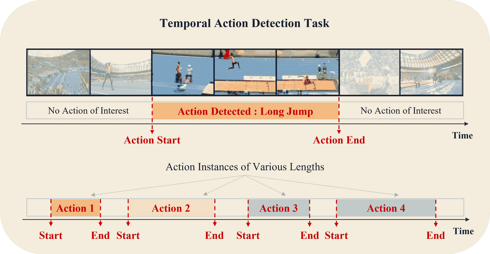
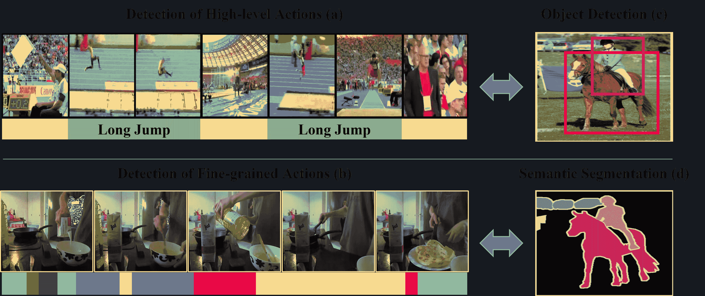
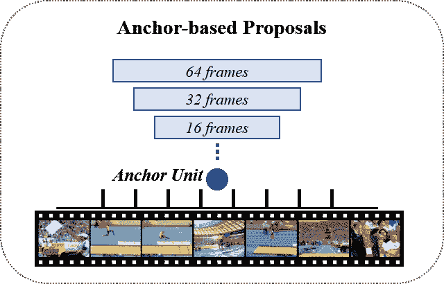
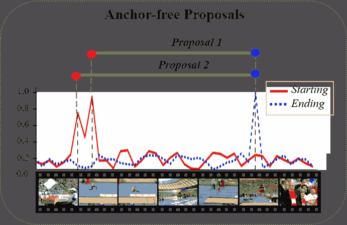
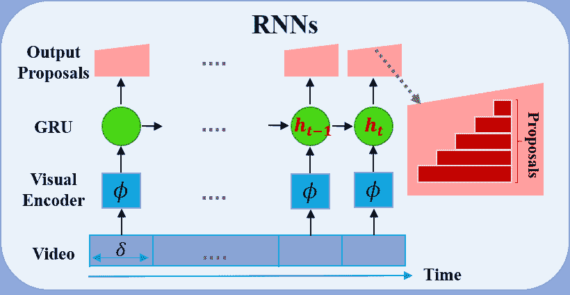
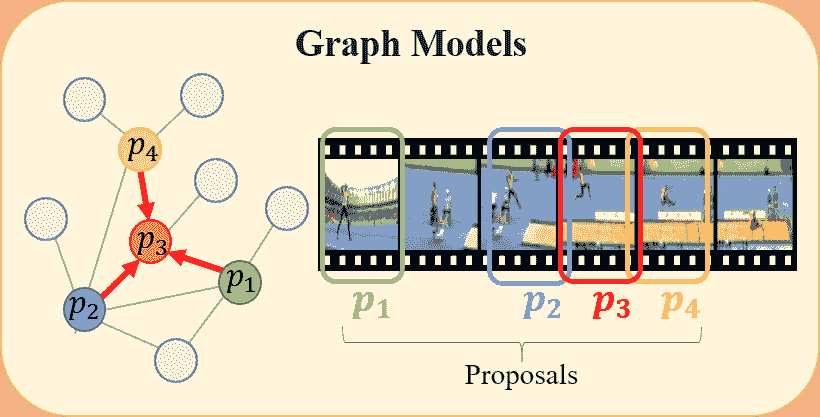
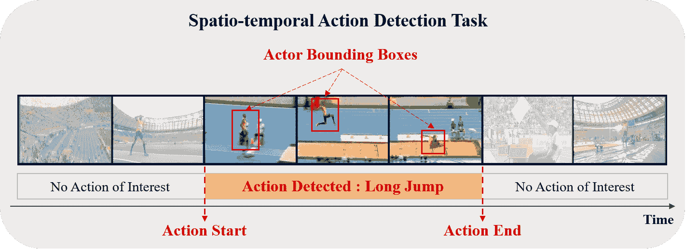

<!--yml

类别：未分类

日期：2024-09-06 19:51:14

-->

# [2110.00111] 基于深度学习的未裁剪视频动作检测：综述

> 来源：[`ar5iv.labs.arxiv.org/html/2110.00111`](https://ar5iv.labs.arxiv.org/html/2110.00111)

# 基于深度学习的未裁剪视频动作检测：综述

Elahe Vahdani 和 Yingli Tian^∗ E. Vahdani 在纽约市立大学研究生中心计算机科学系工作，地址为纽约，10016。电子邮件：evahdani@gradcenter.cuny.edu

Y. Tian 目前在纽约市立大学电气工程系和计算机科学系（研究生中心）工作，地址为纽约，10031。电子邮件：ytian@ccny.cuny.edu ^∗通讯作者。本材料基于国家科学基金会在奖号 IIS-2041307 下的资助工作。

###### 摘要

理解人类行为和活动有助于众多现实世界应用的进步，并且对视频分析至关重要。尽管在裁剪视频中动作识别算法取得了进展，但大多数现实世界视频是冗长的、未裁剪的，只有零星感兴趣的片段。未裁剪视频中的时间活动检测任务旨在定位动作的时间边界并分类动作类别。根据动作注释的可用性，时间活动检测任务已经在全监督和有限监督设置下进行研究。本文提供了基于深度学习的算法的广泛概述，以应对不同监督水平下的未裁剪视频中的时间动作检测，包括完全监督、弱监督、无监督、自监督和半监督。此外，本文还回顾了时空动作检测的进展，其中动作在时间和空间维度上都被定位。此外，描述了常用的动作检测基准数据集和评估指标，并比较了最先进方法的性能。最后，讨论了未裁剪视频中时间动作检测的现实世界应用和未来发展方向。

###### 关键词：

动作理解、时间动作检测、未裁剪视频、深度学习、全监督和有限监督。

## 1 引言

本文提供了时间动作检测的全面概述。此任务旨在检测长时间未裁剪视频中动作实例的开始和结束，并预测动作类别。时间动作检测对于许多视频分析应用至关重要，如体育分析、自动驾驶、监控摄像头中的异常检测、理解教学视频等。有限监督学习是一种在训练阶段无法获得或只能部分获得动作注释的方案。由于对长时间未裁剪视频的注释非常耗时，因此设计具有有限监督的动作检测方法已变得非常流行。本调查回顾了具有完整和有限监督信号的时间动作检测方法。

图 1：时间动作检测旨在定位时间中的动作实例并识别其类别。第一行展示了从 THUMOS14 数据集中未裁剪视频中检测到的“远跳”动作的示例。第二行是一个包含几个感兴趣动作实例的未裁剪视频示例，这些动作实例的长度各异。

### 1.1 动机

社交网络和数字相机使个人每天产生大量的视频和媒体内容。因此，视频理解和分析仍然是计算机视觉中的一个重要研究课题。尽管深度学习在许多计算机视觉任务中取得了显著成绩，但视频理解仍然远未理想。动作理解，作为视频分析的一个重要元素，促进了众多现实世界应用的进步。例如，协作机器人需要识别人类伙伴如何完成任务，以应对任务中的变化 [2]。体育分析系统必须理解比赛动作，以报告现场活动的评论 [3]。自动驾驶汽车需要了解周围车辆和行人执行的操作 [4]。

在本文中，我们将修剪视频定义为预先分段的视频剪辑，每个剪辑仅包含一个动作实例。换句话说，视频中不包括动作的上下文，即动作前后的时刻。因此，在修剪视频中，动作检测只需对动作类别进行分类，而无需检测起始和结束时间戳。在修剪视频中识别动作在视频监控、机器人技术、医学诊断[5]等领域有许多应用，并且近年来已经取得了优异的表现[6, 7, 8]。然而，大多数自然环境下的视频，即在无约束环境中录制的视频，通常是未修剪的。未修剪的视频是长度不一的未分段视频，可能包含多个动作实例、每个动作前后的时刻，以及动作之间的过渡。在一个视频中的动作实例可能属于多个动作类别，并且持续时间各异。

未修剪视频中的时间活动检测旨在定位动作实例的时间并识别其类别。这个任务比仅仅对修剪视频剪辑的类别进行分类的动作识别要复杂得多。图 1 显示了一个在体育场录制的未修剪视频中的时间活动检测示例。第一行展示了在时间域中对“跳远”动作的检测，其中动作的开始和结束时间被定位。目标是只检测感兴趣的动作，即属于预定义动作类别集合的动作。其他不属于该动作集合的活动的时间区间称为时间背景。例如，“跳远”动作前后立即的片段可能属于其他不同的活动，如体育场中的观众欢呼。在某些情况下，动作前后紧接的帧在视觉上可能非常类似于动作的开始或结束，这使得动作区间的定位非常具有挑战性。另一个挑战（如图 1 第二行所示）是动作实例可能发生在视频的任何时间点，并且持续时间各不相同，从不到一秒到几分钟不等[9]。

时序动作检测主要针对高层次语义的活动以及具有稀疏动作集的视频（例如，动作仅覆盖[10]中$30\%$的帧）。然而，在某些情况下，目标是预测视频中每一帧的动作标签。在这种情况下，这个任务被称为时序动作分割，旨在处理细粒度动作和动作密集出现的视频（[11]中$93\%$的帧）。可以通过简单地添加或删除时序背景片段在给定的分割和检测到的实例集之间进行转换[12]。时序动作检测类似于目标检测，属于检测问题的范畴。这两个问题都旨在定位感兴趣的实例，即时序域中的动作间隔与空间域中的目标边界框，如图 2（a 和 c）。当目标是细粒度动作时，时序动作检测（分割）类似于语义分割，因为两者都旨在分类每一个实例，即时序域中的帧与空间域中的像素，如图 2（b 和 d）。因此，许多时序动作检测和分割技术都受到目标检测和语义分割进展的启发[13, 14, 15]。

动作检测近年来受到广泛关注，并在视频分析任务中具有广泛应用。随着监控摄像头在许多地方的普及，对异常检测的需求也急剧增加。与正常活动相比，诸如抢劫或事故等异常事件发生频率较低，人力检测此类事件可能非常耗时。因此，自动检测可疑事件具有很大的优势。随着社交媒体的普及，许多人通过在线教程和教学视频学习如何正确地进行任务，例如“更换汽车轮胎”。这些教学视频通常是未剪辑的，包括主任务的几个步骤，例如“抬起汽车”和“安装轮胎”以更换轮胎。自动分割这些视频的主要动作步骤可以促进和优化学习过程。另一个应用是在体育视频分析中，以定位比赛中的显著动作和亮点，并分析特定队伍的策略。此外，动作检测在自动驾驶汽车中具有关键作用，用于分析行人、骑自行车的人和其他周围车辆的行为，以做出安全的自主决策。

图 2：任务关系：（a）在 THUMOS14 [1] 上对动作“跳远”的时间检测。（b）在 Breakfast [11] 上显示不同颜色的细粒度动作的时间检测（分割）。（c）和（d）来自 [16] 在 PASCAL [17] 上的结果。

### 1.2 分类

据我们所知，这是首次全面介绍基于深度学习的算法用于不同监督级别的未裁剪视频活动检测的调查。我们在第 2.3 节描述了完全监督的方法，而在第 2.4 节描述了有限监督（弱监督、无监督、自监督和半监督）的方法。第三部分总结了动作检测基准数据集、评估指标以及最先进方法之间的性能比较。最后，第四部分讨论了动作检测最常见的现实世界应用和可能的未来方向。我们在这里简要介绍这些任务。

时间动作检测的目的是在未裁剪的视频中找到动作实例的精确时间边界和标签。根据训练集中的注释可用性，时间动作检测可以在以下设置中进行研究（也列在表格 I）。

+   •

    完全监督动作检测：动作实例的时间边界和标签可用于训练。

+   •

    弱监督动作检测：仅提供动作实例的视频级标签。动作标签的顺序可以提供，也可以不提供。

+   •

    无监督动作检测：动作实例没有注释。

+   •

    半监督动作检测：数据被分为小集 $S_{1}$ 和大集 $S_{2}$。$S_{1}$ 中的视频是完全标注的（如同完全监督），而 $S_{2}$ 中的视频要么没有标注（无监督），要么仅标注了视频级别的标签（如同弱监督）。

+   •

    自监督动作检测：定义了一个前提任务，通过利用数据的结构在无监督环境中提取信息。然后，这些信息用于提高时间动作检测（下游任务）的性能，该任务可以是监督的、无监督的或半监督的。

+   •

    有限监督下的行为检测：有限监督是完全监督的对立面，其中注释不可用或部分可用。在本文中，我们将有限监督定义为包括弱监督、无监督、自监督和半监督设置，如上所述。

    表 I：训练集中具有不同监督级别的时间行为检测任务的主要类别。“✓”表示“可用”；“✗”表示“不可用”，而$\ast$表示“部分可用”。

    | 监督级别 | 行为时间边界 | 行为标签 |
    | --- | --- | --- |
    | 完全监督 | ✓ | ✓ |
    | 弱监督 | ✗ | ✓ |
    | 无监督 | ✗ | ✗ |
    | 半监督 | $\ast$ | $\ast$ |
    | 自监督 | ✓$\ast$ ✗ | ✓$\ast$ ✗ |

## 2 时间行为检测方法

我们在本节开始时介绍了第 2.1 节中的重要技术术语。给定一个输入视频，视频特征编码是提取视频代表性视觉特征的必要步骤（讨论在第 2.2 节中）。完全监督的行为检测方法在第 2.3 节中描述，有限监督的行为检测方法在第 2.4 节中回顾。

### 2.1 术语定义

为了便于阅读后续章节，我们在此定义常见的术语、评分和损失函数。

###### 定义 1。

时间行为检测。此任务旨在找出未修剪视频中行为实例的精确时间边界和类别。输入视频的注释表示为${\Psi}_{g}$，包括一组行为实例，如下所示：

|  | ${\Psi}_{g}=\{{\varphi}_{n}=(t_{s,n},t_{e,n},l_{n})\}_{n=1}^{N},$ |  | (1) |
| --- | --- | --- | --- |

其中 $N$ 是行为实例的数量，${\varphi}_{n}$ 是第 $n$ 个行为实例。${\varphi}_{n}$ 的开始时间、结束时间和标签分别表示为 $t_{s,n}$、$t_{e,n}$ 和 $l_{n}$。标签 $l_{n}$ 属于集合 $\{1,\cdots,C\}$，其中 $C$ 是整个数据集中感兴趣的行为类别的数量。注释 ${\Psi}_{g}$ 可以完全、部分或不适用于训练集中的视频。

###### 定义 2。

时间提议。输入视频中可能包含动作的时间区域称为时间提议。每个时间提议 $P_{n}$ 是一个区间，具有起始时间 $t_{s,n}$、结束时间 $t_{e,n}$ 和置信度得分 $c_{n}$。置信度得分是该区间包含动作的预测概率。提议 $P_{n}$ 可以表示为：

|  | $P_{n}=(t_{s,n},t_{e,n},c_{n}).$ |  | (2) |
| --- | --- | --- | --- |

###### 定义 3.

时间 IoU（tIoU）。这是两个时间区间之间的时间交集与并集的比率。它通常在预测提议（区间 $I_{p}$）和其最接近的真实动作实例（区间 $I_{g}$）之间进行测量，公式如下：

|  | $tIoU(I_{p},I_{g})=\frac{I_{p}\cap I_{g}}{I_{p}\cup I_{g}}.$ |  | (3) |
| --- | --- | --- | --- |

###### 定义 4.

时间提议标注。提议 $I_{p}$ 的标注由与 $I_{p}$ 具有最大 tIoU 的真实动作实例 $I_{g}$ 决定。我们用 $c$ 表示 $I_{g}$ 的类别标签。然后，根据预定义的阈值 $\sigma$，如果 $tIoU\geq\sigma$，则该提议被标记为正（真实正例），并且标签为 $c$。否则，它是负（或假正例）。此外，如果一个真实动作实例与多个提议匹配，则只有置信度得分最高的提议被接受为真实正例，其它的被标记为假正例。

###### 定义 5.

提议生成的精确度和召回率。精确度是正确提议的比例与预测提议总数之比。为了避免生成大量无关的提议，精确度必须很高。召回率是正确提议的比例与真实动作实例总数之比。为了避免漏掉真实实例，召回率必须很高。

###### 定义 6.

动作性得分。在某个时间点的动作性得分是该时间点动作实例出现的概率。该得分通常用 $a_{t}\in[0,1]$ 表示时间 $t$。

###### 定义 7.

起始性和结束性得分。某个时间点的起始性得分（结束性得分）是该时间点动作实例开始（结束）的概率。

###### 定义 8.

动作完整性得分。候选提议与真实动作实例之间的最大 tIoU 被称为该提议的动作完整性。[18] 显示了具有低 tIoU 的不完整提议可能具有高分类得分。因此，必须考虑动作完整性来评估和排序预测提议。

###### 定义 9.

动作分类分数。生成的时间提案被输入到动作分类器中，以产生所有动作类别的概率分布。这可以表示为向量$(p^{1},\cdots,p^{C})$，其中$p^{i}$是动作类别$i$的概率，$C$是类别的数量。为了公平比较，研究人员利用早期工作的分类器 SCNN-classifier [19]、UntrimmedNet [19]、[20]等。他们从视频片段中均匀采样固定数量的帧，并将其输入到 ConvNets 中，如 C3D [21]、两个流 CNN [22]或时间段网络[23]。在某些情况下，采样帧的识别分数通过 Top-k 池化或加权求和进行汇总，以产生最终预测。

### 2.2 视频特征编码

未裁剪的视频通常很长，可能长达几分钟，因此由于计算资源的限制，直接将整个视频输入到视觉编码器进行特征提取是困难的。例如，流行的视频特征提取器如 3D-CNN 只能处理约 4 秒钟的短片段。视频表示的一种常见策略是将视频划分为大小相等的时间间隔称为片段，然后对每个片段应用预训练的视觉编码器。正式地，给定输入视频$X$与$l$帧，一个具有常规时长$\sigma$的片段序列$S$被生成，其中

|  | $S=\{s_{n}\}_{n=1}^{l_{s}}\hskip 7.22743pt,\hskip 7.22743ptl_{s}=\frac{l}{\sigma},$ |  | (4) |
| --- | --- | --- | --- |

并且$s_{n}$是第 n 个片段。然后，将每个片段输入到预训练的视觉编码器中，如两个流网络[22]、C3D [21]或 I3D [24]进行特征提取。在两个流网络[22]中，以$t_{n}$-th 帧为中心的片段$s_{n}$，具有 RGB 帧$x_{t_{n}}$和围绕中心帧衍生的叠加光流$o_{t_{n}}$。RGB 帧$x_{t_{n}}$被输入到空间网络 ResNet [25]中，提取特征向量$f_{S,n}$。光流$o_{t_{n}}$被输入到时间网络 BN-Inception [26]中，提取特征$f_{T,n}$。空间和时间特征$f_{S,n}$和$f_{T,n}$被连接以表示片段$s_{n}$的视觉特征$f_{n}$。

同样，在 I3D [24]中，每个片段$s_{n}$的一组 RGB 和光流帧被输入到 I3D 网络中，提取空间和时间特征向量$f_{S,n}$和$f_{T,n}$，这些特征被连接以创建特征$f_{n}$。在 C3D [21]中，每个片段$s_{n}$的帧直接输入到 3D-CNN 架构中以捕捉时空信息，并提取特征向量$f_{n}$。

### 2.3 全监督下的动作检测

在完全监督的动作检测中，每个训练视频都提供了动作实例的时间边界和标签的注释（${\Psi}_{g}$，见公式 (1)）。在推理阶段，目标是找到动作实例的时间边界并预测其标签。动作检测的一个主要步骤是生成时间提议，以识别视频中可能包含动作实例的时间区间。完全监督的时间提议生成方法可以分为基于锚点的方法和无锚点的方法。基于锚点的方法通过在视频的每个时间位置分配密集和多尺度的预定义长度区间来生成动作提议（见第 2.3.1 节）。无锚点的方法通常在视频的时间位置预测动作边界置信度或动作分数，并采用自下而上的分组策略来匹配开始和结束对（见第 2.3.2 节）。还有一些方法结合了无锚点和基于锚点的提议生成方法的优点（见第 2.3.3 节）。生成提议后，必须从提议中提取丰富的特征来评估提议的质量。第 2.3.4 节回顾了在训练过程中用于提议评估的常见损失函数。第 2.3.5 节讨论了建模长程依赖关系，以捕捉未剪辑视频中视频片段之间的关系，从而提高动作定位的准确性。最后，第 2.3.6 节总结了时空动作检测方法。

#### 2.3.1 基于锚点的提议生成和评估

基于锚点的方法，也称为自上而下的方法，通过将具有预定义长度的密集且多尺度的间隔分配到输入视频中均匀分布的时间位置来生成时间提议。形式上，给定一个具有 $T$ 帧的视频，从每 $\sigma$ 帧均匀采样 $\frac{T}{\sigma}$ 个时间位置，称为锚点。然后，以每个锚点为中心，围绕不同持续时间 $\{d_{1},d_{2},\cdots,d_{n}\}$ 生成多个时间窗口作为初始时间提议。提议的长度（$d_{i}$）必须具有广泛的范围，以便与各种长度的动作实例对齐，这些动作实例在未修剪的视频中可能持续不到一秒到几分钟 [9]。然后，将视觉编码器和卷积层应用于时间提议以提取特征，特征用于评估时间提议的质量并调整其边界（第 2.3.4 节）。

图 3: 基于锚点的方法在均匀分布的时间位置分配具有预定义长度的多尺度间隔。

##### 2.3.1.1   多尺度提议的特征提取

如前所述，时间提议具有非常多样化的时间跨度，以便与动作实例对齐。然而，必须从每个提议中提取固定大小的特征，以便将其输入到全连接层中进行提议评估（动作分类和回归）。在这里，我们回顾了从不同长度的提议中提取固定大小特征的不同策略。

采样和特征拼接：Shou 等人在 SCNN [19] 中从每个提议中均匀采样固定数量的帧，并将其输入到视觉编码器中进行特征提取。这种方法在计算上效率较低，因为存在许多重叠的提议，并且重叠的段被多次处理。为了解决这个问题，Gao 等人在 Turn-Tap [27] 和 CBR [28] 中将视频分解成非重叠的等长单元，并仅提取每个单元的特征。不同数量的连续单元在每个锚点单元处被组合在一起以生成多尺度提议。为了获得提议特征，所有单元的特征被拼接在一起。使用这种方法，提议特征是从单元级特征计算的，这些特征仅计算一次。然而，在每个提议中拼接特征或采样帧并不会导致丰富的特征提取。

3D RoI 池化：这种方法通过使用 3D RoI 池化从多尺度提议中提取固定大小的特征。具体来说，一个大小为$l\times h\times w$的输入特征体（$l$为时间维度，$h$为高度维度，$w$为宽度维度）被划分为$l_{s}\times h_{s}\times w_{s}$个子体积（其中$l_{s}, h_{s}$和$w_{s}$是固定的），并在每个子体积内进行最大池化。因此，各种长度的提议生成的输出体积特征大小相同，为$d\times l_{s}\times h_{s}\times w_{s}$，其中$d$为通道维度。3D RoI 池化用于动作检测的理念是对 Faster R-CNN 中 2D RoI 池化的扩展[29]。这个理念最早在 R-C3D[30]中提出，并被应用于其他框架，如 AGCN [31]和 AFNet [32]。这种方法的局限性在于每个位置的多尺度提议共享相同的感受野，这对于某些锚点尺度可能过小或过大。

##### 2.3.1.2   感受野与提议跨度的对齐

为了解决动作持续时间的变化问题，多尺度锚点被分配到视频的每个时间位置。在感受野对齐之前，任何位置的多尺度锚点共享相同的感受野大小。这是有问题的，因为如果感受野相对于锚点大小过小或过大，提取的特征可能无法包含足够的信息或包含过多无关信息。在这里，我们回顾了将感受野大小与提议跨度对齐的策略。

多塔网络：TAL-Net [13] 提出了一个多塔网络，由几个时间卷积网络组成，每个网络负责一个特定的锚点大小。然后，通过使用扩张的时间卷积将每个锚点段的感受野与其时间跨度对齐。这个想法也被用于 TSA-Net [33]。然而，预定义时间间隔的分配限制了生成提议的准确性。

时间特征金字塔网络：在时间特征金字塔网络 (TFPN) 中，预测是从多个分辨率特征图中得出的。这个想法最初在用于目标检测的单次检测器 (SSD) [34] 中提出，随后在 SSAD [35] 和 $\text{S}^{3}\text{D}$ [36] 中扩展到时间领域进行动作检测。它们提出了一种端到端的网络，其中较低层的特征图具有更高的分辨率和较小的感受野，负责检测短时间动作实例，而顶部层具有较低的分辨率和更大的感受野，用于检测长时间动作实例。对于每个特征图单元，考虑中心周围的多个尺度的锚点段，并将其送入卷积层进行评估。这种方法的局限性在于金字塔中的低层对高级语义信息不了解，而高层缺乏足够的细节，因此都无法准确定位动作。

U-shaped 时间特征金字塔网络：为了缓解常规 TFPN 的问题，设计了一种 U-shaped TFPN 架构来连接高级和低级特征。这个想法最初在用于目标检测的 Unet [37]、FPN [38] 和 DSSD [39] 中提出，随后在 MGG [40]、PBRNet [41]、RapNet [42]、C-TCN [43] 和 MLTPN [44] 中推广到时间领域。视频表示特征使用现成的特征提取器提取。接着应用时间卷积和最大池化层以减少时间维度并增加感受野大小。随后，通过时间反卷积层进行上采样。然后，高级特征通过卷积层和反卷积层之间的侧向连接与对应的低级特征结合。U-shaped TFPN 最近引起了广泛关注，并在时间动作检测任务中取得了**最先进**的结果。

#### 2.3.2 无锚点提案生成与评估

无锚点方法采用自下而上的分组策略，根据视频的时间位置预测的边界概率或动作性分数生成提案。无锚点方法能够生成具有精准边界和灵活持续时间的提案，因为提案长度不是预定义的。

##### 2.3.2.1   基于动作性分数的提案生成

Zhao 等人在 SSN [18] 中提出了识别具有高动作性评分（def 6）的连续时间区域作为提案（称为 TAG 提案）。连续时间区域通过对由补充动作性值形成的 1D 信号应用经典的分水岭算法 [45] 进行分组。提案被送入时间金字塔进行特征提取和提案评估。特征提取过程过于简单，无法捕捉丰富的特征。

##### 2.3.2.2   带有边界评分的提案生成

这些方法预测了三种动作性（def 6）、起始性和结束性评分（def 7）的概率信号。它们通过匹配可能是动作开始或结束的时间位置（即起始性和结束性信号的峰值）生成时间提案。在 BSN [46] 中，提案特征通过线性插值将从动作性评分（def 6）中采样的固定数量点进行拼接构造。BSN 忽略了模糊边界动作的全局信息，导致置信度评分不可靠。此外，提案特征过于薄弱，无法捕捉足够的时间上下文，特征构造和置信度评估对每个提案单独进行，效率低下。BMN [47] 探索了全局上下文以端到端地同时评估所有提案。它们通过聚合所有提案的特征来构造特征图。特征图输入到卷积层中，以同时评估所有提案。这种方法的优点是为每个提案提取丰富的特征和时间上下文，并利用相邻提案的上下文。此外，在推理过程中，提案评估非常快速。然而，它们使用与 BSN [46] 相同的方法生成边界概率（起始和结束），这忽略了模糊边界动作的全局信息。DBG [48] 同时评估所有提案以探索全局上下文，并提取类似于 BMN [47] 的丰富特征。此外，DBG 提出了利用全局提案级特征，而不仅仅是利用局部信息来预测边界概率（起始和结束的概率）。

图 4：无锚点的提议生成与边界匹配。这些方法在均匀分布的时间位置预测动作边界概率，并将起点和终点与高概率的提议匹配。

为了建模时间提议的边界和动作内容之间的关系，BC-GNN [49] 提出了一个图神经网络，其中提议的边界和内容作为图的节点和边，特征通过图操作进行更新。然后，更新后的边和节点用于预测边界概率和内容置信度分数，以生成提议。A2Net [50] 和 AFSD [51] 探索了无锚点机制，其中网络预测特征序列中每个时间位置到时间边界的距离。AFSD [51] 还提出了一种新的边界细化策略，用于精确的时间定位。

#### 2.3.3 基于锚点和无锚点的组合

基于锚点的方法将各种长度的片段视为视频中规则分布时间位置的初始提议。然而，由于片段大小是预先设计的，它们不能准确预测动作的时间边界。此外，由于动作实例的持续时间从秒到分钟不等，使用基于锚点的方法覆盖所有真实实例计算开销很大。无锚点的方法在视频的所有时间位置预测动作边界置信度或动作性分数，并采用自下而上的分组策略来匹配起点和终点。无锚点的方法能够生成具有精确边界和灵活持续时间的提议。然而，在某些情况下，它们仅利用局部上下文来提取边界信息。因此，它们对噪声敏感，容易产生不完整的提议，并且难以产生鲁棒的检测结果。

一些方法如 CTAP [52]、MGG [40]、PBRNet [41]、RapNet [42] 在提案生成中平衡了基于锚点的方法和无锚点方法的优缺点。CTAP [52] 设计了一种应用于初始提案的互补滤波器，用于生成由无锚点 TAG [18]（定义在 2.3.2）进行检测的概率。互补滤波器的原始用途是根据两个噪声测量值来估计信号，其中一个测量值通常是高频（可能精确但不稳定）类似于 TAG 提案，另一个测量值通常是低频（稳定但不精确）类似于滑动窗口提案。此外，一些时间特征金字塔网络（TFPN，定义在 2.3.1）如 MGG [40]、PBRNet [41] 和 RapNet [42] 使用 TFPN（基于锚点）生成不同长度的粗略分段提案，并同时预测精细级别的帧行动性（无锚点）。这种方法的优点是在推理过程中根据帧行动性信息调整提案的段边界。

#### 2.3.4 提案评估中的常见损失函数

在生成时间提案后，从提案中提取丰富的特征以评估其质量。对特征应用几个卷积层以预测行动性得分（定义 6）、完整性得分（定义 8）、分类得分（定义 9），并调整提案的时间边界。在这里，我们回顾了在训练过程中用于监督这些预测得分并评估提案质量的常见损失函数。

###### 定义 10。

行动性损失。这是一种二元交叉熵损失，用于将时间提案分类为动作或背景。给定$N$个提案，该损失定义为：

|  | $L_{\text{act}}=-\frac{1}{N}\sum_{i=1}^{N}b_{i}\log(a_{i})+(1-b_{i})\log(1-a_{i}),$ |  | (5) |
| --- | --- | --- | --- |

其中 $a_{i}$ 是预测的动作性评分（定义 6），$b_{i}\in\{0,1\}$ 是第 $i$ 个提议的二进制真实标签。如果提议是正样本（定义 4），则 $b_{i}=1$。否则，$b_{i}=0$。

###### 定义 11。

动作完整性损失。给定 $N$ 个提议，完整性损失定义为：

|  | $L_{\text{com}}=\frac{1}{N_{\text{pos}}}\sum_{i=1}^{N}d(c_{i},g_{i})\cdot[l_{i}>0],$ |  | (6) |
| --- | --- | --- | --- |

其中 $c_{i}$ 是第 $i$ 个提议的预测动作完整性评分（定义 8），$g_{i}$ 是真实动作完整性评分。$d$ 是一种距离度量，通常为 $L_{2}$ 或平滑的 $L_{1}$ 损失。$l_{i}$ 是第 $i$ 个提议的标签，条件 $[l_{i}>0]$ 表示动作完整性仅对正样本提议进行考虑（定义 4）。$N_{\text{pos}}$ 是每个小批次中的正样本提议数量。

###### 定义 12。

动作重叠损失。这是动作完整性损失的另一种变体，它对与真实值有更高时间重叠的提议给予奖励，定义如下：

|  | $\mathcal{L}_{overlap}=\frac{1}{N_{\text{pos}}}\sum_{i}\frac{1}{2}\cdot\Big{(}\frac{(p^{l_{i}}_{i})^{2}}{(g_{i})^{\alpha}}-1\Big{)}\cdot[l_{i}>0],$ |  | (7) |
| --- | --- | --- | --- |

其中 $p_{i}$ 是第 $i$ 个提议的动作标签分类概率向量，$p^{l_{i}}_{i}$ 是动作类别 $l_{i}$ 的概率。其他符号与 $L_{\text{com}}$ 相同（定义 11），$\alpha$ 是一个超参数。

###### 定义 13。

动作分类损失。这是分类（交叉熵）损失，概率分布覆盖所有动作类别以及时间背景，如下所示：

|  | $L_{\text{cls}}=-\frac{1}{N}\sum_{i=1}^{N}\log(p^{l_{i}}_{i}),$ |  | (8) |
| --- | --- | --- | --- |

其中 $l_{i}\in\{0,1,\cdots,C\}$ 是第 $i$ 个提议的标签，$p^{l_{i}}_{i}$ 是类别 $l_{i}$ 的概率。

###### 定义 14。

动作回归损失。为了调整提议的时间边界，预测并通过回归损失对提议的开始和结束偏移量进行监督，如下所示：

|  | $L_{\text{reg}}=\frac{1}{N_{\text{pos}}}\sum_{i=1}^{N}&#124;(o_{s,i}-o^{\star}_{s,i})+(o_{e,i}-o^{\star}_{e,i})&#124;\cdot[l_{i}>0],$ |  | (9) |
| --- | --- | --- | --- |

其中项 $o_{s,i}$ 是第 $i$ 个提议的开始坐标与最接近的真实动作实例的开始坐标之间的差值。项 $o^{\star}_{s,i}$ 是预测的偏移量。类似地，$o_{e,i}$ 和 $o^{\star}_{e,i}$ 是第 $i$ 个提议结束坐标的真实和预测偏移量。条件 $[l_{i}>0]$ 表示边界调整仅考虑正提议（参考 4）。

#### 2.3.5 建模长距离依赖

如前所述，未裁剪的视频通常较长，需要分割成较短的片段以进行特征提取。独立处理这些较短的片段可能会导致视频片段之间的时间或语义依赖丧失。因此，使用了几种工具，如循环神经网络、图卷积、注意力机制和变换器，以捕捉这些依赖。建模依赖的优势在于可以细化提议的时间边界，或者根据其他邻近提议的信息预测其动作类别或动作完整性。

##### 2.3.5.1   循环神经网络

RNN 被用于序列建模，并且能够捕捉视频中的长期依赖性。Buch 等人在 Sst [53] 和 SS-TAD [54] 中使用 RNN 进行动作检测。他们将视频划分为非重叠的等长片段，并将每个片段输入视觉编码器以提取特征。在时间 $t$，视觉特征 $f_{t}$ 和前一个时间步骤的隐藏状态 ($h_{t-1}$) 被输入到基于门控循环单元（GRU）的架构中以生成隐藏状态 $h_{t}$。然后，这个隐藏状态被输入到全连接层中，通过产生动作性分数（定义 6）来评估时间 $t$ 的多尺度提议。在早期的工作中，Yuan 等人在 PSDF [55] 中捕捉了多个分辨率上的运动信息，并利用 RNN 改善了帧间一致性。Yeung 等人学习了基于 RNN 的代理的决策策略 [56]，并随后提出了一种 LSTM 模型，以时间注意机制处理多个输入帧 [57]。LSTM 还在其他框架中被使用，如 [58]、[59]、[60] 以评估时间提议。使用 RNN 的优点是时间 $t$ 的隐藏状态编码了来自先前时间步骤的信息，这有助于捕捉时间依赖性。然而，RNN 无法编码非常长的视频，因为隐藏向量在一些时间步骤后会饱和。

图 5：使用 RNN 捕捉未裁剪视频中的时间依赖性。时间 $t$ 的隐藏状态 $h_{t}$ 编码了来自先前时间步骤的信息。这张图片是从 [53] 中重新生成的。

##### 2.3.5.2   图模型

一个完整的动作通常由多个子动作组成，这些子动作可能在几个重叠的提议中被独立检测。基于这一观察，Zeng 等人在 PGCN [61] 中通过应用图卷积网络（GCNs）捕捉了提议之间的关系。他们构建了一个图，其中节点是提议，边连接高度重叠的提议以及不相交但相邻的提议，以提供上下文信息。边权重通过测量提议特征的余弦相似度来建模提议之间的关系。通过图卷积，每个提议的特征通过聚合来自其他提议的信息得到更新。更新后的特征随后用于预测动作类别、完整性，并精炼边界。

图 6：使用图卷积网络 (GCNs) 建模提议-提议关系，其中节点是提议，边缘建模提议之间的关系。提议 $p_{3}$ 的特征受到提议 $p_{1},p_{2}$ 和 $p_{4}$ 特征的影响。图像转载自 PGCN [61]。

Li 等人在 AGCN [31] 中提出了一种基于注意力的 GCN，用于建模提议的内部和外部依赖关系。内部注意力学习每个动作提议内部像素之间的长程依赖，而外部注意力学习提议之间的自适应依赖关系，以调整不精确的边界。Bai 等人在 BC-GNN [49] 中提出了一种图神经网络，用于建模时间提议的边界与动作内容之间的关系。

Xu 等人提出了 G-TAD [62]，以捕捉输入视频不同片段之间的关系。他们构建了一个图，其中节点是视频的时间段，边缘则是时间性或语义性的。时间边缘根据片段的时间顺序预定义，但语义边缘则根据节点之间的特征距离动态更新。片段的时间和语义上下文通过图卷积进行聚合。考虑所有可能的开始和结束对，并在特定范围内生成提议。为了评估每个提议，提取了相应子图的时间和语义特征。Chang 等人在 ATAG [63] 中也设计了类似 G-TAD [62] 的自适应 GCN 来捕捉局部时间上下文，其中图节点是片段，边缘建模片段之间的关系。然后通过图卷积捕捉时间上下文，其中每个片段的特征受其他片段特征的影响并进行更新。VSGN [64] 在视频片段上构建了类似于 G-TAD [62] 的图，但还利用了跨尺度片段之间的相关性。他们提出了一个跨尺度图金字塔网络，该网络从跨尺度中聚合特征，并在多个网络层级中逐步增强原始和放大尺度的特征。

##### 2.3.5.3   变换器

视频中的某些动作实例具有非顺序依赖关系，即它们是相关的但被视频中的其他事件隔开。此外，一些动作实例可能在时间范围上有重叠。基于这些观察，Nawhal 等人在 AGT [65]中提出了一种编码器-解码器变换器，通过将视频视为非顺序实体来捕捉非线性时间结构。他们的编码器生成一个上下文图，其中节点最初是视频级特征，节点之间的交互被建模为可学习的边权重。此外，为每个节点提供了使用可学习位置编码的位置信息。他们的解码器学习上下文图（输入视频的潜在表示）与图结构查询嵌入（动作查询的潜在表示）之间的交互。

Tan 等人在 RTD-Net [66]中提出了一种放松的变换器，直接生成动作提议，无需依赖人工先验知识来精心设计锚点放置或边界匹配机制。变换器编码器建模了长范围的时间上下文，并从全局视角捕捉提议之间的关系，以精确定位动作实例。他们还认为视频中的片段特征变化非常缓慢，因此直接使用变换器中的自注意力可能导致过度平滑。因此，他们定制了一个具有边界关注架构的编码器，以增强动作边界的辨别能力。Chang 等人在 ATAG [63]中设计了一种增强型变换器来挖掘长范围的时间上下文，用于嘈杂动作实例定位。由变换器生成的片段级特征用于在二分类损失的监督下将片段分类为动作或背景。在此过程中，变换器学会在片段级别捕捉长期依赖关系。

#### 2.3.6 时空动作检测

时空动作检测旨在在空间和时间上定位动作实例，并识别动作标签。在此任务的完全监督设置中，训练期间提供视频级别的动作实例的时间边界、帧级别的动作空间边界框以及动作标签，并且在推断期间必须检测这些内容。图 7 显示了此任务的示例。“远跳”动作的开始和结束在时间域中被检测到。同时，在空间域中检测到每帧中执行动作的演员的边界框。

图 7: 时空活动检测任务：动作“跳远”在时间和空间上被定位。除了动作的时间间隔外，还在每帧中检测到执行动作的人的边界框。

##### 2.3.6.1   帧级动作检测

早期方法 [67, 68] 基于滑动窗口方案的扩展，这要求对演员在各帧中的空间范围有强假设，例如立方体形状，即演员在帧中的空间范围是固定的。后来，物体检测的进展激发了帧级动作检测方法，使其能够在帧级别识别人的动作类别。在第一阶段，通过区域提议算法或密集采样的锚点生成动作提议，在第二阶段，这些提议用于动作分类和定位精化。根据低级线索，如超体素 [69, 70] 或密集轨迹 [71, 72, 73]，每个视频中提取出数百个动作提议，然后对提议进行分类以定位动作。

在检测到帧中的动作区域后，一些方法 [74, 75, 76, 77, 78, 79, 80, 81] 使用光流来捕捉运动线索。他们采用连接算法将帧级边界框连接成时空动作管。Gkioxari 等 [74] 使用动态规划方法来链接结果的每帧检测。动态规划的成本函数基于边界框的检测得分和连续帧检测之间的重叠。Weinzaepfel 等 [79] 用基于检测的跟踪方法替换了连接算法。随后，[76, 78] 引入了双流 Faster R-CNN。Saha 等 [78] 基于外观和运动之间的重叠融合了两个流的得分。Peng 等 [76] 结合了从两个流中提取的提议，然后使用融合的 RGB 和多帧光流特征对其进行分类和回归。他们还在每个动作提议中使用多个区域，然后根据空间重叠和分类得分在视频中链接检测。

另一些组 [82, 83, 84] 依赖于动作性度量，即每个像素包含任何动作的概率。为了估计动作性，他们使用低级线索，如光流 [84]、双流架构的 CNN [83] 或 RNN [83]。他们通过对动作性得分 [82] 进行阈值处理或使用最大集合覆盖 [84] 来提取动作管。输出是动作的粗略定位，因为它基于噪声像素级图。

这些方法的主要缺点是视频的时间特性未被充分利用，因为检测是在每帧上独立执行的。有效的时间建模至关重要，因为许多动作只有在有时间上下文信息时才可识别。

##### 2.3.6.2   剪辑级别动作检测

如前所述，准确的动作定位需要时间建模。在这里，我们讨论通过在剪辑（即短视频片段）级别执行动作检测来利用时间信息的方法。

Kalogeiton 等人[85]提出了一种动作管道检测器（ACT-detector），其输入为一系列帧，输出为动作类别和回归的管道，即带有关联得分的边界框序列。然后，将这些管道连接起来构建动作管道（动作的边界框序列）。Gu 等人[86]通过使用更长的剪辑和利用在大规模视频数据集[24]上预训练的 I3D 进一步展示了时间信息的重要性。为了生成动作提议，他们通过在时间上复制 2D 区域提议将其扩展到 3D，假设在剪辑内空间范围是固定的。然而，这一假设对于时间上有大空间位移的动作管道会被违反，特别是在剪辑很长或涉及演员或相机快速移动时。因此，直接使用长立方体作为动作提议并不是最终的选择，因为它们会引入额外的噪声来进行动作分类。

杨等人[87]在剪辑级别执行动作检测，然后将这些检测结果链接起来，构建视频中的动作管道。他们采用多步骤优化过程逐步细化初始提议。其他方法[6]，[88]利用来自预训练图像检测器的人类提议，并通过时间复制这些提议以构建直线时空管道。

##### 2.3.6.3   建模时空依赖性

理解人类动作通常需要了解他们周围的人和物体。因此，最先进的方法建模演员与上下文信息之间的关系，例如其他人和其他物体。一些方法使用图结构网络[89，90]和注意力机制[91，88，92]来聚合视频中其他人和物体的上下文信息。

吴等人[88]提供了长期支持信息，使得视频模型能够更好地理解当前内容。他们设计了一个长期特征库和一个计算短期特征与长期特征之间交互的特征库操作符 FBO。他们在长时间支持下整合信息，这种支持可以持续几分钟甚至整个视频。Girdhar 等人[91]提出了一种类似变换器的架构，根据周围环境中的特征来加权演员。Tomei 等人[93]采用自注意力机制在图结构中编码人物和物体的关系，并使用提议之间的时空距离。Ji 等人提出了 Action Genome[94]，通过将动作分解为时空场景图来建模动作-物体交互。Ulutan 等人[92]建议将演员特征与场景中的每个时空区域结合，以生成演员与背景之间的注意力图。Pan 等人[95]提出了一个关系推理模块，以捕捉两个演员之间基于它们与背景的各自关系的关系。Tomei 等人[96]提出了一个基于图的框架，用于学习人和物体之间的高层次交互，既包括空间也包括时间。通过对多层图结构上的自注意力机制进行学习，以便连接来自连续片段的实体，从而考虑长范围的空间和时间依赖关系。

### 2.4 有限监督下的动作检测

完全监督的动作检测需要对训练视频中的所有动作实例进行完整的时间边界和动作标签注释，这非常耗时且成本高昂。为了消除训练阶段对全面注释的需求，近年来，研究人员探索了设计高效模型的方法，这些模型只需要有限的真实标签。我们在 2.4.1 节中讨论了弱监督方法，而其他有限监督（无监督、半监督和自监督）学习方法在 2.4.2 节中进行了描述。

#### 2.4.1 弱监督动作检测

弱监督学习方案在训练阶段需要粗略或嘈杂的标签。根据[97]的工作，常见设置下的弱监督动作检测仅需要在训练时的动作视频级别标签，而不需要动作实例的时间边界。在测试过程中，预测动作的标签和时间边界。本节后续部分的弱监督动作检测指的就是这种设置。此外，还有其他弱信号用于动作检测，如动作顺序[98], [99], [100], [101], 动作标签的频率[102]，以及每个视频中的事件总数[103]。弱监督动作检测中的一个常见策略是使用注意力机制来关注具有辨别性的片段，并将显著的片段级特征结合成视频级特征。注意力分数用于定位动作区域并消除不相关的背景帧。从视频中提取注意力信号的主要策略有两种。首先是特定于类别的注意力方法，其中注意力分数是从每个动作类别的类别激活序列中生成的（定义 15）（第 2.4.1.2 节）。其次是无类别注意力方法，其中注意力分数与类别无关，并从原始数据中提取（第 2.4.1.3 节）。我们将在本节中讨论这两种注意力策略。

##### 2.4.1.1   术语定义

为了方便阅读本节，我们提供了常用术语的定义。

###### 定义 15。

时间类激活图（T-CAM）。对于给定的视频，T-CAM 是一个矩阵，用$A$表示，代表每个时间位置的活动可能性。矩阵$A$有$n_{c}$行，即动作类别的总数，以及$T$列，即视频中的时间位置数。单元$A[c,t]$的值是类别$c$在时间位置$t$的激活值。正式地说，$A$的计算公式为：

|  | $A=WX\oplus b,$ |  | (10) |
| --- | --- | --- | --- |

其中 $X\in{\rm I\!R}^{d\times T}$ 是视频级特征矩阵，$d$ 是特征维度。此外，$W\in{\rm I\!R}^{n_{c}\times d}$ 和 $b\in{\rm I\!R}^{n_{c}}$ 是可学习的参数，$\oplus$ 是带有广播操作符的加法。

###### 定义 16。

类别特定注意力得分。在给定的视频中，类别特定注意力得分是动作类别 $c$ 在时间位置 $t$ 的出现概率，用 $a[c,t]$ 表示。形式上，$a[c,t]$ 通过对类别 $c$ 在时间维度上的激活进行归一化来计算：

|  | $a[c,t]=\frac{\text{exp}(A[c,t])}{\sum_{t=1}^{T}\text{exp}(A[c,t])},$ |  | (11) |
| --- | --- | --- | --- |

其中 $A$ 是 T-CAM（定义 15），$T$ 是时间位置的数量。因此，行 $a_{c}$ 是视频长度上类别 $c$ 出现的概率分布。

###### 定义 17。

类别无关注意力得分。在给定的视频中，类别无关注意力得分，用 $\lambda_{t}$ 表示，是时间位置 $t$ 上任何感兴趣的动作的出现概率，无论动作类别如何。视频中所有时间位置的注意力向量用 $\lambda$ 表示。

###### 定义 18。

基于注意力的聚合特征。视频级的前景和背景特征是通过对嵌入特征进行时间池化，权重由注意力得分决定。类别特定特征是基于每个类别 $c$ 的类别特定注意力得分 $a_{c}$（定义 16）定义的，而类别无关特征则是基于类别无关注意力向量 $\lambda$（定义 17）定义的。聚合前景特征受到高注意力的特征向量的主要影响，这些特征向量表示动作，而背景特征则受到低注意力特征的影响。$T$ 是视频长度，$X$ 是视频特征矩阵。这些特征被表述为：

|  | 前景： | 背景： |
| --- | --- | --- |
| 类别特定： | $f_{c}=Xa_{c}$ | $b_{c}=\frac{1}{T-1}X(\mathbb{1}-a_{c}),$ |
| 类别无关： | $f=\frac{1}{T}X\lambda$ | $b=\frac{1}{T}X(\mathbb{1}-\lambda).$ |

##### 2.4.1.2 类别特定注意力用于动作定位

类别特定注意力模块计算每个视频中所有动作类别 $c$ 和所有时间位置 $t$ 的注意力权重 $a[c,t]$（定义 16）。注意力分数关注于视频中某一类别活动发生的部分。因此，注意力分数高于阈值的视频片段被定位为动作部分。类别特定注意力模块在 [104]、[105]、[102]、[106] 中用于定位动作实例的时间边界。

使用 MIL 的类别特定注意力学习：在 MIL（多实例学习）的总体方案中，训练实例被安排在称为袋子的集合中，并为整个袋子提供一个标签 [107]。在弱监督时间动作检测的背景下，每个视频被视为动作实例的袋子，并且提供了视频级别的动作标签。为了计算每个袋子（本任务中的视频）的损失，每个视频应使用每个类别的单一置信度分数来表示。每个类别的置信度分数被计算为该类别在时间维度上的前 $k$ 个激活分数的平均值。在给定的视频中，设 $\{t^{c}_{1},t^{c}_{2},\cdots,t^{c}_{k}\}$ 是类别 $c$ 的 $k$ 个具有最高激活分数的时间位置。那么，类别 $c$ 的视频级别类别置信度分数 $s^{c}$ 定义为：

|  | $s^{c}=\frac{1}{k}\sum_{l=1}^{k}A[c,t^{c}_{l}],$ |  | (12) |
| --- | --- | --- | --- |

其中 $A[c,t^{c}_{l}]$ 是类别 $c$ 在时间位置 $t^{c}_{l}$ 的激活（定义 15）。然后，通过对 $s^{c}$ 分数应用 softmax 函数来计算动作类别的概率质量函数（PMF）：

|  | $p^{c}=\frac{\exp{(s^{c})}}{\sum_{c=1}^{n_{c}}\exp{(s^{c})}},$ |  | (13) |
| --- | --- | --- | --- |

其中 $n_{c}$ 是动作类别的数量。MIL 损失是应用于所有视频和所有动作类别的交叉熵损失。对于视频 $i$ 和动作类别 $c$，$p^{c}_{i}$ 是类别级概率分数，$y^{c}_{i}$ 是归一化的真实二值标签。MIL 定义为：

|  | $L_{MIL}=\frac{1}{n}\sum_{i=1}^{n}\sum_{c=1}^{n_{c}}-y^{c}_{i}\log(p^{c}_{i}),$ |  | (14) |
| --- | --- | --- | --- |

其中 $n$ 是视频的总数。MIL 损失函数监督了基于激活分数 $A[c,t]$ 计算的类别概率分数。因此，MIL 学习激活分数和 T-CAM（见 15）用于每个视频，并被应用于 W-TALC [105]、Action Graphs [108]、UNet [104] 和 Actionbytes [109]。

类别特定的注意力学习与 CASL：CASL（共活动相似性损失）最初在 W-TALC [105] 中引入，然后启发了其他方法如 Deep Metric [106]、Action Graphs [108]、WOAD [110] 和 Actionbytes [109]。主要思想是，对于包含相同动作类别的一对视频，两个视频中的前景特征应该比一个视频中的前景特征和另一个视频中的背景特征更相似。对于包含动作类别 $c$ 的视频对 $m$ 和 $n$，前景特征用 $f^{m}_{c}$、$f^{n}_{c}$ 表示，背景特征用 $b^{m}_{c}$、$b^{n}_{c}$ 表示（见 18）。然后，CASL 基于排序铰链损失定义如下：

|  | $\begin{split}L^{mn}_{c}&amp;=\frac{1}{2}\{\max\big{(}0,d(f^{m}_{c},f^{n}_{c})-d(f^{m}_{c},b^{n}_{c})+\delta\big{)}\\ &amp;+\max\big{(}0,d(f^{m}_{c},f^{n}_{c})-d(b^{m}_{c},f^{n}_{c})+\delta\big{)}\},\end{split}$ |  | (15) |
| --- | --- | --- | --- |

其中 $d$ 是一种度量（例如，余弦相似度），用于测量两个特征向量之间的相似度，而 $\delta$ 是一个边际参数。$L^{mn}_{c}$ 的平均值是对包括动作类别 $c$ 的所有视频对进行计算的。这个损失函数训练了特定类别的注意力分数 $a_{c}$，前景和背景特征 $f_{c}$ 和 $b_{c}$ 是基于 $a_{c}$ 定义的（见 18）。

Islam 等人在 Deep Metric [106] 中将度量 $d$ 替换为为每个类别 $c$ 定义的类特定度量 $D_{c}$。Rashid 等人在 Action Graphs [108] 中应用了 GCN，将每个时间段的特征表示转换为其邻居的加权平均。然后，将更新后的特征用于 CASL 进行定位。这个 GCN 的优点在于建模时间依赖性、聚类语义相似的时间段，并将不同的时间段推开。

类特定注意力学习与中心损失：中心损失首次在 [111] 中引入，学习类特定的中心并惩罚特征与其类中心之间的距离。Narayan 等人在 3C-Net [102] 中使用中心损失来增强特征的可区分性并减少类内变异。对于每个视频 $i$ 和每个动作类别 $c$，中心损失计算类特定前景特征 $f^{i}_{c}$ (def 18) 和聚类中心特征 $z_{c}$ 之间的距离 (L2 范数)，计算公式如下：

|  | $\mathcal{L}_{center}=\frac{1}{N}\sum_{i}\sum_{c:y^{i}(c)=1}\left\lVert f^{i}_{c}-z_{c}\right\rVert^{2}_{2},$ |  | (16) |
| --- | --- | --- | --- |

其中，聚类中心特征 $z_{c}$ 在训练过程中会更新。这里，$N$ 是视频的总数，条件 $y^{i}(c)=1$ 检查动作类别 $c$ 是否出现在视频 $i$ 中。

##### 2.4.1.3 类无关注意力用于动作定位

类无关的注意力模块直接从原始数据中计算注意力向量 $\lambda$ (def 17)，通过在视频特征上应用全连接和 ReLU 层，然后通过 sigmoid 函数将注意力权重缩放到 $[0,1]$。许多方法如 RPN [112], BG 建模 [113], AutoLoc[114], CleanNet [115], DGAM [116], STPN [117] , BaSNet [118] , MAAN [119] 和 CMCS [120] 中都使用了学习类无关的注意力权重。

跨熵的无类关注学习：视频级别的无类前景和背景特征$f$和$b$（参见 18）被输入到分类模块中，并通过交叉熵损失进行监督：

|  | $p_{fg}[c]=\frac{\exp{(w_{c}\cdot f)}}{\sum_{i=0}^{C}\exp{(w_{i}\cdot f)}},\mathcal{L}_{fg}=-\log(p_{fg}[y]),$ |  | (17) |
| --- | --- | --- | --- |

其中$w_{c}$是分类模块的权重，$C$是整个数据集中动作类别的数量，$y$是视频中发生的动作的标签。同时，标签$0$表示背景类别。同样，$\mathcal{L}_{bg}$是针对$p_{bg}$定义的，它是对背景特征$b$和分类模块的乘积应用的 softmax。这种损失通过无类特征$f$和$b$（参见 18）训练注意力向量$\lambda$，并在 STPN [117]中使用。

聚类损失的无类关注学习：Nguyen 等人在背景建模中[113]提出了一种使用聚类损失通过惩罚背景特征的区分能力来分离前景和背景的方法。无类前景和背景特征$f$和$b$（参见 18）通过聚类损失被鼓励变得不同：

|  | $z_{f}=\frac{\exp(uf)}{\exp(uf)+\exp(vf)}\ ,\ z_{b}=\frac{\exp(vb)}{\exp(ub)+\exp(vb)},$ |  | (18) |
| --- | --- | --- | --- |
|  | $\mathcal{L}_{cluster}=-\log{z_{f}}-\log{z_{b}},$ |  | (19) |

其中$u,v\in{\rm I\!R}^{d}$是可训练参数。注意力$\lambda$通过分离无类特征$f$和$b$（参见 18）进行训练。

无类别注意力学习与原型：原型网络（Prototypical network），如在[121]中引入的用于分类任务，将每个类别表示为一个原型，并将每个实例与相似度最高的原型进行匹配。在训练过程中，语义相关的原型被推得比无关的原型更近。黄等人在 RPN [112]中提出了一种用于动作定位的原型学习方案。对于时间位置$t$和动作类别$c$，计算特征$x_{t}$与原型$p_{c}$之间的相似度分数$s_{t,c}$，相似度向量$s_{t}$由所有类别的$s_{t,c}$组成。然后，相似度向量$s_{t}$与注意力分数$\lambda_{t}$融合成视频级别分数$\hat{s}$：

|  | $s_{t,c}=-\left\lVert x_{t}-p_{c}\right\rVert^{2}_{2}\ \ ,\ \ \hat{s}=\sum_{t=1}^{T}\lambda_{t}s_{t}.$ |  | (20) |
| --- | --- | --- | --- |

分数$\hat{s}$通过分类损失对视频级别标签进行监督，训练注意力分数$\lambda_{t}$。

无类别注意力学习与 CVAE：DGAM [116] 旨在通过使用生成模型（条件变分自编码器 CVAE）[122] 对不同特征施加不同的注意力，从而将动作与背景帧分离。形式上，DGAM 的目标是：

|  | $\max_{\lambda\in[0,1]}\underbrace{\log p(y\mid X,\lambda)}_{\text{项 1}}+\underbrace{\log p(X\mid \lambda)}_{\text{项 2}},$ |  | (21) |
| --- | --- | --- | --- |

其中$X$表示特征，$y$是视频级标签，$\lambda$是注意力信号。项 1 鼓励前景特征$f$具有高的判别能力，并惩罚背景特征$b$的任何判别能力。项 2 由生成模型近似，该模型强制使用 CVAE 从注意力$\lambda$中准确重建特征表示$X$。通过最大化相对于注意力的条件概率，逐帧注意力通过对不同特征施加不同的注意力进行优化，从而实现动作和背景帧的分离。

##### 2.4.1.4   直接动作提议生成

许多方法 [117]、[105]、[123]、[104] 通过对注意力得分应用阈值来定位动作。阈值的缺点在于片段被独立处理，忽略了它们的时间关系。此外，阈值可能对类激活图中的噪声不够鲁棒。Shou 等人 [114] 在 AutoLoc 中直接预测每个动作实例的时间边界。设计了一个定位分支来直接预测动作边界（内部边界）。外部边界也通过扩展内部边界来获得。知道一个视频包含动作类别 $c$ 后，对动作 $c$ 的激活得分应用外部-内部-对比（OIC）损失。OIC 损失计算外部区域的平均激活减去内部区域的平均激活，以鼓励内部高激活并惩罚外部高激活，因为完整的动作片段应与其邻近片段有所不同。Liu 等人 [115] 提出了 CleanNet 来利用时间对比进行动作定位。通过对每个动作提议的动作、开始和结束得分进行求和来生成对比得分。通过最大化提议的平均对比得分来训练动作定位，这会惩罚破碎的短提议，并促进动作提议的完整性和连续性。

##### 2.4.1.5   行为完整性建模

之前的方法使用随机隐藏和迭代删除来强制动作完整性。Singh 等人在 Hide-and-seek [123] 中通过在每个训练周期随机遮挡视频的不同区域，强制模型查看视频的不同部分。然而，随机隐藏帧并不总能保证发现新部分，并且会干扰训练过程。Zhong 等人在 Step-by-step erasion [124] 中通过从输入视频中擦除前置分类器的预测，迭代训练一系列分类器以找到补充部分。这种方法的主要缺点是训练多个分类器的额外时间成本和计算开销。Zeng 等人 [125] 提出了一个迭代的优胜者策略，该策略在每次训练迭代中选择最具区分性的动作实例，并在下一次迭代中隐藏它们。Liu 等人在 CMCS [120] 中提出了并行执行多个分支以发现动作的补充部分。每个分支生成不同的类别激活图（见 15）。对类别激活图施加了多样性损失（在 [126] 中引入），该损失计算分支对和所有动作类别之间的余弦相似度。最小化多样性损失，鼓励分支在不同动作部分上产生激活。

#### 2.4.2 无监督、半监督和自监督

尽管弱监督动作检测近年来已被广泛研究，但关于无监督、半监督或自监督设置下的动作检测任务的文章较少，这里简要回顾了一些相关研究。

##### 2.4.2.1   无监督动作检测

无监督学习在训练过程中不需要任何人工标注的标签。Seneret 等人 [127] 引入了一种迭代方法，该方法在从视觉特征中区分子活动的外观的学习和对子活动时间结构的生成建模之间交替进行。Kukleva 等人 [128] 提出了将时间编码（通过帧时间戳预测网络生成）与 Viterbi 解码相结合的方法，以实现一致的帧到聚类分配。Gong 等人在 ACL [129] 中仅使用视频集中出现的独特动作的总数作为监督信号。他们提出了一种两步聚类和定位的迭代过程。聚类步骤为定位步骤提供噪声伪标签，而定位步骤则提供时间共注意力模型以提高聚类性能。

##### 2.4.2.2   自监督动作检测

自监督学习是指使用伪标签进行训练，其中伪标签是为预定义的前置任务自动生成的，无需任何人工标注。Chen 等人在 SSTDA [130] 中提出了一种自监督的时间领域适应方法，以解决动作分割中的时空变化（不同的人以不同的风格执行任务）。他们设计了两个自监督辅助任务：二进制领域预测和顺序领域预测，以共同对齐跨领域的局部和全局嵌入特征空间。二进制领域预测任务为每个帧级特征预测一个单一领域，而顺序领域预测任务为未修剪的视频预测领域的排列，这两者都通过对抗训练和梯度反转层（GRL） [131, 132] 进行训练。Jain 等人在 Actionbytes [109] 中仅使用短视频进行训练，并训练一个动作定位网络，使用簇分配作为伪标签，将长视频分割成可解释的片段（称为 ActionBytes）。他们采用了一种自监督迭代方法，通过将修剪过的视频分解为 ActionBytes 并生成伪标签来训练 CNN，从而在视频中定位 ActionBytes。

表 II: 时间和时空动作检测的基准数据集。

| 数据集 | 活动类型 |  视频数量 | 动作类别数 | 平均视频时长（秒） | 动作实例数量（每视频平均） | 多标签（每帧标签数） |
| --- | --- | --- | --- | --- | --- | --- |
| THUMOS [1] | 体育 | 413 | 20 | 212 | 15.5 | 否 |
| MultiTHUMOS [57] | 体育 | 413 | 65 | 212 | 97 | 是 |
| ActivityNet [133] | 人类活动 | 19,994 | 200 | 115 | 1.54 | 否 |
| HACS Segment [134] | 人类活动 | 50K | 200 | 156 | 2.8 | 否 |
| Charades [135] | 日常活动 | 9,848 | 157 | 30 | 6.75 | 是 |
| Breakfast [11] | 烹饪 | 1712 | 48 | 162 | 6 | 否 |
| 50Salads [136] | 烹饪 | 50 | 17 | 384 | 20 | 否 |
| MPII cooking 2 [137] | 烹饪 | 273 | 59 | 356 | 51.6 | 否 |
| COIN [138] | 日常活动 | 11,827 | 180 | 142 | 3.9 | 否 |
| Ava [86] | 电影 | 437 | 80 | 900 | 3361.5 | 是 |

##### 2.4.2.3   半监督动作检测

在半监督设置中，一小部分视频有完整的时间边界和类别标签，而大量视频则未标注或仅包含视频级标签。Ji 等人[139]采用了一种全监督框架，称为 BSN [46]，以利用少量的标记数据。他们将输入视频编码为特征序列，并对其应用序列扰动（时间扭曲和时间掩码[140]）。然后，学生提议模型以这种扰动序列作为输入，而教师模型则直接在原始特征序列上进行预测。最后，学生模型通过对标记视频应用监督损失和对所有视频应用一致性损失进行联合优化。

## 3 数据集与评估

在这一部分，我们描述了用于动作检测的数据集以及该任务的评估指标。

### 3.1 数据集

Gaidon 等人[141, 142] 提出了在未裁剪视频中进行时间定位动作的问题，重点关注诸如“饮水和吸烟”[67]和“开门和坐下”[143]等有限动作。后来，研究人员致力于建立以下数据集，这些数据集包含大量未裁剪的视频，具有多种动作类别和复杂的背景信息。这些数据集中有些针对高层次语义的活动（如体育），而其他则包括细粒度的活动（如烹饪）。详细信息总结在表 II 中。

$\bullet$ THUMOS14 [1] 是用于时间动作定位的最广泛使用的数据集。该数据集包含 $220$ 个训练视频和 $213$ 个测试视频，具有 $20$ 个类别的时间注释。动作实例在视频中分布较稀疏，约 $70\%$ 的帧被标记为背景。每个视频中的平均动作实例数量为 $15.5$（其中独特动作实例为 $1.1$）。每个视频的最大独特动作数量为 3。

$\bullet$ MultiTHUMOS [57] 拥有与 THUMOS14 [1] 相同的视频集，但将后者从 $20$ 个动作类别和每帧 $0.3$ 个标签扩展到 $65$ 个类别和每帧 $1.5$ 个标签。此外，每个视频中的平均独特动作类别数量为 $10.5$（相比 THUMOS14 中的 $1.1$），使其成为一个更具挑战性的多标签数据集。每个视频的最大独特动作数量为 25。

$\bullet$ ActivityNet[133]有两个版本，v1.2 和 v1.3。前者包含$9,682$个视频，分为$100$类，而后者是 v1.2 的超集，并在 ActivityNet Challenge 2016 中使用，包含$19,994$个视频，分为$200$类。在每个版本中，数据集被分为三个不重叠的子集：训练、验证和测试，比例为 2:1:1。

$\bullet$ HACS[134]包括$504K$个从 YouTube 检索的未修剪视频，每个视频的时长均严格少于$4$分钟。HACS 片段包含$1.5M$个注释时长为 2 秒的片段，HACS Segments 包含$139K$个在$50K$个未修剪视频中密集标注的动作片段，涵盖$200$个动作类别。

$\bullet$ CHARADES[135]由$9,848$个视频组成，这些视频由 Amazon Mechanical Turk 用户根据提供的脚本录制。该数据集包含多动作视频，涉及来自三大洲$267$人的$157$类日常生活活动。超过$15\%$的视频中有不止一个人。

$\bullet$ 早餐[11]包括$1712$个由$52$名受试者执行的早餐准备活动的视频。这些视频在$18$个不同的厨房录制，属于$10$种不同类型的早餐活动（如煎蛋或咖啡），涵盖$48$种不同的细粒度动作。每个视频平均包含$6$个动作实例，且仅有$7\%$的画面是背景。

$\bullet$ 50Salads[136]包含$50$个由$25$名受试者执行的沙拉准备活动视频，涵盖$17$种不同的动作类别。平均而言，每个视频包含$20$个动作实例，时长为$6.4$分钟。

$\bullet$ MPII Cooking 2[137]包含$273$个视频，总计约$2.8$百万帧。共有$59$种动作类别，大约$29\%$的帧是背景。数据集提供了固定的训练和测试集划分，$220$个视频用于训练。

$\bullet$ COIN 数据集[138],[144]包含$180$个任务和$11,827$个视频以及$46,354$个注释片段。这些视频从 YouTube 收集，涉及$12$个领域（如车辆、设备等），与日常活动相关。

$\bullet$ AVA[86]旨在进行时空动作检测，由$437$个视频组成，每个视频是从电影中提取的$15$分钟片段。测试视频中出现的每个人必须在每一帧中被检测到，并且必须准确预测被检测到的人的多标签动作。动作标签空间包含$80$个原子动作类别，但结果通常报告在最常见的$60$类上。

### 3.2 评估指标

在这里，我们讨论了用于评估提案生成、时间动作检测和时空动作检测性能的指标。

时间动作提议生成。对于这个任务，通常使用多个 IoU 阈值的平均召回率（AR）作为评估指标。大多数方法在 ActivityNet-1.3 [133] 中使用 IoU 阈值集 $[0.5$ : $0.05$ : $0.95]$，在 THUMOS14 [1] 中使用 $[0.5:0.05:1.0]$。为了评估召回率与提议数量之间的关系，大多数方法在两个数据集上评估 AR 和提议的平均数量（AN），表示为 AR@AN。在 ActivityNet-1.3 上，还使用 AR 对 AN 曲线下的面积（AUC）作为指标，其中 AN 从 $0$ 变到 $100$。

时间动作检测。对于这个任务，平均精度（mAP）作为评估指标，其中每个动作类别的平均精度（AP）分别计算。在 ActivityNet-1.3 [133] 上，通常使用 IoU 阈值 $\{0.5,0.75,0.95\}$ 的 mAP 和 IoU 阈值集 $[0.5:0.05:0.95]$ 的平均 mAP。在 THUMOS14[1] 上，使用 IoU 阈值 $\{0.3,0.4,0.5,0.6,0.7\}$ 的 mAP。

空间-时间动作检测。这个任务常用两个指标。首先，frame-AP 衡量每一帧检测的精确度-召回率曲线下的面积。如果该帧与真实标签的交并比大于阈值且动作标签预测正确，则检测为正确。其次，video-AP 衡量动作管道预测的精确度-召回率曲线下的面积。如果视频帧的平均交并比大于阈值且动作标签预测正确，则管道为正确。

### 3.3 性能分析

最先进方法在 THUMOS14 [1] 和 ActivityNet [133] 数据集上的动作检测结果通过 mAP（%）进行比较，结果见表 III 和 IV。这些方法被分类为完全监督、弱监督、半监督、自监督和 US（无监督）。我们还在表 V 和 VI 中总结了完全监督方法和有限监督方法的优缺点。

TABLE III: 通过 mAP（%）在 tIoU 阈值下测量的 THUMOS-14 测试集上最先进的动作检测结果。

| 监督方式 | 方法 | 0.3 | 0.4 | 0.5 | 0.6 | 0.7 |
| --- | --- | --- | --- | --- | --- | --- |
| 完全监督 | Yeung et al. [56] | 36.0 | 26.4 | 17.1 | - | - |
| SMS [145] | 36.5 | 27.8 | 17.8 | - | - |
| SCNN [19] | 36.3 | 28.7 | 19 | - | - |
| Sst [53] | - | - | 23.0 | - | - |
| CDC [14] | 40.1 | 29.4 | 23.3 | 13.1 | 7.9 |
| SSAD [35] | 43 | 35 | 24.6 | - | - |
| TCN [146] | - | 33.3 | 25.6 | 15.9 | 9.0 |
| TURN TAP [27] | 44.1 | 34.9 | 25.6 | - | - |
| R-C3D [30] | 44.8 | 35.6 | 28.9 | - | - |
| SS-TAD [54] | 45.7 | - | 29.2 | - | 9.6 |
| SSN [18] | 51.9 | 41.0 | 29.8 | - | - |
| CTAP [52] | - | - | 29.9 | - | - |
| CBR [28] | 50.1 | 41.3 | 31.0 | 19.1 | 9.9 |
| S3D[36] | 47.9 | 41.2 | 32.6 | 23.3 | 14.3 |
| DBS [15] | 50.6 | 43.1 | 34.3 | 24.4 | 14.7 |
| BSN [46] | 53.5 | 45.0 | 36.9 | 28.4 | 20.0 |
| MGG [40] | 53.9 | 46.8 | 37.4 | 29.5 | 21.3 |
| AGCN [31] | 57.1 | 51.6 | 38.6 | 28.9 | 17.0 |
| GTAN [147] | 57.8 | 47.2 | 38.8 | - | - |
| BMN [47] | 56.0 | 47.4 | 38.8 | 29.7 | 20.5 |
| SRG[148] | 54.5 | 46.9 | 39.1 | 31.4 | 22.2 |
| DBG [48] | 57.8 | 49.4 | 39.8 | 30.2 | 21.7 |
| G-TAD [62] | 54.5 | 47.6 | 40.2 | 30.8 | 23.4 |
| BC-GNN [49] | 57.1 | 49.1 | 40.4 | 31.2 | 23.1 |
| BSN++ [149] | 59.9 | 49.5 | 41.3 | 31.9 | 22.8 |
| TAL-Net [13] | 53.2 | 48.5 | 42.8 | 33.8 | 20.8 |
| TSA-Net [33] | 55.8 | 52.0 | 44.1 | 33.0 | 21.8 |
| BU [150] | 53.9 | 50.7 | 45.4 | 38.0 | 28.5 |
| A2Net [50] | 58.6 | 54.1 | 45.5 | 32.5 | 17.2 |
| ATAG [63] | 62.0 | 53.1 | 47.3 | 38.0 | 28.0 |
| Lianli et al. [151] | 66.4 | 58.4 | 48.8 | 36.7 | 25.5 |
| PGCN [61] | 63.6 | 57.8 | 49.1 | - | - |
|  | TadTR [152] | 62.4 | 57.4 | 49.2 | 37.8 | 26.3 |
|  | AFNet [32] | 63.4 | 58.5 | 49.5 | 36.9 | 23.5 |
|  | AGT [65] | 65.0 | 58.1 | 50.2 |  |  |
|  | PBRNet [153] | 58.5 | 54.6 | 51.3 | 41.8 | 29.5 |
|  | RTD-Net[66] | 68.3 | 62.3 | 51.9 | 38.8 | 23.7 |
|  | C-TCN [43] | 68.0 | 62.3 | 52.1 | - | - |
|  | VSGN [64] | 66.7 | 60.4 | 52.4 | 41.0 | 30.4 |
|  | MLTPN [44] | 66.0 | 62.6 | 53.3 | 37.0 | 21.2 |
|  | TSP [154] | 69.1 | 63.3 | 53.5 | 40.4 | 26.0 |
|  | DaoTAD [155] | 62.8 | 59.5 | 53.8 | 43.6 | 30.1 |
|  | AFSD [51] | 67.3 | 62.4 | 55.5 | 43.7 | 31.1 |
|  | SP-TAD [156] | 69.2 | 63.3 | 55.9 | 45.7 | 33.4 |
|  | Liu et al.[157] | 68.9 | 64.0 | 56.9 | 46.3 | 31.0 |
| 弱监督 | Hide-Seek [123] | 19.5 | 12.7 | 6.8 | - | - |
| UNet [104] | 28.2 | 21.1 | 13.7 | - | - |
| 逐步法 [124] | 31.1 | 22.5 | 15.9 | - | - |
| STPN [117] | 35.5 | 25.8 | 16.9 | 9.9 | 4.3 |
| MAAN [119] | 41.1 | 30.6 | 20.3 | 12 | 6.9 |
| AutoLoc [114] | 35.8 | 29 | 21.2 | 13.4 | 5.8 |
| W-TALC [105] | 40.1 | 31.1 | 22.8 | - | 7.6 |
| STAR [158] | 48.7 | 34.7 | 23 | - | - |
| CMCS [120] | 41.2 | 32.1 | 23.1 | 15 | 7 |
| AdapNet [159] | 41.09 | 31.61 | 23.65 | 14.53 | 7.75 |
| Cleannet [115] | 37 | 30.9 | 23.9 | 13.9 | 7.1 |
| TSM [160] | 39.5 | 31.9 | 24.5 | 13.8 | 7.1 |
| 3C-Net [102] | 40.9 | 32.3 | 24.6 | - | 7.7 |
| Shen et al [161] | 44 | 34.4 | 25.5 | 15.2 | 7.2 |
| Action Graphs [108] | 47.3 | 36.4 | 26.1 | - | - |
| BG modeling [113] | 46.6 | 37.5 | 26.8 | 17.6 | 9 |
| BaSNet [118] | 44.6 | 36 | 27 | 18.6 | 10.4 |
| RPN [112] | 48.2 | 37.2 | 27.9 | 16.7 | 8.1 |
| TSCN [162] | 47.8 | 37.7 | 28.7 | 19.4 | 10.2 |
| DGAM [116] | 46.8 | 38.2 | 28.8 | 19.8 | 11.4 |
| ECM [163] | 46.5 | 38.2 | 29.1 | 19.5 | 10.9 |
| Deep Metric [106] | 46.8 | - | 29.6 | - | 9.7 |
| A2CL-PT [164] | 48.1 | 39.0 | 30.1 | 19.2 | 10.6 |
| EM-MIL [165] | 45.5 | 36.8 | 30.5 | 22.7 | 16.4 |
| Lee et al [166] | 46.9 | 39.2 | 30.7 | 20.8 | 12.5 |
|  | ASL [167] | 51.8 | - | 31.1 | - | 11.4 |
|  | Huang et al [168] | 49.1 | 40.0 | 31.4 | 18.8 | 10.6 |
|  | Ding et al [169] | 48.2 | 39.7 | 31.6 | 22.0 | 13.8 |
|  | CoLA [170] | 51.5 | 41.9 | 32.2 | 22.0 | 13.1 |
|  | Acsnet [171] | 51.4 | 42.7 | 32.4 | 22.0 | 11.7 |
|  | Lee et al. [172] | 52.3 | 43.4 | 33.7 | 22.9 | 12.1 |
|  | ACM-Net [173] | 55.0 | 44.6 | 34.6 | 21.8 | 10.8 |
|  | D2-Net [174] | 52.3 | 43.4 | 36.0 | - | - |
| 半监督 | TTC-Loc [175] | 52.8 | 44.4 | 35.9 | 24.7 | 13.8 |
| Ji et al [139] | 53.4 | 45.2 | 37.2 | 29.5 | 20.5 |
| 自监督 | Actionbytes [109] | 43.0 | 35.8 | 29.0 | - | 9.5 |
| Gong et al. [176] | 50.8 | 42.2 | 32.9 | 21.0 | 10.1 |
| US | ACL [129] | 39.6 | 32.9 | 25.0 | 16.7 | 8.9 |

表 IV: 活动网络验证集上最先进的动作检测结果（V 为版本），以 mAP (%) 在 tIoU 阈值下进行测量。$\star$ 表示使用了较弱的特征提取器 (UNet [104])。

| 监督方式 | 方法 | V | 0.5 | 0.75 | 0.95 | 平均值 |
| --- | --- | --- | --- | --- | --- | --- |
| 完全监督 | R-C3D [30] | 1.3 | 26.8 | - | - | 12.7 |
| AFNet [32] | 1.3 | 36.1 | 17.8 | 5.2 | 18.6 |
| TAL-Net [13] | 1.3 | 38.23 | 18.30 | 1.30 | 20.22 |
| TCN [146] | 1.3 | 37.49 | 23.47 | 4.47 | 23.58 |
| CDC [14] | 1.3 | 45.3 | 26.0 | 0.2 | 23.8 |
| SSN [18] | 1.3 | 39.12 | 23.48 | 5.49 | 23.98 |
| DBS [15] | 1.3 | 43.2 | 25.8 | 6.1 | 26.1 |
| A2Net [50] | 1.3 | 43.55 | 28.69 | 3.7 | 27.75 |
| MLTPN [44] | 1.3 | 44.86 | 28.96 | 4.30 | 28.27 |
| SRG [148] | 1.3 | 46.53 | 29.98 | 4.83 | 29.72 |
| BSN [46] | 1.3 | 46.45 | 29.96 | 8.02 | 30.03 |
| BU [150] | 1.3 | 43.47 | 33.91 | 9.21 | 30.12 |
| AGCN [31] | 1.3 | - | - | - | 30.4 |
| RTD-Net [66] | 1.3 | 47.21 | 30.68 | 8.61 | 30.83 |
| Lianli 等 [151] | 1.3 | 47.01 | 30.52 | 8.21 | 30.88 |
| C-TCN [43] | 1.3 | 47.6 | 31.9 | 6.2 | 31.1 |
| PGCN [61] | 1.3 | 48.26 | 33.16 | 3.27 | 31.11 |
|  | TadTR [152] | 1.3 | 49.08 | 32.58 | 8.49 | 32.27 |
|  | SP-TAD [156] | 1.3 | 50.06 | 32.92 | 8.44 | 32.99 |
|  | BMN [47] | 1.3 | 50.07 | 34.78 | 8.29 | 33.85 |
|  | 刘等 [157] | 1.3 | 50.02 | 34.97 | 6.57 | 33.99 |
|  | G-TAD [62] | 1.3 | 50.36 | 34.60 | 9.02 | 34.09 |
|  | BC-GNN [49] | 1.3 | 50.56 | 34.75 | 9.37 | 34.26 |
|  | GTAN [147] | 1.3 | 52.61 | 34.14 | 8.91 | 34.31 |
|  | AFSD [51] | 1.3 | 52.4 | 35.3 | 6.5 | 34.4 |
|  | ATAG [63] | 1.3 | 50.92 | 35.35 | 9.71 | 34.68 |
|  | BSN++ [149] | 1.3 | 51.27 | 35.70 | 8.33 | 34.88 |
|  | PBRNet [153] | 1.3 | 53.96 | 34.97 | 8.98 | 35.01 |
|  | VSGN [64] | 1.3 | 52.38 | 36.01 | 8.37 | 35.07 |
|  | TSP [154] | 1.3 | 51.26 | 37.12 | 9.29 | 35.81 |
| Weakly supervised (V=1.2) | UNet^⋆ [104] | 1.2 | 7.4 | 3.2 | 0.7 | 3.6 |
| Step-by-step [124] | 1.2 | 27.3 | 14.7 | 2.9 | 15.6 |
| AutoLoc^⋆ [114] | 1.2 | 27.3 | 15.1 | 3.3 | 16.0 |
| TSM [160] | 1.2 | 28.3 | 17.0 | 3.5 | 17.1 |
| Action Graphs [108] | 1.2 | 29.4 | - | - | - |
| W-TALC [105] | 1.2 | 37.0 |  |  | 18.0 |
| EM-MIL [165] | 1.2 | 37.4 | - | - | 20.3 |
| Cleannet [115] | 1.2 | 37.1 | 20.3 | 5.0 | 21.6 |
| 3C-Net [102] | 1.2 | 37.2 | - | - | 21.7 |
| Deep Metric [106] | 1.2 | 35.2 | - | - | - |
| CMCS [120] | 1.2 | 36.8 | 22.0 | 5.6 | 22.4 |
| Shen 等 [161] | 1.2 | 36.9 | 23.1 | 3.4 | 22.8 |
| RPN [112] | 1.2 | 37.6 | 23.9 | 5.4 | 23.3 |
| TSCN [162] | 1.2 | 37.6 | 23.7 | 5.7 | 23.6 |
| BaSNet [118] | 1.2 | 38.5 | 24.2 | 5.6 | 24.3 |
| DGAM [116] | 1.2 | 41.0 | 23.5 | 5.3 | 24.4 |
| Acsnet [171] | 1.2 | 41.0 | 23.5 | 5.3 | 24.4 |
|  | ECM [163] | 1.2 | 41.0 | 24.9 | 6.5 | 25.5 |
|  | ASL [167] | 1.2 | 40.2 | - | - | 25.8 |
|  | Lee 等 [172] | 1.2 | 41.2 | 25.6 | 6.0 | 25.9 |
|  | D2-Net [174] | 1.2 | 42.3 | 25.5 | 5.8 | 26.0 |
|  | CoLA [170] | 1.2 | 42.7 | 25.7 | 5.8 | 26.1 |
|  | Ding 等 [169] | 1.2 | 41.7 | 26.7 | 6.3 | 26.4 |
| 弱监督 (V=1.3) | STPN [117] | 1.3 | 29.3 | 16.9 | 2.6 | - |
| STAR [158] | 1.3 | 31.1 | 18.8 | 4.7 | - |
| AdapNet [159] | 1.3 | 33.61 | 18.75 | 3.40 | 21.97 |
| MAAN [119] | 1.3 | 33.7 | 21.9 | 5.5 | - |
| BG 建模 [113] | 1.3 | 36.4 | 19.2 | 2.9 | - |
| A2CL-PT [164] | 1.3 | 36.8 | 22.0 | 5.2 | 22.5 |
| Huang 等 [168] | 1.3 | 36.5 | 22.8 | 6.0 | 22.9 |
|  | ACM-Net [173] | 1.3 | 40.1 | 24.2 | 6.2 | 24.6 |
| 半监督 | TTC-Loc [175] | 1.2 | 40.6 | 3.6 | 5.3 | 24.5 |
| 自监督 | Actionbytes [109] | 1.2 | 39.4 | - | - | - |
| Gong 等 [176] | 1.2 | 45.5 | 27.3 | 5.4 | 27.6 |
| US | ACL [129] | 1.2 | 35.2 | 21.4 | 3.1 | 21.1 |

#### 3.3.1 完全监督方法

提议生成。无锚方法如 SSN [18]、BSN [46]、BMN [47]、DBG [48]、BC-GNN [49]、BU [150] 和 BSN++ [149]、A2Net [50] 和 AFSD [51] 相较于锚基方法如 Yeung 等 [56]、SMS [145]、TCN [146]、SCNN [19]、TURN TAP [27]、CBR [28] 和 CDC [14] 取得了更好的结果。这是因为无锚方法生成的时间动作提议具有更大的灵活性和精确的时间边界。一些方法如 CTAP [52]、MGG [40]、PBRNet [41]、SRG [148] 和 RapNet [42] 结合了锚基和无锚方法的优点，并取得了更高的结果。

提议特征提取。R-C3D [30] 和 AFNet [32] 使用 3D RoI 池化进行特征提取，并由于缺乏与提议跨度的感受野对齐，在 ActivityNet 上获得了较低的结果。TAL-Net [13] 和 TSA-Net [33] 使用多塔网络，相较于 3D RoI 池化方法取得了更高的性能。SSAD [35]、S3D [36]、MGG [40]、PBRNet [153]、MLTPN [44]、C-TCN [43]、RapNet [42]、SP-TAD [156] 和 DaoTAD [155] 等方法利用时间特征金字塔从不同时长的动作中提取特征，并取得了优越的性能。

建模长期依赖性。Sst [53] 和 SS-TAD [54] 是基于 RNN 的方法，由于无法生成灵活的提议，因此取得了相对较低的结果。PGCN [61], G-TAD [62], BC-GNN [49], AGCN [31], ATAG [63] 和 VSGN [64] 是图模型，用于捕捉提议或视频片段之间的依赖关系。其中，VSGN [64] 通过利用跨尺度片段（原始和放大的）之间的相关性，并使用图金字塔网络聚合它们的特征，取得了最佳性能。AGT [65], RTD-Net [66], ATAG [63] 和 TadTR [152] 使用变换器来建模远程依赖性。其中，RTD-Net [66] 通过定制带有边界注意力架构的编码器来增强动作边界的判别能力，从而在 THUMOS14 上取得了最佳结果。 |

还有两种最先进的（SOTA）方法不属于上述方法类别。TSP [154] 提出了一个新颖的监督预训练范式用于片段特征，并通过使用提出的预训练策略训练的特征提高了 SOTA 性能。刘等人 [157] 利用时间聚合来提高每个片段的特征判别能力，并增强单个实例内的特征一致性。 |

表 V：完全监督方法在时间动作检测中的总结。$(+)$ 和 $(-)$ 表示优点和缺点。

| 目标 | 类别 | 方法 | 优势和局限性 |
| --- | --- | --- | --- |
| 提议生成 | 基于锚点 | SCNN [19], CBR[28], Turn-Tap[27], CDC [14] | + 高效生成多尺度提议，利用所有锚点的全局信息生成可靠的置信度评分。 |
| - 提议在时间上不够灵活和精确。 |
| 无锚点 | TAG [18], BSN [46], BMN [47], DBG [48] BC-GNN [49], BU [150] A2Net [50], AFSD [51] BSN++ [149] | + 生成具有灵活时长的提议。 |
| + 提议评估的全局上下文（在 BMN, DBG 中）。 |
| + 提议生成的全局上下文（在 DBG 中）。 |
| - 在某些情况下提议评估效率不高。 |
| - 由于下采样导致短动作的信息失真。 |
|  | 基于锚点 + 无锚点 | CTAP[52], MGG[40] PBRNet [41], RapNet [42] | + 结合了基于锚点和无锚点方法的优点。 |
|  | - 未建模远程依赖性。 |
| 提议特征提取 | 3D RoI 池化 | R-C3D [30], AFNet [32] | + 从多尺度提议中快速提取特征。 |
| - 提议特征可能由于感受野不对齐而包含不足或无关的信息。 |
| 多塔网络 | TAL-Net [13]、TSA-Net [33] | + 对感受野进行对齐以提取提议中的丰富特征。 |
| - 预定义的时间间隔限制了提议的准确性。 |
| TFPN | SSAD [35]、S3D[36] MGG [40]、C-TCN [43] MLTPN [44]、PBRNet [41] A2Net [50]、AFSD [51] RapNet [42]、SP-TAD [156] DaoTAD [155] | + 特征金字塔用于检测不同尺度的动作。 |
| + 从粗到细细化提议边界（在 MGG，PBRNet 和 RapNet 中）。 |
| + 与无锚点管道结合，以实现灵活和精确的提议生成（A2Net，AFSD）。 |
| - 大多数情况下未建模时间依赖性。 |
| 建模长期依赖性 | RNNs | Sst [53]、SS-TAD [54] | + 对提议生成建模长期依赖性。 |
| - 提议不够灵活和精确。 |
| 图 | PGCN [61]、G-TAD [62]、BC-GNN [49]、AGCN [31] ATAG [63]、VSGN [64] | + 建模提议或视频片段之间的时间依赖性，以进行提议生成和细化。 |
| - 提议生成效率低下或时间依赖性仅用于提议的细化。 |
| Transformer | AGT [65]、RTD-Net [66] ATAG [63]、TadTR [152] | + 对提议生成建模非线性时间结构和提议之间的关系。 |
| - 高参数复杂度。 |

#### 3.3.2 有限监督的方法

类别特定注意力的动作定位。UNet [104] 使用 MIL 损失进行监督，但其预测准确注意力分数的能力不足。W-TALC [105]、动作图 [108] 和深度度量 [106] 等方法通过使用共同活动相似性损失来实现动作之间的分离。3C-Net [102] 在视频级聚合特征上应用了中心损失，以增强特征的可区分性。深度度量 [106] 通过为每个动作类别定义类别特定的度量，超越了 W-TALC [105]、动作图 [108] 和 3C-Net [102]。

无类别注意力的行动定位。STPN [117] 提出了通过无类别特征学习注意力，但由于交叉熵损失无法单独训练准确的注意力信号，因此性能较低。BG 建模 [113] 使用聚类损失将动作与背景分离。BG 建模 [113] 和 BaSNet [118] 强制所有背景帧属于一个特定的类别，这是不理想的，因为它们没有共享任何共同的语义。RPN [112] 和 Huang 等人 [168] 通过将动作（或子动作）特征推向其原型来增加类间分离度。Huang 等人 [168] 通过建模每个动作的子动作之间的关系，超越了 RPN [112]。DGAM [116] 通过在不同特征上施加不同的注意力来解决行动上下文混淆问题，使用生成模型。EM-MIL [165] 采用期望最大化来捕获完整的动作实例，并在 THUMOS14 数据集上优于 DGAM [116]。

直接行动定位。AutoLoc [114] 和 CleanNet [115] 回归动作实例的时间间隔以生成提案，而不是进行硬阈值处理。由于没有建模行动完整性或解决行动上下文混淆，它们的性能低于大多数最近的方法。

行动完整性建模。CMCS [120]、Hide-and-Seek [123] 和 Step-by-step [124] 方法针对行动的完整性，其中 CMCS [120] 实现了更优的性能。这是因为 Hide-and-Seek [123] 和 Step-by-step [124] 通过随机隐藏或移除不同的视频区域，无法保证发现新部分。相反，CMCS [120] 通过使用多样性损失来强制模型发现互补的行动部分。

ACL [129] 是一种无监督方法，仅使用视频中出现的唯一动作的总计数，但在某些弱监督方法如 3C-Net [102] 中，仍然能达到相当的性能。Gong 等人 [176] 是一种自监督方法，在有限监督的方法中在 ActivityNet-1.2 数据集上取得了最先进的结果，证实了自监督学习的优势。近期最先进的弱监督方法如 D2-Net [174] 的性能与 Ji 等人 [139] 和 TTC-Loc [175] 的半监督方法相当。这一点尤其有趣，因为 D2-Net [174] 完全不使用动作的时间标注，而 Ji 等人 [139] 和 TTC-Loc [175] 至少在数据集中使用了小部分视频的时间标注。

表 VI：有限监督的时间动作检测方法总结。$(+)$和$(-)$表示优点和缺点。

| 目标 | 类别 | 方法 | 优势和局限性 |
| --- | --- | --- | --- |
| 使用类特定注意力进行定位 | MIL 损失 | UNet [104]，W-TALC [105] 动作图 [108]，BaSNet [118] 3C-Net [102]，Actionbytes [109] | + 学习时间类激活图。 |
| - 仅使用 MIL 损失无法预测准确的注意力分数。 |
| - 仅监督激活分数最高的时间位置。 |
| 共活动相似性损失 (CASL) | W-TALC[105]，动作图 [108] DM[106]，Actionbytes [109] | + 动作背景分离和减少类内变化。 |
| - 未解决动作上下文混淆问题。 |
| - 未建模动作的完整性。 |
| 中心损失 | 3C-Net [102] | + 通过将动作特征推向类中心来减少类内变化。 |
|  | - 不准确的注意信号，监督视频级聚合特征。 |
| 使用类无关注意力进行定位 | CE 损失 | STPN [117]，RPN [112] 背景建模 [113] | + 通过类无关特征学习注意力。 |
| - 仅使用 CE 损失无法训练准确的注意力信号。 |
| 聚类损失 | RPN [112] 背景建模 [113] | + 分离前景背景特征。 |
| - 强制所有背景帧属于一个特定类别，但它们没有共享任何共同语义。 |
| 原型学习 | RPN [112] Huang 等 [168] | + 通过将动作（或子动作）特征推向其原型来实现类间分离。 |
| - 未解决动作上下文混淆问题。 |
|  | 生成模型 | DGAM [116] EM-MIL [165] | + 条件变分自编码器/期望最大化用于将动作从上下文帧中分离，并捕捉完整的动作实例。 |
|  | - 未建模时间依赖性和子动作之间的关系。 |
| 直接定位 | 动作边界对比 | AutoLoc [114] CleanNet [115] | + 回归动作实例的间隔以生成提议，而不是执行硬阈值处理。 |
| - 未建模动作的完整性。 |
| 动作完整性建模 | 掩模 | 捉迷藏 [123] 逐步 [124] | + 随机隐藏或移除不同的视频区域以观察不同的动作部分。 |
| - 不保证发现新部分。 |
| 多样性损失 | CMCS [120] | + 强制模型发现动作的补充部分。 |
|  | - 未建模子动作之间的关系。 |

## 4 讨论

在这一部分，我们描述了时序动作检测在现实世界应用中的应用，并介绍了该领域未来工作的几个方向。

### 4.1 应用

时序动作检测在现实世界中有众多应用，因为大多数实际视频都是未经剪辑的，且动作稀疏。在这一部分，我们描述了几个应用场景，如理解指导视频、监控视频中的异常检测、体育中的动作识别以及自动驾驶汽车中的检测。

#### 4.1.1 指导视频中的动作定位

随着社交媒体和视频分享网站如 YouTube 的日益普及，全球范围内的人们上传了大量不同类别的指导视频。数以百万计的人观看这些教程，以学习新任务，如“做煎饼”或“更换轮胎”。对指导视频的分析近年来引起了更多关注，提出了多个任务，包括步骤定位和动作分割[177]。根据心理学研究，简化并将视频分割成较小的步骤（子动作）是一种更有效的学习新任务的方法[144, 178]。例如，“做煎饼”这一任务可以分解为诸如“加入鸡蛋”、“将混合物倒入锅中”、“加热平底锅”等动作步骤。许多数据集被设计用于研究动作定位和动作预测，如 EPIC-Kitchen [179] 和 INRIA Instructional Videos Dataset [180]。这两个任务（步骤定位和动作分割）与动作检测直接相关。步骤定位是定位一系列步骤的起始和结束点并识别其标签的任务，而动作分割是帧级标注。

#### 4.1.2 监控视频中的异常检测

监控摄像头在公共场所的部署越来越多，监控关注区域以确保安全。随着这些视频摄像头数据流的增加，视频分析和异常检测研究也有所上升。异常是场景实体偏离正常行为的显著偏差[181, 182]。打架、交通事故、盗窃和抢劫是一些异常的例子。与正常活动相比，异常事件发生的频率较低。因此，需要智能计算机视觉算法来自动检测异常事件，以避免浪费时间和劳动。在一些方法中，异常检测模型通过正常行为进行训练，以学习正常模式的分布。这些模型根据与标准数据分布的差异性来识别异常活动[183, 184]。在其他情况下，训练过程中使用正常和异常视频来自动预测高异常分数[185, 186]。在许多实时应用中，系统必须在每个视频帧到达时立即检测异常事件，仅根据历史和当前数据，例如，当检测到可疑活动时，智能视频监控应用会发出警报。为此，开发了在线动作检测算法，以积累历史观察和预测未来信息来分析当前事件[187], [188], [189], [190], [191]。

#### 4.1.3 体育中的动作识别

专业分析师利用体育视频研究比赛策略，审查新球员，并生成有意义的统计数据。为了分析这些视频，他们观看许多广播以发现比赛中的亮点，这是一个耗时且成本高昂的过程。幸运的是，计算机视觉领域开发的自动化体育分析方法可以促进体育广播的理解。近年来，已经提出了许多自动化方法来帮助定位比赛中的突出动作。这些方法通过分析镜头或语义信息来生成比赛事件的统计数据。体育视频中的人类活动定位在[192、193、194、195]中进行了研究，突出游戏动作的识别在[196、197]中进行了，自动游戏亮点的识别和总结在[198、199、200、201、202]中进行了。此外，动作识别，即人类引发事件的时间定位任务，在足球比赛广播中非常受欢迎[3、203]，一些方法旨在自动检测进球、罚球、角球和黄牌事件[204]。动作检测算法可以激发上述许多任务。

#### 4.1.4 自动驾驶中的动作检测

随着城市交通中汽车及其他车辆的快速发展和进步，自动驾驶在过去几十年中吸引了更多关注。装配在自动驾驶汽车上的摄像头捕捉实时视频流，这些视频流需要通过在线算法进行处理。汽车应能感知周围环境并识别道路使用者，包括行人、骑自行车的人和其他车辆，以做出安全的自动决策。此外，它还应能实时检测和预测道路使用者的活动，如远离、靠近、过马路以及异常事件，以调整速度和处理情况。因此，需要开发时空行为定位算法，以确保自动驾驶汽车的安全[205]。Yao 等人[206]提出了一种基于何时何地何物的交通异常检测管道，从自我中心的视频中检测、定位和识别异常事件。为了改善行人运动的检测和预测，Rasouli 等人[4]研究了依赖于各种因素的行人行为，例如行人的人口统计信息、交通动态和环境条件。此外，Mahadevan 等人[207]提出了一种沉浸式虚拟现实行人混合交通模拟器，以考察街道过马路任务中的行人行为。

### 4.2 未来工作

在未经剪辑的视频中，弱监督的动作定位因仅提供视频级标签而非训练阶段的详尽时间边界注释而引起了大量研究关注。随后，从公开的剪辑视频中转移知识是一种有前景的趋势，以弥补弱监督设置中的粗粒度视频级注释。然而，领域适应方案必须弥合剪辑和未剪辑视频之间的领域差距，以传递可靠且稳健的知识。仅有少数方法探讨了从剪辑视频中转移知识[109]，[159]，[208]，[209]，但我们期望未来能看到更多。

近年来，视觉识别领域的零样本学习（ZSL）作为一种新兴趋势逐渐受到关注，因为在训练期间收集每个类别的大量样本具有挑战性。ZSL 通过将来自足够多实例的已见类别的知识转移到训练期间没有样本的未见类别上，从而使模型能够进行泛化。零样本时间活动检测（ZSTAD）任务在[210]中被提出，以将动作检测方法的适用性推广到训练集中未包含的新兴或稀有事件。ZSTAD 任务非常具有挑战性，因为测试集中每个未剪辑视频可能包含多个需要定位和检测的新颖动作类别。值得一提的是，近期在[109]，[211]，[212]，[213]，[214]，[215]中也探索了少样本学习的活动检测。预计零样本和少样本动作检测的进展将在不久的将来实现。

## 5 结论

动作检测方案加快了许多现实应用的进展，如教学视频分析、监控视频中的异常检测、体育分析和自动驾驶。有限监督的学习方法的进步通过减少对长视频中动作时间边界注释的高成本需求，促进了动作检测。本调查从不同方面广泛研究了最近开发的基于深度学习的动作检测方法，包括全监督方案、有限监督方法、基准数据集、性能分析、应用和未来方向。性能分析和未来方向的总结旨在激励新的高效动作检测方法的设计，以服务于计算机视觉社区。

## 参考文献

+   [1] Y.-G. Jiang, J. Liu, A. R. Zamir, G. Toderici, I. Laptev, M. Shah, 和 R. Sukthankar，“Thumos 挑战赛：具有大量类别的动作识别，” 2014。

+   [2] F. Rea, A. Vignolo, A. Sciutti 和 N. Noceti，“用于选择协作人机交互中动作时机的人类运动理解”，*Front. Robot. AI*，第 6 卷，第 58 页，2019 年。

+   [3] A. Cioppa, A. Deliege, S. Giancola, B. Ghanem, M. V. Droogenbroeck, R. Gade 和 T. B. Moeslund，“用于足球视频动作检测的上下文感知损失函数”，发表于*IEEE/CVF 计算机视觉与模式识别会议论文集*，2020 年，pp. 13 126–13 136。

+   [4] A. Rasouli 和 J. K. Tsotsos，“与行人互动的自动驾驶车辆：理论与实践综述”，*IEEE 智能交通系统汇刊*，第 21 卷，第 3 期，pp. 900–918，2019 年。

+   [5] S. Herath, M. Harandi 和 F. Porikli，“深入探讨动作识别：综述”，*图像与视觉计算*，第 60 卷，pp. 4–21，2017 年。

+   [6] C. Feichtenhofer, H. Fan, J. Malik 和 K. He，“用于视频识别的慢快网络”，发表于*IEEE 国际计算机视觉会议论文集*，2019 年，pp. 6202–6211。

+   [7] D. Ghadiyaram, D. Tran 和 D. Mahajan，“大规模弱监督预训练用于视频动作识别”，发表于*IEEE 计算机视觉与模式识别会议论文集*，2019 年，pp. 12 046–12 055。

+   [8] H. Duan, Y. Zhao, Y. Xiong, W. Liu 和 D. Lin，“用于视频识别的全源网络弱监督学习”，*arXiv 预印本 arXiv:2003.13042*，2020 年。

+   [9] H. Idrees, A. R. Zamir, Y.-G. Jiang, A. Gorban, I. Laptev, R. Sukthankar 和 M. Shah，“Thumos 挑战：对“野外”视频的动作识别”，*计算机视觉与图像理解*，第 155 卷，pp. 1–23，2017 年。

+   [10] A. Gorban, H. Idrees, Y.-G. Jiang, A. R. Zamir, I. Laptev, M. Shah 和 R. Sukthankar，“Thumos 挑战：具有大量类别的动作识别”，2015 年。

+   [11] H. Kuehne, A. Arslan 和 T. Serre，“动作语言：恢复目标导向人类活动的句法和语义”，发表于*IEEE 计算机视觉与模式识别会议论文集*，2014 年，pp. 780–787。

+   [12] C. Lea, M. D. Flynn, R. Vidal, A. Reiter 和 G. D. Hager，“用于动作分割和检测的时间卷积网络”，发表于*IEEE 计算机视觉与模式识别会议论文集*，2017 年，pp. 156–165。

+   [13] Y.-W. Chao, S. Vijayanarasimhan, B. Seybold, D. A. Ross, J. Deng 和 R. Sukthankar，“重新思考 Faster R-CNN 架构用于时间动作定位”，发表于*IEEE 计算机视觉与模式识别会议论文集*，2018 年，pp. 1130–1139。

+   [14] Z. Shou, J. Chan, A. Zareian, K. Miyazawa 和 S.-F. Chang，“CDC：卷积-反卷积网络用于未裁剪视频中的精确时间动作定位”，发表于*IEEE 计算机视觉与模式识别会议论文集*，2017 年，pp. 5734–5743。

+   [15] Z. Gao, L. Wang, Q. Zhang, Z. Niu, N. Zheng, 和 G. Hua, “视频印记分割用于未裁剪视频中的时间动作检测，” 在 *AAAI 人工智能会议论文集*，第 33 卷，2019 年，第 8328–8335 页。

+   [16] J. Long, E. Shelhamer, 和 T. Darrell, “用于语义分割的全卷积网络，” 在 *IEEE 计算机视觉与模式识别会议论文集*，2015 年，第 3431–3440 页。

+   [17] M. Everingham, L. Van Gool, C. Williams, J. Winn, 和 A. Zisserman, “Pascal 视觉对象类别挑战 2012 (voc2012)结果 (2012),” 在 *URL http://www.pascal-network.org/challenges/VOC/voc2011/workshop/index.html*，2011 年。

+   [18] Y. Zhao, Y. Xiong, L. Wang, Z. Wu, X. Tang, 和 D. Lin, “具有结构化段网络的时间动作检测，” 在 *IEEE 国际计算机视觉会议论文集*，2017 年，第 2914–2923 页。

+   [19] Z. Shou, D. Wang, 和 S.-F. Chang, “通过多阶段卷积神经网络在未裁剪视频中进行时间动作定位，” 在 *IEEE 计算机视觉与模式识别会议论文集*，2016 年，第 1049–1058 页。

+   [20] Y. Xiong, L. Wang, Z. Wang, B. Zhang, H. Song, W. Li, D. Lin, Y. Qiao, L. Van Gool, 和 X. Tang, “CUHK & ETHZ & SIAT 提交至 ActivityNet 挑战 2016，” *arXiv 预印本 arXiv:1608.00797*，2016 年。

+   [21] D. Tran, L. Bourdev, R. Fergus, L. Torresani, 和 M. Paluri, “利用 3D 卷积网络学习时空特征，” 在 *IEEE 国际计算机视觉会议论文集*，2015 年，第 4489–4497 页。

+   [22] K. Simonyan 和 A. Zisserman, “用于视频动作识别的双流卷积网络，” 在 *神经信息处理系统进展*，2014 年，第 568–576 页。

+   [23] L. Wang, Y. Xiong, Z. Wang, Y. Qiao, D. Lin, X. Tang, 和 L. Van Gool, “时间段网络：朝着深度动作识别的良好实践迈进，” 在 *欧洲计算机视觉会议*。Springer，2016 年，第 20–36 页。

+   [24] J. Carreira 和 A. Zisserman, “Quo vadis, 动作识别？一种新模型及 Kinetics 数据集，” 在 *IEEE 计算机视觉与模式识别会议论文集*，2017 年，第 6299–6308 页。

+   [25] K. He, X. Zhang, S. Ren, 和 J. Sun, “用于图像识别的深度残差学习，” 在 *IEEE 计算机视觉与模式识别会议论文集*，2016 年，第 770–778 页。

+   [26] S. Ioffe 和 C. Szegedy, “批量归一化：通过减少内部协变量偏移加速深度网络训练，” *arXiv 预印本 arXiv:1502.03167*，2015 年。

+   [27] J. Gao, Z. Yang, K. Chen, C. Sun, 和 R. Nevatia, “Turn tap: 时间单元回归网络用于时间动作提议，” 在 *IEEE 国际计算机视觉会议论文集*，2017 年，第 3628–3636 页。

+   [28] J. Gao, Z. Yang, 和 R. Nevatia, “用于时间动作检测的级联边界回归，” *arXiv 预印本 arXiv:1705.01180*，2017 年。

+   [29] S. Ren, K. He, R. Girshick, 和 J. Sun，“Faster r-cnn：利用区域提案网络实现实时物体检测，” 在 *神经信息处理系统进展*，2015 年，第 91–99 页。

+   [30] H. Xu, A. Das, 和 K. Saenko，“R-c3d：用于时间活动检测的区域卷积 3d 网络，” 在 *IEEE 国际计算机视觉会议论文集*，2017 年，第 5783–5792 页。

+   [31] J. Li, X. Liu, Z. Zong, W. Zhao, M. Zhang, 和 J. Song，“基于图注意力的提案 3d 卷积网络用于动作检测。” 在 *AAAI*，2020 年，第 4626–4633 页。

+   [32] G. Chen, C. Zhang, 和 Y. Zou，“Afnet：具有双结构的时间局部性感知网络，用于准确和快速的动作检测，” *IEEE 多媒体汇刊*，2020 年。

+   [33] G. Gong, L. Zheng, 和 Y. Mu，“尺度重要：用于精准动作定位的时间尺度聚合网络，” 在 *2020 IEEE 国际多媒体与展览会议（ICME）*。 IEEE，2020 年，第 1–6 页。

+   [34] W. Liu, D. Anguelov, D. Erhan, C. Szegedy, S. Reed, C.-Y. Fu, 和 A. C. Berg，“Ssd：单次多框检测器，” 在 *欧洲计算机视觉会议*。 Springer，2016 年，第 21–37 页。

+   [35] T. Lin, X. Zhao, 和 Z. Shou，“单次时间动作检测，” 在 *第 25 届 ACM 国际多媒体会议论文集*，2017 年，第 988–996 页。

+   [36] D. Zhang, X. Dai, X. Wang, 和 Y.-F. Wang，“S3d：通过完全 3d 卷积网络的单次多跨度检测器，” *arXiv 预印本 arXiv:1807.08069*，2018 年。

+   [37] O. Ronneberger, P. Fischer, 和 T. Brox，“U-net：用于生物医学图像分割的卷积网络，” 在 *国际医学图像计算与计算机辅助干预会议*。 Springer，2015 年，第 234–241 页。

+   [38] T.-Y. Lin, P. Dollár, R. Girshick, K. He, B. Hariharan, 和 S. Belongie，“用于物体检测的特征金字塔网络，” 在 *IEEE 计算机视觉与模式识别会议论文集*，2017 年，第 2117–2125 页。

+   [39] C.-Y. Fu, W. Liu, A. Ranga, A. Tyagi, 和 A. C. Berg，“Dssd：去卷积单次检测器，” *arXiv 预印本 arXiv:1701.06659*，2017 年。

+   [40] Y. Liu, L. Ma, Y. Zhang, W. Liu, 和 S.-F. Chang，“用于时间动作提案的多粒度生成器，” 在 *IEEE 计算机视觉与模式识别会议论文集*，2019 年，第 3604–3613 页。

+   [41] Q. Liu 和 Z. Wang，“用于时间动作检测的渐进边界精化网络。”

+   [42] J. Gao, Z. Shi, G. Wang, J. Li, Y. Yuan, S. Ge, 和 X. Zhou，“基于关系感知金字塔网络的准确时间动作提案生成。” 在 *AAAI*，2020 年，第 10,810–10,817 页。

+   [43] X. Li, T. Lin, X. Liu, C. Gan, W. Zuo, C. Li, X. Long, D. He, F. Li, 和 S. Wen，“用于动作定位的深度概念级时间卷积网络，” *arXiv 预印本 arXiv:1908.09442*，2019 年。

+   [44] X. Wang, C. Gao, S. Zhang, 和 N. Sang, “用于动作检测的多层时间金字塔网络，” 见于 *中国模式识别与计算机视觉会议（PRCV）*，Springer，2020 年，第 41–54 页。

+   [45] J. B. Roerdink 和 A. Meijster, “分水岭变换：定义、算法和并行化策略，” *基础信息学*，第 41 卷，第 1、2 期，第 187–228 页，2000 年。

+   [46] T. Lin, X. Zhao, H. Su, C. Wang, 和 M. Yang, “Bsn: 用于时间动作提议生成的边界敏感网络，” 见于 *欧洲计算机视觉会议（ECCV）*，2018 年，第 3–19 页。

+   [47] T. Lin, X. Liu, X. Li, E. Ding, 和 S. Wen, “Bmn: 用于时间动作提议生成的边界匹配网络，” 见于 *IEEE 国际计算机视觉会议论文集*，2019 年，第 3889–3898 页。

+   [48] C. Lin, J. Li, Y. Wang, Y. Tai, D. Luo, Z. Cui, C. Wang, J. Li, F. Huang, 和 R. Ji, “通过密集边界生成器快速学习时间动作提议。” 见于 *AAAI*，2020 年，第 11,499–11,506 页。

+   [49] Y. Bai, Y. Wang, Y. Tong, Y. Yang, Q. Liu, 和 J. Liu, “用于时间动作提议生成的边界内容图神经网络，” *arXiv 预印本 arXiv:2008.01432*，2020 年。

+   [50] L. Yang, H. Peng, D. Zhang, J. Fu, 和 J. Han, “重新审视用于时间动作定位的锚机制，” *IEEE 图像处理学报*，第 29 卷，第 8535–8548 页，2020 年。

+   [51] C. Lin, C. Xu, D. Luo, Y. Wang, Y. Tai, C. Wang, J. Li, F. Huang, 和 Y. Fu, “用于无锚时间动作定位的显著边界特征学习，” 见于 *IEEE/CVF 计算机视觉与模式识别会议论文集*，2021 年，第 3320–3329 页。

+   [52] J. Gao, K. Chen, 和 R. Nevatia, “Ctap: 互补时间动作提议生成，” 见于 *欧洲计算机视觉会议（ECCV）*，2018 年，第 68–83 页。

+   [53] S. Buch, V. Escorcia, C. Shen, B. Ghanem, 和 J. Carlos Niebles, “Sst: 单流时间动作提议，” 见于 *IEEE 计算机视觉与模式识别会议论文集*，2017 年，第 2911–2920 页。

+   [54] S. Buch, V. Escorcia, B. Ghanem, L. Fei-Fei, 和 J. C. Niebles, “端到端单流时间动作检测于未修剪视频中，” 2019 年。

+   [55] J. Yuan, B. Ni, X. Yang, 和 A. A. Kassim, “带有分数分布特征金字塔的时间动作定位，” 见于 *IEEE 计算机视觉与模式识别会议论文集*，2016 年，第 3093–3102 页。

+   [56] S. Yeung, O. Russakovsky, G. Mori, 和 L. Fei-Fei, “从视频中的帧片段端到端学习动作检测，” 见于 *IEEE 计算机视觉与模式识别会议论文集*，2016 年，第 2678–2687 页。

+   [57] S. Yeung, O. Russakovsky, N. Jin, M. Andriluka, G. Mori, 和 L. Fei-Fei, “每一刻都很重要：复杂视频中动作的密集详细标注，” *计算机视觉国际期刊*，第 126 卷，第 2-4 期，第 375–389 页，2018 年。

+   [58] V. Escorcia, F. C. Heilbron, J. C. Niebles 和 B. Ghanem，“DAPS: 用于动作理解的深度动作提案，” 收录于 *欧洲计算机视觉会议*。  Springer，2016 年，第 768–784 页。

+   [59] B. Singh, T. K. Marks, M. Jones, O. Tuzel 和 M. Shao，“用于细粒度动作检测的多流双向递归神经网络，” 收录于 *IEEE 计算机视觉与模式识别会议论文集*，2016 年，第 1961–1970 页。

+   [60] S. Ma, L. Sigal 和 S. Sclaroff，“在 LSTMs 中学习活动进展以进行活动检测和早期检测，” 收录于 *IEEE 计算机视觉与模式识别会议论文集*，2016 年，第 1942–1950 页。

+   [61] R. Zeng, W. Huang, M. Tan, Y. Rong, P. Zhao, J. Huang 和 C. Gan，“图卷积网络用于时间动作定位，” 收录于 *IEEE 国际计算机视觉会议论文集*，2019 年，第 7094–7103 页。

+   [62] M. Xu, C. Zhao, D. S. Rojas, A. Thabet 和 B. Ghanem，“G-TAD: 用于时间动作检测的子图定位，” 收录于 *IEEE/CVF 计算机视觉与模式识别会议论文集*，2020 年，第 10,156–10,165 页。

+   [63] S. Chang, P. Wang, F. Wang, H. Li 和 J. Feng，“增强变换器与自适应图用于时间动作提案生成，” *arXiv 预印本 arXiv:2103.16024*，2021 年。

+   [64] C. Zhao, A. Thabet 和 B. Ghanem，“视频自拼接图网络用于时间动作定位，” *arXiv 预印本 arXiv:2011.14598*，2020 年。

+   [65] M. Nawhal 和 G. Mori，“用于时间动作定位的活动图变换器，” *arXiv 预印本 arXiv:2101.08540*，2021 年。

+   [66] J. Tan, J. Tang, L. Wang 和 G. Wu，“用于直接动作提案生成的松弛变换器解码器，” *arXiv 预印本 arXiv:2102.01894*，2021 年。

+   [67] I. Laptev 和 P. Pérez，“在电影中检索动作，” 收录于 *2007 IEEE 第 11 届国际计算机视觉会议*。  IEEE，2007 年，第 1–8 页。

+   [68] L. Cao, Z. Liu 和 T. S. Huang，“跨数据集动作检测，” 收录于 *2010 IEEE 计算机视觉与模式识别会议*。  IEEE，2010 年，第 1998–2005 页。

+   [69] M. Jain, J. Van Gemert, H. Jégou, P. Bouthemy 和 C. G. Snoek，“利用运动中的小管道进行动作定位，” 收录于 *IEEE 计算机视觉与模式识别会议论文集*，2014 年，第 740–747 页。

+   [70] D. Oneata, J. Revaud, J. Verbeek 和 C. Schmid，“时空目标检测提案，” 收录于 *欧洲计算机视觉会议*。  Springer，2014 年，第 737–752 页。

+   [71] W. Chen 和 J. J. Corso，“通过隐式意图运动聚类进行动作检测，” 收录于 *IEEE 国际计算机视觉会议论文集*，2015 年，第 3298–3306 页。

+   [72] J. C. Van Gemert, M. Jain, E. Gati, C. G. Snoek *等*，“APT: 从密集轨迹中生成动作定位提案。” 收录于 *BMVC*，第 2 卷，2015 年，第 4 页。

+   [73] M. M. Puscas, E. Sangineto, D. Culibrk, 和 N. Sebe，“使用迁移学习和密集轨迹的无监督管道提取”，发表于 *IEEE 国际计算机视觉会议论文集*，2015 年，页码 1653–1661。

+   [74] G. Gkioxari 和 J. Malik，“寻找动作管道”，发表于 *IEEE 计算机视觉与模式识别会议论文集*，2015 年，页码 759–768。

+   [75] R. Hou, C. Chen, 和 M. Shah，“用于视频中动作检测的管道卷积神经网络（t-cnn）”，发表于 *IEEE 国际计算机视觉会议论文集*，2017 年，页码 5822–5831。

+   [76] X. Peng 和 C. Schmid，“用于动作检测的多区域双流 R-CNN”，发表于 *欧洲计算机视觉会议*。 Springer，2016 年，页码 744–759。

+   [77] G. Singh, S. Saha, M. Sapienza, P. H. Torr, 和 F. Cuzzolin，“在线实时多重时空动作定位与预测”，发表于 *IEEE 国际计算机视觉会议论文集*，2017 年，页码 3637–3646。

+   [78] S. Saha, G. Singh, M. Sapienza, P. H. Torr, 和 F. Cuzzolin，“用于检测视频中多个时空动作管道的深度学习”，*arXiv 预印本 arXiv:1608.01529*，2016 年。

+   [79] P. Weinzaepfel, Z. Harchaoui, 和 C. Schmid，“学习跟踪以进行时空动作定位”，发表于 *IEEE 国际计算机视觉会议论文集*，2015 年，页码 3164–3172。

+   [80] Z. Yang, J. Gao, 和 R. Nevatia，“使用级联提议和位置预测的时空动作检测”，*arXiv 预印本 arXiv:1708.00042*，2017 年。

+   [81] Y. Ye, X. Yang, 和 Y. Tian，“发现时空动作管道”，*视觉通信与图像表示杂志*，第 58 卷，页码 515–524，2019 年。

+   [82] Z. Li, K. Gavrilyuk, E. Gavves, M. Jain, 和 C. G. Snoek，“Videolstm 卷积、关注和流动用于动作识别”，*计算机视觉与图像理解*，第 166 卷，页码 41–50，2018 年。

+   [83] L. Wang, Y. Qiao, X. Tang, 和 L. Van Gool，“使用混合全卷积网络进行动作性估计”，发表于 *IEEE 计算机视觉与模式识别会议论文集*，2016 年，页码 2708–2717。

+   [84] G. Yu 和 J. Yuan，“用于人类动作检测和搜索的快速动作提议”，发表于 *IEEE 计算机视觉与模式识别会议论文集*，2015 年，页码 1302–1311。

+   [85] V. Kalogeiton, P. Weinzaepfel, V. Ferrari, 和 C. Schmid，“用于时空动作定位的动作小管检测器”，发表于 *IEEE 国际计算机视觉会议论文集*，2017 年，页码 4405–4413。

+   [86] C. Gu, C. Sun, D. A. Ross, C. Vondrick, C. Pantofaru, Y. Li, S. Vijayanarasimhan, G. Toderici, S. Ricco, R. Sukthankar *等*，“Ava: 一种时空定位的原子视觉动作视频数据集”，发表于 *IEEE 计算机视觉与模式识别会议论文集*，2018 年，页码 6047–6056。

+   [87] X. Yang, X. Yang, M.-Y. Liu, F. Xiao, L. S. Davis, 和 J. Kautz，“Step: 时空渐进学习用于视频动作检测，”见于*IEEE 计算机视觉与模式识别会议论文集*，2019 年，第 264–272 页。

+   [88] C.-Y. Wu, C. Feichtenhofer, H. Fan, K. He, P. Krahenbuhl, 和 R. Girshick，“用于详细视频理解的长期特征库，”见于*IEEE 计算机视觉与模式识别会议论文集*，2019 年，第 284–293 页。

+   [89] C. Sun, A. Shrivastava, C. Vondrick, K. Murphy, R. Sukthankar, 和 C. Schmid，“以演员为中心的关系网络，”见于*欧洲计算机视觉会议（ECCV）*，2018 年，第 318–334 页。

+   [90] Y. Zhang, P. Tokmakov, M. Hebert, 和 C. Schmid，“一种结构化的动作检测模型，”见于*IEEE 计算机视觉与模式识别会议论文集*，2019 年，第 9975–9984 页。

+   [91] R. Girdhar, J. Carreira, C. Doersch, 和 A. Zisserman，“视频动作变换器网络，”见于*IEEE 计算机视觉与模式识别会议论文集*，2019 年，第 244–253 页。

+   [92] O. Ulutan, S. Rallapalli, M. Srivatsa, C. Torres, 和 B. Manjunath，“用于视频动作检测的演员条件注意力图，”见于*IEEE 冬季计算机视觉应用会议*，2020 年，第 527–536 页。

+   [93] M. Tomei, L. Baraldi, S. Calderara, S. Bronzin, 和 R. Cucchiara，“Stage: 图实体的时空注意力用于视频动作检测，”*arXiv 预印本 arXiv:1912.04316*，2019 年。

+   [94] J. Ji, R. Krishna, L. Fei-Fei, 和 J. C. Niebles，“动作基因组：动作作为时空场景图的组合，”见于*IEEE/CVF 计算机视觉与模式识别会议论文集*，2020 年，第 10 236–10 247 页。

+   [95] J. Pan, S. Chen, Z. Shou, J. Shao, 和 H. Li，“用于时空动作定位的演员-上下文-演员关系网络，”*arXiv 预印本 arXiv:2006.07976*，2020 年。

+   [96] M. Tomei, L. Baraldi, S. Calderara, S. Bronzin, 和 R. Cucchiara，“通过学习基于图的时空交互进行视频动作检测，”*计算机视觉与图像理解*，第 206 卷，第 103187 页，2021 年。

+   [97] C. Sun, S. Shetty, R. Sukthankar, 和 R. Nevatia，“通过从网页图像进行领域转移来对视频中的细粒度动作进行时间定位，”见于*第 23 届 ACM 国际多媒体会议论文集*，2015 年，第 371–380 页。

+   [98] P. Bojanowski, R. Lajugie, F. Bach, I. Laptev, J. Ponce, C. Schmid, 和 J. Sivic，“在顺序约束下的视频弱监督动作标注，”见于*欧洲计算机视觉会议*。 Springer，2014 年，第 628–643 页。

+   [99] D.-A. Huang, L. Fei-Fei, 和 J. C. Niebles，“用于弱监督动作标注的连接主义时间建模，”见于*欧洲计算机视觉会议*。 Springer，2016 年，第 137–153 页。

+   [100] A. Richard, H. Kuehne, 和 J. Gall，“基于 RNN 的从细到粗建模的弱监督动作学习，” 收录于 *IEEE 计算机视觉与模式识别会议论文集*，2017 年，页码 754–763。

+   [101] H. Kuehne, A. Richard, 和 J. Gall，“从文字记录中弱监督学习动作，” *计算机视觉与图像理解*，第 163 卷，页码 78–89，2017 年。

+   [102] S. Narayan, H. Cholakkal, F. S. Khan, 和 L. Shao，“3c-net: 类别计数和中心损失用于弱监督动作定位，” 收录于 *IEEE 国际计算机视觉会议论文集*，2019 年，页码 8679–8687。

+   [103] J. Schroeter, K. Sidorov, 和 D. Marshall，“通过发生次数学习进行弱监督时间定位，” *arXiv 预印本 arXiv:1905.07293*，2019 年。

+   [104] L. Wang, Y. Xiong, D. Lin, 和 L. Van Gool，“用于弱监督动作识别与检测的 Untrimmednets，” 收录于 *IEEE 计算机视觉与模式识别会议论文集*，2017 年，页码 4325–4334。

+   [105] S. Paul, S. Roy, 和 A. K. Roy-Chowdhury，“W-talc: 弱监督时间活动定位与分类，” 收录于 *欧洲计算机视觉会议 (ECCV) 论文集*，2018 年，页码 563–579。

+   [106] A. Islam 和 R. Radke，“使用深度度量学习进行弱监督时间动作定位，” 收录于 *IEEE 冬季计算机视觉应用会议论文集*，2020 年，页码 547–556。

+   [107] M.-A. Carbonneau, V. Cheplygina, E. Granger, 和 G. Gagnon，“多实例学习：问题特征与应用的综述，” *模式识别*，第 77 卷，页码 329–353，2018 年。

+   [108] M. Rashid, H. Kjellstrom, 和 Y. J. Lee，“动作图：使用图卷积网络的弱监督动作定位，” 收录于 *IEEE 冬季计算机视觉应用会议论文集*，2020 年，页码 615–624。

+   [109] M. Jain, A. Ghodrati, 和 C. G. Snoek，“Actionbytes: 从修剪视频中学习以定位动作，” 收录于 *IEEE/CVF 计算机视觉与模式识别会议论文集*，2020 年，页码 1171–1180。

+   [110] M. Gao, Y. Zhou, R. Xu, R. Socher, 和 C. Xiong，“Woad: 在未修剪视频中进行弱监督在线动作检测，” *arXiv 预印本 arXiv:2006.03732*，2020 年。

+   [111] Y. Wen, K. Zhang, Z. Li, 和 Y. Qiao，“一种用于深度人脸识别的区分特征学习方法，” 收录于 *欧洲计算机视觉会议*。   Springer, 2016 年，页码 499–515。

+   [112] L. Huang, Y. Huang, W. Ouyang, L. Wang *等*，“用于弱监督时间动作定位的关系原型网络，” 2020 年。

+   [113] P. X. Nguyen, D. Ramanan, 和 C. C. Fowlkes，“带背景建模的弱监督动作定位，” 收录于 *IEEE 国际计算机视觉会议论文集*，2019 年，页码 5502–5511。

+   [114] Z. Shou、H. Gao、L. Zhang、K. Miyazawa 和 S.-F. Chang，“Autoloc：在未修剪视频中进行弱监督时间动作定位”，见于 *欧洲计算机视觉会议 (ECCV)*，2018 年，页码 154–171。

+   [115] Z. Liu、L. Wang、Q. Zhang、Z. Gao、Z. Niu、N. Zheng 和 G. Hua，“通过对比评估网络进行弱监督的时间动作定位”，见于 *IEEE 国际计算机视觉会议论文集*，2019 年，页码 3899–3908。

+   [116] B. Shi、Q. Dai、Y. Mu 和 J. Wang，“通过生成注意力建模进行弱监督动作定位”，见于 *IEEE/CVF 计算机视觉与模式识别会议论文集*，2020 年，页码 1009–1019。

+   [117] P. Nguyen、T. Liu、G. Prasad 和 B. Han，“通过稀疏时间池网络进行弱监督动作定位”，见于 *IEEE 计算机视觉与模式识别会议论文集*，2018 年，页码 6752–6761。

+   [118] P. Lee、Y. Uh 和 H. Byun，“用于弱监督时间动作定位的背景抑制网络”，见于 *AAAI*，2020 年，页码 11 320–11 327。

+   [119] Y. Yuan、Y. Lyu、X. Shen、I. W. Tsang 和 D.-Y. Yeung，“用于弱监督学习的边际平均注意力网络”，*arXiv 预印本 arXiv:1905.08586*，2019 年。

+   [120] D. Liu、T. Jiang 和 Y. Wang，“用于弱监督时间动作定位的完整性建模和上下文分离”，见于 *IEEE 计算机视觉与模式识别会议论文集*，2019 年，页码 1298–1307。

+   [121] J. Snell、K. Swersky 和 R. Zemel，“用于少样本学习的原型网络”，见于 *神经信息处理系统进展*，2017 年，页码 4077–4087。

+   [122] K. Sohn、H. Lee 和 X. Yan，“使用深度条件生成模型学习结构化输出表示”，见于 *神经信息处理系统进展*，2015 年，页码 3483–3491。

+   [123] K. K. Singh 和 Y. J. Lee，“捉迷藏：迫使网络在弱监督对象和动作定位中更加细致”，见于 *2017 年 IEEE 国际计算机视觉大会 (ICCV)*。IEEE，2017 年，页码 3544–3553。

+   [124] J.-X. Zhong、N. Li、W. Kong、T. Zhang、T. H. Li 和 G. Li，“一步步擦除，一次性收集：一个弱监督的时间动作检测器”，见于 *第 26 届 ACM 国际多媒体会议论文集*，2018 年，页码 35–44。

+   [125] R. Zeng、C. Gan、P. Chen、W. Huang、Q. Wu 和 M. Tan，“打破赢家全拿：用于弱监督时间动作定位的迭代赢家淘汰网络”，*IEEE 图像处理学报*，第 28 卷，第 12 期，页码 5797–5808，2019 年。

+   [126] Z. Lin、M. Feng、C. N. d. Santos、M. Yu、B. Xiang、B. Zhou 和 Y. Bengio，“一种结构化的自注意句子嵌入”，*arXiv 预印本 arXiv:1703.03130*，2017 年。

+   [127] F. Sener 和 A. Yao，“从视频中进行无监督学习和复杂活动分割”，见于 *IEEE 计算机视觉与模式识别会议论文集*，2018 年，页码 8368–8376。

+   [128] A. Kukleva, H. Kuehne, F. Sener, 和 J. Gall, “利用连续时间嵌入的无监督动作类别学习，” 发表在 *IEEE 计算机视觉与模式识别会议论文集*，2019 年，第 12 066–12 074 页。

+   [129] G. Gong, X. Wang, Y. Mu, 和 Q. Tian, “学习用于无监督视频动作定位的时间共注意力模型，” 发表在 *IEEE/CVF 计算机视觉与模式识别会议论文集*，2020 年，第 9819–9828 页。

+   [130] M.-H. Chen, B. Li, Y. Bao, G. AlRegib, 和 Z. Kira, “结合自监督时间域适应的动作分割，” 发表在 *IEEE/CVF 计算机视觉与模式识别会议论文集*，2020 年，第 9454–9463 页。

+   [131] Y. Ganin 和 V. Lempitsky, “通过反向传播实现无监督领域适应，” 发表在 *国际机器学习会议*，2015 年，第 1180–1189 页。

+   [132] Y. Ganin, E. Ustinova, H. Ajakan, P. Germain, H. Larochelle, F. Laviolette, M. Marchand, 和 V. Lempitsky, “神经网络的领域对抗训练，” *机器学习研究期刊*，第 17 卷，第 1 期，第 2096–2030 页，2016 年。

+   [133] F. Caba Heilbron, V. Escorcia, B. Ghanem, 和 J. Carlos Niebles, “Activitynet：用于人类活动理解的大规模视频基准，” 发表在 *IEEE 计算机视觉与模式识别会议论文集*，2015 年，第 961–970 页。

+   [134] H. Zhao, A. Torralba, L. Torresani, 和 Z. Yan, “Hacs：用于识别和时间定位的人类动作剪辑与片段数据集，” 发表在 *IEEE 国际计算机视觉会议论文集*，2019 年，第 8668–8678 页。

+   [135] G. A. Sigurdsson, G. Varol, X. Wang, A. Farhadi, I. Laptev, 和 A. Gupta, “家庭中的好莱坞：众包数据收集用于活动理解，” 发表在 *欧洲计算机视觉会议*。Springer，2016 年，第 510–526 页。

+   [136] S. Stein 和 S. J. McKenna, “将嵌入式加速度计与计算机视觉结合用于识别食品准备活动，” 发表在 *2013 年 ACM 国际联合会议论文集*，2013 年，第 729–738 页。

+   [137] M. Rohrbach, A. Rohrbach, M. Regneri, S. Amin, M. Andriluka, M. Pinkal, 和 B. Schiele, “利用手部特征和脚本数据识别细粒度和复合活动，” *计算机视觉国际期刊*，第 119 卷，第 3 期，第 346–373 页，2016 年。

+   [138] Y. Tang, D. Ding, Y. Rao, Y. Zheng, D. Zhang, L. Zhao, J. Lu, 和 J. Zhou, “Coin：用于全面指令视频分析的大规模数据集，” 发表在 *IEEE 计算机视觉与模式识别会议论文集*，2019 年，第 1207–1216 页。

+   [139] J. Ji, K. Cao, 和 J. C. Niebles, “通过较少的标签学习时间动作提案，” 发表在 *IEEE 国际计算机视觉会议论文集*，2019 年，第 7073–7082 页。

+   [140] A. Tarvainen 和 H. Valpola, “均值教师是更好的榜样：权重平均一致性目标改善半监督深度学习结果，”发表于*神经信息处理系统进展*，2017 年，页码 1195–1204。

+   [141] A. Gaidon, Z. Harchaoui, 和 C. Schmid, “用于高效动作检测的 actom 序列模型，”发表于*CVPR 2011*。IEEE，2011 年，页码 3201–3208。

+   [142] ——, “利用 actoms 进行动作的时间定位，”*IEEE 模式分析与机器智能汇刊*，第 35 卷，第 11 期，页码 2782–2795，2013 年。

+   [143] O. Duchenne, I. Laptev, J. Sivic, F. Bach, 和 J. Ponce, “视频中人类动作的自动注释，”发表于*2009 IEEE 第 12 届国际计算机视觉会议*。IEEE，2009 年，页码 1491–1498。

+   [144] Y. Tang, J. Lu, 和 J. Zhou, “综合性教学视频分析：硬币数据集和性能评估，”*IEEE 模式分析与机器智能汇刊*，2020 年。

+   [145] Z. Yuan, J. C. Stroud, T. Lu, 和 J. Deng, “通过结构化最大和进行时间动作定位，”发表于*IEEE 计算机视觉与模式识别会议论文集*，2017 年，页码 3684–3692。

+   [146] X. Dai, B. Singh, G. Zhang, L. S. Davis, 和 Y. Qiu Chen, “用于视频活动定位的时间上下文网络，”发表于*IEEE 国际计算机视觉会议论文集*，2017 年，页码 5793–5802。

+   [147] F. Long, T. Yao, Z. Qiu, X. Tian, J. Luo, 和 T. Mei, “用于动作定位的高斯时间感知网络，”发表于*IEEE 计算机视觉与模式识别会议论文集*，2019 年，页码 344–353。

+   [148] H. Eun, S. Lee, J. Moon, J. Park, C. Jung, 和 C. Kim, “Srg: 基于片段相关性的时间动作提议生成器，”*IEEE 视频技术电路与系统汇刊*，2019 年。

+   [149] H. Su, “Bsn++: 具有尺度平衡关系建模的补充边界回归器用于时间动作提议生成，”发表于*亚洲计算机视觉会议论文集*，2020 年。

+   [150] P. Zhao, L. Xie, C. Ju, Y. Zhang, Y. Wang, 和 Q. Tian, “基于互相正则化的自下而上的时间动作定位。”

+   [151] L. Gao, T. Li, J. Song, Z. Zhao, 和 H. T. Shen, “播放与倒带：上下文感知的视频时间动作提议，”*模式识别*，页码 107477，2020 年。

+   [152] X. Liu, Q. Wang, Y. Hu, X. Tang, S. Bai, 和 X. Bai, “基于变换器的端到端时间动作检测，”*arXiv 预印本 arXiv:2106.10271*，2021 年。

+   [153] Q. Liu 和 Z. Wang, “用于时间动作检测的渐进边界细化网络。”发表于*AAAI*，2020 年，页码 11 612–11 619。

+   [154] H. Alwassel, S. Giancola, 和 B. Ghanem, “Tsp: 用于定位任务的视频编码器时间敏感预训练，”*arXiv 预印本 arXiv:2011.11479*，2020 年。

+   [155] C. Wang, H. Cai, Y. Zou, 和 Y. Xiong, “RGB 流足以进行时间动作检测，”*arXiv 预印本 arXiv:2107.04362*，2021 年。

+   [156] J. Wu, P. Sun, S. Chen, J. Yang, Z. Qi, L. Ma, 和 P. Luo, “朝着高质量时间动作检测与稀疏提案迈进，” *arXiv 预印本 arXiv:2109.08847*，2021 年。

+   [157] X. Liu, Y. Hu, S. Bai, F. Ding, X. Bai, 和 P. H. Torr, “多镜头时间事件定位：基准测试，” 收录于 *IEEE/CVF 计算机视觉与模式识别会议论文集*，2021 年，第 12 596–12 606 页。

+   [158] Y. Xu, C. Zhang, Z. Cheng, J. Xie, Y. Niu, S. Pu, 和 F. Wu, “用于弱监督多动作检测的隔离时间组装递归网络，” 收录于 *AAAI 人工智能会议论文集*，第 33 卷，2019 年，第 9070–9078 页。

+   [159] X.-Y. Zhang, C. Li, H. Shi, X. Zhu, P. Li, 和 J. Dong, “Adapnet: 适应性解耦的编码解码网络用于弱监督动作识别和定位，” *IEEE 神经网络与学习系统汇刊*，2020 年。

+   [160] T. Yu, Z. Ren, Y. Li, E. Yan, N. Xu, 和 J. Yuan, “用于弱监督动作检测的时间结构挖掘，” 收录于 *IEEE 国际计算机视觉会议论文集*，2019 年，第 5522–5531 页。

+   [161] Z. Shen, F. Wang, 和 J. Dai, “通过多阶段融合网络进行弱监督时间动作定位，” *IEEE Access*，第 8 卷，第 17 287–17 298 页，2020 年。

+   [162] Y. Zhai, L. Wang, W. Tang, Q. Zhang, J. Yuan, 和 G. Hua, “用于弱监督时间动作定位的双流共识网络，” 收录于 *欧洲计算机视觉会议*，Springer，2020 年，第 37–54 页。

+   [163] L. Yang, D. Zhang, T. Zhao, 和 J. Han, “用于弱监督时间动作定位的等效分类映射，” *arXiv 预印本 arXiv:2008.07728*，2020 年。

+   [164] K. Min 和 J. J. Corso, “用于弱监督时间活动定位的对抗性背景感知损失，” *arXiv 预印本 arXiv:2007.06643*，2020 年。

+   [165] Z. Luo, D. Guillory, B. Shi, W. Ke, F. Wan, T. Darrell, 和 H. Xu, “使用期望最大化多实例学习进行弱监督动作定位，” *arXiv 预印本 arXiv:2004.00163*，2020 年。

+   [166] P. Lee, J. Wang, Y. Lu, 和 H. Byun, “通过不确定性估计进行背景建模以实现弱监督动作定位，” *arXiv 预印本 arXiv:2006.07006*，2020 年。

+   [167] J. Ma, S. K. Gorti, M. Volkovs, 和 G. Yu, “视频中的弱监督动作选择学习，” 收录于 *IEEE/CVF 计算机视觉与模式识别会议论文集*，2021 年，第 7587–7596 页。

+   [168] L. Huang, Y. Huang, W. Ouyang, 和 L. Wang, “建模子动作以进行弱监督时间动作定位，” *IEEE 图像处理汇刊*，第 30 卷，第 5154–5167 页，2021 年。

+   [169] X. Ding, N. Wang, X. Gao, J. Li, X. Wang, 和 T. Liu, “具有段级标签的弱监督时间动作定位，” *arXiv 预印本 arXiv:2007.01598*，2020 年。

+   [170] C. Zhang, M. Cao, D. Yang, J. Chen, 和 Y. Zou, “Cola: 基于片段对比学习的弱监督时间动作定位，” 见 *IEEE/CVF 计算机视觉与模式识别会议论文集*, 2021 年，第 16 010–16 019 页。

+   [171] Z. Liu, L. Wang, Q. Zhang, W. Tang, J. Yuan, N. Zheng, 和 G. Hua, “Acsnet: 用于弱监督时间动作定位的动作上下文分离网络，” *arXiv 预印本 arXiv:2103.15088*, 2021 年。

+   [172] P. Lee, J. Wang, Y. Lu, 和 H. Byun, “通过不确定性建模进行弱监督时间动作定位，” *arXiv 预印本 arXiv:2006.07006*, 2020 年。

+   [173] S. Qu, G. Chen, Z. Li, L. Zhang, F. Lu, 和 A. Knoll, “Acm-net: 用于弱监督时间动作定位的动作上下文建模网络，” *arXiv 预印本 arXiv:2104.02967*, 2021 年。

+   [174] S. Narayan, H. Cholakkal, M. Hayat, F. S. Khan, M.-H. Yang, 和 L. Shao, “D2-net: 通过判别嵌入和去噪激活的弱监督动作定位，” *arXiv 预印本 arXiv:2012.06440*, 2020 年。

+   [175] X. Lin, Z. Shou, 和 S.-F. Chang, “面向半监督时间动作定位的训练-测试一致性，” *arXiv 预印本 arXiv:1910.11285*, 2019 年。

+   [176] G. Gong, L. Zheng, W. Jiang, 和 Y. Mu, “自监督视频动作定位与对抗时间变换。”

+   [177] M. Rohrbach, S. Amin, M. Andriluka, 和 B. Schiele, “烹饪活动的精细化活动检测数据库，” 见 *2012 IEEE 计算机视觉与模式识别会议*. IEEE, 2012 年，第 1194–1201 页。

+   [178] R. J. Nadolski, P. A. Kirschner, 和 J. J. Van Merriënboer, “优化复杂技能学习任务中的步骤数量，” *英国教育心理学杂志*, 第 75 卷，第 2 期，第 223–237 页, 2005 年。

+   [179] D. Damen, H. Doughty, G. Maria Farinella, S. Fidler, A. Furnari, E. Kazakos, D. Moltisanti, J. Munro, T. Perrett, W. Price *等*, “扩展自我中心视觉：Epic-Kitchens 数据集，” 见 *欧洲计算机视觉会议 (ECCV) 论文集*, 2018 年，第 720–736 页。

+   [180] J.-B. Alayrac, P. Bojanowski, N. Agrawal, J. Sivic, I. Laptev, 和 S. Lacoste-Julien, “从叙述说明视频中进行无监督学习，” 见 *IEEE 计算机视觉与模式识别会议论文集*, 2016 年，第 4575–4583 页。

+   [181] V. Chandola, A. Banerjee, 和 V. Kumar, “异常值检测：综述，” *ACM 计算机调查*, 第 14 卷，第 15 页, 2007 年。

+   [182] R. Chalapathy 和 S. Chawla, “异常检测的深度学习：综述，” *arXiv 预印本 arXiv:1901.03407*, 2019 年。

+   [183] W. Li, V. Mahadevan, 和 N. Vasconcelos, “拥挤场景中的异常检测与定位，” *IEEE 模式分析与机器智能学报*, 第 36 卷，第 1 期，第 18–32 页, 2013 年。

+   [184] Y. Zhu, N. M. Nayak, 和 A. K. Roy-Chowdhury, “视频中的上下文感知活动识别和异常检测，” *IEEE 信号处理学报精选主题*, 第 7 卷，第 1 期，第 91–101 页, 2012 年。

+   [185] W. Sultani, C. Chen, 和 M. Shah，“监控视频中的现实世界异常检测，” 发表在 *IEEE 计算机视觉与模式识别会议论文集*，2018 年，页码 6479–6488。

+   [186] C. He, J. Shao, 和 J. Sun，“用于异常事件检测的异常引入学习方法，” *多媒体工具与应用*，第 77 卷，第 22 期，页码 29 573–29 588，2018 年。

+   [187] M. Sabokrou, M. Fayyaz, M. Fathy, Z. Moayed, 和 R. Klette，“Deep-anomaly：用于快速异常检测的全卷积神经网络，” *计算机视觉与图像理解*，第 172 卷，页码 88–97，2018 年。

+   [188] M. Sabokrou, M. Fayyaz, M. Fathy, 和 R. Klette，“Deep-cascade：用于快速异常检测和定位的 3D 深度神经网络级联，” *IEEE 图像处理汇刊*，第 26 卷，第 4 期，页码 1992–2004，2017 年。

+   [189] M. Sabokrou, M. Pourreza, M. Fayyaz, R. Entezari, M. Fathy, J. Gall, 和 E. Adeli，“AVID：对抗性视觉不规则性检测，” 发表在 *亚洲计算机视觉会议*。 Springer，2018 年，页码 488–505。

+   [190] K. Liu 和 H. Ma，“探索背景偏差在监控视频中的异常检测，” 发表在 *第 27 届 ACM 国际多媒体会议论文集*，2019 年，页码 1490–1499。

+   [191] M. Xu, M. Gao, Y.-T. Chen, L. S. Davis, 和 D. J. Crandall，“用于在线动作检测的时序递归网络，” 发表在 *IEEE 国际计算机视觉会议论文集*，2019 年，页码 5532–5541。

+   [192] V. Bettadapura, C. Pantofaru, 和 I. Essa，“利用上下文线索生成篮球亮点，” 发表在 *第 24 届 ACM 国际多媒体会议论文集*，2016 年，页码 908–917。

+   [193] F. C. Heilbron, W. Barrios, V. Escorcia, 和 B. Ghanem，“SCC：用于高效动作检测的语义上下文级联，” 发表在 *2017 IEEE 计算机视觉与模式识别会议（CVPR）*。 IEEE，2017 年，页码 3175–3184。

+   [194] P. Felsen, P. Agrawal, 和 J. Malik，“接下来会发生什么？预测体育视频中的球员动作，” 发表在 *IEEE 国际计算机视觉会议论文集*，2017 年，页码 3342–3351。

+   [195] R. Kapela, K. McGuinness, A. Swietlicka, 和 N. E. O’Connor，“现场体育视频中的实时事件检测，” 发表在 *体育中的计算机视觉*。 Springer，2014 年，页码 293–316。

+   [196] A. Cioppa, A. Deliege, 和 M. Van Droogenbroeck，“基于语义的自下而上方法用于解释足球比赛中的主要摄像机流，” 发表在 *IEEE 计算机视觉与模式识别研讨会论文集*，2018 年，页码 1765–1774。

+   [197] T. Tsunoda, Y. Komori, M. Matsugu, 和 T. Harada，“使用层次 LSTM 进行足球动作识别，” 发表在 *IEEE 计算机视觉与模式识别研讨会论文集*，2017 年，页码 99–107。

+   [198] Z. Cai, H. Neher, K. Vats, D. A. Clausi, 和 J. Zelek，“通过姿态和光流进行时间冰球动作识别”，见于*IEEE 计算机视觉与模式识别会议论文集*，2019 年，页 0–0。

+   [199] M. Sanabria, F. Precioso, 和 T. Menguy，“用于足球比赛的多模态总结的深度架构”，见于*第 2 届国际体育多媒体内容分析研讨会论文集*，2019 年，页 16–24。

+   [200] P. Shukla, H. Sadana, A. Bansal, D. Verma, C. Elmadjian, B. Raman, 和 M. Turk，“利用事件驱动和兴奋度特征的自动板球精彩片段生成”，见于*IEEE 计算机视觉与模式识别会议论文集*，2018 年，页 1800–1808。

+   [201] G. Tsagkatakis, M. Jaber, 和 P. Tsakalides，“体育视频中的进球事件检测”，*电子成像*，第 2017 卷，第 16 期，页 15–20，2017 年。

+   [202] F. Turchini, L. Seidenari, L. Galteri, A. Ferracani, G. Becchi, 和 A. Del Bimbo，“灵活的自动足球拍摄与总结”，见于*第 2 届国际体育多媒体内容分析研讨会论文集*，2019 年，页 108–114。

+   [203] S. Giancola, M. Amine, T. Dghaily, 和 B. Ghanem，“Soccernet: 一个用于足球视频中动作检测的可扩展数据集”，见于*IEEE 计算机视觉与模式识别会议论文集*，2018 年，页 1711–1721。

+   [204] C.-L. Huang, H.-C. Shih, 和 C.-Y. Chao，“利用动态贝叶斯网络的足球视频语义分析”，*IEEE 多媒体学报*，第 8 卷，第 4 期，页 749–760，2006 年。

+   [205] V. Fontana, G. Singh, S. Akrigg, M. Di Maio, S. Saha, 和 F. Cuzzolin，“从机器人车视角进行动作检测”，*arXiv 预印本 arXiv:1807.11332*，2018 年。

+   [206] Y. Yao, X. Wang, M. Xu, Z. Pu, E. Atkins, 和 D. Crandall，“何时、何地、以及什么？一个用于驾驶视频异常检测的新数据集”，*arXiv 预印本 arXiv:2004.03044*，2020 年。

+   [207] K. Mahadevan, E. Sanoubari, S. Somanath, J. E. Young, 和 E. Sharlin，“基于行人混合交通模拟器的 Av-行人交互设计”，见于*2019 年设计互动系统会议论文集*，2019 年，页 475–486。

+   [208] D. Cao, L. Xu, 和 H. Chen，“使用复合自注意力双流框架进行未裁剪视频中的动作识别”，见于*亚洲模式识别会议*。 Springer，2019 年，页 27–40。

+   [209] H. Shi, X. Zhang, 和 C. Li，“通过知识转移进行弱监督动作识别与定位”，见于*中国模式识别与计算机视觉会议（PRCV）*。 Springer，2019 年，页 205–216。

+   [210] L. Zhang, X. Chang, J. Liu, M. Luo, S. Wang, Z. Ge, 和 A. Hauptmann，“Zstad: 零样本时间活动检测”，见于*IEEE/CVF 计算机视觉与模式识别会议论文集*，2020 年，页 879–888。

+   [211] H. Xu、B. Kang、X. Sun、J. Feng、K. Saenko 和 T. Darrell，“用于少样本时间活动检测的相似性 r-c3d，” *arXiv 预印本 arXiv:1812.10000*，2018 年。

+   [212] H. Xu、X. Sun、E. Tzeng、A. Das、K. Saenko 和 T. Darrell，“重新审视带有类别相似性控制的少样本活动检测，” *arXiv 预印本 arXiv:2004.00137*，2020 年。

+   [213] H. Yang、X. He 和 F. Porikli， “通过学习序列匹配网络实现一次性动作定位，” 见于 *IEEE 计算机视觉与模式识别会议论文集*，2018 年，第 1450–1459 页。

+   [214] Y. Huang、Q. Dai 和 Y. Lu，“在单次时间动作检测中解耦定位与分类，” 见于 *2019 IEEE 国际多媒体与博览会（ICME）*，IEEE，2019 年，第 1288–1293 页。

+   [215] D. Zhang、X. Dai 和 Y.-F. Wang，“Metal: 最小努力的时间活动定位于未修剪视频中，” 见于 *IEEE/CVF 计算机视觉与模式识别会议论文集*，2020 年，第 3882–3892 页。
