<!--yml

category: 未分类

date: 2024-09-06 19:51:09

-->

# [2110.01411] 深度强化学习与进化策略：比较调查

> 来源：[`ar5iv.labs.arxiv.org/html/2110.01411`](https://ar5iv.labs.arxiv.org/html/2110.01411)

# 深度强化学习与进化策略：比较调查

Amjad Yousef Majid Delft University of Technology

a.y.majid@tudelft.nl    Serge Saaybi Delft University of Technology

s.c.e.saaybi@student.tudelft.nl    Tomas van Rietbergen {@IEEEauthorhalign} Vincent Francois-Lavet Delft University of Technology

T.L.vanRietbergen@student.tudelft.nl VU Amsterdam

vincent.francoislavet@vu.nl    R Venkatesha Prasad Delft University of Technology

r.r.venkateshaprasad@tudelft.nl    Chris Verhoeven Delft University of Technology

C.J.M.Verhoeven@tudelft.nl

###### 摘要

深度强化学习（DRL）和进化策略（ESs）在许多顺序决策问题上已超越了人类水平控制，但仍存在许多未解的挑战。为了深入了解 DRL 与 ESs 的优缺点，提供了对它们各自能力和局限性的分析。在介绍了其基本概念和算法后，比较了关键方面，如可扩展性、探索、对动态环境的适应性和多智能体学习。接着，突出了结合 DRL 和 ESs 概念的混合算法的好处。最后，为了了解它们在实际应用中的比较，提供了支持它们的一组应用文献的综述。

###### 索引词：

深度强化学习，进化策略，多智能体

## I 引言

在生物世界中，人类和动物的智力能力是通过进化和学习的结合而发展的。一方面，进化使生物在连续几代中在遗传上得到改善，从而出现了更高形式的智力；另一方面，动物和人类的学习能力使它们能够迅速适应新情况。

在发展人工通用智能的竞争中，这两种现象激励了两种不同的方法的开发，这两种方法都可能在寻求智能机器的过程中发挥重要作用。从学习的角度看，强化学习（RL）与人类和动物如何应对新的未知顺序决策任务有许多相似之处。与此同时，进化策略（ESs）是受生物世界中智力出现机制启发的工程方法——通过反复选择表现最佳的个体。

本文中，我们讨论了强化学习（RL）和进化策略（ESs），分析了它们在顺序决策能力方面的优缺点，并阐明了进一步发展的潜在方向。

RL 框架被形式化为一个在环境中行动的代理，目标是最大化在与环境交互的轨迹上的累计奖励[1]。想象一下用一个机器人（代理）玩乒乓球（环境）。机器人并没有被明确编程来玩这个游戏。相反，它可以观察游戏的得分（奖励）。机器人的目标是最大化其得分。为此，它尝试不同的击球技术（动作），观察结果，并逐渐改进其游戏策略（策略）。

尽管 RL 算法已被证明能收敛到最佳策略——即当前问题的最佳解决方案——它们在处理高维数据（例如图像）时仍面临困难。为了解决高维数据问题，如今 RL 算法通常与深度神经网络结合，从而催生了一个称为深度强化学习（DRL）的研究领域[2]。

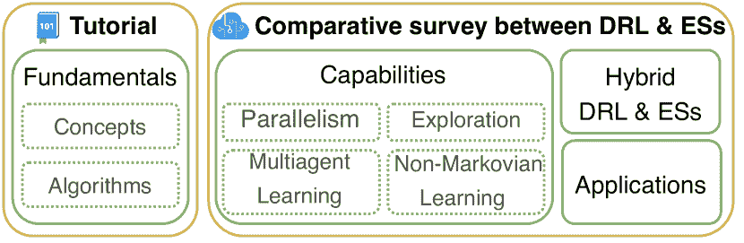

图 1：调查的结构

作为对 DRL 的对比方法，ES 算法利用随机过程迭代生成候选解决方案。然后，它们评估这些解决方案，并将搜索偏向于得分最高的那些[3]。近年来，ESs 的受欢迎程度有所上升，并且成功应用于多个领域，包括优化许多 RL 任务的目标函数[4, 5]。

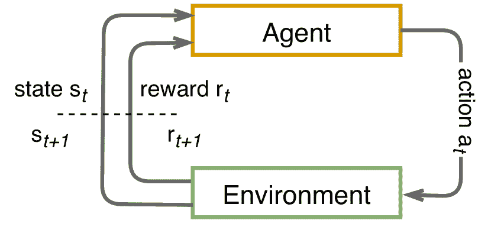

((a)) 强化学习

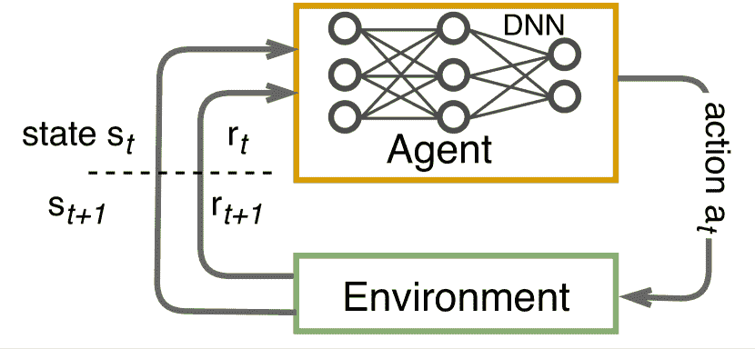

((b)) 深度强化学习

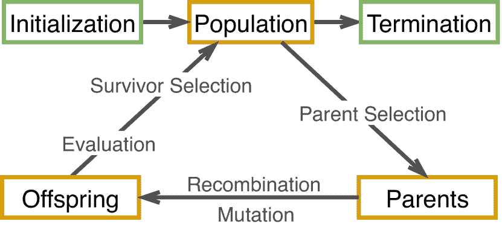

((c)) 进化策略

图 2：（深度）强化学习与进化策略的迭代循环。

DRL 与 ESs 的并行发展表明，两者各有其优势（和劣势），这取决于问题的设置。为了帮助科学家和研究人员选择最适合当前问题的算法，我们通过制定一项比较调查总结了这些方法的优缺点：我们从不同的学习方面如可扩展性、探索、在动态环境中的学习能力以及应用视角对 DRL 和 ESs 进行了比较（图 1）。我们还讨论了如何在混合系统中结合 DRL 和 ESs，以利用两者的优势。

至今，已有不同的论文总结了 DRL 和 ESs 的不同特性。例如，关于无导数强化学习（例如，ESs）的综述见[6]，涵盖了可扩展性和探索等方面。有关用于自动驾驶的 DRL 的调查见[7]，多智能体 DRL 系统的挑战、解决方案和应用则在[8]中进行综述。然而，与以往工作对比，我们的论文以全局视角审视文献，专注于主要的发展方向而非单个算法。

论文的其余部分组织如下：第 II 节介绍了 RL 和 ESs 背后的基本架构概念；第 III 节总结了 RL、DRL 和 ESs 的基本算法；第 IV-A、IV-B、IV-C 和 IV-D 节比较了 DRL 和 ESs 的能力；第 V 节介绍了结合 DRL 和 ESs 的混合系统。第 VI 节从应用的角度对其进行比较。第 VII 节概述了开放的挑战和潜在的研究方向。最后，我们在第 VIII 节总结了论文的主要内容。每节的主要内容在一个简洁的小节中总结，标题为“比较”。

## II 基础

本节涵盖了 DRL 和 ESs 的基本元素，包括正式定义和主要的算法类别。

### II-A 强化学习

强化学习（RL）是一种理解和自动化目标导向学习及决策的计算方法[1]。一个 RL 智能体的目标是最大化其在与环境交互时获得的总奖励（图 2(a)），这通常被建模为马尔可夫决策过程（MDP）。MDP 由元组$(\mathcal{S},\mathcal{A},T,R)$定义，其中$\mathcal{S}$表示状态空间；$\mathcal{A}$是动作空间；$T(s,a,s^{\prime})$是一个转移函数，定义了智能体在采取动作$a$后从当前状态$s$转移到下一状态$s^{\prime}$的概率；$R(s,a,s^{\prime})$是奖励函数，定义了智能体在采取动作$a$后，从状态$s$转移到$s^{\prime}$时观察到的即时奖励$r$。

从时间$t$开始到智能体与环境交互结束的总回报表示为

|  | $G_{t}=\sum_{k=0}^{\infty}\gamma^{k}R_{t+k+1}\text{,}$ |  |
| --- | --- | --- |

其中$R_{t}$是一个随机变量，表示即时奖励$r$，而$\gamma\in[0,1)$是折扣因子，用于加权即时奖励和未来奖励。价值函数表示在某状态下或采取某动作的期望回报。状态价值函数$v_{\pi}(s)$表示从状态$s$出发并遵循策略$\pi$的期望回报，

|  | $v^{\pi}(s)=\sum_{a}\pi(a\vert s)\sum_{s^{\prime},r}p(s^{\prime},r\vert s,a)[r+\gamma v^{\pi}(s^{\prime})]\text{.}$ |  | (1) |
| --- | --- | --- | --- |

动作价值函数（或 Q 函数）$q^{\pi}(s,a)$是指在状态$s$下采取动作$a$并随后遵循策略$\pi$的期望回报，

|  | $q^{\pi}(s,a)=\sum_{s^{\prime},r}p(s^{\prime},r\vert s,a)\bigg{[}r+\gamma\sum_{a^{\prime}}\pi(a^{\prime}\vert s^{\prime})q^{\pi}(s^{\prime},a^{\prime})\bigg{]}\text{.}$ |  | (2) |
| --- | --- | --- | --- |

一个智能体的动作选择过程由其策略控制，在一般的随机情况下，根据给定状态$\pi(s,a)$，策略会在动作空间上产生一个动作的概率分布。

强化学习（RL）算法主要有四大类：

基于策略的算法。基于策略的算法显式地优化和记忆策略，即直接在策略空间中搜索一个（近似的）最优策略$\pi^{*}$。这类算法的例子有策略迭代[9]、策略梯度[10]和 REINFORCE[11]。基于策略的算法可以应用于任何类型的动作空间：连续的、离散的或混合的（多动作）。然而，这些算法通常具有较高的方差且样本效率较低。

基于价值的算法。基于价值的算法学习一个价值函数，$v^{\pi}(s)\text{ 或 }q^{\pi}(s,a)$。然后，根据学习到的价值函数提取一个策略。这类算法的例子包括价值迭代[12]，SARSA[13]，Q 学习和 DQN[14]。与基于策略的算法相比，基于价值的算法在样本效率上更高。然而，在普通情况下，这些算法的收敛性不能得到保证。

Actor-critic 算法。Actor-critic 方法试图将基于策略的算法和基于价值的算法的优点结合成一个单一的算法架构[15]。Actor 是一个基于策略的算法，试图学习最优策略，而 Critic 是一个基于价值的算法，评估 Actor 采取的行动。

基于模型的算法。前面提到的所有算法族都涉及无模型算法。相比之下，基于模型的算法学习或利用环境转移动态的模型。一旦代理可以访问这样的模型，它就可以利用该模型“想象”采取特定行动集合的后果，而不必实际对环境进行操作。这种能力使得强化学习代理能够评估对手在游戏中的预期动作[16, 17]，并更好地利用收集到的数据，这在控制机器人等任务中非常有用[18]。然而，对于许多问题，生产接近现实的模型是困难的。

深度强化学习（DRL）指的是深度学习（DL）与强化学习（RL）的结合（图 2(b)）[2]。DRL 使用深度神经网络（DNN）来逼近 RL 的可学习函数之一。相应地，DRL 算法主要有三类：基于价值的、基于策略的和基于模型的[14, 19, 16]。例如，基于策略的 DRL 代理的 DNN 将环境的状态作为输入，并生成一个动作作为输出（图 2(b)）。动作选择过程由 DNN 的参数$\boldsymbol{\theta}$控制。参数选择在训练阶段通过反向传播算法进行优化。

### II-B 进化策略

进化策略（ESs）是一种基于种群的黑箱优化算法，通常应用于连续搜索空间问题，以找到最优解 [20, 21]。ESs 不需要将问题建模为马尔可夫决策过程（MDP），也不要求目标函数 $f(\boldsymbol{x})$ 必须是可微且连续的。后者解释了为什么 ESs 是无梯度优化技术。然而，它们确实要求目标函数 $f(\boldsymbol{x})$ 能够为每个输入 $\boldsymbol{x}\in\mathbb{R}^{n}$ 分配适应度值（即，进行评估），使得 $f:\mathbb{R}^{n}\rightarrow\mathbb{R}$，$\boldsymbol{x}\rightarrow f(\boldsymbol{x})$。

ESs 的基本思想是将候选解的采样过程偏向于迄今为止发现的最佳个体，直到找到满意的解决方案。例如，可以从（多变量）正态分布中抽样，其形状（即均值 $m$ 和标准差 $\sigma$）由所谓的战略参数描述。这些参数可以在线修改，以使搜索过程更加高效。通用的 ESs 过程如图 2(c) 所示，其元素如下所述：

1.  1.

    初始化：算法生成一个由 $\mu$ 个个体组成的初始种群 $P$。

1.  2.

    父代选择：从种群中选择一个子集作为重新组合步骤中的父代。

1.  3.

    复制包括两个步骤：

    1.  (a)

        重新组合：将两个或更多的父代结合起来，为新一代产生一个均值。

    1.  (b)

        变异：在重新组合结果中添加少量噪声。实现变异的一种常见方法是从以先前重新组合步骤获得的均值为中心的多变量正态分布中抽样：

        |  | $\boldsymbol{x}_{k}^{g+1}\sim\mathcal{N}(\boldsymbol{m}^{(g)},\sigma^{(g)}I)=\boldsymbol{m}^{(g)}+\sigma^{(g)}\mathcal{N}(0,I)\text{,}$ |  |
        | --- | --- | --- |

        其中 $g$ 是代数索引，$k$ 是后代数量，$I$ 是单位矩阵。

1.  4.

    评估：使用目标函数 $f(x_{i})$ 为每个候选解分配一个适应度值。

1.  5.

    生存者选择：选择最好的 $\mu$ 个体形成下一代的种群。通常，算法从第 2 步迭代到第 5 步，直到找到满意的解决方案。

将进化策略（ESs）作为强化学习（RL）替代方案的想法并不新鲜 [22, 23, 24, 25]，但最近引起了新的关注（例如 [4, 26]）。

### II-C 比较

我们对上述基本概念的主要总结是：

+   •

    RL 算法的目标是最大化折扣奖励的总和，而 ESs 算法则不需要这样的公式。然而，RL 设置的目标可以转换为 ESs 设置，其中终止状态提供等同于适应度函数的奖励。

+   •

    RL 和 ESs 的问题设置不同。ESs 算法是一种黑箱优化方法，保持多个候选解的池，而 RL 方法通常有一个单独的代理，通过与环境互动来改进其策略。

+   •

    ESs 算法旨在寻找优化适应度函数的候选解，而 DRL 的目标是不断提升一个或两个函数近似器，这些近似器需要优化等效于适应度函数的内容，通常由折扣回报定义。

+   •

    ESs 方法最类似于基于策略的 DRL 方法：两者都旨在在搜索空间中寻找参数，使得结果参数化函数优化某些目标（DRL 的预期回报或 ESs 的适应度评分）。主要区别在于 ESs 与 DRL 不同，不计算梯度也不使用反向传播。

+   •

    基于值的 RL 方法通常在离散动作空间中操作，而 actor-critic 架构将这一能力扩展到连续动作空间。ESs 默认可以在离散或连续动作空间中操作。

## III 基础算法

表 I：基础 (深度) 强化学习和进化策略算法

| 算法 | 分类 | 动作空间 | 消耗的内存 | 局限性 | 反向传播 | 参考 |
| --- | --- | --- | --- | --- | --- | --- |
| SARSA | 在策略值基 RL | 离散 | 状态和动作空间的指数级 | 处理连续空间，无法在类似状态之间泛化 | X | [1] |
| Q-learning | 离策略值基 RL | 离散 | 状态和动作空间的指数级 | 处理连续空间，无法在类似状态之间泛化 | X | [27] |
| REINFORCE | 基于策略的 RL | 离散/连续 | 通常需要存储 DNN 参数 | 数据效率低，较高的方差相比 DQN | ✓ | [11] |
| DQN | 离策略值基 RL | 离散 | 需要存储 DNN 参数和回放缓冲区 | Q 函数的学习可能会受到不稳定性的影响 | ✓ | [28] [2] |
| CMA-ES | 黑箱 ES 优化 | 离散/连续 | 高内存需求 | 处理大规模优化问题时具有高空间和时间复杂度 | X | [29] [30] |
| NES & OpenAI-ES | 黑箱 ES 优化 | 离散/连续 | 内存使用少于 CMA-ES | 由于梯度近似而导致的数据效率低 | X | [31] [32] |

本节介绍了 (D)RL 和 ESs 的基础算法。

### III-A 强化学习算法

SARSA 是一种无模型算法，它利用时间差分方法进行预测 [1]。它在遵循某一策略的同时更新 Q 值 $Q(s_{t},a_{t})$。代理与环境的互动产生了以下序列 $\dots,s_{t},a_{t},r_{t+1},s_{t+1},a_{t+1},\dots$：代理在状态 $s_{t}$ 下采取一个动作 $a_{t}$，随后环境过渡到状态 $s_{t+1}$，代理观察到奖励 $r_{t+1}$。在动作选择中，SARSA 使用 $\varepsilon$-贪婪算法，它以 $1-\varepsilon$ 的概率选择具有最大 $Q(s_{t},a_{t})$ 的动作，否则从 $\mathcal{A}$ 中均匀抽取一个动作。SARSA 是一种策略算法，即它评估并改进选择的动作所遵循的策略。SARSA 的更新方程是

|  | $Q(s_{t},a_{t})\leftarrow Q(s_{t},a_{t})+\alpha\big{[}r_{t+1}+\\ \gamma Q(s_{t+1},a_{t+1})-Q(s_{t},a_{t})\big{]}\text{,}$ |  | (3) |
| --- | --- | --- | --- |

其中 $\alpha$ 是学习率。

Q-Learning [1] 类似于 SARSA，但有一个关键区别：它是一种离策略算法，这意味着它可以从通过任何策略获得的数据中学习最优 Q 值函数（而不会引入偏差）。特别是，Q-learning 更新规则将当前状态-动作对的 Q 值 $Q(s_{t},a_{t})$ 与下一个状态中具有最大 Q 值的对 $Q(s_{t+1},a_{t+1})$ 进行比较，这个值不一定是 SARSA 中由 $\varepsilon$-贪婪选择的值。Q-learning 的更新规则是

|  | $Q(s_{t},a_{t})\leftarrow Q(s_{t},a_{t})+\alpha\big{[}r_{(t+1)}+\\ \gamma\max_{a}Q(s_{(t+1)},a_{(t+1)})-Q(s_{t},a_{t})\big{]}\text{.}$ |  | (4) |
| --- | --- | --- | --- |

离策略算法比策略算法更具数据效率，因为它们可以重复利用收集到的数据。

REINFORCE [11] 是一种基本的随机梯度下降算法，用于策略梯度算法。它利用 DNN 来近似策略 $\pi$ 并更新其参数 $\boldsymbol{\theta}$。网络从环境中接收输入，并输出一个动作空间 $\mathcal{A}$ 上的概率分布。REINFORCE 实现的步骤包括：

1.  1.

    初始化一个随机策略（即，DNN 的参数）

1.  2.

    使用策略 $\pi_{\boldsymbol{\theta}}$ 收集一个轨迹 $\tau=(s_{0},a_{0},r_{1},s_{1},a_{1},r_{2},...,a_{H},r_{H+1},s_{H+1})$

1.  3.

    估计这个轨迹的回报

1.  4.

    使用回报的估计来计算策略梯度：

    |  | $\nabla_{\boldsymbol{\theta}}\mathcal{J}(\boldsymbol{\theta})=\mathbb{E}_{\pi_{\boldsymbol{\theta}}}[\nabla\log\pi(a | s;\boldsymbol{\theta})Q_{\pi}(s,a)]$ |  | (5) |
    | --- | --- | --- | --- | --- |

1.  5.

    调整策略的权重 $\boldsymbol{\theta}$：

    $\boldsymbol{\theta}\leftarrow\boldsymbol{\theta}+\alpha\nabla_{\theta}J(\boldsymbol{\theta})$

1.  6.

    从第 2 步开始重复，直到终止。

深度 Q 网络（DQN）[28]将 Q 学习与卷积神经网络（CNN）[33]结合起来，以在高维输入空间（例如，Atari 游戏的图像）中进行操作。它接收状态（例如，一小批图像）作为输入，并生成所有可能动作的 Q 值。CNN 用于近似最优动作值函数（或 Q 函数）。然而，这种使用会导致 DRL 代理不稳定[34]。为此，DQN 采样一个经验回放[35]数据集$D_{t}=\{(s_{1},a_{1},r_{2},s_{2}),\dots,(s_{t},a_{t},r_{t+1},s_{t+1})\}$，并使用一个仅在特定迭代次数后更新的目标网络。为了在迭代$i$中更新网络参数，DQN 使用以下损失函数

|  | $L_{i}(\theta_{i})=\mathbb{E}_{(s,a,r,s^{\prime})}\sim U(D)\\ \bigg{[}\left(r+\gamma\max_{a^{\prime}}Q(s^{\prime},a^{\prime};\overline{\boldsymbol{\theta}_{i}})-Q(s^{\prime},a^{\prime};\boldsymbol{\theta}_{i})\right)^{2}\bigg{]}$ |  | (6) |
| --- | --- | --- | --- |

其中$\theta_{i}$和$\overline{\theta_{i}}$分别是 Q 网络和目标网络的参数；经验$(s,a,r,s^{\prime})$是从$D$中均匀抽取的。

### III-B 进化策略算法

(1+1)-ES（一个父代，一个后代）是 Rechenberg 提出的最简单的 ES[36]。首先，从初始解集$\{\textbf{x}_{i},\textbf{x}_{j}\}$中按均匀随机分布抽取一个父代候选解$\textbf{x}_{p}$。选择的父代$\textbf{x}_{p}$及其适应度值进入进化循环。在每一代（或迭代）中，通过将从无相关多元正态分布中抽取的向量添加到$\textbf{x}_{p}$中来创建一个后代候选解$\textbf{x}_{o}$，如下所示：

|  | $\textbf{x}_{o}=\textbf{x}_{p}+\textbf{y}\sigma,\textbf{y}\sim\mathcal{N}(0,\textbf{I})\text{.}$ |  |
| --- | --- | --- |

如果后代$\textbf{x}_{o}$被发现比父代$\textbf{x}_{p}$更优，则$\textbf{x}_{o}$将成为下一代的新父代，否则它会被丢弃。这个过程会重复直到满足终止条件。对$\textbf{x}_{p}$添加的突变（或扰动）的量由步长参数$\sigma$控制。$\sigma$的值会在每个预定义的迭代次数后根据著名的$\frac{1}{5th}$成功规则[37, 38]进行更新：如果$\textbf{x}_{o}$比$\textbf{x}_{p}$优越的次数占$\frac{1}{5th}$，则$\sigma$保持不变；如果$\textbf{x}_{o}$优越的次数超过$\frac{1}{5th}$，则$\sigma$应增加，否则应减少。

($\mu/\rho\overset{+}{,}\lambda$)-ES 最初由 Schwefel 提出[39]，作为对 (1+1)-ES 的扩展。它不是使用一个父代生成一个后代，而是使用 $\mu$ 个父代通过重组和变异生成 $\lambda$ 个后代。在该算法的逗号变异版本（即 ($\mu/\rho{,}\lambda$)-ES）中，下一代的父代完全从后代中选择。而在加号变异中，下一代的父代从后代和旧父代的联合中选择。算法名称中的 $\rho$ 指的是用于生成每个后代的父代数量。

一个 ($\mu/\rho\overset{+}{,}\lambda$)-ES 演化的元素（或个体）由 (x, s, $f$) 组成，其中 x 是候选解，s 是控制变异重要性的策略参数，$f$ 是 x 的适应度值。因此，演化过程本身调整策略参数，这称为自适应。因此，与 (1+1)-ES 不同，($\mu/\rho\overset{+}{,}\lambda$) 不需要外部控制设置来调整策略参数。

协方差矩阵适应演化策略（CMA-ES）是最流行的无梯度优化算法之一[40, 41, 42, 43]。为了搜索解空间，它从多元正态分布中采样一个新搜索点（后代）的种群 $\lambda$：

|  | $\boldsymbol{x}_{i}^{g+1}=\boldsymbol{m}^{(g)}+\sigma^{(g)}\mathcal{N}(\boldsymbol{0},\boldsymbol{C}^{(g)})\text{ for }i=1\text{, \ldots,}\lambda\text{,}$ |  |
| --- | --- | --- |

其中 $g$ 是代数编号（即 $g=1,2,3,\dots$），$\boldsymbol{x}_{i}\in\mathbb{R}^{n}$ 是第 $i$ 个后代，$\boldsymbol{m}$ 和 $\sigma$ 表示 $\boldsymbol{x}$ 的均值和标准差，$\boldsymbol{C}$ 代表协方差矩阵，$\mathcal{N}(\boldsymbol{0},\boldsymbol{C})$ 是多元正态分布。为了计算下一代的均值 $\boldsymbol{m}^{g+1}$，CMA-ES 计算了根据适应度值排序的最佳 $\mu$ 候选解的加权平均，其中 $\mu<\lambda$ 表示父代种群规模。通过这种选择和分配的权重，CMA-ES 将计算出的均值偏向当前种群的最佳候选解。它使用累计步长自适应（CSA）算法 [40] 和进化路径 $\boldsymbol{p}_{\sigma}$ 自动调整步长 $\sigma$（变异强度）：如果 $\boldsymbol{p}_{\sigma}$ 长于随机选择下期望的进化路径长度 $\mathbb{E}||\mathcal{N}(\boldsymbol{0},\boldsymbol{I})||$，则增加步长；否则，减少它。为了将搜索引导向有前途的方向，CMA-ES 在每次迭代中更新协方差矩阵。更新包括两个主要部分：（i）秩-1 更新，计算变异分布均值的进化路径，与步长进化路径类似；（ii）秩-$\mu$ 更新，计算作为最佳 $\mu$ 个体协方差加权和的协方差矩阵。这些步骤得到的结果用于更新协方差矩阵 $\boldsymbol{C}$ 本身。算法迭代直到找到满意的解（我们建议感兴趣的读者参考 [43] 以获取更详细的解释）。

自然进化策略（NES）在许多方面类似于之前定义的 ES 算法，其核心思想与使用梯度来适当地更新搜索分布有关 [44]。NES 的基本思想包括：

+   •

    采样：NES 从搜索空间上的概率分布（通常是高斯分布）中采样其个体。NES 的最终目标是更新分布参数 $\boldsymbol{\theta}$，以最大化被采样个体 $\boldsymbol{x}$ 的平均适应度 $F(\boldsymbol{x})$。

+   •

    搜索梯度估计：NES 通过评估之前计算的样本来估计参数上的搜索梯度。然后，它决定采取最佳方向以实现更高的期望适应度。

+   •

    梯度上升：NES 沿着估计的梯度计算梯度上升

+   •

    在达到停止标准之前，对前面的步骤进行迭代 [44]。

Salimans 等人 [4] 提出了 NES 的一种变体，用于优化策略参数 $\theta$。由于没有梯度，它们通过对目标函数 $F(X)$ 进行高斯平滑来估计梯度，该函数表示期望回报。

### III-C 比较

我们对基本算法的主要观察如下：

+   •

    ES 和基于策略的 RL 算法都是数据低效的：基于策略的算法使用当前策略生成的数据并丢弃旧数据；ES 则在每次迭代中丢弃所有除了一个子集的候选解。

+   •

    每次迭代的 ES 计算需求通常低于 DRL，因为它不需要反向传播误差值。

+   •

    基于价值的 DRL 算法，如 DQN，可能是数据高效的，因为它们可以使用重放记忆来重复利用离策略数据。然而，对于长时间范围和高折扣因子，它们可能变得不稳定 [45]。

+   •

    基于策略的 RL 和 ES 相似之处在于它们都直接寻求好的策略。

+   •

    表 I 突出了提到的算法的重要特征。

## IV 深度强化学习与进化策略

本节比较了 DRL 和 ES 的不同方面，如它们的并行计算能力、环境探索能力以及在多智能体和动态环境中的学习能力。

### IV-A 并行性

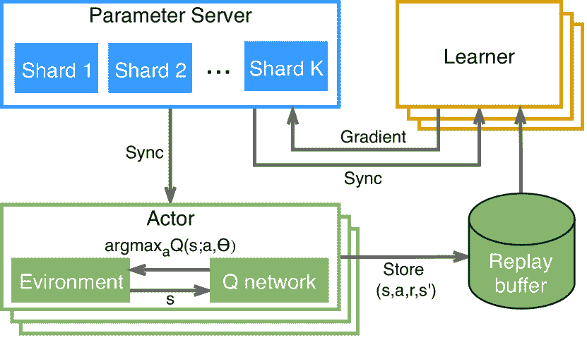

((a)) Gorila [46]

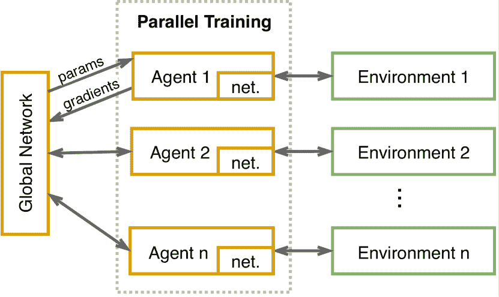

((b)) A3C [47]

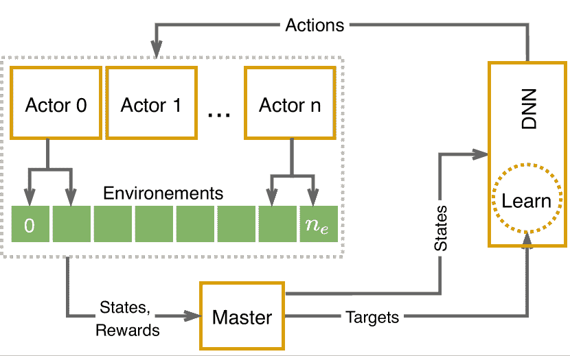

((c)) 批量 A2C [48]

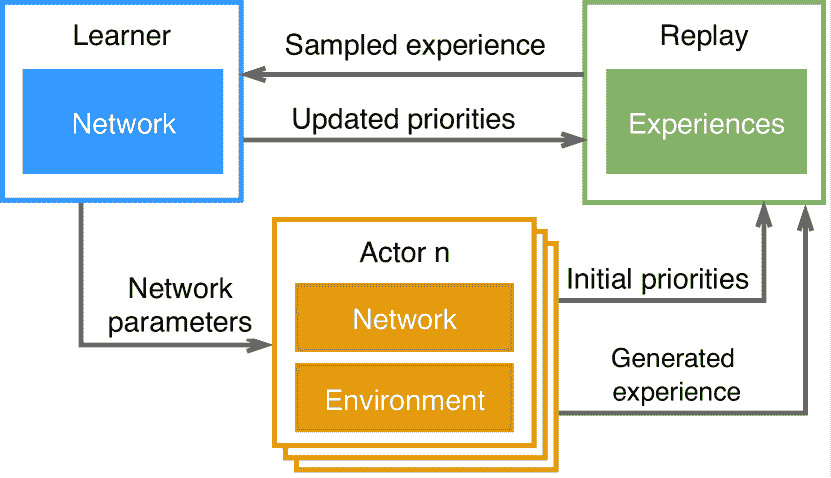

((d)) Ape-X [49]

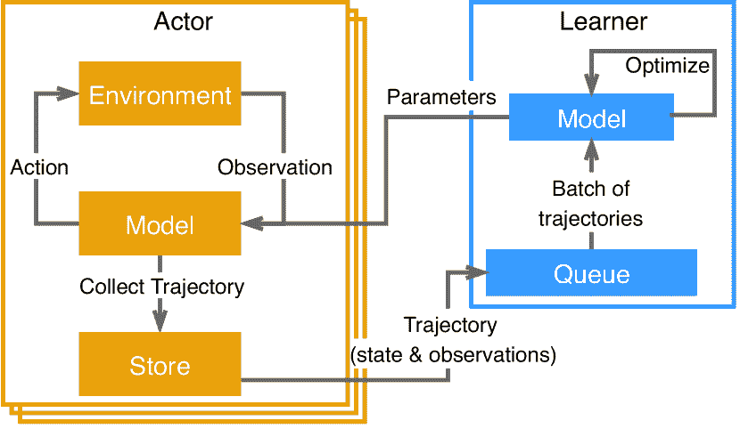

((e)) Impala [50]

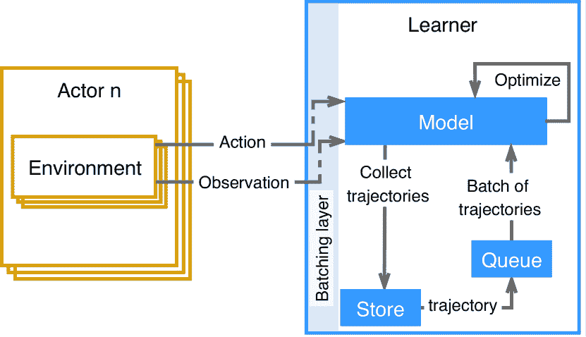

((f)) SEED [51]

图 3：并行深度强化学习算法架构

尽管 DRL 和 ES 取得了成功，但它们仍然是计算密集型的方法来解决序列决策问题。因此，并行执行是加速计算的重要方法 [46]。接下来，我们将深入研究丰富的并行 DRL 和 ES 算法文献。

#### IV-A1 深度强化学习中的并行性

在并行-DRL 中，多个智能体（或演员）并行运行以加速学习过程。每个演员收集自己的学习经验。这些经验随后被共享以优化一个全球网络（图 3）[52, 53]。本节其余部分介绍重要的并行-DRL 算法。

Gorila [46] 是第一个大规模分布式 DRL 架构。它由四个主要组件组成：演员、学习者、参数服务器和重放缓冲区（图 3(a)）。每个演员都有其 Q 网络。它与相同环境的一个实例进行交互，并将生成的经验（即一组 {$s,a,r,s^{\prime}$}）存储在重放缓冲区中。学习者从经验重放缓冲区中采样，并使用 DQN 计算梯度。从缓冲区中采样减少了数据更新之间的相关性和数据的非平稳性效应。这些梯度随后异步地发送到参数服务器以更新其 Q 网络。之后，参数服务器更新演员和学习者的 Q 网络，以同步学习过程。

A3C 和 GA3C。虽然使用重放缓冲区有助于稳定学习过程，但它需要额外的内存和计算能力，并且只能用于离策略算法。基于这些限制，Mnih 等人 [47] 引入了异步优势演员-评论家（A3C）作为 Gorila 的替代方案。A3C 包含一个全局网络和多个具有自己网络的代理（图 3(b)）。这些代理作为单台机器中的 CPU 线程实现，从而减少了像 Gorila 这样的分布式系统带来的通信成本。代理与其独立环境副本并行交互。每个代理计算值函数和策略梯度，这些梯度用于更新全局网络参数。这种学习方法使数据更新多样化和去相关，从而稳定学习过程。GA3C [54] 利用 GPU，并显示出比 A3C 更好的可扩展性和性能。

批量 A2C 与 DPPO。A3C 的一个缺点是异步更新可能导致对全局网络的次优集合更新。为了解决这个问题，批量优势演员-评论家（Batched A2C）采用了一个主节点（或协调者）来同步全局网络的更新过程[48]。批量 A2C 试图利用 Gorila 和 A3C 的优点。与 Gorila 类似，批量 A2C 在 GPU 上运行，演员数量具有高度可扩展性，同时仍在单台机器上运行，类似于 A3C 和 GA3C[54]。图 3(c)展示了批量 A2C 架构。在每个时间步，批量 A2C 从策略中采样，并为$n_{w}$个工作者生成一批动作，作用于$n_{e}$个环境实例。生成的经验随后被存储，并由主节点用于更新策略（全局网络）。批量方法通过同步更新唯一的参数副本来实现简单的并行化，但缺点是通信成本较高。分布式近端策略优化（DPPO）[55]的架构与 A2C 类似，采用 PPO[56]算法进行学习。

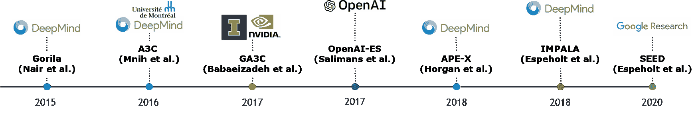

图 4：展示在时间轴上的并行深度强化学习和进化策略算法

Ape-X 与 R2D2。Ape-X[49]将优先经验缓冲区扩展到并行 DRL 设置，并展示了这种方法的高度可扩展性。Ape-X 架构包括多个演员、一个学习者和一个优先回放缓冲区（图 3(d)）。每个演员与其环境实例互动，收集数据并计算初始优先级。生成的经验被存储在一个共享的优先缓冲区中。学习者从缓冲区中采样以更新其网络和缓冲区中经验的优先级。此外，学习者还定期更新演员的网络参数。Ape-X 的分布式架构可以与 DQN[28]和 DDPG[19]等不同学习算法结合使用。R2D2[57]具有类似的架构，但使用基于递归神经网络（RNN）的 RL 代理，性能超越了 Ape-X。

IMPALA。由于在离策略设置中使用了策略方法，GA3C [54]存在收敛性差的问题。IMPALA [50]通过使用 V-trace 进行了修正：这是一种离策略的演员-评论家算法，旨在减轻演员执行动作和学习者在分布式设置中估计梯度之间的延迟影响。IMPALA 的架构由多个演员与其环境实例交互组成（图 3(e)）。然而，与 A3C 的演员不同，IMPALA 的演员将收集到的经验（而不是梯度）发送给学习者。然后，学习者利用这些经验来优化其策略和值函数。之后，它更新演员的模型参数。行动和学习的分离以及 V-trace 使 IMPALA 能够在实现高吞吐量的同时保持稳定的学习。当训练非常深的模型时，单个 GPU 的速度通常是瓶颈。为了克服这一挑战，IMPALA（除了一个学习者）支持多个同步学习者。

SEED。SEED [51]通过将推理移至学习者来改进 IMPALA 系统（图 3(f)）。因此，轨迹收集成为学习者的一部分，演员仅将观察和动作发送给学习者。SEED 利用 TUPs 和 GPU，显示出相较于其他方法的显著改进。

表 II：并行化的深度强化学习和进化策略系统

| 算法 | 架构 | 实验 | 局限性 | 参考 |
| --- | --- | --- | --- | --- |
| Gorila | 回放缓冲区、演员、学习者和参数服务器各自运行在不同的机器上；GPU | 在 41/49 个 Atari 游戏中超越 DQN，且减少了实际时间 | 通信梯度和参数的带宽高 | [46] [50] |
| A3C | 许多演员每个运行在一个 CPU 线程上，并更新一个全球网络 | 在 Atari 游戏中训练时间减少一半而超越了 Gorila | 可能出现不一致的参数更新；学习者和演员之间的带宽大；不利用硬件加速器 | [47] [50] |
| 批量 A2C | 多个演员、一个主节点，负责同步演员的更新，以及一个全球网络；GPU | 相比于 Gorila、A3C 和 GA3C，需要更少的训练时间 | 在复杂环境中的高方差限制了性能；长度变化的剧集在初始化期间会导致减速 | [48] |
| Ape-X | 多个演员、共享学习者和优先回放记忆；CPU/GPU | 在 Atari 领域中超越了 Gorila 和 A3C，训练时间更少 | CPU 使用效率低；在演员和学习者之间通信需要大量带宽 | [49] |
| IMPALA | 多个演员；单个或多个学习者；回放缓冲区；GPU | 在性能上超越了批量 A2C 和 A3C。对超参数选择的敏感度低于 A3C | 使用 CPU 进行推理效率低；需要大量带宽来传送参数和轨迹 | [50] |
| SEED | 多个演员和单个学习；GPU/TPU | 超越了 IMPALA 的性能 | 集中推理可能会增加延迟 | [51] |
| OpenAI ES | 一组并行工作者；CPU | 在大多数 Atari 游戏中超越其他解决方案，训练时间更少：在 23 个游戏中优于 A3C，在 28 个游戏中表现较差 | 评估许多回合需要大量 CPU 时间：单次 ES 运行需要 4000 CPU 小时 | [4] [5] |

#### IV-A2 进化策略中的并行性

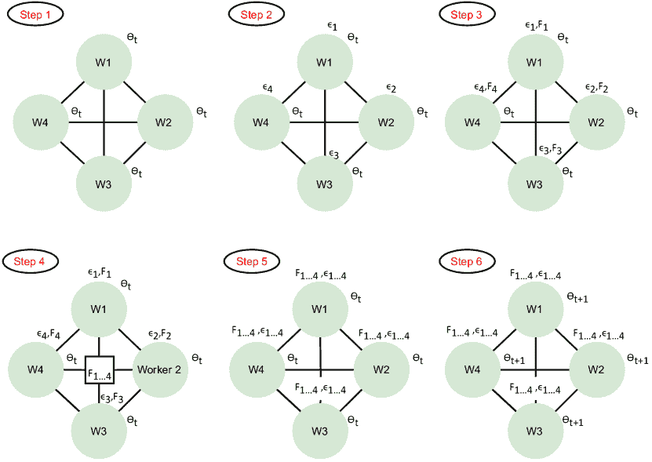

图 5：OpenAI-ES 中的并行化步骤 [4]

相较于深度强化学习（DRL），进化策略（ES）算法在并行化给定任务时需要显著更少的带宽。Salimans 等人[4] 提出了 OpenAI-ES：一种源自 NES 的算法（见第 III 节），该算法直接优化策略的参数 $\theta$。通过在优化过程之前共享随机过程的种子，OpenAI-ES 只需在工作者之间交换标量（最小带宽）即可并行化搜索过程。OpenAI-ES 的主要步骤如图 5 所示，并总结如下：

1.  1.

    采样一个高斯噪声向量，$\varepsilon_{i}\sim N(0,I)$。

1.  2.

    评估工作者的适应度函数，$F_{i}\leftarrow F(\boldsymbol{\theta}_{t},\sigma\varepsilon_{i})$。

1.  3.

    在工作者之间交换适应度值 $F_{i}$。

1.  4.

    使用已知的随机种子重建 $\varepsilon_{i}$。

1.  5.

    根据 $\boldsymbol{\theta}_{t+1}\leftarrow\boldsymbol{\theta}_{t}+\alpha\frac{1}{n\sigma}\sum_{j=1}^{n}F_{j}\varepsilon_{j}$ 调整参数，其中 $\boldsymbol{\theta}$ 是 DNN 的加权向量。

1.  6.

    从步骤 2 开始重复，直到终止。

一些研究人员提出了受 OpenAI-ES [4] 启发的算法。例如，Conti 等人 [32] 提出了新颖性搜索进化策略（NS-ES）算法，该算法将 OpenAI-ES 与新颖性搜索（NS）——一种定向探索算法——混合。作者还通过用质量多样性（QD）算法替代 NS 引入了 NS-ES 的一种变体。他们的结果表明，基于 NS 和 QD 的算法改善了在稀疏奖励的 RL 任务上 ES 算法的性能，因为它们有助于避免局部最优。Liu 等人 [58] 提出了信任区域进化策略（TRES）。TRES 比经典 ES 更具数据采样效率。它优化了一个替代目标函数，使得可以多次重用采样数据。TRES 利用 [4] 引入的随机种子共享来实现极低的带宽。最后，Fuks 等人 [29] 提出了带有渐进集长度的进化策略（PEL）。PEL 的主要思想是让智能体执行小而简单的任务以迅速获得知识，然后利用这些知识来处理更复杂的任务。PEL 利用与 OpenAI-ES [4] 相同的并行化理念，并在经典 ES 算法上显示出显著的改进。

#### IV-A3 比较

我们对并行化 DRL 和 ES 的观察是：

+   •

    尽管增加了额外的复杂性，但并行化加速了 DRL 和 ES 算法的执行。

+   •

    并行 DRL 通常在节点之间传递网络参数或梯度向量，而并行 ES 仅在工作节点之间共享标量值。

+   •

    表 II 快照了所呈现算法的主要特征，图 4 展示了并行 DRL 和 ES 算法如何随时间演变。

### IV-B 探索

学习智能体在与部分已知环境交互时面临的基本挑战之一是探索-利用困境。也就是说，智能体应该在什么时候尝试次优行动以改进对最优策略的估计，而在什么时候应该使用当前的最优策略估计来取得有用的进展？这个困境引起了广泛关注。下面，我们总结了 DRL 和 ES 中主要的探索方法。

#### IV-B1 （深度）强化学习中的探索

简单的探索技术通过大多数时候选择估计的最佳动作以及偶尔选择随机动作来平衡探索与利用。这就是著名的 $\epsilon$-贪婪探索算法[1] 的情况，它以概率 $1-\epsilon$ 贪婪地选择动作，并以概率 $\epsilon$ 选择随机动作。

更复杂的探索策略通过利用环境与代理的互动历史来估计探索性动作的价值。上置信界限（UCB）[59] 通过将奖励信号设置为 Q 函数的估计值加上一个反映算法对该估计值信心不足的值来实现这一点，

|  | $r^{+}(s,a)=r(s,a)+B(N(s))\text{,}$ |  |
| --- | --- | --- |

其中 $N(s)$ 表示访问状态 $s$ 的频率，而 $B(N(s))$ 是随着 $N(s)$ 的增加而减少的奖励奖金。换句话说，UCB 鼓励选择具有高奖励 $r(s,a)$ 的动作，或具有高不确定性（访问频率较低）的动作。汤普森采样方法（TS）[60] 维护模型参数的分布。最初，它随机采样参数。但是随着代理对环境的探索，TS 调整分布以更倾向于更有前景的参数集。因此，UCB 和 TS 自然减少了选择探索性动作的概率，并随着时间的推移对最优策略变得更加自信。因此，它们本质上比 $\epsilon$-贪婪算法更高效。

从 RL 到 DRL。DRL 代理在具有连续或高维状态-动作空间的环境中进行操作（例如，Montezuma’s Revenge，StarCraft II）。这样的空间使得基于计数的算法（例如，UCB）和需要维护状态-动作空间分布的算法（例如，TS）在其原始形式中无用。为了探索具有稀疏奖励信号的挑战性环境，已经提出了许多算法。一般来说，这些算法将近似技术与为简单 RL 设置提出的探索算法相结合[61，62，63，64]。以下是重要的 DRL 探索算法的概述。

伪计数方法。为了将基于计数的探索方法（例如 UCB）扩展到深度强化学习设置中，Bellemare 等人 [65] 使用上下文树切换（CTS）密度模型来近似计数过程。模型的目标是提供一个在状态被重新访问时增加的分数。然后，使用这个分数生成一个与分数值成反比的奖励奖金。这个奖金随后被加到环境提供的奖励信号中，以激励代理访问不常访问的状态。Ostrovski 等人 [66] 通过用称为 PixelCNN 的神经密度模型替换简单的 CTS 密度模型改进了这一方法。另一种利用计数来探索高维空间环境的方法是将观察到的状态映射到哈希表 [67] 中，并计数哈希代码而不是状态。然后，设计一个类似于 UCB 的奖励奖金，利用哈希代码计数。

近似后验采样。受 TS 启发，Osband 等人 [68] 提出了自助法 DQN。自助法 DQN 使用 N 个自助头训练 DNN，以近似 Q 函数的分布（自助法是通过从总体中重复抽样来近似分布的过程，然后聚合这些样本）。在每次训练开始时，自助法 DQN 从 Q 函数集成中随机抽取一个样本，并根据该样本贪婪地行动。这种策略使得强化学习代理能够进行时间上扩展的探索（或深度探索），这在代理收到稀疏环境奖励时尤其重要。Chen 等人 [69] 通过计算 Q 函数集成子集的均值和方差，将 UCB 与自助法 DQN 集成在一起。O’Donoghue 等人 [70] 将 TS 与不确定性 Bellman 方程结合，以在多个时间步上传播 Q 值的不确定性。

表 III: 深度强化学习探索算法

| 算法 | 描述 | 实验 | 参考文献 |
| --- | --- | --- | --- |
| 自助法 DQN | 使用 DNN 和 Q 函数集成来探索环境 | 在累计奖励方面比 DQN 提高了几个数量级 | [68] |
| UCB$+$InfoGain | 将 UCB 与 Q 函数集成结合 | 优于自助法 DQN | [70] |
| 状态伪计数 | 使用密度模型和伪计数来近似状态访问计数，用于计算奖励奖金 | 优于 DQN，尤其是在难以探索的环境中 | [65] |
| VIME | 测量当前观察后的信息增益，作为当前分布和更新分布之间的 KL 散度 | 当与 TRPO [71]、REINFORCE [11] 结合使用时，能改善它们的表现 | [72] |
| ICM | 使用前向动态模型预测状态，并将信息增益度量为预测状态与观察状态之间的差异 | 在 VizDoom（一个稀疏的 3D 环境）中表现优于 TRPO-VIME | [73] |
| 叙事好奇心 | 使用情景记忆形成新奇奖励 | 在来自 VizDoom 和 DMLab 的视觉丰富的 3D 环境中表现优于 ICM | [74] |
| Go-Explore | 之前访问的状态会存储在内存中。在第一阶段，Go-Explore 进行探索直到找到解决方案。在第二阶段，Go-Explore 对找到的解决方案进行稳健化 | 在处理困难探索问题时，相对于其他方法如 DQN+PixelCNN、DQN+CTS、BASS-hash 表现出性能改进 | [75] |
| 永不放弃 | 结合了叙事和终身的新奇性 | 获得了 1344%的中位人类标准化评分；第一个在 Pitfall 游戏中实现非零奖励的算法 | [76] |
| Agent57 | 使用元控制器自适应地选择正确的策略：从纯粹的探索性到纯粹的开发性 | 第一个在所有 57 个 Atari 游戏中超越标准人类基准的 DRL 代理 | [77] |

信息增益。在基于信息增益的探索中，算法提供与采取行动后获得的信息成正比的奖励奖金。然后将此奖励奖金添加到环境提供的奖励中，以促使智能体探索新奇（或较少了解的）状态 [78]。Houthooft 等人 [72] 提出了使用贝叶斯神经网络学习过渡动态模型。信息增益被度量为新观察后当前和更新参数分布之间的 KL 散度。基于这些信息，奖励信号会增加一个奖金。Pathak 等人 [73] 使用前向动态模型预测下一个状态。然后将奖励奖金设为与预测状态和观察到的下一个状态之间的误差成正比。为了使这种方法有效，作者利用了一个逆向模型，去除与比较无关的状态特征。Burda 等人 [79] 根据一个固定的随机初始化神经网络在预测观察特征时的误差定义探索奖励。

基于记忆的。Savinov 等人[74]提出了一种新的好奇心方法，利用情节记忆形成新颖性奖励。奖励通过将当前观察与记忆中的观察进行比较来计算，对于需要一定努力才能达到的观察给予奖励（努力通过到达观察所需的环境步骤数量来体现）。Ecoffet 等人[75]引入了 Go-explore：一个旨在解决如 Montezuma’s Revenge 和 Pitfall 等难探索问题的 RL 代理。Go-explore 运行两个阶段。在第一阶段，代理随机探索，记住有趣的状态，并从一个有趣的状态开始（重置后）继续随机探索（作者假设代理可以确定性地返回到一个有趣的状态）。在找到问题的解决方案后，第二阶段开始，Go-explore 代理通过随机化环境和使用最佳解决方案进行模仿学习来增强找到的最佳解决方案。Badia 等人[76]提出了“Never give up”（NGU）：一个也针对难探索问题的代理。NGU 通过两种内在新颖性奖励的组合来增强环境奖励：（i）情节奖励，使代理能够在一个情节内快速适应，和（ii）终身新颖奖励，降低跨多个情节变得熟悉的状态的奖励。此外，NGU 使用通用价值函数逼近器（UVFA）同时学习多个具有不同探索-利用权衡的探索策略。Agent57[77]旨在使用“元控制器”管理探索与利用之间的权衡，该控制器自适应地选择合适的策略（从高度探索到纯粹利用）进行训练阶段。Agent57 在所有 57 款 Atari 游戏中超越了标准人类基准。

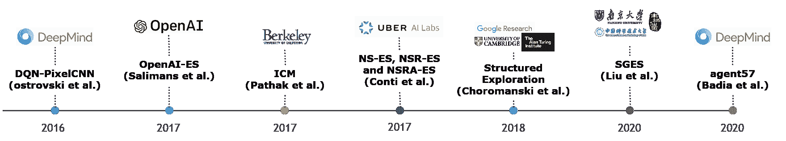

图 6：深度强化学习和进化策略探索算法的时间线展示

#### IV-B2 进化策略中的探索

ES 算法在优化适应度评分的同时，会围绕已找到的最佳解决方案进行探索。这种探索通过重组和突变步骤实现。尽管在探索方面效果显著，但 ES 仍可能陷入局部最优解[58, 80]。为了克服这一限制，提出了许多具有增强探索技术的 ES 算法。

从非平滑目标函数 $F(\boldsymbol{\theta})$ 中提取近似梯度的一种方法是通过向其参数向量 $\boldsymbol{\theta}$ 添加噪声。这产生了一个新的可微分函数 $F_{ES}(\boldsymbol{\theta})$。OpenAI-ES [4] 利用这个思想，通过从高斯分布中采样噪声并将其添加到参数向量 $\boldsymbol{\theta}$ 中来实现。然后，算法使用随机梯度上升进行优化。此外，OpenAI-ES 依赖于一些辅助技术来提高其性能：虚拟批量归一化 [31] 用于增强探索，反对称采样 [81] 用于减少方差，以及适应性优化 [44] 用于改进局部最优避免。

Choromanski 等人 [82] 提出了两种策略来增强 Derivative Free Optimization (DFO) 方法（如 OpenAI-ES [4]）的探索：（i）结构化探索，作者展示了随机正交和准蒙特卡罗有限差分方向在参数探索上比随机高斯方向更有效；（ii）紧凑策略，通过对策略架构施加参数共享结构，他们能够显著降低问题的维度而不丧失准确性，从而加速学习过程。

Maheswaranathan 等人 [83] 提出了 Guided ES：一种通过使用与真实梯度相关的替代梯度来增强的随机搜索方法。其关键思想是追踪由替代梯度最近历史定义的低维子空间。对该子空间进行采样能显著降低搜索方向的方差。然而，这种方法有两个缺点：（i）需要知道替代梯度的偏差；（ii）当偏差过小时，Guided ES 不能找到比替代梯度更好的下降方向。Meier 等人 [84] 从优化 DNN 时动量的使用中获得灵感，改进了 Guided ES [83]。作者展示了如何将替代梯度方向与随机搜索方向最佳结合，并如何迭代地接近线性函数的真实梯度。他们在不同任务上将他们的算法与标准 ES 算法进行了比较，显示了其优越性。

Choromanski 等人 [85] 注意到，固定子空间的维度（如 Guided ES [83] 中）会导致次优性能。因此，他们提出了 ASEBO：一种基于先前迭代的梯度估计器自适应控制子空间维度的算法。ASEBO 与几个 ES 和 DRL 算法进行了比较，显示了有前景的平均性能。

Liu 等人 [86] 提出了自引导进化策略（SGES）。该工作受到 ASEBO [85] 和 Guided ES [83] 的启发。此外，它基于两个主要思想：利用历史估计的梯度和构建一个引导子空间，从中以概率方式采样搜索方向。结果表明，SGES 优于 Open-AI [4]、Guided ES [83]、CMA-ES 和 vanilla ES。

前述方法由于蒙特卡罗梯度估计器的高方差而遭遇维数灾难。受到此问题的启发，Zhang 等人 [87] 提出了定向高斯平滑进化策略（DGS-ES）。它鼓励非局部探索，并改进高维探索。与常规高斯平滑相比，定向高斯平滑在 $d$ 个正交方向上进行 $1D$ 非局部探索。然后使用高斯-厄尔米特积分提高算法的收敛速度。其优越的性能通过与许多算法的比较（包括 OpenAI-ES [4] 和 ASEBO [85]）得到展示。

为了在奖励信号稀疏或具有误导性的环境中鼓励探索，Conti 等人 [32] 提出了将进化策略（ESs）与定向探索方法（即 Novelty Search (NS) [88] 和 Quality Diversity (QD) [89]）混合的方案。这种组合产生了三种算法：NS-ES、NSR-ES 和 NSRA-ES。NS-ES 基于 OpenAI-ES 探索策略。OpenAI-ES 通过近似梯度并朝该方向迈进一步。在 NS-ES 中，梯度估计是期望新奇性的梯度。它指示如何改变当前策略的参数 $\boldsymbol{\theta}$ 以增加参数分布的平均新奇性。NSR-ES 是 NS-ES 的一种变体。它结合了奖励和新奇信号，以产生既新颖又高效的策略。NSRA-ES 是 NSR-ES 的扩展，它动态调整新奇性和奖励梯度的权重，以获得更优的性能。

表 IV: 进化策略探索算法

| Algorithm | Description | Experiments | Ref. |
| --- | --- | --- | --- |
| OpenAI-ES | 向参数向量添加高斯噪声，计算梯度，并朝其方向迈进一步 | 在诸如学习 MuJoCo 人形行走者的步态等任务上，相比于 TRPO 改进了探索行为 | [4] |
| Structured Exploration | 补充 OpenAI-ES [4]，采用结构化探索和紧凑策略以实现高效探索 | 使用 300 个参数（比 OpenAI-ES 少 13 倍）和近似线性时间复杂度的 NN 解决 OpenAI Gym 中的机器人任务 | [82] |
| Guided ES | 利用替代梯度定义低维子空间以实现高效采样 | 相比于直接跟随替代梯度的 vanilla ESs 和一阶方法有改进 | [83] |
| ASEBO | 动态调整子空间的维度以实现高效探索 | 优化高维黑箱函数，并在多个任务中表现稳定，相比于最先进的算法表现更好 | [85] |
| DGS-ES | 使用方向性高斯平滑沿非局部正交方向进行探索。利用 Guss-Hermite 积分实现快速收敛。 | 在某些问题上改进了最先进的算法（如 OpenAI-ES 和 ASEBO） | [87] |
| 迭代梯度估计精炼 | 迭代地使用上一次更新方向作为梯度估计器的替代梯度。随着时间推移，这将导致梯度估计的改进。 | 对于线性函数相对较快地收敛于真实梯度。它在 MNIST 和 RL 任务中以无额外计算成本改进了 ESs 的梯度估计 | [84] |
| SGES | 动态适应低维子空间以实现更高效的采样和探索 | 相比于 OpenAI-ES 具有更低的梯度估计方差。在黑箱函数和 RL 任务中，优于 OpenAI-ES、Guided ES、ASEBO、CMA-ES 等 ESs 算法 | [86] |
| NS-ES、NSR-ES 和 NSRA-ES | 将新颖性搜索（NS）和质量多样性（QD）算法与 ESs 混合，以提高 ESs 在稀疏 RL 问题上的性能。 | 避免了 ESs 遇到的局部最优，同时在 Atari 和模拟机器人任务上表现更高 | [32] |

#### IV-B3 比较

我们在这一部分的观察总结如下。

+   •

    探索-利用困境仍然是一个活跃的研究领域，对于奖励信号稀疏且具有欺骗性的环境，需要更复杂和更强大的探索算法。

+   •

    探索策略的基准测试几乎专门在模拟/游戏环境中进行。因此，这些算法在实际应用中的有效性大多未知。

+   •

    由于重组和突变，ESs 算法可能比 DRL 算法更少受局部最优的困扰。

+   •

    ESs 在探索时仍然面临一些与样本效率相关的问题，因为高维优化任务可能导致高方差的梯度估计。

+   •

    表 III Reinforcement Learning ‣ IV-B Exploration ‣ IV Deep Reinforcement Learning Versus Evolution Strategies ‣ Deep Reinforcement Learning Versus Evolution Strategies: A Comparative Survey")和表 IV 总结了 DRL 和 ESs 探索算法的一些重要特征。

### IV-C 非马尔可夫设置

马尔可夫性质表示一个过程的未来状态仅依赖于当前状态，而不依赖于过去的事件或状态。代理观察（环境中的变化）的能力会影响其决策行为。在某些有利的场景中，代理在其环境中的状态可能是完全可观察的（例如，使用传感器），以至于马尔可夫假设成立。在其他情况下，环境状态仅部分可观察和/或代理面临环境分布（元强化学习）。

#### IV-C1 部分可观察

在许多现实世界应用中，代理只能部分观察环境状态，可能只能访问其局部观察。这意味着代理需要考虑观察历史——动作和奖励——以更好地估计潜在的隐藏状态[90, 91, 92]。这些问题通常建模为部分可观察的马尔可夫决策过程（POMDP）。研究人员通过提出许多强化学习模型和进化策略来解决 POMDP 问题设置。在深度强化学习中，一种可能性是使用具有循环架构的神经网络，使代理能够考虑过去的观察[93, 94]。

#### IV-C2 元强化学习

元强化学习关注于学习一种能够在任务或环境的分布中迅速泛化的策略（建模为 MDPs）。一般而言，元学习器通过两个阶段的优化过程来实现：首先，在一组相似任务的分布上训练一个元策略，以期学习这些任务中的共同动态；然后，第二阶段在从类似但未见任务分布中抽取的特定任务上微调元策略[95]。元强化学习任务的例子包括：朝向不同目标的导航[96]，通过不同的迷宫[97]，处理组件故障[98]，或驾驶不同的汽车[99]。

元强化学习可以分为两类[96]：基于 RNN 的[100, 101]和基于梯度的学习器[102, 103]。

循环模型（基于 RNN 的学习器）。利用代理-环境交互历史提供更多信息，从而提升学习效果[99, 104]。这个想法可以通过使用循环神经网络（RNNs）（或其他循环模型）来实现[105, 101, 100, 97]。RNN 可以在一组任务上进行训练，以学习一个隐含状态（元策略），然后这个隐含状态可以在接收到来自未见任务的新观察时进一步适应。

元强化学习算法的一般架构在图 7 [106] 中示意，其中一个代理被建模为两个循环，这两个循环都实现了 RL 算法。外循环在每次迭代中采样一个新环境，并调整内循环的参数。因此，内循环可以通过与相关环境交互并优化以获得最大奖励，从而更快速地适应新任务。

Duan 等人 [101] 和 Wang 等人 [100] 提出了类似的递归 Meta-RL 代理：$R^{2}$ 和 DRL-meta。它们实现了一个长短期记忆（LSTM）和一个门控递归单元（GRU）架构，其中隐藏状态作为跟踪交互轨迹特征的记忆。这两种方法之间的主要区别在于环境集的不同。[100] 中的环境来自参数化分布 [107]。而 [101] 中的环境则相对不相关 [107]。

此类基于 RNN 的方法在许多 RL 任务中已证明是有效的。然而，随着任务复杂性的增加，它们的性能会下降，尤其是在长时间依赖的情况下。此外，由于梯度消失问题，短期记忆对 RNN 是一个挑战。此外，基于 RNN 的元学习者无法精确定位特定的先验经验 [97, 108]。

为了克服这些限制，Mishra 等人 [97] 提出了简单神经注意力学习器（SNAIL）。它结合了时间卷积和注意力机制。前者聚合来自过去经验的信息，后者则精确定位特定信息。SNAIL 的架构由三个主要部分组成：（i）DenseBlock，一个具有特定扩张率的因果 1D 卷积；（ii）TCBlock，一系列具有指数递增扩张率的 DenseBlocks；（iii）AttentionBlock，其中进行键值查找。这个通用模型在从监督学习到强化学习的任务中都显示出了其效能。尽管如此，仍然存在诸如获取正确的 TCBlocks 和 DenseBlocks 架构所需的时间长等挑战 [108]。

基于梯度的模型。模型无关元学习（MAML）[102] 通过学习模型的初始参数集 $\boldsymbol{\theta_{0}}$ 实现元学习原理，从而使得通过少量梯度步骤即可将该模型调整到特定任务上。更准确地说，MAML 学习 $\boldsymbol{\theta_{0}}$，使得对于任何随机采样的任务 $\mathcal{T}$，具有损失函数 $\mathcal{L}$，代理在 $n$ 次更新后将具有适度的损失：

|  | $\boldsymbol{\theta_{0}}=\operatorname*{arg\,min}\limits_{\boldsymbol{\theta}}\mathbb{E_{\mathcal{T}}}\bigg{[}\mathcal{L}_{\mathcal{T}}\bigg{(}U_{\mathcal{T}}^{n}(\boldsymbol{\theta})\bigg{)}\bigg{]}$ |  |
| --- | --- | --- |

其中 $U_{\mathcal{T}}^{n}(\boldsymbol{\theta})$ 指的是更新规则，例如梯度下降。

Nichol 等人 [109] 提出了 Reptile，这是一种一阶元学习框架，被认为是 MAML 的近似。类似于一阶 MAML (FOMAML)，Reptile 不计算二阶导数，使其计算需求较低。它通过重复采样任务开始，然后在每个任务上执行$N$次随机梯度下降 (SGD)以计算一组新的参数。接着，它将模型权重移动到新参数附近。接下来，我们来看元学习如何尝试使 ESs 更加高效。

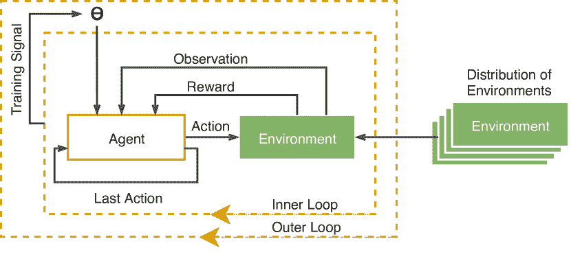

图 7：元强化学习的示意图；展示了训练的内循环和外循环 [106]

表 V：基于梯度的元强化学习。

| 算法 | 描述 | 实验 | 参考 |
| --- | --- | --- | --- |
| DRL-meta | 在 RL 任务的分布上训练 RNN。RNN 作为动态任务嵌入存储。DRL-meta 使用 LSTM 架构 | 在赌博机问题上优于其他基准；适应 MDP 任务中的不变性 | [100] |
| $RL^{2}$ | 在 RL 任务的分布上训练 RNN。RNN 作为动态任务嵌入存储。$R^{2}$使用 GRU 架构 | 与理论上在小规模设置中的最优算法可比。具有扩展到高维任务的潜力 | [101] |
| SNAIL | 结合时间卷积和注意机制 | 优于 LSTM 和 MAML | [97] |
| MAML | 给定任务分布，它寻找最佳初始参数，使得少量梯度步骤足以解决从该分布中抽取的任务。 | 优于随机和预训练等经典方法 | [102] |
| Reptile | 类似于一阶 MAML | 性能与 MAML 相当 | [109] |

#### IV-C3 元进化策略

Gajewski 等人 [110] 引入了“进化性 ES”，这是一种基于 ES 的元学习算法，旨在 RL 任务中使用。它结合了进化性搜索 [111]、ESs [4] 和 MAML [102] 的概念，以鼓励寻找其直接后代表现出行为多样性的个体（即，它搜索那些扰动导致不同表现的参数向量） [111]。因此，进化性 ES 促进了适应和泛化，同时利用了 ESs [110, 112] 的可扩展性。进化性 ES 显示出与基于梯度的元学习算法的竞争力。质量进化性 ES [112] 指出，原始进化性 ES [113] 只能用于任务性能和进化性一致的问题。为了解除这一限制，质量进化性 ES 同时优化任务性能和进化性。

Song 等人 [114] 认为基于策略梯度的模型无关元学习（MAML）算法 [102] 在使用反向传播对随机策略进行二阶导数估计时面临显著困难。因此，他们引入了 ES-MAML，这是一种利用 ES [4] 解决 MAML 问题而无需估计二阶导数的元学习器。作者通过实验证明了 ES-MAML 与其他 Meta-RL 算法具有竞争力。Song 等人 [115] 将爬山算法与 ES-MAML 结合，开发了噪声容忍的元强化学习学习器。作者通过一个物理腿部机器人展示了他们算法的性能。

Wang 等人 [116] 将实例加权机制与 ESs 结合，生成了一个可适应且可扩展的元学习器，即实例加权增量进化策略（IW-IES）。

Wang 等人 [116] 引入了实例加权增量进化策略（IW-IES）。它将实例加权机制与 ESs 结合，生成一个可适应且可扩展的元学习器。IW-IES 根据后代获得的新知识量为其分配权重。权重是根据两个指标之一分配的：实例新颖性和实例质量。与 ES-MAML 相比，IW-IES 在机器人导航任务中表现出竞争力。

Meta-RL 特别适用于解决仿真到现实的问题：仿真提供了用于学习通用策略的先前经验，而从现实世界操作中获得的数据则对该策略进行微调[117]。使用 Meta-RL 训练物理机器人示例包括：Nagabandi 等人 [98] 在 MAML 的基础上构建了一个基于模型的 meta-RL 代理来训练一个腿式微型机器人；Arndt 等人 [118] 提出了一个类似于 MAML 的框架来训练一个击打冰球的机器人任务；Song 等人 [115] 引入了一种 ES-MAML 的变体，用于训练和快速适应命令腿式机器人的策略。

表 VI：Meta 强化学习的进化策略

|  | 描述 | 实验 | 参考文献 |
| --- | --- | --- | --- |
| Evolvability ES | 结合了进化性搜索、ES 和 MAML 的概念，以便快速适应的 meta-learner | 在 2D 和 3D 运动任务中与 MAML 竞争 | [110] |
| ES-MAML | 使用 ES 克服 MAML 的限制 | 与策略梯度方法竞争；在查询较少的情况下提供更好的适应性 | [114] |
| IW-IES | 使用 NES 更新动态环境中的 RL 策略网络参数 | 在一组机器人导航任务中优于 ES-MAML | [116] |

#### IV-C4 比较

本节的关键观察可以总结为：

+   •

    在许多情况下，RL 和 ES 面临比传统 MDP 设置更复杂的问题，例如在部分可观测情况下和 meta-learning 设置中。

+   •

    Meta-learning 使智能体能够更智能地探索并更快地获取有用知识。

+   •

    Meta-RL 主要有两种方法：基于梯度的方法和递归模型。基于梯度的 Meta-RL 通常是一个两阶段的优化过程：首先，在任务分布层面进行优化，然后针对具体任务进行微调。使用递归模型的 Meta-RL 利用特定的递归架构来学习如何在环境分布中行动。

+   •

    Meta-RL 方法面临许多挑战，如估计一阶和二阶导数、高方差和高计算需求。

+   •

    基于 ES 的 meta-RL 试图解决基于梯度的 Meta-RL 的局限性；然而，基于 ES 的 meta-RL 自身也面临一系列不同的挑战，如样本效率。

+   •

    Meta-RL 特别适用于解决仿真到现实的问题。例如，通用策略在仿真中进行训练，并通过与现实世界的互动进行微调。

### IV-D 多智能体环境中的学习

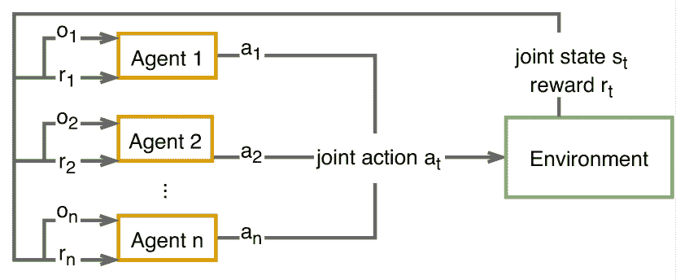

图 8：多智能体强化学习概述 [119]

多智能体系统（MAS）是由多个合作或竞争（物理或虚拟）智能体组成的分布式系统，这些智能体在共享环境中致力于最大化各自的目标[120]。目前，MAS 是人工智能领域的主要研究方向之一，因为它们具有广泛的应用性。几乎任何可以被分割和并行化的应用都可以从使用多个智能体中受益。

#### IV-D1 多智能体强化学习

MAS 可以与深度强化学习（DRL）结合，形成多智能体深度强化学习（MADRL）系统，这解决了多个智能体在共享环境中进行的顺序决策问题（图 8）。MADRL 智能体通过与环境及其他智能体的互动来学习某些行为。由于环境和奖励状态受到所有智能体联合行动的影响，单智能体 MDP 模型不能直接应用于 MADRL 系统，因为它们不遵循马尔可夫性质。马尔可夫（或随机）游戏（MG）[121] 框架是 MDP 的一种推广，它捕捉了多个智能体之间的纠缠。在考虑 MADRL 系统时，有几个重要属性需要考虑。在接下来的部分，我们将讨论这些属性及其对整体系统的影响。

设置：合作与竞争。在合作游戏中，也称为团队问题，参与者通过采取有利于其结果的行动来最大化共同的奖励信号，同时考虑这些行动对其他参与者的影响。大多数现代应用都基于合作设置。此场景的例子包括觅食、探索和仓库机器人。

合作环境中的主要挑战之一被称为多智能体信用分配问题，这涉及如何将团队层面获得的奖励分配给各个学习者[122]。由于智能体之间的复杂互动动态，确定哪些行动对集体奖励有益并非易事。

另一方面，竞争游戏中的智能体根据联合行动的整体结果接收不同的奖励信号。在这种设置中，某些行动可能对一组智能体有利，而对其他智能体则无关紧要或不利。

控制：中心化与去中心化。在 MADRL 系统中另一个重要的区别是中心化与去中心化控制方法。在中心化控制的情况下，存在一个单一的控制实体，根据所有可用的联合行动、联合奖励和联合观察来统治所有代理的决策。虽然这种方法能实现最佳决策，但随着系统中代理数量的增加，它很快变得计算上不可行。此外，这还带来了单点故障的风险，因为如果中央控制器出现故障，整个系统可能会崩溃。

去中心化的方法不使用中央控制器，而是依赖于代理根据其本地可用的信息独立做出决策。去中心化系统可以细分为两类：“具有网络化代理的去中心化环境”和“完全去中心化环境”[123]。前者涉及可以与其他代理进行通信并利用共享信息优化其行动的代理。在后者的场景中，代理在没有信息交换的情况下做出独立决策。虽然这意味着不能发送明确的信息，但仍然可以通过影响代理的奖励来影响其他代理的行为，如[124]所示。虽然去中心化的方法可以提供更多的可扩展性和鲁棒性，但由于没有中央实体对每个机器人的状态有了解并进行控制，这也显著增加了系统的复杂性。一个有趣的未来研究方向可能是半中心化的 MADRL 系统，其中一个或多个中央实体拥有部分代理的信息。或者，也可以在设计的不同阶段交替使用不同的技术。陈[125]提出了一种具有中心化训练和探索以及去中心化执行的系统，这可以提高代理间的协作和样本效率。

多代理强化学习中的挑战。从单代理环境转移到多代理环境带来了与学习和评估结果相关的新复杂挑战。这可以归因于几个因素，包括搜索空间的指数增长和环境的非平稳性[126]。接下来，将讨论 MADRL 的挑战。

非平稳性：在 MADRL 系统中，智能体同时学习，并且它们的行为反复重塑共享的环境，从而导致环境的非平稳性。因此，像 Q 学习这样著名算法的收敛性不再得到保证，因为环境的马尔可夫性质假设被违反了[127, 128, 28]。许多文献中尝试解决非平稳性问题。Castaneda [129] 提出了两种算法：深度松散耦合 Q 网络 (DLCQN) 和深度重复更新 Q 网络 (DRUQN)。DLCQN 基于智能体的负奖励和观察修改每个智能体的独立度。然后，智能体利用这个独立度来决定何时独立行动或合作行动。DRUQN 通过使动作的价值与选择该动作的概率成反比来尽量避免策略偏倚。使用经验回放缓冲区的 DQN 使学习更高效。然而，由于 MADRL 环境的非平稳性，存储在经验回放缓冲区中的数据可能会过时。为应对这一不希望出现的行为，Palmer 等人 [130] 提出的宽容-DQN 使用衰减的温度值来调整从经验回放记忆中采样的策略更新。

可扩展性：解决非平稳性问题的一种方法是以集中方式训练智能体，并让它们根据联合策略行动。然而，随着智能体数量的增加，这种方法并不可扩展，因为状态-动作空间呈指数增长，这一现象称为“组合复杂性” [131, 132, 133]。为了平衡非平稳性和可扩展性带来的挑战，提出了集中训练和分散执行的方法 [134, 135, 136, 137, 138]。

多智能体强化学习问题建模。本节总结了建模和解决 MADRL 问题的常见方法。

独立学习：在这种方法下，每个智能体将其他智能体视为环境的一部分；因此，每个智能体独立进行训练 [128, 139, tampuu2017multi-agent]。这种方法不会受到可扩展性问题的困扰 tampuu2017multi-agent, [140]，但从每个智能体的角度来看，它使环境变得非平稳 [141]。此外，它与改进 DQN 算法的经验回放的使用相冲突 [28]。为了稳定 MADRL 环境中的经验回放缓冲区，Foerster 等人 [140] 使用了重要性采样和回放缓冲区样本老化技术。

完全可观察的评论家：处理 MADRL 环境非平稳性的一种方法是利用演员-评论家方法。Lowe 等人[136]提出了一种多智能体深度确定性策略梯度（MADDPG）算法，其中演员策略仅访问局部观察，而评论家在训练期间可以访问所有智能体的动作、观察和目标策略。由于评论家具有全球可观察性，尽管其他智能体的策略发生变化，环境仍然变得平稳。已经提出了多个对 MADDPG 的扩展[142、143、144、145]。

价值函数分解：在完全合作的 MADRL 环境中，学习最佳的动作-价值函数是具有挑战性的。为了协调智能体的动作，学习一个集中式的动作-价值函数$Q_{tot}$是理想的。然而，当智能体数量较多时，学习这样的函数是具有挑战性的。独立学习（每个智能体学习其动作-价值函数$Q_{i}$）不会面临这样的挑战，但也忽视了智能体之间的互动，从而导致次优的集体表现。价值函数分解方法试图利用这两种方法的优势。它将$Q_{tot}$表示为仅基于局部信息的$Q_{i}$的混合。价值分解网络（VDN）算法假设$Q_{tot}$可以分解为$N$个$Q_{i}$。QMIX[135]算法通过放宽一些加性约束并对混合网络施加正权重来改进 VDN。

学习沟通：合作环境可能允许智能体进行沟通。在这种情况下，智能体可以学习一种沟通协议，以更优化地实现其共享目标[146、147]。Foerster 等人[148]提出了两个算法，强化智能体间学习（RIAL）和可微分智能体间学习（DIAL），它们利用深度网络学习沟通。RIAL 基于独立 Q 学习的深度递归 Q 网络。它在智能体之间共享一个神经网络的参数。相比之下，DIAL 在学习过程中通过沟通通道直接传递梯度。虽然在实现 RIAL 和 DIAL 时使用了离散沟通通道，但 CommNet[149]利用了连续向量通道。通过这个通道，智能体获得了其他智能体的累积传输。结果表明，智能体可以学会沟通，并在性能上超越非沟通智能体。

部分可观察性：Foerster 等人 [148] 引入了一种基于长短期记忆网络的深度分布式递归 Q 网络（DDRQN）算法，以解决多智能体环境中的 POMDP 问题。Gupta 等人 [150] 将三种基于策略梯度、时间差分误差和演员-评论员方法的单智能体 RL 算法扩展到多智能体系统领域。他们的工作表明，使用带有课程学习的 DRL 以解决部分可观察复杂环境中合作策略学习问题的重要性。

对于多智能体强化学习这一主题的深入讨论，我们建议感兴趣的读者参考以下综述论文：Hernandez-Leal 等人 [127] 提供了关于 MADRL 中非平稳性问题的全面综述；OroojlooyJadid 和 Hajinezhad [141] 将他们的综述范围扩大到包括研究具有合作目标的去中心化 MADRL 模型的论文；Da Silva 和 Costa [151] 重点关注 MADRL 系统中的迁移学习；Du 和 Ding [152] 介绍了从挑战和应用角度出发的 MADRL 综述；[zhang2019multi-agent] 中展示了理论和算法的选择性概述；而 [132] 则提供了 MADRL 的综述和批评。

#### IV-D2 多智能体进化策略

ES 算法不要求问题被表述为 MDP，因此，它们不会受到环境非平稳性的影响。因此，相对容易将单智能体 ES 算法扩展到多智能体领域并开发应用。Hiraga 等人 [153] 开发了基于 ES 的机器人控制器，用于管理机器人群体在使用 LED 进行路径形成时的拥堵。实验涵盖了一群机器人，每个机器人配备了七个距离传感器、一个地面传感器、一个全向摄像头和 RGB LED。一个人工神经网络（三层神经网络）代表了机器人的控制器，其输入包括：距离传感器、地面传感器和摄像头，输出包括：电机和 LED 控制。使用 ($\mu,\lambda$)-ES 来优化控制器的权重。在对机器人群体的表现进行评估和评估之前，控制器的副本在 N 个不同的机器人上实现。[154] 提出了另一种类似的方法，用于构建一个能够协作运输食物到巢穴并共同区分食物和毒药的群体。Hiraga 等人 [154] 使用 CMA-ES 开发了一个机器人群体控制器，旨在自动生成机器人的行为。

唐等[155]提出了一种对抗性训练的多智能体学习系统，其中一个四足机器人（主体）通过追捕一组采用不同策略逃逸的机器人（对手）来提高灵活性。使用了一组对手，因为每个对手会提出不同的逃逸策略，从而提高灵活性（灵活性指的是腿部协调控制、平衡控制等）。训练使用 ESs，特别是通过将 CMA-ES 扩展到多智能体框架中进行。训练分为两个步骤：外部循环，迭代训练主体和对手；内部循环，为每个策略优化。策略由前馈神经网络表示，并通过 CMA-ES 进行优化。

陈和高[156]提出了一种利用进化策略（ESs）（OpenAI-ES，CMA-ES）的捕食者-猎物系统。该系统包括多个捕食者在一定时间内被训练以捕捉猎物。捕食者控制器是均质的，并由神经网络表示，其参数通过 ESs（OpenAI-ES，CMA-ES）和贝叶斯优化进行优化。神经网络有三个输入（捕食者到其他最近捕食者的距离的倒数、捕食者的朝向与猎物相对于捕食者的方向之间的角度、捕食者本身与猎物之间的距离）、一个隐藏层和两个输出，用于控制两个轮子的角速度。至于猎物的控制器，它遵循一个简单的固定逃避策略：通过计算危险区域图，猎物向最不危险的位置导航。在进行各种实验后，捕食者展示了成功的集体行为：按照一定的队形移动并避免碰撞。

多智能体信用分配问题。在多智能体环境中，智能体通常会获得所有智能体的共享奖励，这使得学习适当的合作行为变得更加困难。Li 等人 [157] 因此提出了使用并行化的进化策略（ESs）结合价值分解网络（用于识别每个智能体在训练过程中的贡献）来解决合作多智能体任务。图 9 是整体 PES-VD 算法的概述，包含两个阶段。首先，每个智能体的策略由参数为 $\boldsymbol{\theta}$ 的神经网络（NN）表示，通过并行化的 ES 进行优化。因此，每个智能体根据其策略和与环境的交互独立识别其行为。在第二阶段，由于奖励对整个团队是共同的，使用价值分解网络计算不同策略的适应度。PES-VD 在多个核心上并行实现：$M$ 个工作节点评估策略并计算价值分解网络的梯度，主节点则收集数据并相应地更新策略和价值分解网络。

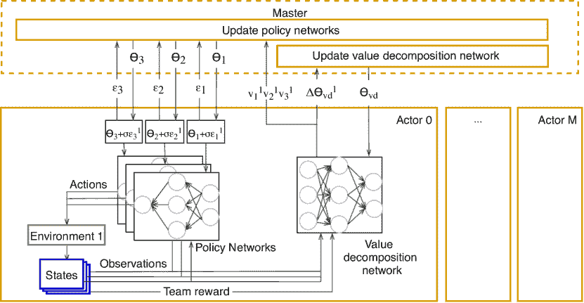

图 9：PES-VD 概述

各种研究者提出了利用进化策略（ESs）解决群体场景中的多智能体解决方案。每个群体中的机器人运行相同的网络，从而保持集体行为。Rais Martínez 和 Aznar Gregori [158] 评估了 ESs（CMA-ES、PEPG、SES、GA 和 OpenAI-ES）在群体聚集任务中的多智能体学习表现。在这个问题中，机器人的控制器由具有 2 个隐藏层的神经网络表示。每个机器人配备 8 个红外传感器和 4 个麦克风作为输入，2 个轮子和一个扬声器作为输出。类似地，Fan 等人 [159] 在不同的多智能体无人机群体作战场景中使用了 ESs。Aznar 等人 [160] 使用深度强化学习（DRL）和 CMA-ES 开发了一个群体觅食行为。

#### IV-D3 比较

在这里，我们总结了这一部分的观察结果

+   •

    在多智能体环境下的训练比单一智能体训练更具挑战性，原因有很多。MADRL 中通常有两种类型的智能体：合作性智能体和竞争性智能体。算法可以使用集中式或分散式框架，并在部分或完全可观测的环境中进行操作。

+   •

    新算法如 PES-VD [157] 提出了直接解决 MADRL 主要挑战的一些方法。PES-VD 使用价值分解网络来解决多智能体信用分配问题。

+   •

    在多智能体学习中使用进化策略仍然是一个不断发展的领域，具有很大的潜力，因为进化策略可以为“集体机器人学习”和“云机器人”[161]等概念带来许多优势，尤其是在并行性改进方面[4]。

+   •

    半集中式多智能体深度强化学习系统是一个有趣的未来研究方向，其中少数中心实体拥有一组智能体的部分信息。

+   •

    关于多智能体场景中的进化策略（ES）的文献似乎集中在实现应用程序上。我们假设这是因为将单智能体进化策略算法扩展到多智能体领域挑战较小。这是因为进化策略算法在问题的表述中不需要马尔可夫性质，因此不会受到非平稳环境的影响。

## V 混合深度强化学习和进化策略算法

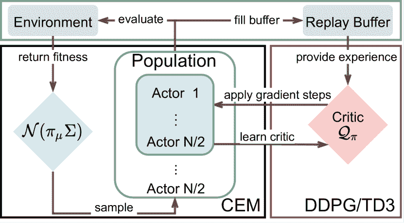

图 10: CEM-RL [162]: 一种将交叉熵方法与（双）深度确定性梯度策略[163]结合的混合算法。

尽管深度强化学习（DRL）和进化策略（ES）有着相同的目标——在潜在未知的环境中优化目标函数——它们各自的优势和劣势却不同[164, 165]。例如，得益于强化学习和深度学习的结合，DRL 可以实现样本效率；而进化策略则具有强健的收敛特性和探索策略。混合方法将 DRL 和 ES 结合，以获得两者的最佳效果。尽管这一思想并不新颖[166]，但混合 DRL 和 ES 的趋势得到了一定的推动，受到 DRL 和 ES 近期成功的影响[4, 167]。结合这些优势，使得在最具挑战性的实时战略（RTS）游戏如《星际争霸》[168]中表现非常强劲。以下我们描述了一些由种群引导的并行学习方案，这些方案能够提升强化学习算法的性能。

Pourchot 和 Sigaud [162] 通过提出 CEM-RL 解决了策略搜索的问题：这是一种混合算法，将交叉熵方法（CEM）与双延迟深度确定性策略梯度（TD3） [163] 或深度确定性策略梯度（DDPG） [19] 算法结合在一起（见图 10）。CEM-RL 架构包括一个使用 CEM 生成的演员群体和一个 DDPG 或 TD3 代理。演员们为 DDPG/TD3 代理生成多样化的训练数据，并且从 DDPG/TD3 获得的梯度会定期插入到 CEM 的群体中，以优化搜索过程。作者们展示了 CEM-RL 优于 CEM、TD3 [163] 和进化强化学习（ERL） [169]：一种将 DDPG 代理与进化算法结合的混合算法。Shopov 和 Markova [170] 将进化策略和多智能体深度强化学习（深度 Q 网络）结合用于顺序游戏，并展示了该模型相对于经典的多智能体强化训练（$\epsilon$-贪婪）的效率。Shopov 和 Markova [170] 进行的实验旨在优化一组自主代理（追捕者）在地图上的行为。实验在两个情况下进行：一个是几乎没有障碍的地图，另一个是有许多障碍的地图（增加了陷入局部最小值的概率）。在后者情况下使用进化策略取得了更好的性能。

Houthooft 等人 [171] 设计了一种混合强化学习（RL）代理，称为进化策略梯度（EPG），该代理除了优化策略外，还优化一个损失函数。EPG 由两个优化循环组成：内部循环使用随机梯度下降优化代理的策略，而外部循环利用进化策略（ES）调整内部循环最小化的损失函数的参数。得益于这种根据环境和代理历史微调损失函数的能力，EPG 的学习速度比标准 RL 代理更快。

Diqi Chen 和 Gao [172] 提出了一个混合代理来均匀地逼近多目标决策问题中的帕累托前沿。作者认为，尽管 DRL 具有快速收敛的优势，但无法保证均匀逼近帕累托前沿。另一方面，ES 能够实现良好分布的帕累托前沿，但在优化 DNN 时面临困难。因此，Diqi Chen 和 Gao [172] 提出了一个两阶段多目标强化学习（MORL）框架。在第一阶段，一个多策略软演员-评论家算法协作学习多个策略。在第二阶段，一个多目标协方差矩阵适应进化策略（MO-CMA-ES）微调策略无关的参数，以接近均匀的帕累托前沿。

De Bruin 等人[173]采用了一种混合方法来训练和微调 DNN 控制策略。他们的方法包括两个主要步骤：（i）使用基于梯度的方法（即 DQN 或 DDPG）从高维输入数据中学习状态表示和初始策略；（ii）使用 CMA-ES 微调 DNN 的最终动作选择参数。这种架构使得策略在性能上超越了其基于梯度的对应物，同时使用的试验次数也比纯梯度无关策略少。

其他研究人员也提出了将 ES 和 DRL 混合用于各种应用的解决方案。例如，Song 等人[174]提出了 ES-ENAS，这是一种用于识别 RL 策略的神经架构搜索（NAS）算法，结合了 ES 和高效 NAS（ENAS）；Ferreira 等人[175]使用 ES 学习代理无关的合成环境（SEs）以进行强化学习。

### V-A 比较

表 VII：混合算法亮点

| 算法 | 描述 | 实验 | 参考 |
| --- | --- | --- | --- |
| CEM-RL | 结合了交叉熵方法和双延迟深度确定性策略梯度[163]以寻找稳健的策略 | 优于 CEM、TD3、多演员 TD3 和进化强化学习[169] | [162] |
| 演化策略梯度（EPG） | 分别使用梯度下降和 CMA-ES 进行策略和损失函数优化 | 比策略梯度方法实现了更快的学习，并且提供了与其他流行的元学习算法不同的行为 | [171] |
| MO-CMA-ES | 结合了多策略软演员-评论家算法与多目标协方差矩阵适应进化策略，以接近均匀的帕累托前沿 | 超越了其他算法，如基于超体积的[176]、径向[177]、帕累托跟随[177]和深度神经进化[178]算法在计算帕累托前沿方面 | [172] |
| 微调 DRL | 结合 CMA-ES 和 DQN 或 DDPG 来训练和微调深度神经网络（DNN）控制策略 | 超越基于梯度的方法，同时比无梯度方法需要更少的迭代 | [173] |

在这里，我们总结了本节的观察结果：

+   •

    DRL 遭遇时间信用分配问题、超参数选择的敏感性，并且由于其独特的代理设置可能面临更脆弱的探索，而 ES 则数据效率低，处理大型优化任务时存在困难。

+   •

    结合这两种方法可以帮助解决一些已识别的挑战。

+   •

    文献中提出的一些混合方法似乎比单独使用每种方法的效果更好。

+   •

    混合深度强化学习（DRL）和进化策略（ES）仍然是一个相对新的研究领域。

## VI 应用

接下来，我们根据它们支持的应用比较 DRL 和 ES。目标是通过跟踪它们的应用记录来了解它们的潜力。查询 Google Scholar 的结果展示在表格 VIII 中，并结合所使用的关键词¹¹1 搜索查询模板是“allintitle: “evolution strategies” OR “evolutionary strategies” key_word_1 OR key_word_1 -excluded_key_word”和“allintitle: “reinforcement learning” ….

### VI-A 深度强化学习应用

TABLE VIII: 在 Google Scholar 上搜索 DRL 和 ES 的应用（仅考虑论文标题）。

| 行业领域 | 搜索词 | 结果 |
| --- | --- | --- |
| DRL | ESs |
| 游戏 | game, games, gaming, playing, play, mahjong, atari, tetris, soccer 排除调查和综述 | 1630 | 44 |
| 机器人技术 | robotics, “motion control”, robots, “robot navigation”, assembly, robot, grasping 排除调查和综述 | 2350 | 39 |
| 财务 | finance, financial, trading, portfolio, stock, price, liquidation, hedging, banking, trader, cryptocurrency, underpricing 排除调查和综述 | 475 | 34 |
| 通信 | network, routing, communications, wireless, 5g, LTE, MAC, “access control”, “network slicing”, 排除“neural network”调查和综述 | 2020 | 53 |
| 能源 | energy, power 排除调查和综述 | 1470 | 41 |
| 交通运输 | transportation, transport, vehicle, traffic, fleet, driving 排除调查和综述 | 1580 | 25 |

游戏。像 Atari 游戏[179]这样的电子游戏是 DRL 算法的优秀测试平台，鉴于其明确的问题设置和虚拟环境。这使得评估相比于现实世界实验更为安全和快速[180]。

在完美信息游戏方面，DRL 取得了两项重要的胜利。首先，在 2015 年，Mnih 等人[181]开发了一种算法，该算法能够仅使用图像像素作为输入，学习玩不同的 Atari 2600 游戏，并达到超人类水平。这项工作为基于奖励信号的高维数据训练的 DRL 应用铺平了道路。随后，在 2016 年，Silver 等人[182]开发了 AlphaGo，这是第一个击败围棋世界冠军的程序。与棋类程序中常见的手工规则不同，AlphaGo 由使用监督学习（SL）和 RL 的神经网络组成。仅一年后，这一成就被 Silver 等人[183]的 AlphaGo Zero 程序所超越，AlphaGo Zero 完全基于 RL，省略了对人类数据的需求。最近的研究也在不完美信息游戏中取得了成功，与围棋和 Atari 游戏不同，这些游戏只允许代理观察系统的一部分。在 OpenAI Five[184]中，代理能够击败世界电子竞技冠军在 Dota2 游戏中的表现，而 AlphaStar[185]在复杂的实时战略游戏《StarCraft II》中达到了最高排名之一。[46, 50, 76, 65]进一步考察了 DRL 算法在 Atari 游戏中的扩展、并行化和探索能力。最后，Shao 等人[180]对 DRL 在视频游戏中的应用进行了广泛的调查。

机器人技术是另一个重要的测试平台，用于检验 DRL 算法[186, 187]。DRL 可以通过将传感数据直接映射到实际的运动指令来赋予机器人导航、避障和决策能力[188, 189]。在某些情况下，这使得机器人能够学习复杂的动作，如跳跃或行走[190, 191]。Tai 等人[192]提出了一种无地图运动规划器，该规划器依赖于模拟训练，经过训练后，物理代理能够在无需精细调整的情况下导航未知的静态环境。虽然大多数工作涉及模拟，但 Gu 等人[161]展示了 DRL 可以用于从头开始在真实机器人上学习复杂的机器人 3D 操作技能，并通过在多个机器人上并行化训练进一步减少训练时间。Haarnoja 等人[191]证明，通过使用 DRL，可以在合理的时间内在物理机器人上实现稳定的四足运动，而无需事先训练。有关 DRL 在机器人操作中应用的深入评审，请参见[186, 187]。

金融领域。DRL 同样在交易[193, 194]和投资管理[195]中有应用，包括加密货币[196]。Moody 和 Saffell [197] 使用原始金融数据作为深度神经网络（DNN）输入，构建了一个用于股票交易的 DRL 代理。Carapuço 等人 [198] 描述了一个基于 DRL 的外汇市场短期投机系统。Wu 等人 [199] 提出了利用 DRL 的自适应股票交易策略。Lei 等人 [200] 最近的 DRL 研究根据当前状态自适应地在历史数据和股票的变化趋势之间进行选择。

通信领域。即将到来的 5G 网络强调了对高效动态和大规模解决方案的需求[201]。DRL 正逐渐成为应对网络领域各种问题和挑战的有效工具[202]。例如，Wang 等人 [203] 应用 DQN 自动优化多无线信道访问问题中的数据传输和接收。Ye 和 Li [204] 开发了一个类似的车对车通信系统。最佳传输比特率可能随时间变化。DRL 可以根据上一个数据段的质量、当前缓冲状态[205, 206]和其他信道统计信息[207, 208]动态优化比特率。主动缓存可以大大减少网络中的传输次数。然而，决定缓存哪些内容并不简单。研究人员使用 DQN 基于对信道状态[209]、缓存状态[210]、请求历史[211, 212]和可用基站[213, 214, 215]的观察来确定应该保留哪些信息。

能源领域。在能源部门，智能电网在电力生成、传输、分配、消费和控制方面做出智能决策。DRL 已在各种环境中用于解决电力系统决策和控制问题[216]，例如在微电网[217]或建筑能效优化[218, 219]的背景下。

交通运输。拥堵、安全性和效率是交通运输的重要方面。DRL（深度强化学习）通常用于自适应交通信号控制，以减少等待时间[220, 221, 222]。陈等人[223]在此基础上扩展了第一个可扩展到数千个交通信号灯的 DRL 控制系统。王和孙[224]开发了一个 MADRL 框架，以防止“公交车集结”，并优化公共交通流量。曼切拉等人[225]提出了一种无模型的 DRL 算法，将共乘乘客与货物配送捆绑在一起，以优化车队利用率和燃油效率。

### VI-B 进化策略应用

ES 应用将被分类和突出展示。

游戏。类似于 DRL（深度强化学习），游戏是 ES 的主要测试平台之一。本调查中回顾的 ES 文献大多在 Atari 游戏上测试其算法[4, 226, 5, 227, 228, 32, 229, 29]。这些游戏被认为具有挑战性，因为它们为智能体提供了高维视觉输入和一组多样化且有趣的任务，这些任务被设计为对人类玩家来说很困难[14]。

机器人技术。ES（进化策略）在模拟和实际机器人系统的连续控制中发挥了作用[4, 58, 80, 86, 230, 231, 232]。胡等人[233]使用 CMA-ES 使机器人在不确定性下学习如何抓取物体。内田和等人[234]在变异步骤中通过掩膜操作扩展了（$\mu+\lambda$）-ES 算法，以调整类人机器人的控制器参数。在 ES 的帮助下，李等人[235]设计了一个使用单目视觉的室内移动机器人导航系统。

财务。Korczak 和 Lipinski [236] 提出了一个使用 ESs 的投资组合优化算法。Rimcharoen 等人 [237]，Sutheebanjard 和 Premchaiswadi [238] 提出了自适应和（1+1）-ES 方法来预测泰国证券交易所指数的变动。Bonde 和 Khaled [239] 使用 ESs 和遗传算法预测不同公司的股票价格变化（增加或减少）。Pai 和 Michel [240] 提出了具有名人堂（ES-HOF）的 ESs，用于优化带有 130-30 策略约束的长短期投资组合。Pai 和 Michel [241] 使用多目标 ESs 进行期货投资组合优化。Yu [242] 提出了用于多资产多周期投资组合优化的 ESs 方法。Sable 等人 [243] 提出了用于预测股票短期价格的 ESs 方法。Sorensen 等人 [244] 将元学习算法应用于 ES 以进行股票交易。

通信。文献中提出了多种使用 ESs 进行通信的方法。Pérez-Pérez 等人 [245] 使用带有 NSGAII（ESN）的 ESs 来逼近移动自组织网络（MANETs）的 Pareto 前沿。Krulikovska 等人 [246] 使用 ESs 进行多点连接的路由。此外，他们还提出了改进 ESs 的方法。Nissen 和 Gold [247] 使用 ESs 设计一个在考虑经济性和可靠性的情况下具有生存能力的网络。He 等人 [248] 分析了无线传感器网络（WSN）的数据特征，并提出了一种基于信念规则库（BRB）模型的 WSN 故障诊断方法，该模型使用 CMA-ES 进行优化。Srivastava 和 Singh [249] 使用 ESs 解决方向传感器网络中的总旋转最小化问题（TRMP）。Srivastava 等人 [250] 提出了一个 ESs 方法来解决无线传感器网络（WSN-CSP）中的覆盖调度问题。Gu 和 Potkonjak [251] 提出了一个 ESs 方法，用于搜索能够产生和稳定物理不可克隆函数（PUFs）响应的网络配置。

能源。ESs 已被用于优化许多与能源相关的系统。例如，Mendoza 等人 [252] 使用 ESs 选择径向电力分配系统中馈线的最佳尺寸。Lezama 等人 [253] 使用差分 ESs 进行智能电网的大规模能源资源管理。Coelho 等人 [254] 用于电网中的能源负荷预测。Versloot 等人 [255] 使用 ESs 优化近场无线电力传输。

交通。已有一些论文使用 ESs 来管理和优化车辆交通。Balaji 等人 [256] 提出了一个基于多代理的实时集中进化优化技术，用于城市交通管理中的交通信号控制。Mester 和 Bräysy [257] 将 ESs 与引导局部搜索结合，以解决具有时间窗的大规模车辆路线问题。Mester 和 Bräysy [257] 利用 ESs 模拟和优化了交通流量。

### VI-C 比较

接下来我们列出关于本节的观察结果。

+   •

    DRL 和 ES 算法已在许多领域找到应用，如机器人技术、游戏和金融。

+   •

    基于 DRL 的解决方案在需要可扩展和自适应行为的情况下似乎表现优异。

+   •

    与进化策略（ESs）相比，深度强化学习（DRL）在科学领域获得了更多关注（见表 VIII）。我们怀疑造成这一差距的两个主要原因是（i）DRL 具有更丰富的结构，因此自然允许更多的研究，和（ii）有类似的算法家族（例如遗传算法）可能导致对 ESs 的关注减少。

+   •

    许多表现优异的 DRL 和 ES 算法是在模拟环境中进行基准测试的。因此，它们在实际应用中的表现仍然值得怀疑。

## VII 挑战与未来研究方向

尽管 DRL 和 ESs 在许多 AI 领域证明了其价值，但仍然存在许多挑战需要解决。我们在下文中简要列出其中的一些。

样本效率。DRL 代理需要大量样本（即与环境的交互）才能学习出性能良好的策略。由于计算原因或与环境的交互数量有限，收集如此多的样本并不总是可行的。尽管这个问题已经通过不同的方法得到解决（例如迁移学习、元学习），但仍需要更多的创新和研究 [258, 259]。一个有前景的研究方向是基于模型的强化学习。然而，获得准确的环境模型通常很困难。

相较于 DRL，ESs 能提供更稳健的策略；然而，它们的样本效率更低，因为它们处理的是完整的回合 [260, 261]，且不使用任何类型的记忆 [260]。已有一些方法（如样本重用和重要性混合 [262, 260]）提出以提高 ESs 的样本效率，但仍需更多研究和创新。

探索与利用。探索与利用的困境是强化学习中最突出的难题之一。除了经典的平衡方法，如$\varepsilon$-贪婪[1]、上置信界（UCB）[59]和汤普森采样[60]，近期的突破使得对新环境的探索成为可能。例如，Osband 等人[68]观察到时间相关性的重要性，并提出了引导式 DQN；Bellemare 等人[65]使用密度模型将 UCB 扩展到高维输入数据的问题。尽管如此，探索复杂环境仍然是一个非常活跃的研究领域。

ES 通过重组和突变步骤实现探索。尽管它们在探索中的有效性，ES 仍可能陷入局部最优[58, 80]。已有提议旨在增强 ES 的探索能力[82, 83]；然而，这方面仍需更多工作。总体而言，DRL 和 ES 被提议用于应对越来越多的新环境，因此，探索与利用的困境仍然是一个需要创新的挑战。

稀疏奖励。奖励信号指导 RL 代理的学习过程。当这种信号稀疏时，学习变得更加困难。虽然已经提出了不同的解决方案（例如，奖励塑造[1]、好奇心驱动的方法[73]、课程学习[263]、层级学习[264]和逆向 RL[265]），稀疏奖励的学习仍然是一个未解的挑战。

直接指导 ES 算法以应对 RL 任务的稀疏性和/或欺骗性是将 ES 扩展到更复杂环境并提高其效率的重要挑战之一。有关 ES 的挑战（如差分进化和群体优化）的详细总结见[21]。

仿真与现实差距。尽管仿真有其好处，但它们产生了仿真与现实差距：在仿真中学习的策略在现实世界中往往无法按预期工作。不同的技术正在被调整以缓解这种差距的影响。例如，[266, 267]通过随机化仿真环境来生成更通用的模型。Rao 等人[268]指出，这种随机化需要手动指定仿真器的哪些方面进行随机化。因此，他们使用领域适应（即许多模拟示例和少量真实示例）来训练机器人完成抓取任务，而无需手动调整仿真器。尽管有这些努力，仿真与现实差距仍然是一个亟待解决的挑战。

## VIII 结论

深度强化学习（DRL）和进化策略（ESs）有相同的目标，但使用不同的机制来学习顺序决策任务。本文提供了 DRL 和 ESs 的必要背景，以便理解它们的相对优缺点，这可能会导致开发出比它们各自更优的算法家族。我们没有集中于单个算法，而是考虑了诸如并行性、探索、元学习和多智能体学习等主要学习方面。我们相信，混合 DRL 和 ESs 有很高的潜力推动在现实世界中可靠且高效运行的智能体的发展。

## 致谢

本工作是在 Cognizant Technology Solutions 和 Rijksdienst voor Ondernemend Nederland 在 PPS O&I 下赞助的 Internet of Swarms 项目中进行的。

## 参考文献

+   Sutton 和 Barto [2018] R. S. Sutton 和 A. G. Barto, *强化学习：导论*。MIT press，2018 年。

+   François-Lavet 等 [2018] V. François-Lavet, P. Henderson, R. Islam, M. G. Bellemare, 和 J. Pineau, “深度强化学习导论，” *arXiv 预印本 arXiv:1811.12560*，2018 年。

+   Eiben 和 Smith [2003] A. E. Eiben 和 J. E. Smith, *进化计算导论*。Springer，2003 年。

+   Salimans 等 [2017] T. Salimans, J. Ho, X. Chen, S. Sidor, 和 I. Sutskever, “进化策略作为强化学习的可扩展替代方案，” 2017 年。

+   Chrabaszcz 等 [2018a] P. Chrabaszcz, I. Loshchilov, 和 F. Hutter, “回归基础：为玩 Atari 游戏进行经典进化策略基准测试，” 2018 年。

+   Qian 和 Yu [2021] H. Qian 和 Y. Yu, “无导数强化学习：综述，” *计算机科学前沿（电子版）*，2021 年。

+   Kiran 等 [2021] B. R. Kiran, I. Sobh, V. Talpaert, P. Mannion, A. A. A. Sallab, S. Yogamani, 和 P. Pérez, “用于自主驾驶的深度强化学习：综述，” *IEEE 智能交通系统期刊*，2021 年。

+   Nguyen 等 [2020] T. T. Nguyen, N. D. Nguyen, 和 S. Nahavandi, “多智能体系统的深度强化学习：挑战、解决方案和应用的综述，” *IEEE 网络系统学报*，2020 年。

+   Bertsekas [2011] D. P. Bertsekas, “动态规划与最优控制第 3 版，第 2 卷，” *Belmont, MA: Athena Scientific*，2011 年。

+   Sutton 等 [1999] R. S. Sutton, D. A. McAllester, S. P. Singh, Y. Mansour *等*，“用于强化学习的策略梯度方法与函数逼近。” 见 *NIPs*。Citeseer，1999 年。

+   Williams [1992] R. J. Williams, “简单的统计梯度跟随算法用于连接主义强化学习，” *机器学习*，1992 年。

+   BELLMAN [1957] R. BELLMAN, “马尔可夫决策过程，” *数学与力学期刊*，1957 年。

+   Rummery 和 Niranjan [1994] G. Rummery 和 M. Niranjan, “利用连接主义系统的在线 q 学习，” *技术报告 CUED/F-INFENG/TR 166*，1994 年。

+   Mnih 等 [2013] V. Mnih, K. Kavukcuoglu, D. Silver, A. Graves, I. Antonoglou, D. Wierstra 和 M. Riedmiller，“利用深度强化学习玩 Atari 游戏，”2013 年。

+   Konda 和 Tsitsiklis [2000] V. R. Konda 和 J. N. Tsitsiklis，“演员-评论家算法，”发表于*神经信息处理系统进展*，2000 年。

+   Kaiser 等 [2019] L. Kaiser, M. Babaeizadeh, P. Milos, B. Osinski, R. H. Campbell, K. Czechowski, D. Erhan, C. Finn, P. Kozakowski, S. Levine *等*，“基于模型的强化学习用于 Atari 游戏，”*arXiv 预印本 arXiv:1903.00374*，2019 年。

+   Silver 等 [2016a] D. Silver, A. Huang, C. Maddison, A. Guez, L. Sifre, G. Driessche, J. Schrittwieser, I. Antonoglou, V. Panneershelvam, M. Lanctot, S. Dieleman, D. Grewe, J. Nham, N. Kalchbrenner, I. Sutskever, T. Lillicrap, M. Leach, K. Kavukcuoglu, T. Graepel 和 D. Hassabis，“利用深度神经网络和树搜索掌握围棋游戏，”*自然*，2016 年。

+   Polydoros 和 Nalpantidis [2017] A. S. Polydoros 和 L. Nalpantidis，“基于模型的强化学习综述：在机器人领域的应用，”*智能与机器人系统期刊*，2017 年。

+   Lillicrap 等 [2019] T. P. Lillicrap, J. J. Hunt, A. Pritzel, N. Heess, T. Erez, Y. Tassa, D. Silver 和 D. Wierstra，“深度强化学习的连续控制，”2019 年。

+   Hansen 等 [2015] N. Hansen, D. V. Arnold 和 A. Auger，*进化策略*。 Springer，2015 年。

+   Li 等 [2020a] Z. Li, X. Lin, Q. Zhang 和 H. Liu，“连续优化的进化策略：最新进展的综述，”*群体与进化计算*，2020 年。

+   Heidrich-Meisner 和 Igel [2008] V. Heidrich-Meisner 和 C. Igel，“政策梯度方法与进化策略的相似性和差异，”发表于*ESANN 2008*，2008 年。

+   Heidrich-Meisner 和 Igel [2008] V. Heidrich-Meisner 和 C. Igel，“用于直接政策搜索的进化策略，”发表于*国际自然问题解决大会*，2008 年。

+   Heidrich-Meisner [2009] C. Heidrich-Meisner, Verena 和 Igel，“用于情节强化学习的神经进化策略，”*算法期刊*，2009 年。

+   Heidrich-Meisner 和 Igel [2009] V. Heidrich-Meisner 和 C. Igel，“Hoeffding 和 Bernstein 竞赛在进化直接政策搜索中的应用，”发表于*第 26 届年度国际机器学习会议论文集*，2009 年。

+   Chrabaszcz 等 [2018b] P. Chrabaszcz, I. Loschilov 和 F. Hutter，“回归基础：基准测试经典进化策略玩 Atari 游戏，”*CoRR*，2018 年。[在线]。可用链接：http://arxiv.org/abs/1802.08842

+   Watkins 和 Dayan [1992] C. J. Watkins 和 P. Dayan，“Q-learning，”*机器学习*，1992 年。

+   Mnih 等 [2015a] V. Mnih, K. Kavukcuoglu, D. Silver, A. Rusu, J. Veness, M. Bellemare, A. Graves, M. Riedmiller, A. Fidjeland, G. Ostrovski, S. Petersen, C. Beattie, A. Sadik, I. Antonoglou, H. King, D. Kumaran, D. Wierstra, S. Legg, 和 D. Hassabis，“通过深度强化学习实现人类水平的控制”，*自然*，2015。

+   Fuks 等 [2019] L. Fuks, N. Awad, F. Hutter, 和 M. Lindauer，“一种用于玩游戏的具有渐进式回合长度的进化策略”，在*第二十八届国际人工智能联合会议论文集, IJCAI-19*。国际人工智能联合会议组织，2019。

+   Varelas 等 [2018] K. Varelas, A. Auger, D. Brockhoff, N. Hansen, O. A. ElHara, Y. Semet, R. Kassab, 和 F. Barbaresco，“大规模 CMA-ES 变体的比较研究”，在*国际自然问题求解大会*，2018。

+   Salimans 等 [2016] T. Salimans, I. Goodfellow, W. Zaremba, V. Cheung, A. Radford, 和 X. Chen，“改进的 GAN 训练技术”，2016。

+   Conti 等 [2018] E. Conti, V. Madhavan, F. P. Such, J. Lehman, K. O. Stanley, 和 J. Clune，“通过一组寻求新奇的代理改进深度强化学习中的进化策略探索”，2018。

+   Krizhevsky 等 [2012] A. Krizhevsky, I. Sutskever, 和 G. E. Hinton，“使用深度卷积神经网络的 Imagenet 分类”，*神经信息处理系统进展*，2012。

+   Tsitsiklis 和 Van Roy [1997] J. N. Tsitsiklis 和 B. Van Roy，“带有函数逼近的时间差分学习分析”，*IEEE 自动控制学报*，1997。

+   Lin [1993] L.-J. Lin，“使用神经网络的机器人强化学习”，卡内基梅隆大学匹兹堡计算机科学学院，技术报告，1993。

+   Rechenberg [1973] I. Rechenberg，*进化策略：根据生物进化原则优化技术系统*。斯图加特-巴德坎斯塔特：Friedrich Frommann Verlag，1973。

+   Slowik 和 Kwasnicka [2020] A. Slowik 和 H. Kwasnicka，“进化算法及其在工程问题中的应用”，*神经计算与应用*，2020。

+   Dianati 等 [2002] M. Dianati, I. Song, 和 M. Treiber，“遗传算法和进化策略介绍”，Citeseer，技术报告，2002。

+   Schwefel [1977] H.-P. Schwefel，*计算机模型的数值优化：进化策略方法*。Birkh  "a user, 1977。

+   Hansen 和 Ostermeier [1996] N. Hansen 和 A. Ostermeier，“在进化策略中适应任意正态突变分布：协方差矩阵适应”，在*IEEE 国际进化计算会议论文集*，1996。

+   Hansen 和 Ostermeier [2001] N. Hansen 和 A. Ostermeier，“在进化策略中完全去随机化的自适应”，*进化计算*，2001。

+   Hansen 等 [2003] N. Hansen, S. D. Müller 和 P. Koumoutsakos, “通过协方差矩阵适应（cma-es）减少去随机化进化策略的时间复杂度，” *进化计算*，2003。

+   Hansen [2016] N. Hansen, “cma 进化策略：教程，” 2016。

+   Wierstra 等 [2014] D. Wierstra, T. Schaul, T. Glasmachers, Y. Sun, J. Peters 和 J. Schmidhuber, “自然进化策略，” *机器学习研究杂志*，2014。

+   François-Lavet 等 [2015] V. François-Lavet, R. Fonteneau 和 D. Ernst, “如何折扣深度强化学习：迈向新的动态策略，” *arXiv 预印本 arXiv:1512.02011*，2015。

+   Nair 等 [2015] A. Nair, P. Srinivasan, S. Blackwell, C. Alcicek, R. Fearon, A. D. Maria, V. Panneershelvam, M. Suleyman, C. Beattie, S. Petersen, S. Legg, V. Mnih, K. Kavukcuoglu 和 D. Silver, “深度强化学习的海量并行方法，” 2015。

+   Mnih 等 [2016] V. Mnih, A. P. Badia, M. Mirza, A. Graves, T. P. Lillicrap, T. Harley, D. Silver 和 K. Kavukcuoglu, “深度强化学习的异步方法，” 2016。

+   Clemente 等 [2017] A. V. Clemente, H. N. Castejón 和 A. Chandra, “高效的并行深度强化学习方法，” 2017。

+   Horgan 等 [2018] D. Horgan, J. Quan, D. Budden, G. Barth-Maron, M. Hessel, H. van Hasselt 和 D. Silver, “分布式优先经验回放，” 2018。

+   Espeholt 等 [2018] L. Espeholt, H. Soyer, R. Munos, K. Simonyan, V. Mnih, T. Ward, Y. Doron, V. Firoiu, T. Harley, I. Dunning, S. Legg 和 K. Kavukcuoglu, “Impala: 可扩展的分布式深度强化学习与重要性加权的演员-学习者架构，” 2018。

+   Espeholt 等 [2020] L. Espeholt, R. Marinier, P. Stanczyk, K. Wang 和 M. Michalski, “Seed rl: 可扩展且高效的深度强化学习与加速的中央推断，” 2020。

+   Grounds 和 Kudenko [2005] M. Grounds 和 D. Kudenko, “具有线性函数逼近的并行强化学习，” 载于 *自适应代理和多代理系统 III：适应和多代理学习*。Springer, 2005。

+   Dean 等 [2012] J. Dean, G. S. Corrado, R. Monga, K. Chen, M. Devin, Q. V. Le, M. Z. Mao, M. Ranzato, A. Senior, P. Tucker, K. Yang 和 A. Y. Ng, “大规模分布式深度网络，” 载于 *NIPS*, 2012。

+   Babaeizadeh 等 [2017] M. Babaeizadeh, I. Frosio, S. Tyree, J. Clemons 和 J. Kautz, “通过异步优势演员-评论员在 GPU 上进行强化学习，” 2017。

+   Heess 等 [2017] N. Heess, D. TB, S. Sriram, J. Lemmon, J. Merel, G. Wayne, Y. Tassa, T. Erez, Z. Wang, S. Eslami *等*，“丰富环境中的运动行为的出现，” *arXiv 预印本 arXiv:1707.02286*，2017。

+   Schulman 等 [2017] J. Schulman, F. Wolski, P. Dhariwal, A. Radford 和 O. Klimov, “近端策略优化算法，” *arXiv 预印本 arXiv:1707.06347*，2017。

+   Kapturowski 等人 [2018] S. Kapturowski, G. Ostrovski, J. Quan, R. Munos, 和 W. Dabney，“分布式强化学习中的递归经验重放，”在 *国际学习表征会议*，2018。

+   Liu 等人 [2019] G. Liu, L. Zhao, F. Yang, J. Bian, T. Qin, N. Yu, 和 T. Liu，“信任区域演化策略，”在 *AAAI*，2019。

+   Auer 等人 [2002] P. Auer, N. Cesa-Bianchi, 和 P. Fischer，“多臂老虎机问题的有限时间分析，” *机器学习*，2002。

+   Russo 等人 [2017] D. Russo, B. Van Roy, A. Kazerouni, I. Osband, 和 Z. Wen，“Thompson 采样教程，” *arXiv 预印本 arXiv:1707.02038*，2017。

+   Achiam 和 Sastry [2017] J. Achiam 和 S. Sastry，“基于惊讶的深度强化学习内在动机，”2017。

+   Pathak 等人 [2019] D. Pathak, D. Gandhi, 和 A. Gupta，“通过争议进行自监督探索，”2019。

+   Shyam 等人 [2019] P. Shyam, W. Jaśkowski, 和 F. Gomez，“基于模型的主动探索，”2019。

+   Kim 等人 [2019] H. Kim, J. Kim, Y. Jeong, S. Levine, 和 H. O. Song，“Emi：通过互信息进行探索，”2019。

+   Bellemare 等人 [2016] M. G. Bellemare, S. Srinivasan, G. Ostrovski, T. Schaul, D. Saxton, 和 R. Munos，“统一基于计数的探索和内在动机，”2016。

+   Ostrovski 等人 [2017] G. Ostrovski, M. G. Bellemare, A. van den Oord, 和 R. Munos，“使用神经密度模型的基于计数的探索，”2017。

+   Tang 等人 [2017] H. Tang, R. Houthooft, D. Foote, A. Stooke, X. Chen, Y. Duan, J. Schulman, F. De Turck, 和 P. Abbeel，“# 探索：基于计数的深度强化学习探索研究，”在 *第 31 届神经信息处理系统会议（NIPS）*，2017。

+   Osband 等人 [2016] I. Osband, C. Blundell, A. Pritzel, 和 B. Van Roy，“通过自助 DQN 的深度探索，” *arXiv 预印本 arXiv:1602.04621*，2016。

+   Chen 等人 [2017a] R. Y. Chen, J. Schulman, P. Abbeel, 和 S. Sidor，“通过 Q-集成进行 UCB 和信息增益探索，” *arXiv 预印本 arXiv:1706.01502*，2017。

+   O’Donoghue 等人 [2018] B. O’Donoghue, I. Osband, R. Munos, 和 V. Mnih，“不确定性贝尔曼方程与探索，”在 *国际机器学习会议*，2018。

+   Schulman 等人 [2015] J. Schulman, S. Levine, P. Abbeel, M. Jordan, 和 P. Moritz，“信任区域策略优化，”在 *国际机器学习会议*。 PMLR，2015。

+   Houthooft 等人 [2017] R. Houthooft, X. Chen, Y. Duan, J. Schulman, F. D. Turck, 和 P. Abbeel，“Vime：变分信息最大化探索，”2017。

+   Pathak 等人 [2017] D. Pathak, P. Agrawal, A. A. Efros, 和 T. Darrell，“通过自监督预测驱动的好奇心探索，”2017。

+   Savinov 等人 [2018] N. Savinov, A. Raichuk, R. Marinier, D. Vincent, M. Pollefeys, T. Lillicrap, 和 S. Gelly，“通过可达性进行情节好奇心，” *arXiv 预印本 arXiv:1810.02274*，2018。

+   Ecoffet 等 [2020] A. Ecoffet, J. Huizinga, J. Lehman, K. O. Stanley 和 J. Clune, “Go-explore: 一种应对困难探索问题的新方法，” 2020。

+   Badia 等 [2020a] A. P. Badia, P. Sprechmann, A. Vitvitskyi, D. Guo, B. Piot, S. Kapturowski, O. Tieleman, M. Arjovsky, A. Pritzel, A. Bolt *等*，“永不放弃：学习导向探索策略，” *arXiv 预印本 arXiv:2002.06038*，2020。

+   Badia 等 [2020b] A. P. Badia, B. Piot, S. Kapturowski, P. Sprechmann, A. Vitvitskyi, D. Guo 和 C. Blundell, “Agent57: 超越 Atari 人类基准，” 2020。

+   Schmidhuber [2010] J. Schmidhuber, “创造力、乐趣和内在动机的形式理论 (1990–2010)，” *IEEE 自动化智能发展期刊*，2010。

+   Burda 等 [2018] Y. Burda, H. Edwards, A. Storkey 和 O. Klimov, “通过随机网络蒸馏进行探索，” 2018。

+   Zhang 等 [2020a] J. Zhang, H. Tran 和 G. Zhang, “使用方向高斯平滑演化策略加速强化学习，” 2020。

+   Geweke [1988] J. Geweke, “贝叶斯推断中蒙特卡罗积分的反向加速，” *计量经济学期刊*，1988。

+   Choromanski 等 [2018] K. Choromanski, M. Rowland, V. Sindhwani, R. Turner 和 A. Weller, “具有紧凑架构的结构化演化用于可扩展策略优化，” 2018。

+   Maheswaranathan 等 [2019] N. Maheswaranathan, L. Metz, G. Tucker, D. Choi 和 J. Sohl-Dickstein, “引导演化策略：用代理梯度增强随机搜索，” 2019。

+   Meier 等 [2019] F. Meier, A. Mujika, M. M. Gauy 和 A. Steger, “通过过去的下降方向改进演化策略中的梯度估计，” 2019。

+   Choromanski 等 [2019] K. Choromanski, A. Pacchiano, J. Parker-Holder 和 Y. Tang, “从复杂性到简约：适应性 es-active 子空间用于黑箱优化，” 2019。

+   Liu 等 [2020] F.-Y. Liu, Z.-N. Li 和 C. Qian, “具有历史估计梯度的自引导演化策略，” 在 *第二十九届国际人工智能联合会议 IJCAI-20 会议录*，2020。

+   Zhang 等 [2020b] J. Zhang, H. Tran, D. Lu 和 G. Zhang, “一种具有方向高斯平滑的黑箱优化新演化策略，” 2020。

+   Lehman 和 Stanley [2011] J. Lehman 和 K. Stanley, *新颖性搜索与目标问题*。Springer, 11 2011。

+   Pugh 等 [2016] J. Pugh, L. Soros 和 K. Stanley, “质量多样性：演化计算的新前沿，” *机器人与人工智能前沿*，2016。

+   McCallum [1997] R. McCallum, “具有选择性感知和隐状态的强化学习，” 1997。

+   Ortner 等 [2014] R. Ortner, O.-A. Maillard 和 D. Ryabko, “在强化学习中选择近似最优状态表示，” 在 *国际算法学习理论会议*，2014。

+   François-Lavet et al. [2019] V. François-Lavet, G. Rabusseau, J. Pineau, D. Ernst 和 R. Fonteneau，《关于批量强化学习中的过拟合和渐近偏差（部分可观测性）》，*人工智能研究杂志*，2019 年。

+   Hausknecht and Stone [2015] M. Hausknecht 和 P. Stone，《用于部分可观测 MDPs 的深度递归 Q 学习》，*arXiv 预印本 arXiv:1507.06527*，2015 年。

+   Igel [2003] C. Igel，《使用进化策略的强化学习中的神经进化》，发表于*2003 年进化计算大会，2003. CEC'03*，2003 年。

+   Schaul and Schmidhuber [2010] T. Schaul 和 J. Schmidhuber，《元学习》，*Scholarpedia*，2010 年。

+   Gupta et al. [2018] A. Gupta, R. Mendonca, Y. Liu, P. Abbeel 和 S. Levine，《结构化探索策略的元强化学习》，2018 年。

+   Mishra et al. [2017] N. Mishra, M. Rohaninejad, X. Chen 和 P. Abbeel，《简单的神经注意力元学习者》，2017 年。

+   Nagabandi et al. [2019] A. Nagabandi, I. Clavera, S. Liu, R. S. Fearing, P. Abbeel, S. Levine 和 C. Finn，《通过元强化学习在动态现实环境中学习适应》，2019 年。

+   Garcia and Thomas [2019] F. M. Garcia 和 P. S. Thomas，《元-MDP 方法用于终身强化学习的探索》，2019 年。

+   Wang et al. [2017] J. X. Wang, Z. Kurth-Nelson, D. Tirumala, H. Soyer, J. Z. Leibo, R. Munos, C. Blundell, D. Kumaran 和 M. Botvinick，《学习强化学习》，2017 年。

+   Duan et al. [2016] Y. Duan, J. Schulman, X. Chen, P. L. Bartlett, I. Sutskever 和 P. Abbeel，《Rl²：通过慢强化学习实现快速强化学习》，2016 年。

+   Finn et al. [2017] C. Finn, P. Abbeel 和 S. Levine，《模型无关的元学习用于深度网络的快速适应》，2017 年。

+   Li et al. [2017] Z. Li, F. Zhou, F. Chen 和 H. Li，《Meta-SGD：快速学习以实现少量样本学习》，2017 年。

+   Hochreiter et al. [2001] S. Hochreiter, A. S. Younger 和 P. R. Conwell，《使用梯度下降学习学习》，发表于*国际人工神经网络会议*。施普林格，2001 年。

+   Santoro et al. [2016] A. Santoro, S. Bartunov, M. Botvinick, D. Wierstra 和 T. Lillicrap，《具有记忆增强神经网络的单次学习》，2016 年。

+   Botvinick et al. [2019] M. Botvinick, S. Ritter, J. Wang, Z. Kurth-Nelson, C. Blundell 和 D. Hassabis，《强化学习，快与慢》，*认知科学趋势*，2019 年。

+   Robles and Vanschoren [2019] J. G. Robles 和 J. Vanschoren，《用于神经架构搜索的强化学习》，2019 年。

+   Huisman et al. [2020] M. Huisman, J. N. van Rijn 和 A. Plaat，《深度元学习的综述》，2020 年。

+   Nichol et al. [2018] A. Nichol, J. Achiam 和 J. Schulman，《关于一阶元学习算法》，2018 年。

+   Gajewski et al. [2019] A. Gajewski, J. Clune, K. O. Stanley 和 J. Lehman，《可进化性 ES：可扩展和直接优化可进化性》，2019 年。

+   Mengistu 等人 [2016] H. Mengistu, J. Lehman, 和 J. Clune, “可演化性搜索：直接选择可演化性以进行研究和生产,” 收录于 *2016 年遗传与进化计算会议论文集*, 2016。

+   Katona 等人 [2021] A. Katona, D. W. Franks, 和 J. A. Walker, “质量可演化性：进化具有分布良好的表现和多样化后代的个体,” 2021。

+   Hospedales 等人 [2020] T. Hospedales, A. Antoniou, P. Micaelli, 和 A. Storkey, “神经网络中的元学习：调查,” 2020。

+   Song 等人 [2020a] X. Song, W. Gao, Y. Yang, K. Choromanski, A. Pacchiano, 和 Y. Tang, “Es-maml：简单的无海森元学习,” 2020。

+   Song 等人 [2020b] X. Song, Y. Yang, K. Choromanski, K. Caluwaerts, W. Gao, C. Finn, 和 J. Tan, “通过进化元学习的快速适应四足机器人,” 2020。

+   Wang 等人 [2020a] Z. Wang, C. Chen, 和 D. Dong, “动态环境下强化学习的实例加权增量进化策略,” 2020。

+   Tan 等人 [2018] J. Tan, T. Zhang, E. Coumans, A. Iscen, Y. Bai, D. Hafner, S. Bohez, 和 V. Vanhoucke, “从模拟到实际：学习四足机器人灵活的运动,” 2018。

+   Arndt 等人 [2019] K. Arndt, M. Hazara, A. Ghadirzadeh, 和 V. Kyrki, “用于模拟到实际领域适应的元强化学习,” 2019。

+   Nowe 等人 [2012] A. Nowe, P. Vrancx, 和 Y.-M. De Hauwere, *博弈论与多智能体强化学习*, 2012。

+   Hu 等人 [2020] J. Hu, H. Niu, J. Carrasco, B. Lennox, 和 F. Arvin, “基于 Voronoi 的多机器人自主探索未知环境，通过深度强化学习,” *IEEE 车辆技术学报*, 2020。

+   Shapley [1953] L. S. Shapley, “随机博弈,” *国家科学院学报*, 1953。

+   Panait 和 Luke [2005] L. Panait 和 S. Luke, “合作多智能体学习：现状,” *自主智能体与多智能体系统*, 第 11 卷，第 3 期，页 387–434, 2005。

+   Zhang 等人 [2019] K. Zhang, Z. Yang, 和 T. Başar, “多智能体强化学习：理论和算法的选择性概述,” 2019。

+   Sartoretti 等人 [2019] G. Sartoretti, J. Kerr, Y. Shi, G. Wagner, T. K. S. Kumar, S. Koenig, 和 H. Choset, “Primal：通过强化和模仿多智能体学习进行路径规划,” *IEEE 机器人与自动化快报*, 2019。

+   Chen [2019a] G. Chen, “用于多智能体强化学习的新框架——通过策略蒸馏的集中训练与探索和去中心化执行,” 2019。

+   Lee 等人 [2020] D. Lee, N. He, P. Kamalaruban, 和 V. Cevher, “强化学习的优化：从单一智能体到合作智能体,” *IEEE 信号处理杂志*, 2020。

+   Hernandez-Leal 等人 [2017] P. Hernandez-Leal, M. Kaisers, T. Baarslag, 和 E. M. de Cote, “多智能体环境中的学习调查：应对非平稳性,” *arXiv 预印本 arXiv:1707.09183*, 2017。

+   Tan [1993] M. Tan, “多智能体强化学习：独立智能体与合作智能体，” 载于 *第十届国际机器学习会议论文集*，1993 年。

+   Castaneda [2016] A. O. Castaneda, “深度强化学习的多智能体学习算法变体，” *爱丁堡：爱丁堡大学信息学学院*，2016 年。

+   Palmer et al. [2017] G. Palmer, K. Tuyls, D. Bloembergen, 和 R. Savani, “宽容的多智能体深度强化学习，” *arXiv 预印本 arXiv:1707.04402*，2017 年。

+   Kartal et al. [2015] B. Kartal, J. Godoy, I. Karamouzas, 和 S. J. Guy, “用于巡逻问题的带有有用循环的随机树搜索，” 载于 *2015 年 IEEE 国际机器人与自动化会议（ICRA）*，2015 年。

+   Hernandez-Leal et al. [2019] P. Hernandez-Leal, B. Kartal, 和 M. E. Taylor, “多智能体深度强化学习的调查与批评，” *自主智能体与多智能体系统*，2019 年。

+   Yang and Wang [2020] Y. Yang 和 J. Wang, “从博弈论视角的多智能体强化学习概述，” 2020 年。

+   Sunehag et al. [2017] P. Sunehag, G. Lever, A. Gruslys, W. M. Czarnecki, V. Zambaldi, M. Jaderberg, M. Lanctot, N. Sonnerat, J. Z. Leibo, K. Tuyls, 和 T. Graepel, “用于合作性多智能体学习的值分解网络，” 2017 年。

+   Rashid et al. [2018] T. Rashid, M. Samvelyan, C. Schroeder, G. Farquhar, J. Foerster, 和 S. Whiteson, “Qmix：深度多智能体强化学习的单调值函数分解，” 载于 *国际机器学习会议*，2018 年。

+   Lowe et al. [2017] R. Lowe, Y. Wu, A. Tamar, J. Harb, P. Abbeel, 和 I. Mordatch, “用于混合合作-竞争环境的多智能体演员-评论家算法，” *arXiv 预印本 arXiv:1706.02275*，2017 年。

+   Foerster et al. [2018] J. Foerster, G. Farquhar, T. Afouras, N. Nardelli, 和 S. Whiteson, “反事实多智能体策略梯度，” 2018 年。

+   Chen [2019b] G. Chen, “一种用于多智能体强化学习的新框架——通过策略蒸馏进行集中训练与探索的分散执行，” 2019 年。

+   Lauer and Riedmiller [2000] M. Lauer 和 M. Riedmiller, “合作性多智能体系统中分布式强化学习的算法，” 载于 *第十七届国际机器学习会议论文集*，2000 年。

+   Foerster et al. [2017] J. Foerster, N. Nardelli, G. Farquhar, T. Afouras, P. H. Torr, P. Kohli, 和 S. Whiteson, “稳定深度多智能体强化学习的经验重放，” 载于 *国际机器学习会议*，2017 年。

+   OroojlooyJadid and Hajinezhad [2019] A. OroojlooyJadid 和 D. Hajinezhad, “合作性多智能体深度强化学习的综述，” *arXiv 预印本 arXiv:1908.03963*，2019 年。

+   Chu and Ye [2017] X. Chu 和 H. Ye, “用于合作性多智能体强化学习的参数共享深度确定性策略梯度，” *arXiv 预印本 arXiv:1710.00336*，2017 年。

+   Ryu 等人 [2018] H. Ryu、H. Shin 和 J. Park，“具有生成合作策略网络的多智能体演员-评论员”，*arXiv 预印本 arXiv:1810.09206*，2018。

+   Mao 等人 [2018] H. Mao、Z. Zhang、Z. Xiao 和 Z. Gong，“利用注意力机制的多智能体 DDPG 建模队友的动态联合策略”，*arXiv 预印本 arXiv:1811.07029*，2018。

+   Wang 等人 [2020b] R. E. Wang、M. Everett 和 J. P. How，“针对部分可观测环境和有限通信的 R-maddpg”，*arXiv 预印本 arXiv:2002.06684*，2020。

+   Kasai 等人 [2008] T. Kasai、H. Tenmoto 和 A. Kamiya，“多智能体强化学习问题中的沟通代码学习”，在 *2008 IEEE 工业应用软计算会议*，2008。

+   Giles 和 Jim [2002] C. L. Giles 和 K.-C. Jim，“为多智能体系统学习沟通”，在 *激进代理概念研讨会*，2002。

+   Foerster 等人 [2016] J. N. Foerster、Y. M. Assael、N. de Freitas 和 S. Whiteson，“通过深度分布式递归 Q 网络学习解决谜题的沟通能力”，*arXiv 预印本 arXiv:1602.02672*，2016。

+   Sukhbaatar 等人 [2016] S. Sukhbaatar、A. Szlam 和 R. Fergus，“通过反向传播学习多智能体沟通”，*arXiv 预印本 arXiv:1605.07736*，2016。

+   Gupta 等人 [2017] J. K. Gupta、M. Egorov 和 M. Kochenderfer，“使用深度强化学习的合作多智能体控制”，在 *国际自主代理与多智能体系统会议*，2017。

+   Da Silva 和 Costa [2019] F. L. Da Silva 和 A. H. R. Costa，“关于多智能体强化学习系统的迁移学习调查”，*人工智能研究期刊*，2019。

+   Du 和 Ding [2020] W. Du 和 S. Ding，“关于多智能体深度强化学习的调查：从挑战与应用的角度”，*人工智能评论*，2020。

+   Hiraga 等人 [2018] M. Hiraga、Y. Wei、T. Yasuda 和 K. Ohkura，“在拥堵路径形成任务中进化机器人群体的自主专长”，*人工生命与机器人*，2018。

+   Hiraga 等人 [2019] M. Hiraga、Y. Wei 和 K. Ohkura，“在有毒物质的觅食任务中进化机器人群体的集体认知”，在 *2019 IEEE 进化计算大会 (CEC)*，2019。

+   Tang 等人 [2020] Y. Tang、J. Tan 和 T. Harada，“通过对抗训练学习灵活的运动”，*arXiv 预印本 arXiv:2008.00603*，2020。

+   Chen 和 Gao [2020] J. Chen 和 Z. Gao，“从模拟到现实世界的捕食者-猎物智能体学习框架”，2020。

+   Li 等人 [2020b] G. Li、Q. Duan 和 Y. Shi，*一种具有价值分解的多智能体问题并行进化算法*，2020。

+   Rais Martínez 和 Aznar Gregori [2020] J. Rais Martínez 和 F. Aznar Gregori，“在群体聚合行为中的强化学习进化策略比较”，在 *2020 第三届国际机器学习与机器智能会议*，2020。

+   Fan 等人 [2018] D. D. Fan, E. Theodorou, 和 J. Reeder，“基于模型的随机搜索用于大规模优化多智能体无人机群”，2018。

+   Aznar 等人 [2021] F. Aznar, M. Pujol, 和 R. Rizo，“利用深度强化学习学习群体觅食行为的微观模糊控制器”，*《应用科学》*，2021。

+   Gu 等人 [2016] S. Gu, E. Holly, T. Lillicrap, 和 S. Levine，“用于机器人操作的深度强化学习与异步离线策略更新”，2016。

+   Pourchot 和 Sigaud [2019] A. Pourchot 和 O. Sigaud，“CEM-RL: 结合进化和基于梯度的方法进行政策搜索”，2019。

+   Fujimoto 等人 [2018] S. Fujimoto, H. Hoof, 和 D. Meger，“解决演员-评论家方法中的函数逼近误差”，在 *《国际机器学习大会》*，2018。

+   Hansel 等人 [2021] K. Hansel, J. Moos, 和 C. Derstroff，*《在策略梯度方法和进化策略中的自然梯度基准测试》*。Springer International Publishing，2021。

+   Ecoffet 等人 [2021] P. Ecoffet, N. Fontbonne, J.-B. André, 和 N. Bredeche，“稀有重要事件的策略搜索：选择合适的合作伙伴”，2021。

+   Stafylopatis 和 Blekas [1998] A. Stafylopatis 和 K. Blekas，“使用进化强化学习的自主车辆导航”，*《欧洲运筹学杂志》*，1998。

+   Jaderberg 等人 [2019] M. Jaderberg, W. M. Czarnecki, I. Dunning, L. Marris, G. Lever, A. G. Castaneda, C. Beattie, N. C. Rabinowitz, A. S. Morcos, A. Ruderman *等*，“基于人群的强化学习在三维多人游戏中的人类水平表现”，*《科学》*，2019。

+   Vinyals 等人 [2019a] O. Vinyals, I. Babuschkin, J. Chung, M. Mathieu, M. Jaderberg, W. Czarnecki, A. Dudzik, A. Huang, P. Georgiev, R. Powell, T. Ewalds, D. Horgan, M. Kroiss, I. Danihelka, J. Agapiou, J. Oh, V. Dalibard, D. Choi, L. Sifre, Y. Sulsky, S. Vezhnevets, J. Molloy, T. Cai, D. Budden, T. Paine, C. Gulcehre, Z. Wang, T. Pfaff, T. Pohlen, D. Yogatama, J. Cohen, K. McKinney, O. Smith, T. Schaul, T. Lillicrap, C. Apps, K. Kavukcuoglu, D. Hassabis, 和 D. Silver， “AlphaStar: 精通即时战略游戏《星际争霸 II》”， [`deepmind.com/blog/alphastar-mastering-real-time-strategy-game-starcraft-ii/`](https://deepmind.com/blog/alphastar-mastering-real-time-strategy-game-starcraft-ii/)，2019。

+   Khadka 和 Tumer [2018] S. Khadka 和 K. Tumer，“进化强化学习”，*《arXiv 预印本 arXiv:1805.07917》*，2018。

+   Shopov 和 Markova [2018] V. Shopov 和 V. Markova，“进化策略对强化学习自主体性能影响的研究”，*《ICAS 2018》*，2018。

+   Houthooft 等人 [2018] R. Houthooft, R. Y. Chen, P. Isola, B. C. Stadie, F. Wolski, J. Ho, 和 P. Abbeel，“进化政策梯度”，2018。

+   Diqi Chen 和 Gao [2020] Y. W. Diqi Chen 和 W. Gao，“结合基于梯度的方法和进化策略进行多目标强化学习”，2020。

+   De Bruin et al. [2020] T. De Bruin, J. Kober, K. Tuyls, 和 R. Babuška, “Fine-tuning deep rl with gradient-free optimization*,” 在 *IFAC 世界大会论文集* 中, 2020。

+   Song et al. [2021] X. Song, K. Choromanski, J. Parker-Holder, Y. Tang, D. Peng, D. Jain, W. Gao, A. Pacchiano, T. Sarlos, 和 Y. Yang, “Es-enas: Combining evolution strategies with neural architecture search at no extra cost for reinforcement learning,” 2021。

+   Ferreira et al. [2021] F. Ferreira, T. Nierhoff, 和 F. Hutter, “Learning synthetic environments for reinforcement learning with evolution strategies,” 2021。

+   Van Moffaert et al. [2013] K. Van Moffaert, M. M. Drugan, 和 A. Nowé, “Hypervolume-based multi-objective reinforcement learning,” 在 *国际进化多准则优化会议* 中。 Springer, 2013。

+   Parisi et al. [2014] S. Parisi, M. Pirotta, N. Smacchia, L. Bascetta, 和 M. Restelli, “Policy gradient approaches for multi-objective sequential decision making,” 在 *2014 国际神经网络联合会议 (IJCNN)* 中, 2014。

+   Such et al. [2018] F. P. Such, V. Madhavan, E. Conti, J. Lehman, K. O. Stanley, 和 J. Clune, “Deep neuroevolution: Genetic algorithms are a competitive alternative for training deep neural networks for reinforcement learning,” 2018。

+   Bellemare et al. [2013] M. G. Bellemare, Y. Naddaf, J. Veness, 和 M. Bowling, “The arcade learning environment: An evaluation platform for general agents,” *人工智能研究期刊*, 2013。

+   Shao et al. [2019] K. Shao, Z. Tang, Y. Zhu, N. Li, 和 D. Zhao, “A survey of deep reinforcement learning in video games,” *arXiv 预印本 arXiv:1912.10944*, 2019。

+   Mnih et al. [2015b] V. Mnih, K. Kavukcuoglu, D. Silver, A. Rusu, J. Veness, M. Bellemare, A. Graves, M. Riedmiller, A. Fidjeland, G. Ostrovski, S. Petersen, C. Beattie, A. Sadik, I. Antonoglou, H. King, D. Kumaran, D. Wierstra, S. Legg, 和 D. Hassabis, “Human-level control through deep reinforcement learning,” *自然*, 2015。

+   Silver et al. [2016b] D. Silver, A. Huang, C. Maddison, A. Guez, L. Sifre, G. Driessche, J. Schrittwieser, I. Antonoglou, V. Panneershelvam, M. Lanctot, S. Dieleman, D. Grewe, J. Nham, N. Kalchbrenner, I. Sutskever, T. Lillicrap, M. Leach, K. Kavukcuoglu, T. Graepel, 和 D. Hassabis, “Mastering the game of go with deep neural networks and tree search,” *自然*, 2016。

+   Silver et al. [2017] D. Silver, J. Schrittwieser, K. Simonyan, I. Antonoglou, A. Huang, A. Guez, T. Hubert, L. Baker, M. Lai, A. Bolton *等*, “Mastering the game of go without human knowledge,” *自然*, 2017。

+   Berner et al. [2019] C. Berner, G. Brockman, B. Chan, V. Cheung, P. Dębiak, C. Dennison, D. Farhi, Q. Fischer, S. Hashme, C. Hesse *等*, “Dota 2 with large scale deep reinforcement learning,” *arXiv 预印本 arXiv:1912.06680*, 2019。

+   Vinyals 等 [2019b] O. Vinyals, I. Babuschkin, W. M. Czarnecki, M. Mathieu, A. Dudzik, J. Chung, D. H. Choi, R. Powell, T. Ewalds, P. Georgiev *等*，“使用多智能体强化学习在星际争霸 II 中达到大师级水平”，*自然*，2019 年。

+   Kober 等 [2013] J. Kober, J. Bagnell, 和 J. Peters，“机器人学中的强化学习：综述”，*国际机器人研究杂志*，2013 年。

+   Nguyen 和 La [2019] H. Nguyen 和 H. La，“机器人操作的深度强化学习综述”，在 *2019 第三届 IEEE 国际机器人计算会议 (IRC)*。 IEEE，2019 年。

+   Chen 等 [2017b] Y. F. Chen, M. Liu, M. Everett, 和 J. P. How，“去中心化非通信的多智能体碰撞规避与深度强化学习”，在 *2017 IEEE 国际机器人与自动化会议 (ICRA)*，2017 年。

+   Kahn 等 [2018] G. Kahn, A. Villaflor, B. Ding, P. Abbeel, 和 S. Levine，“自监督深度强化学习与广义计算图用于机器人导航”，在 *2018 IEEE 国际机器人与自动化会议 (ICRA)*，2018 年。

+   Bellegarda 和 Nguyen [2020] G. Bellegarda 和 Q. Nguyen，“通过深度强化学习实现鲁棒的四足动物跳跃”，*arXiv 预印本 arXiv:2011.07089*，2020 年。

+   Haarnoja 等 [2018] T. Haarnoja, A. Zhou, S. Ha, J. Tan, G. Tucker, 和 S. Levine，“通过深度强化学习学习行走”，*CoRR*，2018 年。

+   Tai 等 [2017] L. Tai, G. Paolo, 和 M. Liu，“虚拟到现实深度强化学习：无地图导航的移动机器人连续控制”，在 *2017 IEEE/RSJ 国际智能机器人与系统会议 (IROS)*，2017 年。

+   Li 等 [2019] Y. Li, W. Zheng, 和 Z. Zheng，“深度鲁棒强化学习用于实际算法交易”，*IEEE Access*，2019 年。

+   Deng 等 [2017] Y. Deng, F. Bao, Y. Kong, Z. Ren, 和 Q. Dai，“深度直接强化学习用于金融信号表示和交易”，*IEEE 神经网络与学习系统汇刊*，2017 年。

+   Jiang 等 [2017] Z. Jiang, D. Xu, 和 J. Liang，“用于金融投资组合管理问题的深度强化学习框架”，2017 年。

+   Jiang 和 Liang [2017] Z. Jiang 和 J. Liang，“基于深度强化学习的加密货币投资组合管理”，在 *2017 智能系统会议 (IntelliSys)*，2017 年。

+   Moody 和 Saffell [1998] J. Moody 和 M. Saffell，“用于交易系统和投资组合的强化学习”，在 *KDD*，1998 年。

+   Carapuço 等 [2018] J. Carapuço, R. Neves, 和 N. Horta，“应用于外汇交易的强化学习”，*应用软计算*，2018 年。

+   Wu 等 [2020] X. Wu, H. Chen, J. Wang, L. Troiano, V. Loia, 和 H. Fujita，“基于深度强化学习方法的自适应股票交易策略”，*信息科学*，2020 年。

+   Lei et al. [2020] K. Lei, B. Zhang, Y. Li, M. Yang, 和 Y. Shen, “时间驱动特征感知联合深度强化学习用于金融信号表示和算法交易”，*Expert Systems with Applications*，2020 年。

+   Xiong et al. [2019] Z. Xiong, Y. Zhang, D. Niyato, R. Deng, P. Wang, 和 L. Wang, “移动 5G 及其后续技术中的深度强化学习：基础、应用与挑战”，*IEEE Vehicular Technology Magazine*，2019 年。

+   Luong et al. [2019] N. C. Luong, D. T. Hoang, S. Gong, D. Niyato, P. Wang, Y. Liang, 和 D. I. Kim, “深度强化学习在通信和网络中的应用：综述”，*IEEE Communications Surveys Tutorials*，2019 年。

+   Wang et al. [2018] S. Wang, H. Liu, P. H. Gomes, 和 B. Krishnamachari, “无线网络中的动态多通道接入深度强化学习”，*CoRR*，2018 年。

+   Ye 和 Li [2018] H. Ye 和 G. Y. Li, “用于 V2V 通信的深度强化学习资源分配”，2018 年。

+   Gadaleta et al. [2017] M. Gadaleta, F. Chiariotti, M. Rossi, 和 A. Zanella, “D-dash：一种用于 DASH 视频流的深度 Q 学习框架”，*IEEE Transactions on Cognitive Communications and Networking*，2017 年。

+   Mao et al. [2017] H. Mao, R. Netravali, 和 M. Alizadeh, “使用 Pensieve 的神经自适应视频流”，发表于*Proceedings of the Conference of the ACM Special Interest Group on Data Communication*，2017 年。

+   Chinchali et al. [2018] S. Chinchali, P. Hu, T. Chu, M. Sharma, M. Bansal, R. Misra, M. Pavone, 和 S. Katti, “使用深度强化学习的蜂窝网络流量调度”，发表于*AAAI*，2018 年。

+   Ferreira et al. [2018] P. Ferreira, R. Paffenroth, A. Wyglinski, T. Hackett, S. Bilén, R. Reinhart, 和 D. Mortensen, “用于认知卫星通信的多目标强化学习，使用深度神经网络集成”，*IEEE Journal on Selected Areas in Communications*，2018 年。

+   He 和 Hu [2017] Y. He 和 S. Hu, “具有机会干扰对齐的缓存启用无线网络”，*arXiv 预印本 arXiv:1706.09024*，2017 年。

+   He et al. [2017] Y. He, C. Liang, F. R. Yu, N. Zhao, 和 H. Yin, “缓存启用的机会干扰对齐无线网络的优化：一种大数据深度强化学习方法”，发表于*2017 IEEE International Conference on Communications (ICC)*，2017 年。

+   Zhong et al. [2018] C. Zhong, M. C. Gursoy, 和 S. Velipasalar, “基于深度强化学习的内容缓存框架”，发表于*2018 年第 52 届年度信息科学与系统会议 (CISS)*，2018 年。

+   He et al. [2017a] Y. He, Z. Zhang, F. R. Yu, N. Zhao, H. Yin, V. C. Leung, 和 Y. Zhang, “基于深度强化学习的缓存启用机会干扰对齐无线网络优化”，*IEEE Transactions on Vehicular Technology*，2017 年。

+   He 等人 [2017b] Y. He, F. R. Yu, N. Zhao, H. Yin, 和 A. Boukerche, “基于深度强化学习（drl）的软件定义和虚拟化车载自组网中的资源管理，” 在 *第 6 届 ACM 智能车载网络与应用发展与分析研讨会论文集*，2017。

+   He 等人 [2017] Y. He, C. Liang, Z. Zhang, F. R. Yu, N. Zhao, H. Yin, 和 Y. Zhang, “具有移动边缘计算的软件定义和信息中心车载网络中的资源分配，” 在 *2017 IEEE 第 86 届车载技术大会（VTC-Fall）*，2017。

+   He 等人 [2018] Y. He, N. Zhao, 和 H. Yin, “连接车辆的集成网络、缓存和计算：一种深度强化学习方法，” *IEEE 车载技术期刊*，2018。

+   [216] M. Glavic, R. Fonteneau, 和 D. Ernst, “用于电力系统决策和控制的强化学习：过去的考虑与展望，” *IFAC-PapersOnLine*。

+   François-Lavet 等人 [2016] V. François-Lavet, D. Taralla, D. Ernst, 和 R. Fonteneau, “能源微电网管理的深度强化学习解决方案，” 在 *欧洲强化学习研讨会（EWRL 2016）*，2016。

+   Mocanu 等人 [2018] E. Mocanu, D. C. Mocanu, P. H. Nguyen, A. Liotta, M. E. Webber, M. Gibescu, 和 J. G. Slootweg, “利用深度强化学习进行在线建筑能效优化，” *IEEE 智能电网期刊*，2018。

+   Ruelens 等人 [2019] F. Ruelens, B. J. Claessens, P. Vrancx, F. Spiessens, 和 G. Deconinck, “基于稀疏观测的温控负荷直接负荷控制，使用深度强化学习，” *CSEE 电力与能源系统期刊*，2019。

+   Li 等人 [2016] L. Li, Y. Lv, 和 F. Wang, “通过深度强化学习进行交通信号时序优化，” *IEEE/CAA 自动化学报*，2016。

+   Liang 等人 [2019] X. Liang, X. Du, G. Wang, 和 Z. Han, “一种用于交通信号周期控制的深度强化学习网络，” *IEEE 车载技术期刊*，2019。

+   Chu 等人 [2020] T. Chu, J. Wang, L. Codecà, 和 Z. Li, “大规模交通信号控制的多代理深度强化学习，” *IEEE 智能交通系统期刊*，2020。

+   Chen 等人 [2020] C. Chen, H. Wei, N. Xu, G. Zheng, M. Yang, Y. Xiong, K. Xu, 和 Z. Li, “迈向千灯：大规模交通信号控制的分布式深度强化学习，” *AAAI 人工智能会议论文集*，2020。

+   Wang 和 Sun [2020] J. Wang 和 L. Sun, “动态保持控制以避免公交车集中：一种多代理深度强化学习框架，” *交通研究 C 部分：新兴技术*，2020。

+   Manchella 等人 [2021] K. Manchella, A. K. Umrawal, 和 V. Aggarwal, “Flexpool：一种分布式无模型深度强化学习算法用于联合乘客和货物运输，” *IEEE 智能交通系统期刊*，2021。

+   Pagliuca et al. [2020] P. Pagliuca, N. Milano, and S. Nolfi, “现代神经进化策略在连续控制优化中的有效性，”2020 年。

+   Zhou and Feng [2018] B. Zhou and J. Feng, “低维潜在空间中的样本高效深度神经进化，”2018 年。

+   Chen et al. [2019] Z. Chen, Y. Zhou, X. He, and S. Jiang, “基于重启的等级 1 进化策略用于强化学习。”发表于*IJCAI*，2019 年。

+   Risi and Stanley [2019] S. Risi and K. O. Stanley, “递归和离散世界模型的深度神经进化，”2019 年。

+   Veer and Majumdar [2020] S. Veer and A. Majumdar, “Cones: 凸自然进化策略，”2020 年。

+   Shi et al. [2020] L. Shi, S. Li, Q. Zheng, L. Cao, L. Yang, and G. Pan, “最大熵强化学习与进化策略，”发表于*2020 年国际联合神经网络会议（IJCNN）*，2020 年。

+   Jackson and Channon [2019] B. Jackson and A. Channon, “步态稳健的类人机器人神经进化，以实现更远更快的步行，”2019 年。

+   Hu et al. [2018] Y. Hu, X. Wu, P. Geng, and Z. Li, “带有可变阻抗控制的进化策略学习以应对不确定性下的抓取，”*IEEE 工业电子学报*，第 66 卷，第 10 期，页码 7788–7799，2018 年。

+   Uchitane et al. [2010] T. Uchitane, T. Hatanaka, and K. Uosaki, “利用非线性振荡器进行双足行走学习的进化策略，”发表于*2010 年 SICE 年会论文集*。 IEEE，2010 年，页码 1458–1461。

+   Li et al. [2008] M.-H. Li, B.-R. Hong, Z.-S. Cai, S.-H. Piao, and Q.-C. Huang, “基于单目视觉的新型室内移动机器人导航，”*人工智能工程应用*，第 21 卷，第 3 期，页码 485–497，2008 年。

+   Korczak and Lipinski [2001] J. Korczak and P. Lipinski, “投资组合优化的进化方法，”发表于*金融时间序列分析人工智能研讨会论文集，波尔图*，2001 年。

+   Rimcharoen et al. [2005] S. Rimcharoen, D. Sutivong, and P. Chongstitvatana, “使用自适应进化策略预测泰国证券交易所，”发表于*第 17 届 IEEE 国际工具与人工智能会议（ICTAI’05）*，2005 年。

+   Sutheebanjard and Premchaiswadi [2009] P. Sutheebanjard and W. Premchaiswadi, “泰国证券交易所（SET）指数波动的因素分析，”发表于*2009 年第七届国际信息通信技术与知识工程会议*，2009 年。

+   Bonde and Khaled [2012] G. Bonde and R. Khaled, “使用遗传算法和进化策略预测股票价格，”发表于*国际遗传与进化方法会议（GEM）论文集*，2012 年。

+   Pai and Michel [2012] G. A. V. Pai and T. Michel, “130–30 投资策略基础上的长期短期投资组合的综合元启发式优化，”*国际智能系统会计与财务管理杂志*，2012 年。

+   Pai 和 Michel [2014] G. V. Pai 和 T. Michel，“受约束的期货投资组合的元启发式多目标优化以有效管理风险，” *Swarm and Evolutionary Computation*, 第 19 卷，第 1–14 页，2014 年。

+   Yu [2017] K. Yu，“使用进化策略的动态投资组合优化，” 2017 年。

+   Sable 等 [2017] S. Sable, A. Porwal 和 U. Singh，“使用遗传算法和进化策略的股票价格预测，” 收录于 *2017 International Conference of Electronics, Communication and Aerospace Technology (ICECA)*，2017 年。

+   Sorensen 等 [2020] E. Sorensen, R. Ozzello, R. Rogan, E. Baker, N. Parks 和 W. Hu，“股票交易的进化策略元学习，” *Journal of Data Analysis and Information Processing*, 2020 年。

+   Pérez-Pérez 等 [2007] R. Pérez-Pérez, C. Luque, A. Cervantes 和 P. Isasi，“优化移动自组网广播参数的多目标算法，” 收录于 *2007 IEEE Congress on Evolutionary Computation*，2007 年。

+   Krulikovska 等 [2010] L. Krulikovska, J. Filanová 和 J. Pavlovic，“多点连接路由中的进化策略，” *Radioengineering*, 2010 年。

+   Nissen 和 Gold [2008] V. Nissen 和 S. Gold，*具有进化策略的可生存网络设计*。Springer，2008 年。

+   He 等 [2018] W. He, P. Qiao, Z. Zhou, G. Hu, Z. Feng 和 H. Wei，“一种基于信念规则的新方法用于无线传感器网络的故障诊断，” *IEEE Access*, 2018 年。

+   Srivastava 和 Singh [2018] G. Srivastava 和 A. Singh，“通过预处理步骤提升进化策略：应用于定向传感器网络中的分组调度问题，” *Applied Intelligence*, 2018 年。

+   Srivastava 等 [2020] G. Srivastava, P. Venkatesh 和 A. Singh，“基于进化策略的无线传感器网络覆盖调度问题的解决方法，” *Int. J. Mach. Learn. Cybern.*, 2020 年。

+   Gu 和 Potkonjak [2021] H. Gu 和 M. Potkonjak，“基于进化策略的安全且可重构互连 PUF 网络优化，” *Electronics*, 2021 年。

+   Mendoza 等 [2006] F. Mendoza, D. Requena, J. L. Bemal-Agustin 和 J. A. Domínguez-Navarro，“利用进化策略在径向电力配电系统中选择最佳导体尺寸，” 收录于 *2006 IEEE/PES Transmission & Distribution Conference and Exposition: Latin America*。IEEE，2006 年，第 1–5 页。

+   Lezama 等 [2017] F. Lezama, L. E. Sucar, E. M. de Cote, J. Soares 和 Z. Vale，“在智能电网中用于大规模能源资源管理的差分进化策略，” 收录于 *Genetic and Evolutionary Computation Conference Companion 会议论文集*，2017 年，第 1279–1286 页。

+   Coelho 等 [2014] V. N. Coelho, F. G. Guimarães, A. J. Reis, I. M. Coelho, B. N. Coelho 和 M. J. Souza，“一种受进化策略启发的模糊启发式算法用于能源预测问题，” 收录于 *2014 IEEE International Conference on Fuzzy Systems (FUZZ-IEEE)*。IEEE，2014 年，第 338–345 页。

+   Versloot 等人 [2014] T. W. Versloot, D. J. Barker, 和 X. O. One, “使用进化策略优化近场无线电能传输，” 在 *第八届欧洲天线与传播会议，荷兰*，2014 年。

+   Balaji 等人 [2007] P. G. Balaji, G. Sachdeva, D. Srinivasan, 和 C. Tham, “基于多智能体系统的城市交通管理，” 在 *2007 IEEE 进化计算大会*，2007 年。

+   Mester 和 Bräysy [2005] D. Mester 和 O. Bräysy, “用于大规模车辆路径问题的主动引导进化策略，带时间窗，” *计算机与运筹研究*，第 32 卷，第 6 期，第 1593-1614 页，2005 年。

+   Nagabandi 等人 [2020] A. Nagabandi, K. Konolige, S. Levine, 和 V. Kumar, “用于学习灵巧操控的深度动态模型，” 在 *机器人学习会议*，2020 年。

+   Tebbe 等人 [2020] J. Tebbe, L. Krauch, Y. Gao, 和 A. Zell, “在机器人乒乓球中样本高效的强化学习，” *arXiv 预印本 arXiv:2011.03275*，2020 年。

+   Pourchot 等人 [2018] A. Pourchot, N. Perrin, 和 O. Sigaud, “重要性混合：改进进化策略搜索方法中的样本重用，” 2018 年。

+   Sigaud 和 Stulp [2019] O. Sigaud 和 F. Stulp, “连续动作领域中的策略搜索：概述，” 2019 年。

+   Sun 等人 [2012] Y. Sun, D. Wierstra, T. Schaul, 和 J. Schmidhuber, “高效的自然进化策略，” 2012 年。

+   Portelas 等人 [2020] R. Portelas, C. Colas, L. Weng, K. Hofmann, 和 P.-Y. Oudeyer, “深度强化学习的自动课程学习：简短综述，” *arXiv 预印本 arXiv:2003.04664*，2020 年。

+   Arulkumaran 等人 [2017] K. Arulkumaran, M. P. Deisenroth, M. Brundage, 和 A. A. Bharath, “深度强化学习：简要综述，” *IEEE 信号处理杂志*，2017 年。

+   Ng 和 Russell [2000] A. Y. Ng 和 S. J. Russell, “逆向强化学习的算法，” 在 *第十七届国际机器学习会议论文集*，2000 年。

+   Sadeghi 和 Levine [2016] F. Sadeghi 和 S. Levine, “Cad2rl: 无需真实图像的真实单图像飞行，” *arXiv 预印本 arXiv:1611.04201*，2016 年。

+   Matas 等人 [2018] J. Matas, S. James, 和 A. J. Davison, “用于可变形物体操控的仿真到现实强化学习，” 在 *机器人学习会议*，2018 年。

+   Rao 等人 [2020] K. Rao, C. Harris, A. Irpan, S. Levine, J. Ibarz, 和 M. Khansari, “Rl-cyclegan: 关注强化学习的仿真到现实，” 在 *IEEE/CVF 计算机视觉与模式识别会议论文集*，2020 年。
