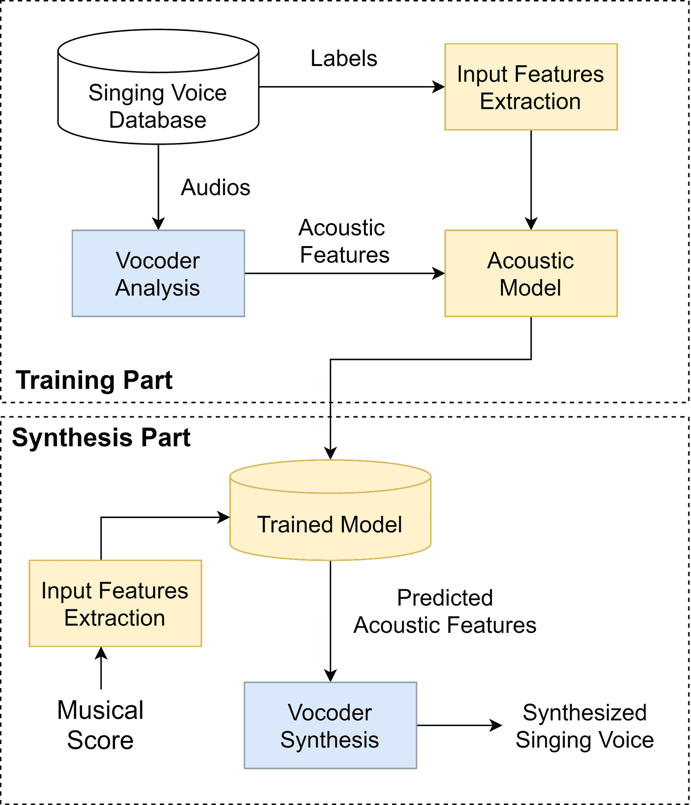

<!--yml

分类：未分类

日期：2024-09-06 19:51:05

-->

# [2110.02511] 最近深度学习驱动的歌声合成系统调查

> 来源：[`ar5iv.labs.arxiv.org/html/2110.02511`](https://ar5iv.labs.arxiv.org/html/2110.02511)

# 最近深度学习驱动的歌声合成系统调查

Yin-Ping Cho, Fu-Rong Yang, Yung-Chuan Chang, Ching-Ting Cheng, Xiao-Han Wang, Yi-Wen Liu 电气工程系

国立清华大学，新竹，台湾

yinping.cho@outlook.com; ywliu@ee.nthu.edu.tw

###### 摘要

歌声合成（SVS）是一项旨在根据乐谱和歌词生成音频信号的任务。由于其涉及音乐和语言的多面性，产生与人类歌手无异的歌声始终是一个未能实现的追求。然而，深度学习技术的进步带来了合成歌声质量和自然性的显著提升。本文旨在综述一些最先进的深度学习驱动的 SVS 系统。我们打算总结它们的模型架构，并识别每个系统的优点和局限性。通过此，我们描绘了该领域最近的发展轨迹，并总结了商业应用和学术研究中尚待解决的挑战。

###### 关键词：

歌声合成，深度学习，综述论文

## 一、引言

一个歌声合成（SVS）系统能够从给定的乐谱生成歌声。展望未来的音乐创作，可以想象在歌曲创作完成后，歌曲可以立即被听到而无需录音。近年来，已经提出了几种方法来构建自然的歌声合成系统，支持日语、英语、韩语、西班牙语等语言 [14, 18, 1]。与语音合成不同，合成的歌声需要遵循乐谱；音高和节奏合成的表现会直接影响感知质量。

在神经网络被广泛使用之前，采用了单元连接 [28] 和隐马尔可夫模型（HMM） [16] 方法进行 SVS。单元连接合成器通过选择数据库中的语音元素来生成歌声，并进行连续连接。诸如 Vocaloid [15] 和 Synthesizer V¹¹1https://synthesizerv.com/en/ 之类的商业工具成功地聚集了忠实用户群。相比之下，基于 HMM 的 SVS [16] 可以分别建模谱包络、激励和歌声持续时间。然后，使用语音参数生成算法 [29] 生成歌声参数轨迹。由于 HMM 早于深度学习的进展，HMM 基础的 SVS 的自然性不如现在神经网络所能实现的效果。

在过去几年中，几种类型的神经网络被用于 SVS，如通用深度神经网络（DNN）[17]、卷积神经网络[20]、长短期记忆（LSTM）的递归神经网络[18]以及生成对抗网络（GAN）[19]。此外，利用与文本到语音（TTS）的相似性，一些自回归序列到序列（Seq2Seq）模型也被提出[21, 22]。近期，最先进的深度学习架构被用来解决 SVS 任务，如基于 Transformer 的[23] XiaoicSing [2]、HifiSinger [6] 和扩散去噪概率模型[9]，如 DiffSinger [8]。然而，这些模型通常需要大量的语料进行训练；同时，为了降低数据消耗，诸如 LiteSing [10] 和 Sinsy [14] 的系统现在成为了热门研究方向。

为了减轻从音乐谱直接预测原始波形的一对多困难，近期深度学习驱动的 SVS 系统大多采用了如图 1 所示的声学模型-声码器架构。在这种设置中，声码器将帧级参数映射到波形，而声学模型只需要预测一个长度为目标波形的参数序列。这样，谱到波形的映射被拆解为两个更简单的低维度差异子任务。根据所选择的声码器，帧级合成参数可以是 Mel 谱图[6, 8]，也可以是对人声有更多洞察的参数，如具有明确和独立 F0 值的参数[2, 14, 10]。

本文的其余部分组织如下：第二部分概述了三种具有高保真度和自然性的深度学习 SVS 系统。第三部分描述了两种特别设计用于低数据资源训练的 SVS 系统。第四部分报告了这一主题的挑战和未来方向，第五部分总结了结论。

图 1：近期深度学习驱动的 SVS 系统的通用架构。

## II 自然性和音质里程碑

### II-A XiaoiceSing：Transformer + WORLD

XiaoiceSing [2] 是最早商业化部署的深度学习驱动的 SVS 系统之一。其目标是生成具有准确音高和节奏的自然且类似人声的歌声。该系统采用了 FastSpeech [3] 的架构，并对声学模型进行了歌唱特定的修改，同时使用了 WORLD 作为声码器 [4]。歌唱特定的修改主要涉及添加音符时长和音符音高信息。为了确保节奏的正确性，作者建议添加音节级别的时长损失，而不是仅依赖原始 FastSpeech 中的音素级别时长。至于更稳健的音高，音符音高会残差地连接到 F0 输出，因此声学模型只需预测人声歌唱中的相对 F0 变化，并将其加到给定的音符音高轮廓上。实验表明，XiaoiceSing 在主观和客观评估中均优于基线系统 [5]。特别是，A/B 测试显示，在 F0 和节奏自然性方面，XiaoiceSing 具有明显的偏好，证明了所提修改的有效性。然而，作者指出，XiaoiceSing 的平均意见得分（MOS）受限于 WORLD 声码器的波形质量限制，尽管声学模型在客观指标中表现良好。此外，该系统消耗了总计 74 小时的单一专业歌手的训练数据，这在纯学术环境中无法获得。

### II-B HiFiSinger: Transformer + Neural Vocoder

在 XiaoiceSing 的基础上，HiFiSinger [6] 旨在突破其波形质量的限制。尽管 HiFiSinger 采用了与 XiaoiceSing 相同的基于 FastSpeech 的声学模型，但它替换了 WORLD，并使用了 Parallel WaveGAN (PW-GAN) [7] 神经声码器，以高保真度的 48kHz 采样率生成波形。因此，声学模型被修改为预测 Mel 频谱图作为主要合成参数，并将 F0 轮廓及有声/无声 (U/UV) 标志作为神经声码器的辅助参数。为了提高 Mel 频谱图的保真度，作者提出了一种子频率 GAN (SF-GAN) 方案，其中三个鉴别网络在三个重叠的子带上进行操作。这种方式使得 GAN 网络可以避免时间-频率分辨率的权衡。在声码器方面，主要的新增项是多长度 GAN (ML-GAN)，它部署了多个鉴别网络处理不同波形输入长度。这应该使鉴别器比原来的单一网络更好地处理长期结构和短期细节。此外，预测的 F0 和 U/UV 标志被整合为修改后的 PW-GAN 的辅助特征，与 Mel 频谱图一起使用。比较平均意见评分的消融测试确认了这些修改对最终系统的积极贡献。在感知自然性和音频质量方面，该系统在 MOS 测试中证明了相较于 XiaoiceSing 的显著改进。在 48kHz 生成配置中，HiFiGAN 的 MOS (3.76) 接近于真实高保真录音 (4.03)。

### II-C DiffSinger: 去噪扩散概率模型 + 神经声码器

为了进一步提高 Mel-spectrograms 的声学模型预测准确性和鲁棒性，DiffSinger [8] 采用了一种在撰写时新颖的生成模型范式：去噪扩散概率模型 [9]。DiffSinger 并不是直接优化声学模型以生成 Mel-spectrograms，而是将生成任务表述为一个以音乐谱为条件的参数化马尔科夫链。这个马尔科夫链的扩散过程逐渐缩放 Mel-spectrogram 并施加噪声，直到它变成高斯噪声。相反，去噪过程则是从嘈杂的输入中迭代地减去一部分噪声并重新缩放，直到它变成 Mel-spectrogram。为了提高去噪过程的速度和鲁棒性，作者提出了一种用于去噪推断的浅层扩散机制。该机制利用在基于 Transformer 的声学模型中看到的简单辅助解码器 [2, 6] 从音乐谱生成一个粗略的 Mel-spectrogram。去噪过程可以将这个粗略的近似值作为接近马尔科夫链终端 Mel-spectrogram 的起点。因此，推断过程从一个与目标 Mel-spectrogram 相似的嘈杂输入开始去噪，并且需要完成的步骤大大减少。结果显示，该声学模型在 MOS 上相比于其最先进的对手，在文本到语音（TTS）和声乐合成（SVS）任务中均显示出显著的质量改进。此外，凭借浅层扩散机制，它在单个 RTX V100 上的实时因子（RTF）为 0.191，这意味着它具有实时适用性。

## III 数据效率的提升

### III-A Sinsy: DNN + 神经声码器

Sinsy [14] 旨在从乐谱中合成适时的歌唱声音。它包含四个模块：1）一个“时间延迟模型”，控制每个音符的声音起始时间，以适应人类的唱歌习惯；2）一个“持续时间模型”，估计音素的持续时间，以将预扩展特征映射到帧级；3）一个基于 DNN 的“声学模型”，作为从乐谱特征序列到声学特征序列的映射函数；4）一个 PeriodNet “神经声码器”，根据声学特征生成时域波形样本。此外，Sinsy 应用了歌唱特定的技术，包括通过预测音符音高与输出 F0 之间的残差连接来准确建模音高，以及通过表达原始 F0 序列与平滑序列之间的差异来建模颤音。此外，Sinsy 提出了两种自动音高修正策略，音高的先验分布和伪音符音高，以防止歌唱声音走音。Sinsy 采用了由女性歌手演唱的 1 小时日本儿童歌曲进行训练。主观评价测试中的平均意见分数表明，所提系统能够合成具有更好声音起始时间、更自然颤音和更准确音高的歌唱声音。

### III-B LiteSing: WaveNet + WORLD

LiteSing [10] 被设计成一个快速、高质量的 SVS 系统，具有高效的架构，只需要少量的训练数据。LiteSing 不再追求使用神经声码器（neural vocoders）来获得微小的音频质量提升，而是回到使用 WORLD 作为声码器。这是一个有意识的选择，旨在利用 WORLD 将瞬时谱包络与 F0 分离的特性，使得预测任务对声学模型来说更为简单。此外，LiteSing 采用了一个条件预测器，分别预测动态声学能量、V/UV 标志和动态音高曲线，这意味着解码器只需预测谱包络和无周期成分，方差大大降低。也就是说，LiteSing 将复杂的预测任务解构为定义明确且简单的子任务。因此，作者可以使用一个相对较小且快速的非自回归 WaveNet [11] 作为模型的骨干，同时仍然期望稳健且高质量的合成。此外，作者还添加了 Wasserstein GAN (WGAN) [12] 来处理预测声学特征中的过平滑问题，这是 WORLD 参数预测任务中典型的问题。实验将数据集限制为 48 分钟音频，以测试 LiteSing 的数据效率。在 MOS 评估中，LiteSing 获得了一个与 WORLD 重新合成的人工歌手音频（3.86）相当的分数（3.60）。更重要的是，尽管比较的 FastSpeech2 基线得分稍高（3.63），LiteSing 仅使用了 FastSpeech2 参数数量的十五分之一（3.8M 对 57.0M），证明了其卓越的数据效率；此外，LiteSing 在 A/B 测试中在表现力方面显著优于 FastSpeech2。这些结果展示了所提声学模型的质量和效率。然而，使用 WORLD 的权衡是显而易见的：原始音频获得了 4.20 的 MOS，显著高于 WORLD 重新合成版本（3.86），以及 LiteSing 完全合成的音频（3.60）。

## IV 挑战

### IV-A 数据效率

在表格 I 中，我们可以观察到数据量与合成质量之间的权衡。那些达到近乎人类水平质量的系统[2, 6, 8]是设计为数据驱动的，并消耗了多个小时的歌声进行训练。另一方面，虽然一些系统可能在大约或少于一个小时的数据下运行[14, 10]，但它们的简化措施通常伴随着总的合成质量的下降。由于编制歌声数据集需要高保真录音设备、良好的歌手以及大量的后期编辑和乐谱标注工作，因此 SVS 系统的数据获取成本很高。因此，SVS 系统的数据效率可能决定其在现实世界中的适用性。为了提高数据效率，策略通常结合了两种技术：简化神经网络模块[14, 10]和通过在歌声领域的专家知识将 SVS 任务分解为低维子任务[14]。

表 I：数据使用总结

| 系统 | 消耗的歌声数据量 |
| --- | --- |
| XiaoiceSing | 74 小时 |
| HiFiSinger | 11 小时 |
| DiffSinger | 6 小时 |
| Sinsy | 1 小时 |
| LiteSing | 48 分钟 |

### IV-B 缺乏统一的开放数据集

生成 SVS 数据集需要高成本的录音和标注。此外，由于版权问题，这类数据集非常稀少，公开可用的通常限于无版权的旧民歌[24, 25, 26]。因此，没有资源的新研究者很难进入这一领域，而社区也很难客观比较和评估不同系统的质量，因为每个系统通常在独特的专有数据集上进行训练。此外，促进这些开放数据集的 SVS 系统可能会遭遇领域差异的问题，即训练数据集包含旧民歌，而合成兴趣的歌曲则是现代风格。相比之下，文本到语音（TTS）是一个具有类似特征和复杂性的生成任务；然而，TTS 有大量免费的开放数据集[30, 31]，这使得该领域得以快速发展，并看到各种成功的架构和现成的商业产品。虽然这个问题不是技术性的，但它是当前和未来 SVS 研究的一个重大限制因素。

### IV-C 缺乏可解释性和透明性

深度学习推动了 SVS 系统在合成音质方面的极限。然而，深度学习系统的复杂性使得从输入乐谱到最终输出波形的学习映射几乎无法进行分析理解。这一特性阻碍了研究人员提取关于唱歌过程机制的知识。因此，它大大削弱了作为逆向工程手段的 SVS 研究动机，无法深入了解人类发声和音乐感知。尽管这个问题不会阻碍应用驱动的研究，但它终结了这些工作的潜力扩展到如医学或心理声学等领域。考虑到构建 SVS 系统的高成本，提高深度学习驱动的 SVS 系统的可解释性和透明性是值得研究的。

### IV-D 情感缺失和唱歌技巧控制及变化

情感和发声技巧的高变化性和多样性是唱歌声音的本质特征。然而，尽管最先进的深度学习驱动的 SVS 系统能够以合理的自然度和音质合成歌声，但它们并未提供调节系统以合成特定情感或唱歌技巧的方法。这是一个高级问题，我们推测将成为研究的热点，原因有二：1）在商业背景下，能够按照用户所需的风格演唱歌曲是专业歌手的基本功能。没有类似的可控性或自定义功能，SVS 系统缺乏进入现实市场的完整性。2）这是一个与数据效率相关的问题。在类似的高变异语音合成研究[27]中，系统在隐含特征如情感和韵律风格上的条件化被证明对提高系统的鲁棒性和自然性具有重要作用。在这些隐含特征在合成目标中占主导地位的情况下，缺乏这些条件可能会导致收敛失败。因此，我们有信心这个问题应该成为未来 SVS 研究的重点。

## V 结论

在这项工作中，我们回顾了一些具有代表性的深度学习驱动的 SVS 系统，这些系统在该研究主题中具有代表性。我们已经展示了这些方法在合成质量和自然性上与真实人类歌手相当。尽管取得了这些成就，但仍然发现了尚待解决的挑战——即系统数据效率的提升需求、缺乏类似 TTS 研究中可用的开放和统一的基准数据集、深度神经网络固有的不可解释性以及缺乏对情感和歌唱技巧的控制和明确变异，这些都是歌声合成的核心问题。这些问题阻碍了 SVS 系统的商业部署，并且具有很高的学术兴趣。因此，我们可以预期它们将在未来的发展中成为重点。

## 参考文献

+   [1] M. Blaauw and J. Bonada, “一个神经参数化歌声合成器，从自然歌曲中建模音色和表情，” 在 *应用科学*，2017 年，p. 1313。

+   [2] P. Lu, J. Wu, J. Luan, X. Tan, and L. Zhou, “XiaoiceSing: 一个高质量且集成的歌声合成系统，” *arXiv* 预印本 arXiv:2006.06261, 2020。

+   [3] Y. Ren, Y. Ruan, X. Tan, T. Qin, S. Zhao, Z. Zhao, and T. Liu, “FastSpeech: 快速、稳健且可控的文本到语音合成，” 在 *神经信息处理系统会议（NeurIPS）*，2019 年，pp. 3165–3174。

+   [4] M. Morise, F. Yokomori, and K. Ozawa, “WORLD: 一个基于声码器的高质量语音合成系统，用于实时应用，” 在 *IEICE 信息与系统交易*，2016 年，pp. 1877-1884。

+   [5] K. Nakamura, S. Takaki, K. Hashimoto, K. Oura, Y. Nankaku, and K. Tokuda, “基于卷积神经网络的快速高质量歌声合成系统，” *arXiv* 预印本 arXiv:1910.11690, 2019。

+   [6] J. Chen, X. Tan, J. Luan, T. Qin, and T. Liu, “HiFiSinger: 迈向高保真神经歌声合成，” *arXiv* 预印本 arXiv:2009.01776, 2020。

+   [7] R. Yamamoto, E. Song and J. Kim, “Parallel WaveGAN: 基于具有多分辨率谱图的生成对抗网络的快速波形生成模型，” 在 *国际声学、语音与信号处理会议（ICASSP）*，2020 年，pp. 6199-6203。

+   [8] J. Liu, C. Li, Y. Ren, F. Chen, P. Liu, and Z. Zhao, “Diffsinger: 用于歌声合成的扩散声学模型，” *arXiv* 预印本 arXiv:2105.02446, 2021。

+   [9] Ho, Jonathan, A. Jain, and P. Abbeel, “去噪扩散概率模型，” 在 *神经信息处理系统会议（NeurIPS）*，2020 年。

+   [10] X. Zhuang, T. Jiang, S. -Y. Chou, B. Wu, P. Hu, and S. Lui, “Litesing: 迈向快速、轻量和富有表现力的歌声合成，” 在 *ICASSP*，2021 年，pp. 7078-7082。

+   [11] A. v. d. Oord, S. Dieleman, H. Zen, K. Simonyan, O. Vinyals, A. Graves, N. Kalchbrenner, A. Senior, and K. Kavukcuoglu, “WaveNet: 原始音频的生成模型，” *arXiv* 预印本 arXiv:1609.03499, 2016。

+   [12] A. Martin, S. Chintala, 和 L. Bottou，“Wasserstein 生成对抗网络，” *国际机器学习会议（PMLR）*，2017 年。

+   [13] Y. Ren, C. Hu, X. Tan, T. Qin, S. Zhao, Z. Zhao, 和 T. Liu，“Fastspeech 2: 快速且高质量的端到端文本转语音，” *arXiv* 预印本 arXiv:2006.04558, 2020。

+   [14] Y. Hono, K. Hashimoto, K. Oura, Y. Nankaku, 和 K. Tokuda，“Sinsy：基于深度神经网络的唱歌声音合成系统，” 发表在 *IEEE/ACM 音频、语音和语言处理汇刊*，2021 年，pp. 2803-2815。

+   [15] H. Kenmochi 和 H. Ohshita，“基于样本拼接的 Vocaloid 商业唱歌合成器，” 发表在 *第八届国际语音通信协会年会*，2007 年。

+   [16] K. Saino, H. Zen, Y. Nankaku, A. Lee, 和 K. Tokuda，“基于 HMM 的唱歌声音合成系统，” 发表在 *国际口语处理会议*，2006 年。

+   [17] M. Nishimura, K. Hashimoto, K. Oura, Y. Nankaku, 和 K. Tokuda，“基于深度神经网络的唱歌声音合成，” 发表在 *国际语音通信协会会议（INTERSPEECH）*，2016 年，pp. 2478–2482。

+   [18] J. Kim, H. Choi, J. Park, M. Hahn, S. J. Kim, 和 J. J. Kim，“基于 LSTM 递归神经网络的韩语唱歌声音合成，” 发表在 *INTERSPEECH*，2018 年，pp. 1551–1555。

+   [19] Y. Hono, K. Hashimoto, K. Oura, Y. Nankaku, 和 K. Tokuda，“基于生成对抗网络的唱歌声音合成，” 发表在 *IEEE 国际声学、语音和信号处理会议（ICASSP）*，2019 年，pp. 6955–6959。

+   [20] K. Nakamura, K. Hashimoto, K. Oura, Y. Nankaku, 和 K. Tokuda，“基于卷积神经网络的唱歌声音合成，” *arXiv* 预印本 arXiv:1904.06868, 2019 年。

+   [21] Y. Gu, X. Yin, Y. Rao, Y. Wan, B. Tang, Y. Zhang, J. Chen, Y. Wang, 和 Z. Ma，“ByteSing：一种基于时长分配编码器-解码器声学模型和 WaveRNN 声码器的中文唱歌声音合成系统，” 发表在 *国际中文语言处理研讨会（ISCSLP）*，2021 年。

+   [22] J. Lee, H. Choi, C. Jeon, J. Koo, 和 K. Lee，“对抗训练的端到端韩语唱歌声音合成系统，” 发表在 *INTERSPEECH*，2019 年，pp. 2588–2592。

+   [23] A. Vaswani, N. Shazeer, N. Parmar, J. Uszkoreit, L. Jones, A. N. Gomez, Ł. Kaiser, 和 I. Polosukhin，“Attention is all you need，” 发表在 *神经信息处理系统进展*，2017 年。

+   [24] S. Choi, W. Kim, S. Park, S. Yong, 和 J. Nam，“儿童歌曲数据集用于唱歌声音研究，” 发表在 *国际音乐信息检索会议（ISMIR）*，2020 年。

+   [25] 名古屋工业大学，“NIT-SONG070-F001，” http://hts.sp.nitech.ac.jp/archives/2.3/HTSdemo\_NIT-SONG070-F001.tar.bz2

+   [26] J. Wilkins, P. Seetharaman, A. Wahl, 和 B. Pardo，“VocalSet：一个唱歌声音数据集，” 发表在 *国际音乐信息检索会议（ISMIR）*，2018 年。

+   [27] Y. Wang, D. Stanton, Y. Zhang, R. S. Ryan, E. Battenberg, J. Shor, Y. Xiao, F. Ren, Y. Jia, 和 R. A. Saurous，“风格标记：端到端语音合成中的无监督风格建模、控制与迁移”，*arXiv* 预印本 arXiv:1803.09017，2018 年。

+   [28] J. Bonada, X. Serra，“通过性能采样和谱模型合成歌唱声音”，*IEEE 信号处理杂志*，第 24 卷，第 69-79 页，2007 年。

+   [29] K. Tokuda, T. Yoshimura, T. Masuko, T. Kobayashi 和 T. Kitamura，“基于 HMM 的语音合成的语音参数生成算法”，见 *IEEE 国际声学、语音与信号处理会议论文集*，2000 年，第 1315-1318 页。

+   [30] Bakhturina, Evelina 和 Lavrukhin, Vitaly 和 Ginsburg, Boris 和 Zhang, Yang，“高保真多扬声器英语 TTS 数据集”，见 *arXiv 预印本 arXiv:2104.01497*，2021 年。

+   [31] Keith Ito 和 Linda Johnson，“LJ 语音数据集”，https://keithito.com/LJ-Speech-Dataset/，2017 年。
