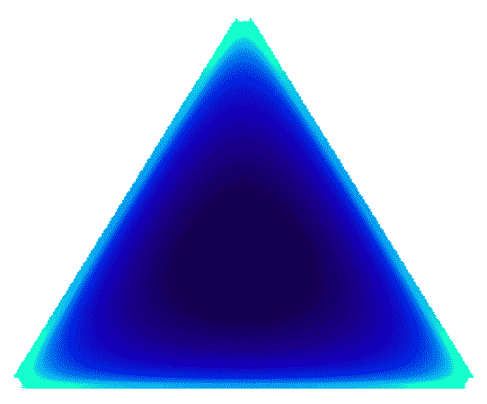

<!--yml

类别：未分类

日期：2024-09-06 19:51:02

-->

# [2110.03051] 先验和后验网络：关于不确定性估计的证据深度学习方法的调查

> 来源：[`ar5iv.labs.arxiv.org/html/2110.03051`](https://ar5iv.labs.arxiv.org/html/2110.03051)

# 先验和后验网络：关于不确定性估计的证据深度学习方法的调查

丹尼斯·乌尔默^(\faCompass) dennis.ulmer@mailbox.org 克里斯蒂安·哈德迈耶^(\faCompass) chrha@itu.dk 赫斯·弗雷尔森^(\faRobot,\faCompressArrows*) jefr@dtu.dk

^(\faCompass)哥本哈根 IT 大学，^(\faRobot)丹麦技术大学，^(\faCompressArrows*)人工智能先锋中心

###### 摘要

定量评估深度神经网络中的预测不确定性的流行方法通常涉及权重的分布或多个模型，例如通过马尔可夫链采样、集成或蒙特卡洛丢弃。这些技术通常会产生额外开销，因为需要训练多个模型实例，或不能产生非常多样的预测。这项全面而广泛的调查旨在让读者熟悉基于*证据深度学习*概念的另一类模型：对于陌生数据，它们旨在承认“它们不知道的东西”，并回退到先验信念。此外，它们通过对*分布上的分布*进行参数化，允许在单一模型和前向传播中进行不确定性估计。本调查回顾了现有的工作，重点介绍了分类设置中的实现，然后调查了相同范式在回归中的应用。我们还反思了与其他现有方法相比的优缺点，并提供了最基本的推导，使用统一的符号来帮助未来的研究。

## 1 介绍

图 1：调查方法的分类，分为一个轴上的可处理先验或后验参数化（参见表 1 和 2 的概述）和分类与回归方法的另一个轴。回归方法在表 3 中概述。

许多现有的不确定性估计方法利用了贝叶斯模型平均的概念：这些方法包括集成方法（Lakshminarayanan et al., 2017; Wilson & Izmailov, 2020），马尔科夫链蒙特卡洛采样（de Freitas, 2003; Andrieu et al., 2000），以及变分推断方法（Mackay, 1992; MacKay, 1995; Hinton & Van Camp, 1993; Neal, 2012），包括蒙特卡洛（MC）丢弃法（Gal & Ghahramani, 2016）和贝叶斯反向传播（Blundell et al., 2015）。神经网络的贝叶斯模型平均通常涉及使用 MC 样本来近似一个原本难以处理的积分。这会导致以下问题：首先，MC 近似的质量依赖于来自权重后验的样本的真实性和多样性。其次，这种方法通常涉及增加模型中的参数数量或训练更多的模型实例。最近，提出了一类新模型，通过使用后验预测分布的不同因式分解来绕过这一困境。这允许在单次前向传递中计算不确定性，并使用一组权重。这些模型基于一个概念，称为*证据深度学习*：对于分布外（OOD）输入，它们被鼓励回退到先验。这通常被描述为*知道自己不知道什么*。

在本文中，我们总结了现有文献，并概述了证据深度学习方法。我们在图 1 中概述了所有讨论的工作，其中我们区分了用于分类的模型，根据模型是否对 Dirichlet 先验进行参数化（第 3.4.1 节）或后验（第 3.4.2 节）进行区分。我们进一步讨论了类似的回归问题方法（第四部分）。正如我们将看到的，在证据深度学习框架中获得良好的不确定性估计可能具有挑战性；提出的解决方案也在图 1 中有所反映，包括在训练过程中使用 OOD 示例（Malinin & Gales，2018；2019；Nandy 等，2020；Shen 等，2020；Chen 等，2018；Zhao 等，2019；Hu 等，2021；Sensoy 等，2020），知识蒸馏（Malinin 等，2020b；a）或密度估计的纳入（Charpentier 等，2020；2022；Stadler 等，2021），我们在第六部分中更详细地讨论了这些方法。此综述旨在为不熟悉的读者提供一个易于访问的介绍，并作为一个信息丰富的概述，以促进其在不确定性量化文献之外的更广泛应用。我们还提供了机器学习中 Dirichlet 分布的最重要推导的集合，这在许多讨论的方法中扮演了核心角色。

## 2 背景

我们首先介绍本次调查的核心概念，包括第 2.1 节中的贝叶斯推断、第 2.2 节中的贝叶斯模型平均以及第 2.3 节中的证据深度学习。¹¹1 请注意，在下面的内容中，我们将使用 TMLR 期刊建议的符号，例如用$P$表示概率质量，用$p$表示概率密度函数。

### 2.1 贝叶斯推断

以下各节的基础是贝叶斯推断：给定对感兴趣参数$\bm{\theta}$的先验信念$p(\bm{\theta})$，我们利用可用的观察数据$\mathbb{D}=\{(x_{i},y_{i})\}_{i=1}^{N}$及其似然$p(\mathbb{D}|\bm{\theta})$来获得更新的信念，形式为后验$p(\bm{\theta}|\mathbb{D})\propto p(\mathbb{D}|\bm{\theta})p(\bm{\theta})$。该更新规则源于贝叶斯定理，即

|  | $p(\bm{\theta}&#124;\mathbb{D})=\frac{p(\mathbb{D}&#124;\bm{\theta})p(\bm{\theta})}{p(\mathbb{D})}=\frac{p(\mathbb{D}&#124;\bm{\theta})p(\bm{\theta})}{\int p(\mathbb{D}&#124;\bm{\theta})p(\bm{\theta})d\bm{\theta}},$ |  | (1) |
| --- | --- | --- | --- |

我们通常尽量避免计算分母中的项，因为对$\bm{\theta}$的大（连续）参数空间进行边际化通常是不可处理的。为了对新数据点$\mathbf{x}$进行预测$y$，我们现在可以利用定义为*后验预测分布*的

|  | $P(y&#124;\mathbf{x},\mathbb{D})=\int P(y&#124;\mathbf{x},\bm{\theta})p(\bm{\theta}&#124;\mathbb{D})d\bm{\theta}.$ |  | (2) |
| --- | --- | --- | --- |

由于我们在$\bm{\theta}$的整个参数空间上进行积分，通过后验概率加权每个预测以获得最终结果，这个过程被称为*贝叶斯模型平均*（BMA）。在这里，来自于观测数据下似乎合理的参数的预测$P(y|\mathbf{x},\bm{\theta})$将在最终预测$P(y|\mathbf{x},\mathbb{D})$中获得更高的权重$p(\bm{\theta}|\mathbb{D})$。正如我们将在以下部分看到的，这种预测分布的分解对于分析模型的不确定性也具有有益的特性。

### 2.2 神经网络中的预测不确定性

在概率建模中，不确定性通常分为**Aleatoric**不确定性和**Epistemic**不确定性（Der Kiureghian & Ditlevsen，2009；Kendall & Gal，2017；Hüllermeier & Waegeman，2021）。**Aleatoric**不确定性指的是由数据生成过程引起的不确定性，例如噪声或观察到的类别实例之间的固有重叠。**Epistemic**不确定性是对最优模型参数（甚至假设类）存在的不确定性。随着数据量的增加，这种不确定性是可以减少的，因为可能的模型变得越来越少，变得更为合理。这两个概念在为新的数据点$\mathbf{x}$制定后验预测分布时再次出现：²²2 请注意，方程 2 中的预测分布概括了单个网络预测的常见情况，其中$P(y \mid \mathbf{x}, \mathbb{D}) \approx P(y \mid \mathbf{x}, \hat{\bm{\theta}})$。在数学上，这通过用 Dirac delta 分布替换后验$p(\bm{\theta} \mid \mathbb{D})$来表达，如方程 5 中所示，其中所有的概率密度集中在单一的参数配置上。

|  | $P(y \mid \mathbf{x}, \mathbb{D}) = \int \underbrace{P(y \mid \mathbf{x}, \bm{\theta})}_{\text{Aleatoric}} \underbrace{p(\bm{\theta} \mid \mathbb{D})}_{\text{Epistemic}} d\bm{\theta}.$ |  | (3) |
| --- | --- | --- | --- |

在这里，第一个因素捕获了关于正确预测的**Aleatoric**不确定性，而第二个因素表达了关于正确模型参数的不确定性——我们观察到的数据越多，$p(\bm{\theta} \mid \mathbb{D})$的密度应当更多地集中在$\bm{\theta}$的合理参数值上。对于像神经网络中的高维实值参数$\bm{\theta}$，这个积分变得不可处理，通常使用 Monte Carlo 样本来近似：³³3 对于更简单的分布，积分通常可以通过利用共轭性进行解析求解。另一种针对更复杂分布的方法是矩量法（见例如 Duan，2021）。

|  | $P(y \mid \mathbf{x}, \mathbb{D}) \approx \frac{1}{K} \sum_{k=1}^{K} P(y \mid \mathbf{x}, \bm{\theta}^{(k)}); \quad \bm{\theta}^{(k)} \sim p(\bm{\theta} \mid \mathbb{D})$ |  | (4) |
| --- | --- | --- | --- |

基于$K$不同的参数集合$\bm{\theta}^{(k)}$。由于这需要通过一些额外的程序来获取多个版本的模型参数，因此伴随而来的是前述的计算开销和近似误差问题，这激发了本文讨论的方法。

### 2.3 证据深度学习

由于传统的预测不确定性估计方法需要多个参数集，并且只能近似预测后验分布，我们可以进一步分解方程 2 以获得一个可处理的形式：

|  | $\displaystyle p(y\mid\mathbf{x},\mathbb{D})$ | $\displaystyle=\iint\underbrace{P(y\mid\bm{\pi})}_{\vphantom{\big{}}\text{随机}}\underbrace{p(\bm{\pi}\mid\mathbf{x},\bm{\theta})}_{\vphantom{\big{[}}\text{分布}}\underbrace{p(\bm{\theta}\mid\mathbb{D})}_{\vphantom{\big{[}}\text{认知}}d\bm{\pi}d\bm{\theta}\approx\int P(y\mid\bm{\pi})\underbrace{\vphantom{\big{[}}p(\bm{\pi}\mid\mathbf{x},\hat{\bm{\theta}})}_{p(\bm{\theta}\mid\mathbb{D})\approx\delta(\bm{\theta}-\hat{\bm{\theta}})}d\bm{\pi}.$ |  | (5) |
| --- | --- | --- | --- | --- |

这种因式分解包含另一种不确定性，Malinin & Gales ([2018) 称之为*分布性*不确定性，即由训练数据和测试数据分布不匹配引起的不确定性。在最后一步中，Malinin & Gales (2018) 用 Dirac delta 函数，即一个单一训练的神经网络，替换了$p(\bm{\theta}|\mathbb{D})$以消除难以处理的积分。尽管还有另一个积分存在，从这个预测分布中检索不确定性实际上对于 Dirichlet 分布有一个封闭形式的解析解（参见 第 3.3 节）。这种方法的进一步优势在于它使我们能够区分数据点的不确定性，因为它与来自完全不同数据分布的点混淆。例如，考虑一个二分类问题，其中数据流形由两个重叠的簇组成。当我们对一个新的数据点进行分类时，我们会得到一个在两个类别之间均匀分布的$P(y|\mathbf{x},\bm{\theta})$。这意味着什么？模型可能会对该点位于重叠区域并固有模糊感到自信，或者模型对正确类别不确定。在没有更多上下文的情况下，我们无法区分这两种情况（Bengs 等，2022; Hüllermeier，2022）。将其与预测$p(\bm{\pi}|\mathbf{x},\bm{\theta})$进行比较：如果数据点模糊，结果分布将集中在$0.5$，如果模型普遍不确定，分布将是均匀的，从而允许这种区分。我们将在即将到来的 第 2.4 节 和 3.3 节 进一步说明这一原则。

在方程 5 中的神经网络背景下，需要注意的是，将自己限制在参数的点估计上会阻止像早期工作那样通过权重后验$p(\bm{\theta}|\mathbb{D})$进行的知识不确定性估计，如下一节所讨论的。然而，也有一些工作如 Haussmann 等 (2019); Zhao 等 (2020) 结合了这两种方法。

*证据深度学习*（EDL）这一术语来源于 Sensoy 等人的工作（2018），并基于*证据理论*（Dempster, 1968; Audun, 2018）：在该理论中，信念质量被分配给一组可能的状态，例如类别标签，并且也可以表达证据的缺乏，即“我不知道”。例如，我们可以使用 Dirichlet 分布来推广神经分类器的预测输出，通过均匀的 Dirichlet 分布来表达证据的缺乏。这与均匀的 Categorical 分布不同，后者无法区分所有类别的相等概率与证据的缺乏。在本调查中，我们将证据深度学习定义为一种方法家族，其中神经网络可以在未知输入的情况下回退到均匀的先验分布。虽然神经网络通常对似然函数进行参数化，但本调查中的方法则对先验或后验分布进行参数化。以下部分的示例展示了这种方法的优点。

### 2.4 一个说明性示例：鸢尾花数据集

(a) *翡翠鸢尾*

(b) *鸢尾花属*

(c) *维吉尼亚鸢尾*

图 2：在鸢尾花数据集上不确定性量化的不同方法的说明，左侧展示了各类别的示例（图 2(a), 2(b) ‣ 图 2 ‣ 2.4 一个说明性示例：鸢尾花数据集 ‣ 2 背景 ‣ 先验和后验网络：关于不确定性估计的证据深度学习方法的调查") 和 2(c) ‣ 图 2 ‣ 2.4 一个说明性示例：鸢尾花数据集 ‣ 2 背景 ‣ 先验和后验网络：关于不确定性估计的证据深度学习方法的调查")。右侧，数据与先验网络（较浅的颜色表示更高的密度）以及概率单纯形上的一个集成和 MC Dropout 模型的一些预测一起绘制，每个模型有$50$个预测。鸢尾花图像取自 Wikimedia Commons， 2022a; b; c。

为了说明 EDL 的优势，我们选择了一个基于虹膜数据集（Fisher，1936）的分类问题。该数据集包含三种不同种类的虹膜花的测量数据（见图 2(a)，2(b) ‣ 图 2 ‣ 2.4 一个示例：虹膜数据集 ‣ 2 背景 ‣ 先验和后验网络：关于证据深度学习方法的不确定性估计调查") 和 2(c) ‣ 图 2 ‣ 2.4 一个示例：虹膜数据集 ‣ 2 背景 ‣ 先验和后验网络：关于证据深度学习方法的不确定性估计调查")）。我们使用 scikit-learn 提供的数据集（Pedregosa 等人，2011），并在图 2 中绘制花瓣宽度和长度测量之间的关系。

我们训练了一个深度神经网络集成（Lakshminarayanan 等人，2017），包括 $50$ 个模型实例，一个带有 MC Dropout 的模型（Gal & Ghahramani，2016），具有 $50$ 次预测，以及一个先验网络（Sensoy 等人，2018），这是 EDL 的一个示例，使用所有可用的数据点，并在图 2 上的三个测试点绘制它们的预测。在这些简单形上，每个点表示一个分类分布，与一个角落的接近程度表示对应类别的更高概率。用于分类的 EDL 方法不会预测单一的输出分布，而是整个*输出分布的密度*。

测试点<svg   height="14.16" overflow="visible" version="1.1" width="14.16"><g transform="translate(0,14.16) matrix(1 0 0 -1 0 0) translate(7.08,0) translate(0,7.08)" fill="#000000" stroke="#000000" stroke-width="0.4pt"><g transform="matrix(1.0 0.0 0.0 1.0 -3.46 -4.46)" fill="#000000" stroke="#000000"><foreignobject width="6.92" height="8.92" transform="matrix(1 0 0 -1 0 16.6)" overflow="visible">3</foreignobject></g></g></svg>位于*Iris versicolor*和*Iris virginica*实例之间的重叠区域，因此引发了较高的随机不确定性。在这种情况下，我们可以看到先验网络将所有密度集中在这两个类别之间，这与集成预测和 MC Dropout 的预测（右下角）类似。然而，其中一些预测仍然落在简单形状的中心。点<svg height="14.16" overflow="visible" version="1.1" width="14.16"><g transform="translate(0,14.16) matrix(1 0 0 -1 0 0) translate(7.08,0) translate(0,7.08)" fill="#000000" stroke="#000000" stroke-width="0.4pt"><g transform="matrix(1.0 0.0 0.0 1.0 -3.46 -4.46)" fill="#000000" stroke="#000000"><foreignobject width="6.92" height="8.92" transform="matrix(1 0 0 -1 0 16.6)" overflow="visible">1</foreignobject></g></g></svg>位于*Iris versicolor*和*setosa*实例之间没有训练样本的区域，同时接近一个*virginica*的离群点。如左上所示，集成和 MC Dropout 的预测一致认为该点属于*setosa*或*versicolor*类别，但稍微偏向前者。先验网络将其预测集中在*versicolor*上，但对其他两个选择表现出一些不确定性。最后一个测试点<svg height="14.16" overflow="visible" version="1.1" width="14.16"><g transform="translate(0,14.16) matrix(1 0 0 -1 0 0) translate(7.08,0) translate(0,7.08)" fill="#000000" stroke="#000000" stroke-width="0.4pt"><g transform="matrix(1.0 0.0 0.0 1.0 -3.46 -4.46)" fill="#000000" stroke="#000000"><foreignobject width="6.92" height="8.92" transform="matrix(1 0 0 -1 0 16.6)" overflow="visible">2</foreignobject></g></g></svg>位于特征空间中没有数据的区域，大致等距于三个花卉簇。与前面的例子类似，右上角的集成和 MC Dropout 预测显示出对*Iris setosa*和*versicolor*的偏好，但不确定性更高。然而，先验网络显示出几乎均匀的密度，对这一特定输入承认分布不确定性。

这个简单的例子提供了一些关于 EDL 潜在优势的见解：首先，先验网络能够提供相较于 BMA 方法的合理不确定性估计。其次，先验网络能够通过预测几乎均匀的先验来承认其对 OOD 数据点的知识不足，这是其他模型无法做到的。如在第 3.3 节中所述，EDL 实际上允许用户区分由于数据不足和由于输入超出分布导致的模型不确定性。最后，训练先验网络只需要一个模型，这比 MC Dropout 以及特别是训练集成方法明显加快了速度。

## 3 证据深度学习用于分类

为了介绍用于分类的 EDL 方法，我们首先在第 3.1 节中简要介绍了 Dirichlet 分布及其作为贝叶斯推断中的共轭先验的作用。然后在第 3.2 节中展示了神经网络如何对 Dirichlet 分布进行参数化，而第 3.3 节则揭示了如何利用这种参数化进行高效的不确定性估计。其余部分列举了来自文献中不同的例子，这些例子对先验分布 (第 3.4.1 节) 或后验 Dirichlet 分布 (第 3.4.2 节) 进行参数化。

### 3.1 Dirichlet 分布

图 3：一个先验 Dirichlet 分布通过一个类别观测向量进行更新。然后，后验 Dirichlet 将密度向具有更多观测实例的类别$k$转移。

例如，二分类问题的建模通常使用伯努利似然。伯努利似然有一个单一参数 $\pi$，表示成功（或正类）的概率，给定为

|  | $\text{Bernoulli}(y&#124;\pi)=\pi^{y}(1-\pi)^{(1-y)}.$ |  | (6) |
| --- | --- | --- | --- |

在第二部分介绍的贝叶斯推断中，Beta 分布是伯努利似然的常用先验。它定义了一个关于参数 $\pi$ 的概率分布，$\pi$ 本身具有两个形状参数 $\alpha_{1}$ 和 $\alpha_{2}$：

|  | $\text{Beta}(\pi;\alpha_{1},\alpha_{2})=\frac{1}{B(\alpha_{1},\alpha_{2})}\pi^{\alpha_{1}-1}(1-\pi)^{\alpha_{2}-1};\quad B(\alpha_{1},\alpha_{2})=\frac{\Gamma(\alpha_{1})\Gamma(\alpha_{2})}{\Gamma(\alpha_{1}+\alpha_{2})};$ |  | (7) |
| --- | --- | --- | --- |

其中 $\Gamma(\cdot)$ 代表伽玛函数，它是对实数的阶乘的推广，$B(\cdot)$ 被称为 Beta 函数（不要与分布混淆）。当将分类问题从两个类别扩展到任意数量的类别时，我们使用类别似然：

|  | $\text{Categorical}(y&#124;\bm{\pi})=\prod_{k=1}^{K}\pi_{k}^{\mathbf{1}_{y=k}},$ |  | (8) |
| --- | --- | --- | --- |

其中 $K$ 表示类别或类的数量，类别概率通过向量 $\bm{\pi}\in[0,1]^{K}$ 表达，其中 $\sum_{k}\pi_{k}=1$，$\mathbf{1}_{(\cdot)}$ 是指示函数。这种分布在使用神经网络的分类问题中出现，因为大多数用于分类的神经网络在最后一层之后使用 softmax 函数来生成类别的类别分布，使得 $\pi_{k}\equiv P(y=k|x)$。在这种情况下，Dirichlet 分布作为 Beta 分布的合适先验和多变量推广出现（因此也被称为*多变量 Beta 分布*）：

|  | $\text{Dir}(\bm{\pi};\bm{\alpha})=\frac{1}{B(\bm{\alpha})}\prod_{k=1}^{K}\pi_{k}^{\alpha_{k}-1};\quad B(\bm{\alpha})=\frac{\prod_{k=1}^{K}\Gamma(\alpha_{k})}{\Gamma(\alpha_{0})};\quad\alpha_{0}=\sum_{k=1}^{K}\alpha_{k};\quad\alpha_{k}\in\mathbb{R}^{+};$ |  | (9) |
| --- | --- | --- | --- |

其中 Beta 函数 $B(\cdot)$ 现在对于 $K$ 个形状参数进行了定义，这与 公式 7 中的定义有所不同。为了符号的便利，我们还定义了 $\mathbb{K}=\{1,\ldots,K\}$ 作为所有类别的集合。该分布由其 *浓度参数* $\bm{\alpha}$ 表征，其总和通常表示为 $\alpha_{0}$，称为 *精度*。⁵⁵5 精度类似于高斯分布的精度，其中较大的 $\alpha_{0}$ 表示更尖锐的分布。Dirichlet 是这种类别似然的 *共轭先验*，这意味着根据 公式 1 的贝叶斯规则，给定数据集 $\mathbb{D}=\{(x_{i},y_{i})\}_{i=1}^{N}$ 及其对应标签，它们产生具有参数 $\bm{\beta}$ 的 Dirichlet 后验。

|  | $\displaystyle p(\bm{\pi}&#124;\mathbb{D},\bm{\alpha})$ | $\displaystyle\propto p\big{(}\{y_{i}\}_{i=1}^{N}&#124;\bm{\pi},\{x_{i}\}_{i=1}^{N}\big{)}p(\bm{\pi}&#124;\bm{\alpha})=\prod_{i=1}^{N}\prod_{k=1}^{K}\pi_{k}^{\mathbf{1}_{y_{i}=k}}\frac{1}{B(\bm{\alpha})}\prod_{k=1}^{K}\pi_{k}^{\alpha_{k}-1}$ |  | (10) |
| --- | --- | --- | --- | --- |
|  |  | $\displaystyle=\prod_{k=1}^{K}\pi_{k}^{\big{(}\sum_{i=1}^{N}\mathbf{1}_{y_{i}=k}\big{)}}\frac{1}{B(\bm{\alpha})}\prod_{k=1}^{K}\pi_{k}^{\alpha_{k}-1}=\frac{1}{B(\bm{\alpha})}\prod_{k=1}^{K}\pi_{k}^{N_{k}+\alpha_{k}-1}\propto\text{Dir}(\bm{\pi};\bm{\beta}),$ |  |

其中 $\bm{\beta}$ 是一个向量，$\beta_{k}=\alpha_{k}+N_{k}$，其中 $N_{k}$ 表示类别 $k$ 的观察次数。直观地说，这意味着由初始 Dirichlet 编码的先验信念会使用实际数据进行更新，从而使观察到许多实例的类别的分布更加精准。类似于 公式 7 中的 Beta 分布，Dirichlet 是 $K-1$ 概率单纯形上的 *类别分布的分布*；我们在 图 3 中展示了一个带有其浓度参数和贝叶斯更新的示例。

### 3.2 参数化

对于具有 $K$ 类的分类问题，神经分类器通常被实现为函数 $f_{\bm{\theta}}:\mathbb{R}^{D}\rightarrow\mathbb{R}^{K}$，将输入 $\mathbf{x}\in\mathbb{R}^{D}$ 映射为每个类别的 *logits*。然后通过 softmax 函数，这定义了一个在类别上的分类分布，其中向量 $\bm{\pi}$ 的 $\pi_{k}\equiv p(y=k|\mathbf{x},\bm{\theta})$。相同的底层结构可以在不进行重大修改的情况下，用于参数化 *Dirichlet* 分布，预测 *在分类分布上* 的分布 $p(\bm{\pi}|\mathbf{x},\hat{\bm{\theta}})$，如 公式 9。⁶⁶6 需要注意的是，每个 $\alpha_{k}$ 必须严格为正，这可以通过使用额外的 softplus、指数或 ReLU 函数来强制执行（Sensoy 等， 2018； Malinin 和 Gales，2018； Sensoy 等，2020）。为了对数据点 $\mathbf{x}$ 进行分类，从 Dirichlet 预测的浓度参数创建一个分类分布，如下所示（这对应于 Dirichlet 的均值，见 第 C.1 节）：

|  | $\bm{\alpha}=\exp\big{(}f_{\bm{\theta}}(\mathbf{x})\big{)};\quad\pi_{k}=\frac{\alpha_{k}}{\alpha_{0}};\quad\hat{y}=\operatorname*{arg\,max}_{k\in\mathbb{K}}\ \pi_{1},\ldots,\pi_{K}.$ |  | (11) |
| --- | --- | --- | --- |

对 Dirichlet 后验分布的参数化遵循类似的逻辑，我们将在 第 3.4.2 节 中讨论。

### 3.3 使用 Dirichlet 网络进行不确定性估计

(a) 神经网络集合在概率单纯形上预测的分类分布。

(b) 对于自信预测的概率单纯形，其中密度集中在一个角落。

(c) 对于数据不确定性的情况，Dirichlet 分布的密度集中在中心。

(d) 对于模型不确定性的情况，Dirichlet 分布的密度分布得更广。

(e) 对于分布不确定性的情况，Dirichlet 分布的密度分布在整个单纯形上。

（f）另一种称为表示间隙的分布不确定性方法，其密度集中在边缘。

图 4：$K=3$分类问题的概率单纯形示例，其中每个角对应一个类别，每个点对应一个类别分布。较亮的颜色表示较高的密度。（a）通过一组判别器预测的类别分布。（b）–（e）Malinin & Gales（2018）中 Dirichlet 在不同场景下的（期望的）行为：（b）对于有信心的预测，密度集中在与假定类别对应的单纯形角落。（c）在随机不确定性的情况下，密度集中在中心，因此均匀类别分布最有可能。（d）在模型不确定性的情况下，密度可能仍集中在角落，但分布更广，表示对正确预测的不确定性。（e）在 OOD 输入的情况下，均匀 Dirichlet 表示任何类别分布的可能性相同，因为没有任何已知类别的证据。（f）Nandy 等人（2020）提出的表示间隙，作为 OOD 数据的替代行为。在这里，密度则完全集中在单纯形的边缘。

现在让我们关注如何在 Dirichlet 框架内估计**随机**、**认识**和**分布**不确定性，如在第 2.2 节中所述。在图 4 中，我们展示了由神经网络参数化的 Dirichlet 分布的不同形状，这些形状对应于不同的不确定性情况，其中单纯形上的每个点代表一个**类别分布**，靠近角落的点表示对应类别的高概率。图 4(a)显示了分类器集成的预测结果作为单纯形上的点云。利用 Dirichlet，这些有限分布集可以扩展到整个单纯形上的连续密度。正如我们将在接下来的章节中看到的，通过神经网络参数化 Dirichlet 分布使我们能够使用其密度的形状来区分不同的场景，如图 4(b)、4(c) ‣ Figure 4 ‣ 3.3 Uncertainty Estimation with Dirichlet Networks ‣ 3 Evidential Deep Learning for Classification ‣ Prior and Posterior Networks: A Survey on Evidential Deep Learning Methods For Uncertainty Estimation")、4(d) ‣ Figure 4 ‣ 3.3 Uncertainty Estimation with Dirichlet Networks ‣ 3 Evidential Deep Learning for Classification ‣ Prior and Posterior Networks: A Survey on Evidential Deep Learning Methods For Uncertainty Estimation")、4(e) ‣ Figure 4 ‣ 3.3 Uncertainty Estimation with Dirichlet Networks ‣ 3 Evidential Deep Learning for Classification ‣ Prior and Posterior Networks: A Survey on Evidential Deep Learning Methods For Uncertainty Estimation")和 4(f) ‣ Figure 4 ‣ 3.3 Uncertainty Estimation with Dirichlet Networks ‣ 3 Evidential Deep Learning for Classification ‣ Prior and Posterior Networks: A Survey on Evidential Deep Learning Methods For Uncertainty Estimation")所示，我们将在过程中更详细地讨论。

然而，由于我们不希望直观地检查 Dirichlets，我们改为使用封闭形式的表达式来量化不确定性，这一点我们将接下来讨论。尽管对先验参数 $\bm{\alpha}$ 进行了说明，但以下方法也可以同样应用于后验参数 $\bm{\beta}$，而不失一般性。

##### 数据（随机）不确定性

为了获得数据不确定性的度量，我们可以评估数据分布 $p(y|\bm{\pi})$ 的期望熵（类似于之前的研究，例如 Gal & Ghahramani, 2016）。由于熵捕捉了输出分布的“尖锐度”，较低的熵表明模型将大多数概率质量集中在单一类别上，而较高的熵则表征更均匀的分布——模型对正确预测没有明确的判断。对于 Dirichlet 网络，这个量有一个封闭形式的解（有关完整的推导，请参见 Section D.1）：

|  | $\mathbb{E}_{#1}\bigg{[}H\Big{[}P(y&#124;\bm{\pi})\Big{]}\bigg{]}=-\sum_{k=1}^{K}\frac{\alpha_{k}}{\alpha_{0}}\bigg{(}\psi(\alpha_{k}+1)-\psi(\alpha_{0}+1)\bigg{)}$ |  | (12) |
| --- | --- | --- | --- |

其中 $\psi$ 表示 digamma 函数，定义为 $\psi(x)=\frac{d}{dx}\log\Gamma(x)$，而 $H$ 表示香农熵。

##### 模型（认知）不确定性

正如我们在第 2.2 节中看到的那样，大多数在 Dirichlet 框架下的方法通过使用点估计$\hat{\bm{\theta}}$来避免对网络参数$\bm{\theta}$的不可处理的积分。⁷⁷7 一些例外，如 Haussmann 等人(2019)和 Zhao 等人(2020)。当在方程 5 中保持参数分布时，Woo (2022)推导出了随机和认知不确定性的替代表达。这意味着像 Blundell 等人(2015)；Gal & Ghahramani (2016)；Smith & Gal (2018)那样通过权重后验$p(\bm{\theta}|\mathbb{D})$来计算模型不确定性是不可能的。然而，Dirichlet 网络的一个关键特性是认知不确定性体现在 Dirichlet 分布的分散性中（例如在图 4 (d)和(e)中）。因此，可以考虑塑造这一分布的浓度参数$\bm{\alpha}$来量化认知不确定性：Charpentier 等人(2020)简单地将最大$\alpha_{k}$视为类似于 Hendrycks & Gimpel (2017)的最大概率分数的评分，而 Sensoy 等人(2018)通过$K/\sum_{k=1}^{K}(\alpha_{k}+1)$或简单地$\alpha_{0}$ (Charpentier 等人，2020)进行计算。在这两种情况下，其基本直觉是更大的$\alpha_{k}$产生更尖锐的密度，从而表示对预测的信心增加。

##### 分布不确定性

这个模型家族的另一个吸引人的特性是能够区分由于模型不足指定（Figure 4(d)）与由于未知输入（Figure 4(e)）所造成的不确定性。在 Dirichlet 框架中，分布不确定性可以通过计算总不确定性与数据不确定性之间的差异来量化，这可以通过标签$y$与其类别分布$\bm{\pi}$之间的互信息来表达：

|  | $I\Big{[}y,\bm{\pi}\Big{&#124;}\mathbf{x},\mathbb{D}\Big{]}=\underbrace{H\bigg{[}\mathbb{E}_{#1}\Big{[}P(y&#124;\bm{\pi})\Big{]}\bigg{]}}_{\text{总不确定性}}-\underbrace{\mathbb{E}_{#1}\bigg{[}H\Big{[}P(y&#124;\bm{\pi})\Big{]}\bigg{]}}_{\text{数据不确定性}}$ |  | (13) |
| --- | --- | --- | --- |

这个量度表示，如果给定标签$y$，在新的输入$\mathbf{x}$和训练数据$\mathbb{D}$的条件下，我们将获得多少关于$\bm{\pi}$的信息。在模型定义良好的区域，接收$y$不应提供太多关于$\bm{\pi}$的新信息——因此互信息会较低。然而，在观测到的数据很少的区域，这种知识应非常有用，这里的互信息会指示更高的分布不确定性。鉴于$\mathbb{E}_{#1}[\pi_{k}]=\frac{\alpha_{k}}{\alpha_{0}}$ (Section C.1)并假设点估计$p(\bm{\pi}|\mathbf{x},\mathbb{D})\approx p(\bm{\pi}|\mathbf{x},\hat{\bm{\theta}})$足够（Malinin & Gales, 2018），我们得到一个与 Equation 12 uncertainty ‣ 3.3 Uncertainty Estimation with Dirichlet Networks ‣ 3 Evidential Deep Learning for Classification ‣ Prior and Posterior Networks: A Survey on Evidential Deep Learning Methods For Uncertainty Estimation")非常相似的表达式：

|  | $I\Big{[}y,\bm{\pi}\Big{&#124;}\mathbf{x},\mathbb{D}\Big{]}=-\sum_{k=1}^{K}\frac{\alpha_{k}}{\alpha_{0}}\bigg{(}\log\frac{\alpha_{k}}{\alpha_{0}}-\psi(\alpha_{k}+1)+\psi(\alpha_{0}+1)\bigg{)}$ |  | (14) |
| --- | --- | --- | --- |

##### 关于认识不确定性估计的说明

引入分布不确定性，这在贝叶斯模型平均（BMA）框架中并不存在，值得对一般的认知不确定性估计进行说明。首先，由于我们通常使用来自方程 5 的点估计 $p(\bm{\theta}|\mathbb{D})\approx\delta(\bm{\theta}-\hat{\bm{\theta}})$，在证据深度学习中，模型不确定性通常不再通过权重后验的不确定性来估计，而是通过先验或后验分布的参数来估计。此外，尽管它们看起来类似，但分布不确定性与认知不确定性不同，因为它是分布 $p(\bm{\pi}|\mathbf{x},\bm{\theta})$ 中的不确定性。区分认知不确定性与分布不确定性也使我们能够区分由于规格不足造成的不确定性与由于证据不足造成的不确定性。在 BMA 中，这些概念是无法区分的：理论上，OOD 数据上的模型不确定性应该很高，因为模型在这些数据上规格不足，但理论和实证工作已经表明这并非总是如此（Ulmer et al., 2020; Ulmer & Cinà, 2021; Van Landeghem et al., 2022）。即便如此，互信息的加法分解也受到批评，因为模型在训练过程开始时对其*随机不确定性的极大不确定性*，因此这种分解可能并不准确。此外，即使我们在其假设类内获得了最佳模型，使用讨论的方法也无法估计由错误指定的假设类引起的不确定性。这可以激励一种方法，即第二个辅助模型直接预测目标模型的模型不确定性（Lahlou et al., 2022; Zerva et al., 2022）。

### 3.4 现有的狄利克雷网络方法

能够在单次前向传递和封闭形式中量化**随机性、不确定性**和**分布性不确定性**是期望的特征，因为这简化了获得不同不确定性评分的过程。然而，需要注意的是，图 4 中 Dirichlet 分布的行为是理想化的。在通过经验风险最小化训练神经网络的常规方法中，Dirichlet 网络并没有激励其以所描绘的方式行为。因此，在比较 3.4.1 节中的 Dirichlet 先验和 3.4.2 节中的后验时，⁸⁸8 尽管术语*先验*和*后验网络*是由 Malinin & Gales (2018) 和 Charpentier et al. (2020) 为其各自的方法创造的，我们在以下内容中将其作为所有针对先验或后验分布的方法的统称。我们主要关注作者通过损失函数和训练过程尝试解决这一问题的不同方式。我们在表 1 和表 2 中概述了讨论的工作。有关更多详细信息，请参阅附录 C，其中包含关于 Dirichlet 分布的一般推导。我们将附录 D 专门用于不同损失函数和正则化器的推导，并在附录 E 中详细概述其数学形式。所有被调查工作的可用代码库列在第 A.2 节中。

#### 3.4.1 先验网络

表 1：分类用先验网络的概述。 $(*)$ OOD 样本是受到 Liang 等（2018）方法启发而创建的。ID：使用在分布内的数据样本。

| 方法 | 损失函数 | 架构 | OOD-自由训练？ |
| --- | --- | --- | --- |
| 先验网络（Malinin & Gales，2018） | 相对于平滑标签的 ID KL & 相对于均匀先验的 OOD KL | MLP / CNN | ✗ |
| 先验网络（Malinin & Gales，2019） | Malinin & Gales (2018) 的反向 KL | CNN | ✗ |
| 信息鲁棒 Dirichlet 网络（Tsiligkaridis，2019） | 相对于 one-hot 标签的 $l_{p}$ 范数 & 相对于均匀先验的近似 Rényi 发散 | CNN | ✓ |
| Dirichlet 通过函数分解（Biloš 等，2019） | 不确定性交叉熵 & 均值 & 方差正则化器 | RNN | ✓ |
| 带有 PAC 正则化的先验网络（Haussmann 等，2019） | 负对数似然损失 + PAC 正则化器 | BNN | ✓ |
| 集成分布蒸馏（Malinin 等，2020b） | 知识蒸馏目标 | MLP / CNN | ✓ |
| 自我分布蒸馏（Fathullah & Gales，2022） | 知识蒸馏目标 | CNN | ✓ |
| 带有表示差距的先验网络（Nandy 等，2020） | ID & OOD 交叉熵 + 精度正则化器 | MLP / CNN | ✗ |
| 先验 RNN（Shen 等，2020） | 交叉熵 + 熵正则化器 | RNN | (✗)^∗ |
| 基于图的核 Dirichlet 分布估计（GKDE）（Zhao 等，2020） | 相对于 one-hot 标签的 $l_{2}$ 范数 & 节点级距离先验的 KL 正则化 & 知识蒸馏目标 | GNN | ✓ |

训练 Dirichlet 网络的关键挑战在于确保高分类性能和在 OOD 输入下的预期行为。因此，大多数讨论的工作采用了使用两个部分的损失函数设计：一个用于优化任务准确性以实现前者目标，另一个用于优化平坦的 Dirichlet 分布，因为平坦性表明缺乏证据。为了强制实现平坦性，预测的 Dirichlet 与均匀分布进行比较，使用某种概率发散度量。我们将先验网络分为两组：用于此目的的额外 OOD 数据的方法（*依赖 OOD 的方法*），以及那些不需要 OOD 数据的方法（*无 OOD 的方法*），如 表 1 中列出。

##### OOD-自由方法

除了 Haussmann 等人（2019）使用的标准负对数似然损失（NLL）之外，一种简单的优化模型的方法是对原始标签 $y$ 的独热编码 $\mathbf{y}$ 和分类分布 $\bm{\pi}$ 施加 $l_{p}$-损失。Tsiligkaridis（2019）展示了由于 $\bm{\pi}$ 的值直接依赖于预测的集中参数 $\bm{\alpha}$，因此可以推导出一种广义的损失，其上界由以下表达式给出（详见 Section D.3")）：

|  | $\mathbb{E}_{#1}\big{[}&#124;&#124;\mathbf{y}-\bm{\pi}&#124;&#124;_{p}\big{]}\leq\bigg{(}\frac{\Gamma(\alpha_{0})}{\Gamma(\alpha_{0}+p)}\bigg{)}^{\frac{1}{p}}\bBigg@{4}(\frac{\Gamma\Big{(}\sum_{k\neq y}\alpha_{k}+p\Big{)}}{\Gamma\Big{(}\sum_{k\neq y}\alpha_{k}\Big{)}}+\sum_{k\neq y}\frac{\Gamma(\alpha_{k}+p)}{\Gamma(\alpha_{k})}\bBigg@{4})^{\frac{1}{p}}$ |  | (15) |
| --- | --- | --- | --- |

由于集中参数的和排除了对应于真实标签的那个，这种损失可以被视为减少了在概率单纯形的那些不对应于目标类别的区域上的密度。Sensoy 等人（2018）特别利用了 $l_{2}$ 损失，其形式如下（详见 Section D.4")）：

|  | $\mathbb{E}_{#1}\Big{[}&#124;&#124;\mathbf{y}-\bm{\pi}&#124;&#124;_{2}^{2}\Big{]}=\sum_{k=1}^{K}\Big{(}\mathbf{1}_{y=k}-\frac{\alpha_{k}}{\alpha_{0}}\Big{)}^{2}+\frac{\alpha_{k}(\alpha_{0}-\alpha_{k})}{\alpha_{0}^{2}(\alpha_{0}+1)}$ |  | (16) |
| --- | --- | --- | --- |

其中 $\mathbf{1}_{(\cdot)}$ 表示指示函数。由于 $\alpha_{k}/\alpha_{0}\leq 1$，我们可以看到，指示函数的项在集中参数 $\alpha_{k}$ 对应于正确标签时没有超过其他参数时，会对网络施加惩罚。剩下的方面在于正则化：为了实现可靠的预测不确定性，应该减少与错误类别相关的密度。一种选择是减少与均匀 Dirichlet 分布的 Kullback-Leibler 散度（见 Section C.3")）：

|  | $\text{KL}\Big{[}p(\bm{\pi}&#124;\bm{\alpha})\Big{&#124;}\Big{&#124;}p(\bm{\pi}&#124;\bm{1})\Big{]}=\log\frac{\Gamma(K)}{B(\bm{\alpha})}+\sum_{k=1}^{K}(\alpha_{k}-1)\big{(}\psi(\alpha_{k})-\psi(\alpha_{0})\big{)}$ |  | (17) |
| --- | --- | --- | --- |

在赵等人（2020）将他们的模型应用于图结构的情况下，他们没有减少与均匀 Dirichlet 的散度，而是通过考虑与标签相近的节点的距离和标签，将关于局部图邻域的信息纳入参考分布。他们还在损失函数中添加了另一个知识蒸馏项（Hinton 等人，2015），模型试图模仿一个作为教师网络的普通图神经网络的预测。尽管如此，许多后续工作仍使用了与均匀 Dirichlet 相关的 KL 散度。其他散度度量也是可能的：Tsiligkaridis（2019）则使用了 Rényi 散度的局部近似。Rényi 散度可以看作是 Kullback-Leibler 散度的特例（van Erven & Harremoës，2014），后者具有更强的信息论基础。首先，通过创建 $\tilde{\bm{\alpha}}=(1-\mathbf{y})\cdot\bm{\alpha}+\mathbf{y}$ 将正确类别的集中参数 $\alpha_{y}$ 从 Dirichlet 中移除。然后，通过散度度量将剩余的集中参数推向均匀性，这可以推导为：

|  | $\text{R\'{e}nyi}\Big{[}p(\bm{\pi}\mid\tilde{\bm{\alpha}})\Big{\,\mid\,}p(\bm{\pi}\mid\bm{1})\Big{]}\approx\frac{1}{2}\Big{[}\sum_{k\neq y}\big{(}\alpha_{k}-1\big{)}^{2}\big{(}\psi^{(1)}(\alpha_{j})-\psi^{(1)}(\tilde{\alpha}_{0})\big{)}-\psi^{(1)}(\tilde{\alpha}_{0})\sum_{\begin{subarray}{c}k\neq k^{\prime}\\ k\neq y,\ k^{\prime}\neq y\end{subarray}}\big{(}\alpha_{k}-1\big{)}\big{(}\alpha_{k^{\prime}}-1\big{)}\Big{]}$ |  | (18) |
| --- | --- | --- | --- |

其中 $\psi^{(1)}$ 表示一阶多伽玛函数，定义为 $\psi^{(1)}(x)=\frac{d}{dx}\psi(x)$。由于这些求和忽略了正确类别的集中参数，仅对错误类别进行惩罚。Haussmann 等人（2019）使用学习理论中的**可能大致正确**（PAC）界限推导出了一个完全不同的正则化器，该正则化器与负对数似然函数结合，给出了分类器期望真实风险的证明界限。设置一个标量 $\delta$ 可以确定所需的风险，即模型的期望风险保证与推导出的 PAC 界限相同或更小，其概率为 $1-\delta$。对于具有 $N$ 个可用训练数据点的问题，给出了以下*上界*：

|  | $\sqrt{\frac{\text{KL}\big{[}p(\bm{\pi}\mid\bm{\alpha})\big{\,\mid\,}p(\bm{\pi}\mid\mathbf{1})\big{]}-\log\delta}{N}-1}.$ |  | (19) |
| --- | --- | --- | --- |

这个上界在实际中被用作实际的正则化项。即使从学习理论的角度来看，这种方法也遵循了原始 KL 正则化器的直觉，只不过是以一种偏移和缩放的形式。Haussmann 等人（2019）也承认，这种形式下，正则化器不再允许直接的 PAC 解释，因为它的近似仅对风险提供了一个松散的界限。然而，他们在实验中展示了它的有效性。总结到目前为止呈现的所有方法，我们可以看到它们试图迫使模型将 Dirichlet 的密度仅集中在对应于正确标签的参数上——期望对困难或未知输入有一个更平坦的密度。

##### 知识蒸馏

一种在使用外部信息进行正则化的同时避免使用 OOD 示例的方法是使用*知识蒸馏*（Hinton 等人，2015）。这里的核心思想在于学生模型学习模仿更复杂的教师模型的预测。Malinin 等人（2020b）利用了这一思想，并展示了先验网络也可以使用分类器集成及其预测的分类分布（类似于学习图 4(e)中的图 4(a)，这完全不需要正则化，但却需要事先训练一个完整的集成。为了克服这一不足，Fathullah 和 Gales（2022）建议在学生和教师网络之间使用共享特征提取器。通过使用高斯 dropout 从教师网络中获得多样化的预测，然后将其蒸馏为 Dirichlet 分布，就像 Malinin 等人（2020b）所做的一样。

##### OOD 相关的方法

面对未知输入，均匀的 Dirichlet 分布也可以通过用 OOD 输入进行训练并学会对其保持不确定性来显式实现。我们接下来讨论一系列利用这一方向的工作。Malinin 和 Gales (2018) 仅通过最小化 KL 散度到 OOD 数据点上的均匀 Dirichlet 分布来实现这一点。这样，模型在面对未知输入时被鼓励对其预测保持不可知性。此外，他们使用另一个 KL 项来训练模型预测正确标签，而不是 $l_{p}$ 范数，从而最小化预测浓度参数与真实标签之间的距离。然而，由于只有黄金*标签*而不是黄金*分布*可用，他们通过将正确类别的一部分密度重新分布到其余的简单形上来创建一个分布（参见 附录 E 获取完整形式）。在其后续工作中，Malinin 和 Gales (2019) 认为，KL 散度作为主要目标的不对称性会在生成预测 Dirichlet 的正确行为时产生不良特性，因为它产生了一个多模态而非单峰目标分布。因此，他们提议使用逆 KL （参见 第 D.5 节 获取推导），以强制实现所需的单峰目标。Nandy 等人 (2020) 进一步改进了这一想法，指出即使使用逆 KL 训练也可能会产生高的知识不确定性和高的分布不确定性 (图 4(d) 和 4(e) ‣ Figure 4 ‣ 3.3 Uncertainty Estimation with Dirichlet Networks ‣ 3 Evidential Deep Learning for Classification ‣ Prior and Posterior Networks: A Survey on Evidential Deep Learning Methods For Uncertainty Estimation")) 可能会产生混淆，并提出了新的损失函数来产生一个 *表示差距* (图 4(f))，旨在更容易区分。在这种情况下，分布广泛的密度表示知识不确定性，而完全集中在简单形边缘的密度表示分布不确定性。他们实现这一目标的方式有两方面：除了最小化领域内负对数似然损失和最大化 OOD 示例上的熵外，他们还惩罚 Dirichlet 的精度（参见 附录 E 获取完整形式）。在 OOD 示例上最大化熵的作用与最小化相对于均匀分布的 KL 散度相同，并且可以使用 第 C.2 节 中的封闭形式解决方案实现。

|  | $H\big{[}p(\bm{\pi}&#124;\bm{\alpha})\big{]}=\log B(\bm{\alpha})+(\alpha_{0}-K)\psi(\alpha_{0})-\sum_{k=1}^{K}(\alpha_{k}-1)\psi(\alpha_{k})$ |  | (20) |
| --- | --- | --- | --- |

##### 顺序模型

我们还在文献中发现了前置网络的两个连续应用：对于自然语言处理，沈等（2020）使用简单的交叉熵损失训练了一个递归神经网络用于口语理解。与使用 OOD 示例进行训练不同，他们通过给定一个学习到的、带噪声的预测浓度参数版本，最大化模型在数据输入上的熵。相比之下，Biloš 等（2019）将他们的模型应用于异步事件分类，并指出标准的交叉熵损失仅涉及分类分布的点估计，忽略了预测的狄利克雷分布中包含的所有信息。因此，他们提出了一种*不确定性感知*的交叉熵（UCE）损失，这在狄利克雷情况下有一个封闭形式的解（见 D.6 节）

|  | $\mathcal{L}_{\text{UCE}}=\psi(\alpha_{y})-\psi(\alpha_{0}),$ |  | (21) |
| --- | --- | --- | --- |

其中 $\psi$ 指的是 digamma 函数。通过最小化 $\alpha_{y}$ 和 $\alpha_{0}$ 的 digamma 值之间的差异，模型学习将密度集中在正确的类别上。由于他们的最终浓度参数是利用来自特定类别的高斯过程的额外信息创建的，他们进一步对 OOD 数据点的均值和方差进行正则化，使用额外的损失项来激励均值和方差与预定义的超参数相对应。

#### 3.4.2 后置网络

表 2：分类后置网络的概述。OOD 数据是使用 $(\dagger)$ 快速符号梯度方法（Kurakin 等， 2017）、$(\ddagger)$ 变分自编码器（VAE；Kingma & Welling，2014）或 $(\mathsection)$ Wasserstein GAN（WGAN；Arjovsky 等，2017）创建的。NLL：负对数似然。CE：交叉熵。

| 方法 | 损失函数 | 体系结构 | 无 OOD 训练？ |
| --- | --- | --- | --- |
| 证据深度学习 (Sensoy 等， 2018) | 针对 one-hot 标签的 $l_{2}$ 范数 + 相对于均匀先验的 KL | CNN | ✓ |
| 正则化 ENN (赵等， 2019) | 针对 one-hot 标签的 $l_{2}$ 范数 + 对 OOD/困难样本的不确定性正则化器 | MLP / CNN | ✗ |
| WGAN–ENN (胡等， 2021) | 针对 one-hot 标签的 $l_{2}$ 范数 + 对合成 OOD 的不确定性正则化器 | MLP / CNN + WGAN | (✗)^§ |
| 变分狄利克雷 (陈等， 2018) | ELBO + 对抗性对比损失 | CNN | (✗)^† |
| 狄利克雷元模型 (沈等， 2022) | ELBO + 相对于均匀先验的 KL | CNN | ✓ |
| 信念匹配（Joo 等，2020） | ELBO | CNN | ✓ |
| 后验网络（Charpentier 等，2020） | 不确定性 CE（Biloš 等，2019）+ 熵正则化器 | MLP / CNN + 规范流 | ✓ |
| 图后验网络（Stadler 等，2021） | 同 Charpentier 等（2020） | GNN | ✓ |
| 生成证据神经网络（Sensoy 等，2020） | 对比均匀与错误类别的 Dirichlet 的 NLL + KL | CNN | (✗)^‡ |

如在第 3.1 节中详细说明，由于 Dirichlet 先验与 Categorical 分布的共轭性，选择 Dirichlet 先验会引入 Dirichlet 后验分布。与之前的先验一样，表 2 中列出的研究工作通过神经网络对后验进行参数化。这里的挑战有两个方面：考虑构成后验密度参数$\bm{\beta}$的类别观测数$N_{k}$（方程 10），以及类似于先验网络的，确保对输入的概率单纯形的期望行为。Sensoy 等人（2018）基于 Dempster-Shafer 证据理论（Yager & Liu，2008；赋予“证据深度学习”这一术语名字）以及通过主观逻辑（Audun，2018）的形式化，在该理论中，关于概率的主观信念通过 Dirichlet 分布表示。这样，对形式为均匀 Dirichlet 先验的不可知信念$\forall k:\alpha_{k}=1$，使用神经网络预测的伪计数$N_{k}$进行更新。这不同于先验网络，其中先验浓度参数$\bm{\alpha}$被预测。在这两种情况下，这不需要对模型架构进行任何修改，只需将 softmax 输出函数替换为 ReLU（或类似函数）。例如，Sensoy 等人（2018）使用上一节中介绍的相同技术训练他们的模型：主要目标是$l_{2}$损失，惩罚预测的 Dirichlet 与 one-hot 编码类别标签之间的差异（第 D.4 节），KL 散度则用于正则化。

##### 使用生成模型生成 OOD 样本

由于 OOD（域外）样本并不总是容易获得，一些研究尝试使用深度生成模型来创建人工样本。Hu 等人（2021）训练了一个 Wasserstein GAN（Arjovsky 等人，2017），以生成 OOD 样本，并最大化网络的不确定性。通过*vacuity*（空虚度）来表示不确定性，其定义为 $K/\sum_{k}\beta_{k}$。空虚度比较了均匀先验信念与积累证据 $\sum_{k}\beta_{k}$，因此在没有额外证据可用时为空虚度 $1$。在后续的工作中，Sensoy 等人（2020）类似地使用来自变分自编码器（Kingma & Welling，2014）的人工 OOD 样本，通过对比损失训练模型，并使用类似于 Tsiligkaridis（2019）的基于 KL 的正则化器，其中与真实标签不对应的后验集中参数 $\beta_{k}$ 的密度被推向均匀分布。

(a) 后验网络（Charpentier 等，2020）。

(b) 自然后验网络（Charpentier 等人，2022）。

图 5：后验网络和自然后验网络的示意图，分别取自 Charpentier 等人（2020；2022）。在这两种情况下，编码器 $f_{\bm{\theta}}$ 将输入映射到潜在表示 $\mathbf{z}$。NFs（归一化流）然后对潜在密度进行建模，这些密度与先验浓度一起用于生成后验参数。在 (a) 中，$\mathbf{x}^{(1)}$ 的潜在表示正好位于第一个类别的建模密度中，因此获得了有信心的预测。潜在 $\mathbf{z}^{(2)}$ 位于密度之间，造成了偶然的不确定性。$\mathbf{x}^{(3)}$ 是一个 OOD 输入，映射到潜在空间的低密度区域，因此产生了不确定的预测。这两种方法的不同之处在于 (a) 中的后验网络为每个类别使用一个 NF，而 (b) 中只使用一个 NF。此外，(b) 还推广到不同的指数族分布，并不局限于分类问题（有关更多细节，请参见正文）。

##### 通过归一化流的后验网络

Charpentier 等人 (2020) 也将 $\bm{\alpha}$ 设置为均匀先验，但以不同的方式获得伪观察值 $N_{k}$：不是通过模型直接预测它们，而是由训练集中某个类别的样本数量决定 $N_{k}$。这个数量进一步以以下方式进行修改：一个编码模型 $f_{\bm{\theta}}$ 生成输入的潜在表示 $\mathbf{z}$。一个（特定类别的）归一化流¹¹¹¹11A NF 是一种生成模型，通过一系列可逆的双射变换，将特征空间映射到潜在空间中的高斯分布，从而估计特征空间中的密度。然后，通过计算潜在编码在该高斯下的概率并应用变量变换公式，反向遍历流，可以估计输入的概率。Charpentier 等人 (2020) 中的流不是从特征空间映射到潜在空间，而是将编码器潜在空间映射到一个单独的第二潜在空间。具有参数 $\bm{\phi}$ 的 NF; Rezende & Mohamed, 2015) 然后为该潜在表示分配一个概率，用于加权 $N_{k}$：

|  | $\beta_{k}=\alpha_{k}+N_{k}\cdot p(\mathbf{z}&#124;y=k,\bm{\phi});\quad\mathbf{z}=f_{\bm{\theta}}(\mathbf{x}).$ |  | (22) |
| --- | --- | --- | --- |

这样做的好处是对像 图 5(a) 中所示的噪声等奇怪输入产生低概率，从而转化为后验 Dirichlet 的低浓度参数，因为它回退到均匀先验。该模型使用与 Biloš 等人 (2019) 相同的不确定性感知交叉熵损失进行优化，并增加了熵正则化器，鼓励仅在正确类别周围形成密度。这一方案也被 Stadler 等人 (2021) 应用于图神经网络：为了考虑图的邻域结构，作者们还使用了个性化的 Page Rank 方案，将节点特定的后验参数 $\bm{\beta}$ 在邻近节点之间进行扩散。Page Rank 分数反映了邻近节点对当前节点的重要性，可以通过幂迭代 (Klicpera 等人，2019) 近似，并用于在每个节点的基础上聚合最初预测的浓度参数 $\bm{\beta}$。

Charpentier 等人 (2022) 对后验网络方法在指数族分布中的推广进行了阐述。类似于后验 Dirichlet 参数的更新，作者们制定了一般贝叶斯更新规则为

|  | $\bm{\chi}_{i}^{\text{post}}=\frac{n^{\text{prior}}\bm{\chi}^{\text{prior}}+n_{i}\bm{\chi}_{i}}{n^{\text{prior}}+n_{i}};\quad\mathbf{z}_{i}=f_{\bm{\theta}}(\mathbf{x}_{i});\quad n_{i}=N\cdot p(\mathbf{z} | \bm{\phi});\quad\bm{\chi}_{i}=g_{\bm{\psi}}(\mathbf{x}_{i}).$ |  | (23) |
| --- | --- | --- | --- | --- |

这里的$\bm{\chi}$表示指数族分布的参数，$n$表示证据。因此，样本$\mathbf{x}_{i}$的后验参数通过用一些输入相关的伪证据$n_{i}$和参数$\bm{\chi}_{i}$更新先验参数和一些先验证据获得：同样，给定一个由编码器$\mathbf{z}$表示的潜在表示，一个（这次是单一的）归一化流基于某个预定义的确定性预算$N_{H}$预测$n_{i}=N_{H}\cdot p(\mathbf{z}|\bm{\phi})$。¹²¹²12 确定性预算可以简单地设为可用数据点的数量，但 Charpentier 等人（2022）建议将其设置为$\log N_{H}=\frac{1}{2}\big{(}H\log(2\pi)+\log(H+1)\big{)}$以更好地与潜在空间的维度$H$进行尺度匹配。更新参数$\bm{\chi}_{i}$由额外的网络$\bm{\chi}_{i}=g_{\bm{\psi}}(\mathbf{z})$预测，见图 5(b)。对于分类任务，$n^{\text{prior}}=1$，而$\bm{\chi}^{\text{prior}}$对应于均匀 Dirichlet，而$\bm{\chi}_{i}$是基于潜在编码由输出层预测的浓度参数。对于不熟悉的输入，该方法将再次导致小的伪证据项$n_{i}$，反映出较高的模型不确定性。由于对指数族的推广意味着将该方案应用于正态分布，我们将在下一节讨论应用于回归的相同方法。

##### 通过变分推断的后验网络

另一种方法是直接对后验参数$\bm{\beta}$进行参数化。陈等人（2018）给定一个由均匀 Dirichlet 先验和输入与特定标签相关的次数定义的目标分布，通过优化分布匹配目标，即神经网络预测的后验参数与目标分布之间的 KL 散度。由于该目标难以直接优化，因此我们转而使用变分推断方法建模一个*近似后验*。由于真实后验与近似后验之间的 KL 散度难以估计，变分方法通常优化*证据下界*（ELBO）：

|  | $\mathcal{L}_{\text{ELBO}}=\underbrace{\psi(\beta_{y})-\psi(\beta_{0})}_{\text{UCE 损失}}-\underbrace{\log\frac{B(\bm{\beta})}{B(\bm{\gamma})}+\sum_{k=1}^{K}(\beta_{k}-\gamma_{k})\big{(}\psi(\beta_{k})-\psi(\beta_{0})\big{)}}_{\text{KL-散度}}$ |  | (24) |
| --- | --- | --- | --- |

在其中，我们可以识别出由 Biloš 等（ 2019）使用的不确定性感知交叉熵（UCE）损失；Charpentier 等（ 2020； 2022）和两个 Dirichlets 之间的 KL-散度（ Section C.3）。这种方法也被 Joo 等（ 2020）、Chen 等（ 2018）和 Shen 等（ 2022）采用，其中后者基于预训练特征提取器的不同层的激活预测后验参数。

## 4 证据深度学习用于回归

表 3：回归的证据深度学习方法概述。

| 方法 | 参数化分布 | 损失函数 | 模型 |
| --- | --- | --- | --- |
| 深度证据回归（Amini 等， 2020） | 正态-逆伽马先验 | 负对数似然损失 + 相对于均匀先验的 KL | MLP / CNN |
| 多任务学习的深度证据回归（Oh & Shin， 2022） | 正态-逆伽马先验 | 类似于 Amini 等（ 2020），增加了 Lipschitz 修改的均方误差损失 | MLP / CNN |
| 多变量深度证据回归（Meinert & Lavin， 2021） | 正态-逆威沙特先验 | 类似于 Amini 等（ 2020），但通过将两个预测参数绑定在一起而不是使用正则化器 | MLP |
| 回归先验网络（Malinin 等， 2020a） | 正态-威沙特先验 | 逆 KL（Malinin & Gales， 2019） | MLP / CNN |
| 自然后验网络（Charpentier 等， 2022） | 逆-$\chi^{2}$ 后验 | 不确定性交叉熵（Biloš 等， 2019）+ 熵正则化器 | MLP / CNN |

因为 EDL 框架提供了方便的不确定性估计，问题自然地出现了是否也可以扩展到回归问题。答案是肯定的，尽管在这种情况下 Dirichlet 分布并不是一个合适的选择。使用正态似然建模回归问题是很常见的（Bishop, 2006; 第 3.3 章）。因此，先验分布有多种潜在选择。表 3 中列出的方法要么选择正态逆伽马分布（Amini 等人，2020; Charpentier 等人，2022），引入缩放的逆$\chi^{2}$后验（Gelman 等人，1995），¹³¹³13 正态逆伽马后验和正态逆$\chi^{2}$后验的形式可以通过一些参数替换互换（Murphy，2007）。要么选择正态-威沙特先验（Malinin 等人，2020a）。我们将依次讨论这些方法。

图 6：回归中应用证据深度学习的示例，取自 Amini 等人（2020）。神经网络预测一个正态逆伽马先验，其对应的正态似然在面对更强证据时，显示出方差（从而不确定性）的减少。

##### 单变量回归

Amini 等人（2020）将回归问题建模为具有未知均值和方差的正态分布$\mathcal{N}(y;\pi,\sigma^{2})$，并使用均值的正态先验，$\pi\sim\mathcal{N}(\gamma,\sigma^{2}\nu^{-1})$，以及方差的逆伽马先验，$\sigma^{2}\sim\Gamma^{-1}(\alpha,\beta)$，最终得到一个包含参数$\gamma,\nu,\alpha,\beta$的组合逆伽马先验，如图 6 所示。这些由神经网络的不同“头”进行预测。对于预测，均值的期望对应于$\mathbb{E}_{#1}[\pi]=\gamma$，然后可以使用方差的期望值以及均值的方差来估计偶然和知识不确定性，这在这种参数化下具有封闭形式的解决方案：

|  | $\mathbb{E}_{#1}[\sigma^{2}]=\frac{\beta}{\alpha-1};\quad\text{Var}[\pi]=\frac{\beta}{\nu(\alpha-1)}$ |  | (25) |
| --- | --- | --- | --- |

通过选择使用负对数似然目标进行优化，我们实际上可以从解析上评估损失函数，因为似然函数对应于具有$\gamma$自由度的 Student t 分布，均值为$\beta(1+\nu)/(\nu\alpha)$，方差为$2\alpha$：

|  | $\mathcal{L}_{\text{NLL}}=\frac{1}{2}\log\Big{(}\frac{\pi}{\nu}\Big{)}-\alpha\log\Omega+\Big{(}\alpha+\frac{1}{2}\Big{)}\log\Big{(}(y_{i}-\gamma)^{2}\nu+\Omega\Big{)}+\log\bigg{(}\frac{\Gamma(\alpha)}{\Gamma(\alpha+\frac{1}{2})}\bigg{)}$ |  | (26) |
| --- | --- | --- | --- |

使用$\Omega=2\beta(1+\nu)$。类似于 Dirichlet 网络的熵正则化器，Amini 等人(2020)提出了一种正则化项，仅允许将密度集中在正确的预测上：

|  | $\mathcal{L}_{\text{reg}}=&#124;y_{i}-\gamma&#124;\cdot(2\nu+\alpha)$ |  | (27) |
| --- | --- | --- | --- |

由于$\mathbb{E}_{#1}[\pi]=\gamma$是网络的预测值，乘积中的第二项将按当前预测与目标值的偏离程度进行缩放。由于$\nu$和$\alpha$控制均值的方差和正常似然的方差，这一项鼓励网络减少对错误预测数据样本的证据。正如 Amini 等人(2020)指出的那样，在预测接近目标的情况下，大量的证据不会受到惩罚。然而，Oh & Shin (2022)则认为，这种目标组合可能在训练过程中对模型产生不利的激励：由于方程 26 中的预测与目标之间的差异按$\nu$缩放，模型可能会通过降低$\nu$来增加预测不确定性，而不是改善预测。他们建议通过使用第三个形式的损失项来缓解这个问题。

|  | $\mathcal{L}_{\text{MSE}}=\begin{cases}(y_{i}-\gamma)^{2}&amp;\quad\text{如果 }(y_{i}-\gamma)^{2}<U_{\nu,\alpha}\\ 2\sqrt{U_{\nu,\alpha}}&#124;y_{i}-\gamma&#124;-U_{\nu,\alpha}&amp;\quad\text{如果 }(y_{i}-\gamma)^{2}\geq U_{\nu,\alpha}\end{cases}$ |  | (28) |
| --- | --- | --- | --- |

其中$U_{\nu,\alpha}=\min(U_{\nu},U_{\alpha})$表示在一个小批量上给定的$\nu,\alpha$的不确定性阈值的最小值，它们本身被定义为

|  | $U_{\nu}=\frac{\beta(\nu+1)}{\alpha\nu};\quad U_{\alpha}=\frac{2\beta(\nu+1)}{\nu}\Big{[}\exp\Big{(}\psi\Big{(}\alpha+\frac{1}{2}\Big{)}-\psi(\alpha))-1\Big{)}\Big{]}.\\ $ |  | (29) |
| --- | --- | --- | --- |

这些表达式是通过对$\partial\mathcal{L}_{\text{NLL}}/\partial\nu$、$\partial\mathcal{L}_{\text{NLL}}/\partial\alpha$进行求导并解算参数得到的，从而给出使损失梯度最大化的$\nu$和$\alpha$值。结合方程 28，方程 29 确保如果模型误差超过$U_{\nu,\alpha}$，则误差会被重新缩放。因此，这种重新缩放限制了损失函数的 Lipschitz 常数，促使模型确保其预测的正确性，因为其通过增加不确定性来减少损失的能力现在已被限制。

##### 回归的后验网络

另一种回归方法是 Charpentier 等人提出的自然后验网络 (2022)，该方法已经在第 3.4.2 节 中讨论过分类问题。但由于该方法是对指数族分布的推广，它同样适用于回归问题，使用正态似然和正态逆伽马先验。 方程 23 中的贝叶斯更新规则被调整如下：$n$ 被设置为 $n=\lambda=2\alpha$，并且 $\bm{\chi}=\big{[}\pi_{0}\ |\ \pi_{0}^{2}+2\beta/n\big{]}^{T}$。将输入数据再次输入自然后验网络，首先会生成一个潜在编码 $\mathbf{z}$，从中 NF 预测 $n_{i}=N_{H}\cdot p(\mathbf{z}|\bm{\phi})$，并且额外的网络生成 $\bm{\chi}_{i}=g_{\bm{\psi}}(\mathbf{z})$，这些都被用于方程 23 以生成 $\bm{\chi}^{\text{post}}$ 和 $n^{\text{post}}$，从中可以推导出后验正态逆伽马的参数。作者们还由 Biloš 等人 (2019) 提出了 UCE 损失的一般指数族形式，包括期望对数似然和熵正则化器，并且他们为回归参数化推导了这一形式。这个方法同样依赖于 NF 的密度估计能力，以对 OOD 示例产生一种不具备先验知识的信念（见图 5(b)）。

##### 多变量证据回归

也有一些工作提供了多变量回归问题的解决方案：Malinin 等人（2020a）可以看作是 Amini 等人（2020）工作的多变量推广，其中形成了一个结合的正态-威沙特先验，以适应现在的多变量正态似然。同样，先验参数是神经网络的输出，不确定性可以以类似的方式量化。在训练过程中，他们使用了两种不同的训练目标，一个是 Malinin & Gales（2019）的反向 KL 目标的等效目标，另一个是 Malinin 等人（2020b）的知识蒸馏目标，这不需要 OOD 数据进行正则化。Meinert & Lavin（2021）也提供了使用正态逆威沙特先验的解决方案。他们与 Oh & Shin（2022）类似，认为可以通过增加网络的不确定性而不是减少预测的偏差来最小化 Amini 等人（2020）提出的原始目标。作为解决方案，他们简单地建议通过超参数将 $\beta$ 和 $\nu$ 绑定在一起。

## 5 相关工作

##### 不确定性量化的其他方法

为了赢得最终用户和利益相关者的信任，量化不确定性的需求成为研究的关键驱动因素（Bhatt et al.，2021；Jacovi et al.，2021；Liao & Sundar，2022）。现有方法可以广泛分为频率派和贝叶斯方法，前者根据模型的预测概率判断模型的置信度。不幸的是，已经证明标准的神经鉴别器架构在 OOD 输入（Hein et al.，2019；Ulmer & Cinà，2021）方面具有不希望的理论性质，因此可能无法检测出潜在的风险输入。¹⁴¹⁴14Pearce et al.（2021）认为，一些洞察力可能部分受到低维直觉的引导，经验证加入到更高维度的 OOD 数据往往会映射到更高的不确定性区域。此外，大量的研究工作质疑了模型的校准（Guo et al.，2017；Nixon et al.，2019；Desai & Durrett，2020；Minderer et al.，2021；Wang et al.，2021b），即类别的概率分数（也称为置信度）与正确预测的机会之间的相应程度。除了仅依赖置信度分数外，另一种方法是构建预测集，其中包含累积总预测量的一定份额的类别（Kompa et al.，2021；Ulmer et al.，2022）。通过对这些预测集进行校准的实际数据点进行评分，我们还可以在一个称为*符合预测*（Papadopoulos et al.，2002；Vovk et al.，2005；Lei & Wasserman，2014；Angelopoulos & Bates，2021）的过程中获得频率保证。然而，这仍然无法让我们区分不同的不确定性概念。一个流行的*贝叶斯*方法是通过在贝叶斯模型平均框架中聚合网络的多个预测来克服这个缺陷（Mackay，1992；MacKay，1995；Hinton & Van Camp，1993；Neal，2012；Jeffreys，1998；Wilson & Izmailov，2020；Kristiadi et al.，2020；Daxberger et al.，2021；Gal & Ghahramani，2016；Blundell et al.，2015；Lakshminarayanan et al.，2017）。然而，许多这些方法已经显示出不产生多样化的预测（Wilson & Izmailov，2020；Fort et al.，2019）以及在分布转移下提供次优的性能和潜在误导的不确定性估计（Ovadia et al.，2019；Masegosa，2020；Wenzel et al.，2020；Izmailov et al.，2021a；b），对它们的有效性产生了怀疑。在这种情况下，最强大的方法通常是通过多个神经预测器的集成（Lakshminarayanan et al.，2017），多个作品探索使其训练更高效的方法（Huang et al.，2017；Wilson & Izmailov，2020；Wen et al.，2020；Turkoglu et al.，2022）或者提供理论保证（Pearce et al.，2020；Ciosek et al.，2020；He et al.，2020；D’Angelo & Fortuin，2021）。

##### 与 EDL 相关的方法

Kull et al. (2019) 发现了使用 Dirichlet 分布作为训练后校准映射的有趣方法。Hobbhahn et al. (2022) 使用 Laplace 桥，这是一种基于 MacKay (1998) 提出的想法的修改逆向，来将模型的 logit 空间映射到 Dirichlet 分布。所提出的 Posterior Network (Charpentier et al., 2020; 2022) 还可以看作是与另一种竞争方法相关，即神经判别器与密度估计方法的结合，例如基于能量的模型 (Grathwohl et al., ; Elflein et al., 2021) 或其他混合架构（Lee et al., 2018; Mukhoti et al., 2021）。此外，还有一些其他的单次不确定性量化方法，这些方法并不源自证据框架，例如通过借鉴 RBF 网络（van Amersfoort et al., 2020b）或通过高斯过程输出层（Liu et al., 2020; Fortuin et al., 2021; van Amersfoort et al., 2021）。

##### EDL 的应用

一些讨论过的模型已经在多种应用中找到了用途，例如在自动驾驶（Capellier et al., 2019; Liu et al., 2021; Petek et al., 2022; Wang et al., 2021a）、遥感（Gawlikowski et al., 2022）、医学筛查（Ghesu et al., 2019; Gu et al., 2021; Li et al., 2022）、分子分析（Soleimany et al., 2021）、开放集识别（Bao et al., 2021）、主动学习（Hemmer et al., 2022）以及模型选择（Radev et al., 2021）中。

## 讨论

##### 什么是最先进的技术？

从表 5 中可以明显看出，不同研究工作中的评估方法和数据集差异巨大（有关概述，请参见附录 B）。这使得准确、公平地比较不同方法变得困难。然而，我们尽力对这一研究方向的最前沿状态进行最佳程度的总结：对于图像分类，后验网络（Charpentier et al., 2020）和自然后验网络（Charpentier et al., 2022）在测试基准上提供了最佳结果，无论是任务性能还是不确定性质量。当训练额外的归一化流带来过多计算开销时，可以使用具有 PAC 基础正则化器的先验网络（Malinin & Gales, 2018）（Haussmann et al., 2019; 参见表 6 了解最终形式）或简单的熵正则化器（C.2 节）。对于回归问题，自然后验网络（Stadler et al., 2021）的表现优于或与 Amini et al. (2020)的证据回归或 Lakshminarayanan et al. (2017)或 MC Dropout（Gal & Ghahramani, 2016）相当。对于图神经网络，图后验网络（Stadler et al., 2021）和一个集成体提供了类似的性能，但前者在不确定性结果上表现更好。同样，该模型需要训练 NF，因此，证据回归（Amini et al., 2020）和 Oh & Shin（2022）的改进提供了更简单的备选方案。对于 NLP 和计数预测，Shen et al.（2020）和 Charpentier et al.（2022）的工作是这一模型家族中仅有的实例。在后者的情况下，集成体和证据回归框架（Amini et al., 2020）在 OOD 上产生了较低的均方根误差，但不确定性估计较差。

##### 计算成本

在计算需求方面，本调查中提出的大多数方法的成本与使用 softmax 输出的单一确定性网络相同，因为大部分架构保持不变。额外的成本主要在使用知识蒸馏（Malinin et al., 2020b; Fathullah & Gales, 2022）、添加像后验网络的正则化流组件（Charpentier et al., 2020; 2022; Stadler et al., 2021）或使用生成模型产生合成 OOD 数据（Chen et al., 2018; Sensoy et al., 2020; Hu et al., 2021）时才会产生。

##### 与其他不确定性量化方法的比较

如在第五部分中讨论的那样，现有的几种不确定性量化方法在可靠性方面都存在缺陷。这种现象的一个可能解释在于神经网络在经验风险最小化框架中训练时，往往会学习到虚假的但高度预测性的特征（Ilyas et al., 2019；Nagarajan et al., 2021）。这样，即使输入显示出明显的语义差异（从人类的角度来看），来自训练分布的输入也可以被映射到潜在空间中的类似部分，就像分布外的数据点一样，仅仅是因为这些语义特征对于优化训练目标没有用。这可能导致 ID 和 OOD 点被网络分配了相似的特征表示，这一现象被称为“特征崩溃”（Nalisnick et al., 2019；van Amersfoort et al., 2021；Havtorn et al., 2021）。一种缓解（但不能解决）这一问题的策略是对神经网络函数的平滑性施加约束（Wei et al., 2018；van Amersfoort et al., 2020a；2021；Liu et al., 2020），从而在输入的语义变化和对抗输入的鲁棒性之间保持敏感性（Yu et al., 2019）。另一种方法是使用 OOD 数据，有时称为“异常值暴露”（Fort et al., 2021），但显示出与 EDL 情况相同的缺陷。一个普遍有前景的策略似乎是通过集成寻求功能多样性：Juneja et al. (2022)展示了模型实例在不同低损失模式下如何对应于不同的泛化策略，表明结合多样化的策略可能会导致更好的泛化，因此可能更可靠的不确定性。尽管有新的方法来减少计算开销（Garipov et al., 2018；Dusenberry et al., 2020；Benton et al., 2021），获得不同的解决方案仍然会产生计算开销。

##### 贝叶斯模型平均

EDL 和现有方法之间最根本的区别之一是牺牲了贝叶斯模型平均 (Equations 2 和 5)：原则上，结合多个参数估计应该会导致更低的预测风险（Fragoso 等，2018）。机器学习社区还赋予这种方法其他期望，例如更好的泛化能力和对分布变化的鲁棒性。然而，最近对精确贝叶斯神经网络的研究对这些假设提出了质疑（Izmailov 等，2021a；b）。尽管如此，利用蒙特卡洛估计来逼近 Equation 2 的集合方法在许多不确定性基准测试中仍然是最先进的。EDL 放弃了通过可学习参数建模认知不确定性，而是通过先验/后验参数的不确定性来表达。这失去了可能有助于泛化的功能多样性，同时回避了计算成本。因此，未来的研究可以探索这两种范式的结合，正如 Haussmann 等人（2019）；Zhao 等人（2020）；Charpentier 等人（2022）所提议的那样。

##### 挑战

尽管有其优点，前几章也指出了 Dirichlet 网络的关键弱点：为了实现分布的正确行为，从而保证合理的不确定性估计（因为没有真实的估计），调查的文献提出了各种损失函数。Bengs 等人（2022）正式表明，迄今为止使用的许多损失函数是*不*合适的，并且违反了关于认识不确定性的基本渐近假设：随着数据量的增加，认识不确定性应该消失，但使用常见的损失函数并不能保证这一点。此外，一些方法（Malinin & Gales，2018；2019；Nandy 等人，2020；Malinin 等人，2020a）在训练过程中需要超分布数据点。这带来了两个问题：这种数据通常不可用或根本不存在，或者不能保证对*其他*类型的未见 OOD 数据的鲁棒性，在实际特征空间中存在无限种类型。¹⁵¹⁵15 同样适用于 Chen 等人（2018）；Shen 等人（2020）；Sensoy 等人（2020）的人工 OOD 数据。确实，Kopetzki 等人（2021）发现，面对对抗性扰动和 OOD 数据时，EDL 模型的 OOD 检测能力会下降。Stadler 等人（2021）指出，后验网络的许多能力来自 NF 的添加，已经显示 NF 在 OOD 数据上有时也表现不可靠（Nalisnick 等人，2019）。尽管后验网络中的 NF 作用于潜在空间而非特征空间，但它们也被限制在对底层网络已经学会识别的特征进行操作。Dietterich & Guyer（2022）最近的研究表明，网络可能通过已知特征的缺失而不是新特征的存在来识别 OOD，这提供了一个后验网络可能失败的情况。Kopetzki 等人（2021）的研究确实确认了在 OOD 数据和对抗样本上的这种证据。

##### 未来研究方向

总的来说，从我们之前的反思中提炼出以下对未来 EDL 研究的方向：*(1) 明确的知识不确定性估计：* 由于我们经常使用方程式 5 中的点估计来避免后验 $p(\bm{\theta}|\mathbb{D})$，因此明确估计知识不确定性是不可能的，一些集中参数的总结统计量被用作分类问题的替代（第 3.3 节）。通过建模（近似）后验 $p(\bm{\theta}|\mathbb{D})$ 在贝叶斯模型平均中估计模型不确定性是一种流行的技术（Houlsby 等，2011；Gal 等，2016；Smith & Gal，2018；Ulmer 等，2020），但这带来了额外的计算开销。然而，Sharma 等（2022）最近表明，所有模型参数的贝叶斯处理可能并非必要，可能允许某种妥协。*(2) 对各种 OOD 数据的鲁棒性：* Kopetzki 等（2021）汇编的实证证据表明，EDL 分类模型无法完全稳健地分类和检测 OOD 及对抗性输入。这些发现适用于使用 OOD 数据训练的先验网络或使用密度估计器的后验网络。我们推测，通过信息瓶颈原理（Tishby & Zaslavsky，2015），EDL 模型可能不会学习对其预测不确定性有用的输入特征，或者最好的情况下只能识别已知特征的缺失，而不能识别新特征的存在（Dietterich & Guyer，2022）。找到一种使模型识别不寻常特征的方法可能有助于缓解这个问题。*(3) 理论保证：* 尽管已经为 EDL 分类器相对于 OOD 数据点推导出了一些保证（Charpentier 等，2020；Stadler 等，2021），但 Bengs 等（2022）指出了当前训练机制在无限极限下对知识不确定性的缺陷。此外，Hüllermeier & Waegeman（2021）认为，即使是不确定性估计也受到自身不确定性的影响，影响了其有效性。

## 7 结论

本综述概述了使用神经网络对共轭先验或相应后验进行不确定性估计的现代方法，称为证据深度学习。我们突出其有吸引力的理论特性，使其能够以最小的计算开销进行不确定性估计，从而成为现有策略的可行替代方案。我们还强调了实际问题：为了使模型在面对未见或分布外样本时趋向于期望行为，模型架构和损失函数的设计必须经过仔细考虑。根据第六部分中实验结果的总结和讨论，当没有 OOD 数据时，熵正则化器似乎是先验网络中的明智选择。将判别器与生成模型（如 Charpentier 等（2020；2022）中的正则化流）结合，并嵌入稳健的贝叶斯框架中，也是一个令人兴奋的实际应用方向。总之，我们相信近期的进展展示了证据深度学习的有希望的结果，使其成为不确定性估计中改善机器学习系统安全性和可靠性的可行选项。

## 致谢

我们要感谢 Giovanni Cinà、Max Müller-Eberstein、Daniel Varab 和 Mike Zhang 早期阅读本草稿并提供极其有用的反馈。此外，我们特别感谢 Mike Zhang 帮助改进了图 1。我们还要感谢 Alexander Amini 提供了大量参考文献，这些参考文献帮助进一步改善了本工作的覆盖范围，以及匿名评审者提出的建议。最后，我们感谢匿名评审者，他们帮助我们改进了本文的不同版本。

## 参考文献

+   Amini 等（2020）Alexander Amini、Wilko Schwarting、Ava Soleimany 和 Daniela Rus。深度证据回归。在 *神经信息处理系统 33：2020 年神经信息处理系统年会，NeurIPS 2020，2020 年 12 月 6 日 - 12 日，虚拟会议*，2020。

+   Andrieu 等（2000）Christophe Andrieu、Nando de Freitas 和 Arnaud Doucet。可逆跳跃 MCMC 模拟退火用于神经网络。在 Craig Boutilier 和 Moisés Goldszmidt（编），*UAI ’00：第 16 届不确定性人工智能会议论文集，斯坦福大学，美国加州斯坦福，2000 年 6 月 30 日 - 7 月 3 日*，第 11–18 页。Morgan Kaufmann，2000。

+   Angelopoulos & Bates (2021) Anastasios N Angelopoulos 和 Stephen Bates. 温和介绍符合预测和无分布不确定性量化。*arXiv 预印本 arXiv:2107.07511*，2021。

+   Arjovsky et al. (2017) Martin Arjovsky, Soumith Chintala 和 Léon Bottou. Wasserstein 生成对抗网络。见于 *国际机器学习会议*，第 214–223 页。PMLR，2017。

+   Audun (2018) Jsang Audun. *主观逻辑：一种在不确定性下推理的形式*。Springer，2018。

+   Bao et al. (2021) Wentao Bao, Qi Yu 和 Yu Kong. 用于开放集动作识别的证据深度学习。见于 *IEEE/CVF 国际计算机视觉会议论文集*，第 13349–13358 页，2021。

+   Bastidas (2017) Alexei Bastidas. Tiny Imagenet 图像分类，2017。

+   Bengs et al. (2022) Viktor Bengs, Eyke Hüllermeier 和 Willem Waegeman. 机器学习中的认识不确定性量化难题：通过损失最小化进行直接不确定性估计的案例。*arXiv 预印本 arXiv:2203.06102*，2022。

+   Benton et al. (2021) Gregory W. Benton, Wesley J. Maddox, Sanae Lotfi 和 Andrew Gordon Wilson. 模式连接体积和快速集成的损失表面单形体。见于 *第 38 届国际机器学习会议论文集，ICML 2021，2021 年 7 月 18-24 日，虚拟活动*，第 139 卷 *机器学习研究论文集*，第 769–779 页。PMLR，2021。

+   Bhatt et al. (2021) Umang Bhatt, Javier Antorán, Yunfeng Zhang, Q. Vera Liao, Prasanna Sattigeri, Riccardo Fogliato, Gabrielle Gauthier Melançon, Ranganath Krishnan, Jason Stanley, Omesh Tickoo, Lama Nachman, Rumi Chunara, Madhulika Srikumar, Adrian Weller 和 Alice Xiang. 不确定性作为一种透明形式：测量、传达和使用不确定性。见于 *AIES ’21: AAAI/ACM 人工智能、伦理与社会会议，虚拟活动，美国，2021 年 5 月 19-21 日*，第 401–413 页。ACM，2021。

+   Biloš et al. (2019) Marin Biloš, Bertrand Charpentier 和 Stephan Günnemann. 异步时间事件预测中的不确定性。见于 *神经信息处理系统进展*，第 12851–12860 页，2019。

+   Bishop (2006) Christopher M Bishop. 模式识别。*机器学习*，128(9)，2006。

+   Blundell et al. (2015) Charles Blundell, Julien Cornebise, Koray Kavukcuoglu 和 Daan Wierstra. 神经网络中的权重不确定性。*arXiv 预印本 arXiv:1505.05424*，2015。

+   Bulatov (2011) Yaroslav Bulatov. NotMNIST 数据集。*Google (图书/OCR)，技术报告[在线]。可用： http://yaroslavvb. blogspot. it/2011/09/notmnist-dataset. html*，2，2011。

+   Capellier et al. (2019) Edouard Capellier, Franck Davoine, Véronique Cherfaoui 和 You Li. 用于自主驾驶中任意 LIDAR 对象分类的证据深度学习。见于 *2019 IEEE 智能车辆研讨会，IV 2019，法国巴黎，2019 年 6 月 9-12 日*，第 1304–1311 页。IEEE，2019。

+   Charpentier 等（2020）贝特朗·沙尔潘捷、丹尼尔·茨根纳和斯特凡·居恩曼。后验网络：通过基于密度的伪计数进行没有 OOD 样本的不确定性估计。*神经信息处理系统进展*，33:1356–1367，2020 年。

+   Charpentier 等（2022）贝特朗·沙尔潘捷、奥利弗·博尔赫特、丹尼尔·茨根纳、西蒙·盖斯勒和斯特凡·居恩曼。自然后验网络：用于指数族分布的深度贝叶斯预测不确定性。发表于*第十届国际学习表征会议，ICLR 2022，虚拟活动，2022 年 4 月 25-29 日*。OpenReview.net，2022 年。

+   陈等（2018）文虎·陈、伊琳·沈、洪霞·金和威廉·王。用于异常分布检测的变分狄利克雷框架。*arXiv 预印本 arXiv:1811.07308*，2018 年。

+   Ciosek 等（2020）卡米尔·乔塞克、文森特·福尔图因、龙田·富冈、卡佳·霍夫曼和理查德·特纳。通过拟合先验网络进行保守的不确定性估计。发表于*国际学习表征会议*，2020 年。

+   Clanuwat 等（2018）塔林·克拉努瓦特、米克尔·博伯-伊里萨尔、北本朝信、亚历克斯·兰姆、山本和明和大卫·哈。古典日本文学的深度学习。*arXiv 预印本 arXiv:1812.01718*，2018 年。

+   Coraddu 等（2016）安德里亚·科拉杜、卢卡·奥内托、阿埃桑德罗·吉奥、斯特凡诺·萨维奥、大卫·安圭塔和马西莫·费加里。改进海军推进装置的条件基础维护的机器学习方法。*机械工程师学会会刊，M 部分：海事环境工程期刊*，230(1):136–153，2016 年。

+   Corke（1996）彼得·I·科克。MATLAB 的机器人工具箱。*IEEE 机器人与自动化杂志*，3(1):24–32，1996 年。

+   Cortez 等（2009）保罗·科尔特斯、安东尼奥·塞尔德拉、费尔南多·阿尔梅达、特尔莫·马托斯和若泽·雷斯。通过数据挖掘物理化学属性建模葡萄酒偏好。*决策支持系统*，47(4):547–553，2009 年。

+   Coucke 等（2018）爱丽丝·库克、阿拉·萨阿德、阿德里安·巴尔、泰奥多尔·布吕歇、亚历山大·考利埃、戴维·勒鲁瓦、克莱门特·杜穆罗、蒂博·吉塞布雷赫、弗朗切斯科·卡尔塔基罗内、蒂博·拉夫里尔等。Snips 语音平台：用于隐私设计语音接口的嵌入式语言理解系统。*arXiv 预印本 arXiv:1805.10190*，2018 年。

+   D’Angelo & Fortuin（2021）弗朗切斯科·D’安杰洛和文森特·福尔图因。排斥性深度集成方法是贝叶斯的。*神经信息处理系统进展*，34:3451–3465，2021 年。

+   戴维斯等（2011）敏迪·I·戴维斯、杰里米·P·亨特、萨娜·赫尔加德、皮埃特罗·西切里、丽莎·M·沃迪卡、加布里埃尔·帕列雷斯、迈克尔·霍克、丹尼尔·K·特雷伯和帕特里克·P·扎林卡。激酶抑制剂选择性的综合分析。*自然生物技术*，29(11):1046–1051，2011 年。

+   Daxberger et al. (2021) 埃里克·达克斯伯格，阿古斯丁努斯·克里斯蒂亚迪，亚历山大·伊默，鲁娜·艾申哈根，马蒂亚斯·鲍尔，以及菲利普·亨宁。拉普拉斯再现——轻松的贝叶斯深度学习。在马克·奥雷利奥·兰扎托，阿利娜·贝耶尔齐梅尔，扬·N·多芬，佩尔西·梁和詹妮弗·沃特曼·沃恩（编辑），*神经信息处理系统进展 34：2021 年神经信息处理系统年度会议，NeurIPS 2021，2021 年 12 月 6-14 日，虚拟*，第 20089–20103 页，2021 年。

+   de Freitas (2003) 若昂·费尔南多·戈梅斯·德·费雷塔斯。*神经网络的贝叶斯方法*。博士论文，剑桥大学，2003 年。

+   Dempster (1968) 阿瑟·P·邓普斯特。贝叶斯推断的推广。*皇家统计学会学报：B 系列（方法论）*，30(2):205–232，1968 年。

+   Deng et al. (2009) 邓佳，魏东，理查德·索彻，李佳，凯·李和李飞飞。Imagenet：大规模分层图像数据库。在*2009 IEEE 计算机视觉与模式识别会议*，第 248–255 页，IEEE，2009 年。

+   Der Kiureghian & Ditlevsen (2009) 阿门·德尔·基乌雷吉安和奥夫·迪特尔维森。偶然性还是认知性？重要吗？*结构安全*，31(2):105–112，2009 年。

+   Desai & Durrett (2020) 谢雷·德赛和格雷格·杜雷特。预训练变换器的校准。在博妮·韦伯，特雷弗·科恩，余岚和杨柳（编辑），*2020 年自然语言处理经验方法会议论文集，EMNLP 2020，线上，2020 年 11 月 16-20 日*，第 295–302 页，计算语言学协会，2020 年。

+   Dietterich & Guyer (2022) 托马斯·G·迪特里奇和亚历山大·盖耶。熟悉性假设：解释深度开放集方法的行为。*模式识别*，132:108931，2022 年。

+   Dua et al. (2017) 德鲁·杜阿，凯西·格拉夫，等。UCI 机器学习库。2017 年。

+   Duan (2021) 华楠·段。近似贝叶斯推断中的矩方法：从理论到实践。硕士论文，滑铁卢大学，2021 年。

+   Dusenberry et al. (2020) 迈克尔·杜森贝里，贾森·杰费尔，叶名文，马依安，贾斯珀·斯诺克，凯瑟琳·A·赫勒，巴拉吉·拉克什米纳拉亚南和达斯汀·特兰。具有秩-1 因子的高效可扩展贝叶斯神经网络。在*第 37 届国际机器学习会议论文集，ICML 2020，2020 年 7 月 13-18 日，虚拟会议*，第 119 卷*机器学习研究论文集*，第 2782–2792 页，PMLR，2020 年。

+   Elflein et al. (2021) 斯文·艾尔弗莱因，贝特朗·夏尔潘捷，丹尼尔·兹根纳和斯特凡·居内曼。基于能量的模型在分布外检测中的应用。*arXiv 预印本 arXiv:2107.08785*，2021 年。

+   Fanaee-T & Gama (2014) 哈迪·法纳伊-特和若昂·加马。事件标记结合集成检测器和背景知识。*人工智能进展*，2(2):113–127，2014 年。

+   Fathullah 和 Gales (2022) Yassir Fathullah 和 Mark J. F. Gales。《自我分布蒸馏：高效的不确定性估计》。在 James Cussens 和 Kun Zhang (编辑) 编著的 *《人工智能中的不确定性，第三十八届人工智能不确定性会议论文集，UAI 2022，2022 年 8 月 1-5 日，荷兰埃因霍温》* 中，第 180 卷 *《机器学习研究论文集》*，第 663–673 页。PMLR，2022 年。

+   Fisher (1936) Ronald A Fisher。《在分类学问题中的多重测量的使用》。*《优生学年刊》*，7(2)：179–188，1936 年。

+   Fort 等人 (2019) Stanislav Fort、Huiyi Hu 和 Balaji Lakshminarayanan。《深度集成：一种损失景观视角》。*arXiv 预印本 arXiv:1912.02757*，2019 年。

+   Fort 等人 (2021) Stanislav Fort、Jie Ren 和 Balaji Lakshminarayanan。《探索分布外检测的极限》。发表于 *《神经信息处理系统进展 34：2021 年神经信息处理系统年会，NeurIPS 2021，2021 年 12 月 6-14 日，虚拟》*，第 7068–7081 页，2021 年。

+   Fortuin 等人 (2021) Vincent Fortuin、Mark Collier、Florian Wenzel、James Allingham、Jeremiah Liu、Dustin Tran、Balaji Lakshminarayanan、Jesse Berent、Rodolphe Jenatton 和 Effrosyni Kokiopoulou。《深度分类器的标签噪声建模与距离感知》。*arXiv 预印本 arXiv:2110.02609*，2021 年。

+   Fragoso 等人 (2018) Tiago M Fragoso、Wesley Bertoli 和 Francisco Louzada。《贝叶斯模型平均：系统评审与概念分类》。*《国际统计评论》*，86(1)：1–28，2018 年。

+   Gal 和 Ghahramani (2016) Yarin Gal 和 Zoubin Ghahramani。《Dropout 作为贝叶斯近似：在深度学习中表示模型不确定性》。发表于 *《国际机器学习会议》*，第 1050–1059 页，2016 年。

+   Gal 等人 (2016) Yarin Gal 等人。《深度学习中的不确定性》。2016 年。

+   Garipov 等人 (2018) Timur Garipov、Pavel Izmailov、Dmitrii Podoprikhin、Dmitry P. Vetrov 和 Andrew Gordon Wilson。《损失曲面、模式连接性及 DNNs 的快速集成》。发表于 *《神经信息处理系统进展 31：2018 年神经信息处理系统年会，NeurIPS 2018，2018 年 12 月 3-8 日，加拿大蒙特利尔》*，第 8803–8812 页，2018 年。

+   Gawlikowski 等人 (2022) Jakob Gawlikowski、Sudipan Saha、Anna M. Kruspe 和 Xiao Xiang Zhu。《用于遥感中分布外检测的先进 Dirichlet 先验网络》。*《IEEE 地球科学与遥感学报》*，60：1–19，2022 年。

+   Gelman 等人 (1995) Andrew Gelman、John B Carlin、Hal S Stern 和 Donald B Rubin。《*贝叶斯数据分析*》。Chapman and Hall/CRC，1995 年。

+   Gerritsma 等人 (1981) J Gerritsma、R Onnink 和 A Versluis。《代尔夫特系统化游艇船体系列的几何、阻力与稳定性》。*《国际造船进展》*，28(328)：276–297，1981 年。

+   Ghesu et al. (2019) Florin C. Ghesu、Bogdan Georgescu、Eli Gibson、Sebastian Gündel、Mannudeep K. Kalra、Ramandeep Singh、Subba R. Digumarthy、Sasa Grbic 和 Dorin Comaniciu。量化和利用分类不确定性进行胸部 X 光评估。在 *医学图像计算与计算机辅助手术 - MICCAI 2019 - 第 22 届国际会议，中国深圳，2019 年 10 月 13-17 日，论文集，第 VI 部分*，*Lecture Notes in Computer Science* 第 11769 卷，页码 676–684。Springer，2019。

+   Giles et al. (1998) C Lee Giles、Kurt D Bollacker 和 Steve Lawrence。CiteSeer：自动文献引用索引系统。在 *第三届 ACM 数字图书馆会议论文集*，页码 89–98，1998。

+   Goodfellow et al. (2014) Ian J. Goodfellow、Yaroslav Bulatov、Julian Ibarz、Sacha Arnoud 和 Vinay D. Shet。利用深度卷积神经网络进行街景图像中的多位数字识别。在 *第 2 届国际学习表征会议，ICLR 2014，加拿大班夫，2014 年 4 月 14-16 日，会议论文集*，2014。

+   (54) Will Grathwohl、Kuan-Chieh Wang、Jörn-Henrik Jacobsen、David Duvenaud、Mohammad Norouzi 和 Kevin Swersky。你的分类器实际上是一个基于能量的模型，你应该像对待一个那样对待它。在 *第 8 届国际学习表征会议，ICLR 2020，2020 年 4 月 26-30 日，埃塞俄比亚亚的斯亚贝巴*。

+   Gu et al. (2021) Ang Nan Gu、Christina Luong、Mohammad H. Jafari、Nathan Van Woudenberg、Hany Girgis、Purang Abolmaesumi 和 Teresa Tsang。无采样不确定性估计的高效超声图像视图分类。在 *简化医学超声 - 第二届国际研讨会，ASMUS 2021，MICCAI 2021 联合举办，法国斯特拉斯堡，2021 年 9 月 27 日，论文集*，*Lecture Notes in Computer Science* 第 12967 卷，页码 139–148。Springer，2021。

+   Guo et al. (2017) Chuan Guo、Geoff Pleiss、Yu Sun 和 Kilian Q. Weinberger。现代神经网络的校准。在 *第 34 届国际机器学习大会，ICML 2017，2017 年 8 月 6-11 日，澳大利亚悉尼*，*Proceedings of Machine Learning Research* 第 70 卷，页码 1321–1330。PMLR，2017。

+   Harrison Jr & Rubinfeld (1978) David Harrison Jr 和 Daniel L Rubinfeld。享乐型住房价格与对清洁空气的需求。*环境经济与管理学杂志*，5(1):81–102，1978。

+   Haussmann et al. (2019) Manuel Haussmann、Sebastian Gerwinn 和 Melih Kandemir。贝叶斯证据深度学习与 PAC 正则化。*arXiv 预印本 arXiv:1906.00816*，2019。

+   Havtorn et al. (2021) Jakob Drachmann Havtorn、Jes Frellsen、Søren Hauberg 和 Lars Maaløe。分层 VAE 知道它们不知道什么。在 *第 38 届国际机器学习大会，ICML 2021，2021 年 7 月 18-24 日，虚拟活动*，*Proceedings of Machine Learning Research* 第 139 卷，页码 4117–4128。PMLR，2021。

+   He et al. (2020) Bobby He, Balaji Lakshminarayanan, 和 Yee Whye Teh. 基于神经切线核的贝叶斯深度集成方法。*神经信息处理系统进展*, 33:1010–1022, 2020。

+   Hein et al. (2019) Matthias Hein, Maksym Andriushchenko, 和 Julian Bitterwolf. 为什么 ReLU 网络在远离训练数据的地方会产生高置信度预测以及如何缓解这一问题。在 *IEEE 计算机视觉与模式识别大会，CVPR 2019，长滩，加州，美国，2019 年 6 月 16-20 日* 中，第 41–50 页。计算机视觉基金会 / IEEE, 2019。

+   Hemmer et al. (2022) Patrick Hemmer, Niklas Kühl, 和 Jakob Schöffer. DEAL：用于图像分类的深度证据主动学习。在 *深度学习应用，第 3 卷* 中，第 171–192 页。Springer, 2022。

+   Hemphill et al. (1990) Charles T Hemphill, John J Godfrey, 和 George R Doddington. ATIS 口语语言系统试点语料库。在 *语音和自然语言：在宾夕法尼亚州隐谷举行的研讨会论文集，1990 年 6 月 24-27 日* 中，1990。

+   Hendrycks & Gimpel (2017) Dan Hendrycks 和 Kevin Gimpel. 检测神经网络中错误分类和分布外样本的基线。在 *第五届国际学习表征会议，ICLR 2017，法国图卢兹，2017 年 4 月 24-26 日，会议论文集* 中，2017。

+   Hernández-Lobato & Adams (2015) José Miguel Hernández-Lobato 和 Ryan Adams. 可扩展学习贝叶斯神经网络的概率反向传播。在 *国际机器学习会议* 中，第 1861–1869 页。PMLR, 2015。

+   Hinton et al. (2015) Geoffrey Hinton, Oriol Vinyals, Jeff Dean 等。提取神经网络中的知识。*arXiv 预印本 arXiv:1503.02531*, 2(7), 2015。

+   Hinton & Van Camp (1993) Geoffrey E Hinton 和 Drew Van Camp. 通过最小化权重描述长度来保持神经网络的简单性。在 *第六届计算学习理论年会论文集* 中，第 5–13 页，1993。

+   Hobbhahn et al. (2022) Marius Hobbhahn, Agustinus Kristiadi, 和 Philipp Hennig. 使用贝叶斯深度网络进行分类的快速预测不确定性。在 *人工智能中的不确定性* 中，第 822–832 页。PMLR, 2022。

+   Houlsby et al. (2011) Neil Houlsby, Ferenc Huszár, Zoubin Ghahramani, 和 Máté Lengyel. 用于分类和偏好学习的贝叶斯主动学习。*arXiv 预印本 arXiv:1112.5745*, 2011。

+   Hu et al. (2020) Weihua Hu, Matthias Fey, Marinka Zitnik, Yuxiao Dong, Hongyu Ren, Bowen Liu, Michele Catasta, 和 Jure Leskovec. 开放图基准：用于图上机器学习的数据集。*神经信息处理系统进展*, 33:22118–22133, 2020。

+   Hu et al. (2021) Yibo Hu, Yuzhe Ou, Xujiang Zhao, Jin-Hee Cho, 和 Feng Chen. 多维不确定性感知证据神经网络。发表于 *第三十五届 AAAI 人工智能大会，AAAI 2021，第三十三届人工智能创新应用会议，IAAI 2021，第十一届人工智能教育进展研讨会，EAAI 2021，虚拟会议，2021 年 2 月 2-9 日*，第 7815–7822 页。AAAI 出版社，2021 年。

+   Huang et al. (2017) Gao Huang, Yixuan Li, Geoff Pleiss, Zhuang Liu, John E. Hopcroft, 和 Kilian Q. Weinberger. 快照集成：训练一个，免费获得 M 个。发表于 *第五届国际学习表征会议，ICLR 2017，法国图盎，2017 年 4 月 24-26 日，会议论文集*，2017 年。

+   Huang et al. (2018) Xinyu Huang, Xinjing Cheng, Qichuan Geng, Binbin Cao, Dingfu Zhou, Peng Wang, Yuanqing Lin, 和 Ruigang Yang. Apolloscape 数据集用于自动驾驶。发表于 *IEEE 计算机视觉与模式识别会议研讨会论文集*，第 954–960 页，2018 年。

+   Hüllermeier (2022) Eyke Hüllermeier. 量化机器学习中的随机性和认知不确定性：条件熵和互信息是否是合适的度量？ *arXiv 预印本 arXiv:2209.03302*，2022 年。

+   Hüllermeier & Waegeman (2021) Eyke Hüllermeier 和 Willem Waegeman. 机器学习中的随机性和认知不确定性：概念和方法简介。*机器学习*，110(3):457–506，2021 年。

+   Ilyas et al. (2019) Andrew Ilyas, Shibani Santurkar, Dimitris Tsipras, Logan Engstrom, Brandon Tran, 和 Aleksander Madry. 对抗样本不是错误，它们是特征。发表于 *神经信息处理系统进展 32：2019 年神经信息处理系统年度会议，NeurIPS 2019，2019 年 12 月 8-14 日，加拿大不列颠哥伦比亚省温哥华*，第 125–136 页，2019 年。

+   Izmailov et al. (2021a) Pavel Izmailov, Patrick Nicholson, Sanae Lotfi, 和 Andrew G Wilson. 协变量偏移下的贝叶斯模型平均的危险。*神经信息处理系统进展*，34:3309–3322，2021 年。

+   Izmailov et al. (2021b) Pavel Izmailov, Sharad Vikram, Matthew D. Hoffman, 和 Andrew Gordon Wilson. 贝叶斯神经网络后验到底是什么样的？发表于 *第 38 届国际机器学习大会论文集，ICML 2021，2021 年 7 月 18-24 日，虚拟会议*，第 139 卷 *机器学习研究论文集*，第 4629–4640 页。PMLR，2021b。

+   Jacovi et al. (2021) Alon Jacovi, Ana Marasović, Tim Miller, 和 Yoav Goldberg. 正式化对人工智能的信任：人类对 AI 信任的前提、原因和目标。发表于 *2021 年 ACM 公平性、问责制与透明度会议论文集*，第 624–635 页，2021 年。

+   Jeffreys (1998) Harold Jeffreys. *概率论*. 牛津大学出版社，1998。

+   Jia 等 (2017) Robin Jia, Larry Heck, Dilek Hakkani-Tür, 和 Georgi Nikolov. 通过对话系统学习概念。发表于*2017 IEEE 国际声学、语音与信号处理会议 (ICASSP)*，第 5725–5729 页。IEEE，2017 年。

+   Joo 等 (2020) Taejong Joo, Uijung Chung, 和 Min-Gwan Seo。对分类概率的贝叶斯思考。在*国际机器学习会议*，第 4950–4961 页。PMLR，2020 年。

+   Jordan 等 (1999) Michael I Jordan, Zoubin Ghahramani, Tommi S Jaakkola, 和 Lawrence K Saul。图模型变分方法简介。*机器学习*，37(2):183–233，1999 年。

+   Juneja 等 (2022) Jeevesh Juneja, Rachit Bansal, Kyunghyun Cho, João Sedoc, 和 Naomi Saphra。线性连接揭示泛化策略。*arXiv 预印本 arXiv:2205.12411*，2022 年。

+   Kendall & Gal (2017) Alex Kendall 和 Yarin Gal。计算机视觉中的贝叶斯深度学习需要哪些不确定性？*神经信息处理系统进展*，30，2017 年。

+   Kim 等 (2019) Sunghwan Kim, Jie Chen, Tiejun Cheng, Asta Gindulyte, Jia He, Siqian He, Qingliang Li, Benjamin A Shoemaker, Paul A Thiessen, Bo Yu 等。PubChem 2019 更新：改进化学数据访问。*核酸研究*，47(D1):D1102–D1109，2019 年。

+   Kingma & Ba (2015) Diederik P. Kingma 和 Jimmy Ba。Adam：一种随机优化方法。在 Yoshua Bengio 和 Yann LeCun (编辑)，*第 3 届国际学习表征会议，ICLR 2015，加州圣地亚哥，美国，2015 年 5 月 7-9 日，会议论文集*，2015 年。

+   Kingma & Welling (2014) Diederik P. Kingma 和 Max Welling。自动编码变分贝叶斯。在*第 2 届国际学习表征会议，ICLR 2014，加拿大班夫，2014 年 4 月 14-16 日，会议论文集*，2014 年。

+   Klicpera 等 (2019) Johannes Klicpera, Aleksandar Bojchevski, 和 Stephan Günnemann。预测然后传播：图神经网络与个性化 PageRank 的碰撞。在*第 7 届国际学习表征会议，ICLR 2019，新奥尔良，美国，2019 年 5 月 6-9 日*，2019 年。

+   Kompa 等 (2021) Benjamin Kompa, Jasper Snoek, 和 Andrew L. Beam。深度学习不确定性量化程序的经验频率覆盖。*熵*，23(12):1608，2021 年。

+   Kopetzki 等 (2021) Anna-Kathrin Kopetzki, Bertrand Charpentier, Daniel Zügner, Sandhya Giri, 和 Stephan Günnemann。评估预测不确定性估计的鲁棒性：基于 Dirichlet 的模型是否可靠？发表于*第 38 届国际机器学习会议，ICML 2021，2021 年 7 月 18-24 日，虚拟会议*，*机器学习研究论文集*第 139 卷，第 5707–5718 页。PMLR，2021 年。

+   Kristiadi et al. (2020) Agustinus Kristiadi、Matthias Hein 和 Philipp Hennig。即使只是稍微，贝叶斯方法也能修正 ReLU 网络中的过度自信。见于 *第 37 届国际机器学习大会论文集，ICML 2020，2020 年 7 月 13-18 日，虚拟会议*，第 119 卷 *机器学习研究论文集*，第 5436–5446 页。PMLR，2020 年。

+   Krizhevsky et al. (2009) Alex Krizhevsky、Geoffrey Hinton 等。 从小图像中学习多个层次的特征。2009 年。

+   Kull et al. (2019) Meelis Kull、Miquel Perello Nieto、Markus Kängsepp、Telmo Silva Filho、Hao Song 和 Peter Flach。超越温度缩放：使用狄利克雷校准获得良好校准的多类别概率。*神经信息处理系统进展*，第 32 卷，2019 年。

+   Kupperman (1964) Morton Kupperman。假设的概率和从指数类总体中抽样的信息统计。*精选数学论文*，29(2)：57，1964 年。

+   Kurakin et al. (2017) Alexey Kurakin、Ian J. Goodfellow 和 Samy Bengio。物理世界中的对抗样本。见于 *第 5 届国际学习表示大会，ICLR 2017，法国图伦，2017 年 4 月 24-26 日，研讨会论文集*，2017 年。

+   Lahlou et al. (2022) Salem Lahlou、Moksh Jain、Hadi Nekoei、Victor I Butoi、Paul Bertin、Jarrid Rector-Brooks、Maksym Korablyov 和 Yoshua Bengio。DEUP：直接的知识不确定性预测。*机器学习研究交易*，2022 年。ISSN 2835-8856。

+   Lake et al. (2015) Brenden M Lake、Ruslan Salakhutdinov 和 Joshua B Tenenbaum。通过概率程序归纳进行人类水平的概念学习。*科学*，350(6266)：1332–1338，2015 年。

+   Lakshminarayanan et al. (2017) Balaji Lakshminarayanan、Alexander Pritzel 和 Charles Blundell。利用深度集成进行简单且可扩展的预测不确定性估计。见于 *神经信息处理系统进展*，第 6402–6413 页，2017 年。

+   LeCun (1998) Yann LeCun. 《手写数字的 MNIST 数据库》，1998 年。网址 [`yann.lecun.com/exdb/mnist/`](http://yann.lecun.com/exdb/mnist/)。

+   LeCun et al. (1998) Yann LeCun、Léon Bottou、Yoshua Bengio 和 Patrick Haffner。基于梯度的学习应用于文档识别。*IEEE 会议录*，86(11)：2278–2324，1998 年。

+   Lee et al. (2018) Kimin Lee、Kibok Lee、Honglak Lee 和 Jinwoo Shin。一个简单的统一框架用于检测分布外样本和对抗性攻击。见于 *神经信息处理系统第 31 届年会：2018 年神经信息处理系统年会 NeurIPS 2018，2018 年 12 月 3-8 日，蒙特利尔，加拿大*，第 7167–7177 页，2018 年。

+   Lei & Wasserman (2014) Jing Lei 和 Larry Wasserman。用于非参数回归的分布无关预测带。*皇家统计学会杂志：B 系列（统计方法学）*，76(1)：71–96，2014 年。

+   Li et al. (2022) Hao Li、Yang Nan、Javier Del Ser 和 Guang Yang. 基于区域的证据深度学习以量化不确定性并提高脑肿瘤分割的鲁棒性。*arXiv 预印本 arXiv:2208.06038*，2022 年。

+   Liang et al. (2018) Shiyu Liang、Yixuan Li 和 R. Srikant. 提高神经网络中离群图像检测的可靠性。在 *第 6 届国际表示学习会议，ICLR 2018，2018 年 4 月 30 日-5 月 3 日，加拿大温哥华，会议论文集*，2018 年。

+   Liao & Sundar (2022) Q. Vera Liao 和 S. Shyam Sundar. 从沟通角度设计负责任的 AI 系统信任。在 *FAccT ’22：2022 年 ACM 公平性、问责制与透明度会议，韩国首尔，2022 年 6 月 21-24 日*，第 1257–1268 页，ACM，2022 年。

+   Lin (2016) Jiayu Lin. 关于 Dirichlet 分布。*硕士报告*，2016 年。

+   Liu et al. (2020) Jeremiah Z. Liu、Zi Lin、Shreyas Padhy、Dustin Tran、Tania Bedrax-Weiss 和 Balaji Lakshminarayanan. 通过距离感知的确定性深度学习进行简单而原理性的 不确定性估计。在 *神经信息处理系统进展 33：2020 年神经信息处理系统年会，NeurIPS 2020，2020 年 12 月 6-12 日，虚拟会议*，2020 年。

+   Liu et al. (2007) Tiqing Liu、Yuhmei Lin、Xin Wen、Robert N Jorissen 和 Michael K Gilson. BindingDB：一个可以在线访问的实验确定蛋白质-配体结合亲和力数据库。*核酸研究*，35(suppl_1):D198–D201，2007 年。

+   Liu et al. (2021) Zhijian Liu、Alexander Amini、Sibo Zhu、Sertac Karaman、Song Han 和 Daniela L. Rus. 高效且鲁棒的基于 LiDAR 的端到端导航。在 *IEEE 国际机器人与自动化会议，ICRA 2021，中国西安，2021 年 5 月 30 日-6 月 5 日*，第 13247–13254 页，IEEE，2021 年。

+   Liu et al. (2015) Ziwei Liu、Ping Luo、Xiaogang Wang 和 Xiaoou Tang. 深度学习在自然环境中的人脸属性。在 *IEEE 国际计算机视觉会议论文集*，第 3730–3738 页，2015 年。

+   MacKay (1995) David JC MacKay. 基于神经网络的概率建模的发展——集成学习。在 *神经网络：人工智能与工业应用*，第 191–198 页，Springer，1995 年。

+   MacKay (1998) David JC MacKay. 拉普拉斯近似的基函数选择。*机器学习*，33:77–86，1998 年。

+   Mackay (1992) David John Cameron Mackay. *自适应模型的贝叶斯方法*。加州理工学院，1992 年。

+   Malinin & Gales (2018) Andrey Malinin 和 Mark J. F. Gales. 通过先验网络进行预测不确定性估计。在 *神经信息处理系统进展 31：2018 年神经信息处理系统年会，NeurIPS 2018，2018 年 12 月 3-8 日，加拿大蒙特利尔*，第 7047–7058 页，2018 年。

+   Malinin & Gales (2019) Andrey Malinin 和 Mark J. F. Gales. 反向 KL 散度训练先验网络：改进的不确定性和对抗鲁棒性。发表于 *神经信息处理系统进展 32：2019 年神经信息处理系统年会，NeurIPS 2019，2019 年 12 月 8-14 日，加拿大温哥华*，第 14520–14531 页，2019 年。

+   Malinin et al. (2020a) Andrey Malinin, Sergey Chervontsev, Ivan Provilkov, 和 Mark Gales. 回归先验网络。*arXiv 预印本 arXiv:2006.11590*，2020 年。

+   Malinin et al. (2020b) Andrey Malinin, Bruno Mlodozeniec, 和 Mark J. F. Gales. 集成分布蒸馏。发表于 *第 8 届国际学习表征会议，ICLR 2020，2020 年 4 月 26-30 日，埃塞俄比亚亚的斯亚贝巴*，2020 年。

+   Mao (2019) Lei Mao. 指数族介绍，2019 年。网址 [`zhiyzuo.github.io/Exponential-Family-Distributions/`](https://zhiyzuo.github.io/Exponential-Family-Distributions/)。访问于 2022 年 4 月。

+   Masegosa (2020) Andrés R. Masegosa. 模型误设下的学习：应用于变分和集成方法。发表于 *神经信息处理系统进展 33：2020 年神经信息处理系统年会，NeurIPS 2020，2020 年 12 月 6-12 日，虚拟会议*，2020 年。

+   McAuley et al. (2015) Julian McAuley, Christopher Targett, Qinfeng Shi, 和 Anton Van Den Hengel. 基于图像的风格和替代品推荐。发表于 *第 38 届国际 ACM SIGIR 信息检索研究与开发会议论文集*，第 43–52 页，2015 年。

+   McCallum et al. (2000) Andrew Kachites McCallum, Kamal Nigam, Jason Rennie, 和 Kristie Seymore. 利用机器学习自动构建互联网门户。*信息检索*，3(2):127–163，2000 年。

+   Meinert & Lavin (2021) Nis Meinert 和 Alexander Lavin. 多变量深度证据回归。*arXiv 预印本 arXiv:2104.06135*，2021 年。

+   Menze & Geiger (2015) Moritz Menze 和 Andreas Geiger. 自动驾驶车辆的对象场景流。发表于 *IEEE 计算机视觉与模式识别会议论文集*，第 3061–3070 页，2015 年。

+   Miller (2011) Jeffrey W. Miller. (ML 7.7.A2) 迪利克雷随机变量的期望，2011 年。网址 [`www.youtube.com/watch?v=emnfq4txDuI`](https://www.youtube.com/watch?v=emnfq4txDuI)。

+   Minderer et al. (2021) Matthias Minderer, Josip Djolonga, Rob Romijnders, Frances Hubis, Xiaohua Zhai, Neil Houlsby, Dustin Tran, 和 Mario Lucic. 重新审视现代神经网络的校准。*神经信息处理系统进展*，34:15682–15694，2021 年。

+   Moreno-Torres et al. (2012) Jose G Moreno-Torres, Troy Raeder, RocíO Alaiz-RodríGuez, Nitesh V Chawla, 和 Francisco Herrera. 分类中的数据集变化统一视角。*模式识别*，45(1):521–530，2012 年。

+   Mukhoti et al. (2021) Jishnu Mukhoti, Andreas Kirsch, Joost van Amersfoort, Philip HS Torr 和 Yarin Gal. 具有适当归纳偏置的确定性神经网络捕捉到认知和随机不确定性。*arXiv 预印本 arXiv:2102.11582*，2021 年。

+   Murphy (2007) Kevin P Murphy. 高斯分布的共轭贝叶斯分析。2007 年。

+   Nagarajan et al. (2021) Vaishnavh Nagarajan, Anders Andreassen 和 Behnam Neyshabur. 理解分布外泛化的失败模式。见 *第 9 届国际学习表征大会，ICLR 2021，虚拟会议，奥地利，2021 年 5 月 3-7 日*，2021 年。

+   Nalisnick et al. (2019) Eric T. Nalisnick, Akihiro Matsukawa, Yee Whye Teh, Dilan Görür 和 Balaji Lakshminarayanan. 深度生成模型是否知道它们不知道的东西？见 *第 7 届国际学习表征大会，ICLR 2019，新奥尔良，美国，2019 年 5 月 6-9 日*，2019 年。

+   Namata et al. (2012) Galileo Namata, Ben London, Lise Getoor, Bert Huang 和 UMD EDU. 基于查询的主动调查以进行集体分类。见 *第 10 届国际图学习与挖掘研讨会*，第 8 卷，第 1 页，2012 年。

+   Nandy et al. (2020) Jay Nandy, Wynne Hsu 和 Mong Li Lee. 最大化领域内与分布外示例之间的表征差距。*神经信息处理系统进展*，33 卷，2020 年。

+   Neal (2012) Radford M Neal. *《神经网络的贝叶斯学习》*，第 118 卷。Springer Science & Business Media，2012 年。

+   Nixon et al. (2019) Jeremy Nixon, Michael W Dusenberry, Linchuan Zhang, Ghassen Jerfel 和 Dustin Tran. 测量深度学习中的校准。见 *CVPR 工作坊*，第 2 卷，2019 年。

+   Oh & Shin (2022) Dongpin Oh 和 Bonggun Shin. 通过多任务学习改进证据深度学习。见 *AAAI 人工智能大会论文集*，第 36 卷，第 7895–7903 页，2022 年。

+   Ovadia et al. (2019) Yaniv Ovadia, Emily Fertig, Jie Ren, Zachary Nado, David Sculley, Sebastian Nowozin, Joshua Dillon, Balaji Lakshminarayanan 和 Jasper Snoek. 你能信任你模型的不确定性吗？评估数据集转移下的预测不确定性。见 *神经信息处理系统进展*，第 13991–14002 页，2019 年。

+   Papadopoulos et al. (2002) Harris Papadopoulos, Kostas Proedrou, Volodya Vovk 和 Alex Gammerman. 用于回归的归纳置信机器。见 *欧洲机器学习会议*，第 345–356 页。Springer，2002 年。

+   Paschke et al. (2013) Fabian Paschke, Christian Bayer, Martyna Bator, Uwe Mönks, Alexander Dicks, Olaf Enge-Rosenblatt 和 Volker Lohweg. 无传感器同步电机状态监测。见 *Proc*，第 211 页，2013 年。

+   Pearce et al. (2020) Tim Pearce, Felix Leibfried 和 Alexandra Brintrup. 神经网络中的不确定性：近似贝叶斯集成。见 *国际人工智能与统计会议*，第 234–244 页。PMLR，2020 年。

+   Pearce 等人 (2021) Tim Pearce, Alexandra Brintrup 和 Jun Zhu. 理解 Softmax 置信度和不确定性。*arXiv 预印本 arXiv:2106.04972*，2021 年。

+   Pedregosa 等人 (2011) F. Pedregosa, G. Varoquaux, A. Gramfort, V. Michel, B. Thirion, O. Grisel, M. Blondel, P. Prettenhofer, R. Weiss, V. Dubourg, J. Vanderplas, A. Passos, D. Cournapeau, M. Brucher, M. Perrot 和 E. Duchesnay. Scikit-learn: Python 中的机器学习。*机器学习研究期刊*，12:2825–2830，2011 年。

+   Petek 等人 (2022) Kürsat Petek, Kshitij Sirohi, Daniel Büscher 和 Wolfram Burgard. 利用多任务不确定性估计进行稀疏高清地图中的稳健单目定位。发表于 *2022 年国际机器人与自动化会议，ICRA 2022，费城，宾夕法尼亚，美国，2022 年 5 月 23-27 日*，第 4163–4169 页。IEEE，2022 年。

+   Radev 等人 (2021) Stefan T Radev, Marco D’Alessandro, Ulf K Mertens, Andreas Voss, Ullrich Köthe 和 Paul-Christian Bürkner. 使用证据深度学习的均摊贝叶斯模型比较。*IEEE 神经网络与学习系统汇刊*，2021 年。

+   Rezende & Mohamed (2015) Danilo Jimenez Rezende 和 Shakir Mohamed. 使用标准化流的变分推断。发表于 *第 32 届国际机器学习会议，ICML 2015，法国里尔，2015 年 7 月 6-11 日*，*JMLR 研讨会与会议记录* 第 37 卷，第 1530–1538 页。JMLR.org，2015 年。

+   Sensoy 等人 (2018) Murat Sensoy, Lance Kaplan 和 Melih Kandemir. 使用证据深度学习量化分类不确定性。发表于 *神经信息处理系统进展*，第 3179–3189 页，2018 年。

+   Sensoy 等人 (2020) Murat Sensoy, Lance M. Kaplan, Federico Cerutti 和 Maryam Saleki. 使用生成模型的基于不确定性的深度分类器。发表于 *第 34 届 AAAI 人工智能会议，AAAI 2020，第 32 届人工智能创新应用会议，IAAI 2020，第 10 届 AAAI 教育进展研讨会，EAAI 2020，纽约，纽约，美国，2020 年 2 月 7-12 日*，第 5620–5627 页。AAAI 出版社，2020 年。

+   Sharma 等人 (2022) Mrinank Sharma, Sebastian Farquhar, Eric Nalisnick 和 Tom Rainforth. 贝叶斯神经网络是否需要完全随机？*arXiv 预印本 arXiv:2211.06291*，2022 年。

+   Shchur 等人 (2018) Oleksandr Shchur, Maximilian Mumme, Aleksandar Bojchevski 和 Stephan Günnemann. 图神经网络评估中的陷阱。*arXiv 预印本 arXiv:1811.05868*，2018 年。

+   Shen 等人 (2022) Maohao Shen, Yuheng Bu, Prasanna Sattigeri, Soumya Ghosh, Subhro Das 和 Gregory Wornell. 使用 Dirichlet 元模型的事后不确定性学习。*arXiv 预印本 arXiv:2212.07359*，2022 年。

+   Shen 等人 (2020) Yilin Shen, Wenhu Chen 和 Hongxia Jin. 通过标定的 Dirichlet 先验 RNN 建模令牌级不确定性以学习 SLU 中的未知概念。*CoRR*，abs/2010.08101，2020 年。

+   Silberman et al. (2012) Nathan Silberman, Derek Hoiem, Pushmeet Kohli, 和 Rob Fergus. 从 RGBD 图像中进行室内分割和支持推断。发表于*欧洲计算机视觉会议*，第 746–760 页。Springer，2012 年。

+   Smith & Gal (2018) Lewis Smith 和 Yarin Gal. 理解不确定性度量在对抗样本检测中的作用。发表于*第三十四届人工智能不确定性会议（UAI 2018），美国加利福尼亚州蒙特雷，2018 年 8 月 6-10 日*，第 560–569 页，2018 年。

+   Soleimany et al. (2021) Ava P Soleimany, Alexander Amini, Samuel Goldman, Daniela Rus, Sangeeta N Bhatia, 和 Connor W Coley. 证据深度学习用于指导分子属性预测和发现。*ACS Central Science*，7(8):1356–1367，2021 年。

+   Stadler et al. (2021) Maximilian Stadler, Bertrand Charpentier, Simon Geisler, Daniel Zügner, 和 Stephan Günnemann. 图后验网络：节点分类的贝叶斯预测不确定性。*神经信息处理系统进展*，34，2021 年。

+   Tang et al. (2014) Jing Tang, Agnieszka Szwajda, Sushil Shakyawar, Tao Xu, Petteri Hintsanen, Krister Wennerberg, 和 Tero Aittokallio. 理解大规模激酶抑制剂生物活性数据集：一种比较和综合分析。*Journal of Chemical Information and Modeling*，54(3):735–743，2014 年。

+   Tishby & Zaslavsky (2015) Naftali Tishby 和 Noga Zaslavsky. 深度学习与信息瓶颈原理。发表于*2015 IEEE 信息理论研讨会（ITW）*，第 1–5 页。IEEE，2015 年。

+   Tsanas & Xifara (2012) Athanasios Tsanas 和 Angeliki Xifara. 使用统计机器学习工具对住宅建筑的能源性能进行准确的定量估计。*Energy and Buildings*，49:560–567，2012 年。

+   Tsiligkaridis (2019) Theodoros Tsiligkaridis. 信息稳健的 Dirichlet 网络用于预测不确定性估计。*arXiv 预印本 arXiv:1910.04819*，2019 年。

+   Turkoglu et al. (2022) Mehmet Ozgur Turkoglu, Alexander Becker, Hüseyin Anil Gündüz, Mina Rezaei, Bernd Bischl, Rodrigo Caye Daudt, Stefano D’Aronco, Jan Dirk Wegner, 和 Konrad Schindler. FiLM-Ensemble：通过特征线性调制的概率深度学习。*arXiv 预印本 arXiv:2206.00050*，2022 年。

+   Ulmer & Cinà (2021) Dennis Ulmer 和 Giovanni Cinà. 了解你的极限：带有 ReLU 分类器的不确定性估计在可靠的 OOD 检测中失败。发表于*人工智能中的不确定性*，第 1766–1776 页。PMLR，2021 年。

+   Ulmer et al. (2020) Dennis Ulmer, Lotta Meijerink, 和 Giovanni Cinà. 信任问题：不确定性估计无法在医疗表格数据上实现可靠的 OOD 检测。发表于*健康机器学习*，第 341–354 页。PMLR，2020 年。

+   Ulmer et al. (2022) Dennis Ulmer, Jes Frellsen, 和 Christian Hardmeier. “探索 NLP 中的预测不确定性和校准：方法和数据稀缺性的影响研究”。见于 *计算语言学协会发现：EMNLP 2022*，pp. 2707–2735，阿布扎比，阿联酋，2022 年 12 月。计算语言学协会。

+   van Amersfoort et al. (2020a) Joost van Amersfoort, Lewis Smith, Yee Whye Teh, 和 Yarin Gal. 使用单一深度确定性神经网络的不确定性估计。见于 *第 37 届国际机器学习大会，ICML 2020，2020 年 7 月 13-18 日，虚拟会议*，*机器学习研究文集*第 119 卷，pp. 9690–9700. PMLR，2020a。

+   van Amersfoort et al. (2020b) Joost van Amersfoort, Lewis Smith, Yee Whye Teh, 和 Yarin Gal. 使用单一深度确定性神经网络的不确定性估计。见于 *第 37 届国际机器学习大会，ICML 2020，2020 年 7 月 13-18 日，虚拟会议*，*机器学习研究文集*第 119 卷，pp. 9690–9700. PMLR，2020b。

+   van Amersfoort et al. (2021) Joost van Amersfoort, Lewis Smith, Andrew Jesson, Oscar Key, 和 Yarin Gal. 关于特征崩溃和深度内核学习用于单次前向传递不确定性。*arXiv 预印本 arXiv:2102.11409*，2021。

+   van Erven & Harremoës (2014) Tim van Erven 和 Peter Harremoës. Rényi 散度和 Kullback-Leibler 散度。*IEEE 信息理论汇刊*，60(7):3797–3820，2014。

+   Van Landeghem et al. (2022) Jordy Van Landeghem, Matthew Blaschko, Bertrand Anckaert, 和 Marie-Francine Moens. 可扩展预测不确定性在文本分类中的基准测试。*IEEE Access*，10:43703–43737，2022。

+   Vovk et al. (2005) Vladimir Vovk, Alexander Gammerman, 和 Glenn Shafer. *算法学习在随机世界*。Springer Science & Business Media，2005。

+   Wang et al. (2021a) Chen Wang, Xiang Wang, Jiawei Zhang, Liang Zhang, Xiao Bai, Xin Ning, Jun Zhou, 和 Edwin Hancock. 基于证据深度学习的立体匹配不确定性估计。*模式识别*，pp. 108498，2021a。

+   Wang et al. (2021b) Deng-Bao Wang, Lei Feng, 和 Min-Ling Zhang. 重新思考深度神经网络的校准：不要害怕过度自信。*神经信息处理系统进展*，34:11809–11820，2021b。

+   Wei et al. (2018) Xiang Wei, Boqing Gong, Zixia Liu, Wei Lu, 和 Liqiang Wang. 改进 Wasserstein GAN 的改进训练：一致性项及其对偶效应。见于 *第 6 届国际学习表征会议，ICLR 2018，2018 年 4 月 30 日 - 5 月 3 日，温哥华，加拿大*，会议论文集，2018。

+   Wen et al. (2020) Yeming Wen, Dustin Tran, 和 Jimmy Ba. BatchEnsemble：一种高效集成和终身学习的替代方法。见于 *第 8 届国际学习表征会议，ICLR 2020，2020 年 4 月 26-30 日，亚的斯亚贝巴，埃塞俄比亚*，2020。

+   Wenzel et al. (2020) Florian Wenzel, Kevin Roth, Bastiaan S Veeling, Jakub Światkowski, Linh Tran, Stephan Mandt, Jasper Snoek, Tim Salimans, Rodolphe Jenatton 和 Sebastian Nowozin. 贝叶斯后验在深度神经网络中到底有多好？*arXiv 预印本 arXiv:2002.02405*，2020 年。

+   Wikimedia Commons (2022a) Wikimedia Commons. 矮鸢尾，2022a。网址 {https://en.wikipedia.org/wiki/Iris_setosa}。文件: Irissetosa1.jpg。

+   Wikimedia Commons (2022b) Wikimedia Commons. 鸢尾花，2022b。网址 {https://en.wikipedia.org/wiki/Iris_versicolor}。文件: Blue_Flag,_Ottawa.jpg。

+   Wikimedia Commons (2022c) Wikimedia Commons. 弗吉尼亚鸢尾，2022c。网址 {https://en.wikipedia.org/wiki/Iris_virginica#/media/File:Iris_virginica_2.jpg}。文件: Iris_virginica_2.jpg。

+   Wilson & Izmailov (2020) Andrew Gordon Wilson 和 Pavel Izmailov. 贝叶斯深度学习及泛化的概率视角。发表于 *《神经信息处理系统进展 33: 2020 年神经信息处理系统年会，NeurIPS 2020，2020 年 12 月 6-12 日，虚拟》*，2020 年。

+   Winn (2004) John Michael Winn. 变分消息传递及其应用。2004 年。

+   Woo (2022) Jae Oh Woo. 贝叶斯神经网络中的解析互信息。发表于 *《IEEE 国际信息论研讨会，ISIT 2022，芬兰埃斯波，2022 年 6 月 26 日 - 7 月 1 日》*，第 300–305 页。IEEE，2022 年。

+   Xiao et al. (2017) Han Xiao, Kashif Rasul 和 Roland Vollgraf. Fashion-MNIST: 用于基准测试机器学习算法的新型图像数据集。*arXiv 预印本 arXiv:1708.07747*，2017 年。

+   Xiao et al. (2010) Jianxiong Xiao, James Hays, Krista A Ehinger, Aude Oliva 和 Antonio Torralba. 太阳数据库: 从修道院到动物园的大规模场景识别。发表于 *《2010 年 IEEE 计算机学会计算机视觉与模式识别会议》*，第 3485–3492 页。IEEE，2010 年。

+   Yager & Liu (2008) Ronald R Yager 和 Liping Liu. *《Dempster-Shafer 信念函数理论的经典著作》*，第 219 卷。Springer，2008 年。

+   Yeh (1998) I-C Yeh. 使用人工神经网络建模高性能混凝土的强度。*水泥与混凝土研究*，28(12):1797–1808，1998 年。

+   Yu et al. (2015) Fisher Yu, Ari Seff, Yinda Zhang, Shuran Song, Thomas Funkhouser 和 Jianxiong Xiao. LSUN: 使用深度学习和人类参与构建的大规模图像数据集。*arXiv 预印本 arXiv:1506.03365*，2015 年。

+   Yu et al. (2019) Fuxun Yu, Zhuwei Qin, Chenchen Liu, Liang Zhao, Yanzhi Wang 和 Xiang Chen. 解释和评估神经网络的鲁棒性。发表于 *《第二十八届国际人工智能联合会议论文集，IJCAI 2019，澳门，中国，2019 年 8 月 10-16 日》*，第 4199–4205 页。ijcai.org，2019 年。

+   Zerva 等（2022）Chrysoula Zerva, Taisiya Glushkova, Ricardo Rei 和 André F. T. Martins。“在机器翻译评估中解开不确定性”。发表于*2022 年自然语言处理实证方法会议论文集*，第 8622–8641 页，阿布扎比，阿拉伯联合酋长国，2022 年 12 月。计算语言学协会。

+   Zhao 等（2019）Xujiang Zhao, Yuzhe Ou, Lance Kaplan, Feng Chen 和 Jin-Hee Cho。使用正则化证据神经网络量化分类不确定性。*arXiv 预印本 arXiv:1910.06864*，2019 年。

+   Zhao 等（2020）Xujiang Zhao, Feng Chen, Shu Hu 和 Jin-Hee Cho。在图数据上的不确定性感知半监督学习。发表于*神经信息处理系统进展 33：2020 年神经信息处理系统年度会议，NeurIPS 2020，2020 年 12 月 6-12 日，虚拟*，2020 年。

## 附录 A 代码附录

### A.1 虹膜示例训练细节

用于生成图 2 的代码可在线获取。¹⁶¹⁶16 代码将在接受后提供。所有模型使用三个层，每层有$100$个隐藏单元和 ReLU 激活函数。我们还使用 Adam 优化器（Kingma & Ba，2015）及其默认参数设置，以$0.001$的学习率优化所有模型。我们还对集成和 MC Dropout 模型进行正则化，每个模型的丢弃概率为$0.1$。

##### 先验网络细节

我们选择了 Sensoy 等人（2018）提出的期望$l_{2}$损失，并使用 KL 散度对网络进行正则化，参考了 Sensoy 等人（2018）的方法。在正则化项中，我们不使用原始的浓度参数$\bm{\alpha}$，而是使用一种版本，其中将正确类别对应的参数$\alpha_{k}$的浓度通过一热标签编码$\mathbf{y}$移除，计算方式为$\tilde{\bm{\alpha}}=(1-\bm{\alpha})\odot\bm{\alpha}+\mathbf{y}\odot\bm{\alpha}$，其中$\odot$表示逐点乘法。正则化项使用$0.05$的权重因子添加到损失中。

### A.2 代码可用性

表 4: 调查工作代码库概述。

| 论文 | 代码库 |
| --- | --- |
| 先验网络（Malinin & Gales, 2018） | [`github.com/KaosEngineer/PriorNetworks-OLD`](https://github.com/KaosEngineer/PriorNetworks-OLD) |
| 先验网络（Malinin & Gales, 2019） | [`github.com/KaosEngineer/PriorNetworks`](https://github.com/KaosEngineer/PriorNetworks) |
| Dirichlet 通过函数分解（Biloš等， 2019） | [`github.com/sharpenb/Uncertainty-Event-Prediction`](https://github.com/sharpenb/Uncertainty-Event-Prediction) |
| 带 PAC 正则化的先验网络（Haussmann 等人，2019） | [`github.com/manuelhaussmann/bedl`](https://github.com/manuelhaussmann/bedl) |
| 带表示差距的先验网络（Nandy 等人，2020） | [`github.com/jayjaynandy/maximize-representation-gap`](https://github.com/jayjaynandy/maximize-representation-gap) |
| 基于图的核狄利克雷分布估计（GKDE）（Zhao 等人，2020） | [`github.com/zxj32/uncertainty-GNN`](https://github.com/zxj32/uncertainty-GNN) |
| 证据深度学习（Sensoy 等人，2018） | [`muratsensoy.github.io/uncertainty.html`](https://muratsensoy.github.io/uncertainty.html) |
| WGAN–ENN（Hu 等人，2021） | [`github.com/snowood1/wenn`](https://github.com/snowood1/wenn) |
| 信念匹配（Joo 等人，2020） | [`github.com/tjoo512/belief-matching-framework`](https://github.com/tjoo512/belief-matching-framework) |
| 后验网络（Charpentier 等人，2020） | [`github.com/sharpenb/Posterior-Network`](https://github.com/sharpenb/Posterior-Network) |
| 图后验网络（Stadler 等人，2021） | [`github.com/stadlmax/Graph-Posterior-Network`](https://github.com/stadlmax/Graph-Posterior-Network) |
| 生成证据神经网络（Sensoy 等人，2020） | [`muratsensoy.github.io/gen.html`](https://muratsensoy.github.io/gen.html) |
| 带多任务学习的深度证据回归（Oh & Shin，2022） | [`github.com/deargen/MT-ENet`](https://github.com/deargen/MT-ENet) |
| 多变量深度证据回归（Meinert & Lavin，2021） | [`github.com/avitase/mder/`](https://github.com/avitase/mder/) |
| 回归先验网络（Malinin 等人，2020a） | [`github.com/JanRocketMan/regression-prior-networks`](https://github.com/JanRocketMan/regression-prior-networks) |
| 自然后验网络（Charpentier 等人，2022） | [`github.com/borchero/natural-posterior-network`](https://github.com/borchero/natural-posterior-network) |

我们在表 4 中列出了调查作品的可用代码库。找不到官方实现的作品未列出。

## 附录 B 数据集与评估技术附录

表 5：不确定性评估技术和数据集概述。^((∗)) 表示数据集被用作 OOD 数据集进行评估，而^((⋄)) 表示数据集被用作分布内或分布外数据集。^((†)) 表示数据集被修改以创建 ID 和 OOD 划分（例如，通过去除一些类别用于评估或用噪声破坏样本）。

|  |  | 数据模态 |
| --- | --- | --- |
| 方法 | 不确定性评估 | 图像 | 表格 | 其他 |
| 先验网络（Malinin & Gales, 2018) | OOD 检测，误分类检测 | MNIST，CIFAR-10，Omniglot^((∗))，SVHN^((∗))，LSUN^((∗))，TIM^((∗)) | ✗ | 聚类（合成） |
| 先验网络（Malinin & Gales, 2019) | OOD 检测，对抗攻击检测 | MNIST，CIFAR-10/100，SVHN^((∗))，LSUN^((∗))，TIM^((∗)) | ✗ | 聚类（合成） |
| 信息稳健狄利克雷网络（Tsiligkaridis, 2019) | OOD 检测，对抗攻击检测 | MNIST，FashionMNIST^((∗)) notMNIST^((∗))，Omniglot^((∗)) CIFAR-10，TIM^((∗))，SVHN^((∗)) | ✗ | ✗ |
| 通过函数分解的狄利克雷（Biloš et al., 2019) | OOD 检测 | ✗ | Erdős-Rényi 图（合成），Stack Exchange，智能家居，汽车指示灯 | ✗ |
| 具有 PAC 正则化的先验网络（Haussmann et al., 2019) | OOD 检测 | MNIST，FashionMNIST^((∗)) CIFAR-10^((†)) | ✗ | ✗ |
| 集成分布蒸馏（Malinin et al., 2020b) | OOD 检测，误分类检测，校准 | CIFAR-10，CIFAR-100^((⋄)) TIM^((⋄))，LSUN^((∗)) | ✗ | 螺旋（合成） |
| 自我分布蒸馏（Fathullah & Gales, 2022) | OOD 检测，校准 | CIFAR-100 SVHN^((∗))，LSUN^((∗)) | ✗ | ✗ |
| 具有表示差距的先验网络（Nandy et al., 2020) | OOD 检测 | CIFAR-10^((⋄))，CIFAR-100^((⋄)) TIM，ImageNet^((∗)) | ✗ | 聚类（合成） |
| 先验 RNN（Shen et al., 2020) | 新概念提取 | ✗ | ✗ | 概念学习^((⋄))，Snips^((⋄))，ATIS^((⋄))（语言） |
| 基于图的内核狄利克雷分布估计（GKDE）（Zhao et al., 2020) | OOD 检测 误分类检测 | ✗ | ✗ | 合作者物理^((⋄))，亚马逊计算机^((⋄))，亚马逊照片^((⋄))（图） |
| 证据深度学习（Sensoy et al., 2018) | OOD 检测，对抗攻击检测 | MNIST，notMNIST^((∗))，CIFAR-10^((†)) | ✗ | ✗ |
| 正则化 ENN（Zhao et al., 2019) | OOD 检测 | CIFAR-10^((†)) | ✗ | 聚类（合成） |
| WGAN–ENN（Hu et al., 2021) | OOD 检测，对抗攻击检测 | MNIST，notMNIST^((∗))，CIFAR-10^((†)) | ✗ | 聚类（合成） |
| 变分狄利克雷（Chen et al., 2018) | OOD 检测，对抗攻击检测 | MNIST，CIFAR-10/100，iSUN^((∗))，LSUN^((∗))，SVHN^((∗))，TIM^((∗)) | ✗ | ✗ |
| 狄利克雷元模型（Shen et al., 2022) | OOD 检测 误分类检测 | MNIST^((⋄,†))，CIFAR-10^((⋄,†))，CIFAR-100^((⋄))，Omniglot^((∗))，FashionMNIST^((∗))，K-MNIST^((∗))，SVHN^((∗))，LSUN^((∗))，TIM^((∗)) | ✗ | ✗ |
| 信念匹配（Joo et al., 2020) | OOD 检测，校准 | CIFAR-10/100，SVHN^((∗)) | ✗ | ✗ |
| 后验网络 (Charpentier et al., 2020) | OOD 检测、误分类检测、校准 | MNIST, FashionMNIST^((∗)), K-MNIST^((∗)), CIFAR-10, SVHN^((∗)) | Segment^((†)), Sensorless Drive^((†)) | 聚类（合成数据） |
| 图后验网络 (Stadler et al., 2021) | OOD 检测、误分类检测、校准 | ✗ | ✗ | Amazon Computer^((⋄)), Amazon Photo^((⋄)) CoraML^((⋄)), CiteSeerCoraML^((⋄)), PubMed^((⋄)), Coauthors Physics^((⋄)), CoauthorsCS^((⋄)), OBGN Arxiv^((⋄))（图） |
| 深度证据回归 (Amini et al., 2020) | OOD 检测、误分类检测、对抗攻击检测、校准 | NYU Depth v2 ApolloScape^∗（深度估计） | UCI 回归基准 | 单变量回归（合成数据） |
| 具有多任务学习的深度证据回归 (Oh & Shin, 2022) | OOD 检测、校准 | ✗ | Davis, Kiba^((†)), BindingDB, PubChem^((∗))（药物发现），UCI 回归基准 | 单变量回归（合成数据） |
| 多变量深度证据回归 Meinert & Lavin (2021) | 质性评估 | ✗ | ✗ | 多变量回归（合成数据） |
| 回归先验网络 (Malinin et al., 2020a) | OOD 检测 | NYU Depth v2^⋄, KITTI^⋄（深度估计） | UCI 回归基准 | 单变量回归（合成数据） |
| 自然后验网络 (Charpentier et al., 2022) | OOD 检测、校准 | NYU Depth v2, KITTI^∗, LSUN^((∗))（深度估计），MNIST, FashionMNIST^((∗)), K-MNIST^((∗)), CIFAR-10^((†)), SVHN^((∗)), CelebA^((∗)) | UCI 回归基准^((†)), Sensorless Drive^((†)), Bike Sharing^((†)) | 聚类（合成数据），单变量回归（合成数据） |

本节包含对使用的数据集、评估不确定性评估质量的方法的讨论，以及基于报告结果的可用模型的直接比较，以确定对从业者最有用的选择。关于调查工作之间差异的概述见 表 5。

##### 数据集

大多数模型应用于图像分类问题，其中常见的选择包括 MNIST 数据集（LeCun, 1998），使用 Fashion-MNIST（Xiao et al., 2017）、notMNIST（Bulatov, 2011）包含英文字符，K-MNIST（Clanuwat et al., 2018）包含古代日本的 Kuzushiji 字符，以及 Omniglot 数据集（Lake et al., 2015），展示了来自 50 多种字母表的手写字符。其他选择涉及 CIFAR-10 物体识别数据集的不同版本（LeCun et al., 1998; Krizhevsky et al., 2009）用于训练，以及 SVHN（Goodfellow et al., 2014）、iSUN（Xiao et al., 2010）、LSUN（Yu et al., 2015）、CelebA（Liu et al., 2015）、ImageNet（Deng et al., 2009）和 TinyImagenet（Bastidas, 2017）用于 OOD 样本。回归图像数据集例如 NYU Depth Estimation v2 数据集（Silberman et al., 2012），使用 ApolloScape（Huang et al., 2018）或 KITTI（Menze & Geiger, 2015）作为 OOD 数据集。许多作者还在合成数据上展示模型的不确定性，例如通过模拟高斯分布的数据点簇（Malinin & Gales, 2018; 2019; Nandy et al., 2020; Zhao et al., 2019; Hu et al., 2020; Charpentier et al., 2020; 2022）、螺旋数据（Malinin et al., 2020b）或回归用多项式（Amini et al., 2020; Oh & Shin, 2022; Meinert & Lavin, 2021; Malinin et al., 2020a; Charpentier et al., 2022）。表格数据集包括 Segment 数据集，根据像素特征预测图像分段（Dua et al., 2017），以及无传感器驱动数据集（Dua et al., 2017; Paschke et al., 2013），描述电流驱动的维护状态，以及 Hernández-Lobato & Adams（2015）；Gal & Ghahramani（2016）使用的 UCI 回归基准中包含的流行回归数据集：波士顿房价（Harrison Jr & Rubinfeld, 1978）、混凝土压缩强度（Yeh, 1998）、建筑能效（Tsanas & Xifara, 2012）、八链接机器人臂的前向运动学（Corke, 1996）、海军推进系统的维护（Coraddu et al., 2016）、蛋白质三级结构的属性、葡萄酒质量（Cortez et al., 2009）以及游艇水动力学（Gerritsma et al., 1981）。此外，Oh & Shin（2022）使用了多个药物发现数据集，如 Davis（Davis et al., 2011）、Kiba（Tang et al., 2014）、BindingDB（Liu et al., 2007）和 PubChem（Kim et al., 2019）。Biloš et al.（2019）是唯一研究异步时间预测的作者，并提供了处理后的堆叠交换帖子、智能家居数据和汽车指标的数据。Shen et al.（2020）提供了唯一的方法来处理语言数据，并使用了三个不同的概念学习数据集，即 Concept Learning（Jia et al., 2017）、Snips（Coucke et al., 2018）和 ATIS（Hemphill et al., 1990），这些数据集包含了设计上要学习的新 OOD 概念。对于图神经网络，Zhao et al.（2020）和 Stadler et al.（2021）选择了来自共购数据集的数据，包括 Amazon Computer、Amazon Photos（McAuley et al., 2015）和 CoraML（McCallum et al., 2000）、CiteSeer（Giles et al., 1998）以及 PubMed（Namata et al., 2012）、Coauthors Physics（Shchur et al., 2018）、CoauthorCS（Namata et al., 2012）和 OGBN Arxiv（Hu et al., 2020）引用数据集。最后，Charpentier et al.（2022）使用了一个单一的计数预测数据集，关注预测自行车租赁数量（Fanaee-T & Gama, 2014）。

##### 不确定性评估方法

通常情况下，对于不确定性估计没有金标准标签，这就是为什么必须以不同的方式评估所提出的解决方案的有效性。几乎所有调查的研究使用的一种方法是将不确定性估计应用于代理 OOD 检测任务：由于模型在来自不同分布的未见样本上被指定不足，因此它应该更加不确定。通过将 OOD 样本标记为正类，将 ID 输入标记为负类，我们可以使用接收器操作特征曲线下面积（AUROC）或精确度-召回曲线下面积（AUPR）来衡量不确定性估计的性能。这样，我们可以将来自另一个数据集的数据使用情况描述为一种协变量转移，同时，使用被遗漏的类别进行测试可以视为一种概念转移（Moreno-Torres 等，2012）。除了使用 OOD 数据，另一种方法是使用对抗样本（Malinin & Gales, 2019; Tsiligkaridis, 2019; Sensoy et al., 2018; Hu et al., 2021; Chen et al., 2018; Amini et al., 2020），检查是否可以通过不确定性来识别它们。在 Shen 等人（2020）的研究中，OOD 检测或新概念提取是实际任务而非代理任务，因此可以使用经典的指标，如 $F_{1}$ 分数进行评估。另一种方法是错误分类检测：一般来说，我们希望模型对其损失较高的输入表现出更大的不确定性，即对其更为错误的地方。为此，一些研究（Malinin & Gales, 2018; Zhao et al., 2020; Charpentier et al., 2020）测量是否将错误分类的输入作为另一种二元代理分类测试中的正类，然后再次测量 AUROC 和 AUPR。或者，Malinin 等人（2020b）；Stadler 等人（2021）；Amini 等人（2020）展示或测量预测/拒绝曲线下面积，绘制任务性能如何随对日益不确定输入的预测被暂停而变化。最后，一些作者关注模型的校准（Guo et al., 2017）：虽然这不能判断不确定性估计本身的质量，但像期望校准误差这样的量化指标可以量化分类器输出分布与真实标签分布的对应程度，从而反映 aleatoric 不确定性是否得到了准确的反映。

## 附录 C 基础推导附录

本附录部分引导读者了解 Dirichlet 分布在机器学习背景下的理论结果的推广版本，例如它们在 C.1 节 中的期望、在 C.2 节 中的熵，以及在 D.3 节 中的两个 Dirichlet 之间的 Kullback-Leibler 散度。

### C.1 Dirichlet 分布的期望

在这里，我们展示了量 $\mathbb{E}_{#1}[\pi_{k}]$ 和 $\mathbb{E}_{#1}[\log\pi_{k}]$ 的结果。对于第一个，我们参考了 Miller 的推导 (2011)。另一个证明由 Lin 提供 (2016)。

|  | $\displaystyle\mathbb{E}_{#1}[\pi_{k}]$ | $\displaystyle=\int\cdots\int\pi_{k}\frac{\Gamma(\alpha_{0})}{\prod_{k^{\prime}=1}^{K}\Gamma(\alpha_{k}^{\prime})}\prod_{k^{\prime}=1}^{K}\pi_{k^{\prime}}^{\alpha_{k^{\prime}}-1}d\pi_{1}\ldots d\pi_{K}$ |  | (30) |
| --- | --- | --- | --- | --- |
| 将 $\pi_{k}^{\alpha_{k}-1}$ 从乘积中移出： |
|  |  | $\displaystyle=\int\cdots\int\frac{\Gamma(\alpha_{0})}{\prod_{k^{\prime}=1}^{K}\Gamma(\alpha_{k^{\prime}})}\pi_{k}^{\alpha_{k}-1+1}\prod_{k^{\prime}\neq k}\pi_{k^{\prime}}^{\alpha_{k^{\prime}}-1}d\pi_{1}\ldots d\pi_{K}$ |  | (31) |
| 在下一步中，我们定义一组新的 Dirichlet 参数，其中 $\beta_{k}=\alpha_{k}+1$ 且 $\forall k^{\prime}\neq k:\beta_{k^{\prime}}=\alpha_{k^{\prime}}$。对于这些新参数，$\beta_{0}=\sum_{k}\beta_{k}=1+\alpha_{0}$。由于 Gamma 函数的性质 $\Gamma(\beta_{0})=\Gamma(\alpha_{0}+1)=\alpha_{0}\Gamma(\alpha_{0})$，替换所有标准化因子的项得 |
|  |  | $\displaystyle=\int\cdots\int\frac{\alpha_{k}}{\alpha_{0}}\frac{\Gamma(\beta_{0})}{\prod_{k^{\prime}=1}^{K}\Gamma(\beta_{k^{\prime}})}\prod_{k^{\prime}=1}^{K}\pi_{k^{\prime}}^{\beta_{k^{\prime}}-1}d\pi_{1}\ldots d\pi_{K}=\frac{\alpha_{k}}{\alpha_{0}}$ |  | (32) |

在最后一步中，我们获得最终结果，因为具有新参数 $\beta_{k}$ 的 Dirichlet 分布仍然必须积分为 $1$，且积分不涉及 $\alpha_{k}$ 或 $\alpha_{0}$。对于期望 $\mathbb{E}_{#1}[\log\pi_{k}]$，我们首先将 Dirichlet 分布用指数族来重新表述（Kupperman，1964）。指数族包含许多常用分布，如正态分布、指数分布、Beta 分布或 Poisson 分布，它们都遵循形式

|  | $p(\mathbf{x};\bm{\eta})=h(\mathbf{x})\exp\big{(}\bm{\eta}^{T}u(\mathbf{x})-A(\bm{\eta})\big{)}$ |  | (33) |
| --- | --- | --- | --- |

使用*自然参数* $\bm{\eta}$、*充分统计量* $u(\mathbf{x})$ 和 *对数配分函数* $A(\bm{\eta})$。对于 Dirichlet 分布，Winn (2004) 提供了充分统计量 $u(\bm{\pi})=[\log\bm{\pi}_{1},\ldots,\bm{\pi}_{K}]^{T}$ 及对数配分函数

|  | $A(\bm{\alpha})=\sum_{k=1}^{K}\log\Gamma(\alpha_{k})-\log\Gamma(\alpha_{o})$ |  | (34) |
| --- | --- | --- | --- |

根据 Mao (2019)，我们还发现通过矩生成函数，对于充分统计量，其期望可以通过

|  | $\mathbb{E}_{#1}[u(\mathbf{x})_{k}]=\frac{\partial A(\bm{\eta})}{\partial\eta_{k}}$ |  | (35) |
| --- | --- | --- | --- |

因此，我们可以通过将对数配分函数的定义插入 方程 34 到 方程 35 中来评估 $\log\pi_{k}$（即充分统计量）的期望值：

|  | $\displaystyle\mathbb{E}_{#1}[\log\pi_{k}]=\frac{\partial}{\partial\alpha_{k}}\sum_{k=1}^{K}\log\Gamma(\alpha_{k})-\log\Gamma(\alpha_{0})=\psi(\alpha_{k})-\psi(\alpha_{0})$ |  | (36) |
| --- | --- | --- | --- |

这与 digamma 函数的定义完全一致，定义为 $\psi(x)=\frac{d}{dx}\log\Gamma(x)$。

### C.2 Dirichlet 分布的熵

以下推导改编自 Lin (2016)，结果也在 Charpentier 等人 (2020) 中说明。

|  | $\displaystyle H[\bm{\pi}]$ | $\displaystyle=-\mathbb{E}_{#1}[\log p(\bm{\pi}&#124;\bm{\alpha})]$ |  | (37) |
| --- | --- | --- | --- | --- |
|  |  | $\displaystyle=-\mathbb{E}_{#1}\bigg{[}\log\Big{(}\frac{1}{B(\bm{\alpha})}\prod_{k=1}^{K}\pi_{k}^{\alpha_{k}-1}\Big{)}\bigg{]}$ |  | (38) |
|  |  | $\displaystyle=-\mathbb{E}_{#1}\bigg{[}-\log B(\bm{\alpha})+\sum_{k=1}^{K}(\alpha_{k}-1)\log\pi_{k}\bigg{]}$ |  | (39) |
|  |  | $\displaystyle=\log B(\bm{\alpha})-\sum_{k=1}^{K}(\alpha_{k}-1)\mathbb{E}_{#1}[\log\pi_{k}]$ |  | (40) |
| 使用 方程 36: |
|  |  | $\displaystyle=\log B(\bm{\alpha})-\sum_{k=1}^{K}(\alpha_{k}-1)\big{(}\psi(\alpha_{k})-\psi(\alpha_{0})\big{)}$ |  | (41) |
|  |  | $\displaystyle=\log B(\bm{\alpha})+\sum_{k=1}^{K}(\alpha_{k}-1)\psi(\alpha_{0})-\sum_{k=1}^{K}(\alpha_{k}-1)\psi(\alpha_{k})$ |  | (42) |
|  |  | $\displaystyle=\log B(\bm{\alpha})+(\alpha_{0}-K)\psi(\alpha_{0})-\sum_{k=1}^{K}(\alpha_{k}-1)\psi(\alpha_{k})$ |  | (43) |

### C.3 两个 Dirichlet 之间的 Kullback-Leibler 散度

以下结果使用 Lin (2016) 的改编推导，并在 Chen 等 (2018) 和 Joo 等 (2020) 的变分目标中作为起点（参见 第 D.7 节）。在以下内容中，我们用 $\text{Dir}(\bm{\pi};\bm{\alpha})$ 来表示优化后的分布，用 $\text{Dir}(\bm{\pi};\bm{\gamma})$ 来表示参考或目标分布。

|  | $\displaystyle\text{KL}\Big{[}p(\bm{\pi}&#124;\bm{\alpha})\Big{&#124;}\Big{&#124;}p(\bm{\pi}&#124;\bm{\gamma})\Big{]}=$ | $\displaystyle\mathbb{E}_{#1}\bigg{[}\log\frac{p(\bm{\pi}&#124;\bm{\alpha})}{p(\bm{\pi}&#124;\bm{\gamma})}\bigg{]}=\mathbb{E}_{#1}\bigg{[}\log p(\bm{\pi}&#124;\bm{\alpha})\bigg{]}-\mathbb{E}_{#1}\bigg{[}\log p(\bm{\pi}&#124;\bm{\gamma})\bigg{]}$ |  | (44) |
| --- | --- | --- | --- | --- |
|  | $\displaystyle=$ | $\displaystyle\mathbb{E}_{#1}\bigg{[}-\log B(\bm{\alpha})+\sum_{k=1}^{K}(\alpha_{k}-1)\log\pi_{k}\bigg{]}$ |  |
|  | $\displaystyle-$ | $\displaystyle\mathbb{E}_{#1}\bigg{[}-\log B(\bm{\gamma})+\sum_{k=1}^{K}(\gamma_{k}-1)\log\pi_{k}\bigg{]}$ |  | (45) |
| 分配并将 $B(\bm{\alpha})$ 和 $B(\bm{\gamma})$ 从期望中提取出来（它们不依赖于 $\bm{\pi}$）： |
|  | $\displaystyle=$ | $\displaystyle-\log\frac{B(\bm{\gamma})}{B(\bm{\alpha})}+\mathbb{E}_{#1}\bigg{[}\sum_{k=1}^{K}(\alpha_{k}-1)\log\pi_{k}-(\gamma_{k}-1)\log\pi_{k}\bigg{]}$ |  | (46) |
|  | $\displaystyle=$ | $\displaystyle-\log\frac{B(\bm{\gamma})}{B(\bm{\alpha})}+\mathbb{E}_{#1}\bigg{[}\sum_{k=1}^{K}(\alpha_{k}-\gamma_{k})\log\pi_{k}\bigg{]}$ |  | (47) |
| 将期望向内移动，并使用 第 C.1 节 中的恒等式 $\mathbb{E}_{#1}[\pi_{k}]=\psi(\alpha_{k})-\psi(\alpha_{0})$： |
|  | $\displaystyle=$ | $\displaystyle-\log\frac{B(\bm{\gamma})}{B(\bm{\alpha})}+\sum_{k=1}^{K}(\alpha_{k}-\gamma_{k})\big{(}\psi(\alpha_{k})-\psi(\alpha_{0})\big{)}$ |  | (48) |

KL 散度也被一些研究作为正则化器，通过惩罚到均匀 Dirichlet 分布的距离，其中$\bm{\gamma}=\mathbf{1}$（Sensoy 等，2018）。在这种情况下，上述结果可以推导为

|  | $\text{KL}\Big{[}p(\bm{\pi}&#124;\bm{\alpha})\Big{&#124;}\Big{&#124;}p(\bm{\pi}&#124;\bm{1})\Big{]}=\log\frac{\Gamma(K)}{B(\bm{\alpha})}+\sum_{k=1}^{K}(\alpha_{k}-1)\big{(}\psi(\alpha_{k})-\psi(\alpha_{0})\big{)}$ |  | (49) |
| --- | --- | --- | --- |

由于$\log\Gamma(K)$项不依赖于$\bm{\alpha}$，因此在优化时可以省略。

## 附录 D 附加推导 附录

在本附录中，我们展示了在机器学习背景下相关的结果，包括一些调查过的工作，采用统一的符号和注释的推导步骤。这些包括对期望熵的推导（第 D.1 节）和互信息的推导（第 D.2 节），作为 Dirichlet 网络的**不确定性度量**。此外，我们推导了多种损失函数，包括第 D.3 节中 Dirichlet 相对于一个独热编码类标签的$l_{\infty}$范数损失，第 D.4 节中的$l_{2}$范数损失，以及 Malinin & Gales（2019）、UCE 目标 Biloš et al.（2019）、Charpentier et al.（2020）和 ELBO Shen et al.（2020）、Chen et al.（2018）作为训练目标的反向 KL 损失（第 D.5 节）、第 D.6 节和第 D.7 节）。

### D.1 期望熵的推导

以下推导来自 Malinin & Gales（2018）附录第 C.4 节。在下文中，我们假设$\forall k\in\mathbb{K}:\pi_{k}>0$：

|  |  | $\displaystyle\mathbb{E}_{#1}\bigg{[}H\Big{[}P(y\mid\bm{\pi})\Big{]}\bigg{]}=\int p(\bm{\pi}\mid\mathbf{x},\hat{\bm{\theta}})\bigg{(}-\sum_{k=1}^{K}\pi_{k}\log\pi_{k}\bigg{)}d\bm{\pi}$ |  | (50) |
| --- | --- | --- | --- | --- |
|  |  | $\displaystyle=-\sum_{k=1}^{K}\int p(\bm{\pi}\mid\mathbf{x},\hat{\bm{\theta}})\Big{(}\pi_{k}\log\pi_{k}\Big{)}d\bm{\pi}$ |  | (51) |
| 插入$p(\bm{\pi}\mid\mathbf{x},\hat{\bm{\theta}})\approx p(\bm{\pi}\mid\mathbf{x},\mathbb{D})$的定义： |
|  |  | $\displaystyle=-\sum_{k=1}^{K}\Bigg{(}\frac{\Gamma(\alpha_{0})}{\prod_{k^{\prime}=1}^{K}\Gamma(\alpha_{k^{\prime}})}\int\pi_{k}\log\pi_{k}\prod_{k^{\prime}=1}^{K}\pi_{k^{\prime}}^{\alpha_{k^{\prime}}-1}d\bm{\pi}\Bigg{)}$ |  | (52) |
| 单独考虑因子 $\pi_{k}$: |
|  |  | $\displaystyle=-\sum_{k=1}^{K}\Bigg{(}\frac{\Gamma(\alpha_{0})}{\Gamma(\alpha_{k})\prod_{k^{\prime}\neq k}\Gamma(\alpha_{k^{\prime}})}\pi_{k}^{\alpha_{k}-1}\int\pi_{k}\log\pi_{k}\prod_{k^{\prime}\neq k}\pi_{k^{\prime}}^{\alpha_{k^{\prime}}-1}d\bm{\pi}\Bigg{)}$ |  | (53) |
| 调整归一化常数（这与 第 C.1 节 中使用的技巧相同）： |
|  |  | $\displaystyle=-\sum_{k=1}^{K}\Bigg{(}\frac{\alpha_{k}}{\alpha_{0}}\int\frac{\Gamma(\alpha_{0}+1)}{\Gamma(\alpha_{k}+1)\prod_{k^{\prime}\neq k}\Gamma(\alpha_{k^{\prime}})}\pi_{k}^{\alpha_{k}-1}\log\pi_{k}\prod_{k^{\prime}\neq k}\pi_{k^{\prime}}^{\alpha_{k^{\prime}}-1}d\bm{\pi}\Bigg{)}$ |  | (54) |
| 使用恒等式 $\mathbb{E}_{#1}[\log\pi_{k}]=\psi(\alpha_{k})-\psi(\alpha_{0})$ (公式 36)。由于这里的期望是相对于具有集中参数 $\alpha_{k}+1$ 的 Dirichlet，我们得到 |
|  |  | $\displaystyle=-\sum_{k=1}^{K}\frac{\alpha_{k}}{\alpha_{0}}\bigg{(}\psi(\alpha_{k}+1)-\psi(\alpha_{0}+1)\bigg{)}$ |  | (55) |

### D.2 互信息的推导

我们从 公式 13 中的表达式开始：

|  | $\displaystyle I\Big{[}y,\bm{\pi}\Big{&#124;}\mathbf{x},\mathbb{D}\Big{]}$ | $\displaystyle=H\bigg{[}\mathbb{E}_{#1}\Big{[}P(y&#124;\bm{\pi})\Big{]}\bigg{]}-\mathbb{E}_{#1}\bigg{[}H\Big{[}P(y&#124;\bm{\pi})\Big{]}\bigg{]}$ |  | (56) |
| --- | --- | --- | --- | --- |
| 由于 $\mathbb{E}_{#1}[\pi_{k}]=\frac{\alpha_{k}}{\alpha_{0}}$ (第 C.1 节)，并且假设点估计 $p(\bm{\pi}&#124;\mathbf{x},\mathbb{D})\approx p(\bm{\pi}&#124;\mathbf{x},\hat{\bm{\theta}})$ 是足够的（Malinin & Gales, 2018），我们可以将第一个项识别为 Shannon 熵 $-\sum_{k=1}^{K}\pi_{k}\log\pi_{k}=-\sum_{k=1}^{K}\frac{\alpha_{k}}{\alpha_{0}}\log\frac{\alpha_{k}}{\alpha_{0}}$。此外，第二部分我们已在 第 D.1 节 中推导过，因此我们得到： |
|  |  | $\displaystyle=-\sum_{k=1}^{K}\frac{\alpha_{k}}{\alpha_{0}}\log\frac{\alpha_{k}}{\alpha_{0}}+\sum_{k=1}^{K}\frac{\alpha_{k}}{\alpha_{0}}\bigg{(}\psi(\alpha_{k}+1)-\psi(\alpha_{0}+1)\bigg{)}$ |  | (57) |
|  |  | $\displaystyle=-\sum_{k=1}^{K}\frac{\alpha_{k}}{\alpha_{0}}\bigg{(}\log\frac{\alpha_{k}}{\alpha_{0}}-\psi(\alpha_{k}+1)+\psi(\alpha_{0}+1)\bigg{)}$ |  | (58) |

### D.3 $l_{\infty}$ 范数推导

本节我们详细阐述 Tsiligkaridis (2019) 推导的广义 $l_{p}$ 损失，进而上界 $l_{\infty}$ 损失。这使得我们可以轻松推导 Sensoy 等人 (2018) 和 Zhao 等人 (2020) 使用的 $l_{2}$ 损失。这里我们假设分类目标 $y$ 以 one-hot 编码标签 $\mathbf{y}=[\mathbf{1}_{y=1},\ldots,\mathbf{1}_{y=K}]^{T}$ 的形式提供。

|  | $\displaystyle\mathbb{E}_{#1}\big{[}&#124;&#124;\mathbf{y}-\bm{\pi}&#124;&#124;_{\infty}\big{]}$ | $\displaystyle\leq\mathbb{E}_{#1}\big{[}&#124;&#124;\mathbf{y}-\bm{\pi}&#124;&#124;_{p}\big{]}$ |  | (59) |
| --- | --- | --- | --- | --- |
| 使用 Jensen 不等式 |
|  |  | $\displaystyle\leq\Big{(}\mathbb{E}_{#1}\big{[}&#124;&#124;\mathbf{y}-\bm{\pi}&#124;&#124;_{p}^{p}\big{]}\Big{)}^{1/p}$ |  | (60) |
| 在 $\forall k\neq y:\mathbf{y}_{k}=0$ 的情况下评估该表达式： |
|  |  | $\displaystyle=\Big{(}\mathbb{E}_{#1}[(1-\pi_{y})^{p}]+\sum_{k\neq y}\mathbb{E}_{#1}[\pi_{k}^{p}]\Big{)}^{1/p}$ |  | (61) |

为了计算上述表达式，我们首先要意识到，$\pi$ 的所有分量都按照 Beta 分布 $\text{Beta}(\alpha,\beta)$ 分布（因为 Dirichlet 是 Beta 分布的多变量推广），其矩生成函数如下所示：

|  | $\mathbb{E}_{#1}[\pi^{p}]=\frac{\Gamma(\alpha+p)\Gamma(\beta)\Gamma(\alpha+\beta)}{\Gamma(\alpha+p+\beta)\Gamma(\alpha)\Gamma(\beta)}=\frac{\Gamma(\alpha+p)\Gamma(\alpha+\beta)}{\Gamma(\alpha+p+\beta)\Gamma(\alpha)}$ |  | (62) |
| --- | --- | --- | --- |

鉴于方程 59 中的第一个项由$\text{Beta}(\alpha_{0}-\alpha_{y},\alpha_{y})$特征化，第二个项由$\text{Beta}(\alpha_{k},\alpha_{0}-\alpha_{k})$特征化，我们可以使用矩生成函数评估方程 59 中的结果。

|  | $\displaystyle\mathbb{E}_{#1}\Big{[}&#124;&#124;\mathbf{y}-\bm{\pi}&#124;&#124;_{\infty}\Big{]}$ | $\displaystyle\leq\Bigg{(}\frac{\Gamma(\alpha_{0}-\alpha_{y}+p)\Gamma(\alpha_{0}-\cancel{\alpha_{y}}+\cancel{\alpha_{y}})}{\Gamma(\alpha_{0}-\cancel{\alpha_{y}}+p+\cancel{\alpha_{y})}\Gamma(\alpha_{0}-\alpha_{y})}+\sum_{k\neq y}\frac{\Gamma(\alpha_{k}+p)\Gamma(\cancel{\alpha_{k}}+\alpha_{0}-\cancel{\alpha_{k}})}{\Gamma(\cancel{\alpha_{k}}+p+\alpha_{0}-\cancel{\alpha_{k}})\Gamma(\alpha_{k})}\Bigg{)}^{\frac{1}{p}}$ |  | (63) |
| --- | --- | --- | --- | --- |
|  |  | $\displaystyle=\Bigg{(}\frac{\Gamma(\alpha_{0}-\alpha_{y}+p)\Gamma(\alpha_{0})}{\Gamma(\alpha_{0}+p)\Gamma(\alpha_{0}-\alpha_{y})}+\sum_{k\neq y}\frac{\Gamma(\alpha_{k}+p)\Gamma(\alpha_{0})}{\Gamma(p+\alpha_{0})\Gamma(\alpha_{k})}\Bigg{)}^{\frac{1}{p}}$ |  | (64) |
| 提取公共项: |
|  |  | $\displaystyle=\bBigg@{4}(\frac{\Gamma(\alpha_{0})}{\Gamma(\alpha_{0}+p)}\bBigg@{4}(\frac{\Gamma(\alpha_{0}-\alpha_{y}+p)}{\Gamma(\alpha_{0}-\alpha_{y})}+\sum_{k\neq y}\frac{\Gamma(\alpha_{k}+p)}{\Gamma(\alpha_{k})}\bBigg@{4})\bBigg@{4})^{\frac{1}{p}}$ |  | (65) |
| 表示 $\alpha_{0}-\alpha_{k}=\sum_{k\neq y}\alpha_{k}$: |
|  |  | $\displaystyle=\bigg{(}\frac{\Gamma(\alpha_{0})}{\Gamma(\alpha_{0}+p)}\bigg{)}^{\frac{1}{p}}\bBigg@{4}(\frac{\Gamma\Big{(}\sum_{k\neq y}\alpha_{k}+p\Big{)}}{\Gamma\Big{(}\sum_{k\neq y}\alpha_{k}\Big{)}}+\sum_{k\neq y}\frac{\Gamma(\alpha_{k}+p)}{\Gamma(\alpha_{k})}\bBigg@{4})^{\frac{1}{p}}$ |  | (66) |

### D.4 $l_{2}$ 范数损失推导

这里我们展示了 Sensoy 等人（2018）为训练 Dirichlet 网络而调整的$l_{2}$-范数损失推导。这里我们再次使用一-hot 向量表示标签，$\mathbf{y}=[\mathbf{1}_{y=1},\ldots,\mathbf{1}_{y=K}]^{T}$。

|  | $\displaystyle\mathbb{E}_{#1}\Big{[}&#124;&#124;\mathbf{y}-\bm{\pi}&#124;&#124;_{2}^{2}\Big{]}$ | $\displaystyle=\mathbb{E}_{#1}\bigg{[}\sum_{k=1}^{K}(\mathbf{1}_{y=k}-\pi_{k})^{2}\bigg{]}$ |  | (67) |
| --- | --- | --- | --- | --- |
|  |  | $\displaystyle=\mathbb{E}_{#1}\bigg{[}\sum_{k=1}^{K}\mathbf{1}_{y=k}^{2}-2\pi_{k}\mathbf{1}_{y=k}+\pi_{k}^{2}\bigg{]}$ |  | (68) |
|  |  | $\displaystyle=\sum_{k=1}^{K}\mathbf{1}_{y=k}^{2}-2\mathbb{E}_{#1}[\pi_{k}]\mathbf{1}_{y=k}+\mathbb{E}_{#1}[\pi_{k}^{2}]$ |  | (69) |
| 使用恒等式 $\mathbb{E}_{#1}[\pi_{k}^{2}]=\mathbb{E}_{#1}[\pi_{k}]^{2}+\text{Var}(\pi_{k})$: |
|  |  | $\displaystyle=\sum_{k=1}^{K}\mathbf{1}_{y=k}^{2}-2\mathbb{E}_{#1}[\pi_{k}]\mathbf{1}_{y=k}+\mathbb{E}_{#1}[\pi_{k}]^{2}+\text{Var}(\pi_{k})$ |  | (70) |
|  |  | $\displaystyle=\sum_{k=1}^{K}\Big{(}\mathbf{1}_{y=k}-\mathbb{E}_{#1}[\pi_{k}]\Big{)}^{2}+\text{Var}(\pi_{k})$ |  | (71) |
| 最后，我们使用了第 C.1 节中的结果和$\displaystyle\text{Var}(\pi_{k})=\frac{\alpha_{k}(\alpha_{0}-\alpha_{k})}{\alpha_{0}^{2}(\alpha_{0}+1)}$的结果（见 Lin，2016）： |
|  |  | $\displaystyle=\sum_{k=1}^{K}\Big{(}\mathbf{1}_{y=k}-\frac{\alpha_{k}}{\alpha_{0}}\Big{)}^{2}+\frac{\alpha_{k}(\alpha_{0}-\alpha_{k})}{\alpha_{0}^{2}(\alpha_{0}+1)}$ |  | (72) |

### D.5 反向 KL 损失的推导

在这里，我们重新陈述并注释了 Malinin & Gales (2019)的反向 KL 损失的推导，从 Malinin & Gales (2018)的前向 KL 损失开始。注意，这里$\hat{\bm{\alpha}}$包含了对$k$的依赖，因为 Malinin & Gales (2018)设置$\hat{\alpha}_{k}=\hat{\pi_{k}}\hat{\alpha}_{0}$，其中$\hat{\alpha}_{0}$是一个超参数，而$\hat{\pi}_{k}=\mathbf{1}_{k=y}+(-\mathbf{1}_{k=y}K+1)\varepsilon$，$\varepsilon$是一个小数。

|  |  | $\displaystyle\quad\ \mathbb{E}_{#1}\bigg{[}\sum_{k=1}^{K}\mathbf{1}_{y=k}\text{KL}\Big{[}p(\bm{\pi}\mid\hat{\bm{\alpha}})\Big{\,\mid\,}p(\bm{\pi}\mid\mathbf{x},\bm{\theta})\Big{]}\bigg{]}$ |  | (73) |
| --- | --- | --- | --- | --- |
|  |  | $\displaystyle=\mathbb{E}_{#1}\bigg{[}\sum_{k=1}^{K}\mathbf{1}_{y=k}\int p(\bm{\pi}\mid\hat{\bm{\alpha}})\log\frac{p(\bm{\pi}\mid\hat{\bm{\alpha}})}{p(\bm{\pi}\mid\mathbf{x},\bm{\theta})}d\bm{\pi}\bigg{]}$ |  | (74) |
| 显式写出期望值： |
|  |  | $\displaystyle=\int\sum_{k=1}^{K}p(y=k,\mathbf{x})\sum_{k=1}^{K}\mathbf{1}_{y=k}\int p(\bm{\pi}\mid\hat{\bm{\alpha}})\log\frac{p(\bm{\pi}\mid\hat{\bm{\alpha}})}{p(\bm{\pi}\mid\mathbf{x},\bm{\theta})}d\bm{\pi}d\mathbf{x}$ |  | (75) |
|  |  | $\displaystyle=\int\sum_{k=1}^{K}p(\mathbf{x})P(y=k\mid\mathbf{x})\sum_{k=1}^{K}\mathbf{1}_{y=k}\int p(\bm{\pi}\mid\hat{\bm{\alpha}})\log\frac{p(\bm{\pi}\mid\hat{\bm{\alpha}})}{p(\bm{\pi}\mid\mathbf{x},\bm{\theta})}d\bm{\pi}d\mathbf{x}$ |  | (76) |
|  |  | $\displaystyle=\mathbb{E}_{#1}\Bigg{[}\sum_{k=1}^{K}P(y=k\mid\mathbf{x})\sum_{k=1}^{K}\mathbf{1}_{y=k}\int p(\bm{\pi}\mid\hat{\bm{\alpha}})\log\frac{p(\bm{\pi}\mid\hat{\bm{\alpha}})}{p(\bm{\pi}\mid\mathbf{x},\bm{\theta})}d\bm{\pi}\Bigg{]}$ |  | (77) |
| 在对数中添加因子，合并双重求和： |
|  |  | $\displaystyle=\mathbb{E}_{#1}\Bigg{[}\sum_{k=1}^{K}P(y=k&#124;\mathbf{x})\int p(\bm{\pi}&#124;\hat{\bm{\alpha}})\log\Bigg{(}\frac{p(\bm{\pi}&#124;\hat{\bm{\alpha}})\sum_{k=1}^{K}P(y=k&#124;\mathbf{x})}{p(\bm{\pi}&#124;\mathbf{x},\bm{\theta})\sum_{k=1}^{K}P(y=k&#124;\mathbf{x})}\Bigg{)}d\bm{\pi}\Bigg{]}$ |  | (78) |
| 重新排序，将常量因子与对数分开： |
|  |  | $\displaystyle=\mathbb{E}_{p(\mathbf{x})}\Bigg{[}\int\sum_{k=1}^{K}P(y=k&#124;\mathbf{x})p(\bm{\pi}&#124;\hat{\bm{\alpha}})\Bigg{(}\log\bigg{(}\frac{\sum_{k=1}^{K}P(y=k&#124;\mathbf{x})p(\bm{\pi}&#124;\hat{\bm{\alpha}})}{p(\bm{\pi}&#124;\mathbf{x},\bm{\theta})}\bigg{)}$ |  | (79) |
|  |  | $\displaystyle-\underbrace{\log\Big{(}\sum_{k=1}^{K}P(y=k&#124;\mathbf{x})\Big{)}}_{=0}\Bigg{)}d\bm{\pi}\Bigg{]}$ |  | (80) |
|  |  | $\displaystyle=\mathbb{E}_{#1}\Bigg{[}\text{KL}\bigg{[}\underbrace{\sum_{k=1}^{K}P(y=k&#124;\mathbf{x})p(\bm{\pi}&#124;\hat{\alpha})}_{\text{K 个 Dirichlets 的混合}}\Big{&#124;}\Big{&#124;}p(\bm{\pi}&#124;\mathbf{x},\bm{\theta})\bigg{]}\Bigg{]}$ |  | (81) |

我们可以看到，这个目标实际上试图最小化相对于$K$个 Dirichlet 分布的混合的散度。在数据不确定性高的情况下，这被声称会促使模型将质量分布在单纯形的每个角落，而不是如图 4(c)中所示的期望行为。因此，Malinin & Gales (2019) 提议交换 KL 散度中参数的顺序，得到如下结果：

|  |  | $\displaystyle\quad\ \mathbb{E}_{#1}\bigg{[}\sum_{k=1}^{K}P(y=k&#124;\mathbf{x})\cdot\text{KL}\Big{[}p(\bm{\pi}&#124;\mathbf{x},\bm{\theta})\Big{&#124;}\Big{&#124;}p(\bm{\pi}&#124;\hat{\bm{\alpha}})\Big{]}\bigg{]}$ |  | (82) |
| --- | --- | --- | --- | --- |
|  |  | $\displaystyle=\mathbb{E}_{#1}\bigg{[}\sum_{k=1}^{K}p(y=k&#124;\mathbf{x})\cdot\int p(\bm{\pi}&#124;\mathbf{x},\bm{\theta})\log\frac{p(\bm{\pi}&#124;\mathbf{x},\bm{\theta})}{p(\bm{\pi}&#124;\hat{\bm{\alpha}})}d\bm{\pi}\bigg{]}$ |  | (83) |
| 重新排序： |
|  |  | $\displaystyle=\mathbb{E}_{#1}\bigg{[}\int p(\bm{\pi}&#124;\mathbf{x},\bm{\theta})\sum_{k=1}^{K}P(y=k&#124;\mathbf{x})\log\frac{p(\bm{\pi}&#124;\mathbf{x},\bm{\theta})}{p(\bm{\pi}&#124;\hat{\bm{\alpha}})}d\bm{\pi}\bigg{]}$ |  | (84) |
|  |  | $\displaystyle=\mathbb{E}_{#1}\Bigg{[}\mathbb{E}_{#1}\bigg{[}\sum_{k=1}^{K}P(y=k&#124;\mathbf{x})\log p(\bm{\pi}&#124;\mathbf{x},\bm{\theta})-\sum_{k=1}^{K}P(y=k&#124;\mathbf{x})\log p(\bm{\pi}&#124;\hat{\bm{\alpha}})\bigg{]}\bigg{]}$ |  | (85) |
|  |  | $\displaystyle=\mathbb{E}_{#1}\Bigg{[}\int p(\bm{\pi}&#124;\mathbf{x},\bm{\theta})\bigg{(}\log\bigg{(}\prod_{k=1}^{K}p(\bm{\pi}&#124;\mathbf{x},\bm{\theta})^{P(y=k&#124;\mathbf{x})}\bigg{)}-\log\bigg{(}\prod_{k=1}^{K}p(\bm{\pi}&#124;\hat{\bm{\alpha}})^{P(y=k&#124;\mathbf{x})}\bigg{)}\bigg{)}d\bm{\pi}\Bigg{]}$ |  | (86) |
|  |  | $\displaystyle=\mathbb{E}_{p(\mathbf{x})}\Bigg{[}\int p(\bm{\pi}&#124;\mathbf{x},\bm{\theta})\bigg{(}\log\bigg{(}p(\bm{\pi}&#124;\mathbf{x},\bm{\theta})^{\sum_{k=1}^{K}P(y=k&#124;\mathbf{x})}\bigg{)}-\log\bigg{(}\prod_{k=1}^{K}\Big{(}\frac{1}{B(\bm{\alpha})}\prod_{k^{\prime}=1}^{K}\pi_{k^{\prime}}^{\alpha_{k^{\prime}}-1}\Big{)}^{p(y=k&#124;\mathbf{x})}\bigg{)}\bigg{)}d\bm{\pi}\bigg{]}$ |  | (87) |
|  |  | $\displaystyle=\mathbb{E}_{#1}\Bigg{[}\int p(\bm{\pi}&#124;\mathbf{x},\bm{\theta})\bigg{(}\log\big{(}p(\bm{\pi}&#124;\mathbf{x},\bm{\theta})\big{)}-\log\bigg{(}\prod_{k=1}^{K}\Big{(}\frac{1}{B(\bm{\alpha})}\prod_{k^{\prime}=1}^{K}\pi_{k^{\prime}}^{\alpha_{k^{\prime}}-1}\Big{)}^{P(y=k&#124;\mathbf{x})}\bigg{)}d\bm{\pi}\Bigg{]}$ |  | (88) |
|  |  | $\displaystyle=\mathbb{E}_{#1}\Bigg{[}\int p(\bm{\pi}&#124;\mathbf{x},\bm{\theta})\bigg{(}\log\big{(}p(\bm{\pi}&#124;\mathbf{x},\bm{\theta})\big{)}-\log\bigg{(}\frac{1}{B(\bm{\alpha})}\prod_{k^{\prime}=1}^{K}\pi_{k^{\prime}}^{\sum_{k=1}^{K}P(y=k&#124;\mathbf{x})\alpha_{k^{\prime}}-1}\bigg{)}d\bm{\pi}\Bigg{]}$ |  | (89) |
|  |  | $\displaystyle=\mathbb{E}_{#1}\Bigg{[}\text{KL}\Big{[}p(\bm{\pi}&#124;\mathbf{x},\bm{\theta})&#124;&#124;p(\bm{\pi}&#124;\bar{\bm{\alpha}})\Big{]}\Bigg{]}\quad\text{where}\quad\bar{\bm{\alpha}}=\sum_{k=1}^{K}p(y=k&#124;\mathbf{x})\alpha_{k^{\prime}}$ |  | (90) |

因此，我们得到一个单一的分布，其*参数是一个混合体*，而不是 Dirichlet 分布的混合体。

### D.6 关注不确定性的交叉熵损失

Biloš 等人 (2019); Charpentier 等人 (2020) 提出的关注不确定性的交叉熵损失形式为

|  | $\mathcal{L}_{\text{UCE}}=\mathbb{E}_{#1}[\log p(y&#124;\bm{\pi})]=\mathbb{E}_{#1}[\log\pi_{y}]=\psi(\alpha_{y})-\psi(\alpha_{0})$ |  | (91) |
| --- | --- | --- | --- |

由于 $p(y|\bm{\pi})$ 由形式为 delta 分布的真实标签给出，我们可以应用 第 C.1 节 中的结果。

### D.7 Dirichlet 后验估计的证据下界

证据下界是一个众所周知的优化目标，用于优化近似提案和目标分布之间的 KL 散度 (Jordan et al., 1999; Kingma & Welling, 2014)。我们基于 Chen et al. (2018) 的结果，针对狄利克雷分布情况，使用提案分布 $p(\bm{\pi}|\mathbf{x},\bm{\theta})$ 对目标分布 $p(\bm{\pi}|y)$。对于推导的第一部分，我们为了清晰起见省略了对 $\bm{\beta}$ 的依赖。

|  | $\displaystyle\text{KL}\big{[}p(\bm{\pi}&#124;\mathbf{x},\bm{\theta})\big{&#124;}\big{&#124;}p(\bm{\pi}&#124;y)\big{]}$ | $\displaystyle=\mathbb{E}_{#1}\bigg{[}\log\frac{p(\bm{\pi}&#124;\mathbf{x},\bm{\theta})}{p(\bm{\pi}&#124;y)}\bigg{]}=\mathbb{E}_{#1}\bigg{[}\log\frac{p(\bm{\pi}&#124;\mathbf{x},\bm{\theta})p(y)}{p(\bm{\pi},y)}\bigg{]}$ |  | (92) |
| --- | --- | --- | --- | --- |
| 因式分解 $p(\bm{\pi},y)=P(y&#124;\bm{\pi})p(\bm{\pi})$，提取出 $p(y)$，因为它与 $\pi$ 无关： |
|  |  | $\displaystyle=\mathbb{E}_{#1}\bigg{[}\log\frac{p(\bm{\pi}&#124;\mathbf{x},\bm{\theta})}{P(y&#124;\bm{\pi})p(\bm{\pi})}\bigg{]}+p(y)$ |  | (93) |
|  |  | $\displaystyle=\mathbb{E}_{#1}\bigg{[}\log\frac{p(\bm{\pi}&#124;\mathbf{x},\bm{\theta})}{p(\bm{\pi})}\bigg{]}-\mathbb{E}_{#1}\big{[}\log P(y&#124;\bm{\pi})\big{]}+p(y)$ |  | (94) |
|  |  | $\displaystyle\leq\text{KL}\big{[}p(\bm{\pi}&#124;\mathbf{x},\bm{\theta})\big{&#124;}\big{&#124;}p(\bm{\pi})\big{]}-\mathbb{E}_{#1}\big{[}\log P(y&#124;\bm{\pi})\big{]}$ |  | (95) |

现在注意到结果的第二部分是来自第 D.6 节的不确定性感知交叉熵损失，并重新加入 $p(\pi)$ 对 $\bm{\gamma}$ 的依赖，我们可以重用在第 C.3 节中关于两个狄利克雷分布之间 KL 散度的结果，从而得到：

|  | $\displaystyle\mathcal{L}_{\text{ELBO}}$ | $\displaystyle=\psi(\beta_{y})-\psi(\beta_{0})-\log\frac{B(\bm{\beta})}{B(\bm{\gamma})}+\sum_{k=1}^{K}(\beta_{k}-\gamma_{k})\big{(}\psi(\beta_{k})-\psi(\beta_{0})\big{)}$ |  | (96) |
| --- | --- | --- | --- | --- |

这正是 Chen et al. (2018) 和 Joo et al. (2020) 获得的解决方案。

## 附录 E 关于损失函数的概述

在 表 6 和 7 中，我们比较了证据深度学习方法用于分类的损失函数形式，使用了论文中的一致符号。大多数呈现的结果可以在之前的 附录 C 和 附录 D 中找到。关于 Nandy 等人的目标，详见原始工作 (2020)。

表 6：先前网络用于分类的目标概述。

| 方法 | 损失函数 | 正则项 | 备注 |
| --- | --- | --- | --- |
| 之前的网络 (Malinin & Gales, 2018) | $\log\frac{B(\hat{\bm{\alpha}})}{B(\bm{\alpha})}+\sum_{k=1}^{K}(\alpha_{k}-\hat{\alpha}_{k})\big{(}\psi(\alpha_{k})-\psi(\alpha_{0})\big{)}$ | $-\log\frac{\Gamma(K)}{B(\bm{\alpha})}+\sum_{k=1}^{K}(\alpha_{k}-1)(\psi(\alpha_{k})-\psi(\alpha_{0}))$ | 目标集中参数 $\hat{\bm{\alpha}}$ 是使用标签平滑方法创建的，即 $\hat{\pi}_{k}=\begin{cases}1-(K-1)\varepsilon&\quad\text{如果 }y=k\\ \varepsilon&\quad\text{如果 }y\neq k\end{cases}$。与设置 $\hat{\alpha}_{0}$ 作为超参数一起，$\hat{\alpha_{k}}=\hat{\pi_{k}}\hat{\alpha_{0}}$ |
| 之前的网络 (Malinin & Gales, 2019) | $\log\frac{B(\hat{\bm{\alpha}})}{B(\bm{\alpha})}+\sum_{k=1}^{K}(\alpha_{k}-\hat{\alpha}_{k})\big{(}\psi(\alpha_{k})-\psi(\alpha_{0})\big{)}$ | $\log\frac{B(\bar{\bm{\alpha}})}{B(\bm{\alpha})}+\sum_{k=1}^{K}(\alpha_{k}-\bar{\alpha}_{k})\big{(}\psi(\alpha_{k})-\psi(\alpha_{0})\big{)}$ | 与上述类似，对于内部分布，$\hat{\alpha}_{c}^{(k)}=\mathbf{1}_{c=k}\alpha_{\text{in}}+1$ 和对于外部分布，$\bar{\alpha}_{c}^{(k)}=\mathbf{1}_{c=k}\alpha_{\text{out}}+1$，其中超参数设置为 $\alpha_{\text{in}}=0.01$ 和 $\alpha_{\text{out}}=0$。最终，$\hat{\bm{\alpha}}=\sum_{k=1}^{K}p(y=k&#124;\mathbf{x})\hat{\alpha}_{k}$ 和 $\bar{\bm{\alpha}}=\sum_{k=1}^{K}p(y=k&#124;\mathbf{x})\bar{\alpha}_{k}$。 |
| 信息稳健的狄利克雷网络 (Tsiligkaridis，2019) | $\bigg{(}\frac{\Gamma(\alpha_{0})}{\Gamma(\alpha_{0}+p)}\bigg{)}^{\frac{1}{p}}\Bigg{(}\frac{\Gamma\Big{(}\sum_{k\neq y}\alpha_{k}+p\Big{)}}{\Gamma\Big{(}\sum_{k\neq y}\alpha_{k}\Big{)}}+\sum_{k\neq y}\frac{\Gamma(\alpha_{k}+p)}{\Gamma(\alpha_{k})}\Bigg{)}^{\frac{1}{p}}$ | $\frac{1}{2}\sum_{k\neq y}(\alpha_{k}-1)^{2}(\psi^{(1)}(\alpha_{k})-\psi^{(1)}(\alpha_{0}))$ | $\psi^{(1)}$ 是多伽马函数，定义为 $\psi^{(1)}(x)=\frac{d}{dx}\psi(x)$。 |
| 通过函数分解的狄利克雷 (Biloš 等，2019) | $\psi(\alpha_{y})-\psi(\alpha_{0})$ | $\lambda_{1}\int_{0}^{T}\pi_{k}(\tau)^{2}d\tau+\lambda_{2}\int_{0}^{T}(\nu-\sigma^{2}(\tau))^{2}d\tau$ | $\lambda_{1}$ 和 $\lambda_{2}$ 被视为超参数，前者权衡第一个项，促使对数值 $k$ 接近零，而后者将第一个项的方差推向 $\nu$。 |
| 带 PAC 正则化的先验网络 (Haussmann 等，2019) | $-\log\mathbb{E}_{#1}\bigg{[}\prod_{k=1}^{K}\bigg{(}\frac{\alpha_{k}}{\alpha_{0}}\bigg{)}^{\mathbf{1}_{k=y}}\bigg{]}$ | $\sqrt{\frac{\text{KL}\big{[}p(\bm{\pi}\mid\bm{\alpha})\big{\,\middle | \,}\big{\,\middle | \,}p(\bm{\pi}\mid\mathbf{1})\big{]}-\log\delta}{N}-1}$ | 损失函数中的期望值使用来自权重分布的参数样本进行评估。$\delta\in[0,1]$。 |
| 集成分布蒸馏 (Malinin 等，2020b) | $\psi(\alpha_{0})-\sum_{k=1}^{K}\psi(\alpha_{k})+\frac{1}{M}\sum_{m=1}^{M}\sum_{k=1}^{K}(\alpha_{k}-1)$ $\log p(y=k\mid\mathbf{x},\bm{\theta}^{(m)})$ | - | 目标函数使用了来自训练集成模型的预测，模型参数为 $\bm{\theta}_{1},\ldots,\bm{\theta}_{M}$。 |
| 带表示差距的先验网络 (Nandy 等，2020) | $-\log\pi_{y}-\frac{\lambda_{\text{in}}}{K}\sum_{k=1}^{K}\sigma(\alpha_{k})$ | $-\sum_{k=1}\frac{1}{K}\log\pi_{k}-\frac{\lambda_{\text{out}}}{K}\sum_{k=1}^{K}\sigma(\alpha_{k})$ | 主要目标是在分布内优化，正则化项用于分布外数据。$\lambda_{\text{in}}$ 和 $\lambda_{\text{out}}$ 影响项的权重，$\sigma$ 表示 sigmoid 函数。 |
| 先验 RNN (Shen 等，2020) | $\sum_{k=1}\mathbf{1}_{k=y}\log\pi_{k}$ | $-\log B(\tilde{\bm{\alpha})}+(\hat{\alpha}_{0}-K)\psi(\hat{\alpha}_{0})-\sum_{k=1}^{K}(\hat{\alpha}_{k}-1)\psi(\hat{\alpha}_{k})$ | 这里，熵正则化器作用于浓度参数的缩放版本 $\tilde{\bm{\alpha}}=(\mathbf{I}_{K}-\mathbf{W})\bm{\alpha}$，其中 $\mathbf{W}$ 是学习得到的。 |
| 基于图的核狄利克雷分布估计 (GKDE) (Zhao et al., 2020) | $\sum_{k=1}^{K}\Big{(}\mathbf{1}_{y=k}-\frac{\alpha_{k}}{\alpha_{0}}\Big{)}^{2}+\frac{\alpha_{k}(\alpha_{0}-\alpha_{k})}{\alpha_{0}^{2}(\alpha_{0}+1)}$ | $-\log\frac{B(\bm{\alpha})}{B(\hat{\bm{\alpha}})}+\sum_{k=1}^{K}(\alpha_{k}-\hat{\alpha}_{k})\big{(}\psi(\alpha_{k})-\psi(\alpha_{0})\big{)}$ | $\hat{\bm{\alpha}}$ 这里对应一个包含一些关于局部图结构信息的均匀先验。作者还使用了额外的知识蒸馏目标，由于与狄利克雷无关，这里省略了。 |

表 7：分类后验网络使用的目标概述。

| 方法 | 损失函数 | 正则项 | 评论 |
| --- | --- | --- | --- |
| 证据深度学习 (Sensoy et al., 2018) | $\sum_{k=1}^{K}\Big{(}\mathbf{1}_{y=k}-\frac{\beta_{k}}{\beta_{0}}\Big{)}^{2}+\frac{\beta_{k}(\beta_{0}-\beta_{k})}{\beta_{0}^{2}(\beta_{0}+1)}$ | $-\log\frac{\Gamma(K)}{B(\bm{\beta})}+\sum_{k=1}^{K}(\beta_{k}-1)(\psi(\beta_{k})-\psi(\beta_{0}))$ |  |
| 变分狄利克雷 (Chen et al., 2018) | $\psi(\beta_{y})-\psi(\beta_{0})$ | $-\log\frac{B(\bm{\beta})}{B(\bm{\gamma})}+\sum_{k=1}^{K}(\beta_{k}-\gamma_{k})\big{(}\psi(\beta_{k})-\psi(\beta_{0})\big{)}$ |  |
| 正则化的 ENN Zhao et al. (2019) | $\sum_{k=1}^{K}\Big{(}\mathbf{1}_{y=k}-\frac{\beta_{k}}{\beta_{0}}\Big{)}^{2}+\frac{\beta_{k}(\beta_{0}-\beta_{k})}{\beta_{0}^{2}(\beta_{0}+1)}$ | $-\lambda_{1}\mathbb{E}_{#1}\Big{[}\frac{\alpha_{y}}{\alpha_{0}}\Big{]}-\lambda_{2}\mathbb{E}_{#1}\Bigg{[}\sum_{k=1}^{K}\bigg{(}\frac{\beta_{k}\sum_{k^{\prime}\neq k}\beta_{k^{\prime}}\big{(}1-\frac{&#124;\beta_{k^{\prime}}-\beta_{k}&#124;}{\beta_{k^{\prime}}+\beta_{k}}\big{)}}{\sum_{k^{\prime}\neq k}\beta_{k^{\prime}}}\bigg{)}\Bigg{]}$ | 第一项表示*空洞性*，即缺乏证据，通过使用 OOD 示例进行优化。第二项表示*不一致性*，通过计算与邻近不同类别的点来得出。$\lambda_{1},\lambda_{2}$ 是超参数。 |
| WGAN–ENN (Hu et al., 2021) | $\sum_{k=1}^{K}\Big{(}\mathbf{1}_{y=k}-\frac{\beta_{k}}{\beta_{0}}\Big{)}^{2}+\frac{\beta_{k}(\beta_{0}-\beta_{k})}{\beta_{0}^{2}(\beta_{0}+1)}$ | $-\lambda\mathbb{E}_{#1}\Big{[}\frac{\alpha_{y}}{\alpha_{0}}\Big{]}$ |  |
| 信念匹配 (Joo et al., 2020) | $\psi(\beta_{y})-\psi(\beta_{0})$ | $-\log\frac{B(\bm{\beta})}{B(\bm{\gamma})}+\sum_{k=1}^{K}(\beta_{k}-\gamma_{k})\big{(}\psi(\beta_{k})-\psi(\beta_{0})\big{)}$ |  |
| 后验网络 (Charpentier et al., 2020) | $\psi(\beta_{y})-\psi(\beta_{0})$ | $-\log B(\bm{\beta})+(\beta_{0}-K)\psi(\beta_{0})-\sum_{k=1}^{K}(\beta_{k}-1)\psi(\beta_{k})$ |  |
| 图模型后验网络 (Stadler et al., 2021) | $\psi(\beta_{y})-\psi(\beta_{0})$ | $-\log B(\bm{\beta})+(\beta_{0}-K)\psi(\beta_{0})-\sum_{k=1}^{K}(\beta_{k}-1)\psi(\beta_{k})$ |  |
| 生成证据神经网络 (Sensoy et al., 2020) | $-\sum_{k=1}^{K}\bigg{(}\mathbb{E}_{#1}\big{[}\log(\sigma(f_{\bm{\theta}}(\mathbf{x})))\big{]}+\mathbb{E}_{#1}\big{[}\log(1-\sigma(f_{\bm{\theta}}(\mathbf{x})))\big{]}\bigg{)}$ | $-\log\frac{\Gamma(K)}{B(\bm{\beta}_{-y})}+\sum_{k\neq y}(\beta_{k}-1)(\psi(\beta_{k})-\psi(\beta_{0}))$ | 主要损失是使用 ID 和 OOD 样本的区分损失，由 VAE 生成。正则化项考虑了所有类*不包括*真实类别$y$（也由$\bm{\beta}_{-y}$表示）。 |
