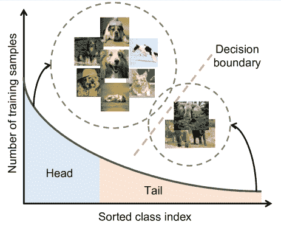
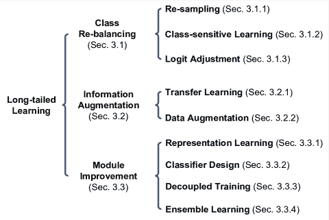
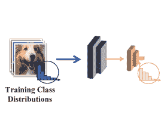
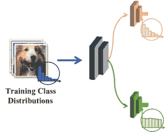
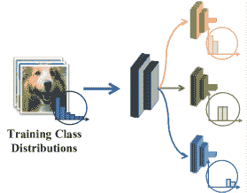
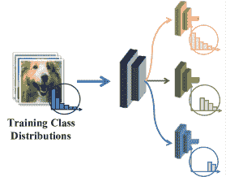
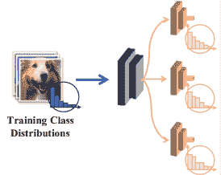
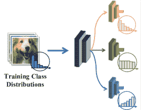
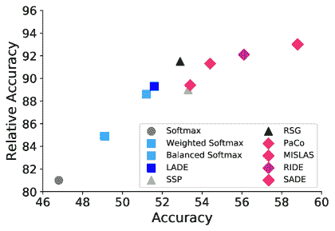

<!--yml

类别：未分类

日期：2024-09-06 19:50:47

-->

# [2110.04596] 深度长尾学习：综述

> 来源：[`ar5iv.labs.arxiv.org/html/2110.04596`](https://ar5iv.labs.arxiv.org/html/2110.04596)

# 深度长尾学习：综述

张一凡、康冰怡、霍辉、颜水成以及冯佳士 Y. Zhang 和 B. Hooi 供职于新加坡国立大学计算机学院。电子邮件：yifan.zhang@u.nus.edu, dcsbhk@nus.edu.sg。B. Kang 和 J. Feng 供职于字节跳动 AI 实验室。电子邮件：bingykang@gmail.com, jshfeng@bytedance.com。S. Yan 供职于 SEA AI 实验室。电子邮件：yansc@sea.com。

###### 摘要

深度长尾学习是视觉识别中最具挑战性的问题之一，旨在从遵循长尾类别分布的大量图像中训练表现良好的深度模型。在过去十年中，深度学习作为一种强大的识别模型，能够学习高质量的图像表示，并在通用视觉识别领域取得了显著突破。然而，长尾类别不平衡是实际视觉识别任务中常见的问题，往往限制了基于深度网络的识别模型在实际应用中的实用性，因为这些模型容易对主导类别产生偏见，并在尾部类别上表现不佳。为了解决这一问题，近年来进行了大量研究，并在深度长尾学习领域取得了有希望的进展。考虑到这一领域的快速发展，本文旨在提供对深度长尾学习最新进展的全面综述。具体而言，我们将现有的深度长尾学习研究分为三大类（*即，*类别重平衡、信息增强和模块改进），并详细回顾这些方法。随后，我们通过一种新提出的评价指标*即，*相对准确性，实证分析了几种最先进的方法，以评估它们在解决类别不平衡问题方面的效果。最后，我们通过突出深度长尾学习的重要应用，并识别几个有前景的未来研究方向，来总结本综述。

###### 关键词：

长尾学习，深度学习，不平衡学习

## 1 引言

深度学习允许由多个处理层组成的计算模型学习具有多个抽象级别的数据表示[1, 2]，并在计算机视觉领域取得了令人惊讶的进展[3, 4, 5, 6, 7, 8]。深度学习的关键因素是大规模数据集的可用性、GPU 的出现以及深度网络架构的进步[9]。由于学习高质量数据表示的强大能力，深度神经网络已成功应用于许多视觉识别任务，包括图像分类[6, 10]、目标检测[11, 7]和语义分割[12, 8]。

在实际应用中，训练样本通常表现出长尾类分布，其中一小部分类拥有大量样本点，而其他类只有少量样本[13, 14, 15, 16]。然而，这种训练样本数量的不平衡使得基于深度网络的识别模型训练非常具有挑战性。如图 1 所示，训练的模型容易偏向于拥有大量训练数据的主类，导致在数据有限的尾类上模型性能较差[17, 18, 19]。因此，采用经验风险最小化的常见实践训练的深度模型无法处理具有长尾类不平衡的实际应用，如面部识别[21, 22]、物种分类[23, 24]、医学影像诊断[25]、城市场景理解[26]和无人机检测[27]。

图 1：长尾数据集的标签分布（*例如，*iNaturalist 物种数据集[23]，具有超过 8,000 个类）。在这些采样上学习的头部类特征空间通常大于尾部类，而决策边界通常偏向于占主导地位的类。

为了解决长尾类不平衡问题，近年来进行了大量的深度长尾学习研究[16, 28, 15, 29, 30]。尽管该领域迅速发展，但仍缺乏系统性的研究来回顾和讨论现有的进展。为填补这一空白，我们旨在提供一个关于 2021 年中期之前进行的最新长尾学习研究的全面调查。

如图 2 所示，我们将现有方法根据其主要技术贡献分为三大类，即：类别重新平衡、信息增强和模块改进；这些类别可以进一步细分为九个子类别：重采样、类别敏感学习、logit 调整、迁移学习、数据增强、表征学习、分类器设计、解耦训练和集成学习。根据这一分类法，我们提供了对现有方法的全面回顾，并通过使用一种新的评估指标，即相对准确性，实证分析了几种先进方法在处理类别不平衡方面的能力。我们通过介绍深度长尾学习的几个实际应用场景，并指出社区未来可以探索的几个有前景的研究方向来结束本次调查。

我们将这项调查的关键贡献总结如下。

+   •

    据我们所知，这是第一份全面的深度长尾学习调查，旨在为研究人员和社区提供对深度神经网络下长尾视觉学习的更好理解。

+   •

    我们对先进的长尾学习研究进行了深入回顾，并通过评估它们在多大程度上通过新的相对准确性指标处理长尾类别不平衡来进行实证研究。

+   •

    我们确定了四个潜在的方法创新方向以及八个新的深度长尾学习任务设置以供未来研究。

本次调查的其余部分将按以下方式组织：第二部分介绍问题定义，并介绍广泛使用的数据集、指标和应用。第三部分全面回顾了先进的长尾学习方法，第四部分基于新的评估指标对几种最先进的方法进行了实证分析。第五部分确定了未来的研究方向。第六部分总结了本次调查。

图 2：现有深度长尾学习方法的分类。

## 2 问题概述

### 2.1 问题定义

深度长尾学习旨在从具有长尾类分布的训练数据集中学习深度神经网络模型，其中少量类别有大量样本，而其余类别则仅有少量样本（参见图 1）。设 $\{x_{i},y_{i}\}_{i=1}^{n}$ 为长尾训练集，其中每个样本 $x_{i}$ 具有相应的类别标签 $y_{i}$。训练集在 $K$ 类中的总数为 $n=\sum_{k=1}^{K}n_{k}$，其中 $n_{k}$ 表示类别 $k$ 的数据数量；设 $\pi$ 为标签频率向量，其中 $\pi_{k}=n_{k}/n$ 表示类别 $k$ 的标签频率。为了不失一般性，长尾学习中的一个常见假设 [31, 32] 是类按数量降序排序（*即*，如果 $i_{1}<i_{2}$，则 $n_{i_{1}}\geq n_{i_{2}}$，并且 $n_{1}\gg n_{K}$），然后不平衡比定义为 $n_{1}$/$n_{K}$。

这个任务具有两个挑战：（1）类别之间的数据数量不平衡使得深度模型对头类有偏倚，对尾类表现较差；（2）尾类样本的缺乏使得为尾类分类训练模型更加困难。这样的任务是基础性的，并可能出现在各种视觉识别任务中，如图像分类 [15, 32]、检测 [19, 33] 和分割 [34, 35, 26]。

表 I: 长尾数据集的统计数据。“分类”表示图像分类；“检测”代表目标检测；“分割”表示实例分割。

| 任务 | 数据集 | $\#$ 类别 | $\#$ 训练数据 | $\#$ 测试数据 |
| --- | --- | --- | --- | --- |
| 分类 | ImageNet-LT [15] | 1,000 | 115,846 | 50,000 |
| CIFAR100-LT [18] | 100 | 50,000 | 10,000 |
| Places-LT [15] | 365 | 62,500 | 36,500 |
| iNaturalist 2018 [23] | 8,142 | 437,513 | 24,426 |
| 检测/分割 | LVIS v0.5 [36] | 1,230 | 57,000 | 20,000 |
| LVIS v1 [36] | 1,203 | 100,000 | 19,800 |
| 多标签分类 | VOC-LT [37] | 20 | 1,142 | 4,952 |
| COCO-LT [37] | 80 | 1,909 | 5,000 |
| 视频分类 | VideoLT [38] | 1,004 | 179,352 | 51,244 |

### 2.2 数据集

近年来，已经发布了各种视觉数据集用于长尾学习，这些数据集在任务、类别数量和样本数量上有所不同。在表 I 中，我们总结了深度长尾学习社区广泛使用的九个视觉数据集。

在长尾图像分类中，有四个基准数据集：ImageNet-LT [15]、CIFAR100-LT [18]、Places-LT [15] 和 iNaturalist 2018 [23]。前面三个数据集分别从 ImageNet [39]、CIFAR100 [40] 和 Places365 [41] 中按照 Pareto 分布采样，而 iNaturalist 是一个真实世界的长尾数据集。ImageNet-LT、Places-LT 和 iNaturalist 的不平衡比率分别为 256、996 和 500；CIFAR100-LT 有三种变体，其不平衡比率分别为 $\{10,50,100\}$。

在长尾目标检测和实例分割中，提供精确的边界框和掩码注释的 LVIS [36] 是广泛使用的基准。在多标签图像分类中，基准数据集是 VOC-LT [37] 和 COCO-LT [37]，它们分别从 PASCAL VOC 2012 [42] 和 COCO [43] 中采样。最近，一个大规模的“未裁剪”视频数据集 VideoLT [38] 被发布，用于长尾视频识别。

### 2.3 评估指标

长尾学习旨在对具有长尾类别不平衡的数据训练出表现良好的模型。为了评估类别不平衡解决得如何，通常会报告模型在所有类别上的表现以及在类别子集（*即*，头部、中部和尾部类别）上的表现。请注意，评估指标应平等对待每个类别。遵循这一原则，top-1 准确率或错误率通常用于平衡测试集，其中每个测试样本的重要性相同。当测试集不平衡时，通常采用平均精度（mAP）或宏观准确率，因为这两项指标对每个类别的处理是平等的。例如，在以前的研究中，top-1 准确率或错误率被广泛用于长尾图像分类，其中测试集通常被假定为近似平衡。同时，mAP 被用于长尾目标检测、实例分割和多标签图像分类，其中测试集通常不平衡。

### 2.4 应用

深度长尾学习的主要应用包括图像分类、检测分割和视觉关系学习。

图像分类。长尾学习的最常见应用是多类分类[15, 32, 44, 45]和多标签分类[37, 46]。如第 2.2 节所述，许多人造采样的长尾数据集来自广泛使用的多类分类数据集（*即，* ImageNet、CIFAR 和 Places）和多标签分类数据集（*即，* VOC 和 COCO）。基于这些数据集，已经提出了各种长尾学习方法，如第三部分所示。除了这些人工任务，长尾学习还应用于真实世界的应用，包括物种分类[23, 24, 47]、面部识别[21, 22, 48, 49]、面部属性分类[50]、服装属性分类[50]、年龄分类[51]、轨道表面缺陷检测[52]和医学图像诊断[25, 53]。这些真实应用通常需要更细致的辨别能力，因为它们的类别之间的差异更加微妙。由于这一新的挑战，现有的深度长尾学习方法在这些应用中往往会失败，因为它们只关注解决类别不平衡问题，无法实质性地识别微妙的类别差异。因此，在探索新方法以应对这些应用时，值得考虑如何同时解决类别不平衡和细粒度信息识别的挑战。

图像检测/分割。目标检测和实例分割在长尾学习社区中引起了越来越多的关注[54, 55, 56, 57, 58, 59]，大多数现有研究基于 LVIS 和 COCO 进行。除了这些广泛使用的基准外，还探索了许多其他应用，包括城市场景理解[26, 60]和无人机检测[27]。与 LVIS 和 COCO 上的人工任务相比，这些真实应用由于复杂的环境条件更具挑战性。例如，图像可能来自不同的天气条件或一天中的不同时间，这可能导致具有不同数据分布和不一致类别偏斜的多个图像领域。在面对这些新挑战时，现有的深度长尾学习方法往往会失败。因此，值得探索如何同时解决类别不平衡和领域迁移的挑战，以应对这些应用。

视觉关系学习。视觉关系学习对图像理解非常重要，并且在长尾学习社区中越来越受到关注。重要的应用包括长尾场景图生成[61, 62]、长尾视觉问答和图像描述[63, 64]。目前大多数现有的长尾研究集中在区分性任务上，因此无法应用于需要建模对象之间或图像与文本之间关系的上述应用。即便如此，探索现有长尾研究中的高级理念（*例如*，类别重新平衡）以设计针对视觉关系学习的定制方法仍然是有趣的。

### 2.5 与相关任务的关系

然后我们简要讨论几个相关任务，包括非深度长尾学习、类别不平衡学习、少样本学习和领域外泛化。

非深度长尾学习。对于长尾问题，有许多非深度学习的方法[65, 66, 67]。它们通常通过探索先验知识来增强经典的机器学习算法，以处理长尾问题。例如，类别之间的相似性先验被用于正则化核机器算法，以进行长尾对象识别[65]。此外，由 Pitman-Yor 过程（PYP）方法[68]生成的长尾幂律分布先验被应用于增强贝叶斯非参数框架，以进行长尾主动学习[66]。一种人工分布先验被采用来构建尾部类别的数据增强，以增强 KNN 和 SVM 用于长尾场景解析[67]。几乎所有这些方法都基于尺度不变特征变换（SIFT）[69]、梯度方向直方图（HOG）[70]或 RGB 颜色直方图[71]提取图像特征。然而，这些表示方法无法为真实的视觉应用提取高度信息量和区分性的特征[1]，因此在长尾学习中表现有限。最近，鉴于深度网络在图像表示中的强大能力，深度长尾方法在长尾学习中取得了显著的性能提升。更令人鼓舞的是，深度网络的使用也激发了许多新的解决方案范式，如迁移学习、解耦训练和集成学习，这些将在下一节中介绍。

**类别不平衡学习** [72, 5] 也旨在从类别不平衡的样本中训练模型。从这个意义上讲，长尾学习可以被看作是类别不平衡学习中的一个具有挑战性的子任务。主要的区别在于，长尾学习的类别遵循*长尾分布*，而类别不平衡学习并不一定需要这种分布。更多的区别包括，在长尾学习中类别的数量通常很大，而尾类样本通常非常稀少，而在类别不平衡学习中，少数类样本的数量并不一定是绝对小的。这些额外的挑战使得长尾学习比类别不平衡学习更具挑战性。尽管存在这些差异，但两者都致力于解决类别不平衡问题，因此它们之间有一些高级解决方案的想法（比如，类别重新平衡）是共享的。

**小样本学习** [73, 74, 75, 76] 旨在从有限数量的标记样本（例如，1 或 5 个）中训练模型。在这个意义上，小样本学习可以被看作是长尾学习的一个子任务，在这个任务中，尾部类通常具有非常少的样本。

**领域外泛化** [77, 78] 指的是一类任务，其中训练分布与未知的测试分布不一致。这种不一致包括数据边际分布不一致（例如，领域自适应 [79, 80, 81, 82, 83, 84] 和领域泛化 [85, 86]），类别分布不一致（例如，长尾学习 [15, 32, 28]，开放集学习 [87, 88]），以及前两种情况的组合。从这个角度来看，长尾学习可以被视为领域外泛化中的一个具体任务。

表 II：总结了 2021 年中期之前在顶级会议上发布的现有深度长尾学习方法。主要分为三大类：类别重平衡、信息增强和模块改进。在此表中，“CSL”表示类敏感学习；“LA”表示逻辑调整；“TL”代表迁移学习；“Aug”表示数据增强；“RL”表示表示学习；“CD”表示分类器设计，旨在为长尾识别设计新的分类器或预测方案；“DT”表示解耦训练，其中特征提取器和分类器分别训练；“Ensemble”表示集成学习方法。此外，“目标方面”表示方法试图从哪个方面解决类别不平衡。我们还在[`github.com/Vanint/Awesome-LongTailed-Learning`](https://github.com/Vanint/Awesome-LongTailed-Learning)提供了我们的代码库和收集的长尾学习资源。

| 方法 | 年份 | 类别重平衡 |  | 增强 |  | 模块改进 | 目标方面 |
| --- | --- | --- | --- | --- | --- | --- | --- |
| 重新采样 | CSL | LA |  | TL | Aug |  | RL | CD | DT | 集成 |
| --- | --- | --- | --- | --- | --- | --- | --- | --- | --- | --- |
| LMLE [89] | 2016 |  |  |  |  |  |  |  | ✓ |  |  |  | 特征 |
| HFL [90] | 2016 |  |  |  |  |  |  |  | ✓ |  |  |  | 特征 |
| 焦点损失 [54] | 2017 |  | ✓ |  |  |  |  |  |  |  |  |  | 目标 |
| 范围损失 [21] | 2017 |  |  |  |  |  |  |  | ✓ |  |  |  | 特征 |
| CRL [50] | 2017 |  |  |  |  |  |  |  | ✓ |  |  |  | 特征 |
| MetaModelNet [91] | 2017 |  |  |  |  | ✓ |  |  |  |  |  |  |  |
| DSTL [92] | 2018 |  |  |  |  | ✓ |  |  |  |  |  |  |  |
| DCL [93] | 2019 | ✓ |  |  |  |  |  |  |  |  |  |  | 样本 |
| Meta-Weight-Net [94] | 2019 |  | ✓ |  |  |  |  |  |  |  |  |  | 目标 |
| LDAM [18] | 2019 |  | ✓ |  |  |  |  |  |  |  |  |  | 目标 |
| CB [16] | 2019 |  | ✓ |  |  |  |  |  |  |  |  |  | 目标 |
| UML [95] | 2019 |  | ✓ |  |  |  |  |  |  |  |  |  | 特征 |
| FTL [96] | 2019 |  |  |  |  | ✓ | ✓ |  |  |  |  |  | 特征 |
| 不平等训练 [48] | 2019 |  |  |  |  |  |  |  | ✓ |  |  |  | 特征 |
| OLTR [15] | 2019 |  |  |  |  |  |  |  | ✓ |  |  |  | 特征 |
| 平衡 Meta-Softmax [97] | 2020 | ✓ | ✓ |  |  |  |  |  |  |  |  |  | 样本，目标 |
| 解耦 [32] | 2020 | ✓ | ✓ |  |  |  |  |  | ✓ | ✓ | ✓ |  | 特征，分类器 |
| LST [98] | 2020 | ✓ |  |  |  | ✓ |  |  |  |  |  |  | 样本 |
| 领域适应 [28] | 2020 |  | ✓ |  |  |  |  |  |  |  |  |  | 目标 |
| 等式损失 (ESQL) [19] | 2020 |  | ✓ |  |  |  |  |  |  |  |  |  | 目标 |
| DBM [22] | 2020 |  | ✓ |  |  |  |  |  |  |  |  |  | 目标 |
| Distribution-balanced loss [37] | 2020 |  | ✓ |  |  |  |  |  |  |  |  |  | 目标 |
| UNO-IC [99] | 2020 |  |  | ✓ |  |  |  |  |  |  |  |  | 预测 |
| De-confound-TDE [45] | 2020 |  |  | ✓ |  |  |  |  |  | ✓ |  |  | 预测 |
| M2m [100] | 2020 |  |  |  |  | ✓ | ✓ |  |  |  |  |  | 样本 |
| LEAP [49] | 2020 |  |  |  |  | ✓ | ✓ |  | ✓ |  |  |  | 特征 |
| OFA [101] | 2020 |  |  |  |  | ✓ | ✓ |  |  |  | ✓ |  | 特征 |
| SSP [102] | 2020 |  |  |  |  | ✓ |  |  | ✓ |  |  |  | 特征 |
| LFME [103] | 2020 |  |  |  |  | ✓ |  |  |  |  |  | ✓ | 样本，模型 |
| IEM [104] | 2020 |  |  |  |  |  |  |  | ✓ |  |  |  | 特征 |
| Deep-RTC [105] | 2020 |  |  |  |  |  |  |  |  | ✓ |  |  | 分类器 |
| SimCal [34] | 2020 |  |  |  |  |  |  |  |  |  | ✓ | ✓ | 样本，模型 |
| BBN [44] | 2020 |  |  |  |  |  |  |  |  |  |  | ✓ | 样本，模型 |
| BAGS [56] | 2020 |  |  |  |  |  |  |  |  |  |  | ✓ | 样本，模型 |
| VideoLT [38] | 2021 | ✓ |  |  |  |  |  |  |  |  |  |  | 样本 |
| LOCE [33] | 2021 | ✓ | ✓ |  |  |  |  |  |  |  |  |  | 样本，目标 |
| DARS [26] | 2021 | ✓ | ✓ |  |  | ✓ |  |  |  |  |  |  | 样本，目标 |
| CReST [106] | 2021 | ✓ |  |  |  | ✓ |  |  |  |  |  |  | 样本 |
| GIST [107] | 2021 | ✓ |  |  |  | ✓ |  |  |  | ✓ |  |  | 分类器 |
| FASA [58] | 2021 | ✓ |  |  |  |  | ✓ |  |  |  |  |  | 特征 |
| Equalization loss v2 [108] | 2021 |  | ✓ |  |  |  |  |  |  |  |  |  | 目标 |
| Seesaw loss [109] | 2021 |  | ✓ |  |  |  |  |  |  |  |  |  | 目标 |
| ACSL [110] | 2021 |  | ✓ |  |  |  |  |  |  |  |  |  | 目标 |
| IB [111] | 2021 |  | ✓ |  |  |  |  |  |  |  |  |  | 目标 |
| PML [51] | 2021 |  | ✓ |  |  |  |  |  |  |  |  |  | 目标 |
| VS [112] | 2021 |  | ✓ |  |  |  |  |  |  |  |  |  | 目标 |
| LADE [31] | 2021 |  | ✓ | ✓ |  |  |  |  |  |  |  |  | 目标，预测 |
| RoBal [113] | 2021 |  | ✓ | ✓ |  |  |  |  |  | ✓ |  |  | 目标，预测 |
| DisAlign [29] | 2021 |  | ✓ | ✓ |  |  |  |  |  |  | ✓ |  | 目标，分类器 |
| MiSLAS [114] | 2021 |  | ✓ |  |  |  | ✓ |  |  |  | ✓ |  | 目标，特征，分类器 |
| Logit adjustment [14] | 2021 |  |  | ✓ |  |  |  |  |  |  |  |  | 预测 |
| Conceptual 12M [115] | 2021 |  |  |  |  | ✓ |  |  |  |  |  |  |  |
| DiVE [116] | 2021 |  |  |  |  | ✓ |  |  |  |  |  |  |  |
| MosaicOS [117] | 2021 |  |  |  |  | ✓ |  |  |  |  |  |  |  |
| RSG [118] | 2021 |  |  |  |  | ✓ | ✓ |  |  |  |  |  | 特征 |
| SSD [119] | 2021 |  |  |  |  | ✓ |  |  |  |  | ✓ |  |  |
| RIDE [17] | 2021 |  |  |  |  | ✓ |  |  |  |  |  | ✓ | 模型 |
| MetaSAug [120] | 2021 |  |  |  |  |  | ✓ |  |  |  |  |  | 样本 |
| PaCo [121] | 2021 |  |  |  |  |  |  |  | ✓ |  |  |  | 特征 |
| DRO-LT [122] | 2021 |  |  |  |  |  |  |  | ✓ |  |  |  | 特征 |
| Unsupervised discovery [35] | 2021 |  |  |  |  |  |  |  | ✓ |  |  |  | 特征 |
| Hybrid [123] | 2021 |  |  |  |  |  |  |  | ✓ |  |  |  | 特征 |
| KCL [13] | 2021 |  |  |  |  |  |  |  | ✓ |  | ✓ |  | 特征 |
| DT2 [61] | 2021 |  |  |  |  |  |  |  |  |  | ✓ |  | 特征，分类器 |
| LTML [46] | 2021 |  |  |  |  |  |  |  |  |  |  | ✓ | 样本，模型 |
| ACE [124] | 2021 |  |  |  |  |  |  |  |  |  |  | ✓ | 样本，模型 |
| ResLT [125] | 2021 |  |  |  |  |  |  |  |  |  |  | ✓ | 样本，模型 |
| SADE [30] | 2021 |  |  |  |  |  |  |  |  |  |  | ✓ | 目标，模型 |

## 3 经典方法

如图 2 所示，我们根据主要技术特征将现有的深度长尾学习方法分为三大类，包括类别重新平衡、信息增强和模块改进。更具体地，类别重新平衡包括三个子类别：重新采样、类别敏感学习（CSL）和对数调整（LA）。信息增强包括迁移学习（TL）和数据增强（Aug）。模块改进包括表示学习（RL）、分类器设计（CD）、解耦训练（DT）和集成学习（Ensemble）。根据这一分类法，我们在表 II 中整理了现有的方法，并详细回顾如下。

### 3.1 类别重新平衡

类别重新平衡是长尾学习中的一个主流范式，旨在重新平衡训练样本数量不平衡带来的负面影响。这类方法主要有三个子类别：重新采样、类别敏感学习和对数调整。我们从基于重新采样的方法开始，随后介绍类别敏感学习和对数调整。

#### 3.1.1 重新采样

传统的深度网络训练基于随机采样的迷你批次梯度下降，即每个样本被采样的概率相等。然而，这种采样方式忽略了长尾学习中的不平衡问题，自然会在每个样本迷你批次中采样更多的头部类样本而非尾部类样本。这使得最终的深度模型偏向于头部类，并在尾部类上的表现较差。为了解决这一问题，已经探索了通过调整每个样本批次中的每类样本数量来重新平衡类别的重采样方法 [126, 127, 128, 129]。

在非深度学习时代，最经典的重采样方法是随机过采样（ROS）和随机欠采样（RUS）。具体来说，ROS 随机重复少数类的样本以在训练前重新平衡各类，而 RUS 则随机丢弃多数类的样本。当将这些方法应用于深度长尾学习中，类分布极其不均时，带有重复尾部类数据的 ROS 可能导致尾部类的过拟合，而 RUS 可能丢弃珍贵的头部类样本，从而降低模型在头部类上的表现[44]。最近的深度长尾研究开发了各种类别平衡采样方法，用于深度模型的迷你批次训练。

我们从 Decoupling [32] 开始，该方法评估了四种采样策略用于长尾数据的表示学习，包括随机采样、类别平衡采样、平方根采样和逐步平衡采样。具体来说，类别平衡采样意味着每个类别被选择的概率相等。平方根采样 [130] 是类别平衡采样的变体，其中每个类别的采样概率与相应类别的样本数量的平方根有关。逐步平衡采样 [32] 在随机采样和类别平衡采样之间逐步插值。基于实证结果，Decoupling [32] 发现平方根采样和逐步平衡采样是长尾识别中标准模型训练的更好策略。然而，这两种策略都需要事先知道不同类别的训练样本频率，这在实际应用中可能无法获得。

为了解决上述问题，近期研究提出了各种自适应采样策略。动态课程学习（DCL）[93]开发了一种新的课程策略，以动态采样数据进行类别重新平衡。基本思路是随着训练的进行，越多的实例来自某一类别，该类别在后续阶段的采样概率就越低。基于这一思路，DCL 首先进行随机采样以学习一般性表示，然后基于课程策略对尾部类别实例进行更多采样以处理不平衡问题。除了使用累积的采样次数外，带有分类平衡的长尾对象检测器（LOCE）[33]提出通过*均值分类预测分数*（*即*，运行预测概率）来监控不同类别上的模型训练，并使用该分数来指导不同类别的采样率。此外，VideoLT[38]专注于长尾视频识别，介绍了一种新的 FrameStack 方法，该方法基于训练过程中*运行模型性能*动态调整不同类别的采样率，从而能从尾部类别（通常运行性能较低）中采样更多视频帧。

除了使用模型训练期间计算的统计数据外，一些重新采样方法还求助于元学习[131]。平衡元-软最大值（Balanced Meta-softmax）[97]开发了一种基于元学习的采样方法，以估计长尾学习中不同类别的最佳采样率。具体而言，开发的元学习方法通过优化*模型分类性能*在一个平衡的*元*验证集上来学习最佳样本分布参数。类似地，特征增强和采样适应（FASA）[58]探讨了在平衡的*元*验证集上的*模型分类损失*作为评分，并用此评分调整不同类别的采样率，以便更多地采样代表性不足的尾部类别。

请注意，一些长尾视觉任务可能存在多级不平衡。例如，长尾实例分割在图像和实例层面上都是不平衡的（*即*，每图像的实例数量也不平衡）。为了解决这一任务，简单校准（SimCal）[34]提出了一种新的双层类别平衡采样策略，该策略结合了图像级和实例级的重新采样进行类别重新平衡。

讨论。重新采样方法旨在在样本级别解决类别不平衡问题。当不同类别的标签频率已知时，建议使用逐步平衡采样 [32]。否则，使用模型训练的统计数据来指导重新采样 [33] 是实际应用中的首选方案。对于基于元学习的重新采样，在实际场景中可能很难构建元验证集。请注意，如果某种重新采样策略已经很好地解决了类别不平衡问题，进一步使用其他重新采样方法可能不会带来额外的好处。此外，这些重新采样方法的高级思想可以应用于设计多级重新采样策略，如果实际应用中存在多个不平衡级别。

#### 3.1.2 类别敏感学习

深度网络的传统训练方法基于 softmax 交叉熵损失（参见表 III）。这种损失忽略了数据规模的类别不平衡，往往会导致不同类别的梯度不均匀。也就是说，一个类别的每个正样本在交叉熵中可以被视为其他类别的负样本，这使得头部类别获得更多支持梯度（因为它们通常是正样本），而尾部类别获得更多压制梯度（因为它们通常是负样本） [19, 55]。为了解决这个问题，类别敏感学习寻求特别调整不同类别的训练损失值，以重新平衡由于不平衡问题造成的不均匀训练效果 [132, 133, 134, 135, 136, 137]。类别敏感策略主要有两种类型，即重新加权和重新调整边距。我们首先讨论类别重新加权。

表 III：损失汇总。在此表中，$z$ 和 $p$ 表示样本 $x$ 的预测 logits 和 softmax 概率，其中 $z_{y}$ 和 $p_{y}$ 对应于类别 $y$。此外，$n$ 表示训练数据的总数，其中 $n_{y}$ 是类别 $y$ 的样本数。此外，$\pi$ 表示样本频率的向量，其中 $\pi_{y}\small{=}n_{y}/n$ 代表类别 $y$ 的标签频率。类别权重用 $\omega$ 表示，类别边距用 $\Delta$ 表示，如果没有给出更具体的值。损失相关参数包括 $\gamma$。

| 损失 | 公式 | 类型 |
| --- | --- | --- |
| Softmax 损失 | ${\mathcal{L}_{\rm ce}}=-\log(p_{y})$ | - |
| Focal loss [54] | ${\mathcal{L}_{\rm fl}}=-(1-p_{y})^{\gamma}\log(p_{y})$ | 重新加权 |
| 加权 Softmax 损失 | ${\mathcal{L}_{\rm wce}}=-\frac{1}{\pi_{y}}\log(p_{y})$ | 重新加权 |
| 类别平衡损失 [16] | ${\mathcal{L}_{\rm cb}}=-\frac{1-\gamma}{1-\gamma^{n_{y}}}\log(p_{y})$ | 重新加权 |
| 平衡 Softmax 损失 [97] | ${\mathcal{L}_{\rm bs}}=-\log(\frac{\pi_{y}\exp(z_{y})}{\sum_{j}\pi_{j}\exp(z_{j})})$ | 重新加权 |
| 均衡损失 [19] | ${\mathcal{L}_{\rm eq}}=-\log(\frac{\exp(z_{y})}{\sum_{j}\omega_{j}\exp(z_{j})})$ | 重新加权 |
| LDAM 损失 [18] | ${\mathcal{L}_{\rm ldam}}=-\log(\frac{\exp(z_{y}-\Delta_{y})}{\sum_{j}\exp(z_{j}-\Delta_{j})})$ | 重新边际化 |

重新加权。为了应对类别不平衡问题，重新加权尝试通过将训练损失值乘以不同的权重来调整不同类别的训练损失值。最直观的方法是直接使用*训练样本的标签频率*进行损失重新加权，以重新平衡各类别之间不均匀的正梯度。例如，加权 softmax（参见表 III")直接将不同类别的损失值乘以训练标签频率的倒数。然而，简单地乘以倒数可能不是最佳解决方案。最近的研究因此提出了基于样本感知影响调整训练标签频率的影响 [111]。此外，类别平衡损失（CB） [16] 引入了*有效样本数*的新概念，以近似不同类别的期望样本数，这是一种训练标签数的指数函数。随后，CB 损失强制执行与类别有效数量成反比的类别平衡重新加权项，以解决类别不平衡（参见表 III")。除了上述基于对数概率的重新加权外，我们还可以使用训练标签频率来重新加权预测 logit。平衡 Softmax [97] 提出了通过乘以标签频率来调整预测 logit，从而在计算最终损失之前，通过标签先验来减轻类别不平衡的偏差。之后，向量缩放损失（VS） [112] 直观地分析了加法和乘法 logit 调整损失的不同效果，提出了一种新型 VS 损失，以结合两种调整形式的优势。

相比于使用训练标签频率，Focal loss [54] 探索了 *类别预测难度* 以进行重新加权。这一方法的灵感源于观察到的现象，即 *类别不平衡通常会增加尾部类别的预测难度，这些类别的预测概率会低于头部类别*。因此，Focal loss 使用预测概率来逆向重新加权类别（参见表 III），从而为更难的尾部类别分配更高的权重，而为较容易的头部类别分配较低的权重。除了使用预定义的加权函数，类别权重也可以通过数据学习。例如，Meta-Weight-Net [94] 提出了基于平衡验证集来学习 MLP 近似加权函数，以实现类别敏感学习。

一些近期的研究 [37, 19] 也尝试解决尾部类别的负梯度过度抑制问题。例如，Equalization loss [19] 在尾部类别样本作为头部类别样本的负标签时直接降低了其损失值。然而，简单地降低负梯度可能会损害深度模型的判别能力。为了解决这个问题，Adaptive Class Suppression loss (ACSL) [110] 使用 *输出置信度* 来决定是否抑制负标签的梯度。具体来说，如果负标签的预测概率大于预定义的阈值，这意味着模型对该类别感到困惑，因此该类别的权重设置为 1，以提高模型的判别能力；否则，权重设置为 0，以避免负梯度过度抑制。此外，Equalization loss v2 [108] 通过引入一种新的梯度引导重新加权机制扩展了 Equalization loss [19]，动态地提高正梯度的权重并降低负梯度的权重。类似地，Seesaw loss [109] 为每个类别用两个重新加权因子，即减轻和补偿，来重新平衡正负梯度。具体而言，为了解决梯度过度抑制问题，减轻因子基于不同类别的动态累积采样数量来减轻对尾部类别的惩罚。同时，如果观察到一个假阳性样本，补偿因子则提高对相应类别的惩罚，以改善模型的判别能力。

再边际调整。为了处理类别不平衡问题，再边际调整尝试通过为不同类别减去不同的边际因子来调整损失，使它们在特征与分类器之间具有不同的最小边际（*即，*距离）。直接使用现有的软边际损失[138, 139] 是不可行的，因为它们忽略了类别不平衡的问题。为了解决这一问题，标签分布感知边际（LDAM）[18] 根据训练标签频率对不同类别施加依赖于类别的边际因子，从而鼓励尾部类别具有更大的边际。

然而，在实际应用中，训练标签频率可能是未知的，仅仅使用它们进行再边际调整也忽略了模型在不同类别上的训练状态。为了解决这一问题，最近的研究探索了各种自适应再边际调整方法。基于不确定性的边际学习（UML）[95] 发现，*类别预测的不确定性与训练标签频率成反比，即尾部类别的不确定性更高*。受到这一发现的启发，UML 提出了使用估计的类别级不确定性来进行再边际调整，使得具有更高类别不确定性的尾部类别承担更高的损失值，从而在特征与分类器之间形成更大的边际。此外，LOCE [33] 提出了使用*均值类别预测得分*来监控不同类别的学习状态，并将其用于指导类别级边际调整，以增强尾部类别。领域平衡[22] 引入了一种基于*类别间特征紧凑性的*新型频率指标，并使用该指标来再边际调整尾部领域的特征空间。尽管这些方法有效地鼓励了尾部类别的较大边际，但也可能降低了头部类别的特征学习。为了解决这一问题，RoBal [113] 进一步施加了一个边际因子，以增大头部类别的边际。

讨论。这些类敏感学习方法旨在从目标层面解决类不平衡问题。我们在表 III 中总结了一些方法。无论是重加权还是重边距方法，对重新平衡类都有类似的效果。如果一种类敏感方法能够很好地解决类不平衡的负面影响，那么就没有必要进一步应用其他类敏感方法，因为这不会带来进一步的性能提升，甚至可能损害性能。更具体地说，如果训练标签频率可用，直接使用它们进行重加权（*例如，* Balanced Softmax [97] 和 VS [112]）或重边距（*例如，* LDAM [18]）为实际应用提供了简单且通常有效的解决方案。如果不可用，则建议使用均值类预测分数来指导类敏感学习（*例如，* ACSL [110] 和 LOCE [33]），因为其简单性。也可以考虑其他指导，如类内紧凑性。然而，当特征维度非常高时，特征的类间紧凑性[22] 可能信息量不大，而预测不确定性[95] 在实践中可能难以准确估计。此外，当类别数不多时，使用预测难度进行重加权在 Focal loss 中表现良好，但面对大量类别时可能失败。此外，如果实际应用中出现了它们试图解决的挑战，还可以考虑 Equalization loss v2、Seesaw loss 和 RoBal。

#### 3.1.3 Logit 调整

Logit 调整[140, 14] 试图通过调整类偏见深度模型的预测 logit 来解决类不平衡问题。最近的一项研究[14] 通过长尾识别中的不同类的训练标签频率对 logit 调整进行了全面分析，并理论上表明*logit 调整在最小化每类平均误差方面是 Fisher 一致的*。基于这一思想，RoBal[113] 应用了一种后处理策略，根据训练标签频率调整余弦分类器。

然而，上述方法在训练标签频率不可用时往往会失败。为了解决这个问题，UNO-IC[99] 提出了基于*平衡*的元验证集学习 logit 偏移量，并用它来校准偏置模型预测。与使用元验证集不同，DisAlign[29] 应用了一种自适应校准函数进行 logit 调整，其中校准函数通过将校准后的预测分布与预定义的相对平衡的类分布进行匹配来学习。

logit 调整的思想自然适用于无关测试类别分布。如果测试标签频率可用，LADE [31]建议使用它们来后调整模型输出，以便将训练好的模型校准到任意测试类别分布。然而，测试标签频率通常不可用，这使得 LADE 在实际场景中不够实用。

讨论。总结来说，这些 logit 调整方法在预测层面上解决类别不平衡。如果已知训练标签频率，建议直接使用它们来后调整偏置深度模型的预测 [14, 113]。如果这些信息未知，建议利用 DisAlign 的思想 [29]来学习自适应校准函数。这些 logit 调整方法彼此排斥，因此在实际应用中，使用性能良好的一个即可。

#### 3.1.4 总结

在长尾学习的三种主要方法中，类别重新平衡相对简单，但可以实现可比甚至更好的性能。一些方法，特别是类别敏感学习，理论上受到启发或保证能处理长尾问题 [16, 18, 31]。这些优势使得类别重新平衡成为实际应用中的一个良好选择。

这三个子类别的**最终目标**（*即*，重新采样、类别敏感学习和 logit 调整）是相同的，*即*，重新平衡类别。因此，当类别不平衡没有得到很好解决时，结合它们可能会实现更好的性能。然而，这些子类型有时彼此排斥。例如，如果我们通过类别敏感学习训练了一个类别平衡的深度模型，那么进一步使用 logit 调整方法来后处理模型推断将会导致预测偏差并遭遇较差的性能。因此，如果想要结合它们，管道设计应当谨慎。

类别重新平衡的一个缺点是，大多数方法在提高尾部类别性能的同时会降低头部类别性能，这就像在玩性能的跷跷板。尽管整体性能有所提升，但它无法从根本上解决信息不足的问题，特别是在尾部类别由于数据量有限。为了解决这一限制，一种可行的解决方案是进行如下的信息增强。

### 3.2 信息增强

信息增强旨在向模型训练中引入额外信息，以便提升长尾学习的模型性能。这种方法类型中有两种方法：转移学习和数据增强。

#### 3.2.1 转移学习

迁移学习[141, 142, 91, 118, 101]旨在将源领域（*例如*，数据集）的知识转移到目标领域，以增强模型训练。在长尾学习中，主要有四种迁移方案，即模型预训练、知识蒸馏、头尾模型迁移和自训练。

模型预训练是深度模型训练中的一种流行方案[143, 144, 145, 146, 147]，也已在长尾学习中进行探索。例如，领域特定迁移学习（DSTL）[92]首先用所有长尾样本进行模型预训练以进行表示学习，然后在一个类别更均衡的训练子集上对模型进行微调。通过这种方式，DSTL 慢慢将学习到的特征转移到尾部类别，从而在所有类别之间获得更平衡的性能。与监督式预训练不同，自监督式预训练（SSP）[102]建议首先使用自监督学习（*例如*，对比学习[148]或旋转预测[149]）进行模型预训练，然后在长尾数据上进行标准训练。实证结果表明，自监督学习有助于学习长尾学习的平衡特征空间[13]。这种方案也被探索用于处理具有噪声标签的长尾数据[150]。

知识蒸馏旨在基于经过良好训练的教师模型的输出训练学生模型 [151, 152]。近期研究探讨了知识蒸馏在长尾学习中的应用。例如，**从多个专家学习**（LFME）[103] 首先在若干不太不平衡的样本子集（*例如*，头部、中部和尾部集合）上训练多个专家，然后将这些专家蒸馏成一个统一的学生模型。类似地，**路由多样专家**（RIDE）[17] 引入了一种知识蒸馏方法，通过学习一个具有更少专家的学生网络来减少多专家模型的参数。与多专家教师不同，**蒸馏虚拟示例**（DiVE）[116] 表明，将类平衡模型作为教师进行学习对长尾学习也有好处。在 DiVE 的基础上，**自监督蒸馏**（SSD）[119] 开发了一种新的自蒸馏方案，以增强解耦训练（参见第 3.3.3 节）。具体来说，SSD 首先通过解耦训练方案基于监督和自监督信息训练一个校准模型，然后利用该校准模型为所有样本生成软标签。随后，使用生成的软标签和原始长尾硬标签来蒸馏一个新的学生模型，并进行新的分类器微调阶段。

头尾模型迁移旨在将模型知识从头类转移到尾类，以增强尾类的模型性能。例如，**MetaModelNet**[91] 提出了学习一个可以将少样本模型参数映射到多样本模型参数的元网络。为此，MetaModelNet 首先在头类训练集上训练一个多样本模型，并在这些类的一个采样子集上训练一个虚假的少样本模型，该子集数据非常有限以模拟尾类。然后，通过将学习到的虚假少样本模型映射到多样本模型来学习元网络。随后，将在头类上学到的元网络应用于将真实的少样本模型映射到尾类上，以获得更好的尾类性能。与模型映射不同，**几何结构迁移**（GIST）[107] 提出了在分类器层面进行头尾迁移。具体来说，GIST 利用头类的相对较大分类器几何信息来增强尾类分类器的权重，从而提高尾类的性能。

自训练旨在从少量已标记样本和大量未标记样本中学习性能良好的模型[153, 154, 155]。具体来说，它首先使用已标记样本训练一个有监督模型，然后将该模型应用于未标记数据生成伪标签。随后，同时使用已标记样本和伪标记样本对模型进行重新训练。通过这种方式，自训练可以利用大量未标记样本的知识来提升长尾学习性能。然而，这种方法无法直接处理长尾问题，因为已标记和未标记数据集都可能遵循不同程度的长尾类别分布。在这种情况下，已标记样本上训练的模型可能会对头类别有偏好，并倾向于为未标记样本生成更多头类别的伪标签，导致不平衡程度更加偏斜。

为了解决这个问题，《分布对齐和随机采样》（Distribution Alignment and Random Sampling，DARS）[26]提出将标记数据集的标签频率作为参考，并确保生成的伪标签的标签频率与已标记数据集一致。《类别再平衡自训练》（Class-rebalancing Self-training，CReST）[106]发现在尾类别上的有监督模型的精度出奇的高，并因此提议每次迭代在在线伪标签中选择更多尾类别样本，以便重新训练的模型在尾类别上能够获得更好的性能。在分类任务之外，《镶嵌 OS》（MosaicOS）[117]利用其他以物体为中心的图像提升长尾目标检测。具体来说，它首先使用原始检测数据集中以场景为中心的已标记图像对模型进行预训练，然后使用预训练模型为以物体为中心的图像生成伪边界框，例如 ImageNet-1K[39]。然后，MosaicOS 分两个阶段对预训练模型进行微调，即先使用伪标记的以物体为中心的图像进行微调，然后再使用原始已标记的以场景为中心的图像进行微调。通过这种方式，MosaicOS 缓解了数据差异的负面影响，有效提升了长尾性能。

讨论。这些转移学习方法相互补充，从不同的角度为长尾学习带来了额外的信息。如果资源允许并且组合管道设计得当，它们大多数可以一起用于实际应用。更具体地说，在使用模型预训练时，应该调整监督性区分学习和自监督性类别平衡学习之间的权衡[13]，这有助于更好的长尾学习性能。此外，具有多个专家的知识蒸馏通常能比单一教师的蒸馏取得更好的性能。在头到尾的模型转移中，由于其简单性，GIST 是比 MetaModelNet 更好的候选者。最后，自训练方法的使用取决于任务需求和手头上可用的无标签样本。

#### 3.2.2 数据增强

数据增强旨在通过对每个数据/特征应用预定义的变换来提升数据集的大小和质量，以用于模型训练[156, 157]。在长尾学习中，已经探索了两种类型的增强方法，即*基于转移的增强*和*非转移增强*。

头到尾的转移增强旨在将知识从头部类别转移到增强尾部类别样本。例如，主要到次要翻译（M2m）[100] 提出通过基于扰动的优化将头部类别样本翻译为尾部类别样本，从而增强尾部类别，这本质上类似于对抗攻击。翻译后的尾部类别样本用于构建更平衡的训练集以进行模型训练。

除了 M2m 中的数据级转移，大多数研究探讨了特征级转移。例如，特征转移学习（FTL）[96] 发现*尾部类别样本的类内方差远小于头部类别样本，从而导致特征空间和决策边界的偏差*。为了解决这个问题，FTL 利用头部类别的类内方差知识来指导尾部类别样本的特征增强，使尾部类别特征具有更高的类内方差。类似地，LEAP [49] 为每个类别构建“特征云”，并将头部类别特征云的分布知识转移到尾部类别特征云，以增强尾部类别特征云的类内变异性。因此，缓解了各类别间类内特征方差的扭曲，从而改善了尾部类别的性能。

代替使用类内变异信息，Rare-class Sample Generator (RSG) [118] 提出了动态估计每个类别的一组特征中心，并使用*头部类别样本特征与其最近的类内特征中心之间的特征位移*来增强每个尾部样本特征，从而扩展尾部类别的特征空间。此外，Online Feature Augmentation (OFA) [101] 提出了使用类别激活图 [158] 将样本特征解耦为类别特定和类别无关的特征。随后，OFA 通过将尾部类别样本的类别特定特征与头部类别样本的类别无关特征结合来增强尾部类别。

非转移增强旨在改进或设计传统数据增强方法以解决长尾问题。SMOTE [159]，一种经典的过采样方法，可以应用于深度长尾问题，通过混合几个类内邻近样本来生成尾部类别样本。最近，MiSLAS [114] 进一步研究了深度长尾学习中的数据混合，并发现（1）*数据混合有助于缓解模型过度自信*；（2）*在解耦训练方案中，混合对表征学习有积极影响，但对分类器学习有负面或微不足道的影响* [32]。基于这些观察结果，MiSLAS 提出了在解耦方案中使用数据混合来增强表征学习。此外，Remix [160] 也采用了数据混合来进行长尾学习，并引入了一种重新平衡的混合方法来特别增强尾部类别。

代替使用数据混合，FASA [58] 提出了基于从以前观察到的样本中估计的均值和方差的类别高斯先验，为每个类别生成新的数据特征。在这里，FASA 利用模型分类损失在平衡验证集上调整不同类别的特征采样率，以便于增强尾部类别的样本多于头部类别。基于类似的理念，Meta Semantic Augmentation (MetaSAug) [120] 提出了用隐式语义数据增强 (ISDA) [161] 的变体来增强尾部类别。具体而言，ISDA 估计类别条件统计（*即*，样本特征的协方差矩阵）以获得语义方向，并通过沿不同的语义上有意义的方向转换样本特征来生成多样化的增强样本。为了更好地估计尾部类别的协方差矩阵，MetaSAug 探索了元学习来指导每个类别协方差矩阵的学习，使用了类别平衡损失 [16]，从而得到更具信息性的合成特征。

讨论。基于数据增强的方法试图在样本或特征级别解决类别不平衡问题。这些方法的目标是一致的，因此如果组合流程构建得当，它们可以同时使用。在其两种子类型中，头到尾的迁移增强比非迁移增强更直观。更具体地说，在特征级别的迁移增强中（*例如* RSG），由于其易于使用的源代码，RSG 被认为性能更佳，而在特征维度非常高时，FTL 和 LEAP 中的类内变异可能对增强影响较小。在非迁移增强中，基于混合的策略通常得到使用，MIslas 已展示出令人期待的性能。相比之下，FASA 中的类别高斯先验和 MetaSAug 中的协方差矩阵在各种真实场景中可能难以估计。

#### 3.2.3 总结

信息增强通过引入额外知识来解决长尾问题，因此与其他两种方法类型兼容并且互补，*即*类别重平衡和模块改进。出于同样的原因，其两种子类型，*即*迁移学习和数据增强，也互为补充。更具体地说，如果设计得当，这两种子类型都能够在不牺牲头类性能的情况下改善尾类性能。考虑到长尾学习中所有类别都很重要，这种方法值得进一步探索。此外，数据增强是一种非常基础的技术，可用于各种长尾问题，使其在实际应用中比其他范例更为实用。然而，单纯使用现有*与类别无关*的增强技术改善长尾学习并不理想，因为它们忽视了类别不平衡，不可避免地会增强更多头类样本而非尾类样本。如何更好地进行数据增强以改善长尾学习仍然是一个未解之谜。

### 3.3 模块改进

除了重平衡和信息增强，研究人员还探索了改进长尾学习中的网络模块的方法。这些方法可以分为四类：(1) 表示学习改进特征提取器；(2) 分类器设计增强模型分类器；(3) 分离训练旨在增强特征提取器和分类器的学习；(4) 集成学习改进整个架构。

#### 3.3.1 表示学习

现有的长尾学习方法基于三种主要范例改进了表示学习，*即*度量学习、原型学习和顺序训练。

度量学习旨在设计任务特定的距离度量，用于建立数据之间的相似性或差异性。在深度长尾学习中，基于度量学习的方法试图探索各种基于距离的损失，以学习适用于长尾数据的判别特征空间。一个例子是大边距局部嵌入（LMLE）[89]，它引入了五元组损失，以学习保持簇间和类别间边距的表示。与采样两个对比对的三元组损失[162]不同，LMLE 提出了一种五元组采样器，用于采样四个对比对，包括一个正对和三个负对。正对是最远的簇内样本，而负对包括来自同一类别的两个簇间样本（一个是最近的，一个是同一簇内最远的）以及最近的类别间样本。随后，LMLE 引入了五元组损失，以鼓励采样的五元组遵循特定的距离顺序。这样，学习到的表示不仅保持了簇内的局部性，还保持了类别间的判别性。此外，每个数据批次包含来自不同类别的相同数量的样本，以进行类别重平衡。然而，LMLE 没有考虑头类和尾类之间的样本差异。为了解决这个问题，类别校正损失（CRL）[50]探索了困难对挖掘，并提出为尾类构造更多的困难对三元组，以使尾类特征具有更大的簇内紧凑度和类别间距离。

与其采样三元组或五元组，范围损失[21]通过使用一个小批次内所有样本对之间的整体距离来创新表示学习。换句话说，范围损失使用整个批次的统计数据，从而减轻了类别之间的数据数量不平衡的偏差。具体而言，范围损失通过最大化小批次内任何两个类别中心之间的距离来扩大类别间距离，并通过最小化簇内样本之间的最大距离来减少簇内变异。通过这种方式，范围损失获得了具有更好判别能力和更少不平衡偏差的特征。

最近的研究还探讨了对比学习在长尾问题上的应用。KCL [13] 提出了 $k$-正对比损失，以学习平衡的特征空间，这有助于缓解类别不平衡并提高模型的泛化能力。参数对比学习（PaCo）[121] 通过添加一组可学习的类别中心进一步创新了监督对比学习，这些类别中心在将其视为分类器权重时扮演着分类器的角色。随后，Hybrid [123] 引入了原型对比学习策略，以增强长尾学习。DRO-LT [122] 通过分布鲁棒优化 [163] 扩展了原型对比学习，使得学习到的模型对分布变化更加鲁棒。

原型学习方法寻求学习类别特定的特征原型，以提升长尾学习性能。开放长尾识别（OLTR）[15]创新性地探索了特征原型的思想，以应对在开放世界中的长尾识别问题，其中测试集还包括训练数据中未出现的开放类别。为了解决这一任务，OLTR 维护一个包含区分特征原型的视觉元记忆，并使用从视觉记忆中采样的特征来增强原始特征，从而提高区分能力。同时，新类别的样本特征被强制与记忆远离，接近原点。通过这种方式，学习到的特征空间使 OLTR 能够对所有已见类别进行分类，并检测新类别。然而，OLTR 仅维护一个静态的原型记忆，每个类别只有一个原型。这种每类单一原型可能无法代表真实的数据分布。为了解决这个问题，膨胀式情节记忆（IEM）[104]通过动态更新方案进一步创新了元嵌入记忆，其中每个类别具有独立且可区分的记忆块。每个记忆块被更新以记录对应类别的最具区分性的特征原型，从而比 OLTR 实现了更好的性能。

顺序训练方法以连续的方式学习数据表示。例如，层次特征学习（HFL）[90] 从每个类别在判别视觉表示中的独特性获得灵感。因此，HFL 将对象分层聚类成视觉上相似的类别组，形成一个层次聚类树。在这个聚类树中，原始节点中的模型在 ImageNet-1K 上进行预训练；每个子节点中的模型继承其父节点的模型参数，然后基于聚类节点中的样本进行微调。通过这种方式，来自大类组的知识逐渐转移到其子类组中。类似地，不平衡训练 [48] 提出了将数据集分为头类和尾类子集，并在训练过程中对它们进行不同处理。首先，不平衡训练使用头类样本通过一种新的抗噪声损失函数来训练相对判别性和抗噪声的特征。之后，它使用尾类样本通过困难的身份挖掘和一种新型的中心分散损失来增强表示的类别间判别性。

讨论。这些表示学习方法试图在特征层面上解决类别不平衡的问题。每个子类型中的方法相互竞争（*例如*，KCL [13] 与 PaCo [121] 和 OLTR [15] 与 IEM [104]），而不同子类型的方法可能互为补充（*例如*，KCL [13] 和 不平衡训练 [48]）。因此，如果要将它们结合在一起，管道设计必须小心。此外，在处理真实的长尾应用时，推荐使用 PaCo [121]，因为它具有良好的性能和开源代码。如果测试数据中存在开放类别，则首选 IEM [104]。如果它们适合实际场景，也可以考虑其他方法，如不平衡训练 [48]。

#### 3.3.2 分类器设计

除了表示学习，研究人员还探索了不同类型的分类器来解决长尾问题。在通用视觉问题 [10, 148] 中，深度学习的常见做法是使用线性分类器 $p=\phi(w^{\top}f\small{+}b)$，其中 $\phi$ 表示 softmax 函数，偏置项 $b$ 可以被忽略。然而，长尾类别的不平衡通常导致头类的分类器权重范数大于尾类 [96]，这使得线性分类器容易偏向主导类别。

为了解决这个问题，最近的研究[49, 113]提出使用尺度不变的余弦分类器$p=\phi((\frac{w^{\top}f}{\|w\|\|f\|})/\tau+b)$，其中分类器权重和样本特征都进行了归一化。在这里，温度$\tau$需要合理选择[164]，否则分类器性能会受到负面影响。然而，归一化特征空间可能会损害其表示能力。因此，$\tau$-归一化分类器[32]通过仅调整分类器权重范数来纠正不平衡，采用$\tau$-归一化过程。形式上，设$\tilde{w}=\frac{w}{\|w\|^{\tau}_{2}}$，其中$\tau$是归一化的温度因子。当$\tau=1$时，$\tau$-归一化还原为$L_{2}$归一化，而当$\tau=0$时，则不施加缩放。注意，超参数$\tau$也可以通过类别平衡采样进行训练，得到的分类器称为可学习的权重缩放分类器[32]。解决分类器权重不平衡的另一种方法是使用最近类均值分类器[32]，它首先计算训练集中每个类别的均值特征作为分类器，然后基于最近邻算法[165]进行预测。

还有一些基于层次分类、因果推断或分类器知识转移的更复杂的分类器设计。例如，现实分类器（RTC）[105]提出通过将图像映射到一个类别分类树结构来解决类别不平衡，其中层次结构由一组分类节点和节点关系定义。不同的样本在不同的层次级别上自适应分类，其中预测进行的层次级别取决于样本分类的难度和分类器的置信度。这种设计更倾向于在中间层做出正确决策，而不是在叶子节点做出错误决策。

因果分类器 [45] 通过因果推断来保持良好的因果效应并去除不良的动量因果效应，从而应对长尾学习中的问题。良好的因果效应指的是稳定梯度和加速训练的有益因素，而不良的因果效应则指的是导致尾部类别表现不佳的累积长尾偏差。为了更好地近似偏差信息，因果分类器应用了多头策略，将模型权重和数据特征的通道（或维度）均等地分成 $K$ 组。正式地，因果分类器通过 $p=\phi(\frac{\tau}{K}\sum_{k=1}^{K}\frac{(w^{k})^{\top}f^{k}}{(\|w^{k}\|+\gamma)\|f^{k}\|})$ 计算原始的 logits，其中 $\tau$ 是温度因子，$\gamma$ 是一个超参数。当 $\gamma=0$ 时，这个分类器本质上是余弦分类器。在推理过程中，因果分类器通过减去输入为空时的预测来去除不良的因果效应，*即*，$p=\phi(\frac{\tau}{K}\sum_{k=1}^{K}\frac{(w^{k})^{\top}f^{k}}{(\|w^{k}\|+\gamma)\|f^{k}\|}-\alpha\frac{cos(x^{k},\hat{d}^{k})(w^{k})^{\top}\hat{d}^{k}}{\|w^{k}\|+\gamma})$，其中 $\hat{d}$ 是指数移动平均特征的单位向量，$\alpha$ 是控制直接和间接效应的权衡参数。更直观地说，分类器通过计算训练期间的指数移动平均特征来记录偏差，然后通过在推理过程中从预测 logits 中减去偏差来去除不良因果效应。

GIST 分类器 [107] 旨在将头部类别的分类器几何结构转移到尾部类别。具体而言，GIST 分类器由一个特定于类别的权重中心（用于编码类别位置）和一组位移（用于编码类别几何形状）组成。通过利用从头部类别到尾部类别的相对较大位移来增强尾部类别的权重中心，GIST 分类器能够在尾部类别上获得更好的性能。

(a) 标准训练

(b) BBN [44]，TLML [46]，SimCAL [34]

(c) BAGS [56]，LFME [103]

(d) ACE [124]，ResLT [125]

(e) RIDE [17]

(f) SADE [30]

图 3：现有的基于集成的长尾方法的示意图。与标准训练（a）相比，通过集成方法训练的专家（b-f）可能具有不同的专业技能，*例如*，擅长不同的类别分布或不同的类别子集（用不同的颜色表示）。例如，BBN 和 SimCAL 训练两个专家以模拟原始的长尾分布和均匀分布，使它们能够很好地处理这两种分布。BAGS、LFME、ACE 和 ResLT 通过采样类别子集来训练多个专家，以便不同的专家可以特别处理不同的类别集合。SADE 直接训练多个专家，以从静态的长尾分布中分别模拟长尾、均匀和逆长尾类别分布，这使得它能够基于自监督聚合处理具有无关类别分布的测试集。

讨论。这些方法在分类器层面解决了不平衡问题。请注意，这些分类器是相互排斥的，分类器的选择也会影响其他长尾方法。例如，数据混合的效果在线性分类器和余弦分类器之间有所不同。因此，在探索新的长尾方法时，最好先确定使用哪个分类器。一般来说，推荐使用余弦分类器或可学习的权重缩放分类器，因为它们在面对不平衡时经验上更为稳健且易于使用。此外，在设计基于特征原型的方法时，最近类均值分类器是一个不错的选择。如果实际应用复杂且难以处理，也可以考虑更复杂的分类器设计（*例如*，RTC、Causal 和 GIST）。

#### 3.3.3 解耦训练

解耦训练将学习过程分为表示学习和分类器训练两个阶段。这里，解耦训练代表了一种长尾学习的一般范式，而不是特定的方法。解耦 [32] 是引入这种两阶段解耦训练方案的开创性工作。它在第一阶段通过评估不同的采样策略（在第 3.1.1 节中提到）来进行表示学习，然后在第二阶段通过固定训练好的特征提取器来评估不同的分类器训练方案。在分类器学习阶段，还包括四种方法，包括使用类别平衡采样的分类器再训练、最近类均值分类器、$\tau$-归一化分类器和可学习的权重缩放分类器。主要观察结果有两个：（1）*随机采样在解耦训练中的表示学习中意外地是最佳策略*；（2）*重新调整分类器可以显著提高长尾识别的性能*。

按照这一方案，KCL [13] 经验性地观察到*平衡的特征空间对长尾学习有益*。因此，它通过开发一种$k$-正对比损失创新了解耦训练方案，以学习更平衡和类区分度更强的特征空间，从而带来更好的长尾学习表现。此外，MiSLAS [114] 经验性地观察到*数据 mixup 对特征学习有益，但在两阶段解耦训练方案下对分类器训练有负面/微不足道的影响*。因此，MiSLAS 建议在第一阶段通过数据 mixup 增强表示学习，而在第二阶段应用标签感知平滑策略以获得更好的分类器泛化。

几项最近的研究特别加强了分类器训练阶段。例如，OFA [101]通过尾类特征增强创新了分类器再训练。SimCal [34]通过采用新颖的双层类平衡采样策略来校准分类头，从而提升了长尾实例分割任务中的分类器训练阶段。DisAlign [29]通过一种新的自适应 logit 调整策略创新了分类器训练。最近，DT2 [61]将解耦训练方案应用于场景图生成任务，展示了解耦训练在处理长尾视觉关系学习中的有效性。

讨论。解耦训练方法在特征和分类器层面上解决了类不平衡问题。在理想条件下，结合不同的方法可以带来更好的长尾表现，*例如*，将自监督预训练 [13]和 mixup 增强 [114]结合使用以获得更好的表示学习，或将标签感知平滑 [114]和尾类特征增强 [101]结合使用以获得更好的分类器调整。因此，建议使用 MiSLAS [114]作为基础方法，并在其上应用不同的技巧。请注意，一些表示方法也在竞争，例如，不同的采样方法用于表示学习 [32]。

分类器学习阶段不会引入太多计算成本，但可以带来显著的性能提升。这使得解耦训练越来越受到关注。一个批评意见是，累积的训练阶段使解耦训练在与现有的针对其他长尾问题如目标检测和实例分割的良好方法集成时变得不够实用。尽管如此，解耦训练的概念简单，因此可以很容易地用于设计解决各种长尾问题的新方法，例如 DT2 [61]。

#### 3.3.4 集成学习

集成学习方法通过战略性地生成和结合多个网络模块（即多个专家）来解决长尾视觉学习问题。我们在图 3 中总结了现有集成方法的主要方案，下面将详细介绍。

BBN [44] 提出了使用两个网络分支，*即* 一个常规学习分支和一个重平衡分支（参见表 3(b)），以处理长尾识别。具体来说，常规学习分支应用均匀采样来模拟原始的长尾训练分布，而重平衡分支则使用反向采样器在每个小批量中采样更多的尾部类别样本，以提高尾部类别的表现。这两个分支的预测在训练过程中动态结合，从而使得 BBN 的学习重点逐渐从头部类别转向尾部类别。继 BBN 之后，LTML [46] 应用了双分支网络方案来解决长尾多标签分类问题。具体而言，LTML 使用 sigmoid 交叉熵损失训练每个分支进行多标签分类，并施加 logit 一致性损失以提高两个分支的一致性。类似地，SimCal [34] 探索了一种双分类头方案，即常规分类头和校准分类头，以解决长尾实例分割问题。基于一种新的双层采样策略，校准分类头能够提高尾部类别的表现，而原始分类头则旨在保持头部类别的表现。

BAGS [56]没有采用双边分支，而是探索了多头方案来解决长尾目标检测问题。具体而言，BAGS 从一个观察中得到启发，即用较少样本学习更均匀的分布有时比用更多样本学习长尾分布更容易。因此，BAGS 将类别划分为多个组，每组中的类别拥有相似数量的训练数据。然后，BAGS 应用多个分类头进行预测，其中不同的头部在不同的类别组上进行训练（参见 表 3(c)）。这样，每个分类头在样本数量相似的类别上执行 softmax 操作，从而避免了类别不平衡的负面影响。此外，BAGS 还在每个组中引入了“其他类别”标签，以缓解不同头部之间的矛盾。与 BAGS 类似，LFME [103] 将长尾数据集划分为几个具有较小类别不平衡度的子集，并使用不同的样本子集训练多个专家。在这些专家的基础上，LFME 然后通过自适应知识蒸馏从多个教师那里学习一个统一的学生模型。

ACE [124]并非将类别划分为多个平衡子组，而是将其划分为几个技能多样的子集：一个子集包含所有类别；一个包含中间和尾部类别；另一个仅包含尾部类别（参见 表 3(d)）。ACE 然后训练多个专家，每个专家负责不同的类别子集，使得不同专家拥有特定且互补的技能。此外，考虑到不同子集的样本数量不同，ACE 还应用了分布式自适应优化器，以调整不同专家的学习率。类似的 ACE 思路也在 ResLT [125]中得到探讨。

RIDE [17]并未划分数据集，而是使用所有训练样本分别训练多个专家，并采用 softmax 损失（参见 表 3(e)），并施加基于 KL 散度的损失，以提升不同专家之间的多样性。随后，RIDE 引入了专家分配模块以提高计算效率。需要注意的是，独立使用 softmax 损失训练每个专家大大提升了长尾学习中的集成性能。然而，RIDE 学到的专家之间的多样性仍然不够。

自监督多样化专家聚合 (SADE) [30] 探索了一种新的多专家方案来处理与测试无关的长尾识别，其中测试类别分布可以是均匀的、长尾的，甚至是反向长尾的。具体来说，SADE 开发了一种新颖的跨光谱多专家框架（参见表 3(f)），并通过引入促进多样性的专家指导损失创新了专家训练方案，分别训练不同专家来处理不同的类别分布。通过这种方式，学习到的专家比 RIDE 更具多样性，从而提高了集成性能，并全面覆盖了可能的类别分布光谱。鉴于此，SADE 进一步引入了一种自监督学习方法，即预测稳定性最大化，以适应性地在测试时聚合专家，以更好地处理未知的测试类别分布。

讨论。这些基于集成的方法在模型层面上解决类别不平衡问题。由于它们需要特定的多模型设计和训练方式（参见图 3），因此彼此排斥，通常无法同时使用。更具体来说，像 BBN 和 TLML 这样具有双分支的方法只有两个专家，其经验性能已被证明不如拥有更多专家的方法。此外，像 BAGS 和 ACE 这样在类别子集上训练的专家可能会遇到专家不一致的问题，即不同标签空间导致专家聚合困难，并可能导致实际应用中的性能较差。相反，RIDE 训练多个专家使用所有样本，但结果是多个专家的多样性不足。相比之下，SADE 能够训练具有相同标签空间的技能多样化专家，因此推荐用于实际应用。这些基于集成的方法的一个担忧是，它们通常会导致更高的计算成本，因为使用了多个专家。然而，通过使用共享特征提取器，可以减轻这种担忧。此外，以效率为导向的专家分配和知识蒸馏策略 [103, 17] 也可以降低计算复杂度。

#### 3.3.5 总结

基于模块改进的方法试图通过改进网络模块来解决长尾问题。具体而言，表示学习和分类器设计是深度学习的基础问题，值得进一步探讨以解决长尾问题。表示学习和分类器设计与解耦训练是互补的。解耦训练的方案在概念上很简单，可以很容易地用于设计解决实际长尾应用的新方法。此外，基于集成的方法，由于聚合了多个专家，能够在不牺牲任何类别子集（*例如*，头部类别）的性能的情况下实现更好的长尾性能。由于所有类别都很重要，这种优越性使得基于集成的方法相比现有的类别重平衡方法（通常在牺牲头部类别性能的情况下提高尾部类别性能）成为实际应用中的更好选择。这里，基于集成的方法和解耦训练都需要特定的模型训练和设计方式，因此除非非常仔细设计，否则将它们一起使用并不容易。

请注意，大多数模块改进方法是基于基础的类别重平衡方法开发的。此外，模块改进方法与信息增强方法是互补的。将它们结合使用通常可以在实际的长尾应用中获得更好的性能。

## 4 实证研究

本节从经验上分析现有的长尾学习方法。首先，我们介绍一种新的评估指标。

### 4.1 新颖评估指标

长尾学习的主要目标是处理类别不平衡，以提高模型性能。因此，常见的评估协议[22, 13]直接使用 top-1 测试准确率（用 $A_{t}$ 表示）来判断长尾方法的效果以及哪种方法更好地处理类别不平衡。然而，这种指标不能准确反映不同方法在处理类别不平衡时的相对优越性，因为 top-1 准确率还受其他因素的影响，比如类别不平衡之外的因素。例如，像集成学习（或数据增强）这样的长尾方法也能提高在平衡训练集上训练的模型的性能。在这种情况下，很难判断性能提升是来源于缓解类别不平衡，还是来自于更好的网络架构（或更多的数据信息）。

为了更好地评估方法在处理类别不平衡方面的有效性，我们探索了一种新度量，即相对准确率 $A_{r}$，以减轻长尾学习中不必要因素的影响。为此，我们首先计算一个经验上限参考准确率 $A_{u}=\max(A_{v},A_{b})$，这是 *vanilla accuracy* $A_{v}$（在平衡训练集上使用交叉熵训练的骨干网络的准确率）和 *balanced accuracy* $A_{b}$（在平衡训练集上使用相应长尾方法训练的模型的准确率）之间的最大值。这里，平衡训练集是 *长尾训练集的一种变体，其中总数据量相似但每个类别的数据量相同*。从平衡训练集中获得的这个上限参考准确率，用于减轻类别不平衡之外的影响，然后 *相对准确率* 定义为 $A_{r}=\frac{A_{t}}{A_{u}}$。请注意，这一度量主要用于实证理解，即评估现有方法在多大程度上解决了类别不平衡问题。我们基于 ImageNet-LT 数据集 [15] 进行此分析，其中可以通过从原始 ImageNet 中采样来构建相应的平衡训练集变体，参考 [13]。

### 4.2 实验设置

接下来我们介绍实验设置。

数据集。我们采用广泛使用的 ImageNet-LT [15] 和 iNaturalist 2018 [23] 作为用于实证研究的基准长尾数据集。它们的数据集统计信息可以在表格 I 中找到。除了所有类别的性能外，我们还报告了三个类别子集的性能：头部（超过 100 张图像）、中部（20$\sim$100 张图像）和尾部（少于 20 张图像）。

基线。我们通过两个标准选择长尾方法：（1）源代码公开或易于重新实现；（2）方法在相关论文中在 ImageNet-LT 上进行了评估。因此，本文实证评估了 20 多种方法，包括基线（Softmax）、类敏感学习（加权 Softmax、焦点损失 [54]、LDAM [18]、ESQL [19]、平衡 Softmax [97]、LADE [31]）、对数调整（UNO-IC [99]）、迁移学习（SSP [102]）、数据增强（RSG [118]）、表示学习（OLTR [15]、PaCo [121]）、分类器设计（De-confound [45]）、解耦训练（Decouple-IB-CRT [32]、CB-CRT [32]、SR-CRT [32]、PB-CRT [32]、MiSLAS [114]）、集成学习（BBN [44]、LFME [103]、RIDE [17]、ResLT [125]、SADE [30]]。

实施细节。我们在 PyTorch 中实现了所有实验。根据 [31, 17, 32]，我们为 ImageNet-LT 使用 ResNeXt-50，为 iNaturalist 2018 使用 ResNet-50 作为所有方法的网络骨干。我们使用 SGD 优化器进行模型训练，批量大小 256，动量 0.9，权重衰减因子 0.0005，学习率 0.1（线性 LR 衰减）。对于与方法相关的超参数，我们要么直接遵循原始论文中的值，要么在默认值表现不佳时进行手动调整。此外，我们对所有方法使用相同的基本数据增强，*即*，随机调整大小并裁剪到 224，随机水平翻转，颜色抖动和归一化。

### 4.3 ImageNet-LT 结果

关于所有类别的观察。表格 V 和图 Fig. 4 报告了 ImageNet-LT 在所有类别上的平均性能。从这些结果中，我们对整体方法进展和不同方法类型有若干观察。如表格 V 所示，几乎所有长尾方法在准确性方面均优于 Softmax 基线，这表明了长尾学习的有效性。即便如此，有两种方法的表现稍逊于 Softmax，*即*，Decouple-CB-CRT [32] 和 BBN [44]。我们推测 Decouple-CB-CRT 表现不佳的原因是第一阶段的类别平衡采样导致的表示学习不佳（更多实证观察请参见 [32]）。BBN（基于官方代码）的差劲结果可能源于逐步调整学习焦点从头部类别到尾部类别的累积学习策略；然而，在训练结束时，可能过分关注尾部类别。结果是，尽管尾部类别的表现更好，但头部类别的模型准确性显著下降（参见表格 V），导致平均性能更差。

除了准确率，我们还基于上界参考准确率（UA）和相对准确率（RA）评估长尾方法。表 V 显示，大多数方法的 UA 与基线模型相同，但仍有一些方法的 UA 较高，如 SSP、MiSLAS 和 SADE。对于这些方法，性能的提升不仅来自于缓解类别不平衡，还来自于其他因素，如数据增强或更好的网络架构。因此，单纯使用准确率进行评估并不全面，而提出的 RA 指标则提供了良好的补充，因为它缓解了除了类别不平衡之外的其他因素的影响。例如，基于数据混合的 MiSLAS 在 90 次训练周期下的准确率高于 Balanced Softmax，但其 UA 也较高。因此，MiSLAS 的相对准确率低于 Balanced Softmax，这意味着 Balanced Softmax 在 90 次训练周期下比 MiSLAS 更好地缓解了类别不平衡。

尽管一些近期高准确率的方法 RA 较低，但长尾学习的整体发展趋势仍然积极，如图 4 所示。这种性能趋势表明，近期的长尾学习研究取得了实质性的进展。此外，最先进的 SADE 的 RA 为 93.0，这意味着未来仍有提升的空间。

表 IV：在 ImageNet-LT 上的准确率（Acc）、上界参考准确率（UA）、在 90 或 200 次训练周期下的相对准确率（RA）结果。在此表中，CR、IA 和 MI 分别表示类别重平衡、信息增强和模块改进。

| 类型 | 方法 | 90 周期 |  | 200 周期 |
| --- | --- | --- | --- | --- |
| Acc | UA | RA |  | Acc | UA | RA |
| 基线 | Softmax | 45.5 | 57.3 | 79.4 |  | 46.8 | 57.8 | 81.0 |
| CR | 加权 Softmax | 47.9 | 57.3 | 83.6 |  | 49.1 | 57.8 | 84.9 |
| Focal loss [54] | 45.8 | 57.3 | 79.9 |  | 47.2 | 57.8 | 81.7 |
| LDAM [18] | 51.1 | 57.3 | 89.2 |  | 51.1 | 57.8 | 88.4 |
| ESQL [19] | 47.3 | 57.3 | 82.5 |  | 48.0 | 57.8 | 83.0 |
| UNO-IC [99] | 45.7 | 57.3 | 81.4 |  | 46.8 | 58.6 | 79.9 |
| Balanced Softmax [97] | 50.8 | 57.3 | 88.7 |  | 51.2 | 57.8 | 88.6 |
| LADE [31] | 51.5 | 57.8 | 89.1 |  | 51.6 | 57.8 | 89.3 |
| IA | SSP [102] | 53.1 | 59.6 | 89.1 |  | 53.3 | 59.9 | 89.0 |
| RSG [118] | 49.6 | 57.3 | 86.7 |  | 52.9 | 57.8 | 91.5 |
| MI | OLTR [15] | 46.7 | 57.3 | 81.5 |  | 48.0 | 58.4 | 82.2 |
| PaCo [121] | 52.7 | 58.7 | 89.9 |  | 54.4 | 59.6 | 91.3 |
| De-confound [45] | 51.8 | 57.7 | 89.8 |  | 51.3 | 57.8 | 88.8 |
| Decouple-IB-CRT [32] | 49.9 | 57.3 | 87.1 |  | 50.3 | 58.1 | 86.6 |
| Decouple-CB-CRT [32] | 44.9 | 57.3 | 78.4 |  | 43.0 | 57.8 | 74.4 |
| Decouple-SR-CRT [32] | 49.3 | 57.3 | 86.0 |  | 48.5 | 57.8 | 83.9 |
| Decouple-PB-CRT [32] | 48.4 | 57.3 | 84.5 |  | 48.1 | 57.8 | 83.2 |
| MiSLAS [114] | 51.4 | 58.3 | 88.2 |  | 53.4 | 59.7 | 89.4 |
| BBN [44] | 41.2 | 57.3 | 71.9 |  | 44.7 | 57.8 | 77.3 |
| LFME [103] | 47.0 | 57.3 | 82.0 |  | 48.0 | 57.8 | 83.0 |
| ResLT [125] | 51.6 | 57.3 | 90.1 |  | 53.2 | 58.1 | 91.6 |
| RIDE [17] | 55.5 | 60.2 | 92.2 |  | 56.1 | 60.9 | 92.1 |
| SADE [30] | 57.3 | 61.9 | 92.6 |  | 58.8 | 63.2 | 93.0 |

TABLE V: 关于头部、中部和尾部类别在 90 或 200 训练周期下的 ImageNet-LT 准确性结果。在此表中，WS 表示加权 softmax，BS 表示平衡 softmax。方法类型与表 V 相同。

| 方法 | 90 epochs |  | 200 epochs |
| --- | --- | --- | --- |
| 头部 | 中部 | 尾部 |  | 头部 | 中部 | 尾部 |
| Softmax | 66.5 | 39.0 | 8.6 |  | 66.9 | 40.4 | 12.6 |
| WS | 66.3 | 42.2 | 15.6 |  | 57.9 | 46.2 | 34.0 |
| Focal loss [54] | 66.9 | 39.2 | 9.2 |  | 67.0 | 41.0 | 13.1 |
| LDAM [18] | 62.3 | 47.4 | 32.5 |  | 60.0 | 49.2 | 31.9 |
| ESQL [19] | 62.5 | 44.0 | 15.7 |  | 63.1 | 44.6 | 17.2 |
| UNO-IC [99] | 66.3 | 38.7 | 9.3 |  | 67.0 | 40.3 | 12.7 |
| BS [97] | 61.7 | 48.0 | 29.9 |  | 62.4 | 47.7 | 32.1 |
| LADE [31] | 62.2 | 48.6 | 31.8 |  | 63.1 | 47.7 | 32.7 |
| SSP [102] | 65.6 | 49.6 | 30.3 |  | 67.3 | 49.1 | 28.3 |
| RSG [118] | 68.7 | 43.7 | 16.2 |  | 65.0 | 49.4 | 31.1 |
| OLTR [15] | 58.2 | 45.5 | 19.5 |  | 62.9 | 44.6 | 18.8 |
| PaCo [121] | 59.7 | 51.7 | 36.6 |  | 63.2 | 51.6 | 39.2 |
| De-confound [45] | 63.0 | 48.5 | 31.4 |  | 64.9 | 46.9 | 28.1 |
| IB-CRT [32] | 62.6 | 46.2 | 26.7 |  | 64.2 | 46.1 | 26.0 |
| CB-CRT [32] | 62.4 | 39.3 | 14.9 |  | 60.9 | 36.9 | 13.5 |
| SR-CRT [32] | 64.1 | 43.9 | 19.5 |  | 66.0 | 42.3 | 18.0 |
| PB-CRT [32] | 63.9 | 45.0 | 23.2 |  | 64.9 | 43.1 | 20.6 |
| MiSLAS [114] | 62.1 | 48.9 | 32.6 |  | 65.3 | 50.6 | 33.0 |
| BBN [44] | 40.0 | 43.3 | 40.8 |  | 43.3 | 45.9 | 43.7 |
| LFME [103] | 60.6 | 43.5 | 22.0 |  | 64.1 | 42.3 | 22.8 |
| ResLT [125] | 57.8 | 50.4 | 40.0 |  | 61.6 | 51.4 | 38.8 |
| RIDE [17] | 66.9 | 52.3 | 34.5 |  | 67.9 | 52.3 | 36.0 |
| SADE [30] | 65.3 | 55.2 | 42.0 |  | 67.2 | 55.3 | 40.0 |

图 4：在 200 个周期下，长尾学习方法的准确率和相对准确率的性能趋势。在这里，$\circ$ 的形状表示 softmax 基线；$\square$ 表示类别重新平衡；$\bigtriangleup$ 和 $\diamondsuit$ 分别表示信息增强和模块改进方法。不同的颜色代表不同的方法。

我们还评估了不同训练周期（*即*，90 和 200）的影响，见表格 V。总体而言，训练 200 个周期对于大多数长尾方法而言性能更好，因为充足的训练使深度模型能够更好地拟合数据并学习更好的视觉表示。然而，也有一些方法在仅训练 90 个周期时表现更好，例如，**De-confound** 和 **Decouple-CB-CRT**。我们推测，对于这些方法，90 个周期足以训练模型，而更多的训练周期不会带来额外的好处，反而增加了训练难度，因为这也影响了学习率衰减方案。

对不同方法类型的观察。接下来我们分析了表格 V 中的不同方法类型。首先，几乎所有的类别重新平衡（CR）方法都对长尾学习性能有益，相较于基线模型。其中，**LADE**、**Balanced Softmax** 和 **LDAM** 达到了最先进的水平。此外，**Focal loss** 最初是为了处理目标检测而提出的 [54]。然而，在处理大量类别（*例如*，ImageNet-LT 中的 1,000 类）时，**Focal loss** 的表现并不好，仅带来边际改进。在 **LDAM** 中，除了 **LDAM** 损失之外，还有一个延期的重新平衡优化计划。仅使用 **LDAM** 损失而没有延期方案无法实现理想的结果。此外，如表格 V 所示，大多数类别敏感方法的上限参考准确率相同，因此它们的相对准确率与准确性正相关。因此，这种方法类型中的准确性提高可以准确反映类别不平衡的缓解情况。

在信息增强 (IA) 中，SSP（迁移学习）和 RSG（数据增强）都有助于处理长尾不平衡。尽管 SSP 也提高了上参考准确度，但它的相对准确度增加更显著，表明性能增益主要来自处理类别不平衡。在模块改进 (MI) 中，所有方法都有助于解决不平衡问题。截至目前，基于集成的长尾方法，*即* SADE 和 RIDE，在准确度和相对准确度方面都是最先进的。尽管集成学习也提高了上参考准确度，但处理不平衡问题带来的性能增益更为显著，导致更高的相对准确度。

对不同类别子集的结果。然后我们报告了不同类别子集的表现。如表 V 所示，几乎所有方法在牺牲头部类别表现的情况下提高了尾部类别和中间类别的性能。然而，头部类别在长尾学习中也很重要，因此有必要在不牺牲头部性能的情况下提高长尾性能。潜在的解决方案包括信息增强和集成学习，*例如* SSP 和 SADE。通过比较表 V 和表 V，可以发现整体性能增益在很大程度上取决于中部和尾部类别的改进；因此，如何提高它们的性能仍然是未来长尾学习的最重要目标。

到目前为止，SADE [30] 在准确度和 RA 方面取得了最佳整体性能（参见表 V），但 SADE 并不在所有类别子集上表现最先进（参见表 V）。例如，当训练 200 个周期时，SADE 的头部类别表现比 RIDE 更差，其尾部类别表现比 BBN 更差。总而言之，SADE 的较高平均表现意味着获得更好长尾性能的关键是在所有类别之间取得更好的折衷。总之，目前深度长尾学习的最佳实践是同时使用集成学习和类别再平衡。

TABLE VI：在 200 个训练周期下在 iNaturalist 2018 上的准确度结果。在这个表格中，CR、IA 和 MI 分别代表类别再平衡、信息增强和模块改进。

| 类型 | 方法 | 头部 | 中间 | 尾部 | 全部 |
| --- | --- | --- | --- | --- | --- |
| 基准 | 软最大化 | 75.3 | 66.4 | 60.4 | 64.9 |
| CR | Weighted Softmax | 66.5 | 68.0 | 69.2 | 68.3 |
| Focal loss [54] | 58.8 | 66.5 | 66.8 | 66.6 |
| LDAM [18] | 57.4 | 62.7 | 63.8 | 62.8 |
| Balanced Softmax [97] | 70.9 | 70.7 | 70.4 | 70.6 |
| LADE [31] | 70.1 | 69.5 | 69.9 | 69.7 |
| IA | SSP [102] | 72.0 | 68.9 | 66.3 | 68.2 |
| RSG [118] | 70.7 | 69.9 | 69.3 | 70.0 |
| MI | PaCo [121] | 68.5 | 72.0 | 71.8 | 71.6 |
| Decouple-IB-CRT [32] | 73.2 | 68.8 | 65.1 | 67.8 |
| Decouple-IB-LWS [32] | 71.3 | 69.2 | 68.1 | 69.0 |
| MiSLAS [114] | 71.7 | 71.5 | 69.7 | 70.7 |
| ResLT [125] | 67.5 | 69.2 | 70.1 | 69.4 |
| RIDE [17] | 71.5 | 70.0 | 71.6 | 71.8 |
| SADE [30] | 74.4 | 72.5 | 73.1 | 72.9 |

### 4.4 iNaturalist 2018 的结果

iNaturalist 2018 不是从更大的数据池中抽样得到的合成数据集，因此我们无法通过抽样构建一个具有类似数据规模的*平衡训练集*。因此，计算相对准确性是不切实际的，因此我们仅报告准确性方面的性能。如表 VI 所示，大多数观察结果与 ImageNet-LT 上的类似。例如，大多数长尾方法优于 Softmax。虽然 LDAM（基于官方代码）表现稍差，但其尾部类别的表现优于基线，表明 LDAM 可以缓解类别不平衡。然而，由于头尾权衡，其头部类别的表现显著下降，从而导致总体性能较差。此外，目前准确性方面的最先进方法是 SADE [30]，这进一步证明了基于集成的方法优于其他类型的方法。所有这些基线方法，除了基于数据增强的方法外，仅采用了基本的增强操作。如果我们采用更强的数据增强和更长的训练时间，它们的模型性能可以进一步提升。

表 VII：基于 ResNeXt-50 对 ImageNet-LT 上类别重新平衡的分析。LA 表示 logit 后调整，而 re-sampling 表示类别平衡重新抽样[32]。BS 表示 Balanced Softmax [97]。

| 损失 | LA | 重新抽样 | 头部 | 中间 | 尾部 | 全部 |
| --- | --- | --- | --- | --- | --- | --- |
| Softmax |  |  | 66.9 | 40.4 | 12.6 | 46.8 |
| --- | --- | --- | --- | --- | --- | --- |
| BS [97] |  |  | 62.4 | 47.7 | 32.1 | 51.2 |
|  |  | 47.2 | 45.5 | 48.5 | 46.6 |
|  |  | 57.6 | 47.5 | 30.6 | 49.1 |
|  |  | 42.6 | 46.6 | 43.6 | 44.6 |

表 VIII：分析基于迁移的方法（*例如*，SSP 预训练 [102]) 是否对其他类型的长尾学习有益。在这里，我们使用 ResNet-50 作为骨干网，因为 SSP 提供了一个开源的自监督预训练 ResNet-50。

| 方法 | SSP 预训练 [102] | 头部 | 中部 | 尾部 | 全部 |
| --- | --- | --- | --- | --- | --- |
| Softmax |  | 64.7 | 35.9 | 7.1 | 43.1 |
| --- | --- | --- | --- | --- | --- |
| 重新采样 [32] |  | 51.7 | 48.2 | 32.4 | 47.4 |
|  | 63.5 | 45.3 | 20.5 | 49.0 |
| BS [97] |  | 61.7 | 47.8 | 28.5 | 50.5 |
|  | 62.9 | 50.0 | 30.4 | 52.3 |
| 解耦 [32] |  | 64.2 | 46.1 | 26.0 | 50.3 |
|  | 67.3 | 49.1 | 28.3 | 53.3 |
| SADE [30] |  | 66.0 | 56.1 | 41.0 | 57.8 |
|  | 66.3 | 56.9 | 42.4 | 58.6 |

### 4.5 分析

我们接下来分析各种方法之间的关系。

讨论类重新平衡。类重新平衡有三种子方法，*即*，重新采样、类敏感学习和 logits 调整。虽然它们都有相同的目标——重新平衡类，但它们在某种程度上是相互排斥的。如表 VII 所示，Balanced Softmax（类敏感学习）单独使用远远优于 Softmax。然而，当进一步使用 logits 调整时，其性能仅与 Softmax 相当。原因在于通过类敏感学习训练的模型已经相对类平衡，因此进一步使用 logits 调整来后处理模型推断会导致预测再次偏向，从而性能下降。当进一步结合类平衡重新采样时，性能甚至更差。因此，简单地结合现有的类重新平衡方法而没有仔细设计，无法带来更好的性能。

讨论预训练与其他长尾方法之间的关系。如第 3.2 节所述，模型预训练是一种针对长尾学习的迁移式方案。在此实验中，我们分析了它是否对其他长尾范式有益。如表 VIII 所示，SSP 预训练对类重新平衡（类平衡采样 [32] 和 BS [97]）和模块改进（解耦 [32] 和 SADE [30]）带来了持续的性能提升。因此，我们得出结论，基于迁移的方法与其他长尾范式是互补的。

关于数据增强与其他长尾方法之间关系的讨论。我们接着分析数据增强方法是否对其他长尾范式有益。如表 IX 所示，RandAugment [166] 为 BS（类别重平衡方法）、PaCo（表示学习）、De-confound（分类器设计）和 SADE（集成学习）带来了稳定的性能提升。这样的结果表明，基于增强的方法与其他长尾学习范式是互补的。

表 IX：基于 ResNeXt-50 的数据增强方法（*例如，*RandAugment）是否对其他类型的长尾学习有益的分析。

| 方法 | RandAugment [166] | 头类 | 中等类 | 尾类 | 所有 |
| --- | --- | --- | --- | --- | --- |
| Softmax |  | 66.9 | 40.4 | 12.6 | 46.8 |
| --- | --- | --- | --- | --- | --- |
| BS [97] |  | 62.4 | 47.7 | 32.1 | 51.2 |
|  | 64.1 | 50.4 | 32.3 | 53.2 |
| PaCo [121] |  | 63.2 | 51.6 | 39.2 | 54.4 |
|  | 63.7 | 56.6 | 39.2 | 57.0 |
| De-confound [45] |  | 64.9 | 46.9 | 28.1 | 51.3 |
|  | 66.1 | 50.5 | 32.2 | 54.0 |
| SADE [30] |  | 67.2 | 55.3 | 40.0 | 58.8 |
|  | 67.3 | 60.4 | 46.4 | 61.2 |

表 X：在 ImageNet-LT 上进行 200 次训练周期的各种类别敏感损失的解耦训练性能。这里，“结合”表示一阶段端到端的联合训练；“NCM”是最近类均值分类器 [32]; “CRT”代表类别平衡分类器再训练 [32]; “LWS”表示可学习权重缩放 [32]。此外，BS 表示平衡 softmax 方法 [97]。

| 测试分布 | 所有类的准确率 |  | 头类的准确率 |
| --- | --- | --- | --- |
| 结合 | NCM | CRT | LWS |  | 结合 | NCM | CRT | LWS |
| Softmax | 46.8 | 50.2 | 50.2 | 50.8 |  | 66.9 | 63.5 | 65.0 | 64.6 |
| Focal loss [54] | 47.2 | 50.7 | 50.7 | 51.5 |  | 67.0 | 62.6 | 64.5 | 64.3 |
| ESQL [19] | 48.0 | 49.8 | 50.6 | 50.5 |  | 63.1 | 60.2 | 64.0 | 63.3 |
| BS [97] | 51.2 | 50.4 | 50.6 | 51.1 |  | 62.4 | 62.4 | 64.9 | 64.3 |
| 测试分布 | 中等类的准确率 |  | 尾类的准确率 |
| 结合 | NCM | CRT | LWS |  | 结合 | NCM | CRT | LWS |
| Softmax | 40.4 | 45.8 | 45.3 | 46.1 |  | 12.6 | 28.1 | 25.5 | 28.2 |
| Focal loss [54] | 41.0 | 47.0 | 46.4 | 47.3 |  | 13.1 | 30.1 | 26.9 | 30.2 |
| ESQL [19] | 44.6 | 46.6 | 46.5 | 46.1 |  | 17.2 | 31.1 | 27.1 | 29.5 |
| BS [97] | 47.7 | 46.8 | 46.1 | 46.7 |  | 32.1 | 29.1 | 26.2 | 29.4 |

对解耦训练方案中类别敏感损失的讨论。我们进一步评估了不同类别敏感学习损失在解耦训练方案中的表现[32]。在第一阶段，我们使用不同的类别敏感学习损失来训练模型骨干以学习表示，而在第二阶段，我们使用四种不同的策略进行分类器训练[32]，*即*，没有重新训练的联合训练、最近类别均值分类器（NCM）、类别平衡分类器重新训练（CRT）和可学习的权重缩放（LWS）。如表 X 所示，解耦训练可以进一步提高大多数类别敏感方法的整体性能，除了 BS。 在这些方法中，BS 在联合训练下表现最佳，但其他方法在解耦训练下表现与 BS 相当。这些结果尤其有趣，因为它们暗示虽然这些类别敏感损失在联合训练下表现不同，但它们实质上学到了相似质量的特征表示。BS 在解耦训练下的整体表现比联合训练差可能意味着 BS 在进行类别重平衡时做得非常好；进一步使用分类器重新训练进行重平衡并不会带来额外的好处，反而可能通过端到端联合训练降低了网络参数的一致性。

### 4.6 实证观察总结

然后，我们总结了实证研究的主要收获。首先，我们分析了现有的长尾方法在相对准确度方面解决类别不平衡的程度，并确认现有研究在解决类别不平衡方面取得了积极进展，而不仅仅是通过技巧追求最新的性能。第二，我们在统一的设置下确定了现有长尾方法的相对性能，发现基于集成的方法是目前的**最先进**方法。第三，我们分析了方法在不同类别子集上的表现，发现大多数方法在改善尾部类别表现的同时，牺牲了头部类别的表现。考虑到在长尾学习中所有类别都很重要，未来值得探索如何同时提高所有类别的表现。第四，我们通过实证研究表明，三种类别重平衡的子类型在一定程度上是互斥的。此外，信息增强方法对其他长尾范式具有互补性。最后，通过评估解耦训练方案下的类别敏感学习，我们发现类别重平衡和解耦训练在解决类别不平衡方面扮演了可互换的角色。此外，不同类别敏感损失下学到的表示在解耦训练下表现相似。

## 5 未来方向

在本节中，我们识别了深度长尾学习的几个未来研究方向。

测试无关长尾学习。现有的长尾学习方法通常假设测试类别分布是平衡的。然而，实际测试分布通常违背这一假设（*例如，* 可能是长尾或甚至是反向长尾），这可能导致现有方法在实际应用中失败。为了解决这一限制，LADE [31] 通过假设测试类别分布可以任意偏斜但测试分布的先验是可用的，来放宽这一假设。随后，SADE [30] 进一步创新了任务，其中测试类别分布不仅任意偏斜而且未知。除了类别不平衡外，这一任务还带来了另一个挑战，*即，* 训练和测试样本之间的类别分布未知变化。

开放集长尾学习。现实世界中的样本通常具有长尾和开放式的类别分布。开放集长尾学习[15, 104] 旨在从长尾数据中学习，并优化在包含头部、尾部和开放类别的平衡测试集上的分类准确率。主要面临两个挑战：（1）如何在头部和尾部类别之间共享视觉知识；（2）如何减少尾部和开放类别之间的混淆。

联邦长尾学习。现有的长尾研究通常假设在模型训练期间所有训练样本都是可访问的。然而，在实际应用中，长尾训练数据可能分布在大量移动设备或物联网[167]上，这需要对深度模型进行去中心化训练。这种任务称为联邦长尾学习，面临两个主要挑战：（1）长尾类别不平衡；（2）不同客户端本地数据之间的未知类别分布变化。

类增量长尾学习。在实际应用中，长尾数据可能以持续和类别增量的方式出现[168, 98, 169]。为了处理这种情况，类增量长尾学习旨在从类增量长尾数据中学习深度模型，面临两个主要挑战：（1）如何处理不同类别按顺序出现时的长尾类别不平衡，以及模型对未来类别及标签频率没有信息；（2）如何克服在学习新类别时对之前类别知识的灾难性遗忘。这种任务设置也可以称为持续长尾学习。

多领域长尾学习。当前的长尾方法通常假设所有长尾样本来自相同的数据边际分布。然而，在实际应用中，长尾数据也可能来自具有不同数据分布的不同领域[170, 28]，*例如*，DomainNet 数据集[171]。基于此，多领域长尾学习旨在同时处理类别不平衡和领域分布的变化。另一个更具挑战性的问题可能是不同领域之间类别不平衡的一致性。换句话说，不同领域可能有不同的类别分布，这进一步扩大了多领域长尾学习中的领域偏移。

鲁棒长尾学习。现实世界中的长尾样本可能还会遭受图像噪声[113, 172]或标签噪声[155, 150]。然而，大多数长尾方法假设所有图像和标签都是干净的，从而导致实际应用中模型的鲁棒性较差。这个问题对于尾部类别尤其严重，因为它们的训练样本非常有限。基于此，鲁棒长尾学习旨在同时处理类别不平衡并提高模型鲁棒性。

长尾回归。现有的大多数长尾视觉学习研究集中于分类、检测和分割，这些方法有离散的标签和类别索引。然而，许多任务涉及连续标签，其中不存在明确的分类边界。基于此，长尾回归[173]旨在处理具有连续标签空间的长尾学习任务。在这样的任务中，如何同时解决长尾类别不平衡和处理某些标签的潜在缺失数据仍然是一个未解的问题。

长尾视频学习。现有的大多数深度长尾学习研究集中在图像层面，但忽视了视频领域也面临长尾类别不平衡的问题。考虑到视频数据中的额外时间维度，长尾视频学习应比长尾图像学习更具挑战性。由于最近发布了 VideoLT 数据集[38]，长尾视频学习有望在不久的将来得到探索。

## 6 结论

在这项综述中，我们详细回顾了 2021 年中期之前提出的经典深度长尾学习方法，根据类别重平衡、信息增强和模块改进的分类法。我们通过评估这些方法在解决类别不平衡问题方面的效果，基于新提出的相对准确性指标，实证分析了几种最先进的长尾方法。随后，我们讨论了长尾学习的主要应用场景，并确定了方法和任务设置的潜在创新方向。我们期望这项及时的综述不仅为研究人员和社区提供了对长尾学习的更好理解，还促进了未来的研究。

## 致谢

这项工作部分得到了 NUS ODPRT 资助 A-0008067-00-00 的支持。

## 参考文献

+   [1] Y. LeCun, Y. Bengio, 和 G. Hinton, “深度学习,” *自然*, 第 521 卷，第 7553 期，页码 436–444，2015 年。

+   [2] I. Goodfellow, Y. Bengio, 和 A. Courville, *深度学习*. MIT 出版社, 2016 年。

+   [3] A. Voulodimos, N. Doulamis, A. Doulamis, 和 E. Protopapadakis, “计算机视觉中的深度学习：简要回顾,” *计算智能与神经科学*, 2018 年。

+   [4] C. Dong, C. C. Loy, K. He, 和 X. Tang, “利用深度卷积网络进行图像超分辨率,” *IEEE 模式分析与机器智能学报*, 第 38 卷，第 2 期，页码 295–307，2015 年。

+   [5] Z. Wang, J. Chen, 和 S. C. Hoi, “图像超分辨率的深度学习：综述,” *IEEE 模式分析与机器智能学报*, 2020 年。

+   [6] A. Krizhevsky, I. Sutskever, 和 G. E. Hinton, “使用深度卷积神经网络进行 ImageNet 分类,” *神经信息处理系统进展*, 第 25 卷，页码 1097–1105，2012 年。

+   [7] S. Ren, K. He, R. Girshick, 和 J. Sun, “Faster R-CNN：基于区域提议网络的实时目标检测,” *IEEE 模式分析与机器智能学报*, 第 39 卷，第 6 期，页码 1137–1149，2016 年。

+   [8] E. Shelhamer, J. Long, 和 T. Darrell, “用于语义分割的全卷积网络。” *IEEE 模式分析与机器智能学报*, 第 39 卷，第 4 期，页码 640–651，2016 年。

+   [9] Y. Bengio, Y. LeCun, 和 G. Hinton, “人工智能中的深度学习,” *ACM 通讯*, 第 64 卷，第 7 期，页码 58–65，2021 年。

+   [10] K. He, X. Zhang, S. Ren, 和 J. Sun, “用于图像识别的深度残差学习,” 见于 *计算机视觉与模式识别会议*, 2016 年。

+   [11] C. Szegedy, A. Toshev, 和 D. Erhan, “用于目标检测的深度神经网络,” 2013 年。

+   [12] R. Girshick, J. Donahue, T. Darrell, 和 J. Malik, “用于准确目标检测和语义分割的丰富特征层级,” 见于 *计算机视觉与模式识别会议*, 2014 年，页码 580–587。

+   [13] B. Kang, Y. Li, S. Xie, Z. Yuan, 和 J. Feng, “探索用于表示学习的平衡特征空间,” 见于 *国际表示学习会议*, 2021 年。

+   [14] A. K. Menon, S. Jayasumana, A. S. Rawat, H. Jain, A. Veit, 和 S. Kumar，“通过对数调整进行长尾学习，” 收录于 *学习表征国际会议*，2021 年。

+   [15] Z. Liu, Z. Miao, X. Zhan, J. Wang, B. Gong, 和 S. X. Yu，“开放世界中的大规模长尾识别，” 收录于 *计算机视觉与模式识别*，2019 年，第 2537–2546 页。

+   [16] Y. Cui, M. Jia, T.-Y. Lin, Y. Song, 和 S. Belongie，“基于有效样本数量的类平衡损失，” 收录于 *计算机视觉与模式识别*，2019 年，第 9268–9277 页。

+   [17] X. Wang, L. Lian, Z. Miao, Z. Liu, 和 S. X. Yu，“通过路由多样化的分布感知专家进行长尾识别，” 收录于 *学习表征国际会议*，2021 年。

+   [18] K. Cao, C. Wei, A. Gaidon, N. Arechiga, 和 T. Ma，“使用标签分布感知边际损失学习不平衡数据集，” 收录于 *神经信息处理系统进展*，2019 年。

+   [19] J. Tan, C. Wang, B. Li, Q. Li, W. Ouyang, C. Yin, 和 J. Yan，“用于长尾目标识别的均衡损失，” 收录于 *计算机视觉与模式识别*，2020 年，第 11,662–11,671 页。

+   [20] V. Vapnik，“学习理论的风险最小化原则，” 收录于 *神经信息处理系统进展*，1992 年，第 831–838 页。

+   [21] X. Zhang, Z. Fang, Y. Wen, Z. Li, 和 Y. Qiao，“用于深度人脸识别的范围损失与长尾训练数据，” 收录于 *计算机视觉国际会议*，2017 年，第 5409–5418 页。

+   [22] D. Cao, X. Zhu, X. Huang, J. Guo, 和 Z. Lei，“领域平衡：长尾领域中的人脸识别，” 收录于 *计算机视觉与模式识别*，2020 年，第 5671–5679 页。

+   [23] G. Van Horn, O. Mac Aodha, Y. Song, Y. Cui, C. Sun, A. Shepard, H. Adam, P. Perona, 和 S. Belongie，“iNaturalist 物种分类和检测数据集，” 收录于 *计算机视觉与模式识别*，2018 年，第 8769–8778 页。

+   [24] Z. Miao, Z. Liu, K. M. Gaynor, M. S. Palmer, S. X. Yu, 和 W. M. Getz，“迭代的人类和自动化野生动物图像识别，” *arXiv:2105.02320*，2021 年。

+   [25] L. Ju, X. Wang, L. Wang, T. Liu, X. Zhao, T. Drummond, D. Mahapatra, 和 Z. Ge，“针对长尾视网膜疾病识别的关系子集知识蒸馏，” *arXiv:2104.11057*，2021 年。

+   [26] R. He, J. Yang, 和 X. Qi，“针对半监督语义分割的偏置伪标签再分配：基线研究，” 收录于 *计算机视觉国际会议*，2021 年。

+   [27] W. Yu, T. Yang, 和 C. Chen，“解决无人机图像中长尾分布的挑战以进行目标检测，” 收录于 *IEEE 冬季计算机视觉应用会议*，2021 年，第 3258–3267 页。

+   [28] M. A. Jamal, M. Brown, M.-H. Yang, L. Wang, 和 B. Gong，“从领域适配的角度重新思考长尾视觉识别中的类平衡方法，” 收录于 *计算机视觉与模式识别*，2020 年，第 7610–7619 页。

+   [29] S. Zhang, Z. Li, S. Yan, X. He 和 J. Sun, “分布对齐：一个统一的长尾视觉识别框架，”发表在 *计算机视觉与模式识别*，2021 年，页 2361–2370。

+   [30] Y. Zhang, B. Hooi, L. Hong 和 J. Feng, “自监督聚合多样专家以进行测试无关的长尾识别，”发表在 *神经信息处理系统进展*，2022 年。

+   [31] Y. Hong, S. Han, K. Choi, S. Seo, B. Kim 和 B. Chang, “为长尾视觉识别解开标签分布，”发表在 *计算机视觉与模式识别*，2021 年。

+   [32] B. Kang, S. Xie, M. Rohrbach, Z. Yan, A. Gordo, J. Feng 和 Y. Kalantidis, “为长尾识别解耦表示和分类器，”发表在 *学习表示国际会议*，2020 年。

+   [33] C. Feng, Y. Zhong 和 W. Huang, “探索长尾目标检测中的分类平衡，”发表在 *国际计算机视觉会议*，2021 年。

+   [34] T. Wang, Y. Li, B. Kang, J. Li, J. Liew, S. Tang, S. Hoi 和 J. Feng, “分类中的魔鬼：长尾实例分割的简单框架，”发表在 *欧洲计算机视觉会议*，2020 年。

+   [35] Z. Weng, M. G. Ogut, S. Limonchik 和 S. Yeung, “使用分层自监督学习实例分割中的长尾问题的无监督发现，”发表在 *计算机视觉与模式识别*，2021 年。

+   [36] A. Gupta, P. Dollar 和 R. Girshick, “Lvis：一个大词汇量实例分割数据集，”发表在 *计算机视觉与模式识别*，2019 年，页 5356–5364。

+   [37] T. Wu, Q. Huang, Z. Liu, Y. Wang 和 D. Lin, “长尾数据集中多标签分类的分布平衡损失，”发表在 *欧洲计算机视觉会议*，2020 年，页 162–178。

+   [38] X. Zhang, Z. Wu, Z. Weng, H. Fu, J. Chen, Y.-G. Jiang 和 L. Davis, “Videolt：大规模长尾视频识别，”发表在 *国际计算机视觉会议*，2021 年。

+   [39] J. Deng, W. Dong, R. Socher, L.-J. Li, K. Li 和 L. Fei-Fei, “Imagenet：一个大规模分层图像数据库，”发表在 *计算机视觉与模式识别*，2009 年，页 248–255。

+   [40] A. Krizhevsky, G. Hinton *等*，“从微小图像中学习多层特征，”2009 年。

+   [41] B. Zhou, A. Lapedriza, J. Xiao, A. Torralba 和 A. Oliva, “利用 places 数据库进行场景识别的深度特征学习，” *神经信息处理系统进展*，第 27 卷，页 487–495，2014 年。

+   [42] M. Everingham, S. A. Eslami, L. Van Gool, C. K. Williams, J. Winn 和 A. Zisserman, “Pascal 视觉目标类别挑战：回顾，” *国际计算机视觉杂志*，第 111 卷，第 1 期，页 98–136，2015 年。

+   [43] T.-Y. Lin, M. Maire, S. Belongie, J. Hays, P. Perona, D. Ramanan, P. Dollár 和 C. L. Zitnick, “Microsoft coco：背景中的常见物体，”发表在 *欧洲计算机视觉会议*，2014 年。

+   [44] B. Zhou, Q. Cui, X.-S. Wei, 和 Z.-M. Chen，“Bbn: 双边分支网络与累积学习用于长尾视觉识别”，发表于*计算机视觉与模式识别*，2020 年，第 9719–9728 页。

+   [45] K. Tang, J. Huang, 和 H. Zhang，“通过保持好的和去除坏的动量因果效应进行长尾分类”，发表于*神经信息处理系统进展*，第 33 卷，2020 年。

+   [46] H. Guo 和 S. Wang，“通过在均匀和重新平衡采样上的协同训练进行长尾多标签视觉识别”，发表于*计算机视觉与模式识别*，2021 年，第 15 089–15 098 页。

+   [47] M. R. Keaton, R. J. Zaveri, M. Kovur, C. Henderson, D. A. Adjeroh, 和 G. Doretto，“野外植物物种的细粒度视觉分类：将目标检测作为增强注意力的手段”，*arXiv:2106.02141*，2021 年。

+   [48] Y. Zhong, W. Deng, M. Wang, J. Hu, J. Peng, X. Tao, 和 Y. Huang，“用于长尾噪声数据的深度人脸识别的不平等训练”，发表于*计算机视觉与模式识别*，2019 年，第 7812–7821 页。

+   [49] J. Liu, Y. Sun, C. Han, Z. Dou, 和 W. Li，“在长尾数据上的深度表示学习：可学习的嵌入增强视角”，发表于*计算机视觉与模式识别*，2020 年。

+   [50] Q. Dong, S. Gong, 和 X. Zhu，“用于不平衡深度学习的类别修正硬挖掘”，发表于*计算机视觉国际会议*，2017 年，第 1851–1860 页。

+   [51] Z. Deng, H. Liu, Y. Wang, C. Wang, Z. Yu, 和 X. Sun，“Pml: 用于长尾年龄分类的渐进边际损失”，发表于*计算机视觉与模式识别*，2021 年，第 10 503–10 512 页。

+   [52] Z. Zhang, S. Yu, S. Yang, Y. Zhou, 和 B. Zhao，“Rail-5k: 用于铁路表面缺陷检测的现实世界数据集”，*arXiv:2106.14366*，2021 年。

+   [53] A. Galdran, G. Carneiro, 和 M. A. G. Ballester，“用于高度不平衡医学图像分类的平衡混合方法”，发表于*医学图像计算与计算机辅助手术国际会议*，2021 年。

+   [54] T.-Y. Lin, P. Goyal, R. Girshick, K. He, 和 P. Dollár，“密集目标检测的焦点损失”，发表于*计算机视觉国际会议*，2017 年，第 2980–2988 页。

+   [55] T.-I. Hsieh, E. Robb, H.-T. Chen, 和 J.-B. Huang，“长尾实例分割的丢失函数”，发表于*人工智能 AAAI 会议*，第 35 卷，第 2 期，2021 年，第 1549–1557 页。

+   [56] Y. Li, T. Wang, B. Kang, S. Tang, C. Wang, J. Li, 和 J. Feng，“通过平衡组软最大值克服长尾目标检测中的分类器不平衡”，发表于*计算机视觉与模式识别*，2020 年，第 10 991–11 000 页。

+   [57] T. Weyand, A. Araujo, B. Cao, 和 J. Sim，“Google 地标数据集 v2-用于实例级识别和检索的大规模基准”，发表于*计算机视觉与模式识别*，2020 年，第 2575–2584 页。

+   [58] Y. Zang, C. Huang, 和 C. C. Loy，“Fasa: 特征增强与采样适应用于长尾实例分割”，发表于*计算机视觉国际会议*，2021 年。

+   [59] J. Wu, L. Song, T. Wang, Q. Zhang, 和 J. Yuan, “森林 R-CNN：大词汇量长尾对象检测与实例分割”，发表于*ACM 国际多媒体大会*，2020 年，页码 1570–1578。

+   [60] J. Mao, M. Niu, C. Jiang, H. Liang, X. Liang, Y. Li, C. Ye, W. Zhang, Z. Li, J. Yu *等*，“百万场景用于自动驾驶：Once 数据集”，发表于*NeurIPS 2021 数据集和基准测试*，2021 年。

+   [61] A. Desai, T.-Y. Wu, S. Tripathi, 和 N. Vasconcelos, “视觉关系学习：隐含在尾部的魔鬼”，发表于*国际计算机视觉大会*，2021 年。

+   [62] N. Dhingra, F. Ritter, 和 A. Kunz, “Bgt-net：用于场景图生成的双向 GRU 变换网络”，发表于*计算机视觉与模式识别*，2021 年，页码 2150–2159。

+   [63] J. Chen, A. Agarwal, S. Abdelkarim, D. Zhu, 和 M. Elhoseiny, “Reltransformer：平衡来自局部上下文、场景和记忆的视觉关系检测”，*arXiv:2104.11934*，2021 年。

+   [64] Z. Li, E. Stengel-Eskin, Y. Zhang, C. Xie, Q. Tran, B. Van Durme, 和 A. Yuille, “校准概念和操作：迈向对真实图像的符号推理”，发表于*国际计算机视觉大会*，2021 年。

+   [65] G. Wang, D. Forsyth, 和 D. Hoiem, “通过比较对象相似性提升少量或没有示例的识别”，发表于*计算机视觉与模式识别*，2010 年，页码 3525–3532。

+   [66] C. C. Loy, T. M. Hospedales, T. Xiang, 和 S. Gong, “基于流的联合探索-利用主动学习”，发表于*计算机视觉与模式识别*，2012 年，页码 1560–1567。

+   [67] J. Yang, B. Price, S. Cohen, 和 M.-H. Yang, “基于上下文的场景解析，关注稀有类别”，发表于*计算机视觉与模式识别*，2014 年，页码 3294–3301。

+   [68] J. Pitman 和 M. Yor, “从稳定次级分布得出的双参数泊松-狄利克雷分布”，*概率年鉴*，页码 855–900，1997 年。

+   [69] D. G. Lowe, “从尺度不变关键点中提取独特图像特征”，*国际计算机视觉期刊*，第 60 卷，第 2 期，页码 91–110，2004 年。

+   [70] N. Dalal 和 B. Triggs, “用于人体检测的方向梯度直方图”，发表于*计算机视觉与模式识别*，第 1 卷，2005 年，页码 886–893。

+   [71] M. J. Swain 和 D. H. Ballard, “颜色索引”，*国际计算机视觉期刊*，第 7 卷，第 1 期，页码 11–32，1991 年。

+   [72] H. He 和 E. A. Garcia, “从不平衡数据中学习”，*IEEE 知识与数据工程学报*，第 21 卷，第 9 期，页码 1263–1284，2009 年。

+   [73] J. Snell, K. Swersky, 和 R. Zemel, “用于少样本学习的原型网络”，*神经信息处理系统进展*，2017 年。

+   [74] F. Sung, Y. Yang, L. Zhang, T. Xiang, P. H. Torr, 和 T. M. Hospedales, “学习比较：少样本学习的关系网络”，发表于*计算机视觉与模式识别*，2018 年，页码 1199–1208。

+   [75] Q. Sun, Y. Liu, T.-S. Chua, 和 B. Schiele, “少样本学习的元转移学习，” 见 *计算机视觉与模式识别*，2019 年。

+   [76] Y. Wang, Q. Yao, J. T. Kwok, 和 L. M. Ni, “从少量示例中泛化：少样本学习综述，” *ACM 计算机调查*，第 53 卷，第 3 期，页码 1–34，2020 年。

+   [77] D. Krueger, E. Caballero *等*，“通过风险外推实现分布外泛化，” 见 *国际机器学习大会*，2021 年，页码 5815–5826。

+   [78] Z. Shen, J. Liu, Y. He, X. Zhang, R. Xu, H. Yu, 和 P. Cui, “面向分布外泛化：综述，” *arXiv:2108.13624*，2021 年。

+   [79] S. J. Pan, I. W. Tsang, J. T. Kwok, 和 Q. Yang, “通过转移成分分析进行领域适配，” *IEEE 神经网络汇刊*，第 22 卷，第 2 期，页码 199–210，2010 年。

+   [80] E. Tzeng, J. Hoffman, K. Saenko, 和 T. Darrell, “对抗性判别领域适配，” 见 *计算机视觉与模式识别*，2017 年，页码 7167–7176。

+   [81] Y. Zhang, H. Chen, Y. Wei, P. Zhao, J. Cao, X. Fan, X. Lou, H. Liu, J. Hou, X. Han *等*，“从全切片成像到显微镜：用于组织病理学癌症图像分类的深度显微镜适配网络，” 见 *医学图像计算与计算机辅助干预国际会议*，2019 年，页码 360–368。

+   [82] Y. Zhang, Y. Wei *等*，“面向医学图像诊断的协作式无监督领域适配，” *IEEE 图像处理汇刊*，2020 年。

+   [83] Z. Qiu, Y. Zhang, H. Lin, S. Niu, Y. Liu, Q. Du, 和 M. Tan, “通过化身原型生成和适配实现无源领域适配，” 见 *国际人工智能联合会议*，2021 年。

+   [84] H. Wu, H. Zhu, Y. Yan, J. Wu, Y. Zhang, 和 M. K. Ng, “通过信息捕获和分布匹配进行异构领域适配，” *IEEE 图像处理汇刊*，第 30 卷，页码 6364–6376，2021 年。

+   [85] D. Li, Y. Yang, Y.-Z. Song, 和 T. M. Hospedales, “更深、更广、更具艺术性的领域泛化，” 见 *国际计算机视觉大会*，2017 年，页码 5542–5550。

+   [86] H. Li, S. J. Pan, S. Wang, 和 A. C. Kot, “通过对抗特征学习进行领域泛化，” 见 *计算机视觉与模式识别*，2018 年，页码 5400–5409。

+   [87] L. Neal, M. Olson, X. Fern, W.-K. Wong, 和 F. Li, “通过反事实图像实现开放集学习，” 见 *欧洲计算机视觉大会*，2018 年，页码 613–628。

+   [88] Y. Fu, X. Wang, H. Dong, Y.-G. Jiang, M. Wang, X. Xue, 和 L. Sigal, “词汇信息驱动的零样本和开放集学习，” *IEEE 计算机学会模式分析与机器智能汇刊*，第 42 卷，第 12 期，页码 3136–3152，2019 年。

+   [89] C. Huang, Y. Li, C. C. Loy, 和 X. Tang, “学习用于不平衡分类的深度表示，” 见 *计算机视觉与模式识别*，2016 年。

+   [90] W. Ouyang, X. Wang, C. Zhang, 和 X. Yang, “针对长尾分布的目标检测深度模型微调因素，”发表于*计算机视觉与模式识别*，2016 年，第 864–873 页。

+   [91] Y.-X. Wang, D. Ramanan, 和 M. Hebert, “学习建模长尾，”发表于*神经信息处理系统进展*，2017 年。

+   [92] Y. Cui, Y. Song, C. Sun, A. Howard, 和 S. Belongie, “大规模细粒度分类与领域特定迁移学习，”发表于*计算机视觉与模式识别*，2018 年，第 4109–4118 页。

+   [93] Y. Wang, W. Gan, J. Yang, W. Wu, 和 J. Yan, “针对不平衡数据分类的动态课程学习，”发表于*国际计算机视觉会议*，2019 年，第 5017–5026 页。

+   [94] J. Shu, Q. Xie, L. Yi, Q. Zhao, S. Zhou, Z. Xu, 和 D. Meng, “Meta-weight-net：学习样本加权的显式映射，”*神经信息处理系统进展*，2019 年。

+   [95] S. Khan, M. Hayat, S. W. Zamir, J. Shen, 和 L. Shao, “用不确定性找到正确的平衡，”发表于*计算机视觉与模式识别*，2019 年，第 103–112 页。

+   [96] X. Yin, X. Yu, K. Sohn, X. Liu, 和 M. Chandraker, “面部识别中的特征迁移学习：应对数据不足问题，”发表于*计算机视觉与模式识别*，2019 年，第 5704–5713 页。

+   [97] R. Jiawei, C. Yu, X. Ma, H. Zhao, S. Yi *等*，“长尾视觉识别中的平衡元软最大，”发表于*神经信息处理系统进展*，2020 年。

+   [98] X. Hu, Y. Jiang, K. Tang, J. Chen, C. Miao, 和 H. Zhang, “学习分割长尾数据，”发表于*计算机视觉与模式识别*，2020 年。

+   [99] J. Tian, Y.-C. Liu, N. Glaser, Y.-C. Hsu, 和 Z. Kira, “不平衡数据集的后验重新校准，”发表于*神经信息处理系统进展*，2020 年。

+   [100] J. Kim, J. Jeong, 和 J. Shin, “M2m：通过主到次的转换进行不平衡分类，”发表于*计算机视觉与模式识别*，2020 年。

+   [101] P. Chu, X. Bian, S. Liu, 和 H. Ling, “针对长尾数据的特征空间扩展，”发表于*欧洲计算机视觉会议*，2020 年。

+   [102] Y. Yang 和 Z. Xu, “重新思考标签在改进类别不平衡学习中的价值，”发表于*神经信息处理系统进展*，2020 年。

+   [103] L. Xiang, G. Ding, 和 J. Han, “来自多个专家的学习：自适应知识蒸馏用于长尾分类，”发表于*欧洲计算机视觉会议*，2020 年，第 247–263 页。

+   [104] L. Zhu 和 Y. Yang, “带区域自注意力的膨胀情景记忆用于长尾视觉识别，”发表于*计算机视觉与模式识别*，2020 年，第 4344–4353 页。

+   [105] T.-Y. Wu, P. Morgado, P. Wang, C.-H. Ho, 和 N. Vasconcelos, “通过深度现实分类器解决长尾识别问题，”发表于*欧洲计算机视觉会议*，2020 年，第 171–189 页。

+   [106] C. Wei, K. Sohn, C. Mellina, A. Yuille, 和 F. Yang，“Crest：一种用于不平衡半监督学习的类重平衡自训练框架”，见于 *计算机视觉与模式识别*，2021。

+   [107] B. Liu, H. Li, H. Kang, G. Hua, 和 N. Vasconcelos，“Gistnet：用于长尾识别的几何结构转移网络”，见于 *国际计算机视觉大会*，2021。

+   [108] J. Tan, X. Lu, G. Zhang, C. Yin, 和 Q. Li，“均衡损失 v2：一种用于长尾对象检测的新梯度平衡方法”，见于 *计算机视觉与模式识别*，2021，第 1685–1694 页。

+   [109] J. Wang, W. Zhang, Y. Zang, Y. Cao, J. Pang, T. Gong, K. Chen, Z. Liu, C. C. Loy, 和 D. Lin，“长尾实例分割的跷跷板损失”，见于 *计算机视觉与模式识别*，2021。

+   [110] T. Wang, Y. Zhu, C. Zhao, W. Zeng, J. Wang, 和 M. Tang，“用于长尾对象检测的自适应类抑制损失”，见于 *计算机视觉与模式识别*，2021，第 3103–3112 页。

+   [111] S. Park, J. Lim, Y. Jeon, 和 J. Y. Choi，“用于不平衡视觉分类的影响平衡损失”，见于 *国际计算机视觉大会*，2021。

+   [112] G. R. Kini, O. Paraskevas, S. Oymak, 和 C. Thrampoulidis，“在过参数化下的标签不平衡和组敏感分类”，见于 *神经信息处理系统进展*，第 34 卷，2021，第 18 970–18 983 页。

+   [113] T. Wu, Z. Liu, Q. Huang, Y. Wang, 和 D. Lin，“长尾分布下的对抗性鲁棒性”，见于 *计算机视觉与模式识别*，2021，第 8659–8668 页。

+   [114] Z. Zhong, J. Cui, S. Liu, 和 J. Jia，“提高长尾识别的校准”，见于 *计算机视觉与模式识别*，2021。

+   [115] S. Changpinyo, P. Sharma, N. Ding, 和 R. Soricut，“概念性 12m：推动网页规模的图像-文本预训练以识别长尾视觉概念”，见于 *计算机视觉与模式识别*，2021。

+   [116] Y.-Y. He, J. Wu, 和 X.-S. Wei，“用于长尾识别的虚拟样本蒸馏”，见于 *国际计算机视觉大会*，2021。

+   [117] C. Zhang, T.-Y. Pan, Y. Li, H. Hu, D. Xuan, S. Changpinyo, B. Gong, 和 W.-L. Chao，“Mosaicos：一种简单而有效的使用对象中心图像进行长尾对象检测的方法”，见于 *国际计算机视觉大会*，2021。

+   [118] J. Wang, T. Lukasiewicz, X. Hu, J. Cai, 和 Z. Xu，“Rsg：一种简单但有效的模块，用于学习不平衡数据集”，见于 *计算机视觉与模式识别*，2021，第 3784–3793 页。

+   [119] T. Li, L. Wang, 和 G. Wu，“自监督到蒸馏用于长尾视觉识别”，见于 *国际计算机视觉大会*，2021。

+   [120] S. Li, K. Gong, C. H. Liu, Y. Wang, F. Qiao, 和 X. Cheng，“Metasaug：用于长尾视觉识别的元语义增强”，见于 *计算机视觉与模式识别*，2021，第 5212–5221 页。

+   [121] J. Cui、Z. Zhong、S. Liu、B. Yu 和 J. Jia，“参数对比学习，”在*国际计算机视觉会议*，2021 年。

+   [122] D. Samuel 和 G. Chechik，“长尾学习的分布鲁棒损失，”在*国际计算机视觉会议*，2021 年。

+   [123] P. Wang、K. Han、X.-S. Wei、L. Zhang 和 L. Wang，“基于对比学习的混合网络用于长尾图像分类，”在*计算机视觉与模式识别*，2021 年，页码 943–952。

+   [124] J. Cai、Y. Wang 和 J.-N. Hwang，“Ace: 解决一次性长尾识别的互补专家，”在*国际计算机视觉会议*，2021 年。

+   [125] J. Cui、S. Liu、Z. Tian、Z. Zhong 和 J. Jia，“Reslt: 长尾识别的残差学习，”*IEEE 模式分析与机器智能学报*，2022 年。

+   [126] N. V. Chawla、K. W. Bowyer、L. O. Hall 和 W. P. Kegelmeyer，“SMOTE: 合成少数类过采样技术，”*人工智能研究期刊*，第 16 卷，页码 321–357，2002 年。

+   [127] A. Estabrooks、T. Jo 和 N. Japkowicz，“一种用于不平衡数据集的多重重采样方法，”*计算智能*，第 20 卷，第 1 期，页码 18–36，2004 年。

+   [128] X.-Y. Liu、J. Wu 和 Z.-H. Zhou，“用于类别不平衡学习的探索性欠采样，”*IEEE 系统、人类与控制论学报*，第 39 卷，第 2 期，页码 539–550，2008 年。

+   [129] Z. Zhang 和 T. Pfister，“无需奖励数据的快速样本重加权学习，”在*国际计算机视觉会议*，2021 年。

+   [130] D. Mahajan、R. Girshick、V. Ramanathan、K. He、M. Paluri、Y. Li、A. Bharambe 和 L. Van Der Maaten，“探索弱监督预训练的极限，”在*欧洲计算机视觉会议*，2018 年，页码 181–196。

+   [131] T. Hospedales、A. Antoniou、P. Micaelli 和 A. Storkey，“神经网络中的元学习：综述，”*IEEE 模式分析与机器智能学报*，第 44 卷，第 9 期，页码 5149–5169，2021 年。

+   [132] C. Elkan，“成本敏感学习的基础，”在*国际人工智能联合会议*，2001 年。

+   [133] Z.-H. Zhou 和 X.-Y. Liu，“用方法解决类别不平衡问题的训练成本敏感神经网络，”*IEEE 知识与数据工程学报*，第 18 卷，第 1 期，页码 63–77，2005 年。

+   [134] P. Zhao、Y. Zhang、M. Wu、S. C. Hoi、M. Tan 和 J. Huang，“自适应成本敏感在线分类，”*IEEE 知识与数据工程学报*，第 31 卷，第 2 期，页码 214–228，2018 年。

+   [135] Y. Zhang、P. Zhao、J. Cao、W. Ma、J. Huang、Q. Wu 和 M. Tan，“用于预算不平衡数据的在线自适应非对称主动学习，”在*SIGKDD 国际知识发现与数据挖掘会议*，2018 年，页码 2768–2777。

+   [136] Y. Zhang、P. Zhao、S. Niu、Q. Wu、J. Cao、J. Huang 和 M. Tan，“有限预算下的在线自适应非对称主动学习，”*IEEE 知识与数据工程学报*，2019 年。

+   [137] Y. Sun, M. S. Kamel, A. K. Wong, 和 Y. Wang，“针对不平衡数据分类的成本敏感提升”，*模式识别*，第 40 卷，第 12 期，第 3358–3378 页，2007 年。

+   [138] F. Wang, J. Cheng, W. Liu, 和 H. Liu，“面部验证的加性边际 softmax”，*IEEE 信号处理通讯*，第 25 卷，第 7 期，第 926–930 页，2018 年。

+   [139] V. Koltchinskii 和 D. Panchenko，“经验边际分布及结合分类器的泛化误差界限”，*统计年鉴*，第 30 卷，第 1 期，第 1–50 页，2002 年。

+   [140] F. Provost，“不平衡数据集的机器学习 101”，发表于*AAAI 不平衡数据集研讨会*，第 68 卷，第 2000 号，2000 年，第 1–3 页。

+   [141] S. J. Pan 和 Q. Yang，“迁移学习综述”，*IEEE 知识与数据工程汇刊*，第 22 卷，第 10 期，第 1345–1359 页，2009 年。

+   [142] C. Tan, F. Sun, T. Kong, W. Zhang, C. Yang, 和 C. Liu，“深度迁移学习综述”，发表于*国际人工神经网络大会*，2018 年，第 270–279 页。

+   [143] D. Erhan, A. Courville, Y. Bengio, 和 P. Vincent，“为什么无监督预训练有助于深度学习？”发表于*国际人工智能与统计学会议*，2010 年，第 201–208 页。

+   [144] K. He, R. Girshick, 和 P. Dollár，“重新思考 imagenet 预训练”，发表于*国际计算机视觉大会*，2019 年，第 4918–4927 页。

+   [145] D. Hendrycks, K. Lee, 和 M. Mazeika，“使用预训练可以提高模型的鲁棒性和不确定性”，发表于*国际机器学习大会*，2019 年，第 2712–2721 页。

+   [146] B. Zoph, G. Ghiasi, T.-Y. Lin, Y. Cui, H. Liu, E. D. Cubuk, 和 Q. Le，“重新思考预训练和自训练”，*神经信息处理系统进展*。

+   [147] Y. Zhang, B. Hooi, D. Hu, J. Liang, 和 J. Feng，“通过对比正则化微调释放对比自监督视觉模型的力量”，发表于*神经信息处理系统进展*，2021 年。

+   [148] K. He, H. Fan, Y. Wu, S. Xie, 和 R. Girshick，“用于无监督视觉表征学习的动量对比”，发表于*计算机视觉与模式识别*，2020 年。

+   [149] S. Gidaris, P. Singh, 和 N. Komodakis，“通过预测图像旋转进行无监督表征学习”，发表于*国际学习表征大会*，2018 年。

+   [150] S. Karthik, J. Revaud, 和 C. Boris，“从长尾数据中学习带有噪声标签的知识”，*arXiv:2108.11096*，2021 年。

+   [151] G. Hinton, O. Vinyals, 和 J. Dean，“蒸馏神经网络中的知识”，*arXiv:1503.02531*，2015 年。

+   [152] J. Gou, B. Yu, S. J. Maybank, 和 D. Tao，“知识蒸馏：综述”，*国际计算机视觉杂志*，第 129 卷，第 6 期，第 1789–1819 页，2021 年。

+   [153] X. J. Zhu，“半监督学习文献综述”，2005 年。

+   [154] C. Rosenberg, M. Hebert, 和 H. Schneiderman，“对象检测模型的半监督自训练”，2005 年。

+   [155] T. Wei, J.-X. Shi, W.-W. Tu, 和 Y.-F. Li，“标签噪声下的鲁棒长尾学习，”*arXiv:2108.11569*，2021 年。

+   [156] L. Perez 和 J. Wang，“深度学习中数据增强在图像分类中的有效性，”*arXiv:1712.04621*，2017 年。

+   [157] C. Shorten 和 T. M. Khoshgoftaar，“关于深度学习图像数据增强的调查，”*大数据杂志*，第 6 卷，第 1 期，页码 1–48，2019 年。

+   [158] B. Zhou, A. Khosla, A. Lapedriza, A. Oliva, 和 A. Torralba，“用于判别定位的深度特征学习，”发表于*计算机视觉与模式识别*，2016 年，页码 2921–2929。

+   [159] H. Han, W.-Y. Wang, 和 B.-H. Mao，“Borderline-smote: 一种用于不平衡数据集学习的新过采样方法，”发表于*国际智能计算会议*，2005 年，页码 878–887。

+   [160] H.-P. Chou, S.-C. Chang, J.-Y. Pan, W. Wei, 和 D.-C. Juan，“Remix: Rebalanced mixup，”发表于*欧洲计算机视觉会议研讨会*，2020 年，页码 95–110。

+   [161] Y. Wang, X. Pan, S. Song, H. Zhang, G. Huang, 和 C. Wu，“深度网络的隐式语义数据增强，”发表于*神经信息处理系统进展*，第 32 卷，2019 年，页码 12 635–12 644。

+   [162] A. Hermans, L. Beyer, 和 B. Leibe，“为人员重识别辩护的三元组损失，”*arXiv:1703.07737*，2017 年。

+   [163] J. Goh 和 M. Sim，“分布鲁棒优化及其可处理的近似方法，”*运筹学*，第 58 卷，第 4 期第一部分，页码 902–917，2010 年。

+   [164] H.-J. Ye, H.-Y. Chen, D.-C. Zhan, 和 W.-L. Chao，“在不平衡深度学习中识别和补偿特征偏差，”*arXiv:2001.01385*，2020 年。

+   [165] T. Cover 和 P. Hart，“最近邻模式分类，”*IEEE 信息理论交易*，第 13 卷，第 1 期，页码 21–27，1967 年。

+   [166] E. D. Cubuk, B. Zoph, J. Shlens, 和 Q. Le，“Randaugment: 实用的自动数据增强与减少的搜索空间，”发表于*神经信息处理系统进展*，第 33 卷，2020 年。

+   [167] M. Luo, F. Chen, D. Hu, Y. Zhang, J. Liang, 和 J. Feng，“不惧异质性：针对非独立同分布数据的联邦学习分类器校准，”发表于*神经信息处理系统进展*，2021 年。

+   [168] C. D. Kim, J. Jeong, 和 G. Kim，“使用分区储备抽样的非平衡持续学习，”发表于*欧洲计算机视觉会议*，2020 年，页码 411–428。

+   [169] S. Niu, J. Wu, G. Xu, Y. Zhang, Y. Guo, P. Zhao, P. Wang, 和 M. Tan，“Adaxpert: 为增长的数据调整神经结构，”发表于*国际机器学习会议*，2021 年，页码 8184–8194。

+   [170] Y. Zhang, S. Niu, Z. Qiu, Y. Wei, P. Zhao, J. Yao, J. Huang, Q. Wu, 和 M. Tan，“Covid-da: 从典型肺炎到 Covid-19 的深度领域适应，”*arXiv:2005.01577*，2020 年。

+   [171] X. Peng, Q. Bai, X. Xia, Z. Huang, K. Saenko, 和 B. Wang，“多源领域适应的时刻匹配，”发表于*国际计算机视觉会议*，2019 年，页码 1406–1415。

+   [172] K. Cao, Y. Chen, J. Lu, N. Arechiga, A. Gaidon, 和 T. Ma，“具有自适应正则化的异方差和不平衡深度学习，”发表于 *国际学习表征会议*，2021 年。

+   [173] Y. Yang, K. Zha, Y.-C. Chen, H. Wang, 和 D. Katabi，“深入探讨深度不平衡回归，”发表于 *国际机器学习会议*，2021 年。

| ![[未标注图像]](img/3fb9f5fc01cad2bd817cbef3e1e1db11.png) | Yifan Zhang 目前在新加坡国立大学攻读计算机科学博士学位。他的研究兴趣广泛地涉及机器学习，现在高度自我激励于解决深度学习中的领域转移问题。他在顶级会议上发表了论文，包括 NeurIPS、ICML、ICLR、SIGKDD、ECCV、IJCAI、TPAMI、TIP 和 TKDE。他曾被邀请担任顶级会议和期刊的审稿人，包括 NeurIPS、ICML、ICLR、CVPR、ECCV、AAAI、IJCAI、TPAMI、TIP、IJCV 和 JMLR。 |
| --- | --- |
| ![[未标注图像]](img/e544329df5d308f7724e97c84534e9a3.png) | Bingyi Kang 目前是 TikTok 的研究科学家。在加入 TikTok 之前，他在新加坡国立大学获得了电子与计算机工程的博士学位。他于 2016 年在浙江大学获得自动化的学士学位。他当前的研究兴趣集中在样本高效学习和强化学习。 |
| ![[未标注图像]](img/17134cd4cb89a5a7d2aa9bf94524865f.png) | Bryan Hooi 是新加坡国立大学计算机学院和数据科学研究所的助理教授。他于 2019 年在美国卡内基梅隆大学获得了机器学习的博士学位。他的研究兴趣包括从图形及其他复杂或多模态数据集中学习的方法，目标是开发有效且实用的方法，用于检测异常或恶意行为，以及自动监测医疗、交通和环境传感器数据。 |
| ![[未标注图片]](img/04354d71f783c161e9f6993e8c89de24.png) | 闫水成目前是 Sea AI Lab 的主任和 Sea 的集团首席科学家。他是 IEEE 会员、ACM 会员、IAPR 会员，以及新加坡工程院院士。他的研究领域包括计算机视觉、机器学习和多媒体分析。迄今为止，他在顶级国际期刊和会议上发表了超过 1,000 篇论文，Google Scholar 引用次数超过 93,000 次，H 指数为 137。他曾在 2014、2015、2016、2018、2019 年被列为“汤森路透高被引研究者”。他的团队在两个核心比赛 Pascal VOC 和 ImageNet (ILSVRC) 中获得了 10 次冠军或荣誉提名，这些比赛被视为计算机视觉领域的“世界杯”。此外，他的团队还获得了 10 多个最佳论文或最佳学生论文奖，尤其是在多媒体领域顶级会议 ACM MM 中获得了大满贯，包括最佳论文奖、最佳学生论文奖和最佳演示奖。 |
| ![[未标注图片]](img/4f99245b704dc5651ec977a6e5d6814c.png) | 冯佳时目前是 TikTok 的研究经理，领导一个基础研究团队。在加入 TikTok 之前，他曾是新加坡国立大学电气与计算机工程系的助理教授，并在加州大学伯克利分校的 EECS 系和 ICSI 从事博士后研究。他于 2014 年获得新加坡国立大学的博士学位。他的研究领域包括深度学习及其在计算机视觉中的应用。他已发表/合著了 300 多篇有关深度学习、图像分类、目标检测、机器学习理论的技术论文。他近期的研究兴趣集中在基础模型、迁移学习、3D 视觉和深度神经网络。他曾获得 ACM MM 2012 最佳技术演示奖、TASK-CV ICCV 2015 最佳论文奖、ACM MM 2018 最佳学生论文奖。他还是 2018 年《麻省理工学院科技评论》35 位创新者之一。他曾担任 NeurIPS、ICML、CVPR、ICLR、WACV、ACM MM 的领域主席，以及 ICMR 2017 的程序主席。 |
