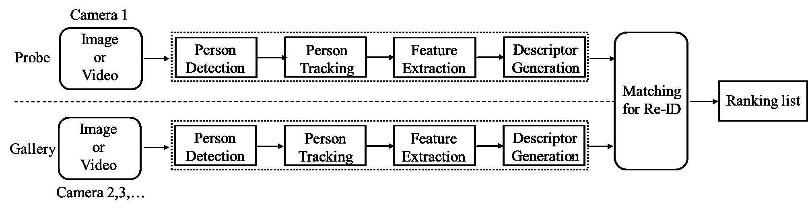

<!--yml

类别：未分类

日期：2024-09-06 19:50:37

-->

# [2110.04764] 基于深度学习的个人重新识别方法：近期工作的调查与展望

> 来源：[`ar5iv.labs.arxiv.org/html/2110.04764`](https://ar5iv.labs.arxiv.org/html/2110.04764)

[orcid=0000-0003-1616-8054]

\credit

概念化，方法论，调查，撰写-原稿，修订

[orcid=0000-0002-5664-1558] \cormark[1] \credit 概念化，撰写-审阅与编辑，监督，资源 \cortext[1]通讯作者

\credit

撰写-审阅，资金获取

\credit

数据整理，可视化，调查

\credit

撰写-审阅，数据整理

\credit

撰写-审阅，调查

\credit

撰写-审阅，数据整理

\credit

数据整理，可视化，验证

# 基于深度学习的个人重新识别方法：近期工作的调查与展望

张强 Ming mingzhangqiang@stu.scu.edu.cn 组织=计算机科学学院，地址=四川大学，城市=成都，邮政编码=610065，国家=中国    朱敏 zhumin@scu.edu.cn    王向坤    朱佳敏    程军龙    高成睿    杨勇    魏晓勇

###### 摘要

近年来，随着对公共安全需求的增加以及智能监控网络的快速发展，个人重新识别（Re-ID）已成为计算机视觉领域的热门研究主题。个人 Re-ID 的主要研究目标是从不同的摄像头中检索具有相同身份的人员。然而，传统的个人 Re-ID 方法需要人工标记目标，这消耗了大量的劳动力成本。随着深度神经网络的广泛应用，许多基于深度学习的个人 Re-ID 方法应运而生。因此，本文旨在帮助研究人员了解该领域的最新研究成果和未来趋势。首先，我们总结了几篇最近发布的个人 Re-ID 调查研究，并补充了最新的研究方法，以系统地分类基于深度学习的个人 Re-ID 方法。其次，我们提出了一种多维分类法，根据度量和表示学习将当前基于深度学习的个人 Re-ID 方法分为四类，包括深度度量学习、局部特征学习、生成对抗学习和序列特征学习的方法。此外，我们根据这些方法的技术和动机对上述四类进行细分，讨论了部分子类别的优点和局限性。最后，我们讨论了个人 Re-ID 的一些挑战和可能的研究方向。

###### 关键词：

个人重新识别\sep 深度度量学习\sep 局部特征学习\sep 生成对抗学习\sep 序列特征学习\sep{亮点}

近年来，个人重新识别（Re-ID）调查的主要贡献被总结和讨论。

为近期的个人 Re-ID 方法提供了一种基于度量和表示学习的分类法。

上述主要类别根据其方法和动机进行了细分。

部分子类别的优缺点进行了总结。

此外，还讨论了个体重新识别（Re-ID）的一些挑战和可能的研究方向。

## 1 引言

近年来，随着智能监控设备的快速发展和对公共安全的需求增加，公共场所如机场、社区、街道和校园中部署了大量摄像头。这些摄像头网络通常覆盖大范围的地理区域，且覆盖区域不重叠，每天生成大量监控视频。我们利用这些视频数据分析现实世界中行人的活动模式和行为特征，用于目标检测、多摄像头目标跟踪和人群行为分析等应用。个人 Re-ID 可以追溯到多目标多摄像头跟踪（MTMCT 跟踪）的问题 [1]，其目标是确定不同摄像头捕捉到的行人或同一摄像头的不同视频片段中的行人是否为同一行人 [2]。 图 1 展示了由多个摄像头监控的具有非重叠视野的监控区域的示例。

图 1：个人 Re-ID 的多摄像头监控网络示意图。

图 2 显示了个人 Re-ID 系统的完整流程，该流程主要包括两个阶段：行人检测和重新识别 [3]。对于行人检测，已经出现了许多具有高检测精度的算法，如 YOLO [4]、SSD [5] 和 Fast R-CNN [6]。个人 Re-ID 从检测到的行人图像中构建了一个大型图像数据集（Gallery），并使用探测图像（Probe）从中检索匹配的行人图像，因此个人 Re-ID 也可以被视为一个图像检索任务 [7]。个人 Re-ID 的关键是学习行人的区分特征，以区分具有相同身份和不同身份的行人图像。然而，由于真实世界中行人在多个区域的多个摄像头中出现，视角、姿势、光照和分辨率的变化增加了学习行人区分特征的难度。

图 2：个人重新识别系统的流程图。

图 3：近年来顶级会议和期刊上个人 Re-ID 论文的数量。

传统的行人重识别方法主要使用手动提取固定的区分特征[8, 9, 10, 11, 12]或学习更好的相似度度量[13, 14, 15, 16]，这些方法容易出错且耗时，严重影响了行人重识别任务的准确性和实时性。2014 年，深度学习首次应用于行人重识别领域[17, 18]。Figure 3 展示了近年来收集的行人重识别论文比例的显著增加。一些研究者设计了不同的损失函数，以优化网络模型对区分特征的学习[19, 20, 21, 22, 23]。其他研究者通过引入局部特征学习[24, 25, 26, 27, 28]或使用注意力机制来关注身体部位的关键信息[29, 30, 31, 32, 33, 34]，以提取更鲁棒的行人特征。Ngo 等人[35, 36]探索了高层次特征提取的方法，旨在通过建模概念间的关系来探索基于上下文的概念融合，而不是基于语义推理[37]。一些工作通过结合行人的全局和局部特征来增强最终的特征表示[38, 39, 40, 41, 42, 43, 44]。由于 GAN 在生成图像和学习特征方面表现良好，生成对抗学习被广泛应用于行人重识别任务[45, 46, 47, 48, 49, 50, 51, 52, 53, 54, 55]。为了缓解单帧图像信息不足的问题，一些研究者利用视频序列的空间和时间互补线索来有效地融合更多信息[56, 57, 58, 59, 60, 61]。最近，基于图卷积网络的方法[60, 62, 63, 64, 65]也出现了，通过在行人图像上建模图关系来学习更具区分性和鲁棒性的特征。一些研究者[66, 67]通过利用人的 3D 形状信息来提高行人重识别模型的鲁棒性。这些方法种类繁多，侧重点各异。为了让研究人员快速了解行人重识别领域的最新发展状态和有价值的研究方向，我们对基于深度学习的行人重识别方法进行了深入的调查，并总结了近年来的相关研究成果。

表 1：近年来几项行人再识别调查的比较。

| 调查 | 参考文献 | 贡献 |
| --- | --- | --- |
| 行人再识别方法及趋势的调查[68] | IVC’14 | 1\. 探讨了行人再识别问题，包括系统级挑战、描述符问题和对应问题； 2\. 总结了 2016 年前的行人再识别方法，包括上下文方法、非上下文方法和主动方法。 |
| 行人再识别的过去、现在与未来[3] | arXiv’16 | 1\. 介绍了行人再识别的历史及其与图像分类和实例检索的关系； 2\. 调查了图像和视频基础上广泛选择的手工制作系统和大规模方法。 |
| 基于深度卷积神经网络的行人再识别方法研究[69] | PRMI’17 | 1\. 介绍了基于图像和视频的行人再识别方法； 2\. 讨论了一些重要但尚未开发的问题以及未来的研究方向。 |
| 基于深度学习的行人再识别调查[70] | CAAI’18 | 1\. 介绍了一些基于深度学习的行人再识别方法，如基于 CNN 的方法、基于 GAN 的方法和混合型方法； 2\. 提出了进一步研究的方向。 |
| 行人再识别的系统评估与基准：特征、度量标准和数据集[71] | TPAMI’19 | 1\. 提供了单次和多次行人再识别算法的广泛综述和性能评估。 2\. 介绍了在特征提取和度量学习方面的最新进展。 |
| 超越模态内差异：异质性行人再识别的综合调查[72] | arXiv’19 | 1\. 调查了在异质性行人再识别中广泛应用的模型。 2\. 考虑了四种跨模态应用场景：低分辨率（LR）、红外（IR）、草图和文本。 |
| 基于深度学习的行人再识别方法：全面回顾[73] | NC’19 | 1\. 回顾了六种基于深度学习的行人再识别方法，包括识别深度模型、验证深度模型、距离度量深度模型、部件深度模型、视频深度模型和数据增强深度模型。 |
| 行人再识别的深度学习技术简要调查[74] | ICETCE’20 | 1\. 提出了行人再识别的问题及解决这些问题的方法。 |
| 开放世界行人再识别的调查[75] | TCSVT’20 | 1\. 分析了封闭世界与开放世界场景之间的差异。 2\. 描述了开放集再识别工作的进展及其局限性。 |
| 人物搜索：人物再识别的新范式：对近期工作的调查和展望[76] | IVC’20 | 1\. 讨论了特征表示学习和具有新颖损失函数的深度度量学习。 |
| 关于基于深度学习的可靠人物再识别模型的调查：我们已经到达终点了吗？[77] | arXiv’20 | 1\. 调查了用于人物再识别任务的最先进 DNN 模型。2\. 讨论了这些模型的局限性，这些局限性可以作为未来研究的指导。 |
| 基于度量学习的人物再识别：一项调查[77] | MTA’21 | 1\. 总结了基于度量学习的人物再识别方法的研究进展。 |
| 深度学习在人物再识别中的应用：调查与展望[78] | TPAMI’21 | 1\. 从三个不同的角度回顾了封闭世界人物再识别，包括深度特征表示学习、深度度量学习和排名优化。 |
| 关于无监督技术的人物再识别调查[79] | CDS’21 | 1\. 回顾了最先进的无监督人物再识别技术。 |
| SSS-PR：人物再识别领域调查的简要调查[80] | PRL’21 | 1\. 提出了一个多维分类法，根据不同的视角对最相关的研究进行分类。2\. 填补了最近发布的调查之间的空白。 |
| 跨领域人物再识别：一项综述[81] | AIC’21 | 1\. 回顾了跨领域人物再识别的方法。2\. 比较了这些方法在公共数据集上的表现。 |

在本次调查之前，一些研究者[68, 3, 69, 70, 71, 72, 73, 74, 75, 76, 77, 77, 78, 79, 80, 81] 也回顾了人物重识别领域。在表 1 中，我们总结了这些综述的主要贡献。其中一些综述[3, 69] 总结了基于图像和视频的人物重识别方法。其他综述[70, 73, 74, 78, 77, 79] 从不同维度总结了基于深度学习的人物重识别方法，这些方法在 2014 年后迅速发展，成为主要的研究手段。最近，Wang 等[81] 概述了跨域人物重识别的方法，并比较了这些方法在公共数据集上的性能。Yaghoubi 等[80] 提出了一个多维分类法，根据不同视角对最相关的研究进行分类。Zhou 等[82] 提供了一项综述，总结了过去十年计算机视觉领域的领域泛化发展。Behera 等[83] 回顾了传统和深度学习的人物重识别方法，包括上下文和非上下文维度。Wu 等[84] 提出了人物重识别中特征提取和度量学习两个组件的新分类法。Behera 等[85] 对在物联网平台上解释各种未来线索以实现人物重识别进行了概述。

然而，这些调查仍有一些改进的空间，它们缺乏对基于深度学习的人物重识别（Re-ID）方法的系统分类和分析，并且遗漏了许多人脸重识别的讨论部分。本文相较于上述综述，更加关注深度学习方法在人脸重识别任务中的度量学习和表示学习，并补充了近年来的最新研究方法。我们提供了对现有深度学习方法的深入和全面的回顾，讨论了它们的优点和局限性。我们从度量和表示学习的维度对基于深度学习的人物重识别方法进行了分类，包括四个类别：深度度量学习、局部特征学习、生成对抗学习和序列特征学习。

深度度量学习专注于为模型训练设计更好的损失函数。常见的损失函数包括：分类损失、验证损失、对比损失、三元组损失和四元组损失。表示学习专注于开发特征构建策略[86, 78]。因此，我们讨论了近期人脸重识别方法中的常见特征学习策略，主要分为三类：1）局部特征学习，它学习部分级局部特征，以形成每个人图像的综合表示；2）生成对抗学习，它学习图像特定风格表示或解耦表示，以实现图像-图像风格转换或提取不变特征；3）序列特征学习，它利用多个图像帧和时间信息学习视频序列表示。此外，我们根据方法论和动机对上述四类进行了细分。这种分类结构清晰，全面反映了人脸重识别任务中最常见的深度度量学习方法和各种表示学习方法，因此适合研究人员根据实际需要探索人脸重识别。此外，我们尝试讨论几个挑战和研究方向。

具体来说，我们工作的主要贡献总结如下：

+   •

    我们总结了几项最近发表的人脸重识别调查研究，并补充了最新的研究方法，以系统地分类基于深度学习的人脸重识别方法。

+   •

    我们全面回顾了最近基于深度学习的人脸重识别研究方法。然后，我们提出了一个多维分类法，将这些方法按度量学习和表示学习分为四类，包括深度度量学习、局部特征学习、生成对抗学习和序列特征学习。

+   •

    我们根据方法论和动机对上述四类进行了细分，讨论了各子类别的优缺点。这种分类更适合研究人员根据实际需求探索这些方法。

+   •

    我们总结了人脸重识别领域的一些现有挑战，并认为仍然有必要进行研究。此外，我们讨论了七个可能的研究方向供人脸重识别研究人员参考。

本调查的其余部分结构如下。在第二部分中，我们讨论了用于人物 Re-ID 基准的常见数据集和评估指标。在第三部分中，我们全面回顾了当前基于深度学习的人物 Re-ID 方法，并根据度量学习和表征学习将其分为四类。此外，我们还基于这些方法的理论和动机对上述四类进行进一步细分，讨论了各子类的优缺点。最后，在第四部分中，我们总结了本文内容，并讨论了人物 Re-ID 领域的当前挑战和未来方向。

## 2 数据集与评估指标

在本节中，我们介绍了用于评估现有基于深度学习的人物 Re-ID 方法的常见数据集，包括图像和视频维度。此外，我们简要描述了人物 Re-ID 的常见评估指标。

### 2.1 数据集

近年来，许多方法相继出现，以提高人物 Re-ID 的性能。然而，现实世界的不确定性带来了遮挡、光照变化、摄像机视角切换、姿势变化以及相似服装等问题，这些问题仍未得到很好的解决。这些挑战使得许多算法尚未适用于实际应用。因此，探索涵盖更多真实场景的大规模人物 Re-ID 数据集至关重要。随着基于深度学习的特征提取方法逐渐取代传统的手动特征提取方法，深度神经网络需要大量的训练数据，这促使了大规模数据集的快速发展。数据集和标注方法在数据集中差异很大。通常，用于人物 Re-ID 的数据集可以分为两类，即基于图像和基于视频的数据集。以下小节将介绍两种常用的数据集。

#### 2.1.1 基于图像的人物 Re-ID 数据集

VIPeR [87] 数据集是第一个提出的小型人物 Re-ID 数据集。VIPeR 包含两个视角摄像头，每个摄像头仅捕捉一张图像。VIPeR 使用手动标注的行人数据，共包含 1,264 张图像，涉及 632 个不同的行人。每张图像被裁剪并缩放到 128x48 的大小。VIPeR 数据集具有多视角、姿势和光照变化，已被许多研究人员测试，但它仍然是最具挑战性的人物 Re-ID 数据集之一。

CUHK01 [88] 数据集包含 971 人和 3,884 张手动裁剪的图像，每个人在两个不同的摄像头视角下至少有两张图像。在 CUHK01 数据集中，摄像头 A 的视角和姿态变化更多，而摄像头 B 主要包括正面视图和背面视图的图像。

CUHK02 [89] 数据集包含 1,816 人和 7,264 张手动裁剪的图像。CUHK02 包含五对摄像头视角（十个摄像头视角），每个人在两个不同的摄像头视角下至少有两张图像。与 CUHK01 [88] 数据集相比，CUHK02 数据集具有更多的身份和摄像头视角，并且能够获取更多的配置（即视角、姿态、图像分辨率、光照和光度设置的组合）来进行行人图像的捕捉。

CUHK03 [14] 数据集属于大规模人物重新识别数据集，收集于香港中文大学。CUHK03 是通过 10 个（5 对）摄像头采集的，并配备了一个手动标记器和一个可变形部件模型（DPM）检测器 [90] 用于检测行人边界框。CUHK03 包含 1,360 个不同的行人，共有 13,164 张图像，每张图像的大小各不相同。CUHK03 相比于 CUHK01 [88] 和 CUHK02 [89] 通过增加摄像头和捕获图像的数量，从而从更多的视角捕捉到行人图像。CUHK03 数据集使用行人检测算法 DPM 对行人进行标注，使其在实际世界中与人物重新识别的兼容性更高，而不是使用单独的手动标注。

Market-1501 [91] 数据集是一个大规模人物重新识别数据集，于 2015 年发布，该数据集使用五个高分辨率摄像头和一个低分辨率摄像头在清华大学超市前采集。Market-1501 使用行人检测器 DPM 自动检测行人边界框。它包含 1,501 个不同的行人，共有 32,668 张图像，每张图像的大小为 128x64。与 CUHK03 相比，Market-1501 具有更多的标注图像，并包含 2793+500k 的干扰因素，更接近实际世界。

DukeMTMC-reID [92] 数据集属于 MTMCT 数据集 DukeMTMC [93] 的一个子集。DukeMTMC-reID 数据集在杜克大学使用八个静态高清摄像头收集。它包含 16,522 张训练图像（来自 702 人），2,228 张查询图像（来自其他 702 人），以及一个包含 17,661 张图像的搜索库（Gallery）。

MSMT17 [45] 数据集是一个大规模的人物重识别数据集，于 2018 年发布，并在校园内由 15 个摄像头捕捉。MSMT17 使用行人检测器 Faster R-CNN [94] 自动检测行人标注帧。它包含 4,101 个不同的行人信息，总计 126,441 张图像，是当前人物重识别任务中最大的行人和标注图像数据集之一。MSMT17 数据集可以覆盖比早期数据集更多的场景，其中早期数据集仅包含单一场景且光照变化不显著。

Airport [71] 数据集是使用美国一个商业机场的中央安全检查站安装的六个摄像头的视频数据构建的。Airport 数据集包含 9,651 个身份、31,238 个干扰项，总计 39,902 张图像，每张图像都被裁剪并缩放至 128x64。Airport 使用预检测的边界框，这些边界框是使用聚合通道特征（ACF） [95] 检测器生成的，能够准确反映现实世界的人物重识别问题。

表 2 显示了上述数据集的详细信息。早期的大多数基于图像的人物重识别数据集（VIPeR、CUHK01、CUHK02、CUHK03、Market-1501）存在以下限制：（1）覆盖单一场景；（2）时间跨度短且光照变化不显著；（3）昂贵的人工标注或过时的自动标注与 DPM 检测。CUHK03 包含视角变化、检测错误和遮挡图像。Market-1501 包含视角变化、检测错误和低分辨率图像。但它们对现实世界的模拟相对较弱。DukeMTMC-reID 数据集包含更多具有挑战性的属性，包括视角变化、光照变化、检测错误、遮挡和背景杂乱。MSMT17 数据集收集了由 15 个摄像头捕捉的室内和室外场景图像。因此，它呈现了复杂的场景变换和背景。这些视频覆盖了较长时间，从而呈现复杂的光照变化。Airport 数据集包含大量的标注身份和边界框。据我们所知，MSMT17 和 Airport 是目前最大的和最具挑战性的公开人物重识别数据集。

表 2：典型的基于图像的人物重识别数据集。

| 数据类型 | 数据集 | 年份 | 身份 | 边界框 | 摄像头 | 标注 | 评估 |
| --- | --- | --- | --- | --- | --- | --- | --- |
| 图像 | ViPeR[87] | 2007 | 632 | 1,264 | 2 | 手工制作 | CMC |
| CUHK01[88] | 2012 | 971 | 3,884 | 2 | 手工制作 | CMC |
| CUHK02[89] | 2013 | 1,816 | 7,264 | 10 | 手工制作 | CMC |
| CUHK03[14] | 2014 | 1,360 | 13,164 | 10 | DPM+手工制作 | CMC+mAP |
| Market-1501[91] | 2015 | 1,501 | 32,217 | 6 | DPM+手工制作 | CMC+mAP |
| DukeMTMC-reID[52] | 2017 | 1,812 | 36,441 | 8 | 手工制作 | CMC+mAP |
|  | MSMT17[45] | 2018 | 4,101 | 126,441 | 15 | Faster RCNN | CMC+mAP |
|  | Airport[71] | 2019 | 9,651 | 39,902 | 6 | ACF | CMC+mAP |

表 3：典型的基于视频的人物再识别数据集。

| 数据类型 | 数据集 | 年份 | ID | 轨迹 | 摄像机 | 标注 | 评估 |
| --- | --- | --- | --- | --- | --- | --- | --- |
| 视频 | PRID-2011[96] | 2011 | 934 | 400 | 2 | 手工制作 | CMC |
| iLIDS-VID [97] | 2014 | 300 | 600 | 2 | 手工制作 | CMC |
| MARS[98] | 2016 | 1,261 | 20,715 | 6 | DPM+GMMCP | CMC+mAP |
| DukeMTMC-V[19] | 2018 | 1,812 | 4,832 | 8 | DPM | CMC+mAP |
| LPW[99] | 2018 | 2,731 | 7,694 | 11 | DPM+NN+手工制作 | CMC+mAP |

(a) Market-1501[91]

(b) DukeMTMC-reID[92]

(c) MSMT17[8]

图 4：基于视频的人物再识别数据集的样本行人图像。

#### 2.1.2 基于视频的人物再识别数据集

PRID2011 [96] 数据集是 2011 年提出的基于视频的人物再识别数据集，来自两台不重叠的摄像机采集，总计 24,541 张 934 名不同行人的图像，行人边界框为人工标注。每张图像的分辨率为 128×64。

iLIDS-VID [97] 数据集由机场的两台摄像机获得，包含 300 名行人，600 条轨迹，总计 42,495 张行人图像。iLIDS-VID 使用人工标注的行人边界框。

MARS [98] 数据集是 2016 年提出的第一个大规模视频基人物再识别数据集，包含 1,261 名不同的行人和约 20,000 个行人轨迹视频序列，来自六台不同的摄像机。MARS 使用 DPM 检测器和广义最大多角点问题（GMMCP）跟踪器[100]分别用于行人检测和轨迹跟踪。MARS 数据集包含 3,248 条干扰轨迹，固定为 631 名和 630 名不同的行人分别用于训练集和测试集。它可以视为 Market-1501 的扩展。

DukeMTMC-VideoReID [19] 数据集属于 MTMCT 数据集 DukeMTMC [93] 的一个子集，用于基于视频的人物再识别。该数据集包含 1,812 名不同的行人，4,832 条行人轨迹，总计 815,420 张图像，其中 408 名行人为干扰项，702 名行人用于训练，702 名行人用于测试。

LPW（在野外标记的行人）[99] 数据集是一个大规模的视频序列行人重识别数据集，收集了包含 2,731 名不同行人和 7,694 条行人轨迹（超过 590,000 张图像）的三种不同拥挤场景。LPW 数据集采集于拥挤场景，具有更多遮挡，提供了更具现实性和挑战性的基准。

表 3 展示了基于视频的行人重识别数据集的详细信息。PRID2011 和 iLIDS-VID 仅使用两个摄像头捕捉视频，并标注了较少的身份。这意味着其他身份只有单摄像头的帧段，这些身份在数据集中可能在光照和拍摄角度上变化不大。MARS 和 DukeMTMC-ViedeReID 是大规模基于视频的行人重识别数据集。它们的边界框和轨迹是自动生成的，包含了几种自然检测或跟踪错误，每个标签可能有多个轨迹。LPW 是目前最具挑战性的基于视频的行人重识别数据集之一，与现有数据集相比，主要在以下三个方面有所区别：更多的身份和轨迹、自动检测的边界框，以及更多的拥挤场景和更大的时间跨度。

图 4 展示了部分行人重识别数据集的样本图像。我们可以看到，随着大规模行人重识别数据集的发展，数据集中的行人 ID 数量和标记的帧或轨迹数量都在增加，数据集覆盖的场景也越来越丰富。这些数据集结合了深度学习检测器和人工标注来检测行人边界框，使得最新的数据集越来越接近真实世界，从而增强了行人重识别模型的鲁棒性。此外，几乎所有主流的行人重识别数据集都是使用平均精度均值（mAP）和累积匹配特征（CMC）曲线进行性能评估的。

### 2.2 评估指标

行人重识别算法常用的评估指标是累积匹配特征（CMC）曲线和平均精度均值（mAP）。

在模式识别系统中，CMC 曲线是面部识别、指纹识别、虹膜检测和人员再识别领域的重要评估指标，可以全面评估模型算法的优劣。此外，CMC 曲线被认为是人员再识别分类器性能的综合反映。在计算 CMC 曲线之前，通过对查询目标与待查询目标图像之间的相似性进行排名，获得前 k 个检索图像（top-k）中包含正确查询结果的概率 ${Acc_{k}}$，其计算方式如下：

|  | <math alttext="{Acc_{k}}=\begin{array}[]{l}\begin{cases}1&amp;\text{如果 top-k 排名的图库样本}\\ &amp;\text{包含查询身份。}\\

0&amp;\text{否则}\end{cases}\end{array}" display="block"><semantics ><mrow ><mrow  ><mi >A</mi><mo lspace="0em" rspace="0em" >​</mo><mi >c</mi><mo lspace="0em" rspace="0em" >​</mo><msub  ><mi >c</mi><mi >k</mi></msub></mrow><mo  >=</mo><mtable displaystyle="true"  ><mtr ><mtd  columnalign="left" ><mrow  ><mo >{</mo><mtable columnspacing="5pt" displaystyle="true" rowspacing="0pt"  ><mtr ><mtd columnalign="left"  ><mn >1</mn></mtd><mtd columnalign="left"  ><mtext >如果 top-k 排名的图库样本</mtext></mtd></mtr><mtr ><mtd  columnalign="left" ><mtext > 包含查询身份。</mtext></mtd></mtr><mtr ><mtd columnalign="left"  ><mn >0</mn></mtd><mtd columnalign="left"  ><mtext >否则</mtext></mtd></mtr></mtable></mrow></mtd></mtr></mtable></mrow><annotation-xml encoding="MathML-Content" ><apply  ><apply ><ci >𝐴</ci><ci  >𝑐</ci><apply ><csymbol cd="ambiguous" >subscript</csymbol><ci  >𝑐</ci><ci >𝑘</ci></apply></apply><matrix ><matrixrow ><apply  ><csymbol cd="latexml"  >cases</csymbol><cn type="integer"  >1</cn><ci ><mtext >如果 top-k 排名的图库样本</mtext></ci><ci  ><mtext >否则</mtext></ci><ci ><mtext > 包含查询身份。</mtext></ci><cn type="integer" >0</cn><ci ><mtext >否则</mtext></ci></apply></matrixrow></matrix></apply></annotation-xml><annotation encoding="application/x-tex" >{Acc_{k}}=\begin{array}[]{l}\begin{cases}1&\text{如果 top-k 排名的图库样本}\\ &\text{包含查询身份。}\\ 0&\text{否则}\end{cases}\end{array}</annotation></semantics></math> |  | (1) |

CMC 曲线是通过将每个查询图像的 ${Acc_{k}}$ 相加，并将其除以查询图像的总数来计算的，通常表示为 Rank-k。例如，Rank-1 准确率表示与匹配列表中的第一个目标正确匹配的概率。

单一评价指标通常无法全面评估人物重识别算法的综合性能。mAP 能反映所有正确查询图像在查询结果中的前置程度。考虑查询过程的平均精度（AP）和精确度-召回曲线（PR）[91]，而不仅仅关注命中率，可以更全面地衡量人物重识别算法的性能。算法通常需要分别评估 CMC 曲线和 mAP 在人物重识别任务中的表现。郑等人[8]提出了重排序方法，该方法可以重新排序查询结果，进一步提高 Rank-k 和 mAP 的准确性。

## 3 基于深度学习的人物重识别方法

在本节中，我们将基于深度学习的人物重识别方法分为四类，分类结构见图 5，包括深度度量学习、局部特征学习、生成对抗学习和序列特征学习的方法。此外，我们还根据其方法论和动机对上述四类进行细分，讨论和比较各部分子类别的优缺点。

图 5：基于深度学习的人物重识别方法的分类结构。

### 3.1 深度度量学习

深度度量学习（DML）是度量学习（ML）方法之一，旨在学习两个行人对象之间的相似性或差异性。DML 的主要目标是学习从原始图像到特征嵌入（FE）的映射，使得相同的行人在特征空间上具有较小的距离，而不同的行人则相距较远[101, 102]。随着深度神经网络（DNNs）的兴起，DML 已广泛应用于计算机视觉领域，如人脸识别、图像检索和行人重识别（Re-ID）。DML 主要通过为网络模型设计损失函数来约束特征的学习[78]。本文重点讨论在行人 Re-ID 任务中常用的损失函数，包括分类损失[19, 20, 47, 51, 103, 104, 105]，验证损失[20, 106, 107, 78]，对比损失[21, 108, 109]，三元组损失[22, 110, 111]和四元组损失[23]。五种损失函数的示意图见图 6。这些深度度量学习方法使模型能够自动学习区分性特征，从而解决了手动设计特征带来的大量劳动成本问题。

图 6：示意图展示了多种基于深度度量学习的行人 Re-ID 损失。 (a) 分类损失。 (b) 验证损失。 (c) 对比损失。 (d) 三元组损失，其中$A$、$P$、$N$分别表示锚点、正样本和负样本。 (e) 四元组损失，其中$N1$和$N2$是不同的负样本。

#### 3.1.1 分类损失

Zheng 等人[3, 112]将行人 Re-ID 的训练过程视为图像的多分类任务，并提出了 ID 区分嵌入（IDE）网络。IDE 将每个行人视为不同的类别，并使用行人的 ID 作为分类标签来训练深度神经网络，因此分类损失也称为 ID 损失。分类损失的训练网络通常输入一张图片，并在网络末尾连接一个全连接层（FC）进行分类，然后通过 softmax 激活函数将图像的特征向量映射到概率空间。行人 Re-ID 任务的多分类交叉熵损失可以表示为：

|  | $\displaystyle\mathcal{L}_{id}=-\sum_{a=1}^{K}q\left(x_{a}\right)\log{}p\left(y_{a}&#124;x_{a}\right)$ |  | (2) |
| --- | --- | --- | --- |

其中$K$表示每批次的训练样本 ID 类别数，$q(x_{a})$表示样本图像$x_{a}$的标签。如果$x_{a}$被识别为$y_{a}$，则$q(x_{a})=1$，否则$q(x_{a})=0$。$p(y_{a}|x_{a})$是使用 softmax 激活函数预测图像$x_{a}$为类别$y_{a}$的概率。分类损失由于模型训练简单且能挖掘困难样本，被广泛用于行人 Re-ID 方法的深度度量学习[19, 20, 47, 51, 103, 104, 105]。然而，仅使用 ID 信息不足以学习出具有足够泛化能力的模型。因此，ID 损失通常需要与其他损失结合以约束模型的训练。

#### 3.1.2 验证损失

行人 Re-ID 也可以视为一个验证问题，提出了验证损失以指导模型训练。与分类损失相比，由验证损失训练的网络需要两张图像作为输入，通过融合这两张图像的特征信息计算二元损失，从而判断输入的两张图像是否为同一行人[20, 106, 107, 78]。交叉熵验证损失函数的表达式如下：

|  | $\displaystyle\mathcal{L}_{v}=-y_{ab}\log{}p\left(y_{ab}&#124;f_{ab}\right)-$ |  | (3) |
| --- | --- | --- | --- |
|  | $\displaystyle(1-y_{ab})\log{}\left(1-p(y_{ab}&#124;f_{ab})\right)$ |  |

假设网络输入两张图像$x_{a}$和$x_{b}$，我们分别获取这两张图像的特征向量$f_{a}$和$f_{b}$，并计算这两个特征向量的差异特征$f_{ab}={(f_{a}-f_{b})^{2}}$。我们使用 softmax 激活函数来计算图像对$x_{a}$和$x_{b}$具有相同行人 ID 的概率$p$，其中$y_{ab}$是这两张图像的行人 ID 标签。当图像$x_{a}$和$x_{b}$具有相同 ID 时，$y_{ab}=1$，否则$y_{ab}=0$。

验证损失在识别中的效率较低，因为它只能输入一对图像来判断相似性，而忽略了图像对与数据集中其他图像之间的关系。因此，研究人员考虑将分类和验证网络结合起来[106, 107]，组合损失可以表示为$\mathcal{L}=\mathcal{L}_{id}+\mathcal{L}_{v}$。混合损失可以结合分类损失和验证损失的优点，既可以预测行人的身份 ID，又可以同时进行相似性度量，从而提高行人 Re-ID 的准确性。

#### 3.1.3 对比损失

对比损失主要约束数据对之间的相似性或不相似性，通常用于行人 Re-ID 任务中的双胞胎网络（Siamese Network）的模型训练 [21, 108, 109]。其函数可以表示为：

|  | $\displaystyle\mathcal{L}_{c}=yd\left(x_{a}-x_{b}\right)^{2}+\left(1-y\right)\left[m-d\left(x_{a}-x_{b}\right)^{2}\right]_{+}$ |  | (4) |
| --- | --- | --- | --- |

其中 $\left[z\right]_{+}=max(0,z)$，$x_{a}$ 和 $x_{b}$ 是同时输入到双胞胎网络的两幅图像。$d(x_{a},x_{b})$ 通常表示两幅图像的欧氏距离（相似度）。$m$ 是设定的训练阈值，$y$ 是每对训练图像是否匹配的标签。当 $y=1$ 时，表示输入图像 $x_{a}$ 和 $x_{b}$ 属于相同 ID 的行人（正样本对）。当 $y=0$ 时，表示输入图像 $x_{a}$ 和 $x_{b}$ 属于不同 ID 的行人（负样本对）。$\mathcal{L}_{c}$ 很好地反映了样本对的匹配程度，它通常用于训练模型以进行行人 Re-ID 特征提取，并且通常与分类损失组合一起用于训练网络 [47]。

#### 3.1.4 三元组损失

三元组损失是行人 Re-ID 任务中最广泛使用的深度度量损失之一，其目标是最小化类内距离并最大化类间距离。随着深度神经网络的发展，基于三元组损失的变体大量出现 [22, 110, 111, 113]。三元组损失函数可以表示为：

|  | $\displaystyle\mathcal{L}_{trip}=\left[m+d(x_{a},x_{p})-d(x_{a},x_{n})\right]_{+}$ |  | (5) |
| --- | --- | --- | --- |

与对比损失不同，三元组损失的输入是由三张图像组成的三元组。每个三元组包含一对正样本和一个负样本，其中 $x_{a}$ 是锚点图像，$x_{p}$ 是正样本图像，$x_{n}$ 是负样本图像，并且 $x_{a}$ 和 $x_{p}$ 的行人具有相同的 ID，而 $x_{a}$ 和 $x_{n}$ 的行人具有不同的 ID。通过模型训练，将 $x_{a}$ 和 $x_{p}$ 在欧几里得空间中的距离缩小到比 $x_{n}$ 和 $x_{a}$ 之间的距离更近。为了提高模型性能，一些基于深度学习的行人重识别方法使用了分类损失和三元组损失的结合[114, 115, 116, 117, 118]。实验表明，结合这两种损失有助于模型学习区分特征。传统的三元组损失在训练过程中随机从训练集中选择三张图像，这可能导致样本组合简单，缺乏对困难样本组合的训练，使得训练模型的泛化能力较差。为此，一些研究者考虑改进三元组损失以挖掘困难样本[22, 119, 120]。

#### 3.1.5 四元组损失

对三元组损失的另一个改进是增加一个负样本图像 $X_{n2}$ 以形成四元组损失[23]，其中负样本 $X_{n1}$ 和负样本 $X_{n2}$ 具有不同的行人 ID。四元组损失函数的表达式为：

|  | $\displaystyle\mathcal{L}_{quad}=\left[m_{1}+d(x_{a},x_{p})-d(x_{a},x_{n1})\right]_{+}+$ |  | (6) |
| --- | --- | --- | --- |
|  | $\displaystyle\left[m_{2}+d(x_{a},x_{p})-d(x_{n1},x_{n2})\right]_{+}$ |  |

其中 $m_{1}$ 和 $m_{2}$ 是自定义的训练阈值。正样本和负样本对具有相同的锚图像 $x_{a}$。$\mathcal{L}_{quad}$ 的第一项与三元组损失函数相同，用于约束正负样本对之间的相对距离。传统的三元组损失函数通常会增加负样本对的类间距离，从而影响图像 $x_{a}$ 的特征学习。因此，$\mathcal{L}_{quad}$ 引入了第二项，以约束正负样本对之间的绝对距离。第二项中的正负样本对具有不同的锚图像，这可以有效减少正样本对的类内距离，同时增加类间的负样本对距离。为了使第一项发挥主导作用，通常需要在训练过程中确保 ${m}_{1}>{m}_{2}$。然而，大多数使用三元组损失的行人重识别方法更关注于区分外观差异，无法有效地学习细粒度特征。为了解决这个问题，Yan 等人 [121] 引入了一种新颖的对比损失函数，通过自适应施加指数惩罚来使 Re-ID 模型学习细粒度特征。

### 3.2 局部特征学习

基于从行人图像中提取的特征进行分类，行人重识别方法可以分为基于全局特征学习的方法和基于局部特征学习的方法。全局特征学习方法通常提取行人图像的一个特征[122, 123, 124]，这种方法难以捕捉行人的详细信息。因此，如何提取具有细微差别的区分性局部特征成为了研究人员关注的问题。

基于局部特征学习的方法旨在学习行人的区分特征，并确保每个局部特征的一致性。通常使用手动标注或神经网络来自动关注具有关键信息的特定局部区域，并从这些区域提取区分特征。常用的局部特征学习方法包括预定义条纹分割 [24, 25, 27, 108, 125, 126]，多尺度融合 [127, 128, 129, 130, 131]，软注意力 [26, 29, 30, 31, 32, 33, 34, 132, 133]，行人语义提取 [114, 27, 28, 31, 134] 和全局-局部特征学习 [38, 39, 40, 41, 42, 43, 44]。这些方法可以缓解遮挡、边界检测误差、视角和姿态变化的问题。

#### 3.2.1 预定义条纹分割

基于预定义条纹分割的方法的主要思想是按照一些预定义的划分规则对学习到的特征进行分割，必须确保这些分割在空间上对齐。刘等人 [125] 提出了基于属性和外观的上下文注意力网络，其中外观网络从行人的整体、水平和垂直部分学习空间特征。Varior 等人 [108] 将行人图像均匀地分成几条条纹，并从每个条纹图像块中提取局部特征。孙等人 [24] 考虑到每条条纹内的内容一致性，提出了一种局部卷积基线（PCB）。PCB 使用统一的特征分割策略来学习局部特征，并输出由多个条纹组成的卷积特征，以增强每个分割部分特征内容的一致性，从而确保条纹在空间上对齐。

尽管上述方法可以提取条纹区域的判别特征，但由于模型无法区分遮挡和未遮挡区域，可能会导致错误的检索结果。为了缓解遮挡问题，孙等人[25] 提出了基于 PCB 的可见性感知局部模型，以确保局部特征在空间上对齐，并通过学习在两幅图像中都可见的共同区域特征来避免由于行人遮挡造成的干扰。傅等人[126] 使用不同的金字塔尺度将深度特征图水平切割成多个空间条带，并使用全局平均池化和最大池化来获取每个条带的判别特征，这被称为水平金字塔池化（HPP）。HPP 可以忽略主要来自相似衣物或背景的干扰信息。

#### 3.2.2 多尺度融合

小尺度特征图具有强大的空间几何信息表示能力，可以获取图像的详细信息。大尺度特征图擅长表征语义信息，并可以获取图像的轮廓信息。通过在多个尺度下提取行人特征进行融合，可以获得丰富的行人特征表示。

刘等人[127] 提出了一个多尺度三重卷积神经网络，该网络可以捕捉不同尺度下的行人外观特征。由于在不同尺度下学到的行人特征可能存在差异或冲突，因此直接将多个尺度下的特征进行融合可能无法实现最佳的融合效果。因此，研究人员开始关注跨尺度隐式关联的互补优势。陈等人[128] 研究了行人重识别多尺度特征学习的问题，并提出了一种深度金字塔特征学习深度神经网络框架，该框架可以在学习多尺度互补特征的同时克服跨尺度特征学习中的差异。周等人[135] 提出了一个称为 Omni-scale 网络（OSNet）的重识别卷积神经网络，该网络不仅可以捕捉不同的空间尺度，还可以封装多尺度的协同组合。在传统的行人重识别数据集中，尽管 OSNet 的规模远小于现有的重识别模型，但仍实现了最先进的性能。在跨摄像头行人重识别任务中，通常会出现大类内变化和小类间变化的挑战。例如，跨摄像头视角的变化可能会遮挡具有判别特征的行人部分，或者穿着相似衣物的行人在摄像头间出现，这会导致同一人的匹配不准确。

#### 3.2.3 软注意力

注意力机制的目标是找出对特征图影响较大的区域，并使模型集中在身体外观的区分性局部部分，以纠正错位，消除背景干扰。由于注意力机制在计算机视觉领域的良好表现，它经常被用作人物再识别任务中的局部特征学习。当前基于注意力的人物再识别方法大多倾向于使用软注意力，这些方法可以分为空间注意力、通道注意力、混合注意力、非本地注意力和位置注意力。刘等人[29] 提出了一个基于注意力的深度神经网络，能够从底层到语义层捕捉多个注意力特征，以学习行人的细粒度集成特征。李等人[30] 使用了平衡注意力卷积神经网络，以最大化不同尺度的注意力特征的互补信息，从而解决了任意未对齐图像的人物再识别挑战。为了获得行人的局部细粒度特征，宁等人[136] 提出了一个具有多样性损失的多分支注意力网络，通过去除干扰信息的自适应滤波获得局部特征。

上述基于空间注意力的方法倾向于仅关注行人的局部区分特征，而忽视了特征多样性对行人检索的影响。陈等人[26] 提出了一个注意力多样性网络，该网络使用了互补的通道注意力模块（CAM）和位置注意力模块（PAM），以学习行人多样性的特征。考虑到从一阶注意力（如空间注意力和通道注意力）提取的特征在复杂的摄像头视角和姿态变化场景中并不具备区分性[32]。陈等人[33] 提出了一个高阶注意力模块，该模块在注意力机制中建模复杂的高阶信息，以挖掘行人之间的区分性注意力特征。

#### 3.2.4 语义提取

一些研究人员使用深度神经网络提取语义信息，如身体部位或身体姿势，而不是使用边界框从行人身体部位提取局部特征，以提高行人再识别的性能。赵等人[28]考虑了将身体结构信息应用于行人再识别任务，并提出了一种新颖的 CNN，称为 SpindleNet。具体而言，SpindleNet 首先使用身体部位生成网络定位 14 个关键点，以提取行人的 7 个身体区域。其次，SpindleNet 利用卷积神经网络从不同身体区域捕捉语义特征。最后，SpindleNet 使用具有竞争策略的树融合网络来合并来自不同身体区域的语义特征。SpindleNet 可以对齐整个图像中的身体部位特征，并能更好地突出局部细节信息。

有时，身体部位不仅包含区分特征，非身体部位也可能包含某些关键特征，例如行人的独特背包或手提包。因此，一些研究人员考虑了非身体部位的对齐。郭等人[114]提出了一种双部件对齐表示方案，该方案通过利用来自准确人体部位和粗略非人体部位的互补信息来捕获超越身体部位的区分信息，并使用注意机制更新表示。苗等人[27]提出了一种姿态引导特征对齐方案，通过行人姿态边界标记来区分遮挡噪声信息，从而对齐查询图像和被查询图像的非遮挡区域。

#### 3.2.5 全球-局部特征学习

局部特征学习可以捕捉行人区域的详细信息，但局部特征的可靠性可能会受到姿态变化和遮挡的影响。因此，一些研究人员经常将细粒度局部特征与粗粒度全局特征结合，以增强最终的特征表示。Wang 等人 [38] 提出了一个具有全局和局部信息的多粒度特征学习策略，包括一个用于全局特征学习的分支和两个用于局部特征学习的分支。Ming 等人 [137] 设计了一个全局-局部动态特征对齐网络（GLDFA-Net）框架，该框架包含全局和局部分支。局部滑动对齐（LSA）策略被引入到 GLDFA-Net 的局部分支中，以指导距离度量的计算，从而进一步提高测试阶段的准确性。为了减轻不精确的边界框对行人匹配的影响，Zheng 等人 [43] 提出了一个粗粒度到细粒度的金字塔模型，该模型不仅集成了行人的局部和全局信息，还从粗到细粒度地逐步提供线索。该模型能够匹配不同尺度的行人图像，即使图像未对齐，也能检索到具有相同局部身份的行人图像。

#### 3.2.6 比较与讨论

表 4：基于局部特征学习方法的实验结果比较。$*$ 表示使用了多种深度学习方法。粗体和下划线数字表示前两名结果。

| 类别 | 方法 | CUHK03 | Market-1501 | DukeMTMC-reID | 参考文献 |
| --- | --- | --- | --- | --- | --- |
| mAP | R-1 | mAP | R-1 | mAP | R-1 |
| 预定义条纹分割 | PCB+RPP[24] | - | - | 81.6 | 93.8 | 69.2 | 83.3 | ECCV’18 |
| CA3Net[125] | - | - | 80.0 | 93.2 | 70.2 | 84.6 | ACMMM’18 |
| PGFA[27]* | - | - | 76.8 | 91.2 | 65.5 | 82.6 | ICCV’19 |
| VPM[25] | - | - | 80.8 | 93.0 | 72.6 | 83.6 | CVPR’19 |
| HPM[126] | 57.5 | 63.9 | 82.7 | 94.2 | 74.3 | 86.6 | AAAI’19 |
| 多尺度融合 | DPFL[128] | 40.5 | 43.0 | 72.6 | 88.6 | 60.6 | 79.2 | ICCV’17 |
| MSCAN[130] | - | 74.2 | 66.7 | 86.8 | - | - | CVPR’17 |
| OSNet[129] | 67.8 | 72.3 | 84.9 | 94.8 | 73.5 | 88.6 | ICCV’19 |
| CAM[131] | 64.2 | 66.6 | 84.5 | 94.7 | 72.9 | 85.8 | CVPR’19 |
| 软注意力 | HydraPlus[29] | - | 91.8 | - | 76.9 | - | - | ICCV’17 |
| HA-CNN[30] | 44.4 | 41.0 | 75.7 | 91.2 | 63.8 | 80.5 | CVPR’18 |
| ABD-net[26] | - | - | 88.3 | 95.6 | 78.6 | 89.0 | ICCV’19 |
| HOA[33] | 72.4 | 77.2 | 85.0 | 95.1 | 77.2 | 89.1 | ICCV’19 |
| AANet[34] | - | - | 83.4 | 93.9 | 74.3 | 87.7 | CVPR’19 |
|  | HLGAT[132] | 80.6 | 83.5 | 93.4 | 97.5 | 87.3 | 92.7 | CVPR’21 |
|  | PAT[138] | - | - | 88.0 | 95.4 | 78.2 | 88.8 | CVPR’21 |
| 语义提取 | Spindle[28] | - | 88.5 | - | 76.9 | - | - | CVPR’17 |
| SPReID[134] | - | 94.3 | 83.4 | 93.7 | 73.3 | 85.9 | CVPR’18 |
| P2-Net[114] | 73.6 | 78.3 | 85.6 | 95.2 | 73.1 | 86.5 | ICCV’19 |
| 全局-局部特征学习 | GLAD[39] | - | 85.0 | 73.9 | 89.9 | - | - | ACMMM’17 |
| PDC[40] | - | 88.7 | 63.4 | 84.1 | - | - | ICCV’17 |
| Pyramid[43] | 76.9 | 78.9 | 88.2 | 95.7 | 79.0 | 89.0 | CVPR’19 |
| RGA[42] | 77.4 | 81.1 | 88.4 | 96.1 | - | - | CVPR’20 |
| SCSN[41] | 84.0 | 86.8 | 88.5 | 95.7 | 79.0 | 91.0 | CVPR’20 |

表 4 显示了在 CUHK03、Market1501 和 DukeMTMC-reID 数据集上本地特征学习方法的实验结果。这些结果都是没有进行重新排序的实验结果 [8]。总体来看，语义提取和全局-局部特征学习方法的实验性能显著高于预定义条纹分割、多尺度融合和部分注意力方法。

一般来说，预定义条纹分割方法简单易实现，但它是硬分割且需要高精度的图像对齐。随着实际场景相机视角和行人姿态的变化，硬分割策略无法很好地解决未对齐行人的问题。多尺度融合方法可以学习行人图像的更深层次线索，但在不同尺度上会出现冗余和冲突的特征。注意力机制只关注行人的关键部位的局部特征，容易忽视非重点区域的区分特征。语义提取方法通过学习行人姿态的结构信息可以精确定位行人的局部特征，但需要额外的行人姿态模型计算。全局-局部特征学习方法能够有效利用全局特征和局部特征的互补优势，是研究人员提升模型性能的常用方法之一。

### 3.3 生成对抗学习

2014 年，Goodfellow 等人[139] 首次提出了生成对抗网络（GAN），并在近年来得到了迅速发展。大量的 GAN 变种和应用涌现出来[45, 47, 51, 140, 54, 55, 141, 142, 143]。作为 GAN 的重要应用之一，图像生成被广泛应用于人员重识别领域。Figure 7 展示了用于生成图像的 GAN 工作流程图。在训练阶段，生成器${G}_{AB}$将图像$A$转换为带有随机噪声的图像$B$，生成器${G}_{BA}$将图像$B$转换为图像$A$，而判别器${D}_{B}$确定生成的图像$B$是否接近原始图像$B$的风格（真实或虚假）。生成器和判别器通过最小化判别器损失和${L}_{2}$损失[2]持续对抗直到收敛。

一些研究者使用 GAN 来转换图像风格或统一不同图像风格，以减轻不同数据集或同一数据集中图像风格的差异 [45, 47, 48, 49, 50, 144, 51, 145, 146, 147]。一些工作利用 GAN 合成具有不同姿势、外观、光照和分辨率的行人图像，以扩展数据集，从而提高模型的泛化能力 [52, 53, 148, 149, 140, 150, 151, 152, 54, 153]。一些研究者还利用 GAN 学习与噪声无关但与身份相关的特征，以提高特征匹配的准确性 [46, 55, 141, 154]。这些方法可以缓解训练样本数量少、分辨率、光照、视角和姿势变化的问题。基于 GAN 的特性和应用场景，我们将生成对抗学习基于的人体再识别方法分为三类：图像-图像风格转换、数据增强和不变特征学习。对于图像-图像风格转换方法，GAN 学习了图像的背景、分辨率、光照等特征，并将这些特征转移到其他图像上，从而赋予其他图像不同的风格。对于数据增强方法，利用 GAN 生成样本的多样性来扩展数据集，以增强最终的特征表示。对于不变特征学习，GAN 被用于解耦表示学习，这可以学习与身份相关但与噪声无关的特征（例如，姿势、光照、分辨率等）。

图 7：GAN 图像生成工作流图

#### 3.3.1 图像-图像风格转换

在行人重新识别任务中，不同数据集之间通常存在领域差异[45]。当在不同的数据集上单独训练和测试时，模型的性能会严重下降，这阻碍了模型对新测试集的有效泛化[155, 156]。一种常见的解决领域差异的策略是使用 GAN 进行数据领域间的风格转换。由于 CycleGAN[142] 实现了任意两种图像风格的转换，研究人员考虑在此基础上进行改进，以实现不同数据集之间的自适应行人风格转换，以减少或消除领域差异。受 CycleGAN 的启发，Wei 等人[45] 提出了一个行人迁移生成对抗网络（PTGAN），以在保留源领域中行人身份的同时，将源领域中的行人迁移到目标数据集中，从而使源领域中的行人具有目标领域的背景和光照风格。源领域中的行人被迁移到目标数据集中，以便源领域中的行人具有目标领域的背景和光照模式。

Deng 等人[47] 使用双网络和 CycleGAN 形成了一个相似性保持生成对抗网络（SPGAN），以无监督的方式将标注的行人从源领域迁移到目标领域。Liu 等人[48] 提出了一个自适应迁移网络（ATNet）。ATNet 使用三个 CycleGAN 实现相机视角、光照、分辨率的风格，并根据不同因素的影响程度自适应地分配权重给每个 CycleGAN。Zhong 等人[50] 提出了异质-同质学习（HHL）方法，该方法不仅考虑了不同数据集之间的领域差异，还考虑了目标领域内相机风格差异对跨领域适应行人重新识别性能的影响。

Zhong 等人[51] 引入了相机风格（CamStyle）来解决同一数据集中不同相机之间风格变化的问题。CamStyle 使用 CycleGAN 将标注的训练数据迁移到不同的相机上，使合成样本具有不同相机的风格，同时保留行人标签。此外，CamStyle 还可以平滑同一数据集中不同相机之间的风格差异。

#### 3.3.2 数据增强

与使用 GAN 减少领域差距的风格转换不同，基于数据增强的方法从模型训练开始，通过增加训练数据的多样性来提高模型的泛化能力。Zheng 等人[52]首次使用深度卷积生成对抗网络（DCGAN）[157]生成样本数据。Huang 等人[53]提出了多伪正则化标签（MpRL），为每个生成的样本分配了一个合适的虚拟标签，以建立真实图像与生成图像之间的对应关系。MpRL 有效地区分了各种生成的数据，并在 Market-1501、DukeMTMC-Reid 和 CUHK03 等数据集上取得了良好的识别结果。

Liu 等人[140]引入了行人姿态信息以协助 GAN 生成样本。GAN 被用来生成具有 MARS 数据中行人姿态结构和现有数据集中行人外观的样本图像。Qian 等人[150]使用姿态归一化 GAN（PN-GAN）生成具有统一身体姿态的行人图像。为了缓解早期方法生成的行人图像姿态偏差较大的问题，Zhu 等人[151]使用多层级联注意力网络训练了一个判别器。该判别器可以有效地利用姿态和外观特征优化行人的姿态转换，使生成的行人图像与输入图像在姿态和外观上具有更好的一致性。

表 5：不同 GAN 方法在 CUHK03、Market1501 和 DukeMTMC-reID 数据集上的实验结果比较。

| 类别 | 方法 | CUHK03 | Market-1501 | DukeMTMC-reID | 参考文献 |
| --- | --- | --- | --- | --- | --- |
| mAP | R-1 | mAP | R-1 | mAP | R-1 |
| 图像-图像风格转换 | IDE[3]+CameraStyle[51] | - | - | 68.7 | 88.1 | 57.6 | 78.3 | CVPR’18 |
| IDE[3]+UnityStyle[145] | - | - | 89.3 | 93.2 | 65.2 | 82.1 | CVPR’20 |
| 数据增强 | LSRO[52] | 87.4 | 84.6 | 66.1 | 84.0 | 47.1 | 67.7 | ICCV’17 |
| PNGAN[150] | - | 79.8 | 72.6 | 89.4 | 53.2 | 73.6 | ECCV’18 |
| PT[140] | 42.0 | 45.1 | 68.9 | 87.6 | 56.9 | 78.5 | CVPR’18 |
| MpRL[53] | 87.5 | 85.4 | 67.5 | 85.8 | 58.6 | 78.8 | TIP’19 |
| DG-Net[54] | - | - | 86.0 | 94.8 | 74.8 | 86.6 | CVPR’19 |
| 不变特征学习 | FD-GAN[55] | 91.3 | 92.6 | 77.7 | 90.5 | 64.5 | 80.0 | NIPS’18 |
| RAIN[141] | - | 78.9 | - | - | - | - | AAAI’19 |
| CAD-Net[154] | - | 82.1 | - | 83.7 | - | 75.6 | ICCV’19 |
| DI-REID[46] | - | 85.7 | - | - | - | - | CVPR’20 |

#### 3.3.3 不变特征学习

GAN 除了合成图像外，还可以用于特征学习。通常，现实世界中的行人 Re-ID 任务包括高层和低层视觉变化[46]。前者主要包括行人遮挡、姿态和相机视角的变化，后者主要包括分辨率、光照和天气的变化。来自低层视觉变化的图像通常称为退化图像。这些视觉变化可能导致判别特征信息的丧失，从而导致特征不匹配，并显著降低检索性能[158]。

对于高层视觉中的姿态变化，Ge 等人[55]提出了特征提取生成对抗网络（FD-GAN），以学习与行人身份相关的特征，而不是姿态。该方法无需额外的计算成本或辅助姿态信息，并在 Market-1501、CUHK03 和 DukeMTMC-reID 上取得了先进的实验结果。

一些研究人员考虑使用 GAN 来学习低分辨率和高分辨率行人图像的共同不变特征。Chen 等人[141]提出了一种端到端分辨率适应和再识别网络（RAIN），通过向低分辨率和高分辨率图像特征添加对抗损失来学习和对齐不同分辨率的行人图像的不变特征。Li 等人[154]提出了跨分辨率的对抗学习策略，不仅学习了不同分辨率行人图像的不变特征，还使用超分辨率（SR）恢复了低分辨率图像丢失的细粒度细节信息。

表 6: 不同基于 GAN 的跨域方法实验结果比较。

| 方法 | D → M | M→ D | 参考文献 |
| --- | --- | --- | --- |
| mAP | R-1 | mAP | R-1 |
| LOMO[159] | 8.0 | 27.2 | 4.8 | 12.3 | CVPR’15 |
| Bow[91] | 14.8 | 35.8 | 8.3 | 17.1 | ICCV’15 |
| UMDL[160] | 12.4 | 34.5 | 7.3 | 18.5 | CVPR’16 |
| CAMEL[16] | 26.3 | 54.5 | - | - | ICCV’17 |
| PUL[161] | 20.5 | 45.5 | 16.4 | 30.0 | MM’18 |
| CycleGAN[142] | 19.1 | 45.6 | 19.6 | 38.1 | CVPR’17 |
| PTGAN[45] | - | 38.6 | 27.4 | - | CVPR’18 |
| SPGAN[47] | 22.8 | 51.5 | 22.3 | 41.4 | CVPR’18 |
| HHL[50] | 31.4 | 62.2 | 27.2 | 46.9 | ECCV’18 |
| ATNet[48] | 25.6 | 55.7 | 24.9 | 45.1 | CVPR’19 |
| CR-GAN[49] | 29.6 | 59.6 | 30.0 | 52.2 | ICCV’19 |
| DG-Net++[162] | 61.7 | 82.1 | 63.8 | 78.9 | ECCV’20 |
| GCL[153] | 75.4 | 90.5 | 67.6 | 81.9 | CVPR’21 |

#### 3.3.4 比较与讨论

表 5 展示了 GAN 基于方法在 CUHK03、Market1501 和 DukeMTMC-reID 数据集上的实验结果。这些结果均为未进行重排序的实验结果。IDE [3] + CameraStyle [51] 和 IDE [3] + UnityGAN [145] 方法使用 GAN 在同一数据集内生成具有不同相机风格的行人图像，在 Market-1501 和 DukeMTMC-reID 数据集上获得了优异的实验表现。FD-GAN [55] 在 CUKH03 数据集上表现最佳，它独立学习与行人身份和姿态相关的特征，有效减少了姿态对行人 Re-ID 准确性的影响。

我们使用 Market-1501 (M) 和 DukeMTMC-reID (D) 数据集分别作为源领域和目标领域。表 6 比较了传统的手工特征提取方法（LOMO [159] 和 Bow [91]）、传统的无监督方法（UMDL [160]、CAMEL [16] 和 PUL [161]）以及基于 GAN 的跨域风格迁移方法（CycleGAN(base) [142]、PTGAN [47]、SPGAN [47]、HHL [50]、ATNet [48] 和 CR-GAN [49]）。从实验结果来看，跨域风格迁移方法显著优于传统的无监督学习和手工特征学习方法。

一般来说，图像到图像的风格转换方法平滑了不同领域行人图像的风格变化。这些方法可以获得大量自动标记的合成图像，这些图像具有目标领域的风格，可以与原始图像一起用于增强训练集，并减少不同数据集之间的领域差距。这些方法的问题在于，合成图像包含噪声，这可能与源领域图像在模型训练中产生冲突，影响模型对判别特征的学习。使用 GAN 生成多样化行人图像的方法在一定程度上缓解了可用训练数据不足的问题。没有辅助信息指导的图像合成方法无法生成具有足够区分信息的高质量图像。辅助信息指导的图像合成方法需要复杂的网络结构来学习各种行人姿态，这增加了额外的训练成本。不变特征学习方法可以缓解行人特征未对齐的问题，通过学习与行人身份相关但与姿态、分辨率和光照无关的特征来提高行人重识别的准确性。

### 3.4 序列特征学习

许多研究人员利用视频序列中包含的丰富信息来进行行人重识别。这些基于序列特征学习的方法以短视频作为输入，利用空间和时间的互补线索，这可以缓解基于外观特征的限制。这些方法大多使用光流信息[56, 163, 164, 165, 166], 3 维卷积神经网络（3DCNNs）[57, 167], 循环神经网络（RNN）或长短期记忆（LSTM）[164, 165, 168, 169], 空间-时间注意力[58, 59, 166, 170, 171, 172, 173]或图卷积网络（GCN）[62, 61, 60, 174]来建模视频序列的空间-时间信息。这些方法可以缓解遮挡、分辨率变化、光照变化、视角和姿态变化等问题。

#### 3.4.1 光流

光流方法利用视频序列中像素的时间域变化和相邻帧空间-时间上下文的相关性来获取前一帧和当前帧之间的对应关系。这种方法可以获取目标在相邻帧之间的运动信息。Chung 等人 [56] 提出了一个双流卷积神经网络（DSCNN），其中每个流都是一个孪生网络。DSCNN 可以对 RGB 图像和光流进行建模，分别学习空间和时间信息，使每个孪生网络能够提取最佳特征表示。Liu 等人 [163] 提出了一个累积上下文网络（AMOC），由两个输入序列组成，分别输入原始 RGB 图像和包含运动信息的光流图像。AMOC 被用于通过学习视频序列的判别性累积运动上下文信息来提高人物重识别的准确性。光流方法通常与其他方法结合使用，例如 McLaughlin 等人 [165] 使用光流信息和 RGB 图像的颜色来捕捉运动和外观信息，并结合 RNN 提取视频序列的完整行人外观特征。

#### 3.4.2 三维卷积神经网络

三维卷积神经网络（3DC-NN）能够捕捉视频中的时间和空间特征信息。近年来，一些研究者将 3DCNN 应用于基于视频的人物重识别（Re-ID），并取得了良好的结果。Liao 等人 [57] 提出了基于 3DCNN 和非局部注意力相结合的视频人物重识别方法。3DCNN 在视频序列上使用 3D 卷积提取空间和时间特征的聚合表示，并使用非局部空间-时间注意力解决变形图像的对齐问题。尽管 3DCNN 展现了更好的性能，但堆叠的 3D 卷积导致了参数显著增长。过多的参数不仅使 3DCNN 计算成本高昂，还导致模型训练和优化困难。这使得 3DCNN 在基于视频序列的人物重识别中难以应用，因为训练集通常很小且人物 ID 注释成本高。为了在探索丰富的时间线索进行人物重识别的同时，缓解现有 3DCNN 模型的不足，Li 等人 [167] 提出了用于提取空间-时间线索的视频人物重识别的双流多尺度 3D 卷积神经网络（M3DCNN）。M3DCNN 比现有的 3DCNN 更高效且更容易优化。

#### 3.4.3 RNN 或 LSTM

RNN 或 LSTM 可以提取时间特征，通常应用于基于视频的人物再识别任务。McLaughlin 等人 [165] 提出了一个新颖的递归卷积网络（RCN），该网络使用 CNN 提取视频帧的空间特征，并使用 RNN 提取视频序列的时间特征。Yan 等人 [169] 使用了基于 LSTM 的递归特征聚合网络，该网络从第一个 LSTM 节点到最深的 LSTM 节点获取累积的区分特征，并有效减轻了由遮挡、背景杂乱和检测失败引起的干扰。Chen 等人 [164] 将视频序列分解为多个片段，并使用 LSTM 学习探测图像在时间和空间特征上的片段。这种方法减少了样本中相同行人的变化，并有助于相似特征的学习。上述两种方法都独立处理每一帧视频。LSTM 提取的特征通常受视频序列长度的影响。RNN 仅在高级特征上建立时间关联，因此不能捕捉图像的局部细节的时间线索 [167]。因此，仍然需要探索一种更有效的时空特征提取方法。

#### 3.4.4 时空注意力

注意力机制可以选择性地关注有用的局部信息，并且在解决摄像机视角切换、光照变化和遮挡问题方面表现良好。最近，一些研究者利用注意力机制解决了基于视频的人物再识别任务中的时间和空间维度问题。为了解决由于行人身体姿势和摄像机视角变化而导致的对齐和遮挡问题，Li 等人 [170] 提出了一个时空注意力模型，其核心思想是使用多个空间注意力来提取关键身体部位的特征，并使用时间注意力计算每个空间注意力模型提取的组合特征表示。这种方法可以更好地挖掘视频序列中的潜在区分特征表示。类似地，Fu 等人 [58] 提出了一个时空注意力框架，可以通过视频帧选择、局部特征挖掘和特征融合，充分利用每个行人在时间和空间维度上的区分特征。这种方法能够很好地应对行人姿势变化和局部遮挡等挑战。Xu 等人 [166] 提出了一个联合时空注意力池化网络，通过视频序列之间的相互依赖学习视频序列的特征表示。

#### 3.4.5 图卷积网络

近年来，由于图卷积网络（GCNs）强大的自动关系建模能力，它们在行人重识别任务中得到了广泛应用[175]，并且出现了大量的变体网络[60, 63, 64, 62, 65]。杨等人[60]提出了一种统一的时空图卷积神经网络，该网络将视频序列建模为三个维度：时间、空间和外观，并挖掘更多具有区分性和鲁棒性的信息。吴等人[62]提出了一种自适应图表示学习方案，用于视频行人重识别，利用姿态对齐连接和特征相似性连接来构建自适应结构感知邻接图。

闫等人[63]提出了一种基于上下文图卷积网络的行人检索框架。由于图像外观特征不足以区分不同的人，作者利用上下文信息将实例级特征扩展，以提高特征的区分能力和行人检索的鲁棒性。沈等人[64]提出了一种相似性引导的图神经网络，通过创建图来表示探测图像和图库图像对（节点）之间的成对关系，并利用这种关系来增强区分特征的学习。这种更新后的探测-图库图像用于预测关系特征，以实现准确的相似性估计。

最后一组表 7 展示了基于 GCN 的序列特征学习方法在 MARS、DukeMTMC-VideoReID、iLIDS-VID 和 PRID-2011 数据集上的实验结果。从上述表格中的结果可以看出，基于 GCN 的方法的实验性能显著优于其他序列特征学习方法。特别是 CTL[174]在 MARS 上实现了 91.4%的 Rank-1 准确率和 86.7%的 mAP。CTL 利用 CNN 骨干网和关键点估计器从人体中提取多个粒度的语义局部特征作为图节点。CTL 有效地挖掘了与外观信息互补的全面线索，以增强表示能力。

#### 3.4.6 比较与讨论

表 7：基于视频序列特征学习方法的实验结果比较。

| 类别 | 方法 | MARS | DukeMTMC-VideoReID | iLIDS-VID | PRID-2011 | 参考 |
| --- | --- | --- | --- | --- | --- | --- |
| mAP | R-1 | mAP | R-1 | R-1 | R-5 | R-1 | R-5 |
| 光流 | RCN[165]* | - | - | - | - | 58.0 | 84.0 | 70.0 | 90.0 | CVPR’16 |
| TSSCNN[56] | - | - | - | - | 60.0 | 86.0 | 78.0 | 94.0 | ICCV’17 |
| ASTPN[166] | - | 44.0 | - | - | 62.0 | 86.0 | 70.0 | 90.0 | ICCV’17 |
| AMOC[163] | 52.9 | 68.3 | - | - | 68.7 | 94.3 | 83.7 | 98.3 | TCSVT’18 |
| CSACSE[164]* | 69.4 | 81.2 | - | - | 79.8 | 91.8 | 81.2 | 92.1 | CVPR’18 |
| CSACSE+OF[164]* | 76.1 | 86.3 | - | - | 85.4 | 96.7 | 93.0 | 99.3 | CVPR’18 |
| 3DCNN | 3DCNN+NLA[57] | 77.0 | 84.3 | - | - | 81.3 | - | 91.2 | - | ACCV’18 |
| M3D[167] | 74.1 | 84.4 | - | - | 74.0 | 94.3 | 94.4 | 100.0 | AAAI’19 |
| RNN 或 LSTM | RFA[169] | - | - | - | - | 49.3 | 76.8 | 58.2 | 85.8 | ECCV’16 |
| SFT[168] | 50.7 | 70.6 | - | - | 55.2 | 86.5 | 79.4 | 94.4 | CVPR’17 |
| 空间-时间注意力 | DRSA[170] | 65.8 | 82.3 | - | - | 80.2 | - | 93.2 | - | CVPR’18 |
| GLTR[172] | 78.5 | 87.0 | 93.7 | 96.3 | 86.0 | 98.0 | 95.5 | 100.0 | ICCV’19 |
| VRSTC[59] | 82.3 | 88.5 | 93.5 | 95.0 | 83.4 | 95.5 | - | - | CVPR’19 |
| STA[58] | 80.8 | 86.3 | 94.9 | 96.2 | - | - | - | - | AAAI’19 |
| MG-RAFA[171] | 85.6 | 88.8 | - | - | 88.6 | 98.0 | 95.9 | 99.7 | CVPR’20 |
|  | BiCnet-TKS[173] | 86.0 | 90.2 | 96.1 | 96.3 | 75.1 | 84.6 | - | - | CVPR’21 |
| GCN | AdaptiveGraph[62] | 81.9 | 89.5 | 95.4 | 97.0 | 84.5 | 96.7 | 94.6 | 99.1 | TIP’20 |
| MGH[61] | 85.8 | 90.0 | - | - | 85.6 | 97.1 | 94.8 | 99.3 | CVPR’20 |
| STGCN[60] | 83.7 | 89.9 | 95.7 | 97.3 | - | - | - | - | CVPR’20 |
|  | CTL[174] | 86.7 | 91.4 | - | - | - | 89.7 | - | - | CVPR’21 |

表 7 显示了基于序列特征学习的方法在 MARS、DukeMTMC-VideoReID、iLIDS-VID 和 PRID-2011 数据集上的实验结果。一些研究人员使用 GCN 来建模视频序列的时空关系，并取得了良好的结果。与光流、3DCNN 和 RNN 或 LSTM 方法相比，基于空间-时间注意力的方法可以获得更好的实验性能。AdaptiveGraph [62]、MGH [61] 和 STGCN [60] 在上述数据集上取得了高实验结果，相比之前的方法类型有了一些准确性的提升。

基于序列特征学习的方法的核心思想是融合来自多个维度的更多时空信息，以减轻如遮挡、光照和视角变化等一系列问题在人物重识别任务中的影响。虽然光流可以提供视频序列帧的上下文信息，但它只表示相邻图像的局部动态，这可能由于空间错位而引入噪声。计算光流的过程耗时。3DCNN 可以捕捉视频序列中的时间和空间特征信息。尽管 3DCNN 可以实现更好的性能，但这些方法计算开销大，优化困难。RNN 或 LSTM 可以提取视频序列的时间特征，并且在研究人员中已经流行了一段时间。在人物重识别任务中，RNN 或 LSTM 在时间信息提取方面能力有限，并且由于复杂的网络结构导致模型训练困难[176]。尽管引入时间注意力和空间注意力可以缓解不同摄像头视角切换、光照变化和遮挡的问题，但由于不同帧中身体部位之间的时间关系没有被充分考虑，人物重识别的准确性受到了影响[60]。目前的大多数人物重识别研究都是基于图像的，并且出现了大量接近现实世界的方法和数据集。与基于图像的方法相比，基于序列特征学习的方法仍具有很大的研究潜力。

## 4 结论与未来方向

本文提供了近年来基于深度学习的人物重识别方法的全面调查和深入讨论。首先，我们总结了几篇最近发布的人物重识别调查的主要贡献，并讨论了用于人物重识别基准的常见数据集。其次，我们全面回顾了当前基于深度学习的方法，这些方法根据度量学习和表征学习被划分为四大类，包括深度度量学习、局部特征学习、生成对抗学习和序列特征学习。我们根据方法论和动机进一步细分了上述四类，分析和讨论了每个子类方法的优缺点。这种分类更适合研究人员从实际需求出发来探讨这些方法。

尽管现有的基于深度学习的方法在人类再识别任务中已取得了良好的结果，但它们仍然面临许多挑战。目前用于人物再识别训练的大多数数据集都是处理过的可见图像或视频，但现实世界的数据通常表现为多种模式的组合。虽然半监督和无监督方法可以缓解高标注成本的问题，但它们的表现仍不如监督方法。不同相机拍摄的行人图像存在领域差异，而在一个数据集上训练的模型在另一个数据集上测试时可能会出现严重的性能下降。由于人们可能会更换衣物，或者不同的人可能穿着非常相似的衣物，行人的外观特征在人物再识别中会变得不可靠。此外，提高模型检索的速度和准确性对于现实世界中的模型部署至关重要。隐私场景的增加从根本上限制了传统的集中式人物再识别方法。大多数人物再识别系统的检测和再识别模块是彼此独立的，这使得其在现实世界应用中难以扩展。

总结来说，基于深度学习的人物再识别方法仍面临许多挑战需要探索和研究。以下各小节将提出解决上述现有挑战的潜在方案，以及未来研究方向的展望。

(1) 跨模态人物再识别。大多数现有的再识别方法在公开可用的数据集上评估其性能，这些数据集是基于图像或视频处理获得的。然而，现实世界的数据获取是多样的，数据可能表现为不同模态的组合（可见光、红外、深度图和文本描述等）。例如，在缺乏足够的可见性信息如图像或视频时，文本描述可以提供独特的属性信息，辅助人物再识别。一些研究工作[161, 177] 学习了判别性的跨模态视觉-文本特征，以在基于描述的人物再识别中进行更好的相似性评估。由于可见光相机在黑暗环境中难以捕捉有效的外观信息，一些研究人员[178, 179, 180, 181, 182] 使用红外热图像来学习丰富的视觉表示，以进行跨模态匹配。现有的工作主要集中在通过对齐不同模态特征的分布来缓解模态差异。同时，如何结合各种模态的互补信息也是未来值得研究的方向。

(2) 高性能半监督和无监督行人再识别。由于在多个摄像头之间标注行人图像成本高昂，一些研究者[183, 184, 185, 186, 187, 188] 专注于半监督和无监督的行人再识别方法。这些方法旨在从未标记或最少标记的行人图像中学习具有区分性的特征。与监督学习相比，半监督和无监督的方法减少了对昂贵数据标注的需求，并展示了在实际应用中促进行人再识别的巨大潜力。一些半监督行人再识别方法[189, 190] 利用目标领域中的图像聚类或轨迹聚类来使模型适应新领域。一些无监督行人再识别方法[183, 184, 185] 使用软标签或多标签来学习具有区分性的嵌入特征。尽管缺乏实际标签学习的区分特征，但半监督和无监督场景下的行人再识别方法性能仍不如监督方法，它们在提高模型泛化能力方面仍具有重要的研究价值和意义[2]。未来的研究应考虑更好的聚类或标签分配策略，以提升行人再识别的性能。

(3) 域适应行人再识别。现实世界中不同摄像头的背景、分辨率和光照环境差异很大，这干扰了行人特征的学习并影响了行人再识别的性能。一些研究者[45, 47, 49, 48] 将带有身份标签的图像从源域转移到目标域，以学习具有区分性的模型，但他们在很大程度上忽视了目标域中的未标记样本和大量样本分布。一些研究者[155, 191, 192, 193, 194] 使用聚类或图匹配方法来预测目标域中的伪标签以进行区分模型学习，但他们仍面临准确预测困难样本标签的挑战。域适应对在未知领域中学习的行人再识别模型至关重要，因此，它仍然是未来重要的研究方向之一。

(4) 3D 空间中的人物重识别。在现实世界中，摄像头的空间位置不确定，新的摄像头可能会暂时插入到现有的摄像头网络中。考虑到人们可能会换衣服或不同的人可能穿着非常相似的衣服，行人的外观特征对于重识别来说会变得不可靠[67]。3D 结构不依赖于 2D 图像的外观信息，可以有效缓解这一限制。然而，获取行人的 3D 点云数据需要额外的辅助模型。一些研究者[67, 66] 直接从 2D 图像中提取 3D 形状嵌入，通过对齐 2D 和 3D 局部特征获得更强的结构和外观信息，或将 3D 模型投影回 2D 图像中进行 2D 空间的表示学习以进行数据增强。尽管上述研究取得了良好的实验结果，但 2D 数据空间本质上限制了模型理解人的 3D 几何信息。因此，未来对 3D 空间中的人物重识别方法的进一步探索仍然是一个重要的研究方向。

(5) 快速人物重识别。当前大多数人物重识别方法主要集中在先验知识或设计复杂的网络架构以学习稳健的身份不变特征表示。这些方法使用复杂的网络模型提取高维特征以提高模型性能。然而，上述方法使用欧几里得距离计算特征的相似度，并通过快速排序获得排名列表，随着库的大小增加，检索时间也会增加。这种检索方法将非常耗时，使得模型不适合实际应用。因此，一些研究者[195, 196, 197]考虑引入哈希技术以提高检索速度。通过补充长短哈希码可以实现从粗到细（CtF）的更快更准确的快速人物重识别[196]。赵等人[197]提出了基于显著性引导的迭代非对称互哈希（SIAMH），以实现高质量哈希码生成和快速特征提取。然而，如何设计特定的检索策略以减少模型之间的信息冗余并提高检索速度和准确性仍需进一步研究。

(6) 去中心化学习人脸重识别。大多数现有的人脸重识别方法使用集中式学习范式，这需要收集来自不同摄像机视角或领域的所有训练数据进行集中训练。尽管这些有监督或无监督的方法已经取得了显著进展，但集中式人脸重识别学习忽略了包含大量个人和私人信息的图像，这些信息可能不允许共享到中央数据集中。随着隐私场景的增加，这从根本上限制了现实世界中的集中式学习人脸重识别方法。一些近期工作 [198, 199, 200, 201] 尝试通过去中心化学习解决上述问题。这些方法要么通过联邦学习构建全球化模型服务器，无需访问本地训练数据和跨域数据的共享，要么选择性地进行知识聚合，以优化去中心化人脸重识别中的模型个性化和泛化之间的权衡。在未来的工作中，如何在学习全球化模型的同时理解跨域数据异质性仍然具有挑战性。

(7) 端到端人脸重识别系统。如本文引言中的图 2 所示，目前大多数人脸重识别系统中的人脸检测和重识别是两个独立模块。人脸重识别任务默认使用已经检测到的正确行人，但一些实际的开放世界应用需要从原始图像或视频中进行端到端的人脸搜索 [202]。两阶段端到端的人脸重识别框架是最常见的重识别系统之一，它系统地评估了结合不同检测器和重识别模型的优缺点 [112]。Munjal 等人 [203] 提出了一个查询引导的端到端人脸搜索网络 (QEEPS)，以将人脸检测和重识别结合起来。此外，端到端人脸重识别还广泛应用于多目标多摄像机跟踪 (MTMC 跟踪) [110, 204, 205]。人脸重识别算法不仅依赖于准确的人脸检测算法，还依赖于检测到的未标记行人，这仍然是当前的挑战。因此，如何有效地结合人脸检测和重识别来设计一个端到端的人脸重识别系统也是未来研究需要关注的方向。

## 竞争利益声明

作者声明，他们没有已知的竞争性经济利益或个人关系，这些可能影响本文报告的工作。

## 致谢

作者感谢李吉卓、庞晓、朱佳敏、陈富秋、周毅和张成。此项工作得到中国国家重点研发计划（编号：JG2018190）的支持，同时部分由中国国家自然科学基金（编号：61872256）资助。

## 参考文献

+   Wang [2013] X. Wang, 智能多摄像头视频监控：综述，《模式识别快报》。34 (2013) 3–19。

+   Luo et al. [2019] H. Luo, W. Jiang, X. Fan, S. Zhang, 基于深度学习的人员重新识别综述，《自动化学报》。45 (2019) 2032–2049。

+   Zheng et al. [2016] L. Zheng, Y. Yang, A. G. Hauptmann, 人员重新识别：过去、现在与未来，2016，https://arxiv.org/pdf/1610.02984.pdf。 [a͡rXiv 预印本 arXiv:1610.02984](http://arxiv.org/abs/1610.02984)。

+   Redmon and Farhadi [2018] J. Redmon, A. Farhadi, YOLOv3: 增量改进，2018，https://arxiv.org/pdf/1804.02767.pdf。 [a͡rXiv 预印本 arXiv:1804.02767](http://arxiv.org/abs/1804.02767)。

+   Liu et al. [2016] W. Liu, D. Anguelov, D. Erhan, C. Szegedy, S. Reed, C. Fu, A. Berg, SSD: 单次多框检测器，《欧洲计算机视觉会议论文集》，2016，页码 21–37。

+   Girshick [2015] R. Girshick, Fast R-CNN，《IEEE 国际计算机视觉会议论文集》，2015，页码 1440–1448。

+   Qi et al. [2020] L. Qi, P. Yu, Y. Gao, 弱监督人员重新识别研究，《软件学报》。9 (2020) 2883–2902。

+   Zhong et al. [2017] Z. Zhong, L. Zheng, S. Cao, D. Li, 使用 K-互逆编码进行重新排序的人员重新识别，《IEEE 计算机视觉与模式识别会议论文集》，2017，页码 3652–3661。

+   Zhao et al. [2013] R. Zhao, W. Ouyang, X. Wang, 通过显著性匹配进行人员重新识别，《IEEE 国际计算机视觉会议论文集》，2013，页码 2528–2535。

+   Martinel et al. [2015] N. Martinel, C. Micheloni, G. Foresti, 基于显著性加权特征的人员重新识别，《欧洲计算机视觉会议论文集》，2015，页码 191–208。

+   An et al. [2017] L. An, X. Chen, S. Liu, Y. Lei, S. Yang, 将外观特征与软生物特征融合用于人员重新识别，《多媒体工具与应用》。76 (2017) 12117–12131。

+   Hu et al. [2017] H. Hu, W. Fang, G. Zeng, Z. Hu, 基于金字塔颜色拓扑特征的人员重新识别算法，《多媒体工具与应用》。76 (2017) 26633–26646。

+   Dikmen et al. [2011] M. Dikmen, E. Akbas, T. Huang, N. Ahuja, 使用学习度量进行行人识别，《亚洲计算机视觉会议论文集》，2011，页码 501–512。

+   Li et al. [2014] W. Li, R. Zhao, T. Xiao, X. Wang, DeepReID: 基于深度滤波配对神经网络的人员重新识别，《IEEE 计算机视觉与模式识别会议论文集》，2014，页码 152–159。

+   陈等人 [2015] Y. Chen, W. Zheng, J. Lai, 用于建模视角特定变换的镜像表示，《国际人工智能联合会议论文集》，2015 年，第 3402–3408 页。

+   王等人 [2016] X. Wang, W. Zheng, X. Li, J. Zhang, 跨场景迁移人员重新识别，《IEEE 视频技术电路与系统汇刊》，26 (2016) 1447–1460。

+   易等人 [2014] D. Yi, Z. Lei, S. Liao, S. Z. Li, 用于人员重新识别的深度度量学习，《国际模式识别大会论文集》，2014 年，第 34–39 页。

+   李等人 [2014] W. Li, R. Zhao, T. Xiao, X. Wang, Deepreid：用于人员重新识别的深度滤波配对神经网络，《IEEE 国际计算机视觉会议论文集》，2014 年，第 152–159 页。

+   吴等人 [2018] Y. Wu, Y. Lin, X. Dong, Y. Yan, W. Ouyang, Y. Yang, 逐步利用未知：通过逐步学习进行一次性视频基础的人员重新识别，《IEEE 计算机视觉与模式识别会议论文集》，2018 年，第 5177–5186 页。

+   郑等人 [2019] M. Zheng, S. Karanam, Z. Wu, R. Radke, 使用一致的注意力孪生网络进行重新识别，《IEEE 计算机视觉与模式识别会议论文集》，2019 年，第 5735–5744 页。

+   Varior 等人 [2016] R. Varior, M. Haloi, G. Wang, 用于人类重新识别的门控孪生卷积神经网络架构，《欧洲计算机视觉会议论文集》，2016 年，第 791–808 页。

+   Hermans 等人 [2017] A. Hermans, L. Beyer, B. Leibe, 为人员重新识别辩护三元组损失，2017 年，https://arxiv.org/pdf/1703.07737.pdf. [a͡rXiv 预印本 arXiv:1703.07737](http://arxiv.org/abs/1703.07737)。

+   陈等人 [2017] W. Chen, X. Chen, J. Zhang, K. Huang, 超越三元组损失：用于人员重新识别的深度四元组网络，《IEEE 计算机视觉与模式识别会议论文集》，2017 年，第 403–412 页。

+   孙等人 [2018] Y. Sun, L. Zheng, Y. Yang, Q. Tian, S. Wang, 超越部分模型：通过精细部分池化（以及强大的卷积基线）进行人员检索，《欧洲计算机视觉会议论文集》，2018 年，第 480–496 页。

+   孙等人 [2019] Y. Sun, Q. Xu, Y. Li, C. Zhang, Y. Li, S. Wang, J. Sun, 识别关注点：学习视角感知的部分级特征用于部分人员重新识别，《IEEE 计算机视觉与模式识别会议论文集》，2019 年，第 393–402 页。

+   陈等人 [2019] T. Chen, S. Ding, J. Xie, Y. Yuan, W. Chen, Y. Yang, Z. Wang, Abd-net：专注但多样的人员重新识别，《IEEE 国际计算机视觉会议论文集》，2019 年，第 8350–8360 页。

+   苗等人 [2019] J. Miao, Y. Wu, P. Liu, Y. Ding, Y. Yang, 基于姿势引导的特征对齐用于遮挡人员重新识别，《IEEE 国际计算机视觉会议论文集》，2019 年，第 542–551 页。

+   Zhao 等人 [2017] H. Zhao, M. Tian, S. Sun, J. Shao, J. Yan, S. Yi, X. Tang, Spindle net: 通过人体区域引导的特征分解与融合进行人物再识别，IEEE 计算机视觉与模式识别大会论文集，2017 年，页 1077–1085。

+   Liu 等人 [2017] X. Liu, H. Zhao, M. Tian, L. Sheng, J. Shao, S. Yi, X. Wang, Hydraplus-net: 用于行人分析的注意力深度特征，IEEE 国际计算机视觉会议论文集，2017 年，页 350–359。

+   Li 等人 [2018] W. Li, X. Zhu, S. Gong, 和谐注意力网络用于人物再识别，IEEE 计算机视觉与模式识别大会论文集，2018 年，页 2285–2294。

+   Zhao 等人 [2017] L. Zhao, X. Li, Y. Zhuang, J. Wang, 深度学习的部分对齐表示用于人物再识别，IEEE 国际计算机视觉会议论文集，2017 年，页 3239–3248。

+   Hu 等人 [2018] J. Hu, L. Shen, G. Sun, 压缩与激励网络，IEEE 计算机视觉与模式识别大会论文集，2018 年，页 7132–7141。

+   Chen 等人 [2019] B. Chen, W. Deng, J. Hu, 混合高阶注意力网络用于人物再识别，IEEE 国际计算机视觉会议论文集，2019 年，页 371–381。

+   Tay 等人 [2019] C. P. Tay, S. Roy, K. H. Yap, Aanet: 用于人物再识别的属性注意力网络，IEEE 计算机视觉与模式识别大会论文集，2019 年，页 7127–7136。

+   Ngo 等人 [2005] C. W. Ngo, Z. Pan, X. Wei, X. Wu, H. K. Tan, W. Zhao, 基于运动的镜头边界检测方法、低层特征提取和 BBC 片段特征化，trecvid 2005，trecvid 研讨会参与者笔记论文，2005 年。

+   Ngo 等人 [2008] C. W. Ngo, Y. G. Jiang, X. Y. Wei, W. Zhao, F. Wang, X. Wu, H. K. Tan, 超越语义搜索：你观察到的可能不是你所认为的，trecvid 研讨会参与者笔记论文，2008 年。

+   Wei 和 Yang [2012] X. Y. Wei, Z. Q. Yang, 挖掘课堂社交网络以进行大规模教学分析，ACM 国际多媒体会议论文集，2012 年，页 639–648。

+   Wang 等人 [2018] G. Wang, Y. Yuan, X. Chen, J. Li, X. Zhou, 学习多粒度的判别特征用于人物再识别，ACM 国际多媒体会议论文集，2018 年，页 274–282。

+   Wei 等人 [2017] L. Wei, S. Zhang, H. Yao, W. Gao, Q. Tian, Glad: 用于行人检索的全局-局部对齐描述符，ACM 国际多媒体会议论文集，2017 年，页 420–428。

+   Su 等人 [2017] C. Su, J. Li, S. Zhang, J. Xing, W. Gao, Q. Tian, 基于姿态的深度卷积模型用于人物再识别，IEEE 国际计算机视觉会议论文集，2017 年，页 3980–3989。

+   Chen 等人 [2020] X. Chen, C. Fu, Y. Zhao, F. Zheng, J. Song, R. Ji, Y. Yang, 关注导向级联抑制网络用于行人重识别，《IEEE 计算机视觉与模式识别会议论文集》，2020, 第 3297–3307 页。

+   Zhang 等人 [2020] Z. Zhang, C. Lan, W. Zeng, X. Jin, Z. Chen, 关系感知全局注意力用于行人重识别，《IEEE 计算机视觉与模式识别会议论文集》，2020, 第 3183–3192 页。

+   Zheng 等人 [2019] F. Zheng, C. Deng, X. Sun, X. Jiang, X. Guo, Z. Yu, R. Ji, 金字塔式行人重识别通过多损失动态训练，《IEEE 计算机视觉与模式识别会议论文集》，2019, 第 8506–8514 页。

+   Yao 等人 [2019] H. Yao, S. Zhang, R. Hong, Y. Zhang, C. Xu, Q. Tian, 基于部分损失的深度表示学习用于行人重识别，《IEEE 图像处理学报》。28 (2019) 2860–2871。

+   Wei 等人 [2018] L. Wei, S. Zhang, W. Gao, Q. Tian, 行人转移 GAN 跨领域桥接行人重识别，《IEEE 计算机视觉与模式识别会议论文集》，2018, 第 79–88 页。

+   Huang 等人 [2020] Y. Huang, Z. J. Zha, X. Fu, R. Hong, L. Li, 通过退化不变性学习进行真实世界行人重识别，《IEEE 计算机视觉与模式识别会议论文集》，2020, 第 14084–14094 页。

+   Deng 等人 [2017] W. Deng, Z. Liang, G. Kang, Y. Yi, J. Jiao, 图像-图像领域适应与保持自相似性和领域不相似性用于行人重识别，《IEEE 计算机视觉与模式识别会议论文集》，2017, 第 994–1003 页。

+   Liu 等人 [2019] J. Liu, Z. Zha, D. Chen, R. Hong, M. Wang, 自适应转移网络用于跨域行人重识别，《IEEE 计算机视觉与模式识别会议论文集》，2019, 第 7202–7211 页。

+   Chen 等人 [2020] Y. Chen, X. Zhu, S. Gong, 实例引导的上下文渲染用于跨域行人重识别，《IEEE 国际计算机视觉会议论文集》，2020, 第 232–242 页。

+   Zhong 等人 [2018a] Z. Zhong, L. Zheng, S. Li, Y. Yang, 泛化行人检索模型的异质与同质，《欧洲计算机视觉会议论文集》，2018a, 第 172–188 页。

+   Zhong 等人 [2018b] Z. Zhong, Z. Liang, Z. Zheng, S. Li, Y. Yi, 行人重识别的相机风格适应，《IEEE 计算机视觉与模式识别会议论文集》，2018b, 第 5157–5166 页。

+   Zheng 等人 [2017] Z. Zheng, Z. Liang, Y. Yi, 由 GAN 生成的未标记样本提高了体外行人重识别基线，《IEEE 计算机视觉国际会议论文集》，2017, 第 618–626 页。

+   Huang 等人 [2019] Y. Huang, J. Xu, Q. Wu, Z. Zheng, Z. Zhang, J. Zhang, 多伪正则化标签用于生成数据中的行人重识别，《IEEE 图像处理学报》。28 (2019) 1391–1403。

+   Zheng 等人【2019】Z. Zheng, X. Yang, Z. Yu, L. Zheng, Y. Yang, J. Kautz, 联合判别和生成学习用于人员再识别，IEEE 计算机视觉和模式识别会议论文集，2019 年，第 2138-2147 页。

+   Ge 等人【2018】Y. Ge, Z. Li, H. Zhao, G. Yin, S. Yi, X. Wang, H. Li, Fd-gan: 面向健壮的人员再识别的姿势引导特征蒸馏 GAN，2018 年，https://arxiv.org/pdf/1810.02936.pdf. [a͡rXiv 预印本 arXiv:1810.02936](http://arxiv.org/abs/1810.02936).

+   Chung 等人【2017】D. Chung, K. Tahboub, E. Delp, 用于人员再识别的双流连体卷积神经网络，IEEE 国际计算机视觉会议记录，2017 年，第 1983-1991 页。

+   Liao 等人【2019】X. Liao, L. He, Z. Yang, C. Zhang, 基于 3D 卷积网络和非局部注意力的视频人员再识别，亚洲计算机视觉会议记录，2019 年，第 620-634 页。

+   Fu 等人【2019】Y. Fu, X. Wang, Y. Wei, T. Huang, 用于大规模视频人员再识别的空间-时间注意力，AAAI 人工智能会议论文集，卷 33，2019 年，第 8287-8294 页。

+   Hou 等人【2019】R. Hou, B. Ma, H. Chang, X. Gu, S. Shan, X. Chen, Vrstc: 无遮挡视频人员再识别，IEEE 计算机视觉和模式识别会议论文集，2019 年，第 7183-7192 页。

+   Yang 等人【2020】J. Yang, W. Zheng, Q. Yang, Y. Chen, Q. Tian, 用于基于视频的人员再识别的时空图卷积网络，IEEE 计算机视觉和模式识别会议论文集，2020 年，第 3289-3299 页。

+   Yan 等人【2020】Y. Yan, J. Qin, J. Chen, L. Liu, F. Zhu, Y. Tai, L. Shao, 学习用于基于视频的人员再识别的多粒度超图，IEEE 计算机视觉和模式识别会议论文集，2020 年，第 2899-2908 页。

+   Wu 等人【2020】Y. Wu, O. Bourahla, X. Li, F. Wu, Q. Tian, X. Zhou, 自适应图表示学习用于视频人员再识别，IEEE 图像处理期刊。第 29 卷（2020 年），第 8821-8830 页。

+   Yan 等人【2019】Y. Yan, Q. Zhang, B. Ni, W. Zhang, M. Xu, X. Yang, 用于人员搜索的上下文图，IEEE 计算机视觉和模式识别会议论文集，2019 年，第 2158-2167 页。

+   Shen 等人【2018】Y. Shen, H. Li, S. Yi, D. Chen, X. Wang, 用于人员再识别的深度相似性引导图神经网络，欧洲计算机视觉会议论文集，2018 年，第 486-504 页。

+   Bai 等人【2021】Z. Bai, Z. Wang, J. Wang, D. Hu, E. Ding, 无监督多源领域自适应用于人员再识别，IEEE 计算机视觉和模式识别会议论文集，2021 年，第 12914-12923 页。

+   Zheng 等 [2020] Z. Zheng, N. Zheng, Y. Yang, 3D 空间中参数高效的人物再识别，2020, https://arxiv.org/pdf/2006.04569.pdf. [a͡rXiv 预印本 arXiv:2006.04569](http://arxiv.org/abs/2006.04569)。

+   Chen 等 [2021] J. Chen, X. Jiang, F. Wang, J. Zhang, F. Zheng, X. Sun, W. S. Zheng, 学习 3D 形状特征以实现纹理不敏感的人物再识别，《IEEE 计算机视觉与模式识别会议论文集》，2021，页 8146–8155。

+   Bedagkar-Gala 和 Shah [2014] A. Bedagkar-Gala, S. K. Shah, 人物再识别方法与趋势的调查，《图像与视觉计算》。32 (2014) 270–286。

+   Chahar 和 Nain [2017] H. Chahar, N. Nain, 关于基于深度卷积神经网络的人物再识别方法的研究，《模式识别与机器智能》。 (2017) 543–548。

+   Wang 等 [2018] K. Wang, H. Wang, M. Liu, X. Xing, T. Han, 基于深度学习的人物再识别调查，《CAA  智能技术汇刊》。3 (2018) 219–227。

+   karanam 等 [2019] S. karanam, M. Gou, Z. Wu, A. Rates-Borras, O. Camps, R. Radke, 人物再识别的系统评估与基准：特征、指标和数据集，《IEEE 模式分析与机器智能汇刊》。41 (2019) 523–536。

+   Wang 等 [2020] Z. Wang, Z. Wang, Y. Zheng, Y. Wu, W. Zeng, S. Satoh, 超越单一模态：异构人物再识别调查，2020, https://arxiv.org/pdf/1905.10048.pdf. [a͡rXiv 预印本 arXiv:1905.10048](http://arxiv.org/abs/1905.10048)。

+   Wu 等 [2019] D. Wu, S. Zheng, X. Zhang, C. Yuan, F. Cheng, Y. Zhao, Y. Lin, Z. Zhao, Y. Jiang, D. Huang, 基于深度学习的人物再识别方法：综合评述，《神经计算》。337 (2019) 354–371。

+   Mathur 等 [2020] N. Mathur, S. Mathur, D. Mathur, P. Dadheech, 深度学习技术在人物再识别中的简要调查，《国际计算机工程新兴技术会议论文集：机器学习与物联网》，2020，页 129–138。

+   Leng 等 [2020] Q. Leng, M. Ye, Q. Tian, 开放世界人物再识别的调查，《IEEE 视频技术电路与系统汇刊》。30 (2020) 1092–1108。

+   Islam [2020] K. Islam, 人物搜索：人物再识别的新范式：近期工作的调查与展望，《图像与视觉计算》。101 (2020) 103970。

+   Lavi 等 [2020] B. Lavi, I. Ullah, M. Fatan, A. Rocha, 可靠的基于深度学习的人物再识别模型调查：我们达到了吗？，2020, https://arxiv.org/pdf/2005.00355.pdf. [a͡rXiv 预印本 arXiv:2005.00355](http://arxiv.org/abs/2005.00355)。

+   Ye 等 [2021] M. Ye, J. Shen, G. Lin, T. Xiang, L. Shao, S. C. Hoi, 深度学习在人物再识别中的应用：调查与展望，《IEEE 模式分析与机器智能汇刊》。 (2021) 1–1。

+   Yang 等人 [2021] C. Yang, F. Qi, H. Jia, 关于无监督技术在人物重识别中的应用的综述，国际计算与数据科学会议，2021 年，页码 161–164。

+   Yaghoubi 等人 [2021] E. Yaghoubi, A. Kumar, H. Proença, SSS-PR：人物重识别的综述简述，模式识别通讯。143 (2021) 50–57。

+   Wang 等人 [2021] Y. Wang, S. Yang, S. Liu, Z. Zhang, 跨领域人物重识别：综述，中国人工智能，2021 年，页码 153–160。

+   Zhou 等人 [2021] K. Zhou, Z. Liu, Y. Qiao, T. Xiang, C. C. Loy, 领域泛化：综述，2021 年，https://arxiv.org/pdf/2103.02503.pdf。 [a͡rXiv 预印本 arXiv:2103.02503](http://arxiv.org/abs/2103.02503)。

+   Behera 等人 [2020] N. K. S. Behera, P. K. Sa, S. Bakshi, 智能城市中的人物重识别：现状与未来，模式识别通讯。138 (2020) 282–289。

+   Wu 等人 [2021] W. Wu, D. Tao, H. Li, Z. Yang, J. Cheng, 基于度量学习的深度特征用于人物重识别，模式识别。110 (2021) 107424。

+   Behera 等人 [2021] N. K. S. Behera, T. K. Behera, M. Nappi, S. Bakshi, P. K. Sa, 面向生物特征物联网 (iobt) 的未来人物重识别：技术潜力与实际现实，模式识别通讯。151 (2021) 163–171。

+   Bengio 等人 [2013] Y. Bengio, A. Courville, P. Vincent, 表示学习：综述与新视角，IEEE 模式分析与机器智能学报 35 (2013) 1798–1828。

+   Gray 等人 [2007] D. Gray, S. Brennan, H. Tao, 评估用于识别、再获取和跟踪的外观模型，IEEE 国际跟踪与监控性能评估研讨会，2007 年，页码 1–7。

+   Li 等人 [2012] W. Li, R. Zhao, X. Wang, 通过迁移度量学习进行人类重识别，亚洲计算机视觉会议论文集，2012 年，页码 31–44。

+   Li 和 Wang [2013] W. Li, X. Wang, 跨视角的局部对齐特征变换，IEEE 计算机视觉与模式识别会议论文集，2013 年，页码 3594–3601。

+   Felzenszwalb 等人 [2010] P. Felzenszwalb, R. Girshick, D. McAllester, D. Ramanan, 使用判别训练的基于部件的模型进行对象检测，IEEE 模式分析与机器智能学报。32 (2010) 1627–1645。

+   Zheng 等人 [2015] L. Zheng, L. Shen, L. Tian, S. Wang, J. Wang, Q. Tian, 可扩展的人物重识别：基准测试，IEEE 国际计算机视觉会议论文集，2015 年，页码 1116–1124。

+   Zheng 等人 [2017] Z. Zheng, L. Zheng, Y. Yang, 生成对抗网络 (GAN) 生成的未标记样本在体外改善人物重识别基线，IEEE 国际计算机视觉会议论文集，2017 年，页码 3774–3782。

+   Ristani et al. [2016] E. Ristani, F. Solera, R. Zou, R. Cucchiara, C. Tomasi, **多目标多摄像头跟踪的性能评估和数据集**, Proceedings of the European conference on computer vision, 2016, pp. 17–35.

+   Ren et al. [2015] S. Ren, K. He, R. Girshick, J. Sun, **Faster r-cnn：基于区域提议网络的实时物体检测**, Advances in Neural Information Processing Systems. 39 (2015) 1137–1149.

+   Dollar et al. [2014] P. Dollar, R. Appel, S. Belongie, P. Perona, **快速特征金字塔用于物体检测**, IEEE Transactions on Pattern Analysis and Machine Intelligence. 36 (2014) 1532–1545.

+   Hirzer et al. [2011] M. Hirzer, C. Beleznai, P. Roth, H. Bischof, **通过描述性和区分性分类进行行人重识别**, Image Analysis. (2011) 91–102.

+   Wang et al. [2014] T. Wang, S. Gong, X. Zhu, S. Wang, **通过视频排名进行行人重识别**, In Proceedings of the European Conference on Computer Vision, 2014, pp. 688–703.

+   Zheng et al. [2016] L. Zheng, Z. Bie, Y. Sun, J. Wang, C. Su, S. Wang, Q. Tian, **Mars：大规模行人重识别的视频基准**, Proceedings of the European Conference on Computer Vision, 2016, pp. 868–884.

+   Song et al. [2018] G. Song, B. Leng, Y. Liu, C. Hetang, S. Cai, **基于区域的质量估计网络用于大规模行人重识别**, Proceedings of the AAAI Conference on Artificial Intelligence, 2018, pp. 7347–7354.

+   Dehghan et al. [2015] A. Dehghan, S. Modiri Assari, M. Shah, **Gmmcp 跟踪器：全球最优的广义最大多重团问题用于多目标跟踪**, Proceedings of the IEEE Conference on Computer Vision and Pattern Recognition, 2015, pp. 4091–4099.

+   Oh Song et al. [2016] H. Oh Song, Y. Xiang, S. Jegelka, S. Savarese, **通过提升结构化特征嵌入进行深度度量学习**, Proceedings of the IEEE Conference on Computer Vision and Pattern Recognition, 2016, pp. 4004–4012.

+   Duan et al. [2018] Y. Duan, J. Lu, J. Feng, J. Zhou, **深度局部度量学习**, IEEE Transactions on Circuits and Systems for Video Technology. 28 (2018) 2644–2656.

+   Huang et al. [2018] H. Huang, D. Li, Z. Zhang, X. Chen, K. Huang, **对抗性遮挡样本用于行人重识别**, Proceedings of the IEEE Conference on Computer Vision and Pattern Recognition, 2018, pp. 5098–5107.

+   Zhong et al. [2019] Z. Zhong, L. Zheng, Z. Luo, S. Li, Y. Yang, **不变性很重要：用于领域自适应行人重识别的样本记忆**, Proceedings of the IEEE Conference on Computer Vision and Pattern Recognition, 2019, pp. 598–607.

+   Luo et al. [2019] C. Luo, Y. Chen, N. Wang, Z. Zhang, **用于行人重识别的光谱特征转换**, Proceedings of the IEEE International Conference on Computer Vision, 2019, pp. 4976–4985.

+   Zheng et al. [2017] Z. Zheng, L. Zheng, Y. Yang, **一种具有判别学习的 cnn 嵌入用于行人重识别**, ACM Transactions on Multimedia Computing, Communications, and Applications. 14 (2017) 1–20.

+   Chen et al. [2018] H. Chen, Y. Wang, Y. Shi, K. Yan, M. Geng, Y. Tian, T. Xiang, 用于行人重识别的深度迁移学习，《IEEE 国际多媒体大数据会议论文集》，2018 年，第 1–5 页。

+   Varior et al. [2016] R. R. Varior, B. Shuai, J. Lu, D. Xu, G. Wang, 一种用于人类重识别的孪生长短期记忆网络架构，《欧洲计算机视觉会议论文集》，2016 年，第 135–153 页。

+   Wang et al. [2018] Y. Wang, Z. Chen, F. Wu, G. Wang, 带有级联对偶卷积的行人重识别，《IEEE 计算机视觉与模式识别会议论文集》，2018 年，第 1470–1478 页。

+   Ristani and Tomasi [2018] E. Ristani, C. Tomasi, 多目标多摄像头跟踪和重识别的特征，《IEEE 计算机视觉与模式识别会议论文集》，2018 年，第 6036–6046 页。

+   Song et al. [2018] C. Song, Y. Huang, W. Ouyang, L. Wang, 基于掩膜引导的对比注意力模型用于行人重识别，《IEEE 计算机视觉与模式识别会议论文集》，2018 年，第 1179–1188 页。

+   Zheng et al. [2017] L. Zheng, H. Zhang, S. Sun, M. Chandraker, Y. Yang, Q. Tian, 野外行人重识别，《IEEE 计算机视觉与模式识别会议论文集》，2017 年，第 1367–1376 页。

+   Li et al. [2021] H. Li, G. Wu, W. S. Zheng, 基于深度空间的组合架构搜索用于行人重识别，《IEEE 计算机视觉与模式识别会议论文集》，2021 年，第 6729–6738 页。

+   Guo et al. [2019] J. Guo, Y. Yuan, L. Huang, C. Zhang, J. Yao, K. Han, 超越人体部件：用于行人重识别的双部件对齐表示，《IEEE 国际计算机视觉会议论文集》，2019 年，第 3642–3651 页。

+   Chen et al. [2019] G. Chen, C. Lin, L. Ren, J. Lu, J. Zhou, 自我批判性注意力学习用于行人重识别，《IEEE 国际计算机视觉会议论文集》，2019 年，第 9637–9646 页。

+   Liu et al. [2019] Z. Liu, J. Wang, S. Gong, H. Lu, D. Tao, 深度强化主动学习用于人类在回路中的行人重识别，《IEEE 国际计算机视觉会议论文集》，2019 年，第 6122–6131 页。

+   Song et al. [2019] J. Song, Y. Yang, Y. Song, T. Xiang, T. Hospedales, 通过领域不变映射网络实现的可泛化行人重识别，《IEEE 计算机视觉与模式识别会议论文集》，2019 年，第 719–728 页。

+   Zhou et al. [2019] S. Zhou, F. Wang, Z. Huang, J. Wang, 带有一致性注意力正则化的判别特征学习用于行人重识别，《IEEE 国际计算机视觉会议论文集》，2019 年，第 8040–8049 页。

+   Shi et al. [2016] H. Shi, Y. Yang, X. Zhu, S. Liao, Z. Lei, W. Zheng, S. Z. Li, 嵌入深度度量用于行人重识别：对抗大范围变化的研究，《欧洲计算机视觉会议论文集》，2016 年，第 732–748 页。

+   Mishchuk et al. [2017] A. Mishchuk, D. Mishkin, F. Radenovic, J. Matas, 费尽心力了解邻居的边界：局部描述子学习损失，国际神经信息处理系统会议论文集，2017 年，第 4829–4840 页。

+   Yan et al. [2021] C. Yan, G. Pang, X. Bai, C. Liu, N. Xin, L. Gu, J. Zhou, 超越三元组损失：具有细粒度差异感知对损失的行人重识别，IEEE 多媒体学报。（2021 年）1–1。

+   Wu et al. [2016] L. Wu, C. Shen, A. Hengel, Personnet: 基于深度卷积神经网络的行人重识别，2016 年，https://arxiv.org/pdf/1601.07255.pdf。 [a͡rXiv 预印本 arXiv:1601.07255](http://arxiv.org/abs/1601.07255)。

+   Wang et al. [2016] F. Wang, W. Zuo, L. Lin, D. Zhang, L. Zhang, 单幅图像与跨图像表示的联合学习用于行人重识别，IEEE 计算机视觉与模式识别会议论文集，2016 年，第 1288–1296 页。

+   Qian et al. [2017] X. Qian, Y. Fu, Y. Jiang, T. Xiang, X. Xue, 多尺度深度学习架构用于行人重识别，IEEE 国际计算机视觉会议论文集，2017 年，第 5399–5408 页。

+   Liu et al. [2018] J. Liu, Z. Zha, H. Xie, Z. Xiong, Y. Zhang, Ca3net: 用于行人重识别的上下文注意属性-外观网络，ACM 国际多媒体会议论文集，2018 年，第 737–745 页。

+   Fu et al. [2019] Y. Fu, Y. Wei, Y. Zhou, H. Shi, G. Huang, X. Wang, Z. Yao, T. Huang, 行人重识别的水平金字塔匹配，人工智能 AAAI 会议论文集，第 33 卷，2019 年，第 8295–8302 页。

+   Liu et al. [2016] J. Liu, Z. Zha, Q. Tian, D. Liu, T. Yao, Q. Ling, T. Mei, 多尺度三元组卷积神经网络用于行人重识别，ACM 国际多媒体会议论文集，2016 年，第 192–196 页。

+   Chen et al. [2017] Y. Chen, X. Zhu, S. Gong, 基于深度学习的多尺度表示进行行人重识别，IEEE 国际计算机视觉会议研讨会论文集，2017 年，第 2590–2600 页。

+   Zhou et al. [2019] K. Zhou, Y. Yang, A. Cavallaro, T. Xiang, 全尺度特征学习用于行人重识别，IEEE 国际计算机视觉会议论文集，2019 年，第 3702–3712 页。

+   Li et al. [2017] D. Li, X. Chen, Z. Zhang, K. Huang, 学习深度上下文感知特征以识别身体和潜在部位的行人，IEEE 计算机视觉与模式识别会议论文集，2017 年，第 384–393 页。

+   Yang et al. [2019] W. Yang, H. Huang, Z. Zhang, X. Chen, K. Huang, S. Zhang, 通过类激活图增强实现丰富特征发现的行人重识别，IEEE 计算机视觉与模式识别会议论文集，2019 年，第 1389–1398 页。

+   Zhang et al. [2021] Z. Zhang, H. Zhang, S. Liu, 使用异质局部图注意力网络的人体重识别，IEEE 计算机视觉与模式识别会议论文集，2021，第 12136–12145 页。

+   Ning et al. [2021] X. Ning, K. Gong, W. Li, L. Zhang, Jwsaa：联合弱显著性与注意力感知用于人体重识别，神经计算。453 (2021) 801–811。

+   Kalayeh et al. [2018] M. M. Kalayeh, E. Basaran, M. Gökmen, M. E. Kamasak, M. Shah, 人体重识别的语义解析，IEEE 计算机视觉与模式识别会议论文集，2018，第 1062–1071 页。

+   Zhou et al. [2021] K. Zhou, Y. Yang, A. Cavallaro, T. Xiang, 学习可推广的全尺度表示用于人体重识别，IEEE 模式分析与机器智能汇刊。(2021) 第 1–1 页。

+   Ning et al. [2021] X. Ning, K. Gong, W. Li, L. Zhang, X. Bai, S. Tian, 特征精炼与滤波网络用于人体重识别，IEEE 视频技术电路与系统汇刊。31 (2021) 3391–3402。

+   Ming et al. [2021] Y. Ming, Z. Yang, X. Wei, J. Yan, X. Wang, F. Wang, M. Zhu, 用于人体重识别的全局-局部动态特征对齐网络，2021, https://arxiv.org/pdf/2109.05759.pdf. [a͡rXiv 预印本 arXiv:2109.05759](http://arxiv.org/abs/2109.05759)。

+   Li et al. [2021] Y. Li, J. He, T. Zhang, X. Liu, Y. Zhang, F. Wu, 多样化部件发现：带有部件感知变换器的遮挡人体重识别，IEEE 计算机视觉与模式识别会议论文集，2021，第 2898–2907 页。

+   Goodfellow et al. [2014] I. Goodfellow, J. Pouget-Abadie, M. Mirza, B. Xu, D. Warde-Farley, S. Ozair, A. Courville, Y. Bengio, 生成对抗网络，国际神经信息处理系统会议论文集，第 2 卷，2014，第 2672–2680 页。

+   Liu et al. [2018] J. Liu, B. Ni, Y. Yan, P. Zhou, S. Cheng, J. Hu, 姿态可迁移的人体重识别，IEEE 计算机视觉与模式识别会议论文集，2018，第 4099–4108 页。

+   Chen et al. [2019] Y. C. Chen, Y. J. Li, Y. C. F. Du, X. Wang, 学习分辨率不变的深度表示用于人体重识别，AAAI 人工智能会议论文集，第 33 卷，2019，第 8215–8222 页。

+   Zhu et al. [2017] J. Zhu, T. Park, P. Isola, A. Efros, 使用循环一致对抗网络的无配对图像到图像转换，IEEE 国际计算机视觉会议论文集，2017，第 2223–2232 页。

+   Choi et al. [2018] Y. Choi, M. Choi, M. Kim, J. W. Ha, S. Kim, J. Choo, Stargan：用于多领域图像到图像转换的统一生成对抗网络，IEEE 计算机视觉与模式识别会议论文集，2018，第 8789–8797 页。

+   Liang et al. [2018] W. Liang, G. Wang, J. Lai, J. Zhu, M2m-gan：多对多生成对抗迁移学习用于人体再识别，2018 年，https://arxiv.org/pdf/1811.03768.pdf. [a͡rXiv 预印本 arXiv:1811.03768](http://arxiv.org/abs/1811.03768).

+   Liu et al. [2020] C. Liu, X. Chang, Y. D. Shen, 统一风格迁移用于人体再识别, 《IEEE 计算机视觉与模式识别会议论文集》，2020 年，第 6887–6896 页。

+   Wang et al. [2019] Z. Wang, Z. Wang, Y. Zheng, Y. Y. Chuang, S. I. Satoh, 学习减少红外-可见光人体再识别中的双层差异, 《IEEE 计算机视觉与模式识别会议论文集》，2019 年，第 618–626 页。

+   Bak et al. [2018] S. Bak, P. Carr, J. F. Lalonde, 通过合成进行领域适应以实现无监督的人体再识别, 《欧洲计算机视觉会议论文集》，2018 年，第 189–205 页。

+   Dai et al. [2019] C. Dai, H. Wang, T. Ni, S. Chen, 基于深度卷积生成对抗网络和扩展邻域重排序的人体再识别, 《计算机研究与发展杂志》，56（2019）第 1632–1641 页。

+   Yang et al. [2020] W. X. Yang, Y. Yan, S. Chen, X. K. Zhang, H. Z. Wang, 多尺度生成对抗网络用于遮挡下的人体再识别, 《计算机研究与发展杂志》，31（2020）第 1943–1958 页。

+   Qian et al. [2018] X. Qian, Y. Fu, T. Xiang, W. Wang, J. Qiu, Y. Wu, X. Xue, 人体再识别的姿态归一化图像生成, 《IEEE 计算机视觉与模式识别会议论文集》，2018 年，第 650–667 页。

+   Zhu et al. [2019] Z. Zhu, T. Huang, B. Shi, M. Yu, B. Wang, X. Bai, 渐进姿态注意力迁移用于人体图像生成, 《IEEE 计算机视觉与模式识别会议论文集》，2019 年，第 2347–2356 页。

+   Ma et al. [2018] L. Ma, Q. Sun, S. Georgoulis, L. V. Gool, B. Schiele, M. Fritz, 解耦的人体图像生成, 《IEEE 计算机视觉与模式识别会议论文集》，2018 年，第 99–108 页。

+   Chen et al. [2021] H. Chen, Y. Wang, B. Lagadec, A. Dantcheva, F. Bremond, 联合生成与对比学习用于无监督人体再识别, 《IEEE 计算机视觉与模式识别会议论文集》，2021 年，第 2004–2013 页。

+   Li et al. [2019] Y. J. Li, Y. C. Chen, Y. Y. Lin, X. Du, Y. C. F. Wang, 恢复与识别：一种生成对抗双模型用于跨分辨率人体再识别, 《IEEE 国际计算机视觉会议论文集》，2019 年，第 8090–8099 页。

+   Fan et al. [2018] H. Fan, L. Zheng, C. Yan, Y. Yang, 无监督人体再识别：聚类与微调, 《ACM 多媒体计算、通信与应用杂志》，14（2018）第 1–18 页。

+   Torralba and Efros [2011] A. Torralba, A. A. Efros, 数据集偏差的无偏观察, 《IEEE 计算机视觉与模式识别会议论文集》，2011 年，第 1521–1528 页。

+   Liu et al. [2019] J. Liu, Z. Zha, R. Hong, M. Wang, Y. Zhang, 基于深度对抗图注意卷积网络的文本基础人物搜索，发表于《ACM 国际多媒体会议论文集》，2019 年，第 665–673 页。

+   Mao et al. [2019] S. Mao, S. Zhang, M. Yang, 分辨率不变的人物再识别，2019 年，https://arxiv.org/pdf/1906.09748.pdf. [a͡rXiv 预印本 arXiv:1906.09748](http://arxiv.org/abs/1906.09748)。

+   Liao et al. [2015] S. Liao, H. Yang, X. Zhu, S. Z. Li, 通过局部最大出现表示和度量学习进行人物再识别，发表于《IEEE 计算机视觉与模式识别会议论文集》，2015 年，第 2197–2206 页。

+   Peng et al. [2016] P. Peng, X. Tao, Y. Wang, M. Pontil, Y. Tian, 用于人物再识别的无监督跨数据集迁移学习，发表于《IEEE 计算机视觉与模式识别会议论文集》，2016 年，第 1306–1315 页。

+   Zha et al. [2020] Z. Zha, J. Liu, D. Chen, F. Wu, 基于对抗性属性-文本嵌入的自然语言查询人物搜索，发表于《IEEE 多媒体汇刊》，22 (2020) 1836–1846。

+   Zou et al. [2020] Y. Zou, X. Yang, Z. Yu, B. Kumar, J. Kautz, 跨领域人物再识别的联合解缠和适应，发表于《欧洲计算机视觉会议论文集》，2020 年，第 87–104 页。

+   Liu et al. [2018] H. Liu, Z. Jie, K. Jayashree, M. Qi, J. Jiang, S. Yan, J. Feng, 基于视频的人物再识别与累积运动上下文，发表于《IEEE 视频技术电路与系统汇刊》，28 (2018) 2788–2802。

+   Chen et al. [2018] D. Chen, H. Li, T. Xiao, S. Yi, X. Wang, 通过竞争片段相似性聚合和共同关注的片段嵌入进行视频人物再识别，发表于《IEEE 计算机视觉与模式识别会议论文集》，2018 年，第 1169–1178 页。

+   McLaughlin et al. [2016] N. McLaughlin, J. del Rincon, P. Miller, 基于视频的人物再识别的递归卷积网络，发表于《IEEE 计算机视觉与模式识别会议论文集》，2016 年，第 1325–1334 页。

+   Xu et al. [2017] S. Xu, Y. Cheng, K. Gu, Y. Yang, S. Chang, P. Zhou, 联合关注的时空池化网络用于基于视频的人物再识别，发表于《IEEE 国际计算机视觉会议论文集》，2017 年，第 4733–4742 页。

+   Li et al. [2019] J. Li, S. Zhang, T. Huang, 多尺度 3D 卷积网络用于基于视频的人物再识别，发表于《AAAI 人工智能会议论文集》，第 33 卷，2019 年，第 8618–8625 页。

+   Zhou et al. [2017] Z. Zhou, Y. Huang, W. Wang, L. Wang, T. Tan, 见树而不见林：用于基于视频的人物再识别的联合空间和时间递归神经网络，发表于《IEEE 计算机视觉与模式识别会议论文集》，2017 年，第 4747–4756 页。

+   阎等 [2016] Y. 阎, B. 倪, Z. 宋, C. 马, Y. 阎, X. 杨, 通过递归特征聚合进行人物重识别, 欧洲计算机视觉会议论文集, 2016, 页码 701–716。

+   李等 [2018] S. 李, S. 巴克, P. 卡尔, X. 王, 多样性正则化时空注意力用于基于视频的人物重识别, IEEE 计算机视觉与模式识别会议论文集, 2018, 页码 369–378。

+   张等 [2020] Z. 张, C. 蓝, W. 曾, Z. 陈, 多粒度参考辅助注意力特征聚合用于基于视频的人物重识别, IEEE 计算机视觉与模式识别会议论文集, 2020, 页码 10407–10416。

+   李等 [2019] J. 李, J. 王, Q. 田, W. 高, S. 张, 全球-局部时间表示用于视频人物重识别, IEEE 国际计算机视觉会议论文集, 2019, 页码 3958–3967。

+   侯等 [2021] R. 侯, H. 常, B. 马, R. 黄, S. 单, Bicnet-tks: 学习高效的时空表示用于视频人物重识别, IEEE 计算机视觉与模式识别会议论文集, 2021, 页码 2014–2023。

+   刘等 [2021] J. 刘, Z. J. 查, W. 吴, K. 郑, Q. 孙, 空间-时间关联与拓扑学习用于视频中的人物重识别, IEEE 计算机视觉与模式识别会议论文集, 2021, 页码 4370–4379。

+   Kipf 和 Welling [2017] T. Kipf, M. Welling, 使用图卷积网络的半监督分类, 2017, https://arxiv.org/pdf/1609.02907.pdf. [a͡rXiv 预印本 arXiv:1609.02907](http://arxiv.org/abs/1609.02907)。

+   高 和 Nevatia [2018] J. 高, R. Nevatia, 重新审视视频基于重识别的时间建模, 2018, https://arxiv.org/pdf/1805.02104.pdf. [a͡rXiv 预印本 arXiv:1805.02104](http://arxiv.org/abs/1805.02104)。

+   牛等 [2020] K. 牛, Y. 黄, W. 欧阳, L. 王, 通过多粒度图像-文本对齐改善基于描述的人物重识别, IEEE 图像处理学报. 29 (2020) 5542–5556。

+   崔等 [2020] S. 崔, S. 李, T. 金, Y. 金, C. 金, Hi-cmd: 分层跨模态解缠结用于可见-红外人物重识别, IEEE 计算机视觉与模式识别会议论文集, 2020, 页码 10257–10266。

+   叶等 [2020] M. 叶, J. 沈, D. J. Crandall, L. 邵, J. 罗, 动态双注意力聚合学习用于可见-红外人物重识别, 欧洲计算机视觉会议论文集, 2020, 页码 229–247。

+   王等 [2020] G. A. 王, T. 张, Y. 杨, J. 程, J. 常, X. 梁, Z. G. 侯, 跨模态配对图像生成用于 rgb-红外人物重识别, AAAI 人工智能会议论文集, 2020, 页码 12144–12151。

+   Li 等人 [2020] D. Li, X. Wei, X. Hong, Y. Gong, 红外-可见跨模态人员再识别与一个 x 模态，《AAAI 人工智能会议论文集》，2020，pp. 4610–4617。

+   Wu 等人 [2021] Q. Wu, P. Dai, J. Chen, C. W. Lin, Y. Wu, F. Huang, R. Ji, 发现可见-红外人员再识别的跨模态细微差别，《IEEE 计算机视觉与模式识别会议论文集》，2021，pp. 4330–4339。

+   Yu 等人 [2019] H. Yu, W. Zheng, A. Wu, X. Guo, S. Gong, J. Lai, 通过软多标签学习的无监督人员再识别，《IEEE 计算机视觉与模式识别会议论文集》，2019，pp. 2148–2157。

+   Lin 等人 [2020] Y. Lin, L. Xie, Y. Wu, C. Yan, Q. Tian, 通过软化相似度学习的无监督人员再识别，《IEEE 计算机视觉与模式识别会议论文集》，2020，pp. 3390–3399。

+   Wang 和 Zhang [2020] D. Wang, S. Zhang, 通过多标签分类的无监督人员再识别，《IEEE 计算机视觉与模式识别会议论文集》，2020，pp. 10981–10990。

+   Yang 等人 [2019] Q. Yang, H. Yu, A. Wu, W. Zheng, 基于补丁的判别特征学习用于无监督人员再识别，《IEEE 计算机视觉与模式识别会议论文集》，2019，pp. 3633–3642。

+   Xin 等人 [2019] X. Xin, J. Wang, R. Xie, S. Zhou, W. Huang, N. Zheng, 使用多视角聚类的半监督人员再识别，《模式识别》。88 (2019) 285–297。

+   Qi 等人 [2020] L. Qi, L. Wang, J. Huo, Y. Shi, Y. Gao, 进阶跨摄像头软标签学习用于半监督人员再识别，《IEEE 电路与系统视频技术学报》。30 (2020) 2815–2829。

+   Tang 等人 [2019] H. Tang, Y. Zhao, H. Lu, 无监督人员再识别与迭代自监督领域适应，《IEEE 计算机视觉与模式识别会议工作坊论文集》，2019，pp. 1536–1543。

+   Wu 等人 [2020] G. Wu, X. Zhu, S. Gong, Tracklet 自监督学习用于无监督人员再识别，《AAAI 人工智能会议论文集》，2020，pp. 12362–12369。

+   Fu 等人 [2019] Y. Fu, Y. Wei, G. Wang, Y. Zhou, H. Shi, T. S. Huang, 自相似分组：一种简单的无监督跨领域适应方法用于人员再识别，《IEEE 国际计算机视觉会议论文集》，2019，pp. 6112–6121。

+   Zhai 等人 [2020] Y. Zhai, S. Lu, Q. Ye, X. Shan, J. Chen, R. Ji, Y. Tian, Ad-cluster: 增强型判别聚类用于领域自适应人员再识别，《IEEE 计算机视觉与模式识别会议论文集》，2020，pp. 9021–9030。

+   张等人 [2019] X. 张, J. 曹, C. 沈, M. 游, 通过逐步增强的自我训练进行无监督跨域行人重识别, IEEE 计算机视觉国际会议论文集, 2019, 页码 8222–8231。

+   叶等人 [2017] M. 叶, A. J. Ma, L. 郑, J. 李, P. C. 袁, 动态标签图匹配用于无监督视频重识别, IEEE 国际计算机视觉会议论文集, 2017, 页码 5142–5150。

+   陈等人 [2017] J. 陈, Y. 王, J. 秦, L. 刘, L. 邵, 通过跨摄像头语义二进制变换实现快速行人重识别, IEEE 计算机视觉与模式识别会议论文集, 2017, 页码 3873–3882。

+   王等人 [2020] G. A. 王, S. 龚, J. 程, Z. 侯, 更快的行人重识别, 欧洲计算机视觉会议论文集, 2020, 页码 275–292。

+   赵等人 [2021] C. 赵, Y. 涂, Z. 黎, F. 辛, H. T. 辛, D. 苗, 基于显著性指导的迭代非对称互哈希快速行人重识别, IEEE 图像处理汇刊. 30 (2021) 7776–7789。

+   吴和龚 [2020] G. 吴, S. 龚, 从独立的多域标签中进行去中心化学习以实现行人重识别, 2020, https://arxiv.org/pdf/2006.04150.pdf. [a͡rXiv 预印本 arXiv:2006.04150](http://arxiv.org/abs/2006.04150)。

+   孙等人 [2021] S. 孙, G. 吴, S. 龚, 具有选择性知识聚合的去中心化行人重识别, 2021, https://arxiv.org/pdf/2110.11384.pdf. [a͡rXiv 预印本 arXiv:2110.11384](http://arxiv.org/abs/2110.11384)。

+   庄等人 [2020] W. 庄, Y. 文, X. 张, X. 甘, D. 尹, D. 周, S. 易, 通过基准分析优化联邦行人重识别的性能, ACM 国际多媒体会议论文集, 2020, 页码 955–963。

+   贝多尼等人 [2021] L. 贝多尼, S. K. Rumi, F. D. Salim, 为去中心化移动接触追踪应用中的个体重识别建模记忆, ACM 互动移动可穿戴和无处不在技术会议论文集, 2021, 页码 1–21。

+   肖等人 [2017] T. 肖, S. 李, B. 王, L. 林, X. 王, 联合检测与识别特征学习用于行人检索, IEEE 计算机视觉与模式识别会议论文集, 2017, 页码 3415–3424。

+   Munjal 等人 [2019] B. Munjal, S. Amin, F. Tombari, F. Galasso, 查询指导的端到端行人检索, IEEE 计算机视觉与模式识别会议论文集, 2019, 页码 811–820。

+   唐等人 [2017] S. 唐, M. Andriluka, B. Andres, B. Schiele, 通过提升的多切割和行人重识别进行多人的跟踪, IEEE 计算机视觉与模式识别会议论文集, 2017, 页码 3539–3548。

+   侯等人 [2019] Y. 侯, L. 郑, Z. 王, S. 王, 针对多目标多摄像头跟踪的局部感知外观度量, 2019, https://arxiv.org/pdf/1911.12037.pdf. [a͡rXiv 预印本 arXiv:1911.12037](http://arxiv.org/abs/1911.12037)。
