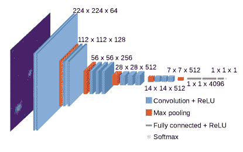
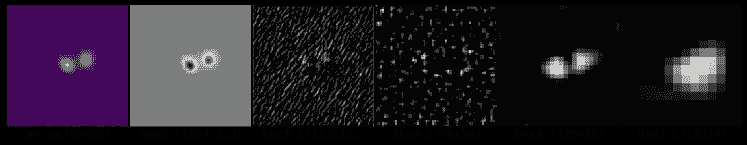
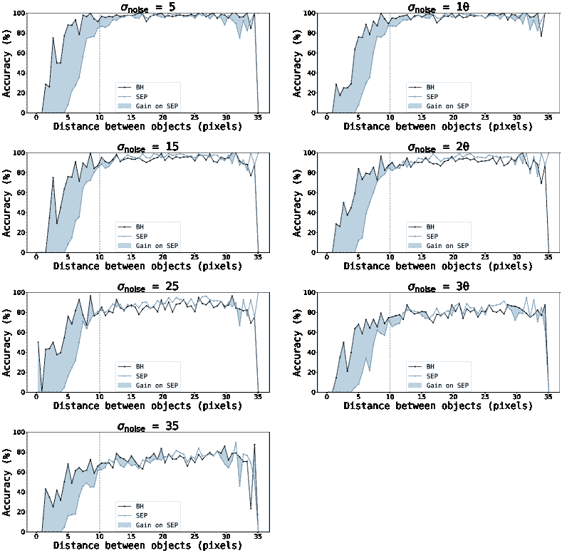
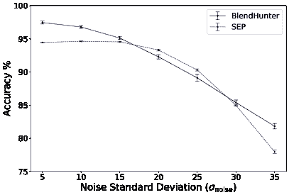
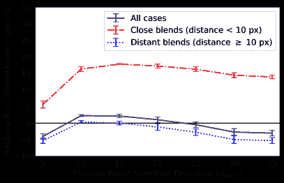
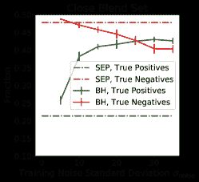
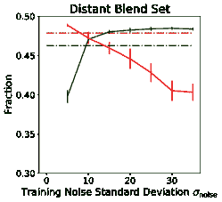
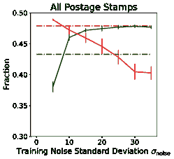

<!--yml

类别：未分类

日期：2024-09-06 19:50:30

-->

# [2110.08180] 深度迁移学习用于星系勘测数据中的混合源识别

> 来源：[`ar5iv.labs.arxiv.org/html/2110.08180`](https://ar5iv.labs.arxiv.org/html/2110.08180)

¹¹机构：AIM, CEA, CNRS, 巴黎第萨克雷大学, 巴黎第八大学, 巴黎索邦城市大学, F-91191 Gif-sur-Yvette, 法国 ²²机构：巴黎第萨克雷大学, CNRS, CEA, 巴黎萨克雷天体物理学、仪器与建模, 91191, Gif-sur-Yvette, 法国

# 深度迁移学习用于星系勘测数据中的混合源识别

S. Farrens 邮箱：samuel.farrens@cea.fr 深度迁移学习用于星系勘测数据中的混合源识别深度迁移学习用于星系勘测数据中的混合源识别    A. Lacan 深度迁移学习用于星系勘测数据中的混合源识别深度迁移学习用于星系勘测数据中的混合源识别    A. Guinot 深度迁移学习用于星系勘测数据中的混合源识别深度迁移学习用于星系勘测数据中的混合源识别    A. Z. Vitorelli 深度迁移学习用于星系勘测数据中的混合源识别深度迁移学习用于星系勘测数据中的混合源识别

我们介绍了 BlendHunter，一个基于深度迁移学习的概念验证工具，用于自动且稳健地识别星系勘测数据中的混合源。我们采用预训练的卷积层的 VGG-16 网络，并在 COSMOS 图像的参数模型上训练全连接层。通过使用在参数模型上学到的权重来识别更真实的 CFIS-like 图像中的混合源，我们测试了迁移学习的有效性。我们将此方法的性能与 SEP（SExtractor 的 Python 实现）进行了比较，比较了噪声水平和源之间的分离。我们发现，BlendHunter 在近混合源（源间距离<10 像素）的分类准确率上比 SEP 提高了约 15%，无论训练时使用的噪声水平如何。此外，只要网络在噪声标准差接近目标图像的数据上进行训练，该方法对远离混合源（源间距离≥10 像素）也能提供与 SEP 一致的结果。代码和数据已公开，以确保结果的可重复性。 [\faGithub](https://github.com/CosmoStat/BlendHunter)

###### 关键词：

技术：图像处理，方法：数值，方法：数据分析，弱引力透镜

## 1 引言

来源的融合（即二维图像中延伸物体的明显重叠）对星系的形态学和结构特性的测量具有重要影响，特别是对地面观测调查而言。附近的物体很容易被误认为是单一来源，这可能导致显著的检测和/或测量偏差，具体取决于调查的深度。

对于弱引力透镜分析，了解融合如何以及在何种程度上影响剪切和光度红移测量（Mandelbaum, 2018）是至关重要的。在当前高精度宇宙学的时代，这个问题变得更加关键，需要仔细考虑系统效应。这对于可靠比较晚期探测（如弱透镜）和早期探测（如宇宙微波背景）尤为重要。

融合源在调查图像中占据了显著的比例：在暗能量调查（DES, Samuroff et al., 2018）中占比$>30\%$，在 Hyper Suprime-Cam（HSC, Bosch et al., 2018）中占比$>50\%$（深层和超深层分别达到$>60\%$和$>70\%$），以及在 Vera C. Rubin Observatory Legacy Survey of Space and Time（LSST, Sanchez et al., 2021）中占比$>60\%$。仅仅去除所有已识别的融合源将显著减少样本大小，并可能导致剪切相关函数中的纠缠偏差（Hartlap et al., 2011）。未识别的融合源可能来自低于检测阈值的源，这可能引入额外的偏差（Hoekstra et al., 2017; Euclid Collaboration et al., 2019）。因此，开发一种适当的处理调查数据中融合源的程序是必要的。

处理天体物理图像中的融合源的过程可以大致分为几个问题：a) 图像中物体的检测，b) 将这些物体分类为单一源或融合源，c) 从融合源中分割像素（通常称为“去融合”），以及 d) 排除那些不能轻易纳入科学分析的物体。本文重点关注将已经用标准源提取软件检测到的物体分类为融合源还是非融合源的问题。与文献中已经广泛讨论的分割问题（Joseph et al., 2016; Melchior et al., 2018; Reiman & Göhre, 2019）不同，针对调查数据中融合源的可靠和自动化识别方法的研究相对较少。

传统的混合源识别方法，例如 SExtractor（Bertin & Arnouts，1996），依赖固定阈值来检测对象光强度曲线中的多个峰值。虽然这种方法对相当一部分源可能有效，但它缺乏处理亮度和/或大小差异较大的混合源的灵活性。这意味着可能会错过大量混合源，这些源可能对科学分析产生不可忽视的影响。

机器学习技术，特别是深度学习架构，已被证明在处理复杂分类问题时非常成功（参见例如 Kotsiantis（2007），Lecun et al.（2015），以及 Srinivas et al.（2016））。然而，这些工具的有效性可能难以评估，特别是缺乏可靠的标注数据时。在真实的天体物理图像中，无法事先知道给定检测的基础信号是否来自单一对象或几个对象的组合。这就需要使用模拟数据以生成可靠的训练集，其中重叠源的数量和多样性是完全已知的。然而，这引入了过拟合网络到特定于模拟的属性的可能性，例如过于简化的星系模型。这反过来可能导致网络对伪影和真实观测中看到的更复杂结构非常敏感。开发包含真实数据中所有预期属性的模拟星系图像是极具挑战性且耗时的。因此，应用适合转移学习的网络是缓解此问题的一个有趣方法。

转移学习，特别是深度转移学习，是一种机器学习方法，其中通过在给定数据集上训练获得的网络权重应用于另一个不同但相似的数据集。这有助于防止过拟合训练数据，并显著减少将该方法应用于新数据集所需的时间。近年来，深度转移学习已被应用于各种天体物理应用，包括：紧凑星团的分类（Wei et al., 2020），从伪影中分离低表面亮度星系（Tanoglidis et al., 2021），行星状星云的分类（Awang Iskandar et al., 2020）以及星系图像的去混合（Arcelin et al., 2021）。

本研究介绍了一种概念验证的深度迁移学习方法，用于自动化和鲁棒地识别单带星系调查数据中的混合源，以下称为 BlendHunter（BH）¹¹1 为了可重复研究的精神，所有代码和数据均已在 GitHub 上公开，供 reproducing 论文结果 使用 ([`github.com/CosmoStat/BlendHunter`](https://github.com/CosmoStat/BlendHunter))，没有任何限制。该方法结合了在大量自然图像数据库上训练的卷积神经网络（CNN）和用于分类的全连接层。简单的参数模型用于训练全连接层，学习到的权重随后用于识别更现实图像中的混合源。

本论文组织如下。接下来的部分介绍了训练和测试数据的属性。第三部分介绍了使用的迁移学习方法以及如何训练它以识别混合星系图像。第四部分提供了该方法与当前最先进技术的比较结果。最后，第五部分总结了结论。

## 2 数据

监督机器学习方法，如本研究中提出的方法，需要准确标注和具有代表性的训练数据。这些标签通常对应于从观测数据中不能直接和/或可靠测量的属性。而模拟提供了一个受控的环境，在这里这些属性是已知的。

为了训练我们的网络，我们选择了从参数模型中生成一组模拟的单带（*即* 单色）星系图像。这使我们能够控制整个样本中混合图像的比例以及混合图像中源的分离程度。选择单带图像是为了将学习限制在像素特征上（*即* 不包含颜色信息），这可能对加拿大-法国成像调查（CFIS）²²2[`www.cfht.hawaii.edu/Science/CFIS/`](https://www.cfht.hawaii.edu/Science/CFIS/)中的$r$-带，或最终的欧几里得可见光带（Cropper et al., 2012）具有潜在的兴趣。我们还准备了一组现实的 CFIS 类星系图像样本，以测试将学习到的权重转移到类似但未见过的数据集上的效果。

本节详细描述了训练和测试数据集的生成方式。

### 2.1 混合定义

为了标注我们的训练数据，我们首先需要对“混合”的定义进行明确。通常，这将是组成混合体的各个源的光谱轮廓之间重叠量的某种度量。对于本工作，我们假设一个简单的情境，其中孤立（*即* 未混合）的源由一个单一的星系组成，该星系位于 $51\times 51$ 像素（$9.5\mathrm{arcsec}\times 9.5\mathrm{arcsec}$）的邮票内。然后我们将混合定义为一个包含两个星系的邮票，其中一个位于中心，另一个在随机位置。这个定义相当中立，因为我们不要求光谱轮廓之间有任何特定的重叠。这一选择是为了衡量分类准确性与两个源之间距离的关系。

鉴于邮票的大小，我们预计标准的源提取软件，如 SExtractor，将能够轻松识别和分离接近边界的源，但可能在源靠得更近时遇到困难。为了更好地突出这一点，我们还将混合体分为两类：“近混合体”和“远混合体”。我们将近混合体定义为两个源之间距离小于十个像素的邮票，而将远混合体定义为两个源之间距离大于或等于十个像素的邮票。

为了避免任何虚假的相关性，混合图像是通过单独模拟星系然后人工组合它们产生的。为简单起见，我们仅考虑由两个源组成的混合体。真实图像可能包含涉及两个以上源的情况，以及各种伪影，这将使分类变得更加复杂。我们将这些问题留待未来的工作中解决，此处重点测试迁移学习在我们简单测试案例中的适用性。

### 2.2 COSMOS 目录

我们使用宇宙学演化调查（COSMOS，Scoville 等人，2007）目录作为基础，以从中推导出我们的简化训练数据和更现实的测试数据。选择 COSMOS 是因为它提供了在尺寸、椭圆率、亮度和形态学方面具有代表性的星系样本。COSMOS 是哈勃空间望远镜对天空 1.64 $\mathrm{deg}^{2}$ 区域的观测目录，具有非常准确的光度和形态学数据。该目录包含高分辨率图像（0.05 弧秒/像素），并具有非常小的点扩散函数（PSF）为 0.01 弧秒。

特别是，我们使用了一个为弱透镜目的而选定和处理的目录子集（Mandelbaum 等人，2012）。这些图像的噪声微不足道，PSF 已被去卷积处理。这使得可以在更大的像素尺度上重新采样图像，并用不同的 PSF 卷积它们，以模拟来自另一个仪器的观察。最后，星系被拟合为 Sérsic 轮廓或一个 bulge + disc 轮廓，其中 bulge 由 De Vaucouleurs 轮廓（de Vaucouleurs，1948）表示，disc 由指数轮廓表示（有关详细信息，请参见 Mandelbaum 等人，2012）。

通过 Galsim 软件包（Rowe 等人，2015）提供了处理后的 COSMOS 数据子集。GalSim 在天体物理学社区中被广泛用于模拟和处理星系图像，并在多个弱透镜挑战中得到了广泛应用，如 GREAT3（Mandelbaum 等人，2014）。该软件包提供了处理 COSMOS 数据所需的所有工具。

### 2.3 点扩散函数

仪器的冲激响应或 PSF 包括了光学系统引起的所有像差以及大气*等*产生的其他失真。PSF 会导致观察到的图像模糊，从而人为地增大源的大小，并可能导致其光谱重叠，形成混合。

我们将光学 PSF 模型化为 Moffat 轮廓，$\beta=4.765$（Trujillo 等人，2001），PSF 的椭圆度来源于从实际 CFIS 数据（Guinot 等人，2021）中得出的加拿大-法国-夏威夷望远镜（CFHT）的实际光学变化。大气湍流则通过 Kolmogorov 轮廓（Tatarski，2016）进行建模，随机椭圆度来源于均值 $\mu=0$ 和标准差 $\sigma=0.01$ 的高斯分布。最终 PSF 通过卷积这两个模型获得，平均大小为 0.65 角秒。鉴于邮票的相对小尺寸，PSF 的空间变化被忽略。

这个类似 CFIS 的 PSF 模型虽然简单，但足够真实，符合本工作的目的。

### 2.4 参数模型训练数据

为了使我们的训练样本尽可能简单和通用，我们使用了一系列来自 COSMOS 样本的参数模型，这些模型在第 2.2 节中描述。它们包括不同大小、形状和椭圆度的模拟星系。这些参数模型随后与第 2.3 节中描述的类似 CFIS 的 PSF 进行卷积。每幅图像对应一个 $51\times 51$ 像素的邮票，中间为卷积星系模型。

对于样本的一半，我们在邮票中随机位置放置第二个星系模型，以根据第 2.1 节中提供的定义生成混合图像。我们用零（每个方向 7 像素）填充所有图像，以避免当第二个源接近邮票边缘时出现问题。

完整的样本由 80,000 个无噪声、填充的邮票组成，其中一半是孤立的星系，另一半是混合的。

生成我们模拟训练集的最后一步是添加高斯随机噪声。为了测试混合识别对噪声的敏感度，我们生成了 7 种不同的噪声标准差（$\sigma_{\mathrm{noise}}=5,10,15,20,25,30,35$）。我们还为每个$\sigma_{\mathrm{noise}}$值创建了 10 次噪声实现，以测试训练的稳定性。每个噪声水平的每个实现都被视为独立的训练集。换句话说，我们训练网络 70 次，获得 70 组权重。

### 2.5 现实测试数据

我们生成了一个现实的 CFIS 类似图像样本来测试我们的迁移学习方法。为此，我们采用了真实的去噪和去卷积的 COSMOS 图像，这些图像在第 2.2 节中描述，将其裁剪为$51\times 51$像素的邮票，并用第 2.3 节中描述的 CFIS 类似 PSF 进行卷积。通量被重新缩放以再现 3.6 米 CFHT 望远镜下的 300 秒曝光。图像以 CFIS 调查的分辨率（0.187 弧秒）进行重采样。与训练图像类似，样本的一半通过在邮票中随机位置添加第二个源来创建混合图像，然后所有邮票都以相同方式进行零填充。最后，向图像中添加了$\sigma_{\mathrm{noise}}=14.5$的高斯噪声，以复制 CFIS 数据的信噪比。

最终样本的$80\leavevmode\nobreak\ 000$个现实邮票比第 2.4 节中描述的参数模型复杂得多，更接近于真实图像中预期的条件。例如，由于恒星形成区域或复杂的形态，光谱轮廓不一定具有中心对称性。在$80\leavevmode\nobreak\ 000$个邮票中，有$4\leavevmode\nobreak\ 838$个对应于近距离混合（*即*，源之间的距离小于十个像素），其余$35\leavevmode\nobreak\ 162$个对应于远距离混合。

表格 1 总结了用于训练和测试的所有数据集。

表 1：用于训练和测试的数据总结。

| 数据集 | 参数训练集 | 现实测试集 |
| --- | --- | --- |
| $\mathrm{N}_{\mathrm{isolated}}$ | 40 000 | 40 000 |
| $\mathrm{N}_{\mathrm{blended}}$ | 40 000 | 40 000 |
| $\sigma_{\mathrm{noise}}$ | 5, 10, 15, 20, 25, 30, 35 | $14.5$ |
| $\mathrm{N}_{\mathrm{\sigma\ real}}$ | 10 | 1 |

$\mathrm{N}_{\mathrm{isolated}}$ 是包含孤立源的邮票数量，$\mathrm{N}_{\mathrm{blended}}$ 是包含混合源的邮票数量，$\sigma_{\mathrm{noise}}$ 是添加到邮票中的噪声量，$\mathrm{N}_{\mathrm{\sigma\ real}}$ 是每个噪声水平的实现次数。

## 3 混合体识别的深度迁移学习框架

迁移学习的目标是从给定的训练集学习一组权重，然后将这些权重转移到相关但独立的问题中。从混合体识别的角度来看，这很有趣，因为我们没有大量标记数据样本，用少量已知混合体样本进行训练可能会显著偏倚学习到的权重。此外，使用预训练权重显著减少了训练网络所需的时间，从而使深度学习方法在银河测量数据中的应用变得更加可行。

为了实现这项工作，我们在两步过程中测试迁移学习在混合体识别问题中的适用性。在第一步中，使用从自然图像中学习到的 CNN 权重来提取银河图像中的通用特征。然后，使用来自简单参数模型的银河图像特征来训练全连接层。目标是捕捉混合图像的一般特征，而不是单个银河的特定特征。在第二步中，将从简单参数模型中学习到的权重应用于更现实的类似 CFIS 的图像，以测试分类准确性。

我们选择实现深度迁移问题的架构是 VGG-16。为简便起见，我们将针对混合体识别问题的特定 VGG-16 设置称为 BlendHunter。

### 3.1 VGG-16 网络

VGG-16 是由牛津大学视觉几何组（VGG）开发的一个深度卷积网络，具有 16 层权重（Simonyan & Zisserman，2014）。该网络在 2014 年 ImageNet 大规模视觉识别挑战赛（ILSVRC）中排名第一（Russakovsky et al., 2015）。该架构的主要特点是相较于当时的最先进技术，其网络深度的增加。在 VGG-16 中，三通道图像（RGB）通过 5 个卷积层块，每个块由数量递增的$3\times 3$滤波器组成。步幅（即滤波器的移动量）固定为 1，而卷积层输入通过填充来保持卷积后的空间分辨率（即$3\times 3$滤波器的填充为 1 像素）。这些块由最大池化（即下采样）层分隔。最大池化在$2\times 2$窗口上进行，步幅为 2。5 个卷积层块后接三个全连接层。最终层是一个 soft-max 层，输出类别概率。完整的网络架构见图 1。

图 1：VGG-16 网络的视觉表示。带有 ReLU 激活的卷积层显示为实心蓝色，最大池化层显示为砖纹红色，全连接层显示为绿色条，输出 softmax 层显示为最后的粉色框。

选择 VGG-16 作为此处工作的目的有几个原因。首先，该网络可以使用在 ImageNet 数据库（Deng et al., 2009）上预训练的权重，从而节省计算时间和资源。这个数据集的多样性使得网络能够学习各种通用图像特征，这些特征适用于大多数图像分类任务。最后，VGG-16 已经被应用于各种天体物理学应用，包括星系形态分类（Wu et al., 2019; Zhu et al., 2019）、引力波数据中的故障分类（George et al., 2018）和日冕仪图像分类（Shan et al., 2020）。

VGG-16 网络通过 TensorFlow-Keras 神经网络 API（Chollet et al., 2015; Abadi et al., 2015）在 Python 中实现，该 API 包含 ImageNet 预训练权重。

### 3.2 训练与验证

-   我们使用 70 组 80,000 个模拟图像（详见第 2.4 节）对 BlendHunter 进行了两阶段训练，将每个数据集划分如下：36,000 张图像用于训练，36,000 张用于验证，剩余的 8,000 张用于测试。

#### -   卷积层（Convolutional layers）

-   在第一阶段中，我们仅仅使用预训练的 ImageNet 权重初始化了卷积层（即前 13 个权重层）。正如前一节所述，使用预训练权重的目的是为了节省处理时间。因此，网络的这一部分实际上没有使用我们的数据进行训练，可以看作是一个简单的特征提取器。

-   由于使用了 ImageNet 权重，VGG-16 网络期望以 RGB 图像作为输入。因此，我们将模拟图像重新缩放到范围$i\in\mathbb{Z}:0\leq i\leq 255$，并且单色像素值在 3 个 RGB 通道上重复。最终的图像保存为 Portable Network Graphics（PNG）文件，然后输入到网络中。

鉴于训练数据相对较少，我们额外实施了数据增强，以便从网络的卷积层中获得更多多样化的特征。增加我们的模拟图像简单地意味着创建具有轻微变化（如翻转、平移或旋转）的额外图像。具体而言，我们使用了 Keras 图像预处理模块，包括剪切范围和缩放范围为$0.2$，以及水平翻转。请注意，测试图像未使用数据增强。

-   图 2（详见第 3.2.1 节）显示了从一个模拟图像中提取的特征示例，使用了卷积层。早期的卷积块提供更一般的特征，而后期的块提供更具体的特征。

-   图 2：从使用 ImageNet 权重预训练的 VGG-16 卷积层中提取的特征示例。最左侧面板显示包含混合源的输入邮票。接下来的面板显示从各种卷积块中提取的示例特征。

#### -   完全连接层（Fully connected layers）

在第二阶段，我们在之前存储的特征上训练完全连接层（*即*最后 3 个权重层）。这些层由一个线性变换层、一个 dropout 层和最后一个 ReLU 激活层组成。我们选择了这种广泛用于深度神经网络的非线性激活函数，因为它可以实现更快的收敛。我们使用了 dropout 和数据增强来避免过拟合（Srivastava 等，2014）。这是一种取消一些激活以防止网络学习图像中的随机相关性的方式。我们在实验中使用了 $0.1$ 的 dropout 率。训练时，我们以 250 张图像为一个批次进行，训练 500 个周期。一个周期对应于通过网络处理整个训练样本，而批次大小为 250 被证明在梯度下降计算上最为高效。

我们在公式 1 中使用了二元交叉熵损失函数。

{ceqn}

|  | $\displaystyle\mathrm{BCE}=-\frac{1}{N}\sum_{i=1}^{N}y_{i}\cdot\log(p(y_{i}))+(1-y_{i})\cdot\log(1-p(y_{i}))$ |  | (1) |
| --- | --- | --- | --- |

其中 $y_{i}$ 是第 $i^{th}$ 张图像的真实标签（混合为 1，非混合为 0），$p(y_{i})$ 是网络返回的图像被混合的概率。我们选择了这个损失函数进行优化，因为它通常用于这种类型的二元分类问题。

使用了 Adam 算法（Kingma & Ba，2014）来最小化我们的损失函数。与经典的随机梯度下降（SGD）算法相比，它为每个权重计算单独的学习率，并且在优化深度神经网络方面非常高效。为了调整学习率，Adam 需要通过指数移动平均来估算梯度的第一个（均值）和第二个（非中心方差）矩量（分别见公式 2 和 3），其中 $g_{t}$ 是时间步 $t$ 的目标函数梯度，$\beta_{1}$ 和 $\beta_{2}$ 是矩量估计的指数衰减率。

{ceqn}

|  | $\displaystyle m_{t}=\beta_{1}\cdot m_{t-1}+(1-\beta_{1})\cdot g_{t}$ |  | (2) |
| --- | --- | --- | --- |

{ceqn}

|  | $\displaystyle v_{t}=\beta_{2}\cdot v_{t-1}+(1-\beta_{2})\cdot g_{t}^{2}$ |  | (3) |
| --- | --- | --- | --- |

它利用了 RMSprop（Tieleman & Hinton，2012）和 AdaGrad（Duchi et al.，2011）方法。除了具有鲁棒性和较少的时间消耗外，Adam 还可以应用于更广泛的优化问题。此外，它几乎不需要调整其参数。我们将 $\beta_{1}$ 和 $\beta_{2}$ 分别设置为默认值 0.9 和 0.999。最后，权重根据 Eq. 4 更新，其中 $w_{t}$ 是时间步 $t$ 的全连接网络权重，$\eta$ 是步长，$\hat{m_{t}}$ 和 $\hat{v_{t}}$ 是一阶和二阶矩的偏差校正估计值，$\epsilon$ 是设置为 $10^{-8}$ 的值，以防止除以 0。

{ceqn}

|  | $\displaystyle w_{t}=w_{t-1}-\eta\cdot\frac{\hat{m_{t}}}{\sqrt{\hat{v_{t}}}+\epsilon}$ |  | (4) |
| --- | --- | --- | --- |

在每个训练周期结束时，会计算训练和验证损失，并且每当验证损失减少时，都会更新权重。当验证损失在 10 个周期后没有减少时，训练被停止。网络平均在大约 70 个周期后收敛。

我们开始训练时的学习率为 $1.10^{-3}$。由于选择合适的学习率可能具有挑战性，因此我们决定在验证损失在 5 个周期后未减少时，将学习率减少 0.5 倍。较小的学习率可以避免梯度下降中的大幅跳跃。否则，在这种情况下，它可能无法收敛并停留在局部最小值。这个阶段没有实现权重衰减。

调整深度神经网络的超参数，尤其是学习参数的数量，可以非常耗时。因此，我们专注于对结果影响最大的超参数。进行了多个测试，例如更改正则化、权重初始化、丢弃率、学习率和优化器。然而，未观察到准确性的显著改善。切换到 SGD 优化器或增加丢弃率导致整体性能变差。

使用标准 Intel(R) Core(TM) i7-6900K CPU（3.20GHz，32GB），网络训练一个 80,000 张图像的样本大约需要 630 秒。

## 4 结果

### 4.1 SExtractor 基准测试

我们将 BlendHunter 的性能与 SExtractor 进行比较，因为这是社区中最广泛使用的工具，用于识别和处理天文图像中的混合源。目标是测试我们的方法相对于现有技术的可靠性。具体来说，我们使用了 SExtractor 的 Python 包装器 SEP（Barbary，2016）进行测试。请注意，SEP 不仅仅用于混合识别，还有许多其他步骤，这些步骤不能轻易隔离，但我们尽力使比较尽可能公平和一致。

SEP 实施了一种多阈值技术，将检测到的源分解为子源（如果可能的话）。该方法需要两个输入参数：分解光谱轮廓的箱数和主峰与给定子峰之间的最小对比度值。对比度是基于每个峰的通量进行评估的（见 Bertin & Arnouts（1996）的图 2）。我们为 SEP 使用的参数集显示在表 2 中（所有其他参数保持默认值）。DEBLEND_MINCONT 的值为$0.005$（去混合的最小对比度参数），与文献中常用的值相比可能有点高，但在这里我们选择了可靠的识别，而不是增加混合源的数量，同时增加虚假检测的数量。

表 2：SEP 参数设置。

| 参数 | 值 |
| --- | --- |
| THRESH_TYPE | RELATIVE |
| DETECT_THRESH | 1.5 |
| DETECT_MINAREA | 5 |
| FILTER | Y |
| FILTER_NAME | kernel_3x3.conv (默认) |
| DEBLEND_NTHRESH | 32 |
| DEBLEND_MINCONT | 0.005 |

鉴于我们对混合源的宽松定义（见第 2.1 节），我们选择不完全依赖于 SEP 提供的去混合标志。相反，我们还检查源是否位于正确的位置（在两个像素半径内），以确保我们没有提取噪声特征。此外，由于邮票中的一些源在技术上并不重叠，当 SEP 正确识别源的数量（*即* 1 或 2）时，我们将其视为正确标记的邮票。

使用 SEP 将邮票标记为孤立源或混合源的过程可以总结如下：

如果检测到单个源：

+   •

    如果源被标记为混合且位于预期位置，则图像被标记为混合。

+   •

    否则，图像将被标记为孤立源。

如果检测到两个源：

+   •

    如果两个源都在正确的位置被检测到，图像被标记为混合（即使这两个源中的一个本身被检测为混合，也适用）。

+   •

    如果源被错误识别，则图像被标记为孤立源。

如果检测到的源数量超过两个：

+   •

    如果至少在预期的位置检测到正确数量的源，则图像被标记为混合源。

+   •

    如果检测到的源数量大于实际源数量，则图像被标记为 SEP 失败，并且不包括在分析中。请注意，这种情况发生在不到$1\%$的图像中。

图 3：BlendHunter（黑色实线）与 SEP（蓝色虚线）在源之间分离函数下的分类准确率。结果来自 COSMOS 参数模型测试集的混合样本。每个面板显示给定噪声标准偏差$\sigma_{\mathrm{noise}}$的一个实现。蓝色阴影区域显示了 BlendHunter 相对于 SEP 的准确率提升。

### 4.2 参数模型结果

在下文中，我们将分类准确率定义为正确标记为孤立或混合源的邮票的百分比。这里我们采用通过 3.2 所述训练过程获得的权重，并将其应用于$8\leavevmode\nobreak\ 000$个参数模型邮票的测试样本（参见第 2.4 节）以获得分类标签。

图 3 显示了 BlendHunter（黑色实线）与 SEP（蓝色虚线）在源之间分离函数下的分类准确率。结果来自 COSMOS 参数模型测试集的混合样本（*即* $4\leavevmode\nobreak\ 000$邮票的集合）。每个面板显示给定噪声标准偏差$\sigma_{\mathrm{noise}}$的一个实现。蓝色阴影区域显示了 BlendHunter 相对于 SEP 的准确率提升。对于接近的混合源（*即* 两个源之间距离小于 10 像素），BlendHunter 显著优于 SEP，分类准确率提升高达$\sim 80\%$。对于远离的混合源，这两种技术的表现一致，且正确标记了大多数邮票。

在图 4 中，我们展示了 BlendHunter 和 SEP 在整个参数模型测试集（*即* $8\leavevmode\nobreak\ 000$张邮票）上的噪声标准偏差的总体准确度函数。数据点来自十次噪声实现的平均分类准确度，误差条来自标准偏差。正如预期的那样，两种方法在低噪声水平下表现几乎完美，随着噪声的增加表现下降。总体而言，这两种方法表现较为一致，但 BlendHunter 在较高噪声水平下的下降速度较慢，表明它在高噪声环境中可能稍微更具鲁棒性。

图 4：BlendHunter（黑色实线）与 SEP（蓝色虚线）在 COSMOS 参数模型测试集上的整体分类准确度，关于$\sigma_{\mathrm{noise}}$。数据点来自每个噪声水平的十次实现的平均准确度，误差条来自标准偏差。

### 4.3 逼真的 CFIS-like 图像结果

图 5：BlendHunter 相对于 SEP 在逼真的 CFIS-like 邮票上的相对分类准确度，$\sigma_{\mathrm{noise}}=14.5$。数据点来自十次训练噪声实现的平均相对分类准确度，误差条来自标准偏差。对于接近的混合（红色点划线），BlendHunter 在任何训练数据的噪声水平下均优于 SEP。

在这里，我们测试了从参数模型获得的权重在不同噪声水平下的表现，并将其应用于$80\leavevmode\nobreak\ 000$张逼真的 CFIS-like 邮票测试样本（见第 2.5 节）以获得分类标签。

图 5 显示了 BlendHunter 相对于 SEP 在现实 CFIS-like 邮票上的分类精度相对于训练噪声标准偏差（*即*用于训练的样本噪声水平）的变化。点表示对应于每个训练噪声水平的十次噪声实现的平均相对分类精度，误差条是标准偏差。SEP 只在完整数据集上运行一次。对于整个图像集（*即*所有 $80\leavevmode\nobreak\ 000$ 邮票），我们可以看到，BlendHunter 在 $\sigma_{\mathrm{noise}}=14.5$ 时略微超越了 SEP（仅高出几个百分点），这是真实 CFIS-like 样本的噪声标准偏差。如果网络在噪声水平差异较大的情况下进行训练，分类精度会下降。在近混合的子集（$4\leavevmode\nobreak\ 838$ 邮票）中，无论训练条件如何，BlendHunter 都显著超越 SEP。这与参数模型数据的结果一致。最后，对于远距离混合（$35\leavevmode\nobreak\ 162$ 邮票），当 BlendHunter 在与目标图像相同的噪声水平上进行训练时，其性能与 SEP 相匹配，而在训练噪声水平不同的情况下最多表现为低 $5\%$。每种情况下 SEP 的整体准确率为：整个数据集 $91\%$，近混合 $69\%$，远距离混合 $94\%$。

这些结果表明，BlendHunter 对没有完美噪声知识的训练并不过于敏感。这强烈表明迁移学习在应用于实际调查数据的前景上取得了成功和有希望的进展。此外，BlendHunter 在近混合中表现出明显更强的鲁棒性，其中银河系轮廓显著重叠。

应强调的是，这些结果基于第 2.1 节中提供的相对简单的混合定义，这并未考虑实际扩展源可能遇到的所有复杂性。

我们还检查了来自现实 CFIS 类似测试集的预测混淆矩阵。图 6 显示了随着训练噪声标准差的变化，正确分类为混合源（*即* 真阳性）或正确分类为孤立源（*即* 真阴性）的混合源的比例。第一个面板显示了 BlendHunter 相对于 SEP 对于接近混合源的样本的表现（绿色线条），以及等量的孤立源（红色线条）。第二个面板显示了远距离混合源的等效图，以及剩余的孤立源样本。第三个面板显示了所有 80 000 个邮票的结果。

结果显示，BlendHunter 在识别真实混合源方面显著优于 SEP，无论使用何种噪声水平进行训练。这在接近混合源的样本中尤为明显。然而，BlendHunter 也对孤立源产生了更多的错误标签，并且这种情况随着训练噪声水平超过目标样本的噪声水平而恶化。

图 6: BlendHunter（实线）与 SEP（点划线）在现实 CFIS 类似测试数据中的分类混淆矩阵。每个面板显示了随着训练噪声标准差变化，正确分类为混合源（*即* 真阳性，绿色线条）或正确分类为孤立源（*即* 真阴性，红色线条）的混合源的比例。左侧面板显示了接近混合源的样本以及等量的孤立源。中间面板显示了远距离混合源的样本及剩余孤立源。右侧面板显示了完整的邮票集的结果。

## 5 结论

我们提出了一种概念验证的深度迁移学习方法，用于自动化和鲁棒地识别银河系调查数据中的混合源，称为 BlendHunter。该技术使用在 ImageNet 上预训练的自然图像卷积层，从而显著减少了训练所需的时间。然后，完全连接层在从 COSMOS 数据中得出的简单参数模型上进行训练，这些模型涵盖了各种水平和高斯随机噪声的实现。

与社区标准 SEP（SExtractor 的 Python 实现）在 70 组 $8\leavevmode\nobreak\ 000$ 参数模型上的比较表明，当图像非常嘈杂或银河对非常接近（$<10$ 像素）时，BlendHunter 对混合源的敏感性明显高于 SEP。在低噪声、远距离混合源的情况下，BlendHunter 与 SEP 的表现似乎一致。

我们另外生成了一批 $80\leavevmode\nobreak\ 000$ 张更为真实的类似 CFIS 的图像，这些图像来源于真实的 COSMOS 数据。结果表明，BlendHunter 在参数模型上学习到的权重可以成功地转移到这个更复杂的数据集上，并且在使用适当的权重时，分类准确率可达 $>90\%$，在完整样本中比 SEP 高出几个百分点。结果还表明，即使使用的权重是用具有显著不同噪声标准差的数据训练得到的，BlendHunter 也能够取得大致与 SEP 一致的结果。

BlendHunter 在处理星系分离少于十个像素的混合图像时，相较于 SEP 提高了 $5-15\%$ 的性能。这是一个有趣的结果，因为这些正是会在星系形状测量中产生偏差的情况（MacCrann 等人，2020）。

总体来看，这些结果令人鼓舞，并且表明将这种方法应用于更准确地识别真实调查数据中的混合源是可能的。接下来的步骤将涉及生成包含一些伪影和两个以上源的图像的更真实的测试数据。此外，还需要进一步工作以减少误报数量，*即*对孤立源的错误标记。最后，还应进行额外的测试，以确定使用预训练权重的 CNN 层是否以及在多大程度上能够帮助防止网络对训练集的过拟合。我们将这些步骤的调查和实施留待未来的工作。

###### 致谢。

作者们感谢 COSMIC 项目，该项目由 2016 年 CEA DRF-Impulsion 资助，CEA 的跨学科数值模拟计划（2018 年 SILICOSMIC 项目），法国替代能源与原子能委员会。Euclid 合作组织、欧洲航天局以及法国国家空间研究中心的支持。该工作还得到了 ANR AstroDeep 项目 - 资助编号 19-CE23-0024-01 的支持。此项工作利用了巴黎天文物理研究所的 CANDIDE 集群，并得到了 PNCG 和 DIM-ACAV 的资助。该工作基于加拿大-法国成像调查的数据，这是由加拿大国家研究委员会和法国国家科学研究中心的大型项目 CFHT 提供的。基于通过加拿大-法国-夏威夷望远镜 (CFHT) 的 MegaPrime/MegaCam 观测，该望远镜由加拿大国家研究委员会 (NRC)、法国国家科学研究中心 (CNRS) 的国家宇宙科学研究所 (INSU) 和夏威夷大学共同运营。本研究使用了由加拿大国家研究委员会在加拿大空间局支持下运营的加拿大天文学数据中心的设施。AZV 感谢圣保罗大学 LSC/PMR/EP 提供额外的计算能力。作者们还感谢 Xinyu Wang 和 Alexandre Bruckert 对本工作的初步努力。

## References

+   Abadi et al. (2015) Abadi, M., Agarwal, A., Barham, P., et al. 2015, TensorFlow: Large-Scale Machine Learning on Heterogeneous Systems, software available from tensorflow.org

+   Arcelin et al. (2021) Arcelin, B., Doux, C., Aubourg, E., Roucelle, C., & LSST Dark Energy Science Collaboration. 2021, MNRAS, 500, 531

+   Awang Iskandar et al. (2020) Awang Iskandar, D. N. F., Zijlstra, A. A., McDonald, I., et al. 2020, Galaxies, 8, 88

+   Barbary (2016) Barbary, K. 2016, Journal of Open Source Software, 1, 58

+   Bertin & Arnouts (1996) Bertin, E. & Arnouts, S. 1996, A&AS, 117, 393

+   Bosch et al. (2018) Bosch, J., Armstrong, R., Bickerton, S., et al. 2018, PASJ, 70, S5

+   Chollet et al. (2015) Chollet, F. et al. 2015, Keras, [`keras.io`](https://keras.io)

+   Cropper et al. (2012) Cropper, M., Cole, R., James, A., et al. 2012, in Society of Photo-Optical Instrumentation Engineers (SPIE) Conference Series, Vol. 8442, Space Telescopes and Instrumentation 2012: Optical, Infrared, and Millimeter Wave, ed. M. C. Clampin, G. G. Fazio, H. A. MacEwen, & J. Oschmann, Jacobus M., 84420V

+   de Vaucouleurs (1948) de Vaucouleurs, G. 1948, Annales d’Astrophysique, 11, 247

+   Deng et al. (2009) Deng, J., Dong, W., Socher, R., et al. 2009, Proc. CVPR

+   Duchi et al. (2011) Duchi, J., Hazan, E., & Singer, Y. 2011, Journal of Machine Learning Research, 12, 2121

+   Euclid Collaboration 等（2019）Euclid Collaboration, Martinet, N., Schrabback, T., 等 2019, 《天文学与天体物理学》，627, A59

+   George 等（2018）George, D., Shen, H., & Huerta, E. A. 2018, 《物理评论 D》，97, 101501

+   Guinot 等（2021）Guinot, A., Kilbinger, M., Farrens, S., 等 2021, 《天文学与天体物理学》，已提交

+   Hartlap 等（2011）Hartlap, J., Hilbert, S., Schneider, P., & Hildebrandt, H. 2011, 《天文学与天体物理学》，528, A51

+   Hoekstra 等（2017）Hoekstra, H., Viola, M., & Herbonnet, R. 2017, 《蒙特卡洛与天文学》，468, 3295

+   Joseph 等（2016）Joseph, R., Courbin, F., & Starck, J.-L. 2016, 《天文学与天体物理学》，589, A2

+   Kingma & Ba（2014）Kingma, D. P. & Ba, J. 2014, Adam: 一种随机优化方法, cite arxiv:1412.6980Comment: 作为会议论文发布于 2015 年 3rd International Conference for Learning Representations, San Diego

+   Kotsiantis（2007）Kotsiantis, S. 2007, 31, 249

+   Lecun 等（2015）Lecun, Y., Bengio, Y., & Hinton, G. 2015, 《自然》，521, 436

+   MacCrann 等（2020）MacCrann, N., Becker, M. R., McCullough, J., 等 2020, arXiv e-prints, arXiv:2012.08567

+   Mandelbaum（2018）Mandelbaum, R. 2018, 《年鉴与天文学与天体物理学》，56, 393

+   Mandelbaum 等（2012）Mandelbaum, R., Hirata, C. M., Leauthaud, A., Massey, R. J., & Rhodes, J. 2012, 《皇家天文学会月刊》，420, 1518

+   Mandelbaum 等（2014）Mandelbaum, R., Rowe, B., Bosch, J., 等 2014, 《天体物理学杂志补充系列》，212, 5

+   Melchior 等（2018）Melchior, P., Moolekamp, F., Jerdee, M., 等 2018, 《天文学与计算》，24, 129

+   Reiman & Göhre（2019）Reiman, D. M. & Göhre, B. E. 2019, 《蒙特卡洛与天文学》，485, 2617

+   Rowe 等（2015）Rowe, B. T. P., Jarvis, M., Mandelbaum, R., 等 2015, 《天文学与计算》，10, 121

+   Russakovsky 等（2015）Russakovsky, O., Deng, J., Su, H., 等 2015, 《计算机视觉国际期刊》，115, 211

+   Samuroff 等（2018）Samuroff, S., Bridle, S. L., Zuntz, J., 等 2018, 《蒙特卡洛与天文学》，475, 4524

+   Sanchez 等（2021）Sanchez, J., Mendoza, I., Kirkby, D. P., Burchat, P. R., & LSST Dark Energy Science Collaboration. 2021, 《宇宙学与粒子物理学杂志》，2021, 043

+   Scoville 等（2007）Scoville, N., Aussel, H., Brusa, M., 等 2007, 《天体物理学杂志》，172, 1

+   Shan 等（2020）Shan, J.-h., Feng, L., Yuan, H.-q., 等 2020, 《中国天文学与天体物理学》，44, 507

+   Simonyan & Zisserman（2014）Simonyan, K. & Zisserman, A. 2014, CoRR [arXiv:1409.1556]

+   Srinivas 等（2016）Srinivas, S., Sarvadevabhatla, R. K., Mopuri, K. R., 等 2016, 《机器人与人工智能前沿》，2, 36

+   Srivastava 等（2014）Srivastava, N., Hinton, G., Krizhevsky, A., Sutskever, I., & Salakhutdinov, R. 2014, 《机器学习研究期刊》，15, 1929

+   Tanoglidis 等（2021）Tanoglidis, D., Ćiprijanović, A., & Drlica-Wagner, A. 2021, 《天文学与计算》，35, 100469

+   Tatarski（2016）Tatarski, V. I. 2016, 《湍流介质中的波传播》（Courier Dover Publications）

+   Tieleman & Hinton（2012）Tieleman, T. & Hinton, G. 2012 年，第 6.5 讲——RmsProp：将梯度除以其最近幅度的移动平均，COURSERA：机器学习的神经网络

+   Trujillo 等（2001）Trujillo, I., Aguerri, J., Cepa, J., & Gutiérrez, C. 2001 年，《皇家天文学会月刊》，328，977–985

+   Wei 等（2020）Wei, W., Huerta, E. A., Whitmore, B. C., 等。2020 年，《MNRAS》，493，3178

+   Wu 等（2019）Wu, C., Wong, O. I., Rudnick, L., 等。2019 年，《MNRAS》，482，1211

+   Zhu 等（2019）Zhu, X.-P., Dai, J.-M., Bian, C.-J., 等。2019 年，《Ap&SS》，364，55
