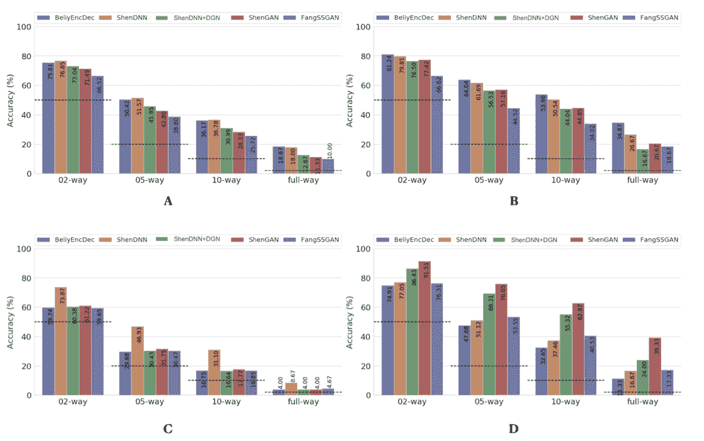

<!--yml

类别：未分类

日期：2024-09-06 19:50:27

-->

# [2110.09006] 使用深度学习进行 fMRI 自然图像重建：综述

> 来源：[`ar5iv.labs.arxiv.org/html/2110.09006`](https://ar5iv.labs.arxiv.org/html/2110.09006)

\correspondance\extraAuth

Zarina Rakhimberdina

zarina.rakhimberdina@net.c.titech.ac.jp

# 使用深度学习进行 fMRI 自然图像重建：综述

Zarina Rakhimberdina ^(1,3)、Quentin Jodelet ^(1,3)、Xin Liu ^(2,3,∗)、Tsuyoshi Murata ^(1,3)

###### 摘要

随着脑成像技术和机器学习工具的出现，许多努力被投入到建立计算模型，以捕捉人脑中视觉信息的编码。最具挑战性的脑解码任务之一是从功能性磁共振成像（fMRI）测量的脑活动中准确重建感知的自然图像。在这项工作中，我们调查了用于从 fMRI 重建自然图像的最新深度学习方法。我们从架构设计、基准数据集和评估指标等方面审视这些方法，并在标准化评估指标下呈现了公平的性能评估。最后，我们讨论了现有研究的优缺点，并提出了未来可能的发展方向。

\helveticabold

## 1 关键词：

自然图像重建、功能性磁共振成像（fMRI）、脑解码、神经解码、深度学习

## 2 引言

### 2.1 使用 fMRI 的视觉解码

许多脑成像研究集中于解码人脑如何表示外部世界的信息。考虑到大多数外部感官信息是由人类视觉系统处理的（Logothetis 和 Sheinberg，1996），对人脑视觉信息处理的深入理解需要构建能够表征视觉刺激内容的复杂计算模型。这个问题被称为人类视觉解码感知图像，并且获得了越来越多的关注。

近年来，通过功能性磁共振成像（fMRI）取得了重大进展（Poldrack and Farah, 2015; Nestor et al., 2020）。fMRI 技术通过测量血氧水平的变化来捕捉大脑中的神经活动（Ogawa et al., 1990; Bandettini, 2012）。在各种脑成像技术中，fMRI 是非侵入性的，具有较高的空间分辨率。这些特性使得 fMRI 可以应用于广泛的问题，包括神经系统疾病诊断（Zhang et al., 2020; Rakhimberdina et al., 2020）和人类视觉解码（Haxby et al., 2001; Kamitani and Tong, 2005; Horikawa and Kamitani, 2017）。人类视觉解码的最新进展表明，除了仅仅编码关于视觉刺激的信息（Poldrack and Farah, 2015），fMRI 捕捉到的脑活动还可以用于重建视觉刺激信息（Roelfsema et al., 2018; Kay et al., 2008）。

根据目标任务，人类视觉解码可以分为刺激类别分类、刺激识别和重建（Naselaris et al., 2011）。在分类中，脑活动被用于预测呈现刺激的离散对象类别（Haxby et al., 2001; Horikawa and Kamitani, 2017）。识别的目标是从已知的刺激图像集合中识别出与给定脑活动模式对应的特定刺激（Kay et al., 2008; Naselaris et al., 2011）。在识别和重建中，我们的目标是恢复图像的具体细节，如对象位置、大小和角度。然而，重建是一个更具挑战性的任务，需要为给定的 fMRI 信号生成刺激图像的副本（参见图 1）。此外，fMRI 活动中编码的与刺激相关的信息虽然可以实现高准确度的识别，但可能仅部分描述了刺激图像，因此对于适当的图像重建可能不够充分（Kay et al., 2008; St-Yves and Naselaris, 2018）。随着图像重建方法的精细化和脑成像数据量的增加，越来越多的关注被转向从视觉皮层的 fMRI 活动中重建视觉刺激（Miyawaki et al., 2008; Naselaris et al., 2009; van Gerven et al., 2010）。基于 fMRI 的视觉重建可以提高我们对大脑视觉处理机制的理解，研究人员可以将这些知识应用于脑机接口的发展。

图 1：自然图像重建任务的框架图。

### 2.2 自然图像重建

视觉重建任务中使用的视觉刺激种类繁多，从简单的低级细节图像，如 Gabor 小波和多米诺模式（Thirion 等, 2006），到更复杂的图像，如字母字符、数字（van Gerven 等, 2010; Schoenmakers 等, 2013）、自然对象和场景（Haxby 等, 2001; Horikawa 和 Kamitani, 2017）。低级细节刺激的图像重建任务不需要复杂的模型，线性映射通常足以学习有效的重建（Miyawaki 等, 2008）。在各种视觉刺激中，自然图像被认为是最具挑战性的，因为它们需要准确重建颜色、形状和更高级的感知特征。

类似于 Shen 等（2019b），我们将来自 fMRI 的视觉刺激重建任务称为自然图像重建，其中刺激来源于自然图像数据库。神经解码模型的目标是学习一个映射函数 $f:\mathcal{V}\rightarrow\mathcal{X}$，其中 $\mathcal{X}$ 和 $\mathcal{V}$ 表示对应于刺激图像和从视觉皮层提取的 fMRI 活动模式的两个集合。视觉重建的框架图如图 1 所示。

自然图像重建的主要挑战包括以下几点。首先，重建质量必须足够好，以捕捉重建图像与原始图像在多个层次上的相似性。与低分辨率图像刺激，如形状或字符模式相比，自然图像的高质量重建要求同时保留低级细节和高级语义信息。其次，大脑的视觉表征对不同的对象或图像细节是不变的，这对物体识别至关重要，但这意味着大脑激活模式不一定对特定的刺激对象唯一（St-Yves 和 Naselaris, 2018; Quiroga 等, 2005）。最后，缺乏标准化的评估程序来评估重建质量，使得现有方法难以比较。在这项工作中，我们将主要关注第三个挑战的解决方案。

贡献。基于 fMRI 的自然图像重建话题相对较新，并在过去几年引起了广泛关注。与自然视觉输入的编码和解码相关的调查提供了对现有技术的广泛概述（Roelfsema 等，2018; Nestor 等，2020），并专注于传统机器学习方法（Chen 等，2014）。据我们所知，尚无关于使用深度学习进行 fMRI 自然图像重建的全面调查。鉴于在基准数据集和标准指标方面缺乏标准化的评估过程，我们的主要贡献是为研究社区提供对现有方法的公平性能比较。

在本次调查中，我们提供了基于深度学习的自然图像重建方法的概述。我们讨论了架构、学习范式的差异以及深度学习模型相对于传统方法的优势。此外，我们回顾了评估指标，并在相同的基准上比较了模型：相同的指标和相同的数据集参数。提出的在一组通用指标上的标准化评估为公平评估和跟踪该领域新兴方法提供了机会。

本文的其余部分组织如下。在第三部分和第四部分中，我们分别介绍了用于自然图像重建的流行公开数据集，并回顾了最新的深度学习模型。然后，在第五部分中，我们提供了评估指标的概述，并在第六部分中呈现了方法的公平比较评估。最后，我们讨论了该工作的主要挑战和可能的未来方向。第八部分总结了本文。

表 1: 基准数据集的特征。

| 参考文献 | 数据集 |
| --- | --- |

&#124; 数量 &#124;

&#124; 受试者 &#124;

|

&#124; 图像刺激 &#124;

&#124; 训练/测试 &#124;

|

&#124; 重复时间 &#124;

&#124; 训练/测试 &#124;

| ROIs |
| --- | --- | --- | --- | --- | --- |
| VanRullen 和 Reddy (2019) | 面孔 | 4 | 88/20 | 无 | 无 |
| Kay 等 (2008) | vim-1 | 2 | 1750/120 | 2/13 | V1, V2, V3, V4, LO |
| Horikawa 和 Kamitani (2017) | 泛型对象解码 | 5 | 1200/50 | 1/35 | V1, V2, V3, V4, LOC, FFA, PPA |
| Shen 等（2019b） | 深度图像重建 | 自然图像 | 3 | 1200/50 | 5/24 |
| 人工形状 | 3 | 0/40 | 0/20 |
| 字母表 | 3 | 0/10 | 0/12 |

## 3 个基准数据集

本节总结了基于深度学习的自然图像重建从 fMRI 活动中公开使用的基准数据集。虽然存在各种用于刺激重建的数据集，比如二进制对比模式（BCP）（Miyawaki et al.，2008），69 个手写数字数据集（van Gerven et al.，2010），手写字符 BRAINS 数据集（Schoenmakers et al.，2013），但我们专注于呈现刺激更高层次感知复杂性的数据集：面部数据集，灰度自然图像和 Imagenet 的自然图像。这些数据集的每个样本代表一个标记对 - fMRI 记录与相关刺激图像。每个数据集的若干独特特征见表 1 中呈现。

VanRullen 和 Reddy（2019）利用面部刺激，利用深度神经网络从 fMRI 活动中重建人脸¹¹1 fMRI 数据集可在[`openneuro.org/datasets/ds001761`](https://openneuro.org/datasets/ds001761)获得。面部刺激是从 CelebA 数据集（Liu et al.，2015）随机抽取的，并有四名健康受试者参与了实验。刺激图像的示例显示在图 2 A 中。

vim-1 数据集的灰度自然图像是为了研究人类视觉系统如何表示自然图像²²2 该数据集可在[`crcns.org/data-sets/vc/vim-1`](http://crcns.org/data-sets/vc/vim-1)获得（Kay et al.，2008）。刺激包括一组 1870 幅 500 $\times$ 500 像素的真实对象、动物和室内外场景的灰度自然图像（样本显示在图 2 B 中）。自然图像来自 Corel Stock 照片库（Corel 公司，1994）、伯克利人类分割自然图像数据库³³3[`www2.eecs.berkeley.edu/Research/Projects/CS/vision/grouping/segbench/`](https://www2.eecs.berkeley.edu/Research/Projects/CS/vision/grouping/segbench/)（Martin et al.，2001）和作者的图像集。两名视觉正常或矫正到正常的健康受试者参与了 fMRI 数据采集。

图 2：自然刺激样本：（A）来自 Faces 数据集的图像（VanRullen 和 Reddy，2019）；（B）来自 vim-1 数据集的灰度自然图像（Kay 等，2008）；（C）来自 GOD（Horikawa 和 Kamitani，2017）和 DIR（Shen 等，2019b）数据集的自然图像。

来自 Imagenet 的自然图像。由 Kamitani 实验室发布的两个自然图像数据集在图像重建中被广泛使用。第一个数据集，通常称为通用对象解码⁴⁴4 该数据集可以从 [`brainliner.jp/data/brainliner/Generic_Object_Decoding`](http://brainliner.jp/data/brainliner/Generic_Object_Decoding) 获取，简称 GOD，最初由 Horikawa 和 Kamitani (2017) 用于从 fMRI 数据中进行图像分类任务，后来被采用用于图像重建（Beliy 等，2019；Ren 等，2021）。该数据集包含高分辨率 500 $\times$ 500 像素的刺激图像对（见图 2 C）及其对应的 fMRI 记录。fMRI 扫描来自五名健康受试者；刺激图像从 ImageNet 数据集（Deng 等，2009）中选择，涵盖 200 个对象类别。

第二个基于自然图像数据集的数据集用于图像重建任务（Shen 等，2019b，a）。它可以在 OpenNeuro⁵⁵5 [`openneuro.org/datasets/ds001506/versions/1.3.1`](https://openneuro.org/datasets/ds001506/versions/1.3.1) 上公开获取，在那里被引用为深度图像重建。我们称这个数据集为深度图像重建，简称 DIR。DIR 数据集包含 1,250 张与 GOD 中使用的刺激图像相同的图像。由于不同的图像呈现实验，其中训练和测试图像刺激分别重复了 5 次和 24 次，因此 DIR 数据集的训练集包含更多的刺激-fMRI 对（5 $\times$ 1,200 样本），相比之下，GOD 数据集的数量较少。参与图像呈现的有三名健康受试者。这个数据集的一个吸引人的特点是，除了自然图像外，数据集还包含人工形状和字母。人工形状数据集包含 40 张图像——由八种颜色和五种几何形状的组合组成。字母数据集包含 10 个字母（A、C、E、I、N、O、R、S、T、U），具有一致的亮度和颜色。

## 4 基于深度学习的自然图像重建方法

在深度学习出现之前，传统的自然图像重建方法使用线性回归模型估计 fMRI 信号到手工制作图像特征的线性映射（Kay 等，2008；Fujiwara 等，2013；Naselaris 等，2009）。这些方法主要关注从刺激图像中提取预定义的低级特征，如局部图像结构或 Gabor 滤波器特征（Fang 等，2020；Beliy 等，2019）。

最近几年，深度神经网络（DNNs）在计算机视觉研究中取得了显著进展，取代了基于手工特征的模型。特别是，DNN 模型在各种计算机视觉任务中取得了更好的准确性和图像质量改进，包括图像分类（Krizhevsky 等，2012）、图像分割（Chen 等，2015）和图像恢复（Zhang 等，2017）。在使用脑成像数据的视觉解码任务中，深度学习方法已被应用于图像分类（Haxby 等，2001；Horikawa 和 Kamitani，2017）、目标分割（Kamnitsas 等，2017）和自然图像重建（Shen 等，2019b，a）。它们被证明比传统方法更强大（Zhang 等，2020；Kriegeskorte，2015），主要由于多层架构使其能够从脑信号到刺激图像学习非线性映射（Beliy 等，2019；Shen 等，2019a）。

受到深度学习在图像生成中的成功启发，最近的许多研究广泛使用 DNN 模型进行自然图像重建，原因有几个。首先，深度学习框架在某种程度上符合人类视觉系统层次区域中发生的视觉编码–解码过程（Pinto 等，2009；Krizhevsky 等，2012；Schrimpf 等，2018）。其次，深度生成模型的应用使得可以合成高质量的自然图像，这通过学习潜在的数据分布来实现（Goodfellow 等，2014）。此外，训练过程可以通过在更大图像数据集上预训练的模型来辅助（Shen 等，2019b，a）。

在本节中，我们介绍了基于深度学习的自然图像重建方法的演变。我们从 DNN 架构、预训练的使用以及数据集的选择来分析它们。用于自然图像重建任务的最流行的深度学习模型包括非生成性方法，如卷积神经网络、基于编码器–解码器的框架（Kingma 和 Welling，2014）；以及生成性方法，如对抗网络（Goodfellow 等，2014）和变分自编码器（Larsen 等，2016）。表 2 展示了所调查方法的比较。

表 2：调查工作比较表。E2E 代表端到端训练。损失表示损失函数（MAE：平均绝对误差；MSE：均方误差；KL：KL 散度；Adv：对抗损失；Cos：余弦相似度。源代码的链接有效截至 2021 年 11 月。

| 方法 | 作者 | 年份 | 数据集 | 损失 | E2E | 预训练 | 公开代码 |
| --- | --- | --- | --- | --- | --- | --- | --- |
| SeeligerDCGAN | Seeliger 等 | 2018 |

&#124; BRAINS &#124;

&#124; vim-1 &#124;

&#124; GOD &#124;

|

&#124; MAE &#124;

&#124; MSE &#124;

| 无 |
| --- |

&#124; 在 ImageNet 上预训练的生成器 &#124;

&#124; (Chrabaszcz 等，2017)，Microsoft COCO &#124;

&#124; (Lin 等，2014)，来自 Maaten 的数据库 (2009) &#124;

&#124; 和 Schomaker 等（2000）。基于 AlexNet &#124;

&#124; 在 ImageNet 上训练的比较器。&#124;

| 无 |
| --- |
| StYvesEBGAN | St-Yves 和 Naselaris | 2018 | vim-1 |

&#124; MSE &#124;

&#124; Adv &#124;

| 无 |
| --- |

&#124; 去噪器和生成器进行了预训练 &#124;

&#124; 来自 CIFAR-10 的 32 $\times$ 32 彩色图像 &#124;

&#124; 数据集（Krizhevsky，2009）&#124;

| [是](https://github.com/styvesg/gan-decoding-supplementary) |
| --- |
| ShenDNN(+DGN) | Shen 等 | 2019 |

&#124; DIR: &#124;

&#124; 自然图像，&#124;

&#124; 人工形状，&#124;

&#124; 字母表字母 &#124;

| MSE | 无 |
| --- | --- |

&#124; 预训练的 VGG-19 在 ImageNet 上。&#124;

&#124; 预训练的 DGN（Dosovitskiy 和 Brox，2016）。&#124;

| [是](https://github.com/KamitaniLab/DeepImageReconstruction) |
| --- |
| ShenGAN | Shen 等 | 2019 |

&#124; DIR: &#124;

&#124; 自然图像，&#124;

&#124; 人工形状，&#124;

&#124; 字母表字母 &#124;

|

&#124; MSE &#124;

&#124; Adv &#124;

| 是 |
| --- |

&#124; 基于 Caffenet 的比较器预训练 &#124;

&#124; 在 ImageNet 上 &#124;

| [是](https://github.com/KamitaniLab/End2EndDeepImageReconstruction) |
| --- |
| BeliyEncDec | Beliy 等 | 2019 |

&#124; GOD &#124;

&#124; vim-1 &#124;

|

&#124; MSE &#124;

&#124; Cos &#124;

&#124; MAE &#124;

| 无 |
| --- |

&#124; 预训练的 AlexNet 基础编码器 &#124;

| [是](https://github.com/WeizmannVision/ssfmri2im) |
| --- |
| VanRullenVAE-GAN | VanRullen 和 Reddy | 2019 | 面孔 |

&#124; MSE &#124;

&#124; Adv &#124;

| 无 | 在 CelebA 数据集上预训练 | [是](https://github.com/rufinv/VAE-GAN-celebA) |
| --- | --- | --- |
| GazivEncDec | Gaziv 等 | 2020 |

&#124; GOD &#124;

&#124; vim-1 &#124;

|

&#124; MSE &#124;

&#124; Cos &#124;

&#124; MAE &#124;

| 无 |
| --- |

&#124; 预训练的基于 AlexNet 的编码器 &#124;

| 无 |
| --- |
| QiaoGAN-BVRM | Qiao 等 | 2020 | vim-1 | MSE | 无 |

&#124; BigGAN 预训练生成器 &#124;

&#124; 在 ImageNet 上 &#124;

| [部分](https://github.com/KaiQiao1992/ETECRM) |
| --- |
| FangSSGAN | Fang 等 | 2020 |

&#124; DIR: &#124;

&#124; 自然图像 &#124;

|

&#124; MAE &#124;

&#124; Adv &#124;

| 无 | - | [部分](https://github.com/duolala1/Reconstructing-Perceptive-Images-from-Brain-Activity-by-Shape-Semantic-GAN) |
| --- | --- | --- |
| MozafariBigBiGAN | Mozafari 等 | 2020 | GOD | Adv | 无 | 在 ImageNet 上预训练的 BigBiGAN | 无 |
| RenD-VAE/GAN | Ren 等 | 2021 |

&#124; BCP &#124;

&#124; 6-9 &#124;

&#124; BRAINS &#124;

&#124; GOD &#124;

|

&#124; KL &#124;

&#124; Adv &#124;

| 无 |
| --- |

&#124; 在外部数据上预训练的模型 &#124;

&#124; 来自 ImageNet 的数据 &#124;

| 无 |
| --- |

### 4.1 非生成方法

卷积神经网络（CNN）。与忽视输入图像结构信息的简单多层前馈神经网络相比，CNN 由于在像素邻域内进行卷积层的信息过滤，具有更好的特征提取能力（LeCun 等，1989）。将卷积层叠加在一起可以学习输入图像的层次化视觉特征，称为特征抽象。较低的 CNN 层学习低级细节，而较高的 CNN 层从图像中提取全局高级视觉信息（Mahendran 和 Vedaldi，2015）。CNN 在图像处理任务中广泛使用，包括图像重建。具体而言，编码器–解码器（Beliy 等，2019；Gaziv 等，2020）、U-Net（Fang 等，2020）、生成对抗网络（Goodfellow 等，2014）和变分自编码器（Kingma 和 Welling，2014）是采用堆叠卷积层在多个层次提取特征的流行架构。

Shen 等（Shen et al., 2019b）利用预训练的基于 VGG-19 的 DNN 从刺激图像中提取层次特征（见图 3 A）。该 DNN 由十六层卷积层和三层全连接层组成。这个方法的动机是发现从深度神经网络的不同层次获得的层次图像表示与视觉皮层中的脑活动相关（Eickenberg et al., 2017；Horikawa 和 Kamitani, 2017）。利用这一事实，可以建立从视觉皮层低/高层区域的 fMRI 信号到 DNN 对应的低/高层特征的层次映射。为此任务，作者实现了一个特征解码器 ${D}$，它将 fMRI 活动模式映射到多层 DNN 特征。解码器 ${D}$ 在重构任务之前在训练集上进行训练，使用 Horikawa 和 Kamitani 的方法（2017）。这些解码的 fMRI 特征对应于从 DNN 获得的层次图像特征。优化在特征空间进行，通过最小化图像的层次 DNN 特征与从 fMRI 活动中解码的多层特征之间的差异。

图 3：Shen 等（2019b）提出的两种框架变体概述：（A）ShenDNN 和（B）ShenDNN+DGN。黄色表示使用了预训练组件。

确定性编码器-解码器模型。在深度学习中，编码器-解码器模型广泛应用于图像到图像的翻译（Isola et al., 2017）和序列到序列的模型（Cho et al., 2014）。它们通过两阶段的架构学习从输入领域到输出领域的映射：一个编码器 ${E}$ 将输入向量 $\mathbf{x}$ 压缩为潜在表示 $\mathbf{z}={E}(\mathbf{x})$，一个解码器 $\mathbf{y}={D}(\mathbf{z})$ 从潜在表示 $\mathbf{z}$ 生成输出向量 $\mathbf{y}$（Minaee et al., 2021）。压缩后的潜在表示向量 $\mathbf{z}$ 作为瓶颈，编码了输入的低维表示。该模型通过最小化重构误差来训练，该误差是重构输出与真实输入之间的差异。

Beliy 等人 (2019) 提出了一个基于 CNN 的编码器–解码器模型，其中编码器 ${E}$ 学习从刺激图像到相应 fMRI 活动的映射，解码器 ${{D}}$ 学习从 fMRI 活动到其对应图像的映射。我们称之为 BeliyEncDec 的该方法框架如图 4 所示。通过将编码器和解码器背靠背堆叠，作者引入了两个组合网络 ${E}$-${{D}}$ 和 ${{D}}$-${E}$，其输入和输出分别为自然图像和 fMRI 记录。这使得训练可以在更大的未标记数据集上进行自监督。具体而言，使用来自 ImageNet 验证集的 50,000 张额外图像和没有刺激对的测试 fMRI 记录作为未标记自然图像和未标记 fMRI 样本。作者通过在两个自然图像重建数据集：Generic Object Decoding (Horikawa 和 Kamitani, 2017) 和 vim-1 (Kay 等人, 2008) 上取得竞争性的结果，展示了其方法的优势。训练分为两步。在第一步中，编码器 ${E}$ 建立从刺激图像到 fMRI 活动的映射。它利用预训练 AlexNet (Krizhevsky 等人, 2012) 的第一卷积层的权重，并以监督方式训练，以预测输入图像的 fMRI 活动。在第二步中，固定训练好的编码器 ${E}$，并使用标记和未标记数据联合训练解码器 ${{D}}$。模型的整体损失包括编码器 ${E}$ 的 fMRI 损失和解码器 ${D}$ 的图像损失（RGB 和特征损失）。

图 4：Beliy 等人提出的 BeliyEncDec 框架 (2019)：(A) 编码器的监督训练；(B) 解码器的监督和自监督训练。编码器的权重是固定的。蓝色表示在外部未标记数据上训练的模型组件。图像改编自 Beliy 等人 (2019)。

在后续研究中，Gaziv 等人 (2020) 通过引入基于感知相似性度量的损失函数 (Zhang 等人, 2018) 改进了 BeliyEncDec 的重建精度。为了计算感知相似性损失，作者首先使用 VGG 从原始图像和重建图像中提取多层特征，然后逐层比较提取的特征。为了与 BeliyEncDec 区分开来，我们将 Gaziv 等人 (2020) 提出的框架称为 GazivEncDec。

### 4.2 生成方法

生成模型假设数据是从某个概率分布 $p(\mathbf{x})$ 生成的，并且可以分为隐式和显式两类。隐式模型不定义数据的分布，而是指定一个随机抽样过程以从 $p(\mathbf{x})$ 中抽取样本。显式模型则明确定义概率密度函数，用于训练模型。

生成对抗网络（GAN）。

一类隐式定义的生成模型，称为生成对抗网络（GANs），因其能够生成逼真的图像而受到广泛关注（Goodfellow 等， 2014）。在自然图像重建中，GANs 被广泛应用于学习刺激图像的分布。GAN 包含生成器和判别器网络。在图像生成任务中，生成器 ${G}$ 接受一个随机噪声向量 $\mathbf{z}$（通常从高斯分布中抽样），并生成一个与训练集图像具有相同统计特性的伪样本 $G(\mathbf{z})$。在训练过程中，生成器生成逼真图像的能力不断提升，直到判别器无法区分真实样本和生成的伪样本。与其他生成方法相比，基于 GAN 的框架具有几个理想的特性。首先，GAN 不需要对输出概率分布的形式做出强假设。其次，利用判别器的对抗训练允许 GAN 的无监督训练（St-Yves 和 Naselaris，2018）。GAN 的示意图和 GAN 损失函数的详细信息请参见补充材料。

为确保重建结果类似于自然图像，Shen 等人（2019b）通过引入深度生成网络（DGN）（Dosovitskiy 和 Brox，2016）进一步修改了他们的 ShenDNN 方法。该框架如图 3 B 所示。一个使用 GAN 训练过程预训练的 DGN 被集成到 DNN 中，以生成逼真的图像，优化过程在 DGN 的输入空间中进行。因此，重建的图像被限制在 DGN 生成的图像的子空间中。我们在后续引用中将这些框架变体称为 ShenDNN 和 ShenDNN+DGN。

类似于 Shen 等人 (2019b)，Fang 等人 (2020) 的工作基于这样的发现：视觉特征在视觉皮层中是分层表示的。在特征提取步骤中，作者提出了两个解码器，它们从视觉皮层的低级和高级区域提取形状和语义表示。形状解码器 ${D}_{sp}$ 是一个线性模型，而语义解码器 ${D}_{sm}$ 具有基于 DNN 的架构（图 5 A）。在图像重建步骤中，生成器网络 ${{G}}$ 使用 GAN 进行训练，以提取的形状和语义特征作为生成图像的条件。我们将此模型称为 FangSSGAN，其中 SSGAN 代表形状和语义 GAN。生成器 ${{G}}$ 是一个基于 CNN 的网络，具有编码器–解码器结构（Ronneberger 等人，2015）。为了提高重建质量，从 ImageNet 数据集中抽取了大约 1,200 张与训练/测试集不同的额外图像，以生成增强数据。这些新图像用于生成形状和类别平均的语义特征，然后进一步传递给 GAN。

图 5：基于 GAN 的框架。（A）FangSSGAN 框架利用了语义解码器 $D_{sm}$ 和形状解码器 $D_{sp}$。 （B）ShenGAN 框架引入了一个比较网络 $C$。 （C）StYvesEBGAN 框架由三个独立训练的组件组成：编码模型 $E_{V}$，去噪自编码器和 $E_{C}$–$D_{C}$ 以及条件 GAN。 （D）SeeligerDCGAN 框架基于深度卷积 GAN。 （E）MozafariBigBiGAN 框架由 Mozafari 等人 (2020) 提出。 （F）QiaoGAN-BVRM 框架由四个部分组成：分类器、预训练条件生成器、编码器和评估网络。对于（A）–（F），框架中的预训练组件以黄色突出显示。组件的蓝色表示它们使用额外数据进行训练。

另一个基于 GAN 的模型由 Shen 等人 (2019a) 提出。该端到端模型直接学习从 fMRI 信号到重建图像的映射，无需中间转换或特征提取（见图 5 B）。该框架，我们称之为 ShenGAN，使用三个卷积神经网络进行训练：生成器 $G$、比较器 $C$ 和判别器 $D$。生成器 $G$ 将 fMRI 数据向量 $\mathbf{v}$ 映射到 $G(\mathbf{v})$，判别器 $D$ 区分重建 $G(\mathbf{v})$ 和原始图像 $\mathbf{x}$。比较器网络 $C$ 在 ImageNet 上进行预训练（用于图像分类任务），并通过计算感知损失（特征空间的相似性）来比较重建 $G(\mathbf{v})$ 与原始图像 $\mathbf{x}$。组合的损失函数是三个项的加权和：图像空间损失、感知损失和对抗损失。

到目前为止描述的基于 GAN 的方法通过生成更自然的图像来增强重建质量。然而，尽管 GAN 可以生成与训练数据集中的样本分布匹配的新样本，但它们无法控制生成数据的任何特征（Jakub Langr 和 Vladimir Bok，2019）。为了解决这个问题，St-Yves 和 Naselaris (2018) 实现了一种称为基于能量的条件 GAN 或 EBGAN 的 GAN 变体来进行图像的条件生成（Zhao 等，2017）。在他们的框架中，我们称之为 StYvesEBGAN，作者首先实现了编码模型 ${E}_{V}$ 来学习从刺激到 fMRI 的映射，如图 5 C 所示。此外，StYvesEBGAN 使用去噪自编码器将噪声高维 fMRI 表示压缩成低维表示。这些低维 fMRI 表示进一步用作 GAN 重建刺激的条件向量。与常规 GAN 相比，EBGAN 在训练过程中是一个更稳定的框架。它使用深度自编码器网络作为判别器，而不是二分类器。作者观察到，重建质量高度依赖于体素去噪自编码器，该自编码器生成的条件向量能实现最佳的重建准确性。

Seeliger 等人（2018）、Mozafari 等人（2020）和 Qiao 等人（2020）的一组研究利用了 GAN 架构，假设大脑活动与 GAN 的潜在特征之间存在线性关系。类似于 ShenDNN+DGN，这些方法采用了预训练 GAN 的生成器作为自然图像先验，这确保了重建的图像遵循类似自然图像的分布。

Seeliger 等人（2018）使用了深度卷积 GAN（DCGAN）架构（Radford 等人，2016），通过堆叠卷积层和反卷积层进行了改进。作者从 fMRI 空间到 GAN 潜在空间的直接线性映射（见图 5 D）。对于自然刺激图像领域，生成器${{G}}$在 ImageNet（Chrabaszcz 等人，2017）和 Microsoft COCO（Lin 等人，2014）数据集中预训练了下采样 64 $\times$ 64 的灰度图像。对于手写字符刺激领域，DCGAN 在（Maaten，2009）和（Schomaker 等人，2000）的 15,000 个手写字符上进行了预训练。此外，基于 AlexNet 的预训练比较网络${{C}}$作为特征匹配网络被引入，用于计算不同层之间的特征损失$L_{feat}$。总体上，损失被计算为像素级图像损失$L_{img}$（MAE）和特征损失$L_{feat}$的加权和。我们将此框架称为 SeeligerDCGAN。

Mozafari 等人（2020）使用了一种 GAN 的变体，称为 BigBiGAN 模型（Donahue 和 Simonyan，2019），该模型可以重建更逼真的图像。由于 BigBiGAN 的潜在空间，该模型生成高水平的语义信息，从 fMRI 数据中提取高级图像细节。我们将此框架称为 MozafariBigBiGAN。该框架利用了一个预训练编码器${E}$，它从输入图像$\mathbf{x}$生成潜在空间向量$E(\mathbf{x})$，以及一个生成器${{G}}$，它从潜在空间向量$\mathbf{z}$生成图像$G(\mathbf{z})$（见图 5 E）。在训练过程中，作者使用一般线性回归模型计算潜在向量$E(\mathbf{x})$到 fMRI 活动的线性映射$W$。在测试阶段，线性映射被反转，以根据测试 fMRI 活动计算潜在向量$\mathbf{z}$。

由 Qiao 等人提出的基于 GAN 的贝叶斯视觉重建模型（GAN-BVRM）（2020）旨在提高从有限数据集组合中进行重建的质量，顾名思义，它结合了 GAN 和贝叶斯学习。从贝叶斯的角度看，条件分布 $p(\mathbf{v}|\mathbf{x})$ 对应于一个编码器，它从刺激图像 $\mathbf{x}$ 预测 fMRI 活动 $\mathbf{v}$。另一方面，逆条件分布 $p(\mathbf{x}|\mathbf{v})$ 对应于一个解码器，它根据 fMRI 活动重建刺激图像。图像重建的目标是找到在给定 fMRI 活动的情况下具有最高后验概率 $p(\mathbf{x}|\mathbf{v})$ 的图像。然而，由于后验分布很难计算，因此使用贝叶斯定理通过 $p(\mathbf{x}|\mathbf{v})\propto p(\mathbf{x})p(\mathbf{v}|\mathbf{x})$ 结合编码模型 $p(\mathbf{v}|\mathbf{x})$ 和图像先验 $p(\mathbf{x})$。先验分布 $p(\mathbf{x})$ 反映了对自然图像的预定义知识，并且与 fMRI 活动无关。QiaoGAN-BVRM 框架如图 5 F 所示，包含四个部分：分类网络、预训练的条件生成器 ${{G}}$、编码器 ${E}$ 和评估网络。首先，分类器从 fMRI 数据中解码物体类别，然后 BigGAN 的条件生成器 ${{G}}$ 使用解码的类别生成自然图像。预训练生成器的优势在于，它已经从超过一百万张 ImageNet 自然图像中学习了数据分布。因此，生成器可以通过反向传播生成与 fMRI 活动最佳匹配的图像重建，而不是在固定的图像数据集中逐一搜索图像（Naselaris 等人，2009）。生成的图像传递给编码器 ${E}$，编码器预测相应的 fMRI 活动。提出的视觉编码模型和 BigGAN 的预训练生成器相互独立，这有助于提高重建的保真度和自然性。重建准确性使用评估网络进行测量，该网络计算预测的 fMRI 活动和实际 fMRI 活动之间的负平均均方误差（MSE）。通过迭代更新输入噪声向量以最大化评估器的得分，从而获得重建结果。

VAE-GAN。Kingma 和 Welling (2014) 提出的变分自编码器（VAE）是一个明确的生成网络的例子，并且是一种在神经解码中广泛使用的生成算法。与自编码器类似，VAE 由编码器和解码器组成。但 VAE 并不是编码一个潜在向量，而是编码一个潜在空间的分布，使得生成过程成为可能。因此，VAE 的目标是找到潜在变量 ${\mathbf{z}}$ 的分布，我们可以从 $\mathbf{z}\sim q_{\phi}(\mathbf{z}|\mathbf{x})$ 进行采样以生成新的图像重建 $\mathbf{x}^{\prime}\sim p_{\theta}(\mathbf{x}|\mathbf{z})$。$q_{\phi}(\mathbf{z}|\mathbf{x})$ 代表一个概率编码器，用 $\phi$ 参数化，它将输入 $\mathbf{x}$ 嵌入到潜在表示 $\mathbf{z}$ 中。$p_{\theta}(\mathbf{x}|\mathbf{z})$ 代表一个概率解码器，用 $\theta$ 参数化，它在对应的 $\mathbf{x}$ 上生成一个分布。有关 VAE 及其损失函数的详细信息见补充材料。

Larsen 等人提出的混合模型 (2016) 集成了 VAE 和 GAN，形成了一个名为 VAE-GAN 的框架。VAE-GAN 结合了 VAE 生成潜在特征和 GAN 判别器，后者学习区分虚假图像和真实图像。在 VAE-GAN 中，VAE 解码器和 GAN 生成器被合并为一个。VAE-GAN 的优点如下。首先，GAN 的对抗损失使得生成的图像在视觉上更逼真。其次，由于基于 VAE 的优化，VAE-GAN 实现了更好的稳定性。这有助于避免 GAN 固有的模式崩溃问题，即生成器生成有限子集的不同结果（Ren 等人，2021; Xu 等人，2021）。

一组关于从脑活动模式重建自然图像的研究，包括 Ren 等人（2021）和 VanRullen 与 Reddy（2019），采用了基于 VAE-GAN 的概率推断。在 Ren 等人（2021）的最新工作中，作者提出了一种名为双变分自编码器/生成对抗网络（D-VAE/GAN）的联合网络。该框架，我们称之为 RenD-VAE/GAN，包含一个基于双 VAE 的编码器和一个对抗解码器，如图 6 所示。双 VAE 包含两个概率编码器：视觉编码器 $E_{vis}$ 和认知编码器 $E_{cog}$，它们分别将刺激图像 $\mathbf{x}$ 和脑活动模式 $\mathbf{v}$ 编码为相应的潜在表示 $\mathbf{z_{x}}$ 和 $\mathbf{z_{v}}$。该框架分为三个连续的阶段进行训练。在第一个阶段，使用视觉刺激图像来训练视觉编码器 $E_{vis}$、生成器 ${{G}}$ 和判别器 ${{D}}$。$E_{vis}$ 学习将视觉图像直接映射到潜在表示。然后，利用 $E_{vis}$ 的输出，训练生成器 ${{G}}$ 来预测图像，而 ${{D}}$ 被训练以区分预测图像和真实图像。在第二个阶段，训练 $E_{cog}$ 以将高维 fMRI 信号映射到认知潜在特征。生成器 ${{G}}$ 被固定，而 ${{D}}$ 被训练以区分第一阶段生成的刺激图像和从认知潜在特征中驱动的认知重建图像。通过这种方式，$E_{cog}$ 被迫生成视觉和认知潜在表示相似的结果。在最后的训练阶段，$E_{cog}$ 被固定，而 ${{G}}$ 和 ${{D}}$ 则在 fMRI 信号上进行微调，以通过认知潜在表示提高生成图像的准确性。在这一阶段，${{D}}$ 被训练以区分真实的刺激图像和重建图像。在测试过程中，仅使用训练好的认知编码器和生成器进行推断。由于 $E_{vis}$ 以视觉刺激作为输入，它学习到的潜在表示 $\mathbf{z_{x}}$ 可以指导 $E_{cog}$ 学习潜在表示 $\mathbf{z_{v}}$。因此，在第二个训练阶段，作者通过将知识从 $E_{vis}$ 转移到 $E_{cog}$ 实现了知识蒸馏的概念，这两个网络分别代表教师和学生网络（Hinton 等人，2015）。学习到的潜在表示向量通过捕捉视觉信息（如颜色、纹理、物体位置和属性）显著提高了重建质量。

图 6：RenD-VAE/GAN 框架由三个主要组件组成：基于双重 VAE 的编码器、对抗解码器和判别器。训练过程中使用了视觉编码器 $E_{vis}$、认知编码器 $E_{cog}$、生成器和判别器。在测试阶段，仅使用训练好的认知编码器和生成器进行推断。红色箭头表示知识从教师网络 $E_{vis}$ 转移到学生网络 $E_{cog}$。蓝色组件表示在来自 ImageNet 的外部未标记自然图像（没有 fMRI 活动）上进行训练，这些图像与训练/测试集中的图像不重叠。

VanRullen 和 Reddy (2019) 利用在 CelebA 数据集上经过 GAN 过程预训练的 VAE 网络来学习变分潜在空间。与 MozafariBigBiGAN 框架类似，作者学习了潜在特征空间与 fMRI 模式之间的线性映射，而不是使用概率推断（Güçlütürk et al., 2017）。在训练阶段，VAE-GAN 的预训练编码器是固定的，潜在特征空间与 fMRI 模式之间的线性映射被学习。在测试阶段，fMRI 模式首先通过逆映射转换为 VAE 潜在编码，然后这些编码用于重建面孔。VAE 的潜在空间是一个变分层，它提供了对每张图像的有意义的描述，并且可以将面孔和面部特征表示为彼此的线性组合。由于 VAE 的训练目标，在这个空间中看起来接近的点被映射到相似的面孔图像，这些图像总是视觉上可信的。因此，VAE 的潜在空间确保了大脑解码变得更为稳健，减少了映射错误。因此，从 VAE-GAN 产生的重建图像看起来更真实，更接近原始刺激图像。这种方法不仅允许重建自然面孔，还可以解码面孔性别。在架构方面，我们称之为 VanRullenVAE-GAN 的框架由三个网络组成，如图 7 所示。

图 7：VanRullen 和 Reddy (2019) 提出的 VanRullenVAE-GAN 框架。编码器 $\boldsymbol{E}$ 将刺激图像映射到潜在表示 $\mathbf{z}$。生成器 ${G}$ 使用 $\mathbf{z}$ 重建刺激图像。预训练的组件以黄色显示。

## 5 重建评估

重建方法的评估基于人工和图像指标，我们在图 8 中以示意图的形式呈现。我们首先介绍人工和图像指标，然后描述图像比较设置的差异。

图 8：基于图像指标和人工评估的评估。

表 3：按所用评估指标比较方法。PCC 代表皮尔逊相关系数。

|  | 人工评估指标 | 图像指标 |
| --- | --- | --- |
| 参考文献 |

&#124; 定量 &#124;

&#124; 调查 &#124;

|

&#124; 视觉 &#124;

&#124; 检查 &#124;

| 传统 | PSM |
| --- | --- |
| Seeliger 等 (2018) | ✓ | ✓ | ✗ | ✗ |
| Shen 等 (2019b) | ✓ | ✓ | 成对 PCC | ✗ |
| Shen 等 (2019a) | ✓ | ✓ |

&#124; 成对 PCC &#124;

&#124; 成对 SSIM &#124;

| ✗ |
| --- |
| Beliy 等 (2019) | ✗ | ✓ | 2,5,10-way PCC | ✗ |
| Gaziv 等 (2020) | ✓ | ✓ | ✗ | 2,5,10-way PSM |
| Qiao 等 (2020) | ✗ | ✓ |

&#124; PCC &#124;

&#124; SSIM &#124;

| AlexNet |
| --- |
| Fang 等 (2020) | ✗ | ✓ | 成对 PCC | ✗ |
| Mozafari 等 (2020) | ✗ | ✓ |

&#124; 成对 PCC &#124;

&#124; Pix-Comp (2-way PCC) &#124;

| Inception-V3 |
| --- |
| Ren 等 (2021) | ✓ | ✓ |

&#124; 线性相关 &#124;

&#124; SSIM &#124;

&#124; 2,5,10-way PCC &#124;

| ✗ |
| --- |

### 5.1 人工评估

自然图像重建任务中测量重建质量的直观方法是使用人工评估。人工评估可以通过视觉检查定量和定性地进行。

对于定量的人工评估，会进行涉及人类受试者的行为研究。在这项研究中，将重建的图像与包含原始图像的原始图像或几个候选图像进行比较。受试者从给定的候选图像中选择出与原始图像相似度较高的图像。这类行为研究可以通过人工评估员或使用 Amazon Mechanical Turk⁶⁶6www.mturk.com（Seeliger 等，2018; Gaziv 等，2020）进行。

由于基于人工的评估需要额外的时间和人力投入，最近的几项研究在定量人类评估方面有所省略，而倾向于进行定性的视觉检查。为了视觉对比，原始图像及其通过不同重建方法得到的重建图像被并排展示以便于比较（参见图 9 A 和 9 B）。重建图像通常会在图像清晰度/模糊度、形状匹配、颜色以及低级/高级细节方面进行比较。许多最近的研究专注于强调其重建图像的“自然性”，尽管这些重建图像在对象类别方面与实际图像显著偏离（例如，参见图 9 B 中第 4 列的重建图像）。

尽管基于人工的评估是衡量重建图像质量的更可靠方法，但它存在以下局限性。首先，基于人工的评估耗时且昂贵，因为该过程需要精心设计的评估研究以及招募受试者。其次，结果可能会受到受试者的身体和情绪状态或外部条件（如光线或图像显示）的严重影响（Wang et al., 2004; Rolls, 2012）。表 3 显示，只有少数研究进行了定量的基于人工的评估。

### 5.2 基于图像指标的评估

作为基于人工评估的替代方案，基于图像指标的评估用于准确且自动地评估图像重建质量。使用图像指标进行评估更为实际，并且与基于人工的评估不同，它对外部因素不偏不倚。然而，基于图像指标的评估只能提供接近于人类主体固有的视觉比较机制的近似值，因此距离完美还有很大差距（Wang et al., 2004）。

目前，存在各种图像指标可以在不同层次的感知表示下比较图像。用于视觉解码文献中的图像指标可以分为捕捉低级感知相似性的传统指标和捕捉高级感知相似性的较新指标。传统指标，包括均方误差 (MSE)、像素级 Pearson 相关系数 (PCC)、结构相似性指数 (SSIM) 及其变体，都是在像素空间中计算的，捕捉低级感知相似性。捕捉高级感知相似性的指标依赖于 DNN 的多级特征提取，并可以在更高层次的感知表示中比较图像。我们在此考虑的高级指标称为感知相似性指标 (PSM)。

MSE 是评估图像重建质量的最简单传统指标。给定 $x_{i}$ 和 $y_{i}$，它们是原始图像和重建图像的展平一维表示，基于 $N$ 个样本计算的 MSE 为

|  | $MSE=\frac{1}{N}\sum_{i=1}^{N}(x_{i}-y_{i})^{2}.$ |  | (1) |
| --- | --- | --- | --- |

MSE 的几个特点，包括实现简单和计算速度快，使其成为信号处理领域广泛使用的性能指标。然而，MSE 与人类视觉感知的对应关系较差，这归因于其一些基本假设：MSE 不考虑图像像素之间的空间关系，且认为每个像素的重要性是相同的 (Wang et al., 2004)。

PCC 广泛用于统计分析中，以测量两个变量之间的线性关系。以下公式用于计算原始图像 $x$ 和重建图像 $y$ 的展平一维表示之间的像素级 Pearson 相关性：

|  | $PCC(x,y)=\frac{\sum(x-\mu_{x})(y-\mu_{y})}{\sqrt{\sum(x-\mu_{x})^{2}\sum(y-\mu_{y})^{2}}},$ |  | (2) |
| --- | --- | --- | --- |

其中 $\mu_{x}$ 和 $\mu_{y}$ 分别是展平的一维向量 $x$ 和 $y$ 的平均强度。PCC 是调查中最常用的指标（见表 3），在命名和实现上有细微的变化：Pairwise PCC (Shen et al., 2019b, a)，像素相关性 (Ren et al., 2021)，Pix-Comp (Mozafari et al., 2020)，以及 n-way PCC (Beliy et al., 2019)。PCC 的局限性在于对边缘强度变化或边缘错位的敏感性。因此，该指标往往会对模糊图像赋予更高的分数，而对具有可区分但错位形状的图像则给予较低的评分 (Beliy et al., 2019)。

SSIM 是一种广泛使用的图像相似度度量，能够捕捉图像中的结构信息。Wang 等人提出了 SSIM 作为一种质量评估度量，类似于人类视觉感知的特征（Wang 等人，2004）。与 PCC 不同，PCC 将图像的每个像素独立对待，而 SSIM 测量重建图像和原始图像之间空间上接近的像素的相似度。给定两幅图像，SSIM 作为三种比较度量：亮度、对比度和结构的加权组合来计算。假设每种度量的贡献相等，首先在图像 $x$ 和 $y$ 的对应窗口 $p$ 和 $q$ 之间局部计算 SSIM：

|  | $SSIM(p,q)=\frac{(2\mu_{p}\mu_{q}+C_{1})(2\sigma_{pq}+C_{2})}{(\mu_{p}^{2}+\mu_{q}^{2}+C_{1})(\sigma_{p}^{2}+\sigma_{q}^{2}+C_{2})},$ |  | (3) |
| --- | --- | --- | --- |

其中 $\mu_{p}$ 和 $\mu_{q}$ 分别是 $p$ 和 $q$ 的均值强度值；$\sigma_{p}^{2}$ 和 $\sigma_{q}^{2}$ 分别是 $p$ 和 $q$ 的方差；$\sigma_{pq}$ 是 $p$ 和 $q$ 的协方差，$C_{1}$ 和 $C_{2}$ 是在分母接近零时确保稳定性的常数。全局 SSIM 分数计算为所有 $M$ 个局部 SSIM 分数的平均值：

|  | $SSIM(x,y)=\sum_{i=1}^{M}SSIM(p_{i},q_{i}).$ |  | (4) |
| --- | --- | --- | --- |

PSM。尽管 SSIM 作为感知度量被广泛采用，但它与许多人类感知特征的比较效果较差（Zhang 等人，2018）。包括 Güçlütürk 等人（2017）、Qiao 等人（2018）、Mozafari 等人（2020）和 Gaziv 等人（2020）在内的几项研究强调了在评估中高层次感知相似度相较于低层次度量的重要性，因为高层次感知相似度与人类感知判断的对应关系更好（Zhang 等人，2018）。

一般原则是使用 CNN 提取输入图像的层次多层特征，然后使用选择的距离度量在层之间进行比较。然而，感知相似度度量在距离度量或特征提取网络的定义和实现因研究而异。例如，Qiao 等人（2020）利用了 AlexNet（Krizhevsky 等人，2012）的五个卷积层来提取层次特征。Mozafari 等人（2020）的另一项研究提出了一种基于 Inception-V3（Szegedy 等人，2016）最后一层输出的高级相似度度量。最后，Gaziv 等人（2020）使用了（Zhang 等人，2018）提出的 PSM 定义，并对预训练的 AlexNet 进行了线性校准。按照 Gaziv 等人（2020）的做法，我们在下式中提供了 Zhang 等人（2018）的 PSM 定义：

|  | $d\left(x,y\right)=\sum_{l}\frac{1}{H_{l}W_{l}}\sum_{h,w}\left\&#124;w_{l}\odot\left({f}_{x}^{l}-{f}_{y}^{l}\right)\right\&#124;_{2}^{2},$ |  | (5) |
| --- | --- | --- | --- |

其中 $d\left(x,y\right)$ 是原始图像 $x$ 和重建图像 $y$ 之间的距离。 ${f}_{x}^{l},{f}_{y}^{l}$ 表示第 $l$ 层的逐层激活值，并在通道间进行归一化。激活值按向量 $w_{l}\in\mathbb{R}^{C_{l}}$ 进行通道缩放，空间上进行平均，并按层汇总。

请注意，用于计算 PSM 的基础 CNN 模型应谨慎选择。由于许多研究使用预训练的 CNN 模型，因此避免在训练和评估中使用相同的模型非常重要，这可能导致评估中的潜在偏差。例如，Shen 等（2019b）和 Beliy 等（2019）等几种方法使用了 VGG-19（Simonyan 和 Zisserman，2015）进行预训练。因此，不应使用 VGG-19 模型进行评估，因为评估和优化函数的目标是相同的，评估将产生原始图像和重建图像之间的更高相似度。

### 5.3 图像比较设置

我们描述了文献中存在的三种图像比较设置：1）一对一比较，2）成对比较，以及 3）$n$-way 比较。每种比较设置都可以与任何图像或基于人工的度量一起使用。

一对一是最简单的比较设置，通过使用给定的度量（例如 MSE 或 PCC）计算重建图像与真实图像的相似度分数。然而，仅对一对原始图像和重建图像计算的定性度量的绝对值难以解释（Beliy 等，2019）。因此，成对相似度和 $n$-way 识别通常用于测量数据集中重建质量。

对图像的成对比较分析是通过将重建图像与两个候选图像进行比较来完成的：真实图像和从其余图像集中选择的图像，总共进行 $N(N-1)$ 次比较：

|  | $score=\frac{1}{N(N-1)}\sum_{i=1}^{N}\sum_{\begin{subarray}{c}j=1\\ j\neq i\end{subarray}}^{N}\sigma\left(m\left(y_{i},x_{i}\right),m\left(y_{i},x_{j}\right)\right),$ |  | (6) |
| --- | --- | --- | --- |

其中 $m$ 是感兴趣的度量标准。

|  | $\sigma(a,b)=\left\{\begin{array}[]{ll}1&amp;a>b\\ 0&amp;\text{ otherwise }\end{array}\right.$ |  | (7) |
| --- | --- | --- | --- |

如果重建图像与相应刺激图像的度量分数高于与不相关刺激图像的度量分数，则认为试验是正确的。对于那些表明数值越低越好的度量（如 MSE），方程式中的表达式 7 被修改为找到最小值。最后，正确试验的百分比被计算为所有试验中正确试验的比例（Shen 等，2019b，a；Beliy 等，2019）。偶然水平的准确率为$50\%$。

在$\boldsymbol{n}$-way 识别中，每个重建图像与包括真实图像在内的$n$个随机选择的候选图像进行比较。包括 Beliy 等（2019）和 Ren 等（2021）在内的几项研究使用了$n=2,5,10$来计算使用 PCC 的$n$-way 识别准确率。在更近期的工作中，Gaziv 等（2020）报告了基于 PSM 的$n=2,5,10,50$-way 识别准确率。另一个混淆源是命名惯例的缺失：Ren 等（2021）和 Mozafari 等（2020）分别将使用 PCC 计算的$n$-way 识别准确率称为 Pixel Correlation 和 pix-Comp。

## 6 方法的公平比较

为了公平比较现有的方法，我们选择了满足以下一个标准的方法：1）提供了完整代码以重现结果，2）提供了重建图像以进行评估。这使我们能够在 DIR 数据集上对五种最先进的方法进行视觉（第 6.1 节）和定量（第 6.2 节）比较。对于 GOD，由于缺少所选方法的完整重建集，我们仅在第 6.1 节中提供了视觉比较。vim-1 数据集的视觉比较见附录材料。

我们对最近自然图像重建工作的分析表明，只有少数工作遵循了良好的机器学习实践，特别是在评估的公平性方面。不公平的评估可以体现在不同数据集之间的比较、选择特定受试者报告结果以及在使用评估指标时的差异。这促使我们对这些方法进行严格的实证评估，即在使用共同数据集的情况下，通过常见指标进行跨受试者评估。

在共同数据集上的评估。为了标准化客观评估过程，我们对我们认为可重复的方法，即 ShenDNN、ShenDNN+DGN、ShenGAN 和 BeliyEncDec，进行了定量评估。对于 FangSSGAN，我们基于作者提供的重建结果进行了评估。

重要的是区分五受试者 GOD 数据集（Horikawa and Kamitani, 2017）和三受试者 DIR 数据集（Shen et al., 2019b），虽然它们使用相同的刺激图像，但在图像呈现实验和 fMRI 活动数据的特征方面存在很大差异。我们选择 DIR 作为共同的自然图像数据集的原因如下。首先，与类似的 GOD 数据集不同，DIR 是专门为自然图像重建任务获取的，并且由于图像呈现实验中的重复次数增加，它包含了更多的训练样本。此外，该数据集可能对研究自然图像重建方法对人工形状的普遍性感兴趣，我们在补充材料中详细描述了这一点。

在 DIR 上训练 ShenDNN、ShenDNN+DGN 和 BeliyEncDec 时，我们使用了原始的训练设置。对于 ShenGAN，我们使用了作者提供的预训练模型。为了最大化训练数据的量，每个呈现的刺激样本被视为一个单独的样本（Shen et al., 2019a）。在重建过程中，我们通过将测试 fMRI 激活值在对应同一刺激的试次间进行平均，来提高信噪比。这导致了 6,000 个训练样本和 50 个测试 fMRI 图像样本。需要注意的是，BeliyEncDec 最初是为 GOD 数据集实现的。对于 BeliyEncDec，平均训练和测试 fMRI 样本在重复试次中的表现最佳。这与作者的观察一致，即 fMRI 重复次数的增加会提高重建效果（Beliy et al., 2019）。此外，我们将训练 fMRI 向量标准化为零均值和单位标准差。训练 fMRI 数据的均值和标准差用于标准化测试 fMRI 数据。

在常见指标上的评估。我们基于 MSE、PCC、SSIM 和 PSM 指标对 DIR 中的自然图像进行了评估，这些指标在第五部分中描述。我们注意到，近期工作中对标准评估指标的共识尚未达成（见表 3）。此外，一些研究引入了新的评估指标或使用了现有指标的变体，这可能对其结果更为有利。相反，我们展示了对所有相关方法中使用的图像指标的评估。

还需要注意的是，由于内存限制和预训练模型的差异，不同方法生成的输出图像大小各异（有关输出图像分辨率的详细信息，请参见补充材料）。评估指标对图像的大小以及放大或缩小算法的选择可能非常敏感。为了公平起见，我们将 DIR 的重建结果调整为统一大小，并使用了双三次插值算法进行图像缩放。我们使用 256 $\times$ 256 像素的分辨率评估了重建图像，这是所选方法中最高的。对于重建图像尺寸较小的方法，我们应用了图像放大。

### 6.1 视觉比较结果

图 9：（A）在深度图像重建数据集上对主题 1 的不同方法进行视觉比较。所有方法的重建结果都是通过重复实验获得的，除了 Fang 等（2020）。在（A）和（B）中，刺激图像显示在第一列。每种方法对应的重建图像显示在后续列中。（B）在 GOD 数据集上的方法视觉比较。由于 GOD 缺乏完整的重建数据，视觉重建对应于相同的图像刺激但不同的受试者。对于 BeliyEncDec 和 GazivEncDec，我们展示了主题 3 的重建结果。所有方法的重建结果由作者提供或在原始论文中报告。SeeligerDCGAN 使用三个主题的刺激表示的平均值。

图 9 A 显示了来自测试集的样本刺激图像的重建结果，对应于 DIR 数据集中的受试者 1。所有方法的重建结果在物体形状和位置上都与原始图像非常相似。基于 GAN 的方法，即 ShenDNN+DGN 和 ShenGAN，生成了更锐利且更光滑的图像，但在某些情况下会丧失原始刺激中的语义细节（这通过较低的像素级 MSE 和 PCC 分数得到证实）。FangSSGAN 的重建结果在形状和颜色上也接近真实图像。原因在于使用了一个同时基于形状和语义信息的生成网络，这保持了低级特征，如纹理或形状。由非 GAN⁷⁷7By “nonGAN” methods, we mean the models that do not take advantage of the GAN training procedure. BeliyEncDec 生成的重建图像较模糊，但准确捕捉了刺激物体的形状。

此外，我们在图 9 B 中展示了 GOD 数据集的重建结果。与 DIR 数据集类似，基于 GAN 的方法 MozafariBigBiGAN 和 RenD-VAE/GAN 生成了最自然的图像。从视觉上看，MozafariBigBiGAN 在自然度方面优于其他方法。然而，这以渲染的物体类别和细节与原始刺激不同为代价。我们发现 GazivEncDec 和 RenD-VAE/GAN 在形状和颜色的重建上表现相对较好。GazivEncDec 在重建图像的高层次细节（包括形状和背景）方面优于其他方法。RenD-VAE/GAN 在颜色、背景和低级细节的重建上视觉表现优于其他方法。对于 GazivEncDec，由于引入了感知相似度损失，重建精度显著提高。根据 Ren 等人（2021）的研究，提升 RenD-VAE/GAN 重建质量的关键因素包括使用 VAE-GAN 架构而不是标准条件 GAN 以及通过 GAN 基于知识蒸馏实施的视觉特征指导。在 SeeligerDCGAN 和 BeliyEncDec 中，重建结果模糊，这可能是由于使用了像素级 MSE 损失（Seeliger 等人，2018）。

图 10：来自 DIR 数据集的三个受试者的两个图像的重建结果。

由于 DIR 数据集包含三个受试者的数据，我们在图 10 中另外展示了对应三个不同受试者的各方法重建结果。展示了两个自然图像刺激的重建结果。根据受试者的不同，不同方法的重建结果与原始刺激的相似度有所不同。例如，ShenDNN+DGN、ShenGAN 和 BeliyEncDec 的重建对于受试者 1 来说视觉效果更好，而其他方法的重建既没有保留颜色也没有保留形状。这表明选择受试者进行结果报告可能会导致偏倚的评估。

### 6.2 自然图像的定量比较结果

图 11：使用(A) MSE、(B) PCC、(C) SSIM 和(D) PSM 指标计算的跨受试者的平均$n$-way 准确度结果。水平虚线表示每个指标的机会水平。全方式比较对应于使用测试集中的所有图像，即 50 幅自然图像。

为了消除选择特定主题进行评估的偏差，我们展示了自然图像中针对多个指标的主题特定和跨主题平均结果。为了全面评估，我们使用了在第五部分中描述的三种比较设置：1) 一对一比较；2) 成对比较；3) $n$-way 比较。自然图像的成对评估结果在表 4 中展示。自然图像的$n$-way 分数展示在图 11 中。我们发现一对一的结果不适合跨方法比较。因此，我们在补充材料中展示了一对一比较。方法的定量评估首先基于低层次的 MSE、PCC 和 SSIM 指标进行，然后使用高层次的 PSM 指标进行比较。

表 4：在 DIR 数据集上的各方法成对评估结果。最佳结果以粗体显示。↑ 表示越高越好。

| 主题 | 方法 | MSE ↑ | PCC ↑ | SSIM ↑ | PSM ↑ |
| --- | --- | --- | --- | --- | --- |
| S1 | ShenDNN | 75.80 | 80.69 | 75.59 | 77.67 |
| ShenDNN+DGN | 74.53 | 78.98 | 61.27 | 86.61 |
| ShenGAN | 71.67 | 79.06 | 62.08 | 92.33 |
| BeliyEncDec | 76.94 | 86.08 | 59.67 | 73.14 |
| FangSSGAN | 67.71 | 67.18 | 60.37 | 76.12 |
| S2 | ShenDNN | 74.98 | 77.27 | 70.82 | 77.14 |
| ShenDNN+DGN | 70.78 | 75.43 | 59.55 | 86.41 |
| ShenGAN | 68.65 | 74.20 | 59.51 | 90.41 |
| BeliyEncDec | 71.18 | 76.20 | 58.94 | 75.22 |
| FangSSGAN | 64.00 | 66.24 | 58.69 | 73.71 |
| S3 | ShenDNN | 79.71 | 81.47 | 75.06 | 76.20 |
| ShenDNN+DGN | 73.59 | 75.02 | 60.24 | 86.20 |
| ShenGAN | 74.12 | 78.98 | 62.08 | 91.88 |
| BeliyEncDec | 78.61 | 81.47 | 60.53 | 76.20 |
| FangSSGAN | 67.88 | 66.45 | 59.96 | 79.02 |
| 平均结果 | ShenDNN | 76.83$\pm$2.53 | 79.81$\pm$2.24 | 73.82$\pm$2.62 | 77.01$\pm$0.74 |
| ShenDNN+DGN | 72.97$\pm$1.95 | 76.48$\pm$2.18 | 60.35$\pm$0.86 | 86.41$\pm$0.20 |
| ShenGAN | 71.48$\pm$2.74 | 77.41$\pm$2.78 | 61.22$\pm$1.48 | 91.54$\pm$1.00 |
| BeliyEncDec | 75.58$\pm$3.90 | 81.25$\pm$4.94 | 59.71$\pm$0.80 | 74.86$\pm$1.56 |
| FangSSGAN | 66.53$\pm$2.19 | 66.63$\pm$0.49 | 59.67$\pm$0.87 | 76.29$\pm$2.66 |

使用低级指标的性能。基于表格 4 和图 11 中的平均结果，A、B、C 两个非 GAN 方法在低级指标上领先，即 ShenDNN 和 BeliyEncDec。它们在三个低级成对指标（即成对 MSE、成对 PCC 和成对 SSIM）以及在$n$-way MSE 和 PPC 指标上超越了其他基准。BeliyEncDec 在低级指标上的高性能归因于通过编码器-解码器架构进行的高效低级特征提取，以及通过扩展的无标签图像和 fMRI 数据进行的自监督训练程序。ShenDNN 在低级指标上的高性能可能归因于对重建图像的迭代像素级优化。

使用高级 PSM 指标的性能。此外，我们比较了使用 AlexNet 实现的 PSM 中选定的方法。从表格 4 和图 11 D 中，我们可以看到 ShenGAN 在高级 PSM 指标上的表现最佳，通过成对和$n$-方式计算跨受试者及其平均值。总体而言，包括 ShenGAN、ShenDNN+DGN 和 FangSSGAN 在内的基于 GAN 的方法在大多数情况下都获得了前三名的平均结果。这支持了利用 PSM 来衡量图像中的高级视觉相似性的动机，特别是对于那些强项在于重建高级视觉特征和更自然图像的基于 GAN 的方法。我们将这三种方法性能的提升归因于使用了预训练的生成网络，而 ShenGAN 和 ShenDNN+DGN 的卓越性能则归因于多层 DNN 特征用于计算多级特征损失。值得注意的是，随着$n$-way 比较变得越来越困难，使用的样本数量增加，所有指标的性能均有所下降。

## 7 讨论

即使只有相对较少的开源重建框架，这项工作中呈现的视觉和定量结果也可以大致了解哪种架构解决方案、基准数据集或评估框架可以用于实验目的。

根据重建任务的目标，考虑“自然性”和重建的逼真度之间的权衡是至关重要的。生成方法依赖于基于 GAN 或 VAE-GAN 的架构来生成最自然的图像，并相应地获得更高的 PSM 评分。然而，它们通常需要外部数据进行训练或使用预训练的网络组件。外部图像数据集的可用性成为生成高质量图像的一个重要因素。最重要的是，表现最佳的“自然性”方法并不能保证重建的对象类别总是与原始图像的类别匹配，例如 MozafariBigBiGAN 的情况。其他为自然图像重建开发的非生成方法，如 BeliyEncDec 或 ShenDNN，不能生成逼真的图像。然而，每当重建的逼真度更为重要时，应考虑这些非生成方法，因为它们在低级特征上与原始图像表现出更接近的相似性，这一点在视觉和定量上都有所支持。

在这项工作中，我们倡导重建评估过程的公平性，并讨论了应在方法之间标准化的若干标准。同时，我们相信这项工作中提出的评估过程可以通过以下方式进一步改进。

大规模成像数据的可用性。当前基于深度学习的方法面临的主要挑战是必须解决小规模 fMRI 数据的限制。目前，缺乏训练数据通过在外部图像数据上预训练 DNN 组件（Shen 等，2019a，b；Beliy 等，2019）、在附加图像-fMRI 对上进行自监督（Beliy 等，2019；Gaziv 等，2020）以及通过预训练编码模型生成新的替代 fMRI（St-Yves 和 Naselaris，2018）得以补偿。虽然已经有几个脑成像数据集可用于重建任务，但仍然需要更大规模的数据集。大规模成像数据的可用性可能提高当前的最先进结果，并促进对重建更复杂和动态的视觉感知的研究，包括想象中的图像或视频。这反过来可能会导致提议框架在实际应用中的更广泛采用。

开发与人类视觉相对应的新计算相似性度量指标。虽然一些深度学习方法在高层次感知相似性度量上取得了令人鼓舞的结果，但这些计算机基础度量与人类视觉的对应关系仍然是一个未解之谜。由于大多数准确度评估指标针对计算机视觉任务，因此通常无法捕捉人类视觉的特征。朝这个方向的研究可能通过开发更先进的学习和评估指标来进一步推动自然图像重建。

## 8 结论

本文概述了使用深度学习进行自然图像重建任务的最先进方法。这些方法在多个层面上进行了比较，包括架构设计、基准数据集和评估指标。我们突出了现有评估中的若干模糊点，并提出了方法的标准化实证评估。这一评估过程可以帮助研究人员进行更全面的比较分析，并阐明其方法的有效性。我们希望这项研究能为未来自然图像重建研究奠定基础，旨在实现公平和严格的比较。

## 作者贡献

ZR: 概念化、方法论、软件、撰写、评估。QJ: 软件、评估、撰写 - 评审和编辑。XL: 概念化、数据整理、撰写 - 原始草稿准备。TM: 监督、撰写 - 评审与编辑。

## 资金

本研究部分得到了 JST CREST（资助号 JPMJCR1687）、JSPS 科研资助（资助号 21K12042, 17H01785）以及新能源与工业技术开发组织（资助号 JPNP20006）的支持。

## 致谢

我们感谢京都大学神经信息学实验室的 Yukiyasu Kamitani 教授提供了宝贵的意见，改善了手稿。我们还感谢 Katja Seeliger、Milad Mozafari、Guy Gaziv、Roman Beliy 和 Tao Fang 与我们分享了他们的重建图像和评估代码。

## 参考文献

+   Bandettini (2012) Bandettini, P. A. (2012). 二十年的功能性 MRI：科学与故事。*NeuroImage* 62, 575–588。 10.1016/j.neuroimage.2012.04.026。编号: 2

+   Beliy et al. (2019) Beliy, R., Gaziv, G., Hoogi, A., Strappini, F., Golan, T., and Irani, M. (2019). 从体素到像素再到体素：自然图像重建中的自监督。在*神经信息处理系统进展 32*，主编: H. Wallach, H. Larochelle, A. Beygelzimer, F. d. Alché-Buc, E. Fox, 和 R. Garnett（Curran Associates, Inc.）。6517–6527

+   Chen et al. (2015) Chen, L.-C., Papandreou, G., Kokkinos, I., Murphy, K., and Yuille, A. L. (2015). 使用深度卷积网络和完全连接的 CRF 进行语义图像分割。在*第三届国际学习表征会议，ICLR 2015，圣地亚哥，加州，美国，2015 年 5 月 7-9 日，会议论文集*，主编: Y. Bengio 和 Y. LeCun

+   Chen et al. (2014) Chen, M., Han, J., Hu, X., Jiang, X., Guo, L., and Liu, T. (2014). 通过 FMRI 对视觉刺激的编码和解码的综述：图像分析视角。*脑成像与行为* 8, 7–23。 10.1007/s11682-013-9238-z

+   Cho et al. (2014) Cho, K., van Merriënboer, B., Gulcehre, C., Bahdanau, D., Bougares, F., Schwenk, H., et al. (2014). 使用 RNN 编码器-解码器进行统计机器翻译的短语表示学习。在*2014 年自然语言处理经验方法会议（EMNLP）论文集*（多哈，卡塔尔: 计算语言学协会），1724–1734。 10.3115/v1/D14-1179

+   Chrabaszcz et al. (2017) Chrabaszcz, P., Loshchilov, I., and Hutter, F. (2017). ImageNet 的下采样变体作为 CIFAR 数据集的替代。*arXiv:1707.08819 [cs]* ArXiv: 1707.08819

+   Corel Corporation (1994) [数据集] Corel Corporation (1994). Corel 图库照片库。ISBN: 9780969660552 地点: 渥太华 OCLC: 872594087

+   Deng et al. (2009) Deng, J., Dong, W., Socher, R., Li, L.-J., Li, K., and Fei-Fei, L. (2009). ImageNet: 一个大规模层次图像数据库。在*2009 年 IEEE 计算机视觉与模式识别会议*。248–255。 10.1109/CVPR.2009.5206848。ISSN: 1063-6919

+   Donahue 和 Simonyan（2019）Donahue, J. 和 Simonyan, K.（2019）。大规模对抗表示学习。在*神经信息处理系统进展*中，主编：H. Wallach, H. Larochelle, A. Beygelzimer, F. d. Alché-Buc, E. Fox, 和 R. Garnett（Curran Associates, Inc.），第 32 卷

+   Dosovitskiy 和 Brox（2016）Dosovitskiy, A. 和 Brox, T.（2016）。用卷积网络反转视觉表示。4829–4837

+   Eickenberg 等（2017）Eickenberg, M., Gramfort, A., Varoquaux, G., 和 Thirion, B.（2017）。全面观察：卷积网络层映射人类视觉系统的功能。*神经影像* 152, 184–194。 10.1016/j.neuroimage.2016.10.001

+   Fang 等（2020）Fang, T., Qi, Y., 和 Pan, G.（2020）。通过形状语义生成对抗网络重建感知图像。*神经信息处理系统进展* 33

+   Fujiwara 等（2013）Fujiwara, Y., Miyawaki, Y., 和 Kamitani, Y.（2013）。从贝叶斯典型相关分析推导出的模块化编码和解码模型。*神经计算* 25, 979–1005。 10.1162/NECO_a_00423。编号：4

+   Gaziv 等（2020）Gaziv, G., Beliy, R., Granot, N., Hoogi, A., Strappini, F., Golan, T., 等（2020）。*自监督自然图像重建与来自脑活动的丰富语义分类*。预印本，神经科学。 10.1101/2020.09.06.284794

+   Goodfellow 等（2014）Goodfellow, I. J., Pouget-Abadie, J., Mirza, M., Xu, B., Warde-Farley, D., Ozair, S., 等（2014）。生成对抗网络。在*第 27 届国际神经信息处理系统会议论文集 - 第二卷*（美国，麻省剑桥：麻省理工学院出版社），NIPS’14, 2672–2680

+   Güçlütürk 等（2017）Güçlütürk, Y., Güçlü, U., Seeliger, K., Bosch, S., van Lier, R., 和 van Gerven, M. A.（2017）。通过深度对抗神经解码重建感知面孔。*神经信息处理系统进展* 30, 4246–4257

+   Haxby 等（2001）Haxby, J. V., Gobbini, M. I., Furey, M. L., Ishai, A., Schouten, J. L., 和 Pietrini, P.（2001）。在腹侧颞皮层中分布式和重叠的面孔与物体表示。*科学* 293, 2425–2430。 10.1126/science.1063736。编号：5539 出版社：美国科学促进会 部门：研究文章

+   Hinton 等（2015）Hinton, G., Vinyals, O., 和 Dean, J.（2015）。提炼神经网络中的知识。*arXiv:1503.02531 [cs, stat]* ArXiv: 1503.02531

+   Horikawa 和 Kamitani（2017）Horikawa, T. 和 Kamitani, Y.（2017）。使用层次视觉特征对观察到和想象中的物体进行通用解码。*自然通讯* 8, 15037。 10.1038/ncomms15037。编号：1 出版社：自然出版集团

+   Isola 等（2017）Isola, P., Zhu, J.-Y., Zhou, T., 和 Efros, A. A.（2017）。带条件对抗网络的图像到图像翻译。1125–1134

+   Jakub Langr 和 Vladimir Bok（2019）Jakub Langr 和 Vladimir Bok（2019）。*GANs in Action*（Manning）

+   Kamitani 和 Tong（2005）Kamitani, Y. 和 Tong, F.（2005）。解码人脑的视觉和主观内容。*自然神经科学* 8, 679–685。10.1038/nn1444。编号: 5

+   Kamnitsas 等（2017）Kamnitsas, K., Ledig, C., Newcombe, V. F. J., Simpson, J. P., Kane, A. D., Menon, D. K., 等（2017）。用于准确脑损伤分割的高效多尺度 3D CNN 与全连接 CRF。*医学影像分析* 36, 61–78。10.1016/j.media.2016.10.004

+   Kay 等（2008）Kay, K. N., Naselaris, T., Prenger, R. J., 和 Gallant, J. L.（2008）。从人脑活动中识别自然图像。*自然* 452, 352–355。10.1038/nature06713。编号: 7185

+   Kingma 和 Welling（2014）Kingma, D. P. 和 Welling, M.（2014）。自编码变分贝叶斯。*arXiv:1312.6114 [cs, stat]* ArXiv: 1312.6114

+   Kriegeskorte（2015）Kriegeskorte, N.（2015）。深度神经网络：建模生物视觉和大脑信息处理的新框架。*视觉科学年鉴* 1, 417–446。10.1146/annurev-vision-082114-035447

+   Krizhevsky（2009）Krizhevsky, A.（2009）。*从微小图像中学习多个特征层*。技术报告

+   Krizhevsky 等（2012）Krizhevsky, A., Sutskever, I., 和 Hinton, G. E.（2012）。使用深度卷积神经网络进行 ImageNet 分类。*神经信息处理系统进展* 25, 1097–1105

+   Larsen 等（2016）Larsen, A. B. L., Sønderby, S. K., Larochelle, H., 和 Winther, O.（2016）。利用学习到的相似度度量进行像素之外的自动编码。在 *国际机器学习会议*（PMLR），1558–1566。ISSN: 1938-7228

+   LeCun 等（1989）LeCun, Y., Boser, B., Denker, J. S., Henderson, D., Howard, R. E., Hubbard, W., 等（1989）。反向传播应用于手写邮政编码识别。*神经计算* 1, 541–551。10.1162/neco.1989.1.4.541。编号: 4 出版社: MIT Press

+   Lin 等（2014）Lin, T.-Y., Maire, M., Belongie, S., Hays, J., Perona, P., Ramanan, D., 等（2014）。Microsoft COCO: 语境中的常见对象。在 *计算机视觉 – ECCV 2014*，编者 D. Fleet, T. Pajdla, B. Schiele 和 T. Tuytelaars（Cham: Springer International Publishing），计算机科学讲义，740–755。10.1007/978-3-319-10602-1_48

+   Liu 等 (2015) Liu, Z., Luo, P., Wang, X., 和 Tang, X. (2015). 在野外深度学习面部属性。载于 *2015 IEEE 国际计算机视觉会议 (ICCV)*。3730–3738。 10.1109/ICCV.2015.425。ISSN: 2380-7504

+   Logothetis 和 Sheinberg (1996) Logothetis, N. K. 和 Sheinberg, D. L. (1996). 视觉物体识别。*神经科学年鉴* 19, 577–621。 10.1146/annurev.ne.19.030196.003045。编号: 1 _eprint: https://doi.org/10.1146/annurev.ne.19.030196.003045

+   Maaten (2009) Maaten, L. V. D. (2009). 手写字符识别的新基准数据集 (蒂尔堡大学, 荷兰蒂尔堡)

+   Mahendran 和 Vedaldi (2015) Mahendran, A. 和 Vedaldi, A. (2015). 通过反转深度图像表示来理解它们。载于 *2015 IEEE 计算机视觉与模式识别会议 (CVPR)*。5188–5196。 10.1109/CVPR.2015.7299155。ISSN: 1063-6919

+   Martin 等 (2001) Martin, D., Fowlkes, C., Tal, D., 和 Malik, J. (2001). 人工分割自然图像数据库及其在评估分割算法和测量生态统计中的应用。载于 *第八届 IEEE 国际计算机视觉会议. ICCV 2001*。第 2 卷, 416–423。 10.1109/ICCV.2001.937655

+   Minaee 等 (2021) Minaee, S., Boykov, Y. Y., Porikli, F., Plaza, A. J., Kehtarnavaz, N., 和 Terzopoulos, D. (2021). 使用深度学习的图像分割: 一项综述。*IEEE 模式分析与机器智能学报* , 1–1 10.1109/TPAMI.2021.3059968。会议名称: IEEE 模式分析与机器智能学报

+   Miyawaki 等 (2008) Miyawaki, Y., Uchida, H., Yamashita, O., Sato, M.-a., Morito, Y., Tanabe, H. C., 等 (2008). 利用多尺度局部图像解码器从人脑活动中重建视觉图像。*神经元* 60, 915–929。 10.1016/j.neuron.2008.11.004。编号: 5

+   Mozafari 等 (2020) Mozafari, M., Reddy, L., 和 VanRullen, R. (2020). 使用 BigBiGAN 从 fMRI 模式重建自然场景。载于 *2020 国际联合神经网络会议 (IJCNN)* (英国格拉斯哥: IEEE), 1–8。 10.1109/IJCNN48605.2020.9206960

+   Naselaris 等 (2011) Naselaris, T., Kay, K. N., Nishimoto, S., 和 Gallant, J. L. (2011). 在 fMRI 中的编码与解码。*神经影像* 56, 400–410。 10.1016/j.neuroimage.2010.07.073。编号: 2

+   Naselaris 等（2009）Naselaris, T., Prenger, R. J., Kay, K. N., Oliver, M., 和 Gallant, J. L. (2009). 基于贝叶斯重建的自然图像从人脑活动中获取。*神经元* 63, 902–915. 10.1016/j.neuron.2009.09.006. 编号: 6

+   Nestor 等（2020）Nestor, A., Lee, A. C. H., Plaut, D. C., 和 Behrmann, M. (2020). 图像重建的面貌：进展、陷阱、前景。*认知科学趋势* 24, 747–759. 10.1016/j.tics.2020.06.006. 出版社: 爱思唯尔

+   Ogawa 等（1990）Ogawa, S., Lee, T. M., Kay, A. R., 和 Tank, D. W. (1990). 依赖于血氧水平的脑部磁共振成像。*美国国家科学院院刊* 87, 9868–9872. 编号: 24

+   Pinto 等（2009）Pinto, N., Doukhan, D., DiCarlo, J. J., 和 Cox, D. D. (2009). 高通量筛选方法发现生物启发的视觉表征的良好形式。*PLOS 计算生物学* 5, e1000579. 10.1371/journal.pcbi.1000579. 出版社: 公共科学图书馆

+   Poldrack 和 Farah（2015）Poldrack, R. A. 和 Farah, M. J. (2015). 探索人脑的进展与挑战。*自然* 526, 371–379. 10.1038/nature15692. 编号: 7573 出版社: 自然出版集团

+   Qiao 等（2020）Qiao, K., Chen, J., Wang, L., Zhang, C., Tong, L., 和 Yan, B. (2020). 基于 BigGAN 的贝叶斯重建自然图像从人脑活动中获取。*神经科学* 444, 92–105. 10.1016/j.neuroscience.2020.07.040

+   Qiao 等（2018）Qiao, K., Zhang, C., Wang, L., Chen, J., Zeng, L., Tong, L., 等 (2018). 基于胶囊网络结构的图像刺激的准确重建。*神经信息学前沿* 12, 62. 10.3389/fninf.2018.00062

+   Quiroga 等（2005）Quiroga, R. Q., Reddy, L., Kreiman, G., Koch, C., 和 Fried, I. (2005). 人脑中单个神经元的恒定视觉表征。*自然* 435, 1102–1107. 10.1038/nature03687. 编号: 7045 出版社: 自然出版集团

+   Radford 等（2016）Radford, A., Metz, L., 和 Chintala, S. (2016). 使用深度卷积生成对抗网络进行无监督表示学习。见 *arXiv:1511.06434 [cs]*. ArXiv: 1511.06434

+   Rakhimberdina 等（2020）Rakhimberdina, Z., Liu, X., 和 Murata, T. (2020). 基于群体图的多模型集成方法用于诊断自闭症谱系障碍。*传感器* 20, 6001. 10.3390/s20216001. 编号: 21 出版社: 多学科数字出版研究所

+   Ren 等人（2021）Ren, Z., Li, J., Xue, X., Li, X., Yang, F., Jiao, Z., 等人（2021）。通过视觉引导的认知表示和对抗学习从脑活动中重建视觉图像。*神经影像* 10.1016/j.neuroimage.2020.117602

+   Roelfsema 等人（2018）Roelfsema, P. R., Denys, D., 和 Klink, P. C. (2018). 思维阅读与书写：神经技术的未来。*认知科学趋势* 22, 598–610. 10.1016/j.tics.2018.04.001. 期号: 7

+   Rolls（2012）Rolls, E. T. (2012). 不变视觉物体和面孔识别：神经和计算基础，以及一个模型，VisNet。*计算神经科学前沿* 6. 10.3389/fncom.2012.00035. 出版社: Frontiers

+   Ronneberger 等人（2015）Ronneberger, O., Fischer, P., 和 Brox, T. (2015). U-Net：用于生物医学图像分割的卷积网络。在 *医学图像计算与计算机辅助手术 – MICCAI 2015* 中，由 N. Navab, J. Hornegger, W. M. Wells 和 A. F. Frangi 编（Cham: Springer International Publishing），计算机科学讲义笔记，234–241. 10.1007/978-3-319-24574-4_28

+   Schoenmakers 等人（2013）Schoenmakers, S., Barth, M., Heskes, T., 和 van Gerven, M. (2013). 从人脑活动中线性重建感知图像。*神经影像* 83, 951–961. 10.1016/j.neuroimage.2013.07.043

+   Schomaker 等人（2000）Schomaker, L., Vuurpijl, L., 和 Schomaker, L. (2000). *法医书写者识别：基准数据集及两个系统的比较*（NICI（奈梅亨认知信息研究所），奈梅亨大学）。类型: 其他

+   Schrimpf 等人（2018）Schrimpf, M., Kubilius, J., Hong, H., Majaj, N. J., Rajalingham, R., Issa, E. B., 等人（2018）。Brain-Score：哪个人工神经网络对于物体识别最类似于大脑？ *bioRxiv* , 407007 10.1101/407007. 出版社: Cold Spring Harbor Laboratory 部分: 新结果

+   Seeliger 等人（2018）Seeliger, K., Güçlü, U., Ambrogioni, L., Güçlütürk, Y., 和 van Gerven, M. A. J. (2018). 用于从脑活动中重建自然图像的生成对抗网络。*神经影像* 181, 775–785. 10.1016/j.neuroimage.2018.07.043

+   Shen 等人（2019a）Shen, G., Dwivedi, K., Majima, K., Horikawa, T., 和 Kamitani, Y. (2019a). 从人脑活动中进行端到端的深度图像重建。*计算神经科学前沿* 13. 10.3389/fncom.2019.00021. 出版社: Frontiers

+   Shen 等人（2019b）Shen, G., Horikawa, T., Majima, K., 和 Kamitani, Y.（2019b）。从人脑活动中深度重建图像。*PLOS 计算生物学* 15，e1006633。10.1371/journal.pcbi.1006633。期号：1 出版社：公共科学图书馆

+   Simonyan 和 Zisserman（2015）Simonyan, K. 和 Zisserman, A.（2015）。用于大规模图像识别的非常深层卷积网络。*arXiv:1409.1556 [cs]* ArXiv: 1409.1556

+   St-Yves 和 Naselaris（2018）St-Yves, G. 和 Naselaris, T.（2018）。基于脑活动的生成对抗网络重建所见图像。在 *2018 IEEE 国际系统、人工智能与控制论大会 (SMC)*。1054–1061。10.1109/SMC.2018.00187。ISSN：2577-1655

+   Szegedy 等人（2016）Szegedy, C., Vanhoucke, V., Ioffe, S., Shlens, J., 和 Wojna, Z.（2016）。重新思考计算机视觉的 Inception 架构。在 *2016 IEEE 计算机视觉与模式识别大会 (CVPR)*（拉斯维加斯，NV，美国：IEEE），2818–2826。10.1109/CVPR.2016.308

+   Thirion 等人（2006）Thirion, B., Duchesnay, E., Hubbard, E., Dubois, J., Poline, J.-B., Lebihan, D., 等（2006）。逆视网膜定位：从脑激活模式推断图像的视觉内容。*神经影像* 33，1104–1116。10.1016/j.neuroimage.2006.06.062

+   van Gerven 等人（2010）van Gerven, M. A. J., de Lange, F. P., 和 Heskes, T.（2010）。使用层次生成模型进行神经解码。*神经计算* 22，3127–3142。10.1162/NECO_a_00047。期号：12 出版社：MIT Press

+   VanRullen 和 Reddy（2019）VanRullen, R. 和 Reddy, L.（2019）。利用深度生成神经网络从 fMRI 图案中重建面孔。*通讯生物学* 2，1–10。10.1038/s42003-019-0438-y。期号：1 出版社：自然出版集团

+   Wang 等人（2004）Wang, Z., Bovik, A., Sheikh, H., 和 Simoncelli, E.（2004）。图像质量评估：从错误可见性到结构相似性。*IEEE 图像处理汇刊* 13，600–612。10.1109/TIP.2003.819861。会议名称：IEEE 图像处理汇刊

+   Xu 等人（2021）Xu, K., Du, C., Li, C., Zhu, J., 和 Zhang, B.（2021）。通过教学密度估计器学习隐式生成模型。在 *机器学习与数据库中的知识发现*，编辑 F. Hutter, K. Kersting, J. Lijffijt, 和 I. Valera（查姆：Springer 国际出版），计算机科学讲义，239–255。10.1007/978-3-030-67661-2_15

+   Zhang 等人（2017）Zhang, K., Zuo, W., Chen, Y., Meng, D., 和 Zhang, L.（2017）。超越高斯去噪器：深度卷积神经网络的残差学习用于图像去噪。*IEEE 图像处理学报* 26, 3142–3155。 10.1109/TIP.2017.2662206。会议名称：IEEE 图像处理学报

+   Zhang 等人（2018）Zhang, R., Isola, P., Efros, A. A., Shechtman, E., 和 Wang, O.（2018）。深度特征作为感知度量的非凡有效性。在*2018 IEEE/CVF 计算机视觉与模式识别会议*（盐湖城，UT: IEEE），586–595。 10.1109/CVPR.2018.00068

+   Zhang 等人（2020）Zhang, X., Yao, L., Wang, X., Monaghan, J. J. M., Mcalpine, D., 和 Zhang, Y.（2020）。关于基于深度学习的非侵入性脑信号的调查：近期进展与新前沿。*神经工程学杂志* 10.1088/1741-2552/abc902

+   Zhao 等人（2017）Zhao, J. J., Mathieu, M., 和 LeCun, Y.（2017）。基于能量的生成对抗网络。在*第 5 届国际学习表征会议，ICLR 2017，法国土伦，2017 年 4 月 24-26 日，会议论文集*（OpenReview.net）
