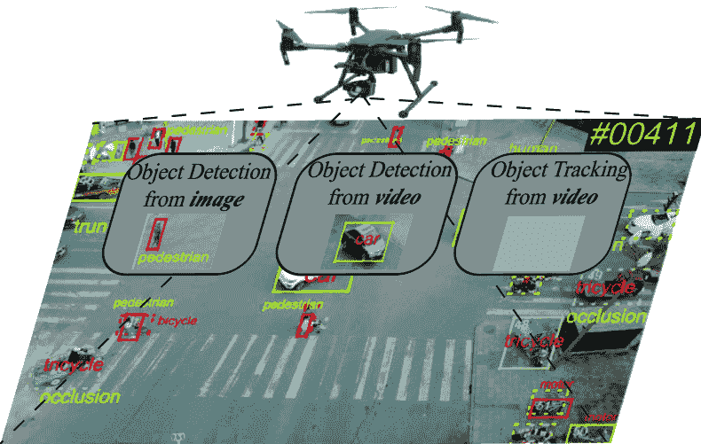
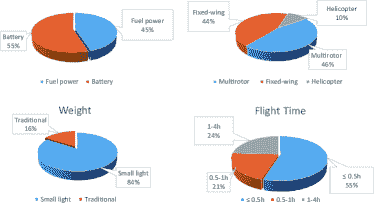
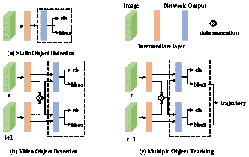
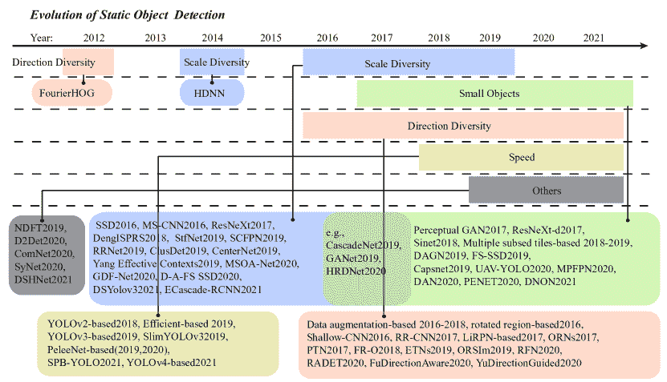
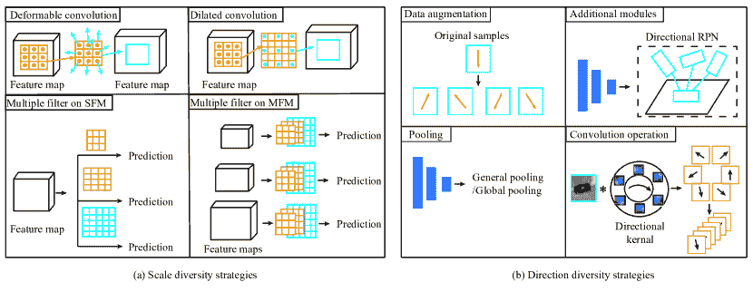
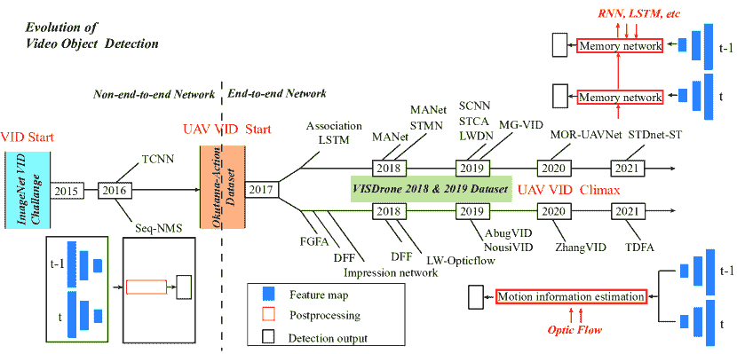
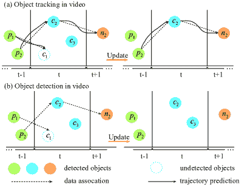
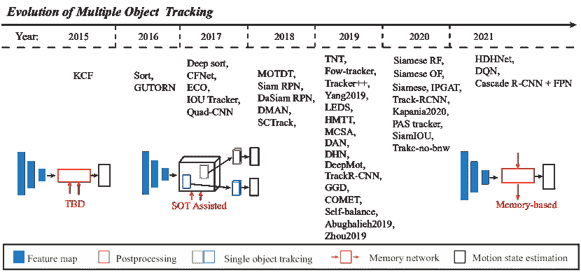
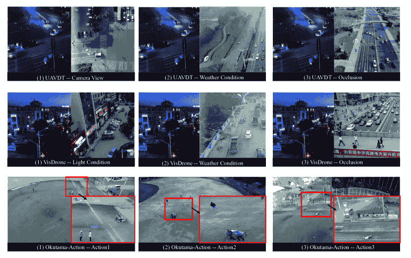

<!--yml

类别：未分类

日期：2024-09-06 19:50:21

-->

# [2110.12638] 基于深度学习的无人机目标检测与跟踪：综述

> 来源：[`ar5iv.labs.arxiv.org/html/2110.12638`](https://ar5iv.labs.arxiv.org/html/2110.12638)

# 基于深度学习的无人机目标检测与跟踪：综述

Xin Wu, Wei Li, Danfeng Hong, Ran Tao, 和 Qian Du 本工作部分得到中国国家自然科学基金资助（资助号 61922013、62101045、U1833203），部分由中国博士后科学基金资助项目（资助号 2021M690385.X）支持。X. Wu, W. Li 和 R. Tao 供职于北京理工大学信息与电子学院（100081，北京，中国）以及北京分数信号与系统重点实验室（100081，北京，中国）。(电子邮箱：040251522wuxin@163.com; liwei089@ieee.org; rantao@bit.edu.cn) D. Hong 供职于中国科学院空间信息研究所数字地球科学重点实验室（100094，北京，中国）。(电子邮箱：hongdf@aircas.ac.cn) Q. Du 供职于密西西比州立大学电气与计算机工程系（39762，MS，美国）。(电子邮箱：du@ece.msstate.edu)

###### 摘要

这是预接受版本，欲阅读最终版本，请访问 IEEE Xplore 上的《IEEE 地球科学与遥感杂志》。由于高效而灵活的数据采集，无人机（UAV）近期在计算机视觉（CV）和遥感（RS）领域成为了热点。受到深度学习（DL）最近成功的启发，许多先进的目标检测和跟踪方法已被广泛应用于各种无人机相关任务，如环境监测、精准农业、交通管理。本文提供了基于深度学习的无人机目标检测和跟踪方法的研究进展与前景的全面调查。更具体地，我们首先概述了挑战、现有方法的统计数据，并从深度学习模型的角度提供了解决方案，涵盖三个研究主题：图像中的目标检测、视频中的目标检测以及视频中的目标跟踪。我们彻底梳理了与无人机主导的目标检测和跟踪相关的开放数据集，并采用四个基准数据集使用一些最先进的方法进行性能评估。最后，我们讨论和总结了未来工作的前景和考虑。希望这项调查能为遥感领域的研究人员提供一个基于深度学习的无人机目标检测和跟踪方法的概述，并对其进一步发展提出一些思考。

###### 索引词：

深度学习、目标检测、目标跟踪、遥感、无人机、视频。

## I 引言

目标检测和跟踪作为遥感领域的一个重要研究课题，已被广泛研究并应用于各种民用和军事任务，如环境监测、地质灾害检测、精密农业和城市规划。传统的目标获取方法主要来源于卫星和载人飞机。通常，这两种平台运行在固定轨道上或按照预定路径运行，或根据委托任务临时改变运行路线并悬停，例如城市规划和制图，或在严酷且不适宜的环境中进行目标观察，例如在冰冻圈进行遥感。然而，卫星和载人飞机的成本以及飞行员的潜在安全问题不可避免地限制了这些平台的应用范围。

图 1：无人机目标检测和跟踪的复杂城市场景。为简单起见，图像中仅绘制了某些对象的边界框和类别名称。

随着微电子软件和硬件的发展、导航和通信技术的更新，以及材料和能源技术的突破，无人机（UAV）平台已经迅速成为遥感领域的国际研究热点。无人机遥感系统是一个高科技的综合体，集成了无人机、遥感、全球定位系统（GPS）定位和惯性测量单元（IMU）姿态确定手段。它是一个专用的遥感系统，旨在获取低空高分辨率的遥感图像。与传统平台相比，无人机弥补了天气、时间等限制所造成的信息丢失。此外，无人机的高机动性使其能够在没有地理限制的情况下灵活地收集视频数据。这些数据无论是在内容还是时间上都极具信息量，因此目标检测和跟踪已进入了大规模无人机时代[1, 2, 3]，在土地覆盖制图[4, 5]、智能农业[6, 7]、智慧城市[8]、交通监测[9]和灾害监测[10]等主题中发挥了越来越重要的作用。

作为计算机视觉的基础问题之一，目标检测与跟踪采用了经典的，即基于统计的方法 [11, 12]。然而，如今海量的数据对这些传统方法的性能产生了影响，导致特征维度爆炸，从而带来更高的存储空间和时间成本。由于深度神经网络（DL）技术的出现 [13, 14, 15]，可以通过深层复杂的网络学习到具有足够样本数据的层次特征表示。自 2015 年以来，深度神经网络已成为用于无人机目标检测和跟踪的主流框架 [16, 17]。图 1 展示了一个在城市区域使用无人机遥感进行目标检测和跟踪的示例。经典的深度神经网络分为两大类：两阶段网络和一阶段网络。其中，两阶段网络，如 RCNN [18]、Fast RCNN [19]和 Faster RCNN [20]，首先需要生成一个区域提议（RP），然后对候选区域进行分类和定位。一系列工作 [21, 22, 23] 已证明，两阶段网络适用于需要更高检测精度的应用。一阶段网络，如 SSD [24] 和 YOLO [16, 25, 26]，直接生成类别概率和坐标位置，比两阶段网络更快。类似地，还有一些更快的轻量级网络，如 mobilenet SSD [27]、YOLOv3 [28]、ESPnet_v2 [29] 等。因此，一阶段和更快的轻量级网络在具有高速要求的无人机遥感实际应用中是最终的赢家。但对于低分辨率数据，如果不对图像进行预处理或修改经典神经网络结构，则无法产生良好的结果。

本文聚焦于最大起飞重量低于 30 公斤的无人机，并通过总结最新发布的工作，讨论关键问题和难点，划定未来发展的领域，提供了基于深度学习（DL）的无人机目标检测和跟踪方法的综合综述。

图 2：当前使用的轻小型无人机的部分统计分析结果。

本文其余部分的组织结构如下。第 II 节简要总结了无人机飞行器及相关出版物的统计数据。第 VI 节描述了现有的基于无人机的遥感数据集。第 III 至 V 节回顾了与无人机目标检测和跟踪密切相关的现有深度学习工作。第 VIII 节讨论了结论。

## II 相关调查与简要统计

### II-A 无人机飞行器统计

图 2 通过统计分析展示了当前使用的无人机分类。从电源的角度来看，电池电力使用频率高于燃料电力；从空气动力学形状来看，多旋翼无人机比固定翼无人机更常见；从飞机的重量来看，大多数在 30 公斤以下，被认为是小型轻量化无人机；大多数无人机的飞行时间少于 1 小时。定量分析结果显示，小型轻量化无人机已成为研究和应用的主要类型，并且具有更大的市场份额。此外，2016 年发布的《小型轻量化无人机遥感发展报告》[30]显示，中国拥有超过 3000 架用于遥感应用的专业小型轻量化无人机。这类无人机具有以下五个主要特征。

长时间飞行。随着新能源技术、能源管理技术和轻量化复合材料研究技术的发展，无人机的飞行时间不断延长。

低综合成本和高技术含量。一方面，低成本和轻量化材料的使用降低了无人机和遥感器的生产成本。另一方面，大量用户的增加促进了组件和结构部件的批量生产，进一步降低了无人机和遥感器的生产成本。

3) 小型、轻便、多样化的遥感相机。所有小型轻型无人机上的遥感负载都开发到 30 公斤以下，光学和红外负载甚至减少到半公斤以下。此外，无人机遥感中使用了多角度摄影、倾斜摄影、传感器集成、高光谱成像干扰[31]等技术。商业高端相机已广泛用于专业空中任务，流行相机则用于大众娱乐和一般应用。

4) 实时数据传输。无线通信和信息压缩技术的进步极大推动了图像分辨率的提升，实现了更高的数据传输速率和更长的传输距离。几乎无延迟的数据链路传输使得实时观察成为可能。

### II-B 挑战

无人机遥感视频中的目标检测和跟踪任务面临许多挑战，如图像退化、目标强度不均、目标尺寸小以及实时问题，如视角特异性、背景复杂性、尺度和方向多样性问题。

+   •

    图像退化问题。迷你无人机平台所承载的负载在重量、体积和功率方面都有严格限制。外部环境的快速变化（如光线、云层、雾霾、雨水等）会导致航空图像模糊和噪声，这不可避免地导致图像退化[32]。此外，高速飞行或相机旋转也增加了目标检测的复杂性。因此，有必要进行图像预处理，如噪声减少、相机畸变校正等，以确保目标检测模型的有效性。

+   •

    目标强度不均问题。无人机的图像采集设备通常使用大光圈、固定焦距和广角镜头。此外，灵活的相机运动导致捕获的目标密度不均。一些目标密集排列并重叠多次，容易重复检测；一些目标稀疏且分布不均，容易漏检。此外，大多数目标占据的像素很少，使其从背景中分离变得困难。

+   •

    目标尺寸问题。无人机遥感图像可以在不同的高度上获得，拍摄的地面目标大小各异。这对经典的基于深度学习的方法提出了挑战。此外，无人机遥感中的地面目标主要表现为面积小于 $32\times 32$ 像素的图像。MS COCO 数据集[33] 定义了小目标，由于其特征不明显，容易导致更多的误检和漏检目标。

+   •

    实时问题。无人机获取的视频中的目标检测或跟踪需要快速准确地定位移动的地面物体，因此实时处理性能至关重要。

### II-C 贡献

迄今为止，有关来自空中和太空数据集的目标检测和跟踪的综述可以在 [34, 35] 中找到。对于无人机数据，文献中已经发布了一些具有代表性的综述，包括无人机图像处理和应用的综述 [36, 37]，无人机系统 [38]。然而，对于无人机获取的图像和视频中目标检测与跟踪技术的进展关注较少。虽然 [39, 40, 41, 42, 43, 44] 中的综述介绍了无人机图像的某些基于深度学习的静态目标检测，[45] 中的综述则介绍了无人机视频的传统目标跟踪，但仍缺乏对目标检测和跟踪以及最新进展的完整综述。

因此，必须对基于深度学习的无人机数据目标检测与跟踪进行全面调查，重点关注静态目标检测（SOD）、视频目标检测（VID）和多目标跟踪（MOT）。在以下讨论中，我们将此综述限制在基于相应出版物的深度学习方法。我们希望这项调查能够为读者和从业者提供有益的信息。图 3 显示了这三个研究主题的典型深度学习学习模式。对于深度学习方法的选择，SOD 目标检测侧重于检测头设计，以分配正负样本，例如 Faster RCNN 中的 RPN+ ROI Pooling，检测输出包括分类和边界框。VID 和 MOT 处理无人机视频数据，它们之间的区别在于如何利用时间信息。前者侧重于通过使用相邻帧中的时间上下文来修改当前帧的漏检结果，而后者则侧重于预测下一帧中的轨迹，以获得物体的运动状态。

图 3：基于深度学习方法的三种无人机研究主题示意图。

图 4：无人机静态目标检测的典型方法的发展。

图 5：基于深度学习的尺度多样性和方向多样性策略。

## III 无人机搭载图像中的目标检测

虽然基于深度学习的无人机遥感图像目标检测方法主要来自计算机视觉领域传统数字图像，但小型无人机平台和成像获取条件的限制不可避免地引起了特殊视角、复杂背景、尺度和方向多样性以及与小尺寸相关的问题。接下来，根据最近的出版物总结了一些基于深度学习方法的解决方案。图 6 显示了 SOD 的典型方法的发展。其中，一些专门针对无人机数据设计的方法列在表 I 中。其他可以解决上述问题的方法，但不专门针对无人机数据的方法，在文本中简要介绍。本节其余部分介绍了基于 DL 的 SOD 方法来解决五个典型问题，包括数据处理、尺度多样性、小对象、方向多样性和检测速度。

### III-A 数据处理

通常在数据获取前和数据获取后应用两种类型的数据处理预处理。

后者在基于 DL 的技术中更常见。大多数现有的基于无人机遥感的研究作品提供了实验数据集和适当的数据处理技术[46, 47, 48]，并且它们都在图像获取后进行图像后处理程序，例如增加训练样本数量，扩大样本大小和方向的多样性，以及扩展样本的照明变化。然而，它们的有效性是不确定的。

由于无人机飞行高度和负载的限制，不可避免地存在地面物体重叠、覆盖和位移。夏等人[49]以光学相机为例，关注了无人机遥感数据获取过程中的各种困难和问题，并系统地讨论了数据处理的关键技术。

### III-B 尺度多样性目标检测

无人机遥感图像可以在不同的高度获取，地面物体可以是任何大小，甚至同类物体也是如此。因此，本综述中交叉引用了解决尺度多样性的问题。通过深度学习解决这个问题主要有两种方法，如图 5(a)所示。最常用的是多尺度特征图[23]，这是多个特征图（MFM）上多个滤波器的输出，或者单个特征图（SFM）上的多个滤波器[50, 51, 24, 52, 22, 53, 54, 55, 56, 57, 58, 59]。另一种方法是膨胀/变形卷积核[60, 61, 62, 63]。它指出系统扩展支持感受野的指数扩展，而不会丧失分辨率或覆盖范围。Chen 等人[60]在 ResNeXt[64]架构的基础上引入了扩展卷积滤波器，以获得 ResNeXt-d 组合结构，这可以扩展感受野。

表 I: 基于深度学习的无人机静态物体检测方法

| 静态物体检测 |
| --- |
| 参考文献 | 挑战 | 使用的数据集 | 期刊/会议 | 年份 | 代码链接 |
| --- | --- | --- | --- | --- | --- |
| RRNet[53] | 小物体，尺度变化 | VisDrone | ICCV Workshops | 2019 | [`github.com/ouc-ocean-group/RRNet`](https://github.com/ouc-ocean-group/RRNet) |
| SlimYOLOv3[65] | 实时 | Visdrone | ICCV | 2019 | [`github.com/PengyiZhang/SlimYOLOv3.`](https://github.com/PengyiZhang/SlimYOLOv3.) |
| Zhang et al[62] | 小物体 | VisDrone | ICCV Workshops | 2019 | - |
| FS-SSD[66] | 小物体 | Stanford Drone | IEEE TCSVT | 2019 | - |
| SAMFR[67] | 尺度变化 | Visdrone | ICCV Workshop | 2019 | - |
| ClusDet[57] | 尺度变化 | VisDrone, UAVDT | ICCV | 2019 | [`github.com/fyangneil`](https://github.com/fyangneil) |
| CenterNet[58] | 尺度变化 | VisDrone | - | 2019 | - |
| Yang et al[59] | 尺度变化 | Stanford Drone | IEEE Access | 2019 | - |
| Wu et al[68] | 实时 | CARPK | DDCLS | 2019 | - |
| NDFT[69] | 无人机特有干扰 | VisDrone, UAVDT | ICCV | 2019 | [`github.com/VITA-Group/UAV-NDFT`](https://github.com/VITA-Group/UAV-NDFT) |
| MSOA-Net[56] | 尺度变化 | UVSD | Remote Sens. | 2020 | - |
| GDF-Net[61] | 尺度变化 | VisDrone, UAVDT | Remote Sens. | 2020 | - |
| HRDNet[70] | 尺度变化 | VisDrone | CVPR | 2020 | - |
| D-A-FS SSD[63][63] | 尺度变化 | VisDrone | ICIT | 2020 | - |
| UAV-YOLO[16] | 小尺度 | UAV123, 自有 | Sensors | 2020 | - |
| SyNet[71] | 类别不平衡 | VisDrone | ICPR | 2020 | [`github.com/mertalbaba/SyNet`](https://github.com/mertalbaba/SyNet) |
| ComNet[72] | 模糊边缘，低对比度 | 自有 | IEEE TGRS | 2020 | - |
| MPFPN[73] | 小物体 | VisDrone | IEEE Access | 2020 | - |
| D2Det[74] | 定位，分类 | UAVDT | CVPR | 2020 | [`github.com/JialeCao001/D2Det.`](https://github.com/JialeCao001/D2Det.) |
| DAGN[75] | 小物体 | VEDAI | IEEE GRSL | 2020 | - |
| GANet[76] | 小物体 | UAVDT, CARPK, PUCPR+ | MM | 2020 | [`isrc.iscas.ac.cn/gitlab/research/ganet`](https://isrc.iscas.ac.cn/gitlab/research/ganet) |
| DAN[77] | 密集分布，小物体 | Visdrone-det | NCC | 2020 | - |
| Zhang et al[78] | 实时 | Stanford drone | Neurocomputing | 2020 | - |
| DNOD Eifficientdet[79] | 密集物体，小物体 | Visdrone-DET, UAVDT | Neurocomputing | 2021 | - |
| ECascade-RCNN[54] | 尺度变化 | VisDrone | ICARA | 2021 | - |
| Cas_RCNN+FPN[80] | 成本 | Visdrone | Transp. Res. Rec. | 2021 | - |
| DSYolov3[55] | 尺度变化 | VisDrone, UAVDT | J. Vis. Commun. Image Represent. | 2021 | - |
| DSHNet[81] | 长尾分布 | VisDrone, UAVDT | WACV | 2021 | [`github.com/we1pingyu/DSHNet`](https://github.com/we1pingyu/DSHNet) |

### III-C 小物体检测

无人机飞行高度不可避免地导致大多数物体在尺度上存在多样性，小物体尺寸和密集排列，结果是可以提取的特征信息较少。许多工作通过为尺度多样性设计相同的网络来解决小物体检测问题，包括 RRNet [53]，HRDNet[70]，Cascade 网络 [62]，UAV-YOLO [16]，MPFPN [73]，深度可分离注意力引导网络 (DAGN) [75]，GANet [76] 和 FS-SSD [66]，ResNeXt-d [60] 等。在这些方法中，小物体学习到的准确特征信息非常重要。此外，一些新网络基于 YOLOv4 或 Eifficientdet-D7 网络，例如 DNOD [79]，旨在提高检测速度。

为了进一步提高对小物体的区分能力，Li 等人 [82] 提出了一个感知 GAN 以生成小物体的超分辨率表示。这种方法利用大物体和小物体的结构相关性来增强小物体的表现，并使其具有类似于大物体的表达。Hu 等人 [83] 发现小物体在池化后的结构通常会失真，并提出了一种新的上下文感知感兴趣区域（ROI）池化方法。Chen 等人 [60] 提出了一个 ResNeXt-d 组合结构来增强对小尺寸物体的感知。还有其他方法，包括改变锚点信息或从原始高分辨率图像中裁剪多个子集块，以提高对小物体和密集物体的检测性能。Jadhav 等人 [77] 修改了锚点尺度，而 Tang 等人 [84] 设计了一个粗略的无锚点检测器（CPEN）来解决密集小物体检测的问题。在 [85, 86, 87] 中，作者提出了从高分辨率图像中裁剪多个子集块并通过使用 CNN 网络进行学习，以有效解决小物体检测的问题，而不会降低分辨率。

另外，相机的灵活运动导致捕获物体的密度不均匀。图像中紧密排列的物体，尤其是较小的地面物体，难免会重叠。Mekhalfi 等人 [88] 引入了 Capsnets 来建模物体之间的关系。

### III-D 方向多样性的物体检测

光学遥感图像中的物体方向与其实际停车位置相关。经典的 CNN 由于使用了矩形卷积核，对物体方向非常敏感。图 5(b) 展示了基于深度学习的四种常用解决方案。

最简单且最常见的解决方案是数据增强，它可以通过旋转不同角度来扩展训练集，从而使 CNN 对旋转变换具有不变性 [89, 90, 22]。Cheng 等人 [89] 在现有的 CNN 架构基础上添加了正则化约束，以构建一个旋转不变 CNN（RICNN）。随着进一步的研究，提出了与旋转不变网络相关的 Fisher 判别 CNN，称为 RIFD-CNN，以进一步提高物体检测性能 [91, 92]。Laptev 等人 [90] 在输出的倒数第二层添加了一个旋转不变池化操作符。数据增强的缺点是增加了网络训练的成本和过拟合的风险。

一些工作直接使用了额外的网络模块，例如定向建议框，以实现目标检测[93, 94]，或将普通卷积滤波器升级为方向通道滤波器，以实现纹理的旋转不变性[95]。区域提议网络（RPN）[96, 97, 98] 被添加到具有多个角度的锚框中，以覆盖定向对象。此外，受到文本检测方法的启发[99, 100, 101, 102]，Xia 等人[103] 设计了一个方向不敏感的 FR-O 网络，通过向 Faster RCNN 中添加方向框检测子网络实现。Li 等人[104] 提出了 RADet，以获取带有形状掩膜的旋转边界框。然而，额外网络模块的缺点在于变换参数估计是不自适应的。

像定向响应网络（ORNs）[105]、极坐标变换网络（PTN）[106] 和等变变换网络（ETNs）[107] 这些为自然场景目标检测提出的方法，也提供了旋转不变特征的定性或定量分析。在这些技术的基础上，Zhou 等人[108] 开发了一个旋转特征网络（RFN），使用编码器–编码器架构进行遥感图像的目标检测。值得一提的是，一些基于理论分析的旋转不变方法可以涵盖旋转的内在特性[109, 110]，以提取真正的旋转不变特征。迄今为止，这些方法尚未在深度学习中得到广泛应用。

### III-E 检测速度上的目标检测

受限于飞行稳定性和微型无人机的负载能力，机载遥感传感器的高度需要实时快速而准确地调整，以使地面物体始终处于监测视野中。同时，实时快速处理和分析无人机系统获得的高质量遥感图像是微型无人机遥感的关键。

考虑到所有深度学习方法，最直接的方法是选择合适的平台，包括 ARM、移动和嵌入式平台，或对经典网络架构进行修剪，以减少卷积层中的不必要通道。在[85、86、68]中，作者采用了 YOLO 甚至 tiny-YOLO 网络来实现实时目标检测。Zhang 等人[65]修剪了更新的 YOLOv3，并提出了 slimYOLOv3，平衡了参数数量、内存使用和推理时间，以实现实时目标检测。[87、78]修改了轻量级 Pelee 网络[111]的特征分辨率，以满足实时需求。由于 YOLOv4 的效率和性能，许多目标检测模型[112、44]基于该网络。Ammar 等人[44]使用 YOLOv3 和新发布的 YOLOv4 来检测车辆，推理处理速度从$608\times 608$的 12 fps 提升到$320\times 320$的 23 fps。此外，Wang 等人[113]设计了基于 YOLOv5 的 Strip Bottleneck YOLO 网络（SPB-YOLO）用于工程应用。

此外，从图像中实时目标检测也是基于检测的目标检测和视频中的目标跟踪的必要条件，这将在第 IV 和第 V 节中分别讨论。

### III-F 其他对象检测

除了上述主要挑战外，UAV 图像中的目标检测还解决了其他问题，例如用于大量细粒度领域的 Nuisance Disentangled Feature Transform (NDFT) [69]、用于精确定位和准确分类的 D2Det [74]、用于模糊边缘和低对比度的组合神经网络（ComNet） [72]、用于类别不平衡问题和缩放问题的集成网络（SyNet） [71]，以及用于长尾分布的 Dual Sampler and Head detection Network (DSHNet)。

图 6：UAV 对象检测的典型方法发展。

表 II：基于深度学习的 UAV 专用视频目标检测方法

| 视频目标检测 |
| --- |
| 参考文献 | 挑战 | 使用数据集 | 期刊/会议 | 年份 | 代码链接 |
| --- | --- | --- | --- | --- | --- |
| STCA[114] | 虚焦、运动模糊、遮挡 | VisDrone-VID | ICCV Workshop | 2019 | - |
| SCNN[115] | 时序和上下文关联 | DAC | AAAI | 2019 | - |
| Nousi 等人[116] | 实时 | 自录 | RCAR | 2019 | - |
| Abughalieh et al[117] | 分辨率变化 | 自有 | 多媒体工具与应用 | 2019 | - |
| Zhang et al[118] | 外观退化、遮挡、运动模糊 | VisDrone-VID | MIPR | 2020 | - |
| MOR-UAVNet[119] | 移动物体 | MOR-UAV | MM | 2020 | [`visionintelligence.github.io/Datasets.html`](https://visionintelligence.github.io/Datasets.html) |
| TDFA[120] | 小规模 | 奥多玛，VisDrone-VID | 多维系统信号处理 | 2021 | - |
| STDnet-ST[121] | 小物体 | USC-GRAD-STDdb, UAVDT, VisDrone-VID | PR | 2021 | - |

## IV 无人机视频中的目标检测

视频目标检测（VID）在 ImageNet VID 挑战赛 2015 后成为一个热门话题。它在 2017 年之前被广泛应用于无人机数据，并且带来了一些新的挑战，例如无人机平台上的相机变更和运动模糊。接下来，根据近期出版的文献，总结了一些基于深度学习（DL）方法的解决方案。图 6 展示了 VID 典型方法的发展。其中，专门针对无人机数据设计的方法列在表 II 中。其他可以解决上述问题但不专门针对无人机数据的方法在文中进行了描述。

VID 的主要步骤总结如下。

+   •

    单帧图像目标检测：静态目标检测或图像目标检测。视频中的每一帧都是一张独立的图像，图像中的目标检测可以通过使用第 III 节中的方法实现。

+   •

    检测结果修正：上述遗漏的检测结果通过视频的时间信息和上下文信息进行了补偿。

早期主流的视频目标检测（VID）方法是多阶段管道方法，例如无管道的卷积神经网络（TCNN）[122, 123] 和序列非最大抑制（Seq-NMS）[124]，这是从每一帧中进行目标检测，经过时间上下文修改的检测结果分别执行。随着研究的深入，许多方法开始将 VID 视为经典的目标检测问题。例如，提出了一种名为 SSD 的特征增强模块集成网络模型，称为全面特征增强（CFE-SSDv2）[125]，旨在提高小尺寸 VID 的准确性。基于 SSD 和 FCOS 的 F-SSD [114]通过对每一帧检测结果进行决策融合，提高了模型的鲁棒性。基于 SSD 的 EODST [126]采用 ECO 跟踪方法来关联单帧的目标检测。类似地，借助一些先进的检测器，如 HRDet [127], Cascade R-CNN [128], CenterNet [129], RetinaNet [130] 和 FPN [131]，统计卷积神经网络（SCNN）[115]，已经提出了几种专门为 VID 开发的网络。一些文献关注这些网络的性能和实时性，以便在移动设备[117] 或嵌入式系统[116]上进行开发。然而，这些方法很难覆盖视频的上下文信息。尽管有一些方法集成了时空信息，例如基于 STDnet 构建的时空神经网络（STDnet-ST）[121]，但遗漏和误检的问题仍然存在。

本节余下部分介绍了三种主流的基于深度学习的 VID 方法，包括基于光流的网络、基于记忆网络的网络和基于跟踪的网络，这些方法将时间上下文信息集成到基于深度学习的方法中，以提高 VID 的检测性能，并纠正虚假警报和漏检。

### IV-A 基于光流的网络

为了建立连续帧之间的关系，一些研究人员估计运动信息。最常用的运动估计方法是光流。

[118] 和 [120] 分别使用了有效的 CNN 模型用于光流（PWC-Net）[132] 方法和空间金字塔网络（SPyNet）[133] 来获取两个相邻帧的运动信息。Zhu 等人 [134] 设计了融合特征图，通过学习关键帧的特征图和非关键帧的 FlowNet 特征图，使用深度特征流（DFF）实现 VID。FlowNet 比 Mobilenet 快 11.8 倍，即便是最小的 FlowNet-Xception 也快了 1.6 倍。MSRA 视觉计算组提出的流引导特征聚合（FGFA）[135] 也是基于光流的早期尝试。FGFA 通过聚合多帧的特征来增强每一帧的特征，最后使用 FlowNet 来扭曲特征以解决视频退化问题。虽然 FGFA 对于中等和快速速度的 VID 有帮助，但对慢速 VID 的效果较差。随后，FGFA+ 通过合并几种数据扩展策略获得了更好的结果。参考文献 [136] 提出了一个印象网络，该网络能够在稀疏关键帧之间执行多帧特征融合，解决了 VID 中如失焦、运动、模糊等问题，同时平衡了检测速度和准确性。基于 [135, 134]，Zhu 等人 [137] 适应了流网络来学习多帧特征并估计跨帧运动。Zhu 等人 [138] 随后设计了一个更轻量级的移动光流网络。整个网络进行了端到端训练，在 VID 中达到了 60.2 的平均精度（MAP），并在华为 Mate 8 手机上运行到 25 帧的速度。由于使用多个帧进行大量光流计算，网络在训练阶段无法进行反向传播修正。

### IV-B 基于记忆网络的网络

由于视频序列具有强烈的长期相关性，研究人员引入了记忆网络，以充分学习视频序列中的时间信息，如递归神经网络（RNN）[139]、长短期记忆（LSTM）和门控递归单元（GRU）。

在[140]中，Lu 等人提出了一种关联 LSTM，基本上建模了连续帧之间的对象关联，并促使 LSTM 提供高质量的关联特征。参考文献[136]和[141]都使用了 ConvLSTM 来高效融合多帧特征，提高了视频对象检测的准确性，同时确保了及时性。特别地，[141]开发了一个新的跨框架，使用两个特征提取器在不同帧上运行，以提高检测器的鲁棒性。Liu 等人[142]通过设计 Bottleneck-LSTM 层提出了一种交织的递归卷积架构，以确保实时检测。受[137]和[136]的启发，Jiang 等人[143]采用了受脑启发的记忆机制，设计了一种局部加权变形邻域方法用于视频对象检测。Tripathi 等人[144]通过相邻帧的内容信息训练 RNN 以优化 VID。与相邻帧的运动信息学习不同，Xiao 等人[145]提出了一种时空记忆网络（STMN），通过学习多个帧的信息以端到端的方式建模和对齐对象的长期序列外观和运动动态。Wang 等人[145]提出了一种运动感知网络（MANet），通过融合多个帧特征直接学习长期的运动信息。

### IV-C 基于跟踪的网络

鉴于 VID 和下一节讨论的视频目标跟踪之间的高度相似性，仍有一些方法通过跟踪方法实现 VID[114]或同时实现对象检测和跟踪[146]。[114]提出了一种基于跟踪的新的空间和时间上下文感知方法用于无人机视频对象检测。在[146]中，作者设计了一个调度网络作为 siamese 跟踪器的泛化，以决定在某一帧上进行检测或跟踪。实际上，检测和跟踪在实际场景中总是共存的。

图 7：VID 与 MOT 在上下帧中的区别说明。

图 8：UAV 视频中典型目标跟踪方法的发展。

表 III：基于 DL 的多目标跟踪方法（仅限 UAV）

| 多目标跟踪 |
| --- |
| 参考 | 挑战 | 使用的数据集 | 期刊/会议 | 年份 | 代码/链接 |
| --- | --- | --- | --- | --- | --- |
| Deep SORT [147] | 遮挡 | VisDrone-MOT | ICIP | 2017 | [`github.com/nwojke/deep_sort`](https://github.com/nwojke/deep_sort) |
| SCTrack [148] | 漏检，遮挡 | VisDrone | AVSS | 2018 | - |
| Zhou 等[149] | 遮挡 | VisDrone-MOT | Comput. Electr. Eng. | 2019 | - |
| OSIM[150] | 方向、尺度 | UAVDT | Remote Sens. | 2019 | - |
| Flow-tracker[151] | ID 切换、错误检测 | VisDrone-MOT | ICCV | 2019 | - |
| TNT[152] | 相机运动、遮挡、姿态变化 | VisDrone-MOT, 自有 | ACM-MM | 2019 | - |
| HMTT[153] | 目标运动、形状、外观变化 | VisDrone-MOT | ICCV | 2019 | - |
| Yang 等[154] | 目标位置变化 | 自有 | RS | 2019 | [`frank804.github.io/`](https://frank804.github.io/) |
| GGD[155] | 错误警报、漏检 | VisDrone-MOT | ICCV | 2019 | [`github.com/hakanardo/ggdtrack`](https://github.com/hakanardo/ggdtrack) |
| COMET[156] | 小物体 | UAVDT, VisDrone-MOT, Small-90 | ICCV | 2019 | - |
| 自平衡[157] | 外观、运动 | UAVDT | Multimedia Asia | 2019 | - |
| Abughalieh 等[117] | 低细节目标 | DARPA, VIVID, 自有 | Multimed. Tools.Appl. | 2019 | - |
| Tracktor++[158] | 遮挡、拥挤场景 | VisDrone-MOT | ICCV | 2019 | [`git.io/fjQr8`](https://git.io/fjQr8) |
| IPGAT[159] | 小物体、外观不可靠 | UAVDT, Stanford Drone | PRL | 2020 | - |
| Kapania 等[160] | 实时 | VisDrone-MOT | AIMS | 2020 | - |
| PAS tracker[161] | 错误检测 | VisDrone-MOT | ECCV | 2020 | - |
| DAN[77] | 密集分布、小物体 | VisDrone-MOT | NCC | 2020 | - |
| DQN[162] | 小目标 | UAVDT | Electronics | 2021 | - |
| Cas_RCNN+ FPN[80] | 复杂背景 | VisDrone-MOT | Transp. Res. Rec. | 2021 | - |
| HDHNet[163] | 小物体、类别不平衡 | VisDrone-MOT | Multimed. Tools. Appl. | 2021 | - |

## V 从无人机载视频中进行多目标跟踪

无人机视频的多目标跟踪（MOT）由于无人机平台相机的灵活性，近年来吸引了越来越多的研究兴趣。由于无人机平台的新挑战，如视角的大幅度变化和尺度变化，流行的基于 DL 的 MOT 方法通常不太适用于无人机视频数据。图 7 简要说明了澄清 VID 和 MOT 之间的差异的过程。 VID（第 IV 节展示了 MOT 的典型方法的发展。其中，专门设计用于无人机数据的方法列在表 III 中。其他可以解决上述问题，但并非专门针对无人机数据的方法，直接在段落中描述。本节的其余部分介绍了三种主流的基于 DL 的 MOT 方法，即检测跟踪，辅助单目标跟踪方法和记忆网络。

### V-A 检测跟踪

检测跟踪（TBD）是 MOT 的主流方法[159，164，165，147，166，167，167，168]。TBD 的主要步骤是首先检测当前帧中所有感兴趣的对象，然后执行与前一帧相关的数据进行跟踪。该方法具有在整个视频中跟踪新出现的对象的优点，但检测精度对跟踪结果具有决定性影响。在 TBD 方法中，MOT 被视为一种依赖数据的问题。

常用的待定（TBD）方法包括 CMOT [164]、MDP [165]、SORT [169] 和 DSORT [147, 160, 77]、GOG [166]、CEM [170]、SMOT [167] 以及 IOUT [168, 151]。对于这些方法，深度学习（DL）仅负责目标检测，而传统的数据相关方法用于数据关联。最近，许多基于学习的数据关联方法被提出。例如，Schulter 等 [171] 设计了一种端到端的网络来解决关联问题。Son 等 [172] 提出了一个四重卷积神经网络（Quad-CNN），通过四重损失实现跨帧的数据关联。Feichtenhofer 等 [173] 引入了相关特征，通过连接帧级检测来实现跨帧的数据关联，从而可以同时实现目标检测和跟踪。Sun 等 [127] 采用深度网络实现了端到端的特征提取和数据关联。Jadhav 等 [174] 通过训练一个定制的深度关联网络提出了多目标跟踪方法。Zhang 等 [152] 开发了一个无人机跟踪系统，该系统集成了 RetinaNet 和 TrackletNet Tracker（TNT）。Huang 等 [163] 提出了一个分层的深度高分辨率网络（HDHNet），以实现端到端的在线 MOT 系统。Stadler 等 [161] 提出了一个 PAS 跟踪器，该跟踪器采用了新颖的相似性度量和 Cascade RCNN，以充分利用目标表示。Yang 等 [154] 设计了稠密光流轨迹投票方法来测量相邻帧中对象的相似性，并集成了 YOLOv3 来实现 MOT。

另一种优化轨迹关联的方法是孪生网络 [175]，这是一种相似度测量方法，特别适用于目标分类当目标类别较多但每个类别样本量较少时。它已广泛应用于多目标跟踪 [176, 177, 178, 179, 180, 181]。例如，LEE 等人 [176] 提出了使用规则提炼的孪生随机森林进行在线目标跟踪。Jin 等人 [177] 提出了基于孪生网络和光流（Siamese-OF）的在线 MOT。Shuai 等人 [178] 提出了基于孪生 Track-RCNN 的 MOT 方法。Bea 等人 [179] 提出了更新的孪生网络，以学习区分性的深层特征表示用于 MOT。Leal-Taixé 等人 [180] 开发了一种多模态 MOT 方法，通过使用孪生网络学习 RGB 图像和光流图的局部特征。Al-Shakarji 等人 [148] 设计了一种高效的基于检测的多目标跟踪系统，使用了三级级联数据关联方案。Dike 等人 [162] 提出了一个四重网络，以跟踪来自拥挤环境的预测目标。Yu 等人 [157] 提出了一个自平衡方法，将外观相似性和运动一致性集成在一起。Youssef 等人 [80] 通过级联区域卷积神经网络和特征金字塔网络实现了多目标跟踪。

需要注意的是，如果我们直接使用无人机在飞行过程中获取的视频数据进行多目标跟踪（MOT），检测结果往往会因为无人机的运动、不可避免的“抖动”以及环境光线的变化而包含高噪声、误报和漏检。因此，有必要对无人机视频进行预处理。此外，当视频中目标的前后帧移动过快时，基于检测的跟踪方法会效率低下。

### V-B 单目标跟踪辅助多目标跟踪

轨迹预测可以很好地解决上述通过检测跟踪识别的问题，而最常用的方法是单目标跟踪（SOT）辅助方法[182、183、165、184、185、153]。最近这一方法取得了显著进展，SOT 已经成功应用于复杂场景[186、187、188]，但直接将 SOT 应用于 MOT 会遇到计算效率低和由于遮挡造成的跟踪漂移。因此，Pan 等人[153]提出了一种层次化的多目标跟踪器（HMTT），将 SOT 和卡尔曼滤波结合起来，以提高 MOT 性能。Li 等人[182]设计了一种多车辆跟踪方法，以有效整合基于 SOT 的前向位置预测与 IOUT，以增强关联阶段的检测结果。Yan 等人[183]将检测器和 SOT 跟踪器关联为候选对象，然后通过集成框架选择候选者。Xiang 等人[165]采用了马尔可夫决策过程（MDP）方法，通过光流跟踪处于跟踪状态的物体。Chu 等人[184]将所有检测输出视为 SOT 提议，并通过考虑多个目标交互设计了 MOT 网络架构，从而显著改善了 MOT 性能。文献[189]提出了一种新颖的实例感知跟踪器，以有效整合 SOT 到 MOT 中。在[190]中，作者采用了 Siamese-RPN[191] SOT 跟踪器和重新识别（ReID）网络，分别提取短期和长期线索。随后提出了一种更好的数据关联方法，称为 Switcher-aware classification（SAC），以改善跟踪结果，同时解决偏移问题。在上述方法中，SOT 跟踪器与数据关联是独立的，这带来了一个潜在问题，即两个步骤之间的协作不够紧密，无法相互增强。为此，Zhu 等人[192]提出了双重匹配注意力网络（DMAN），通过将单目标 ECO 跟踪和数据关联整合到统一框架中，以处理类内干扰物和物体之间的频繁交互。

此外，对于 SOT 辅助方法的实时分析，离线训练的 SOT 跟踪器如 Siamese-RPN 可以实现每秒超过 80 帧的高速准确性，而在线 SOT 更新会消耗大量 CPU 资源。

### 基于记忆网络的 V-C 多目标跟踪

与 VID 相似，MOT 可能通过历史轨迹信息判断新对象状态。因此，这是一种可行的框架，用于设计能够记住历史信息并基于这些历史信息学习匹配相似度测量的网络结构，以增强 MOT 的性能 [193]。在所有 RNN 中，LSTM 网络在许多序列问题上表现出可靠的性能，并能够克服标准 RNN 的梯度消失和爆炸问题。LSTM 的特殊结构使其能够长期记住信息。最近，一些方法 [194, 195, 196] 通过 LSTM 网络取得了令人印象深刻的成绩。Milan 等人 [193] 为在线 MOT 训练了一个端到端的 LSTM 网络。Sadeghian 等人 [185] 将外观、动作和互动线索整合到一个统一的 RNN 中，并设计了基于 LSTM 的特征融合以表达运动交互，从而学习轨迹历史信息与当前检测之间的匹配相似度。在设计和分析 LSTM 中的每个门函数后，Kim 等人 [197] 提出了一个名为双线性 LSTM 的新型 RNN 模型，该模型基于乘法，以提高长期外观模型的学习能力。Yu 等人 [159] 通过 LSTM 和 Siamese 网络估计个体运动和全局运动。在 [190] 中，引入了 Siamese-RPN 网络获得的短期线索和 ReID 获得的长期线索，以应对复杂场景，并实现了最先进的跟踪性能。

### V-D 基于其他方法的多目标跟踪

除了上述方法，还有其他多目标跟踪方法，例如用于网络流优化的广义图差异（GGD） [155]，其高效表示了图之间的差异，基于上下文感知的 IoU 引导跟踪器（COMET） [156]，它具有离线提案生成和多任务双流网络。还有文献关注于为 UAV 视频设计 MOT 巡逻 [149] 或移动 [117] 系统。

## VI 基于 UAV 的基准数据集

随着数据驱动的深度学习方法的发展，研究人员在开发各种参考数据集方面做出了大量贡献，这些数据集用于目标检测（包括图像和视频）和 UAV 遥感中的跟踪，以帮助进一步研究和性能比较。在这一部分，我们回顾了一些最常用的开放和经典的基于 UAV 的遥感数据集，用于检测和跟踪。

表 IV: 当前最先进的无人机基准和数据集比较。任务 SOD、VID、SOT 和 MOT 分别代表从图像中检测物体、从视频中检测物体、单目标跟踪和多目标跟踪。S: 单摄像头视图，M: 多摄像头视图，C_View: 摄像头视图

| 从图像中检测物体 | 属性 |  |
| --- | --- | --- |
| Modality | Images | Boxes | Tasks | Image Size | Annotation | Occlusion | Weather | C_View | Year |
| CARPK[198] | RGB | 1.5k | 90k | SOD | $1280\times 720$ | HBB |  |  | S | 2017 |
| UAVDT[199] | RGB | 40k | 841.5k | SOD | $1080\times 540$ | HBB | $\surd$ | $\surd$ | M | 2018 |
| DAC-SDC [200] | RGB | 150k | - | SOD | $640\times 360$ | HBB |  |  | M | 2019 |
| VisDrone-2018[21] | RGB | 40.0k | 183.3k | SOD | $3840\times 2160$ | HBB | $\surd$ | $\surd$ | M | 2018 |
| VisDrone-2019[201] | RGB | 261.9k | 2.6m | SOD | $3840\times 2160$ | HBB | $\surd$ | $\surd$ | M | 2019 |
| DroneVehicle [202] | RGB + 红外 | 31.064k | 88.3k | SOD | $840\times 712$ | OBB |  | $\surd$ | M | 2020 |
| AU-AIR [203] | 多模态 | 32.823k | - | SOD | $1920\times 1080$ | HBB |  | $\surd$ | M | 2020 |
| BIRDSAI [204] | 热成像-红外 | - | 270k | SOD | $640\times 480$ | HBB |  |  | M | 2020 |
| UVSD [56] | RGB | 5.8k |  | SOD | $960\times 540$ 到 $5280\times 2970$ | HBB/OBB |  |  | M | 2020 |
| MOHR[205] | RGB | - | 90k | SOD | $5482\times 3078$/$7360\times 4912$ | HBB |  |  | M | 2021 |
| $8688\times 5792$ |  |  |
| 从视频中检测物体 | 属性 |  |
| Modality | Images | Boxes | Tasks | Image Size | Annotation | Occlusion | Weather | C_View | Year |
| Okutama-Action[206] | RGB | 77.4k | 422.1k | VID | $3840\times 2160$ | HBB |  |  | M | 2017 |
| UAVDT[199] | RGB | 80k | 841.5k | VID | $1080\times 540$ | HBB | $\surd$ | $\surd$ | M | 2018 |
| VisDrone-2018[21] | RGB | 40.0k | 183.3k | VID | $3840\times 2160$ | HBB | $\surd$ | $\surd$ | M | 2018 |
| VisDrone-2019[201] | RGB | 261.9k | 2.6m | VID | $3840\times 2160$ | HBB | $\surd$ | $\surd$ | M | 2019 |
| MOR-UAV [119] | RGB | 10k | 90k | VID | $1280\times 720$/$1920\times 1080$ | HBB | $\surd$ | $\surd$ | M | 2020 |
| 从图像中跟踪物体 | 属性 |  |
| Modality | Images | Boxes | Tasks | Image Size | Annotation | Occlusion | Weather | C_View | Year |
| UAV123[207] | RGB | 110k | 110k | SOT | $720\times 720$ | HBB |  |  | M | 2016 |
| DTB70[208] | RGB | - | - | SOT | $1280\times 720$ | HBB |  |  | M | 2017 |
| Stanford[209] | RGB | 929.5k | 19.5k | MOT | $1417\times 2019$ | HBB | $\surd$ |  | S | 2016 |
| UAVDT[199] | RGB | 80k | 841.5k | MOT | $1080\times 540$ | HBB | $\surd$ | $\surd$ | M | 2018 |
| VisDrone-2018[21] | RGB | 40.0k | 183.3k | MOT | $3840\times 2160$ | HBB | $\surd$ | $\surd$ | M | 2018 |
| VisDrone-2019[201] | RGB | 261.9k | 2.6m | MOT | $3840\times 2160$ | HBB | $\surd$ | $\surd$ | M | 2019 |
| BIRDSAI[204] | 热红外 | 162k | 270k | MOT | $640\times 480$ | HBB |  |  | M | 2020 |

斯坦福无人机数据集[209]¹¹1[`cvgl.stanford.edu/projects/uav_data/`](http://cvgl.stanford.edu/projects/uav_data/)：斯坦福无人机数据集是一个大规模的目标跟踪数据集，由斯坦福大学在 2016 年公布。这些视频序列由一台 4k 相机安装在四旋翼无人机上拍摄，该无人机在校园内的多个交叉路口上方悬停，飞行高度约为 80 米。该数据集包含 10 种目标类型，共有超过 19,000 个目标，包括 112,000 名行人、64,000 辆自行车、13,000 辆汽车、33,000 名滑板运动员、22,000 辆高尔夫球车和 11,000 辆公共汽车，所有这些数据可用于多目标跟踪。尽管该数据集仅有大学校园的视频，但数据的多样性足以应用于各种场景。

UAV123 数据集[207]²²2[`cemse.kaust.edu.sa/ivul/uav123`](https://cemse.kaust.edu.sa/ivul/uav123)：UAV123 数据集是一个长期的空中目标跟踪数据集，由国王阿卜杜拉科技大学在 2016 年公布。它包含 123 个视频序列和超过 110,000 个代表性帧。每个序列的标签信息采用水平边界框（即左上角和右下角），且边界框的大小和纵横比与第一帧有显著差异。这些视频序列由三种不同的无人机拍摄：一台 5-25 米飞行高度的现货专业无人机（DJIS1000），一台小型低成本无人机，以及一台无人机模拟器。UAV123 数据集具有多种场景、目标及其对应姿态的变体，使其更适合深度学习框架。

无人机跟踪基准（DTB70）[208]³³3[`link.zhihu.com/?target=https%3A//github.com/flyers/drone-tracking`](https://link.zhihu.com/?target=https%3A//github.com/flyers/drone-tracking)：DTB70 数据集包含了短期和长期的空中目标，这些数据由香港科技大学在 2017 年提供。它包含 70 个视频序列。其中一些视频序列是由 DJI Phantom 2 Vision+ 无人机在实际户外环境中拍摄的，该无人机在大学校园上方悬停，飞行高度低于 120 米。其他序列则是通过 YouTube 获取的，以增加样本的多样性。每帧包含 $1280\times 720$ 的分辨率，其标签信息采用水平边界框（即左上角和右下角）。

汽车停车场数据集 (CARPK)[198]⁴⁴4[`lafi.github.io/LPN/`](https://lafi.github.io/LPN/)：CARPK 数据集是一个大规模的车辆检测与计数数据集，由国立台湾大学于 2017 年公开。特别地，这是首个也是最大的无人机视角停车场数据集，用于计算不同停车场中的停放车辆数量。该数据集由 Phantom 3 Professional 无人机以 40 米的飞行高度获取，涵盖了四个不同停车场中的近 90,000 辆汽车。CARPK 数据集中车辆的最大尺寸远大于 $64\times 64$，而单一场景中车辆的最大数量为 188。每辆车的标签信息采用水平边界框（即左上角和右下角）。

奥多摩行动数据集 (Okutama-Action Dataset)[206]⁵⁵5[`okutama-action.org/`](http://okutama-action.org/)：奥多摩数据集是一个大规模的人类动作检测数据集，由包括慕尼黑工业大学和瑞典皇家理工学院在内的五所大学于 2017 年公开。它包含 43 个视频序列和 77,365 张代表性帧。这些视频序列使用两个无人机在 10-45 米的飞行高度下以 45 度或 90 度的相机角度拍摄。此外，无人机的位置和方向是灵活可变的，以获取对象的多样性。该数据集涵盖 12 种动作类型，如阅读、握手、喝水和搬运。记录视频的速度为每秒 30 帧 (fps)，图像大小为 $3840\times 2160$。

UAV 检测与跟踪 (UAVDT) 数据集[199]⁶⁶6[`sites.google.com/site/daviddo0323/projects/uavdt`](https://sites.google.com/site/daviddo0323/projects/uavdt)：UAVDT 数据集是一个大规模的车辆检测与跟踪数据集，由中国科学院大学于 2018 年公开。它包含 100 个视频序列，80,000 张代表性帧，约 2,700 辆车辆和 84 万个边界框，涵盖了各种天气条件、遮挡情况和飞行高度。该数据集呈现了各种常见场景，包括广场、主干道、收费站、高速公路、交叉口和 T 型交叉路口。记录视频的速度为每秒 30 帧 (fps)，图像大小为 $1080\times 540$ 像素，可用于多种任务，如车辆检测、单车跟踪和多车跟踪。

DAC-SDC 数据集[200]⁷⁷7www.github.com/xyzxinyizhang/2018-DAC-System-Design-Contest：设计自动化会议 (DAC) 是一个由无人机收集的挑战性目标检测数据集，于 2018 年由圣母大学公开。它包含 95 个类别和 150k 张图像，这些图像是从不同的无人机视角拍摄的。每帧提取图像的分辨率为 $640\times 360$ 像素。

VisDrone2018 数据集[21]⁸⁸8[`github.com/VisDrone/VisDrone-Dataset`](https://github.com/VisDrone/VisDrone-Dataset)：VisDrone2018 数据集是一个大规模的视觉对象检测和跟踪数据集，由天津大学、GE 全球研究中心和天普大学于 2018 年公开。它包含 263 个视频序列、179,264 帧代表性图像和 10,209 张静态图像。这些视频序列是由多种摄像设备通过多架无人机（即 DJI Mavic 和 Phantom 系列 (3, 3A, 3SE, 3P, 4, 4A, 4P)）在中国 14 个城市上空拍摄的。该数据集涵盖了多种常见物体，如行人、汽车、自行车和三轮车。每个视频的最大图像尺寸远大于 $2000\times 1500$，可用于多种任务，特别是对象检测、单目标跟踪和多目标跟踪。数据集中有超过 250 万个带标签的水平边界框中的物体。

VisDrone2019 数据集[201]⁹⁹9[`github.com/VisDrone/VisDrone-Dataset`](https://github.com/VisDrone/VisDrone-Dataset)：与 VisDrone2018 相比，VisDrone2019 增加了 25 个长期跟踪视频序列，共计 82,644 帧，其中 12 个片段是在白天获取的，其余为夜间获取。因此，该数据集包含 288 个视频序列、261,908 帧代表性图像和 10,209 张静态图像。对于每个目标，缩放比例要小得多，干扰因素要大得多。

移动物体识别（MOR-UAV）数据集[119]¹⁰¹⁰10[`arxiv.org/abs/2008.01699`](https://arxiv.org/abs/2008.01699)：MOR-UAV 数据集是一个大规模的视频数据集，用于无人机视频中的移动物体识别，由马拉维亚国家技术学院斋浦尔在 2020 年公开发布。该数据集包含 30 个视频序列，10,948 帧代表性图像，约 89,783 个移动物体实例，涵盖各种挑战性场景，如夜间、遮挡、相机运动、天气条件、相机视角等。MOR-UAV 可作为无人机视频中移动物体识别（MOR）和移动物体检测（MOD）的基准。视频以每秒 30 帧（fps）录制，图像大小从$1280\times 720$ 到$1920\times 1080$ 像素不等。移动物体使用 Yolo-mark1 工具标注，约 10,948 帧被标注为移动车辆。车辆分为两类：汽车和重型车辆。

DroneVehicle 数据集[202]¹¹¹¹11[`github.com/VisDrone/DroneVehicle`](https://github.com/VisDrone/DroneVehicle)：DroneVehicle 数据集是一个大规模的目标检测和计数数据集，包含由配备摄像头的无人机拍摄的 RGB 和热红外（RGBT）图像，由天津大学在 2020 年公开发布。该数据集包含 15,532 对图像，即 RGB 和红外图像，涵盖了具有照明、遮挡和尺度变化的挑战性场景。DroneVehicle 数据集可以作为无人机平台上目标检测和计数的基准。该数据集中的图像拍摄于各种城市区域，包括城市道路、住宅区、停车场、高速公路等，从白天到夜晚。图像大小为$840\times 712$ 像素。

AU-AIR 数据集[203]¹²¹²12[`bozcani.github.io/auairdataset`](https://bozcani.github.io/auairdataset)：多用途空中数据集（AU-AIR）是一个大规模目标检测数据集，来自多模态传感器（即视觉、时间、位置、海拔、IMU、速度），由配备摄像头的无人机拍摄，由奥胡斯大学在 2020 年公开发布。该数据集包含 8 个视频序列，32,823 帧提取图像，拍摄于丹麦奥胡斯的 Skejby Nordlandsvej 和 P.O Pedersensvej 交叉口的无风日，具有各种照明和天气条件。该数据集包含 8 种目标类型，包括人、车、公交车、面包车、卡车、自行车、摩托车和拖车，可用于静态或视频目标检测。每帧图像大小为$1920\times 1080$ 像素。

BIRDSAI 数据集[204]¹³¹³13[`sites.google.com/view/elizabethbondi/dataset`](https://sites.google.com/view/elizabethbondi/dataset)：用于监视的空中智能（BIRDSAI）基准红外数据集是一个具有挑战性的对象检测和跟踪数据集，该数据集使用固定翼无人机上的 TIR 相机在多个非洲保护区收集，由哈佛大学于 2020 年公开发布。它包含 48 个真实的空中 TIR 视频（长度各异）和 124 个从 AirSim-W 生成的合成空中 TIR 视频。该数据集包含具有尺度变化、背景杂乱、大幅相机旋转和运动模糊等特征的人类和动物。每帧图像包含$640\times 480$像素。

MOHR 数据集[205]：该基准红外数据集是一个大规模的基准对象检测数据集，通过使用三台相机（即 DJI Phantom 4Pro、Sony RX1rM2 和 Nikon D800）在不同高度采集的。数据集包括 3,048 张尺寸为$5482\times 3078$的图像、5,192 张尺寸为$7360\times 4912$的图像和 2,390 张尺寸为$8688\times 5792$的图像。它包含 90,014 个带标签和边界框的目标实例，其中包括 25,575 辆汽车、12,957 辆卡车、41,468 座建筑、7,718 处洪水损坏和 2,296 处倒塌，涵盖了尺度变化的挑战。

UVSD 数据集[210]¹⁴¹⁴14[`github.com/liuchunsense/UVSD`](https://github.com/liuchunsense/UVSD)：基于无人机的车辆分割数据集（UVSD）是一个大规模的基准对象检测、计数和分割数据集。该数据集包含 5,874 张图像，具有 98,600 个高质量实例级语义注释的目标实例。这些图像由 DJI Matrice 200 四轴飞行器配备的 Zenmuse X5S 云台和相机捕捉，图像尺寸从$960\times 540$到$5280\times 2970$像素不等。特别地，UVSD 具有多种格式的注释，包括像素级语义、OBB 和 HBB。

图 9：来自基准数据集的标注图像的视觉样本。第一、第二和第三行分别代表 UAVDT、VisDrone 和 Okutama-Action 数据集。

## VII 实验结果与分析

在这一部分，我们采用了四个基准数据集，包括 VisDrone、UAVDT、Okutama-Action 和 Stanford UAV 数据集，以展示代表性对象检测和跟踪方法的性能。图 9 显示了这些四个数据集中标注图像的示例。

### VII-A 基于无人机图像的对象检测评估

对于来自无人机图像的目标检测，常用的性能指标是平均精度（AP）和平均召回率（AR）。AP 作为全局度量被使用。更准确地说，AP 和 AR 的值与检测边界框与真实框重叠的比例超过某些百分比有关。最常用的是 $AP^{IoU=0.50:0.05:0.95}$、$AP^{IoU=0.50}$、$AP^{IoU=0.75}$、$AR^{max=1}$、$AR^{max=10}$、$AR^{max=100}$ 和 $AR^{max=500}$。具体来说，$AP^{IoU=0.50:0.05:0.95}$ 表示平均精度（mAP），即在所有类别中，多个交并比（IOU）阈值的平均值，其定义为预测与真实值之间的几何重叠，步长为 0.05。$AP^{IoU=0.50}$ 和 $AP^{IoU=0.75}$ 是在所有类别中在特定 IOU 阈值下计算的。此外，$AP^{s}=AP^{small}$、$AP^{m}=AP^{medium}$、$AP^{l}=AP^{large}$ 表示在不同尺度下的平均精度。$AR^{max=1}$、$AR^{max=10}$、$AR^{max=100}$ 和 $AR^{max=500}$ 是每张图像中检测到的 1、10、100 和 500 个对象的最大召回数。有关更多详细信息，请参考 [21, 201]。

表格 V 列出了几种最先进检测方法的定量结果。它们的实验结果分布在不同的无人机目标检测数据集上，其中大多数仅使用 $AP=AP^{IoU=0.50:0.05:0.95}$ 作为唯一的评估标准。为了公平起见，这些工作的性能是根据其在特定数据集下的 AP 值进行比较的。

VisDrone 数据集：该数据集存在严重的样本不平衡和小对象遮挡问题。具有领域鲁棒特征的 NDFT，通过无人机检测传递到 VisDrone 数据集，在所有比较方法中表现最佳，即在 VisDrone-DET 验证集上获得了 52.77% 的 AP 分数，因为测试集在 ICCV2019 会议后已关闭。可能的原因是 NDFT 在面对许多无人机特有的干扰（如飞行高度变化、不利天气条件、动态变化的视角等）时能够显著提高鲁棒性。具有空间精炼模块和感受野扩展块（RFEB）的 SAMFR，具有并行分支的 MPFPN 分别以 33.72% 和 29.05% 的 AP 分数成为第二和第三。

表 V 显示了 VisDrone-DET2019 挑战赛中 10 种基线方法的结果，即 FPN [131]、R-FCN [19]、Faster R-CNN (FRCNN) [20]、SSD [24]、Cascade CNN [128]、RetinaNet [130]、CornetNet [211]、RefineNet [212]、DetNet [213] 和 Light Faster R-CNN (Light-RCNN) [214]。样本严格一致，训练集 6,471 个，验证集 548 个，测试集 1,580 个。对于这些网络的参数，我们在合理范围内调整或直接采用默认值。CornerNet 表现最佳，而 SSD^∗ 表现最差。

UAVDT 数据集：虽然位置不同，但环境类似于 VisDrone 数据集，UAVDT 由于其图像来自各种场景，因此具有更高的复杂性。此外，天气条件会增加对单个、多重或重叠小物体检测的难度。D2Det 在 CVPR2020 上发布，采用密集局部回归，在所有方法中表现最佳，即测试集上的 56.92% AP 分数。具有领域鲁棒特征的 NDFT，FPN 采用 ResNet101 以 52.03% 和 49.05% AP 分数分别排名第二和第三。我们还报告了 8 个基线 DL 基于网络的检测结果，包括 R-FCN [19]、Faster R-CNN (FRCNN) [20]、FRCNN 加 FPN [131]、SSD [24]、Cascade CNN [128]、带有 Objectness 优先网络 (RON) [130]、ClusDet [215] 和 DMDet [216]，结果见表 VI。其中，UAVDT 的图像尺寸为 $1024\times 540$ 像素，而某些方法的样本尺寸有所不同。网络参数与 VisDrone 数据集相同。FPN 达到了最佳性能，而 RON 表现最差。

表 V：无人机专用检测网络与经典检测网络的性能比较。最佳表现者以**粗体**标出。

| 方法 | 网络 | 训练/测试 | 图像大小 | AP | AP_50 | AP_75 | AR_1 | AR_10 | AR_100 | AR_500 | 试验数据 |
| --- | --- | --- | --- | --- | --- | --- | --- | --- | --- | --- | --- |
| Yang et al[59] | VGG-16 | 3,475/869 | - | 92.00 | - | - | - | - | - | - | 自有车辆 |
| UAV-YOLO[16] | YOLOv3 | 3,776/630 | $608\times 608$ | 90.86 | - | - | - | - | - | - | UAV123+Own |
| FS-SSD[66] | VGG16 | 989/459 | $512\times 512$ | 89.52 | - | - | - | - | - | - | CARPK |
| FS-SSD[66] | VGG16 | 69,673/53,224 | $512\times 512$ | 65.84 |  |  |  |  |  |  | Stanford Drone |
| Yang et al[59] | VGG-16 | 3,500/831 | $320\times 320$ | 90.40 | - | - | - | - | - | - | Stanford Drone |
| MSOA-Net[56] | ResNet50 | 3,564/1,725 | $1333\times 800$ | 77.00 | 91.50 | 83.30 |  |  |  |  | UAVDT |
| GDF-Net[61] | ResNet50 | 11,915/16,580 | $1200\times 675$ | 15.40 | 26.10 | 17.00 | 13.20 | 23.10 | 27.60 |  | UAVDT |
| DSYolov3[55] | Yolov3 | 24,143/16,592 | $1200\times 540$ | 9.80 | 23.40 | 5.00 | - | - | - |  | UAVDT |
| ClusDet[57] | ResNeXt101 | 23,238/15,069 | $1080\times 540$ | 13.70 | 25.50 | 12.50 | - | - | - | - | UAVDT |
| DSHNet[81] | ResNet50 | 23,258/15,069 | $1080\times 540$ | 17.80 | 30.40 | 19.70 | - | - | - | - | UAVDT |
| D2Det[74] | ResNet101 | 23,258/15,069 | $1,333\times 800$ | 56.92 | - | - | - | - | - | - | UAVDT |
| NDFT[69] | ResNet101 | 23,258/15,069 | $1,333\times 800$ | 52.03 | - | - | - | - | - | - | UAVDT |
| DSHNet[81] | ResNet50 | 23,258/15,069 | $1,080\times 540$ | 17.80 | 30.4 | 19.7 | - | - | - | - | UAVDT |
| DNOD[79] | YOLOv4 | 23,258/15,069 | $1080\times 540$ | 14.20 | 31.90 | 11.00 |  | - | - | - | UAVDT |
| DNOD[79] | EfficientDet-D7 | 23,258/15,069 | $1080\times 540$ | 12.90 | 32.00 | 10.90 | - | - | - | - | UAVDT |
| FPN^∗[131] | FPN | 23,258/15,069 | $1080\times 540$ | 49.05 | - |  | - | - | - | - | UAVDT |
| RON[217] | VGG16 | 23,258/15,069 | $1080\times 540$ | 5.0 | 15.9 | 1.7 | - | - | - | - | UAVDT |
| RetinaNet[130] | RetinaNet | 23,258/15,069 | $1080\times 540$ | 33.95 | - | - | - | - | - | - | UAVDT |
| ECas_RCNN[54] | ResNet50 | 6,371/521 | $1450\times 800$ | 28.40 | - | - | - | - | - | - | VisDrone-Val |
| GDF-Net[61] | ResNet50 | 6,471/11,610 | $1200\times 675$ | 18.20 | 30.80 | 19.20 | 8.10 | 24.10 | 28.70 |  | VisDrone-Val |
| HRDNet[70] | ResNeXt50+101 | 3,564/1,725 | $3800\times 3800$ | 35.51 | 62.00 | 35.13 | 0.39 | 3.38 | 30.91 | 46.62 | VisDrone-Val |
| D-A-FS SSD[63] | - | - | - | - | - | - | - | - | - | - | VisDrone-Val |
| ClusDet[57] | ResNeXt101 | 6,471/548 | $2000\times 1500$ | 32.40 | 56.20 | 31.60 | - | - | - | - | VisDrone-Val |
| CenterNet[58] | HourGlass-104 | 3,564/1,725 | $1024\times 1024$ | 21.58 | 48.09 | 16.76 | 12.04 | 29.60 | 39.63 | 40.42 | VisDrone-Val |
| DSHNet[81] | ResNet50 | 6,471/548 | $2000\times 1500$ | 30.30 | 51.80 | 30.90 | - | - | - | - | VisDrone-Val |
| NDFT[69] | ResNet101 | 6,471/548 | $2,000\times 1,500$ | 52.77 | - | - | - | - | - | - | VisDrone-Val |
| DSHNet[81] | ResNet50 | 6,471/548 | $2,000\times 1,500$ | 24.60 | 44.40 | 24.10 | - | - | - | - | VisDrone-Val |
| MPFPN[73] | ResNet101 | 6,471/1,580 | $1440\times 800$ | 29.05 | 54.38 | 26.99 | 0.55 | 5.81 | 35.57 | 45.69 | VisDrone-Val |
| SAMFR[67] | DetNet59 | 6,471/548 | $512\times 512$ | 33.72 | 58.62 | 33.88 | 0.53 | 3.40 | 22.60 | 46.03 | VisDrone-Val |
| DANN[77] | RetinaNet | 6,471/548 | $1500\times 1000$ | 11.19 | 25.65 | 8.78 | 0.56 | 4.87 | 17.19 | 24.09 | VisDrone-Val |
| Cas_RCNN+FPN[80] | ResNet101 | 4,960/1,534 | $1500\times 2000$ | 20.46 | 38.58 | 18.83 | 1.32 | 11.32 | 25.82 | 25.84 | VisDrone-Val |
| DNOD[79] | YOLOv4 | 6,471/1,610 | $1260\times 765$ | 54.88 | - | - | - | - | - | - | VisDrone-Val |
| DNOD[79] | EfficientDet-D7 | 6,471/1,610 | $1260\times 765$ | 53.76 | - | - | - | - | - | - | VisDrone-Val |
| RRNet[53] | HourGlass | 6,741/1580 | $512\times 512$ | 29.13 | 55.82 | 27.23 | 1.02 | 8.50 | 35.19 | 46.05 | VisDrone-Det |
| DSYolov3[55] | Yolov3 | 6,471/548 | $1920\times 1080$ | 22.30 | 44.50 | 20.30 | - | - | - | - | VisDrone-Det |
| SAMFR[67] | DetNet59 | 6,471/1,580 | $512\times 512$ | 20.18 | 40.03 | 18.42 | 0.46 | 3.49 | 21.6 | 30.82 | VisDrone-Det |
| SyNet[71] | CenterNet | 6,471/1,580 | $2000\times 1500$ | 25.10 | 48.40 | 26.20 | - | - | - | - | VisDrone-Det |
| SlimYOLOv3[65] | YOLOv3-SPP3-90 | 6,471/548 | $832\times 832$ | 23.90 | - | - | - | - | - | - | VisDrone-Det |
| Zhang et al[62] | ResNet50+RPN | 6,471/1580 | $2000\times 1500$ | 22.61 | 45.16 | 19.94 | 0.42 | 2.84 | 17.1 | 35.27 | VisDrone-Det |
| CornerNet^∗[211] | CornetNet | 6,471/1,580 | $2000\times 1500$ | 17.41 | 34.12 | 15.78 | 0.39 | 3.32 | 24.37 | 26.11 | VisDrone-Det |
| FPN^∗[131] | FPN | 6,471/1,580 | $2000\times 1500$ | 16.51 | 32.20 | 14.91 | 0.33 | 3.03 | 20.72 | 24.93 | VisDrone-Det |
| Light-RCNN^∗[214] | Light-RCNN | 6,471/1580 | $2000\times 1500$ | 16.53 | 32.78 | 15.13 | 0.35 | 3.16 | 23.09 | 25.07 | VisDrone-Det |
| Cas_RCNN^∗[128] | Cascade R-CNN | 6,471/1,580 | $2000\times 1500$ | 16.09 | 31.91 | 15.01 | 0.28 | 2.79 | 21.37 | 28.43 | VisDrone-Det |
| DetNet59^∗[213] | DetNet-59 | 6,471/1,580 | $2000\times 1500$ | 15.26 | 29.23 | 14.34 | 0.26 | 2.57 | 20.87 | 22.28 | VisDrone-Det |
| RefineNet[212] | RefineNet | 6,471/1,580 | $2000\times 1500$ | 14.90 | 28.76 | 14.08 | 0.24 | 2.41 | 18.13 | 25.69 | VisDrone-Det |
| RetinaNet^∗[130] | RetinaNet | 6,471/1,580 | $2000\times 1500$ | 11.81 | 21.37 | 11.62 | 0.21 | 1.21 | 5.31 | 19.29 | VisDrone-Det |
| R-FCN^∗[19] | R-FCN | 6,471/1,580 | $2000\times 1500$ | 7.20 | 15.17 | 6.38 | 0.88 | 5.35 | 12.04 | 13.95 | VisDrone-Det |
| FRCNN^∗[20] | FRCNN | 6,471/1,580 | $2000\times 1500$ | 3.55 | 8.75 | 2.43 | 0.66 | 3.49 | 6.51 | 6.53 | VisDrone-Det |
| SSD^∗[24] | SSD | 6,471/1,580 | $2000\times 1500$ | 2.52 | 4.78 | 2.47 | 0.58 | 2.81 | 4.51 | 6.41 | VisDrone-Det |

表 VII：UAVDT-DET 测试集上的目标检测结果。表现最好的方法以粗体突出显示。

| 方法 | 主干网络 | 训练/测试 | 图像尺寸 | AP | AP_50 | AP_75 | AP_s | AP_m | AP_l | 实验数据 |
| --- | --- | --- | --- | --- | --- | --- | --- | --- | --- | --- |
| R-FCN [19] | ResNet50 | 23,258/15,069 | $1080\times 540$ | 7.0 | 17.5 | 3.9 | 4.4 | 14.7 | 12.1 | UAVDT |
| SSD [24] | VGG16 | 23,258/15,069 | $1080\times 540$ | 9.3 | 21.4 | 6.7 | 7.1 | 17.1 | 12.0 | UAVDT |
| FRCNN [20] | VGG16 | 23,258/15,069 | $1080\times 540$ | 5.8 | 17.4 | 2.5 | 3.8 | 12.3 | 9.4 | UAVDT |
| FRCNN [20]+FPN [131] | ResNet50 | 23,258/15,069 | $1080\times 540$ | 11.0 | 23.4 | 8.4 | 8.1 | 20.2 | 26.5 | UAVDT |
| ClusDet [215] | ResNet50 | -/25,427 | $1080\times 540$ | 13.7 | 26.5 | 12.5 | 9.1 | 25.1 | 31.2 | UAVDT |
| DMDet [216] | ResNet50 | -/32,764 | $1080\times 540$ | 14.7 | 24.6 | 16.3 | 9.3 | 26.2 | 35.2 | UAVDT |

表 VII：VisDrone-VID 测试集上 UAV 专用检测网络与经典检测网络的性能比较。表现最好的方法以粗体突出显示。

| 方法 | 框架 | 训练/测试 | 图像尺寸 | AP | AP_50 | AP_75 | AR_1 | AR_10 | AR_100 | AR_500 | 实验数据 |
| --- | --- | --- | --- | --- | --- | --- | --- | --- | --- | --- | --- |
| TDFA[120] | FlowNet+Fea_Agg | 54,503/14,114 | $720\times 1280$ | - | 87.18 | - | - | - | - | - | Okutama |
| STDnet-ST[121] | STDnet+RCN | 23,829/16,580 | $1024\times 540$ | 13.30 | 36.40 | - | - | - | - | - | UAVDT |
| Zhang et al[118] | Cas_RCNN+IRR-PWC | 17,268/5,397 | $1280\times 720$ | 65.20 | 88.80 | 74.60 | - | - | - | - | VisDrone-VID |
| STCA[114] | F-SSD+FCOS | 24,198/6,322 | - | 18.73 | 44.38 | 12.68 | - | - | - | - | VisDrone-VID |
| TDFA[120] | FlowNet+Fea_Agg | 24,201/2,819 | $720\times 1280$ | 27.27 | 50.73 | 27.94 | - | - | - | - | VisDrone-VID |
| STDnet-ST[121] | STDnet+RCN | 24,201/6,635 | $1,920\times 1,080$ | 7.50 | 22.40 | - | - | - | - | - | VisDrone-VID |
| FGFA^∗ [135, 218] | VGG16 | 24,198/6,322 | 3840$\times$ 2160 | 18.33 | 39.71 | 14.39 | 10.09 | 26.25 | 34.49 | 34.89 | VisDrone-VID |
| CFE-SSDv2 [219, 218] | SSD | 24,198/6,322 | 3840$\times$ 2160 | 21.57 | 44.75 | 17.95 | 11.85 | 30.46 | 41.89 | 44.82 | VisDrone-VID |
| D&T (R-FCN) [173, 218] | Hourglass | 24,198/6,322 | 3840$\times$ 2160 | 17.04 | 35.37 | 14.11 | 10.47 | 25.76 | 31.86 | 32.03 | VisDrone-VID |
| FPN^∗ [131, 218] | ResNet-101 | 24,198/6,322 | 3840$\times$ 2160 | 16.72 | 39.12 | 11.80 | 5.56 | 20.48 | 28.42 | 28.42 | VisDrone-VID |
| CornerNet^∗ [211, 218] | Hourglass-59 | 24,198/6,322 | 3840$\times$ 2160 | 16.49 | 35.79 | 12.89 | 9.47 | 24.07 | 30.68 | 30.68 | VisDrone-VID |
| CenterNet^∗ [129, 218] | Hourglass | 24,198/6,322 | 3840$\times$ 2160 | 15.75 | 34.53 | 12.10 | 8.90 | 22.80 | 29.20 | 29.20 | VisDrone-VID |
| Faster R-CNN^∗ [20, 218] | VGG16 | 24,198/6,322 | 3840$\times$ 2160 | 14.46 | 31.80 | 11.20 | 8.55 | 21.31 | 26.77 | 26.77 | VisDrone-VID |
| RD [212, 220] | RefineDet | 24,198/6,322 | 3840$\times$ 2160 | 14.95 | 35.25 | 10.11 | 9.67 | 24.60 | 29.72 | 29.91 | VisDrone-VID |
| RetinaNet_s [130, 220] | RetinaNet | 24,198/6,322 | 3840$\times$ 2160 | 8.63 | 21.83 | 4.98 | 5.80 | 12.91 | 15.15 | 15.15 | VisDrone-VID |

表 VIII：Okutama-Action 和 UAVDT 测试集的视频目标检测结果。"#vid" 是发送给检测器的视频数量。表现最佳的结果以**粗体**标出。

| 方法 | 骨干网络 | #vid | 图像尺寸 | AP_50 | 实验数据 | 方法 | 训练/测试 | 图像尺寸 | AP | AP_50 | 实验数据 |
| --- | --- | --- | --- | --- | --- | --- | --- | --- | --- | --- | --- |
| SSD [24] | VGG | 10 | $960\times 540$ | 18.80 | Okutama-Action | Faster RCNN [199] | 23,829/76,215 | $1080\times 540$ | 6.6 | 26.00 | UAVDT |
| SSD [24] | ResNet50 | 10 | $608\times 608$ | 52.30 | Okutama-Action | SSD [199] | 23,829/76,215 | $1080\times 540$ | 6.0 | 23.50 | UAVDT |
| R-FCN [19] | ResNet50 | 10 | $608\times 608$ | 53.50 | Okutama-Action | R-FCN [199] | 23,829/76,215 | $1080\times 540$ | 9.2 | 32.50 | UAVDT |
| Retinanet [130] | ResNet50 | 10 | $608\times 608$ | 56.30 | Okutama-Action | FGFA [135] | 23,829/76,215 | $1080\times 540$ | 6.3 | 20.70 | UAVDT |
| YOLOv3_tiny [221] | DarkNet-53 | 10 | $608\times 608$ | 52.40 | Okutama-Action | FPN[131] | 23,829/76,215 | $1080\times 540$ | 11.8 | 29.70 | UAVDT |

表 IX：基于 MOTA、MOTP 等评价指标对 UAV 专用跟踪网络和经典跟踪网络的性能比较。表现最佳的结果以**粗体**标出。

| 方法 | 框架 | 训练/测试(序列) | 图像尺寸 | MOTA | MOTP | IDF1 | FAF | MT | ML | FP | FN | IDS | FM | 实验数据 |
| --- | --- | --- | --- | --- | --- | --- | --- | --- | --- | --- | --- | --- | --- | --- |
| TNT[152] | RetinaNet50 | 56/33 | $3840\times 2160$ | 48.6 | - | 58.1 | - | 281 | 478 | 5,349 | 76,402 | 468 | - | VisDrone-MOT |
| +TrackletNet |
| HDHNet[163] | HRNet+DLA | 56/7 | $3840\times 2160$ | 32.9 | 76.9 | 42.3 | - | - | - | 80,454 | 35,686 | 1,056 | 1,242 | VisDrone-MOT |
| Flow-Tracker[151] | IOU+光流 | 56/7 | $3840\times 2160$ | 26.4 | 78.1 | 41.9 | - | 115 | 246 | 9,987 | 43,766 | 127 | 428 | VisDrone-MOT |
| CMOT^∗  [164] | Faster RCNN | 56/16 | $3840\times 2160$ | 31.5 | 73.3 | 51.3 | 1.42 | 282 | 435 | 26,851 | 72,382 | 789 | 2,257 | VisDrone-MOT |
| TBD^∗  [222] | Faster RCNN | 56/16 | $3840\times 2160$ | 35.6 | 74.1 | 45.9 | 1.17 | 302 | 419 | 22,086 | 70,083 | 1,834 | 2,307 | VisDrone-MOT |
| $H^{2}T^{*}$  [223] | Faster RCNN | 56/16 | $3840\times 2160$ | 32.2 | 73.3 | 44.4 | 0.95 | 214 | 494 | 17,889 | 79,801 | 1,269 | 2,035 | VisDrone-MOT |
| IHTLS^∗  [167] | Faster RCNN | 56/16 | $3840\times 2160$ | 36.5 | 74.8 | 43.0 | 0.94 | 245 | 446 | 14,564 | 75,361 | 1,435 | 2,662 | VisDrone-MOT |
| Ctrack [224] | Faster RCNN | 56/16 | $3840\times 2160$ | 30.8 | 73.5 | 51.9 | 1.95 | 369 | 375 | 36,930 | 62,819 | 1,376 | 2,190 | VisDrone-MOT |
| CEM^∗  [170] | Faster RCNN | 56/16 | $3840\times 2160$ | 5.1 | 72.3 | 19.2 | 1.12 | 105 | 752 | 21,180 | 116,363 | 1,002 | 1,858 | VisDrone-MOT |
| GOG^∗  [166] | Faster RCNN | 56/16 | $3840\times 2160$ | 38.4 | 75.1 | 45.1 | 0.54 | 244 | 496 | 10,179 | 78,724 | 1,114 | 2,012 | VisDrone-MOT |

表 X: UAV 专用跟踪网络和经典跟踪网络在 VisDrone-MOT 测试集上的性能比较，使用 AP 作为评估指标。最佳性能的结果用**粗体**标出。

| 方法 | 框架 | 训练/测试（序列） | 图像大小 | AP | AP_0.25 | AP_0.5 | AP_0.75 | AP_car | AP_bus | AP_truck | AP_ped | AP_van | 实验数据 |
| --- | --- | --- | --- | --- | --- | --- | --- | --- | --- | --- | --- | --- | --- |
| PAS Tracker[161] | CenterNet+IOU | 56/7 | $608\times 608$ | 50.80 | 66.10 | 52.50 | 33.80 | 62.7 | 81.20 | 43.90 | 30.30 | 35.90 | VisDrone-MOT |
| HMTT[153] | CenterNet+IOU | 56/7 | $608\times 608$ | 28.67 | 39.05 | 27.88 | 19.08 | 44.35 | 30.56 | 18.75 | 26.49 | 23.19 | VisDrone-MOT |
| DAN[77] | RetinaNet+DAN | - | $1500\times 1000$ | 13.88 | 23.19 | 12.81 | 5.64 | 32.20 | 8.83 | 6.61 | 18.61 | 3.16 | VisDrone-MOT |
| GGD[155] | Faster RCNN | 56/33 | $3840\times 2160$ | 23.09 | 31.01 | 22.70 | 15.55 | 35.45 | 28.57 | 11.90 | 17.20 | 22.34 | VisDrone-MOT |
| Cas_RCNN+FPNCas_RCNN+FPN[80] | Cascade R-CNN | - | $2000\times 1500$ | 28.51 | 44.76 | 30.38 | 10.40 | 35.09 | 34.58 | 18.20 | - | 26.18 | VisDrone-MOT |

表 XI: UAV 专用跟踪网络和经典跟踪网络在 Stanford Droned 数据集上的性能比较，使用 MOTA、MOTP 等作为评估指标。最佳性能的结果用**粗体**标出。

| 方法 | 框架 | 训练/测试（序列） | 图像大小 | MOTA | MOTP | IDF1 | IDP | MT% | ML% | FP | FN | IDS | FM | 实验数据 |
| --- | --- | --- | --- | --- | --- | --- | --- | --- | --- | --- | --- | --- | --- | --- |
| IPGAT[159] | LSTM+ CGAN | 36/24 | $1080\times 540$ | 99.9 | 99.9 | 90.0 | 90.0 | 99.8 | 0.13 | 3 | 833 | 3, 395 | 905 | Stanford Drone |
| +Siamese |
| CEM [170] | Faster RCNN | 36/24 | $1417\times 2019$ | 3.0 | 81.8 | 5.4 | 47.6 | 2.7 | 90.25 | 972,646 | 348,495 | 3,103 | 5,997 | Stanford Drone |
| GOG [166] | Faster RCNN | 36/24 | $1417\times 2019$ | 98.9 | 100.0 | 86.3 | 86.7 | 100.0 | 96.2 | 3 | 66,625 | 4,928 | 2,621 | Stanford Drone |
| IOUT [168] | Faster RCNN | 36/24 | $1417\times 2019$ | 99.9 | 100.0 | 93.2 | 93.2 | 98.9 | 1.04 | 0 | 2,497 | 1,170 | 949 | Stanford Drone |
| SMOT [167] | Faster RCNN | 36/24 | $1417\times 2019$ | 99.1 | 100.0 | 91.8 | 91.9 | 97.3 | 1.38 | 17,212 | 38,846 | 2,275 | 3,926 | Stanford Drone |
| SORT [169] | Faster RCNN | 36/24 | $1417\times 2019$ | 99.5 | 98.1 | 95.7 | 96.0 | 98.0 | 1.05 | 20 | 32,436 | 957 | 952 | Stanford Drone |
| SLSTM [195] | Faster RCNN | 36/24 | $1417\times 2019$ | 99.3 | 99.9 | 89.6 | 89.6 | 99.8 | 0.13 | 11 | 841 | 3, 630 | 906 | Stanford Drone |

表 XII：针对 UAVDT 数据集的 UAV 专用跟踪网络和经典跟踪网络的性能比较，以 MOTA、MOTP 等作为评估指标。最佳表现者以 **粗体** 标出。

| 方法 | 框架 | 训练/测试（序列） | 图像大小 | MOTA | MOTP | IDF1 | IDP | MT（%） | ML（%） | FP | FN | IDS | FM | 试验数据 |
| --- | --- | --- | --- | --- | --- | --- | --- | --- | --- | --- | --- | --- | --- | --- |
| IPGAT[159] | LSTM+ CGAN | 30/20 | $1080\times 540$ | 39.0 | 72.2 | 49.4 | 63.2 | 37.4 | 25.2 | 42, 135 | 163, 837 | 2,091 | 10,057 | UAVDT |
| +Siamese |
| OSIM[150] | YOLOv3 | - | $1080\times 540$ | 88.7 | - | - | - | - | - | 8 | 610 | - | - | UAVDT |
| Self-balance[157] | LSTM | 30/20 | $1080\times 540$ | 38.6 | 72.1 | 48.5 | 61.1 | 38.9 | 24.4 | 44,724 | 160,950 | 3,489 | 11,796 | UAVDT |
| UAV_MOT1 [162] | Faster RCNN | 30/20 | $1417\times 2019$ | 40.3 | 74.0 | 55.0 | 67.0 | - | - | 30,065 | 150,837 | 1,091 | 3,057 | UAVDT |
| RLSTM[225] | Faster RCNN | 30/20 | $1080\times 540$ | 25.6 | 69.1 | 31.3 | 38.6 | 36.7 | 25.7 | 71,955 | 180,461 | 1,333 | 13,088 | UAVDT |
| SLSTM [195] | Faster RCNN | 30/20 | $1080\times 540$ | 37.9 | 72.0 | 37.2 | 46.8 | 38.2 | 24.4 | 44,783 | 161,009 | 6,048 | 12,051 | UAVDT |
| SORT[169] | Faster RCNN | 30/20 | $1080\times 540$ | 39.0 | 74.3 | 43.7 | 58.9 | 33.9 | 28.0 | 33,037 | 172,628 | 2,350 | 5,787 | UAVDT |
| RMOT[226] | Faster RCNN | 30/20 | $1080\times 540$ | -39.8 | 72.3 | 33.3 | 27.8 | 36.7 | 25.7 | 319,008 | 151,485 | 5,973 | 5,897 | UAVDT |
| SMOT[167] | Faster RCNN | 30/20 | $1080\times 540$ | 33.9 | 72.2 | 45.0 | 55.7 | 36.7 | 25.7 | 57,112 | 166,528 | 1,752 | 9,577 | UAVDT |
| CEM[170] | Faster RCNN | 30/20 | $1080\times 540$ | -7.3 | 69.6 | 10.2 | 19.4 | 7.3 | 68.6 | 72,378 | 290,962 | 2,488 | 4,248 | UAVDT |
| GOG[166] | Faster RCNN | 30/20 | $1080\times 540$ | 34.4 | 72.2 | 18.0 | 23.3 | 35.5 | 25.3 | 41,126 | 168,194 | 14,301 | 12,516 | UAVDT |
| IOUT[168] | Faster RCNN | 30/20 | $1080\times 540$ | 36.6 | 72.1 | 23.7 | 30.3 | 37.4 | 25.0 | 42,245 | 163,881 | 9,938 | 10,463 | UAVDT |

### VII-B 无人机载视频中的目标检测评估

对于无人机载视频中的目标检测，评估目标检测方法的常用指标与无人机载图像相同，包括 $AP^{IoU=0.50:0.05:0.95}$、$AP^{IoU=0.50}$、$AP^{IoU=0.75}$、$AR^{max=1}$、$AR^{max=10}$、$AR^{max=100}$ 和 $AR^{max=500}$。表 V 列出了某些最先进和基准检测工作的公开定量结果。其中，四项工作是无人机保持目标检测的工作，实验结果主要集中在 VisDrone 数据集上。TDFA 采用双流精细化的 flowNet (SPyNet) 流水线，对小规模目标具有鲁棒性，并且在所有比较方法中表现最佳，即 VisDrone-VID 验证集上的 27.27% AP 分数。MPFPN 具有并行分支，排名第二和第三，AP 分数分别为 33.72% 和 29.05%。

我们还总结了 VisDrone-VID 挑战中的 9 种基准方法的结果，包括 CFE-SSDv2 [219]、FGFA^∗ [135]、RefineDet [212, 220]、RetinaNet [130]、检测与跟踪 (D&T) [173]、FPN^∗ [131]、CornerNet^∗ [211]、CenterNet^∗ [129] 和 Faster R-CNN^∗ [20]。实验结果是按要求进行的，包含三个不重叠的子集：训练集有 56 个视频序列和 24,198 帧，测试集有 16 个视频序列和 6,322 帧，其余序列用于验证。显然，视频中的目标检测性能优于图像中的目标检测，而上下文信息对检测结果的修正起着决定性作用。此外，小目标是视频目标检测中不可避免的问题。因此，CFE-SSD 对小目标友好，FGFA 通过采用前后帧信息辅助当前帧，而 D&T 通过 ROI 跟踪关联相邻帧，从而获得更好的检测性能。

除了 VisDrone 数据集，还使用了一些其他数据集，如 Okutama-Action 和 UAVDT。与表 VIII 中的五个基准工作相比，TDFA 在 Okutama-Action 数据集上的实验取得了最佳检测性能，即在 Okutama-Action 测试数据集上的 AP_50 值为 87.18%。STDnet-ST 和 STDnet 在 Okutama-Action 数据集上的实验，取得了 $16\times 16$ 像素下对象的 34.60% AP。

表 XIII: UAV 专用统计对象检测方法的计算成本

| 参考文献 | 网络管道 | 图像尺寸 | 实验环境 | 次数/帧 | 年份 |
| --- | --- | --- | --- | --- | --- |
| RRNet[53] | HourGlass | $512\times 512$ | - | - | 2019 |
| Wu et al[68] | YOLOv3 | $1080\times 640$ | 工作站（NVIDIA Tesla K80/-） | 15 | 2019 |
| SlimYOLOv3[65] | YOLOv3-SPP3-90 | $832\times 832$ | 工作站（NVIDIA GTX 1080Ti/-） | 28.3 | 2019 |
| NDFT[69] | ResNet101 | - | 工作站（-/-） | - | 2019 |
| ClusDet[57] | ResNeXt101 | $2000\times 1500$ | 工作站（NVIDIA GTX 1080 Ti/-） | 1.3 | 2019 |
| CenterNet[58] | HourGlass104 | $1024\times 1024$ | - | - | 2019 |
| Yang et al[59] | VGG16 | $320\times 320$ | 工作站（NVIDIA GTX-1080Ti/12GB） | 58 | 2019 |
| Zhang et al[62] | ResNet50 | - | 工作站（NVIDIA GeForce 1060/6GB） | - | 2019 |
| FS-SSD[66] | VGG16 | $512\times 512$ | 工作站（NVIDIA TITAN X (Pascal)/12GB） | 18.3 | 2019 |
| SAMFR[67] | DetNet59 | $419\times 419$ | - | 10 | 2019 |
| MSOA-Net[56] | ResNet50 | $1333\times 800$ | 工作站（NVIDIA TITAN-Xp/-） |  | 2020 |
| GDF-Net[61] | ResNet50 | $1200\times 675$ | 工作站（NVIDIA Geforce RTX 2080ti/11GB） | 17.9 | 2020 |
| HRDNet[70] | ResNeXt50+101 | $960\times 1360$ | 工作站（NVIDIA GTX 2080Ti/-） | 0.7 | 2020 |
| D-A-FS SSD[63] | - | - | - | - | 2020 |
| UAV-YOLO[16] | YOLOv3 | $608\times 608$ | 工作站（NVIDIA GTX Titan XP/64GB） | 20 | 2020 |
| SyNet[71] | CenterNet | - | - | - | 2020 |
| ComNet[72] | YOLOv3 | $416\times 416$ | 工作站（NVIDIA GTX 1080Ti/12GB） | 20 | 2020 |
| ComNet[72] | YOLOv3 | $416\times 416$ | 笔记本电脑（Intel Core i5-8300/4GB） | 3 | 2020 |
| ComNet[72] | YOLOv3 | $416\times 416$ | Jason Nano（Tegra X1/4GB） | 2 | 2020 |
| MPFPN[73] | ResNets101 | $1440\times 800$ | 工作站（NVIDIA GTX 1080Ti/-） | 2.1 | 2020 |
| D2Det[74] | ResNet101 | $1333\times 800$ | 工作站（NVIDIA GTX Titan Xp/-） | 5.9 | 2020 |
| DAGN[75] | YOLOv3 | $512\times 512$ | 工作站（NVIDIA GeForce GTX 1080Ti/11GB） | 25.1 | 2020 |
| GANet[76] | VGG-16/ResNet50 | $512\times 512$ | Workstation(NVIDIA GTX Titan Xp/-) | - | 2020 |
| DAN[77] | Resnet-50 | $1500\times 1000$ | - | - | 2020 |
| Zhang et al[78] | PeleeNet | $304\times 304$ | Workstation(NVIDIA TITAN X (Pascal)/12GB) | 23.6 | 2020 |
| DSHNet[81] | ResNet50 | $2000\times 1500$ | Workstation(NVIDIA 1080Ti/11GB) | 10.8 | 2021 |
| DNOD[79] | VGG19+CSPDarknet53 | $608\times 608$ | Workstation(NVIDIA GeForce RTX 2080ti/6GB) | 38.3 | 2021 |
| ECas_RCNN[54] | ResNet50 | $1450\times 800$ | Workstation(NVIDIA RTX 2080Ti/-) | - | 2021 |
| DSYolov3[55] | Yolov3 | $416\times 416$ | Workstation(NVIDIA GTX 1080Ti/-) | 13.7 | 2021 |
| Cas_RCNN+FPN[80] | ResNet101 | $1500\times 2000$ | - | - | 2021 |

表 XIV: 专为无人机设计的基于深度学习的视频目标检测方法的计算成本

| Reference | Network Pipeline | Image Size | Exp. environment | Times/fps | Year |
| --- | --- | --- | --- | --- | --- |
| STCA[114] | SSD+FCOS+SiamFC | $300\times 300$ | Workstation(NVIDIA GeForce GTX 1080/-) | - | 2019 |
| Abughalieh et al[117] | FAST | $320\times 240$ | 笔记本电脑(Core i7-2670QM/6GB) | 26.3 | 2019 |
| Abughalieh et al[117] | FAST | $320\times 240$ | 嵌入式(Raspberry Pi 2/1GB) | 10.8 | 2019 |
| Nousi et al[116] | Tity YOLO | $288\times 288$ | 嵌入式(Robot Operating System) | 23 | 2019 |
| SCNN[115] | ResNet34 | $224\times 224$ | Workstation(NVIDIA GeForce GTX 1080/-) | 246 | 2019 |
| Zhang et al[118] | Cas_R-CNN+IRR-PWC [132] | $720\times 1280$ | - | - | 2020 |
| MOR-UAVNet[119] | MOR-UAVNetv14 | $608\times 608$ | Workstation(NVIDIA RTX 2080 Ti/11GB) | 10.5 | 2020 |
| TDFA[120] | FlowNet+ Fea_Aggregation | $720\times 1280$ | Workstation(NVIDIA GeForce GTX TITAN X/12GB) | 3.8 | 2021 |
| STDnet-ST[121] | STDnet+ConvNet | $1280\times 720$ | - | - | 2021 |
| STDnet-ST[121] | STDnet+ConvNet | $1920\times 1080$ | - | - | 2021 |
| STDnet-ST[121] | STDnet+ConvNet | $1024\times 540$ | - | - | 2021 |

### VII-C 无人机视频中的目标跟踪评估

对于无人机视频中的目标跟踪，评估目标检测方法的常见方式包括：多目标跟踪准确率（MOTA）、多目标跟踪精度（MOTP）、识别精度（IDP）、识别 F1 得分（IDF1）、每帧虚警数（FAF）、大部分跟踪目标的数量（MT，地面真实情况覆盖率超过 80%的轨迹数量）、大部分丢失目标的数量（ML，地面真实情况覆盖率不到 20%的轨迹数量）、假阳性数量（FP）、假阴性数量（FN）、ID 切换数量（IDS）以及轨迹碎片化的次数（FM）。

The IDF1 score is defined as

|  | $IDF1=\frac{2IDTP}{2IDTP+IDFP+IDFN},$ |  | (1) |
| --- | --- | --- | --- |

其中，IDTP 是真实正例 ID 的数量，IDFP 是假阳性 ID 的数量，IDFN 是假阴性 ID 的数量。此外，一些文献仍然采用检测评估指标，包括 $AP^{IoU=0.50:0.05:0.95}$、$AP^{IoU=0.25}$、$AP^{IoU=0.50}$ 和 $AP^{IoU=0.75}$。

表格 IX-XII 总结了在具有挑战性的公开 UAV 数据集上，几种多目标跟踪方法的定量比较。在表格 IX 中，使用了 10 项指标（即 MOTA、MOTP、IDF1、FAF、MT、ML、FP、FN、IDS 和 FM）的平均排名来对这些方法进行排序。TrackletNet Tracker (TNT) 在 VisDrone-MOT 挑战数据集中获得了最高的 MOTA、IDF1、FP 和 IDS。我们还在表格 X 中报告了跟踪器在 AP 以及不同物体类别（包括 AP_car、AP_bus、AP_trk、AP_ped 和 AP_van）上的准确性。PAS 跟踪器采用基于检测的跟踪范式，获得了 VisDrone-MOT 测试集上的最佳性能，即 50.80% 的 AP 分数。基于 SOT 的 HMTT 在 VisDrone-MOT 验证集上获得了 28.67% 的 AP 分数。除了 VisDrone 数据集外，IPGAT 在表格 XI 和 XII 中，对于 UAVDT 和 Stanford Drone 测试数据集，在 IDF1、MT、ML 和 FN 方面表现最佳，通过将物体运动和 UAV 运动分别估计为个体和全局运动。

表格 IX 到 XII 显示的是三个 MOT 数据集的基线方法结果。结果基于 Faster RCNN 检测输入以方便比较。对于 VisDrone-MOT 数据集，总共有 79 个视频序列，包括 56 个用于训练，16 个用于测试，其余用于验证。在这些设置下，Ctrack 在拥挤场景中恢复长期消失目标的能力使其在 VisDrone 测试数据集中在 IDF1、MT、ML 和 FN 方面的跟踪性能优于所有方法。对于 UAVDT 数据集，记录了 50 个交通场景序列，其中 60%用于训练，40%用于测试。从表 XII 可以看出，SORT 在大多数指标上表现更佳。尽管这些结果远未满足实际应用的要求，但它们为未来的研究提供了可行的方向（例如，移动目标的关联）和可靠的理论基础。对于斯坦福无人机数据集，列出的基线方法的性能差距最小，也许 IOUT 略微更好。

### VII-D 计算成本估算

在本调查中，所有回顾的方法都有各自的实验环境、实验数据甚至源代码。考虑到计算成本与速度、GPU 和主干模型直接相关，我们在表格 XIII- XV 中列出了上述三个主题的 UAV 专属方法的这三个指标。根据 NVIDIA GPU 的计算能力¹⁵¹⁵15[`www.pianshen.com/article/13711825712/`](https://www.pianshen.com/article/13711825712/)，可以估算出相应方法中主干网络的计算成本。

表 XV: 针对 UAV 专用的 DL-based 多目标跟踪的计算成本。

| 参考文献 | 网络管道 | 图像尺寸 | 实验环境 | 次数/秒 | 年份 |
| --- | --- | --- | --- | --- | --- |
| Deep SORT[147] | Faster R-CNN+ Sort | $1920\times 1080$ | 工作站(NVIDIA GeForce GTX 1050/-) | - | 2017 |
| SCTrack[148] | Faster R-CNN+YOLOv3 | - | - | - | 2018 |
| TNT[152] | Faster-RCNN+ SVO+MVS+3d loc | - | - | - | 2019 |
| Zhou 等[149] | Faster RCNN+ SPHP | $1080\times 540$ | 工作站（NVIDIA RTX 2080Ti/-） | - | 2019 |
| OSIM[150] | YOLOv3+Kalman filtering | $2720\times 1530$ | 工作站（NVIDIA GeForce GTX 1080 Ti/-） | 30 | 2019 |
| +deep appearance feature | 工作站（Intel UHD Graphics 630/-） |
| Self-balance[157] | LSTM | $1080\times 540$ | 工作站（NVIDIA Titan X/32GB） | - | 2019 |
| Flow-tracker[151] | Optical Flownet+IOU | - | 工作站（NVIDIA GTX 1080Ti/-） | 5 | 2019 |
| HMTT[153] | CenterNet+IOU+OSNet | - | - | - | 2019 |
| Yang 等[154] | YOLOv3 + dense-trajectory-Voting | $1920\times 1080$ | 工作站（NVIDIA GeForce GTX1080Ti/6GB） | 8.6 | 2019 |
| GGD[155] | Faster RCNN+GGD | - | 工作站（NVIDIA GTX 1080/-） | - | 2019 |
| COMET[156] | ResNet-50+Two-stream network | $1080\times 540$ | 工作站（NVIDIA Tesla V100/16GB） | 24 | 2019 |
| Abughalieh 等[117] | FAST | $320\times 240$ | 笔记本（Core i7-2670QM/6GB） | 26.3 | 2019 |
| Abughalieh 等[117] | FAST | $320\times 240$ | 嵌入式（Raspberry Pi 2/1GB） | 10.8 | 2019 |
| IPGAT[159] | SiameseNet+LSTM+CGAN | - | 工作站（NVIDIA Titan X/32GB） | - | 2020 |
| Kapania 等[160] | YOLOv3+RetinaNet | - | - | - | 2020 |
| PAS tracker[161] | Cascade R-CNN+Similarity | - | - | - | 2020 |
| DAN[77] | RetinaNet+DeepSORT | $1500\times 1000$ | - |  | 2020 |
| DQN[162] | Faster R-CNN | - | - | - | 2021 |
| Youssef 等[80] | Cascade R-CNN+FPN | $2000\times 1500$ | 工作站（NVIDIA Quadro RTX5000/16GB） | - | 2021 |
| HDHNet[163] | HDHNet+DeepSORT+Cas_RCNN | $1280\times 720$ | 工作站（NVIDIA TITAN RTX/24GB） | 4.3 | 2021 |
| $2880\times 1620$ | 2.1 |

## VIII 讨论与结论

在这篇论文中，深度学习在遥感领域的目标检测与跟踪方法已根据三个无人机主题（即 SOD、VID 和 MOT）进行了系统分析。得出的结论如下。

无人机数据：公开的无人机载数据集主要用于目标检测和跟踪，最大图像尺寸为$3840\times 2160$（VisDrone 数据集）。只有一个多源数据集称为 Vehicle 数据集，配备有可见光-热红外相机的无人机。在标注方面，边界框不限于水平边界框，而是依赖于方向的鲁棒性，甚至有定向边界框，例如 Vehicle 数据集中的情况。

DL 方法：这项调查回顾了基于深度学习的无人机数据目标检测和跟踪方法，涉及三个主题。一般来说，大多数经典深度学习方法，通过附加额外的模块，可以应用于这些三大主题。具体而言，根据精度和速度的不同要求，目前针对无人机的静态目标检测方法主要基于 YOLO（例如 UAV-YOLO、ComNet、SlimYOLOv3、DAGN 等）、Faster RCNN（例如 Dshnet、NDFT、D2det 等）和 SSD（例如 FS SSD）。其中，基于 YOLO 和 SSD 的方法在速度上具有优势。对于 VID 和 MOT，专门针对无人机数据的方法较少。大多数文献仍然是关于自然场景数据的经典方法，例如 VID 的 Flownet、LSTM 和 MOT 的 DeepSort、SiamRPN。因此，它们的性能仍然远未完美，例如，VisDrone-VID 的最高 AP 仅为 65.2%，VisDrone-MOT 的最高 AP 仅为 50.80%。需要进一步努力解决地面物体的交互和跟踪场景的复杂性。至于系统，现有的无人机目标检测和跟踪系统主要基于经典的深度学习方法，其中速度可以得到保证，但准确性仍需改进。

计算平台：本综述中获取的无人机图像/视频主要属于遥感领域。在该领域，基于深度学习的方法主要在各种 NVIDIA 系列 GPU 上进行，例如 TITAN Xp、RTX 2080Ti、GTX 1080Ti 等。它们的处理速度大致在 $0.2fps\sim 50fps$ 的范围内，具体取决于图像大小。尽管综述中[117, 116]设计了使用 Raspberry Pi 2 微型计算机进行目标检测，速度为 11fps，或使用 Jetson TX2 嵌入式平台进行目标检测，速度为 8.5fps，甚至 4.5fps [227] 和目标跟踪 15fps，但缺乏通用性。

带有跟踪功能的目标检测在工程实践中体现了完美的结合。借助跟踪，检测变得更加稳定且不会出现抖动。同时，还提供了相同类别物体的精细标签和 ID 信息。通过自动分析和提取轨迹特征，可以显著减少虚假和漏检率。在不久的将来，预计无人机遥感中的目标检测和跟踪将会有新的发展，新的技术将进一步提高这些指标。此外，高效处理海量多源无人机遥感数据也是值得考虑的。配备了不同传感器的无人机，例如可见光、红外、热红外、多光谱、超光谱传感器，可以集成多种传感方式，以利用它们的互补特性，从而实现更加稳健和准确的目标跟踪和检测。

## 参考文献

+   [1] M. Shahbazi, J. Théau 和 P. Ménard，“无人机影像在自然资源管理中的近期应用”，GISci. Remote Sens., vol. 51, no. 4, pp. 339–365, 2014。

+   [2] H. Shakhatreh, A. H. Sawalmeh, A. Al-Fuqaha, Z. Dou, E. Almaita, I. Khalil, N. S. Othman, A. Khreishah 和 M. Guizani，“无人机（uavs）：民用应用与主要研究挑战的调查”，IEEE Access, vol. 7, pp. 48572–48634, 2019。

+   [3] M. Shahbazi, J. Théau 和 P. Ménard，“无人机影像在自然资源管理中的近期应用”，GISci. Remote Sens., vol. 51, no. 4, pp. 339–365, 2014。

+   [4] D. Hong, N. Yokoya, N. Ge, J. Chanussot 和 X. Zhu，“可学习的流形对齐（LeMA）：用于土地覆盖和土地利用分类的半监督跨模态学习框架”，ISPRS J. Photogramm. Remote Sens., vol. 147, pp. 193–205, 2019。

+   [5] D. Hong, L. Gao, N. Yokoya, J. Yao, J. Chanussot, Q. Du 和 B. Zhang，“更多的多样性意味着更好：多模态深度学习与遥感影像分类的结合”，IEEE Trans. Geosci. Remote Sens., vol. 59, no. 5, pp. 4340–4354, 2021。

+   [6] E. Honkavaara, H. Saari, J. K. 和 I. Pölönen, T. Hakala, P. Litkey, J. Mäkynen 和 L. Pesonen，“利用轻型无人机光谱相机收集的光谱和立体影像在精确农业中的处理与评估”，Remote Sens., vol. 5, no. 10, pp. 5006–5039, 2013。

+   [7] R. Francisco, Q. Zhang 和 J. Reid，“用于精确农业的立体视觉三维地形图”，Comput. Electron. Agr., vol. 60, no. 2, pp. 133–143, 2008。

+   [8] H. Menouar, I. Guvenc, K. Akkaya, A. S. Uluagac, A. Kadri 和 A. Tuncer，“面向智能城市的无人机智能交通系统：应用与挑战”，IEEE Commun. Mag., vol. 55, no. 3, pp. 22–28, 2017。

+   [9] E. Honkavaara, H. Saari, J. Kaivosoja, I. Pölönen, T. Hakala, P. Litkey, J. Mäkynen 和 L. Pesonen，“利用轻型无人机光谱相机收集的光谱和立体影像在精确农业中的处理与评估”，Remote Sens., vol. 5, no. 10, pp. 5006–5039, 2013。

+   [10] M. Erdelj, E. Natalizio, K. R. Chowdhury 和 I. F. Akyildiz，“来自天空的帮助：利用无人机进行灾难管理”，IEEE Pervasive Comput., vol. 16, no. 1, pp. 24–32, 2017。

+   [11] L. Li, W. Huang, I. Y.-H. Gu 和 Q. Tian，“复杂背景的统计建模用于前景物体检测”，IEEE Trans. Image Process., vol. 13, no. 11, pp. 1459–1472, 2004。

+   [12] M. Haag 和 H.-H. Nagel，“边缘元素与光流估计的结合用于交通图像序列中的 3D 模型基础车辆跟踪”，Int. J. Comput. Vis., vol. 35, no. 3, pp. 295–319, 1999。

+   [13] B. Rasti, D. Hong, R. Hang, P. Ghamisi, X. Kang, J. Chanussot 和 J. Benediktsson，“高光谱影像的特征提取：从浅层到深层的演变：概述与工具箱”，IEEE Geosci. Remote Sens. Mag., vol. 8, no. 4, pp. 60–88, 2020。

+   [14] X. Wu, W. Li, D. Hong, J. Tian, R. Tao 和 Q. Du，“基于主动微调网络的多源遥感数据车辆检测”，ISPRS 摄影测量与遥感学杂志，卷 167，页码 39–53，2020 年。

+   [15] D. Hong, L. Gao, J. Yao, B. Zhang, A. Plaza 和 J. Chanussot，“用于高光谱图像分类的图卷积网络”，IEEE 地球科学与遥感学报，卷 59，第 7 期，页码 5966–5978，2021 年。

+   [16] M. Liu, X. Wang, A. Zhou, X. Fu, Y. Ma 和 C. Piao，“UAV-YOLO：无人机视角的小物体检测”，传感器，卷 20，第 8 期，页码 2238，2020 年。

+   [17] Y. Cai, D. Du, L. Zhang, L. Wen, W. Wang, Y. Wu 和 S. Lyu，“用于无人机上的目标检测和计数的引导注意网络”，arXiv 预印本 arXiv:1909.11307，2019 年。

+   [18] R. Girshick, J. Donahue, T. Darrell 和 J. Malik，“准确的对象检测和语义分割的丰富特征层次”，发表于 CVPR 会议论文集，页码 580–587，2014 年。

+   [19] R. Girshick，“Fast R-CNN”，发表于 ICCV 会议论文集，页码 1440–1448，2015 年。

+   [20] S. Ren, K. He, R. Girshick 和 J. Sun，“Faster R-CNN：基于区域提议网络的实时目标检测”，发表于 NIPS 会议论文集，页码 91–99，2015 年。

+   [21] P. Zhu, L. Wen, X. Bian, H. Ling 和 Q. Hu，“视觉遇见无人机：一个挑战”，arXiv 预印本 arXiv:1804.07437，2018 年。

+   [22] Z. Deng, H. Sun, S. Zhou, J. Zhao, L. Lei 和 H. Zou，“基于卷积神经网络的遥感图像中的多尺度目标检测”，ISPRS 摄影测量与遥感学杂志，卷 145，页码 3–22，2018 年。

+   [23] X. Wu, D. Hong, P. Ghamisi, W. Li 和 R. Tao，“MSRI-CCF：用于地理空间目标检测的多尺度和旋转不变卷积通道特征”，遥感学报，卷 10，第 12 期，页码 1990，2018 年。

+   [24] W. Liu, D. Anguelov, D. Erhan, C. Szegedy, S. Reed, C. Fu 和 A. Berg，“SSD：单次多框检测器”，发表于 ECCV 会议论文集，页码 21–37，Springer，2016 年。

+   [25] X. Luo, X. Tian, H. Zhang, W. Hou, G. Leng, W. Xu, H. Jia, X. He, M. Wang 和 J. Zhang，“基于卷积神经网络的无人机图像中的快速自动车辆检测”，遥感学报，卷 12，第 12 期，页码 1994，2020 年。

+   [26] J. Redmon, S. Divvala, R. Girshick 和 A. Farhadi，“你只看一次：统一的实时目标检测”，发表于 CVPR 会议论文集，页码 779–788，2016 年。

+   [27] A. Howard, M. Zhu, B. Chen, D. Kalenichenko, W. Wang, T. Weyand, M. Andreetto 和 H. Adam，“MobileNets：用于移动视觉应用的高效卷积神经网络”，arXiv 预印本 arXiv:1704.04861，2017 年。

+   [28] J. Redmon 和 A. Farhadi，“YOLOv3：一种增量改进”，arXiv 预印本 arXiv:1804.02767，2018 年。

+   [29] S. Mehta, M. Rastegari, L. Shapiro 和 H. Hajishirzi，“ESPNetv2：一种轻量级、节能和通用的卷积神经网络”，发表于 CVPR 会议论文集，页码 9190–9200，2019 年。

+   [30] X. H. Liao 和 C. H. Zhou，《轻型小型无人机遥感发展报告》，2016 年。

+   [31] D. Hong, N. Yokoya, J. Chanussot, 和 X. X. Zhu, “CoSpace: 从高光谱-多光谱对应中学习常见子空间,” IEEE Trans. Geosci. Remote Sens., 卷 57, 期 7, 页码 4349–4359, 2019。

+   [32] D. Hong, N. Yokoya, J. Chanussot, 和 X. X. Zhu, “一种增强线性混合模型以解决高光谱解混的光谱变异性,” IEEE Trans. Image Process., 卷 28, 期 4, 页码 1923–1938, 2019。

+   [33] T. Lin, M. Maire, S. Belongie, J. Hays, P. Perona, D. Ramanan, P. Dollár, 和 L. Zitnick, “Microsoft coco: 语境中的常见物体,” 发表在 Proc. ECCV, 页码 740–755, Springer, 2014。

+   [34] J. Han, D. Zhang, G. Cheng, N. Liu, 和 D. Xu, “突出及类别特定物体检测的高级深度学习技术：综述,” IEEE Signal Process. Mag., 卷 35, 期 1, 页码 84–100, 2018。

+   [35] K. Li, G. Wan, G. Cheng, L. Meng, 和 J. Han, “光学遥感图像中的物体检测：综述及新基准,” ISPRS J. Photogramm. Remote Sens., 卷 159, 页码 296–307, 2020。

+   [36] T. Z. Xiang, G. S. Xia, 和 L. Zhang, “基于迷你无人机的遥感：技术、应用及前景,” IEEE GEOSC REM SEN M., 卷 7, 期 3, 页码 29–63, 2018。

+   [37] H. Yao, R. Qin, 和 X. Chen, “无人机在遥感应用中的使用综述,” Remote Sens, 卷 11, 期 12, 2019。

+   [38] N. Yin, R. Liu, B. Zeng, 和 N. Liu, “综述：基于无人机的遥感,” 发表在 Proc. IOP, 卷 490, 页码 062014, IOP Publishing, 2019。

+   [39] L. P. Osco, J. M. Junior, A. P. M. Ramos, L. A. d. C. Jorge, S. N. Fatholahi, J. d. A. Silva, E. T. Matsubara, H. Pistori, W. N. Gonçalves, 和 J. Li, “无人机遥感中深度学习综述,” arXiv preprint arXiv:2101.10861, 2021。

+   [40] P. Mittal, A. Sharma, 和 R. Singh, “基于深度学习的低空无人机数据集中的物体检测：综述,” Image Vis Comput, 页码 104046, 2020。

+   [41] S. Srivastava, S. Narayan, 和 S. Mittal, “基于无人机图像的深度学习技术车辆检测综述,” J. Syst. Archit., 2021。

+   [42] A. Ayalew 和 Pooja, “基于 CNN 的无人机物体检测综述,” IJARIIT, 卷 5, 页码 241–243, 2019。

+   [43] D. Cazzato, C. Cimarelli, J. L. Sanchez-Lopez, H. Voos, 和 M. Leo, “基于无人机的 2D 物体检测计算机视觉方法综述,” Journal of Imaging, 卷 6, 期 8, 2020。

+   [44] A. Ammar, A. Koubaa, M. Ahmed, A. Saad, 和 B. Benjdira, “使用深度学习进行航空图像中的车辆检测：比较研究,” Electronics, 卷 10, 期 7, 2021。

+   [45] J. Hao, Y. Zhou, G. Zhang, Q. Lv, 和 Q. Wu, “基于无人机的目标跟踪算法综述,” 发表在 Proc. CBS, 页码 328–333, IEEE, 2018。

+   [46] G. Pajares, “基于无人机的遥感应用概述及现状,” Photogramm. Eng. Remote Sens., 卷 81, 期 4, 页码 281–330, 2015。

+   [47] T. Adão，J. Hruška，L. Pádua，J. Bessa，E. Peres，R. Morais，和 J. Sousa，“高光谱成像: 关于无人机传感器、数据处理和农业及林业应用的综述，”《遥感》，第 9 卷，第 11 期，第 1110 页，2017 年。

+   [48] Y. 陈，Y. 张，J. 辛，G. 王，L. 穆，Y. 易，H. 刘，和 D. 刘，“基于无人机图像的森林火灾检测方法，采用卷积神经网络，”在 ICIEA 会议上，pp. 2118–2123，2019 年 6 月。

+   [49] T. 向，G. 夏，和 L. 张，“基于迷你无人机的遥感: 技术、应用与前景，”arXiv 预印本 arXiv:1812.07770，2018 年。

+   [50] X. 陈，S. 向，C. 刘，和 C. 潘，“通过混合深度卷积神经网络进行卫星图像中的车辆检测，”《IEEE 地球科学与遥感快报》，第 11 卷，第 10 期，第 1797–1801 页，2014 年。

+   [51] X. 刘，C. 邓，J. Chanussot，D. 洪，和 B. 赵，“STFNet: 一种用于时空图像融合的双流卷积神经网络，”《IEEE 地球科学与遥感快报》，第 57 卷，第 9 期，第 6552–6564 页，2019 年。

+   [52] Z. 蔡，Q. 范，R. Feris，和 N. Vasconcelos，“一种用于快速物体检测的统一多尺度深度卷积神经网络，”在 ECCV 会议上，pp. 354–370，Springer，2016 年。

+   [53] C. 陈，Y. 张，Q. 吕，S. 魏，X. 王，X. 孙，和 J. 董，“RRNet: 一种用于无人机捕获图像的混合检测器，”在 ICCV Workshops 会议上，pp. 0–0，2019 年。

+   [54] Q. 林，Y. 丁，H. 徐，W. 林，J. 李，和 X. 谢，“Ecascade-RCNN: 增强的 Cascade RCNN 用于无人机图像中的多尺度物体检测，”在 ICARA 会议上，pp. 268–272，2021 年。

+   [55] Z. 李，X. 刘，Y. 赵，B. 刘，Z. 黄，和 R. 洪，“用于检测无人机捕获航空图像的轻量级多尺度聚合模型，”《视觉通信与图像表示杂志》，第 77 卷，第 103058 页，2021 年。

+   [56] W. 张，C. 刘，F. 常，和 Y. 宋，“针对无人机航空图像中的车辆检测和分割的多尺度和遮挡感知网络，”《遥感》，第 12 卷，第 11 期，第 1760 页，2020 年。

+   [57] F. 杨，H. 范，P. 朱，E. Blasch，和 H. Ling，“航空图像中的聚类物体检测，”在 ICCV 会议上，pp. 8311–8320，2019 年。

+   [58] D. R. Pailla，V. Kollerathu，和 S. S. Chennamsetty，“使用 CenterNet 对航空图像进行物体检测，”arXiv 预印本 arXiv:1908.08244，2019 年。

+   [59] J. 杨，X. 谢，和 W. 杨，“有效的上下文用于无人机车辆检测，”《IEEE Access》，第 7 卷，第 85042–85054 页，2019 年。

+   [60] C. 陈，W. 龚，Y. 陈，和 W. 李，“基于场景上下文特征金字塔网络的遥感图像中的物体检测，”《遥感》，第 11 卷，第 3 期，第 339 页，2019 年。

+   [61] R. 张，Z. 邵，X. 黄，J. 王，和 D. 李，“通过全局密度融合卷积网络在无人机图像中进行物体检测，”《遥感》，第 12 卷，第 19 期，第 3140 页，2020 年。

+   [62] X. 张，E. Izquierdo，和 K. Chandramouli，“基于级联网络的无人机视觉中的密集和小物体检测，”在 ICCV Workshops 会议上，pp. 0–0，2019 年。

+   [63] Y. 刘，Z. 丁，Y. 曹，和 M. 常，"基于膨胀卷积和注意力机制的多尺度特征融合无人机图像物体检测方法"，在 Proc. ICIT，第 125–132 页，2020 年。

+   [64] S. 谢，R. 吉尔什克，P. 多拉尔，Z. 图，和 K. 何，"用于深度神经网络的聚合残差变换"，在 Proc. CVPR，第 1492–1500 页，2017 年。

+   [65] P. 张，Y. 钟，和 X. 李，"Slimyolov3: 更窄、更快且更适合实时无人机应用"，在 Proc. ICCV，第 0–0 页，2019 年。

+   [66] X. 梁，J. 张，L. 卓，Y. 李，和 Q. 田，"使用特征融合和基于尺度的单次检测器及空间上下文分析的无人机图像小物体检测"，IEEE 电路与系统视频技术学报，第 30 卷，第 6 期，第 1758–1770 页，2019 年。

+   [67] H. 王，Z. 王，M. 贾，A. 李，T. 冯，W. 张，和 L. 焦，"用于物体检测的多尺度特征细化的空间注意力"，在 Proc. ICCV Workshops，第 0–0 页，2019 年。

+   [68] Q. 吴 和 Y. 周，"基于无人机的实时物体检测"，在 Proc. DDCLS，第 574–579 页，2019 年。

+   [69] Z. 吴，K. 苏雷什，P. 纳拉扬，H. 许，H. 權，和 Z. 王，"深入探讨无人机的鲁棒物体检测：一种深度干扰解耦方法"，在 Proc. ICCV，第 1201–1210 页，2019 年。

+   [70] Z. 刘，G. 高，L. 孙，和 Z. 方，"Hrdnet: 高分辨率小物体检测网络"，arXiv 预印本 arXiv:2006.07607，2020 年。

+   [71] B. M. 阿尔巴巴 和 S. 奥泽尔，"Synet: 用于无人机图像的物体检测的集成网络"，arXiv 预印本 arXiv:2012.12991，2020 年。

+   [72] M. 李，X. 赵，J. 李，和 L. 南，"Comnet: 用于无人机搭载热成像的物体检测的组合神经网络"，IEEE 地球科学与遥感学报，2020 年。

+   [73] Y. 刘，F. 杨，和 P. 胡，"通过多分支并行特征金字塔网络在无人机捕获图像中检测小物体"，IEEE Access，第 8 卷，第 145740–145750 页，2020 年。

+   [74] J. 曹，H. 乔拉卡尔，R. M. 安瓦尔，F. S. 韩，Y. 庞，和 L. 邵，"D2det: 面向高质量物体检测和实例分割"，在 Proc. CVPR，第 11485–11494 页，2020 年。

+   [75] Z. 张，Y. 刘，T. 刘，Z. 林，和 S. 王，"Dagn: 一种实时无人机遥感图像车辆检测框架"，IEEE 地球科学与遥感快报，第 17 卷，第 11 期，第 1884–1888 页，2019 年。

+   [76] C. 袁强，D. 杜，L. 张，L. 温，W. 王，Y. 吴，和 S. 吕，"用于无人机物体检测和计数的引导注意力网络"，在 Proc. ACM MM， 第 709–717 页，2020 年。

+   [77] A. 贾达夫，P. 穆克吉，V. 考什克，和 B. 拉尔，"通过深度关联网络进行的空中多物体跟踪"，在 Proc. NCC，第 1–6 页，2020 年。

+   [78] J. 张，X. 梁，M. 王，L. 杨，和 L. 卓，"使用轻量级卷积神经网络和深度运动显著性进行无人机图像中的粗到精物体检测"，Neurocomputing，第 398 卷，第 555–565 页，2020 年。

+   [79] G. Tian, J. Liu 和 W. Yang, “用于无人机图像中物体检测的双神经网络,” Neurocomputing, 卷 443, 页码 292–301, 2021 年。

+   [80] Y. Youssef 和 M. Elshenawy, “使用级联区域卷积神经网络和特征金字塔网络在空中视频流中进行自动车辆计数和跟踪,” Transp. Res. Rec., 页码 0361198121997833, 2021 年。

+   [81] W. Yu, T. Yang 和 C. Chen, “针对无人机图像中长尾分布挑战的解决方案,” 在 Proc. WACV, 页码 3258–3267, 2021 年。

+   [82] J. Li, X. Liang, Y. Wei, T. Xu, J. Feng 和 S. Yan, “用于小物体检测的感知生成对抗网络,” 在 Proc. CVPR, 页码 1222–1230, 2017 年。

+   [83] X. Hu, X. Xu, Y. Xiao, H. Chen, S. He, J. Qin 和 P. Heng, “Sinet: 一种对尺度不敏感的卷积神经网络用于快速车辆检测,” IEEE Trans. Intell. Transp. Syst., 卷 20, 期 3, 页码 1010–1019, 2018 年。

+   [84] Z. Tang, X. Liu, G. Shen 和 B. Yang, “Penet: 使用点估计在空中图像中进行物体检测,” arXiv 预印本 arXiv:2001.08247, 2020 年。

+   [85] V. Ruzicka 和 F. Franchetti, “使用 GPU 在高分辨率 4K 和 8K 视频中进行快速准确的物体检测,” 在 Proc. HPEC, 页码 1–7, IEEE, 2018 年。

+   [86] G. Plastiras, C. Kyrkou 和 T. Theocharides, “通过选择性切片处理实现无人机的高效卷积网络物体检测,” 在 Proc. ICDSC, 页码 1–6, 2018 年。

+   [87] O. Unel, B. Ozkalayci 和 C. Cigla, “小物体检测中的切片技术的力量,” 在 Proc. CVPR Workshops, 2019 年 6 月。

+   [88] M. L. Mekhalfi, M. B. Bejiga, D. Soresina, F. Melgani 和 B. Demir, “用于无人机图像中物体检测的胶囊网络,” Remote Sens., 卷 11, 期 14, 页码 1694, 2019 年。

+   [89] G. Cheng, P. Zhou 和 J. Han, “用于 VHR 光学遥感图像中物体检测的旋转不变卷积神经网络学习,” IEEE Trans. Geosci. Remote Sens., 卷 54, 期 12, 页码 7405–7415, 2016 年。

+   [90] D. Laptev, N. Savinov, J. Buhmann 和 M. Pollefeys, “Ti-pooling: 转换不变的池化用于卷积神经网络中的特征学习,” 在 Proc. CVPR, 页码 289–297, 2016 年。

+   [91] G. Cheng, P. Zhou 和 J. Han, “Rifd-cnn: 用于物体检测的旋转不变和 Fisher 判别卷积神经网络,” 在 Proc. CVPR, 页码 2884–2893, 2016 年。

+   [92] G. Cheng, J. Han, P. Zhou 和 D. Xu, “学习旋转不变和 Fisher 判别卷积神经网络用于物体检测,” IEEE Trans. Image Process, 卷 28, 期 1, 页码 265–278, 2018 年。

+   [93] Z. Liu, H. Wang, L. Weng 和 Y. Yang, “用于从高分辨率光学卫星图像中提取船只的旋转边界框空间,” IEEE Geosci. Remote Sens. Lett., 卷 13, 期 8, 页码 1074–1078, 2016 年。

+   [94] Z. Liu, J. Hu, L. Weng 和 Y. Yang, “用于船只检测的旋转区域卷积神经网络,” 在 Proc. ICIP, 页码 900–904, IEEE, 2017 年。

+   [95] D. Marcos, M. Volpi, 和 D. Tuia, “学习旋转不变卷积滤波器用于纹理分类,” 在 Proc. ICPR, pp. 2012–2017, IEEE, 2016。

+   [96] K. Li, G. Cheng, S. Bu, 和 X. You, “旋转不敏感和上下文增强的遥感图像目标检测,” IEEE Trans. Geosci. Remote Sens., vol. 56, no. 4, pp. 2337–2348, 2017。

+   [97] K. Fu, Z. Chang, Y. Zhang, G. Xu, K. Zhang, 和 X. Sun, “旋转感知和多尺度卷积神经网络用于遥感图像中的目标检测,” ISPRS J. Photogramm. Remote Sens., vol. 161, pp. 294–308, 2020。

+   [98] Y. Yu, H. Guan, D. Li, T. Gu, E. Tang, 和 A. Li, “面向导向的锚点用于从遥感图像中检测地理空间对象,” ISPRS J. Photogramm. Remote Sens., vol. 160, pp. 67–82, 2020。

+   [99] M. Liao, Z. Zhu, B. Shi, G.-s. Xia, 和 X. Bai, “旋转敏感回归用于定向场景文本检测,” 在 Proc. CVPR, pp. 5909–5918, 2018。

+   [100] M. Liao, B. Shi, 和 X. Bai, “Textboxes$++$: 一种单次检测定向场景文本的检测器,” IEEE Trans. Image Process., vol. 27, no. 8, pp. 3676–3690, 2018。

+   [101] Y. Jiang, X. Zhu, X. Wang, S. Yang, W. Li, H. Wang, P. Fu, 和 Z. Luo, “R 2 cnn: 用于任意定向场景文本检测的旋转区域 cnn,” 在 Proc. ICPR, pp. 3610–3615, IEEE, 2018。

+   [102] J. Ma, W. Shao, H. Ye, L. Wang, H. Wang, Y. Zheng, 和 X. Xue, “通过旋转提案进行任意方向场景文本检测,” IEEE Trans. Multimedia, vol. 20, no. 11, pp. 3111–3122, 2018。

+   [103] G.-S. Xia, X. Bai, J. Ding, Z. Zhu, S. Belongie, J. Luo, M. Datcu, M. Pelillo, 和 L. Zhang, “Dota: 一个用于航空图像目标检测的大规模数据集,” 在 Proc. CVPR, pp. 3974–3983, 2018。

+   [104] Y. Li, Q. Huang, X. Pei, L. Jiao, 和 R. Shang, “Radet: 改进特征金字塔网络和多层注意力网络用于遥感图像中的任意方向目标检测,” Remote Sens., vol. 12, no. 3, p. 389, 2020。

+   [105] Y. Zhou, Q. Ye, Q. Qiu, 和 J. Jiao, “定向响应网络,” 在 Proc. CVPR, pp. 519–528, 2017。

+   [106] C. Esteves, C. Allen-Blanchette, X. Zhou, 和 K. Daniilidis, “极坐标变换网络,” arXiv 预印本 arXiv:1709.01889, 2017。

+   [107] K. S. Tai, P. Bailis, 和 G. Valiant, “等变变换网络,” arXiv 预印本 arXiv:1901.11399, 2019。

+   [108] K. Zhou, Z. Zhang, C. Gao, 和 J. Liu, “用于多方向目标检测的旋转特征网络,” IEEE Geosci. Remote Sensing Lett., pp. 1–5, 2020。

+   [109] U. Schmidt 和 S. Roth, “学习旋转感知特征：从不变先验到等变描述符,” 在 Proc. CVPR, pp. 2050–2057, IEEE, 2012。

+   [110] X. Wu, D. Hong, J. Tian, J. Chanussot, W. Li, 和 R. Tao, “ORSIm 检测器：一种用于光学遥感图像的空间频率通道特征的新型目标检测框架,” IEEE Trans. Geosci. Remote Sens., vol. 57, no. 7, pp. 5146–5158, 2019。

+   [111] R. J. Wang, X. Li, 和 C. X. Ling，“Pelee: 一种实时的移动设备对象检测系统，”发表于 Proc. NIPS，第 1963–1972 页，2018 年。

+   [112] Y. Yang, G. Xie, 和 Y. Qu，“基于改进的 yolov4 的遥感图像中飞机对象的实时检测，”发表于 Proc. IAEAC，第 5 卷，第 1156–1164 页，2021 年。

+   [113] X. Wang, W. Li, W. Guo, 和 K. Cao，“Spb-yolo: 一种高效的实时无人机图像检测器，”发表于 Prof. ICAIIC，第 099–104 页，2021 年。

+   [114] Z. Pi, Y. Lian, X. Chen, Y. Wu, Y. Li, 和 L. Jiao，“一种新颖的空间和时间上下文感知方法用于基于无人机的视频对象检测，”发表于 Proc. ICCV Workshops，2019 年 10 月。

+   [115] T. Wang, J. Xiong, X. Xu, 和 Y. Shi，“Scnn: 一种基于通用分布的统计卷积神经网络及其在视频对象检测中的应用，”发表于 Proc. AAAI，第 33 卷，第 5321–5328 页，2019 年。

+   [116] P. Nousi, I. Mademlis, I. Karakostas, A. Tefas, 和 I. Pitas，“嵌入式无人机实时视觉对象检测与跟踪，”发表于 Proc. RCAR，第 708–713 页，2019 年。

+   [117] K. M. Abughalieh, B. H. Sababha, 和 N. A. Rawashdeh，“一种基于视频的对象检测与跟踪系统，针对重量敏感的无人机，”Multimed. Tools. Appl., 卷 78，第 7 期，第 9149–9167 页，2019 年。

+   [118] Y. Zhang, L. Shen, X. Wang, 和 H.-M. Hu，“使用时间域运动特征的卷积神经网络进行无人机视频对象检测，”发表于 Proc. MIPR，第 153–156 页，2020 年。

+   [119] M. Mandal, L. K. Kumar, 和 S. K. Vipparthi，“Mor-uav: 一个用于无人机视频中移动对象识别的基准数据集和基线，”发表于 Proc. ACM MM，第 2626–2635 页，2020 年。

+   [120] H. Xie 和 H. Shin，“一种用于无人机视角视频的小尺度行人检测网络，结合了特征聚合，”Multidim. Syst. Sign. P., 第 1–17 页，2021 年。

+   [121] B. Bosquet, M. Mucientes, 和 V. M. Brea，“Stdnet-st: 小物体检测的时空卷积网络，”Pattern Recognit., 第 107929 页，2021 年。

+   [122] K. Kang, W. Ouyang, H. Li, 和 X. Wang，“从视频 Tubelets 中检测物体的卷积神经网络，”发表于 Proc. CVPR，第 817–825 页，2016 年。

+   [123] K. Kang, H. Li, J. Yan, X. Zeng, B. Yang, T. Xiao, C. Zhang, Z. Wang, R. Wang, X. Wang 等，“T-cnn: 用于从视频中检测物体的卷积神经网络 Tubelets，”IEEE Trans. Circuits Syst. Video Technol., 卷 28，第 10 期，第 2896–2907 页，2017 年。

+   [124] W. Han, P. Khorrami, T. L. Paine, P. Ramachandran, M. Babaeizadeh, H. Shi, J. Li, S. Yan, 和 T. S. Huang，“Seq-nms 用于视频对象检测，”arXiv 预印本 arXiv:1602.08465，2016 年。

+   [125] Q. Zhao, Y. Wang, T. Sheng, 和 Z. Tang，“单次检测器的综合特征增强模块，”发表于 Proc. ACCV，第 325–340 页，Springer，2018 年。

+   [126] M. Danelljan, G. Bhat, F. Shahbaz Khan, 和 M. Felsberg，“Eco: 用于跟踪的高效卷积操作符，”发表于 Proc. CVPR，第 6638–6646 页，2017 年。

+   [127] K. Sun, B. Xiao, D. Liu 和 J. Wang, “用于人体姿态估计的深度高分辨率表示学习，” 见 Proc. CVPR, pp. 5693–5703, 2019.

+   [128] Z. Cai 和 N. Vasconcelos, “Cascade r-cnn: 深入探讨高质量目标检测，” 见 Proc. CVPR, pp. 6154–6162, 2018.

+   [129] X. Zhou, D. Wang 和 P. Krähenbühl, “对象作为点，” arXiv 预印本 arXiv:1904.07850, 2019.

+   [130] T.-Y. Lin, P. Goyal, R. Girshick, K. He 和 P. Dollár, “用于密集目标检测的焦点损失，” 见 Proc. ICCV, pp. 2980–2988, 2017.

+   [131] T.-Y. Lin, P. Dollár, R. Girshick, K. He, B. Hariharan 和 S. Belongie, “用于目标检测的特征金字塔网络，” 见 Proc. CVPR, pp. 2117–2125, 2017.

+   [132] D. Sun, X. Yang, M.-Y. Liu 和 J. Kautz, “Pwc-net: 使用金字塔、扭曲和成本体积的光流 CNNs，” 见 Prof. CVPR, pp. 8934–8943, 2018.

+   [133] A. Ranjan 和 M. J. Black, “使用空间金字塔网络进行光流估计，” 见 Prof. CVPR, pp. 2720–2729, 2017.

+   [134] X. Zhu, Y. Xiong, J. Dai, L. Yuan 和 Y. Wei, “用于视频识别的深度特征流，” 见 Proc. CVPR, pp. 2349–2358, 2017.

+   [135] X. Zhu, Y. Wang, J. Dai, L. Yuan 和 Y. Wei, “基于流引导的特征聚合用于视频目标检测，” 见 Proc. ICCV, pp. 408–417, 2017.

+   [136] C. Hetang, H. Qin, S. Liu 和 J. Yan, “用于视频目标检测的印象网络，” arXiv 预印本 arXiv:1712.05896, 2017.

+   [137] X. Zhu, J. Dai, L. Yuan 和 Y. Wei, “朝着高性能视频目标检测迈进，” 见 Proc. CVPR, pp. 7210–7218, 2018.

+   [138] X. Zhu, J. Dai, X. Zhu, Y. Wei 和 L. Yuan, “朝着高性能移动视频目标检测迈进，” arXiv 预印本 arXiv:1804.05830, 2018.

+   [139] R. Hang, Q. Liu, D. Hong 和 P. Ghamisi, “用于高光谱图像分类的级联递归神经网络，” IEEE Trans. Geosci. Remote Sens., vol. 57, no. 8, pp. 5384–5394, 2019.

+   [140] Y. Lu, C. Lu 和 C.-K. Tang, “使用关联 LSTM 的在线视频目标检测，” 见 Proc. ICCV, pp. 2344–2352, 2017.

+   [141] M. Liu, M. Zhu, M. White, Y. Li 和 D. Kalenichenko, “快速与缓慢：记忆引导的移动视频目标检测，” arXiv 预印本 arXiv:1903.10172, 2019.

+   [142] M. Liu 和 M. Zhu, “具有时间感知特征图的移动视频目标检测，” 见 Proc. CVPR, pp. 5686–5695, 2018.

+   [143] Z. Jiang, P. Gao, C. Guo, Q. Zhang, S. Xiang 和 C. Pan, “具有局部加权可变形邻居的视频目标检测，” 见 Proc. AAAI, vol. 33, pp. 8529–8536, 2019.

+   [144] S. Tripathi, Z. C. Lipton, S. Belongie 和 T. Nguyen, “上下文很重要：用递归神经网络改进视频中的目标检测，” arXiv 预印本 arXiv:1607.04648, 2016.

+   [145] F. Xiao 和 Y. Jae Lee, “具有对齐时空记忆的视频目标检测，” 见 Proc. ECCV, pp. 485–501, 2018.

+   [146] H. Luo, W. Xie, X. Wang 和 W. Zeng, “检测还是跟踪：朝着具有成本效益的视频目标检测/跟踪方向发展，” 见 Proc. AAAI, vol. 33, pp. 8803–8810, 2019.

+   [147] N. Wojke, A. Bewley, 和 D. Paulus, “基于深度关联度量的简单在线实时跟踪,” 在 ICIP 会议上, 页 3645–3649, IEEE, 2017。

+   [148] N. M. Al-Shakarji, F. Bunyak, G. Seetharaman, 和 K. Palaniappan, “具有多步数据关联和遮挡处理的多目标跟踪级联,” 在 AVSS 会议上, 页 1–6, 2018。

+   [149] Y. Zhou, T. Rui, Y. Li, 和 X. Zuo, “使用全景拼接和物体检测的无人机巡逻系统,” 计算机与电气工程, 卷 80, 页 106473, 2019。

+   [150] J. Wang, S. Simeonova, 和 M. Shahbazi, “从无人机视频中进行方向和尺度不变的多车辆检测与跟踪,” 遥感, 卷 11, 第 18 期, 2019。

+   [151] W. Li, J. Mu, 和 G. Liu, “结合运动和外观线索的多目标跟踪,” 在 ICCV 研讨会上, 页 0–0, 2019。

+   [152] H. Zhang, G. Wang, Z. Lei, 和 J.-N. Hwang, “天上的眼睛: 基于无人机的物体跟踪与 3D 定位,” 在 ACM MM 会议上, 页 899–907, 2019。

+   [153] S. Pan, Z. Tong, Y. Zhao, Z. Zhao, F. Su, 和 B. Zhuang, “从无人机拍摄的视觉数据中分层多目标跟踪,” 在 ICCV 研讨会上, 页 0–0, 2019。

+   [154] T. Yang, D. Li, Y. Bai, F. Zhang, S. Li, M. Wang, Z. Zhang, 和 J. Li, “基于密集轨迹投票的空中视频多目标跟踪算法,” 遥感, 卷 11, 第 19 期, 页 2278, 2019。

+   [155] H. Ardo 和 M. Nilsson, “通过学习广义图差异进行无人机多目标跟踪,” 在 ICCV 研讨会上, 页 0–0, 2019。

+   [156] S. M. Marvasti-Zadeh, J. Khaghani, H. Ghanei-Yakhdan, S. Kasaei, 和 L. Cheng, “Comet: 基于上下文的 IOU 引导网络用于小物体跟踪,” 在 ACCV 会议上, 2020。

+   [157] H. Yu, G. Li, W. Zhang, H. Yao, 和 Q. Huang, “用于 UAV 中多目标跟踪的自平衡运动和外观模型,” 在 ACM MM Asia 会议上, 页 1–6, 2019。

+   [158] P. Bergmann, T. Meinhardt, 和 L. Leal-Taixe, “无需花哨装置的跟踪,” 在 ICCV 会议上, 页 941–951, 2019。

+   [159] H. Yu, G. Li, L. Su, B. Zhong, H. Yao, 和 Q. Huang, “基于条件 GAN 的个体和全局运动融合用于 UAV 视频中的多目标跟踪,” 模式识别快报, 卷 131, 页 219–226, 2020。

+   [160] S. Kapania, D. Saini, S. Goyal, N. Thakur, R. Jain, 和 P. Nagrath, “使用深度 SORT 和 YOLOv3 RetinaNet 检测框架的无人机多目标跟踪,” 在 ACM AIMS 会议上, 页 1–6, 2020。

+   [161] D. Stadler, L. W. Sommer, 和 J. Beyerer, “PAS 跟踪器: 位置、外观和尺寸感知的无人机视频多目标跟踪,” 在 ECCV 会议上, 页 604–620, Springer, 2020。

+   [162] H. U. Dike 和 Y. Zhou, “一种强健的四重体和更快的基于区域的 CNN 用于拥挤环境中的 UAV 视频多目标跟踪,” 电子学, 卷 10, 第 7 期, 页 795, 2021。

+   [163] W. Huang, X. Zhou, M. Dong, 和 H. Xu, “基于分层深度高分辨率网络的 UAV 系统中的多目标跟踪,” 多媒体工具与应用, 页 1–19, 2021。

+   [164] S.-H. Bae 和 K.-J. Yoon，“基于轨迹置信度和在线判别外观学习的鲁棒在线多对象跟踪，”在 Proc. CVPR, pp. 1218–1225, 2014。

+   [165] Y. Xiang, A. Alahi, 和 S. Savarese，“学习跟踪：通过决策制定进行在线多对象跟踪，”在 Proc. ICCV, pp. 4705–4713, 2015。

+   [166] H. Pirsiavash, D. Ramanan, 和 C. C. Fowlkes，“用于跟踪可变数量对象的全局最优贪婪算法，”在 Proc. CVPR, pp. 1201–1208, IEEE, 2011。

+   [167] C. Dicle, O. I. Camps, 和 M. Sznaier，“他们移动的方式：跟踪具有相似外观的多个目标，”在 Proc. ICCV, pp. 2304–2311, 2013。

+   [168] E. Bochinski, V. Eiselein, 和 T. Sikora，“无需使用图像信息的高速检测跟踪，”在 Proc. AVSS, pp. 1–6, IEEE, 2017。

+   [169] A. Bewley, Z. Ge, L. Ott, F. Ramos, 和 B. Upcroft，“简单的在线和实时跟踪，”在 Proc. ICIP, pp. 3464–3468, IEEE, 2016。

+   [170] A. Milan, S. Roth, 和 K. Schindler，“用于多目标跟踪的连续能量最小化，” IEEE Trans. Pattern Anal. Mach. Intell., vol. 36, no. 1, pp. 58–72, 2013。

+   [171] S. Schulter, P. Vernaza, W. Choi, 和 M. Chandraker，“用于多对象跟踪的深度网络流，”在 Proc. CVPR, pp. 6951–6960, 2017。

+   [172] J. Son, M. Baek, M. Cho, 和 B. Han，“使用四重卷积神经网络的多对象跟踪，”在 Proc. CVPR, pp. 5620–5629, 2017。

+   [173] C. Feichtenhofer, A. Pinz, 和 A. Zisserman，“检测跟踪与跟踪检测，”在 Proc. ICCV, pp. 3038–3046, 2017。

+   [174] A. Jadhav, P. Mukherjee, V. Kaushik, 和 B. Lall，“通过检测的空中多对象跟踪使用深度关联网络，” arXiv preprint arXiv:1909.01547, 2019。

+   [175] S. Chopra, R. Hadsell, 和 Y. LeCun，“通过判别学习相似度度量，并应用于人脸验证，”在 Proc. CVPR, vol. 1, pp. 539–546, IEEE, 2005。

+   [176] J. Lee, S. Kim, 和 B. C. Ko，“使用规则提炼的孪生随机森林进行在线多对象跟踪，” IEEE Access, vol. 8, pp. 182828–182841, 2020。

+   [177] J. Jin, X. Li, X. Li, 和 S. Guan，“使用孪生网络和光流的在线多对象跟踪，”在 Proc. ICIVC, pp. 193–198, IEEE, 2020。

+   [178] B. Shuai, A. G. Berneshawi, D. Modolo, 和 J. Tighe，“使用孪生 Track-RCNN 的多对象跟踪，” arXiv preprint arXiv:2004.07786, 2020。

+   [179] S.-H. Bae 和 K.-J. Yoon，“基于置信度的数据关联和判别深度外观学习用于鲁棒在线多对象跟踪，” IEEE Trans. Pattern Anal. Mach. Intell., vol. 40, no. 3, pp. 595–610, 2017。

+   [180] L. Leal-Taixé, C. Canton-Ferrer, 和 K. Schindler，“通过跟踪学习：用于鲁棒目标关联的孪生 CNN，”在 Proc. CVPR Workshops, pp. 33–40, 2016。

+   [181] B. Wang, L. Wang, B. Shuai, Z. Zuo, T. Liu, K. Luk Chan, 和 G. Wang，“卷积神经网络与时间约束度量的联合学习用于轨迹关联，”在 Proc. CVPR Workshops, pp. 1–8, 2016。

+   [182] A. Li，L. Luo 和 S. Tang，"使用 Siamese 网络和反向预测的实时车辆跟踪"，见《ICME 会议录》，第 1–6 页，IEEE，2020 年。

+   [183] X. Yan，X. Wu，I. A. Kakadiaris 和 S. K. Shah，"跟踪还是检测？最优选择的集成框架"，见《ECCV 会议录》，第 594–607 页，Springer，2012 年。

+   [184] Q. Chu，W. Ouyang，H. Li，X. Wang，B. Liu 和 N. Yu，"基于 CNN 的单目标跟踪器结合时空注意力机制的在线多目标跟踪"，见《ICCV 会议录》，第 4836–4845 页，2017 年。

+   [185] A. Sadeghian，A. Alahi 和 S. Savarese，"跟踪不可跟踪的对象：学习跟踪具有长期依赖的多种线索"，见《ICCV 会议录》，第 300–311 页，2017 年。

+   [186] L. Bertinetto，J. Valmadre，S. Golodetz，O. Miksik 和 P. H. Torr，"Staple: 实时跟踪的互补学习器"，见《CVPR 会议录》，第 1401–1409 页，2016 年。

+   [187] H. Fan 和 H. Ling，"并行跟踪与验证：实时和高精度视觉跟踪的框架"，见《ICCV 会议录》，第 5486–5494 页，2017 年。

+   [188] H. Fan 和 H. Ling，"Sanet: 结构感知网络用于视觉跟踪"，见《CVPR 工作坊》，第 42–49 页，2017 年。

+   [189] P. Chu，H. Fan，C. C. Tan 和 H. Ling，"基于实例感知跟踪器和动态模型更新的在线多目标跟踪"，见《WACV 会议录》，第 161–170 页，IEEE，2019 年。

+   [190] W. Feng，Z. Hu，W. Wu，J. Yan 和 W. Ouyang，"结合多种线索和切换器感知分类的多目标跟踪"，arXiv 预印本 arXiv:1901.06129，2019 年。

+   [191] B. Li，J. Yan，W. Wu，Z. Zhu 和 X. Hu，"基于 Siamese 区域提议网络的高性能视觉跟踪"，见《CVPR 会议录》，第 8971–8980 页，2018 年。

+   [192] J. Zhu，H. Yang，N. Liu，M. Kim，W. Zhang 和 M.-H. Yang，"基于双重匹配注意力网络的在线多目标跟踪"，见《ECCV 会议录》，第 366–382 页，2018 年。

+   [193] A. Milan，S. H. Rezatofighi，A. Dick，I. Reid 和 K. Schindler，"使用递归神经网络的在线多目标跟踪"，见《AAAI 会议录》，第 4225–4232 页，2017 年。

+   [194] Q. Li，X. Zhao 和 K. Huang，"使用 LSTMs 学习时间相关的表示以进行视觉跟踪"，见《ICIP 会议录》，第 1614–1618 页，IEEE，2016 年。

+   [195] A. Alahi，K. Goel，V. Ramanathan，A. Robicquet，L. Fei-Fei 和 S. Savarese，"Social LSTM: 拥挤空间中的人类轨迹预测"，见《CVPR 会议录》，第 961–971 页，2016 年。

+   [196] Y. Liang 和 Y. Zhou，"Lstm 多目标跟踪器结合多种线索"，见《ICIP 会议录》，第 2351–2355 页，IEEE，2018 年。

+   [197] C. Kim，F. Li 和 J. M. Rehg，"使用双线性 LSTM 的多目标跟踪与神经门控"，见《ECCV 会议录》，第 200–215 页，2018 年。

+   [198] H. Meng-Ru，L. Yen-Liang 和 H. Winston，"基于无人机的物体计数，通过空间正则化区域提议网络"，见《ICCV 会议录》，IEEE，2017 年。

+   [199] D. Du，Y. Qi，H. Yu，Y. Yang，K. Duan，G. Li，W. Zhang，Q. Huang 和 Q. Tian，"无人机基准测试：物体检测与跟踪"，见《ECCV 会议录》，第 370–386 页，2018 年。

+   [200] X. Xu, X. Zhang, B. Yu, X. S. Hu, C. Rowen, J. Hu, 和 Y. Shi, “DAC-SDC 低功耗物体检测挑战用于无人机应用,” IEEE Trans. Pattern Anal. Mach. Intell., 2019.

+   [201] P. Zhu, L. Wen, D. Du, X. Bian, Q. Hu, 和 H. Ling, “视觉与无人机的结合：过去、现在与未来,” arXiv 预印本 arXiv:2001.06303, 2020.

+   [202] P. Zhu, Y. Sun, L. Wen, Y. Feng, 和 Q. Hu, “基于无人机的 RGBT 车辆检测与计数：一个挑战,” arXiv 预印本 arXiv:2003.02437, 2020.

+   [203] I. Bozcan 和 E. Kayacan, “Au-air: 一个用于低高度交通监控的多模态无人机数据集,” 见 Proc. ICRA, 页 8504–8510, IEEE, 2020.

+   [204] E. Bondi, R. Jain, P. Aggrawal, S. Anand, R. Hannaford, A. Kapoor, J. Piavis, S. Shah, L. Joppa, B. Dilkina, 等, “Birdsai: 一个用于检测和跟踪航拍热红外视频的数据集,” 见 Proc. WACV, 页 1747–1756, 2020.

+   [205] H. Zhang, M. Sun, Q. Li, L. Liu, M. Liu, 和 Y. Ji, “高分辨率无人机图像中多尺度物体检测的实证研究,” Neurocomputing, 第 421 卷, 页 173–182, 2021.

+   [206] M. Barekatain, M. Martí, H. Shih, S. Murray, K. Nakayama, Y. Matsuo, 和 H. Prendinger, “Okutama-action: 一个用于同时检测人类动作的航拍视频数据集,” 见 Proc. CVPR Workshops, 页 28–35, 2017.

+   [207] M. Mueller, N. Smith, 和 B. Ghanem, “一个用于无人机跟踪的基准和模拟器,” 见 Proc. ECCV, 页 445–461, Springer, 2016.

+   [208] S. Li 和 D. Yeung, “无人机的视觉物体跟踪：基准和新运动模型,” 见 Proc. AAAI, 2017.

+   [209] A. Robicquet, A. Sadeghian, A. Alahi, 和 S. Savarese, “学习社会礼仪：在拥挤场景中理解人类轨迹,” 见 Proc. ECCV, 第 9912 卷, 页 549–565, 2016 年 9 月.

+   [210] W. Zhang, C. Liu, F. Chang, 和 Y. Song, “多尺度和遮挡感知网络用于无人机航拍图像中的车辆检测与分割,” Remote Sens., 第 12 卷，第 11 期, 页 1760, 2020.

+   [211] H. Law 和 J. Deng, “Cornernet: 将物体检测为配对的关键点,” 见 Proc. ECCV, 页 734–750, 2018.

+   [212] S. Zhang, L. Wen, X. Bian, Z. Lei, 和 S. Z. Li, “用于物体检测的单次细化神经网络,” 见 Proc. CVPR, 页 4203–4212, 2018.

+   [213] Z. Li, C. Peng, G. Yu, X. Zhang, Y. Deng, 和 J. Sun, “Detnet: 一种用于物体检测的骨干网络,” arXiv 预印本 arXiv:1804.06215, 2018.

+   [214] Z. Li, C. Peng, G. Yu, X. Zhang, Y. Deng, 和 J. Sun, “Light-head r-cnn: 为两阶段物体检测器辩护,” arXiv 预印本 arXiv:1711.07264, 2017.

+   [215] F. Yang, H. Fan, P. Chu, E. Blasch, 和 H. Ling, “航拍图像中的聚类物体检测,” 见 Proc. ICCV, 页 8311–8320, 2019.

+   [216] C. Li, T. Yang, S. Zhu, C. Chen, 和 S. Guan, “密度图引导的航拍图像中的物体检测,” 见 Proc. CVPR Workshops, 页 190–191, 2020.

+   [217] T. Kong, F. Sun, A. Yao, H. Liu, M. Lu, 和 Y. Chen, “Ron: 具有物体性先验网络的反向连接用于物体检测,” 见 Proc. CVPR, 页 5936–5944, 2017.

+   [218] P. Zhu、D. Du、L. Wen、X. Bian、H. Ling、Q. Hu、T. Peng、J. Zheng、X. Wang、Y. Zhang 等，"Visdrone-vid2019：视觉遇见无人机视频中的目标检测挑战结果"，发表于 ICCV 研讨会，页码 0–0，2019 年。

+   [219] Q. Zhao、T. Sheng、Y. Wang、F. Ni 和 L. Cai，"Cfenet：一种精确高效的单次检测器用于自动驾驶"，arXiv 预印本 arXiv:1806.09790，2018 年。

+   [220] P. Zhu、L. Wen、D. Du、X. Bian、H. Ling、Q. Hu、H. Wu、Q. Nie、H. Cheng、C. Liu 等，"Visdrone-vdt2018：视觉遇见无人机视频检测与跟踪挑战结果"，发表于 ECCV 会议，页码 0–0，2018 年。

+   [221] P. Adarsh、P. Rathi 和 M. Kumar，"Yolo v3-tiny：使用单阶段改进模型的目标检测与识别"，发表于 ICACCS 会议，页码 687–694，IEEE，2020 年。

+   [222] A. Geiger、M. Lauer、C. Wojek、C. Stiller 和 R. Urtasun，"从可移动平台进行 3D 交通场景理解"，《IEEE 模式分析与机器智能》期刊，第 36 卷，第 5 期，页码 1012–1025，2013 年。

+   [223] L. Wen、W. Li、J. Yan、Z. Lei、D. Yi 和 S. Z. Li，"基于无向分层关系超图的多目标跟踪"，发表于 CVPR 会议，页码 1282–1289，2014 年。

+   [224] N. M. Al-Shakarji、G. Seetharaman、F. Bunyak 和 K. Palaniappan，"基于语义色彩关联的鲁棒多物体跟踪"，发表于 AVSS 会议，页码 1–7，IEEE，2017 年。

+   [225] A. Milan、S. H. Rezatofighi、A. Dick、I. Reid 和 K. Schindler，"基于递归神经网络的在线多目标跟踪"，arXiv 预印本 arXiv:1604.03635，2016 年。

+   [226] J. H. Yoon、M.-H. Yang、J. Lim 和 K.-J. Yoon，"基于多物体运动上下文的贝叶斯多物体跟踪"，发表于 WACV 会议，页码 33–40，IEEE，2015 年。

+   [227] J. Deng、Z. Zhong、H. Huang、Y. Lan、Y. Han 和 Y. Zhang，"用于实时杂草映射的轻量级语义分割网络，使用无人驾驶飞行器"，《应用》期刊，第 10 卷，第 20 期，页码 7132，2020 年。

| ![[未标注的图像]](img/87a66d0fb93d97553797c90637f90347.png) | Xin Wu（S’19–M’20）于 2014 年获得中国青岛大学信息工程学院计算机科学与技术硕士学位，2020 年获得北京理工大学（BIT）信息与电子学院博士学位。2018 年，她在德国航天中心（DLR）遥感技术研究所（IMF）摄影测量与图像分析部门担任访问学生。她目前是北京理工大学信息与电子学院的博士后研究员。她的研究兴趣包括信号/图像处理、分数傅里叶变换、深度学习及其在生物特征识别和地理空间物体检测中的应用。她曾因其在 2021 年高光谱成像与信号处理研讨会（WHISPERS）上发表的杰出论文获得 Jose Bioucas Dias 奖。 |
| --- | --- |
| ![[未标注的图片]](img/4abd286bc978e90e89d1483831deffed.png) | 魏黎（S’11–M’13–SM’16）于 2007 年在中国西安的西电大学获得电信工程学士学位，2009 年在中国广州的中山大学获得信息科学与技术硕士学位，并于 2012 年在美国密西西比州的密西西比州立大学获得电气与计算机工程博士学位。随后，他在美国加州大学戴维斯分校担任博士后研究员一年。他目前是北京理工大学信息与电子学院的教授。其研究兴趣包括高光谱图像分析、模式识别和数据压缩。他目前担任 IEEE 地球科学与遥感汇刊（TGRS）、IEEE 应用地球观测与遥感期刊（JSTARS）以及 IEEE 信号处理快报（SPL）的副主编。他已发表 150 余篇同行评审文章和 100 篇会议论文，总被引用 7500 次（谷歌学术）。他于 2016 年获得 JSTARS 最佳审稿人奖，2020 年获得 IEEE 地球科学与遥感学会（GRSS）的 TGRS 最佳审稿人奖，并在 2019 年 IEEE 国际高光谱图像与信号处理研讨会（Whispers）上获得杰出论文奖。 |
| ![[未标注的图片]](img/b128cd56439fcf5ce9eb6982dd0207f5.png) | 洪丹凤（S’16–M’19–SM’21）于 2015 年在中国青岛的青岛大学信息工程学院获得计算机视觉硕士学位（优等），2019 年在德国慕尼黑工业大学（TUM）的地球观测信号处理（SiPEO）获得工程博士学位（优等）。自 2015 年以来，他一直在德国航天中心（DLR）遥感技术研究所（IMF）担任研究助理。目前，他是 IMF, DLR 的研究科学家，并领导一个光谱视觉工作组。他还是法国格勒诺布尔 INP-CNRS-格勒诺布尔阿尔卑斯大学 GIPSA-lab 的兼职科学家。他的研究兴趣包括信号/图像处理与分析、高光谱遥感、机器/深度学习、人工智能及其在地球视觉中的应用。洪博士是《遥感》编辑委员会成员和 IEEE 地球科学与遥感汇刊（TGRS）的专题副主编。他曾获得 2021 年 IEEE TGRS 最佳审稿人奖和 2021 年高光谱成像与信号处理研讨会（WHISPERS）杰出论文的 Jose Bioucas Dias 奖。他还是《应用地球观测与地理信息国际期刊》、IEEE 应用地球观测期刊和《遥感》的主编。 |
| ![[未标注的图片]](img/496bf313e9860058b44f716c14f12909.png) | Ran Tao（M’00–SM’04）于 1985 年获得中国合肥中国人民解放军电子工程学院的工学学士学位，1990 年和 1993 年分别获得中国哈尔滨工业大学的硕士和博士学位。2001 年，他曾在美国密歇根大学安娜堡分校担任高级访问学者。他目前是北京理工大学信息与电子学院的教授。他著有 3 本书籍和 180 多篇同行评审的期刊文章。他的当前研究兴趣包括分数阶信号与信息处理及其应用。陶博士于 2006 年获得中国国家自然科学基金杰出青年科学基金，2006 年和 2007 年获得科技进步一等奖，2013 年获得自然科学一等奖，这些奖项均由教育部颁发。他于 2009 年成为长江学者特聘教授，2010 年至 2012 年担任长江学者与创新研究团队首席教授，自 2014 年以来担任国家自然科学基金创新研究群体首席教授。2018 年，他获得了北京市高等教育名师奖。他目前是国际电波科学联合会中国委员会副主席。 |
| ![[未标注的图片]](img/6c8b049330bcf5816e7f86356a4615a1.png) | Qian Du（M’00–SM’05–F’18）于 2000 年获得美国马里兰大学巴尔的摩县分校的电气工程博士学位。她目前是美国密西西比州立大学电气与计算机工程系的 Bobby Shackouls 教授。她的研究兴趣包括高光谱遥感图像分析及应用、模式分类、数据压缩和神经网络。杜博士是 SPIE—国际光学与光子学学会的会士。她获得了 2010 年 IEEE 地球科学与遥感学会最佳审稿人奖。她曾在 2009 年至 2013 年担任 IEEE 地球科学与遥感学会数据融合技术委员会的联合主席，并在 2010 年至 2014 年担任国际模式识别协会遥感与制图技术委员会的主席。她还曾担任 IEEE《应用地球观测与遥感精选主题期刊》的副编辑、《应用遥感期刊》和《IEEE 信号处理快报》的副编辑。她在 2016 年至 2020 年担任 IEEE《应用地球观测与遥感精选主题期刊》的主编。 |
