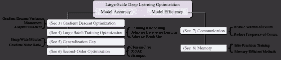
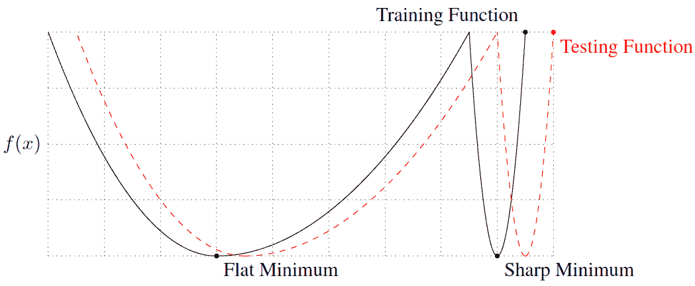
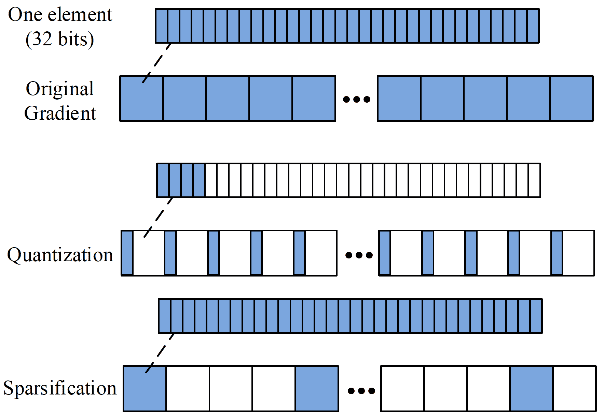
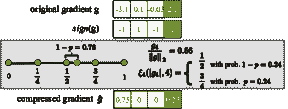
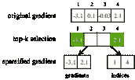
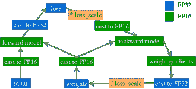
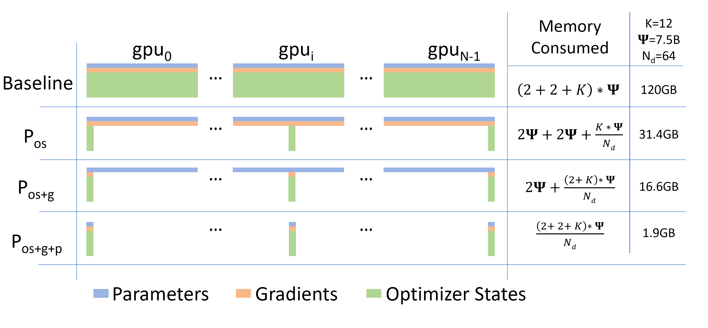

<!--yml

分类：未分类

日期：2024-09-06 19:50:15

-->

# [2111.00856] 大规模深度学习优化：全面调查

> 来源：[`ar5iv.labs.arxiv.org/html/2111.00856`](https://ar5iv.labs.arxiv.org/html/2111.00856)

# 大规模深度学习优化：全面调查

Xiaoxin He he.xiaoxin@u.nus.edu 新加坡国立大学 he.xiaoxin@u.nus.edu ， Fuzhao Xue f.xue@u.nus.edu 新加坡国立大学 f.xue@u.nus.edu ， Xiaozhe Ren renxiaozhe@huawei.com 华为诺亚方舟实验室 renxiaozhe@huawei.com 和 Yang You youy@comp.nus.edu.sg 新加坡国立大学 youy@comp.nus.edu.sg

###### 摘要。

深度学习在广泛的人工智能应用中取得了令人鼓舞的成果。更大的数据集和模型通常能带来更好的性能。然而，我们通常需要花费更长的训练时间来进行更多的计算和通信。在这项调查中，我们旨在提供一个关于大规模深度学习优化的清晰概述，涉及模型准确性和模型效率。我们研究了最常用于优化的算法，详细探讨了大批量训练中出现的泛化差距这一有争议的话题，并回顾了应对通信开销和减少内存占用的最先进策略。

深度学习，深度神经网络，优化，分布式学习，大批量训练，通信效率，内存效率，调查^†^†版权：无

## 1\. 介绍

目前，深度学习（DL）在计算机视觉（*例如，* 图像分类（He et al., 2016; Huang et al., 2017; Lou et al., 2021）、目标检测和分割（Girshick, 2015; Ren et al., 2015; He et al., 2020; Long et al., 2015））、自然语言处理（*例如，* 语言建模（Devlin et al., 2019; Xue et al., 2021）和机器翻译（Vaswani et al., 2017; Wu et al., 2016））、信息检索（*例如，* 推荐系统（He et al., 2017））等广泛的人工智能应用领域中取得了令人鼓舞的成果。规模是推动深度学习崛起的主要因素（Krizhevsky et al., 2012; He et al., 2016; Simonyan and Zisserman, 2014; Krizhevsky et al., 2017; Szegedy et al., 2015; Devlin et al., 2019）。更大的数据集和神经网络通常能在所有任务中取得更好的性能，这些任务一般需要更多的计算和更长的训练时间。因此，近年来，学术界和工业界对在具有更高计算能力和内存限制的设备集群上进行分布式训练以扩展深度学习的兴趣激增。数据并行已经成为分布式训练的主要做法。它将一个大的批次分配到多个设备上，每个设备持有一个相同的模型副本，计算本地批次的梯度，然后在每次迭代时收集梯度进行同步参数更新。借助于最新的优化技术，现在能够在成千上万的 GPU 设备上训练非常大的批次。然而，在这种规模下训练需要克服算法和系统相关的挑战。一个主要挑战是当批量大小超过某一点（*例如，* 32k）时模型准确性下降。简单地增加批量大小通常会导致泛化性能下降，并减少计算收益。此外，我们不能仅仅通过使用更多处理器来提高训练速度，因为通信成本是一个不可忽视的开销。从直观上看，多个处理器协同训练一个任务可以减少整体训练时间，但处理器之间的通信成本较高，并限制了模型的可扩展性。更糟糕的是，具有数十亿到万亿参数的模型显然无法适应单个设备的内存，简单地增加更多设备并不会帮助扩展训练。这一限制阻碍了深度学习研究人员探索更先进的模型架构。现有的研究致力于开发优化技术以克服这些问题，从而加速大规模深度神经网络（DNNs）的训练。我们将这些研究分为两类，一类致力于在大规模设置中保持/提高模型准确性，另一类则强调模型效率，设计对通信和内存需求较少的算法。重要的是，这两类技术并不是互相排斥的，而是可以协同使用以进一步加快训练速度。

### 1.1\. 相关调查

Pouyanfar 等人 (2019) 从不同角度概述了深度学习（DL），包括历史、挑战、机遇、算法、框架、应用以及并行和分布式计算技术。 Wang 等人 (2020) 提供了对大规模分布式深度学习系统的快速调查，简明扼要地介绍了并行性、参数服务器架构、同步方案、相关应用和平台。 尽管一些其他调查专注于深度学习中的某些范围：大规模并行系统中的通信效率 (Betzel 等人, 2018; Tang 等人, 2020)，并行化策略 (Ben-Nun 和 Hoefler, 2019) 以及数值优化算法 (Sun, 2019; Bottou 等人, 2018; Battiti, 1992; Ruder, 2016)。 大规模深度学习代表了一个独特的设置，在该设置中，准确性、计算、通信和内存密切相关且相互制约。 然而，现有调查要么仅关注其中的一部分，要么未在大规模深度学习的背景下解决优化问题。 与两个主要相关的调查 (Wang 等人, 2020; Pouyanfar 等人, 2019) 不同，我们更加关注算法的设计，而非系统架构。 本文的创新在于强调模型准确性和模型效率，通过呈现最先进的（SOTA）优化技术的综述并说明两者之间的权衡，捕捉了大规模深度学习训练中的关键方面。

### 1.2\. 调查结构

图 1\. 本调查的整体结构

本调查的整体结构如图 1 所示。第二部分介绍了一个典型神经网络优化问题的公式。我们大致将大规模 DL 优化分为两个部分：模型准确性和模型效率。第三部分介绍了梯度下降优化家族，包括梯度下降变体、动量 SGD 和自适应梯度算法。由于大批量训练在 DL 中的数据并行性日益流行，同时带来了挑战，第四部分讨论了这一设置中的问题，并回顾了主要的 SOTA 优化策略以改善情况。第五部分深入探讨了泛化差距——一个在大批量训练中的争论话题。第六部分介绍了二阶优化。然后我们将注意力转向模型效率。第七部分调查了通信瓶颈，第八部分聚焦于内存高效技术。最后，第九部分总结了本文。

## 2\. 初步介绍

参考许多机器学习应用（Bottou 等，2018；Xu 等，2020；Bottou 和 Bousquet，2007），我们考虑一个输入-输出对$(x,y)\in X\times Y$具有概率分布$P(x,y)$。条件分布$P(y|x)$表示输入和输出之间的真实关系。预测输出$\hat{y}$与实际输出$y$之间的差异由一个平滑但可能是非凸的损失函数$\mathscr{l}(\hat{y},y)$来衡量。目标是最小化预期风险。

| (1) |  | $E(f)=\int\mathscr{l}(f(x),y)P(x,y)=\mathbb{E}[\mathscr{l}(f(x),y)],$ |  |
| --- | --- | --- | --- |

即，

| (2) |  | $f^{*}(x)=\mathop{argmin}_{\hat{y}}\mathbb{E}[\mathscr{l}(\hat{y},y)&#124;x].$ |  |
| --- | --- | --- | --- |

由于$\mathbb{P}$是一个未知的分布，实际上，人们会寻求一个涉及经验风险估计的问题的解决方案（Shalev-Shwartz 和 Ben-David，2014）。

| (3) |  | $E_{n}(f)=\frac{1}{n}\sum_{i=1}^{n}\mathscr{l}(f(x_{i}),y_{i})=\mathbb{E}_{n}[\mathscr{l}(f(x),y].$ |  |
| --- | --- | --- | --- |

解决 Eq.[3] 的目标是获得一个具有较小泛化误差的解决方案，即对未见数据的高预测准确性。

## 3\. 梯度下降优化算法

训练一个深度神经网络（DNN）是一个优化过程，即找到使损失函数最小化的网络参数。梯度下降及其变体算法是优化神经网络（NNs）的最流行算法（Ruder，2016）。为了控制梯度下降方法的振荡，引入了使用动量的思想。此外，相对于前期梯度调整学习率被发现对避免波动有帮助。在这一节中，我们简要梳理了主流优化算法，包括梯度下降变体（第 3.1 节），动量（第 3.2 节）和自适应梯度算法（第 3.3 节）。

### 3.1\. 梯度下降变体

梯度下降及其变体主导了深度学习的优化算法。梯度下降（GD）方法旨在通过反复计算单个训练样本或一个（完整）样本批次上的损失函数的梯度，并根据目标函数的梯度方向持续更新模型参数，从而最小化模型的经验风险。梯度下降有三种变体，这些变体在每一步中使用的样本数量不同，导致不同的准确性和学习时间。

#### 3.1.1\. 批量梯度下降

批量梯度下降，即标准梯度下降，利用以下形式来最小化损失函数 $L(x)$：

| (4) |  | $L(x)=\frac{1}{&#124;S&#124;}\sum_{s\in S}l(x,s).$ |  |
| --- | --- | --- | --- |

这里 $x$ 是网络的权重，$S$ 是一个标记的训练集，$|S|$ 是训练集中的样本数量，$l(x,s)$ 是从样本 $s\in S$ 及其标签 $y$ 计算的损失。通常，$l$ 是分类损失（例如，交叉熵）和 $x$ 上的正则化损失的总和。然后更新权重

| (5) |  | $x=x-\eta\nabla L(x),$ |  |
| --- | --- | --- | --- |

其中 $\eta$ 是学习率（LR），它控制沿梯度反方向走多大的步伐。由于我们需要遍历整个训练集来计算一次权重更新的梯度，批量梯度下降可能非常缓慢，尤其是对于大型数据集（这在深度学习任务中很常见）。批量梯度下降也不允许在线更新模型，即随时用新样本更新。

#### 3.1.2\. 随机梯度下降

与使用所有训练样本计算梯度的批量梯度下降（GD）不同，随机梯度下降（SGD）对每个训练样本执行一次权重更新。

| (6) |  | $x=x-\eta\nabla l(x,s).$ |  |
| --- | --- | --- | --- |

因此，SGD 解决了批量梯度下降的计算瓶颈。它比批量梯度下降显著更快，并且可以在线使用。缺点是，仅用一个样本计算的梯度对整个训练集来说代表性不足。因此，梯度的方差导致了损失函数的剧烈波动。

#### 3.1.3\. 小批量随机梯度下降

小批量 SGD 结合了批量 GD 和 SGD 的优点，通过对每个小批量 $B$ 执行权重更新。

| (7) |  | $x=x-\frac{\eta}{&#124;B&#124;}\nabla\sum_{s\in B}l(x,s).$ |  |
| --- | --- | --- | --- |

在批量 GD 中，梯度是对整个数据集计算的，提供了对真实梯度的准确估计。这样做需要大量时间和内存。但真正的问题在于批量梯度轨迹可能会落在一个不好的位置。而在 SGD 中，参数是通过添加数据集中单个样本计算的梯度来更新的，这些梯度非常嘈杂，可能会朝着与批量梯度完全不同的方向前进。然而，这种噪声正是我们在非凸优化中所需要的，因为它有助于逃脱鞍点或局部最小值（Ge 等人，2015）。缺点是需要多次遍历整个数据集来找到一个好的解决方案。小批量方法是一种折中方案，它在每次梯度更新时注入足够的噪声，同时实现相对较快的收敛。小批量 SGD 在大规模学习中被发现非常有效（Bottou 和 Bousquet，2007）。

### 3.2\. 动量

SGD 在损失函数表面上长而狭窄的谷底中导航时会遇到困难，即梯度的方向几乎与谷底的长轴垂直。在这种情况下，系统在短轴方向上来回振荡，只沿着谷底的长轴非常缓慢地移动。

#### 3.2.1\. 动量 SGD

动量 (Qian, 1999) 是一种有助于抵消短轴振荡，同时在长轴上积累贡献的策略。换句话说，动量会加强梯度方向相同的维度的更新，并减缓梯度方向改变的维度的更新。这使得动量在比全批量梯度下降 (Park 等人, 2019) 更少的步骤中最小化训练损失。具体而言，动量 SGD 在当前更新中添加了前一步的更新，并将下一步更新 $v_{t}$ 确定为梯度和前一步更新 $v_{t-1}$ 的线性组合：

| (8) |  | $\begin{split}v_{t}&amp;=\beta v_{t-1}+\eta\nabla L(x)\\ x&amp;=x-v_{t}.\end{split}$ |  |
| --- | --- | --- | --- |

#### 3.2.2\. Nesterov 加速梯度

在 Eq.[8], 我们知道我们将至少移动 $\beta v_{t-1}$，以及额外的 $\eta\nabla L(x)$。在 Nesterov 加速梯度（NAG） (Nesterov, 1983) 中，它通过计算 $(x-\beta v_{t-1})$ 的部分更新值上的梯度来前瞻，而不是使用当前值：

| (9) |  | $\begin{split}v_{t}&amp;=\beta v_{t-1}+\eta\nabla L(x-\beta v_{t-1})\\ x&amp;=x-v_{t}.\end{split}$ |  |
| --- | --- | --- | --- |

这种“未雨绸缪”防止我们过快前进，从而提高了响应速度。尽管经典动量 SGD 的优化路径在高曲率垂直方向上表现出较大的振荡，但 NAG 几乎可以完全避免这些振荡 (Sutskever 等人, 2013a)。

### 3.3\. 自适应梯度算法

上述方法对所有参数维度应用相同的学习率（LR）。由于每个参数维度与损失函数的关系不同，每维学习率由于对步长的更准确和精确的控制而更具优势。因此，已经提出了多种自适应梯度方法，其中梯度通过之前梯度的逐成分累积进行划分。例如，AdaGrad (Duchi 等人, 2011) 使用了所有过去梯度的平方和，而 Adadelta (Zeiler, 2012)、RMSProp (Tieleman 和 Hinton, 2012) 和 Adam (Kingma 和 Ba, 2017) 则使用了指数衰减的平均值。

#### 3.3.1\. AdaGrad

以前，我们对所有参数使用相同的学习率进行更新，而不考虑其频率和幅度。这可能导致无法捕捉到发生频率较低的更新（这些更新信息丰富且具有辨别力）。AdaGrad (Duchi 等人, 2011) 通过对不频繁的参数执行较大的更新和对频繁的参数执行较小的更新来缓解这个问题，这使得它在稀疏梯度下表现良好。

| (10) |  | $x_{t,i}=x_{t-1,i}-\frac{\eta}{\sqrt{G_{t,ii}+\epsilon}}\nabla L(x_{t,i}).$ |  |
| --- | --- | --- | --- |

$G_{t}=\sum_{\tau=1}^{T}g_{\tau}g_{\tau}^{T}$是对角矩阵，其中每个对角元素$G_{t,ii}$是到时间步$t$为止与参数$x_{i}$相关的所有过去梯度的平方和。而$\epsilon$是用于避免除零的平滑项。向量化实现具有以下形式：

| (11) |  | $x_{t}=x_{t-1}-\frac{\eta}{\sqrt{G_{t}+\epsilon}}\odot\nabla L(x_{t}),$ |  |
| --- | --- | --- | --- |

其中$\odot$是逐元素的矩阵-向量乘法。在 AdaGrad 中，每个维度都有自己的动态学习率，与梯度大小成反比，因此较大的梯度具有较小的学习率，而较小的梯度具有较大的学习率。这对训练深度神经网络非常有益，因为每个层的梯度尺度通常相差几个数量级。此外，这种梯度累积还可以看作是一种模拟退火，它在训练过程中降低了学习率。大多数实现将学习率$\eta$设置为默认值 0.01，消除了手动调整的需要。然而，AdaGrad 在训练过程中积累了所有过去梯度的平方，这在训练过程中不断增加。随着学习率急剧缩小和消失，算法不再获得额外的知识。

#### 3.3.2\. Adadelta

Adadelta（Zeiler，2012）是 AdaGrad 的扩展（Duchi 等人，2011），旨在解决其单调递减的学习率。Adadelta 不是累积所有先前梯度的和，而是使用指数衰减的平均值。时间步$t$的运行平均值$E[g^{2}]_{t}$取决于先前的平均值和当前梯度

| (12) |  | $E[g^{2}]_{t}=\rho E[g^{2}]_{t-1}+(1-\rho)g_{t}^{2},$ |  |
| --- | --- | --- | --- |

其中$\rho$是类似于动量法中使用的衰减常数。因为分母是梯度的均方根（RMS）误差标准，我们可以用标准简写形式替换它：

| (13) |  | $\begin{split}RMS[g]_{t}&amp;=\sqrt{E[g^{2}]_{t}+\epsilon}\\ \Delta x_{t}&amp;=-\frac{\eta}{RMS[g]_{t}}g_{t}.\end{split}$ |  |
| --- | --- | --- | --- |

注意到方程[13]中的单位不匹配，即更新$\Delta x$的单位与应用于其参数$x$的单位不匹配

| (14) |  | $units\,of\,\Delta x\propto units\,of\,g\propto\frac{\partial f}{\partial x}\propto\frac{1}{units\,of\,x},$ |  |
| --- | --- | --- | --- |

Zeiler（2012）重新排列了二阶方法（即，牛顿法）

| (15) |  | $\Delta x=\frac{\frac{\partial f}{\partial x}}{\frac{\partial^{2}f}{\partial x^{2}}}\Rightarrow\frac{1}{\frac{\partial^{2}f}{\partial x^{2}}}=\frac{\Delta x}{\frac{\partial f}{\partial x}}.$ |  |
| --- | --- | --- | --- |

由于当前时间步的 $\Delta x_{t}$ 是未知的，假设曲率在局部是平滑的，可以通过计算之前 $\Delta x$ 的指数衰减均方根（RMS）来近似 $\Delta x_{t}$。

| (16) |  | $\Delta x_{t}=-\frac{RMS[\Delta x]_{t-1}}{RMS[g]_{t}}g_{t}.$ |  |
| --- | --- | --- | --- |

#### 3.3.3. **RMSProp**

**RMSprop**（Tieleman 和 Hinton, 2012）在与 Adadelta 同一时期独立开发，以解决 AdaGrad 梯度急剧下降的问题。AdaGrad 对所有过去的梯度一视同仁，这与我们的直觉相反，因为新鲜的梯度比老旧的梯度更具信息性。RMSProp 通过以指数速率衰减过去的梯度来重新定义 $v_{t}$。

| (17) |  | $\begin{split}v_{t}=0.9v_{t-1}+0.1g_{t}^{2}\\ x_{t}=x_{t-1}-\frac{\eta}{\sqrt{v_{t}+\epsilon}}g_{t}.\end{split}$ |  |
| --- | --- | --- | --- |

#### 3.3.4. **Adam**

**Adam**（Kingma 和 Ba, 2017）是目前用于训练深度神经网络（DNNs）最受欢迎的优化器之一。它基于梯度的第一和第二矩的估计为不同参数计算各自的学习率（LRs）。具体来说，Adam 存储了过去梯度（$m_{t}$）和梯度平方（$v_{t}$）的指数加权移动平均。前者是第一动量（均值）的估计，后者是梯度的第二动量（非中心化方差）的估计。

| (18) |  | $\begin{split}m_{t}=\beta_{1}m_{t-1}+(1-\beta_{1})g_{t}\\ v_{t}=\beta_{2}v_{t-1}+(1-\beta_{2})g_{t}^{2}.\end{split}$ |  |
| --- | --- | --- | --- |

**$\beta_{1}$** 和 **$\beta_{2}$** 是控制这些移动平均衰减率的超参数。由于移动平均以 0 初始化，第一和第二矩的估计在训练开始时偏向于零。Adam 利用修正项来抵消初始化偏差。

| (19) |  | $\begin{split}\hat{m}_{t}=\frac{m_{t}}{1-\beta_{1}^{t}}\\ \hat{v}_{t}=\frac{v_{t}}{1-\beta_{2}^{t}}.\end{split}$ |  |
| --- | --- | --- | --- |

然后 Adam 应用更新规则。

| (20) |  | $x_{t}=x_{t-1}-\frac{\eta}{\sqrt{\hat{v}_{t}+\epsilon}}\hat{m}_{t}.$ |  |
| --- | --- | --- | --- |

Adam 被发现对深度学习领域中各种非凸优化问题具有稳健性和良好的适应性。Adam 有几种变体。AdaMax（Kingma 和 Ba, 2017）是对 Adam 的扩展，它将方法推广到无限范数（最大值），在某些问题上可能会实现更有效的优化。Nesterov-accelerated Adaptive Moment Estimation (NAdam)（Dozat, 2016）将 NAG 融入了 Adam。它在某些情况下表现出更好的收敛速度。虽然这些算法在多个实际应用中已成功使用，但即使在凸设置中，它们也可能无法收敛到最优解，甚至在深度学习训练中发散。Reddi 等人 (2019) 指出，过去平方梯度的指数移动平均是这些失败的原因之一。请记住，引入指数平均是为了应对 Adagrad 算法的一个主要缺陷：应防止学习率在训练过程中变得无穷小，通过限制更新仅依赖于过去的几个梯度。然而，这种对梯度的短期记忆在其他情况下确实会导致显著的收敛问题。为了解决这个问题，作者提出了新的 Adam 变体——AMSGrad，它依赖于对过去梯度的长期记忆。AMSGrad 使用过去平方梯度的最大值，而不是指数平均值，来更新参数。Liu 等人 (2019) 认为 Adam 遇到不良收敛问题的根本原因是自适应学习率在模型训练的早期阶段具有过大的方差，这是由于使用的训练样本数量有限。因此，为了减少这种方差，在训练的前几个时期使用较小的学习率更为合适。作者提出了 Rectified Adam (RAdam) 以纠正自适应学习率的方差。

选择优化器是训练深度神经网络时的一个关键步骤，因为它与训练速度和最终预测性能密切相关。尽管包括 AdaGrad、RMSProp、AdaDelta 和 Adam 在内的自适应优化方法越来越受欢迎，但至今，如何选择最佳优化器在理论上仍然难以捉摸和解决。相反，实践者依赖于经验研究（Wilson 等人, 2017）和基准测试（Schneider 等人, 2019）。Wilson 等人 (2017) 观察到，自适应方法找到的解决方案的泛化能力通常比 SGD 更差（往往差得多），即使这些解决方案在训练性能上更好。然而，Choi 等人 (2019) 建议，流行的自适应梯度方法从未表现得比动量或梯度下降差。他们指出，优化器之间的比较对超参数调整协议非常敏感。

## 4\. 大批量训练

输入：数据集 $X$，每个节点的 minibatch 大小 $b$，节点数量 $N$，优化函数 SGD，初始化参数 $w={w[0],\cdots,w[M]}$对于 *$t=0,1,\cdots$* 执行        $G_{t}^{k}\leftarrow 0$；        对于 *$i=1,\cdots,B$*        执行            从 $X$ 中抽样数据 $x$；            $G_{t}^{k}\leftarrow G_{t}^{k}+\frac{1}{Nb}\nabla f(x;w_{t})$        结束      所有-归约 $G_{t}^{k}:G_{t}\leftarrow\sum_{k=1}^{N}G_{t}^{k}$；        $w_{t+1}\leftarrow\textit{SGD}(w_{t},G_{t})$结束

算法 1 在节点 k 上的分布式同步 SGD。

大型 DNN 和大规模数据集推动了深度学习的发展 (Krizhevsky et al., 2012；He et al., 2016；Simonyan 和 Zisserman, 2014；Krizhevsky et al., 2017；Szegedy et al., 2015；Devlin et al., 2019)。然而，在大规模数据集上训练大型模型计算密集。例如，训练像 BERT 和 ResNet-50 这样的 SOTA DL 模型分别需要在 16 个 TPUv3 芯片上训练 3 天和在 8 个 Tesla P100 GPU 上训练 29 小时 (Devlin et al., 2019；He et al., 2016)。加速训练的直观方法是增加更多计算能力（例如，更多 GPU 节点）并使用数据并行（见 Alg.1）。考虑到通信（即在每次迭代时同步更新）是一个问题，每个 GPU 必须尽可能地利用，以摊销通信成本。因此，应该使用大批量将更多数据分配给每个 GPU。批量大小的非平凡增长通常会导致测试性能下降，正如 (Krizhevsky, 2014；Keskar et al., 2017；Li et al., 2014b；Hoffer et al., 2017) 所观察到的那样。我们在第 4.1 节中描述了大批量引入的训练困难，在第 4.2 节中介绍了大批量训练的配方（即线性 LR 缩放与预热策略），在第 4.3 节中介绍了其他补充策略，如自适应层次学习，以及在第 4.4 节中介绍的自适应批量大小，最后在第 4.5 节中讨论了我们可以在多大程度上扩大批量大小。

### 4.1\. 大批量训练难点

尽管大批量更有利于通过将工作负载分配到多个节点来增加并行性，但在实践中，它们可能会降低收敛速度 (Byrd et al., 2012)。经验上，经过一定点（例如 1024）的迷你批量大小增加而没有仔细优化方案通常会降低收敛速度。收敛解的测试准确性显著低于基线 (Goyal et al., 2018; Keskar et al., 2017; Hoffer et al., 2017; Li et al., 2014b)。除了测试性能的下降外，Masters 和 Luschi (2018) 提供了证据表明，增加批量大小还会导致允许稳定训练的学习率范围逐渐缩小。

Keskar 等人 (2017) 发现，即使是较小的网络，其泛化能力（通常表示为泛化差距）也可能高达 5%，并且将泛化差距与损失景观的尖锐度相关联。他们认为，大批量方法往往会收敛到训练和测试函数的尖锐最小值，而小批量方法则会一致地收敛到平坦最小值。Hoffer 等人 (2017) 否认了固有泛化差距的存在，并建议延长训练时间有助于算法更好地泛化，并保持更高的准确性。Goyal 等人 (2018) 承认大批量会导致优化困难，但当这些问题得到解决时，训练网络表现出良好的泛化能力。他们尝试通过学习率缩放的启发式方法 (Goyal et al., 2018) 和一个渐进策略来弥合泛化差距。然而，实证研究 (Shallue et al., 2019) 显示，学习率缩放的启发式方法在所有问题或所有批量大小下并不适用。后来 You 等人 (2017) 提出了逐层自适应学习率缩放（LARS）来解决大批量优化困难。一些近期的工作成功地使用自适应学习率将批量大小扩展到较大值，而不降低性能。

### 4.2\. 大批量的学习率缩放

大批量的一个良好属性是其梯度的较低方差。这是因为当我们对更多示例进行梯度计算时，方差显然较低。因此，大批量使我们能够在每次迭代中采取更大的步长。以下是两种常用的学习率启发式方法：线性缩放和平方根缩放，用于指导我们调整大批量的学习率。

#### 4.2.1\. 线性缩放

(Krizhevsky, 2014; Goyal et al., 2018; Bottou et al., 2018) 建议将学习率与批量大小线性缩放，即当迷你批量大小乘以 $k$ 时，将学习率乘以 $k$。直观地说，在 $k$ 次迷你批量随机梯度下降后，我们有

| (21) |  | $x_{t+k}=x_{t}-\eta\frac{1}{&#124;S&#124;}\sum_{i<k}\sum_{s\in S}\nabla l(x_{t+i},s),$ |  |
| --- | --- | --- | --- |

当经过一次大小为 $|S|=k|B|$ 的大批量 $\bigcup_{j}B_{j}$ 后，我们有

| (22) |  | $\hat{x}_{t+1}=x_{t}-\hat{\eta}\frac{1}{k&#124;B&#124;}\sum_{j<k}\sum_{s\in B_{j}}\nabla l(x_{t},s).$ |  |
| --- | --- | --- | --- |

如果我们假设 $\nabla l(x_{t+i})\approx\nabla l(x_{t})$ 对于 $i<k$，那么调整 $\hat{\eta}=k\eta$ 会使得 $\hat{x}_{t+1}\approx x_{t+k}$。需要注意的是，这一假设在以下前提下成立：(1) $k$ 不能是无限的。也就是说，我们不能无限制地扩展批量大小；(2) $t$ 不能太小。因为在训练初期，梯度变化剧烈，因此 $\nabla l(x_{t})$ 和 $\nabla l(x_{t+i})$ 之间的差异不再可以忽略。通过使用 LR 预热和线性缩放，Goyal et al. (2018) 训练了 Resnet-50，批量大小为 B=8K，准确率没有损失。

#### 4.2.2\. 平方根缩放

另一种扩展策略是平方根缩放，即当小批量大小乘以 $k$ 时，将学习率乘以 $\sqrt{k}$。在 SGD 中，参数更新 $\Delta x$ 的协方差矩阵是  (Hoffer et al., 2017)

| (23) |  | $cov(\Delta x,\Delta x)\thickapprox\frac{\eta^{2}}{&#124;B&#124;}(\frac{1}{N}\sum_{n=1}^{N}g_{n}g_{n}^{T}).$ |  |
| --- | --- | --- | --- |

保持协方差不变的一个简单方法是选择 $\eta\propto\sqrt{|B|}$。Hoffer et al. (2017) 发现通过使用“幽灵批量归一化”和平方根缩放，可以显著减少泛化误差。然而，使用的最大批量大小是 4096，这并未排除在更大的批量大小下可能出现的效果，如 Goyal et al. (2018) 的研究所示。此外，建立这种不变的协方差仍缺乏充分的理论依据，并且在实践中经常发现平方根缩放会降低模型质量，见 (Krizhevsky, 2014; Goyal et al., 2018; Jastrz\kebski et al., 2017)。

#### 4.2.3\. 预热

在使用这些策略调整学习率（LR）后，批量大小扩展的主要障碍是高学习率下训练的不稳定性，尤其是在梯度剧烈变化的初期。这一问题可以通过合理设计的预热策略来缓解，在初期使用较为温和的学习率。

常量预热。Verma et al. (2017) 在训练的前几个时期使用低“安全”常量学习率，然后恢复到目标学习率 $\hat{\eta}=k\eta$。Goyal et al. (2018) 发现常量预热对于原型对象检测和分割方法特别有用 (Girshick, 2015; Ren et al., 2015; He et al., 2020)，但不足以解决大批量优化问题。特别是，从低学习率预热阶段过渡可能会导致训练误差激增。这促使他们使用一种更为温和的预热策略——渐进预热。

渐进式预热。与恒定预热不同，渐进式预热通过将学习率（LR）从小值逐渐增加到大值，避免了 LR 的突然升高。我们将第$t$次迭代的 LR 表示为$lr(t)$，训练期间的最大 LR 表示为$lr_{max}$。给定预定义的时间框架$T_{warmup}$，第$t$次迭代的 LR 调度器定义为

| (24) |  | $lr(t)=\frac{t}{T_{warmup}}lr_{max},\quad t\leq T_{warmup}.$ |  |
| --- | --- | --- | --- |

在这一预热阶段之后，LR 将由经典 LR 调度器（例如，余弦衰减）设置。LR 预热阶段在训练具有极大批量大小的神经网络时被证明是有益的（You 等， 2020；Goyal 等， 2018）。Liu 等（2019）声称预热阶段的好处来自于减少 Adam 优化器中自适应 LR 的方差。他们进一步提出了 Rectified Adam（RAdam），通过引入一个术语来纠正自适应 LR 的方差。此外，Xiong 等（2020）发现 LR 预热阶段对其他优化器也大有帮助。

### 4.3\. 自适应层学习

带有预热的线性/平方根 LR 缩放通过采取较少激进的步骤，减轻了初始时期梯度波动的脆弱性，从一个对所有层都足够安全的小 LR 开始，逐渐增加到目标值。Hoffer 等（2017）使用较少激进的平方根缩放与“Ghost Batch Normalization”来训练 Alexnet，批量为$B=8K$，但准确率（$53.93\%$）仍远低于基线（$57.10\%$）。Goyal 等（2018）使用 LR 预热和线性缩放来训练 Resnet-50，批量为 B=8K，准确率没有下降。尽管这些工作展示了这些策略在减少大规模 DNN 训练墙面时间方面的可行性，但如果我们希望进一步扩大批量大小，它们的通用性不足。例如，You 等（2017）将线性缩放和预热方案应用于在 Imagenet 上训练带有批量归一化的 Alexnet，并观察到当$B=8K$时测试准确率下降了$2.2\%$。You 等（2017）解释了他们解决此问题的方法：为了分析大 LR 下的训练稳定性，我们测量了层权重的范数与梯度更新的范数之间的比率。我们观察到，如果这个比率过高，训练可能会变得不稳定。另一方面，如果比率过小，那么权重改变的速度不够快。这个比率像是一个提示，帮助调整每层的 LR。在本节中，我们将首先介绍一个由这个比率激发的一般自适应层策略，然后介绍两个具体的算法，LARS（You 等， 2017）和 LAMB（You 等， 2020）。

#### 4.3.1\. 一般层策略

假设我们在小批量设置中使用一个迭代基础算法$\mathscr{A}$（例如，SGD 或 Adam），其层更新规则如下

| (25) |  | $x_{t+1}=x_{t}+\eta_{t}u_{t},$ |  |
| --- | --- | --- | --- |

其中 $u_{t}$ 是时间步 $t$ 上由 $\mathscr{A}$ 所做的更新。You 等人（2020）提出了对大批量设置下更新的以下两个修改：

1.  (1)

    更新被归一化为单位 $l_{2}$-范数。通过将更新修改为 $u_{t}/\lVert u_{t}\rVert$ 来确保这一点。这种归一化是逐层进行的，即每一层的更新都被确保为单位 $l_{2}$-范数。

1.  (2)

    学习率由 $\phi(\lVert x_{t}\rVert)$ 按某个函数 $\phi:\mathbb{R}^{+}\rightarrow\mathbb{R}^{+}$ 进行缩放。类似于归一化，这种缩放也是逐层进行的。

假设基础算法 $\mathscr{A}$ 是 SGD，则修改后的更新规则如下

| (26) |  | $x_{t+1}^{(i)}=x_{t}^{(i)}-\eta_{t}\frac{\lVert\phi(x_{t}^{(i)})\rVert}{\lVert g_{t}^{(i)}\rVert}g_{t}^{(i)}$ |  |
| --- | --- | --- | --- |

对于所有层 $i\in[h]$。归一化修改 $g_{t}^{(i)}/\lVert g_{t}^{(i)}\rVert$ 类似于通常在归一化梯度下降中使用的，但它是逐层进行的。这种形式的归一化通过本质上忽略梯度的大小但保留方向，从而对梯度爆炸/消失（梯度可以任意大/小）提供了鲁棒性。至于缩放步骤，涉及 $\phi$ 的缩放项确保更新的范数与参数的范数处于同一数量级。当参数较小时，我们采取小步伐，反之亦然。

这种通用策略与其他自适应算法如 Adam 或 RMSProp 之间有两个显著的区别：（1）它对每一层使用单独的学习率，而不是对每个权重使用。（2）更新的幅度相对于权重范数进行控制，以更好地控制训练速度。LARS（You 等人，2017）和 LAMB（You 等人，2020）都基于这一通用策略，分别使用动量优化器和 Adam 优化器作为基础算法。

#### 4.3.2\. LARS

通用策略的首次实例是 LARS 算法（You 等人，2017），它是通过在框架中使用动量优化器作为基础算法 $\mathscr{A}$ 获得的。LARS 代表层级自适应率缩放，最初为 ImageNet 上的 ResNet 大批量学习提出。具体而言，为每一层 $l$ 定义一个局部学习率 $\lambda^{l}$

| (27) |  | $\lambda^{l}=\eta\frac{{\lVert x\rVert}_{2}^{2}}{{\lVert\nabla L(x)\rVert}_{2}^{2}}.$ |  |
| --- | --- | --- | --- |

超参数 $\eta<1$ 描述了我们可以信任每层在每个周期中更新其权重的程度。在训练开始时，分子 ${\lVert x\rVert}_{2}^{2}$ 相对较小。相反，分母 ${\lVert\nabla L(x)\rVert}_{2}^{2}$ 可能较大，因为当一切都错的时候，损失和梯度都很大。我们采取的任何步骤都可能较小。这样，随着权重的增加，我们自然地进行预热。随着损失接近 0，梯度变小，局部学习率再次增加，鼓励跳出局部最小值以防止过拟合。参数更新为

| (28) |  | $\Delta x_{t}^{l}=\gamma*\lambda^{l}*\nabla L(x_{t}^{l})$ |  |
| --- | --- | --- | --- |

其中 $\lambda$ 是全局学习率（LR）。这样，每一层可以以其自己的速度准确学习。SGD 与 LARS 的训练总结见算法 2。

输入：基础学习率 $\gamma_{0}$，动量 $m1$，权重衰减 $\beta$，“信任”系数 $\eta$，步数 $T$初始化：$t=0$；$v=0$。为每一层 $l$ 初始化权重 $w_{0}^{l}$while *$t<T$ 对每一层 $l$* do       $g_{t}^{l}\leftarrow\nabla L(w_{t}^{l})$ ;        // 获取当前小批量的随机梯度       $\gamma_{t}\leftarrow\gamma_{0}*(1-\frac{t}{T})^{2}$;        // 计算全局学习率       $\lambda^{l}\leftarrow\frac{\lVert w_{t}^{l}\rVert}{\lVert g_{t}^{l}\rVert+\beta\lVert w_{t}^{l}\rVert}$;        // 计算局部学习率       $v_{t+1}^{l}\leftarrow mv_{t}^{l}+\gamma_{t}*\lambda^{l}*(g_{t}^{l}+\beta w_{t}^{l})$;        // 更新动量       $w_{t+1}^{l}\leftarrow w_{t}^{l}-v_{t+1}^{l}$ ;        // 更新权重 end while 示例：带有权重衰减、动量和多项式学习率衰减。

算法 2 SGD 与 LARS。

示例：带有权重衰减、动量和多项式学习率衰减。

几项工作成功地将批量大小扩展到较大的值，使用 LARS 而不降低性能，从而在几分钟内完成了在 ImageNet 上的 ResNet-50 训练（You et al., 2017；Ying et al., 2018；Yamazaki et al., 2019）。LARS 也适用于自监督图像表示学习和视觉表示的对比学习任务（Grill et al., 2020；Chen et al., 2020）。

#### 4.3.3\. LAMB

LAMB 是通用策略的第二种实现方式，通过使用 Adam 作为基础算法 $\mathscr{A}$ 获得。伪代码在算法 3 中提供。LAMB 的自适应性有两个方面：（1）相对于 Adam 中使用的二阶矩的平方根的每维归一化，（2）由于层级自适应性而获得的逐层归一化。通过使用 LAMB，You 等人（2020）将 BERT 预训练的批量大小扩大到 64K 而不丧失准确性，从而将 BERT 的训练时间从 3 天减少到大约 76 分钟。LAMB 也是第一个可以在使用 RESNET-50 进行 ImageNet 训练时实现 SOTA 准确度的大批量自适应求解器。LAMB 还被许多其他工作采纳（Lan 等人，2019）。

尽管 LARS 和 LAMB 很受欢迎，它们作为“大批量优化器”的效用却受到（Nado 等人，2021）的质疑，该文认为它们更像是间接的正则化器而非优化器。通过精细调整，传统的通用算法（如 Momentum 或 Adam）在不同批量大小上表现出强劲的结果。他们提醒研究人员，对于某个特定优化器的优越性声明应极其谨慎，因为优化器之间的公平比较在很大程度上依赖于为每个优化器调整超参数所花费的努力。

输入：$x_{1}\in\mathbb{R}^{d}$，LR $\{\eta_{t}\}_{t=1}^{T}$，参数 $0<\eta_{1},\eta_{2}<1$，缩放函数 $\phi$，$\epsilon>0$ 初始化：设置 $m_{0}=0,\,v_{0}=0$ 对于 *$t=1$ 到 T* 进行       $g_{t}=\nabla L(x_{t})$;       //获取当前小批量的随机梯度       $m_{t}=\beta_{1}m_{t-1}+(1-\beta_{1})g_{t}$;       $v_{t}=\beta_{2}v_{t-1}+(1-\beta_{2})g_{t}^{2}$;       $m_{t}=m_{t}/(1-\beta_{1}^{t})$;       $v_{t}=v_{t}/(1-\beta_{2}^{t})$;       $r_{t}=\frac{m_{t}}{\sqrt{v_{t}}+\epsilon}$;       $x_{t+1}^{(i)}=x_{t}^{(i)}-\eta_{t}\frac{\phi(\lVert x_{t}^{(i)}\rVert)}{\lVert r_{t}^{(i)}+{\lambda x_{t}^{(i)}}\rVert}(r_{t}^{(i)}+{\lambda x_{t}^{(i)}})$ 结束

算法 3 LAMB

### 4.4\. 自适应批量大小

在训练过程中，衰减 LR 是一种常见做法。当衰减 LR 时，也同时衰减“噪声规模”，即 SGD 动态中的随机波动规模（Smith 和 Le，2018）

| (29) |  | $\begin{split}g&=\frac{\epsilon}{1-m}(\frac{N}{B}-1)\\ &\thickapprox\frac{\epsilon N}{(1-m)B}.\end{split}$ |  |
| --- | --- | --- | --- |

当我们减少学习率（LR）时，"噪声规模"会下降，使我们能够收敛到损失函数的最小值。通过增加批量大小，我们可以在保持学习率不变的情况下实现相同的噪声规模降低。Smith 等人（2018）和 Devarakonda 等人（2017）通过实验证明了降低学习率和增加批量大小之间的等效性。他们没有通过一个系数$\alpha$来降低学习率，而是在训练过程中将批量大小增加了$\alpha$。这一策略在相同的训练轮次后达到了等效的测试准确率，但所需的参数更新更少，从而实现了更大的并行性和更短的训练时间。关键是，这种策略与现有的训练计划互补，不需要进行超参数调整。

### 4.5\. 高效的扩展

增加批量大小是加速在数据并行硬件上进行神经网络（NN）训练的最具吸引力的方法之一。理想情况下，平行的小批量 SGD 可以实现训练时间与工人数的线性加速，相比于单工人 SGD。然而，实际中，这种线性可扩展性受到梯度通信需求不断增加的显著限制，随着工人数的增加而变得更为明显。此外，当批量非常大时，随机梯度会非常接近真实梯度，因此，与较小批量相比，增加批量并不会提供更多的梯度信息。

一系列研究对批量大小与神经网络训练时间之间的关系进行了全面实验（Shallue 等人，2019；Smith 等人，2020；Zhang 等人，2019）。Shallue 等人（2019）实验测量了不同神经网络家族、训练算法和数据集上的数据并行训练效果，未发现较大的批量大小会降低样本外性能的证据。他们观察到批量大小与训练时间之间有三种不同的扩展模式：一种是“完美扩展”模式，其中批量大小加倍会使达到目标样本外误差所需的训练步骤减少一半，其次是“收益递减”模式，最后是“最大数据并行”模式，在该模式下，即使假设理想化硬件，进一步增加批量大小也不会减少训练时间。他们还提供了实验证据，表明临界批量大小取决于模型架构、数据集和正则化技术。

## 5\. 泛化差距

一般来说，优化是一项极其困难的任务，尤其是在训练神经网络时。面对非凸且高维的函数，可能会出现许多局部极小值和鞍点。优化方法，如 SGD，通常会收敛到参数空间的不同区域，这在很大程度上依赖于网络架构的设计、优化器的选择、变量初始化以及其他各种因素（Shallue 等，2019）。泛化一词指的是一个假设在未见过的训练集之外的新样本上的适用程度。如第 4.1 节所述，尽管大批量训练方法与小批量方法在训练函数上产生了相似的值，但大批量训练的模型在测试数据上的表现却较差（Keskar 等，2017；Hoffer 等，2017；Shallue 等，2019；Masters 和 Luschi，2018）。这种持续的泛化性能下降被称为泛化差距。识别这一差距的起源并找到弥合它的方法具有重要的实际意义，但仍然是一个未解的问题。

本节结构如下。第 5.1 节介绍了锐峰与平坦（宽广）极小值的概念；第 5.2 节讨论了局部极小值的锐度/平坦度与其泛化能力之间的关系；第 5.3 节解释了所谓的泛化差距，第 5.4 节则提供了一个相对对立的观点。

### 5.1\. 锐峰与平坦（宽广）极小值

在训练深度学习模型时，我们寻求一个解决方案，该方案能够最小化给定训练集上的损失函数。这个解决方案位于一个非常高维的空间（需要学习的参数有成千上万、甚至亿万），称为参数空间。参数空间的地形对于良好的泛化能力至关重要。换句话说，解决方案的局部几何越宽泛，泛化能力越好 (Chaudhari 等, 2017; Keskar 等, 2017; Li 等, 2018)。图 2 提供了直观的解释。一般来说，参数空间中的损失函数会发生变化，平坦的最小值对参数的扰动比尖锐的最小值更具鲁棒性，因此泛化能力更强。

对于地形的“尖锐度/平坦度”有各种定义。Hochreiter 和 Schmidhuber (1997) 将“平坦度”定义为权重空间中误差大致保持恒定的大区域。Keskar 等 (2017) 通过 Hessian 的特征值的大小来描述“平坦度”，并提出了一种计算上可行的 $\epsilon$-尖锐度度量。Dinh 等 (2017) 表明，实际深度学习假设空间中的平坦最小值可以通过重新参数化转变为尖锐最小值，而不会影响泛化误差。Chaudhari 等 (2017) 利用目标函数的局部几何属性，使用“局部熵”作为“平坦度”的度量，这种度量对 (Dinh 等, 2017) 中的简单重新参数化是不变的。Foret 等 (2021) 通过测量从参数 $w$ 移动到附近参数值时训练损失增加的速度来捕捉参数 $w$ 的“尖锐度”。

从经验上看，像 SGD、Adam 等优化器隐式地收敛到宽阔的谷底解。然而，这并不能保证这种情况总是发生。这促使了积极寻找平坦最小值的算法的创建，如 Entropy SGD (Chaudhari 等, 2017)、Sharpness-Aware Minimization (SAM) (Foret 等, 2021) 和其他许多算法。

图 2\. 平坦和尖锐最小值的概念图，来源:  (Keskar 等, 2017)

### 5.2\. 泛化误差与尖锐最小值

关于大批量训练，Keskar 等人（Keskar et al., 2017）观察到，简单地增加批量大小通常会导致泛化性能下降，并减少计算收益。他们推测，“缺乏泛化能力是因为大批量方法趋向于收敛到训练函数的尖锐极小值”。具体来说，大批量方法更容易受到尖锐极小值的影响，而这些极小值的训练函数在相对较小的邻域内迅速增加（参见图 2 Minima ‣ 5\. Generalization Gap ‣ Large-Scale Deep Learning Optimizations: A Comprehensive Survey")）。这种对训练函数的高度敏感性妨碍了训练模型对测试数据的拟合。相比之下，小批量方法可以抵抗这些极小值的吸引，并收敛到训练函数在相对较大邻域内变化缓慢的平坦极小值。他们将小批量方法的成功归因于计算步骤中的噪声。一方面，噪声将迭代从尖锐极小值的陷阱中排除。另一方面，噪声促使它们朝向并保持在更平坦的损失景观中。然而，由于较大批量大小表现出更准确的梯度，它们的噪声不再足以将迭代从尖锐极小值的盆地中排除。

广泛认为，小批量 SGD 产生“平坦”的极小值，这些极小值泛化效果较好，而大批量则收敛到“尖锐”的极小值，泛化效果较差（Hochreiter and Schmidhuber, 1997; Keskar et al., 2017; Chaudhari et al., 2017）。然而，关于批量大小对模型泛化能力影响的观点存在一些争议。Hoffer 等人（2017）否认固有的泛化差距存在，并通过实验证明，“泛化差距”源于相对较少的更新次数，而不是批量大小，并且通过调整权重更新次数可以完全消除。Goyal 等人（2018）认为，大批量的主要问题是优化难度，而不是泛化能力差（至少在 ImageNet 上）。具体来说，通过使用线性缩放和预热策略，他们在 ImageNet 数据集上训练大批量大小（高达 8,192 张图像）时未发现准确性损失。

### 5.3\. 梯度噪声比

如上所述，批量大小如何影响尖锐度和泛化存在争议。Smith 和 Le（2018）显示，如果保持其他超参数不变，测试准确率会在最佳批量大小时达到峰值。他们认为，这个峰值的出现不是由批量大小本身控制的，而是由 SGD 动态中随机波动的基本规模控制的。

考虑一个简单的 SGD 模型；估计的梯度步骤是 $\eta\nabla_{SGD}(x)=\frac{\eta}{|B|}\sum_{i\in B}\nabla l_{i}(x)$，这可以重新表述为真实梯度和一个梯度噪声项。

| (30) |  | $\eta\nabla_{SGD}(x)=\underbrace{\eta\nabla l(x)}_{gradient}+\underbrace{\frac{\eta}{\|B\|}\sum_{i\in B}(\nabla l_{i}(x)-\nabla l(x))}_{noise\,term}.$ |  |
| --- | --- | --- | --- |

Smith 和 Le (2018) 使用 SGD 和随机微分方程（SDEs）的类比来描述 SGD 动态中的噪声。特别是，他们将方程[30]描绘为随机微分方程（SDE）的离散更新，并推导出随机”噪声规模” $g=\eta(\frac{N}{B}-1)\approx\eta\frac{N}{B}$，该规模控制 SGD 动态中的随机波动幅度。噪声使 SGD 远离尖锐的最小值，因此存在一个最佳批量大小，可以最大化测试准确性。这个最佳批量大小与学习率和训练集大小成正比 $B_{opt}\propto\eta N$。因此，他们将（Dinh et al., 2017）中观察到的所谓的”泛化差距”归因于批量大小超出此最佳批量大小。类似地，Jastrz\kebski 等（2017）使用不同的 SDE 推导出一个”随机噪声”。他们通过实验验证了学习率与批量大小的比率 $\eta/B$ 影响 SGD 找到的最小值的宽度，并且比率较高会导致更宽的最小值，通常具有更好的泛化能力。尽管”随机噪声”的形式略有不同，（Smith 和 Le，2018; Jastrz\kebski et al., 2017）都指出梯度噪声可能是有益的，尤其是在非凸优化中。他们还从理论上解释了（Hoffer et al., 2017; Goyal et al., 2018）中的实证发现，即用批量大小的平方根来重新调整学习率，并训练更多的 epochs，或线性地与批量大小调整，可以达到与大批量大小相同的泛化效果。

### 5.4\. 训练时间更长，泛化更好

(Keskar 等人，2017)的另一观察是，大批量方法更容易被吸引到接近初始点的极小值，而小批量方法则更具探索性，通常找到距离较远的极小值，其比例为$\lVert x_{S}^{*}-x_{0}\rVert_{2}/\lVert x_{L}^{*}-x_{0}\rVert$在 3 到 10 的范围内。Hoffer 等人（2017）进一步发现，权重从初始化点的距离随着训练迭代次数（权重更新）的增加而对数增加，即$\lVert w_{t}-w_{0}\rVert\sim log\,t$。因此，他们否认了固有泛化差距的存在，并认为“泛化差距”来源于更新次数相对较少，而非批量大小。具体来说，他们将优化过程的时间框架“拉伸”了，其中原始模式下的每个时间周期$e$个周期将根据所使用的迷你批量大小转换为$\frac{B_{L}}{B_{S}}e$个周期。然而，这种修改削弱了大批量训练的加速效果。

## 6\. 二阶优化

深度学习中的优化，无论在理论上还是经验上，目前都被一阶梯度方法主导（Agarwal 等人，2016b，a；Bollapragada 等人，2016；Carmon 等人，2018；Conn 等人，2000；Xu 等人，2020）。涉及二阶导数和/或数据的二阶统计量的二阶优化方法，尽管具有强大的理论特性，但由于其计算、内存和通信成本高昂，应用远不如一阶方法。在本节中，我们在第 6.1 节中设置了二阶优化基础，从经典的牛顿法（第 6.2 节）开始，然后转向一些最新算法，如 Hessian-Free 方法（第 6.3 节），K-FAC（第 6.4 节）和 Shampoo（Gupta 等人，2018）（第 6.5 节）。

### 6.1\. 二阶优化基础

基本上，机器学习中的许多问题可以简单描述为在变量$x\in\mathbb{R}^{d}$上最小化损失函数。

| (31) |  | $\mathop{min}\limits_{x\in{\mathbb{R}}^{d}}F(x).$ |  |
| --- | --- | --- | --- |

在训练神经网络的权重时，我们尝试尽可能降低误差面。在大多数情况下，我们经常使用 SGD 来更新参数向量以解决这个优化问题。

| (32) |  | $\begin{split}x_{t+1}&amp;=x_{t}-\eta_{t}g_{t}.\end{split}$ |  |
| --- | --- | --- | --- |

另一个在实践中非常流行的算法家族是自适应优化算法（例如，AdaGrad（Duchi 等，2011），Adadelta（Zeiler，2012），RMSProp（Tieleman 和 Hinton，2012），Adam（Kingma 和 Ba，2017）等）。这些基本上是更新参数向量中每个单独条目的算法。每个条目都有自己的步长，这是使用过去梯度的自适应更新。

| (33) |  | $x_{t+1}^{(i)}=x_{t}^{(i)}-\eta_{t}^{(i)}g_{t}^{(i)}\quad i=1,...,d$ |  |
| --- | --- | --- | --- |

这些方法还有动量变体，具有略微不同的更新规则。一个潜在的更强大的算法家族被称为预处理算法，它们使用一些叫做预处理器的矩阵来转换梯度，然后再进行一步。一般来说，二阶优化的思想是通过局部近似来建模目标函数$f$。

| (34) |  | $f(x+\delta)\approx M(x)\equiv f(x)+\nabla f(x)^{T}\delta+\frac{1}{2}\delta^{T}B(x)\delta.$ |  |
| --- | --- | --- | --- |

这里，$B$是对称预处理器，$\delta$是参数的变化。在牛顿法中，$B=H$，或者$B=H+\lambda I$。完全优化$M(x_{t})$相对于$\delta$得到

| (35) |  | $\delta^{*}=\mathop{argmin}_{\delta}M(x_{t})=-B^{-1}\nabla f,$ |  |
| --- | --- | --- | --- |

然后应用更新

| (36) |  | $x_{t+1}=x_{t}+\delta^{*}.$ |  |
| --- | --- | --- | --- |

这个家族包括上面提到的算法，如 AdaGrad（Duchi 等，2011），Adam（Kingma 和 Ba，2017），其中预处理器是对角的。但如果度量不是对角的而是全预处理器，例如，全 AdaGrad，自然梯度（Amari，1998），以及经典算法如牛顿法，准牛顿方法（Schraudolph 等，2007；Goldfarb 等，2020）等，它们可能更强大。优化中众所周知，预处理通常能在许多不同场景下加快收敛速度或提高“条件数”。但也有明显的警告：假设参数的数量为$n$，我们需要（1）至少二次空间$\Omega(n^{2})$来存储预处理器。（2）$n^{3}$时间来求逆预处理器以应用于梯度向量。一般来说，这些二阶方法在 DL 设置中计算和内存开销巨大，不太实用。实践中，通常使用对角近似或再次使用 SGD。

最近，二阶方法的发展取得了显著进展，寻求在全矩阵和对角矩阵之间找到平衡。这些方法通常以模块化的方式处理梯度的预条件，这种方法与全矩阵的效果一样强大（或几乎一样强大），但在存储和运行时间方面可以像对角矩阵那样实用。受到自然梯度方法的启发（Amari et al., 2000），Martens 和 Grosse (2015) 使用了 Kronecker 分解的 Fisher 矩阵近似作为预条件矩阵，这种方法可以应用于多层感知器（MLPs），随后也扩展到其他架构，例如卷积神经网络（CNNs）（Grosse 和 Martens，2016）和递归神经网络（RNNs）（Osawa et al., 2019）。基于 Hessian 结构和准 Newton 方法的 Kronecker 分解预条件器也已被开发（Goldfarb et al., 2020; Ren 和 Goldfarb，2021）。

### 6.2. 牛顿方法

回想一下，在梯度下降方法中，函数的梯度被定义为偏导数的向量。

| (37) |  | $g_{t}\triangleq\nabla f(x)=<\frac{\partial f}{x_{1}},\frac{\partial f}{x_{2}},\cdots,\frac{\partial f}{x_{n}}>$ |  |
| --- | --- | --- | --- |

这意味着我们假设神经网络的误差面在局部看起来和行为像一个圆形。我们忽略了表面的所有曲率，这可能导致我们的训练进展非常缓慢。为了解决这个问题，我们可以使用函数的二阶导数信息。牛顿方法的思想是应用线性变换将椭圆变为圆形。如果我们将这种变换应用于梯度向量，它就像是在圆形误差面上向下坡行进。形式上，牛顿方法使用 Hessian 矩阵作为预条件矩阵。

| (38) |  | <math   alttext="H=\left[\begin{array}[]{cccc}\frac{\partial^{2}f}{\partial x_{1}^{2}}&amp;\frac{\partial^{2}f}{\partial x_{1}\partial x_{2}}&amp;\cdots&amp;\frac{\partial^{2}f}{\partial x_{1}\partial x_{n}}\\ \frac{\partial^{2}f}{\partial x_{2}\partial x_{1}}&amp;\frac{\partial^{2}f}{\partial x_{2}^{2}}&amp;\cdots&amp;\frac{\partial^{2}f}{\partial x_{2}\partial x_{n}}\\

\vdots&amp;\vdots&amp;\ddots&amp;\vdots\\

\[ H = \left[\begin{array}{cccc}\frac{\partial^{2}f}{\partial x_{1}^{2}}&\frac{\partial^{2}f}{\partial x_{1}\partial x_{2}}&\cdots&\frac{\partial^{2}f}{\partial x_{1}\partial x_{n}}\\ \frac{\partial^{2}f}{\partial x_{2}\partial x_{1}}&\frac{\partial^{2}f}{\partial x_{2}^{2}}&\cdots&\frac{\partial^{2}f}{\partial x_{2}\partial x_{n}}\\ \vdots&\vdots&\ddots&\vdots\\ \frac{\partial^{2}f}{\partial x_{n}\partial x_{1}}&\frac{\partial^{2}f}{\partial x_{n}\partial x_{2}}&\cdots&\frac{\partial^{2}f}{\partial x_{n}^{2}}\end{array}\right], \quad H_{ij}=\frac{\partial^{2}f}{\partial x_{i}\partial x_{j}}. \]

海森矩阵是参数的一个函数，我们需要取它的逆，并将梯度乘以该逆矩阵。然后我们需要沿着这个方向前进一段距离。

| (39) |  | $\Delta x=-\eta H(x)^{-1}\nabla f(x).$ |  |
| --- | --- | --- | --- |

如果这是一个真正的二次曲面，并且我们正确选择了 LR，我们将只需一步就能到达曲面的最小值。然而，这一步涉及一些复杂的操作，即反转海森矩阵。假设我们在神经网络中只有一百万个参数，海森矩阵将有一万亿个项，反转它完全不可行。

曲率矩阵。曲率矩阵中的每个元素指定了当我们在某个方向上移动时，梯度在另一个方向上如何变化。曲率矩阵中的非对角线项对应于误差曲面的“扭曲”。扭曲意味着当你在一个方向上移动时，另一个方向上的梯度发生变化。如果我们有一个理想的圆形曲面，那么所有这些非对角线项都是零。当我们在一个方向上移动时，其他方向上的梯度不会变化。但当我们有一个椭圆形的误差曲面时，当我们在一个方向上移动时，另一个方向上的梯度会发生变化。这实际上就是 GD 出现问题的原因。当 GD 更新一个权重时，同时也在更新所有其他权重，导致第一个权重的梯度发生变化。这意味着当我们更新它时，可能会使情况变得更糟。由于所有其他权重的变化，梯度的方向可能会反转。因此，随着权重数量的增加，我们需要对每个权重的更改保持更加谨慎，因为所有其他权重的同时变化可能会改变一个权重的梯度。

如何避免反转巨大的矩阵。曲率的密集计算限制了二阶优化方法在深度学习设置中的应用。为了解决这个问题，文献中提出了各种想法。其中一种非常受欢迎的工作方向是看对角线近似，例如 Adagrad (Duchi et al., 2011)，RMSProp(Tieleman 和 Hinton, 2012)，Adadelta (Zeiler, 2012) 和许多其他方法 (Botev et al., 2017; Bordes et al., 2009)。但是这些对角线项仅占交互作用的极小一部分，因此我们忽略了曲率矩阵中的大多数项（几乎所有项）。实验证据表明，与调整良好的 SGD（无论是否有动量）相比，实际应用中几乎没有改进（见(Zeiler, 2012; Botev et al., 2017)）。这些对角线方法的好处似乎主要在于选择学习率的便利性，但可能没有提供超出这一点的根本性好处。我们还可以做的是用较低秩的矩阵来近似曲率矩阵，但要捕捉其主要方面。有限记忆 BFGS (L-BFGS) (Schraudolph et al., 2007) 是最著名的例子。对于神经网络优化，再次存在有限/几乎不存在的经验成功。

最近，许多研究集中在全矩阵和对角线情况之间的权衡，寻求这两种极端情况之间的平衡。一些研究人员发现某些介于两者之间的东西，既强大（或几乎强大）又可以像对角线情况一样在存储和运行时方面实用。一些最近的全矩阵预条件子近似方法包括 K-FAC (Martens 和 Grosse, 2015) 和 Shampoo (Gupta et al., 2018)。其他方法自动纳入 Hessian 算子，如 Hessian-Free 方法 (Martens, 2010) 和信任域方法 (Conn et al., 2000; Xu et al., 2020)。

### 6.3\. 无 Hessian 方法

Hessian-Free 方法 (Martens, 2010) 是一种准牛顿方法，不使用低秩近似。被称为“自由”，因为它从不显式计算预条件子 $B$，而是对二次模型 $M(\delta)$ 进行近似最小化（见 Eq.[35]）。Hessian-Free (HF) 方法的动机来自两个观察。第一个是对于任意向量 $v$，计算矩阵-向量积 $Hv$ 相对容易，例如，使用有限差分来近似极限。

| (40) |  | $Hv=\mathop{lim}\limits_{\epsilon\rightarrow 0}\frac{\nabla f(x+\epsilon v)-f(x)}{\epsilon}$ |  |
| --- | --- | --- | --- |

第二个激励观察是线性共轭梯度（CG）使用仅矩阵-向量乘积来最小化正定的二次代价函数，这相对容易获得（如公式 [40 ] 所示）。共轭梯度是一种非常巧妙的方法，它不像牛顿法那样试图直接到达最小值，而是尝试一次在一个方向上最小化。它从 GD 方向开始，并在该方向上找到最小值，这可能涉及重新评估梯度或误差几次，以找到该方向上的最小值。一旦完成，共轭梯度方法会找到另一个方向，并在第二个方向上找到最小值。该技术的巧妙之处在于它选择第二个方向的方式不会扰乱在第一个方向上已经完成的最小化，这称为共轭方向。“共轭”意味着我们在新方向上前进时不会改变先前方向上的梯度。CG 方法的结果是它仅用 $n$ 步就能到达 $n$ 维二次曲面的全局最小值。更重要的是，在典型的二次曲面上，它将误差减少到非常接近最小值的水平，往往少于 $n$ 步。这就是我们使用它的原因。因为执行全部 $n$ 步将像求逆整个矩阵一样昂贵，所以我们将执行少于 $n$ 步，并接近最小值。简单的阻尼 HF 优化变体的伪代码见算法 4。

对于 *$n=1$ 到最大迭代次数* 进行：计算梯度 $g_{t}=\nabla f(x_{t})$；根据某些启发式方法选择/调整 $\eta_{t}$；定义函数 $B_{t}(v)=Hv+\eta_{t}v$；$p_{t}=CGMinimize(B_{t},-g_{t})$；$x_{t+1}=x_{t}+p_{t}$；循环结束

算法 4 阻尼海森矩阵优化

然而，HF 的常见变体在神经网络中效果不佳。增强技术（例如，Hessian 的高斯-牛顿近似、早期 CG 停止、阻尼等）在（Martens，2010）中提供。最近的研究揭示，使用简单方法训练 DNN 比之前认为的要容易（Sutskever 等，2013b）。经过仔细调节的动量方法足以处理深度和递归网络训练目标中的曲率问题，而无需复杂的二阶方法。尽管有或没有动量的 SGD 仍然是大多数情况下最广泛使用和最佳的方法，但 HF 使用比 SGD 少 100-1000 倍的迭代次数这一事实支持了这样一个观点：在原则上，二阶方法可以提供很大帮助，只要我们能使这些迭代的计算成本足够低。

### 6.4\. K-FAC

克罗内克因子近似曲率（K-FAC）（Martens 和 Grosse，2015）是自然梯度近似方法之一，其中预条件器是 Fisher 信息矩阵（FIM）的高质量近似。我们首先简要介绍自然梯度下降，然后解释 K-FAC 的概要。

#### 6.4.1\. 自然梯度下降

自然梯度下降（NGD）（Amari，1998）是一种基于信息几何的二阶优化方法。NGD 通过使用 FIM 作为损失函数的曲率，正确地获取了损失景观，并且在迭代次数上比简单的一阶方法收敛更快。与网络分布$P_{y|x}(\theta)$相关的 FIM 是

| (41) |  | $F=E[\nabla log(p(y&#124;x;\theta))\nabla log(p(y&#124;x;\theta))^{T}].$ |  |
| --- | --- | --- | --- |

重要的是，$F$的一个性质是它可以被解释为我们模型的对数似然的负期望 Hessian（Martens，2020）

| (42) |  | $F=-E_{p(y&#124;x;\theta)}[H_{logp(x&#124;\theta)}].$ |  |
| --- | --- | --- | --- |

知道这一结果后，我们可以看到$F$作为对数似然函数曲率的度量的作用。因此，$F$的直接应用是作为二阶优化方法中$H$的替代品。使用 KL 散度来测量两个模型的差异，NGD 的更新规则是

| (43) |  | $\theta_{t+1}\leftarrow\theta_{t}-\eta_{t}F^{-1}\nabla f(\theta_{t}).$ |  |
| --- | --- | --- | --- |

在这里，FIM 的逆应用于损失的梯度，而经过 FIM 预条件处理的梯度称为自然梯度。对于大小为$N$的参数，FIM 的大小为$N\times N$，而深度学习中使用的神经网络通常有大量的参数（例如，AlexNet 在 ImageNet 分类中有 6000 万参数），因此 FIM 的逆计算不可行，这限制了 NGD 在深度学习中的应用。近年来，一些研究提出了近似或避免求 FIM 逆的方法。

#### 6.4.2\. K-FAC 近似

K-FAC 通过近似 FIM，使得逆矩阵容易计算。首先，K-FAC 将 F 近似为 $\hat{F}$，这是一个对角块矩阵，每个块代表一个具有 $L$ 层的神经网络中的一层。

| (44) |  | $\hat{F}=diag(\hat{F}_{1},...,\hat{F}_{l},...,\hat{F}_{L}).$ |  |
| --- | --- | --- | --- |

接下来，每个对角块矩阵 $F_{l}$ 被近似为 Kronecker 积。

| (45) |  | $\hat{F}_{l}\approx A_{l-1}\otimes G_{l}.$ |  |
| --- | --- | --- | --- |

这称为 Kronecker 分解，$G_{l}$ 和 $A_{l-1}$ 被称为 Kronecker 因子，分别表示 $l$-th 层输出的梯度和 ($l$-1)-th 层的激活。通过使用 Kronecker 积的一个关键性质 $(A\otimes B)^{-1}=A^{-1}\otimes B^{-1}$，可以计算 $\hat{F}_{l}$ 的逆。

| (46) |  | ${\hat{F}_{l}}^{-1}={A_{l-1}}^{-1}\otimes{G_{l}}^{-1}.$ |  |
| --- | --- | --- | --- |

在 $l$-th 层中，参数 $w_{l}$ 的最终更新步骤如下：

| (47) |  | $w_{l}^{(t+1)}=w_{l}^{(t)}-\eta^{(t)}{G_{l}}^{-1}\nabla L_{l}(w_{l}^{(t)})A_{l-1}^{-1}.$ |  |
| --- | --- | --- | --- |

在大多数实现中，Tikhonov 正则化通过将阻尼参数 $\gamma$ 添加到 $\hat{F}_{l}$ 的对角线上，以避免与 K-FAC 相关的不良条件矩阵逆（Pauloski 等，2020; Grosse 和 Martens，2016）。

| (48) |  | $(\hat{F}_{l}+\gamma I)^{-1}={({A_{l-1}+\gamma I})^{-1}}\otimes{({G_{l}+\gamma I})^{-1}}.$ |  |
| --- | --- | --- | --- |

对于一个层的标准 K-FAC 更新步骤，需要对两个矩阵 $(A_{l-1}+\gamma I)$ 和 $(G_{l}+\gamma I)$ 进行逆运算，这可以通过基于 $\hat{F}_{l}$ 的特征分解的替代方法隐式计算（Grosse 和 Martens，2016; Pauloski 等，2020）。

| (49) |  | <math   alttext="\begin{split}V_{1}&amp;=Q_{G}^{T}L_{i}(w_{i}^{(k)})Q_{A}\\ V_{2}&amp;=V1/(v_{G}(v_{A})^{T}+\lambda)\\

\((\hat{F}_{l}+\gamma I)^{-1}\nabla L_{i}(w_{i}^{(k)})=Q_{G}V_{2}{Q_{A}}^{T}\)

在实践中，实践者通过减少计算这些因子及其特征分解的频率来避免大量计算和通信，代价是引入了过时的信息。例如，Pauloski 等（2020）在 64 个 GPU 上进行 ResNet 扩展实验时，每 500 次迭代更新一次 K-FAC 统计量。

#### 6.4.3\. 分布式 K-FAC

一些研究使用了 K-FAC 并在分布式计算环境中实现了该算法（Osawa 等，2019；Pauloski 等，2020）。仅用 35 个 epochs 和 16K 批量大小，ResNet50 可以在 ImageNet 上达到 75% 的 Top1 准确率（Osawa 等，2019）。最近，Pauloski 等（2020）扩大了 K-FAC 的规模以训练 CNN。它主要参考了预条件梯度的计算方案（Grosse 和 Martens，2016），并使用特征分解来替代矩阵求逆。

| 算法 | 预条件 | 内存 | 计算 |
| --- | --- | --- | --- |
| 全矩阵 AdaGrad ![[未标注的图片]](img/bdeb6ca4ba7e8d6a224b600fe9be3ecf.png)  | $H_{t}=(\sum_{s=1}^{t}g_{s}g_{s}^{T})^{\frac{1}{2}}$ $W_{t+1}=W_{t}-\eta_{t}H_{t}^{-1/2}$ | $O((mn)^{2})$ | $O((mn)^{2})$ |
| Shampoo ![[未标注的图片]](img/eecf73a7dfbbaf520a495e535190dff2.png)  | $L_{t}=L_{t-1}+g_{t}g_{t}^{T}$ $R_{t}=R_{t-1}+g_{t}^{T}g_{t}$ $W_{t+1}=W_{t}-{L_{t}^{-1}G_{t}R_{t}^{-1}}$ | $O(m^{2}+n^{2})$ | $O(m^{2}+n^{2})$ |
| K-FAC ![[未标注的图片]](img/a932cf5e9d38732e23f29ea6b0b8f0aa.png)  | $\hat{F}_{i}=A_{i-1}\otimes G_{i}$ $A_{i-1}=a_{i-1}a_{i-1}^{T}$ $G_{i}=g_{i}g_{i}^{T}$ $W_{l}^{(t+1)}=W_{l}^{(t)}-\eta^{(t)}{G_{l}}^{-1}\nabla L_{l}(W_{l}^{(t)})A_{l-1}^{-1}$ | $O(m^{2}+n^{2})$ | $O(m^{3}+n^{3})$ |
| 对角线 AdaGrad ![[未标注的图片]](img/accaa1a1edc7cd4781fa2d99be3cfa92.png)  | $H_{t,ij}=\sum_{s\leq t}g^{2}_{s,ij}$ $W_{t+1}=W_{t}-\eta_{t}H_{t}^{-1/2}$ | $O(mn)$ | $O(mn)$ |
| SM3 ![[未标注的图片]](img/4eb88d695b3ca0e00454c7e789878f90.png)  | $\widehat{H_{t,ij}}=min(L_{t-1,i},R_{t-1,j})+g_{t,ij}^{2}$ $L_{t,i}=\mathop{max}\limits_{j}(\widehat{H_{t,ij}})$ $R_{t,j}=\mathop{min}\limits_{i}(\widehat{H_{t,ij}})$ $W_{t+1,i}=W_{t,i}-\eta g_{t,i}{\widehat{H_{t,ij}}}^{-1/2}$ | $O(m+n)$ | $O(mn)$ |

表 1\. 预条件方法总结。完全连接层 $[m,n]$ 的示例。

### 6.5\. Shampoo

Shampoo（Gupta 等，2018）是另一种预条件算法，它是全矩阵 AdaGrad（Duchi 等，2011）的近似版本。它首先通过将每一层独立处理（块对角）来进行近似。它使用小矩阵，其 Kronecker 积近似全 AdaGrad 统计量。这两种近似使得 Shampoo 比对角线预条件更具表现力，并且在大规模存储和计算时更为实用。在数学上，Shampoo 寻找的预条件器可以写成两个较小矩阵 $L$ 和 $R$ 的 Kronecker 积。

| (50) |  | $\mathop{argmin}\limits_{H=L\otimes R\atop L,\,R\succ 0}\,\{H^{-1}\bullet\overline{G_{t}}+Tr(H)\}.$ |  |
| --- | --- | --- | --- |

虽然它不能解决精确的优化问题，但它有一个好的极限，在矩阵意义上放宽了上界：

| (51) |  | $\frac{1}{\sqrt{r}}\underbrace{(\sum\limits_{t=1}^{T}g_{t}(g_{t})^{T})^{\frac{1}{2}}}_{full\,AdaGrad\,precond.}\preceq\underbrace{(\sum\limits_{t=1}^{T}{G_{t}{G_{t}}^{T}})^{\frac{1}{4}}}_{L_{t}}\otimes\underbrace{{(\sum\limits_{t=1}^{T}{{G_{t}}^{T}G_{t}})^{\frac{1}{4}}}}_{R_{t}}$ |  |
| --- | --- | --- | --- |

完整的 AdaGrad 预条件器在左侧给出，由两个较小矩阵的 Kronecker 积所界定。Shampoo 的更新统计如下所示：

| (52) |  | $\begin{split}L_{t}=L_{t-1}+G_{t}G_{t}^{T},\quad R_{t}=R_{t-1}+G_{t}^{T}G_{t}\\ W_{t+1}=W_{t}-{L_{t}^{-1}G_{t}R_{t}^{-1}}\end{split}$ |  |
| --- | --- | --- | --- |

Shampoo 和 K-FAC 都采用了近似 Fisher 信息矩阵 (FIM) 的预条件方案。尽管它们的构建相似，但在几个重要方面存在差异。这些差异基于如经验 FIM 还是 FIM、移动平均还是总和、以及逆组件等选择。另一个关键差异是 Shampoo 的构建与层类型无关，而 K-FAC 在前馈神经网络中的反向传播梯度结构上依赖较重。相反，Shampoo 对特定模型结构几乎无感，仅依赖于标准梯度信息。最近，Anil 等人 (2020) 在多个方面扩展了 Shampoo，使其适用于更广泛的深度架构。

尽管一阶方法在最近十年中占据主导地位，但最近二阶方法，如 K-FAC 和 Shampoo，显示出一些前景。它们减轻了全矩阵二阶算法的空间和运行时间成本，并已适用于更广泛的深度架构（见表 1）。有趣的是，未来是否能看到二阶方法超越一阶方法。

## 7\. 通信

大规模分布式训练提升了训练更深、更大模型的生产力，其中采用数据并行以充分利用多个工作节点的计算能力。SGD 通常被选择为优化方法，因为其计算效率高且受到深度学习工具包的良好支持，如 TensorFlow（Abadi 等，2016）、PyTorch（Paszke 等，2019）和 DeepSpeed（Rasley 等，2020）。在数据并行 SGD 中，每个工作节点处理其训练数据的一个随机小批量，然后通过执行 All-Reduce 步骤或通过集中式参数服务器同步本地更新，该服务器汇总所有工作节点的随机梯度，并通过 Broadcast 步骤将更新后的参数向量传回所有工作节点。梯度同步的过程重复进行，直到满足适当的收敛标准。

增加工作节点数量并利用数据并行性有助于显著减少相同规模训练数据的计算时间。然而，随着分布式系统规模的扩大，梯度和参数的同步会延长通信时间并阻碍完美的扩展性（Li 等，2014a；Wen 等，2017）。因此，高网络通信成本成为分布式训练的一个重要瓶颈。为了减少数据并行 SGD 中的通信开销，已经进行了许多尝试。一种显著的方法是让每个工作节点使用压缩梯度而不是原始梯度进行通信。例如，量化 SGD 或稀疏 SGD 允许每个工作节点使用更少的位来传递梯度，从而在一定程度上牺牲收敛性。另一种显著的方法是减少通信频率（Zinkevich 等，2010；McDonald 等，2010；Zhang 等，2016；Kamp 等，2018；Lin 等，2020）。我们将在随后的章节中详细讨论这两种高效通信的方法。

### 7.1\. 梯度压缩

Lin 等人 (2018) 发现分布式 SGD 中 99.9%的梯度交换是冗余的。一个有前景的解决方案是梯度压缩，例如，通过梯度量化 (Alistarh 等人, 2017; Wen 等人, 2017; Ramezani-Kebrya 等人, 2021; Seide 等人, 2014; Tang 等人, 2021; Li 等人, 2021) 和/或梯度稀疏化 (Aji 和 Heafield, 2017; Lin 等人, 2018; Dryden 等人, 2016; Strom, 2015)。稀疏化指的是仅传输那些重要的梯度（例如，具有大绝对值的梯度），而量化指的是使用更少的位来表示原始梯度。它们的区别在图 3 中有所描述。

#### 7.1.1\. 梯度量化

图 3\. 量化与稀疏化的比较，来源: (Tang 等人, 2020)

将梯度量化为低精度值可以减少通信带宽。在全精度数据并行 SGD 中，每个处理器在每次迭代时广播其局部计算的随机梯度向量，而在量化的数据并行 SGD 中，每个处理器在广播之前量化其随机梯度。梯度量化通常是通过将梯度值的连续空间映射到离散集来完成的。以经典的量化随机梯度下降 (QSGD) (Alistarh 等人, 2017) 为例，量化函数表示为 $Q_{s}(v)$：

| (53) |  | $Q_{s}(v_{i})=\lVert v\rVert_{2}\cdot sign(v_{i})\cdot\xi_{i}(v,s)$ |  |
| --- | --- | --- | --- |

其中 $\xi_{i}(v,s)$ 是独立的随机变量。令 $0\leq l<s$ 为整数，使得 $v_{i}/\lVert v\rVert_{2}\in[l/s,(l+1)/s]$。也就是说，$[l/s,(l+1)/s]$ 是与 $v_{i}/\lVert v\rVert_{2}$ 对应的量化区间。然后，$\xi_{i}(v,s)$ 定义如下

| (54) |  | $\xi_{i}(v,s)=\left\{\begin{array}[]{cc}l/s&amp;with\,probability\,1-p(\frac{&#124;v_{i}&#124;}{\lVert v\rVert_{2}},s)\\ (l+1)/s&amp;otherwise\end{array}\right.$ |  |
| --- | --- | --- | --- |

在这里，$p(a,s)=as-l$ 对于任何 $a\in[0,1]$。对于梯度 $v$，量化被用来随机将每个维度 $v_{i}$ 的梯度值转换为预定离散集合中的某个离散值。经过梯度的欧几里得范数归一化（$|v_{i}|/\lVert v\rVert$）后，每个维度的值将落在子区间 $[0,1]$ 上，我们每次以一定的概率将其近似为子区间的一个端点，从而用一组有限的离散值替代原始梯度值的连续值空间。这里的 $\xi_{i}(v,s)$ 是一个二元随机变量，确保每个值以保留期望值的方式进行量化，$E[\xi_{i}(v,s)]=|v_{i}|/\lVert v\rVert$，并引入最小方差。图 5 给出了 QSGD 的一个实例。

这种梯度量化方法大大减少了单个节点所需的通信量。与传递 $n$ 个 32 位浮点梯度相比，只需一个 32 位浮点梯度，其中一个比特用于梯度符号，每个维度上需要 $log(s)$ 位用于 $\xi_{i}(v,s)$。此外，还有另一种方法 TernGrad（Wen 等，2017），与 QSGD 同时开发。它们的基本思想本质上相似，其中 TernGrad 可以视为 QSGD 在 $l=1$ 时的特例。TernGrad 将梯度 $g_{t}$ 随机量化为一个值为 $\{-1,0,1\}$ 的三值向量。形式上，使用随机二进制向量 $b_{t}$，梯度被三值化为

| (55) |  | $\begin{split}\tilde{g}_{t}&=ternarize(g_{t})=s_{t}\cdot sign(g_{t})\circ b_{t}\\ s_{t}&\triangleq\lVert g_{t}\rVert_{\infty}\triangleq max(abs(g_{t})).\end{split}$ |  |
| --- | --- | --- | --- |

在这里，$\circ$ 是 Hadamard 乘积。TernGrad 还采用了逐层三值化和梯度裁剪等技术来改善收敛性。Ramezani-Kebrya 等（2021）提出了非均匀量化级别（NUQSGD），并展示了相比于 QSGD 的优越经验结果。Horvath 等（2019）提出了自然压缩和自然抖动，其中后者是对数量化的特例。

图 4\. QSGD 示例，$s=4,l=3$

图 5\. Top-k 示例

不同于使用具有无偏梯度期望的随机舍入的 QSGD 及其变种，一些方法采用了有偏的方案。仅基于梯度每个坐标的符号进行更新的方法在训练深度学习模型中获得了广泛关注（Seide 等，2014；Bernstein 等，2018；Karimireddy 等，2019；Tang 等，2021；Li 等，2021）。Seide 等（2014）提出了 SignSGD，即 1-bit SGD，将梯度量化为每个值 1 位。在这种方案中，大于或等于零的梯度更新被编码为值 1，小于零的梯度更新则编码为值 0。重建值被选择为非负和负更新的均值，以最小化平方量化误差。这个过程在权重矩阵的每一列上进行。在每次数据交换中，这两个重建值与各自量化的列一起传输。Bernstein 等（2018）后来为 SignSGD 的一个变体提供了收敛保证。Karimireddy 等（2019）提出了 EF-SignSGD，这是 SignSGD 的改进版本。更近期的，带有误差补偿的梯度压缩已成功应用于自适应优化器，如 Adam（1-bit Adam（Tang 等，2021））和 LAMB（1-bit LAMB（Li 等，2021）），进一步扩大了分布式环境中的训练算法。

总结来说，尽管梯度量化的分析大多局限于无偏压缩方案（Alistarh 等，2017；Ramezani-Kebrya 等，2021；Wen 等，2017；Horvath 等，2019），但表现出极端压缩的有偏方案通常表现得更好，且几乎没有收敛性或准确度的损失（Seide 等，2014；Karimireddy 等，2019；Strom，2015；Lin 等，2018；Tang 等，2021；Li 等，2021）。

#### 7.1.2. 梯度稀疏化

梯度稀疏化是一种与量化方法正交的方案，它通过仅发送重要梯度来减少通信带宽。由于将小梯度置零会影响收敛，小梯度会在本地累积，直到它们足够大以便传输。因此，我们立即发送大的梯度，但最终会发送所有梯度。Strom (2015) 提出了阈值量化方法，通过仅考虑绝对值超过阈值的梯度元素来实现。预先选择一个固定阈值 $\tau$。大于 $\tau$ 的梯度更新被编码为值 1，而小于 $-\tau$ 的梯度更新则为值 0。小于 $\tau$ 的更新则完全不发送，从而减少了发送的数据量。重构值分别为 $\tau$ 和 $-\tau$，并且正常使用误差反馈。然而，实践中选择阈值很困难，而且它在优化过程中可能会变化。作为解决方案，Top-k 稀疏化方法在每次迭代中选择绝对值最大的前 k 个梯度 (Stich 等, 2018; Alistarh 等, 2018)（参见图 5 作为示例）。Dryden 等 (2016) 选择了一个自适应阈值，以在每次迭代中保持恒定的梯度比例。Aji 和 Heafield (2017) 通过去除绝对值最小的 R% 梯度来稀疏化梯度更新，称之为梯度丢弃。这种方法与 (Dryden 等, 2016) 略有不同，因为它使用基于绝对值的单一阈值，而不是分别丢弃正负梯度。同时，Chen 等 (2018) 局部选择梯度残差，并根据局部活动自动调整压缩率。Lin 等 (2018) 通过采用动量校正、局部梯度剪裁、动量因子掩码、梯度稀疏化的暖启动训练进一步提高了压缩比，同时保持了模型性能。表 2 总结了梯度量化和稀疏化方法。

| 方法 | 分类 | 参考文献 |
| --- | --- | --- |
| 量化 | 无偏 | QSGD (Alistarh 等, 2017), NQSGD (Ramezani-Kebrya 等, 2021), TernGrad (Wen 等, 2017), Natural (Horvath 等, 2019) |
| 有偏 | 1-bit SGD  (Seide 等, 2014) /Adam (Tang 等, 2021)/LAMB (Li 等, 2021) EF-SignSGD (Karimireddy 等, 2019) |
| 稀疏化 | 随机 | 随机-k (王霓等，2018) |
|  . | 确定性 | 固定阈值 (斯特罗姆，2015) Top-K (斯蒂奇等，2018; 阿里斯塔赫等，2018)，自适应阈值 (德雷登等，2016; 阿吉和希菲尔德，2017; 陈等，2018; 林等，2018) |

表 2\. 梯度压缩方法汇总

### 7.2\. 减少通信频率

一项并行研究通过减少通信频率来降低通信成本。例如，本地 SGD 通过允许每个工作节点在本地数据上执行多个批量更新，并交换更新后的权重而不是梯度，从而节省了通信成本。

我们考虑一个分布式 SGD 框架，其中包含 $K$ 个工作节点，所有工作节点通过中央服务器或直接的工作节点间通信进行互相通信。在本地 SGD 中，每个工作节点 $k\in[K]$ 在本地执行 $H$ 次顺序小批量 SGD 更新，然后通过在工作节点之间平均权重来同步本地模型。因此，第 $k$ 个工作节点的总体更新规则如下

| (56) |  | $\begin{split}w_{(t)+h+1}^{k}&amp;:=w_{(t)+h}^{k}-\eta_{(t)}[\frac{1}{B_{loc}}\sum_{i\in{I^{k}_{(t)+h}}}\nabla f_{i}(w_{(t)+h}^{k})]\\ w_{(t+1)}^{k}&amp;:=\frac{1}{K}\sum_{k=1}^{K}w_{(t)+H}^{k}\end{split}$ |  |
| --- | --- | --- | --- |

其中 $w_{(t)+h}^{k}$ 表示工作节点 $k$ 在经过 $t$ 次全局同步和 $h$ 次本地 SGD 更新后的本地模型，其批量大小为 $B_{loc}$。小批量 SGD 是本地 SGD 的一个特例，其中 $H=1$，即本地模型在每次迭代后进行同步。有关凸目标和非凸目标的收敛结果可以参考 (斯蒂奇，2019; 周和丛，2018)。然而，虽然本地更新通过定期进行全局同步而不是每次迭代进行全局同步来减少通信频率，本地模型之间的差异可能会导致较差的误差收敛。较大的 $H$ 值（即顺序本地 SGD 更新的数量），意味着平均频率较低，节省了通信延迟并减少了每次迭代的运行时间。但另一方面，较大的 $H$ 会导致相对于迭代次数的收敛速度较慢。这种权衡仍需进一步探索。

除了通信效率外，林等人 (2020) 发现本地 SGD 还表现出良好的泛化行为。他们认为，本地 SGD 是一种向整个训练过程注入和控制随机噪声的方法，因此提出了将后续本地 SGD 作为大批量训练的替代方法，以获得更好的泛化能力。

## 8\. 内存

较大的模型通常需要更多的计算和内存资源进行训练。训练这些模型所需的内存量可能比单个 GPU 上可用的内存量大几个数量级。在本节中，我们将看到一些流行的技术如何在不影响模型性能的情况下成功减少训练神经网络所需的内存。第 8.1 节介绍了混合精度训练（Micikevicius 等， 2018）如何通过使用更少的位数来保存训练过程中的权重和梯度，从而降低内存负担。第 8.2 节介绍了两种内存高效的自适应优化器，Adafactor（Shazeer 和 Stern， 2018）和 SM3（Anil 等， 2019）。与上述方法正交的，ZeRO（Rajbhandari 等， 2020）并不改变模型优化方法或影响模型收敛，而是通过消除数据并行中的冗余来减少内存成本（第 8.3 节）。

### 8.1\. 混合精度训练

现代深度学习训练系统使用单精度（FP32）格式，占用 32 位内存。然而，低精度（FP16）格式只占用 16 位内存。现代加速器如 Google TPUs 和 NVIDIA GPUs 在 FP16 格式下运行操作更快，因为它们具有专门的硬件来执行 16 位计算，而且 16 位数据类型从内存中读取的速度更快。这些低精度提供了许多好处。首先，它们需要更少的内存，从而可以训练和部署更大的神经网络。其次，由于需要的位数较少来保存相同数量的值，因此减少了内存负担，从而加快了数据传输操作。第三，低精度计算速度更快，因为低精度计算消耗的时间更少，尤其是在支持该精度的 Tensor Core 的 GPU 上。然而，低精度训练也引入了使用位数与统计准确性之间的权衡：使用的位数越少，准确性越低。

图 6\. 混合精度训练工作流程

混合精度训练是一种非常简单而实用的技术，由百度和谷歌共同发布于（Micikevicius et al., 2018），它在保持模型准确性的同时几乎将内存占用减半。这是通过识别需要全精度的步骤，并仅在这些步骤中使用 FP32，同时在其他地方使用 FP16 来实现的。我们在图 6 中解释了混合精度训练的工作流程。由于可表示范围的不同，简单地将模型转换为 FP16 可能会导致梯度下溢或上溢问题。我们可以通过以下四个步骤来避免这些挑战：（1）转换为 FP16。在第一步中，我们将计算密集型操作的输入从 FP32 转换为 FP16。（2）使用 FP32 计算损失。由于 FP16 可能会引发下溢或上溢问题，我们在反向传播过程中使用 FP32 进行损失计算，并将梯度转换回 FP16，这意味着权重和梯度仍然是 FP16 的。（3）FP32 主权重。在反向传播过程中，梯度相较于参数较小。如果我们尝试用比参数小得多的梯度更新参数，那么我们可能会丢失这些参数更新。为此，我们将保持权重的主副本在 FP32 中。这意味着，在反向传播结束时，FP16 梯度将被转换为 FP32，并应用于 FP32 权重。在前向传播中，我们将权重转换为 FP16，以便梯度计算保持在 FP16 中。因此，实际上我们有一个存储在 FP32 中的所有参数（包括权重和偏置）的主副本，而所有计算操作都将看到转换后的 FP16 版本。（4）损失（梯度）缩放。最后一步是进行损失缩放，以避免梯度下溢问题。在从 FP32 损失计算梯度之前，我们通过将损失乘以损失缩放因子来对损失进行缩放。通过这样做，梯度被推向更大的值，我们可以安全地在 FP16 中表示它们。稍后在更新权重时，我们可以通过将梯度除以相同的损失缩放因子来重新缩放梯度。

他们的文章（Micikevicius et al., 2018）并不是第一个提出使用较低精度进行训练的，但其影响深远，许多当前程序都是基于这一工作设计的。Jia et al.（2018）将混合精度训练应用于大批量策略，如 LARS。使用 LARS 与混合精度训练，ResNet-50 在 64K 的小批量大小下，能够保持 76.2%的 top-1 准确率。

### 8.2\. 内存高效自适应优化

一些随机优化方法（例如，RMSProp，Adam (Kingma 和 Ba，2017），Adadelta (Zeiler，2012))，保留每个参数梯度的一阶和二阶矩估计，以缩放梯度，这会增加三倍的内存需求。随着模型的不断增长，内存开销将对训练模型的质量构成更大的限制。受到这些挑战的激励，提出了内存高效的自适应优化方法，以保留标准每个参数自适应的好处，同时显著减少内存开销。例如，Adafactor (Shazeer 和 Stern，2018)被提出作为一种降低 AdaGrad (Duchi 等，2011)内存成本的方法，主要用于训练大型语言模型，而 SM3 (Anil 等，2019)通过共享类似大小的矩来节省内存。

#### 8.2.1\. Adafactor

Adafactor (Shazeer 和 Stern，2018)是一种空间高效的自适应优化方法，实现了在不影响性能的情况下（与使用完全累加器获得的性能相比）大幅减少辅助内存使用。一个关键贡献是使用了分解的二阶动量估计。

考虑一个矩阵形状的参数子集$X$，具有二阶矩估计$V$。他们希望识别$V$的低秩表示作为两个因子$R$和$S$的乘积，即$V\approx RS$，这与指数移动平均兼容。这将允许我们在每次迭代中仅存储低秩因子，从而减少内存使用。更正式地，如果分解$F:V\mapsto(R,S)$，我们希望$F(\eta V_{t-1}+(1-\eta)G_{t}^{2})=\eta F(V_{t-1})+(1-\eta)F(G_{t}^{2})$。特别地，通过使用非负矩阵分解中的 I-散度技术，低秩近似可以转换为以下优化问题：

| (57) |  | $\begin{split}\mathop{minimize}_{R\in\mathbb{R}^{n\times k},S\in\mathbb{R}^{k\times m}}\sum_{i=1}^{n}\sum_{j=1}^{m}d(V_{ij},[RS]_{ij})\\ subject\,to\quad R_{ij}>0,S_{ij}>0.\end{split}$ |  |
| --- | --- | --- | --- |

特别是，对于秩为一的因子的情况，即$k=1$，优化问题的解集可以表征为所有对$(R,S)$的集合，其乘积等于以下表达式：

| (58) |  | $\{(R,S):RS=\underbrace{V1_{m}}_{row\atop sums}\underbrace{1_{n}^{T}V}_{colum\atop sums}/\underbrace{1_{n}^{T}V1_{m}}_{sum\,of\atop all\,entries}\}.$ |  |
| --- | --- | --- | --- |

右侧可以被分解为行和列的向量，总分母是所有条目的总和。除了分解的二阶矩估计外，Adafactor 的其他关键变化包括$\eta_{2}$随时间变化、更新剪裁、相对步长和无动量。

#### 8.2.2\. SM3 算法

自适应梯度方法，如 AdaGrad (Duchi et al., 2011)，在训练稀疏模型时已被证明特别有用。然而，关键的是，AdaGrad 必须维护辅助累加器序列（即对角预处理器）$H_{t}$（也见于 Eq.[10])：

| (59) |  | $H_{t,ii}=\sum_{s\leq t}g_{s,ii}^{2}$ |  |
| --- | --- | --- | --- |

因此需要 $\Omega(n)$ 的额外空间，其中 $n$ 是参数的数量。SM3 (Anil et al., 2019) 提供了一种内存高效的方法，具有类似的收敛特性，避免了维护完整向量。SM3 是节省内存，通过共享类似幅度的矩量缩写。这是因为他们观察到，AdaGrad 累积的对角预处理器 $H_{t}$ 在行和列上实际上是相似的，通过在行和列之间共享矩量，内存需求因此从 $\Theta(mn)$ 降低到仅仅 $\Theta(m+n)$。

| (60) |  | <math alttext="\begin{split}\widehat{H_{t+1},ij}&amp;=min(R_{t,i},C_{t,j})+g_{t+1,ij}^{2}\\ R_{t,i}&amp;=\mathop{max}\limits_{j}(\widehat{H_{t+1},ij})\\

`C_{t,j}` = \mathop{max}\limits_{i}(\widehat{H_{t+1},ij})\end{split}" display="block"><semantics ><mtable columnspacing="0pt" displaystyle="true" rowspacing="0pt" ><mtr ><mtd  columnalign="right" ><mover accent="true" ><mrow  ><msub ><mi >H</mi><mrow ><mi >t</mi><mo >+</mo><mn >1</mn></mrow></msub><mo >,</mo><mrow ><mi >i</mi><mo lspace="0em" rspace="0em" >​</mo><mi >j</mi></mrow></mrow><mo >^</mo></mover></mtd><mtd columnalign="left"  ><mrow ><mo >=</mo><mrow ><mrow  ><mi >m</mi><mo lspace="0em" rspace="0em"  >​</mo><mi >i</mi><mo lspace="0em" rspace="0em"  >​</mo><mi >n</mi><mo lspace="0em" rspace="0em"  >​</mo><mrow ><mo stretchy="false" >(</mo><msub ><mi  >R</mi><mrow ><mi >t</mi><mo >,</mo><mi >i</mi></mrow></msub><mo >,</mo><msub ><mi  >C</mi><mrow ><mi >t</mi><mo >,</mo><mi >j</mi></mrow></msub><mo stretchy="false"  >)</mo></mrow></mrow><mo >+</mo><msubsup ><mi >g</mi><mrow ><mrow ><mi >t</mi><mo >+</mo><mn >1</mn></mrow><mo >,</mo><mrow ><mi >i</mi><mo lspace="0em" rspace="0em" >​</mo><mi >j</mi></mrow></mrow><mn >2</mn></msubsup></mrow></mrow></mtd></mtr><mtr ><mtd columnalign="right"  ><msub ><mi >R</mi><mrow ><mi >t</mi><mo >,</mo><mi >i</mi></mrow></msub></mtd><mtd columnalign="left"  ><mrow ><mo >=</mo><mrow ><munder  ><mrow ><mi >m</mi><mo lspace="0em" rspace="0em" >​</mo><mi >a</mi><mo lspace="0em" rspace="0em" >​</mo><mi >x</mi></mrow><mi >j</mi></munder><mrow ><mo stretchy="false" >(</mo><mover accent="true" ><mrow  ><msub ><mi >H</mi><mrow ><mi >t</mi><mo >+</mo><mn >1</mn></mrow></msub><mo >,</mo><mrow ><mi >i</mi><mo lspace="0em" rspace="0em"  >​</mo><mi >j</mi></mrow></mrow><mo >^</mo></mover><mo stretchy="false"  >)</mo></mrow></mrow></mrow></mtd></mtr><mtr ><mtd columnalign="right"  ><msub ><mi >C</mi><mrow ><mi >t</mi><mo >,</mo><mi >j</mi></mrow></msub></mtd><mtd columnalign="left"  ><mrow ><mo >=</mo><mrow ><munder  ><mrow ><mi >m</mi><mo lspace="0em" rspace="0em" >​</mo><mi >a</mi><mo lspace="0em" rspace="0em" >​</mo><mi >x</mi></mrow><mi >i</mi></munder><mrow ><mo stretchy="false" >(</mo><mover accent="true" ><mrow  ><msub ><mi >H</mi><mrow ><mi >t</mi><mo >+</mo><mn >1</mn></mrow></msub><mo >,</mo><mrow ><mi >i</mi><mo lspace="0em" rspace="0em"  >​</mo><mi >j</mi></mrow></mrow><mo >^</mo></mover><mo stretchy="false"  >)</mo></mrow></mrow></mrow></mtd></mtr></mtable><annotation-xml encoding="MathML-Content" ><apply ><apply  ><apply ><ci >^</ci><list ><apply ><csymbol cd="ambiguous" >subscript</csymbol><ci >𝐻</ci><apply ><ci >𝑡</ci><cn type="integer" >1</cn></apply></apply><apply ><ci >𝑖</ci><ci >𝑗</ci></apply></list></apply><apply ><apply  ><ci >𝑚</ci><ci >𝑖</ci><ci  >𝑛</ci><interval closure="open"  ><apply ><csymbol cd="ambiguous" >subscript</csymbol><ci >𝑅</ci><list ><ci  >𝑡</ci><ci >𝑖</ci></list></apply><apply ><csymbol cd="ambiguous" >subscript</csymbol><ci >𝐶</ci><list ><ci >𝑡</ci><ci >𝑗</ci></list></apply></interval></apply><apply ><apply ><csymbol cd="ambiguous" >superscript</csymbol><apply ><csymbol cd="ambiguous" >subscript</csymbol><ci >𝑔</ci><list ><apply ><ci >𝑡</ci><cn type="integer" >1</cn></apply><apply ><ci >𝑖</ci><ci >𝑗</ci></apply></list></apply><cn type="integer" >2</cn></apply><apply ><csymbol cd="ambiguous" >subscript</csymbol><ci >𝑅</ci><list ><ci >𝑡</ci><ci >𝑖</ci></list></apply></apply></apply></apply><apply ><apply ><apply  ><csymbol cd="ambiguous"  >subscript</csymbol><apply ><ci >𝑚</ci><ci >𝑎</ci><ci >𝑥</ci></apply><ci >𝑗</ci></apply><apply ><apply  ><ci >^</ci><list ><apply ><csymbol cd="ambiguous"  >subscript</csymbol><ci >𝐻</ci><apply ><ci >𝑡</ci><cn type="integer"  >1</cn></apply></apply><apply ><ci >𝑖</ci><ci >𝑗</ci></apply></list></apply><apply ><csymbol cd="ambiguous" >subscript</csymbol><ci >𝐶</ci><list ><ci >𝑡</ci><ci >𝑗</ci></list></apply></apply></apply></apply><apply ><apply ><apply  ><csymbol cd="ambiguous"  >subscript</csymbol><apply ><ci >𝑚</ci><ci >𝑎</ci><ci >𝑥</ci></apply><ci >𝑖</ci></apply><apply ><ci  >^</ci><list ><apply ><csymbol cd="ambiguous"  >subscript</csymbol><ci >𝐻</ci><apply ><ci >𝑡</ci><cn type="integer"  >1</cn></apply></apply><apply ><ci >𝑖</ci><ci >𝑗</ci></apply></list></apply></apply></apply></apply></annotation-xml><annotation encoding="application/x-tex" >\begin{split}\widehat{H_{t+1},ij}&=min(R_{t,i},C_{t,j})+g_{t+1,ij}^{2}\\ R_{t,i}&=\mathop{max}\limits_{j}(\widehat{H_{t+1},ij})\\ C_{t,j}&=\mathop{max}\limits_{i}(\widehat{H_{t+1},ij})\end{split}</annotation></semantics></math> |  |

SM3 可以看作是 Shampoo 的对角线版本（见表 1）。我们将实现细节参考给读者（Anil et al., 2019）。

### 8.3\. ZeRO

图 7\. 比较模型状态在设备上的内存消耗，以及 ZeRO-DP 优化的三个阶段。来源：(Rajbhandari et al., 2020)。

Zero Redundancy Optimizer (Rajbhandari et al., 2020)（简称 ZeRO）是一种针对大规模分布式深度学习的新型内存优化技术。与 Adafactor (Shazeer and Stern, 2018)和 SM3 (Anil et al., 2019)通过保持模型参数和梯度的粗粒度统计来减少自适应优化方法的内存消耗不同，ZeRO 不改变模型优化方法或影响模型收敛。

我们在图[7]中展示了 ZeRO 的工作原理。第一行显示了在数据并行训练模型时的内存映射。第一行用蓝色显示了由参数消耗的内存；第二行用橙色显示了由梯度消耗的内存；而绿色的大块区域显示了由优化器状态（例如 Adam 的动量和方差）消耗的内存。所以关键点在于，这些优化器状态、梯度和参数（我们统称为模型状态）在分布式数据并行训练中在所有不同的 GPU 上都会被复制。ZeRO 的工作方式是通过消除这些 GPU 之间的冗余。由于模型状态有三种不同类型，ZeRO 有三个不同的阶段，每个阶段通过简单地将这些模型状态分割到 GPU 上而不是复制它们，来消除其中一种状态的冗余。

除了减少模型状态的内存，ZeRO 还具有一系列其他优化，这些优化可以减少来自其他组件的内存（见表 3）。例如，就像在数据并行训练中模型状态在多个 GPU 之间复制一样，ZeRO 通过在这些模型并行 GPU 之间划分激活来消除激活内存的冗余。如果我们没有足够的内存来训练极其庞大的模型，我们还可以将这些激活内存卸载到 CPU。ZeRO 还可以在训练过程中即时将碎片化内存转换为连续内存。如果训练过程中内存碎片化，即使有足够的碎片化内存满足请求，也可能会出现内存不足的情况。ZeRO 会即时将这些内存碎片进行整理，使所有内存连续，从而能够满足更大的内存请求。因此，通过所有这些不同的内存优化，ZeRO 能够以比 SOTA 快 10 倍的速度训练最多 2000 亿参数的模型。

| 内存消耗 | 优化 |
| --- | --- |
| 模型状态内存 | 划分优化器状态、梯度和参数 |
| 激活内存 | 划分激活；卸载到 GPU |
| 碎片化内存 | 主动管理内存与张量生命周期相关 |

表 3\. ZeRO 中的不同内存优化

## 9\. 结论

随着更大数据集和更大模型持续带来显著的准确性提升，大规模深度学习已成为不可避免的趋势。随着数据集的增大和 DNN 的复杂性提高，深度学习的计算强度、通信成本和内存需求也成比例增加。大量努力致力于加速训练速度。在本文中，我们概述了大规模深度学习优化。总体目标有两个：模型准确性和模型效率。对于模型准确性，我们研究了最常用于优化的算法，包括梯度下降变体到（大批量）自适应方法，以及从一阶方法到二阶方法。此外，我们详细阐述了在大批量训练中出现的争议话题——泛化差距。对于模型效率，我们总结了在解决昂贵的通信开销和内存占用方面的 SOTA 技术。我们希望本文能为那些对大规模训练感兴趣的读者提供清晰的概述。

## 参考文献

+   (1)

+   Abadi 等 (2016) Martín Abadi, Paul Barham, Jianmin Chen, Z. Chen, Andy Davis, Jeffrey Dean, Matthieu Devin, Sanjay Ghemawat, Geoffrey Irving, Michael Isard, Manjunath Kudlur, Josh Levenberg, Rajat Monga, Sherry Moore, Derek Gordon Murray, Benoit Steiner, Paul A. Tucker, Vijay Vasudevan, Pete Warden, Martin Wicke, Yuan Yu, 和 Xiaoqian Zhang. 2016. TensorFlow: 一个大规模机器学习系统. 见于 *OSDI*。

+   Agarwal 等 (2016a) Naman Agarwal, Brian Bullins, 和 Elad Hazan. 2016a. 线性时间内的二阶随机优化. *stat* 1050 (2016), 15。

+   Agarwal 等 (2016b) Naman Agarwal, Zeyuan Allen Zhu, Brian Bullins, Elad Hazan, 和 Tengyu Ma. 2016b. 在线性时间内找到非凸优化的近似局部最小值. *CoRR* abs/1611.01146 (2016)。

+   Aji 和 Heafield (2017) Alham Fikri Aji 和 Kenneth Heafield. 2017. 分布式梯度下降的稀疏通信. 见于 *2017 年自然语言处理经验方法会议, EMNLP 2017, 丹麦哥本哈根, 2017 年 9 月 9-11 日*。440–445。

+   Alistarh 等 (2017) Dan Alistarh, Demjan Grubic, Jerry Li, Ryota Tomioka, 和 Milan Vojnovic. 2017. QSGD: 通过梯度量化和编码的通信高效 SGD. 见于 *NIPS*。1709–1720。

+   Alistarh 等 (2018) Dan Alistarh, Torsten Hoefler, Mikael Johansson, Nikola Konstantinov, Sarit Khirirat, 和 Cédric Renggli. 2018. 稀疏化梯度方法的收敛性. 见于 *2018 年神经信息处理系统年会: NeurIPS 2018, 2018 年 12 月 3-8 日, 加拿大蒙特利尔*。5977–5987。

+   Amari (1998) Shun-ichi Amari. 1998. 自然梯度在学习中高效工作. *Neural Comput.* 10, 2 (1998), 251–276。

+   Amari 等 (2000) Shun-ichi Amari, Hyeyoung Park, 和 Kenji Fukumizu. 2000. 实现自然梯度学习的自适应方法用于多层感知器. *Neural Comput.* 12, 6 (2000), 1399–1409。

+   Anil 等 (2020) Rohan Anil, Vineet Gupta, Tomer Koren, Kevin Regan, 和 Yoram Singer. 2020. 深度学习的可扩展二阶优化. *arXiv 预印本 arXiv:2002.09018* (2020)。

+   Anil 等 (2019) Rohan Anil, Vineet Gupta, Tomer Koren, 和 Yoram Singer. 2019. 内存高效的自适应优化. 见于 *NeurIPS*。

+   Battiti (1992) Roberto Battiti. 1992. 学习的第一阶和第二阶方法: 在最陡下降法和牛顿法之间. *Neural Computation* 4, 2 (1992), 141–166。 [`doi.org/10.1162/neco.1992.4.2.141`](https://doi.org/10.1162/neco.1992.4.2.141)

+   Ben-Nun 和 Hoefler (2019) Tal Ben-Nun 和 Torsten Hoefler. 2019. 揭示并行和分布式深度学习: 深入的并发分析. *ACM Comput. Surv.* 52, 4 (2019), 65:1–65:43。

+   Bernstein 等 (2018) Jeremy Bernstein, Yu-Xiang Wang, Kamyar Azizzadenesheli, 和 Animashree Anandkumar. 2018. signSGD: 针对非凸问题的压缩优化. 见于 *国际机器学习大会*。PMLR, 560–569。

+   Betzel 等（2018）费利佩·贝泽尔、S·凯伦·卡塔米法德、哈里尼·苏雷什、大卫·J·利利亚、约翰·萨托里和乌利亚·R·卡尔普祖库。2018 年。近似通信：减少大规模并行系统中的通信瓶颈的技术。*ACM 计算机调查* 51，第 1 期（2018），1:1–1:32。

+   Bollapragada 等（2016）拉古·博拉普拉加达、理查德·伯德和豪尔赫·诺塞达。2016 年。优化的精确和不精确子样本牛顿方法。arXiv:1609.08502 [math.OC]

+   Bordes 等（2009）安托万·博尔德斯、莱昂·博图和帕特里克·加利纳里。2009 年。SGD-QN：精心设计的准牛顿随机梯度下降。*机器学习研究期刊* 10（2009），1737–1754。

+   Botev 等（2017）亚历山大·博特夫、希波吕特·里特和大卫·巴伯。2017 年。深度学习中的实际高斯-牛顿优化。发表于*国际机器学习会议*。PMLR，557–565。

+   Bottou 和 Bousquet（2007）莱昂·博图和奥利维耶·布斯凯。2007 年。大规模学习的权衡。发表于*第 20 届国际神经信息处理系统会议*。161–168。

+   Bottou 等（2018）莱昂·博图、弗兰克·E·柯蒂斯和豪尔赫·诺塞达。2018 年。大规模机器学习的优化方法。*SIAM 评论* 60，第 2 期（2018），223–311。

+   Byrd 等（2012）理查德·H·伯德、吉莉安·M·钦、豪尔赫·诺塞达和余晨武。2012 年。机器学习优化方法中的样本大小选择。*数学编程* 134，第 1 期（2012），127–155。

+   Carmon 等（2018）亚伊尔·卡尔蒙、约翰·C·杜奇、奥利弗·辛德和亚伦·西德福德。2018 年。非凸优化的加速方法。*SIAM 优化期刊* 28，第 2 期（2018），1751–1772。

+   Chaudhari 等（2017）普拉提克·乔达里、安娜·乔罗曼斯卡、斯特凡诺·索阿托、扬·勒昆、卡洛·巴尔达西、克里斯蒂安·博尔格斯、詹妮弗·T·查耶斯、莱文特·萨贡和里卡多·泽基纳。2017 年。熵-SGD：将梯度下降偏向宽阔的山谷。发表于*第 5 届国际表示学习会议，ICLR 2017，法国图卢兹，2017 年 4 月 24-26 日，会议论文集*。

+   Chen 等（2018）陈佳瑜、郑旭、丹尼尔·布兰德、安库尔·阿格拉瓦尔、魏章和凯拉什·戈帕拉克里希南。2018 年。Adacomp：用于数据并行分布式训练的自适应残差梯度压缩。发表于*AAAI 人工智能会议论文集*，第 32 卷。

+   Chen 等（2020）丁陈、西蒙·科恩布利斯、穆罕默德·诺鲁兹和杰弗里·E·辛顿。2020 年。用于对比学习视觉表示的简单框架。发表于*第 37 届国际机器学习会议，ICML 2020，2020 年 7 月 13-18 日，虚拟会议*（*机器学习研究论文集，第 119 卷*）。PMLR，1597–1607。

+   Choi 等（2019）崔达米、克里斯托弗·J·沙卢、扎卡里·纳多、李宰勋、克里斯·J·马迪森和乔治·E·达尔。2019 年。关于深度学习优化器的实证比较。*CoRR* abs/1910.05446（2019）。

+   Conn 等（2000）安德鲁·R·康、尼古拉斯·I·M·古尔德和菲利普·L·托因特。2000 年。*信赖域方法*。SIAM。

+   Devarakonda 等（2017）Aditya Devarakonda、Maxim Naumov 和 Michael Garland。2017。AdaBatch：用于训练深度神经网络的自适应批量大小。*ArXiv* abs/1712.02029（2017 年）。

+   Devlin 等（2019）Jacob Devlin、Ming-Wei Chang、Kenton Lee 和 Kristina Toutanova。2019。BERT：用于语言理解的深度双向变换器的预训练。在 *NAACL-HLT（1）*。

+   Dinh 等（2017）Laurent Dinh、Razvan Pascanu、Samy Bengio 和 Yoshua Bengio。2017。Sharp Minima 可以为深度网络提供泛化。在 *国际机器学习会议*。PMLR，第 1019–1028 页。

+   Dozat（2016）Timothy Dozat。2016。将 Nesterov 动量纳入 Adam。（2016 年）。

+   Dryden 等（2016）Nikoli Dryden、Tim Moon、Sam Ade Jacobs 和 Brian Van Essen。2016。用于深度神经网络数据并行训练的通信量化。在 *2016 年第 2 届 HPC 环境中的机器学习研讨会（MLHPC）*。IEEE，第 1–8 页。

+   Duchi 等（2011）John Duchi、Elad Hazan 和 Yoram Singer。2011。用于在线学习和随机优化的自适应子梯度方法。*机器学习研究期刊* 第 12 卷，第 7 期（2011 年）。

+   Foret 等（2021）Pierre Foret、Ariel Kleiner、Hossein Mobahi 和 Behnam Neyshabur。2021。Sharpness-Aware Minimization 以高效提升泛化能力。arXiv:2010.01412 [cs.LG]

+   Ge 等（2015）Rong Ge、Furong Huang、Chi Jin 和 Yang Yuan。2015。从鞍点逃逸——张量分解的在线随机梯度。在 *学习理论会议*。PMLR，第 797–842 页。

+   Girshick（2015）Ross Girshick。2015。Fast R-CNN。在 *IEEE 国际计算机视觉会议论文集*。第 1440–1448 页。

+   Goldfarb 等（2020）Donald Goldfarb、Yi Ren 和 Achraf Bahamou。2020。用于训练深度神经网络的实用准牛顿方法。在 *神经信息处理系统 33：2020 年年度神经信息处理系统会议，NeurIPS 2020*。

+   Goyal 等（2018）Priya Goyal、Piotr Dollár、Ross Girshick、Pieter Noordhuis、Lukasz Wesolowski、Aapo Kyrola、Andrew Tulloch、Yangqing Jia 和 Kaiming He。2018。准确的大批量 SGD：在 1 小时内训练 ImageNet。arXiv:1706.02677 [cs.CV]

+   Grill 等（2020）Jean-Bastien Grill、Florian Strub、Florent Altché、Corentin Tallec、Pierre Richemond、Elena Buchatskaya、Carl Doersch、Bernardo Pires、Zhaohan Guo、Mohammad Azar 等。2020。Bootstrap Your Own Latent：一种新的自监督学习方法。在 *神经信息处理系统*。

+   Grosse 和 Martens（2016）Roger B Grosse 和 James Martens。2016。卷积层的 Kronecker 近似 Fisher 矩阵。在 *ICML*，第 48 卷，第 573–582 页。

+   Gupta 等（2018）Vineet Gupta、Tomer Koren 和 Yoram Singer。2018。Shampoo：预条件随机张量优化。在 *ICML*，第 80 卷，第 1837–1845 页。

+   He 等（2020）Kaiming He、Georgia Gkioxari、Piotr Dollár 和 Ross B. Girshick。2020。Mask R-CNN。*IEEE 计算机学会模式分析与机器智能汇刊* 第 42 卷，第 2 期（2020 年），第 386–397 页。

+   He 等（2016）Kaiming He、Xiangyu Zhang、Shaoqing Ren 和 Jian Sun。2016。《用于图像识别的深度残差学习》。发表于 *IEEE 计算机视觉与模式识别会议论文集*。770–778。

+   He 等（2017）Xiangnan He、Lizi Liao、Hanwang Zhang、Liqiang Nie、Xia Hu 和 Tat-Seng Chua。2017。《神经协同过滤》。发表于 *WWW*。173–182。

+   Hochreiter 和 Schmidhuber（1997）Sepp Hochreiter 和 Jürgen Schmidhuber。1997。《平坦最小值》。*神经计算* 9，1（1997），1–42。

+   Hoffer 等（2017）Elad Hoffer、Itay Hubara 和 Daniel Soudry。2017。《训练更久，泛化更好：缩小神经网络大批量训练中的泛化差距》。发表于 *第 31 届神经信息处理系统国际会议论文集*。1729–1739。

+   Horvath 等（2019）Samuel Horvath、Chen-Yu Ho、Ludovit Horvath、Atal Narayan Sahu、Marco Canini 和 Peter Richtárik。2019。《分布式深度学习的自然压缩》。*CoRR* abs/1905.10988（2019）。

+   Huang 等（2017）Gao Huang、Zhuang Liu、Laurens van der Maaten 和 Kilian Q Weinberger。2017。《密集连接卷积网络》。发表于 *CVPR*。2261–2269。

+   Jastrz\kebski 等（2017）Stanisław Jastrz\kebski、Zachary Kenton、Devansh Arpit、Nicolas Ballas、Asja Fischer、Yoshua Bengio 和 Amos Storkey。2017。《影响 sgd 最小值的三个因素》。*arXiv 预印本 arXiv:1711.04623*（2017）。

+   Jia 等（2018）Xianyan Jia、Shutao Song、W. He、Yangzihao Wang、Haidong Rong、Feihu Zhou、Liqiang Xie、Zhenyu Guo、Yuanzhou Yang、Liwei Yu、Tiegang Chen、Guangxiao Hu、Shaohuai Shi 和 Xiaowen Chu。2018。《具有混合精度的高可扩展深度学习训练系统：四分钟内训练 ImageNet》。*ArXiv* abs/1807.11205（2018）。

+   Kamp 等（2018）Michael Kamp、Linara Adilova、Joachim Sicking、Fabian Hüger、Peter Schlicht、Tim Wirtz 和 Stefan Wrobel。2018。《通过动态模型平均实现高效的去中心化深度学习》。发表于 *ECML/PKDD（1）*。

+   Karimireddy 等（2019）Sai Praneeth Karimireddy、Quentin Rebjock、Sebastian Stich 和 Martin Jaggi。2019。《错误反馈修复 signsgd 和其他梯度压缩方案》。发表于 *国际机器学习会议*。PMLR，3252–3261。

+   Keskar 等（2017）Nitish Shirish Keskar、Dheevatsa Mudigere、Jorge Nocedal、Mikhail Smelyanskiy 和 Ping Tak Peter Tang。2017。《关于深度学习的大批量训练：泛化差距和尖锐的最小值》。arXiv:1609.04836 [cs.LG]

+   Kingma 和 Ba（2017）Diederik P. Kingma 和 Jimmy Ba。2017。《Adam：一种随机优化方法》。arXiv:1412.6980 [cs.LG]

+   Krizhevsky（2014）Alex Krizhevsky。2014。《一个奇怪的技巧来并行化卷积神经网络》。*arXiv 预印本 arXiv:1404.5997*（2014）。

+   Krizhevsky 等（2012）Alex Krizhevsky、Ilya Sutskever 和 Geoffrey E Hinton。2012。《使用深度卷积神经网络进行 ImageNet 分类》。*神经信息处理系统进展* 25（2012），1097–1105。

+   Krizhevsky 等（2017）Alex Krizhevsky, Ilya Sutskever, 和 Geoffrey E. Hinton。2017。使用深度卷积神经网络进行 ImageNet 分类。*Commun. ACM* 60, 6（2017），84–90。

+   Lan 等（2019）Zhenzhong Lan, Mingda Chen, Sebastian Goodman, Kevin Gimpel, Piyush Sharma, 和 Radu Soricut。2019。Albert：一种用于自监督语言表示学习的轻量 BERT。*arXiv 预印本 arXiv:1909.11942*（2019）。

+   Li 等（2021）Conglong Li, Ammar Ahmad Awan, Hanlin Tang, Samyam Rajbhandari, 和 Yuxiong He。2021。1-bit LAMB：使用 LAMB 的收敛速度进行通信高效的大规模大批量训练。*ArXiv* abs/2104.06069（2021）。

+   Li 等（2018）Hao Li, Zheng Xu, Gavin Taylor, Christoph Studer, 和 Tom Goldstein。2018。可视化神经网络的损失景观。在*第 32 届国际神经信息处理系统大会论文集*。6391–6401。

+   Li 等（2014a）Mu Li, David G Andersen, Alexander J Smola, 和 Kai Yu。2014a。利用参数服务器进行通信高效的分布式机器学习。*神经信息处理系统进展* 27（2014），19–27。

+   Li 等（2014b）Mu Li, Tong Zhang, Yuqiang Chen, 和 Alexander J Smola。2014b。高效的小批量训练用于随机优化。在*第 20 届 ACM SIGKDD 国际知识发现与数据挖掘会议论文集*。661–670。

+   Lin 等（2020）Tao Lin, Sebastian U. Stich, Kumar Kshitij Patel, 和 Martin Jaggi。2020。不要使用大批量，使用本地 SGD。arXiv:1808.07217 [cs.LG]

+   Lin 等（2018）Yujun Lin, Song Han, Huizi Mao, Yu Wang, 和 Bill Dally。2018。深度梯度压缩：减少分布式训练的通信带宽。在*国际学习表征会议*。

+   Liu 等（2019）Liyuan Liu, Haoming Jiang, Pengcheng He, Weizhu Chen, Xiaodong Liu, Jianfeng Gao, 和 Jiawei Han。2019。自适应学习率的方差及其扩展。在*国际学习表征会议*。

+   Long 等（2015）Jonathan Long, Evan Shelhamer, 和 Trevor Darrell。2015。用于语义分割的全卷积网络。在*IEEE 计算机视觉与模式识别会议论文集*。3431–3440。

+   Lou 等（2021）Yuxuan Lou, Fuzhao Xue, Zangwei Zheng, 和 Yang You。2021。Sparse-MLP：一种具有条件计算的全 MLP 架构。*arXiv 预印本 arXiv:2109.02008*（2021）。

+   Martens（2010）James Martens。2010。通过 Hessian-free 优化进行深度学习。在*第 27 届国际机器学习会议（ICML-10），2010 年 6 月 21-24 日，以色列海法*。735–742。

+   Martens（2020）James Martens。2020。自然梯度方法的新见解和视角。*J. Mach. Learn. Res.* 21 (2020)，146:1–146:76。

+   Martens 和 Grosse（2015）James Martens 和 Roger Grosse。2015。利用克罗内克近似曲率优化神经网络。在*国际机器学习会议*。PMLR，2408–2417。

+   Masters and Luschi (2018) Dominic Masters 和 Carlo Luschi. 2018. 重新审视深度神经网络的小批量训练。*CoRR* abs/1804.07612 (2018)。

+   McDonald et al. (2010) Ryan McDonald, Keith Hall, 和 Gideon Mann. 2010. 结构感知机的分布式训练策略。发表于*Human language technologies: The 2010 annual conference of the North American chapter of the association for computational linguistics*。456–464。

+   Micikevicius et al. (2018) Paulius Micikevicius, Sharan Narang, Jonah Alben, Gregory Frederick Diamos, Erich Elsen, David García, Boris Ginsburg, Michael Houston, Oleksii Kuchaiev, Ganesh Venkatesh, 和 Hao Wu. 2018. 混合精度训练。*ArXiv* abs/1710.03740 (2018)。

+   Nado et al. (2021) Zachary Nado, Justin Gilmer, Christopher J. Shallue, Rohan Anil, 和 George E. Dahl. 2021. 大批量优化器现实检查：传统通用优化器在各种批量大小下均有效。*ArXiv* abs/2102.06356 (2021)。

+   Nesterov (1983) Yurii E Nesterov. 1983. 一种解决凸优化问题的方法，收敛速度为 O (1/k²)。发表于*Dokl. akad. nauk Sssr*，第 269 卷。543–547。

+   Osawa et al. (2019) Kazuki Osawa, Yohei Tsuji, Yuichiro Ueno, Akira Naruse, Rio Yokota, 和 Satoshi Matsuoka. 2019. 使用 Kronecker 近似曲率的大规模分布式二阶优化，用于深度卷积神经网络。发表于*Proceedings of the IEEE/CVF Conference on Computer Vision and Pattern Recognition*。12359–12367。

+   Park et al. (2019) Daniel S. Park, William Chan, Yu Zhang, Chung-Cheng Chiu, Barret Zoph, Ekin Dogus Cubuk, 和 Quoc V. Le. 2019. SpecAugment: 一种用于自动语音识别的简单数据增强方法。发表于*Interspeech 2019*。2613–2617。

+   Paszke et al. (2019) Adam Paszke, Sam Gross, Francisco Massa, Adam Lerer, James Bradbury, Gregory Chanan, Trevor Killeen, Zeming Lin, Natalia Gimelshein, Luca Antiga, 等. 2019. Pytorch: 一种命令式风格的高性能深度学习库。*Advances in neural information processing systems* 32 (2019), 8026–8037。

+   Pauloski et al. (2020) J Gregory Pauloski, Zhao Zhang, Lei Huang, Weijia Xu, 和 Ian T Foster. 2020. 使用分布式 K-FAC 的卷积神经网络训练。发表于*SC20: International Conference for High Performance Computing, Networking, Storage and Analysis*。IEEE，1–12。

+   Pouyanfar et al. (2019) Samira Pouyanfar, Saad Sadiq, Yilin Yan, Haiman Tian, Yudong Tao, Maria E. Presa Reyes, Mei-Ling Shyu, Shu-Ching Chen, 和 S. S. Iyengar. 2019. 深度学习的调查：算法、技术和应用。*ACM Comput. Surv.* 51, 5 (2019), 92:1–92:36。

+   Qian (1999) Ning Qian. 1999. 梯度下降学习算法中的动量项。*Neural networks* 12, 1 (1999), 145–151。

+   Rajbhandari 等（2020）Samyam Rajbhandari，Jeff Rasley，Olatunji Ruwase 和 Yuxiong He。2020.《Zero: 朝着训练万亿参数模型的内存优化》。在*SC20：高性能计算、网络、存储和分析国际会议*。IEEE，1–16。

+   Ramezani-Kebrya 等（2021）Ali Ramezani-Kebrya，Fartash Faghri，Ilia Markov，Vitaly Aksenov，Dan Alistarh 和 Daniel M. Roy。2021.《NUQSGD: 经非均匀量化保证通信高效的数据并行 SGD》。*CoRR* abs/2104.13818（2021）。

+   Rasley 等（2020）Jeff Rasley，Samyam Rajbhandari，Olatunji Ruwase 和 Yuxiong He。2020.《Deepspeed: 系统优化使得可训练超过 1000 亿参数的深度学习模型》。在*第 26 届 ACM SIGKDD 国际知识发现与数据挖掘会议*。3505–3506。

+   Reddi 等（2019）Sashank J Reddi，Satyen Kale 和 Sanjiv Kumar。2019.《Adam 收敛及以上的探讨》。*arXiv preprint arXiv:1904.09237*（2019）。

+   Ren 等（2015）Shaoqing Ren，Kaiming He，Ross Girshick 和 Jian Sun。2015.《Faster r-cnn: 面向具有区域建议网络的实时目标检测》。*Advances in neural information processing systems* 28（2015），91–99。

+   Ren 和 Goldfarb（2021）Yi Ren 和 Donald Goldfarb。2021.《卷积神经网络的 Kronecker 分解拟牛顿方法》。*CoRR* abs/2102.06737（2021）。

+   Ruder（2016）Sebastian Ruder。2016.《梯度下降优化算法概述》。*CoRR* abs/1609.04747（2016）。

+   Schneider 等（2019）Frank Schneider，Lukas Balles 和 Philipp Hennig。2019.《DeepOBS: 一个深度学习优化器基准测试套件》。在*第 7 届国际学习表示会议，ICLR 2019，2019 年 5 月 6-9 日，美国路易斯安那州新奥尔良*。

+   Schraudolph 等（2007）Nicol N Schraudolph，Jin Yu 和 Simon Günter。2007.《在线凸优化的随机拟牛顿方法》。在*人工智能和统计*。PMLR，436–443。

+   Seide 等（2014）Frank Seide，Hao Fu，Jasha Droppo，Gang Li 和 Dong Yu。2014.《1-bit 随机梯度下降及其在语音 DNN 数据并行分布式训练中的应用》。在*第 15 届国际语音交流协会年会*。Citeseer。

+   Shalev-Shwartz 和 Ben-David（2014）Shai Shalev-Shwartz 和 Shai Ben-David. 2014.《理解机器学习-从理论到算法》。剑桥大学出版社。[`www.cambridge.org/de/academic/subjects/computer-science/pattern-recognition-and-machine-learning/understanding-machine-learning-theory-algorithms`](http://www.cambridge.org/de/academic/subjects/computer-science/pattern-recognition-and-machine-learning/understanding-machine-learning-theory-algorithms)

+   Shallue 等（2019）Christopher J. Shallue，Jaehoon Lee，Joseph M. Antognini，Jascha Sohl-Dickstein，Roy Frostig 和 George E. Dahl。2019.《测量数据并行对神经网络训练的影响》。*J. Mach. Learn. Res.* 20（2019），112:1–112:49。

+   Shazeer and Stern (2018) Noam Shazeer 和 Mitchell Stern. 2018. Adafactor: 具有次线性内存成本的自适应学习率。发表于*国际机器学习会议*。PMLR, 4596–4604。

+   Simonyan and Zisserman (2014) Karen Simonyan 和 Andrew Zisserman. 2014. 用于大规模图像识别的非常深的卷积网络。*arXiv 预印本 arXiv:1409.1556* (2014)。

+   Smith et al. (2020) Samuel Smith, Erich Elsen 和 Soham De. 2020. 关于噪声在随机梯度下降中的泛化效益。发表于*国际机器学习会议*。PMLR, 9058–9067。

+   Smith et al. (2018) Samuel L Smith, Pieter-Jan Kindermans, Chris Ying 和 Quoc V Le. 2018. 不要衰减学习率，而是增加批量大小。发表于*国际学习表征会议*。

+   Smith and Le (2018) Samuel L Smith 和 Quoc V Le. 2018. 关于泛化和随机梯度下降的贝叶斯视角。发表于*国际学习表征会议*。

+   Stich (2019) Sebastian U. Stich. 2019. 局部 SGD 收敛快且通信少。发表于*第七届国际学习表征会议，ICLR 2019，美国路易斯安那州新奥尔良，2019 年 5 月 6-9 日*。

+   Stich et al. (2018) Sebastian U Stich, Jean-Baptiste Cordonnier 和 Martin Jaggi. 2018. 具有记忆的稀疏 SGD。*神经信息处理系统进展* 31 (2018), 4447–4458。

+   Strom (2015) Nikko Strom. 2015. 使用商品 GPU 云计算的可扩展分布式 DNN 训练。发表于*INTERSPEECH 2015，第 16 届国际语音通信协会年会，德国德累斯顿，2015 年 9 月 6-10 日*。1488–1492。

+   Sun (2019) Ruoyu Sun. 2019. 深度学习的优化：理论与算法。*CoRR* abs/1912.08957 (2019)。

+   Sutskever et al. (2013a) Ilya Sutskever, James Martens, George E. Dahl 和 Geoffrey E. Hinton. 2013a. 深度学习中初始化和动量的重要性。发表于*第 30 届国际机器学习会议，ICML 2013，美国乔治亚州亚特兰大，2013 年 6 月 16-21 日* *(JMLR 工作坊与会议论文集，第 28 卷)*。1139–1147。

+   Sutskever et al. (2013b) Ilya Sutskever, James Martens, George E. Dahl 和 Geoffrey E. Hinton. 2013b. 深度学习中初始化和动量的重要性。发表于*第 30 届国际机器学习会议，ICML 2013，美国乔治亚州亚特兰大，2013 年 6 月 16-21 日* *(JMLR 工作坊与会议论文集，第 28 卷)*。1139–1147。

+   Szegedy et al. (2015) Christian Szegedy, Wei Liu, Yangqing Jia, Pierre Sermanet, Scott E. Reed, Dragomir Anguelov, Dumitru Erhan, Vincent Vanhoucke 和 Andrew Rabinovich. 2015. 通过卷积深入研究。发表于*IEEE 计算机视觉与模式识别会议，CVPR 2015，美国马萨诸塞州波士顿，2015 年 6 月 7-12 日*。IEEE 计算机学会，1–9。

+   Tang 等人（2021）**Hanlin Tang**、**Shaoduo Gan**、**Ammar Ahmad Awan**、**Samyam Rajbhandari**、**Conglong Li**、**Xiangru Lian**、**Ji Liu**、**Ce Zhang** 和 **Yuxiong He**。2021 年。1-bit Adam：具有 Adam 收敛速度的通信高效大规模训练。在*ICML*。

+   Tang 等人（2020）**Zhenheng Tang**、**Shaohuai Shi**、**Xiaowen Chu**、**Wei Wang** 和 **Bo Li**。2020 年。沟通高效的分布式深度学习：全面综述。*CoRR* abs/2003.06307（2020）。

+   Tieleman 和 Hinton（2012）**T. Tieleman** 和 **G. Hinton**。2012 年。讲座 6.5—RmsProp：通过最近的梯度幅度的滑动平均来划分梯度。COURSERA：机器学习的神经网络。

+   Vaswani 等人（2017）**Ashish Vaswani**、**Noam Shazeer**、**Niki Parmar**、**Jakob Uszkoreit**、**Llion Jones**、**Aidan N. Gomez**、**Lukasz Kaiser** 和 **Illia Polosukhin**。2017 年。注意力机制是你所需的一切。在*Advances in Neural Information Processing Systems 30: Annual Conference on Neural Information Processing Systems 2017, December 4-9, 2017, Long Beach, CA, USA*，**Isabelle Guyon**、**Ulrike von Luxburg**、**Samy Bengio**、**Hanna M. Wallach**、**Rob Fergus**、**S. V. N. Vishwanathan** 和 **Roman Garnett**（编辑）。5998–6008。

+   Verma 等人（2017）**Abhishek Verma**、**Hussam Qassim** 和 **David Feinzimer**。2017 年。残差挤压 CNDS 深度学习 CNN 模型用于超大规模场景图像识别。*2017 IEEE 第八届年度无处不在计算、电子与移动通信会议 (UEMCON)*（2017），463–469。

+   Wang 等人（2020）**Meng Wang**、**Weijie Fu**、**Xiangnan He**、**Shijie Hao** 和 **Xindong Wu**。2020 年。大规模机器学习综述。*IEEE Transactions on Knowledge and Data Engineering*（2020）。

+   Wangni 等人（2018）**Jianqiao Wangni**、**Jialei Wang**、**Ji Liu** 和 **Tong Zhang**。2018 年。用于通信高效分布式优化的梯度稀疏化。在*Advances in Neural Information Processing Systems 31: Annual Conference on Neural Information Processing Systems 2018, NeurIPS 2018, December 3-8, 2018, Montréal, Canada*，**Samy Bengio**、**Hanna M. Wallach**、**Hugo Larochelle**、**Kristen Grauman**、**Nicolò Cesa-Bianchi** 和 **Roman Garnett**（编辑）。1306–1316。

+   Wen 等人（2017）**Wei Wen**、**Cong Xu**、**Feng Yan**、**Chunpeng Wu**、**Yandan Wang**、**Yiran Chen** 和 **Hai Li**。2017 年。TernGrad：三元梯度以减少分布式深度学习中的通信。在*Advances in Neural Information Processing Systems 30: Annual Conference on Neural Information Processing Systems 2017, December 4-9, 2017, Long Beach, CA, USA*。1509–1519。

+   Wilson 等人（2017）**Ashia C. Wilson**、**Rebecca Roelofs**、**Mitchell Stern**、**Nati Srebro** 和 **Benjamin Recht**。2017 年。自适应梯度方法在机器学习中的边际价值。在*Advances in Neural Information Processing Systems 30: Annual Conference on Neural Information Processing Systems 2017, December 4-9, 2017, Long Beach, CA, USA*。4148–4158。

+   Wu 等人 (2016) Yonghui Wu, Mike Schuster, Zhifeng Chen, Quoc V. Le, Mohammad Norouzi, Wolfgang Macherey, Maxim Krikun, Yuan Cao, Qin Gao, Klaus Macherey, Jeff Klingner, Apurva Shah, Melvin Johnson, Xiaobing Liu, Lukasz Kaiser, Stephan Gouws, Yoshikiyo Kato, Taku Kudo, Hideto Kazawa, Keith Stevens, George Kurian, Nishant Patil, Wei Wang, Cliff Young, Jason Smith, Jason Riesa, Alex Rudnick, Oriol Vinyals, Greg Corrado, Macduff Hughes 和 Jeffrey Dean. 2016. 谷歌的神经机器翻译系统：弥合人类与机器翻译之间的差距。*CoRR* abs/1609.08144 (2016)。

+   Xiong 等人 (2020) Ruibin Xiong, Yunchang Yang, Di He, Kai Zheng, Shuxin Zheng, Chen Xing, Huishuai Zhang, Yanyan Lan, Liwei Wang 和 Tie-Yan Liu. 2020. 关于 Transformer 架构中的层归一化。见 *第 37 届国际机器学习会议论文集，ICML 2020，2020 年 7 月 13 日至 18 日，虚拟活动* *(机器学习研究论文集，第 119 卷)*. 10524–10533。

+   Xu 等人 (2020) Peng Xu, Fred Roosta 和 Michael W. Mahoney. 2020. 非凸机器学习的二阶优化：一项实证研究。见 *2020 年 SIAM 国际数据挖掘会议论文集，SDM 2020，2020 年 5 月 7 日至 9 日，美国俄亥俄州辛辛那提*。199–207。

+   Xue 等人 (2021) Fuzhao Xue, Ziji Shi, Yuxuan Lou, Yong Liu 和 Yang You. 2021. 选择更宽而不是更深。*arXiv 预印本 arXiv:2107.11817* (2021)。

+   Yamazaki 等人 (2019) Masafumi Yamazaki, Akihiko Kasagi, Akihiro Tabuchi, Takumi Honda, Masahiro Miwa, Naoto Fukumoto, Tsuguchika Tabaru, Atsushi Ike 和 Kohta Nakashima. 2019. 另一个加速的 SGD：在 ImageNet 上训练 ResNet-50 用时 74.7 秒。*ArXiv* abs/1903.12650 (2019)。

+   Ying 等人 (2018) Chris Ying, Sameer Kumar, Dehao Chen, Tao Wang 和 Youlong Cheng. 2018. 超级计算机规模的图像分类。*CoRR* abs/1811.06992 (2018)。

+   You 等人 (2017) Yang You, Igor Gitman 和 Boris Ginsburg. 2017. 大批量卷积网络训练。arXiv:1708.03888 [cs.CV]

+   You 等人 (2020) Yang You, Jing Li, Sashank Reddi, Jonathan Hseu, Sanjiv Kumar, Srinadh Bhojanapalli, Xiaodan Song, James Demmel, Kurt Keutzer 和 Cho-Jui Hsieh. 2020. 深度学习的大批量优化：76 分钟内训练 BERT。arXiv:1904.00962 [cs.LG]

+   Zeiler (2012) Matthew D. Zeiler. 2012. ADADELTA：一种自适应学习率方法。*ArXiv* abs/1212.5701 (2012)。

+   Zhang 等人 (2019) Guodong Zhang, Lala Li, Zachary Nado, James Martens, Sushant Sachdeva, George Dahl, Chris Shallue 和 Roger B Grosse. 2019. 哪些算法选择在不同批量大小下重要？来自嘈杂二次模型的见解。*神经信息处理系统进展* 32 (2019), 8196–8207。

+   Zhang 等人 (2016) Jian Zhang, Christopher De Sa, Ioannis Mitliagkas 和 Christopher Ré. 2016. 并行 SGD：何时平均有帮助？*CoRR* abs/1606.07365 (2016)。

+   Zhou 和 Cong (2018) Fan Zhou 和 Guojing Cong. 2018. 关于 K 步平均随机梯度下降算法在非凸优化中的收敛性. 载于*第二十七届国际人工智能联合会议论文集，IJCAI 2018，2018 年 7 月 13 日至 19 日，瑞典斯德哥尔摩*。3219–3227。

+   Zinkevich 等人 (2010) Martin Zinkevich, Markus Weimer, Alexander J. Smola, 和 Lihong Li. 2010. 并行化的随机梯度下降. 载于*神经信息处理系统进展 23：2010 年第 24 届年会论文集，2010 年 12 月 6 日至 9 日，加拿大不列颠哥伦比亚省温哥华*，John D. Lafferty, Christopher K. I. Williams, John Shawe-Taylor, Richard S. Zemel, 和 Aron Culotta (编). 2595–2603。
