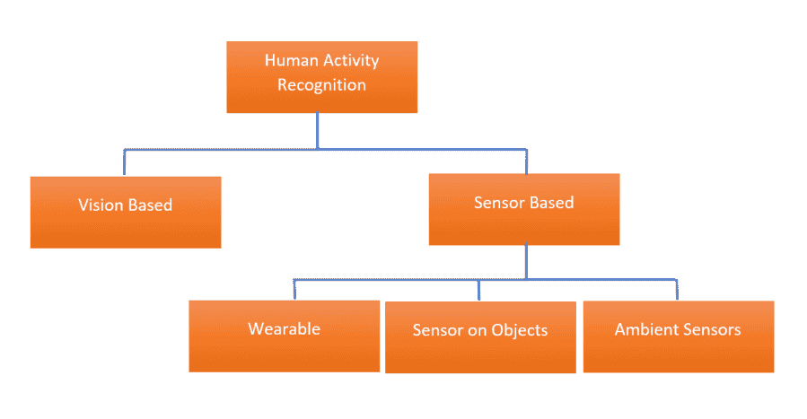

<!--yml

分类: 未分类

日期: 2024-09-06 19:50:11

-->

# [2111.04418] 1 引言

> 来源：[`ar5iv.labs.arxiv.org/html/2111.04418`](https://ar5iv.labs.arxiv.org/html/2111.04418)

###### 摘要

最近，物联网（IoT）技术的进步和传感器成本的降低促进了智能环境的发展，如智能家居。智能家居可以提供家庭辅助服务，以改善居民的生活质量、自主性和健康，特别是对老年人和依赖者。为了提供这样的服务，智能家居必须能够理解其居民的日常活动。智能家居中的人类活动识别技术日新月异。但新的挑战也不断涌现。本文介绍了通过环境传感器对智能家居中的人类活动识别领域的最新算法、研究、挑战和分类。此外，由于智能家居中的活动识别是一个年轻的领域，我们提出了具体问题、缺失和需要的贡献。同时，我们还提出了加速该领域进展的方向、研究机会和解决方案。

###### 关键词:

调查；人类活动识别；深度学习；智能家居；环境辅助生活；分类；挑战；机会\pubvolume

21 \issuenum18 \articlenumber6037 \externaleditor \datereceived \dateaccepted \datepublished \hreflink[`doi.org/10.3390/s21186037`](https://doi.org/10.3390/s21186037) \TitleA Survey of Human Activity Recognition in Smart Homes Based on IoT Sensors Algorithms: Taxonomies, Challenges, and Opportunities with Deep Learning \TitleCitationA Survey of Human Activity Recognition in Smart Homes Based on IoT Sensors Algorithms: Taxonomies, Challenges, and Opportunities with Deep Learning \AuthorDamien Bouchabou ^(1,2,)*\orcidA, Sao Mai Nguyen ¹*\orcidB, Christophe Lohr ¹\orcidC, Benoit LeDuc ² and Ioannis Kanellos ¹\orcidD \AuthorNamesDamien Bouchabou, Sao Mai Nguyen, Christophe Lohr, Benoit LeDuc, and Ioannis Kanellos \AuthorCitationBouchabou, D.; Nguyen, S.; Lohr, C.; LeDuc, B.; Kanellos, I. \corresCorrespondence: damien.bouchabou@imt-atlantique.fr,nguyensmai@gmail.com)

## 1 引言

图 1: 人类活动识别方法

随着人口老龄化，提供自动化服务以使人们能够在自己家中尽可能独立和健康地生活，开辟了一个新的经济领域 Chan et al. (2008)。得益于物联网（IoT）的进步，智能家居是当前被探索的解决方案，用于提供家庭服务，如健康监测、日常任务协助、能源管理或安全。智能家居是一种配备了许多传感器和执行器的房屋，这些传感器和执行器可以检测门的开关、房间的光照、温度和湿度……还可以控制我们日常生活中的一些设备，如供暖、百叶窗、灯光或家用电器。现在越来越多的这些设备都可以远程连接和控制。在家中，我们现在可以找到被称为智能的电视、冰箱、洗衣机，它们包含传感器并可以远程控制。所有这些设备、传感器、执行器和物品可以通过通信协议互联。

为了提供这些服务，智能家居必须理解和识别居民的活动。为此，研究人员正在开发人类活动识别（HAR）技术，该技术包括监测和分析一个或多个人的行为，以推断所进行的活动。HAR 系统的各种分类可以分为两类 Dang et al. (2020)：基于视频的系统和基于传感器的系统（见图 1）。

### 1.1 基于视觉

基于视觉的 HAR 使用摄像头来跟踪人类行为和环境变化。这种方法使用计算机视觉技术，例如标记提取、结构模型、动作分割、动作提取、运动跟踪。研究人员使用各种摄像头，从简单的 RGB 摄像头到更复杂的系统，通过融合多个摄像头进行立体视觉或深度摄像头，能够用红外光检测场景的深度。有关基于视觉的活动识别的多篇综述论文已经发布 Beddiar et al. (2020); Dang et al. (2020)。Beddiar et al. (2020) 旨在提供关于基于视觉的 HAR 相关文献和最新进展的最新分析。

然而，这些系统提出了接受度的问题。最近的一项研究 Singh et al. (2018) 显示，这些系统的接受度取决于用户对智能家居可能提供的好处的认知。它还影响他们对监控和数据共享的担忧。这项研究表明，年长者（年龄 36 至 70 岁）对于跟踪和共享数据持更开放的态度，特别是当这些数据对他们的医生和看护者有用时，而年轻成年人（35 岁以下）则较为不愿意共享信息。这一观察结果支持采用不那么侵入性的系统，例如基于物联网传感器的智能家居。

### 1.2 基于传感器

从传感器获取的人类活动识别（HAR）包括使用传感器网络和连接设备来跟踪一个人的活动。这些传感器产生的数据是状态变化或参数值的时间序列。各种传感器——接触检测器、RFID、加速度计、运动传感器、噪音传感器、雷达……可以直接放置在一个人身上、物体上或环境中。因此，基于传感器的解决方案可以分为三类：可穿戴设备 Ordóñez 和 Roggen (2016)、物体上的传感器 Li et al. (2016) 和环境传感器 Gomes et al. (2018)。

考虑到在个人空间内安装摄像头的隐私问题，为了减少干扰并更易被接受，基于传感器的系统在监控我们日常活动的应用中占据了主导地位 Chen et al. (2012); Hussain et al. (2019)。由于智能设备和物联网的发展以及其价格的降低，基于环境传感器的智能家居已成为一种可行的技术解决方案，现在需要寻找人类活动算法以发掘其潜力。

### 1.3 关键贡献

尽管现有的调查 Aggarwal 和 Xi (2014); Vrigkas et al. (2015); Hussain et al. (2019); Wang et al. (2019); Chen et al. (2020) 总结了传感器基础上的人类活动识别（HAR）研究，我们将在本调查中重点关注智能家居中的人类活动识别算法及其特定的分类和环境传感器面临的挑战，这将在接下来的部分中展开讨论。确实，智能家居中的人类活动识别是一个具有挑战性的问题，因为人类活动是复杂且因人而异的。每个居民的生活方式、习惯或能力都不同。日常活动的广泛性、变异性以及执行方式的灵活性要求我们采用一种可扩展且必须适应的解决方案。

许多方法已被用于人类活动的识别。然而，该领域仍面临许多技术挑战。这些挑战中有些与模式识别的其他领域（见 2）以及最近的自动特征提取算法（见 3），例如计算机视觉和自然语言处理等领域的挑战相似，而有些则特指基于传感器的活动识别，有些甚至更专注于智能家居领域。这个领域需要针对实际应用的特定方法。数据具有特定的时间结构（见 4），这需要解决，并且在数据变异性（见 5）和数据集的可用性（见 6）方面提出了挑战，同时也需要特定的评估方法（见 7）。这些挑战在图 2 中总结。

为了开展我们的前沿技术评审，我们搜索了该领域的最新进展文献。我们花时间复现了一些工作，以确认那些提出高分类分数的工作的结果。在这项研究中，我们能够研究并复现 Liciotti 等人 (2019)； Gochoo 等人 (2018)； Yan 等人 (2019) 的工作，这使我们更好地理解了智能家居领域 HAR 的困难、挑战和机遇。

与现有的调查相比，本工作的关键贡献可以总结如下：

+   •

    我们对智能家居中人类活动识别的最新方法和 approaches 进行了全面的调查。

+   •

    我们提出了一个新的智能家居人类活动识别分类法，基于挑战的视角。

+   •

    我们总结了近期应用深度学习技术进行智能家居人类活动识别的工作。

+   •

    我们讨论了该领域的一些开放问题，并指出了潜在的未来研究方向。

图 2：智能家居中人类活动识别的挑战

## 2 模式分类

智能家居中的人类活动识别（HAR）算法首先是模式识别算法。文献中发现的方法可以分为两大类：数据驱动的方法（DDA）和知识驱动的方法（KDA）。这两种方法是对立的。DDA 使用用户生成的数据来建模和识别活动。它们基于数据挖掘和机器学习技术。KDA 使用专家知识和规则设计。它们利用领域的先验知识、建模和逻辑推理。

### 2.1 知识驱动的方法（KDA）

在 KDA 方法中，通过结合从应用领域获得的丰富先验知识，使用知识工程和知识管理技术来建立活动模型。

KDA 的动机源于涉及日常生活活动的现实世界观察，以及执行这些活动所需的对象清单。在现实生活中，即使活动的执行方式不同，涉及的对象数量和类型也不会显著变化。例如，活动“刷牙”包含涉及牙刷、牙膏、水龙头、杯子和毛巾的动作。另一方面，由于人们的生活方式、习惯和能力不同，他们可以以不同的方式执行各种活动。例如，活动“泡咖啡”在不同的人之间可能差异很大。

KDA 的基础是大多数活动，特别是日常生活和工作中的例行活动，都发生在相对稳定的时间、地点和空间环境中。例如，刷牙通常在早晨和睡前在浴室进行，涉及使用牙膏和牙刷。活动之间的微弱隐性关系、相关的时间和空间背景以及涉及的实体，为推断活动提供了多样的线索和启发。

知识结构通过模式、规则或网络等形式进行建模和表示。KDA 建模和识别旨在利用丰富的领域知识和启发式方法进行活动建模和模式识别。KDA 有三种子方法：基于挖掘的方法（Perkowitz et al.（2004）），基于逻辑的方法（Chen et al.（2008））以及基于本体的方法。

基于本体的方法是最常用的，因为本体活动模型不依赖于算法选择。它们已被用于构建可靠的活动模型。陈等人在陈和努金特（2019）中提出了概述。山田等人（2007）使用本体来表示活动空间中的对象。他们的工作利用了对象和活动之间的语义关系。例如，茶壶用于茶叶准备活动。这种方法可以自动检测与对象相关的可能活动。它还可以将对象链接到活动的多个表示或变体。

陈等人（2009）；陈和努金特（2009）；陈等人（2011）为显式领域建模构建了上下文和活动本体。

KDA 具有形式化活动和提出语义与逻辑方法的优点。此外，这些表示尝试尽可能完整地克服活动的多样性。然而，这些方法的局限性在于建立活动模型所需的完整领域知识以及在处理不确定性和适应变化及新环境方面的不足。它们需要领域专家来设计知识和规则。新规则可能会破坏或绕过以前的规则。这些局限性在 DDA 方法中得到部分解决。

### 2.2 数据驱动的方法（DDA）

HAR 的 DDA 包括监督学习和无监督学习方法，这些方法主要使用概率和统计推理。监督学习需要标记的数据来训练算法。训练后，算法能够对未知数据进行分类。

DDA 的优势在于其概率建模能力。这些模型能够处理噪声、不确定和不完整的传感器数据。它们可以捕捉领域启发式，例如某些活动比其他活动更可能发生。它们不需要预定义的领域知识。然而，DDA 需要大量数据，在监督学习的情况下，需要干净且正确标记的数据。

我们观察到决策树 Logan 等人（2007）、条件随机场 Vail 等人（2007）或支持向量机 Fleury 等人（2009）已被用于 HAR。当大量训练数据可用时，像朴素贝叶斯分类器 Brdiczka 等人（2008）、van Kasteren 和 Krose（2007）、Cook（2010）这样的概率分类器在学习和分类离线活动方面也表现出良好的性能。Sedkly 等人 SEDKY 等人（2018）评估了多种分类算法，如 AdaBoost、皮层学习算法（CLA）、决策树、隐马尔可夫模型（HMM）、多层感知器（MLP）、结构感知器和支持向量机（SVM）。他们报告了 DT、LSTM、SVM 和线性 SVM 的随机梯度下降的优越性能。逻辑回归或回归函数。

### 2.3 概述

总结来说，KDA 提出了基于专家工程知识建模活动的方法，这种方法耗时且在演变时难以维护。DDA 似乎能带来较好的识别水平，并且承诺能更适应演变和新情况。然而，DDA 只有在输入特征设计良好的情况下才能表现出良好的性能。DDA 需要比 KDA 更多的数据和计算时间，但数据集的增加和计算能力的提升减轻了这些困难，并使得如今更复杂的模型，如能够克服对输入特征依赖的深度学习（DL）模型，得以训练。

## 3 特征提取

尽管智能家居中最有前景的**人类活动识别**算法似乎是机器学习技术，但我们描述了其性能如何依赖于作为输入的特征。我们描述了近年来机器学习如何解决这一问题，以自动生成这些特征，并提出了端到端学习。随后，我们强调了一个机会，即在利用人类活动的语义的同时生成这些特征。

### 3.1 手工制作的特征

为了识别智能家居中的日常活动，研究人员最初使用了手动方法。这些手工制作的特征是在将数据集划分为明确的活动序列或窗口后制作的。为了提供高效的活动识别系统，研究人员研究了不同的特征 Chinellato et al. (2016)。

最初，Krishann et al. Cook et al. (2013) 和 Yala et al. Yala et al. (2015) 提出了几种特征向量提取方法，具体如下：基线、时间依赖、传感器依赖和传感器依赖扩展。这些特征随后被分类算法如 SVM 或随机森林用于最终分类。

受先前工作的启发，Aminikhanghahi et al. Aminikhanghahi 和 Cook (2019) 最近评估了不同类型的传感器流分段。同时列出了不同的手工特征。研究了诸如星期几、一天中的时间、午夜以来的秒数或传感器过渡之间的时间等时间特征。还评估了诸如位置等空间特征，以及窗口中的事件数量或在先前段中出现最频繁的传感器标识符等度量。

#### 3.1.1 基线方法

这包括从每个窗口中提取一个特征向量。它包含窗口中第一个和最后一个传感器事件的时间、窗口的持续时间以及窗口内不同传感器事件的简单计数。特征向量的大小取决于数据集中的传感器数量。例如，如果数据集中包含 34 个传感器，则向量大小将为 34 + 3。从这个基线出发，研究人员升级了方法以克服不同的问题或挑战。

#### 3.1.2 时间依赖方法

这试图克服传感器事件的采样率问题。在大多数数据集中，传感器事件并不规律地采样，需要考虑事件与段内最后一个事件的时间距离。为此，传感器根据其时间距离进行加权。时间越远，重要性越低。

#### 3.1.3 传感器依赖方法

这被提出以解决片段中事件之间关系的问题。其想法是根据片段中最后一个传感器事件来加权传感器事件。这些权重基于传感器之间的互信息矩阵，该矩阵在离线状态下计算。如果传感器在传感器流的其他部分与片段中的最后一个传感器成对出现，则权重较高，否则权重相对较低。

#### 3.1.4 传感器依赖扩展方法

这建议在互信息矩阵中添加传感器对的频率。传感器对在数据集中一起出现的频率越高，其权重就越大。

#### 3.1.5 过去上下文信息方法

这是对之前方法的扩展，考虑到来自过去会话的信息。分类器不知道前一个片段的活动。例如，“进入家中”活动只能在“离开家中”活动之后出现。天真地，前一个活动不能被添加到特征向量中。算法可能无法进行足够的泛化。因此，Krishnan 等人 Cook 等人 (2013) 提出了一个两部分的学习过程。首先，模型在不知道前一个活动的情况下进行训练。然后，在对当前片段进行分类时，将前一个片段中的每个活动预测值提供给分类器。

#### 3.1.6 潜在知识方法

最近，Surong 等人提出了这一方法。Yan 等人 (2019)。他们通过添加概率特征来改进这些特征。这些额外的特征是通过 HMM 和贝叶斯网络以无监督方式从显式活动序列中学习的。在他们的工作中，Surong 等人将这些新特征与由深度学习算法（如 LSTM 和 CNN）提取的特征进行了比较。使用这些无监督增强特征获得的结果与深度学习算法相当。他们得出结论，无监督学习显著提高了手工设计特征的性能。

### 3.2 自动特征

在上述工作中，用于识别人体活动的机器学习方法使用了手工设计的特征。然而，这些提取的特征是精心设计的且启发式的。没有通用或系统的方法来有效捕捉人体活动的独特特征。

Cook 等人 Cook 等人 (2013) 几年前引入了一种基于传统机器学习算法的无监督活动发现方法。该算法搜索最佳压缩输入数据集的序列模式。经过多次迭代，它报告最佳模式。这些模式随后被聚类并提供给分类器以进行最终分类。

近年来，深度学习在许多领域如计算机视觉、自然语言处理和语音处理中，通过对复杂数据建模高层次抽象取得了显著进展 (2018); Ordóñez 和 Roggen (2016)。深度学习模型具有端到端学习能力，能够自动从原始信号中学习高层次特征，而不需要人工专家的指导，这促进了它们的广泛应用。因此，研究人员使用多层感知器（MLP）来进行活动分类 (2014); Irvine 等人 (2020)。然而，深度学习算法的关键在于其能够以层次化的方式直接从原始数据中学习特征，消除了对特征进行复杂近似的问题。它们也可以直接从自己的特征中执行分类任务。Wang 等人 (2019) 对应用于智能家居的深度学习技术进行了大规模研究。这里仅讨论了应用于智能家居的方法。

#### 3.2.1 卷积神经网络（CNN）

研究人员已经在图像处理和时间序列领域开展了使用卷积神经网络（CNN）的工作。CNN 展现了在提取特征方面的强大能力。对于活动识别（HAR），CNN 有两个优势。首先，它们可以捕捉局部依赖性，即与当前事件相关的邻近观察的重要性。其次，它们在步长差异或事件频率方面具有尺度不变性。此外，它们能够学习数据的层次化表示。CNN 有两种类型：用于图像处理的 2D CNN 和用于序列处理的 1D CNN。

Gochoo 等人 (2018) 将活动序列转换为二值图像，以便使用基于 2D CNN 的结构。他们的工作表明，这种结构可以应用于活动识别。在扩展中，Gochoo 等人 Tan 等人 (2018) 提出了使用图像中的彩色像素来编码关于活动的新传感器信息。他们的扩展提出了一种编码如温度传感器等非二值传感器的方法，以及不同片段之间的关联。Mohmed 等人 (2020) 采用了相同的策略，但将活动转换为灰度图像。灰度值与传感器激活的持续时间相关。然后使用 AlexNet 结构 (2012) 来提取图像的特征。这些特征随后与分类器一起用于识别最终的活动。

Singh 等人 (2017) 使用了基于 CNN 1D 的结构来处理原始数据序列，以利用其强大的特征提取能力。他们的实验表明，CNN 1D 架构能够实现类似的高效果。

#### 3.2.2 自编码器方法

自编码器是一种无监督的人工神经网络，学习如何高效地压缩和编码数据，然后学习如何从减少的编码表示中重建数据，以尽可能接近原始输入。自编码器通过设计，通过学习忽略数据中的噪声来减少数据维度。研究人员探讨了这种可能性，因为自编码器具有生成最具辨别性的特征的强大能力。自编码器创建的减少编码表示包含了能够区分活动的特征。

Wang 等人（Wang et al. (2016）应用了两层堆叠去噪自编码器（SDAE）来自动提取无监督的有意义特征。SDAE 的输入是从 6 秒时间窗口中提取的特征向量，没有重叠。特征向量的大小是数据集中传感器的数量。他们比较了两种特征形式：二进制表示和数值表示。数值表示方法记录了时间窗口内传感器的触发次数，而二进制表示方法则将传感器值设置为 1（如果在时间窗口内触发）。Wang 等人随后在 SDAE 顶部使用一个密集层，以用标记数据微调此层以进行分类。他们的方法在 Van Kasteren 数据集 van Kasteren et al. (2011）上超越了机器学习算法。

Ghods 等人（Ghods and Cook (2019）提出了一种方法，Activity2Vec，从传感器数据中学习活动嵌入。他们使用了 Sequence-to-Sequence 模型（Seq2Seq），Sutskever 等人（2014）用于编码和提取传感器的自动特征。该模型作为自编码器进行训练，以在输出中重建初始输入序列。Ghods 等人通过 HAR 领域的两个数据集验证了该方法，其中一个包含来自智能手机的加速度计和陀螺仪信号，另一个包含智能传感器事件。他们的实验表明，Activity2Vec 方法生成了良好的自动特征。他们用手工制作的特征和 Activity2Vec 特征测量了类内相似度。结果表明，对于第一个数据集（智能手机 HAR），Activity2Vec 编码的类内相似度最小。相反，对于第二个数据集（智能传感器事件），手工制作的特征的类内相似度最小。

### 3.3 语义学

之前的研究已经表明，深度学习算法如自编码器或卷积神经网络（CNN）不仅能够提取特征，还能进行分类。因此，它们允许创建所谓的端到端模型。但这些模型并没有翻译表示活动之间关系的语义，而本体论可以表示这些关系。但近年来，自然语言处理（NLP）领域的研究人员开发了词嵌入和语言模型技术，使深度学习算法能够理解不仅是词语的意义，还有短语和文本的结构。将 NLP 词嵌入添加到深度学习中的第一次尝试已在智能家居中的日常活动识别中显示出更好的性能 Bouchabou 等人（2021）。此外，利用 HAR 领域的语义可能允许开发新的学习技术以便快速适应，例如零样本学习，这在第五部分中进行了讨论。

### 3.4 概述

所有手工制作的特征提取方法在许多 HAR 应用中都取得了显著的结果。这些方法假设每个数据集都有一组代表性的特征，从而允许学习模型实现最佳性能。然而，手工特征需要大量的预处理。这既耗时又低效，因为数据集由专家手动选择和验证。这降低了对各种环境的适应能力。这就是为什么 HAR 算法必须自动提取相关表示的原因。

基于深度学习的方法可以从原始数据中获得更好、更高质量的特征。此外，这些特征可以针对任何数据集进行学习。它们可以以有监督或无监督的方式处理，例如带标签的窗口或不带标签的活动名称。此外，深度学习方法可以是端到端的，即它们提取特征并进行分类。得益于深度学习，NLP 领域取得了巨大进展。它通过模型、结构和学习方法来表示单词、句子或文本。这些模型能够解释单词的语义，对其进行上下文化，对单词进行先验或后验关联，从而提高句子或文本分类的性能。此外，这些模型能够自动提取完成任务所需的正确特征。NLP 和智能家居中的 HAR 领域都以序列形式处理数据。在智能家居中，传感器生成事件流。这个事件流是顺序的、像文本中的单词一样有序的。一些事件与流中的早期或晚期事件相关。这个事件流可以被分割成活动序列。这些序列可能类似于单词或句子的序列。此外，传感器或传感器类型或活动之间可能存在语义联系 Yamada et al. (2007)。我们建议将这些学习方法或模型中的一些转化为处理传感器事件序列的方法。我们特别想到使用注意力或嵌入模型的方法。

然而，这些为模式识别开发的方法可能不足以分析这些实际上是时间序列的数据。

## 4 时间数据

在智能家居中，传感器记录着居民环境中的行动和互动。这些记录是事件日志，捕捉了日常生活中的行为和活动。大多数传感器只有在状态发生变化时才会发送状态信息，以节省电池电量，并避免无线通信过载。此外，传感器可能有不同的触发时间。这导致时间序列的采样分散且不规则。因此，在智能家居中识别人的活动是一个时间序列中不规则采样的模式识别问题，这与在视频或可穿戴设备中识别人类活动有所不同。

在本节中，我们描述了智能家居中传感器数据流的分割方法。这些分割方法为人类活动识别算法提供了传感器数据的表示。我们强调了在实际使用案例中处理人类活动数据的时间复杂性的挑战。

### 4.1 数据分割

与许多活动识别领域一样，一种常见的方法是对数据流进行分段。然后，使用算法识别每个段中的活动。一些方法比其他方法更适合实时活动识别。实时是提出响应系统的必要条件。在某些情况下，例如跌倒检测等紧急情况，几分钟或几小时后再识别活动是不合适的。Quigley 等人 (2018) 研究并比较了不同的窗口化方法。

#### 4.1.1 明确窗口化（EW）

这包括按活动解析数据流 Cook 等人 (2013); Yala 等人 (2015)。每个这些段对应一个包含相同活动的传感器事件的窗口。这种窗口分段依赖于数据的标签。如果没有标签，需要找到活动变化的点。然后，算法将通过分配正确的活动标签来分类这些窗口。这种方法有一些缺点。首先，在没有标签的数据情况下，需要找到每个活动对应的段。此外，算法必须使用整个段来预测活动。因此，无法在实时中使用这种方法。

#### 4.1.2 时间窗口（TW）

使用 TW 的方法是将数据流划分为具有规律时间间隔的时间段。这种方法直观，但更适合于具有规律或连续采样的传感器时间序列。这是一种在可穿戴传感器如加速度计和陀螺仪中常用的技术。一个问题是选择时间间隔的最佳持续时间。如果窗口过小，可能不会包含任何相关信息。如果窗口过大，则信息可能与多个活动相关，窗口中的主要活动将对标签选择产生更大影响。Van Kasteren 等人 (2011) 确定了 60 秒的窗口是一个能实现良好分类率的时间步长。这个值在许多近期的工作中被用作参考，如 Medina-Quero 等人 (2018); Hamad 等人 (2019, 2020, 2021)。Quigley 等人 (2018) 显示 TW 达到了较高的准确率，但无法找到所有类别。

#### 4.1.3 传感器事件窗口（SEW）

SEW 通过滑动窗口将数据流分割成包含相等数量传感器事件的段。每个窗口的标签是窗口中最后一个事件的标签。窗口中位于最后一个事件之前的传感器事件定义了最后一个事件的上下文。这种方法简单但有一些缺点。这种窗口在持续时间上变化，因此无法解释事件之间的时间。然而，窗口中传感器事件的相关性可能因事件之间的时间间隔不同而不同 Krishnan 和 Cook (2014)。此外，由于它是一个滑动窗口，可能会同时找到属于当前活动和先前活动的事件。另外，窗口的大小（事件数）也是一个难以确定的参数。这个参数定义了最后一个事件的上下文大小。如果上下文太小，将缺乏信息来表征最后一个事件。然而，如果上下文太大，解释起来将会困难。文献中通常选择 20 - 30 个事件的窗口 Aminikhanghahi 和 Cook (2019)。

#### 4.1.4 动态窗口（DW）

DW 使用非固定窗口大小，与之前的方法不同。这是一种两阶段的方法，使用离线阶段和在线阶段 Al Machot 等人 (2016)。在离线阶段，数据流被分割成 EW。从 EW 中，根据规则和阈值提取“最佳传感器组”。然后，在在线阶段，将数据集流入分类算法。当算法在流中识别出“最佳传感器组”时，分类器将相应的标签与给定的输入段关联起来。如果源数据集没有正确标注，可能会出现问题。Quigley 等人 (2018) 表明这种方法在建模复杂活动时效率低下。此外，规则和阈值由专家手动设计，耗时较长。

#### 4.1.5 模糊时间窗口（FTW）

FTW 在 Medina 等人的工作中被引入。Medina-Quero 等人 (2018)。这种窗口类型用于编码多变的二进制传感器序列，即每个传感器一个序列。其目标是根据给定时间间隔的短期、中期和长期演变，为每个传感器序列生成特征。与 TW 一样，FTW 会暂时分割信号。然而，与其他类型的窗口分割不同，FTW 使用梯形来分割每个传感器的信号。定义梯形的值遵循斐波那契数列，这在分类过程中表现良好。FTW 的构建分为两个步骤。首先，传感器流按分钟重新采样，形成一个二进制矩阵。该矩阵的每一列代表一个传感器，每一行包含传感器在该分钟的激活值，即传感器在该分钟被激活为 1，否则为 0。对于每个传感器和每分钟，定义和计算一组 FTW。因此，每个传感器在每分钟被表示为一个向量，反映其当前分钟的激活情况以及过去的演变。这个向量的大小与 FTW 的数量有关。这种方法在二进制传感器上取得了优异的结果。Hamand 等人和 Hamad 等人 (2019) 提出了通过添加未来数据的 FTW 扩展 FTW，以补充过去的信息。这个补充的目的是在分类器的决策中引入延迟。直觉上，仅依赖过去的信息不足以预测活动的正确标签，在某些情况下，延迟识别时间可以做出更好的决策。举个例子，如果一个部署在前门的二进制传感器生成了开门激活，所选择的活动可能是“居民已经离开了房子”。然而，居民可能只是开门与门口的另一个人交谈，然后返回家中，并没有离开。因此，通过使用后续传感器的激活，可以提高准确性。因此，在决策中引入时间延迟是有用的。延迟越长，准确性越高。但如果延迟过长，则可能出现问题，延迟会妨碍实时性。虽然长时间的延迟对于某些类型的活动可能是可以接受的，但其他情况需要在紧急情况下有非常短的决策时间，例如居民摔倒。此外，FTW 仅适用于二进制传感器数据，不允许使用非二进制传感器。然而，在智能家居中，传感器不一定是二进制的，例如湿度传感器。

#### 4.1.6 概述

该表总结并分类了上述详细的不同分割技术。

| 分割类型 | 可用于实时 | 需要重采样 | 时间表示 | 可用于原始数据 | 捕捉长期依赖 | 捕捉传感器之间的依赖 | 步骤数量 |
| --- | --- | --- | --- | --- | --- | --- | --- |
| EW | 否 | 否 | 否 | 是 | 仅限于序列内部 | 是 | 1 |
| SEW | 是 | 否 | 否 | 是 | 依赖于大小 | 是 | 1 |
| TW | 是 | 是 | 是 | 是 | 依赖于大小 | 否 | 1 |
| DW | 是 | 否 | 否 | 是 | 仅限于预分割序列内部 | 是 | 2 |
| FTW | 是 | 是 | 是 | 是 | 是 | 否 | 2 |

表 1：分割方法总结

### 4.2 时间序列分类

在智能家居中识别人的活动是一个时间序列模式识别问题，具有不规则采样。因此，更具体的针对序列数据分析的机器学习方法在智能家居的活动识别中也被证明是有效的。

确实，统计马尔可夫模型如隐马尔可夫模型（Hidden Markov Models）Cook 和 Schmitter-Edgecombe (2009)；Cook (2010) 以及它们的推广，概率图模型如动态贝叶斯网络（Dynamic Bayesian Networks）Philipose 等人 (2004) 能够建模时空信息。在深度学习框架中，它们被实现为递归神经网络（RNN）。RNN 今天展示了更强的学习特征能力，能够表示时间序列或顺序多维数据。

RNN 被设计为接受一系列输入，没有预定的大小限制。RNN 记住过去的情况，其决策受到从过去学习到的内容的影响。RNN 可以接受一个或多个输入向量，并生成一个或多个输出向量，输出不仅受施加在输入上的权重的影响，还受一个隐藏状态向量的影响，该向量表示基于先前输入/输出的上下文。因此，相同的输入可能会根据序列中的先前输入产生不同的输出。但 RNN 存在长期依赖问题 Bengio 等人 (1994)。为了解决这个问题，提出了两种 RNN 变体，即长短期记忆（LSTM）Hochreiter 和 Schmidhuber (1997) 和门控循环单元（GRU）Cho 等人 (2014)，后者是 LSTM 的简化版。

Liciotti 等人在 Liciotti 等人 (2019) 的研究中考察了不同 LSTM 结构在活动识别中的表现。他们表明，LSTM 方法在分类得分上优于传统的 HAR 方法，因为 LSTM 可以生成编码时间模式的特征，而无需使用手工特征。Singh 等人 (2017) 也报告了 LSTM 的较高性能，相较于传统的机器学习技术（朴素贝叶斯、HMM、HSMM 和条件随机场）。类似地，Sedkly 等人 (2018) 报告称，LSTM 的表现优于 AdaBoost、皮层学习算法（CLA）、隐马尔可夫模型、多层感知器或结构化感知器。然而，LSTM 仍然存在局限性，其性能并未显著高于决策树、SVM 和线性 SVM 的随机梯度下降、逻辑回归或回归函数。实际上，LSTM 仍然难以找到适合的时间尺度，以平衡长期时间依赖性和短期时间依赖性。一些研究尝试解决这个问题。Park 等人 (2018) 使用了带有残差连接和注意力模块的多层 LSTM 结构。残差连接减少了梯度消失问题，而注意力模块标记了时间序列中的重要事件。为了处理可变时间尺度，Medina-Quero 等人 (2018) 将 LSTM 与模糊窗口结合，用于实时 HAR，因为模糊窗口可以自动调整其时间尺度的长度。这些改进的准确率低于 96%，仍需巩固和改进。

### 4.3 复杂人类活动识别

此外，这些序列数据分析算法只能处理简单、原始的活动，尚不能处理复杂活动。简单活动是由单一动作或运动组成的活动，例如走路、跑步、开灯、打开抽屉。复杂活动是涉及一系列动作的活动，这些动作可能涉及与物体、设备或其他人之间的不同交互。例如，烹饪。

#### 4.3.1 子活动序列

的确，日常生活活动不是*微动作*，即所有个体以相同方式进行的手势。我们智能家居希望识别的日常生活活动恰恰可以看作是*复合动作*的微动作序列。这些微动作序列通常遵循某种模式，但对其组成或微动作的顺序没有严格的限制。这个组合性的概念通过上下文感知活动的本体层次结构得以实现：一个活动的树形层次结构将每个活动与其子活动链接（Hong et al. (2009)）。另一项工作提出了一种学习这种层次结构的方法：由于隐马尔可夫模型方法不适合处理长序列，因此在 Asghari et al. (2019)中提出了一种称为层次隐马尔可夫模型的 HMM 扩展，以时间为依据编码多级依赖，并在其上下文中遵循层次结构。据我们所知，目前尚未有使用深度学习扩展此类层次系统的研究，但使用两层 LSTM 的层次 LTSM 来解决基于视频的动作变化（Devanne et al. (2019)）或在可穿戴设备上使用 LSTM 的两个隐藏层来解决 HAR（Wang and Liu (2020)）可以为智能家居应用中的 HAR 提供灵感。其他基于视频的 HAR 研究提出了自动学习描述复杂活动层次结构的随机语法，从多个注释者获得的注释中获取（Tayyub et al. (2018)）。

这些 HAR 算法的思想是利用传感器激活的上下文， either 通过引入多时间尺度表示以考虑较长期的依赖关系，或通过引入上下文敏感信息来引导在传感器激活流中的注意力。

后者的想法可以通过利用自然语言处理领域开发的方法得到进一步的发展，该领域中的文本也具有多级层次结构，单词的顺序可以变化，而单词的上下文非常重要。嵌入技术，如基于 LSTM 的 ELMo Peters 等 (2018)，或最近基于 Transformers 的 BERT Devlin 等 (2018)，已经被开发出来以处理序列数据，同时通过上下文敏感的嵌入处理长距离依赖。这些方法建模单词的上下文以帮助处理长序列。应用到人类活动识别（HAR）中，它们可以建模传感器的上下文及其出现顺序。受 Tayyub 等 (2018) 和 Bouchabou 等 (2021) 的启发，我们可以将自然语言处理（NLP）和 HAR 之间做一个类比：一个单词对应于传感器事件，一个由传感器事件组成的微活动对应于一个句子，一个由子活动组成的复合活动对应于一个段落。单词和传感器事件之间的类比已经导致了将单词编码与深度学习结合起来，以提高 Bouchabou 等 (2021) 在智能家居中的 HAR 性能。

#### 4.3.2 交替和并发活动

人类活动往往以复杂的方式进行。活动可以以交替或并发的方式进行。一个人可能会交替进行做饭和洗碗，或者同时做饭和听音乐，但也可以在听音乐的同时交替进行做饭和洗碗。在活动调度方面，可能性是无限的。然而，有些活动在数据集中似乎不可能出现，可能是异常的，比如在个人在房间里睡觉时做饭。

研究人员正在研究这个问题。建模这种类型的活动变得越来越复杂。但它可以被建模为一个多标签分类问题。Safyan 等 (2019) 探讨了使用本体论的方法来解决这个问题。他们的方法使用传感器和活动的语义分割。这使得模型能够关联某些活动是否可能在同一时间发生。Li 等 (2017) 利用 CNN-LSTM 结构来识别多模态传感器的并发活动。

#### 4.3.3 多用户活动

此外，监测单个居民的日常活动已经是一个复杂的任务。当有多个居民时，这一复杂性进一步增加。相同的活动变得更难以识别。一方面，群体中的一个居民可能会进行共同活动。在这种情况下，传感器的激活反映了群体中每个居民的相同活动。另一方面，每个人可以同时进行不同的活动。这会导致不同活动的传感器同时激活。这些激活会在活动序列中合并和混合。一个居民进行的活动对另一个居民的活动来说是一种噪声。

一些研究人员对这个问题感兴趣。与识别竞争活动的问题一样，多居民活动识别问题是一个多标签分类问题 Alhamoud 等 (2016)。Tran 等 (2018) 通过使用多标签 RNN 解决了这个问题。Natani 等 (2021) 研究了不同的神经网络架构，如 MLP、CNN、LSTM、GRU 或混合结构，以评估哪种结构最有效。结合 CNN 1D 和 LSTM 的混合结构表现最好。

### 4.4 概述

已经研究了多种用于智能家居的人体活动识别算法。表格 2 显示了智能家居中最近的人体活动识别方法的总结和比较。

| 引用 | 分割 | 数据表示 | 编码 | 特征类型 | 分类器 | 数据集 | 实时 |
| --- | --- | --- | --- | --- | --- | --- | --- |
| Liciotti 等 (2019) | EW | 序列 | 整数序列（每个传感器激活对应一个整数） | 自动 | Uni LSTM, Bi LSTM, Cascade LSTM, Ensemble LSTM, Cascade Ensemble LSTM | CASAS Cook 等 (2012): 米兰、开罗、京都 2、京都 3、京都 4 | 否 |
| Singh 等 (2017) | TW | 多通道 | 二值矩阵 | 自动 | Uni LSTM | Kasteren van Kasteren 等 (2011) | 是 |
| Park 等 (2018) | EW | 序列 | 整数序列（每个传感器 Id 对应一个整数） | 自动 | 残差 LSTM, 残差 GRU | MIT Tapia 等 (2004) | 否 |
| Medina-Quero 等 (2018) | FTW | 多通道 | 实值矩阵（每个 FTW 内的计算值） | 手动 | LSTM | Ordonez Ordóñez 等 (2013), CASAS A & CASAS B Cook 等 (2012) | 是 |
| Gochoo 等 (2018) | EW + SEW | 多通道 | 二值图像 | 自动 | 2D CNN | CASAS Cook 等 (2012): 阿鲁巴 | 否 |
| Hamad 等 (2020) | FTW | 多通道 | 实值矩阵（每个 FTW 内的计算值） | 手动 | 联合 LSTM + 1D CNN | Ordonez Ordóñez 等 (2013), Kasteren van Kasteren 等 (2011) | 是 |
| Singh et al. (2017) | TW | 多通道 | 二值矩阵 | 自动 | 1D CNN | Kasteren van Kasteren et al. (2011) | 是 |
| Wang et al. (2020) | TW | 多通道 / 序列 | 二值矩阵, 二值向量, 数值向量, 概率向量 | 自动 / 手动 | 自编码器, 1D CNN, 2D CNN, LSTM, DBN | Ordonez Ordóñez et al. (2013) | 是 |
| Aminikhanghahi and Cook (2019) | SEW | 序列 | 类别值 | 手动 | 随机森林 | CASAS Cook et al. (2012): HH101-HH125 | 是 |

表 2：智能家居活动识别方法的总结与比较

LSTM 在单一居民和简单活动的非规则时间序列分类中表现优异。然而，人类活动比这更复杂。并且，识别并发、交错或空闲活动的挑战更具困难性。之前引用的工作没有考虑这些类型的活动。此外，人们在家中很少独自生活。这就是为什么引入了更复杂的挑战，包括在多居民家庭中识别活动。这些挑战是多类别分类问题，尚未解决。

为了应对这些挑战，活动识别算法应能够为每个居民分割流数据。基于完全卷积网络的图像处理技术，如 Long et al. (2015) 提出的 U-Net，Ronneberger et al. (2015) 允许对图像进行分割。这些方法同样可以适应时间序列 Perslev et al. (2019)，并为智能家居应用中的 HAR 提供灵感。

## 5 数据可变性

不仅真实的人类活动复杂，智能家居中人类活动识别在实际应用中也面临因训练数据和测试数据之间的差异而导致的问题。接下来的子章节详细介绍了智能家居固有的问题：数据的时间漂移和设置的可变性。

### 5.1 时间漂移

智能家居通过传感器和与居民的互动收集居民行为的数据。初始训练数据是注册时所执行活动的肖像。使用这些数据生成并训练一个模型。随着时间的推移，居民的行为和习惯可能会改变。现在捕获的数据与训练数据不再相同。这对应于 Schlimmer and Granger (1986) 提出的时间漂移概念。这个概念意味着目标变量的统计属性，即模型试图预测的内容，随着时间以意外的方式演变。训练数据和测试数据之间的分布发生了偏移。

为了适应这种变化，智能家居中的 HAR 算法应该结合*终身学习*，以便持续学习并适应来自新数据的人类活动变化，如 Thrun 和 Pratt（1998）所提议的。最近在终身学习中融入深度学习的研究，正如 Parisi 等人（2019）所回顾的，可以帮助解决这种时间漂移的问题。特别是，可以设想一个交互式系统可以不时地向用户请求标记数据，以继续学习和适应。这类算法已在机器人学中以交互式强化学习或主动模仿学习的名称被开发。在 Duminy 等人（2021）的研究中，他们允许系统在选择何时、询问什么信息以及向谁请求帮助时，学习微观和复合动作，同时最小化对标记数据请求的次数。这些原则可以启发智能家居系统继续调整其模型，同时最小化用户干预，并通过指出缺失的关键信息来优化用户的干预。

### 5.2 设置的可变性

除了这些长期的演变外，从一个家庭到另一个家庭的数据也非常不同，由于房屋配置、传感器设备以及家庭成员组成和习惯的变化，一个家庭中学到的模型很难适用于另一个家庭。实际上，智能家居的位置、数量和传感器类型会影响活动识别系统的性能。每个智能家居的装备方式和传感器、房间配置、家电等方面的结构可能都不同。有些可能配备了大量传感器，多个浴室或卧室，并包含多个家电，而有些则可能较小，如单个公寓，传感器较少且重叠和噪声序列更多。由于房屋配置的差异，在第一个智能家居中优化的模型可能在另一个家庭中的表现较差。这个问题可以通过为每个新家庭收集新的数据集来重新训练模型来解决，但正如第六部分所解释的，这样做成本很高。

另一种解决方案是将家庭中学习到的模型适应到其他家庭。近年来开发了迁移学习方法，以允许预训练的深度学习模型与不同的数据分布一起使用，正如 Weiss 等人所述（2016）。深度学习的迁移学习方法已经成功应用于时间序列分类，如 Fawaz 等人所述（2018）。对于活动识别，Cook 等人（2013）回顾了在传统机器学习中可以迁移的不同类型的知识。这些方法可以通过深度学习算法和利用迁移学习的新进展来更新。此外，最近通过开发元学习算法改善了对新环境的适应。它们的目标是让模型在多种学习任务上进行训练，以便使用少量的训练样本解决新的学习任务。这个领域最近取得了突破，如 Hospedales 等人所述（2020），这在 HAR 中尚未应用。然而，智能家居中 HAR 数据的独特变异性只能从这些算法中受益。

## 6 数据集

数据集是训练、测试和验证活动识别系统的关键。数据集最初是在实验室中生成的。但这些记录不能提供足够的活动种类和复杂性，并且不够真实。为了解决这些问题，创建了公共数据集，这些数据集来源于在真实家庭中录制的志愿者居民的数据。同时，为了能够在相同条件下对相同数据进行比较，一些竞赛被创建了，如评估 AAL 系统通过竞争基准测试 - AR（EvAAL-AR）Gjoreski 等人（2015）或 UCAmI 杯 Espinilla 等人（2018）。

然而，数据集的生成是一项繁琐的任务，记录活动的过程难以管理。它们需要志愿者和配备传感器的公寓或房屋。此外，数据注释和后处理也需要大量时间。智能家居模拟器已被开发作为生成数据集的解决方案。

本节展示并分析了一些真实和合成的数据集，以便了解这两种方法的优缺点。

### 6.1 真实智能家居数据集

存在多种公共真实家庭数据集，Tapia 等人 (2004)；van Kasteren 等人 (2011)；Cook 等人 (2012)；Alemdar 等人 (2013)；Cumin 等人 (2017)。De-la-Hoz 等人和 De-La-Hoz-Franco 等人 (2018) 提供了用于智能家居的人体活动识别（HAR）传感器数据集的概述。他们编制了广泛数据集的文档和分析，列出了结果和应用的算法。但这些数据集的制作也涉及一些问题，如：传感器类型和布置、用户特征或居住类型的变异以及标注策略。

#### 6.1.1 传感器类型和定位问题

在家庭中采集数据时，选择传感器及其数量和位置是困难的。重要的是选择尽可能少侵入性的传感器，以尊重志愿者的隐私，Alemdar 等人 (2013)。没有使用相机或视频录制。大多数传感器导向的智能家居数据集使用所谓的低级传感器。这些传感器包括红外运动传感器（PIR）、用于开关的磁性传感器、放置在沙发或床上的压力传感器、用于温度、亮度、电力或水消耗监测的传感器……

这些传感器的位置对于准确捕捉活动至关重要。战略性定位可以准确捕捉特定活动。例如，厕所中的水位传感器可以捕捉到上厕所的使用情况，或者床垫下的压力传感器可以知道一个人是否在床上。对于家庭中传感器的定位和安装，没有精确的方法或策略。CASAS 的 Cook 等人 (2012) 研究人员提出并推荐了一些战略位置。然而，其中一些战略性布置在演变方面可能存在问题。可以想象，在房子的使用过程中，其房间的组织或使用方式发生变化，例如，如果运动传感器放置在床上方以捕捉床的使用情况。但是，如果床移到房间的不同位置，则传感器将无法再捕捉到这些信息。在数据集的背景下以及使用数据集来验证算法时，这种限制并不重要。但在真实应用中，这种限制变得重要，因为需要评估算法的弹性，算法必须在信息丢失的情况下继续正常运行。

除了定位外，选择足够的传感器以覆盖可能的最大活动数量也很重要。传感器的数量在不同的数据集中可能差异很大。例如，MIT 数据集 Tapia 等人 (2004) 每个公寓使用 77 和 84 个传感器。Kasteren 数据集 van Kasteren 等人 (2011) 使用 14 到 21 个传感器。ARAS Alemdar 等人 (2013) 的公寓有 20 个传感器。Orange4Home Cumin 等人 (2017) 基于一个配备 236 个传感器的公寓。这些差异可以通过不同类型的住房以及我们希望识别的活动数量和粒度来解释。此外，一些数据集故意配备了过多的传感器。目前尚无方法或策略来根据活动列表定义安装的传感器数量。

#### 6.1.2 配置和类型学问题

需要考虑到房屋的不同类型：公寓、带花园的房子、有楼层、没有楼层、一个或多个浴室、一个或多个卧室……这些不同类型和房屋的变异性会导致一些困难，例如：相同的活动可能发生在不同的房间。传感器的投资可能会更多或更少。传感器的网络覆盖可能会存在问题。例如，Alerndar 等人 Alemdar 等人 (2013) 遇到了数据同步问题。他们的其中一栋房子需要两个传感器网络来覆盖整个房子。他们必须同步数据以满足数据集的需求。因此，数据集需要提供不同的房屋配置，以便在多种配置中评估算法。一些包含多个房屋的数据集存在，如 Tapia 等人 (2004)；van Kasteren 等人 (2011, 2011)；Alemdar 等人 (2013)。CASAS Cook 等人 (2012) 是其中之一，包含大约 30 种不同的房屋配置。这些数据集在文献中非常常见，如 De-La-Hoz-Franco 等人 (2018)。然而，志愿者主要是老年人，涵盖多个年龄段是重要的。年轻居民的行为与老年居民不同。Orange4Home 数据集 Cumin 等人 (2017) 涵盖了年轻居民的活动。居民的数量也很重要。多居民情况下的活动识别更为复杂。这就是为什么多个数据集也涉及这一研究领域，如 Cook 等人 (2012)；Alemdar 等人 (2013)；van Kasteren 等人 (2011)。

#### 6.1.3 注释问题

数据集注释是监督算法训练中必不可少的一部分。在创建这些数据集时，必须部署策略以实现这种注释。例如，期刊 van Kasteren 等人 (2011)，智能手机应用 Cumin 等人 (2017)，个人数字助理（PDA）Tapia 等人 (2004)，图形用户界面（GUI）Alemdar 等人 (2013)，或语音记录来注释数据集 van Kasteren 等人 (2011)。

由于这些记录是由志愿者直接完成的，他们被要求注释自己的活动。对于 MIT 数据集 Tapia 等人 (2004)，居民使用 PDA 注释他们的活动。每 15 分钟，PDA 会发出蜂鸣声以提示居民回答一系列问题以注释他们的活动，然而，这种用户自我注释的方法遇到了一些问题。例如，一些短暂的活动未被记录，标签选择错误或遗漏。为了克服这些问题，进行了一次基于后验激活的后注释，因此可能引入了新的错误。此外，由于询问的频率，这种注释策略繁琐且压力大。它需要志愿者的高度严谨，同时在提供信息时会中断活动的执行。这些中断减少了活动的流畅性和自然性。

Van Kasteren 等人 (2011) 提出了另一种注释他们数据的方法。注释仍由志愿者自己完成，但使用了通过蓝牙耳机和日记的语音。这一策略使得志愿者可以自由移动，不需要在活动中停下来。这使得活动的序列更加流畅和自然。日记使志愿者能够在无法佩戴头盔时完成一些额外的信息。然而，整天佩戴头盔仍然是一个限制。

ARAS 数据集的志愿者 Alemdar 等人 (2013) 使用了一个简单的图形用户界面（GUI）来注释他们的活动。几个实例被放置在家庭中，以最小化活动中的中断，并避免整天佩戴如头盔之类的物品。志愿者只需指示每个活动的开始即可。假设居民会一直进行相同的活动，直到下一个活动开始。这一假设反映了一种偏见，将人类活动视为已知活动的连续流。

### 6.2 合成智能家居数据集

建设真实智能家居及收集此类场景的数据集成本高昂，对许多项目来说有时难以实现。测量活动应包括各种各样的活动和参与者。应以足够的严谨性进行，以获得高质量的数据。此外，找到传感器的最佳位置 Helal 等人 (2010)，找到合适的参与者 Helal 等人 (2011)；Mendez-Vazquez 等人 (2009) 和缺乏灵活性 Armac 和 Retkowitz (2007)；Fu 等人 (2011) 使得数据集收集变得困难。由于这些原因，研究人员设想了智能家居模拟工具 Alshammari 等人 (2017)。

这些模拟工具可以分为两种主要方法：基于模型的 Lee 等人 (2015) 和交互式 Synnott 等人 (2014)，根据 Synnott 等人 (2015)。基于模型的方法使用预定义的活动模型来生成合成数据。相比之下，交互式方法依赖于可以由研究人员、人类参与者或模拟参与者控制的虚拟角色。一些混合模拟器如 OpenSH Alshammari 等人 (2017) 结合了交互式和基于模型的方法的优点。此外，智能家居模拟工具可以专注于数据集生成或数据可视化。一些模拟工具提供多居民或快速转发功能，以加速执行过程。

这些工具可以快速生成数据并进行可视化。但活动捕捉可能不自然且缺乏噪声。一些不确定性可能被遗漏。

### 6.3 大纲

所有这些公共数据集，无论是合成的还是实际的，都很有用，并允许评估过程。两者都有优点和缺点。表格 3 详细列出了来自文献的一些数据集，这些数据集是社区辛勤工作的成果。

| 参考 | 多居民 | 居民类型 | 持续时间 | 传感器类型 | 传感器数量 | 活动数量 | 房屋数量 | 年份 |
| --- | --- | --- | --- | --- | --- | --- | --- | --- |
| van Kasteren 等人 (2011) | 否 | 老年 | 12-22 天 | 二进制 | 14-21 | 8 | 3 | 2011 |
| Alemdar 等人 (2013) | 是 | 年轻 | 2 个月 | 二进制 | 20 | 27 | 3 | 2013 |
| Cumin 等人 (2017) | 否 | 年轻 | 2 周 | 二进制，标量 | 236 | 20 | 1 | 2017 |
| Cook 等人 (2012) | 是 | 老年 | 2-8 个月 | 二进制，标量 | 14-30 | 10-15 | >30 | 2012 |
| Ordóñez 等人 (2013) | 否 | 老年 | 14-21 天 | 二进制 | 12 | 11 | 2 | 2013 |
| Tapia 等人 (2004) | 否 | 老年 | 2 周 | 二进制，标量 | 77-84 | 9-13 | 2 | 2004 |

表格 3：文献中的真实数据集示例

真实数据集如 Orange4Home Cumin 等（2017）提供了大量的传感器集。这有助于确定哪些传感器对哪些活动有用。CASAS Cook 等（2012）提供了许多房屋或公寓配置和拓扑结构，特别是针对老年人。这允许评估对房屋拓扑结构的适应性。ARAS Alemdar 等（2013）则提供了年轻人和多居民的居住环境。这有助于验证活动识别系统的噪声韧性和分割能力。真实数据集的优势在于其变异性以及活动的数量和执行的代表性。但传感器可能被过于战略性地布置，以覆盖某些特定类型的活动。在一些数据集中，PIR 传感器被用作网格或安装为检查点，以跟踪居民的轨迹。战略性布置、大量传感器或特定传感器的选择有助于算法推断知识，但并不代表真实的地面真相。

合成数据集可以快速评估不同配置的传感器和拓扑结构。此外，它们可以在没有实际设置或志愿者的情况下生成大量数据。与真实数据集方法（如日志、智能手机应用、语音记录）相比，注释更为精确。

但是，合成数据集提供的活动在执行节奏和变异性方面不够真实。每个人在行动持续时间、间隔或顺序上都有自己的节奏。虚拟智能家居的设计对非专家设计师来说可能是一项繁琐的任务。此外，没有公开的合成数据集。只有一些数据集生成工具，如 OpenSH Alshammari 等（2017），可以使用。

即使今天智能传感器变得越来越便宜，真实的房屋中也没有像数据集中那样广泛配置传感器。在厨房橱柜上找到开关传感器是不现实的。真实的家居系统包含用于监控广泛区域的 PIR 传感器。用于控制热量的温度传感器。越来越多的空气质量或光照传感器可以找到。一些房屋现在配备了智能灯或智能插座。外部开口处可以找到磁传感器。而现在，一些房屋提供了电力和水的总体消耗。这些数据集并不能代表实际的家庭传感器设备。

上述另一个问题是注释。监督算法需要定性标签来学习正确的特征和分类活动。居民的自我注释可能会产生错误和缺乏精确性。添加注释的后处理增加了不确定性，因为它们总是基于假设，比如每个活动都是顺序进行的。但人类活动流程并不总是顺序的。很少有数据集提供并发或交错的活动。此外，每个数据集都提出了自己的注释分类法。即使合成数据集试图克服注释问题，

本节展示了提供正确评估系统或数据集的困难。科学界已提供的工作是卓越的。正由于这些工作，在某些条件下，有可能评估活动识别系统。

然而，有几个研究领域可以探索，以帮助该领域更快进展。数据生成的第一个可能研究方向是从视频游戏生成数据。视频游戏构成了一个数十亿美元的产业，开发者们在构建高度逼真的世界方面付出了巨大努力。最近在语义视频分割领域的研究考虑并使用视频游戏来生成数据集，以训练算法（Richter et al. (2016, 2017)）。最近，Roitberg et al. Roitberg et al. (2021) 研究了一个初步的可能性，使用由电子艺术公司（EA）开发的商业游戏《模拟人生 4》来重现视频数据集（Das et al. (2019)）。目标是从视频游戏生成的视频中评估和训练 HAR 算法，并与原始数据集进行比较。这项工作显示了有希望的结果。可以设想对这项工作的扩展，以生成传感器活动轨迹的数据集。此外，每个数据集都提出了自己的分类法。有些受医疗工作启发，如 Katz et al. 的工作（Katz (1983)），定义了一系列基本和必要的活动。然而，目前尚未提出层次分类法，例如午餐烹饪和晚餐烹饪是烹饪的子活动，或考虑并发或平行活动的分类法。提出一种通用的分类法以统一数据集是一个值得研究的方向，以便更有效地同质化和比较算法。

## 7 评估方法

为了验证算法的性能，研究人员使用数据集。然而，在同一数据上学习预测函数的参数并进行测试是一种方法论错误：一个简单地重复其刚刚见过的样本标签的模型可能会获得完美的分数，但对尚未见过的数据无法做出任何有用的预测。这种情况被称为过拟合。为了避免这种情况，在监督机器学习实验中，通常会保留部分可用数据作为测试数据集。在机器学习和深度学习领域存在几种方法。对于智能家居中的 HAR 问题，一些方法已被研究人员使用。

对这些算法的评估不仅与这些方法的使用有关。它还依赖于方法论以及评估所基于的数据集。预处理是必要的情况并不罕见。然而，这种预处理可能会影响最终结果。本节重点介绍了预处理数据集以及应用和选择某些评估方法可能引入的一些偏差。

### 7.1 数据集预处理

#### 7.1.1 不平衡数据集问题

不平衡的数据集构成挑战，因为大多数用于分类的机器学习算法在设计时假设每个类别有相等数量的示例。这导致模型的预测性能较差，尤其是在少数类上。这是一个问题，因为一般而言，少数类的比例较大，因此问题对少数类的分类错误比对多数类的分类错误更为敏感。为了解决这个问题，一些研究人员会对数据集进行重新平衡。通过移除表示过少的类别或随机移除最具代表性的类别示例，Gochoo 等人 (2018) 的这些方法可以提高算法的性能，但无法完全反映现实。

在日常生活活动的背景下，某些活动在日常过程中出现的频率较高或较低。更现实的方法是将活动归类到一个新的、更一般的标签下。例如：“准备早餐”、“准备午餐”、“准备晚餐”、“准备小吃”可以归入标签“准备餐点”。因此，虽然表示较少但语义上接近的活动可以作为示例的一部分使用。如果标签名称相同，这可以允许数据集之间更公平的比较。Liciotti 等人 (2019) 采用了这种方法来比较多个数据集之间的差异。其中一个缺点是活动的粒度丧失。

#### 7.1.2 其他类别问题

在智能家居的 HAR 领域，数据集中部分数据未标记是很常见的情况。通常，这些未标记的事件会被分配标签“其他”。标签“其他”通常占数据集的 50%，Liciotti 等人 (2019)；Yan 等人 (2019)。这使得它成为数据集中最具代表性的类别，并且使数据集不平衡。此外，“其他”类别可能代表多个不同的活动类别，或者仅仅是一些没有意义的内容。一些研究人员选择忽略这个类别，认为它被过度代表并且包含过多随机序列。其他研究人员则倾向于从训练阶段和训练集中去除这个类别，但保留在测试集中，以便在更现实的环境中评估系统 Yala 等人 (2015)。Yala 等人 (2015) 评估了有无“其他”类别的性能，结果表明这个选择对最终结果有着强烈的影响。

然而，能够区分这个类别开辟了新的视角。能够隔离这些序列的算法可以建议用户将来对它们进行标注，以发现新的活动。

#### 7.1.3 标签问题

如上所述，实际房屋的数据集是由居民通过日志本或图形用户界面标记的。然后由负责的研究人员进行后处理。然而，一些标签缺失的情况是不可避免的，就像 CASAS 米兰数据集中的情况一样 Cook 等人 (2012)。表 4 展示了米兰数据集中的一个摘录，其中标签缺失。然而，事件或日期是重复的，即相同的时间戳、相同的传感器、相同的值、相同的活动标签。算法形成之前必须对数据集进行清理。显然，根据标签和数据的质量，结果会有所不同。确实，某些类别的出现可能会被人为增加或减少。一些事件可能被标记为“其他”，即使它们实际上属于一个定义的活动。在这种情况下，识别算法可能会正确标记这个事件，但在混淆矩阵中可能会与其他类别混淆。

| 日期 | 时间 | 传感器 ID | 值 | 标签 |
| --- | --- | --- | --- | --- |
| 2010-01-05 | 08:25:37.000026 | M003 | 关 |  |
| 2010-01-05 | 08:25:45.000001 | M004 | 开 | 阅读开始 |
| … | … | … | … | … |
| 2010-01-05 | 08:35:09.000069 | M004 | 开 |  |
| 2010-01-05 | 08:35:12.000054 | M027 | 开 |  |
| 2010-01-05 | 08:35:13.000032 | M004 | 关 | （阅读应结束） |
| 2010-01-05 | 08:35:18.000020 | M027 | 关 |  |
| 2010-01-05 | 08:35:18.000064 | M027 | 开 |  |
| 2010-01-05 | 08:35:24.000088 | M003 | 开 |  |
| 2010-01-05 | 08:35:26.000002 | M012 | 开 | （厨房活动应开始） |
| 2010-01-05 | 08:35:27.000020 | M023 | 开 |  |
| … | … | … | … | … |
| 2010-01-05 | 08:45:22.000014 | M015 | OFF |  |
| 2010-01-05 | 08:45:24.000037 | M012 | ON | 厨房活动结束 |
| 2010-01-05 | 08:45:26.000056 | M023 | OFF |  |

表 4: CASAS Cook 等 (2012) 米兰数据集异常

#### 7.1.4 评价指标

由于 HAR 是一个多分类问题，研究人员使用 Sokolova 和 Lapalme (2009) 提出的指标如准确率、精确率、召回率和 F-Score 来评估他们的算法 Park 等 (2018)；Singh 等 (2017)；Medina-Quero 等 (2018)。这些指标通过四个特征定义，如类别 $C_{i}$ 的真正例、真正负例、假正例和假负例。F-score，也称为 F1-score，是衡量模型在数据集上准确性的指标。F-score 是一种结合模型的精确率和召回率的方式，其定义为模型精确率和召回率的调和均值。需要注意的是，真实的房屋数据集通常在类别上是不平衡的。换句话说，一些活动的例子比其他活动多，且处于少数。在不平衡的数据集中，由于定义上的原因，少数类更难预测，因为该类的示例较少。这意味着模型更难学习该类示例的特征，并将其与多数类示例区分开来。因此，使用按数据集类支持加权的指标更为合适。例如，平衡准确率、加权精确率、加权召回率或加权 F-score Fernández 等 (2018)；He 和 Ma (2013)。

### 7.2 评估过程

#### 7.2.1 训练 / 测试

评估算法的一种方法是将数据集划分为两个不同的部分，一个用于训练，另一个用于测试。通常选择 70% 用于训练，30% 用于测试。一些研究人员选择采用这种方法。Surong 等 Yan 等 (2019) 在实时激活识别的应用中采用了这种评估方法。为了展示其方法的泛化能力，他们选择将数据集按时间划分为两个相等的部分。然后将这些部分再次按时间划分为训练集和测试集。这样他们提出了两个训练和测试的子集。此方法的优点是通常比残差方法更可取，且计算时间也不长。此外，它无法考虑活动的漂移 Aminikhanghahi 和 Cook (2019)。此外，算法可能在测试集上过拟合，因为参数已调整为最佳值。这种方法不能保证算法的泛化能力。

#### 7.2.2 K 折交叉验证

这是一种用于模型评估的广泛方法。它包括将数据集划分为 K 个子数据集，K 的值通常在 3 到 10 之间。选择 K-1 个数据集用于训练，剩余的数据集用于测试。算法会迭代直到所有子数据集都用于测试。训练 K 个评分的平均值用于评估算法的泛化能力。通常，在划分为 K 个子数据集之前，会将数据混合，以增加算法的泛化能力。然而，某些类可能在训练集或测试集中没有出现。这就是为什么一些实现建议所有类在测试时都应该被表示，而不是仅仅在训练中出现。

在智能家居中的 HAR 背景下，这种方法是分类的良好方法。例如 EW Park 等人 (2018) 和 Liciotti 等人 (2019)。实际上，EW 可以被视为独立的而不是时间上相关的。然而，对于滑动窗口尤其如此，特别是当它们有强重叠且窗口在测试集和训练集中按其类别均匀分布时，这似乎并不相关。训练集和测试集看起来会过于相似，这会提高算法的性能，并且无法足够地泛化。

#### 7.2.3 留一交叉验证

这是交叉验证的一个特殊情况，其中折数等于数据集中的实例数。因此，学习算法会针对每个实例应用一次，使用所有其他实例作为训练集，将选定的实例作为单项测试集。

Singh 等人 (2017) 和 Medina-Quero 等人 (2018) 在实时 HAR 的背景下使用了这种验证方法。在他们的实验中，数据集按天划分。一天用于测试，而其他天用于训练。每一天轮流成为测试日。这种方法允许大量的数据用于训练，从而让算法在多样的数据上进行训练。然而，测试的规模并不非常显著，无法展示算法在智能家居中的泛化能力。

#### 7.2.4 多天分段

Aminikhanghahi 和 Cook (2019) 提出了一个称为多天分段的验证方法。这种方法提出在实时 HAR 背景下考虑分段的序列性质。实际上，在这种实时背景下，每个分段或窗口在时间上是相关的。根据 Aminikhanghahi 等人的说法，如上所述，交叉验证在这种背景下会引入偏差。一种可能的解决方案是使用上述描述的 2/3 训练和 1/3 测试划分。然而，这会引入数据漂移的概念。居民行为的漂移会导致训练集和测试集之间的巨大差异。

为了克服这些问题，提出的方法是将数据集划分为 6 个连续的天。前 4 天用于训练，最后 2 天用于测试。这种 6 天分段的划分创建了一个轮换，使得训练集和测试集中能够代表一周的每一天。为了进行多个折叠，每个折叠开始时，6 天序列的起始点向前移动 1 天。这种方法可以保持数据的顺序，同时避免数据集漂移。

### 7.3 大纲

本节回顾了在智能家居中进行 HAR 的不同验证方法，如表 5 所示。根据所解决的问题，并非所有方法都能用于评估算法。

| 参考 | 训练/测试拆分 | K 折交叉验证 | 留一法交叉验证 | 多日分段 | 尊重活动的时间顺序 | 对数据漂移问题敏感 | 实时识别 | 离线识别 | 可用于小数据集 |
| --- | --- | --- | --- | --- | --- | --- | --- | --- | --- |
| Yan 等 (2019) | ✓ |  |  |  | 是 | 是 | 是 | 是 | 否 |
| Park 等 (2018)；Liciotti 等 (2019)；Gochoo 等 (2018) |  | ✓ |  |  | 否 | 否 | 否 | 是 | 否 |
| Singh 等 (2017)；Medina-Quero 等 (2018)；Hamad 等 (2020)；Singh 等 (2017)；Wang 等 (2020) |  |  | ✓ |  | 不一定 | 否 | 是 | 是 | 是 |
| Aminikhanghahi 和 Cook (2019) |  |  |  | ✓ | 是 | 否 | 是 | 是 | 否 |

表 5：活动识别算法评估方法总结。

对于离线 HAR，即 EW 或预分段活动序列，K 折交叉验证似乎是最合适的，前提是没有考虑到段间的时间依赖性。否则，最好使用其他方法。留一法交叉验证是一种替代方案。它允许处理包含少量数据的数据集，但天数被视为独立的。无法将两个不同的天（例如工作日或周末）联系起来。Aminikhanghahi 等（Aminikhanghahi 和 Cook (2019)）提出了一种方法来保持段的时间依赖性，并避免因居民习惯随时间变化而引起的数据漂移问题。

此外，数据集数据的预处理、重新平衡、去除“其他”类别和事件标注都会影响算法的性能。因此，考虑评估方法和所做的预处理以判断算法的性能是重要的。此外，经典指标如准确率或 F 值可能不够充分。使用加权指标，如数据集类别表示数加权的指标，可能更为明智。在这种情况下，平衡准确率或加权 F1 得分应是更好的指标（Fernández et al. (2018); He and Ma (2013)）。

智能家居中 HAR 领域的一个主要问题是缺乏评估协议。根据待解决问题的类型（实时、离线）建立统一的协议将加快该领域的研究，并允许对提出的算法和方法进行更公平的比较。

## 8 总结与讨论

在本文中，我们突出了智能家居中人类活动识别的挑战，其中一些与其他 HAR 领域相比具有特性。我们提出了人类活动识别算法主要组件的分类法，并回顾了最有前景的解决方案。为了克服当前的问题，我们指出了其他领域新进展所提供的机会。

### 8.1 与其他 HAR 的比较

尽管由于深度学习在图像处理中的快速发展，基于视觉的人类活动识别算法取得了巨大的进步，但使用可穿戴设备和传感器的活动识别也在显著改进。然而，用户认为基于视觉的系统过于侵入性，因为这些系统可能揭示过多的私人信息，而可穿戴设备和物体上的传感器则需要对受试者的身体或个人物品进行日常仪器化，环境传感器可能提供解决此问题的方案。

智能家居中的 HAR 由于最近深度学习算法的进步，如卷积神经网络，已取得了新的进展。这也得益于最近的序列学习算法，如长短期记忆（LSTM），但与视频处理一样，序列学习仍需改进，以解决梯度消失问题并考虑传感器读数的上下文。时间维度恰好是环境传感器系统的一个特性，因为数据是稀疏且不规则的时间序列。对于数据分割，已经采用了适应性的窗口方法来解决不规则采样的问题。除了在其他 HAR 领域使用的时间窗口外，传感器事件窗口也常被使用。环境传感器的数据稀疏性不允许机器学习算法利用时间上的数据冗余，如同视频中相邻的视频帧大多相似。此外，与视频中的 HAR 相比，人类动作的上下文可以通过环境或注意对象的检测来观察，环境传感器中 HAR 的稀疏性导致对过去信息的高度依赖，以推断上下文信息。

虽然环境传感器中的 HAR 必须面对复杂活动的问题，如活动序列、并发活动或多用户活动，或数据漂移，但它还必须解决特定的未解决问题，如数据的变异性。实际上，传感器收集的数据对房屋配置、传感器选择及其定位更加敏感。

### 8.2 分类法与挑战

为了应对其特定挑战及其他系统共有的挑战，我们在回顾中介绍了用于实际应用的人类活动识别算法的主要组成部分的分类法。我们指出的三个组成部分是：分类、自动特征提取和时间序列分析。它需要从原始数据中进行模式识别，因此需要特征提取。此外，该算法还必须整合时间序列分析。

虽然深度学习算法如 CNN 对模式识别分析和特征提取挑战似乎已经解决得很好，但序列分析部分最近随着 LSTM 的应用也有所改善。基于 CNN 和 LSTM 的两种方法都被报告为具有相同的性能水平，并且最先进的发展大多基于 LSTM 或卷积深度学习。然而，由于数据的稀疏性和不规则性对上下文理解和长期推理的影响，序列分析的挑战仍然基本未解决。特别是，这使得复合活动（活动序列）、并发活动、多用户活动识别和数据漂移的挑战变得更加困难。数据的稀疏性还使得应对智能家居数据在不同设置下的变异性变得更加困难。

根据我们的分析，目前环境传感器的 HAR 技术仍远未准备好用于实际应用。要实现这一目标，该领域必须解决数据集的缺陷，同时还需要标准化评估指标，以反映实际应用的要求，并使算法之间的比较公平。

### 8.3 机会

此外，我们认为来自其他领域的机器学习的最新进展也为智能家居中的 HAR 技术提供了显著的进步机会。

我们提倡应用最近的自然语言处理（NLP）技术来解决这些挑战。实际上，NLP 也部署了序列分析的方法，并且近年来也取得了巨大的进展。例如，通过新兴的语义形式来增强领域知识可以缓解数据的稀疏性。因此，借鉴词编码和语言模型的灵感，我们可以在活动之间自动引入语义知识，正如初步研究 Bouchabou 等人（2021）所示。此外，对数据的语义编码还将帮助系统更好地应对未知数据，例如数据漂移或适应变化的挑战，因为它能够将新数据与已知数据进行语义关联。此外，最近用于分析长文本的技术，通过推断长期上下文和分析词语和句子的序列，也可以作为分析活动序列或复合活动的灵感来源。

最后，我们认为，适应习惯、用户或传感器集变化的未解决问题可能很快会在当前关于元学习和互动学习的研究中找到解决方案。

### 8.4 讨论

在本综述中，我们指出了在智能家居中进行人类活动识别的高效算法的关键要素。我们还指出了最有效的方法，同时也提到了一些挑战和现有的机会。然而，智能家居服务的全面部署，超越 HAR 算法，还依赖于硬件系统的发展以及最终用户对这些系统的接受度和可用性。

对于硬件系统而言，物联网设备的开发需要提高准确性和自主性，并降低成本，以使其对普通家庭可及。尽管传感器和执行器成本降低，但为所有家庭提供像当前数据集中那样的大量传感器是不现实的，实际家庭并没有如此奢华的配备。因此，智能家居系统需要在预算、房屋配置、居民数量等约束下优化其硬件。智能家居建设公司需要提供适当的 HAR 硬件套件。为了确定最小传感器集合，最近 Bolleddula 等人（Bolleddula 等，2020）使用 PCA 来确定在奢华配备的智能家居中最重要的传感器。这项研究是设想最小传感器配置的首次工作。

最后，虽然物联网设备似乎比摄像头更容易被用户接受，但智能家居的采用仍面临社会障碍，需要克服（Balta-Ozkan 等，2013）。这些障碍需要可信的隐私保护数据管理和可靠的网络安全系统。

致谢：本工作部分得到 VITAAL 项目的支持，并由布雷斯特大都会、布列塔尼地区和欧洲区域发展基金（ERDF）资助。本工作在法国 Bonemain 35270 的 Delta Dore 公司内进行，受法国国家技术研究协会（ANRT）管理。

\reftitle

参考文献

\externalbibliography

是的

## 参考文献

+   Chan 等（2008）Chan, M.; Estève, D.; Escriba, C.; Campo, E. 智能家居的综述——现状与未来挑战。生物医学计算方法与程序 2008，91，55–81。

+   Hussain 等（2019）Hussain, Z.; Sheng, M.; Zhang, W.E. 人类活动识别的不同方法：综述。arXiv 预印本 arXiv:1906.05074 2019。

+   Dang 等（2020）Dang, L.M.; Min, K.; Wang, H.; Piran, M.J.; Lee, C.H.; Moon, H. 基于传感器和视觉的人类活动识别：全面综述。模式识别 2020，108，107561。

+   Beddiar 等（2020）Beddiar, D.R.; Nini, B.; Sabokrou, M.; Hadid, A. 基于视觉的人类活动识别：综述。多媒体工具与应用 2020，79，30509–30555。

+   Singh 等（2018）Singh, D.; Psychoula, I.; Kropf, J.; Hanke, S.; Holzinger, A. 用户对智能家居技术的感知和态度。智能家居与健康远程医疗国际会议。Springer，2018，第 203–214 页。

+   Ordóñez 和 Roggen（2016）Ordóñez, F.J.; Roggen, D. 用于多模态可穿戴活动识别的深度卷积和 LSTM 循环神经网络。《传感器》2016，16，115 页。

+   Li 等人（2016）Li, X.; Zhang, Y.; Marsic, I.; Sarcevic, A.; Burd, R.S. 基于 RFID 的活动识别中的深度学习。第 14 届 ACM 嵌入式网络传感器系统会议论文集 CD-ROM，2016，第 164–175 页。

+   Gomes 等人（2018）Gomes, L.; Sousa, F.; Vale, Z. 具有共享知识能力的智能插座。《传感器》2018，18，3961 页。

+   Chen 等人（2012）Chen, L.; Hoey, J.; Nugent, C.D.; Cook, D.J.; Yu, Z. 基于传感器的活动识别。《IEEE 系统、人类与控制论学报，C 部分（应用与评论）》2012，42，790–808 页。

+   Aggarwal 和 Xi（2014）Aggarwal, J.; Xi, L. 基于 3D 数据的人类活动识别：综述。《模式识别通讯》2014，48，70–80 页。

+   Vrigkas 等人（2015）Vrigkas, M.; Nikou, C.; Kakadiaris, I.A. 人类活动识别方法综述。《机器人与人工智能前沿》2015，2，28 页。

+   Wang 等人（2019）Wang, J.; Chen, Y.; Hao, S.; Peng, X.; Hu, L. 基于传感器的活动识别中的深度学习：综述。《模式识别通讯》2019，119，3–11 页。

+   Chen 等人（2020）Chen, K.; Zhang, D.; Yao, L.; Guo, B.; Yu, Z.; Liu, Y. 基于传感器的人类活动识别中的深度学习：概述、挑战与机遇。arXiv 预印本 arXiv:2001.07416 2020。

+   Liciotti 等人（2019）Liciotti, D.; Bernardini, M.; Romeo, L.; Frontoni, E. 用于智能家居中识别人类活动的序列深度学习应用。《神经计算》2019。doi:[10.1016/j.neucom.2018.10.104](https://doi.org/10.1016/j.neucom.2018.10.104)。

+   Gochoo 等人（2018）Gochoo, M.; Tan, T.H.; Liu, S.H.; Jean, F.R.; Alnajjar, F.S.; Huang, S.C. 使用匿名二进制传感器和 DCNN 对独居老年人进行隐蔽活动识别。《IEEE 生物医学与健康信息学学报》2018，23，693–702 页。

+   Yan 等人（2019）Yan, S.; Lin, K.J.; Zheng, X.; Zhang, W. 利用潜在知识提高智能物联网的实时活动识别。《IEEE 知识与数据工程学报》2019。

+   Perkowitz 等人（2004）Perkowitz, M.; Philipose, M.; Fishkin, K.; Patterson, D.J. 从网络中挖掘人类活动模型。第 13 届国际万维网会议论文集，2004，第 573–582 页。

+   Chen 等人（2008）Chen, L.; Nugent, C.D.; Mulvenna, M.; Finlay, D.; Hong, X.; Poland, M. 智能家居中的行为推理与辅助的逻辑框架。《国际辅助机器人与机械学杂志》2008，9，20–34 页。

+   Chen 和 Nugent（2019）Chen, L.; Nugent, C.D. 人类活动识别与行为分析；Springer，2019。

+   Yamada 等人（2007）Yamada, N.; Sakamoto, K.; Kunito, G.; Isoda, Y.; Yamazaki, K.; Tanaka, S. 将本体论和概率模型应用于从周围事物中识别人类活动。《IPSJ 数字快递》2007，3，506–517 页。

+   Chen 等（2009）Chen, L.; Nugent, C.; Mulvenna, M.; Finlay, D.; Hong, X. 语义智能家居：迈向知识丰富的辅助生活环境。在《智能病人管理》中；Springer, 2009；页码 279–296。

+   Chen 和 Nugent（2009）Chen, L.; Nugent, C. 基于本体的智能普适环境中的活动识别。国际网络信息系统学报 2009。

+   Chen 等（2011）Chen, L.; Nugent, C.D.; Wang, H. 基于知识驱动的智能家居活动识别方法。IEEE 知识与数据工程学报 2011，24，961–974。

+   Logan 等（2007）Logan, B.; Healey, J.; Philipose, M.; Tapia, E.M.; Intille, S. 活动识别的传感模式长期评估。国际泛在计算会议。Springer, 2007，页码 483–500。

+   Vail 等（2007）Vail, D.L.; Veloso, M.M.; Lafferty, J.D. 条件随机场在活动识别中的应用。第六届国际联合会议论自主体与多智能体系统的论文集，2007，页码 1–8。

+   Fleury 等（2009）Fleury, A.; Vacher, M.; Noury, N. 基于支持向量机的健康智能家居中日常活动的多模态分类：传感器、算法和初步实验结果。IEEE 生物医学信息技术学报 2009，14，274–283。

+   Brdiczka 等（2008）Brdiczka, O.; Crowley, J.L.; Reignier, P. 在智能家居中学习情境模型。IEEE 系统、人类和控制论学报，B 部分（控制论）2008，39，56–63。

+   van Kasteren 和 Krose（2007）van Kasteren, T.; Krose, B. 基于贝叶斯的老年人居住活动识别。2007 第三届 IET 国际智能环境会议。IET, 2007，页码 209–212。

+   Cook（2010）Cook, D.J. 为智能空间学习设定广泛适用的活动模型。IEEE 智能系统 2010，2010，1。

+   SEDKY 等（2018）SEDKY, M.; HOWARD, C.; Alshammari, T.; Alshammari, N. 评估智能家居环境中活动分类的机器学习技术。国际信息系统与计算机科学学报 2018，12，48–54。

+   Chinellato 等（2016）Chinellato, E.; Hogg, D.C.; Cohn, A.G. 智能环境中人类活动识别的特征空间分析。2016 第十二届国际智能环境会议（IE）。IEEE, 2016，页码 194–197。

+   Cook 等（2013）Cook, D.J.; Krishnan, N.C.; Rashidi, P. 活动发现与活动识别：一种新的合作关系。IEEE 控制论学报 2013，43，820–828。

+   Yala 等（2015）Yala, N.; Fergani, B.; Fleury, A. 实时数据的人类活动识别特征提取。2015 国际智能系统与应用创新研讨会（INISTA）。IEEE, 2015，页码 1–6。

+   Aminikhanghahi 和 Cook（2019）Aminikhanghahi, S.; Cook, D.J. 通过基于 CPD 的活动分割提升活动识别。普适和移动计算 2019，53，75–89。

+   Pouyanfar 等（2018）Pouyanfar, S.; Sadiq, S.; Yan, Y.; Tian, H.; Tao, Y.; Reyes, M.P.; Shyu, M.L.; Chen, S.C.; Iyengar, S. 深度学习综述：算法、技术和应用。ACM 计算调查（CSUR）2018, 51, 1–36。

+   Fang 等（2014）Fang, H.; He, L.; Si, H.; Liu, P.; Xie, X. 基于特征选择的智能家居人类活动识别，使用反向传播算法。ISA 交易 2014, 53, 1629–1638。

+   Irvine 等（2020）Irvine, N.; Nugent, C.; Zhang, S.; Wang, H.; Ng, W.W. 用于智能环境中基于传感器的人类活动识别的神经网络集成。传感器 2020, 20, 216。

+   Tan 等（2018）Tan, T.H.; Gochoo, M.; Huang, S.C.; Liu, Y.H.; Liu, S.H.; Huang, Y.F. 使用 RGB 活动图像和 DCNN 的智能家居多居民活动识别。IEEE 传感器期刊 2018, 18, 9718–9727。

+   Mohmed 等（2020）Mohmed, G.; Lotfi, A.; Pourabdollah, A. 利用深度卷积神经网络进行基于二进制环境传感器数据的人类活动识别。第 13 届 ACM 国际会议关于与辅助环境相关的普适技术论文集，2020, 页码 1–7。

+   Krizhevsky 等（2012）Krizhevsky, A.; Sutskever, I.; Hinton, G.E. 使用深度卷积神经网络的 Imagenet 分类。神经信息处理系统进展，2012, 页码 1097–1105。

+   Singh 等（2017）Singh, D.; Merdivan, E.; Hanke, S.; Kropf, J.; Geist, M.; Holzinger, A. 卷积神经网络和递归神经网络用于智能环境中的活动识别。收录于《迈向综合机器学习与知识提取》；Springer, 2017; 页码 194–205。

+   Wang 等（2016）Wang, A.; Chen, G.; Shang, C.; Zhang, M.; Liu, L. 使用堆叠去噪自编码器的智能家居环境中的人类活动识别。网页信息管理国际会议。Springer, 2016, 页码 29–40。

+   van Kasteren 等（2011）van Kasteren, T.L.; Englebienne, G.; Kröse, B.J. 基于无线传感器网络数据的人类活动识别：基准和软件。收录于《普适智能环境中的活动识别》；Springer, 2011; 页码 165–186。

+   Ghods 和 Cook（2019）Ghods, A.; Cook, D.J. Activity2vec: 从传感器数据中学习 adl 嵌入的序列到序列模型。arXiv 预印本 arXiv:1907.05597 2019。

+   Sutskever 等（2014）Sutskever, I.; Vinyals, O.; Le, Q.V. 使用神经网络的序列到序列学习。神经信息处理系统进展，2014, 页码 3104–3112。

+   Bouchabou 等（2021）Bouchabou, D.; Nguyen, S.M.; Lohr, C.; Kanellos, I.; Leduc, B. 通过词编码和嵌入引导的全卷积网络用于智能家居中的活动识别。IJCAI 2020 深度学习人类活动识别研讨会；, 2021。

+   Quigley 等 (2018) Quigley, B.; Donnelly, M.; Moore, G.; Galway, L. 密集传感环境中窗口化方法的比较分析。Proceedings 2018, 2, 1245. doi:[10.3390/proceedings2191245](https://doi.org/10.3390/proceedings2191245)。

+   van Kasteren 等 (2011) van Kasteren, T.L.M.; 其他人。使用时间概率模型进行健康监测老年人的活动识别。ASCI, 2011。

+   Medina-Quero 等 (2018) Medina-Quero, J.; Zhang, S.; Nugent, C.; Espinilla, M. 使用模糊时间窗口的长短期记忆集成分类器进行活动识别。Expert Systems with Applications 2018, 114, 441–453。

+   Hamad 等 (2019) Hamad, R.A.; Hidalgo, A.S.; Bouguelia, M.R.; Estevez, M.E.; Quero, J.M. 使用延迟模糊时间窗口在二值传感器上进行高效的活动识别。IEEE journal of biomedical and health informatics 2019, 24, 387–395。

+   Hamad 等 (2020) Hamad, R.A.; Yang, L.; Woo, W.L.; Wei, B. 联合学习时间模型以处理不平衡数据用于人类活动识别。Applied Sciences 2020, 10, 5293。

+   Hamad 等 (2021) Hamad, R.A.; Kimura, M.; Yang, L.; Woo, W.L.; Wei, B. 使用多头自注意力的扩张因果卷积进行传感器人类活动识别。Neural Computing and Applications 2021, pp. 1–18。

+   Krishnan 和 Cook (2014) Krishnan, N.C.; Cook, D.J. 基于流数据的活动识别。Pervasive and mobile computing 2014, 10, 138–154。

+   Al Machot 等 (2016) Al Machot, F.; Mayr, H.C.; Ranasinghe, S. 一种用于传感器数据流活动识别的窗口化方法。2016 年第八届普适和未来网络国际会议 (ICUFN)。IEEE, 2016, pp. 951–953。

+   Cook 和 Schmitter-Edgecombe (2009) Cook, D.J.; Schmitter-Edgecombe, M. 评估智能环境中活动的质量。Methods of information in medicine 2009, 48, 480。

+   Philipose 等 (2004) Philipose, M.; Fishkin, K.P.; Perkowitz, M.; Patterson, D.J.; Fox, D.; Kautz, H.; Hahnel, D. 从与物体的互动中推断活动。IEEE pervasive computing 2004, 3, 50–57。

+   Bengio 等 (1994) Bengio, Y.; Simard, P.; Frasconi, P. 使用梯度下降学习长期依赖关系是困难的。IEEE transactions on neural networks 1994, 5, 157–166。

+   Hochreiter 和 Schmidhuber (1997) Hochreiter, S.; Schmidhuber, J. 长短期记忆。Neural computation 1997, 9, 1735–1780。

+   Cho 等 (2014) Cho, K.; Van Merriënboer, B.; Gulcehre, C.; Bahdanau, D.; Bougares, F.; Schwenk, H.; Bengio, Y. 使用 RNN 编码器-解码器学习短语表示以进行统计机器翻译。arXiv 预印本 arXiv:1406.1078 2014。

+   Singh 等 (2017) Singh, D.; Merdivan, E.; Psychoula, I.; Kropf, J.; Hanke, S.; Geist, M.; Holzinger, A. 使用递归神经网络进行人类活动识别。国际跨领域机器学习与知识提取会议。Springer, 2017, pp. 267–274。

+   Park 等人 (2018) Park, J.; Jang, K.; Yang, S.B. 使用多传感器数据的深度神经网络进行活动识别。在 2018 IEEE 第四届物联网世界论坛 (WF-IoT)。IEEE，2018，pp. 155–160。

+   Hong 等人 (2009) Hong, X.; Nugent, C.; Mulvenna, M.; McClean, S.; Scotney, B.; Devlin, S. 智能家居中用于活动识别的传感器数据证据融合。Pervasive and Mobile Computing 2009, 5, 236 – 252. doi:[`doi.org/10.1016/j.pmcj.2008.05.002`](https://doi.org/10.1016/j.pmcj.2008.05.002)。

+   Asghari 等人 (2019) Asghari, P.; Soelimani, E.; Nazerfard, E. 利用层次隐马尔可夫模型进行在线人体活动识别，2019，[[arXiv:cs.LG/1903.04820]](http://xxx.lanl.gov/abs/1903.04820)。

+   Devanne 等人 (2019) Devanne, M.; Papadakis, P.; Nguyen, S.M. 通过层次长短期记忆网络识别日常生活活动。国际系统人机与控制会议。IEEE，2019，pp. 3318–3324. doi:[10.1109/SMC.2019.8914457](https://doi.org/10.1109/SMC.2019.8914457)。

+   Wang 和 Liu (2020) Wang, L.; Liu, R. 基于可穿戴传感器的人的活动识别，使用层次化深度 LSTM 网络。Circuits, Systems, and Signal Processing 2020, 39, 837–856. doi:[10.1007/s00034-019-01116-y](https://doi.org/10.1007/s00034-019-01116-y)。

+   Tayyub 等人 (2018) Tayyub, J.; Hawasly, M.; Hogg, D.C.; Cohn, A.G. 从标注视频中学习复杂日常活动的层次模型。IEEE 冬季计算机视觉应用会议，2018，pp. 1633–1641。

+   Peters 等人 (2018) Peters, M.E.; Neumann, M.; Iyyer, M.; Gardner, M.; Clark, C.; Lee, K.; Zettlemoyer, L. 深度上下文化词表示。arXiv 预印本 arXiv:1802.05365 2018。

+   Devlin 等人 (2018) Devlin, J.; Chang, M.W.; Lee, K.; Toutanova, K. Bert：用于语言理解的深度双向转换器的预训练。arXiv 预印本 arXiv:1810.04805 2018。

+   Vaswani 等人 (2017) Vaswani, A.; Shazeer, N.; Parmar, N.; Uszkoreit, J.; Jones, L.; Gomez, A.N.; Kaiser, L.; Polosukhin, I. 注意力机制是你所需要的一切。arXiv 预印本 arXiv:1706.03762 2017。

+   Safyan 等人 (2019) Safyan, M.; Qayyum, Z.U.; Sarwar, S.; García-Castro, R.; Ahmed, M. 基于本体驱动的语义统一建模用于并发活动识别 (OSCAR)。Multimedia Tools and Applications 2019, 78, 2073–2104。

+   Li 等人 (2017) Li, X.; Zhang, Y.; Zhang, J.; Chen, S.; Marsic, I.; Farneth, R.A.; Burd, R.S. 基于多模态 CNN-LSTM 结构的并发活动识别。arXiv 预印本 arXiv:1702.01638 2017。

+   Alhamoud 等人 (2016) Alhamoud, A.; Muradi, V.; Böhnstedt, D.; Steinmetz, R. 使用多标签分类技术在多用户环境中进行活动识别。第六届国际物联网会议论文集，2016，pp. 15–23。

+   Tran 等人（2018）Tran, S.N.; Zhang, Q.; Smallbon, V.; Karunanithi, M. 智能家居中的多居民活动监测：案例研究。2018 IEEE 普适计算与通信研讨会（PerCom Workshops）。IEEE, 2018, pp. 698–703。

+   Natani 等人（2021）Natani, A.; Sharma, A.; Perumal, T. 用于多居民活动识别的序列神经网络在智能环境中的应用。应用智能 2021, pp. 1–15。

+   Cook 等人（2012）Cook, D.J.; Crandall, A.S.; Thomas, B.L.; Krishnan, N.C. CASAS：一个智能家居盒子。计算机 2012, 46, 62–69。

+   Tapia 等人（2004）Tapia, E.M.; Intille, S.S.; Larson, K. 使用简单且普遍的传感器进行家庭活动识别。普适计算国际会议。Springer, 2004, pp. 158–175。

+   Ordóñez 等人（2013）Ordóñez, F.; De Toledo, P.; Sanchis, A.; 其他人。使用混合生成/判别模型进行家庭环境活动识别，基于二进制传感器。传感器 2013, 13, 5460–5477。

+   Wang 等人（2020）Wang, A.; Zhao, S.; Zheng, C.; Yang, J.; Chen, G.; Chang, C.Y. 使用深度学习的二进制环境传感器进行日常活动识别：比较研究。IEEE 传感器期刊 2020, 21, 5423–5433。

+   Long 等人（2015）Long, J.; Shelhamer, E.; Darrell, T. 用于语义分割的全卷积网络。IEEE 计算机视觉与模式识别会议论文集，2015, pp. 3431–3440。

+   Ronneberger 等人（2015）Ronneberger, O.; Fischer, P.; Brox, T. U-net：用于生物医学图像分割的卷积网络。医学图像计算与计算机辅助干预国际会议。Springer, 2015, pp. 234–241。

+   Perslev 等人（2019）Perslev, M.; Jensen, M.H.; Darkner, S.; Jennum, P.J.; Igel, C. U-time：用于时间序列分割的全卷积网络应用于睡眠分期。arXiv 预印本 arXiv:1910.11162 2019。

+   Schlimmer 和 Granger（1986）Schlimmer, J.C.; Granger, R.H. 从噪声数据中增量学习。机器学习 1986, 1, 317–354。

+   Thrun 和 Pratt（1998）Thrun, S.; Pratt, L. 学习如何学习；Springer US: 波士顿, MA, 1998。

+   Parisi 等人（2019）Parisi, G.I.; Kemker, R.; Part, J.L.; Kanan, C.; Wermter, S. 神经网络的持续终身学习：综述。神经网络 2019, 113, 54–71。

+   Duminy 等人（2021）Duminy, N.; Nguyen, S.M.; Zhu, J.; Duhaut, D.; Kerdreux, J. 内在激励的开放式多任务学习，通过迁移学习发现任务层次。应用科学 2021, 11. doi:[10.3390/app11030975](https://doi.org/10.3390/app11030975)。

+   Weiss 等人（2016）Weiss, K.; Khoshgoftaar, T.M.; Wang, D. 迁移学习综述。大数据期刊 2016, 3, 9. doi:[10.1186/s40537-016-0043-6](https://doi.org/10.1186/s40537-016-0043-6)。

+   Fawaz 等人（2018）Fawaz, H.I.；Forestier, G.；Weber, J.；Idoumghar, L.；Muller, P.A. 时间序列分类的迁移学习。2018 年 IEEE 大数据国际会议（Big Data）。IEEE，2018 年，第 1367-1376 页。

+   Cook 等人（2013）Cook, D.; Feuz, K.; Krishnan, N. 活动识别的迁移学习：一项调查。知识与信息系统 2013 年，36， 537-556。 doi:\changeurlcolorblack[10.1007/s10115-013-0665-3](https://doi.org/10.1007/s10115-013-0665-3)。

+   Hospedales 等人（2020）Hospedales, T.；Antoniou, A.；Micaelli, P.；Storkey, A. 神经网络中的元学习：一项调查，2020 年。

+   Gjoreski 等人（2015）Gjoreski, H.；Kozina, S.；Gams, M.；Lustrek, M.；Álvarez-García, J.A.；Hong, J.H.；Ramos, J.；Dey, A.K.；Bocca, M.；Patwari, N. 活动识别系统的竞争性实时评估。IEEE 普适计算 2015 年，14， 70-77。

+   Espinilla 等人（2018）Espinilla, M.；Medina, J.；Nugent, C. UCAmI Cup。分析 UJA 日常生活活动的人体活动识别数据集。2018 年会议录，2， 1267。 doi:\changeurlcolorblack[10.3390/proceedings2191267](https://doi.org/10.3390/proceedings2191267)。

+   Alemdar 等人（2013）Alemdar, H.；Ertan, H.；Incel, O.D.；Ersoy, C. 在多个住宅中多个居民的 ARAS 人类活动数据集。2013 年第七届面向医疗保健和研讨会的国际普适计算技术会议。IEEE，2013 年，第 232-235 页。

+   Cumin 等人（2017）Cumin, J.；Lefebvre, G.；Ramparany, F.；Crowley, J.L. 一个基于仪器家居的日常活动数据集。国际泛在计算和环境智能会议。Springer，2017 年，第 413-425 页。

+   De-La-Hoz-Franco 等人（2018）De-La-Hoz-Franco, E.；Ariza-Colpas, P.；Quero, J.M.；Espinilla, M. 传感器支持的用于人体活动识别的数据集-文献综述。IEEE Access 2018，6， 59192-59210。

+   Helal 等人（2010）Helal, S.；Kim, E.；Hossain, S. 活动识别研究的可扩展方法。第 8 届国际会议普适研讨会，2010 年，第 450-453 页。

+   Helal 等人（2011）Helal，S.；Lee, J.W.；Hossain, S.；Kim, E.；Hagras, H.；Cook, D. 定位系统-在普遍空间中模拟人类活动的 模拟器。2011 年第七届国际智能环境会议。IEEE，2011 年，第 192-199 页。

+   Mendez-Vazquez 等人（2009）Mendez-Vazquez, A.；Helal, A.；Cook, D. 模拟事件以生成普适空间的合成数据。开发共享家庭行为数据集以推进人机交互和泛在计算研究研讨会。 Citeseer，2009 年。

+   Armac 和 Retkowitz（2007 年）Armac, I.；Retkowitz, D. 智能环境的模拟。IEEE 国际普遍服务会议。IEEE，2007 年，第 257-266 页。

+   Fu 等人（2011）Fu，Q.；Li，P.；Chen，C.；Qi，L.；Lu，Y.；Yu，C. 可配置的上下文感知模拟器适用于智能家居系统。2011 年第六届国际普适计算与应用会议。IEEE，2011 年，第 39-44 页。

+   Alshammari et al. (2017) Alshammari, N.; Alshammari, T.; Sedky, M.; Champion, J.; Bauer, C. Openshs: 开放智能家居模拟器。传感器 2017, 17, 1003。

+   Lee et al. (2015) Lee, J.W.; Cho, S.; Liu, S.; Cho, K.; Helal, S. Persim 3d: 基于情境的智能空间中人类活动的模拟与建模。IEEE 自动化科学与工程学报 2015, 12, 1243–1256。

+   Synnott et al. (2014) Synnott, J.; Chen, L.; Nugent, C.D.; Moore, G. 使用图形智能环境模拟工具创建模拟活动数据集。2014 年第 36 届 IEEE 医学与生物学工程学会年会。IEEE, 2014, pp. 4143–4146。

+   Synnott et al. (2015) Synnott, J.; Nugent, C.; Jeffers, P. 智能家居活动数据集的模拟。传感器 2015, 15, 14162–14179。

+   Richter et al. (2016) Richter, S.R.; Vineet, V.; Roth, S.; Koltun, V. 为数据而玩：来自计算机游戏的真实数据。欧洲计算机视觉会议。Springer, 2016, pp. 102–118。

+   Richter et al. (2017) Richter, S.R.; Hayder, Z.; Koltun, V. 为基准而玩。IEEE 计算机视觉国际会议论文集, 2017, pp. 2213–2222。

+   Roitberg et al. (2021) Roitberg, A.; Schneider, D.; Djamal, A.; Seibold, C.; Reiß, S.; Stiefelhagen, R. 游戏中的行动：通过从生活模拟视频游戏中学习来识别日常生活活动。arXiv 预印本 arXiv:2107.05617 2021。

+   Das et al. (2019) Das, S.; Dai, R.; Koperski, M.; Minciullo, L.; Garattoni, L.; Bremond, F.; Francesca, G. 丰田智能家居：现实世界中的日常生活活动。IEEE/CVF 计算机视觉国际会议论文集, 2019, pp. 833–842。

+   Katz (1983) Katz, S. 评估自我维持：日常生活活动、移动能力和日常生活工具活动。美国老年医学学会杂志 1983, 31, 721–727。

+   Sokolova and Lapalme (2009) Sokolova, M.; Lapalme, G. 分类任务性能测量的系统分析。信息处理与管理 2009, 45, 427–437。

+   Fernández et al. (2018) Fernández, A.; García, S.; Galar, M.; Prati, R.C.; Krawczyk, B.; Herrera, F. 从不平衡数据集中学习；第 10 卷，Springer, 2018。

+   He and Ma (2013) He, H.; Ma, Y. 不平衡学习：基础、算法与应用 2013。

+   Bolleddula et al. (2020) Bolleddula, N.; Hung, G.Y.C.; Ma, D.; Noorian, H.; Woodbridge, D.M.k. 智能家居环境中的活动分类传感器选择。2020 年第 42 届 IEEE 医学与生物学工程学会年会（EMBC）。IEEE, 2020, pp. 3927–3930。

+   Balta-Ozkan et al. (2013) Balta-Ozkan, N.; Davidson, R.; Bicket, M.; Whitmarsh, L. 智能家居采纳的社会障碍。能源政策 2013, 63, 363–374。
