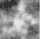
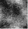
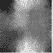
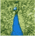

<!--yml

类别: 未分类

日期: 2024-09-06 19:50:09

-->

# [2111.04731] 深度学习方法在逆问题中的综述

> 来源：[`ar5iv.labs.arxiv.org/html/2111.04731`](https://ar5iv.labs.arxiv.org/html/2111.04731)

+   2020 年 9 月

# 深度学习方法在逆问题中的综述

Shima Kamyab，计算机科学与工程系，Shiraz University，伊朗 sh.kamyab@cse.shirazu.ac.ir    Zohreh Azimifar，计算机科学与工程系，Shiraz University，伊朗 azimifar@cse.shirazu.ac.ir    Rasool Sabzi，计算机科学与工程系，Shiraz University，伊朗 sabzi@cse.shirazu.ac.ir    Paul Fieguth，系统设计工程系，滑铁卢大学，加拿大 pfieguth@uwaterloo.ca

###### 摘要

在本文中，我们探讨了多种深度学习策略用于解决逆问题。我们将现有的深度学习解决方案分为直接映射、数据一致性优化器和深度正则化器三类。我们选择每种逆问题类型的样本，以比较这三类的鲁棒性，并报告它们差异的统计分析。我们在经典的线性回归问题和计算机视觉中的三个著名逆问题（即图像去噪、3D 人脸逆向渲染和目标跟踪）上进行了广泛的实验，这些问题被选为每类逆问题的代表性原型。总体结果和统计分析显示，解决方案类别的鲁棒性行为取决于逆问题领域的类型，特别是是否包括测量异常值。基于我们的实验结果，我们提出了每个逆问题类别的最鲁棒解决方案。

## 1 引言

逆问题[1, 2, 3]旨在制定估计测量系统中未知状态的解决方案。具体而言，前向函数$F(\cdot)$描述了测量输出的关系

|  | $\underline{m}=F(\underline{z})+\underline{\nu}$ |  | (1) |
| --- | --- | --- | --- |

作为系统状态$\underline{z}$的函数，受到测量噪声$\underline{\nu}$的影响。逆问题的目标是估计$\underline{z}$，作为给定测量$\underline{m}$的函数，假设对系统$F(\cdot)$有详细了解，如果$F(\cdot)$未知或部分已知，则问题变为盲目或半盲[4]。

不同的视角会导致不同类型的逆问题。从数据类型的角度来看，逆问题可以分为恢复和重建[5]，其中恢复问题在测量和状态具有相同的领域（例如，信号或图像去噪），而重建问题具有不同的领域（例如，3D 形状推断）。接下来，从建模的角度来看，逆问题分为静态问题和动态问题，其中静态情况寻找一个与某个先验模型和前向模型$F(\underline{z})$一致的单一估计$\underline{\hat{z}}$，而动态情况寻找随时间变化的估计$\underline{\hat{z}}(t)$，与初始先验和动态模型一致。本文将探讨这些逆问题。

现有的求解逆问题的分析方法利用领域知识来对问题进行正则化和约束，从而获得数值稳定的解。这些方法分为四类[5]：

+   •

    解析反演，目标是找到$F^{-1}$的闭式解，可能是近似解。此类别的解将高度依赖于具体问题。

+   •

    迭代方法，优化数据不一致项

    |  | $\min_{\underline{z}}\,\|\underline{m}-F(\underline{z})\|.$ |  | (2) |
    | --- | --- | --- | --- |

    由于大多数逆问题的病态特性，迭代往往具有半收敛的行为，重建误差在某个点之前减少，然后发散，需要适当的停止标准。

+   •

    正则化的离散化，包括在预定义的子空间中搜索逆问题的近似解。选择适当的子空间对找到稳定解具有重要影响。

+   •

    变分方法，旨在通过使用某些正则化器$R$参数化的最小化数据一致性：

    |  | $\min_{\underline{z}}\,\|\underline{m}-F(\underline{z})\| + R(\underline{z},\theta)$ |  | (3) |
    | --- | --- | --- | --- |

    这是一个通用的适应框架，其中$F(\cdot),R(\cdot,\cdot)$被选择以适应特定问题，其中著名的经典例子包括 Tikhonov [6] 和总变差 [7] 正则化。

这些方法的弱点在于需要明确识别的先验知识、选择的正则化器、处理噪声时的一些缺陷、由于基于优化机制的推断计算复杂性，以及最重要的有限适用性，即每个逆问题需要单独解决。

因此，我们非常有动力考虑深度神经网络（DNNs）的作用，它们具有通用数据驱动方法的优势，能够适应各种不同的问题，并且可以通过示例隐式学习先验模型。DNNs 目前在解决广泛的机器学习[8]、人工智能[9]和计算机视觉[10]问题中被广泛应用。使用这些结构的显著优势包括其几乎通用的适用性、实时推理[11, 12]和处理传感器和/或测量噪声的优越性[13]。

一些研究[14, 4]表明，经过计划和系统化的 DNNs 往往具有比通用架构更少的参数和更好的泛化能力，这激励我们在解决复杂逆问题时考虑系统化的策略。

从原则上讲，每个深度学习框架都可以被解读为解决某种逆问题，因为网络经过训练以获取测量数据，并从给定的真实数据中推断出所需的未知状态。例如，对于图像分类的常见 DNN 应用，输入是（测量的）图像，网络输出是（未知状态）标签，描述图像中出现的物体或场景。网络参数隐式地学习了正向模型的逆，正向模型是从标签生成图像。

使用深度神经网络（DNNs）来解决逆问题的目标是近似正向模型的逆[2]。在某些情况下，正向模型可能是明确定义的[15, 16, 14]，而在其他情况下，它可能以训练数据的形式隐式定义[17, 18, 19, 20, 15, 21, 22]。本文的重点是解决非盲逆问题，其中正向模型是已知的。无论是确定性的还是随机的逆问题分析方法，都利用明确的正向模型和先验知识来制定解决方案；相反，DNNs 不能利用这些信息，而必须通过黑箱方法从大量的训练数据中隐式学习。

受到上述技术的启发，文献中确实提出了许多深度框架，旨在将正则化技术或先验知识引入深度神经网络（DNN）学习过程，以解决反问题 [14, 16, 23, 24, 25, 26]。本文将针对反问题的深度解决方案分为三类，基于其目标标准进行比较，并在解决不同类型的反问题时进行比较。本文的重点是比较不同深度学习结构的鲁棒性，这些结构基于与训练方案相关的优化标准；也就是说，本研究的主要目标是提供有关选择适当框架的见解，特别是在性能鲁棒性方面。值得注意的是，我们的目标不是在不同问题上超越最先进的性能，而是以公平的参数设置检查不同的框架，并至少与现有的分析方法表现相当。使用这些框架，我们从每个类别中选择一个原型反问题，评估设计框架的性能和鲁棒性。我们相信，以这种方式获得的结果能够深入了解每个解决方案类别在处理不同类别反问题中的优势。

本文其余部分组织如下：第二部分包括对解决反问题的最新深度方法的综述；第三部分描述了问题定义，引入了反问题的三种主要深度解决方案类别；第四部分解释了实验结果，包括鲁棒性分析；最后，第六部分总结了本文，提出了基于我们实验的最佳方法。

## 2 文献综述

反问题在广泛的领域中有着悠久的历史 [27, 2, 3]。在我们的背景下，由于成像涉及通过镜头和空间传感器观察感兴趣的场景或现象，目标是推断被观察场景的某些方面，本质上所有的成像都是一个反问题，这在文献中被广泛探索 [1, 28, 29]。与成像相关的反问题可能包括图像恢复、修复、去卷积、全色融合、隐匿、修补、去块、去马赛克、超分辨率、从投影重建、压缩感知等多种类型。

逆问题最终是推断某个函数$G(\cdot)$，它能反转正向问题。

|  | $\underline{m}=F(\underline{z})+\underline{\nu}\qquad\longrightarrow\qquad\hat{\underline{z}}=G(\underline{m})$ |  | (4) |
| --- | --- | --- | --- |

在选择$G(\cdot)$时，显然需要指定某些目标准则。由于$G(\cdot)$非常大（一个输入图像有很多像素），未知且通常是非线性的，因此考虑 DNN 作为通用函数逼近器的角色来推断$G(\cdot)$变得越来越有吸引力，最近也提出了多种方法[4, 5, 30]。

使用 DNN 解决逆问题的最常见方法包括优化平方误差准则$||\underline{z}-G(\underline{m})||_{2}^{2}$，其中$G(\cdot)$是待学习的 DNN [17, 18, 19, 20, 15, 21, 22]。该策略隐含地从$\underline{m}$到$\hat{\underline{z}}$的直接映射，使用对$(\underline{z},\underline{m})$的配对作为学习阶段的训练数据，旨在解决

|  | $\hat{W}=\arg_{W}\min\,&#124;&#124;\underline{z}-G(\underline{m},W)&#124;&#124;_{2}^{2}$ |  | (5) |
| --- | --- | --- | --- |

其中$W$是 DNN 中的网络权重。这种监督训练需要大量的数据样本，在某些情况下，这些样本可能由正向函数$F(\cdot)$生成。

近期在直接映射方面的研究包括[31]，其中提出了一种编码器-解码器结构来直接解决临床正电子发射断层扫描（PET）图像重建问题。类似地，[32]提出了一种直接映射深度学习框架，根据壳体结构的最终损伤状态识别其冲击载荷条件，这是工程失效分析的一个逆问题。

近期研究探讨了将先验知识融入 DNN 解决方案以应对逆问题。特别是，DNN 权重的智能初始化和解析正则化技术构成了该领域现有工作的主要类别[4]。在[15]中，提出了一种无监督深度框架，使用生成对抗网络（GAN）在没有任何测量过程信息的情况下学习先验。在[33]中，使用了变分自编码器（VAE）来解决电阻抗断层扫描（EIT），这是一个非线性病态逆问题。VAE 使用各种训练数据集生成低维流形的近似解，从而将病态问题转化为良态问题。

前向模型提供了关于数据生成的知识，基于系统的物理原理。在[16]中，提出了一种迭代变分框架，用于解决线性计算机视觉逆问题，如去噪、修复和超分辨率。它提出了一种通用正则化器$R$，用于线性逆问题，该正则化器首先通过大量图像学习，然后将其纳入交替方向乘子法（ADMM）算法中进行优化：

|  | $min_{\underline{\hat{z}}}\;\tfrac{1}{2}&#124;&#124;\underline{m}-F\underline{\hat{z}}&#124;&#124;_{2}^{2}+\lambda R(\underline{\hat{z}},W)$ |  | (6) |
| --- | --- | --- | --- |

这里的正则化器$R(\cdot)$是从图像数据集中学习的，而$W$是网络权重矩阵，和以前一样。这里$F$是一个矩阵，即（假设为）线性前向模型。

在[34]中考虑了非线性前向模型的等效方法，其中将数据一致性项$D(F(\underline{\hat{z}}),\underline{m})$作为训练目标，将前向模型纳入问题中：

|  | $min_{\underline{\hat{z}}}\;\{D(F(\underline{\hat{z}}),\underline{m})+\lambda R(\underline{\hat{z}},W)\}$ |  | (7) |
| --- | --- | --- | --- |

在[35]中，提出了一种自监督深度学习框架，用于仅利用测量值和前向模型来训练 DNN 以解决医学成像中的逆问题。

进一步的 DNN 方法在[14]中被探讨，其中前向模型被明确用于迭代深度学习框架，相比于直接映射方法需要更少的参数。在[36]中，提出了一种用于 MRI 图像重建的迭代深度学习框架。[37]中的工作提出了一种无监督框架，用于解决 EIT 中的前向和逆问题。在[38]中，分析性的前向模型被直接用于确定 DNN 损失函数，产生了一种利用数据生成知识的无监督框架。其他方法利用从训练数据中学习到的前向模型估计来优化数据一致性[39]。

在[40]中提出的方法与我们的方法密切相关，旨在分析用于解决逆问题的深度学习结构，寻求理解神经网络在解决小规模逆问题中的应用。我们论文中的目标是对不同逆问题的深度学习框架进行分类，基于它们的目标和训练方案，调查每种方法在解决特定类型逆问题中的有效性。

## 3 问题定义

让我们考虑一个前向模型

|  | $\underline{m}=F(\underline{z})+\underline{\nu}\qquad\underline{\nu}\sim N(0,I)$ |  | (8) |
| --- | --- | --- | --- |

给定的噪声过程$\underline{\nu}$被假设为白噪声。解决的逆问题有两个基本类别：

+   •

    静态估计问题，其中系统状态$\underline{z}$是静态的，没有随时间变化[2]。我们将考虑以下静态问题：

    +   –

        图像恢复，属于一类逆问题，其中状态和测量空间相同（像素数量相同）。通常，测量是未知状态的受损版本，问题是从其受损版本中恢复真实信号的估计，同时知道（前向）失真模型。鲁棒性和异常值检测是这类逆问题的主要要求。

    +   –

        图像重建，旨在从某些测量空间找到与不同尺寸状态的投影，例如从二维场景重建三维形状。这些问题需要仔细的正则化来找到可行的解决方案。

+   •

    动态估计问题，其中$\underline{z}$在时间上受到动态和测量的影响[2]，例如在物体跟踪中。

我们的重点是将深度神经网络（DNNs）作为解决逆问题的数据驱动模型，因此我们希望将逆问题重新定义为统计学习理论中的例子学习背景[41]。我们需要两组变量：

|  | $\text{Inputs~{}~{}}\underline{m}\in M\qquad\text{Outputs~{}~{}}\underline{z}\in Z$ |  | (9) |
| --- | --- | --- | --- |

输入和输出之间的关系由概率分布$p(\underline{m},\underline{z})\in M\times Z$描述，其中分布仅通过有限的样本集，即训练集已知。

|  | $S=\{\underline{m}_{i},\underline{z}_{i}\}\qquad 1\leq i\leq N$ |  | (10) |
| --- | --- | --- | --- |

假定从$p$中独立同分布（i.i.d.）抽取。学习目标是找到一个函数$G(\underline{m})$，使其在给定输入$\underline{m}$的情况下适当地逼近输出$\underline{z}$。即，

|  | $\text{True}\;\underline{z}\;\approx\;\text{Estimated}\;\hat{\underline{z}}\;=\;G(\underline{m}&#124;S),$ |  | (11) |
| --- | --- | --- | --- |

使得$G(\cdot|S)$是在$S$的基础上学习得到的。

为了衡量估计函数$G$在推断由$p$描述的期望关系的有效性，可以使用期望条件误差：

|  | $I(G)=\int_{M\times Z}D\bigl{(}G(\underline{m}),\underline{z}\bigr{)}\,dp(\underline{z},\underline{m})$ |  | (12) |
| --- | --- | --- | --- |

其中$D(G(\underline{m}),\underline{z})$是成本或损失函数，测量将真实值$\underline{z}$近似为估计$G(\underline{m})$的相关成本。选择平方损失$(G(\underline{m})-\underline{z})^{2}$允许我们推导出

|  | $G(\underline{m})=\int_{Z}\underline{z}\,dp(\underline{z}&#124;\underline{m})=E_{p}[\underline{z}],$ |  | (13) |
| --- | --- | --- | --- |

经典的最优贝叶斯最小二乘估计器 [2]。在从示例中学习的情况下，（13）无法被精确重建，因为只给定了有限的示例集 $S$；因此，可以使用正则化最小二乘算法作为替代 [42, 43]，其中假设空间 $H$ 是固定的，估计 $G_{S}^{\lambda}$ 如下所示

|  | $G_{S}^{\lambda}=\arg_{G\in H}\min\left\{\sum_{i=1}^{N}D\bigl{(}G(\underline{m}_{i}),\underline{z}_{i}\bigr{)}+\lambda R\bigl{(}G(\underline{m}_{i})\bigr{)}\right\},$ |  | (14) |
| --- | --- | --- | --- |

其中 $R(\cdot)$ 是一个惩罚项，$\lambda$ 是正则化参数。我们可以选择 $\lambda$ 来最小化差异

|  | $\left\|I[G_{S}^{\lambda}]-\inf_{G\in H}I[G]\right\|,$ |  | (15) |
| --- | --- | --- | --- |

然而，通常通过交叉验证选择 $\lambda$ 会更简单且足够。

鉴于 $H$ 是可能逆函数的假设空间，在本文中，理解 $H$ 为深度神经网络能够学习的函数空间是相当合理的，基于优化其权重矩阵 $W$。基于优化标准 (14)，它实际上是泛函分析正则化理论中的变分框架 [44]，并形成了逆函数 DNN 学习的基础，我们根据优化标准和训练方案将深度学习框架分类为三类：

+   •

    直接映射

+   •

    数据一致性优化器

+   •

    深度正则化器

这些内容都被详细开发和定义，如下所述。

### 3.1 直接映射

直接映射类别被广泛用于深度学习基础的逆问题研究的目标标准 [17, 18, 19, 20, 15, 21, 22]。这些方法试图找到端到端的解决方案

|  | $\min_{W_{1}}\left\{\sum_{i=1}^{N}D\bigl{(}\underline{z},G(\underline{m},W_{1})\bigr{)}+\lambda R\bigl{(}G(\underline{m},W_{1})\bigr{)}\right\}$ |  | (16) |
| --- | --- | --- | --- |

其中 $D(\cdot,\cdot)$ 是由 DNN $G(\underline{m},W_{1})$ 最小化的成本函数，基于优化 DNN 权重 $W_{1}$。$R\bigl{(}G(\underline{m},W_{1})\bigr{)}$ 指定了一个通用的分析正则化器，以限制估计器到可行解。

直接映射类别将估计器 $G$ 近似为正向模型 $F$ 的逆，需要一组对 $\{(\underline{m}_{i},\underline{z}_{i})\}_{i}$ 的观测测量和对应目标系统参数的数据集，如图 1 所示。

图 1：深度学习逆问题的直接映射。

这一类别的 DNN 通常用于那些拥有线性前向模型$\underline{m}=F\underline{z}$的基于模型的成像系统的情况，其中$z$是图像，因此卷积网络（CNNs）几乎总是被使用。如前所述，对于图像恢复问题，测量本身已经是图像，然而在更一般的情况下，我们可能选择将测量投影为$F^{H}\underline{m}$，回到$\underline{z}$的领域，使 CNN 被训练来学习估计器。

|  | $\underline{\hat{z}}=G(F^{H}\underline{m},W_{1})$ |  | (17) |
| --- | --- | --- | --- |

$F^{H}F$的平移不变性在成像逆问题中相对常见，使得卷积核特性使 CNNs 特别适合作为这些问题的估计器。

一般来说，直接反演的性能非常出色[4]。然而，CNN 的感受野（即单位在其输入层上具有的视场大小）应与点扩散函数的支持相匹配[14]。因此，这一类别的方法通常需要具有大量参数的大型 CNN，并且需要相应的较长训练时间和数据。这些 DNN 高度依赖于问题，对于不同的前向模型（例如，不同的矩阵大小、分辨率等），需要学习新的 DNN。

### 3.2 数据一致性优化器

深度学习中的数据一致性优化器类别旨在通过变分框架中的无监督标准优化数据一致性[14, 38]：

|  | $\min_{W_{2}}\left\{\sum_{i=1}^{N}D\Bigl{(}\underline{m},F\bigl{(}G(\underline{m},W_{2})\bigr{)}\Bigr{)}+\lambda R\bigl{(}G(\underline{m},W_{2})\bigr{)}\right\}$ |  | (18) |
| --- | --- | --- | --- |

其中，如(16)中所述，$D(\cdot,\cdot)$是由权重$W_{2}$参数化的 DNN $G(\underline{m},W_{2})$需要最小化的代价函数，受到正则化器$R\bigl{(}G(\underline{m},W_{1})\bigr{)}$的约束。总体情况总结在图 2 中。

与 (16) 中网络成本函数 $D$ 表示在未知量 $\underline{z}$ 的空间中不同，这里 (18) 将成本表达在测量空间 $\underline{m}$ 中，基于前向模型 $F(\cdot)$。即，数据一致性项不再从监督示例中学习，而是从前向模型中获得无监督数据一致性项，不需要数据标签，前向模型提供某种形式的隐式监督。

与直接映射类别相比，使用 (18) 中的前向模型导致网络参数相对较少，部分原因是 DNN 的感受野不需要匹配点扩散函数的支持。然而，逆问题的不适定性导致使用该准则时出现半收敛行为 [5]，因此在学习过程中需要采用早期停止正则化。

图 2：数据一致性优化，其中前向模型被纳入 DNN 的损失函数中，并在 DNN 训练期间使用。

### 3.3 深度正则化器

最终，深度正则化器类别的深度学习方法继续优化数据一致性项，但整体优化过程以分析变分框架的形式进行，并使用 DNN 作为正则化器 [16, 34]：

|  | $\min_{\underline{\hat{z}}}\left\{\sum_{i=1}^{N}D\bigl{(}\underline{m},F(\underline{\hat{z}})\bigr{)}+\lambda R(\underline{\hat{z}},W_{3})\right\}$ |  | (19) |
| --- | --- | --- | --- |

这里 $R(\underline{\hat{z}},W_{3})$ 是一个基于权重矩阵 $W_{3}$ 的预训练深度正则化器，通常选择为深度分类器 [16, 34]，用于区分可行解与不可行解。

这个类别通常包括一个分析变分框架，由数据一致性项和一个学习的 DNN 组成，以捕捉参数空间中的冗余（见图 3）。

图 3：逆问题的深度正则化类别，其中 DNN 仅作为分析变分框架的一部分用作正则化器。

对于这个类别，实际上使用了迭代算法（深度或解析）来执行(19)的优化。正则化网络本身是使用特定领域的数据来训练的。与前面的类别相比，深度正则化类别需要最少的参数设置；然而，由于基于优化的推断步骤，它要求计算量较大。

## 4 个实验

本文的重点是研究推断过程中存在的噪声和异常值对解的鲁棒性的影响。本节探讨了实验结果，针对每个基本的反问题类别（恢复、重建、动态估计）和每个解的类别（直接映射（DM）、数据一致性优化器（DC）、深度正则化（DR）），如第三部分所述。我们的研究基于 Wilcoxon 符号秩检验[45]的统计分析，这是一个用于分析深度学习框架的著名工具。零假设是 DM、DC 和 DR 的每个两两组合的结果来自相同的分布，即结果没有显著差异。实验结果基于以下问题：

+   •

    线性回归：一个重建问题，目标是从噪声/异常值样本点中找到线的参数。

+   •

    图像去噪：一个恢复问题，目标是从有噪声的观测中恢复出一个干净的图像。我们使用了合成纹理图像和真实图像。

+   •

    单视角 3D 形状反渲染：一个重建问题，其中测量和系统参数的域是不同的。测量包括一组有限的 2D 点（输入图像的标志点），其中未知状态需要恢复，即一个 3D 可塑模型（3DMM）。我们使用了一个基于主成分分析得到的人脸的 3D 模型。

+   •

    单目标跟踪：一个动态估计问题，目标是根据先前帧中的（有噪声的）位置来预测移动目标的位置（系统参数）。虽然这个问题似乎属于恢复问题的类别，但这个问题中的嵌入状态需要对时间动态性做出额外的假设，因此需要额外的搜索策略。

所有的深度神经网络都是使用 KERAS 库[46]和 ADAM 优化器[47]在 NVIDIA GeForce GTX 1080 Ti 上实现的。各个训练的深度神经网络的结构和细节可以在相应的子节中找到。表 1 总结了所有问题的整体实验设置。

| 逆问题 | 测量数据 | 未知参数 | 正向模型 | 训练数据 |
| --- | --- | --- | --- | --- |

|

&#124; 线性回归 &#124;

&#124; （重建） &#124;

|

&#124; 2D 坐标 &#124;

&#124; N 个抽样 &#124;

&#124; 来自于直线 &#124;

| 斜率，截距 |
| --- |

&#124; 直线 &#124;

&#124; 加噪声 &#124;

|

&#124; 合成: &#124;

&#124; $\{(y_{i},x_{i})\}$ &#124;

&#124; 包括高斯噪声 &#124;

&#124; 带有重尾异常值 &#124;

|

|

&#124; 图像去噪 &#124;

&#124; （恢复） &#124;

|

&#124; 噪声图像 &#124;

|

&#124; 清晰图像 &#124;

| 图像加噪声 |
| --- |

&#124; 合成: &#124;

&#124; 5000 灰度级 &#124;

&#124; 纹理图像 ($64\times 64$) &#124;

&#124; 来自于平稳随机过程 [2] &#124;

&#124; 包括指数分布 &#124;

&#124; 像素异常值的数量 &#124;

&#124; 带有重尾 &#124;

&#124; 分布 &#124;

|

|

&#124; 3D 形状渲染 &#124;

&#124; （重建） &#124;

|

&#124; 标准 $2D$ 标记 &#124;

&#124; 在输入脸部图像上 &#124;

|

&#124; 的参数 &#124;

&#124; BFM 3D 模型 &#124;

|

&#124; 噪声投影 &#124;

&#124; 从 3D 到 2D &#124;

|

&#124; 合成: &#124;

&#124; 2D 上的 72 个标记 &#124;

&#124; 3D 人体的输入图像 &#124;

&#124; 由 Besel 生成的脸部 &#124;

&#124; 脸部模型（BFM） [48] &#124;

&#124; 包括 $5\%$ 异常值 &#124;

&#124; 在输入 2D 标记中的 &#124;

|

|

&#124; 单一对象跟踪 &#124;

&#124; （动态估计） &#124;

|

&#124; 球的噪声位置 &#124;

&#124; 在板上 &#124;

&#124; 从 $n$ 个前一时间步到当前步 &#124;

|

&#124; 球的真实位置 &#124;

|

&#124; 真实对象位置 &#124;

&#124; 加噪声 &#124;

|

&#124; 合成: &#124;

&#124; 序列 &#124;

&#124; 移动球的位置 &#124;

&#124; 具有不同的随机初始状态和可变速度 &#124;

&#124; 包括高斯噪声 &#124;

&#124; 对所有测量值。 &#124;

|

表 1: 我们实验中考虑的四种逆问题。

### 4.1 线性回归

我们从一个极其简单的逆问题开始。考虑一组一维样本 $\{(x^{(i)},m_{y}^{(i)})\}_{i=1}^{N}$，受噪声影响，其中一些训练数据受更极端的异常值影响，如图 4 所示。

图 4: 线性回归的一维样本点，带有高斯噪声和偶尔的大异常值。

作为一个逆问题，我们需要定义正向模型，对于线性回归，正向模型就是

|  | $\underline{m}_{y}=\alpha\underline{x}+\beta+\underline{\nu}.$ |  | (20) |
| --- | --- | --- | --- |

由于我们的兴趣在于评估结果逆解器的鲁棒性，因此异常值的数量和行为应当相当不规则，以便让网络从训练数据中进行泛化变得具有挑战性。因此，噪声$\underline{\nu}$是随机方差，加上重尾（幂律）异常值，其中异常值的数量服从指数分布。

对于这个逆问题，未知状态由系统参数$\underline{z}^{T}=[\alpha,\beta]$组成。因此，线性回归变成了一个重建问题，其目标是从包含噪声和异常值数据点的样本集中恢复直线参数。

在问题定义完成后，我们接下来需要为每个解决方案类别制定一个方法。对于直接映射（DM）和数据一致性（DC），训练数据和 DNN 结构是相同的，如图 5 所示，其中 DC 方法包括一个额外的层，该层应用给定的前向模型（见 20）。我们使用了 KERAS 库，其中设计了一个 Lambda 层用于此前向操作。

由于问题是一维的且空间结构有限，网络仅包含密集的前馈层。使用残差块以便允许梯度在深度神经网络（DNN）中流动，并改善训练。网络训练基于 1000 条记录，每条记录包含$N=500$个有噪声的样本点。

图 5: 线性回归的 DM 和 DC 解决方案的 DNN 结构。每一层的层类型和神经元数量在每层下方报告。请注意，在 DC 情况下，还有一个额外的 Lambda 层，该层从预测的直线参数计算前向函数。

深度正则化器（DR）类别需要不同的问题建模方案，因为没有像 DM 和 DC 那样的学习阶段。相反，只训练一个 DNN（通常是分类器），以便在变分优化框架中作为正则化器。DNN 正则化器接收系统参数$(\alpha,\beta)$并确定这些参数是否表示一个可行的直线。在这里，我们定义可行直线为在某个指定范围内有切线的直线。我们生成了一组合成的系统参数及其标签，用于训练一个全连接的 DNN 作为此类别的正则化器。由于我们关注的是逆问题的 DNN 解决方案，而不是优化的细节，我们选择了两种相当标准的优化方法，一种是单纯形/内尔德-米德方法[49]，另一种是遗传算法（GA）策略，这两者都基于各自的 Matlab 实现。由于 GA 解决方案在多次运行中可能不同，我们报告了在十次独立运行中平均的结果。

表格 2 显示了每个类别在 DM 和 DC 上经过 10 次独立训练，以及在 DR 上经过 10 次独立推断后找到的平均解决方案。该表还报告了最小二乘（LS）结果作为参考方法，特别是为了展示深度学习方法在解决逆问题时所提供的鲁棒性提升。观察到，当 DNN 方法在无噪声数据上进行训练时，与在有噪声数据上训练相比，显著的差异表明噪声训练数据迫使网络获得对离群值的鲁棒性。

对于 DR，我们训练了一个 5 层的多层感知机（MLP），其密集层的大小为$5,4,3,2,1$，作为正则化器，使用生成的合成数据，其中包含可行的线参数（在特定范围内）作为正训练样本，无效的线参数作为负训练样本。训练的正则化器的平均测试准确率为$95.70\%$。

表 2：三种 DNN 类别估计线的误差，与最小二乘方法进行比较，参数取自 10 次独立训练/推断运行的平均值。

| 训练数据 | 测量 &#124; 方法 | DM | DC | DR-GA | DR-NM ($z_{0}=[0,0]$) | LS |
| --- | --- | --- | --- | --- | --- | --- |
| 含噪声 + 离群值 | 误差（斜率） | $\mathbf{0.23\pm 1.37}$ | $0.30\pm 1.27$ | $0.96\pm 0.03$ | $0.90\pm 0$ | $0.61\pm 2.10$ |
| 误差（截距） | $0.15\pm 1.68$ | $\mathbf{0.06\pm 1.59}$ | $1.13\pm 0.04$ | $1.09\pm 0$ | $0.22\pm 3.00$ |
| 无噪声 | 误差（斜率） | $1.50\pm 2.08$ | $1.26\pm 1.45$ | $0.96\pm 0.03$ | $0.90\pm 0$ | $\mathbf{0.61\pm 2.09}$ |
| 误差（截距） | $0.32\pm 1.85$ | $0.32\pm 1.38$ | $1.13\pm 0.04$ | $1.09\pm 0$ | $\mathbf{0.21\pm 3.00}$ |

我们进行了 Wilcoxon 符号秩检验，适用于噪声数据训练（表 3）和无噪声训练（表 4）。这些表格显示了 10 次独立运行中的配对 p 值。$p-value$超过$0.05$表示这两种方法可能来自同一分布；特别是，Wilcoxon 检验计算了两种方法结果之间差异来自中位数为零的分布的概率。显然，所有 DNN 方法在统计上都与最小二乘（LS）结果显著不同。对于噪声训练数据，表 3 中的统计结果显示 DM 和 DC 的性能相似，对于 DR-NM 和 DR-GA，它们的相似性表明，具体的优化方法选择对 DR 性能没有显著影响。

表 3：使用噪声和异常值数据进行训练和测试时，线性回归问题的 Wilcoxon 符号秩检验 p 值。我们使用 500 个测试样本在每种方法的 10 次独立训练/推断步骤上进行统计分析。

|

&#124; p-value &#124;

&#124; (Wilcoxon 测试) &#124;

| DM | DC | DR-GA | DR-NM | LS |
| --- | --- | --- | --- | --- |
| DM | - | 0.695 | 0.002 | 0.002 | 0.002 |
| DC | 0.695 | - | 0.002 | 0.002 | 0.002 |
| DR-GA | 0.002 | 0.002 | - | 0.781 | 0.002 |
| DR-NM | 0.002 | 0.002 | 0.781 | - | 0.002 |
| LS | 0.002 | 0.002 | 0.002 | 0.002 | - |

表 2 的结果显示，与使用无噪声数据进行训练相比，使用噪声数据训练时，DM 和 DC 在鲁棒性方面显著提高。DM/DC 与 DR 之间的主要区别在于 DM/DC 的学习阶段，使我们可以得出结论，至少对于重建问题而言，使用噪声样本进行训练的学习阶段显著提高了解决方案的鲁棒性。进一步观察发现，虽然 DM 和 DC 的表现相似，但 DC 是无监督的，而 DM 是有监督的。因此，前向模型知识和数据一致性项作为 DC 的目标标准提供了与 DM 中的有监督学习相等的鲁棒性。

|

&#124; p-value &#124;

&#124; (Wilcoxon 测试) &#124;

| DM | DC | DR-GA | DR-NM | LS |
| --- | --- | --- | --- | --- |
| DM | - | 0.002 | 0.002 | 0.002 | 0.002 |
| DC | 0.002 | - | 0.002 | 0.002 | 0.002 |
| DR-GA | 0.002 | 0.002 | - | 0.781 | 0.002 |
| DR-NM | 0.002 | 0.002 | 0.781 | - | 0.002 |
| LS | 0.002 | 0.002 | 0.002 | 0.002 | - |

表 4：类似于表 3，但现在使用的是无噪声数据，即没有任何噪声或异常值用于方法训练。噪声和异常值数据仍用于测试。

对于这个重建问题，我们得出结论，DC 和 DM 的表现都很好，其中无监督的 DC 在噪声和无噪声训练数据上都表现出强劲的性能。

### 4.2 图像去噪（恢复）

现在我们考虑一个图像去噪问题，按照第 4.1 节中描述的回归步骤进行。我们考虑实际图像和合成图像，包括 5 个类别和 1200 张训练图像，每个类别 400 张测试图像，来自 Linnaeus 数据集 [50] 作为实际数据，以及通过从平稳周期核采样生成的 5000 张纹理图像，作为合成数据。

合成图像是使用 FFT 方法 [2] 生成的，基于薄板二阶 Gauss-Markov 随机场核

|  | <math alttext="{\cal P}=\left[\begin{array}[]{ccccc}0&amp;0&amp;1&amp;0&amp;0\\ 0&amp;2&amp;-8&amp;2&amp;0\\

1&amp;-8&amp;20+\alpha^{2}&amp;-8&amp;1\\

0&amp;2&amp;-8&amp;2&amp;0\\

0&amp;0&amp;1&amp;0&amp;0\\

\end{array}\right]" display="block"><semantics ><mrow ><mi >𝒫</mi><mo  >=</mo><mrow ><mo >[</mo><mtable columnspacing="5pt" displaystyle="true" rowspacing="0pt"  ><mtr ><mtd  ><mn >0</mn></mtd><mtd ><mn  >0</mn></mtd><mtd ><mn  >1</mn></mtd><mtd ><mn  >0</mn></mtd><mtd ><mn  >0</mn></mtd></mtr><mtr ><mtd  ><mn >0</mn></mtd><mtd ><mn  >2</mn></mtd><mtd ><mrow  ><mo >−</mo><mn >8</mn></mrow></mtd><mtd ><mn  >2</mn></mtd><mtd ><mn  >0</mn></mtd></mtr><mtr ><mtd  ><mn >1</mn></mtd><mtd ><mrow  ><mo >−</mo><mn >8</mn></mrow></mtd><mtd ><mrow  ><mn >20</mn><mo >+</mo><msup  ><mi >α</mi><mn >2</mn></msup></mrow></mtd><mtd ><mrow  ><mo >−</mo><mn >8</mn></mrow></mtd><mtd ><mn  >1</mn></mtd></mtr><mtr ><mtd  ><mn >0</mn></mtd><mtd ><mn  >2</mn></mtd><mtd ><mrow  ><mo >−</mo><mn >8</mn></mrow></mtd><mtd ><mn  >2</mn></mtd><mtd ><mn  >0</mn></mtd></mtr><mtr ><mtd  ><mn >0</mn></mtd><mtd ><mn  >0</mn></mtd><mtd ><mn  >1</mn></mtd><mtd ><mn  >0</mn></mtd><mtd ><mn  >0</mn></mtd></mtr></mtable><mo >]</mo></mrow></mrow><annotation-xml encoding="MathML-Content" ><apply  ><ci >𝒫</ci><apply ><csymbol cd="latexml"  >delimited-[]</csymbol><matrix ><matrixrow ><cn type="integer"  >0</cn><cn type="integer"  >0</cn><cn type="integer"  >1</cn><cn type="integer"  >0</cn><cn type="integer"  >0</cn></matrixrow><matrixrow ><cn type="integer" >0</cn><cn type="integer" >2</cn><apply  ><cn type="integer"  >8</cn></apply><cn type="integer"  >2</cn><cn type="integer"  >0</cn></matrixrow><matrixrow ><cn type="integer" >1</cn><apply  ><cn type="integer"  >8</cn></apply><apply ><cn type="integer" >20</cn><apply  ><csymbol cd="ambiguous"  >superscript</csymbol><ci >𝛼</ci><cn type="integer" >2</cn></apply></apply><apply ><cn type="integer" >8</cn></apply><cn type="integer" >1</cn></matrixrow><matrixrow ><cn type="integer"  >0</cn><cn type="integer"  >2</cn><apply ><cn type="integer" >8</cn></apply><cn type="integer" >2</cn><cn type="integer" >0</cn></matrixrow><matrixrow ><cn type="integer"  >0</cn><cn type="integer"  >0</cn><cn type="integer"  >1</cn><cn type="integer"  >0</cn><cn type="integer"  >0</cn></matrixrow></matrix></apply></apply></annotation-xml><annotation encoding="application/x-tex" >{\cal P}=\left[\begin{array}[]{ccccc}0&0&1&0&0\\ 0&2&-8&2&0\\ 1&-8&20+\alpha^{2}&-8&1\\ 0&2&-8&2&0\\ 0&0&1&0&0\\ \end{array}\right]</annotation></semantics></math> |  | (21) |

这样，通过在频域中反转核来找到纹理$T$，

|  | $T=FFT^{-1}_{2}\left(\sqrt{1\oslash FFT_{2}({\cal P})}\odot FFT_{2}(W)\right),$ |  | (22) |
| --- | --- | --- | --- |

使用$\odot,\oslash$作为逐元素乘法和除法，$W$为单位方差的白噪声，并将核${\cal P}$零填充至目标大小$T$。关于这种方法的进一步细节可以在[2]中找到。

参数 $\alpha^{2}$，影响核 $\cal P$ 的中心元素，有效地决定了 $T$ 中的纹理空间相关长度，如下所示

|  | $\displaystyle\alpha^{2}=10^{4-log_{10}u}$ |  | (23) |
| --- | --- | --- | --- |

对于过程相关长度 $u$，以像素为单位。在我们的实验中，我们将 $u$ 设置为范围 $[10,200]$ 内的随机整数。

所有图像均设置为 $64\times 64$ 的大小，像素值归一化到 $[0,1]$。像素受到加性高斯噪声的污染，外点数呈指数分布。逆问题是一个恢复问题，其目标是从噪声/外点观察中恢复原始图像。线性前向模型为

|  | $\underline{m}=\underline{z}+\underline{\nu}$ |  | (24) |
| --- | --- | --- | --- |

对于测量的、原始的和添加的噪声，分别为。高斯噪声 $\nu$ 具有零均值和随机方差，并且一定数量的像素成为外点，其值被均匀分布的随机强度值所替代。

我们使用了 5000 个训练样本和 500 个测试样本来进行 DM 和 DC 方法的学习和评估阶段。DM 和 DC 的 DNN 结构相同，如图 6 ‣ 4 Experiments ‣ Survey of Deep Learning Methods for Inverse Problems") 所示。在 DC 的情况下，我们设计了一个 DNN 层来计算前向函数。由于我们处理的是输入图像，无论是作为测量还是系统状态，我们设计了一个完全卷积的 DNN，采用编码器-解码器结构，通过编码找到图像中的主要结构，并通过解码恢复图像。由于编码过程中可能会有信息丢失，我们引入了跳跃连接以帮助保留有用的信息。

图 6：用于 DM 和 DC 解决方案的 DNN。我们有一个完全卷积的 DNN，采用编码器-解码器结构，其中括号中的值表示相应卷积层的步幅值。跳跃连接有助于恢复在编码过程中可能丢失的有用信息。

DR 类别需要一个预训练的正则化器，用于确定预测是否为可行的纹理图像。我们训练了一个纹理分类器，生成方法使用了 (22 ‣ 4 Experiments ‣ Survey of Deep Learning Methods for Inverse Problems"))，该分类器是从网络上收集的普通图像中生成的，作为正则化器。使用了 GA 和 Nelder-Mead 优化器。

我们使用峰值信噪比（PSNR）作为评估标准，计算公式为

|  | $\displaystyle\text{PSNR}(I^{\text{pred}},I^{\text{GT}})=20\cdot log_{10}\max(I^{\text{pred}})-10\cdot log_{10}\text{MSE},$ |  | (25) |
| --- | --- | --- | --- |
|  | $\displaystyle\text{MSE}=\frac{1}{n}\sum_{i,j}(I^{\text{GT}}_{i,j}-I^{\text{pred}}_{i,j})^{2}$ |  | (26) |

其中 $I^{\text{GT}}_{i,j}$, $I^{\text{pred}}_{i,j}$ 分别表示 Ground truth 和 predicted images 的 $(i,j)^{th}$ 像素。需要注意的是，在 DR 的情况下，由于模型的输入和输出是 $64*64=4096$ 张图像，GA 优化算法无法在合理的时间内找到解决方案，因此我们没有报告 DR-GA 在这个问题上的任何结果。

作为参考，我们还报告了非局部均值（NLM）滤波器[51]得到的结果，以便了解深度学习逆问题方法相比于图像去噪领域中已经确立的标准有多大的改进。

图 7 显示了基于合成纹理的结果。图中的每一行显示与特定相关长度噪声标准差相关联的样本图像。在 DNN 方法中，DM 方法在重建方面远远优于其他方法，并在 PSNR 方面优于非局部均值滤波器。DR-GA 中 GA 的时间复杂度使得它在处理规模较大的问题时不适用（尽管图像的大小仍然相当适中）。

| u | $\sigma$ | 清晰图像 | 输入图像（带噪） | DM | DC | DR-NM | NLM |
| --- | --- | --- | --- | --- | --- | --- | --- |
| $10$ | $0.2$ |  |  |  |  |  |  |
| $50$ | $0.2$ |  |  |  |  |  |  |
| $150$ | $0.2$ |  |  |  |  |  |  |
| $200$ | $0.2$ |  |  |  |  |  |  |
| $100$ | $0.1$ |  |  |  |  |  |  |
| $100$ | $0.2$ |  |  |  |  |  |  |
| $100$ | $0.3$ |  |  |  |  |  |  |
|  |  | 平均 PSNR |

&#124; $19.75$ &#124;

&#124; $(\pm 9.52)$ &#124;

|

&#124; $\mathbf{29.24}$ &#124;

&#124; $\mathbf{(\pm 2.25)}$ &#124;

|

&#124; $19.81$ &#124;

&#124; $(\pm 7.71)$ &#124;

|

&#124; $19.75$ &#124;

&#124; ($\pm 9.52$) &#124;

|

&#124; $28.48$ &#124;

&#124; ($\pm 5.42$) &#124;

|

图 7：合成纹理上的图像去噪结果。每种情况下仅显示一张图像，但底部报告的平均 PSNR 是在整个测试集上计算的。给定的噪声图像既受加性噪声又受异常值影响。右侧列中的 NLM 是非局部均值滤波器，是图像处理中的一种标准方法。

对 DM、DC 和 DR-(Nelder-Mead) 结果进行了 Wilcoxon 符号秩检验。对获得结果的统计分析显示每对比较的 $p$ 值为 0.002，表明存在统计显著差异，从而验证了图 7 中 DM 的非常强性能。

对于真实图像，图 8 显示了 DM、DC 和 DR-NM 对七个测试样本获得的视觉结果。

| 清晰图像 | 输入图像（有噪声） | DM | DC | DR-NM | NLM |
| --- | --- | --- | --- | --- | --- |
|  |  |  |  |  |  |
|  |  |  |  |  |  |
|  |  |  |  |  |  |
|  |  |  |  |  |  |
|  |  |  |  |  |  |
|  |  |  |  |  |  |
|  |  |  |  |  |  |
| 平均 PSNR |

&#124; $19.75$ &#124;

&#124; $(\pm 8.20)$ &#124;

|

&#124; $\mathbf{24.70}$ &#124;

&#124; $\mathbf{(\pm 2.41)}$ &#124;

|

&#124; $23.86$ &#124;

&#124; $(\pm 5.30)$ &#124;

|

&#124; $19.75$ &#124;

&#124; ($\pm 8.20$) &#124;

|

&#124; $24.38$ &#124;

&#124; ($\pm 4.93$) &#124;

|

图 8：如图 7 ‣ 4 Experiments ‣ Survey of Deep Learning Methods for Inverse Problems")所示，但这里是对 Linnaeus 数据集的去噪结果。最后一行报告的平均 PSNR 是对所有测试图像计算的。与图 7 ‣ 4 Experiments ‣ Survey of Deep Learning Methods for Inverse Problems")相同，DM 结果显著优于其他 DNN 逆解算器和非局部均值（NLM）。

统计分析与合成纹理案例中的结果一致，即所有成对 Wilcoxon 检验均得出统计显著差异的结论，$p$ 值远低于 $0.05$。

从图 7 ‣ 4 Experiments ‣ Survey of Deep Learning Methods for Inverse Problems")和图 8 ‣ 4 Experiments ‣ Survey of Deep Learning Methods for Inverse Problems")及其各自的统计分析结果中，我们得出结论：

+   •

    对于图像去噪作为恢复问题的原型，其测量和系统参数空间相同，损失函数对真实参数的集中（如 DM 中所示）提供了更好的信息，并且导致比测量本身（如 DC 中所示）更有效的估计器，具有更大的鲁棒性。

+   •

    DR-(Nelder-Mead)表现不佳，尽管它优化了数据一致性，类似于 DC，但我们认为，相比于 DR，DC 中的学习阶段为其推断提供了知识，使 DC 在恢复逆问题中比 DR 更具鲁棒性。

### 4.3 3D 形状逆渲染（重建）

我们现在希望测试一个 3D 形状逆渲染（IR）[48] 问题，其中一个 3D 可变形模型（3DMM）[52] 描述了人脸的 3D 形状 $\underline{s}$。该模型基于从一组 3D 面部形状中提取特征脸 $\underline{s}_{i}$，通常使用 PCA，然后通过特征脸的加权组合 $z_{i}$ 获得新面孔。3D 形状模型在齐次坐标系下重建 3D 面孔为

|  | $\underline{s}=\underline{\bar{s}}+\sum_{i=1}^{n}z_{i}\underline{s}_{i},$ |  | (27) |
| --- | --- | --- | --- |

其中，$\underline{\bar{s}}$ 是 3DMM 的平均形状，$z_{i}$ 是特征脸 $\underline{s}_{i}$ 的权重。我们在此实验中使用 Besel 面部模型[48]作为 3DMM，每个面部形状中有 $N=54390$ 个 3D 点和 199 个特征脸。因此，我们可以将(27 ‣ 4 Experiments ‣ Survey of Deep Learning Methods for Inverse Problems"))重写为

|  | $\underline{s}_{N}=\underline{\bar{s}}_{N}+\underline{z}^{T}*S_{N}$ |  | (28) |
| --- | --- | --- | --- |

其中$S$是$199$个特征脸的张量。在我们的实验中，每张面孔都由 72 个标准地标来表征，如图 9 所示，这些地标被标准化后作为测量值输入系统。因此，我们实际上只关心$L=72$个地标点，而不是 3DMM 中的$N=54390$个 3D 点。这个实验通过从输入的 2D 地标找到 3DMM 的权重$\underline{z}$，来解决 3D 人脸的重建问题。我们通过对 3DMM 权重赋予随机值生成了训练数据，从而得到一个 3D 人脸，并使用正射投影将获得的 3D 形状渲染成 2D 图像。

图 9：样本人脸的 2D 图像上的 72 个标准地标的位置和顺序。

测量噪声由 2D 地标的微小扰动组成，其中离群值是更大规模的地标扰动。我们在训练数据中添加了标准差为$3\times 10^{3}$的零均值高斯噪声，在测试数据中则添加了标准差为$5\times 10^{3}$的噪声。离群值要大得多，标准差为$5\times 10^{4}$，被添加到 72 个地标中的 10 个，在训练数据的$10\%$和测试数据的$20\%$中。地标点坐标的范围是$[-8\times 10^{4},8\times 10^{4}]$，因此离群值的幅度非常大。

让下标[L]表示地标点索引的集合，在这种情况下，前向模型是正射投影

|  | <math alttext="\underline{m}=C\underline{s}_{L}+\underline{\nu}\qquad C=\left[\begin{array}[]{cccc}1&amp;0&amp;0&amp;0\\ 0&amp;1&amp;0&amp;0\\

0&0&0&0\end{array}\right]" display="block"><semantics ><mrow ><mrow ><munder accentunder="true" ><mi  >m</mi><mo >¯</mo></munder><mo >=</mo><mrow ><mrow  ><mi >C</mi><mo lspace="0em" rspace="0em"  >​</mo><msub ><munder accentunder="true" ><mi >s</mi><mo >¯</mo></munder><mi >L</mi></msub></mrow><mo >+</mo><munder accentunder="true" ><mi  >ν</mi><mo >¯</mo></munder></mrow></mrow><mrow ><mi >C</mi><mo  >=</mo><mrow ><mo >[</mo><mtable columnspacing="5pt" displaystyle="true" rowspacing="0pt"  ><mtr ><mtd  ><mn >1</mn></mtd><mtd ><mn  >0</mn></mtd><mtd ><mn  >0</mn></mtd><mtd ><mn  >0</mn></mtd></mtr><mtr ><mtd  ><mn >0</mn></mtd><mtd ><mn  >1</mn></mtd><mtd ><mn  >0</mtd><mtd ><mn  >0</mn></mtd></mtr><mtr ><mtd  ><mn >0</mn></mtd><mtd ><mn  >0</mn></mtd><mtd ><mn  >0</mn></mtd><mtd ><mn  >0</mn></mtd></mtr></mtable><mo >]</mo></mrow></mrow></mrow><annotation-xml encoding="MathML-Content" ><apply  ><csymbol cd="ambiguous"  >formulae-sequence</csymbol><apply ><apply ><ci  >¯</ci><ci >𝑚</ci></apply><apply ><apply ><ci  >𝐶</ci><apply ><csymbol cd="ambiguous" >subscript</csymbol><apply ><ci >¯</ci><ci >𝑠</ci></apply><ci >𝐿</ci></apply></apply><apply ><ci  >¯</ci><ci >𝜈</ci></apply></apply></apply><apply ><ci >𝐶</ci><apply  ><csymbol cd="latexml"  >delimited-[]</csymbol><matrix ><matrixrow ><cn type="integer"  >1</cn><cn type="integer"  >0</cn><cn type="integer"  >0</cn><cn type="integer"  >0</cn></matrixrow><matrixrow ><cn type="integer" >0</cn><cn type="integer" >1</cn><cn type="integer" >0</cn><cn type="integer" >0</cn></matrixrow><matrixrow ><cn type="integer"  >0</cn><cn type="integer"  >0</cn><cn type="integer"  >0</cn><cn type="integer"  >0</cn></matrixrow></matrix></apply></apply></apply></annotation-xml><annotation encoding="application/x-tex" >\underline{m}=C\underline{s}_{L}+\underline{\nu}\qquad C=\left[\begin{array}[]{cccc}1&0&0&0\\ 0&1&0&0\\ 0&0&0&0\end{array}\right]</annotation></semantics></math> |  | (29) |

使得$C$将同质 3D 坐标转换为同质 2D 坐标，测量噪声为

|  | $\underline{\nu}\sim 0.9N(0,3\times 10^{3}I)+0.1N(0,5\times 10^{4}I)$ |  | (30) |
| --- | --- | --- | --- |

作为与投影算子相关的噪声和离群值。由于此逆问题的目标是在给定的 3D 形状中估计$\underline{z}$，我们写作（29）为

|  | $\underline{m}=C(\underline{\bar{s}}_{L}+\underline{z}^{T}*S_{L})+\underline{\nu}$ |  | (31) |
| --- | --- | --- | --- |

对于 DM 和 DC 解决方案，我们生成了 4000 个样本面孔作为训练数据，使用 Besel 面孔模型[48]作为 3DMM。DR 正则化器是一个经过预训练的分类器，用于区分可行的 3D 形状与其随机扭曲版本。

在 DC 中，我们实现了如[48]所述的前向函数层，结果 DM 和 DC DNN 如图 10 ‣ 4 Experiments ‣ Survey of Deep Learning Methods for Inverse Problems")所示，其中我们使用了前馈层，因为系统输入是向量化的$72$个 2D 齐次坐标，输出是一个权重向量。我们为 DNN 设计了一个编码器-解码器结构，以将 2D 坐标映射到低维空间，并从该低维表示中恢复参数。

图 10：用于 3D 形状逆向渲染的 DM 和 DC DNN 结构。

对于 DR 正则化器，我们训练了一个五层的 MLP 分类器，以区分由 BFM 生成的 3D 人脸形状和随机生成的 3D 点云作为负样本。

图 11 ‣ 4 Experiments ‣ Survey of Deep Learning Methods for Inverse Problems")显示了各解决方案类别获得的视觉结果，其中热图可视化了相对于真实值的逐点误差大小。视觉结果表明，DM 和 DC 方法可以比 DR 变体更好地捕捉面部的主要特征（包括眼睛、鼻子、嘴巴），然而 DM 和 DC 之间的差异似乎微不足道。

为了验证我们的观察结果，数值结果及相应的统计分析显示在表 5 ‣ 4 Experiments ‣ Survey of Deep Learning Methods for Inverse Problems")和 6 ‣ 4 Experiments ‣ Survey of Deep Learning Methods for Inverse Problems")中。表 5 ‣ 4 Experiments ‣ Survey of Deep Learning Methods for Inverse Problems")列出了每种解决方案类别的 RMSE 值。我们使用 BFM 模型中的 10 张样本面孔作为测试案例来报告结果。在 DR（Nelder-Mead）情况下，我们将起始点，即$z_{0}$，设置为一个随机值，并报告 10 次独立运行的平均结果。需要注意的是，由于 BFM 提供的每个 3D 人脸形状都是$53490$个 3D 坐标点云，范围为$[-8\times 10^{4},8\times 10^{4}]$，因此 RMSE 值预计会相对较大。作为对比，我们计算了一组 500 个生成的 3D 人脸和 1000 个随机生成的人脸之间的平均 RMSE，以了解 RMSE 相对于随机预测的标准化。随机预测的平均 RMSE 为$1.28\times 10^{4}$，是表 5 ‣ 4 Experiments ‣ Survey of Deep Learning Methods for Inverse Problems")中报告的 RMSE 值的两到四倍。

|  |
| --- |
|  |

图 11: 3D 逆向渲染的定性结果。每个结果显示为两张面孔，上面是实际 3D 结果，下面是热图，显示每个预测面孔中点的误差幅度。对于 DR 方法，报告了 20 次运行的平均误差幅度。我们使用基于 3D 平均面孔并补偿异常值的 Besel 面孔模型 (BFM) [48]。

| <svg version="1.1" height="10.87" width="85.56" overflow="visible"><g transform="translate(0,10.87) scale(1,-1)"><g transform="translate(0,0)"><g transform="translate(0,6.07) scale(1, -1)"><foreignobject width="42.78" height="6.07" overflow="visible">训练数据</foreignobject></g></g> <g transform="translate(62.11,6.07)"><g transform="translate(0,4.8) scale(1, -1)"><foreignobject width="23.45" height="4.8" overflow="visible">方法</foreignobject></g></g></g></svg> | 含噪声测试案例 ($\times 10^{3}$) | 含噪声 + 异常值测试案例 ($\times 10^{3}$) |
| --- | --- | --- |
| DM | DC | DR-GA | DR-NM | DM | DC | DR-GA | DR-NM |
| 无噪声 | $\mathbf{3.8\pm 2.0}$ | $4.2\pm 1.8$ | $3.9\pm 0.7$ | $4.2\pm 2.2$ | $5.9\pm 2.4$ | $\mathbf{5.5\pm 2.2}$ | $5.7\pm 1.2$ | $5.8\pm 3.3$ |
| 含噪声 | $\mathbf{3.5\pm 1.6}$ | $4.2\pm 2.1$ | $3.9\pm 0.7$ | $4.2\pm 2.2$ | $\mathbf{5.4\pm 3.5}$ | $5.7\pm 3.6$ | $5.7\pm 1.2$ | $5.8\pm 3.3$ |
| 含噪声 + 异常值 | $\mathbf{3.3\pm 1.4}$ | $3.9\pm 1.8$ | $3.9\pm 0.7$ | $4.2\pm 2.2$ | $\mathbf{5.4\pm 2.9}$ | $\mathbf{5.4\pm 3.0}$ | $5.7\pm 1.2$ | $5.8\pm 3.3$ |

表 5: 平均测试 RMSE 和标准差值（基于 10 个 BFM 外样本面孔 [48]) 用于 3D 形状逆向渲染。

| <svg version="1.1" height="10.8" width="85.56" overflow="visible"><g transform="translate(0,10.8) scale(1,-1)"><g transform="translate(0,0)"><g transform="translate(0,6.07) scale(1, -1)"><foreignobject width="42.78" height="6.07" overflow="visible">训练数据</foreignobject></g></g> <g transform="translate(55.45,6.07)"><g transform="translate(0,4.73) scale(1, -1)"><foreignobject width="30.11" height="4.73" overflow="visible">测试数据</foreignobject></g></g></g></svg> | 含噪声 | 含噪声 + 异常值 |
| --- | --- | --- |
| p-value | DM | DC | DR-GA | DR-NM | DM | DC | DR-GA | DR-NM |
| 无噪声 | DM | - | 0.19 | 0.43 | 0.30 | - | 0.06 | 0.06 | 0.06 |
| DC | 0.19 | - | 0.43 | 0.30 | 0.06 | - | 0.06 | 0.06 |
| DR-GA | 0.43 | 0.43 | - | 0.78 | 0.06 | 0.06 | - | 0.78 |
|  | DR-NM | 0.30 | 0.30 | 0.78 | - | 0.06 | 0.06 | 0.78 | - |
| 含噪声 | DM | - | 0.19 | 0.19 | 0.30 | - | 0.06 | 0.06 | 0.06 |
| DC | 0.19 | - | 0.30 | 0.30 | 0.06 | - | 0.12 | 0.30 |
| DR-GA | 0.19 | 0.30 | - | 0.78 | 0.06 | 0.12 | - | 0.78 |
|  | DR-NM | 0.30 | 0.30 | 0.78 | - | 0.06 | 0.30 | 0.78 | - |
| 含噪声 + 异常值 | DM | - | 0.06 | 0.06 | 0.06 | - | 1 | 0.06 | 0.06 |
| DC | 0.06 | - | 0.06 | 0.06 | 1 | - | 0.06 | 0.06 |
| DR-GA | 0.06 | 0.06 | - | 0.78 | 0.06 | 0.06 | - | 0.78 |
|  | DR-NM | 0.06 | 0.06 | 0.78 | - | 0.06 | 0.06 | 0.78 | - |

表 6：3D 形状逆渲染问题的 Wilcoxon 符号秩检验$p$值。

表 6 ‣ 4 Experiments ‣ Survey of Deep Learning Methods for Inverse Problems") 显示了 Wilcoxon $p$ 值的结果，用于统计显著性检测，比较表 5 ‣ 4 Experiments ‣ Survey of Deep Learning Methods for Inverse Problems") 中报告的值，我们考虑了$p$ 值的阈值为 $0.07$。

基于前述的数值结果和统计分析，我们对每种解决方案类别在面对重建逆问题时提出以下结论：

+   •

    总体来说，对于不涉及离群点的训练和测试数据，这些方法的整体表现相似，其中 DM 表现优于其他方法。这一观察结果表明，在存在噪声的情况下，学习阶段并不是关键因素，而那些集中于测试数据的方法能够与可训练框架相比达到相同的性能。

+   •

    在涉及离群点的情况下，这些方法的性能更为明显，但 DM 和 DC 方法在优化其主要目标项的学习阶段表现优于 DR 变体。我们得出结论，学习阶段对于使方法对离群点具有鲁棒性是重要的。

+   •

    在 DR 的情况下，结果显示 GA 和 NM 优化方案的性能相似，GA 优于 NM。这一观察结果鼓励读者使用具有更多探索能力的优化方法[53]，即具有在整个解空间中广泛搜索能力的优化方法，来解决 DR 的重建问题。

+   •

    在所有情况下，我们可以观察到，尽管 DC 是无监督的，但在解决重建逆问题时，其表现接近于 DM，甚至在涉及离群点的情况下超越了 DM。因此，即使在训练阶段没有标签信息，也有可能解决重建问题。

+   •

    一个有趣的观察是，尽管 3D 形状逆渲染是一个复杂的重建问题，但每种解决方案类别的结果在定性上类似于线性回归这一非常不同且远比其简单的逆问题，其中 DC 同样在包含噪声和离群样本的训练数据中表现优于其他方法。

### 4.4 单目标跟踪（动态估计）

到目前为止，我们已研究了应用于静态问题的深度学习方法。现在，我们希望探讨一个动态逆问题，即单目标跟踪。

经典的跟踪方法是卡尔曼滤波器（KF）[2]及其多种变体，所有这些方法都基于预测-校正框架，即滤波器在预测（断言时间动态）和校正（基于测量的断言信息）之间交替进行。对于正在研究的逆问题，我们考虑在二维环境中对当前位置的估计（滤波）。在这里考虑的合成对象跟踪问题在各种对象跟踪论文中有研究[54, 55, 56, 57]，本节中的具体跟踪问题受到[39, 58]的方法启发。

逆问题任务是估计当前球的位置，给定相应时间步的噪声测量和球的先前状态。形式上，我们用$\underline{m}^{t}$表示测量的球位置，用系统状态，即球的当前位置，表示为$\underline{z}^{t}$。图 12 中的图形模型说明了跟踪问题的定义，其中逆问题的目标是解决虚线，即从相应测量中推断系统状态。

图 12：单对象跟踪的图形模型：目标是估计在有界 2D 环境中的当前帧中移动球的位置。$\underline{m}^{t}$表示当前测量的位置，$\underline{z}^{t}$是当前状态。

为了进行实验，我们生成了与[39]类似的训练和测试集，只不过我们假设我们的测量是通过检测算法获得的，该算法从大小为$32\times 32$像素的输入图像中检测球的位置，并且球的运动是非线性的。

在每个训练和测试序列中，球从 2D 环境中的随机位置开始，具有随机速度和方向，然后移动 30 个时间步。生成的数据动态包括改变球的位置$\underline{z}^{t}$及其速度$\underline{v}^{t}$，如下所示：

|  | $\underline{z}^{t}=\underline{v}^{(t-1)}\Delta t+\underline{z}^{(t-1)}$ |  | (32) |
| --- | --- | --- | --- |
|  | $\underline{v}^{t}=\underline{v}^{(t-1)}-(c(\underline{v}^{(t-1)})^{2}\text{sign}(\underline{v}^{t}))$ |  | (33) |

其中$c$是一个常数，设定为$0.001$。在我们的数据中，与墙壁的碰撞是完全弹性的，速度随着时间呈指数下降。在此模拟中，训练和测试数据集分别包含 10000 个和 3000 个 30 时间步的序列。

训练测量噪声为

|  | $\displaystyle\underline{\nu}\sim 0.95N(0,0.2I)+0.05N(0,10I),$ |  | (34) |
| --- | --- | --- | --- |

高斯噪声混合模型中包含 5%的离群值。测试噪声类似，

|  | $\displaystyle\underline{\nu}\sim 0.85N(0,0.4I)+0.15N(0,10I)$ |  | (35) |
| --- | --- | --- | --- |

离群值的可能性更高。

逆问题是单目标跟踪，其模型的动态未知。感兴趣的逆问题是找到$\underline{z}^{t}$，

|  | $\underline{z}^{t}=G(\underline{z}^{(t-1)},m_{t})$ |  | (36) |
| --- | --- | --- | --- |

如图 12 ‣ 4 Experiments ‣ Survey of Deep Learning Methods for Inverse Problems") 所示，我们可以将问题建模为一阶马尔可夫模型，其中当前测量在给定当前系统状态的情况下与其他测量独立。然后，前向模型定义为

|  | $\underline{m}^{t}=F(\underline{z}^{t})=C\underline{z}^{t}+\underline{\nu},\quad C=I,\quad\underline{\nu}\sim N(0,\sigma)$ |  | (37) |
| --- | --- | --- | --- |

我们可以使用递归神经网络（RNN）[59, 60, 61, 62]来建模马尔可夫模型。图 13 ‣ 4 Experiments ‣ Survey of Deep Learning Methods for Inverse Problems") 展示了 DM 和 DC 解决方案类别的 DNN 结构，其中 LSTM 层引导学习过程以捕捉数据序列中的时间状态和动态信息。

图 13：单目标跟踪问题中 DM 和 DC 解决方案类别的 DNN 结构。

我们将 DR 类别的正则化器设计为分类器，用于分类位置可行性——那些位于 2D 环境边界内的位置。图 14 ‣ 4 Experiments ‣ Survey of Deep Learning Methods for Inverse Problems") 显示了我们用来训练 DR 正则化器的正负样本。

图 14：用于训练 DR 正则化器的正负样本，其中黑色和灰色样本分别属于正类和负类。

如前所述，我们使用了 GA（DR-GA）和 Nelder-Mead（DR-NM）算法作为 DR 的优化器。在使用 Nelder-Mead 的情况下，结果随着起始点$\underline{z}_{0}$的不同而有所变化，发现经验上使用最后一个序列测量作为起始点可以得到 DR-NM 的最佳结果。

#### 4.4.1 视觉和数值结果及统计分析

表格 7 ‣ 4 Experiments ‣ Survey of Deep Learning Methods for Inverse Problems") 包含了我们实验中每种方法获得的数值结果，我们报告了测试轨迹中参考点和预测点之间的平均 RMSE，作为每种方法的评估标准。

| 训练数据 |
| --- |

&#124; 无噪声 &#124;

|

&#124; 含噪声 &#124;

|

&#124; 含噪声 + 异常值 &#124;

|

| 方法 | DM | DC | DR-GA | DR-NM | DM | DC | DR-GA | DR-NM | DM | DC | DR-GA | DR-NM |
| --- | --- | --- | --- | --- | --- | --- | --- | --- | --- | --- | --- | --- |
| RMSE |

&#124; $\mathbf{1.70}$ &#124;

&#124; $\mathbf{\pm 0.05}$ &#124;

|

&#124; $1.79$ &#124;

&#124; $\pm 0.21$ &#124;

|

&#124; $2.05$ &#124;

&#124; $\pm 0.00$ &#124;

|

&#124; $1.85$ &#124;

&#124; $\pm 0.00$ &#124;

|

&#124; $\mathbf{1.72}$ &#124;

&#124; $\mathbf{\pm 0.08}$ &#124;

|

&#124; $2.04$ &#124;

&#124; $\pm 0.28$ &#124;

|

&#124; $2.05$ &#124;

&#124; $\pm 0.00$ &#124;

|

&#124; $1.85$ &#124;

&#124; $\pm 0.00$ &#124;

|

&#124; $\mathbf{0.39}$ &#124;

&#124; $\mathbf{\pm 0.03}$ &#124;

|

&#124; $1.94$ &#124;

&#124; $\pm 0.02$ &#124;

|

&#124; $2.05$ &#124;

&#124; $\pm 0.00$ &#124;

|

&#124; $1.85$ &#124;

&#124; $\pm 0.00$ &#124;

|

表 7：深度学习解决方案类别在跟踪中的 RMSE。测试数据包括噪声和异常值。

| p 值（Wilcoxon 检验） |
| --- |

&#124; 训练数据: &#124;

&#124; 无噪声 &#124;

|

&#124; 训练数据: &#124;

&#124; 含噪声 &#124;

|

&#124; 训练数据: &#124;

&#124; 含噪声 + 异常值 &#124;

|

| DM | DC | DR-GA | DR-NM | DM | DC | DR-GA | DR-NM | DM | DC | DR-GA | DR-NM |
| --- | --- | --- | --- | --- | --- | --- | --- | --- | --- | --- | --- |
| DM | - | 0.160 | 0.002 | 0.002 | - | 0.002 | 0.002 | 0.002 | - | 0.002 | 0.002 | 0.002 |
| DC | 0.160 | - | 0.013 | 0.130 | 0.002 | - | 0.322 | 0.027 | 0.002 | - | 0.002 | 0.002 |
| DR-GA | 0.002 | 0.013 | - | 0.002 | 0.002 | 0.322 | - | 0.002 | 0.002 | 0.002 | - | 0.002 |
| DR-NM | 0.002 | 0.130 | 0.002 | - | 0.027 | 0.002 | 0.002 | - | 0.002 | 0.002 | 0.002 | - |

表 8：跟踪的成对 p 值：Wilcoxon 符号秩检验检查获得的结果是否显著不同。

所获得的结果及其统计分析显示在表 7 和表 8 中，根据这些结果我们得出结论：

+   •

    在单目标跟踪的情况下，其中系统参数可以随时间演变和测量[2]，DM 类别使用所有类型的训练数据实现了最佳性能。当训练数据包含具有代表性的噪声和异常值时，结果会有所改善。

+   •

    当训练数据不包含异常值时，DR-NM 类别在 DM 之后排名第二；注意 DR-NM 是一个没有学习阶段的无监督框架，这表明学习阶段并不一定是必需的，且仅仅查看测试案例也可以得到合理的结果。

+   •

    当训练数据包含噪声和异常值样本时，单目标跟踪的解决方案行为类似于恢复问题。特别是在单目标跟踪中，测量和系统参数位于同一空间，如恢复问题。

+   •

    在动态估计问题的 DR 解决方案类别中，可以观察到，与重建问题不同，NM 优化方案的表现优于 GA 方法，这强调了在优化过程中利用能力的重要性 [53, 63]，即优化方法集中于解决方案空间的特定区域的能力。

## 5 讨论

基于每种情况采用的统计分析方法用于鲁棒性评估，表 9 总结了总体发现，包括线性回归和 3D 形状逆渲染作为重建，图像去噪作为恢复，以及单目标跟踪作为动态估计。

| 逆问题 | 问题类型 | 训练数据 | 测试数据 | 分数（分数越大越好） |
| --- | --- | --- | --- | --- |
| 线性回归 | 重建 | 无噪声 | 含噪声 + 异常值 | DC > (DR-GA=DR-NM) > DM |
| 含噪声 + 异常值 | 含噪声 + 异常值 | (DM = DC) > (DR-GA=DR-NM) |
| 3D 形状逆渲染 | 重建 | 无噪声 | 含噪声 | DM = DC = DR-GA = DR-NM |
| 无噪声 | 含噪声 + 异常值 | DC > (DR-GA=DR-NM) > DM |
| 含噪声 | 含噪声 | DM = DC = DR-GA = DR-NM |
| 含噪声 | 含噪声 + 异常值 | DM > (DC = DR-GA = DR-NM) |
| 含噪声 + 异常值 | 含噪声 | DM > DC > (DR-GA = DR-NM) |
| 含噪声 + 异常值 | 含噪声 + 异常值 | (DM = DC) > (DR-GA=DR-NM) |

|

&#124; 图像 &#124;

&#124; 去噪 &#124;

| 恢复 | 含噪声 + 异常值 | 含噪声 + 异常值 | DM > DC > (DR-GA = DR-NM) |
| --- | --- | --- | --- |
| 单目标跟踪 | 动态估计 | 无噪声 | 含噪声 + 异常值 | (DM = DC) > DR-NM > DR-GA |
| 含噪声 | 含噪声 + 异常值 | DM > DR-NM > (DC = DR-GA) |
| 含噪声 + 异常值 | 含噪声 + 异常值 | DM > DC > DR-NM > DR-GA |

表 9：按解决方案类别和逆问题类型的性能比较。请注意，$a>b$ 表示方法 $a$ 在统计上显著优于方法 $b$。

从表 9 中我们得出以下结论：

+   •

    在重建逆问题的情况下，训练阶段的异常值会导致鲁棒性上的显著差异。通常，当训练数据包含异常值时，DM 是最佳方法，而 DC 由于在其目标函数中包含数据一致性项，通常会优于其他方法。

+   •

    在重建问题中，比较 GA 和 NM 优化方法在 DR 中的表现，发现 GA 实现了更好的性能，这表明在这类问题的优化中探索能力的重要性。

+   •

    恢复逆问题，即从同一空间的某些测量中恢复系统参数，需要标签信息（如 DM 中所示）以提高对噪声和异常值的鲁棒性。

+   •

    在静态估计的恢复问题中，DM 在测试方法中排名最高。我们认为这是因为，在从一个空间映射到自身的过程中，准确解决方案的利用至关重要，而这一属性在训练框架过程中通过标签信息得以实现。

+   •

    对于动态估计问题，当训练数据中不包含异常值样本时，DR 解决方案表现良好。因此我们得出结论，这类问题可以在没有学习阶段的情况下解决，仅测试案例就足以找到鲁棒的解决方案。

+   •

    动态估计问题面临来自时间依赖状态信息的额外挑战，这种属性使得解决方案与其他问题类型具有不同的行为。我们观察到，在具有相同测量和系统参数空间的动态估计问题和静态估计问题中，解决方案类别的鲁棒性表现存在相似性。

## 6 结论

本文研究了深度学习策略以显式解决逆问题。关于解决逆问题的深度学习方法的文献被分为三类，每一类都在不同类型的样本逆问题上进行了评估。我们的重点是不同类别的鲁棒性，特别是它们对噪声和异常值的处理能力。结果表明，每种解决方案类别在问题假设方面具有不同的优缺点，因此在选择适当的解决机制时需要考虑问题特征。

通常，重建问题需要更多的探索能力，而训练数据中的异常值使得 DM 类别在深度学习解决方案类别中最为鲁棒。否则，当训练数据中不包含异常值时，DC 达到最佳性能，尽管在训练阶段不使用标签信息。恢复问题需要更大的探索能力，而 DM 方法最为适用。在动态估计问题的情况下，当训练数据中不包含异常值时，DR 达到第二名，这表明动态估计问题可以在存在噪声的情况下以合理的鲁棒性解决而无需学习。

## 参考文献

+   [1] Bertero M 和 Boccacci P 1998 《图像中的逆问题简介》（CRC press）

+   [2] Fieguth P 2010 《统计图像处理与多维建模》（Springer Science & Business Media）

+   [3] Stuart A M 2010 逆问题：贝叶斯视角 《数值分析学报》 19 451–559

+   [4] Lucas A, Iliadis M, Molina R 和 Katsaggelos A K 2018 使用深度神经网络解决成像中的逆问题：超越分析方法 《IEEE 信号处理杂志》 35 20–36

+   [5] Arridge S, Maass P, Öktem O 和 Schönlieb C B 2019 使用数据驱动模型解决逆问题 《数值分析学报》 28 1–174

+   [6] Groetsch C 1984 Tikhonov 正则化理论与 Fredholm 方程 104 页，波士顿 Pitman 出版社

+   [7] Makovetskii A, Voronin S 和 Kober V 2015 一维全变差问题的显式解 《数字图像处理应用》第三十八卷 vol 9599 (国际光学与光子学学会) p 959926

+   [8] Balas V E, Roy S S, Sharma D 和 Samui P 2019 深度学习应用手册 第 136 卷 (Springer)

+   [9] Samek W, Wiegand T 和 Müller K R 2017 可解释的人工智能：理解、可视化和解释深度学习模型 arXiv 预印本 arXiv:1708.08296

+   [10] Kim H, Zollhöfer M, Tewari A, Thies J, Richardt C 和 Theobalt C 2018 Inversefacenet：深度单目逆面部渲染 《IEEE 计算机视觉与模式识别会议论文集》pp 4625–4634

+   [11] Canziani A, Paszke A 和 Culurciello E 2016 深度神经网络模型在实际应用中的分析 arXiv 预印本 arXiv:1605.07678

+   [12] Khan M, Lunnikivi H, Huttunen H 和 Boutellier J 2019 比较神经网络的优化方法以实现实时推断 2019 年第 27 届欧洲信号处理大会 (EUSIPCO) (IEEE) pp 1–5

+   [13] Han B, Yao Q, Yu X, Niu G, Xu M, Hu W, Tsang I 和 Sugiyama M 2018 Co-teaching：极度噪声标签的深度神经网络鲁棒训练 《神经信息处理系统进展》pp 8527–8537

+   [14] Aggarwal H K, Mani M P 和 Jacob M 2018 Modl：用于逆问题的基于模型的深度学习架构 《IEEE 医学影像汇刊》 38 394–405

+   [15] Anirudh R, Thiagarajan J J, Kailkhura B 和 Bremer T 2018 使用生成对抗网络解决逆问题的无监督方法 arXiv 预印本 arXiv:1805.07281

+   [16] Chang, JH Rick, Chun-Liang, Li, Barnabas, Poczos, BVK, Vijaya Kumar 和 Aswin, C Sankaranarayanan 2017 一网打尽——使用深度投影模型解决线性逆问题 《IEEE 国际计算机视觉会议论文集》pp 5888–5897

+   [17] Adler J 和 Öktem O 2017 使用迭代深度神经网络解决病态逆问题 《逆问题》 33 124007

+   [18] Antholzer S, Haltmeier M 和 Schwab J 2019 用于从稀疏数据进行光声断层成像的深度学习 《科学与工程中的逆问题》 27 987–1005

+   [19] Jin K H, McCann M T, Froustey E 和 Unser M 2017 深度卷积神经网络在成像逆问题中的应用 《IEEE 图像处理汇刊》 26 4509–4522

+   [20] Kelly B, Matthews T P 和 Anastasio M A 2017 深度学习引导的图像重建从不完整数据中 arXiv 预印本 arXiv:1709.00584

+   [21] Zhang J 和 Ghanem B 2018 Ista-net: 可解释的优化启发式深度网络用于图像压缩感知 Proceedings of the IEEE Conference on Computer Vision and Pattern Recognition pp 1828–1837

+   [22] Fan K, Wei Q, Wang W, Chakraborty A 和 Heller K 2017 Inversenet: 使用分裂网络解决逆问题 arXiv 预印本 arXiv:1712.00202

+   [23] Dosovitskiy A, Fischer P, Ilg E, Hausser P, Hazirbas C, Golkov V, Van Der Smagt P, Cremers D 和 Brox T 2015 Flownet: 使用卷积网络学习光流 Proceedings of the IEEE International Conference on Computer Vision pp 2758–2766

+   [24] Wang Z, Liu D, Yang J, Han W 和 Huang T 2015 使用稀疏先验的深度网络图像超分辨率 Proceedings of the IEEE International Conference on Computer Vision pp 370–378

+   [25] Xu L, Ren J S, Liu C 和 Jia J 2014 用于图像解卷积的深度卷积神经网络 Advances in neural information processing systems pp 1790–1798

+   [26] Schuler C J, Hirsch M, Harmeling S 和 Schölkopf B 2015 学习去模糊 IEEE t Transactions on Pattern Analysis and Machine Intelligence 38 1439–1451

+   [27] Engl H W, Hanke M 和 Neubauer A 1996 逆问题的正则化 vol 375 (Springer Science & Business Media)

+   [28] Mousavi A 和 Baraniuk R G 2017 学习反演：通过深度卷积网络进行信号恢复 2017 IEEE International Conference on Acoustics, Speech and Signal Processing (ICASSP) pp 2272–2276

+   [29] De los Reyes J C, Schönlieb C B 和 Valkonen T 2016 图像恢复问题的最优参数结构 Journal of Mathematical Analysis and Applications 434 464–500

+   [30] McCann M T 和 Unser M 2019 生物医学图像重建算法 arXiv 预印本 arXiv:1901.03565

+   [31] Häggström I, Schmidtlein C R, Campanella G 和 Fuchs T J 2019 Deeppet: 一种深度编码器-解码器网络用于直接解决 PET 图像重建逆问题 Medical Image Analysis 54 253–262

+   [32] Chen G, Li T, Chen Q, Ren S, Wang C 和 Li S 2019 深度学习神经网络在基于壳体结构的永久塑性变形识别碰撞载荷条件中的应用 Computational Mechanics 64 435–449

+   [33] Dittmer S, Kluth T, Maass P 和 Baguer D O 2019 通过架构正则化：一种用于逆问题的深度先验方法 Journal of Mathematical Imaging and Vision 1–15

+   [34] Li H, Schwab J, Antholzer S 和 Haltmeier M 2018 Nett: 使用深度神经网络解决逆问题 arXiv 预印本 arXiv:1803.00092

+   [35] Senouf O, Vedula S, Weiss T, Bronstein A, Michailovich O 和 Zibulevsky M 2019 医学成像中逆问题求解器的自监督学习 Domain Adaptation and Representation Transfer 和 Medical Image Learning with Less Labels and Imperfect Data (Springer) pp 111–119

+   [36] Yaman B, Hosseini S A H, Moeller S, Ellermann J, Uǧurbil K 和 Akçakaya M 2019 无需完全采样数据的自监督物理基础深度学习 MRI 重建 arXiv 预印本 arXiv:1910.09116

+   [37] Bar L 和 Sochen N 2019 基于 PDE 的前向和逆向问题的无监督深度学习算法 arXiv 预印本 arXiv:1904.05417

+   [38] Cha G, Lee M 和 Oh S 2019 无监督 3D 重建网络 《IEEE 国际计算机视觉会议论文集》 pp 3849–3858

+   [39] Fraccaro M, Kamronn S, Paquet U 和 Winther O 2017 一个解缠结的识别与非线性动态模型用于无监督学习 《神经信息处理系统进展》 pp 3601–3610

+   [40] Maass P 2019 用于琐碎逆问题的深度学习 《压缩感知及其应用》 (Springer) pp 195–209

+   [41] Vito E D, Rosasco L, Caponnetto A, Giovannini U D 和 Odone F 2005 从例子中学习作为一个逆问题 《机器学习研究期刊》 6 883–904

+   [42] Poggio T 和 Girosi F 1989 用于逼近和学习的网络理论 技术报告 麻省理工学院 剑桥 人工智能实验室

+   [43] Cucker F 和 Smale S 2002 学习的数学基础 《美国数学学会公告》 39 1–49

+   [44] Poggio T, Torre V 和 Koch C 1985 计算视觉与正则化理论 《自然》 317 314–319

+   [45] Lathuilière S, Mesejo P, Alameda-Pineda X 和 Horaud R 2019 深度回归的综合分析 《IEEE 模式分析与机器智能汇刊》

+   [46] Chollet F 等 2015 Keras [`github.com/fchollet/keras`](https://github.com/fchollet/keras)

+   [47] Kingma D P 和 Ba J 2014 Adam: 一种随机优化方法 arXiv 预印本 arXiv:1412.6980

+   [48] Aldrian O 和 Smith W A 2012 使用 3D 可变形模型的面部逆渲染 《IEEE 模式分析与机器智能汇刊》 35 1080–1093

+   [49] Singer S 和 Nelder J 2009 Nelder-Mead 算法 《学者百科》 4 2928

+   [50] Chaladze G 和 Kalatozishvili L 2017 用于机器学习的林奈 5 数据集 技术报告 技术报告

+   [51] Buades A, Coll B 和 Morel J M 2011 非局部均值去噪 《图像处理在线》 1 208–212

+   [52] Blanz V, Vetter T 等 1999 一个用于 3D 面部合成的可变形模型 《Siggraph》 vol 99 pp 187–194

+   [53] Eftimov T 和 Korošec P 2019 一种新的统计方法用于根据搜索空间中解决方案的分布比较元启发式随机优化算法 《信息科学》 489 255–273

+   [54] Kim D Y, Vo B N, Vo B T 和 Jeon M 2019 用于视频数据的标记随机有限集在线多目标跟踪器 《模式识别》 90 377–389

+   [55] Choi C 和 Christensen H I 2013 RGB-D 物体跟踪: 基于 GPU 的粒子滤波器方法 2013 IEEE/RSJ 国际智能机器人与系统会议 (IEEE) pp 1084–1091

+   [56] Black J, Ellis T, Rosin P 等 2003 一种新的视频跟踪性能评估方法 IEEE 国际工作坊视觉监控与跟踪和监控性能评估 (VS-PETS 03) 125–132 页

+   [57] Lyons D M 和 Benjamin D P 2009 通过高效比较真实与预测的合成视频图像进行目标定位和跟踪 智能机器人与计算机视觉 XXVI: 算法与技术 第 7252 卷 (国际光学与光子学学会) 第 72520L 页

+   [58] Vermaak J, Lawrence N D 和 Pérez P 2003 变分推断在视觉跟踪中的应用 2003 IEEE 计算机学会计算机视觉与模式识别会议，2003\. 论文集。第 1 卷 (IEEE) 第 I–I 页

+   [59] Krishnan R G, Shalit U 和 Sontag D 2017 用于非线性状态空间模型的结构化推断网络 AAAI

+   [60] Hafner D, Lillicrap T, Fischer I, Villegas R, Ha D, Lee H 和 Davidson J 2019 从像素中学习潜在动态以进行规划 国际机器学习会议 (PMLR) 第 2555–2565 页

+   [61] Rangapuram S S, Seeger M, Gasthaus J, Stella L, Wang Y 和 Januschowski T 2018 用于时间序列预测的深度状态空间模型 第 32 届国际神经信息处理系统会议论文集 第 7796–7805 页

+   [62] Coskun H, Achilles F, DiPietro R, Navab N 和 Tombari F 2017 长短期记忆卡尔曼滤波器：用于姿态正则化的递归神经估计器 IEEE 国际计算机视觉会议论文集 第 5524–5532 页

+   [63] Xu J 和 Zhang J 2014 元启发式算法中的探索与开发权衡：综述与分析 第 33 届中国控制会议论文集 (IEEE) 第 8633–8638 页
