<!--yml

分类: 未分类

日期: 2024-09-06 19:49:58

-->

# [2111.04949] 并行深度学习框架的综述与实证评估

> 来源：[`ar5iv.labs.arxiv.org/html/2111.04949`](https://ar5iv.labs.arxiv.org/html/2111.04949)

# 并行深度学习框架的综述与实证评估

Daniel Nichols, Siddharth Singh, Shu-Huai Lin, Abhinav Bhatele ^†计算机科学系，马里兰大学帕克分校，美国 dnicho, ssingh37, slin185@umd.edu, bhatele@cs.umd.edu

###### 摘要。

深度学习领域经历了向极其计算和内存密集型神经网络的显著转变。这些更新的大型模型使研究人员能够在各种领域推进最先进的工具。这一现象催生了针对在更多硬件加速器上进行分布式训练的神经网络算法的发展。在本文中，我们讨论并比较了当前最先进的大规模分布式深度学习框架。首先，我们回顾了当前的分布式学习实践，并识别了不同类型的并行性。然后，我们展示了在大规模图像和语言训练任务上比较它们性能的实证结果。此外，我们还讨论了它们的统计效率和内存消耗行为。基于我们的结果，我们讨论了每个框架的算法和实现部分，这些部分制约了性能。

神经网络，深度学习，分布式训练，GPU，性能，综述^†^†会议: ; ;

## 1\. 引言

过去的十年见证了机器学习算法的爆炸式发展。特别是深度学习（DL），作为机器学习的一个子集，专注于利用神经网络进行函数逼近，已经广泛流行起来。深度神经网络（DNNs）在许多研究领域推动了最新技术的进步：从视觉识别（Kolesnikov 等人，2020； Simonyan and Zisserman，2015； Tao 等人，2020； Zhao 等人，2019； Vijayanarasimhan 等人，2017）和自然语言处理（Devlin 等人，2019； Radford 等人，2019； Wu 等人，2016； Nikolentzos 等人，2020）到计算化学和计算机系统（Jain 等人，2013； Bhatele 等人，2015； Islam 等人，2016； Yeom 等人，2016； Marathe 等人，2017； Thiagarajan 等人，2018b, a； Menon 等人，2020）。它们的流行源于 DNN 的能力，可以从高维度的非结构化数据（如图像、文本和音频）中自动学习低维度的表示。在有足够的数据的情况下，这些模型学到的表示通常比领域专家设计的手工特征更优秀。

加速器技术的进步，每个加速器的内存容量的增加，以及更快的网络，鼓励深度学习的用户训练具有越来越大参数数量的神经网络。图 1 显示自 2012 年以来最大网络参数的增加。往往情况下，由于执行时间长或内存容量不足以容纳这些模型，单个加速器无法训练这样的网络。对于当代的神经架构，这一问题进一步加剧。例如，GPT-2 是一种在自然语言处理中广泛使用的神经网络，需要 84GB 的 GPU DRAM 进行训练。这促使最近的工作在并行化深度学习任务方面：在单个节点上使用多个 GPU 训练大型模型（Huang 等人，2019； Kim 等人，2020），或者跨越通过网络连接的多个节点进行训练（Rajbhandari 等人，2020； Shoeybi 等人，2020； Li 等人，2020； Narayanan 等人，2019； You 等人，2018； Jia 等人，2019； Dryden 等人，2019a)。

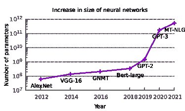

图 1. 神经网络的参数数量继续增长。最近的语言网络进一步推动了这一趋势。

不同的并行框架在性能（训练执行时间）、内存消耗和统计效率方面具有不同的优缺点。Ben-Nun 等人（Ben-Nun 和 Hoefler，2019）在 2018 年调查了并行深度学习框架以及在神经网络中利用并发的不同方法。然而，过去三年中出现了许多新框架，作者将讨论限定为定性分析。本文调查了目前最流行的并行深度学习框架，并对具有开源实现的框架进行了实证评估，以比较各种指标。这种比较评估可以帮助深度学习用户选择最适合其训练任务的并行框架。

我们首先提供了关于并行深度学习的现状的全面定性调查。我们将并行化的方法分类为三种类型（在第二部分中定义）：数据并行、层内并行（有时称为模型并行）和层间并行（有时称为流水线）。我们介绍了每种方法的优缺点，并讨论了实现每种类型并行的不同框架的能力。

需要可扩展深度学习框架来进行训练实验的最终用户需要知道哪些框架在最短时间内提供最佳的统计效率。据我们了解，以前没有进行过并行深度学习框架的实证比较。我们选择了两个流行的训练数据集和两个神经网络，对多个开源深度学习框架（包括 DDP（Li 等人，2020），PipeDream（Narayanan 等人，2019），ZeRO（Rajbhandari 等人，2020），Megatron（Shoeybi 等人，2020），TorchGPipe（Kim 等人，2020），和 LBANN（Essen 等人，2015））进行基准测试。我们使用对深度学习研究人员最重要的指标——训练周期执行时间、统计效率和内存消耗。在两台不同的超级计算机和集群上运行实验，这些计算机和集群使用不同代的 NVIDIA GPU（A100s、V100s）。通过这些实验，我们力求达成对并行框架在不同场景中适用性的共识。

在本文中，我们的贡献包括：

+   •

    对当前分布式深度学习前沿技术的全面调查，按并行化策略组织。

+   •

    对这些技术在视觉和语言任务上的实证评估，涉及 2 个不同的集群，据我们所知，这在之前没有进行过。

+   •

    对涉及高性能计算（HPC）和深度学习社区的指标进行比较，这些指标包括：运行时间、扩展性、统计效率和内存消耗。

## 2\. 背景

在本节中，我们首先简要描述深度学习术语。有关深度学习的深入评审，请参阅 (Goodfellow-et-al-2016)。然后，我们概述了深度神经网络训练可以并行化的三种方式：数据并行性、层内并行性和层间并行性。

### 2.1\. 定义

神经网络：神经网络是用于预测某些输入数据属性的参数化函数。它们擅长学习复杂、高维数据的低维表示。

层：网络由一系列层组成，这些层将前一层的输出作为输入，并计算某种非线性变换。

训练和损失：寻找神经网络最佳参数的过程称为训练。这是通过在输入数据集上最小化损失函数来完成的。损失函数，如均方误差，通常选择用于表示网络的预测能力。

反向传播：反向传播是一种基于反向模式自动微分的动态规划算法，它计算每一层相对于损失函数的梯度。

梯度下降和学习率：许多训练算法使用梯度下降的变种来最小化损失函数。梯度下降通过负梯度迭代更新神经网络的参数，使得损失趋向于最小值。负梯度方向上的移动距离被一个称为学习率的值进行缩放。

小批量、迭代和随机梯度下降：计算整个数据集的梯度是昂贵的，因此使用随机小批量数据来计算近似梯度。这种版本的梯度下降被称为批量随机梯度下降。每次迭代整个数据集称为一个迭代。

统计效率：统计效率是衡量迭代次数与准确率/损失之间关系的指标。如果一个训练算法需要较少的迭代次数即可收敛到目标验证损失，则称其为统计上有效的。

### 2.2\. 并行深度学习方法

数据并行性：数据并行性指的是将训练数据均匀分配到工作 GPU 之间。每个 GPU 拥有神经网络及其参数的副本。通过反向传播进行的梯度计算在所有 GPU 上独立进行。这些梯度在优化器的权重更新步骤之前，经过一次集体全规约操作。全规约步骤可以在每个迷你批次后同步进行，或者使用中心参数服务器异步进行。数据并行性的实现广泛存在于流行的深度学习框架中，如 PyTorch（Li 等，2020）和 TensorFlow（Abadi 等，2016）。图 2 展示了 4 个 GPU 上的数据并行性。

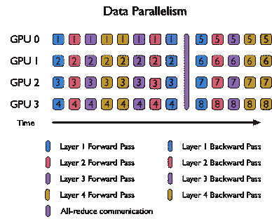

图 2\. 数据并行性中迷你批次随时间的处理。每个 GPU 拥有所有层的副本（以不同颜色显示），不同的迷你批次（编号）由不同的 GPU 处理。

层内并行性：层内并行性通过将一个层的计算任务分配到多个 GPU 上来分散工作的负担。对整个神经网络进行并行化涉及对其部分或所有组成层应用层内并行性。该领域的研究集中于优化不同类型层的多 GPU 执行——全连接层、卷积层（Coates 等，2013; Oyama 等，2020; Shazeer 等，2018）以及最近的 Transformer（Shoeybi 等，2020）。层内并行性使我们能够训练那些无法容纳在单个 GPU 的 DRAM 中的神经网络。

层间并行性：在层间并行性中，连续的层子集被映射到各个 GPU 上。每个 GPU 被分配到神经网络的一个子集进行操作。不同 GPU 上连续层之间的激活值和梯度的交换通过点对点通信原语进行。为了实现真正的并行性，必须在不同的 GPU 上同时激活多个迷你批次，因为迷你批次在层间的处理是顺序的，不能并行化。这被称为流水线技术。系统中任何时刻活跃的迷你批次的最大数量被称为流水线限制。图 3 展示了四个 GPU 和四个流水线限制下的层间并行性。与层内并行性一样，层间并行性也使得训练内存需求超过单个 GPU 的 DRAM 容量的模型成为可能。

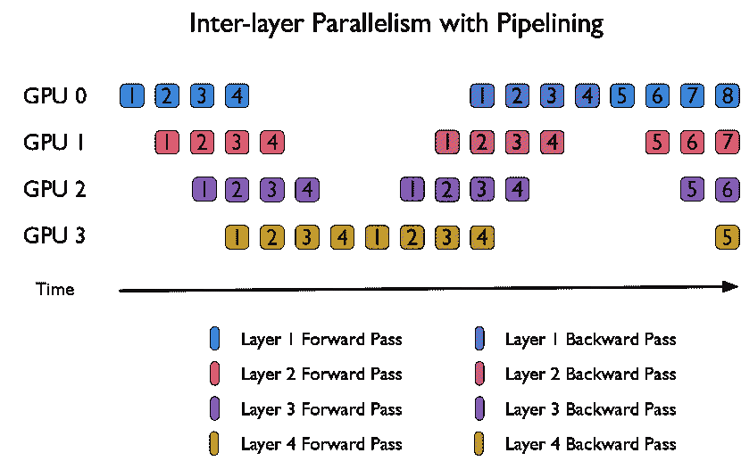

图 3\. 层间并行中的微批处理处理。每个 GPU 持有网络中的一层或多层，所有小批次通过所有层/GPUs。

### 2.3\. 相关工作

Pouyanfar 等人（Pouyanfar et al., 2018）和 Ben-Nun 等人（Ben-Nun and Hoefler, 2019）全面综述了顺序深度学习和分布式深度学习中的成熟技术。另一项综述（Sze et al., 2017）涵盖了高效处理神经网络的工作。Lu 等人（Lu et al., 2018）探讨了在大数据软件堆栈（如 Spark 和 Hadoop）上的分布式训练。Awan 等人（Awan et al., 2020）展示了并行训练的网络需求，描述了典型的通信工作负载。Tang 等人（Tang et al., 2020）通过分析模型进一步描述了分布式训练通信，并综述了当前实践。我们还向读者推荐了 MLPerf 基准¹¹1[`mlcommons.org/en/training-normal-07/`](https://mlcommons.org/en/training-normal-07/)，它们已成为比较深度学习算法、框架和硬件的热门工具。

## 3\. 文献综述

在本节中，我们展示了当前每种分布式学习类型的最新技术和实现的综述。表 1 提供了每个讨论的框架的概述。

表 1\. 并行深度学习的文献综述总结

| 框架 | 并行类型 |
| --- | --- |

&#124; 最大 &#124;

&#124; 加速器数量 &#124;

|

&#124; 最大训练网络 &#124;

&#124; （参数数量） &#124;

|

| --- | --- | --- | --- |
| --- | --- | --- | --- |
| FlexFlow | Hybrid | 64 GPUs | 24M^∗ |
| PipeDream^(∗∗) | 层间 | 16 GPUs | 138M |
| DDP^(∗∗) | 数据 | 256 GPUs | 345M |
| GPipe | 层间 | 8 GPUs | 557M |
| MeshTensorFlow | 层内 | 512 核 TPUv2 | 4.9B |
| Megatron^(∗∗) | 层内 | 512 GPUs | 8.3B |
| TorchGPipe^(∗∗) | 层间 | 8 GPUs | 15.8B |
| KARMA | 数据 | 2048 GPUs | 17B |
| LBANN^(∗∗) | 数据 | 3072 CPUs | 78.6B |
| ZeRO^(∗∗) | 数据 | 400 GPUs | 100B |
| ZeRO-Infinity | 数据 | 512 GPUs | 32T |
| AxoNN | 层间 | 384 GPUs | 100B |

+   •

    ^∗注意：FlexFlow 未提供其训练的最大网络的参数大小。我们使用了其论文中引用的已知网络大小的最大网络。

+   •

    ^(∗∗)以下框架在第四部分中进行了定量比较

### 3.1\. 数据并行

数据并行一直是并行化神经网络训练的首选算法。它设计简单，并在正确的设置下表现良好。

#### 3.1.1\. 小型模型

数据并行依赖于同步的全量缩减操作，以在所有 GPU 之间收集梯度。自然地，随着共享梯度的大小增加，这可能成为一个瓶颈。这个问题随着硬件加速器计算能力的提升而进一步加剧。计算与通信比率的下降使得这个问题变得更加严重。

初期减少通信开销的尝试集中于在随机梯度下降（SGD）算法中引入异步性（Recht et al., 2011; Chilimbi et al., 2014; Dean et al., 2012）。然而，Chen et al.（Chen et al., 2016）展示了同步 SGD 及其变体比异步对手收敛更快且精度更高。

减少通信瓶颈的努力持续进行。Zhang et al.（Zhang et al., 2017）设计了一种称为无等待反向传播（WFBP）的策略，以交错 GPU 和 CPU 计算及通信。WFBP 减少了网络流量的突发，并降低了整体网络负担。使用 WFBP，Zhang et al.在 16 和 32 台单 GPU 机器上实现了训练时间的加速。WFBP 已成为数据并行框架的**最终**方法。

PyTorch DistributedDataParallel (DDP)（Li et al., 2020），Horovod（Sergeev and Balso, 2018）和 Livermore Big Artificial Neural Network (LBANN)（Essen et al., 2015）工具包是三个旨在协助将模型过渡到分布式环境中的开源框架。在这些框架中，PyTorch DDP 因其与 PyTorch 的无缝集成而在深度学习社区中非常受欢迎（Paszke et al., 2019）。Horovod 是 Uber 为 TensorFlow 实现的 WFBP。LBANN 通过利用高性能计算硬件来加速并行深度学习。这些实现方式在优化 WFBP 的方式上有着惊人的相似之处。它们不是对每个参数张量进行单独的全量缩减调用，而是将参数张量融合到固定大小的箱中。在这些融合的参数箱的粒度上进行所有缩减调用。这提高了网络带宽利用率，从而提升了这些框架的整体性能。尽管融合张量箱的大小保持为可调超参数，Li et al.（Li et al., 2020）展示了 PyTorch DDP 的默认桶大小，即 25MB，是一个合理的高效扩展选择。

#### 3.1.2\. 大型模型

由于大量的大型训练数据集，参数越来越多的神经网络在各种训练任务上取得了巨大的性能提升。随着模型和数据集的增大，GPU 内存容量成为主要瓶颈。数据并行性要求每个 GPU 存储其自身的神经网络副本。随着模型和数据集的增大，用于存放这些神经网络的激活、梯度和参数的内存通常超过单个 GPU DRAM 的容量。因此，在没有内存优化的情况下，数据并行性使得训练大型模型变得不可行。

Zero Redundancy Optimizer (ZeRO) (Rajbhandari et al., 2020) 是一个建立在 PyTorch 之上的框架，用于减少每个 GPU 的内存消耗。论文观察到，在训练过程中，大部分内存被优化器状态、梯度和参数占据。ZeRO 将这些模型状态在 GPUs 之间进行分区，以消除内存冗余。使用 ZeRO，内存减少与 GPU 数量成比例，而通信开销仅增加 1.5 倍的常数因子。论文发现，在使用 Adam 优化器 (Kingma and Ba, 2015) 和混合精度的情况下，1000 亿参数的模型在最多 400 个 GPU 上有了模型大小、训练性能和可扩展性的改进。微软的研究人员使用 ZeRO 训练了语言建模文献中最大的神经网络之一：一个名为 Turing-NLG 的 170 亿参数神经网络。

像 NVIDIA 的 vDNN (Rhu et al., 2016) 这样的核心外训练算法常用于在内存不足的单个 GPU 上训练神经网络。这些算法在 CPU 和 GPU 之间来回移动数据，以释放 GPU 上的空间。KARMA (Wahib et al., 2020) 是一个建立在 PyTorch 之上的框架，它将这种核心外方法扩展到多个 GPU 上的数据并行性。他们设计了一种高效的自动卸载和预取神经网络激活和参数的算法。这些能力进一步扩展以支持多 GPU 模型，通过在 CPU 上执行权重更新。KARMA 相对于其他最先进的核心外方法有 1.52 倍的速度提升。它为大模型提供了一种高效的数据并行性利用方式，否则将需要其他框架。Zero-Infinity (Rajbhandari et al., 2021) 是另一个支持多亿参数模型核心外数据并行训练的框架。使用他们的内存优化，作者能够在仅有 512 个 GPU 的情况下部署一个 32 万亿参数的模型，同时保持大约 40% 的峰值吞吐量。

#### 3.1.3\. 大型有效小批量尺寸

数据并行性在高每 GPU 工作负载下最为高效。这通过固定每 GPU 的小批量大小来确保。例如，假设一个 ResNet 模型在 64 个 GPU 上以每 GPU 小批量大小为 128 进行训练。这相当于在单个 GPU 上有效的小批量大小为 8192。实证研究表明，极大的有效小批量大小对神经网络训练的统计效率有不利影响（Goyal 等，2017）。

解决此问题的简单方法是增加学习率（LR）。Krizhevsky（Krizhevsky 等，2017）建议根据小批量大小线性缩放 LR。随着更多工作节点的加入以加速训练，问题出现：较大的 LR 值会导致准确性损失和训练不稳定。

Goyal 等（Goyal 等，2017）提出了一种 LR 预热方案来应对准确性损失。训练开始时使用较低的学习率（LR），然后根据线性缩放规则逐渐增加到目标值。该论文能够用小批量大小为 8K 的 ResNet-50 进行训练，并达到与较小小批量模型相匹配的准确性。

You 等（You 等，2017，2018）提出了分层自适应学习率缩放（LARS）作为 LR 预热的替代方法。LARS 通过根据层权重和梯度更新的比率调整全局 LR，为每个模型层创建单独的学习率。该论文观察到这个比率在层间变化，并提供了对层权重更新有效性的见解。You 等利用 LARS 训练 AlexNet 和 ResNet-50，以 32K 的小批量大小进行训练且没有准确性损失。

LARS 在不同深度学习任务中表现出不一致的性能提升。You 等（You 等，2019）提出了一种通用策略，以适应任何迭代优化器用于大小批量训练。他们应用该策略创建了 LAMB，并以 Adam 优化器作为基础。使用 LAMB，You 等将 BERT 训练扩展到 32K 的小批量大小而不降低性能。

### 3.2\. 层内并行性

层内并行性的最新训练技术包括从数值内核的细粒度并行实现到将单层的粗粒度工作划分到多个进程中。它通常与其他并行化策略，如数据并行或层间并行，结合使用。

#### 3.2.1\. 细粒度并行性

在细粒度层面，许多技术借鉴了现有的数值方法，并将其调整用于深度学习。矩阵乘法和卷积是最常用的内核，并且得到了机器学习及更广泛科学界的广泛优化。许多加速器和处理器配备了实现这些内核的软件库，这些库根据其硬件进行调优，例如 CuDNN（Chetlur 等，2014）、MIOpen（Khan 等，2019）和 OneDNN。

加速器一直是层内细粒度并行性的核心。几项工作引入了技术，一些基于机器学习的方法，用于将层计算最优地映射到硬件(Kao and Krishna, 2020; Steuwer et al., 2017; Kwon et al., 2020)。这里的映射是指平铺策略、计算顺序和并行化策略，因此，最佳映射的搜索空间可能非常巨大。

最近，人们对使用 GPGPU 之外的硬件加速器来训练深度网络产生了兴趣。FPGA 由于其比 GPU 更低的能耗以及可重构性所提供的灵活性，已成为 DNN 加速的一个可行候选者。最近的研究探索了在 FPGA 硬件上优化 DNN 操作(Ma et al., 2017)。更近期，提出了新颖的架构以提高内存重用和并行性能(Kim et al., 2016; Chen et al., 2016, 2017)。

#### 3.2.2\. 粗粒度并行性

除了细粒度计算内核之外，还开发了在层内部沿着较粗的张量维度划分工作的技术。这些技术通常涉及使用优化算法和/或机器学习来识别层内计算和数据的最佳分区，然后为执行制定并行策略。Song 等人提出了一种在加速器阵列上以线性时间找到通信最优并行策略的方法(Song et al., 2019)。类似地，Jia 等人引入了一种基于马尔可夫链蒙特卡罗的搜索方法，用于寻找最优的并行化策略，该方法涵盖了操作维度内的层内并行(Jia et al., 2019)。

MeshTensorFlow 通过将张量维度映射到 n 维处理器阵列或“网格”来实现类似的效果(Shazeer et al., 2018)。这些张量在网格上被拆分和/或复制，从而可以利用处理器阵列并行计算。该框架本身提供了一个接口，供用户定义布局。任何布局对于相同的问题都会产生相同的结果，但是，具有最优布局的内存占用和性能可以得到极大的改善。

Dryden 等人（Dryden 等人，2019b）还提出了几种算法用于划分卷积张量维度，目的是减少训练过程中全减少的时间。他们的算法可在 LBANN 框架中使用。卷积也在（Oyama 等人，2020）中通过在空间域扩展数据并行性实现了混合并行。对于基于语言的模型，Megatron（Shoeybi 等人，2020）通过在处理器之间划分变换器层的块实现了类似的并行性。随着语言模型变得越来越常见且规模越来越大，Megatron 的使用也越来越广泛（见图 1）。它在 512 个 GPU 上表现出了高达 74% 的弱缩放系数。

在处理器之间划分层张量维度时，非常依赖于层的类型。例如，完全连接层涉及全对全计算，因此也涉及全对全通信，这比数据并行的全减少更加昂贵。因此，对于具有自定义层的模型，很难将粗粒度的层内并行性进行泛化。为了解决这个问题，一些方法严格关注计算图操作而不是模型层（Jia 等，2019）。

### 3.3\. 层间并行

真正的层间并行只能通过流水线实现，即在系统的任何给定时刻保持多个小批量数据处于活动状态。实现流水线有两种方式：有刷新和无刷新。在本节中，我们讨论这两种方法的优缺点。我们还提供了实现这些方法的框架的概述。

#### 3.3.1\. 流水线处理与刷新

使用带有刷新功能的流水线将一个小批量划分为相等大小的微批量。这些微批量一个接一个地注入系统中。GPU 从系统中的所有微批量中累积梯度。GPU 仅在完成最后一个微批量的反向传播后才更新其权重。在所有 GPU 完成权重更新后，下一小批量及其对应的微批量才会被注入。这个流水线的方法也被称为微批量处理。微批量的数量通常保持远大于工作者的数量，以便每个工作者可以并行计算。为了确保硬件的最佳利用，需要较大的小批量大小。为了在大小批量情况下保持统计效率，可以使用第 3.1.3 节中讨论的相同解决方案。图 3 显示了带有刷新功能的流水线的实际情况。工作 GPU 在最后一个微批量的前向传播和第一个微批量的反向传播之间会产生空闲时间。这些称为流水线气泡。它们会降低系统的整体硬件利用率。将层负载均衡映射到 GPU 是最大化性能的绝对关键。负载均衡算法还必须具备通信意识。这是因为在 GPU 边界交换的激活值和梯度可能达到 GB 级别，对于大型神经网络尤为如此。有效的带有刷新功能的流水线实现必须具备负载均衡支持。

表 2\. 关于用于实验的 HPC 平台的系统信息。

| 系统 | 节点数量 | CPU |
| --- | --- | --- |

&#124; 核心/ &#124;

&#124; 节点 &#124;

| GPU |
| --- |

&#124; GPUs/ &#124;

&#124; 节点 &#124;

|

&#124; CPU Mem. / &#124;

&#124; 节点 (GB) &#124;

|

&#124; CPU 内存 / &#124;

&#124; 节点 (GB) &#124;

|

&#124; GPU FP64 &#124;

&#124; 峰值 (TFlop/s) &#124;

|

| --- | --- | --- | --- | --- | --- | --- | --- | --- |
| --- | --- | --- | --- | --- | --- | --- | --- | --- |
| Lassen | 795 | IBM Power9 | 44 | NVIDIA V100 | 4 | 256 | 64 | 7.0 |
| ThetaGPU | 24 | AMD Rome | 64 | NVIDIA A100 | 8 | 1024 | 320 | 9.7 |

这个想法最初由黄等人提出，在 GPipe 中（黄等人，2019）。他们使用 GPipe 训练了一个 557M 参数的神经网络——AmoebaNet-B（Real 等人，2019），在 ImageNet（Russakovsky 等人，2015）数据集上超越了许多下游图像分类任务的现有水平。TorchGPipe（Kim 等人，2020）是一个非官方的开源 GPipe 实现，构建在 PyTorch（Paszke 等人，2019）后端上。GEMS（GPU-Enabled Memory Aware Model-Parallelism System）（Jain 等人，2020）引入了一种新方法以提高硬件利用率。该框架提出了一种算法，通过在多个 GPU 上使用流水线而无需刷新来并行训练两个神经网络。他们通过重叠两个神经网络的前向和反向传播，达到了系统吞吐量的翻倍。我们建议读者查阅他们的论文以获取实现细节。最近，ZeRO（Rajbhandari 等人，2020）和 Megatron（Shoeybi 等人，2020）也扩展了对这一方法的支持，向层间并行 ism 迈进。TorchGPipe（Kim 等人，2020）提供了一种负载均衡算法，旨在平衡每个 GPU 上微批次的前向和反向传播的净执行时间。然而，他们的算法忽略了在 GPU 边界之间交换张量的通信开销。Megatron 将变换器的层划分到 GPU 上，这是最优的，因为变换器的所有层都是相同的。ZeRO 也提供了一种相同的策略，将层均等划分到 GPU 上。此外，他们还支持一种负载均衡算法，以在 GPU 之间平衡内存消耗。AxoNN（Singh 和 Bhatele，pear）引入了一种新颖的异步通信后端，用于层间并行 ism。根据我们所知，这是首次利用异步性来提高硬件利用率，选择 MPI 而非 NCCL。他们还引入了一种内存优化算法，用于减少流水线深度，提高数据并行性，并在多达 1000 亿参数的模型上超越现有水平 15%-25%。

#### 3.3.2\. 无需刷新流水线

在这种方法中，系统中活跃的小批量的数量保持不变。一旦一个小批量在第一个 GPU 上完成了反向传播，一个新的小批量会被注入系统，以保持流水线的满负荷运行。与具有冲洗的流水线不同，在 GPU 上的权重更新发生在它完成一个小批量的反向传播后。这种流水线方法旨在通过消除流水线中的冲洗引起的气泡来提高硬件利用率。然而，这种训练算法的统计效率会急剧下降。这是由于所谓的权重过时问题，当流水线中的新小批量在前向传播中遇到尚未用旧小批量的反向传播更新的过时权重时，就会出现这种问题。这是为什么没有冲洗的流水线没有得到广泛采用的主要原因之一。PipeDream (Narayanan et al., 2019) 是一个实现无冲洗流水线的框架。它采用了一种称为权重存储的算法来对抗权重过时问题。有关实现的详细信息，我们建议读者参考他们的论文。Chen et al. (Chen et al., 2019) 提议使用具有动量的 SGD 变体 (Qian, 1999) 从过时的权重中预测未来的权重。PipeDream 还提出了一种静态负载均衡算法，该算法考虑了通信。它为每一层做了仪器化，并在其负载均衡器中使用了剖面数据。它的框架还额外提供了一个在 GPU 之间复制计算密集型层的机制，以提高其吞吐量。复制的层在每次反向传播后通过全归约同步其梯度。

表 3\. 训练数据集和网络超参数，用于文中的基准测试

| 数据集 |
| --- |

&#124; 训练 &#124;

&#124; 切分大小 &#124;

|

&#124; 验证 &#124;

&#124; 切分大小 &#124;

| 网络 |
| --- |

&#124; 小批量大小 &#124;

&#124; 每个 GPU &#124;

|

&#124; 优化器^(††) &#124;

|

&#124; 学习 &#124;

&#124; 速率 &#124;

|

&#124; 数量 &#124;

&#124; 纪元 &#124;

|

&#124; L2 衰减 &#124;

|

| --- | --- | --- | --- | --- | --- | --- | --- | --- |
| --- | --- | --- | --- | --- | --- | --- | --- | --- |
| ImageNet | 1,281,167 | 50,000 | VGG-16 | 64^† | SGD^† | 0.01^† | 90^† | 0.0001^† |
| Wikitext-103 | 103,227,021 | 217,646 | GPT2-medium | 32^(∗∗) | LAMB^∗ | 0.001^∗ | 100^(∗∗) | 0.01^∗ |

+   •

    ^∗ 值直接取自 MLPerf

+   •

    ^(∗∗) 在 MLPerf 中定义为无限制的值

+   •

    ^† 值直接取自 torchvision - [`github.com/pytorch/vision/tree/master/references/classification`](https://github.com/pytorch/vision/tree/master/references/classification)

+   •

    ^(††) 对于 ZeRO，我们使用学习率为 0.001 和 L2 衰减为 0.01 的 Adam 优化器，因为它的内存优化仅适用于 Adam

## 4\. 实验设置

在本节中，我们详细介绍了对多个并行深度学习框架的实证评估。

### 4.1\. 框架选择

我们使用了 DDP²²2[`github.com/pytorch/pytorch`](https://github.com/pytorch/pytorch) @1.8.0 （Li 等，2020），ZeRO³³3[`github.com/microsoft/DeepSpeed`](https://github.com/microsoft/DeepSpeed) @0.3.13 （Rajbhandari 等，2020），Megatron⁴⁴4[`github.com/NVIDIA/Megatron-LM`](https://github.com/NVIDIA/Megatron-LM) @2.3 （Shoeybi 等，2020），PipeDream⁵⁵5[`github.com/siddharth9820/pipedream`](https://github.com/siddharth9820/pipedream) @00931df （Narayanan 等，2019），TorchGPipe⁶⁶6[`github.com/kakaobrain/torchgpipe`](https://github.com/kakaobrain/torchgpipe) @a1b4ee2 （Kim 等，2020），LBANN⁷⁷7[`github.com/LLNL/lbann`](https://github.com/LLNL/lbann) @0.101 （Essen 等，2015），和 AxoNN⁸⁸8https://github.com/hpcgroup/axonn/ @db1c6a0 （Singh 和 Bhatele，pear）进行我们的实证分析。对于 Megatron，我们分别分析了其数据并行和层内并行实现。我们称之为 Megatron-data 和 Megatron-intra。这一子集代表了第三部分中讨论的三种并行类型。我们选择了那些具有开源实现、易于设置且用户基数较大的框架。我们还尝试将 MeshTensorFlow （Shazeer 等，2018）和 FlexFlow （Jia 等，2019）纳入我们的框架集合。然而，尽管我们尽了最大努力，仍未能成功在我们的机器上进行实验。

为了防止数据加载成为瓶颈，我们在训练之前将训练数据集复制到节点本地的 SSD 中。数据使用 PyTorch 的分布式数据加载器加载，配备了多个工作进程。我们默认为四个进程，与主进程分开，以读取数据。MegatronLM 实现了自己的数据加载器，我们在使用 Megatron 时使用了它们，而不是 PyTorch 的。在实践中，我们发现这些数据加载器比默认的 PyTorch 数据加载器快得多。

为了公平评估每个框架的性能，我们在 Lassen 和 ThetaGPU（Micikevicius 等，2018）上使用了混合精度。在我们运行的框架中，只有 DDP、Megatron、LBANN 和 ZeRO 支持混合精度分布式训练。

所有列出的框架都使用 Pytorch 1.8.0、CUDA 11.0 和 CuDNN 8.0 来启动 GPU 上的计算。对于 GPU 间通信，PipeDream 使用了随 Pytorch 1.8.0 一起提供的 gloo 通信库，而所有其他框架则使用 NCCL 2.7.8。

### 4.2\. 系统硬件

表 2 描述了我们训练中使用的系统和硬件。拉森是劳伦斯利弗莫尔国家实验室的 IBM 机器，配备 Mellanox 网络。它目前在 Top500 榜单上排名第 26。ThetaGPU 是 Cray XC40 Theta 系统的 GPU 扩展。

每个系统都被选为 DL 训练中典型机器的代表。Lassen 类似于其他 GPU 密集节点的领先 HPC 系统。具有密集 A100 节点的 ThetaGPU 扩展适用于当前尖端 AI 机器。

### 4.3\. 数据集和神经网络

我们在两个流行的深度学习任务上评估上述子集：图像分类和语言建模。对于前者的任务，我们使用 ImageNet 大规模视觉识别挑战(ILSVRC)2012 数据集（Russakovsky 等，2015）。这个数据集在过去十年中被广泛用于训练大规模最新图像分类神经网络。它由 1000 个图像类均匀分布的 224x224 的 RGB 图像组成超过一百万张。我们使用此数据集来训练 VGG-16（Simonyan 和 Zisserman，2015）架构在我们选择的框架子集上。语言建模是一项无监督学习任务，其中模型被训练以预测给定之前所有单词的句子中的下一个单词。我们在我们的语言建模训练工作负载中使用 Wikitext-103（Merity 等，2016）数据集。这个数据集由超过 28000 篇英文维基百科文章组成，共计一亿个英文单词。最近，语言建模在 NLP 中获得了巨大的流行度，用于训练极大的神经网络。研究人员用这些模型在各种下游任务中取得了卓越的性能，如回答问题，文本蕴涵，翻译，阅读理解等...我们在 Wikitext-103（Merity 等，2016）数据集上训练 OpenAI 在其论文中提出的 GPT-2-medium 架构（Radford 等，2019）。表 3 概述了我们实验中使用的数据集。

#### 4.3.1\. 超参数

训练算法的纪元执行时间和统计效率对超参数的选择非常敏感。学习率调度，优化器选择和权重衰减值可能对统计效率产生很大影响。较大的 mini-batch 大小可以降低纪元执行时间，但会牺牲统计效率。

超参数是根据相应的 MLPerf（Mattson 等人，2019）基准选择的，这些基准是深度学习训练的标准比较手段。因为这个原因，我们在不同框架之间保持参数固定。对于 MLPerf 描述中未包含的参数，我们根据各自论文中给出的值进行选择。我们确保使用我们的超参数进行训练时，在验证集上能够获得合理的性能。表格 3 提供了每个模型应用的超参数概述。进一步的调整可能会提高性能和/或统计效率。

为了有效地扩展到更大的 GPU 数量，数据并行算法通常使用固定的小批量大小来保持每个 GPU 上的计算工作负载不变。因此，为了确保与 DDP、AxoNN、ZeRO、LBANN 和 Megatron-data 的其他框架的公平比较，我们对每个框架采取以下措施：

+   •

    Megatron-intra - 我们随着 GPU 数量的增加线性地调整小批量的大小。

+   •

    TorchGPipe - 我们固定微批量的大小，并将微批量的数量设置为 GPU 数量的 4 倍。

+   •

    PipeDream - 我们固定小批量的大小。PipeDream 通过自动增加其管道限制来确保每个 GPU 上的计算工作负载保持恒定。

### 4.4\. 例外

我们对上述实验设置做出以下例外。由于框架在更高 GPU 数量上出现死锁，我们仅在部分 GPU 上展示 PipeDream 的结果。由于 TorchGPipe 仅适用于单节点，我们仅在 ThetaGPU 上展示最多 8 个 GPU 的结果，在 Lassen 上展示 4 个 GPU 的结果。由于在 ThetaGPU 上构建框架遇到困难，我们仅在 Lassen 上展示 LBANN 的结果。同样，由于在 ThetaGPU 上作业未完成，我们仅在 Lassen 上展示 AxoNN 的结果。

### 4.5\. 评估指标

对于我们的分析，我们使用对深度学习研究人员最重要的指标 - 训练周期执行时间、统计效率和 GPU 内存消耗。统计效率高的训练算法或框架需要较少的周期才能在验证数据上达到某个目标准确率。在比较并行深度学习框架时，比较训练运行的周期执行时间和统计效率是绝对必要的。我们在第三部分中讨论了并行深度学习算法在这两个指标之间的权衡。

我们在 Lassen 和 ThetaGPU 上对 1、2、4、8、16、32 和 64 个 GPU 的每个 epoch 执行时间进行分析。为了评估特定框架的统计效率，我们使用其具有最小 epoch 执行时间的 GPU 数量。为了收集内存利用率数据，我们在 ThetaGPU 上使用 1、2、4、8、16、32 和 64 个 GPU。表格 3 和表格 2 给出了我们用来评估这些指标的神经网络和机器的概述。

为了测量统计效率，我们记录了视觉任务的准确性和损失，以及语言任务的困惑度。损失是用于训练的损失函数的输出。其大小取决于定义，但随着模型预测能力的提升，训练损失应减少接近零。准确性衡量的是准确预测样本与总样本的比率。我们使用基于训练集独占样本计算的验证准确性。困惑度在 NLP 中常用于衡量模型对某个语料库的预测能力，基于模型的交叉熵定义为数据集上的交叉熵损失的指数。

## 5\. 比较评估

在本节中，我们展示并讨论了关于 epoch 执行时间、统计效率和内存利用率的实验结果。

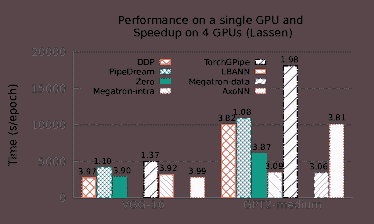

图 4\. Lassen 上 VGG-16 和 GPT2-medium 的单 GPU 性能与 4 GPU 加速比比较。标签列出了每个框架相对于其自身 1 GPU 性能的加速比。

### 5.1\. 执行时间比较

我们首先查看每个框架的基线性能。图 4 展示了在 Lassen 上两个神经网络的单 GPU 顺序执行时间。在此测试中，TorchGPipe 在 VGG-16 和 GPT2-medium 上表现最差，分别慢了 1.8 倍和 5.2 倍。我们还观察到 Pipedream 是第二慢的框架。单 GPU 性能差异显著，主要是由于这两个框架不支持混合精度。对于像 GPT2-medium 这样计算密集型的神经网络，这种差异更为严重。

尽管 Megatron、DDP、ZeRO 和 AxoNN 使用混合精度，Megatron 的速度显著更快，因为它使用了自己优化的变压器编码器层和 Adam 优化器的实现。图 4 证明了这一点，我们观察到在单个 GPU 上相对于 DDP 和 ZeRO 使用的本地 PyTorch 内核有 2 倍的加速。PyTorch 实现的性能较差，原因在于它处理 GPT2-medium 中计算密集的最终 softmax 层。虽然 DDP 和 AxoNN 以全精度计算此层，但 ZeRO 的混合精度策略则以半精度计算此层，这导致了两者之间性能的差异。

在所有框架中，TorchGPipe 的单 GPU 性能最差。这是因为微批量处理在单个 GPU 上序列化了不同微批量的操作，未能提供性能上的好处。然而，它确实节省了在前向传播过程中用于存储激活的内存。我们在第 5.3 节中对此进行了讨论。

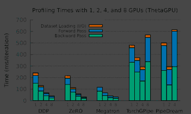

图 5\. 在 ThetaGPU 的 1、2、4 和 8 个 GPU 上训练 GPT2-medium 的时间分解。我们使用 NVIDIA 的 NVTX SDK 来注释事件，并使用 Nsight Systems 进行仪器化。Megatron 指的是 Megatron-intra。

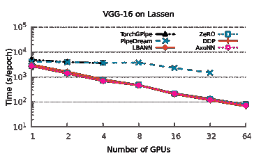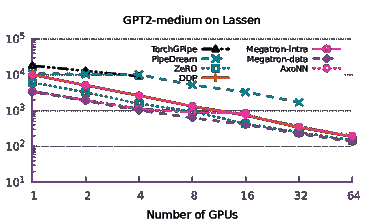

图 6\. Lassen 上的 VGG-16 和 GPT2-medium 的性能结果。

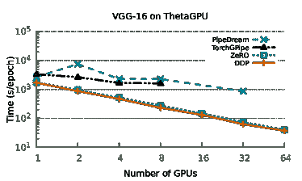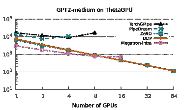

图 7\. ThetaGPU 上的 VGG-16 和 GPT2-medium 的性能结果。

图 5 显示了每个框架在 ThetaGPU 上进行前向传播、反向传播和 I/O 的时间。我们观察到由于 Megatron 使用了自定义的数据加载器，其 I/O 性能有了显著提高（见第 4.1 节），但这些改进在每次迭代的总体时间中占比微乎其微。在所有框架中，我们发现反向传播的计算密集度高于前向传播。这是因为对于每一层，我们不仅需要计算其参数的梯度，还需要计算其输入激活的梯度，这些激活需要反向传播到之前的层。

图中的单 GPU 配置还突出了这些框架在前向和反向传播计算时间上的绝对差异。这进一步支持了我们对图 4 中序列性能差异的解释。

图 6 和 7 详细展示了每台机器上的性能测试结果。我们展示了随着 GPU 数量从 1 增加到 64 时，每个神经网络每个周期所需的秒数。

在不同的机器和神经网络上，我们观察到框架之间有两个不同的趋势。首先，DDP、ZeRO、LBANN、AxoNN 和 Megatron-data 的性能相似，仅有恒定的偏差。其次，PipeDream 和 TorchGPipe 比其他方法更慢、更不稳定，并且扩展性较差。第三，Megatron-intra 的加速似乎在跨多个节点扩展时趋于平稳。

在第一个趋势中，我们观察到 ZeRO 的性能趋势与 DDP 和 AxoNN 相同，绝对运行时间差异仅为 10-15%。这些差异可以归因于不同的混合精度实现和 ZeRO 的内存优化。如在第 3.1.2 节中所述，ZeRO 通过增加通信来减少每个 GPU 的数据并行内存占用。然而，我们发现这种通信开销与标准 DDP 的扩展性相同。

很明显，这些数据并行方法在扩展性方面显著优于其他框架。这主要是因为当整个模型适合在 GPU 内存中时，数据并行中的工作负载具有明显的并行性。我们还可以看到，随着 GPU 数量超过单个节点，在 Lassen 和 ThetaGPU 上的加速略有下降（见图 4）。这是因为全归约通信现在发生在快速的节点间 NVLink 之外，需要使用系统网络。由于数据并行算法的扩展性更佳，这个问题可以忽略不计。

由于缺乏混合精度支持，PipeDream 和 TorchGPipe 在所有 GPU 数量下的每轮执行时间最长。相较于自身的单 GPU 执行，PipeDream 的扩展似乎不稳定。性能不佳可以归因于两个因素。首先，PipeDream 使用相对较慢的 Gloo 库作为其通信后端。其次，不稳定的扩展通常是负载不平衡的标志。我们的实验显示，他们的通信感知负载均衡算法在实践中表现不佳。

除了这两个主要趋势外，我们还观察到当 Megatron-intra 在多个节点上运行时会出现平台效应。对于更大的 GPU 数量，它的扩展性能不如 DDP、ZeRO 和 AxoNN。我们观察到，随着 GPU 数量的增加，Megatron-intra 的通信开销迅速增加，*最终*在 16 个 GPU 上达到了总执行时间的 52.5%。根据我们的观察，我们建议希望在语言建模任务上训练大型变换器模型的研究人员，使用 Megatron-intra 进行单 GPU 的顺序实现。如果模型超出了单个 GPU 的内存容量，我们建议采用 Megatron 的层内并行性将模型适配到单节点的 GPU 中。要实现大规模 GPU 扩展，应通过将 Megatron 的层内并行性与数据并行性相结合来完成。

### 5.2\. 统计效率

图 8 展示了我们统计效率实验的结果。按照标准实践，我们分别在每轮对图像分类和语言建模任务测量验证准确率和困惑度。我们报告了轮次编号以及总训练时间。在观察 PipeDream 在这两项任务上的表现时，很明显权重陈旧是寻求实现管道化而不刷新算法的巨大障碍。PipeDream 提出的权重暂存方法没有有效缓解这一问题。ZeRO、DDP 和 LBANN 的验证曲线几乎相同。验证曲线的轻微差异可能是由于这些框架中混合精度实现的差异。TorchGPipe 和 Megatron-intra 在语言建模任务中展现出了比数据并行框架更高的统计效率。我们将这些框架的快速收敛归因于它们的训练运行在较少的 GPU 数量上进行。数据并行框架在 64 个 GPU 上训练时，由于我们在第 3.1.3 节中强调的有效小批量大小增加问题，其收敛速度略有下降。

图 8 进一步详细说明了准确性和困惑度随时间的变化情况，而非随训练轮次变化。PipeDream 在达到准确性方面明显比其他框架慢。这种图展示了一个框架的统计效率和轮次执行时间的综合情况。我们认为，将验证指标与轮次时间绘制在一起是评估任何分布式深度学习框架性能的最佳方式。这也清楚地展示了数据并行性优于其他类别的并行深度学习算法。

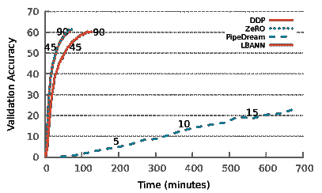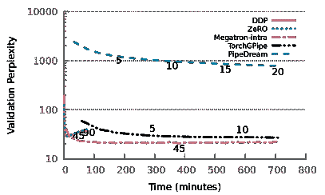

图 8\. 在 ThetaGPU 上训练 VGG-16 和 GPT2-medium 的时间验证性能。轮次数字显示在标签中。

### 5.3\. 内存利用率

图 9 详细展示了每个框架在训练任务中的每个 GPU 内存使用情况。虽然 ZeRO 在性能和扩展性方面与 DDP 相似，但其内存占用在 42%到 66%之间。我们也看到，随着更多 GPU 的加入，这种情况有所改善，类似于层级并行运行，而 DDP 保持固定，因为它仅仅在 GPU 之间复制模型。

管道化实现的内存使用效率在资源更多的情况下提高了超过 2 倍。更多的模型能够在 GPU 之间进行分区。然而，随着 GPU 数量的增加，内存节省效果开始趋于平稳，因为随着批量大小的增加，激活内存的增加抵消了参数内存的减少。

Megatron 的每个 GPU 内存曲线呈 U 形可以归因于其层内并行实现的内部机制。虽然一个 transformer 层的计算被分配到多个 GPU 上，但最后一层的输出需要在每个 GPU 上完整存在。由于每个 GPU 的小批量大小是固定的，因此每个 GPU 上任何层的输入内存随着 GPU 数量的增加而线性增长。在较低的 GPU 数量下，这种增加被由于跨 GPU 层计算的划分而减少的参数内存所抵消。然而，经过一段时间后，这种减少不足以完全抵消增加的输入激活内存。

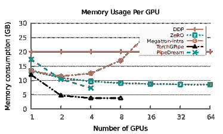

图 9\. 不同框架在 ThetaGPU 上对 GPT2-medium 的内存消耗。

## 6\. 结论

当代神经网络架构的规模不断扩大，这促使了高效并行神经网络算法的开发。神经网络并行训练的性能在很大程度上依赖于算法、实现、超参数和使用的硬件。在本文中，我们提供了对在并行系统上展示扩展性的并行深度学习框架的全面调查。我们使用两个数据集-网络组合来研究并行深度学习框架的各种属性，例如可扩展性、内存需求和性能的统计效率。

我们的基准测试研究提出了一些有趣的观察结果。当整个模型可以容纳在一个单独的 GPU 中时，最好使用数据并行方法，因为它们表现良好且可扩展。在内存受限的环境中，ZeRO (Rajbhandari 等，2020) 可以节省大量内存。他们的内存优化仅对非变换器模型的计算增加了实质性的成本。为了节省更多内存，我们推荐使用层内或层间并行性将模型部署到少数 GPU 上，然后通过数据并行的混合方式进行扩展。

## 参考文献

+   (1)

+   Abadi 等 (2016) Martín Abadi, Paul Barham, Jianmin Chen, Zhifeng Chen, Andy Davis, Jeffrey Dean, Matthieu Devin, Sanjay Ghemawat, Geoffrey Irving, Michael Isard, Manjunath Kudlur, Josh Levenberg, Rajat Monga, Sherry Moore, Derek G. Murray, Benoit Steiner, Paul Tucker, Vijay Vasudevan, Pete Warden, Martin Wicke, Yuan Yu, 和 Xiaoqiang Zheng. 2016. TensorFlow: 一个大规模机器学习系统。在 *第 12 届 USENIX 操作系统设计与实现会议* (Savannah, GA, USA) *(OSDI’16)* 上。USENIX 协会，美国，265–283。

+   Awan 等 (2020) A. A. Awan, A. Jain, C. Chu, H. Subramoni, 和 D. K. Panda. 2020. 集群上深度学习工作负载的通信分析与特征描述。*IEEE Micro* 40, 1 (2020), 35–43. [`doi.org/10.1109/MM.2019.2949986`](https://doi.org/10.1109/MM.2019.2949986)

+   Ben-Nun 和 Hoefler (2019) Tal Ben-Nun 和 Torsten Hoefler. 2019. 揭示并行和分布式深度学习的奥秘：深入的并发分析。*ACM 计算机调查* 52, 4, 第 65 篇文章 (2019 年 8 月), 43 页。 [`doi.org/10.1145/3320060`](https://doi.org/10.1145/3320060)

+   Bhatele 等 (2015) Abhinav Bhatele, Andrew R. Titus, Jayaraman J. Thiagarajan, Nikhil Jain, Todd Gamblin, Peer-Timo Bremer, Martin Schulz, 和 Laxmikant V. Kale. 2015. 识别网络拥塞的罪魁祸首。在 *IEEE 国际并行与分布处理研讨会* *(IPDPS ’15)* 上。IEEE 计算机协会。 [`doi.ieeecomputersociety.org/10.1109/IPDPS.2015.92`](http://doi.ieeecomputersociety.org/10.1109/IPDPS.2015.92)

+   陈等人（2019）Chi-Chung Chen、Chia-Lin Yang 和 Hsiang-Yun Cheng。2019 年。通过模型并行在多 GPU 平台上进行高效且稳健的并行 DNN 训练。arXiv:1809.02839 [cs.DC]

+   陈等人（2016）陈建民、拉贾特·蒙戈、萨米·本吉奥和拉法尔·约泽夫维茨。2016 年。重访分布式同步 SGD。在*国际学习表示会议工作坊轨道*。 [`arxiv.org/abs/1604.00981`](https://arxiv.org/abs/1604.00981)

+   陈等人（2016）Y. 陈、J. Emer 和 V. Sze。2016 年。Eyeriss：一种用于卷积神经网络的节能数据流空间架构。在*2016 ACM/IEEE 第 43 届国际计算机体系结构年会（ISCA）*。367–379。 [`doi.org/10.1109/ISCA.2016.40`](https://doi.org/10.1109/ISCA.2016.40)

+   陈等人（2017）Y. 陈、T. 克里希纳、J. S. Emer 和 V. Sze。2017 年。Eyeriss：一种节能的可重构加速器，用于深度卷积神经网络。*IEEE 固态电路期刊* 52, 1（2017 年），127–138。 [`doi.org/10.1109/JSSC.2016.2616357`](https://doi.org/10.1109/JSSC.2016.2616357)

+   Chetlur 等人（2014）Sharan Chetlur、Cliff Woolley、Philippe Vandermersch、Jonathan Cohen、John Tran、Bryan Catanzaro 和 Evan Shelhamer。2014 年。cuDNN：深度学习的高效原语。*CoRR* abs/1410.0759（2014 年）。arXiv:1410.0759 [`arxiv.org/abs/1410.0759`](http://arxiv.org/abs/1410.0759)

+   Chilimbi 等人（2014）Trishul Chilimbi、Yutaka Suzue、Johnson Apacible 和 Karthik Kalyanaraman。2014 年。Project Adam：构建一个高效且可扩展的深度学习训练系统。在*第 11 届 USENIX 操作系统设计与实现研讨会（OSDI 14）*。USENIX 协会，布鲁姆菲尔德，科罗拉多州，571–582。 [`www.usenix.org/conference/osdi14/technical-sessions/presentation/chilimbi`](https://www.usenix.org/conference/osdi14/technical-sessions/presentation/chilimbi)

+   Coates 等人（2013）Adam Coates、Brody Huval、Tao Wang、David Wu、Bryan Catanzaro 和 Ng Andrew。2013 年。使用 COTS HPC 系统进行深度学习 *(机器学习研究会论文集，第 28 卷)*，Sanjoy Dasgupta 和 David McAllester（编辑）。PMLR，美国乔治亚州亚特兰大，1337–1345。 [`proceedings.mlr.press/v28/coates13.html`](http://proceedings.mlr.press/v28/coates13.html)

+   Dean 等人（2012）Jeffrey Dean、Greg S. Corrado、Rajat Monga、Kai Chen、Matthieu Devin、Quoc V. Le、Mark Z. Mao、Marc’Aurelio Ranzato、Andrew Senior、Paul Tucker、Ke Yang 和 Andrew Y. Ng。2012 年。大规模分布式深度网络。在*NIPS*。

+   Devlin et al. (2019) Jacob Devlin, Ming-Wei Chang, Kenton Lee, 和 Kristina Toutanova. 2019. BERT: 用于语言理解的深度双向变换器的预训练。发表于*2019 年北美计算语言学协会会议论文集：人类语言技术，第 1 卷（长短篇论文）*。计算语言学协会，明尼阿波利斯, 明尼苏达州, 4171–4186。 [`doi.org/10.18653/v1/N19-1423`](https://doi.org/10.18653/v1/N19-1423)

+   Dryden et al. (2019a) Nikoli Dryden, Naoya Maruyama, Tim Moon, Tom Benson, Marc Snir, 和 Brian Van Essen. 2019a. 大规模 CNN 训练的通道和滤波器并行性。发表于*国际高性能计算、网络、存储与分析会议论文集*（丹佛, 科罗拉多州）*(SC ’19)*。计算机协会, 纽约, NY, USA，第 10 篇文章，20 页。 [`doi.org/10.1145/3295500.3356207`](https://doi.org/10.1145/3295500.3356207)

+   Dryden et al. (2019b) Nikoli Dryden, Naoya Maruyama, Tim Moon, Tom Benson, Marc Snir, 和 Brian Van Essen. 2019b. 大规模 CNN 训练的通道和滤波器并行性。发表于*国际高性能计算、网络、存储与分析会议论文集*（丹佛, 科罗拉多州）*(SC ’19)*。计算机协会, 纽约, NY, USA，第 10 篇文章，20 页。 [`doi.org/10.1145/3295500.3356207`](https://doi.org/10.1145/3295500.3356207)

+   Essen et al. (2015) Brian Van Essen, Hyojin Kim, Roger A. Pearce, Kofi Boakye, 和 Barry Chen. 2015. LBANN: Livermore 大规模人工神经网络 HPC 工具包。发表于*高性能计算环境中的机器学习研讨会论文集，MLHPC 2015，奥斯丁，德克萨斯州，美国，2015 年 11 月 15 日*。ACM，第 5:1–5:6。 [`doi.org/10.1145/2834892.2834897`](https://doi.org/10.1145/2834892.2834897)

+   Goyal et al. (2017) Priya Goyal, Piotr Dollár, Ross B. Girshick, Pieter Noordhuis, Lukasz Wesolowski, Aapo Kyrola, Andrew Tulloch, Yangqing Jia, 和 Kaiming He. 2017. 精确的大规模小批量 SGD：1 小时内训练 ImageNet。*CoRR* abs/1706.02677 (2017). arXiv:1706.02677 [`arxiv.org/abs/1706.02677`](http://arxiv.org/abs/1706.02677)

+   Huang et al. (2019) Yanping Huang, Youlong Cheng, Ankur Bapna, Orhan Firat, Dehao Chen, Mia Chen, HyoukJoong Lee, Jiquan Ngiam, Quoc V Le, Yonghui Wu, 和 zhifeng Chen. 2019. GPipe: 使用管道并行性高效训练大型神经网络。发表于*神经信息处理系统进展*，H. Wallach, H. Larochelle, A. Beygelzimer, F. d'Alché-Buc, E. Fox, 和 R. Garnett (编辑)，第 32 卷。Curran Associates, Inc. [`proceedings.neurips.cc/paper/2019/file/093f65e080a295f8076b1c5722a46aa2-Paper.pdf`](https://proceedings.neurips.cc/paper/2019/file/093f65e080a295f8076b1c5722a46aa2-Paper.pdf)

+   Islam 等（2016）Tanzima Z. Islam, Jayaraman J. Thiagarajan, Abhinav Bhatele, Martin Schulz 和 Todd Gamblin. 2016. 用于代理应用性能覆盖分析的机器学习框架。发表于*ACM/IEEE 国际高性能计算、网络、存储与分析会议论文集*（*SC ’16*）。IEEE 计算机学会。[`doi.ieeecomputersociety.org/10.1109/SC.2016.45`](http://doi.ieeecomputersociety.org/10.1109/SC.2016.45)

+   Jain 等（2020）Arpan Jain, Ammar Ahmad Awan, Asmaa M. Aljuhani, Jahanzeb Maqbool Hashmi, Quentin G. Anthony, Hari Subramoni, Dhableswar K. Panda, Raghu Machiraju 和 Anil Parwani. 2020. GEMS：一个支持内存感知的 GPU-ENabled 模型并行系统用于分布式 DNN 训练。发表于*国际高性能计算、网络、存储与分析会议论文集*（乔治亚州亚特兰大）（*SC ’20*）。IEEE 出版社，第 45 篇文章，15 页。

+   Jain 等（2013）Nikhil Jain, Abhinav Bhatele, Michael P. Robson, Todd Gamblin 和 Laxmikant V. Kale. 2013. 使用通信特征的监督学习预测应用性能。发表于*ACM/IEEE 国际高性能计算、网络、存储与分析会议*（*SC ’13*）。IEEE 计算机学会。

+   Jia 等（2019）Zhihao Jia, Matei Zaharia 和 Alex Aiken. 2019. 超越数据和模型并行性以实现深度神经网络。发表于*机器学习与系统会议论文集*，A. Talwalkar, V. Smith 和 M. Zaharia（编），第 1 卷，第 1–13 页。[`proceedings.mlsys.org/paper/2019/file/c74d97b01eae257e44aa9d5bade97baf-Paper.pdf`](https://proceedings.mlsys.org/paper/2019/file/c74d97b01eae257e44aa9d5bade97baf-Paper.pdf)

+   Kao 和 Krishna（2020）Sheng-Chun Kao 和 Tushar Krishna. 2020. GAMMA：通过遗传算法自动化 DNN 模型在加速器上的硬件映射。发表于*第 39 届国际计算机辅助设计会议论文集*（虚拟会议，美国）（*ICCAD ’20*）。计算机协会，纽约，NY，美国，第 44 篇文章，9 页。[`doi.org/10.1145/3400302.3415639`](https://doi.org/10.1145/3400302.3415639)

+   Khan 等（2019）Jehandad Khan, Paul Fultz, Artem Tamazov, Daniel Lowell, Chao Liu, Michael Melesse, Murali Nandhimandalam, Kamil Nasyrov, Ilya Perminov, Tejash Shah, Vasilii Filippov, Jing Zhang, Jing Zhou, Bragadeesh Natarajan 和 Mayank Daga. 2019. MIOpen：一个深度学习原语的开源库。arXiv:1910.00078 [cs.LG]

+   Kim 等（2020）Chiheon Kim, Heungsub Lee, Myungryong Jeong, Woonhyuk Baek, Boogeon Yoon, Ildoo Kim, Sungbin Lim 和 Sungwoong Kim. 2020. torchgpipe：用于训练大型模型的即时流水线并行性。（2020）。arXiv:2004.09910

+   Kim 等（2016）D. Kim、J. Kung、S. Chai、S. Yalamanchili 和 S. Mukhopadhyay。2016。《Neurocube：一种可编程的数字神经形态架构，具有高密度 3D 存储器》。见于 *2016 ACM/IEEE 第 43 届年度国际计算机架构研讨会（ISCA）*。380–392。 [`doi.org/10.1109/ISCA.2016.41`](https://doi.org/10.1109/ISCA.2016.41)

+   Kingma 和 Ba（2015）Diederik P. Kingma 和 Jimmy Ba。2015。《Adam：一种随机优化方法》。见于 *第 3 届国际学习表征会议，ICLR 2015，加州圣地亚哥，美国，2015 年 5 月 7-9 日，会议论文集*，Yoshua Bengio 和 Yann LeCun（编辑）。 [`arxiv.org/abs/1412.6980`](http://arxiv.org/abs/1412.6980)

+   Kolesnikov 等（2020）Alexander Kolesnikov、Lucas Beyer、Xiaohua Zhai、Joan Puigcerver、Jessica Yung、Sylvain Gelly 和 Neil Houlsby。2020。《大迁移（BiT）：通用视觉表征学习》。见于 *计算机视觉 – ECCV 2020*，Andrea Vedaldi、Horst Bischof、Thomas Brox 和 Jan-Michael Frahm（编辑）。Springer International Publishing，Cham，491–507。

+   Krizhevsky 等（2017）Alex Krizhevsky、Ilya Sutskever 和 Geoffrey E. Hinton。2017。《使用深度卷积神经网络进行 ImageNet 分类》。*Commun. ACM* 60, 6（2017 年 5 月），84–90。 [`doi.org/10.1145/3065386`](https://doi.org/10.1145/3065386)

+   Kwon 等（2020）H. Kwon、P. Chatarasi、V. Sarkar、T. Krishna、M. Pellauer 和 A. Parashar。2020。《MAESTRO：一种以数据为中心的方法来理解 DNN 映射的重用、性能和硬件成本》。*IEEE Micro* 40, 3（2020 年），20–29。 [`doi.org/10.1109/MM.2020.2985963`](https://doi.org/10.1109/MM.2020.2985963)

+   Li 等（2020）Shen Li、Yanli Zhao、Rohan Varma、Omkar Salpekar、Pieter Noordhuis、Teng Li、Adam Paszke、Jeff Smith、Brian Vaughan、Pritam Damania 和 Soumith Chintala。2020。《PyTorch Distributed：加速数据并行训练的经验》。*Proc. VLDB Endow.* 13, 12（2020 年 8 月），3005–3018。 [`doi.org/10.14778/3415478.3415530`](https://doi.org/10.14778/3415478.3415530)

+   Lu 等（2018）X. Lu、H. Shi、R. Biswas、M. H. Javed 和 D. K. Panda。2018。《DLoBD：对 HPC 集群上大数据堆栈中的深度学习的综合研究》。*IEEE 多尺度计算系统学报* 4, 4（2018 年），635–648。 [`doi.org/10.1109/TMSCS.2018.2845886`](https://doi.org/10.1109/TMSCS.2018.2845886)

+   Ma 等（2017）Yufei Ma、Yu Cao、Sarma Vrudhula 和 Jae-sun Seo。2017。《优化 FPGA 加速深度卷积神经网络中的循环操作和数据流》。见于 *2017 年 ACM/SIGDA 国际现场可编程门阵列研讨会*（加利福尼亚州蒙特雷，美国） *(FPGA ’17)*。计算机协会，纽约，NY，美国，45–54。 [`doi.org/10.1145/3020078.3021736`](https://doi.org/10.1145/3020078.3021736)

+   Marathe 等人（2017）**阿尼鲁德·马拉特**、**鲁希尔·阿尼鲁德**、**尼基尔·贾因**、**阿宾纳夫·巴泰尔**、**贾亚拉曼·提亚加拉詹**、**巴夫雅·凯尔库拉**、**崔圣·叶**、**巴里·朗特里** 和 **托德·甘布林**。2017。《在资源约束下使用深度迁移学习进行性能建模》。在 *ACM/IEEE 高性能计算、网络、存储和分析国际会议论文集* *(SC ’17)*。IEEE 计算机学会。 [`doi.acm.org/10.1145/3126908.3126969`](http://doi.acm.org/10.1145/3126908.3126969)

+   Mattson 等人（2019）**彼得·马特森**、**克里斯汀·程**、**科迪·科尔曼**、**格雷戈里·迪阿莫斯**、**保利乌斯·米西凯维丘斯**、**大卫·A·帕特森**、**韩林·唐**、**桂延·魏**、**彼得·贝利斯**、**维克托·比托夫**、**大卫·布鲁克斯**、**德豪·陈**、**德博伊约提·杜塔**、**乌迪特·古普塔**、**金·M·哈泽尔伍德**、**安德鲁·霍克**、**辛元·黄**、**比尔·贾**、**丹尼尔·康**、**大卫·坎特**、**纳维恩·库玛**、**杰弗里·廖**、**郭凯·马**、**迪帕克·纳拉延**、**塔约·奥贡特比**、**格纳迪·佩希门科**、**莉莲·彭蒂科斯特**、**维贾·贾纳帕·雷迪**、**泰勒·罗比**、**汤姆·圣约翰**、**卡罗尔-简·吴**、**凌杰·徐**、**克利夫·杨** 和 **马泰伊·扎哈里亚**。2019。《MLPerf 训练基准》。*CoRR* abs/1910.01500 (2019)。arXiv:1910.01500 [`arxiv.org/abs/1910.01500`](http://arxiv.org/abs/1910.01500)

+   Menon 等人（2020）**哈希塔·梅农**、**阿宾纳夫·巴泰尔** 和 **托德·甘布林**。2020。《使用贝叶斯优化进行自动调优参数选择》。在 *IEEE 国际并行与分布处理研讨会论文集* *(IPDPS ’20)*。IEEE 计算机学会。

+   Merity 等人（2016）**斯蒂芬·梅里蒂**、**蔡明熊**、**詹姆斯·布拉德伯里** 和 **理查德·索彻**。2016。《指针守卫混合模型》。*CoRR* abs/1609.07843 (2016)。arXiv:1609.07843 [`arxiv.org/abs/1609.07843`](http://arxiv.org/abs/1609.07843)

+   Micikevicius 等人（2018）**保利乌斯·米西凯维丘斯**、**沙兰·纳朗**、**乔纳·阿尔本**、**格雷戈里·迪阿莫斯**、**埃里希·埃尔森**、**大卫·加西亚**、**鲍里斯·金斯堡**、**迈克尔·休斯顿**、**奥列克斯·库查耶夫**、**加内什·文卡特什** 和 **郝武**。2018。《混合精度训练》。在 *国际学习表征会议*。 [`openreview.net/forum?id=r1gs9JgRZ`](https://openreview.net/forum?id=r1gs9JgRZ)

+   Narayanan 等人（2019）**迪帕克·纳拉延**、**亚伦·哈拉普**、**阿玛尔·帕尼沙耶**、**维韦克·塞沙德里**、**尼基尔·德万努尔**、**格雷格·格兰杰**、**菲尔·吉本斯** 和 **马泰伊·扎哈里亚**。2019。《PipeDream：DNN 训练的广义管道并行性》。在 *ACM 操作系统原理研讨会 (SOSP 2019)*。 [`www.microsoft.com/en-us/research/publication/pipedream-generalized-pipeline-parallelism-for-dnn-training/`](https://www.microsoft.com/en-us/research/publication/pipedream-generalized-pipeline-parallelism-for-dnn-training/)

+   Nikolentzos 等人（2020）**吉安尼斯·尼科伦特佐斯**、**安托万·蒂克斯耶** 和 **米哈利斯·瓦齐吉安尼斯**。2020。《用于文档理解的消息传递注意力网络》。*AAAI 人工智能会议论文集* 34, 05 (2020 年 4 月)，8544–8551。 [`doi.org/10.1609/aaai.v34i05.6376`](https://doi.org/10.1609/aaai.v34i05.6376)

+   Oyama 等 (2020) Yosuke Oyama, Naoya Maruyama, Nikoli Dryden, Erin McCarthy, Peter Harrington, Jan Balewski, Satoshi Matsuoka, Peter Nugent, 和 Brian Van Essen. 2020. 深度学习中的强缩放案例：使用混合并行训练大型 3D CNNs. arXiv:2007.12856 [cs.DC]

+   Paszke 等 (2019) Adam Paszke, Sam Gross, Francisco Massa, Adam Lerer, James Bradbury, Gregory Chanan, Trevor Killeen, Zeming Lin, Natalia Gimelshein, Luca Antiga, Alban Desmaison, Andreas Kopf, Edward Yang, Zachary DeVito, Martin Raison, Alykhan Tejani, Sasank Chilamkurthy, Benoit Steiner, Lu Fang, Junjie Bai, 和 Soumith Chintala. 2019. PyTorch: 一种命令式风格的高性能深度学习库。见 *神经信息处理系统进展*, H. Wallach, H. Larochelle, A. Beygelzimer, F. d'Alché-Buc, E. Fox, 和 R. Garnett (编), 第 32 卷. Curran Associates, Inc. [`proceedings.neurips.cc/paper/2019/file/bdbca288fee7f92f2bfa9f7012727740-Paper.pdf`](https://proceedings.neurips.cc/paper/2019/file/bdbca288fee7f92f2bfa9f7012727740-Paper.pdf)

+   Pouyanfar 等 (2018) Samira Pouyanfar, Saad Sadiq, Yilin Yan, Haiman Tian, Yudong Tao, Maria Presa Reyes, Mei-Ling Shyu, Shu-Ching Chen, 和 S. S. Iyengar. 2018. 深度学习调查：算法、技术和应用。*ACM 计算机调查* 51, 5, 文章 92 (2018 年 9 月), 36 页. [`doi.org/10.1145/3234150`](https://doi.org/10.1145/3234150)

+   钱宁 (1999) 钱宁. 1999. 关于梯度下降学习算法中的动量项。*神经网络* 12, 1 (1999), 145–151. [`doi.org/10.1016/S0893-6080(98)00116-6`](https://doi.org/10.1016/S0893-6080(98)00116-6)

+   Radford 等 (2019) Alec Radford, Jeff Wu, Rewon Child, David Luan, Dario Amodei, 和 Ilya Sutskever. 2019. 语言模型是无监督的多任务学习者。(2019).

+   Rajbhandari 等 (2020) Samyam Rajbhandari, Jeff Rasley, Olatunji Ruwase, 和 Yuxiong He. 2020. ZeRO：面向训练万亿参数模型的内存优化。见 *国际高性能计算、网络、存储与分析会议论文集* (乔治亚州亚特兰大) *(SC ’20)*. IEEE Press, 文章 20, 16 页.

+   Rajbhandari 等 (2021) Samyam Rajbhandari, Olatunji Ruwase, Jeff Rasley, Shaden Smith, 和 Yuxiong He. 2021. ZeRO-Infinity: 打破 GPU 内存瓶颈以实现极大规模深度学习 *(SC ’21)*. 计算机协会, 纽约, NY, USA, 文章 59, 14 页. [`doi.org/10.1145/3458817.3476205`](https://doi.org/10.1145/3458817.3476205)

+   Real 等 (2019) Esteban Real, Alok Aggarwal, Yanping Huang, 和 Quoc V. Le. 2019. 图像分类器架构搜索的正则化进化。*AAAI 人工智能会议论文集* 33, 01 (2019 年 7 月), 4780–4789. [`doi.org/10.1609/aaai.v33i01.33014780`](https://doi.org/10.1609/aaai.v33i01.33014780)

+   Recht 等 (2011) Benjamin Recht, Christopher Re, Stephen Wright 和 Feng Niu. 2011. Hogwild!: 一种无锁并行化随机梯度下降的方法。在 *神经信息处理系统进展* 中，J. Shawe-Taylor, R. Zemel, P. Bartlett, F. Pereira 和 K. Q. Weinberger (编), 第 24 卷。Curran Associates, Inc. [`proceedings.neurips.cc/paper/2011/file/218a0aefd1d1a4be65601cc6ddc1520e-Paper.pdf`](https://proceedings.neurips.cc/paper/2011/file/218a0aefd1d1a4be65601cc6ddc1520e-Paper.pdf)

+   Rhu 等 (2016) Minsoo Rhu, Natalia Gimelshein, Jason Clemons, Arslan Zulfiqar 和 Stephen W. Keckler. 2016. VDNN: 用于可扩展、内存高效的神经网络设计的虚拟化深度神经网络。在 *第 49 届 IEEE/ACM 国际微架构研讨会* (台北, 台湾) *(MICRO-49)*。IEEE Press, 第 18 篇，13 页。

+   Russakovsky 等 (2015) Olga Russakovsky, Jia Deng, Hao Su, Jonathan Krause, Sanjeev Satheesh, Sean Ma, Zhiheng Huang, Andrej Karpathy, Aditya Khosla, Michael Bernstein, Alexander C. Berg 和 Li Fei-Fei. 2015. ImageNet 大规模视觉识别挑战。*计算机视觉国际期刊 (IJCV)* 115, 3 (2015), 211–252. [`doi.org/10.1007/s11263-015-0816-y`](https://doi.org/10.1007/s11263-015-0816-y)

+   Sergeev 和 Balso (2018) Alexander Sergeev 和 Mike Del Balso. 2018. Horovod: 在 TensorFlow 中快速而简便的分布式深度学习。arXiv:1802.05799 [cs.LG]

+   Shazeer 等 (2018) Noam Shazeer, Youlong Cheng, Niki Parmar, Dustin Tran, Ashish Vaswani, Penporn Koanantakool, Peter Hawkins, HyoukJoong Lee, Mingsheng Hong, Cliff Young, Ryan Sepassi, 和 Blake Hechtman. 2018. Mesh-TensorFlow: 超级计算机的深度学习。在 *神经信息处理系统进展* 中，S. Bengio, H. Wallach, H. Larochelle, K. Grauman, N. Cesa-Bianchi 和 R. Garnett (编), 第 31 卷。Curran Associates, Inc. [`proceedings.neurips.cc/paper/2018/file/3a37abdeefe1dab1b30f7c5c7e581b93-Paper.pdf`](https://proceedings.neurips.cc/paper/2018/file/3a37abdeefe1dab1b30f7c5c7e581b93-Paper.pdf)

+   Shoeybi 等 (2020) Mohammad Shoeybi, Mostofa Patwary, Raul Puri, Patrick LeGresley, Jared Casper 和 Bryan Catanzaro. 2020. Megatron-LM: 使用模型并行训练多亿参数语言模型。arXiv:1909.08053 [cs.CL]

+   Simonyan 和 Zisserman (2015) Karen Simonyan 和 Andrew Zisserman. 2015. 用于大规模图像识别的非常深的卷积网络。在 *第三届国际学习表示会议，ICLR 2015，圣地亚哥，加州，美国，2015 年 5 月 7-9 日，会议论文集* 中，Yoshua Bengio 和 Yann LeCun (编)。 [`arxiv.org/abs/1409.1556`](http://arxiv.org/abs/1409.1556)

+   Singh 和 Bhatele (2022) Siddharth Singh 和 Abhinav Bhatele. 2022 (待发表). AxoNN: 一种异步、消息驱动的极大规模深度学习并行框架。在 *IEEE 国际并行与分布式处理研讨会* *(IPDPS ’22)* 上。IEEE 计算机协会。

+   Song 等人（2019）**L. Song**、**J. Mao**、**Y. Zhuo**、**X. Qian**、**H. Li** 和 **Y. Chen**。2019。《HyPar: Towards Hybrid Parallelism for Deep Learning Accelerator Array》。在 *2019 IEEE 高性能计算架构国际研讨会* (HPCA)。56–68。 [`doi.org/10.1109/HPCA.2019.00027`](https://doi.org/10.1109/HPCA.2019.00027)

+   Steuwer 等人（2017）**Michel Steuwer**、**Toomas Remmelg** 和 **Christophe Dubach**。2017。《Lift: A Functional Data-Parallel IR for High-Performance GPU Code Generation》。在 *2017 年国际代码生成与优化研讨会*（美国奥斯丁） *(CGO ’17)*。IEEE 出版社，74–85。

+   Sze 等人（2017）**V. Sze**、**Y. Chen**、**T. Yang** 和 **J. S. Emer**。2017。《Efficient Processing of Deep Neural Networks: A Tutorial and Survey》。*Proc. IEEE* 105，第 12 期（2017 年），2295–2329。 [`doi.org/10.1109/JPROC.2017.2761740`](https://doi.org/10.1109/JPROC.2017.2761740)

+   Tang 等人（2020）**Zhenheng Tang**、**Shaohuai Shi**、**Xiaowen Chu**、**Wei Wang** 和 **Bo Li**。2020。《Communication-Efficient Distributed Deep Learning: A Comprehensive Survey》。arXiv:2003.06307 [cs.DC]

+   Tao 等人（2020）**Andrew Tao**、**Karan Sapra** 和 **Bryan Catanzaro**。2020。《Hierarchical Multi-Scale Attention for Semantic Segmentation》。arXiv:2005.10821 [cs.CV]

+   Thiagarajan 等人（2018a）**Jayaraman J. Thiagarajan**、**Rushil Anirudh**、**Bhavya Kailkhura**、**Nikhil Jain**、**Tanzima Islam**、**Abhinav Bhatele**、**Jae-Seung Yeom** 和 **Todd Gamblin**。2018a。《PADDLE: Performance Analysis using a Data-driven Learning Environment》。在 *IEEE 国际并行与分布式处理研讨会* *(IPDPS ’18)*。IEEE 计算机学会。 [`doi.ieeecomputersociety.org/10.1109/IPDPS.2018.00088`](http://doi.ieeecomputersociety.org/10.1109/IPDPS.2018.00088)

+   Thiagarajan 等人（2018b）**Jayaraman J. Thiagarajan**、**Nikhil Jain**、**Rushil Anirudh**、**Alfredo Giménez**、**Rahul Sridhar**、**Aniruddha Marathe**、**Tao Wang**、**Murali Emani**、**Abhinav Bhatele** 和 **Todd Gamblin**。2018b。《Bootstrapping Parameter Space Exploration for Fast Tuning》。在 *国际超级计算大会* *(ICS ’18)*。 [`doi.acm.org/10.1145/3205289.3205321`](http://doi.acm.org/10.1145/3205289.3205321)

+   Vijayanarasimhan 等人（2017）**Sudheendra Vijayanarasimhan**、**Susanna Ricco**、**Cordelia Schmid**、**Rahul Sukthankar** 和 **Katerina Fragkiadaki**。2017。《SfM-Net: Learning of Structure and Motion from Video》。arXiv:1704.07804 [cs.CV]

+   Wahib 等人（2020）**Mohamed Wahib**、**Haoyu Zhang**、**Truong Thao Nguyen**、**Aleksandr Drozd**、**Jens Domke**、**Lingqi Zhang**、**Ryousei Takano** 和 **Satoshi Matsuoka**。2020。《Scaling Distributed Deep Learning Workloads beyond the Memory Capacity with KARMA》。在 *国际高性能计算、网络、存储与分析大会*（美国乔治亚州亚特兰大） *(SC ’20)*。IEEE 出版社，第 19 篇，15 页。

+   Wu 等人 (2016) Yonghui Wu, Mike Schuster, Zhifeng Chen, Quoc V. Le, Mohammad Norouzi, Wolfgang Macherey, Maxim Krikun, Yuan Cao, Qin Gao, Klaus Macherey, Jeff Klingner, Apurva Shah, Melvin Johnson, Xiaobing Liu, Łukasz Kaiser, Stephan Gouws, Yoshikiyo Kato, Taku Kudo, Hideto Kazawa, Keith Stevens, George Kurian, Nishant Patil, Wei Wang, Cliff Young, Jason Smith, Jason Riesa, Alex Rudnick, Oriol Vinyals, Greg Corrado, Macduff Hughes, 和 Jeffrey Dean。2016 年。谷歌神经机器翻译系统：弥合人类与机器翻译之间的差距。*CoRR* abs/1609.08144 (2016)。 [`arxiv.org/abs/1609.08144`](http://arxiv.org/abs/1609.08144)

+   Yeom 等人 (2016) Jae-Seung Yeom, Jayaraman J. Thiagarajan, Abhinav Bhatele, Greg Bronevetsky, 和 Tzanio Kolev。2016 年。基于数据的稀疏矩阵线性求解器性能建模。发表于*第七届国际性能建模、基准测试和高性能计算系统仿真研讨会*(PMBS ’16)。

+   You 等人 (2017) Yang You, Igor Gitman, 和 Boris Ginsburg。2017 年。卷积网络的大批量训练。arXiv:1708.03888 [cs.CV]

+   You 等人 (2019) Yang You, Jing Li, Sashank Reddi, Jonathan Hseu, Sanjiv Kumar, Srinadh Bhojanapalli, Xiaodan Song, James Demmel, Kurt Keutzer, 和 Cho-Jui Hsieh。2019 年。大批量优化深度学习：76 分钟内训练 BERT。arXiv:1904.00962 [cs.LG]

+   You 等人 (2018) Yang You, Zhao Zhang, Cho-Jui Hsieh, James Demmel, 和 Kurt Keutzer。2018 年。ImageNet 训练仅需几分钟。发表于*第 47 届国际并行处理会议* (尤金, OR, USA) *(ICPP 2018)*。计算机协会, 纽约, NY, USA, 文章 1, 10 页。[`doi.org/10.1145/3225058.3225069`](https://doi.org/10.1145/3225058.3225069)

+   Zhang 等人 (2017) Hao Zhang, Zeyu Zheng, Shizhen Xu, Wei Dai, Qirong Ho, Xiaodan Liang, Zhiting Hu, Jinliang Wei, Pengtao Xie, 和 Eric P. Xing。2017 年。Poseidon：用于 GPU 集群分布式深度学习的高效通信架构。发表于*2017 年 USENIX 年会技术会议 (USENIX ATC 17)*。USENIX 协会，加利福尼亚州圣克拉拉，181–193。[`www.usenix.org/conference/atc17/technical-sessions/presentation/zhang`](https://www.usenix.org/conference/atc17/technical-sessions/presentation/zhang)

+   Zhao 等人 (2019) Zhong-Qiu Zhao, Peng Zheng, Shou-Tao Xu, 和 Xindong Wu。2019 年。深度学习的目标检测：综述。*IEEE 神经网络与学习系统汇刊* 30, 11 (2019), 3212–3232。[`doi.org/10.1109/TNNLS.2018.2876865`](https://doi.org/10.1109/TNNLS.2018.2876865)
