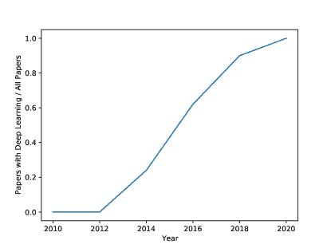
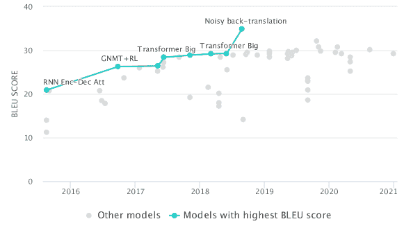
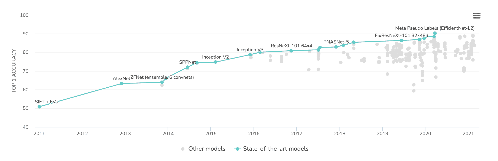
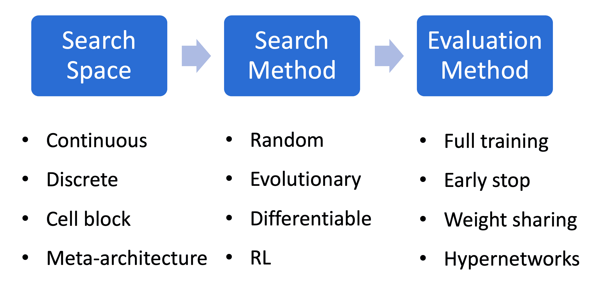

<!--yml

类别：未分类

日期：2024-09-06 19:49:55

-->

# [2111.05193] 关于绿色深度学习的调查

> 来源：[`ar5iv.labs.arxiv.org/html/2111.05193`](https://ar5iv.labs.arxiv.org/html/2111.05193)

# 关于绿色深度学习的调查

Jingjing Xu

字节跳动 AI 实验室

xujingjing.melody@bytedance.com

jingjingxu@pku.edu.cn & Wangchunshu Zhou¹¹脚注标记：1

字节跳动 AI 实验室

zhouwangchunshu.7@bytedance.com & Zhiyi Fu¹¹脚注标记：1

北京大学

ypfzy@pku.edu.cn & Hao Zhou

字节跳动 AI 实验室

zhouhao.nlp@bytedance.com & Lei Li

加州大学圣塔芭芭拉分校

lilei@ucsb.edu 平等贡献 本工作在字节跳动 AI 实验室实习期间完成。

###### 摘要

近年来，更大更深的模型层出不穷，并在自然语言处理（NLP）和计算机视觉（CV）等多个领域不断推动**最先进（SOTA）**的结果。然而，尽管结果令人期待，但需要注意的是，**SOTA**模型所需的计算量呈指数级增长。大量计算不仅具有惊人的碳足迹，还有对研究包容性和现实应用部署产生负面影响。

绿色深度学习是一个越来越热门的研究领域，吸引研究人员关注模型训练和推断中的能量使用和碳排放。目标是通过轻量化和高效的技术获得新颖的结果。许多技术可以实现这一目标，如模型压缩和知识蒸馏。本文重点介绍了绿色深度学习技术的发展系统性综述。我们将这些方法分为四类：（1）紧凑网络，（2）节能训练策略，（3）节能推断方法，以及（4）高效数据使用。对于每一类，我们讨论了已取得的进展和尚未解决的挑战。

###### 目录

1.  1 介绍

    1.  1.1 深度学习

    1.  1.2 绿色深度学习

        1.  1.2.1 定义

        1.  1.2.2 测量

        1.  1.2.3 更广泛的影响

    1.  1.3 调查大纲

1.  2 紧凑架构

    1.  2.1 组件设计

        1.  2.1.1 紧凑卷积

        1.  2.1.2 高效注意力

        1.  2.1.3 轻量级 Softmax

        1.  2.1.4 紧凑嵌入

    1.  2.2 组件组装

        1.  2.2.1 内存共享

        1.  2.2.2 静态权重共享

        1.  2.2.3 动态权重共享

        1.  2.2.4 部署共享

    1.  2.3 紧凑架构搜索

1.  3 能效训练

    1.  3.1 初始化

        1.  3.1.1 随机初始化

        1.  3.1.2 用于初始化的预训练模型

    1.  3.2 归一化

    1.  3.3 渐进训练

    1.  3.4 高效超参数优化

1.  4 能效推理

    1.  4.1 模型剪枝

    1.  4.2 低秩分解

    1.  4.3 量化

    1.  4.4 知识蒸馏

1.  5 高效数据使用

    1.  5.1 主动学习

    1.  5.2 预训练作为少量学习者

        1.  5.2.1 自监督学习

        1.  5.2.2 对比学习

        1.  5.2.3 提示学习

1.  6 结论和未来方向

## 第一章 引言

基于深度神经网络的深度学习是机器学习方法的一部分。在本章中，我们首先在第 1.1 节介绍深度学习的发展。然后，我们在第 1.2 节阐述什么是绿色深度学习，绿色深度学习的重要性以及如何评估深度学习的“绿色”。

### 1.1 深度学习

十年前，人工智能（AI）主要集中在浅层模型上，如结构感知机（McDonald 等，2010；Huang 等，2012；Li & Ji，2014）和条件随机场（Ghosh 等，2011；Sutton & McCallum，2012；Zheng 等，2015）。这些浅层模型只需要有限的计算。大多数 AI 方法可以在 CPU 上部署。

近年来，强大的 GPU 变得越来越易于获取，使得部署更大规模的模型成为可能，从而加速了深度学习的发展。广泛使用的深度学习模型的概念早在 1990 年代就已提出，例如卷积神经网络（CNNs）（LeCun 等，1998）和长短期记忆网络（LSTMs）（Hochreiter & Schmidhuber，1997）。由于硬件能力和大规模数据资源的限制，这些模型直到最近几年才开始流行。Collobert 等人（2011）提出了第一个系统的深度学习框架用于 NLP 任务。Krizhevsky 等人（2012）提出了基于卷积的深度网络，在图像分类挑战中排名第一。这些研究是激励 AI 参与者深入深度学习的优秀先驱。

图 1.1：2010 到 2020 年间 ACL 顶级 NLP 会议中使用神经网络的论文比例。我们手动统计了在抽样的 50 篇论文中使用神经网络的数量。

深度学习方法目前已成为 AI 的首选。神经网络的良好前景吸引了更多 AI 参与者投入深度学习，同时，深度学习在实际应用中具有很高的竞争力。行业不断开发更高效的硬件，并推出更好的编程平台，如 Theano、Caffe、MxNet、Tensorflow 和 Pytorch。先进的基础设施进一步使 AI 参与者能够开发更强大的深度模型。因此，自 2010 年起，深度学习如同乘坐高铁。为了可视化 AI 社区从浅层模型到深层网络的过渡过程，我们分析了从 2010 年到 2020 年间的顶级 AI 会议 ACL 的论文。我们随机选择了每年的 50 篇论文，并手动统计使用深度学习的论文数量。从图 1.1 可以看到，从 2012 年到 2020 年，使用神经网络的论文数量增长迅速。从 2020 年起，所有论文都将深度网络作为基础。从那时起，AI 领域完全进入了深度学习时代。

在深度学习时代，一个热门方向是获得 SOTA（State Of The Art）结果。参考 Schwartz 等人（2020a），我们将这种研究趋势称为红色 AI。最近，研究人员注意到相较于 SOTA 结果，取得优势变得更加困难。对于传统 AI 领域，如计算机视觉（CV）和自然语言处理（NLP），新 AI 模型/算法带来的改进在减少。许多流行的研究基准正在达到其性能极限。图 1.2 和 1.3 列出了几个例子，展示了深度学习的回报随着时间的推移在减少。

红色 AI 的趋势需要大量计算以获得更好的结果。例如，如 Schwartz 等人（2020a）报告的，训练深度学习模型所使用的计算量在 6 年内增加了 300,000 倍。这些计算不仅带来昂贵的经济成本，还造成过度的碳足迹。前者损害了 AI 的包容性，后者则对环境造成了危害。我们将深度学习所需的计算源分类为以下三类：模型大小、参数调整和训练数据。

图 1.2：2016 年至 2020 年 WMT 英语-德语翻译的结果。如图所示，最近公布的结果已经达到极限。数据收集自[`paperswithcode.com`](https://paperswithcode.com)。

图 1.3：2011 到 2021 年在 ImageNet 上的图像分类结果。正如我们所见，最近发布的结果已经达到了瓶颈。数据来自 [`paperswithcode.com`](https://paperswithcode.com)。

1) 利用大规模数据资源，增加模型大小是提高结果的最简单方法。例如，在 WMT 英德翻译中，当机器翻译模型的大小从 60M（Transformer-base）增加到 180M（Transformer-large）时，性能可以从 27.3 提升到 28.4。为了获得更好的结果，越来越多的 AI 参与者愿意尽可能增加模型大小，尤其是对于资源丰富的组织。例如，OpenAI 的研究人员首先预训练了一个大规模文本生成模型，称为 GPT-3，拥有 175B 参数。这表明一个超大模型可以生成类似人类的文本。然而，根据 Strubell 等人（2019）的研究，训练 GPT-3 可能会排放近 500M 碳，相当于五辆汽车的生命周期排放。这些研究是长远中的关键里程碑。然而，我们相信如果考虑“看不见”的计算成本，更大的模型并不总是更好的。我们仍然对对超大模型的“疯狂热爱”感到担忧，无论增加的计算是否带来显著的好处。此外，更大的模型大幅增加了推理服务的负担。亚马逊估计 90% 的生产 ML 基础设施成本用于推理，而不是训练（Jain 等人，2019）。

2) 模型实验也是一个被忽视的计算消耗者。为了验证新模型/算法的有效性，AI 参与者通常会进行大量实验，包括模型/算法实现、基准再实现和超参数调优。首先，基准再实现是一个冗余计算源。例如，原始的 Transformer 论文有 18K 引用。假设每个引用代表一个单独的实现。每次再实现需要 100 小时在单个 GPU 上（遵循在英德翻译中运行 Transformer-base 模型的成本）。这意味着仅在单个数据集上的基准再实现就可能需要 1.8M GPU 小时。此外，超参数调优是一个被忽视的计算源。我们设计了一个简单的问卷，询问在开发新模型/算法时，超参数调优的实验比例，由 64 位 AI 专家，包括研究人员和工程师回答。所有受访者都选择了调优超参数。具体来说，10.7%、32.1%、35.7%、21.4% 的个人在调优超参数时分别花费 80%-100%、50%-80%、30%-50%、0%-30% 的实验。总的来说，42.8% 的个人花费超过 50% 的实验时间用于超参数调优。

3) 从浅层模型开始，增加训练数据量以实现更好的泛化能力是非常流行的，特别是在半监督环境中。一个近期的热门话题是对数十亿原始数据进行超大规模预训练。在 NLP 领域，ELMo (Peters 等人，2018) 是第一个探索大规模预训练的知名工作。继 ELMo 之后，BERT 在 30 亿词片上预训练了一个 Transformer 编码器。OpenAI 的研究人员最近提出了 GPT-3，一个在 45TB 数据上预训练的生成模型。这些大量的训练样本大大增加了训练成本，相比于之前的浅层模型。

总的来说，Red AI 的趋势带来了巨大的计算成本。这些计算加剧了研究不平等，使得所有研究人员难以参与 Red AI。此外，大量的计算需求带来了巨大的碳排放。为了解决这些问题，Schwartz 等人 (2020a) 首次提出了 Green 深度学习或 Green AI，旨在鼓励 AI 社区更多地关注能源成本。

### 1.2 Green 深度学习

在本节中，我们主要描述什么是 Green 深度学习，如何评估深度学习中的“绿色性”，以及为什么 Green 深度学习很重要。

#### 1.2.1 定义

Green 学习，这一术语首次由 Schwartz 等人 (2020a) 提出，正受到越来越多的关注。正式来说，Green 深度学习或 Green AI，呼吁研究人员在不增加计算成本的情况下获得新的成果，理想情况下还能降低计算成本。与 Red AI 以任何代价推动最先进的结果不同，Green 深度学习鼓励 AI 参与者使用尽可能少的计算来实现相当或更好的结果。

#### 1.2.2 度量

在 Green 深度学习中，计算是重要的评估指标。目前，整个社区缺乏一个全面且广泛接受的计算评估标准，因为多个方面可以影响计算，包括模型大小、训练样本等。需要一个全面的度量标准来实现公平比较。在这里，我们列出了几个计算度量标准，并讨论它们的优点和缺点。

###### 运行时间

一些研究采用总训练时间作为计算度量的一种。如果所有模型/算法使用相同的硬件和软件设置，这是一种最自然的评估训练/推理计算的方式。然而，由于运行时间严重依赖基础设施设置，它不适合用于比较在不同基础设施上运行的模型。即便如此，我们仍然鼓励 AI 参与者报告运行时间，以便直观理解。

###### 碳排放

碳排放是评估环境影响的最直接方法。为了量化碳排放，Lacoste 等人（2019）使用 $CO_{2}$-当量 ($CO_{2}eq$) 作为与 $CO_{2}$ 具有相同全球变暖影响的量。然而，这一指标的主要挑战在于准确估算。首先，通过电力消耗计算的碳排放容易受到当地基础设施的影响。此外，如果 AI 参与者没有在知名云平台上进行实验，很难估算 $CO_{2}$ 的量。因此，它也不适合作为比较不同地区和不同计算基础设施上运行的不同模型的标准指标。

###### 模型大小

模型大小也是决定训练和推理成本的重要因素。我们鼓励研究人员报告模型大小，以便与实际操作中的其他指标结合使用。

###### FLOPs

浮点运算（FLOPs）计算在执行特定实例时运行模型所需的工作量。以往的研究通常采用这一指标来评估效率。FLOPs 几乎不依赖于硬件和软件平台，是进行不同模型公平比较的最简单度量。然而，FLOPs 是理论值，FLOPs 和运行时间之间存在差距。除了总工作量（FLOPs）外，平行度也会影响运行时间。

根据这些指标，我们总结了针对公平比较和直观理解的评估策略。

###### 公平度量

一般来说，AI 参与者更倾向于计算量较少且性能良好的模型/算法。因此，公平比较训练和推理所需的计算量是一个重要问题。我们强烈建议在模型训练和推理过程中报告 FLOPs。最后但同样重要的是，为了评估开发新模型/算法所需的浪费和冗余计算，我们还鼓励研究人员报告所有实验中的总 FLOPs，包括但不限于参数调整和基线实现。

###### 直观理解

为了增加对计算的直观理解，我们鼓励研究人员报告运行时间、模型大小和碳排放作为可选结果。

#### 1.2.3 更广泛的影响

首先，绿色深度学习可以更好地帮助深度学习赋能真实社会应用。在过去十年中，深度学习在研究基准测试中不断推动最先进的结果，如机器翻译、图像分类等。在研究界，与人类所有活动的能源消耗相比，深度学习的成本似乎微不足道。如今，深度学习广泛应用于实际社会任务，如自动驾驶、人脸识别、药物发现等。一旦深度学习涉及大规模应用，其成本将成百上千万倍地增加。此外，一些边缘应用，如计算资源极少的移动设备，也需要绿色深度学习。因此，绿色深度学习是未来的必要研究方向。

第二，绿色深度学习可以大幅提高人工智能的包容性。我们注意到许多富有组织在推动许多下游任务上取得更高结果的贡献。同时，我们也注意到学术界和发展中国家的研究人员在参与红色人工智能研究方面的困境。大多数研究人员的计算资源有限，无法支持他们开发具有最先进结果的超大模型。不幸的是，与具有最先进结果的想法相比，缺乏最先进结果的创新想法越来越被忽视。例如，新闻媒体更愿意报道具有最先进结果的研究。No.1 的吸引性宣传也促使富有组织在超大模型上投入更多资金。这些情况可能会让研究人员困惑，如何在没有强大经济支持的情况下进行深度学习研究。我们认为，最先进的结果固然重要，但并不是评估新模型/算法质量的唯一标准。我们鼓励富有组织不断探索数据和模型的边界，同时也鼓励人工智能社区关注创新想法。事实上，深度学习经过多年的努力，才超越了使用特征工程的浅层模型。我们相信，人工智能的发展应该是多样化的。绿色深度学习可以提高人工智能的包容性，并激励更多人工智能参与者探索深度学习的可能性。

### 1.3 调查概述

开发小巧而强大的网络是所有 AI 研究人员和工程师的长期目标。为了实现这一目标，已经提出了几种流行的小型网络（Howard 等，2017；Chollet，2017；Tan & Le，2019）。例如，Howard 等人提出的 MobileNet（2017）是一种基于深度可分离卷积的高效架构。类似的思想已被 Xception（Chollet，2017）采纳。最近，为了探索极其微小的网络，提出了先进的训练/推理/网络手术方法。例如，EdgeBERT（Tambe 等，2021）被提出用于构建一个可以在物联网设备上运行的极小网络。它采用了量化、剪枝、早期退出等先进方法来进一步减少模型参数和运行计算。

在这项调查中，我们对绿色深度学习技术进行了系统回顾。我们首先建立了绿色技术分类法，然后将相关技术分类为四个类别，包括紧凑型网络、节能训练策略、节能推理和高效数据使用。在每个类别中，我们回顾了绿色技术的当前进展，并探讨了潜在问题。

值得注意的是，构建绿色技术分类法具有挑战性，因为缺乏统一的标准衡量。例如，BERT 在训练过程中需要大量计算。如果仅考虑训练成本，BERT 不能被视为绿色技术。然而，BERT 可以在较少的训练示例下提高下游性能。如果考虑到其迁移能力，BERT 绝对是一项绿色技术。因此，是否将某项技术定义为绿色技术仍存在疑问。我们将尽力避免给出偏颇的定义。如果一项技术有潜力降低深度学习的成本，我们将把它纳入绿色技术分类法。我们在以下类别中回顾绿色深度学习技术：

+   •

    紧凑架构设计。本部分专注于小型网络。我们将本章分为两个子章节，即组件设计和组件组装。组件设计专注于细微的组件，具有竞争力的结果但计算量更少。组件组装描述了如何高效地构建网络。

+   •

    节能训练策略。先前的研究提出了几种高效的训练方法。在这项调查中，我们将这些研究分为四类，包括初始化、归一化、渐进训练和高效 AutoML。

+   •

    节能推理。在本章中，我们描述了旨在从较大的网络中获得一个较小但可比较的网络以实现高效推理的方法，包括模型剪枝、低秩分解、量化和蒸馏。

+   •

    高效数据使用。本章列出了有效利用训练数据的算法。我们关注两个热门方向：主动学习和预训练模型作为少样本学习者。

## 第二章 紧凑架构

开发高效的神经网络一直是迈向绿色 AI 的长期目标。在这项调查中，我们将绿色网络定义为在计算成本方面高效的神经网络。我们可以通过微妙设计、模型修剪和网络搜索来生成紧凑的网络。微妙设计意味着我们可以手动定义计算量更少的高效架构。模型修剪意味着我们可以通过参数减少从更大的模型中生成紧凑架构。在本章中，我们专注于微妙设计的架构，并将网络修剪的详细信息留给第四章。本节的概述如图 2.1 所示。

{森林}

分叉边缘，对于树=生长=东，反向=true，锚点=基线西，父锚点=东，子锚点=西，基准=左，字体=，矩形，绘制=隐藏绘制，圆角，左对齐，最小宽度=2.5em，最小高度=1.2em，s sep=6pt，内部 xsep=3pt，内部 ysep=1pt，，其中级别=1 字体=，其中级别=2 字体=，其中级别=3 字体=，其中级别=4 字体=，其中级别=5 字体=，[紧凑架构设计[组件

设计[紧凑卷积[深度可分离卷积][Fire 卷积][展平卷积][缩小卷积]][高效注意力[稀疏注意力][注意力近似]][轻量级 Softmax][紧凑嵌入]][组件

组装[内存共享][静态权重共享[跨层参数共享][跨数据参数共享]][动态权重共享[级联][早期退出][跳过][专家混合（MoE）]][部署权重共享]][紧凑架构

搜索]

图 2.1：紧凑架构设计的分类及代表性示例。

### 2.1 组件设计

在本节中，我们描述了流行组件的高效变体，包括卷积、注意力、Softmax 和嵌入。

#### 2.1 紧凑卷积

从 AlexNet（Krizhevsky 等，2012）开始，构建更深更大的 CNN 以实现更好的性能已经成为一个热门方向（Iandola 等，2014；Simonyan & Zisserman，2015；Szegedy 等，2015；He 等，2016a；Szegedy 等，2017）。目前，即使是一个简单的 CNN 基线也包含数百层和数千个通道。为了降低部署成本，以前的研究提出了高效变体。在这里，我们列出几个广泛使用的变体。

###### 深度可分离卷积

这种架构已被 Xception (Chollet，2017) 和 MobileNet (Howard 等人，2017) 采用。深度可分卷积包含两个部分：深度卷积和逐点卷积。深度卷积对每个输入通道应用一个单独的过滤器。逐点卷积是一种 $1\times 1$ 卷积。沿着这一研究方向，提出了许多先进的变体 (Hoang & Jo，2018; Sandler 等人，2018)。例如，Wang 等人 (2017) 还通过展开标准卷积并将空间卷积按顺序排列提出了一种因式分解卷积。

###### 火焰卷积

Iandola 等人 (2016) 提出了一个视觉模型 SqueezeNet。火焰模块是关键构建块。它类似于深度可分卷积。一个火焰模块包含两个部分：一个使用 $1\times 1$ 过滤器的收缩卷积层和一个使用 $1\times 1$ 和 $3\times 3$ 卷积过滤器混合的扩展层。

###### 扁平卷积

Jin 等人 (2015) 提出了火焰卷积以减少过滤器的冗余。它将 3D 卷积过滤器分解为三个连续的 1D 过滤器：跨通道（侧向）、垂直和水平方向的卷积。

###### 收缩卷积

传统卷积通常具有固定的超参数设置，如过滤器的数量。与这些模型不同，MobileNet (Howard 等人，2017) 采用了一种动态设置，也称为收缩卷积。它引入了一个宽度乘数，以在每一层均匀地缩小网络。标准卷积具有 $M$ 个输入通道和 $N$ 个输出通道，变成了具有 $\alpha M$ 个输入通道和 $\alpha N$ 个输出通道的收缩卷积，其中 $\alpha\leq 1$。

#### 2.1.2 高效注意力

注意力 (Bahdanau 等人，2015) 首次提出用于处理机器翻译中的长距离依赖。目前，它已广泛用于总结、自然语言理解等任务。关键思想是在每一步动态关注所有标记。所有标记可以直接对齐在一起，这在一定程度上可以解决长距离依赖问题。由于任何两个标记都有一个注意力分数，因此所需的计算量随着输入长度的增加而呈二次增长。为了解决这个问题，以前的研究提出了几种高效的注意力变体。目前，基于点积的注意力 (Vaswani 等人，2017) 成为 NLP 和 CV 应用中的主流选择。为了简化，我们将注意力称为点积注意力。

我们大致将这些变体分为两类：稀疏注意力，它减少了注意力的范围，以及具有不同注意力估计格式的注意力近似。让我们回顾一下原始的自注意力定义。正式地说，给定一个隐藏向量序列 $x$，我们可以将其映射到不同的表示空间 $Q$、$K$ 和 $V$。然后，注意力将 $Q$、$K$ 和 $V$ 作为输入，并负责通过以下方程生成向量：

|  | $\text{Attention}(Q,K,V)=\text{softmax}(\frac{QK^{T}}{\sqrt{d_{k}}})V$ |  | (2.1) |
| --- | --- | --- | --- |

其中 $Q$、$K$、$V$ 是三维张量，维度为序列长度、头部数量、隐藏维度。计算主要来自 $(\frac{QK^{T}}{\sqrt{d_{k}}})$ 和 softmax 操作。本节描述了几种减少点积计算的方法。我们将在第 2.1.3 节中介绍高效 softmax 变体的详细信息。

###### 稀疏注意力

从公式 2.1 中可以看到，所有标记在每一步都需要被关注。提出了几种方法来通过仅关注每一步的局部标记来减少注意力长度。一个自然的解决方案是通过为一些标记分配零权重来减少被关注的标记数量。这就是稀疏注意力的思想 (Martins & Astudillo, 2016; Child et al., 2019; Correia et al., 2019; Dai et al., 2019; Zaheer et al., 2020)。Martins & Astudillo (2016) 提出了 Sparsemax，通过增加 $L_{2}$ 正则化来鼓励注意力矩阵稀疏。Sparsemax 已应用于各种架构 (Niculae & Blondel, 2017; Maruf et al., 2019; Peters et al., 2019)。Child et al. (2019) 引入了启发式规则并定义了两种稀疏注意力变体。一种关注前 $l$ 个标记。另一种将序列分成不同的跨度，每个跨度有 $l$ 个标记。每个头部关注每 $l$ 个标记，其中 $l$ 远小于输入的长度。Sukhbaatar et al. (2019) 认为天真的稀疏注意力有些随意。他们发现一些注意力头专注于最近的标记，而其他头则从整个上下文中获取信息。受此启发，他们提出了通过学习每个头的注意力跨度来实现自适应注意力。Correia et al. (2019) 提出了一个类似的想法。他们引入了一种自适应稀疏注意力方法。他们用 $\alpha$ softmax 替代了完整的 softmax 操作，使低得分的词能够获得精确的零权重。除了注意力长度，注意力头也是一个重要的稀疏因素。Voita et al. (2019) 发现只有一部分头部是重要的，其余的可以被剪枝。

###### 注意力近似

Kitaev 等人 (2020) 提出了高效的注意力模型 Reformer。它通过使用局部敏感哈希来近似点积注意力计算，将复杂度从 $O(L^{2})$ 降低到 $O(L\log L)$，其中 $L$ 是序列的长度。 Choromanski 等人 (2020) 进一步提出了一个更高效的模型 Performer，具有无偏正随机特征映射估计器。与原始注意力相比，Performer 是一个线性结构，性能相当。

#### 2.1.3 轻量级 Softmax

Softmax 层是深度学习的必要组件。其关键思想是将向量标准化为可能标签的概率分布。传统的 softmax 计算公式为：

|  | $p(y_{i} \mid x)=\frac{\exp(h_{i}\cdot w)}{\sum_{j=1}\exp(h_{j}\cdot w)}$ |  | (2.2) |
| --- | --- | --- | --- |

其中 $y_{i}$ 是第 $i$ 个标签，$w$ 是可学习的参数。$h_{i}$ 是隐藏向量的第 $i$ 维。$x$ 是输入序列。分母需要对标签候选进行点积计算。如果任务有较大的标签集，分母将需要大量计算。由于 softmax 的复杂度与标签数量成正比，而序列生成 (Mikolov 等，2013a，b) 任务通常具有较大的词汇量，我们以序列生成为例，展示几种计算量较少的轻量级变体。在序列生成任务中，token 词汇等于标签集。形式上，给定一个隐藏向量 $h$ 和所有 token 嵌入，序列生成的 softmax 计算公式为：

|  | $p(y_{i} \mid x)=\frac{\exp(h^{T}v_{i})}{\sum_{j=1}\exp(h^{T}v_{j})}$ |  | (2.3) |
| --- | --- | --- | --- |

其中 $x$ 是输入，$v_{i}$ 是第 $i$ 个 token 的嵌入。方程式 2.3 显示 softmax 层为所有 token 引入嵌入，并需要隐藏向量与所有嵌入之间的内积。大词汇量将需要大量计算。因此，已经提出了几种高效的 softmax 变体。

###### 更少参数

为了减少内存使用，Press & Wolf (2017) 提出了将输入嵌入和 Eq. 2.3 中的嵌入结合起来。他们在机器翻译上进行了实验。结果表明，权重共享可以在不影响翻译结果的情况下减少神经翻译模型的大小。此外，减少标签数量是另一个重要的研究方向。最近，一些研究（Kim et al., 2016b; Costa-jussà & Fonollosa, 2016）提出在字符级别生成序列，而不是在词级别。字符数量远少于词数，且软最大值的计算可以大大减少。同样，Józefowicz et al. (2016) 在语言建模中实现了基于字符的软最大值，取得了良好的结果。值得注意的是，这些基于字符的方法也带来了更长的序列。目前的序列生成模型通常采用自回归生成框架。更长的序列带来了更高的解码成本。总体来说，是否减少整体解码成本需要逐案考虑。最近，通过子词级词汇（Sennrich et al., 2016）达成了一种折衷。子词级词汇在字符词汇和词词汇之间具有折衷粒度。子词级词汇的标记数量多于字符级词汇，但分段序列要短得多。因此，子词级词汇成为几乎所有序列生成任务中的流行选择。

###### 更少的计算

我们将计算量较少的 softmax 变体分为五类：层次 softmax、动态嵌入的 softmax、基于采样的 softmax、基于哈希的 softmax 和基于归一化的 softmax。层次 softmax（H-Softmax）(Morin & Bengio, 2005; Mnih & Hinton, 2008) 是一种 softmax 变体。具体来说，它将标签集表示为树形结构，所有标签在集合中都是叶节点。复杂度可以从 $O(N)$ 降到 $O(log(N))$，其中 $N$ 是标签集的大小。通过这种方式，传统的标签上的单一概率被分解为每个树层的概率序列的乘积。常规 softmax 可以看作是深度为 $1$ 的树，所有标签作为叶节点。第二个研究方向关注于动态标签嵌入 (Chen et al., 2016b)。其直觉是，并非所有标签都需要相同的参数大小。它为不同标签分配变量参数大小。特别地，该方法为频繁标签分配更多参数。嵌入大小会影响计算成本。因此，这种方法可以减少 softmax 操作所需的计算。此外，基于采样的 softmax 旨在通过采样标签候选来估算完整的 softmax 计算。关键思想是通过采样几个标签嵌入来估算所有嵌入 (Bengio & Senecal, 2003, 2008; Jean et al., 2015)。然而，它只减少了训练成本，而完整的 softmax 仍需计算以获得无方差的结果。基于哈希的 softmax 是另一种估算变体。Vijayanarasimhan et al. (2015) 提出了快速局部敏感哈希技术来近似实际的点积。基于归一化的 softmax (Devlin et al., 2014; Andreas & Klein, 2015) 旨在避免显式的分母。目标是输出一个尽可能接近概率分布且总和为 1 的向量。

#### 2.1.4 紧凑嵌入

构建词元嵌入是 NLP 任务的第一步。嵌入的参数由词汇表大小和嵌入长度决定。如何减少嵌入参数是一个重要且有趣的话题。学习紧凑的词元向量与学习压缩神经网络相关。已经有几种学习紧凑神经网络的技术，如剪枝、知识蒸馏、低秩近似和量化。在这一部分，我们仅关注与紧凑嵌入相关的方法。我们将这些方法分为四类：基于重用的方法、基于知识蒸馏的方法、基于低秩的方法和细粒度词汇。

基于重用的方法侧重于组合嵌入（Faruqui 等，2015；Chen 等，2016c；Shu & Nakayama，2018；Joshi 等，2019；Shi 等，2020）。例如，Faruqui 等（2015）旨在将每个词嵌入表示为基础向量的稀疏线性组合。基础向量的大小远小于词嵌入。Chen 等（2016c）提出了类似的想法。他们将词汇分为两个部分。一部分是包含频繁词汇的基集合（如 8K），另一部分是通过基集合的嵌入编码的稀有词汇集合。在这些研究的基础上，Shu & Nakayama（2018）采用量化方法用少量基础向量构造嵌入。最近，这一想法已被应用到自然语言处理以外的领域，如推荐系统（Shi 等，2020）。

此外，传统的压缩方法已被应用于压缩嵌入。Mou 等（2016）使用知识蒸馏将知识从大型词嵌入层转移到较小的嵌入层。Chen 等（2018a）使用词汇分区（块）基础的低秩矩阵近似来减少参数大小。Lam（2018）为词嵌入使用了每个参数 1-2 位，而不是传统的 32 位。词汇大小也是决定嵌入大小的重要因素。因此，提出了细粒度词汇来减少词汇长度，如字符级词汇（Kim 等，2016b）、子词级词汇（Sennrich 等，2016）和字节级词汇（Wang 等，2020a）。

### 2.2 组件组装

本部分介绍了几种组件组装解决方案以实现高效的架构设计。许多广泛使用的架构都是高效组件组装的解决方案。CNN 和 LSTM 是代表性模型。CNN 中的单个滤波器可以处理所有输入跨度。LSTM 在所有步骤中采用相同的参数。高效组件组装的关键思想在于共享。我们将这些组装解决方案分为四类：记忆共享、静态权重共享、动态权重共享和部署权重共享。

#### 2.2.1 记忆共享

内存共享是一种常见的技术，用于在内存有限的设备上存储大型模型。一种自然的想法是共享中间前向向量（Pleiss 等， 2017）或反向向量（Chen 等， 2016a；Gruslys 等， 2016）的相同存储空间。也有一些可逆模型（Gomez 等， 2017；MacKay 等， 2018），其中每一层的激活可以从下一层重构，以减少在反向过程中对内存的需求。这些模型不需要保存中间激活向量。由于多个向量共享相同的存储空间，某些情况下需要重新计算。为了在高效内存使用和较少计算之间取得平衡，一些研究（Wang 等， 2018a）提出将内存共享与活跃性分析（Wang 等， 2016）相结合。在图计算过程中，GPU 采用活跃性分析来创建张量和释放张量。对于大型中间张量，频繁的分配/释放操作是耗时的。因此，可以通过直接重用来自巨大预分配内存池的内存段来减少运行时间。除了对单节点的内存优化之外，Rajbhandari 等（2020）进一步探讨了在多个计算节点分布式设置中的内存共享。

#### 2.2.2 静态权重共享

与内存共享不同，静态权重共享旨在探索如何在神经网络中重用权重。权重与中间向量的区别在于，权重在推理过程中是固定的，并被所有示例共享。为了节省内存，许多模型选择在不同层或不同任务之间重用参数。

##### 跨层参数共享

跨层参数共享是一种常见的参数效率技术。跨层共享参数的思想已被充分探讨（Dehghani 等， 2019；Bai 等， 2019；Lan 等， 2020）。Savarese & Maire（2019）提出了一种参数共享方案，定义了一个全局模板库。CNN 的每一层的参数都来自这些模板的线性组合。Dehghani 等（2019）提出了一种名为 Universal Transformer 的模型，其中所有层共享相同的参数。继这些研究之后，Lan 等（2020）在预训练/微调设置中应用了跨层共享机制，Takase & Kiyono（2021）提出了多样化的共享策略。最近，Plummer 等（2020）采用了网络架构搜索的思想，以自动学习如何在网络的所有层之间共享参数。

##### 跨任务参数共享

跨任务参数共享也是处理多任务、多领域或多语言问题的一个流行解决方案（Ramsundar 等，2015；Duong 等，2015；Søgaard & Goldberg，2016；Hashimoto 等，2017；Yang 等，2017；Raffel 等，2020）。跨任务的关键思想是使所有任务（或语言/领域）共享参数。多任务学习（Ruder，2019）有两种流行的实现，包括硬参数共享和软参数共享。与不同任务没有共享网络的软参数共享相比，硬参数共享使用的参数更少。因此，本工作只关注硬参数共享。

具体来说，跨任务共享最初是通过在所有任务之间共享隐藏层来实现的，同时保留几个任务特定的输出层（Yang 等，2017；Houlsby 等，2019；Raffel 等，2020）。对于计算机视觉领域，多任务解决方案通常共享 CNN 层。对于自然语言处理领域，除了简单共享外，研究人员还专注于为不同任务寻找更好的参数重用解决方案。例如，Søgaard & Goldberg（2016）发现低级任务，如词性标注，应在较低层共享参数。受这些发现的启发，Hashimoto 等（2017）提出了一个跨多个 NLP 任务的参数共享网络。目前，开发大规模模型的趋势鼓励研究人员直接使用一个单一模型来支持多个任务。T5（Raffel 等，2020）是一个代表性模型。

多语言也是一种特殊的跨任务变体。在多语言模型的早期阶段，研究人员通常选择在不同语言之间共享一部分参数（Firat 等，2016；Upadhyay 等，2016；Blackwood 等，2018）。最近，多语言方法通常将所有语言平等对待，并将其混合在一起以训练单一模型（Ha 等，2016；Firat 等，2017；Johnson 等，2017；Fan 等，2020a）。更近期，基于适配器的解决方案已被广泛用于建模任务特定特征，超越了共享参数（Houlsby 等，2019；Bapna & Firat，2019；Pfeiffer 等，2020）。

#### 2.2.3 动态权重共享

静态参数共享通常依赖于预先指定的网络。研究人员根据共享特征定义启发式规则，以决定哪些层/组件应由不同的输入/任务共享。尽管这种解决方案很自然，但硬共享通常在处理不紧密相关的任务时失败。动态解决方案被提出以决定在不同输入样本之间共享哪些层/组件。具体而言，动态网络是具有动态计算图的神经网络，其中计算拓扑或参数是即时决定的。因此，这种网络可以降低计算成本并提高网络的适应性。在本综述中，我们描述了通用动态架构的概述。如果你对其他动态特性感兴趣，可以查阅专注于动态网络的综述（Han 等，2021b）。具有动态架构的网络可以分为以下几类：

+   •

    级联风格网络。多个基本网络在有向无环图（DAG）中以从小到大的方式级联，其中模型首先执行较小的网络，然后执行较大的网络。如果较小的网络可以处理输入样本，模型将停止执行过程，并且不会运行后续模型。

+   •

    早退出风格网络。一个网络包含多个内部分类器，允许“简单”的样本在较浅的层次退出。与级联风格网络的不同之处在于，早退出网络将前一层的输出传递给下一层，而级联风格网络则切断这些信息流，每个网络仅接受原始样本作为输入。

+   •

    跳过风格网络。通过跳过某些层或跳过整个输入序列中不重要的输入跨度来加速推理。

+   •

    专家混合风格网络。在同一个块中提供多个专家作为候选。每个块中仅使用一小部分专家进行推理。

螺旋样式动态网络有着悠久的发展历史（Viola & Jones, 2001；Lienhart & Maydt, 2002；Viola & Jones, 2004）。作者们最初提出的级联架构是为了应对不平衡的二分类任务。他们将多个基础模型级联，并仅在当前模型对其预测不够自信时，将输入传递到下一个模型。例如，Park et al. (2015) 以小模型优先的方式级联了两个 VGG 网络，以获得分类准确率与能耗之间的更好平衡。较小的模型可以处理大多数样本，从而大幅减少推断成本。Bolukbasi et al. (2017) 级联了 AlexNet、GoogLeNet 和 ResNet。Wang et al. (2018c) 为基础模型之间的标准函数联合训练引入了成本感知目标。最近，Li et al. (2020b) 提出了一个加速预训练语言模型推断的动态框架 CascadeBERT，该框架以级联方式动态选择合适大小和完整的模型。

表 2.1：广泛使用的置信度标准概述，决定了级联样式和早期退出样式网络中是否应该终止前向过程。在公式列中，$\mathbbm{1}(\cdot)\in\{0,1\}$ 表示动作 {“继续”，“终止”}。$\alpha$ 是阈值。$\lambda$ 和 $\tau$ 是超参数。$\text{MLP}(\cdot)$ 是一个可学习的模块。

| 标准 | 描述 | 公式 |
| --- | --- | --- |
| 基于置信度的标准 |
| 得分边界（Park et al., 2015) | 预测概率分布中最大值与第二大值之间的差距。 | $\mathbbm{1}(\bm{\hat{y}}^{1\rm{st}}-\bm{\hat{y}}^{2\rm{nd}}<\alpha)$ |
| 熵（Teerapittayanon et al., 2016）（Liu et al., 2020a）（Li et al., 2021） | 预测概率分布的熵或归一化熵。 | $\mathbbm{1}(H(\bm{\hat{y}})>\alpha)$ |
| 最大概率（Kaya et al., 2019)（Wang et al., 2020d) | 预测的最大概率。 | $\mathbbm{1}(\max(\bm{\hat{y}})<\alpha)$ |
| 基于计数的标准 |

| 耐心（Zhou et al., 2020) | 相同预测的次数。 | $cnt_{i}^{cls}=\begin{cases}cnt_{i-1}+1&amp;\arg\max(\bm{\hat{y}}_{i})=\arg\max(\bm{\hat{y}}_{i-1})\\ 0&amp;\arg\max(\bm{\hat{y}}_{i})\neq\arg\max(\bm{\hat{y}}_{i-1})\lor i=0\end{cases}$ <math alttext="cnt_{i}^{reg}=\begin{cases}cnt_{i-1}+1&amp;&#124;\bm{\hat{y}}_{i}-\bm{\hat{y}}_{i-1}&#124;<\tau\\

`cnt_{i}^{reg}=\begin{cases}cnt_{i-1}+1&&#124;\bm{\hat{y}}_{i}-\bm{\hat{y}}_{i-1}&#124;<\tau\\ 0&&#124;\bm{\hat{y}}_{i}-\bm{\hat{y}}_{i-1}&#124;\geq\tau\lor i=0\end{cases}`

| 投票（Sun et al., 2021） | 预测数量最多的分类。 | $V_{i}=\max_{c}\{\sum_{l=1}^{i}\mathbbm{1}(\arg\max(\bm{\hat{y}}_{i})=y_{c})\}/i^{\lambda}$ $\mathbbm{1}(V_{i})<\alpha$ |
| --- | --- | --- |
| 基于学习的标准 |
| 预测后（Bolukbasi et al., 2017）（Wang et al., 2018c）（Schuster et al., 2021） | 以预测概率分布作为输入，生成决定是否执行前向过程的标签。 | $\text{MLP}(\bm{\hat{y}})$ |
| 预测前（Elbayad et al., 2020）（Xin et al., 2021） | 以特征作为输入，生成决定是否执行前向过程的标签。 | $\text{MLP}(\bm{h})$ |

早期退出式动态网络可能是目前最流行的动态架构（Teerapittayanon et al., 2016; Bolukbasi et al., 2017; Gormez & Koyuncu, 2021; Huang et al., 2018; Yang et al., 2020b; Wang et al., 2021c）。通过在中间层上设置多个内部分类器，网络能够提供中间预测并决定是否执行前向过程。如果答案是肯定的，当前状态将被传递到下一层。否则，网络将输出中间预测作为最终预测。与切断网络间信息流的级联架构不同，早期退出网络重用先前层计算的特征。例如，BranchyNet（Teerapittayanon et al., 2016）在 CNN 中插入了几个分支分类器以加快推理速度。MSDNet（Huang et al., 2018）设计了一种精巧的二维多尺度架构，以便在两个维度上实现早期退出，RANet（Yang et al., 2020b）进一步利用空间冗余进行图像分类。

除了计算机视觉领域，现有研究还将早期存在的动态网络风格应用于自然语言处理领域（Xin et al., 2020; Liu et al., 2020a; Zhu, 2021）。两阶段微调是训练早期存在的动态网络风格在自然语言处理中的最具代表性的方法，其中骨干网络在第一阶段与最终分类器一起微调，第二阶段则对中间分类器进行微调。此外，联合训练也是一种趋势，它对所有参数进行一起调优，包括基本骨干网络和中间分类器（Schwartz et al., 2020b; Liao et al., 2021; Geng et al., 2021）。除了训练算法，最近的研究者也关注标准设计。例如，Zhou et al. (2020) 和 Sun et al. (2021) 采用了基于计数的标准来支持早期退出。几种方法（Xin et al., 2021; Schuster et al., 2021）在不依赖启发式标准的情况下，通过引入小模块直接学习标准，以决定是否执行前向过程。由于单步预测的简单性，动态网络被广泛应用于分类模型。最近，Elbayad et al. (2020) 和 Li et al. (2021) 将多退出设计扩展到翻译任务和序列标注任务。

动态停顿是早期退出的一个特例，其中跨层的参数是共享的，因此最终分类器也可以共享。具体而言，这些网络通过共享层迭代推断样本，而不是通过多个堆叠的单独层进行推断。一个代表性的网络是由 Graves (2016) 提出的。他们为递归模型提出了自适应计算时间（ACT）机制，以自动决定每个输入符号或标记应该计算多少次（迭代）。继这一工作之后，ACT 机制已被应用于各种架构，如 ResNets 和 Transformers。例如，SACT（Figurnov et al., 2017）在两个维度上执行动态停顿，包括同一块内多个层之间的粗略 ACT 和所有空间位置上的细粒度 ACT。Universal Transformer（Dehghani et al., 2019）在 Transformer 中共享了编码器（或解码器）中的所有层。

###### 讨论

在级联式或早期退出式动态网络中，关键问题是确定中间分类器的自信程度。以往的研究提出了各种标准来判断中间预测的可靠性。我们将这些标准分类，如表 2.1 所示。得分边际是预测概率分布中最大值与第二大值之间的差距（Park et al., 2015）。基于熵的标准是基于预测概率分布的熵（Teerapittayanon et al., 2016; Li et al., 2021; Liu et al., 2020a）。模型仅在熵大于预定义的阈值时执行前向过程。基于最大概率的标准是预测概率分布的最大值与预定义阈值之间的差距（Kaya et al., 2019; Wang et al., 2020d）。基于耐心的标准仅在模型生成连续相同的预测时终止前向过程（Zhou et al., 2020）。基于投票的标准受集成技术的启发，如果大多数历史预测达成一致，则终止前向过程（Sun et al., 2021）。基于预测后的标准和基于预测前的标准引入了额外的学习函数来学习是否执行前向过程。唯一的区别在于，基于预测后的标准使用预测分布作为输入，而基于预测前的标准使用原始隐藏向量作为输入。

跳跃式动态网络在前向过程中跳过一些计算。这些动态网络能够获得更高的效率。这种动态解决方案已广泛应用于各种模型中，如 SkipNet（Wang et al., 2018d）、ConvNet-AIG（Veit & Belongie, 2020）和 BlockDrop（Wu et al., 2018b）。它们引入了额外的策略网络，负责决定是否跳过某些层。这些动态网络的主要公式可以总结如下：

|  | SkipNet: | $\displaystyle\quad\bm{x}_{l+1}=z_{l}\*F_{l}(\bm{x}_{l})+(1-z_{l})\*\bm{x}_{l}$ |  | (2.4) |
| --- | --- | --- | --- | --- |
|  | ConvNet-AIG: | $\displaystyle\quad\bm{x}_{l+1}=z_{l}\*F_{l}(\bm{x}_{l})+\bm{x}_{l}$ |  | (2.5) |
|  | BlockDrop: | $\displaystyle\quad\bm{x}_{l+1}=z_{l}\*F_{l}(\bm{x}_{l})+\bm{x}_{l}$ |  | (2.6) |

其中 $\bm{x}_{l}$ 是第 $l$ 个残差单元的输入，$F_{l}(\cdot)$ 是第 $l$ 个残差单元中除跳跃连接外的网络层，而 $z_{l}\in\{0,1\}$ 是由策略网络或第 $l$ 个策略模块预测的二进制值。通过利用强化学习或 Gumbel 再参数化技巧，网络可以以端到端的方式进行训练。

另一种研究跳跃风格的方法选择在给定长输入序列时跳过输入 (Yu et al., 2017; Campos et al., 2018; Yu et al., 2018)，或者将较少的计算分配给不重要的步骤 (Jernite et al., 2017; Seo et al., 2018)，或退出读取 (Yu et al., 2017; Liu et al., 2018c; Yu et al., 2018)。1) 跳过不重要的输入是一种自然的方式。 Campos et al. (2018) 提出了 Skip-RNN，在其中使用了一个二进制门单元来学习是否跳过当前输入标记。如果答案是肯定的，Skip-RNN 会将当前的隐藏状态复制到下一个时间步骤，从而节省对这些不重要输入的计算。LSTM-Jump (Yu et al., 2017) 通过直接预测要跳过多少步或是否退出读取输入来实现相同的目标。尽管跳过部分输入大大节省了计算，但这些模型，如 Skip-RNN 和 LSTM-Jump，由于在跳过的位置缺失或重复输出，因此不适合处理标记级任务。2) 为了解决这个问题，将较少的计算分配给不重要的步骤是一种灵活的解决方案。为此，Seo et al. (2018) 提出了 Skim-RNN，该模型动态决定在每个时间步骤更新全尺寸隐藏状态或部分尺寸隐藏状态。3) 退出式读取是一种特殊的跳跃读取 (Shen et al., 2017; Yu et al., 2018; Liu et al., 2018c)。它决定截断下一个输入。例如，Liu et al. (2018c) 将退出机制应用于多任务场景。ReasoNet (Shen et al., 2017) 将退出机制用于机器理解任务。尽管在准确性和推理速度之间有良好的折衷，跳跃风格的动态网络训练起来更困难，带来了更多的调优开销。

专家混合式动态网络是具有代表性的动态模型（Lepikhin et al., 2021; Lin et al., 2021; Fedus et al., 2021）。在这些模型中，一层包含多个专家，并且每个实例只会激活其中一部分专家。例如，Switch Transformer（Fedus et al., 2021）是一个具有万亿级参数的代表性模型。它将 Transformer 中的普通前馈层替换为一个开关前馈层，由一个路由模块和多个结构相同的专家组成。在每个开关层中，每个 token 只会执行一个专家。与一般的密集计算架构相比，专家混合式网络提供了一种经济且实用的方式来修改和训练具有稀疏激活的大型模型。

#### 2.2.4 部署共享

在边缘设备上部署深度学习模型时，我们必须考虑实际约束，例如存储、内存、计算、延迟和功耗。以前的研究者为移动设备或其他边缘设备设计了轻量级和紧凑的模型，例如 MobileNets（Howard et al., 2017; Sandler et al., 2018; Howard et al., 2019）。然而，由于硬件资源不同，最佳的神经网络架构差异显著（Cai et al., 2020）。因此，开发弹性或动态模型以满足不同的约束对于实际应用至关重要。

在最近两年，一些研究关注于高效的部署。在这些研究中，通过任务特定的损失一起训练一个超级网络及其大量的子网络。在推理过程中，选择合适的子网络以满足资源约束。通过摊销一次性训练成本，专业化设计的总成本从 O(N) 降低到 O(1)。在推理过程中，模型可以动态选择适合不同设备的网络。具体来说，Yu et al. (2019) 提出了可缩放神经网络，其中预定义了多个宽度，通过选择相应的宽度支持即时和自适应的准确性-效率权衡。在此基础上，Yu & Huang (2019) 进一步提出了 US-Nets，以支持任意宽度选择。Fan et al. (2020b) 提出了一个弹性网络，该网络可以从一个大型网络中选择任何深度的子网络，而无需对其进行微调。除了上述研究之外，时间或输入长度也是一种弹性选择。例如，Kim & Cho (2021) 提出了长度自适应 Transformer，以支持任意的逐步长度缩减。长度自适应 Transformer 可以直接用于下游任务，并通过搜索相应的长度缩减配置来满足任何效率约束。

### 2.3 紧凑架构搜索

除了模型设计，还有研究致力于为资源受限的设备（如移动设备）设计高效网络。他们借鉴了神经架构搜索的思想，并将其应用于设计小型网络。例如，Tan 等人（2019a）提出了一种神经架构搜索方法，该方法将模型延迟明确地纳入主要目标，从而使搜索能够识别在准确性和延迟之间具有良好权衡的模型。在 ImageNet 分类任务中，该方法在比 MobileNet V2 快 1.8 倍的情况下达到了 75.2%的 Top-1 准确率。Howard 等人（2019）将神经架构搜索与网络设计结合起来，开发了更强大的移动网络 MobileNet V3。Cai 等人（2019）直接在目标任务和硬件上学习架构。Wu 等人（2019）提出了一个可微分的神经架构搜索框架，利用基于梯度的方法优化针对移动设备的 ConvNet 架构。

## 第三章 能效训练

许多先进的方法已经被提出，用于减少深度学习的训练成本。在第二章中，我们描述了可以在单次执行中减少计算的高效网络。在本章中，我们重点关注整个训练过程中所需的计算，包括权重调整和超参数调整。具体而言，我们调查了旨在通过使用更少迭代来加速权重调整/超参数调整的方法，包括初始化、归一化、渐进训练和高效的 NAS。概述见图 3.1。

{forest}

forked edges, for tree= grow=east, reversed=true, anchor=base west, parent anchor=east, child anchor=west, base=left, font=, rectangle, draw=hiddendraw, rounded corners, align=left, minimum width=2.5em, minimum height=1.2em, s sep=6pt, inner xsep=3pt, inner ysep=1pt, , where level=1text width=6em, where level=2text width=7em,font=, where level=3font=, where level=4font=, where level=5font=, [能效训练 [初始化 [随机初始化 [Kaiming 初始化] [Xaiver 初始化] [Fixup 初始化] [LSUV 初始化] ] [预训练模型

对于初始化 [基于特征的初始化] [基于微调的初始化] [监督初始化] [自监督初始化] ] ] [归一化 [批量归一化] [层归一化] [组归一化] ] [渐进

训练 ] [高效 AutoML [搜索空间 [连续] [离散] [单元块] [元架构] ] [搜索方法 [基于 RL 的搜索] [基于进化的搜索] [可微分搜索] ] [评估方法 [早停] [权重共享] [超网络] ] ] ]

图 3.1：能效训练的分类及代表性示例。

### 3.1 初始化

深度学习的训练从架构设计和参数初始化开始。我们在第二部分探讨了高效的架构设计。在这一部分，我们重点关注权重初始化如何影响模型训练。

表 3.1：两种常见初始化方法的总结。$d$ 和 $u$ 代表权重矩阵 $W$ 的维度。$Uniform$ 和 $Normal$ 分别表示均匀分布和高斯分布。

| 初始化方法 | 描述 | 公式 |
| --- | --- | --- |
| Kaiming 初始化（He 等， 2015） | 标准差的分布为 $\sqrt{\frac{2}{d}}$ | $W\sim Normal(0,\frac{2}{d})$ 或 $W\sim Uniform(-\sqrt{\frac{6}{d}},\sqrt{\frac{6}{d}})$ |
| Xaiver 初始化（Glorot & Bengio，2010） | 标准差的分布为 $\sqrt{\frac{2}{d+u}}$ | $W\sim Normal(0,\frac{2}{d+u})$ 或 $W\sim Uniform(-\sqrt{\frac{6}{d+u}},\sqrt{\frac{6}{d+u}})$ |

#### 3.1.1 随机初始化

广泛接受的观点是，神经网络中良好的权重初始化对收敛至关重要（Glorot & Bengio，2010；Krizhevsky 等，2012；He 等，2015；Mishkin & Matas，2016；Kumar，2017）。在开始时，深度网络通常通过从均匀分布或高斯分布中抽取的随机权重进行初始化。许多先前的研究发现，这些初始化方法在处理非常深的模型时会失败（Glorot & Bengio，2010；Saxe 等，2014；Romero 等，2015；Hanin & Rolnick，2018）。问题在于激活值和梯度的均值/方差随着深度指数增长。为了能够训练非常深的模型，一些先进的初始化解决方案，如 Kaiming 初始化（He 等，2015）、Xaiver 初始化（Glorot & Bengio，2010）、LSUV 初始化（Mishkin & Matas，2016）和 Fixup 初始化（Zhang 等，2019），已经被提出。关键思想是规范化权重的方差，使每一层的激活方差保持在 1 左右。我们在表 3.1 中列出了两种广泛使用的初始化方法的详细信息。与简单基线相比，这些初始化方法能够实现更好的性能和更快的收敛（Mishkin & Matas，2016）。

#### 3.1.2 用于初始化的预训练模型

除了随机初始化，许多方法借用从其他领域（或其他任务）预训练的模型作为初始化。普遍认为，从现有模型中初始化是一种有效的技术，可以在更少的训练迭代下提高泛化能力。我们根据不同的维度将这些预训练初始化方法分为不同的类别。首先，根据借用的参数是否保持不变，这些方法可以分为基于特征的初始化和基于微调的初始化。其次，根据预训练参数的知识来源，这些方法可以分为监督初始化和自监督初始化。

基于特征的初始化借用来自其他领域/任务的参数（通常来自低层或中层）作为初始化，同时在训练过程中这些参数保持固定。一般来说，基于特征的初始化可以更好地保持借用参数的泛化能力，因此更适合极少样本的设置。

基于微调的初始化使用目标数据来训练所有参数，包括新参数和借用的参数。基于微调的初始化可以通过微调所有参数进一步优化目标任务，因此可以更好地拟合训练数据。这是目前在自然语言处理领域最受欢迎的解决方案。

监督初始化在深度学习的早期阶段被广泛研究。一种常见的解决方案是先在类似任务/数据集上对目标模型进行预训练，然后将预训练的参数作为目标任务的初始化（Huang et al., 2013; Oquab et al., 2014; Yosinski et al., 2014; Duong et al., 2015; Long et al., 2016）。这种解决方案在资源稀缺的环境中尤其受欢迎，并且在领域适应/迁移学习方面进行了广泛研究。

监督初始化的最具代表性的例子是深度 CNN 主干网络的预训练（Simonyan & Zisserman, 2015; Ren et al., 2015; He et al., 2016a; Simon et al., 2016; He et al., 2017a; Iglovikov & Shvets, 2018）。在不同下游数据集上微调预训练的 CNN 通常会比从头训练带来更好的性能，并且减少了训练步骤的数量。之前的研究探讨了先进的初始化方法。普遍接受的观点是，靠近输入的层通常负责捕捉局部特征（Zeiler & Fergus, 2014）。因此，许多研究专注于通过初始化从低层特征和中层特征传递知识。有趣的是，随着大规模训练数据的增加，目前的趋势直接采用使用所有参数进行初始化的最简单方案（Li et al., 2020a）。

监督初始化在自然语言处理（Socher et al., 2013）中也取得了成功应用。普遍接受的观点是，网络中较高层计算的特征通常依赖于特定的数据集和任务。基于这一信念，许多研究借用其他领域的低层和中层参数作为初始化（Dong et al., 2015; Luong et al., 2016; Yang et al., 2017; Lin et al., 2018; Liu et al., 2018b）。最近，大规模网络的趋势使得研究人员能够重用所有来自预训练网络的参数。与计算机视觉类似，自然语言处理中的广泛采用设置是直接重用所有参数（Johnson et al., 2017; Aharoni et al., 2019; Tan et al., 2019b; Bapna & Firat, 2019; Lin et al., 2020）。

自监督初始化也是一个热门方向。随着最先进的深度神经网络中参数的增加，需要更多的训练数据以实现更好的泛化结果。为了减少对监督数据的需求，以往的研究探讨了自监督预训练，它利用未标记的数据构建监督信号来学习表示。由于自监督预训练不需要任何人工标注的标签，因此很容易获得足够的训练数据。为此，研究人员设计了各种方法来使用未标记数据构建自监督训练信号。这里我们以计算机视觉和自然语言处理为例，回顾最近的自监督预训练模型。

对于 NLP 领域，使用在自监督数据上预训练的模型作为初始化是最受欢迎的解决方案。一开始，研究人员使用语言建模来预训练词嵌入，然后用这些词嵌入来初始化下游词嵌入（Joshi et al., 2016; Qi et al., 2018; Ruder et al., 2019）。Glove 是一个广泛使用的词嵌入工具包（Pennington et al., 2014），它基于全局词对词共现计数训练词嵌入。随着表示学习的发展，研究人员开始探索和重用上下文化模型。上下文化模型定义了一个词的表示依赖于其上下文，每个词有两个表示：固定的词嵌入和上下文化的表示。Peters et al. (2018) 提出了第一个广泛使用的上下文化表示，ELMo。继这项工作之后，许多先进的上下文化表示模型相继出现，如 BERT（Devlin et al., 2019）、GPT（Schick & Schütze, 2021）、T5（Raffel et al., 2020）。预训练网络的发展也影响了 CV 的应用。近年来，CV 开始探索大规模自监督模型作为初始化（Lu et al., 2019; Li et al., 2020a; Chen et al., 2020b）。学习目标与 NLP 的预训练网络类似，要么恢复遮挡/噪声区域，要么从头生成原始图像。

实证结果表明，这些用于初始化的预训练网络可以实现更好的性能和更快的收敛。然而，由于当前的预训练网络通常要求下游任务使用完全相同的网络，因此训练时间仍然依赖于架构执行，除了收敛速度。因此，应根据具体情况考虑是否预训练模型在实现中降低了下游训练成本。

### 3.2 归一化

除了初始化方法外，归一化是加速训练的另一种解决方案。严格来说，归一化是一种特殊的组件。考虑到它可以加速收敛（Bjorck et al., 2018; Santurkar et al., 2018; Zhang et al., 2019），我们在本章中描述归一化。

归一化是一种在深度神经网络中归一化隐藏输出的技术。批量归一化（Ioffe & Szegedy, 2015）是第一个广泛使用的深度模型归一化方法。其核心思想是将神经网络的隐藏向量归一化为均值为$\mu=0$和标准差为$\sigma=1$的分布。隐藏向量通常是张量，批量归一化应用于批量维度。具体而言，它根据隐藏输出$h$生成输出：

|  | $y_{i}=\frac{y_{i}-\mu}{\sigma+\epsilon},\mu=\frac{1}{ | B | }\sum_{i=1}^{ | B | }h_{b,i},\sigma=\frac{1}{ | B | }\sum_{i=1}^{ | B | }\sqrt{(h_{b,i}-\mu)^{2}}$ |  | (3.1) |
| --- | --- | --- | --- | --- | --- | --- | --- | --- | --- | --- | --- |

其中 $h$ 是一个中间张量，其中第一个维度是批次维度。$|B|$ 是批次大小。$y$ 和 $h$ 是归一化组件的输出和输入。Ioffe & Szegedy (2015) 发现，应用于最先进的图像分类模型时，批量归一化在减少 14 倍训练步骤的情况下达到了相同的准确率，并且大幅度超越了原始模型。

在批量归一化之后，提出了许多归一化变体，如层归一化 (Ba et al., 2016)、组归一化 (Wu & He, 2020)、权重归一化 (Salimans & Kingma, 2016)。这些变体几乎有相同的计算过程，只是它们应用于不同的维度或目标。

尽管表现良好，但关于归一化的好处来源仍存在争议。最初，归一化被提出是为了通过对层输入进行归一化来解决内部协变量偏移的问题。内部协变量偏移是一种现象，其中每一层输入的分布在训练过程中发生变化。高层的参数需要不断适应低层的新分布，这会减慢训练速度。为了保持分布稳定，归一化被提出以将输入的分布固定为标准分布。然而，Santurkar 等人 (2018) 推翻了这种观点，他们发现层输入的分布稳定性与批量归一化的成功几乎没有关系。相反，归一化使优化过程变得显著平滑。这种平滑性引发了更具预测性和稳定性的梯度，从而加快了训练速度。受到这篇论文的启发，Xu 等人 (2019) 证明了归一化确实规范了反向梯度，这在决定归一化的成功中起着重要作用。

### 3.3 进阶训练

逐步训练是另一种有效训练深度神经网络的策略。其关键思想是逐步添加层。与全量训练相比，逐步训练不需要对所有参数进行全梯度计算，因此可以大幅减少训练所需的计算量。此外，训练良好的底层也加速了高层的训练。Hinton 等（2006）将逐步训练应用于深度信念网络。他们以贪婪的层级方式按顺序训练层，从底层开始。这基于一个假设，即上层表示更“抽象”的概念，而下层提取“低级特征”。这种方法是无监督的，因为每一层学习下层的更高层次表示，并且训练标准不依赖于标签。在此基础上，Bengio 等（2006）将这一方法扩展到处理连续输入。

随着深度学习的发展，层级逐步训练方法被用来训练 CNN（Rueda-Plata 等，2015；Kulkarni & Karande，2017；Belilovsky 等，2019）和 RNN（Xu 等，2018）。最近，Gong 等（2019）和 Yang 等（2020a）将层级训练的思想扩展到大规模的自然语言处理模型，通过在先前训练过的层上逐步堆叠新层。他们的实验结果表明，层级训练可以成功提高训练大规模变换器语言模型的效率，尤其是在处理大量数据时。具体来说，实验结果显示，这种逐步训练策略能够实现超过 110%的训练速度提升，而不会显著降低性能。

### 3.4 高效的超参数优化

在训练过程中，超参数优化（HPO）是 AI 参与者寻找更好模型设置的常见且基础的步骤。超参数在训练过程中保持固定，包括但不限于优化设置（如学习率、批量大小）和模型设置（如层数）。由于深度学习表现得像一个黑箱模型，学习景观是非凸的，当前的优化方法通常会找到一个随机的局部最小值。由于不确定性，AI 工程师倾向于进行大量计算，以在实际应用中找到更好的超参数设置  (Yu & Zhu, 2020)。HPO 或 AutoML 是一个自动寻找最佳设置的领域。考虑到以前的方法主要研究架构设置，我们以高效的神经架构搜索（NAS）作为本调查中的一个例子来回顾近期的进展。遵循以前的研究，我们将 NAS 方法分为三个组件：搜索空间、搜索策略和架构评估。在本调查中，我们概述了高效的 NAS。还有一些调查描述了 NAS 的更多细节 (Elsken et al., 2018)。

图 3.2：NAS 组件概述。

搜索空间定义了所有架构候选。在开始时，搜索空间被定义为离散空间，包括结构化空间或非结构化空间。考虑到非结构化空间中的网络候选过于庞大，研究人员通常会结合归纳偏差来构建结构化搜索空间 (Liu et al., 2018a; Dong & Yang, 2020; Shu et al., 2020)。一种代表性的方法是基于单元的搜索空间。基于单元的搜索空间假设每个架构包含固定结构的重复。在这种方式下，搜索空间可以限制在单元空间中，从而大大减少候选数量。此外，为了实现更快的搜索，可微分的方法 (Jiang et al., 2019) 采用了考虑边缘权重的连续搜索空间。

搜索策略定义了一种探索搜索空间的策略。随机搜索是传统搜索方法之一。其关键思想是随机评估架构，并根据其验证结果选择最佳架构。为了减少浪费的评估成本，研究人员提出了基于强化学习的搜索策略（Ying et al., 2019）。这是一种引入架构生成器生成表现良好的架构的方向。由于随机搜索和强化学习需要将验证准确率作为搜索标准，这些方法通常需要昂贵的计算。为了减少搜索成本，提出了基于进化的搜索方法（Real et al., 2019）。这是一种两阶段的搜索方法。第一阶段选择几个表现良好的父架构。第二阶段对这些父架构进行变异，以选择最佳架构。第二阶段从预训练的父网络开始，并且不需要过多的计算来训练子网络。最近，So et al. (2019) 将进化搜索应用于 Transformer 网络，并在机器翻译和语言建模任务上取得了新的最先进结果。虽然这些方法可以减少探索成本，但对验证准确率的依赖仍然导致了相当大的计算成本。为了彻底摆脱对验证准确率的依赖，一些研究（Jiang et al., 2019; Liu et al., 2019a; Dong & Yang, 2019; Zela et al., 2020; Chu et al., 2020）提出了可微分搜索，这种方法将任务重新公式化为可微分的形式，并允许使用梯度下降进行高效搜索。此外，另一研究方向旨在将模型表示为连续空间，其中结构与结果之间存在映射。通过这种方式，模型仅学习如何根据架构的连续表示预测性能，而下游训练则不需要（Luo et al., 2018）。为了进一步减少训练成本，研究人员提出了无训练 NAS 方法，这些方法直接从随机初始化的模型中提取特征，并使用这些特征作为评估标准来选择网络（Mellor et al., 2020; Chen et al., 2021a; Abdelfattah et al., 2021; Xu et al., 2021b）。

架构评估几乎占用了 NAS 方法中的所有计算。首先，评估网络性能需要完整训练，这是一项非常繁重的任务。早停是估计网络结果的一种广泛使用的技巧。此外，参数共享也是一种流行的解决方案，网络候选者可以相互共享参数（Pham et al., 2018）。通过这种方式，模型可以在下游训练中重用预训练的模块。

###### 讨论

目前的 NAS 解决方案在计算机视觉领域得到充分探讨，广泛使用的基准测试也基于计算机视觉数据集。未来，将 NAS 应用于其他领域，如自然语言处理（NLP），以解决更多现实问题，是一个有前景的方向。此外，现有模型更多关注简化单任务模型。多任务/领域/语言模型正受到更多关注。因此，如何使用 NAS 寻找共享的多任务/领域/语言模型也是一个有前景的方向。此外，NAS 的核心问题是模型架构如何影响下游结果。更多的理解性研究有望揭示架构与性能之间的基本联系。

## 第四章 节能推理

在这一章中，我们描述了减少推理成本的常见网络优化方法，包括剪枝、低秩分解、量化和知识蒸馏。这些方法的简要回顾展示在图 4.1 和表 4.1 中。

{forest}

分叉边缘，树=向东生长，反转=true，锚点=基座西，父锚点=东，子锚点=西，基座=左，字体=，矩形，绘制=隐藏绘制，圆角，左对齐，最小宽度=2.5em，最小高度=1.2em，s sep=6pt，内 xsep=3pt，内 ysep=1pt， ，其中级别=1text width=5em，其中级别=2text width=5.8em，字体=，其中级别=3 字体=，其中级别=4 字体=，其中级别=5 字体=， [高效推理 [剪枝 [剪枝单元 [非结构化 [神经元，连接]] [结构化 [过滤器，通道，层]] ] [评分函数 [幅度] [重要系数] [基于梯度] [移动剪枝] ] [调度 [单步剪枝] [迭代剪枝] [彩票票据] ] ] [低秩

分解 [矩阵分解 [低秩矩阵分解，SVD]] [张量分解 [CP，VBMF，Tucker 分解，BTD]] ] [量化 [确定性

量化 [舍入，向量量化]] [随机

量化 [随机舍入，概率量化]] ] [知识

蒸馏 [蒸馏目标 [基于 Logits 的（Vanilla KD）] [基于特征] [基于关系] ] [教师数量 [动态 KD，多教师 KD，相互学习]] ] ]

图 4.1：高效推理方法的分类及代表性例子。

表 4.1：高效推理的不同方法。

| 方法 | 描述 | 特点 |
| --- | --- | --- |
| 剪枝 | 减少冗余参数 | 可应用于各种设置。 |
|  | 对结果不敏感。 | 微调是可选的。 |
| 低秩分解 | 使用矩阵/张量分解 | 矩阵分解在计算上是 |
|  | 复杂，但可以支持从头训练。 |
| 量化 | 减少用于近似原始参数的位数。 | 易于实现。 |
|  | 表示权重和激活。 | 对硬件架构敏感。 |
| 知识蒸馏 | 训练一个紧凑的神经网络与 | 易于实现。 |
|  | 从教师模型中蒸馏的知识。 | 对网络参数敏感。 |

### 4.1 模型剪枝

模型剪枝是减少深度神经网络中冗余参数的一个流行解决方案。早在 1980 年代，Hanson 和 Pratt (1988) 以及 LeCun 等人 (1989) 已经验证了参数对最终性能的重要性不尽相同。通过从网络中删除不重要的权重，我们可以同时减少参数数量，加快训练/推理速度，节省训练样本，并改善泛化。这激发了过去 30 年大量关于神经网络剪枝的研究。具体来说，给定一个初始的大型且准确的网络，剪枝的关键思想是从原始网络中移除参数，以生成一个较小的网络，同时保持原始模型的准确性。

我们首先提供剪枝的正式定义。我们将神经网络模型定义为 $f(X;\theta)$，它是对输入集 $X$ 和参数集 $\theta$ 的函数。剪枝方法通常将模型 $f(X;\theta)$ 作为输入，然后生成一个新的模型 $f(X;\theta^{\prime})$。$\theta^{\prime}$ 是一个参数集，其大小小于 $\theta$。通常，$\theta^{\prime}$ 是 $\theta$ 的一个子集。

算法 1 剪枝的通用框架

0:  $N$ 是剪枝的迭代次数；$X$ 是数据集  $\theta^{\prime}\leftarrow\text{train-to-convergence}(f(X;\theta))$  对于 $i$ 从 $1$ 到 $N$ 做     $\theta^{\prime}\leftarrow\text{prune}(score(\theta^{\prime}))$     $\theta^{\prime}\leftarrow\text{fine-tune}(f(X;\theta^{\prime}))$  结束  返回 $\theta^{\prime}$

之前的剪枝方法主要遵循 Han 等人 (2015) 的工作，从原始模型 $f(X;\theta)$ 中生成剪枝模型 $f(X;\theta^{\prime})$。我们在算法 1 中展示了通用框架。首先，训练网络直到收敛以获得预训练参数。其次，网络中的每个参数或结构元素被分配一个分数。这个分数表示相对于最终性能的重要性。然后，网络根据这些分数进行剪枝。第三，由于剪枝通常会降低网络的准确性，因此一般做法是对剪枝后的网络进行微调（剪枝后进一步训练）。剪枝和微调的过程通常会迭代多次。

我们描述了网络剪枝算法的一些关键组件：

+   •

    剪枝单元是指算法旨在剪枝的基本单元。根据剪枝单元，我们可以将现代剪枝方法分为两类：非结构化剪枝和结构化剪枝。一些剪枝算法剪枝单个参数（即非结构化剪枝），这会产生一个稀疏神经网络。尽管结果稀疏网络在参数数量上较小，但由于剪枝的权重排列不佳，因此很难提高速度。相比之下，结构化剪枝将参数按组考虑。通过去除整个权重矩阵、滤波器、通道或层，它们保持了网络的密集特征。

+   •

    评分函数定义了用于剪枝参数的指标。参数评分的常见做法通常基于重要性系数、网络激活或梯度。在为每个参数部分分配分数后，我们有两种选择来剪枝网络。首先，我们可以选择剪枝网络每个结构子组件（例如，层）中局部最低分的部分参数。其次，我们也可以选择全网络中全局最低分的参数。

+   •

    调度决定了剪枝算法用于剪枝参数的总步数。一些方法在一步中剪枝权重，而另一些方法使用多步剪枝，每一步仅剪枝一部分参数。

+   •

    微调通常是恢复剪枝网络原始准确性的必要步骤。许多方法选择对剪枝网络进行微调或重新训练剪枝网络。

###### 应用

剪枝首先应用于全连接网络。例如，LeCun 等人 (1989) 分析了参数的重要性，并显示出小幅度权重对训练损失的影响较小。具体而言，他们基于二阶导数计算参数的显著性。然后，他们剪枝显著性分数较低的参数。为了恢复网络的原始性能，剪枝后对网络进行了微调。Hassibi 等人 (1993) 使用 Hessian 的逆作为显著性分数，扩展了这一思想。除了权重剪枝，Suzuki 等人 (2001) 提出了基于对训练损失影响的网络连接剪枝，然后重新训练网络以补偿性能下降。与这些方法不同，Srinivas & Babu (2015) 认为相似的神经元是冗余的。他们提出去除冗余神经元，而不是逐个去除单独的权重连接。

当前，许多剪枝算法被应用于卷积神经网络（CNNs）。Han 等人 (2015) 提出了一种简单的基于幅度的方法来移除全连接层和卷积层中不重要的连接。然而，尽管得到的模型是稀疏的，但由于稀疏性的特性，推理速度并没有显著提升。为了解决这个问题，已经提出了几种结构化剪枝算法，用于剪枝密集块，如滤波器、通道或层（Li 等人，2017；Molchanov 等人，2017；He 等人，2017b；Lin 等人，2017；He 等人，2018；Luo 等人，2019）。

除了计算机视觉（CV）模型，剪枝也成功应用于自然语言处理（NLP）任务。在早期阶段，几项研究成功地对递归神经网络（RNNs）进行了剪枝。See 等人 (2016) 使用了迭代剪枝和再训练的方法对递归模型进行剪枝。Narang 等人 (2017a) 通过基于幅度的剪枝方法对 RNNs 进行了剪枝。Narang 等人 (2017b) 使用了迭代的地面套索正则化方法来引入 RNNs 的块稀疏性。Lee 等人 (2019) 和 Zhang & Stadie (2020) 提出了基于连接敏感性和雅可比谱的一次性 RNN 剪枝方法。最近，随着 Transformer 的成功，几项研究探讨了剪枝 Transformer 模型的技术（Michel 等人，2019；Voita 等人，2019；McCarley 等人，2019；Fan 等人，2020b；Wang 等人，2020c；Sanh 等人，2020）。一种趋势是使用结构化剪枝，因为 Transformer 架构高度并行。例如，Fan 等人 (2020b) 引入了 LayerDrop 方法，用于剪枝 Transformer 层以提高推理效率。Michel 等人 (2019) 和 Voita 等人 (2019) 揭示了 Transformer 架构中的多头注意力机制导致了冗余的注意力头。受到这一发现的启发，他们提出了直接剪枝注意力头的方法。McCarley 等人 (2019) 使用结构化剪枝方法对基于 BERT 的问答模型进行压缩。Xu 等人 (2020) 最近提出了一种渐进式模块替换方法，通过用紧凑的模块替换原始模型中的整个模块来减小模型大小。与这些研究不同，Guo 等人 (2020) 提出了无结构剪枝方法——差异剪枝，以压缩多任务模型。

尽管大多数上述的剪枝算法需要重新使用或重新训练原始训练的网络，但最近的研究方向（Frankle & Carbin，2019）表明，密集的、随机初始化的前馈网络包含子网络（胜利票），这些子网络可以达到原始网络的测试精度。他们还发现标准剪枝技术自然揭示了一些胜利票，并提出了一种算法来在训练的早期阶段识别胜利票。此外，Frankle & Carbin（2019）和 Liu et al.（2019c）发现，一旦找到“胜利票”，它可以从头开始训练，得到与剪枝和微调后的网络相当或更好的性能。最近，也有几个研究调查了 BERT 类似模型的“彩票票据假设”（Prasanna et al.，2020；Chen et al.，2020c）。例如，Prasanna et al.（2020）发现通过结构化剪枝，“随机”子网络仍然几乎与“好”子网络一样好，甚至“最差”子网络的表现也与强基线相当。

###### 讨论

剪枝在减少 DNN 中的参数数量方面非常有效。通过结构化剪枝，它可以加速推理并减少计算。然而，剪枝方法也有几个限制。首先，它需要对权重进行迭代评分并重新训练网络许多次。此外，剪枝在应用于强大的 DNN 时往往会导致性能显著下降。彩票票据假设为更高效的“剪枝”算法提供了一个有趣的方向。在本综述中，我们概述了剪枝方法。如果你对这一方向感兴趣，有几个综述描述了更多的剪枝细节（Liang et al.，2021）。

### 4.2 低秩分解

张量（包括矩阵）操作是基础构建块，并且在 DNN 中贡献了大部分计算和参数。因此，压缩 DNN 中的张量或矩阵对于减少参数数量和计算成本是有前景的。低秩分解的动机在于大量冗余信息存在于大权重矩阵中。超大矩阵通常是低秩的，可以分解为几个小矩阵以节省参数。例如，我们可以应用奇异值分解（SVD）来分解一个超大矩阵。SVD 将原始权重矩阵分解为三个较小的矩阵。形式上，对于任何矩阵 $A\in\mathbb{R}^{m\times n}$，存在一个分解，$A=USV^{T}$ 其中 $U\in\mathbb{R}^{m\times r}$ 和 $V^{T}\in\mathbb{R}^{r\times n}$ 是正交矩阵，$S\in\mathbb{R}^{r\times r}$ 是一个对角矩阵，对角线上只有 A 的奇异值。通过 SVD 分解，空间复杂度可以从 $\mathcal{O}(mn)$ 减少到 $\mathcal{O}(r(m+n+1))$。

###### 应用

与修剪算法类似，低秩因式分解已成功应用于计算机视觉模型。Sainath 等人（2013）将矩阵因式分解应用于最终的权重层。如果原始权重矩阵的维度为 $m\times n$ 并且秩为 $r$，则可以将完整秩矩阵因式分解为两个权重矩阵，分别为 $m\times r$ 和 $r\times n$。他们的方法减少了参数数量，并实现了高达 30–50% 的加速。类似地，Xue 等人（2014）提出使用 SVD 分解来压缩全连接神经网络。Rigamonti 等人（2013）建议使用低秩滤波器来逼近训练好的 CNN。Denton 等人（2014）进一步利用卷积滤波器中的线性结构。他们的方法能够将前两层卷积层的内存需求减少 2–3 倍。虽然低秩矩阵因式分解可以优化神经网络的空间和计算复杂度，但矩阵的平面视图限制了极端压缩的潜力。

与此相比，张量因式分解算法更具灵活性，并且可以实现极高的压缩比。在流行的张量因式分解方法中，经典的延拓（CP）（Kolda & Bader，2009），其中每个因子矩阵具有相同的秩，并且核张量是一个超对角张量，通常能够实现更好的压缩性能。Lebedev 等人（2015）利用 CP 分解将 CNN 权重核压缩成多个子核，以减少参数数量。具体而言，使用非线性最小二乘法计算 4-D 张量的低秩 CP 分解，将其分解为一组秩一的张量。使用这种分解，原始卷积层被替换为一系列具有更小滤波器的 4 个卷积层。基于这一思路，Kim 等人（2016a）引入了一种一次性压缩方法来压缩整个网络。此外，Chen 等人（2018b）引入了一种基于块项分解（BTD）的集成残差单元，这是 Tucker 和 CP 的组合，用于增强残差 CNN 中参数的利用率。Zhou 等人（2019）则相反地使用神经网络学习适当的 CP 秩以进行张量分解。

除了在 CV 模型上的应用，低秩分解还被应用于 NLP 模型。例如，Grachev et al.（2017）使用低秩分解训练 RNN 语言模型。Winata et al.（2019）研究了将低秩分解作为 LSTM 的有效后处理压缩方法。他们在广泛使用的预训练模型 ELMo 上应用了低秩分解。最近，低秩分解还被应用于 Transformer 模型（Ma et al.，2019）。Noach & Goldberg（2020）进一步提出了一种两阶段模型压缩方法，以减少 BERT（一种基于 Transformer 的模型）的推理时间成本。他们的方法将矩阵分解为较小的矩阵，然后对内部表示进行特征蒸馏。此外，Lan et al.（2020）结合嵌入矩阵分解和层共享来减少参数量。

###### 讨论

与其他流行的压缩方法相比，低秩分解可以有效地减少具有大压缩比的模型大小，同时良好地保持性能。低秩分解也相对灵活。然而，低秩分解也面临计算效率的问题，因为对大型权重矩阵进行 SVD 可能计算负担较重。此外，与模型大小的压缩比相比，低秩分解在减少计算成本和推理时间方面效果较差。

### 4.3 量化

量化的目标是通过减少比特数来压缩原始网络。网络量化的思想可以追溯到 1990 年代初（Fiesler et al.，1990；Balzer et al.，1991；Tang & Kwan，1993）。近年来，由于 DNN 的成功及其日益增长的规模，量化的研究受到越来越多的关注。在 2010 年代初，Vanhoucke et al.（2011）发现 32 位编码的 CNN 可以转换为 8 位编码的 CNN，这显著降低了存储和计算成本。

一般来说，量化技术可以分为两种类型：确定性量化和随机量化。在确定性量化中，量化值与实际值之间存在确定性的映射。而在随机量化中，量化值是从离散分布中抽样得到的（Guo，2018）。通常，后训练量化是最简单的解决方案，通过对训练后的模型进行量化以减少推理成本。尽管简单，后训练量化可能会导致性能下降。量化感知训练被提出以解决这个问题，通过在推理前微调量化模型来应对。

###### 确定性量化

定义了实数权重和量化权重之间的确定性映射。舍入量化是最简单的映射函数。舍入量化的关键思想是将高位浮点数映射到其最接近的定点低位数（Gupta 等人，2015）。例如，假设一个数字 $x$ 和目标定点表示 [IL, FL]。整数位数 IL 加上小数位数 FL 得出表示该数字所用的总位数。该方法考虑了以下舍入方案：

|  | <math   alttext="\textnormal{Convert}(x,\textnormal{[IL, FL]})=\begin{cases}-2^{\textnormal{IL-1}}\hskip 50.00008pt\textnormal{如果}\ x\leq-2^{\textnormal{IL-1}},\\ 2^{\textnormal{IL-1}}-2^{-\textnormal{FL}}\hskip 26.00009pt\textnormal{如果}\ x\geq 2^{\textnormal{IL-1}}-2^{-\textnormal{FL}},\\

\textnormal{转换}(x,\textnormal{[IL, FL]})=\begin{cases}-2^{\textnormal{IL-1}}\hskip 50.00008pt\textnormal{如果}\ x\leq-2^{\textnormal{IL-1}},\\ 2^{\textnormal{IL-1}}-2^{-\textnormal{FL}}\hskip 26.00009pt\textnormal{如果}\ x\geq 2^{\textnormal{IL-1}}-2^{-\textnormal{FL}},\\ \textnormal{四舍五入}(x)\hskip 33.99998pt\ \textnormal{否则}\end{cases}

在这里

|  | <math alttext="\textnormal{Round}(x)=\begin{cases}\lfloor x\rfloor\hskip 26.00009pt\textnormal{if}\ \lfloor x\rfloor\leq x\leq\lfloor x\rfloor+\frac{\epsilon}{2},\\ \lfloor x\rfloor+\epsilon\hskip 10.00002pt\textnormal{if}\ \lfloor x\rfloor+\frac{\epsilon}{2}<x\leq\lfloor x\rfloor+\epsilon\\

\end{cases}" display="block"><semantics ><mrow ><mrow  ><mtext >取整</mtext><mo lspace="0em" rspace="0em"  >​</mo><mrow ><mo stretchy="false" >(</mo><mi  >x</mi><mo stretchy="false"  >)</mo></mrow></mrow><mo >=</mo><mrow ><mo  >{</mo><mtable columnspacing="5pt" displaystyle="true" rowspacing="0pt" ><mtr  ><mtd columnalign="left"  ><mrow ><mrow ><mrow  ><mrow ><mo stretchy="false"  >⌊</mo><mi >x</mi><mo stretchy="false" >⌋</mo></mrow><mo lspace="0em" rspace="0em"  >​</mo><mtext >如果</mtext><mo lspace="0.500em" rspace="0em"  >​</mo><mrow ><mo stretchy="false"  >⌊</mo><mi >x</mi><mo stretchy="false" >⌋</mo></mrow></mrow><mo >≤</mo><mi >x</mi><mo >≤</mo><mrow ><mrow ><mo stretchy="false"  >⌊</mo><mi >x</mi><mo stretchy="false" >⌋</mo></mrow><mo >+</mo><mstyle displaystyle="false"  ><mfrac ><mi >ϵ</mi><mn >2</mn></mfrac></mstyle></mrow></mrow><mo >,</mo></mrow></mtd></mtr><mtr ><mtd columnalign="left"  ><mrow ><mrow  ><mrow ><mo stretchy="false" >⌊</mo><mi >x</mi><mo stretchy="false" >⌋</mo></mrow><mo >+</mo><mrow ><mi >ϵ</mi><mo lspace="0em" rspace="0em" >​</mo><mtext >如果</mtext><mo lspace="0.500em" rspace="0em" >​</mo><mrow ><mo stretchy="false"  >⌊</mo><mi >x</mi><mo stretchy="false" >⌋</mo></mrow></mrow><mo >+</mo><mstyle displaystyle="false"  ><mfrac ><mi >ϵ</mi><mn >2</mn></mfrac></mstyle></mrow><mo ><</mo><mi  >x</mi><mo >≤</mo><mrow ><mrow  ><mo stretchy="false"  >⌊</mo><mi >x</mi><mo stretchy="false" >⌋</mo></mrow><mo >+</mo><mi >ϵ</mi></mrow></mrow></mtd></mtr></mtable></mrow></mrow><annotation-xml encoding="MathML-Content" ><apply  ><apply ><ci ><mtext  >Round</mtext></ci><ci >𝑥</ci></apply><apply ><csymbol cd="latexml"  >cases</csymbol><apply ><apply ><apply  ><apply ><ci >𝑥</ci></apply><ci ><mtext >如果</mtext></ci><apply ><ci >𝑥</ci></apply></apply><ci >𝑥</ci></apply><apply ><apply ><apply ><ci  >𝑥</ci></apply><apply ><ci >italic-ϵ</ci><cn type="integer"  >2</cn></apply></apply></apply></apply><ci ><mtext >否则</mtext></ci><apply ><apply ><apply  ><apply ><ci >𝑥</ci></apply><apply ><ci  >italic-ϵ</ci><ci ><mtext >如果</mtext></ci><apply ><ci >𝑥</ci></apply></apply><apply ><ci >italic-ϵ</ci><cn type="integer" >2</cn></apply></apply><ci >𝑥</ci></apply><apply ><apply  ><apply ><ci >𝑥</ci></apply><ci >italic-ϵ</ci></apply></apply></apply><ci ><mtext >否则</mtext></ci></apply></apply></annotation-xml><annotation encoding="application/x-tex" >\textnormal{Round}(x)=\begin{cases}\lfloor x\rfloor\hskip 26.00009pt\textnormal{if}\ \lfloor x\rfloor\leq x\leq\lfloor x\rfloor+\frac{\epsilon}{2},\\ \lfloor x\rfloor+\epsilon\hskip 10.00002pt\textnormal{if}\ \lfloor x\rfloor+\frac{\epsilon}{2}<x\leq\lfloor x\rfloor+\epsilon\\ \end{cases}</annotation></semantics></math> |  | (4.2) |

其中 $\epsilon(=2^{-\textnormal{FL}})$ 是在这种定点格式中可以表示的最小正数，$\lfloor x\rfloor$ 被定义为小于 $x$ 的最大 $\epsilon$ 的整数倍。沿用这种方法，已经提出了更先进的方法 (Rastegari 等人, 2016; Polino 等人, 2018; Wu 等人, 2018a)。

除了对权重向量中的单个数字进行标量量化外，还有一个研究方向专注于基于聚类的量化。Gong 等人 (2014) 提出了将权重分类为多个组，并在推理过程中使用每个组的质心来替代实际权重。Han 等人 (2016) 采用了类似的方法，但对量化的质心进行了微调以获得更好的性能。继此想法之后，Choi 等人 (2017) 进一步提出了一种 Hessian 加权 k-means 聚类方法。

###### 随机量化

不定义从真实权重到量化权重的一对一映射。在随机舍入中，量化值是从由真实值参数化的离散分布中采样得到的。例如，Courbariaux 等人 (2015) 提出了以下随机舍入函数：

|  | <math alttext="x^{b}=\begin{cases}+1\quad\textnormal{with probability}\ p=\sigma(x),\\ -1\quad\textnormal{with probability}\ 1-p\\

\end{cases}" display="block"><semantics ><mrow ><msup  ><mi >x</mi><mi >b</mi></msup><mo  >=</mo><mrow ><mo  >{</mo><mtable columnspacing="5pt" displaystyle="true" rowspacing="0pt" ><mtr  ><mtd columnalign="left"  ><mrow ><mrow ><mrow ><mrow ><mo >+</mo><mn >1</mn></mrow><mrow ><mtext >的概率</mtext><mo lspace="0.500em" rspace="0em"  >​</mo><mi >p</mi></mrow></mrow><mo >=</mo><mrow ><mi >σ</mi><mo lspace="0em" rspace="0em"  >​</mo><mrow ><mo stretchy="false"  >(</mo><mi >x</mi><mo stretchy="false" >)</mo></mrow></mrow></mrow><mo >,</mo></mrow></mtd></mtr><mtr ><mtd columnalign="left"  ><mrow ><mrow ><mo  >−</mo><mn >1</mn></mrow><mrow ><mrow ><mtext >的概率</mtext><mo lspace="0em" rspace="0em"  >​</mo> <mn  >1</mn></mrow><mo >−</mo><mi >p</mi></mrow></mrow></mtd></mtr></mtable></mrow></mrow><annotation-xml encoding="MathML-Content" ><apply  ><apply ><csymbol cd="ambiguous" >superscript</csymbol><ci >𝑥</ci><ci  >𝑏</ci></apply><apply ><csymbol cd="latexml" >cases</csymbol><apply ><list ><apply ><cn type="integer" >1</cn></apply><apply ><ci ><mtext >的概率</mtext></ci><ci >𝑝</ci></apply></list><apply ><ci >𝜎</ci><ci >𝑥</ci></apply></apply><ci ><mtext >否则</mtext></ci><list ><apply  ><cn type="integer"  >1</cn></apply><apply ><apply ><ci ><mtext >的概率</mtext></ci><cn type="integer" >1</cn></apply><ci >𝑝</ci></apply></list><ci ><mtext >否则</mtext></ci></apply></apply></annotation-xml><annotation encoding="application/x-tex" >x^{b}=\begin{cases}+1\quad\textnormal{with probability}\ p=\sigma(x),\\ -1\quad\textnormal{with probability}\ 1-p\\ \end{cases}</annotation></semantics></math> |  |

其中 $\sigma$ 是“硬 sigmoid”函数：

|  | $\sigma(x)=\textnormal{clip}(\frac{x+1}{2},0,1)=\max(0,\min(1,\frac{x+1}{2}))$ |  |
| --- | --- | --- |

如果 $x$ 是一个正值，我们将有很高的概率将其量化为 $+1$，否则为 $-1$。这为我们提供了一个更灵活的量化方案。在概率量化中，权重被假设为离散分布，并使用学习算法来推断分布的参数。Soudry 等人 (2014) 提出了一个期望反向传播算法来训练具有二值或三值权重的神经网络。他们首先假设权重具有某种离散的先验分布，然后根据贝叶斯公式在在线设置中更新权重。

###### 量化感知训练

最近，量化感知训练（Jacob 等，2018; Dong 等，2017; Fan 等，2020c）已经成为设计鲁棒量化模型的实际方法。它在训练的前向传播中模拟了量化效应，后向传播则通过直接通过估计器（Bengio 等，2013b）完成。它通常依赖于像梯度裁剪这样的技术来保持训练的稳定性。最近，几项研究分析并引入了新的量化感知训练方法。例如，Fan 等（2020c）和 Dong 等（2017）在每个训练步骤中随机对一部分权重进行量化，而 Sheng 等（2018）和 Alizadeh 等（2019）则重新排序了块或层。

###### 应用

网络量化首先广泛应用于 CNN。除了 CNN，量化也已应用于其他模型，如 RNN、Transformer。Ott 等（2016）首次研究了 RNN 量化，并发现权重二值化在 RNN 上效果不佳。为了简化，他们建议对 RNN 权重进行量化，而将激活值保持为浮点数。Hubara 等（2017）探索了不同的权重和激活位宽组合。He 等（2016b）提出量化 LSTM 和 GRU 单元中的门和连接结构。最近，Wang 等（2018b）提出使用阈值三值量化方法对权重进行量化，并使用伯努利三值量化方法对激活进行量化。

随着 Transformer 的近期成功，许多研究调查了量化在 Transformers 上的应用。例如，Bhandare 等（2019）和 Prato 等（2020）表明，8 位量化可以成功减少基于 Transformer 的模型的大小并加速推理而不影响翻译质量。最近，量化已应用于基于 Transformer 的语言模型（Zafrir 等，2019; Zhang 等，2020; Bai 等，2020; Kim 等，2021）。Zafrir 等（2019）首次在 BERT 上应用了 8 位量化。在这项工作之后，Kim 等（2021）提出了 I-BERT，该方法采用轻量级整数近似方法对 BERT 进行量化。Zhang 等（2020）提出了 TernaryBERT，通过近似基础和损失感知三值化方法对经过微调的 BERT 模型中的权重进行三值化。

最近，一些研究调查了量化在图神经网络（GNNs）上的应用。Feng 等人（2020）提出了一种针对 GNN 的量化算法，并使用自动位选择方法来确定最合适的量化位。Wang 等人（2021a）和 Bahri 等人（2020）进一步提出了二值化的 GNNs。Tailor 等人（2021）提出了 Degree-Quant，一种用于图上的量化感知训练的架构无关方法。此外，Zhao 等人（2020）建议使用神经架构搜索来找到最优架构，并结合 GNN 中不同组件的最佳量化策略。

###### 讨论

量化对于减少神经网络的大小非常有效。然而，训练后量化往往会导致不可忽视的性能下降。相比之下，量化感知训练可以有效减少性能下降。将知识蒸馏应用于量化也可以提升量化模型的性能。在本节中，我们对量化进行了概述。如果您对更多细节感兴趣，请参阅调研（Guo, 2018; Gholami et al., 2021）。

### 4.4 知识蒸馏

知识蒸馏（KD）的思想是利用大规模训练的“教师”模型中的知识来帮助“学生”模型的训练（Bucila et al., 2006; Ba & Caruana, 2014; Hinton et al., 2015）。通过这种方式，我们可以使用较小的学生模型来蒸馏训练好的模型，作为推理的替代。

传统的知识蒸馏（KD）解决方案是最小化教师模型和学生模型产生的输出之间的差异。正式地，给定一个标记数据集$\mathcal{D}$，包含$N$个样本$\mathcal{D}=\{\left(x_{1},y_{1}\right),\dots,\left(x_{N},y_{N}\right)\}$，我们可以将学生网络在知识蒸馏过程中的损失函数写作如下：

|  | $\mathcal{L}_{S}\left(\mathcal{D};\theta_{S};\theta_{T}\right)=\frac{1}{N}\sum_{i=1}^{N}\left[\alpha\mathcal{L}_{\mathcal{T}}\left(y_{i},S\left(x_{i};\theta_{S}\right)\right)+\left(1-\alpha\right)\mathcal{L}_{\mathit{KD}}\left(T\left(x_{i};\theta_{T}\right),S\left(x_{i};\theta_{S}\right)\right)\right]$ |  | (4.3) |
| --- | --- | --- | --- |

其中$\alpha$是一个超参数，用于控制两个项的相对重要性；$\theta_{T}$和$\theta_{S}$分别是教师模型$T$和学生模型$S$的参数。$\mathcal{L}_{\mathcal{T}}$指任务特定的损失，$\mathcal{L}_{\mathit{KD}}$指知识蒸馏损失，它衡量学生模型和教师模型之间的相似性。

一般来说，KD 通过最小化教师模型与学生模型之间知识的差异，利用教师模型的知识来帮助训练学生模型。根据教师知识的来源，我们可以将 KD 方法分为三类：基于 logits 的 KD、基于特征的 KD 和基于关系的 KD。根据教师类型，我们还可以将 KD 方法分为三类：静态教师 KD、多教师 KD 和动态教师 KD。

基于 logits 的 KD 关注教师模型的输出类别分布，也称为“软标签”。这是知识蒸馏的基础形式（Hinton et al., 2015; Ba & Caruana, 2014）。教师模型生成的软目标提供的信息远多于硬目标。因此，训练学生模型以适应软目标可以帮助学生模型更好地进行泛化，就像教师模型一样。

基于特征的 KD 利用中间特征来指导学生模型，这被认为对表示学习非常重要（Bengio et al., 2013a）。最简单的解决方案是最小化每个学生层的中间表示与其对应的教师层之间的距离（Romero et al., 2015; Sun et al., 2019a; Aguilar et al., 2020）。这使得学生模型能够从教师模型中提取更丰富的信息。最近，提出了许多基于特征的 KD 研究。总的来说，这些研究主要关注两个关键因素：中间表示的选择和距离度量。研究更好的中间表示的直觉是教师的知识应该对学生模型来说易于学习（Zhang et al., 2017; Zagoruyko & Komodakis, 2017; Huang & Wang, 2017; Ahn et al., 2019; Heo et al., 2019; Sun et al., 2019a; Aguilar et al., 2020）。例如，Huang & Wang (2017) 提出了匹配教师模型和学生模型之间的神经元选择模式的分布。Kim et al. (2018) 训练了一个改述模型作为 $\textnormal{TF}_{t}$ 以从教师的中间表示中提取可转移的特征，并训练了一个翻译模型作为 $\textnormal{TF}_{s}$ 以将学生的中间表示映射到教师的表示。至于距离度量，$L_{2}$ 距离是最广泛使用的距离度量。此外，$L_{1}$ 距离（Wang et al., 2019b）和 KL 散度（Liu et al., 2019b; Aguilar et al., 2020）也被用于之前的 KD 方法。

基于关系的知识蒸馏（KD）旨在最小化教师模型和学生模型中特征对之间的相关性（Yim et al., 2017; Srinivas & Fleuret, 2018; Lee et al., 2018; Tung & Mori, 2019; Lee & Song, 2019; Peng et al., 2019）。距离可以被视为一种特殊的关系度量。最近，许多方法被提出以探索更好的关系度量。例如，MHGD（Lee & Song, 2019）采用了多头注意力网络来编码某一批训练实例中任意两个特征图之间的关系。CCKD（Peng et al., 2019）使用基于泰勒级数展开的广义核方法转移实例之间的相关性。

###### 多教师的知识蒸馏

传统的 KD 方法侧重于将知识从一个教师模型转移到学生模型。最近有很多研究探讨了从多个教师或教师集成中转移知识。最流行和直接的方法是学习教师 logits 的集成（Tarvainen & Valpola, 2017; You et al., 2017）。沿着这一思路，多个研究提出了使用加权平均教师 logits 来建模教师的多样性（Ruder et al., 2017; Lan et al., 2018; Xiang et al., 2020）。除了平均 logits 之外，使用来自多个教师的特征集成是另一条研究方向。（Park & Kwak, 2019）建议训练学生的特征图，以最小化与具有不同特征变换函数的多个教师的特征图之间的差距。尽管取得了令人鼓舞的成果，但使用多个教师的传统 KD 方法由于需要多个预训练教师，计算成本昂贵。为了解决这个问题，Zhang et al. (2018) 提出了深度互学习方法，这是一种在线 KD 的初步形式，已被各种研究发展（Lan et al., 2018; Anil et al., 2018; Chen et al., 2020a; Chung et al., 2020; Kim et al., 2020）。在在线 KD 中，一组学生模型或同伴通过彼此之间的同伴教学方式进行同时训练。

###### 动态教师的知识蒸馏

在传统的知识蒸馏（KD）中，教师模型在蒸馏过程中是固定的。然而，这可能会导致次优效果，因为学生模型在训练过程中其泛化能力是动态变化的。一些研究探索了使用不断演变的教师模型来保持学生模型与教师模型之间的合理容量差异（Mirzadeh et al., 2020; Shi et al., 2021; Zhou et al., 2021b; Park et al., 2021）。例如，Jin et al. (2019) 设计了一系列中间目标，以对学生模型的优化路径施加基于课程的约束，从而改进知识蒸馏。Shi et al. (2021) 和 Park et al. (2021) 提出了在知识蒸馏过程中，联合更新教师模型和学生模型，以实现任务特定目标。

###### 讨论

知识蒸馏是一种广泛使用的方法，用于获得一个更小但更具竞争力的模型。然而，尽管知识蒸馏的思想容易实现，它也有几个局限性。首先，知识蒸馏的性能对教师模型和学生模型之间的大小差距非常敏感。模型表达能力之间的差异会使得教导学生模型变得困难。其次，它依赖于训练数据，可能不适用于少样本或零样本设置。此外，最近的研究（Xu et al., 2021a; Stanton et al., 2021）揭示了尽管知识蒸馏可以有效提高学生模型的泛化能力，但学生模型和教师模型的预测分布之间仍存在较大差异。这意味着将教师模型中的全部知识蒸馏到学生模型中还有很长的路要走。

## 第五章 高效数据使用

根据绿色深度学习的定义，本章主要探讨如何在数据资源较少的情况下实现具有竞争力的结果，包括主动学习和预训练。值得注意的是，尽管预训练模型在预训练过程中需要大量计算，但它们被广泛认为是一种释放下游任务数据负担的实际解决方案。因此，我们也将预训练模型纳入本章讨论。

{forest}

forked edges, for tree= grow=east, reversed=true, anchor=base west, parent anchor=east, child anchor=west, base=left, font=, rectangle, draw=hiddendraw, rounded corners, align=left, minimum width=2.5em, minimum height=1.2em, s sep=6pt, inner xsep=3pt, inner ysep=1pt, , where level=1font=, where level=2font=, where level=3font=, where level=4font=, where level=5font=, [绿色数据使用 [主动学习 [基于不确定性] [基于多样性] [期望模型变化] ] [作为少样本学习者的预训练 [自监督预训练] [对比预训练] [提示预训练] ] ]

图 5.1：高效数据使用方法的分类，带有代表性示例。

### 5.1 主动学习

主动学习是一种研究方向，旨在利用尽可能少的样本实现良好的结果。它最初提出是为了减少标注成本。如今，基于池的主动学习被广泛应用，通过选择最有用的例子来训练网络，从而减少训练成本。主动学习的直观理解非常简单。标注的训练数据对最终性能的贡献是不均等的。如果我们能够始终选择最有用的例子来训练模型，那么对不重要的例子的浪费训练可以大大减少。

主动学习通常从一个随机初始化的模型或一个预训练的模型开始。它定义了几种查询策略来选择新的未标记数据以查询标注。随后，将与标签相关的新数据用于训练模型。这个过程持续进行，直到达到标记数据的最大数量或满足其他终止条件为止。之前的主动学习方法主要集中于查询策略以提高性能。根据 Yoo & Kweon（2019）的工作，给定一个未标记数据池，我们将主动学习方法根据选择标准分为三类：基于不确定性的方法、基于多样性的方法和基于期望模型变化的方法。

基于不确定性的主动学习曾经是主动学习中最常见的选择，利用不确定性分数来选择数据（Ranganathan 等，2017; Schröder 等，2021; He 等，2019; Shen 等，2018）。最简单的解决方案是利用类别后验概率来定义不确定性。具体来说，Lewis & Gale（1994）使用预测类别的概率作为不确定性分数。Joshi 等（2009）将类别后验概率的熵定义为不确定性分数。另一项研究是训练多个模型以构建一个委员会，并使用该委员会来评估不确定性（Beluch 等，2018）。最近，基于不确定性的主动学习已被广泛应用于各个领域。Ranganathan 等（2017）将主动学习应用于图像分类，选择最具信息量的未标记样本来训练深度置信网络模型。Shen 等（2018）将基于不确定性的主动学习应用于序列标注。他们选择了当前预测的长度归一化对数概率最低的句子。Ducoffe & Precioso（2018）专注于深度网络的基于边际的主动学习。尽管效果颇具前景，但基于不确定性的采样容易导致批量查询样本的多样性不足。

基于多样性的主动学习被提出用来解决不确定性方法面临的挑战。例如，Sener 和 Savarese (2018) 定义了一个核心集来估计整个训练数据。Nguyen 和 Smeulders (2004) 提出了将聚类方法引入主动学习。他们首先在簇代表的集合上构建分类器，然后通过局部噪声模型将分类决策传播到其他样本。

基于期望模型变化的主动学习选择那些能够对当前模型造成最大变化的数据点。例如，Roy 和 McCallum (2001) 根据未来测试样本的误差率降低来选择样本。Freytag 等人 (2014) 测量了模型输出的预期变化，并考虑了数据的基础分布。对于每个未标记集中的样本，计算了模型预测的预期变化，并对未知标签进行了边际化处理。

### 5.2 作为少样本学习者的预训练

广泛认为，使用预训练模型作为初始化是一种减少下游任务数据需求的有效方法。在本调查中，我们描述了广泛使用的预训练模型。

#### 5.2.1 自监督学习

自监督学习 (SSL) 是获得预训练模型的最流行的解决方案。我们以 NLP 为例，回顾自监督学习的最新进展。自监督目标可以分类为包括掩码语言建模 (MLM)、语言建模 (LM)、去噪自编码 (DAE) 等类型。在本调查中，我们概述了这些模型。有关预训练网络的更多细节，请参阅 Qiu 等人 (2020) 和 Han 等人 (2021a)。

###### 掩码语言建模

Devlin 等人 (2019) 提出了通过 MLM 目标在未标记文本上预训练一个 Transformer 编码器，即 BERT。MLM 构建了一个损坏的标记序列，其中 15% 的标记被随机抽取并用特殊标记 [MASK] 替换，然后要求 Transformer 预测原始标记。形式上，给定一个序列 $\bm{x}_{1:L}=[x_{1},x_{2},\cdots,x_{L}]$ 和被掩码的标记集 $\mathcal{M}$，MLM 目标可以被公式化为

|  | $\mathcal{L}_{\text{MLM}}=-\sum_{x_{t}\in\mathcal{M}}\log p(x_{t}&#124;\bm{x}_{\setminus\mathcal{M}})$ |  | (5.1) |
| --- | --- | --- | --- |

其中 $\bm{x}_{\setminus\mathcal{M}}$ 表示输入序列中未被遮蔽的部分。凭借继承的知识，微调后的 BERT 在许多分类任务中表现优异，相较于没有预训练的基准，包括单句分类 (Warstadt et al., 2019; Socher et al., 2013)、句子对分类或匹配 (Dolan & Brockett, 2005; Cer et al., 2017)、自然语言推理 (Williams et al., 2018; Wang et al., 2019a; Bentivogli et al., 2009; Levesque et al., 2012) 和问答 (Rajpurkar et al., 2016, 2018) 等。

几项研究致力于通过开发更有效的类似 MLM 的目标或探索更高效的训练技巧来改进 MLM。SpanBERT (Joshi et al., 2020)、ERNIE (Sun et al., 2019b) 和 BERT-WWM (Cui et al., 2019) 提出了遮蔽相邻的标记。ELECTRA (Clark et al., 2020) 提出了类似 GAN 的替换标记预测目标，需要判别器来判断标记是否被替换。StructBERT (Wang et al., 2020b) 则学习在原始顺序中预测被打乱的跨度，将语言结构融入预训练中。

###### 语言建模

以自回归的方式一个一个地预测下一个标记。具体而言，给定序列 $\bm{x}_{1:L}=[x_{1},x_{2},\cdots,x_{L}]$，$\bm{x}$ 的联合概率可以表示为

|  | $p(\bm{x}_{1:L})=\prod_{t=1}^{L}p(x_{t}&#124;\bm{x}_{0:t-1})$ |  | (5.2) |
| --- | --- | --- | --- |
|  | $\mathcal{L}_{\text{LM}}=-\sum_{t}\log p(x_{t}&#124;\bm{x}_{<t})$ |  | (5.3) |

其中 $x_{0}$ 是特殊的 [BOS] 标记，表示句子的开始。语言模型通常通过 Transformer 解码器实现。GPT-2 (Radford et al., 2019) 和 GPT-3 (Brown et al., 2020) 是两个具有代表性的基于语言模型的预训练模型。语言模型目标直接建模下一个标记在其左侧上下文下的概率。基于语言模型的预训练模型作为初始化可以大大改进条件自然语言生成任务，如摘要 (Rush et al., 2015; See et al., 2017) 和问答 (Rajpurkar et al., 2018; Reddy et al., 2019)。因此，语言模型通常用于初始化生成模型。

许多后续研究从各个方面改进了原始的语言模型目标。例如，受神经网络与人类可能有不同阅读顺序的启发，XLNet (Yang et al., 2019) 提出了使用排列语言建模，以自回归的方式预测排列顺序中的句子。UniLM (Dong et al., 2019) 提出了一个前缀语言模型，其中下一个词的预测是以自回归的方式进行的，并且所有上下文词可见。ProphetNet (Qi et al., 2020) 引入了一个未来 $n$-gram 预测目标，通过类似于 XLNet 的多流注意力机制，在每个时间步骤上同时预测接下来的 $n$ 个词。

###### 去噪自编码

需要模型根据损坏版本恢复原始句子。形式上，类似 DAE 的目标可以表述为

|  | $\mathcal{L}_{\text{DAE}}=-\sum_{t}\log p(x_{t}&#124;\bm{\hat{x}},\bm{x}_{<t})$ |  | (5.4) |
| --- | --- | --- | --- |

其中 $\bm{\hat{x}}$ 是损坏的输入。通过学习区分文本中哪个部分内容被损坏并以自然顺序恢复它，基于 DAE 的预训练模型作为初始化可以改善各种模型，包括语言理解和语言生成。

实际上，还有一些灵活的变体来损坏序列，如洗牌、掩码、丢弃、旋转等。BART (Lewis et al., 2020) 用任意噪声变换来损坏其输入序列。这些变换包括词掩码、词删除、句子排列、文档旋转和文本填充。最近，Zhou et al. (2021a) 提出了使用文本重写代替文本填充（例如 BART、T5）来改善 seq2seq 预训练变换器。

###### 多语言目标

另一类自监督学习目标是多语言自监督学习目标。例如，mBERT (Devlin et al., 2019) ¹¹1[`github.com/google-research/bert/blob/master/multilingual.md`](https://github.com/google-research/bert/blob/master/multilingual.md)，mBART (Liu et al., 2020b)，mT5 (Xue et al., 2021) 通过多语言掩码语言建模目标预训练了多语言版本的 BERT、BART 和 T5。这些模型极大地提高了少量样本或低样本多语言学习或多语言生成任务的结果。除了这些简单的变体，近期研究人员还设计了更复杂的跨语言目标，如跨语言词汇恢复、跨语言释义分类和跨语言掩码语言建模。

#### 5.2.2 对比学习

对比学习侧重于成对关系，旨在为正样本学习更接近或相似的表示，同时将负样本推远。近年来，对比学习预训练模型的快速进展，特别是在 CV 领域（van den Oord 等，2018；He 等，2020；Chen 等，2020d，2021b）。

标准对比学习同时利用正负对来构造其目标。这种损失可以追溯到噪声对比估计（NCE）损失（Gutmann & Hyvärinen，2010），定义为

|  | $\mathcal{L}_{\text{NCE}}=-\log\frac{\exp(f(q,k^{+})/\tau)}{\exp(f(q,k^{+})/\tau)+\exp(f(q,k^{-})/\tau)}$ |  | (5.5) |
| --- | --- | --- | --- |

其中 $q$ 是锚点样本；$k^{+}$ 和 $k^{-}$ 分别是其正样本和负样本；$q$、$k^{+}$ 和 $k^{-}$ 是由神经网络生成的向量；$f(\cdot,\cdot)$ 是相似度函数；$\tau$ 是控制诱导分布浓度的温度。当存在多个负样本时，NCE 损失变为 InfoNCE 损失：

|  | $\mathcal{L}_{\text{InfoNCE}}=-\log\frac{\exp(f(q,k^{+})/\tau)}{\exp(f(q,k^{+})/\tau)+\sum_{i=1}^{K}\exp(f(q,k_{i})/\tau)}$ |  | (5.6) |
| --- | --- | --- | --- |

其中 $k_{i}$ 表示锚点/查询样本 $q$ 的第 $i$ 个负样本；$K$ 是负样本的数量。van den Oord 等（2018）证明最小化 InfoNCE 损失等同于最大化 $q$ 和 $k^{+}$ 之间互信息的下界：

|  | $I(q,k^{+})\geq\log(K)-\mathcal{L}_{\text{InfoNCE}}$ |  | (5.7) |
| --- | --- | --- | --- |

负样本越多，下界越紧。

总的来说，对比损失易于实现，对比学习预训练模型通常具有较强的迁移能力。在 CV 领域，它在很大程度上改善了下游任务，如 ImageNet 分类（Deng 等，2009）、目标检测（Everingham 等，2010）和分割（Lin 等，2014）等。MoCo（He 等，2020；Chen 等，2020e，2021b）是应用先进对比学习方法在 CV 领域训练预训练模型的代表性模型之一。

现有的最先进对比基础预训练模型是 Eq. 5.6 的简单变体，其中需要正样本对和负样本对。例如，Deep InfoMax 通过最大化局部补丁与整个图像之间的互信息，应用对比损失来学习图像表示；CMC (Tian et al., 2020) 应用对比损失来学习表示，其中同一场景或实例的不同视角被采样为正样本对。根据 Wang & Isola (2020)，InfoNCE 损失优化了表示空间的两个属性，包括正样本之间的表示对齐和在表示空间中标准化表示的诱导分布的均匀性。然而，最近的研究如 BYOL (Grill et al., 2020)、SwAV (Caron et al., 2020)、Simsiam (Chen & He, 2021) 发现对比学习在没有负样本的情况下也能有效。在整体上，对比基础预训练的研究仍在快速发展中。更多的理解研究有望更好地解释对比损失的作用。

以往的研究也将对比学习应用于自然语言处理任务。例如，CAPT (Luo et al., 2020) 将一个句子 $s_{i}$ 及其掩码版本 $\tilde{s}_{i}$ 视为正样本对。CERT (Fang & Xie, 2020) 利用回译生成源英语句子的噪声正样本；CLEAR (Wu et al., 2020) 直接整合了四种文本增强机制，包括词删除、跨度删除、重排和替换，并将两个增强版本的句子视为正样本对；DeCLUTR (Giorgi et al., 2021) 采样附近甚至重叠的跨度作为正样本对；SimCSE (Gao et al., 2021) 通过丢弃法向编码表示添加噪声，并将带噪声的表示视为正样本。SimCSE 在检索任务中表现相当出色，并在语义文本相似性任务中取得了新的**SoTA**。

#### 5.2.3 提示学习

随着预训练模型规模的快速增长，对超大预训练模型进行微调通常需要大量数据以获得更好的泛化能力，从而在少样本/零样本应用中失败。预训练和微调阶段之间的目标差距是导致失败的重要原因之一。因此，为了提高数据效率，提出了通过提取预训练和微调阶段相似/相同的模板来进行提示学习。Scao & Rush (2021) 证明了一个提示可能等于 100 个传统数据点，表明提示可以显著提高样本效率。

在最近关于提示学习的调查中（Liu et al., 2021a），提示被定义为 $\bm{x}^{\prime}$ = $f_{\text{prompt}}(\bm{x})$，其中 $f_{\text{prompt}}(\cdot)$ 是用于用任务特定模板重写输入 $\bm{x}$ 的提示函数。假设我们有一个评论 “我看这部电影时打了瞌睡。” 作为输入 $\bm{x}$ 和情感标签 $\bm{y}$。一个提示示例 $\bm{x}^{\prime}$ 是 “我看这部电影时打了瞌睡。它是如此 [MASK]”。通过这种方式，我们将情感预测转化为掩码语言建模任务。正如 Wei et al. (2021) 所指出的，大规模语言模型如 GPT-3（Brown et al., 2020）包含大量的世界知识，并能执行各种 NLP 任务，这使得大型预训练模型成为一种“神经知识库”（Petroni et al., 2019）。实际上，提示可以被看作是对这些神经知识库的查询。难点在于（1）如何生成合适的查询以实现你的目标，以及（2）如何理解或解释以预测文本内容格式呈现的响应。

通常，提示被定义为离散模板。此外，还有一些研究集中于连续提示，而非文本提示。例如，Prefix Tuning（Li & Liang, 2021）和 P-tuning（Liu et al., 2021c）定义了虚拟标记，其中只有虚拟标记的参数进行了微调。最近的 P-tuning V2（Liu et al., 2021b）使用了多任务学习目标，获得了比传统微调更具竞争力的甚至更好的结果。SPoT（Vu et al., 2021）进一步利用迁移学习支持未见任务，其中前缀在相关任务上进行了预训练，然后用于未见任务的初始化。总体而言，这些方法在理念上类似于适应方法（Houlsby et al., 2019; Bapna & Firat, 2019; Pfeiffer et al., 2020），因为它们都不改变预训练模型的大多数参数。然而，适应方法通常在层之间插入适配器，从而破坏了原始模型结构。

## 第六章 结论与未来方向

我们相信绿色深度学习将是未来一个重要的研究方向。随着深度学习的最新进展，社区在开发超大规模模型用于下游任务方面取得了显著进展，使得在复杂应用中应用 AI 模型成为可能。考虑到将 AI 模型部署在对资源使用有高要求的现实设备上是终极目标，如何将强大的模型转移到资源受限的设备（如移动设备）成为优先目标。在这一部分，我们列出了一些绿色深度学习的挑战。

绿色深度学习理论。我们已经掌握了一些先进的绿色深度学习技术，但仍然存在许多待探讨的问题。例如，1) 如果我们已经有一个表现良好的模型，为什么还需要额外的训练来将知识转移到小模型上？2) 我们至少需要多少参数才能实现可行的训练和推理？3) 如何设计绿色学习算法以实现像人类一样高效的零样本学习或少样本学习？4) 我们的模型如何存储知识，以及如何使模型在训练过程中实现终身学习而不忘记已学到的知识？5) 线性代数是否是深度学习的唯一基础理论，我们是否可以开发一种超越线性代数的新操作系统？在这项调查中，由于页面限制，我们只展示了有限的问题。社区在绿色深度学习理论方面仍有很长的路要走。

在极端计算约束下的绿色深度学习。在边缘设备上部署模型具有多个优势。首先，它可以避免在保护用户隐私的潮流中将用户信息上传到云端。其次，如果在边缘设备上部署轻量级模型，它可以赋能更多对延迟有高要求的应用。尽管最近的机器学习进展极大地促进了云端高效训练和推理，边缘设备带来了由于极其严格的内存和计算约束而产生的新挑战。因此，如何设计先进的训练和推理算法以适应微小设备也是一个重要且具有挑战性的方向。首先，算法与硬件的合作是满足大型模型部署时速度要求的一个有前景的方向。例如，Lightseq (Wang et al., 2021b) 和 Faster Transformer 是两个使用 CUDA 实现加速 Transformer 执行的代表性模型。其次，边缘与云的合作也是一种实际解决方案，通过结合强大且灵活的云计算和即时边缘计算。一个直观的解决方案是设计一个动态网络，其中边缘设备可以处理简单样本的小模型，而云端则负责处理复杂样本的大模型。

## 参考文献

+   Abdelfattah 等 (2021) Mohamed S. Abdelfattah, Abhinav Mehrotra, Lukasz Dudziak 和 Nicholas D. Lane。轻量级 NAS 的零成本代理。*ICLR*，2021 年。

+   Aguilar 等 (2020) Gustavo Aguilar, Yuan Ling, Yu Zhang, Benjamin Yao, Xing Fan 和 Chenlei Guo。来自内部表示的知识蒸馏。在 *第 34 届人工智能 AAAI 会议，AAAI 2020，第 32 届人工智能创新应用会议，IAAI 2020，第 10 届人工智能教育进展 AAAI 研讨会，EAAI 2020，美国纽约，2020 年 2 月 7-12 日*，第 7350–7357 页。AAAI Press，2020 年。

+   Aharoni et al. (2019) Roee Aharoni, Melvin Johnson, 和 Orhan Firat. 大规模多语言神经机器翻译。在*NAACL-HLT (1)*，第 3874–3884 页。计算语言学协会，2019 年。

+   Ahn et al. (2019) Sungsoo Ahn, Shell Xu Hu, Andreas C. Damianou, Neil D. Lawrence, 和 Zhenwen Dai. 用于知识转移的变分信息蒸馏。在*IEEE 计算机视觉与模式识别会议，CVPR 2019，长滩，加州，美国，2019 年 6 月 16-20 日*，第 9163–9171 页。计算机视觉基金会 / IEEE，2019 年。

+   Alizadeh et al. (2019) Milad Alizadeh, Javier Fernández-Marqués, Nicholas D. Lane, 和 Yarin Gal. 二进制神经网络优化的实证研究。在*第七届国际学习表示大会，ICLR 2019，新奥尔良，路易斯安那州，美国，2019 年 5 月 6-9 日*。OpenReview.net，2019 年。

+   Andreas & Klein (2015) Jacob Andreas 和 Dan Klein. 何时以及为何对数线性模型是自归一化的？在*HLT-NAACL*，第 244–249 页。计算语言学协会，2015 年。

+   Anil et al. (2018) Rohan Anil, Gabriel Pereyra, Alexandre Passos, Róbert Ormándi, George E. Dahl, 和 Geoffrey E. Hinton. 通过在线蒸馏的大规模分布式神经网络训练。在*第六届国际学习表示大会，ICLR 2018，温哥华，不列颠哥伦比亚省，加拿大，2018 年 4 月 30 日-5 月 3 日，会议论文集*。OpenReview.net，2018 年。

+   Ba & Caruana (2014) Jimmy Ba 和 Rich Caruana. 深度网络真的需要很深吗？在 Zoubin Ghahramani, Max Welling, Corinna Cortes, Neil D. Lawrence, 和 Kilian Q. Weinberger (编辑)，*神经信息处理系统第 27 届年会：2014 年 12 月 8-13 日，蒙特利尔，魁北克，加拿大*，第 2654–2662 页，2014 年。

+   Ba et al. (2016) Lei Jimmy Ba, Jamie Ryan Kiros, 和 Geoffrey E. Hinton. 层归一化。*CoRR*，abs/1607.06450，2016 年。

+   Bahdanau et al. (2015) Dzmitry Bahdanau, Kyunghyun Cho, 和 Yoshua Bengio. 通过联合学习对齐和翻译进行神经机器翻译。在*ICLR*，2015 年。

+   Bahri et al. (2020) Mehdi Bahri, Gaétan Bahl, 和 Stefanos Zafeiriou. 二进制图神经网络。*CoRR*，abs/2012.15823，2020 年。

+   Bai et al. (2020) Haoli Bai, Wei Zhang, Lu Hou, Lifeng Shang, Jing Jin, Xin Jiang, Qun Liu, Michael R. Lyu, 和 Irwin King. BinaryBERT：推动 BERT 量化的极限。*CoRR*，abs/2012.15701，2020 年。

+   Bai et al. (2019) Shaojie Bai, J. Zico Kolter, 和 Vladlen Koltun. 深度平衡模型。在*NeurIPS*，第 688–699 页，2019 年。

+   Balzer et al. (1991) Wolfgang Balzer, Masanobu Takahashi, Jun Ohta, 和 Kazuo Kyuma. 在玻尔兹曼机中的权重量化。*神经网络*，4(3):405–409，1991 年。

+   Bapna & Firat (2019) Ankur Bapna 和 Orhan Firat. 用于神经机器翻译的简单、可扩展适应。在*EMNLP/IJCNLP (1)*，第 1538–1548 页。计算语言学协会，2019 年。

+   Belilovsky 等人 (2019) Eugene Belilovsky, Michael Eickenberg, 和 Edouard Oyallon。贪婪的逐层学习可以扩展到 imagenet。在 Kamalika Chaudhuri 和 Ruslan Salakhutdinov (编辑)，*第 36 届国际机器学习会议，ICML 2019，2019 年 6 月 9-15 日，洛杉矶，加利福尼亚州，美国*，第 97 卷 *机器学习研究会议录*，页码 583–593。PMLR，2019 年。

+   Beluch 等人 (2018) William H. Beluch, Tim Genewein, Andreas Nürnberger, 和 Jan M. Köhler。集成的力量在图像分类中的主动学习。在 *CVPR* 会议上，页码 9368–9377。计算机视觉基金会 / IEEE 计算机学会，2018 年。

+   Bengio & Senecal (2003) Yoshua Bengio 和 Jean-Sébastien Senecal。通过重要性采样快速训练概率神经网络。在 *AISTATS* 会议上。人工智能与统计学学会，2003 年。

+   Bengio & Senecal (2008) Yoshua Bengio 和 Jean-Sébastien Senecal。自适应重要性采样以加速神经概率语言模型的训练。*IEEE Trans. Neural Networks*, 19(4):713–722, 2008 年。

+   Bengio 等人 (2006) Yoshua Bengio, Pascal Lamblin, Dan Popovici, 和 Hugo Larochelle。深度网络的贪婪层级训练。在 Bernhard Schölkopf, John C. Platt, 和 Thomas Hofmann (编辑)，*第十九届神经信息处理系统年会会议录，二十届神经信息处理系统年会，温哥华，不列颠哥伦比亚省，加拿大，2006 年 12 月 4-7 日*，页码 153–160。麻省理工学院出版社，2006 年。

+   Bengio 等人 (2013a) Yoshua Bengio, Aaron C. Courville, 和 Pascal Vincent。表示学习：综述与新视角。*IEEE Trans. Pattern Anal. Mach. Intell.*, 35(8):1798–1828, 2013a。

+   Bengio 等人 (2013b) Yoshua Bengio, Nicholas Léonard, 和 Aaron C. Courville。通过随机神经元估计或传播梯度以进行条件计算。*CoRR*, abs/1308.3432, 2013b。

+   Bentivogli 等人 (2009) Luisa Bentivogli, Bernardo Magnini, Ido Dagan, Hoa Trang Dang, 和 Danilo Giampiccolo。第五届 PASCAL 文本蕴涵识别挑战。在 *第二届文本分析会议，TAC 2009，盖瑟斯堡，马里兰州，美国，2009 年 11 月 16-17 日*。NIST，2009 年。

+   Bhandare 等人 (2019) Aishwarya Bhandare, Vamsi Sripathi, Deepthi Karkada, Vivek Menon, Sun Choi, Kushal Datta, 和 Vikram Saletore。变换器神经机器翻译模型的高效 8 位量化。*CoRR*, abs/1906.00532, 2019 年。

+   Bjorck 等人 (2018) Johan Bjorck, Carla P. Gomes, Bart Selman, 和 Kilian Q. Weinberger。理解批量归一化。在 *NeurIPS* 会议上，页码 7705–7716，2018 年。

+   Blackwood 等人 (2018) Graeme W. Blackwood, Miguel Ballesteros, 和 Todd Ward。具有任务特定注意力的多语言神经机器翻译。在 *COLING* 会议上，页码 3112–3122。计算语言学协会，2018 年。

+   Bolukbasi 等（2017）Tolga Bolukbasi, Joseph Wang, Ofer Dekel, 和 Venkatesh Saligrama. 自适应神经网络用于高效推理。在 Doina Precup 和 Yee Whye Teh（编辑），*第 34 届国际机器学习大会，ICML 2017，悉尼，NSW，澳大利亚，2017 年 8 月 6-11 日*，第 70 卷，*机器学习研究论文集*，第 527-536 页。PMLR，2017。

+   Brown 等（2020）Tom B. Brown, Benjamin Mann, Nick Ryder, Melanie Subbiah, Jared Kaplan, Prafulla Dhariwal, Arvind Neelakantan, Pranav Shyam, Girish Sastry, Amanda Askell, Sandhini Agarwal, Ariel Herbert-Voss, Gretchen Krueger, Tom Henighan, Rewon Child, Aditya Ramesh, Daniel M. Ziegler, Jeffrey Wu, Clemens Winter, Christopher Hesse, Mark Chen, Eric Sigler, Mateusz Litwin, Scott Gray, Benjamin Chess, Jack Clark, Christopher Berner, Sam McCandlish, Alec Radford, Ilya Sutskever, 和 Dario Amodei. 语言模型是少量样本学习者。在*神经信息处理系统进展 33：神经信息处理系统年会 2020，NeurIPS 2020，2020 年 12 月 6-12 日，虚拟*，2020。

+   Bucila 等（2006）Cristian Bucila, Rich Caruana, 和 Alexandru Niculescu-Mizil. 模型压缩。在 Tina Eliassi-Rad, Lyle H. Ungar, Mark Craven, 和 Dimitrios Gunopulos（编辑），*第十二届 ACM SIGKDD 国际知识发现与数据挖掘大会，费城，PA，美国，2006 年 8 月 20-23 日*，第 535-541 页。ACM，2006。

+   Cai 等（2019）Han Cai, Ligeng Zhu, 和 Song Han. Proxylessnas：在目标任务和硬件上直接进行神经网络结构搜索。在*第 7 届国际表征学习大会，ICLR 2019，新奥尔良，LA，美国，2019 年 5 月 6-9 日*。OpenReview.net，2019。

+   Cai 等（2020）Han Cai, Chuang Gan, Tianzhe Wang, Zhekai Zhang, 和 Song Han. Once-for-all：训练一个网络并使其专门化以实现高效部署。在*第 8 届国际表征学习大会，ICLR 2020，亚的斯亚贝巴，埃塞俄比亚，2020 年 4 月 26-30 日*。OpenReview.net，2020。

+   Campos 等（2018）Víctor Campos, Brendan Jou, Xavier Giró-i-Nieto, Jordi Torres, 和 Shih-Fu Chang. Skip RNN：学习在递归神经网络中跳过状态更新。在*第 6 届国际表征学习大会，ICLR 2018，温哥华，加拿大，2018 年 4 月 30 日 - 5 月 3 日，会议论文集*。OpenReview.net，2018。

+   Caron 等（2020）Mathilde Caron, Ishan Misra, Julien Mairal, Priya Goyal, Piotr Bojanowski, 和 Armand Joulin. 通过对比聚类分配进行视觉特征的无监督学习。在 Hugo Larochelle, Marc’Aurelio Ranzato, Raia Hadsell, Maria-Florina Balcan, 和 Hsuan-Tien Lin（编辑），*神经信息处理系统进展 33：神经信息处理系统年会 2020，NeurIPS 2020，2020 年 12 月 6-12 日，虚拟*，2020。

+   Cer 等（2017）Daniel M. Cer, Mona T. Diab, Eneko Agirre, Iñigo Lopez-Gazpio, 和 Lucia Specia。Semeval-2017 任务 1：语义文本相似性多语言和跨语言重点评估。在 Steven Bethard, Marine Carpuat, Marianna Apidianaki, Saif M. Mohammad, Daniel M. Cer, 和 David Jurgens（编），*第 11 届语义评估国际研讨会论文集，SemEval@ACL 2017，温哥华，加拿大，2017 年 8 月 3-4 日*，第 1-14 页。计算语言学协会，2017。

+   Chen 等（2020a）Defang Chen, Jian-Ping Mei, Can Wang, Yan Feng, 和 Chun Chen。与多样化同行的在线知识蒸馏。在*第三十四届 AAAI 人工智能会议，AAAI 2020，第三十二届人工智能创新应用会议，IAAI 2020，第十届 AAAI 人工智能教育进展研讨会，EAAI 2020，纽约，NY，美国，2020 年 2 月 7-12 日*，第 3430-3437 页。AAAI 出版社，2020a。

+   Chen 等（2020b）Hanting Chen, Yunhe Wang, Tianyu Guo, Chang Xu, Yiping Deng, Zhenhua Liu, Siwei Ma, Chunjing Xu, Chao Xu, 和 Wen Gao。预训练图像处理变换器。*CoRR*，abs/2012.00364，2020b。

+   Chen 等（2018a）Patrick H. Chen, Si Si, Yang Li, Ciprian Chelba, 和 Cho-Jui Hsieh。Groupreduce：神经语言模型缩减的块级低秩逼近。在*NeurIPS*，第 11011-11021 页，2018a。

+   Chen 等（2020c）Tianlong Chen, Jonathan Frankle, Shiyu Chang, Sijia Liu, Yang Zhang, Zhangyang Wang, 和 Michael Carbin。预训练 BERT 网络的抽奖票假设。在 Hugo Larochelle, Marc’Aurelio Ranzato, Raia Hadsell, Maria-Florina Balcan, 和 Hsuan-Tien Lin（编），*神经信息处理系统进展 33：2020 年神经信息处理系统年会，NeurIPS 2020，2020 年 12 月 6-12 日，虚拟*，2020c。

+   Chen 等（2016a）Tianqi Chen, Bing Xu, Chiyuan Zhang, 和 Carlos Guestrin。以次线性内存成本训练深度网络。*CoRR*，abs/1604.06174，2016a。

+   Chen 等（2020d）Ting Chen, Simon Kornblith, Mohammad Norouzi, 和 Geoffrey E. Hinton。用于对比学习视觉表示的简单框架。在*第 37 届国际机器学习大会会议论文集，ICML 2020，2020 年 7 月 13-18 日，虚拟活动*，第 119 卷，*机器学习研究论文集*，第 1597-1607 页。PMLR，2020d。

+   Chen 等（2016b）Wenlin Chen, David Grangier, 和 Michael Auli。训练大型词汇神经语言模型的策略。在*ACL (1)*。计算语言学协会，2016b。

+   Chen 等（2021a）Wuyang Chen, Xinyu Gong, 和 Zhangyang Wang。四个 GPU 小时内在 imagenet 上的神经架构搜索：一个理论启发的视角。*ICLR*，2021a。

+   Chen & He（2021）**辛磊·陈** 和 **凯明·何**。探索简单的孪生表示学习。发表于 *IEEE 计算机视觉与模式识别会议（CVPR 2021），虚拟，2021 年 6 月 19-25 日*，页 15750–15758。计算机视觉基金会/IEEE，2021 年。

+   Chen 等人（2020e）**辛磊·陈**、**浩奇·范**、**罗斯·B·吉尔希克** 和 **凯明·何**。通过动量对比学习改进基线。*CoRR*，abs/2003.04297，2020 年。

+   Chen 等人（2021b）**辛磊·陈**、**赛宁·谢** 和 **凯明·何**。训练自监督视觉变换器的实证研究。*CoRR*，abs/2104.02057，2021 年。

+   Chen 等人（2016c）**云川·陈**、**丽丽·穆**、**言旭**、**戈·李** 和 **志金**。通过稀疏词表示压缩神经语言模型。发表于 *ACL (1)*。计算语言学协会，2016 年。

+   Chen 等人（2018b）**云鹏·陈**、**晓杰·金**、**冰宜·康**、**佳士·冯** 和 **水城·严**。通过集体张量分解共享残差单元以改善深度神经网络。发表于 *IJCAI*，页 635–641。ijcai.org，2018 年。

+   Child 等人（2019）**瑞温·柴尔德**、**斯科特·格雷**、**亚历克·拉德福德** 和 **伊利亚·苏茨克弗**。用稀疏变换器生成长序列。*CoRR*，abs/1904.10509，2019 年。

+   Choi 等人（2017）**尤真·崔**、**穆斯塔法·埃尔-卡米** 和 **郑源·李**。网络量化的极限。发表于 *第五届国际学习表征会议（ICLR 2017），法国土伦，2017 年 4 月 24-26 日，会议记录*。OpenReview.net，2017 年。

+   Chollet（2017）**弗朗索瓦·肖莱**。Xception：使用深度可分卷积的深度学习。发表于 *CVPR*，页 1800–1807。IEEE 计算机学会，2017 年。

+   Choromanski 等人（2020）**克日什托夫·乔罗曼斯基**、**瓦列里·利霍谢尔斯托夫**、**大卫·多汉**、**邢悠宋**、**安德雷亚·加内**、**塔玛斯·萨尔洛斯**、**彼得·霍金斯**、**贾里德·戴维斯**、**阿弗罗斯·莫希乌丁**、**卢卡什·凯瑟**、**大卫·贝兰杰**、**露西·科尔维尔**、**艾德里安·韦勒**。重新思考表演者的注意力。*CoRR*，abs/2009.14794，2020 年。

+   Chu 等人（2020）**向向·朱**、**博·张** 和 **旭东·李**。嘈杂的可微架构搜索。*CoRR*，abs/2005.03566，2020 年。

+   Chung 等人（2020）**尹洙·郑**、**成国·朴**、**张浩·金** 和 **盂俊·郭**。特征图级在线对抗知识蒸馏。发表于 *第 37 届国际机器学习会议（ICML 2020），2020 年 7 月 13-18 日，虚拟会议*，*机器学习研究会议记录*第 119 卷，页 2006–2015。PMLR，2020 年。

+   Clark 等人（2020）**凯文·克拉克**、**敏常·梁**、**国伟·李** 和 **克里斯托弗·D·曼宁**。ELECTRA：将文本编码器预训练为鉴别器而非生成器。发表于 *第八届国际学习表征会议（ICLR 2020），埃塞俄比亚亚的斯亚贝巴，2020 年 4 月 26-30 日*。OpenReview.net，2020 年。

+   Collobert 等人（2011）**罗南·科洛贝特**、**杰森·韦斯顿**、**莱昂·博图**、**迈克尔·卡伦**、**科雷·卡夫克克** 和 **帕维尔·P·库克萨**。几乎从零开始的自然语言处理。*J. Mach. Learn. Res.*，12:2493–2537，2011 年。

+   Correia 等人 (2019) Gonçalo M. Correia, Vlad Niculae, 和 André F. T. Martins。自适应稀疏变换器。见 *EMNLP/IJCNLP (1)*，第 2174–2184 页。计算语言学协会，2019 年。

+   Costa-jussà & Fonollosa (2016) Marta R. Costa-jussà 和 José A. R. Fonollosa。基于字符的神经机器翻译。见 *ACL (2)*。计算语言学协会，2016 年。

+   Courbariaux 等人 (2015) Matthieu Courbariaux, Yoshua Bengio, 和 Jean-Pierre David。Binaryconnect: 在传播过程中用二进制权重训练深度神经网络。见 Corinna Cortes, Neil D. Lawrence, Daniel D. Lee, Masashi Sugiyama, 和 Roman Garnett (编), *2015 年神经信息处理系统年会: 神经信息处理系统 28, 2015 年 12 月 7-12 日, 加拿大蒙特利尔*，第 3123–3131 页，2015 年。

+   Cui 等人 (2019) Yiming Cui, Wanxiang Che, Ting Liu, Bing Qin, Ziqing Yang, Shijin Wang, 和 Guoping Hu。基于全词掩码的中文 BERT 预训练。*CoRR*, abs/1906.08101，2019 年。

+   Dai 等人 (2019) Zihang Dai, Zhilin Yang, Yiming Yang, Jaime G. Carbonell, Quoc Viet Le, 和 Ruslan Salakhutdinov。Transformer-xl: 超越固定长度上下文的注意力语言模型。见 *ACL (1)*，第 2978–2988 页。计算语言学协会，2019 年。

+   Dehghani 等人 (2019) Mostafa Dehghani, Stephan Gouws, Oriol Vinyals, Jakob Uszkoreit, 和 Lukasz Kaiser。通用变换器。见 *第七届国际学习表征会议，ICLR 2019, 美国新奥尔良，2019 年 5 月 6-9 日*。OpenReview.net，2019 年。

+   Deng 等人 (2009) Jia Deng, Wei Dong, Richard Socher, Li-Jia Li, Kai Li, 和 Li Fei-Fei。Imagenet: 大规模层次图像数据库。见 *2009 IEEE 计算机学会计算机视觉与模式识别大会 (CVPR 2009), 2009 年 6 月 20-25 日, 美国佛罗里达州迈阿密*，第 248–255 页。IEEE 计算机学会，2009 年。

+   Denton 等人 (2014) Emily L. Denton, Wojciech Zaremba, Joan Bruna, Yann LeCun, 和 Rob Fergus。利用卷积网络中的线性结构进行高效评估。见 Zoubin Ghahramani, Max Welling, Corinna Cortes, Neil D. Lawrence, 和 Kilian Q. Weinberger (编), *2014 年神经信息处理系统年会: 神经信息处理系统 27, 2014 年 12 月 8-13 日, 加拿大蒙特利尔*，第 1269–1277 页，2014 年。

+   Devlin 等人 (2014) Jacob Devlin, Rabih Zbib, Zhongqiang Huang, Thomas Lamar, Richard M. Schwartz, 和 John Makhoul。快速而稳健的神经网络联合模型用于统计机器翻译。见 *ACL (1)*，第 1370–1380 页。计算语言学协会，2014 年。

+   Devlin et al. (2019) 雅各布 Devlin、明伟 Chang、肯顿 Lee 和克里斯蒂娜 Toutanova。BERT：用于语言理解的深度双向变换器的预训练。在*2019 年北美计算语言学协会：人类语言技术会议论文集（NAACL-HLT 2019），明尼阿波利斯，明尼苏达州，美国，2019 年 6 月 2-7 日，第 1 卷（长篇与短篇论文）*，第 4171–4186 页，2019 年。

+   Dolan & Brockett (2005) 威廉 B. Dolan 和克里斯 Brockett。自动构建句子释义语料库。在*第三届国际释义研讨会论文集，IWP@IJCNLP 2005，济州岛，韩国，2005 年 10 月*。亚洲自然语言处理联合会，2005 年。

+   Dong et al. (2015) 大翔 Dong、华 Wu、伟 He、殿海 Yu 和海峰 Wang。多任务学习用于多语言翻译。在*ACL (1)*，第 1723–1732 页。计算语言学协会，2015 年。

+   Dong et al. (2019) 李 Dong、南 Yang、文辉 Wang、福如 Wei、晓东 Liu、余 Wang、剑峰 Gao、明 Zhou 和肖文 Hon。统一语言模型预训练用于自然语言理解与生成。在 Hanna M. Wallach、Hugo Larochelle、Alina Beygelzimer、Florence d’Alché-Buc、Emily B. Fox 和 Roman Garnett（编辑），*2019 年神经信息处理系统年会论文集（NeurIPS 2019），2019 年 12 月 8-14 日，温哥华，加拿大*，第 13042–13054 页，2019 年。

+   Dong & Yang (2019) 宣毅 Dong 和易 Yang。在四个 GPU 小时内寻找鲁棒的神经架构。在*IEEE 计算机视觉与模式识别会议（CVPR 2019），长滩，加利福尼亚州，美国，2019 年 6 月 16-20 日*，第 1761–1770 页，2019 年。

+   Dong & Yang (2020) 宣毅 Dong 和易 Yang。Nas-bench-201：扩展可重复神经架构搜索的范围。在*ICLR*。OpenReview.net，2020 年。

+   Dong et al. (2017) 尹鹏 Dong、建国 Li 和仁坤 Ni。利用随机量化学习准确的低比特深度神经网络。在*2017 年英国机器视觉大会（BMVC 2017），伦敦，英国，2017 年 9 月 4-7 日*。BMVA 出版社，2017 年。

+   Ducoffe & Precioso (2018) 梅兰妮 Ducoffe 和弗雷德里克 Precioso。深度网络的对抗主动学习：一种基于边际的方法。*CoRR*，abs/1802.09841，2018 年。

+   Duong et al. (2015) 龙 Duong、特雷弗 Cohn、斯蒂文 Bird 和保罗 Cook。低资源依赖解析：在神经网络解析器中的跨语言参数共享。在*ACL (2)*，第 845–850 页。计算语言学协会，2015 年。

+   Elbayad et al. (2020) 马哈 Elbayad、佳涛 Gu、爱德华 Grave 和迈克尔 Auli。深度自适应变换器。在*第八届国际学习表征会议（ICLR 2020），亚的斯亚贝巴，埃塞俄比亚，2020 年 4 月 26-30 日*。OpenReview.net，2020 年。

+   Elsken et al. (2018) 托马斯 Elsken、简·亨德里克 Metzen 和弗兰克 Hutter。神经架构搜索：综述。*CoRR*，abs/1808.05377，2018 年。

+   Everingham 等人（2010）Mark Everingham、Luc Van Gool、Christopher K. I. Williams、John M. Winn 和 Andrew Zisserman。Pascal 视觉对象类别（VOC）挑战。*计算机视觉国际期刊*，88(2):303–338，2010。

+   Fan 等人（2020a）Angela Fan、Shruti Bhosale、Holger Schwenk、Zhiyi Ma、Ahmed El-Kishky、Siddharth Goyal、Mandeep Baines、Onur Celebi、Guillaume Wenzek、Vishrav Chaudhary、Naman Goyal、Tom Birch、Vitaliy Liptchinsky、Sergey Edunov、Edouard Grave、Michael Auli 和 Armand Joulin。超越以英语为中心的多语言机器翻译。*计算机研究报告*，abs/2010.11125，2020a。

+   Fan 等人（2020b）Angela Fan、Edouard Grave 和 Armand Joulin。通过结构化丢弃按需减少变换器深度。在 *ICLR*。OpenReview.net，2020b。

+   Fan 等人（2020c）Angela Fan、Pierre Stock、Benjamin Graham、Edouard Grave、Rémi Gribonval、Hervé Jégou 和 Armand Joulin。通过量化噪声进行极端模型压缩的训练。*计算机研究报告*，abs/2004.07320，2020c。

+   Fang & Xie（2020）Hongchao Fang 和 Pengtao Xie。CERT：用于语言理解的对比自监督学习。*计算机研究报告*，abs/2005.12766，2020。

+   Faruqui 等人（2015）Manaal Faruqui、Yulia Tsvetkov、Dani Yogatama、Chris Dyer 和 Noah A. Smith。稀疏过度完整的词向量表示。在 *ACL（1）*，第 1491–1500 页。计算语言学协会，2015。

+   Fedus 等人（2021）William Fedus、Barret Zoph 和 Noam Shazeer。Switch transformers：通过简单高效的稀疏性扩展到万亿参数模型。*计算机研究报告*，abs/2101.03961，2021。

+   Feng 等人（2020）Boyuan Feng、Yuke Wang、Xu Li、Shu Yang、Xueqiao Peng 和 Yufei Ding。Sgquant：通过专用量化在图神经网络上挤压最后一位。在 *第 32 届 IEEE 人工智能工具国际会议，ICTAI 2020，美国马里兰州巴尔的摩，2020 年 11 月 9-11 日*，第 1044–1052 页。IEEE，2020。

+   Fiesler 等人（1990）Emile Fiesler、Amar Choudry 和 H. John Caulfield。光学神经网络的权重离散化范式。见 Hartmut Bartelt（编），*光学互连与网络*，第 1281 卷，第 164 – 173 页。国际光学和光子学学会，SPIE，1990。

+   Figurnov 等人（2017）Michael Figurnov、Maxwell D. Collins、Yukun Zhu、Li Zhang、Jonathan Huang、Dmitry P. Vetrov 和 Ruslan Salakhutdinov。残差网络的空间自适应计算时间。在 *2017 年 IEEE 计算机视觉与模式识别会议，CVPR 2017，美国夏威夷檀香山，2017 年 7 月 21-26 日*，第 1790–1799 页。IEEE 计算机学会，2017。

+   Firat 等人（2016）Orhan Firat、Kyunghyun Cho 和 Yoshua Bengio。具有共享注意机制的多向、多语言神经机器翻译。在 *HLT-NAACL*，第 866–875 页。计算语言学协会，2016。

+   Firat 等人（2017）Orhan Firat、Kyunghyun Cho、Baskaran Sankaran、Fatos T. Yarman-Vural 和 Yoshua Bengio。多向、多语言神经机器翻译。*计算机语言与语音*，45:236–252，2017。

+   Frankle & Carbin (2019) Jonathan Frankle 和 Michael Carbin. 彩票票假设：寻找稀疏的、可训练的神经网络. 见 *第七届国际学习表征会议，ICLR 2019，新奥尔良，洛杉矶，美国，2019 年 5 月 6-9 日*。OpenReview.net, 2019.

+   Freytag et al. (2014) Alexander Freytag, Erik Rodner, 和 Joachim Denzler. 选择有影响力的示例：具有期望模型输出变化的主动学习. 见 *ECCV (4)*, *计算机科学讲义丛书*第 8692 卷，第 562–577 页。Springer, 2014.

+   Gao et al. (2021) Tianyu Gao, Xingcheng Yao, 和 Danqi Chen. Simcse: 简单的对比学习句子嵌入. *CoRR*, abs/2104.08821, 2021.

+   Geng et al. (2021) Shijie Geng, Peng Gao, Zuohui Fu, 和 Yongfeng Zhang. Romebert: 强健的多出口 BERT 训练. *CoRR*, abs/2101.09755, 2021.

+   Gholami et al. (2021) Amir Gholami, Sehoon Kim, Zhen Dong, Zhewei Yao, Michael W. Mahoney, 和 Kurt Keutzer. 神经网络高效推理的量化方法调查. *CoRR*, abs/2103.13630, 2021.

+   Ghosh et al. (2011) Sucheta Ghosh, Richard Johansson, Giuseppe Riccardi, 和 Sara Tonelli. 使用条件随机场进行浅层话语解析. 见 *第五届国际自然语言处理联合会议，IJCNLP 2011，泰国清迈，2011 年 11 月 8-13 日*，第 1071–1079 页。计算语言学协会, 2011.

+   Giorgi et al. (2021) John M. Giorgi, Osvald Nitski, Bo Wang, 和 Gary D. Bader. Declutr: 用于无监督文本表示的深度对比学习. 见 Chengqing Zong, Fei Xia, Wenjie Li, 和 Roberto Navigli (编辑), *第 59 届计算语言学协会年会和第 11 届国际自然语言处理联合会议论文集，ACL/IJCNLP 2021, (第 1 卷：长篇论文), 虚拟会议, 2021 年 8 月 1-6 日*，第 879–895 页。计算语言学协会, 2021.

+   Glorot & Bengio (2010) Xavier Glorot 和 Yoshua Bengio. 理解深度前馈神经网络训练的难度. 见 *AISTATS*, *JMLR 会议*第 9 卷，第 249–256 页。JMLR.org, 2010.

+   Gomez et al. (2017) Aidan N. Gomez, Mengye Ren, Raquel Urtasun, 和 Roger B. Grosse. 可逆残差网络：无须存储激活值的反向传播. 见 *NIPS*, 第 2214–2224 页, 2017.

+   Gong et al. (2019) Linyuan Gong, Di He, Zhuohan Li, Tao Qin, Liwei Wang, 和 Tie-Yan Liu. 通过逐步堆叠高效训练 BERT. 见 Kamalika Chaudhuri 和 Ruslan Salakhutdinov (编辑), *第 36 届国际机器学习会议论文集，ICML 2019，2019 年 6 月 9-15 日，长滩，加利福尼亚，美国*，*机器学习研究论文集*第 97 卷，第 2337–2346 页。PMLR, 2019.

+   Gong et al. (2014) Yunchao Gong, Liu Liu, Ming Yang, 和 Lubomir D. Bourdev. 使用矢量量化压缩深度卷积网络. *CoRR*, abs/1412.6115, 2014.

+   Gormez & Koyuncu (2021) Alperen Gormez 和 Erdem Koyuncu. 类均值作为早期退出决策机制。*CoRR*，abs/2103.01148，2021 年。

+   Grachev et al. (2017) Artem M. Grachev、Dmitry I. Ignatov 和 Andrey V. Savchenko。语言建模的神经网络压缩。见 *PReMI*，*计算机科学讲义笔记* 第 10597 卷，第 351–357 页。Springer，2017 年。

+   Graves (2016) Alex Graves. 递归神经网络的自适应计算时间。*CoRR*，abs/1603.08983，2016 年。

+   Grill et al. (2020) Jean-Bastien Grill、Florian Strub、Florent Altché、Corentin Tallec、Pierre H. Richemond、Elena Buchatskaya、Carl Doersch、Bernardo Ávila Pires、Zhaohan Guo、Mohammad Gheshlaghi Azar、Bilal Piot、Koray Kavukcuoglu、Rémi Munos 和 Michal Valko。引导你自己的潜在 - 自监督学习的新方法。见 Hugo Larochelle、Marc’Aurelio Ranzato、Raia Hadsell、Maria-Florina Balcan 和 Hsuan-Tien Lin（编），*神经信息处理系统第 33 届年会：神经信息处理系统大会 2020，NeurIPS 2020，2020 年 12 月 6-12 日，虚拟会议*，2020 年。

+   Gruslys et al. (2016) Audrunas Gruslys、Rémi Munos、Ivo Danihelka、Marc Lanctot 和 Alex Graves。内存高效的时间反向传播。见 *NIPS*，第 4125–4133 页，2016 年。

+   Guo et al. (2020) Demi Guo、Alexander M. Rush 和 Yoon Kim。具有差异修剪的参数高效迁移学习。*CoRR*，abs/2012.07463，2020 年。

+   Guo (2018) Yunhui Guo。量化神经网络方法与理论综述。*CoRR*，abs/1808.04752，2018 年。

+   Gupta et al. (2015) Suyog Gupta、Ankur Agrawal、Kailash Gopalakrishnan 和 Pritish Narayanan。有限数值精度的深度学习。见 Francis R. Bach 和 David M. Blei（编），*第 32 届机器学习国际会议论文集，ICML 2015，法国里尔，2015 年 7 月 6-11 日*，*JMLR Workshop and Conference Proceedings* 第 37 卷，第 1737–1746 页。JMLR.org，2015 年。

+   Gutmann & Hyvärinen (2010) Michael Gutmann 和 Aapo Hyvärinen. 噪声对比估计：一种新的未归一化统计模型估计原则。见 Yee Whye Teh 和 D. Mike Titterington（编），*第十三届人工智能与统计国际会议论文集，AISTATS 2010，意大利撒丁岛基亚拉古纳度假村，2010 年 5 月 13-15 日*，*JMLR Proceedings* 第 9 卷，第 297–304 页。JMLR.org，2010。

+   Ha et al. (2016) Thanh-Le Ha、Jan Niehues 和 Alexander H. Waibel。面向多语言神经机器翻译的通用编码器和解码器。*CoRR*，abs/1611.04798，2016 年。

+   Han et al. (2015) Song Han、Jeff Pool、John Tran 和 William J. Dally。为了高效神经网络学习权重和连接。见 *NIPS*，第 1135–1143 页，2015 年。

+   Han et al. (2016) Song Han, Huizi Mao, 和 William J. Dally. 深度压缩：通过剪枝、训练量化和霍夫曼编码压缩深度神经网络。在 Yoshua Bengio 和 Yann LeCun (编)，*第四届国际学习表征会议，ICLR 2016，圣胡安，波多黎各，2016 年 5 月 2-4 日，会议论文集*，2016。

+   Han et al. (2021a) Xu Han, Zhengyan Zhang, Ning Ding, Yuxian Gu, Xiao Liu, Yuqi Huo, Jiezhong Qiu, Liang Zhang, Wentao Han, Minlie Huang, Qin Jin, Yanyan Lan, Yang Liu, Zhiyuan Liu, Zhiwu Lu, Xipeng Qiu, Ruihua Song, Jie Tang, Ji-Rong Wen, Jinhui Yuan, Wayne Xin Zhao, 和 Jun Zhu. 预训练模型：过去、现在和未来。*CoRR*，abs/2106.07139，2021a。

+   Han et al. (2021b) Yizeng Han, Gao Huang, Shiji Song, Le Yang, Honghui Wang, 和 Yulin Wang. 动态神经网络：综述。*CoRR*，abs/2102.04906，2021b。

+   Hanin & Rolnick (2018) Boris Hanin 和 David Rolnick. 如何开始训练：初始化和架构的影响。在 *NeurIPS*，第 569–579 页，2018。

+   Hanson & Pratt (1988) Stephen Jose Hanson 和 Lorien Y. Pratt. 比较最小网络构建的偏差与反向传播。在 David S. Touretzky (编)，*神经信息处理系统进展 1，[NIPS 会议，科罗拉多州丹佛，美国，1988]*，第 177–185 页。Morgan Kaufmann，1988。

+   Hashimoto et al. (2017) Kazuma Hashimoto, Caiming Xiong, Yoshimasa Tsuruoka, 和 Richard Socher. 联合多任务模型：为多个 NLP 任务构建神经网络。在 *EMNLP*，第 1923–1933 页。计算语言学协会，2017。

+   Hassibi et al. (1993) Babak Hassibi, David G. Stork, 和 Gregory J. Wolff. 最优脑外科医生：扩展与性能比较。在 *NIPS*，第 263–270 页。Morgan Kaufmann，1993。

+   He et al. (2015) Kaiming He, Xiangyu Zhang, Shaoqing Ren, 和 Jian Sun. 深入探讨激活函数：在 ImageNet 分类任务中超越人类水平表现。在 *ICCV*，第 1026–1034 页。IEEE 计算机学会，2015。

+   He et al. (2016a) Kaiming He, Xiangyu Zhang, Shaoqing Ren, 和 Jian Sun. 深度残差学习用于图像识别。在 *2016 IEEE 计算机视觉与模式识别大会，CVPR 2016，拉斯维加斯，内华达州，美国，2016 年 6 月 27-30 日*，第 770–778 页。IEEE 计算机学会，2016a。

+   He et al. (2017a) Kaiming He, Georgia Gkioxari, Piotr Dollár, 和 Ross B. Girshick. Mask R-CNN。在 *ICCV*，第 2980–2988 页。IEEE 计算机学会，2017a。

+   He et al. (2020) Kaiming He, Haoqi Fan, Yuxin Wu, Saining Xie, 和 Ross B. Girshick. 动量对比用于无监督视觉表示学习。在 *2020 IEEE/CVF 计算机视觉与模式识别大会，CVPR 2020，西雅图，华盛顿州，美国，2020 年 6 月 13-19 日*，第 9726–9735 页。IEEE，2020。

+   He et al. (2016b) Qinyao He, He Wen, Shuchang Zhou, Yuxin Wu, Cong Yao, Xinyu Zhou, 和 Yuheng Zou. 递归神经网络的有效量化方法。*CoRR*，abs/1611.10176，2016b。

+   He et al. (2019) Tao He, Xiaoming Jin, Guiguang Ding, Lan Yi 和 Chenggang Yan. 朝向更好的不确定性采样: 多视角主动学习用于深度卷积神经网络. 在 *ICME*, 第 1360–1365 页\. IEEE, 2019。

+   He et al. (2017b) Yihui He, Xiangyu Zhang 和 Jian Sun. 用于加速非常深的神经网络的通道剪枝. 在 *ICCV*, 第 1398–1406 页\. IEEE Computer Society, 2017b。

+   He et al. (2018) Yihui He, Ji Lin, Zhijian Liu, Hanrui Wang, Li-Jia Li 和 Song Han. AMC: 针对移动设备的模型压缩和加速的自动化机器学习. 在 *Computer Vision - ECCV 2018 - 第十五届欧洲会议, 慕尼黑, 德国, 2018 年 9 月 8-14 日, 论文集, 第七部分*, 第 815–832 页, 2018。

+   Heo et al. (2019) Byeongho Heo, Minsik Lee, Sangdoo Yun 和 Jin Young Choi. 通过隐藏神经元形成的激活边界进行知识迁移. 在 *第三十三届 AAAI 人工智能会议, AAAI 2019, 第三十一届人工智能创新应用会议, IAAI 2019, 第九届 AAAI 人工智能教育进展研讨会, EAAI 2019, 夏威夷檀香山, 美国, 2019 年 1 月 27 日 - 2 月 1 日*, 第 3779–3787 页\. AAAI Press, 2019。

+   Hinton et al. (2006) Geoffrey E. Hinton, Simon Osindero 和 Yee Whye Teh. 一种快速的深度信念网络学习算法. *Neural Comput.*, 18(7):1527–1554, 2006。

+   Hinton et al. (2015) Geoffrey E. Hinton, Oriol Vinyals 和 Jeffrey Dean. 知识蒸馏. *CoRR*, abs/1503.02531, 2015。

+   Hoang & Jo (2018) Van-Thanh Hoang 和 Kang-Hyun Jo. Pydmobilenet: 带有金字塔深度可分离卷积的移动网络改进版. *CoRR*, abs/1811.07083, 2018。

+   Hochreiter & Schmidhuber (1997) Sepp Hochreiter 和 Jürgen Schmidhuber. 长短期记忆. *Neural Comput.*, 9(8):1735–1780, 1997。

+   Houlsby et al. (2019) Neil Houlsby, Andrei Giurgiu, Stanislaw Jastrzebski, Bruna Morrone, Quentin de Laroussilhe, Andrea Gesmundo, Mona Attariyan 和 Sylvain Gelly. 针对自然语言处理的参数高效迁移学习. 在 *ICML*, *机器学习研究论文集*, 第 97 卷, 第 2790–2799 页\. PMLR, 2019。

+   Howard et al. (2019) Andrew Howard, Ruoming Pang, Hartwig Adam, Quoc V. Le, Mark Sandler, Bo Chen, Weijun Wang, Liang-Chieh Chen, Mingxing Tan, Grace Chu, Vijay Vasudevan 和 Yukun Zhu. 搜索 Mobilenetv3. 在 *2019 IEEE/CVF 国际计算机视觉大会, ICCV 2019, 韩国首尔, 2019 年 10 月 27 日 - 11 月 2 日*, 第 1314–1324 页\. IEEE, 2019。

+   Howard et al. (2017) Andrew G. Howard, Menglong Zhu, Bo Chen, Dmitry Kalenichenko, Weijun Wang, Tobias Weyand, Marco Andreetto 和 Hartwig Adam. Mobilenets: 用于移动视觉应用的高效卷积神经网络. *CoRR*, abs/1704.04861, 2017。

+   Huang 等 (2018) Gao Huang, Danlu Chen, Tianhong Li, Felix Wu, Laurens van der Maaten 和 Kilian Q. Weinberger. 多尺度密集网络用于资源高效的图像分类。见 *第六届国际学习表示会议, ICLR 2018, 温哥华, BC, 加拿大, 2018 年 4 月 30 日 - 5 月 3 日, 会议论文集*。OpenReview.net, 2018。

+   Huang 等 (2013) Jui-Ting Huang, Jinyu Li, Dong Yu, Li Deng 和 Yifan Gong. 使用共享隐藏层的多语言深度神经网络进行跨语言知识迁移。见 *ICASSP*, pp. 7304–7308。IEEE, 2013。

+   Huang 等 (2012) Liang Huang, Suphan Fayong 和 Yang Guo. 具有不精确搜索的结构感知机。见 *人类语言技术：北美计算语言学协会会议, 论文集, 2012 年 6 月 3-8 日, 蒙特利尔, 加拿大*，pp. 142–151。计算语言学协会, 2012。

+   Huang 和 Wang (2017) Zehao Huang 和 Naiyan Wang. Like what you like: 通过神经元选择性转移进行知识蒸馏。*CoRR*, abs/1707.01219, 2017。

+   Hubara 等 (2017) Itay Hubara, Matthieu Courbariaux, Daniel Soudry, Ran El-Yaniv 和 Yoshua Bengio. 量化神经网络：训练具有低精度权重和激活的神经网络。*J. Mach. Learn. Res.*, 18:187:1–187:30, 2017。

+   Iandola 等 (2014) Forrest N. Iandola, Matthew W. Moskewicz, Sergey Karayev, Ross B. Girshick, Trevor Darrell 和 Kurt Keutzer. Densenet: 实现高效的 convnet 描述符金字塔。*CoRR*, abs/1404.1869, 2014。

+   Iandola 等 (2016) Forrest N. Iandola, Matthew W. Moskewicz, Khalid Ashraf, Song Han, William J. Dally 和 Kurt Keutzer. Squeezenet: 达到 Alexnet 级别的准确性，同时参数减少 50 倍且模型大小 <1mb。*CoRR*, abs/1602.07360, 2016。

+   Iglovikov 和 Shvets (2018) Vladimir Iglovikov 和 Alexey Shvets. Ternausnet: 具有 VGG11 编码器并在 imagenet 上预训练的 U-net 用于图像分割。*CoRR*, abs/1801.05746, 2018。

+   Ioffe 和 Szegedy (2015) Sergey Ioffe 和 Christian Szegedy. 批量归一化：通过减少内部协变量转移加速深度网络训练。见 *ICML*, 第 37 卷 *JMLR Workshop 和 Conference Proceedings*，pp. 448–456。JMLR.org, 2015。

+   Jacob 等 (2018) Benoit Jacob, Skirmantas Kligys, Bo Chen, Menglong Zhu, Matthew Tang, Andrew G. Howard, Hartwig Adam 和 Dmitry Kalenichenko. 神经网络的量化与训练以实现高效的整数算术推断。见 *2018 IEEE 计算机视觉与模式识别会议, CVPR 2018, 盐湖城, UT, USA, 2018 年 6 月 18-22 日*，pp. 2704–2713。IEEE Computer Society, 2018。

+   Jain 等 (2019) Paras Jain, Xiangxi Mo, Ajay Jain, Alexey Tumanov, Joseph E. Gonzalez 和 Ion Stoica. 面向 GPU 推断的 ooo VLIW JIT 编译器。*CoRR*, abs/1901.10008, 2019。

+   Jean et al. (2015) Sébastien Jean, KyungHyun Cho, Roland Memisevic, 和 Yoshua Bengio. 在神经机器翻译中使用非常大的目标词汇表。 在 *ACL (1)*, pp. 1–10\. 计算机语言学协会, 2015。

+   Jernite et al. (2017) Yacine Jernite, Edouard Grave, Armand Joulin, 和 Tomás Mikolov. 循环神经网络中的可变计算。在 *第五届国际表示学习会议, ICLR 2017, 法国图伦, 2017 年 4 月 24 日-26 日, 会议记录*. OpenReview.net, 2017。

+   Jiang et al. (2019) Yufan Jiang, Chi Hu, Tong Xiao, Chunliang Zhang, 和 Jingbo Zhu. 用于语言建模和命名实体识别的改进可微架构搜索。在 *2019 自然语言处理实证方法会议与第九届国际自然语言处理联合会议, EMNLP-IJCNLP 2019, 香港, 中国, 2019 年 11 月 3 日-7 日*, pp. 3583–3588, 2019。

+   Jin et al. (2015) Jonghoon Jin, Aysegul Dundar, 和 Eugenio Culurciello. 用于前馈加速的扁平化卷积神经网络。在 *ICLR (Workshop)*, 2015。

+   Jin et al. (2019) Xiao Jin, Baoyun Peng, Yichao Wu, Yu Liu, Jiaheng Liu, Ding Liang, Junjie Yan, 和 Xiaolin Hu. 通过路径约束优化进行知识蒸馏。在 *2019 IEEE/CVF 国际计算机视觉大会, ICCV 2019, 首尔, 韩国, 2019 年 10 月 27 日 - 11 月 2 日*, pp. 1345–1354\. IEEE, 2019。

+   Johnson et al. (2017) Melvin Johnson, Mike Schuster, Quoc V. Le, Maxim Krikun, Yonghui Wu, Zhifeng Chen, Nikhil Thorat, Fernanda B. Viégas, Martin Wattenberg, Greg Corrado, Macduff Hughes, 和 Jeffrey Dean. Google 的多语言神经机器翻译系统：实现零样本翻译。*计算语言学协会交易期刊*, 5:339–351, 2017。

+   Joshi et al. (2016) Aditya Joshi, Vaibhav Tripathi, Kevin Patel, Pushpak Bhattacharyya, 和 Mark James Carman. 基于词嵌入的特征对讽刺检测是否有用？在 *EMNLP*, pp. 1006–1011\. 计算语言学协会, 2016。

+   Joshi et al. (2009) Ajay J. Joshi, Fatih Porikli, 和 Nikolaos Papanikolopoulos. 图像分类的多类主动学习。在 *CVPR*, pp. 2372–2379\. IEEE 计算机学会, 2009。

+   Joshi et al. (2019) Mandar Joshi, Eunsol Choi, Omer Levy, Daniel S. Weld, 和 Luke Zettlemoyer. pair2vec: 用于跨句推理的组合词对嵌入。在 *NAACL-HLT (1)*, pp. 3597–3608\. 计算语言学协会, 2019。

+   Joshi et al. (2020) Mandar Joshi, Danqi Chen, Yinhan Liu, Daniel S. Weld, Luke Zettlemoyer, 和 Omer Levy. Spanbert: 通过表示和预测跨度来改进预训练。*计算语言学协会交易期刊*, 8:64–77, 2020。

+   Józefowicz et al. (2016) Rafal Józefowicz, Oriol Vinyals, Mike Schuster, Noam Shazeer, 和 Yonghui Wu. 探索语言建模的极限。*CoRR*, abs/1602.02410, 2016。

+   Kaya 等人（2019） Yigitcan Kaya, Sanghyun Hong, 和 Tudor Dumitras。浅层-深层网络：理解和减轻网络过度思考。在 Kamalika Chaudhuri 和 Ruslan Salakhutdinov（编辑），*第 36 届国际机器学习大会，ICML 2019，2019 年 6 月 9-15 日，加利福尼亚州长滩，美国*，第 97 卷 *机器学习研究会议记录*，第 3301-3310 页。PMLR，2019。

+   Kim & Cho（2021） Gyuwan Kim 和 Kyunghyun Cho。长度自适应变压器：一次训练，任何时候使用，带有搜索。在 Chengqing Zong, Fei Xia, Wenjie Li, 和 Roberto Navigli（编辑），*第 59 届计算语言学协会年会暨第 11 届国际自然语言处理联合会议，ACL/IJCNLP 2021，（第 1 卷：长篇论文），虚拟会议，2021 年 8 月 1-6 日*，第 6501-6511 页。计算语言学协会，2021。

+   Kim 等人（2018） Jangho Kim, Seonguk Park, 和 Nojun Kwak。复杂网络的改写：通过因子传递进行网络压缩。在 Samy Bengio, Hanna M. Wallach, Hugo Larochelle, Kristen Grauman, Nicolò Cesa-Bianchi, 和 Roman Garnett（编辑），*神经信息处理系统进展 31：2018 年神经信息处理系统年会，NeurIPS 2018，2018 年 12 月 3-8 日，加拿大蒙特利尔*，第 2765-2774 页，2018。

+   Kim 等人（2020） Jangho Kim, Minsung Hyun, Inseop Chung, 和 Nojun Kwak。在线互知识蒸馏的特征融合。在 *第 25 届国际模式识别大会，ICPR 2020，虚拟会议/意大利米兰，2021 年 1 月 10-15 日*，第 4619-4625 页。IEEE，2020。

+   Kim 等人（2021） Sehoon Kim, Amir Gholami, Zhewei Yao, Michael W. Mahoney, 和 Kurt Keutzer。I-BERT：仅整数的 BERT 量化。*CoRR*，abs/2101.01321，2021。

+   Kim 等人（2016a） Yong-Deok Kim, Eunhyeok Park, Sungjoo Yoo, Taelim Choi, Lu Yang, 和 Dongjun Shin。用于快速且低功耗移动应用的深度卷积神经网络压缩。在 *ICLR（海报）*，2016a。

+   Kim 等人（2016b） Yoon Kim, Yacine Jernite, David A. Sontag, 和 Alexander M. Rush。字符感知神经语言模型。在 *AAAI*，第 2741-2749 页。AAAI Press，2016b。

+   Kitaev 等人（2020） Nikita Kitaev, Lukasz Kaiser, 和 Anselm Levskaya。Reformer：高效的变压器。在 *ICLR*。OpenReview.net，2020。

+   Kolda & Bader（2009） Tamara G. Kolda 和 Brett W. Bader。张量分解及其应用。*SIAM 评论*，51(3)：455-500，2009。

+   Krizhevsky 等人（2012） Alex Krizhevsky, Ilya Sutskever, 和 Geoffrey E. Hinton。使用深度卷积神经网络进行 Imagenet 分类。在 *神经信息处理系统进展 25：第 26 届年度神经信息处理系统会议 2012 年会议记录，2012 年 12 月 3-6 日，内华达州湖塔霍，美国*，第 1106-1114 页，2012。

+   Kulkarni & Karande (2017) Mandar Kulkarni 和 Shirish Subhash Karande。使用核相似性进行深度网络的逐层训练。*CoRR*，abs/1703.07115，2017。

+   Kumar (2017) Siddharth Krishna Kumar。深度神经网络中的权重初始化。*CoRR*，abs/1704.08863，2017。

+   Lacoste et al. (2019) Alexandre Lacoste, Alexandra Luccioni, Victor Schmidt 和 Thomas Dandres。量化机器学习的碳排放。*CoRR*，abs/1910.09700，2019。

+   Lam (2018) Maximilian Lam。Word2bits - 量化词向量。*CoRR*，abs/1803.05651，2018。

+   Lan et al. (2018) Xu Lan, Xiatian Zhu 和 Shaogang Gong。通过即时原生集成进行知识蒸馏。在 Samy Bengio, Hanna M. Wallach, Hugo Larochelle, Kristen Grauman, Nicolò Cesa-Bianchi 和 Roman Garnett (编辑) 的 *神经信息处理系统进展 31：2018 年神经信息处理系统年会，NeurIPS 2018，2018 年 12 月 3-8 日，加拿大蒙特利尔*，第 7528–7538 页，2018。

+   Lan et al. (2020) Zhenzhong Lan, Mingda Chen, Sebastian Goodman, Kevin Gimpel, Piyush Sharma 和 Radu Soricut。ALBERT：用于自监督语言表示学习的轻量级 BERT。在 *ICLR*。OpenReview.net，2020。

+   Lebedev et al. (2015) Vadim Lebedev, Yaroslav Ganin, Maksim Rakhuba, Ivan V. Oseledets 和 Victor S. Lempitsky。使用微调的 cp 分解加速卷积神经网络。在 *ICLR (Poster)*，2015。

+   LeCun et al. (1989) Yann LeCun, John S. Denker 和 Sara A. Solla。**最优大脑损伤**。发表于 *NIPS*，第 598–605 页。Morgan Kaufmann，1989。

+   LeCun et al. (1998) Yann LeCun, Léon Bottou, Yoshua Bengio 和 Patrick Haffner。基于梯度的学习应用于文档识别。*IEEE 会议录*，86(11):2278–2324，1998。

+   Lee et al. (2019) Namhoon Lee, Thalaiyasingam Ajanthan 和 Philip H. S. Torr。Snip：基于连接敏感性的单次网络剪枝。在 *第 7 届国际学习表征会议，ICLR 2019，美国路易斯安那州新奥尔良，2019 年 5 月 6-9 日*，2019。

+   Lee et al. (2018) Seung Hyun Lee, Dae Ha Kim 和 Byung Cheol Song。使用奇异值分解的自监督知识蒸馏。在 Vittorio Ferrari, Martial Hebert, Cristian Sminchisescu 和 Yair Weiss (编辑) 的 *计算机视觉 - ECCV 2018 - 第 15 届欧洲会议，德国慕尼黑，2018 年 9 月 8-14 日，论文集，第 VI 部分*，第 11210 卷的 *计算机科学讲义笔记*，第 339–354 页。Springer，2018。

+   Lee & Song (2019) Seunghyun Lee 和 Byung Cheol Song。基于图的知识蒸馏通过多头注意力网络。在 *第 30 届英国机器视觉会议 2019，BMVC 2019，卡迪夫，英国，2019 年 9 月 9-12 日*，第 141 页。BMVA Press，2019。

+   Lepikhin 等人（2021）德米特里·列皮金、李赫·琼、徐元忠、陈德豪、奥尔罕·菲拉特、黄艳萍、马克西姆·克里昆、诺亚姆·沙泽和陈志峰。《Gshard：通过条件计算和自动分片扩展巨型模型》。见于*第 9 届国际学习表征会议，ICLR 2021，虚拟会议，奥地利，2021 年 5 月 3-7 日*。OpenReview.net，2021 年。

+   Levesque 等人（2012）赫克托·J·勒维斯克、欧内斯特·戴维斯和利奥拉·摩根斯坦。《Winograd 语法挑战》。见于格哈德·布鲁卡、托马斯·艾特和谢拉·A·麦克伊拉斯（编辑），*知识表示与推理原则：第十三届国际会议 KR 2012 论文集，意大利罗马，2012 年 6 月 10-14 日*。AAAI Press，2012 年。

+   Lewis 和 Gale（1994）大卫·D·刘易斯和威廉·A·盖尔。《用于训练文本分类器的序列算法》。见于*SIGIR*，第 3–12 页。ACM/Springer，1994 年。

+   Lewis 等人（2020）迈克·刘易斯、尹汉·刘、纳曼·戈亚尔、马尔詹·加兹维尼贾德、阿卜杜勒拉赫曼·穆罕默德、奥梅尔·利维、韦塞林·斯托亚诺夫和卢克·泽特尔摩耶。《BART：去噪序列到序列的自然语言生成、翻译和理解的预训练》。见于丹·朱拉夫斯基、乔伊斯·蔡、纳塔莉·施吕特和乔尔·R·特特劳特（编辑），*第 58 届计算语言学协会年会论文集，ACL 2020，在线，2020 年 7 月 5-10 日*，第 7871–7880 页。计算语言学协会，2020 年。

+   Li 等人（2020a）根·李、段楠、岳建芳、明功和姜大新。《Unicoder-vl：通过跨模态预训练的视觉与语言通用编码器》。见于*AAAI*，第 11336–11344 页。AAAI Press，2020a 年。

+   Li 等人（2017）郝李、阿西姆·卡达夫、伊戈尔·杜尔达诺维奇、哈南·萨梅特和汉斯·彼得·格拉夫。《为高效卷积网络修剪滤波器》。见于*第 5 届国际学习表征会议，ICLR 2017，法国图卢兹，2017 年 4 月 24-26 日，会议论文集*，2017 年。

+   Li 等人（2020b）李磊、颜凯·林、舒怀·任、邓利·陈、任轩成、彭李、周杰和孙旭。《通过校准级联加速预训练语言模型》。*CoRR*，abs/2012.14682，2020b 年。

+   Li 和 Ji（2014）齐·李和亨·吉。《实体提及与关系的增量联合抽取》。见于*第 52 届计算语言学协会年会论文集，ACL 2014，2014 年 6 月 22-27 日，美国马里兰州巴尔的摩，卷 1：长篇论文*，第 402–412 页。计算语言学协会，2014 年。

+   Li 和 Liang（2021）香·丽莎·李和珀西·梁。《前缀调整：优化生成的连续提示》。见于程青宗、夏飞、温杰·李和罗贝托·纳维格里（编辑），*第 59 届计算语言学协会年会及第 11 届国际自然语言处理联合会议论文集，ACL/IJCNLP 2021，（卷 1：长篇论文），虚拟会议，2021 年 8 月 1-6 日*，第 4582–4597 页。计算语言学协会，2021 年。

+   Li et al. (2021) Xiaonan Li、Yunfan Shao、Tianxiang Sun、Hang Yan、Xipeng Qiu 和 Xuanjing Huang。通过早期退出加速 BERT 推理用于序列标注。在 Chengqing Zong、Fei Xia、Wenjie Li 和 Roberto Navigli（编辑），*第 59 届计算语言学协会年会及第 11 届国际联合自然语言处理会议论文集，ACL/IJCNLP 2021，（第 1 卷：长篇论文），虚拟会议，2021 年 8 月 1-6 日*，第 189–199 页。计算语言学协会，2021 年。

+   Liang et al. (2021) Tailin Liang、John Glossner、Lei Wang 和 Shaobo Shi。深度神经网络加速的剪枝与量化：综述。*CoRR*，abs/2101.09671，2021 年。

+   Liao et al. (2021) Kaiyuan Liao、Yi Zhang、Xuancheng Ren、Qi Su、Xu Sun 和 Bin He。一种全球性过去-未来早退出方法，用于加速预训练语言模型的推理。在 Kristina Toutanova、Anna Rumshisky、Luke Zettlemoyer、Dilek Hakkani-Tür、Iz Beltagy、Steven Bethard、Ryan Cotterell、Tanmoy Chakraborty 和 Yichao Zhou（编辑），*2021 年北美计算语言学协会年会：人类语言技术会议论文集，NAACL-HLT 2021，线上，2021 年 6 月 6-11 日*，第 2013–2023 页。计算语言学协会，2021 年。

+   Lienhart & Maydt (2002) Rainer Lienhart 和 Jochen Maydt。用于快速对象检测的扩展 Haar 类特征集。在 *国际图像处理会议论文集*，第 1 卷，第 I–I 页。IEEE，2002 年。

+   Lin et al. (2017) Ji Lin、Yongming Rao、Jiwen Lu 和 Jie Zhou。运行时神经剪枝。在 *神经信息处理系统会议 30：2017 年神经信息处理系统年会，2017 年 12 月 4-9 日，加州长滩，美国*，第 2181–2191 页，2017 年。

+   Lin et al. (2021) Junyang Lin、Rui Men、An Yang、Chang Zhou、Ming Ding、Yichang Zhang、Peng Wang、Ang Wang、Le Jiang、Xianyan Jia、Jie Zhang、Jianwei Zhang、Xu Zou、Zhikang Li、Xiaodong Deng、Jie Liu、Jinbao Xue、Huiling Zhou、Jianxin Ma、Jin Yu、Yong Li、Wei Lin、Jingren Zhou、Jie Tang 和 Hongxia Yang。M6：中国多模态预训练模型。*CoRR*，abs/2103.00823，2021 年。

+   Lin et al. (2014) Tsung-Yi Lin、Michael Maire、Serge J. Belongie、James Hays、Pietro Perona、Deva Ramanan、Piotr Dollár 和 C. Lawrence Zitnick。Microsoft COCO：背景下的常见物体。在 David J. Fleet、Tomás Pajdla、Bernt Schiele 和 Tinne Tuytelaars（编辑），*计算机视觉 - ECCV 2014 - 第 13 届欧洲会议，瑞士苏黎世，2014 年 9 月 6-12 日，会议论文集，第五部分*，第 8693 卷的 *Lecture Notes in Computer Science*，第 740–755 页。Springer，2014 年。

+   Lin et al. (2018) Ying Lin、Shengqi Yang、Veselin Stoyanov 和 Heng Ji。用于低资源序列标注的多语言多任务架构。在 *ACL (1)*，第 799–809 页。计算语言学协会，2018 年。

+   Lin et al. (2020) 林泽辉、潘晓、王明轩、裘希鹏、冯江涛、周浩、李磊。通过利用对齐信息进行多语言神经机器翻译的预训练。在 *EMNLP (1)*, pp. 2649–2663。计算语言学协会，2020。

+   Liu et al. (2018a) 刘晨曦、巴雷特·佐普、马克西姆·诺伊曼、乔纳森·施伦斯、华伟、李佳、李飞飞、艾伦·L·尤伊尔、黄乔纳森、凯文·墨菲。渐进神经架构搜索。在 *ECCV (1)*, volume 11205 of *Lecture Notes in Computer Science*, pp. 19–35。Springer, 2018a。

+   Liu et al. (2019a) 刘汉霄、凯伦·西蒙尼扬、杨一鸣。DARTS：可微架构搜索。在 *第七届国际学习表征会议，ICLR 2019，新奥尔良，美国，2019 年 5 月 6-9 日*，2019a。

+   Liu et al. (2019b) 刘又仁、彭健、亚历山大·G·施温。知识流：超越你的老师。在 *第七届国际学习表征会议，ICLR 2019，新奥尔良，美国，2019 年 5 月 6-9 日*。OpenReview.net, 2019b。

+   Liu et al. (2018b) 刘利源、尚靖博、任翔、徐方正、桂欢、彭健、韩佳伟。通过任务感知神经语言模型增强序列标注。在 *AAAI*, pp. 5253–5260。AAAI Press, 2018b。

+   Liu et al. (2021a) 刘鹏飞、袁伟哲、傅锦兰、姜郑宝、林宏晖、格雷厄姆·纽比格。预训练、提示和预测：自然语言处理中的提示方法系统综述。*CoRR*, abs/2107.13586, 2021a。

+   Liu et al. (2020a) 刘维杰、周鹏、王志若、赵哲、邓浩堂、朱琪。Fastbert：一种自蒸馏 BERT，具有自适应推理时间。在丹·朱拉夫斯基、乔伊斯·蔡、娜塔莉·施吕特、乔尔·R·特特劳特（编辑），*第 58 届计算语言学协会年会论文集，ACL 2020，线上，2020 年 7 月 5-10 日*，pp. 6035–6044。计算语言学协会，2020a。

+   Liu et al. (2018c) 刘祥根、牟莉莉、崔浩天、卢正东、宋森。JUMPER：在阅读中学习何时做出分类决策。*CoRR*, abs/1807.02314, 2018c。

+   Liu et al. (2021b) 小刘、季凯轩、傅逸程、郑霄杜、杨志林、唐杰。P-tuning v2：提示调优在不同规模和任务中可以与微调相媲美，2021b。

+   Liu et al. (2021c) 小刘、郑雅楠、郑霄杜、丁铭、钱宇杰、杨志林、唐杰。GPT 也能理解。*CoRR*, abs/2103.10385, 2021c。

+   Liu et al. (2020b) 刘胤涵、顾佳涛、戈亚南、李贤、谢尔盖·艾杜诺夫、马尔詹·戈兹维尼贾德、迈克·刘易斯、卢克·泽特尔莫耶。多语言去噪预训练用于神经机器翻译。*Trans. Assoc. Comput. Linguistics*, 8:726–742, 2020b。

+   Liu et al. (2019c) 刘壮、孙铭杰、周廷辉、黄高、特雷弗·达雷尔。重新思考网络剪枝的价值。在 *ICLR (Poster)*。OpenReview.net, 2019c。

+   Long 等 (2016) Mingsheng Long, Han Zhu, Jianmin Wang, 和 Michael I. Jordan. 使用残差转移网络的无监督领域适应。发表于 *NIPS*，第 136–144 页，2016 年。

+   Lu 等 (2019) Jiasen Lu, Dhruv Batra, Devi Parikh, 和 Stefan Lee. Vilbert：用于视觉和语言任务的任务无关的视觉语言表示预训练。发表于 *NeurIPS*，第 13–23 页，2019 年。

+   Luo 等 (2020) Fuli Luo, Pengcheng Yang, Shicheng Li, Xuancheng Ren, 和 Xu Sun. CAPT：对比预训练以学习去噪序列表示。*CoRR*，abs/2010.06351，2020 年。

+   Luo 等 (2019) Jian-Hao Luo, Hao Zhang, Hong-Yu Zhou, Chen-Wei Xie, Jianxin Wu, 和 Weiyao Lin. Thinet：剪枝 CNN 滤波器以实现更瘦的网络。*IEEE Trans. Pattern Anal. Mach. Intell.*，41(10)：2525–2538，2019 年。

+   Luo 等 (2018) Renqian Luo, Fei Tian, Tao Qin, Enhong Chen, 和 Tie-Yan Liu. 神经架构优化。发表于 *NeurIPS*，第 7827–7838 页，2018 年。

+   Luong 等 (2016) Minh-Thang Luong, Quoc V. Le, Ilya Sutskever, Oriol Vinyals, 和 Lukasz Kaiser. 多任务序列到序列学习。发表于 *ICLR (Poster)*，2016 年。

+   Ma 等 (2019) Xindian Ma, Peng Zhang, Shuai Zhang, Nan Duan, Yuexian Hou, Ming Zhou, 和 Dawei Song. 用于语言建模的张量化变换器。发表于 *NeurIPS*，第 2229–2239 页，2019 年。

+   MacKay 等 (2018) Matthew MacKay, Paul Vicol, Jimmy Ba, 和 Roger B. Grosse. 可逆递归神经网络。发表于 *NeurIPS*，第 9043–9054 页，2018 年。

+   Martins & Astudillo (2016) André F. T. Martins 和 Ramón Fernandez Astudillo. 从 softmax 到 sparsemax：一个稀疏注意力和多标签分类模型。发表于 *ICML*，*JMLR Workshop and Conference Proceedings* 第 48 卷，第 1614–1623 页。JMLR.org，2016 年。

+   Maruf 等 (2019) Sameen Maruf, André F. T. Martins, 和 Gholamreza Haffari. 上下文感知神经机器翻译的选择性注意力。发表于 *NAACL-HLT (1)*，第 3092–3102 页。计算语言学协会，2019 年。

+   McCarley 等 (2019) JS McCarley, Rishav Chakravarti, 和 Avirup Sil. 基于 BERT 的问答模型的结构化剪枝。*arXiv 预印本 arXiv:1910.06360*，2019 年。

+   McDonald 等 (2010) Ryan T. McDonald, Keith B. Hall, 和 Gideon Mann. 结构感知机的分布式训练策略。发表于 *Human Language Technologies: Conference of the North American Chapter of the Association of Computational Linguistics, Proceedings, June 2-4, 2010, Los Angeles, California, USA*，第 456–464 页。计算语言学协会，2010 年。

+   Mellor 等 (2020) Joseph Mellor, Jack Turner, Amos J. Storkey, 和 Elliot J. Crowley. 无需训练的神经架构搜索。*CoRR*，abs/2006.04647，2020 年。

+   Michel 等 (2019) Paul Michel, Omer Levy, 和 Graham Neubig. 十六个头真的比一个更好吗？发表于 *Advances in Neural Information Processing Systems 32: Annual Conference on Neural Information Processing Systems 2019, NeurIPS 2019, December 8-14, 2019, Vancouver, BC, Canada*，第 14014–14024 页，2019 年。

+   Mikolov et al. (2013a) Tomás Mikolov、Kai Chen、Greg Corrado 和 Jeffrey Dean. 向量空间中词表示的高效估计。在*ICLR（研讨会海报）*，2013 年。

+   Mikolov et al. (2013b) Tomás Mikolov、Ilya Sutskever、Kai Chen、Gregory S. Corrado 和 Jeffrey Dean. 词语和短语的分布式表示及其组合性。在*NIPS*，第 3111–3119 页，2013 年。

+   Mirzadeh et al. (2020) Seyed-Iman Mirzadeh、Mehrdad Farajtabar、Ang Li、Nir Levine、Akihiro Matsukawa 和 Hassan Ghasemzadeh. 通过教师助理改进知识蒸馏。在*第三十四届 AAAI 人工智能会议，AAAI 2020，第三十二届人工智能创新应用会议，IAAI 2020，第十届 AAAI 教育进展研讨会，EAAI 2020，美国纽约，2020 年 2 月 7-12 日*，第 5191–5198 页。AAAI 出版社，2020 年。

+   Mishkin & Matas (2016) Dmytro Mishkin 和 Jiri Matas. 你只需要一个好的初始化。在*ICLR（海报）*，2016 年。

+   Mnih & Hinton (2008) Andriy Mnih 和 Geoffrey E. Hinton. 可扩展的分层分布式语言模型。在*NIPS*，第 1081–1088 页。Curran Associates, Inc.，2008 年。

+   Molchanov et al. (2017) Pavlo Molchanov、Stephen Tyree、Tero Karras、Timo Aila 和 Jan Kautz. 为资源高效推理修剪卷积神经网络。在*第 5 届国际学习表征会议，ICLR 2017，法国图卢兹，2017 年 4 月 24-26 日，会议论文集*，2017 年。

+   Morin & Bengio (2005) Frederic Morin 和 Yoshua Bengio. 分层概率神经网络语言模型。在*AISTATS*。人工智能与统计学学会，2005 年。

+   Mou et al. (2016) Lili Mou、Ran Jia、Yan Xu、Ge Li、Lu Zhang 和 Zhi Jin. 提炼词嵌入：一种编码方法。在*CIKM*，第 1977–1980 页。ACM，2016 年。

+   Narang et al. (2017a) Sharan Narang、Greg Diamos、Shubho Sengupta 和 Erich Elsen. 探索递归神经网络中的稀疏性。在*第 5 届国际学习表征会议，ICLR 2017，法国图卢兹，2017 年 4 月 24-26 日，会议论文集*，2017 年。

+   Narang et al. (2017b) Sharan Narang、Eric Undersander 和 Gregory F. Diamos. 块稀疏递归神经网络。在*CoRR*，abs/1711.02782，2017 年。

+   Nguyen & Smeulders (2004) Hieu Tat Nguyen 和 Arnold W. M. Smeulders. 使用预聚类的主动学习。在*ICML*，*ACM 国际会议论文集*第 69 卷。ACM，2004 年。

+   Niculae & Blondel (2017) Vlad Niculae 和 Mathieu Blondel. 稀疏和结构化神经注意力的正则化框架。在*NIPS*，第 3338–3348 页，2017 年。

+   Noach & Goldberg（2020）Matan Ben Noach 和 Yoav Goldberg。通过矩阵分解压缩预训练语言模型。在 Kam-Fai Wong、Kevin Knight 和 Hua Wu（编），*亚太计算语言学协会第一次会议及第十届国际联合自然语言处理会议（AACL/IJCNLP 2020），中国苏州，2020 年 12 月 4-7 日*，第 884–889 页。计算语言学协会，2020 年。

+   Oquab 等（2014）Maxime Oquab, Léon Bottou, Ivan Laptev, 和 Josef Sivic。使用卷积神经网络学习和转移中层图像表示。在*CVPR*，第 1717–1724 页。IEEE 计算机学会，2014 年。

+   Ott 等（2016）Joachim Ott, Zhouhan Lin, Ying Zhang, Shih-Chii Liu, 和 Yoshua Bengio。具有有限数值精度的递归神经网络。*CoRR*，abs/1611.07065，2016 年。

+   Park 等（2021）Dae Young Park, Moon-Hyun Cha, Changwook Jeong, Daesin Kim, 和 Bohyung Han。学习学生友好的教师网络以进行知识蒸馏。*CoRR*，abs/2102.07650，2021 年。

+   Park 等（2015）Eunhyeok Park, Dongyoung Kim, Soobeom Kim, Yong-Deok Kim, Gunhee Kim, Sungroh Yoon, 和 Sungjoo Yoo。用于超低功耗推理的大/小深度神经网络。在 Gabriela Nicolescu 和 Andreas Gerstlauer（编），*2015 国际硬件/软件协同设计与系统综合会议（CODES+ISSS 2015），荷兰阿姆斯特丹，2015 年 10 月 4-9 日*，第 124–132 页。IEEE，2015 年。

+   Park & Kwak（2019）Seonguk Park 和 Nojun Kwak。FEED：用于知识蒸馏的特征级集成。*CoRR*，abs/1909.10754，2019 年。

+   Peng 等（2019）Baoyun Peng, Xiao Jin, Dongsheng Li, Shunfeng Zhou, Yichao Wu, Jiaheng Liu, Zhaoning Zhang, 和 Yu Liu。用于知识蒸馏的相关性一致性。在*2019 IEEE/CVF 国际计算机视觉会议（ICCV 2019），韩国首尔，2019 年 10 月 27 日-11 月 2 日*，第 5006–5015 页。IEEE，2019 年。

+   Pennington 等（2014）Jeffrey Pennington, Richard Socher, 和 Christopher D. Manning。Glove：用于词表示的全局向量。在*EMNLP*，第 1532–1543 页。ACL，2014 年。

+   Peters 等（2019）Ben Peters, Vlad Niculae, 和 André F. T. Martins。稀疏序列到序列模型。在*ACL (1)*，第 1504–1519 页。计算语言学协会，2019 年。

+   Peters 等（2018）Matthew E. Peters, Mark Neumann, Mohit Iyyer, Matt Gardner, Christopher Clark, Kenton Lee, 和 Luke Zettlemoyer。深度上下文化词表示。在*NAACL-HLT*，第 2227–2237 页。计算语言学协会，2018 年。

+   Petroni 等（2019）Fabio Petroni、Tim Rocktäschel、Sebastian Riedel、Patrick S. H. Lewis、Anton Bakhtin、Yuxiang Wu 和 Alexander H. Miller。语言模型作为知识库？收录于 Kentaro Inui、Jing Jiang、Vincent Ng 和 Xiaojun Wan（编辑），*2019 年自然语言处理实证方法会议暨第 9 届国际联合自然语言处理会议论文集，EMNLP-IJCNLP 2019，中国香港，2019 年 11 月 3-7 日*，第 2463–2473 页。计算语言学协会，2019。

+   Pfeiffer 等（2020）Jonas Pfeiffer、Andreas Rücklé、Clifton Poth、Aishwarya Kamath、Ivan Vulic、Sebastian Ruder、Kyunghyun Cho 和 Iryna Gurevych。Adapterhub：一个用于适配变压器的框架。收录于 *EMNLP (Demos)*，第 46–54 页。计算语言学协会，2020。

+   Pham 等（2018）Hieu Pham、Melody Guan、Barret Zoph、Quoc Le 和 Jeff Dean。通过参数共享实现高效的神经架构搜索。收录于 *国际机器学习会议*，第 4095–4104 页。PMLR，2018。

+   Pleiss 等（2017）Geoff Pleiss、Danlu Chen、Gao Huang、Tongcheng Li、Laurens van der Maaten 和 Kilian Q. Weinberger。高效的 densenets 实现。*CoRR*，abs/1707.06990，2017。

+   Plummer 等（2020）Bryan A Plummer、Nikoli Dryden、Julius Frost、Torsten Hoefler 和 Kate Saenko。神经参数分配搜索。*arXiv 预印本 arXiv:2006.10598*，2020。

+   Polino 等（2018）Antonio Polino、Razvan Pascanu 和 Dan Alistarh。通过蒸馏和量化进行模型压缩。收录于 *第 6 届国际学习表示会议，ICLR 2018，加拿大温哥华，2018 年 4 月 30 日 - 5 月 3 日，会议轨道论文集*。OpenReview.net，2018。

+   Prasanna 等（2020）Sai Prasanna、Anna Rogers 和 Anna Rumshisky。当 BERT 参与抽奖时，所有票据都是中奖的。收录于 *EMNLP (1)*，第 3208–3229 页。计算语言学协会，2020。

+   Prato 等（2020）Gabriele Prato、Ella Charlaix 和 Mehdi Rezagholizadeh。全量化变压器用于机器翻译。收录于 Trevor Cohn、Yulan He 和 Yang Liu（编辑），*2020 年自然语言处理实证方法会议论文集：发现，EMNLP 2020，在线会议，2020 年 11 月 16-20 日*，第 1–14 页。计算语言学协会，2020。

+   Press & Wolf（2017）Ofir Press 和 Lior Wolf。使用输出嵌入来改进语言模型。收录于 *EACL (2)*，第 157–163 页。计算语言学协会，2017。

+   Qi 等（2020）Weizhen Qi、Yu Yan、Yeyun Gong、Dayiheng Liu、Nan Duan、Jiusheng Chen、Ruofei Zhang 和 Ming Zhou。Prophetnet：预测序列到序列预训练的未来 n-gram。收录于 Trevor Cohn、Yulan He 和 Yang Liu（编辑），*计算语言学协会发现：EMNLP 2020，在线会议，2020 年 11 月 16-20 日*，第 2401–2410 页，2020。

+   Qi 等（2018）Ye Qi、Devendra Singh Sachan、Matthieu Felix、Sarguna Padmanabhan 和 Graham Neubig。《预训练词嵌入在神经机器翻译中的何时以及为何有用？》。在 *NAACL-HLT (2)*，第 529–535 页。计算语言学协会，2018 年。

+   Qiu 等（2020）Xipeng Qiu、Tianxiang Sun、Yige Xu、Yunfan Shao、Ning Dai 和 Xuanjing Huang。《自然语言处理的预训练模型：综述》。*CoRR*，abs/2003.08271，2020 年。

+   Radford 等（2019）Alec Radford、Jeffrey Wu、Rewon Child、David Luan、Dario Amodei、Ilya Sutskever 等。《语言模型是无监督的多任务学习者》。*OpenAI 博客*，1(8):9，2019 年。

+   Raffel 等（2020）Colin Raffel、Noam Shazeer、Adam Roberts、Katherine Lee、Sharan Narang、Michael Matena、Yanqi Zhou、Wei Li 和 Peter J. Liu。《探索统一文本到文本变换器的迁移学习极限》。*J. Mach. Learn. Res.*，21:140:1–140:67，2020 年。

+   Rajbhandari 等（2020）Samyam Rajbhandari、Jeff Rasley、Olatunji Ruwase 和 Yuxiong He。《Zero：面向训练万亿参数模型的内存优化》。在 *SC*，第 20 页。IEEE/ACM，2020 年。

+   Rajpurkar 等（2016）Pranav Rajpurkar、Jian Zhang、Konstantin Lopyrev 和 Percy Liang。《SQuAD：用于机器理解文本的 100,000+ 个问题》。在 Jian Su、Xavier Carreras 和 Kevin Duh（编辑）编著，*2016 年自然语言处理领域经验方法会议论文集，EMNLP 2016，美国德克萨斯州奥斯汀，2016 年 11 月 1-4 日*，第 2383–2392 页。计算语言学协会，2016 年。

+   Rajpurkar 等（2018）Pranav Rajpurkar、Robin Jia 和 Percy Liang。《知道你不知道的：SQuAD 的不可回答问题》。在 Iryna Gurevych 和 Yusuke Miyao（编辑）编著，*第 56 届计算语言学协会年会会议论文集，ACL 2018，澳大利亚墨尔本，2018 年 7 月 15-20 日，第 2 卷：短篇论文*，第 784–789 页。计算语言学协会，2018 年。

+   Ramsundar 等（2015）Bharath Ramsundar、Steven M. Kearnes、Patrick Riley、Dale Webster、David E. Konerding 和 Vijay S. Pande。《用于药物发现的大规模多任务网络》。*CoRR*，abs/1502.02072，2015 年。

+   Ranganathan 等（2017）Hiranmayi Ranganathan、Hemanth Venkateswara、Shayok Chakraborty 和 Sethuraman Panchanathan。《用于图像分类的深度主动学习》。在 *ICIP*，第 3934–3938 页。IEEE，2017 年。

+   Rastegari 等（2016）Mohammad Rastegari、Vicente Ordonez、Joseph Redmon 和 Ali Farhadi。《Xnor-net：使用二进制卷积神经网络进行 ImageNet 分类》。在 Bastian Leibe、Jiri Matas、Nicu Sebe 和 Max Welling（编辑）编著，*计算机视觉 - ECCV 2016 - 第十四届欧洲会议，荷兰阿姆斯特丹，2016 年 10 月 11-14 日，论文集，第 IV 部分*，第 9908 卷，*计算机科学讲义系列*，第 525–542 页。Springer，2016 年。

+   Real 等人（2019）Esteban Real、Alok Aggarwal、Yanping Huang 和 Quoc V. Le。用于图像分类器架构搜索的正则化进化。载于 *第三十三届人工智能 AAAI 会议，AAAI 2019，第三十一届人工智能创新应用会议，IAAI 2019，第九届人工智能教育进展 AAAI 研讨会，EAAI 2019，夏威夷檀香山，美国，2019 年 1 月 27 日 - 2 月 1 日*，第 4780–4789 页，2019 年。

+   Reddy 等人（2019）Siva Reddy、Danqi Chen 和 Christopher D. Manning。Coqa：对话式问答挑战。*Trans. Assoc. Comput. Linguistics*，7:249–266，2019 年。

+   Ren 等人（2015）Shaoqing Ren、Kaiming He、Ross B. Girshick 和 Jian Sun。Faster R-CNN：通过区域提议网络实现实时目标检测。载于 *NIPS*，第 91–99 页，2015 年。

+   Rigamonti 等人（2013）Roberto Rigamonti、Amos Sironi、Vincent Lepetit 和 Pascal Fua。学习可分离滤波器。载于 *2013 IEEE 计算机视觉与模式识别会议，俄勒冈州波特兰，美国，2013 年 6 月 23-28 日*，第 2754–2761 页。IEEE 计算机协会，2013 年。

+   Romero 等人（2015）Adriana Romero、Nicolas Ballas、Samira Ebrahimi Kahou、Antoine Chassang、Carlo Gatta 和 Yoshua Bengio。Fitnets：对细深网络的提示。载于 Yoshua Bengio 和 Yann LeCun（编辑），*第三届国际学习表征会议，ICLR 2015，加利福尼亚州圣地亚哥，美国，2015 年 5 月 7-9 日，会议论文集*，2015 年。

+   Roy & McCallum（2001）Nicholas Roy 和 Andrew McCallum。通过蒙特卡罗估计误差减少的最佳主动学习。*ICML，威廉斯敦*，2:441–448，2001 年。

+   Ruder（2019）Sebastian Ruder。*用于自然语言处理的神经转移学习*。博士论文，NUI Galway，2019 年。

+   Ruder 等人（2017）Sebastian Ruder、Parsa Ghaffari 和 John G. Breslin。知识适应：教学适应。*CoRR*，abs/1702.02052，2017 年。

+   Ruder 等人（2019）Sebastian Ruder、Ivan Vulic 和 Anders Søgaard。跨语言词嵌入模型的调查。*J. Artif. Intell. Res.*，65:569–631，2019 年。

+   Rueda-Plata 等人（2015）Diego Rueda-Plata、Raúl Ramos-Pollán 和 Fabio A. González。针对小数据集的深度卷积网络的监督贪婪分层训练。载于 Manuel Núñez、Ngoc Thanh Nguyen、David Camacho 和 Bogdan Trawinski（编辑），*计算集体智能 - 第七届国际会议，ICCCI 2015，西班牙马德里，2015 年 9 月 21-23 日，会议论文集，第 I 部分*，第 9329 卷的 *计算机科学讲义笔记*，第 275–284 页。Springer，2015 年。

+   Rush 等人（2015）Alexander M. Rush、Sumit Chopra 和 Jason Weston。用于抽象句子摘要的神经注意力模型。载于 Lluís Màrquez、Chris Callison-Burch、Jian Su、Daniele Pighin 和 Yuval Marton（编辑），*2015 年自然语言处理实证方法会议论文集，EMNLP 2015，葡萄牙里斯本，2015 年 9 月 17-21 日*，第 379–389 页。计算语言学协会，2015 年。

+   Sainath et al. (2013) Tara N. Sainath、Brian Kingsbury、Vikas Sindhwani、Ebru Arisoy 和 Bhuvana Ramabhadran. 高维输出目标的深度神经网络训练中的低秩矩阵分解. 在 *ICASSP*，第 6655–6659 页。IEEE，2013 年。

+   Salimans & Kingma (2016) Tim Salimans 和 Diederik P. Kingma. 权重归一化：加速深度神经网络训练的简单重参数化. 在 *NIPS*，第 901 页，2016 年。

+   Sandler et al. (2018) Mark Sandler、Andrew G. Howard、Menglong Zhu、Andrey Zhmoginov 和 Liang-Chieh Chen. Mobilenetv2：反向残差和线性瓶颈. 在 *2018 IEEE 计算机视觉与模式识别会议，CVPR 2018，美国犹他州盐湖城，2018 年 6 月 18-22 日*，第 4510–4520 页。计算机视觉基金会 / IEEE 计算机学会，2018 年。

+   Sanh et al. (2020) Victor Sanh、Thomas Wolf 和 Alexander M. Rush. 移动剪枝：通过微调实现自适应稀疏性. 在 Hugo Larochelle、Marc’Aurelio Ranzato、Raia Hadsell、Maria-Florina Balcan 和 Hsuan-Tien Lin（编），*神经信息处理系统进展 33：2020 年神经信息处理系统年会，NeurIPS 2020，2020 年 12 月 6-12 日，虚拟*，2020 年。

+   Santurkar et al. (2018) Shibani Santurkar、Dimitris Tsipras、Andrew Ilyas 和 Aleksander Madry. 批量归一化如何帮助优化？在 *NeurIPS*，第 2488–2498 页，2018 年。

+   Savarese & Maire (2019) Pedro Savarese 和 Michael Maire. 通过参数共享隐式学习递归卷积神经网络. 在 *ICLR（海报）*。OpenReview.net，2019 年。

+   Saxe et al. (2014) Andrew M. Saxe、James L. McClelland 和 Surya Ganguli. 深度线性神经网络中学习的非线性动态的精确解. 在 *ICLR*，2014 年。

+   Scao & Rush (2021) Teven Le Scao 和 Alexander M. Rush. 一个提示值多少数据点？在 *NAACL-HLT*，第 2627–2636 页。计算语言学协会，2021 年。

+   Schick & Schütze (2021) Timo Schick 和 Hinrich Schütze. 不仅仅是大小：小型语言模型也是少样本学习者. 在 *NAACL-HLT*，第 2339–2352 页。计算语言学协会，2021 年。

+   Schröder et al. (2021) Christopher Schröder、Andreas Niekler 和 Martin Potthast. 基于不确定性的主动学习查询策略与变换器. *CoRR*, abs/2107.05687, 2021.

+   Schuster et al. (2021) Tal Schuster、Adam Fisch、Tommi S. Jaakkola 和 Regina Barzilay. 通过自信自适应变换器实现一致的加速推理. *CoRR*, abs/2104.08803, 2021.

+   Schwartz et al. (2020a) Roy Schwartz、Jesse Dodge、Noah A. Smith 和 Oren Etzioni. 绿色人工智能. *Commun. ACM*, 63(12):54–63, 2020a.

+   Schwartz et al. (2020b) Roy Schwartz、Gabriel Stanovsky、Swabha Swayamdipta、Jesse Dodge 和 Noah A. Smith. 适合工作的工具：匹配模型与实例复杂度。见 Dan Jurafsky、Joyce Chai、Natalie Schluter 和 Joel R. Tetreault（编辑），*第 58 届计算语言学协会年会论文集，ACL 2020，在线，2020 年 7 月 5-10 日*，第 6640–6651 页。计算语言学协会，2020b。

+   See et al. (2016) Abigail See、Minh-Thang Luong 和 Christopher D. Manning. 通过剪枝压缩神经机器翻译模型。见 *第 20 届 SIGNLL 计算自然语言学习会议论文集，CoNLL 2016，德国柏林，2016 年 8 月 11-12 日*，第 291–301 页，2016 年。

+   See et al. (2017) Abigail See、Peter J. Liu 和 Christopher D. Manning. 达到要点：使用指针生成网络进行摘要。见 Regina Barzilay 和 Min-Yen Kan（编辑），*第 55 届计算语言学协会年会论文集，ACL 2017，加拿大温哥华，2017 年 7 月 30 日 - 8 月 4 日，第 1 卷：长篇论文*，第 1073–1083 页。计算语言学协会，2017 年。

+   Sener & Savarese (2018) Ozan Sener 和 Silvio Savarese. 用于卷积神经网络的主动学习：核心集方法。见 *ICLR (Poster)*。OpenReview.net，2018 年。

+   Sennrich et al. (2016) Rico Sennrich、Barry Haddow 和 Alexandra Birch. 使用子词单元进行罕见词的神经机器翻译。见 *ACL (1)*。计算语言学协会，2016 年。

+   Seo et al. (2018) Min Joon Seo、Sewon Min、Ali Farhadi 和 Hannaneh Hajishirzi. 通过 skim-rnn 进行神经速度阅读。见 *第 6 届国际学习表征会议，ICLR 2018，加拿大不列颠哥伦比亚省温哥华，2018 年 4 月 30 日 - 5 月 3 日，会议论文集*。OpenReview.net，2018 年。

+   Shen et al. (2018) Yanyao Shen、Hyokun Yun、Zachary C. Lipton、Yakov Kronrod 和 Animashree Anandkumar. 用于命名实体识别的深度主动学习。见 *ICLR (Poster)*。OpenReview.net，2018 年。

+   Shen et al. (2017) Yelong Shen、Po-Sen Huang、Jianfeng Gao 和 Weizhu Chen. Reasonet：在机器理解中学习停止阅读。见 *第 23 届 ACM SIGKDD 国际知识发现与数据挖掘会议论文集，加拿大新斯科舍省哈利法克斯，2017 年 8 月 13-17 日*，第 1047–1055 页。ACM，2017 年。

+   Sheng et al. (2018) Tao Sheng、Chen Feng、Shaojie Zhuo、Xiaopeng Zhang、Liang Shen 和 Mickey Aleksic. 一种适合量化的可分离卷积用于 mobilenets。*CoRR*，abs/1803.08607，2018 年。

+   Shi et al. (2020) Hao-Jun Michael Shi、Dheevatsa Mudigere、Maxim Naumov 和 Jiyan Yang. 使用互补划分的组合嵌入用于内存高效的推荐系统。见 *KDD*，第 165–175 页。ACM，2020。

+   Shi et al. (2021) Wenxian Shi、Yuxuan Song、Hao Zhou、Bohan Li 和 Lei Li. 通过探索局部目标从深度模型中学习，2021 年。URL [`openreview.net/forum?id=5slGDu_bVc6`](https://openreview.net/forum?id=5slGDu_bVc6)。

+   Shu & Nakayama (2018) Raphael Shu 和 Hideki Nakayama. 通过深度组合编码学习压缩词嵌入。在 *ICLR (海报)*。OpenReview.net，2018 年。

+   Shu 等 (2020) Yao Shu, Wei Wang, 和 Shaofeng Cai. 理解由基于细胞的神经架构搜索学习到的架构。在 *ICLR*。OpenReview.net，2020 年。

+   Simon 等 (2016) Marcel Simon, Erik Rodner, 和 Joachim Denzler. 使用批量归一化的 ImageNet 预训练模型。*CoRR*, abs/1612.01452, 2016。

+   Simonyan & Zisserman (2015) Karen Simonyan 和 Andrew Zisserman. 用于大规模图像识别的非常深的卷积网络。在 *ICLR*，2015 年。

+   So 等 (2019) David R. So, Quoc V. Le, 和 Chen Liang. 演化的变换器。在 *第 36 届国际机器学习会议论文集，ICML 2019，2019 年 6 月 9-15 日，美国加利福尼亚州长滩*，第 5877–5886 页，2019 年。

+   Socher 等 (2013) Richard Socher, Alex Perelygin, Jean Wu, Jason Chuang, Christopher D. Manning, Andrew Y. Ng, 和 Christopher Potts. 用于情感树库的递归深度模型。 在 *2013 年自然语言处理实证方法会议论文集，EMNLP 2013，2013 年 10 月 18-21 日，美国华盛顿州西雅图大酒店*，SIGDAT 会议的 ACL 特别兴趣小组，第 1631–1642 页。ACL，2013 年。

+   Søgaard & Goldberg (2016) Anders Søgaard 和 Yoav Goldberg. 具有低级任务在较低层级监督的深度多任务学习。在 *ACL (2)*。计算语言学协会，2016 年。

+   Soudry 等 (2014) Daniel Soudry, Itay Hubara, 和 Ron Meir. 期望反向传播：无需参数的多层神经网络的训练，无论是连续的还是离散的权重。在 Zoubin Ghahramani, Max Welling, Corinna Cortes, Neil D. Lawrence, 和 Kilian Q. Weinberger (编辑)，*神经信息处理系统进展 27: 2014 年神经信息处理系统年会，2014 年 12 月 8-13 日，加拿大蒙特利尔*，第 963–971 页，2014 年。

+   Srinivas & Babu (2015) Suraj Srinivas 和 R. Venkatesh Babu. 用于深度神经网络的数据自由参数剪枝。在 *BMVC*，第 31.1–31.12 页。BMVA Press，2015 年。

+   Srinivas & Fleuret (2018) Suraj Srinivas 和 François Fleuret. 通过雅可比匹配进行知识迁移。在 Jennifer G. Dy 和 Andreas Krause (编辑)，*第 35 届国际机器学习会议论文集，ICML 2018，瑞典斯德哥尔摩，2018 年 7 月 10-15 日*，第 80 卷 *机器学习研究论文集*，第 4730–4738 页。PMLR，2018 年。

+   Stanton 等 (2021) Samuel Stanton, Pavel Izmailov, Polina Kirichenko, Alexander A. Alemi, 和 Andrew Gordon Wilson. 知识蒸馏真的有效吗？*CoRR*, abs/2106.05945, 2021。

+   Strubell et al. (2019) 艾玛·斯特鲁贝尔，阿南亚·甘 esh，和安德鲁·麦卡勒姆。《深度学习在 NLP 中的能量和政策考量》。在*第 57 届计算语言学协会会议（ACL 2019），意大利佛罗伦萨，2019 年 7 月 28 日-8 月 2 日，第 1 卷：长篇论文*，第 3645–3650 页，2019 年。

+   Sukhbaatar et al. (2019) 桑巴亚尔·苏赫巴特，爱德华·格雷夫，皮奥特·博贾诺夫斯基，和阿尔芒·朱林。《变换器中的自适应注意力跨度》。在*ACL (1)*，第 331–335 页。计算语言学协会，2019 年。

+   Sun et al. (2019a) 孙思琪，程宇，干哲，和刘晶晶。《用于 BERT 模型压缩的患者知识蒸馏》。在 Kentaro Inui，Jing Jiang，Vincent Ng 和 Xiaojun Wan（编辑），*2019 年自然语言处理经验方法会议及第 9 届国际联合自然语言处理会议（EMNLP-IJCNLP 2019），中国香港，2019 年 11 月 3-7 日*，第 4322–4331 页。计算语言学协会，2019a 年。

+   Sun et al. (2021) 孙天祥，周云华，刘向阳，张新宇，姜浩，曹赵，黄轩晶，和邱熙鹏。《使用内部分类器的早期退出》。*CoRR*，abs/2105.13792，2021 年。

+   Sun et al. (2019b) 孙宇，王硕焕，李宇坤，冯世昆，陈旭易，张涵，天鑫，朱丹翔，田浩，和吴华。《ERNIE：通过知识集成增强表示》。*CoRR*，abs/1904.09223，2019b 年。

+   Sutton & McCallum (2012) 查尔斯·萨顿和安德鲁·麦卡勒姆。《条件随机场导论》。*Found. Trends Mach. Learn.*，4(4):267–373，2012 年。

+   Suzuki et al. (2001) 铃木健司，堀场功，和杉江信男。《一个简单的神经网络剪枝算法及其在滤波器合成中的应用》。*Neural Process. Lett.*，13(1):43–53，2001 年。

+   Szegedy et al. (2015) 克里斯蒂安·谢捷迪，魏刘，杨青佳，皮埃尔·塞尔曼，斯科特·E·里德，德拉戈米尔·安吉洛夫，杜米特鲁·厄尔汉，文森特·范霍克，和安德鲁·拉比诺维奇。《通过卷积深入探索》。在*CVPR*，第 1–9 页。IEEE 计算机学会，2015 年。

+   Szegedy et al. (2017) 克里斯蒂安·谢捷迪，谢尔盖·伊奥夫，文森特·范霍克，和亚历山大·A·阿莱米。《Inception-v4，Inception-ResNet 及残差连接对学习的影响》。在*AAAI*，第 4278–4284 页。AAAI 出版社，2017 年。

+   Tailor et al. (2021) Shyam Anil Tailor，哈维尔·费尔南德斯-马克斯，和尼古拉斯·唐纳德·莱恩。《Degree-quant：图神经网络的量化感知训练》。在*国际学习表征会议*，2021 年。

+   Takase & Kiyono (2021) 高瀬翔和清野瞬。《变换器中跨层参数共享的教训》。*CoRR*，abs/2104.06022，2021 年。

+   Tambe et al. (2021) 蒂埃里·坦贝，科尔曼·胡普，莉莉安·彭特科斯特，贾天宇，杨恩宇，马尔科·多纳托，维克托·桑赫，保罗·N·沃特莫，亚历山大·M·拉什，大卫·布鲁克斯，和魏久彭。《Edgebert：句子级能量优化用于延迟感知多任务 NLP 推断》。在*MICRO*，第 830–844 页。ACM，2021 年。

+   Tan & Le (2019) 明星·谭和阮·V·李。**EfficientNet：重新思考卷积神经网络的模型扩展**。97：6105-6114，2019 年。

+   Tan et al. (2019a) 明星·谭、博·陈、若梦·庞、维贾伊·瓦苏德万、马克·桑德勒、安德鲁·霍华德和阮·V·李。**MnasNet：面向平台的移动神经架构搜索**。见*CVPR*，第 2820-2828 页，计算机视觉基金会/IEEE，2019a。

+   Tan et al. (2019b) 徐·谭、易·任、迪·赫、陶·秦、周·赵和铁-燕·刘。**多语言神经机器翻译与知识蒸馏**。见*ICLR（海报）*，OpenReview.net，2019b。

+   Tang & Kwan (1993) C.Z.唐和 H.K.关。**具有单一二的幂权重的多层前馈神经网络**。*IEEE 信号处理杂志*，41（8）：2724-2727，1993 年。doi: 10.1109/78.229903。

+   Tarvainen & Valpola (2017) 安提·塔尔瓦宁和哈里·瓦尔波拉。**平均教师**是更好的榜样：加权平均一致性目标改善了半监督深度学习结果。见伊莎贝尔·吉雍、乌尔里克·冯·卢克斯堡、萨米·本吉奥、汉娜·M·沃拉赫、罗布·费格斯、S·V·N·维什瓦纳坦和罗曼·加内特（编），*《神经信息处理系统进展 30：2017 年神经信息处理系统年会，2017 年 12 月 4 日至 9 日，加州长滩，美国》*，第 1195-1204 页，2017 年。

+   Teerapittayanon et al. (2016) 苏拉特·提拉皮提亚农、布拉德利·麦克丹尼尔和 H·T·孔。**Branchynet：通过从深度神经网络的早期退出实现快速推理**。见*《第 23 届国际模式识别大会，ICPR 2016，墨西哥坎昆，2016 年 12 月 4 日至 8 日》*，第 2464-2469 页，IEEE，2016 年。

+   Tian et al. (2020) 永龙·田、迪利普·克里什南和菲利普·伊索拉。**对比多视角编码**。见安德烈亚·维达尔迪、霍斯特·比绍夫、托马斯·布罗克斯和简-迈克尔·弗拉姆（编），*《计算机视觉 - ECCV 2020 - 第 16 届欧洲会议，英国格拉斯哥，2020 年 8 月 23 日至 28 日，会议论文集，第 XI 部分》*，第 12356 卷，*《计算机科学讲义笔记》*，第 776-794 页，施普林格，2020 年。

+   Tung & Mori (2019) 弗雷德里克·通和格雷格·莫里。**相似性保留知识蒸馏**。见*《2019 年 IEEE/CVF 国际计算机视觉会议，ICCV 2019，韩国首尔，2019 年 10 月 27 日至 11 月 2 日》*，第 1365-1374 页，IEEE，2019 年。

+   Upadhyay et al. (2016) Shyam Upadhyay、Manaal Faruqui、Chris Dyer 和 Dan Roth。**跨语言词嵌入模型：经验比较**。见*ACL（1）*，计算语言学协会，2016 年。

+   van den Oord et al. (2018) 阿龙·范登·奥德、雅哲·李和奥里奥尔·维尼亚尔斯。**对比预测编码的表征学习**。*CoRR*，abs/1807.03748，2018 年。

+   Vanhoucke et al. (2011) 文森特·范霍克、安德鲁·高级和马克·Z·毛。**提高 CPU 上神经网络的速度**。见*《深度学习与无监督特征学习 NIPS 研讨会论文集》*，2011 年。

+   Vaswani et al. (2017) 阿希什·瓦斯瓦尼、诺亚·沙泽、尼基·帕尔马尔、雅各布·乌斯科雷特、利昂·琼斯、艾丹·N·戈麦斯、卢卡斯·凯泽和伊利亚·波洛苏欣。**注意力即你所需的一切**。见*《NIPS》*，第 5998-6008 页，2017 年。

+   Veit & Belongie (2020) Andreas Veit 和 Serge J. Belongie。具有自适应推理图的卷积网络。*计算机视觉国际期刊*，128(3)：730–741，2020 年。

+   Vijayanarasimhan et al. (2015) Sudheendra Vijayanarasimhan, Jonathon Shlens, Rajat Monga 和 Jay Yagnik。具有大输出空间的深度网络。见于 *ICLR（研讨会）*，2015 年。

+   Viola & Jones (2001) Paul Viola 和 Michael Jones。利用增强的简单特征级联进行快速物体检测。见于 *2001 年 IEEE 计算机学会计算机视觉与模式识别会议论文集，CVPR 2001*，第 1 卷，第 I–I 页。IEEE，2001 年。

+   Viola & Jones (2004) Paul Viola 和 Michael J Jones。稳健的实时人脸检测。*计算机视觉国际期刊*，57(2)：137–154，2004 年。

+   Voita et al. (2019) Elena Voita, David Talbot, Fedor Moiseev, Rico Sennrich 和 Ivan Titov。分析多头自注意力机制：专门化的头部承担了重任，其余可以被剪枝。见于 *第 57 届计算语言学协会会议论文集，ACL 2019，意大利佛罗伦萨，2019 年 7 月 28 日至 8 月 2 日，第 1 卷：长篇论文*，第 5797–5808 页，2019 年。

+   Vu et al. (2021) Tu Vu, Brian Lester, Noah Constant, Rami Al-Rfou 和 Daniel Cer。Spot：通过软提示转移实现更好的冻结模型适应。*arXiv 预印本 arXiv:2110.07904*，2021 年。

+   Wang et al. (2019a) Alex Wang, Amanpreet Singh, Julian Michael, Felix Hill, Omer Levy 和 Samuel R. Bowman。GLUE：自然语言理解的多任务基准和分析平台。见于 *第 7 届国际学习表征会议，ICLR 2019，美国路易斯安那州新奥尔良，2019 年 5 月 6 日至 9 日*。OpenReview.net，2019a 年。

+   Wang et al. (2020a) Changhan Wang, Kyunghyun Cho 和 Jiatao Gu。基于字节级子词的神经机器翻译。见于 *AAAI*，第 9154–9160 页。AAAI 出版社，2020a 年。

+   Wang et al. (2021a) Hanchen Wang, Defu Lian, Ying Zhang, Lu Qin, Xiangjian He, Yiguang Lin 和 Xuemin Lin。二值化图神经网络。*全球互联网*，24(3)：825–848，2021a 年。

+   Wang et al. (2016) Linnan Wang, Wei Wu, Zenglin Xu, Jianxiong Xiao 和 Yi Yang。BLASX：用于异构多 GPU 计算的高性能第 3 级 BLAS 库。见于 *ICS*，第 20:1–20:11 页。ACM，2016 年。

+   Wang et al. (2018a) Linnan Wang, Jinmian Ye, Yiyang Zhao, Wei Wu, Ang Li, Shuaiwen Leon Song, Zenglin Xu 和 Tim Kraska。Superneurons：用于训练深度神经网络的动态 GPU 内存管理。见于 *PPOPP*，第 41–53 页。ACM，2018a 年。

+   Wang et al. (2017) Min Wang, Baoyuan Liu 和 Hassan Foroosh。因子化卷积神经网络。见于 *ICCV 研讨会*，第 545–553 页。IEEE 计算机学会，2017 年。

+   Wang et al. (2018b) Peiqi Wang, Xinfeng Xie, Lei Deng, Guoqi Li, Dongsheng Wang, 和 Yuan Xie. Hitnet：混合三元递归神经网络。发表于 Samy Bengio, Hanna M. Wallach, Hugo Larochelle, Kristen Grauman, Nicolò Cesa-Bianchi, 和 Roman Garnett（编），*神经信息处理系统进展 31：2018 年神经信息处理系统年会，NeurIPS 2018，2018 年 12 月 3-8 日，蒙特利尔，加拿大*，第 602–612 页，2018b。

+   Wang et al. (2019b) Tao Wang, Li Yuan, Xiaopeng Zhang, 和 Jiashi Feng. 用细粒度特征模仿提炼目标检测器。发表于 *IEEE 计算机视觉与模式识别会议，CVPR 2019，长滩，加利福尼亚，美国，2019 年 6 月 16-20 日*，第 4933–4942 页。计算机视觉基金会 / IEEE，2019b。

+   Wang & Isola (2020) Tongzhou Wang 和 Phillip Isola. 通过对齐和超球面上的一致性理解对比表示学习。发表于 *第 37 届国际机器学习会议论文集，ICML 2020，2020 年 7 月 13-18 日，虚拟会议*，第 119 卷 *机器学习研究论文集*，第 9929–9939 页。PMLR，2020。

+   Wang et al. (2020b) Wei Wang, Bin Bi, Ming Yan, Chen Wu, Jiangnan Xia, Zuyi Bao, Liwei Peng, 和 Luo Si. Structbert：将语言结构纳入预训练以增强深度语言理解。发表于 *第 8 届国际表征学习会议，ICLR 2020，亚的斯亚贝巴，埃塞俄比亚，2020 年 4 月 26-30 日*。OpenReview.net，2020b。

+   Wang et al. (2021b) Xiaohui Wang, Ying Xiong, Yang Wei, Mingxuan Wang, 和 Lei Li. LightSeq：高性能推理库用于变换器。发表于 *2021 年北美计算语言学学会人类语言技术会议：工业论文（NAACL-HLT）*，第 113–120 页。计算语言学协会，2021 年 6 月。

+   Wang et al. (2018c) Xin Wang, Yujia Luo, Daniel Crankshaw, Alexey Tumanov, Fisher Yu, 和 Joseph E. Gonzalez. IDK cascades：通过学习不再过度思考实现快速深度学习。发表于 Amir Globerson 和 Ricardo Silva（编），*第 34 届人工智能不确定性会议论文集，UAI 2018，蒙特雷，加州，美国，2018 年 8 月 6-10 日*，第 580–590 页。AUAI 出版社，2018c。

+   Wang et al. (2018d) Xin Wang, Fisher Yu, Zi-Yi Dou, Trevor Darrell, 和 Joseph E. Gonzalez. Skipnet：在卷积网络中学习动态路由。发表于 Vittorio Ferrari, Martial Hebert, Cristian Sminchisescu, 和 Yair Weiss（编），*计算机视觉 - ECCV 2018 - 第 15 届欧洲会议，慕尼黑，德国，2018 年 9 月 8-14 日，论文集，第十三部分*，第 11217 卷 *计算机科学讲义笔记*，第 420–436 页。Springer，2018d。

+   Wang et al. (2020c) Yong Wang, Longyue Wang, Victor O. K. Li, 和 Zhaopeng Tu. 关于神经机器翻译模型的稀疏性。发表于 *2020 年自然语言处理实证方法会议论文集，EMNLP 2020，线上，2020 年 11 月 16-20 日*，第 1060–1066 页，2020c。

+   Wang 等（2020d）Yulin Wang, Kangchen Lv, Rui Huang, Shiji Song, Le Yang, 和 Gao Huang。瞥见与聚焦：一种动态方法用于减少图像分类中的空间冗余。见 Hugo Larochelle, Marc’Aurelio Ranzato, Raia Hadsell, Maria-Florina Balcan, 和 Hsuan-Tien Lin（编），*神经信息处理系统第 33 届年会：2020 年神经信息处理系统会议，NeurIPS 2020，2020 年 12 月 6-12 日，虚拟*，2020d。

+   Wang 等（2021c）Yulin Wang, Rui Huang, Shiji Song, Zeyi Huang, 和 Gao Huang。并非所有图像都值得 16x16 字：具有自适应序列长度的动态视觉变换器。*CoRR*，abs/2105.15075，2021c。

+   Warstadt 等（2019）Alex Warstadt, Amanpreet Singh, 和 Samuel R. Bowman。神经网络可接受性判断。*Trans. Assoc. Comput. Linguistics*，7:625–641，2019。

+   Wei 等（2021）Jason Wei, Maarten Bosma, Vincent Y. Zhao, Kelvin Guu, Adams Wei Yu, Brian Lester, Nan Du, Andrew M. Dai, 和 Quoc V. Le。微调语言模型是零-shot 学习者。*CoRR*，abs/2109.01652，2021。

+   Williams 等（2018）Adina Williams, Nikita Nangia, 和 Samuel R. Bowman。一个用于通过推理进行句子理解的广覆盖挑战语料库。见 Marilyn A. Walker, Heng Ji, 和 Amanda Stent（编），*2018 年北美计算语言学协会年会论文集：人类语言技术，NAACL-HLT 2018，美国路易斯安那州新奥尔良，2018 年 6 月 1-6 日，第 1 卷（长篇论文）*，页 1112–1122。计算语言学协会，2018。

+   Winata 等（2019）Genta Indra Winata, Andrea Madotto, Jamin Shin, Elham J. Barezi, 和 Pascale Fung。低秩矩阵分解在 LSTM 模型压缩中的有效性。*CoRR*，abs/1908.09982，2019。

+   Wu 等（2019）Bichen Wu, Xiaoliang Dai, Peizhao Zhang, Yanghan Wang, Fei Sun, Yiming Wu, Yuandong Tian, Peter Vajda, Yangqing Jia, 和 Kurt Keutzer。Fbnet：通过可微分神经架构搜索设计硬件感知的高效卷积网络。见*CVPR*，页 10734–10742。计算机视觉基金会/IEEE，2019。

+   Wu 等（2018a）Shuang Wu, Guoqi Li, Feng Chen, 和 Luping Shi。在深度神经网络中使用整数进行训练和推理。见*第六届国际表征学习会议，ICLR 2018，加拿大不列颠哥伦比亚省温哥华，2018 年 4 月 30 日 - 5 月 3 日，会议论文集*。OpenReview.net，2018a。

+   Wu & He（2020）Yuxin Wu 和 Kaiming He。组归一化。*Int. J. Comput. Vis.*，128(3):742–755，2020。

+   Wu 等（2020）Zhuofeng Wu, Sinong Wang, Jiatao Gu, Madian Khabsa, Fei Sun, 和 Hao Ma。CLEAR：对比学习用于句子表示。*CoRR*，abs/2012.15466，2020。

+   Wu 等 (2018b) Zuxuan Wu, Tushar Nagarajan, Abhishek Kumar, Steven Rennie, Larry S. Davis, Kristen Grauman, 和 Rogério Schmidt Feris. Blockdrop: 残差网络中的动态推理路径。在 *2018 年 IEEE 计算机视觉与模式识别会议, CVPR 2018, 盐湖城, UT, 美国, 2018 年 6 月 18-22 日*，第 8817–8826 页。计算机视觉基金会 / IEEE 计算机学会，2018b。

+   Xiang 等 (2020) Liuyu Xiang, Guiguang Ding, 和 Jungong Han. 从多个专家中学习: 自适应知识蒸馏用于长尾分类。在 Andrea Vedaldi, Horst Bischof, Thomas Brox, 和 Jan-Michael Frahm (编辑), *计算机视觉 - ECCV 2020 - 第 16 届欧洲会议, 格拉斯哥, 英国, 2020 年 8 月 23-28 日, 论文集, 第五部分*，第 12350 卷的 *计算机科学讲义笔记*，第 247–263 页。施普林格，2020 年。

+   Xin 等 (2020) Ji Xin, Raphael Tang, Jaejun Lee, Yaoliang Yu, 和 Jimmy Lin. Deebert: 动态早期退出以加速 BERT 推理。在 Dan Jurafsky, Joyce Chai, Natalie Schluter, 和 Joel R. Tetreault (编辑), *第 58 届计算语言学协会年会论文集, ACL 2020, 在线, 2020 年 7 月 5-10 日*，第 2246–2251 页。计算语言学协会，2020 年。

+   Xin 等 (2021) Ji Xin, Raphael Tang, Yaoliang Yu, 和 Jimmy Lin. Berxit: BERT 的早期退出方法，通过更好的微调和回归扩展。在 Paola Merlo, Jörg Tiedemann, 和 Reut Tsarfaty (编辑), *第十六届欧洲计算语言学协会会议论文集: 主要篇章, EACL 2021, 在线, 2021 年 4 月 19-23 日*，第 91–104 页。计算语言学协会，2021 年。

+   Xu 等 (2020) Canwen Xu, Wangchunshu Zhou, Tao Ge, Furu Wei, 和 Ming Zhou. Bert-of-theseus: 通过逐步模块替换压缩 BERT。在 Bonnie Webber, Trevor Cohn, Yulan He, 和 Yang Liu (编辑), *2020 年自然语言处理经验方法会议论文集, EMNLP 2020, 在线, 2020 年 11 月 16-20 日*，第 7859–7869 页。计算语言学协会，2020 年。

+   Xu 等 (2021a) Canwen Xu, Wangchunshu Zhou, Tao Ge, Ke Xu, Julian J. McAuley, 和 Furu Wei. 超越保留的准确性: 评估 BERT 压缩的忠诚度和鲁棒性。*CoRR*，abs/2109.03228，2021a。

+   Xu 等 (2019) Jingjing Xu, Xu Sun, Zhiyuan Zhang, Guangxiang Zhao, 和 Junyang Lin. 理解和改进层归一化。在 *NeurIPS*，第 4383–4393 页，2019 年。

+   Xu 等 (2021b) Jingjing Xu, Liang Zhao, Junyang Lin, Rundong Gao, Xu Sun, 和 Hongxia Yang. KNAS: 绿色神经架构搜索。在 *ICML*，第 139 卷的 *机器学习研究论文集*，第 11613–11625 页。PMLR，2021b。

+   Xu 等人（2018）Kaisheng Xu, Xu Shen, Ting Yao, Xinmei Tian, 和 Tao Mei. 贪婪层级训练长短期记忆网络。在*2018 年 IEEE 国际多媒体与博览会研讨会，ICME 研讨会 2018，2018 年 7 月 23-27 日，加州圣地亚哥，美国*，第 1–6 页。IEEE 计算机学会，2018 年。

+   Xue 等人（2014）Jian Xue, Jinyu Li, Dong Yu, Mike Seltzer, 和 Yifan Gong. 基于奇异值分解的低足迹说话人适应和深度神经网络个性化。在*IEEE 国际声学、语音和信号处理会议，ICASSP 2014，2014 年 5 月 4-9 日，意大利佛罗伦萨*，第 6359–6363 页，2014 年。

+   Xue 等人（2021）Linting Xue, Noah Constant, Adam Roberts, Mihir Kale, Rami Al-Rfou, Aditya Siddhant, Aditya Barua, 和 Colin Raffel. mt5: 大规模多语言预训练文本到文本转换器。在 Kristina Toutanova, Anna Rumshisky, Luke Zettlemoyer, Dilek Hakkani-Tür, Iz Beltagy, Steven Bethard, Ryan Cotterell, Tanmoy Chakraborty, 和 Yichao Zhou（主编），*2021 年北美计算语言学协会年会论文集：人类语言技术，NAACL-HLT 2021，在线，2021 年 6 月 6-11 日*，第 483–498 页。计算语言学协会，2021 年。

+   Yang 等人（2020a）Cheng Yang, Shengnan Wang, Chao Yang, Yuechuan Li, Ru He, 和 Jingqiao Zhang. 逐步堆叠 2.0：一种多阶段逐层训练方法以加速 BERT 训练。*CoRR*，abs/2011.13635，2020 年。

+   Yang 等人（2020b）Le Yang, Yizeng Han, Xi Chen, Shiji Song, Jifeng Dai, 和 Gao Huang. 分辨率自适应网络以实现高效推理。在*2020 年 IEEE/CVF 计算机视觉与模式识别会议，CVPR 2020，2020 年 6 月 13-19 日，西雅图，WA，美国*，第 2366–2375 页。计算机视觉基金会/IEEE，2020 年。

+   Yang 等人（2017）Zhilin Yang, Ruslan Salakhutdinov, 和 William W. Cohen. 使用层次递归网络的序列标注迁移学习。在*ICLR（海报）*中。OpenReview.net，2017 年。

+   Yang 等人（2019）Zhilin Yang, Zihang Dai, Yiming Yang, Jaime G. Carbonell, Ruslan Salakhutdinov, 和 Quoc V. Le. Xlnet: 用于语言理解的广义自回归预训练。在*神经信息处理系统进展 32：2019 年神经信息处理系统年会，NeurIPS 2019，2019 年 12 月 8-14 日，加拿大温哥华*，第 5754–5764 页，2019 年。

+   Yim 等人（2017）Junho Yim, Donggyu Joo, Ji-Hoon Bae, 和 Junmo Kim. 知识蒸馏带来的礼物：快速优化、网络最小化和迁移学习。在*2017 年 IEEE 计算机视觉与模式识别会议，CVPR 2017，2017 年 7 月 21-26 日，夏威夷，HI，美国*，第 7130–7138 页。IEEE 计算机学会，2017 年。

+   Ying et al. (2019) Chris Ying, Aaron Klein, Eric Christiansen, Esteban Real, Kevin Murphy, 和 Frank Hutter. Nas-bench-101: 朝着可重复的神经网络架构搜索迈进. 在 *第 36 届国际机器学习大会, ICML 2019, 2019 年 6 月 9-15 日, 加利福尼亚州洛杉矶, 美国*, 第 7105–7114 页, 2019.

+   Yoo & Kweon (2019) Donggeun Yoo 和 In So Kweon. 活跃学习的学习损失. 在 *CVPR*, 第 93–102 页. 计算机视觉基金会 / IEEE, 2019.

+   Yosinski et al. (2014) Jason Yosinski, Jeff Clune, Yoshua Bengio, 和 Hod Lipson. 深度神经网络中特征的可迁移性. 在 *NIPS*, 第 3320–3328 页, 2014.

+   You et al. (2017) Shan You, Chang Xu, Chao Xu, 和 Dacheng Tao. 从多个教师网络中学习. 在 *第 23 届 ACM SIGKDD 国际知识发现与数据挖掘大会, 加拿大哈利法克斯, 2017 年 8 月 13 - 17 日*, 第 1285–1294 页. ACM, 2017.

+   Yu et al. (2017) Adams Wei Yu, Hongrae Lee, 和 Quoc V. Le. 学习文本浏览. 在 Regina Barzilay 和 Min-Yen Kan (编辑), *第 55 届计算语言学协会年会, ACL 2017, 加拿大温哥华, 2017 年 7 月 30 日 - 8 月 4 日, 第 1 卷: 长篇论文*, 第 1880–1890 页. 计算语言学协会, 2017.

+   Yu & Huang (2019) Jiahui Yu 和 Thomas S. Huang. 普遍可调节的网络及改进的训练技术. 在 *2019 IEEE/CVF 国际计算机视觉大会, ICCV 2019, 韩国首尔, 2019 年 10 月 27 日 - 11 月 2 日*, 第 1803–1811 页. IEEE, 2019.

+   Yu et al. (2019) Jiahui Yu, Linjie Yang, Ning Xu, Jianchao Yang, 和 Thomas S. Huang. 可调节的神经网络. 在 *第 7 届国际学习表征大会, ICLR 2019, 新奥尔良, 洛杉矶, 美国, 2019 年 5 月 6-9 日*. OpenReview.net, 2019.

+   Yu et al. (2018) Keyi Yu, Yang Liu, Alexander G. Schwing, 和 Jian Peng. 快速且准确的文本分类: 浏览、重读和提前停止. 在 *第 6 届国际学习表征大会, ICLR 2018, 加拿大温哥华, 2018 年 4 月 30 日 - 5 月 3 日, 研讨会论文集*. OpenReview.net, 2018.

+   Yu & Zhu (2020) Tong Yu 和 Hong Zhu. 超参数优化: 算法和应用的综述. *CoRR*, abs/2003.05689, 2020.

+   Zafrir et al. (2019) Ofir Zafrir, Guy Boudoukh, Peter Izsak, 和 Moshe Wasserblat. Q8BERT: 量化 8bit BERT. *CoRR*, abs/1910.06188, 2019.

+   Zagoruyko & Komodakis (2017) Sergey Zagoruyko 和 Nikos Komodakis. 更加关注注意力: 通过注意力迁移提高卷积神经网络的性能. 在 *第 5 届国际学习表征大会, ICLR 2017, 法国图卢兹, 2017 年 4 月 24-26 日, 大会论文集*. OpenReview.net, 2017.

+   Zaheer et al. (2020) Manzil Zaheer, Guru Guruganesh, Kumar Avinava Dubey, Joshua Ainslie, Chris Alberti, Santiago Ontañón, Philip Pham, Anirudh Ravula, Qifan Wang, Li Yang, 和 Amr Ahmed. Big bird: 适用于更长序列的 Transformers. 在 *NeurIPS*, 2020.

+   Zeiler & Fergus (2014) 马修·D·泽勒和罗布·弗格斯。《可视化和理解卷积网络》。在 *ECCV (1)*，*计算机科学讲义笔记* 第 8689 卷，页 818-833，斯普林格，2014 年。

+   Zela et al. (2020) 阿尔伯·泽拉、托马斯·艾尔斯肯、汤诺伊·赛基亚、雅辛·马拉基、托马斯·布罗克斯和弗兰克·赫特。《理解和鲁棒化可微分架构搜索》。在 *第 8 届国际学习表示会议，ICLR 2020，2020 年 4 月 26-30 日，亚的斯亚贝巴，埃塞俄比亚*，2020 年。

+   Zhang et al. (2019) 张宏义、扬·N·多芬和腾宇·马。《Fixup 初始化：无需归一化的残差学习》。在 *ICLR (海报)*。OpenReview.net，2019 年。

+   Zhang & Stadie (2020) 张顺石和布拉德利·C·斯塔迪。《通过雅可比谱评估的一次性修剪递归神经网络》。在 *第 8 届国际学习表示会议，ICLR 2020，2020 年 4 月 26-30 日，亚的斯亚贝巴，埃塞俄比亚*，2020 年。

+   Zhang et al. (2020) 张伟、侯璐、尹一春、商立峰、陈晓、姜鑫和刘群。《TernaryBERT：蒸馏感知的超低位 BERT》。在 Bonnie Webber、Trevor Cohn、Yulan He 和杨柳（编），*2020 年自然语言处理实证方法会议论文集，EMNLP 2020，在线，2020 年 11 月 16-20 日*，页 509-521，计算语言学协会，2020 年。

+   Zhang et al. (2018) 张颖、项涛、蒂莫西·M·霍斯佩代尔斯和陆虎川。《深度互学习》。在 *2018 年 IEEE 计算机视觉与模式识别会议，CVPR 2018，2018 年 6 月 18-22 日，盐湖城，犹他州，美国*，页 4320-4328，IEEE 计算机学会，2018 年。

+   Zhang et al. (2017) 张志、宁广汉和贺志海。《深度神经网络的知识投影》。*CoRR*，abs/1710.09505，2017 年。

+   Zhao et al. (2020) 赵一仁、王多、丹尼尔·贝茨、罗伯特·D·穆林斯、马特佳·贾姆尼克和皮耶特罗·李奥。《学习的低精度图神经网络》。*CoRR*，abs/2009.09232，2020 年。

+   Zheng et al. (2015) 郑帅、萨迪普·贾亚苏马纳、贝尔纳迪诺·罗梅拉-帕雷德斯、维巴夫·维内特、苏志忠、杜大龙、黄昌和菲利普·H·S·托尔。《将条件随机场作为递归神经网络》。在 *2015 年 IEEE 国际计算机视觉会议，ICCV 2015，2015 年 12 月 7-13 日，智利圣地亚哥*，页 1529-1537，2015 年。

+   Zhou et al. (2019) 周名义、刘艺鹏、龙镇、陈龙熙和朱策。《通过卷积神经网络进行 CP 分解中的张量秩学习》。*信号处理与图像通信*，73：12-21，2019 年。

+   Zhou et al. (2020) 王春书、许灿文、葛涛、朱利安·J·麦考利、徐科和魏赋如。《BERT 失去耐心：使用早期退出的快速而鲁棒的推理》。在 Hugo Larochelle、Marc’Aurelio Ranzato、Raia Hadsell、Maria-Florina Balcan 和 Hsuan-Tien Lin（编），*神经信息处理系统进展 33：2020 年神经信息处理系统年会，NeurIPS 2020，2020 年 12 月 6-12 日，虚拟会议*，2020 年。

+   周等（2021a）王春书、陶戈、可徐和符如伟。通过序列跨度重写改进序列到序列的预训练。*CoRR*，abs/2101.00416，2021a。

+   周等（2021b）王春书、冯文和朱利安·J·麦考利。知识蒸馏的元学习。*CoRR*，abs/2106.04570，2021b。

+   朱（2021）魏朱。Leebert：通过跨层优化实现的 BERT 早期退出学习。在程庆钟、费晓、温杰·李和罗伯托·纳维利（编辑），*第 59 届计算语言学协会年会暨第 11 届国际自然语言处理联合会议论文集，ACL/IJCNLP 2021（第 1 卷：长篇论文），虚拟会议，2021 年 8 月 1-6 日*，第 2968-2980 页。计算语言学协会，2021 年。
