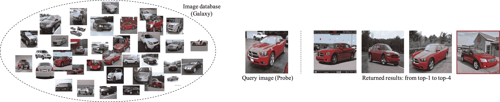

<!--yml

类别：未分类

日期：2024-09-06 19:49:52

-->

# [2111.06119] 基于深度学习的细粒度图像分析：综述

> 来源：[`ar5iv.labs.arxiv.org/html/2111.06119`](https://ar5iv.labs.arxiv.org/html/2111.06119)

# 基于深度学习的细粒度图像分析：综述

Xiu-Shen Wei, , Yi-Zhe Song, , Oisin Mac Aodha, Jianxin Wu, , Yuxin Peng, , Jinhui Tang, , Jian Yang, , Serge Belongie X.-S. Wei 和 J. Yang 现任职于中国南京理工大学计算机科学与工程学院，教育部高维信息智能感知与系统重点实验室，以及江苏省社会安全图像与视频理解重点实验室。Y.-Z. Song 现任职于英国萨里大学。O. Mac Aodha 现任职于英国爱丁堡大学。J. Wu 是中国南京大学新型软件技术国家重点实验室的成员。Y. Peng 现任职于中国北京大学。J. Tang 现任职于中国南京理工大学。S. Belongie 现任职于丹麦哥本哈根大学和先锋 AI 中心。X.-S. Wei 和 J. Yang 是通讯作者。

###### 摘要

细粒度图像分析（FGIA）是计算机视觉和模式识别领域中的一个长期存在且基础性的问题，并支撑着多种现实世界的应用。FGIA 任务的目标是分析来自下属类别的视觉对象，例如鸟类的不同物种或汽车的不同型号。细粒度图像分析固有的小类间变异和大类内变异，使其成为一个具有挑战性的问题。凭借深度学习的进步，近年来我们见证了基于深度学习的 FGIA 取得了显著的进展。在本文中，我们系统地回顾了这些进展，尝试通过整合两个基础性的细粒度研究领域——细粒度图像识别和细粒度图像检索，来重新定义和拓宽 FGIA 领域。此外，我们还审视了 FGIA 的其他关键问题，如公开可用的基准数据集和相关的领域特定应用。最后，我们强调了几个需要社区进一步探索的研究方向和未解的问题。

###### 索引词：

细粒度图像分析；深度学习；细粒度图像识别；细粒度图像检索。

## 1 引言

人类视觉系统天生具备细粒度图像推理能力——我们不仅能够区分狗和鸟，还能分辨西伯利亚哈士奇和阿拉斯加马拉穆特（见图 1）。细粒度图像分析（FGIA）正是为了同样的目的而引入学术界的，即教会机器以细粒度的方式“看”。FGIA 方法在工业和研究的广泛应用中都存在，例子包括自动生物多样性监测 [1, 2, 3]，智能零售 [4, 5, 6]，和智能交通 [7, 8]，并在保护 [9]和商业 [10]等领域产生了积极的影响。

FGIA 在计算机视觉中的目标是检索和识别属于多个子类别的图像（*即*一个超类别的子类别，或称为元类别或基础级类别），*例如*，不同种类的动物/植物，不同型号的汽车，不同种类的零售产品等。因此，关键挑战在于理解细粒度的视觉差异，这些差异足以区分在整体外观上非常相似但在 *细粒度* 特征上有所不同的对象。自近二十年前其创立以来，已经取得了重大进展 [11, 12, 13]。特别是深度学习 [14] 作为一种强大的特征学习方法，已经在 FGIA 领域取得了显著突破。深度学习使得 FGIA 的实际应用在各种应用场景中得到了极大推进 [7, 8, 9, 5]。

图 1：细粒度图像分析 *vs*. 通用图像分析（以视觉分类为例）。

图 2：深度学习基础的细粒度图像分析（FGIA）领域概览，以及未来的方向。

近年来，计算机视觉和机器学习研究社区对 FGIA 表现出显著的兴趣。粗略统计表明，每年在顶级视觉和机器学习会议上平均有$>10$篇基于深度学习的 FGIA 会议论文发表。也有许多特别期刊专门讨论 FGIA [15, 16, 17, 18, 19]。此外，一些有影响力的 FGIA 竞赛经常在在线平台上举行。代表性赛事包括 iNaturalist 竞赛系列（用于大量自然物种）[20]、自然保护协会渔业监测（用于鱼类物种分类）[21]、座头鲸识别（用于鲸鱼身份分类）[22]等。每个竞赛都吸引了来自世界各地的数百名参赛者，有些甚至超过了 2,000 支队伍。针对 FGIA 主题的特定教程和研讨会也曾在顶级国际会议上举行，*例如*[23, 24]。

尽管如此显著的兴趣，FGIA 的深度学习研究仍然显得零散。因此，本调查的目的在于（i）提供对 FGIA 最新成就的全面调查，尤其是深度学习技术带来的成就，更重要的是（ii）通过整合 FGIA 不同方面的研究，提出一个统一的研究前沿。我们的方法与现有的调查[25, 26]显著不同，这些调查仅关注细粒度*识别/分类*问题，而我们认为这只是 FGIA 更大研究的一部分。特别是，我们试图重新定义和拓宽细粒度图像分析领域，通过突显细粒度识别与细粒度图像*检索*这两个平行但互补的任务之间的协同效应，而细粒度图像检索也是 FGIA 的一个重要组成部分。

我们的调查从深度学习的独特视角系统、全面地回顾了 FGIA 领域的最新进展。我们的主要贡献总结如下：

+   •

    我们通过提供一个整合的视野来拓宽 FGIA 的领域，这个视野促进了细粒度图像分析中相关问题之间的协同效应。

+   •

    我们提供了基于深度学习的 FGIA 技术的全面综述，包括普遍接受的问题定义、基准数据集、不同类别的 FGIA 方法，并覆盖了领域特定的 FGIA 应用。特别地，我们将这些方法按类别组织（见图 2），以便读者快速了解该领域的最新进展。

+   •

    我们整合了现有方法在几个公开数据集上的表现，并提供讨论和见解，以指导未来的研究。

+   •

    我们最后讨论现有的挑战和开放问题，并确定新的趋势和未来方向，以为社区提供一个可行的路线图，以应对这些问题。

+   •

    最后，为了持续跟踪这个快速发展的领域的最新进展，我们提供了一个附属网页，按我们基于问题的分类法对解决 FGIA 问题的论文进行分类：http://www.weixiushen.com/project/Awesome_FGIA/Awesome_FGIA.html。

## 2 识别与检索

之前关于 FGIA 的调查，如[25, 26]，主要集中在细粒度识别上，因此没有暴露 FGIA 问题的所有方面。在本次调查中，我们首次涵盖了细粒度图像分析的两个基本领域（*即*，识别和检索），以全面回顾基于深度学习的 FGIA 技术的最新进展。在图 2 中，我们提供了一种新的分类法，反映了当前 FGIA 的格局。

细粒度识别：我们将不同的细粒度*识别*方法组织为三种范式，即 1) 通过定位-分类子网络进行识别，2) 通过端到端特征编码进行识别，3) 利用外部信息进行识别。细粒度识别是 FGIA 中研究最为广泛的领域，因为识别是大多数视觉系统的基本能力，因此值得长期持续研究。

细粒度检索：根据查询图像的类型，我们将细粒度*检索*方法分为两组，即 1) 基于内容的细粒度图像检索和 2) 基于草图的细粒度图像检索。与细粒度识别相比，细粒度检索近年来是 FGIA 中一个新兴领域，越来越受到学术界和工业界的关注。

识别与检索的差异：细粒度识别和检索都旨在识别不同细粒度对象之间的辨别性但微妙的差异。然而，细粒度识别是一个封闭世界任务，具有*固定*数量的从属类别。相比之下，细粒度检索将问题扩展到具有无限子类别的开放世界环境。此外，细粒度检索还旨在对所有实例进行排序，以便基于查询中的细粒度细节，将展示感兴趣概念（*例如*，相同子类别标签）的图像排名最高。

识别与检索的协同作用：细粒度识别和检索的进展有共通之处，且可以相互受益。细粒度识别和检索共享许多常见技术，如深度度量学习方法[27, 28]、多模态匹配方法[29, 30]以及选择有用的深度描述符的基本理念[31, 32]等。详细讨论见第七部分。此外，在实际应用中，细粒度识别和检索也相互补充，如检索技术能够通过利用从细粒度识别模型中学到的表示来支持新子类别识别[33, 5]。

## 3 背景：问题与挑战

细粒度图像分析（FGIA）关注处理属于同一元类别的多个*下属类别*的对象（*例如*，不同鸟类的物种或不同型号的汽车），通常涉及两个核心任务：细粒度图像识别和细粒度图像检索。如图 3 所示，细粒度分析处于基本级别类别分析（*即*，通用图像分析）和实例级别分析（*例如*，个体识别）之间的连续体上。

具体而言，将 FGIA 与通用图像分析区分开的因素在于，通用图像分析中，目标对象属于粗粒度的元类别（*即*，基本层级类别），因此在视觉上非常不同（*例如*，确定图像是否包含鸟类、水果或狗）。然而，在 FGIA 中，由于对象通常来自相同元类别的子类别，问题的精细化特性导致它们在视觉上相似。作为精细识别的一个例子，在图 1 中，任务是分类不同品种的狗。为了准确的图像识别，需要捕捉微妙的视觉差异（*例如*，耳朵、鼻子或尾巴等区分特征）。对这些特征进行表征对于其他 FGIA 任务（*例如*，检索）也是非常有益的。此外，如前所述，问题的精细化特性具有挑战性，因为由高度相似的子类别造成的*类间小变异*，以及姿势、尺度和旋转中的*类内大变异*（参见图 4）。这与通用图像分析（*即*，小的类内变异和大的类间变异）正好相反，使得 FGIA 成为一个独特且具有挑战性的问题。

虽然实例级分析通常针对对象的*特定实例*，而不仅仅是对象类别甚至对象子类别，如果我们进一步深入粒度范围，在极端情况下，个体识别（*例如*，面部识别）可以被视为精细识别的特殊实例，其中粒度水平是个体身份级别。例如，人/车辆重识别[34, 7]可以被认为是一个精细的任务，其目的是确定两张图像是否拍摄了同一个特定的人/车辆。在实践中，这些工作通过使用与 FGIA 相关的方法来解决相应的领域特定问题，*例如*，通过捕捉对象（面部、人员和车辆）的区分部分[35, 8, 36]，发现从粗到细的结构信息[37]，开发基于属性的模型[38, 39]，等等。这些实例级问题的研究也非常活跃。然而，由于这些问题不在经典 FGIA 的范围内（参见图 3），有关更多信息，我们请读者参考这些特定主题的调查论文，*例如*，[34, 7, 40]。接下来，我们将开始制定经典 FGIA 的定义。

图 3：细粒度图像分析的示意图，位于基础类别分析（*即*，通用图像分析）和实例级分析（*例如*，汽车识别）之间的连续体。

图 4：细粒度图像分析的关键挑战，*即*，小的类间变异和大的类内变异。这里我们展示了来自[13]的四种不同的 Tern 物种，每行一种，每列展示不同实例。

公式：在通用图像识别中，我们给定一个训练数据集$\mathcal{D}=\left\{\left(\bm{x}^{(n)},y^{(n)}\right)|i=1,...,N\right\}$，包含多个图像和相关的类别标签（*即*，$\bm{x}$和$y$），其中$y\in[1,...,C]$。每个实例$\left(\bm{x},y\right)$属于图像和标签空间的联合空间（*即*，$\mathcal{X}$和$\mathcal{Y}$），根据$p_{r}(\bm{x},y)$的分布

|  | $\left(\bm{x},y\right)\in\mathcal{X}\times\mathcal{Y}\,.$ |  | (1) |
| --- | --- | --- | --- |

特别地，标签空间$\mathcal{Y}$是所有$C$个子空间的并集，对应于$C$个类别，*即*，$\mathcal{Y}=\mathcal{Y}_{1}\cup\mathcal{Y}_{2}\cup\cdots\cup\mathcal{Y}_{c}\cup\cdots\cup\mathcal{Y}_{C}$。然后，我们可以通过最小化期望风险来训练一个由$\theta$参数化的预测/识别深度网络$f(\bm{x};\theta)$，用于通用图像识别。

|  | $\min_{\theta}\mathbb{E}_{(\bm{x},y)\sim p_{r}(\bm{x},y)}\left[\mathcal{L}(y,f(\bm{x};\theta))\right]\,,$ |  | (2) |
| --- | --- | --- | --- |

其中$\mathcal{L}(\cdot,\cdot)$是一个损失函数，用于衡量真实标签与$f(\cdot;\theta)$预测标签之间的匹配程度。正如前面提到的，细粒度识别旨在准确分类来自某一元类别的不同子类别的实例，*即*，

|  | $\left(\bm{x},y^{\prime}\right)\in\mathcal{X}\times\mathcal{Y}_{c}\,,$ |  | (3) |
| --- | --- | --- | --- |

其中$y^{\prime}$表示细粒度标签，$\mathcal{Y}_{c}$表示类别$c$的标签空间作为元类别。因此，细粒度识别的优化目标为

|  | $\min_{\theta}\mathbb{E}_{(\bm{x},y^{\prime})\sim p^{\prime}_{r}(\bm{x},y^{\prime})}\left[\mathcal{L}(y^{\prime},f(\bm{x};\theta))\right]\,.$ |  | (4) |
| --- | --- | --- | --- |

与精细化识别相比，除了正确获取子类别外，精细化检索还必须对所有实例进行排序，使得属于同一子类别的图像根据检索任务中的精细化细节排在最高位置。给定一个输入查询 $\bm{x}^{q}$，精细化检索系统的目标是基于它们与查询的精细化相关性，对检索集 $\Omega=\{\bm{x}^{(i)}\}_{i=1}^{M}$（其标签 $y^{\prime}\in\mathcal{Y}_{c}$）中的所有实例进行排序。让 $\mathcal{S}_{\Omega}=\{s^{(i)}\}_{i=1}^{M}$ 代表 $\bm{x}^{q}$ 和每个 $\bm{x}^{(i)}$ 之间的相似性，通过应用于相应精细化表示的预定义度量来测量，即 $h(\bm{x}^{q};\delta)$ 和 $h(\bm{x}^{(i)};\delta)$。这里，$\delta$ 表示检索模型 $h$ 的参数。对于标签与 $\bm{x}^{q}$ 的精细化类别一致的实例，我们将其形成正集 $\mathcal{P}_{q}$ 并获得相应的 $\mathcal{S}_{P}$。然后，检索模型 $h(\cdot;\delta)$ 可以通过最大化排序分数来训练。

|  | $\max_{\delta}\frac{\mathcal{R}(i,\mathcal{S}_{P})}{\mathcal{R}(i,\mathcal{S}_{\Omega})}\,,$ |  | (5) |
| --- | --- | --- | --- |

相对于所有查询图像，其中 $\mathcal{R}(i,\mathcal{S}_{P})$ 和 $\mathcal{R}(i,\mathcal{S}_{\Omega})$ 分别指示实例 $i$ 在 $\mathcal{P}_{q}$ 和 $\Omega$ 中的排名。

## 4 基准数据集

最近几年，视觉领域发布了许多涵盖不同领域的精细化基准数据集，例如，鸟类 [13, 41, 1], 狗类 [42, 27], 汽车 [43], 飞机 [44], 花卉 [45], 蔬菜 [46], 水果 [46], 食物 [47], 时尚 [38, 33, 6], 零售产品 [5, 48]，等等。此外，值得注意的是，即使是最流行的大规模图像分类数据集，例如，ImageNet [49]，也包含了覆盖大量狗类和鸟类子类别的精细化类别。

图 5：不同种类的花卉/蔬菜 [46]、不同车型的汽车 [43] 和飞机 [44] 以及不同种类的零售产品 [5] 的精细化图像示例。准确识别这些精细化对象需要提取具有辨别力但细微的对象部分或图像区域。（最佳查看效果为彩色和放大显示。）

表 I: 总结了按主要应用主题组织并按发布顺序排序的流行细粒度图像数据集。请注意，“$\sharp$ 图像”表示这些数据集的总图像数量。“BBox”表示该数据集是否提供了物体边界框的监督。“部分注释”意味着提供了关键部件的注释。“HRCHY”对应于层次标签。“ATR”表示属性标签（*例如*，翅膀颜色，雄性，雌性等）。 “文本”表示是否提供了图像的细粒度文本描述。一些数据集在此列出两次，因为它们在识别和检索任务中都被广泛使用。

| 主题 | 数据集名称 | 年份 | 元类别 | $\sharp$ 图像 | $\sharp$ 类别 | BBox | 部分注释 | HRCHY | ATR | 文本 |
| --- | --- | --- | --- | --- | --- | --- | --- | --- | --- | --- |
| 识别 | Oxford Flowers [45] | 2008 | 花卉 | 8,189 | 102 |  |  |  |  | ✓ |
| CUB200-2011 [13] | 2011 | 鸟类 | 11,788 | 200 | ✓ | ✓ |  | ✓ | ✓ |
| Stanford Dogs [42] | 2011 | 狗 | 20,580 | 120 | ✓ |  |  |  |  |
| Stanford Cars [43] | 2013 | 汽车 | 16,185 | 196 | ✓ |  |  |  |  |
| FGVC Aircraft [44] | 2013 | 飞机 | 10,000 | 100 | ✓ |  | ✓ |  |  |
| Birdsnap [41] | 2014 | 鸟类 | 49,829 | 500 | ✓ | ✓ |  | ✓ |  |
| Food101 [47] | 2014 | 食物菜肴 | 101,000 | 101 |  |  |  |  |  |
| NABirds [1] | 2015 | 鸟类 | 48,562 | 555 | ✓ | ✓ |  |  |  |
| Food-975 [50] | 2016 | 食品 | 37,885 | 975 |  |  |  | ✓ |  |
| DeepFashion [38] | 2016 | 服装 | 800,000 | 1,050 | ✓ | ✓ |  | ✓ |  |
| Fru92 [46] | 2017 | 水果 | 69,614 | 92 |  |  | ✓ |  |  |
| Veg200 [46] | 2017 | 蔬菜 | 91,117 | 200 |  |  | ✓ |  |  |
| iNat2017 [2] | 2017 | 植物与动物 | 857,877 | 5,089 | ✓ |  | ✓ |  |  |
| Dogs-in-the-Wild [27] | 2018 | 狗 | 299,458 | 362 |  |  |  |  |  |
| RPC [5] | 2019 | 零售产品 | 83,739 | 200 | ✓ |  | ✓ |  |  |
|  | Products-10K [48] | 2020 | 零售产品 | 150,000 | 10,000 | ✓ |  | ✓ |  |  |
|  | iNat2021 [3] | 2021 | 植物与动物 | 3,286,843 | 10,000 |  |  | ✓ |  |  |
| 检索 | Oxford Flowers [45] | 2008 | 花卉 | 8,189 | 102 |  |  |  |  | ✓ |
| CUB200-2011 [13] | 2011 | 鸟类 | 11,788 | 200 | ✓ | ✓ |  | ✓ | ✓ |
| Stanford Cars [43] | 2013 | 汽车 | 16,185 | 196 | ✓ |  |  |  |  |
| SBIR2014^∗ [51] | 2014 | 多类别 | 1,120/7,267 | 14 | ✓ | ✓ |  | ✓ |  |
| DeepFashion [38] | 2016 | 服装 | 800,000 | 1,050 | ✓ | ✓ |  | ✓ |  |
| QMUL-Shoe^∗ [52] | 2016 | 鞋子 | 419/419 | 1 |  |  |  | ✓ |  |
| QMUL-Chair^∗ [52] | 2016 | 椅子 | 297/297 |         1 |  |  |  | ✓ |  |
| Sketchy^∗ [53] | 2016 | 多种 |    75,471/12,500 |     125 |  |  |  |  |  |
| QMUL-Handbag^∗ [54] | 2017 | 手袋 |    568/568 |         1 |  |  |  |  |  |
| SBIR2017^∗ [55] | 2017 | 鞋子 |   912/304 |         1 |  | ✓ |  | ✓ |  |
| QMUL-Shoe-V2^∗ [56] | 2019 | 鞋子 |   6,730/2,000 |         1 |  |  |  |  |  |
|  | FG-Xmedia^† [57] | 2019 | 鸟类 | 11,788 |     200 |  |  |  |  | ✓ |

^∗ 对于这些基于草图的细粒度图像检索数据集，通常它们包含草图和图像对（*即*，不仅仅是图像）。因此，我们分别列出了草图和图像的数量（草图数量在前）。关于“$\sharp$ 类别”，我们报告了这些数据集中的元类别数量。

^† 除了文本描述，*FG-Xmedia* 还包含多种其他模态，如视频和音频。

图 6：来自 *CUB200-2011* [13] 的示例图像，具有多种不同类型的注释，如类别标签、部件注释（*即* 关键点位置）、用绿色显示的对象边界框、属性标签（*即*，“ATR”）以及文本描述。

一些细粒度基准数据集的代表性图像可以在图 5 中找到。在表 I 中，我们总结了最常用的图像数据集，并指出了它们的元类别、图像数量、类别数量、主要任务以及额外的可用监督信息，如边界框、部件注释、层级标签、属性标签和文本描述（参见图 6）。这些数据集是该领域取得显著进展的重要因素之一，不仅作为衡量和比较竞争方法性能的共同基础，也推动了该领域向日益复杂、实际和具有挑战性的问题发展。

图 7：基于深度学习的代表性细粒度识别方法的时间顺序概览，这些方法按照不同的学习方式进行分类。（最佳效果请查看彩色图像。）

精细化鸟类分类数据集*CUB200-2011* [13] 是最受欢迎的精细化数据集之一。大多数 FGIA 方法选择它与最先进的方法进行比较。此外，*CUB200-2011* 还不断在高级任务上做出贡献，例如为多模态分析收集精细化图像的文本描述，参见 [58, 59] 和第 5.3.2 节。

近年来，提出了更多具有挑战性和实际应用的精细化数据集，例如包含不同植物和动物物种的*iNat2017* [2] 和用于零售产品的*RPC* [5]。这些数据集的新特性包括它们是大规模的、具有层次结构的、存在领域差距并形成长尾分布。这些挑战展示了 FGIA 在现实世界中的实际需求，并激发了新的有趣的研究挑战（参见第八部分）。

此外，为了进一步推动精细化检索的发展，构建了一系列基于草图的精细化图像检索数据集，例如*QMUL-Shoe* [52]、*QMUL-Chair* [52]、*QMUL-handbag* [54]、*SBIR2014* [51]、*SBIR2017* [55]、*Sketchy* [53]、*QMUL-Shoe-V2* [56]。另外，还构建了一些新颖的数据集和基准，例如*FG-Xmedia* [57]，以扩展精细化图像检索到精细化跨媒体检索。

## 5 精细化图像识别

精细化图像识别在过去十年中一直是 FGIA 最活跃的研究领域。精细化识别旨在区分属于同一基本类别的众多视觉上相似的子类别，例如动物物种的精细区分 [2]、汽车 [43]、水果 [46]、飞机型号 [44] 等。它已经在现实世界任务中得到广泛应用，例如生态系统保护（识别生物物种）[9]、智能零售系统 [5, 10] 等。由于区分区域定位和精细特征学习的挑战，识别精细化类别是困难的。研究人员尝试从不同角度解决这些挑战。本节回顾了自深度学习出现以来的主要精细化识别方法。

广泛地说，现有的细粒度识别方法可以组织成以下三种主要范式：

+   •

    基于定位-分类子网络的识别；

+   •

    基于端到端特征编码的识别；

+   •

    使用外部信息的识别。

其中，前两种范式通过仅利用与细粒度图像相关的监督信息，如图像标签、边界框、部件注释等，来限制自己。为了进一步解决模糊的细粒度问题，有一系列工作使用了额外的信息，例如图像拍摄的时间和地点[60, 61]，网页图像[62, 63]，或文本描述[58, 59]。为了直观地展示这些具有代表性的深度学习基础的细粒度识别方法，我们在图 7 中通过将它们组织成三种上述范式，提供了一个时间顺序的概述。

对于性能评估，当测试集是平衡的（*即*，每个类别的测试样本数量相似）时，细粒度识别中最常用的指标是所有子类别数据集上的分类*准确率*。它被定义为

|  | ${\rm Accuracy}=\frac{ | I_{\rm correct} | }{ | I_{\rm total} | }\,,$ |  | (6) |
| --- | --- | --- | --- | --- | --- | --- | --- |

其中 $|I_{\rm total}|$ 代表测试集中所有子类别的图像数量，而 $|I_{\rm correct}|$ 代表被模型正确分类的图像数量。

### 5.1 基于定位-分类子网络的识别

图 8：基于定位-分类子网络范式的细粒度识别高层次流程图示。

研究人员尝试创建能够捕捉细粒度对象的判别性语义部分的模型，然后构建一个对应于这些部分的中级表示用于最终分类，详见图 8。更具体地说，设计了一个定位子网络用于定位关键部分，然后获取相应的部分级（局部）特征向量。这通常与对象级（全局）图像特征结合以表示细粒度对象。接着是一个分类子网络进行识别。这种两种协作子网络的框架形成了第一个范式，即细粒度识别与*定位-分类子网络*。这些模型的动机是首先找到相应的部分，然后比较它们的外观。具体来说，理想的是捕捉在细粒度类别中共享的语义部分（*例如*，头部和躯干），以及发现这些部分表示之间的微妙差异。

该范式下的现有方法可以分为四种大类：1) 使用检测或分割技术，2) 利用深度滤波器，3) 利用注意力机制，和 4) 其他方法。

表 II: 两种学习范式在细粒度基准数据集上的对比细粒度识别结果（详见第 5.1 和第 5.2 节）。即，鸟类（*CUB200-2011* [13]）、狗类（*斯坦福狗* [42]）、汽车（*斯坦福汽车* [43]）和飞机（*FGVC 飞机* [44]）。注意，“Train anno.” 和 “Test anno.” 表示训练和测试阶段使用的监督信号。符号“–”表示结果不可用。

| 方法 | 发表在 | 训练标注 | 测试标注 | 主干网络 | 图像分辨率 | 准确率 |
| --- | --- | --- | --- | --- | --- | --- |
| 鸟类 | 狗类 | 汽车 | 飞机 |
| 通过定位-分类子网络进行的细粒度识别 | 使用检测或分割技术 | Branson *等* [64] | BMVC 2014 | BBox+Parts |  | CaffeNet | $224\times 224$ | 75.7% | – | – | – |
| PB R-CNN [65] | ECCV 2014 | BBox+Parts | BBox | Alex-Net | $224\times 224$ | 76.4% | – | – | – |
| Krause *等* [66] | CVPR 2015 | BBox |  | CaffeNet | $224\times 224$ | 82.0% | – | 92.6% | – |
| Deep LAC [67] | CVPR 2015 | BBox+Parts | BBox | Alex-Net | $227\times 227$ | 80.3% | – | – | – |
| PS-CNN [68] | CVPR 2016 | BBox+Parts | BBox | CaffeNet | $227\times 227$ | 76.6% | – | – | – |
| SPDA-CNN [69] | CVPR 2016 | BBox+Parts | BBox | CaffeNet | Longer side to 800px | 81.0% | – | – | – |
| SPDA-CNN [69] | CVPR 2016 | BBox+Parts | BBox | VGG-16 | Longer side to 800px | 85.1% | – | – | – |
| Zhang *等* [70] | IEEE TIP 2016 |  |  | Alex-Net | $224\times 224$ | 78.9% | 80.4% | – | – |
| HSnet [71] | CVPR 2017 | Parts |  | GoogLeNet | $224\times 224$ | 87.5% | – | 93.9% | – |
| TSC [72] | AAAI 2017 |  |  | VGG-16 | Not given | 84.7% | – | – | – |
| Mask-CNN [31] | PR 2018 | Parts |  | VGG-16 | $448\times 448$ | 85.7% | – | – | – |
| Ge *等* [73] | CVPR 2019 |  |  | GoogLeNet+BN | Shorter side to 800px | 90.3% | 93.9% | – | – |
| GCL [74] | AAAI 2020 |  |  | ResNet-50+BN | $448\times 448$ | 88.3% | – | 94.0% | 93.2% |
| FDL [75] | AAAI 2020 |  |  | ResNet-50 | $448\times 448$ | 88.6% | 85.0% | 94.3% | 93.4% |
| 利用深度滤波器 | Two-level atten. [76] | CVPR 2015 |  |  | VGG-16 | Not given | 77.9% | – | – | – |
| CL [77] | CVPR 2015 |  |  | Alex-Net | $448\times 448$ | 73.5% | – | – | – |
| NAC [78] | ICCV 2015 |  |  | VGG-19 | Not given | 81.0% | – | – | – |
| PDFS [79] | CVPR 2016 |  |  | VGG-16 | Not given | 84.5% | 72.0% | – | – |
| DFL-CNN [80] | CVPR 2018 |  |  | VGG-16 | $448\times 448$ | 86.7% | – | 93.8% | 92.0% |
| S3N [81] | ICCV 2019 |  |  | ResNet-50 | $448\times 448$ | 88.5% | – | 94.7% | 92.8% |
| Huang *等* [82] | CVPR 2020 |  |  | ResNet-101 | Shorter side to 448px | 87.3% | – | – | – |
| 注意力机制 | RA-CNN [83] | CVPR 2017 |  |  | VGG-19 | $448\times 448$ | 85.3% | 87.3% | 92.5% | – |
| MA-CNN [84] | ICCV 2017 |  |  | VGG-19 | $448\times 448$ | 86.5% | – | 92.8% | 89.9% |
| Liu *等* [39] | AAAI 2017 | Parts+Attr. |  | ResNet-50 | $448\times 448$ | 85.4% | – | – | – |
| Sun *等* [27] | ECCV 2018 |  |  | ResNet-50 | $448\times 448$ | 86.5% | 84.8% | 93.0% | – |
| OPAM [85] | IEEE TIP 2018 |  |  | VGG-16 | Not given | 85.8% | – | 92.2% | – |
| MGE-CNN [86] | ICCV 2019 |  |  | ResNet-50 | $448\times 448$ | 88.5% | – | 93.9% | – |
| TASN [87] | CVPR 2019 |  |  | ResNet-50 | $224\times 224$ | 87.9% | – | 93.8% | – |
| PA-CNN [88] | IEEE TIP 2020 |  |  | VGG-19 | $448\times 448$ | 87.8% | – | 93.3% | 91.0% |
| Ji *等* [89] | CVPR 2020 |  |  | ResNet-50 | $448\times 448$ | 88.1% | – | 94.6% | 92.4% |
| Others | STN [90] | NeurIPS 2015 |  |  | GoogLeNet+BN | $448\times 448$ | 84.1% | – | – | – |
| BoT [91] | CVPR 2016 |  |  | Alex-Net | Not given | – | – | 92.5% | 88.4% |
| NTS-Net [92] | ECCV 2018 |  |  | ResNet-50 | $448\times 448$ | 87.5% | – | 93.9% | 91.4% |
| M2DRL [93] | IJCV 2019 |  |  | VGG-16 | $448\times 448$ | 87.2% | – | 93.3% | – |
| DF-GMM [94] | CVPR 2020 |  |  | ResNet-50 | $448\times 448$ | 88.8% | – | 94.8% | 93.8% |
| 通过端到端特征编码的细粒度识别 | 高阶特征交互 | 双线性 CNN [95] | ICCV 2015 |  |  | VGG-16+VGG-M | $448\times 448$ | 84.1% | – | 91.3% | 84.1% |
| C-BCNN [96] | CVPR 2016 |  |  | VGG-16 | $448\times 448$ | 84.3% | – | 91.2% | 84.1% |
| KP [97] | CVPR 2017 |  |  | VGG-16 | $224\times 224$ | 86.2% | – | 92.4% | 86.9% |
| LRBP [98] | CVPR 2017 |  |  | VGG-16 | $224\times 224$ | 84.2% | – | 90.0% | 87.3% |
| G²DeNet [99] | CVPR 2017 |  |  | VGG-16 | 较长边 200px | 87.1% | – | 92.5% | 89.0% |
| Cai *等人* [100] | ICCV 2017 |  |  | VGG-16 | $448\times 448$ | 85.3% | – | 91.7% | 88.3% |
| iSQRT-COV [101] | CVPR 2018 |  |  | ResNet-101 | $224\times 224$ | 88.7% | – | 93.3% | 91.4% |
| DeepKSPD [102] | ECCV 2018 |  |  | VGG-16 | $448\times 448$ | 86.5% | – | 93.2% | 91.0% |
| HBP [103] | ECCV 2018 |  |  | VGG-16 | $448\times 448$ | 87.1% | – | 93.7% | 90.3% |
| GP [104] | ECCV 2018 |  |  | VGG-16 | $448\times 448$ | 85.8% | – | 92.8% | 89.8% |
| DBTNet-50 [105] | NeurIPS 2019 |  |  | VGG-16 | $448\times 448$ | 87.5% | – | 94.1% | 91.2% |
|  | MOMN [106] | IEEE TIP 2020 |  |  | VGG-16 | $448\times 448$ | 87.3% | – | 92.8% | 90.4% |
| 特定损失函数 | MaxEnt [107] | NeurIPS 2018 |  |  | VGG-16 | $224\times 224$ | 77.0% | 65.4% | 83.9% | 78.1% |
| MaxEnt [107] | NeurIPS 2018 |  |  | 双线性 CNN | $224\times 224$ | 85.3% | 83.2% | 92.8% | 86.1% |
| PC [108] | ECCV 2018 |  |  | 双线性 CNN | $224\times 224$ | 85.6% | 83.0% | 92.4% | 85.7% |
| Sun *等人* [27] | ECCV 2018 |  |  | ResNet-50 | $448\times 448$ | 86.5% | 84.8% | 93.0% | – |
| CIN [109] | AAAI 2020 |  |  | ResNet-101 | $448\times 448$ | 88.1% | – | 94.5% | 92.8% |
| Sun *等人* [110] | AAAI 2020 |  |  | ResNet-50 | $448\times 448$ | 88.6% | 87.7% | 94.9% | 93.5% |
| API-Net [111] | AAAI 2020 |  |  | ResNet-50 | $448\times 448$ | 87.7% | 88.3% | 94.8% | 93.0% |
| API-Net [111] | AAAI 2020 |  |  | DenseNet-161 | $448\times 448$ | 90.0% | 89.4% | 95.3% | 93.9% |
| MC-Loss [112] | IEEE TIP 2020 |  |  | 双线性 CNN | $448\times 448$ | 86.4% | – | 94.4% | 92.9% |
| 其他 | BGL [50] | CVPR 2016 |  |  | VGG-16 | $224\times 224$ | 75.9% | – | 86.0% | – |
| BGL [50] | CVPR 2016 | 边界框 |  | VGG-16 | $224\times 224$ | 80.4% | – | 90.5% | – |
| DCL [113] | CVPR 2019 |  |  | ResNet-50 | $448\times 448$ | 87.8% | – | 94.5% | 93.0% |
| Cross-X [114] | ICCV 2019 |  |  | ResNet-50 | $448\times 448$ | 87.7% | 88.9% | 94.6% | 92.6% |
|  | PMG [115] | ECCV 2020 |  |  | ResNet-50 | $448\times 448$ | 89.6% | – | 95.1% | 93.4% |

#### 5.1.1 采用检测或分割技术

采用检测或分割技术 [116, 117, 118] 来定位对应于细粒度物体部件的关键图像区域是直接的，*例如*，鸟的头部、鸟的尾部、汽车灯、狗的耳朵、狗的躯干等。得益于定位信息，*即* 部件级别的边界框或分割掩模，模型可以获得关于这些部件的更具区分性的中级（部件级别）表示。因此，它可以进一步增强分类子网络的学习能力，从而显著提升最终的识别准确性。

早期在这一范式中的工作利用了额外的密集部分注释（*即* 关键点定位，参见图 6 的左侧）来定位物体的语义关键部位。例如，Branson *等* [64] 提出了使用检测到的部分关键点组来计算多个变形图像区域，并通过姿态归一化进一步获得相应的部分级别特征。在同一时期，Zhang *等* [65] 首先基于真实标注生成了部分级别的边界框，然后训练了一个 R-CNN [118] 模型进行部分检测。Di *等* [67] 进一步提出了一种阀门联动功能，该功能不仅连接了所有子网络，还根据 *部件对齐* 结果细化了定位。为了整合语义部分检测和抽象，SPDA-CNN [69] 设计了一种自上而下的方法，通过继承先验几何约束生成 *部分级别* 提案，并使用 Faster R-CNN [116] 返回部分定位预测。其他方法利用了分割信息。PS-CNN [68] 和 Mask-CNN [31] 使用分割模型获取部件/物体掩模以帮助部件/物体定位。与检测技术相比，分割可以得到更准确的部件定位 [31]，因为分割关注的是更细的像素级目标，而不仅仅是粗略的边界框。

然而，采用传统的检测器或分割模型需要密集的部分注释进行训练，这既费力又限制了实际细粒度应用的可扩展性和实用性。因此，仅通过使用图像级标签来准确定位细粒度部分是理想的 [70, 72, 73, 74, 75]。这些方法被称为“弱监督”，因为它们只使用图像级标签。值得注意的是，自 2016 年以来，开发这种弱监督设置下的细粒度方法成为了一种明显的趋势，而不是强监督设置（*即*，使用部分注释和边界框），参见表 II。

在弱监督定位分类设置中的识别方法总是依赖于无监督方法来获取与对象部分对应的语义组。具体来说，Zhang *等* [70] 采用了空间金字塔策略 [119] 来从对象提议中生成部分提议。然后，通过使用聚类方法，他们生成了部分提议原型簇，并进一步选择有用的簇以获得区分性部分特征。在这种弱监督情况下，共同分割 [120] 方法也被广泛使用。一种方法是使用共同分割在没有监督的情况下获取对象掩膜，然后执行启发式策略，*例如*，部分约束 [72] 或部分对齐 [66]，以定位细粒度部分。

值得注意的是，大多数以前的工作忽视了区分性部分特征之间的内部语义关联。具体而言，前述方法独立地挑选出区分性区域并直接利用其特征，同时忽视了一个对象的特征是相互语义相关的，并且区域组可能更具区分性。因此，最近一些方法尝试联合学习部分特征之间的相互依赖关系，以获得更通用和强大的细粒度图像表示。通过执行不同的特征融合策略（*例如*，LSTM [71, 73]，图谱 [74]，或知识蒸馏 [75]），这些联合部分特征学习方法在识别准确性上显著高于以前的独立部分特征学习方法。

#### 5.1.2 利用深度滤波器

在深度卷积神经网络（CNN）中，深度滤波器（*即*，CNN 滤波器）指的是卷积层的学习权重 [14]。这些深度滤波器的响应/激活可以视为局部描述符。深度描述符具有以下属性 [121]: 1) 局部性：它们描述并对应于相对于整个输入图像的局部图像区域；2) 空间性：它们还能编码空间信息。随着研究开始探索 CNN 在计算机视觉中的应用，研究人员逐渐发现中间 CNN 输出（*例如*，局部深度描述符）可以与常见物体的语义部件相关联 [122]。因此，细粒度社区尝试将这些滤波器输出用作部件检测器 [76, 77, 78, 79, 80, 81, 82]，并依赖它们进行定位-分类的细粒度识别。其中一个主要优势是这不需要任何部件级的注释。

Xiao *等人* [76] 对这些深度滤波器进行了谱聚类 [123] 以形成组，然后使用这些滤波器组作为部件检测器。类似地，NAC [78] 利用 CNN 的通道作为部件检测器。Liu *等人* [77] 通过使用来自两个连续卷积层的激活作为指导，开发了一种跨层池化方法，通过聚合基于部件的深度描述符。PDFS [79] 被提出用来选择对应于部件的深度滤波器，然后迭代更新学习到的“检测器”，从而发现具有判别性和一致性的基于部件的图像区域。对于这些前述方法，在从预训练分类 CNN 中获取检测到的部件后，它们通常会训练离线分类器，*例如*，SVM 或决策树 [123]，使用基于部件的特征向量进行最终识别任务。

为了促进部分检测和基于部分的分类的学习，开发了统一的端到端训练的细粒度模型[80, 81, 82]。因此，观察到了显著的识别改善，见表 II。王*等人*[80]利用额外的可学习的$1\times 1$卷积滤波器作为小块（即部分）检测器。接着通过全局最大池化来保持相对于该滤波器的最高激活值以进行最终分类。后来，基于类别响应图[124]，S3N[81]利用类别峰值响应，即局部最大值，作为部分定位的基础。类似于[71, 73, 74]，S3N 也以互助部分学习的方式考虑部分之间的关联。

#### 5.1.3 利用注意力机制

尽管之前的定位-分类细粒度方法展示了强大的分类性能，但其主要缺陷之一是需要对物体部分进行有意义的定义。然而，在许多应用中，可能很难表示或甚至定义某些物体类别的常见部分，例如，像食物盘子这类非结构化物体[47]或具有重复部分的花朵[45]。与这些定位-分类方法相比，利用注意力机制[125]作为子模块来寻找部分是一种更自然的解决方案。这使得卷积神经网络（CNN）能够关注于定义较松散的区域，以应对细粒度物体，因此成为一个有前景的方向。

众所周知，注意力在人的感知中发挥着重要作用[125, 126]。人类利用一系列部分的瞥见，选择性地关注对象或场景中的显著部分，以便更好地捕捉视觉结构[127]。受到这一点的启发，Fu *et al.* 和 Zheng *et al.* [83, 84] 首次将注意力处理技术引入到 CNN 中，以提高细粒度识别的准确性。具体来说，RA-CNN [83] 使用递归视觉注意力模型选择一系列注意力区域（对应于对象的“部分”¹¹1 请注意，这里的“部分”指的是用于细粒度对象的松散定义的注意力区域，这与手动标注的明确对象部分不同，参见第 5.1.1 节）。RA-CNN 通过将先前的预测作为参考，迭代生成从粗到细的区域注意力图。MA-CNN [84] 配备了多重注意力 CNN，并能够并行返回多个区域注意力。随后，Peng *et al.* [85] 和 Zheng *et al.* [88] 提出了多级注意力模型，以获得分层的注意力信息（*即*，包括对象级别和部分级别）。He *et al.* [128] 应用了多级注意力，以通过一个 $n$-路径端到端的辨别定位网络同时定位每张图像中的多个辨别区域，并编码其特征。这种多级注意力可以产生与上述单级注意力方法相比的多样和互补的信息。Sun *et al.* [27] 结合了通道注意力 [129] 和度量学习 [130]，以加强不同关注区域之间的相关性。Zheng *et al.* [87] 开发了一个三线性注意力采样网络，从数百个部分提议中学习细粒度细节，并高效地将学习到的特征提炼到一个单一的 CNN 中。最近，Ji *et al.* [89] 提出了一个基于注意力的卷积二叉神经树，它将注意力机制与树结构相结合，以促进从粗到细的分层细粒度特征学习。尽管注意力机制在细粒度识别中取得了强大的准确性，但在小规模数据的情况下，它倾向于过拟合。

#### 5.1.4 其他方法

在定位分类范式中，也提出了许多其他方法用于细粒度识别。空间变换网络（STN）[90]最初是为了以端到端可学习的方式显式地执行空间变换而引入的。它们也可以配备多个变换器以并行进行细粒度识别。STN 中的每个变换器可以对应于具有空间变换能力的部件检测器。后来，Wang *et al.* [91]开发了一组具有几何约束的补丁作为模板，以自动挖掘具有区分性的三元组，然后生成中级表示以进行分类。除此之外，其他方法通过引入反馈机制实现了更好的准确性。具体而言，NTS-Net [92]采用多代理协作学习方案来解决细粒度识别的核心问题，即准确识别图像中的信息区域。M2DRL [131, 93]首次在对象和部件层面上利用深度强化学习 [132] 捕捉多粒度区分定位和多尺度表示，并使用其量身定制的奖励函数。受到自然语言处理中的低秩机制 [133] 的启发，Wang *et al.* [94] 提出了 DF-GMM 框架，以缓解细粒度部件定位中高层特征图的区域扩散问题。DF-GMM 首先通过构造低秩基来从高层特征图中选择具有区分性的区域，然后应用低秩基的空间信息来重建低秩特征图。部件相关性也可以通过重组处理来建模，从而提高准确性。

### 5.2 通过端到端特征编码进行识别

细粒度识别的第二种学习范式是*端到端特征编码*。与其他视觉任务一样，特征学习在细粒度识别中也发挥着基础作用。由于子类别之间的差异通常非常微妙和局部，单靠全连接层来捕捉全局语义信息限制了细粒度模型的表示能力，因此限制了最终识别性能的进一步提升。因此，已经开发出旨在学习统一但具有区分性的图像表示的方法，以建模细粒度类别之间的微妙差异，具体方法包括：1) 进行高阶特征交互，2) 设计新颖的损失函数，以及 3) 通过其他手段。

#### 5.2.1 进行高阶特征交互

特征学习在几乎所有视觉任务中扮演着至关重要的角色，如检索、检测、跟踪等。深度卷积网络的成功主要归功于所学习的区分性深层特征。在深度学习的初期阶段，通常使用全连接层的特征（*即*，激活）作为图像表示。后来发现，较深卷积层的特征图包含了中层和高层信息，例如物体部件或完整物体[134]，这导致了卷积特征/描述符的广泛使用[77, 135]，见图 9。此外，应用这些局部卷积描述符的编码技术相比于全连接输出显著提高了性能[136, 135, 137]。在某种程度上，这些编码技术的改进来自于最终特征中编码的*高阶*统计信息。特别是在精细识别中，当 SIFT 特征的 Fisher 向量编码在多个精细任务中优于精调后的 AlexNet 时，*高阶*统计信息的端到端建模需求变得显而易见[138]。

图 9：CNN 中特征图和深层描述符的示意图。

基于协方差矩阵的表示[139, 140]是一种具有代表性的高阶（*即*，二阶）特征交互技术，已在计算机视觉和机器学习中使用。设$\bm{V}_{d\times n}=\left[\bm{v}_{1},\bm{v}_{2},\ldots,\bm{v}_{n}\right]$为数据矩阵，其中每一列包含从图像中提取的局部描述符$\bm{v}_{i}\in\mathcal{R}^{d}$。相应的$d\times d$样本协方差矩阵记作$\bm{\Sigma}=\bar{\bm{V}}\bar{\bm{V}}^{\top}$（或简单地记作${\bm{V}}{\bm{V}}^{\top}$），其中$\bar{\bm{V}}$表示中心化后的$\bm{V}$。最初，这个协方差矩阵被提议作为区域描述符，例如，表征图像块中像素颜色强度的协方差。近年来，它被用作视觉识别的有前途的二阶池化图像表示。

通过将协方差矩阵表示与深度描述符相结合，近年来出现了一系列在细粒度识别中表现出良好准确率的方法。其中最具代表性的方法是双线性卷积神经网络（Bilinear CNNs）[95, 141]，该方法将图像表示为从两个深度卷积神经网络提取的特征的外积池化，从而编码卷积激活的二阶统计量，带来了细粒度识别的显著改进。这个外积在两个卷积神经网络设置相同时，实际上会导致协方差矩阵（形式为$\bm{V}\bm{V}^{\top}$）。然而，外积操作会导致特征维度极高，*即*，双线性池化特征被重塑为向量$\bm{z}={\rm vec}(\bm{V}\bm{V}^{\top})\in\mathcal{R}^{d^{2}}$。这导致深度网络分类模块中参数数量的大幅增加，这可能会导致过拟合，并使其在现实应用中不切实际，尤其是在大规模应用中。为了解决这个问题，Gao *et al.* [96] 将张量草图（Tensor Sketch）[142]应用于近似原始双线性池化操作的二阶统计量并减少特征维度。Kong *et al.* [98] 采用协方差矩阵的低秩近似，并进一步学习低秩双线性分类器。得到的分类器可以在不显式计算双线性特征矩阵的情况下进行评估，从而大幅减少了参数规模。Li *et al.* [143] 还通过进行带低秩约束的二次变换来建模成对特征交互。Yu *et al.* [103] 在双线性池化之前使用降维投影以缓解维度爆炸。Zheng *et al.* [105] 将双线性池化应用于特征通道组，其中双线性变换通过计算每个组内的成对交互来表示。这也带来了计算成本的大幅节省。

除了这些方法之外，一些方法试图捕捉更高阶（超过二阶）特征交互，以生成更强大和更具区分性的特征表示。Cui *et al.* [97] 引入了一种核池化方法，通过紧凑的特征映射捕捉任意阶次和非线性特征。Cai *et al.* [100] 提出了基于多项式核的预测器，以建模多层卷积激活的高阶统计量，用于建模部分交互。随后，DeepKSPD [102] 被开发出来，以端到端可训练的方式联合学习深度局部描述符和基于核矩阵的协方差表示。

由于 $\ell_{2}$ 特征归一化可以抑制高响应的常见模式，从而增强那些判别特征（*即*，视觉突发性问题 [104, 144]），上述基于双线性池化的方法通常对协方差矩阵进行逐元素平方根归一化，然后进行 $\ell_{2}$-归一化以提高性能。然而，仅仅采用 $\ell_{2}$-归一化可能会导致高阶信息不稳定，并且导致收敛速度缓慢。为此，许多方法探索了基于奇异值分解（SVD）或特征分解（EIG）的非线性缩放，以获得更稳定的二阶表示。具体而言，Li *et al.* [145] 提出了对双线性特征的特征值应用幂指数，以获得更好的识别准确性。G²DeNet [99] 进一步通过高斯嵌入和矩阵平方根归一化结合了互补的一级和二级信息。iSQRT-COV [101] 和改进的 B-CNN [146] 使用 Newton-Schulz 迭代来通过仅矩阵乘法来近似矩阵平方根归一化，以减少训练时间。最近，MOMN [106] 被提出，在一个多目标优化框架中，同时对双线性表示进行平方根、低秩和稀疏归一化。

#### 5.2.2 设计特定的损失函数

损失函数在深度网络的构建中起着重要作用。它们可以直接影响学习到的分类器和特征。因此，设计针对细粒度图像识别的定制损失函数是一个重要方向。

与普通的图像识别不同，在细粒度分类中，当属于不同类别的样本在视觉上非常相似时，合理的做法是防止分类器对其输出过于自信（*即*，避免低熵）。遵循这一直觉，[107] 在训练细粒度任务的网络时也最大化了输出概率分布的熵。类似地，Dubey *et al.* [108] 采用了一种成对混淆优化过程，通过将不同类别条件概率分布拉得更近并混淆深度网络来解决细粒度识别中的过拟合和样本特定伪影。这使得预测过度自信得以减少，从而改善了泛化性能。

人类可以通过比较图像对有效地识别对比线索，这种度量/对比学习在细粒度识别中也很常见。具体来说，Sun *et al.* [27] 首先学习了多个部件对应的注意区域，然后利用度量学习将相同注意、相同类别的特征拉得更近，同时将不同注意或不同类别的特征推得更远。此外，他们的方法可以在训练过程中连贯地强制不同物体部件之间的相关性。CIN [109] 通过对比通道交互模块拉近正样本对的距离，同时推远负样本对的距离，这也利用了样本之间的通道相关性。API-Net [111] 也建立在度量学习框架上，可以自适应地从一对图像中发现对比线索，并通过成对注意基的交互来区分它们。

在文献中也探讨了为定位局部模式和进一步聚合图像级表示设计单一损失函数的方法。具体来说，Sun *et al.* [110] 开发了一种基于梯度提升的损失函数，并配备了一个多样化模块，以迫使网络迅速区分困难的类别。具体而言，多样化模块抑制了类别激活图的判别区域，因此网络被迫寻找替代的有信息特征。梯度提升损失函数关注每张图像中的困难（*即*，混淆）类别，并提升其梯度。MC-Loss [112] 通过关注各种局部区域来鼓励特征通道更加具有判别性。他们提出了一个单一的损失函数，不需要对网络进行任何特定的修改即可进行细粒度物体的部分定位。

这些前述的基于损失函数的细粒度识别方法与骨干网络无关，它们的性能通常可以通过使用更强大的骨干网络架构来提高。

#### 5.2.3 其他方法

除了建模高阶特征之间的交互和设计新颖的损失函数外，另一组方法涉及构建细粒度定制的辅助任务，以获得统一和有判别力的图像表示。

BGL [50] 提出了将丰富的二分图标签融入 CNN 训练中，以建模细粒度类别间的重要关系。DCL [113] 执行了“破坏与重建”过程，以增强识别难度，引导网络关注细粒度识别的判别部分（*即*，通过破坏学习），然后建模对象部分间的语义关联（*即*，通过重建学习）。类似于 DCL，Du *et al.* [115] 使用拼图生成器代理任务来处理细粒度表示学习，以鼓励网络在不同层次上学习，并同时融合这些层次的特征。最近，提出了一种更直接的细粒度特征学习方法 [147]，其目标是以对抗学习方式生成*身份保留*的细粒度图像，以直接获得统一的细粒度图像表示。作者表明，这种直接特征学习方法不仅保留了生成图像的身份，还显著提升了在细粒度少样本学习 [148] 等其他具有挑战性任务中的视觉识别性能。

### 5.3 外部信息识别

表 III：细粒度“外部信息识别”的比较（参见第 5.3 节），在多个细粒度基准数据集上，包括鸟类（*CUB200-2011* [13]）、狗（*Stanford Dogs* [42]）、汽车（*Stanford Cars* [43]）和飞机（*FGVC Aircraft* [44]）。“外部信息”表示各自方法使用的外部信息类型。“训练标注”和“测试标注”表示训练和测试过程中使用的监督， “–” 表示结果不可用。

| 方法 | 发表在 | 训练标注 | 测试标注 | 外部信息 | 主干网络 | 图像分辨率 | 准确率 |
| --- | --- | --- | --- | --- | --- | --- | --- |
| 鸟类 | 狗 | 汽车 | 飞机 |
| --- | --- | --- | --- |
| 外部信息的细粒度识别 | 通过网页 / 辅助数据 | HAR-CNN [149] | CVPR 2015 | BBox | BBox | 网页数据 | Alex-Net | $224\times 224$ | – | 49.4% | 80.8% | – |
| Xu *et al.* [150] | ICCV 2015 | BBox+Parts |  | 网页数据 | CaffeNet | $224\times 224$ | 84.6% | – | – | – |
| Krause *et al.* [151] | ECCV 2016 |  |  | 网页数据 | Inception-v3 | $224\times 224$ | 92.3% | 80.8% | – | 93.4% |
| Niu *et al.* [152] | CVPR 2018 |  |  | 网页数据 | VGG-16 | $224\times 224$ | 76.5% | 85.2% | – | – |
| MetaFGNet [153] | ECCV 2018 |  |  | 辅助数据 | ResNet-34 | $224\times 224$ | 87.6% | 96.7% | – | – |
| Xu *et al.* [154] | IEEE TPAMI 2018 | BBox+Parts |  | 网络数据 | Alex-Net | $224\times 224$ | 84.6% | – | – | – |
| Yang *et al.* [155] | IEEE TIP 2018 |  |  | 网络数据 | ResNet-50 | $224\times 224$ | – | 87.4% | – | – |
| Sun *et al.* [62] | AAAI 2019 |  |  | 网络数据 | ResNet-50 | $224\times 224$ | – | 87.1% | – | – |
|  | Zhang *et al.* [156] | AAAI 2020 |  |  | 网络数据 | VGG-16 | $224\times 224$ | 77.2% | – | 78.7% | 72.9% |
| 利用多模态数据 | CVL [59] | CVPR 2017 |  |  | 语言文本 | VGG-16 | 未提供 | 85.6% | – | – | – |
| Zhang *et al.* [157] | AAAI 2018 | BBox |  | 音频 | VGG-16 | $227\times 227$ | 85.6% | – | – | – |
| Zhang *et al.* [157] | AAAI 2018 | BBox | BBox | 音频 | VGG-16 | $227\times 227$ | 86.6% | – | – | – |
| T-CNN [158] | IJCAI 2018 | BBox |  | 知识库 + 文本 | ResNet-50 | $224\times 224$ | 86.5% | – | – | – |
| KERL [159] | IJCAI 2018 |  |  | 知识库 | VGG-16 | $224\times 224$ | 87.0% | – | – | – |
| PMA [160] | IEEE TIP 2020 |  |  | 语言文本 | VGG-16 | $448\times 448$ | 88.2% | – | – | – |
| PMA [160] | IEEE TIP 2020 |  |  | 语言文本 | ResNet-50 | $448\times 448$ | 88.7% | – | – | – |

除了传统的识别范式（这些范式限制于使用与图像本身相关的监督信息）之外，另一种范式是利用外部信息，*例如*，网络数据、多模态数据或人机交互，来进一步辅助细粒度识别。

#### 5.3.1 噪声网络数据

大规模且标注良好的训练数据集对于识别各种细粒度类别之间的微小差异是必要的。然而，由于需要领域专业知识以及细粒度类别的数量庞大（*例如*，一个元类别中可能有数万种从属类别），因此获取准确的人类标签是困难的。因此，一些细粒度识别方法寻求利用免费的但噪声较多的网络数据来提高识别性能。现有的工作大致可以分为两个方向。

第一个方向涉及从带噪声的标注网页数据中抓取感兴趣的类别作为训练数据，这被视为*网络监督学习*[161, 62, 154]。这些方法通常集中于：1）克服易获取的网络图像与标准数据集中良好标注的数据之间的领域差距；2）减少由噪声数据引起的负面影响。例如，HAR-CNN[149]利用了细粒度数据中固有的易标注元类别，并从网络上获取了大量标注了元类别的图像，以通过多任务方式正则化模型，从而提高识别准确性（*即*，用于细粒度和元类别数据识别任务）。Xu *et al.*[150]研究了细粒度网络图像是否可以提供弱标注信息来增强深度特征，从而通过构建多实例（MI）学习器来贡献于稳健的对象分类器，*即*，将图像视为 MI 包，将建议的部分边界框视为 MI 的实例。Krause *et al.*[151]介绍了一种替代方法，通过排除在搜索结果中出现多于一个类别的图像，将通用分类模型与网络数据结合起来，以对抗跨领域噪声。受对抗学习[162]的启发，62 提出了一种对抗性判别损失，以鼓励标准数据和网络数据之间的表示一致性。

第二个方向是将从辅助类别中获得的知识转移到测试类别，这通常采用零样本学习[63]或元学习[163]。Niu *et al.*[63]利用零样本学习将知识从注释的细粒度类别转移到其他细粒度类别。随后，Zhang *et al.*[153]、Yang *et al.*[155]和 Zhang *et al.*[156]探讨了选择高质量网络训练图像以扩展训练集的不同方法。Zhang *et al.*[153]提出了一种新颖的正则化元学习目标，以指导网络参数的学习，使其在适应目标细粒度类别时达到最佳。Yang *et al.*[155]设计了一种迭代方法，通过使用多个标签修改标签分配来逐步选择有用的图像，从而减少来自噪声网络数据的标签影响。Zhang *et al.*[156]利用不同训练时期的预测分数来监督有用和无关的噪声网络图像的分离。

#### 5.3.2 多模态数据

随着多媒体数据的快速增长，多模态分析引起了大量关注，*例如*，图像、文本、知识库等。在细粒度识别中，通过结合多模态数据来建立联合表示/嵌入，以提高细粒度识别的准确性。与来自细粒度图像的强语义监督（*例如*，部件注释）相比，文本描述是一种较弱的监督形式（*即*，它们仅提供图像级别的监督）。然而，一个优势是，文本描述可以相对准确地由非专家生成。因此，它们既容易又便宜收集。此外，当可用时，高级知识图谱可以包含丰富的知识（*例如*，*DBpedia*[164]）。在实际应用中，文本描述和知识库都是推动细粒度图像表示学习的有用额外指导。

图 10：一个用于建模*CUB200-2011*中类别-属性相关性的知识图谱示例[13]。

Reed *等* [58] 收集了文本描述，并通过结合文本和图像引入了结构化的联合嵌入来实现零样本细粒度图像识别。后来，He 和 Peng [59] 将视觉和语言双流结合在一个端到端的方式中，以保留内模态和跨模态信息，用于生成互补的细粒度表示。随后，PMA [160] 提出了基于掩码的自注意力机制，以捕捉视觉模态中最具辨别力的部分。此外，他们探索了使用语言与查询关系注意力来利用超视觉领域的知识。使用所提出的渐进掩码策略将多个 PMA 块用于视觉和语言模态进行聚合和堆叠。对于具有知识库的细粒度识别，一些现有的工作 [159, 158] 引入了知识库信息（使用属性标签关联，参见图 10）以隐式丰富嵌入空间，同时也推理细粒度对象的辨别属性。具体而言，T-CNN [158] 探索了使用来自知识库和文本的语义嵌入，然后训练 CNN 将图像特征线性映射到语义嵌入空间，以汇总多模态信息。为了将知识表示融入图像特征，KERL [159] 采用了一个门控图网络，通过图中的节点消息传播来生成知识表示。最后，[157] 纳入了与感兴趣的细粒度视觉类别相关的音频信息，以提高识别准确性。

#### 5.3.3 人机协作

人机协作方法 [165] 结合了人类知识和计算机视觉算法的互补优势。人机协作的细粒度识别通常以迭代的方式进行，要求视觉系统在何时向人类寻求帮助时具备智能。一般而言，对于这些识别方法，在每一轮中系统都在寻求理解人类如何进行识别，*例如*，通过要求专家对图像类别进行标注 [166]，或通过识别关键部位定位并选择具有辨别力的特征 [167] 来进行细粒度识别。

### 5.4 摘要与讨论

*CUB200-2011* [13]、*斯坦福犬* [42]、*斯坦福汽车* [43] 和 *FGVC 飞机* [44] 基准是细粒度识别中最有影响力的数据集之一。表 II 和 III 总结了属于上述三种识别学习范式的细粒度方法所取得的结果，*即*，“通过定位-分类子网络进行识别”、“通过端到端特征编码进行识别”和“通过外部信息进行识别”。时间顺序的概述可以在图 7 中看到。主要观察结果总结如下：

+   •

    回顾的方法与上述细粒度识别挑战之间有明确的对应关系。具体而言，通过定位-分类方法（参见第 5.1 节）或通过特定的构造任务 [113, 115, 147] 以及人机协作方法，可以克服捕捉细微视觉差异的挑战。通过执行高阶特征交互或利用多模态数据，可以缓解特征细粒度定制的挑战。最后，通过设计特定的损失函数 [107, 108, 110] 来实现更好的准确性，从而在一定程度上解决 FGIA 的挑战性。

    表 IV：在使用不同输入图像分辨率的情况下，对*CUB200-2011*的细粒度识别结果进行比较。这张表中的结果是基于在相应分辨率下训练的原始 ResNet-50 进行的。

    | 分辨率 | $224\times 224$ | $280\times 280$ | $336\times 336$ | $392\times 392$ |
    | --- | --- | --- | --- | --- |
    | 准确率 | 81.6% | 83.3% | 85.0% | 85.6% |

+   •

    在不同的学习范式中，“通过定位-分类子网络进行识别”和“通过端到端特征编码进行识别”是最常被研究的两种方法。

+   •

    对细粒度物体类别的部件级推理特别是对非刚性物体（*例如*，鸟类）能提升细粒度识别的准确性。对区分部件之间内部语义互动/关联的建模近年来受到越来越多的关注，参见[71, 73, 74, 75, 81, 27, 94, 109]。

+   •

    非刚性细粒度物体识别（*例如*，鸟类或狗）比刚性细粒度物体（*例如*，汽车或飞机）更具挑战性，这部分是由于物体外观的变化。

+   •

    随着图像分辨率的提高，细粒度图像识别性能也在提升[168]。不同图像分辨率在*CUB200-2011*上的对比结果见表 IV。

+   •

    对于“定位-分类子网络”范式，识别能力和定位能力之间存在权衡，这可能影响单一集成网络的识别准确性。这种权衡在实践中也有所体现，例如，在尝试获得更好的识别结果时，训练通常涉及交替优化两个网络或分别训练两个网络后进行联合调优。交替或多阶段策略使得集成网络的调优更加复杂。

+   •

    尽管有效，但大多数端到端编码网络在解释性上不如定位-分类子网络，并且在非刚性和刚性视觉领域中的准确性一致性较差。最近观察到，几个高阶池化方法尝试通过呈现视觉解释[141]或从优化角度[169]来理解此类方法。

+   •

    当细粒度部分在元类别之间不一致时（*例如*，*iNaturalist* [2]），基于“定位-分类子网络”方法的应用面临挑战。在这种情况下，统一的端到端特征编码方法更为合适。

## 6 细粒度图像检索

细粒度检索是 FGIA 另一个基本方面，近年来获得了更多关注。细粒度检索与细粒度识别的区别在于，除了正确估计子类别外，还需要对所有实例进行排序，使得属于同一子类别的图像在基于查询的细粒度细节的基础上排在最前面。具体而言，在细粒度检索中，我们给定一个同一元类别（*例如*，鸟类或汽车）的图像数据库和一个查询，目标是根据相关的细粒度特征返回与查询相关的图像。与关注于根据内容相似性（*例如*，纹理、颜色和形状）检索近似重复图像的通用图像检索相比，细粒度检索关注的是检索同一类别类型的图像（*例如*，相同的动物下属物种或相同的车辆型号）。更具挑战性的是，细粒度类别的对象具有微妙的差异，可能在姿态、尺度和方向上有所不同，或者可能存在较大的跨模态差异（*例如*，在基于草图的检索中）。

图 11：细粒度内容基图像检索（FG-CBIR）的示意图。给定一个描绘“Dodge Charger Sedan 2012”的查询图像（*即*探针），细粒度检索需要从汽车数据库（*即*银河）中返回相同车型的图像。在此图中，第四个返回的图像用红色轮廓标记，为错误图像，因为它是不同的车型，是“Dodge Caliber Wagon 2012”。

表 V：最近的细粒度内容基图像检索方法在 CUB200-2011 [13] 和 Stanford Cars [43] 的比较。*召回率*@$K$ 是测试集中所有查询图像的平均召回率。

| 方法 | 发表时间 | 监督学习 | 主干网络 | 图像分辨率 | 召回率@$K$ |
| --- | --- | --- | --- | --- | --- |
| 鸟类 | 汽车 |
| --- | --- |
| 1 | 2 | 4 | 8 | 1 | 2 | 4 | 8 |
| --- | --- | --- | --- | --- | --- | --- | --- |
| SCDA [32] | TIP 2017 |  | VGG-16 | $224\times 224$ | 62.2% | 74.2% | 83.2% | 90.1% | 58.5% | 69.8% | 79.1% | 86.2% |
| CRL-WSL [170] | IJCAI 2018 | $\checkmark$ | VGG-16 | $224\times 224$ | 65.9% | 76.5% | 85.3% | 90.3% | 63.9% | 73.7% | 82.1% | 89.2% |
| DGCRL [28] | AAAI 2019 | $\checkmark$ | ResNet-50 | 未提供 | 67.9% | 79.1% | 86.2% | 91.8% | 75.9% | 83.9% | 89.7% | 94.0% |
| Zeng *等人* [171] | Image and Vis. Comp. 2020 | $\checkmark$ | ResNet-50 | $224\times 224$ | 70.1% | 79.8% | 86.9% | 92.0% | 86.7% | 91.7% | 95.2% | 97.0% |

细粒度检索技术已广泛应用于商业领域，例如，电子商务（搜索细粒度产品[172]），触摸屏设备（通过草图搜索细粒度对象[53]），犯罪预防（搜索人脸照片[173]）等。根据查询图像的类型，细粒度图像检索的主要研究领域可以分为两组：基于内容的细粒度图像检索（FG-CBIR，参见图 11）和基于草图的细粒度图像检索（FG-SBIR，参见图 12）。细粒度图像检索还可以扩展到细粒度跨媒体检索[57]，它可以利用一种媒体类型检索任何媒体类型，例如使用图像来检索相关的文本、视频或音频。

为了评估性能，按照标准惯例，FG-CBIR 性能通常使用*Recall@*$K$ [174]进行衡量，这是一组测试集中所有$M$个查询图像的平均召回率。对于每个查询，返回前$K$个相关图像。如果在前$K$个返回的图像中至少有一个正例图像，则召回率为$1$，否则为$0$。根据公式，*Recall@*$K$的定义如下：

|  | $\emph{Recall@}K=\frac{1}{M}\sum_{i=1}^{M}{\rm score_{i}}\,.$ |  | (7) |
| --- | --- | --- | --- |

为了测量 FG-SBIR 的性能，通常使用*Accuracy@*$K$，这是指真实匹配的照片在前$K$中排名的草图的百分比：

|  | $\emph{Accuracy@}K=\frac{&#124;I_{\rm correct}^{K}&#124;}{K}\,,$ |  | (8) |
| --- | --- | --- | --- |

其中$|I_{\rm correct}^{K}|$是前$K$中的真实匹配照片的数量。

### 6.1 基于内容的细粒度图像检索

SCDA [32] 是最早采用深度学习进行细粒度图像检索的实例之一。它利用预训练的 CNN，通过在图像中定位主要物体来选择有意义的深度描述符，而无需显式的定位监督。不出所料，他们展示了通过去除背景特征，仅选择有用的深度描述符，可以显著提高这种无监督检索设置下的检索性能（*即*，无需图像标签）。最近，基于监督度量学习的方法（*例如*，[170, 28]）被提出，以克服无监督检索的准确性限制。这些方法仍然包含专门针对细粒度对象的附加子模块，*例如*，[170]中提出的弱监督定位模块，灵感来源于[32]。CRL-WSL [170] 采用集中排名损失与弱监督定位方法来训练其特征提取器。DGCRL [28] 通过添加 Normalize-Scale 层，消除了训练和测试阶段内积与欧几里得距离之间的差距，从而通过其去相关全球感知集中排名损失提高了类内可分性和类间紧凑性。最近，Piecewise Cross Entropy 损失[171] 通过降低细粒度模型的置信度来修改传统的交叉熵函数，这与跟随自然预测置信度评分的基本思想类似，适用于细粒度类别[107, 108]。

最近细粒度内容基础图像检索方法的性能如表 V 所示。尽管基于监督度量学习的检索方法优于其无监督对手，但检索任务的绝对召回率（*即*，*Recall@*$K$）仍有进一步提升的空间。一个有前途的方向是将成功应用于细粒度识别的先进技术，*例如*，注意机制或高阶特征交互，集成到 FG-CBIR 中以实现更好的检索准确性。然而，需要新的大规模 FG-CBIR 数据集来推动未来的进展，这些数据集还需与其他特性或挑战相关联，*例如*，开放世界子类别检索（参见第二部分）。

图 12: 细粒度基于草图的图像检索（FG-SBIR）的示意图，其中手绘草图作为实例级图像检索的查询。FG-SBIR 具有挑战性，因为 1）任务的细粒度和跨领域性质，以及 2）手绘草图高度抽象，使得细粒度匹配更加困难。

表 VI: 基于草图的细粒度图像检索方法在 QMUL-Shoe [52]、QMUL-Chair [52]、QMUL-Handbag [54]、Sketchy [53] 和 QMUL-Shoe-V2 [56] 上的比较。*精度*@$K$ 是草图的真实匹配照片排名在前 $K$ 的百分比。

| 方法 | 发表在 | 精度@$K$ |
| --- | --- | --- |
| *QMUL-Shoe* | *QMUL-Chair* | *QMUL-Handbag* | *Sketchy* | *QMUL-Shoe-V2* |
| --- | --- | --- | --- | --- |
| 1 | 10 | 1 | 10 | 1 | 10 | 1 | 10 | 1 | 10 |
| --- | --- | --- | --- | --- | --- | --- | --- | --- | --- |
| Yu *等* [52] | CVPR 2016 | 39.1% | 87.8% | 69.1% | 97.9% | – | – | – | – | – | – |
| Song *等* [175] | BMVC 2016 | 50.5% | 91.3% | 78.3% | 98.9% | – | – | – | – | – | – |
| Song *等* [54] | ICCV 2017 | 61.7% | 94.8% | 81.4% | 95.9% | 49.4% | 82.7% | – | – | – | – |
| Li *等* [55] | IEEE TIP 2017 | 51.3% | 90.4% | 76.3% | 97.9% | – | – | 45.3% | 98.2% | – | – |
| Radenovic *等* [176] | ECCV 2018 | 54.8% | 92.2% | 85.7% | 97.9% | 51.2% | 85.7% | – | – | – | – |
| Zhang *等* [177] | ECCV 2018 | 35.7% | 84.3% | 67.1% | 99.0% | – | – | – | – | – | – |
| Pang *等* [178] | CVPR 2020 | 56.5% | – | 85.9% | – | 62.9% | – | – | – | 36.5% | – |
| Bhunia *等* [179] | CVPR 2020 | – | – | – | – | – | – | – | – | – | 79.6% |
| Sain *等* [180] | BMVC 2020 | – | – | – | – | – | – | – | – | 36.3% | 80.6% |

### 6.2 基于草图的细粒度图像检索

基于草图的细粒度图像检索（FG-SBIR）的目标是使用手绘草图作为查询模态来匹配特定的照片实例。与之前讨论的基于内容的方法不同，FG-SBIR 的核心在于额外的草图-照片领域差距。因此，关键是引入一种跨模态表示，这种表示不仅能够捕捉草图中存在的细粒度特征，而且还具备跨越草图和图像领域差距的能力。

现有的 FG-SBIR 解决方案通常旨在训练一个联合嵌入空间，以便可以通过最近邻的方式比较草图和照片。具体来说，Li *et al.* [51] 提出了 FG-SBIR 的第一个方法，他们学习了变形部件基础模型（DPM）[181]，作为中级表示来独立发现和编码草图和图像域中的各种姿势。随后对 DPM 进行了图匹配操作，以在两个域之间建立姿势对应关系。Yu *et al.* [52] 首次采用深度学习解决这一任务，利用具有阶段性预训练策略的三元组排序模型来学习两个领域的联合嵌入空间。这个三元组排序模型进一步通过辅助语义属性预测和属性排序层[175] 来增强，以提高泛化能力[52]。由于 FG-SBIR 中草图-照片领域间隙较大所遇到的隐性挑战，通过使用跨域翻译的判别生成混合模型[182] 进行了处理。受到这些方法的启发，Song *et al.* [54] 引入了一个注意力模块，并编码了视觉特征的空间位置，同时结合了粗粒度和细粒度的语义知识。Li *et al.* [55] 引入了一种基于部件的学习方法，通过对细粒度属性进行子空间对齐来减少实例级域间隙。尽管细粒度 SBIR 的研究多年来蓬勃发展，但仍然存在一个困境——草图是否比其他替代方式，例如文本或属性，作为细粒度图像检索的更好输入模态。为了解答这个问题，Song *et al.* [183] 显示了草图在细粒度检索中的优越性，说明当这些模态联合建模时，每种模态可以相互补充。

与这些大多基于 Siamese-triplet 网络的早期工作相比，近期有几个尝试提升 FG-SBIR 性能的研究。例如，Pang*等人*[56] 发现基线 triplet 基于模型在遇到未见过的类别时无法泛化。因此，引入了通过领域泛化设置进行跨类别泛化，其中建模了一个通用的原型视觉草图流形，以动态表示草图/照片。另一方面，Bhunia*等人*[179] 开发了通过强化学习的即刻检索设置，用户开始绘图时即开始检索照片。ImageNet 预训练权重已被视为初始化 FG-SBIR 草图/照片嵌入网络的事实上的选择。然而，随着自监督学习的最新进展 [184, 185, 186]，Pang*等人*[178] 在特定照片及其边缘图的混合模态补丁上执行了拼图求解策略。他们展示了这是一种有效的自监督预训练策略，并提高了 FG-SBIR 性能。与几乎所有以前的工作中独立进行的草图和照片嵌入不同，Sain*等人*[180] 通过采用跨模态共同注意力和分层笔划/区域特征融合使用了配对嵌入，以处理不同级别的草图细节。尽管性能显著提升，但值得注意的是，与其他最先进的方法相比，配对嵌入带来了显著的计算开销，至少是画廊照片数量的多倍。最近，探索了一种新的场景级细粒度 SBIR 任务 [187]。Liu*等人*[187] 提出了利用局部特征如物体实例及其视觉细节，以及全局上下文（*例如*，场景布局）来处理此类任务。

除了之前的 FG-SBIR 方法，张*等人*[177] 和 Radenovic*等人*[176] 还在流行的 FG-SBIR 数据集上进行了评估，此外还有类别级别的 SBIR 数据集。我们在表格 VI 中比较了近期 FG-SBIR 方法的结果。请注意，我们仅展示评估策略一致且统一的方法，因此排除了涉及特定问题评估协议的方法，如零-shot FG-SBIR [56]。

## 细粒度识别和检索中共有的 7 种常见技术

精细图像识别和检索任务是互补的。因此，FGIA 文献中存在两者共享的共同技术。在这一部分，我们讨论这些共同技术，涉及方法和基本思想，旨在激励进一步在这些领域的工作。

常见方法：在深度学习的背景下，精细识别和检索任务都需要辨别性的深度特征嵌入，以区分精细对象之间的微妙差异。虽然识别旨在区分类别标签，但检索则旨在返回准确的排名。为了实现这些目标，深度度量学习和多模态匹配可以被视为适用于精细识别和检索的两组常见技术。

具体来说，深度度量学习 [188] 尝试将图像数据映射到嵌入空间，其中相似的精细图像彼此接近，不相似的图像则远离。通常，精细识别通过分类损失实现度量学习，其中包括一个权重矩阵来将嵌入空间转换为精细类别对数向量，例如 [27, 109, 111]。而，精细检索任务上的度量学习（大多数情况下没有明确的图像标签）总是通过嵌入损失来实现，这些损失作用于批次中精细样本之间的关系，例如 [170, 28]。

最近，多模态匹配方法 [29, 30] 作为强大的表示学习方法应运而生，能够同时提升精细识别和检索任务。特别是，Mafla *et al.* [29] 利用文本信息以及视觉线索来理解两种模态之间的内在关系。[30] 采用图卷积网络进行多模态推理，并获得关系增强的多模态特征。这些方法揭示了多模态学习在精细图像分析中的新发展趋势。

常见的基本思想：除了这些常见方法外，精细识别和检索共享许多基本思想，例如，选择有用的深度描述符 [31, 32]，减少精细预测的不确定性 [107, 108, 171]，以及拆解/构建精细图像以学习精细模式 [113, 178]。这些观察进一步说明了在这篇综述论文中整合精细识别和精细检索工作的好处。

## 8 未来方向

深度学习的进步促进了细粒度图像分析（FGIA）的显著发展。然而，尽管取得了成功，但仍然存在许多未解决的问题。因此，在这一部分，我们旨在明确指出这些问题，并突出一些未解之谜，以激励该领域的未来进展。

“细粒度”的精确定义：虽然细粒度图像分析（FGIA）作为计算机视觉和模式识别的一个繁荣子领域已经存在多年，但在细粒度图像分析中仍存在一个基本问题，*即*，该术语缺乏精确定义 [189, 190]。具体来说，社区总是*定性*地将所谓的细粒度数据集/问题描述为“细粒度”，大致说明其目标对象属于一个元类别。然而，对“细粒度”的精确定义可以使我们*定量*地评估数据集的粒度。此外，它不仅可以提供对当前算法在不同粒度任务上表现的更好理解，还可以为细粒度社区带来额外的见解。

下一代细粒度数据集：经典细粒度数据集如*CUB200-2011*、*Stanford Dogs*、*Stanford Cars*和*Oxford Flowers*，在 FGIA 性能基准测试中被广泛使用。然而，按现代标准，这些数据集相对较小，并且在性能上已基本饱和。未来，推动更多大型细粒度数据集以替代现有基准数据集将是有价值的，*例如*，*iNat2017* [2]、*Dogs-in-the-wild* [27]、*RPC* [5]。这些数据集上的最新结果分别为 72.6% [191]、78.5% [27]、80.5% [192]，这显示了进一步改进的巨大空间。此外，这些新基准数据集应当包括并体现与细粒度学习相关的所有挑战，除了要大规模（包括子类别和图像数量）外，还应包含在现实环境中拍摄的多样化图像，并包含丰富的注释。然而，高质量的细粒度数据集通常需要领域专家进行标注，这在一定程度上限制了细粒度数据集的发展。作为潜在解决方案，构建一个未标注的大规模细粒度数据库并采用无监督特征学习技术（*例如*，自监督学习 [193]）可能有助于判别特征学习，并进一步促进无监督下游任务 [3]。此外，合成数据 [194] 是一个越来越受欢迎的深度模型训练工具，并为 FGIA 提供了进一步探索的有希望机会。

应用于 3D 细粒度任务：大多数现有的 FGIA 方法针对的是 2D 细粒度图像，而 3D 信息（*例如*，3D 姿态标签或 3D 形状信息）的价值尚未充分探讨。3D 物体表示如何提升 2D FGIA 方法的性能是一个有趣且重要的问题。另一方面，2D FGIA 方法如何推广到 3D 细粒度应用中[195]，*例如*，机器人拾取、机器人感知或增强现实，也值得未来关注。为了在这一领域取得进展，需要解决与获取准确 3D 注释相关的开放问题，例如动物或其他非刚性物体。

强健的细粒度表示：使 FGIA 独特具有挑战性的一个重要因素是现实世界细粒度图像中的极大变异性，包括视点、物体尺度、姿态以及部件变形、背景杂乱等因素。同时，FGIA 通常要求识别细粒度模式（源自具有区分性的但细微的部分）以驱动预测，这使得它对图像分辨率、损坏和扰动以及对抗性样本更加敏感。尽管深度学习取得了进展，但当前模型仍表现出对这些变化或干扰的鲁棒性不足，这在许多高准确性要求的现实应用中显著限制了它们的可用性。因此，如何有效地获得强健的细粒度表示（*即*，不仅包含具有区分性的细粒度视觉线索，还能抵御无关信息的干扰）需要进一步深入探索。如上所述，当与下一代细粒度数据集结合时，存在与自监督学习在这些领域的有效性相关的问题[196]。例如，自监督学习是否有助于改善 FGIA，我们是否应该对细粒度数据进行自监督以生成强健的细粒度表示？

可解释的细粒度学习：与非专家人类相比，单方面实现更高的准确率可能不再是 FGIA 的主要目标。细粒度模型不仅需要实现高准确率，还要具备可解释性[197]。更具可解释性的 FGIA 有助于社区解决在使用深度学习处理细粒度任务时面临的多个挑战，例如语义调试网络表示、通过人机通信在语义层面进行学习、设计更有效的任务特定深度模型等。

细粒度少样本学习：人类能够通过很少的监督（*例如*，仅凭几张新鸟类的图像）学习一个新的细粒度概念，而我们目前最好的深度学习细粒度系统则需要数百或数千个标注示例。更糟糕的是，细粒度图像的监督既耗时又昂贵，因为细粒度物体需要由领域专家准确标注。因此，开发细粒度少样本学习（FGFS）方法[148, 198, 199, 200]是值得期望的。FGFS 任务要求学习系统从少量示例（*例如*，少于 10 个）中为新颖的细粒度类别构建分类器。强大的 FGFS 方法可以显著增强细粒度识别的可用性和可扩展性。

细粒度哈希：最近，已经发布了更大规模的细粒度数据集，*例如*，[41, 38, 46, 2, 5, 3]。在细粒度图像检索等实际应用中，当参考数据库非常庞大时，找到精确的最近邻的计算成本可能非常高。图像哈希[201, 202]是一种流行且有效的近似最近邻搜索技术，也有助于大规模细粒度数据。因此，针对大数据挑战，细粒度哈希[203, 204]是一个值得进一步探索的有前途的方向。

自动化细粒度模型：自动化机器学习（AutoML）[205]和神经网络架构搜索（NAS）[206]近期受到了越来越多的关注。AutoML 旨在自动化将机器学习应用于现实世界任务的过程，而 NAS 则是自动化神经网络架构设计的过程。最近的 AutoML 和 NAS 方法在各种计算机视觉应用中可以与手工设计的架构相媲美，甚至超越它们。因此，AutoML 和 NAS 技术也可能找到更好、更量身定制的细粒度智能（FGIA）深度模型。

更现实环境中的细粒度分析：在过去十年中，FGIA 相关技术得到了发展，并在标准计算机视觉基准测试中取得了良好的表现，*例如*，[13, 42, 43]。然而，现有的 FGIA 基准测试绝大多数都是在静态和封闭的环境中定义的。当前 FGIA 数据集的另一个大限制是，它们通常包含对象的大实例（*即*，感兴趣的对象占据了大部分图像框架）。然而，这些设置并不能代表许多现实世界应用的情况，*例如*，识别通过在受控环境中收集的图像训练的模型在存储架中的零售产品[5]，或识别/检测野外成千上万种自然物种[2]。需要在领域适应[207, 208, 209]、长尾分布[210, 211]、开放世界设置[212]、尺度变化[2]、细粒度视频理解[213, 214]、知识转移和资源受限的嵌入式部署等领域进行更多研究。

## 9 结论

我们提供了对深度学习基础的细粒度图像分析（FGIA）最近进展的全面调查。具体而言，我们提倡通过整合细粒度识别和细粒度检索的工作，扩展 FGIA 的定义。我们列举了现有研究中的空白，指出了一系列新兴话题，强调了重要的未来研究方向，并说明了 FGIA 问题仍然远未解决。然而，考虑到过去十年中的显著性能提升，我们对未来进展仍持乐观态度，因为我们向更现实和有影响力的应用迈进。

## 致谢

作者感谢编辑和匿名审稿人提供的建设性意见。本研究得到了江苏省自然科学基金（资助号 BK20210340）、中国国家自然科学基金（资助号 61925201, 62132001, 61772256）、中央高校基础研究基金（编号 30920041111）、CAA-Huawei MindSpore 开放基金和“111”计划 B13022 的资助。

## 参考文献

+   [1] G. Van Horn, S. Branson, R. Farrell, S. Haber, J. Barry, P. Ipeirotis, P. Perona, 和 S. Belongie, “与公民科学家共同构建鸟类识别应用和大规模数据集：细粒度数据集收集中的细节，” 见于*CVPR*，2015，第 595–604 页。

+   [2] G. Van Horn, O. Mac Aodha, Y. Song, Y. Cui, C. Sun, A. Shepard, H. Adam, P. Perona, 和 S. Belongie, “iNaturalist 物种分类和检测数据集，” 见于*CVPR*，2017，第 8769–8778 页。

+   [3] G. Van Horn, E. Cole, S. Beery, K. Wilber, S. Belongie, 和 O. Mac Aodha, “自然世界图像集合的表示学习基准测试，” 在 *CVPR*，2021 年。

+   [4] L. Karlinsky, J. Shtok, Y. Tzur, 和 A. Tzadok, “使用单例训练进行数千个物体类别的细粒度识别，” 在 *CVPR*，2017 年，第 4113–4122 页。

+   [5] X.-S. Wei, Q. Cui, L. Yang, P. Wang, 和 L. Liu, “RPC：一个大规模零售产品结账数据集，” *arXiv 预印本 arXiv:1901.07249*，2019 年。

+   [6] M. Jia, M. Shi, M. Sirotenko, Y. Cui, C. Cardie, B. Hariharan, H. Adam, 和 S. Belongie, “Fashionpedia：本体、分割和属性定位数据集，” 在 *ECCV*，2020 年，第 316–332 页。

+   [7] S. D. Khan 和 H. Ullah, “基于视觉的车辆再识别进展综述，” *CVIU*，第 182 卷，第 50–63 页，2019 年。

+   [8] J. Yin, A. Wu, 和 W.-S. Zheng, “细粒度人物再识别，” *IJCV*，第 128 卷，第 1654–1672 页，2020 年。

+   [9] ICCV 2019 野生动物保护计算机视觉研讨会。 [在线]。 可用链接：https://openaccess.thecvf.com/ICCV2019_workshops/ICCV2019_CVWC

+   [10] Y. Wei, S. Tran, S. Xu, B. Kang, 和 M. Springer, “零售产品识别的深度学习：挑战与技术，” *计算智能与神经科学*，第 128 卷，第 1–23 页，2020 年。

+   [11] K. E. Johnson 和 A. T. Eilers, “知识和发展对下级类别化的影响，” *认知发展*，第 515–545 页，1998 年。

+   [12] B. Yao, A. Khosla, 和 L. Fei-Fei, “结合随机化和区分性进行细粒度图像分类，” 在 *CVPR*，2011 年，第 1577–1584 页。

+   [13] C. Wah, S. Branson, P. Welinder, P. Perona, 和 S. Belongie, “加州理工-加州大学圣地亚哥分校鸟类数据集-2011，” *技术报告 CNS-TR-2011-001*，2011 年。

+   [14] Y. LeCun, Y. Bengio, 和 G. Hinton, “深度学习，” *Nature*，第 521 卷，第 436–444 页，2015 年。

+   [15] IEEE TPAMI 细粒度视觉分类特刊。 [在线]。 可用链接：https://www.computer.org/digital-library/journals/tp/fine-grained-visual-categorization

+   [16] 《模式识别》细粒度物体检索、匹配和排序的特刊。 [在线]。 可用链接：https://www.journals.elsevier.com/pattern-recognition/call-for-papers/fine-grained-object-retrieval-matching-and-ranking

+   [17] ACM TOMM 关于细粒度视觉识别和再识别的特刊。 [在线]。 可用链接：https://dl.acm.org/pb-assets/static_journal_pages/tomm/pdf/CFP_FGVRreID-1592406610240.pdf

+   [18] 《模式识别快报》关于生态多媒体中细粒度分类的特刊。 [在线]。 可用链接：https://www.sciencedirect.com/journal/pattern-recognition-letters/special-issue/10Z519ZW5DJ

+   [19] 《神经计算》关于细粒度视觉理解和推理的特刊。 [在线]。 可用链接：https://www.journals.elsevier.com/neurocomputing/call-for-papers/fine-grained-visual-understanding-and-reasoning

+   [20] “iNaturalist” 竞赛主页。 [在线]. 可用： https://www.kaggle.com/c/inaturalist-2019-fgvc6/overview

+   [21] “自然保护协会渔业监测”竞赛主页。 [在线]. 可用： https://www.kaggle.com/c/the-nature-conservancy-fisheries-monitoring

+   [22] “座头鲸识别”竞赛主页。 [在线]. 可用： https://www.kaggle.com/c/humpback-whale-identification

+   [23] CVPR 2021 深度学习细粒度视觉分析教程。 [在线]. 可用： https://fgva-cvpr21.github.io/

+   [24] 第八届细粒度视觉分类研讨会。 [在线]. 可用： https://sites.google.com/view/fgvc8/home

+   [25] B. Zhao, J. Feng, X. Wu, 和 S. Yan, “基于深度学习的细粒度物体分类和语义分割调查，” *Int. J. Autom. and Comput.*, vol. 14, no. 2, pp. 119–135, 2017.

+   [26] M. Zheng, Q. Li, Y. Geng, H. Yu, J. Wang, J. Gan, 和 W. Xue, “细粒度图像分类的调查，” 见 *Proc. IEEE Conf. Signal Process.*, 2018, pp. 533–538.

+   [27] M. Sun, Y. Yuan, F. Zhou, 和 E. Ding, “用于细粒度图像识别的多重注意力多类约束，” 见 *ECCV*, 2018, pp. 834–850.

+   [28] X. Zheng, R. Ji, X. Sun, B. Zhang, Y. Wu, 和 F. Huang, “通过去相关中心损失和归一化尺度层实现最佳细粒度检索，” 见 *AAAI*, 2019, pp. 9291–9298.

+   [29] A. Mafla, S. Dey, A. F. Biten, L. Gomez, 和 D. Karatzas, “通过结合视觉和局部池化文本特征进行细粒度图像分类和检索，” 见 *WACV*, 2020, pp. 2950–2959.

+   [30] ——, “用于场景文本细粒度图像分类和检索的多模态推理图，” 见 *WACV*, 2020, pp. 4023–4033.

+   [31] X.-S. Wei, C.-W. Xie, J. Wu, 和 C. Shen, “Mask-CNN: 本地化部件和选择描述符用于细粒度鸟类分类，” *PR*, vol. 76, pp. 704–714, 2018.

+   [32] X.-S. Wei, J.-H. Luo, J. Wu, 和 Z.-H. Zhou, “用于细粒度图像检索的选择性卷积描述符聚合，” *IEEE TIP*, vol. 26, no. 6, pp. 2868–2881, 2017.

+   [33] Y. Ge, R. Zhang, L. Wu, X. Wang, X. Tang, 和 P. Luo, “用于衣物图像检测、姿态估计、分割和重新识别的多功能基准，” 见 *CVPR*, 2019, pp. 5337–5345.

+   [34] M. Ye, J. Shen, G. Lin, T. Xiang, L. Shao, 和 S. C. H. Hoi, “用于人员重新识别的深度学习：调查与展望，” *arXiv 预印本 arXiv:2001.04193*, 2020.

+   [35] F. Schroff, D. Kalenichenko, 和 J. Philbin, “FaceNet：一种用于面部识别和聚类的统一嵌入，” 见 *CVPR*, 2015, pp. 815–823.

+   [36] Y. Suh, J. Wang, S. Tang, T. Mei, 和 K. M. Lee, “用于人员重新识别的部分对齐双线性表示，” 见 *ECCV*, 2018, pp. 402–419.

+   [37] X.-S. Wei, C.-L. Zhang, L. Liu, C. Shen, 和 J. Wu, “粗到细：一种基于 RNN 的层次注意力模型用于车辆重新识别，” 见 *ACCV*, 2018, pp. 575–591.

+   [38] Z. Liu, P. Luo, S. Qiu, X. Wang, 和 X. Tang，“DeepFashion：通过丰富的注释支持强大的服装识别和检索”，发表于 *CVPR*，2016 年，第 1096–1104 页。

+   [39] X. Liu, J. Wang, S. Wen, E. Ding, 和 Y. Lin，“通过描述定位：基于属性的注意力定位用于精细化识别”，发表于 *AAAI*，2017 年，第 4190–4196 页。

+   [40] M. Wang 和 W. Deng，“深度人脸识别：综述”，*Neurocomputing*，第 429 卷，第 215–244 页，2021 年。

+   [41] T. Berg, J. Liu, S. W. Lee, M. L. Alexander, D. W. Jacobs, 和 P. N. Belhumeur，“Birdsnap：大规模精细化鸟类视觉分类”，发表于 *CVPR*，2014 年，第 2019–2026 页。

+   [42] A. Khosla, N. Jayadevaprakash, B. Yao, 和 L. Fei-Fei，“用于精细化图像分类的新数据集”，发表于 *CVPR Workshop on Fine-Grained Visual Categorization*，2011 年，第 806–813 页。

+   [43] J. Krause, M. Stark, J. Deng, 和 L. Fei-Fei，“用于精细化分类的 3D 对象表示”，发表于 *ICCV Workshop on 3D Representation and Recognition*，2013 年。

+   [44] S. Maji, J. Kannala, E. Rahtu, M. Blaschko, 和 A. Vedaldi，“飞机的精细化视觉分类”，*arXiv 预印本 arXiv:1306.5151*，2013 年。

+   [45] M.-E. Nilsback 和 A. Zisserman，“在大量类别下的自动化花卉分类”，发表于 *Indian Conf. on Comput. Vision, Graph. and Image Process.*，2008 年，第 722–729 页。

+   [46] S. Hou, Y. Feng, 和 Z. Wang，“VegFru：用于精细化视觉分类的领域特定数据集”，发表于 *ICCV*，2017 年，第 541–549 页。

+   [47] L. Bossard, M. Guillaumin, 和 L. V. Gool，“Food-101 – 利用随机森林挖掘辨别性组件”，发表于 *ECCV*，2014 年，第 446–461 页。

+   [48] Y. Bai, Y. Chen, W. Yu, L. Wang, 和 W. Zhang，“Products-10K：大规模产品识别数据集”，*arXiv 预印本 arXiv:2008.10545*，2020 年。

+   [49] O. Russakovsky, J. Deng, H. Su, J. Krause, S. Satheesh, S. Ma, Z. Huang, A. Karpathy, A. Khosla, M. Bernstein, A. C. Berg, 和 L. Fei-Fei，“ImageNet 大规模视觉识别挑战”，*IJCV*，第 115 卷，第 211–252 页，2015 年。

+   [50] F. Zhou 和 Y. Lin，“通过探索二分图标签进行精细化图像分类”，发表于 *CVPR*，2016 年，第 1124–1133 页。

+   [51] Y. Li, T. M. Hospedales, Y.-Z. Song, 和 S. Gong，“通过匹配可变形部件模型进行精细化草图图像检索”，发表于 *BMVC*，2014 年，第 1–12 页。

+   [52] Q. Yu, F. Liu, Y.-Z. Song, T. Xiang, T. M. Hospedales, 和 C. C. Loy，“给我那双鞋”，发表于 *CVPR*，2016 年，第 799–807 页。

+   [53] P. Sangkloy, N. Burnell, C. Ham, 和 J. Hays，“草图数据库：学习检索绘制不佳的小兔子”，*ACM Trans. on Graphics*，第 35 卷，第 4 期，第 1–12 页，2016 年。

+   [54] J. Song, Q. Yu, Y.-Z. Song, T. Xiang, 和 T. M. Hospedales，“用于精细化草图图像检索的深度空间语义注意力”，发表于 *ICCV*，2017 年，第 5551–5560 页。

+   [55] K. Li, K. Pang, Y.-Z. Song, T. M. Hospedales, T. Xiang, 和 H. Zhang，“协同实例级子空间对齐用于细粒度基于草图的图像检索，”*IEEE TIP*，第 26 卷，第 12 期，页码 5908–5921，2017。

+   [56] K. Pang, K. Li, Y. Yang, H. Zhang, T. M. Hospedales, T. Xiang, 和 Y.-Z. Song，“细粒度基于草图的图像检索的概括，”在 *CVPR*，2019，页码 677–686。

+   [57] X. He, Y. Peng, 和 X. Liu，“用于细粒度跨媒体检索的新基准和方法，”在 *ACM MM*，2019，页码 1740–1748。

+   [58] S. Reed, Z. Akata, H. Lee, 和 B. Schiele，“学习细粒度视觉描述的深度表示，”在 *CVPR*，2016，页码 49–58。

+   [59] X. He 和 Y. Peng，“通过结合视觉和语言进行细粒度图像分类，”在 *CVPR*，2017，页码 5994–6002。

+   [60] O. Mac Aodha, E. Cole, 和 P. Perona，“用于细粒度图像分类的仅存在地理先验，”在 *ICCV*，2019，页码 9596–9606。

+   [61] G. Chu, B. Potetz, W. Wang, A. Howard, Y. Song, F. Brucher, T. Leung, 和 H. Adam，“用于细粒度识别的地理感知网络，”在 *ICCV Workshops*，2019。

+   [62] X. Sun, L. Chen, 和 J. Yang，“使用对抗性判别神经网络从网络数据中学习以进行细粒度分类，”在 *AAAI*，2019，页码 273–280。

+   [63] L. Niu, A. Veeraraghavan, 和 A. Sabharwal，“Webly 监督学习与零样本学习相结合：用于细粒度分类的混合方法，”在 *CVPR*，2018，页码 7171–7180。

+   [64] S. Branson, G. Van Horn, S. Belongie, 和 P. Perona，“使用姿态归一化深度卷积网络的鸟类物种分类，”在 *BMVC*，2014，页码 1–14。

+   [65] N. Zhang, J. Donahue, R. Girshick, 和 T. Darrell，“基于部件的 R-CNN 用于细粒度类别检测，”在 *ECCV*，2014，页码 834–849。

+   [66] J. Krause, H. Jin, J. Yang, 和 L. Fei-Fei，“无部件注释的细粒度识别，”在 *CVPR*，2015，页码 5546–5555。

+   [67] D. Lin, X. Shen, C. Lu, 和 J. Jia，“Deep LAC：细粒度识别的深度定位、对齐和分类，”在 *CVPR*，2015，页码 1666–1674。

+   [68] S. Huang, Z. Xu, D. Tao, 和 Y. Zhang，“用于细粒度视觉分类的部件堆叠 CNN，”在 *CVPR*，2016，页码 1173–1182。

+   [69] H. Zhang, T. Xu, M. Elhoseiny, X. Huang, S. Zhang, A. Elgammal, 和 D. Metaxas，“SPDA-CNN：统一语义部件检测和抽象以进行细粒度识别，”在 *CVPR*，2016，页码 1143–1152。

+   [70] Y. Zhang, X.-S. Wei, J. Wu, J. Cai, J. Lu, V.-A. Nguyen, 和 M. N. Do，“基于部件的图像表示的弱监督细粒度分类，”*IEEE TIP*，第 25 卷，第 4 期，页码 1713–1725，2016。

+   [71] M. Lam, B. Mahasseni, 和 S. Todorovic，“作为 HSnet 搜索信息图像部件的细粒度识别，”在 *CVPR*，2017，页码 2520–2529。

+   [72] X. He 和 Y. Peng，“带有空间约束的部件选择模型的弱监督学习用于细粒度图像分类，”在 *AAAI*，2017，页码 4075–4081。

+   [73] W. Ge, X. Lin, 和 Y. Yu，“从底层开始的弱监督互补部分模型用于精细图像分类”，在 *CVPR*，2019 年，页码 3034–3043。

+   [74] Z. Wang, S. Wang, H. Li, Z. Dou, 和 J. Li，“基于图传播的相关学习用于弱监督精细图像分类”，在 *AAAI*，2020 年，页码 12 289–12 296。

+   [75] C. Liu, H. Xie, Z.-J. Zha, L. Ma, L. Yu, 和 Y. Zhang，“过滤与蒸馏：增强精细视觉分类的区域注意力”，在 *AAAI*，2020 年，页码 11 555–11 562。

+   [76] T. Xiao, Y. Xu, K. Yang, J. Zhang, Y. Peng, 和 Z. Zhang，“在深度卷积神经网络中应用两级注意力模型用于精细图像分类”，在 *CVPR*，2015 年，页码 842–850。

+   [77] L. Liu, C. Shen, 和 A. van den Hengel，“卷积层下的宝藏：用于图像分类的跨卷积层池化”，在 *CVPR*，2015 年，页码 4749–4757。

+   [78] M. Simon 和 E. Rodner，“神经激活星座：使用卷积网络进行无监督的部分模型发现”，在 *ICCV*，2015 年，页码 1143–1151。

+   [79] X. Zhang, H. Xiong, W. Zhou, W. Lin, 和 Q. Tian，“选择深度滤波响应用于精细图像识别”，在 *CVPR*，2016 年，页码 1134–1142。

+   [80] Y. Wang, V. I. Morariu, 和 L. S. Davis，“在 CNN 中学习一个判别性滤波器组用于精细识别”，在 *CVPR*，2018 年，页码 4148–4157。

+   [81] Y. Ding, Y. Zhou, Y. Zhu, Q. Ye, 和 J. Jiao，“用于精细图像识别的选择性稀疏采样”，在 *ICCV*，2019 年，页码 6599–6608。

+   [82] Z. Huang 和 Y. Li，“通过区域分组进行可解释且准确的精细识别”，在 *CVPR*，2020 年，页码 8662–8672。

+   [83] J. Fu, H. Zheng, 和 T. Mei，“更近距离观察以获得更好的效果：用于精细图像识别的递归注意力卷积神经网络”，在 *CVPR*，2017 年，页码 4438–4446。

+   [84] H. Zheng, J. Fu, T. Mei, 和 J. Luo，“学习多重注意力卷积神经网络用于精细图像识别”，在 *ICCV*，2017 年，页码 5209–5217。

+   [85] Y. Peng, X. He, 和 J. Zhao，“用于精细图像分类的对象部分注意力模型”，*IEEE TIP*，第 27 卷，第 3 期，页码 1487–1500，2018 年。

+   [86] L. Zhang, S. Huang, W. Liu, 和 D. Tao，“学习针对特定粒度的专家混合用于精细分类”，在 *ICCV*，2019 年，页码 8331–8340。

+   [87] H. Zheng, J. Fu, Z.-J. Zha, 和 J. Luo，“在细节中寻找魔鬼：学习三线性注意力采样网络用于精细图像识别”，在 *CVPR*，2019 年，页码 5012–5021。

+   [88] H. Zheng, J. Fu, Z.-J. Zha, J. Luo, 和 T. Mei，“通过渐进注意力网络学习丰富的部分层次结构用于精细图像识别”，*IEEE TIP*，第 29 卷，页码 476–488，2020 年。

+   [89] R. Ji, L. Wen, L. Zhang, D. Du, Y. Wu, C. Zhao, X. Liu, 和 F. Huang，“用于精细视觉分类的注意力卷积二元神经树”，在 *CVPR*，2020 年，页码 10 468–10 477。

+   [90] M. Jaderberg, K. Simonyan, A. Zisserman, 和 K. Kavukcuoglu, “空间变换网络”，发表于 *NIPS*，2015 年，第 2017–2025 页。

+   [91] Y. Wang, J. Choi, V. I. Morariu, 和 L. S. Davis, “挖掘细粒度分类的判别三元组”，发表于 *CVPR*，2016 年，第 1163–1172 页。

+   [92] Z. Yang, T. Luo, D. Wang, Z. Hu, J. Gao, 和 L. Wang, “学习导航以进行细粒度分类”，发表于 *ECCV*，2018 年，第 438–454 页。

+   [93] X. He, Y. Peng, 和 J. Zhao, “哪个以及多少个区域需要关注：聚焦于细粒度视觉分类的判别区域”，*IJCV*，第 127 卷，第 1235–1255 页，2019 年。

+   [94] Z. Wang, S. Wang, S. Yang, H. Li, J. Li, 和 Z. Li, “通过高斯混合模型导向的判别学习进行弱监督细粒度图像分类”，发表于 *CVPR*，2020 年，第 9749–9758 页。

+   [95] T.-Y. Lin, A. RoyChowdhury, 和 S. Maji, “用于细粒度视觉识别的双线性 CNN 模型”，发表于 *ICCV*，2015 年，第 1449–1457 页。

+   [96] Y. Gao, O. Beijbom, N. Zhang, 和 T. Darrell, “紧凑的双线性池化”，发表于 *CVPR*，2016 年，第 317–326 页。

+   [97] Y. Cui, F. Zhou, J. Wang, X. Liu, Y. Lin, 和 S. Belongie, “用于卷积神经网络的核池化”，发表于 *CVPR*，2017 年，第 2921–2930 页。

+   [98] S. Kong 和 C. Fowlkes, “用于细粒度分类的低秩双线性池化”，发表于 *CVPR*，2017 年，第 365–374 页。

+   [99] Q. Wang, P. Li, 和 L. Zhang, “G²DeNet：全局高斯分布嵌入网络及其在视觉识别中的应用”，发表于 *CVPR*，2017 年，第 2730–2739 页。

+   [100] S. Cai, W. Zuo, 和 L. Zhang, “用于细粒度视觉分类的层次卷积激活的高阶融合”，发表于 *ICCV*，2017 年，第 511–520 页。

+   [101] P. Li, J. Xie, Q. Wang, 和 Z. Gao, “通过迭代矩阵平方根归一化加速全局协方差池化网络的训练”，发表于 *CVPR*，2018 年，第 947–955 页。

+   [102] M. Engin, L. Wang, L. Zhou, 和 X. Liu, “DeepKSPD：学习基于核矩阵的 SPD 表示用于细粒度图像识别”，发表于 *ECCV*，2018 年，第 629–645 页。

+   [103] C. Yu, X. Zhao, Q. Zheng, P. Zhang, 和 X. You, “用于细粒度视觉识别的层次双线性池化”，发表于 *ECCV*，2018 年，第 595–610 页。

+   [104] X. Wei, Y. Zhang, Y. Gong, J. Zhang, 和 N. Zheng, “Grassmann 池化作为紧凑的同质双线性池化用于细粒度视觉分类”，发表于 *ECCV*，2018 年，第 365–380 页。

+   [105] H. Zheng, J. Fu, Z.-J. Zha, 和 J. Luo, “学习深度双线性变换以用于细粒度图像表示”，发表于 *NIPS*，2019 年，第 4277–4286 页。

+   [106] S. Min, H. Yao, H. Xie, Z.-J. Zha, 和 Y. Zhang, “用于细粒度视觉识别的多目标矩阵归一化”，*IEEE TIP*，第 29 卷，第 4996–5009 页，2020 年。

+   [107] A. Dubey, O. Gupta, R. Raskar, 和 N. Naik, “最大熵细粒度分类”，发表于 *NIPS*，2018 年，第 637–647 页。

+   [108] A. Dubey, O. Gupta, P. Guo, R. Raskar, R. Farrell, 和 N. Naik, “对细粒度视觉分类的成对混淆”，发表于 *ECCV*，2018 年，第 71–88 页。

+   [109] Y. Gao, X. Han, X. Wang, W. Huang, 和 M. R. Scott，“用于细粒度图像分类的通道交互网络，”发表于 *AAAI*，2020 年，第 10 818–10 825 页。

+   [110] G. Sun, H. Cholakkal, S. Khan, F. S. Khan, 和 L. Shao，“细粒度识别：考虑相似类别之间的细微差异，”发表于 *AAAI*，2020 年，第 12 047–12 054 页。

+   [111] P. Zhuang, Y. Wang, 和 Y. Qiao，“学习注意的成对交互以进行细粒度分类，”发表于 *AAAI*，2020 年，第 2457–2463 页。

+   [112] D. Chang, Y. Ding, J. Xie, A. K. Bhunia, X. Li, Z. Ma, M. Wu, J. Guo, 和 Y.-Z. Song，“魔鬼藏在通道中：用于细粒度图像分类的互通道损失，”*IEEE TIP*，第 29 卷，第 4683–4695 页，2020 年。

+   [113] Y. Chen, Y. Bai, W. Zhang, 和 T. Mei，“细粒度图像识别的破坏与重建学习，”发表于 *CVPR*，2019 年，第 5157–5166 页。

+   [114] W. Luo, X. Yang, X. Mo, Y. Lu, L. S. Davis, J. Li, J. Yang, 和 S.-N. Lim，“细粒度视觉分类的跨领域学习，”发表于 *ICCV*，2019 年，第 8242–8251 页。

+   [115] R. Du, D. Chang, A. K. Bhunia, J. Xie, Y.-Z. Song, Z. Ma, 和 J. Guo，“通过逐步多粒度训练的拼图块进行细粒度视觉分类，”发表于 *ECCV*，2020 年，第 153–168 页。

+   [116] S. Ren, K. He, R. Girshick, 和 J. Sun，“Faster R-CNN：基于区域提议网络的实时目标检测，”发表于 *NIPS*，2015 年，第 91–99 页。

+   [117] J. Long, E. Shelhamer, 和 T. Darrell，“用于语义分割的全卷积网络，”发表于 *CVPR*，2015 年，第 3431–3440 页。

+   [118] R. Girshick, J. Donahue, T. Darrell, 和 J. Malik，“用于准确目标检测和语义分割的丰富特征层次结构，”发表于 *CVPR*，2014 年，第 580–587 页。

+   [119] S. Lazebnik, C. Schmid, 和 J. Ponce，“超越特征袋：用于识别自然场景类别的空间金字塔匹配，”发表于 *CVPR*，2006 年，第 1–8 页。

+   [120] M. Guillaumin, D. Küttel, 和 V. Ferrari，“ImageNet 自动标注与分割传播，”*IJCV*，第 110 卷，第 328–348 页，2014 年。

+   [121] X.-S. Wei, C.-L. Zhang, J. Wu, C. Shen, 和 Z.-H. Zhou，“通过深度描述符变换进行无监督目标发现和共同定位，”*PR*，第 88 卷，第 113–126 页，2019 年。

+   [122] M. Zeiler 和 R. Fergus，“可视化和理解卷积网络，”发表于 *ECCV*，2014 年，第 818–833 页。

+   [123] C. M. Bishop, *模式识别与机器学习*。   Springer，2006 年，第 1 卷。

+   [124] B. Zhou, A. Khosla, A. Lapedriza, A. Oliva, 和 A. Torralba，“用于区分定位的深度特征学习，”发表于 *CVPR*，2016 年，第 2921–2929 页。

+   [125] L. Itti, C. Koch, 和 E. Niebur，“基于显著性的视觉注意力模型用于快速场景分析，”*IEEE TPAMI*，第 20 卷，第 11 期，第 1254–1259 页，1998 年。

+   [126] M. Corbetta 和 G. L. Shulman，“大脑中目标导向和刺激驱动注意力的控制，”*Nature Reviews Neuroscience*，第 3 卷，第 201–215 页，2002 年。

+   [127] H. Larochelle 和 G. E. Hinton, “学习将中心视点与三阶玻尔兹曼机相结合，” 见 *NIPS*，2010 年，页 1243–1251。

+   [128] X. He, Y. Peng 和 J. Zhao, “通过弱监督判别定位进行快速细粒度图像分类，” *IEEE TCSVT*，第 29 卷，第 5 期，页 1394–1407，2019 年。

+   [129] J. Hu, L. Shen 和 G. Sun, “挤压与激励网络，” 见 *CVPR*，2018 年，页 7132–7141。

+   [130] J. Bromley, I. Guyon, Y. LeCun, E. Säckinger 和 R. Shah, “使用“孪生”时延神经网络进行签名验证，” 见 *NIPS*，1993 年，页 737–744。

+   [131] X. He, Y. Peng 和 J. Zhao, “StackDRL：用于细粒度视觉分类的堆叠深度强化学习，” 见 *IJCAI*，2018 年，页 741–747。

+   [132] L. P. Kaelbling, M. L. Littman 和 A. W. Moore, “强化学习：综述，” *JAIR*，第 4 卷，页 237–285，1996 年。

+   [133] J. Mu, S. Bhat 和 P. Viswanath, “将句子表示为低秩子空间，” 见 *ACL*，2017 年，页 629–634。

+   [134] M. D. Zeiler, G. W. Taylor 和 R. Fergus, “用于中高层特征学习的自适应反卷积网络，” 见 *ICCV*，2011 年，页 2018–2025。

+   [135] Z. Xu, Y. Yang 和 A. G. Hauptmann, “用于事件检测的判别性 CNN 视频表示，” 见 *CVPR*，2015 年，页 1798–1807。

+   [136] M. Cimpoi, S. Maji 和 A. Vedaldi, “用于纹理识别与分割的深度滤波器组，” 见 *CVPR*，2015 年，页 3828–3836。

+   [137] B.-B. Gao, X.-S. Wei, J. Wu 和 W. Lin, “深度空间金字塔：魔鬼再一次藏在细节中，” *arXiv preprint arXiv:1504.05277*，2015 年。

+   [138] P. H. Gosselin, N. Murray, H. Jégou 和 F. Perronnin, “重新审视 Fisher 向量在细粒度分类中的应用，” 见 *Pattern Recogn. Letters*，第 49 期，2015 年，页 92–98。

+   [139] L. Wang, J. Zhang, L. Zhou, C. Tang 和 W. Li, “超越协方差：具有非线性核矩阵的特征表示，” 见 *ICCV*，2015 年，页 4570–4578。

+   [140] Q. Wang, J. Xie, W. Zuo, L. Zhang 和 P. Li, “深度 CNN 遇上全局协方差池化：更好的表示与泛化，” *IEEE TPAMI*，2020 年。

+   [141] T.-Y. Lin, A. RoyChowdhury 和 S. Maji, “用于细粒度视觉识别的双线性卷积神经网络，” *IEEE TPAMI*，第 40 卷，第 6 期，页 1309–1322，2018 年。

+   [142] N. Pham 和 R. Pagh, “通过显式特征映射实现快速且可扩展的多项式核，” 见 *KDD*，2013 年，页 239–247。

+   [143] Y. Li, N. Wang, J. Liu 和 X. Hou, “图像识别的因式分解双线性模型，” 见 *ICCV*，2017 年，页 2079–2087。

+   [144] J. Sánchez, F. Perronnin, T. Mensink 和 J. Verbeek, “使用 Fisher 向量进行图像分类：理论与实践，” *IJCV*，第 105 卷，第 3 期，页 222–245，2013 年。

+   [145] P. Li, J. Xie, Q. Wang 和 W. Zuo, “二阶信息对大规模视觉识别是否有帮助？” 见 *ICCV*，2017 年，页 2070–2078。

+   [146] T.-Y. Lin 和 S. Maji, “改进的双线性池化与 CNNs，” 见 *BMVC*，2017 年，页 1–12。

+   [147] W. Xiong, Y. He, Y. Zhang, W. Luo, L. Ma, 和 J. Luo, “面向视觉识别的细粒度图像到图像转换”，发表于 *CVPR*，2020，第 5840–5849 页。

+   [148] X.-S. Wei, P. Wang, L. Liu, C. Shen, 和 J. Wu, “分段分类器映射：为新类别学习细粒度学习者以应对少量示例”，*IEEE TIP*，第 28 卷，第 12 期，第 6116–6125 页，2019。

+   [149] S. Xie, T. Yang, X. Wang, 和 Y. Lin, “超类增强和正则化的深度学习用于细粒度图像分类”，发表于 *CVPR*，2015，第 2645–2654 页。

+   [150] Z. Xu, S. Huang, Y. Zhang, 和 D. Tao, “利用网络数据增强强监督以进行细粒度分类”，发表于 *CVPR*，2015，第 2524–2532 页。

+   [151] J. Krause, B. Sapp, A. Howard, H. Zhou, A. Toshev, T. Duerig, J. Philbin, 和 L. Fei-Fei, “嘈杂数据在细粒度识别中的不合理有效性”，发表于 *ECCV*，2016，第 301–320 页。

+   [152] L. Niu, A. Veeraraghavan, 和 A. Sabharwal, “网络监督学习与零样本学习相结合：一种用于细粒度分类的混合方法”，发表于 *CVPR*，2018，第 7171–7180 页。

+   [153] Y. Zhang, H. Tang, 和 K. Jia, “使用元学习优化与辅助数据样本选择的细粒度视觉分类”，发表于 *ECCV*，2018，第 241–256 页。

+   [154] Z. Xu, S. Huang, Y. Zhang, 和 D. Tao, “通过深度领域适应进行网络监督的细粒度视觉分类”，*IEEE TPAMI*，第 40 卷，第 4 期，第 769–790 页，2018。

+   [155] J. Yang, X. Sun, Y.-K. Lai, L. Zheng, 和 M.-M. Cheng, “来自网络数据的识别：一种渐进过滤方法”，*IEEE TIP*，第 27 卷，第 11 期，第 5303–5315 页，2018。

+   [156] C. Zhang, Y. Yao, H. Liu, G.-S. Xie, X. Shu, T. Zhou, Z. Zhang, F. Shen, 和 Z. Tang, “具有柔性更新-丢弃训练的网络监督用于细粒度视觉分类”，发表于 *AAAI*，2020，第 12 781–12 788 页。

+   [157] H. Zhang, X. Cao, 和 R. Wang, “用于细粒度对象识别的音频视觉属性发现”，发表于 *AAAI*，2018，第 7542–7549 页。

+   [158] H. Xu, G. Qi, J. Li, M. Wang, K. Xu, 和 H. Gao, “通过视觉-语义嵌入进行细粒度图像分类”，发表于 *IJCAI*，2018，第 1043–1049 页。

+   [159] T. Chen, L. Lin, R. Chen, Y. Wu, 和 X. Luo, “用于细粒度图像识别的知识嵌入表示学习”，发表于 *IJCAI*，2018，第 627–634 页。

+   [160] K. Song, X.-S. Wei, X. Shu, R.-J. Song, 和 J. Lu, “用于细粒度识别的双模态渐进掩码注意力”，*IEEE TIP*，第 29 卷，第 7006–7018 页，2020。

+   [161] B. Zhuang, L. Liu, Y. Li, C. Shen, 和 I. Reid, “组内注意：一种从网络数据学习的弱监督深度学习框架”，发表于 *CVPR*，2017，第 1878–1887 页。

+   [162] I. Goodfellow, J. Pouget-Abadie, M. Mirza, B. Xu, D. Warde-Farley, S. Ozair, A. Courville, 和 Y. Bengio, “生成对抗网络”，发表于 *NIPS*，2014，第 2672–2680 页。

+   [163] T. Hospedales, A. Antoniou, P. Micaelli, 和 A. Storkey, “神经网络中的元学习：综述”，*arXiv preprint arXiv:2004.05439*，2020。

+   [164] J. Lehmann, R. Isele, M. Jakob, A. Jentzsch, D. Kontokostas, P. N. Mendes, S. Hellmann, M. Morsey, P. van Kleef, S. Auer, 和 C. Bizer，“DBpedia - 从维基百科提取的大规模多语言知识库”，*Semantic Web Journal*，第 167–195 页，2015 年。

+   [165] F. M. Zanzotto，“观点：人机协作的人工智能”，*JAIR*，第 64 卷，第 243–252 页，2019 年。

+   [166] Y. Cui, F. Zhou, Y. Lin, 和 S. Belongie，“使用人机协作的深度度量学习进行细粒度分类和数据集自举”，发表于 *CVPR*，2016 年，第 1153–1162 页。

+   [167] J. Deng, J. Krause, M. Stark, 和 L. Fei-Fei，“利用大众智慧进行细粒度识别”，*IEEE TPAMI*，第 38 卷，第 4 期，第 666–676 页，2016 年。

+   [168] Y. Cui, Y. Song, C. Sun, A. Howard, 和 S. Belongie，“大规模细粒度分类和领域特定迁移学习”，发表于 *CVPR*，2018 年，第 4109–4118 页。

+   [169] Q. Wang, L. Zhang, B. Wu, D. Ren, P. Li, W. Zuo, 和 Q. Hu，“深度卷积神经网络如何从全局协方差池化中受益：一种优化视角”，发表于 *CVPR*，2020 年，第 10 771–10 780 页。

+   [170] X. Zheng, R. Ji, X. Sun, Y. Wu, F. Huang, 和 Y. Yang，“带弱监督定位的集中式排名损失用于细粒度目标检索”，发表于 *IJCAI*，2018 年，第 1226–1233 页。

+   [171] X. Zeng, Y. Zhang, X. Wang, K. Chen, D. Li, 和 W. Yang，“通过逐片交叉熵损失进行细粒度图像检索”，*Image and Vision Computing*，第 93 卷，第 2868–2881 页，2020 年。

+   [172] CVPR 2020 零售视觉研讨会。[在线]. 可用链接：https://retailvisionworkshop.github.io/

+   [173] H. Idrees, M. Shah, 和 R. Surette，“使用计算机视觉增强摄像头监控：研究笔记”，*arXiv 预印本 arXiv:1808.03998*，2018 年。

+   [174] H. O. Song, Y. Xiang, S. Jegelka, 和 S. Savarese，“通过提升结构特征嵌入进行深度度量学习”，发表于 *CVPR*，2016 年，第 4004–4012 页。

+   [175] J. Song, Y.-Z. Song, T. Xiang, T. M. Hospedales, 和 X. Ruan，“深度多任务属性驱动排序用于细粒度基于素描的图像检索”，发表于 *BMVC*，2016 年，第 1–11 页。

+   [176] F. Radenovic, G. Tolias, 和 O. Chum，“深度形状匹配”，发表于 *ECCV*，2018 年，第 751–767 页。

+   [177] J. Zhang, F. Shen, L. Liu, F. Zhu, M. Yu, L. Shao, H. Tao Shen, 和 L. Van Gool，“用于素描到图像检索的生成领域迁移哈希”，发表于 *ECCV*，2018 年，第 297–314 页。

+   [178] K. Pang, Y. Yang, T. M. Hospedales, T. Xiang, 和 Y.-Z. Song，“解决混合模态拼图以进行细粒度基于素描的图像检索”，发表于 *CVPR*，2020 年，第 10 347–10 355 页。

+   [179] A. K. Bhunia, Y. Yang, T. M. Hospedales, T. Xiang, 和 Y.-Z. Song，“减少素描以获得更多：即时细粒度基于素描的图像检索”，发表于 *CVPR*，2020 年，第 9779–9788 页。

+   [180] A. Sain, A. K. Bhunia, Y. Yang, T. Xiang, 和 Y.-Z. Song，“用于细粒度基于素描的图像检索的跨模态分层建模”，发表于 *BMVC*，2020 年，第 1–14 页。

+   [181] R. Girshick, F. Iandola, T. Darrell, 和 J. Malik，“可变形部件模型即卷积神经网络，”发表在 *CVPR*，2015 年，页码 437–446。

+   [182] K. Pang, Y.-Z. Song, T. Xiang, 和 T. M. Hospdales，“跨领域生成学习用于细粒度基于草图的图像检索，”发表在 *BMVC*，2017 年，页码 1–12。

+   [183] J. Song, Y.-Z. Song, T. Xiang, 和 T. M. Hospedales，“细粒度图像检索：文本/草图输入困境，”发表在 *BMVC*，2017 年，页码 1–12。

+   [184] S. Gidaris, P. Singh, 和 N. Komodakis，“通过预测图像旋转进行无监督表示学习，”发表在 *ICLR*，2018 年，页码 1–16。

+   [185] K. He, H. Fan, Y. Wu, S. Xie, 和 R. Girshick，“用于无监督视觉表示学习的动量对比，”发表在 *CVPR*，2020 年，页码 9729–9738。

+   [186] T. Chen, S. Kornblith, M. Norouzi, 和 G. Hinton，“用于对比学习视觉表示的简单框架，”发表在 *ICML*，2020 年，页码 1597–1607。

+   [187] F. Liu, C. Zou, X. Deng, R. Zuo, Y.-K. Lai, C. Ma, Y.-J. Liu, 和 H. Wang，“SceneSketcher：基于场景草图的细粒度图像检索，”发表在 *ECCV*，2020 年，页码 718–734。

+   [188] K. Musgrave, S. Belongie, 和 S.-N. Lim，“度量学习的现实检验，”发表在 *ECCV*，2020 年，页码 681–699。

+   [189] Y. Cui, Z. Gu, D. Mahajan, L. van der Maaten, S. Belongie, 和 S.-N. Lim，“测量数据集的粒度，” *arXiv 预印本 arXiv:1912.10154*，2019 年。

+   [190] D. Chang, K. Pang, Y. Zheng, Z. Ma, Y.-Z. Song, 和 J. Guo，“你的“火烈鸟”是我的“鸟”：细粒度，还是不是，” *arXiv 预印本 arXiv:2011.09040*，2020 年。

+   [191] X. Wang, L. Lian, Z. Miao, Z. Liu, 和 S. X. Yu，“通过路由多样化分布感知专家实现长尾识别，”发表在 *ICLR*，2021 年，页码 1–15。

+   [192] C. Li, D. Du, L. Zhang, T. Luo, Y. Wu, Q. Tian, L. Wen, 和 S. Lyu，“用于自动结账的数据引导网络，”发表在 *ACM MM*，2019 年，页码 2152–2160。

+   [193] L. Jing 和 Y. Tian，“基于深度神经网络的自监督视觉特征学习：综述，” *IEEE TPAMI*，2020 年。

+   [194] S. I. Nikolenko，“深度学习的合成数据，” *arXiv 预印本 arXiv:1909.11512*，2019 年。

+   [195] X. Liu, Z. Han, Y.-S. Liu, 和 M. Zwicker，“基于分层部件视图注意力的细粒度 3D 形状分类，” *IEEE TIP*，第 30 卷，页码 1744–1758，2021 年。

+   [196] E. Cole, X. Yang, K. Wilber, O. Mac Aodha, 和 S. Belongie，“对比视觉表示学习何时有效？” *arXiv 预印本 arXiv:2105.05837*，2021 年。

+   [197] Q. Zhang 和 S.-C. Zhu，“深度学习的视觉可解释性：综述，” *arXiv 预印本 arXiv:1802.00614*，2018 年。

+   [198] S. Tsutsui, Y. Fu, 和 D. Crandall，“用于一-shot 细粒度视觉识别的元增强合成数据，”发表在 *NIPS*，2019 年，页码 3063–3072。

+   [199] L. Tang, D. Wertheimer, 和 B. Hariharan，“重新审视姿态归一化以实现细粒度少样本识别，”发表在 *CVPR*，2020 年。

+   [200] J.-C. Su, S. Maji, 和 B. Hariharan，“自监督何时改善少样本学习？”发表在 *ECCV*，2020 年，页码 645–666。

+   [201] J. Wang, T. Zhang, J. Song, N. Sebe, 和 H. T. Shen, “关于学习哈希的综述,” *IEEE TPAMI*, 第 40 卷, 第 4 期, 第 769–790 页, 2018。

+   [202] W.-J. Li, S. Wang, 和 W.-C. Kang, “基于对偶标签的深度监督哈希特征学习,” 见 *IJCAI*, 2016, 第 1711–1717 页。

+   [203] Q. Cui, Q.-Y. Jiang, X.-S. Wei, W.-J. Li, 和 O. Yoshie, “ExchNet: 用于大规模细粒度图像检索的统一哈希网络,” 见 *ECCV*, 2020, 第 189–205 页。

+   [204] S. Jin, H. Yao, X. Sun, S. Zhou, L. Zhang, 和 X. Hua, “用于细粒度检索的深度显著性哈希,” *IEEE TIP*, 第 29 卷, 第 5336–5351 页, 2020。

+   [205] M. Feurer, A. Klein, K. Eggensperger, J. Springenberg, M. Blum, 和 F. Hutter, “高效且鲁棒的自动化机器学习,” 见 *NIPS*, 2015, 第 2962–2970 页。

+   [206] T. Elsken, J. H. Metzen, 和 F. Hutter, “神经架构搜索: 一项综述,” *arXiv 预印本 arXiv:1808.05377*, 2018。

+   [207] T. Gebru, J. Hoffman, 和 L. Fei-Fei, “野外细粒度识别: 一种多任务领域适应方法,” 见 *ICCV*, 2017, 第 1349–1358 页。

+   [208] S. Wang, X. Chen, Y. Wang, M. Long, 和 J. Wang, “用于细粒度领域适应的渐进对抗网络,” 见 *CVPR*, 2020, 第 9213–9222 页。

+   [209] Y. Wang, R.-J. Song, X.-S. Wei, 和 L. Zhang, “一种用于跨域细粒度识别的对抗领域适应网络,” 见 *WACV*, 2020, 第 1228–1236 页。

+   [210] Y. Cui, M. Jia, T.-Y. Lin, Y. Song, 和 S. Belongie, “基于有效样本数量的类别平衡损失,” 见 *CVPR*, 2019, 第 9268–9277 页。

+   [211] B. Zhou, Q. Cui, X.-S. Wei, 和 Z.-M. Chen, “BBN: 用于长尾视觉识别的双侧分支网络与累积学习,” 见 *CVPR*, 2020, 第 9719–9728 页。

+   [212] Z. Liu, Z. Miao, X. Zhan, J. Wang, B. Gong, 和 S. X. Yu, “开放世界中的大规模长尾识别,” 见 *CVPR*, 2019, 第 2537–2546 页。

+   [213] C. Zhu, X. Tan, F. Zhou, X. Liu, K. Yue, E. Ding, 和 Y. Ma, “具有冗余减少注意力的细粒度视频分类,” 见 *ECCV*, 2018, 第 136–152 页。

+   [214] J. Munro 和 D. Damen, “用于细粒度动作识别的多模态领域适应,” 见 *CVPR*, 2020, 第 122–132 页。

| ![[无说明图片]](img/05ad5090690cea4eb72178ef5bdef883.png) | 魏修申是中国南京理工大学计算机科学与工程学院的教授。他曾担任与 ICCV、IJCAI、ACM Multimedia 等相关的研讨会程序主席。他还曾担任《模式识别期刊》的客座编辑，以及 2022 年亚洲计算机视觉会议（ACCV）的教程主席。 |
| --- | --- |
| ![[未标注的图片]](img/4ef43107113907e8467948811b5f5f64.png) | 宋一哲是英国萨里大学视觉、语音与信号处理中心（CVSSP）的计算机视觉与机器学习讲席教授，SketchX 实验室主任。他是《IEEE 模式分析与机器智能汇刊》（TPAMI）的副主编，以及 2021 年英国机器视觉会议（BMVC）的程序主席。 |
| ![[未标注的图片]](img/83dcfd08794eeab2ddfc055e91b98ec4.png) | 奥伊辛·麦克·奥赫是英国爱丁堡大学机器学习讲师。他是艾伦·图灵研究所的研究员，以及欧洲学习与智能系统实验室（ELLIS）学者。他曾是 2020 年英国机器视觉会议（BMVC）的程序主席。 |
| ![[未标注的图片]](img/657be029ff811b9c25127daae75da0ea.png) | 吴建新目前是中国南京大学计算机科学与技术系的教授，并且与中国新型软件技术国家重点实验室相关联。 |
| ![[未标注的图片]](img/0754ae2d34ca88929d69cd3613b04e27.png) | 彭宇新目前是中国北京大学王选计算机技术研究所的博雅特聘教授。 |
| ![[未标注的图片]](img/d9734939cd452c0579a4295b236f8b05.png) | 唐金辉是中国南京理工大学计算机科学与工程学院的教授。 |
| ![[未标注的图片]](img/8b428719a1bae07dff747a7a160e0ac6.png) | 杨健是中国南京理工大学计算机科学与技术学院的长江教授。 |
| ![[未标注的图片]](img/da39ca57717b2963e3d0dfd587a080a3.png) | 塞尔日·贝隆吉是哥本哈根大学（DIKU）计算机科学教授，也是丹麦先锋人工智能中心的主任。 |
