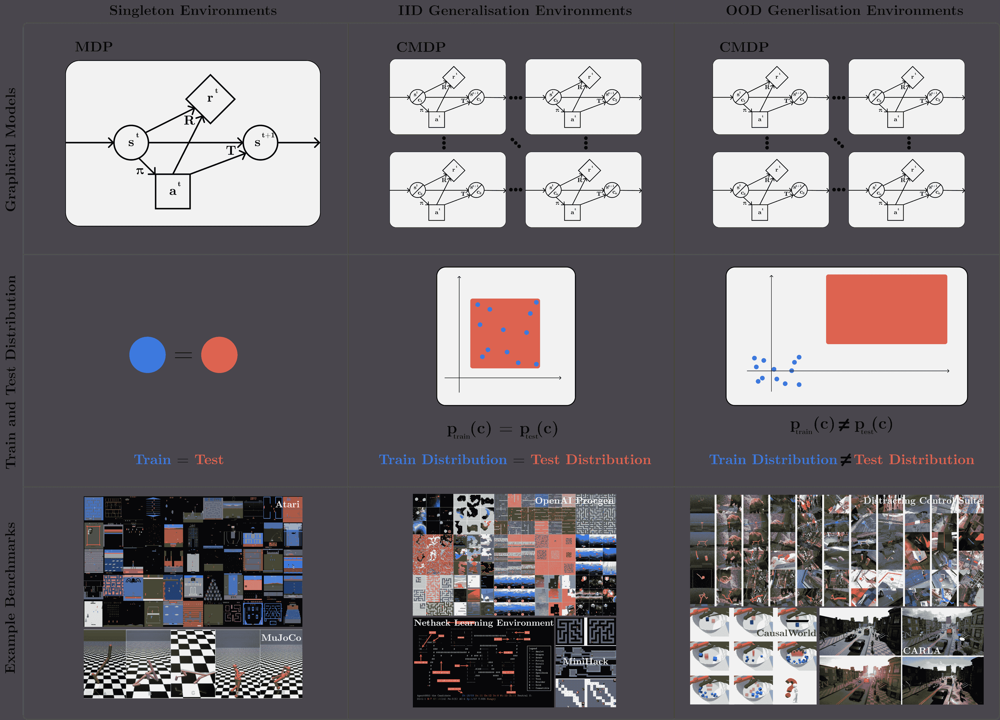
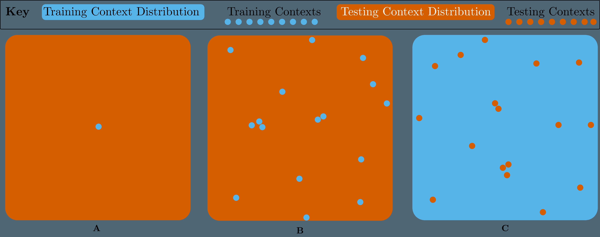
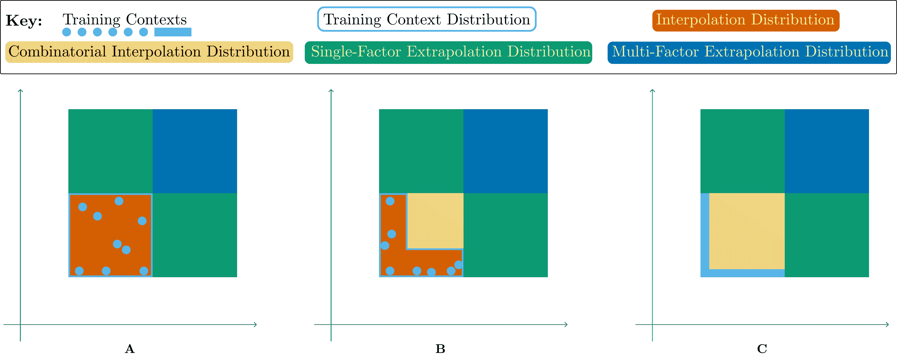
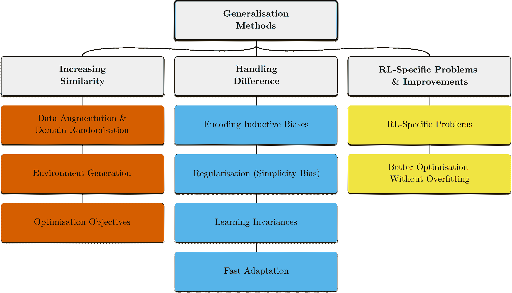

<!--yml

类别: 未分类

日期: 2024-09-06 19:49:43

-->

# [2111.09794] 深度强化学习中的零样本泛化调查

> 来源：[`ar5iv.labs.arxiv.org/html/2111.09794`](https://ar5iv.labs.arxiv.org/html/2111.09794)

# 深度

强化学习

\name 罗伯特·柯克 \emailrobert.kirk.20@ucl.ac.uk

\addr 伦敦大学学院，戈沃街，伦敦

WC1E 6BT, 英国 \AND\name 艾米·张 \emailamyzhang@fb.com

\addr 加州大学伯克利分校，伯克利

CA, 美国

Meta AI Research, \AND\name 爱德华·格雷芬斯特 \emaile.grefenstette@ucl.ac.uk

\addr 伦敦大学学院，戈沃街，伦敦

WC1E 6BT, 英国 \AND\name 蒂姆·罗克塔舍尔 \emailtim.rocktaschel@ucl.ac.uk

\addr 伦敦大学学院，戈沃街，伦敦

WC1E 6BT, 英国

###### 摘要

深度强化学习（RL）中的零样本泛化（ZSG）研究旨在生成在部署时能够很好地推广到新颖未见情况的强化学习算法，避免对训练环境的过拟合。如果我们要在现实世界场景中部署强化学习算法，这一点至关重要，因为这些环境将是多样化的、动态的和不可预测的。本调查概述了这一新兴领域。我们依靠统一的形式主义和术语来讨论不同的 ZSG 问题，基于之前的工作。我们进一步分类了现有的 ZSG 基准，以及当前解决这些问题的方法。最后，我们对该领域的现状进行了批判性讨论，包括对未来工作的建议。我们得出的结论之一是，纯粹采用程序化内容生成方法来设计基准不利于 ZSG 的进展，我们建议快速在线适应和解决 RL 特定问题作为未来 ZSG 方法的研究方向，并推荐在尚未探索的问题设置中建立基准，如离线 RL ZSG 和奖励函数变化。

## 1 引言

强化学习（RL）具有广泛应用的潜力，从自动驾驶车辆 (?) 和算法控制 (?) 到机器人技术 (?)，但为了实现这种潜力，我们需要可以在现实世界中使用的强化学习算法。现实世界是动态的、开放的且不断变化的，强化学习算法需要对环境的变化具有鲁棒性，并且在部署期间能够迁移和适应未见（但类似）的环境。

图 1：强化学习中的零样本泛化。对三种环境（列）在其图形模型、训练和测试分布以及示例基准（行）方面的可视化。经典 RL 关注于训练和测试相同的环境（单例环境，第一列）。我们关注一个尚未充分探索的设置，灵感来自于可能的真实世界场景，其中训练和测试环境将不同，环境实例可能来自相同分布（独立同分布（IID）ZSG 环境，第二列）或不同分布（OOD ZSG 环境，第三列）。第二列和第三列之间的分割只是 ZSG 作为一类问题的一个示例，而不是单个问题。顶行可视化了单例环境与需要 ZSG 的环境之间的图形模型差异。有关 CMDP 形式化的更多信息，请参见第 3.3 节。

然而，目前的许多 RL 研究基准（如 Atari（？）和 MuJoCo（？，？，？））并没有上述描述的属性：它们在完全相同的环境下评估策略，这通常与真实世界场景不符（图 1 左列）。这与监督学习的标准假设形成了鲜明对比，在监督学习中，训练集和测试集是不同的，这可能导致严重的评估过拟合（？）。这导致了即使在稍微调整的环境实例（环境中的特定关卡或任务）上表现不佳的策略，并且通常在用于初始化的未见随机种子上失败（？，？，？，？）。

在这项工作中，我们调查了近期研究零-shot 泛化在深度强化学习中的文献，这一领域专注于产生具有现实世界表现所需的鲁棒性、迁移性和适应性特性的算法。我们提供了一个统一的框架，基于之前的工作（？，？，？，？，？，？，？）将 ZSG 问题在强化学习中形式化为一类问题，而不是单一问题。尽管先前的工作（？，？，？）使用上下文 MDP 框架或相关框架来描述代理如何在测试时遇到新的、未见过的状态并进行泛化，但我们进一步扩展并细化了可能的泛化类型，例如组合、插值与外推、单因子与多因子（图 3）。我们更全面地形式化了 ZSG 问题，正式指定了策略类，明确选择上下文是否被观察，并包括在训练期间上下文分布可控的情况 定义 5。 ‣ 3.4 训练和测试上下文 ‣ 3 形式化强化学习中的零-shot 泛化 ‣ 深度强化学习中零-shot 泛化的调查")。这种细分使我们能够清晰地比较之前的工作，并理解如何选择未来的研究方向。例如，在没有任何额外假设的情况下改进“泛化”本质上是不够明确的；鉴于这一类问题如此广泛，一些类似于无免费午餐定理（？）的类比适用：在某些设置中改进泛化可能会损害其他设置中的泛化。两个广泛的 ZSG 问题类别如 图 1 中的中间和右列所示。

利用这一形式化方法，我们调查和审视了 ZSG 在强化学习中的各种基准，并讨论了针对不同 ZSG 问题的方法。最后，我们提出了几个在 ZSG 中未被充分探讨但对 RL 各种现实应用仍然至关重要的设置，以及解决不同泛化问题的方法的未来工作方向。在整个过程中，我们批判性地回顾了这一领域的现状，并提供了确保未来研究稳健且有用的建议。我们的目标是使这一领域对研究人员和从业者更具可读性，并通过提供一个共同的参考和框架来使讨论新研究方向变得更容易。这种新的清晰度可以改善该领域，并推动向更通用的 RL 方法的稳健进展。

##### 范围。

强化学习中的泛化涵盖了大量的研究，因此为了使本调查可行，我们以几种方式限制了回顾的范围。首先，我们关注零-shot 泛化（ZSG）的特定问题设置，其中策略在与训练时不同的环境实例上进行零-shot 评估。至关重要的是，这种设置不允许在测试环境实例中进行额外的训练或获取数据，这意味着如领域适应和许多元强化学习方法不适用。这与经典的强化学习不同，经典强化学习历史上关注于单一马尔科夫决策过程（MDP）中的在线学习，其中泛化指的是在同一 MDP 中对新状态的泛化。虽然这种设置可能有用，但我们更关注于需要能够在未经过训练的情况中进行部署的策略，并且能在这些情况中零-shot 泛化。这种设置对于当前的深度强化学习算法特别相关，因为这些算法通常在没有大量离线或仿真训练之前，样本效率或安全性都不足以在线部署。这激励了我们对 ZSG 的关注。我们在第 3.7 节中对这一设置及其限制进行了更多讨论和阐述。

其次，我们在本工作中只涵盖了单智能体强化学习（RL）。在多智能体强化学习（MARL）中存在泛化问题，例如需要足够的泛化能力以击败多种不同的对手策略（？，？）以及在合作游戏中对新队友的泛化（？，？），但我们在此不涉及这一领域的工作。尽管从数学上讲，这些问题可以等效建模（如果将合作者建模为动态函数的一部分，而不是像基于博弈的表述中那样建模为智能体（？）），但这些问题的解决方法往往大相径庭，明确利用了变异和泛化挑战来自其他合作者而非环境的其他部分。相关地，也有工作利用多个智能体在单智能体环境中增加环境的多样性，从而提高策略的泛化能力（？），我们在这里进行了涵盖。

最后，我们不涉及强化学习中泛化的理论工作。尽管在这一领域有近期的工作（？，？）是有价值的，但我们更关注于实证研究，因为它的研究更为广泛。

##### 调查概述。

调查的结构如下。我们首先简要描述相关工作，如其他调查和概述，在第二部分。我们在第三部分介绍 RL 中 ZSG 的形式化方法和术语，包括相关背景。接下来，我们使用这些形式化方法在第四部分描述当前 RL 中 ZSG 的基准，讨论环境（第 4.1 节）和评估协议（第 4.2 节）。我们在第五部分对处理 ZSG 的方法进行分类和描述。最后，我们在第六部分对当前领域进行批判性讨论，包括对未来方法和基准的建议，并在第七部分总结调查的关键要点。

##### 贡献。

总结来说，我们的主要贡献是：

+   •

    我们提出了一种统一的形式化方法和术语，用于讨论广泛的 ZSG 问题，并分解实现 ZSG 所需的假设，基于多个先前工作的形式化方法和术语 (?, ?, ?, ?, ?, ?)。我们在此的贡献是将这些先前的工作统一成*一种清晰的形式化描述，称为 RL 中的 ZSG 问题类别*，这涵盖了所有问题空间，而现有的任何形式化方法都没有做到这一点。

+   •

    我们提出了一种现有基准的分类方法，用于测试 ZSG，将讨论分为环境分类和评估协议。我们的形式化方法允许我们清晰地描述纯粹程序内容生成（PCG）方法在 ZSG 基准测试和环境设计中的局限性：*完全使用 PCG 环境限制了对该环境进行研究的精确度*。我们建议*未来的环境应使用 PCG 和可控变化因素的组合*。

+   •

    *我们提出了对现有方法的分类，以解决各种 ZSG 问题*，这旨在使从业者在面对具体问题时选择方法更加便捷，并帮助研究人员了解方法的现状以及在哪里可以做出新颖和有用的贡献。我们指出了许多未被充分探索的进一步研究方向，包括快速在线适应、解决 RL 特定的 ZSG 问题、新颖的架构、基于模型的 RL 和环境实例生成。

+   •

    我们批判性地讨论了 RL 中 ZSG 的当前状态，并推荐未来的研究方向。特别是，我们认为*建立基准将促进离线 RL 泛化和奖励函数变化的进展*，这两者都是重要的设置。此外，我们指出了值得探索的几种不同设置和评估指标：*研究上下文效率和在持续 RL 设置中的工作*都是未来工作必需的领域。

## 2 相关工作：强化学习子领域的调查

尽管之前已经有关于强化学习（RL）相关子领域的调查，但没有专门覆盖 RL 中的零样本泛化。? (?) 激发并调查了持续强化学习（CRL），这与 RL 中的 ZSG 密切相关，因为这两种情境都要求适应未见过的任务或环境；然而，它们并没有明确讨论本论文所关注的零样本情境（有关 CRL 的更多讨论请参见第 6.1 节）。? (?) 简要概述了稳健强化学习（RRL）（?），这是一个旨在通过最坏情况优化解决特定形式环境模型错误的领域。这是我们在这里讨论的一类泛化问题中的一个子问题，而? (?) 只是简要调查了该领域。? (?) 调查了建模其他代理的方法，这可以视为一种泛化问题（即使在单代理 RL 中），如果环境包含代理的分布。

? (?) 对深度强化学习中机器人模拟到现实转移的调查方法。模拟到现实是泛化问题的具体体现，因此我们的工作与? (?)之间有一些重叠，但我们的工作涵盖了更广泛的主题领域，有些模拟到现实转移的方法依赖于来自测试环境（现实）的数据，而我们在这里不做假设。? (?) 和 ? (?) 调查了强化学习中的迁移学习（TRL）方法。TRL 与泛化相关，因为这两个主题都假设在不同的设置中训练一个策略，然后在其部署时使用，但 TRL 通常假设在部署或目标环境中进行某种形式的额外训练，而我们则专注于零-shot 泛化。最后，关于相关性较低的主题的调查包括 ? (?) 调查了多任务深度强化学习，? (?) 调查了强化学习中的探索，以及 ? (?) 调查了强化学习中的课程学习。

这些调查都未聚焦于本工作所关注的零-shot 泛化设置，因此仍需要一种 ZSG 问题类别的形式化方法，以便该领域的研究能够讨论不同问题之间的差异。

## 3 正式化零-shot 泛化在强化学习中的应用

在本节中，我们提出了一种形式化方法来理解和讨论 RL 中零-shot 泛化（ZSG）问题的类别。我们首先回顾了监督学习和 RL 中的相关背景，然后再引入形式化方法。以这种方式形式化 ZSG 显示它指的是一个*类别*的问题，而不是特定的问题，因此 ZSG 的研究需要明确其所处理的 ZSG 问题组。在 第 3.4 节中列出了这一问题类别，我们在 第 3.6 节 中讨论了可能使泛化更可行的额外结构假设；这实际上是指定了更广泛的 ZSG 问题的子问题。

### 3.1 背景：监督学习中的泛化

监督学习中的泛化是一个广泛研究的领域，因此比 RL 中的泛化更成熟（尽管仍然不完全理解）。在监督学习中，某个预测器在训练数据集上进行训练，模型的性能在保留的测试数据集上进行测量。通常假设训练和测试数据集中的数据点是从相同的底层分布中独立同分布（IID）抽取的，尽管这并非总是如此（例如，参见领域泛化文献 (?)）。在监督学习中，泛化性能通常与测试时性能同义，因为模型需要“泛化”到在训练过程中未见过的输入。对于一个模型 $\phi$，训练和测试数据 $D_{train},D_{test}$ 以及损失函数 $\mathcal{L}$，监督学习中的泛化差距定义为

|  | $\textrm{GenGap}(\phi):=\mathbb{E}_{(x,y)\sim D_{test}}[\mathcal{L}(\phi,x,y)]-\mathbb{E}_{(x,y)\sim D_{train}}[\mathcal{L}(\phi,x,y)].$ |  | (1) |
| --- | --- | --- | --- |

这个差距通常被用作泛化的度量，特别是独立于训练或测试性能：对于给定的训练性能水平，较小的差距意味着模型的泛化能力更强。这个指标并不完美，因为一个在训练和测试中都表现为随机的模型会得到一个 0 的差距。此外，如果训练和测试数据集不是独立同分布的，那么测试数据集可能更容易（或更难），因此差距为零并不一定意味着完美的泛化。然而，它可以用来测量跨基准的泛化性能，其中绝对性能可能不可比，或者用来推动那些通过降低差距而不改变测试性能（实际上是降低训练性能）来改善泛化的方法。这些方法随后可以与提高训练性能的方法结合使用，以提高整体测试性能，前提是这些方法不冲突。我们引入这个指标是为了完整性，因为它在文献中经常被用作测试性能的补充。一般而言，我们认为它作为测试性能的补充是有用的，但不能替代测试性能。有关更多讨论，特别是在 RL 设置中，请参见第 3.4 节。

在监督学习中经常检查的一种特定类型的泛化，与 RL 相关的是组成性泛化 (?, ?)。我们在这里探索了由? (?) 引入的组成性泛化的分类。虽然这主要是为语言中的泛化设计的，但许多形式与 RL 相关。定义的五种组成性泛化形式是：

1.  1.

    系统性：通过系统地重新组合已知部分和规则进行泛化，

1.  2.

    生产力：在训练数据中看到的长度之外扩展预测的能力，

1.  3.

    替代性：通过能够用同义词替换组件进行泛化，

1.  4.

    本地性：如果模型组成操作是本地的还是全局的，

1.  5.

    过度泛化：如果模型注意到或对例外情况具有鲁棒性。

为了直观理解，我们将探索在块堆叠环境中这些不同类型的组合泛化的示例。*系统性*的一个例子是，在掌握了块堆叠的基础知识后，能够以新的配置堆叠块。类似地，*生产力*可以通过代理能够泛化到多少块以及堆叠配置的复杂性来衡量。*替代性*可以通过代理对新颜色块的泛化能力来评估，理解新颜色不会影响块的物理特性。在第 4.3 节我们讨论了 RL 环境中组合结构的假设如何使我们能够测试这些形式的泛化。在第 4.2 节我们将讨论如何在当前的 RL 基准中评估这些形式的泛化。

### 3.2 背景：强化学习

RL 中的标准形式是马尔可夫决策过程（MDP）。一个 MDP 由一个元组 $M=(S,A,R,T,p)$ 组成，其中 $S$ 是状态空间；$A$ 是动作空间；$R:S\times A\times S\rightarrow\mathbb{R}$ 是标量奖励函数；$T(s^{\prime}|s,a)$ 是可能的随机马尔可夫转移函数；$p(s_{0})$ 是初始状态分布。我们还考虑部分可观察的 MDP（POMDPs）。一个 POMDP 由一个元组 $M=(S,A,O,R,T,\phi,p)$ 组成，其中 $S,A,R,T$ 和 $p$ 如上所述，$O$ 是观察空间，$\phi:S\rightarrow O$ 是发射或观察函数。在 POMDPs 中，策略只观察由 $\phi$ 产生的状态的观察结果。

MDP 中的标准问题是学习一个策略 $\pi(a|s)$，该策略在给定状态下产生一个动作分布，使得策略在 MDP 中的累积奖励最大化：

|  | $\pi^{*}=\underset{\pi\in\Pi}{\textrm{argmax }}\mathbb{E}_{s\sim p(s_{0})}\left[\mathcal{R}(s)\right],$ |  |
| --- | --- | --- |

其中 $\pi^{*}$ 是最优策略，$\Pi$ 是所有策略的集合，$\mathcal{R}:S\to\mathbb{R}$ 是一个状态的*回报*，计算为

|  | $\mathcal{R}(s):=\mathbb{E}_{a_{t}\sim\pi(a_{t}&#124;s_{t}),s_{t+1}\sim T(s_{t+1}&#124;s_{t},a_{t})}\left[\sum_{t=0}^{\infty}R(s_{t},a_{t},s_{t+1})&#124;s_{0}=s\right].$ |  |
| --- | --- | --- |

这是从状态 $s$ 获得的策略的总期望回报。在 POMDP 中，目标相同，但策略是以观察而非状态作为输入。如果 MDP 没有固定的时间跨度，这个总和可能不存在，因此我们通常使用另外两种回报形式之一，要么假设每个回合有固定步数（一个 *时间跨度* $H$），要么通过折扣因子 $\gamma$ 对未来回报进行指数折扣。注意，我们在这里将策略形式化为马尔可夫的（即只考虑前一个状态作为输入）以简化说明，但策略可以接收完整的历史 $(s_{1},a_{1},r_{1},\ldots s_{t-1},a_{t-1},r_{t-1},s_{t})$ 作为输入，例如使用递归神经网络。我们定义状态和动作空间的所有可能历史集合为 $H[S,A]=\{(s_{1},a_{1},r_{1},\dots s_{t-1},a_{t-1},r_{t-1},s_{t})|t\in\mathbb{N}\}$，观察空间也是类似的。非马尔可夫策略使其能够适应（进一步讨论请参见 第 3.7 节）。

### 3.3 上下文马尔可夫决策过程

要讨论零-shot 泛化，我们希望找到一种方法来推理关于*任务集合*、环境实例或级别的情况：泛化的需求源于我们在不同的环境实例集合上训练和测试策略的事实。以 OpenAI Procgen（?）为一个教学例子：在这个基准套件中，每个游戏是一个程序生成级别的集合。生成哪个级别完全由级别种子决定，标准协议是在固定的 200 个级别上训练策略，然后在全部级别的分布上评估性能。几乎所有其他基准都共享这种结构：它们有一个级别或任务的集合，这些集合由某些种子、ID 或参数向量指定，泛化通过在不同的级别或任务集合分布上进行训练和测试来衡量。举一个不同的例子，在 Distracting Control Suite（?）中，参数向量决定了一系列可能的视觉干扰，应用于连续控制任务的观察中，从改变物体的颜色到控制相机角度。虽然这组参数向量比 Procgen 中的种子集有更多结构，但这两者都可以在我们提出的框架内理解。有关这些环境风格之间差异的讨论，请参见第 4.2 节。

为了形式化任务集合的概念，我们从上下文马尔可夫决策过程（CMDP）开始，这最初由? (?)形式化，但使用了? (?)中的替代形式。这个形式化方法也建立在? (?, ?)提出的基础上，但我们扩展了它们以考虑不同的上下文参数分布；我们包括了已观察和未观察的上下文设置；我们包括了上下文可控的情况；并且我们正式定义了如何生成子集 CMDP（有关我们在这里提出的形式化方法与现有工作的比较，请参见本节末尾的更多讨论）。

###### 定义 1.

上下文 MDP（CMDP）是一个元组

|  | $\mathcal{M}=\left(S^{\prime},A,O,R,T,C,\phi:S^{\prime}\times C\rightarrow O,p(s^{\prime}&#124;c),p(c)\right).$ |  |
| --- | --- | --- |

$A,O,R,T,\phi$ 与 第 3.2 节 中 POMDP 的定义相同。$C$ 是上下文空间（一个可以有分布的集合）。CMDP 是一个具有状态空间 $S:=S^{\prime}\times C$ 的 POMDP，初始状态分布为 $p((s^{\prime},c))=p(c)p(s^{\prime}|c)$，即 POMDP 为 $\left(S^{\prime}\times C,A,O,R,T,\phi,p(s^{\prime}|c)p(c)\right)$。因此，$R$ 的类型为 $R:S^{\prime}\times C\rightarrow\mathbb{R}$，$T((s,c),a)$ 是转换概率分布的形式。为了使元组成为 CMDP，转换函数必须被分解，以确保上下文在一个回合内不改变，即 $T((s,c),a)((s^{\prime},c^{\prime}))=0\textrm{ 如果 }c^{\prime}\neq c$。我们称 $S^{\prime}$ 为基础状态空间，$p(c)$ 为上下文分布。

为了直观地理解这个定义，上下文扮演了种子、ID 或参数向量的角色，决定了级别。因此，它不应在一个回合内改变，只能在回合之间改变。CMDP 是任务或环境实例的整个集合；在 Procgen 中，每个游戏（例如 starrpilot、coinrun 等）都是一个独立的 CMDP。上下文分布 $p(c)$ 用于确定训练和测试的级别、任务或环境实例的集合；在 Procgen 中，这个分布在训练时对固定的 200 个种子均匀分布，在测试时对所有种子均匀分布。

请注意，这一定义没有说明上下文是否被代理观察到：如果 $O=O^{\prime}\times C$ 对于某些基础观察空间 $O^{\prime}$，且 $\phi((s^{\prime},c))=(\phi^{\prime}(s),c)$ 对于某些基础观察函数 $\phi^{\prime}:S^{\prime}\rightarrow O^{\prime}$，则我们说上下文是被观察到的，否则不是。上下文需要被观察到，以便 CMDP 成为 MDP（而非 POMDP），但反之则不成立——即使上下文被观察到，$\phi^{\prime}$ 也可能不是恒等的，在这种情况下，POMDP 可能不被视为 MDP。请注意，我们通常会使用“MDP”来指代那些既是 MDP 也可能是 POMDP 的环境。

由于奖励函数、转换函数、初始状态分布和发射函数都将上下文作为输入，因此上下文的选择决定了除了行动空间（我们假设是固定的）以外的所有 MDP 结果。给定一个上下文 $c^{*}$，我们称将 CMDP $\mathcal{M}$ 限制到单一上下文所得到的 MDP 为 *context-MDP* $\mathcal{M}_{c^{*}}$。正式地，这是一个新的 CMDP，其中 $p(c):=1\textrm{ 如果 }c=c^{*}\textrm{ 否则 }0$。这是一个特定的任务或环境实例，例如，Procgen 中的单一游戏关卡，由一个单一随机种子指定，这个种子即为上下文。

一些 MDPs 具有随机转移或奖励函数。当这些 MDPs 被模拟时，研究人员通常可以通过选择随机种子来控制这种随机性。在理论上，这些随机 MDPs 可以被视为确定性上下文 MDPs，其中上下文是随机种子。我们不认为随机 MDPs 自动是上下文的，并假设随机种子总是随机选择的，而不是作为上下文进行建模。这更接近于实际世界中具有随机动态的情况，在这种情况下我们无法控制随机性。

### 3.4 训练和测试上下文

现在我们描述我们关注的泛化问题的类别，使用 CMDP 形式。正如所提到的，泛化的需求源于训练和测试环境实例之间的差异，因此我们希望指定一组训练上下文-MDPs 和一个测试集。我们通过上下文集来指定这些上下文-MDPs，因为上下文唯一地确定了 MDP。

首先，我们需要描述如何使用训练和测试上下文集来创建新的 CMDPs。

###### 定义 2。

对于任何 CMDP $\mathcal{M}=\left(S^{\prime},A,O,R,T,C,\phi,p(s^{\prime}\vert c),p(c)\right)$，我们可以选择上下文集$C^{\prime}\subseteq C$的一个子集，然后生成一个新的 CMDP

|  | $\mathcal{M}\vert_{C^{\prime}}=\left(S^{\prime},A,O,R,T,C^{\prime},\phi,p(s^{\prime}\vert c),p^{\prime}(c)\right)$ |  |
| --- | --- | --- |

其中$p^{\prime}(c)=\frac{p(c)}{Z}\textrm{ 如果 }c\in C^{\prime}\textrm{ 否则 }0$，$Z$是归一化项$Z=\sum_{c\in C^{\prime}}p(c)$，以确保$p^{\prime}(c)$是一个概率分布。

这允许我们将上下文-MDP 的总集合拆分成较小的子集，由上下文决定。例如，在 Procgen 中，所有种子集合的任何可能子集都可以用来定义一个不同版本的游戏，具有有限的关卡。

对于这个目标，我们使用策略的期望回报：

###### 定义 3。

对于任何 CMDP $\mathcal{M}$，我们可以定义在该 CMDP 中策略的期望回报为

|  | $\textbf{R}(\pi,\mathcal{M}):=\mathbb{E}_{c\sim p(c)}[\mathcal{R}(\pi,\mathcal{M}_{c})],$ |  |
| --- | --- | --- |

其中$\mathcal{R}$是策略在（上下文）MDP 中的期望回报，$p(c)$是上下文分布，如前所述。

我们现在可以正式定义 Zero-Shot 策略迁移（ZSPT）问题类别。

###### 定义 4（零-shot 策略迁移）。

一个 ZSPT 问题由选择一个带有上下文集$C$的 CMDP $\mathcal{M}$和一个训练与测试上下文集$C_{\textrm{train}},C_{\textrm{test}}\subseteq C$定义。目标是生成一个非 Markovian 策略$\pi:H[O,A]\rightarrow A$，以最大化在测试 CMDP $\mathcal{M}|_{C_{\textrm{test}}}$中的期望回报：

|  | $J(\pi):=\textbf{R}(\pi,\mathcal{M}\vert_{C_{\textrm{test}}}).$ |  |
| --- | --- | --- |

该策略可以通过与训练 CMDP $\mathcal{M}|_{C_{\textrm{train}}}$ 的交互来生成，固定数量的环境和剧集样本分别为 $N_{s},N_{e}$。

ZSG 研究通常关注开发能够解决各种 ZSPT 问题的算法。例如，在 Procgen 中，我们的目标是生产一个可以解决每个游戏 ZSPT 问题的算法。具体而言，我们希望在训练 2500 万步（$N_{s}=25\times 10^{6},N_{e}=\infty$）之后，在测试分布（即全级别分布）上实现尽可能高的回报。*零-shot 策略转移* 这一名称源于之前的工作（？，？）。

一些算法假设在与训练 CMDP 交互期间，背景分布可以被调整，只要抽样背景仅限于固定的训练背景集合：

###### 定义 5 （ZSPT 可控背景）。

*可控背景* ZSPT 问题与上述 ZSPT 问题相同，不同之处在于学习算法可以在训练期间调整训练 CMDP $p_{\textrm{train}}(c)$ 的背景分布，只要它保持仅从训练背景集合中抽样的特性：$p_{\textrm{train}}(c)=0\textrm{ 如果 }c\not\in C_{\textrm{train}}$

*请注意，这种形式化定义了一类问题，每个问题由 CMDP、训练和测试背景集合的选择以及背景是否可控决定*。这意味着我们没有对背景-MDP 之间 CMDP 的共享结构做任何假设：对于任何特定的问题，某种假设（无论是隐含的还是明确的）可能是学习发生的前提（第 3.6 节），但我们不认为所有 ZSG 问题有一个统一的假设，除了这里所述的假设。

##### 评估零-shot 泛化。

类似于监督学习，我们可以将训练和测试性能之间的差距视为泛化的衡量标准。我们定义的方式类似于监督学习中的定义（公式 1），交换训练和测试之间的顺序（因为我们最大化奖励，而不是最小化损失）：

|  | $\textrm{GenGap}(\pi):=\textbf{R}(\pi,\mathcal{M} | _{C_{\textrm{train}}})-\textbf{R}(\pi,\mathcal{M} | _{C_{\textrm{test}}}).$ |  | (2) |
| --- | --- | --- | --- | --- | --- |

除了测试性能外，这一指标在文献中常用于评估 ZSG 算法 (?, ?, ?)。总体而言，尚不清楚 ZSG 算法的最佳评估指标是什么。在监督学习中，不同算法的泛化能力通常通过在评估任务上的最终表现来评估。当用于评估模型的任务接近（或与）模型最终部署的任务相同时，显然最终性能是一个良好的评估指标。然而，在强化学习中，我们使用的基准任务往往与我们希望应用这些算法的实际任务差异很大。此外，强化学习算法目前仍相当脆弱，性能可能因超参数调整和特定任务的不同而大相径庭（?）。在这种情况下，我们可能更关注算法的零样本泛化*潜力*，通过将泛化与训练性能解耦，并改用泛化差距进行评估。例如，如果算法 A 的测试性能高于算法 B，但 A 的泛化差距也大得多，我们可能更愿意在新环境中使用算法 B，这样我们可以更好地确保部署性能不会偏离训练性能太多，且算法可能更具鲁棒性。这就是为何之前的文献经常将该指标与测试性能一起报告的原因。

然而，强化学习中的泛化差距存在与监督学习泛化差距相同的问题：零差距并不一定意味着良好的性能（即，随机策略可能得到 0 差距），如果奖励函数在训练和测试之间不可比，那么差距的大小可能没有信息量（这样它可能只能用于比较不同算法之间的差异）。这意味着将其作为提高性能的唯一指标可能不会在 ZSG 上取得稳健的进展。此外，鉴于当前假设集的广泛性，单一的泛化进展度量不太可能存在：在如此广泛的问题类别中，目标甚至可能存在冲突（?）。

因此，我们的建议首先是专注于特定问题的基准测试，并回到使用特定设置下的整体性能的 SL 标准（例如视觉干扰物、随机动态、稀疏奖励、困难探索）。各种 RL 算法的泛化性能可能取决于它们部署的环境类型，因此需要对部署时存在的挑战类型进行仔细分类，以正确评估 ZSG 能力（进一步讨论见 第 4.3 节 和 第 6.2 节）。正如文献中所示，泛化差距可以作为评估 ZSG 算法性能的附加辅助指标，也可以用于测试性能，以在算法的测试时性能非常相似的情况下打破僵局，或在需要对测试时性能有强保证的情况下告知用户，而不是期望测试时性能尽可能高。

### 3.5 这种形式的现实世界示例

我们选择这种形式是因为它易于理解，涵盖了我们感兴趣的所有问题，并且基于已有的工作。为了进一步证明这种形式的实用性，并且给出它如何在多种设置中使用的直观理解，我们提供了几个现实世界场景的示例，其中这种形式自然适用：

+   •

    Sim-to-real 是 ZSG 的经典问题之一，可以在这个框架中进行捕捉。这里的外部 CMDP 是模拟和现实世界 MDP 的联合。上下文集将被分为对应于模拟的上下文和对应于现实的上下文。上下文通常会影响动态、观察函数和状态分布，但可能不会影响奖励（所以 $\forall s^{\prime},c:R((s^{\prime},c))=R^{\prime}(s^{\prime})$）。领域随机化方法的动机在于，通过在模拟中生成广泛的可能上下文（即训练 CMDP），可以使得测试上下文分布更接近扩展的训练分布。在模拟环境中，我们通常假设能够访问上下文分布，并且上下文可以被观察，但在测试时上下文可能不可观察，因此可能没有必要使用一个明确依赖于上下文的策略。

+   •

    医疗保健是部署未来 RL 方法的一个有前景的领域，因为这里有许多顺序决策问题。例如，对个体患者进行诊断和治疗的任务可以理解为一个 CMDP，其中患者有效地指定了情境：患者对测试和治疗的反应（动态变化）可能不同，并且可能提供不同的测量值（状态变化）。将治疗新患者的过程泛化，实际上就是将其泛化到新的情境。在这种情况下，我们可以假设情境的某些部分（或关于情境的一些信息）是可观察的，因为我们将可以访问患者的病史和个人信息。

+   •

    自动驾驶车辆是另一个可以应用 RL 方法的领域。这些车辆将在某种意义上受到目标条件的约束，这样它们可以执行不同的旅程，这意味着情境很可能会控制奖励函数，并且控制奖励函数的情境部分将是可观察的（因此策略知道执行什么任务）。在不同的地点驾驶（不同的情境改变初始状态分布）、在不同的天气和光照条件下（观察函数）以及在不同的道路表面（转移函数）上行驶，都是这些系统需要解决的问题。我们可以在 CMDP 框架中理解这一点，其中情境包含关于天气、时间、地点和目标的信息，以及当前车辆状态的信息。其中一些情境会被直接观察到，而有些可能从观察中推断出来。在这种情况下，我们可能只能在某些情境（即某些城市或受限的天气条件）下进行训练，但我们需要策略能够在未见过的情境中零样本泛化。

### 3.6 更多可行泛化的附加假设

在选择 CMDP 形式化方法时，我们选择将 ZSG 形式化为一种能够涵盖我们关注的全部问题类别的方式，但这也意味着几乎肯定无法仅凭 CMDP 结构假设证明任何形式的理论保证。虽然我们没有证明这一点，但很容易看出，设计一些病态 CMDP 的方法可能使得在没有对新情境的强领域知识的情况下，无法对新情境进行泛化。

因此，要有解决特定 ZSG 问题的任何机会，就必须做出进一步的假设（无论是明确的还是隐含的）。这些假设可能涉及变化的类型、训练和测试上下文集所抽取的分布，或上下文集中的额外基础结构。我们在此描述了一些流行或有前景的假设，并注意到第四部分中的分类法也作为解决 ZSG 问题时可能需要做出的附加假设的一组参考。

##### 关于训练和测试上下文集分布的假设。

一种常见的假设是，尽管训练和测试上下文集并不完全相同，但这两个集的元素是从相同的基础分布中抽取的，类似于监督学习中的 IID 数据假设。例如，这就是 OpenAI Procgen (?)的设置，其中训练上下文集是从完整种子分布中均匀随机抽取的 200 个种子集合，而完整分布被用作测试上下文集。

然而，许多关于 RL 中 ZSG 的研究并不假设训练和测试环境实例来自相同的分布。这通常被称为*领域泛化*，其中我们将训练和测试环境实例称为不同的*领域*，这些领域可能类似但不是来自相同的基础生成分布。在机器人技术中，*从模拟到现实*问题就是一个具体的例子。

注意，尽管测试上下文集可能是一个单一的上下文，但这可能导致一个不特别稳健的算法——它可能会过度拟合于在这个特定上下文中表现良好的策略问题，这可能无法推广到其他类似的上下文（这是该研究方向的高层目标）。

##### 进一步的结构形式假设。

另一种可以做出的假设是关于 CMDP 本身的结构，例如上下文空间或转移函数。有几类具有附加结构的 MDP 可能使 ZSG 成为可能。然而，这些假设在设计基准和方法时通常没有被明确提出，这可能使理解泛化发生的原因和方式变得困难。关于这些结构的详细讨论和形式定义可以在第 A 节中找到，但我们在此提供一个高层次的概述，重点介绍那些在实践中已被使用的假设，以及那些对 ZSG 特别有前景的假设。

一个已被用来改善泛化的结构化 MDP 示例是 *块 MDP* (?). 它假设在从潜在状态空间到给定观测空间的映射中存在 *块结构*，或者存在一个描述为较小状态空间的另一个 MDP，其行为与给定 MDP 相同。这一假设在我们只能访问高维、非结构化输入的情况下尤其相关，但知道存在一个低维状态空间能够生成等效的 MDP。? (?) 使用这一假设来改进探索的界限，依赖于潜在状态空间的大小而非给定的观测空间。? (?) 开发了一种表示学习方法，该方法将相关特征与不相关特征区分开来，从而改进了对环境实例的泛化，其中只有不相关特征发生变化，这是 *系统性* 的一种简单形式 (第 3.1 节，?）。这是一个明确利用附加结构假设来改进泛化的稀有示例。块 MDP 可以通过引入一个从状态空间到观测空间的发射映射来与上下文 MDP 结合，该映射还依赖于上下文，如 ? (?) 所定义。

分解 MDP (?, ?) 可用于描述面向对象的环境或多智能体设置，其中状态空间可以被分解为独立的因子，即在一步动态中的稀疏关系。这可以被利用来学习显式忽略预测中不相关因子的动态模型，或计算改进的样本复杂度界限以进行策略学习（?），并且似乎特别相关于泛化，因为上下文集中的附加结构可能映射到转移和奖励函数中的分解结构。在多领域 RL 设置中使用与分解 MDP 类似的形式的初步示例由 ? (?) 展示，尽管它并未直接针对零样本策略迁移设置。我们注意到，上下文 MDP 可以通过两个因子——状态和上下文——的分解 MDP 进行简单表示。然而，如果领域中存在更多结构，分解 MDP 能够建模更多结构。因此，如果环境能够通过分解 MDP 进行建模，除了上下文 MDP 之外，如果利用这种结构，可能会获得更好的泛化保证和结果。我们希望看到更多将这些类型的结构假设应用于本研究讨论的零样本泛化问题的工作。

### 3.7 备注与讨论

##### 解决 ZSPT 问题的角度。

虽然我们旨在提高测试时间性能 定义 3，但我们通常无法直接获取该性能指标（或在将方法应用于现实世界时无法获取）。在研究中，为了开发改善测试时间性能的算法，我们可以目标是产生（与现有工作相比）(1) 提高训练时间性能，同时保持泛化差距不变；(2) 减少泛化差距，同时保持训练时间奖励不变；或者(3) 两者的混合。强化学习中不涉及泛化的工作往往（隐含地）采取第一种方法，假设泛化差距不会改变。¹¹1 如果训练环境实例与测试环境实例相同，则泛化差距将始终为 0。强化学习中的 ZSG 工作通常则旨在（2）明确减少泛化差距，这可能会降低训练时间性能，但提高测试时间性能。一些工作也旨在（1）改善训练时间性能，可能会保持泛化差距不变。

##### 激励零样本策略转移

在这项工作中，我们专注于零样本策略转移（?, ?）：从训练 CMDP 中学习一个策略，并在测试 CMDP 中进行零样本评估。这个领域有几个重要的原因。

首先，如上所述，当前的深度强化学习算法往往不够安全或样本效率不足，无法在现实世界中进行在线学习。因此，需要大量的离线或仿真训练，并且策略需要在现实世界部署环境中进行零样本泛化。随着计算能力的提升和更丰富的仿真环境的出现，我们预计许多成功的现实世界强化学习部署将至少部分遵循这种工作流程：离线或在仿真中训练，然后将策略零样本转移到部署环境中。即使策略在部署过程中会继续学习，它在部署时仍需要在合理的水平上（即零样本），否则部署将不安全。通过这种方式，我们将 ZSG 的工作视为与持续强化学习的工作主要是互补的，因为我们认为这两者对实现强健且有能力的强化学习策略的部署都很重要。注意，良好的零样本性能和良好的持续学习性能之间可能存在权衡，如何选择这两者将由具体问题设置决定。

其次，从安全性、可解释性和验证的角度来看，ZSG 可能比持续更新的策略更为可取。在高风险场景中，模型可能会通过可解释性或解释性方法进行验证或审计，并且这个过程可能会非常昂贵。在这种情况下，拥有一个在零-shot 下表现良好的单一模型将是有利的，因为每次更新后，这些验证和审计步骤可能需要重复进行。

最后，请注意，虽然我们没有涵盖放宽零-shot 假设的方法，但我们相信在实际场景中，可能会实现这一点。²² 例如，通过使用无监督数据或测试环境实例中的样本，利用某些描述上下文的方法使零-shot 泛化成为可能，或者使代理能够在测试上下文 MDPs 中以在线方式进行训练。然而，零-shot 策略转移仍然是一个有用的问题，因为解决方案可能有助于处理由这里所作假设的不同放宽引起的各种设置：零-shot 策略转移算法可以作为基础，然后基于领域特定知识和额外数据进行构建。

请注意，尽管“训练”和“学习”这两个术语存在争议，我们的定义将其基础设在从训练上下文 MDP 中采样若干次后产生一个非马尔可夫策略上。由于目标是非马尔可夫策略在*单次试验*中的预期测试回报，这意味着无法进行在线学习或在超过一个试验中的适应，因此适应必须在单次试验内完成才有用（即使用递归策略）。如第 5.2.4 节所述，确实有几种方法采用了这种方法。需要明确的是，我们以这一特定*目标*为基础，而不是对方法的*属性*施加任何限制，只要它们满足约束条件：策略不必是马尔可夫的，并且如果能够提升性能，可以在单次试验中适应其所处的环境实例。

##### 与 RL 中先前泛化概念的关系。

从历史上看，强化学习中的泛化指的是在单个 MDP 中对新状态或状态-动作对进行泛化。虽然这一概念在那项工作关注的在线学习单个 MDP 设置中很有用，但我们这里关注的是一种更近期、更现实的设置，即策略在一组 MDPs 上进行训练，然后在可能未见过的 MDPs 上部署。这种设置更接近于监督学习中的泛化概念。我们认为，这种在现实世界中部署强化学习训练策略的工作流程比从头开始在线训练策略更可行，因为当前的强化学习算法在现实世界中的样本效率和安全性都不足。因此，在部署策略之前必须进行大量的离线或模拟训练，且部署后的策略在部署时仍需表现良好（即*零-shot*）。

##### 与 MDPs 集合或分布的先前形式主义的关系。

如前所述，我们所呈现的形式主义建立在多个先前的工作之上。这里我们简要介绍了我们的形式主义与这些工作之间的差异。

? (?) 提出了隐藏参数 MDPs（Hi-MDPs）。这些是具有一个隐藏参数的 MDPs，该参数控制转移函数，并且对这些隐藏参数的集合有一个分布，这个分布隐式地定义了一组 MDPs。? (?) 在 Hi-MDPs 的基础上提出了广义隐藏参数 MDPs（GHP-MDPs），其中隐藏参数现在不仅控制动态，还控制奖励函数。我们的工作使用一个上下文参数，这个参数类似于隐藏参数，可以是隐藏的也可以是可观察的，它控制初始状态分布、转移函数和奖励函数，而不仅仅是转移函数和奖励函数。我们还更正式地讨论了在训练和测试过程中如何使用不同的上下文参数分布。

? (?, ?) 引入了“零-shot 策略转移”这一术语的变体，我们用它作为我们研究的正式问题类的名称。他们都在这一类问题中进行研究，但不像我们在这里所做的那样对整个问题类进行形式化，而是专注于提出在他们研究的经验设置中提高性能的方法。

? (?) 讨论了在训练过程中从中抽样的 MDPs 的分布，并使用了一种 CMDP，但上下文参数仅调整观察函数，而不是 MDP 的其他部分。他们还假设训练和测试之间的 MDP 分布是相同的。

? (?, ?) 提出了上下文 MDP（CMDPs），这是我们用作定义基础的形式化方法。? (?) 提出了基于上下文作为潜在状态空间一部分的形式化方法，这是我们使用的，而 ? (?) 提出了更类似于 Hi-MDPs 的形式化方法，其中存在由上下文变量参数化的 MDP 集合。这些工作在训练和测试之间的上下文分布变化方面没有考虑，除了在 ? (?) 中到完整分布的变化。它们没有提供策略类别的正式定义，也没有定义上下文分布可控的问题设置。

## 4 零样本泛化基准

在本节中，我们给出了 RL 中 ZSG 基准的分类。基准的变异因素中的一个关键区分是环境相关因素与评估协议相关因素。基准任务是环境选择（一个 CMDP，详见 第 4.1 节）与合适的评估协议（一个训练和测试上下文集，详见 第 4.2 节）的组合。这意味着所有环境都支持由其上下文集决定的多个可能的评估协议。

在对基准集进行分类后，我们指出了纯 PCG 方法在构建环境时的局限性 (第 4.3 节)，同时讨论了 ZSG 问题的难度范围 (第 4.3 节)。有关 ZSG 基准的未来工作的更多讨论可以在 第 6.1 节、第 6.2 节 和 第 6.4 节 中找到。

\ssmall

| 名称 | 风格 | 背景 | 变体 |
| --- | --- | --- | --- |
| 炼金术 † (?) | 3D | PCG | D, R, S |
| Animal-AI (?) | 3D | D-C, D-O | S, O |
| Atari Game Modes (?) | 街机 | D-C | D, O, S |
| BabyAI (?) | 网格, LC | D-C, D-O, PCG | R, S |
| CARL (?) | 多样 | Con, D-C, D-O | D, O, R, S |
| CARLA (?) | 3D, 驾驶 | D-C | O |
| CausalWorld † (?) | 3D, ConCon | Con, D-C, D-O | D, O, R, S |
| Construction (?) | 2D, 结构化 | Con, D-C, D-O, PCG | R, S |
| Crafter (?) | 街机, 网格 | PCG | S |
| Crafting gridworld (?) | 网格, LC | D-C | R, S |
| DACBench (?) | 结构化 | PCG, D-C | D, R, S |
| DCS (?) | ConCon | Con, D-C | O |
| DistractingCarRacing (?) | 街机 | D-C | O |
| DistractingVizDoom (?) | 3D | D-C | O |
| DMC-GB (?) | ConCon | Con, D-C | O |
| DMC-Remastered (?) | ConCon | Con, D-C | O |
| DM-Memory (?) | 街机, 3D | PCG, Con, D-O, D-C | R, D, S |
| GenAsses (?) | ConCon | Con | D, S |
| GVGAI (?) | 网格 | D-C | D, O, S |
| HALMA † (?) | 网格 | D-C, D-O | O, S |
| iGibson (?) | 3D | D-C | O, S |
| Jericho † (?) | 文本 | D-C | D, R, S |
| JumpingFromPixels (?) | 街机 | Con | S |
| KitchenShift (?) | 3D, ConCon | D-C | O, S, R |
| Malmo (?) | 3D, 街机 | D-C, D-O | R, S |
| MarsExplorer (?) | 网格 | PCG | S |
| MazeExplore (?) | 3D | PCG | O, S |
| MDP Playground † (?) | ConCon, 网格 | Con, D-C, D-O | D, O, R, S |
| Meta-World † (?) | 3D, ConCon | Con, D-C | R, S |
| MetaDrive (?) | 3D, 驾驶 | D-C, D-O, PCG | D, S |
| MiniGrid (?) | 网格 | PCG | S |
| MiniHack (?) | 网格 | D-C, D-O, PCG | S |
| NaturalEnvs CV (?) | 网格 | PCG | O, R, S |
| NaturalEnvs MuJoCo (?) | ConCon | D-C | O |
| NLE (?) | 网格 | PCG | S |
| Noisy MuJoCo (?) | ConCon | Con, D-C | D, O |
| NovelGridworlds (?) | 网格 | D-C | D, S |
| Obstacle Tower (?) | 3D | D-C, PCG | O, S |
| OffRoadBenchmark (?) | 3D, 驾驶 | D-C | O, S, R |
| OpenAI Procgen (?) | 街机 | PCG | O, S |
| OverParam Gym (?) | ConCon | Con | O |
| OverParam LQR (?) | LQR | Con | O |
| ParamGen (?) | 3D, LC | D-C, D-O | R, S |
| RLBench † (?) | 3D, ConCon, LC | Con, D-C, D-O | R, S |
| RoboSuite (?) | 3D, ConCon | D-C | O |
| Rogue-gym (?) | 网格 | PCG | S |
| RTFM (?) | 网格, LC | PCG | D, R, S |
| RWRL † (?) | ConCon | Con | D |
| Sokoban (?) | 网格 | PCG | S |
| TextWorld † (?) | 文本 | Con, D-C, PCG | D, O, R, S |
| Toybox † (?) | 街机 | Con, D-C, D-O | D, O, S |
| TrapTube (?) | 网格 | Con, D-C | D, O, S |
| WordCraft (?) | LC, 文本 | Con, D-C, D-O | R, S |
| XLand (?) | 3D, LC | Con, D-C, D-O, PCG | D, O, R, S |
| Phy-Q (?) | 街机 | D-C, PCG | S |

表 1：ZSG 环境的分类。在风格列中，LC 代表语言条件，ConCon 代表连续控制。在上下文列中，PCG 代表程序化内容生成，Con 代表连续，D-C 代表离散基数，D-O 代表离散序数。在变异列中，S、D、O 和 R 分别表示状态、动态、观察或奖励函数变异。在名称列中，†表示那些最初并非设计为零样本策略迁移基准但可以适应为此的环境。有关各列的更详细描述，请参见正文。

### 4.1 环境

##### 分类可实现泛化的环境

在表 1 中，我们列出了测试 ZSG 在 RL 中的可用环境，并总结了每个环境的关键属性。这些环境都提供了一个非单一上下文集合，可以用来创建各种评估协议。选择特定的评估协议然后产生一个基准。我们在这里描述表 1 中列的各列的含义。

##### 风格。

这提供了环境的粗略高层次描述。

##### 上下文。

这描述了上下文集合。在文献中，有两种设计上下文集合的方法，这些方法之间的主要区别在于上下文-MDP 创建是否对研究人员可访问和可见。第一种方法，我们称之为程序化内容生成（PCG），依赖于单个随机种子来确定上下文-MDP 生成过程中的多个选择。在这里，上下文集合是所有支持的随机种子的集合。这是一个黑箱过程，其中研究人员只选择一个种子。

第二种方法提供了对上下文-MDP 之间变异因素的更直接控制，我们称这些为*可控*环境。上下文集合通常是多个因素空间的乘积，其中一些可能是离散的（即在几个颜色方案之间选择）而一些是连续的（即物理仿真中的摩擦系数）。借鉴自？（？），离散变异因素的区别在于它们是基数的（即选择只是一个没有额外结构的集合）还是序数的（即集合通过排序具有额外结构）。基数因素的例子包括不同的游戏模式或视觉干扰，序数因素通常是上下文-MDP 中某种类型实体的数量。所有连续因素实际上也是序数因素，因为连续性意味着排序。

以往文献将 PCG 定义为任何算法在给定一些输入（？）时生成 MDPs 的过程，这适用于我们描述的两种上下文集合。在本次调查的其余部分，我们使用“PCG”来指代黑箱 PCG，它使用种子作为输入，并使用“可控”来指代环境，其中上下文集合直接改变上下文-MDP 中的感兴趣参数，这也可以被视为“白箱 PCG”。我们可以理解（黑箱）PCG 设置为离散和连续因素空间的组合（即可控环境），其中每个空间中值的选择由随机生成过程决定。然而，只有一些环境使得这种对上下文-MDPs 的参数化变得更具信息性。在此表中，我们将无法轻松控制这些信息的环境描述为 PCG 环境。有关纯 PCG 方法的缺点，请参见第 4.3 节。

##### 变化。

这描述了在上下文 MDP 集合中变化的内容。这可能包括状态空间的变化（初始状态分布以及隐含的状态空间）、动态变化（过渡函数）、视觉变化（观察函数）或奖励函数变化。当奖励变化时，策略通常需要一些目标或奖励的指示，以便由单一策略解决上下文集合（？）。

#### 4.1.1 环境中的趋势

表 1 中展示了几种趋势和模式，我们在这里引起读者的注意。我们总共描述了 55 个环境，并力求尽可能详尽。³³3 因此，如果你认为缺少环境，请使用作者名单中提供的联系方式与我们联系。

这些环境有多种不同的风格，这很有益，因为 ZSG 方法如果可能的话，应该能广泛适用于各种风格。虽然在数值上重点关注网格世界（14, 25%）和连续控制（13, 24%），但对于街机风格（？）和 3D 环境（？）已有成熟的基准。查看上下文集合，我们看到 PCG 在 ZSG 环境中被广泛使用，出现在 21（38%）个环境中。许多环境将 PCG 组件与可控变化（？，？，？，？，？，？，？，？，？，？）结合在一起。大多数环境在其上下文集合中有几种不同的变化因素。

在观察其使用的变化时，环境之间存在许多差异。在数值上，状态变化最为常见（42，76%），其次是观察变化（29，53%），然后是奖励变化（20，36%）和动态变化（19，35%）。大多数环境具有多种不同类型的变化（34，62%），虽然有几种环境仅针对观察变化（10，18%）或状态变化（9，16%），但仅有一个环境具有完全的动态变化（RWRL，？），且没有仅具有奖励变化的环境。状态和观察变化通常是最容易设计的，特别是在 PCG 的帮助下。这是因为改变模拟器的渲染效果，或设计模拟器中对象的多种排列方式，通常比设计一个可以参数化的模拟器引擎（用于动态变化）要容易。为奖励变化创建环境需要进一步的设计选择，以指定奖励函数或目标，以使环境符合不变最优性原则（？）。PCG 通常是生成大量状态变化多样性的唯一有效方法，因此通常是创建高度多样化环境所必需的。只有 CausalWorld（？）能够轻松地一次测试所有形式的变化。虽然 CARL（？）、MDP Playground（？）、XLand（？）和 TextWorld（？）也被归类为包含所有形式的变化，但 CARL 是不同环境的集合，其中没有任何一个环境具有所有变化类型，XLand 不是开源的，而 MDP Playground 和 TextWorld 需要大量工作来构建一个在所有因素上都有变化的有意义的评估协议。此外，MDP Playground 没有提供向代理描述变化后的奖励函数的方法，而在像 TextWorld 这样的文本游戏中，如何解释观察变化存在不确定性。

在基准测试集合中，可以指出几个集群：有几个 PCG 状态变化的网格世界环境（MiniGrid、BabyAI、Crafter、Rogue-gym、MarsExplorer、NLE、MiniHack；？，？，？，？，？，？，？，），非 PCG 观察变化的连续控制环境（RoboSuite、DMC-Remastered、DMC-GB、DCS、KitchenShift、NaturalEnvs MuJoCo；？，？，？，？，？，？，），以及可以适应 ZSG 的多任务连续控制基准（CausalWorld、RLBench、Meta-world；？，？，？）。

### 4.2 Zsg 的评估协议

正如讨论过的，基准测试是环境和评估协议的结合。每个环境支持由上下文设置决定的一系列评估协议，并且通常有环境创建者推荐的协议。在本节中，我们讨论这些协议及其之间的区别。评估协议指定了训练和测试的上下文集、训练期间从训练集抽样的任何限制，以及允许从训练环境中获得的样本数量。

评估协议中一个重要的首要属性是*上下文效率*。这类似于样本效率，其中训练期间允许的样本数量有限，但我们对*上下文*的数量施加限制。这可以从单一上下文到少量上下文，再到整个上下文集。

图 2：PCG 环境评估协议的可视化。A 是一个单一的训练上下文，以及整个上下文集用于测试。B 使用从上下文集中随机抽取的小集合训练上下文，以及整个空间用于测试。C 有效地反转了这一点，使用整个上下文集进行训练，除了几个随机抽取的保留上下文用于测试。缺乏坐标轴表示这些集合没有结构。

##### PCG 评估协议。

实际上，在纯 PCG 环境中，评估协议之间唯一有意义的变化因素是上下文效率限制。由于除了随机种子采样外，我们无法控制变化因素，我们唯一的选择是使用多少个上下文进行训练。此外，唯一有意义的测试上下文集是完整分布，因为从中抽取的随机样本（唯一的其他选择）只是对完整分布性能的近似。PCG 环境的这一限制在下面进一步讨论（第 4.3 节）。

这给出了三种 PCG 环境的评估协议类别，根据它们的训练上下文集：单一上下文、少量上下文集或完整上下文集。这些在图 2 中分别以 A、B 和 C 进行可视化。没有协议 A 的示例（针对纯 PCG 环境），这可能是由于这种挑战的高难度。对于协议 B，虽然“小集合上下文”不够精确，但相关点在于，这个集合与完整上下文集有显著区别：可能会过拟合这个集合，而在测试集上表现不佳。这个协议的示例包括 OpenAI Procgen（？）、RogueGym（？）、JumpingFromPixels（？）和 MarsExplorer（？）的两种模式。

协议 C 通常用于那些未明确针对 ZSG（MiniGrid、NLE、MiniHack、Alchemy；？，？，？，？）的 PCG 环境。测试上下文集由从训练集中保留的种子组成，在训练过程中则使用完整的上下文集。这个协议有效地测试了更稳健的 RL 优化改进，但并没有测试超越避免记忆的零样本泛化。虽然这个协议只是以一种弱意义上测试 ZSG，但它仍然匹配了比 RL 中的先前标准更广泛的真实世界部署场景，因为在先前的标准中，策略的评估是在其训练环境中进行的，因此我们认为它应该是 RL（不仅仅是 ZSG）的标准评估协议，而之前的标准应被视为特例。

##### 可控环境评估协议。

许多环境不仅使用 PCG，还具有可以由环境用户控制的变化因素。在这些可控环境中，可能的评估协议范围要广泛得多。

PCG 协议中的选择——单一上下文、小集合或整个上下文范围——也转移到可控环境中的每个变化因素的选择上。对于每个因素，我们可以选择这些选项中的一个作为训练上下文集，然后选择在这个范围内或之外进行采样作为测试上下文集。选项的范围在图 3 中进行了可视化。

图 3：可控环境评估协议的可视化。每个图表可视化了一个可能的训练上下文集合（蓝色），以及多个可能的测试上下文集合（其他所有颜色）。在 A 中，我们独立选择每个变化因素的范围用于训练分布，从而产生了该分布的凸形状。在这种设置下，可能的测试分布可以是插值（红色）、沿单一因素的外推（绿色方块）或沿两个因素的外推（蓝色）。在 B 和 C 中，每个变化因素的范围是相互关联的，从而使训练分布呈现非凸形状。这允许测试另一种类型的泛化——组合插值（黄色），其中因素在训练期间看到的值独立出现，但以未见过的组合形式出现。我们继续拥有之前的插值和外推测试分布。从 B 到 C 的区别在于训练分布在我们期望代理泛化的轴上的宽度。在 C 中，策略将无法学会这两个因素可以完全独立变化，从而使所有形式的泛化更加困难。请注意，在实际环境和现实世界的设置中，这个空间可能高于二维，并包含非连续和非序数轴。这些轴表明，在这种设置下，我们对这些变化因素有控制权，这与图 2 形成对比。

对每个因素独立地做出选择会给我们一个在完整上下文集合内的凸训练上下文集合（图 3 A）。在测试时，每个因素可以在这个凸集合内或外（通常分别称为插值和外推）。选择外推的因素数量会影响评估协议的难度。

然而，如果我们在训练期间创建因子值之间的关联或链接，我们可以在完整的上下文集中得到一个非凸的训练上下文集（图 3 B）。每一个可能的测试上下文可以在训练上下文集中（完全插值）、在由非凸训练上下文集的凸包形成的集合内（组合插值），或完全在凸包之外（外推）。组合插值测试了代理展示*系统性*的能力，这是一种在第 3.1 节中讨论的组成型 ZSG。对于序数因子，我们还可以选择不相交的范围，这使我们能够沿单一轴进行插值（即在两个范围之间取值）。注意，当讨论凸包时，这仅适用于连续或离散序数的变化因子；对于基数变化因子，凸包仅包括在训练期间采样的值。

例如，考虑一个在 CMDP 中训练的策略，其中上下文集包含摩擦和重力强度的值。在训练期间，环境实例的摩擦系数在 0.5 到 1 之间，但重力固定为 1，或者重力强度在 0.5 到 1 之间，但摩擦固定为 1（图 3 C）. 测试上下文中摩擦和重力值在训练分布内的为完全插值（例如 $(f=0.5,g=1),(f=1,g=1)$），摩擦和重力值分别见过但未组合的为组合插值（例如 $(f=0.5,g=0.5),(f=0.5,g=0.9)$，黄色区域），摩擦和重力值在训练期间未见过的为完全外推（例如 $(f=0.2,g=0.5),(f=1.1,g=1.5)$，深蓝色或绿色区域）。

我们仍然可以考虑训练上下文集中的上下文数量，这控制了训练上下文集的密度，取决于其形状。在测试推断时，我们还可以在变化轴上变化训练上下文集的“宽度” (Fig. 3 B vs C)。这些测试评估了代理展示*生产力*的能力 (Section 3.1)。当然，如果在训练时这个因素的值有广泛的多样性，即使测试时的值仍在此集合之外，ZSG 也会更容易。例如，如果我们测试策略是否能够对先前见过的对象的新数量进行泛化，那么我们应该期望策略表现更好，如果在训练期间它见过不同数量的对象，而不是仅见过单一数量的对象。为了扩展摩擦力和重力的例子，在训练期间，策略从未见过重力和摩擦力一起变化，这使得在测试上下文中进行泛化变得更加困难。如果在训练期间重力和摩擦力确实一起变化，那么这将使泛化变得更容易。

在这个领域中的一个显著点是单一训练上下文和各种测试上下文。该协议测试了一种强形式的零样本泛化（ZSG），其中策略必须能够在测试时推断出未见过的上下文。由于这个问题的困难，这种评估协议的基准测试侧重于视觉变化：策略需要在相同的基础马尔科夫决策过程（MDP）上对不同的观察函数具有鲁棒性（？，？，？）。该协议通常受到从模拟到现实问题的启发，我们期望在单一模拟中训练的代理能够在部署时对多个视觉上不同的现实世界环境具有鲁棒性。

在这个单一的点之外，从当前的评估协议数组中很难提取出更多有意义的分类。通常，每个协议都是由特定的问题设置或我们认为强化学习（RL）代理应当能够解决或具备的特征驱动的。

### 4.3 讨论

从调查 ZSG 基准的广度中可以获得若干评论、见解和结论，我们在此提出。

##### 非视觉泛化。

如果测试非视觉类型的泛化，那么应该使用视觉简单的领域，如 MiniHack（？）和 NLE（？）。这些环境包含足够的复杂性来测试许多类型和强度的非视觉泛化，但由于缺乏复杂的视觉处理要求，计算量较少。在许多不需要视觉处理的真实世界问题设置中，如系统控制和推荐系统，表示学习仍然是一个问题，因为它们中有许多实体和场景需要进行泛化。

##### DeepMind 控制套件变体。

ZSG 基准的一个子类别是选择 DeepMind 控制套件的变体：DMC-重制版，DMC-泛化基准，分心控制套件，自然环境（？，？，？，？）。所有这些环境都关注视觉泛化和样本效率，需要从像素学习连续控制策略，并引入策略应对的视觉干扰，这些干扰可能在训练期间存在或仅在部署时出现。我们认为分心控制套件（？）是这个领域中功能最全面的变体，因为它具有最广泛的变化集，其中最难的组合当前方法无法解决。

##### 无意间的泛化基准。

表 1 中列出的一些环境最初并非旨在作为 ZSG 基准。例如，？（？）展示了三个高度参数化的 Atari 游戏版本，并使用它们对在单一变体上训练的代理进行事后分析。一些环境并不针对零样本策略转移（CausalWorld，RWRL，RLBench，Alchemy，Meta-world（？，？，？，？，？）），但可以通过不同的评估协议调整为这种场景。更一般地说，所有环境提供一个上下文集，许多然后提出具体的评估协议，但只要这些协议有充分的理由，其他协议也可以使用。这种灵活性有缺点，因为不同的方法可能在细微不同的评估协议上进行评估，这些协议可能对某些方法有利。我们建议在使用这些基准时明确使用的协议，并与以前方法的评估进行比较。使用标准协议有助于重复性。

##### 程序化内容生成对于零样本泛化的缺点。

许多环境利用程序化内容生成（PCG）来创建各种上下文 MDP。在这些环境中，上下文集是用于 PCG 的随机种子集合，并且没有额外的结构来控制上下文 MDP 之间的变化。

这意味着虽然 PCG 是创建大量上下文 MDP 的有用工具，但完全基于 PCG 的环境有一个缺点：这些环境支持的评估协议范围仅限于不同大小的训练上下文集。测量特定因素的零样本泛化是无法实现的，除非对生成的关卡进行大量标注或解开 PCG 以暴露捕捉这些因素的底层参数化。通常，需要更多的努力来将这些因素设置为特定值，而不是仅仅揭示生成关卡的值。因此，PCG 基准测试测试的是“**通用**”形式的 ZSG 和 RL 优化，但不支持更有针对性的特定类型 ZSG 评估。这意味着在特定问题上取得研究进展是困难的，因为单独关注特定瓶颈很难。

一种有趣的折衷方案是，在多个环境中，一部分低级环境是程序生成的，但仍有许多变因素由研究者控制。例如，Obstacle Tower (?) 具有程序生成的关卡布局，但视觉特征（以及在一定程度上的布局复杂性）可以被控制。另一个例子是 MiniHack (?)，在该环境中，可以用丰富的描述语言从头指定整个 MDP，且 PCG 可以在需要时填充任何组件。这两种方法都使得实验类型更加有针对性。我们认为这种结合了 PCG 和可控环境的方法是设计未来环境的**最佳**途径；使用 PCG 生成足够的环境多样性（尤其是状态空间）是必要的，如果控制足够细致以实现精确的科学实验，那么环境仍然可以用于**剥离** ZSG 的进展。

##### 上下文 MDP 中的组合泛化。

组合概括是许多研究人员关注的关键点（参见 第 3.1 节）。在*可控*环境中，不同的评估协议使我们能够测试在 第 3.1 节 中介绍的一些组合概括形式（？）：（1）系统性可以使用多维上下文集来评估，并对在训练时未见过的上下文维度的新组合进行测试（图 3 中的组合插值）。 （2）生产力可以通过序数或连续因素来评估，测量在具有超出训练时见过的上下文值的环境实例中表现良好的能力（图 3 中的任意类型外推）。如果处理上下文空间部分为语言的 CMDPs，如语言条件化 RL（？），那么上述讨论的评估（？）可以直接应用于语言空间。至关重要的是，需要一个具有结构化上下文空间的可控环境来测试这些组合概括形式，并确保代理在测试时看到真正的新组合；在如 OpenAI Procgen（？）或 NLE（？）这样的 PCG 环境中，这一点难以验证。

其他形式的组合概括在（？）中需要额外的结构，而这些结构在选择的评估协议中并未被捕捉，我们在此描述了测试这些形式可能涉及的内容：（3）通过使用同义词（在语言中）或等效的对象和工具来进行的替代性；（4）通过比较在给定命令 A 和命令 B 分别与 A + B 的组合的解释，及这些解释是否不同来评估局部性；以及（5）通过代理对语言或环境规则中例外情况的反应来评估过度概括。

##### 我们可以期待什么样的概括？

在第 4.2 节中，我们讨论了各种可能的评估协议用于不同风格的 ZSG 基准。然而，哪种协议能期望合理的性能是另一个问题。例如，期望一个在 NLE 单一层级上 *tabula rasa* 训练的标准 RL 策略能够对不相似的层级进行泛化是不现实的，因为它可能会遇到完全未见过的实体或非常不符合分布的实体和层级布局组合。每种评估协议测量的是不同类型的 ZSG 强度，因此它们形成了一种部分排序，其中“更容易”的评估协议在“更难”的协议之前。我们在这里概述了这种排序：

+   •

    增加样本数量可以使评估协议更简单，但通常只有到一定程度：更多样本不太可能带来更大的多样性，这对于零-shot 泛化是必要的。增加上下文数量（同时保持上下文集合的形状不变）也会使评估协议更简单。即使少量的额外多样性也能提高性能。

+   •

    测试上下文集合中变异因素的数量也可以变化。变异因素越多，评估协议就越困难。此外，训练时外推因素所取值的范围宽度也会有所不同。这与上下文数量有关，但也与这些变异轴在训练期间的可用多样性相关。

+   •

    根据 ? (? ) 的定义，我们考虑沿不同类型的变异因素进行插值和外推的难度。沿序数轴的插值可能是最简单的，其次是基数轴插值（通过未见过的基数轴值组合与任何其他轴的组合进行），然后是沿序数轴的外推。最后，沿基数轴的外推是最困难的。

随着评估协议难度的增加，标准 RL 方法取得良好性能的可能性减少。在更难的协议中，这些协议涉及某种形式的外推，标准 RL 方法几乎不可能实现零-shot 泛化，因为没有理由期待策略能够正确泛化到完全未见过的值。这并不意味着这种泛化是不可能的：它只是明确表明，要实现它，超越标准 RL 方法的技术是必要的。也就是说，结合先验知识⁵⁵5[`betr-rl.ml/2020/`](http://betr-rl.ml/2020/) 的方法，如来自相关环境的迁移 (?); 强 inductive 偏差 (?) 或对变异的假设; 或利用在线适应 (?, ?) 将是产生这种泛化策略所必需的。

## **零-shot 泛化的五种方法**在强化学习中。

我们现在将处理 ZSG 的方法进行分类。ZSG 问题出现在训练和测试上下文集不完全相同的情况。ZSG 问题有很多类型（如第四部分中详细描述），因此也有许多不同风格的方法。我们将这些方法分为以下几类：那些试图增加训练和测试数据及目标之间相似性的 (第 5.1 节)；那些明确旨在处理训练和测试环境之间差异的 (第 5.2 节)；以及那些针对 RL 特定问题或优化改进以提升 ZSG 性能的 (第 5.3 节)。

参见图 4 以查看这种分类的图示，以及表 2 和表 3，这些表格对方法进行了分类，包括它们所采用的方法、评估环境的变化，以及它们主要改变环境、损失函数还是架构。进行这种全面分类使我们能够看到 ZSG 研究中未被充分探讨的领域，并在第 6.6 节讨论了这些方法的未来工作。

图 4：解决强化学习中零样本泛化问题的方法分类

### 5.1 增加训练与测试之间的相似性

在其他条件相同的情况下，训练环境和测试环境的相似性越高，泛化差距就越小，测试时间的表现就越好。这种相似性可以通过设计一个尽可能接近测试环境的训练环境来增加。假设已经做到这一点，本节将介绍使训练过程中使用的数据和目标更接近于优化测试环境时所使用的方法。

#### 5.1.1 数据增强和领域随机化

使训练和测试数据更相似的两种自然方法是数据增强（？）和领域随机化（？，？，？）。当训练和测试环境之间的变化已知时，这尤其有效，因为可以使用捕获这些变化的数据增强或领域随机化。在实际操作中，这种方法的有效性有限，因为更强的变化类型往往无法通过这种简单方法捕捉到。

数据增强（DA）可以从两个角度来看待。首先，增强的数据点被视为训练模型的额外数据。这种解释导致我们将 DA 技术分类为尝试增加训练和测试数据之间的相似性。在第二种观点中，DA 可以用来强制学习不变性，通过对模型进行正则化，使其对不同增强的数据点有相同的输出（或相同的内部表示）。在这种观点中，DA 更侧重于编码归纳偏差，我们在第 5.2.1 节 中对此进行了讨论。为了清晰起见，我们在本节中包含所有 DA 的工作。

在强化学习（RL）中使用数据增强（DA）的例子很多，尽管并非所有例子都针对零样本泛化（ZSG）性能。? (?, UCB-DrAC) 将 DA 技术 DrQ (?) 适配到演员-评论家设置（?, PPO），并引入了一种在训练过程中自动选择最佳增强的方法。? (?, Mixreg) 将 mixup (?) 适配到 RL 设置中，这鼓励策略在可能输入的混合上保持线性。? (?, PAADA) 结合对抗性 DA 与 mixup。? (?, RandFM) 在网络开始处使用随机卷积层以提高对各种视觉输入的鲁棒性。? (?, MixStyle) 在卷积神经网络（CNN）中跨空间维度混合风格统计量，以增加数据多样性。所有这些方法 (?, ?, ?, ?, ?) 通过改善训练和测试性能，在 CoinRun (?) 或 OpenAI Procgen (?) 上显示了改进的性能，某些方法还在其他基准上显示出提升，如视觉干扰的 DeepMind Control (DMC) 变体。? (?, SODA) 使用类似的增强方法，但仅用于学习更鲁棒的图像编码器，而策略在未增强的数据上进行训练，展示了在 DMC-GB (?) 上的良好表现。? (?, RCAN) 使用 DA 学习从不同观察中映射回同一状态的标准观察，然后在该标准观察上训练策略。他们在机器人抓取任务中展示了改进的模拟到现实性能。

?（？，InDA,ExDA）显示了增强应用的时间对于性能的重要性：一些增强在训练过程中有帮助，而其他增强只需应用于正则化最终策略。?（？，SECANT）引入了一种将数据增强（DA）与策略蒸馏相结合的方法。由于在强增强上训练可能会阻碍性能，他们首先在弱增强上训练以获得专家策略，然后将其蒸馏为在强增强下训练的学生策略。?（？，SVEA）认为，当数据增强被天真地应用时，会增加 Q 值目标的方差，使得学习不稳定和低效。他们通过仅在损失函数计算的特定点对特定组件应用增强，对标准数据增强协议进行调整，在 DMC-GB（？）上评估性能。这些工作表明，在强化学习设置中，应用增强的时间选择和增强类型的选择并非 trivial，因为训练过程中的模型性能会通过改变策略学习的数据影响最终性能。

域随机化（DR）是将环境在参数化分布上随机化的实践，旨在使测试环境被训练环境的分布覆盖。从根本上讲，DR 只是创建一个非单一训练上下文集，然后从该集中随机抽样。?（？）、?（？）和?（？）在机器人学中的模拟到现实转移设置中引入了这个概念。关于不同类型的 DR 已经进行了大量工作，这里仅覆盖一些样本。?（？）描述了自动化域随机化：该方法不是均匀随机地采样可能的环境参数化，而是根据代理的当前表现动态调整分布。?（？，Minimax DSAC）使用对抗训练来学习 DR 以提高鲁棒性。?（？，P2PDRL）通过点对点蒸馏改进 DR。?（？，DDL）在其中训练策略的世界模型中学习，并对世界模型中的递归网络应用 dropout，从而在想象中有效地执行 DR。最后，程序化内容生成（？）是一种生成非零上下文集的方法，可以看作是一种 DR 形式。DR 的工作通常利用使用非均匀上下文分布的可能性，该分布在训练过程中可能会有所变化。

在 DA 和 DR 方法中，随着训练环境实例的不断增强或随机化，优化变得越来越困难，这通常使得这些方法的样本效率大大降低。这是？（？，？，？）工作的动机和其他工作的动机，所有这些工作都在非随机化或仅弱随机化的环境中训练 RL 策略，同时使用其他技术，如监督学习或自监督学习来训练一个鲁棒的视觉编码器。

最后，请注意，大多数 DA 技术关注于上下文集中的视觉变化，因为这是最容易产生有用增强的变化。一些 DR 工作则关注于动态变化，作为解决模拟到现实问题的一种方式，其中假设动态会在训练（模拟）和测试（现实）之间发生变化。

#### 5.1.2 环境生成

尽管 DR 和 PCG 在预定的上下文集内生成上下文-MDP，但通常假设所有的上下文-MDP 都是可解的。然而，在某些设置中，不知道如何从所有*可解*上下文-MDP 的集合中进行采样。例如，考虑一个简单的网格世界迷宫环境，其中上下文集包含网格上所有可能的块布局；某些块放置的配置将导致不可解的迷宫。此外，许多块配置对训练并没有用处：它们可能生成过于简单的迷宫。为了解决这些问题，我们可以*学习*生成新的关卡（采样新的上下文）来训练智能体，以确保这些上下文-MDP 是可解的且有用的训练实例。我们希望得到一个上下文-MDP 的分布，这个分布更接近测试上下文集，该集可能只有可解的上下文-MDP。这被称为环境生成。

? (?) 引入了配对开放式先驱（POET），这是一种联合演化上下文-MDP 和解决这些 MDP 的策略的方法，旨在获得一种能够解决各种上下文-MDP 的策略。它们生成的策略能可靠地解决未见的关卡实例，并且表现优于从零开始训练或朴素的课程方法。? (?) 基于 POET，提出了对开放式算法的改进，包括如何衡量生成的上下文-MDP 的新颖性和系统展现开放式创新的通用度量。这些新增内容提高了生成的上下文-MDP 的多样性和复杂性。

? (?) 引入了无监督环境设计（UED）的框架，类似于 POET，其中的任务是以无监督的方式生成上下文-MDP，然后用这些 MDP 来训练策略。目标是提高 ZSG 对未见任务的适应能力，无论是在环境的上下文-MDP 空间内还是外。它们的方法 PAIRED 在前述的网格世界设置中优于标准的 DR 和类似于 POET 的方法，依据是对未见关卡的零-shot 泛化性能。? (?) 扩展了 UED 的正式框架，将其与优先级关卡重放（?，PLR）结合，并鼓励将 PLR 理解为一种环境生成算法。这种组合方法在网格世界迷宫和 2D 赛车赛道上都显示出了在零-shot 泛化到未见的分布外任务方面的改进。我们将在下一节总结 PLR。

环境生成和 DR 都是调整环境提供的某些上下文集的上下文分布的方法。环境生成倾向于学习这种采样过程，并且目标是处理上下文集结构不规则的环境，以便并非所有上下文-MDPs 都能解决或对训练有用，而 DR 工作通常使用硬编码的启发式或非参数学习方法来调整上下文分布，并专注于所有领域都能解决但可能有不同难度或学习潜力的设置。这两者也常常可以被视为自动课程学习的形式（?），特别是当上下文分布在训练过程中发生变化并适应代理的性能时。

这一领域非常新，我们预计很快会有更多的研究。然而，它确实需要能够生成相当详细的上下文-MDPs 的环境。环境生成方法可以针对任何类型的变化，只要这种变化存在于上下文-MDP 生成器的输出空间中。当前的方法专注于状态空间的变化，因为这是最直观的，能够被构造为生成器可以产生特定 MDPs 的上下文集。

#### 5.1.3 优化目标

有时可以显式或隐式地改变我们的优化目标，使其更好地与测试性能对齐。

改变训练目标计算所用的分布可以看作是隐式地改变优化目标。这个领域的一个初步例子应用于提升 ZSG 的是 PLR（?），其中改变了不同级别上的采样分布，以提高训练策略的学习效率和零样本泛化能力。他们展示了在 OpenAI Procgen 上的训练和测试性能的提升，并且该方法有效地形成了一个粗略的课程，使学习更加样本高效，同时确保没有上下文-MDP 的性能过低。

强健的强化学习（RRL）方法也针对 ZSG 问题，通过改变强化学习问题的优化目标来工作。这些方法采用最坏情况优化方法，最大化在一组可能的环境扰动（可以理解为不同的上下文-MDPs）中的最小性能，并专注于提升对未知动态的 ZSG。? (?) 对该领域进行了概述和介绍。? (?, WR²L) 通过在转移函数周围使用 Wasserstein 球体来定义扰动集，从而优化最坏情况性能。? (?, SRE-MPO) 将 RLL 整合到 MPO (?) 中，并在 RWRL 基准测试 (?) 上显示了改进的性能。? (?, RARL) 也通过使用一个对抗者（其被训练来选择对转移函数最坏的扰动）来（隐式地）优化一个强健的强化学习目标。这也可以看作是一种对抗性领域随机化技术。

### 5.2 处理训练和测试之间的差异

一种概念化的方式来解释为什么策略在测试时无法完美转移是由于两个环境之间的差异：训练中的模型会学习依赖于在测试环境中发生变化的特征，从而导致性能下降。在本节中，我们回顾了尝试显式处理训练和测试环境特征可能差异的方法。

#### 5.2.1 编码归纳偏差

如果我们知道特征在训练和测试环境-MDPs 之间的变化情况，我们可以利用归纳偏差来鼓励或确保模型不依赖于我们期望会发生变化的特征：策略应该只依赖于在训练和测试环境中表现类似的特征。例如，如果我们知道颜色在训练和测试之间有所变化，并且颜色与任务无关，那么我们可以在处理之前从视觉输入中去除颜色。像这样的简单改变往往不会成为单独的论文，但在现实世界问题情境中仍然值得考虑。

IDAAC (?) 添加了一个对抗正则化项，鼓励策略的内部表示不要对一个回合中的时间进行预测。这种不变性对 OpenAI Procgen (?) 很有用，因为时间步对最优策略来说无关紧要，但可能会被用来过拟合到训练集的关卡。? (?, DARLA) 使用 $\beta$-VAEs (?) 将解耦的归纳偏差编码到策略的表示中，改善了对各种视觉变化的零样本性能。? (?, NAP) 引入了一个黑箱最短路径求解器，以提高在困难导航问题中的 ZSG 性能。? (?, ?) 将关系归纳偏差融入模型架构中，有助于在序数变化轴上进行泛化，包括外推性能。? (?, SchemaNetworks) 使用面向对象和实体聚焦的架构，结合结构学习方法，学习可以用于基于反向链的规划的逻辑模式。这些模式可以对新的状态空间进行零样本泛化，只要动态是一致的。? (?, VAI) 使用无监督视觉注意力和关键点检测方法，强制视觉编码器仅编码与视觉图像前景相关的信息，编码前景是视觉输入中唯一重要部分的归纳偏差。

? (?) 介绍了 AttentionAgent，它利用神经进化优化一个具有硬性注意力瓶颈的架构，从而得到一个只接收部分视觉输入的网络。这里的关键归纳偏差是选择性注意力对于优化和 ZSG 有益。他们的方法在 CarRacing (?) 和 VizDoom (?, ?) 中将零-shot 泛化到未见过的背景。? (?, SensoryNeuron) 基于 AttentionAgent，增加了输入空间中置换不变性的归纳偏差。他们认为这对于改善 ZSG 有用，原因与之前类似：用于置换不变架构的注意力机制鼓励代理忽略输入空间中不相关的部分。? (?, CRAR) 使用模块化架构，将动力学习和价值估计结合在低维潜在空间中，并在简单迷宫任务上显示出改进的性能。

? (?, SHIFTT) 和 ? (?, TransferLanfLfP) 都使用大型预训练模型 (?, ?) 来编码自然语言指令，以处理奖励函数的变化。他们都展示了对新指令的改进性能，利用了大型预训练模型的泛化能力。这可以视为利用领域知识来提高对新目标规范的零-shot 泛化，通过结合所有目标规范都将是自然语言的归纳偏差。

虽然这一领域的方法看似不同，但它们都共享将特定归纳偏差融入 RL 算法的动机。将领域知识作为归纳偏差的方式有多种。可以改变模型的架构以正确处理变化。如果变化是策略应当不变的，可以完全移除它，或者使用对抗正则化来确保策略的表示是不可变的。更广泛地说，可以使用正则化或辅助损失，鼓励策略正确处理这些变化。使这一领域的工作更加系统化的建议是使用 第 3.6 节 讨论的额外结构假设作为开发利用这些假设的算法的起点——许多在这里讨论的工作依赖于这些在 第 3.6 节 中介绍的假设。有关归纳偏差的更深入讨论请参见 ? (?), 关于归纳偏差和 No Free Lunch 定理的原始思想请参见 (?).

#### 5.2.2 正则化与简洁性

当我们不能编码特定的归纳偏差时，可以使用标准正则化。这通常由一种改写的奥卡姆剃刀原理驱动：最简单的模型将有最佳的泛化能力。任务无关的正则化鼓励依赖较少特征或特征组合较简单的模型。例如，L2 权重衰减使网络偏向于使用较少复杂的特征，dropout 确保网络不能依赖特定的特征组合，而信息瓶颈确保只使用最有信息量的特征。

? (?) 引入了 CoinRun，并在基准测试中评估了标准的监督学习正则化技术。他们研究了数据增强（Cutout (?) 的一种改进形式）、dropout、批量归一化、L2 权重衰减、策略熵以及所有技术的组合。所有技术单独使用时均能提高性能，而组合使用时性能进一步提升，尽管组合的增益相对于单独方法而言较小，这表明这些方法中的许多都解决了类似的泛化较差的原因。早停可以视为一种正则化形式，而 ? (?) 显示将训练迭代次数视为超参数（实际上是一种早停形式）可以改善某些基准测试上的性能。几乎所有方法都在训练结束时报告性能，因为早停通常不会带来好处（如从训练和测试奖励曲线中可以看出），但这可能是所使用特定基准测试的特性，未来我们应当考虑早停。

几种方法利用了信息论正则化技术，基于信息瓶颈（?）。? (?, IBAC-SNI) 和 ? (?, IB-annealing) 同时引入了依赖信息瓶颈的方法，以及其他技术以提升性能，在 OpenAI Procgen 和各种随机迷宫及连续控制任务中分别展示了改进的性能。? (?, RPC) 将信息瓶颈的动机扩展到 RL 环境中，学习一个动态模型和策略，这两者共同最小化从 MDP 中获取的信息，通过使用来自前一个状态的信息来预测未来状态。这导致策略使用的信息量大大减少，这对鲁棒性和零-shot 泛化有好处，尽管该方法未在标准 ZSG 基准测试中与其他方法进行比较。? (?, SMIRL) 使用惊讶最小化来提高训练策略的性能，尽管需要更严格的基准测试来确认该方法是否有积极效果。

? (?) 表明较大的模型尺寸可以导致*隐式正则化*：较大的模型，特别是那些具有残差连接的模型，即使在相同数量的训练步骤下，也能更好地泛化。这一点在 (?, ?) 中也有展示。

#### 5.2.3 学习不变性

有时我们不能依赖特定的归纳偏差或标准正则化。这对强化学习（以及一般机器学习）来说是一个非常具有挑战性的环境，因为由于一种“没有免费午餐”的类比，性能存在根本限制：我们不能指望一个策略能够泛化到任意环境。然而，几个技术可以提供帮助，这些技术围绕使用多个训练环境来*学习*泛化到测试环境所需的不变性。如果训练环境中的变化因素与训练和测试环境之间的变化因素相同，并且这些因素在测试中的值与训练中的值相差不远，那么你可以利用这一点来学习这些变化因素以及如何适应或对其保持不变。

许多工作利用因果推断从多个训练环境中学习不变特征。？（？，ICP）假设了一个块 MDP 结构（？），并利用这一假设学习对无关特征不变的状态抽象，这有助于提高泛化性能。？（？，DBC）使用双模拟度量来学习对无关视觉特征不变的表示，并显示出双模拟度量与因果推断相关。？（？，DBC-normed-IR-ID）在表示空间上改进 DBC，并使用内在奖励和正则化。？（？，PSM）提出了双模拟度量的局限性，而是提出了一种策略相似度度量，其中状态相似的条件是最佳策略在这些状态和未来状态中表现相似。他们结合对比学习方法，使用这一度量来学习对观测变化不变的策略。

一些方法使用多个上下文来学习不变的表示，然后假定这种表示在测试上下文中表现良好。? (?,?, IPO) 将不变风险最小化 (?) 的思想应用于策略优化，学习一种表示，使得在所有领域中能进行联合最优行动预测，并在多个视觉和动态变化环境中比 PPO 展现了更好的性能。? (?,?, IAPE) 引入了 *实例 MDP*，一种 ZSG 问题的替代形式，然后从理论上动机出一种方法，在训练领域的子集上学习一组策略，使得综合策略对任何不具泛化能力的上下文特征不变。他们在 CoinRun 基准测试 (?) 中表现出比标准正则化技术更好的性能。? (?,?, LEEP) 也在训练上下文的子集集合中产生了一个不变的策略，但使用贝叶斯强化学习来动机他们的方法。他们的方法在每个子集上学习单独的策略，然后在测试时乐观地将它们汇总，而 IAPE 在训练期间使用汇总策略进行数据收集，并离策略地学习策略集合。尽管这些方法相似，但尚未对它们进行直接比较。

其他方法尝试以行为相似的表示来学习，理论动机较少。? (?,?, CSSC) 利用行为相似性（短期未来行动序列的相似性）来找到正负样本对用于对比学习目标。这种辅助损失在多个 OpenAI Procgen 游戏中有助于零样本泛化和样本效率。? (?,?, CTRL) 使用聚类方法和自监督学习定义了一个基于行为相似性的表示学习辅助任务，在 OpenAI Procgen 上显示了改进的性能。? (?,?, DARL) 使用对抗学习来强制不同领域的表示不可区分，从而提高在视觉上多样的测试环境中的性能，即使仅在简单的训练环境中训练。? (?,?, DRIBO) 使用对比学习结合信息理论目标来学习只包含任务相关信息的表示，同时能够预测未来。他们在 DeepMind Control 中的视觉多样领域和 OpenAI Procgen 中显示了改进的性能。

#### 5.2.4 在线适应

处理训练和测试上下文之间差异的最终方法是在线适应测试上下文。定义 4 允许策略在单一剧集内进行在线调整，因为策略类别包括非马尔可夫策略（可以等效地视为生成马尔可夫策略的适应过程）。这种适应必须在单一剧集内发生，为了有效，这种适应需要足够迅速，以便在该剧集中改进性能。大多数关于元强化学习的工作，传统上关注快速适应，假设可以在测试 CMDP 中访问多个训练剧集，这违反了零-shot 假设。然而，也有一些工作能够零-shot 适应。虽然并不详尽，但我们在这里简要概述了这一领域的工作，重点介绍了在零-shot 泛化中进行评估的关键例子。

许多方法学习上下文编码器或推理网络，然后用来调整策略或动态模型以提高零-shot 通用性。在测试时对这个上下文的推理可以看作是剧集内的在线适应。? (？，UP-OSI) 使用在线系统识别来推断上下文，然后用来调整策略。? (？，EVF) 通过动态模型端到端地学习上下文推理网络，并利用这一点适应新对象。? (？，RMA) 通过在仿真中使用领域随机化训练智能体，并训练一个上下文推理模型以调整策略，从而解决了模拟到现实的问题，这类似于? 的 (？) UP-OSI，但具有学习到的上下文推理。? (？，AugWM) 采用了类似的思路，但在离线强化学习设置中工作，因此首先从离线数据中训练世界模型。然后在世界模型中执行特定形式的领域随机化，再使用硬编码更新规则（由领域随机化的特定形式启用）来确定上下文以调整策略，使其能够零-shot 适应下游任务。这些方法都处理了连续控制或视觉任务中的动态变化。通常，这些方法利用领域随机化方法，但旨在具有上下文条件的自适应策略或模型，而不是对所有可能的上下文都不变的策略。

一些方法使用硬编码的适应技术，这些技术不依赖于显式推断上下文。？（？，TW-MCL）利用多头架构和多选学习来学习一个动态模型的集合，在部署时通过选择准确度最高的模型来进行选择。？（？，MOLe）解决了在线学习问题，保持一个持续更新和扩展的动态模型集合，通过非参数任务推断进行选择。在这两项工作中，所选择的模型使用模型预测控制进行规划，并在连续控制任务中显示出改进。？（？，PAD）使用自监督目标在测试回合期间更新策略的内部表示。它们在视觉变化的 DeepMind Control 环境以及 CRLMaze（？）（一个具有视觉变化的 VizDoom（？）3D 导航环境）和对真实及模拟机器人手臂的新动态的零样本泛化中，相比标准基准表现出改进。（？，GrBAL，ReBAL）使用元强化学习方法（MAML？（？）和 RL²？（？））学习通过梯度或递归快速适应动态模型，然后使用适应后的模型进行规划。在这种情况下，区分学习的更新规则和硬编码的更新规则变得更加困难：梯度更新本身是硬编码的，但初始化是学习到的，在递归情况下，更新是完全学习到的。

最终，几种方法在训练过程中进行元学习以适应函数。RL²（？，？）是一种元强化学习方法，其中使用了递归网络，其隐藏状态在回合边界处不会重置，使其能够在多个回合中在递归状态内学习和适应。尽管这种方法经常与需要多个训练回合的方法进行比较，但由于优化方法和架构，该方法通常可以在单个回合内适应并表现良好。？（？）介绍了基于贝叶斯强化学习的 RL²扩展，称为 VariBAD，其中递归网络学习生成能够预测未来奖励和先前转移的潜在表示。这些潜在表示被策略使用。？（？，BOReL）调整 VariBAD 以便在离线环境中使用，通过离线数据改善零样本探索。？（？，HyperX）通过附加探索奖励改进 VariBAD，以提高元探索。？（？）表明，这些简单的递归方法经过精心调整的实现可以进一步改进，通常与更多专业算法竞争，包括在稳健强化学习和元强化学习设置中。？（？，SNAIL）将快速适应建模为序列到序列问题，并学习基于注意力的架构，该架构对经验序列进行编码以调整策略。这些方法在 ZSG 任务上表现出改善，尽管它们的主要焦点是对更长时间范围的适应。

### 5.3 RL 特定问题及改进

前两个部分中的动机大多同样适用于监督学习。然而，除了监督学习中的泛化问题外，RL 还有额外的问题，这些问题抑制了零-shot 泛化性能。在这一部分，我们讨论了针对这些问题的方法，同时也讨论了通过更有效的训练集优化（至少在经验上）来改进 ZSG 的方法，这些方法不产生过拟合。

#### 5.3.1 RL 特有问题

RL 中的优化在监督学习的基础上有额外的问题，例如数据分布的非平稳性和探索的需求。这些问题很可能以非平凡的方式与泛化相互作用。? (?, ITER) 表明 RL 训练的非平稳性意味着策略学习的特征泛化效果不好，即使它们达到了相同的训练性能。为了解决这个问题，他们引入了一种方法，通过将当前的策略网络迭代蒸馏到具有重新初始化权重的新策略网络中。这减少了非平稳性对新网络的影响，因为它是在更平稳的分布上进行训练的。其他 RL 特有的优化问题可能与零-shot 泛化正面或负面互动，如果我们希望超越从监督学习中复制和调整的技术，这个领域值得进一步关注。

#### 5.3.2 无过拟合的更好优化

一些工作通过提高训练性能而不产生过拟合来改进 ZSG。? (?) 介绍了相位策略梯度（PPG），该方法调整 PPO 的训练方案和架构，使得策略和价值函数使用完全独立的网络（而不仅仅是独立的头），这允许价值头在不导致策略过拟合的情况下进行更长时间的优化。为了恢复联合表示的好处，价值网络被蒸馏到策略网络上的辅助价值头中。? (?) 在 PPG 的基础上引入了解耦优势演员评论员（DAAC）。他们将通过 GAE 计算的优势函数蒸馏到策略中，而不是价值函数，这进一步确保了策略不会过拟合于可能对价值函数有预测作用但不利于最佳动作选择的细节。他们都在 OpenAI Procgen 上显示了改进的性能，证明了价值函数可以比策略更强地进行优化。? (?, 稀疏 DVE) 调整了价值函数的架构，以允许多模态输出，更准确地建模仅根据视觉输入的真实价值函数。这种新颖的架构结合了稀疏性损失以确保价值函数具有期望的属性，从而减少了价值函数预测的方差，并在 OpenAI Procgen 中提高了回报和导航效率。

另一种更好的优化角度是使用基于模型的 RL (MBRL)。很少有工作将 MBRL 应用于 ZSG 基准，? (?) 是一个初步的例子。? (?) 将 MuZero Reanalyse (?, ?) 应用到 OpenAI Procgen (?), 显示出比 SOTA 无模型方法在样本复杂度上有显著提高。这展示了使用 MBRL 来改善对不同状态和观察的零样本泛化的潜力。作者还将 MuZero 应用于 Meta-World (?) 中的元学习任务，尽管那里表现并不如人意，显示出泛化到新的奖励（如 Meta-World 中所需）目前对 MBRL 方法并不那么适合。

尽管上述方法并不专门针对 ZSG，但它们提高了在 ZSG 基准上的测试性能，因此在此包含。我们希望该领域会朝着像 Procgen 这样的基准成为 RL 的标准（而不仅仅是 ZSG），以便最终这项工作被认为是标准 RL，而不是仅仅是 ZSG。

### 5.4 讨论

已描述 ZSG 在 RL 中的现有方法，并在表 2 和表 3 中对其进行了分类，我们现在得出一些更广泛的结论，并讨论可能的替代方法分类。

| 方法 | 评估变异 |
| --- | --- |
|  | 观察 | 状态 | 动态 | 奖励 | 全部 |
| --- | --- | --- | --- | --- | --- |
| 数据增强 | *SODA (?)*, RCAN (?), *RandFM (?), InDA,ExDA (?), DrQ (?), SECANT (?), UCB-DrAC (?), PAADA (?), MixStyle (?), SVAE (?)* | *UCB-DrAC (?), PAADA (?)* |  |  |  |
| 领域随机化 |  | MD-SAC (?) | P2PDRL (?), DR (?), CAD²RL (?), ADR (?), DDL (?) |  | PCG (?) |
| 环境生成 |  | POET (?), PAIRED (?), E-POET (?) |  |  |  |
| 优化目标 |  | *PLR (?)* | *WR²L (?), RARL (?), (S)(R)(E)-MPO(?)* |  |  |
| 归纳偏置 | AttentionAgent (?), VAI (?), SensoryNeuron (?), *DARLA (?)* | NAP (?), RelationalRL (?), SchemaNetworks (?), *IDAAC (?), CRAR (?)* | RelationalRL (?) | TransferLangLfP (?), SHIFTT (?) |  |

表 2：一个将所有针对 RL 中 ZSG 问题的方法分类的表格，第一部分，共 2 部。列代表方法评估的变化类型（见 表 1），行代表 图 4 的分类。颜色（和文本样式）代表方法的主要调整：绿色正常文本方法主要通过调整训练环境工作，红色等宽文本方法主要通过调整架构工作，而*蓝色斜体*方法主要通过调整目标或损失函数（包括添加辅助损失）工作。虽然改变损失通常需要架构调整，架构变化也经常需要调整损失，我们专注于方法的原始动机。

| 方法 | 评估变化 |
| --- | --- |
|  | 观察 | 状态 | 动态 | 奖励 | 全部 |
| --- | --- | --- | --- | --- | --- |
| 正则化 | 隐式正则化 (?) | *SMIRL (?), Mixreg (?), IBAC-SNI (?)* | *RPC (?), IB-annealing (?)* |  | *L2, Dropout, 等 (?), EarlyStopping (?)* |
| 学习不变性 | *DRIBO (?), DBC (?), DBC-normed-IR-ID (?)*, *DARL (?)*, *PSM (?), MISA (?)* | *IAPE (?), DRIBO (?), CTRL (?), CSSC (?), PSM (?), LEEP (?), IPO (?)* | *IPO (?)* |  |  |
| 快速适应 | PAD (?) | *EVF (?)*, SNAIL (?), *HyperX (?), VariBAD (?), RMA (?), RL² (?)* | *EVF (?)*, SNAIL (?), *HyperX (?), VariBAD (?)*, TW-MCL (?), *UP-OSI (?), BOReL (?), GrBAL, ReBAL (?), RMA (?), RL² (?)*, MOLe (?), AugWM (?), PAD (?) | SNAIL (?), *HyperX (?), BOReL (?), VariBAD (?), RL² (?)* |  |
| RL-specific Problems | ITER (?) | ITER (?) |  |  |  |
| 更好的优化 | Sparse DVE (?), PPG (?), DAAC (?), MuZero++ (?) | Sparse DVE (?), PPG (?), DAAC (?), MuZero++ (?) |  | MuZero++ (?) |  |

表 3：一个表格对所有解决 RL 中 ZSG 问题的方法进行分类，这是第二部分，共 2 部。列表示了方法在不同类型的变体（参见 表 1）上的评估，而行表示了 图 4 中的分类。颜色（和文本样式）表示了方法的主要调整：绿色常规文本方法主要通过调整训练环境来工作，红色等宽文本方法主要通过调整架构来工作，而*蓝色斜体*方法主要通过调整目标或损失函数（包括添加辅助损失）来工作。虽然改变损失通常需要进行架构调整，且架构变化通常需要调整损失，但我们专注于方法的原始动机。

##### 替代分类。

我们提出了一种可能的 RL 方法分类，但当然还有其他分类方法。另一种方法是基于是否改变标准 RL 方法的架构、环境或目标来分类。这对于从低级实现的角度了解方法之间的差异很有用。然而，对于未来希望为他们面临的具体问题选择 ZSG 方法的研究人员或从业者来说，这种方法并不那么有用，因为实现细节与方法是否对特定问题有效之间没有明确的对应关系。我们通过表 2 和表 3 中的颜色应用了这种分类，以强调当前方法在调整损失或目标函数上的关注点。另一种方法是基于方法尝试解决的基准测试或激发其设计的具体问题来分类。这种方法则完全把方法与它们解决的基准测试联系起来。虽然从业者或研究人员可以尝试查看哪些基准最类似于他们的问题，但他们可能无法理解基准之间哪些差异最为重要，从而选择一个可能不成功的方法。这种分类在指出研究较少的领域时也不那么有用。我们的方法在这两种方法之间达到了平衡，从高层次上描述了问题动机和解决方法，这对从业者和研究人员在选择方法和调查未来研究方向时都很有帮助。

##### 强大的泛化能力需要归纳偏差。

如第 4.3 节中所述，存在涉及组合插值或外推的困难零样本泛化问题。我们希望解决这些问题，因为在实际场景中，当我们只有有限的训练上下文时，或者我们知道变异类型但无法在部署上下文-MDP 集中创建上下文-MDP（例如，由于模拟器有限）时，这些问题将会出现。为了解决这些问题，我们需要针对特定类型的外推制定更强的归纳偏置，因为不太可能有一种通用算法能够处理所有类型的外推。在进行外推泛化研究时，研究人员应该明确他们引入了归纳偏置以帮助以特定方式进行外推，并且在分析这种归纳偏置如何帮助时要严谨。这还涉及讨论在何种情况下这种偏置可能会妨碍性能，例如在外推需要其他条件的不同环境中。

##### 超越监督学习作为灵感。

从监督学习中提高泛化能力的方法一直是许多方法的灵感来源，特别是在视觉变异方面。这正是计算机视觉中发生的变异，因此该领域的许多方法是适用的。然而，非视觉形式的泛化（即动态、状态和奖励），尽管同样重要，却研究较少。这些挑战将特定于强化学习，并与其他强化学习特有的问题如探索与利用权衡和底层数据分布的非平稳性相互作用。我们希望在非视觉零样本泛化领域看到更多的研究，特别是在其他困难的强化学习问题存在时。

## 6 讨论与未来工作

在本节中，我们突出讨论了进一步的观点，基于第 4.3 节和第 5.4 节中的内容，包括对未来研究的新方法、基准、评估协议和理解方向。

### 6.1 零样本策略转移之外的泛化

本调查聚焦于零样本策略转移。我们认为这个问题设置是合理的，它捕捉了许多与部署强化学习系统相关的挑战。然而，还有许多重要的场景中零样本泛化是不可能的，或者这些假设可以放宽。如果我们希望在更广泛的场景中有效使用强化学习，我们需要超越零样本策略转移。

放宽零-shot 假设的最合理方法是转向持续 RL（?，CRL）设置：未来的 RL 系统可能会在环境不断变化的场景中部署，从而需要系统不断适应这些变化。在这个设置中取得进展将需要基准测试，我们同意 ?（?）的观点，即 CRL 的良好基准还不够多。大多数基准无法测试 CRL 方法所需的所有不同属性，尽管 ? 的（?）CORA 是一个好的第一步。新的 CRL 基准也将是 ZSG 的优秀基准，尤其是如果这些基准引入了新的环境。我们预计为 RL 中的领域泛化构建的方法可能适用于 CRL，因为持续学习设置可以被概念化为任务所在领域随时间变化的情况。这与评估对从训练期间相同分布中采样的级别的泛化的基准（例如 OpenAI Procgen (?)）形成对比。因此，我们建议在构建新的 CRL 基准上进行工作，以便在 CRL 和 ZSG 上共同取得进展。

结合将 CRL 作为 RL 中更现实的泛化环境的想法，我们可以从人类如何泛化以及他们在泛化时转移的内容中获得灵感，以超越仅转移单一策略的范畴。虽然人类可能无法在新任务上做到零-shot 的良好结果，但如果任务与之前见过的任务相关，他们可以重用以前的知识或技能，从而更快地学习新任务。当我们开始构建更强大的 RL 系统时，这种对除了完整策略之外的对象（例如技能或环境知识）的泛化的更广泛概念将变得更加相关。层次化和多任务 RL 是相关领域，这些设置中的方法通常会在源任务上学习子组件、模块或技能（可能是以无监督的方式），然后在转移到新任务时使用这些子组件以提高学习速度和性能。除了单一策略的能力之外，转移其他组件的能力可能对未来的系统有用，因此具有能够测试这些能力的基准将是有益的。然而，这是一项难度很大的要求，因为定义这些组件是什么，以及为这些子组件转移基准决定性能指标，都是困难的概念问题。我们希望未来能看到这一领域的工作。

在强化学习中几乎未触及的最后一个假设是训练和测试之间的固定动作空间。最近，? (?) 提出了一个新颖的问题设置和框架，集中在如何在 RL 中泛化到新动作。他们引入了几个基准用于测试泛化到新动作的方法，以及一种基于学习动作表示结合动作排名网络的方法，该网络在测试时充当策略。这个领域的工作非常少，我们在本调查中没有涉及，但它为 ZSG 研究提供了一个有趣的未来方向。

### 6.2 现实世界强化学习泛化

? (?) 提出了 9 个现实世界 RL 的特征。⁶⁶这 9 个特征是：样本有限；传感器、动作和奖励延迟；高维状态和动作空间；关于约束的推理；部分可观测性；多目标或指定不清的奖励；低动作延迟；离线训练；和可解释的策略。在考虑当前的 ZSG 基准时，这些特征在两个方面是相关的。首先，当将我们的方法应用于现实世界时，我们将不得不解决这些问题。因此，如果 ZSG 基准具备这些特征，将是有益的，以便我们可以确保我们的 ZSG 方法在现实世界环境中有效。

其次，几个属性对于零样本泛化和新基准的设计尤其相关：（1）*新样本的高成本*，（2）*从离线数据中训练* 和（3）*未指定或多目标奖励函数*。我们将以下详细解释这些属性及其与 ZSG 的关系。

##### 上下文效率。

针对（1），新样本的高成本很可能也意味着新环境实例或上下文的高成本。这意味着我们需要既*上下文高效*又样本高效的方法，因此我们需要在训练过程中只允许使用少量上下文的基准和评估协议，而不是几千个。还值得调查是否存在在每个样本和上下文的不同成本下，新训练样本和新上下文之间的最佳权衡。这项工作将围绕基于需要多少上下文才能达到某些泛化性能水平的不同评估指标展开。此外，还可能存在主动选择新上下文以最大化泛化性能同时最小化使用的新上下文数量的方法，实际上是一种主动学习。评估上下文效率将更具计算成本，因为模型需要在不同数量的训练上下文上反复训练，因此找出如何更高效地评估这一属性的工作也是有益的。

##### 模拟到现实和离线 RL。

为了解决（2），出现了两个选项。第一个是依赖于良好的仿真，然后解决*从仿真到现实*的问题；第二个是直接解决离线强化学习问题（？）。这些方法的相关性或适用性可能因场景而异：例如，在许多机器人应用中，可以使用模拟器，而在医疗保健环境中，可能只能从离线数据中学习。从仿真到现实是领域泛化的问题。如果这个方向最为相关，意味着我们应该专注于构建测试良好领域泛化的环境。现有的从仿真到现实的工作在某种程度上确实涉及到这一点，但拥有一个完全模拟的基准来测试从仿真到现实的方法将会更有益，因为这可以比依赖真实机器人更快地推进研究。这是一项困难的任务，容易导致过拟合于从仿真到现实的问题，但作为测试从仿真到现实转移的初步环境，它会很有用。

离线强化学习（Offline RL）也是一个泛化问题：这里的关键问题是将未在训练数据中出现的状态-动作对进行泛化，目前大多数方法通过保守地避免这些对来解决这个问题（？）。如果我们有方法能可靠地推断这些对，我们可以提升离线强化学习的表现。

除了泛化提高离线强化学习外，未来的强化学习部署场景可能还需要解决离线强化学习和 ZSG 的结合：在离线数据集上训练策略，然后在未见过的新情境中进行泛化。当前的离线强化学习基准（？，？）没有以这种方式测量泛化，但我们认为它们应该使我们能够解决这个综合问题：例如，在 OpenAI Procgen 的 200 个级别的离线数据上进行训练，并在完整的级别分布上进行评估。如果使用当前的方法解决这个问题不可行（因为离线强化学习和 ZSG 都是困难的问题），那么一个好的折衷方法是首先在离线-在线设置上进行工作，其中离线强化学习用于预训练，然后进行在线微调。在这一领域已有一些工作（？），但这并未特别解决 ZSG 问题。创建评估这些方法的基准，重点在于减少在线微调阶段的长度，并在微调后评估泛化，将使我们在真正离线强化学习泛化方面更进一步，同时仍能用当前的方法解决。

##### 奖励函数变化。

未来的强化学习系统可能会以目标或任务为条件，因为训练一个通用系统来完成几个相关任务比为每个任务训练一个不同的系统更高效。在这里，除了对新动态和观测的泛化外，训练后的策略还需要对未见的目标或任务进行泛化。策略需要能够解决新颖的问题表述，因此具有更通用的解决问题能力。因此，需要解决这种能力的基准测试，以便在朝着更通用的强化学习系统发展时取得进展（见第 6.4 节）。

与围绕奖励函数的一般化挑战相关的是，对于许多现实世界的问题，设计良好的奖励函数是非常困难的。一种有前景的方法是使用逆强化学习（？，？，IRL）从人类示范中学习奖励函数（？，？，？，？），而不是为每个任务手工设计奖励函数。这通常更具时间效率，因为演示任务比为其指定奖励函数更容易。这里存在两个一般化问题：确保学习到的奖励函数在策略训练过程中能在未见的上下文-MDPs 中进行一般化，以及确保训练后的策略在测试时能在未见的上下文-MDPs 中进行一般化。第一个是逆强化学习的一般化问题，第二个是我们在这里考虑的一般化的标准问题。解决这两个问题对于确保这种训练代理的方法有效非常重要。

在构建基准测试和解决这些问题的方法方面的工作将是有价值的未来工作。这些方向中的一些可以通过将新的评估协议与现有环境结合来创建新的基准，而不是需要设计和创建完全新的环境来解决。

### 6.3 一般化的多维评估

一般化性能通常使用单一标量值的测试时间性能来报告。然而，这并不能提供足够的信息来比较和选择方法。虽然在基准测试上表现更好，其他条件相同，可能意味着方法更有用，但通常不清楚基准测试排行榜上的方法排序在真实问题场景中的代表性程度。为了缓解这一点，性能应在多个不同的测试上下文集上报告，这些上下文集评估不同类型的一般化，并且可以使用雷达图（例如由？演示的那些）来比较方法。这将更有助于以更现实的方式比较方法，以及帮助从业者在方法之间进行选择。

很少有环境具备进行这种评估所需的上下文集，即使有，也需要额外的工作来创建特定的测试上下文集。因此，我们建议未来的 ZSG 基准应设计为支持这种类型的评估。这需要构建具有可控上下文集以及 PCG 组件的环境（第 4.3 节），以及仔细思考创建多样化的测试上下文集，确保它们匹配重要的泛化类型。第一种划分测试上下文集的方式可能是根据训练和测试之间的变异类型，以及是否需要插值或外推以泛化到该上下文集。可能还有许多其他方式，这些方式可能是特定领域的，也可能在多个领域中通用。

### 6.4 解决更强的变异类型

许多 ZSG 的方法解决了观察函数或状态空间变异。这两种变异（或至少是相应基准中使用的实际实现）往往会产生一些环境系列，在这些系列中验证（至少直观上）**不变最优性原则**会更简单，这意味着解决 ZSG 问题是可处理的；这种变异风格的泛化问题通常更容易解决。这两种变异类型会出现在现实世界场景中，但其他类型的变异同样重要，并且通常更难处理。

动态学的研究主要集中在两个特定设置上：模拟到现实的转移和多智能体环境。在模拟到现实转移（？）中，模拟器和现实之间总是存在动态变异，许多工作集中在如何在这种设置下训练策略上。更一般来说，机器人学和连续控制的研究倾向于解决一些形式的动态变异，无论是在机器人自身的控制（例如由于部件的退化）还是在环境中（例如不同的地形）。在多智能体环境中，如果其他智能体被认为是环境的一部分（例如在单智能体训练设置中），那么变化其他智能体会改变环境的动态（？）。这两者都在现实世界中存在，但不可避免地还有其他形式的动态变异尚未得到充分研究。研究这些其他形式的动态变异是什么，以及研究它们是否有用，是有前途的未来工作。

解决奖励函数变化问题是训练能够执行多种任务的通用策略所必需的，这些策略可以泛化到未见过的任务，而无需进一步的训练数据（如第 6.2 节所讨论）。这种变化更难以应对，并且通常难以验证**不变最优性原理**（?）。然而，我们必须进行研究来解决这些问题，否则 RL 方法将局限于较不雄心勃勃的问题或较少通用的应用。进一步建立更多基准测试以便测试奖励函数变化，特别是超越简单的目标状态指定风格，将是有益的。建立这些基准时需要特别关注**不变最优性原理**（?）：当前的研究往往通过根据目标或奖励规格对策略进行条件化来处理这一点。研究哪些目标规格方法既适用于策略优化又对实际场景有用将是有益的，因为这两种期望属性之间可能存在权衡。? 的 (?, ?) 工作提供了研究自然语言作为目标规格的良好示例，利用预训练模型来改进 ZSG，我们期待看到该领域更多的研究。

### 6.5 理解强化学习中的泛化

虽然超出了本调查的范围，但已有若干研究尝试理解 RL 中泛化问题的根源。该领域的研究包括 ? 的 (?) 结果，描述了观察性过拟合这一现象作为 RL 泛化差距的原因之一；? (?) 分析了梯度干扰与监督学习和 RL 中泛化之间的关系，发现时间差分方法往往具有较低的干扰训练，这与较差的泛化相关；? (?) 研究了 RL 中的瞬态非平稳性，并表明它对 RL 泛化有负面影响；? (?) 探讨了环境因素对指令跟随任务泛化的影响，例如发现以自我中心视角能改善泛化，丰富的观察空间也有类似效果。

这项研究仅仅触及了理解为什么 RL 中的泛化尤其具有挑战性的表面，还有许多未来的工作要做。这将使我们能够建立更好的方法，并理解 RL 代理在有限的训练上下文下能够解决的任务多样性的任何理论限制。这类研究所需的精确实证实验正是通过对使用环境中的变化因素进行严格控制来实现的，这进一步证明了在第 4.3 节中得出的结论，即纯粹的 PCG 环境不适合用于 RL 中的泛化研究。

### 6.6 关于零-shot 泛化方法的未来工作

在本小节中，我们总结了基于第五部分的信息，关于 ZSG 方法的未来工作方向。

如第 6.5 节所述，有许多与 RL 特定相关的因素会影响泛化性能，通常可能以负面的方式。例如，这些因素包括用于训练的数据分布的非平稳性；一般的自助采样和 TD 学习；以及探索的需求。理解这些因素并建立方法来应对它们的工作，如第 5.3.1 节所讨论，是未来工作的一个有益方向。

我们常常面临一个非结构化或包含许多不可解的上下文-MDP 的上下文空间。能够更有效地从这些上下文空间中采样的方法可以缓解这一问题。第 5.1.2 节中介绍了几种方法，但在这个领域的更多工作，解决更具挑战性和现实环境中的不同类型的变化，将是有益的。

尽管在元强化学习（meta RL）方面已经做了大量工作，但大多数工作侧重于少样本适应。然而，这一领域的工作可以被改编来解决零样本策略迁移设置，如果环境具有长时间的 episode，这些 episode 需要或允许在线适应。使策略能够在线学习和适应，并学习这种适应性，可能会提高性能。这些方法也更适合解决更强形式的变异（第 6.4 节），因为在线适应在这些场景中可能是必要的。该领域的初步工作在第 5.2.4 节中描述，但需要做更多的研究。

本文探讨了一些未被充分研究的方法，这些方法跨越了现有的分类。正如表 2 和表 3 所示，大多数方法侧重于改变损失函数或算法方法。基于归纳偏差的架构变化研究较少，值得注意的例子来自于?（?，?，?，?，?）。在研究不同架构方面还有更多的工作可以做，无论是借鉴监督学习的灵感还是创建特定于强化学习的架构。这些架构可以以难以通过使用辅助损失或正则化编码的方式来编码归纳偏差。第二个未被充分研究的领域是用于零样本泛化的基于模型的强化学习（MBRL）。这里调查的大多数方法是无模型的，值得注意的例外是?（?，?，?，?）。学习世界模型并将其与规划方法相结合可以实现更强的泛化，尤其是对新颖的奖励函数（如果在规划过程中奖励函数是可用的）。只要模型能够很好地泛化，它也可以实现对新颖状态和观察函数的泛化。能够适应变化动态的世界模型将更具挑战性，但?（?）提供了一个初步的例子。?（?）是第一个研究标准 MBRL 方法泛化能力的例子，我们期待看到该领域更多的工作。

## 7 结论

对于 RL 中的 ZSG 研究仍然较新，但如果我们希望开发适用于现实问题的强化学习解决方案，它是至关重要的。在本调查中，我们旨在澄清有关 RL 中 ZSG 的术语和形式化，将不同的研究方向汇聚在一个统一的框架中。我们提出了 ZSG 基准的分类，将分类法分为环境和评估协议，并对现有的 ZSG 问题解决方法进行了分类。

在这里，我们总结了本调查的关键要点（并附上了更深入讨论的指引）。前两个要点涉及整体问题设置。接下来的四个要点集中于通过基准和指标评估 ZSG，以及这些领域的未来工作。最后两个要点则集中于解决 ZSG 问题的方法。

+   •

    零-shot 策略迁移在研究中非常有用，即使在特定环境中我们可能能够放宽零-shot 假设，因为它提供了基础算法，可以在此基础上构建领域特定的解决方案 (Section 3.7)。

+   •

    然而，还需要更多的工作来超越零-shot 策略迁移，特别是考虑到持续强化学习，作为绕过不变最优性原则限制的一种方法 (Section 6.1)。

+   •

    纯黑箱 PCG 环境不适合测试特定形式的泛化，最有用的是确保标准 RL 算法的稳健改进。结合 PCG 和可控的变化因素是我们推荐的设计新环境的方法，它在高变异性和科学实验的可能性之间取得了最佳平衡 (Section 4.3)。这也使得对泛化性能的评估可以采用更多维度的方法 (Section 6.3)，以及针对提升我们对 RL 中 ZSG 理解的具体实验 (Section 6.5)。

+   •

    对于现实世界场景，我们必须考虑样本效率和上下文效率。评估方法在不同大小的训练上下文集上的表现是一个有用的评估指标，它为我们选择不同方法提供了更多信息 (第 6.2 节)。

+   •

    与离线 RL 相关的泛化问题仍未得到充分研究，这将确保离线 RL 方法能够有效泛化 (第 6.2 节)。

+   •

    尽管观察功能和状态空间变异常被研究，但动态变化仅在有限的环境中被处理，而奖励函数变化则非常少研究。这些更强的变异形式仍可能在现实世界场景中出现，因此应成为未来研究的重点 (第 6.4 节)。

+   •

    对于更强的 ZSG 形式，需要更强的归纳偏差，研究应明确介绍他们引入的归纳偏差是什么，如何解决他们所面对的具体基准问题，以及他们期望这种归纳偏差的普遍性如何 (第 5.4 节)。

+   •

    在开发改进 ZSG 的新方法方面仍有许多未深入探索的未来工作，例如基于模型的 RL、新架构、快速在线适应、解决 RL 特定的泛化问题以及环境生成 (第 6.6 节)。

我们希望这项调研能够帮助澄清和统一解决 RL 中零-shot 泛化问题的工作，推动该领域的进一步研究，并作为领域内外研究人员和从业者的参考点和参考资料。

## 致谢

我们感谢（按字母顺序）Flo Dorner、Jack Parker-Holder、Katja Hofmann、Laura Ruis、Maximilian Igl、Mikayel Samvelyan、Minqi Jiang、Nicklas Hansen、Roberta Raileanu、Yingchen Xi 和 Zhengyao Jiang 对本工作的草稿提供的讨论和评论。我们还感谢（按字母顺序）André Biedenkapp、Chelsea Finn、Eliot Xing、Jessica Hamrick、Pablo Samuel Castro、Sirui Xie、Steve Hansen、Theresa Eimer、Vincent François-Lavet 和 Zhou Kaiyang 指出缺失的参考文献或工作，以便更新本调查的版本。最后，我们感谢 Frans Oliehoek 和 JAIR 的其他审稿人，他们的有益批评和建议使论文得到了极大的改进。

##### 作者贡献：

Robert Kirk 主导了这项工作，开发了形式主义、基准分类、方法分类，以及讨论和未来工作，撰写了调查的完整手稿，并根据其他作者的评论和反馈编写了后续草稿。Amy Zhang 撰写了第 3.1 节、3.6 节、3.7 节、4.3 节 和 A 节 的部分内容，并通过讨论和编辑改进了整个工作。Tim Rocktäschel 和 Edward Grefenstette 向 Robert Kirk 提供了建议，就调查背后的想法提供了讨论和反馈，并对手稿提出了反馈和评论。

## 其他 MDP 的结构假设

除了上下文 MDP（?）之外，还定义了其他形式的结构化 MDP，并利用这些结构假设开发了相应的算法。一种有望用于推广的类型是分解 MDP。分解 MDP 假设一个由离散变量集描述的状态空间，记作 $S:=\{S_{1},S_{2},\ldots,S_{n}\}$（?，?）。我们遵循 ?（?） 使用的符号和定义。转移函数 $T$ 具有以下属性：

###### 定义 6（分解转移函数）。

给定两个状态 $s,s^{\prime}$ 和一个动作 $a$ 在分解 MDP $M$ 中，转移函数满足条件独立性条件

|  | $T(s^{\prime}&#124;s,a)=\prod_{i}P(s^{\prime}_{i}&#124;s,a),$ |  | (3) |
| --- | --- | --- | --- |

其中 $P(s^{\prime}_{i}|s,a)$ 是每个因子 $S_{i}$ 在给定先前状态和动作的条件下的概率分布。

可以类比于因果图（？），其中因果图是一个 DAG，每个顶点是一个变量，有向边表示因果关系。我们可以将条件独立性假设改写为

|  | $T(s^{\prime}&#124;s,a)=\prod_{i}P(s^{\prime}_{i}&#124;\text{PA}(s^{\prime}_{i}),a),$ |  | (4) |
| --- | --- | --- | --- |

其中每个因子 $s_{i}$ 的概率仅依赖于其来自先前时间步的父因子 $\text{PA}(s_{i})$。理想情况下，这些父因子仅是所有因子的一个子集，因此这种表示方式会导致相对于原始 MDP 的大小减少。此外，这要求在同一时间步中因子之间没有同步边。关键是，奖励也可以以以下方式因子化：

###### 定义 7（因子化奖励函数）。

给定两个状态 $s,s^{\prime}$ 和一个动作 $a$ 在一个因子化 MDP $M$ 中，奖励函数满足条件独立性条件

|  | $\mathbb{E}\big{[}R(s,a)\big{]}=\sum_{i}\mathbb{E}\big{[}R_{i}(s_{i},a)\big{]},$ |  | (5) |
| --- | --- | --- | --- |

其中 $R_{i}(s_{i},a)$ 是每个因子 $S_{i}$ 的奖励函数。

可以将这种因子化的 MDP 框架视为单一上下文-MDP 的扩展，其中这些因子之一或多个的组合可以被表示为上下文，所有可能因子组合的空间构成了上下文集。在后一种情况下，这种公式化明确地编码了如何通过*系统性* (第 3.1 节, ?)：策略将在上下文中训练，这些上下文取自可能因子集中的某些值，然后在未见过的因子组合上进行测试。

一种更受限的结构化 MDP 形式是关系型 MDP（？）。关系型 MDP 由元组 $\langle C,F,A,D,T,R\rangle$ 描述。$C$ 是对象类型的集合，$F$ 是修改每种对象类型的流畅模式的集合。$A$ 是作用于对象的动作模式集合，$D$ 是域对象的集合，每个对象与 $C$ 中的单个类型相关联，最后，$T$ 是转换函数，$R$ 是奖励函数。附加假设是，未被操作的对象在转换中不会改变。注意，关系型 MDP 可以扩展为一个不假设额外对象类型与不变关系的结构的因子化 MDP。虽然这种形式的 MDP 是规划领域定义语言（PDDL），因此非常适合规划算法，但对于学习算法来说过于复杂。

面向对象的 MDP (?) 是比关系型 MDP 更简单的形式，约束更少，因此对学习方法更具前景。对象、流体和动作的定义与关系型 MDP 中的相同，但所有过渡动态都由一组布尔过渡项确定，这些项由一组预定义的对象及其属性之间的关系项组成。尽管简化了，但与 CMDPs 相比，这种方法仍然有显著约束，并且在描述复杂系统时可能很困难。

结构化 MDP 的一个最终示例是 Block MDP。Block MDPs (?) 由一个四元组$\langle\mathcal{S},\mathcal{A},\mathcal{X},p,q,R\rangle$描述，其中$\mathcal{S}$是有限且不可观察的状态空间，而$\mathcal{X}$可能是无限的但可观察的空间。$p$表示潜在的过渡分布，$q$是（可能是随机的）发射函数，$R$是奖励函数。这个结构化 MDP 在观察空间大的丰富观察环境中很有用，但可以找到一个更小的状态空间来获得等效的 MDP。这使得基于潜在状态空间的改进探索和样本复杂度界限成为可能，而不是基于给定的观察空间。

## 参考文献

+   Abdolmaleki 等（Abdolmaleki, A., Springenberg, J. T., Tassa, Y., Munos, R., Heess, N., 和 Riedmiller, M. A. (2018)）。最大后验策略优化。在第六届国际学习表征会议（ICLR 2018），加拿大温哥华，2018 年 4 月 30 日 - 5 月 3 日，会议录。OpenReview.net。

+   Abdullah 等（Abdullah, M. A., Ren, H., Ammar, H. B., Milenkovic, V., Luo, R., Zhang, M., 和 Wang, J. (2019)）。Wasserstein 鲁棒强化学习.. arXiv:1907.13196 [cs, stat]。

+   Ada 等（Ada, S. E., Ugur, E., 和 Akin, H. L. (2021)）。迁移学习中的泛化.. arXiv:1909.01331 [cs, stat]。评论：23 页，36 张图。

+   Agarwal 等（Agarwal, R., Machado, M. C., Castro, P. S., 和 Bellemare, M. G. (2021)）。对比行为相似性嵌入在强化学习中的泛化.. arXiv:2101.05265 [cs, stat]。评论：ICLR 2021（聚焦）。网站：https://agarwl.github.io/pse。

+   Ahmed 等（Ahmed, O., Träuble, F., Goyal, A., Neitz, A., Bengio, Y., Schölkopf, B., Wüthrich, M., 和 Bauer, S. (2020)）。CausalWorld：一个用于因果结构和迁移学习的机器人操作基准.. arXiv:2010.04296 [cs, stat]。评论：前两位作者贡献相等，最后两位作者共同建议。

+   Albrecht 和 Stone（Albrecht, S. V., 和 Stone, P. (2018)）。自主代理建模其他代理：综合调查和开放问题.. 人工智能..

+   Amin 等（Amin, S., Gomrokchi, M., Satija, H., van Hoof, H., 和 Precup, D. (2021)）。强化学习中的探索方法调查.. arXiv:2109.00157 [cs]。

+   Anand 等 Anand, A., Walker, J., Li, Y., Vértes, E., Schrittwieser, J., Ozair, S., Weber, T., 和 Hamrick, J. B. (2021). 通过自我监督世界模型进行程序性泛化。arXiv:2111.01587 [cs]。

+   Arjovsky 等 Arjovsky, M., Bottou, L., Gulrajani, I., 和 Lopez-Paz, D. (2020). 不变风险最小化。arXiv:1907.02893 [cs, stat]。

+   Arora 和 Doshi Arora, S., 和 Doshi, P. (2020). 逆向强化学习的调查：挑战、方法与进展。arXiv:1806.06877 [cs, stat]。

+   Ball 等 Ball, P. J., Lu, C., Parker-Holder, J., 和 Roberts, S. (2021). 增强的世界模型促进了从单一离线环境中的零样本动态泛化。arXiv:2104.05632 [cs]。评论：被 ICML 2021 接受；ICLR 2021 “自我监督强化学习研讨会”特别推荐。

+   Bapst 等 Bapst, V., Sanchez-Gonzalez, A., Doersch, C., Stachenfeld, K. L., Kohli, P., Battaglia, P. W., 和 Hamrick, J. B. (2019). 用于物理构造的结构化代理。在 Chaudhuri, K., 和 Salakhutdinov, R. (编辑), 第 36 届国际机器学习大会论文集，ICML 2019，2019 年 6 月 9-15 日，加州洛杉矶，美国，机器学习研究论文集第 97 卷，第 464–474 页。PMLR。

+   Battaglia 等 Battaglia, P. W., Hamrick, J. B., Bapst, V., Sanchez-Gonzalez, A., Zambaldi, V., Malinowski, M., Tacchetti, A., Raposo, D., Santoro, A., Faulkner, R., Gulcehre, C., Song, F., Ballard, A., Gilmer, J., Dahl, G., Vaswani, A., Allen, K., Nash, C., Langston, V., Dyer, C., Heess, N., Wierstra, D., Kohli, P., Botvinick, M., Vinyals, O., Li, Y., 和 Pascanu, R. (2018). 关系归纳偏置、深度学习与图网络。arXiv:1806.01261 [cs, stat]。

+   Bellemare 等 Bellemare, M. G., Naddaf, Y., Veness, J., 和 Bowling, M. (2013). 游戏机学习环境：一个通用代理的评估平台。人工智能研究期刊。

+   Bengio 等 Bengio, E., Pineau, J., 和 Precup, D. (2020). 时间差学习中的干扰与泛化。在第 37 届国际机器学习大会论文集，ICML 2020，2020 年 7 月 13-18 日，虚拟会议，机器学习研究论文集第 119 卷，第 767–777 页。PMLR。

+   Benjamins 等 Benjamins, C., Eimer, T., Schubert, F., Biedenkapp, A., Rosenhahn, B., Hutter, F., 和 Lindauer, M. (2021). CARL：一个用于上下文和自适应强化学习的基准。

+   Bertrán 等 Bertrán, M., Martínez, N., Phielipp, M., 和 Sapiro, G. (2020). 强化学习中的实例化泛化。在 Larochelle, H., Ranzato, M., Hadsell, R., Balcan, M., 和 Lin, H. (编辑), 神经信息处理系统进展 33：2020 年神经信息处理系统年会论文集，NeurIPS 2020，2020 年 12 月 6-12 日，虚拟会议。

+   Biedenkapp 等人。Biedenkapp, A., Bozkurt, H. F., Eimer, T., Hutter, F., 和 Lindauer, M.（2020）。动态算法配置：新元算法框架的基础。ECAI 2020。

+   Boutilier 等人。Boutilier, C., Dearden, R., 和 Goldszmidt, M.（2000）。具有分解表示的随机动态规划。人工智能。

+   Brockman 等人。Brockman, G., Cheung, V., Pettersson, L., Schneider, J., Schulman, J., Tang, J., 和 Zaremba, W.（2016）。OpenAI Gym。arXiv:1606.01540 [cs]。

+   Chen 等人。Chen, A. S., Nair, S., 和 Finn, C.（2021）。从“真实环境”中的人类视频学习可泛化的机器人奖励函数。arXiv:2103.16817 [cs]，评论：https://sites.google.com/view/dvd-human-videos。

+   Chen Chen, J. Z.（2020）。通过惊讶最小化进行强化学习泛化。arXiv:2004.12399 [cs]，评论：ICML 2020 的归纳偏差、不变性与泛化研讨会。

+   Chen 和 Li Chen, S., 和 Li, Y.（2020）。鲁棒强化学习概述。在 2020 年 IEEE 国际网络、传感和控制会议（ICNSC），第 1–6 页。

+   Chen 等人。Chen, V., Gupta, A., 和 Marino, K.（2021）。询问你的“人类”：利用人类指令来提高强化学习中的泛化能力。arXiv:2011.00517 [cs]。

+   Chevalier-Boisvert Chevalier-Boisvert, M.（2021）。极简网格世界环境（MiniGrid）。

+   Chevalier-Boisvert 等人。Chevalier-Boisvert, M., Bahdanau, D., Lahlou, S., Willems, L., Saharia, C., Nguyen, T. H., 和 Bengio, Y.（2019）。Babyai：一个用于研究有意义语言学习样本效率的平台。在第 7 届国际学习表征会议（ICLR 2019），2019 年 5 月 6-9 日，新奥尔良，美国。OpenReview.net。

+   Cobbe 等人。Cobbe, K., Hesse, C., Hilton, J., 和 Schulman, J.（2020a）。利用程序生成来基准测试强化学习。在第 37 届国际机器学习会议（ICML 2020）论文集，2020 年 7 月 13-18 日，虚拟会议，机器学习研究论文集第 119 卷，第 2048–2056 页。PMLR。

+   Cobbe 等人。Cobbe, K., Hilton, J., Klimov, O., 和 Schulman, J.（2020b）。相位策略梯度。arXiv:2009.04416 [cs, stat]。

+   Cobbe 等人。Cobbe, K., Klimov, O., Hesse, C., Kim, T., 和 Schulman, J.（2019）。量化强化学习中的泛化能力。在 Chaudhuri, K., 和 Salakhutdinov, R.（编辑），第 36 届国际机器学习会议（ICML 2019）论文集，2019 年 6 月 9-15 日，加利福尼亚州长滩，美国，机器学习研究论文集第 97 卷，第 1282–1289 页。PMLR。

+   Côté 等人。Côté, M.-A., Kádár, Á., Yuan, X., Kybartas, B., Barnes, T., Fine, E., Moore, J., Tao, R. Y., Hausknecht, M., Asri, L. E., Adada, M., Tay, W., 和 Trischler, A.（2019）。TextWorld：一个用于文本游戏的学习环境。arXiv:1806.11532 [cs, stat]，评论：在 IJCAI 2018 计算机游戏研讨会上展示，斯德哥尔摩。

+   Crosby 等人 Crosby, M., Beyret, B., Shanahan, M., Hernández-Orallo, J., Cheke, L., 和 Halina, M. (2020). 动物-AI 测试平台与竞赛. 见于 NeurIPS 2019 竞赛与演示环节论文集，第 164–176 页\. PMLR.

+   Dennis 等人 Dennis, M., Jaques, N., Vinitsky, E., Bayen, A. M., Russell, S., Critch, A., 和 Levine, S. (2020). 通过无监督环境设计的涌现复杂性和零样本迁移. 见于 Larochelle, H., Ranzato, M., Hadsell, R., Balcan, M., 和 Lin, H. (编), 神经信息处理系统进展 33：2020 年神经信息处理系统年度会议，NeurIPS 2020，2020 年 12 月 6-12 日，虚拟会议.

+   Devlin 等人 Devlin, J., Chang, M.-W., Lee, K., 和 Toutanova, K. (2019). BERT：深度双向变换器的预训练用于语言理解. 见于 2019 年北美计算语言学协会会议论文集：人类语言技术，第 1 卷（长短篇论文），第 4171–4186 页，明尼阿波利斯，明尼苏达州. 计算语言学协会.

+   DeVries 和 Taylor DeVries, T., 和 Taylor, G. W. (2017). 通过 Cutout 改进卷积神经网络的正则化.. arXiv:1708.04552 [cs]..

+   Diuk 等人 Diuk, C., Cohen, A., 和 Littman, M. L. (2008). 一种面向对象的高效强化学习表征. 见于 Cohen, W. W., McCallum, A., 和 Roweis, S. T. (编), 机器学习，第二十五届国际会议论文集 (ICML 2008)，芬兰赫尔辛基，2008 年 6 月 5-9 日，第 307 卷 ACM 国际会议论文集，第 240–247 页. ACM.

+   Dorfman 等人 Dorfman, R., Shenfeld, I., 和 Tamar, A. (2021). 离线元学习的探索.. arXiv:2008.02598 [cs, stat]..

+   Doshi-Velez 和 Konidaris Doshi-Velez, F., 和 Konidaris, G. D. (2016). 隐含参数马尔可夫决策过程：一种用于发现潜在任务参数化的半参数回归方法. 见于 Kambhampati, S. (编), 第二十五届国际人工智能联合会议论文集，IJCAI 2016, 美国纽约，2016 年 7 月 9-15 日，第 1432–1440 页\. IJCAI/AAAI Press.

+   Dosovitskiy 等人 Dosovitskiy, A., Ros, G., Codevilla, F., Lopez, A., 和 Koltun, V. (2017). CARLA: 一个开放的城市驾驶模拟器.. arXiv:1711.03938 [cs].，评论：发表于第 1 届机器人学习会议 (CoRL)。

+   Du 等人 Du, S. S., Kakade, S. M., Wang, R., 和 Yang, L. F. (2020). 良好的表征是否足以实现样本高效的强化学习？. 见于第 8 届国际学习表征会议，ICLR 2020，埃塞俄比亚亚的斯亚贝巴，2020 年 4 月 26-30 日. OpenReview.net.

+   Du 等人 Du, S. S., Krishnamurthy, A., Jiang, N., Agarwal, A., Dudík, M., 和 Langford, J. (2019). Provably efficient RL with rich observations via latent state decoding. 见于 Chaudhuri, K., 和 Salakhutdinov, R. (主编), 第 36 届国际机器学习大会论文集, ICML 2019, 2019 年 6 月 9-15 日, 长滩，加利福尼亚，美国, 机器学习研究论文集第 97 卷, pp. 1665–1674\. PMLR.

+   Duan 等人 Duan, Y., Schulman, J., Chen, X., Bartlett, P. L., Sutskever, I., 和 Abbeel, P. (2016). Rl $2̂$: Fast reinforcement learning via slow reinforcement learning.. arXiv 预印本 arXiv:1611.02779..

+   Dulac-Arnold 等人 Dulac-Arnold, G., Levine, N., Mankowitz, D. J., Li, J., Paduraru, C., Gowal, S., 和 Hester, T. (2021). An empirical investigation of the challenges of real-world reinforcement learning.. arXiv:2003.11881 [cs]., 评论: arXiv 管理员注: 与 arXiv:1904.12901 文本重叠。

+   E. Todorov 等人 E. Todorov, T. Erez, 和 Y. Tassa (2012). MuJoCo: A physics engine for model-based control. 见于 2012 IEEE/RSJ 国际智能机器人与系统大会, pp. 5026–5033.

+   Eimer 等人 Eimer, T., Biedenkapp, A., Reimer, M., Adriaensen, S., Hutter, F., 和 Lindauer, M. (2021). DACBench: A Benchmark Library for Dynamic Algorithm Configuration.. arXiv:2105.08541 [cs]., 评论: 被 IJCAI 2021 接受。

+   Eysenbach 等人 Eysenbach, B., Gupta, A., Ibarz, J., 和 Levine, S. (2019). Diversity is all you need: Learning skills without a reward function. 见于第 7 届国际学习表示会议, ICLR 2019, 新奥尔良, LA, 美国, 2019 年 5 月 6-9 日. OpenReview.net.

+   Eysenbach 等人 Eysenbach, B., Salakhutdinov, R., 和 Levine, S. (2021). Robust Predictable Control.. arXiv:2109.03214 [cs]., 评论: 项目网站有视频和代码: [`ben-eysenbach.github.io/rpc`](https://ben-eysenbach.github.io/rpc)。

+   Fan 和 Li Fan, J., 和 Li, W. (2021). DRIBO: Robust Deep Reinforcement Learning via Multi-View Information Bottleneck.. arXiv:2102.13268 [cs]., 评论: 27 页。

+   Fan 等人 Fan, L., Wang, G., Huang, D.-A., Yu, Z., Fei-Fei, L., Zhu, Y., 和 Anandkumar, A. (2021). SECANT: Self-Expert Cloning for Zero-Shot Generalization of Visual Policies.. arXiv:2106.09678 [cs]., 评论: ICML 2021\. 网站: [`linxifan.github.io/secant-site/`](https://linxifan.github.io/secant-site/)。

+   Farebrother 等人 Farebrother, J., Machado, M. C., 和 Bowling, M. (2020). Generalization and Regularization in DQN.. arXiv:1810.00123 [cs, stat]., 评论: 该工作的早期版本曾在 NeurIPS’18 深度强化学习研讨会和第 4 届多学科强化学习与决策会议（RLDM’19）上展示。

+   Filos 等人，Filos, A., Tigkas, P., McAllister, R., Rhinehart, N., Levine, S., 和 Gal, Y. (2020)。自动驾驶车辆能否识别、恢复和适应分布变化？在第 37 届国际机器学习大会（ICML 2020）论文集，2020 年 7 月 13-18 日，虚拟会议，机器学习研究论文集第 119 卷，第 3145-3153 页。PMLR。

+   Finn 等人，Finn, C., Abbeel, P., 和 Levine, S. (2017)。用于深度网络快速适应的模型无关元学习。在 Precup, D. 和 Teh, Y. W. (编), 2017 年国际机器学习大会（ICML 2017）论文集，悉尼，澳大利亚，新南威尔士州，2017 年 8 月 6-11 日，机器学习研究论文集第 70 卷，第 1126-1135 页。PMLR。

+   Fortunato 等人，Fortunato, M., Tan, M., Faulkner, R., Hansen, S., Badia, A. P., Buttimore, G., Deck, C., Leibo, J. Z., 和 Blundell, C. (2019)。具有工作记忆和情节记忆的强化学习者的泛化。在 Wallach, H. M., Larochelle, H., Beygelzimer, A., d’Alché-Buc, F., Fox, E. B., 和 Garnett, R. (编), 神经信息处理系统第 32 届年会：2019 年神经信息处理系统会议（NeurIPS 2019），2019 年 12 月 8-14 日，加拿大温哥华，第 12448-12457 页。

+   François-Lavet 等人，François-Lavet, V., Bengio, Y., Precup, D., 和 Pineau, J. (2019)。通过抽象表示进行的联合强化学习。在第三十三届 AAAI 人工智能会议（AAAI 2019），第 31 届人工智能创新应用会议（IAAI 2019），第九届 AAAI 人工智能教育进展研讨会（EAAI 2019），美国夏威夷檀香山，2019 年 1 月 27 日至 2 月 1 日，第 3582-3589 页。AAAI 出版社。

+   Fu 等人，Fu, J., Kumar, A., Nachum, O., Tucker, G., 和 Levine, S. (2021)。D4RL：用于深度数据驱动强化学习的数据集。arXiv:2004.07219 [cs, stat]。备注：网站访问链接为 https://sites.google.com/view/d4rl/home。

+   Gamrian 和 Goldberg，Gamrian, S., 和 Goldberg, Y. (2019)。通过图像到图像的转换进行相关强化学习任务的迁移学习。在 Chaudhuri, K. 和 Salakhutdinov, R. (编), 第 36 届国际机器学习大会（ICML 2019）论文集，2019 年 6 月 9-15 日，美国加州长滩，机器学习研究论文集第 97 卷，第 2063-2072 页。PMLR。

+   Ghosh 等人，Ghosh, D., Rahme, J., Kumar, A., Zhang, A., Adams, R. P., 和 Levine, S. (2021)。为什么 RL 中的泛化很困难：认知 POMDPs 和隐式部分可观测性。arXiv:2107.06277 [cs, stat]。备注：前两位作者贡献相等。

+   Goel 等人，Goel, S., Tatiya, G., Scheutz, M., 和 Sinapov, J. (2021)。NovelGridworlds：一个用于检测和适应开放世界新奇性的基准环境。

+   Grigsby, J., 和 Qi, Y. (2020). 从像素中测量连续控制的视觉泛化.. arXiv:2010.06740 [cs]., 评论: 总共 20 页，8 页为主要内容。

+   Gulcehre, C., Wang, Z., Novikov, A., Paine, T. L., Colmenarejo, S. G., Zolna, K., Agarwal, R., Merel, J., Mankowitz, D., Paduraru, C., Dulac-Arnold, G., Li, J., Norouzi, M., Hoffman, M., Nachum, O., Tucker, G., Heess, N., 和 de Freitas, N. (2021). RL Unplugged: 离线强化学习的基准套件.. arXiv:2006.13888 [cs, stat]., 评论: NeurIPS 论文。21 页，包括补充材料，数据集的 github 链接: [`github.com/deepmind/deepmind-research/rl_unplugged`](https://github.com/deepmind/deepmind-research/rl_unplugged).

+   Hafner, D. (2021). 代理能力的谱评估.. arXiv:2109.06780 [cs]., 评论: 网站: [`danijar.com/crafter`](https://danijar.com/crafter).

+   Hallak, A., Di Castro, D., 和 Mannor, S. (2015). 情境马尔可夫决策过程.. arXiv:1502.02259 [cs, stat]..

+   Han, I., Park, D.-H., 和 Kim, K.-J. (2021). 用于自动驾驶泛化基准的新开源越野环境.. IEEE Access..

+   Hansen, N., Jangir, R., Sun, Y., Alenyà, G., Abbeel, P., Efros, A. A., Pinto, L., 和 Wang, X. (2021a). 部署期间的自监督策略适应.. arXiv:2007.04309 [cs, stat]., 评论: 网站: [`nicklashansen.github.io/PAD/`](https://nicklashansen.github.io/PAD/) 代码: [`github.com/nicklashansen/policy-adaptation-during-deployment`](https://github.com/nicklashansen/policy-adaptation-during-deployment) ICLR 2021.

+   Hansen, N., Su, H., 和 Wang, X. (2021b). 使用 ConvNets 和视觉变换器在数据增强下稳定深度 Q 学习.. arXiv:2107.00644 [cs]., 评论: 代码和视频可在 [`nicklashansen.github.io/SVEA`](https://nicklashansen.github.io/SVEA) 获取。

+   Hansen, N., 和 Wang, X. (2021). 通过软数据增强实现强化学习的泛化.. arXiv:2011.13389 [cs]., 评论: 网站: [`nicklashansen.github.io/SODA/`](https://nicklashansen.github.io/SODA/) 代码: [`github.com/nicklashansen/dmcontrol-generalization-benchmark`](https://github.com/nicklashansen/dmcontrol-generalization-benchmark). 在 2021 年国际机器人与自动化大会（ICRA）上展示。

+   Hao, B., Lattimore, T., Szepesvári, C., 和 Wang, M. (2021). 在线稀疏强化学习. 在 Banerjee, A., 和 Fukumizu, K. (编辑), 第 24 届人工智能与统计国际会议，AISTATS 2021，2021 年 4 月 13-15 日，虚拟会议，机器学习研究会论文集第 130 卷，第 316–324 页。PMLR.

+   Harries, L., Lee, S., Rzepecki, J., Hofmann, K., 和 Devlin, S. (2019). MazeExplorer: 一个可定制的 3D 基准，用于评估强化学习中的泛化能力. 在 2019 年 IEEE 游戏大会（CoG），第 1–4 页。

+   Harrison, J., Garg, A., Ivanovic, B., Zhu, Y., Savarese, S., Fei-Fei, L., 和 Pavone, M. (2017). ADAPT: 针对随机动态系统的零样本自适应策略迁移.. arXiv:1707.04674 [cs]., 评论: 国际机器人研究研讨会（ISRR），2017.

+   Hausknecht 等人。Hausknecht, M. J., Ammanabrolu, P., Côté, M., 和 Yuan, X. (2020)。互动小说游戏：一场宏大的冒险。在第 34 届 AAAI 人工智能会议，AAAI 2020，第 32 届创新人工智能应用会议，IAAI 2020，第十届 AAAI 教育进展研讨会，EAAI 2020，美国纽约，2020 年 2 月 7-12 日，第 7903–7910 页。AAAI 出版社。

+   Henderson 等人。Henderson, P., Islam, R., Bachman, P., Pineau, J., Precup, D., 和 Meger, D. (2018)。深度强化学习的关键。在 McIlraith, S. A., 和 Weinberger, K. Q. (编辑)，第 32 届 AAAI 人工智能会议（AAAI-18）、第 30 届创新人工智能应用会议（IAAI-18）和第八届 AAAI 教育进展研讨会（EAAI-18）论文集中，美国路易斯安那州新奥尔良，2018 年 2 月 2-7 日，第 3207–3214 页。AAAI 出版社。

+   Higgins 等人。Higgins, I., Matthey, L., Pal, A., Burgess, C., Glorot, X., Botvinick, M., Mohamed, S., 和 Lerchner, A. (2017a)。beta-vae: 使用受限变分框架学习基本视觉概念。在第五届国际学习表征会议，ICLR 2017，法国图盎，2017 年 4 月 24-26 日，会议论文集。OpenReview.net。

+   Higgins 等人。Higgins, I., Pal, A., Rusu, A. A., Matthey, L., Burgess, C., Pritzel, A., Botvinick, M., Blundell, C., 和 Lerchner, A. (2017b)。DARLA: 提升强化学习中的零样本迁移。在 Precup, D., 和 Teh, Y. W. (编辑)，第 34 届国际机器学习会议，ICML 2017，澳大利亚新南威尔士州悉尼，2017 年 8 月 6-11 日，机器学习研究论文集第 70 卷，第 1480–1490 页。PMLR。

+   Hill 等人。Hill, F., Lampinen, A. K., Schneider, R., Clark, S., Botvinick, M., McClelland, J. L., 和 Santoro, A. (2020a)。情境代理中的系统性和泛化的环境驱动因素。第八届国际学习表征会议，ICLR 2020，埃塞俄比亚亚的斯亚贝巴，2020 年 4 月 26-30 日。OpenReview.net。

+   Hill 等人。Hill, F., Mokra, S., Wong, N., 和 Harley, T. (2020b)。通过从文本中转移学习的深度强化学习进行人类指令跟随。arXiv:2005.09382 [cs]。

+   Hu 等人。Hu, H., Lerer, A., Cui, B., Wu, D., Pineda, L., Brown, N., 和 Foerster, J. (2021)。离信念学习。arXiv:2103.04000 [cs]。

+   Hu 等人。Hu, H., Lerer, A., Peysakhovich, A., 和 Foerster, J. N. (2020)。零样本协调的“其他玩法”。在第 37 届国际机器学习会议，ICML 2020，2020 年 7 月 13-18 日，虚拟会议，机器学习研究论文集第 119 卷，第 4399–4410 页。PMLR。

+   Huang 等人。Huang, B., Feng, F., Lu, C., Magliacane, S., 和 Zhang, K. (2021)。AdaRL: 在转移强化学习中应该、何处及如何适应。arXiv:2107.02729 [cs, stat]。

+   Hupkes 等人 Hupkes, D., Dankers, V., Mul, M., 和 Bruni, E. (2020). 《组合性分解：神经网络如何进行泛化》。arXiv:1908.08351 [cs, stat]。

+   Igl 等人 Igl, M., Ciosek, K., Li, Y., Tschiatschek, S., Zhang, C., Devlin, S., 和 Hofmann, K. (2019). 《通过选择性噪声注入和信息瓶颈在强化学习中的泛化》。在 Wallach, H. M., Larochelle, H., Beygelzimer, A., d’Alché-Buc, F., Fox, E. B., 和 Garnett, R. (编辑), 《神经信息处理系统进展 32：2019 年神经信息处理系统年会，NeurIPS 2019，2019 年 12 月 8-14 日，加拿大温哥华，第 13956–13968 页》。

+   Igl 等人 Igl, M., Farquhar, G., Luketina, J., Boehmer, W., 和 Whiteson, S. (2021). 《深度强化学习中的瞬态非平稳性与泛化》。arXiv:2006.05826 [cs, stat]。

+   Irpan 和 Song Irpan, A., 和 Song, X. (2019). 《强化学习泛化中的不变最优性原则》。arXiv:1906.00336 [cs, stat]。备注：发表于 ICML 2019 研讨会“理解与改进深度学习中的泛化”。

+   Jain 等人 Jain, A., Szot, A., 和 Lim, J. J. (2020). 《强化学习中新动作的泛化》。在《第 37 届国际机器学习大会论文集，ICML 2020，2020 年 7 月 13-18 日，虚拟会议，第 119 卷，机器学习研究论文集，第 4661–4672 页》。PMLR。

+   James 等人 James, S., Ma, Z., Arrojo, D. R., 和 Davison, A. J. (2019a). 《RLBench: 机器人学习基准和学习环境》。arXiv:1909.12271 [cs]。备注：视频和代码：[链接](https://sites.google.com/view/rlbench)。

+   James 等人 James, S., Wohlhart, P., Kalakrishnan, M., Kalashnikov, D., Irpan, A., Ibarz, J., Levine, S., Hadsell, R., 和 Bousmalis, K. (2019b). 《通过模拟到模拟的数据高效机器人抓取：随机到经典适配网络》。在《IEEE 计算机视觉与模式识别会议，CVPR 2019，2019 年 6 月 16-20 日，美国加州长滩，第 12627–12637 页》。计算机视觉基金会 / IEEE。

+   Jiang 等人 Jiang, M., Dennis, M., Parker-Holder, J., Foerster, J., Grefenstette, E., 和 Rocktäschel, T. (2021a). 《重放指导的对抗环境设计》。arXiv:2110.02439 [cs]。备注：NeurIPS 2021。

+   Jiang 等人 Jiang, M., Grefenstette, E., 和 Rocktäschel, T. (2021b). 《优先级级别重放》。arXiv:2010.03934 [cs]。

+   Jiang 等人 Jiang, M., Luketina, J., Nardelli, N., Minervini, P., Torr, P. H., Whiteson, S., 和 Rocktäschel, T. (2020). 《WordCraft: 用于基准测试常识代理的环境》。在《强化学习中的语言研讨会（LaRel）》中。

+   Johnson 等人 Johnson, M., Hofmann, K., Hutton, T., 和 Bignell, D. (2016). 《用于人工智能实验的 Malmo 平台》。在 Kambhampati, S. (编辑), 《第二十五届国际联合人工智能大会论文集，IJCAI 2016，2016 年 7 月 9-15 日，美国纽约，第 4246–4247 页》。IJCAI/AAAI 出版社。

+   Juliani 等人 Juliani, A., Khalifa, A., Berges, V., Harper, J., Teng, E., Henry, H., Crespi, A., Togelius, J., 和 Lange, D. (2019). 障碍塔：视觉、控制和规划中的泛化挑战。发表于 Kraus, S. (编), 第二十八届国际联合人工智能会议论文集，IJCAI 2019，中国澳门，2019 年 8 月 10-16 日，页码 2684–2691。ijcai.org。

+   Kanagawa 和 Kaneko Kanagawa, Y., 和 Kaneko, T. (2019). Rogue-Gym: 强化学习中泛化的新挑战。arXiv:1904.08129 [cs, stat]。评论：8 页，14 张图，4 张表，已接受到 IEEE COG 2019。

+   Kansky 等人 Kansky, K., Silver, T., Mély, D. A., Eldawy, M., Lázaro-Gredilla, M., Lou, X., Dorfman, N., Sidor, S., Phoenix, D. S., 和 George, D. (2017). Schema 网络：利用直观物理的生成因果模型进行零样本迁移。发表于 Precup, D., 和 Teh, Y. W. (编), 第 34 届国际机器学习会议论文集，ICML 2017，澳大利亚悉尼，2017 年 8 月 6-11 日，机器学习研究论文集第 70 卷，页码 1809–1818。PMLR。

+   Katz 等人 Katz, G., Huang, D. A., Ibeling, D., Julian, K., Lazarus, C., Lim, R., Shah, P., Thakoor, S., Wu, H., Zeljić, A., Dill, D. L., Kochenderfer, M. J., 和 Barrett, C. (2019). Marabou 框架用于深度神经网络的验证与分析。发表于 Dillig, I., 和 Tasiran, S. (编), 计算机辅助验证，计算机科学讲义，第 443–452 页，Cham。Springer 国际出版。

+   Ke 等人 Ke, N. R., Dasgupta, I., Chiappa, S., Goyal, A., Weber, T., Mitrovic, J., Hill, F., Chan, S. C. Y., Mozer, M. C., Rezende, D. J., 和 Kohli, P. (2021). 基准测试强化学习算法的参数泛化。

+   Kemertas 和 Aumentado-Armstrong Kemertas, M., 和 Aumentado-Armstrong, T. (2021). 朝着稳健的双模拟度度量学习前进。arXiv:2110.14096 [cs]。评论：已接受到 NeurIPS 2021。

+   Kempka 等人 Kempka, M., Wydmuch, M., Runc, G., Toczek, J., 和 Jaśkowski, W. (2016). ViZDoom: 基于 Doom 的视觉强化学习 AI 研究平台。发表于 IEEE 计算智能与游戏会议，页码 341–348，希腊圣托里尼。IEEE。最佳论文奖。

+   Keysers 等人 Keysers, D., Schärli, N., Scales, N., Buisman, H., Furrer, D., Kashubin, S., Momchev, N., Sinopalnikov, D., Stafiniak, L., Tihon, T., Tsarkov, D., Wang, X., van Zee, M., 和 Bousquet, O. (2020). 衡量组合泛化：一种针对真实数据的综合方法。发表于第 8 届国际学习表征会议，ICLR 2020，埃塞俄比亚亚的斯亚贝巴，2020 年 4 月 26-30 日。OpenReview.net。

+   Khetarpal 等人 Khetarpal, K., Riemer, M., Rish, I., 和 Precup, D. (2020). 朝向持续强化学习：综述与展望。arXiv:2012.13490 [cs]。评论：预印本，52 页，8 张图。

+   Ko and Ok Ko, B., 和 Ok, J. (2021). Time Matters in Using Data Augmentation for Vision-based Deep Reinforcement Learning.. arXiv:2102.08581 [cs]..

+   Kostrikov et al. Kostrikov, I., Yarats, D., 和 Fergus, R. (2021). Image Augmentation Is All You Need: Regularizing Deep Reinforcement Learning from Pixels.. arXiv:2004.13649 [cs, eess, stat]..

+   Koutras et al. Koutras, D. I., Kapoutsis, A. C., Amanatiadis, A. A., 和 Kosmatopoulos, E. B. (2021). MarsExplorer: Exploration of Unknown Terrains via Deep Reinforcement Learning and Procedurally Generated Environments.. arXiv:2107.09996 [cs]..

+   Kumar et al. Kumar, A., Fu, Z., Pathak, D., 和 Malik, J. (2021). RMA: Rapid Motor Adaptation for Legged Robots.. arXiv:2107.04034 [cs]., 评论: RSS 2021\. 网页地址 https://ashish-kmr.github.io/rma-legged-robots/.

+   Kumar et al. Kumar, A., Zhou, A., Tucker, G., 和 Levine, S. (2020). Conservative q-learning for offline reinforcement learning. 在 Larochelle, H., Ranzato, M., Hadsell, R., Balcan, M., 和 Lin, H. (编辑), Advances in Neural Information Processing Systems 33: Annual Conference on Neural Information Processing Systems 2020, NeurIPS 2020, December 6-12, 2020, virtual.

+   Küttler et al. Küttler, H., Nardelli, N., Miller, A. H., Raileanu, R., Selvatici, M., Grefenstette, E., 和 Rocktäschel, T. (2020). The nethack learning environment. 在 Larochelle, H., Ranzato, M., Hadsell, R., Balcan, M., 和 Lin, H. (编辑), Advances in Neural Information Processing Systems 33: Annual Conference on Neural Information Processing Systems 2020, NeurIPS 2020, December 6-12, 2020, virtual.

+   Lee et al. Lee, K., Lee, K., Shin, J., 和 Lee, H. (2020). Network randomization: A simple technique for generalization in deep reinforcement learning. 在第 8 届国际学习表示会议，ICLR 2020，埃塞俄比亚，亚的斯亚贝巴，2020 年 4 月 26-30 日。OpenReview.net.

+   Levine et al. Levine, S., Kumar, A., Tucker, G., 和 Fu, J. (2020). Offline Reinforcement Learning: Tutorial, Review, and Perspectives on Open Problems.. arXiv:2005.01643 [cs, stat]..

+   Li et al. Li, B., François-Lavet, V., Doan, T., 和 Pineau, J. (2021a). Domain Adversarial Reinforcement Learning.. arXiv:2102.07097 [cs]..

+   Li et al. Li, Q., Peng, Z., Xue, Z., Zhang, Q., 和 Zhou, B. (2021b). MetaDrive: Composing Diverse Driving Scenarios for Generalizable Reinforcement Learning..

+   Liu et al. Liu, G. T., Cheng, P.-J., 和 Lin, G. (2020). Cross-State Self-Constraint for Feature Generalization in Deep Reinforcement Learning..

+   Lomonaco et al. Lomonaco, V., Desai, K., Culurciello, E., 和 Maltoni, D. (2020). Continual Reinforcement Learning in 3D Non-stationary Environments.. arXiv:1905.10112 [cs, stat]., 评论: 已接受于 CVPR2020 的 CLVision 研讨会: 13 pages, 4 figures, 5 tables.

+   Lu et al. Lu, X., Lee, K., Abbeel, P., 和 Tiomkin, S. (2020). Dynamics Generalization via Information Bottleneck in Deep Reinforcement Learning.. arXiv:2008.00614 [cs, stat]., 评论: 16 pages.

+   Luketina 等 Luketina, J., Nardelli, N., Farquhar, G., Foerster, J. N., Andreas, J., Grefenstette, E., Whiteson, S., 和 Rocktäschel, T. (2019)。**自然语言启发的强化学习调查**。在 Kraus, S. (编)，《第二十八届国际联合人工智能会议论文集》，IJCAI 2019，澳门，中国，2019 年 8 月 10-16 日，pp. 6309–6317。ijcai.org。

+   Lynch 和 Sermanet Lynch, C., 和 Sermanet, P. (2021)。**基于语言条件的模仿学习与非结构化数据**。arXiv:2005.07648 [cs]，评论：发表于 RSS 2021。

+   Machado 等 Machado, M. C., Bellemare, M. G., Talvitie, E., Veness, J., Hausknecht, M., 和 Bowling, M. (2017)。**重新审视街机学习环境：评估协议和通用代理的开放问题**。arXiv:1709.06009 [cs]。

+   Malik 等 Malik, D., Li, Y., 和 Ravikumar, P. (2021)。**何时可推广的强化学习是可处理的**？arXiv:2101.00300 [cs, stat]，评论：v2 扩展了结果到函数近似设置。

+   Mankowitz 等 Mankowitz, D. J., Levine, N., Jeong, R., Abdolmaleki, A., Springenberg, J. T., Shi, Y., Kay, J., Hester, T., Mann, T. A., 和 Riedmiller, M. A. (2020)。**用于连续控制的鲁棒强化学习与模型误设定**。在第八届国际学习表示会议，ICLR 2020，亚的斯亚贝巴，埃塞俄比亚，2020 年 4 月 26-30 日。OpenReview.net。

+   Mausam Mausam, D. S. W. (2003)。**利用一阶机器学习解决关系型 MDPs**。在 ICAPS 计划不确定性和信息不完全研讨会中。Citeseer。

+   Mazoure 等 Mazoure, B., Ahmed, A. M., MacAlpine, P., Hjelm, R. D., 和 Kolobov, A. (2021)。**用于零样本泛化的跨轨迹表示学习**。arXiv:2106.02193 [cs]。

+   Milani 等 Milani, S., Topin, N., Veloso, M., 和 Fang, F. (2022)。**可解释强化学习的调查**。

+   Mishra 等 Mishra, N., Rohaninejad, M., Chen, X., 和 Abbeel, P. (2018)。**简单的神经关注元学习器**。在第六届国际学习表示会议，ICLR 2018，温哥华，加拿大，2018 年 4 月 30 日 - 5 月 3 日，会议论文集。OpenReview.net。

+   Morimoto 和 Doya Morimoto, J.，和 Doya, K. (2000)。**鲁棒的强化学习**。在 Leen, T. K., Dietterich, T. G., 和 Tresp, V. (编)，《神经信息处理系统进展 13》，来自神经信息处理系统（NIPS）2000 的论文，丹佛，美国，pp. 1061–1067。MIT Press。

+   Müller-Brockhausen 等 Müller-Brockhausen, M., Preuss, M., 和 Plaat, A. (2021)。**程序化内容生成：更好的转移强化学习基准**。arXiv:2105.14780 [cs]。

+   Nagabandi 等人，Nagabandi, A., Clavera, I., Liu, S., Fearing, R. S., Abbeel, P., Levine, S., 和 Finn, C. (2019a). 通过元强化学习在动态现实环境中学习适应。在第七届国际学习表征会议，ICLR 2019，美国路易斯安那州新奥尔良，2019 年 5 月 6-9 日。OpenReview.net。

+   Nagabandi 等人，Nagabandi, A., Finn, C., 和 Levine, S. (2019b). 通过元学习进行深度在线学习：基于模型的强化学习的持续适应。在第七届国际学习表征会议，ICLR 2019，美国路易斯安那州新奥尔良，2019 年 5 月 6-9 日。OpenReview.net。

+   Nair 等人，Nair, A., Gupta, A., Dalal, M., 和 Levine, S. (2021). AWAC: 利用离线数据集加速在线强化学习。arXiv:2006.09359 [cs, stat]。评论：17 页。网站：https://awacrl.github.io/。

+   Narvekar 等人，Narvekar, S., Peng, B., Leonetti, M., Sinapov, J., Taylor, M. E., 和 Stone, P. (2020). 强化学习领域的课程学习：一个框架和调查。arXiv:2003.04960 [cs, stat]。

+   Ng 和 Russell，Ng, A. Y., 和 Russell, S. J. (2000). 逆向强化学习算法。在 Langley, P. (编), 第十七届国际机器学习会议论文集 (ICML 2000), 美国加州斯坦福大学, 2000 年 6 月 29 日至 7 月 2 日，第 663–670 页。Morgan Kaufmann。

+   Ni 等人，Ni, T., Eysenbach, B., 和 Salakhutdinov, R. (2021). 循环无模型强化学习是许多 POMDP 的强基线。arXiv:2110.05038 [cs]。

+   OpenAI 等人，OpenAI, Akkaya, I., Andrychowicz, M., Chociej, M., Litwin, M., McGrew, B., Petron, A., Paino, A., Plappert, M., Powell, G., Ribas, R., Schneider, J., Tezak, N., Tworek, J., Welinder, P., Weng, L., Yuan, Q., Zaremba, W., 和 Zhang, L. (2019a). 用机器人手解决魔方。arXiv:1910.07113 [cs, stat]。

+   OpenAI 等人，OpenAI, Berner, C., Brockman, G., Chan, B., Cheung, V., Dębiak, P., Dennison, C., Farhi, D., Fischer, Q., Hashme, S., Hesse, C., Józefowicz, R., Gray, S., Olsson, C., Pachocki, J., Petrov, M., Pinto, H. P. d. O., Raiman, J., Salimans, T., Schlatter, J., Schneider, J., Sidor, S., Sutskever, I., Tang, J., Wolski, F., 和 Zhang, S. (2019b). 使用大规模深度强化学习的 Dota 2。arXiv:1912.06680 [cs, stat]。

+   OpenAI，OpenAI, O. (2016). OpenAI Gym: The DoomTakeCover-v0 环境。https://gym.openai.com/envs/DoomTakeCover-v0。

+   Osband 等人，Osband, I., Doron, Y., Hessel, M., Aslanides, J., Sezener, E., Saraiva, A., McKinney, K., Lattimore, T., Szepesvári, C., Singh, S., Roy, B. V., Sutton, R. S., Silver, D., 和 van Hasselt, H. (2020). 强化学习行为套件。在第八届国际学习表征会议，ICLR 2020，埃塞俄比亚亚的斯亚贝巴，2020 年 4 月 26-30 日。OpenReview.net。

+   Osband 和 Roy。Osband, I., 和 Roy, B. V. (2014)。在因子 MDP 中的近似最优强化学习。见 Ghahramani, Z., Welling, M., Cortes, C., Lawrence, N. D., 和 Weinberger, K. Q. (编)，《神经信息处理系统 27：2014 年神经信息处理系统年会论文集》，2014 年 12 月 8-13 日，加拿大蒙特利尔，页码 604–612。

+   Packer 等人。Packer, C., Gao, K., Kos, J., Krähenbühl, P., Koltun, V., 和 Song, D. (2019)。评估深度强化学习中的泛化能力。arXiv:1810.12282 [cs, stat]。注：17 页，6 幅图。

+   Peng 等人。Peng, X. B., Andrychowicz, M., Zaremba, W., 和 Abbeel, P. (2018)。机器人控制的仿真到现实转移与动态随机化。2018 IEEE 国际机器人与自动化会议（ICRA）。

+   Perez 等人。Perez, C., Such, F., 和 Karaletsos, T. (2020)。广义隐藏参数 MDP：少量试验中的可转移模型基础强化学习。《AAAI 人工智能会议论文集》。

+   Perez-Liebana 等人。Perez-Liebana, D., Liu, J., Khalifa, A., Gaina, R. D., Togelius, J., 和 Lucas, S. M. (2019)。通用视频游戏人工智能：用于评估代理、游戏和内容生成算法的多轨框架。arXiv:1802.10363 [cs]。注：20 页，1 幅图，IEEE ToG 接受。

+   Pinto 等人。Pinto, L., Davidson, J., Sukthankar, R., 和 Gupta, A. (2017)。鲁棒对抗强化学习。见 Precup, D., 和 Teh, Y. W. (编)，《第 34 届国际机器学习会议论文集》，ICML 2017，2017 年 8 月 6-11 日，澳大利亚新南威尔士州悉尼，机器学习研究论文集第 70 卷，页码 2817–2826。PMLR。

+   Portelas 等人。Portelas, R., Colas, C., Weng, L., Hofmann, K., 和 Oudeyer, P. (2020)。深度强化学习的自动化课程学习：简短综述。见 Bessiere, C. (编)，《第二十九届国际人工智能联合会议论文集》，IJCAI 2020，页码 4819–4825。ijcai.org。

+   Powers 等人。Powers, S., Xing, E., Kolve, E., Mottaghi, R., 和 Gupta, A. (2021)。CORA：基准、基线和指标作为持续强化学习代理的平台。arXiv:2110.10067 [cs]。注：可在 https://github.com/AGI-Labs/continual_rl 找到仓库。

+   Racanière 等人。Racanière, S., Weber, T., Reichert, D. P., Buesing, L., Guez, A., Rezende, D. J., Badia, A. P., Vinyals, O., Heess, N., Li, Y., Pascanu, R., Battaglia, P. W., Hassabis, D., Silver, D., 和 Wierstra, D. (2017)。用于深度强化学习的想象增强代理。见 Guyon, I., von Luxburg, U., Bengio, S., Wallach, H. M., Fergus, R., Vishwanathan, S. V. N., 和 Garnett, R. (编)，《神经信息处理系统 30：2017 年神经信息处理系统年会论文集》，2017 年 12 月 4-9 日，美国加州长滩，页码 5690–5701。

+   Raileanu 和 Fergus。Raileanu, R., 和 Fergus, R. (2021)。在强化学习中解耦值和策略以实现泛化。arXiv:2102.10330 [cs]。

+   Raileanu et al. Raileanu, R., Goldstein, M., Yarats, D., Kostrikov, I., 和 Fergus, R. (2021). 通过自动数据增强提高深度强化学习的泛化能力。arXiv:2006.12862 [cs]。

+   Rajan et al. Rajan, R., Diaz, J. L. B., Guttikonda, S., Ferreira, F., Biedenkapp, A., von Hartz, J. O., 和 Hutter, F. (2021). MDP Playground: 强化学习的设计和调试测试平台。arXiv:1909.07750 [cs, stat]。注：NeurIPS 2021 数据和基准跟踪提交（格式略有不同，特别是引用样式）。

+   Ren et al. Ren, Y., Duan, J., Li, S. E., Guan, Y., 和 Sun, Q. (2020). 通过最小最大分布软演员-评论家提高强化学习的泛化能力。arXiv:2002.05502 [cs, stat]。

+   Risi and Togelius Risi, S., 和 Togelius, J. (2020). 通过程序化内容生成提高机器学习的普遍性。自然机器智能。

+   Sadeghi and Levine Sadeghi, F., 和 Levine, S. (2017). CAD2RL: 无需真实图像的真实单幅图像飞行。arXiv:1611.04201 [cs]。注：将在 2017 年机器人学：科学与系统会议（R:SS）上发表。补充视频： https://www.youtube.com/watch?v=nXBWmzFrj5s。

+   Samvelyan et al. Samvelyan, M., Kirk, R., Kurin, V., Parker-Holder, J., Jiang, M., Hambro, E., Petroni, F., Kuttler, H., Grefenstette, E., 和 Rocktäschel, T. (2021). MiniHack the Planet: 开放式强化学习研究的沙盒。在第三十五届神经信息处理系统会议数据集和基准跟踪（第一轮）。

+   Schmeckpeper et al. Schmeckpeper, K., Rybkin, O., Daniilidis, K., Levine, S., 和 Finn, C. (2020). 通过视频进行强化学习：将离线观察与互动相结合。arXiv:2011.06507 [cs]。

+   Schölkopf Schölkopf, B. (2019). 机器学习中的因果关系。arXiv:1911.10500 [cs, stat]。

+   Schrittwieser et al. Schrittwieser, J., Antonoglou, I., Hubert, T., Simonyan, K., Sifre, L., Schmitt, S., Guez, A., Lockhart, E., Hassabis, D., Graepel, T., Lillicrap, T., 和 Silver, D. (2020). 通过规划学习模型来掌握 Atari、围棋、国际象棋和将棋。自然。

+   Schrittwieser et al. Schrittwieser, J., Hubert, T., Mandhane, A., Barekatain, M., Antonoglou, I., 和 Silver, D. (2021). 通过规划学习模型进行在线和离线强化学习。arXiv:2104.06294 [cs]。

+   Schulman et al. Schulman, J., Wolski, F., Dhariwal, P., Radford, A., 和 Klimov, O. (2017). 近端策略优化算法。arXiv:1707.06347 [cs]。

+   Seo et al. Seo, Y., Lee, K., Clavera, I., Kurutach, T., Shin, J., 和 Abbeel, P. (2020). 强化学习中动态泛化的轨迹-wise 多项选择学习。arXiv:2010.13303 [cs]。注：被 NeurIPS2020 接受。前两位作者贡献相同，网站： https://sites.google.com/view/trajectory-mcl 代码： https://github.com/younggyoseo/trajectory_mcl。

+   Sermanet 等人 Sermanet, P., Lynch, C., Chebotar, Y., Hsu, J., Jang, E., Schaal, S., 和 Levine, S. (2018). 时间对比网络：从视频中自监督学习.. arXiv:1704.06888 [cs]..

+   Sestini 等人 Sestini, A., Kuhnle, A., 和 Bagdanov, A. D. (2020). 演示高效的逆向强化学习在程序生成环境中的应用.. arXiv:2012.02527 [cs]。, 注：在 AAAI-21 游戏中的强化学习研讨会上展示。

+   Shapley Shapley, L. S. (1953). 随机游戏*.. 国家科学院院刊..

+   Shen 等人 Shen, B., Xia, F., Li, C., Martín-Martín, R., Fan, L., Wang, G., Pérez-D’Arpino, C., Buch, S., Srivastava, S., Tchapmi, L. P., Tchapmi, M. E., Vainio, K., Wong, J., Fei-Fei, L., 和 Savarese, S. (2021). iGibson 1.0: 大型逼真场景中交互任务的仿真环境.. arXiv:2012.02924 [cs]..

+   Shorten 和 Khoshgoftaar Shorten, C., 和 Khoshgoftaar, T. M. (2019). 深度学习中的图像数据增强调查.. J Big Data..

+   Singh 和 Zheng Singh, J., 和 Zheng, L. (2021). 稀疏注意力引导的动态值估计用于单任务多场景强化学习.. arXiv:2102.07266 [cs, stat]..

+   Sodhani 等人 Sodhani, S., Meier, F., Pineau, J., 和 Zhang, A. (2022). 用于持续学习的块上下文 MDPs. 在第 4 届动态与控制学习年度会议论文集中，页码 608–623。PMLR。

+   Sonar 等人 Sonar, A., Pacelli, V., 和 Majumdar, A. (2020). 不变策略优化：迈向更强的强化学习泛化.. arXiv:2006.01096 [cs, stat]。, 注：16 页，4 幅图。

+   Song 等人 Song, X., Jiang, Y., Tu, S., Du, Y., 和 Neyshabur, B. (2020). 强化学习中的观察过拟合. 在第 8 届国际表示学习会议, ICLR 2020, 埃塞俄比亚亚的斯亚贝巴, 2020 年 4 月 26-30 日。OpenReview.net。

+   Stone 等人 Stone, A., Ramirez, O., Konolige, K., 和 Jonschkowski, R. (2021). 分散控制套件 – 来自像素的强化学习挑战基准.. arXiv:2101.02722 [cs]。, 注：代码可在 [`github.com/google-research/google-research/tree/master/distracting_control`](https://github.com/google-research/google-research/tree/master/distracting_control) 获取。

+   Strehl 等人 Strehl, A. L., Diuk, C., 和 Littman, M. L. (2007). 在因子状态 MDPs 中的高效结构学习. 在第 22 届人工智能全国会议论文集 - 第 1 卷, AAAI’07, 页码 645–650, 加拿大不列颠哥伦比亚省温哥华。AAAI 出版社。

+   Tachet 等人 Tachet, R., Bachman, P., 和 van Seijen, H. (2020). 政策泛化的学习不变性.. arXiv:1809.02591 [cs, stat]。, 注：7 页，1 幅图。

+   Tang 和 Ha Tang, Y., 和 Ha, D. (2021). 感觉神经元作为变压器：用于强化学习的置换不变神经网络.. arXiv:2109.02869 [cs]..

+   Tang 等人 Tang, Y., Nguyen, D., 和 Ha, D. (2020). 自解释代理的神经进化.. 2020 年遗传与进化计算会议论文集., 评论：将作为完整论文出现在遗传与进化计算会议 (GECCO 2020)。

+   Tassa 等人 Tassa, Y., Doron, Y., Muldal, A., Erez, T., Li, Y., Casas, D. d. L., Budden, D., Abdolmaleki, A., Merel, J., Lefrancq, A., Lillicrap, T., 和 Riedmiller, M. (2018). DeepMind 控制套件.. arXiv:1801.00690 [cs]., 评论：24 页，7 图，2 表。

+   Team 等人 Team, O. E. L., Stooke, A., Mahajan, A., Barros, C., Deck, C., Bauer, J., Sygnowski, J., Trebacz, M., Jaderberg, M., Mathieu, M., McAleese, N., Bradley-Schmieg, N., Wong, N., Porcel, N., Raileanu, R., Hughes-Fitt, S., Dalibard, V., 和 Czarnecki, W. M. (2021). 开放式学习导致普遍能力的代理.. arXiv:2107.12808 [cs]..

+   Tishby 和 Zaslavsky Tishby, N., 和 Zaslavsky, N. (2015). 深度学习与信息瓶颈原理. 在 2015 IEEE 信息理论研讨会 (ITW) 中，第 1–5 页。

+   Tobin 等人 Tobin, J., Fong, R., Ray, A., Schneider, J., Zaremba, W., 和 Abbeel, P. (2017). 领域随机化：从模拟到现实世界的深度神经网络转移.. arXiv:1703.06907 [cs]., 评论：8 页，7 图。提交至 2017 IEEE/RSJ 国际智能机器人与系统大会 (IROS 2017)。

+   Tosch 等人 Tosch, E., Clary, K., Foley, J., 和 Jensen, D. (2019). Toybox: 用于深度强化学习实验评估的环境套件.. arXiv:1905.02825 [cs, stat]..

+   Vinyals 等人 Vinyals, O., Babuschkin, I., Czarnecki, W. M., Mathieu, M., Dudzik, A., Chung, J., Choi, D. H., Powell, R., Ewalds, T., Georgiev, P., Oh, J., Horgan, D., Kroiss, M., Danihelka, I., Huang, A., Sifre, L., Cai, T., Agapiou, J. P., Jaderberg, M., Vezhnevets, A. S., Leblond, R., Pohlen, T., Dalibard, V., Budden, D., Sulsky, Y., Molloy, J., Paine, T. L., Gulcehre, C., Wang, Z., Pfaff, T., Wu, Y., Ring, R., Yogatama, D., Wünsch, D., McKinney, K., Smith, O., Schaul, T., Lillicrap, T., Kavukcuoglu, K., Hassabis, D., Apps, C., 和 Silver, D. (2019). 使用多智能体强化学习在星际争霸 II 中达到大师级水平.. 自然..

+   Vithayathil Varghese 和 Mahmoud Vithayathil Varghese, N., 和 Mahmoud, Q. H. (2020). 多任务深度强化学习的综述.. 电子学..

+   Vlastelica 等人 Vlastelica, M., Rolínek, M., 和 Martius, G. (2021). 神经算法策略实现快速组合泛化.. arXiv:2102.07456 [cs]., 评论：15 页。

+   Wang 等人 Wang, J. X., King, M., Porcel, N., Kurth-Nelson, Z., Zhu, T., Deck, C., Choy, P., Cassin, M., Reynolds, M., Song, F., Buttimore, G., Reichert, D. P., Rabinowitz, N., Matthey, L., Hassabis, D., Lerchner, A., 和 Botvinick, M. (2021). Alchemy：用于元强化学习的结构化任务分配.. arXiv:2102.02926 [cs]., 评论：16 页，9 图。

+   Wang 等人 Wang, J. X., Kurth-Nelson, Z., Tirumala, D., Soyer, H., Leibo, J. Z., Munos, R., Blundell, C., Kumaran, D., 和 Botvinick, M. (2017). 学会强化学习.. arXiv:1611.05763 [cs, stat]., 评论: 17 页, 7 图, 1 表。

+   Wang 等人 Wang, K., Kang, B., Shao, J., 和 Feng, J. (2020). 通过混合正则化提高强化学习的泛化能力.. arXiv:2010.10814 [cs, stat]., 评论: NeurIPS 2020。

+   Wang 等人 Wang, R., Lehman, J., Clune, J., 和 Stanley, K. O. (2019). 配对开放式开拓者 (POET): 无休止地生成越来越复杂和多样的学习环境及其解决方案.. arXiv:1901.01753 [cs]., 评论: 28 页, 9 图。

+   Wang 等人 Wang, R., Lehman, J., Rawal, A., Zhi, J., Li, Y., Clune, J., 和 Stanley, K. O. (2020). 增强版 POET: 通过无界的学习挑战及其解决方案发明进行开放式强化学习。见第 37 届国际机器学习会议论文集，ICML 2020, 2020 年 7 月 13-18 日，虚拟事件, 机器学习研究论文集第 119 卷, pp. 9940–9951. PMLR。

+   Wang 等人 Wang, X., Lian, L., 和 Yu, S. X. (2021). 无监督视觉注意力和不变性在强化学习中的应用.. arXiv:2104.02921 [cs]., 评论: 接受于 CVPR 2021。

+   Wellmer 和 Kwok Wellmer, Z., 和 Kwok, J. T. (2021). Dropout 的梦想之地: 从学习的模拟器到现实的泛化。见 Oliver, N., Pérez-Cruz, F., Kramer, S., Read, J., 和 Lozano, J. A. (编辑), 《机器学习与数据库中的知识发现》。研究轨道, 计算机科学讲义, pp. 255–270, Cham. Springer 国际出版公司。

+   Wenke 等人 Wenke, S., Saunders, D., Qiu, M., 和 Fleming, J. (2019). 强化学习中的推理与泛化: 工具使用视角.. arXiv:1907.02050 [cs]., 评论: 13 页, 5 图。

+   Whiteson 等人 Whiteson, S., Tanner, B., Taylor, M. E., 和 Stone, P. (2011). 保护免受经验强化学习中评估过拟合的影响。见 2011 IEEE 自适应动态规划与强化学习研讨会 (ADPRL), pp. 120–127。

+   Wolpert 和 Macready Wolpert, D., 和 Macready, W. (1997). 优化的无免费午餐定理.. IEEE 进化计算汇刊..

+   Xie 等人 Xie, S., Ma, X., Yu, P., Zhu, Y., Wu, Y. N., 和 Zhu, S.-C. (2021). HALMA: 人类般的抽象学习在快速问题解决中的作用.. arXiv:2102.11344 [cs]..

+   Xing 等人 Xing, E., Gupta, A., Powers, S., 和 Dean, V. (2021a). 评估领域转移下的策略学习泛化能力..

+   Xing 等人 Xing, E., Gupta, A., Powers, S., 和 Dean, V. (2021b). KitchenShift: 评估模仿学习策略在领域转移下的零样本泛化能力。见 NeurIPS 2021 领域转移研讨会: 连接方法与应用。

+   Xue 等人。Xue, C., Pinto, V., Gamage, C., Nikonova, E., Zhang, P., 和 Renz, J. (2021)。Phy-Q：物理推理基准。arXiv:2108.13696 [cs]。注释：有关关联网站，请参见 https://github.com/phy-q/benchmark。

+   Yang 等人。Yang, R., Xu, H., Wu, Y., 和 Wang, X. (2020a)。具有软模块化的多任务强化学习。arXiv:2003.13661 [cs, stat]。注释：我们的项目页面：https://rchalyang.github.io/SoftModule。

+   Yang 等人。Yang, Y., Cer, D., Ahmad, A., Guo, M., Law, J., Constant, N., Hernandez Abrego, G., Yuan, S., Tar, C., Sung, Y.-h., Strope, B., 和 Kurzweil, R. (2020b)。用于语义检索的多语言通用句子编码器。发表于第 58 届计算语言学协会年会：系统演示，第 87–94 页，在线。计算语言学协会。

+   Yen-Chen 等人。Yen-Chen, L., Bauza, M., 和 Isola, P. (2019)。经验嵌入的视觉预测。arXiv:1911.05071 [cs]。注释：CoRL 2019。项目网站：http://yenchenlin.me/evf/。

+   Yu 等人。Yu, T., Quillen, D., He, Z., Julian, R., Hausman, K., Finn, C., 和 Levine, S. (2019)。Meta-world：多任务和元强化学习的基准和评估。arXiv 预印本 arXiv:1910.10897。

+   Yu 等人。Yu, W., Tan, J., Liu, C. K., 和 Turk, G. (2017)。为未知做好准备：通过在线系统识别学习通用策略。arXiv:1702.02453 [cs]。注释：被 RSS 2017 会议接受。

+   Zambaldi 等人。Zambaldi, V., Raposo, D., Santoro, A., Bapst, V., Li, Y., Babuschkin, I., Tuyls, K., Reichert, D., Lillicrap, T., Lockhart, E., Shanahan, M., Langston, V., Pascanu, R., Botvinick, M., Vinyals, O., 和 Battaglia, P. (2018)。关系深度强化学习。arXiv:1806.01830 [cs, stat]。

+   Zambaldi 等人。Zambaldi, V. F., Raposo, D., Santoro, A., Bapst, V., Li, Y., Babuschkin, I., Tuyls, K., Reichert, D. P., Lillicrap, T. P., Lockhart, E., Shanahan, M., Langston, V., Pascanu, R., Botvinick, M., Vinyals, O., 和 Battaglia, P. W. (2019)。具有关系归纳偏置的深度强化学习。第 7 届国际表示学习大会，ICLR 2019，美国路易斯安那州新奥尔良，2019 年 5 月 6-9 日。OpenReview.net。

+   Zhang 等人。Zhang, A., Ballas, N., 和 Pineau, J. (2018)。连续强化学习中过拟合和泛化的剖析。arXiv:1806.07937 [cs, stat]。注释：20 页，16 幅图。

+   Zhang 等人。Zhang, A., Lyle, C., Sodhani, S., Filos, A., Kwiatkowska, M., Pineau, J., Gal, Y., 和 Precup, D. (2020)。针对块 MDPs 的不变因果预测。发表于第 37 届国际机器学习大会，ICML 2020，2020 年 7 月 13-18 日，虚拟会议，机器学习研究会议录第 119 卷，第 11214–11224 页。PMLR。

+   Zhang 等人 Zhang, A., McAllister, R., Calandra, R., Gal, Y., 和 Levine, S. (2021). 学习强化学习的不变表示而无需重建。arXiv:2006.10742 [cs, stat]。, 评论: 在 ICLR 2021 上作为口头报告接受。

+   Zhang 等人 Zhang, A., Wu, Y., 和 Pineau, J. (2018a). 强化学习的自然环境基准。arXiv:1811.06032 [cs, stat]。, 评论: 12 幅图。

+   Zhang 等人 Zhang, C., Vinyals, O., Munos, R., 和 Bengio, S. (2018b). 深度强化学习中的过拟合研究。arXiv:1804.06893 [cs, stat]。

+   Zhang 和 Guo Zhang, H., 和 Guo, Y. (2021). 使用策略感知对抗数据增强的强化学习泛化。arXiv:2106.15587 [cs]。

+   Zhang 等人 Zhang, H., Cissé, M., Dauphin, Y. N., 和 Lopez-Paz, D. (2018). mixup: 超越经验风险最小化。第六届国际学习表征会议，ICLR 2018, 加拿大温哥华，2018 年 4 月 30 日至 5 月 3 日，会议记录。OpenReview.net。

+   Zhao 和 Hospedales Zhao, C., 和 Hospedales, T. (2020). 通过点对点蒸馏进行鲁棒的领域随机化强化学习。arXiv:2012.04839 [cs]。

+   Zhao 等人 Zhao, C., Sigaud, O., Stulp, F., 和 Hospedales, T. M. (2019). 调查连续深度强化学习中的泛化能力。arXiv:1902.07015 [cs, stat]。

+   Zhao 等人 Zhao, W., Queralta, J. P., 和 Westerlund, T. (2020). 机器人深度强化学习中的模拟到真实转移: 综述。在 2020 年 IEEE 计算智能研讨会（SSCI），第 737-744 页。

+   Zhong 等人 Zhong, V., Rocktäschel, T., 和 Grefenstette, E. (2021). RTFM: 通过阅读泛化到新环境动态。arXiv:1910.08210 [cs]。, 评论: ICLR 2020；17 页，13 幅图。

+   Zhou 等人 Zhou, K., Liu, Z., Qiao, Y., Xiang, T., 和 Loy, C. C. (2022). 领域泛化: 综述。IEEE Trans. Pattern Anal. Mach. Intell.。, 评论: IEEE 图像分析和机器智能（TPAMI），2022 年。

+   Zhou 等人 Zhou, K., Yang, Y., Qiao, Y., 和 Xiang, T. (2021). 使用 MixStyle 进行领域泛化。arXiv:2104.02008 [cs]。, 评论: ICLR 2021; 代码可在 https://github.com/KaiyangZhou/mixstyle-release 获取。

+   Zhu 等人 Zhu, Y., Wong, J., Mandlekar, A., 和 Martín-Martín, R. (2020). Robosuite: 机器人学习的模块化仿真框架和基准。arXiv:2009.12293 [cs]。, 评论: 更多信息，请访问 https://robosuite.ai。

+   Zhu 等人 Zhu, Z., Lin, K., 和 Zhou, J. (2021). 深度强化学习中的迁移学习: 综述。arXiv:2009.07888 [cs, stat]。

+   Zintgraf 等人 Zintgraf, L., Feng, L., Lu, C., Igl, M., Hartikainen, K., Hofmann, K., 和 Whiteson, S. (2021). 元强化学习中近似超状态空间的探索。arXiv:2010.01062 [cs, stat]。, 评论: 发表在 2021 年国际机器学习大会（ICML）。

+   Zintgraf 等人（Zintgraf, L. M., Shiarlis, K., Igl, M., Schulze, S., Gal, Y., Hofmann, K., 和 Whiteson, S.）（2020 年）。**Varibad**：一种通过元学习实现贝叶斯自适应深度强化学习的非常好方法。在第 8 届国际学习表征会议（ICLR 2020），2020 年 4 月 26-30 日，埃塞俄比亚，亚的斯亚贝巴。OpenReview.net。
