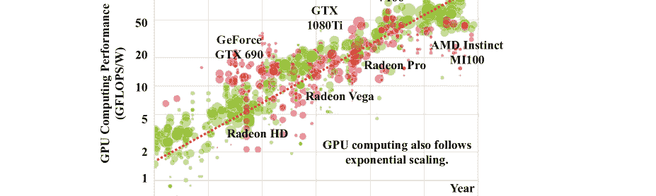
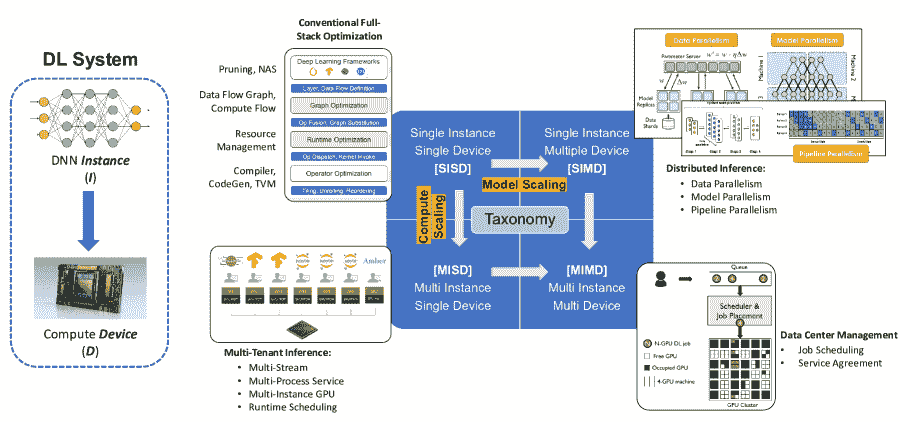
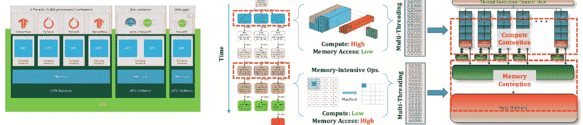
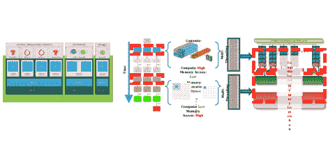
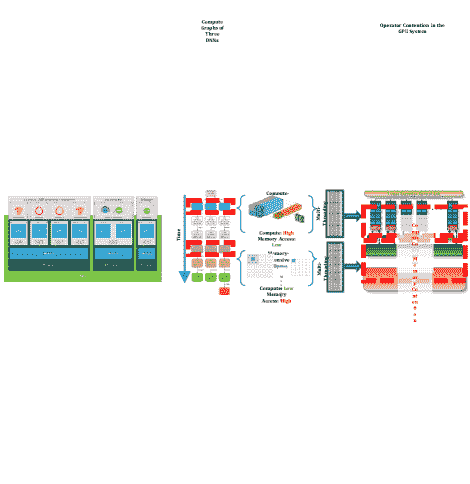
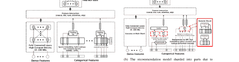
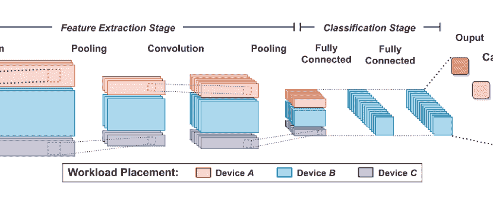

<!--yml

类别：未分类

日期：2024-09-06 19:49:37

-->

# [2111.14247] 大规模深度学习服务系统优化调查：挑战与机遇

> 来源：[`ar5iv.labs.arxiv.org/html/2111.14247`](https://ar5iv.labs.arxiv.org/html/2111.14247)

# 大规模深度学习服务系统优化调查：挑战与机遇

Fuxun Yu^†, Di Wang^‡, Longfei Shangguan^‡, Minjia Zhang^‡, Xulong Tang^∗, Chenchen Liu^§, Xiang Chen^† ^†乔治·梅森大学, ^†微软, ^†匹兹堡大学, ^§马里兰大学巴尔的摩分校

###### 摘要

深度学习（DL）模型在许多应用领域中取得了卓越的性能，包括视觉、语言、医疗、商业广告、娱乐等。随着快速发展，DL 应用和底层服务硬件都表现出强劲的扩展趋势，即模型扩展和计算扩展。例如，最近的预训练模型具有数百亿参数，内存消耗达到 $\sim$TB 级别，以及最新的 GPU 加速器提供数百 TFLOPS。伴随这些扩展趋势，DL 推理服务系统中出现了新问题和挑战，逐渐趋向于大规模深度学习服务系统（LDS）。本次调查旨在总结和分类大规模深度学习服务系统的新兴挑战和优化机会。通过提供一种新颖的分类法，总结计算范式，并阐述最近的技术进展，我们希望这项调查能够为大规模深度学习系统优化提供新的视角，并激发创新工作。

###### 关键词：

计算方法、人工智能、硬件描述语言与编译、计算机系统组织、并行架构。

## 1 引言

深度学习（DL）模型，如 CNNs [16, 37, 46]、transformers [11, 8, 3, 30] 和推荐模型 [32, 42] 在视觉、语音和语言应用等认知任务中表现出色，这为医疗图像分析 [39]、照片风格化 [35]、机器翻译 [41]、产品推荐 [32]、定制广告 [14] 和游戏 [22] 等众多领域带来了潜力。如此广泛的 DL 应用带来了巨大的市场价值，并导致了显著的 DL 服务流量。例如，FB 每天有 18.2 亿活跃用户 [12]。广告推荐查询的数量可以达到每秒 1000 万次。消费者生成的数据大幅增长和 DL 服务的使用也推动了对 AI 中心数据中心（如 Amazon AWS [28] 和 Microsoft Azure [7])的需求增加，以及对强大 DL 加速器如 GPU 的广泛采用。根据报告 [36]，2018 年 GPU 在全球数据中心加速器市场中占据了 85%的主要份额，金额为 29.83 亿美元。预计到 2025 年，该产品细分市场将达到 298.19 亿美元 [36]。

随着市场需求的不断增加，深度学习应用和底层服务硬件在计算规模化（*例如*，增加计算并行性、内存和存储以支持更大模型）和模型规模化（*例如*，更高的结构复杂性、计算负载、参数规模以提高准确性）方面展现出强烈的扩展趋势，这极大地增加了服务系统管理和优化的复杂性。一方面，如图 1（a）所示，随着计算规模化趋势的出现，具备大规模计算并行性的 GPU 已成为近期数据中心主要的深度学习计算加速器之一，并保持着持续的指数级性能扩展。最近的 GPU，例如 NVIDIA Tesla V100，提供 130 万亿次浮点运算每秒（TFLOPS）和 900 GB/s 的内存带宽，这些数字进一步增加到 312 TFLOPS 和 1.6TB/s 的内存带宽，可以同时服务于如 ResNet50 [16]等数十个深度学习模型，并提供更高的效率（Perf/Watt）。另一方面，如图 1（b）所示，模型规模化被证明是实现更高准确性的一个重要因素，这在各个领域的工业超大模型中得到了实践验证，例如视觉模型 BiT [23]、NLP 模型 BERT [8]、GPT3 [3]和深度学习推荐模型 DLRM [32]。例如，最近的超大模型 MT-NLG [30]已达到 5300 亿个参数。工业级商业 DLRMs [32]的模型大小已达到$\sim$TB，这显著超出了单机内存能力，需要多个设备进行协同计算。

图 1：深度学习模型规模化和计算规模化 [45]。这种在两侧的指数级扩展趋势导致了大规模深度学习系统的出现。

在这种背景下，我们观察到当前的深度学习系统社区对大规模深度学习系统（LDS）仍然缺乏足够的认识和关注，忽视了出现的挑战和机会：传统的深度学习系统优化通常关注于单模型单机器推理设置（即一对一映射）。然而，具有更大深度学习模型和更强硬件的 LDS 使得推理计算更加灵活，将多实例到单设备、单实例到多设备，甚至多实例到多设备映射付诸实践。例如，计算扩展（如 GPU、TPU）激励了许多研究工作将多个模型推理集中在一个单独的设备上，*例如*，将一个 GPU 分割成多个容器化的 vGPUs 或多实例 GPU（MIG），以提高硬件利用率、服务吞吐量和成本效率。考虑到实际的成本管理（*例如*，总拥有成本，TCO），数据中心在处理大量推理查询时也倾向于迁移到多租户推理服务上，*例如*，将多个推理查询放在同一设备上，这引发了新的优化目标（*例如*，每秒服务查询量，QPS）和约束（*例如*，服务级别协议，SLA），不同于传统的单租户推理。同样，模型扩展也提出了对新的一对多推理场景的需求。近期的超大规模模型（*例如*，DLRMs）在推理过程中引发了巨大的内存成本（$\sim$TB 未量化），这需要新的协作计算范式，如异构计算或分布式推理。这种协作服务涉及远程过程调用（RPCs）和低带宽通信，这与传统的单设备推理带来了截然不同的瓶颈。考虑到以上所有场景，现代数据中心面临更复杂的多对多场景，并需要专门的推理查询调度，如服务路由器和计算设备管理，以提高服务性能，如延迟、吞吐量和成本，*等等*。

在这项工作中，我们提出了一种新颖的计算范式分类法用于当前 LDS（大规模深度学习系统）工作，总结了新的优化目标，详细阐述了新的技术设计视角，并为未来的 LDS 优化提供了见解。

+   •

    以 DNN 实例（I）和计算设备（D）之间的关系为特征的多对多计算范式，出现的 LDS 计算范式可以被分类为超越单实例单设备（SISD）的三种新类别，即多实例单设备（MISD）、单实例多设备（SIMD）和多实例多设备（MIMD），如图 2 所示。

+   •

    推断服务导向的目标与关注单模型性能的 SISD 不同，LDS 工作的优化目标包括推断延迟、服务吞吐量、成本、可扩展性、服务质量等。例如，多租户推断（MISD）旨在提高服务吞吐量和功率效率，而超大规模模型推断服务则旨在以低成本增强硬件可扩展性。

+   •

    按规模设计和技术 由于推断服务的规模，LDS 工作还展示了许多优化挑战和机会，包括算法创新、运行时调度和资源管理。例如，多租户推断优化寻求细粒度的硬件资源分区和作业调度，例如，空间/时间共享以提供 QoS 保证。分布式推断中存在的通信瓶颈需要专门的模型-硬件共同优化，例如，高效的模型分片和均衡的协作等。

通过总结现有的研究，我们旨在提供关于新兴挑战、机会和创新的全面调研，从而激发对 LDS 操作和优化的新创新。本调研的其余部分组织如下：第§2 节介绍了研究的基础知识，包括我们的 LDS 分类法，并指出了本调研的范围。第§3 ‣ 大规模深度学习服务系统优化：挑战与机会的调研")节总结了多实例单设备（MISD）优化中的挑战和近期工作；第§4 ‣ 大规模深度学习服务系统优化：挑战与机会的调研")节总结了单实例多设备（SIMD）优化中的研究工作；第§5 节对这项工作进行了总结。

## 2 大规模深度学习服务系统：

一种新颖的分类法

图 2：深度学习系统的分类法，从 DNN 实例（I）与计算设备（D）之间的关系来看：单实例单设备（SISD）、单实例多设备（SIMD）、多实例单设备（MISD）和多实例多设备（MIMD）。

分类概述 我们首先提供一个 LDS 优化分类的高层次概述。具体来说，我们使用图 2 中所示的分类来展示传统深度学习系统优化与 LDS 中新兴挑战之间的差异。我们用实例（I）来表示一个 DNN 模型，用设备（D）来表示底层服务计算硬件。传统的深度学习系统优化，尽管涵盖了完整的堆栈（*例如*，模型级、图级、运行时级和内核级优化），通常在单实例单设备（SISD）假设下进行。因此，大多数现有工作只涵盖了 DLS 全谱中的左上四分之一，忽视了单实例多个设备（SIMD）、多个实例单设备（MISD），甚至多个实例多个设备（MIMD）优化。

$\bullet$ 单实例单设备（SISD）SISD 优化提高了单个模型在目标硬件设备（如 CPU、GPU、FPGA 等）上的端到端性能（例如延迟）。传统的 SISD 优化已彻底研究了整个堆栈，包括算法级的神经网络设计 [38、55、17]、剪枝和 NAS 工作 [47、25、24]，以及编译器级的优化工作 [4、21、13]。

以前的深度学习优化主要以 SISD 工作为主。例如，流行的深度学习编译框架（*例如*，TVM [4]、Ansor [57]、TASO [21]、*等*）通过调整低级计算原语来为给定的底层硬件生成高性能的内核。然而，随着深度学习模型和人工智能硬件的快速发展，在 MISD 和 SIMD 优化领域出现了更多应用和潜力。尽管这些技术在 SISD 服务中展示了最佳性能，但通常不适合新的场景，比如多个设备共同服务一个模型（SIMD）或多个模型在一个设备上共同运行（MISD），这些情况面临不同的 LDS 计算挑战和机遇。

$\bullet$ 多实例单设备（MISD）MISD 优化的目标是通过将多个 DNN 实例部署在一个高性能硬件上（即多租户推理）来提高服务吞吐量（例如每秒服务查询数，QPS）。MISD 优化的提出主要是由于计算规模的增加，即最近的 GPU（如 V100/A100s，具有$\sim$130TFLOPs/s）的巨大计算性能超出了普通 DNN 的推理需求（*例如*，ResNet50 具有$\sim$4GFLOPS）。因此，出于实际成本考虑（*例如*，硬件成本，功耗），数据中心级别的服务也趋向于采用这种多租户服务范式，以有效降低总拥有成本（TCO）。

$\bullet$ 单实例多设备（SIMD）与 MISD 相反，SIMD 优化主要是由于模型规模趋势的提出。超大规模模型，特别是在语言 [8，3]和推荐 [32]领域，已被证明是提高模型准确度的重要因素。因此，最近最先进的工业模型已经达到了数百亿参数的规模 [30]，模型推理可能需要$\sim$TB 的主机内存 [32]，这几乎无法在单个主机上完成。在这种情况下，通过多个设备进行分布式推理成为了超大规模模型推理的唯一解决方案 [27]。然而，由于涉及到较慢的设备间通信通道（*例如*，远程过程调用，RPCs），分布式推理需要算法和调度的创新来实现推理效率。例如，我们需要在算法方面考虑高效的模型切分，例如模型/流水线并行 [44，18]¹¹尽管这种模型/流水线并行主要用于大型模型训练，但最近超大规模模型推理也需要这样的模型切分技术，以便在多个设备上运行。以及调度方面的节点间协同调度。

$\bullet$ 多实例多设备（MIMD）在更复杂的场景下，多实例多设备（MIMD）优化考虑了如何将各种模型推理请求路由到不同的设备（*例如*，服务路由器）并管理计算设备的利用率。这种优化主要涉及数据中心级别的管理，以实现最佳的基础设施利用和成本控制。目前，公开的工作 [49，19，52]主要针对优化消耗更多资源的训练任务（*例如*，4/8-GPU 机器，耗时数小时到数天）。针对推理 MIMD 优化的公开工作仍然有限。

图 3：多租户推断延迟和吞吐量比较。（a）尽管共置多个 DNN 会使延迟降低 5%-10%，但整体吞吐量可以平均提高 25%+ [6]。 （b）在 250 个模型共置组合实验中，*例如*，最多 90% 的双模型执行显示延迟降低不到 17% [5]。

## 3 计算扩展：趋势向

多实例单设备（MISD）

### 3.1 概述

随着计算扩展，近年来硬件在深度学习中的容量实现了指数级增长。特别是对于 GPU，最近的 GPU 显示了超强的能力（*例如*，A100 的 $\sim$130 TFLOPs/s），与常见的模型推断工作负载（*例如*，ResNet50 的 $\sim$4 GFLOPs）相比。由于在此类硬件上执行单个 DNN 实例可能导致严重的资源利用不足，多实例单设备（MISD）计算范式或多租户推断，将多个 DNN 实例共置到同一硬件设备上，以提高硬件利用率和服务吞吐量。

提高服务吞吐量 MISD 的主要目标之一是实现更高的服务吞吐量，这通常通过每秒处理的查询数（QPS）来衡量。通过提高资源利用率（*例如*，计算单元、内存带宽），MISD 可以在相同硬件上提高服务吞吐量。图 3（左侧）展示了在相同硬件上共运行两个 DNN 模型（GoogLeNet 和 ResNet）的示例。尽管每个模型的延迟降低了 5%-10%，但整体吞吐量平均提高了 25%+。

图 4：CPU/ GPU 吞吐量和功耗比较 [2]。

降低功耗和基础设施成本 通过提高服务吞吐量，MISD 的另一个好处是它可以降低基础设施成本，并减少处理每个查询所需的平均功率。图 4 ‣ A Survey of Large-Scale Deep Learning Serving System Optimization: Challenges and Opportunities") 比较了基于 CPU 和基于 GPU 的服务之间的功耗和服务吞吐量。尽管 RTX2080Ti 的功耗是 Intel Xeon416 CPU 的 3$\times$（250W 对 85W），但 GPU 服务的吞吐量最多可以达到 100$\times$，*例如*，对于 MobileNetV2 和 NasNet。这转化为处理每个查询的平均功耗减少约 $\sim$30$\times$，从而大大降低了功耗和相关基础设施成本。

延迟性能退化 但是，更多的 DNN 实例共置会导致更差的延迟性能，因为每个 DNN 实例可用的平均资源更少。因此，DL 推理服务提供者和消费者通常会设置一定的延迟约束（SLA），要求查询在给定的延迟内完成（例如，为了获得最佳用户体验，广告展示的延迟应小于 100 毫秒）。因此，SLA 范围内的多租户推理具有一定的延迟退化也被认为是可接受的。图 3（右）显示了 250 对模型共运行组合的延迟退化分析示例，对于高达 90%的组合，平均延迟退化仅为 17%，显示了 GPU 利用提升的巨大潜力。

表 I：多租户推理优化的近期工作（JCT：作业完成时间，SLA：服务水平协议）。

| 参考 | 硬件 | 问题 | 视角 | 算法/策略 | 改进/成就 |
| --- | --- | --- | --- | --- | --- |
| [53] | GPU |

&#124; $\bullet$ 资源未充分利用 &#124;

&#124; $\bullet$ 争用 &#124;

| SW 调度 |
| --- |

&#124; $\bullet$ 操作员级别的调度 &#124;

&#124; $\bullet$ 基于 ML 的调度自动搜索 &#124;

| $\bullet$ 减少推理完成时间 |
| --- |
| [29] | GPU | $\bullet$ 作业间干扰 | SW 调度 |

&#124; $\bullet$ 查询级别的在线调度 &#124;

&#124; $\bullet$ 基于 ML 的干扰预测器 &#124;

| $\bullet$ 延迟减少 |
| --- |
| [51] | GPU | $\bullet$ 客户端等待时间 | SW 调度 |

&#124; $\bullet$ 查询级别的在线调度 &#124;

&#124; $\bullet$ 基于启发式的抢占 &#124;

&#124; $\bullet$ 并发和批处理 &#124;

| $\bullet$ 延迟减少 |
| --- |
| [6] | NPU | $\bullet$ 基于优先级的服务 | SW 调度 |

&#124; $\bullet$ 查询级别的在线调度 &#124;

&#124; $\bullet$ 启发式抢占 &#124;

|

&#124; $\bullet$ 减少高优先级作业 JCT &#124;

&#124; $\bullet$ 维护低优先级 SLA &#124;

|

| [9] | GPU |
| --- | --- |

&#124; $\bullet$ 资源未充分利用 &#124;

&#124; $\bullet$ 争用 &#124;

| HW 资源管理 |
| --- |

&#124; $\bullet$ 管理的资源提供 &#124;

&#124; $\bullet$ 自适应批处理 &#124;

|

&#124; $\bullet$ 增强的服务吞吐量 &#124;

&#124; $\bullet$ 维护 SLA &#124;

|

| [5] | GPU |
| --- | --- |

&#124; $\bullet$ 资源未充分利用 &#124;

&#124; $\bullet$ 争用 &#124;

| HW 资源管理 |
| --- |

&#124; $\bullet$ 管理的资源提供 &#124;

&#124; $\bullet$ 自适应批处理 &#124;

|

&#124; $\bullet$ 增强的服务吞吐量 &#124;

&#124; $\bullet$ 维护 SLA &#124;

|

| [15] |
| --- |

&#124; 脉冲型 &#124;

&#124; 数组 &#124;

| $\bullet$ 资源利用不足 | 架构重配置 | $\bullet$ 硬件资源分裂 |
| --- | --- | --- |

&#124; $\bullet$ 提高服务吞吐量 &#124;

&#124; $\bullet$ 降低能源成本 &#124;

|

### 3.2 MISD 中的挑战

有许多挑战阻碍了 MISD 的性能提升。我们总结了主要的问题，如租户间干扰和服务工作负载动态。

#### 3.2.1 租户间干扰

在 MISD 中，将多个深度学习作业共置于相同的硬件上允许这些模型共享计算资源，但也带来了租户间干扰的问题。由于 DNN 模型包含许多类型的操作符，如卷积、批量归一化、跳过连接，*等等*，不同类型的操作符可能是计算密集型的（*例如*，卷积）或内存密集型的（*例如*，跳过连接）。因此，在 GPU 上同时运行多个模型可能会因操作符并发管理不善（*例如*，同时运行相同类型的操作符）而引发计算或内存带宽的资源争用。结果，两个模型的推理速度可能都会减慢。随着租户数量的增加，这种情况可能会频繁发生，从而降低整体服务吞吐量。

#### 3.2.2 服务工作负载动态

当服务工作负载不是静态而是动态时，租户间干扰可能更难处理。例如，在云环境中，由于深度学习作业的到达通常不可预测，完美地交错计算密集型和内存密集型的 DNN 查询通常是不切实际的。在这种情况下，多租户推理和潜在的干扰行为很难预测，因为由于各种模型、不同数量的并发作业，*等等*，它们的组合空间非常庞大。面对这种不可预测性，保持无租户间干扰并实现理想的服务吞吐量是非常具有挑战性的。

#### 3.2.3 作业优先级和完成时间

在 MISD 计算中还存在其他一些问题。例如，一个需要考虑的重要问题是作业优先级，*例如*，某些作业需要确保性能完成或具有更高的优先级。在这种情况下，抢占是一种常见的调度策略，以确保高优先级作业在短时间内完成。或者，我们还可以为高优先级作业分配专用资源。另一个问题是，某些服务系统除了需要考虑服务器端的服务吞吐量，还需要考虑客户端用户体验，这可以通过平均作业完成时间（JCT）来衡量。最小化 JCT 也与最大化吞吐量相矛盾，*例如*，同时运行多个作业可能会导致更长的平均 JCT，但却提高了服务吞吐量。

### 3.3 优化技术

我们将近期在多租户推理优化方面的研究总结为两个主要类别：时间工作负载调度和空间资源管理。这些工作的概述见表 I。

图 5: 多租户推理中的时间和空间调度。

#### 3.3.1 软件级工作负载调度

如前所述，多租户推理中的主要挑战之一是避免任务干扰。因此，许多研究工作[53、29、51、6]对不同深度学习任务进行时间上的工作负载调度，以减少这种干扰，如图 5 所示。这些解决方案旨在通过沿时间维度调度不同的深度学习模型工作负载来避免干扰，因此我们将这类工作归类为软件级调度解决方案。

实际上，这种工作负载调度粒度可以是细粒度的，例如调度深度神经网络（DNN）操作符，或者是粗粒度的，例如调度整个推理查询。

操作符调度 为实现细粒度调度，工作[53、10]将深度学习模型操作符（例如，卷积、批量归一化、身份）视为最小调度单元。他们首先将多个 DNN 的计算图与许多操作符抽象为中间表示（IR）。为了探索巨大的调度空间，他们通过定义三个主要因素设计了基于机器学习的自动搜索方法：调度搜索空间、基于分析的延迟成本模型，以及基于机器学习的搜索算法，以找到最佳调度，实现平衡的 GPU 利用率而不干扰且延迟减少。这种细粒度的操作符调度可以实现更好的性能，但通常在工作负载数量增加到非常大（如数百个 DNN 查询）时面临可扩展性问题。

服务路由器 因此，其他工作如[29、51、6]采用了更粗粒度的调度，例如，将每个查询视为最小调度单元，从而减少了调度复杂性。例如，一个查询级工作负载调度的例子是大规模数据中心中的服务路由器，如微软深度学习推理服务（DLIS）系统[43]。为了实现高利用率同时避免资源争用，服务路由器需要了解不同模型的要求，并智能地将一个或多个查询分配到硬件上。

预测调度 在上述调度技术中，一个具有挑战性的因素是服务查询的动态性，例如，未知数量的传入查询、具有不同输入长度的 RNN/LSTM。与静态工作负载不同，我们可以获得完整的工作负载信息进行调度，这种动态工作负载要求我们考虑潜在的传入工作负载。为应对这种动态性，PREMA [6]提出了一种预测性多任务 DNN 调度算法，该算法结合了离线分析延迟记录和基于令牌的在线作业调度算法。同时，它还启用了自适应作业抢占以实现优先级控制。但是，由于每个 DNN 可能有许多操作符（*例如*，层）具有波动的资源消耗，这种粗粒度的调度仍然可能偶尔遭遇资源利用不足/争用和次优性能。

#### 3.3.2 硬件级资源管理

除了时间调度，解决租户间推理问题的另一个优化视角是进行细粒度的资源管理[9, 15]，例如空间分区和资源隔离，这被视为空间视角。由于这种分区可以隔离不同作业使用的资源（*例如*，流式多处理器（SMs）、内存带宽），这种解决方案可以帮助避免在硬件层面的作业干扰。

资源分区 以前，实现细粒度的资源分区是不可能的，直到最近 NVIDIA GPUs 发布了一系列资源共享和分区支持功能，如多流（MST）、多进程服务（MPS [34]) 和多实例 GPU（MIG [33]）。这三种工具的主要区别在于，MST 仅启用资源共享，但不能避免 SM 或内存带宽干扰。MPS 通过将特定 SM 分配给给定作业（*例如*，对 5 个 DNN，将 20%的 SM 分配给每个）实现 SM 分区，从而避免 SM 干扰，但不解决内存干扰问题。MIG 实现了 SM 和内存带宽的分区，目前仅在 NVIDIA A100 GPUs 上得到支持[33]。利用这种支持，[9]使用 MPS 为不同 DNN 作业进行自适应 SM 分区，从而避免了共同定位的 DL 工作负载之间的 SM 资源争用。类似地，[15]利用特殊加速器（系统数组）并实现了硬件裂变的架构支持，实现了细粒度的资源管理。

硬件重新配置 然而，这种空间资源分区解决方案也有一个固有的限制，即在面对动态工作负载时的不可灵活的重新配置。对于 GPU 和其他加速器，改变资源分区配置需要一定的时间（*例如*，几十秒或更多），这可能远大于 DL 工作负载的处理时间（通常为毫秒级）。因此，频繁重新配置资源分区通常是不切实际的，从而限制了这种解决方案在面对动态工作负载时的性能。[9] 通过利用备用/影子进程来尝试减少由 MPS 重新配置时间造成的停滞。然而，从一个分区配置切换到另一个配置的最短时间仍需几秒钟，这在在线服务场景中是不可忽视的。

### 3.4 未来方向

#### 3.4.1 软件-硬件共调度

软件和硬件调度可以相互补充，以提供高作业调度灵活性和严格的资源隔离。最近，一些工作采用了时空结合的视角以实现更好的服务性能。[5] 采用 MPS 进行资源分区，将一个 GPU 切分为多个 gpulet，然后实施基于启发式的贪婪任务调度器，寻找当前 DNN 查询与 gpulet 之间的适当映射关系。然而，时空调度中的服务工作负载动态更为复杂，需要重新思考和设计。例如，除了之前的仅时间调度只决定何时启动每个作业外，多个硬件分区还需要决定将作业放置在哪个分区。[5] 中的当前贪婪任务调度器将当前工作负载视为静态的，没有考虑潜在的动态到来的作业请求。因此，一个简单的次优情况可能是将当前小工作负载分配到一个大 gpulet 上，而没有为更大的即将到来的 DNN 作业保留 gpulet，从而导致潜在的资源利用不足。

#### 3.4.2 基于 ML 的预测与在线学习

为了避免这种问题，我们可以潜在地使用基于 ML 的预测模型（*例如*，强化学习、LSTM、*等*）来预测动态工作负载，然后指导工作负载到分区的映射。基于 ML 的模型可以通过历史服务记录进行离线初始训练。在在线服务过程中，可以利用主动和终身学习，即使用延迟/吞吐量作为反馈来持续提高预测准确性，以改进工作负载预测和调度效果。

利用基于机器学习的预测的另一种方法是进行建模，以预测在不同的多模型和硬件组合下的潜在延迟性能，从而使调度器能够更好地决策关于延迟 SLA 约束。例如，工作[29]建立了一个机器学习模型，用于预测不同机器上的多模型推断案例的延迟。然而，这种解决方案的有效性也高度依赖于建模的准确性、可扩展性和通用性，这在实践中很难同时实现。

## 4 模型扩展：趋势分析

单实例多设备（SIMD）

### 4.1 概述

与 MISD 不同，SIMD 的趋势主要受到模型规模极大扩展的影响[3, 30]，这使得一个模型难以在单台机器上执行。例如，工业推荐模型[32]在推断时需要$\sim$TB 的内存。在这种情况下，将单台机器扩展以支持如此大的内存容量可能会在大规模数据中心引发巨大的基础设施成本。因此，另一种更具成本效益的方法是扩展，这就是使用多个分布式计算设备协同进行推断。然而，与具有较长时间持续性的分布式训练不同，推断服务具有严格的延迟约束。因此，在这种协同服务中，通信成本可能使得服务水平协议（SLA）更难实现。

提升容量扩展 SIMD 的首要任务是实现基础设施的容量扩展，从而支持超大规模模型的推断服务。为此，有两种主要方式：垂直扩展与水平扩展。垂直扩展（或称为纵向扩展）意味着升级或增加系统的资源，以达到期望的性能状态，例如，更多的计算、内存、存储和网络带宽等。相比之下，水平扩展（或称为横向扩展）则使用更多分布式的低端机器协同服务一个大型深度学习模型。SIMD 如分布式推断[27, 56, 59, 54]主要使用第二种水平扩展解决方案来维持更大深度学习模型的服务容量。最近，异构推断[26, 50, 48]出现，它结合了异构资源，如混合 CPU/GPU、混合缓存/内存/SSD 等。这些解决方案可以被视为垂直扩展解决方案。

降低成本 对于横向扩展和纵向扩展的解决方案，上述解决方案（即 SIMD）的主要优化目标是降低总拥有成本（TCO）。例如，通过提高单台机器的容量，如升级 CPU 代数、增加内存容量和频率，在大规模数据中心级基础设施中可能会很昂贵。因此，异构推理主要依赖现有硬件并将其组合以增强计算能力，从而降低容量扩展成本。相对而言，纵向扩展利用多台当前一代计算设备来服务下一代更大模型，从而也降低了设置新专用硬件的成本。两种方法的共同缺点是它带来了复杂的分布式计算和通信管理，甚至可能导致性能下降。

图 6：在三种并行性中，模型并行性是实现分布式推理的常见方式，而另外两种仅适用于分布式训练。例如，数据并行性不适用于小批量推理。流水线并行性无法在单个推理请求中利用多节点计算并行性。

### 4.2 SIMD 中的挑战

#### 4.2.1 计算并行性

尽管带有分布式设备的 SIMD 可以实现模型所需的总体容量，但将整个模型分配到多个节点上进行协作计算仍然非常复杂。已经在分布式训练算法中探索了许多模型分区算法，如数据并行性、模型并行性和流水线并行性[44, 31, 20]，*等等*。然而，并非所有这些算法都适用于推理场景。如图 6 所示，传统的数据并行性通过拆分批量大小通常不适用，因为推理服务通常具有小批量大小。流水线并行性[44, 31, 18]通过将不同层分配到不同机器上也不适用，因为它不能在单个推理请求中实现多节点计算并行性。因此，模型并行性[20]是实现 SIMD 或分布式推理的最常见方法，后续我们将进行介绍。

#### 4.2.2 通信瓶颈

对于在多分布式机器上进行模型并行，实现线性甚至是次线性加速通常是非常困难的。原因在于，影响模型并行计算效率的主要因素（如延迟）是不同模型碎片（分布式节点）之间的中间数据传输所造成的通信瓶颈 [18, 40]。根据数据传输速度，过多的数据传输会产生显著的延迟开销，*例如*，在分布式机器中使用以太网连接。为了避免这种情况，需要一个高效的模型分片算法来确保 MISD 中的推理服务性能。然而，不同模型结构中的中间数据通信机制差异很大，比如 CNN、Transformers 和推荐 DLRMs，*等*，因此需要许多分析工作和设计创新来找到最佳的模型分片算法。

图 7：分布式推理可以使用 RPC 来利用多个分布式主机协作执行一个大型推荐模型 [27]。

### 4.3 优化技术

我们主要介绍进行 SIMD 的两个方面的工作：通过分布式推理进行扩展和通过异构推理进行扩展。

#### 4.3.1 扩展：分布式推理

推荐模型分布式推理 例如，最近行业级的深度学习推荐模型（DLRM）[32] 已经达到了 $\sim$TB 级别的模型大小，并且这种推荐请求占据了 Facebook 数据中心工作负载的 79%以上，[27]提出了将分布式推理技术应用到大型 DLRM 推理服务的初始工作。不同于传统的 MLP 和 CNN，DLRM 主要由特征嵌入表和全连接层组成，其中特征嵌入表是模型权重的主要部分（高达 80% 到 95%）。这种 DLRM 的特征嵌入部分对内存要求很高，但计算工作量很轻，因为它只需要访问嵌入表的某些列并进行求和 [27]。

因此，提出了分布式推理来将大型嵌入表分区到不同的计算节点，并因此克服了推理服务的内存限制。当远程节点中需要表嵌入时，中央模型可以调用远程过程调用（RPCs）直接从远程节点获取计算结果并实现分布式推理服务。

CNN 分布式推断 与 DLRM 相比，CNN 模型并行性（如通道并行/空间并行）[59] 已经被广泛研究，许多研究也提出了 CNN 模型的分布式推断[54, 56]。例如，CoEdge [54] 是一种在异构分布式设备上具有自适应工作负载分配的合作 CNN 推断示例。类似地，DeepThings [56] 也提出了一个在资源受限的 IoT 边缘设备上自适应分布执行 CNN 推断的框架。它设计了一种可扩展的融合平铺分区（FTP），以最小化内存占用，同时暴露并行性以协作计算主要的卷积层。它进一步实现了一种分布式工作窃取方法，以在推断运行时实现动态工作负载分配和平衡。

#### 4.3.2 扩展：异构推断

异构内存 除了使用分布式机器外，解决超大规模模型的大内存需求的另一种方法是利用异构内存，*例如*，通过结合不同层次的内存，如缓存、主内存甚至 SSD。此类异构内存的主要挑战是解决 SSD 的访问速度慢的问题（访问带宽通常比内存慢 100 倍）。针对这一瓶颈，[26, 50, 48] 提出了类似的异构内存设计，利用存储级 SSD 来存储 DLRM 的部分嵌入表权重。由于 DLRM 的嵌入表访问模式通常是稀疏的，并具有一定的空间/时间局部性，因此在内存/SSD 之间采用适当的嵌入表放置策略以及专门的缓存策略，可以显著提高异构内存的访问效率，从而达到与纯内存性能相当的水平。

异构计算 与异构内存类似，异构计算是通过将不同处理器的计算能力混合来实现的概念，通常用于多个类型的计算处理器（如 CPU、GPU 和其他加速器）的 SoC 中的大型模型推断。例如，Synergy [58] 提出了一个用于嵌入式异构 SoC 的高吞吐量 CNN 的 HW/SW 框架。它利用所有可用的片上资源，包括双核 ARM 处理器、FPGA 和加速器，共同计算 CNN 推断。类似于将一个模型分配到多个机器上的分布式推断，异构计算也需要专门的模型分片算法，并将模型分片与异构计算设备共同设计，还要考虑处理器间的通信，*等*。

## 5 结论

在本次调查中，我们提出了一种新的计算范式分类法，以描述正在进行的大规模深度学习系统 (LDS) 优化工作。我们总结了新的优化目标，详细阐述了新的技术设计视角，并提供了对未来 LDS 优化的见解。通过总结现有工作，我们希望这项调查能够提供对新兴挑战、机会和创新的全面总结，从而激发 LDS 操作和优化的新创新。

## 参考文献

+   [1]

+   Almeida 等人 [2019] Mario Almeida, Stefanos Laskaridis, Ilias Leontiadis, Stylianos I Venieris, 和 Nicholas D Lane. 2019. EmBench: 量化现代商品设备上深度神经网络的性能变化。发表于 *第 3 届国际移动系统与应用深度学习研讨会*。

+   Brown 等人 [2020] Tom B Brown, Benjamin Mann, Nick Ryder, Melanie Subbiah, Jared Kaplan, Prafulla Dhariwal, Arvind Neelakantan, Pranav Shyam, Girish Sastry, Amanda Askell 等人. 2020. 语言模型是少量样本学习者。*arXiv 预印本 arXiv:2005.14165* (2020)。

+   Chen 等人 [2018] Tianqi Chen, Thierry Moreau, Ziheng Jiang, Lianmin Zheng, Eddie Yan, Haichen Shen, Meghan Cowan, Leyuan Wang, Yuwei Hu, Luis Ceze 等人. 2018. $\{$TVM$\}$: 一个用于深度学习的自动化端到端优化编译器。发表于 *第 13 届 $\{$USENIX$\}$ 操作系统设计与实现研讨会 ($\{$OSDI$\}$ 18)*。578–594。

+   Choi 等人 [2021] Seungbeom Choi, Sunho Lee, Yeonjae Kim, Jongse Park, Youngjin Kwon, 和 Jaehyuk Huh. 2021. 多模型机器学习推理服务与 GPU 空间分区。*arXiv 预印本 arXiv:2109.01611* (2021)。

+   Choi 和 Rhu [2020] Yujeong Choi 和 Minsoo Rhu. 2020. Prema: 一种预测的多任务调度算法，用于可抢占神经处理单元。发表于 *2020 IEEE 国际高性能计算架构研讨会 (HPCA)*。IEEE, 220–233。

+   Copeland 等人 [2015] Marshall Copeland, Julian Soh, Anthony Puca, Mike Manning, 和 David Gollob. 2015. Microsoft Azure. *纽约, NY, USA:: Apress* (2015)。

+   Devlin 等人 [2018] Jacob Devlin, Ming-Wei Chang, Kenton Lee, 和 Kristina Toutanova. 2018. Bert: 用于语言理解的深度双向变换器的预训练。*arXiv 预印本 arXiv:1810.04805* (2018)。

+   Dhakal 等人 [2020] Aditya Dhakal, Sameer G Kulkarni, 和 KK Ramakrishnan. 2020. Gslice: 受控的 GPU 空间共享用于可扩展推理平台。发表于 *第 11 届 ACM 云计算研讨会会议论文集*。492–506。

+   Ding 等人 [2020] Yaoyao Ding, Ligeng Zhu, Zhihao Jia, Gennady Pekhimenko, 和 Song Han. 2020. IOS: 用于 CNN 加速的操作符调度器。*arXiv 预印本 arXiv:2011.01302* (2020)。

+   Dosovitskiy et al. [2020] Alexey Dosovitskiy, Lucas Beyer, Alexander Kolesnikov, Dirk Weissenborn, Xiaohua Zhai, Thomas Unterthiner, Mostafa Dehghani, Matthias Minderer, Georg Heigold, Sylvain Gelly, 等. 2020. 一张图像值 16x16 个词: 大规模图像识别中的 Transformers。*arXiv:2010.11929* (2020)。

+   Facebook [2021] Facebook. 2021. Facebook for Business. https://www.facebook.com/iq/insights-to-go/1820m-facebook-daily-active-users-were-1820m-on-average-for-september。

+   Fegade et al. [2020] Pratik Fegade, Tianqi Chen, Phillip B Gibbons, 和 Todd C Mowry. 2020. Cortex: 递归深度学习模型的编译器。*arXiv 预印本 arXiv:2011.01383* (2020)。

+   Gharibshah et al. [2020] Zhabiz Gharibshah, Xingquan Zhu, Arthur Hainline, 和 Michael Conway. 2020. 在线展示广告中用户兴趣和响应预测的深度学习。*数据科学与工程* 5, 1 (2020), 12–26。

+   Ghodrati et al. [2020] Soroush Ghodrati, Byung Hoon Ahn, Joon Kyung Kim, Sean Kinzer, Brahmendra Reddy Yatham, Navateja Alla, Hardik Sharma, Mohammad Alian, Eiman Ebrahimi, Nam Sung Kim, 等. 2020. Planaria: 用于深度神经网络空间多租户加速的动态架构分裂。见于 *2020 第 53 届 IEEE/ACM 国际微体系结构研讨会 (MICRO)*。IEEE, 681–697。

+   He et al. [2016] Kaiming He, Xiangyu Zhang, Shaoqing Ren, 和 Jian Sun. 2016. 深度残差学习用于图像识别。见于 *IEEE 计算机视觉与模式识别会议论文集*。770–778。

+   Howard et al. [2017] Andrew G Howard, Menglong Zhu, Bo Chen, Dmitry Kalenichenko, Weijun Wang, Tobias Weyand, Marco Andreetto, 和 Hartwig Adam. 2017. Mobilenets: 高效的卷积神经网络用于移动视觉应用。*arXiv 预印本 arXiv:1704.04861* (2017)。

+   Huang et al. [2019] Yanping Huang, Youlong Cheng, Ankur Bapna, Orhan Firat, Dehao Chen, Mia Chen, HyoukJoong Lee, Jiquan Ngiam, Quoc V Le, Yonghui Wu, 等. 2019. Gpipe: 使用管道并行性高效训练巨型神经网络。*神经信息处理系统进展* 32 (2019), 103–112。

+   Jeon et al. [2019] Myeongjae Jeon, Shivaram Venkataraman, Amar Phanishayee, Junjie Qian, Wencong Xiao, 和 Fan Yang. 2019. 大规模多租户 $\{$GPU$\}$ 集群的分析，用于 $\{$DNN$\}$ 训练工作负载。见于 *2019 $\{$USENIX$\}$ 年度技术会议 ($\{$USENIX$\}$$\{$ATC$\}$ 19)*。947–960。

+   Jia et al. [2018] Zhihao Jia, Sina Lin, Charles R Qi, 和 Alex Aiken. 2018. 探索卷积神经网络并行化中的隐含维度。*arXiv 预印本 arXiv:1802.04924* (2018)。

+   Jia et al. [2019] Zhihao Jia, Oded Padon, James Thomas, Todd Warszawski, Matei Zaharia, 和 Alex Aiken. 2019. TASO: 通过自动生成图替代优化深度学习计算。见于 *第 27 届 ACM 操作系统原理研讨会论文集*。47–62。

+   Justesen 等人 [2019] 尼尔斯·贾斯滕、菲利普·邦特拉格、朱利安·托戈利乌斯、塞巴斯蒂安·里西。2019。深度学习在视频游戏中的应用。*IEEE 游戏期刊* 12, 1 (2019)，1–20。

+   Kolesnikov 等人 [2020] 亚历山大·科列斯尼科夫、卢卡斯·贝耶、夏华·翟、琼·普伊克塞弗、杰西卡·杨、西尔万·热利、尼尔·霍尔斯比。2020。大转移（BIT）：通用视觉表示学习。在*计算机视觉–ECCV 2020：第 16 届欧洲会议，英国格拉斯哥，2020 年 8 月 23–28 日，论文集，第 V 部分 16*。Springer，491–507。

+   李等人 [2019] 李鑫、周一鸣、潘正、冯佳施。2019。部分顺序剪枝：神经网络架构搜索中的最佳速度/准确性权衡。在*IEEE 计算机视觉与模式识别会议论文集*。9145–9153。

+   林等人 [2020] 林名宝、季荣荣、王艳、张艺辰、张宝昌、田永宏、邵凌。2020。HRank：基于高秩特征图的滤波剪枝。在*IEEE/CVF 计算机视觉与模式识别会议（CVPR）论文集*。1529–1538。

+   刘等人 [2021] 刘家文、李东、罗伯托·焦约萨、李佳佳。2021。Athena：异构内存上的高性能稀疏张量收缩序列。在*ACM 国际超级计算会议论文集*。190–202。

+   Lui 等人 [2021] 迈克尔·刘、雅武兹·耶蒂姆、厄尔古尔·厄兹坎、赵卓然、蔡新叶、卡罗尔-简·吴、马克·亨普斯特德。2021。理解基于容量驱动的规模扩展神经推荐推理。在*2021 IEEE 国际系统与软件性能分析研讨会（ISPASS）*。IEEE，162–171。

+   Madhuri 和 Sowjanya [2016] T Madhuri 和 P Sowjanya。2016。微软 Azure 与亚马逊 AWS 云服务：比较研究。*国际创新研究期刊：科学、工程与技术* 5, 3 (2016)，3904–3907。

+   Mendoza 等人 [2021] 丹尼尔·门多萨、弗朗西斯科·罗梅罗、李倩、内拉贾·J·亚德瓦德卡尔、克里斯托斯·科齐拉基斯。2021。干扰感知调度用于推理服务。在*第 1 届机器学习与系统研讨会论文集*。80–88。

+   微软 [2020] Nvidia 微软。2020。使用 DeepSpeed 和 Megatron 训练 Megatron-Turing NLG 530B，世界上最大最强的生成语言模型。https://developer.nvidia.com/blog/using-deepspeed-and-megatron-to-train-megatron-turing-nlg-530b-the-worlds-largest-and-most-powerful-generative-language-model/。

+   Narayanan 等人 [2019] 深克·纳拉亚南、亚伦·哈尔拉普、阿马尔·帕尼莎耶、维维克·谢沙德里、尼基尔·R·德万努尔、格雷戈里·R·甘格、菲利普·B·吉本斯、马泰·扎哈里亚。2019。PipeDream：用于 DNN 训练的广义管道并行。在*第 27 届 ACM 操作系统原理研讨会论文集*。1–15。

+   Naumov 等人 [2019] Maxim Naumov, Dheevatsa Mudigere, Hao-Jun Michael Shi, Jianyu Huang, Narayanan Sundaraman, Jongsoo Park, Xiaodong Wang, Udit Gupta, Carole-Jean Wu, Alisson G Azzolini 等人. 2019. 深度学习推荐模型用于个性化和推荐系统。*arXiv 预印本 arXiv:1906.00091* (2019)。

+   NVIDIA [2020a] NVIDIA. 2020a. NVIDIA 多实例 GPU (MIG)。https://docs.nvidia.com/datacenter/tesla/mig-user-guide/。

+   NVIDIA [2020b] NVIDIA. 2020b. NVIDIA 多进程服务 (MPS)。https://docs.nvidia.com/deploy/pdf/CUDA-Multi-Process-Service-Overview.pdf。

+   Park 等人 [2019] Taesung Park, Ming-Yu Liu, Ting-Chun Wang, 和 Jun-Yan Zhu. 2019. 带有空间自适应归一化的语义图像合成。见于*IEEE/CVF 计算机视觉与模式识别会议论文集*。2337–2346。

+   Reports [2021] 市场报告. 2021. 全球数据中心加速器市场规模、状态及预测 2020-2025。https://www.mynewsdesk.com/brandessence/pressreleases/data-center-accelerator-market-size-2021-cagr-38-dot-7-percent-3112488。

+   Sandler 等人 [2018a] Mark Sandler, Andrew Howard, Menglong Zhu, Andrey Zhmoginov, 和 Liang-Chieh Chen. 2018a. Mobilenetv2: 倒置残差和线性瓶颈。见于*IEEE 计算机视觉与模式识别会议论文集*。4510–4520。

+   Sandler 等人 [2018b] Mark Sandler, Andrew Howard, Menglong Zhu, Andrey Zhmoginov, 和 Liang-Chieh Chen. 2018b. Mobilenetv2: 倒置残差和线性瓶颈。见于*IEEE 计算机视觉与模式识别会议论文集*。4510–4520。

+   Shen 等人 [2017] Dinggang Shen, Guorong Wu, 和 Heung-Il Suk. 2017. 医学图像分析中的深度学习。*生物医学工程年度回顾* 19 (2017), 221–248。

+   Shoeybi 等人 [2019] Mohammad Shoeybi, Mostofa Patwary, Raul Puri, Patrick LeGresley, Jared Casper, 和 Bryan Catanzaro. 2019. Megatron-lm: 使用模型并行训练多亿参数语言模型。*arXiv 预印本 arXiv:1909.08053* (2019)。

+   Singh 等人 [2017] Shashi Pal Singh, Ajai Kumar, Hemant Darbari, Lenali Singh, Anshika Rastogi, 和 Shikha Jain. 2017. 使用深度学习的机器翻译：概述。见于*2017 年国际计算机、通信与电子会议 (comptelix)*。IEEE, 162–167。

+   Singhal 等人 [2017] Ayush Singhal, Pradeep Sinha, 和 Rakesh Pant. 2017. 现代推荐系统中的深度学习应用：近期研究综述。*arXiv 预印本 arXiv:1712.07525* (2017)。

+   Soifer 等人 [2019] Jonathan Soifer, Jason Li, Mingqin Li, Jeffrey Zhu, Yingnan Li, Yuxiong He, Elton Zheng, Adi Oltean, Maya Mosyak, Chris Barnes, 等人. 2019. 微软的深度学习推理服务。见于*2019 年 USENIX 运维机器学习会议 (OpML 19)*。15–17。

+   Song 等 [2017] Linghao Song, Xuehai Qian, Hai Li, 和 Yiran Chen. 2017. Pipelayer：一种基于管道的 RERAM 加速器用于深度学习。发表于 *2017 IEEE 国际高性能计算架构研讨会 (HPCA)*。IEEE, 541–552。

+   Sun 等 [2019] Yifan Sun, Nicolas Bohm Agostini, Shi Dong, 和 David Kaeli. 2019. 用产品数据总结 CPU 和 GPU 设计趋势。*arXiv preprint arXiv:1911.11313* (2019)。

+   Tan 等 [2019] Mingxing Tan, Bo Chen, Ruoming Pang, Vijay Vasudevan, Mark Sandler, Andrew Howard, 和 Quoc V Le. 2019. Mnasnet：面向移动平台的神经架构搜索。发表于 *IEEE 计算机视觉与模式识别会议论文集*。2820–2828。

+   Tan 和 Le [2019] Mingxing Tan 和 Quoc V Le. 2019. Efficientnet：重新思考卷积神经网络的模型缩放。*arXiv preprint arXiv:1905.11946* (2019)。

+   Wan 等 [2021] Hu Wan, Xuan Sun, Yufei Cui, Chia-Lin Yang, Tei-Wei Kuo, 和 Chun Jason Xue. 2021. FlashEmbedding：将嵌入表存储在 SSD 中以支持大规模推荐系统。发表于 *第 12 届 ACM SIGOPS 亚太系统研讨会论文集*。9–16。

+   Wesolowski 等 [2021] Lukasz Wesolowski, Bilge Acun, Valentin Andrei, Adnan Aziz, Gisle Dankel, Christopher Gregg, Xiaoqiao Meng, Cyril Meurillon, Denis Sheahan, Lei Tian 等 2021. 数据中心规模的 GPU 机器学习工作负载分析与优化。*IEEE Micro* 41, 5 (2021), 101–112。

+   Wilkening 等 [2021] Mark Wilkening, Udit Gupta, Samuel Hsia, Caroline Trippel, Carole-Jean Wu, David Brooks, 和 Gu-Yeon Wei. 2021. RecSSD：基于固态硬盘的推荐推理近数据处理。发表于 *第 26 届 ACM 国际编程语言和操作系统架构支持会议论文集*。717–729。

+   Wu 等 [2020] Xiaorui Wu, Hong Xu, 和 Yi Wang. 2020. Irina：通过高效的在线调度加速 DNN 推理。发表于 *第 4 届亚太网络研讨会*。36–43。

+   Xiao 等 [2020] Wencong Xiao, Shiru Ren, Yong Li, Yang Zhang, Pengyang Hou, Zhi Li, Yihui Feng, Wei Lin, 和 Yangqing Jia. 2020. AntMan：用于深度学习的 $\{$GPU$\}$ 集群动态缩放。发表于 *第 14 届 $\{$USENIX$\}$ 操作系统设计与实现研讨会 ($\{$OSDI$\}$ 20)*。533–548。

+   Yu 和等 [2021] Fuxun Yu 等 2021. 针对 GPU 上多租户 DNN 推理的自动化运行时感知调度。发表于 *第 40 届 IEEE 国际计算机辅助设计会议 (ICCAD) 论文集*。

+   Zeng 等 [2020] Liekang Zeng, Xu Chen, Zhi Zhou, Lei Yang, 和 Junshan Zhang. 2020. Coedge：在异构边缘设备上进行自适应负载分配的合作 DNN 推理。*IEEE/ACM Transactions on Networking* 29, 2 (2020), 595–608。

+   Zhang et al. [2018] Xiangyu Zhang, Xinyu Zhou, Mengxiao Lin 和 Jian Sun。2018 年。《Shufflenet: 一种极其高效的移动设备卷积神经网络》。在*IEEE 计算机视觉与模式识别会议论文集*中，6848–6856 页。

+   Zhao et al. [2018] Zhuoran Zhao, Kamyar Mirzazad Barijough 和 Andreas Gerstlauer。2018 年。《Deepthings: 在资源受限的物联网边缘集群上进行分布式自适应深度学习推理》。*IEEE 集成电路和系统计算机辅助设计汇刊* 37 卷，11 期（2018 年），2348–2359 页。

+   Zheng et al. [2020] Lianmin Zheng, Chengfan Jia, Minmin Sun, Zhao Wu, Cody Hao Yu, Ameer Haj-Ali, Yida Wang, Jun Yang, Danyang Zhuo, Koushik Sen 等人。2020 年。《Ansor: 生成高性能张量程序用于深度学习》。在*第 14 届$\{$USENIX$\}$操作系统设计与实现研讨会（$\{$OSDI$\}$ 20）*上，863–879 页。

+   Zhong et al. [2019] Guanwen Zhong, Akshat Dubey, Cheng Tan 和 Tulika Mitra。2019 年。《Synergy: 一种用于嵌入式异构系统上高吞吐量卷积神经网络的硬件/软件框架》。*ACM 嵌入式计算系统汇刊（TECS）* 18 卷，2 期（2019 年），1–23 页。

+   Zhou et al. [2019] Li Zhou, Hao Wen, Radu Teodorescu 和 David HC Du。2019 年。《在边缘计算中使用容器化分区分布深度神经网络》。在*第 2 届$\{$USENIX$\}$边缘计算热点话题研讨会（HotEdge 19）*上。
