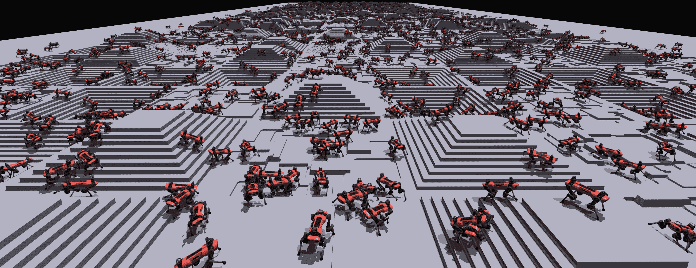
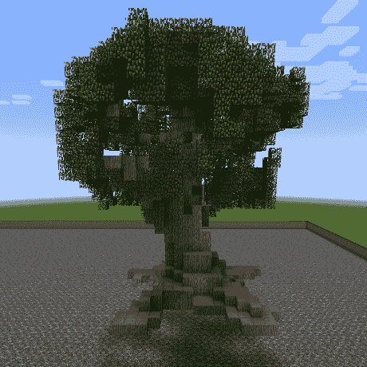
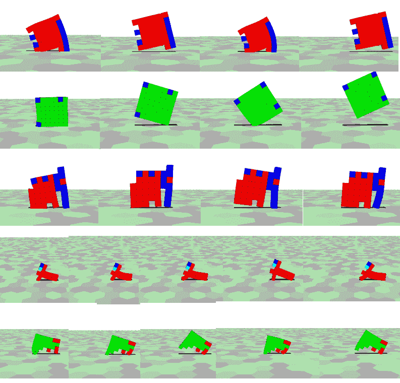

<!--yml

分类: 未分类

日期: 2024-09-06 19:49:35

-->

# [2111.14377] 集体智能与深度学习：近期发展综述

> 来源：[`ar5iv.labs.arxiv.org/html/2111.14377`](https://ar5iv.labs.arxiv.org/html/2111.14377)

# 集体智能与深度学习：近期发展综述

David Ha¹¹affiliationmark: 和 Yujin Tang¹¹affiliationmark: ¹¹affiliationmark: Google Brain, 东京, 日本。

两位作者对本工作贡献相同。

邮箱：hadavid@google.com, yujintang@google.com

###### 摘要

在过去十年里，我们见证了深度学习在人工智能领域的崛起。人工神经网络的进步，加上具有大内存容量的硬件加速器的相应进步，以及大数据集的可用性，使得实践者能够训练和部署复杂的神经网络模型，从而在计算机视觉、自然语言处理和强化学习等多个领域的任务上实现最先进的性能。然而，随着这些神经网络变得越来越大、越来越复杂并被广泛使用，当前深度学习模型的基本问题变得越来越明显。最先进的深度学习模型被认为存在从鲁棒性差、无法适应新任务设置到需要僵化和不灵活的配置假设等问题。自然界中常见的集体行为往往产生鲁棒、适应性强且对环境配置假设较少的系统。集体智能作为一个领域，研究从多个个体的互动中产生的集体智能。在这一领域中，像自组织、涌现行为、群体优化和元胞自动机等思想被发展出来以建模和解释复杂系统。因此，看到这些思想被融入到更新的深度学习方法中是很自然的。在这篇综述中，我们将提供神经网络研究与复杂系统相关的历史背景，并重点介绍现代深度学习研究中几个活跃的领域，这些领域结合了集体智能的原则，以推进当前的能力。我们希望这篇综述能作为复杂系统和深度学习社区之间的桥梁。

###### 关键词：

深度学习，强化学习，元胞自动机，自组织，复杂系统

## 1 引言

深度学习（DL）是一类使用多层（“深度”）神经网络进行表示学习的机器学习方法。尽管人工神经网络在 1980 年代由 Schmidhuber（2014）首次出现，并使用反向传播算法进行训练，但深度神经网络直到 2012 年才引起广泛关注，那时基于 GPU 训练的深度人工神经网络解决方案 Krizhevsky 等人（2012）在年度图像识别竞赛中显著超越了非 DL 的竞争方法。这一成功表明，DL 结合快速硬件加速实现和大量数据集，能够在复杂任务中比传统方法取得更好的结果。实践者很快将 DL 应用于解决多个领域长期存在的问题。在计算机视觉（CV）中，深度学习模型用于图像识别 Simonyan 和 Zisserman（2014）；He 等人（2016）；Radford 等人（2021）和图像生成 Wang 等人（2021）；Jabbar 等人（2021）。在自然语言处理（NLP）中，深度语言模型可以生成文本 Radford 等人（2018，2019）；Brown 等人（2020）并执行机器翻译 Stahlberg（2020）。深度学习还被纳入强化学习（RL）中，以应对基于视觉的计算机游戏，如 Doom Ha 和 Schmidhuber（2018）和 Atari Mnih 等人（2015），以及大搜索空间的游戏，如围棋 Silver 等人（2016）和星际争霸 Vinyals 等人（2019）。深度学习模型还被部署用于移动应用，如语音识别 Alam 等人（2020）和语音合成 Tan 等人（2021），展示了其广泛的适用性。

图 1：GPU 硬件的最新进展使得对数千个机器人模型进行逼真的 3D 模拟成为可能，如图中所示的 Rudin 等人（2021）的模型。这样的进展为大规模 3D 模拟人工代理提供了可能，这些代理可以相互互动并共同发展智能行为。

然而，深度学习并非没有副作用的灵丹妙药。尽管我们见证了许多成功和深度神经网络的日益普及，但随着我们的模型和训练算法变得越来越大和复杂，深度学习的基本问题也越来越清晰地显现出来。在某些情况下，深度学习模型并不稳健。例如，现在已知通过简单地修改视频游戏屏幕上的几个像素（这些修改对人类几乎不可见），原本在未经修改的屏幕上表现超越人类的训练代理可能会失败 Qu 等人（2020）。此外，未经特殊处理的计算机视觉模型可能无法识别旋转或类似变换的示例，换句话说，我们当前的模型和训练方法无法很好地推广到新任务设置。最后但并非最不重要的是，大多数深度学习模型无法适应变化。它们对输入做出假设，并期望环境的配置和稳定性是固定的，统计学家称之为数据生成过程。例如，它们可能期望输入数量固定，且顺序确定。我们不能指望代理在超出其训练期间学习到的技能之外表现出色，但一旦这些固定配置被打破，除非我们重新训练模型或手动处理输入以与其初始训练配置的期望一致，否则模型表现会不佳。

图 2: AlexNet Krizhevsky 等人（2012）的神经网络架构，2012 年 ImageNet 竞赛的获胜者。

此外，尽管所有这些进展都很令人印象深刻，但深度学习中的卓越成就涉及复杂的工程工作。例如，著名的 AlexNet Krizhevsky 等人（2012）（参见图 2），它在 2012 年赢得了 ImageNet，使深度学习在计算机视觉界成为焦点，呈现了一个精心设计的网络架构和经过良好校准的训练程序。现代神经网络通常更加复杂，且需要涵盖从网络架构到精细训练方案的整个流程。像许多工程项目一样，产生每一个结果都投入了大量的劳动和精细调整。

我们相信，深度学习的许多限制和副作用源于当前深度学习实践与工程实践的相似性。我们构建现代神经网络系统的方式类似于我们建造桥梁和建筑物的方式，这些设计是不具备适应性的。正如《控制论大脑》的作者 Pickering（2010）所引用的：“大多数想到的工程实例都是不具备适应性的。桥梁和建筑物、车床和动力压机、汽车、电视机、计算机，都是被设计成对其环境漠不关心、能够承受波动而不是适应它们。最好的桥梁是那种无论天气如何都能稳固存在的桥梁。”

图 3：左：由罗马人于公元 106 年建造的阿尔坎塔拉的特拉扬桥 作者（2022）。右：军蚁形成的桥梁 Jenal（2011）。

在自然系统中，集体智能发挥着重要作用，我们可以看到由于自组织而产生的适应性设计，这些设计对周围环境的变化非常敏感和响应。自然系统会适应环境，并成为其一部分（参见图 3 以获取类比）。

以军蚁集体形成适应环境的桥梁为例，自然界中常见的集体行为往往会产生适应性强、稳健且对环境配置假设较少的系统。集体智能作为一个领域，研究从许多个体的互动（如协作、集体努力和竞争）中涌现出的共享智能。在这个领域中，诸如自组织、涌现行为、群体优化和细胞自动机等概念被开发出来以建模和解释复杂系统。因此，将这些概念融入到更新的深度学习方法中是很自然的。

我们不认为深度学习模型必须像桥梁一样构建。正如我们稍后讨论的，这不一定是这样。深度学习领域采取这种路径的原因可能只是历史上的一个偶然结果。事实上，最近有几项工作通过将深度学习与集体智能的理念相结合来解决深度学习的局限性，从将细胞自动机应用于基于神经网络的图像处理模型 Mordvintsev et al. (2020); Randazzo et al. (2020)，到重新定义如何使用自组织代理处理强化学习中的问题 Pathak et al. (2019); Huang et al. (2020); Tang and Ha (2021)。随着我们目睹平行计算硬件的持续技术进步（这自然适合模拟集体行为，见图 1"), 我们可以期待更多将集体智能融入传统深度学习方法中的工作。

本次综述的目标是对集体智能领域中的核心理念、工具和见解进行高水平的概述，特别是自组织、涌现和群体模型如何影响深度学习的不同领域，从图像处理、强化学习到元学习。我们希望这次综述能为未来深度学习集体智能的协同提供一些见解，我们相信这将导致两个领域的有意义突破。

## 2 背景：集体智能

集体智能（CI）是一个广泛用于社会学、商业、通信和计算机科学等领域的术语。CI 的定义可以总结为一种分布式智能，它通过互相识别和丰富个体的方式，持续提升和协调，旨在取得比任何个体更好的结果 Lévy (1997); Leimeister (2010)。CI 的更好结果归因于三个因素：多样性、独立性和分散性 Surowiecki (2005); Tapscott and Williams (2008)。

就我们而言，我们认为集体智能作为一个领域，是研究从多个人之间的互动（可以是合作或竞争）中涌现出的群体智能。这种群体智能是涌现的产物，当观察到群体具有个体自身所不具备的属性时出现，而只有当群体中的个体在更大的整体中互动时才会出现。

这类系统的例子在自然界中比比皆是，其中复杂的全球行为从个体之间简单的局部互动/合作中涌现出来，参见 Deneubourg 和 Goss (1989)；Toner 等人 (2005)；Sumpter (2010)；Lajad 等人 (2021)。在这篇综述中，我们将重点关注集体智能的模拟，而不是自然和社会中观察到的集体智能的分析。几十年的早期工作也探讨了集体行为的模拟，并从这些模拟中获得了洞见。Mataric (1993) 研究了使用物理移动机器人来研究导致群体行为的社会互动。他们提出了一组基本的互动（例如，避免碰撞、跟随、成群等），希望这些原语能够使一组自主代理完成共同目标或互相学习。受到真实蚂蚁群体行为的启发，Dorigo 等人 (2000) 提出了 stigmergy（社会昆虫使用的一种间接通信形式）作为一种分布式通信范式，并展示了它如何启发分布式优化和控制问题的创新算法。此外，Schweitzer 和 Farmer (2003) 在许多不同的背景下应用了布朗运动代理模型。结合多代理系统和统计方法，作者们为理解复杂系统提供了一个连贯的框架愿景。

虽然这些早期工作中的一些导致了可用于优化问题的算法（例如，解决旅行推销员问题的蚂蚁群体优化），但许多工作旨在利用这些模拟模型来理解集体智能的涌现现象。这指向了集体智能和人工智能领域目标之间的根本差异。在集体智能中，目标是建立复杂系统的模型，以帮助我们解释和理解涌现现象，这些现象可能有助于理解自然和社会中的真实系统。另一方面，人工智能（尤其是机器学习领域）关注于优化、分类、预测和解决问题。

我们提到的早期工作没有充分利用深度学习（DL）的建模能力或硬件发展的进步，但仍然持续展示了集体智能（CI）的令人难以置信的效果。即，这些系统是自组织的，能够通过群体智能进行优化，呈现出涌现行为等。它们表明，集体智能中的概念是可以应用于深度学习以产生健壮、适应性强且对环境配置假设较少的解决方案的有前途的想法，这是这篇综述的重点。

## 3 历史背景：细胞神经网络

来自复杂系统的思想，例如自组织，这些思想被用来建模和理解涌现和集体行为，与人工神经网络的发展有着悠久而有趣的历史关系。虽然联结主义和人工神经网络在 1950 年代随着人工智能作为研究领域的诞生而出现，但我们的故事始于 1970 年代，当时一组由先锋**莱昂·蔡**领导的电气工程师开始发展非线性电路理论并将其应用于计算。他以在 1970 年代概念化记忆电阻器（这一设备直到最近才被实现）和设计蔡氏电路而闻名，蔡氏电路是最早展示混沌行为的电路之一。在 1980 年代，他的团队开发了**细胞神经网络**，这是一种计算系统，类似于细胞自动机（CA），但使用神经网络代替传统的算法单元，如康威的《生命游戏》康威等（1970）或基础细胞自动机规则沃尔夫拉姆（2002）。

图 4：左：2D 细胞神经网络的典型配置刘等（2020）。右：[Google 趋势](https://bit.ly/3sZlpyh)显示了“深度学习”和“细胞神经网络”术语随时间变化的趋势。

**细胞神经网络**（CeNNs）蔡和杨（1988b, a）是人工神经网络的一种，其中每个神经元或细胞只能与其直接邻居进行交互。在最基本的设置中，每个细胞的状态是使用其邻居和自身状态的非线性函数进行持续更新的。与依赖数字离散时间计算的现代深度学习方法不同，CeNNs 是连续时间系统，通常用非线性模拟电子组件实现（参见图 4，左），使其非常快速。CeNNs 的动态依赖于信息的独立局部处理和处理单元之间的交互，并且像 CA 一样，它们也展示了涌现行为，并且可以被制作成**通用图灵机**。然而，它们比离散 CA 和数字计算机要广泛得多。由于连续的状态空间，CeNNs 展示了前所未见的涌现行为。GoraS 等（1995）

从 1990 年代到 2000 年代中期，CeNNs 成为人工智能研究的一个完整子领域。由于其强大而高效的分布式计算，它在图像处理、纹理分析以及其固有的模拟计算应用于求解 PDEs（偏微分方程）甚至生物系统和器官建模中找到了应用。 Chua 和 Roska (2002) 有成千上万的同行评审论文、教科书，还有一个 IEEE 会议专门讨论 CeNNs，并有许多提案来扩大它们的规模、堆叠它们、将它们与数字电路结合，并研究不同的训练方法（就像我们目前在深度学习中看到的那样）。至少有两个硬件初创公司成立以生产 CeNN 硬件和设备。

但是在 2000 年代后半期，它们突然从舞台上消失了！在 2006 年后，人工智能社区几乎没有提及细胞神经网络。而从 2010 年代开始，GPU 成为神经网络研究的主要平台，导致人工神经网络被重新命名为深度学习。请参见图 4（右侧）以查看趋势的对比。

没有人能准确指出**细胞神经网络**在人工智能研究中衰退的原因。像**忆阻器**一样，也许 CeNNs（细胞神经网络）超前于时代。或者，最终消费者 GPU 的兴起使其成为深度学习的一个有吸引力的平台。我们只能想象，在一个平行宇宙中，如果 CeNN 的模拟计算芯片赢得了硬件彩票 Hooker (2020)，AI 的现状可能会非常不同，世界和我们所有的设备都嵌入了强大的分布式模拟细胞自动机。

然而，CeNNs 与深度学习之间的一个关键区别是可访问性，在我们看来，这也是它未能流行的主要原因。在当前的深度学习范式中，存在一个完整的工具生态系统，旨在简化神经网络模型的训练和部署。通过提供数据集 Chollet et al. (2015)，或模拟任务环境 Hill et al. (2018)，训练神经网络的参数也相对简单。深度学习工具旨在供任何具有基本编程背景的人使用。而 CeNNs 则设计用于电气工程师，当时大多数 EE 学生对模拟电路的了解超过编程语言。

为了说明这一难点，“训练”一个 CeNN 需要解决至少九个常微分方程系统，以确定控制模拟电路的系数，从而定义系统的行为！实际上，许多从业者需要依赖于 Chua 和 Roska (2002) 的已知问题解决方案手册，然后手动调整这些解决方案以应对新问题。最终，遗传算法（以及早期版本的反向传播）被提出用于训练 CeNNs (Kozek et al. (1993))，但它们需要模拟软件来训练和测试电路，然后才能部署到实际的（且高度定制的）CeNN 硬件上。

从细胞神经网络中可能还有更多的教训可以汲取。它们是模拟与数字计算的强大混合体，真正将细胞自动机与神经网络合成。不幸的是，我们可能只见证了它完全潜力的开始，然后它就消亡了。**最终**，商品化的 GPU 和将神经网络抽象成简单 Python 代码的软件工具使深度学习成为主流。尽管 CeNNs 已经淡出，但复杂系统中的概念和想法，如 CAs、自组织和涌现行为并没有消失。尽管限于数字硬件，我们在深度学习的许多领域中见证了集体智能概念的复兴，从图像生成、深度强化学习到集体和分布式学习算法。正如我们将看到的，这些概念正在通过提供对传统人工神经网络的一些限制和约束的解决方案来推动深度学习研究的进步。

图 5：一个神经元细胞自动机被训练以识别 MNIST 数字，由 Randazzo 等人创建。Randazzo 等人 (2020) 还提供了一个互动的网页演示。每个单元只能查看单个像素的内容，并与其邻居通信。随着时间的推移，会形成对哪个数字最可能的像素的共识，但有趣的是，根据预测所做像素的位置，可能会出现不同的意见。

## 4 集体智能与深度学习

集体智能自然地来源于网络中多个个体的互动，看到自组织行为自然从人工神经网络中出现也不足为奇。这尤其适用于我们在网络中使用重复计算相同模块并具有相同权重参数的情况。例如，Gilpin Gilpin (2019) 观察到细胞自动机与卷积神经网络（CNNs）之间的紧密联系，这是一种在图像处理中常用的神经网络类型，它将相同的权重（或滤波器）应用于所有输入。事实上，他们表明任何细胞自动机都可以用某种类型的 CNN 表示，通过对康威的《生命游戏》 Conway et al. (1970) 的优雅演示，展示了在某些设置下，CNN 可以表现出有趣的自组织行为。最近，一些研究如 Mordintsev et al. Mordvintsev et al. (2020)利用了 CNN 的自组织特性，开发了基于神经网络的细胞自动机，用于图像再生等应用。

其他类型的神经网络架构，如图神经网络 Wu et al. (2020)；Sanchez-Lengeling et al. (2021)；Daigavane et al. (2021)，明确将自组织作为核心特征，建模图中每个节点的行为为相同的神经网络模块，这些模块通过图的边缘定义的邻居之间传递信息。图神经网络传统上用于分析图域，如社交网络和分子结构。最近的研究 Grattarola et al. (2021) 还展示了图神经网络学习已建立的细胞自动机系统规则的能力，如 Voronoi 图或群体的集群行为 Schoenholz 和 Cubuk (2020)。如我们后续讨论的那样，图神经网络的自组织特性最近已被应用于深度强化学习领域，创造了具有远超一般化能力的智能体。

我们已经识别出四个开始融入集体智能相关理念的深度学习领域：（1）图像处理，（2）深度强化学习，（3）多智能体学习，和（4）元学习。我们将在本节中详细讨论每个领域，并提供示例。

### 4.1 图像处理

自然界中的隐含关系和重复模式（如纹理和风景）可以通过采用细胞自动机的方法来学习自然图像的替代表示。像 CeNNs 一样，Mordvintsev 等人提出的神经细胞自动机（neural CA）模型将图像的每一个像素视为一个独立的神经网络单元。网络被训练以预测其颜色，基于其邻近像素的状态，从而发展出一种用于图像生成的形态发生模型。他们展示了即使每个单元缺乏关于其位置的信息，仅依靠来自邻居的局部信息，也可以训练神经网络来重建整个图像。这种方法使生成算法对噪声具有抵抗力，并且在图像损坏时能够重新生成。神经 CA 的扩展 Randazzo 等人使得单个单元可以执行图像分类任务，如仅通过检查一个像素的内容来进行手写数字分类（MNIST），并将信息传递给单元的直接邻居（见图 5）。随着时间的推移，将形成关于哪个数字最可能的像素的共识，但有趣的是，争议可能会根据像素的位置而产生，特别是如果图像故意绘制以表示不同的数字时。

图 6：神经 CA 还被应用于 Minecraft 实体的再生。Sudhakaran 等人（Sudhakaran et al. (2021)）的公式不仅实现了 Minecraft 建筑、树木的再生，还能够再生游戏中的简单功能性机器，如可以在被切成两半时再生为两个不同生物的蠕虫状生物。

使用神经细胞自动机的再生研究已经超越了 2D 图像。在一项后续工作中，Zhang 等人（2021）采用了类似的方法进行 3D 体素生成。这对于高分辨率的 3D 扫描特别有用，因为 3D 形状数据通常用稀疏和不完整的点来描述。通过使用生成性细胞自动机，他们能够从仅部分点中恢复完整的 3D 形状。这种方法不仅适用于纯生成领域，还可以应用于在动态环境中构建人工代理，如 Minecraft。Sudhakaran 等人（2021）训练了神经细胞自动机来生成复杂的 Minecraft 实体，如城堡、公寓楼和树木，其中一些由数千个方块组成。除了再生之外，他们的系统还能够再生简单功能机器的部分（如游戏中的虚拟生物），并展示了一个形态发生生物在虚拟世界中被切成两半时，变成两个不同的生物（见图 6）。

细胞自动机自然适用于为图像提供视觉解释。Qin 等人（2018）研究了使用分层细胞自动机模型进行视觉显著性，以识别图像中突出的项目。通过使细胞自动机对从深度神经网络中提取的视觉特征进行操作，他们能够迭代地构建图像的多尺度显著性图，最终图像接近目标项目。Sandler 等人（2020）随后研究了细胞自动机在图像分割任务中的应用，这是一个深度学习取得巨大成功的领域。他们展示了使用具有相对简单规则的细胞自动机（神经网络参数少至 10K）来执行复杂分割任务的可行性，这种方法的优点在于能够扩展到非常大的图像尺寸，这是传统深度学习模型（具有数百万甚至数十亿模型参数）所面临的挑战，而这些模型受到 GPU 内存的限制。

### 4.2 深度强化学习

深度学习的兴起催生了深度神经网络在强化学习中的应用，即深度强化学习（Deep RL），为强化学习代理配备了现代神经网络架构，这些架构能够解决更复杂的问题，如高维连续控制或基于像素观测的视觉任务。虽然深度强化学习与深度学习具有成功的相似特征，即足够的计算资源通常会导致目标训练任务的解决，但与深度学习一样，深度强化学习也有其局限性。经过训练的代理在任务稍有变化时往往会失败。此外，神经网络解决方案通常只适用于具有明确输入和输出映射的特定形态。例如，为四足蚂蚁训练的运动策略可能不适用于六足蚂蚁，而期望接收 10 个输入的控制器如果给它 5 个或 20 个输入就无法正常工作。

图 7：二维和三维软体机器人仿真的示例。每个单元格代表一个具有局部感知功能的独立神经网络，这些网络产生局部动作，包括与邻近单元格的通信。训练这些系统以执行各种运动任务不仅涉及神经网络的训练，还包括设计和放置形成代理形态的软体单元。图来源于 Horibe 等人 Horibe et al. (2021)

进化计算社区较早地开始解决这些挑战，通过在控制人工代理设计的进化过程中融入模块化 Schilling (2000)；Schilling 和 Steensma (2001)。由相同但独立模块组成的代理促进了模块之间的局部互动，从而实现自组织，这使得系统对代理形态的变化具有鲁棒性，这是进化系统中的一个重要要求。这些想法在软体机器人文献中有所展示 Cheney et al. (2014)，其中机器人由一个体素单元网格组成，每个单元由一个具有局部感知功能的独立神经网络控制，可以产生局部动作。通过消息传递，构成机器人的单元组能够自组织并执行一系列运动任务（见图 7）。后续工作 Joachimczak et al. (2016) 甚至提出在细胞放置的进化中加入变形，以产生对各种环境具有鲁棒性的配置。

图 8：传统的强化学习方法为具有固定形态的特定机器人训练特定的策略。但最近的工作，例如 Huang 等人（2020）展示了尝试训练一个负责控制机器人单一部件的单一模块神经网络。每个机器人的全局策略因此是这些相同模块神经网络的协调结果。他们展示了这样的系统能够在各种不同的骨架结构中进行泛化，从跳跃者到四足动物，甚至包括一些未见过的形态。

最近，软体机器人甚至与之前讨论的神经 CA 方法结合，以使这些机器人能够自我再生。Horibe 等人（2021）为弥合政策优化（其目标是找到策略神经网络的最佳参数）通常在深度强化学习社区中完成，以及软体文献中形态-策略共同进化（形态和策略神经网络一起优化）工作的差距，Bhatia 等人（2021）最近开发了一个类似 OpenAI Gym 的环境，称为 Evolution Gym，这是一个用于共同优化设计和控制的算法开发和比较的基准，为开发了一个用 C++编写的高效软体机器人模拟器，并提供了 Python 接口。

模块化、去中心化自组织控制器也开始在深度强化学习社区中得到探索。Wang 等人（2018）和 Huang 等人（2020）探索了使用模块化神经网络来控制模拟机器人每个单独执行器以实现连续控制。他们将全局运动策略表示为一组模块化神经网络（在 Huang 等人（2020）的情况下，为相同的网络），这些网络对应于每个代理的执行器，并使用强化学习训练系统。与软体机器人一样，每个模块仅负责控制其对应的执行器，并仅接收来自其局部传感器的信息（参见图 8）。消息在相邻模块之间传递，信息在远离的模块之间传播。他们展示了单一模块策略能够为几种不同的机器人形态生成运动行为，并展示了这些策略可以泛化到训练过程中未见过的形态变化，例如具有额外腿部的生物体。与软体机器人情况类似，这些结果也展示了通过去中心化模块之间的消息传递来实现集中协调，这些模块共同优化以获取共享奖励。

图 9：自组织还使 RL 环境中的系统能够自我配置以完成给定任务。Pathak 等 Pathak 等 (2019) 探索了这种动态和模块化的代理，并展示了它们不仅能泛化到未见过的环境，还能泛化到由额外模块组成的未见过的形态。

前述工作暗示了具身认知的力量，这强调了代理体在生成行为中的作用。尽管深度 RL 中的大部分工作集中于为具有固定设计的代理（如双足机器人、人形机器人或机器人手臂）学习神经网络策略，但具身智能是一个在子领域中受到关注的领域 Ha (2018); Pathak 等 (2019)。受之前关于自配置模块化机器人的工作启发 Stoy 等 (2010); Rubenstein 等 (2014); Hamann (2018)，Pathak 等 Pathak 等 (2019) 研究了一组原始代理，这些代理学习自我组装成复杂的身体，同时学习控制身体的局部策略，而不依赖于明确的集中控制单元。每个原始代理（由一个肢体和一个电机组成）可以与附近的代理连接，允许复杂的形态出现。他们的结果表明，这些动态和模块化的代理对条件变化具有鲁棒性，并且策略不仅能泛化到未见过的环境，还能泛化到由更多模块组成的未见过的形态。我们注意到，这些思想可以用于使通用 DL 系统（不限于 RL）具有更灵活的架构，甚至可以学习机器学习算法，我们将在稍后的 Meta-Learning 部分讨论这一点。

图 10：利用自组织和注意力的特性，Tang 和 Ha Tang 和 Ha (2021) 研究了将观察视为任意排序的、可变长度的感官输入列表的 RL 代理。他们将输入在视觉任务中，如 CarRacing 和 Atari Pong Brockman 等 (2016); Tang 等 (2020)，划分为小块的 2D 网格，并打乱其顺序（左）。他们还在连续控制任务中添加了许多额外的冗余噪声输入通道 Freeman 等 (2019)，以打乱的顺序（右），代理必须学会识别哪些输入是有用的。系统中的每个感官神经元接收特定输入的流，通过协调，必须完成手头的任务。

除了适应不断变化的形态和环境，自组织系统还可以适应其感官输入的变化。感官替代是指大脑利用一种感官模态（例如触觉）来提供通常由另一种感官（例如视觉）获取的环境信息。然而，大多数神经网络无法适应感官替代。例如，大多数 RL 代理需要其输入以确切的、预先指定的固定格式出现，否则它们将失败。在最近的研究中，Tang 和 Ha (2021) 探索了排列不变的神经网络代理，这些代理要求每个感官神经元（接收来自环境的感官输入的感受器）推断其输入信号的意义和上下文，而不是明确地假设固定的意义。他们展示了这些感官网络可以被训练来整合局部接收到的信息，并通过使用注意机制的相互通信，集体产生一个全球一致的策略。此外，即使在一个过程中的感官输入（表示为实数）被随机排列多次，系统仍然可以执行其任务。他们的实验表明，这些代理对包含许多额外冗余或噪声信息，或者受到损坏和不完整的观察结果具有鲁棒性。

### 4.3 多代理学习

集体智能可以在不同的尺度上进行观察。大脑可以被视为一个由个体神经元共同工作的网络。每个器官可以被视为一个执行集体功能的细胞集合。个体动物可以被视为一个器官共同运作的集合。随着我们进一步放大，我们还可以超越生物学来看待人类智能，将人类文明视为一个解决（并产生）超越单个人能力的问题的集体智能。因此，虽然在前一节中，我们讨论了几项利用集体智能的力量将单个 RL 代理分解为多个协作的 RL 代理，类似于生物学层面的集体智能模型，我们也可以将多代理问题视为社会层面的集体智能模型。

集体智能领域的主要关注点是研究从大量个体中涌现出的群体智能和行为，无论是在人类 citetapscott2008wikinomics，动物 Sumpter (2010) 昆虫 Dorigo 等人 (2000); Seeley (2010)，还是人工群体机器人 Hamann (2018); Rubenstein 等人 (2014)。这一关注在深度强化学习领域明显缺失。虽然多智能体强化学习（MARL）是深度强化学习的一个成熟分支，但大多数学习算法和环境提议都针对相对少量的智能体 Foerster 等人 (2016); OroojlooyJadid 和 Hajinezhad (2019)，因此不足以研究大规模群体的涌现特性。在最常见的 MARL 环境中 Resnick 等人 (2018); Baker 等人 (2019); Jaderberg 等人 (2019); Terry 等人 (2020)，“多智能体”仅指 2 或 4 个智能体通过自我对抗进行训练 Bansal 等人 (2017); Liu 等人 (2019); Ha (2020)。然而，自然或社会中观察到的集体智能依赖于比通常在 MARL 中研究的更多的个体，涉及从数千到数百万的群体规模。在本节中，我们将讨论从深度强化学习的 MARL 子领域中，受到集体智能启发的近期工作（正如其作者在出版物中提到的）。与大多数 MARL 工作不同，这些工作开始使用大量智能体（每个由神经网络支持），从数千到数百万，以真正研究其在宏观层面（1000+ 智能体）而非微观层面（2-4 智能体）的涌现特性。

图 11：MAgent Zheng 等人 (2018) 是一组环境，在这些环境中，大量的像素智能体在网格世界中进行战斗或其他竞争场景。与大多数专注于单智能体或少量智能体的强化学习（RL）研究的平台不同，它们的目标是支持可扩展到数百万智能体的 RL 研究。该平台中的环境现在作为 PettingZoo Terry 等人 (2020) 开源库的一部分，维护用于多智能体 RL 研究。

最近，深度强化学习（Deep RL）的进展展示了在复杂的 3D 仿真环境中仅使用单个 GPU 模拟数千个智能体的能力 Heiden 等人 (2021); Rudin 等人 (2021)。一个关键挑战是以更大规模处理多智能体学习的问题，利用这些进展在并行计算硬件和分布式计算中，目标是训练数百万个智能体。在本节中，我们将深入探讨近期在集体环境中训练大量智能体的尝试。

Zheng 等人 (2018) 开发了一个名为 MAgent 的平台，这个平台是一个简单的网格世界环境，允许数百万个神经网络代理人。他们的重点是可扩展性，并且展示了 MAgent 可以在单个 GPU 上容纳多达一百万个代理人（2017 年）。他们的平台支持代理人群体之间的互动，不仅促进了针对策略优化的学习算法研究，更关键的是，使得研究 AI 社会中数百万个代理人涌现的社会现象成为可能，包括可能出现的语言和社会等级结构。环境可以通过脚本构建，并且他们提供了诸如捕食者-猎物模拟、战场、对抗追逐等示例，支持可能表现出不同行为的不同物种的代理人。

MAgent 激发了许多近期应用，包括多智能体驾驶 Peng 等人 (2021)，该研究关注于整个驾驶代理人群体的涌现行为，以优化驾驶策略，这些策略不仅影响单个汽车，还旨在提高整个群体的安全性。这些方向是很好的例子，展示了深度学习问题（为单个汽车寻找驾驶策略）与集体智能问题（为整个群体寻找驾驶策略）之间的区别。

图 12：Neural MMO Suarez 等人 (2021) 是一个平台，用于模拟程序生成虚拟世界中的代理人群体，以支持多智能体研究，同时保持其计算需求在可接受范围内。用户可以从提供的游戏系统中选择，以创建适合其特定研究问题的环境——支持多达一千个代理人和一平方公里的地图，跨越数千个时间步骤。该项目正在积极开发中，提供了广泛的文档和工具，包括日志记录和可视化工具。撰写本文时，该平台将在 NeurIPS 2021 会议上展示。

受到 MMORPG（大规模多人在线角色扮演游戏，简称 MMOs）游戏类型的启发，Neural MMO Suarez et al. (2021) 是一个支持大量人工智能代理竞争有限资源以求生存的 AI 研究环境。因此，该环境能够大规模模拟多代理交互，需要代理在一个庞大的群体中与其他代理一起学习战斗和导航策略。与大多数 MARL 环境不同，每个代理允许拥有自己独特的神经网络权重，这在内存消耗方面是一个技术挑战。Suarez et al. (2019) 早期版本平台的初步实验结果表明，具有不同神经网络权重参数的代理发展出了填补不同生态位的技能，以避免在大群体代理中竞争。

截至撰写时，该项目在 NeurIPS 机器学习社区中处于积极开发阶段，以研究大规模代理群体、长时间跨度、开放式任务和模块化游戏系统。开发者提供积极的支持和文档，并开发了额外的训练、记录和可视化工具，以支持这种大规模多代理研究。这项工作仍处于早期阶段，只有时间才能证明像 Neural MMO 或 MAgent 这样的研究平台是否会在深度 RL 社区中获得进一步关注。

### 4.4 元学习

在前面的部分，我们描述了将问题解决方案表达为一组独立神经网络代理协同实现共同目标的工作。这些神经网络模型的参数经过优化，以实现群体的整体性能。虽然这些系统已被证明在环境变化中表现出稳健性和适应性，但它们最终是硬编码的以执行特定任务，除非从头开始重新训练，否则无法执行其他任务。

元学习是深度学习中的一个活跃研究领域，其目标是训练系统以学习。这是 ML 的一个大子领域，包括从一个训练集到另一个训练集的简单迁移学习。就我们的目的而言，我们遵循 Schmidhuber Schmidhuber (2020) 的工作思路，他将元学习视为能够学习更好 ML 算法的 ML 算法问题，他认为这对于构建真正自我改进的 AI 系统是必需的。

所以，与传统上训练神经网络执行单一任务的方式不同，传统上神经网络的权重参数是通过梯度下降算法或进化策略（Tang et al. (2022)）来优化的，元学习的目标是训练一个元学习者（可以是另一个基于神经网络的系统）来学习学习算法。这是一个特别具有挑战性的任务，具有悠久的历史，参见 Schmidhuber Schmidhuber (2020)的综述。在本节中，我们将重点介绍一些最近有前景的研究，这些研究利用了可以学习学习的集体智能体，而不是仅仅学习执行特定任务（这一点我们在上一节中已经讨论过）。

自组织的概念可以自然地应用于训练神经网络以进行元学习，通过扩展组成人工神经网络的基本构建块。正如我们所知，人工神经网络由相同的神经元组成，这些神经元被建模为非线性激活函数。这些神经元通过突触连接，突触是权重参数，通常使用学习算法（如梯度下降）来训练。但是可以想象，将神经元和突触的抽象扩展到静态激活函数和浮点参数之外。事实上，最近的研究 Ohsawa et al. (2018); Ott (2020) 探索了将每个神经元建模为一个独立的强化学习智能体。使用 RL 的术语，每个神经元的观察值是其当前状态，这些状态随着信息在网络中的传递而变化，每个神经元的动作使其能够修改与系统中其他神经元的连接，因此学习学习的问题被视为一个多智能体 RL 问题，其中每个智能体是神经网络中神经元集合的一部分。虽然这种方法很优雅，但上述工作仅能够学习解决玩具问题，尚未与现有学习算法竞争。

最近的方法已经超越了使用简单标量权重在神经元之间传递标量信号的方式。Sandler 等人（2021）介绍了一种新型的广义人工神经网络，其中神经元和突触都具有多个状态。传统的人工神经网络可以被视为其框架中两状态的特例，其中一种用于激活，另一种用于使用反向传播学习规则产生的梯度。在一般框架中，它们不需要反向传播过程来计算任何梯度，而是依靠一个共享的局部学习规则来更新突触和神经元的状态。这种 Hebbian 风格的双向局部更新规则只要求每个突触和神经元从其邻近的突触和神经元那里获取状态信息，类似于细胞自动机。该规则被参数化为低维基因组向量，并在整个系统中保持一致。他们采用了进化策略或传统优化技术来元学习这个基因组向量，他们的主要结果是，训练任务上元学习的更新规则能够推广到未见过的新测试任务。此外，这些更新规则在多个标准分类任务上比基于梯度下降的学习算法运行得更快。

图 13：Sandler 等人（2021）和 Kirsch 等人（2020）的最新工作尝试将人工神经网络的公认概念推广到更一般的情况，其中每个神经元可以持有多个状态而不是标量值，每个突触功能是双向的，以便于学习和推理。在这个图中，Kirsch 等人（2020）使用相同的递归神经网络（RNN）（具有不同的内部隐藏状态）来建模每个突触，并展示了该网络可以通过简单地运行 RNN 前向传播来进行训练，而无需使用反向传播。

Kirsch 等人也采取了类似的方向。Kirsch 和 Schmidhuber (2020) 的研究将神经网络的神经元和突触泛化为更高维度的消息传递系统，但在他们的研究中，每个突触都被一个具有相同共享参数的递归神经网络（RNN）所替代。这些 RNN 突触是双向的，并控制信息在网络中的流动。与 Sandler 等人 Sandler 等人 (2021) 的研究类似，这种双向特性允许网络在前向传播模式下同时用于推理和学习。该系统的权重实质上存储在 RNN 的隐藏状态中，因此只需运行系统，它们就可以利用误差信号作为反馈进行自我训练。由于 RNN 是通用计算机，他们能够证明该系统可以通过训练系统简单地模拟反向传播，从而编码基于梯度的反向传播算法，而无需通过手工工程显式计算梯度。当然，他们的系统比反向传播更为通用，因此能够学习比反向传播更为高效的新学习算法（见图 13）。

本节中提到的前两项工作在撰写时仅是最近发表的，我们认为这些去中心化的本地元学习方法有潜力彻底改变未来神经网络的使用方式，从而挑战当前将模型训练和模型部署分开的范式。由于系统的内存需求更大（由于系统内部状态的显著增大），因此仍需大量工作来证明这些方法能够扩展到更大的数据集。此外，尽管这些算法能够产生比梯度下降更为高效的学习算法，这种效率仅在学习的早期阶段明显，性能往往会很快达到顶峰。梯度下降虽然效率较低，但对少样本学习的偏差较小，并且可以继续运行更多的周期，以精细调整最终能够达到更高性能的网络权重参数。

## 5 讨论

在这项调查中，我们首先简要回顾了深度学习和集体智能研究的交织发展。这两个研究领域大约在同一时期诞生，我们也可以在它们的历史中发现这两个领域的兴衰之间的一些积极相关性。这并非偶然，因为在其中一个领域的进展和突破通常可以为另一个领域的问题提供新的想法或补充解决方案。例如，将深度神经网络及相关训练算法引入到细胞自动机中，使我们能够开发出对噪声具有抵抗力并具有“自我修复”特性的图像生成算法。这项调查探讨了几项在深度学习领域中也受到集体智能概念启发的工作。在宏观层面，**多智能体深度强化学习**中的集体智能导致了有趣的工作，这些工作通过集体自我游戏可以超越人类表现，并且发展出去中心化的自组织机器人控制器；在微观层面，集体智能也嵌入到模拟每个神经元、突触或系统中其他对象的高级方法中，以更细的粒度进行深度模型的仿真。

尽管在这项调查中描述的工作取得了进展，但仍面临许多挑战。尽管神经细胞自动机技术已经应用于图像处理，但迄今为止，它们的应用仍限于相对较小和简单的数据集，并且在更复杂的数据集如 ImageNet 或 Celebrity Faces Palm et al.（2022）上的图像生成质量仍远低于最先进水平。对于深度强化学习，尽管调查的工作表明一个全局策略可以被一组较小的个体策略所替代，但我们尚未将这些实验转移到实际的物理机器人上。最后，我们已经见证了自组织指导的元学习算法。尽管这方面的工作极具前景，但由于替代每个神经连接所需的大量计算资源，这些工作目前仅限于小规模实验。我们相信，随着这些工作轨迹的推进，许多挑战将会得到解决。

从它们各自的发展轨迹来看，深度学习在开发新颖的架构和训练算法方面取得了显著成就，这些成就导致了高效的学习和更好的性能。深度学习的研究和开发周期更多地集中在工程方面，因此看到的进展更多是基于基准的（例如，图像识别问题的分类准确性，或语言建模和机器翻译问题的相关定量指标）。深度学习的进展通常是更渐进的和可预测的，而复杂智能则更多地关注问题的表述和激励新兴群体行为的环境机制。正如我们在这项调查中所展示的，基于复杂智能的技术能够实现以前根本无法实现的新能力。例如，不可能通过逐步改进固定机器人来使其成为能够自我组装的机器人，并从这种模块化中获得所有的好处。自然，这两个领域可以相互补充。我们相信，这种手牵手的共同发展风格将继续下去。

## 6 术语和定义

| 深度学习相关 |
| --- |
| 术语 | 定义 |
| 深度学习（领域） |

&#124; 基于人工神经网络的机器学习方法的研究 &#124;

&#124; 网络。该领域的大部分研究都致力于大量 &#124;

&#124; 架构、其训练方法、理论性质以及 &#124;

&#124; 人工神经网络的应用。 &#124;

|

| 监督学习 |
| --- |

&#124; 一种学习的方法，当数据和期望的输出都已知时 &#124;

&#124; 输出（训练信号）被给出。 &#124;

|

|

&#124; 无监督学习 &#124;

&#124; 表示 &#124;

&#124; 学习 &#124;

|

&#124; 一种学习在潜在空间中表示数据的方法（该空间 &#124;

&#124; 其维度通常，但不一定，总是低于该维度 &#124;

&#124; 在没有额外训练信号的情况下对输入数据的表示进行学习的方法。 &#124;

|

| 迁移学习 |
| --- |

&#124; 机器学习中的一个研究问题，重点是应用所获得的知识 &#124;

&#124; 从一个问题转移到另一个不同但相关的问题。 &#124;

|

| 元学习 |
| --- |

&#124; 机器学习的一个大型子领域，在本文中（包括一些领域，如 &#124;

&#124; 就像简单的迁移学习从一个训练集到另一个训练集一样）。对于我们的 &#124;

&#124; 出于目的，我们将元学习视为机器学习的问题 &#124;

&#124; 可以学习更好的机器学习算法的算法，这些算法 &#124;

&#124; 许多人认为这是构建真正自我改进的人工智能所必需的 &#124;

&#124; 智能系统。 &#124;

|

|

&#124; 强化学习 &#124;

&#124; 学习 &#124;

|

&#124; 强化学习是机器学习的一个领域。它包含训练代理从环境中 &#124;

&#124; 通过与环境的互动来改进其策略或 &#124;

&#124; 从经验中学习以实现目标。 &#124;

|

| 代理 / 控制器 |
| --- |

&#124; （人工）代理或控制器是一个系统，采取行动 &#124;

&#124; 对应于一系列输入以实现目标。 &#124;

|

| 策略 |
| --- |

&#124; A（控制）策略是代理进行决策的“指南书” &#124;

&#124; 决策的训练。在深度 RL 中，策略通常接受 &#124;

&#124; 形式的一种人工神经网络，它接受来自 &#124;

&#124; 任务/环境的输入，并输出相应的动作。 &#124;

|

| 自我对弈 |
| --- |

&#124; 一种在 RL 中的训练方案，代理通过自我对弈进行训练 &#124;

&#124; 与/对比自身的快照。 &#124;

|

|

&#124; 卷积 &#124;

&#124; 神经网络 &#124;

|

&#124; 一类常用于分析数据的人工神经网络 &#124;

&#124; 其连接模式类似于动物视觉皮层的组织 &#124;

&#124; 动物视觉皮层的 &#124;

|

|

&#124; 递归 &#124;

&#124; 神经网络 &#124;

|

&#124; 一类人工神经网络，最常用于分析图形数据 &#124;

&#124; 顺序/时间数据。RNN 可以利用其内部状态处理 &#124;

&#124; 可变长度的输入。 &#124;

|

|

&#124; 图 &#124;

&#124; 神经网络 &#124;

|

&#124; 一类人工神经网络，用于处理以图形数据结构最佳表示的数据 &#124;

&#124; 通过图形数据结构。这样的数据示例包括社交网络， &#124;

&#124; 分子结构、机器人形态等。 &#124;

|

|

&#124; 图 &#124;

&#124; 处理 &#124;

&#124; 单元 &#124;

|

&#124; GPU 是一种专门的电子电路，旨在快速加速 &#124;

&#124; 图像的创建中产生。它们高度并行的结构使它们 &#124;

&#124; 对于处理大块数据并行的算法非常高效， &#124;

&#124; 因此在 DL 研究中被广泛采用。 &#124;

|

| MNIST |
| --- |

&#124; MNIST 是一个常用于图像数据处理的手写数字数据集。 &#124;

&#124; 训练图像处理系统。 &#124;

|

| 相关概念 |
| --- |
| 术语 | 定义 |
| --- | --- |

|

&#124; 集体 &#124;

&#124; 智能（领域） &#124;

|

&#124; 共享或群体智能的研究，从中涌现出 &#124;

&#124; 的交互（合作、集体努力和/或竞争） &#124;

&#124; 一个大群体的个体。 &#124;

|

| 自我组织 |
| --- |

&#124; 一种过程，其中某种形式的整体秩序从（局部） &#124;

&#124; 系统内部部分之间的交互。 &#124;

|

| 其他概念 |
| --- |
| 术语 | 定义 |
| --- | --- |
| 复杂系统 |

&#124; 系统行为本质上难以建模，因为其 &#124;

&#124; 系统内部部分之间的依赖关系和交互 &#124;

&#124; 和/或跨时间。 &#124;

|

| 元胞自动机 |
| --- |

&#124; CA 是一个网格上的细胞集合，按照预定义规则演化其状态 &#124;

&#124; 一组根据状态预定义规则的离散值 &#124;

&#124; 邻近细胞的状态。 &#124;

|

| 具身认知 |
| --- |

&#124; 这是一种理论，认为认知受整个&#124;

&#124; 生物体的身体。它强调身体的作用（例如，运动器官，&#124;

&#124; 知觉) 在形成认知特征时（例如，形成概念，进行&#124;

&#124; 判断)。&#124;

|

## 参考文献

+   Alam 等人 (2020) Alam M, Samad MD, Vidyaratne L, Glandon A 和 Iftekharuddin KM (2020) 语音和视觉系统中的深度神经网络调查。*Neurocomputing* 417: 302–321。

+   Authors (2022) Authors W (2022) 阿尔坎塔拉的特拉贾努斯桥。*Wikipedia*。

+   Baker 等人 (2019) Baker B, Kanitscheider I, Markov T, Wu Y, Powell G, McGrew B 和 Mordatch I (2019) 从多智能体自适应课程中出现的工具使用。*arXiv preprint arXiv:1909.07528*。

+   Bansal 等人 (2017) Bansal T, Pachocki J, Sidor S, Sutskever I 和 Mordatch I (2017) 通过多智能体竞争出现的复杂性。*arXiv preprint arXiv:1710.03748*。

+   Bhatia 等人 (2021) Bhatia J, Jackson H, Tian Y, Xu J 和 Matusik W (2021) Evolution gym：一个用于进化软体机器人的大规模基准测试。在：*神经信息处理系统进展*。Curran Associates, Inc. URL [`sites.google.com/corp/view/evolution-gym-benchmark/`](https://sites.google.com/corp/view/evolution-gym-benchmark/)。

+   Brockman 等人 (2016) Brockman G, Cheung V, Pettersson L, Schneider J, Schulman J, Tang J 和 Zaremba W (2016) Openai gym。*arXiv preprint arXiv:1606.01540*。

+   Brown 等人 (2020) Brown TB, Mann B, Ryder N, Subbiah M, Kaplan J, Dhariwal P, Neelakantan A, Shyam P, Sastry G, Askell A 等人 (2020) 语言模型是少样本学习者。*arXiv preprint arXiv:2005.14165*。

+   Cheney 等人 (2014) Cheney N, MacCurdy R, Clune J 和 Lipson H (2014) 释放进化的束缚：利用多种材料和强大的生成编码进化软体机器人。*ACM SIGEVOlution* 7(1): 11–23。

+   Chollet 等人 (2015) Chollet F 等人 (2015) keras。

+   Chua 和 Roska (2002) Chua LO 和 Roska T (2002) *细胞神经网络与视觉计算：基础与应用*。剑桥大学出版社。

+   Chua 和 Yang (1988a) Chua LO 和 Yang L (1988a) 细胞神经网络：应用。*IEEE Transactions on circuits and systems* 35(10): 1273–1290。

+   Chua 和 Yang (1988b) Chua LO 和 Yang L (1988b) 细胞神经网络：理论。*IEEE Transactions on circuits and systems* 35(10): 1257–1272。

+   Conway 等人 (1970) Conway J 等人 (1970) 生命游戏。*Scientific American* 223(4): 4。

+   Daigavane 等人 (2021) Daigavane A, Ravindran B 和 Aggarwal G (2021) 理解图上的卷积。*Distill* 10.23915/distill.00032。Https://distill.pub/2021/understanding-gnns。

+   Deneubourg 和 Goss (1989) Deneubourg JL 和 Goss S (1989) 集体模式与决策制定。*Ethology Ecology & Evolution* 1(4): 295–311。

+   Deng 等 (2009) Deng J, Dong W, Socher R, Li LJ, Li K 和 Fei-Fei L (2009) Imagenet: 大规模层次图像数据库。在: *2009 IEEE 计算机视觉与模式识别大会*。IEEE，第 248–255 页。

+   Dorigo 等 (2000) Dorigo M, Bonabeau E 和 Theraulaz G (2000) 蚂蚁算法和痕迹性。*Future Generation Computer Systems* 16(8): 851–871。

+   Foerster 等 (2016) Foerster JN, Assael YM, De Freitas N 和 Whiteson S (2016) 用深度多智能体增强学习进行交流学习。*arXiv preprint arXiv:1605.06676*。

+   Freeman 等 (2019) Freeman CD, Metz L 和 Ha D (2019) 学会在不向前预测的情况下进行预测：无前向预测的世界模型 [`learningtopredict.github.io`](https://learningtopredict.github.io)。

+   Gilpin (2019) Gilpin W (2019) 细胞自动机作为卷积神经网络。*Physical Review E* 100(3): 032402。

+   GoraS 等 (1995) GoraS L, Chua LO 和 Leenaerts D (1995) CNN 中的图灵模式。i. 轻描淡写。*IEEE Transactions on Circuits and Systems I: Fundamental Theory and Applications* 42(10): 602–611。

+   Grattarola 等 (2021) Grattarola D, Livi L 和 Alippi C (2021) 学习图形细胞自动机。

+   Ha (2018) Ha D (2018) 增强学习用于改进代理设计 [`designrl.github.io`](https://designrl.github.io)。

+   Ha (2020) Ha D (2020) Slime 排球健身环境。 [`github.com/hardmaru/slimevolleygym`](https://github.com/hardmaru/slimevolleygym)。

+   Ha 和 Schmidhuber (2018) Ha D 和 Schmidhuber J (2018) 循环世界模型促进策略演化。在: *神经信息处理系统进展 31*。Curran Associates, Inc., 第 2451–2463 页。 [`papers.nips.cc/paper/7512-recurrent-world-models-facilitate-policy-evolution`](https://papers.nips.cc/paper/7512-recurrent-world-models-facilitate-policy-evolution)。 [`worldmodels.github.io`](https://worldmodels.github.io)。

+   Hamann (2018) Hamann H (2018) *群体机器人学：一种形式化方法*。Springer。

+   He 等 (2016) He K, Zhang X, Ren S 和 Sun J (2016) 用于图像识别的深度残差学习。在: *IEEE 计算机视觉与模式识别大会论文集*。第 770–778 页。

+   Heiden 等 (2021) Heiden E, Millard D, Coumans E, Sheng Y 和 Sukhatme GS (2021) NeuralSim: 用神经网络增强可微分模拟器。在: *IEEE 国际机器人与自动化大会 (ICRA) 论文集*。 [`github.com/google-research/tiny-differentiable-simulator`](https://github.com/google-research/tiny-differentiable-simulator)。

+   Hill 等 (2018) Hill A, Raffin A, Ernestus M, Gleave A, Kanervisto A, Traore R, Dhariwal P, Hesse C, Klimov O, Nichol A 等 (2018) 稳定基准。

+   Hooker (2020) Hooker S (2020) 硬件彩票。*arXiv preprint arXiv:2009.06489* [`hardwarelottery.github.io/`](https://hardwarelottery.github.io/)。

+   Horibe 等（2021）Horibe K, Walker K 和 Risi S（2021）通过神经细胞自动机再生软体机器人。发表于：*EuroGP*。第 36–50 页。

+   Huang 等（2020）Huang W, Mordatch I 和 Pathak D（2020）一种控制所有的策略：用于代理无关控制的共享模块化策略。发表于：*国际机器学习大会*。PMLR，第 4455–4464 页。

+   Jabbar 等（2021）Jabbar A, Li X 和 Omar B（2021）生成对抗网络综述：变体、应用及训练。*ACM 计算调查（CSUR）* 54(8): 1–49。

+   Jaderberg 等（2019）Jaderberg M, Czarnecki WM, Dunning I, Marris L, Lever G, Castaneda AG, Beattie C, Rabinowitz NC, Morcos AS, Ruderman A 等（2019）在 3D 多人游戏中通过基于人群的强化学习达到人类水平的表现。*科学* 364(6443): 859–865。

+   Jenal（2011）Jenal M（2011）蚂蚁能教我们什么关于市场的知识。网址 [`www.jenal.org/what-ants-can-teach-us-about-the-market/`](https://www.jenal.org/what-ants-can-teach-us-about-the-market/)。

+   Joachimczak 等（2016）Joachimczak M, Suzuki R 和 Arita T（2016）人工变形：变形软体机器人的进化设计。*人工生命* 22(3): 271–298。

+   Kirsch 和 Schmidhuber（2020）Kirsch L 和 Schmidhuber J（2020）元学习反向传播及其改进。*arXiv 预印本 arXiv:2012.14905*。

+   Kozek 等（1993）Kozek T, Roska T 和 Chua LO（1993）用于 CNN 模板学习的遗传算法。*IEEE 电路与系统 I：基础理论与应用* 40(6): 392–402。

+   Krizhevsky 等（2012）Krizhevsky A, Sutskever I 和 Hinton GE（2012）使用深度卷积神经网络进行 ImageNet 分类。*神经信息处理系统进展* 25: 1097–1105。

+   Lajad 等（2021）Lajad R, Moreno E 和 Arenas A（2021）年轻蜜蜂在经历掺假花粉后表现出学习偏好。*科学报告* 11(1): 1–11。

+   Leimeister（2010）Leimeister JM（2010）集体智能。*商业与信息系统工程* 2(4): 245–248。

+   Lévy（1997）Lévy P（1997）集体智能。

+   Liu 等（2020）Liu JB, Raza Z 和 Javaid M（2020）用于细胞神经网络的 Zagreb 连接数。*离散动态自然与社会* 2020。

+   Liu 等（2019）Liu S, Lever G, Merel J, Tunyasuvunakool S, Heess N 和 Graepel T（2019）通过竞争实现涌现协调。*arXiv 预印本 arXiv:1902.07151*。

+   Mataric（1993）Mataric MJ（1993）设计涌现行为：从局部互动到集体智能。发表于：*第二届适应行为模拟国际会议论文集*。第 432–441 页。

+   Mnih 等（2015）Mnih V, Kavukcuoglu K, Silver D, Rusu AA, Veness J, Bellemare MG, Graves A, Riedmiller M, Fidjeland AK, Ostrovski G 等（2015）通过深度强化学习实现人类水平的控制。*自然* 518(7540): 529–533。

+   Mordvintsev 等 (2020) Mordvintsev A, Randazzo E, Niklasson E 和 Levin M (2020) 生长的神经细胞自动机。*Distill* 10.23915/distill.00023。网址 [`distill.pub/2020/growing-ca`](https://distill.pub/2020/growing-ca)。

+   Ohsawa 等 (2018) Ohsawa S, Akuzawa K, Matsushima T, Bezerra G, Iwasawa Y, Kajino H, Takenaka S 和 Matsuo Y (2018) 神经元作为一个代理。网址 [`openreview.net/forum?id=BkfEzz-0-`](https://openreview.net/forum?id=BkfEzz-0-)。

+   OroojlooyJadid 和 Hajinezhad (2019) OroojlooyJadid A 和 Hajinezhad D (2019) 合作多智能体深度强化学习综述。*arXiv 预印本 arXiv:1908.03963*。

+   Ott (2020) Ott J (2020) 放弃控制：神经元作为强化学习代理。*arXiv 预印本 arXiv:2003.11642*。

+   Palm 等 (2022) Palm RB, Duque MG, Sudhakaran S 和 Risi S (2022) 变分神经细胞自动机。在：*国际学习表征会议*。网址 [`openreview.net/forum?id=7fFO4cMBx_9`](https://openreview.net/forum?id=7fFO4cMBx_9)。

+   Pathak 等 (2019) Pathak D, Lu C, Darrell T, Isola P 和 Efros AA (2019) 学习控制自组装形态：通过模块化的泛化研究。*arXiv 预印本 arXiv:1902.05546*。

+   Peng 等 (2021) Peng Z, Hui KM, Liu C, Zhou B 等 (2021) 学习模拟自驱动粒子系统的协调策略优化。*神经信息处理系统进展* 34。

+   Pickering (2010) Pickering A (2010) *控制论大脑*。芝加哥大学出版社。

+   Qin 等 (2018) Qin Y, Feng M, Lu H 和 Cottrell GW (2018) 用于视觉显著性的层次化细胞自动机。*计算机视觉国际期刊* 126(7): 751–770。

+   Qu 等 (2020) Qu X, Sun Z, Ong YS, Gupta A 和 Wei P (2020) 极简攻击：欺骗深度强化学习策略需要多小。*IEEE 认知与发展系统汇刊*。

+   Radford 等 (2021) Radford A, Kim JW, Hallacy C, Ramesh A, Goh G, Agarwal S, Sastry G, Askell A, Mishkin P, Clark J 等 (2021) 从自然语言监督中学习可转移的视觉模型。*arXiv 预印本 arXiv:2103.00020*。

+   Radford 等 (2018) Radford A, Narasimhan K, Salimans T 和 Sutskever I (2018) 通过生成预训练提高语言理解。

+   Radford 等 (2019) Radford A, Wu J, Child R, Luan D, Amodei D, Sutskever I 等 (2019) 语言模型是无监督的多任务学习者。*OpenAI 博客* 1(8): 9。

+   Randazzo 等 (2020) Randazzo E, Mordvintsev A, Niklasson E, Levin M 和 Greydanus S (2020) 自我分类 MNIST 数字。*Distill* 10.23915/distill.00027.002。网址 [`distill.pub/2020/selforg/mnist`](https://distill.pub/2020/selforg/mnist)。

+   Resnick 等 (2018) Resnick C, Eldridge W, Ha D, Britz D, Foerster J, Togelius J, Cho K 和 Bruna J (2018) Pommerman：一个多智能体游乐场。*arXiv 预印本 arXiv:1809.07124*。

+   Rubenstein et al. (2014) Rubenstein M, Cornejo A 和 Nagpal R (2014) 可编程自组装的千机器人集群。*科学* 345(6198): 795–799。

+   Rudin et al. (2021) Rudin N, Hoeller D, Reist P 和 Hutter M (2021) 使用大规模并行深度强化学习在几分钟内学习走路。*arXiv 预印本 arXiv:2109.11978*。

+   Sanchez-Lengeling et al. (2021) Sanchez-Lengeling B, Reif E, Pearce A 和 Wiltschko AB (2021) 图神经网络的温和介绍。*Distill* 6(9): e33。

+   Sandler et al. (2021) Sandler M, Vladymyrov M, Zhmoginov A, Miller N, Madams T, Jackson A 和 Arcas BAY (2021) 元学习双向更新规则。在：*国际机器学习大会*。PMLR，第 9288–9300 页。

+   Sandler et al. (2020) Sandler M, Zhmoginov A, Luo L, Mordvintsev A, Randazzo E 等 (2020) 通过细胞自动机进行图像分割。*arXiv 预印本 arXiv:2008.04965*。

+   Schilling (2000) Schilling MA (2000) 朝向通用模块系统理论及其在企业间产品模块化中的应用。*管理学会评论* 25(2): 312–334。

+   Schilling 和 Steensma (2001) Schilling MA 和 Steensma HK (2001) 模块化组织形式的使用：一种行业级分析。*管理学会期刊* 44(6): 1149–1168。

+   Schmidhuber (2014) Schmidhuber J (2014) 谁发明了反向传播？*更多[DL2]*。

+   Schmidhuber (2020) Schmidhuber J (2020) 元学习机器学会学习 (1987-)。网址 [`people.idsia.ch/~juergen/metalearning.html`](https://people.idsia.ch/~juergen/metalearning.html)。 [`people.idsia.ch/~juergen/metalearning.html`](https://people.idsia.ch/~juergen/metalearning.html)。

+   Schoenholz 和 Cubuk (2020) Schoenholz S 和 Cubuk ED (2020) Jax md：一个用于可微分物理的框架。*神经信息处理系统进展* 33。

+   Schweitzer 和 Farmer (2003) Schweitzer F 和 Farmer JD (2003) *布朗运动体和活动粒子：自然与社会科学中的集体动态*，第 1 卷。Springer。

+   Seeley (2010) Seeley TD (2010) *蜜蜂民主*。普林斯顿大学出版社。

+   Silver et al. (2016) Silver D, Huang A, Maddison CJ, Guez A, Sifre L, Van Den Driessche G, Schrittwieser J, Antonoglou I, Panneershelvam V, Lanctot M 等 (2016) 使用深度神经网络和树搜索掌握围棋游戏。*自然* 529(7587): 484–489。

+   Simonyan 和 Zisserman (2014) Simonyan K 和 Zisserman A (2014) 用于大规模图像识别的非常深度卷积网络。*arXiv 预印本 arXiv:1409.1556*。

+   Stahlberg (2020) Stahlberg F (2020) 神经机器翻译：综述。*人工智能研究期刊* 69: 343–418。

+   Stoy et al. (2010) Stoy K, Brandt D, Christensen DJ 和 Brandt D (2010) 自我重构机器人：简介。

+   Suarez et al. (2019) Suarez J, Du Y, Isola P 和 Mordatch I (2019) 神经 MMO：一个大规模多智能体游戏环境，用于训练和评估智能体。*arXiv 预印本 arXiv:1903.00784*。

+   Suarez et al. (2021) Suarez J, Du Y, Zhu C, Mordatch I 和 Isola P (2021) 神经 MMO 平台用于大规模多智能体研究。在：*第三十五届神经信息处理系统会议数据集与基准跟踪*。网址 [`openreview.net/forum?id=J0d-I8yFtP`](https://openreview.net/forum?id=J0d-I8yFtP)。

+   Sudhakaran et al. (2021) Sudhakaran S, Grbic D, Li S, Katona A, Najarro E, Glanois C 和 Risi S (2021) 使用神经元胞自动体生成 3D 艺术品和功能机器。*arXiv 预印本 arXiv:2103.08737*。

+   Sumpter (2010) Sumpter DJ (2010) *集体动物行为*。普林斯顿大学出版社。

+   Surowiecki (2005) Surowiecki J (2005) *群体的智慧*。Anchor。

+   Tan et al. (2021) Tan X, Qin T, Soong F 和 Liu TY (2021) 神经语音合成的调查。*arXiv 预印本 arXiv:2106.15561*。

+   Tang and Ha (2021) Tang Y 和 Ha D (2021) 作为变换器的感觉神经元：用于强化学习的置换不变神经网络。在：*第三十五届神经信息处理系统会议*。网址 [`openreview.net/forum?id=wtLW-Amuds`](https://openreview.net/forum?id=wtLW-Amuds)。 [`attentionneuron.github.io`](https://attentionneuron.github.io)。

+   Tang et al. (2020) Tang Y, Nguyen D 和 Ha D (2020) 自解释智能体的神经进化。在：*遗传与进化计算会议论文集*。网址 [`attentionagent.github.io`](https://attentionagent.github.io)。

+   Tang et al. (2022) Tang Y, Tian Y 和 Ha D (2022) Evojax: 硬件加速的神经进化。*arXiv 预印本 arXiv:2202.05008*。

+   Tapscott and Williams (2008) Tapscott D 和 Williams AD (2008) *维基经济学：大规模协作如何改变一切*。Penguin。

+   Terry et al. (2020) Terry JK, Black B, Jayakumar M, Hari A, Sullivan R, Santos L, Dieffendahl C, Williams NL, Lokesh Y, Horsch C 等 (2020) Pettingzoo: 多智能体强化学习的训练环境。*arXiv 预印本 arXiv:2009.14471*。

+   Toner et al. (2005) Toner J, Tu Y 和 Ramaswamy S (2005) 群体的流体动力学和相位。*物理年鉴* 318(1): 170–244。

+   Vinyals et al. (2019) Vinyals O, Babuschkin I, Czarnecki WM, Mathieu M, Dudzik A, Chung J, Choi DH, Powell R, Ewalds T, Georgiev P 等 (2019) 使用多智能体强化学习达到星际争霸 II 大师级水平。*自然* 575(7782): 350–354。

+   Wang et al. (2018) Wang T, Liao R, Ba J 和 Fidler S (2018) Nervenet: 使用图神经网络学习结构化策略。在：*国际学习表征会议*。

+   Wang et al. (2021) Wang Z, She Q 和 Ward TE (2021) 计算机视觉中的生成对抗网络：调查与分类。*ACM 计算调查 (CSUR)* 54(2): 1–38。

+   Wolfram (2002) Wolfram S (2002) *新科学*，第 5 卷。Wolfram 媒体 Champaign, IL。

+   Wu et al. (2020) Wu Z, Pan S, Chen F, Long G, Zhang C 和 Philip SY (2020) 关于图神经网络的综合调查。*IEEE 神经网络与学习系统汇刊* 32(1): 4–24。

+   Zhang 等（2021）Zhang D, Choi C, Kim J 和 Kim YM（2021）学习使用生成性细胞自动机生成 3D 形状。收录于*国际学习表征会议*。网址[`openreview.net/forum?id=rABUmU3ulQh`](https://openreview.net/forum?id=rABUmU3ulQh)。

+   Zheng 等（2018）Zheng L, Yang J, Cai H, Zhou M, Zhang W, Wang J 和 Yu Y（2018）Magent: 一个多智能体强化学习平台，用于人工集体智能。收录于*AAAI 人工智能会议论文集*，第 32 卷。
