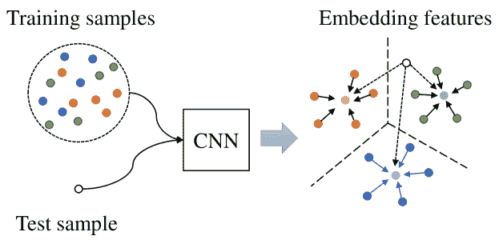
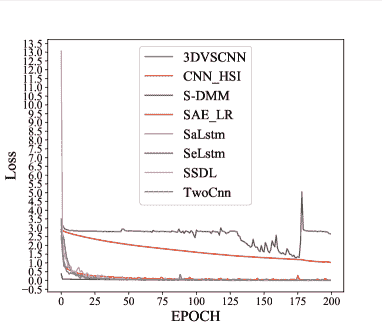

<!--yml

分类：未分类

日期：2024-09-06 19:49:27

-->

# [2112.01800] 调查：少量标记样本下的深度学习在高光谱图像分类中的应用

> 来源：[`ar5iv.labs.arxiv.org/html/2112.01800`](https://ar5iv.labs.arxiv.org/html/2112.01800)

# 调查：少量标记样本下的深度学习在高光谱图像分类中的应用

参者：Sen Jia Shuguo Jiang Zhijie Lin Nanying Li Meng Xu Shiqi Yu yusq@sustech.edu.cn 深圳大学计算机科学与软件工程学院，中国 SZU 分部，深圳社会人工智能与机器人研究所，中国 南方科技大学计算机科学与工程系，中国

###### 摘要

随着深度学习技术的快速发展和计算能力的提升，深度学习已广泛应用于高光谱图像（HSI）分类领域。通常，深度学习模型往往包含大量可训练的参数，并需要大量的标记样本才能达到最佳性能。然而，在 HSI 分类中，由于人工标记的困难和耗时，获得大量标记样本通常比较困难。因此，许多研究工作集中于构建少量标记样本的 HSI 分类深度学习模型。本文着重于这一主题，并提供了相关文献的系统性综述。具体而言，本文的贡献有两个方面。首先，相关方法的研究进展根据学习范式进行分类，包括迁移学习、主动学习和少样本学习。其次，进行了大量使用各种先进方法的实验，并总结了结果以揭示潜在的研究方向。更重要的是，虽然深度学习模型（通常需要足够的标记样本）与少标记样本的 HSI 场景之间存在巨大差距，但通过深度学习方法和相关技术（如迁移学习和轻量模型）的融合，可以很好地表征小样本集问题。为了可重复性，本文评估的方法的源代码可以在 [`github.com/ShuGuoJ/HSI-Classification.git`](https://github.com/ShuGuoJ/HSI-Classification.git) 找到。

###### 关键词：

高光谱图像分类、深度学习、迁移学习、少样本学习^†^†期刊: Neurocomputing^(mytitlenote)^(mytitlenote)脚注: 本研究得到了中国国家自然科学基金（资助号 41971300, 61901278 和 61976144）、中国国家重点研发计划（资助号 2020AAA0140002）、长江学者奖励计划、广东省教育厅重点项目（资助号 2020ZDZX3045）以及深圳市科研开发资金计划（资助号 JCYJ20180305124802421 和 JCYJ20180305125902403）的支持。

## 1 介绍

高光谱遥感技术是一种将地物的独特材质组成决定的光谱与反映地物形状、纹理和布局的空间图像有机结合的方法，以实现对地物的准确检测、识别和属性分析。得到的高光谱图像（HSI）不仅包含丰富的光谱信息，反映了地物的独特物理属性，还提供了地物的丰富空间信息。因此，HSI 可用于解决在多光谱或自然图像中无法很好解决的问题，例如每个像素的精确识别。由于不同材料表现出特定的光谱特征，高光谱图像的分类性能可以更为准确。由于这些优势，高光谱遥感已广泛应用于许多领域，如精准农业 [1]、作物监测 [2] 和土地资源 [3, 4]。在环境保护方面，HSI 被用于检测气体 [5]、石油泄漏 [6]、水质 [7, 8] 和植被覆盖 [9, 10]，以更好地保护我们的生活环境。在医学领域，HSI 被用于皮肤测试，以检查人体皮肤的健康状况 [11]。

作为一个通用的模式识别问题，高光谱图像（HSI）分类受到了大量关注，并且在过去几十年里取得了大量的研究成果。根据以往的研究[12]，所有研究可以分为光谱特征方法、空间特征方法和光谱-空间特征方法。光谱特征是高光谱图像的原始特性，也称为光谱向量或光谱曲线。而空间特征[13]指的是中央像素与其上下文之间的关系，这可以大大提高模型的鲁棒性。在高光谱图像分类研究的早期阶段，研究人员主要关注基于纯光谱特征的方法，这些方法仅仅将分类器应用于像素向量，例如支持向量机（SVM）[14]、神经网络[15]、逻辑回归[16]，以获得分类结果，而无需任何特征提取。但原始光谱包含大量冗余信息，并且光谱与地面物体之间的关系是非线性的，这增加了模型分类的难度。因此，后来大多数方法更加关注于降维和特征提取，以学习更具区分性的特征。对于基于降维的方法，主成分分析[17]、独立成分分析[18]、线性判别分析[19]和低秩[20]被广泛使用。然而，这些模型的性能仍然不令人满意。因为，高光谱图像中存在一个普遍现象，即不同的地面物体可能具有相同的光谱特征，反之，相同的地面物体可能具有不同的光谱特征。地面物体光谱的变异性是由光照、环境、大气和时间条件引起的。这些因素增加了误分类的概率。因此，这些方法仅基于光谱信息，而忽略了空间信息，导致分类性能不佳。地面物体的空间特征提供了关于地面物体的形状、上下文和布局的丰富信息，并且相邻的像素很可能属于同一类，这对于提高分类准确性和方法的鲁棒性非常有用。随后，许多将空间结构和纹理信息与光谱特征相结合的特征提取方法被开发出来，包括形态学[21, 22, 23]、滤波[24, 25]、编码[26]等。由于本文主要关注基于深度学习的方法，读者可以参考[27]以获取更多关于这些传统技术的细节。

在过去十

在一般的深度学习框架中，需要提供大量的训练样本来充分训练模型并调整众多参数。然而，在实践中，手动标注通常非常耗时且昂贵，因为需要专家知识，因此，通常无法获得足够的训练集。如图 1 所示（这里使用了广泛应用的肯尼迪航天中心（KSC）高光谱图像进行说明），左图随机选择每个类别的 10 个样本，总共包含 130 个标注样本，这些样本非常分散，几乎难以辨认。相反，图 1 右图展示了 50%的标注样本，这更适合基于深度学习的方法。因此，深度学习模型所需的训练样本与实际可以收集的标注样本之间存在巨大差距。为了解决少量标注样本的问题，已经提出了许多学习范式，如图 2 右侧所示。第二部分将详细讨论这些范式，并且它们可以与任何模型架构进行集成。一些开创性的工作如 [28] 已经通过仅使用少量标注样本训练具有良好泛化能力的深度模型开启了这一话题。然而，这一领域仍然面临许多挑战。

图 1：实际情况（即，少量标注样本）与深度学习方法所需的大量标注样本之间的巨大差距。这里采用了广泛应用的肯尼迪航天中心（KSC）高光谱图像，其中包含 13 种土地覆盖类型和 5211 个标注样本（详细信息可以在实验部分找到）。通常，需要足够的样本来充分训练深度学习模型（如右图所示），但由于手动标注的难度，这在实践中很难实现（如左图所示）。

在本文中，我们希望提供对高光谱图像（HSI）分类中基于深度学习的最先进方法的全面综述，尤其是在标签样本较少的情况下。首先，我们不按照特征融合方式（如基于光谱、基于空间和光谱-空间联合的方法）来区分各种方法，而是根据学习范式（包括迁移学习、主动学习和少样本学习）来分类涉及少量训练样本的方法的研究进展。其次，我们进行了大量的实验，比较了多种最先进的方法，并总结了结果以揭示潜在的研究方向。此外，需要注意的是，与之前的综述论文[12, 29]不同，本文主要关注少量标注样本的问题，这是高光谱图像分类场景中最具挑战性的难题。为了重现性，本文中使用的方法的源代码可以在网站¹¹1[`github.com/ShuGuoJ/HSI-Classification.git`](https://github.com/ShuGuoJ/HSI-Classification.git)上找到。

本文的其余部分组织如下。第二部分介绍了近年来流行的深度模型。在第三部分，我们将之前的工作划分为四种主流学习范式，包括迁移学习、主动学习和少样本学习。在第四部分，我们进行了许多实验，并比较了若干代表性的基于深度学习的分类方法在几个实际高光谱图像数据集上的表现。最后，第五部分提供了结论和建议。

图 2：基于深度学习的高光谱图像分类方法的分类。左侧从模型架构的角度出发，而右侧则从学习范式的角度出发。值得注意的是，这两种方法可以任意结合。

## 2 深度学习模型在高光谱图像分类中的应用

在本节中，分别描述了三种经典的深度学习模型，包括自编码器、卷积神经网络（CNN）和递归神经网络（RNN），用于高光谱图像分类，并回顾了相关文献。

### 2.1 用于高光谱图像分类的自编码器

自编码器[30]是一种经典的神经网络，由两部分组成：编码器和解码器。编码器 $p_{encoder}(\bm{h}|\bm{x})$ 将输入 $\bm{x}$ 映射为隐藏表示 $\bm{h}$，然后解码器 $p_{decoder}(\hat{\bm{x}}|\bm{h})$ 从 $\bm{h}$ 重建 $\hat{\bm{x}}$。其目标是使输入和输出尽可能相似。损失函数可以表述如下：

|  | $\mathcal{L}(\bm{x},\hat{\bm{x}})=\min\|\bm{x}-\hat{\bm{x}}\|$ |  | (1) |
| --- | --- | --- | --- |

其中，$\mathcal{L}$ 是相似度度量。如果 $\bm{h}$ 的维度小于 $\bm{x}$，则自编码器过程为欠完备的，可以用于降低数据维度。显然，如果对 $\bm{h}$ 没有任何约束，自编码器就是最简单的恒等函数。换句话说，网络什么也没有学到。为了避免这种情况，通常的做法是将归一化项 $\Omega(h)$ 添加到损失中。在[31, zeng2018facial]中，自编码器的归一化，被称为稀疏自编码器，其为 $\Omega(h)=\lambda\sum_{i}h_{i}$，这将使网络的大多数参数非常接近于零。因此，它具有一定程度的噪声免疫力，并且可以生成输入的最稀疏表示。另一种避免恒等映射的方法是向 $\bm{x}$ 中添加一些噪声，生成损坏的输入 $\bm{x_{noise}}$，然后强制解码器重建 $\bm{x}$。在这种情况下，它变成了去噪自编码器[32]，可以去除 $\bm{x_{noise}}$ 中的额外噪声，并生成输入的强大隐藏表示。一般来说，自编码器作为特征提取器[33]，在没有标记样本的情况下学习数据的内部模式。图 3 展示了自编码器模型的基本架构。

图 3：自编码器的架构。实线表示训练，虚线表示推断。

因此，陈*等*[34]首次使用自编码器进行高光谱图像的特征提取和分类。首先，在预训练阶段，每个像素的光谱向量直接输入编码器模块，然后使用解码器进行重建，以便编码器具备提取光谱特征的能力。或者，为了获取空间特征，采用主成分分析（PCA）来降低高光谱图像的维度，然后将图像块展平为一个向量。另一个自编码器被用来学习空间特征。最后，将上述获得的空间-光谱联合信息进行融合和分类。随后，出现了大量基于自编码器的高光谱图像分类方法[35, 36]。这些方法大多采用与[34]相同的训练策略，即将训练分为两个模块：以无监督方式充分训练编码器，并以有监督方式微调分类器。这些方法中的每一个都尝试不同类型的编码器或预处理方法，以适应小样本下的高光谱图像分类。例如，邢*等*[36]堆叠多个去噪自编码器以形成特征提取器，该提取器具有更强的抗噪声能力以提取更鲁棒的表示。由于相同的地物可能具有不同的光谱，而不同的地物可能表现出相似的光谱，基于光谱的分类方法往往无法获得令人满意的性能，而对象的空间结构信息提供了有效的补充。为了获得更好的空间描述，一些与卷积神经网络（CNN）结合的自编码器模型被开发出来[37, 38]。具体而言，自编码器模块能够在大量未标记样本上提取光谱特征，而 CNN 被证明能够很好地提取空间特征。经过融合后，可以得到空间-光谱特征。此外，为了减少可训练参数的数量，一些研究人员使用轻量级模型，如 SVMs[39, 40]、随机森林[41, 42]或逻辑回归[34, 43]，作为分类器。

由于高光谱图像的三维（3D）模式，建议同时研究光谱和空间信息，以便更好地检查联合空间-光谱相关性。已有一些三维算子和方法被提出。在预处理阶段，李*等人* [44] 利用 3D Gabor 算子融合空间信息和光谱信息，以获得空间-光谱联合特征，然后将其输入自编码器以获得更抽象的特征。梅*等人* [40] 使用了 3D 卷积算子构建自编码器，直接提取空间-光谱特征。此外，图像分割技术已被引入，以表征对象的区域结构，从而避免边界像素的误分类 [45]。因此，刘*等人* [46] 利用超像素分割技术作为后处理方法，对分类图进行边界正则化。

### 2.2 用于高光谱图像分类的卷积神经网络（CNNs）

理论上，卷积神经网络（CNN）使用一组参数，这些参数指代一个卷积核函数或卷积核来扫描图像并产生指定的特征。它具有三大主要特征，使其在特征表示方面非常强大，因此，CNN 已在许多研究领域成功应用。第一个特征是局部连接，这大大减少了可训练参数的数量，使其适合处理大图像。这是与全连接网络最明显的区别，全连接网络在两个相邻的神经层之间有全连接，不适合处理大型空间图像。为了进一步减少参数数量，相同的卷积核共享相同的参数，这是 CNN 的第二个特征。相比之下，在传统神经网络中，输出的参数是相互独立的。然而，CNN 为所有输出应用相同的参数，以减少参数数量，从而带来第三个特征：平移不变性。这意味着即使一个物体的特征从一个位置移动到另一个位置，CNN 模型仍然能够捕捉到它，无论它出现在哪里。具体而言，一个常见的卷积层由三个传统组件组成：线性映射、激活函数和池化函数。类似于其他现代神经网络架构，激活函数用于将非线性映射特性引入网络中。通常，修正线性单元（ReLU）是首选。池化利用局部区域的统计特征来表示指定位置的输出。以最大池化步骤为例，它使用最大值替代输入区域。显然，池化操作对小的变化和噪声干扰具有鲁棒性，这些干扰可以通过池化操作在输出中平滑掉，从而保留更多的抽象特征。

在早期应用 CNN 进行 HSI 分类的研究中，二维卷积是最广泛使用的方法，主要用于提取空间纹理信息[47, 28, 48]，但冗余的波段大大增加了卷积核的大小，尤其是通道维度。后来，出现了一维卷积和二维卷积的组合[49]来解决上述问题。具体来说，一维和二维卷积分别负责提取光谱和空间特征。然后，这两种特征在输入分类器之前进行融合。对于小样本训练问题，由于标记样本不足，CNN 很难学习到有效的特征。为此，一些研究人员通常引入传统的机器学习方法，如属性谱[50]、GLCM[51]、哈希学习[52]和马尔可夫随机场[53]，以引入先验信息来改善网络的性能。与基于自编码器的分类方法趋势类似，近年来，三维 CNN 模型也被应用于 HSI 分类，并展示了更好的特征融合能力[54, 55]。然而，由于参数数量庞大，三维卷积不适合解决监督学习中的小样本分类问题。为了减少 3D 卷积的参数数量，Fang *et al.* [56] 设计了一种 3D 可分离卷积。相比之下，Mou *et al.* [57, 58] 将自编码器方案引入三维卷积模块来解决这个问题。通过与经典自编码器训练方法的结合，三维卷积自编码器可以以无监督学习的方式进行训练，然后用分类器替代解码器，同时固定编码器的参数。最后，通过监督学习训练一个小型分类器。此外，由于 ResNet 的成功[59]，学者们研究了基于卷积残差的 HSI 分类问题[57, 58, 60, 61]。这些方法尝试利用跳跃连接使网络能够在少量标记样本的情况下学习复杂特征。类似地，具有密集连接的 CNN 也被引入这一领域[62, 63]。此外，注意机制是另一个热门领域，用于充分挖掘样本特征。具体来说，Haut 和 Xiong *et al.* [64, 65] 将注意机制与 CNN 结合用于 HSI 分类。尽管上述模型在 HSI 上表现良好，但它们不能克服 HSI 低空间分辨率的缺陷，这可能导致混合像素。为弥补这一缺点，提出了多模态 CNN 模型。这些方法[66, 67, 68] 将 HSI 和 LiDAR 数据结合起来，以增加样本特征的可分辨性。此外，为了在小样本场景下实现良好性能，Yu *et al.* [28] 通过实施旋转和翻转的数据增强来扩大训练集。一方面，这种方法增加了样本数量并提高了样本的多样性。另一方面，它增强了模型的旋转不变性，这在一些领域如遥感中非常重要。随后，Li *et al.* [69, 70] 设计了一种用于 HSI 分类的数据增强方案。他们将样本成对组合，使模型不再学习样本自身的特征，而是学习样本之间的差异。不同的组合使训练集的规模更大，这更有利于模型训练。

### 2.3 HSI 分类的递归神经网络（RNN）

与其他形式的神经网络相比，递归神经网络（RNNs） [71]具有记忆能力，可以记录序列数据的上下文信息。由于这种记忆特性，递归神经网络在语音识别和机器翻译等任务中得到了广泛应用。更准确地说，递归神经网络的输入通常是一个向量序列。在每个时间步 $t$，网络接收序列中的一个元素 $\bm{x}_{t}$ 和前一个时间步的状态 $\bm{h}_{t-1}$，并生成一个输出 $\bm{y}_{t}$ 和一个表示当前时刻上下文信息的状态 $\bm{h}_{t}$。这个过程可以表示为：

|  | $\bm{h}_{t}=f(\mathbf{W}_{hh}\bm{h}_{t-1}+\mathbf{W}_{xh}\bm{x}_{t}+\mathbf{b})$ |  | (2) |
| --- | --- | --- | --- |

其中 $\mathbf{W}_{xh}$ 代表从输入层到隐藏层的权重矩阵，$\mathbf{W}_{hh}$ 表示隐藏层中的状态转移权重，$\mathbf{b}$ 是偏置。可以看出，递归神经网络的当前状态由前一个时间步的状态和当前输入共同控制。这种机制使得递归神经网络能够隐式地捕捉输入向量之间的上下文语义信息。例如，在机器翻译任务中，它可以使网络理解句子中词汇之间的语义关系。

然而，经典的 RNN 在训练过程中容易遇到梯度爆炸或梯度消失的问题。当输入过多时，RNN 的导数链会变得过长，导致梯度值接近无穷大或零。因此，在 HSI 分类任务中，经典的 RNN 模型被长短期记忆（LSTM）网络 [71]或门控递归单元（GRU） [72]替代。

LSTM 和 GRU 都使用门控技术来过滤输入和前一个状态，以便网络能够忘记不必要的信息并保留最有价值的上下文。LSTM 保持内部记忆状态，并且有三个门：输入门 $\bm{i}_{t}$、遗忘门 $\bm{f}_{t}$ 和输出门 $\bm{o}_{t}$，它们的公式为：

|  | $\bm{i}_{t}=\sigma(\mathbf{W_{i}}\cdot[\bm{x}_{t},\bm{h}_{t-1}])$ |  | (3) |
| --- | --- | --- | --- |
|  | $\bm{f}_{t}=\sigma(\mathbf{W_{f}}\cdot[\bm{x}_{t},\bm{h}_{t-1}])$ |  | (4) |
|  | $\bm{o}_{t}=\sigma(\mathbf{W_{io}}\cdot[\bm{x}_{t},\bm{h}_{t-1}])$ |  | (5) |

可以发现，这三个门是基于当前输入和前一个状态生成的。首先，当前输入和前一个状态将被拼接并映射到一个新的输入 $\bm{g}_{t}$，公式如下：

|  | $\bm{g}_{t}=\tanh(\mathbf{W_{g}}\cdot[\bm{x}_{t},\bm{h}_{t-1}])$ |  | (6) |
| --- | --- | --- | --- |

随后，输入门、遗忘门、新输入$\bm{g}_{t}$和内部记忆单元$\hat{\bm{h}}_{t-1}$一起更新内部记忆状态。在这个过程中，LSTM 丢弃无效的信息并添加新的语义信息。

|  | $\hat{\bm{h}}_{t}=\bm{f}_{t}\odot\hat{\bm{h}}_{t-1}+\bm{i}_{t}\odot\bm{g}_{t}$ |  | (7) |
| --- | --- | --- | --- |

最后，新的内部记忆状态通过输出门进行过滤，形成当前时间步的输出。

|  | $\bm{h}_{t}=\bm{o}_{t}\odot\tanh(\hat{\bm{h}}_{t})$ |  | (8) |
| --- | --- | --- | --- |

关于 HSI 处理，每个光谱图像是一个高维向量，可以视为数据序列。许多研究使用 LSTM 进行 HSI 分类任务。例如，Mou *et al.* [73] 首次提出了一种基于 LSTM 的 HSI 分类方法，他们的工作仅关注于光谱信息。对于每个样本像素向量，每个波段逐步输入到 LSTM 中。为了提高模型性能，后续研究考虑了空间信息。例如，Liu *et al.* 充分考虑了样本的空间邻域，并使用多层 LSTM 来提取空间光谱特征[74]。具体来说，在每个时间步，邻域的采样点按顺序输入到网络中，以深入挖掘空间邻域中的上下文信息。在[75]中，Zhou *et al.* 使用两个 LSTM 来提取光谱特征和空间特征。特别地，针对空间特征的提取，首先使用 PCA 从样本矩形空间邻域中提取主成分。然后，将第一个主成分分成几条线，形成一组序列数据，并逐步输入到网络中。相比之下，Ma 和 Zhang *et al.* [76, 77] 测量空间邻域内样本点与中心点之间的相似性。邻域内的样本点将根据相似性重新排序，然后逐步输入到网络中。这种方法使网络能够集中学习与中心点高度相似的样本点，从而增强了内部隐状态的记忆。Erting Pan *et al.* [78] 提出了一个有效的基于单门循环单元（GRU）的光谱-空间分类的小型模型。在这项工作中，矩形空间邻域被展平为一个向量，用于初始化 GRU 的隐藏向量$h_{0}$，并将中心点像素向量输入到网络中进行特征学习。

此外，吴和 Saurabh 认为，直接将单一原始光谱向量输入到 RNN 中，很难挖掘样本的内部特征[79, 80]。作者使用一维卷积操作从光谱向量中提取多个特征向量，这些特征向量形成特征序列，然后输入到 RNN 中。最后，采用全连接层和 softmax 函数来获得分类结果。可以看出，仅使用递归神经网络或一维卷积来提取空间-光谱联合特征实际上效率不高，因为这会导致空间结构信息的丢失。因此，一些研究人员将二维/三维卷积神经网络（CNN）与 RNN 结合使用，并利用卷积操作提取空间-光谱联合特征。例如，Hao *等人* [81] 利用 U-Net 提取特征并将其输入到 LSTM 或 GRU 中，从而可以探索特征之间的上下文信息。此外，Shi *等人* [82] 引入了方向序列的概念，以充分提取高光谱图像的空间结构信息。首先，将采样点的矩形区域划分为九个重叠的补丁。其次，通过三维卷积网络将补丁映射为一组特征向量，补丁的相对位置可以生成 8 种方向组合（例如，上、中、下、左、中间和右），以形成一个方向序列。最后，将该序列输入到 LSTM 或 GRU 中，以获得分类结果。通过这种方式，可以探索特征的空间分布和结构特征。

## 3 少量标注样本的高光谱图像分类深度学习范式

尽管不同的高光谱图像（HSI）分类方法有不同的具体设计，但它们都遵循某些学习范式。在这一节中，我们主要介绍几种应用于高光谱图像分类且具有少量标注训练样本的学习范式。这些学习范式基于特定的学习理论。我们希望为研究人员设计算法提供一个通用的指南。

### 3.1 高光谱图像分类的深度迁移学习

迁移学习 [83] 是解决小样本问题的有效方法。迁移学习试图将从一个领域学到的知识转移到另一个领域。首先，有两个数据集/领域，一个是包含大量标记样本的源领域，另一个是只包含少量标记样本的目标领域。为了便于后续描述，我们将源领域定义为 $\mathbf{D}_{s}$，目标领域定义为 $\mathbf{D}_{t}$，它们的标签空间分别为 $\mathbf{Y}_{s}$ 和 $\mathbf{Y}_{t}$。通常，源领域和目标领域的数据分布是不一致的：$P(\bm{X}_{s})\neq P(\bm{X}_{t})$。因此，迁移学习的目的是利用从 $\mathbf{D}_{s}$ 中学到的知识来识别 $\mathbf{D}_{t}$ 中样本的标签。

微调是迁移学习中的一种通用方法，它使用 $\mathbf{D}_{s}$ 来训练模型，并通过 $\mathbf{D}_{t}$ 进行调整。其最初动机是减少训练过程中所需的样本数量。由于深度学习模型通常包含大量参数，如果在目标领域 $\mathbf{D}_{t}$ 上进行训练，容易出现过拟合现象，实际表现不佳。然而，微调允许模型参数达到次优状态，并且少量目标领域的训练样本可以将模型调整到最佳状态。它包括两个步骤。首先，使用大量标记样本在源领域 $\mathbf{D}_{s}$ 上对特定模型进行全面训练，使模型参数达到良好状态。然后，除了某些与任务相关的模块外，将模型转移到目标领域 $\mathbf{D}_{t}$，并在 $\mathbf{D}_{t}$ 上进行轻微调整，以使模型适应目标领域 $\mathbf{D}_{t}$ 的数据分布。

图 4：微调方法的流程图。实线代表预训练，虚线代表微调。$f_{\omega}$ 是一个学习函数。

由于微调方法相对简单，广泛用于高光谱图像分类的迁移学习方法中。据我们所知，杨等人[84]是第一个将深度学习与迁移学习结合起来对高光谱图像进行分类的人。该模型由两个卷积神经网络组成，用于提取光谱特征和空间特征。然后，联合光谱-空间特征将输入到全连接层中得到最终结果。根据微调，该模型首先在源域的高光谱图像上进行全面训练。接下来，完全连接层被替换，卷积网络的参数被保留。最后，迁移模型将在目标高光谱图像上进行训练，以适应新的数据分布。后续基于微调的迁移学习模型基本遵循该结构[85, 86, 87, 88]。值得注意的是，邓等人[89]将迁移学习与主动学习相结合，用于高光谱图像的分类。

数据分布自适应是另一种常用的迁移学习方法。该理论的基本思想是，在原始特征空间中，源域和目标域的数据概率分布通常是不同的。然而，它们可以一起映射到一个共同的特征空间中。在这个空间中，它们的数据概率分布变得相似。2014 年，Ghifary 等人[90]首次提出了基于方阵神经网络的领域自适应模型 DaNN。这项工作的创新之处在于添加了最大均值差异（MMD）适应层，用于计算源域和目标域之间的距离。此外，该距离被合并到损失函数中，以减小两个数据分布之间的差异。随后，Tzeng 等人[91]基于更深的网络对这项工作进行了扩展，并提出了深度领域混乱来解决深度网络的自适应问题。

图 5：DANN 的流程图。

王等人*et al.* [92]首次将深度领域自适应模型引入到高光谱图像分类领域。在[92]中，两个来自不同场景的高光谱图像将通过深度神经网络映射到两个低维子空间中，其中样本被表示为流形。使用最大均值差异（MMD）来度量两个低维子空间之间的距离，并将其添加到损失函数中，使得两个低维子空间之间具有高相似性。此外，他们还将样本与其邻居之间的距离之和加入到损失函数中，以确保低维流形具有判别性。

受生成对抗网络（GAN）卓越性能的启发，Yaroslav *等人* [93] 首次将其引入迁移学习。该网络被命名为 DANN（领域对抗神经网络），不同于 Ghifary *等人* [90] 提出的 DaNN。生成器$\mathbf{G}_{f}$和鉴别器$\mathbf{G}_{d}$互相竞争，直到它们收敛。在迁移学习中，一个领域的数据（通常是目标领域）被视为生成样本。生成器旨在学习目标领域样本的特征，使鉴别器无法区分样本来自哪个领域，从而实现领域适应的目的。因此，$\mathbf{G}_{f}$ 在这里用来表示特征提取器。

Elshamli *等人* [94] 首次将 DANN 概念引入高光谱图像分类任务。与一般的 GNN 相比，它有两个鉴别器。一个是预测样本类别标签的类别鉴别器，另一个是预测样本来源的领域鉴别器。不同于两阶段方法，DANN 是一个端到端的模型，能够同时进行表示学习和分类任务。此外，它容易训练。进一步地，它在高光谱图像分类中优于两阶段框架，如去噪自编码器和传统方法，如 PCA。

### 3.2 高光谱图像分类的深度主动学习

主动学习 [95] 在监督学习方法中可以有效处理小样本问题。它可以通过从训练集中自主选择具有代表性或高信息量的样本来有效学习区分特征，特别是在标注样本稀缺的情况下。一般来说，主动学习由五个组成部分构成，$A=(C,L,U,Q,S)$。其中，$C$ 代表一个或一组分类器。$L$ 和 $U$ 分别代表标注样本和未标注样本。$Q$ 是查询函数，用于查询未标注样本中信息量大的样本。$S$ 是专家，可以对未标注样本进行标注。一般来说，主动学习有两个阶段。第一个阶段是初始化阶段。在此阶段，将随机选择少量样本来形成训练集 $L$ 并由专家标注以训练分类器。第二个阶段是迭代查询。$Q$ 将从未标注样本集 $U$ 中选择新样本供 $S$ 根据前一次迭代的结果进行标注，并将其添加到训练集 $L$ 中。应用于高光谱图像分类的主动学习方法主要基于委员会的主动学习算法和基于后验概率的主动学习算法。在基于委员会的主动学习算法中，EQB 方法使用熵来衡量未标注样本的信息量。具体而言，训练集 $L$ 将被划分为 $k$ 个子集以训练 $k$ 个分类器，然后使用这 $k$ 个分类器对所有未标注样本进行分类。因此，每个未标注样本对应 $k$ 个预测标签。熵值由此计算得出：

|  | $\bm{x}^{EQB}=\mathop{\arg\min}_{x_{i}\in U}\frac{H^{EQB}(x_{i})}{log(N_{i})}$ |  | (9) |
| --- | --- | --- | --- |

其中，$H$ 代表熵值，$N_{i}$ 代表样本 $x_{i}$ 预测的类别数量。具有较大熵值的样本将被选择并手动标注 [96]。在 [97] 中，深度置信网络被用于以无监督的方式生成输入 $x$ 的映射特征 $h$，然后用 $h$ 计算信息熵。同时，稀疏表示用于估计样本的表示。在选择主动学习样本的过程中，将综合考虑样本的信息熵和表示。

相比之下，基于后验概率的主动学习方法[98, 99, 100]使用得更为广泛。打破平衡属于后验概率的主动学习方法，这在高光谱分类任务中被广泛使用。这种方法首先使用指定的模型，例如卷积网络、最大似然估计分类器、支持向量机等，来估计候选池中所有样本的后验概率。然后，该方法利用后验概率输入以下公式来生成样本不确定性的度量：

|  | $\bm{x}^{BT}=\mathop{\arg\min}_{x_{i}\in U}\left\{\mathop{\max}_{w\in N}p\left(y_{i}^{*}=w&#124;x_{i}\right)-\mathop{\max}_{w\in N\setminus w^{+}}p(y_{i}^{*}=w&#124;x_{i})\right\}$ |  | (10) |
| --- | --- | --- | --- |

在上述公式中，我们首先计算所有候选样本的后验概率中最大概率与第二大概率之间的差异，并选择差异最小的样本加入有价值的数据集中。$x^{BT}$ 越低，样本的不确定性越大。在[98]中，Li *等*人首次使用自编码器构建了一个用于高光谱图像分类任务的主动学习模型。同时，Sun *等*人[99]也提出了类似的方法。然而，该方法仅使用光谱特征。由于空间信息的有效性，在[101]中，在生成后验概率时，同时考虑了空间-光谱联合特征。相比之下，Cao *等*人[100]使用卷积神经网络生成后验概率。

一般来说，主动学习方法可以根据一定的标准自动选择有效样本，减少无效的冗余样本，从而有效缓解小样本问题中缺少训练样本的问题。

图 6：主动学习的架构。

### 3.3 高光谱图像分类的深度少样本学习

少样本学习属于元学习方法之一，旨在研究样本之间的差异，而不是直接学习样本是什么，这与大多数其他深度学习方法不同。它使模型学会学习。在少样本分类中，给定一个包含 N 个标记样本$S_{N}^{k}=\{(\bm{x}_{1},y_{1}),\cdots,(\bm{x}_{N},y_{N})\}$的小支持集，这些样本具有$k$个类别，分类器将用与$S_{N}^{k}$中最大相似度样本的标签来掩盖查询样本。为了实现这一目标，提出了许多学习框架，它们可以分为两类：基于元模型的模型和基于度量的模型。

原型网络[102]是少样本学习的度量模型之一。其基本思想是每个类别可以通过一个原型表示来描绘，属于同一类别的样本应该接近于类别原型。首先，所有样本将通过嵌入函数 $f_{\phi}:\mathbb{R}^{D}\rightarrow\mathbb{R}^{M}$ 转换到度量空间，并通过嵌入向量 $\mathbf{c}_{k}\in\mathbb{R}^{M}$ 表示。由于卷积网络的强大能力，它被用作嵌入函数。此外，原型向量通常是每个类别 $c_{i}$ 在支持集中的样本嵌入向量的均值。

|  | $\bm{c}_{i}=\frac{1}{\vert S^{i} \vert}\sum_{(\bm{x}_{j},y_{j})\in S^{i}}f_{\phi}(\bm{x}_{j})$ |  | (11) |
| --- | --- | --- | --- |

在[103]中，Liu *等*人简单地将原型网络引入到高光谱图像分类任务中，并使用 ResNet[59]作为特征提取器，将样本映射到度量空间。随后，通过[104]，原型网络在高光谱图像分类任务中得到了显著改进。论文中，空间光谱特征首先通过局部模式编码进行集成，然后 1D-CNN 将其转换为嵌入向量。原型是这些嵌入向量的加权均值，这与一般的原型网络相反。在[105]中，Xi *等*人用混合残差注意力[106]替代了映射函数，并引入了一种新的损失函数，迫使网络增加类间距离，减少类内距离。

图 7：原型网络的结构。

关系网络[107]是另一种基于度量的少样本学习模型。一般来说，它有两个模块：嵌入函数 $f_{\phi}:\mathbb{R}^{D}\rightarrow\mathbb{R}^{M}$ 和关系函数 $f_{\psi}:\mathbb{R}^{2M}\rightarrow\mathbb{R}$。嵌入模块的功能与原型网络相同，其关键思想在于关系模块。关系模块用于计算样本的相似性。它是一个可学习的模块，不同于欧氏距离或余弦距离。换句话说，关系网络引入了一种基于原型网络的可学习度量函数。关系模块可以通过研究更精确地描述样本的差异。在推理过程中，查询嵌入 $f_{\psi}(x_{i})$ 将与支持嵌入 $f_{\psi}(\bm{x}_{j})$ 结合成 $\mathcal{C}(f_{\psi}(\bm{x}_{i}),f_{\psi}(\bm{x}_{j}))$。通常，$\mathcal{C}(\cdot,\cdot)$ 是一个拼接操作。然后，关系函数将拼接向量转换为关系分数 $r_{i,j}$，该分数表示 $x_{i}$ 和 $x_{j}$ 之间的相似性。

|  | $r_{i,j}=f_{\psi}(\mathcal{C}(f_{\psi}(\bm{x}_{i}),f_{\psi}(\bm{x}_{j})))$ |  | (12) |
| --- | --- | --- | --- |

一些研究将关系网络引入高光谱图像分类中，以解决小样本集问题。邓*等人*[108]首次将关系网络引入 HSI。他们使用二维卷积神经网络构建嵌入函数和关系函数。高*等人*[109]和马*等人*[110]也提出了类似的架构。在[111]中，为了提取联合空间-光谱特征，拉奥*等人*使用三维卷积神经网络实现了嵌入函数。

图 8: 关系网络的架构。

孪生网络[112, 113, 114]是少样本学习中的典型网络。与上述网络相比，它的输入是样本对。因此，它由两个结构相同并共享参数的并行子网络 $f_{\phi 1}:\mathbb{R}^{D}\rightarrow\mathbb{R}^{M}$ 组成。子网络分别接收一个输入样本，并将其映射到低维度度量空间，生成各自的嵌入 $f_{\phi 1}(\bm{x}_{i})$ 和 $f_{\phi 1}(\bm{x}_{j})$。欧氏距离 $D(\bm{x}_{i},\bm{x}_{j})$ 用于度量它们的相似性。

|  | $D(\bm{x}_{i},\bm{x}_{j})=\&#124;f_{\phi 1}(\bm{x}_{i})-f_{\phi 1}(\bm{x}_{j})\&#124;_{2}$ |  | (13) |
| --- | --- | --- | --- |

两个样本之间的相似性越高，它们更可能属于同一类。最近，孪生网络被引入 HSI 分类中。通常，使用二维卷积神经网络[115, 116]作为嵌入函数，与上述两个网络类似。同样，一些方法将一维卷积神经网络与二维卷积神经网络[117, 118]结合使用，或使用三维网络[119]来获取联合光谱-空间特征。此外，苗*等人*[120]尝试使用堆叠自编码器构建嵌入函数 $f_{\phi 1}$。经过训练，该模型具有识别样本差异的能力。为了获得最终分类结果，我们仍然需要一个分类器来对样本的嵌入特征进行分类，这与原型网络和关系网络不同。为了避免在有限标记样本下的过拟合，通常使用 SVM 作为分类器，因为它以轻量级著称。

图 9: 孪生网络的架构。

## 4 实验

在大多数论文中，通过综合实验和分析来描述论文中方法的优缺点。然而，问题在于不同的论文可能选择不同的实验设置。例如，实验中使用了相同数量的训练或测试样本，但选择的样本通常不同，因为它们是随机选择的。为了公平地评估不同的方法，我们应该使用完全相同的实验设置。这就是为什么我们设计实验来评估不同方法的原因。

如上所述，目前的小样本学习主要包括自编码器、少样本学习、迁移学习、主动学习和数据增强。因此，选择了一些代表性网络，如 S-DMM [121]、SSDL [37]、3DCAE [40]、TwoCnn [122]、SSLstm [75]和 3DVSCNN [123]，这些网络包含卷积网络模型和递归网络模型，并在三个基准数据集——PaviaU、Salinas 和 KSC 上进行实验。所有模型都基于深度学习。这里我们仅关注模型在小样本数据集上的鲁棒性，因此它们基于联合光谱-空间特征对高光谱图像进行分类。

根据训练数据集中每个类别的样本数量，实验分为三组。第一组每个类别有 10 个样本，第二组每个类别有 50 个样本，第三组每个类别有 100 个样本。同时，为了确保模型的稳定性，每组实验进行十次，每次训练数据集不同。最后，通过平均准确率（AA）和总体准确率（OA）来评估模型。

### 4.1 数据集介绍

+   1.

    帕维亚大学（PaviaU）：帕维亚大学数据集由高光谱图像组成，每张图像有 610*340 像素，空间分辨率为 1.3 米，由意大利帕维亚大学上方的 ROSIS 传感器拍摄。光谱图像连续成像 115 个波长，范围为 0.43$\sim$0.86 um。由于 12 个波长被噪声污染，最终数据集中的每个像素包含 103 个波段。它总共包含 42,776 个标记样本，覆盖 9 个对象。此外，每个对象的样本大小见表 1。

+   2.

    萨利纳斯：萨利纳斯数据集由 AVIRIS 传感器拍摄，包含 512*217 像素和 3.7 米的空间分辨率的高光谱图像，拍摄于加利福尼亚州的萨利纳斯谷。光谱图像连续成像 0.2$\sim$2.4 微米范围内的 224 个波长。由于 20 个波段不能被水反射，最终数据集中每个像素包含 204 个波段。总共有 54,129 个标记样本，涵盖了 16 个对象。此外，每个对象的样本大小见表 2。

+   3.

    肯尼迪航天中心 (KSC)：KSC 数据集采集于佛罗里达州上空的肯尼迪航天中心 (KSC)，使用了 AVIRIS 传感器。其高光谱图像包含 512*641 像素，空间分辨率为 18 米。光谱图像连续成像 400$\sim$2500 nm 范围内的 224 个波长。同样，在去除 48 个被水吸收且信噪比低的波段后，最终数据集中的每个像素包含 176 个波段。数据集中包含 5211 个标签样本，涵盖了 13 个对象。此外，每个对象的样本大小见表 3。

表 1：帕维亚大学。它包含 9 个对象。第二列和最后一列分别表示对象的名称和样本数量。

| NO. | 类别 | 总数 |
| --- | --- | --- |
| C1 | 沥青 | 6631 |
| C2 | 草地 | 18649 |
| C3 | 碎石 | 2099 |
| C4 | 树木 | 3064 |
| C5 | 涂漆金属板 | 1345 |
| C6 | 裸土 | 5029 |
| C7 | 沥青 | 1330 |
| C8 | 自封砖 | 3682 |
| C9 | 阴影 | 947 |

表 2：萨利纳斯。它包含 16 个对象。第二列和最后一列分别表示对象的名称和样本数量。

| NO. | 类别 | 总数 |
| --- | --- | --- |
| C1 | 青花菜绿色杂草 1 | 2009 |
| C2 | 青花菜绿色杂草 22 | 3726 |
| C3 | 休耕地 | 1976 |
| C4 | 休耕粗耕 | 1394 |
| C5 | 休耕平整 | 2678 |
| C6 | 作物秸秆 | 3959 |
| C7 | 芹菜 | 3579 |
| C8 | 未经训练的葡萄 | 11271 |
| C9 | 土壤葡萄园开发 | 6203 |
| C10 | 玉米衰老绿色杂草 | 3278 |
| C11 | 罗马生菜 4 周 | 1068 |
| C12 | 罗马生菜 5 周 | 1927 |
| C13 | 罗马生菜 6 周 | 916 |
| C14 | 罗马生菜 7 周 | 1070 |
| C15 | 葡萄园未经训练 | 7268 |
| C16 | 葡萄园竖立架 | 1807 |

表 3：KSC。它包含 13 个对象。第二列和最后一列分别表示对象的名称和样本数量。

| NO. | 类别 | 总数 |
| --- | --- | --- |
| C1 | 灌木丛 | 761 |
| C2 | 柳树沼泽 | 243 |
| C3 | 棕榈草地 | 256 |
| C4 | 棕榈草地/橡树草地 | 252 |
| C5 | 刺叶松 | 161 |
| C6 | 橡树/阔叶草地 | 229 |
| C7 | 硬木沼泽 | 105 |
| C8 | 草本沼泽 | 431 |
| C9 | Spartina 沼泽 | 520 |
| C10 | 芦苇荡 | 404 |
| C11 | 盐沼 | 419 |
| C12 | 泥滩 | 503 |
| C13 | 水域 | 927 |

### 4.2 选择的模型

选择了一些最先进的方法来评估它们的性能。它们使用不同的平台进行训练，包括 Caffe、PyTorch 等。一些平台，如 Caffe，在新开发环境中的支持不好。大多数模型是我们的重新实现，并使用完全相同的设置进行训练。上述大多数模型设置基于原始论文，有些根据实验略微修改。所有模型都在同一训练数据集上进行训练和测试，该数据集是基于像素随机挑选的，测试数据集也如此，且其设置已被优化。代码的实现情况见表 4。所选模型的描述将在以下部分提供。

表 4：模型实现的来源。F 表示模型的代码来自原始论文。T 表示我们的实现模型。

| S-DMM | SSDL | 3DCAE | TwoCnn | 3DVSCNN | SSLstm | CNN_HSI | SAE_LR |
| --- | --- | --- | --- | --- | --- | --- | --- |
| F | T | F | T | T | T | T | T |

+   1.

    SAE_LR [34]。这是第一篇将自编码器引入高光谱图像分类的论文，开启了高光谱图像处理的新纪元。它采用由线性层组成的原始自编码器来提取特征。邻域区域的大小为$5\times 5$，选择了 PCA 的前 4 个组件。随后，我们可以获得一个空间特征向量。在输入模型之前，将原始空间特征和空间特征堆叠以形成联合特征。为了降低训练难度，采用贪婪的逐层预训练方法来训练每一层，且编码器和解码器的参数是对称的。然后，编码器连接一个线性分类器进行微调。根据 [34]，隐藏层的大小分别为 PaviaU、Salinas 和 KSC 的 60、20 和 20。

+   2.

    S-DMM [121]。这是一个包含嵌入模块和关系模块的关系网络，使用 2D 卷积网络实现。该模型旨在通过可学习的特征嵌入函数和度量函数，使特征空间中的样本具有小的类内距离和大的类间距离。训练后，所有样本将被分配到相应的簇中。最后，使用简单的 KNN 对查询样本进行分类。在实验中，像素的邻域区域固定为$5\times 5$，特征维度设置为 64。

+   3.

    3DCAE [40]。这是一种 3D 卷积自编码器，采用 3D 卷积层来提取联合光谱-空间特征。首先，3DCAE 通过传统方法进行训练，然后采用 SVM 分类器对 3DCAE 顶层的隐藏特征进行分类。在实验中，像素的邻域区域设置为 $5\times 5$，90% 的样本用于训练 3D 自编码器。对 Salinas 和 PaviaU 有两种不同的超参数设置，而模型在 [121] 中没有在 KSC 上测试。因此，在 KSC 上，该模型使用与 Salinas 相同的超参数配置，因为它们是由同一传感器收集的。

+   4.

    SSDL [37]。这是一种典型的双流结构，通过两个不同的分支分别提取光谱和空间特征，并在最后进行融合。受到 [34] 的启发，作者采用了一维自编码器来提取光谱特征。在空间特征提取的分支中，该模型使用了空间金字塔池化层来替代传统的池化层。空间金字塔池化层使得深度卷积神经网络能够生成固定长度的特征。一方面，它使得模型能够将不同大小的输入转换为固定长度，这对于对输入大小敏感的模块很有帮助；另一方面，它有助于模型更好地适应不同尺度的对象，输出将包括从粗到细的特征，实现多尺度特征融合。然后，使用一个简单的逻辑回归分类器对光谱-空间特征进行分类。在实验中，80% 的数据用于通过贪婪分层预训练方法训练自编码器。此外，在空间分支中，邻域区域的大小设置为 42*42，并使用 PCA 提取第一主成分。然后，整体模型进行联合训练。

+   5.

    TwoCnn [122]。这是一个基于微调的双流结构。在光谱分支中，它采用 1D 卷积层来捕获光谱特征的局部信息，这与 SSDL 完全不同。特别是，使用迁移学习对模型进行预训练，使其在有限样本上具有良好的鲁棒性。源数据集和目标数据集的配对分别是 Pavia Center–PavaU、Indian pines-Salinas 和 Indian pines-KSC。在[122]中，他们也没有在 KSC 上测试模型。因此，我们将 Indian pines 视为 KSC 的源领域，因为这两个数据集来自相同类型的传感器。像素的邻域区域设为 21*21。此外，它沿光谱通道取平均以减少输入维度，而不是使用 PCA。在预训练过程中，将 Pavia 每类 15%的样本和 Indian pines 每类 90%的样本作为训练数据集，其余作为测试数据集。为了使源数据集和目标数据集中的波段数量相同，我们过滤掉方差较小的波段。根据[122]，除了 softmax 层外，所有其他层都被迁移。最后，模型在目标数据集上使用相同的配置进行微调。

+   6.

    3DVSCNN [123]。这是一个基于 CNN 的通用图像分类模型，但它使用 3D 卷积网络来同时提取光谱-空间特征，然后通过一个全连接网络进行分类。[123]的主要思想是使用主动学习。这个过程可以分为两个步骤：选择有价值的样本和训练模型。在[123]中，SVM 作为选择器，根据公式(10)迭代地选择一些最有价值的样本。然后，3DVSCNN 在这些有价值的数据集上进行训练。其邻域区域的大小设为 13*13。在数据预处理过程中，使用 PCA 提取 PaviaU 和 Salinas 的前 10 个组件，以及 KSC 的前 30 个组件，这些组件包含了原始光谱信息的 99%以上，并保持了清晰的空间几何。在实验中，80%的样本将由 SVM 选择，形成每次迭代中 4 个样本的有价值数据集。然后，在这个有价值的数据集上训练模型。

+   7.

    CNN_HSI [28]。该模型结合了多层 $1\times 1$ 的二维卷积，随后进行局部响应归一化，以捕捉高光谱图像的特征。为了避免 PCA 后的信息损失，它使用二维卷积直接提取光谱和空间联合特征，而不是三维卷积。同时，它还采用了丢弃层和数据增强，包括旋转和翻转，以提高模型的泛化能力并减少过拟合。经过数据增强后，一张图像可以生成八种不同方向的图像。此外，该模型移除了线性分类器，以减少可训练参数的数量。根据 [28]，在实验中丢弃率设置为 0.6，邻域区域的大小为 $5\times 5$，批量大小为 16。

+   8.

    SSLstm [75]。与上述方法不同，SSLstm 采用递归网络同时处理光谱和空间特征。在光谱分支中，称为 SeLstm，光谱向量被视为一个序列。在空间分支中，称为 SaLstm，它将图像补丁的每一行视为一个序列元素。因此，沿着列方向，图像补丁可以很好地转换为一个序列。特别是，它在标签空间中融合两个分支的预测，以获得最终的预测结果，定义为

    |  | $\begin{split}P(y=j&#124;x_{i})=w_{spe}P_{spe}(y=j&#124;x_{i})+w_{spa}P_{spa}(y=j&#124;x_{i})\end{split}$ |  | (14) |
    | --- | --- | --- | --- |

    其中 $P(y=j|x_{i})$ 表示最终的后验概率，$P_{spe}(y=j|x_{i})$ 和 $P_{spa}(y=j|x_{i})$ 分别表示来自光谱模块和空间模块的后验概率，而 $w_{spe}$ 和 $w_{spa}$ 是满足总和为 1 的融合权重。在实验中，邻域区域的大小对于 PaviaU 和 Salinas 设置为 32*32。而对于 KSC，设置为 64*64。接下来，所有数据集中保留 PCA 的第一个成分。光谱分支和空间分支的隐藏节点数量分别为 128 和 256。此外，$w_{spe}$ 和 $w_{spa}$ 分别设置为 0.5 和 0.5。

### 4.3 实验结果与分析

测试数据集的准确性如表 5、表 6 和表 7 中显示。对应的分类图见图 11$\sim$19。像素的最终分类结果由 10 次实验的投票结果决定。

以表 5 为例，实验分为三组，每组的样本量分别为 10、50 和 100。上述模型在每个实验组中进行 10 次实验。然后，我们计算它们的分类精度、AA 和 OA 的平均值，以比较它们的性能。当样本量为 10 时，S-DMM 的 AA 和 OA 最高，分别为 91.08%和 84.45%，而 3DCAE、SSDL、TwoCnn、3DVSCNN、SSLstm、CNN_HSI 和 SAE_LR 的 AA 和 OA 分别为 71.58%和 60.00%、75.34%和 74.79%、74.60%和 78.61%、75.64%和 75.17%、72.77%和 69.59%、85.12%和 82.13%、72.40%和 66.05%。此外，S-DMM 的分类精度数量最多。当样本量为 50 时，S-DMM 和 CNN_HSI 的 AA 和 OA 分别最高，为 96.47%和 95.21%。在最后一组中，3DVSCNN 和 CNN_HSI 的 AA 和 OA 分别最高，为 97.13%和 97.35%。根据其他两个表格，我们可以得出类似的结论。

如表 5、表 6 和表 7 所示，我们可以得出结论，除了 3DCAE 之外，大多数模型在 KSC 上的表现优于其他两个数据集。特别是当数据集样本较少时，S-DMM 的准确率高达 94%，优于其他数据集。这是因为 KSC 上的表面物体之间具有明显的区分边界，无论其空间分辨率是否高于其他数据集，如图 17$\sim$19 所示。在其他数据集中，模型容易将具有相似空间结构的物体误分类，例如在 PaviaU 中的 Meadows（类 2）和 Bare soil（类 6），以及在 Salinas 中的 Fallow rough plow（类 4）和 Grapes untrained（类 8），如图 11$\sim$16 所示。所有模型在 Grapes untrained 上的准确率低于 Salinas 中的其他类别。在图 10 中，随着样本数量的增加，所有数据集上所有模型的准确率都会一起提高。

如图 10 所示，当每个类别的样本量为 10 时，S-DMM 和 CNN_HSI 在所有数据集上均表现出稳定且优异的性能。它们对数据集的大小不敏感。在图 10 和图 10 中，随着样本量的增加，S-DMM 和 CNN_HSI 的准确率略有提高，但其增幅低于其他方法。在图 10 中，当样本量从 50 增加到 100 时，我们可以得出相同的结论。这个结果表明它们都可以用来解决高光谱图像中的小样本问题。特别是对于 S-DMM，它在样本量为 10 的实验中，在 Salinas 和 KSC 的 AA 和 OA 指标上取得了最佳性能。在 PaviaU 上，它仍然获得了第三名。这个结果也证明它在少量样本上表现良好。尽管 TwoCnn、3DVSCNN 和 SSLstm 在所有数据集上表现良好，但当数据集包含较少样本时，它们表现不佳。值得一提的是，3DVSNN 使用比其他模型更少的样本来选择有价值的样本。这种方法可能对样本较少的类别不利。如表 7 所示，3DVSCNN 在 OA 上的表现良好，但在 AA 上的表现较差。对于类别 7，当其样本量从 10 增加到 50 和 100 时，其准确率下降。这是因为在 KSC 上，它的总样本量最小。因此，它包含的有价值样本较少。此外，选择有价值样本的步骤会导致类别之间的不平衡，从而导致类别 7 的准确率下降。在几乎所有数据集中，基于自编码器的模型相比其他模型表现较差。虽然无监督学习不需要标记样本，但如果没有约束，自编码器实际上可能什么都学不到。此外，由于其对称结构，它会导致大量参数，增加训练难度。因此，SSDL 和 SAE_LR 使用贪婪的逐层预训练方法来解决这个问题。然而，3DCAE 没有采用这种方法，并且在所有数据集上表现最差。如图 10 所示，它仍然有相当大的改进空间。

总的来说，基于少样本学习、主动学习、迁移学习和数据增强的分类结果在所有实验中都优于基于自编码器的无监督学习方法。少样本学习通过探索样本之间的关系来找到具有区分度的决策边界。主动学习通过选择有价值的样本，使模型能够更专注于难以区分的样本。迁移学习充分利用不同数据集之间的相似性，从而减少了训练所需的数据量和可训练参数，提高了模型的鲁棒性。根据原始数据，数据增强的方法生成了更多样本，以扩展样本的多样性。尽管自编码器可以学习未标记数据集的内部结构，但最终的特征表示可能没有与任务相关的特征。这就是为什么它在小样本数据集上的表现不如监督学习的原因。

表 5：PaviaU。S-DMM [121]、3DCAE [40]、SSDL [37]、TwoCnn [122]、3DVSCNN [123]、SSLstm [75]、CNN_HSI [28]和 SAE_LR [34]在 PaviaU 上的分类准确率。最佳准确率用粗体标出。首行的“size”表示每类样本的数量。

| size | classes | S-DMM | 3DCAE | SSDL | TwoCnn | 3DVSCNN | SSLstm | CNN_HSI | SAE_LR |
| --- | --- | --- | --- | --- | --- | --- | --- | --- | --- |
| 10 | 1 | 94.34 | 49.41 | 68.33 | 71.80 | 63.03 | 72.59 | 84.60 | 66.67 |
| 2 | 73.13 | 51.60 | 72.94 | 88.27 | 69.22 | 68.86 | 67.57 | 56.68 |
| 3 | 86.85 | 54.06 | 53.71 | 47.58 | 71.77 | 48.08 | 72.80 | 46.37 |
| 4 | 95.04 | 94.81 | 88.58 | 96.29 | 85.10 | 79.06 | 93.65 | 80.10 |
| 5 | 99.98 | 99.86 | 97.21 | 94.99 | 98.61 | 93.80 | 99.84 | 98.81 |
| 6 | 85.58 | 57.40 | 66.21 | 49.75 | 75.17 | 62.53 | 78.35 | 55.87 |
| 7 | 98.55 | 80.34 | 68.17 | 58.65 | 65.61 | 65.39 | 92.14 | 81.42 |
| 8 | 86.47 | 57.97 | 64.07 | 66.95 | 55.77 | 67.60 | 78.17 | 66.83 |
| 9 | 99.81 | 98.76 | 98.83 | 97.15 | 96.48 | 97.02 | 98.92 | 98.90 |
| AA | 91.08 | 71.58 | 75.34 | 74.60 | 75.64 | 72.77 | 85.12 | 72.40 |
| OA | 84.55 | 60.00 | 74.79 | 78.61 | 75.17 | 69.59 | 82.13 | 66.05 |
| 50 | 1 | 97.08 | 80.76 | 76.11 | 88.50 | 90.60 | 82.96 | 93.66 | 78.83 |
| 2 | 90.09 | 63.14 | 87.39 | 86.43 | 93.68 | 82.42 | 94.82 | 65.36 |
| 3 | 95.15 | 62.57 | 70.28 | 69.21 | 90.64 | 81.59 | 94.87 | 65.50 |
| 4 | 97.35 | 97.33 | 89.27 | 98.80 | 93.47 | 91.31 | 94.49 | 92.43 |
| 5 | 100.00 | 100.00 | 98.14 | 99.81 | 99.92 | 99.67 | 100.00 | 99.47 |
| 6 | 96.32 | 80.15 | 75.12 | 84.93 | 94.15 | 82.58 | 88.14 | 72.30 |
| 7 | 99.31 | 88.45 | 75.80 | 83.12 | 94.98 | 92.34 | 97.21 | 86.04 |
| 8 | 92.97 | 75.11 | 70.57 | 83.57 | 91.55 | 84.75 | 87.52 | 79.74 |
| 9 | 99.98 | 99.69 | 99.61 | 99.91 | 98.72 | 99.39 | 99.78 | 99.29 |
| AA | 96.47 | 83.02 | 82.48 | 88.25 | 94.19 | 88.56 | 94.50 | 82.10 |
| OA | 94.04 | 64.17 | 84.92 | 90.69 | 94.23 | 84.50 | 95.21 | 77.42 |
| 100 | 1 | 97.11 | 83.05 | 85.59 | 92.21 | 94.38 | 90.84 | 94.44 | 78.64 |
| 2 | 91.64 | 73.45 | 86.17 | 76.86 | 95.90 | 83.26 | 97.75 | 74.28 |
| 3 | 94.23 | 73.02 | 80.29 | 72.24 | 95.96 | 80.66 | 95.37 | 79.87 |
| 4 | 98.70 | 97.87 | 97.14 | 99.28 | 97.65 | 92.54 | 95.88 | 93.54 |
| 5 | 100.00 | 100.00 | 99.06 | 99.89 | 99.95 | 99.57 | 99.99 | 99.24 |
| 6 | 93.51 | 86.82 | 83.16 | 95.90 | 97.92 | 87.61 | 91.01 | 69.83 |
| 7 | 99.21 | 90.17 | 94.08 | 89.88 | 98.39 | 93.45 | 98.37 | 89.42 |
| 8 | 92.73 | 88.31 | 88.43 | 90.03 | 94.21 | 90.08 | 92.41 | 85.05 |
| 9 | 99.99 | 99.82 | 99.65 | 99.98 | 99.85 | 99.80 | 99.70 | 99.55 |
| AA | 96.35 | 88.06 | 90.40 | 90.70 | 97.13 | 90.87 | 96.10 | 85.49 |
| OA | 94.65 | 70.15 | 89.33 | 94.76 | 97.05 | 87.19 | 97.35 | 81.44 |

表 6：Salinas。S-DMM [121]、3DCAE [40]、SSDL [37]、TwoCnn [122]、3DVSCNN [123]、SSLstm [75]、CNN_HSI [28] 和 SAE_LR [34] 在 Salinas 数据集上获得的分类准确率。最佳准确率以**粗体**标记。第一行中的“size”表示每个类别的样本数量。

| size | classes | S-DMM | 3DCAE | SSDL | TwoCnn | 3DVSCNN | SSLstm | CNN_HSI | SAE_LR |
| --- | --- | --- | --- | --- | --- | --- | --- | --- | --- |
| 10 | 1 | 99.45 | 99.28 | 76.01 | 88.22 | 97.92 | 79.38 | 98.80 | 86.01 |
| 2 | 99.21 | 59.04 | 69.24 | 78.09 | 99.71 | 72.49 | 98.77 | 44.21 |
| 3 | 96.70 | 66.54 | 69.89 | 74.80 | 95.09 | 86.83 | 95.48 | 44.72 |
| 4 | 99.56 | 98.65 | 94.96 | 98.19 | 99.28 | 99.45 | 98.36 | 97.40 |
| 5 | 97.12 | 81.94 | 89.43 | 96.54 | 93.35 | 94.95 | 92.55 | 83.93 |
| 6 | 89.64 | 98.52 | 96.19 | 98.96 | 99.81 | 93.65 | 99.96 | 87.28 |
| 7 | 99.82 | 97.31 | 76.83 | 92.52 | 96.73 | 87.82 | 99.61 | 96.94 |
| 8 | 70.53 | 68.11 | 42.58 | 54.35 | 67.89 | 61.64 | 77.51 | 41.58 |
| 9 | 99.02 | 95.06 | 89.58 | 81.22 | 99.42 | 90.47 | 97.19 | 78.45 |
| 10 | 91.13 | 9.43 | 76.40 | 75.18 | 91.75 | 86.66 | 89.23 | 30.75 |
| 11 | 97.56 | 72.26 | 93.04 | 92.26 | 95.26 | 91.37 | 95.45 | 23.52 |
| 12 | 99.87 | 72.16 | 86.60 | 86.40 | 96.65 | 95.38 | 99.96 | 82.63 |
| 13 | 99.25 | 99.78 | 95.46 | 98.18 | 96.64 | 96.90 | 99.22 | 92.88 |
| 14 | 96.30 | 89.93 | 90.50 | 96.10 | 99.68 | 91.68 | 96.80 | 62.40 |
| 15 | 72.28 | 56.98 | 65.40 | 55.60 | 83.86 | 75.55 | 72.03 | 57.10 |
| 16 | 95.29 | 44.35 | 75.89 | 92.39 | 92.03 | 88.43 | 94.07 | 76.75 |
| AA | 93.92 | 75.58 | 80.50 | 84.94 | 94.07 | 87.04 | 94.06 | 67.91 |
| OA | 89.69 | 71.50 | 74.29 | 77.54 | 90.18 | 81.20 | 91.31 | 67.43 |
| 50 | 1 | 99.97 | 98.81 | 92.70 | 97.99 | 99.99 | 94.18 | 99.20 | 85.37 |
| 2 | 99.84 | 86.97 | 88.30 | 91.35 | 99.94 | 92.34 | 99.57 | 92.51 |
| 3 | 99.84 | 54.83 | 87.50 | 94.87 | 99.74 | 97.02 | 99.62 | 81.25 |
| 4 | 99.93 | 98.87 | 99.41 | 99.96 | 99.89 | 99.95 | 99.63 | 98.40 |
| 5 | 99.40 | 95.62 | 95.83 | 98.96 | 99.38 | 98.34 | 98.79 | 95.12 |
| 6 | 99.92 | 99.62 | 98.95 | 99.87 | 100.00 | 98.78 | 99.98 | 98.86 |
| 7 | 99.92 | 98.17 | 96.47 | 96.60 | 99.85 | 97.80 | 99.78 | 98.55 |
| 8 | 68.92 | 81.74 | 62.99 | 68.05 | 85.35 | 77.17 | 77.93 | 46.04 |
| 9 | 99.76 | 94.87 | 95.34 | 86.01 | 99.99 | 96.15 | 99.71 | 94.84 |
| 10 | 97.18 | 12.87 | 95.31 | 93.94 | 98.23 | 97.23 | 97.33 | 77.69 |
| 11 | 99.57 | 75.82 | 97.73 | 97.10 | 98.59 | 97.71 | 99.54 | 77.14 |
| 12 | 99.90 | 58.18 | 97.51 | 97.16 | 99.89 | 98.88 | 99.84 | 96.87 |
| 13 | 99.84 | 99.98 | 98.55 | 98.60 | 100.00 | 99.12 | 99.87 | 97.33 |
| 14 | 98.15 | 93.80 | 97.54 | 99.37 | 99.91 | 99.24 | 99.53 | 91.49 |
| 15 | 76.12 | 41.84 | 69.04 | 67.21 | 88.77 | 86.24 | 83.39 | 65.15 |
| 16 | 98.87 | 69.00 | 94.34 | 97.78 | 98.55 | 97.64 | 98.15 | 91.94 |
| AA | 96.07 | 78.81 | 91.72 | 92.80 | 98.00 | 95.49 | 96.99 | 86.78 |
| OA | 90.92 | 74.73 | 85.79 | 87.01 | 95.30 | 91.37 | 95.08 | 79.49 |
| 100 | 1 | 99.86 | 98.81 | 98.22 | 98.74 | 99.99 | 97.86 | 99.77 | 92.44 |
| 2 | 99.74 | 91.88 | 96.54 | 96.70 | 99.99 | 97.74 | 99.86 | 89.46 |
| 3 | 99.99 | 63.20 | 95.40 | 97.47 | 99.16 | 98.91 | 99.79 | 92.05 |
| 4 | 99.84 | 99.12 | 99.29 | 99.95 | 99.85 | 99.78 | 99.44 | 99.03 |
| 5 | 99.58 | 98.24 | 98.09 | 99.61 | 99.70 | 98.89 | 99.54 | 96.32 |
| 6 | 99.99 | 99.95 | 99.12 | 99.79 | 100.00 | 99.62 | 100.00 | 98.96 |
| 7 | 99.93 | 98.71 | 97.14 | 97.94 | 99.88 | 98.97 | 99.86 | 98.42 |
| 8 | 67.88 | 71.43 | 59.51 | 66.83 | 90.54 | 86.00 | 79.90 | 39.73 |
| 9 | 99.81 | 95.51 | 94.87 | 90.65 | 99.98 | 98.15 | 99.75 | 96.34 |
| 10 | 96.54 | 22.92 | 96.97 | 96.21 | 97.77 | 98.55 | 97.29 | 84.35 |
| 11 | 99.75 | 76.67 | 99.28 | 99.25 | 99.82 | 99.39 | 99.70 | 92.76 |
| 12 | 100.00 | 64.12 | 99.39 | 98.01 | 99.99 | 99.84 | 99.99 | 96.97 |
| 13 | 99.87 | 99.98 | 98.74 | 99.34 | 99.98 | 99.38 | 99.75 | 97.48 |
| 14 | 98.66 | 94.73 | 98.62 | 99.72 | 99.91 | 99.44 | 99.67 | 93.52 |
| 15 | 78.73 | 63.65 | 83.03 | 70.16 | 91.31 | 86.77 | 91.86 | 69.09 |
| 16 | 99.27 | 79.70 | 96.65 | 99.26 | 99.26 | 98.69 | 99.10 | 93.21 |
| AA | 96.21 | 82.41 | 94.43 | 94.35 | 98.57 | 97.37 | 97.83 | 89.38 |
| OA | 91.56 | 76.61 | 88.67 | 90.25 | 96.89 | 94.41 | 96.28 | 81.95 |

表 7：KSC。S-DMM [121]、3DCAE [40]、SSDL [37]、TwoCnn [122]、3DVSCNN [123]、SSLstm [75]、CNN_HSI [28] 和 SAE_LR [34] 在 KSC 上获得的分类准确率。最佳准确率用**粗体**标记。第一行中的”size”表示每个类别的样本大小。

| size | classes | S-DMM | 3DCAE | SSDL | TwoCnn | 3DVSCNN | SSLstm | CNN_HSI | SAE_LR |
| --- | --- | --- | --- | --- | --- | --- | --- | --- | --- |
| 10 | 1 | 93.49 | 35.46 | 79.21 | 67.11 | 95.33 | 73.58 | 92.17 | 83.95 |
| 2 | 89.74 | 49.40 | 67.68 | 58.37 | 40.39 | 68.45 | 81.67 | 69.01 |
| 3 | 95.16 | 40.41 | 76.87 | 77.20 | 75.41 | 81.59 | 86.91 | 50.61 |
| 4 | 58.72 | 5.54 | 70.33 | 75.12 | 35.87 | 76.16 | 60.83 | 20.21 |
| 5 | 87.95 | 33.38 | 81.26 | 88.08 | 47.42 | 87.22 | 64.37 | 23.11 |
| 6 | 93.42 | 51.05 | 79.18 | 66.44 | 64.29 | 76.71 | 66.16 | 45.39 |
| 7 | 98.63 | 16.32 | 95.26 | 92.74 | 57.79 | 96.42 | 96.00 | 63.58 |
| 8 | 97.93 | 46.44 | 72.42 | 61.92 | 71.88 | 52.95 | 85.77 | 58.05 |
| 9 | 94.88 | 86.25 | 87.00 | 92.31 | 79.00 | 90.65 | 91.06 | 76.24 |
| 10 | 98.12 | 8.76 | 72.59 | 86.27 | 56.57 | 89.04 | 85.13 | 63.12 |
| 11 | 97.51 | 76.21 | 88.68 | 78.17 | 86.99 | 89.32 | 95.60 | 89.98 |
| 12 | 93.69 | 8.54 | 83.65 | 78.09 | 60.79 | 83.96 | 89.66 | 69.59 |
| 13 | 100.00 | 46.95 | 99.98 | 100.00 | 84.92 | 100.00 | 99.95 | 97.90 |
| AA | 92.25 | 38.82 | 81.09 | 78.60 | 65.90 | 82.00 | 84.25 | 62.36 |
| OA | 94.48 | 49.73 | 83.71 | 82.29 | 77.40 | 83.07 | 91.13 | 72.68 |
| 50 | 1 | 97.99 | 22.53 | 96.12 | 72.95 | 98.45 | 96.77 | 94.40 | 88.21 |
| 2 | 98.24 | 30.98 | 94.56 | 94.04 | 39.90 | 98.19 | 91.50 | 78.50 |
| 3 | 98.69 | 45.10 | 96.55 | 90.10 | 99.13 | 99.47 | 94.47 | 83.06 |
| 4 | 78.22 | 3.86 | 93.51 | 92.33 | 74.01 | 98.32 | 76.49 | 43.07 |
| 5 | 92.16 | 40.54 | 96.94 | 97.12 | 64.32 | 99.55 | 87.03 | 53.33 |
| 6 | 98.49 | 62.07 | 96.70 | 93.80 | 77.21 | 99.72 | 70.89 | 51.90 |
| 7 | 98.36 | 18.00 | 99.64 | 97.82 | 20.36 | 100.00 | 98.00 | 84.73 |
| 8 | 99.21 | 43.04 | 91.92 | 90.60 | 96.25 | 97.40 | 93.86 | 77.77 |
| 9 | 99.96 | 89.77 | 98.57 | 89.55 | 63.91 | 98.83 | 98.77 | 86.47 |
| 10 | 99.92 | 12.12 | 93.70 | 95.56 | 54.72 | 99.52 | 91.67 | 85.28 |
| 11 | 98.62 | 80.38 | 97.86 | 98.40 | 90.95 | 99.11 | 87.75 | 96.56 |
| 12 | 99.07 | 19.85 | 94.99 | 95.01 | 87.37 | 99.67 | 89.54 | 82.19 |
| 13 | 100.00 | 91.24 | 100.00 | 90.00 | 96.77 | 99.46 | 98.95 | 99.44 |
| AA | 96.84 | 43.04 | 96.24 | 92.10 | 74.10 | 98.92 | 90.25 | 77.73 |
| OA | 98.68 | 54.01 | 96.88 | 96.61 | 96.03 | 98.72 | 97.39 | 84.93 |
| 100 | 1 | 98.17 | 19.03 | 97.41 | 96.51 | 98.94 | 99.74 | 93.93 | 89.77 |
| 2 | 98.74 | 34.13 | 98.60 | 99.58 | 56.50 | 99.79 | 89.93 | 80.77 |
| 3 | 99.55 | 57.18 | 96.67 | 99.42 | 99.81 | 99.23 | 98.33 | 82.88 |
| 4 | 88.29 | 1.38 | 97.96 | 98.68 | 88.29 | 99.14 | 85.86 | 53.95 |
| 5 | 93.11 | 52.46 | 99.51 | 100.00 | 76.23 | 100.00 | 93.77 | 58.52 |
| 6 | 99.61 | 59.77 | 98.68 | 97.36 | 80.62 | 99.53 | 74.96 | 58.22 |
| 7 | 100.00 | 8.00 | 100.00 | 100.00 | 32.00 | 100.00 | 98.00 | 86.00 |
| 8 | 99.79 | 51.81 | 95.53 | 98.07 | 98.91 | 99.40 | 97.37 | 83.96 |
| 9 | 99.74 | 87.40 | 98.74 | 98.74 | 63.93 | 99.12 | 99.76 | 91.95 |
| 10 | 100.00 | 13.16 | 98.22 | 99.61 | 72.47 | 100.00 | 97.70 | 91.28 |
| 11 | 99.91 | 83.76 | 99.06 | 99.97 | 94.42 | 99.81 | 99.84 | 97.81 |
| 12 | 99.33 | 24.94 | 97.99 | 99.03 | 94.32 | 99.80 | 95.31 | 85.73 |
| 13 | 100.00 | 90.07 | 99.96 | 99.94 | 97.62 | 99.94 | 99.85 | 99.58 |
| AA | 98.17 | 44.85 | 98.33 | 98.99 | 81.08 | 99.65 | 94.20 | 81.57 |

| OA | 98.96 | 59.63 | 98.75 | 99.15 | 98.55 | 99.68 | 98.05 | 89.15 | 

图 10：每个类别样本数量变化对准确度的影响。 10 PaviaU. 10 Salinas. 10 KSC.

图 11：PaviaU 数据集上的分类图（每类 10 个样本）。 11 原始。 11 S-DMM。 11 3DCAE。 11 SSDL。 11 TwoCnn。 11 3DVSCNN。 11 SSLstm。 11 CNN_HSI。 11 SAE_LR。

图 12: PaviaU 数据集上的分类图（每类 50 个样本）。 12 原始。 12 S-DMM。 12 3DCAE。 12 SSDL。 12 TwoCnn。 12 3DVSCNN。 12 SSLstm。 12 CNN_HSI。 12 SAE_LR。

图 13：PaviaU 数据集上的分类图（每类 100 个样本）。 13 原始。 13 S-DMM。 13 3DCAE。 13 SSDL。 13 TwoCnn。 13 3DVSCNN。 13 SSLstm。 13 CNN_HSI。 13 SAE_LR。

图 14：Salinas 数据集上的分类图（每类 10 个样本）。 14 原始。 14 S-DMM。 14 3DCAE。 14 SSDL。 14 TwoCnn。 14 3DVSCNN。 14 SSLstm。 14 CNN_HSI。 14 SAE_LR。

图 15：Salinas 数据集上的分类图（每类 50 个样本）。 15 原始。 15 S-DMM。 15 3DCAE。 15 SSDL。 15 TwoCnn。 15 3DVSCNN。 15 SSLstm。 15 CNN_HSI。 15 SAE_LR。

图 16：Salinas 数据集上的分类图（每类 100 个样本）。16 原始。16 S-DMM。16 3DCAE。16 SSDL。16 TwoCnn。16 3DVSCNN。16 SSLstm。16 CNN_HSI。16 SAE_LR。

图 17：KSC 数据集上的分类地图（每类 10 个样本）。17 原始图像。17 S-DMM。17 3DCAE。17 SSDL。17 TwoCnn。17 3DVSCNN。17 SSLstm。17 CNN_HSI。17 SAE_LR。

图 18：KSC 数据集上的分类图（每类 50 个样本）。 18 原始。 18 S-DMM。 18 3DCAE。 18 SSDL。 18 TwoCnn。 18 3DVSCNN。 18 SSLstm。 18 CNN_HSI。 18 SAE_LR。

图 19：KSC 数据集上的分类地图（每类 100 个样本）。19 原始。19 S-DMM。19 3DCAE。19 SSDL。19 TwoCnn。19 3DVSCNN。19 SSLstm。19 CNN_HSI。19 SAE_LR。

### 4.4 模型参数

为了进一步探讨模型在基准数据集上取得不同结果的原因，我们还统计了每个框架在不同数据集上的可训练参数数量（包括解码器模块），见表格 8. 在所有数据集中，具有最少训练参数的模型是 SAE_LR，其次是 CNN_HSI，最多的是 TwoCnn。SAE_LR 是所有模型中最轻量的架构，只有简单的线性层，但其性能较差。与 HSI 中的其他 2D 卷积方法不同，CNN_HSI 仅使用$1\times 1$的卷积核处理图像。此外，它使用$1\times 1$的卷积层作为分类器，而不是线性层，这大大减少了可训练参数的数量。接下来是 S-DMM。这也解释了为什么 S-DMM 和 CNN_HSI 在样本量增加时影响较小，但在少量样本上非常有效。此外，这些方法对过拟合问题关注较少。堆叠光谱和空间特征以生成最终融合特征是 TwoCnn 参数数量多的主要原因。然而，尽管其可训练参数可能达到数百万，但凭借迁移学习，它可以在有限样本上表现良好，减少了可训练参数，并在所有目标数据集上实现了良好的性能。接下来，参数最多的模型依次是 3DCAE 和 SSLstm。3DCAE 的可训练参数最多是 SSDL 的八倍，SSDL 不仅包含光谱分支中的 1D 自编码器，还包含基于 2D 卷积网络的空间分支，但 3DCAE 仍然逊色于 SSDL。尽管 3D 卷积和池化模块可以大大避免由扁平化操作引起的数据结构信息丢失问题，但 3D 结构的复杂性和自编码器的对称结构增加了模型参数的数量，使得模型容易过拟合。3DVSCNN 也使用了 3D 卷积模块，且优于 3DCAE，首先通过 PCA 减少了冗余波段。这也可以应用于 3DCAE，以减少模型参数数量，并充分利用 3D 卷积的特性，同时提取光谱和空间信息。SSLstm 参数的主要贡献来自空间分支。尽管 LSTM 的门结构提升了模型的长短期记忆能力，但增加了模型的复杂性。当隐藏层单元数量增加时，模型的参数也会大幅增加。也许是光谱特征与递归网络的耦合使得 SSLstm 在所有数据集上的表现不如 3DCAE 那么糟糕，尽管两者参数数量相似，SSLstm 在 KSC 数据集上甚至取得了更优的结果。此外，解决少样本问题的方法没有被采用。这一发现也表明，在某些任务中，监督学习优于无监督学习。

表 8：可训练参数的数量

|  | PaviaU | Salinas | KSC |
| --- | --- | --- | --- |
| S-DMM | 33921 | 40385 | 38593 |
| 3DCAE | 256563 | 447315 | 425139 |
| SSDL | 35650 | 48718 | 44967 |
| TwoCnn | 1379399 | 1542206 | 1501003 |
| 3DVSCNN | 42209 | 42776 | 227613 |
| SSLstm | 367506 | 370208 | 401818 |
| CNN_HSI | 22153 | 33536 | 31753 |
| SAE_LR | 21426 | 5969 | 5496 |

### 4.5 模型收敛速度

此外，我们根据每组实验中前 200 个周期的训练损失变化来比较模型的收敛速度（见图 20$\sim$22）。由于 3DCAE 的自编码器和分类器是分开训练的，并且在训练自编码器时使用了所有数据，这使得它与其他模型不可比。因此，此处未列出。在所有数据集中，S-DMM 具有最快的收敛速度。由于其参数较少，经过大约 3 个周期后，训练损失趋于稳定。尽管 CNN_HSI 具有类似于 S-DMM 的性能且参数较少，但 CNN_HSI 的收敛率学习曲线比 S-DMM 慢，有时还伴有波动。第二名的性能由 TwoCnn 保持，这主要得益于迁移学习更好地定位了初始参数，实际上它需要训练的参数更少。因此，只需在目标数据集上进行几个周期的微调。此外，大多数模型的训练曲线在 100 个周期后稳定。SSLstm 的训练损失在所有数据集中都有严重的波动。这在 SeLstm 中尤为明显，其中损失有时难以减少。当序列非常长时，挑战可能是递归神经网络更容易出现梯度消失或爆炸。此外，高光谱图像的像素通常包含数百个波段，这也是为什么 SeLstm 的训练损失难以减少或出现波动的原因。在空间分支中，由于空间序列的长度（取决于补丁大小）比光谱序列短，因此没有这种严重的情况。在训练期间，基于 LSTM 的模型花费了相当多的时间，因为它不能并行训练。

图 20: PaviaU 数据集上的训练损失。 20 每类 10 个样本。 20 每类 50 个样本。 20 每类 100 个样本。

图 21: Salinas 数据集上的训练损失。 21 每类 10 个样本。 21 每类 50 个样本。 21 每类 100 个样本。

图 22: KSC 数据集上的训练损失。 22 每类 10 个样本。 22 每类 50 个样本。 22 每类 100 个样本。

## 5 结论

在本文中，我们介绍了高光谱图像分类领域当前的研究难点，即样本稀少，并讨论了流行的学习框架。此外，我们还介绍了几种流行的学习算法来解决小样本问题，如自编码器、少样本学习、迁移学习、主动学习和数据增强。根据上述方法，我们选择了一些具有代表性的模型在高光谱基准数据集上进行实验。我们设计了三种不同的实验来探索模型在小样本数据集上的表现，并记录了样本量增加时的变化，最终通过 AA 和 OA 评估其有效性和鲁棒性。随后，我们还比较了各种模型的参数数量和收敛速度，以进一步分析它们的差异。最终，我们还突出了高光谱图像分类在小样本上的几个可能的未来方向：

+   1.

    自编码器，包括线性自编码器和 3D 卷积自编码器，已经被广泛探索和应用于解决 HSI 中的样本问题。然而，它们的表现还未达到卓越的水平。未来的发展趋势应集中在少样本学习、迁移学习和主动学习上。

+   2.

    我们可以融合一些学习范式，以充分利用每种方法的优势。例如，关于迁移学习和主动学习的融合，这种方法可以在源数据集中选择有价值的样本，并将模型迁移到目标数据集，以避免类别样本大小的不平衡。

+   3.

    根据实验结果，RNN 也适用于高光谱图像分类。然而，关于将学习范式与 RNN 结合的工作较少。近年来，作为 RNN 的一种并行处理替代方案，transformer 已被引入计算机视觉领域，并在某些任务如目标检测中取得了良好的表现。因此，我们也可以在高光谱图像分类中应用这种方法，并将其与一些学习范式结合起来。

+   4.

    图卷积网络在高光谱图像分类中越来越受到关注。全连接网络、卷积网络和递归网络仅适用于处理欧几里得数据，并不能直接处理非欧几里得数据。而图像可以视为欧几里得数据的特殊情况。因此，许多研究[124、125、126]利用图卷积网络对 HSI 进行分类。

+   5.

    需要大量标签样本的原因是深度学习模型中庞大的可训练参数。已有许多方法被提出，例如组卷积[127]，以减轻深度神经网络的权重。因此，如何进一步构建轻量级模型也是未来的一个方向。

尽管少量标签分类可以节省大量时间和劳动来收集和标记不同样本，但模型容易遭受过拟合并获得较弱的泛化能力。因此，如何避免过拟合并提高模型的泛化能力是超光谱图像（HSI）少标签分类应用潜力中的巨大挑战。

## 致谢

该项工作部分由中国国家自然科学基金（资助号 61976144）支持。

## 参考文献

+   [1] M. Teke, H. Deveci, O. Haliloğlu, S. Gürbüz, U. Sakarya, 超光谱遥感在农业中的应用简述, 载于：2013 年第六届空间技术近期进展国际会议（RAST），IEEE，2013，第 171–176 页。

+   [2] I. Strachan, E. Pattey, J. Boisvert, 氮和环境条件对玉米的影响通过超光谱反射率检测, 遥感环境 80 (2) (2002) 213–224。

+   [3] A. Bannari, A. Pacheco, K. Staenz, H. McNairn, K. Omari, 利用超光谱和 IKONOS 数据估算和映射农业用地上的作物残留物覆盖, 遥感环境 104 (4) (2006) 447–459。

+   [4] C. Sabine, M. Robert, S. Thomas, R. Manuel, E. Paula, P. Marta, P. Alicia, 超光谱影像在不同尺度下对西班牙半干旱农业区土壤侵蚀阶段的空间评估潜力, 载于：2014 IEEE 地球科学与遥感研讨会，IEEE，2014，第 2918–2921 页。

+   [5] P. Kuflik, S. Rotman, 超光谱图像中气体检测的波段选择, 载于：2012 IEEE 第 27 届以色列电气与电子工程师大会，2012，第 1–4 页。[doi:10.1109/EEEI.2012.6376973](https://doi.org/10.1109/EEEI.2012.6376973)。

+   [6] S. Foudan, K. Menas, E. Tarek, G. Richard, Y. Ruixin, 超光谱图像分析用于石油泄漏检测, 载于：NASA/JPL 空中地球科学研讨会总结，帕萨迪纳，加州，2001，第 5–9 页。

+   [7] A. Mohamad, 使用超光谱图像和监督人工神经网络估算海水叶绿素 a, 生态信息 24 (2014) 60–68。[doi:10.1016/j.ecoinf.2014.07.004](https://doi.org/10.1016/j.ecoinf.2014.07.004)。

+   [8] J. Sylvain, G. Mireille, 一种基于最大似然的超光谱遥感数据深度和水质映射新方法, 遥感环境 147 (2014) 121–132。[doi:10.1016/j.rse.2014.01.026](https://doi.org/10.1016/j.rse.2014.01.026)。

+   [9] C. Jänicke, A. Okujeni, S. Cooper, M. Clark, P. Hostert, S. van der Linden, 明度梯度修正的超光谱图像马赛克用于加州北部植被覆盖率映射, 遥感快报 11 (1) (2020) 1–10。

+   [10] J. Li, Y. Pang, Z. Li, W. Jia, 云影区域航空高光谱图像的树种分类, 在：国际空间光学仪器与应用研讨会，Springer，2018 年，第 389–398 页。

+   [11] Z. Du, M. Jeong, S. Kong, 高光谱图像的波段选择用于自动检测禽类皮肤肿瘤, IEEE Transactions on Automation Science and Engineering 4 (3) (2007) 332–339. [doi:10.1109/TASE.2006.888048](https://doi.org/10.1109/TASE.2006.888048)。

+   [12] S. Li, W. Song, L. Fang, Y. Chen, J. Benediktsson, 深度学习在高光谱图像分类中的应用概述, IEEE Transactions on Geoscience and Remote Sensing PP (99) (2019) 1–20.

+   [13] A. Plaza, J. Plaza, G. Martin, 将空间约束引入遥感高光谱数据的光谱混合分析中, 机器学习信号处理 .mlsp .ieee 国际研讨会（2009 年）第 1 – 6 页。

+   [14] F. Melgani, L. Bruzzone, 使用支持向量机对高光谱遥感图像进行分类, IEEE Transactions on Geoence and Remote Sensing 42 (8) (2004) 1778–1790. [doi:10.1109/TGRS.2004.831865](https://doi.org/10.1109/TGRS.2004.831865)。

+   [15] Y. Zhong, L. Zhang, 一种用于监督分类多光谱/高光谱遥感影像的自适应人工免疫网络, IEEE Trans. Geosci. Remote Sens. 50 (3) (2011) 894–909.

+   [16] J. Li, J. Bioucas-Dias, A. Plaza, 使用软稀疏多项式逻辑回归进行半监督高光谱图像分类, IEEE Geosci. Remote Sens. Lett. 10 (2) (2012) 318–322.

+   [17] G. Licciardi, P. Marpu, J. Chanussot, J. Benediktsson, 基于扩展形态学轮廓的线性与非线性主成分分析在高光谱数据分类中的比较, IEEE Geosci. Remote Sens. Lett. 9 (3) (2011) 447–451.

+   [18] A. Villa, J. Chanussot, C. Jutten, J. Benediktsson, S. Moussaoui, 关于 ICA 在高光谱图像分析中的应用, 在：2009 IEEE 国际地球科学与遥感研讨会（IGARSS 2009）会议记录，卷 4，2009 年，第 IV–97 页。 [doi:10.1109/IGARSS.2009.5417363](https://doi.org/10.1109/IGARSS.2009.5417363)。

+   [19] C. Zhang, Y. Zheng, 基于 SVM 和 LDA 组合的高光谱遥感图像分类, 在：SPIE 亚太遥感，2014 年，第 92632P 页。

+   [20] L. He, J. Li, A. Plaza, Y. Li, 用于光谱空间高光谱图像分类的判别低秩 Gabor 滤波, IEEE Transactions on Geoence and Remote Sensing PP (99) (2016) 1–15. [doi:10.1109/TGRS.2016.2623742](https://doi.org/10.1109/TGRS.2016.2623742)。

+   [21] M. D. Mura, J. A. Benediktsson, B. Waske, L. Bruzzone, 用于高光谱数据分析的扩展轮廓与形态学属性滤波器, Int. J. Remote Sens. 31 (22) (2010) 5975–5991.

+   [22] N. Falco, J. Atli Benediktsson, L. Bruzzone, 基于 ICA 和缩减形态学属性轮廓的高光谱图像光谱和空间分类, IEEE Transactions on Geoscience and Remote Sensing 53 (11) (2015) 6223–6240.

+   [23] M. Dalla Mura, A. Villa, J. Atli Benediktsson, J. Chanussot, L. Bruzzone, 使用扩展形态学属性轮廓和独立成分分析对高光谱图像进行分类，IEEE Geoscience and Remote Sensing Letters 8 (3) (2011) 542–546。

+   [24] S. Jia, L. Shen, Q. Li, 基于 Gabor 特征的高光谱影像分类协作表示，IEEE Transactions on Geoscience and Remote Sensing 53 (2) (2015) 1118–1129。

+   [25] Y. Qian, M. Ye, J. Zhou, 基于结构稀疏逻辑回归和三维小波纹理特征的高光谱图像分类，IEEE Transactions on Geoscience and Remote Sensing 51 (4) (2013) 2276–2291。

+   [26] W. Li, C. Chen, H. Su, Q. Du, 本地二值模式和极限学习机在高光谱影像分类中的应用，IEEE Trans Geosci Remote Sens 53 (7) (2015) 3681–3693。

+   [27] P. Ghamisi, M. Dalla Mura, J. Atli Benediktsson, 基于属性轮廓的光谱-空间分类技术综述，IEEE Transactions on Geoscience and Remote Sensing 53 (5) (2015) 2335–2353。

+   [28] S. Yu, S. Jia, C. Xu, 卷积神经网络在高光谱图像分类中的应用，Neurocomputing 219 (2017) 88–98。

+   [29] M. Paoletti, J. Haut, J. Plaza, A. Plaza, 深度学习分类器在高光谱成像中的应用综述，ISPRS J. Photogramm. Remote Sens. 158 (12 月) (2019) 279–317。

+   [30] G. Hinton, R. Salakhutdinov, 使用神经网络减少数据的维度，science 313 (5786) (2006) 504–507。

+   [31] A. Coates, A. Ng, H. Lee, 单层网络在无监督特征学习中的分析，Journal of Machine Learning Research 15 (2011) 215–223。

+   [32] P. Vincent, H. Larochelle, Y. Bengio, P. Manzagol, 使用去噪自编码器提取和组合鲁棒特征，国际机器学习会议，2008 年，页 1096–1103。

+   [33] L. Windrim, R. Ramakrishnan, A. Melkumyan, R. Murphy, A. Chlingaryan, 使用自编码器进行高光谱数据的无监督特征学习，Remote Sensing 11 (7) (2019) 864。

+   [34] Y. Chen, Z. Lin, X. Zhao, G. Wang, Y. Gu, 基于深度学习的高光谱数据分类，IEEE J Sel Topics Appl Earth Observ Remote Sens 7 (6) (2014) 2094–2107。

+   [35] A. Ghasem, S. Farhad, R. Peter, 使用深度堆叠稀疏自编码器进行高光谱影像分类的光谱-空间特征学习，J. Appl. Remote Sens. 11 (4) (2017) 042604。

+   [36] C. Xing, L. Ma, X. Yang, 基于堆叠去噪自编码器的特征提取与高光谱图像分类，Journal of Sensors 2016 (2016)。

+   [37] J. Yue, S. Mao, M. Li, 使用空间金字塔池化的高光谱图像分类深度学习框架，Remote Sensing Letters 7 (9) (2016) 875–884。

+   [38] S. Hao, W. Wang, Y. Ye, T. Nie, B. Lorenzo, 用于高光谱图像分类的双流深度架构，IEEE Trans. Geosci. Remote Sens. 56 (4) (2017) 2349–2361。

+   [39] X. Sun, F. Zhou, J. Dong, F. Gao, Q. Mu, X. Wang, 为高光谱图像分类编码光谱和空间上下文信息，《IEEE 地球科学与遥感通讯》14(12)（2017 年）2250–2254。

+   [40] S. Mei, J. Ji, Y. Geng, Z. Zhang, X. Li, Q. Du, 通过 3D 卷积自编码器进行无监督空间-光谱特征学习的高光谱分类，《IEEE 地球科学与遥感学报》57(9)（2019 年）6808–6820。

+   [41] C. Zhao, X. Wan, G. Zhao, B. Cui, W. Liu, B. Qi, 基于堆叠稀疏自编码器和随机森林的高光谱图像光谱-空间分类，《欧洲遥感杂志》50(1)（2017 年）47–63。

+   [42] X. Wan, C. Zhao, Y. Wang, W. Liu, 在高光谱数据分类中使用光谱-空间、阶数统计和多分形谱特征的堆叠稀疏自编码器，《红外物理与技术》86（2017 年）77–89。

+   [43] C. Wang, P. Zhang, Y. Zhang, L. Zhang, W. Wei, 一种基于深度学习特征的多标签高光谱图像分类方法，收录于：国际互联网多媒体计算与服务会议论文集，2016 年，页 127–131。

+   [44] J. Li, B. Lorenzo, S. Liu, 高光谱图像分类的深度特征表示，收录于：2015 IEEE 国际地球科学与遥感研讨会（IGARSS），IEEE，2015 年，页 4951–4954。

+   [45] M. Atif, L. Tao, 高效的深度自编码器学习用于高光谱图像分类，收录于：2016 国际虚拟现实与可视化会议（ICVRV），IEEE，2016 年，页 44–51。

+   [46] Y. Liu, G. Cao, Q. Sun, S. Mel, 基于学习特征的高光谱分类，收录于：2015 IEEE 国际图像处理会议（ICIP），IEEE，2015 年，页 2591–2595。

+   [47] H. Lee, K. Heesung, 使用上下文 CNN 进行高光谱图像分类的深入研究，《IEEE 图像处理学报》26(10)（2017 年）4843–4855。

+   [48] J. Leng, T. Li, G. Bai, Q. Dong, H. Dong, Cube-cnn-svm：一种新型高光谱图像分类方法，收录于：2016 IEEE 第 28 届人工智能工具国际会议（ICTAI），IEEE，2016 年，页 1027–1034。

+   [49] H. Zhang, Y. Li, Y. Zhang, Q. Shen, 使用双通道卷积神经网络进行高光谱图像的光谱-空间分类，《遥感通讯》8(5)（2017 年）438–447。

+   [50] E. Aptoula, M. Ozdemir, B. Yanikoglu, 使用属性配置文件进行高光谱图像分类的深度学习，《IEEE 地球科学与遥感通讯》13(12)（2016 年）1970–1974。

+   [51] W. Zhao, S. Li, A. Li, B. Zhang, Y. Li, 使用有限训练样本的卷积神经网络和纹理特征进行高光谱图像分类，《遥感通讯》10(5)（2019 年）449–458。

+   [52] C. Yu, M. Zhao, M. Song, Y. Wang, F. Li, R. Han, C. Chang, 基于嵌入哈希语义特征的 CNN 结构的高光谱图像分类方法，《IEEE 选择性主题应用地球观测与遥感杂志》12(6)（2019 年）1866–1881。

+   [53] C. Qing, J. Ruan, X. Xu, J. Ren, J. Zabalza, 高光谱图像的空间-光谱分类：一个基于马尔可夫随机场建模的深度学习框架，IET 图像处理 13 (2) (2018) 235–245。

+   [54] Z. Zhong, J. Li, Z. Luo, M. Chapman, 用于高光谱图像分类的光谱–空间残差网络：一个 3-d 深度学习框架，IEEE 地球科学与遥感学报 56 (2) (2017) 847–858。

+   [55] B. Liu, X. Yu, P. Zhang, X. Tan, R. Wang, L. Zhi, 使用三维卷积网络的高光谱图像的光谱–空间分类，J. Appl. Remote Sens. 12 (1) (2018) 016005。

+   [56] B. Fang, Y. Li, H. Zhang, J. Chan, 轻量级卷积神经网络与深度聚类的协作学习，用于有限训练样本的高光谱图像半监督分类，ISPRS J Photogramm Remote Sens 161 (2020) 164–178。

+   [57] L. Mou, P. Ghamisi, X. Zhu, 通过深度残差卷积–解卷积网络进行无监督光谱–空间特征学习，用于高光谱图像分类，IEEE 地球科学与遥感学报 56 (1) (2017) 391–406。

+   [58] A. Sellami, M. Farah, I. Farah, B. Solaiman, 基于半监督 3-d 深度神经网络和自适应带选择的高光谱图像分类，Expert Syst. Appl. 129 (2019) 246–259。

+   [59] K. He, X. Zhang, S. Ren, J. Sun, 图像识别的深度残差学习，见：Proc. IEEE Conf. Comput. Vis. Pattern Recognit., 2016，第 770–778 页。

+   [60] M. Paoletti, J. Haut, R. Fernandez-Beltran, J. Plaza, A. Plaza, F. Pla, 用于光谱–空间高光谱图像分类的深度金字塔残差网络，IEEE 地球科学与遥感学报 57 (2) (2018) 740–754。

+   [61] X. Ma, A. Fu, J. Wang, H. Wang, B. Yin, 基于跳跃架构的深度解卷积网络的高光谱图像分类，IEEE 地球科学与遥感学报 56 (8) (2018) 4781–4791。

+   [62] M. Paoletti, J. Haut, J. Plaza, A. Plaza, 用于高光谱图像分类的深度&稠密卷积神经网络，Remote Sensing 10 (9) (2018) 1454。

+   [63] W. Wang, S. Dou, Z. Jiang, L. Sun, 高光谱图像分类的快速稠密光谱–空间卷积网络框架，Remote Sensing 10 (7) (2018) 1068。

+   [64] J. Haut, M. Paoletti, J. Plaza, A. Plaza, J. Li, 基于视觉注意力的高光谱图像分类，IEEE 地球科学与遥感学报 57 (10) (2019) 8065–8080。

+   [65] Z. Xiong, Y. Yuan, Q. Wang, Ai-net：用于高光谱图像分类的注意力 inception 神经网络，见：IGARSS 2018-2018 IEEE 国际地球科学与遥感学会年会，IEEE，2018，第 2647–2650 页。

+   [66] Q. Feng, D. Zhu, J. Yang, B. Li, 基于改进的双分支卷积神经网络的城市土地利用制图的多源高光谱和激光雷达数据融合，ISPRS 国际地理信息期刊 8 (1) (2019) 28。

+   [67] X. Xu, W. Li, Q. Ran, Q. Du, L. Gao, B. Zhang, 基于卷积神经网络的多源遥感数据分类，《IEEE 地球科学与遥感学报》56 (2) (2017) 937–949。

+   [68] H. Li, G. Pedram, S. Uwe, X. Zhu, 使用深度三流卷积神经网络的高光谱与激光雷达融合，《遥感》10 (10) (2018) 1649。

+   [69] W. Li, C. Chen, M. Zhang, H. Li, Q. Du, 基于深度 CNN 的高光谱图像分类的数据增强，《IEEE 地球科学与遥感学报快报》16 (4) (2018) 593–597。

+   [70] W. Wei, J. Zhang, L. Zhang, C. Tian, Y. Zhang, 用于高光谱图像分类的深度立方对网络，《遥感》10 (5) (2018) 783。

+   [71] S. Hochreiter, J. Schmidhuber, 长短期记忆，《神经计算》9 (8) (1997) 1735–1780。

+   [72] C. Kyunghyun, V. Bart, G. Caglar, B. Dzmitry, B. Fethi, S. Holger, B. Yoshua, 使用 RNN 编码器-解码器进行短语表示学习的统计机器翻译，《arXiv 预印本》arXiv:1406.1078 (2014)。

+   [73] L. Mou, P. Ghamisi, X. Zhu, 深度递归神经网络用于高光谱图像分类，《IEEE 地球科学与遥感学报》55 (7) (2017) 3639–3655。

+   [74] B. Liu, X. Yu, A. Yu, P. Zhang, G. Wan, 基于递归神经网络的高光谱图像光谱空间分类，《遥感快报》9 (12) (2018) 1118–1127。

+   [75] F. Zhou, R. Hang, Q. Liu, X. Yuan, 使用光谱空间 LSTM 进行高光谱图像分类，《神经计算》328 (2019) 39–47。

+   [76] M. Andong, F. A. M, Z. Wang, Z. Yin, 使用基于相似性测量的深度递归神经网络进行高光谱图像分类，《遥感》11 (2) (2019) 194。

+   [77] X. Zhang, Y. Sun, K. Jiang, C. Li, L. Jiao, H. Zhou, 用于高光谱图像分类的空间序列递归神经网络，《IEEE 选择主题应用地球观测遥感学报》11 (11) (2018) 4141–4155。

+   [78] E. Pan, X. Mei, Q. Wang, Y. Ma, J. Ma, 基于单一 GRU 的高光谱图像光谱空间分类，《神经计算》387 (2020) 150–160。

+   [79] H. Wu, P. Saurabh, 使用伪标签的半监督深度学习进行高光谱图像分类，《IEEE 图像处理学报》27 (3) (2017) 1259–1270。

+   [80] H. Wu, P. Saurabh, 用于高光谱数据分类的卷积递归神经网络，《遥感》9 (3) (2017) 298。

+   [81] S. Hao, W. Wang, S. Mathieu, 关注几何的深度递归神经网络用于高光谱图像分类，《IEEE 地球科学与遥感学报》 (2020)。

+   [82] C. Shi, P. Chi-Man, 多尺度层次递归神经网络用于高光谱图像分类，《神经计算》294 (2018) 82–93。

+   [83] S. Pan, Q. Yang, 转移学习综述，《IEEE 知识与数据工程学报》22 (10) (2010) 1345–1359。 [doi:10.1109/tkde.2009.191](https://doi.org/10.1109/tkde.2009.191)。

+   [84] J. Yang, Y. Zhao, J. Chan, C. Yi, **使用双通道深度卷积神经网络的高光谱图像分类**，见：2016 IEEE 国际地球科学与遥感研讨会（IGARSS），IEEE，2016，第 5079–5082 页。

+   [85] J. Yang, Y. Zhao, J. Chan, **学习和转移深度联合光谱–空间特征**用于高光谱分类，IEEE Trans. Geosci. Remote Sens. 55 (8) (2017) 4729–4742.

+   [86] L. Lin, C. Chen, J. Yang, S. Zhang, **基于信息度量和最优邻域噪声减少的深度迁移 HSI 分类方法**，Electronics 8 (10) (2019) 1112.

+   [87] H. Zhang, Y. Li, Y. Jiang, P. Wang, Q. Shen, C. Shen, **基于轻量级 3-d-cnn 与迁移学习的高光谱分类**，IEEE Trans. Geosci. Remote Sens. 57 (8) (2019) 5813–5828.

+   [88] Y. Jiang, Y. Li, H. Zhang, **基于 3-d 可分离 resnet 和迁移学习的高光谱图像分类**，IEEE Geosci. Remote Sens. Lett. 16 (12) (2019) 1949–1953.

+   [89] C. Deng, Y. Xue, X. Liu, C. Li, D. Tao, **主动转移学习网络**：一种统一的深度联合光谱–空间特征学习模型用于高光谱图像分类，IEEE Trans. Geosci. Remote Sens. 57 (3) (2018) 1741–1754.

+   [90] M. Ghifary, W. Kleijn, M. Zhang, **领域自适应神经网络用于对象识别**，见：太平洋国际人工智能会议，Springer，2014，第 898–904 页。

+   [91] E. Tzeng, J. Hoffman, N. Zhang, K. Saenko, T. Darrell, **深度领域混淆：最大化领域不变性**，arXiv 预印本 arXiv:1412.3474 (2014).

+   [92] Z. Wang, B. Du, Q. Shi, W. Tu, **使用判别分布和流形嵌入的领域适应**用于高光谱图像分类，IEEE Geosci. Remote Sens. Lett. 16 (7) (2019) 1155–1159.

+   [93] Y. Ganin, E. Ustinova, H. Ajakan, P. Germain, H. Larochelle, F. Laviolette, M. Marchand, V. Lempitsky, **领域对抗神经网络训练**，《机器学习研究期刊》17 (1) (2016) 2096–2030.

+   [94] A. Elshamli, G. Taylor, A. Berg, S. Areibi, **使用表征学习的领域适应**用于遥感图像分类，IEEE J. Sel. Topics Appl. Earth Observ. Remote Sens. 10 (9) (2017) 4198–4209.

+   [95] B. Settles, **主动学习文献综述**，技术报告，威斯康星大学麦迪逊分校计算机科学系（2009 年）。

+   [96] J. Haut, M. Paoletti, J. Plaza, J. Li, A. Plaza, **基于卷积神经网络的主动学习**用于高光谱图像分类的新贝叶斯方法，IEEE Trans. Geosci. Remote Sens. 56 (11) (2018) 6440–6461.

+   [97] P. Liu, H. Zhang, K. Eom, **主动深度学习用于高光谱图像分类**，IEEE J. Sel. Topics Appl. Earth Observ. Remote Sens. 10 (2) (2016) 712–724.

+   [98] J. Li, 基于堆叠自编码器的高光谱图像分类主动学习，见：2015 年第七届高光谱图像与信号处理：遥感演进研讨会（WHISPERS），IEEE，2015 年，第 1–4 页。

+   [99] Y. Sun, J. Li, W. Wang, P. Antonio, Z. Chen, 基于主动学习的自编码器用于高光谱图像分类，见：2016 IEEE 国际地球科学与遥感会议（IGARSS），IEEE，2016 年，第 469–472 页。

+   [100] X. Cao, J. Yao, Z. Xu, D. Meng, 使用卷积神经网络和主动学习的高光谱图像分类，IEEE Trans. Geosci. Remote Sens. (2020)。

+   [101] C. Deng, Y. Xue, X. Liu, C. Li, D. Tao, 主动迁移学习网络：一种统一的深度联合光谱-空间特征学习模型用于高光谱图像分类，IEEE Trans. Geosci. Remote Sens. 57 (3) (2018) 1741–1754。

+   [102] J. Snell, K. Swersky, R. Zemel, 原型网络用于少样本学习，见：神经信息处理系统进展，2017 年，第 4077–4087 页。

+   [103] Y. Liu, M. Su, L. Liu, C. Li, Y. Peng, J. Hou, T. Jiang, 深度残差原型学习网络用于高光谱图像分类，见：第二届目标识别与人工智能峰会论坛，卷 11427，国际光学与光子学学会，2020 年，第 1142705 页。

+   [104] H. Tang, Y. Li, X. Han, Q. Huang, W. Xie, 一种空间-光谱原型网络用于高光谱遥感图像，IEEE Geosci. Remote Sens. Lett. 17 (1) (2019) 167–171。

+   [105] B. Xi, J. Li, Y. Li, R. Song, Y. Shi, S. Liu, Q. Du, 具有混合残差注意力的深度原型网络用于高光谱图像分类，IEEE J. Sel. Topics Appl. Earth Observ. Remote Sens. 13 (2020) 3683–3700。

+   [106] A. Muqeet, M. Iqbal, S. Bae, Hran: 混合残差注意力网络用于单幅图像超分辨率，IEEE Access 7 (2019) 137020–137029。

+   [107] F. Sung, Y. Yang, L. Zhang, T. Xiang, P. H. S. Torr, T. M. Hospedales, 学习比较：少样本学习的关系网络，见：IEEE 计算机视觉与模式识别会议论文集，2018 年，第 1199–1208 页。

+   [108] B. Deng, D. Shi, 关系网络用于高光谱图像分类，见：2019 IEEE 国际多媒体与博览会研讨会（ICMEW），IEEE，2019 年，第 483–488 页。

+   [109] K. Gao, B. Liu, X. Yu, J. Qin, P. Zhang, X. Tan, 深度关系网络用于高光谱图像的少样本分类，遥感 12 (6) (2020) 923。

+   [110] X. Ma, S. Ji, J. Wang, J. Geng, H. Wang, 基于两阶段关系学习网络的高光谱图像分类，IEEE Trans. Geosci. Remote Sens. 57 (12) (2019) 10398–10409。

+   [111] M. Rao, P. Tang, Z. Zhang, 空间-光谱关系网络用于有限训练样本的高光谱图像分类，IEEE J. Sel. Topics Appl. Earth Observ. Remote Sens. 12 (12) (2019) 5086–5100。

+   [112] B. Jane, G. Isabelle, L. Yann, S. Eduard, S. Roopak, 使用“孪生”时延神经网络进行签名验证，见：神经信息处理系统进展，1994，pp. 737–744。

+   [113] C. Sumit, H. Raia, L. Yann, 通过判别方法学习相似性度量，并应用于人脸验证，见：Proc.IEEE Conf. Comput. Vis. Pattern Recognit., Vol. 1, IEEE, 2005, pp. 539–546。

+   [114] M. Norouzi, D. Fleet, R. Salakhutdinov, 汉明距离度量学习，见：神经信息处理系统进展，2012，pp. 1061–1069。

+   [115] B. Liu, X. Yu, P. Zhang, A. Yu, Q. Fu, X. Wei, 用于高光谱图像分类的监督深度特征提取，IEEE Trans. Geosci. Remote Sens. 56 (4) (2017) 1909–1921。

+   [116] B. Liu, X. Yu, A. Yu, G. Wan, 带有迁移学习的深度卷积递归神经网络用于高光谱图像分类，J. Appl. Remote Sens. 12 (2) (2018) 026028。

+   [117] Z. Li, X. Tang, W. Li, C. Wang, C. Liu, J. He, 一种用于高光谱图像分类的双阶段深度领域适应方法，Remote Sensing 12 (7) (2020) 1054。

+   [118] L. Huang, Y. Chen, 针对有限训练样本的高光谱图像分类的双路径孪生 CNN，IEEE Geosci. Remote Sens. Lett. (2020)。

+   [119] M. Rao, P. Tang, Z. Zhang, 一种开发的孪生 CNN，具有 3D 自适应空间-光谱金字塔池化用于高光谱图像分类，Remote Sensing 12 (12) (2020) 1964。

+   [120] J. Miao, B. Wang, X. Wu, L. Zhang, B. Hu, J. Zhang, 基于孪生网络和自编码器的深度特征提取用于高光谱图像分类，见：IGARSS 2019-2019 IEEE 国际地球科学与遥感研讨会，IEEE，2019，pp. 397–400。

+   [121] B. Deng, S. Jia, D. Shi, 基于深度度量学习的高光谱图像分类特征嵌入，IEEE Transactions on Geoence and Remote Sensing 58 (2) (2020) 1422–1435。

+   [122] J. Yang, Y. Zhao, J. Chan, 学习和转移深度联合光谱-空间特征用于高光谱分类，IEEE Trans. Geosci. Remote Sens. 55 (8) (2017) 4729–4742. [doi:10.1109/TGRS.2017.2698503](https://doi.org/10.1109/TGRS.2017.2698503)。

+   [123] L. Hu, X. Luo, Y. Wei, 结合有价值样本的卷积神经网络用于高光谱图像分类，Journal of Physics Conference Series 1549 (2020) 052011。

+   [124] S. Wan, C. Gong, P. Zhong, B. Du, L. Zhang, J. Yang, 用于高光谱图像分类的多尺度动态图卷积网络，IEEE Transactions on Geoscience and Remote Sensing 58 (5) (2019) 3162–3177。

+   [125] B. Liu, K. Gao, A. Yu, W. Guo, R. Wang, X. Zuo, 用于高光谱图像分类的半监督图卷积网络，J. Appl. Remote Sens. 14 (2) (2020) 026516。

+   [126] S. Wan, C. Gong, P. Zhong, S. Pan, G. Li, J. Yang, 使用上下文感知动态图卷积网络的高光谱图像分类，IEEE Transactions on Geoscience and Remote Sensing 59 (1) (2020) 597–612。

+   [127] A. Howard, M. Zhu, B. Chen, D. Kalenichenko, W. Wang, T. Weyand, M. Andreetto, H. Adam, Mobilenets: 高效的卷积神经网络用于移动视觉应用, arXiv 预印本 arXiv:1704.04861 (2017)。
