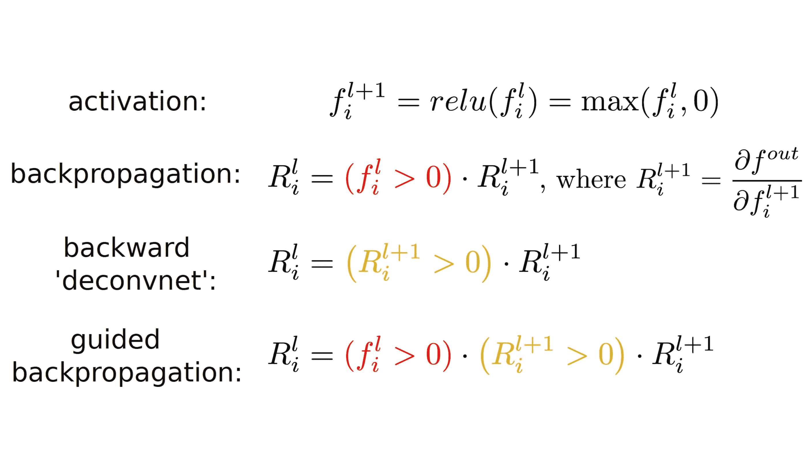
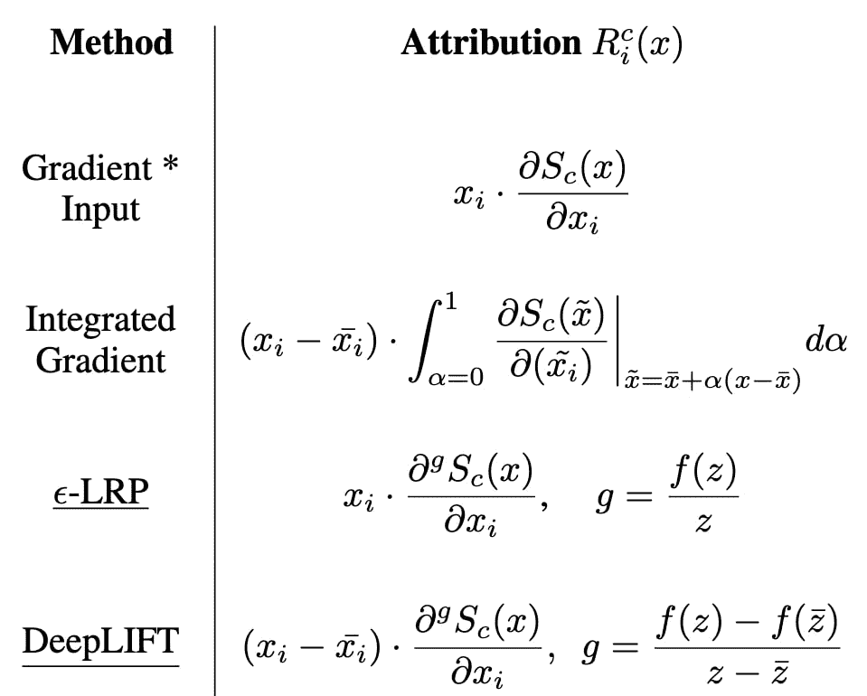

<!--yml

分类：未分类

日期：2024-09-06 19:49:16

-->

# [2112.02625] 可解释深度学习在医疗保健中的应用：从归因视角的研究方法综述 [高级综述]

> 来源：[`ar5iv.labs.arxiv.org/html/2112.02625`](https://ar5iv.labs.arxiv.org/html/2112.02625)

# 可解释深度学习在医疗保健中的应用：从归因视角的研究方法综述 [高级综述]

贡献作者：Di Jin Equal contributions Elena Sergeeva^†^†footnotemark: Wei-Hung Weng^†^†footnotemark: Geeticka Chauhan^†^†footnotemark: Peter Szolovits 通讯作者：psz@mit.edu

###### 摘要

大量电子健康记录（EHR）数据的日益丰富以及深度学习（DL）技术的空前进展引发了在诊断、预后和治疗方面开发基于 DL 的临床决策支持系统的研究热潮。尽管深度学习在医疗保健中的价值已经得到认可，但由于 DL 的黑箱特性，进一步在实际医疗环境中的采用仍然存在障碍。因此，出现了对可解释性深度学习的需求，这使得最终用户能够评估模型的决策过程，以了解在采取行动之前是否接受或拒绝预测和建议。在这篇综述中，我们重点关注医疗保健中 DL 模型的可解释性。我们首先深入全面地介绍了可解释性的方法，作为未来研究人员或临床从业者的研究方法参考。除了方法的详细信息外，我们还讨论了这些方法的优缺点以及每种方法适用的场景，以便感兴趣的读者能够了解如何比较和选择使用这些方法。此外，我们讨论了这些方法如何从解决通用领域问题的最初发展中适应并应用于医疗保健问题，以及它们如何帮助医生更好地理解这些数据驱动的技术。总体而言，我们希望这篇综述能够帮助人工智能（AI）和临床领域的研究人员和从业者了解我们在增强 DL 模型可解释性方面拥有的方法，并据此选择最佳方法。

本文分类为：

关键词：可解释深度学习，医学中的深度学习

## 1 引言

近年来，医疗保健组织广泛采用电子健康记录（EHR）系统，以及随之而来的大量 EHR 数据，使得在医疗保健中应用人工智能（AI）技术变得更加可行。EHR 数据包含丰富的、长期的和患者特定的信息，包括结构化数据（例如患者人口统计学、诊断、程序）以及非结构化数据，如医生笔记和医学影像[Mesko, 2017]。与此同时，基于深度神经网络的深度学习（DL）模型在过去十年中在各种数据集上取得了显著进展，包括图像、自然语言和结构化时间序列数据[LeCun et al., 2015]。大规模数据的可用性和前所未有的技术进步共同激发了对开发多种深度学习基础的临床决策支持系统的研究兴趣，用于诊断、预后和治疗[Murdoch and Detsky, 2013]。

尽管深度学习在医疗保健中的价值已经得到认可，但在实际医疗环境中进一步采用仍面临障碍[Tonekaboni et al., 2019a]。一个关键障碍与深度学习算法的黑箱性质或不透明性有关，在这种情况下，没有容易辨识的数据逻辑将案例数据与模型的决策联系起来。医疗保健中充满了深度学习算法可能的“高风险”应用：预测患者的再入院可能性[Ashfaq et al., 2019]，诊断患者的疾病[Esteva et al., 2017]，建议最佳的药物处方和治疗计划[Rough et al., 2020]，仅举几例。在这些包括临床决策的关键使用案例中，由于模型误分类的成本可能很高，部署此类模型时存在一些犹豫[Mozaffari-Kermani et al., 2014]。此外，已有广泛证明，深度学习模型并不稳健，可能在面对人工和自然噪声时容易出现失败[Szegedy et al., 2014, Finlayson et al., 2019a, Jin et al., 2020]。

人工智能（AI）系统通常不期望在患者护理中自主行动，而是作为人类临床医生的决策支持。为了支持这些系统与人之间的必要沟通，并让人能够评估系统建议的可靠性，我们力求构建可解释的系统。可解释的深度学习（DL）允许算法设计者通过分析和解释黑箱 DL 系统的行为来审问、理解、调试甚至改进待部署的系统。从最终用户的角度来看，可解释的 DL 使最终用户能够评估模型的决策过程，以确定是否接受或拒绝预测和建议，进而决定是否采取行动。

特别是在这篇综述中，我们专注于健康护理领域 DL 模型的可解释性。这些模型因其复杂性和在各种任务上的高性能而著称，但深度学习系统的决策和建议可能存在偏见[Gianfrancesco et al., 2018]。可解释性可以提供一种有效的方法，以确保这些系统没有偏见，并在对不同种族和社会群体进行评分时公平[Hajian et al., 2016]。许多 DL 系统已经在非医疗环境中部署，用于对全球数千万人的决策和建议（例如，Netflix、Google、Amazon），我们希望 DL 在医疗保健中的应用也能变得普及[Esteva et al., 2019]。为此，我们需要借助可解释性更好地理解模型，以帮助防止潜在的负面影响。最后，有一些法律法规，如欧盟（EU）的《通用数据保护条例》（GDPR），要求使用患者数据进行预测和建议的组织提供算法输出的按需解释，这被称为“解释权”[Tesfay et al., 2018, Edwards and Veale, 2018]。无法提供这种按需解释可能会导致相关组织面临巨额罚款。

应注意，决策解释的概念本身并不是一个定义明确的概念：实际上，原始的欧盟 GDPR 第 71 条并没有提供一个清晰的定义，只是声明了一个人有权获得这种解释。关于这一概念，社区内有过积极的讨论[Lipton, 2018]；例如，[Muggleton et al., 2018] 提出了一个基于[Michie, 1988] 提出的超强标准的可理解性和可解释性的操作定义，以及归纳逻辑编程[Kovalerchuk et al., 2021]。然而，尚未达成统一的定义：对于任何复杂模型，任何简单的解释都本质上不忠于基础模型。决定使用何种解释定义必然会影响生成这些解释的方法的属性：例如，集中于生成单个示例解释与网络分析结构的关注会使得局部解释（为什么这个特定示例导致了给定的预测）优于全局解释（模型中编码了什么样的知识及其如何影响预测）。在这项工作中，我们首先涵盖了最常见的解释方法类型，其中解释是对每个输入元素分配一个分数，反映其对模型结论的重要性。我们还简要讨论了基于示例的解释方法。其他可解释性的方法包括对神经网络特征交互的最新关注[Sundararajan et al., 2020, Tsang et al., 2018, Tsang et al., 2020]和整个网络行为分析[Carter et al., 2019]。

通常认为，模型可解释性与性能（例如 F1、准确性）之间存在权衡。例如，更可解释的模型，如回归模型和决策树，在许多预测任务上的表现通常不如较少可解释的模型，如深度学习模型。在这种限制下，研究人员必须平衡对性能最高模型的渴望与适当的可解释性。幸运的是，近年来，研究人员提出了许多新方法，这些方法可以在保持模型性能的同时提供良好的解释，例如 LIME[Ribeiro et al., 2016a]、RETAIN[Choi et al., 2016]和 SHAP[Lundberg and Lee, 2017]，如下面所述。许多这些方法已被调整并应用于医疗保健问题，取得了良好的可解释性。这项调查旨在提供这些方法的全面而深入的总结和讨论。

以前关于医疗保健的可解释性机器学习的调查[Ahmad et al., 2018, Holzinger et al., 2019, Wiens et al., 2019, Tonekaboni et al., 2019a, Vellido, 2019, Payrovnaziri et al., 2020]主要讨论了可解释性方法的定义、概念、重要性、应用、评估和高层次概述。相比之下，我们将重点介绍可解释性方法的细节，以便为未来的研究人员或临床实践者提供方法论指导。除了方法的详细信息，我们还将讨论这些方法的优缺点以及它们适合的场景，以便感兴趣的读者可以了解如何比较和选择使用。此外，我们将讨论这些最初用于解决通用领域问题的方法如何被调整和应用于医疗保健问题，以及它们如何帮助医生更好地理解这些数据驱动的技术。总体而言，我们希望这项调查能够帮助人工智能和临床领域的研究人员和实践者了解我们为增强深度学习模型可解释性所拥有的方法，并根据深入和全面的理解选择最优的方法。为了方便读者，我们在表 2 中提供了所有缩写与其对应全名的对照表。

##### 论文选择：

我们首先使用 MEDLINE、IEEE Xplore、计算机协会（ACM）和 ACL Anthology 数据库，以及几个知名临床期刊网站（如 Nature、JAMA、JAMIA、BMC、Elsevier、Springer、Plos One 等）和顶级人工智能会议（如 NeurIPS、ICML、ICLR、AAAI、KDD 等）进行系统搜索。我们的搜索关键词是：（explainable OR explainability OR interpretable OR interpretability OR understandable OR understandability OR comprehensible OR comprehensibility）AND（machine learning OR artificial intelligence OR deep learning OR AI OR neural network）。在初步搜索后，我们通过阅读标题和摘要进行手动筛选，仅保留三类作品以供后续仔细阅读：为通用领域问题开发的可解释性方法、专门为医疗保健问题开发的可解释性方法以及涉及可解释性的医疗保健应用。我们仅涵盖能够解释深度学习模型的方法。深度学习解释方法的文献快速增长，因此任何此类综述都受限于其完成日期。使用我们用于搜索最近文章的关键词在上述来源中进行搜索应有助于更新对该领域的认识。

## 2 可解释性方法

在这一部分，我们将介绍各种可解释性方法，旨在为网络的每个输入特征分配一个归因值，有时也称为“相关性”或“贡献”。这些可解释性方法因此可以称为归因方法。更正式地说，考虑一个深度神经网络（DNN），它接受一个输入`$x=[x_{1},...,x_{N}]$`并生成一个输出`$S(x)=[S_{1}(x),...,S_{C}(x)]$`，其中`$C$`是输出神经元的总数。给定一个特定的目标神经元`$c$`，归因方法的目标是确定每个输入特征`$x_{i}$`对输出`$S_{c}$`的贡献`$R^{c}=[R^{c}_{1},...,R^{c}_{N}]$`。对于分类任务，感兴趣的目标神经元通常是与给定样本的正确类别相关联的输出神经元。得到的归因图通常显示为热图，其中一种颜色表示对目标输出激活有正面贡献的特征，而另一种颜色表示对其有抑制作用的特征。

为了组织我们的展示，我们将所有归因方法分类为以下几类：基于反向传播的、基于注意力的、基于特征扰动的、基于模型蒸馏的和基于博弈论的。我们还包括了深度学习方法的示例和生成解释，以确保完整性。每个类别的更多技术细节将在下文中详细说明。

### 2.1 反向传播

最常用的可解释性方法基于梯度的反向传播[Simonyan et al., 2014]或激活值的反向传播[Bach et al., 2015]。这类方法始于显著性图[Simonyan et al., 2014]，该方法遵循常规梯度反向传播过程，通过取目标输出$S_{c}$相对于输入特征$x_{i}$的偏导数的绝对值来构建归因，即$|\frac{\partial S_{c}(x)}{\partial x_{i}}|$。直观地，梯度的绝对值指示了那些对输入特征影响最小的特征。然而，绝对值阻碍了检测输入中可能存在的正负证据。为了使卷积神经网络（CNN）模型的重建热图显著更准确，提出了反卷积[Zeiler and Fergus, 2014a]和引导反向传播[Springenberg et al., 2015]，这两种方法与显著性图方法的主要区别在于它们处理通过修正线性（ReLU）非线性反向传播的方式。如图 1(a)所示，对于显著性图方法中的常规梯度反向传播，当下层的激活值为负时，相应的反向传播梯度会被屏蔽。相比之下，反卷积方法在梯度本身为负时屏蔽梯度，而引导反向传播方法则结合了这两种方法：那些梯度被屏蔽的条件是这两种值中至少有一个为负。

梯度 * 输入[Shrikumar et al., 2017b]被提出作为提高归因图清晰度的一种技术。归因是通过取输出相对于输入的（有符号）偏导数并将其与输入本身相乘来计算的。积分梯度[Sundararajan et al., 2017]与梯度 * 输入类似，主要区别在于积分梯度计算平均梯度，因为输入沿着从基线$\tilde{x}$到$x$的线性路径变化。基线由用户定义，通常选择为零。有关这两种方法的数学定义，请参见图 1(b)。

像上面提到的引导反向传播和去卷积这样的像素空间梯度可视化具有高分辨率，并突出了图像中的细节，但它们不具备类别判别性，即不同类别的归因值图可能看起来相似。相比之下，像类别激活映射（CAM）[Zhou et al., 2016]这样的定位方法具有很强的类别判别性（例如，‘cat’的解释专门突出显示图像中‘cat’的区域，而不是包含猫和狗的图像中的‘dog’区域）。这种方法通过用卷积层和全局平均池化替代全连接层来修改图像分类 CNN 架构，从而实现类别特定的特征图。CAM 的一个缺点是它要求特征图直接位于 softmax 层之前，因此仅适用于特定类型的 CNN 架构。为了解决这一不足，引入了 Grad-CAM [Selvaraju et al., 2017]，它作为 CAM 的泛化，通过利用流入 CNN 最后一个卷积层的梯度信息来理解每个神经元对感兴趣决策的重要性。此外，它与现有的像素空间梯度可视化相结合，创造了既高分辨率又具类别判别性的引导 Grad-CAM 可视化。

除了梯度，激活值的反向传播也可以作为解释性方法。逐层相关传播（LRP）[Bach et al., 2015] 是首个采用这种方法的算法，其中算法从输出层 $L$ 开始，将目标神经元的相关性设置为神经元自身的输出（即神经元的激活值），而将其他所有神经元的相关性设置为零，如方程 1 所示。然后，第 $2$ 个方程 2 描述了将层的相关性重新分配到前一层的递归反向传播规则（称为 $\epsilon$-规则），其中我们定义 $z_{ji}=w_{ji}^{(l+1,l)}x_{i}^{(l)}$ 为神经元 $i$ 对下一层神经元 $j$ 的加权激活值，$b_{j}$ 为单元 $j$ 的附加偏差。一旦反向传播到达输入层，最终的归因定义为 $R_{i}^{c}(x)=r_{i}^{(1)}$。作为替代，DeepLIFT [Shrikumar et al., 2017a] 以类似于 LRP 的向后方式进行，但通过减去通过使用基线 $\bar{x}$ 作为输入并记录每个单元激活值的前向传播确定的参考值来校准所有相关性分数。尽管 LRP 和 DeepLIFT 是基于激活值的反向传播发明的，但在 [Ancona et al., 2018] 中已经证明，它们也可以通过应用梯度链规则来计算，转换后的方程总结在图 1(b) 中。

|  | $r_{i}^{(L)}=\begin{cases}S_{i}(x)&amp;\text{如果单元}\ i\ \text{是目标单元}\\ 0&amp;\text{否则}\end{cases}$ |  | (1) |
| --- | --- | --- | --- |
|  | $r_{i}^{l}=\sum_{j}\frac{z_{ji}}{\sum_{i^{\prime}}({z_{ji^{\prime}}+b_{j}})+\epsilon\cdot\mathrm{sign}(\sum_{i^{\prime}}(z_{ji^{\prime}}+b_{j}))}r_{j}^{l+1}$ |  | (2) |

(a) 关于普通梯度反向传播、去卷积和引导反向传播在如何处理通过修正线性（ReLU）非线性进行反向传播方面的比较。

(b) 四种基于反向传播的归因方法的数学公式。$\epsilon$-LRP 和 DeepLIFT 的原始方程被转换，使其可以基于梯度进行计算。

图 1: 不同基于反向传播的可解释性方法的数学公式。

### 2.2 特征扰动

相比于基于反向传播的方法，这些方法计算输出相对于输入特征的梯度，特征扰动方法显式地检查由于遮挡或消除某些特征所导致的模型置信度变化。

遮蔽输入部分并测量模型置信度变化的想法在深度学习之前的模型不可知背景中被提出，如[Štrumbelj et al., 2009]和[Robnik-Šikonja 和 Kononenko, 2008]。基于这些工作的基础上，深度学习中有多种特征扰动方法，试图通过特征扰动后输出分类置信度的变化来解释模型。这些方法包括基于条件多变量分析和深度可视化的模型不可知工作[Zintgraf et al., 2017]（基于称为预测差异分析的实例特定方法）以及输入表示部分的显式擦除[Li et al., 2016]；以及卷积神经网络特定的图像区域识别，该区域对扰动的反应最强[Zeiler 和 Fergus, 2014b]和通过遮蔽输入图像的显著部分来操控预测模型输出分数的图像遮蔽模型[Dabkowski 和 Gal, 2017]。与图像遮蔽模型类似，最近的模型不可知方法使用生成模型来采样合理的填充（与完全遮蔽相对）并优化以找到在填充后最改变分类器决策的图像区域[Chang et al., 2019]。

在更具理论基础的变量重要性技术方面，[Fisher et al., 2019] 通过对特征添加噪声来衡量模型预测差异。此外，还引入了各种对抗扰动技术，这些技术通过向特征表示添加噪声，属于规避攻击的范畴[Tabassi et al., 2019]。规避攻击涉及寻找小的输入扰动，这些扰动会导致损失函数发生巨大变化，从而导致误预测。这些输入扰动通常通过解决约束优化问题来发现，包括像有限记忆 Broyden-Fletcher-Goldfarb-Shanno（L-BFGS）[Szegedy et al., 2013]、快速梯度符号法（FGSM）[Goodfellow et al., 2015]、Jacobian 基的显著性图攻击（JSMA）[Papernot et al., 2016a]和投影梯度下降（PGD）[Madry et al., 2018]等基于梯度的搜索算法。有关计算机视觉中对抗扰动技术的详细调查，请参见[Akhtar and Mian, 2018]；有关对抗攻击的一般调查，请参见[Chakraborty et al., 2018]和[Yuan et al., 2019]。虽然这些方法的目标是主动改变模型的信心以攻击模型，但它们利用了深度学习模型的黑箱特性，并导致了可以用于部署更强大且可解释模型的技术的创建。

### 2.3 注意力

注意力机制在模型解释中发挥了重要作用，注意力权重已被广泛采用作为解释给定模型决策的代理[Xu et al., 2015, Xie et al., 2017, Clark et al., 2019, Voita et al., 2019]。

从历史上看，注意力机制是在序列到序列文本模型对齐的背景下引入的，作为直接将上下文的重要性纳入到任何给定单词表示的方法。在给定上下文中的每个输入单词由其他单词表示的加权和表示。自然地，每个单词的动态权重可以被解释为单词对给定单词表示的贡献（或重要性）。

尽管使用注意力机制的模型的确切架构因模型而异，但所有模型都利用了称为注意力机制的计算集。注意力的基本构建块是一个通用的可训练函数[Bahdanau et al., 2014, Vaswani et al., 2017]：

|  | $Attention(V,Q,K)=Score(W_{q}Q,W_{k}K)\odot W_{v}V$ |  | (3) |
| --- | --- | --- | --- |

其中 $Q$ 和 $K$ 代表给定元素的上下文，$V$ 是未考虑上下文的元素对表示的未修改贡献，而权重集 $W_{k},W_{q},W_{v}$ 是表示学习到的元素贡献的可调权重。

评分函数的输出称为注意力权重，表示输入的其他元素对给定元素或序列整体表示的贡献；在简单的解释设置中，输入特征或特征集的高后训练注意力权重对应于在产生预测时给定特征值的重要性。

请注意，这种产生解释的方法本质上与模型本身紧密相关，并直接解释了给定利用注意力的模型（注意力分数）部分输出的预测。由于注意力分数通常计算在已汇聚的元素和序列表示上，元素分数不一定代表直接的特征贡献 [Jain and Wallace, 2019, Brunner et al., 2019, Zhong et al., 2019]。

由于注意力使用模型的成功以及将序列中其他元素对当前状态的贡献自然地视为观点，大多数关于注意力基于解释性的工作集中在一般时间序列处理领域 [Sezer et al., 2020, Fawaz et al., 2019, Wang et al., 2019, Ardabili et al., 2019]。

基于注意力的模型和注意力基于的解释在自然语言处理（NLP）中也很流行，因为语法和意义的组成性质 [Wolf et al., 2020]。

### 2.4 模型蒸馏

模型蒸馏（也称为网络蒸馏）是一种模型压缩技术，其中一个简单模型（学生）通过更复杂的模型（教师）进行“教学”。尽管该技术最初的用途侧重于学生模型的性能或紧凑性 [Hinton et al., 2015]，但重要的是要注意，如果简单模型本身是自然可解释的，那么转移结果将是一个“可解释的”模型，用来解释更复杂的教师模型的行为。

复杂模型的行为可以通过局部方式近似，即通过在给定示例周围拟合一个简单模型来为某一点产生解释 [Ribeiro et al., 2016a]，或通过全局方式，即通过将一个简单模型直接拟合到教师模型中，使用所有训练数据 [Lakkaraju et al., 2017]。

由于该技术的明确“解释”用例，学生模型通常限制为广义线性模型 [Ribeiro et al., 2016a]、决策树 [Craven and Shavlik, 1995, Schmitz et al., 1999, Plumb et al., 2018] 或直接规则或集合归纳 [Sethi et al., 2012, Lakkaraju et al., 2017, Ribeiro et al., 2018, Zilke et al., 2016]。

这一解释生成技术家族中最有影响力的成员是 LIME [Ribeiro et al., 2016a]，它是一种为特定输入案例生成局部解释的一般方法。作为给定点解释的局部模型是通过最小化以下公式获得的

|  | $\xi(x^{*})=\operatorname*{argmin}_{g\in\mathcal{G}}\mathcal{L}(f,g,\pi_{x^{*}})+\Omega(g)$ |  | (4) |
| --- | --- | --- | --- |

其中 $\mathcal{G}$ 是用于生成解释的可解释模型类，$\pi_{x^{*}}$ 定义了靠近 $x^{*}$ 的点的邻域，$\mathcal{L}$ 是该邻域中原始模型和解释模型预测之间差异的度量，而 $\Omega(g)$ 是解释模型的复杂度度量。

在实际应用中，在经典的 LIME 使用中，$\mathcal{L}$ 被设定为原始模型和解释模型预测之间的距离加权平方损失，该损失是在一个随机采样的数据点集上计算的，这些数据点集由于 $\pi_{x^{*}}$ 的偏向而靠近 $x^{*}$。解释模型类 $\mathcal{G}$ 是所有线性模型的集合，$\Omega(g)$ 是一个正则化项，用于防止过拟合。

绝大多数用于可解释性模型的局部知识蒸馏结果是对 Lime 的修改，包括邻域构造（ALIME [Shankaranarayana and Runje, 2019]）、采样（MPS-LIME [Shi et al., 2020]）和输入结构约束程序（GraphLime [Huang et al., 2020]）或解释模型的性质（SurvLIME [Kovalev et al., 2020], GRAPHLime [Huang et al., 2020]）。另一种流行趋势是通过类似 LIME 的拟合程序生成半全局解释模型（LIME-SUP [Hu et al., 2018], Klime [Hall et al., 2017], NormLime [Ahern et al., 2019], DLIME [Zafar and Khan, 2019], ILIME [Shawi et al., 2019]）。

### 2.5 基于博弈论的可解释性方法

DL 模型也可以通过 Shapley 值进行解释，这是一种受局部替代模型启发的博弈理论概念[Lundberg and Lee, 2017]。Shapley 值是将收益和损失公平分配给合作博弈中的多个不平等参与者的概念[Shapley, 1953]。它是所有可能特征（即博弈中的参与者）交互的边际贡献的平均值。 因此，Shapley 值可以通过与整个数据集的平均预测进行比较，来解释特征值如何对给定示例的模型预测做出贡献。然而，当学习模型变得复杂时，Shapley 值的近似计算并不容易。

最近，研究人员提出了一个统一框架，即 SHAP（SHapley Additive exPlanations）值，用于近似各种机器学习模型的经典 Shapley 值及其条件期望，这些模型包括线性模型、树模型[Lundberg et al., 2018a]，甚至复杂的深度神经网络[Lundberg and Lee, 2017]。SHAP 最近在 DL 解释中被广泛使用，但研究人员也承认对这一流行解释方法的担忧。

首先，神经网络的 SHAP（KernelSHAP）基于模型线性的假设。为了解决这个问题，[Ancona et al., 2019] 提出了一个多项式时间近似算法，即深度近似 Shapley 传播（DASP），用于在非线性模型，特别是更深的神经网络中学习更好的 Shapley 值近似。DASP 是一种基于扰动的方法，利用神经网络中的不确定性传播。它需要多项式数量的网络评估，比其他基于采样的方法更快，并且不失去近似性能。此外，[Sundararajan and Najmi, 2020] 表明，SHAP 或其他使用 Shapley 值和条件期望的方法对数据稀疏性可能敏感，可能导致产生反直觉的归因，从而使模型解释不准确。他们提出了一种技术，基线 Shapley，提供一个良好的唯一结果。

### 2.6 基于示例的可解释性方法

与通过输入数据点的属性贡献来解释模型不同，基于示例的方法使用仅对模型预测具有代表性或影响力的特定训练数据点来解释模型行为。

对于 DL 模型，有几种基于样本级信息的解释方法。例如，影响函数[Koh and Liang, 2017]、样本级特征选择[Chen et al., 2018]、上下文分解（CD）[Murdoch et al., 2018]，以及原型和批评样本的组合——无法通过原型表示的数据点[Kim et al., 2016]。其他流行的解释方法，如 LIME[Ribeiro et al., 2016a]（第 2.4 节）和 SHAP[Lundberg and Lee, 2017]（第 2.5 节），也提供样本级模型解释性。

影响函数是基于样本的解释性示例[Koh and Liang, 2017]，可用于计算机视觉[Koh and Liang, 2017]和自然语言处理[Han et al., 2020b]。影响函数的目标是测量我们添加小扰动、权重或移除一个影响实例时，损失函数的变化，该实例是一个具有代表性和影响力的训练点。在平滑性假设下，影响函数可以使用损失函数的 Hessian 矩阵的逆或通过使用 Hessian-向量积来近似结果。影响函数也可以用于生成对抗攻击。

研究人员开发了基于 DL 的样本级特征选择方法来测量特征重要性[Chen et al., 2018]。样本级特征选择（L2X，学习解释）在每个特定样本上局部测量特征重要性，因此指示哪些特征对模型在该实例上做出预测至关重要。L2X 被训练以最大化所选特征和响应变量之间的互信息，其中响应变量的条件分布给定输入是要解释的模型。为了解决直接估计互信息和离散特征子集采样的不可处理问题，作者应用了互信息的变分近似，然后开发了采样分布的连续重参数化。该方法已在不同数据集上的 CNN 和分层长短期记忆（LSTM）中应用，并在定量和定性上都获得了更好的解释性能。

CD 是一种解释方法，通过对 LSTMs 的输出进行分解而不对底层模型进行任何更改 [Murdoch et al., 2018]. 在 NLP 中，它将 LSTM 分解为两部分的总和：仅由给定短语导致的部分和其他因素所涉及的部分。 CD 捕捉了词语或变量组合对于 LSTM 的最终预测的贡献。在研究中，研究人员证明了 CD 可以解释 NLP 和一般 LSTM 应用。例如，他们通过识别评论中情感不同的词语和短语，并从模型中提取积极和消极的词语来建立情感分析模型。CD 方法还可以进一步扩展为更一般的版本，即上下文分解解释惩罚（CDEP），[Rieger et al., 2020]. CDEP 是一种允许将领域知识插入到模型中以忽略虚假的相关性、纠正错误并推广到不同类型的数据集转换的方法。它是通用的，并可以应用于不同的神经网络结构。

对于图神经网络, [Ying et al., 2019] 进一步提出了一个模型无关的 GnnExplainer 来提供对基于图的任务（如节点分类和图分类）的解释性。通过识别与预测相关的边缘，GnnExplainer 可以突出显示局部子图结构和重要特征的小子集对于预测的重要性。该方法可以用于图的单个和多个示例的解释。

为了解决现实世界中的数据问题，可能无法具有一组典型的示例来很好地表示数据，我们还可以利用既有典型示例又有不适合模型的批评样本 [Kim et al., 2016]. MMD-critic（最大均值差异-批评家）方法使用贝叶斯方法选择原型和批评样本，并提供有助于人类推理和理解模型的解释。

### 2.7 生成式的解释方法

基于生成式的方法解释模型行为的基础是使用不显式出现在输入属性中的信息，而是来自外部知识来源、因果模型或可解释的概率建模。

例如，最先进的通用领域神经问答（QA）系统尝试提供人类可理解的解释，以便更好地进行常识推理。然而，要解读模型如何利用常识知识，需要一个常识解释生成框架 [Rajani et al., 2019]。研究人员收集了用于常识推理的人类叙述解释，并预训练语言模型 [Rajani et al., 2019]，这些模型可以生成解释，并与 QA 系统同时使用（常识自动生成解释（CAGE）框架）。他们进一步将知识（生成的解释）转移到域外任务，并展示了预训练语言模型在常识推理中的能力。

生成解释框架（GEF）是一种混合生成-判别方法，它明确捕捉从原始文本中推断的信息，生成抽象的、细粒度的解释（属性），并同时进行分类任务。它可以解释预测的分类结果，并在提高整体性能的同时 [Liu et al., 2019]。更具体地说，作者引入了可解释因素（EF）和最小风险训练（MRT）方法，以生成更合理的解释。他们通过使用解释作为输入来预训练分类器，以对文本进行分类，然后采用分类器通过计算 EF 来联合训练文本编码器，EF 是生成的解释、标准答案解释与输入之间的语义距离，然后最小化 MRT 损失，该损失考虑了预测整体标签与真实标签之间的距离，以及 EF 中表示的语义距离。GEF 是一种模型无关的方法，可以用于不同的神经网络架构。

[Madumal et al., 2020] 介绍了利用结构因果模型生成模型无关的强化学习代理行为解释的动作影响模型，通过使用反事实分析了解因果关系。该模型已在深度强化学习算法上进行了评估，如深度 Q 网络（DQN） [Mnih et al., 2013]、双重 DQN（DDQN） [Van Hasselt et al., 2016]、近端策略优化（PPO） [Schulman et al., 2017]和优势演员评论家（A2C） [Mnih et al., 2016]。

[Wisdom et al., 2016] 开发了一种基于模型的解释方法，即序列迭代软阈值算法（SISTA），通过显式概率模型的训练权重构建递归神经网络（RNN），避免使用黑箱组件如 LSTM。

## 3 种医疗领域可解释性方法

在上一部分，我们总结了每类解释方法的工作原理。这些方法大多最初是针对通用领域应用提出的。为了将其部署到医疗保健问题上，需要进行一些定制。因此，在本节中，我们讨论了每类解释方法如何适应医疗系统。我们还讨论了借助这些解释方法可以进行哪些临床/医学观察和发现。

### 3.1 反向传播

基于反向传播的可解释性方法已被广泛用于帮助可视化和分析用于医疗保健问题的深度学习模型，这些问题包括计算机视觉、自然语言处理[Gehrmann et al., 2018]、时间序列分析以及基于静态特征的预测建模。我们将总结这些成功的应用，并根据应用任务类型进行分类。

在计算机视觉任务中，许多强大的深度学习模型已实现接近专家医生的表现[Esteva et al., 2017, Ran et al., 2020]，因此研究这些模型如何取得如此伟大成功是非常有意义的[Singh et al., 2020b]。[Xie et al., 2019] 采用了 CAM [Zhou et al., 2016] 分别生成了皮肤癌组织图像中的黑色素瘤细胞和痣细胞的热图，从而可以可视化这两种细胞之间的形态差异：黑色素瘤细胞形状不规则，而痣细胞形状明显且分布规律。[Zhang et al., 2021] 使用 Grad-CAM 为用于分类胸部 CT 图像的注意力网络提供了可解释的热图，同时 Grad-CAM 也被用于解释基于胸部 CT 图像的图卷积网络，用于二次肺结核诊断[Wang et al., 2021]。Integrated Gradients [Sundararajan et al., 2017] 被用于可视化用于从乳腺磁共振成像 (MRI) 图像中分类雌激素受体状态的 CNN 模型的特征[Pereira et al., 2018]，其中发现该模型在空间和动态领域学习了相关特征，并且两者的贡献各有不同。总体而言，基于反向传播的方法已被用于可视化和解释各种医学影像模态，如脑 MRI [Eitel et al., 2019]、视网膜成像[Sayres et al., 2019, Singh et al., 2020a]、乳腺成像[Papanastasopoulos et al., 2020, Kim et al., 2018]、皮肤成像[Young et al., 2019]、计算机断层扫描 (CT) [Couteaux et al., 2019] 和胸部 X 光[Linda, 2020]。

对于基于特征的预测建模，基于反向传播的可解释性方法可以应用于静态分析和时间序列分析。对于静态分析（例如，基于固定特征集的治疗推荐），通常使用全连接神经网络进行建模，因此这些网络是需要被解释的目标。常用的可解释性方法包括 DeepLIFT [Fiosina et al., 2020]、LRP [Li et al., 2018, Zihni et al., 2020] 等。对于时间序列分析，除了能够分析所有特征中哪些特征对预测更重要或相关 [Yang et al., 2018]，还值得注意的是我们还可以分析哪些时间模式对最终模型决策影响更大 [Mayampurath et al., 2019, Suresh et al., 2017]。

### 3.2 特征扰动

特征扰动方法主要在医疗领域的对抗性攻击背景下进行讨论 [Finlayson et al., 2019a]，主要作为由于机器学习在诊断和保险理赔审批中被广泛接受而导致的潜在未来风险。然而，如果被攻击者改变的特征对模型的响应最为敏感，这些特征也是最具影响力的 [Finlayson et al., 2019a]。

[Finlayson et al., 2019b] 通过向三种高精度的医学成像深度学习系统添加基于梯度的噪声，执行了对抗性扰动（FGSM 攻击的变体 [Goodfellow et al., 2015]）。通过攻击分类糖尿病视网膜病变、气胸和黑色素瘤的模型，他们展示了医学深度学习中三大最显著成功的脆弱性。此外，他们讨论了攻击者如何利用系统展示的脆弱性进行攻击的假设场景。更广泛地，他们评论了未来可能受到对抗性攻击影响的行业和情境：保险欺诈以及药物和设备审批。他们讨论了在建设具有韧性的算法之前推迟审批与延迟部署可能对影响数百万人的医疗服务技术所造成的伤害之间的挑战性权衡。

[Iqtidar Newaz et al., 2020] 通过操控设备读数以改变患者状态，展示了智能医疗系统（SHS）的脆弱性。通过执行包括回避攻击[Tabassi et al., 2019] 在内的两种攻击，他们识别了 SHS 中基础机器学习模型的缺陷。采用如 FGSM [Goodfellow et al., 2015]、基于[Carlini and Wagner, 2017]、[Croce et al., 2019] 和 [Croce and Hein, 2018] 的随机梯度无关攻击，以及基于零阶优化的攻击[Chen et al., 2017]，他们能够改变基于患者生命体征的机器学习模型的患者状态。

[Chen et al., 2020] 基于对心电图的扰动技术生成对抗样本。他们使用[Carlini and Wagner, 2017] 和 [Athalye et al., 2018] 的技术来误导心律失常分类。在类似的应用中，[Han et al., 2020a] 引入了一种平滑的方法来扰动输入特征，以误分类心律失常。

对于电子健康记录（EHR）中的时间数据，[Sun et al., 2018] 引入了一种基于优化的攻击策略，类似于[Chen et al., 2017]，以扰动 EHR 输入数据。[An et al., 2019] 通过联合建模显著性图和注意力机制，引入了 JSMA 和基于注意力的攻击。最后，在领域无关的设置中，[Naseer et al., 2019] 引入了基于生成对抗网络（GAN）的对抗扰动的跨领域可转移性。他们展示了如何利用在医学影像数据集上训练的网络来欺骗基于 ImageNet 的分类器。对抗扰动的成功转移性可能会使欺骗多个任务领域和潜在模态的医疗模型变得更加简单。一个相关的研究探讨了在医学影像领域中普遍对抗扰动的效果[Hirano et al., 2021]。

在一般领域中，已经提出了几种方法来应对这些对抗攻击，即前瞻性防御([Cisse et al., 2017, Gu and Rigazio, 2014, Papernot et al., 2016b], [Shaham et al., 2018])和反应性防御([Feinman et al., 2017, Grosse et al., 2017, Lu et al., 2017])。前瞻性防御方法通过提高模型的鲁棒性来对抗攻击，而反应性防御模型则用于检测对抗样本。还有其他方法，如使用协作多任务学习([Wang et al., 2020])。虽然对抗扰动的可能性似乎与在医疗保健环境中使用深度学习的推荐相悖，但最近的研究通过积极检验医疗数据易受攻击的原因来推动这一领域的界限([Ma et al., 2021])。由于特征扰动技术在医疗保健中具有强烈的政策级影响，因此也必须将一般领域的防御方法调整到医疗保健环境中。

### 3.3 注意力

设计时特别考虑解释性的注意力架构被广泛应用于基于 EHR 的纵向预测任务，例如心力衰竭预测[Choi et al., 2016, Kaji et al., 2019]、脓毒症[Kaji et al., 2019]、重症监护病房（ICU）死亡率[Shi et al., 2019]、自动诊断和疾病进展建模[Gao et al., 2019, Mullenbach et al., 2018, Ma et al., 2017, Bai et al., 2018, Alaa and van der Schaar, 2019]。这类模型的基础表示通常由一种 LSTM 变体生成，注意力用于计算序列中给定特征或时间步元素对预测的贡献。最著名的此类模型是 RETAIN[Choi et al., 2016]，它包括计算时间序列的时间步和输入特征的注意力权重。

纯注意力架构如 Transformer 已经彻底改变了基于 NLP 的建模，允许使用大规模未标注的医学文本进行预训练[Lee et al., 2020, Alsentzer et al., 2019, Beltagy et al., 2019]。这类模型在非文本数据中的应用仍然相对较少[Li et al., 2020b, Rajan et al., 2017]。

一种寻求解决解释性问题的特殊注意力机制变体允许模型对每个输入特征输出不确定性，并使用聚合的不确定性信息进行预测[Heo et al., 2018]。

尽管注意力图作为解释的使用非常广泛，但我们还是要谨慎对待将注意力直接解释为元素对预测的贡献，特别是在医疗领域。需要更多的研究来解开自注意力生成的表示与上下文贡献本身的关系。

### 3.4 模型蒸馏

LIME [Ribeiro et al., 2016a] 是一种非常流行的技术，用于为医疗 AI 中的黑箱模型预测生成实例级解释。该技术的模型无关特性使其在多种基于长期电子健康记录的预测任务中得到了应用，如心力衰竭预测 [Khedkar et al., 2020]、癌症类型和严重性推断 [Moreira et al., 2020]、乳腺癌生存预测 [Hendriks et al., 2020] 和高血压发展预测 [Elshawi et al., 2019]。

应当注意的是，尽管这些解释方法在临床上具有潜在的有用性，LIME 的变体并未得到广泛使用。在医学机器学习中，潜在有用的变体包括 SurvLIME [Kovalev et al., 2020]，专门用于为黑箱生存模型生成 Cox 比例风险解释，以及 DLIME [Zafar and Khan, 2019]，一种基于层次聚类邻域的半全局 LIME 变体，用于生成对类似输入的预测更一致的解释。

### 3.5 基于博弈论的可解释性

基于博弈论的 SHAP 算法由于能够通过 Shapley 值的聚合来解释不仅是个别预测，还包括全局模型行为，因此在医学领域得到了广泛应用。SHAP 也是模型无关的，因此可以应用于各种机器学习算法 [Lundberg and Lee, 2017, Lundberg et al., 2018b]。

在深度学习在医疗保健中的直接使用中，[Arcadu et al., 2019] 应用了 SHAP 来寻找关键区域，即外围领域，以识别糖尿病视网膜病变的进展。此外，对于医学影像的解释，[Young et al., 2019] 和 [Pianpanit et al., 2019] 使用了 KernelSHAP 来生成显著性图，以解释深度神经网络对黑色素瘤预测和帕金森病预测的结果。[Levy et al., 2019] 还采用了 SHAP 来解释病理幻灯片影像中的门区域预测。除了医学影像，[Boshra et al., 2019] 使用 SHAP 来调查特征对脑震荡识别的影响，该研究基于脑电图（EEG）信号。

[Ancona et al., 2019] 使用 DASP 算法来近似 Shapley 值，并提供深度学习模型的解释，并将其应用于全连接网络模型，用于预测帕金森病评分量表（UPDRS），这是一个回归任务，基于 18 个临床特征在远程监测数据集中预测帕金森病的严重程度。

在[Lundberg et al., 2018b]中，他们还请了麻醉师进行咨询，以确保他们的模型解释在临床上有意义。麻醉师被要求根据特征扰动时模型输出的变化来验证 SHAP 解释。[Li et al., 2020a]也显示，使用 SHAP 建模和可视化前列腺特异性抗原与前列腺癌 Gleason 评分之间的非线性关系是可能的，这与医学文献中的先前知识一致。这些临床评估有助于医学界更好地接受解释方法。

本节中提到的其他工作也通过可视化或计算定量指标提供了与先前知识和数据集提供的真实情况一致的解释，但其中没有经过正式的临床用户研究验证。这些方法和在医疗保健中的应用需要进一步研究。

在医学领域使用 SHAP 的一个主要关注点是 Shapley 值和 SHAP 最初源于经济学任务，其中成本是可加的。然而，临床特征通常是异质的，从模型中得出的 Shapley 值在该领域可能没有意义[Kovalerchuk et al., 2021]。需要进一步调查以证明 SHAP 基于解释在实际临床中的使用。

### 3.6 基于示例的可解释性

基于示例的模型解释提供了一种心理模型，使临床医生可以在遇到新病例时参考一些类似的案例、原型或聚类。

研究人员利用 CDEP 来忽略皮肤癌诊断中的虚假混杂因素[Rieger et al., 2020]。该研究使用了来自 ISIC（国际皮肤影像合作组织）的公开图像数据集，其中约 50%的非癌症图像中存在彩色斑块，但癌症图像中没有。如果学习到的模型将这些虚假斑块特征作为指标，而不是皮肤癌预测的关键底层信息，则可能会出现问题。CDEP 有助于在训练过程中惩罚这些斑块，使其重要性为零，从而减轻这一问题。

尽管在皮肤癌分类示例中产生了更好的模型性能并提供了准解释，但 CDEP 尚未通过正式的临床用户研究得到证明，也未被医学界接受。它仍处于研究阶段而非部署阶段。

### 3.7 基于生成的可解释性

深度学习的可解释性也可以通过在学习过程中提供的专家可解释特征来获得。

为了提供对乳腺癌诊断决策的可视化解释证据，[Kim et al., 2018] 开发了一个可解释性框架，该框架包括一个乳腺影像报告和数据系统（BIRADS）指导的诊断网络和一个 BIRADS 评论网络。由视觉特征编码器生成的可解释 2D BIRADS 指导图可以帮助诊断网络通过评论网络专注于与人类可理解的 BIRADS 词汇相关的关键区域。

研究表明，使用 BIRADS 指导图的性能显著高于没有指导图的网络。这一发现也表明，在医疗保健中部署机器学习模型时，整合医学领域知识的关键作用和必要性。

对于放射学，[Shen et al., 2019] 提出了一个可解释的深度层次语义卷积神经网络（HSCNN），用于对 CT 图像中的肺结节恶性预测。HSCNN 生成的二值化低级专家可解释的诊断语义特征，如球形度、边缘和钙化，这些特征通常被放射科医生使用；这些特征作为高层分类模型的输入，同时还包括从视觉编码器学习到的潜在表示。

[Kim et al., 2018] 和 [Shen et al., 2019] 都展示了图像指导图和标签生成过程可能帮助临床医生将原始图像信息整理为高级诊断标准，但该方法尚未通过正式的临床用户研究证明。需要进一步研究这些方法以便被医学界接受。

## 4 讨论

### 4.1 不同可解释性方法的维度

现有文献提出了几种不同的深度学习解释方法的分类方案 [Lipton, 2018, Doshi-Velez and Kim, 2017, Pedreschi et al., 2019]。除了本文解释方法部分使用的基于方法论的分类，我们还提出了每种解释生成方法自然会面临的两个不同问题：

1.  1.

    模型依赖性：解释模型是否依赖于它所解释的模型的内部结构，还是可以用于生成任何“黑箱”模型的解释？

1.  2.

    解释范围：解释模型是专注于生成给定输入-预测对的解释，还是试图创建对模型行为的统一全局解释？

关于这些方面的最常用方法在健康护理中的解释特征在表 1 中进行了描述。

通常，绝大多数方法都是明确局部的，仅对给定决策提供解释，并尝试将局部解释聚合成模式 [Ramamurthy et al., 2020, Lakkaraju et al., 2019]。

社区在模型依赖性问题上似乎存在深刻分歧，支持者引用了解释真实性的必要性 [Rudin, 2019]，而反对者质疑直接依赖模型的解释的固有真实性 [Jacovi and Goldberg, 2020]，并强调需要灵活的模型无关解释方法 [Ribeiro et al., 2016b]。

| 类别 | 模型 | 范围 | 依赖 | 潜在问题 | 参考文献 |
| --- | --- | --- | --- | --- | --- |
| 反向传播 | [集成梯度](https://github.com/ankurtaly/Integrated-Gradients) | L | I | 比梯度*输入*计算开销更大，基线需要在某些情况下仔细选择/调整 | [Sundararajan et al., 2017] |
| [CAM](https://github.com/ramprs/grad-cam) | L | I | 这种方法揭示的标签/类别区分特征对于某些数据样本可能不够令人信服和准确 | [Zhou et al., 2016] |
|  | [LRP](https://github.com/alewarne/Layerwise-Relevance-Propagation-for-LSTMs) | L | I | 最初提出用于解释多层感知器，并且难以很好地推广到更复杂的神经网络，如 LSTM 和 Transformers | [Bach et al., 2015] |
| 特征扰动 | [预测差异分析](https://github.com/lmzintgraf/DeepVis-PredDiff) | L | I | 计算开销大。通过边际化模拟特征的缺失，而不是对缺失特征时模型行为的精确了解。 | [Zintgraf et al., 2017] |
| [表示消除](https://arxiv.org/pdf/1612.08220.pdf) | G | I | 计算开销大，需要多个探测步骤。通过在输入中注入随机噪声进行表示消除。 | [Li et al., 2016] |
|  | [反事实生成](https://github.com/zzzace2000/FIDO-saliency) | L | I | 由于中间生成阶段用于注入噪声，计算开销大。涉及与预测差异分析类似的边际化近似。 | [Chang et al., 2019] |
| 注意力 | [RETAIN](https://github.com/mp2893/retain) | L | D | 注意力权重对应于中间表示对最终表示的重要性，而不是直接对应于输入元素。 | [Choi et al., 2016] |
| [Attend and Diagnose](https://github.com/khirotaka/SAnD) | L | D | 存在与保留相同的问题，并且由于模型完全附加架构的使用而加剧 | [Rajan 等, 2017] |
| 模型蒸馏 | [LIME](https://github.com/marcotcr/lime) | L | D | 解释在实例间不一致，即使对于非常相似的实例也可能大相径庭。可能存在离散数据的问题。可能在多次运行中产生不一致的结果 | [Ribeiro 等, 2016a] |
| [Anchors](https://github.com/marcotcr/anchor) | S | I | 可能在多次运行中产生不一致的结果。解释可能过于具体，决策边界处的鲁棒性不强 | [Ribeiro 等, 2018] |
| 博弈论 | [SHAP](https://github.com/slundberg/shap) | L | I | 计算成本高。需要访问训练数据以进行解释。 | [Lundberg 和 Lee, 2017] |
| 示例 | [影响函数](https://github.com/kohpangwei/influence-release) | L | I | 对于没有可微分参数和损失的模型不起作用。仅为近似值。没有明确的“有影响”和“无影响”区分。如果原型中的特征值过多，可能难以被人类解释。 | [Koh 和 Liang, 2017] |
| [上下文分解](https://github.com/jamie-murdoch/ContextualDecomposition) | L | D | 仅适用于 LSTM。需要进一步的算法修改以扩展到其他网络架构。 | [Murdoch 等, 2018] |
| 生成式 | CAGE | L | D | 需要高质量的外部知识资源。特定任务的方法。 | [Rajani 等, 2019] |

表 1：用于提供解释的最受欢迎的方法（引用超过 50 次），范围：局部、半全局、全局。模型依赖性：依赖、独立

### 4.2 可解释性方法的可信度和可靠性

在这一部分，我们将探讨用于生成健康护理决策模型解释的两种方法：

1.  1.

    解释对基础决策模型的忠实度如何？

1.  2.

    解释对人类专家用户的可理解性如何？

这两种方法常常相互冲突：复杂的模型决策可能需要相当复杂的解释来涵盖模型在不同输入下的所有可能行为，这可能对人类来说并不容易理解。

#### 4.2.1 解释的可信度

我们首先讨论生成的解释与模型决策之间的直接对应关系，文献中称为**忠实度**[Jacovi and Goldberg, 2020]或**真实度**[Rudin, 2019]。一个完全真实的解释准确地反映了被解释模型的决策。如果解释必须与模型在所有可能输入下的行为一致，则没有比原始模型更简单的解释方法。即使是依赖模型的解释生成方法也可能不忠实于原始模型，因为作为简化模型，它们可能未包含原始决策过程的所有部分[Jain and Wallace, 2019]。

当使用解释生成模型对复杂医疗数据训练的黑箱模型进行分析时，我们建议用户考虑以下问题，以深入了解解释模型的真实性。

1.  1.

    对于本身就是预测模型的解释，请查看解释模型和原始模型之间的预测一致性：如果一致性低，则模型不真实。

1.  2.

    虽然估计解释方法的忠实度很困难，但可以考虑计算最近提出的忠实度度量，以评估你计划使用的一组解释方法[Yeh et al., 2019]。

1.  3.

    考虑运行“特征遮蔽”检查，以验证根据解释改变模型元素是否会改变原始预测[Hooker et al., 2018]。

1.  4.

    由于某些解释生成模型的特性，相同模型可能在多次运行中为相同的输入-输出对生成不同的解释。

#### 4.2.2 由专家用户定义的解释的合理性

传统上，临床医生倾向于采用专家策划的模型，如用于评估 ICU 患者严重程度的 APACHE（急性生理和慢性健康评估）评分[Knaus et al., 1985]，因为所用模型特征与领域知识之间的一致性。相比之下，针对医疗保健问题的机器学习方法旨在通过从原始特征中学习更复杂的表示来进一步提高性能，同时牺牲模型透明度。机器学习解释性方法可能提供易于理解的解释，但重要的是，这些解释应与我们的知识对齐，以便值得信赖，特别是在医疗领域的实际部署中。然而，目前使用解释性方法的部署主要关注于帮助工程师调试模型，而非实际用户[Bhatt et al., 2020b]。应选择并评估适当的解释性方法，以帮助模型开发者（数据科学家和机器学习从业者）理解其模型的行为，并协助临床医生理解模型预测的依据，以便进行决策。

对于模型开发者，研究人员从量化（机器学习解释性）和质性（可视化）两个角度，通过访谈和调查评估其使用不同水平的模型透明度（广义加性模型（GAMs）和 SHAP）的解释性方法[Kaur et al., 2020]。然而，结果显示，开发者通常过于信任这些方法，这可能导致误用，特别是过度依赖他们的“快速思维（系统 1）”[Kahneman, 2011]，因为良好的可视化可能影响人的思维，但可能无法完全解释系统的行为，并且可能被开发者误解。此外，可视化有时无法被模型开发者完全理解和正确解释。作者指出，开发者通常只关注模型调试中的表面值，而不是使用解释来深入挖掘数据或模型问题。他们还列举了开发者常遇到的问题，包括缺失值、数据随时间变化、数据重复、冗余特征、临时分类以及基于解释调试方法的困难。即使在识别模型中的可疑方面后，开发者也显示出对模型部署的偏见。

从临床角度来看，具有与医学知识和临床实践一致的临床相关特征是必要且关键的[Caruana et al., 2015]，而表现不佳的模型只要错误是可解释的，仍然是可以接受的。在[Tonekaboni et al., 2019b]中，作者对 ICU 和急诊科的临床医生进行了调查，以了解临床医生对解释的需求，主要是为了向患者和同事证明他们的临床决策。

根据问题范围，临床医生可能会考虑不同级别的可解释性。[Elshawi et al., 2019] 对高血压风险预测问题进行了案例研究，使用随机森林算法，并探讨了不同模型无关可解释性技术在全局或局部层面上的重要因素。他们发现，不同的可解释性方法通常从不同的角度提供见解，帮助临床医生更好地理解模型行为，具体取决于临床应用。全局方法可以对整个队列进行泛化，而局部方法则展示特定实例的解释。因此，像高血压风险预测问题这样的应用可能会集中于从全局可解释性方法中获得的全局风险因素，这些方法主要是基于非深度学习的技术，如特征重要性和部分依赖图，或者局部解释器（如 SHAP、LIME）的汇总[Elshawi et al., 2019]，而疾病进展预测则需要在局部、队列特定和全球层面上进行综合解释[Ahmad et al., 2018]。

然而，由于不同的可解释性方法获得特征重要性的方式不同，可能会产生不同的临床相关重要特征子集。例如，即使 SHAP、回归模型系数和基于置换的特征重要性都在全局层面，它们也可能提供完全不同的解释。通过一些临床实例，研究人员发现，正确预测样本的局部解释方法（LIME 和 SHAP）通常是直观的并遵循常见模式，而对于错误预测的情况（无论是假阳性还是假阴性），这些局部方法可能不那么一致，更难以解释[Elshawi et al., 2019]。然而，用户可能没有意识到使用模型的假设以及它如何做出决策：例如，SHAP 算法的可加性假设。可解释性可以是相当主观的，计算机化的解释技术缺乏在一个专家试图说服另一个专家时通常至关重要的互动性[Lahav et al., 2018]。

研究还显示了一些可解释性方法在应用于实际临床环境中的不足之处[Tonekaboni et al., 2019b, Elshawi et al., 2019]。例如，特征重要性方法中复杂的特征间相关性、特征重要性与循环神经编码器中学习的注意力权重之间的弱相关性[Jain and Wallace, 2019]，以及基于规则的方法在性能和可解释性之间的权衡，都是使用全局可解释性方法的潜在问题[Tonekaboni et al., 2019b]。对于局部可解释性方法，研究人员还指出，临床医生可以使用 LIME 在特征层面轻松得出解释，但主要问题在于 LIME 解释可能非常不稳定，具有相似模式的患者可能会有非常不同的解释[Elshawi et al., 2019]。相比之下，Shapley 值解释方法的优势在于它考虑了实例的所有特征值，从而具有相似特征值的患者也会有类似的解释[Elshawi et al., 2019]。但基于 Shapley 值的方法的缺点是它们可能计算开销大，并且在构建模型解释器时需要访问训练数据[Lundberg and Lee, 2017, Janzing et al., 2020]。

为实际的医疗保健应用选择合适的可解释性方法并非易事。因此，研究人员提供了一系列指标，包括身份、稳定性、可分离性、相似性、时间、偏差检测和信任，以评估在实际部署时考虑的不同可解释性方法[ElShawi et al., 2020]。然而，他们发现对于各种可解释性方法（如 LIME、SHAP 和 Anchors）来说，并没有一种在所有指标上都表现一致的获胜方法。因此，制定清晰的计划，并更多考虑临床应用和可解释性重点，以选择合理有效的可解释性方法和指标对于实际应用至关重要。

为了进一步实现部署模型的潜在临床影响，我们不仅应专注于推进机器学习技术，还需要考虑人机交互（HCI），该领域从用户的角度研究复杂系统，并提出更好的设计以弥合用户与机器之间的差距。最终用户在机器学习工具设计中的参与对于理解最终用户的技能和实际需求以及他们如何利用模型输出也至关重要[Ahmad et al., 2018, Feng and Boyd-Graber, 2019]。[Kaur et al., 2020]建议，设计能够进行双向沟通（人机交互）的可解释性工具可能会有益，使可解释性成为一个双向探索的过程，并且构建能够通过“系统 2”激发思考的工具，以便进行更深入的推理[Kahneman, 2011]。

### 4.3 基准测试解释方法

现在我们有很多不同类型的解释方法可供选择，当我们想要分析一个神经模型时，尽管它们仍然需要进一步改进。在当前的技术水平下，我们应该选择哪种方法仍然没有明确的答案。选择正确的解释方法应该取决于我们想要解释的具体模型类型；然而，目前还没有关于分析各种模型的详细和全面的指导方针。最近的一些研究开始通过对一些常用的解释方法在 CNN、RNN 和 transformer 等神经模型上的应用进行基准测试来研究这个问题。例如，[Arras et al.，2019] 首先使用了四种解释方法，即 LRP、Gradient*Input、基于遮挡的解释 [Li et al.，2016] 和 CD [Murdoch et al.，2018]，来获取用于文本分类任务的 LSTM 模型中每个单词的相关性分数，然后按照相关性的降序测量去除两个或三个单词后的准确性变化。通过比较准确性降低的百分比，他们观察到 LRP 和 CD 与基于遮挡的相关性表现相当，准确性变化接近 100%，其次是 Gradient*Input，准确性变化只有 66%。这个实验表明，LRP、CD 和基于遮挡的方法可以更好地识别出最相关的单词，而不是 Gradient*Input。作为对比，[Ismail et al.，2020] 认为，在屏蔽后准确性的损失上单独比较解释方法是不合理的，因为去除两个或三个特征可能对模型产生不正确的行为不足够。相反，他们选择通过将被识别为显著特征与地面真实重要特征进行比较，以测量特征的精确率和召回率，并报告加权精确率和召回率作为基准指标。然而，他们对哪些特征是重要的进行的注释是合成的，而不是由人工注释收集的，这并不太令人信服。在更理论的角度上，[Bhatt et al.，2020a] 提出了几个方程作为用于量化评估和比较基于特征解释方法的敏感性、忠实度和复杂性的评估标准。

通过这些基准评估，我们发现不同的解释方法在优缺点上可能差异很大。为利用这一事实，一些研究提出了聚合两种解释方法，以便它们能够互补[Ismail et al., 2020]。例如，[Bhatt et al., 2020a]开发了一种聚合方案，用于学习各种解释函数的组合，并设计了学习具有较低复杂性和较低敏感性的解释的方案。我们希望看到更多的努力在这一方向上推广这种聚合方案，以适用于更广泛的解释方法。

## 5 结论

在这次综述中，我们提供了对解释黑箱深度学习模型在医疗问题中的应用的广泛概述。我们首先在第二部分总结了七类解释方法的研究方法。然后，我们在第三部分讨论了这些最初为通用领域应用提出的方法如何适应解决医疗问题。最后，在第四部分，我们继续讨论了将这些解释方法应用于医疗/临床问题的过程中三个重要方面：1. 这些解释方法是否模型无关？2. 其可信度和可靠性如何？3. 如何比较这些方法的性能，以选择最合适的方法？我们希望这些总结和讨论能够为医疗领域的可解释深度学习提供一些启示，并帮助医疗研究人员和临床从业者建立高性能且可解释的模型。

## 资助信息

作者的研究部分得到了与 IBM、纬创资通和拜耳制药的合作研究协议的支持，以及来自国家医学图书馆的 NIH 资助 1R01LM013337。作者声明没有利益冲突。

| 缩写 | 完整形式 |
| --- | --- |
| A2C | 优势演员评论家 |
| AI | 人工智能 |
| BIRADS | 乳腺影像报告和数据系统 |
| CAGE | 常识自动生成解释 |
| CAM | 类激活映射 |
| CD | 上下文分解 |
| CDEP | 上下文分解解释惩罚 |
| CNN | 卷积神经网络 |
| CT | 计算机断层扫描 |
| DASP | 深度近似 Shapley 传播 |
| DDQN | 双深度 Q 网络 |
| DL | 深度学习 |
| DNN | 深度神经网络 |
| DQN | 深度 Q 网络 |
| EEG | 脑电图 |
| EF | 可解释因子 |
| EHR | 电子健康记录 |
| EU | 欧盟 |
| FGSM | 快速梯度符号法 |
| GAM | 广义加性模型 |
| GAN | 生成对抗网络 |
| GDPR | 通用数据保护条例 |
| GEF | 生成解释框架 |
| HCI | 人机交互 |
| HSCNN | 分层语义卷积神经网络 |
| ICU | 重症监护室 |
| ISIC | 国际皮肤影像合作 |
| JSMA | 基于雅可比矩阵的显著性图攻击 |
| L-BFGS | 有限记忆 Broyden-Fletcher-Goldfarb-Shanno |
| L2X | 学习解释 |
| LIME | 局部可解释模型无关解释 |
| LRP | 层级相关传播 |
| LSTM | 长短期记忆 |
| ML | 机器学习 |
| MRI | 磁共振成像 |
| MRT | 最小风险训练 |
| NLP | 自然语言处理 |
| PGD | 投影梯度下降 |
| PPO | 近端策略优化 |
| QA | 问答系统 |
| ReLU | 修正线性单元 |
| RETAIN | 反向时间注意模型 |
| RNN | 循环神经网络 |
| SHAP | Shapley 加法解释 |
| SHS | 智能医疗系统 |
| SISTA | 顺序迭代软阈值算法 |

表 2：缩写词和首字母缩略词词汇表。

## References

+   [Ahern et al., 2019] Ahern, I., Noack, A., Guzman-Nateras, L., Dou, D., Li, B., and Huan, J. (2019). Normlime: 一种新的特征重要性度量，用于解释深度神经网络。arXiv 预印本 arXiv:1909.04200。

+   [Ahmad et al., 2018] Ahmad, M. A., Eckert, C., and Teredesai, A. (2018). 医疗领域的可解释机器学习。2018 年 ACM 国际生物信息学、计算生物学和健康信息学会议论文集，第 559–560 页。

+   [Akhtar and Mian, 2018] Akhtar, N. and Mian, A. (2018). 深度学习在计算机视觉中的对抗攻击威胁：一项调查。IEEE Access，6:14410–14430。

+   [Alaa and van der Schaar, 2019] Alaa, A. M. and van der Schaar, M. (2019). 关注状态空间建模的疾病进展。在神经信息处理系统进展中，第 11338–11348 页。

+   [Alsentzer et al., 2019] Alsentzer, E., Murphy, J. R., Boag, W., Weng, W.-H., Jin, D., Naumann, T., Redmond, W., and McDermott, M. B. (2019). 公开可用的临床 BERT 嵌入。NAACL HLT 2019，第 72 页。

+   [An et al., 2019] An, S., Xiao, C., Stewart, W. F., and Sun, J. (2019). 对电子健康记录数据的纵向对抗攻击。在万维网会议上，第 2558–2564 页。

+   [Ancona et al., 2018] Ancona, M., Ceolini, E., Öztireli, C., and Gross, M. (2018). 更好地理解基于梯度的深度神经网络归因方法。在国际学习表示会议上。

+   [Ancona et al., 2019] Ancona, M., Oztireli, C., and Gross, M. (2019). 使用多项式时间算法解释深度神经网络中的 Shapley 值近似。在国际机器学习会议上，第 272–281 页。

+   [Arcadu et al., 2019] Arcadu, F., Benmansour, F., Maunz, A., Willis, J., Haskova, Z., and Prunotto, M. (2019). 深度学习算法预测个体患者糖尿病视网膜病变的进展。NPJ 数字医学，2(1):1–9。

+   [Ardabili 等, 2019] Ardabili, S., Mosavi, A., Dehghani, M., 和 Várkonyi-Kóczy, A. R. (2019). 气候变化和地球系统中的水文过程中的深度学习和机器学习：系统评审。在全球研究与教育国际会议的会议录中，第 52–62 页。Springer。

+   [Arras 等, 2019] Arras, L., Osman, A., Müller, K.-R., 和 Samek, W. (2019). 评估递归神经网络解释。在 2019 ACL 研讨会 BlackboxNLP: 分析和解释自然语言处理中的神经网络的会议录中，第 113–126 页，意大利佛罗伦萨。计算语言学协会。

+   [Ashfaq 等, 2019] Ashfaq, A., Sant’Anna, A., Lingman, M., 和 Nowaczyk, S. (2019). 使用深度学习对电子健康记录进行再入院预测。生物医学信息学杂志, 97:103256。

+   [Athalye 等, 2018] Athalye, A., Engstrom, L., Ilyas, A., 和 Kwok, K. (2018). 合成鲁棒的对抗样本。在国际机器学习会议中，第 284–293 页。PMLR。

+   [Bach 等, 2015] Bach, S., Binder, A., Montavon, G., Klauschen, F., Müller, K.-R., 和 Samek, W. (2015). 关于通过层次相关传播进行的像素级解释。PloS one, 10(7):e0130140。

+   [Bahdanau 等, 2014] Bahdanau, D., Cho, K., 和 Bengio, Y. (2014). 通过联合学习对齐和翻译的神经机器翻译。ICLR。

+   [Bai 等, 2018] Bai, T., Zhang, S., Egleston, B. L., 和 Vucetic, S. (2018). 通过捕捉疾病进展进行可解释的医疗保健表示学习。在第 24 届 ACM SIGKDD 国际知识发现与数据挖掘会议的会议录中，第 43–51 页。

+   [Beltagy 等, 2019] Beltagy, I., Lo, K., 和 Cohan, A. (2019). Scibert：用于科学文本的预训练语言模型。在 2019 年自然语言处理经验方法会议和第九届国际自然语言处理联合会议（EMNLP-IJCNLP）的会议录中，第 3606–3611 页。

+   [Bhatt 等, 2020a] Bhatt, U., Weller, A., 和 Moura, J. M. (2020a). 评估和聚合基于特征的模型解释。在第二十九届国际人工智能联合会议的会议录中。

+   [Bhatt 等, 2020b] Bhatt, U., Xiang, A., Sharma, S., Weller, A., Taly, A., Jia, Y., Ghosh, J., Puri, R., Moura, J. M., 和 Eckersley, P. (2020b). 可解释的机器学习在部署中的应用。在 2020 年公平性、问责制与透明度会议的会议录中，第 648–657 页。

+   [Boshra 等, 2019] Boshra, R., Ruiter, K. I., DeMatteo, C., Reilly, J. P., 和 Connolly, J. F. (2019). 脑震荡的神经生理学相关性：用于临床评估的深度学习。科学报告, 9(1):1–10。

+   [Brunner 等, 2019] Brunner, G., Liu, Y., Pascual, D., Richter, O., Ciaramita, M., 和 Wattenhofer, R. (2019). 关于变换器中的可识别性。在国际学习表征会议中。

+   [Carlini 和 Wagner, 2017] Carlini, N. 和 Wagner, D. (2017). 评估神经网络的鲁棒性。 在 2017 年 IEEE 安全与隐私研讨会（SP）上，第 39–57 页。 IEEE。

+   [Carter 等, 2019] Carter, S., Armstrong, Z., Schubert, L., Johnson, I., 和 Olah, C. (2019). 激活图谱。Distill。https://distill.pub/2019/activation-atlas。

+   [Caruana 等, 2015] Caruana, R., Lou, Y., Gehrke, J., Koch, P., Sturm, M., 和 Elhadad, N. (2015). 医疗保健的可理解模型：预测肺炎风险和医院 30 天再入院。 在第 21 届 ACM SIGKDD 国际知识发现与数据挖掘大会论文集中，第 1721–1730 页。

+   [Chakraborty 等, 2018] Chakraborty, A., Alam, M., Dey, V., Chattopadhyay, A., 和 Mukhopadhyay, D. (2018). 对抗性攻击与防御：综述。arXiv 预印本 arXiv:1810.00069。

+   [Chang 等, 2019] Chang, C.-H., Creager, E., Goldenberg, A., 和 Duvenaud, D. (2019). 通过反事实生成解释图像分类器。在国际学习表征会议上。

+   [Chen 等, 2020] Chen, H., Huang, C., Huang, Q., Zhang, Q., 和 Wang, W. (2020). ECGADV：生成对抗性心电图以误导心律失常分类系统。在 AAAI 上，第 3446–3453 页。

+   [Chen 等, 2018] Chen, J., Song, L., Wainwright, M., 和 Jordan, M. (2018). 学习解释：从信息理论的角度看模型解释。在国际机器学习会议上，第 883–892 页。

+   [Chen 等, 2017] Chen, P.-Y., Zhang, H., Sharma, Y., Yi, J., 和 Hsieh, C.-J. (2017). Zoo: 基于零阶优化的黑箱攻击深度神经网络，无需训练替代模型。在第十届 ACM 人工智能与安全研讨会论文集中，第 15–26 页。

+   [Choi 等, 2016] Choi, E., Bahadori, M. T., Sun, J., Kulas, J., Schuetz, A., 和 Stewart, W. (2016). Retain: 一种使用逆向时间注意机制的医疗保健可解释预测模型。在神经信息处理系统的进展中，第 3504–3512 页。

+   [Cisse 等, 2017] Cisse, M., Bojanowski, P., Grave, E., Dauphin, Y., 和 Usunier, N. (2017). Parsevasl 网络：提高对对抗样本的鲁棒性。在国际机器学习会议上，第 854–863 页。PMLR。

+   [Clark 等, 2019] Clark, K., Khandelwal, U., Levy, O., 和 Manning, C. D. (2019). BERT 看了什么？对 BERT 注意力的分析。BlackBoxNLP@ACL。

+   [Couteaux 等, 2019] Couteaux, V., Nempont, O., Pizaine, G., 和 Bloch, I. (2019). 通过分析 DeepDreams 实现分割网络的可解释性。在医学图像计算和临床决策支持的机器智能可解释性中，第 56–63 页。Springer。

+   [Craven 和 Shavlik, 1995] Craven, M. 和 Shavlik, J. (1995). 提取训练网络的树状结构表示。神经信息处理系统的进展，8:24–30。

+   [Croce 和 Hein，2018] Croce, F. 和 Hein, M. (2018)。对 ReLU 网络的随机梯度无关攻击。见《德国模式识别会议》，第 215–227 页。Springer。

+   [Croce 等，2019] Croce, F., Rauber, J., 和 Hein, M. (2019)。扩大随机梯度无关对抗攻击揭示了使用既定攻击方法对稳健性的高估。International Journal of Computer Vision, 第 1–19 页。

+   [Dabkowski 和 Gal，2017] Dabkowski, P. 和 Gal, Y. (2017)。用于黑箱分类器的实时图像显著性。见《神经信息处理系统进展》，第 6967–6976 页。

+   [Doshi-Velez 和 Kim，2017] Doshi-Velez, F. 和 Kim, B. (2017)。朝着严谨的可解释机器学习科学迈进。stat, 1050:2。

+   [Edwards 和 Veale，2018] Edwards, L. 和 Veale, M. (2018)。奴役算法：从“解释权”到“更好决策的权利”？IEEE Security & Privacy, 16(3):46–54。

+   [Eitel 等，2019] Eitel, F., Ritter, K., (ADNI, A. D. N. I., 等，2019)。测试卷积神经网络在基于 MRI 的阿尔茨海默病分类中的归因方法的稳健性。见《医学图像计算与临床决策支持的机器智能可解释性》，第 3–11 页。Springer。

+   [Elshawi 等，2019] Elshawi, R., Al-Mallah, M. H., 和 Sakr, S. (2019)。关于基于机器学习的预测高血压模型的可解释性。BMC medical informatics and decision making, 19(1):146。

+   [ElShawi 等，2020] ElShawi, R., Sherif, Y., Al-Mallah, M., 和 Sakr, S. (2020)。医疗保健中的可解释性：本地机器学习可解释性技术的比较研究。Computational Intelligence。

+   [Esteva 等，2017] Esteva, A., Kuprel, B., Novoa, R. A., Ko, J., Swetter, S. M., Blau, H. M., 和 Thrun, S. (2017)。使用深度神经网络进行皮肤癌的皮肤科医生级分类。nature, 542(7639):115–118。

+   [Esteva 等，2019] Esteva, A., Robicquet, A., Ramsundar, B., Kuleshov, V., DePristo, M., Chou, K., Cui, C., Corrado, G., Thrun, S., 和 Dean, J. (2019)。医疗保健中的深度学习指南。Nature medicine, 25(1):24–29。

+   [Fawaz 等，2019] Fawaz, H. I., Forestier, G., Weber, J., Idoumghar, L., 和 Muller, P.-A. (2019)。时间序列分类的深度学习：综述。Data Mining and Knowledge Discovery, 33(4):917–963。

+   [Feinman 等，2017] Feinman, R., Curtin, R. R., Shintre, S., 和 Gardner, A. B. (2017)。从伪影中检测对抗样本。arXiv 预印本 arXiv:1703.00410。

+   [Feng 和 Boyd-Graber，2019] Feng, S. 和 Boyd-Graber, J. (2019)。人工智能能为我做什么？评估合作游戏中的机器学习解释。见《第 24 届国际智能用户界面会议论文集》，第 229–239 页。

+   [Finlayson et al., 2019a] Finlayson, S. G., Bowers, J. D., Ito, J., Zittrain, J. L., Beam, A. L., 和 Kohane, I. S. (2019a). 医疗机器学习的对抗攻击。科学，363(6433):1287–1289。

+   [Finlayson et al., 2019b] Finlayson, S. G., Chung, H. W., Kohane, I. S., 和 Beam, A. L. (2019b). 针对医疗深度学习系统的对抗攻击。科学，页码 1287–1289。

+   [Fiosina et al., 2020] Fiosina, J., Fiosins, M., 和 Bonn, S. (2020). 解释性深度学习用于小 RNA 表达谱的增强。计算生物学杂志，27(2):234–247。

+   [Fisher et al., 2019] Fisher, A., Rudin, C., 和 Dominici, F. (2019). 所有模型都有误，但许多模型有用：通过同时研究整个预测模型类来学习变量的重要性。机器学习研究期刊，20(177):1–81。

+   [Gao et al., 2019] Gao, J., Wang, X., Wang, Y., Yang, Z., Gao, J., Wang, J., Tang, W., 和 Xie, X. (2019). Camp：用于医疗诊断预测的共同关注记忆网络。在 2019 年 IEEE 国际数据挖掘会议（ICDM），页码 1036–1041。IEEE。

+   [Gehrmann et al., 2018] Gehrmann, S., Dernoncourt, F., Li, Y., Carlson, E. T., Wu, J. T., Welt, J., Foote Jr, J., Moseley, E. T., Grant, D. W., Tyler, P. D., 等 (2018). 比较基于深度学习和概念提取的方法用于临床叙事中的患者表型识别。PloS one，13(2):e0192360。

+   [Gianfrancesco et al., 2018] Gianfrancesco, M. A., Tamang, S., Yazdany, J., 和 Schmajuk, G. (2018). 使用电子健康记录数据的机器学习算法潜在偏见。JAMA 内科，178(11):1544–1547。

+   [Goodfellow et al., 2015] Goodfellow, I. J., Shlens, J., 和 Szegedy, C. (2015). 解释和利用对抗样本。ICLR。

+   [Grosse et al., 2017] Grosse, K., Manoharan, P., Papernot, N., Backes, M., 和 McDaniel, P. (2017). 关于（统计）对抗样本的检测。arXiv 预印本 arXiv:1702.06280。

+   [Gu and Rigazio, 2014] Gu, S. 和 Rigazio, L. (2014). 朝着对抗样本鲁棒的深度神经网络架构发展。arXiv 预印本 arXiv:1412.5068。

+   [Hajian et al., 2016] Hajian, S., Bonchi, F., 和 Castillo, C. (2016). 算法偏见：从歧视发现到公平感知数据挖掘。在第 22 届 ACM SIGKDD 国际知识发现与数据挖掘会议论文集，页码 2125–2126。

+   [Hall et al., 2017] Hall, P., Gill, N., Kurka, M., 和 Phan, W. (2017). 使用 H2O 无驱动 AI 进行机器学习解释性。H2O.ai。网址：http://docs.h2o.ai/driverless-ai/latest-stable/docs/booklets/MLIBooklet.pdf。

+   [Han et al., 2020a] Han, X., Hu, Y., Foschini, L., Chinitz, L., Jankelson, L., 和 Ranganath, R. (2020a). 深度学习模型对心电图的对抗攻击敏感。自然医学，页码 1–4。

+   [Han 等, 2020b] Han, X., Wallace, B. C., 和 Tsvetkov, Y. (2020b). 通过影响函数解释黑箱预测并揭示数据伪影。在第 58 届计算语言学协会年会论文集中，页面 5553–5563，在线。计算语言学协会。

+   [Hendriks 等, 2020] Hendriks, M. P., Ten Teije, A., 和 Moncada-Torres, A. (2020). 乳腺癌生存中的机器学习可解释性。数字个性化健康与医学：MIE 2020 论文集，270:307。

+   [Heo 等, 2018] Heo, J., Lee, H. B., Kim, S., Lee, J., Kim, K. J., Yang, E., 和 Hwang, S. J. (2018). 具有不确定性感知的注意力，用于可靠的解释和预测。在神经信息处理系统进展中，页面 909–918。

+   [Hinton 等, 2015] Hinton, G., Vinyals, O., 和 Dean, J. (2015). 提炼神经网络中的知识。stat, 1050:9。

+   [Hirano 等, 2021] Hirano, H., Minagi, A., 和 Takemoto, K. (2021). 对深度神经网络进行通用对抗性攻击，以进行医学图像分类。BMC 医学影像学, 21(1):1–13。

+   [Holzinger 等, 2019] Holzinger, A., Langs, G., Denk, H., Zatloukal, K., 和 Müller, H. (2019). 医学中人工智能的因果性和可解释性。Wiley 跨学科评论：数据挖掘与知识发现, 9(4):e1312。

+   [Hooker 等, 2018] Hooker, S., Erhan, D., Kindermans, P.-J., 和 Kim, B. (2018). 评估特征重要性估计。GoogleResearch。

+   [Hu 等, 2018] Hu, L., Chen, J. J., Nair, V., 和 Sudjianto, A. (2018). 基于监督分区的局部可解释模型和效果（LIME-SUP）。ArXiv, abs/1806.00663。

+   [Huang 等, 2020] Huang, Q., Yamada, M., Tian, Y., Singh, D., Yin, D., 和 Chang, Y. (2020). Graphlime：图神经网络的局部可解释模型解释。arXiv 预印本 arXiv:2001.06216。

+   [Iqtidar Newaz 等, 2020] Iqtidar Newaz, A., Imtiazul Haque, N., Sikder, A. K., Ashiqur Rahman, M., 和 Selcuk Uluagac, A. (2020). 对基于机器学习的智能医疗系统的对抗性攻击。发表于 IEEE 全球通信会议论文集。

+   [Ismail 等, 2020] Ismail, A. A., Gunady, M., Bravo, H. C., 和 Feizi, S. (2020). 时间序列预测中的深度学习可解释性基准测试。神经信息处理系统进展 33。

+   [Jacovi 和 Goldberg, 2020] Jacovi, A. 和 Goldberg, Y. (2020). 朝着真实可解释的自然语言处理系统迈进：我们应该如何定义和评估真实度？在第 58 届计算语言学协会年会论文集中，页面 4198–4205，在线。计算语言学协会。

+   [Jain 和 Wallace, 2019] Jain, S. 和 Wallace, B. C. (2019). 注意力不是解释。在第 2019 年北美计算语言学协会年会：人类语言技术会议论文集中，第 1 卷（长短论文），页面 3543–3556。

+   [Janzing 等, 2020] Janzing, D., Minorics, L., 和 Blöbaum, P. (2020). 可解释人工智能中的特征相关性量化：一个因果问题。见于国际人工智能与统计会议，页码 2907–2916。PMLR。

+   [Jin 等, 2020] Jin, D., Jin, Z., Zhou, J. T., 和 Szolovits, P. (2020). BERT 真的健壮吗？文本分类和推理的自然语言攻击的强基线。见于 AAAI。

+   [Kahneman, 2011] Kahneman, D. (2011). 《思考，快与慢》。Macmillan。

+   [Kaji 等, 2019] Kaji, D. A., Zech, J. R., Kim, J. S., Cho, S. K., Dangayach, N. S., Costa, A. B., 和 Oermann, E. K. (2019). 一种基于注意力的深度学习模型，用于重症监护室的临床事件。PloS one, 14(2):e0211057。

+   [Kaur 等, 2020] Kaur, H., Nori, H., Jenkins, S., Caruana, R., Wallach, H., 和 Wortman Vaughan, J. (2020). 解读可解释性：理解数据科学家如何使用可解释性工具进行机器学习。见于 2020 年 CHI 计算机系统人因会议论文集，页码 1–14。

+   [Khedkar 等, 2020] Khedkar, S., Gandhi, P., Shinde, G., 和 Subramanian, V. (2020). 使用电子健康记录的深度学习与可解释人工智能在医疗保健中的应用。见于《生物医学与健康信息学中的深度学习技术》，页码 129–148。Springer。

+   [Kim 等, 2016] Kim, B., Khanna, R., 和 Koyejo, O. O. (2016). 示例是不够的，学会批评！批评以提高可解释性。见于《神经信息处理系统的进展》，页码 2280–2288。

+   [Kim 等, 2018] Kim, S. T., Lee, J.-H., Lee, H., 和 Ro, Y. M. (2018). 可视化的深度网络用于乳腺 X 光片上乳腺肿块的诊断。医学与生物学物理学，63(23):235025。

+   [Knaus 等, 1985] Knaus, W. A., Draper, E. A., Wagner, D. P., 和 Zimmerman, J. E. (1985). Apache ii：一种疾病严重程度分类系统。重症监护医学，13(10):818–829。

+   [Koh 和 Liang, 2017] Koh, P. W. 和 Liang, P. (2017). 通过影响函数理解黑箱预测。见于国际机器学习会议，页码 1885–1894。

+   [Kovalerchuk 等, 2021] Kovalerchuk, B., Ahmad, M. A., 和 Teredesai, A. (2021). 超越准解释的可视化和细粒度方法的可解释机器学习调查。《可解释的人工智能：细粒度计算的视角》（编辑 W. Pedrycz, SM Chen），Springer，页码 217–267。

+   [Kovalev 等, 2020] Kovalev, M. S., Utkin, L. V., 和 Kasimov, E. M. (2020). 使用切比雪夫距离的黑箱机器学习生存模型解释方法。AINL 2020：人工智能与自然语言。

+   [Lahav 等, 2018] Lahav, O., Mastronarde, N., 和 van der Schaar, M. (2018). 什么是可解释的？利用机器学习设计可解释的决策支持系统。arXiv 预印本 arXiv:1811.10799。

+   [Lakkaraju 等，2017] Lakkaraju, H., Kamar, E., Caruana, R., 和 Leskovec, J. (2017). 可解释和可探索的黑箱模型近似。2017 年公平性、问责制和透明度在机器学习中的研讨会。

+   [Lakkaraju 等，2019] Lakkaraju, H., Kamar, E., Caruana, R., 和 Leskovec, J. (2019). 对黑箱模型的忠实和可定制的解释。在 2019 年 AAAI/ACM 人工智能、伦理与社会会议论文集中，页码 131–138。

+   [LeCun 等，2015] LeCun, Y., Bengio, Y., 和 Hinton, G. (2015). 深度学习。自然，521(7553):436–444。

+   [Lee 等，2020] Lee, J., Yoon, W., Kim, S., Kim, D., Kim, S., So, C. H., 和 Kang, J. (2020). Biobert: 用于生物医学文本挖掘的预训练生物医学语言表示模型。生物信息学，36(4):1234–1240。

+   [Levy 等，2019] Levy, J., Salas, L. A., Christensen, B. C., Sriharan, A., 和 Vaickus, L. J. (2019). Pathflowai: 高通量数字病理学预处理、深度学习和解释工作流。medRxiv, 页码 19003897。

+   [Li 等，2016] Li, J., Monroe, W., 和 Jurafsky, D. (2016). 通过表示擦除理解神经网络。arXiv 预印本 arXiv:1612.08220。

+   [Li 等，2020a] Li, R., Shinde, A., Liu, A., Glaser, S., Lyou, Y., Yuh, B., Wong, J., 和 Amini, A. (2020a). 基于机器学习的前列腺癌生存的非线性交互解释和可视化。JCO 临床癌症信息学，4:637–646。

+   [Li 等，2018] Li, X., Zhu, D., 和 Levy, P. (2018). 利用辅助测量：用于临床研究预测建模的深度多任务神经网络。BMC 医学信息学与决策制定，18(4):45–53。

+   [Li 等，2020b] Li, Y., Rao, S., Solares, J. R. A., Hassaine, A., Ramakrishnan, R., Canoy, D., Zhu, Y., Rahimi, K., 和 Salimi-Khorshidi, G. (2020b). Behrt: 用于电子健康记录的变换器。Scientific Reports, 10(1):1–12。

+   [Linda, 2020] Linda, W. (2020). 针对从胸部 X 射线图像中检测 covid-19 病例的深度卷积神经网络设计。网络与计算机应用期刊。

+   [Lipton, 2018] Lipton, Z. C. (2018). 模型可解释性的神话。Queue, 16(3):31–57。

+   [Liu 等，2019] Liu, H., Yin, Q., 和 Wang, W. Y. (2019). 朝着可解释的自然语言处理：用于文本分类的生成解释框架。在第 57 届计算语言学协会年会论文集中，页码 5570–5581。

+   [Lu 等，2017] Lu, J., Issaranon, T., 和 Forsyth, D. (2017). Safetynet: 可靠地检测和拒绝对抗样本。在 IEEE 国际计算机视觉会议论文集中，页码 446–454。

+   [Lundberg 等，2018a] Lundberg, S. M., Erion, G. G., 和 Lee, S.-I. (2018a). 树集成的一致个性化特征归因。国际机器学习会议。

+   [Lundberg 和 Lee, 2017] Lundberg, S. M. 和 Lee, S.-I. (2017). 统一的模型预测解释方法。收录于神经信息处理系统进展，第 4765–4774 页。

+   [Lundberg 等，2018b] Lundberg, S. M., Nair, B., Vavilala, M. S., Horibe, M., Eisses, M. J., Adams, T., Liston, D. E., Low, D. K.-W., Newman, S.-F., Kim, J., 等. (2018b). 可解释的机器学习预测用于防止手术中的低氧血症。自然生物医学工程，2(10):749–760。

+   [Ma 等，2017] Ma, F., Chitta, R., Zhou, J., You, Q., Sun, T., 和 Gao, J. (2017). Dipole：通过基于注意力的双向递归神经网络进行医疗诊断预测。收录于第 23 届 ACM SIGKDD 国际知识发现与数据挖掘会议论文集，第 1903–1911 页。

+   [Ma 等，2021] Ma, X., Niu, Y., Gu, L., Wang, Y., Zhao, Y., Bailey, J., 和 Lu, F. (2021). 理解对深度学习医学图像分析系统的对抗攻击。模式识别，110:107332。

+   [Madry 等，2018] Madry, A., Makelov, A., Schmidt, L., Tsipras, D., 和 Vladu, A. (2018). 朝着对抗攻击鲁棒的深度学习模型迈进。ICLR。

+   [Madumal 等，2020] Madumal, P., Miller, T., Sonenberg, L., 和 Vetere, F. (2020). 通过因果视角解释可解释的强化学习。收录于 AAAI 人工智能会议论文集，第 34 卷，第 2493–2500 页。

+   [Mayampurath 等，2019] Mayampurath, A., Sanchez-Pinto, L. N., Carey, K. A., Venable, L.-R., 和 Churpek, M. (2019). 将患者视觉时间线与深度学习结合以预测死亡率。PloS one, 14(7):e0220640。

+   [Mesko, 2017] Mesko, B. (2017). 人工智能在精准医学中的作用。

+   [Michie, 1988] Michie, D. (1988). 未来五年中的机器学习。收录于第 3 届欧洲机器学习工作会议论文集，第 107–122 页。

+   [Mnih 等，2016] Mnih, V., Badia, A. P., Mirza, M., Graves, A., Lillicrap, T., Harley, T., Silver, D., 和 Kavukcuoglu, K. (2016). 用于深度强化学习的异步方法。收录于国际机器学习会议论文集，第 1928–1937 页。PMLR。

+   [Mnih 等，2013] Mnih, V., Kavukcuoglu, K., Silver, D., Graves, A., Antonoglou, I., Wierstra, D., 和 Riedmiller, M. (2013). 使用深度强化学习玩 Atari 游戏。arXiv 预印本 arXiv:1312.5602。

+   [Moreira 等，2020] Moreira, C., Sindhgatta, R., Ouyang, C., Bruza, P., 和 Wichert, A. (2020). 对预测过程分析中的深度学习可解释性技术的调查。arXiv 预印本 arXiv:2002.09192。

+   [Mozaffari-Kermani 等，2014] Mozaffari-Kermani, M., Sur-Kolay, S., Raghunathan, A., 和 Jha, N. K. (2014). 对医疗保健中机器学习的系统性毒化攻击和防御。IEEE 生物医学与健康信息学期刊，19(6):1893–1905。

+   [Muggleton et al., 2018] Muggleton, S. H., Schmid, U., Zeller, C., Tamaddoni-Nezhad, A., 和 Besold, T. (2018). 超强机器学习：通过 ILP 学习的程序的可理解性。机器学习, 107(7):1119–1140。

+   [Mullenbach et al., 2018] Mullenbach, J., Wiegreffe, S., Duke, J., Sun, J., 和 Eisenstein, J. (2018). 从临床文本中解释性预测医疗编码。见 2018 北美计算语言学协会：人类语言技术会议论文集，第 1 卷（长篇论文），第 1101–1111 页。

+   [Murdoch and Detsky, 2013] Murdoch, T. B. 和 Detsky, A. S. (2013). 大数据在医疗保健中的不可避免应用。Jama, 309(13):1351–1352。

+   [Murdoch et al., 2018] Murdoch, W. J., Liu, P. J., 和 Yu, B. (2018). 超越词语重要性：上下文分解以提取 LSTMs 的交互。见 国际学习表示会议。

+   [Naseer et al., 2019] Naseer, M. M., Khan, S. H., Khan, M. H., Shahbaz Khan, F., 和 Porikli, F. (2019). 对抗扰动的跨领域可迁移性。神经信息处理系统进展，32:12905–12915。

+   [Papanastasopoulos et al., 2020] Papanastasopoulos, Z., Samala, R. K., Chan, H.-P., Hadjiiski, L., Paramagul, C., Helvie, M. A., 和 Neal, C. H. (2020). 医学影像的可解释人工智能：用于乳腺 MRI 的雌激素受体状态分类的深度学习 CNN 集成。见 2020 医学影像：计算机辅助诊断，第 11314 卷，第 113140Z 页。国际光学与光子学学会。

+   [Papernot et al., 2016a] Papernot, N., McDaniel, P., Jha, S., Fredrikson, M., Celik, Z. B., 和 Swami, A. (2016a). 深度学习在对抗性环境中的局限性。见 2016 IEEE 欧洲安全与隐私研讨会（EuroS&P），第 372–387 页。IEEE。

+   [Papernot et al., 2016b] Papernot, N., McDaniel, P., Wu, X., Jha, S., 和 Swami, A. (2016b). 蒸馏作为对抗深度神经网络对抗扰动的防御。见 2016 IEEE 安全与隐私研讨会（SP），第 582–597 页。IEEE。

+   [Payrovnaziri et al., 2020] Payrovnaziri, S. N., Chen, Z., Rengifo-Moreno, P., Miller, T., Bian, J., Chen, J. H., Liu, X., 和 He, Z. (2020). 使用真实世界电子健康记录数据的可解释人工智能模型：系统性范围评估。美国医学信息学协会期刊。

+   [Pedreschi et al., 2019] Pedreschi, D., Giannotti, F., Guidotti, R., Monreale, A., Ruggieri, S., 和 Turini, F. (2019). 对黑箱 AI 决策系统的有意义解释。见 AAAI 人工智能会议论文集，第 33 卷，第 9780–9784 页。

+   [Pereira et al., 2018] Pereira, S., Meier, R., Alves, V., Reyes, M., 和 Silva, C. A. (2018). 使用卷积神经网络和质量评估从 MRI 数据中自动分级脑肿瘤。见 理解和解释医学影像计算应用中的机器学习，第 106–114 页。Springer。

+   [Pianpanit et al., 2019] Pianpanit, T., Lolak, S., Sawangjai, P., Ditthapron, A., Leelaarporn, P., Marukatat, S., Chuangsuwanich, E., 和 Wilaiprasitporn, T. (2019). 从光谱成像中解析帕金森病的神经网络解释。IEEE Transactions and Journals.

+   [Plumb et al., 2018] Plumb, G., Molitor, D., 和 Talwalkar, A. S. (2018). 模型无关的监督本地解释。神经信息处理系统进展，31:2515–2524。

+   [Rajan et al., 2017] Rajan, D., Song, H., Spanias, A., 和 Thiagarajan, J. (2017). 注意并诊断：使用注意力模型的临床时间序列分析。技术报告，劳伦斯利弗莫尔国家实验室（LLNL），加利福尼亚州利弗莫尔（美国）。

+   [Rajani et al., 2019] Rajani, N. F., McCann, B., Xiong, C., 和 Socher, R. (2019). 解释一下你自己！利用语言模型进行常识推理。发表于第 57 届计算语言学协会年会论文集，页码 4932–4942。

+   [Ramamurthy et al., 2020] Ramamurthy, K. N., Vinzamuri, B., Zhang, Y., 和 Dhurandhar, A. (2020). 模型无关的多层次解释。神经信息处理系统进展，33。

+   [Ran et al., 2020] Ran, A. R., Tham, C. C., Chan, P. P., Cheng, C.-Y., Tham, Y.-C., Rim, T. H., 和 Cheung, C. Y. (2020). 使用光学相干断层扫描的青光眼深度学习：综述。Eye，页码 1–14。

+   [Ribeiro et al., 2016a] Ribeiro, M. T., Singh, S., 和 Guestrin, C. (2016a). “我为什么要相信你？” 解释任何分类器的预测。发表于第 22 届 ACM SIGKDD 国际知识发现与数据挖掘会议论文集，页码 1135–1144。

+   [Ribeiro et al., 2016b] Ribeiro, M. T., Singh, S., 和 Guestrin, C. (2016b). 机器学习的模型无关解释性。2016 ICML 人工智能可解释性研讨会。

+   [Ribeiro et al., 2018] Ribeiro, M. T., Singh, S., 和 Guestrin, C. (2018). Anchors: 高精度的模型无关解释。在人工智能的 AAAI 会议论文集中，第 32 卷。

+   [Rieger et al., 2020] Rieger, L., Singh, C., Murdoch, W., 和 Yu, B. (2020). 解释是有用的：惩罚解释以将神经网络与先验知识对齐。在国际机器学习会议论文集，页码 8116–8126。PMLR。

+   [Robnik-Šikonja and Kononenko, 2008] Robnik-Šikonja, M. 和 Kononenko, I. (2008). 为个体实例解释分类。IEEE 知识与数据工程学报，20(5):589–600。

+   [Rough et al., 2020] Rough, K., Dai, A. M., Zhang, K., Xue, Y., Vardoulakis, L. M., Cui, C., Butte, A. J., Howell, M. D., 和 Rajkomar, A. (2020). 从电子健康记录数据中预测住院药物订单。临床药理学与治疗学。

+   [Rudin, 2019] Rudin, C. (2019). 停止解释用于高风险决策的黑箱机器学习模型，而改用可解释的模型。自然机器智能，1(5):206–215。

+   [Sayres et al., 2019] Sayres, R., Taly, A., Rahimy, E., Blumer, K., Coz, D., Hammel, N., Krause, J., Narayanaswamy, A., Rastegar, Z., Wu, D., 等 (2019). 利用深度学习算法和集成梯度解释来辅助糖尿病视网膜病变的评分。眼科学，126(4):552–564。

+   [Schmitz et al., 1999] Schmitz, G. P., Aldrich, C., and Gouws, F. S. (1999). Ann-dt: 从人工神经网络中提取决策树的算法。IEEE 神经网络交易，10(6):1392–1401。

+   [Schulman et al., 2017] Schulman, J., Wolski, F., Dhariwal, P., Radford, A., and Klimov, O. (2017). 近端策略优化算法。arXiv 预印本 arXiv:1707.06347。

+   [Selvaraju et al., 2017] Selvaraju, R. R., Cogswell, M., Das, A., Vedantam, R., Parikh, D., and Batra, D. (2017). Grad-cam: 基于梯度的定位生成深度网络的视觉解释。IEEE 国际计算机视觉会议论文集，页码 618–626。

+   [Sethi et al., 2012] Sethi, K. K., Mishra, D. K., and Mishra, B. (2012). Kdruleex: 一种通过规则提取增强用户理解的创新方法。在 2012 年第三届国际智能系统建模与仿真会议，页码 55–60。IEEE。

+   [Sezer et al., 2020] Sezer, O. B., Gudelek, M. U., and Ozbayoglu, A. M. (2020). 利用深度学习的金融时间序列预测：系统文献综述：2005–2019。应用软计算，90:106181。

+   [Shaham et al., 2018] Shaham, U., Yamada, Y., and Negahban, S. (2018). 理解对抗训练：通过鲁棒优化提高监督模型的局部稳定性。神经计算，307:195–204。

+   [Shankaranarayana and Runje, 2019] Shankaranarayana, S. M. 和 Runje, D. (2019). Alime: 基于自编码器的局部可解释性方法。在国际智能数据工程与自动化学习会议，页码 454–463。Springer。

+   [Shapley, 1953] Shapley, L. S. (1953). 一种用于 n 人游戏的价值。游戏理论的贡献，2(28):307–317。

+   [Shawi et al., 2019] Shawi, R. E., Sherif, Y., Al-Mallah, M. H., and Sakr, S. (2019). ILIME: 局部和全局可解释的模型无关黑箱决策解释器。在 Welzer, T., Eder, J., Podgorelec, V., 和 Latific, A. K. 编辑的《数据库与信息系统进展 - 第 23 届欧洲会议，ADBIS 2019，斯洛文尼亚布雷德，2019 年 9 月 8-11 日，会议录》，计算机科学讲义第 11695 卷，页码 53–68。Springer。

+   [Shen et al., 2019] Shen, S., Han, S. X., Aberle, D. R., Bui, A. A., and Hsu, W. (2019). 一种可解释的深层次层次语义卷积神经网络用于肺结节恶性分类。专家系统与应用，128:84–95。

+   [Shi et al., 2020] Shi, S., Zhang, X., and Fan, W. (2020). 一种用于局部可解释模型无关解释的改进扰动采样方法。arXiv 预印本 arXiv:2002.07434。

+   [Shi 等，2019] Shi, Z., Chen, W., Liang, S., Zuo, W., Yue, L., 和 Wang, S.（2019）。用于重症监护室风险预测的深度可解释死亡率模型。见于国际先进数据挖掘与应用大会，第 617–631 页。Springer。

+   [Shrikumar 等，2017a] Shrikumar, A., Greenside, P., 和 Kundaje, A.（2017a）。通过传播激活差异学习重要特征。见于 Precup, D. 和 Teh, Y. W. 主编的《第 34 届国际机器学习大会论文集》，卷 70，《机器学习研究论文集》，第 3145–3153 页，国际会议中心，悉尼，澳大利亚。PMLR。

+   [Shrikumar 等，2017b] Shrikumar, A., Greenside, P., Shcherbina, A., 和 Kundaje, A.（2017b）。不仅仅是黑箱：通过传播激活差异学习重要特征。第 34 届国际机器学习大会论文集，PMLR。

+   [Simonyan 等，2014] Simonyan, K., Vedaldi, A., 和 Zisserman, A.（2014）。深度卷积网络内部：可视化图像分类模型和显著性图。国际学习表征大会工作坊。

+   [Singh 等，2020a] Singh, A., Mohammed, A. R., Zelek, J. 等（2020a）。利用归因解释深度学习：在眼科诊断中的应用。见于《2020 年机器学习应用》，卷 11511，第 115110A 页。国际光学与光子学学会。

+   [Singh 等，2020b] Singh, A., Sengupta, S., 和 Lakshminarayanan, V.（2020b）。医疗图像分析中的可解释深度学习模型。arXiv 预印本 arXiv:2005.13799。

+   [Springenberg 等，2015] Springenberg, J. T., Dosovitskiy, A., Brox, T., 和 Riedmiller, M.（2015）。追求简洁：全卷积网络。ICLR（工作坊跟踪）。

+   [Sun 等，2018] Sun, M., Tang, F., Yi, J., Wang, F., 和 Zhou, J.（2018）。通过对深度预测模型的对抗攻击识别医疗记录中的易感位置。见于《第 24 届 ACM SIGKDD 国际知识发现与数据挖掘大会论文集》，第 793–801 页。

+   [Sundararajan 等，2020] Sundararajan, M., Dhamdhere, K., 和 Agarwal, A.（2020）。Shapley Taylor 交互指数。见于国际机器学习大会，第 9259–9268 页。PMLR。

+   [Sundararajan 和 Najmi，2020] Sundararajan, M. 和 Najmi, A.（2020）。模型解释的多种 Shapley 值。见于国际机器学习大会，第 9269–9278 页。PMLR。

+   [Sundararajan 等，2017] Sundararajan, M., Taly, A., 和 Yan, Q.（2017）。深度网络的公理化归因。见于《第 34 届国际机器学习大会论文集-卷 70》，第 3319–3328 页。

+   [Suresh 等，2017] Suresh, H., Hunt, N., Johnson, A., Celi, L. A., Szolovits, P., 和 Ghassemi, M.（2017）。使用深度神经网络进行临床干预预测和理解。见于《医疗保健会议机器学习》，第 322–337 页。PMLR。

+   [Szegedy et al., 2013] Szegedy, C., Zaremba, W., Sutskever, I., Bruna, J., Erhan, D., Goodfellow, I., 和 Fergus, R. (2013). 神经网络的迷人属性。ICLR。

+   [Szegedy et al., 2014] Szegedy, C., Zaremba, W., Sutskever, I., Bruna, J., Erhan, D., Goodfellow, I., 和 Fergus, R. (2014). 神经网络的迷人属性。在第二届国际学习表征会议，ICLR 2014。会议日期：2014 年 4 月 14 日至 2014 年 4 月 16 日。

+   [Tabassi et al., 2019] Tabassi, E., Burns, K. J., Hadjimichael, M., Molina-Markham, A. D., 和 Sexton, J. T. (2019). 对抗性机器学习的分类法和术语。

+   [Tesfay et al., 2018] Tesfay, W. B., Hofmann, P., Nakamura, T., Kiyomoto, S., 和 Serna, J. (2018). 我阅读但不同意：使用机器学习和欧盟 GDPR 的隐私政策基准测试。在 2018 年网络会议伴随论文集中，第 163–166 页。

+   [Tonekaboni et al., 2019a] Tonekaboni, S., Joshi, S., McCradden, M. D., 和 Goldenberg, A. (2019a). 临床医生的需求：将可解释的机器学习应用于临床终端。 在医疗保健会议中，第 359–380 页。

+   [Tonekaboni et al., 2019b] Tonekaboni, S., Joshi, S., McCradden, M. D., 和 Goldenberg, A. (2019b). 临床医生的需求：将可解释的机器学习应用于临床终端。arXiv 预印本 arXiv:1905.05134。

+   [Tsang et al., 2018] Tsang, M., Cheng, D., 和 Liu, Y. (2018). 从神经网络权重中检测统计交互。在国际学习表征会议中。

+   [Tsang et al., 2020] Tsang, M., Rambhatla, S., 和 Liu, Y. (2020). 这种交互如何影响我？特征交互的可解释归因。《神经信息处理系统进展》。

+   [Van Hasselt et al., 2016] Van Hasselt, H., Guez, A., 和 Silver, D. (2016). 使用双重 Q 学习的深度强化学习。在 AAAI 人工智能会议论文集中，第 30 卷。

+   [Vaswani et al., 2017] Vaswani, A., Shazeer, N., Parmar, N., Uszkoreit, J., Jones, L., Gomez, A. N., Kaiser, Ł., 和 Polosukhin, I. (2017). 注意力即你所需要的。神经信息处理系统进展，30:5998–6008。

+   [Vellido, 2019] Vellido, A. (2019). 机器学习在医学和医疗保健应用中的可解释性和可视化的重要性。《神经计算与应用》，第 1–15 页。

+   [Voita et al., 2019] Voita, E., Talbot, D., Moiseev, F., Sennrich, R., 和 Titov, I. (2019). 分析多头自注意力：专门的头部进行繁重的工作，其余的可以被修剪。在第 57 届计算语言学协会年会论文集中，第 5797–5808 页，意大利佛罗伦萨。计算语言学协会。

+   [Štrumbelj et al., 2009] Štrumbelj, E., Kononenko, I., 和 Robnik-Šikonja, M. (2009). 通过特征值子集的交互解释实例分类。《数据知识与工程》，68(10):886–904。

+   [Wang 等，2020] Wang, D., Li, C., Wen, S., Nepal, S., 和 Xiang, Y. (2020). 通过协作多任务训练防御针对深度神经网络的对抗攻击。IEEE 可靠与安全计算汇刊。

+   [Wang 等，2019] Wang, H., Lei, Z., Zhang, X., Zhou, B., 和 Peng, J. (2019). 深度学习在可再生能源预测中的综述。能源转换与管理，198:111799。

+   [Wang 等，2021] Wang, S.-H., Govindaraj, V., Gorriz, J. M., Zhang, X., 和 Zhang, Y.-D. (2021). 通过基于图的排序池神经网络解释继发性肺结核的诊断。环境智能与人性化计算杂志，页 1–14。

+   [Wiens 等，2019] Wiens, J., Saria, S., Sendak, M., Ghassemi, M., Liu, V. X., Doshi-Velez, F., Jung, K., Heller, K., Kale, D., Saeed, M., 等 (2019). 不要造成伤害：健康护理负责任机器学习的路线图。自然医学，25(9):1337–1340。

+   [Wisdom 等，2016] Wisdom, S., Powers, T., Pitton, J., 和 Atlas, L. (2016). 使用顺序稀疏恢复的可解释递归神经网络。NIPS 2016 复杂系统中可解释机器学习研讨会。

+   [Wolf 等，2020] Wolf, T., Chaumond, J., Debut, L., Sanh, V., Delangue, C., Moi, A., Cistac, P., Funtowicz, M., Davison, J., Shleifer, S., 等 (2020). Transformers: 先进的自然语言处理技术。发表于 2020 年经验方法自然语言处理会议：系统演示，页 38–45。

+   [Xie 等，2019] Xie, P., Zuo, K., Zhang, Y., Li, F., Yin, M., 和 Lu, K. (2019). 利用深度学习从皮肤癌组织切片中进行可解释分类：一项回顾性多中心研究。arXiv 预印本 arXiv:1904.06156。

+   [Xie 等，2017] Xie, Q., Ma, X., Dai, Z., 和 Hovy, E. (2017). 一种可解释的知识迁移模型用于知识库补全。发表于第 55 届计算语言学协会年会 (第一卷：长篇论文)，页 950–962，加拿大温哥华。计算语言学协会。

+   [Xu 等，2015] Xu, K., Ba, J., Kiros, R., Cho, K., Courville, A., Salakhudinov, R., Zemel, R., 和 Bengio, Y. (2015). 展示、关注与讲述：使用视觉注意力的神经图像描述生成。发表于国际机器学习会议，页 2048–2057。

+   [Yang 等，2018] Yang, Y., Tresp, V., Wunderle, M., 和 Fasching, P. A. (2018). 用神经网络的逐层相关传播解释治疗预测。发表于 2018 年 IEEE 国际医疗信息学大会 (ICHI)，页 152–162。IEEE。

+   [Yeh 等，2019] Yeh, C.-K., Hsieh, C.-Y., Suggala, A., Inouye, D. I., 和 Ravikumar, P. K. (2019). 关于（不）忠实性和解释的敏感性。发表于神经信息处理系统进展，页 10967–10978。

+   [Ying 等, 2019] Ying, R., Bourgeois, D., You, J., Zitnik, M., 和 Leskovec, J. (2019). Gnn explainer：用于图神经网络后期解释的工具。Neural Information Processing Systems (NeurIPS)。

+   [Young 等, 2019] Young, K., Booth, G., Simpson, B., Dutton, R., 和 Shrapnel, S. (2019). 深度神经网络还是皮肤科医生？见于医疗图像计算和临床决策支持的机器智能可解释性, 页码 48–55。Springer。

+   [Yuan 等, 2019] Yuan, X., He, P., Zhu, Q., 和 Li, X. (2019). 对抗样本：深度学习的攻击与防御。IEEE 神经网络与学习系统交易, 30(9):2805–2824。

+   [Zafar 和 Khan, 2019] Zafar, M. R. 和 Khan, N. M. (2019). Dlime：一种用于计算机辅助诊断系统的确定性局部可解释模型无关解释方法。Proceedings of Anchorage ’19: ACM SIGKDD Workshop on Explainable AI/ML (XAI) for Accountability, Fairness, and Transparency (Anchorage ’19)。

+   [Zeiler 和 Fergus, 2014a] Zeiler, M. D. 和 Fergus, R. (2014a). 视觉化和理解卷积网络。见于欧洲计算机视觉会议, 页码 818–833。Springer。

+   [Zeiler 和 Fergus, 2014b] Zeiler, M. D. 和 Fergus, R. (2014b). 视觉化和理解卷积神经网络。见于第十三届欧洲计算机视觉与模式识别会议论文集, 苏黎世, 瑞士, 页码 6–12。

+   [Zhang 等, 2021] Zhang, Y., Zhang, X., 和 Zhu, W. (2021). Anc：基于卷积块注意力模块的 COVID-19 可解释诊断注意力网络。Computer Modeling in Engineering & Sciences, 页码 1037–1058。

+   [Zhong 等, 2019] Zhong, R., Shao, S., 和 McKeown, K. (2019). 基于忠实注意力的细粒度情感分析。arXiv 预印本 arXiv:1908.06870。

+   [Zhou 等, 2016] Zhou, B., Khosla, A., Lapedriza, A., Oliva, A., 和 Torralba, A. (2016). 学习深度特征进行判别性定位。见于 IEEE 计算机视觉与模式识别会议论文集, 页码 2921–2929。

+   [Zihni 等, 2020] Zihni, E., Madai, V. I., Livne, M., Galinovic, I., Khalil, A. A., Fiebach, J. B., 和 Frey, D. (2020). 揭开人工智能临床决策支持的黑箱：预测中风结果的研究。Plos one, 15(4):e0231166。

+   [Zilke 等, 2016] Zilke, J. R., Mencía, E. L., 和 Janssen, F. (2016). Deepred–从深度神经网络中提取规则。见于国际发现科学会议, 页码 457–473。Springer。

+   [Zintgraf 等, 2017] Zintgraf, L. M., Cohen, T. S., Adel, T., 和 Welling, M. (2017). 视觉化深度神经网络决策：预测差异分析。见于国际学习表示会议。
