<!--yml

类别: 未分类

日期: 2024-09-06 19:49:13

-->

# [2112.02719] 基于深度学习的文档图像增强调查

> 来源：[`ar5iv.labs.arxiv.org/html/2112.02719`](https://ar5iv.labs.arxiv.org/html/2112.02719)

# 基于深度学习的文档图像增强调查

Zahra Anvari

计算机科学与工程系

德克萨斯大学阿灵顿分校

阿灵顿，德克萨斯州

zahra.anvari@mavs.uta.edu

&Vassilis Athitsos

计算机科学与工程系

德克萨斯大学阿灵顿分校

阿灵顿，德克萨斯州

athitsos@uta.edu

###### 摘要

现在，数字化文档如科学文章、税务表格、发票、合同文件、历史文本等被广泛使用。这些文档图像可能由于各种原因而受到损坏或退化，包括光照条件差、阴影、噪声和模糊等失真、老化、墨水污迹、渗透、 水印、印章，*等*。文档图像增强作为许多自动化文档分析和识别任务（如字符识别）的预处理步骤，起着至关重要的作用。随着深度学习的最新进展，提出了许多方法来增强这些文档图像的质量。本文回顾了基于深度学习的方法、数据集和六种主要文档图像增强任务的度量指标，包括二值化、去模糊、去噪、去褪色、水印去除和阴影去除。我们总结了每个任务的最新研究成果，并讨论了它们的特点、挑战和局限性。我们介绍了多个鲜有关注的文档图像增强任务，包括过度曝光和曝光不足修正、超分辨率和渗透去除。我们确定了若干有前景的研究方向和未来研究机会。

*K*eywords 文档图像增强、图像增强、文档图像分析与识别、深度学习

## 1 引言

数字化文档如科学文章、税务表格、发票、合同文件、人员记录、法律文件、历史文本，*等*在今天无处不在，广泛使用。这些文档可能因水印、印章、老化、墨水污迹、渗透等而受损，或者在数字化过程中由于光照条件差、阴影、相机失真如噪声和模糊等而退化。[22、63、41、7、36、29]。

退化的文档图像具有较低的视觉质量和可读性。它们可能包含手写或机器打印的文字，或两者的混合。此外，它们可能包含多种书写风格和不同语言。更复杂的是，用于打印文档的机器可能使用了不同技术，其质量也可能不同（例如，低 DPI 打印的文档），从而影响捕获图像的质量。此外，旧文档可能因湿度、褪色、储存不善、低质量介质等原因而退化。因此，有许多因素会影响数字化文档图像的质量和可读性。

退化的文档图像使得诸如字符识别（OCR）等自动文档分析任务非常具有挑战性，这些任务在这些图像上的表现很差。另一方面，手动增强这些图像在大规模时是不切实际且有时不可行的，因此开发能够自动增强这些图像的视觉质量和可读性并恢复损坏部分的方法至关重要。

文档图像增强问题包括文献中研究的多个任务。在这项调查中，我们关注六个主要任务，如图 1 所示，并在第二部分中详细解释每个任务。我们在此总结这些任务：

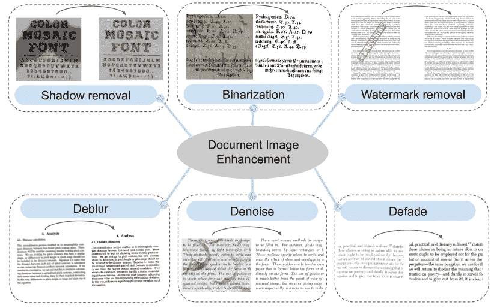

图 1：文档图像增强问题。

+   •

    二值化：它旨在将背景与前景（即文字）分离，以去除噪声、墨水污点、渗透、皱纹，*等等*。此任务的输出是一个具有两个类别的二值图像：前景和背景。

+   •

    去模糊：此任务旨在去除各种模糊类型，例如高斯模糊、运动模糊、对焦模糊，*等等*，从文档图像中。

+   •

    去噪：去噪旨在去除各种噪声类型，例如盐和胡椒噪声、皱纹、翻角、背景和污点，*等等*，从文档图像中。

+   •

    去褪色：它旨在改善褪色的文档图像。文档可能因老化、过度曝光或褪色等原因而褪色。

+   •

    水印去除：某些文档，例如财务表格，可能包含水印，水印下的文字可能无法识别。此任务旨在去除这些水印。

+   •

    阴影去除：在拍摄图像（通常是用手机）时阻挡光源可能会在捕获的文档图像上留下阴影。此任务旨在估计阴影并去除它。

随着深度学习的最新进展，基于深度学习的方法已经被提出并应用于不同的计算机视觉和图像处理任务，如物体检测 [37, 56]，语义分割 [38]，人脸检测和数据集创建 [2, 35, 59]，以及图像增强 [3, 17, 16]等。已显示出这些基于深度学习的方法取得了令人满意的结果，并超过了传统方法。同样，基于深度学习的文档图像增强问题的方法在过去几年中也受到了极大的关注。本次调查的目标是回顾这些方法并讨论它们的特点、优缺点、挑战和局限性，并识别未来研究的机会。

据我们所知，本调查是关于深度学习基础的文档图像增强方法的最新进展的第一次调查。本文有几个关键贡献：

+   •

    我们回顾了近年来，主要是过去五年中，基于深度学习的方法在文档图像增强方面的最新进展，以帮助读者和研究人员更好地理解这一研究领域。

+   •

    我们提供了六个主要文档图像增强问题的概述，包括二值化、去模糊、去噪声、去褪色、水印去除和阴影去除。

+   •

    我们回顾了最先进的方法，并讨论了它们的特点、优缺点，以帮助研究人员和调查者选择适合他们需求的方法。

+   •

    我们介绍了一些重要的文档图像增强任务，这些任务尚未得到足够的关注，例如去除渗透。

+   •

    我们识别了几个未解决的问题和有前景的研究方向，并指出了未来研究的机会。

## 2 文档图像增强任务

在这一部分，我们描述了六个主要的文档图像增强任务，包括二值化、去模糊、去噪声、去褪色、水印去除和阴影去除。图 3 显示了这些任务的图像示例。

### 2.1 二值化

文档图像二值化指的是将灰度或彩色图像分割为仅包含文本和背景的黑白或二值图像的过程。在此过程中，任何现有的退化现象，如渗透、噪声、印章、墨迹、字符褪色、伪影等，都会被去除。正式地说，它寻求一个决策函数 $f_{binarize}(·)$ 用于宽度为 $W$、高度为 $H$ 的文档图像 $D_{orig}$，使得得到的相同大小的图像 $D_{binarized}$ 仅包含二值值，同时整体文档的可读性至少得到保持，如果不是增强的话。

|  | $D_{binarized}=f_{binarize}(D_{orig})$ |  | (1) |
| --- | --- | --- | --- |

图 2(a) 展示了一个图像及其二值化图像的例子。

### 2.2 去模糊

目前，智能手机被广泛用于数字化文档。这可能会带来各种问题。其中最常见的问题是拍摄过程中可能产生的模糊。例如，文档的移动、相机失焦以及相机抖动都可能使捕获的图像变得模糊。图 2(b) 展示了一个模糊文档图像的例子及其对应的清晰图像。

去模糊方法的目标是恢复模糊文档图像的清晰或去模糊版本。这些方法可以是基于先验的，也可以是基于学习的。前者尝试估计模糊核和相应的参数来检测模糊，并利用这些参数去除模糊，从而恢复清晰图像。基于学习的方法，也称为数据驱动的方法，在过去十年里得到了广泛应用。这些方法利用深度神经网络和大量数据来提出一个去模糊模型，能够在不需要任何先验信息的情况下恢复清晰图像。

文档图像去模糊是一个病态问题，相比于自然/非文档图像去模糊，更具挑战性。主要原因之一是 OCR 引擎的性能直接依赖于输入文档图像的质量。如果这些文档图像的可读性和质量较低，则 OCR 输出的性能也会受到影响。因此，增强后的文档图像不仅需要在视觉上得到改善，还需要变得更具可读性。

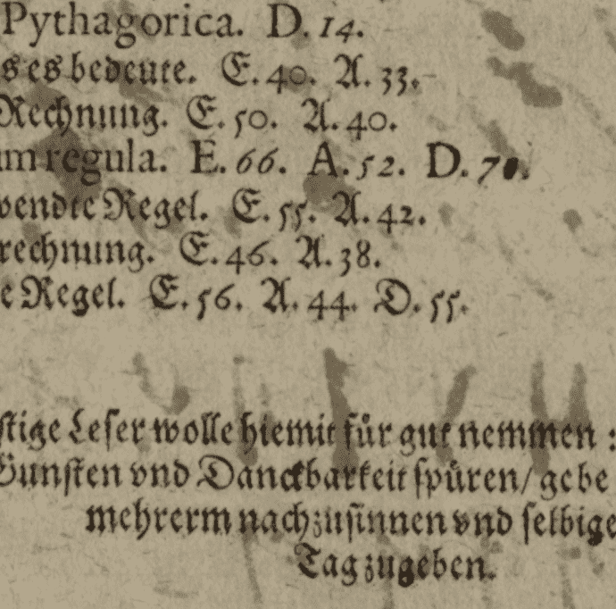  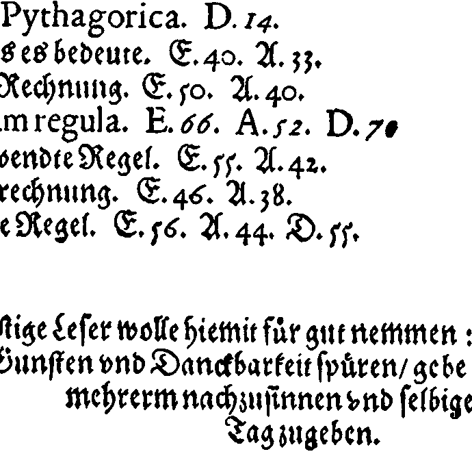

(a) 二值化任务 [55]。

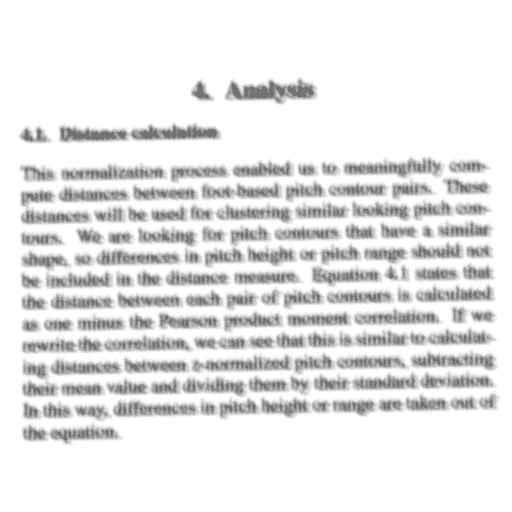  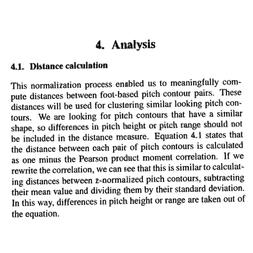

(b) 去模糊任务。[23]

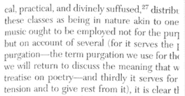  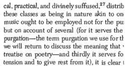

(c) 去褪色任务。

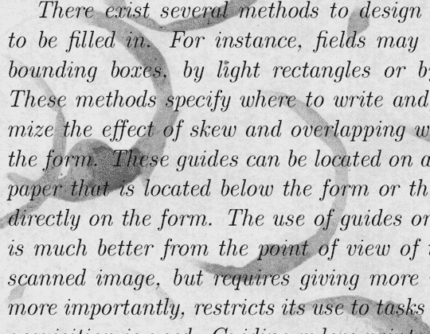  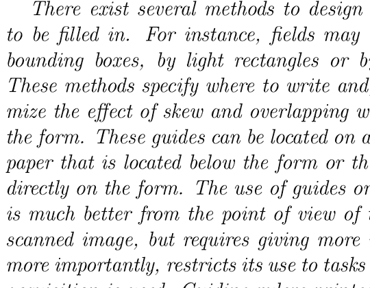

(d) 去噪任务。[32]

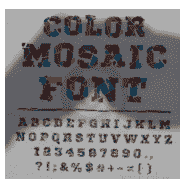  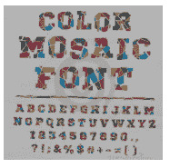

(a) 阴影去除任务。[36]

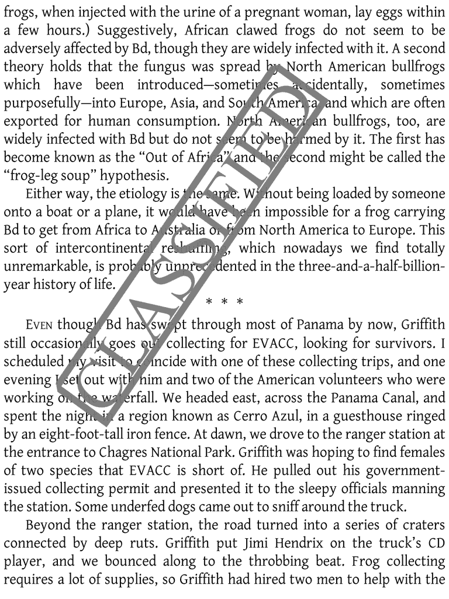  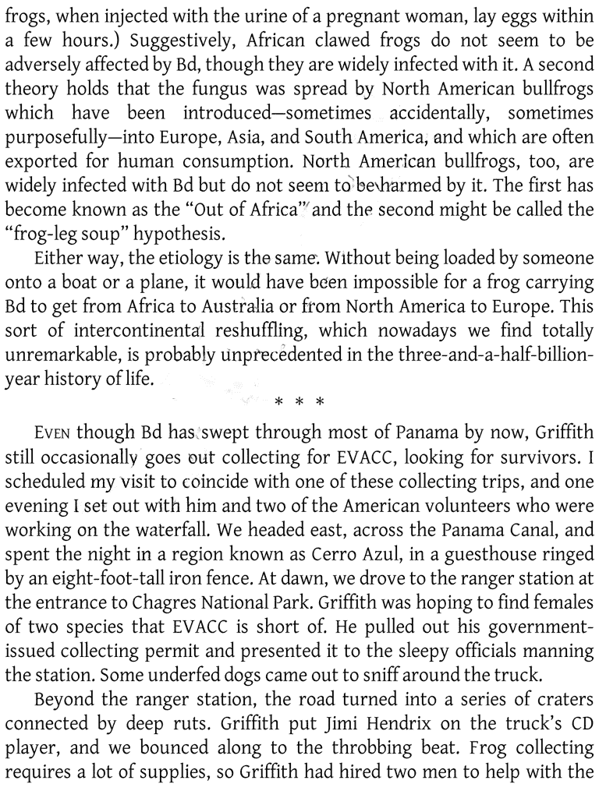

(b) 水印去除任务 [61]

图 3：不同文档图像增强任务的示例图像。左侧的图像是输入，右侧的图像是每个任务的输出。

### 2.3 去褪色

去褪色是恢复已褪色或变暗的文档文本的过程。文档内容可能因各种因素而褪色。例如，随着时间的推移，墨水可能会磨损，这在旧文档中更为常见。阳光或在数字化文档时的过度曝光也可能使文档内容变淡，难以阅读。此外，手写或打印文本本身可能已经很淡，并且随着时间的推移变得更糟。这种退化会导致视觉质量低、可读性差以及 OCR 性能差等问题。去褪色方法主要尝试提高可见性，恢复更易读的文档图像版本。图 2(c) 显示了一个去褪色的文档图像及其对应的真实情况。

### 2.4 去噪

一些文档可能包含如盐和胡椒噪声、印章、注释、墨迹或咖啡渍、皱纹，*等*的伪影。当这些伪影覆盖文本时，尤其是伪影颜色与文档文本颜色相似或更暗的情况，图像恢复变得更困难。为了提高这些文档图像的视觉质量和可读性，提出了恢复退化文档干净版本的方法。这些去除伪影的方法包括文档图像去噪、清理和二值化方法。图 2(d) 说明了一个有噪声的文档图像及其真实情况。

### 2.5 阴影去除

文档可以使用扫描仪或手机摄像头进行数字化。在过去，扫描仪通常用于高质量数字化文档，但随着手机的普及，更多人倾向于使用手机摄像头代替扫描仪来捕获文档的数字副本。

使用手机拍摄的文档图像容易出现阴影，主要是因为光源常常被相机或甚至是人的手挡住。此外，即使在没有可能遮挡物体的情况下，现实生活中拍摄文档图像时光线通常也不均匀。因此，尤其是手机相机拍摄的文档图像可能会受到阴影遮挡部分或全部文档，以及光照和阴影不均的问题。这些会导致视觉质量和可读性差。去阴影方法集中在估计文档图像上的阴影，并尝试去除这些阴影，以恢复干净、光照均匀的文档图像，使其比有阴影的版本更易读。图 3(a)展示了一个带阴影的文档图像及其真实情况的样本。

### 2.6 水印去除

一些文档，如*财务表格*，可能包含一个或多个水印，这些水印遮挡了文档文本或使其难以阅读。类似于去噪，在水印颜色与文档文本颜色相同或更深，或者水印厚重且密集的情况下，文档图像的恢复更为困难。因此，我们需要能够恢复退化文档干净版本的方法。水印去除方法集中在去除水印，以提高文档图像的视觉质量和可读性。图 3(b)展示了一个图像样本及其真实情况。

## 3 数据集

在本节中，我们描述了文献中用于不同文档图像增强任务的数据集。表 1 提供了这些数据集的规格，下面我们将详细描述它们。此外，图 5 展示了这些数据集中的图像样本。

| 数据集 | 任务 | 图像数量 | 分辨率（像素） | 真实 vs. 合成 |
| --- | --- | --- | --- | --- |
| Bishop Bickley diary [9] | 二值化 | 7 | 1050 x 1350 | 真实 |
| NoisyOffice [12] | 去噪 | 288 | 可变 | 真实/合成 |
| S-MS [21] | 多样本 | 240 | 1001 x 330 | 合成 |
| Tobacco 800 [32] | 去噪 | 1290 | (1200x1600) - (2500x3200) | 真实 |
| DIBCO’17 | 二值化 | 10 | (1050x608) - (2092x951) | 真实 |
| H-DIBCO’17 | 二值化 | 10 | (351x292) - (2439x1229) | 真实 |
| SmartDoc-QA [44] | 去模糊 | 4260 | - | 真实 |
| 模糊文档图像[23] | 去模糊 | 3M 训练/35K 验证 | 300 x 300 | 合成 |

表 1：用于不同文档图像增强任务的数据集规格。

Bickley 日记[9]：Bickley 日记数据集的图像来自大约 100 年前的一本日记的复印件。这些图像受到各种退化影响，如水渍、墨水渗透和显著的前景文本强度。该数据集包含 7 张文档图像/页面以及二值化/清洁的地面真实图像。

NoisyOffice[12]：此数据集包含两组图像：1）真实噪声办公室：包含 72 张扫描的噪声图像的灰度图像，2）模拟噪声办公室：包含 72 张扫描的模拟噪声图像，用于训练、验证和测试。该数据集中的图像包含各种样式的文本，合成噪声已添加以模拟现实世界中的混乱伪影。

S-MS（Synchromedia MultiSpectral Ancient document）[21]：多光谱成像（MSI）是一种创新的非破坏性技术，用于分析如古代文献等材料。他们收集了古代手写信件的多光谱图像数据库。该数据库包含 30 封真实历史手写信件的多光谱图像。这些极其古老的文献均使用铁墨水书写，时间跨度从 17 世纪到 20 世纪。这些原始文献借自魁北克国家图书馆，并使用 CROMA CX MSI 相机进行成像。通过此过程，他们为每个文档生成了 8 张图像，总共得到 240 张真实文档图像。

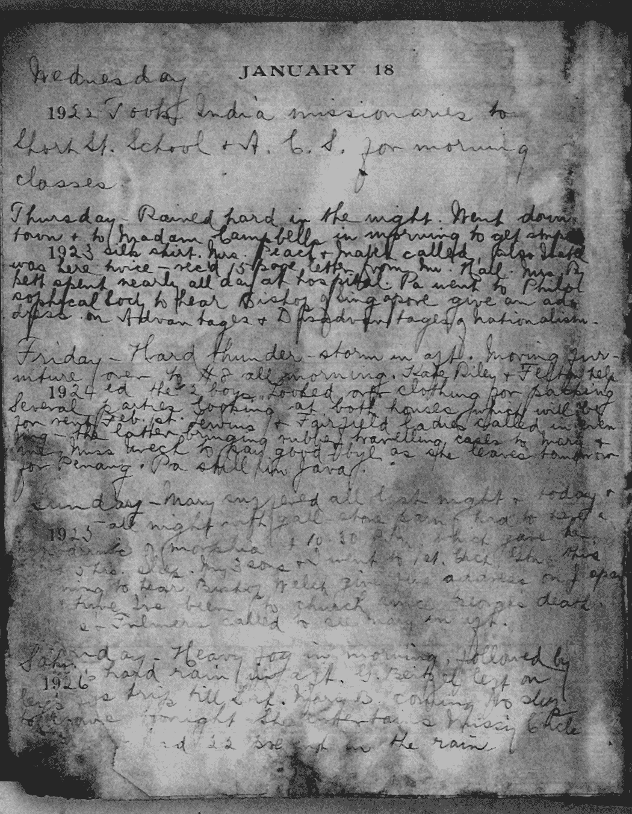

(a) 来自 Bickley Diary 数据集的示例图像[9]

(b) 来自[23]介绍的数据集的示例图像

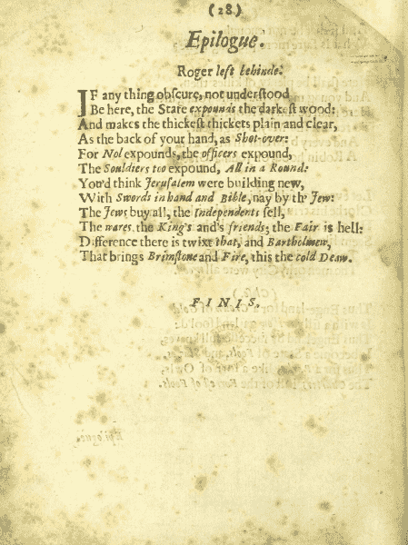

(c) 来自 DIBCO 数据集的示例图像[55]

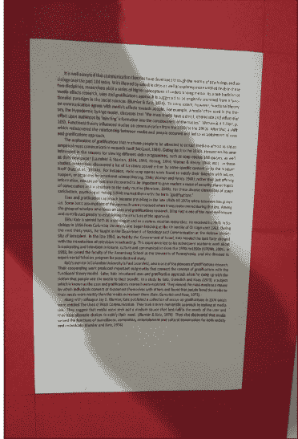

(d) 来自 SmartDoc-QA 数据集的示例图像[44]

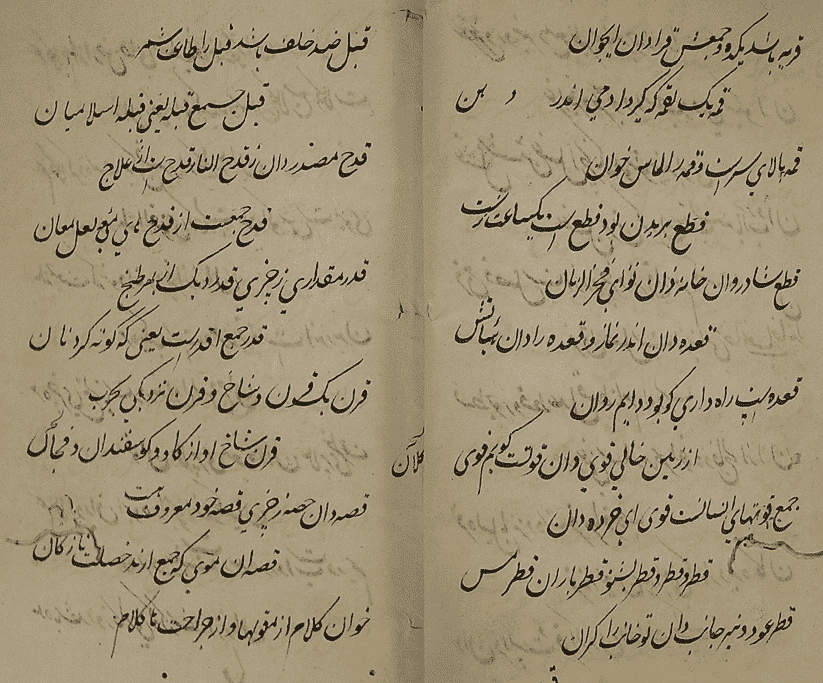

(e) 来自 PHIDB 数据集的示例图像[43]

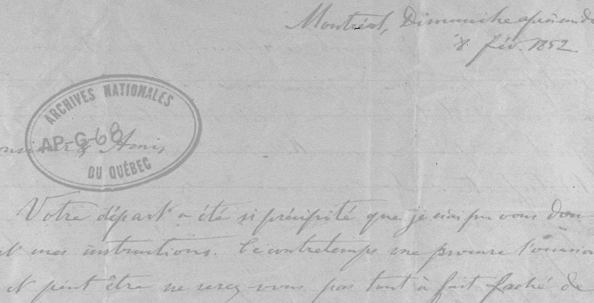

(f) 来自 S-MS 数据集的示例图像[21]

图 4：用于文档图像增强任务的数据集示例图像。

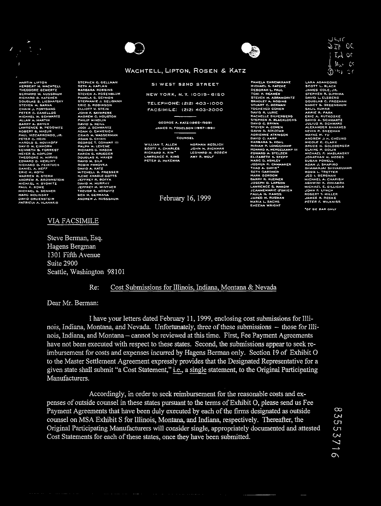

(a) 来自 Tobacco 数据集的示例图像[32]

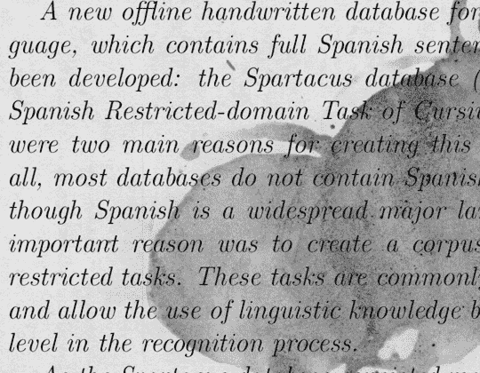

(b) 来自 Noisy Office 数据集的示例图像[32]

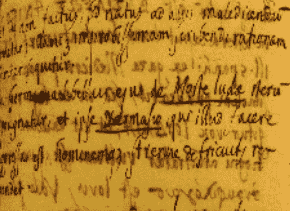

(c) 来自 MCS 数据集的示例图像[20]

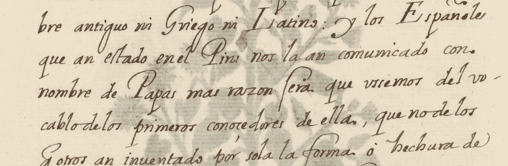

(d) 来自 H-DIBCO 数据集的示例图像[51]

图 5：用于文档图像增强任务的数据集样本图像。

Tobacco 800 [32]：这是一个公开的子集，包含 42 百万页文档，使用各种设备扫描。这些文档包含不同类型的噪声和伪影，如印章、手写文本和签名上的划线。Tobacco 800 中的文档分辨率差异显著，从 150 到 300 DPI 不等，文档图像的分辨率从 1200x1600 到 2500x3200 像素不等。

DIBCO 和 H-DIBCO：这些数据集自 2009 年起用于文档图像二值化竞赛。包括 DIBCO 2009 [15]、H-DIBCO 2010 [49]、DIBCO 2011 [50]、H-DIBCO 2012 [51]、DIBCO 2013 [52]、H-DIBCO 2014 [46]、H-DIBCO 2016 [54]、DIBCO 2017 [55]、H-DIBCO 2014 [46]、H-DIBCO 2018 [53]。DIBCO 数据集包含用于二值化任务的打印和手写文档图像。

SmartDoc-QA [44]：这是一个用于评估智能手机拍摄文档图像质量的数据集，包含单一和多重失真。该数据集使用智能手机相机拍摄的文档图像创建，拍摄条件如光线、阴影、不同类型的模糊和透视角度各异。SmartDoc-QA 被分类为三个子集：现代文档、旧行政文档和商店收据。

Blurry document images (BMVC) [23]：训练数据包含 3M 训练和 35k 验证的 300x300 图像补丁。每个补丁均从不同的文档页面中提取，每个模糊内核都是唯一的。

Monk Cuper Set (MSC) [20]：该数据集包含从 Monk 系统的 Cuper 书籍收藏中收集的真实历史文档中采样的 25 页。MSC 文档受到严重的透视降解和纹理背景影响。

Persian heritage image binarization dataset (PHIDB) [43]：PHIBD 2012 数据集包含 15 张历史文档图像及其对应的真实二值图像。该数据集中的历史图像遭受各种类型的降解。特别是前景文本降解类型包括模糊、弱笔画/副笔画，背景降解类型包括全球透视、局部透视、非期望的线条/图案和外来墨水。

## 4 个指标

在本节中，我们描述了文献中用于不同文档图像增强任务的评估指标。

+   •

    峰值信噪比（PSNR）：PSNR 是一种基于参考的度量。它提供了逐像素的评估，并能够指示文档增强方法在视觉质量方面的有效性。PSNR 测量信号的最大可能值与影响质量的失真噪声的功率之间的比率。换句话说，它衡量两幅图像的接近程度。PSNR 值越高，两个图像的相似度越高。MAX 是图像的最大可能像素值。当像素使用每个样本 8 位表示时，MAX 为 255。给定两个 MxN 图像，此度量公式如下：

    |  | $PSNR=10\log(\frac{MAX^{2}}{MSE})$ |  | (2) |
    | --- | --- | --- | --- |

    其中

    |  | $MSE=\frac{\sum_{x=1}^{M}\sum_{y=1}^{N}(I(x,y)-I^{{}^{\prime}}(x,y))^{2}}{MN}$ |  | (3) |
    | --- | --- | --- | --- |

+   •

    结构相似性指数（SSIM）[72]：SSIM 是一种基于参考的度量，旨在衡量两幅图像之间的结构相似性，并量化图像质量退化。SSIM 计算需要来自相同图像的两幅图像，即参考图像和处理图像。它实际上测量两幅相似图像之间的感知差异。此度量从图像中提取三个关键特征：亮度、对比度和结构。两幅图像的比较基于这三个特征进行。

+   •

    字符错误率（CER）：字符错误率基于 Levenshtein 距离计算。它是将地面真相或参考文本转换为 OCR 输出文本所需的最小字符级操作数。CER 的公式如下：

    |  | $CER=\frac{S+D+I}{N}$ |  | (4) |
    | --- | --- | --- | --- |

    其中 $S$ 是替换的数量，$D$ 是删除的数量，$I$ 是插入的数量，$N$ 是参考或地面真相文本中的字符数量。

    CER 表示参考文本中在 OCR 输出中被错误预测或误识别的字符百分比。CER 值越低，OCR 模型的性能越好。CER 可以被归一化，以确保它不会因许多插入而超出 0-100 范围。在归一化的 CER 中，$C$ 是正确识别的数量。归一化 CER 的公式如下：

    |  | $CER_{normalized}=\frac{S+D+I}{S+D+I+C}$ |  | (5) |
    | --- | --- | --- | --- |

+   •

    单词错误率（WER）：单词错误率更适用于评估 OCR 在段落和句子上的性能。WER 的公式如下：

    |  | $WER=\frac{S_{w}+D_{w}+I_{w}}{N}$ |  | (6) |
    | --- | --- | --- | --- |

    WER 的计算类似于 CER，但 WER 在词级别操作。它表示将一个句子转换成另一个句子所需的单词替换、删除或插入的数量。

+   •

    F-度量[52]：F-度量分数是精确度和召回率的调和均值。精确度是正预测值，召回率也称为灵敏度，用于二元分类。F-度量的公式如下：

    |  | $FM=\frac{2\times Recall\times Precision}{Recall+Precision}$ |  | (7) |
    | --- | --- | --- | --- |

    其中

    |  | $Recall=\frac{TP}{TP+FN}$ |  | (8) |
    | --- | --- | --- | --- |
    |  | $Precision=\frac{TP}{TP+FP}$ |  | (9) |

    TP、FP、FN 分别表示真正例、假正例和假负例值。

+   •

    伪-F 测量 ($F_{ps}$) [52]: $F_{ps}$ 在 [45] 中引入，它利用伪召回率 Rps 和伪精确度 $P_{ps}$。它遵循与上述 F-测量相同的公式，特别用于二值化任务。

    在伪召回率的情况下，地面真实（GT）前景的权重根据局部笔画宽度进行归一化。通常，这些权重在 [0,1] 之间。对于伪精确度，权重限制在一个扩展到 GT 背景的区域内，考虑到最近的 $GT$ 组件的笔画宽度。在这个区域内，权重大于一（通常在 (1,2] 之间），而在这个区域之外则等于一。

+   •

    距离倒数失真度量 (DRD) [52]: DRD 度量用于测量二值文档图像中的视觉失真 [39]。它与人类视觉感知相关，并对所有像素的失真度进行如下测量：

    |  | $DRD=\frac{\sum_{k=1}^{S}DRD_{k}}{NUBN}$ |  | (10) |
    | --- | --- | --- | --- |

    其中 NUBN 是 GT 图像中非均匀 8x8 块的数量，而 $DRD_{k}$ 是第 k 个翻转像素的失真度，该失真度使用一个 5x5 的归一化权重矩阵 $W_{Nm}$ 计算，如 [39] 所定义的。$DRD_{k}$ 等于 GT 图像中与中心第 k 个翻转像素 $(x,y)$ 在二值化结果图像中不同的 5x5 块像素的加权和（方程 11）。

    |  | $DRD_{k}=\sum_{i=-2}^{2}\sum_{j=-2}^{2}\left&#124;{GT_{k}(i,j)-B_{k}(x,y)}\right&#124;\times W_{Nm}(i,j)$ |  | (11) |
    | --- | --- | --- | --- |

## 5 种文档图像增强方法

在本节中，我们描述了基于深度学习的文档图像增强的主要方法，并讨论它们的特点、挑战和局限性。这些工作大多集中于多个任务，因此在本节中我们按时间顺序讨论文档增强方法。表 3 总结了这些方法的优缺点和结果。以下是这些方法的详细描述。

| 方法 | 文档图像增强任务 | 文档类型 |
| --- | --- | --- |
| 二值化 | 去模糊 | 去噪声 | 去褪色 | 水印去除 | 阴影去除 | 手写 | 印刷 |
| Gangeh 等 [13] | - | ✓ | ✓ | ✓ | ✓ | - | - | - |
| Zhao 等 [74] | - | ✓ | ✓ | - | - | - | - | - |
| Sharma 等 [60] | - | ✓ | - | ✓ | ✓ | - | - | ✓ |
| Lin 等 [36] | - | - | - | - | - | ✓ | ✓ | - |
| Souibgui et al. [61] | - | ✓ | - | - | ✓ | - | ✓ | ✓ |
| Gangeh et al. [14] | - | ✓ | - | - | ✓ | - | - | ✓ |
| Hradiš et al. [23] | - | ✓ | - | - | - | - | - | - |
| Jemni et al. [25] | ✓ | - | - | - | - | - | ✓ | - |
| Xu et al. [73] | ✓ | - | - | - | - | - | - | ✓ |
| Souibgui et al. [62] | - | ✓ | - | - | - | ✓ | - | ✓ |
| Calvo-Zaragoza et al. [6] | ✓ | - | - | - | - | - | ✓ | ✓ |
| Dey et al. [10] | ✓ | - | ✓ | - | - | - | - | ✓ |
| Li et al. [33] | ✓ | - | - | - | - | - | ✓ | ✓ |

(a) 本文回顾的主要方法处理的任务和文档类型

| 方法 | GAN | CNN | 配对与未配对监督 |
| --- | --- | --- | --- |
| Gangeh et al. [13] | ✓ | - | 未配对 |
| Zhao et al. [74] | - | ✓ | 配对 |
| Sharma et al. [60] | ✓ | - | 未配对 |
| Lin et al. [36] | ✓ | - | 配对 |
| Souibgui et al. [61] | ✓ | - | 配对 |
| Gangeh et al. [14] | - | ✓ | 配对 |
| Hradiš et al. [23] | - | ✓ | 配对 |
| Jemni et al. [25] | ✓ | - | 配对 |
| Xu et al. [73] | ✓ | - | 配对 |
| Souibgui et al. [62] | ✓ | - | 配对 |
| Calvo-Zaragoza et al. [6] | - | ✓ | 配对 |
| Dey et al. [10] | - | ✓ | 配对 |
| Li et al. [33] | - | ✓ | 配对 |

(b) 回顾方法中使用的方法论。

表 2：本文回顾的主要方法描述。

引入的方法 [23] 用于文档图像去模糊问题。作者提出了一个小型且计算效率高的卷积神经网络模型，以去模糊图像而不假设任何先验条件。特别是，作者专注于现实的去焦模糊和相机抖动模糊的组合。他们展示了所提出的网络在图像质量、PSNR 和 OCR 准确性、CER 方面显著超越了现有的盲解卷积方法。该模型也可以在移动设备上使用。

| 方法 | 优势 | 劣势 | 结果 |
| --- | --- | --- | --- |
| Gangeh et al. [13] | - 处理多种噪声，包括盐和胡椒噪声、褪色、模糊和水印文档，且以端到端的方式进行。 - 不依赖于配对的文档图像。 | - 计算复杂。 | - 相比于前三种方法，该方法在 PSNR 和 OCR 方面表现最好。 |
| Zhao et al. [74] | - 方法快速且易于实现。 | - 定性和定量结果不足。 | - PSNR 改进有限。 |
| Sharma et al. [60] | - 适用于配对和未配对监督场景。 | - | - PSNR 方面的边际改进。 |

| Lin 等人 [36] | - 首个基于深度学习的阴影去除方法。 - 适用于灰度图像和 RGB 图像。 | - 计算复杂。 - 对背景和布局复杂的图像效果不佳。

- 仅在部分阴影文档上表现良好。 | - 在 PSNR/SSIM 方面相比于四项之前的工作取得了最佳结果，在五个不同数据集上的评估表现优异。 - 在真实世界图像上的泛化能力也相对较好。 |

| Souibgui 等人 [61] | - 灵活的架构可用于其他文档退化问题。 - 首个研究密集水印和印章去除问题的工作。

- 在真实世界图像上的泛化能力良好。

- 公开可用的预训练模型。 | - 计算复杂。 - 需要预先确定阈值，并且需要根据每张图像进行调节，这使得该方法不够实用。 | 二值化：在 PSNR、$F_{measure}$、$F_{ps}$ 和 DRD 方面表现最佳，相比于前五名竞争者。 水印：在 PSNR/SSIM 方面表现最佳，相比于之前的三项工作。

去模糊：在 PSNR 方面相比于之前的两项工作取得了最佳结果。 |

| Gangeh 等人 [14] | - 适用于灰度和 RGB 水印。 - 适用于各种强度的模糊图像。 | - 定量评估和与之前工作的比较不足。 | - 有效去除水印和模糊。 - 在九张图像的小测试集上提高了 OCR 性能。 |
| --- | --- | --- | --- |
| Hradiš 等人 [23] | - 小型且计算高效的网络。 - 可用于移动设备。 | - 在某些情况下添加了响铃伪影。 - 当图像严重模糊时，对不常见的词汇效果不佳。 | - 在 PSNR 和字符错误率方面优于之前的四项工作。 |
| Xu 等人 [73] | - 计算高效的网络。 - 同时进行去模糊和超分辨率处理。 | - 对通用图像的泛化能力较差。 - 忽略了 OCR 性能评估，仅评估了文档的视觉质量。 | - 在合成和真实世界数据集上表现优于之前的工作。 |
| Souibgui 等人 [62] | - 处理多种相机失真。 - 包含一个文本识别器以生成更清晰的图像。 | - 仅处理和训练了单行文本，无法处理整页内容。 | - 在字符错误率方面表现最佳，在 PSNR/SSIM 方面排名第二，相比于之前的三项工作。 |

表 3：文档图像增强方法的比较。

在另一项文档图像去模糊的工作[73]中，作者提出了一种算法，直接从模糊的低分辨率输入中恢复高分辨率去模糊图像。其他去模糊方法，如 Hradis 等[23]，不能轻易扩展用于联合超分辨率和去模糊任务。这项工作专注于模糊的人脸和模糊的文档图像分布，并开发了一个多类 GAN 模型来学习类别特定的先验并处理多类图像恢复任务，使用单个生成器网络。作者在对抗设置中使用了 Hradis 等[23] 提出的深度 CNN 架构。与 Hradis 等不同的是，这项工作中的生成器网络包含上采样层，即分数步长卷积层，也称为反卷积层。生成器首先对低分辨率模糊图像进行上采样，然后执行卷积以生成清晰图像，从而输出图像将同时具有超分辨率和去模糊效果。由于他们的模型除了生成器网络外还包含一个判别器网络，因此相较于[23]中提出的模型更复杂，参数更多。

生成图像的视觉质量通过 PSNR 和 SSIM 进行了评估，但去模糊的文档图像在 OCR 性能方面没有进行评估，也没有报告 OCR 性能评估指标，如字符错误率或词错误率。在 PSNR/SSIM 方面，这项工作在合成数据集和真实数据集上都优于以前的工作。

这项工作的一个局限性是，由于模型是在多类图像上训练的，它本质上是为了近似这两类图像的混合分布。当这种混合分布变得过于复杂时，很难学习一个统一的模型来覆盖所有图像类别的多样性。因此，这种方法对于通用图像的效果较差。

论文[66]的作者专注于退化历史手稿图像的二值化，并将二值化任务制定为像素分类学习任务。他们开发了一个在多个图像尺度（包括全分辨率）上运行的全卷积网络（FCN）架构。作者声称，所提出的二值化技术也可以应用于不同领域，如棕榈叶手稿，并且效果良好。

Zhao 等人[74] 研究了去噪和去模糊问题，并提出了一种基于残差学习的文档图像恢复方法，称为 Skip-Connected Deep Convolutional Autoencoder (SCDCA)。他们采用了两种类型的跳跃连接，一种是基于残差块的卷积层之间的恒等映射，另一种是直接将输入与输出连接。这些连接帮助网络学习噪声图像与清晰图像之间的残差内容，而不是学习普通的变换函数。该网络的灵感来源于[23]，这是一个 15 层的卷积神经网络。与[23]中的方法相比，作者添加了批量归一化[24]和跳跃连接[19]，以加速模型收敛并提升性能。

在[60]中，作者将图像恢复问题视为图像到图像的转换任务，即将文档从噪声域（*例如* 背景噪声、模糊、褪色、水印）转换为目标清晰文档，使用 GAN 方法。为此，他们采用了 CycleGAN 模型，这是一个未配对的图像到图像转换网络，用于清理噪声文档。他们还通过将徽标作为水印插入以及在 Google 新闻数据集[67]上应用褪色技术，合成了用于去水印和去褪色问题的文档数据集。

[14]的作者提出了一种端到端的文档增强管道，该管道接收模糊和加水印的文档图像并生成干净的文档。他们训练了一个自编码器模型，能够处理不同噪声水平的文档。他们采用了[40]中描述的神经网络架构，称为 REDNET，并设计了一个具有 15 层卷积层和 15 层反卷积层的 REDNET，包括 8 个对称的跳跃连接，连接交替的卷积层和镜像的反卷积层。与完全卷积网络相比，该方法的优势在于避免了池化和反池化，这些操作通常会消除图像细节，适用于图像恢复等低级图像任务，从而实现更高分辨率的输出。这项工作的关键区别在于使用了更大的数据集并训练了一个盲模型。

在[67]中，作者开发了卷积自编码器，以学习从输入图像到其选择性输出的端到端映射，其中激活值表示像素是前景还是背景的可能性。训练完成后，该模型可以应用于文档进行二值化，然后应用全局阈值。这种方法已被证明在多种文档类型中优于现有的二值化策略。

在 DE-GAN 中[61]，作者提出了一种名为文档增强生成对抗网络的端到端框架。该网络基于条件 GAN 和 cGAN，用于恢复严重退化的文档图像。本文研究的任务包括文档清理、二值化、去模糊和水印去除。由于缺乏用于水印去除任务的数据集，作者合成创建了一个水印数据集，包括带水印的图像及其干净的真实图像。

在[36]中，作者提出了背景估计文档阴影去除网络（BEDSR-Net），这是第一个针对文档图像阴影去除设计的深度网络。他们设计了一个背景估计模块，用于提取文档的全局背景颜色。在估计背景颜色的过程中，该模块学习背景的空间分布信息以及非背景像素的信息。他们通过编码这些信息创建了一个注意力图。通过估计全局背景颜色和注意力图，阴影去除网络现在可以有效地恢复无阴影的文档图像。BEDSR-Net 在某些情况下可能会失败，包括当没有单一主导颜色时，例如整个纸张有颜色渐变，以及当文档完全被阴影覆盖，或多个光源形成了多个阴影的情况。

在另一项研究中[62]，作者关注使用智能手机相机数字化的文档。他们指出，这些类型的数字化文档极易受到各种失真的影响，包括但不限于透视角度、阴影、模糊、变形等。作者提出了一种条件生成对抗网络，将失真的图像从其领域映射到可读的领域。该模型在鉴别器部分集成了一个识别器，以更好地区分生成的文档图像。

在另一项研究中[13]，提出了一种端到端的无监督深度学习模型，用于去除多种类型的噪声，包括椒盐噪声、模糊和/或褪色的文本以及文档上的水印。特别是，他们通过将深度专家混合[70]与循环一致 GAN 集成，提出了一种统一架构作为文档图像盲目去噪问题的基础网络。

在[10]中，作者针对嵌入式应用（如智能手机应用）中的文档图像清理问题，这些应用通常存在内存、能源和延迟限制。他们提出了一种轻量级的编码器-解码器 CNN 架构，并结合了感知损失。他们证明了在参数数量和乘积和操作方面，他们的模型比现有的 SOTA 文档增强模型分别小 65-1030 倍和 3-27 倍。

在另一项工作中 [25]，作者专注于增强手写文档，并提出了一种基于生成对抗网络（GAN）的端到端架构来恢复退化的文档。与大多数文档二值化方法不同，这些方法仅尝试改善退化文档的视觉质量，所提出的架构整合了手写文本识别器，使得生成的文档图像更加清晰易读。这种方法是首个在对手写文档进行二值化时利用文本信息的工作。他们对退化的阿拉伯文和拉丁文手写文档进行了实验，并展示了他们的模型在改善退化文档图像的视觉质量和可读性方面的效果。

在 [33]中，作者提出了一种名为 SauvolaNet 的文档二值化方法。他们从深度学习的角度研究了经典的 Sauvola [58] 文档二值化方法，并提出了一个多窗口 Sauvola 模型。他们还引入了一种注意力机制，以自动估计每个像素位置所需的 Sauvola 窗口大小，从而有效地估计 Sauvola 阈值。所提出的网络包含三个模块：多窗口 Sauvola、逐像素窗口注意力和自适应 Sauvola 阈值。多窗口 Sauvola 模块反映了经典的 Sauvola，但具有可训练的参数和多窗口设置。下一个模块是逐像素窗口注意力，负责估计每个像素的首选窗口大小。另一个模块，自适应 Sauvola 阈值，结合了其他两个模块的输出，并预测每个像素的最终自适应阈值。SauvolaNet 模型显著减少了所需的网络参数数量，并在文档二值化任务中实现了 SOTA 性能。

## 6 个开放问题及未来方向

在本节中，我们提出了该领域中的开放问题，并提供了未来工作的几个方向。文档图像增强任务仍未解决，甚至有些任务尚未研究或仅以非常有限的方式进行研究。我们在下面讨论了这些问题和未来的工作方向。

### 6.1 过度曝光和曝光不足修正任务

曝光过度问题发生在数字化文档时捕获了过多光线，主要是当捕获设备为手机且相机闪光灯给图像带来了过多的反射或眩光（图 6(a)）。即使在图像和照片增强领域，这个问题也得到了有限的关注 [1, 5]，据我们所知，尚未有研究尝试解决文档图像中的这个问题。要用深度学习方法解决这个问题，需要收集训练和测试数据集，因为目前没有可以用于这个问题的公开数据集。

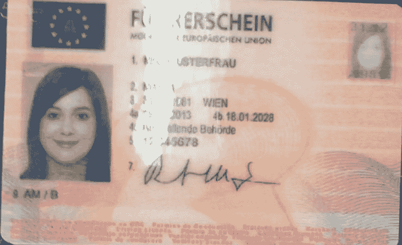

(a) 曝光过度问题。图像来源于 [4]。

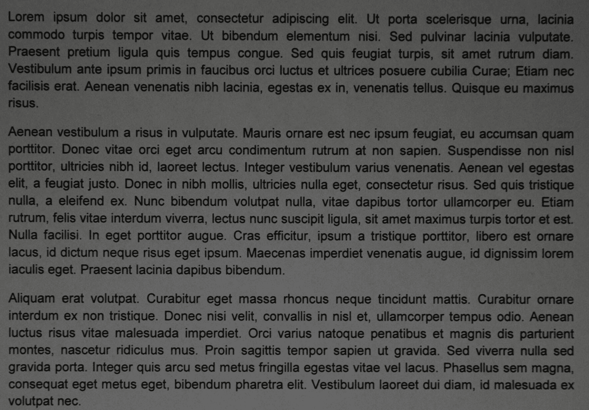

(b) 曝光不足问题。图像来源于 [42]。

图 6：开放问题：曝光过度和曝光不足校正。

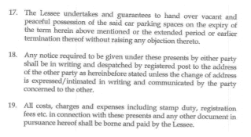

(a) 文献中研究的略微褪色图像 [13]。

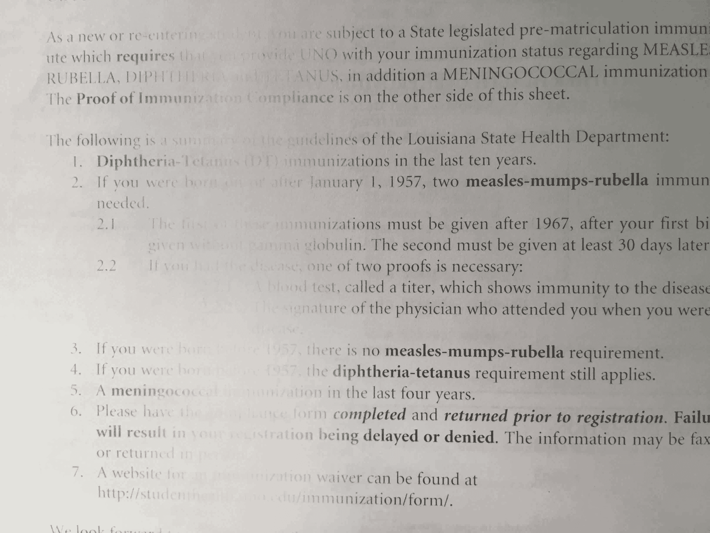

(b) 严重和非均匀褪色的真实世界图像。这类褪色在文献中未被研究。

图 7：褪色任务中的开放问题：严重和/或非均匀褪色的图像。

另一方面，**曝光不足**发生在数字化文档时光线条件较差，导致捕获的图像变暗（图 6(b)）。这个问题不同于阴影去除，因为阴影文档图像可能会部分/不均匀地变暗 [36]。尽管低光照图像增强问题在照片处理中得到了大量关注 [26, 69, 18, 57]，但在文档图像增强方面关注较少 [34]。未来一个可能的工作方向是评估这些方法在文档图像上的实际应用。类似于曝光过度校正任务，开发针对该问题的深度学习方法需要训练/测试数据集，但此类数据集尚不可用。

### 6.2 褪色任务

褪色可能由于光照、老化、清洗等因素发生。这项任务依然是一个不良定 posed 和研究不足的任务。目前的工作[13]做出了两个可能不切实际的假设。它们假设文档的褪色是均匀的，并且文档褪色非常轻微（图 7(a)），而在现实场景中，文档可能严重褪色和/或不均匀褪色，例如，老化或清洗过的文档（图 7(b)）。

严重和/或不均匀褪色的文档很难阅读，对 OCR 非常具有挑战性，并可能显著影响 OCR 的性能，而轻微褪色的文档通常仍然可读且可被 OCR 识别。因此，为了应对这些挑战，我们需要开发考虑到严重和不均匀褪色文档的解决方案。此外，训练深度学习模型（用于轻微和严重褪色文档）需要训练数据集，但与上述讨论的任务类似，公开的数据集并不可用。

### 6.3 超分辨率任务

低分辨率文档通常难以阅读，对字符识别方法也非常具有挑战性。对低分辨率文档图像进行超分辨率处理可以增强视觉质量、文本的可读性，更重要的是提高 OCR 的准确性。文档图像超分辨率是一个不良定 posed 且具有挑战性的问题，尤其是在文档中存在伪影和噪声时。开发一个可以超分辨率处理文档图像，特别是低质量文档图像的模型更加困难且具有挑战性。

解决此问题的一种方法是使用双三次插值，但这种基本方法可能会引入噪声或加剧文档中存在的噪声/伪影，特别是在低质量文档中。为了提高文档图像的分辨率并尽可能多地恢复细节，我们需要超分辨率方法。通过超分辨率处理这些文档图像，字符变得更加清晰，也有助于提高 OCR 的性能。

尽管图像/照片超分辨率问题已受到广泛关注[64, 71, 27, 30, 31, 11, 8, 40, 65, 28]，但文档图像的这一任务却鲜有关注[47, 48]。作为未来的工作，我们需要开发专门针对低质量文档图像的有效超分辨率方法，以提高可读性和 OCR 性能。

  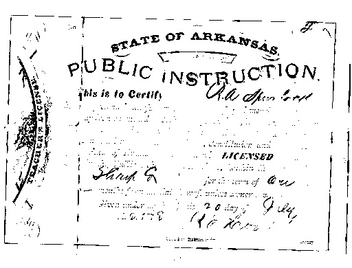

(a) 低对比度问题。低对比度的文字无法恢复。

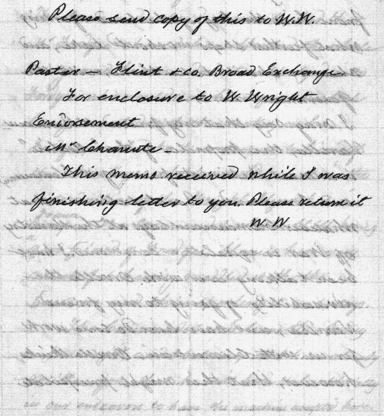  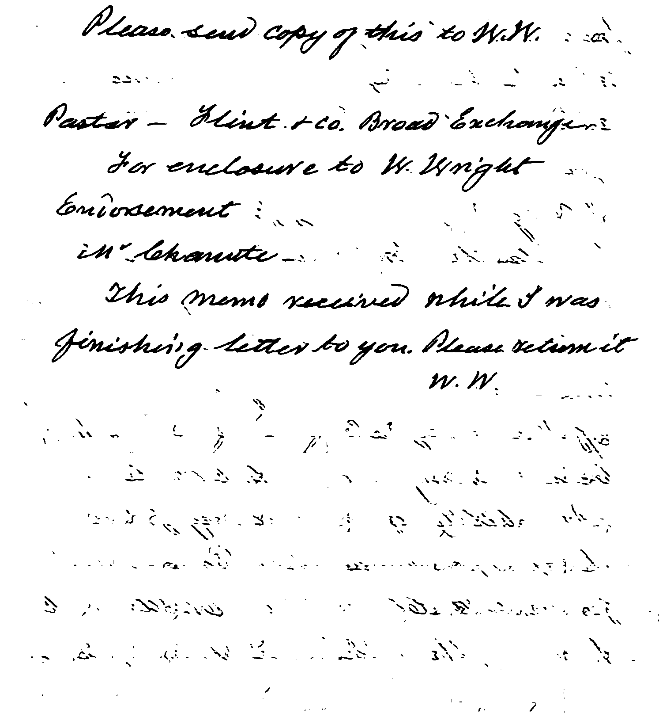

(b) 渗透问题。渗透的文字未能有效去除。

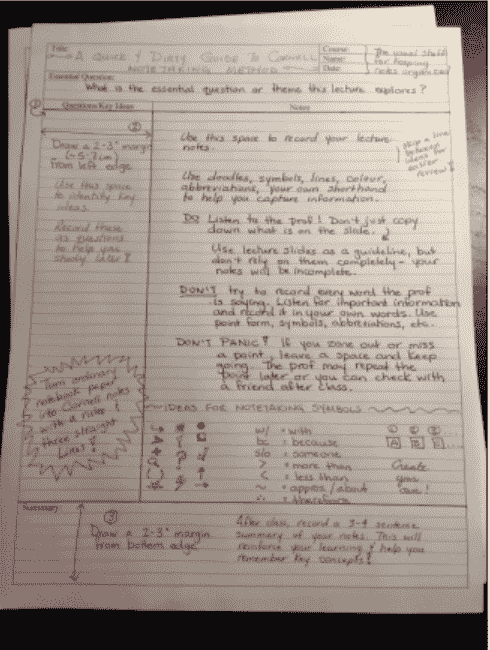  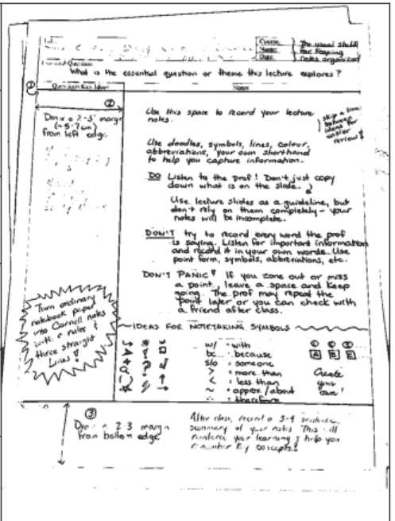

(c) 各种墨水浓度的 RGB 文档。较浅颜色的文字（即橙色）未能有效恢复。

图 8：二值化任务中的开放问题。左侧图像为原始图像，右侧图像为使用最新的先进方法进行二值化后的图像。

### 6.4 二值化任务

尽管二值化任务已受到广泛关注，但当前的二值化方法在多个场景下表现仍不理想。具体而言，当图像对比度低、文档中存在残影和渗透现象，或图像为 RGB 格式且墨水颜色和浓度各异时，这些场景对于二值化方法来说都具有挑战性。

文档中的残影现象发生在页面的另一侧可以看到墨水或文字，但墨水并未完全透过到另一侧。而渗透现象则发生在墨水渗透到另一侧并干扰到正面页面上的文字。这两种问题都使字符识别变得非常困难，特别是渗透问题。

图 8(a) 显示了一个低对比度图像及其二值化后的图像。当前的二值化方法在文字对比度较低时无法有效恢复文字。图 8(b) 展示了另一个带有渗透现象的图像示例。如图所示，该方法无法完全去除渗透现象。图 8(c) 展示了一个 RGB 图像及其二值化后的图像。可以看到，该方法在处理橙色文字时效果不佳。因此，为了解决这些问题，我们需要开发一个能够考虑到这些因素的方法。

### 6.5 OCR 性能评估

文档图像增强的主要目的是提升字符识别方法或 OCR，以促进自动化文档分析。目前没有具有提取的真实文本的文档图像测试数据集，可以用来评估文档图像增强方法在 OCR 改进方面的效果。目前的方法要么忽视了在 OCR 方面评估其方法，要么仅在少数图像上展示 OCR 改进，这不足以证明其方法在实际应用中的可行性。这需要一个单独的研究来收集这样的数据集，并将当前的方法与该测试数据集进行基准测试。

## 7 结论

在本文中，我们回顾了基于深度学习的六种不同文档图像增强任务，包括二值化、去模糊、去噪、去褪色、水印去除和阴影去除。我们还总结了这些任务使用的数据集以及用于评估这些方法性能的指标。我们讨论了基于深度学习的文档图像增强方法的特性、挑战、优点和缺点。

我们还讨论了这一领域的未解问题，并识别出多个重要任务，这些任务几乎没有受到关注。这些任务包括过度曝光/曝光不足校正、去褪色和超分辨率。过度曝光问题通常发生在成像设备捕捉到过多的光线或因反射产生的眩光时，而曝光不足发生在照明条件差、捕捉到的图像变暗且难以阅读时。褪色可能由于阳光、老化和褪色*等*原因发生。低分辨率的文档图像需要进行超分辨率处理，以提高其视觉质量，更重要的是使小文字更加清晰。当文档图像中存在噪声和伪影时，提升图像分辨率更具挑战性。这些图像通常难以阅读，低可读性影响了字符识别技术的性能。上述任务受到了很少关注，距离解决还有很长的路要走。

二值化任务在过去几年受到了极大的关注，但这些方法在多个场景下表现不佳。例如，当图像对比度低或存在多个伪影*例如*邮票、签名、重影或渗透时。重影和渗透发生在文档的另一侧文字可见或墨水渗透到文档另一侧时。这些伪影很难去除，需要有效的方法来妥善解决这些问题。

当前文档图像增强方法主要集中在提高图像的视觉质量上。虽然这是一个重要方面，但这些方法在自动文档分析问题中的表现，如字符识别，基本被忽视。因此，迫切需要开发能够同时提升视觉质量和 OCR 性能的方法。OCR 性能需要在更大的测试数据集上评估，而不仅仅是在文献中处理的少数样本上。

尽管如此，目前的方法仅针对一个问题，*例如*，去模糊，但实际上文档图像可能同时存在多个问题。例如，文档图像可能模糊、褪色且有噪声。据我们所知，目前没有一种方法能够同时处理图像中的多个问题。

## 参考文献

+   [1] Afifi, M., Derpanis, K. G., Ommer, B., and Brown, M. S. 学习修正过度曝光和曝光不足的照片。arXiv 预印本 arXiv:2003.11596 13 (2020)。

+   [2] Anvari, Z., and Athitsos, V. 从未标记图像自动创建面部数据集的流程。在第 12 届 ACM 国际助理环境相关技术会议论文集中（2019），第 227–235 页。

+   [3] Anvari, Z., and Athitsos, V. 增强的 CycleGAN 去雾网络。在 VISIGRAPP（4: VISAPP）（2021），第 193–202 页。

+   [4] Arlazarov, V. V., Bulatov, K. B., Chernov, T. S., and Arlazarov, V. L. Midv-500: 一个用于移动设备视频流中的身份文档分析和识别的数据集。

+   [5] Cai, J., Gu, S., and Zhang, L. 从多曝光图像中学习深度单图像对比度增强器。IEEE 图像处理学报 27, 4 (2018)，2049–2062 页。

+   [6] Calvo-Zaragoza, J., and Gallego, A.-J. 一种用于文档图像二值化的选择性自编码器方法。模式识别 86 (2019), 37–47。

+   [7] Chen, X., He, X., Yang, J., and Wu, Q. 一种有效的文档图像去模糊算法。在 CVPR 2011（2011），IEEE，第 369–376 页。

+   [8] Chu, M., Xie, Y., Leal-Taixé, L., and Thuerey, N. 时序一致的 GAN 用于视频超分辨率（tecogan）。arXiv 预印本 arXiv:1811.09393 1, 2 (2018)，第 3 页。

+   [9] Deng, F., Wu, Z., Lu, Z., and Brown, M. S. Binarizationshop: 一个用户辅助的软件套件，用于将旧文档转换为黑白。见于第十届年度联合数字图书馆会议论文集（2010），第 255–258 页。

+   [10] Dey, S., and Jawanpuria, P. 采用感知损失的轻量级文档图像清理。arXiv 预印本 arXiv:2105.09076 (2021)。

+   [11] Dong, C., Loy, C. C., He, K., and Tang, X. 使用深度卷积网络进行图像超分辨率。IEEE 模式分析与机器智能学报 38, 2 (2015)，295–307 页。

+   [12] Dua, D., and Graff, C. UCI 机器学习数据集库，2017 年。

+   [13] Gangeh, M. J., Plata, M., Motahari, H., and Duffy, N. P. 端到端的无监督文档图像盲去噪。arXiv 预印本 arXiv:2105.09437 (2021)。

+   [14] Gangeh, M. J., Tiyyagura, S. R., Dasaratha, S. V., Motahari, H., 和 Duffy, N. P. 使用自动编码器的文档增强系统。在 NeurIPS 2019 文档智能研讨会（2019）。

+   [15] Gatos, B., Ntirogiannis, K., 和 Pratikakis, I. Icdar 2009 文档图像二值化竞赛（dibco 2009）。在 2009 年第 10 届国际文档分析与识别会议（2009），IEEE，页码 1375–1382。

+   [16] Gu, S., Zuo, W., Guo, S., Chen, Y., Chen, C., 和 Zhang, L. 学习动态引导以增强深度图像。在 2017 年 IEEE 计算机视觉与模式识别会议论文集，页码 3769–3778。

+   [17] Guo, C., Li, C., Guo, J., Loy, C. C., Hou, J., Kwong, S., 和 Cong, R. 无参考深度曲线估计用于低光照图像增强。在 IEEE/CVF 计算机视觉与模式识别会议论文集（2020），页码 1780–1789。

+   [18] Guo, X., Li, Y., 和 Ling, H. Lime: 通过光照图估计进行低光照图像增强。IEEE 图像处理汇刊 26, 2（2016），982–993。

+   [19] He, K., Zhang, X., Ren, S., 和 Sun, J. 用于图像识别的深度残差学习。在 2016 年 IEEE 计算机视觉与模式识别会议论文集，页码 770–778。

+   [20] He, S., 和 Schomaker, L. Deepotsu: 使用迭代深度学习进行文档增强和二值化。模式识别 91（2019），379–390。

+   [21] Hedjam, R., Nafchi, H. Z., Moghaddam, R. F., Kalacska, M., 和 Cheriet, M. Icdar 2015 多光谱文本提取竞赛（ms-tex 2015）。在 2015 年第 13 届国际文档分析与识别会议（ICDAR）（2015），IEEE，页码 1181–1185。

+   [22] Howe, N. R. 自动参数调优的文档二值化。国际文档分析与识别期刊（ijdar）16, 3（2013），247–258。

+   [23] Hradiš, M., Kotera, J., Zemcík, P., 和 Šroubek, F. 用于直接文本去模糊的卷积神经网络。在 BMVC 会议论文集（2015），第 10 卷。

+   [24] Ioffe, S., 和 Szegedy, C. 批量归一化：通过减少内部协变量偏移加速深度网络训练。在国际机器学习会议（2015），PMLR，页码 448–456。

+   [25] Jemni, S. K., Souibgui, M. A., Kessentini, Y., 和 Fornés, A. 增强以更好地阅读：一种改进的生成对抗网络用于手写文档图像增强。arXiv 预印本 arXiv:2105.12710（2021）。

+   [26] Jiang, Y., Gong, X., Liu, D., Cheng, Y., Fang, C., Shen, X., Yang, J., Zhou, P., 和 Wang, Z. Enlightengan: 无配对监督的深度光照增强。IEEE 图像处理汇刊 30（2021），2340–2349。

+   [27] Jo, Y., Oh, S. W., Kang, J., 和 Kim, S. J. 使用动态上采样滤波器的深度视频超分辨网络，无需显式运动补偿。在 2018 年 IEEE 计算机视觉与模式识别会议论文集，页码 3224–3232。

+   [28] Kim, J., Lee, J. K., 和 Lee, K. M. 用于图像超分辨率的深度递归卷积网络。发表于 IEEE 计算机视觉与模式识别会议 (2016), 页码 1637–1645.

+   [29] Kligler, N., Katz, S., 和 Tal, A. 使用可见性检测进行文档增强。发表于 IEEE 计算机视觉与模式识别会议 (2018), 页码 2374–2382.

+   [30] Lai, W.-S., Huang, J.-B., Ahuja, N., 和 Yang, M.-H. 用于快速准确超分辨率的深度拉普拉斯金字塔网络。发表于 IEEE 计算机视觉与模式识别会议 (2017), 页码 624–632.

+   [31] Ledig, C., Theis, L., Huszár, F., Caballero, J., Cunningham, A., Acosta, A., Aitken, A., Tejani, A., Totz, J., Wang, Z., 等. 使用生成对抗网络进行照片级逼真单图像超分辨率。发表于 IEEE 计算机视觉与模式识别会议 (2017), 页码 4681–4690.

+   [32] Lewis, D., Agam, G., Argamon, S., Frieder, O., Grossman, D., 和 Heard, J. 构建复杂文档信息处理的测试集合。发表于 第 29 届国际 ACM SIGIR 研究与开发信息检索会议 (2006), 页码 665–666.

+   [33] Li, D., Wu, Y., 和 Zhou, Y. Sauvolanet: 学习自适应 Sauvola 网络进行退化文档二值化。arXiv 预印本 arXiv:2105.05521 (2021).

+   [34] Li, X., Zhang, B., Liao, J., 和 Sander, P. V. 使用基于补丁的 cnn 进行文档矫正和光照修正。ACM Transactions on Graphics (TOG) 38, 6 (2019), 1–11.

+   [35] Lin, W.-A., Chen, J.-C., Castillo, C. D., 和 Chellappa, R. 无约束人脸的深度密度聚类。发表于 IEEE 计算机视觉与模式识别会议 (2018), 页码 8128–8137.

+   [36] Lin, Y.-H., Chen, W.-C., 和 Chuang, Y.-Y. Bedsr-net: 从单张文档图像中去除阴影的深度网络。发表于 IEEE/CVF 计算机视觉与模式识别会议 (2020), 页码 12905–12914.

+   [37] Liu, W., Anguelov, D., Erhan, D., Szegedy, C., Reed, S., Fu, C.-Y., 和 Berg, A. C. SSD: 单次多框检测器。发表于 欧洲计算机视觉会议 (2016), Springer, 页码 21–37.

+   [38] Long, J., Shelhamer, E., 和 Darrell, T. 用于语义分割的全卷积网络。发表于 IEEE 计算机视觉与模式识别会议 (2015), 页码 3431–3440.

+   [39] Lu, H., Kot, A. C., 和 Shi, Y. Q. 二值文档图像的距离倒数失真度量。IEEE 信号处理通讯 11, 2 (2004), 228–231.

+   [40] Mao, X., Shen, C., 和 Yang, Y.-B. 使用具有对称跳跃连接的非常深卷积编码器-解码器网络进行图像恢复。神经信息处理系统进展 29 (2016), 2802–2810.

+   [41] Mesquita, R. G., Mello, C. A., 和 Almeida, L. 一种基于距离的文档图像阈值算法。集成计算机辅助工程 21, 2 (2014), 133–146。

+   [42] Michalak, H., 和 Okarma, K. 结合方法对非均匀照明文档图像的稳健二值化用于字母数字字符识别。传感器 20, 10 (2020), 2914。

+   [43] Nafchi, H. Z., Ayatollahi, S. M., Moghaddam, R. F., 和 Cheriet, M. 一种高效的历史手稿二值化地面真实工具。在 2013 第 12 届国际文档分析与识别会议 (2013), IEEE, pp. 807–811。

+   [44] Nayef, N., Luqman, M. M., Prum, S., Eskenazi, S., Chazalon, J., 和 Ogier, J.-M. Smartdoc-qa: 用于智能手机拍摄文档图像质量评估的数据集——单一和多重失真。 在 2015 第 13 届国际文档分析与识别会议 (ICDAR) (2015), IEEE, pp. 1231–1235。

+   [45] Ntirogiannis, K., Gatos, B., 和 Pratikakis, I. 历史文档图像二值化的性能评估方法论。IEEE 图像处理汇刊 22, 2 (2012), 595–609。

+   [46] Ntirogiannis, K., Gatos, B., 和 Pratikakis, I. Icfhr2014 手写文档图像二值化竞赛（h-dibco 2014）。在 2014 第 14 届手写识别前沿国际会议 (2014), IEEE, pp. 809–813。

+   [47] Pandey, R. K., 和 Ramakrishnan, A. 语言无关的单文档图像超分辨率使用 CNN 以提高识别率。arXiv 预印本 arXiv:1701.08835 (2017)。

+   [48] Peng, X., 和 Wang, C. 构建超分辨率图像生成器以提高 OCR 精度。在国际文档分析系统研讨会 (2020), Springer, pp. 145–160。

+   [49] Pratikakis, I., Gatos, B., 和 Ntirogiannis, K. H-dibco 2010-手写文档图像二值化竞赛。在 2010 第 12 届手写识别前沿国际会议 (2010), IEEE, pp. 727–732。

+   [50] Pratikakis, I., Gatos, B., 和 Ntirogiannis, K. Icdar 2011 文档图像二值化竞赛（dibco 2011）。在 2011 国际文档分析与识别会议 (2011), pp. 1506–1510。

+   [51] Pratikakis, I., Gatos, B., 和 Ntirogiannis, K. Icfhr 2012 手写文档图像二值化竞赛（h-dibco 2012）。在 2012 第一次手写识别前沿国际会议 (2012), IEEE, pp. 817–822。

+   [52] Pratikakis, I., Gatos, B., 和 Ntirogiannis, K. Icdar 2013 文档图像二值化竞赛（dibco 2013）。在 2013 第 12 届国际文档分析与识别会议 (2013), IEEE, pp. 1471–1476。

+   [53] Pratikakis, I., Zagori, K., Kaddas, P., 和 Gatos, B. Icfhr 2018 手写文档图像二值化竞赛（h-dibco 2018）。在 2018 第 16 届手写识别前沿国际会议 (ICFHR) (2018), pp. 489–493。

+   [54] Pratikakis, I., Zagoris, K., Barlas, G., 和 Gatos, B. ICFHR2016 手写文档图像二值化竞赛（H-DIBCO 2016）。在 2016 年第 15 届国际手写识别前沿会议（ICFHR）（2016），IEEE，第 619–623 页。

+   [55] Pratikakis, I., Zagoris, K., Barlas, G., 和 Gatos, B. ICDAR2017 文档图像二值化竞赛（DIBCO 2017）。在 2017 年第 14 届 IAPR 国际文档分析与识别会议（ICDAR）（2017），第 1 卷，IEEE，第 1395–1403 页。

+   [56] Redmon, J., Divvala, S., Girshick, R., 和 Farhadi, A. 你只需看一次：统一的实时物体检测。在《IEEE 计算机视觉与模式识别会议论文集》（2016），第 779–788 页。

+   [57] Ren, W., Liu, S., Ma, L., Xu, Q., Xu, X., Cao, X., Du, J., 和 Yang, M.-H. 通过深度混合网络进行低光照图像增强。《IEEE 图像处理汇刊》28，9（2019），4364–4375。

+   [58] Sauvola, J., 和 Pietikäinen, M. 自适应文档图像二值化。《模式识别》33，2（2000），225–236。

+   [59] Schroff, F., Kalenichenko, D., 和 Philbin, J. Facenet：用于面部识别和聚类的统一嵌入。在《IEEE 计算机视觉与模式识别会议论文集》（2015），第 815–823 页。

+   [60] Sharma, M., Verma, A., 和 Vig, L. 学习清理：一个生成对抗网络的视角。在《亚洲计算机视觉会议》（2018），Springer，第 174–185 页。

+   [61] Souibgui, M. A., 和 Kessentini, Y. De-gan：用于文档增强的条件生成对抗网络。《IEEE 模式分析与机器智能汇刊》（2020）。

+   [62] Souibgui, M. A., Kessentini, Y., 和 Fornés, A. 基于条件生成对抗网络的方法用于恢复畸变的摄像机捕获文档。《模式识别与人工智能》1322（2021），215。

+   [63] Su, B., Lu, S., 和 Tan, C. L. 针对退化文档图像的鲁棒文档图像二值化技术。《IEEE 图像处理汇刊》22，4（2012），1408–1417。

+   [64] Tai, Y., Yang, J., 和 Liu, X. 通过深度递归残差网络的图像超分辨率。在《IEEE 计算机视觉与模式识别会议论文集》（2017），第 3147–3155 页。

+   [65] Tao, X., Gao, H., Liao, R., Wang, J., 和 Jia, J. 细节揭示的深度视频超分辨率。在《IEEE 国际计算机视觉会议论文集》（2017），第 4472–4480 页。

+   [66] Tensmeyer, C., 和 Martinez, T. 使用全卷积神经网络的文档图像二值化。在 2017 年第 14 届 IAPR 国际文档分析与识别会议（ICDAR）（2017），第 1 卷，IEEE，第 99–104 页。

+   [67] Translation, S. M. 第六届统计机器翻译研讨会。

+   [68] Van der Zant, T., Schomaker, L., 和 Haak, K. 使用生物启发特征的手写词检索。《IEEE 模式分析与机器智能汇刊》30，11（2008），1945–1957。

+   [69] Wang, R., Zhang, Q., Fu, C.-W., Shen, X., Zheng, W.-S., 和 Jia, J. 使用深度照明估计进行欠曝光照片增强。收录于 IEEE/CVF 计算机视觉与模式识别会议论文集（2019 年），第 6849–6857 页。

+   [70] Wang, X., Yu, F., Dunlap, L., Ma, Y.-A., Wang, R., Mirhoseini, A., Darrell, T., 和 Gonzalez, J. E. 通过浅层嵌入的深度专家混合。收录于人工智能中的不确定性（2020 年），PMLR，第 552–562 页。

+   [71] Wang, X., Yu, K., Wu, S., Gu, J., Liu, Y., Dong, C., Qiao, Y., 和 Change Loy, C. Esrgan：增强型超分辨率生成对抗网络。收录于欧洲计算机视觉会议（ECCV）研讨会论文集（2018 年），第 0–0 页。

+   [72] Wang, Z., Bovik, A. C., Sheikh, H. R., 和 Simoncelli, E. P. 图像质量评估：从错误可见性到结构相似性。IEEE 图像处理学报 13, 4（2004 年），第 600–612 页。

+   [73] Xu, X., Sun, D., Pan, J., Zhang, Y., Pfister, H., 和 Yang, M.-H. 学习超分辨率以解决模糊人脸和文本图像问题。收录于 IEEE 国际计算机视觉会议论文集（2017 年），第 251–260 页。

+   [74] Zhao, G., Liu, J., Jiang, J., Guan, H., 和 Wen, J.-R. 跳跃连接深度卷积自编码器用于文档图像恢复。收录于 2018 年第 24 届国际模式识别会议（ICPR）论文集（2018 年），IEEE，第 2935–2940 页。
