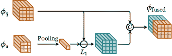
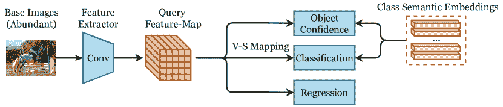

<!--yml

分类：未分类

日期：2024-09-06 19:49:04

-->

# [2112.02814] 深度学习在低样本物体检测中的综述

> 来源：[`ar5iv.labs.arxiv.org/html/2112.02814`](https://ar5iv.labs.arxiv.org/html/2112.02814)

¹¹脚注：$\dagger$ 通讯作者。²²脚注：本工作由中国国家自然科学基金（U20B2066、61976186、62106220）、宁波自然科学基金（2021J189）以及中央高校基本科研业务费（2021FZZX001-23、226-2023-00048）资助。

# 深度学习在低样本物体检测中的综述

黄启涵 浙江大学中国，张浩飞 浙江大学中国，薛梦琦 浙江大学中国，宋洁 浙江大学中国，宋明立^† 浙江大学中国（2023）

###### 摘要。

物体检测在深度神经网络和大量标注数据的支持下取得了巨大突破。然而，当前的检测方法无法直接迁移到标注数据稀缺的场景中，因为存在严重的过拟合问题。虽然少样本学习和零样本学习在图像分类领域已经被广泛探讨，但由于物体检测还涉及额外的挑战性定位任务，因此在数据稀缺场景中设计新方法是不可或缺的。低样本物体检测（LSOD）是一个新兴的研究主题，涉及从少量甚至没有标注样本中检测物体，包括一-shot 物体定位（OSOL）、少-shot 物体检测（FSOD）和零-shot 物体检测（ZSOD）。本综述对 LSOD 方法进行了全面回顾。首先，我们提出了 LSOD 方法的详细分类，并系统分析了它们，包括一些 LSOD 的扩展主题（半监督 LSOD、弱监督 LSOD 和增量 LSOD）。然后，我们指出了当前 LSOD 方法的优缺点，并比较了它们的性能。最后，我们讨论了 LSOD 的挑战和有前景的方向，以为未来的研究提供指导。

少样本物体检测、一-shot 物体检测、零-shot 物体检测、迁移学习、元学习^†^†版权：acmcopyright^†^†期刊年份：2023^†^†doi：10.1145/3626312^†^†期刊：CSUR^†^†文章：1^†^†出版月份：10^†^†ccs：一般与参考 综述和概述^†^†ccs：计算方法 物体检测

## 1\. 引言

物体检测是计算机视觉中的一个基础而具有挑战性的任务，旨在定位图像中某些类别的物体。它已广泛应用于许多计算机视觉任务，如物体跟踪（Yilmaz 等，2006；Wang 等，2019b；Voigtlaender 等，2019），自动驾驶（Grigorescu 等，2020；Yurtsever 等，2020），场景图生成（Teng 和 Wang，2021；Yang 等，2018；Tang 等，2020）。

物体检测的一般过程是对一组边界框（图像中的虚拟矩形）进行类别预测。大多数传统方法速度较慢，因为它们通过在整个图像中滑动窗口来生成边界框，采用的是蛮力方法。Viola-Jones (VJ) 检测器（Viola 和 Jones, 2001）首次通过三种加速技术实现了人脸的实时检测：积分图像、特征选择和检测级联。随后，方向梯度直方图（HOG）（Dalal 和 Triggs, 2005）被提出，许多传统物体检测器采用它进行特征描述。变形部件模型（DPM）（Felzenszwalb 等, 2008）是一个代表性的传统方法。DPM 将物体检测任务分解为若干个细粒度检测任务，然后使用一些部件滤波器检测物体的部分，并将其聚合以进行最终预测。尽管人们做了许多改进，传统方法仍然受到速度慢和精度低的限制。

图 1\. 本调查概述。本调查对低样本物体检测（LSOD）进行了总体介绍，然后将 LSOD 分为三个领域：单样本物体定位（OSOL）、少样本物体检测（FSOD）和零样本物体检测（ZSOD）。这三个领域的更细粒度分类也在图中以三种颜色展示，这将在后续章节中详细讨论。每个类别在图中展示了部分代表性工作。然后，总结了 OSOL、FSOD 和 ZSOD 的基准，并比较和分析了不同 LSOD 方法在这些基准上的表现。最后，讨论了 LSOD 的未来方向。

与这些传统方法相比，基于深度学习的方法显著提升了性能。当前的深度检测器大致分为两阶段检测器和单阶段检测器。两阶段检测器首先生成区域提议（即，更可能包含对象的图像区域），然后对其进行预测，遵循与传统方法类似的框架。R-CNN（Girshick 等，2014）是最早的两阶段检测器之一。它使用选择性搜索获得区域提议，然后使用预训练的 CNN 模型提取特征，以进行进一步的分类和回归。Fast R-CNN（Girshick，2015）通过使用区域兴趣（RoI）池化层从整体特征图中生成区域提议的特征图，从而改进了 R-CNN。Faster R-CNN（Ren 等，2015）进一步提出了区域提议网络（RPN），利用锚点（即，具有特定高度和宽度的预定义边界框）从整个图像特征图中生成区域提议。然而，区域提议的生成需要高计算成本和存储成本。为了解决这个问题，提出了单阶段检测器来将这两个阶段结合起来。YOLO 风格的目标检测器（Redmon 和 Farhadi，2018；Bochkovskiy 等，2020；Ge 等，2021）是单阶段检测器的代表作。给定从原始图像中提取的特征图，YOLO 风格的检测器直接在图像的所有位置上预定义多个尺度的锚点，并预测每个锚点的类别概率、回归偏移量和对象置信度分数。单阶段检测器具有更高的速度，但它们通常表现不如两阶段检测器。此外，一些方法如焦点损失（Lin 等，2017b）已经被提出，以减少单阶段检测器和两阶段检测器之间的性能差距。最近，提出了一种基于变换器的检测器，名为 DETR（Carion 等，2020）。DETR 实现了端到端检测，并且性能可与许多经典检测器相媲美。一些扩展方法（Zhu 等，2021b；Dai 等，2021）被提出以缓解 DETR 的慢收敛问题。

然而，这些深度检测器在训练数据稀缺时往往会过拟合，因此需要大量标注数据。在现实生活中，由于这些类别的稀缺或特殊标注成本，难以收集足够的标注数据，而当前的深度检测器在这种情况下表现不佳。因此，现代检测器期望能够从少量甚至零标注样本中检测对象。为实现这一目标，低样本对象检测（LSOD）被引入对象检测中，包括单样本对象定位（OSOL）、少样本对象检测（FSOD）和零样本对象检测（ZSOD）。这三种 LSOD 设置主要在每个类别的标注样本数量上有所不同。具体而言，OSOL 和 FSOD 解决每个对象类别具有一个或多个标注图像样本的情况，而 ZSOD 则根据每个类别的语义信息而不是图像样本来区分不同类别。

OSOL 和 FSOD 是根据主流的少样本学习（FSL）方案开发的。少样本学习将对象类别分为具有大量标注样本的基础类别（称为基础数据集）和只有少量标注样本的新增类别（称为新增数据集）。请注意，新增类别中的标注样本和测试样本分别称为支持样本和查询样本。少样本学习要求在基础数据集上对模型进行预训练，然后使用模型对新增数据集上的新增类别进行预测以进行评估。目前的少样本学习方法大致可分为元学习方法和迁移学习方法。元学习方法采用“学习如何学习”机制，通过在基础数据集上定义多个少样本任务来训练模型，并使模型能够迅速适应真实的少样本任务。此外，迁移学习方法通过直接在基础数据集上训练模型来学习良好的图像表示，这些表示用于新增数据集。尽管元学习是一种更自然的解决少样本问题的方法，但 Tian 等人（Tian et al., 2020）发现基线迁移学习方法在一些经典元学习方法中表现更好，尤其是在跨领域少样本学习中。目前的少样本学习方法主要在图像分类任务上进行探索。OSOL 和 FSOD 比少样本图像分类更具挑战性，因为对象检测需要额外的任务来定位对象。作为少样本学习的分支，OSOL 和 FSOD 也继承了其核心方法（元学习和迁移学习）。

OSOL 是一种少样本学习设置，用于目标检测，仅使用每个类别的一张标注图像来定位对象。当前的 OSOL 方法都采用基于少样本学习的元学习方案，其中在基础数据集上定义大量的一次性任务来训练模型。OSOL 强有力地保证了模型准确知道每张测试图像中包含的对象类别。凭借这一强有力的保证，最新的 OSOL 方法已取得了相对较高的性能。

表 1\. 本文使用的关键符号

| 符号 | 描述 | 符号 | 描述 |
| --- | --- | --- | --- |
| $\phi_{q}$ | 整体查询图像 $q$ 的特征图 | ${\rm Pool}(\cdot)$ | 池化操作 |
| $\phi_{s}$ | 积分支持图像的特征图 | $\oplus$ | 元素级加法 |
| $\phi_{\rm fused}$ | $\phi_{q}$ 和 $\phi_{c}$ 的聚合特征图 | $\otimes$ | 按通道乘法 |
| $\phi_{r}$ | 查询图像中的 RoI 特征图 | ${\rm Conv}(\cdot)$ | 卷积操作 |
| $v_{r}$ | 查询图像中的 RoI 特征向量 | ${\rm FC}(\cdot)$ | FC 层 |
| $s_{r}$ | 查询图像中的 RoI 语义嵌入 | ${\rm Softmax}(\cdot)$ | Softmax 操作 |
| $v_{s}$ | 池化后的特征向量 | $\sigma(\cdot)$ | Sigmoid 函数 |
| $v_{\rm fused}$ | $v_{q}^{i}$ 和 $v_{c}$ 的聚合特征向量 | ${\rm RELU}(\cdot)$ | RELU 函数 |
| $s_{c}$ | 类别 $c$ 的语义嵌入 | $&#124;&#124;\cdot&#124;&#124;$ | 向量的范数 |
| $p_{c}$ | RoI 的类别 $c$ 的预测得分 | $[\cdot]$ | 连接操作 |
| $&#124;\cdot&#124;$ | 向量的绝对值 |  |  |

然而，OSOL 设置并不够现实，因为在实际生活中测试图像中的物体类别并不是预先已知的。因此，更多的论文采用了另一种物体检测的少样本设置，称为少样本物体检测（FSOD）。FSOD 和 OSOL 之间的主要区别如下：（1）FSOD 需要预测测试图像中潜在物体的正确类别。（2）OSOL 为每个测试图像独立采样支持图像，而 FSOD 只为所有测试图像采样一次支持图像。（3）在 FSOD 中，每个类别的标注样本数量可以大于一个。类似于少样本图像分类的方法，FSOD 方法分为两种主流方法：元学习方法和迁移学习方法。早期 FSOD 方法主要采用元学习方案。元学习 FSOD 方法的核心操作是提取少量标注样本的特征（支持特征），并将其汇总到查询图像的特征（查询特征）中，以指导查询图像的预测。这种汇总操作促进模型从少量标注样本中学习足够的信息。早期元学习 FSOD 方法仅将支持特征与查询图像中的 RoIs 特征（RoI 特征）汇总在一起。后来，研究人员发现，整体特征的汇总对性能提升至关重要，因为模型中的浅层组件也需要标注样本的信息（例如，Faster R-CNN 中的 RPN 组件需要支持特征来筛选不匹配的区域建议）。因此，本调查将元学习 FSOD 方法分类为 RoI 特征汇总和混合特征汇总方法（“混合”指的是同时使用 RoI 特征汇总和整体特征汇总）。与元学习方法不同，迁移学习 FSOD 方法直接在基础数据集上进行预训练，并在新数据集上进行微调。早期 FSOD 方法由于性能不佳，鲜少采用迁移学习。TFA（Wang 等，2020a）颠覆了这种认知，提出了一种两阶段微调策略来微调模型，并且取得了比当代元学习方法更好的性能。除了上述标准 FSOD，研究人员还探讨了其他扩展设置，如半监督 FSOD（Misra 等，2015；Dong 等，2019）、弱监督 FSOD（Gao 等，2019；Karlinsky 等，2021）和增量 FSOD（Pérez-Rúa 等，2020；Li 等，2021a），并在本调查中进行了研究。

ZSOD 将大量标记样本分配给基础类，但没有将注释图像样本分配给新颖类。相反，主流的 ZSOD 方法将语义属性分配给每个类别（包括基础类和新颖类），并根据与不同类别的语义相似性对对象提议进行分类。主流 ZSOD 方法包括视觉-语义映射方法、语义关系方法和数据增强方法。早期的大多数 ZSOD 方法属于视觉-语义映射方法。这些方法旨在利用基础数据集的注释样本学习视觉-语义函数，将视觉特征投影到语义嵌入中，以便与类别语义属性进行比较。接下来，语义关系方法利用不同类别之间的语义关系进行预测。此外，数据增强方法试图为新颖类生成视觉样本并重新训练模型。除了上述主流 ZSOD 设置，这项调查还讨论了一些少见的设置，如传导性 ZSOD 和基于文本描述的归纳 ZSOD。最近，随着大规模跨模态模型的出现（例如，CLIP（Radford 等，2021）），开放词汇对象检测（OVD）吸引了越来越多的研究兴趣，该方法首先训练了一个更强大的视觉-语义映射函数用于多个类别，并显著提高了进一步 ZSOD 任务的性能。

本调查的概述在图 1 中进行了说明。元学习和迁移学习的基础知识见第二部分。对 LSOD 方法的更细致的分类和分析描述在第三部分、第四部分、第五部分、第六部分中进行了描述。两个流行的数据集（MS COCO 数据集 (Lin et al., 2014) 和 PASCAL VOC 数据集 (Everingham et al., 2010)) 和 LSOD 的评估标准在第七部分中进行了描述。当前 LSOD 方法的性能总结在第八部分中。LSOD 的有前景方向在第九部分中进行了讨论。最后，第十部分总结了本调查的内容。本调查中使用的主要符号总结在表 1 中。

## 2\. 基础

图 2\. LSOD 中的元学习与迁移学习示意图。LSOD 将对象类别分为带有大量标注样本的基础类别（记作基础数据集）和带有少量标注样本的新的类别（记作新颖数据集）。元学习从基础数据集中采样多个任务，并在这些任务上训练模型（每个任务要求根据标注的 $D_{i}^{\mathrm{support}}$ 对 $D_{i}^{\mathrm{query}}$ 进行预测），旨在获取“如何学习”的知识，并将其推广到新颖数据集上。另一方面，迁移学习直接在基础数据集上训练模型，并将良好的特征表示迁移到新颖数据集上，从而实现对新类别对象的表示。

### 2.1\. 元学习

元学习是从传统的“学习”范式扩展出的“学习如何学习”（Thrun and Pratt, 1998; Hospedales et al., 2022）范式。传统学习范式直接在整个数据集上从头开始训练模型作为单一任务。不同的是，元学习从多个任务中学习训练模式（例如参数初始化），能够跨任务泛化并促进新任务的学习。因此，元学习适用于在少样本学习中快速适应新任务。元学习的框架如图 2（a）所示，更详细的说明见补充在线材料的 S1 节。

### 2.2\. 转移学习

转移学习方法旨在将来自相关领域（称为源领域）的知识（良好的特征表示）转移到当前领域（称为目标领域），以提高模型在目标领域的性能，如图 2（b）所示。传统的转移学习方法包括基于实例的方法、基于特征的方法、基于参数的方法和基于关系的方法（Zhuang et al., 2021）。

对于少样本学习中的转移学习方法，基础数据集被视为源领域，新的数据集被视为目标数据集。Tian 等人（Tian et al., 2020）发现，将强大的特征提取器从基础数据集转移到新数据集，能在少样本图像分类中优于许多元学习方法，许多 FSL 方法遵循这一范式。由于 OSOL 的目标领域每个任务仅包含一张图像，因此转移学习不适用于 OSOL，但在 TFA（Wang et al., 2020a）出现后，它被广泛应用于 FSOD。

## 3\. 单样本目标定位

任务设置。一次性目标定位（OSOL）需要根据每个新颖类别在查询图像中的唯一支持图像来定位目标。OSOL 的训练数据集（基础数据集$D_{B}$）包含大量标注的基础类$C_{B}$实例，测试数据集（新颖数据集$D_{N}$）包含新颖类$C_{N}$的实例（$C_{B}$和$C_{N}$没有交集）。具体来说，对于$D_{N}$中的每个查询图像，OSOL 随机抽取一个支持图像，用于图像中每个新颖类。接下来，OSOL 根据相应的支持图像在查询图像中定位新颖目标。与 FSOD 的主要区别在于，OSOL 只需要进行二分类任务，以区分潜在目标是前景还是背景，而 FSOD 需要进行多分类任务，因为 FSOD 无法预先知道查询图像中现有对象的类别。

当前 OSOL 方法的框架。一些早期的目标跟踪方法，如 SiamFC （Cen 和 Jung，2018）、SiamRPN（Li 等，2018）是 OSOL 的前驱，用于与早期 OSOL 方法进行比较。当前的 OSOL 方法采用元学习方案，其框架基于 Faster R-CNN，如图 3 所示。首先，它们使用相同的卷积骨干网络提取查询图像和支持图像的整体特征（分别称为查询特征和支持特征），然后进行“整体特征聚合”，通过将查询特征与支持特征进行聚合生成融合特征图。该融合特征图输入 RPN 和 RoI 层，以生成类别特定的区域提案及相应的 RoI 特征。最后，这些 RoI 特征用于最终的分类和定位任务。此外，一些方法还额外进行“RoI 特征聚合”，以进一步将 RoI 特征与支持特征进行聚合。

当前的 OSOL 方法主要在特征聚合方法上有所不同，因此本文对 OSOL 方法进行了分类，包括基于串联的方法、基于注意力的方法和基于变换的方法。在接下来的部分中，$\phi_{q}\in\mathbb{R}^{C\times H_{q}\times H_{q}}$、$\phi_{r}\in\mathbb{R}^{C\times H_{r}\times H_{r}}$和$\phi_{s}\in\mathbb{R}^{C\times H_{s}\times H_{s}}$分别表示查询特征图、RoI 特征图和支持特征图。注意，$C$、$H_{q}$、$H_{r}$和$H_{s}$是特征图的通道数和尺寸。

图 3\. One-Shot 物体定位的总体框架（基于 Faster R-CNN）。该模型将查询图像和支持图像作为输入，然后使用一个孪生卷积特征提取器提取查询特征图和支持特征图。接着，它应用积分特征聚合将这两个特征图聚合成一个融合特征图，并将其送入 RPN 和 RoI 层，分别生成区域提议和 RoI 特征。聚合方法在不同的 OSOL 方法中实现有所不同。最后，RoI 特征用于分类任务和回归任务。一些方法还额外应用 RoI 特征聚合，将 RoI 特征与支持特征进行聚合。

### 3.1\. 基于拼接的方法

基于拼接的方法简单地采用拼接操作来聚合 $\phi_{q}$ 和 $\phi_{s}$，这些方法主要被早期的 OSOL 方法所采用（SiamMask（Michaelis 等， 2018），OSCD（Fu 等， 2021），FOC OSOL（Yang 等， 2021a）和 OSOLwT（Li 等， 2020c）），如 图 4 所示。

$\bullet$ SiamMask（Michaelis 等， 2018）。SiamMask 是早期基于深度学习的 OSOL 方法之一，它将 $\phi_{q}$ 与 $\phi_{q}$ 和池化嵌入向量 $v_{s}\in\mathrm{R}^{C}$ 的绝对差异拼接，以生成聚合特征图 $\phi_{\rm fused}\in\mathbb{R}^{2C\times H_{q}\times H_{q}}$，如 方程 1 所示。在 SiamMask 中，$\phi_{\rm fused}$ 直接用于 Faster R-CNN 中的进一步组件（RPN、RoI 层），没有其他修改。由于它同时处理了分割任务，SiamMask 没有实现令人满意的性能。然而，作为 OSOL 的首个方法，SiamMask 基于 MS COCO 数据集提出了一个性能比较的基准，为未来的 OSOL 研究开创了许多工作，并为未来的工作奠定了基线。

| (1) |  | $\phi_{\rm fused}=[\phi_{q},\; | \phi_{q}-{\rm Pool}(\phi_{s})\; | ]\text{.}$ |  |
| --- | --- | --- | --- | --- | --- |

$\bullet$ OSCD（Fu 等人，2021）。与 SiamMask 不同，OSCD 直接将 $\phi_{q}\in\mathbb{R}^{C\times H_{q}\times H_{q}}$ 与 $\phi_{s}\in\mathbb{R}^{C\times H_{s}\times H_{s}}$ 的池化嵌入向量 $v_{s}$ 进行连接，以生成 $\phi_{\rm fused}\in\mathbb{R}^{2C\times H_{q}\times H_{q}}$，如 公式 2 所示。此外，OSCD 还进一步进行 RoI 特征聚合，以利用 $\phi_{s}$ 的信息来促进 RoI 的预测，这种方法在深度上连接了 RoI 特征图 $\phi_{r}$ 和 $\phi_{s}$。OSCD 基于 PASCAL VOC 数据集提出了另一个 OSOL 基准进行评估，在该基准上，它比 SiamFC 和 SiamRPN 具有更大的优势。

| (2) |  | $\phi_{\rm fused}=[\phi_{q},{\rm Pool}(\phi_{s})]\text{.}$ |  |
| --- | --- | --- | --- |

$\bullet$ OSOLwT（Li 等人，2020c）和 FOC OSOL（Yang 等人，2021a）。它们将卷积块添加到连接的特征中，以捕捉不同特征单元之间的关系，从而提高性能，如 公式 3 所示。

| (3) |  | $\phi_{\rm fused}={\rm Conv}([\phi_{q},\, | \phi_{q}-{\rm Pool}(\phi_{s}) | ])\text{.}$ |  |
| --- | --- | --- | --- | --- | --- |

$\bigstar$ 基于连接的方法讨论。基于连接的方法主要被早期的 OSOL 方法采用。SiamMask 和 OSCD 是最早的基于连接的特征聚合方法，而 FOC OSOL 和 OSOLwT 则在 SiamMask 和 OSCD 的基础上扩展了卷积块和一些其他精细的训练策略。然而，基于连接的方法的局限性在于它们只是简单地聚合特征，而没有充分挖掘两个特征图的不同局部部分之间的关系，从而损害了查询特征图的前景部分与支持特征图之间的匹配。

### 3.2\. 基于注意力的方法

基于注意力的方法利用了支持特征和查询特征之间不同部分的对应关系，如 图 5 所示。

$\bullet$ CoAE（Hsieh 等人，2019）。CoAE 是第一个基于注意力的 OSOL 方法，它提出了两种用于整体特征聚合的操作：共同注意（ca）操作和共同激发（ce）操作。共同注意操作使用非局部操作（Wang 等人，2018）（一种注意力操作）来实现，根据其逐元素的注意力对两个特征图进行聚合：

| (4) |  | $\phi_{\rm fused}^{\mathrm{ca}}=\phi_{q}\oplus\psi(\phi_{q},\phi_{s})\text{,}$ |  |
| --- | --- | --- | --- |

其中 $\psi$ 表示非本地操作，$\phi_{\rm fused}\in\mathbb{R}^{C\times H_{q}\times H_{q}}$。共同激励操作通过使用通道级乘法将 $\phi_{q}$ 与 $\phi_{s}$ 的池化嵌入向量 $v_{s}\in\mathbb{R}^{C}$ 聚合生成 $\phi_{\rm fused}^{\mathrm{ce}}\in\mathbb{R}^{C\times H_{q}\times H_{q}}$。

| (5) |  | $\phi_{\rm fused}^{\mathrm{ce}}=\phi_{q}\otimes{\rm Pool}(\phi_{s})\text{.}$ |  |
| --- | --- | --- | --- |

CoAE 采用这两种操作进行积分特征聚合。此外，CoAE 提出了一个基于 RoI 特征聚合的提案排名损失来监督 RPN。CoAE 在 MS COCO 基准测试中优于 SiamMask，在 PASCAL VOC 基准测试中优于 OSCD，展示了注意力机制在 OSOL 上的能力。

(a) SiamMask (Michaelis et al., 2018)

(b) OSCD (Fu et al., 2021) OSOLwT (Li et al., 2020c)

(c) FOC OSOL (Yang et al., 2021a)

图 4\. OSOL 中基于串联的积分特征聚合方法概览。OSCD 和 OSOLwT 将查询特征图与支持特征图的池化嵌入向量进行串联。SiamMask 则将查询特征图与查询特征图和支持特征图的池化嵌入向量之间的绝对差异进行串联。FOC OSOL 额外在 SiamMask 生成的积分特征图上应用卷积块。

$\bullet$ BHRL (Yang et al., 2022), ABA OSOL (Hsieh et al., 2023), ADA OSOL (Zhang et al., 2022a), 和 AUG OSOL (Du et al., 2022)。这些后续方法在 CoAE 的共同注意力和共同激励操作的基础上进行了一些精细修改。

$\bullet$ AIT (Chen et al., 2021a), CAT (Lin et al., 2021), SaFT (Zhao et al., 2022a)。随着变换器 (Subakan et al., 2021) 在计算机视觉中的广泛应用，一些方法 (AIT, CAT, SaFT) 将多头注意力引入 OSOL 进行特征聚合。这些方法将查询特征图 $\phi_{q}$ 和支持特征图 $\phi_{s}$ 扁平化为特征序列 $\phi_{q}^{{}^{\prime}}\in\mathbb{R}^{C\times H_{q}H_{q}}$ 和 $\phi_{s}^{{}^{\prime}}\in\mathbb{R}^{C\times H_{s}H_{s}}$，然后使用多头注意力生成 $\phi_{\rm fused}\in\mathbb{R}^{C\times H_{q}\times H_{q}}$ 以捕捉它们网格之间的双向对应关系。

$\bigstar$ 对基于注意力的方法的讨论。与基于变换器的注意力方法相比，基于共同注意力的注意力方法需要更少的额外参数和较低的计算成本。然而，CoAE 是一种早期的 OSOL 方法，简单的非局部操作不足以满足当前 OSOL 方法的特征聚合需求。实际上，这类方法的最新研究将共同注意力与其他精细操作相结合，以提高其性能。另一方面，基于变换器的方法显著提高了性能，并且可以轻松地将其他精细变换器结构变体集成到此框架中，以进一步提升性能。然而，目前基于变换器的方法在模型训练中带来了过多的额外计算成本。因此，期望采用高效的变换器结构，以在性能和计算成本之间进行权衡。

(a) CoAE、BHRL、ABA OSOL、ADA OSOL、AUG OSOL

(b) AIT、CAT、SaFT

图 5. OSOL 中基于注意力的整体特征聚合方法概述。一些方法 (CoAE、BHRL、ABA OSOL、ADA OSOL、AUG OSOL) 使用非局部操作进行整体特征聚合，而一些方法 (AIT、CAT、SaFT) 使用变换器来捕捉查询和支持图像之间的注意力。

### 3.3. 基于变换的方法

OS2D (Osokin et al., 2020) 提出了基于变换的方法来进行特征聚合，它通过对特征图进行变换，以匹配查询特征图和支持特征图。给定查询特征图 $\phi_{q}$ 和支持特征图 $\phi_{s}$，OS2D 首先计算一个形状为 $\mathbb{R}^{H_{q}\times H_{q}\times H_{s}\times H_{s}}$ 的 4D 相关矩阵，该矩阵表示这两个特征图中所有位置对之间的对应关系。然后，它使用预训练的 TransformNet (Rocco et al., 2018) 生成一个变换矩阵，将支持特征图在空间上对齐到查询特征图上。最后，查询特征图中每个位置的分类分数是通过相关矩阵和变换矩阵的组合得到的。

$\bigstar$ 对 OSOL 方法的讨论。总之，基于连接的方法易于实现，计算成本较低，但性能较差。基于注意力的方法可以捕捉支持图像和查询图像前景之间的对应关系，从而超越基于连接的方法。基于注意力的方法的缺点是实现更复杂，并且需要较高的计算成本。基于变换的方法使 OSOL 的决策过程更具解释性，但它们需要一个大型预训练模型来捕捉查询图像和支持图像之间的空间对应关系。

## 4. 标准少样本目标检测

任务设置。之前的 OSOL 设置保证每个查询图像都包含与给定支持图像相同类别的物体，即模型准确知道每个测试图像中包含的物体类别。然而，这种设置在现实世界中并不现实，更多的论文采用了一种更具挑战性的 LSOD 设置，称为小样本物体检测 (FSOD)。本节首先介绍标准 FSOD，其他 FSOD 设置（称为扩展 FSOD）基于标准 FSOD，将在后续部分进行分析。具体而言，标准 FSOD 的基础数据集 ($D_{B}$) 包含大量标注的基础类别实例 $C_{B}$，而新数据集 ($D_{N}$) 包含稀少标注的新类别实例 $C_{N}$ ($C_{B}$ 和 $C_{N}$ 不重叠)。在测试期间，模型在包括基础类别和新类别物体的测试数据集上进行评估。FSOD 和 OSOL 之间的区别如下：

1.  (1)

    由于 OSOL 准确知道每个测试图像中包含的物体类别，因此只需一个二分类任务来根据给定的支持图像区分潜在的物体是前景还是背景。相比之下，FSOD 需要一个多分类任务来预测潜在物体的类别。

1.  (2)

    OSOL 为每个测试图像独立采样支持图像，而 FSOD 只为所有测试图像一次性采样支持图像。

1.  (3)

    每个类别的支持图像的拍摄数量在 FSOD 中可以大于一个。

方法分类。目前标准的 FSOD 方法可以分为基于微调的方法和无微调的方法。大多数方法是基于微调的方法，这些方法需要在新数据集上微调模型，以显著提升性能。早期的基于微调的方法采用了元学习方案，并且也集中于与 OSOL 方法类似的特征聚合方法。此外，标注样本数量的增加为标准 FSOD 方法采用迁移学习方案打开了可能性，这种方案在基础数据集上预训练物体检测器，然后在新数据集上微调这个预训练模型以适应新类别。早期的迁移学习方法如 LSTD (Chen et al., 2018) 在那段时间里被元学习方法超越，直到 TFA (Wang et al., 2020a) 的出现。另一方面，无微调的方法旨在去除微调步骤，因为微调步骤由于其不可忽视的计算成本在实际生活中的 FSOD 中并不适用。在这项调查中，首先分析元学习方法，因为它们与 OSOL 方法高度相关，然后再分析迁移学习方法和无微调的方法。

### 4.1. 元学习方法

类似于 OSOL，标准 FSOD 的元学习方法首先在基础数据集上定义大量的少样本检测任务来训练模型。不同之处在于，每个少样本任务包含一个查询图像和多个支持图像，因为 FSOD 需要来自所有基础类别的支持图像以进行多类别分类任务。另一个区别是，标准 FSOD 的元学习方法有一个 OSOL 方法所缺乏的额外微调阶段，该阶段通过从基础类别和新类别中采样支持图像来继续对模型进行元训练。标准 FSOD 的元学习框架类似于 OSOL，它进行“整体特征聚合”和“RoI 特征聚合”，将查询特征与支持特征聚合，以将支持图像的信息融入查询图像进行预测。早期的元学习方法仅进行 RoI 特征聚合，而后期的方法则进行整体和 RoI 特征聚合（称为“混合特征聚合”）以获得更好的性能。因此，标准 FSOD 的元学习方法被分类为 RoI 特征聚合方法和混合特征聚合方法，以便在本调查中更清晰地呈现。

#### 4.1.1. RoI 特征聚合方法

RoI 特征聚合方法通过将 RoI 特征与支持特征聚合，生成特定类别的 RoI 特征以用于分类和回归任务。与几乎所有采用 Faster R-CNN 作为检测框架的 OSOL 方法不同，早期的元学习方法在单阶段和两阶段检测器上探索了 RoI 特征聚合方法。这些 RoI 特征聚合方法根据聚合特征的类型可以分为两类：RoI 特征向量聚合方法（FSRW (Kang et al., 2019), Meta R-CNN (Yan et al., 2019), CME (Li et al., 2021c), TIP (Li and Li, 2021), VFA (Han et al., 2023), FSOD-KT (Kim et al., 2020), GenDet (Liu et al., 2022a), FsDet (Xiao and Marlet, 2020), DRL (Liu et al., 2021b), 和 AFD-Net (Liu et al., 2021a)) 和 RoI 特征图聚合方法（Attention-RPN (Fan et al., 2020), QA-FewDet (Han et al., 2021), KFSOD (Zhang et al., 2022d), PNSD (Zhang et al., 2020a), MM-FSOD (Han et al., 2022c), SQMG-FSOD (Zhang et al., 2021c), ICPE (Lu et al., 2022), DAnA-FasterRCNN (Chen et al., 2021b), TENET (Zhang et al., 2022c), Hierarchy-FasterRCNN (Park and Lee, 2022), IQ-SAM (Lee et al., 2022a), 和 Meta Faster R-CNN (Han et al., 2022a)）。

(a) FSRW (康等, 2019) Meta R-CNN (严等, 2019)

(b) FsDet (肖和马尔莱, 2020) AFD-Net (刘等, 2021a)

图 6\. 标准 FSOD 的 RoI 特征向量连接方法概述。符号 $\odot$、$\ominus$ 和 ⓒ 分别表示逐元素乘法、逐元素减法和连接操作。FSRW 和 Meta R-CNN 通过简单的逐元素乘法将支持特征向量与查询特征向量进行聚合。FsDet 和 AFD-Net 使用两个额外的全连接层，通过逐元素乘法和查询特征向量与支持特征向量之间的减法，将查询特征向量与支持特征向量进行连接。

“RoI 特征向量聚合方法”可以分为两种类型，这两种方法分别由 FSRW 和 FsDet 首次提出。

$\bullet$ FSRW (康等, 2019) 是基于 YOLOv2 检测框架的第一个标准 FSOD 元学习方法。FSRW 通过对每个查询特征图像素的特征向量 $v_{r}\in\mathbb{R}^{C}$ 与支持特征图的池化嵌入 $v_{s}\in\mathbb{R}^{C}$ 进行简单的逐元素乘法来聚合，旨在通过简单的逐元素乘法突出支持图像对应的重要特征：

| (6) |  | $v_{\rm fused}=v_{r}\otimes v_{s}\text{.}$ |  |
| --- | --- | --- | --- |

融合特征向量 $v_{\rm fused}\in\mathbb{R}^{C}$ 用于预测分类分数（针对 $v_{s}$ 所属的类别）和位置回归，如 6(a) ‣ Figure 6 ‣ 4.1.1\. RoI Feature Aggregation Methods ‣ 4.1\. Meta-Learning Methods ‣ 4\. Standard Few-Shot Object Detection ‣ A Survey of Deep Learning for Low-Shot Object Detection")所示。Meta R-CNN (严等, 2019)、CME (李等, 2021c)、TIP (李和李, 2021)、VFA (韩等, 2023)、FSOD-KT (金等, 2020) 和 GenDet (刘等, 2022a) 都遵循这种简单的逐元素乘法操作，并进行了其他详细的扩展。

$\bullet$ FsDet (Xiao 和 Marlet, 2020) 将这种简单的逐元素乘法操作升级为更复杂但有效的版本，如 6(b) ‣ Figure 6 ‣ 4.1.1\. RoI Feature Aggregation Methods ‣ 4.1\. Meta-Learning Methods ‣ 4\. Standard Few-Shot Object Detection ‣ A Survey of Deep Learning for Low-Shot Object Detection")所示。具体而言，给定 RoI 特征向量 $v_{r}$ 和支持特征向量 $v_{s}$，聚合特征向量 $v_{\rm fused}$ 计算为它们线性变换后的逐元素乘法、减法和原始 $v_{r}$ 的拼接，如 Equation 7 所示 (${\rm FC}$ 表示降维的全连接层)。通过这种扩展的聚合方法，FsDet 在 MS COCO 基准测试和 PASCAL VOC 基准测试中均优于 Meta R-CNN。

| (7) |  | $v_{\rm fused}=[{\rm FC}(v_{r}\otimes v_{s}),{\rm FC}(v_{r}-v_{s}),v_{r}]\text{,}$ |  |
| --- | --- | --- | --- |

$\bullet$ AFD-Net (Liu 等, 2021a) 和 DRL (Liu 等, 2021b)。这两种方法在 RoI 特征向量聚合方法中遵循 FsDet，但进行了其他一些修改。

与上述集中于特征向量聚合的 RoI 特征向量聚合方法不同，RoI 特征图聚合方法专注于特征图的聚合，以保留空间信息，更好地挖掘查询图像与支持图像之间的关系。一些方法仅采用简单的拼接操作和逐元素操作进行特征图聚合，而新提出的方法则倾向于采用注意力操作进行特征图聚合。

$\bullet$ RoI 特征图聚合的连接操作和逐元素操作。SQMG-FSOD （Zhang et al., 2021c）简单地将 RoI 特征图与支持特征图连接用于 RoI 特征图聚合。而一些方法 （Attention-RPN （Fan et al., 2020），QA-FewDet （Han et al., 2021），KFSOD （Zhang et al., 2022d），PNSD （Zhang et al., 2020a），FCT （Han et al., 2022b），和 MM-FSOD （Han et al., 2022c））利用多关系头，采用连接操作和逐元素操作。具体而言，这个多关系头包括一个全局关系头、一个补丁关系头和一个局部关系头。全局关系头将 $\phi_{r}$ 和 $\phi_{s}$ 在深度上进行连接，并进行池化操作。补丁关系头将 $\phi_{r}$ 和 $\phi_{s}$ 通过几个卷积块进行连接。局部关系头通过计算它们之间的像素级和深度级相似性来聚合 $\phi_{r}$ 和 $\phi_{s}$。这些方法同时进行整体和 RoI 特征聚合，具体将在后面说明。

$\bullet$ RoI 特征图聚合的注意力操作。一些方法 （ICPE （Lu et al., 2022），DAnA-FasterRCNN （Chen et al., 2021b），TENET （Zhang et al., 2022c），Hierarchy-FasterRCNN （Park and Lee, 2022），IQ-SAM （Lee et al., 2022a），和 Meta Faster R-CNN （Han et al., 2022a））采用注意力操作进行 RoI 特征图聚合。具体而言，它们根据 $\phi_{r}$ 和 $\phi_{s}$ 中每对元素之间的相似度分数（注意力）计算聚合特征图。在这些方法中，ICPE 仅进行 RoI 特征聚合，并进行了一些提出的修改。具体来说，它在最终特征聚合之前将查询图像的信息并入支持图像，并调整不同支持图像的重要性，而不是将它们视为平等。其他方法同时进行整体和 RoI 特征聚合，具体将在后面说明。

$\bigstar$ RoI 特征聚合方法讨论。RoI 特征聚合方法分为 RoI 特征向量聚合方法和 RoI 特征图聚合方法。RoI 特征向量聚合方法是早期的 FSOD 元学习方法，其方法简单，限制了其性能。另一方面，RoI 特征图聚合方法保留了查询样本和支持样本的空间信息，旨在完全提取查询特征和支持特征之间的空间关系。因此，RoI 特征图聚合方法可以更好地区分不同对象的特征，并实现更高的性能。

#### 4.1.2\. 混合特征聚合方法

上述部分仅讨论了 RoI 特征聚合，而大多数新提出的方法（称为“混合特征聚合方法”）还进行整体特征聚合，以将类特定信息整合到检测模型的浅层组件中。整体特征聚合方法主要在特征图上进行（而不是特征向量），可以分为连接与逐元素操作（Attention-RPN (Fan et al., 2020), QA-FewDet (Han et al., 2021), KFSOD (Zhang et al., 2022d), PNSD (Zhang et al., 2020a), MM-FSOD (Han et al., 2022c), Meta Faster R-CNN (Han et al., 2022a)），卷积操作（SQMG-FSOD (Zhang et al., 2021c))，以及注意力操作（DAnA-FasterRCNN (Chen et al., 2021b), TENET (Zhang et al., 2022c), Hierarchy-FasterRCNN (Park and Lee, 2022), IQ-SAM (Lee et al., 2022a), DCNet (Hu et al., 2021), Meta-DETR (Zhang et al., 2021b), FCT (Han et al., 2022b))。

$\bullet$ 连接与逐元素操作用于整体特征聚合。Attention-RPN (Fan et al., 2020) 通过使用 $\phi_{s}\in\mathbb{R}^{C\times H_{s}\times H_{s}}$ 作为内核，并在 $\phi_{q}\in\mathbb{R}^{C\times H_{q}\times H_{q}}$ 上滑动以计算每个位置的相似性，从而进行整体特征图聚合。具体来说，聚合特征图 $\phi_{\rm fused}$ 中位置 $(c,h,w)$ 的元素是通过 方程 8 计算的（注意 $i,j\in\{1,\cdots,H_{s}\}$）。一些方法（QA-FewDet (Han et al., 2021), KFSOD (Zhang et al., 2022d), PNSD (Zhang et al., 2020a), MM-FSOD (Han et al., 2022c), Meta Faster R-CNN (Han et al., 2022a)) 在此整体特征聚合方法的基础上进行了一些扩展。

| (8) |  | ${\phi_{\rm fused}}_{(c,h,w)}=\sum\limits_{i,j}{\phi_{q}}_{(c,h+i-1,w+j-1)}\cdot{\phi_{s}}_{(c,i,j)}\text{.}$ |  |
| --- | --- | --- | --- |

$\bullet$ 卷积操作用于整体特征聚合。SQMG-FSOD (Zhang et al., 2021c) 提出了另一种整体特征聚合方法，通过从支持特征生成卷积内核，并使用生成的内核来增强查询特征。此外，SQMG-FSOD 不仅学习了一个距离度量来比较 RoI 特征和支持特征，以筛选掉不相关的 RoI，还利用该度量通过与查询图像进行比较来为支持样本分配权重。此外，它还提出了一种混合损失来缓解误报问题（即一些背景 RoI 被错误分类为对象）。

$\bullet$ 积分特征聚合的注意力操作。新提出的方法（DCNet（Hu et al., 2021）、DAnA-FasterRCNN（Chen et al., 2021b）、TENET（Zhang et al., 2022c）、Hierarchy-FasterRCNN（Park and Lee, 2022）、IQ-SAM（Lee et al., 2022a）、Meta-DETR（Zhang et al., 2021b）和 FCT（Han et al., 2022b））倾向于采用注意力操作进行积分特征聚合。注意力操作通过与缩放点积注意力（Subakan et al., 2021）类似的方式来聚合两个特征图。它分别从查询图像和支持图像中提取关键图和价值图，然后计算这两个关键图之间的逐像素相似度，并利用这些相似度来聚合两个价值图。

+   •

    Meta-DETR 也采用了注意力操作进行积分特征聚合，并且在性能上取得了显著提升。主要区别在于它采用了 Deformable DETR（Zhu et al., 2021b）作为检测框架。DETR 是一种端到端的基于变换器的检测器，消除了以前检测器中的锚框。此外，Meta-DETR 提出了一个相关聚合模块（CAM），该模块使用单头注意力来聚合查询特征图和支持特征图。最后，将聚合的特征输入到一个无类别的变换器中以预测物体类别和位置。

+   •

    这些方法中的大多数独立地聚合从骨干网络中提取的查询特征和支持特征，而 FCT 超越了这一限制，改为在 ViT 骨干网络的每一层中聚合特征，从而实现了显著的性能提升。首先，它将查询图像和支持图像分割为图像标记，并将位置和分支嵌入添加到其中（即位置嵌入区分标记的位置，而分支嵌入区分标记来自支持图像还是查询图像）。接下来，它将所有查询和支持标记连接成一个序列，并将其输入到变换器中生成聚合的积分特征。

$\bigstar$ 混合特征聚合方法的讨论。与 RoI 特征聚合方法相比，混合特征聚合方法额外进行整体特征聚合，将类别特定的信息纳入检测模型的浅层组件（主要是 RPN），从而为进一步的分类和回归任务提取更多正样本区域提议，并提升性能。混合特征聚合方法分为三种类型：拼接与逐元素操作、卷积操作和注意力操作。早期 FSOD 方法大多采用简单的拼接与逐元素操作，这些方法性能较差，需要结合其他组件来提高性能。卷积操作仍然较为简单，无法完全将支持特征的信息整合到查询特征中。注意力操作捕捉查询特征图与支持特征图中局部区域之间的关系，更好地区分不同的局部区域，这些方法整体上实现了更好的性能。

#### 4.1.3. 其他元学习方法

还有一些其他的元学习方法关注于除了特征聚合方法之外的问题，这些方法包括基于权重预测的方法和基于度量学习的方法。

$\bullet$ 基于权重预测的方法。MetaDet (Wang et al., 2019a) 提出了一种元学习方法，学习预测模型中特定类别组件的权重。MetaDet 从少量样本中预测特定类别（例如分类和回归分支）的权重，并在新数据集上微调模型。Meta-RetinaNet (Li et al., 2020b) 是另一种方法，它采用 RetinaNet 作为检测框架并预测整个网络的权重。

$\bullet$ 基于度量学习的方法。IR-FSOD (Huang et al., 2021) 直接学习比较 RoI 特征与来自不同类别的支持特征之间的相似性，以生成分类分数。CAReD (Quan et al., 2022) 除了主分类分支外，还增加了另一个度量学习分支用于分类。

### 4.2. 迁移学习方法

迁移学习方法将 FSOD 视为迁移学习问题，其中源领域是基础数据集，目标领域是新颖数据集。目前的迁移学习方法主要采用 Faster R-CNN 作为检测框架，分为两个阶段：基础训练和少样本微调，如图 7 所示。基础训练阶段在基础数据集上训练目标检测器。经过这个阶段，目标检测器将获得有效的特征提取器，并在基础类别上取得良好的性能。然后，在少样本微调阶段，这个预训练的目标检测器将在新颖数据集上进行微调，以检测新类别。通过这种方式，特征提取和建议生成的通用知识可以从基础类别转移到新类别。

(a) 基础训练阶段基于 Faster R-CNN

(b) 在 Faster R-CNN 框架上的少样本微调阶段

图 7\. 标准 FSOD 的两阶段迁移学习框架概述（Wang 等，2020a）。在基础训练阶段，模型在包含大量基础类别实例的基础数据集上进行训练，而在少样本微调阶段，模型在包含基础类别和新类别数据的小数据集上进行训练。目前的迁移学习方法大多采用 Faster R-CNN 作为检测框架，如图所示。这两个图中的黄色组件表示中间张量，蓝色组件表示 Faster R-CNN 中的模块，锁定符号表示相应模块的参数被冻结。

$\bullet$ LSTD（Chen 等，2018）是第一个采用迁移学习方案进行 FSOD 的方法。它采用 Faster R-CNN 作为检测框架，并在少样本微调阶段加入了两个正则化项。具体而言，第一个项抑制特征图中的背景区域，第二个项促使微调后的模型生成与源模型相似的预测。遗憾的是，LSTD 的性能在同一时期被元学习方法超越。

$\bullet$ TFA (Wang et al., 2020a) (双阶段微调方法)显著提高了基于 Faster R-CNN 检测框架的转移学习方法的性能。在基础训练阶段，TFA 像之前的转移学习方法一样在基础数据集上预训练模型。然后，在少样本微调阶段，它冻结 Faster R-CNN 的主要组件，仅微调 Faster R-CNN 的最后两层（框分类和回归层）。在少样本微调阶段使用的损失函数与基础训练阶段相同，但学习率较低。在少样本微调阶段使用的数据集是一个平衡的数据集，包含少量的新类训练样本和少量选择的基础类训练样本。这一设计保留了模型对基础类的检测能力，并减轻了一些基础类对象被误分类为新类的问题。凭借这一简单但有效的训练策略，TFA 在 MS COCO 基准测试和 PASCAL VOC 基准测试中超越了早期的元学习方法，如 FSRW、MetaDet 和 Meta R-CNN。

$\bullet$ DeFRCN (Qiao et al., 2021) 通过两个简洁的修改显著提高了 TFA 的性能：(1) DeFRCN 对 RPN 模块和 R-CNN 模块的梯度分配不同的重要性值，这一观点源于 RPN 模块和 R-CNN 模块可能会以相反的方式进行学习，因此这两个模块的学习应当解耦。(2) DeFRCN 利用预训练分类器作为辅助分支，用于区域提议的分类。DeFRCN 进一步验证了转移学习方法在 FSOD 中的有效性，并且许多方法都在这一转移学习范式的基础上提出。在本次调研中，转移学习方法根据其关注的检测阶段被分类为基于特征增强的方法、基于分类的方法、基于回归的方法、基于 RPN 的方法、基于数据增强的方法和基于预训练的方法。

#### 4.2.1\. 基于特征增强的方法

基于特征增强的方法侧重于 FSOD 模型的特征提取阶段。这些方法对特征应用不同的增强技术，旨在更好地将基础数据集上学到的特征转移到新数据集上。目前的基于特征增强的方法可以分为三种类型：自注意力机制的方法 (CT-FSOD (Yang et al., 2020a), AttFDNet (Chen et al., 2020)), 特征离散化的方法 (SVD-FSOD (Wu et al., 2021b), KD-FSOD (Pei et al., 2022)), 和特征继承的方法 (${\rm FSOD}^{\rm up}$ (Wu et al., 2021a), FADI (Cao et al., 2021))。

$\bullet$ 基于自注意力的方法用于特征增强。基于自注意力的方法（CT-FSOD（Yang 等人，2020a），AttFDNet（Chen 等人，2020））采用自注意力来增强提取的特征。

$\bullet$ 基于特征离散化的方法用于特征增强。基于特征离散化的方法（SVD-FSOD（Wu 等人，2021b），KD-FSOD（Pei 等人，2022））通过将特征图的每个像素投影到一个学习到的代码本中（即，用其最近的代码替换特征图的每个像素）来离散化特征图，从而增强不同类别特征的区分度。

$\bullet$ 基于特征继承的方法用于特征增强。基于特征继承的方法（${\rm FSOD}^{\rm up}$（Wu 等人，2021a），FADI（Cao 等人，2021））将基类的特征继承到新类的特征中以进行增强，从而缓解了新类数据稀缺的问题。

$\bigstar$ 基于特征增强的方法的讨论。基于自注意力的方法通过注意力热图将可解释性融入 FSOD 的决策中。然而，基于自注意力的方法是早期的 FSOD 方法，它们采用的注意力操作是原始的，限制了其性能。

基于特征离散化的方法利用特征离散化来增强不同类别特征的区分度，但尚未展示离散化特征所代表的视觉概念。此外，KD-FSOD 需要额外的步骤来训练额外的视觉词模型，并需要知识蒸馏将该视觉词模型的知识继承到少样本检测器中，这为模型训练带来了不可忽视的负担。

基于特征继承的方法利用来自基类的知识作为“免费午餐”来以微小的成本增强新类的特征。然而，在基类和新类不在同一领域的情况下，尚不清楚这些方法是否仍然有效，因为基类和新类共享的知识较少。

#### 4.2.2\. 基于分类的方法

基于分类的方法旨在提升检测模型的分类分支。早期的基于分类的方法主要关注通过一些精细化的度量学习方法来改善主要分类分支（RepMet (Karlinsky et al., 2019)，NP-RepMet (Yang et al., 2020b)，PNPDet (Zhang et al., 2021a)，FSOD-KI (Yang et al., 2023)）。新的基于分类的方法大多提出了另一个分类分支来辅助主要分类分支，包括额外分类器方法（FSCN (Li et al., 2021e)），对比学习方法（FSCE (Sun et al., 2021)，FSRC (Shangguan et al., 2022)，CoCo-RCNN (Ma et al., 2022)），知识图谱方法（KR-FSOD (Wang and Chen, 2022)）和语义信息方法（SRR-FSOD (Zhu et al., 2021a)）。

$\bullet$ 基于度量学习的分类方法。这些方法（RepMet (Karlinsky et al., 2019)，NP-RepMet (Yang et al., 2020b)，PNPDet (Zhang et al., 2021a)，FSOD-KI (Yang et al., 2023)) 提出了精细化的度量学习方法，以直接提升主要分类分支。

$\bullet$ 基于额外分类器的分类方法。FSCN (Li et al., 2021e) 提出了一个少样本修正网络（FSCN）作为模型的额外分类分支，用预训练的图像分类器对裁剪后的区域提议进行类别预测。这些分类分数用于修正主要分支的分类分数。此外，本文提出了一种半监督干扰物利用方法来选择新类别的未标记干扰物提议，以及一种基于置信度的数据集剪枝（CGDP）方法，用于过滤包含新类别未标记物体的训练图像。

$\bullet$ 基于对比学习的分类方法。这些方法（FSCE (Sun et al., 2021)，CoCo-RCNN (Ma et al., 2022)，FSRC (Shangguan et al., 2022)) 采用对比学习来辅助区域提议的分类。

+   •

    FSCE 引入了一种对比损失来提升模型的分类性能。FSCE 提出了一个对比损失函数，以最大化同类别对象之间的相似性，并促进来自不同类别的区域提议的独特性。这项工作是首次尝试将对比学习应用于基于迁移学习的 FSOD，显著提高了基线 TFA 的性能。

$\bullet$ 基于知识图谱的分类方法。KR-FSOD（Wang 和 Chen，2022）提出了一种基于外部知识图谱的附加分类分支，其中潜在对象作为节点。该模型根据从外部知识图谱中提取的附近对象的信息预测每个潜在对象的类别。KR-FSOD 通过将外部知识图谱融入 FSOD 模型中来提高性能。

$\bullet$ 基于语义信息的分类方法。SRR-FSOD（Zhu 等，2021a）提出了一种利用类别语义信息促进分类的附加分类分支，将外部语义信息融入 FSOD 模型以提高性能。具体而言，SRR-FSOD 通过线性投影将视觉特征映射到语义空间。在这个语义空间中，多个词嵌入作为语义嵌入表示所有基础和新类别。通过计算投影的视觉特征与类别语义嵌入之间的相似度，生成投影语义嵌入的类别概率。

$\bigstar$ 关于基于分类的方法的讨论。度量学习方法是早期的 FSOD 方法，与最新的 FSOD 方法相比性能不足，这表明仅对 RoI 分类器进行简单修改不足以满足 FSOD 的需求。

基于额外分类器的方法（FSCN）实现了显著的性能提升。然而，它需要一个预训练的图像分类器，这导致与其他 FSOD 方法的不公平比较。

基于对比学习的方法在模型训练过程中产生的额外成本极小，同时带来了显著的性能提升。此外，它们可以无缝地集成到其他 FSOD 方法中。

基于知识图谱的方法（KR-FSOD）有很好的动机，但目前性能不尽如人意。此外，与 FSCN 类似，由于缺乏相应的知识图谱，它不能很容易地应用于实际 FSOD 应用中的新类别。

基于语义信息的方法（SRR-FSOD）通过将类别语义信息融入模型，作为 FSOD 和零样本学习之间的桥梁。这种方法具有通过大规模跨模态模型提升性能的潜力。然而，它可能不适用于尚未学习过的新类别。

#### 4.2.3\. 基于回归的方法

回归基方法专注于改进检测模型的回归分支。SRR-FSD (Kim et al., 2022) 提出了一种改进方法，以提高 RPN 中区域提议的回归精度。具体来说，SRR-FSD 将回归分支扩展为多个连续的回归头。每个回归头接收来自前一个回归头生成的区域提议，并继续优化这些区域提议，以生成更多的正样本。

$\bigstar$ 回归基方法的讨论。虽然目前回归基方法（SRR-FSD）的性能不理想，但值得注意的是，这类方法仍然比较少见，未来有很大的探索和改进空间。

#### 4.2.4\. 基于 RPN 的方法

CoRPN (Zhang et al., 2020b) 改进了 Faster R-CNN 中的 RPN，以应对标准 FSOD。CoRPN 假设在基础类别上预训练的 RPN 会遗漏一些新类别的物体。因此，它在 RPN 中使用多个前景-背景分类器，而不是原来的单一分类器，以缓解这个问题。在测试期间，给定的提议框将分配给最确定的 RPN 的得分。在训练期间，只有最确定的 RPN 会从相应的边界框中获得梯度。CoRPN 提出了一个多样性损失来鼓励这些 RPN 的多样性，并提出了一个合作损失来减轻对前景提议的坚决拒绝。

$\bigstar$ 基于 RPN 的方法的讨论。基于 RPN 的方法 (CoRPN) 直接设计多个 RPN 来检索那些被遗漏的新物体，这解决了由基础数据集训练的 RPN 常常遗漏新物体的问题。然而，这在基于 R-CNN 的模型中有限，尚不清楚当集成到其他 FSOD 模型中时是否仍然有效。

#### 4.2.5\. 基于数据增强的方法

数据增强方法旨在为每个新类别生成更多样本，从而直接解决少样本设置中的数据稀缺问题。当前的数据增强方法可以分为两类：输入像素空间的样本生成和特征空间的样本生成。前一种类型直接生成在输入像素空间中的样本，这些样本对人类而言是可理解和可感知的，可以进一步分为多尺度增强方法和新实例挖掘方法。后一种类型则合成更多的新类别深层特征，可以进一步分为分布继承方法和基于生成器的方法。

$\bullet$ 在输入像素空间生成样本 $\rightarrow$ 多尺度增强方法。MPSR (Wu et al., 2020) 和 FSSP (Xu et al., 2021) 都应用了数据增强技术来丰富正样本的尺度。

+   •

    MPSR 声称，尽管特征金字塔网络（FPN）（Lin 等，2017a）可能缓解了尺度变化问题，但无法解决 FSOD 中尺度分布的稀疏性。因此，MPSR 提出了一种策略，直接在输入像素空间中增加对象的尺度，该方法独立提取每个正样本对象并将其调整为多种尺度。增强的多尺度样本被输入到 RPN 模块和检测头进行训练。

$\bullet$ 输入像素空间中的样本生成 $\rightarrow$ 新实例挖掘方法。MINI（Cao 等，2022）、PSEUDO（Kaul 等，2022）、Decoupling（Gao 等，2022a）和 N-PME（Liu 等，2022b）挖掘数据集中未标记的新对象进行数据增强。

$\bullet$ 特征空间中的样本生成 $\rightarrow$ 分布继承方法。FSOD-KD（Zhao 等，2022b）、PDC（Li 等，2022a）和 FSOD-DIS（Wu 等，2022）通过从基础数据集转移特征分布来生成更多的新特征进行数据增强，这些方法源自相同的少样本学习方法（Yang 等，2021b）。具体而言，这些方法假设一个类别的特征分布可以近似为高斯分布，相似的类别具有相似的特征分布。因此，它们使用基础类别的丰富样本来计算特征分布，并根据其最近的基础类别估计每个新类别的特征分布。最后，这些方法从估计的特征分布中采样更多的新特征，并将其用于训练。

$\bullet$ 特征空间中的样本生成 $\rightarrow$ 基于生成器的方法。Halluc（Zhang 和 Wang，2021）旨在为新类别合成额外的 RoI 特征。它提出了一个简单的幻觉生成器来生成幻觉 RoI 特征，实现为一个简单的两层 MLP。在基础训练阶段，Halluc 首先在基础数据集上训练一个 Faster R-CNN 作为常规目标检测。然后，它冻结检测器的参数，并使用分类损失对合成样本预训练幻觉生成器。接下来，在少样本微调阶段，Halluc 解冻检测头（分类头 & 回归头）的参数，并采用类似 EM 的算法交替训练幻觉生成器和检测头。需要注意的是，当训练样本数量极少时，该方法表现出令人印象深刻的性能。然而，随着训练样本数量的增加，其优越性相对于基线方法（如 TFA）不能得到保证。

$\bigstar$ 数据增强方法的讨论。输入像素空间中的样本生成方法分为多尺度增强方法和新实例挖掘方法。多尺度增强方法是有效的数据增强方法，适用于 FSOD，且易于实现。然而，仅在尺度方面进行数据增强并不能解决 FSOD 数据稀缺问题的核心，而且这些方法是早期 FSOD 方法，性能不足。对于新实例挖掘方法，目前 FSOD 基准上确实存在许多来自新类别的物体在图像中没有注释。有效捕捉这些物体可以显著缓解 FSOD 中的数据稀缺问题，并显著提高性能。这些方法有很大的潜力可以被整合到其他 FSOD 方法中。然而，这种设置并不现实。在实际的 FSOD 中，不能保证基础数据集中包含来自新类别的物体。

特征空间中样本生成的方法分为两类：分布继承方法和基于生成器的方法。前者类型利用数据丰富的基础类别的数据分布有效地生成更多的新类别样本。它不引入额外的参数，可以被视为从基础数据集中获得的“免费午餐”。然而，这在实际场景中并不适用，因为基础类别和新类别的数据分布之间存在显著差异。后者类型更适合于基础类别和新类别差异较大的场景，但它引入了额外的生成器，可能增加模型训练的负担。

#### 4.2.6\. 基于预训练的方法

几乎所有的迁移学习方法在基础训练阶段之前都会采用在 ImageNet 上预训练的骨干网络。一些方法（DETReg（Bar 等，2022），imTED（Zhang 等，2022b））专注于改进这一预训练阶段。

+   •

    DETReg 在无监督的方式下预训练一个 DETR 模型。一方面，它使用 Selective Search（Uijlings 等， 2013）来挖掘物体建议，并用这些建议来训练模型的物体定位分支。另一方面，它使用另一个预训练的自监督模型生成物体编码，并强制 DETR 模型模仿这些物体编码。

+   •

    imTED 将一个预训练的 MAE 模型（He 等，2022）整体迁移为检测模型。具体来说，imTED 在 MAE 模型中添加了一个区域提议网络和一个检测头，遵循 Faster R-CNN 的设计。此外，它提出了一个多尺度特征调节器来融合从 FPN（Lin 等，2017a）中提取的多尺度特征。

$\bigstar$ 基于预训练方法的讨论。这些方法从新的视角探索当前的 FSOD 问题，追求在少样本训练阶段之前具有更强的骨干网络，而当前的 FSOD 方法大多简单地采用在 ImageNet 上进行分类任务的预训练骨干网络。此外，这些方法的性能显著优于其他方法。然而，这些方法需要更强的预训练骨干网络（如 DETReg 需要 SwAV，imTED 需要 MAE）。此外，这些方法从未明确这些更强的骨干网络是否覆盖了 FSOD 环境中新类的知识，这将导致与其他 FSOD 方法的不公平比较。

### 4.3. 无需微调的方法

无需微调的方法专注于直接将训练好的模型从基础数据集转移到新颖数据集，而无需微调。现有的无需微调方法（AirDet（Li et al., 2022b），FS-DETR（Bulat et al., 2022））采用了元学习的方案，并且也关注特征聚合的方法。具体来说，AirDet 通过逐元素乘法和拼接操作进行整体特征聚合，并提出学习不同支持样本的权重，而不是将它们视为平等。此外，AirDet 将 RoI 特征与支持特征聚合用于回归分支。FS-DETR 将查询特征与支持特征拼接成一个通用序列，并将其输入 DETR 模型。FS-DETR 提出了与支持特征形状相同的可学习伪类嵌入，并将其添加到支持特征中以促进模型训练。

$\bigstar$ 无需微调方法的讨论。无需微调的方法需要的计算成本更低，更适合现实生活。然而，与基于微调的方法相比，这些方法目前的性能尚不理想。

## 5. 零样本目标检测

Zero-Shot Object Detection (ZSOD) 是 LSOD 的一个极端场景，其中新类不包含任何图像样本。具体来说，ZSOD 的训练数据集（基础数据集 $D_{B}$）包含大量基础类 $C_{B}$ 的标注实例，而测试数据集（新颖数据集 $D_{N}$）则不包含新类 $C_{N}$ 的标注实例（$C_{B}$ 和 $C_{N}$ 不交集）。作为替代，ZSOD 利用语义信息来辅助检测新类的对象。

根据是否利用未标记的测试图像进行模型训练，本调查将 ZSOD 分为两个领域：“传导式 ZSOD”和“归纳式 ZSOD”。归纳 ZSOD 是 ZSOD 的主流，不需要提前访问测试图像。与之不同的是，传导式 ZSOD 较少被探索，它利用未标记的测试图像来辅助模型训练。此外，归纳 ZSOD 根据语义信息的类型进行分类：语义属性和文本描述。前者类型利用语义属性（词向量）作为辅助语义信息来表示每个类别。相对地，后者类型利用文本描述（例如，对图像或类别的描述句子）作为辅助语义信息。本节对基于语义属性的归纳 ZSOD（标准 ZSOD）进行了全面介绍。基于文本描述的归纳 ZSOD 和传导式 ZSOD 将在后续章节中讨论。

当前基于语义属性的归纳 ZSOD 方法采用 Faster R-CNN 或 YOLO 风格的模型作为检测框架，如图 8 所示。Ankan Bansal 等人（Bansal et al., 2018）提出了基于 Faster R-CNN 的早期方法之一，该方法基于 Faster R-CNN 建立了一个简单的基线，使用简单的线性投影将 RoI 特征$v_{r}$投影到语义空间，并计算$v_{r}$的类别概率作为投影后的语义嵌入$s_{r}$与每个类别的语义属性之间的余弦相似度。作为 ZSOD 的早期方法之一，这项工作建立了许多未来工作的基准。

(a) 基于 Faster R-CNN 的 ZSOD 模型

(b) 基于 YOLO 风格模型的 ZSOD 模型

图 8\. ZSOD 方法的两个检测框架概述：Faster R-CNN 和 YOLO 风格的模型。目前的大多数方法应用视觉-语义映射操作，将视觉特征投影到语义空间，并将这些投影后的语义嵌入与类别语义嵌入进行比较以进行分类。

$\bullet$ ZS-YOLO（Zhu et al., 2020b）是另一个早期的基于 YOLOv2 的语义属性归纳 ZSOD 工作。它将特征图中的每个单元投影到语义嵌入中以进行类别预测。与同时期的工作（Bansal et al., 2018）相比，ZS-YOLO 采用了不同的检测框架，它不需要外部训练数据和背景类别的语义嵌入。然而，这两种方法在不同的数据集设置下进行评估，导致难以直接比较其性能。

作为基于语义属性的归纳式 ZSOD 两个主流检测框架的先驱，上述两种方法 （Bansal et al., 2018; Zhu et al., 2020b）被许多后续研究所跟随。后来的方法主要在这些框架的基础上进行扩展，关注框架中不同组件的扩展。根据所关注的修改组件，本综述将基于语义属性的归纳式 ZSOD 方法分类为语义关系方法、数据增强方法和视觉-语义映射方法。

### 5.1\. 语义关系方法

语义关系方法利用类别之间的语义关系来检测新类别的对象，这些方法进一步被分为基础-新类别关系和超类别关系。基于基础-新类别关系的方法利用基础类别和新类别之间的语义相似性，将知识从基础类别转移到新类别。基于超类别关系的方法假设类别之间存在层次关系，即一些相似的类别可以被归入一个超类别（例如，床、沙发和椅子可以被归入家具），并利用这种层次关系来辅助预测。

#### 5.1.1\. 基础-新类别关系

图 9\. 语义关系方法的示意图：基础-新类别关系和超类别关系。

基于基础-新类别关系的方法可以分为两种类型：基于线性变换的方法 （TOPM-ZSOD （Shao et al., 2019）、LSA-ZSOD （Wang et al., 2020b）、DPIF （Li et al., 2021b））和基于图的方法 （SPGP （Yan et al., 2020）、VSRG （Nie et al., 2022）、CRF-ZSOD （Luo et al., 2020））。基于线性变换的方法利用基础-新类别语义关系，通过对这些语义关系的线性变换来辅助预测，基于图的方法则构建图形，每个节点代表一个类别，通过图神经网络或条件随机场来全面挖掘基础类别和新类别之间的关系。

$\bullet$ 基础-新类别关系 $\rightarrow$ 基于线性变换的方法。TOPM-ZSOD （Shao et al., 2019）、LSA-ZSOD （Wang et al., 2020b）和 DPIF （Li et al., 2021b）都是基于线性变换的方法，利用基础-新类别关系来进行 ZSOD。

$\bullet$ 基础-新类别关系 $\rightarrow$ 基于图的方法。SPGP （Yan et al., 2020）、VSRG （Nie et al., 2022）和 CRF-ZSOD （Luo et al., 2020）是基于图的方法，旨在更好地挖掘基础类别和新类别之间的关系，以提升分类性能。

$\bigstar$ 基于基础-新颖类关系的方法讨论。线性变换方法是直接利用基础-新颖语义关系来辅助预测的简单方法。然而，线性变换并未充分挖掘基础-新颖关系用于预测，也没有将 RoI 特征与类别语义属性结合起来。图形方法通过图神经网络或条件随机场深入挖掘基础类和新颖类之间的关系进行预测。尽管通过图结构建模类别之间的关系提升了性能，但它们尚未提供关于训练图是否符合人类直觉的定量分析。

#### 5.1.2\. 超类关系

基于超类关系的方法（CG-ZSOD (Li et al., 2020a), JRLNC-ZSOD (Rahman et al., 2020b), ACS-ZSOD (Ma et al., 2020)) 定义了一些粗粒度的类（超类），将所有类别分为几个组，从而将原始分类问题拆分为两个子问题（粗粒度分类和细粒度分类）。

$\bigstar$ 基于超类关系的方法讨论。这些方法为 ZSOD 的性能提升提供了“免费的午餐”，但不适用于类别之间没有层次关系的情况。

### 5.2\. 视觉-语义映射方法

视觉-语义映射方法旨在找到一个适当的映射函数，以对齐视觉特征与类别语义属性。视觉-语义映射方法可以分为线性投影方法（例如，LSA-ZSOD (Wang et al., 2020b), DPIF (Li et al., 2021b), ZSDTR (Zheng and Cui, 2021))，加权组合方法（HRE-ZSOD (Demirel et al., 2018))，逆映射方法（MS-ZSOD (Gupta et al., 2020), CCFA-ZSOD (Li et al., 2022c), SMFL-ZSOD (Li et al., 2021d))，辅助损失方法（ContrastZSOD (Yan et al., 2022), VSA-ZSOD (Rahman et al., 2020a))，以及外部资源方法（CLIP-ZSOD (Xie and Zheng, 2022), BLC (Zheng et al., 2020)）。

$\bullet$ 线性投影方法。最早的 ZSOD 方法（Bansal et al., 2018）采用了这种最简单的视觉-语义映射方法，通过线性投影将视觉特征投影到语义空间中，此后许多 ZSOD 方法（例如，LSA-ZSOD (Wang et al., 2020b), DPIF (Li et al., 2021b), ZSDTR (Zheng and Cui, 2021)) 也采用了这种方法。这些方法大多基于 CNN 骨干网，只有 ZSDTR 采用了 DETR (Carion et al., 2020)（一种基于视觉变换器的检测器），将提议编码投影到语义空间中。

$\bullet$ 加权组合基础的方法。HRE-ZSOD（Demirel et al., 2018）计算 RoI 特征$v_{r}$的语义嵌入$s_{r}$，作为所有基础类别$C_{B}$中不同语义属性的加权组合，权重由它们的分类得分决定，如公式 9 所示（$p_{c}$表示该 RoI 被预测为基础类别$c$的概率）。

| (9) |  | $s_{r}=\frac{1}{\sum\limits_{c\in C_{B}}p_{c}}\sum\limits_{c\in C_{B}}p_{c}s_{c}\text{,}$ |  |
| --- | --- | --- | --- |

$\bullet$ 逆向映射方法。逆向映射方法（MS-ZSOD（Gupta et al., 2020），CCFA-ZSOD（Li et al., 2022c），SMFL-ZSOD（Li et al., 2021d））则将类别语义属性映射到视觉空间，以使类别语义属性与视觉特征对齐。

$\bullet$ 辅助损失基础的方法。辅助损失基础的方法（ContrastZSOD（Yan et al., 2022），VSA-ZSOD（Rahman et al., 2020a））提出了一些辅助损失，以促进视觉-语义映射。

$\bullet$ 外部资源基础的方法。这些方法利用外部资源（CLIP-ZSOD（Xie and Zheng, 2022），BLC（Zheng et al., 2020））来更好地将视觉特征映射到语义空间。具体而言，CLIP-ZSOD 利用一个强大的预训练 CLIP 模型（Radford et al., 2021）进行视觉-语义映射，BLC 则采用外部词汇进行视觉-语义映射。

### 5.3\. 数据增强方法

数据增强方法旨在为新颖类别生成多个视觉特征，以缓解数据稀缺问题。生成的特征用于重新训练检测模型的分类器。早期的数据增强方法（DELO（Zhu et al., 2020a））通过一些辅助损失训练条件生成器以实现数据泛化，而后来的方法（GTNet（Zhao et al., 2020），SYN-ZSOD（Hayat et al., 2020），RSC-ZSOD（Sarma et al., 2022），RRFS-ZSOD（Huang et al., 2022））均采用了 GAN（生成对抗网络）。

$\bullet$ DELO（Zhu et al., 2020a）采用条件生成器合成新颖类别的视觉特征。具体而言，生成器由一个编码器组成，用于提取对应语义嵌入的潜在特征，以及一个解码器，用于从潜在特征中合成视觉特征。DELO 采用条件 VAE 损失来训练该生成器，包括 KL 散度损失和重建损失。此外，它提出了三种额外的损失，以鼓励重建视觉特征与原始视觉特征之间的一致性。

$\bullet$ GTNet (Zhao et al., 2020)、SYN-ZSOD (Hayat et al., 2020)、RSC-ZSOD (Sarma et al., 2022) 和 RRFS-ZSOD (Huang et al., 2022)。这些方法都采用了 GAN（生成对抗网络）来为新类别生成视觉特征。GAN 包含一个生成器，用于合成视觉特征，以及一个判别器，用于确定视觉特征是否是合成的。这些方法分别在这个框架上提出了一些精细的扩展。

$\bigstar$ 数据增强方法的讨论。数据增强方法以直观的方式直接解决了 ZSOD 中的数据稀缺问题。实际上，数据增强方法可以看作是视觉-语义映射方法的反向（即，将类别语义属性映射回视觉特征）。一个重要的区别是，数据增强方法将类内方差纳入了这个映射过程，即，这些方法为同一类别生成不同的图像特征，使用不同的随机噪声。然而，这些方法只能合成视觉特征，而不是视觉样本（在输入像素空间中），使得合成样本的解释或可视化变得困难。此外，通过反转视觉-语义映射函数，也可以替代这些方法。

## 6\. 扩展零样本目标检测

### 6.1\. 开放词汇目标检测

传统的 ZSOD 仅学习将视觉特征与语义信息对齐以从一小部分基础类别 ($C_{B}$) 进行检测，并对新类别 ($C_{N}$) 进行泛化，而开放词汇目标检测 (OVD) 首先访问一个更大的数据集（由多个类别 $C_{O}$ 的大量图像-文本对组成），以训练一个更强的视觉-语义映射函数，用于多个类别（与基础和新类别交集的后续 ZSOD 任务）。我们在补充在线材料的 S3 节中提供了 OVD 的详细分析。

### 6.2\. 基于文本描述的归纳零样本目标检测

以前的 ZSOD 方法使用语义属性作为语义信息来表示每个类别。相反，基于文本描述的方法使用文本描述作为语义信息。目前，仅有少数方法揭示了基于文本描述的归纳 ZSOD，并且它们使用了不同类型的文本描述：类别文本描述（每个类别的描述文本）和图像文本描述（每个图像的描述文本）。

$\bullet$ 基于类别文本描述的方法。ZSOD-TD (Li et al., 2019) 采用文本描述来表示每个类别，而不是语义属性（例如，“条纹，等距”用于描述斑马）。ZSOD-TD 将 RoI 特征投影到语义嵌入中，并通过将其与从文本描述中提取的特征进行比较来进行预测。

$\bullet$ 基于图像文本描述的方法。除了类别文本描述外，ZSOD-CNN（Zhang 等，2020c）采用文本描述来表示每个图像（例如，“一个有洗手池和三条毛巾的浴室。”），并且也采用 Faster R-CNN 作为检测框架。它使用文本 CNN 来提取文本特征，并将 RoI 特征与文本特征连接以进行进一步预测。此外，该方法利用 OHEM 技术来选择困难样本进行模型训练。在测试过程中，它根据基础类别的分类分数和基础类别与新增类别之间的语义相似性来预测新增类别的分类分数。

### 6.3. 传导性 ZSOD

$\bullet$ 传导性 ZSOD（Rahman 等，2019）。传导性 ZSOD 是归纳性 ZSOD 的扩展设置，它将未标注的测试图像纳入模型训练中。Rahman 等（Rahman 等，2019）提出了首个揭示传导性 ZSOD 的工作，该工作在预训练的 ZSOD 模型上进行传导学习。对于传导学习，它对未标注数据应用伪标记范式，包括一个固定伪标记步骤，用于使用预训练模型生成基础类别的固定伪标记，以及一个动态伪标记步骤，用于迭代生成基础类别和新增类别的伪标记。这项工作是首个探索 ZSOD 传导学习的工作，显示了显著的性能提升潜力，类似于其他在少样本图像分类中的传导方法。

## 7. 低样本目标检测的流行基准

### 7.1. 数据集概述

在低样本目标检测的三种设置（即 OSOL、FSOD 和 ZSOD）中，数据集的类别被分为两种类型：具有大量标注样本的基础类别和标注样本稀少或没有标注样本的新增类别。低样本目标检测的主流基准是从广泛使用的目标检测数据集如 PASCAL VOC 数据集、MS COCO 数据集中修改而来的。本调查总结了主流低样本目标检测基准的基本信息，如表 2，但省略了一些不常用的基准，因为它们不具代表性。在此表中，记录了每个基准的基础类别数量、新增类别数量以及每个类别的标注样本数量。此外，拆分数量表示每个基准的类别拆分方案的数量。

### 7.2. 评估标准

OSOL。OSOL 确保模型准确知道每个测试图像中包含的目标类别。在测试阶段的每个测试图像中，OSOL 随机为图像中存在的每个类别抽取一个支持图像，以定位该类别的对象，并将这些对象的准确性得分平均作为最终结果。

FSOD。与 OSOL 不同，FSOD 方法随机从整个测试集中抽取一小部分支持样本，而不是仅从一张图片中抽取。在 K-shot 设置中，一些方法如 LSTD（Chen et al., 2018）为每个新类别抽取 K 张支持图像。这种抽样策略并不理想，因为图像中的对象数量可能不同。目前的方法大多为每个新类别抽取 K 个边界框，这项调查记录了在这种设置下 FSOD 方法的性能。早期 FSOD 方法主要采用 FSRW（Kang et al., 2019）发布的支持样本，以便进行公平的性能比较，这些样本仅抽取一次。TFA（Wang et al., 2020a）多次抽取支持样本以获得模型的平均性能。目前，新提出的 FSOD 方法大多采用这种多次抽样策略以获得更准确的性能。

ZSOD。ZSOD 方法采用两个评估标准来比较模型性能。第一个标准是在仅包含新类别对象的测试数据子集上评估模型（ZSOD）。第二个设置，即广义 ZSOD（GZSOD），在完整测试数据上评估模型，要求模型检测基础类别和新类别的对象。广义 ZSOD 分别计算基础类别和新类别的平均精度和召回率，并使用调和平均值生成平均性能。

值得注意的是，ZSOD 的类别语义属性主要借用自预训练的词向量或手动设计的属性：GloVe（300 维）（Pennington et al., 2014）、BERT（768 维）（Devlin et al., 2019）、word2vec（300 维）（Mikolov et al., 2013）、fastText（Bojanowski et al., 2017）和 aPaY（64 维）（Farhadi et al., 2009）。其中，aPaY 包含手动设计的属性，其他则包含预训练的词向量。

表 2\. 主流低样本目标检测基准汇总

| LSOD 类型 | 数据集 | 基础类别 | 新类别 | 每类别样本数 | 划分数量 |
| --- | --- | --- | --- | --- | --- |
| OSOL | PASCAL VOC 数据集 | 16 | 4 | 1 | 1 |
| MS COCO 数据集 | 60 | 20 | 1 | 4 |
| FSOD | PASCAL VOC 数据集 | 15 | 5 | 1, 2, 3, 5, 10 | 3 |
| MS COCO 数据集 | 60 | 20 | 10, 30 | 1 |
| ZSOD | PASCAL VOC 数据集 | 16 | 4 | 0 | 1 |
| MS COCO 数据集 | 48 | 17 | 0 | 1 |
| MS COCO 数据集 | 65 | 15 | 0 | 1 |

### 7.3\. 评估指标

$\bullet$ 评估指标计算的初步准备：

交并比（IoU）。交并比（IoU）是衡量两个边界框重叠程度的值。具体而言，令 $\mathrm{bbox}_{1}\cap\mathrm{bbox}_{2}$ 和 $\mathrm{bbox}_{1}\cup\mathrm{bbox}_{2}$ 分别表示两个边界框 $\mathrm{bbox}_{1}$ 和 $\mathrm{bbox}_{2}$ 的重叠区域和联合区域，则它们之间的 IoU $\mathrm{IoU}(\mathrm{bbox}_{1},\mathrm{bbox}_{2})$ 计算为 $\mathrm{IoU}(\mathrm{bbox}_{1},\mathrm{bbox}_{2})=\frac{\mathrm{bbox}_{1}\ \cap\ \mathrm{bbox}_{2}}{\mathrm{bbox}_{1}\ \cup\ \mathrm{bbox}_{2}}$。如果两个边界框的 IoU 大于预定的阈值 $\mu$，则认为它们匹配。

$\bullet$ LSOD 的评估指标：

精度。精度是正确检索的边界框占总检索边界框的比例。

Recall@K。与精度相对，召回率是正确检索的边界框占总真实边界框的比例（K 表示总检索边界框的数量）。

mAP50。AP50（$\mu=0.5$ 的平均精度）是不同召回水平下的精度的平均值。令 $\mathrm{Prec}\ ({\mathrm{recall\_value}})$ 表示当达到“$\mathrm{recall\_value}$”时的精度，AP50 是在一些特定召回值 $\mathcal{R}$ 上计算的平均值（通常选择 $\mathcal{R}=\{0,0.1,0.2,...,1.0\}$），如公式 10 所示。AP50 针对每个类别计算，并将其结果取平均作为最终的 mAP50（$\mu=0.5$ 的均值平均精度）。请注意，mAP50 在 PASCAL VOC 基准测试中被广泛采用。

| (10) |  | $\mathrm{AP50}=\frac{1}{&#124;\mathcal{R}&#124;}\sum\limits_{\mathrm{recall\_value}\in\mathcal{R}}\mathrm{Prec}\ (\mathrm{recall\_value}).$ |  |
| --- | --- | --- | --- |

mAP。mAP 是 mAP50 的扩展，它是在十个 IoU 阈值上进行平均的：$\{0.5,0.55,0.60,...\ ,\\

0.95\}" display="inline"><semantics ><mrow ><mo stretchy="false" >{</mo><mn  >0.5</mn><mo >,</mo><mn >0.55</mn><mo  >,</mo><mn >0.60</mn><mo >,</mo><mi mathvariant="normal" >…</mi><mo lspace="0.500em" >,</mo><mn  >0.95</mn><mo stretchy="false"  >}</mo></mrow><annotation-xml encoding="MathML-Content" ><set ><cn type="float"  >0.5</cn><cn type="float"  >0.55</cn><cn type="float"  >0.60</cn><ci >…</ci><cn type="float" >0.95</cn></set></annotation-xml><annotation encoding=$, 这在 MS COCO 基准测试中被广泛采用。

## 8\. 性能

本节演示并分析了不同低样本物体检测方法在最广泛使用的基准测试中的性能。

### 8.1\. 一次性物体定位

表 3 列出了当前 OSOL 方法在 PASCAL VOC 基准和 MS COCO 基准上的性能（MS COCO 基准的结果在 $4$ 个拆分上取平均）。SiamFC 和 SiamRPN 是最初提出的用于视频目标跟踪的方法，是 OSOL 的基线，其性能明显低于真实的 OSOL 方法。SiamMask、OSCD、OSOLwT 和 FOC OSOL 使用简单的基于拼接的方法进行特征聚合，并进行了不同的修改。这些方法显著超越了 SiamFC 和 SiamRPN，但其性能低于基于注意力的方法，其中 FOC OSOL 在 PASCAL VOC 基准上取得了最佳表现。不同的是，最近提出的方法（CoAE、ADA OSOL、AUG OSOL、AIT、CAT、BHRL、SaFT、ABA OSOL）大多采用了注意力机制进行特征聚合，其中 CAT 是其中最优秀的方法。此外，CAT（基于变换器的方法）在 PASCAL VOC 基准上比 FOC OSOL 高出 $4.5$ 分，这表明基于注意力的方法在未来的单次对象定位中更具前景。

表 3\. OSOL 方法在新类上的性能（mAP50）。每个基准上的红色字体表示最佳性能，灰色字体表示第二佳性能。注意，PASCAL VOC 只有一个类别拆分，而 MS COCO 的结果在四个不同的类别拆分上取平均。R-50 和 R-101 分别表示 ResNet-50 和 ResNet-101。

| 类型 | 方法 | 检测器 (主干网络) | PASCAL VOC | MS COCO |
| --- | --- | --- | --- | --- |
| 对象跟踪方法 | SiamFC (2018) (陈和 Jung，2018) | SNet & ENet (VGG-16) | 13.3 | N/A |
| SiamRPN (2018) (李等，2018) | Faster R-CNN (AlexNet) | 14.2 | N/A |
| 拼接方法 | SiamMask (2019) (迈克尔斯等，2018) | Faster R-CNN (R-50) | N/A | 16.8 |
| OSCD (2020) (傅等，2021) | Faster R-CNN (AlexNet) | 52.1 | N/A |
| OSOLwT (2020) (李等，2020c) | Faster R-CNN (R-50) | 69.1 | N/A |
| FOC OSOL (2021) (杨等，2021a) | Faster R-CNN (R-50) | 71.0 | N/A |
| 基于注意力的方法 | CoAE (2019) (邵等，2019) | Faster R-CNN (R-50) | 68.2 | 22.0 |
| ADA OSOL (2022) (张等，2022a) | Faster R-CNN (R-50) | 72.3 | 23.6 |
| AUG OSOL (2022) (杜等，2022) | Faster R-CNN (R-50) | 73.2 | 23.9 |
| AIT (2021) (陈等，2021a) | Faster R-CNN (R-50) | 73.1 | 24.3 |
| BHRL (2022) (杨等，2022) | Faster R-CNN (R-50) | 73.8 | 25.6 |
| SaFT (2022) (赵等，2022a) | FCOS (田等，2019) (R-101) | 74.5 | 24.9 |
| CAT (2021) (林等，2021) | Faster R-CNN (R-50) | 75.5 | 24.4 |
| ABA OSOL (2023) (Hsieh et al., 2023) | Faster R-CNN (R-50) | 74.6 | 23.6 |

### 8.2\. 少样本目标检测

本小节展示了标准少样本目标检测方法在两个最常用基准上的表现：PASCAL VOC 基准和 MS COCO 基准。为了公平比较，本调查仅列出发布了代码的 FSOD 方法的性能。

表 4、表 5 和 表 6 分别展示了在 PASCAL VOC 基准和 MS COCO 基准上新颖类别的性能。可以从这两张表中总结出一些结论：（1）在最常用的骨干网（ResNet-101）上，表现最佳的迁移学习方法优于表现最佳的元学习方法。具体而言，FSOD-DIS（在 ResNet-101 上表现最佳的迁移学习方法）在 MS COCO 基准上超越了 VFA（在 ResNet-101 上表现最佳的元学习方法）。（2）对于元学习方法，混合特征聚合方法在两个基准上总体上优于 RoI 特征聚合方法。其原因是混合特征聚合方法将类别特定的信息融入检测模型的浅层组件（主要是 RPN），直接利用支持信息引导这些组件的预测。（3）对于迁移学习方法，数据增强方法（例如 Halluc、PSEUDO、FSOD-DIS）在极少样本条件下（${\rm shot}=1,2,3$）表现出强劲的性能，表明数据增强方法有效解决了极少样本条件下的数据稀缺问题。（4）在高级骨干网上的方法（FCT 在 PVTv2-B2-Li 上，Meta-DETR & DETReg 在 Def. DETR 上，PSEUDO 在 Swin-S 上，imTED 在 ViT-B 上）表现明显高于在常规骨干网上的方法（ResNet-50 和 ResNet-101），指出了 FSOD 发展的有前景方向。（5）方法的性能排名在这两个基准上可能有所不同。

表 4\. FSOD 方法在 PASCAL VOC 基准上的性能（仅列出发布了代码的方法）。这些 FSOD 方法在 PASCAL VOC 数据集的三个划分下进行评估，条件为 $1,2,3,5,10$-shot。对于每个 shot，红色字体表示最佳性能，灰色字体表示第二最佳性能。^⋆ 表示结果是多个运行的平均值，R-101 表示 ResNet-101。

|  | 方法 | 检测器（骨干网） | 新颖集 1 | 新颖集 2 | 新颖集 3 |
| --- | --- | --- | --- | --- | --- |
| 1 | 2 | 3 | 5 | 10 | 1 | 2 | 3 | 5 | 10 | 1 | 2 | 3 | 5 | 10 |
| Meta-Learning | FSRW (2018) | YOLOv2 | 14.8 | 15.5 | 26.7 | 33.9 | 47.2 | 15.7 | 15.3 | 22.7 | 30.1 | 40.5 | 21.3 | 25.6 | 28.4 | 42.8 | 45.9 |
| Meta-RCNN (2019) | Faster R-CNN (R-101) | 19.9 | 25.5 | 35.0 | 45.7 | 51.5 | 10.4 | 19.4 | 29.6 | 34.8 | 45.4 | 14.3 | 18.2 | 27.5 | 41.2 | 48.1 |
| FsDet (2020)^⋆ | Faster R-CNN (R-101) | 24.2 | 35.3 | 42.2 | 49.1 | 57.4 | 21.6 | 24.6 | 31.9 | 37.0 | 45.7 | 21.2 | 30.0 | 37.2 | 43.8 | 49.6 |
| DRL (2021)^⋆ | Faster R-CNN (R-101) | 30.3 | 40.8 | 49.1 | 48.0 | 58.6 | 22.4 | 36.1 | 36.9 | 35.4 | 51.8 | 24.8 | 29.3 | 37.9 | 43.6 | 50.4 |
| DCNet (2021)^⋆ | Faster R-CNN (R-101) | 33.9 | 37.4 | 43.7 | 51.1 | 59.6 | 23.2 | 24.8 | 30.6 | 36.7 | 46.6 | 32.3 | 34.9 | 39.7 | 42.6 | 50.7 |
| CME (2021) | YOLOv2 | 17.8 | 26.1 | 31.5 | 44.8 | 47.5 | 12.7 | 17.4 | 27.1 | 33.7 | 40.0 | 15.7 | 27.4 | 30.7 | 44.9 | 48.8 |
| Meta-DETR (2022)^⋆ | Def. DETR (R-101) | 35.1 | 49.0 | 53.2 | 57.4 | 62.0 | 27.9 | 32.3 | 38.4 | 43.2 | 51.8 | 34.9 | 41.8 | 47.1 | 54.1 | 58.2 |
| QA-FewDet (2021) | Faster R-CNN (R-101) | 42.4 | 51.9 | 55.7 | 62.6 | 63.4 | 25.9 | 37.8 | 46.6 | 48.9 | 51.1 | 35.2 | 42.9 | 47.8 | 54.8 | 53.5 |
| FCT (2022)^⋆ | Faster R-CNN (PVTv2-B2-Li) | 38.5 | 49.6 | 53.5 | 59.8 | 64.3 | 25.9 | 34.2 | 40.1 | 44.9 | 47.4 | 34.7 | 43.9 | 49.3 | 53.1 | 56.3 |
| VFA (2023) | Faster R-CNN (R-101) | 57.7 | 64.6 | 64.7 | 67.2 | 67.4 | 41.4 | 46.2 | 51.1 | 51.8 | 51.6 | 48.9 | 54.8 | 56.6 | 59.0 | 58.9 |
| Transfer-Learning | TFA w/cos (2020) | Faster R-CNN (R-101) | 39.8 | 36.1 | 44.7 | 55.7 | 56.0 | 23.5 | 26.9 | 34.1 | 35.1 | 39.1 | 30.8 | 34.8 | 42.8 | 49.5 | 49.8 |
| Halluc (2021) | Faster R-CNN (R-101) | 47.0 | 44.9 | 46.5 | 54.7 | 54.7 | 26.3 | 31.8 | 37.4 | 37.4 | 41.2 | 40.4 | 42.1 | 43.3 | 51.4 | 49.6 |
| MPSR (2020) | Faster R-CNN (R-101) | 41.7 | N/A | 51.4 | 55.2 | 61.8 | 24.4 | N/A | 39.2 | 39.9 | 47.8 | 35.6 | N/A | 42.3 | 48.0 | 49.7 |
| ${\rm FSOD}^{\rm up}(2021)$ | Faster R-CNN (R-101) | 43.8 | 47.8 | 50.3 | 55.4 | 61.7 | 31.2 | 30.5 | 41.2 | 42.2 | 48.3 | 35.5 | 39.7 | 43.9 | 50.6 | 53.5 |
| FSCE (2021)^⋆ | Faster R-CNN (R-101) | 32.9 | 44.0 | 46.8 | 52.9 | 59.7 | 23.7 | 30.6 | 38.4 | 46.0 | 48.5 | 22.6 | 33.4 | 39.5 | 47.3 | 54.0 |
| DeFRCN (2021)^⋆ | Faster R-CNN (R-101) | 40.2 | 53.6 | 58.2 | 63.6 | 66.5 | 29.5 | 39.7 | 43.4 | 48.1 | 52.8 | 35.0 | 38.3 | 52.9 | 57.7 | 60.8 |
| FSOD-KI (2022) | Faster R-CNN (R-101) | 57.0 | 62.3 | 63.3 | 66.2 | 67.6 | 42.8 | 44.9 | 50.5 | 52.3 | 52.2 | 50.8 | 56.9 | 58.5 | 62.1 | 63.1 |
| FSOD-KD (2022) | Faster R-CNN (R-101) | 46.7 | 53.1 | 53.8 | 61.0 | 62.1 | 30.1 | 34.2 | 41.6 | 41.9 | 44.8 | 41.0 | 46.0 | 47.2 | 55.4 | 55.6 |
| FADI (2022) | Faster R-CNN (R-101) | 50.3 | 54.8 | 54.2 | 59.3 | 63.2 | 30.6 | 35.0 | 40.3 | 42.8 | 48.0 | 45.7 | 49.7 | 49.1 | 55.0 | 59.6 |
| PSEUDO (2022) | Faster R-CNN (R-101) | 54.5 | 53.2 | 58.8 | 63.2 | 65.7 | 32.8 | 29.2 | 50.7 | 49.8 | 50.6 | 48.4 | 52.7 | 55.0 | 59.6 | 59.6 |
| FSOD-DIS (2022) | Faster R-CNN (R-101) | 63.4 | 66.3 | 67.7 | 69.4 | 68.1 | 42.1 | 46.5 | 53.4 | 55.3 | 53.8 | 56.1 | 58.3 | 59.0 | 62.2 | 63.7 |

表 5\. FSOD 方法在 PASCAL VOC 基准上的性能 (mAP50)（仅列出了代码已发布的方法）。这些 FSOD 方法在 PASCAL VOC 数据集上进行评估，条件为 $1,2,3,5,10$-shot。结果是对基础和新颖类别的三个拆分进行平均。对于每个 shot，红色字体表示最佳性能，灰色字体表示第二好性能。^⋆ 表示结果是对多个运行结果的平均，R-101 表示 ResNet-101。

|  | 方法 | 检测器 (骨干网络) | 3 个新颖集合 (平均) |
| --- | --- | --- | --- |
| 1 | 2 | 3 | 5 | 10 |
| 元学习 | FSRW (2018) | YOLOv2 | 17.3 | 18.8 | 25.9 | 35.6 | 44.5 |
| Meta-RCNN (2019) | Faster R-CNN (R-101) | 14.9 | 21.0 | 30.7 | 40.6 | 48.3 |
| FsDet (2020)^⋆ | Faster R-CNN (R-101) | 22.3 | 30.0 | 37.1 | 43.3 | 50.9 |
| DRL (2021)^⋆ | Faster R-CNN (R-101) | 25.8 | 35.4 | 41.3 | 42.3 | 53.6 |
| DCNet (2021)^⋆ | Faster R-CNN (R-101) | 29.8 | 32.4 | 38.0 | 43.5 | 52.3 |
| CME (2021) | YOLOv2 | 15.4 | 23.6 | 29.8 | 41.1 | 45.4 |
| Meta-DETR (2022)^⋆ | Def. DETR (R-101) | 32.6 | 41.0 | 46.2 | 51.6 | 57.3 |
| QA-FewDet (2021) | Faster R-CNN (R-101) | 34.5 | 44.2 | 50.0 | 55.4 | 56.0 |
| FCT (2022)^⋆ | Faster R-CNN (PVTv2-B2-Li) | 33.0 | 42.6 | 47.6 | 52.6 | 56.0 |
| VFA (2023) | Faster R-CNN (R-101) | 49.3 | 55.2 | 57.5 | 59.3 | 59.3 |
| Transfer-Learning | TFA w/cos (2020) | Faster R-CNN (R-101) | 31.4 | 32.6 | 40.5 | 46.8 | 48.3 |
| Halluc (2021) | Faster R-CNN (R-101) | 37.9 | 39.6 | 42.4 | 47.8 | 48.5 |
| MPSR (2020) | Faster R-CNN (R-101) | 33.9 | N/A | 44.3 | 47.7 | 53.1 |
| ${\rm FSOD}^{\rm up}(2021)$ | Faster R-CNN (R-101) | 36.8 | 39.3 | 45.1 | 49.4 | 54.5 |
| FSCE (2021)^⋆ | Faster R-CNN (R-101) | 26.4 | 36.0 | 41.6 | 48.7 | 54.1 |
| DeFRCN (2021)^⋆ | Faster R-CNN (R-101) | 34.9 | 43.9 | 51.5 | 56.5 | 60.0 |
| FSOD-KI (2022) | Faster R-CNN (R-101) | 50.2 | 54.7 | 57.4 | 60.2 | 61.0 |
| FSOD-KD (2022) | Faster R-CNN (R-101) | 39.3 | 44.4 | 47.5 | 52.8 | 54.2 |
| FADI (2022) | Faster R-CNN (R-101) | 42.2 | 46.5 | 47.9 | 52.4 | 56.9 |
| PSEUDO (2022) | Faster R-CNN (R-101) | 45.2 | 45.0 | 54.8 | 57.5 | 58.6 |
| FSOD-DIS (2022) | Faster R-CNN (R-101) | 53.9 | 57.0 | 60.0 | 62.3 | 61.9 |

### 8.3\. 零样本目标检测

表 7 和表 8 展示了在最常用的基准：MS COCO 基准上，标准 ZSOD 方法在两个评估协议（ZSOD，GZSOD）下的表现。在这个表格中可以发现一些趋势。（1）早期的 ZSOD 方法在语义属性的选择上不一致，只有少数在 GZSOD 协议下进行了评估。然而，新提出的 ZSOD 方法大多采用 word2vec 作为其语义属性，并使用 ZSOD 协议和 GZSOD 协议来评估模型，这对性能比较更为方便。（2）$48/17$的基础-新数据集划分的模型性能通常低于$65/15$的基础-新数据集划分，这归因于基础数据集中的类别和样本较少。（3）目前用于 ZSOD 的数据增强方法无法与新提出的 ZSOD 方法相比取得令人满意的性能。然而，当 FSOD 中的样本数量较少时，数据增强方法的表现优于其他方法，这在 ZSOD 中仍然具有前景。（4）新提出的 ZSOD 方法，如 CLIP-ZSOD，将预训练的跨模态模型如 CLIP 纳入训练过程中，并与最先进的方法相比取得了显著的表现。这展示了在未来的 ZSOD 研究中转移外部基础模型的潜力，从而实现更高的性能。

## 9\. 有前景的方向

### 9.1\. FSOD 的有前景方向

由于 FSOD 通过撤回测试图像的先验信息来扩展 OSOL，本调查讨论了 FSOD 的有前景方向，以为 FSOD 和 OSOL 提供指导。

#### 9.1.1\. 高效的 FSOD

FSOD 模型通常是从代表性的目标检测器如 Faster R-CNN、YOLO 风格的检测器中修改而来的。当前的 FSOD 方法需要首先在数据丰富的基础数据集上对这些模型进行预训练，然后在数据稀缺的新数据集上进行微调。基础数据集上的预训练需要较大的设备成本和类似于一般目标检测的时间成本。此外，当前的方法在少量样本微调阶段花费了大量时间让模型收敛（通常超过$10$个周期）。模型的高计算成本和长时间的收敛过程使 FSOD 难以在实际应用中实现。因此，未来 FSOD 需要轻量化和快速收敛的方法。

Table 6\. FSOD 方法在 MS COCO 基准测试中的表现 (仅列出已发布代码的方法)。这些 FSOD 方法在 $1,2,3,5,10,30$-shot 条件下进行了评估。每种 shot 的红色字体表示最佳性能，灰色字体表示第二最佳性能。^⋆ 表示结果是多次运行的平均值，R-50 & R-101 表示 ResNet-50 和 ResNet-101。

|  | Method | Backbone | 1 | 2 | 3 | 5 | 10 | 30 |
| --- | --- | --- | --- | --- | --- | --- | --- | --- |
| Meta-Learning FSRW (2018) | YOLOv2 | N/A | N/A | N/A | N/A | 5.6 | 9.1 |
| Meta-RCNN (2019) | Faster R-CNN (R-101) | N/A | N/A | N/A | N/A | 8.7 | 12.4 |
| FsDet (2020)^⋆ | Faster R-CNN (R-101) | 4.5 | 6.6 | 7.2 | 10.7 | 12.5 | 14.7 |
| Attention-RPN (2020) | Faster R-CNN (R-50) | 4.2 | 5.6 | 6.6 | 8.0 | 11.1 | 13.5 |
| DRL (2021)^⋆ | Faster R-CNN (R-101) | N/A | N/A | N/A | N/A | 11.9 | 14.6 |
| DCNet (2021)^⋆ | Faster R-CNN (R-101) | N/A | N/A | N/A | N/A | 12.8 | 18.6 |
| CME (2021) | YOLOv2 | N/A | N/A | N/A | N/A | 15.1 | 16.9 |
| Meta-DETR (2022)^⋆ | Def. DETR (R-101) | 7.5 | N/A | 13.5 | 15.4 | 19.0 | 22.2 |
| QA-FewDet (2021) | Faster R-CNN (R-101) | 4.9 | 7.6 | 8.4 | 9.7 | 11.6 | 16.5 |
| DAnA-FasterRCNN (2021) | Faster R-CNN (R-50) | N/A | N/A | N/A | N/A | 18.6 | 21.6 |
| Meta Faster R-CNN (2022) | Faster R-CNN (R-101) | 5.1 | 7.6 | 9.8 | 10.8 | 12.7 | 16.6 |
| FCT (2022)^⋆ | Faster R-CNN (PVTv2-B2-Li) | 5.1 | 7.2 | 9.8 | 12.0 | 15.3 | 20.2 |
| VFA (2023) | Faster R-CNN (R-101) | N/A | N/A | N/A | N/A | 16.2 | 18.9 |
| Transfer-Learning TFA w/cos (2020) | Faster R-CNN (R-101) | 3.4 | 4.6 | 6.6 | 8.3 | 10.0 | 13.7 |
| Halluc (2021) | Faster R-CNN (R-101) | 4.4 | 5.6 | 7.2 | N/A | N/A | N/A |
| MPSR (2020) | Faster R-CNN (R-101) | 2.3 | 3.5 | 5.2 | 6.7 | 9.8 | 14.1 |
| ${\rm FSOD}^{\rm up}~{}(2021)$ | Faster R-CNN (R-101) | N/A | N/A | N/A | N/A | 11.0 | 15.6 |
| FSCE (2021)^⋆ | Faster R-CNN (R-101) | N/A | N/A | N/A | N/A | 11.9 | 16.4 |
| DeFRCN (2021)^⋆ | Faster R-CNN (R-101) | 4.8 | 8.5 | 10.7 | 13.6 | 16.8 | 21.2 |
| N-PME (2022) | Faster R-CNN (R-101) | N/A | N/A | N/A | N/A | 10.6 | 14.1 |
| FSOD-KI (2022) | Faster R-CNN (R-101) | N/A | N/A | N/A | N/A | 13.0 | 16.8 |
| FSOD-KD (2022) | Faster R-CNN (R-101) | N/A | N/A | N/A | N/A | 12.5 | 17.1 |
| FADI (2022) | Faster R-CNN (R-101) | N/A | N/A | N/A | N/A | 12.2 | 16.1 |
| PSEUDO (2022) | Faster R-CNN (Swin-S) | N/A | N/A | N/A | N/A | 19.0 | 26.8 |
| FSOD-DIS (2022) | Faster R-CNN (R-101) | 10.8 | 13.9 | 15.0 | 16.4 | 19.4 | 22.7 |
| imTED (2022) | Faster R-CNN (ViT-B) | N/A | N/A | N/A | N/A | 22.5 | 30.2 |
| DETReg (2022) | Def. DETR (R-50) | N/A | N/A | N/A | N/A | 25.0 | 30.0 |

表 7\. ZSOD 方法在 MS COCO 基准上的性能 (mAP50) (Seen 类别/Unseen 类别 = 48/17)。ZSOD 表示 ZSOD 协议下的性能。Seen、Unseen 和 HM 表示在 GZSOD 协议下基础类别、新类别及其调和平均的性能。每列中，红色字体表示最佳性能，灰色字体表示第二最佳性能。R-50 和 R-101 表示 ResNet-50 和 ResNet-101。

| 方法 | 语义 | 检测器 (骨干网络) | ZSOD | Seen | Unseen | HM |
| --- | --- | --- | --- | --- | --- | --- |
| mAP | Recall | mAP | Recall | mAP | Recall | mAP | Recall |
| SB (2018) (Bansal et al., 2018) | GloVe | Faster R-CNN (Inception) | 0.70 | 24.39 | N/A | N/A | N/A | N/A | N/A | N/A |
| DSES (2018) (Bansal et al., 2018) | GloVe | Faster R-CNN (Inception) | 0.54 | 27.19 | N/A | 15.02 | N/A | 15.32 | N/A | 15.17 |
| TOPM (2019) (Shao et al., 2019) | GloVe | YOLOv3 (DarkNet-53) | 15.43 | 39.20 | N/A | N/A | N/A | N/A | N/A | N/A |
| CG-ZSOD (2020) (Li et al., 2020a) | BERT | YOLOv3 (DarkNet-53) | 7.20 | N/A | N/A | N/A | N/A | N/A | N/A | N/A |
| GTNet (2020) (Zhao et al., 2020) | fastText | Faster R-CNN (R-101) | N/A | 44.6 | N/A | N/A | N/A | N/A | N/A | N/A |
| JRLNC-ZSOD (2020) (Rahman et al., 2020b) | word2vec | Faster R-CNN (R-50) | 5.05 | 12.27 | 13.93 | 20.42 | 2.55 | 12.42 | 4.31 | 15.45 |
| SPGP (2020) (Yan et al., 2020) | word2vec | Faster R-CNN (R-101) | N/A | 35.40 | N/A | N/A | N/A | N/A | N/A | N/A |
| VSA-ZSOD (2020) (Rahman et al., 2020a) | word2vec | RetinaNet (R-50) | 10.01 | 43.56 | 35.92 | 38.24 | 4.12 | 26.32 | 7.39 | 31.18 |
| MS-Zero++ (2020) (Gupta et al., 2020) | word2vec | Faster R-CNN (R-101) | N/A | N/A | 35.00 | N/A | 13.80 | 35.00 | 19.80 | N/A |
| BLC (2020) (Zheng et al., 2020) | word2vec | Faster R-CNN (R-50) | 10.60 | 48.87 | 42.10 | 57.56 | 4.50 | 46.39 | 8.20 | 51.37 |
| ZSI (2021) (Zheng et al., 2021) | word2vec | Faster R-CNN (R-101) | 11.40 | 53.90 | 46.51 | 70.76 | 4.83 | 53.85 | 8.75 | 61.16 |
| ZSDTR (2021) (Zheng and Cui, 2021) | word2vec | Def. DETR (R-50) | 10.40 | 48.50 | 48.53 | 74.31 | 5.62 | 48.44 | 9.45 | 60.53 |
| VSRG (2022) (Nie et al., 2022) | word2vec | Faster R-CNN (R-50) | 11.40 | 55.03 | 43.90 | 66.70 | 4.70 | 54.54 | 8.50 | 60.01 |
| ContrastZSOD (2022) (Yan et al., 2022) | word2vec | Faster R-CNN (R-101) | 12.50 | 52.40 | 45.10 | 65.70 | 6.30 | 52.40 | 11.10 | 58.30 |
| RRFS-ZSOD (2022) (Huang et al., 2022)) | fastText | Faster R-CNN (R-101) | 13.40 | 53.50 | 42.30 | 59.70 | 13.40 | 58.80 | 20.40 | 59.20 |
| CLIP-ZSOD (2022) (Xie and Zheng, 2022) | word2vec | YOLOv5 (CSPDarkNet-53) | 13.40 | 55.80 | 31.70 | 63.30 | 13.60 | 45.20 | 19.00 | 52.70 |

表 8. ZSOD 方法在 MS COCO 基准上的性能 (mAP50)（已见类别/未见类别 = 65/15）。ZSOD 表示 ZSOD 协议下的性能。已见、未见和 HM 分别表示在 GZSOD 协议下基础类别、novel 类别及其调和平均值的表现。每列中，红色字体表示最佳表现，灰色字体表示第二佳表现。

| 方法 | 语义 | 检测器（骨干网络） | ZSOD | 已见 | 未见 | HM |
| --- | --- | --- | --- | --- | --- | --- |
| mAP | Recall | mAP | Recall | mAP | Recall | mAP | Recall |
| 传导式 (2019) (Rahman et al., 2019) | word2vec | RetinaNet (R-50) | 14.57 | 48.15 | 28.78 | 54.14 | 14.05 | 37.16 | 18.89 | 44.07 |
| CG-ZSOD (2020) (Li et al., 2020a) | BERT | YOLOv3 (DarkNet-53) | 10.90 | 无 | 无 | 无 | 无 | 无 | 无 | 无 |
| LSA-ZSOD (2020) (Wang et al., 2020b) | aPaY | RetinaNet (R-50) | 13.55 | 37.78 | 34.18 | 40.32 | 13.42 | 38.73 | 19.27 | 39.51 |
| ACS-ZSOD (2020) (Ma et al., 2020) | aPaY | RetinaNet (R-50) | 15.34 | 47.83 | 无 | 无 | 无 | 无 | 无 | 无 |
| SYN-ZSOD (2020) (Hayat et al., 2020) | fastText | Faster R-CNN (R-101) | 19.00 | 54.00 | 36.90 | 57.70 | 19.00 | 53.90 | 25.08 | 55.74 |
| VSA-ZSOD (2020) (Rahman et al., 2020a) | word2vec | RetinaNet (R-50) | 12.40 | 37.72 | 34.07 | 36.38 | 12.40 | 37.16 | 18.18 | 36.76 |
| BLC (2020) (Zheng et al., 2020) | word2vec | Faster R-CNN (R-50) | 14.70 | 54.68 | 36.00 | 56.39 | 13.10 | 51.65 | 19.20 | 53.92 |
| ZSI (2021) (Zheng et al., 2021) | word2vec | Faster R-CNN (R-101) | 13.60 | 58.90 | 38.68 | 67.11 | 13.60 | 58.93 | 20.13 | 62.76 |
| ZSDTR (2021) (Zheng and Cui, 2021) | word2vec | Def. DETR (R-50) | 13.20 | 60.30 | 40.55 | 69.12 | 13.22 | 59.45 | 20.16 | 61.12 |
| DPIF (2021) (Li et al., 2021b) | word2vec | Faster R-CNN (R-50) | 19.82 | 55.73 | 29.82 | 56.68 | 19.46 | 38.70 | 23.55 | 46.00 |
| VSRG (2022) (Nie et al., 2022) | word2vec | Faster R-CNN (R-50) | 14.90 | 62.70 | 38.10 | 65.31 | 13.90 | 60.52 | 20.40 | 62.82 |
| RSC-ZSOD (2022) (Sarma et al., 2022) | word2vec | Faster R-CNN (R-101) | 20.10 | 65.10 | 37.40 | 58.60 | 20.10 | 64.00 | 26.15 | 61.18 |
| ContrastZSOD (2022) (Yan et al., 2022) | word2vec | Faster R-CNN (R-101) | 18.60 | 59.50 | 40.20 | 62.90 | 16.50 | 58.60 | 23.40 | 60.70 |
| RRFS-ZSOD (2022) (Huang et al., 2022)) | fastText | Faster R-CNN (R-101) | 19.80 | 62.30 | 37.40 | 58.60 | 19.80 | 61.80 | 26.00 | 60.20 |
| CLIP-ZSOD (2022) (Xie and Zheng, 2022) | word2vec | YOLOv5 (CSPDarkNet-53) | 18.30 | 69.50 | 31.70 | 61.00 | 17.90 | 65.20 | 22.90 | 63.00 |
| CCFA-ZSOD (2022) (Li et al., 2022c) | word2vec | RetinaNet (R-50) | 24.62 | 55.32 | 33.35 | 38.64 | 24.62 | 54.72 | 28.31 | 45.29 |

#### 9.1.2. 跨域 FSOD

目前几乎所有的 FSOD 方法都是在单域条件下进行评估的。跨域少样本学习是一种更现实的设置，其中基础类别和新类别的数据来自两个不同的领域。一些研究（Guo 等，2020）表明，少样本方法在单域条件和跨域条件下的表现并不一致。例如，本文展示了尽管一些元学习方法在单域条件下比微调方法表现更好，但在跨域条件下它们的表现明显不如一些简单的微调方法。跨域少样本目标检测比跨域少样本图像分类更为复杂。最近，一些方法（Gao 等，2022b；Lee 等，2022b；Xiong 和 Liu，2022）提出了一些跨域 FSOD 的基准，并为该领域设定了一些基准线。然而，跨域 FSOD 在其实际应用中仍需要更多的探索。

#### 9.1.3\. FSOD 的新检测框架

目前，大多数 FSOD 方法采用 Faster R-CNN 作为检测框架。未来值得探索一些其他强大的框架。例如，视觉变换器比传统的 CNN 模型更关注图像的整体信息，这可以捕捉传统 CNN 模型遗漏的特征。目前，它已广泛应用于许多其他计算机视觉领域。在 FSOD 中，最近提出的 Meta-DETR 在 MS COCO 基准上将 FSOD 的性能提升到了 SOTA，超越了之前基于 Faster R-CNN 的检测器。因此，视觉变换器在 FSOD 上的潜力仍需探索。

### 9.2\. ZSOD 的有前景的方向

#### 9.2.1\. 结合辅助信息进行 ZSOD

结合外部来源的信息来辅助 ZSOD 是提升性能的潜在方向。一些 ZSOD 方法尝试利用外部类别（与基础类别和新类别不重叠）的信息来增强基础类别和新类别的语义属性。此外，还有一些 ZSOD 方法利用外部词汇表来增强视觉-语义映射。然而，目前没有 ZSOD 方法深入探讨整体利用外部辅助信息的问题，这在未来需要更多关注。

#### 9.2.2\. 大规模跨模态基础模型用于 ZSOD

最近，一些大型预训练的跨模态模型在对齐图像与其文本描述之间的上下文语义方面表现出极强的性能。CLIP（Radford 等人，2021）是这些大型跨模态模型的代表作。具体而言，CLIP 在一个包含大量图像-文本对的大规模数据集上预训练模型。CLIP 使用两个并行的基于变换器的模型对图像和文本进行编码，并采用对比学习策略进行训练。CLIP 具有将图像和文本投射到共同特征空间的强大能力，因此可以直接转移到零-shot 场景。最近，CLIP 已被广泛用于开放词汇目标检测。

#### 9.2.3\. ZSOD 结合 FSOD

在现实生活中，可能会出现一种更通用的场景，其中只有一些新类有标注样本，而其他新类具有语义属性，这需要 ZSOD 和 FSOD 的结合。一些方法已经提出以应对这种情况。例如，ASD（Rahman 等人，2020c）和 UniT（Khandelwal 等人，2021）引入了一种 LSOD 设置，模型利用语义信息和图像样本进行预测。此外，UniT 通过辅助语义信息显著提升了 FSOD 的性能。因此，这种通用设置对未来 LSOD 的应用具有更实际的意义。

## 10\. 结论

提升深度目标检测器以便从非常少量甚至零样本中快速学习对未来的目标检测具有重要意义。本文对低样本目标检测（LSOD）进行了全面的调查，包括一次性目标定位（OSOL）、少样本目标检测（FSOD）和零样本目标检测（ZSOD）。在这项调查中，首先回顾了 LSOD 的出现背景和演变历史。然后，基于这些方法的明确而完整的分类法，对当前的 LSOD 方法进行了系统分析，包括一些 LSOD 的扩展主题。此外，通过对比其性能，指出了 LSOD 方法的优缺点。最后，讨论了 LSOD 的挑战和有前景的方向。希望这项调查能够推动 LSOD 的未来研究。

## 参考文献

+   (1)

+   Bansal 等人（2018）Ankan Bansal, Karan Sikka, Gaurav Sharma, Rama Chellappa, 和 Ajay Divakaran. 2018. Zero-Shot 目标检测. 发表在 *ECCV*. Springer, 397–414。

+   Bar 等人（2022）Amir Bar, Xin Wang, Vadim Kantorov, Colorado J. Reed, Roei Herzig, Gal Chechik, Anna Rohrbach, Trevor Darrell, 和 Amir Globerson. 2022. DETReg: 基于区域先验的无监督预训练目标检测. 发表在 *CVPR*. IEEE, 14585–14595。

+   Bochkovskiy 等人（2020）Alexey Bochkovskiy, Chien-Yao Wang, 和 Hong-Yuan Mark Liao. 2020. Yolov4: 目标检测的最佳速度和准确性. *arXiv 预印本 arXiv:2004.10934*（2020）。

+   Bojanowski et al. (2017) Piotr Bojanowski, Edouard Grave, Armand Joulin, 和 Tomás Mikolov. 2017. 用子词信息丰富词向量。*Trans. Assoc. Comput. Linguistics* 5 (2017), 135–146。

+   Bulat et al. (2022) Adrian Bulat, Ricardo Guerrero, Brais Martinez, 和 Georgios Tzimiropoulos. 2022. FS-DETR: 带有提示且不重新训练的少样本检测变换器。*arXiv 预印本 arXiv:2210.04845* (2022)。

+   Cao et al. (2021) Yuhang Cao, Jiaqi Wang, Ying Jin, Tong Wu, Kai Chen, Ziwei Liu, 和 Dahua Lin. 2021. 通过关联和区分进行少样本目标检测。载于*NIPS*。16570–16581。

+   Cao et al. (2022) Yuhang Cao, Jiaqi Wang, Yiqi Lin, 和 Dahua Lin. 2022. MINI: 挖掘隐式新实例以进行少样本目标检测。*arXiv 预印本 arXiv:2205.03381* (2022)。

+   Carion et al. (2020) Nicolas Carion, Francisco Massa, Gabriel Synnaeve, Nicolas Usunier, Alexander Kirillov, 和 Sergey Zagoruyko. 2020. 基于变换器的端到端目标检测。载于*ECCV*。Springer，213–229。

+   Cen 和 Jung (2018) Miaobin Cen 和 Cheolkon Jung. 2018. 用于目标跟踪的全卷积 Siamese 融合网络。载于*ICIP*。IEEE，3718–3722。

+   Chen et al. (2021a) Ding-Jie Chen, He-Yen Hsieh, 和 Tyng-Luh Liu. 2021a. 用于单样本目标检测的自适应图像变换器。载于*CVPR*。IEEE，12247–12256。

+   Chen et al. (2018) Hao Chen, Yali Wang, Guoyou Wang, 和 Yu Qiao. 2018. LSTD: 低样本转移检测器。载于*AAAI*。AAAI Press，2836–2843。

+   Chen et al. (2021b) Tung-I Chen, Yueh-Cheng Liu, Hung-Ting Su, Yu-Cheng Chang, Yu-Hsiang Lin, Jia-Fong Yeh, 和 Winston H Hsu. 2021b. 我应该看头还是尾？少样本目标检测的双重感知注意力。*arXiv 预印本 arXiv:2102.12152* (2021)。

+   Chen et al. (2020) Xianyu Chen, Ming Jiang, 和 Qi Zhao. 2020. 利用自下而上的和自上而下的注意力进行少样本目标检测。*arXiv 预印本 arXiv:2007.12104* (2020)。

+   Dai et al. (2021) Zhigang Dai, Bolun Cai, Yugeng Lin, 和 Junying Chen. 2021. UP-DETR: 无监督预训练的目标检测变换器。载于*CVPR*。IEEE，1601–1610。

+   Dalal 和 Triggs (2005) Navneet Dalal 和 Bill Triggs. 2005. 人体检测的梯度方向直方图。载于*CVPR*。IEEE，886–893。

+   Demirel et al. (2018) Berkan Demirel, Ramazan Gokberk Cinbis, 和 Nazli Ikizler-Cinbis. 2018. 通过混合区域嵌入进行零样本目标检测。载于*BMVC*。BMVA Press，56。

+   Devlin et al. (2019) Jacob Devlin, Ming-Wei Chang, Kenton Lee, 和 Kristina Toutanova. 2019. BERT: 深度双向变换器的预训练以理解语言。载于*NAACL-HLT*。计算语言学协会，4171–4186。

+   Dong et al. (2019) Xuanyi Dong, Liang Zheng, Fan Ma, Yi Yang, 和 Deyu Meng. 2019. 通过模型通信进行少样本目标检测。*TPAMI* 41, 7 (2019), 1641–1654。

+   Du 等（2022）杜耀阳、刘芳、焦立成、郝泽华、李硕、刘旭、刘静。2022。用于单次物体检测的增强对比学习。*神经计算* 513（2022），13–24。

+   Everingham 等（2010）马克·埃弗廷汉、卢克·范·古尔、克里斯托弗·KI·威廉姆斯、约翰·温恩、安德鲁·齐瑟曼。2010。Pascal 视觉物体类别（VOC）挑战。*IJCV* 88，2（2010），303–338。

+   Fan 等（2020）范琦、周伟、邓志强、戴宇威。2020。带有 Attention-RPN 和多关系检测器的少样本物体检测。在 *CVPR* 会议上。IEEE，4012–4021。

+   Farhadi 等（2009）阿里·法赫迪、伊恩·恩德雷斯、德里克·霍伊姆、大卫·A·福赛斯。2009。通过属性描述物体。在 *CVPR 2009* 会议上。IEEE 计算机学会，1778–1785。

+   Felzenszwalb 等（2008）佩德罗·F·费尔岑茨瓦尔布、大卫·A·麦卡利斯特、德瓦·拉马南。2008。一个有判别训练的多尺度可变形部件模型。在 *CVPR* 会议上。IEEE。

+   Fu 等（2021）傅坤、张腾飞、张悦、孙贤。2021。OSCD：一种一次性条件物体检测框架。*神经计算* 425（2021），243–255。

+   Gao 等（2022a）高彬彬、陈晓晨、黄忠义、聂聪聪、刘军、赖金祥、姜冠楠、王曦、王成杰。2022a。用于提升少样本物体检测和实例分割的解耦分类器。在 *NIPS* 会议上。

+   Gao 等（2019）高继扬、王江、戴胜洋、李佳、拉姆·内瓦蒂亚。2019。NOTE-RCNN：噪声容忍集成 RCNN 用于半监督物体检测。在 *ICCV* 会议上。IEEE，9507–9516。

+   Gao 等（2022b）高一鹏、杨灵霄、黄云牧、谢松、李诗永、郑伟士。2022b。AcroFOD：一种自适应的跨领域少样本物体检测方法。在 *ECCV* 会议上。Springer，673–690。

+   Ge 等（2021）郑歌、刘松涛、王峰、李泽明、孙剑。2021。Yolox：超越 2021 年的 yolo 系列。*arXiv 预印本 arXiv:2107.08430*（2021）。

+   Girshick（2015）罗斯·B·吉尔什克。2015。Fast R-CNN。在 *ICCV* 会议上。IEEE，1440–1448。

+   Girshick 等（2014）罗斯·B·吉尔什克、杰夫·多纳休、特雷弗·达雷尔、吉滕德拉·马利克。2014。用于准确物体检测和语义分割的丰富特征层次。在 *CVPR* 会议上。IEEE，580–587。

+   Grigorescu 等（2020）索林·米哈伊·格里戈雷斯库、博格丹·特拉斯内亚、提贝留·T·科齐亚斯、吉盖尔·马切萨努。2020。自动驾驶深度学习技术的综述。*领域机器人学* 37，3（2020），362–386。

+   Guo 等（2020）郭云辉、诺埃尔·科德拉、列昂尼德·卡尔林斯基、詹姆斯·V·科德拉、约翰·R·史密斯、凯特·塞恩科、塔贾娜·罗辛、罗赫里奥·费里斯。2020。跨领域少样本学习的更广泛研究。在 *ECCV* 会议上。Springer，124–141。

+   Gupta 等（2020）迪克尚特·古普塔、阿迪提亚·阿南塔拉曼、尼哈尔·马姆盖因、苏玛雅·卡马特·S、维内斯·N·巴拉苏布拉曼扬、C·V·贾瓦哈尔。2020。零样本物体检测的多空间方法。在 *WACV* 会议上。IEEE，1198–1206。

+   Han 等（2021）Guangxing Han、Yicheng He、Shiyuan Huang、Jiawei Ma 和 Shih-Fu Chang。2021。具有异质图卷积网络的查询自适应少样本目标检测。在 *ICCV*。IEEE，3263–3272。

+   Han 等（2022a）Guangxing Han、Shiyuan Huang、Jiawei Ma、Yicheng He 和 Shih-Fu Chang。2022a。Meta Faster R-CNN：朝着准确的少样本目标检测与注意力特征对齐。在 *AAAI*。AAAI Press，780–789。

+   Han 等（2022b）Guangxing Han、Jiawei Ma、Shiyuan Huang、Long Chen 和 Shih-Fu Chang。2022b。具有完全交叉变换器的少样本目标检测。在 *CVPR*。IEEE，5311–5320。

+   Han 等（2022c）Guangxing Han、Jiawei Ma、Shiyuan Huang、Long Chen、Rama Chellappa 和 Shih-Fu Chang。2022c。基于元学习的跨模态提示的多模态少样本目标检测。*arXiv 预印本 arXiv:2204.07841*（2022）。

+   Han 等（2023）Jiaming Han、Yuqiang Ren、Jian Ding、Ke Yan 和 Gui-Song Xia。2023。通过变分特征聚合进行的少样本目标检测。*arXiv 预印本 arXiv:2301.13411*（2023）。

+   Hayat 等（2020）Nasir Hayat、Munawar Hayat、Shafin Rahman、Salman H. Khan、Syed Waqas Zamir 和 Fahad Shahbaz Khan。2020。为零样本目标检测合成未见样本。在 *ACCV*。Springer，155–170。

+   He 等（2022）Kaiming He、Xinlei Chen、Saining Xie、Yanghao Li、Piotr Dollár 和 Ross B. Girshick。2022。掩码自编码器是可扩展的视觉学习器。在 *CVPR*。IEEE，15979–15988。

+   Hospedales 等（2022）Timothy M. Hospedales、Antreas Antoniou、Paul Micaelli 和 Amos J. Storkey。2022。神经网络中的元学习：综述。*TPAMI* 44，9（2022），5149–5169。

+   Hsieh 等（2023）He-Yen Hsieh、Ding-Jie Chen、Cheng-Wei Chang 和 Tyng-Luh Liu。2023。聚合双向注意力以进行少样本实例定位。在 *WACV*。IEEE，6314–6323。

+   Hsieh 等（2019）Ting-I Hsieh、Yi-Chen Lo、Hwann-Tzong Chen 和 Tyng-Luh Liu。2019。具有共同注意力和共同激发的一次性目标检测。在 *NIPS*。2721–2730。

+   Hu 等（2021）Hanzhe Hu、Shuai Bai、Aoxue Li、Jinshi Cui 和 Liwei Wang。2021。通过上下文感知聚合进行的密集关系蒸馏用于少样本目标检测。在 *CVPR*。IEEE，10185–10194。

+   Huang 等（2021）Junying Huang、Fan Chen、Sibo Huang 和 Dongyu Zhang。2021。具有元策略和显式定位推断的即时响应少样本目标检测。*arXiv 预印本 arXiv:2110.13377*（2021）。

+   Huang 等（2022）Peiliang Huang、Junwei Han、De Cheng 和 Dingwen Zhang。2022。用于零样本目标检测的鲁棒区域特征合成器。在 *CVPR*。IEEE，7612–7621。

+   Kang 等（2019）Bingyi Kang、Zhuang Liu、Xin Wang、Fisher Yu、Jiashi Feng 和 Trevor Darrell。2019。通过特征重标定的少样本目标检测。在 *ICCV*。IEEE，8419–8428。

+   Karlinsky 等（2021）Leonid Karlinsky, Joseph Shtok, Amit Alfassy, Moshe Lichtenstein, Sivan Harary, Eli Schwartz, Sivan Doveh, Prasanna Sattigeri, Rogério Feris, Alex M. Bronstein, 和 Raja Giryes. 2021. StarNet：朝向弱监督少样本物体检测。 在*AAAI*。AAAI Press, 1743–1753。

+   Karlinsky 等（2019）Leonid Karlinsky, Joseph Shtok, Sivan Harary, Eli Schwartz, Amit Aides, Rogério Schmidt Feris, Raja Giryes, 和 Alexander M. Bronstein. 2019. RepMet：用于分类和少样本物体检测的代表性度量学习。在*CVPR*。IEEE, 5197–5206。

+   Kaul 等（2022）Prannay Kaul, Weidi Xie, 和 Andrew Zisserman. 2022. 标签、验证、纠正：一种简单的少样本物体检测方法。在*CVPR*。IEEE, 14217–14227。

+   Khandelwal 等（2021）Siddhesh Khandelwal, Raghav Goyal, 和 Leonid Sigal. 2021. UniT：用于任意样本物体检测和分割的统一知识转移。在*CVPR*。IEEE, 5951–5961。

+   Kim 等（2020）Geonuk Kim, Honggyu Jung, 和 Seong-Whan Lee. 2020. 通过知识转移进行少样本物体检测。在*SMC*。IEEE, 3564–3569。

+   Kim 等（2022）Sueyeon Kim, Woo-Jeoung Nam, 和 Seong-Whan Lee. 2022. 带有提案平衡细化的少样本物体检测。在*ICPR*。IEEE, 4700–4707。

+   Lee 等（2022a）Hojun Lee, Myunggi Lee, 和 Nojun Kwak. 2022a. 通过关注每个样本原型的少样本物体检测。在*WACV*。IEEE, 1101–1110。

+   Lee 等（2022b）Kibok Lee, Hao Yang, Satyaki Chakraborty, Zhaowei Cai, Gurumurthy Swaminathan, Avinash Ravichandran, 和 Onkar Dabeer. 2022b. 重新思考多域基准上的少样本物体检测。在*ECCV*。Springer, 366–382。

+   Li 和 Li（2021）Aoxue Li 和 Zhenguo Li. 2021. 变换不变的少样本物体检测。在*CVPR*。IEEE, 3094–3102。

+   Li 等（2022a）Bohao Li, Chang Liu, Mengnan Shi, Xiaozhong Chen, Xiangyang Ji, 和 Qixiang Ye. 2022a. 少样本物体检测的提案分布校准。*arXiv 预印本 arXiv:2212.07618*（2022）。

+   Li 等（2022b）Bowen Li, Chen Wang, Pranay Reddy, Seungchan Kim, 和 Sebastian A. Scherer. 2022b. AirDet：无需微调的少样本检测用于自主探索。在*ECCV*。Springer, 427–444。

+   Li 等（2018）Bo Li, Junjie Yan, Wei Wu, Zheng Zhu, 和 Xiaolin Hu. 2018. 使用孪生区域提议网络进行高性能视觉跟踪。在*CVPR*。IEEE, 8971–8980。

+   Li 等（2021c）Bohao Li, Boyu Yang, Chang Liu, Feng Liu, Rongrong Ji, 和 Qixiang Ye. 2021c. 超越最大间隔：少样本物体检测的类别间隔均衡。在*CVPR*。IEEE, 7363–7372。

+   Li 等（2022c）Haohe Li, Chong Wang, Shenghao Yu, Zheng Huo, Yujie Zheng, Li Dong, 和 Jiafei Wu. 2022c. 使用分区对比特征对齐的零样本物体检测。*Research Square*（2022）。[`doi.org/10.21203/rs.3.rs-1770867/v1`](https://doi.org/10.21203/rs.3.rs-1770867/v1)

+   Li 等（2021a）Pengyang Li、Yanan Li 和 Donghui Wang。2021a。《类别增量少样本目标检测》。*arXiv 预印本 arXiv:2105.07637*（2021）。

+   Li 等（2021d）Qianzhong Li、Yujia Zhang、Shiying Sun、Xiaoguang Zhao、Kang Li 和 Min Tan。2021d。《通过软加性边际焦点损失重新思考零样本目标检测中的语义-视觉对齐》。*Neurocomputing* 449（2021），117–135。

+   Li 等（2020b）Shaoqi Li、Wenfeng Song、Shuai Li、Aimin Hao 和 Hong Qin。2020b。《Meta-RetinaNet 用于少样本目标检测》。发表于 *BMVC*。BMVA Press。

+   Li 等（2020c）Xiang Li、Lin Zhang、Yau Pun Chen、Yu-Wing Tai 和 Chi-Keung Tang。2020c。《无需微调的单样本目标检测》。*arXiv 预印本 arXiv:2005.03819*（2020）。

+   Li 等（2021b）Yanan Li、Pengyang Li、Han Cui 和 Donghui Wang。2021b。《结合语义推理的未见目标检测》。发表于 *AAAI*。AAAI Press，1993–2001。

+   Li 等（2020a）Yanan Li、Yilan Shao 和 Donghui Wang。2020a。《上下文引导的超类推理用于零样本检测》。发表于 *CVPR*。IEEE，4064–4068。

+   Li 等（2021e）Yiting Li、Haiyue Zhu、Yu Cheng、Wenxin Wang、Chek Sing Teo、Cheng Xiang、Prahlad Vadakkepat 和 Tong Heng Lee。2021e。《通过分类细化和干扰物处理进行少样本目标检测》。发表于 *CVPR*。IEEE，15395–15403。

+   Li 等（2019）Zhihui Li、Lina Yao、Xiaoqin Zhang、Xianzhi Wang、Salil S. Kanhere 和 Huaxiang Zhang。2019。《带有文本描述的零样本目标检测》。发表于 *AAAI*。AAAI Press，8690–8697。

+   Lin 等（2017a）Tsung-Yi Lin、Piotr Dollář、Ross B. Girshick、Kaiming He、Bharath Hariharan 和 Serge J. Belongie。2017a。《用于目标检测的特征金字塔网络》。发表于 *CVPR*。IEEE，936–944。

+   Lin 等（2017b）Tsung-Yi Lin、Priya Goyal、Ross B. Girshick、Kaiming He 和 Piotr Dollář。2017b。《用于密集目标检测的焦点损失》。发表于 *ICCV*。IEEE，2999–3007。

+   Lin 等（2014）Tsung-Yi Lin、Michael Maire、Serge J. Belongie、James Hays、Pietro Perona、Deva Ramanan、Piotr Dollár 和 C. Lawrence Zitnick。2014。《Microsoft COCO：上下文中的常见物体》。发表于 *ECCV*。Springer，740–755。

+   Lin 等（2021）Weidong Lin、Yuyan Deng、Yang Gao、Ning Wang、Jinghao Zhou、Lingqiao Liu、Lei Zhang 和 Peng Wang。2021。《CAT：用于单样本目标检测的交叉注意力变换器》。*arXiv 预印本 arXiv:2104.14984*（2021）。

+   Liu 等（2021a）Longyao Liu、Bo Ma、Yulin Zhang、Xin Yi 和 Haozhi Li。2021a。《AFD-Net：自适应全双网络用于少样本目标检测》。发表于 *ACM MM*。ACM，2549–2557。

+   Liu 等（2022a）Liyang Liu、Bochao Wang、Zhanghui Kuang、Jing-Hao Xue、Yimin Chen、Wenming Yang、Qingmin Liao 和 Wayne Zhang。2022a。《GenDet：通过元学习从少量样本生成检测器》。*TNNLS* 33，8（2022），3448–3460。

+   Liu 等（2021b）Weijie Liu、Chong Wang、Haohe Li、Shenghao Yu、Jiangbo Qian、Jun Wang 和 Jiafei Wu。2021b。《少样本目标检测的动态相关学习》。*arXiv 预印本 arXiv:2108.02235*（2021）。

+   Liu 等 (2022b) Weijie Liu, Chong Wang, Shenghao Yu, Chenchen Tao, Jun Wang 和 Jiafei Wu. 2022b. 使用伪边界评估进行少样本物体检测的新实例挖掘。发表于 *ICASSP*。IEEE，第 2250–2254 页。

+   Lu 等 (2022) Xiaonan Lu, Wenhui Diao, Yongqiang Mao, Junxi Li, Peijin Wang, Xian Sun 和 Kun Fu. 2022. 打破不可变性：用于少样本物体检测的信息耦合原型细化。*arXiv 预印本 arXiv:2211.14782* (2022)。

+   Luo 等 (2020) Ruotian Luo, Ning Zhang, Bohyung Han 和 Linjie Yang. 2020. 上下文感知的零样本识别。发表于 *AAAI*。AAAI Press，第 11709–11716 页。

+   Ma 等 (2022) Jiawei Ma, Guangxing Han, Shiyuan Huang, Yuncong Yang 和 Shih-Fu Chang. 2022. 通过头部之间持续集中的编码进行少样本端到端物体检测。发表于 *ECCV*。Springer，第 57–73 页。

+   Ma 等 (2020) Qiao-mei Ma, Chong Wang, Shenghao Yu, Ye Zheng 和 Yuqi Li. 2020. 基于属性的类别相似性的零样本物体检测。*IEEE Trans. Circuits Syst. II Express Briefs* 67-II，第 5 期 (2020)，第 921–925 页。

+   Michaelis 等 (2018) Claudio Michaelis, Ivan Ustyuzhaninov, Matthias Bethge 和 Alexander S Ecker. 2018. 一次性实例分割。*arXiv 预印本 arXiv:1811.11507* (2018)。

+   Mikolov 等 (2013) Tomás Mikolov, Kai Chen, Greg Corrado 和 Jeffrey Dean. 2013. 在向量空间中高效估计词表示。发表于 *ICLR*。

+   Misra 等 (2015) Ishan Misra, Abhinav Shrivastava 和 Martial Hebert. 2015. 观察与学习：从视频中半监督学习物体检测器。发表于 *CVPR*。IEEE，第 3593–3602 页。

+   Nie 等 (2022) Hui Nie, Ruiping Wang 和 Xilin Chen. 2022. 从节点到图：在视觉-语义关系图上进行联合推理以实现零样本检测。发表于 *WACV*。IEEE，第 1648–1657 页。

+   Osokin 等 (2020) Anton Osokin, Denis Sumin 和 Vasily Lomakin. 2020. OS2D：通过匹配锚点特征的一阶段一次性物体检测。发表于 *ECCV*。Springer，第 635–652 页。

+   Park 和 Lee (2022) Dongwoo Park 和 Jongmin Lee. 2022. 通过元对比学习进行少样本物体检测的层次注意力网络。*arXiv 预印本 arXiv:2208.07039* (2022)。

+   Pei 等 (2022) Wenjie Pei, Shuang Wu, Dianwen Mei, Fanglin Chen, Jiandong Tian 和 Guangming Lu. 2022. 通过使用视觉词袋表示的知识蒸馏进行少样本物体检测。发表于 *ECCV*。Springer，第 283–299 页。

+   Pennington 等 (2014) Jeffrey Pennington, Richard Socher 和 Christopher D. Manning. 2014. Glove: 用于词表示的全局向量。发表于 *EMNLP*。ACL，第 1532–1543 页。

+   Pérez-Rúa 等 (2020) Juan-Manuel Pérez-Rúa, Xiatian Zhu, Timothy M. Hospedales 和 Tao Xiang. 2020. 增量少样本物体检测。发表于 *CVPR*。IEEE，第 13843–13852 页。

+   Qiao 等 (2021) Limeng Qiao, Yuxuan Zhao, Zhiyuan Li, Xi Qiu, Jianan Wu 和 Chi Zhang. 2021. DeFRCN：用于少样本物体检测的解耦快速 R-CNN。发表于 *ICCV*。IEEE，第 8681–8690 页。

+   全等（2022）全佳宁、葛宝珍和陈磊。2022。《通过对比学习进行少样本目标检测的交叉注意力重分配》。*Displays* 72（2022），102162。

+   拉德福等（2021）亚历克·拉德福、金钟旭、克里斯·哈拉西、阿迪蒂亚·拉梅什、加布里埃尔·戈、桑迪尼·阿加瓦尔、吉里什·萨斯特里、阿曼达·阿斯克尔、帕梅拉·米什金、杰克·克拉克、格雷琴·克鲁格和伊利亚·苏茨克维尔。2021。《从自然语言监督中学习可转移的视觉模型》。发表于*ICML*。PMLR, 8748–8763。

+   拉赫曼等（2019）沙芬·拉赫曼、萨尔曼·H·汗和尼克·巴恩斯。2019。《零样本目标检测的传递学习》。发表于*ICCV*。IEEE, 6081–6090。

+   拉赫曼等（2020a）沙芬·拉赫曼、萨尔曼·H·汗和尼克·巴恩斯。2020a。《改进的视觉-语义对齐用于零样本目标检测》。发表于*AAAI*。AAAI Press, 11932–11939。

+   拉赫曼等（2020c）沙芬·拉赫曼、萨尔曼·H·汗、尼克·巴恩斯和法赫德·沙赫巴兹·汗。2020c。《任何样本目标检测》。发表于*ACCV*。Springer, 89–106。

+   拉赫曼等（2020b）沙芬·拉赫曼、萨尔曼·H·汗和法提赫·波尔基。2020b。《零样本目标检测：新概念的联合识别和定位》。*IJCV* 12（2020），2979–2999。

+   雷德蒙和法赫迪（2018）约瑟夫·雷德蒙和阿里·法赫迪。2018。《Yolov3：一种渐进的改进》。*arXiv 预印本 arXiv:1804.02767*（2018）。

+   任等（2015）任绍青、何恺明、罗斯·B·吉尔希克和孙建。2015。《Faster R-CNN：基于区域提议网络的实时目标检测》。发表于*NIPS*。91–99。

+   罗科等（2018）伊格纳西奥·罗科、雷利亚·阿兰杰洛维奇和约瑟夫·西维克。2018。《端到端弱监督语义对齐》。发表于*CVPR*。IEEE, 6917–6925。

+   萨尔马等（2022）桑迪潘·萨尔马、苏希尔·库马尔和阿里吉特·苏尔。2022。《解决语义混淆以改进零样本检测》。*arXiv 预印本 arXiv:2212.06097*（2022）。

+   上官等（2022）上官泽宇、怀联、刘通和姜兴群。2022。《改进对比学习的少样本目标检测》。*arXiv 预印本 arXiv:2211.13495*（2022）。

+   邵等（2019）邵怡兰、李亚男和王东辉。2019。《具有可转移对象提议机制的零样本检测》。发表于*ICIP*。IEEE, 3666–3670。

+   苏巴坎等（2021）赛姆·苏巴坎、米尔科·拉瓦内利、萨穆埃尔·科内尔、米尔科·布朗齐和简远。2021。《语音分离中的一切皆需注意》。发表于*ICASSP*。IEEE, 21–25。

+   孙等（2021）孙博、李邦辉、蔡胜才、袁野和张驰。2021。《FSCE：通过对比提议编码进行的少样本目标检测》。发表于*CVPR*。IEEE, 7352–7362。

+   唐等（2020）唐开华、牛雨雷、黄建强、石佳欣和张汉旺。2020。《从偏差训练中生成无偏场景图》。发表于*CVPR*。IEEE, 3713–3722。

+   腾和王（2021）滕耀和王黎敏。2021。《用于直接场景图生成的结构化稀疏 R-CNN》。*arXiv 预印本 arXiv:2106.10815*（2021）。

+   Thrun 和 Pratt（1998）Sebastian Thrun 和 Lorien Y. Pratt。1998。学习学习：介绍和概述。在*Learning to Learn*中。Springer，3–17。

+   Tian 等（2020）Yonglong Tian, Yue Wang, Dilip Krishnan, Joshua B Tenenbaum, 和 Phillip Isola。2020。重新思考少样本图像分类：你只需要一个好的嵌入？在*ECCV*中。Springer，266–282。

+   Tian 等（2019）Zhi Tian, Chunhua Shen, Hao Chen, 和 Tong He。2019。FCOS：全卷积单阶段目标检测。在*ICCV*中。IEEE，9626–9635。

+   Uijlings 等（2013）Jasper R. R. Uijlings, Koen E. A. van de Sande, Theo Gevers, 和 Arnold W. M. Smeulders。2013。对象识别的选择性搜索。*IJCV* 104, 2（2013），154–171。

+   Viola 和 Jones（2001）Paul A. Viola 和 Michael J. Jones。2001。使用增强级联简单特征的快速目标检测。在*CVPR*中。IEEE，511–518。

+   Voigtlaender 等（2019）Paul Voigtlaender, Michael Krause, Aljosa Osep, Jonathon Luiten, Berin Balachandar Gnana Sekar, Andreas Geiger, 和 Bastian Leibe。2019。MOTS：多目标跟踪与分割。在*CVPR*中。IEEE，7942–7951。

+   Wang 和 Chen（2022）Jianwei Wang 和 Deyun Chen。2022。基于知识推理的少样本目标检测方法。*Electronics* 11, 9（2022），1327。

+   Wang 等（2020b）Kang Wang, Lu Zhang, Yifan Tan, Jiajia Zhao, 和 Shuigeng Zhou。2020b。学习潜在语义属性以实现零样本目标检测。在*ICTAI*中。IEEE，230–237。

+   Wang 等（2019b）Qiang Wang, Li Zhang, Luca Bertinetto, Weiming Hu, 和 Philip H. S. Torr。2019b。快速在线目标跟踪与分割：一个统一的方法。在*CVPR*中。IEEE，1328–1338。

+   Wang 等（2018）Xiaolong Wang, Ross Girshick, Abhinav Gupta, 和 Kaiming He。2018。非局部神经网络。在*CVPR*中。IEEE，7794–7803。

+   Wang 等（2020a）Xin Wang, Thomas E. Huang, Joseph Gonzalez, Trevor Darrell, 和 Fisher Yu。2020a。令人沮丧的简单少样本目标检测。在*ICML*中。9919–9928。

+   Wang 等（2019a）Yu-Xiong Wang, Deva Ramanan, 和 Martial Hebert。2019a。元学习以检测稀有对象。在*ICCV*中。IEEE，9924–9933。

+   Wu 等（2021a）Aming Wu, Yahong Han, Linchao Zhu, 和 Yi Yang。2021a。少样本目标检测的通用原型增强。在*ICCV*中。IEEE，9567–9576。

+   Wu 等（2021b）Aming Wu, Suqi Zhao, Cheng Deng, 和 Wei Liu。2021b。通过 SVD 字典增强的广义和判别性少样本目标检测。在*NIPS*中。6353–6364。

+   Wu 等（2020）Jiaxi Wu, Songtao Liu, Di Huang, 和 Yunhong Wang。2020。少样本目标检测的多尺度正样本精炼。在*ECCV*中。Springer，456–472。

+   Wu 等（2022）Shuang Wu, Wenjie Pei, Dianwen Mei, Fanglin Chen, Jiandong Tian, 和 Guangming Lu。2022。少样本目标检测的多面向基础-新颖共性蒸馏。在*ECCV*中。Springer，578–594。

+   Xiao 和 Marlet（2020）Yang Xiao 和 Renaud Marlet。2020。野外对象的少样本目标检测与视角估计。在*ECCV*中。Springer，192–210。

+   Xie 和 Zheng（2022）Johnathan Xie 和 Shuai Zheng。2022。通过视觉-语言嵌入对齐进行零样本物体检测。见于 *ICDM*。IEEE，1–15。

+   Xiong 和 Liu（2022）Wuti Xiong 和 Li Liu。2022。CD-FSOD：跨域少样本物体检测基准。*arXiv 预印本 arXiv:2210.05311*（2022）。

+   Xu 等（2021）Honghui Xu, Xinqing Wang, Faming Shao, Baoguo Duan, 和 Peng Zhang。2021。通过样本处理的少样本物体检测。*IEEE Access* 9（2021），29207–29221。

+   Yan 等（2022）Caixia Yan, Xiaojun Chang, Minnan Luo, Huan Liu, Xiaoqin Zhang, 和 Qinghua Zheng。2022。语义指导的对比网络用于零样本物体检测。*TPAMI*（2022）。

+   Yan 等（2020）Caixia Yan, Qinghua Zheng, Xiaojun Chang, Minnan Luo, Chung-Hsing Yeh, 和 Alexander G. Hauptmann。2020。用于零样本物体检测的语义保留图传播。*TIP* 29（2020），8163–8176。

+   Yan 等（2019）Xiaopeng Yan, Ziliang Chen, Anni Xu, Xiaoxi Wang, Xiaodan Liang, 和 Liang Lin。2019。Meta R-CNN：面向实例级低样本学习的通用解算器。见于 *ICCV*。IEEE，9576–9585。

+   Yang 等（2022）Hanqing Yang, Sijia Cai, Hualian Sheng, Bing Deng, Jianqiang Huang, Xian-Sheng Hua, Yong Tang, 和 Yu Zhang。2022。平衡与层次关系学习用于单样本物体检测。见于 *CVPR*。IEEE，7581–7590。

+   Yang 等（2021a）Hanqing Yang, Yongliang Lin, Hong Zhang, Yu Zhang, 和 Bin Xu。2021a。提升单样本物体检测分类能力。*Neurocomputing* 455（2021），390–400。

+   Yang 等（2018）Jianwei Yang, Jiasen Lu, Stefan Lee, Dhruv Batra, 和 Devi Parikh。2018。用于场景图生成的图 R-CNN。见于 *ECCV*。Springer，690–706。

+   Yang 等（2021b）Shuo Yang, Lu Liu, 和 Min Xu。2021b。少样本学习的免费午餐：分布校准。见于 *ICLR*。OpenReview.net。

+   Yang 等（2020b）Yukuan Yang, Fangyun Wei, Miaojing Shi, 和 Guoqi Li。2020b。在少样本物体检测中恢复负信息。见于 *NIPS*。43–76。

+   Yang 等（2020a）Ze Yang, Yali Wang, Xianyu Chen, Jianzhuang Liu, 和 Yu Qiao。2020a。上下文转换器：解决少样本检测中的物体混淆。见于 *AAAI*。AAAI Press，12653–12660。

+   Yang 等（2023）Ze Yang, Chi Zhang, Ruibo Li, Yi Xu, 和 Guosheng Lin。2023。通过知识继承实现高效的少样本物体检测。*TIP* 32（2023），321–334。

+   Yilmaz 等（2006）Alper Yilmaz, Omar Javed, 和 Mubarak Shah。2006。物体跟踪：综述。*ACM Comput. Surv.* 38, 4（2006），13。

+   Yurtsever 等（2020）Ekim Yurtsever, Jacob Lambert, Alexander Carballo, 和 Kazuya Takeda。2020。自主驾驶调查：常见实践与新兴技术。*IEEE Access* 8（2020），58443–58469。

+   Zhang 等（2021a）Gongjie Zhang, Kaiwen Cui, Rongliang Wu, Shijian Lu, 和 Yonghong Tian。2021a。PNPDet：通过插拔式子网络高效少样本检测。见于 *WACV*。IEEE，3822–3831。

+   Zhang et al. (2021b) Gongjie Zhang、Zhipeng Luo、Kaiwen Cui 和 Shijian Lu. 2021b. Meta-detr：通过统一的图像级元学习进行少样本目标检测。*arXiv 预印本 arXiv:2103.11731* (2021).

+   Zhang et al. (2020c) Licheng Zhang、Xianzhi Wang、Lina Yao 和 Feng Zheng. 2020c. 使用卷积神经网络的文本描述进行零样本目标检测。在 *IJCNN* 中。IEEE, 1–6.

+   Zhang et al. (2021c) Lu Zhang、Shuigeng Zhou、Jihong Guan 和 Ji Zhang. 2021c. 通过支持-查询互指导和混合损失进行准确的少样本目标检测。在 *CVPR* 中。计算机视觉基金会 / IEEE, 14424–14432.

+   Zhang et al. (2020a) Shan Zhang、Dawei Luo、Lei Wang 和 Piotr Koniusz. 2020a. 通过二阶池化进行少样本目标检测。在 *ACCV* 中。Springer, 369–387.

+   Zhang et al. (2022c) Shan Zhang、Naila Murray、Lei Wang 和 Piotr Koniusz. 2022c. 时间反向扩散张量变换器：少样本目标检测的新 TENET。在 *ECCV* 中。Springer, 310–328.

+   Zhang et al. (2022d) Shan Zhang、Lei Wang、Naila Murray 和 Piotr Koniusz. 2022d. 使用高效积分聚合的核化少样本目标检测。在 *CVPR* 中。IEEE, 19185–19194.

+   Zhang et al. (2022a) Wenwen Zhang、Chengdong Dong、Jun Zhang、Hangguan Shan 和 Eryun Liu. 2022a. 自适应上下文和尺度感知聚合与特征对齐用于一次性目标检测。*Neurocomputing* 514 (2022), 216–230.

+   Zhang and Wang (2021) Weilin Zhang 和 Yu-Xiong Wang. 2021. 幻觉提高少样本目标检测。在 *CVPR* 中。IEEE, 13008–13017.

+   Zhang et al. (2020b) Weilin Zhang、Yu-Xiong Wang 和 David A Forsyth. 2020b. 协同 RPN 提高少样本目标检测。*arXiv 预印本 arXiv:2011.10142* (2020).

+   Zhang et al. (2022b) Xiaosong Zhang、Feng Liu、Zhiliang Peng、Zonghao Guo、Fang Wan、Xiangyang Ji 和 Qixiang Ye. 2022b. 用于视觉目标检测的积分迁移预训练变换器编码解码器。*arXiv 预印本 arXiv:2205.09613* (2022).

+   Zhao et al. (2020) Shizhen Zhao、Changxin Gao、Yuanjie Shao、Lerenhan Li、Changqian Yu、Zhong Ji 和 Nong Sang. 2020. GTNet：用于零样本目标检测的生成转移网络。在 *AAAI* 中。AAAI Press, 12967–12974.

+   Zhao et al. (2022a) Yizhou Zhao、Xun Guo 和 Yan Lu. 2022a. 用于一次性目标检测的语义对齐融合变换器。在 *CVPR* 中。IEEE, 7591–7601.

+   Zhao et al. (2022b) Zhiyuan Zhao、Qingjie Liu 和 Yunhong Wang. 2022b. 探索少样本目标检测的有效知识迁移。在 *ACM MM* 中。ACM, 6831–6839.

+   Zheng and Cui (2021) Ye Zheng 和 Li Cui. 2021. 基于变换器的零样本目标检测。在 *ICIP* 中。IEEE, 444–448.

+   Zheng et al. (2020) Ye Zheng、Ruoran Huang、Chuanqi Han、Xi Huang 和 Li Cui. 2020. 背景可学习级联用于零样本目标检测。在 *ACCV* 中。Springer, 107–123.

+   Zheng et al. (2021) Ye Zheng、Jiahong Wu、Yongqiang Qin、Faen Zhang 和 Li Cui. 2021. 零样本实例分割。在 *CVPR* 中。IEEE, 2593–2602.

+   朱等（2021a）朱晨晨、陈方义、乌扎尔·艾哈迈德、沈志强和马里奥斯·萨夫维德斯。2021a。用于稳定小样本目标检测的语义关系推理。在*CVPR*。IEEE, 8782–8791。

+   朱等（2020a）朱鹏凯、王汉晓和文卡特什·萨利格拉马。2020a。别看一眼：为零样本检测合成特征。在*CVPR*。IEEE, 11690–11699。

+   朱等（2020b）朱鹏凯、王汉晓和文卡特什·萨利格拉马。2020b。零样本检测。*IEEE 电子视频技术汇刊* 30, 4 (2020), 998–1010。

+   朱等（2021b）朱希周、苏伟杰、卢乐伟、李彬、王晓刚和戴基峰。2021b。可变形 DETR：用于端到端目标检测的可变形变换器。在*ICLR*。OpenReview.net。

+   庄等（2021）庄福镇、齐志远、段克宇、席东波、朱永春、朱恒书、熊辉和何青。2021。关于迁移学习的综合调查。*IEEE 会议录* 109, 1 (2021), 43–76。
