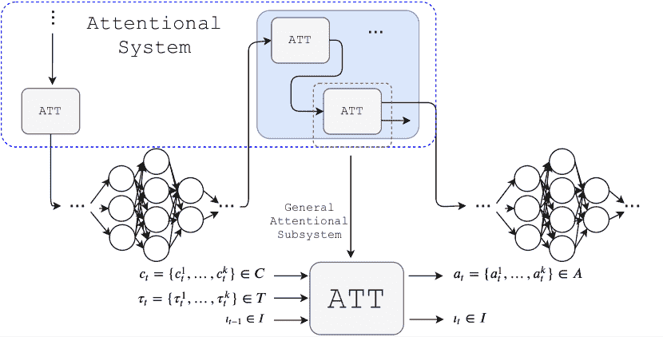

<!--yml

类别：未分类

日期：2024-09-06 19:49:00

-->

# [2112.05909] 神经注意模型在深度学习中的调查与分类

> 来源：[`ar5iv.labs.arxiv.org/html/2112.05909`](https://ar5iv.labs.arxiv.org/html/2112.05909)

\DeclareUnicodeCharacter

2212-

# 神经注意模型在深度学习中的调查与分类

Alana de Santana Correia 和 Esther Luna Colombini 机器人与认知系统实验室（LaRoCS）计算机学院，坎皮纳斯大学，阿尔伯特·爱因斯坦大道 1251 号 - 坎皮纳斯，SP - 巴西 电子邮件：{alana.correia, esther}@ic.unicamp.br。

###### 摘要

注意力是一种兴奋状态，能够通过选择性地关注一条信息而忽略其他感知信息来应对人类处理瓶颈[1]。几十年来，注意力的概念和功能在哲学、心理学、神经科学和计算领域得到了研究。目前，这一特性在深度神经网络中得到了广泛探索。许多不同的神经注意模型现在可用，并且在过去六年中一直是一个非常活跃的研究领域。从注意力的理论角度来看，本调查对主要的神经注意模型进行了关键分析。我们提出了一种与深度学习之前的理论方面相符的分类方法。我们的分类提供了一个组织结构，提出了新问题并构建了对现有注意机制的理解。特别地，我们基于心理学和神经科学经典研究提出了 17 个标准，用于对分析的超过 650 篇论文中的 51 个主要模型进行定性比较和关键分析。此外，我们还突出了尚未探索的几个理论问题，包括对生物学合理性的讨论，突出当前的研究趋势，并为未来提供了见解。

###### 索引词：

调查、分类学、注意机制、神经网络、深度学习、注意模型。

## I 引言

注意力是一种能够通过选择性地专注于一条信息而忽略其他可感知信息，从而处理有限处理瓶颈的唤醒状态 [1]。根据詹姆斯的观点 [2]，注意力可以被认为是一种内在力量，它自发或主动地创造对感官或运动性质的心理预期，促进刺激的感知和反应的产生。这种内在力量也可以被理解为一种认知需求，因为在任何时刻，环境提供的感知信息总是超出可处理的范围，无法对所有外部刺激同时作出反应。在自然界中，注意力是一项与所有生命形式的生存密切相关的基本活动，源自生物长期的认知进化过程。在处于最低进化等级的生物中，注意力主要作用于感知，选择和调节来自环境的相关刺激。这个机制对于物种的延续和进化至关重要，因为它被定义为在环境中集中于感兴趣的点，识别可能的猎物、捕食者或竞争对手的能力。在人类中，注意力在整个认知周期中固有地存在于大脑中，从刺激的感知、复杂心理过程的组织到决策制定。

几十年来，科学的多个领域一直关注注意力的作用。在心理学中，从 1890 年开始的研究寻找反映人脑注意力过程表现的行为相关因素，例如监视时间 [3]、无意识盲点 [4]、注意力闪烁 [5]、认知处理中的反应时间 [6] 以及选择性过滤外部刺激的能力 [7]。认知神经科学研究采用了侵入性和非侵入性的方法，如神经解剖/神经生理技术、电生理学、正电子发射断层扫描（PET）和功能性磁共振成像（fMRI），以捕捉有关注意力障碍的见解 [8]。神经生理学家致力于研究神经元如何响应代表感兴趣的外部刺激 [9]。最后，计算神经科学家整合来自不同视角的所有见解，并支持现实的计算模型，以模拟和解释注意力行为，力求理解注意力过程发生或需要的方式、位置和时机 [10]。

受这些研究的启发，计算机科学家在 1990 年代提出了第一个注意力机制，用于解决当时算法固有的高计算复杂性所带来的性能限制。最初，受到特征整合理论启发的几个注意力视觉模型应运而生，这些模型用于目标识别[11]、图像压缩[12]、图像匹配[13]、图像分割[12]、目标跟踪[walther2004detection]、主动视觉[14]和识别[11]。特征整合理论是最早将视觉注意力形式化为感知的理论之一，其中从系统观察到的场景中提取一组简单的特征，然后在随后的步骤中进行刺激的整合，从而支持识别环境中的相关对象。随后，视觉注意力作为一种工具，能够为机器人代理在世界中进行决策提供环境的基本信息。因此，若干机器人导航系统[15]、SLAM[16]以及人机交互[17]集成了注意力机制，以提高这些自主代理的性能。

在过去十年里，人工智能科学家注意到注意力机制是提升深度神经网络性能的一个基本概念。在深度学习中，注意力引入了一种新型计算形式，灵感来自于人脑，与神经网络目前的操作方式大相径庭。注意力机制使得网络更加可扩展、更简洁，促进了多模态的处理，并减少了来自长时间和空间依赖的信息瓶颈。注意力接口目前主要集中在两个主要的发展和研究方向：作为可以轻松插入经典深度学习架构的小模块，以及在整个架构中固有存在注意力的端到端注意力网络。注意力接口通常补充了卷积和递归操作，允许控制资源和内部或外部信息的动态流，这些信息来自神经结构的特定部分或其他外部认知元素（例如，外部记忆、预训练层）。端到端注意力网络代表了深度学习的重大进展。在自然语言处理[18] [19]、多模态学习以及通过图神经网络对非结构化数据的学习中，最先进的方法都使用了端到端注意力方法[20][21]。目前，许多针对深度学习的研究使用了注意力结构，在各种应用领域都有涉及，因此我们能够在主要出版库中绘制出自 2014 年以来超过 6000 篇相关工作的地图。

尽管在计算机科学、心理学、神经科学甚至哲学的各个领域进行了大量研究，但历史性的问题在于注意力在大脑中无处不在，因为没有单一的注意力中心，这使得概念和研究方面相当抽象且难以验证。当一组相关概念和想法变得难以管理时，分类法就显得很有用。通过分类法，可以将不同方面归类并系统地研究它们。在心理学和神经科学中，这个问题依然存在，但已经有几个理论和分类法被多个认知行为研究者广泛接受[22]。

具体来说，在深度学习中，没有基于注意力理论概念的分类法，因为现有的少数分类法远离理论概念，并且在特定范围内较为具体[23][24]。在这种情况下，基于心理学和神经科学概念的统一注意力框架是必要的，以阐明不同的注意力机制在深度学习中的作用，便于发现新的研究机会。因此，我们的目标是为读者呈现一个基于多种理论见解和深度学习之前的相关研究的神经网络注意力分类法[1]。我们围绕五个主要维度制定了一个非常广泛和通用的分类法：组件（第 IV-A 节），过程的功能（第 IV-B 节），刺激的性质（第 IV-C 节），根据刺激的过程性质（第 IV-D 节），以及连续性（第 IV-E 节）。

### I-A 贡献

本调查呈现了一种与深度学习之前的注意力理论方面相符合的分类法。基于我们的分类法，我们展示并讨论了该领域主要的神经注意力模型。

作为我们工作的主要贡献，我们强调：

1.  1.

    我们提出了一个统一的注意力框架；

1.  2.

    我们首次提出了基于注意力理论概念的分类调查；

1.  3.

    我们系统回顾了主要的神经注意力模型，并提供了所有的搜索和过滤工具，帮助研究人员在未来的主题搜索中¹¹1 下载链接：[`github.com/larocs/attention_dl`](https://github.com/larocs/attention_dl)；

1.  4.

    我们通过详尽的搜索和过滤技术选择了主要的研究成果，并在分析的 650 多篇论文中挑选出最相关的；

1.  5.

    基于我们的分类法，我们讨论了主要注意力机制的生物学可能性；

1.  6.

    基于我们分类法中提出的概念，我们详细描述了该领域的主要注意力系统；

1.  7.

    最后，我们提供了对趋势和研究机会的广泛描述。

### I-B 组织结构

本调查的结构如下。在第 II 节中，我们介绍了注意力的概念。第 III 节包含了一个统一的注意力模型。在第 IV 节中，我们介绍并讨论了我们的分类法。在第 V 节中，我们展示了主要的架构，并从我们的分类法角度讨论了中心模型。最后，在第 VI 节中，我们讨论了该领域的局限性、开放挑战、当前趋势和未来方向，并在第 VII 节中总结了我们的工作。

## II 注意力的概念

注意力很难正式和普遍地定义。在心理学中，注意力是指注意的行为或状态，主要是通过将思维集中在感官或思维的对象上，或甚至作为一种准备状态，这种状态选择性地缩小或集中意识和接受能力[1]。然而，从深度学习的角度来看，需要对注意力有一个明确的定义。在我们的定义中，注意力是由一个或多个模块组成的系统，这些模块分配结构或时间资源，选择或调节信号以执行任务。每个模块由一个或多个非线性函数组成，这些函数与神经网络一起训练。具体来说，每个模块输出一个选择性或调节性的掩膜，用于处理输入信号。分配的结构资源是体系结构的元素（例如，神经元数量、层数），时间资源指的是每一步的计算量、时间步数、体系结构或框架中模块的处理时间。任务是目标应用（例如，分类、回归、分割、目标识别、控制等），信号可以在任何抽象级别提供（例如，特征、视觉信息、音频、文本、记忆、潜在空间向量）。我们的定义得到了本文以下部分的支持，主要是我们的分类法（第 IV 节）。

## III 统一的注意力框架

在本节中，我们定义了一个通用且统一的注意力模型。我们的模型与理论方面相符，并且独立于架构和应用领域。具体来说，我们认为一个注意力系统包含一组注意力子系统——甚至以递归方式——用于分配资源以进行处理。一个注意力子系统在每个时间步$t$，接收作为输入的上下文输入$c_{t}$、焦点目标$\tau_{t}$和过去的内部状态$i_{t-1}$。它的输出是当前的内部状态$i_{t}$和当前的焦点输出$a_{t}$，如图 1 所示。焦点输出是子系统的主要元素，因为它为目标分配重要性评分。多个注意力子系统共同作用，提供选择能力。子系统的特征取决于数据结构和所需的输出。我们提出了一个通用结构，并添加了一些附加组件，虽然这些组件并非普遍存在，但在文献中的大多数模型中仍然可以找到。在图 2 中，我们列出了所有关键组件。

图 1：我们的注意力框架示意图，其中多个注意力子系统在神经网络中按顺序或递归地耦合。每个子系统根据输入数据的结构和感官模态具有不同的特征。单个子系统将关注目标（即要过滤的刺激）作为主要输入，有时还会接收辅助输入（例如，上下文信息和子系统的前一个内部状态），以帮助机制在时间上引导关注。

| 符号 | 描述 |
| --- | --- |
| 上下文 |
| --- |
| $k$ | 感官模态索引。 |
| $C$ |

&#124; 上下文输入集，$C=\{c_{t-1},\ldots,c_{t}\}$，$C\in\mathbb{R}$，（例如，隐藏状态、记忆数据、感官数据）。 &#124;

|

| $c_{t}$ |
| --- |

&#124; 时间$t$的上下文输入，$c_{t}=\{c_{t}^{1},\ldots,c_{t}^{k}\}$，$c_{t}\in C$。 &#124;

|

| $c^{k}_{t}$ |
| --- |

&#124; 时间$t$的感官模态$k$的上下文输入，$c_{t}^{k}=\{c_{t,1}^{k},\ldots,c_{t,n_{ck}}^{k}\}$，$c_{t,j}^{k}\in\mathbb{R}^{F_{c}}$，其中$F_{c}$是 &#124;

&#124; 特征的数量。 &#124;

|

| 关注目标 |
| --- |
| $T$ |

&#124; 目标关注集，$T=\{\tau_{t-1},\ldots,\tau_{t}\}$，$T\in\mathbb{R}$。 &#124;

|

| $\tau_{t}$ |
| --- |

&#124; 时间$t$的关注目标，$\tau_{t}=\{\tau_{t}^{1},\ldots,\tau_{t}^{k}\}$，$\tau_{t}\in T$。 &#124;

|

| $\tau_{t}^{k}$ |
| --- |

&#124; 感官模态$k$的关注目标 &#124;

&#124; 对于$n_{\tau k}$个元素的特征，如果$\tau_{t}^{k}$是数据，则为超参数或索引，如果$\tau_{t}^{k}$是程序。 &#124;

&#124; $\tau_{t}^{k}=\{\tau_{t,1}^{k},\ldots,\tau_{t,n_{\tau k}}^{k}\}$，$\tau_{t,j}^{k}\in$ $\mathbb{R}^{F_{\tau k}}$，其中$F_{\tau k}$是特征的数量。 &#124;

|

| 内部状态 |
| --- |
| $I$ |

&#124; 内部状态集，$I=\{i_{t-1},\ldots,i_{t}\}$，$I\in\mathbb{R}$。 &#124;

|

| $i_{t}$ | 时间$t$的内部状态，$\iota_{t}\in I$。 |
| --- | --- |
| $i_{t}-1$ | 时间$t-1$的过去内部状态，$\iota_{t-1}\in I$。 |
| 关注输出 |
| $A$ |

&#124; 关注输出集，$A=\{a_{t-1},\ldots,a_{t}\}$，$A=\left\{x\in\mathbb{R}:0<x<1\right\}$或$A=\left\{x\in\mathbb{Z}:0\leq x\leq 1\right\}$。 &#124;

|

| $a_{t}$ |
| --- |

&#124; 时间$t$的关注输出，$a_{t}=\{a_{t}^{1},\ldots,a_{t}^{k}\}\in A$。 &#124;

|

| $a_{t}^{k}$ |
| --- |

&#124; 时间$t$的感官模态$k$的关注输出，$a_{t}^{k}=\{a_{t,1}^{k},\ldots,a_{t,n_{\tau k}}^{k}\}$是注意力分数， &#124;

&#124; $a_{t,j}^{k}\in\mathbb{R}^{F_{\tau k}}$或$a_{t,j}^{k}\in\mathbb{R}$，$a_{t}^{k}\in\mathbb{R}^{n_{\tau k}\times F_{\tau k}}$或$a_{t}^{k}\in\mathbb{R}^{n_{\tau k}}$。 &#124;

|

图 2：统一注意力模型的符号说明。注意符号支持递归和多模态。

## IV 注意力模型的分类

本节介绍了我们围绕 16 个因素的分类法，这些因素将用于分类和讨论在图 3 中总结的主要神经注意力模型。这些因素起源于对注意力的行为和计算研究。在 IV-A 节中，我们从组成部分的角度展示注意力模型，而在 IV-B 节中，我们讨论了过程功能，呈现了感知和认知选择机制。IV-C 节根据刺激的性质展示了机制，而在 IV-D 节中，我们讨论了根据刺激分析过程性质的机制。最后，在 IV-E 节中，我们从连续性的角度展示了机制。

| 编号 | 模型 | 年份 | f1 | f2 | f3 | f4 | f5 | f6 | f7 | f8 | f9 | f10 | f11 | f12 | f13 | f14 | f15 |
| --- | --- | --- | --- | --- | --- | --- | --- | --- | --- | --- | --- | --- | --- | --- | --- | --- | --- |
| 自下而上 |  |  |  |
| 1 | STN [25] | 2015 | + | - | - | - | - | + | FM | - | - | - | - | + | - | + | - |
| 2 | Chen 等 [26] | 2016 | - | + | - | - | - | + | - | - | L | - | - | - | + | - | + |
| 3 | AT [27] | 2016 | - | + | - | - | - | + | FM | - | - | - | - | + | - | - | + |
| 4 | SNAIL [28] | 2017 | - | + | + | - | - | + | H | - | - | - | - | - | + | - | + |
| 5 | SENet [29] | 2018 | - | + | - | - | - | + | - | - | V | - | - | + | - | - | + |
| 6 | GAT [20] | 2018 | - | + | - | - | - | + | H | - | H | - | - | + | + | - | + |
| 7 | $A^{2}-Nets$ [30] | 2018 | - | + | - | - | - | + | FM | - | - | - | - | - | + | - | + |
| 8 | DANet [31] | 2019 | - | + | + | - | - | + | FM | - | V | - | - | + | - | - | + |
| 9 | HAN [32] | 2019 | - | + | - | - | - | + | H | - | H | - | - | + | + | - | + |
| 10 | TIM [33] | 2021 | - | + | + | - | - | + | H | - | - | - | - | - | + | - | + |
| 自上而下 |  |  |  |
| 11 | RNNSearch [34] | 2014 | - | + | + | - | - | + | H | - | - | - | - | - | + | - | + |
| 12 | Tang 等 [35] | 2014 | + | - | - | + | + | - | - | + | - | - | - | - | + | + | - |
| 13 | aNN [36] | 2014 | - | + | + | - | - | + | - | - | + | - | - | - | + | - | + |
| 14 | NTM [37] | 2014 | - | + | + | - | - | + | EM | - | O | - | - | - | + | + | + |
| 15 | RAM [38] | 2014 | + | - | + | - | + | - | I | - | - | - | - | - | + | + | - |
| 16 | dasNet [39] | 2014 | - | + | + | - | - | + | - | - | V | - | - | - | + | - | + |
| 17 | EMNet [19] | 2015 | - | + | - | - | - | + | EM | - | - | - | - | - | + | - | + |
| 18 | DRAW [40] | 2015 | + | + | + | - | + | + | I/H | - | - | - | - | - | + | - | + |
| 19 | Xu 等人 [41] | 2015 | - | + | + | - | - | + | H | - | - | - | - | - | + | + | + |
| 20 | Ptr-Net [42] | 2015 | + | + | + | - | - | + | H | - | - | - | - | - | + | + | + |
| 21 | Rocktäschel 等人 [43] | 2015 | - | + | + | - | - | + | H | - | - | - | - | - | + | - | + |
| 22 | Luong 等人 [44] | 2015 | - | + | + | - | - | + | H | - | - | - | - | - | + | - | + |
| 23 | Hermann 等人 [45] | 2015 | - | + | + | - | - | + | H | - | - | - | - | - | + | - | + |
| 24 | DMN [46] | 2015 | + | - | + | - | - | + | H | - | - | - | - | - | + | - | + |
| 25 | BiDAF [47] | 2016 | + | + | - | - | - | + | H | - | - | - | - | - | + | + | + |
| 26 | STRAW [48] | 2016 | + | + | + | - | - | + | EM | - | - | + | - | - | + | + | + |
| 27 | Allamanis 等人 [49] | 2016 | - | + | + | - | - | + | H | - | - | - | - | - | + | - | + |
| 28 | Lu 等人 [50] | 2016 | - | + | - | - | - | + | H | - | - | - | - | - | + | - | + |
| 29 | ACT [51] | 2016 | + | + | + | - | - | + | - | - | - | - | + | - | + | - | + |
| 30 | Lu 等人 [52] | 2016 | - | + | + | - | - | + | FM/H | - | MC | - | - | - | + | - | + |
| 31 | HAN [53] | 2016 | - | + | + | - | - | + | H | - | - | - | - | - | + | - | + |
| 32 | Excitation Backprop [54] | 2016 | - | + | - | - | - | + | N | - | - | - | - | - | + | - | + |
| 33 | DCN [55] | 2016 | - | + | - | - | - | + | H | - | - | - | - | - | + | + | + |
| 34 | GCA-LSTM [56] | 2017 | - | + | + | - | - | + | H | - | - | - | - | - | + | - | + |
| 35 | Reed 等人 [57] | 2017 | - | + | + | - | - | + | H | - | - | - | - | - | + | - | + |
| 36 | Seo 等人 [58] | 2017 | - | + | + | - | - | + | FM | - | - | - | - | - | + | - | + |
| 37 | SAB [59][60] | 2017 | - | + | + | - | - | + | H | - | - | - | - | - | + | - | + |
| 38 | ACF Network [61] | 2017 | + | - | + | - | - | + | - | - | - | + | - | - | + | + | - |
| 39 | Kim 等人 [62] | 2017 | - | + | - | - | - | + | H | - | - | - | - | - | + | - | + |
| 40 | BAN [63] | 2018 | - | + | - | - | - | + | - | - | V | - | - | - | + | - | + |
| 41 | AG [64] | 2018 | - | + | - | - | - | + | FM | - | - | - | - | - | + | - | + |
| 42 | Perera et al. [65] | 2018 | - | + | + | - | - | + | H | - | MC | - | - | - | + | - | + |
| 43 | Deng et al. [66] | 2018 | - | + | - | - | - | + | H | - | - | - | - | - | + | - | + |
| 44 | HAN [67] | 2020 | - | + | - | - | - | + | M | - | - | - | - | - | + | - | + |
| 45 | IMRAM [68] | 2020 | - | + | - | - | - | + | H | - | - | - | - | - | + | - | + |
| 46 | Lekkala et al. [69] | 2020 | - | + | - | - | - | + | - | - | V | - | - | - | + | - | + |
| 混合 |  |  |  |
| 47 | Transformer [18] | 2017 | - | + | + | - | - | + | H | - | - | - | - | - | + | - | + |
| 48 | DiSAN [70] | 2018 | - | + | - | - | - | + | H | - | L | - | - | - | + | - | + |
| 49 | ANP [71] | 2019 | - | + | - | - | + | + | O | - | - | - | - | - | + | - | + |
| 50 | BRIMs [72] | 2020 | - | + | + | - | - | + | H | - | - | - | - | - | + | - | + |
| 51 | MSAN [73] | 2020 | + | + | + | - | - | + | H | - | - | + | - | - | + | + | + |

图 3：主要神经注意力模型的总结。因素的顺序是：选择性（f1），分裂性（f2），定向性（f3），持续性（f4），选择性感知（f5），选择性认知（f6），基于位置（f7），基于对象（f8），基于特征（f9），任务导向（f10），时间导向（f11），无状态（f12），有状态（f13），硬性（f14），软性（f15）。在基于位置（f7）列中：隐藏状态/数据嵌入（H），外部记忆单元（EM），特征图（FM），输入数据（I），和其他（O）。在基于特征（f9）列中：视觉（V），语言（L），记忆单元（MC），隐藏状态（H），和其他（O）。在其他列中，特征的存在用 + 符号表示，缺失用 - 符号表示。

### IV-A 组件：选择性、分裂性、定向性和持续性

每个注意力子系统可以具有选择性、分裂性、定向性或持续性属性。关于我们同时关注的元素数量，我们可以将子系统分类为选择性注意力或分裂注意力。关于时间瞬间之间的注意力，注意力可以是定向的或持续的。选择性注意力只选择一个刺激，而分裂注意力则是最高级别的注意力，指的是同时响应多个刺激或任务。从生物学角度看，如果一个任务由自动过程介导，另一个由认知过程介导，则分裂注意力只能同时操作两个任务，以便只有一个任务需要大量智力努力。

定向注意力可以通过三个过程将焦点从一个刺激转移到另一个刺激：1) 离开当前焦点，2) 将焦点转移到预期的刺激上，3) 确定目标并维持注意力。这一组件代表了协调同时进行的任务的能力，以便在被打断后能够暂时恢复。这一功能通常与中央执行系统相关联，中央执行系统协调和管理大脑的信息处理活动[75]。在工作记忆（WM）中，定向注意力机制在确定每个时间步$t$中加载和删除的感知信息及长期记忆信息时极为有用。定向组件通常从所有可用的信息中选择一个或一组项目，以提供某些心理过程的输入。持续注意力或警觉性通过直接集中注意于特定刺激以完成计划活动，从而在时间上维持目标。这个组件在学习、执行日常任务、维持对话和社会关系等众多影响心理健康的技能中扮演着基础性角色[76]。尽管如此，持续注意力通常比注意力的瞬态方面（如转移、分配和选择）研究得少。持续注意力的区别在于专注于单一任务的表现持续时间。个体在任务上保持稳定表现的总体能力存在波动，并在暴露于刺激和恢复期间之间存在权衡。

在我们的框架中，选择性注意可以理解为子系统从所有刺激中仅选择一个来自焦点目标的刺激，或者从目标中选择仅具有相同注意权重的刺激子集，并完全抑制未选择刺激的反应。另一方面，在分散注意力中，注意力面罩分布在整个输入焦点目标上，因此没有刺激会被完全抑制，只是被调节为比其原始值更大或更小的权重。在定向注意中，在时间 $t_{1}$，注意力集中在焦点目标 $\tau_{t}$ 的一个非空元素子集上；在时间 $t_{2}$，注意力转移到来自相同目标或其他目标的新元素子集上；在时间 $t_{3}$，注意力可能集中在一个不同的目标或初始目标上。然而，如果目标随时间不变且注意力面罩始终相同，或者如果目标随时间变化但注意力面罩保持在与目标相同的语义元素上，则系统为持续注意。例如，如果目标是一系列图像，且注意力面罩在整个序列中始终围绕同一对象，或者面罩始终保持在图像的相同特征上，则系统为持续注意。如果注意力系统可以选择在时间上改变其焦点或保持在相同焦点上，则系统也被认为是定向注意，因为在某些时候，存在切换的可能性。

面向或持续的系统仅存在于顺序/重复架构中。第一个面向系统通过图像中的视觉搜索引擎和编码器-解码器框架出现。基于 RAM 的视觉搜索架构[38]使用面向注意力来控制感知传感器的焦点。在每个时间步$t$，传感器充当视网膜，只选择输入图像的一部分进行后续处理。被选中的图像部分接收相同的注意力权重，而其他区域则完全被抑制，呈现出注意力的选择性特征。一个 DRAW [40]使用了非常相似的面向组件来生成图像。在每个时间步$t$，两个注意力组件将焦点从读取头和写入头转移到图像的较小部分，从而实现对先前生成部分的顺序生成和细化。然而，在同一时间$t$，注意力掩膜明确地将注意力在图像的所有像素之间进行划分。然而，目标上的掩膜计算过程会选择仅所需的区域，排除其他区域进行后续处理，如选择性机制。空间变换器[25]具有一个选择性的视觉搜索引擎，它只采样图像中的一个感兴趣区域，撤销空间变形，并将结果传递给后续处理。这个机制在时间方面非常灵活，其特征取决于它附加的架构。如果它在非顺序架构中，它仅仅是被选择的，但如果它在顺序架构中，它可以作为面向或持续的注意力机制。如果机制能够跟踪相同的兴趣区域，它就是持续的。否则，它是面向的。

大多数用于推理的编码器-解码器-注意力框架[77] [43][78]、机器理解[79]、神经网络和机器翻译[34]都是分离和定向注意力的。在每一个时间步 $t$，注意力掩码可以同时隐藏来自编码器的隐藏状态，以组合一个动态上下文向量，权衡所有信息，如工作记忆中的推理结构，选择和调节记忆以满足某些心理过程。相同的隐藏状态仍然是下一个时间步的目标，但系统可以以完全不同的方式分配注意力权重，具有定向注意力系统。一些在外部记忆上操作的注意力系统也是分离和定向的。经典的神经图灵机[37] [80] 将注意力分配到所有外部记忆单元，以检索存储记忆的调制表示。在每一个时间步，定向注意力机制由不同的上下文输入引导，以定义对记忆的新注意力分布。STRAW[48] 使用分离和定向的读/写头系统，通过强化学习找到并更新区域，更多地关注训练虚拟代理的行动计划。另一个选择的定向注意力系统决定何时行动，或是否仅应在行动计划和承诺计划的时间上前进。Perera 等人[65] 在 LSTM 单元中使用了两个分离和定向的注意力机制。第一个是 LSTM 单元外部的，将前一隐藏状态的历史信息聚合成一个记忆向量 $h_{A}^{t-1}$。第二个在单元内部作为门控层，更新当前单元向量，与 $h_{A}^{t-1}$ 的每个部分的重要性成比例。该机制将记忆向量 $h_{A}^{t-1}$ 作为目标，对整个向量进行注意力分配，对最相关的部分给予更多权重，对较不相关的部分给予较少权重。然后更新当前单元向量。

GCA-LSTM 网络 [56] 使用了一个分层且定向的注意力机制，在每个时间步 $t$ 更新 LSTM 单元中的细胞状态。该机制根据之前的隐藏状态生成 $i_{j,t}$ 输入门和 LSTM 单元的空间/时间上下文信息的注意力掩码。在 dasNet [39] 中，CNNs 中的注意力机制相互通信静态卷积结构，生成一个序列处理结构，其中定向和分层注意力系统以先前时间步的特征图集作为上下文。然后，它在当前时间步的特征图上生成注意力掩码，在新的特征图上选择保持或不保持相同的注意力权重。然而，大多数卷积结构仅为分层注意力，主要针对特征图。注意力门控网络 [64] 提供了纯粹分层机制的经典示例。它们接收一组特征图作为输入，并在所有图上同时返回空间注意力掩码。在这种情况下，注意力系统集中于空间特征，以相同的权重加权不同图的相同区域，但在每张图上，掩码对每个像素的权重不同。一些机制在架构和时间特征方面也相当灵活。例如，结构化注意力网络 [62] 具有可以耦合在序列架构中的分层机制，作为定向或持续注意力运行。

一些方法使用定向组件将注意力转移到神经结构上，而不是直接在数据上。注意力相关滤波网络 [61] 使用定向和选择组件，每个时间步选择不同的过滤验证策略来处理输入图像。模态转换注意力 [73] 使用定向和选择组件来决定使用视觉模态还是语言模态。很少有模型具有持续注意力。据我们所知，只有 Tang 等人 [35] 提出了一个能够在遮挡、旋转、缩放和视角突然变化的情况下追踪特定面孔的注意力系统。

### IV-B 选择性感知与选择性认知

注意力不仅可以集中在通过感官传递的感觉刺激上，还可以关注心理过程，例如记忆、思维、心理计算等。当注意力集中在外部环境时，这也可以称为选择性感知，而当集中在内部环境时，则可以称为选择性认知。我们认为，当注意力子系统接收外部感觉刺激时，感知选择会发生。在这种情况下，注意力在原始数据和神经网络之间起作用，从而增强感知。选择性认知，即集合 $\tau_{t}$，是潜在空间中的信息（即记忆数据、数据嵌入、特征数据或隐藏状态）。尽管经典的注意力研究集中在感觉感知上，但深度学习方法则侧重于隐藏状态/嵌入向量、外部记忆和特征图上的认知选择，如图 3 中所示的 f4 和 f5。该领域中的第一个注意力机制是为 RNNSearch [34]提出的，侧重于编码器隐藏状态上的认知选择。其目标是基于之前生成的词来加权动态上下文向量。沿着这条路线，已经开发出无数其他认知机制，以处理编码器-解码器框架中内部记忆结构之间的长距离依赖关系，甚至访问网络外部的记忆。随后，出现了层次对齐 [53]、多模态对齐 [41][67]、特征增强 [29][30]、特征嵌入 [26] 和信息融合 [56] 机制，这些机制都使用了神经网络中的内部信息。现有的主要感知选择机制集中在计算机视觉任务上，借鉴了人类视觉注意力理论的一些启示 [38]。

### IV-C 刺激的性质

根据刺激的性质，注意力可以是面向任务的或时间导向的，如果目标是程序（即神经网络），也可以是基于空间的或基于对象的，如果目标是数据集。

#### IV-C1 基于空间与基于对象的模型

关于注意在感知尺度上的共识尚不存在：我们是否关注刺激位置、特征或对象？在过去的 50 年中，行为研究广泛证明了注意力在几个知觉领域的调节，包括空间、特征、对象和感觉模态。当前的观点是注意力可以用于这些单元中的每个单元，这意味着没有单一的注意单元。然而，经典研究的主要领域是空间（即基于位置的注意力），自 1970 年以来一直是研究的重点。这个重点并非偶然 - 视觉是一种本质上是空间感知的感觉，而视觉表征的第一个皮质阶段是在空间上组织的。许多重要的研究已经记录了空间注意力在额外条带皮质中调节神经活动的情况。

随后，经典文献中的其他非严格空间的注意选择领域 - 基于特征和基于对象的注意成为研究的焦点。基于特征的注意是指根据特定特征维度中表达的值选择刺激（例如，颜色维度中的黄色和移动维度中的左侧）。Saenz 等人使用功能磁共振成像（fMRI）对人体进行了实验，并观察到神经反应的幅度取决于刺激特征与选择与任务相关的空间和非空间感觉信息的视觉刺激特征的结合。虽然位置和基于特征的注意已广泛研究，但基于对象的注意仅在过去 25 年的行为研究中成为关注的焦点。研究发现，注意力可以指向一个或两个空间重叠的对象。O'Craven 等人展示了观察者之间房屋和面孔之间的空间重叠。任何时候，测试对象都应该看着房子或面孔。作者在脸部的选择性皮质区域以及依赖于被注意到的两个刺激之一的房屋的选择性查看家中观察到了大脑活动。他们发现 MT 区运动触发信号的幅度也取决于辅助对象是否移动，这表明选择了所有辅助对象的特征。

在我们的框架中，基于位置的注意力是一个子系统，专注于刺激定位，对每个焦点目标的刺激存在一个注意力权重，即 $a_{t,j}^{k}\in\mathbb{R}$。基于特征的注意力是一个子系统，专注于目标特征，即焦点输出 $a_{t,j}^{k}\in\mathbb{R}^{F_{\tau k}}$。在基于对象的注意力中，一个子系统能够专注于焦点目标的语义元素。例如，时间 t 的焦点目标 $\tau_{t}^{k}$ 可能代表 $n_{\tau^{k}}$ 个像素 $px$ 的集合，注意力子系统仅选择对象。焦点输出集 $A=\left\{x\in\mathbb{Z}:0\leq x\leq 1\right\}$，$a_{t}^{k}\in\mathbb{R}^{n_{\tau k}}$，并且 $a_{t,j}^{k}$ 的每个位置仅在像素在对象内部时为 1。

在这个背景下，大多数模型是数据驱动的，并且完全基于位置，如图 3 所示。它们的主要目标是神经网络输入刺激的隐藏状态/嵌入向量、特征图、外部记忆单元和原始数据。当机制专注于隐藏状态或嵌入向量时，注意权重有助于构建动态上下文向量，减少多模态方法[41] [67]、编码器-解码器结构[34]和嵌入表示问题[26]中的信息瓶颈问题。同样，当应用于外部记忆单元时，这些机制能够不同的记忆位置来构建一个总结任务当前上下文的动态向量。当位置基础机制应用于特征图时，它们调整特征提取器的输出，以使目标区域在存在干扰背景时突出，试图模拟人类视觉皮层某些区域的机制。然而，很少有位置基础机制直接关注神经网络的输入刺激。尽管在心理学和神经科学领域有广泛的研究关注人类视觉的空间方面，但只有 RAM [38]（第 V-C: A visual attention system for image classification ‣ V Neural Attention Models ‣ Neural Attention Models in Deep Learning: Survey and Taxonomy")节）、DRAW [40]（第 V-F ‣ V Neural Attention Models ‣ Neural Attention Models in Deep Learning: Survey and Taxonomy")节）、空间变换器[25]及类似方法探讨了对原始输入图像数据的基于位置的注意力模型。空间变换器提出了一种特别有趣的方法，基于特征图，定位网络确定变换参数，这些参数作为上下文使注意系统选择特征图上的局部网格，并应用学习到的变换，从而最小化焦点区域的变形，适用于卷积网络中的分类任务。

几乎没有完全基于特征、基于对象或混合方法的研究。完全基于特征的机制在卷积神经网络的特征图[29] [30]和图神经网络[20] [84]中更为常见，这些机制试图通过全局信息或目标刺激的附近调整特征的属性，以突出那些与目标任务最相关的特征。目前仍然很少有混合方法在处理的两个阶段中结合位置和特征机制：1）在第一阶段，特征在目标上加权，为第二阶段构建有用的上下文向量；2）在第二阶段，基于位置的机制使用对特征的迭代来引导注意力集中在刺激的位置。在该领域中，也很少有基于对象的方法。据我们所知，只有 Tang 等人[35] 提出了一个以对象为中心的视觉注意力方法，该方法受 Shifter Circuit Model [85] 启发。这是一种生物学上合理的视觉注意力模型，用于形成对象在世界上的尺度和位置的不变表示。通过控制由记忆驱动的神经元，它控制突触力量，从而引导空间组织信息在初级视觉皮层（V1）向上层皮层区域的流动，使辅助对象在位置和尺度上以不变的方式进行表示。类似地，该模型使用具有视网膜样表示的注意力系统来搜索场景中的面孔，并由联想记忆中存在的信号引导。训练过程中学到的一系列标准变换帮助引导图像上的注意力，选择感兴趣的面孔区域。在第二阶段，辅助机制将结果信号传播到由高斯深度信念网络（DBN）[86] 表示的联想记忆中。

#### IV-C2 任务导向与时间导向模型

当目标是一个程序时，注意力机制直观地寻求回答以下问题：在所有这些网络中，应该选择哪个来执行答案/任务？每个神经结构应花费多少计算时间？任务导向的选择子系统选择一个（或多个）程序进行下一步执行。我们可以认为目标集 $T$ 是可能的 $N$ 个程序的集合，注意力选择最适合任务的程序，在时间 $t$ 内。时间导向选择注意力决定在给定计算时间预算的情况下，为每个程序分配多少计算时间。例如，框架包含几个神经网络 $\tau_{t}=\{\tau_{t}^{1},\tau_{t}^{2},\tau_{t}^{3}\}$ 需要执行。注意力子系统必须决定从预算 $B$ 中花费多少计算量在每个神经网络 $\tau_{t}^{k}$ 上。焦点输出为 $a_{t}=\{a_{t}^{1},a_{t}^{2},a_{t}^{3}\}$，$a_{t}^{1}+a_{t}^{2}+a_{t}^{3}=1$，每个程序的计算量可以计算为 $a_{t}^{k}B$。

在该领域中，少数架构针对神经网络（见图 3，位于 f9 和 f10）。自适应计算时间（ACT）[51] 选择在 $t$ 时间框架内由递归结构执行多少个辅助计算子步骤。该结构决定计算预算的分配方式，控制递归结构何时停止并基于辅助输出生成最终输出 $y_{t}$。注意力相关滤波网络 [61] 根据之前深度回归网络的验证分数，将注意力集中在不同的特征提取器集上，确定每个时间步 $t$ 必须激活哪个特征提取器集以接收输入图像流。之前的验证分数作为上下文信息反馈给注意力系统，关于任务中一般系统的表现，从这些反馈中，注意力可以调节下一次迭代的关注点。模态转换注意力 [73] 具有一个任务导向的机制，负责在捕捉视觉感官刺激的神经网络和捕捉语言刺激的神经网络之间转移注意力。该系统由一个上下文指导，该上下文通过图像序列和问题回答任务的标题表示。在 STRAW [48] 中，任务导向的注意力机制控制对行动计划和承诺计划的读、写以及时间推进结构的激活，控制数据导向的注意力机制何时需要通过强化学习来更新训练代理的计划。

### IV-D 自下而上 versus 自上而下模型

模型之间的一个重大区别在于它们是否依赖于自下而上的影响、 自上而下的影响，或两者的结合。自下而上或内在注意是由输入刺激的特征决定的（即，刺激驱动），而自上而下的线索由认知现象决定，如知识、期望、奖励和当前目标（即，目标驱动）。以自下而上的方式吸引注意的刺激在周围特征上具有足够的独特性。因此，注意是外源性的、自动的、反射性的和前馈的。自下而上注意的一个典型例子是看一个场景，其中有一根水平条在几根垂直条之间，注意力会立即被引导到水平条上。另一方面，自上而下的注意是一个由个人自行决定的自愿过程，其中某个特定的位置、特征或对象与当前的行为目标相关。这样的过程受到高语义水平的元素的指导，如动机、期望、个人兴趣、奖励和社会动机 [1]。在我们的框架中，自下而上的注意由焦点目标的差异指导，无论是否存在上下文条目 $c_{t}$。然而，上下文来自于目标自身的刺激集的信息。如果注意是由来自其他感觉来源的上下文信息、外部信息或之前的记忆所引导，那么注意就是自上而下的。

此外，我们还考虑了关于上下文存在与之前内在状态的分类。在这种意义上，自下而上和自上而下机制仍然可以是有状态的或无状态的。在有状态的情况下，注意子系统将上下文和内在信息视为输入集的一部分（即，$i_{t-1}$$\neq$$\emptyset$ 或 $c_{t}$$\neq$$\emptyset$），否则子系统实现无状态选择。自下而上的无状态机制没有以前的上下文或内在注意状态作为输入的一部分，因此注意焦点仅通过目标差异的内部提取来分配。自下而上的有状态机制可以同时具有上下文和之前的内在状态输入，或者仅具有其中之一。然而，从外部提取的上下文来自当前目标。在内在状态中，它代表相同目标上的先前注意状态。也就是说，目标不会随时间改变。没有自上而下的无状态机制，因为存在自上而下影响的条件是存在当前目标之外的上下文。对于自上而下的有状态机制，输入中必须存在上下文，而之前的内在状态是可选的。此外，上下文指的是之前的记忆、外部记忆或来自其他感觉来源的元素，而不是目标。

这些机制探索了自上而下和自下而上的影响，旨在回答以下两个问题之一：1) 直观地看，在观察到目标与上下文之间的对齐关系的情况下，应将目标置于何处？2) 在没有上下文的情况下，鉴于目标元素之间的差异和相似性，我应该看向何处？一些模型通过直接从目标中提取上下文来回答第一个问题，也就是说，使用自下而上的影响。神经变换器的编码器堆栈[18]（第 V-H]（第 V-I]在节点级别使用两种自下而上的注意力机制，在语义级别使用自下而上的机制，以捕捉异构图之间的各种语义信息。

在卷积网络中，当目标是一组特征图时，底向上的机制存在。通常，只有通道间或通道内的差异通过提升特征或重新校准通道来引导注意力。Squeeze-and-Excitation Networks [29] 的注意力机制，作为该领域的开创性方法，以一组特征图作为关注目标，使用全局平均池化生成通道级统计数据。基于这些统计数据，它捕捉通道级依赖关系，能够学习通道之间的非线性迭代。最后，以基于特征的方法重新缩放每个输入通道。Double Attention Networks [30] 采用类似但基于位置的方法，使用来自同一卷积层（即底向上）或不同层（即顶向下）的特征上下文图来定义元素之间的关系，其主要目标是基于提取的关系来调整卷积层特征图的区域。最后，SNAIL [28] 通过底向上的方法，利用类似 Transformer 的自注意力机制在元学习者方法中捕捉特征图之间的时间关系。

然而，大多数区域方法是自上而下的有状态的，如图 3 所示。第一个机制是在 2014 年中期为 RNNSearch [34] 提出的，其中接收的上下文作为输入直接负责解码器在每个时间步 $t$ 接收的上下文向量 $c_{t}$ 的动态变化。同样，Xu 等人 [41] 使用解码器的先前隐藏状态中的信息，通过输入图像的区域引导基于位置的机制，以进行多模态问答。具有内部和外部记忆的网络通常是自上而下的结构。端到端记忆网络 [19] 使用作为上下文的问题外部查询来搜索并关注与问题内容更相关的记忆单元。神经图灵机 [37] 使用由网络控制器发出的参数作为上下文，这些参数定义了外部记忆中的基于内容和位置的寻址。稀疏注意回溯 [59][60] 应用了一种注意力稀疏记忆恢复方法来构建 RNN 的下一个隐藏状态，使用临时隐藏状态 $\widehat{h}^{(t)}$ 和目标所有先前处理过的记忆。该机制作为一种能够归咎于或给予先前记忆赞扬的方法，类似于人类的做法，而无需重复从当前事件到已被认可事件的所有事件，有效地捕捉状态之间的长距离依赖。Zhang 等人 [54] 使用自上而下的注意力提出了 Excitation Backprop - 一种基于 Winner-Take-All (WTA) 竞争 [87] 和选择性调节模型 [88] 的生物学证据的新反向传播方案，该方案通过自上而下的 WTA 过程层次结构选择性地调整视觉处理系统。类似地，Excitation Backprop 在 CNNs 上使用概率 WTA，以促进来自先前访问的神经元的自上而下影响之间的兴奋性或抑制性连接。

共同注意结构通常也是自上而下的。在这种结构中，有两种方式传播注意力机制：从查询到上下文，以及从上下文到查询。动态共同注意网络 [55] 就是通过这种方式计算注意力分数。机制为问题中的每个词基于文档词作为上下文生成权重，就如同它们为文档中的每个词基于问题词作为上下文生成权重一样。类似地，超图注意网络 [67] 计算两个超图之间的注意力，比较不同感官来源的两个符号表示之间的语义。

一些结构是混合型的，使用两种影响级别来引导注意力。神经转换器 [18]（第 V-H 节）在这一领域中作为主要的混合结构脱颖而出。它具有完全的自下而上的编码器和混合解码器，使得第一个注意力系统是自下而上的，处理翻译后的单词。相比之下，第二个注意力系统是自上而下的，利用最后一个编码器的注意力信息作为上下文来引导对目标的注意力，目标由之前翻译的单词表示。沿用转换器的结构，最近 BRIMs [72] 提出了混合机制以实现 RIMs 模块之间的通信。自下而上的注意力子系统在同一层的模块之间进行通信，以及在初始层中使用输入 $x_{t}$ 作为目标的隐藏状态的组合，而通过不同层的自上而下注意力模块之间相互通信，请求关于前后层隐藏状态的信息，以组成当前隐藏状态。

### IV-E 连续性：软选择与硬选择

选择可能通过选择可能选择的离散子集来进行，也可能通过对可能选择给予真实值分数的软（或连续）方式来进行。如果$A=\left\{x\in\mathbb{R}:0<x<1\right\}$，则选择是软选择，而$A=\left\{x\in\mathbb{Z}:0\leq x\leq 1\right\}$，则选择是硬选择。

在深度学习中，这些机制主要分为以下几类：1) 硬注意力决定机制的某一部分输入是否应被考虑，反映了机制输入和深度神经网络目标之间的相互依赖关系。分配给输入端口的权重要么是 0，要么是 1；2) 软注意力为每个输入元素分配介于 0 和 1 之间的注意力权重，使所有权重的总和等于 1。它决定了应将多少注意力集中在每个元素上，考虑了深度神经网络机制和目标之间的相互依赖关系；3) 自注意力量化机制输入元素之间的相互依赖关系。该机制允许输入相互“自”交互并确定它们应更关注什么。还有一些次要类别：1) 全局注意力是为编码器-解码器框架提出的经典软注意力的简化版；2) 局部注意力是在硬注意力和软注意力之间的折衷；3) 共同注意力从上下文到目标以及从目标到上下文分配注意力；4) 分层注意力展示了适用于处理不同层次粒度的层次结构的机制。关于连续性，根据我们的分类，硬注意力机制具有硬连续性，而该领域的所有其他机制具有软连续性。

目前尚无系统研究来确定硬连续性和软连续性机制的优缺点。然而，如图 V 的 f13 和 f14 所示，软连续性机制的范围很广。一个解释是，硬机制在大多数情况下使架构不可微分，要求更复杂的训练策略，如强化学习（RL）或甚至混合监督和 RL [38] 方法。通常，这些策略在计算机视觉和自然语言处理领域 - 主要的神经注意力模型所在的领域 - 仍然很少被探索，因为它们需要精心设计的奖励函数，当有地面真值可用于监督学习训练时，这往往并不直观或必要。目前，该领域很少有架构同时使用这两种机制。指针网络 [42] 特点是一个软机制用于在所有输入元素上分配注意力，接着在解码器的每个阶段使用硬机制选择一个作为输出。模态转移注意力 [73] 使用硬机制在不同感官模态之间切换，并使用软连续性机制对网络的最终预测进行推理。

## V 神经注意力模型

在本节中，我们从注意力的理论角度讨论了一些主要的神经注意力模型。图 4 总结了主要的发展历程及其主要贡献。在 V-A 节中，我们讨论了 RNNSearch [34]，在 V-B 节中，我们讨论了神经图灵机 [37]，在 V-C：一种用于图像分类的视觉注意力系统 ‣ V 神经注意力模型 ‣ 深度学习中的神经注意力模型：调查与分类")节中我们讨论了 RAM [38]，在 V-D：一种基于记忆的端到端注意力系统 ‣ V 神经注意力模型 ‣ 深度学习中的神经注意力模型：调查与分类")节中我们讨论了端到端记忆网络 [19]，在 V-E 节中我们讨论了显示、关注和讲述 [41]，在 V-F ‣ V 神经注意力模型 ‣ 深度学习中的神经注意力模型：调查与分类")节中我们讨论了 DRAW [40]，在 V-G ‣ V 神经注意力模型 ‣ 深度学习中的神经注意力模型：调查与分类")节中我们讨论了 BiDAF [47]，在 V-H 节中我们讨论了神经变换器 [18]，最后在 V-I ‣ V 神经注意力模型 ‣ 深度学习中的神经注意力模型：调查与分类")节中我们讨论了 GATs [20]。

图 4：时间轴展示了从 2014 年到现在的主要关键发展。RNNSearch [34] 提出了第一个注意力机制。Neural Turing Machine [37] 和 Memory Networks [89] 引入了记忆和动态流控制。RAM [38] 和 DRAW [40] 学会了结合多视角、视觉注意力和顺序处理。Spatial Transformer [25] 引入了一个模块来增强 CNN 对变化的鲁棒性。Show, attend and tell [41] 为多模态创建了注意力。Pointer Networks [42] 将注意力呈现为指针。BiDAF [47]、HAN [53] 和 DCN [55] 提出了注意力技术，用于对齐具有不同层次的数据。ACT [51] 引入了计算时间主题。Neural Transformer [18] 是第一个具有端到端注意力方法的自注意神经网络。GATs [20] 在 GNN 中引入了注意力。BERT [90]、GPT-2 [91]、GPT-3 [92] 和 DALLE [93] 是语言模型和文本到图像生成领域的最新技术。最后，BRIMs [72] 学会了结合自下而上和自上而下的信号。

### V-A RNN 搜索：开始

RNNSearch [34] 使用注意力机制进行机器翻译。其目的是计算一个从输入序列 x 翻译过来的输出序列 y。该架构包括一个编码器和一个解码器，如图 2 所示。编码器是一个双向 RNN（BiRNN），由前向和后向 RNN 组成，用于计算注释项 $h_{j}$。前向 RNN $\overrightarrow{f}$ 按照 $x_{1}$ 到 $x_{N}$ 的顺序读取输入序列，并计算前向隐状态序列 ($\overrightarrow{h_{1}},...,\overrightarrow{h_{N}}$)。后向 RNN 以相反的顺序 $\overleftarrow{f}$（从 $x_{N}$ 到 $x_{1}$）读取序列，得到后向隐状态序列 ($\overleftarrow{h_{1}},...,\overleftarrow{h_{N}}$)。每个词 $x_{j}$ 的注释 $h_{j}$ 是 $\overrightarrow{h_{j}}$ 和 $\overleftarrow{h_{j}}$ 的拼接，如下所示：

|  | $(h_{1},...,h_{N})=Encoder(x_{1},...,x_{N})$ |  | (1) |
| --- | --- | --- | --- |
|  | $h_{j}=[\overrightarrow{h_{j}};\overleftarrow{h_{j}}]^{T}$ |  | (2) |

解码器由经典 RNN 和注意力系统组成。经典 RNN 从上下文向量 $c_{t_{decoder}}$ 计算所有可能输出符号的概率分布：

|  | $p(y_{t}&#124;y_{1},...,y_{t-1},x)=RNN_{decoder}(c_{t_{decoder}})$ |  | (3) |
| --- | --- | --- | --- |

注意力系统只有一个子系统（图 2），接收来自单一感官模态（即文本）的信息。在每个时间步 t，子系统以上下文 $c_{t}=\left\{c_{t}^{1}\right\}=\left\{c_{t,1}^{1}\right\}=\left\{s_{t-1}\right\}$、一个焦点目标 $\tau_{t}=\left\{\tau_{t}^{1}\right\}=\left\{\tau_{t,1}^{1},...,\tau_{t,N}^{1}\right\}=\left\{h_{1},...,h_{N}\right\}$ 为输入，并产生注意力权重 $a_{t}=\left\{a_{t}^{1}\right\}=\left\{a_{t,1}^{1},...,a_{t,N}^{1}\right\}=\left\{a_{1},...,a_{N}\right\}$ 作为输出，其中 $s_{t-1}\in\mathbb{R}^{1\times d}$ 是解码器的上一个隐藏状态，$h_{j}\in\mathbb{R}^{1\times d}$ 是编码器的注释向量，$a_{t}^{1}\in\mathbb{R}^{1\times N}$ 是对所有编码器注释向量的注意力权重。焦点目标通过对齐函数 $e_{t,j}=a(s_{t-1},h_{j})$ 处理，以获得一组分数 $e_{t,j}$，这些分数反映了 $h_{j}$ 相对于 $s_{t-1}$ 在决定下一个状态 $s_{t}$ 和生成 $y_{t}$ 时的重要性。对齐函数 $a$ 是一个前馈神经网络，与框架共同训练。这些分数通过 softmax 函数进行归一化，以获得注意力权重 $a_{j}=\frac{e^{e_{t,j}}}{\sum_{j=1}^{N}e^{e_{t,j}}}$。最后，对编码器的隐藏状态进行加权求和，生成动态上下文向量 $c_{t_{decoder}}=\sum_{j=1}^{N}a_{j}h_{j}$ $\in\mathbb{R}^{1\times d}$。

从直观上看，注意力决定了源句子中哪些部分受到关注。允许解码器拥有这一机制是不必要的，因为它不需要对固定大小的上下文向量进行编码。相反，信息在注释序列中传播，可以根据需要由解码器选择性地检索。通过同时不断地分配注意力给每个 $h_{j}$，选择是柔性和分散的。自上而下的有状态，因为前一个解码器的状态代表了一个上下文。基于位置的，因为注意力的目的是通过为所有特征分配相同的权重来权衡刺激 $h_{j}$。最后，系统是认知的，并且针对每个时间步 $t$ 在潜在空间中以不同的方式选择相同的焦点目标。

图 5: RNNSearch [34] 架构示意²²2[`github.com/larocs/attention_dl/blob/master/imgs`](https://github.com/larocs/attention_dl/blob/master/imgs)。编码器生成一组隐藏状态，这些状态作为唯一注意力系统的输入。分配的注意力在不同的刺激之间共享焦点，并以自上而下的方式，为解码器生成一个动态上下文向量。

### V-B 神经图灵机：一种增强注意力的记忆方法

神经图灵机 [37] 使用注意力机制来执行算法任务。其架构包括一个控制器、多个头部、外部内存和注意力系统，如图 6 所示。控制器是一个前馈或递归网络，它与外界和注意力系统交互，通过读写头操作内存。内存 $M_{t}=\left\{M_{t,0},...,M_{t,N-1}\right\}$ $\in$ $\mathbb{R}^{N\times M}$ 是一个矩阵，其中 $N$ 是内存单元的数量，$M$ 是内存单元特征的数量。注意力系统使用控制器参数来定义每个读写操作的焦点，从而确定每个位置的重要程度。因此，一个单一的头可以关注单个内存单元或在多个单元中进行弱关注。

图 6：神经图灵机 [37] 架构示意图。该架构包含一个控制器、一个外部内存、读写头和一个注意力系统。在每个时间步 $t$，注意力系统在控制器参数的指导下，定义将被读取和写入的内存位置。该系统具有方向性、分割性、基于位置、从上到下的有状态、认知和柔性特征。

在每个时间步 $t$，系统接收作为输入的焦点目标 $\tau_{t}=\left\{\tau_{t}^{1}\right\}=\left\{\tau_{t,1}^{1},...,\tau_{t,N}^{1}\right\}=\left\{M_{t,0},...,M_{t,N-1}\right\}$，其中包含所有内存内容，以及上下文输入 $c_{t}=\left\{c_{t}^{1}\right\}=\left\{c_{t,1}^{1},c_{t,2}^{1},c_{t,3}^{1},c_{t,4}^{1},c_{t,5}^{1}\right\}=\left\{k_{t},\beta_{t},g_{t},s_{t},\gamma_{t}\right\}$，其中包括控制器的输出，其中 $k_{t}\in\mathbb{R}^{M}$ 是关键向量，$\beta_{t}\in\mathbb{R}$ 是关键强度，$g_{t}\in\mathbb{R}$ 是插值门，$s_{t}\in\mathbb{R}^{2k+1}$ 是位移权重，$\gamma_{t}\geq 1$ 是锐化权重。与大多数注意力系统不同，该系统接收过去的内部状态 $i_{t-1}=\left\{a_{t-1}\right\}$，即前一个时间的注意力掩码。注意力系统充当控制器和读写头之间的接口。它有两个寻址步骤 - 第一个步骤关注内容，第二个步骤关注位置。这种结构与 2006 年 Fintrop 提出的经典视觉注意力模型 VOCUS [94] 非常相似。内容寻址类似于自下而上的步骤，随后的处理则类似于 VOCUS 的自上而下步骤。

内容寻址受到 Hopfield 网络的启发，但具有简单的检索机制。它基于记忆之间的相似性和由控制器发出的近似向量。具体而言，键向量 $k_{t}$ 与每个向量 $M_{t,i}$ 通过相似性函数 $K\left(k_{t},M_{t,i}\right)=\frac{k_{t}M_{t,i}}{\left\|k_{t}\right\|\left\|M_{t,i}\right\|}$ 进行比较，产生内容寻址权重 $w_{t}^{c}\in\mathbb{R}^{N}$，其组成部分为 $w_{t,i}^{c}=\frac{e^{\beta_{t}K\left(k_{t},M_{t,i}\right)}}{\sum_{j=0}^{N-1}e^{\beta_{t}K\left(k_{t},M_{t,j}\right)}}$，其中 $K$ 是余弦相似度。

内容寻址非常高效，但在某些任务中，它需要一个可识别的空间地址。基于位置的寻址通过三个主要步骤 - 插值、卷积位移和锐化 - 使简单的迭代成为可能。插值控制内容基寻址掩膜的使用。门 $g_{t}\in\left[0,1\right]$ 将过去的内部状态 $a_{t-1}$ 与 $w_{t}^{c}$ 结合。如果门值为零，则忽略内容加权。如果门值为一，则忽略先前的注意力掩膜，系统仅使用内容基寻址。插值后，卷积位移允许当前焦点改变并服务于相邻的记忆位置。这个机制是一维循环卷积，其中位移权重 $s_{t}$ 是在输出插值上卷积的核：

|  | $w_{t}^{g}=g_{t}w_{t}^{c}+\left(1-g_{t}\right)a_{t-1}$ |  | (4) |
| --- | --- | --- | --- |
|  | $\tilde{w_{t,i}}=\sum_{j=0}^{N-1}w_{t}^{g}\left(j\right)s_{t}\left(i-j\right)$ |  | (5) |

其中 $g_{t}\in\mathbb{R}$ 是插值门，$a_{t-1}\in\mathbb{R}^{N}$ 是前一时间步的注意力权重，$s_{t}$ 是允许的整数位移的归一化分布。

直观上，$s_{t}$ 表示位移指令。如果只允许一个偏移位置（即 $k=1$），$s_{t}$ 将是一个由 3 个元素组成的向量，可以通过以下指令解释 $\left\{\right.$ 向前移动 1，保持关注，向后移动 1 $\left.\right\}$。在一般情况下，$s_{t}$ 将有 $2k+1$ 个元素，其中 $k$ 是最大绝对位移值。为了避免非常高的分散，锐化步骤采用 $\tilde{w_{t}}$ 和 $\gamma_{t}$ 来调整生成最终注意力掩膜 $a_{t}\in\mathbb{R}^{N}$ 的权重的锐度，最终掩膜由每个记忆单元 $i$ 的权重 $a_{t,i}=\frac{\tilde{w_{t,i}}^{\gamma^{t}}}{\sum_{j=0}^{N-1}\tilde{w_{t,j}}^{\gamma^{t}}}$ 组成。

阅读头部将注意力阅读掩码和内存用于生成输出 $r_{t}\leftarrow\sum_{i}^{N}a_{t,i}M_{t,i}\in\mathbb{R}^{M}$，定义为内存单元的凸组合。同样，写入头部使用注意力写入掩码来擦除和添加内存中的数据。如果 $a_{t,i}$ 和擦除元素为一，则内存单元 $i$ 的元素被重置为零；如果 $a_{t,i}$ 或擦除元素为零，则内存不会改变。当存在多个头部时，擦除操作可以按任何顺序执行，因为乘法是交换的。所有写入头部的组合擦除和添加操作在时间 $t$ 生成最终的内存内容。具体来说，

|  | $\tilde{M}_{t,i}\leftarrow M_{t-1,i}\left[1-a_{t,i}e_{t}\right]$ |  | (6) |
| --- | --- | --- | --- |
|  | $M_{t,i}\leftarrow\tilde{M}_{t,i}+a_{t,i}add_{t}$ |  | (7) |

其中 $M_{t,i}\in\mathbb{R}^{M}$ 是内存单元 $i$，$\tilde{M}_{t,i}\in\mathbb{R}^{M}$ 是内容被删除的内存单元 $i$，$a_{t,i}\in\mathbb{R}$ 是内存单元 $i$ 的注意力权重，$e_{t}\in\mathbb{R}^{M}$，使得 $e_{t}=\left\{x\in\mathbb{R}:0\leq x\leq 1\right\}$ 是擦除向量，$add_{t}\in\mathbb{R}^{M}$ 是要添加到内存中的内容向量，1 是全为 1 的行向量，且与内存单元的乘法是逐点的。请注意，删除和添加向量都有独立的 $M$ 组件，允许对每个单元位置中修改哪些元素进行精细控制。

NTM 的注意力系统具有位置、软性、定向和分隔特性，因为权重注意力掩码尊重约束 $\sum_{i=1}^{N-1}a_{t,i}=1$，且每个位置的强度随时间变化。该系统是自顶向下的状态驱动的，因为它受到控制器估计参数的影响，并且具有认知特性以作用于头部。这个机制引入了人类认知的两个重要特性：可变连接结构和过程处理。

### V-C 递归注意力模型（RAM）：用于图像分类的视觉注意力系统

RAM [38] 使用注意力机制进行图像分类。该架构包括注意力系统、瞥见传感器、瞥见网络、位置网络、核心网络和动作网络（图 7: A visual attention system for image classification ‣ V Neural Attention Models ‣ Neural Attention Models in Deep Learning: Survey and Taxonomy")）。首先，瞥见传感器提取一个类似视网膜的表示 $\rho_{t}$，围绕定位点 $l_{t-1}$。它对 $l_{t-1}$ 周围区域进行高分辨率编码，并逐渐对 $l_{t-1}$ 最远像素使用低分辨率表示。在每个时间步 $t$，瞥见传感器内的注意力系统选择以 $l_{t-1}$ 为中心的 $N_{s}$ 个方形补丁。第一个路径为 $g_{w}\times g_{w}$ 像素大小，每个子系统产生的后续补丁宽度是前一个的两倍。

注意力系统类似于 20 世纪 90 年代设计的经典视觉注意力方法，具有编程微跳动 [95]。Itti 等人 [95] 提出了基于竞争结构的微跳动的第一个实际方法——赢家通吃（WTA）机制联合抑制和回归策略 [95]。不同的是，RAM 使用强化学习的顺序结构来确定微跳动的最佳策略，并且仅使用自上而下的状态注意力来调节焦点，而经典系统甚至探索了自下而上、自上而下和混合的方法。RAM 是一个例外，具有选择性知觉、硬性、选择性和定向注意力的同时特征。它采用基于位置的系统，而基于特征和基于位置的混合方法在生物学上是可信的，并且在历史模型中被广泛使用。在大多数经典视觉注意力系统中，常见的是基于特征的方法来调节低级特征（即颜色、强度和方向），然后合并所有刺激后，基于位置的注意力会找到需要关注的区域。

与经典视觉注意力模型有所不同，RAM 在并行处理的多个注意力子系统中展示了几个注意力子系统，其中每个子系统接收相同的焦点目标作为输入 $\tau_{t}=\left\{\tau_{t}^{1}\right\}=\left\{\tau_{t,1}^{1},...,\tau_{t,N}^{1}\right\}=\left\{x_{t}\right\}$，其中 $x_{t}$ 是输入图像，每个上下文输入 $c_{t}=\left\{c_{t}^{1}\right\}=\left\{c_{t,1}^{1},c_{t,2}^{1},c_{t,3}^{1}\right\}=\left\{l_{t-1},s_{i},bd\right\}$ 具有不同的尺度因子，其中 $l_{t-1}\in\mathbb{R}^{2}$，$s_{i}\in\mathbb{R}$ 是尺度因子 $i$，$bd\in\mathbb{R}$ 是传感器带宽。输出一个注意力掩码 $a_{t}$ = $\left\{a_{t}^{1}\right\}$ = $\left\{a_{t,1}^{1},...,a_{t,N}^{1}\right\}$ = $\left\{a_{1},...,a_{N}\right\}$，其中 $a_{i}$ 如果像素在聚焦区域内则为 1，否则为 0。掩码 $a_{t}$ 选择区域，然后将其缩放到传感器带宽的尺寸并堆叠，以生成类似视网膜的表示 $\rho_{t}$。瞥见网络 $f_{g}$ 结合 $\rho_{t}$ 和 $l_{t-1}$ 生成瞥见特征向量 $g_{t}=Rect\left(Linear\left(h_{g}\right),Linear\left(h_{l}\right)\right)$，其中 $h_{g}$，$h_{l}\in\mathbb{R}^{128}$，$g_{t}\in\mathbb{R}^{256}$，$h_{l}=Rect\left(Linear\left(l_{t-1}\right)\right)$，$h_{g}=Rect\left(Linear\left(\rho\left(x_{t},l_{t-1}\right)\right)\right)$。让 $Linear\left(x\right)=Wx+b$，其中 $W$ 是权重矩阵，$b$ 是偏置向量，$Rect\left(x\right)=max\left(x,0\right)$ 是整流非线性函数。

图 7：RAM [38] 架构示意图。该架构展示了在视图传感器内的感知选择系统，以生成类似视网膜的表示。核心网络捕获此表示，并综合当前步骤和先前步骤之间的历史组成。动作和位置网络利用这一历史总结，通过强化学习范式来确定下一个动作和焦点。

核心网络 $f_{h}$ 接收输入为视图编码 $g_{t}$、先前的内部状态 $h_{t-1}$，并输出当前内部状态 $h_{t}=f_{h}\left(h_{t-1},g_{t},\theta_{h}\right)$。内部状态 $h_{t}$ 总结了所见信息的历史，以决定如何行动和部署传感器。位置网络 $f_{l}\left(h_{t},\theta_{l}\right)$ 和动作网络 $f_{a}\left(h_{t},\theta_{a}\right)$ 使用 $h_{t}$ 生成下一个位置 $l_{t}$ 和分类 $action_{t}$。在 Graves [38] 的简单分类实验中，$f_{h}$ 是一个定义为 $h_{t}=f_{h}\left(h_{t-1},g_{t}\right)=Rect\left(Linear\left(h_{t-1}\right)+Linear\left(g_{t}\right)\right)$ 的整流单元网络，而在动态环境中使用了 LSTM 单元。位置网络生成的输出为平均位置策略，给定 $f_{l}\left(h_{t},\theta_{l}\right)=Linear(h_{t})$。位置 $l_{t}$ 从由位置网络 $f_{l}(h_{t},\theta_{l})$ 参数化的分布中随机选择，即 $l_{t}\sim p(\cdot|f_{l}(h_{t},\theta_{l}))$，其中 $p$ 是具有固定方差的双分量高斯分布。

对于分类决策，动作网络 $f_{a}\left(h_{t},\theta_{a}\right)=\frac{e^{Linear\left(h_{t}\right)}}{Z}$，对分布施加条件以生成输出 $action_{t}\sim p\left(\cdot|f_{a}\left(h_{t},\theta_{a}\right)\right)$，其中 $p$ 是 softmax。执行动作后，代理接收环境的新视觉观察 $x_{t+1}$ 和奖励信号 $r_{t+1}$。目标是最大化奖励信号的总和 $R=\sum_{t=1}^{T}r_{t}$。对于图像分类，如果对象在 $T$ 步后被正确分类，则 $r_{T}=1$，否则为 $0$。该设置是部分可观察马尔可夫决策过程 (POMDP) 的一个实例。环境的真实状态是不可观察的，模型需要学习一个随机策略 $\pi\left(\left(l_{t},a_{t}\right)|s_{1:t};\theta\right)$，其参数为 $\theta=\left\{\theta_{g},\theta_{a},\theta_{h}\right\}$，该策略在每个时间步 $t$ 将环境历史 $s_{1:t}=x_{1},l_{1},a_{1},...,x_{t−1},l_{t−1},a_{t−1},x_{t}$ 映射到动作分布上。

### V-D 端到端记忆网络 (EMNet)：基于记忆的端到端注意系统

端到端记忆网络 [19] 使用注意力机制进行问答和语言建模。该架构是一种记忆网络 [89] 的形式，但与之不同的是，它是端到端训练的。EMNet 由一个记忆体和一系列相同的注意力系统堆叠组成，如图 8: A memory-based end-to-end attention system ‣ V Neural Attention Models ‣ Neural Attention Models in Deep Learning: Survey and Taxonomy") 所示。每一层 $i$ 将输入集合 $\left\{x_{1},...,x_{N}\right\}$ 存储到记忆中。输入集合被转换为记忆向量 $\left\{m_{1},...,m_{N}\right\}$ 和 $\left\{h_{1},...,h_{N}\right\}$，使用嵌入矩阵 $A^{i}\in\mathbb{R}^{d\times V}$ 生成每个 $m_{i}\in\mathbb{R}^{d}$，以及矩阵 $C^{i}\in\mathbb{R}^{d\times V}$ 生成每个 $h_{i}\in\mathbb{R}^{d}$。在第一层中，问题 $q$ 也通过 $B^{1}$ 嵌入以获得内部状态 $u^{1}$。从第二层开始，内部状态 $u^{i+1}=u^{i}+o^{i}\in\mathbb{R}^{d}$ 是第 $i$ 层输出和内部状态 $u^{i}$ 的和。最后，最后一层生成预测值 $\hat{a}=\frac{e^{Wu^{i+1}}}{\sum_{j=1}^{N}e^{Wu^{i+1}}}$，其中 $\hat{a}\in\mathbb{R}^{V}$ 是预测标签，$W\in\mathbb{R}^{V\times d}$ 是权重矩阵。

图 8：端到端记忆网络 [19] 架构示意图。网络是一个相互连接的注意力系统的堆叠，并与外部记忆相连。所有子系统都是自上而下的认知选择。该架构展示了网络中注意力的分布，其中下层刺激的选择通过模块之间的互连指导更高层次的选择。这种结构更接近生物机制，因为大脑中不仅仅存在一个注意力中心。

注意力系统是该架构的核心。在每一层 $i$ 中，它以 $\tau_{t}=\left\{\tau_{t}^{1}\right\}=\left\{\tau_{t,1}^{1},...,\tau_{t,N}^{1}\right\}=\left\{h_{1},...,h_{N}\right\}$ 的记忆嵌入作为关注目标，并使用上下文输入 $c_{t}=\left\{c_{t}^{1}\right\}=\left\{c_{t,1}^{1},..,c_{t,N+1}^{1}\right\}=\left\{u^{i},m_{1},...,m_{N}\right\}$。通过对齐函数 $e_{i,j}=(u^{i})^{T}m_{j}$，注意力系统计算 $u^{i}$ 与每个记忆 $m_{i}$ 之间的匹配度，生成每个 $h_{i}$ 的重要性掩码 $a_{t}=\left\{a_{t}^{1}\right\}=\left\{a_{t,1}^{1},...,a_{t,N}^{1}\right\}=\left\{a_{1},...,a_{N}\right\}$，其中 $a_{j}=\frac{e^{e_{i,j}}}{\sum_{j=1}^{N}e^{e_{i,j}}}\in\mathbb{R}$。输出 $o^{i}$ 是经过注意力掩码加权的变换输入 $h_{i}$ 的总和。直观地，注意力通过简单的对齐函数寻找与问题 $q$ 最相关的记忆元素，摆脱了传统的 RNN。这种系统也可以看作是 RNNSearch [34] 的一个版本，具有每个输出符号的多个计算步骤，并具有类似的选择特征——软、分段、自上而下的状态依赖、认知和基于位置。注意对齐函数是可微分的。因此，在训练过程中，所有架构元素通过最小化 $\hat{a}$ 和真实标签 $a$ 之间的标准交叉熵损失，使用随机梯度下降进行联合学习。

### V-E Show, Attend and Tell: 一种多模态方法

Show, Attend and Tell [41] 使用注意力机制进行图像字幕生成。该架构包括一个编码器、解码器和一个注意力系统（图 9）。编码器是一个 CNN，用于从图像 $I$ 中提取特征。在时间步 $t$，解码器使用 LSTM 单元生成一个字幕词 $y$。类似于 RNNSearch [34]，解码器根据上下文向量 $z_{t}$ 计算所有可能字幕符号的概率分布，如下所示

|  | $(f_{1},...,f_{N})=Encoder(I)$ |  | (8) |
| --- | --- | --- | --- |
|  | $p(y_{t}&#124;y_{1},...,y_{C},I)=Decoder(z_{t})$ |  | (9) |

其中 $C$ 是标题大小。

图 9：Show, Attend and Tell [41] 架构示意图。注意力统一了不同的感官体验以决定任务。一个单一的注意力子系统，可以是硬性或软性，调整高层次的图像和文本表示，以确定解码器中的下一个词。

注意力系统有一个子系统（图 9），用于生成解码器的上下文向量 $z_{t}$。它接收语言内容的上下文输入 $c_{t}=\left\{c_{t}^{1}\right\}=\left\{c_{t,1}^{1}\right\}=\left\{h_{t-1}\right\}$，具有视觉内容的焦点目标 $\tau_{t}=\left\{\tau_{t}^{2}\right\}=\left\{\tau_{t,1}^{2},...,\tau_{t,N}^{2}\right\}=\left\{f_{1},...,f_{N}\right\}$，并生成作为输出的注意力权重 $a_{t}=\left\{a_{t}^{2}\right\}=\left\{a_{t,1}^{2},...,a_{t,N}^{2}\right\}=\left\{a_{1},...,a_{N}\right\}$，其中 $h_{t-1}\in\mathbb{R}^{1\times d}$ 是之前的解码器状态，$f_{j}\in\mathbb{R}^{1\times d_{I}}$ 是编码器标注向量，$a_{t}^{2}\in\mathbb{R}^{1\times N}$ 是所有标注向量的注意力权重。这个结构接收不同的感官模态作为输入（即，焦点目标中的视觉和上下文中的语言），灵感来自感知理论 [96]。我们生物体的感知经验不是脱节和碎片化的，而是紧密联系在一个共同的对象单位中。例如，为了抓住一个球，一个人需要看到它靠近，或者为了决定食物的味道，触觉和嗅觉元素会影响决策。类似地，这种架构实现了两种不同感官来源之间的注意力，以决定任务。注意力系统等同于 RNNSearch [34]，并具有相同的选择特性——软的、分段的、基于位置的、从上而下的、有状态的、定向的和认知的——如果实现软注意力。相比之下，如果机制是硬注意力，则具有一个额外的采样块 $a_{t}\sim Multinoulli_{N}(\alpha_{t,j})$，其参数化为分数 $\alpha_{t,j}=\frac{e^{e_{t,j}}}{\sum_{j=1}^{N}e^{e_{t,j}}}$，其中 $e_{t,j}=a(h_{t-1},f_{j})$。采样机制使得系统具有硬性连续性的随机性。

### V-F 深度递归注意力写入器（DRAW）

DRAW [40] 使用注意力机制进行图像生成。该架构类似于变分自编码器（VAEs）[97]，但有一些不同之处（图 10 ‣ V Neural Attention Models ‣ Neural Attention Models in Deep Learning: Survey and Taxonomy")）。首先，编码器/解码器是递归神经网络，编码器接收来自解码器的先前输出。其次，解码器的输出被连续地添加到生成数据的分布中，而不是在单一步骤中生成该分布。第三，注意力系统动态更新网络，限制编码器观察的输入区域和解码器修改的输出区域。注意力机制决定了网络输入哪些区域、生成的图像中修改哪些区域，以及需要修改什么。

图 10：DRAW [40] 架构图。该架构包含一个编码器、一个解码器和一个受注意力控制的读/写头。读头在图像上生成一个叠加的滤波器网格，并提取一个 $N\times N$ 的补丁。类似地，写头定义了将绘制哪个图像补丁。两个系统都是分离的、选择性的、定向的、基于位置的、从上到下的、有状态的、软的和硬的。

在每个时间步 $t$，编码器接收读向量 $r_{t}=read(x_{t},\hat{x_{t}},h_{t-1}^{dec})$ 作为输入，并接收上一个解码器的状态 $h_{t-1}^{dec}$ 以生成当前状态 $h_{t}^{enc}=RNN^{enc}(h_{t-1}^{enc},[r_{t},h_{t-1}^{dec}])$，其中 $x_{t}$ 是输入图像，$\hat{x_{t}}=x-\sigma(wt_{t-1})$ 是误差图像，$\sigma$ 是 sigmoid 函数。$h_{t}^{enc}$ 参数化 $Q$ 分布，该分布定义在潜在空间向量 $z_{t}\sim Q(Z_{t}|h_{t}^{enc})$ 上，作为解码器的输入。$Q\left(Z_{t}|h_{t}^{enc}\right)$ 分布是潜在空间中的对角高斯 $N\left(Z_{t}|\mu_{t},\sigma_{t}\right)$，其中 $\mu_{t}=W(h_{t}^{enc})$，$\sigma_{t}=e^{W(h_{t}^{enc})}$，W 是线性变换层的权重矩阵。解码器输出 $h_{t}^{dec}=RNN^{dec}(h_{t-1}^{dec},z_{t})$ 通过写函数加到累积画布矩阵 $wt_{t}=wt_{t-1}+write(h_{t}^{dec})$ 上，以重建图像。经过 T 次迭代后，画布矩阵 $wt_{T}$ 参数化 $D(X|wt_{T})$ 以生成图像 $\tilde{x}$：

|  | $\tilde{z_{t}}\sim P(Z_{t})$ |  | (10) |
| --- | --- | --- | --- |
|  | $\tilde{h}_{t}^{dec}=RNN^{dec}(\tilde{h}_{t-1}^{dec},\tilde{z}_{t})$ |  | (11) |
|  | $\tilde{wt}_{t}=\tilde{wt}_{t-1}+write(\tilde{h}_{t}^{dec})$ |  | (12) |
|  | $\tilde{x}\sim D(X&#124;\tilde{wt}_{T})$ |  | (13) |

其中 P 是先验分布，$\tilde{z_{t}}$ 是潜在空间的样本。D 是一个概率分布，如果输入是二进制的，则是一个伯努利分布，其均值由 $\sigma(wt_{T})$ 给出。

读取和写入功能由注意力系统控制，以决定处理哪条图像路径以及输出中将修改哪个图像区域（图 10 ‣ V 神经注意力模型 ‣ 深度学习中的神经注意力模型：调查与分类")）。注意力系统只有一个子系统和一个感官模态（即视觉）。在每个时间步$t$，子系统将上下文输入$c_{t}=\left\{c_{t}^{1}\right\}=\left\{c_{t,1}^{1},c_{t,2}^{1},c_{t,3}^{1},c_{t,4}^{1}\right\}=\left\{g_{X},g_{Y},\delta,\sigma^{2}\right\}$（具有网格属性）、一个焦点目标$\tau_{t}=\left\{\tau_{t}^{1}\right\}=\left\{\tau_{t,1}^{1},...,\tau_{t,2N}^{1}\right\}=\left\{x,\hat{x}\right\}$，并生成注意力权重$a_{t}=\left\{a_{t}^{1}\right\}=\left\{a_{t,1}^{1},...,a_{t,2N}^{1}\right\}=\left\{F_{x},F_{y}\right\}$。对 $(g_{X},g_{Y})$ 是网格中心坐标，$\delta$ 是步长的宽度，$\sigma^{2}$ 是高斯滤波器的各向同性方差，$x \in \mathbb{R}^{B\times A}$ 是输入图像，$\hat{x} \in \mathbb{R}^{A\times B}$ 是误差图像，$a_{t}^{1} \in \mathbb{R}^{1\times 2N}$ 是对$\tau_{t}$的注意力权重。参数$g_{X}$、$g_{Y}$、$\delta$、$\sigma^{2}$、$\gamma$ 是使用 $h^{dec}$ 的线性变换动态确定的，如

|  | $(\tilde{g_{X}},\tilde{g_{Y}},log\sigma^{2},log\tilde{\delta},log\gamma)=W(h^{dec})$ |  | (14) |
| --- | --- | --- | --- |
|  | $g_{X}=\frac{A+1}{2}(\tilde{g}_{X}+1)$ |  | (15) |
|  | $g_{y}=\frac{B+1}{2}(\tilde{g}_{Y}+1)$ |  | (16) |
|  | $\delta=\frac{max(A,B)-1}{N-1}\tilde{\delta}$ |  | (17) |

方差、步长和强度在对数尺度上给出，以确保正值。$g_{X}$、$g_{Y}$ 和 $\delta$ 的尺度选择是为了确保具有初始化网络的初始路径大致覆盖整个输入图像。

在读取操作中，注意力系统被分为选择性、定向、感知、基于位置、从上到下状态保持、软性和硬性。尽管完全可微分，但该系统将软性掩膜应用于整个图像作为分离选择。然而，与文献中的其他方法不同，目标掩膜计算只生成来自一个区域的补丁，如硬性和选择性注意力。在写入操作中，特征类似，但注意力是认知性的。具体来说，注意力函数生成的输出为 $a_{t}$ 矩阵，横向和纵向高斯滤波器组 $F_{X}[i,a]=\frac{1}{Z_{X}}e^{\left(-\frac{(a-\mu_{X}^{i})^{2}}{2\sigma^{2}}\right)}$ 和 $F_{Y}[j,b]=\frac{1}{Z_{Y}}e^{\left(-\frac{(b-\mu_{Y}^{i})^{2}}{2\sigma^{2}}\right)}$，其中 $F_{X}\in\mathbb{R}^{N\times A}$，$F_{Y}$ $\in\mathbb{R}^{N\times B}$，$(i,j)$ 是注意力掩膜的一个点，$\left(a,b\right)$ 是输入图像中的一个点，$Z_{X}$ 和 $Z_{Y}$ 是用于 $\sum_{a}F_{X}[i,a]=1$ 和 $\sum_{b}F_{Y}[j,b]=1$ 的归一化常数。最后，读取操作返回输入图像和错误图像的两个补丁 $N\times N$ 的串联。对于写入操作，一组特定的参数 $\hat{\delta}$，$\hat{F_{X}}$，$\hat{F_{Y}}$ 从 $h_{t}^{dec}$ 输出：

|  | $read(x,\hat{x}_{t},h_{t-1}^{dec})=\gamma[F_{Y}xF_{X}^{T},F_{Y}\hat{x}F_{X}^{T}]$ |  | (18) |
| --- | --- | --- | --- |
|  | $w_{t}=W(h_{t}^{dec})$ |  | (19) |
|  | $write(h_{t}^{dec})=\frac{1}{\hat{\gamma}}\hat{F_{Y}^{T}}w_{t}\hat{F_{X}}$ |  | (20) |

其中 $w_{t}$ 是 $\mathbb{R}^{N\times N}$ 的写入补丁，由 $h_{t}^{dec}$ 发出。

### V-G 双向注意力流（BiDAF）

BiDAF [47] 使用注意力机制进行机器理解。该架构包括八个主要组件——字符嵌入层、词嵌入层、上下文嵌入层、注意力系统、上下文到查询、查询到上下文、建模层和输出层（图 11）。字符嵌入层将每个词映射到高维向量空间。设 $\left\{wc_{1},...,wc_{N_{c}}\right\}$ 和 $\left\{wq_{1},...,wq_{N_{q}}\right\}$ 分别表示输入段落和问题中的词。字符通过卷积神经网络（CNN）嵌入到向量中。词嵌入层使用预训练的 Glove [98] 将每个词映射到高维向量空间。字符和词嵌入向量的串联通过两层高速公路网络 [99]，生成上下文集 $X=\left\{x_{1},...,x_{N_{c}}\right\}$，$x_{i}\in\mathbb{R}^{d}$，和查询集 $Q=\left\{q_{1},...,q_{N_{c}}\right\}$，$q_{i}\in\mathbb{R}^{d}$。

图 11：BiDAF [47]架构示意图。注意力系统具有小型独立模块，这些模块与目标进行不同查询的通信。接着，一个层次上优越的子系统重新校准先前的注意力信号，改变原始注意力的焦点。

上下文嵌入层以一组$X$和$Q$作为输入，使用双向 LSTM [100] 来建模词语之间的时间迭代，生成一组上下文向量$H=\left\{h_{1},...,h_{N_{c}}\right\}$，$h_{i}\in\mathbb{R}^{2d}$，以及查询向量$U=\left\{u_{1},...,u_{N_{q}}\right\}$，$u_{i}\in\mathbb{R}^{2d}$。由于前向和后向 LSTM 输出的拼接，每个$H$和$U$的向量都是 2d 维度的。注意，前三层是用于不同粒度层次的上下文和查询的特征提取器，类似于 CNN。下一层是注意力系统，其功能是链接和传播来自上下文和查询的信息。与经典机制不同，注意力系统不会将查询和上下文总结成具有唯一特征的向量。相反，注意力向量和嵌入的前几层可以流向后续建模层，以减少早期总结带来的信息丢失。

注意力系统具有多个并行的子系统，这些子系统接收相同的焦点目标和不同的上下文信息，即$\tau_{t}=\left\{\tau_{t}^{1}\right\}=\left\{\tau_{t,1}^{1},...,\tau_{t,N_{c}}^{1}\right\}=\left\{h_{1},...,h_{N_{c}}\right\}$，$c_{t}=\left\{c_{t}^{1}\right\}=\left\{c_{t,1}^{1}\right\}=\left\{u_{j}\right\}$。每个子系统都有一个对齐函数，该函数将所有上下文向量与给定查询$u_{j}$相关联，并输出掩码，这些掩码共同构成一个注意力矩阵$S\in\mathbb{R}^{N_{c}\times N_{q}}$，即$a_{t}=\left\{a_{t}^{1}\right\}=\left\{\tau_{t,1}^{1},...,\tau_{t,N_{c}}^{1}\right\}=\left\{S_{1,1},...,S_{N_{c},j}\right\}$。每个子系统呈现相同的选择特征——软性、分段、基于位置、从上到下有状态和认知特征。具体来说，

|  | $S_{i,j}=a(h_{i},u_{j})$ |  | (21) |
| --- | --- | --- | --- |
|  | $a(h_{i},u_{j})=w_{(S)}^{T}[h;u;h\odot u]$ |  | (22) |

其中$S_{i,j}\in\mathbb{R}$表示上下文向量第$i$个词和第$j$个查询词之间的相似度，$h_{i}$是第$i$个上下文向量，$u_{j}$是第$j$个查询向量，$a$是对齐函数，用于编码两个输入向量之间的相似度，$w_{(S)}\in\mathbb{R}^{6D}$是一个可训练的权重向量，$\odot$是逐点乘法，[;]是跨行向量拼接。

$S$ 矩阵被输入到上下文到查询层（C2Q），该层规范化权重并将其应用于每个查询向量 $u_{j}$ 以生成集合 $\widetilde{U}=\left\{\widetilde{u_{1}},...,\widetilde{u}_{N_{c}}\right\}$，其中包含每个上下文词最相关的查询词。$S$ 也被输入到查询到上下文层（Q2C），该层具有硬选择、选择性、基于位置、从上到下的状态和认知的注意力子系统。注意力子系统使用行的 $S$ 矩阵作为上下文信息，并将 $H$ 集合作为焦点目标 $\tau_{t}$。它使用硬选择来改变之前层产生的注意力焦点，使用 $max_{col}$ 函数。输出的注意力掩码搜索上下文中哪些词对回答查询至关重要，生成动态上下文向量 $\widetilde{h}$。具体而言，

|  | $\alpha_{t}=softmax(S_{t,1:N_{q}})$ |  | (23) |
| --- | --- | --- | --- |
|  | $\widetilde{u_{t}}=\sum_{j=1}^{N_{q}}\alpha_{t,j}u_{j}$ |  | (24) |
|  | $b=softmax(max_{col}(S))$ |  | (25) |
|  | $\widetilde{h}=\sum_{j=1}^{N_{c}}b_{j}h_{j}$ |  | (26) |

其中 $\alpha_{t}\in\mathbb{R}^{N_{q}}$ 并且 $\sum\alpha_{t}=1$ $\forall t$，$\widetilde{u_{t}}\in\mathbb{R}^{2d}$ 是一个包含由整个上下文提供的查询向量的数组，$b\in\mathbb{T}$，$max_{col}$ 在列上进行，$\widetilde{h}\in\mathbb{R}^{2d}$。

最终，上下文嵌入 $h_{i}$、$\widetilde{u}_{i}$ 和 $\widetilde{h}_{i}$ 被结合生成 $G=\left\{g_{1},...,g_{N_{c}}\right\}$，其中每个向量可以被视为每个上下文词的查询感知表示。接下来，$G$ 被输入到建模层，该层捕捉上下文词之间基于查询的交互。该层使用两个双向 LSTM [100]，每个方向的输出维度为 d，获得矩阵 $\beta$，然后传递给输出层以预测响应。输出层是特定应用的，预测段落句子的初始和最终索引。为此，在整个段落中获得初始和最终索引的概率分布，如下所示：

|  | $g_{i}=\beta(h_{i},\widetilde{u_{i}},\widetilde{h_{i}})$ |  | (27) |
| --- | --- | --- | --- |
|  | $\beta(h_{i},\widetilde{u_{i}},\widetilde{h_{i}})=[h_{i};\widetilde{u_{i}};h_{i}\odot\widetilde{u_{i}};h_{i}\odot\widetilde{h_{i}}]$ |  | (28) |
|  | $p^{1}=Softmax(w_{(p^{1})}^{T}[G;M])$ |  | (29) |
|  | $p^{2}=Softmax(w_{(p^{2})}^{T}[G;M_{2}])$ |  | (30) |

其中 $g_{i}\in\mathbb{R}^{d_{G}}$ 对应于第 i 个上下文词，$\beta\in\mathbb{R}^{d_{G}}(d_{G}=8d)$ 可以是一个可训练的神经网络，但在这个例子中是一个合并三个向量的函数，$d_{G}$ 是 $\beta$ 函数的输出维度，$w_{(p^{1})}\in\mathbb{R}^{10d}$ 是可训练权重的向量，$M$ 是第一个建模层的输出，$M_{2}\in\mathbb{R}^{2d\times N_{c}}$ 是经过另一个双向 LSTM 层处理后的 M 的输出。

### V-H 神经 Transformer

神经 Transformer [18] 使用注意力机制进行机器翻译。该架构由任意数量的堆叠编码器/解码器组成，如图 12 所示。每个编码器具有线性层、注意力系统、前馈神经网络和归一化步骤。注意力系统是架构的核心。它有多个并行的头部。每个头部有 $N$ 个注意力子系统，这些子系统执行相同的任务，但具有不同的上下文输入。在第一层中，编码器接收一个嵌入矩阵 $I=I_{emb}+T$ $\in\mathbb{R}^{N\times d_{emb}}$ 作为输入，其中 $I_{emb}=\left\{e_{1},e_{2},e_{3},...,e_{N}\right\},e_{i}\in\mathbb{R}^{1\times d_{emb}}$ 是一个嵌入矩阵，$T=\left\{PE_{0},PE_{1},PE_{2},PE_{3},...,PE_{N}\right\}$ 由位置编码 $PE_{i}=\left\{pe_{0},pe_{1},p_{2},...,p_{d_{emb}}\right\}$ 组成：

|  | $pe_{i}\in\left\{\begin{matrix}sin(\frac{pos}{10000^{\frac{2i}{d_{emb}}}})&amp;i=0,2,...,d_{emb}\\ cos(\frac{pos}{10000^{\frac{2i}{d_{emb}}}})&amp;i=1,3,...,d_{emb-1}\end{matrix}\right.$ |  | (31) |
| --- | --- | --- | --- |

其中 $d_{emb}=512$ 是词嵌入维度。$T$ 是位置编码器的矩阵。$PE_{i}\in\mathbb{R}^{1\times d_{emb}}$ 是一个词的位置编码向量，pos 是词在序列中的位置，i $\in[0,255]$，并表示维度值。

图 12: 神经 Transformer [18] 架构示意图。注意力系统具有多个并行的头部。每个头部有 $N$ 个注意力子系统，这些子系统执行相同的任务，但具有不同的上下文输入。编码器是纯粹的自下而上的有状态注意力。每个查询在专注目标中与其他刺激进行通信。解码器是混合型的，其中第一个系统是自下而上的，第二个系统是自上而下的。

输入 $I$ 经过线性层生成每个词的查询向量 ($q_{i}$)、键向量 ($k_{i}$) 和值向量 ($v_{i}$)，如下所示

|  | $Q_{i}=X\times W^{Q}_{i},Q_{i}\in\mathbb{R}^{N\times d_{k}}$ |  | (32) |
| --- | --- | --- | --- |
|  | $K_{i}=X\times W^{K}_{i},K_{i}\in\mathbb{R}^{N\times d_{k}}$ |  | (33) |
|  | $V_{i}=X\times W^{V}_{i},V_{i}\in\mathbb{R}^{N\times d_{k}}$ |  | (34) |

其中 i 是头索引，$W^{Q}_{i}$、$W^{K}_{i}$ 和 $W^{V}_{i}$ $\in\mathbb{R}^{d_{emb}\times d_{k}}$ 是可训练权重。值 $d_{k}$ 是 $d_{emb}/h=64$，而 $h=8$ 是并行头的数量。$Q_{i}=\left\{q_{1},q_{2},...,q_{N}\right\},q_{i}\in\mathbb{R}^{1\times d_{k}}$ 是查询矩阵，$K_{i}=\left\{k_{1},k_{2},...,k_{N}\right\},k_{i}\in\mathbb{R}^{1\times d_{k}}$ 是键矩阵，而 $V_{i}=\left\{v_{1},v_{2},...,v_{N}\right\},v_{i}\in\mathbb{R}^{1\times d_{k}}$ 是值矩阵。

注意力系统接收所有 $Q$、$K$ 和 $V$ 数组作为多个并行注意力头的输入。多头结构探索多个子空间，获得数据的不同投影。在 Transformer 上拥有多个头类似于在 CNN 上拥有多个滤波器。每个头有 $N$ 个注意力子系统，这些子系统接收相同的关注目标 $\tau_{t}=\left\{\tau_{t}^{1}\right\}=\left\{\tau_{t,1}^{1},...,\tau_{t,N}^{1}\right\}=\left\{k_{1},...,k_{N}\right\}$、不同的上下文输入 $c_{t_{att_{i}}}=\left\{c_{t}^{1}\right\}=\left\{c_{t,1}^{1}\right\}=\left\{q_{i}\right\}$，并输出一个注意力掩码，将所有键与特定的查询 $q_{i}$ 相关联。从数学上讲，一个头执行的操作（见图 12）由所有查询和键之间的矩阵乘法表示，如下所示。

|  | $S_{i}=softmax(\frac{Q_{i}*K_{i}^{T}}{\sqrt{d_{k}}})$ |  | (35) |
| --- | --- | --- | --- |

其中 $S_{i}\in\mathbb{R}^{N\times N}$ 是自注意力矩阵，i 是头索引，Q $\in\mathbb{R}^{N\times d_{k}}$，$K^{T}$ $\in\mathbb{R}^{d_{k}\times N}$。为了梯度稳定性，$d_{k}$ 是归一化因子，softmax 函数将注意力分数转换为概率。

$q_{i}$ 和 $k_{i}$ 之间的相似性是序列元素之间重要性的评分。这一结构表征了该领域中最重要的自下而上的有状态系统，其中上下文同时来自于不同刺激之间的差异。直观地说，查询作为小单元允许所有目标的刺激之间的并行通信。接下来，其他自下而上的有状态注意力将上下文输入 $c_{t}=\left\{c_{t}^{1}\right\}=\left\{S_{1},...,S_{h},V_{1},...,V_{h}\right\}$ 所有自注意力矩阵 $S_{i}$ 和值 $V_{i}$，以及作为关注目标的 $\tau_{t}=\left\{\tau_{t}^{1}\right\}=\left\{\tau_{t,1}^{1},...,\tau_{t,N}^{1}\right\}=\left\{x_{1},...,x_{N}\right\}$ 原始输入 $I$ 由 $x_{i}\in\mathbb{R}^{d_{emb}}$ 向量组成。该系统为原始编码器输入 $I$ 创建最终的注意力掩码 $a_{t}$：

|  | $Z_{i}=S_{i}*V_{i}$ |  | (36) |
| --- | --- | --- | --- |
|  | $a_{t}=Concat(Z_{1},Z_{2},...,Z_{h})*W^{O}$ |  | (37) |

其中 $a_{t}=\left\{a_{t,1},...,a_{t,N}\right\}$ $\in\mathbb{R}^{N\times d_{emb}}$ 是每个头的线性组合，$W^{O}$ $\in\mathbb{R}^{h*d_{k}\times d_{emb}}$ 是在训练过程中学习到的权重。

掩码 $a_{t}$ 通过简单的求和和层归一化 [101] 步骤调节关注目标 $I$，结果是更新后的 $I=\left\{x_{1},...,x_{N}\right\}$。然后，每个更新后的 $x_{i}$ 通过由线性变换和 ReLU 激活函数组成的前馈神经网络。最后，残差输入 $I$ 和前馈结果作为最后层归一化步骤的输入：

|  | $I=LayerNorm(I+a_{t})$ |  | (38) |
| --- | --- | --- | --- |
|  | $f_{i}=FFN(x_{i})=max(0,x_{i}W_{1}+b_{1})W_{2}+b_{2}$ |  | (39) |
|  | $I=LayerNorm(I+F)$ |  | (40) |

其中隐藏层的维度为 $d_{ff}=2048$，$F$ $\in\mathbb{R}^{N\times d_{emb}}$ 是前馈矩阵，更新后的 $I$ $\in\mathbb{R}^{N\times d_{emb}}$ 是输出编码器。

最后的编码器输出被转换为解码器层中新注意力系统的上下文输入 $K_{encdec}$ 和 $V_{encdec}$。这些数据也可以理解为短期记忆，帮助解码器集中在输入序列的相关信息上。所有解码器结构与单个编码器结构类似，但有一些重要的区别：1) 逐步处理；2) 两个注意力系统（图 12）。第一个系统具有掩码多头结构，用 $-\infty$ 值掩盖未来的翻译词。第二个系统将先前翻译的词嵌入作为关注目标，同时接收 $K_{encdec}$、$V_{encdec}$ 作为上下文输入，并从下层接收查询。该系统作为自上而下的有状态注意力运行，根据不同来源提供的键/值和查询/目标。这个结构作为定向注意力，随着每个时间步 $t$ 改变关注目标和注意力掩码。在所有注意力系统之后，一个线性层和 softmax 函数将最后的解码器输出堆栈转换为概率向量，以预测正确的词。

神经变换器代表了主要的端到端注意力方法。底向上和自上而下结构之间的通信使其成为第一个混合注意力模型。与大多数仅基于位置的模型不同，同时具备位置和特征基础的注意力也具有创新性。在注意力的第一阶段，平行头是基于位置的，而第二阶段由单个注意力子系统组成，基于特征。此外，多层堆叠的注意力模块序列消除了在 RNN 通常用于的任务中对递归的需求。

### V-I 图注意力网络（GATs）

GATs [20] 使用注意力机制处理图结构数据。其架构包括堆叠多个图注意力层（GAL）（见图 13 ‣ V Neural Attention Models ‣ Neural Attention Models in Deep Learning: Survey and Taxonomy")）。GAL 的输入是节点特征 $h=\left\{\overrightarrow{h_{1}},\overrightarrow{h_{2}},\overrightarrow{h_{3}},...,\overrightarrow{h_{N_{i}}}\right\}$，其中 $\overrightarrow{h_{i}}\in\mathbb{R}^{1\times F}$，$N$ 是节点数量，$F$ 是每个节点的特征数量。输出是一个新的特征集 $h^{{}^{\prime}}=\left\{\overrightarrow{h_{1}^{{}^{\prime}}},\overrightarrow{h_{2}^{{}^{\prime}}},\overrightarrow{h_{3}^{{}^{\prime}}},...,\overrightarrow{h_{N}^{{}^{\prime}}}\right\}$，具有可能不同的基数 $F^{{}^{\prime}}$。这些嵌入是由多个自下而上的小型子系统组合而成。首先，$N_{h}$ 个头与 $N_{i}$ 个自下而上的无状态子系统并行工作，根据邻域调整所有刺激的特征。接下来，$N_{h}$ 个自下而上的有状态子系统将头部输出转换为 $h$ 的注意力掩码。

图 13：图注意力层（GAL） [20] 架构示意图。自下而上的特征注意力捕捉焦点目标特征之间的差异，并为每个节点生成嵌入向量作为输出。

每个自下而上的无状态子系统以焦点目标 $\tau_{t}=\left\{\tau_{t}^{1}\right\}=\left\{\tau_{t,1}^{1},\tau_{t,2}^{1}\right\}=\left\{W\overrightarrow{h_{i}},W\overrightarrow{h_{j}}\right\}$ 作为输入，$\tau_{t}\in\mathbb{R}^{2F}$。对齐函数 $a$ 生成每个输入特征的注意力权重，即 $a_{t}=\left\{a_{t}^{1}\right\}=\left\{a_{t,1}^{1},a_{t,2}^{1}\right\}=\left\{a^{T}\right\}$，其中 $a_{t}\in\mathbb{R}^{2F}$，$a$ 是一个由权重向量 $a^{T}$ 参数化的单层前馈神经网络。每个子系统具有相同的选择特性——分割的、认知的、基于特征的和软的。对 $\tau_{t}$ 的注意力掩码的结果是自下而上的有状态注意力子系统的上下文输入 $c_{t}=\left\{c_{t}^{1}\right\}=\left\{c_{t,1}^{1},...,c_{t,N_{i}}^{1}\right\}$：

|  | $c_{t,j}^{1}=\overrightarrow{a^{T}}[W\overrightarrow{h_{i}}&#124;&#124;W\overrightarrow{h_{j}}]$ |  | (41) |
| --- | --- | --- | --- |

其中 $.^{T}$ 表示转置，而 $\left|\right|$ 是连接操作。

基于头部输出的自下而上的有状态注意力子系统，和焦点目标 $\tau_{t}=\left\{\tau_{t}^{1}\right\}=\left\{\tau_{t,1}^{1},...,\tau_{t,N_{i}}^{1}\right\}=\left\{W\overrightarrow{h_{i}},W\overrightarrow{h_{N_{i}}}\right\}$ 生成注意力掩码 $a_{t}=\left\{a_{t}^{1}\right\}=\left\{a_{t,1}^{1},...,a_{t,N_{i}}^{1}\right\}=\left\{a_{i,1},...,a_{i,N_{i}}\right\}$，其中 $a_{t}\in\mathbb{R}^{N_{i}}$。这些子系统对 $c_{t}$ 应用修正和归一化层，以产生对所有节点的划分、认知、基于位置的和软选择。这些子系统的目标是为每个节点 $i$ 生成一个嵌入，这个嵌入是所有邻域的组合结果，如下所示

|  | $\alpha_{i,j}=LeakyReLU(c_{t})$ |  | (42) |
| --- | --- | --- | --- |
|  | $a_{i,j}=\frac{\alpha_{i,j}}{\sum_{k\in N_{i}}\alpha_{i,j}}$ |  | (43) |
|  | $\overrightarrow{h_{i}^{{}^{\prime}}}=\sigma(\frac{1}{N_{h}}\sum_{k=1}^{N_{h}}\sum_{j\in N_{i}}a_{i,j}^{k}W^{k}\overrightarrow{h_{j}})$ |  | (44) |

其中 $N_{h}$ 是头部的数量，$N_{i}$ 是属于 $i$ 节点某个特定邻域的节点集合，LeakyReLU 是具有负输入斜率 $\alpha=0.2$ 的非线性函数。$\overrightarrow{h_{i}^{{}^{\prime}}}\in\mathbb{R}^{F^{{}^{\prime}}}$ 是来自 GAT 层到节点 $i$ 的输出。

## VI 讨论

在本节中，我们讨论了注意力模型中的一些主要问题。

### VI-A 感知、多模态和传感器共享

从历史上看，通过观察外部刺激的选择，已经对注意力的几个方面和特征进行了映射，形成了各种理论来解决注意力的感知选择问题。一些研究者认为注意力是感知存在的基本过程。在经典理论中，感觉记忆在一段时间内存储有关输入刺激的信息。

刺激在系统内具有激活和抑制动态。这些动态完全依赖于对相同输入刺激的暴露（即，抑制和返回），并且对世界的内部表征的构建是通过探索那些以更大强度触发的刺激逐步完成的，受到自上而下和自下而上的影响。然而，从这个角度探讨深度学习中的注意力系统的研究仍然较少。在卷积神经网络（CNN）中，系统的主要关注点是特征图，而不是原始输入图像。在递归神经网络（RNN）和生成模型中，模型主要是对之前的记忆进行认知选择。通常，现有的感知选择系统将所有输入刺激呈现给网络。同时，计算是在一次传递中完成的，没有序列动态，也没有考虑相同刺激的激活程度随时间暴露的变化。

类似地，注意力系统也探讨了多模态的若干方面。用于感官融合的多个跨模态和内模态注意力阶段仍然探索不足。通常，现有的大多数系统在没有感官融合的情况下将两种不同的模态关联起来。一种模态仅用于选择另一种模态中的刺激，这些刺激已经存在于潜在空间中。然而，经典理论指出，大脑的许多区域共享来自不同感觉的信息处理。一些证据表明，视觉皮层的大部分是多感官的，不同的融合阶段从感知到更高水平的处理都有涉及。

### VI-B 数据上的注意力

大多数注意力系统发生在流经神经网络的数据上。这些系统几乎完全基于位置，忽略了特征和对象属性。然而，这种方法并未完全验证 90 年代的理论和认知模型。特雷斯曼（Treisman）的特征整合理论[102]指出，感知的初始阶段完全基于特征，直到不同特征的融合发生，一个 WTA 过程通过抑制缺失的刺激来确定最显著刺激的位置。Backer 等人[103]提出了一个三阶段的计算模型，第一阶段是基于特征的，第二阶段通常检测四个突出的区域，最后是基于对象的回避抑制。此外，有强有力的实验证据表明，这些属性并非多重排斥，主要存在于人类视野中[104]。我们认为，具备所有三个方面的注意力系统可以大大有利于计算机视觉应用。

### VI-C 程序上的注意力

大多数注意力系统面向数据选择。到目前为止，尚不存在面向任务或时间的系统。面向任务的结构对增加经典神经网络的模块化和提高可解释性非常重要，因为可以通过注意力系统做出的决策间接调查模块的行为。同样，面向时间的结构对在不同结构之间一致分配计算时间也很重要。这种结构对于在感知阶段决定刺激暴露时间特别有趣。

### VI-D 双重过程理论：联结主义与符号主义

根据双过程理论[105]，人类推理有两个不同的系统。第一个系统是无意识的、快速的、直观的、自动的、非语言的，只处理隐性知识。第二个系统是有意识的、进化上较新的、仅人类特有的、缓慢的、有意识的、语言的、算法性的，包含基于规则的推理和显性知识形式。在有意识的思维中，语义变量通常是因果的、可控的，并与思想相关，以便概念可以重新组合形成新的和未知的概念。多年来，在人工智能领域，这两种推理类型一直被分开研究，形成了两个不同的研究分支：主要由神经网络表示的连接主义模型和由高度声明性和递归算法表示的符号模型。尽管不同，这两种系统在复杂推理中是互补的。目前，符号模型和连接主义模型（即神经符号方法）之间的融合是未来几年人工智能的主要挑战之一。在这个背景下，注意力是两种表示之间的关键接口。注意力需要解决的主要问题之一是如何将这两种具有如此不同知识表示的系统连接起来。只有少数系统从这个角度出发进行研究。一些举措通过外部记忆网络[89] [37]、强化学习[48]以及最近的超图注意力网络[67]中出现，其中注意力系统在同一语义空间中对符号图进行推理，并构建代表性嵌入，以便连接主义模型进行预测。

### VI-E 人类记忆

连接主义模型的主要问题之一是如何表示、组织和管理预测结构外的知识，以确保之前获得的知识可以重用。在心理学和神经科学中，注意力和记忆之间的关系是我们认知系统内在且基础的。然而，在深度学习中，大多数注意力系统专注于从当前输入中选择和表示数据。很少有系统针对具有特定特征的外部记忆或内部存储结构。研究仍处于初期阶段，主要关注工作记忆[37]或情景记忆[106]，而感官、运动、程序性和语义记忆则缺乏。

### VI-F 混合模型

大多数注意力系统仅接收来自神经网络先前内部状态的自上而下的影响。高层次的上下文元素，如奖励、动机、情感和感觉状态仍然缺失。此外，尽管经典文献中讨论了许多理论和模型，主要集中于感官知觉，但几乎没有系统具有自下而上的影响。我们认为，自下而上的注意力在感知早期阶段或无监督/自监督方法中可以带来显著的学习收益。同样，该领域仍缺乏同时处理两个注意力层次的混合神经注意力模型。只有神经变换器 [18] 和最近的 BRIMs [72] 为该领域带来了一些重要见解。然而，一个尚未充分探索的主要研究问题是如何在两个注意力层次之间进行迭代，以及如何将这两种调节关联到注意力过程中的问题。

根据一些神经生理学证据，这些机制集中在不同的脑区，但它们彼此间不断互动，并在感知的初始阶段同时存在。在某些阶段，自下而上的机制可以在竞争过程中完全覆盖自上而下的影响，或者两者可以对齐，并以某种方式结合其效果。例如，当你阅读本文时，如果你的感官注意到即将发生的危险，你会为了安全停止阅读，此时自下而上的影响完全抑制了自上而下的影响。另一方面，你可能会被要求在图像中寻找特定目标，而与目标无关的差异特征可能会干扰视觉搜索过程，但不会完全影响停止寻找所需目标的点。相比之下，在神经网络中，这些机制之间的迭代仍然很少，以至于它们在不同的时间阶段独立作用。例如，在神经变换器中，仅在时间的第一阶段，自下而上的注意力作用于感知阶段。感知阶段结束后，自上而下的注意力有助于生成翻译后的词语，两个机制之间的迭代仍然很弱。

## VII 结论

在这项调查中，我们从理论角度对深度学习中的注意力进行了综述。我们提出了一个基于理论概念的一般注意力框架和分类法，这些概念可以追溯到深度学习之前的时代。通过系统评审分析了 650 多篇论文，我们识别了文献中的主要神经注意力模型，讨论并使用我们分类法中的不同注意力视角对其主要方面进行了分类。我们发现了一些支持经典理论和生物学证据的模型，这些理论和证据多年来被心理学家和神经科学家讨论。最后，我们详细介绍了该领域的关键进展，从我们的框架和分类法视角对它们的注意力系统进行了解释。最后，我们对分析的模型进行了批判性讨论，提出了一些相关的研究机会。我们希望这项调查能提供对神经网络中注意机制如何运作的更好理解，并且我们的分类法将有助于系统化机制，促进对不同注意力方向的理解，指导该领域未来的发展。

## 致谢

该研究得到了协调提高高等教育人员（CAPES）的支持。此项工作在 PPI-Softex 的范围内进行，并获得了 MCTI 的支持，通过技术合作协议[01245.013778/2020-21]。

## 参考文献

+   [1] E. L. Colombini, A. da Silva Simoes 和 C. Ribeiro, “智能机器人代理的注意力模型。” 博士学位论文，航空技术学院，圣若泽·杜斯坎普斯，巴西，2014 年。

+   [2] W. James, *心理学原理*。多佛出版公司，1890 年。

+   [3] N. H. Mackworth, “在长期视觉搜索中警觉性的崩溃，” *实验心理学季刊*，第 1 卷，第 1 期，第 6–21 页，1948 年。

+   [4] D. J. Simons 和 C. F. Chabris, “我们之间的猩猩：对动态事件的持续性忽视盲点，” *知觉*，第 28 卷，第 9 期，第 1059–1074 页，1999 年。

+   [5] J. E. Raymond, K. L. Shapiro 和 K. M. Arnell, “在 RSVP 任务中的视觉处理暂时抑制：注意力闪烁？” *实验心理学杂志：人类感知与表现*，第 18 卷，第 3 期，第 849 页，1992 年。

+   [6] A. F. Sanders, *人类表现要素：反应过程和人类技能中的注意力*。心理学出版社，1998 年。

+   [7] D. E. Broadbent, *知觉与沟通*。爱思唯尔，2013 年。

+   [8] J. Driver 和 R. S. Frackowiak, “人类选择性注意的神经生物学测量，” *神经心理学*，第 39 卷，第 12 期，第 1257–1262 页，2001 年。

+   [9] S. Treue, “灵长类动物视觉皮层中的注意力神经相关性，” *神经科学趋势*，第 24 卷，第 5 期，第 295–300 页，2001 年。

+   [10] E. T. Rolls 和 G. Deco，《自然场景中的注意力：神经生理学和计算基础》，*Neural networks*，第 19 卷，第 9 期，页码 1383–1394，2006 年。

+   [11] A. A. Salah, E. Alpaydin, 和 L. Akarun，《基于选择性注意的方法用于视觉模式识别及其在手写数字识别和面部识别中的应用》，*IEEE PAMI*，第 24 卷，第 3 期，页码 420–425，2002 年。

+   [12] N. Ouerhani，《视觉注意力：从生物启发建模到实时实现》，大学博士学位论文，Université de Neuchâtel，2003 年。

+   [13] D. Walther，《视觉注意力与物体识别的交互：计算建模、算法与心理物理学》，加州理工学院博士学位论文，2006 年。

+   [14] J. J. Clark 和 N. J. Ferrier，《注意视觉系统的模态控制》，*IEEE ICCV*，IEEE，1988 年，页码 514–523。

+   [15] S. Baluja 和 D. A. Pomerleau，《基于期望的选择性注意用于视觉监控和机器人控制》，*Robotics and autonomous systems*，第 22 卷，第 3-4 期，页码 329–344，1997 年。

+   [16] S. Frintrop 和 P. Jensfelt，《视觉 SLAM 的注意力标志物与主动视线控制》，*IEEE Transactions on Robotics*，第 24 卷，第 5 期，页码 1054–1065，2008 年。

+   [17] C. Breazeal 和 B. Scassellati，《用于社交机器人依赖于上下文的注意力系统》，*rn*，第 255 卷，第 3 页，1999 年。

+   [18] A. Vaswani, N. Shazeer, N. Parmar, J. Uszkoreit, L. Jones, A. N. Gomez, L. Kaiser, 和 I. Polosukhin，《注意力即一切》，*arXiv:1706.03762 [cs]*，2017 年 6 月，arXiv: 1706.03762。[在线] 可用： [`arxiv.org/abs/1706.03762`](http://arxiv.org/abs/1706.03762)

+   [19] S. Sukhbaatar, J. Weston, R. Fergus *等*，《端到端记忆网络》，*Advances in neural information processing systems*，2015 年，页码 2440–2448。

+   [20] P. Veličković, G. Cucurull, A. Casanova, A. Romero, P. Lio, 和 Y. Bengio，《图注意力网络》，*arXiv preprint arXiv:1710.10903*，2017 年。

+   [21] Y. Zhang, X. Wang, X. Jiang, C. Shi, 和 Y. Ye，《双曲图注意力网络》，*arXiv preprint arXiv:1912.03046*，2019 年。

+   [22] M. M. Chun, J. D. Golomb, 和 N. B. Turk-Browne，《外部和内部注意力的分类》，*Annual review of psychology*，第 62 卷，页码 73–101，2011 年。

+   [23] S. Chaudhari, G. Polatkan, R. Ramanath, 和 V. Mithal，《注意力模型的详尽调查》，*arXiv preprint arXiv:1904.02874*，2019 年。

+   [24] A. Galassi, M. Lippi, 和 P. Torroni，《自然语言处理中的注意力》，*IEEE Transactions on Neural Networks and Learning Systems*，2020 年。

+   [25] M. Jaderberg, K. Simonyan, A. Zisserman, 和 K. Kavukcuoglu，《空间变换网络》，*arXiv preprint arXiv:1506.02025*，2015 年。

+   [26] X. Chen, C. Liu, R. Shin, D. Song, 和 M. Chen，《用于 if-then 程序合成的潜在注意力》，*arXiv preprint arXiv:1611.01867*，2016 年。

+   [27] S. Zagoruyko 和 N. Komodakis, “更多关注注意力：通过注意力转移提高卷积神经网络的性能，” *arXiv 预印本 arXiv:1612.03928*，2016。

+   [28] N. Mishra, M. Rohaninejad, X. Chen, 和 P. Abbeel, “一个简单的神经注意力元学习者，” *arXiv:1707.03141 [cs, stat]*，2017 年 7 月，arXiv: 1707.03141\. [在线]. 可用： [`arxiv.org/abs/1707.03141`](http://arxiv.org/abs/1707.03141)

+   [29] J. Hu, L. Shen, S. Albanie, G. Sun, 和 E. Wu, “压缩与激励网络，” *arXiv:1709.01507 [cs]*，2017 年 9 月，arXiv: 1709.01507。 [在线]. 可用： [`arxiv.org/abs/1709.01507`](http://arxiv.org/abs/1709.01507)

+   [30] Y. Chen, Y. Kalantidis, J. Li, S. Yan, 和 J. Feng, “A2̂-nets：双重注意力网络，” 在 *神经信息处理系统的进展*，2018，第 352–361 页。

+   [31] J. Fu, J. Liu, H. Tian, Z. Fang, 和 H. Lu, “用于场景分割的双重注意力网络，” *arXiv:1809.02983 [cs]*，2018 年 9 月，arXiv: 1809.02983\. [在线]. 可用： [`arxiv.org/abs/1809.02983`](http://arxiv.org/abs/1809.02983)

+   [32] X. Wang, H. Ji, C. Shi, B. Wang, Y. Ye, P. Cui, 和 P. S. Yu, “异质图注意力网络，” 在 *全球网络会议*，2019，第 2022–2032 页。

+   [33] A. Lamb, D. He, A. Goyal, G. Ke, C.-F. Liao, M. Ravanelli, 和 Y. Bengio, “具有独立机制竞争性集成的变换器，” *arXiv 预印本 arXiv:2103.00336*，2021。

+   [34] D. Bahdanau, K. Cho, 和 Y. Bengio, “通过联合学习对齐和翻译的神经机器翻译，” 2014 年 9 月。 [在线]. 可用： [`arxiv.org/abs/1409.0473`](https://arxiv.org/abs/1409.0473)

+   [35] Y. Tang, N. Srivastava, 和 R. R. Salakhutdinov, “学习具有视觉注意力的生成模型，” 2014，第 1808–1816 页\. [在线]. 可用： [`papers.nips.cc/paper/5345-learning-generative-models-with-visual-attention`](http://papers.nips.cc/paper/5345-learning-generative-models-with-visual-attention)

+   [36] Q. Wang, J. Zhang, S. Song, 和 Z. Zhang, “注意力神经网络：使用认知反馈的特征选择，” *arXiv 预印本 arXiv:1411.5140*，2014。

+   [37] A. Graves, G. Wayne, 和 I. Danihelka, “神经图灵机，” *arXiv:1410.5401 [cs]*，2014 年 10 月，arXiv: 1410.5401\. [在线]. 可用： [`arxiv.org/abs/1410.5401`](http://arxiv.org/abs/1410.5401)

+   [38] V. Mnih, N. Heess, A. Graves, 和 K. Kavukcuoglu, “视觉注意力的递归模型，” 2014，第 2204–2212 页\. [在线]. 可用： [`papers.nips.cc/paper/5542-recurrent-models-of-visual-attention`](http://papers.nips.cc/paper/5542-recurrent-models-of-visual-attention)

+   [39] M. Stollenga, J. Masci, F. Gomez, 和 J. Schmidhuber, “通过反馈连接进行内部选择性注意力的深度网络，” *arXiv 预印本 arXiv:1407.3068*，2014。

+   [40] K. Gregor, I. Danihelka, A. Graves, D. J. Rezende, 和 D. Wierstra, “Draw：用于图像生成的递归神经网络，” *arXiv 预印本 arXiv:1502.04623*，2015。

+   [41] K. Xu, J. Ba, R. Kiros, K. Cho, A. Courville, R. Salakhudinov, R. Zemel, 和 Y. Bengio，“展示、关注和讲述：具有视觉注意力的神经图像描述生成”，发表于*国际机器学习大会*，2015 年 6 月，第 2048–2057 页。 [在线]. 网址：[`proceedings.mlr.press/v37/xuc15.html`](http://proceedings.mlr.press/v37/xuc15.html)

+   [42] O. Vinyals, M. Fortunato, 和 N. Jaitly，“指针网络”，发表于*神经信息处理系统进展*，2015 年，第 2692–2700 页。

+   [43] T. Rocktäschel, E. Grefenstette, K. M. Hermann, T. Kočiskỳ, 和 P. Blunsom，“通过神经注意力推理关于蕴含的问题”，*arXiv 预印本 arXiv:1509.06664*，2015 年。

+   [44] T. Luong, H. Pham, 和 C. D. Manning，“基于注意力的神经机器翻译的有效方法”，发表于*2015 年自然语言处理实证方法会议论文集*。   葡萄牙里斯本：计算语言学协会，2015 年，第 1412–1421 页。 [在线]. 网址：[`aclweb.org/anthology/D15-1166`](http://aclweb.org/anthology/D15-1166)

+   [45] K. M. Hermann, T. Kocisky, E. Grefenstette, L. Espeholt, W. Kay, M. Suleyman, 和 P. Blunsom，“教机器阅读和理解”，发表于*神经信息处理系统进展*，2015 年，第 1693–1701 页。

+   [46] A. Kumar, O. Irsoy, P. Ondruska, M. Iyyer, J. Bradbury, I. Gulrajani, V. Zhong, R. Paulus, 和 R. Socher，“问我任何事：用于自然语言处理的动态记忆网络”，2015 年 6 月。 [在线]. 网址：[`arxiv.org/abs/1506.07285`](https://arxiv.org/abs/1506.07285)

+   [47] M. Seo, A. Kembhavi, A. Farhadi, 和 H. Hajishirzi，“用于机器理解的双向注意力流”，*arXiv:1611.01603 [cs]*，2016 年 11 月，arXiv: 1611.01603。 [在线]. 网址：[`arxiv.org/abs/1611.01603`](http://arxiv.org/abs/1611.01603)

+   [48] V. Mnih, J. Agapiou, S. Osindero, A. Graves, O. Vinyals, K. Kavukcuoglu *等*，“学习宏动作的战略性注意力写作者”，*arXiv 预印本 arXiv:1606.04695*，2016 年。

+   [49] M. Allamanis, H. Peng, 和 C. Sutton，“用于极端源代码总结的卷积注意力网络”，发表于*国际机器学习会议*。   PMLR，2016 年，第 2091–2100 页。

+   [50] J. Lu, J. Yang, D. Batra, 和 D. Parikh，“层次化问题-图像共同注意力用于视觉问答”，*arXiv 预印本 arXiv:1606.00061*，2016 年。

+   [51] A. Graves，“递归神经网络的自适应计算时间”，*arXiv:1603.08983 [cs]*，2016 年 3 月，arXiv: 1603.08983。 [在线]. 网址：[`arxiv.org/abs/1603.08983`](http://arxiv.org/abs/1603.08983)

+   [52] J. Lu, C. Xiong, D. Parikh, 和 R. Socher，“知道何时查看：通过视觉哨兵进行自适应注意力用于图像描述”，发表于*IEEE 计算机视觉与模式识别会议论文集*，2017 年，第 375–383 页。

+   [53] Z. Yang, D. Yang, C. Dyer, X. He, A. Smola, 和 E. Hovy，“用于文档分类的层次注意力网络，” 在 *2016 年北美计算语言学协会：人类语言技术会议论文集* 中，2016 年，页码 1480–1489。

+   [54] J. Zhang, S. A. Bargal, Z. Lin, J. Brandt, X. Shen, 和 S. Sclaroff，“通过激励反向传播的自上而下神经注意力，” *国际计算机视觉杂志*，第 126 卷，第 10 期，页码 1084–1102，2018 年。

+   [55] C. Xiong, V. Zhong, 和 R. Socher，“用于问答的动态共同注意力网络，” *arXiv 预印本 arXiv:1611.01604*，2016 年。

+   [56] J. Liu, G. Wang, P. Hu, L.-Y. Duan, 和 A. C. Kot，“用于 3D 动作识别的全局上下文感知注意力 LSTM 网络，” 在 *IEEE 计算机视觉与模式识别会议（CVPR）* 中，2017 年 7 月。

+   [57] S. Reed, Y. Chen, T. Paine, A. v. d. Oord, S. M. A. Eslami, D. Rezende, O. Vinyals, 和 N. de Freitas，“少量样本自回归密度估计：朝向学习分布的学习，” *arXiv:1710.10304 [cs]*，2017 年 10 月，arXiv: 1710.10304。 [在线]. 可用: [`arxiv.org/abs/1710.10304`](http://arxiv.org/abs/1710.10304)

+   [58] P. H. Seo, A. Lehrmann, B. Han, 和 L. Sigal，“使用注意力记忆进行视觉对话中的视觉参考解析，” *arXiv 预印本 arXiv:1709.07992*，2017 年。

+   [59] N. R. Ke, A. Goyal, O. Bilaniuk, J. Binas, M. C. Mozer, C. Pal, 和 Y. Bengio，“稀疏注意力回溯：通过提醒进行时间信用分配，” *arXiv 预印本 arXiv:1809.03702*，2018 年。

+   [60] N. R. Ke, A. Goyal, O. Bilaniuk, J. Binas, L. Charlin, C. Pal, 和 Y. Bengio，“稀疏注意力回溯：递归网络中的长距离信用分配，” *arXiv 预印本 arXiv:1711.02326*，2017 年。

+   [61] J. Choi, H. J. Chang, S. Yun, T. Fischer, Y. Demiris, 和 J. Y. Choi，“用于自适应视觉跟踪的注意力相关滤波网络，” 在 *2017 IEEE 计算机视觉与模式识别会议（CVPR）* 中，2017 年 7 月，页码 4828–4837。

+   [62] Y. Kim, C. Denton, L. Hoang, 和 A. M. Rush，“结构化注意力网络，” *arXiv:1702.00887 [cs]*，2017 年 2 月，arXiv: 1702.00887。 [在线]. 可用: [`arxiv.org/abs/1702.00887`](http://arxiv.org/abs/1702.00887)

+   [63] J.-H. Kim, J. Jun, 和 B.-T. Zhang，“双线性注意力网络，” 在 *神经信息处理系统进展 31* 中，S. Bengio, H. Wallach, H. Larochelle, K. Grauman, N. Cesa-Bianchi, 和 R. Garnett 编，Curran Associates, Inc.，2018 年，页码 1564–1574。 [在线]. 可用: [`papers.nips.cc/paper/7429-bilinear-attention-networks.pdf`](http://papers.nips.cc/paper/7429-bilinear-attention-networks.pdf)

+   [64] J. Schlemper, O. Oktay, M. Schaap, M. Heinrich, B. Kainz, B. Glocker, 和 D. Rueckert，“注意力门控网络：学习利用医学图像中的显著区域，” *医学图像分析*，第 53 卷，页码 197–207，2019 年。

+   [65] D. Perera 和 R. Zimmermann，"在线跨网络推荐的 LSTM 网络"，*arXiv 预印本 arXiv:2008.10849*，2020 年。

+   [66] Y. Deng, Y. Kim, J. Chiu, D. Guo 和 A. Rush，"潜在对齐和变分注意力"，发表于*神经信息处理系统进展 31*，S. Bengio, H. Wallach, H. Larochelle, K. Grauman, N. Cesa-Bianchi 和 R. Garnett 编辑。Curran Associates, Inc.，2018 年，页 9712–9724。[在线]. 可用：[`papers.nips.cc/paper/8179-latent-alignment-and-variational-attention.pdf`](http://papers.nips.cc/paper/8179-latent-alignment-and-variational-attention.pdf)

+   [67] E.-S. Kim, W. Y. Kang, K.-W. On, Y.-J. Heo 和 B.-T. Zhang，"用于多模态学习的超图注意力网络"，发表于*IEEE/CVF 计算机视觉与模式识别会议论文集*，2020 年，页 14,581–14,590。

+   [68] H. Chen, G. Ding, X. Liu, Z. Lin, J. Liu 和 J. Han，"IMRAM：用于跨模态图像-文本检索的递归注意力记忆迭代匹配"，发表于*IEEE/CVF 计算机视觉与模式识别会议论文集*，2020 年，页 12,655–12,663。

+   [69] K. Lekkala 和 L. Itti，"多任务元学习中的注意力特征重用"，*arXiv 预印本 arXiv:2006.07438*，2020 年。

+   [70] T. Shen, T. Zhou, G. Long, J. Jiang, S. Pan 和 C. Zhang，"Disan：面向 RNN/CNN 的方向性自注意力网络"，发表于*AAAI 人工智能会议论文集*，第 32 卷，第 1 期，2018 年。

+   [71] H. Kim, A. Mnih, J. Schwarz, M. Garnelo, A. Eslami, D. Rosenbaum, O. Vinyals 和 Y. W. Teh，"关注神经过程"，*arXiv 预印本 arXiv:1901.05761*，2019 年。

+   [72] S. Mittal, A. Lamb, A. Goyal, V. Voleti, M. Shanahan, G. Lajoie, M. Mozer 和 Y. Bengio，"学习在递归神经网络中结合自上而下和自下而上的信号，利用模块注意力"，发表于*国际机器学习会议*。PMLR，2020 年，页 6972–6986。

+   [73] J. Kim, M. Ma, T. Pham, K. Kim 和 C. D. Yoo，"用于多模态视频问答的模态转换注意力网络"，发表于*IEEE/CVF 计算机视觉与模式识别会议论文集*，2020 年，页 10,106–10,115。

+   [74] M. W. Eysenck，*心理学：国际视角*。Taylor & Francis，2004 年。

+   [75] K. Oberauer，"工作记忆与注意力——概念分析与回顾"，*认知期刊*，第 2 卷，第 1 期，2019 年。

+   [76] M. Esterman 和 D. Rothlein，"持续注意力模型"，*心理学当前观点*，第 29 卷，页 174–180，2019 年。

+   [77] D. A. Hudson 和 C. D. Manning，"用于机器推理的组合注意力网络"，*arXiv 预印本 arXiv:1803.03067*，2018 年。

+   [78] H. Nam, J.-W. Ha 和 J. Kim，"用于多模态推理和匹配的双重注意力网络"，发表于*IEEE 计算机视觉与模式识别会议论文集*，2017 年，页 299–307。

+   [79] K. M. Hermann, T. Kočiský, E. Grefenstette, L. Espeholt, W. Kay, M. Suleyman, 和 P. Blunsom，“教机器阅读和理解，” *arXiv:1506.03340 [cs]*，2015 年 6 月，arXiv: 1506.03340\. [在线]. 可用链接: [`arxiv.org/abs/1506.03340`](http://arxiv.org/abs/1506.03340)

+   [80] Q. Mao, J. Li, S. Wang, Y. Zhang, H. Peng, M. He, 和 L. Wang，“基于方面的情感分类与注意神经图灵机。” 收录于 *IJCAI*，2019 年，页码 5139–5145。

+   [81] S. Yantis，“选择性注意的神经基础：注意调节的皮层来源和目标，” *《心理科学的当前方向》*，第 17 卷，第 2 期，页码 86–90，2008 年。

+   [82] M. Saenz, G. T. Buracas, 和 G. M. Boynton，“基于特征的注意力在人体视觉皮层中的全局效应，” *《自然神经科学》*，第 5 卷，第 7 期，页码 631–632，2002 年。

+   [83] K. M. O’Craven, P. E. Downing, 和 N. Kanwisher，“fMRI 证据表明对象是注意选择的单元，” *《自然》*，第 401 卷，第 6753 期，页码 584–587，1999 年。

+   [84] X. Wang, H. Ji, C. Shi, B. Wang, P. Cui, P. Yu, 和 Y. Ye，“异构图注意网络，” *arXiv:1903.07293 [cs]*，2019 年 3 月，arXiv: 1903.07293\. [在线]. 可用链接: [`arxiv.org/abs/1903.07293`](http://arxiv.org/abs/1903.07293)

+   [85] B. A. Olshausen, C. H. Anderson, 和 D. C. Van Essen，“基于动态信息路由的视觉注意力和不变模式识别的神经生物学模型，” *《神经科学杂志》*，第 13 卷，第 11 期，页码 4700–4719，1993 年。

+   [86] G. E. Hinton，“深度置信网络，” *Scholarpedia*，第 4 卷，第 5 期，页码 5947，2009 年。

+   [87] D. K. Lee, L. Itti, C. Koch, 和 J. Braun，“注意力激活了视觉过滤器之间的赢家通吃竞争，” *《自然神经科学》*，第 2 卷，第 4 期，页码 375–381，1999 年。

+   [88] J. K. Tsotsos, S. M. Culhane, W. Y. K. Wai, Y. Lai, N. Davis, 和 F. Nuflo，“通过选择性调节建模视觉注意力，” *《人工智能》*，第 78 卷，第 1-2 期，页码 507–545，1995 年。

+   [89] J. Weston, S. Chopra, 和 A. Bordes，“记忆网络，” *arXiv 预印本 arXiv:1410.3916*，2014 年。

+   [90] J. Devlin, M.-W. Chang, K. Lee, 和 K. Toutanova，“Bert: 用于语言理解的深度双向变换器的预训练，” *arXiv:1810.04805 [cs]*，2018 年 10 月，arXiv: 1810.04805\. [在线]. 可用链接: [`arxiv.org/abs/1810.04805`](http://arxiv.org/abs/1810.04805)

+   [91] A. Radford, J. Wu, R. Child, D. Luan, D. Amodei, 和 I. Sutskever，“语言模型是无监督的多任务学习者，” *OpenAI 博客*，第 1 卷，第 8 期，页码 9，2019 年。

+   [92] T. B. Brown, B. Mann, N. Ryder, M. Subbiah, J. Kaplan, P. Dhariwal, A. Neelakantan, P. Shyam, G. Sastry, A. Askell *等*，“语言模型是少量学习者，” *arXiv 预印本 arXiv:2005.14165*，2020 年。

+   [93] M. D. M. Reddy, M. S. M. Basha, M. M. C. Hari, 和 M. N. Penchalaiah，“Dall-e: 从文本创建图像，” 2021 年。

+   [94] S. Frintrop, *VOCUS: 一种用于物体检测和目标导向搜索的视觉注意系统*。Springer, 2006 年，第 3899 卷。

+   [95] L. Itti、C. Koch 和 E. Niebur，“基于显著性的视觉注意力模型用于快速场景分析”，*IEEE PAMI*，第 20 卷，第 11 期，第 1254–1259 页，1998 年。

+   [96] C. O’Callaghan，“感知与多模态性”，*The*，2012 年。

+   [97] C. Doersch，“变分自编码器教程”，*arXiv 预印本 arXiv:1606.05908*，2016 年。

+   [98] J. Pennington、R. Socher 和 C. D. Manning，“Glove: 全球词向量表示”，发表于 *2014 年自然语言处理经验方法会议（EMNLP）论文集*，2014 年，第 1532–1543 页。

+   [99] R. K. Srivastava、K. Greff 和 J. Schmidhuber，“高速公路网络”，*arXiv 预印本 arXiv:1505.00387*，2015 年。

+   [100] M. Schuster 和 K. K. Paliwal，“双向递归神经网络”，*IEEE 信号处理汇刊*，第 45 卷，第 11 期，第 2673–2681 页，1997 年。

+   [101] J. L. Ba、J. R. Kiros 和 G. E. Hinton，“层归一化”，*arXiv 预印本 arXiv:1607.06450*，2016 年。

+   [102] A. M. Treisman 和 G. Gelade，“注意力的特征整合理论”，*认知心理学*，第 12 卷，第 1 期，第 97–136 页，1980 年。

+   [103] G. Backer、B. Mertsching 和 M. Bollmann，“数据驱动和模型驱动的注视控制用于主动视觉系统”，*IEEE 模式分析与机器智能汇刊*，第 23 卷，第 12 期，第 1415–1429 页，2001 年。

+   [104] S. Frintrop、E. Rome 和 H. I. Christensen，“计算视觉注意系统及其认知基础：综述”，*ACM 应用感知汇刊（TAP）*，第 7 卷，第 1 期，第 1–39 页，2010 年。

+   [105] D. Kahneman，“有限理性地图：行为经济学的心理学”，*美国经济评论*，第 93 卷，第 5 期，第 1449–1475 页，2003 年。

+   [106] C. Xiong、S. Merity 和 R. Socher，“用于视觉和文本问题回答的动态记忆网络”，*arXiv:1603.01417 [cs]*，2016 年 3 月，arXiv: 1603.01417\. [在线]. 可用链接: [`arxiv.org/abs/1603.01417`](http://arxiv.org/abs/1603.01417)
