<!--yml

类别：未分类

日期：2024-09-06 19:48:56

-->

# [2112.06345] 关于社会事件预测的深度学习调查

> 来源：[`ar5iv.labs.arxiv.org/html/2112.06345`](https://ar5iv.labs.arxiv.org/html/2112.06345)

# 关于社会事件预测的深度学习调查

Songgaojun Deng sdeng4@stevens.edu 和 Yue Ning yue.ning@stevens.edu Stevens 技术学院 1 Castle Point TerraceHobokenNJUSA07040(2018)

###### 摘要。

人口层面的社会事件，如社会动荡和犯罪，通常对我们的日常生活有重大影响。预测这些事件对于决策和资源分配至关重要。由于对事件发生的真实原因和潜在机制了解不足，事件预测传统上一直具有挑战性。近年来，由于两个主要原因，事件预测研究取得了显著进展：（1）机器学习和深度学习算法的发展和（2）公共数据的可获取性，如社交媒体、新闻来源、博客、经济指标及其他元数据来源。数据的爆炸性增长和软件/硬件技术的显著进步导致了深度学习技术在社会事件研究中的应用。本文致力于提供深度学习技术在社会事件预测中的系统和全面的概述。我们关注社会事件的两个领域：社会动荡和犯罪。我们首先介绍事件预测问题如何被构建为机器学习预测任务。然后，总结这些问题的数据资源、传统方法和深度学习模型的最新发展。最后，我们讨论社会事件预测中的挑战，并提出一些未来研究的有前景的方向。

事件预测，深度学习^†^†版权：acmcopyright^†^†期刊年份：2018^†^†doi：10.1145/1122445.1122456^†^†会议：Woodstock ’18：ACM 神经注视检测研讨会；2018 年 6 月 03–05 日；纽约州 Woodstock^†^†书名：Woodstock ’18：ACM 神经注视检测研讨会，2018 年 6 月 03–05 日，纽约州 Woodstock^†^†价格：15.00^†^†isbn：978-1-4503-XXXX-X/18/06

## 1\. 引言

社会事件可以大致分为线下事件（例如，罢工、抗议和抢劫）和线上事件（例如，网络平台上的活动、请愿和骗局（Zhao，2021））。本文重点研究发生在特定地点和时间并以不同方式影响社会的线下社会事件。了解这些事件及其重复模式对许多利益相关者（如投资者和供应商）来说是一个紧迫的问题。与事件检测（Yang 等，1998）和总结（Chakrabarti 和 Punera，2011）等回顾性研究不同，事件预测专注于基于历史事件模式预测未来事件。准确预测未来事件有助于公共资源的有效配置，减少经济损失和社会损害。一般来说，它可以为社会和个人带来巨大的利益，如有效的灾难响应和社会经济增长。在这项调查中，我们重点总结了有关社会事件预测的文献，其中事件由人为发起，并在大范围内影响社会。具体而言，我们整理了对民众骚乱和犯罪活动预测的相关工作，这些活动对个人、城市和国家都有广泛的社会影响（Braha，2012）。

随着大众媒体来源的可用性，数据驱动的方法已在多个领域广泛研究，包括民众骚乱（Deng 等，2019）和犯罪活动（Huang 等，2018）。在这些研究中，研究人员尝试基于事件的历史数据和其他相关来源开发预测分析技术以预测未来事件。研究的方法涵盖了统计学、数据挖掘、机器学习和深度学习等多个领域。如今，高质量数据的有效收集、高性能计算设备的普及（Flouris 等，2017），以及机器学习和深度学习领域的加速发展已带来了事件预测研究的重大进展。然而，解决这一问题仍面临许多挑战：

+   •

    利用异构数据。随着各种开源数据的可用性不断增加，研究人员开始依赖异构数据来开发预测模型（Meng 和 Srihari，[[n.d.]](#bib.bib87)；Stec 和 Klabjan，2018；Wang 等，2020a）。社会事件发生在动态的社会环境中，其相应的关键信息可以以多种形式发布，例如传统新闻报道、社交媒体和政府官方报告。这带来了有效处理和学习异构数据以进行准确事件预测的独特挑战。

+   •

    研究社会事件中的依赖关系。社会事件表现出地理特性，并且具有较高的时间依赖性 （Zhao et al., 2015a）。建模事件的上下文信息需要深入调查事件的时空依赖性。传统方法在建模复杂事件数据方面存在局限性 （Olligschlaeger, 1997；Smith et al., 2017），这促使了先进模型的发展以应对这一挑战。

+   •

    解释事件预测。事件预测模型使得用户能够自动预测未来感兴趣的事件，而无需手动检查历史数据。除了事件预测，解释预测结果同样重要，因为它可以帮助从业者理解预测结果并做出合理且实际的决策。具有充分可解释性的基于数据的事件预测模型比黑箱模型更有助于支持用户进行事件分析和决策。

在过去的几十年里，大量研究投入到事件预测技术的开发和应用中，以应对上述挑战。深度学习在计算机视觉、语音识别和自然语言处理等许多应用中取得了巨大的成功，这得益于其在用足够数据训练时提高准确性的优势。近年来，社会事件领域也出现了大量深度学习方法。本调查的目的是总结用于事件预测的深度学习技术，并突出社会事件预测中的开放问题和新可能性。

### 1.1\. 先前的工作和贡献

关于社会事件预测还有其他几项调查。Phillips et al.（Phillips et al., 2017）提供了一篇文献综述，探讨了利用社交媒体数据进行预测分析的问题和技术。最近，Zhao（Zhao, 2021）提供了一项现有数据驱动事件预测方法的系统性调查，涵盖了挑战、技术、应用、评估和开放问题。由于事件预测方法通常受特定应用领域的驱动，一些调查则专注于特定领域的事件技术。Ganar and Ardhapurkar（Ganar and Ardhapurkar, 2016）总结了基于关键词过滤的社交媒体分析中的社会动荡预测研究。对于犯罪的预测研究，Mookiah et al.（Mookiah et al., 2015）讨论了考虑各种犯罪相关变量的犯罪研究，并审查了这些变量对犯罪预测的影响。Kounadi et al.（Kounadi et al., 2020）概述并评估了空间犯罪预测的最先进技术，重点关注研究设计和技术。Butt et al.（Butt et al., 2020）调查了犯罪热点的检测和预测方法，主要涵盖了近期文献中发表的论文。

相比于以往的研究，本调查围绕问题、数据和深度学习模型来预测社会动荡和犯罪。社会动荡和犯罪是有影响力的社会事件，具有一些共同的特征。社会动荡和犯罪都是由人类发起的事件，很大程度上依赖于不断变化的社会环境，并对人类及其生活产生深远的影响。我们旨在提供一个系统性的调查，桥接对这些有影响力的社会事件的预测与深度学习的发展，并指出可能的研究和开发方向。该工作的主要贡献总结如下：

+   •

    **数据资源的全面总结** 开发数据驱动的方法预测社会事件在很大程度上依赖于大数据。在这项工作中，我们组织和分类了在现有工作中调查的事件数据集。由于数据是数据驱动建模社会事件的基础，这一总结将帮助研究人员和专家以多种方式，例如选择社会事件分析的关键特征。

+   •

    《现有深度学习方法的系统性综述》。这项调查对预测两种类型社会事件（即，民众骚乱和犯罪）的现有深度学习方法进行了分类。我们分析了每种事件领域的深度学习技术特点。同时，也总结了传统统计和机器学习方法，并讨论了它们的局限性。该方法学综述旨在帮助研究人员系统性地了解各种深度学习技术在社会事件预测中的优势和成就。

+   •

    对当前挑战和未来展望的讨论。本文通过讨论正在进行的研究挑战和未来方向，提供了当前研究状态的总体概述。通过这些讨论，我们旨在为相关领域的从业人员提供全面的见解，并推动社会事件预测研究的发展。

### 1.2\. 纲要

本文的其余部分组织如下。我们首先在第 1.3 节介绍本调查中数学符号的使用。第二部分介绍民众骚乱预测的问题表述，数据资源的介绍，传统方法，以及为民众骚乱预测开发的深度学习模型的综合综述。第三部分讨论犯罪预测，后续部分遵循与第二部分相同的结构。在第四部分中，我们总结了在民众骚乱和犯罪预测中研究的深度学习技术。第五部分列出了开放问题和未来研究方向的建议。该调查在第六部分以总结作为结尾。

### 1.3\. 符号

为确保调查的可读性，我们在描述变量时使用一致的符号。书法体大写字母表示一般变量。例如，$\mathcal{X}$ 表示输入数据，它可以是任何格式，而 $\mathcal{Y}$ 是通用目标变量，可以是二值或连续值。粗体小写字母表示向量（例如，$\mathbf{x}$），粗体大写字母表示矩阵（例如，$\mathbf{X}$），而更重的大写字母表示张量/更高维度的数据集合（例如，$\boldsymbol{\mathbf{X}}$）。我们使用字母 $W,b$ 来表示可学习的模型参数。为简单和一致起见，我们在某些情况下将使用字母 $f$（例如，$f(\cdot)$）来表示深度学习模型中的组件，如前馈神经网络。$\sigma$ 表示 sigmoid 函数，$\odot$ 表示 Hadamard 乘积，$[;]$ 表示连接。

## 2\. 社会动荡预测

社会动荡，也称为**民事骚乱**，是一种源于大规模集会的活动。在这些活动中，参与者表达对影响他们生活的事物的抗议，并认为政府或其他实体对此负有责任（例如，城市交通费用、基础设施差等）。社会动荡事件包括抗议、罢工和示威等，原因各异。预测这些事件可以帮助利益相关者（例如，投资者和供应商）了解这些事件的动态模式，并改善资源分配。本节从社会动荡预测的正式问题表述开始，然后介绍该研究领域的可用数据资源。接下来，我们总结了传统的社会动荡预测方法，并提供了对先进深度学习方法的更详细描述，这些方法根据模型结构的特征进行分类。

### 2.1\. 问题表述

事件预测可以表达为机器学习中的监督学习任务，其目的是学习一个将输入映射到输出的函数，基于输入输出对。它从由一组训练实例组成的标记训练数据中推断函数，其中输入是输出变量时间戳之前收集的历史数据。在进入社会事件预测的问题定义之前，我们首先介绍一些基础知识，包括术语和数学符号。

历史数据。假设有$L$个感兴趣的位置（例如，城市、州），每个位置$l$可以通过一组用于预测的特征来表示。我们将特征分为静态和动态两类。动态特征通常参与民众骚乱预测研究，而静态特征有时不被考虑。静态特征如人口和政治意识形态保持不变或在较长时间内缓慢变化，而动态特征如事件频率或表达“愤怒”情绪的推文数量会在每个时间间隔$t$（例如，天、周）进行更新。设$\mathcal{S}_{l}$表示位置$l$的静态特征集，$\mathcal{X}_{t,l}$为时间$t$时位置$l$的动态特征集合。位置$l$在历史窗口（即观察时间窗口）内的动态特征集合大小为$k$，可以表示为$\mathcal{X}_{t-k+1:t,l}=(\mathcal{X}_{t-k+1,l},...,\mathcal{X}_{t,l})$。

实际事件发生。目标变量$\mathcal{Y}_{t^{*},l}$表示每个位置$l$在时间$t^{*}$发生未来民众骚乱（例如，抗议）的情况。注意$t^{*}$可以是一个时间点（$t+\Delta$）或未来的时间窗口（$t+\Delta:t+\Delta+\delta$）。$\Delta\geq 1$是预测的提前时间，表示提前的时间步数。我们用$\delta\geq 0$表示提前时间窗口，代表民众骚乱事件是否会在时间$t+\Delta$和$t+\Delta+\delta$之间发生。

###### 定义 2.1。

民众骚乱预测作为分类问题。学习一个分类器$f(\mathcal{S}_{l},\mathcal{X}_{t-k+1:t,l})\rightarrow\mathcal{Y}_{t^{*},l}$，将包括静态和动态特征的输入映射到未来时间$t^{*}$的分类民众骚乱变量$\mathcal{Y}_{t^{*},l}\in\{0,1,...,M-1\}$，针对目标位置$l$。如果只预测一种事件类别，$\mathcal{Y}_{t^{*},l}=1(0)$表示在时间$t^{*}$，事件将（不会）发生在位置$l$。如果同时预测多个事件类别（$M>2$），则此问题变成一个多标签分类问题，目标值表示多个类别的发生（例如，事件的多个子类型），即$\mathcal{Y}_{t^{*},l}=\{0,1\}^{M}$。

###### 定义 2.2。

民众骚乱预测作为回归问题。给定静态特征$\mathcal{S}_{l}$和动态特征$\mathcal{X}_{t-k+1:t,l}$，目标是学习一个回归器$f(\mathcal{S}_{l},\mathcal{X}_{t-k+1:t,l})\rightarrow\mathcal{Y}_{t^{*},l}$，将输入映射到未来时间$t^{*}$的数值型民众骚乱指标$\mathcal{Y}_{t^{*},l}\in\mathbb{R}$，针对目标位置$l$。一般来说，$\mathcal{Y}_{t^{*},l}$指的是事件频率的标准化数值。

### 2.2\. 数据资源

在本节中，我们总结了用于民众骚乱预测研究的事件数据来源。事件数据通常作为事件发生的真实数据和历史输入数据。我们还讨论了一些作为历史输入数据用于民众骚乱预测的开源指标。

表 1. 用于民众骚乱预测的事件数据集总结。所有列出的数据集都标有地理位置信息。时间覆盖中的开始/结束时间表示数据收集的最早/最新时间。“/”表示不可用。我们使用水平线将人工编码数据（上方）与机器编码数据（下方）分开。

| 数据集 | 描述 | 时间覆盖 | 空间覆盖 | 事件定义 | 编码过程 | 开源 |
| --- | --- | --- | --- | --- | --- | --- |
| COPDAB (Azar, 1980) | 政治事件 | 1948-1978 | 几乎全球 | / | 人工 | 是 |
| WEIS (McClelland, 1978) | 政治事件 | 1966-1978 | 全球 | / | 人工 | 是 |
| SPEED (Nardulli et al., 2011) | 社会、政治和经济事件 | 1945-2008 | 全球 | / | 人工 | 是 |
| SCAD (Salehyan et al., 2012) | 社会冲突事件 | 1990-2017 | 非洲和拉丁美洲 | / | 人工 | 是 |
| ACLED (Raleigh and Dowd, 2015) | 政治暴力和示威活动 | 1997- | 几乎全球 | 单一冲突，其中一个或多个团体通常以政治目的使用武力 | 人工 | 是 |
| Daly (Daly, 2012) | 暴力事件/叛乱 | 1964-1984 | 哥伦比亚 | 暴力和暴力威胁的全部内容，暗示存在军事化组织 | 人工 | 否 |
| Urdal and Hoelscher (Urdal and Hoelscher, 2012) | 民众骚乱事件 | 1960-2009 | 亚洲和撒哈拉以南非洲 | / | 人工 | 否 |
| KOSVED (Schneider and Bussmann, 2013) | 单方面暴力 | 1991-2008 | 非洲和欧洲 | 由一个组织团体实施的暴力行为，针对冲突期间、冲突前后的一群无武装平民 | 人工 | 是 |
| GTD (LaFree and Dugan, 2007) | 恐怖主义 | 1970-2019 | 全球 | 非国家行为者通过恐吓、胁迫或威慑，使用非法武力和暴力以达到政治、经济、宗教或社会目标 | 人工 | 是 |
| UCDP GED (Sundberg and Melander, 2013) | 组织暴力 | 1989-2020 | 几乎全球 | 武装力量由一个组织行为者对另一个组织行为者或平民使用，造成至少 1 人直接死亡 | 人工 | 是 |
| GSR (Ramakrishnan et al., 2014) | 民众骚乱事件 | / | 拉丁美洲 | 由独立评估团队（MITRE）组织，通过调查报纸中的民众骚乱报道进行 | 人工 | 否 |
| KEDS (Schrodt 等, 1994) | 政治事件 | 1979-1997 | 中东、巴尔干半岛和西非 | 使用名词和动词短语词典对参与者和事件进行编码 | 机器 | 是 |
| Phoenix (Althaus 等, 2020) | 政治事件 | 1945-2019 | 全球 | CAMEO 方法论 | 机器 | 是 |
| GDELT (Leetaru 和 Schrodt, 2013) | 各种物理活动，包括政治和非政治事件 | 1979- | 全球 | CAMEO 方法论 | 机器 | 是 |
| ICEWS (Boschee 等, 2015) | 政治事件 | 1995- | 全球 | CAMEO 方法论 | 机器 | 是 |
| AutoGSR (Saraf 和 Ramakrishnan, 2016) | 民众骚乱事件 | / | 拉丁美洲 | 使用开发的自动事件编码系统将文章分类为抗议或非抗议 | 机器 | 否 |

#### 2.2.1\. 与民众骚乱事件相关的数据

自上世纪以来，出现了各种事件数据项目，这些项目在数据收集、编码和分析过程中各有不同。我们在表 1 中整理了与民众骚乱相关的事件数据。根据事件数据的编码过程，我们将这些数据分为人工编码和机器编码数据。人工编码数据依赖于具有特定地方背景知识的研究团队，而机器编码数据完全依赖于自动事件编码系统。

人工编码事件。许多人类编码事件数据集已被开发和维护，这些数据集允许研究人员在特定的次国家地理单位建立预测模型 (Weidmann 和 Ward, 2010; Schneider 等, 2012; Meng 和 Srihari, [[n.d.]](#bib.bib87))。在最早期，由于技术限制（即缺乏电子文章和计算能力），世界事件互动调查 (WEIS) (McClelland, 1978) 和冲突与和平数据银行 (COPDAB) (Azar, 1980) 项目雇佣人类分析师亲自收集报纸剪报、新闻稿和来自西方新闻来源的摘要，以获取新闻故事。这些项目关注每日国际和国内事件或互动。分析师根据他们的主观判断以多列格式编码事件。事件记录主要包括事件日期、事件中的参与者、获取事件信息的来源、问题领域以及文本描述。

后来，更多的事件数据项目集中在特定领域。社会、政治、经济事件数据库（SPEED）项目（Nardulli 等，2011）是一个技术密集型的努力，从涵盖二战后时代的全球新闻档案中提取事件数据。该项目开发了超过一百个属性来编码每个事件，排除文本描述。Salehyan et al. 开发了一个事件数据集，非洲社会冲突数据库（SCAD）（Salehyan et al., 2012），其中包含了主要发生在非洲的抗议、骚乱、罢工、政府压制、社区暴力和其他形式的动荡的实例。黄金标准报告（GSR）是来自拉丁美洲最具影响力报纸媒体的人工分类的民间动荡新闻报道的集合（Ramakrishnan et al., 2014）。武装冲突地点与事件数据项目（ACLED）（Raleigh 和 Dowd，2015）是一个数据分解、分析和危机绘制项目。ACLED 收集了全球所有报告的政治事件（例如，暴力、抗议）的日期、参与者、地点、伤亡人数和类型。Urdal 和 Hoelscher（Urdal 和 Hoelscher，2012）介绍了一个关于城市动荡的事件数据集，涵盖了亚洲和撒哈拉以南非洲国家的 55 个主要城市。

除了政治事件外，一些数据集还关注暴力事件。Daly（Daly，2012）收集了哥伦比亚市级-月份水平的暴力事件。全球恐怖主义数据库（GTD）（LaFree 和 Dugan，2007）提供了全球范围内的国内和国际恐怖袭击信息。Konstanz One-Sided Event Dataset（KOSVED）（Schneider 和 Bussmann，2013）提供了 20 场内战中单方面暴力事件的规模和位置的详细信息。乌普萨拉冲突数据计划地理参考事件数据集（UCDP GED）（Sundberg 和 Melander，2013）是一个事件数据集，将三种类型的有组织暴力（国家间冲突、非国家冲突和单方面暴力）在空间和时间上进行详细划分。

机器编码事件。手动方法开始被自动编码取代，这一过程始于 1980 年代末的堪萨斯事件数据集（KEDS） (Schrodt et al., 1994)项目。KEDS 利用英文新闻报道的自动编码来生成政治事件数据。这些数据被用于统计早期预警模型，以预测政治变化。集成危机早期预警系统（ICEWS） (Boschee et al., 2015)包括一个具有全球覆盖范围的政治事件数据库。类似于 ICEWS，全球事件、地点和情感数据集（GDELT） (Leetaru and Schrodt, 2013)已经开发并编制了一个全面的电子新闻来源列表。GDELT 和 ICEWS 都是活跃的自动系统，它们从公开数据中识别和分类事件，遵循冲突与调解事件观察（CAMEO） (Gerner et al., 2002)这一事件数据编码框架。这两个数据集在各个领域都进行了广泛的研究。一些研究人员对 ICEWS 和 GDELT 进行了比较 (Ward et al., 2013; Arva et al., 2013; Wang et al., 2016a)，并指出依赖机器编码数据的地方冲突过程存在局限性 (Hammond and Weidmann, 2014; Halkia et al., 2020)。历史凤凰事件数据集 (Althaus et al., 2020)包括从《纽约时报》、BBC 监测的《全球广播摘要》和 CIA 的外国广播信息服务中提取的事件。它也使用 CAMEO 方法论来编码事件。鉴于机器编码数据的大规模和广泛的空间覆盖，许多研究人员已经使用机器编码事件数据来构建对民众骚乱的预测 (Yonamine, 2013; Qiao et al., 2017, 2020; Zhao et al., 2015b; Zhao et al., 2016a; Zhao et al., 2017; Ning et al., 2018; Gao and Zhao, 2018; Zhao et al., 2018; Deng et al., 2019)。

#### 2.2.2\. 开源指标

在社会动荡预测中，研究人员通常为学习任务定义真实数据。一般来说，历史社会动荡或相关事件可以作为建模未来事件模式的基本特征。最近的研究将公共媒体数据作为社会动荡预测的特征。这类数据被称为开放源指标（OSI）。OSI 包括传统媒体数据，如数字报纸、博客，以及社交媒体数据，如 Twitter 和 Facebook 的帖子。这些数据提供了大量的背景信息，有助于了解社会动荡事件的社会背景和公众舆论。经济指标和其他元数据源也在这方面的研究中进行了探索。研究表明，外生的政治和经济变量除了社交媒体之外，还可以作为社会动荡的必要驱动因素（Wolfsfeld 等， 2013；Meng 和 Srihari， [[n.d.]](#bib.bib87)）。从世界发展指标（WDI）（Bank， 2016）和全球治理指标（WGI）（Kaufmann 等， 2011）中获得的社会和经济特征也已被研究（Parrish 等， 2018）。研究人员还利用 Google Trends（GT）来揭示与社会动荡前的行为相关的社会动态（Manrique 等， 2013）。Google Trends 分析 Google 搜索中各种地区和语言的热门搜索查询的流行度。

### 2.3\. 传统方法

多年来，研究人员采用了各种预测技术来预测社会动荡，从最简单的基于阈值的方法（Manrique 等， 2013）到更复杂的方法，如逻辑回归和深度神经网络。我们在介绍基于深度学习的方法之前，概述了该领域传统预测方法的发展。

作为一项开创性的研究，Radinsky 和 Horvitz（Radinsky 和 Horvitz，2013）从海量新闻档案中挖掘事件链，并提出了一种预测未来全球感兴趣事件可能性的概率方法。Jin 等（Jin 等，2014）使用包含 Twitter 提及网络和潜在空间的双空间扩散模型来描述大规模抗议活动的传播。Chen 和 Neill（Chen 和 Neill，2014）探索了一种非参数图扫描算法，用于利用异质社交媒体图检测和预测社会动荡事件。随后，人们开始将传统机器学习模型应用于社会动荡预测。Kallus（Kallus，2014）研究了利用随机森林预测群体行为如抗议的海量在线公共数据的力量。逻辑回归作为分类技术在结合异质数据源进行社会动荡预测方面已被广泛探讨（Ramakrishnan 等，2014；Cadena 等，2015；Korkmaz 等，2015；Zhao 等，2015b；Wu 和 Gerber，2017）。早期基于模型的事件识别系统（EMBERS）（Ramakrishnan 等，2014；Muthiah 等，2016）是一个用于从海量和多种数据源中生成社会动荡预测的自动化系统。该系统由利用特定数据源的单独模型组成，包括逻辑回归、词汇模式匹配、动态查询扩展等。基于逻辑回归的更先进方法已经出现。多任务学习框架被纳入空间-时间社会动荡事件预测（Zhao 等，2015b；Zhao 等，2016a；Zhao 等，2017；Ning 等，2018；Gao 和 Zhao，2018；Zhao 等，2018）。Ning 等（Ning 等，2016）引入了一种多实例学习方法，用于预测和建模社会动荡的前兆。最近，Zhao 等（Zhao 等，2016b）提出了一种基于组 Lasso 的层次特征学习模型，以描述特征依赖性、特征稀疏性以及缺失值之间的交互。时间模型如隐马尔可夫模型（HMM）被提出以利用大规模数字历史事件的时间爆发模式（Qiao 等，2017，2020）或 Twitter 流（Zhao 等，2015a）来揭示社会动荡事件的潜在发展机制。其他研究将社会动荡预测视为回归任务，并探讨了自回归模型等时间序列模型（Weidmann 和 Ward，2010；Schneider 等，2012；Yonamine，2013）。

尽管已经取得了实质性进展，传统方法通常需要在特征工程上付出大量努力，例如分析新闻报道以获取作为特征变量的关键词。此外，这些模型通常只考虑简单特征，无法建模数据中的复杂依赖关系，这限制了这些模型的预测能力。接下来，我们将探讨能够捕捉复杂数据依赖关系的深度学习模型。

### 2.4\. 深度学习模型

表 2. 基于深度学习的民事动荡预测技术。我们使用“分类”和“回归”的缩写分别表示分类和回归。我们使用水平线将具有不同结构特征的模型分隔开，分别对应于第 2.4 节。

| 技术 | 空间 | 时间 | 数据集 |  | 预测 | 评估 |
| --- | --- | --- | --- | --- | --- | --- |
| 研究领域 | 规模 | 事件数据 | 外部数据 | 推断 | 任务 | 时间单位 |
| LSTM (史密斯等人，2017) | 阿富汗 | 国家 | 2001-2012 | GDELT | / | 材料冲突事件数量 | 回归 | 月 | 平均绝对误差、均方根误差、平均绝对百分比误差 |
| GRU (帕里什等人，2018) | 158 个国家 | 国家 | 2001 年 3 月-2014 年 3 月 | GDELT | WDI, WGI | 破坏性事件的发生 | 二分类 | 月 | AUC, ROC |
| LSTM (哈尔基亚等人，2020) | 利比亚、苏丹、埃及、马尔代夫、尼加拉瓜 | 国家 | 1989-2019 | ICEWS, GDELT | / | 材料冲突事件数量 | 回归 | 月 | 均方根误差 |
| Cov-LSTM (孟和斯里哈里，未出版) | 埃及、约旦 | 国家、城市 | 2015 年 5 月-2019 年 1 月 | GSR, ACLED | WDI, 贸易经济学, 维基百科, 推特, 谷歌趋势 | 民事动荡事件数量 | 分类 | 天 | Mercury 分数^a, ROC |
| CA-LSTM (王等人，2018a) | 美国 | 州 | 2012 年 1 月-2018 年 1 月 | GDELT | / | 材料冲突事件数量 | 回归 | 天 | 均方误差、平均绝对误差 |
| ActAttn (厄尔图鲁尔等人，2019) | 美国 | 州 | 2014 年、2017 年 | 夏洛茨维尔集会、弗格森抗议 I、弗格森抗议 II | 推特 | 抗议事件的发生 | 二分类 | 天 | AUC, F1 |
| DynamicGCN (邓等人，2019) | 泰国、印度、埃及、俄罗斯 | 城市 | 2010-2016 | ICEWS | 新闻报道 | 抗议事件的发生 | 二分类 | 天 | 精确率、召回率、F1 |
| Glean (邓等人，2020) | 尼日利亚、印度、阿富汗、俄罗斯 | 城市 | 2012-2016 | ICEWS | 新闻报道、知识图谱 | 多个政治事件的发生 | 分类 | 天 | F1, F2^b, 召回率 |
| CMF (邓等人，2021) | 泰国、印度、埃及、俄罗斯 | 城市 | 2012-2016；2017-2019 | ICEWS, GDELT | 新闻报道、知识图谱 | 抗议事件的发生 | 二分类 | 天 | F1 |

+   a

    评估指标在 IARPA Mercury 挑战中定义。

+   b

    F2 分数类似于 F1 分数，但对精确率的权重较小，对召回率的权重较大。

一些基于深度学习的方法已经被提出用于预测社会动荡事件，并且在预测能力或可解释性方面展示了它们的优势。我们将现有工作根据其方法学分类为递归神经网络（RNN）、注意力机制和图神经网络（GNN）。我们在表 2 中概述了关注社会动荡预测的深度学习模型。

#### 2.4.1\. 基于递归神经网络的方法

预测社会动荡事件可以视为时间序列预测问题。递归神经网络（如 RNN、LSTM (Hochreiter 和 Schmidhuber, 1997)和 GRU (Chung 等, 2014)) 被提出用于捕捉时间序列数据中的短期和长期依赖关系，并且已被证明比传统方法（如自回归模型）更具表现力和能力。研究人员已经利用递归神经网络对时间序列事件数据进行建模，以预测社会动荡。

假设某地点的时间序列数据中的每个样本由一个长度为$k$的序列$\mathbf{X}=(\mathbf{x}_{t-k+1},...,\mathbf{x}_{t})$组成，其中元素$\mathbf{x}_{t}$是时间$t$的特征向量，例如事件频率。该序列被输入到 RNN 架构中，以预测未来时间$t^{*}$发生的目标事件$y_{t^{*}}$。一个普通的 RNN 模型定义如下：

| (1) |  | $\mathbf{h}_{t}=\tanh(\mathbf{W}[\mathbf{x}_{t};\mathbf{h}_{t-1}]+\mathbf{b}),$ |  |
| --- | --- | --- | --- |

其中$\{\mathbf{h},\mathbf{x}\}_{t}$是时间$t$的隐藏状态和输入特征向量，$\mathbf{h}_{t-1}$是时间$t-1$的隐藏状态。$[;]$表示拼接。$\{\mathbf{W},\mathbf{b}\}$是模型参数。使用普通 RNN 进行时间序列事件预测可以写成以下形式：

| (2) |  | $\hat{y}_{t^{*}}=f(\mathbf{h}_{\tau}),\quad\tau\leq t.$ |  |
| --- | --- | --- | --- |

预测$\hat{y}_{t^{*}}$可以通过一个前馈网络获得，该网络以隐藏状态作为输入，无论是最后一个还是所有隐藏状态。普通 RNN 模型通常无法长时间存储信息，并且存在梯度消失和爆炸的问题。现有工作通常利用 RNN 的变体（例如，LSTM 和 GRU）来建模时间序列数据，特别是当输入序列较长时。史密斯等人（史密斯等人，2017）和哈尔基亚等人（哈尔基亚等人，2020）应用 LSTM 模型进行事件预测，重点关注材料冲突事件，如武装袭击和财产破坏。与 RNN 模型不同，LSTM 包括可以添加或删除信息的单元状态。由于这种结构，LSTM 在具有非常长序列的数据集上更为准确。GRU 是另一种递归神经网络，它使用较少的训练参数，因此内存占用更少，训练速度比 LSTM 更快。帕里什等人（帕里什等人，2018）研究了一种基于 GRU 的多特征驱动方法来预测破坏性事件。该工作不是将事件计数序列作为输入，而是包括一个特征选择过程，以选择从开源指标中得出的社会和经济特征。

最近，孟和斯里哈里（孟和斯里哈里，[[n.d.]](#bib.bib87)）提出了一个模型 Cov-LSTM（孟和斯里哈里，[[n.d.]](#bib.bib87)），结合了卷积层和 LSTM 层。卷积层旨在提取事件时间序列数据的高级表示。转换后的输入特征$\mathbf{x}^{\prime}_{t}=\text{Conv1D}(\mathbf{x}_{t})$被馈送到 LSTM 模型中以预测社会动荡事件。

#### 2.4.2\. 基于注意力的方法

RNN 基于的方法在社会动荡预测中出现了几个挑战，包括准确预测动荡事件的能力有限以及用户理解模型行为的困难。注意力机制首次引入到基于编码器-解码器 RNN 的神经机器翻译模型中（Bahdanau et al., 2014）。注意力机制能够动态地突出输入数据的相关特征，模拟人类的认知注意力。这种方法增强了输入数据的重要部分，并减弱了其余部分。形式上，注意力机制以若干隐藏向量$(\mathbf{h}_{t-k+1},...,\mathbf{h}_{t})$和一个上下文向量$\mathbf{c}$作为输入，输出每个隐藏向量$\mathbf{h}_{\tau}$的注意力权重$\alpha_{\tau},t-k+1\leq\tau\leq t$和一个注意力向量$\mathbf{a}_{t}$：

| (3) |  | $\alpha_{\tau}=\text{softmax}\big{(}\text{score}(\mathbf{h}_{\tau},\mathbf{c})\big{)},\quad\mathbf{a}_{t}=\sum_{t-k+1\leq\tau\leq t}\alpha_{\tau}\cdot\mathbf{h}_{\tau},$ |  |
| --- | --- | --- | --- |

其中 $\text{score}(\cdot)$ 是一个评分函数，可以通过多种形式实现（例如，前馈神经网络、点积等），导致不同的注意力机制，例如加性注意力（Bahdanau et al., 2014）、点积注意力（Luong et al., 2015）或自注意力机制（Vaswani et al., 2017）。softmax 函数将评分函数的输出标准化为注意力权重。移除上下文向量 $\mathbf{c}$ 会导致基于位置的注意力，其中注意力权重仅依赖于目标位置。

Wang et al. 提出了一个基于上下文感知的注意力 LSTM 框架，称为 CA-LSTM（Wang et al., 2018a），用于研究时间序列中数据点的不同贡献，并提高对民众骚乱事件的预测准确性。他们在 LSTM 层之上应用了一个注意力层，以获得注意力向量。为了进一步包含事件发生的趋势，他们明确将目标事件变量在先前历史步骤中纳入注意力向量，以预测民众骚乱，即 $\hat{y}_{t^{*}}=f(\mathbf{a}_{t},(y_{t-k^{\prime}},...,y_{t}))$。

Ertugrul et al. 提出了基于层次注意力的时空学习方法 ActAttn（Ertugrul et al., 2019），用于预测未来抗议活动的发生并解释特征重要性。具体而言，该模型以目标（预测）位置 $l\in L$ 的历史数据（即 Twitter 数据）以及所有位置 $L$ 的历史数据作为输入。该模型由建立在 LSTM 模型上的两级注意力模块组成，分别计算区域内（时间）和区域间（空间）的贡献。所提模型可简要表示如下：

| (4) |  | $\hat{y}_{t^{*},l}=f(\mathcal{S}_{l},\alpha^{\text{temporal}}\mathbf{h}^{\text{temporal}}_{t,l}+\alpha^{\text{spatial}}\mathbf{a}^{\text{spatial}}_{t}),$ |  |
| --- | --- | --- | --- |

其中 $\mathbf{a}^{\text{spatial}}_{t}=\sum_{l\in L}\alpha_{l}\cdot\mathbf{h}_{t,l}$ 是空间注意力向量，通过对所有位置的隐藏状态应用注意力获得。对目标位置 $\mathbf{h}_{t,l}^{\text{temporal}}$ 的隐藏状态和空间注意力向量 $\mathbf{a}^{\text{spatial}}_{t}$ 应用时空注意力。所有隐藏状态均来自 LSTM 模型。该网络可以帮助解释哪些特征、来自哪些地方，对抗议活动的预测具有重要贡献。

#### 2.4.3\. 图神经网络方法

最近，图神经网络在机器学习社区取得了显著的发展，并已应用于计算机视觉（Shen 等，2018）、自然语言处理（Yao 等，2019）、生物信息学（Rhee 等，2017）等广泛领域。这些方法在建模图结构数据中的潜在嵌入方面表现出了优越的性能。

图神经网络（GNNs）是一类用于图表示数据预测任务的神经网络。GNNs 通过使用拓扑信息来学习图中每个节点的嵌入/隐藏特征。一般来说，一个 GNN 层利用来自上一层的节点嵌入和图的结构：

| (5) |  | $\mathbf{H}^{(l)}=f_{\text{GNN}}(\mathbf{A},\mathbf{H}^{(l-1)}),$ |  |
| --- | --- | --- | --- |

其中 $\mathbf{A}\in\mathbb{R}^{N\times N}$ 是图的邻接矩阵。$\mathbf{H}^{(l-1)}\in\mathbb{R}^{N\times d^{l-1}}$ 表示第 $(l-1)$ 层 GNN 的节点嵌入，$\mathbf{H}^{(l)}$ 是更新后的节点嵌入。$d^{l-1}$ 是第 $l-1$ 层的节点嵌入向量的维度。在第一层，节点嵌入通常是预定义的节点属性 $\mathbf{H}^{(0)}=\mathbf{X}$。

图卷积网络（GCN）（Kipf 和 Welling，2017）是一组具有代表性的 GNN 模型，已在无向（加权或未加权）图上广泛研究：GCN 层的通用框架可以表示如下：

| (6) |  | $\mathbf{H}^{(l)}=\phi(\hat{\mathbf{A}}\mathbf{H}^{(l-1)}\mathbf{W}^{(l-1)}),$ |  |
| --- | --- | --- | --- |

其中 $\hat{\mathbf{A}}$ 是通过对 $\mathbf{A}$ 应用重新标准化技巧得到的归一化邻接矩阵（Kipf 和 Welling，2017）。$\mathbf{W}^{(l-1)}$ 是特定层的可训练权重矩阵，$\phi$ 是激活函数，例如 ReLU。

基于 GCN 模型，Deng 等 提出了一个动态图卷积网络（DynamicGCN）（Deng 等，2019），用于预测抗议事件并识别预测事件的上下文图。本文介绍了一种编码方法，将历史新闻文章编码为一系列单词图 $(\mathbf{A}_{t-k+1},...,\mathbf{A}_{t})$。邻接矩阵 $\mathbf{A}_{t}\in\mathbb{R}^{N\times N}$ 代表在时间 $t$ 的一个单词图，其中 $N$ 个节点表示单词，两个单词之间的加权边由点对点互信息（PMI）计算。预训练的单词嵌入用作节点特征。提出的动态图卷积层定义为：

| (7) |  | $\displaystyle\mathbf{H}_{t}$ | $\displaystyle=\phi(\hat{\mathbf{A}}_{t-1}\tilde{\mathbf{H}}_{t-1}\mathbf{W}_{t-1}),\quad\tilde{\mathbf{H}}_{t}=\left\{\begin{matrix}&\mathbf{H}_{0}&\ \text{如果}\ t=0\\ &f([\mathbf{H}_{t};\mathbf{H}_{0}])&\text{否则},\end{matrix}\right.$ |  |
| --- | --- | --- | --- | --- |

其中 $f(\cdot)$ 是一个非线性层，用于重新编码图卷积层的输入特征，包括词语的语义信息 ($\mathbf{H}_{0}$) 和学习得到的图嵌入 ($\mathbf{H}_{t}$)。预测是通过首先在最后一层汇聚节点嵌入来生成图级嵌入（例如，线性变换或池化）。图级嵌入被输入到输出层进行预测，即 $\hat{y}_{t^{*}}=f_{\text{output}}(f_{\text{agg}}(\mathbf{H}_{t}))$。该模型在预测多个国家的抗议事件方面被证明是有效的。作者还提出了一种启发式子图提取方法，以帮助解释事件预测结果。

除了非结构化文本数据外，知识图谱作为另一种数据源也被用于时间事件预测。知识图谱是由元素元组（即，主题实体、关系、对象实体）组成的多关系图，记作 $\mathcal{G}=\{(s,r,o)\}$。节点是实体，边表示关系类型。例如，{(Citizen, Criticizes, Government), (Citizen, Appeals, Police)} 可以表示为一个简单的知识图谱，其中 Citizen、Government 和 Police 是实体，Criticizes 和 Appeals 是关系/事件类型。一般来说，知识图谱的图卷积网络可以描述为节点和边嵌入的更新机制。例如，基于组合的多关系图卷积网络 (CompGCN) (Vashishth et al., 2019) 更新节点和边嵌入如下：

| (8) |  | $\mathbf{h}_{o}^{(l+1)}=\phi\Big{(}\sum_{(s,r)\exists(s,r,o)\in\mathcal{G}}f_{\text{node}}\big{(}{\mathbf{h}}_{s}^{(l)},{\mathbf{o}}_{r}^{(l)}\big{)}\Big{)},\quad\mathbf{o}_{r}^{(l+1)}=f_{\text{edge}}(\mathbf{o}_{r}^{(l)}),$ |  |
| --- | --- | --- | --- |

其中 $\mathbf{h},\mathbf{o}$ 分别表示节点和边的嵌入。该模型将节点（主题和对象）和边（关系）在关系图中进行联合嵌入，允许比 GCN 模型更复杂的信息建模。

利用基于事件的知识图谱，Glean (Deng et al., 2020) 被提出用于预测多类型的并发事件，包括社会动荡事件。本文研究了基于时间的事件知识图谱，这些图谱建立在按升序时间排列的事件集序列 $(\mathcal{G}_{t-k+1},...,\mathcal{G}_{t})$ 上，以及序列词图 $(\mathbf{A}_{t-k+1},...,\mathbf{A}_{t})$ 上。该模型包括一个图聚合模块，该模块从每个历史时间戳的知识图谱和语义词图中学习节点嵌入。引入了一个上下文感知嵌入融合模块，通过混合上下文词节点的嵌入来增强事件知识图谱中节点和边的表示。过程可以如下表示：

| (9) |  | $\mathbf{H}_{t}^{\text{event}},\mathbf{O}_{t}^{\text{event}}=f_{\text{CompGCN}}(\mathcal{G}_{t},\mathbf{H}_{0}^{\text{event}},\mathbf{O}_{0}^{\text{event}}),\quad\mathbf{H}_{t}^{\text{word}}=f_{\text{GCN}}(\mathbf{A}_{t},\mathbf{H}_{0}^{\text{word}}),$ |  |
| --- | --- | --- | --- |
| (10) |  | $\tilde{\mathbf{H}}_{t}^{\text{event}}=f_{\text{Attn}}(\mathbf{H}_{t}^{\text{event}},\mathbf{H}_{t}^{\text{word}}),\quad\tilde{\mathbf{O}}_{t}^{\text{event}}=f_{\text{Attn}}(\mathbf{O}_{t}^{\text{event}},\mathbf{H}_{t}^{\text{word}}),$ |  |

其中，$\mathbf{H}_{0}^{\text{event}},\mathbf{O}_{0}^{\text{event}}$ 是事件知识图中节点和边的随机初始化可学习嵌入。$\mathbf{H}_{0}^{\text{word}}$ 表示词图的节点初始特征，即词嵌入。$f_{\text{Attn}}(\cdot)$ 是一个注意力模块，它为事件知识图中的每个节点和边生成一个注意力向量。具体来说，给定事件知识图中的一个节点，它的图嵌入被用作上下文向量。与该节点语义相关的词的图嵌入（由 $f_{\text{GCN}}(\cdot)$ 获得）被视为隐藏状态。节点的注意力向量根据公式 3 计算得到。然后，节点和边的增强表示，以及词图的节点嵌入（$\{\tilde{\mathbf{H}}_{t}^{\text{event}},\tilde{\mathbf{O}}_{t}^{\text{event}},\mathbf{H}_{t}^{\text{word}}\}$）被聚合（例如，应用池化）并输入到 GRU 模型中进行最终事件预测。这种方法还可以推断感兴趣事件的潜在参与者，为从业者提供额外信息。

在社会事件预测中，解释至关重要，因为它可以为可靠的决策提供支持性证据。最近，邓等人（邓等人，2021）提出了一种可解释的深度学习框架，用于预测社会动荡事件并提供多层次的预测解释。该方法旨在对历史窗口中的三种类型特征进行建模，包括事件频率、文档和事件图，表示为 $\{\mathbf{x},\mathcal{D},\mathcal{G}\}_{t-k+1:t}$。预测模型由多层次特征学习组成，层次化地建模异质数据。它通过鼓励信号从更高层次特征传播到更低层次特征，捕捉不同类型数据之间的依赖关系。

| (11) |  | $\mathbf{h}^{\text{freq}}_{t}=f_{\text{freq}}(\mathbf{x}_{t}),\quad\mathbf{H}^{\text{doc}}_{t}=f_{\text{doc}}(\mathcal{D}_{t},\mathbf{h}^{\text{freq}}_{t}),\quad\mathbf{H}^{\text{event}}_{t}=f_{\text{event}}\big{(}f_{\text{CompGCN}}(\mathcal{G}_{t},\mathbf{H}^{\text{doc}}_{t})\big{)}.$ |  |
| --- | --- | --- | --- |

每种特征在一个层次上建模，然后集成到下一个层次。类似于 Glean（Deng et al., 2020），它使用递归神经网络来建模时间信息，以进行最终事件预测。

作者还提出了一个事件解释模块，为预测模型提供时间和多层次的解释。解释器通过掩码优化（Ying et al., 2019）学习时间图的边缘和节点特征的时间掩码，以解释预测结果。

## 3\. 犯罪预测

犯罪是一种影响人类和谐的非法事件。它可能对个人造成身体和心理上的伤害，而经历较高犯罪率的社区也会受到负面影响。研究犯罪趋势和模式一直是执法机构的首要任务，执法机构利用历史数据制定有效的预测政策，以建立一个和平的社区（Perry, 2013）。关于犯罪发生的预测，已经出现了大量的研究。预测能力可以通过促进警察巡逻的有效实施来协助犯罪预防。在这一部分中，我们首先正式介绍犯罪预测的问题，然后回顾犯罪数据资源。接着，我们总结了传统的犯罪预测方法和基于深度学习的方法。

### 3.1\. 问题定义

我们首先介绍一些数学符号和本研究领域中使用的数据。然后，我们制定一些广泛研究的犯罪预测问题。

犯罪发生。假设一个区域（例如城市）中有$I$个区域和$J$种犯罪类别（例如入室盗窃、袭击和刑事恶作剧），在$T$个时间段（例如天、周或月）中进行分析。区域可以是经纬度网格单元或社区。我们使用一个三阶张量$\boldsymbol{\mathbf{X}}\in\mathbb{R}^{I\times J\times T}$来表示犯罪数据，其中$x_{ijt}$是第$i$个区域在第$t$个时间段内发生的第$j$类犯罪事件的数量。给定长度为$k$的时间窗口，定义历史犯罪张量$\boldsymbol{\mathbf{X}}_{t-k+1:t}=(\mathbf{X}_{t-k+1},...,\mathbf{X}_{t})$，表示从$(t-k+1)$到$t$时间段内的不同犯罪类别发生次数。$\mathbf{X}_{t}$是时间$t$的犯罪矩阵，其中行表示区域，列表示犯罪类别。

外部特征。外部特征（例如，气象数据、交通流量和社交媒体数据）已被证明与犯罪事件紧密相关，以促进犯罪预测（Wang et al., 2012）。外部特征可以针对每个区域$i$、每个时间段$j$或两者都进行指定。简单来说，我们将整个区域的外部特征表示为$\mathcal{E}$。当预测仅基于犯罪发生数据时，外部特征可以是一个空集合。

###### 定义 3.1

将犯罪预测视为分类问题。给定窗口大小为$k$的历史犯罪发生数据$\boldsymbol{\mathbf{X}}_{t-k+1:t}$和外部特征$\mathcal{E}$，学习一个分类器$f(\boldsymbol{\mathbf{X}}_{t-k+1:t},\mathcal{E})\rightarrow\mathcal{Y}_{t+\Delta}$，该分类器将每个区域的未来犯罪推断为一个类别值。区域$j$的目标变量可以写作一个整数$\mathcal{Y}_{t+\Delta,j}\in\{0,1,...,M-1\}$。最常见的设置是当$M$为 2 时的二分类问题，称为犯罪热点预测。热点定义为犯罪事件集中度较高的区域。在某些情况下，目标值可能表示感兴趣的犯罪数量的范围或严重程度，通常$M>2$。

###### 定义 3.2.

将犯罪预测视为回归问题。给定窗口大小为$k$的历史犯罪发生数据$\boldsymbol{\mathbf{X}}_{t-k+1:t}$和外部特征$\mathcal{E}$，目标是学习一个回归模型$f(\boldsymbol{\mathbf{X}}_{t-k+1:t},\mathcal{E})\rightarrow\mathcal{Y}_{t+\Delta}$，该模型预测未来时间段内的连续犯罪值。目标变量$\mathcal{Y}_{t+\Delta}$通常定义为（标准化的）犯罪数量、犯罪率或犯罪密度矩阵，即$\mathbf{X}_{t+\Delta}$。

###### 定义 3.3.

将犯罪预测视为序列回归问题。给定窗口大小为$k$的历史犯罪发生数据$\boldsymbol{\mathbf{X}}_{t-k+1:t}$和外部特征$\mathcal{E}$，序列回归任务是学习一个预测模型$f(\boldsymbol{\mathbf{X}}_{t-k+1:t},\mathcal{E})\rightarrow\{\mathcal{Y}_{t+\Delta},...,\mathcal{Y}_{t+\Delta+k^{\prime}-1}\}$，该模型预测未来$k^{\prime}$步内的犯罪情况。目标变量通常指犯罪发生的序列，即$\{\boldsymbol{\mathbf{X}}_{t+\Delta},...,\boldsymbol{\mathbf{X}}_{t+\Delta+k^{\prime}-1}\}$。

###### 定义 3.4.

将犯罪预测视为下一个位置预测问题。该问题旨在根据罪犯的历史轨迹或其他信息预测罪犯将在哪里实施犯罪。形式上，给定与罪犯$u\in\mathcal{U}$相关的其历史犯罪发生数据$\boldsymbol{\mathbf{X}}_{t-k+1:t}$（窗口大小为$k$）、外部特征$\mathcal{E}$、基础道路网络$\mathcal{R}$和历史道路轨迹信息$\mathcal{RT}_{t-k+1:t}^{u}$，下一个位置预测是开发一个模型$f(\boldsymbol{\mathbf{X}}_{t-k+1:t},\mathcal{E},\mathcal{R},\mathcal{RT}_{t-k+1:t}^{u})\rightarrow\mathcal{Y}_{t+\Delta}^{u}$，该模型预测罪犯$u$将以最高可能性在何处实施犯罪。目标变量指的是道路或道路网络中的一段路段。

请注意，犯罪发生数据和目标变量取决于具体的研究，其中一些考虑每种犯罪类别，一些则将几种犯罪类别合并为一个组。

### 3.2\. 数据资源

表 3. 用于犯罪预测的犯罪数据汇总。所有列出的数据都是开源的。这些数据的链接见第 3.2.1 节。

| 数据集 | 数据级别 | 时间覆盖 | 空间覆盖 | 地理编码 | 日期编码 | 类型 | 总结 | 提供者 |
| --- | --- | --- | --- | --- | --- | --- | --- | --- |
| 纽约市（NYC）犯罪数据 | 事件 | 2017- | 纽约市 | 坐标 | 精确时间 | 全部 | 犯罪的日期、地点、类型及其他描述 | 纽约警察局 |
| 芝加哥犯罪数据 | 事件 | 2001-2019 | 芝加哥 | 坐标 | 精确时间 | 全部 | 犯罪的日期、地点、类型及其他描述 | 芝加哥警察局 |
| 旧金山犯罪数据 | 事件 | 2018- | 旧金山 | 坐标 | 精确时间 | 全部 | 犯罪的日期、地点、类型及其他描述 | 旧金山警察局 |
| 旧金山犯罪数据（Kaggle） | 事件 | 2003-2015 | 旧金山 | 坐标 | 精确时间 | 全部 | 犯罪的日期、地点、类型及其他描述 | Kaggle |
| 亚特兰大犯罪数据 | 事件 | 2009- | 亚特兰大 | 坐标 | 精确时间 | 全部 | 犯罪的日期、地点、类型及其他描述 | 亚特兰大警察局 |
| 费城犯罪数据 | 事件 | 2006- | 费城 | 坐标 | 精确时间 | 全部 | 犯罪的日期、地点、类型及其他描述 | 费城警察局 |
| 巴尔的摩犯罪数据 | 事件 | 1963-（早期记录较少） | 巴尔的摩 | 坐标 | 精确时间 | 全部 | 犯罪的日期、地点、类型及其他描述 | 巴尔的摩警察局 |
| 温哥华犯罪数据 | 事件 | 2003- | 温哥华 | 坐标 | 精确时间 | 全部 | 犯罪的日期、地点、类型及其他描述 | 温哥华警察局 |
| 巴西犯罪数据 | 事件 | 2007-2016 | 圣保罗 | 坐标 | 精确时间 | 全部 | 犯罪的日期、地点、类型及其他描述 | Kaggle |
| 伦敦凶杀数据 | 事件 | 2003- | 伦敦各区 | 区域 | 月 | 凶杀 | 犯罪的日期、地点、类型及其他描述 | 大都会警察局 |
| 伦敦商业犯罪数据 | 统计数据 | 2011- | 伦敦各区 | 区域 | 月 | 商业犯罪 | 按类型、月份和区域分类的犯罪数量 | 大都会警察局 |
| 伦敦犯罪率数据 | 统计数据 | 1999-2017 | 伦敦各区 | 区域 | 年 | 全部 | 按类型、年份和区域分类的犯罪数量和每千人口犯罪率 | 大都会警察局 |
| 伦敦仇恨犯罪和特殊犯罪数据 | 统计数据 | 2012- | 伦敦各区 | 区域 | 月 | 仇恨犯罪、特殊犯罪 | 按类型、月份和区域分类的犯罪数量 | 大都会警察局 |
| 伦敦犯罪数据及不同地理细分 | 统计数据 | 2001- | 伦敦区 | 区、街区和 LSOA | 月份 | 全部 | 按类型和月份在三个不同地理级别（区、街区和 LSOA）的犯罪数量 | 大都会警察局 |
| 社区与犯罪数据集（Asuncion 和 Newman，2007） | / | -1995 | 美国 | 县 | / | / | 从社会经济和执法数据中衍生出的一个县的属性集合及其犯罪率 | UCI 机器学习库 |

#### 3.2.1. 犯罪数据

最近几年，政府努力在网上发布了犯罪数据，并且一些大城市如纽约 ²²2[`data.cityofnewyork.us/Public-Safety/NYC-crime/qb7u-rbmr`](https://data.cityofnewyork.us/Public-Safety/NYC-crime/qb7u-rbmr)、芝加哥 ³³3[`data.cityofchicago.org/Public-Safety/Crimes-2019/w98m-zvie`](https://data.cityofchicago.org/Public-Safety/Crimes-2019/w98m-zvie)、旧金山 ⁴⁴4[`data.sfgov.org/Public-Safety/Police-Department-Incident-Reports-2018-to-Present/wg3w-h783`](https://data.sfgov.org/Public-Safety/Police-Department-Incident-Reports-2018-to-Present/wg3w-h783)、亚特兰大 ⁵⁵5[`www.atlantapd.org/i-want-to/crime-data-downloads`](https://www.atlantapd.org/i-want-to/crime-data-downloads)、费城 ⁶⁶6[`www.opendataphilly.org/dataset/crime-incidents`](https://www.opendataphilly.org/dataset/crime-incidents)、巴尔的摩 ⁷⁷7[`data.baltimorecity.gov/datasets/part1-crime-data/explore`](https://data.baltimorecity.gov/datasets/part1-crime-data/explore)、温哥华 ⁸⁸8[`geodash.vpd.ca/opendata/`](https://geodash.vpd.ca/opendata/)、伦敦 ⁹⁹9[`data.london.gov.uk/dataset/mps-homicide-dashboard-data`](https://data.london.gov.uk/dataset/mps-homicide-dashboard-data)等地，提供了详细的犯罪记录。部分数据由在线研究社区收集，例如圣保罗的犯罪数据 ¹⁰¹⁰10[`www.kaggle.com/inquisitivecrow/crime-data-in-brazil`](https://www.kaggle.com/inquisitivecrow/crime-data-in-brazil)。这些数据是基于事件的，通常包含事件的日期和时间、犯罪类型、人口统计细节、位置数据等。犯罪可以分为 (1) 暴力犯罪，如谋杀、强奸、抢劫，以及 (2) 财产犯罪，如入室盗窃、偷窃和纵火。一般来说，不同地区的犯罪数据集遵循不同的事件定义。许多犯罪预测研究基于上述城市的公共数据集 (黄等， 2018；王等， 2018b；Rayhan 和 Hashem， 2020；胡等， 2021；张等， 2019；霍赛因等， 2020；Balocchi 和 Jensen， 2019；Malleson 和 Andresen， 2016；Belesiotis 等， 2018）。一些城市没有发布详细的犯罪记录，但提供了犯罪统计数据，例如按事件类型、时间和地点细分的犯罪数量。例如，伦敦提供了有关凶杀案的统计数据 ¹¹¹¹11[`data.london.gov.uk/dataset/mps-homicide-dashboard-data`](https://data.london.gov.uk/dataset/mps-homicide-dashboard-data)、商业犯罪 ¹²¹²12[`data.london.gov.uk/dataset/mps-business-crime-dashboard-data`](https://data.london.gov.uk/dataset/mps-business-crime-dashboard-data) 和仇恨犯罪 ¹³¹³13[`data.london.gov.uk/dataset/recorded_crime_rates`](https://data.london.gov.uk/dataset/recorded_crime_rates) 的统计数据，以及其他犯罪的统计数据 ¹⁴¹⁴14[`data.london.gov.uk/dataset/recorded_crime_summary`](https://data.london.gov.uk/dataset/recorded_crime_summary)等。研究人员已经利用这些统计数据作为犯罪预测的真实数据 (Alves 等， 2018)。UCI 机器学习库 (Asuncion 和 Newman， 2007) 发布了一个用于机器学习研究的犯罪数据集“社区与犯罪” ¹⁵¹⁵15[`archive.ics.uci.edu/ml/datasets/Communities+and+Crime`](https://archive.ics.uci.edu/ml/datasets/Communities+and+Crime)，它结合了 1990 年美国人口普查的社会经济数据、1990 年美国 LEMAs 调查的执法数据和 1995 年 FBI UCR 的犯罪数据。该数据集包括美国城市的各种属性以及一个预测变量（即犯罪率）。对该数据集进行了多项研究 (王等， 2012；Iqbal 等， 2013；McClendon 和 Meghanathan， 2015；Anuar 等， 2015， 2015）。此外，FBI 的犯罪数据探索器（CDE）提供了透明且易于访问的数据，以便提高对犯罪和非犯罪数据共享的认识。它提供了美国的部分数据集供下载 ¹⁶¹⁶16[`crime-data-explorer.fr.cloud.gov/pages/downloads#nibrs-downloads`](https://crime-data-explorer.fr.cloud.gov/pages/downloads#nibrs-downloads)。我们在表 3 中整理了一些犯罪数据集。

#### 3.2.2\. 开源指标

我们引入了一些外部数据源，这些数据源在犯罪预测中被证明是有帮助的。环境上下文在犯罪预测研究中通常被考虑，如气象数据（例如温度和天气）（Wang et al., 2018b; Wang et al., 2020a; Wei et al., 2020）、人口统计数据（例如中位年龄和种族比例）（Wang et al., 2012; Bogomolov et al., 2014; Belesiotis et al., 2018）、地理数据（例如经度和纬度）（Wang et al., 2012）、兴趣点（POI）数据（例如购物、体育和教育）（Belesiotis et al., 2018; Wang et al., 2020a; Huang et al., 2018）、城市环境数据（例如噪声、交通流量、出租车行程）（Belesiotis et al., 2018; Wang et al., 2020a; Rayhan and Hashem, 2020; Wei et al., 2020）以及人类行为数据（即移动数据）（Bogomolov et al., 2014; Zhang et al., 2019; Rayhan and Hashem, 2020）。POI 是地图上记录的某个地点，通常由其地理坐标以及一些额外属性如名称和类别来定义。Foursquare 是一个 POI 数据库，一些研究者从中收集了与犯罪预测相关的数据（Zhang et al., 2019; Rayhan and Hashem, 2020）。对于与人类行为相关的数据，一些研究利用了 311 公共服务投诉数据来协助犯罪预测（Duan et al., 2017; Huang et al., 2018）。这些数据是从 311 服务中收集的，记录了市民通过移动应用或电话投诉的城市投诉报告。OpenStreetMap 是一个协作项目，创建了一个免费的可编辑全球地理数据库。¹⁷¹⁷17[`www.openstreetmap.org/`](https://www.openstreetmap.org/) 在细粒度犯罪分析中，如热点预测，可以从这种数据源获取地理信息，如道路网络（Belesiotis et al., 2018; Zhang et al., 2019; Ye et al., 2021）。一些研究者已经在犯罪预测中探索了视觉数据（Zhang et al., 2019），例如 Google Street View 数据，这些数据提供了超过 1000 万英里的街景图像，覆盖 83 个国家。社交媒体数据也在这一研究领域中被调查。例如，具有丰富事件背景的 Twitter 帖子被用于预测犯罪事件（Wang et al., 2012; Zhang et al., 2019）和犯罪活动的下一个位置（Wang and Gerber, 2015）。

### 3.3\. 传统方法

地理信息系统（GIS）是最早也是最常用的空间数据分析工具。GIS 在映射和回顾性地寻找犯罪结构与各种空间和社会条件之间的联系方面非常有用（Groff 和 La Vigne，2002；Chainey 和 Ratcliffe，2013；Kedia，2016；Jakobi 和 Pődör，2020），但其本身并不具备很强的预测能力。随着细粒度城市数据的日益增加，如公共服务数据、气象数据、兴趣点数据和人类流动数据，数据驱动的犯罪预测问题已受到研究人员的广泛关注。许多数据驱动的方法已出现，能够实现更准确和细致的预测。

早期的犯罪预测统计方法是基于时间序列的分析模型。Gorr et al.（Gorr et al.，2003）专注于预测小区域（如警察局）未来 30 天的犯罪情况。在匹兹堡的案例研究中，他们证明了包括随机游走、布朗的简单指数平滑（Brown，2004）和霍尔特的双参数线性指数平滑（Brown，2004）在内的简单单变量时间序列模型比许多警察部门常用的幼稚方法（即滞后 12）更准确。这个领域研究了几种统计时间序列模型，如二项回归（Wang et al.，2016b，2017）和自回归模型。自回归积分滑动平均（ARIMA）被应用于一周预测（Chen et al.，2008）和两年预测（Cesario et al.，2016）的犯罪发生预测。一些研究人员通过结合空间分析（Shoesmith，2013；Catlett et al.，2018，2019）和网络分析技术（Dash et al.，2018）以及开发混合模型（Alwee et al.，2013）在更复杂的场景中研究了自回归模型。除了时间序列模型，统计贝叶斯模型被开发用于预测下一个犯罪位置（Liao et al.，2010）以及建模空间（Balocchi 和 Jensen，2019）或时空（Hu et al.，2018）的城市犯罪模式。

非参数方法也已被研究。Mohler et al.（Mohler et al.，2011）在城市犯罪背景下实现了自激发点过程模型。为空间犯罪分析和犯罪位置预测引入了一种基于个性化随机游走的方法（Tayebi et al.，2014）。Andresen et al.（Andresen et al.，2017）通过使用非参数空间点模式测试分析了财产犯罪，这种测试识别了配对和纵向背景下空间点模式的稳定性。

对于传统的机器学习模型，线性回归（Wang 和 Gerber，2015；McClendon 和 Meghanathan，2015；Rumi 等，2019；Zhang 等，2019），岭回归和套索回归（Misyrlis 等，2017；Belesiotis 等，2018），支持向量回归（SVR）（Alwee 等，2013；Belesiotis 等，2018；Zhang 等，2019）已经被提出用于回归问题中的犯罪动态分析。分类模型在犯罪热点预测中得到了广泛研究，包括支持向量机（SVM）（Kianmehr 和 Alhajj，2006，2008），逻辑回归（Rumi 等，2018），朴素贝叶斯（Iqbal 等，2013；Yang 等，2018），浅层神经网络（Yu 等，2011；Rumi 等，2018；Yang 等，2018），k-最近邻算法（Zhang 等，2016），基于聚类的模型（Chandra 等，2008；Yu 等，2015；Ingilevich 和 Ivanov，2018），决策树（Almanie 等，2015；Saltos 和 Cocea，2017），以及集成模型（Iqbal 等，2013；Bogomolov 等，2014；Baculo 等，2017；Alves 等，2018；Yang 等，2018；Rummens 等，2017；Rumi 等，2018；Yu 等，2011；Hossain 等，2020；Lamari 等，2020）。一些研究者研究了更先进的方法。赵和唐（赵和唐，2017）将时空关联建模为一个一致的优化框架用于犯罪预测。Kadar 等（Kadar 等，2019）开发了一种不平衡感知的超集成模型，用于时空犯罪预测，重点关注低人口密度区域。Yi 等（Yi 等，2018）提出了一种聚类连续条件随机场（Clustered-CCRF）模型，该模型以综合方式利用空间和时间因素进行犯罪预测。

大多数传统方法依赖于特征工程，在建模复杂犯罪数据时存在局限性。最近，深度学习模型已被证明在犯罪预测中有效。我们将在下一节介绍基于深度学习的方法。

### 3.4\. 深度学习模型

表 4. 基于深度学习的犯罪预测技术。注意，犯罪的强度或发生率源于犯罪数量，因此我们在推断列中不对它们进行区分。我们使用横线来区分具有不同结构特征的模型，具体对应于第 3.4 节。

| 技术 | 研究区域 | 时间 | 数据集 | 预测 | 评估 |
| --- | --- | --- | --- | --- | --- |
|  |  |  | 犯罪类型 | 外部数据 | 推断 | 任务 | 时间单位 | 空间单位 |  |
| FFNN （春等，2019） | / | 1997-2017 | / | / | 个人犯罪严重性 | 多标签分类。 | 5 年 | / | 准确率, F1 |
| FFNN （康和康，2017） | 芝加哥 | 2013-2014 | 所有犯罪 | 人口统计, 住房, 经济, 教育, 天气和图像数据 | 热点 | 二分类。 | 天 | 0.001 纬度$\times$0.001 经度 网格单元 | 准确率, 精确率, 召回率, AUC |
| STCN （段等，2017） | 纽约市 | 2010-2015 | 重罪 | 311 数据 | 热点 | 二分类。 | 天 | 0.18$km^{2}$ 网格单元 | F1, AUC |
| ST-ResNet （王等，2019） | 洛杉矶 | 2015 | 所有犯罪 | 天气, 节假日 | 犯罪数量 | 回归。 | 小时 | 网格单元 | RMSE, Top-N-Accuracy |
| DIRNet （叶等，2021） | 纽约市 | 2010-2015 | 3 种盗窃犯罪类型 | 311 数据 | 热点 | 二分类。 | 天 | 0.28$km^{2}$ 网格单元 | F1 |
| DuroNet （胡等，2021） | 芝加哥, 纽约市 | 2016-2017, 2015-2016 | 所有犯罪 | / | 犯罪数量 | 回归。 | 天 | 社区, 警察局 | RMSE, MAE |
| Sacked LSTM （Wawrzyniak 等，2018） | 波兰 | 2008-2014, 2013-2016 | 12 种犯罪类型 | / | 犯罪数量 | 回归。 | 天, 周, 年 | 区域 | MSE |
| STNN （庄等，2017） | 俄勒冈州波特兰 | 2012-2016 | 3 种犯罪类型 | / | 热点 | 二分类。 | 2 周 | 0.34$km^{2}$ 网格单元 | 准确率, 精确率, 召回率, F1 |
| RCN （Stec 和 Klabjan，2018） | 芝加哥, 波特兰 | 2001-2018, 2012-2017 | 所有犯罪 | 天气, 公共交通, 和人口普查数据 | 犯罪数量（分箱） | 分类。 | 天 | 警察巡逻区, 网格单元 | MASE, 准确率 |
| CNN 和 RNN （Stalidis 等，2018） | 西雅图, 明尼阿波利斯, 费城, 旧金山, 华盛顿 D.C. | 1996-2016, 2010-2016, 2006-2017, 2003-2015, 2008-2017 | 所有犯罪 | / | 热点, 犯罪数量 | 二分类。, 回归。 | 天 | 0.2$km^{2}$ 和 0.64$km^{2}$ 网格单元 | F1, AUROC, AUPR, PAI |
| GSRNN （王等，2018b） | 芝加哥, 洛杉矶 | 2015, 2014-2015 | 所有犯罪 | / | 犯罪数量 | 回归。 | 小时 | 邮政编码区域 | RMSE, 精确度矩阵 |
| DeepCrime （黄等，2018） | 纽约市 | 2014 | 4 种犯罪类型 | POI 和 311 数据 | 热点 | 二分类。 | 天 | 警察局 | F1 |
| MiST （黄等，2019） | 纽约市, 芝加哥 | 2015 | 4 种犯罪类型, 8 种犯罪类型 | / | 热点 | 二分类。 | 天 | 2$km$×2$km$ 网格单元 | F1, AUC |
| NN-CCRF （易等，2019） | 纽约市, 芝加哥 | 2015-2016, 2013-2015 | 2 种犯罪类型 | / | 犯罪数量 | 回归。 | 天 | 1km×1km 网格单元 | RMSE, Hits@k |
| Crime-GAN （晋等，2019） | 旧金山 | 2003-2018 | 4 种犯罪类型 | / | 犯罪数量 | 序列回归。 | 周 | 网格单元 | RMSE, MSPE, JS |
| CSAN (Wang 等人，2020b) | 旧金山 | 2003-2018 | 4 种犯罪类型 | / | 犯罪数量 | 序列回归 | 周 | 网格单元 | RMSE, MSPE, JS |
| TGCN (Jin 等人，2020) | 旧金山 | 2003-2019 | 4 种犯罪类型 | / | 犯罪数量 | 序列回归 | 周 | 网格单元 | RMSE, MSPE, JS |
| DT-MGCN (Wang 等人，2020a) | 芝加哥 | 2001-2014 | 10 种犯罪类型 | 人口普查、出租车流量、交通违规、POI 数据 | 犯罪数量 | 序列回归 | 月 | 社区 | MAE, RMSE, MRE |
| CrimeSTC (Wei 等人，2020) | 纽约 | 2014 | 4 种犯罪类型 | 气象、城市异常、人口统计和 POI 数据 | 犯罪数量 | 回归 | 天 | 警察辖区 | RMSE, MAE |
| ST-SHN (Xia 等人，[[n.d.]](#bib.bib144)) | 纽约、芝加哥 | 2014-2015, 2016-2017 | 4 种犯罪类型 | / | 热点、犯罪数量 | 二分类、回归 | 天 | 3$km\times$3$km$ 网格单元 | F1, RMSE, MAE |

+   注释

    mAP（平均精度）；PAI（预测准确率指数）；JS（詹森-香农散度）；MRE（平均相对误差）

犯罪事件通常与时间和空间密切相关，表现出复杂的重复模式。研究人员已经研究了各种基于深度学习的模型来捕捉空间和时间依赖性以预测犯罪，并取得了显著进展。我们根据模型特征介绍现有工作，主要包括前馈神经网络（FNN）、递归神经网络（RNN）、注意力机制、自编码器和深度生成方法以及图神经网络（GNN）类别。我们在表 4 中总结了基于深度学习的犯罪预测模型。

#### 3.4.1\. 基于前馈神经网络的方法

前馈神经网络（FNN）是一种没有递归连接的网络。一种典型的网络是全连接前馈神经网络（FFNN），也称为多层感知器（MLP）。Chun 等人（Chun 等人，2019）将 FFNN 模型应用于个人的犯罪记录，以预测未来 5 年内的犯罪严重程度。Kang 和 Kang（Kang 和 Kang，2017）介绍了一种基于 FFNN 的模型，并采用了特征级数据融合方法来预测每日犯罪热点。该模型由多个特征层组成，用于多级特征表示和抽象，其中每个特征层使用一组特征独立操作。然后，这些特征层被串联起来进行联合特征表示学习。作者介绍了三组特征，包括由 CNN 提取的空间、时间特征和环境上下文特征。

CNN 是一类前馈神经网络，可以利用卷积核/滤波器从数据中提取特征。CNN 在犯罪预测方面得到了广泛研究，并通过学习犯罪数据中的空间特征显示出提高预测准确性的优势。卷积层和池化层是 CNN 的两个主要构建模块。图 2 展示了一个简单的卷积示例。在这个示例中，输入是一个$3\times 3$大小的二维张量，卷积核/卷积窗口是一个$2\times 2$大小的二维张量。卷积窗口在输入张量上滑动，并与对应的元素进行逐元素乘法。得到的张量被求和，产生一个标量值。卷积操作通常涉及其他几个技术，如填充、步幅和膨胀，这些技术控制输出的大小。池化是一种下采样方法，减少了表示的空间大小以及网络中的参数和计算数量。图 2 展示了最大池化的一个示例。

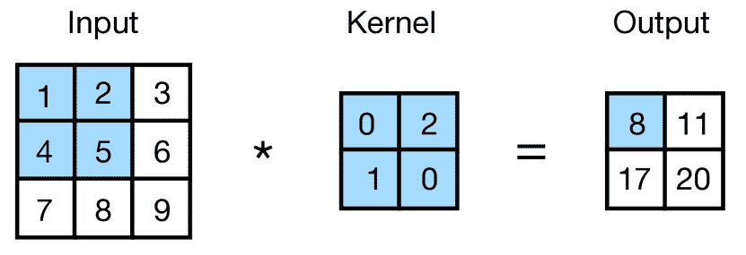

图 1. 使用$2\times 2$大小的核进行的二维卷积操作。

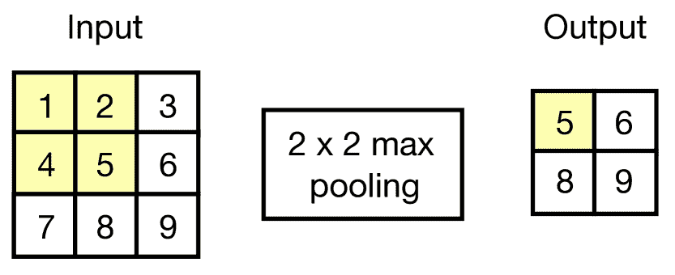

图 2. 使用$2\times 2$大小的池化窗口进行的最大池化。

Fu et al.（Fu et al., 2018）开发了一个带有堆叠卷积层的 CNN 模型，以提取街景图像的潜在特征，从而推断犯罪类型的排名。许多有效且计算效率高的架构被开发出来，而不是在 CNN 模型中将卷积层不断堆叠。一些这些架构已被用于犯罪预测，如 Inception Network（Szegedy et al., 2016）和 Residual Neural Network (ResNet)（He et al., 2016）。Inception Network 是一种深度神经网络，其架构设计包括重复的组件，称为 inception 模块，如图 4 所示。Residual Network，如图 4 所示，包含具有跳跃连接的残差块，也称为身份连接。身份映射有助于解决具有大量（甚至数千个）层的网络中的梯度消失问题。

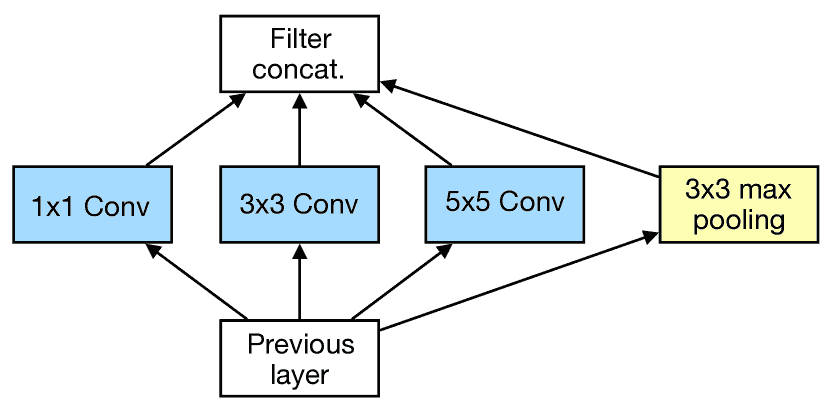

图 3. Inception 模块，朴素版本（Szegedy et al., 2016）。

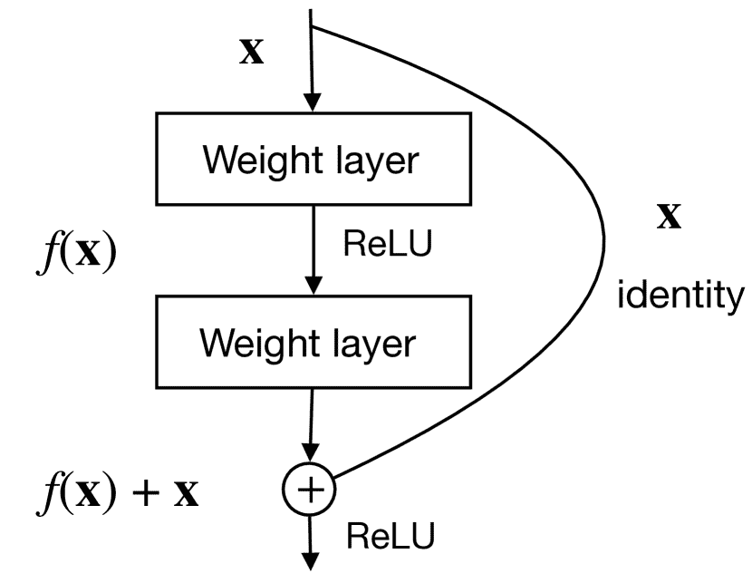

图 4. 残差块（He et al., 2016）。

基于 CNN 模型的成就，Duan et al. 提出了基于 CNN 的时空犯罪网络（STCN）（Duan et al., 2017），以预测第二天的重罪发生情况。他们使用犯罪事件计数和 311 数据，并将其转换为两个类似 2D 图像的数组作为输入特征。STCN 包含卷积层、一个 inception 块、一个分形块（Larsson et al., 2016）（即一种能够实现与标准残差网络同样优秀性能的残差块的替代品）、池化层和全连接层。卷积层捕获犯罪事件的低级时空依赖关系，而 inception 和分形块旨在抽象高级时空特征。Wang et al.（Wang et al., 2019）应用了一种流行的深度 CNN 架构——时空残差网络（ST-ResNet）（Zhang et al., 2017），以在洛杉矶地区的小时级别上预测犯罪分布。ST-ResNet 通过卷积层捕获犯罪动态，并使用残差神经网络来建模犯罪的时间特征。由于犯罪数据在空间和时间上的规律性较低，作者对犯罪数据进行了预处理，以选择适当的时空尺度进行预测，并提出了不同的数据正则化方法来处理空间和时间维度。此外，为了解决空间和时间中犯罪事件稀疏的问题，Ye et al.（Ye et al., 2021）提出了一种深度 inception-残差网络（DIRNet），用于基于犯罪和 311 数据进行盗窃相关犯罪预测。该框架包含卷积层和 inception 层，分别用于从犯罪和 311 数据中提取时空依赖关系。学习到的特征随后被结合并传递给堆叠的残差层，以捕获高级特征交互，最终用于预测。

#### 3.4.2\. 基于递归神经网络的方法

RNN（循环神经网络）已被开发用来建模时间序列犯罪数据的时间依赖性。在犯罪预测的背景下，Wawrzyniak et al.（Wawrzyniak et al., 2018）通过使用堆叠的 LSTM 架构研究了在日、周和年级别上的某一特定犯罪类型的短期预测。该模型不处理空间信息，并且对每个区域分别进行预测。由于犯罪在地理上的分布并非随机，考虑邻近区域的状态对于预测目标区域是有益的。Zhuang et al.（Zhuang et al., 2017）将犯罪预测问题表述为一个时空序列预测问题，并引入了时空神经网络（STNN），其中 RNN 模型通过空间嵌入进行训练。空间嵌入是时空窗口短期犯罪数量的累积。

一些研究人员将 CNN 和 RNN 模型结合起来，以处理犯罪模式的时间特征和空间特征。 Stec 和 Klabjan（Stec 和 Klabjan，2018）使用了联合递归和卷积神经网络（RCN）来预测犯罪，同时将犯罪数据与额外的天气、公共交通和人口普查数据相结合。在这个网络中，空间特征通过 CNN 层传递，输出与其他特征结合后再输入 RNN 模型。另一项工作调查了几种深度学习架构的能力，包括 CNN 和 RNN，以预测城市环境中的犯罪热点（Stalidis et al.，2018）。这项工作研究了三种深度学习架构配置，用于基于空间和时间模式的编码顺序来进行犯罪预测，其中空间特征使用如 ResNet 等 CNN 模型进行建模，而 RNN 则学习时间特征。

研究人员已开始调查数据在犯罪分析中的多样表示。为了应对在小时甚至更细的时间尺度上预测时空分布的挑战，Wang et al.（Wang et al.，2018b）开发了一个基于图的多尺度框架，以建模稀疏和非结构化的时空数据。该框架的流程图见图 5。该框架包含两个组件。第一部分是时空加权图（STWG）推断。它产生了数据时空演变的图表示。每个图节点与一个区域内的犯罪强度时间序列相关联，图拓扑从自激点过程模型推断而来。图表示捕捉了多样的空间划分，从而实现了不同空间尺度的预测。第二部分是一个深度学习模型，用于近似数据的时间演变。他们在推断出的图上引入了基于结构 RNN（SRNN）（Jain et al.，2016）架构的图结构 RNN（GSRNN）。GSRNN 以前馈方式安排 RNN。它首先为图中每个节点的时间序列分配了一个级联 LSTM。同时，它将图中的每条边与一个级联 LSTM 关联，该 LSTM 接收来自邻接节点的输出以及从 Hawkes 过程学习到的权重。这个特别设计的深度神经网络利用了 RNN 学习时间序列模式的能力，捕捉每个节点与其连接的邻居之间的实时交互。

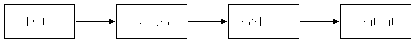

图 5. GSRNN 框架的流程图。（Wang et al.，2018b）。

#### 3.4.3\. 基于注意力的方法

许多研究表明，RNN 中注意力机制的结合使其在预测输出序列时能够关注输入序列的部分，从而使学习变得更加容易且质量更高。随着在各种研究领域对注意力的广泛探索，更先进的注意力机制已经被研究，以建模复杂和丰富的特征，并提高犯罪预测的预测能力。

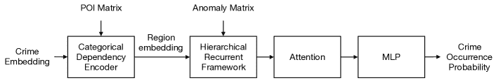

图 6. DeepCrime 框架（黄等，2018）。

在这方面，黄等提出了一种注意力层次递归网络，DeepCrime（黄等，2018），该网络揭示了动态犯罪模式，并探索了城市空间中犯罪与其他普遍数据之间的演变关系。该框架，如图 6 所示，首先建模区域类别交互，以生成区域嵌入向量。接着，它包括一个三级 GRU 架构，该架构编码了犯罪模式的时间动态及其与城市异常（即 311 异常）的相互关系。模型进一步包含一个注意力层，以捕捉未知的时间相关性，并自动为不同时间帧的学习隐状态分配重要性权重。然后，MLP 被应用于学习到的注意力特征以输出犯罪预测。

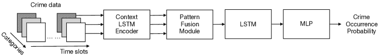

图 7. MiST 框架（黄等，2019）。

最近，黄等研究了一种多视角和多模态空间-时间学习框架（MiST）（黄等，2019），以从空间-时间-类别视角明确建模全市异常事件的动态模式。图 7 展示了 MiST 模型的框架。该框架首先通过一个上下文-LSTM 编码器建模时间视角下的动态区域内部相关性。然后，一个带有注意力机制的模式融合模块从空间-类别视角捕捉复杂的区域间和跨类别相关性。此外，它还结合了 LSTM 以捕捉位置、时间和事件类别之间的跨模态序列模式。所提出的方法在真实世界犯罪和城市异常数据上进行了评估，并与最先进的基线进行了比较，以展示其卓越的性能。

Hu et al. 将注意力机制融入卷积网络，而不是将递归神经网络与注意力结合。他们研究了噪声（即局部异常值和不规则波动）对犯罪数据的影响，并提出了一种双重鲁棒增强空间-时间学习网络 (DuroNet) (Hu et al., 2021)，具有编码器-解码器架构，用于捕捉深层犯罪模式。编码器由 (1) 一个基于 CNN 的局部增强模块组成，该模块利用局部时间上下文信息来平滑异常值的偏差，并使用门控机制增强空间-时间表示，以及 (2) 一个基于自注意力的模式表示模块，通过学习注意权重来减弱不规则波动的影响。自注意力模块将序列中的每个元素与句子中的其他每个元素进行比较，包括自身，并重新加权每个元素的嵌入以包括上下文相关性。最后，具有卷积层的前馈预测网络作为犯罪预测的解码器。

#### 3.4.4\. 自编码器与深度生成方法

自编码器是一种自监督学习模型，可以学习输入数据的压缩/重构表示，通常用于特征选择和提取。自编码器由编码器和解码器子模型组成，如图 8 所示。

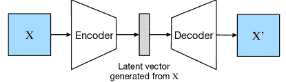

图 8. 自编码器模型架构示意图。

Yi et al. (Yi et al., 2019) 在深度学习框架中采用了自编码器来学习动态空间相关性。为了在每日级别上实现细粒度的犯罪预测，本文利用均场近似理论简化了连续条件随机场 (CCRF) (Ristovski et al., 2013) 模型的推理。他们提出了一种端到端的神经网络 NN-CCRF (Yi et al., 2019) 来分别建模时间和空间相关性。传统的 CCRF 模型是可以探索时间序列数据中序列关系的概率图模型之一。它由两个部分组成：一元势和对偶势。NN-CCRF 模型将 LSTM 作为一元势，并利用堆叠去噪自编码器 (SDAE) 学习用于对偶势的区域间空间相关性。去噪自编码器 (Vincent et al., 2010) 通过在原始数据中引入随机噪声来获得鲁棒的潜在表示。

最近，序列生成网络在计算机视觉和自然语言处理等多个领域引起了广泛关注。研究人员发现它在捕捉大量数据的时空动态方面颇具前景。一些研究为理解犯罪数据中的复杂现象提供了新的见解。 Wang et al.提出了一种序列生成神经网络，名为犯罪情况感知网络 (CSAN) (Wang et al., 2020b)，用于犯罪序列预测。任务如图 9 所示。

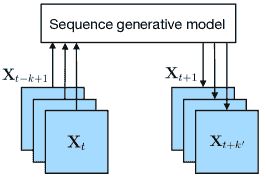

图 9. 犯罪序列预测任务的示意图。一个序列生成模型生成下一个$k^{\prime}$犯罪分布，条件是前一个$k$犯罪分布的序列。

CSAN 包括两个组件：(1) 一个紧凑表示模型，使用 Multiple-VAEs 试图将高维稀疏犯罪数据嵌入到一些紧凑的潜在空间中；(2) 一个犯罪情况生成模型，使用 GRU 和注意力层捕捉潜在空间中的潜在动态，从而进行序列预测。变分自编码器 (VAE) (Kingma and Welling, 2013) 由一个将输入数据压缩到受限的多变量潜在分布中的编码器和一个根据潜在分布重建数据的解码器组成。

另一个关注犯罪序列生成的努力是 Jin et al.开发了一种基于上下文的序列生成模型，Crime-GAN (Jin et al., 2019)。生成对抗网络 (GAN) (Goodfellow et al., 2014)是一种深度生成模型，近年来取得了巨大的成功。GAN 基于对抗损失原理，包括一个生成器和一个判别器，它们通过对抗的方式互相欺骗。该框架如图 10 所示。在 Crime-GAN 模型中，一个基于 CNN 的 VAE 首先从犯罪数据中提取潜在变量。然后，将这些潜在变量输入到一个基于 GRU 的 Seq2Seq 模型中，以生成下一个$k^{\prime}$时间步的潜在变量。该模型使用 GRU 模型作为判别器来检查生成的犯罪潜在变量序列是否遵循之前的犯罪潜在变量序列。

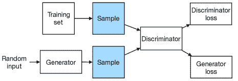

图 10. 生成对抗网络 (GAN) 模型的框架。

#### 3.4.5\. 基于图神经网络的方法

图神经网络已经展示了捕捉超越欧几里得距离的空间结构特征的能力。已经有尝试将这种网络应用于犯罪预测中。金等人提出了一种图深度学习方法，即时间图卷积网络（TGCN） (Jin et al., 2020)，用于预测犯罪序列。作者首先利用皮尔逊系数构建了一系列犯罪空间相关图。图中的每个节点代表一个区域。TGCN 包括三个主要组件：(1) 一个 GCN (Kipf and Welling, 2017) 从定义的犯罪空间相关图中提取潜在表示；(2) 一个 LSTM 用于捕捉潜在空间的时间动态；(3) 一个基于 CNN 的模型用于输出犯罪预测。研究人员在犯罪序列预测中融入了更复杂的图信息。王等人提出了一种深度时间多图卷积网络（DT-MGCN） (Wang et al., 2020a)，该网络集成了图生成组件和空间-时间组件，以预测空间-时间犯罪率。作者将各种外部因素编码到多个图中，包括距离图、互动图和相关图，以捕捉社区之间的欧几里得和非欧几里得相关性，并通过结合上述图生成了一个融合图。空间-时间组件同时采用谱图卷积来捕捉空间模式，并使用编码器-解码器时间卷积网络（EDTCN） (Lea et al., 2017) 来建模时间特征。

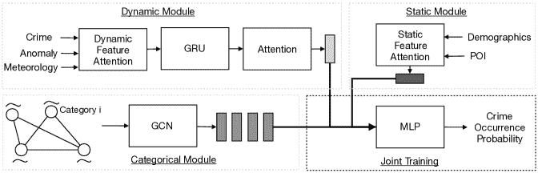

图 11. CrimeSTC 框架 (Wei et al., 2020)。

图神经网络也被用于捕捉不同犯罪类别之间的依赖关系，以帮助预测犯罪数量。特别是，Wei et al. 提出了一个犯罪预测框架 CrimeSTC（Wei et al., 2020），用于联合学习隐藏在犯罪和大城市数据中的复杂时空类别相关性。模型框架如图 11 所示。该模型由四部分组成：（1）一个通过局部 CNN、GRU 和注意力机制处理时间数据的动态模块；（2）一个通过全连接层处理静态数据的静态模块；（3）一个通过 GCN 模型捕捉类别依赖关系的类别模块；（4）一个将动态和静态表征连接起来以预测犯罪数量的联合训练模块。最近，Xia et al. 提出了一个空间-时间序列超图网络（ST-SHN）（Xia et al., [[n.d.]](#bib.bib144)）架构，该架构在犯罪发生预测中达到了最先进的性能。ST-SHN 共同编码复杂的犯罪时空模式以及潜在的类别犯罪语义关系。模型框架如图 12 所示。具体来说，作者提出了一种基于注意力的多通道路由机制，以在图神经网络框架下学习跨类型犯罪影响。他们设计了一种图消息传递架构，集成了超图学习范式，以增强跨区域关系学习，而不受邻接连接的限制。为了建模犯罪的时间依赖性，开发了一种图时间偏移机制，将时间变化的时空犯罪模式注入表征过程。

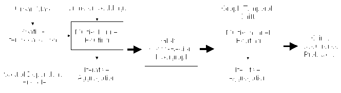

图 12. ST-SHN 框架（Xia et al., [[n.d.]](#bib.bib144)）。

## 4\. 深度学习技术

深度学习是一种基于人工神经网络和表征学习的机器学习方法家族。在本节中，我们总结了深度神经网络在社会动荡和犯罪预测中的应用。

##### 卷积神经网络

CNN 旨在通过使用多个构建块（如卷积层、池化层）来自动学习特征的空间层次结构，方法是通过反向传播。与对 CNN 在民事骚乱预测方面的有限研究相比，更多的研究探讨了 CNN 在犯罪预测中的应用（Zhang et al., 2019; Duan et al., 2017; Wang et al., 2019; Ye et al., 2021; Hu et al., 2021）。这主要是因为犯罪事件的空间粒度通常小于民事骚乱。民事骚乱如示威和暴乱可能发生在整个城市中，通常会产生巨大的影响，在线上或线下传播，从而影响周围地区或其他城市的人的行为。相比之下，诸如入室盗窃和抢劫等犯罪可能更具特定性，集中在某条街道或社区中。在一些关注细粒度犯罪预测的研究中，研究人员将一个区域（例如一个城市）划分为网格单元，并预测每个单元的犯罪情况。CNN 提供了一种自适应且有效的方式来学习单元之间的空间相关性。

##### 循环神经网络

循环神经网络（RNN）是一类具有递归连接的人工神经网络。它利用内部状态（记忆）来处理各种长度的输入序列。这些模型在社会事件预测中被广泛应用，并且通常优于如自回归模型等统计时间序列模型。基于 RNN 的方法捕捉了序列数据中的非线性和更复杂的依赖关系。在动态社会环境中，社会事件通常不会独立发生，它们往往受过去事件的影响。这解释了为什么历史时间序列数据在预测民事骚乱和犯罪时被作为重要指标。为了更好地捕捉时间依赖性，研究人员使用了 RNN 及其变体（即 LSTM、GRU）作为民事骚乱（Smith et al., 2017; Parrish et al., 2018; Halkia et al., 2020; Meng and Srihari, [[n.d.]](#bib.bib87); Wang et al., 2018a）和犯罪（Wawrzyniak et al., 2018; Zhuang et al., 2017; Stec and Klabjan, 2018; Stalidis et al., 2018; Wang et al., 2018b; Huang et al., 2018, 2019; Yi et al., 2019）预测的主要组件。

##### 注意力

注意力模型或注意力机制是神经网络中的技术，允许网络集中关注复杂输入的特定方面，由上下文向量（即查询）引导。注意力通常与 RNN 模型一起应用，并通过注意力权重显示特征的重要性。在民众骚乱预测的背景下，Wang et al.（Wang et al., 2018a）引入了注意力机制以发现关键的历史数据点。Ertugrul et al.（Ertugrul et al., 2019）研究了一种更先进的基于注意力的方法，其中注意力机制用于解释不同历史时间点和不同地区活动的重要性。一些研究人员应用注意力来增强带有上下文信息的表示学习（Deng et al., 2020）。出于类似的动机，更复杂的模型在犯罪预测中引入了注意力机制（Huang et al., 2018, 2019；Wei et al., 2020）。

##### 自编码器和深度生成方法

自编码器是一种人工神经网络，用于以无监督的方式学习有效的数据表示。Yi et al.（Vincent et al., 2010）利用去噪自编码器学习潜在表示，以捕捉不同区域的空间相关性用于犯罪预测。其他人则利用变分自编码器（VAE）学习犯罪矩阵的压缩潜在表示（Wang et al., 2020b；Jin et al., 2019）。VAE 可以被视为一种深度生成模型。深度生成模型提供了一种强大的方式，通过大量样本来逼近复杂和高维的概率分布。一些研究人员结合了生成对抗网络（GAN）来估计区域内未来的犯罪分布，在一个序列预测任务中（Jin et al., 2019）。

##### 图神经网络

图神经网络（GNNs）是一类可以直接应用于图形的深度神经网络，并为节点级、边级和图级预测任务提供了一种简便的方法。在社会动荡和犯罪预测中，研究人员已经探索了不同用途的网络结构。邓等人（邓等人，2019）提出了一种动态图神经网络用于预测社会动荡，该网络以一系列动态词图作为输入。他们进一步发现关键的上下文子图作为事件预测的支持证据。这些子图提供了结构化和简洁的数据表示，能够简化事件分析过程。其他研究将 GNN 模型应用于基于知识图谱的数据，通过学习多关系特征来增强事件预测的上下文信息（邓等人，2020，2021）。在犯罪预测方面，一些工作利用 GNN 模型通过捕捉预定义图节点之间的空间相关性来增强表示学习，从而提高预测准确性（晋等人，2020；王等人，2020a；魏等人，2020；夏等人，n.d.）。

## 5\. 公开挑战与未来方向

尽管近年来在社会事件预测方面取得了一些成就，但仍然存在未解决的问题。接下来，我们将从三个方面讨论一些挑战和未来方向。

### 5.1\. 数据动态、充分性与可靠性

数据驱动的方法在社会事件预测中高度依赖数据质量，这使它们面临许多数据挑战。数据的动态性是主要挑战之一。对于文本数据，语言、词汇和流行俚语不断演变。在地理数据中，由于重大政治事件，地点名称和区域边界可能会发生变化。提出能够克服数据动态性问题的先进深度学习方法对实际应用具有重要意义。数据的充分性是另一个挑战。如现有工作所示，研究人员除了研究历史事件的发生情况外，还调查了各种外部数据源，以提高预测的准确性。从多个来源收集外部数据并区分相关数据与噪声数据在时间、材料和计算成本方面都很昂贵。此外，社会事件的空间稀缺性也会阻碍对代表性不足地区的事件预测研究。预测问题中的一个基本问题是数据的可靠性。在手动或自动数据收集过程中，常常会出现缺失或不正确的数据。例如，自动事件收集系统可能由于意外的网络故障而丢失事件。社交媒体帖子提供了跟踪用户行为和社会活动的宝贵资源。然而，这些数据中包含错别字、闲聊和误信息，可能会误导预测模型。因此，过度依赖数据可能使预测模型在实际应用中变得脆弱。

### 5.2\. 深度学习模型的透明性和可解释性

深度学习模型随着预测能力的提升变得越来越复杂。然而，随着模型结构的复杂化，预测模型的基本机制对人类变得越来越不透明，使得模型输出更难以理解。对提高模型透明性和可解释性的需求日益增加。仅依赖模型预测来分析社会事件并做出决策可能会由于误判而导致经济损失或其他不良后果。通过提供合理的模型预测解释，可以缓解这些问题，使实践者能够理解模型的行为，从而评估模型输出的可靠性。在社会事件预测中，开发能够从大量历史数据中识别关键信息的解释性模型是有益的。为事件预测提供解释可以提高机器学习支持的高效事件建模的鲁棒性。

### 5.3\. 社会事件中的因果关系研究

机器学习方法通常关注于发现输入特征与目标变量之间的相关性，而不是理解因果关系。因果研究或因果推断旨在研究两个或多个变量之间的因果关系（即因果性）。为了更好地理解社会事件并以更大的信心预测这些事件，将因果关系引入事件建模具有潜在的好处。分析未来事件的可能原因可能使我们能够开发出不易受数据问题（如噪声和稀疏性）影响的因果增强型事件预测模型。研究社会事件的因果性还可以帮助我们揭示动态社会环境中事件发生背后的潜在机制或关键因素。越来越多的研究吸收了深度学习模型的优势，以及因果研究（Li et al., 2020; Chen et al., 2021）。将因果性纳入基于深度学习的事件预测正成为一个不可或缺的研究主题。

## 6\. 结论

在本文中，我们对现有的社会事件预测方法进行了全面的调查，重点关注基于深度学习的方法。我们概述了社会事件预测中的挑战。我们总结了近年来发表的研究论文，讨论了数据资源、研究问题、传统和深度学习预测技术在民众骚乱和犯罪事件中的应用。此外，我们提供了在预测模型中使用的深度学习模型的概述，指出它们在解决不同问题中的特点和优势，并讨论了未来工作的开放挑战和有前景的方向。

## 参考文献

+   (1)

+   Almanie 等人（2015）Tahani Almanie、Rsha Mirza 和 Elizabeth Lor. 2015. 基于犯罪类型的犯罪预测，利用空间和时间的犯罪热点。*arXiv preprint arXiv:1508.02050* (2015)。

+   Althaus 等人（2020）Scott Althaus、Joseph Bajjalieh、John Carter、Buddy Peyton 和 Dan Shalmon. 2020. Cline Center 历史凤凰事件数据。Cline Center for Advanced Social Research. v1.3.0\. 5 月 4 日。 [`doi.org/10.13012/B2IDB-0647142_V3`](https://doi.org/10.13012/B2IDB-0647142_V3)

+   Alves 等人（2018）Luiz GA Alves、Haroldo V Ribeiro 和 Francisco A Rodrigues. 2018. 通过城市指标和统计学习进行犯罪预测。*Physica A: Statistical Mechanics and its Applications* 505 (2018), 435–443。

+   Alwee 等人（2013）Razana Alwee、Siti Mariyam Shamsuddin 和 Roselina Sallehuddin. 2013. 通过粒子群优化改进的混合支持向量回归和自回归积分滑动平均模型用于物业犯罪率预测，结合经济指标。*The Scientific World Journal* 2013 (2013)。

+   Andresen et al. (2017) Martin A Andresen, Shannon J Linning, 和 Nick Malleson. 2017. 地点犯罪与空间集中：探索 2003–2013 年间温哥华 BC 物业犯罪的空间稳定性。*定量犯罪学杂志* 33, 2 (2017), 255–275。

+   Anuar et al. (2015) Syahid Anuar, Ali Selamat, 和 Roselina Sallehuddin. 2015. 结合人工神经网络和人工蜜蜂群算法的犯罪分类。在 *信息系统中的计算智能*。Springer，31–40。

+   Arva et al. (2013) Bryan Arva, John Beieler, Bejamin Fisher, Gustavo Lara, Philip A Schrodt, Wonjun Song, Marsha Sowell, 和 Sam Stehle. 2013. 改善国际事件的兴趣预测。在 *EPSA 2013 年会论文*，第 78 卷。

+   Asuncion and Newman (2007) Arthur Asuncion 和 David Newman. 2007. UCI 机器学习数据集。

+   Azar (1980) Edward E Azar. 1980. 冲突与和平数据银行（COPDAB）项目。*Journal of Conflict Resolution* 24, 1 (1980), 143–152。

+   Baculo et al. (2017) Maria Jeseca C Baculo, Charlie S Marzan, Remedios de Dios Bulos, 和 Conrado Ruiz. 2017. 马尼拉犯罪数据的地理时空分析与分类。在 *2017 第二届 IEEE 国际计算智能与应用会议 (ICCIA)*。IEEE，6–11。

+   Bahdanau et al. (2014) Dzmitry Bahdanau, Kyunghyun Cho, 和 Yoshua Bengio. 2014. 通过联合学习对齐和翻译的神经机器翻译。*arXiv 预印本 arXiv:1409.0473* (2014)。

+   Balocchi and Jensen (2019) Cecilia Balocchi 和 Shane T Jensen. 2019. 费城犯罪趋势的空间建模。*应用统计年鉴* 13, 4 (2019), 2235–2259。

+   Bank (2016) 世界银行. 2016. 2016 年世界发展报告：数字红利。

+   Belesiotis et al. (2018) Alexandros Belesiotis, George Papadakis, 和 Dimitrios Skoutas. 2018. 使用众包和开放数据分析与预测空间犯罪分布。*ACM 空间算法与系统交易 (TSAS)* 3, 4 (2018), 1–31。

+   Bogomolov et al. (2014) Andrey Bogomolov, Bruno Lepri, Jacopo Staiano, Nuria Oliver, Fabio Pianesi, 和 Alex Pentland. 2014. 从人口统计和移动数据预测犯罪：从一桩犯罪说起。在 *第 16 届国际多模态交互会议论文集*。427–434。

+   Boschee et al. (2015) Elizabeth Boschee, Jennifer Lautenschlager, Sean O’Brien, Steve Shellman, James Starz, 和 Michael Ward. 2015. ICEWS 编码事件数据。

+   Braha (2012) Dan Braha. 2012. 全球社会动荡：传染、自组织与预测。*PloS one* 7, 10 (2012), e48596。

+   Brown (2004) Robert Goodell Brown. 2004. *离散时间序列的平滑、预测与预报*。Courier Corporation。

+   Butt 等人（2020）Umair Muneer Butt, Sukumar Letchmunan, Fadratul Hafinaz Hassan, Mubashir Ali, Anees Baqir 和 Hafiz Husnain Raza Sherazi。2020 年。时空犯罪热点检测与预测：系统文献综述。*IEEE Access* 8（2020），166553–166574。

+   Cadena 等人（2015）Jose Cadena, Gizem Korkmaz, Chris J Kuhlman, Achla Marathe, Naren Ramakrishnan 和 Anil Vullikanti。2015 年。使用活动级联预测社会动荡。*PloS one* 10, 6（2015），e0128879。

+   Catlett 等人（2018）Charlie Catlett, Eugenio Cesario, Domenico Talia 和 Andrea Vinci。2018 年。智能城市中时空犯罪预测的数据驱动方法。见于 *2018 IEEE 智能计算国际会议（SMARTCOMP）*。IEEE，17–24。

+   Catlett 等人（2019）Charlie Catlett, Eugenio Cesario, Domenico Talia 和 Andrea Vinci。2019 年。智能城市中的时空犯罪预测：一种数据驱动的方法和实验。*普适与移动计算* 53（2019），62–74。

+   Cesario 等人（2016）Eugenio Cesario, Charlie Catlett 和 Domenico Talia。2016 年。使用自回归模型进行犯罪预测。见于 *2016 IEEE 第 14 届可靠、自主与安全计算国际会议、第 14 届普适智能与计算国际会议、第 2 届大数据智能与计算国际会议以及网络科学与技术大会（DASC/PiCom/DataCom/CyberSciTech）*。IEEE，795–802。

+   Chainey 和 Ratcliffe（2013）Spencer Chainey 和 Jerry Ratcliffe。2013 年。*地理信息系统与犯罪映射*。John Wiley & Sons。

+   Chakrabarti 和 Punera（2011）Deepayan Chakrabarti 和 Kunal Punera。2011 年。使用推文进行事件总结。见于 *国际 AAAI 网络与社交媒体会议论文集*，第 5 卷。

+   Chandra 等人（2008）B Chandra, Manish Gupta 和 MP Gupta。2008 年。一种用于犯罪趋势预测的多变量时间序列聚类方法。见于 *2008 年 IEEE 系统、人类与控制论国际会议*。IEEE，892–896。

+   Chen 和 Neill（2014）Feng Chen 和 Daniel B Neill。2014 年。用于异质社交媒体图的事件检测与预测的非参数扫描统计方法。见于 *第 20 届 ACM SIGKDD 国际知识发现与数据挖掘会议论文集*，1166–1175。

+   Chen 等人（2021）Jin Chen, Xinxiao Wu, Yao Hu 和 Jiebo Luo。2021 年。空间-时间因果推断用于部分图像到视频的适配。见于 *AAAI 人工智能会议论文集*，第 35 卷，1027–1035。

+   Chen 等人（2008）Peng Chen, Hongyong Yuan 和 Xueming Shu。2008 年。使用 ARIMA 模型进行犯罪预测。见于 *2008 年第五届模糊系统与知识发现国际会议*，第 5 卷。IEEE，627–630。

+   Chun 等人（2019）Soon Ae Chun, Venkata Avinash Paturu, Shengcheng Yuan, Rohit Pathak, Vijayalakshmi Atluri 和 Nabil R. Adam。2019 年。使用深度神经网络的犯罪预测模型。见于 *第 20 届国际数字政府研究年会论文集*，512–514。

+   Chung 等 (2014) Junyoung Chung, Caglar Gulcehre, KyungHyun Cho 和 Yoshua Bengio. 2014. 门控递归神经网络在序列建模中的实证评估。*arXiv 预印本 arXiv:1412.3555* (2014)。

+   Daly (2012) Sarah Zukerman Daly. 2012. 暴力的组织遗产：1964–1984 年哥伦比亚叛乱爆发的有利条件。*和平研究期刊* 49, 3 (2012), 473–491。

+   Dash 等 (2018) Saroj Kumar Dash, Ilya Safro 和 Ravisutha Sakrepatna Srinivasamurthy. 2018. 使用网络分析方法的时空犯罪预测。发表于 *2018 IEEE 大数据国际会议 (Big Data)*。IEEE, 1912–1917。

+   Deng 等 (2019) Songgaojun Deng, Huzefa Rangwala 和 Yue Ning. 2019. 学习动态上下文图以预测社交事件。发表于 *第 25 届 ACM SIGKDD 国际知识发现与数据挖掘会议论文集*。1007–1016。

+   Deng 等 (2020) Songgaojun Deng, Huzefa Rangwala 和 Yue Ning. 2020. 基于动态知识图的多事件预测。发表于 *第 26 届 ACM SIGKDD 国际知识发现与数据挖掘会议论文集*。1585–1595。

+   Deng 等 (2021) Songgaojun Deng, Huzefa Rangwala 和 Yue Ning. 2021. 通过上下文化的多层次特征学习理解事件预测。发表于 *第 30 届 ACM 国际信息与知识管理会议论文集*。342–351。

+   Duan 等 (2017) Lian Duan, Tao Hu, En Cheng, Jianfeng Zhu 和 Chao Gao. 2017. 用于时空犯罪预测的深度卷积神经网络。发表于 *国际信息与知识工程会议 (IKE) 论文集*。世界计算机科学大会指导委员会, 61–67。

+   Ertugrul 等 (2019) Ali Mert Ertugrul, Yu-Ru Lin, Wen-Ting Chung, Muheng Yan 和 Ang Li. 2019. 通过注意力激进主义：可解释的时空学习以预测抗议活动。*EPJ 数据科学* 8, 1 (2019), 1–26。

+   Flouris 等 (2017) Ioannis Flouris, Nikos Giatrakos, Antonios Deligiannakis, Minos Garofalakis, Michael Kamp 和 Michael Mock. 2017. 复杂事件处理中的问题：大数据时代的现状与展望。*系统与软件期刊* 127 (2017), 217–236。

+   Fu 等 (2018) Kaiqun Fu, Zhiqian Chen 和 Chang-Tien Lu. 2018. Streetnet：基于卷积神经网络的城市犯罪感知偏好学习。发表于 *第 26 届 ACM SIGSPATIAL 国际地理信息系统进展会议论文集*。269–278。

+   Ganar 和 Ardhapurkar (2016) Ruchika Parmarth Ganar 和 Shrikant Ardhapurkar. 2016. 通过分析社交网络并使用关键词过滤预测社会动荡：一项调查。发表于 *2016 年在线国际绿色工程与技术会议 (IC-GET)*。IEEE, 1–4。

+   高和赵（2018）余阳·高和梁赵。2018。不完全标签多任务序数回归用于空间事件规模预测。载于*AAAI 人工智能大会论文集*，第 32 卷。

+   盖尔纳等（2002）德博拉·J·盖尔纳，菲利普·A·施罗特，欧穆尔·伊尔马兹，拉贾·阿布-贾布尔。2002。冲突与调解事件观察（CAMEO）：分析外交政策互动的新事件数据框架。*国际研究协会，新奥尔良*（2002）。

+   古德费洛等（2014）伊恩·古德费洛，尚·普吉特-阿巴迪，梅赫迪·米尔扎，丁·徐，大卫·沃德-法利，舍尔吉尔·奥扎伊，亚伦·库维尔，约书亚·本吉奥。2014。生成对抗网络。载于*神经信息处理系统进展*，Z. Ghahramani, M. Welling, C. Cortes, N. Lawrence, 和 K. Q. Weinberger (Eds.)，第 27 卷。Curran Associates, Inc. [`proceedings.neurips.cc/paper/2014/file/5ca3e9b122f61f8f06494c97b1afccf3-Paper.pdf`](https://proceedings.neurips.cc/paper/2014/file/5ca3e9b122f61f8f06494c97b1afccf3-Paper.pdf)

+   戈尔等（2003）威尔彭·戈尔，安德烈亚斯·奥利格施拉格，伊冯娜·汤普森。2003。犯罪的短期预测。*国际预测期刊* 19, 4 (2003), 579–594。

+   格罗夫和拉维恩（2002）伊丽莎白·R·格罗夫和南希·G·拉维恩。2002。预测犯罪地图的未来。*犯罪预防研究* 13 (2002), 29–58。

+   哈尔基亚等（2020）玛蒂娜·哈尔基亚，斯特凡诺·费里，米哈伊尔·帕帕佐格鲁，玛丽-索菲·范·达梅，迪米特里奥斯·托马克斯。2020。冲突事件建模：研究实验和事件数据的局限性。载于*2020 年自动提取社会政治事件研讨会论文集*。42–48。

+   哈蒙德和魏德曼（2014）杰西·哈蒙德和尼尔斯·B·魏德曼。2014。利用机器编码事件数据进行政治暴力的微观研究。*Research & Politics* 1, 2 (2014), 2053168014539924。

+   贺等（2016）何凯明，向瑜·张，邵青·任，简孙。2016。图像识别的深度残差学习。载于*IEEE 计算机视觉与模式识别会议论文集*。770–778。

+   霍赫赖特和施密德胡贝尔（1997）塞普·霍赫赖特和于尔根·施密德胡贝尔。1997。长短期记忆。*神经计算* 9, 8 (1997), 1735–1780。

+   霍赛因等（2020）索赫拉布·霍赛因，艾哈迈德·阿布塔希，伊姆兰·卡谢姆，穆罕默德·莫希乌尔·霍克，伊克巴尔·H·萨尔克。2020。使用时空数据进行犯罪预测。载于*国际计算科学、通信与安全会议*。Springer, 277–289。

+   胡等（2021）凯西·胡，林丽，简全刘，丹尼尔·孙。2021。DuroNet：一种双重鲁棒增强时空学习网络用于城市犯罪预测。*ACM Transactions on Internet Technology (TOIT)* 21, 1 (2021), 1–24。

+   胡等（2018）陶胡，辛艳朱，连端，魏国。2018。基于时空贝叶斯模型的城市犯罪预测。*PloS one* 13, 10 (2018), e0206215。

+   Huang et al. (2019) Chao Huang, Chuxu Zhang, Jiashu Zhao, Xian Wu, Dawei Yin, 和 Nitesh Chawla. 2019. Mist：一个用于城市异常事件预测的多视图和多模态时空学习框架。见于 *万维网会议*。717–728.

+   Huang et al. (2018) Chao Huang, Junbo Zhang, Yu Zheng, 和 Nitesh V Chawla. 2018. DeepCrime：用于犯罪预测的注意力层次递归网络。见于 *第 27 届 ACM 国际信息与知识管理会议论文集*。1423–1432.

+   Ingilevich 和 Ivanov (2018) Varvara Ingilevich 和 Sergey Ivanov. 2018. 使用社会因素预测城市环境中的犯罪率。*Procedia 计算机科学* 136 (2018), 472–478.

+   Iqbal et al. (2013) Rizwan Iqbal, Masrah Azrifah Azmi Murad, Aida Mustapha, Payam Hassany Shariat Panahy, 和 Nasim Khanahmadliravi. 2013. 犯罪预测的分类算法实验研究。*印度科学与技术期刊* 6, 3 (2013), 4219–4225.

+   Jain et al. (2016) Ashesh Jain, Amir R Zamir, Silvio Savarese, 和 Ashutosh Saxena. 2016. Structural-rnn：时空图上的深度学习。见于 *IEEE 计算机视觉与模式识别会议论文集*。5308–5317.

+   Jakobi 和 Pődör (2020) Ákos Jakobi 和 Andrea Pődör. 2020. 基于 GIS 的统计分析用于通过数字草图地图检测犯罪恐惧：一项匈牙利多城市研究。*ISPRS 国际地理信息期刊* 9, 4 (2020), 229.

+   Jin et al. (2014) Fang Jin, Rupinder Paul Khandpur, Nathan Self, Edward Dougherty, Sheng Guo, Feng Chen, B Aditya Prakash, 和 Naren Ramakrishnan. 2014. 使用几何布朗运动建模社交网络社区中的大规模抗议采纳。见于 *第 20 届 ACM SIGKDD 国际知识发现与数据挖掘会议论文集*。1660–1669.

+   Jin et al. (2019) Guangyin Jin, Qi Wang, Xia Zhao, Yanghe Feng, Qing Cheng, 和 Jincai Huang. 2019. Crime-gan：一种基于上下文的序列生成网络用于带有对抗损失的犯罪预测。见于 *2019 IEEE 国际大数据会议 (Big Data)*。IEEE，1460–1469.

+   Jin et al. (2020) Guangyin Jin, Qi Wang, Cunchao Zhu, Yanghe Feng, Jincai Huang, 和 Jiangping Zhou. 2020. 通过时间图卷积神经网络方法解决犯罪情境预测任务。见于 *2020 年第 12 届国际测量技术与机电自动化会议 (ICMTMA)*。IEEE，474–478.

+   Kadar et al. (2019) Cristina Kadar, Rudolf Maculan, 和 Stefan Feuerriegel. 2019. 低人口密度地区的公共决策支持：一种关注不平衡的超集成方法用于时空犯罪预测。*决策支持系统* 119 (2019), 107–117.

+   Kallus (2014) Nathan Kallus. 2014. 利用大型公共数据预测人群行为。见于 *第 23 届国际万维网会议论文集*。625–630.

+   Kang 和 Kang（2017）Hyeon-Woo Kang 和 Hang-Bong Kang。2017。使用深度学习从多模态数据中预测犯罪发生。*PloS one* 12, 4（2017），e0176244。

+   Kaufmann 等（2011）Daniel Kaufmann，Aart Kraay 和 Massimo Mastruzzi。2011。全球治理指标：方法论和分析问题。*海牙法治期刊* 3, 2（2011），220–246。

+   Kedia（2016）Pranav Kedia。2016。使用 GIS 进行犯罪地图绘制和分析。*国际信息技术研究院* 1, 1（2016），1–15。

+   Kianmehr 和 Alhajj（2006）Keivan Kianmehr 和 Reda Alhajj。2006。使用支持向量机进行犯罪热点预测。在*IEEE 国际计算机系统与应用会议，2006*。IEEE 计算机学会，952–959。

+   Kianmehr 和 Alhajj（2008）Keivan Kianmehr 和 Reda Alhajj。2008。支持向量机在犯罪热点预测中的有效性。*应用人工智能* 22, 5（2008），433–458。

+   Kingma 和 Welling（2013）Diederik P Kingma 和 Max Welling。2013。自编码变分贝叶斯。*arXiv 预印本 arXiv:1312.6114*（2013）。

+   Kipf 和 Welling（2017）Thomas N Kipf 和 Max Welling。2017。使用图卷积网络进行半监督分类。在*国际学习表征会议*。

+   Korkmaz 等（2015）Gizem Korkmaz，Jose Cadena，Chris J Kuhlman，Achla Marathe，Anil Vullikanti 和 Naren Ramakrishnan。2015。结合异质数据源进行社会动荡预测。在*2015 IEEE/ACM 国际社交网络分析与挖掘会议论文集*。258–265。

+   Kounadi 等（2020）Ourania Kounadi，Alina Ristea，Adelson Araujo 和 Michael Leitner。2020。空间犯罪预测的系统评价。*犯罪科学* 9（2020），1–22。

+   LaFree 和 Dugan（2007）Gary LaFree 和 Laura Dugan。2007。介绍全球恐怖主义数据库。*恐怖主义与政治暴力* 19, 2（2007），181–204。

+   Lamari 等（2020）Yasmine Lamari，Bartol Freskura，Anass Abdessamad，Sarah Eichberg 和 Simon de Bonviller。2020。通过高效的集成学习模型预测空间犯罪发生。*ISPRS 国际地理信息期刊* 9, 11（2020），645。

+   Larsson 等（2016）Gustav Larsson，Michael Maire 和 Gregory Shakhnarovich。2016。Fractalnet：无残差的超深神经网络。*arXiv 预印本 arXiv:1605.07648*（2016）。

+   Lea 等（2017）Colin Lea，Michael D Flynn，Rene Vidal，Austin Reiter 和 Gregory D Hager。2017。用于动作分割和检测的时间卷积网络。在*IEEE 计算机视觉与模式识别会议论文集*。156–165。

+   Leetaru 和 Schrodt（2013）Kalev Leetaru 和 Philip A Schrodt。2013。Gdelt：全球事件、地点和语调数据，1979–2012。在*ISA 年度会议*，第 2 卷。Citeseer，1–49。

+   Li et al. (2020) 贾李，肖伟·贾，浩宇·杨，维平·库马尔，迈克尔·斯坦巴赫，和乔治·西蒙. 2020. 教授深度学习因果效应提高预测性能. *arXiv 预印本 arXiv:2011.05466* (2020)。

+   Liao et al. (2010) 任杰·廖，雪耀·王，伦·李，和曾昌·秦. 2010. 基于贝叶斯学习理论的新型序列犯罪预测模型. 在 *2010 年国际机器学习与网络安全会议* 中，第 4 卷. IEEE, 1757–1762。

+   Luong et al. (2015) 闵长·卢昂，希欧·范，和克里斯托弗·D·曼宁. 2015. 有效的基于注意力的神经机器翻译方法. *arXiv 预印本 arXiv:1508.04025* (2015)。

+   Malleson and Andresen (2016) 尼克·马莱森和马丁·A·安德烈森. 2016. 探索环境人口度量对伦敦犯罪热点的影响. *刑事司法杂志* 46 (2016), 52–63。

+   Manrique et al. (2013) 佩德罗·曼里克，洪琪，安娜·摩根斯特恩，尼古拉斯·维拉斯奎兹，蔡青·卢，和尼尔·约翰逊. 2013. 上下文很重要：改善大数据预测社会动荡的使用：新兴现象与大数据. 在 *2013 年 IEEE 国际智能与安全信息学会议* 中. IEEE, 169–172。

+   McClelland (1978) 查尔斯·麦克莱伦. 1978. 世界事件/互动调查，1966-1978. *WEIS 代码手册 ICPSR* 5211 (1978)。

+   McClendon and Meghanathan (2015) 劳伦斯·麦克伦登和纳塔拉詹·梅赫甘纳坦. 2015. 使用机器学习算法分析犯罪数据. *机器学习与应用：国际期刊 (MLAIJ)* 2, 1 (2015), 1–12。

+   Meng and Srihari ([n.d.]) 陆梦和罗希尼·K·斯里哈里. [n.d.]. 利用异构数据源进行社会动荡预测. ([n. d.])。

+   Misyrlis et al. (2017) 米哈伊尔·米西里斯，钟鸣·张，阿吉特什·斯里瓦斯塔瓦，拉杰戈帕尔·坎南，和维克托·普拉萨纳. 2017. 犯罪活动的时空建模. 在 *第二届国际社会感知研讨会论文集* 中. 3–8。

+   Mohler et al. (2011) 乔治·O·莫赫勒，马丁·B·肖特，P·杰弗里·布兰廷汉姆，弗雷德里克·佩克·肖恩伯格，和乔治·E·提塔. 2011. 自激点过程犯罪建模. *美国统计协会杂志* 106, 493 (2011), 100–108。

+   Mookiah et al. (2015) 列宁·穆基亚，威廉·厄贝尔，和安巴林·西拉吉. 2015. 犯罪分析与预测的调查. 在 *第二十八届国际 FLAIRS 会议* 中。

+   Muthiah et al. (2016) 萨塔潘·穆提亚，帕特里克·巴特勒，鲁品德·保罗·坎普尔，帕朗·萨拉夫，内森·塞尔夫，阿拉·罗佐夫斯卡娅，梁赵，何塞·卡德纳，张天·卢，阿尼尔·瓦利坎提，等. 2016. Embers 四年的经验：操作开源指标预测系统. 在 *第 22 届 ACM SIGKDD 国际知识发现与数据挖掘会议论文集* 中. 205–214。

+   Nardulli 等（2011）Peter F Nardulli, Kalev H Leetaru, 和 Matthew Hayes。2011。事件数据、社会动荡及社会、政治和经济事件数据库（SPEED）项目：第二次世界大战后政治抗议和暴力的趋势。收录于*国际研究协会年会，加拿大魁北克*。

+   Ning 等（2016）Yue Ning, Sathappan Muthiah, Huzefa Rangwala, 和 Naren Ramakrishnan。2016。通过嵌套多实例学习建模事件预测前兆。收录于*第 22 届 ACM SIGKDD 国际知识发现与数据挖掘会议论文集*。1095–1104。

+   Ning 等（2018）Yue Ning, Rongrong Tao, Chandan K Reddy, Huzefa Rangwala, James C Starz, 和 Naren Ramakrishnan。2018。STAPLE: 空间-时间前兆学习用于事件预测。收录于*2018 年 SIAM 国际数据挖掘会议论文集*。SIAM，99–107。

+   Olligschlaeger（1997）Andreas M Olligschlaeger。1997。人工神经网络与犯罪地图。*犯罪地图与犯罪预防* 1（1997），313。

+   Parrish 等（2018）Nathan H Parrish, Anna L Buczak, Jared T Zook, James P Howard, Brian J Ellison, 和 Benjamin D Baugher。2018。Crystal Cube：多学科方法预测破坏性事件。收录于*应用人因与人体工程学国际会议*。Springer，571–581。

+   Perry（2013）Walt L Perry。2013。*预测性警务：犯罪预测在执法操作中的作用*。兰德公司。

+   Phillips 等（2017）Lawrence Phillips, Chase Dowling, Kyle Shaffer, Nathan Hodas, 和 Svitlana Volkova。2017。使用社交媒体预测未来：系统文献综述。*arXiv 预印本 arXiv:1706.06134*（2017）。

+   Qiao 等（2017）Fengcai Qiao, Pei Li, Xin Zhang, Zhaoyun Ding, Jiajun Cheng, 和 Hui Wang。2017。利用 GDELT 和隐藏马尔可夫模型预测社会动荡事件。*自然与社会的离散动态* 2017（2017）。

+   Qiao 等（2020）Fengcai Qiao, Xin Zhang, 和 Jinsheng Deng。2020。利用隐藏半马尔可夫模型学习演化阶段以预测社会动荡事件。*自然与社会的离散动态* 2020（2020）。

+   Radinsky 和 Horvitz（2013）Kira Radinsky 和 Eric Horvitz。2013。挖掘网络以预测未来事件。收录于*第六届 ACM 国际网络搜索与数据挖掘会议论文集*。255–264。

+   Raleigh 和 Dowd（2015）Clionadh Raleigh 和 Caitriona Dowd。2015。武装冲突地点与事件数据项目（ACLED）编码手册。*查找此资源*（2015）。

+   Ramakrishnan 等（2014）Naren Ramakrishnan, Patrick Butler, Sathappan Muthiah, Nathan Self, Rupinder Khandpur, Parang Saraf, Wei Wang, Jose Cadena, Anil Vullikanti, Gizem Korkmaz, 等。2014。通过 EMBERS“战胜新闻”：使用开放源指标预测社会动荡。收录于*第 20 届 ACM SIGKDD 国际知识发现与数据挖掘会议论文集*。1799–1808。

+   Rayhan 和 Hashem（2020）Yeasir Rayhan 和 Tanzima Hashem。2020。AIST：一种可解释的基于注意力的深度学习模型用于犯罪预测。*arXiv 预印本 arXiv:2012.08713*（2020）。

+   Rhee 等（2017）Sungmin Rhee、Seokjun Seo 和 Sun Kim。2017。结合关系网络和局部图卷积过滤的乳腺癌亚型分类混合方法。*arXiv 预印本 arXiv:1711.05859*（2017）。

+   Ristovski 等（2013）Kosta Ristovski、Vladan Radosavljevic、Slobodan Vucetic 和 Zoran Obradovic。2013。在 *AAAI 人工智能会议论文集* 第 27 卷中。大规模完全连接图中的高效回归的连续条件随机场。

+   Rumi 等（2018）Shakila Khan Rumi、Ke Deng 和 Flora Dilys Salim。2018。具有动态特征的犯罪事件预测。*EPJ 数据科学* 7，1（2018），43。

+   Rumi 等（2019）Shakila Khan Rumi、Phillip Luong 和 Flora D Salim。2019。通过区域风险和运动模式预测犯罪率。*CoRR abs/1908.02570*（2019）。

+   Rummens 等（2017）Anneleen Rummens、Wim Hardyns 和 Lieven Pauwels。2017。空间时间犯罪预测中的预测分析应用：在城市环境中构建和测试模型。*应用地理学* 86（2017），255–261。

+   Salehyan 等（2012）Idean Salehyan、Cullen S Hendrix、Jesse Hamner、Christina Case、Christopher Linebarger、Emily Stull 和 Jennifer Williams。2012。非洲社会冲突：一个新的数据库。*国际互动* 38，4（2012），503–511。

+   Saltos 和 Cocea（2017）Ginger Saltos 和 Mihaela Cocea。2017。利用数据挖掘进行犯罪预测的探索，基于开放数据。*国际信息技术与决策制定杂志* 16，05（2017），1155–1181。

+   Saraf 和 Ramakrishnan（2016）Parang Saraf 和 Naren Ramakrishnan。2016。EMBERS autogsr：自动编码民事骚乱事件。在 *第 22 届 ACM SIGKDD 国际知识发现与数据挖掘大会论文集* 中。599–608。

+   Schneider 和 Bussmann（2013）Gerald Schneider 和 Margit Bussmann。2013。考虑单方面暴力的动态：引入 KOSVED。*和平研究杂志* 50，5（2013），635–644。

+   Schneider 等（2012）Gerald Schneider、Margit Bussmann 和 Constantin Ruhe。2012。大规模屠杀的动态：测试波斯尼亚内战中单方面暴力的时间序列模型。*国际互动* 38，4（2012），443–461。

+   Schrodt 等（1994）Philip A Schrodt、Shannon G Davis 和 Judith L Weddle。1994。政治学：KEDS——一个用于事件数据机器编码的程序。*社会科学计算机评论* 12，4（1994），561–587。

+   Shen 等（2018）Yantao Shen、Hongsheng Li、Shuai Yi、Dapeng Chen 和 Xiaogang Wang。2018。基于深度相似度引导的图神经网络的人物再识别。在 *欧洲计算机视觉会议（ECCV）论文集* 中。486–504。

+   Shoesmith (2013) Gary L Shoesmith。2013 年。空间-时间自回归模型及国家、区域和州犯罪率的预测。*International journal of forecasting* 29, 1 (2013), 191–201。

+   Smith 等 (2017) Emmanuel M Smith, Jim Smith, Phil Legg 和 Simon Francis。2017 年。使用递归神经网络和自回归移动平均模型预测世界新闻事件的发生。在 *UK Workshop on Computational Intelligence*。Springer, 191–202。

+   Stalidis 等 (2018) Panagiotis Stalidis, Theodoros Semertzidis 和 Petros Daras。2018 年。考察深度学习架构在犯罪分类和预测中的应用。*arXiv preprint arXiv:1812.00602* (2018)。

+   Stec 和 Klabjan (2018) Alexander Stec 和 Diego Klabjan。2018 年。使用深度学习进行犯罪预测。*arXiv preprint arXiv:1806.01486* (2018)。

+   Sundberg 和 Melander (2013) Ralph Sundberg 和 Erik Melander。2013 年。引入 UCDP 地理参考事件数据集。*Journal of Peace Research* 50, 4 (2013), 523–532。

+   Szegedy 等 (2016) Christian Szegedy, Vincent Vanhoucke, Sergey Ioffe, Jon Shlens 和 Zbigniew Wojna。2016 年。重新思考计算机视觉中的 Inception 架构。在 *Proceedings of the IEEE conference on computer vision and pattern recognition*。2818–2826。

+   Tayebi 等 (2014) Mohammad A Tayebi, Martin Ester, Uwe Glässer 和 Patricia L Brantingham。2014 年。Crimetracer：基于活动空间的犯罪位置预测。在 *2014 IEEE/ACM International Conference on Advances in Social Networks Analysis and Mining (ASONAM 2014)*。IEEE, 472–480。

+   Urdal 和 Hoelscher (2012) Henrik Urdal 和 Kristian Hoelscher。2012 年。解释城市社会失序和暴力：基于亚洲和撒哈拉以南非洲城市的事件数据的实证研究。*International Interactions* 38, 4 (2012), 512–528。

+   Vashishth 等 (2019) Shikhar Vashishth, Soumya Sanyal, Vikram Nitin 和 Partha Talukdar。2019 年。基于组合的多关系图卷积网络。*arXiv preprint arXiv:1911.03082* (2019)。

+   Vaswani 等 (2017) Ashish Vaswani, Noam Shazeer, Niki Parmar, Jakob Uszkoreit, Llion Jones, Aidan N Gomez, Łukasz Kaiser 和 Illia Polosukhin。2017 年。*Attention is all you need*。在 *Advances in neural information processing systems*。5998–6008。

+   Vincent 等 (2010) Pascal Vincent, Hugo Larochelle, Isabelle Lajoie, Yoshua Bengio, Pierre-Antoine Manzagol 和 Léon Bottou。2010 年。堆叠去噪自编码器：在深度网络中学习有用的表示，基于局部去噪标准。*Journal of machine learning research* 11, 12 (2010)。

+   Wang 等 (2018b) Bao Wang, Xiyang Luo, Fangbo Zhang, Baichuan Yuan, Andrea L Bertozzi 和 P Jeffrey Brantingham。2018b 年。基于图的深度建模和稀疏时空数据的实时预测。*arXiv preprint arXiv:1804.00684* (2018)。

+   Wang 等（2019）包王、彭航·尹、安德里亚·路易斯·贝尔托齐、P·杰弗里·布兰廷汉、斯坦利·乔尔·奥舍和杰克·辛。2019。用于实时犯罪预测的深度学习及其三元化。*中国数学年刊 B 辑* 40 卷，第 6 期（2019），949–966 页。

+   Wang 等（2016b）洪建王、丹尼尔·基弗、科丽娜·格雷夫和臻辉·李。2016b。利用大数据推断犯罪率。在*第 22 届 ACM SIGKDD 国际知识发现与数据挖掘会议论文集*中，635–644 页。

+   Wang 等（2017）洪建王、华修·姚、丹尼尔·基弗、科丽娜·格雷夫和臻辉·李。2017。使用现代城市数据的非平稳模型进行犯罪率推断。*IEEE 大数据期刊* 5 卷，第 2 期（2017），180–194 页。

+   Wang 和 Gerber（2015）明俊王和马修·S·格伯。2015。利用 Twitter 进行下一地点预测，并应用于犯罪预测。在*2015 年 IEEE 计算智能研讨会系列*中，IEEE，941–948 页。

+   Wang 等（2020b）齐王、光银·金、夏赵、杨河·冯和金才·黄。2020b。CSAN：用于时空尺度犯罪预测的神经网络基准模型。*知识基础系统* 189 卷（2020），105120 页。

+   Wang 等（2016a）魏王、瑞安·肯尼迪、大卫·拉泽和纳伦·拉马克里希南。2016a。全球社会事件监测的成长痛。*科学* 353 卷，第 6307 期（2016），1502–1503 页。[`doi.org/10.1126/science.aaf6758`](https://doi.org/10.1126/science.aaf6758) arXiv: https://science.sciencemag.org/content/353/6307/1502.full.pdf

+   Wang 等（2012）肖峰王、唐纳德·E·布朗和马修·S·格伯。2012。使用地理、人口统计和 Twitter 衍生信息的犯罪事件时空建模。在*2012 年 IEEE 国际智能与安全信息学会议*中，IEEE，36–41 页。

+   Wang 等（2018a）秀玲王、郝晨、周军·李和中华赵。2018a。基于上下文感知注意力 LSTM 的动荡新闻量预测。在*太平洋地区人工智能国际会议*中，Springer，369–377 页。

+   Wang 等（2020a）雅倩王、梁葛、思雨李和风昌。2020a。用于犯罪预测的深度时间多图卷积网络。在*国际概念建模会议*中，Springer，525–538 页。

+   Ward 等（2013）迈克尔·D·沃德、安德烈亚斯·贝格、乔希·卡特勒、马修·迪金森、卡西·多夫和本·拉德福德。2013。比较 GDELT 和 ICEWS 事件数据。*分析* 21 卷，第 1 期（2013），267–297 页。

+   Wawrzyniak 等（2018）兹比格涅夫·M·瓦夫尔任尼亚克、斯坦尼斯瓦夫·杨科夫斯基、艾丽莎·斯泽赫拉、兹比格涅夫·斯泽曼斯基、拉多斯瓦夫·皮特拉克、帕维尔·米哈拉克和格热戈日·博罗维克。2018。用于犯罪预测的机器学习数据驱动模型。在*2018 年第 26 届系统工程国际会议（ICSEng）*中，IEEE，1–8 页。

+   Wei et al. (2020) Yue Wei, Weichao Liang, Youquan Wang, 和 Jie Cao. 2020. CrimeSTC：一种用于全城犯罪预测的深度时空分类网络。发表于 *2020 第三届国际计算智能与智能系统大会*，75–79。

+   Weidmann and Ward (2010) Nils B Weidmann 和 Michael D Ward. 2010. 空间和时间冲突预测。 *冲突解决杂志* 54, 6 (2010), 883–901。

+   Wolfsfeld et al. (2013) Gadi Wolfsfeld, Elad Segev, 和 Tamir Sheafer. 2013. 社交媒体与阿拉伯之春：政治优先。 *国际新闻/政治杂志* 18, 2 (2013), 115–137。

+   Wu and Gerber (2017) Congyu Wu 和 Matthew S Gerber. 2017. 利用社交媒体和抗议参与理论预测社会动荡。 *IEEE 计算社会系统学报* 5, 1 (2017), 82–94。

+   Xia et al. ([n.d.]) Lianghao Xia, Chao Huang, Yong Xu, Peng Dai, Liefeng Bo, Xiyue Zhang, 和 Tianyi Chen. [n.d.] 空间-时间序列超图网络用于动态多重关系学习的犯罪预测。 ([n. d.])

+   Yang et al. (2018) Dingqi Yang, Terence Heaney, Alberto Tonon, Leye Wang, 和 Philippe Cudré-Mauroux. 2018. CrimeTelescope：基于城市和社交媒体数据融合的犯罪热点预测。 *万维网* 21, 5 (2018), 1323–1347。

+   Yang et al. (1998) Yiming Yang, Tom Pierce, 和 Jaime Carbonell. 1998. 对回顾性和在线事件检测的研究。发表于 *第 21 届国际 ACM SIGIR 信息检索研究与发展年会论文集*，28–36。

+   Yao et al. (2019) Liang Yao, Chengsheng Mao, 和 Yuan Luo. 2019. 用于文本分类的图卷积网络。发表于 *AAAI 人工智能会议论文集*，第 33 卷，7370–7377。

+   Ye et al. (2021) Xinyue Ye, Lian Duan, 和 Qiong Peng. 2021. 基于深度 Inception-Residual 网络的盗窃风险时空预测。 *智能城市* 4, 1 (2021), 204–216。

+   Yi et al. (2019) Fei Yi, Zhiwen Yu, Fuzhen Zhuang, 和 Bin Guo. 2019. 基于神经网络的连续条件随机场用于细粒度犯罪预测。发表于 *IJCAI*，4157–4163。

+   Yi et al. (2018) Fei Yi, Zhiwen Yu, Fuzhen Zhuang, Xiao Zhang, 和 Hui Xiong. 2018. 使用时间和空间因素的集成模型进行犯罪预测。发表于 *2018 IEEE 国际数据挖掘大会 (ICDM)*。IEEE，1386–1391。

+   Ying et al. (2019) Rex Ying, Dylan Bourgeois, Jiaxuan You, Marinka Zitnik, 和 Jure Leskovec. 2019. Gnnexplainer：为图神经网络生成解释。 *神经信息处理系统进展* 32 (2019), 9240。

+   Yonamine (2013) James E Yonamine. 2013. 使用 GDELT 预测阿富汗地区未来暴力水平。 *未出版手稿* (2013)。

+   Yu et al. (2015) Chung-Hsien Yu, Wei Ding, Melissa Morabito, 和 Ping Chen. 2015. 层次时空模式发现与预测建模。 *IEEE 知识与数据工程学报* 28, 4 (2015), 979–993。

+   Yu et al. (2011) 余钟贤，马克·W·沃德，梅丽莎·莫拉比托，和魏丁。2011。使用数据挖掘技术进行犯罪预测。在 *2011 IEEE 第 11 届国际数据挖掘研讨会*。IEEE，779–786。

+   Zhang et al. (2017) 张俊博，郑宇，和祁德康。2017。用于全城人群流量预测的深度时空残差网络。在 *第 31 届 AAAI 人工智能大会*。

+   Zhang et al. (2016) 张强，郝平梅，周奇云，和杨志明。2016。基于混合空间-时间特征的犯罪热点预测。在 *2016 IEEE 第 20 届计算机辅助协同设计国际会议（CSCWD）*。IEEE，97–101。

+   Zhang et al. (2019) 张义洪，帕诺特·西里亚拉雅，川井由纪子，和亚当·贾托特。2019。网络开放数据中街头犯罪预测因子的分析。*智能信息系统杂志* (2019), 1–25。

+   Zhao (2021) 梁赵。2021。《大数据时代的事件预测：系统综述》。*ACM Computing Surveys (CSUR)* 54, 5 (2021), 1–37。

+   Zhao et al. (2015a) 梁赵，冯陈，张天伦，和纳伦·拉马克里希南。2015a。社交媒体中的时空事件预测。在 *2015 年 SIAM 国际数据挖掘会议论文集*。SIAM，963–971。

+   Zhao et al. (2016a) 梁赵，冯陈，张天伦，和纳伦·拉马克里希南。2016a。社交媒体中的多分辨率空间事件预测。在 *2016 IEEE 第 16 届数据挖掘国际会议（ICDM）*。IEEE，689–698。

+   Zhao et al. (2015b) 梁赵，钱孙，叶捷平，冯陈，张天伦，和纳伦·拉马克里希南。2015b。用于时空事件预测的多任务学习。在 *第 21 届 ACM SIGKDD 国际知识发现与数据挖掘大会论文集*。1503–1512。

+   Zhao et al. (2017) 梁赵，钱孙，叶捷平，冯陈，张天伦，和纳伦·拉马克里希南。2017。用于时空事件预测的特征约束多任务学习模型。*IEEE 知识与数据工程汇刊* 29, 5 (2017), 1059–1072。

+   Zhao et al. (2018) 梁赵，王俊祥，和郭晓杰。2018。利用多语言指标进行社交事件预测的异质多任务学习的远程监督。在 *AAAI 人工智能大会论文集*，第 32 卷。

+   Zhao et al. (2016b) 梁赵，叶捷平，冯陈，张天伦，和纳伦·拉马克里希南。2016b。用于时空事件预测的分层不完全多源特征学习。在 *第 22 届 ACM SIGKDD 国际知识发现与数据挖掘大会论文集*。2085–2094。

+   Zhao and Tang (2017) 赵向宇和唐继良。2017。犯罪预测的时空相关性建模。在 *2017 年 ACM 信息与知识管理大会论文集*。497–506。

+   庄等（2017）永庄、马修·阿尔梅达、梅利莎·莫拉比托和魏丁。2017 年。《犯罪热点预测：一种具有空间和时间信息的递归模型》。发表于*2017 年 IEEE 国际大数据知识大会（ICBK）*。IEEE，第 143–150 页。
