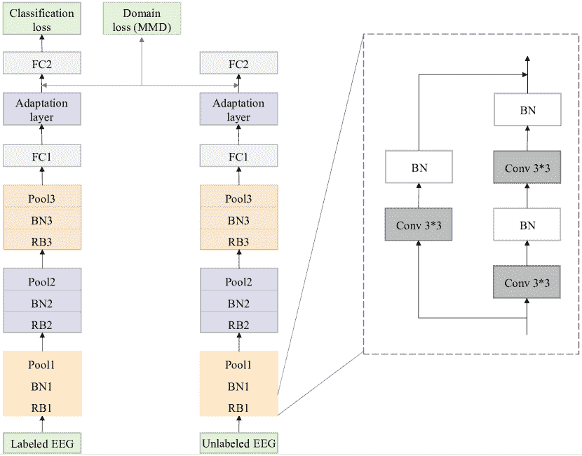
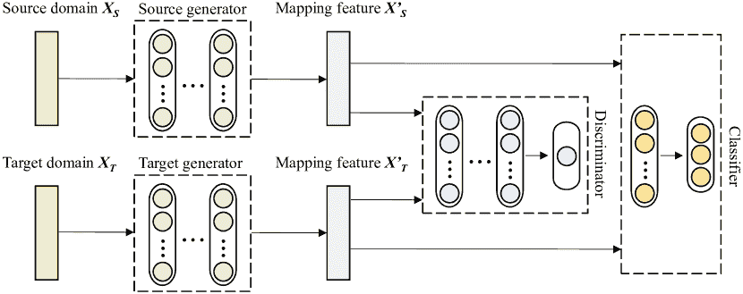
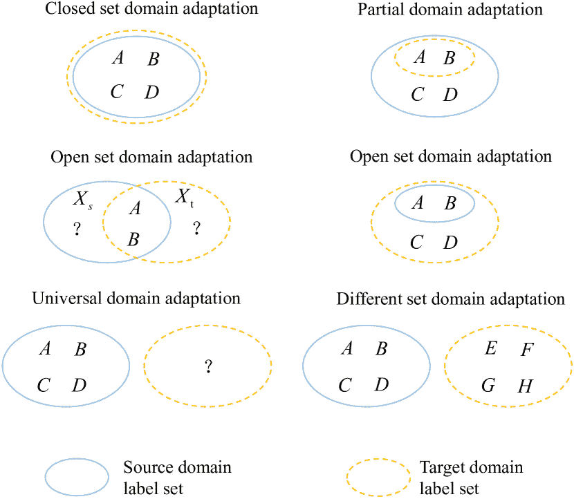
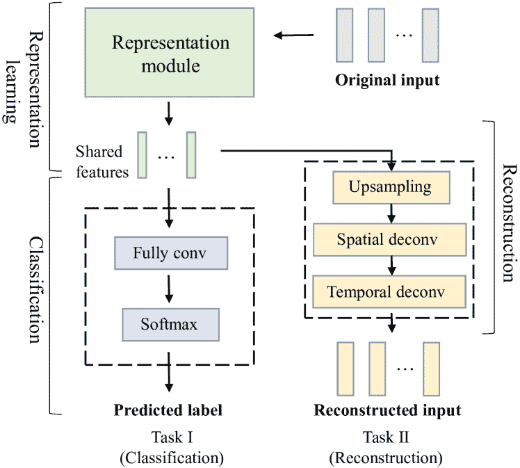
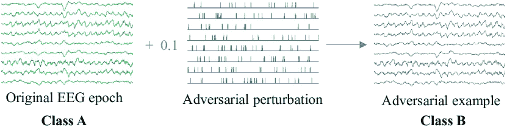
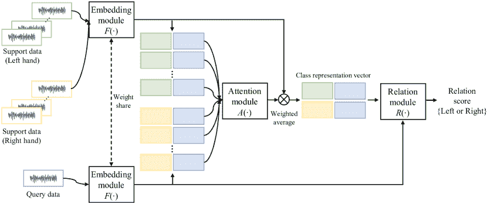
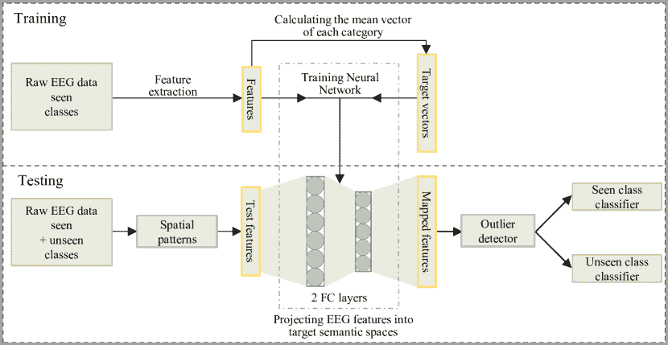

<!--yml

category: 未分类

date: 2024-09-06 19:48:52

-->

# [2112.06654] 通过深度学习实现开放世界脑电图解码：综合调查

> 来源：[`ar5iv.labs.arxiv.org/html/2112.06654`](https://ar5iv.labs.arxiv.org/html/2112.06654)

# 通过深度学习实现开放世界脑电图解码：综合调查

Xun Chen, Chang Li, Aiping Liu, Martin J. McKeown, Ruobing Qian, Z. Jane Wang

脑电图（EEG）解码旨在基于非侵入性测量的脑活动识别感知、语义和认知内容。传统的 EEG 解码方法在应用于静态、受控的实验室环境中获得的数据时取得了适度的成功。然而，开放世界环境是更为现实的设置，其中影响 EEG 记录的情况可能会意外出现，显著削弱现有方法的鲁棒性。近年来，深度学习（DL）因其在特征提取方面的优越能力，成为解决此类问题的潜在方案。它克服了定义“手工制作”特征或使用浅层架构提取特征的局限性，但通常需要大量昂贵且专家标注的数据——这并不总是能够获得。将 DL 与特定领域知识结合可能允许开发出即使在小样本数据下也能解码脑活动的鲁棒方法。尽管提出了各种 DL 方法来应对 EEG 解码中的一些挑战，但目前缺乏系统性的教程概述，特别是对于开放世界应用的。本文因此提供了关于开放世界 EEG 解码的 DL 方法的综合调查，并确定了有前景的研究方向，以激发未来在现实世界应用中的 EEG 解码研究。

## I 引言

从观察到的神经活动模式中识别和预测心理过程在认知神经科学和脑机接口领域已被广泛探索 [1]。如脑电图（EEG）、磁脑电图（MEG）、近红外光谱（NIRS）和功能性磁共振成像（fMRI）等非侵入性技术提供了广泛检查大脑活动的可及方法，无需外科干预。特别是，EEG 在实际应用中的脑解码中颇受欢迎，因为其相对便宜，具有安全性、高时间分辨率、广泛可及性和潜在的便携性 [2, 3]。EEG 信号可以通过在头皮表面放置电极获得，提供突触后电位的测量——这是一种间接的神经活动测量 [4]。这使得在数字化和适当分析之后，能够解码大脑状态，实现我们大脑与外部世界的沟通 [5]。

EEG 解码方法在最近几十年取得了重大进展。然而，大多数现有的 EEG 解码方法是基于在静态或良好控制的实验室环境中收集的数据，这些环境使用了严格的实验协议和严格的实验室条件，这在开放世界环境中是不现实的。开放世界 EEG 解码是指在开放世界环境中识别测量的脑活动的感知、语义和认知内容 [6]。随着在娱乐、工业和医学等各个领域的新兴开放世界应用的出现，迫切需要开发适用于现实世界场景的高效 EEG 解码方法。此外，这些开放世界应用通常采用少电极便携式、可穿戴和无线系统，以利用硬件技术的进步 [7]。来自复杂环境的这些记录往往受到大量伪影的污染，使得脑解码变得更加困难。

表 I: 开放世界 EEG 解码中三种典型步骤的挑战和解决方案。

|  | 挑战 | 解决方案 |
| --- | --- | --- |
| 预处理 | 如何自动去除各种 EEG 伪影并具有良好的泛化能力 | CNN |
| 自编码器 |
| LSTM |
| GAN |
| 特征提取 | 如何解决源 EEG 数据与目标 EEG 数据之间的分布不匹配 | 迁移学习 |
| 如何利用来自多个任务和模态的 EEG 互补信息 | 多任务学习 |
| 多模态学习 |
| 如何使 EEG 模型对对抗攻击具有鲁棒性 | 对抗训练 |
| 分类 | 如何在小样本量下设计具有良好性能的 EEG 模型 | 少样本学习 |
| 半监督学习 |
| 如何识别已知和未知的 EEG 类别 | 零样本学习 |
| 如何利用未标记的 EEG 数据的结构提供监督 | 自监督学习 |
| 如何在噪声标签存在的情况下训练稳健的 EEG 模型 | 噪声标签分类 |

脑电图解码涉及的步骤通常包括预处理、特征提取和分类，而成功的开放世界脑电图解码需要在每一步中做出特定的考虑。即使在最严格的记录条件下，脑电信号也容易受到各种伪影的污染（*例如*，眼睑跳动、肌肉伪影、心脏干扰和电磁干扰）[7]。开放世界环境中的脑电图也受到因广泛运动（如肌肉和机械伪影）以及电磁因素引起的户外开放世界伪影的污染[7]。历史上，脑电图特征曾从时域（如均值、方差和峰度）、频域（如功率谱密度和快速傅里叶变换）以及时频域（如离散小波变换）中提取。此外，传统定义的特征严重依赖于特定领域的人工专业知识，人工特征提取耗时。提取的特征的分类包括决策树（DT）、支持向量机（SVM）和线性判别分析（LDA）等技术。脑电信号在时间上是非平稳的，其统计特性随时间变化，这使得基于有限数据的分类器泛化具有挑战性。

在特征提取过程中，大多数脑电图解码方法假设训练数据和测试数据分布相同。然而，高度的个体间差异、电极位移和生理状态变化必然会导致开放世界情况下训练和测试分布的错配[8]。即使是小的分布错配也可能导致显著的性能下降。

为了克服上述挑战，深度学习（DL）方法作为一种自动的端到端学习框架，包括预处理、特征提取和分类，在脑电图解码领域已取得了**最先进**的性能[9]，具有更好的泛化能力和更灵活的适用性。DL 方法通过直接处理原始脑电信号来学习有用的信息，从而避免了耗时的预处理和特征提取，这可以捕捉到**辨别性**的高级特征和潜在的依赖关系。

尽管深度学习方法取得了成功，但也面临自己的挑战。监督深度学习隐含假设存在大量标记的 EEG 训练样本，以便深度学习能实现良好的泛化性能 [9]。然而，随着可用训练样本数量的减少，EEG 分类性能会恶化，强调了在更多典型小样本场景下需要强大深度学习模型的必要性 [10]。最近提出了迁移学习 [8]、多任务学习 [11] 和多模态学习 [12] 来解决小样本数据问题。深度学习模型通常假设测试 EEG 信号的类别在训练过程中已被见过。然而，可能存在测试 EEG 信号不属于任何训练集的类别。零样本学习 [13] 可能是一种识别已知和未知 EEG 信号类别的潜在解决方案。另一个挑战是，深度学习方法中的标签在训练集中可能没有完全正确 [14]，这导致错误标签的过拟合，并在应用于未见数据时降低最终分类准确率。未标记的 EEG 数据可以通过自监督 [15] 和半监督学习方法 [16] 分析，以获取重要的潜在信息，我们将在后面详细展开。最后，深度学习模型容易被对抗样本欺骗，对抗样本是经过小的故意扰动修改的正常样本 [17]，因此必须注意防止这种可能性。

尽管有几篇关于 EEG 解码的综述文章，据我们了解，大多数文章集中于静态或受控实验室环境中的 EEG 解码。本文回顾了开放世界 EEG 解码通过深度学习的研究，这些研究具有为实际开放世界应用开发强大 EEG 解码能力的潜力。我们的目标如下：（1）提出开放世界 EEG 解码面临的问题和挑战，（2）提供开放世界 EEG 解码的深度学习解决方案分类，（3）讨论获取更强大开放世界 EEG 解码深度学习模型的潜在方法。

## II 开放世界 EEG 解码通过深度学习

在本节中，我们介绍了处理开放世界脑电图（EEG）解码的新问题和方法，包括 EEG 解码的每一步，*即*，预处理、特征提取和分类。开放世界 EEG 解码通过深度学习的结构在表格 I 中示意性地说明了。

### II-A 预处理

EEG 解码的性能在很大程度上依赖于 EEG 信号的质量。不幸的是，记录的信号通常会受到各种伪影的污染，这些伪影在复杂环境中的开放世界应用中可能会被放大[7]。因此，从开放世界中的污染 EEG 信号中去除复杂伪影具有理论和实际意义。

滤波和回归是传统的伪影去除方法。滤波方法假设伪影和 EEG 信号存在于不同的频带[18]。然而，伪影和 EEG 信号通常在频域上重叠，这样在去除伪影的过程中可能会消除 EEG 信号的一部分。回归方法通常假设每个 EEG 通道可以建模为干净的大脑活动和伪影信号的线性或非线性叠加，这些信号可以从参考通道或伪影模板中获得。然而，回归方法仅在有适当的参考通道时有效（*例如*，用于测量眼动的通道）。

另一种在预处理阶段流行的 EEG 去噪方法是盲源分离（BSS）[19]，该方法假设干净的 EEG 和伪影在时间域上是统计独立的，因此它们会被隔离到不同的组件中。这允许在重建过程中去除与伪影相关的组件。BSS 方法通常需要人工干预来识别伪影相关的组件，这是一项主观且耗时的工作。这些方法通常要求通道的数量必须大于或等于潜在源的数量[18]，因此当只有少数通道可用时，例如在移动场景中，它们的吸引力较小。

经验模态分解（EMD）[20]和小波变换（WT）[21]是在仅有有限脑电图（EEG）通道的情况下进行去噪的两种代表性方法。EMD 根据内在模态函数（IMF）将输入信号分解为多个经验模态。IMF 是一组带限函数，满足两个基本条件：（1）极值点的数量和零交叉点的数量必须相等或最多相差一个，（2）在每一点处，由局部极大值和局部极小值定义的包络线的均值应为零。EMD 的数据驱动方法能够处理非平稳随机过程，使其适合于去除受污染的 EEG 信号中的伪影。然而，EMD 耗时较长，不适合在开放世界的在线应用中使用。类似于 EMD，小波变换首先将受污染的 EEG 信号分解为不同的子带。然后，使用阈值函数更新与假定为伪影相关的子带相关的系数。最后，使用更新后的系数重建 EEG 信号。然而，选择不正确的阈值设置可能会导致重建的 EEG 信号退化[7]。一种传统的浅层神经网络可以用来替代小波分析中的阈值函数，其优点在于能够近似光滑的非线性函数。然而，传统的浅层神经网络的近似能力往往逊色于深度学习（DL）。

基于 DL 的方法可以自动过滤掉污染的 EEG 信号中的伪影。一种典型的方法是学习嘈杂 EEG 信号与其清洁版本之间的映射 [22]。DL 基于伪影去除方法的性能主要依赖于训练数据集的大小。例如，Zhang *et al.* 为 DL 基于伪影去除方法的训练和测试建立了一个基准 EEG 数据集 [22]。EEG 片段来自一个运动想象 EEG 数据集，应用了 1 至 80 Hz 的带通滤波器，然后重新采样到 256 Hz。随后，采用 ICLabel 方法 [23] 来减弱伪影。最后，将 EEG 信号分段为 2-$s$ 片段。眼动伪影片段来自开放访问的 EEG 数据，带通滤波在 0.3 至 10 Hz 之间，然后重新采样到 256 Hz，再分段为 2-$s$ 片段。肌源性伪影片段来自面部表面肌电图 (EMG) 数据集，带通滤波在 1 至 120 Hz 之间，重新采样到 512 Hz，再分段为 2-$s$ 片段。对于所有类别，片段通过减去其均值并除以其标准差进行标准化，然后由专家进行视觉检查。最后，获得了 4514 个干净 EEG 片段、3400 个眼动伪影片段和 5598 个肌肉伪影片段。模拟的嘈杂信号可以通过将干净的 EEG 片段与 EOG 或 EMG 片段线性混合来生成，眼动伪影污染的 EEG 片段的 SNR 范围从 -7dB 到 2dB，而肌源性伪影污染的片段的 SNR 范围从 -7dB 到 4dB。这样，干净的 EEG 片段可以视为真实值，而混合片段则视为污染的 EEG。这允许使用大量的带有真实值（干净 EEG 片段）的嘈杂 EEG 片段进行模型训练和测试。从数学上讲，模拟的嘈杂 EEG 信号可以表示为

|  | $\mathbf{Y}=\mathbf{X}+\lambda\cdot\mathbf{N},$ |  | (1) |
| --- | --- | --- | --- |

其中 $\mathbf{Y}$ 表示带有伪影的污染 EEG 信号，$\mathbf{X}$ 表示干净的 EEG 信号，$\mathbf{N}$ 表示伪影，$\lambda$ 表示伪影的相对贡献。

DL 基于的方法旨在学习一个端到端的非线性函数 $f$，以将嘈杂的 EEG 信号映射为近似的干净 EEG 信号，如下所示

|  | $\hat{\mathbf{X}}=f(\mathbf{Y},\theta),$ |  | (2) |
| --- | --- | --- | --- |

其中 $\hat{\mathbf{X}}$ 表示近似的干净 EEG 信号，$\theta$ 表示待学习的参数。学习过程可以通过最小化如下目标函数来实现

|  | $\hat{\theta}={\text{arg}}~{}\underset{\theta}{\text{min}}~{}\frac{1}{N}\sum_{i=1}^{N}\&#124;\mathbf{X}_{i}-f(\mathbf{Y}_{i},\theta)\&#124;_{F}^{2},$ |  | (3) |
| --- | --- | --- | --- |

其中 $N$ 代表训练样本的数量，$\mathbf{Y}_{i}$ 和 $\mathbf{X}_{i}$ 分别表示第 $i^{th}$ 个污染的 EEG 信号和干净的 EEG 信号。在获得优化的训练参数 $\hat{\theta}$ 后，可以为 EEG 测试数据集获取去噪后的 EEG 信号。

自编码器，作为深度学习的主要分支之一，也被用于伪影去除 [24]。自编码器由三层组成，*即*，输入层、隐藏层和输出层。自编码器将输入 $x$ 映射到输出 $z$。它通过一个映射（编码器）将输入 $x$ 映射到隐藏表示 $y$，计算方式如下：

|  | $y=s(W^{T}x+b),$ |  | (4) |
| --- | --- | --- | --- |

其中 $s$ 表示非线性函数，如 sigmoid，$W$ 和 $b$ 分别表示从输入层到隐藏层的权重和偏置向量。隐藏表示随后被映射回（解码器）到与输入 $x$ 相同大小的输出 $z$，其计算方式如下：

|  | $z=s(W^{\prime T}y+b^{\prime}),$ |  | (5) |
| --- | --- | --- | --- |

其中 $W^{\prime}$ 和 $b^{\prime}$ 分别表示从隐藏层到输出层的权重和偏置向量。网络的训练可以通过测量重建误差来完成，该误差可以通过传统的均方误差（MSE）来测量。例如，Ghosh *et al.* 提出了一个使用 SVM 和自编码器进行自动眼睛眨动伪影去除的方法 [24]。对 EEG 数据应用了 0.45-$s$ 的滑动窗口，每个窗口的处理步骤如下：（1）伪影识别：将窗口内的信号输入到 SVM 分类器中，SVM 分类信号是否为伪影还是干净的 EEG。如果分类为伪影，则将其输入到自编码器进行修正。另一方面，如果信号被分类为非伪影，则窗口向前滑动。（2）伪影清除：标记为伪影的信号窗口将输入到预训练的自编码器中。自编码器去除污染的 EEG 窗口中的伪影，并输出干净的 EEG 信号。然而，[24] 中的编码器和解码器是自编码器的最简单情况，只使用一个线性层和非线性层来表示编码器和解码器。用于 EEG 预处理的编码器和解码器可以有多个层。例如，使用了可逆 GAN 来去除 BCG 伪影 [25]。在单次可逆 GAN 中使用了一个自编码器作为子网络。编码器包含多个卷积层，解码器包含多个转置卷积层（反卷积层）。

长短期记忆（LSTM）模型是递归神经网络（RNN）的一个流行变体，通过向 RNN 模型中添加额外的参数来解决 RNN 的梯度消失和梯度爆炸问题[26]，也可以用于 EEG 伪影减少。一个 LSTM 由四个不同的门组成，它们检查细胞状态的输入，并确定细胞状态对输出的影响。这四个门被称为输入门、遗忘门、输出门和块输入门。输入门和块输入门控制新信息流入记忆单元。Sigmoid 和 Tanh 分别用作输入门和块输入门的激活函数。遗忘门控制哪些先前的信息应保留在记忆单元中。输出门决定从 LSTM 单元发送的输出内容。Sigmoid 激活函数同时用于遗忘门和输出门。Manjunath *等* 提出了一个低复杂度的 LSTM，用于检测多通道脑 EEG 信号中的各种伪影[27]。它包括一个大小为 64 的平均池化层、一个具有 12 个单元的 LSTM 层、一个具有 50 个神经元的全连接层以及一个用于二分类的输出层。实验结果表明，基于 LSTM 的 FPGA 硬件在每次分类的动态功耗方面比基于 CNN 的 FPGA 硬件高出 1.88$\times$。

尽管上述基于深度网络的方法已经取得了理想的性能，但端到端的网络通常使用网络输出与真实值之间的均方误差（MSE）作为损失函数，这会导致过度平滑和细节丢失 [28]。为了克服这些问题，可以使用生成对抗网络（GAN）来去除伪影，其中生成网络被训练用于将噪声脑电图（EEG）信号映射为干净的 EEG 信号，而判别网络被训练用于区分真实和生成的 EEG 信号。在同时进行脑电图（EEG）和功能磁共振成像（fMRI）记录的情况下，这种方法尤其有用，因为它可以以高时间和空间分辨率测量脑活动。由于心脏活动和血液流动在 MRI 扫描仪的静态磁场中存在球形心电图（BCG）伪影 [25]。然而，使用深度学习（DL）去除 BCG 伪影仍然具有挑战性，因为很难同时获得干净的 EEG 信号和 BCG 污染的 EEG 信号。配对信号到信号问题指的是使用配对训练数据进行输入数据与输出数据之间的映射。然而，很难同时获得处于相同状态的 BCG 污染的 EEG 信号和干净的 EEG 信号，因此 BCG 伪影去除可以被视为一种“未配对信号到信号问题”。循环一致性生成对抗网络（CycleGAN） [29] 是解决未配对图像到图像转换的技术，它可以广泛应用于许多领域，如未配对图像去噪、未配对图像超分辨率和未配对图像去雾。由于 EEG 信号的信噪比（SNR）较低，直接使用在未配对问题上表现良好的 CycleGAN，仍然不能轻易去除同步 EEG-fMRI 中的 BCG 伪影。Lin *et al.* 提出了一个新型的单次反向生成对抗网络（GAN）用于去除 BCG 伪影 [25]。该模型能够双向输入和输出，前向模型可以将污染的 EEG 信号映射为干净的 EEG 信号，而反向模型可以实现从干净 EEG 信号到污染 EEG 信号的数据转换。

### II-B 特征提取

#### II-B1 转移学习以解决分布不匹配问题

最近，EEG 识别方法在许多应用中取得了成功，特别是当训练和测试 EEG 数据来自相同分布时。然而，在许多真实的开放世界问题中并非如此，存在显著的高主体间变异、电极移位和生理状态变化，这些因素都会影响模型的泛化能力 [8]。由于源域和目标域之间的分布不匹配，在目标域测试时，源域训练的分类器的性能几乎肯定会下降，从而限制了其实际使用。

迁移学习旨在通过融合来自一个或多个相关但分布不同的源领域的知识，来提升在目标领域的学习者的表现。例如，可以希望将来自一个机构的小样本脑电图（EEG）数据与其他机构收集的大数据集进行融合。领域适应是迁移学习的一种特殊情况，它利用一个或多个源领域中的标注数据来提升在目标领域的学习表现。传统的脑电图信号分析中的领域适应方法包括分布适应和子空间适应[8]。分布适应通常可以分为边际分布适应和条件分布适应。边际分布适应的目标是当源领域（$X_{S}$）和目标领域（$X_{T}$）的边际分布不同，即$P(X_{S})\neq P(X_{T})$时进行知识迁移。条件分布适应的目标是当源领域和目标领域的条件分布不同，即$P(Y_{S}|X_{S})\neq P(Y_{T}|X_{T})$时进行知识迁移。边际分布差异和条件分布差异的度量包括最大均值差异[30]、Kullback–Leibler 散度[31]和 Jensen–Shannon 散度[32]。子空间适应将源领域和目标领域的数据转换到一个共同的潜在子空间，在这个子空间中它们的分布是相似的[33]。线性子空间适应通常利用线性子空间学习算法进行脑电图信号分析中的领域适应，例如主成分分析和线性判别分析。流形学习方法将源领域和目标领域的原始高维脑电图数据映射到一个共同的低维流形结构[8]。统计特征对齐的目标是将脑电图数据映射到一个子空间，以对齐源领域和目标领域中的统计特征[34]，例如方差和中位数绝对偏差。然而，传统的领域适应方法对齐源领域和目标领域中的分布，或学习具有浅层表示的共享共同子空间。

最近，有几项研究表明深度网络能够学习更具迁移性的表示[35]。深度特征最终会从一般性过渡到特定性，而在接近输出的更高层中，迁移能力会急剧下降[36]。在脑电信号分析中最常用的方法是微调预训练的深度学习模型[37]，*即*，训练一个基础网络，然后将其前 $n$ 层复制到目标网络中。预训练模型可以利用从大数据集中获得的知识，更有效地解决具有相似但不同任务的小数据集问题。目标网络的剩余层随机初始化，并针对目标任务进行训练。可以选择微调整个深度网络，或冻结前 $n$ 层。这取决于目标数据集的大小和前 $n$ 层中的参数数量。如果目标数据集的大小较大或参数数量较少，则可以微调以提高性能。如果目标数据集的大小较小而参数数量较多，则可能发生过拟合，因此前 $n$ 层通常会被冻结。例如，Raghu *et al.* 使用预训练网络提取特征，并使用支持向量机（SVM）进行癫痫类型分类[37]，其性能优于传统的特征和聚类方法。

图 1：基于 CNN 和 DDC 的跨主体识别方法（图源自 [38]）。

尽管微调易于实施和理解，但当源域和目标域之间的分布差异较大时，其效果较差。为了解决这个问题，Zhang *et al.* 提出了基于卷积神经网络（CNN）和深度领域混淆（DDC）的跨主体识别方法[38]，如图 1 所示。他们使用源域和目标域的脑电数据联合训练 CNN，以最小化分类准确率的损失。DDC 方法通过最小化源域和目标域之间的距离（最大化领域混淆）来缩小特征分布的差异。因此，在源域训练的分类器可以应用于目标域，以减少分类准确率的损失。最大均值差异（MMD）用于最大化领域混淆，定义如下

|  | $\text{MMD}(X_{S},X_{T})=\bigg{\&#124;}\frac{1}{&#124;X_{S}&#124;}\sum_{x_{s}\in{X_{S}}}\Phi(x_{s})-\frac{1}{&#124;X_{T}&#124;}\sum_{x_{t}\in{X_{T}}}\Phi(x_{t})\bigg{\&#124;}_{\mathcal{H}}^{2},$ |  | (6) |
| --- | --- | --- | --- |

其中 $x_{s}$ 和 $x_{t}$ 分别表示适应层中源领域和目标领域的深层特征。$|X_{S}|$ 和 $|X_{T}|$ 分别表示源领域和目标领域中的样本数量。$\Phi$ 表示将深层特征映射到再生核希尔伯特空间（RKHS）的核函数。总损失定义如下

|  | $L=L_{C}(X_{L},Y_{L})+\alpha\text{MMD}(X_{S},X_{T}),$ |  | (7) |
| --- | --- | --- | --- |

其中 $L_{C}(X_{L},Y_{L})$ 表示在标记源领域 EEG 数据 $X_{L}$ 和相应的真实标签 $Y_{L}$ 中的分类损失，而 $\alpha$ 表示正则化参数。

图 2：生成对抗网络领域自适应框架（图改编自[39]）。

另一种方法是采用生成对抗领域自适应[39]，该方法与 GAN 密切相关。GAN 具有生成能力的优势，并且可以被表述为一个极小极大问题。当两玩家游戏达到平衡时，生成数据的分布接近真实数据的分布。因此，如图 2 所示，生成对抗领域自适应[39]框架已被广泛用于解决计算机视觉及 EEG 解码中的分布不匹配问题。源领域和目标领域的生成器分别旨在将源领域和目标领域映射到一个共同的特征空间。鉴别器旨在区分共同特征空间中的源领域和目标领域分布，而分类器则用于识别 EEG 状态。

图 3：不同领域自适应场景[40]。

深度领域适应方法通过消除源领域和目标领域之间的领域偏移来提高模型在目标领域的性能。然而，大多数领域适应方法要求源领域与目标领域具有相同的特征空间和标签空间，这在开放世界的基于脑电图的应用中可能并不总是成立。实际上，源领域和目标领域可能具有不同的标签空间。图 3 展示了不同的领域适应场景。在封闭集领域适应中，源领域和目标领域假设具有相同的标签空间。在部分领域适应[41]中，目标领域的类别仅包含源领域的一部分，而在开放集领域适应中，假设源领域和目标领域具有几个共同的类别，但也有几个不同且未知的类别。在图 3 第二行左侧的开放集领域适应[42]中，源领域和目标领域包含一些共同的类别，但每个领域也包含一个“未知”类别。在图 3 第二行右侧的开放集领域适应[43]中，源领域仅包含目标领域类别的一个子集。在通用领域适应[44]中，目标领域可能与源领域包含几个共同的类别。然而，它也可能包含几个未知的类别。在不同集领域适应中，目标领域包含与源领域部分或完全不同的类别。

域适应方法需要熟悉目标领域的数据，以便在训练阶段测量源领域和目标领域之间的差异。然而，它们需要针对每个目标领域（主题）进行数据收集和模型训练，这些过程成本高且效率低[45]。域泛化旨在利用来自单一或多个相关但不同的源领域的数据来学习一个模型，以便该模型能够很好地泛化到任何目标领域[45]。对于开放世界的基于 EEG 的应用，域泛化可以通过利用源主题之间的领域差异来提取领域不变的特征，而无需访问目标主题。因此，当应用于未见领域时，域泛化在开放世界应用中可能更为稳健。例如，Ma *et al.* 提出了一个域泛化方法，通过应用深度对抗网络来减少主题变异的影响，而无需任何来自未见主题的信息，与现有的域适应方法相比，他们的方法能够很好地泛化到多个测试主题[45]。

#### II-B2 多任务和多模态学习以探索联合和互补信息

一些最近的技术基于这样一个观察：人类可以同时学习多个任务。他们可以利用在一个任务中学到的知识来帮助学习另一个相关的任务。由于数据采集和准确标注的高成本，DL 方法通常需要的大量注释 EEG 样本几乎不可能获得。多任务学习是一种旨在通过利用多个相关任务中包含的有用信息来提高所有任务的泛化性能的方法[46]。假设所有任务，或至少是其中的一部分，彼此相关。理论和实证研究发现，联合学习多个任务比独立学习它们能够取得更好的表现[46]。多任务学习可以让访问到更多的数据，从而产生更稳健和通用的表示，且每个任务的过拟合风险较低。多任务学习与迁移学习相关，但存在一定的区别。在多任务学习中，所有任务是平等的，目的是提高所有任务的性能[47]。然而，迁移学习旨在通过源任务来提高目标任务的性能。因此，目标任务比源任务更受关注。

多任务深度学习（DL），其中每个任务由其自身的深度网络解决，如果相关任务共享互补信息或作为彼此的正则化器，则可以提高性能[47]。此外，固有的层共享表示可以减少内存占用，并避免在共享层中重复计算特征。因此，它可以提供快速的学习速度，并提高相关或下游任务的数据效率。例如，宋*等*提出了一种基于多任务深度学习的脑电图分类方法[11]，如图 4 所示。该方法包含三个模块，分别用于表示、分类和重建。表示模块从脑电图信号中学习共享特征，然后将其发送到分类模块进行预测，再到重建模块以重建原始脑电图信号。共享特征作为桥梁将分类和重建任务统一起来，两个任务以端到端的方式共同优化。通过这两个任务的交互，共享特征保持分类和重建能力。因此，它可以增强深度模型的泛化能力，并在有限的脑电图数据下提高分类性能。Abdon*等*提出了一种多任务级联深度神经网络，用于联合预测人在观看情感视频时记录的脑电图信号中的情感因素[48]。所提网络包含两个预测层级。第一级，情感网络，旨在预测参与者在单视频片段中的情感状态，包括愉悦度和唤醒度。第二级，个人因素网络，利用连续视频片段的情感水平预测来进行个人因素的多任务预测。Liu*等*提出了一种多尺度时频特征引导的多任务学习卷积神经网络架构，用于脑电图分类[49]，该方法可以融合不同模型的互补特征。该方法包含四个模块，即基于时空特征的表示模块、基于时频特征的表示模块、多模态融合特征引导生成模块和分类模块。这四个模块同时使用三个任务进行训练并共同优化。由于这三个任务的交互，它可以提高有限标注数据下的主题依赖和主题独立方法的泛化能力和准确性。

图 4：通过多任务深度学习进行 EEG 分类（图源自 [11]）。

多模态学习旨在利用来自不同模态的互补或补充信息来完成共享任务或多个相关任务[50]。使用多模态数据的根本动机是从不同模态中提取互补或补充信息，以完成共享任务或多个相关任务。它可以获得更丰富的表示，从而比仅使用单一模态获得更好的性能。传统的多模态学习方法是浅层模型，不能学习数据的内在表示。因此，它们不能有效捕捉多模态数据的跨模态表示和互补相关性。然而，深度学习模型可以学习数据在隐藏层中的层次表示，不同模态的学习表示可以在不同的抽象层次上进行融合。

有趣的是，多模态深度学习方法似乎与大脑的视觉通路有一定的相关性[51]。Palazzo *等* 提出了一个多模态深度学习方法，通过对自然图像的大脑反应进行分类来学习神经表示[51]，它可以学习联合的大脑-视觉嵌入，并找到大脑表示和视觉特征之间的相似性。这个嵌入可以用于图像分类、显著性检测和视觉场景分析。其动机是学习可靠的联合表示，并找到视觉与大脑特征之间的对应关系，以解码大脑表示。反过来，这些表示也可以用于构建更好的深度学习模型。Jia *等* 提出了一个通过融合 EEG、EOG 和 EMG 信号进行睡眠阶段分类的多模态深度学习方法[12]。为每种信号类型设计了单独的数据表示。然后，将这些表示输入到深度模型中，以分别提取 EEG、EOG 和 EMG 信号的特征。最后，使用特征融合模块将所有提取的特征融合用于睡眠阶段分类。Cai *等* 提出了一个基于多模态 EEG 数据的特征级融合方法用于抑郁症识别[52]。多模态 EEG 数据是在中性、负面和积极的音频刺激下获取的，以区分抑郁患者和正常对照。然后，使用特征级融合方法融合不同模态的 EEG 数据，以构建抑郁症识别模型。

#### II-B3 使用对抗样本增强训练集的对抗训练

尽管深度学习（DL）模型在脑电图（EEG）特征提取中表现出色，但它们容易受到对抗攻击，即正常的 EEG 样本被轻微、看似无害的扰动所破坏[17]。研究发现，对抗样本（即带有小扰动的正常 EEG 样本）很容易欺骗 DL 模型。图 5 展示了一个正常的 EEG 时期和一个对应的对抗样本。这些扰动通常太小，人眼难以察觉。然而，尽管变化微小，对抗 EEG 样本仍可能导致性能急剧下降，并可能带来严重后果。例如，对抗攻击可能导致临床应用中意识障碍的误诊。对抗扰动可以误导 P300 和稳态视觉诱发电位脑-计算机接口（BCI）拼写任何攻击者想要的内容[53]。现代 EEG 监测系统旨在检测癫痫发作，可能会受到对抗攻击的威胁，在紧急情况下，癫痫（发作）样本可能被误分类为间歇性（非发作），这可能带来严重后果[53]。

图 5：一个正常的 EEG 时期及其对抗样本。

对抗攻击可以根据攻击者对目标模型的访问程度进行分类 [54]，*即*，白盒攻击、黑盒攻击和灰盒攻击。白盒攻击 [55] 假设攻击者可以获取分类器和防御机制的所有信息。黑盒攻击假设攻击者不知道目标模型的架构或参数，但可以获得对输入的响应。灰盒攻击假设攻击者可以获取目标模型的某些信息。对抗攻击也可以根据攻击发生的阶段进行分类，包括中毒攻击和规避攻击 [53]。中毒攻击发生在机器学习模型的训练阶段 [56]。攻击者通过注入精心设计的样本来破坏训练数据，从而最终破坏整个学习过程。规避攻击是最常见的类型，试图通过调整恶意样本在测试阶段规避系统 [56]。这种设置不假定对训练数据有任何影响。根据结果，对抗攻击有两种类型 [53]，即，目标攻击和非目标（无差别）攻击。目标攻击强迫模型将某些数据样本或特征空间的特定区域分类到一个选定的（通常是错误的）类别。非目标攻击则强迫模型错误分类某些数据样本或特征空间的区域，但不指定它们应该被错误分类到哪个类别。

在开放世界环境中，获得的脑电图（EEG）信号会被发送到计算机、智能手机或云端进行进一步分析。**Goodfellow** *等* 提出了快速梯度符号法（FGSM）[57]，并很快成为了一种基准攻击方法。设 $g$ 为深度学习模型，$\theta$ 为其参数，$J$ 为训练 $g$ 的损失函数。FGSM 的主要思想是找到一个受 $\varepsilon$ 约束的最优扰动 $\eta$ 以最大化 $J$。扰动可以按如下方式计算

|  | $\eta=\varepsilon\cdot\text{sign}(\bigtriangledown_{x_{i}}J(\theta,x_{i},y_{i})),$ |  | (8) |
| --- | --- | --- | --- |

其中 $x_{i}$ 和 $y_{i}$ 分别表示第 $i$ 次脑电图试验及其对应的标签。仅知道目标模型 $g$ 的架构和参数 $\theta$ 是不够的，因为需要知道 $x_{i}$ 的真实标签 $y_{i}$ 才能生成对抗扰动。**Liu** *等* 提出了无监督 FGSM（UFGSM）来解决这个问题 [17]。UFGSM 用 $y_{i}^{\prime}=g(x_{i})$ 替代标签 $y_{i}$，*即*，来自深度模型的估计标签。UFGSM 中的扰动可以重写如下

|  | $\eta=\varepsilon\cdot\text{sign}(\bigtriangledown_{x_{i}}J(\theta,x_{i},y_{i}^{\prime})).$ |  | (9) |
| --- | --- | --- | --- |

所有 EEG 试验都需要确定每个试验的对抗扰动。这里，EEG 试验指的是与某个试验对应的 EEG 信号。例如，在每次运动想象（MI）试验中，受试者需要在 3.5-$s$内执行两项（右手和右脚）MI 任务中的任意一项。然而，为每个 EEG 试验计算对抗扰动是不方便的。此外，计算对抗扰动需要事先获得所有 EEG 试验[54]。因此，在 EEG 试验开始时进行攻击是不可能的。为了解决这些问题，Liu *et al.* 提出了一个通用对抗扰动[58]方法，该方法可以离线获得通用扰动模板，从而实时攻击开放世界 EEG 系统。因此，关注开放世界 EEG 系统的安全问题至关重要。Meng *et al.* 对 EEG 基础的 BCI 进行了中毒攻击[59]，他们提出了一种实际可行的后门密钥，可以在数据采集期间插入到原始 EEG 信号中。

为应对 EEG 基础系统中的对抗攻击，提出了许多对抗防御方法[53]。最具代表性的方法是通过对抗训练来增强 DL 模型[57]。Hussein *et al.* 提出了一种通过对抗训练增强 DL 模型的方法，用于对癫痫发作进行稳健预测[60]。首先，从有限的标记 EEG 数据中构建一个 DL 分类器，通过对分类器进行白盒攻击获得对抗样本。然后，用对抗样本扩充训练集。最后，使用扩充后的训练集重新训练 DL 模型，从而提高 DL 模型在开放世界 EEG 系统中的鲁棒性。

### II-C 分类

#### II-C1 小样本的少样本、零样本和半监督学习

各种 DL 方法在 EEG 分类中表现出优于传统方法的性能[9]。例如，Tabar *et al.* 提出了 CNN 和堆叠自编码器（SAE）用于分类 EEG MI 信号[61]，与其他传统方法相比可以获得更好的分类性能。然而，在训练样本不足的情况下，DL 模型容易过拟合，从而导致分类准确性下降。尽管每个试验可以进行过采样以获得更多样本，但这些样本彼此高度依赖，因此仍需更多 EEG 试验以实现可靠性能。BCI 反馈应用通常需要繁琐的校准过程，这在某些患者群体中可能具有挑战性[62]。显然，为小样本设计鲁棒的 DL 模型在 EEG 分类中至关重要[63] [64]。

为了从有限数量的 EEG 训练样本中学习带监督的信息，程*等*提出了一种名为多粒度级联森林（gcForest）的深度森林模型，用于多通道 EEG 情感识别任务[66]。该方法对超参数设置不敏感，大大减少了 EEG 情感识别的复杂性。gcForest 的模型复杂度可以根据不同大小的训练数据自动确定，使其适用于小规模训练数据。此外，还提出了一种新的机器学习范式，称为少样本学习[63]。少样本学习的目标是将未见过的数据实例（查询数据）分类到一组类别中，前提是每个类别中只有少量标记实例（支持示例）。通常，每个类别的支持集中有 1 到 10 个标记支持示例。

在 MI 期间的 EEG 记录（用于辅助康复以及自动驾驶）是这些问题出现的一个良好场景，并推动了该领域的发展。MI 还允许用户在运动皮层区域生成特定频段的振荡神经活动抑制，而无需外部刺激[67]。MI 的神经生理模式源自于感官运动皮层区域脑区激活的变化，类似于肢体运动。此外，最近的一项研究已证明，基于 MI 的 BCI 作为中风后运动康复的辅助工具。然而，由于未见过的受试者数据稀缺、MI 信号的复杂动态、受试者间的变异性以及低信噪比，提升基于 MI 的分类任务的性能仍然具有挑战性。

为了解决上述问题，*等人*将基于 EEG 的 MI 分类任务构建为一个少量样本学习问题 [65]（图 6），该方法可以通过少量的 MI EEG 数据对未见过的被试数据进行分类。他们还提出了一种新颖的少量样本关系网络，该网络包括特征嵌入模块、注意力模块和关系模块，采用端到端的框架。嵌入模块用于从支持数据和查询数据中提取语义特征。根据提取的语义特征，注意力模块用于基于支持特征和查询特征获取每个支持样本的注意力得分。然后，可以通过加权平均 $k$ 个支持特征的注意力得分来获得每个类别的代表性向量。最后，关系模块用于根据类别代表性向量和查询特征之间的距离度量来获得关系得分。在训练过程中，少量样本关系网络使用训练数据中不同被试的支持集和查询数据对进行训练。在测试过程中，可以使用来自未见过的被试的 $k$ 个标记支持信号，将查询数据的标签视为预测关系得分最大的类别。因此，即使只有少量的 MI EEG 数据，少量样本关系网络也能有效地推广到对未见过的被试数据的分类。

图 6：少量样本关系网络（图源自 [65]）。

MI 通常只有少数几个可以转化为相应指令的心理任务（*例如*，想象左手或右手的动作）。在实时脑机接口（BCI）环境中，特别需要对每个用户和每个会话进行校准程序。校准的目的是为了得出个性化的脑电图（EEG）信号参数化。实际上，为了构建分类器，需要为区分每种意图控制（IC）状态（与不同的 MI 相关）与非控制（NC）状态以及区分各种 IC 状态，寻求单独的参数化。校准的信号处理程序包括获取用于分类的个性化参数、在随后的用户训练后更新这些参数，以及进行在线信号处理和分类以便于 BCI 操作。校准过程耗时较长，这妨碍了 BCI 系统在实际开放世界场景中的应用 [62]。例如，MI 系统需要大量时间来记录足够的 EEG 数据，以便训练出鲁棒的分类器。由于这些不可避免的 BCI 环境，MI-BCI 系统考虑了脑动态，反映了每个个体的 EEG 特征。此外，由于离线实验的长时间校准，受试者在实时实验中往往会倾向于注意力不集中状态 [68]。尽管性能优于传统方法，但深度学习方法在每个受试者的训练样本有限时常常失败。因此，需要从每个目标受试者那里获得大量训练样本以训练出鲁棒模型 [65]。此外，基于 MI 的 BCI 系统通常受限于 MI 的类型 [13]。通常，只有少数几个心理任务，例如左手、右手和脚的动作，能够被识别并转化为相应的指令。因此，重要的是同时减少校准时间并增加指令的数量。

监督分类中的学习到的分类器只能识别训练过程中见过的目标 EEG 信号的类别。然而，它不能处理之前未见过的类别。见过或已知的类别是指被训练数据集覆盖的类别，而未见过或未知的类别则是指在训练数据集中未出现的类别。零样本学习，一种强大而有前途的学习范式[69]，可以识别未知的 EEG 信号类别[13]，并有可能大幅减少校准时间。在零样本学习中，特征空间中有一些标记的训练实例。这些训练实例覆盖的类别被称为已知类别或见过的类别。还有一些测试实例不属于任何已知类别。这些类别被称为未知类别或未见过的类别。假设训练数据集覆盖的类别和测试数据集的类别是不重叠的。

然而，零样本学习的假设过于严格，使其只能预测未知类别。因此，提出了广义零样本学习方法，用于识别 EEG 信号中的已知和未知类别。Duan *等* 提出了一个用于 EEG 分类的广义零样本学习方法，适用于基于 MI 的 BCI 系统[13]，如图 7 所示。该方法可以识别未知任务样本（*例如*，想象左右手同时移动）。第一步是使用共同空间模式从 EEG 信号中提取特征，其目的是通过最大化两类过滤后的 EEG 信号的方差比来获得具有区分性的空间模式。然后，将获得的 EEG 特征向量投影到目标语义空间，这有助于识别未知任务样本。每类的均值向量被作为语义信息，这可以捕捉不同类别的分布。使用两个全连接层和一个*tanh*激活函数，将每个类别的所有样本映射到相应的均值向量。通过这种方式，已知类别的测试样本会聚集在来自两个类别（左手和右手 MI）的训练样本周围。然而，未知任务样本则远离已知类别。使用异常检测方法来确定映射的 EEG 特征是否属于已知类别。如果映射的特征属于已知类别，则可以使用分类器来确定类别。否则，它将根据被分配为未知类别的可能性来分配类别。因此，广义零样本学习方法不仅可以识别未知类别，还可以识别已知类别。Hwang *等* 提出了一个用于零样本 EEG 信号分类的新框架[70]，该框架分为三个部分。第一部分是生成 EEG 特征的 EEG 编码网络。第二部分是一个能够识别未知 EEG 标签的 GAN，使用知识库进行训练。第三部分是一个简单的分类网络，用于从生成器生成的伪 EEG 特征中学习未见过的 EEG 信号。

图 7：基于 EEG 的运动意图分类的零样本学习（图源自[13]）。

为了解决 EEG 分类中的小样本问题，半监督学习同时采用少量标记 EEG 数据和大量未标记 EEG 数据，这可以看作是监督学习和无监督学习的结合[71]。由于大量未标记的 EEG 数据有助于捕捉数据的潜在分布，半监督学习方法可以通过使用未标记的 EEG 数据来学习更稳健的表示，从而改善监督学习的性能，并减少对大量标记 EEG 数据的需求。例如，Jia *et al.* 提出了一个用于 EEG 情感识别的新型半监督深度学习框架[16]。他们在特征提取中使用了标签信息，并将未标记的信息集成以规范化监督训练。具体而言，他们根据训练模型对每个未标记 EEG 样本的不确定性来确定样本对模型训练的潜在贡献。经过训练阶段后，它可以快速预测测试样本的标签。经过仔细检查，发现结果有时不可靠，即测试样本 $X$ 对于不同标签 $y$ 的条件概率值 $P(y|X)$ 可以非常接近。相反，如果某一标签 $y$ 的概率值主导其他标签，模型对其决策非常有信心。通过这种方式，可以得出前一种情况下样本包含更多不确定性的结论[16]，并且可以更快地推进到更准确的决策边界。因此，监督和无监督信息可以在整个训练过程中共同利用，以减少模型的方差。Panwar *et al.* 提出了一个带有梯度惩罚的半监督 Wasserstein GAN，用于从 EEG 信号中分类驾驶疲劳[72]。该方法是 Wasserstein GAN 的扩展，包含一个预测数据类标签的分类器，这使得在训练过程中能够通过生成的 EEG 样本来增强有限的训练样本，从而提高分类性能。

#### II-C2 自监督学习用于发现未标记 EEG 数据中的结构

大多数基于脑电图（EEG）的深度学习（DL）模型采用有监督学习方法。然而，有监督学习方法存在一些限制。众所周知，DL 需要大量标注的 EEG 数据才能达到令人满意的性能。然而，大多数 EEG 研究是在小规模标注数据条件下进行的，几百名受试者通常被认为是大数据。大规模 EEG 基于有监督学习的研究非常稀少。因此，大多数基于 EEG 的 DL 模型难以实现理想的性能。此外，有监督 DL 模型必须为每个任务从头开始训练，并且需要大量的计算资源和时间。学习到的表示通常非常特定于任务，预期不能很好地泛化到其他任务。此外，在认知神经科学实验中，很难确切了解参与者在思考或做什么，因此难以获得准确的标签[15]。最后，基于 EEG 的有监督 DL 模型易受到对抗攻击。

自监督学习是一种无监督学习范式，可以从大规模无标签数据中学习潜在特征，而无需使用任何标签数据，从而避免了收集和标注大规模数据集的高昂成本。自监督学习通常将无监督学习问题重新表述为有监督学习问题，由前任务和下游任务组成[15]。前任务是预先设计的任务，有助于下游任务。监督信号通过利用数据本身的结构生成，而不是手动标注，特征可以通过训练前任务的目标函数来学习。训练前任务后，前任务学到的特征可以转移到下游任务中。通过训练模型解决设计良好的前任务，自监督学习可以帮助模型从无标签数据中学习更通用的表示，从而在下游任务中实现更好的性能和泛化。一般来说，解决下游任务需要标注标签。然而，在某些应用中，下游任务可以与前任务相同，而无需使用任何标注标签。

自监督学习相比于监督学习在脑电图（EEG）领域有多个优点。例如，自监督学习可以利用未标记数据的结构来提供监督。所学的表示通常比任务特定的监督学习更为通用，并且对类间变异和类内变异更加鲁棒。因此，它可以在不同任务间重复使用，并且比从头训练一个模型每个任务节省计算时间。此外，自监督学习可以充分利用大量未标记的数据，这反过来可以帮助训练更深更复杂的网络。自监督学习还可以在标记数据有限或没有标记数据时提高深度学习的性能。Banville *et al.* 研究了自监督学习，以确定未标记数据中的结构，从而学习有用的脑电图信号表示 [15]。为脑电图设计了三个预训练任务，即相对位置、时间洗牌和对比预测编码。相对位置的目的是根据脑电图样本的相对位置进行区分。这是基于数据的适当表示应随时间缓慢变化，并且时间上相近的脑电图样本应共享相同标签的假设。从时间序列 $S$（脑电图记录）中抽取窗口对，使得一对窗口要么时间上接近（‘正对’），要么远离（‘负对’），并训练一个端到端特征提取器 $h_{\varTheta}$ 来预测一对窗口是正对还是负对。对于时间洗牌，从 $S$ 中抽取窗口三元组，如果其窗口是有序的则给三元组一个正标签，如果窗口是洗牌的则给负标签。对于对比预测编码，从 $S$ 中抽取 $N_{c}+N_{p}$ 连续窗口的序列以及随机干扰窗口（‘负样本’）。给定序列的前 $N_{c}$ 个窗口（‘上下文’），训练一个神经网络来识别在一组干扰窗口中哪个窗口实际跟随上下文。下游任务在两个基于脑电图的临床应用中进行，即睡眠分期和病理检测。实验表明，在小标记数据条件下，基于自监督学习特征训练的线性分类器能够超越监督深度模型 [15]，并且在所有标签可用的情况下达到竞争性表现。此外，所学的表示可以揭示与生理和临床现象相关的潜在结构。此外，所有自监督学习任务在低到中等标记数据条件下系统性地优于或与对比方法持平，并且在高标记数据条件下保持竞争力。

最近，对比学习在计算机视觉中的表示学习方面取得了成功。Chen *et al.* 介绍了一个用于视觉表示对比学习的简单框架（SimCLR）[73]，该框架通过对比损失学习在一组增强操作下不变的表示。为了学习 EEG 表示，Mohsenvand *et al.* 修改了 SimCLR 框架，使其适用于时间序列 EEG 数据[74]。对比自监督学习的核心思想是训练网络，同时最大化相同数据点的增强实例之间的相似性，并最小化不同数据点之间的相似性。与图像中直观且易于人为验证的增强集合不同，对于 EEG 来说，哪些增强可能有益尚不明确。他们通过将对比学习框架扩展到时间序列数据来训练通道级特征提取器，并引入了一组针对 EEG 的增强操作。Mohsenvand *et al.* 咨询了四位神经学家和两位在匿名医院研究小组的博士后研究人员，这些研究小组专注于 EEG 的临床解释，以确定一组不会改变 EEG 数据解释的增强操作[74]。他们选择了易于程序化随机化的变换，并进行了初步实验以选择最小有效集。实验表明，学习到的特征可以提高 EEG 分类的准确性，并显著减少三项 EEG 任务所需的标记数据量，*即*情感识别、正常/异常 EEG 分类和睡眠阶段评分。

#### II-C3 在噪声标签存在下的鲁棒 EEG 分类

在脑电图（EEG）实验中，每次试验都与刺激和反应相关，即对参与者的刺激以及参与者对其的行为反应。行为反应可以是一个标签，并假设它与刺激一致[14]。然而，为了深度监督学习达到理想的性能，需要大量标注良好的 EEG 数据，这在实际的开放世界应用中可能并不总是可用。由于数据中的噪声和脑部过程的复杂性，解释和标注 EEG 信号变得困难，这可能导致高的评估者间变异性，即标签噪声[15]。此外，毒化攻击可以通过修改标签来毒害训练数据[75]。标签噪声：样本有效但由于标注错误而标签不正确。数据噪声：数据有噪声但标签有效，例如，由于腐蚀、遮挡、失真等引起的样本。同时，准确了解参与者在认知神经科学实验中的思维或行为也具有挑战性。例如，在意象任务中，受试者可能没有按照指示进行，或研究过程可能难以客观量化（例如冥想、情感）。例如，参与者在观看引发情感的刺激时可能不会总是产生预期的情感[76]。此外，如果参与者变得困倦、无聊或分心[14]，则可能导致标签错误的试验显著增加。深度学习模型由于能够学习任何复杂的函数，会过度拟合噪声标签，训练后获得的参数会偏离真实的最优值，导致测试期间分类准确率下降。因此，在实际的开放世界应用中必须考虑噪声标签。例如，在基于 EEG 的情感识别领域，人类在判断中存在自然偏差和不一致性，这会在评分中产生噪声。普遍认为，情感是主观的，研究表明人类对情感的理解和感知存在差异。此外，参与者在观看引发情感的刺激时可能不会总是产生预期的情感，而情感标签可能存在噪声，与实际引发的情感不一致。Zhong *et al.* 提出了一个正则化图神经网络用于 EEG 情感识别，采用了节点级领域对抗训练和情感感知分布学习来处理噪声标签[76]。与传统的单标签分类学习不同，情感感知分布学习方法学习训练数据的标签分布，从而充当正则化器，提高模型对噪声标签的鲁棒性。迄今为止，针对存在噪声标签的 EEG 分类的研究还较少。许多方法已经被提出用于处理图像分类中的噪声标签[77]，这些方法可以为噪声标签 EEG 分类提供灵感。例如，Patrini *et al.* 提出了一种损失校正方法，使深度神经网络对标签噪声具有鲁棒性[78]，在噪声分布下的校正损失的最小化器与在干净分布下的原始损失的最小化器相同。Huang *et al.* 提出了一个简单但有效的深度神经网络噪声标签检测方法，无需人工标注[79]，只需调整深度神经网络的超参数，使其在过拟合和欠拟合之间循环转换。Ren *et al.* 提出了一个新方法，通过基于梯度方向为训练样本分配权重[80]，并在当前小批量样本权重上采用元梯度下降步骤，以最小化在干净无偏验证集上的损失。

表 II：挑战与未来方向。

|  | 挑战 | 可能的解决方案 |
| --- | --- | --- |
| 预处理 | 如何解决现实世界 EEG 噪声与模拟数据噪声之间的领域偏移 | 设计更通用的深度网络 |
| 如何在没有配对干净-噪声 EEG 样本的情况下设计深度模型 | 通过 GAN 的无配对深度模型 |
| 特征提取 | 如何在没有源 EEG 数据的情况下执行领域适应 | 无源无监督领域适应 |
| 如何在迁移学习中利用多个源和目标 EEG 数据 | 多源和多目标领域适应 |
| 分类 | 如何解决 EEG 信号分析中的类别不平衡问题 | 不平衡学习 |
| 如何从 EEG 样本流中增量训练深度模型 | 在线学习 |
| 如何自动设计用于 EEG 识别的深度网络架构 | 神经架构搜索 |
| 如何在资源有限的便携式 EEG 设备上部署深度模型 | 模型压缩 |
| 如何在解决多样化 EEG 基于任务中实现更高的自动化水平 | 自动化机器学习 |
| 如何利用深度模型的可解释性进行 EEG 分析 | 可解释的深度学习 |
| 如何设计与人类智能相媲美或更优的 EEG 模型 | 强人工智能方法 |

## III 结论与未来方向

EEG 解码在过去几十年中取得了显著进展。本文综合调查了在开放世界设置下使用深度学习的现有 EEG 解码方法。描述了开放世界 EEG 解码中每个步骤面临的挑战，如预处理、特征提取和分类。此外，还简要介绍并总结了使用深度学习解决开放世界 EEG 解码的 approaches，依据核心概念、理论、进展和示例。尽管在使用深度学习进行开放世界 EEG 解码方面已取得了相当大的进展，但如表 II 所示，未来工作中仍需解决几个问题。

实际应用中的数据噪声比模拟的 EEG 数据噪声要复杂得多，并且分布也不同。实际数据噪声的特征可能因 EEG 收集设置和条件的不同而有所差异。因此，在开放世界 EEG 伪影去除中，应该考虑实际噪声与模拟数据噪声之间的领域转移问题。传统的基于深度学习（DL）的伪影去除方法旨在学习一个端到端的非线性函数，将带噪声的 EEG 信号映射到具有已知统计特征的干净 EEG 信号。然而，它们往往缺乏对盲目和实际开放世界数据噪声的灵活性。例如，传统的深度网络是在特定的信噪比（SNR）水平下训练的，训练好的网络在遇到未知噪声水平时会失败。因此，应该训练一个更通用的网络，覆盖预期的 SNR 范围，以实现对污染 EEG 信号的盲去噪。大多数基于卷积神经网络（CNN）的方法的去噪性能在很大程度上依赖于监督学习，并需要大量配对的干净-带噪声 EEG 信号。然而，对于一些开放世界 EEG 解码应用，收集真正的干净 EEG 信号会很困难，因此需要设计新的基于 DL 的伪影去除方法，而不依赖于干净 EEG 训练样本或配对的干净-带噪声 EEG 训练样本。未配对的 DL 方法可以用来解决这个问题。此外，重要的是仅使用带噪声的 EEG 信号来训练基于 DL 的伪影去除方法。总之，开放世界 EEG 解码中的伪影去除是一个极具挑战性的任务。数据噪声可以是自然的，也可以是通过对抗攻击添加的。类似地，标签噪声可以是自然的，也可以是通过中毒攻击添加的。当数据和标签都存在自然噪声和对抗噪声时，这是开放世界 EEG 解码中数据噪声和标签噪声的最坏情况，这需要在未来的工作中进行深入研究。

在脑电图（EEG）信号分析中，大多数传统领域适应方法假设在训练期间可以访问源数据。在一些开放世界的 EEG 解码应用中，对访问源领域数据的要求是严格的。由于隐私和安全问题，共享数据可能会引发担忧。此外，存储、传输和处理大量源 EEG 数据是困难的。因此，有必要进行无源无监督领域适应，其中预训练的源领域模型需要适应未标记的目标数据。此外，无监督领域适应模型通常应用于单一源领域和单一目标领域，而在开放世界 EEG 解码中，通常会遇到多源和多目标领域适应。因此，单领域适应可能并不理想，因为它忽略了跨多个领域共享的知识。此外，当将训练于一个数据集的分类器应用于其他数据集时，性能会显著下降，因此改进跨主体和跨数据集的分类性能是重要的。

在使用深度学习（DL）解决开放世界 EEG 解码的其他方案方面，只有少数研究开始关注少样本学习、零样本学习、半监督学习、自监督学习以及噪声标签的 EEG 分析。因此，对上述方法进行深入研究的空间仍然很大。此外，当少数类的 EEG 样本显著少于多数类时，会发生类别不平衡。当训练数据中存在类别不平衡时，学习到的分类器会因为多数类的先验概率增加而过度分类多数类。因此，少数类样本比多数类样本更容易被错误分类。类别不平衡问题在多个 EEG 应用中很常见，例如 EEG 癫痫发作检测任务。癫痫发作事件的持续时间通常远短于长期连续 EEG 数据中的非发作期。因此，如果不考虑类别不平衡问题，分类器将偏向于非发作 EEG 信号。基于深度学习的方法解决类别不平衡问题可以分为两个主要类别[81]。第一类是数据级方法，它们作用于训练集并改变其类别分布[81]。它们旨在改变数据集以使标准训练算法有效。例如，随机少数类过采样简单地复制从少数类中随机选择的样本。然而，与过采样相对的是，欠采样则从多数类中随机删除样本，直到所有类别的样本数量相同。另一类涵盖分类器（算法）级方法。这些方法保持训练数据集不变，并调整训练或推断算法[81]。例如，阈值移动调整分类器的决策阈值。它在测试阶段应用，涉及改变输出类别概率。

开放世界脑电图（EEG）解码还存在一些新的问题需要解决。混合问题是现有问题的组合。为了同时解决多个问题，开放世界 EEG 解码中将出现一些新问题，如少样本迁移学习、存在噪声标签的迁移学习、多任务和多模态迁移学习、对抗性迁移学习、带噪声标签的对抗性训练、自监督迁移学习以及多任务零样本学习。

大多数基于深度学习的脑电分类方法是离线学习算法。然而，分类器必须使用所有训练数据以及新到达的脑电样本重新训练，这使得这些方法在实时脑电数据流分析中效率低下且不可扩展。在线学习可以从一系列脑电样本中增量训练深度预测模型，而无需重新分析以前的数据，因此它具有高效率、强适应性和对动态环境的优秀可扩展性。因此，有必要将在线学习应用于开放世界脑电解码，以便从新到达的脑电样本中增量学习新知识。

深度学习方法已被广泛应用于脑电信号分析。网络架构设计对最终的脑电解码性能有显著影响。各种网络架构已被设计以实现良好的性能。然而，网络架构设计在很大程度上依赖于先验知识和经验。因此，神经架构搜索 [82] 旨在自动设计网络架构，以尽可能减少人工干预。神经架构搜索方法可以根据三个维度进行分类 [82]: 搜索空间、搜索策略和性能估计策略。搜索空间定义了原则上可以表示的架构。搜索策略详细描述了如何探索搜索空间，这通常是指数级大的或甚至无限的。神经架构搜索的目标是找到在未见数据上实现高性能的架构。性能估计指的是估计性能的过程，最简单的方法是对数据进行标准训练和验证。例如，Li *等人* 提出了一个基于强化学习的脑电情感识别的神经架构搜索框架 [83]，可以自动设计网络架构。

深度模型在脑电解码中的良好性能是以巨大的内存消耗和高计算复杂度为代价的。越来越多的人对在资源和能量预算严格且期望实时处理的边缘设备（*例如*，可穿戴设备、手机、医疗设备等）上部署深度模型产生兴趣。因此，减少深度模型的内存和计算复杂度的成本，即在不显著降低脑电分析模型性能的情况下进行模型压缩 [84]，成为一个紧迫而有前景的课题。例如，Wang *等人* 采用了知识蒸馏方法，将训练数据的分布从复杂网络（教师网络）提取到简单网络（学生网络）中，用于脑电情感识别 [85]。

当前的 EEG 解码人工智能主要集中在弥合机器和人类之间的性能差距。然而，一般人工智能用通用人工智能算法系统替代了特定任务的模型，这可以在解决多种任务时实现更高水平的自动化。自动机器学习是一种通用人工智能算法方法，可以应用于广泛的任务，包括截然不同的任务。DL 模型的超参数设置对开放世界中的最终 EEG 解码性能有显著影响。手动测试是调整超参数的传统而普遍的方法，它需要对 DL 算法及其超参数值设置有深入了解。然而，手动调整对于开放世界 EEG 解码中的若干问题效果不佳。这促使了超参数自动优化的研究。超参数优化旨在自动化超参数调整过程 [86]，使用户能够有效地将 DL 模型应用于开放世界的 EEG 解码问题。此外，当面对开放世界 EEG 解码中的复杂决策任务时，需要设计自动机器学习方法以适应性地解决复杂任务。强化学习是机器学习的一个分支，其中智能体可以通过与环境的互动进行学习。强化学习不需要广泛的工程和启发式设计。此外，强化学习通过试错更新参数，不需要期望的奖励是可微分的，并且可以直接处理离散空间中的搜索问题。因此，深度强化学习可以结合 DL 和强化学习的优点，用于开放世界 EEG 解码，从而使智能体能够解决复杂的决策任务。

大多数用于 EEG 解码的深度模型是过度参数化的黑箱模型，它们可以在没有可解释知识表示的情况下获得高分类准确率。因此，往往难以理解隐藏在网络中的深度模型的预测逻辑。因此，在理论和实践中利用深度模型的可解释性 [87] 对于 EEG 解码非常重要。

目前大多数脑电图（EEG）解码方法无法与人类智能相提并论，特别是在变化、动态和复杂的开放世界环境中。强人工智能旨在设计与人类智能相当或超越人类智能的算法。因此，开发强人工智能方法以解决开放世界 EEG 解码中的挑战性问题是重要的。例如，深度模型通常需要大量的训练数据才能取得良好性能。然而，它们快速学习新概念的能力相对有限。元学习被称为“学习学习模型”[88]。它将任务视为训练样本，并旨在训练一个能够适应所有这些训练任务的模型。因此，元学习可以提高模型对开放世界 EEG 解码的泛化能力，并且可以潜在地设计适用于分布内和分布外任务的通用方法。

## IV 致谢

Xun Chen、Chang Li 和 Aiping Liu 部分得到了中国国家自然科学基金（资助编号 61922075、41901350 和 61701158）、中国科学技术大学“双一流”研究基金（资助编号 YD2100002004）以及安徽华米信息技术有限公司的支持。Martin J. McKeown 得到了约翰·尼科尔帕金森研究主席的支持。所有未来的通信应发送给通讯作者 Chang Li（changli@hfut.edu.cn）。

## V 作者

| Xun Chen（xunchen@ustc.edu.cn）获得了不列颠哥伦比亚大学的生物医学工程博士学位。他是中国科学技术大学第一附属医院神经外科的杰出教授，同时担任中国科学技术大学电气工程与信息科学系主任，并负责中国科学技术大学先进技术-华米脑机智能联合实验室。他的研究兴趣包括生物医学应用中的信号处理和机器学习。他是 IEEE 的高级会员。 |
| --- |
| Chang Li（changli@hfut.edu.cn）于 2012 年获得武汉理工大学信息与计算科学学士学位，并于 2018 年获得华中科技大学电子信息与通信博士学位。他目前是合肥工业大学生物医学工程系的讲师。他的研究兴趣包括生物医学信号处理、超光谱图像分析和信息融合。 |
| 刘爱平 (aipingl@ustc.edu.cn) 获得了英属哥伦比亚大学电气与计算机工程博士学位。她是中国科学技术大学信息科学与技术学院的副教授。她的研究兴趣包括生物医学信号处理、神经影像分析和非侵入性脑刺激。她是 IEEE 会员。 |
| 马丁·J·麦基翁 (martin.mckeown@ubc.ca) 获得了多伦多大学医学博士学位。他在加州圣地亚哥的索尔克生物研究所计算神经生物学实验室完成了三年的研究员培训。他曾于 1998 年至 2003 年担任杜克大学医学助理教授，目前是约翰·尼科尔帕金森研究讲席教授、医学教授及太平洋帕金森研究中心主任，位于加拿大英属哥伦比亚省温哥华市 V6E 2M6。他的研究兴趣包括探讨帕金森病的新治疗方法。 |
| 钱若冰 (qianruobing@fsyy.ustc.edu.cn) 是中国科学技术大学第一附属医院（安徽省医院）神经外科主任医师、癫痫中心执行主任、安徽省抗癫痫协会（AAAE）会长。他目前的研究兴趣包括多模态神经影像学、神经电生理学、难治性癫痫的外科治疗和认知科学。他在顶级期刊和会议上发表了超过 50 篇科学文章。 |
| Z. Jane Wang (zjanew@ece.ubc.ca) 获得了康奈尔大学电气工程博士学位。她曾在 2002 年至 2004 年期间担任马里兰大学学院公园分校的研究副教授。她是英属哥伦比亚大学电气与计算机工程系的全职教授，位于加拿大英属哥伦比亚省温哥华市 V6T 1Z4。她的研究兴趣包括统计信号处理和机器学习，应用于数字媒体和生物医学数据分析。她是 IEEE 和加拿大工程院的院士。 |

## 参考文献

+   [1] M. Hassan 和 F. Wendling, “脑电图源连通性：旨在高分辨率时间和空间脑网络,” *IEEE 信号处理杂志*, 第 35 卷，第 3 期，第 81–96 页, 2018。

+   [2] J. Hubbard, A. Kikumoto, 和 U. Mayr, “EEG 解码揭示目标相关表征的强度和时间动态,” *科学报告*, 第 9 卷，第 1 期，第 1–11 页, 2019。

+   [3] W. Tao, C. Li, R. Song, J. Cheng, Y. Liu, F. Wan, 和 X. Chen, “基于 EEG 的情感识别通过通道注意力和自注意力,” *IEEE 情感计算汇刊*, 2020, doi: 10.1109/TAFFC.2020.3025777。

+   [4] X. Chen, Z. J. Wang, 和 M. McKeown，“神经生理数据分析的联合盲源分离：多集和多模态方法，” *IEEE 信号处理杂志*，第 33 卷，第 3 期，第 86–107 页，2016 年。

+   [5] R. T. Schirrmeister, J. T. Springenberg, L. D. J. Fiederer, M. Glasstetter, K. Eggensperger, M. Tangermann, F. Hutter, W. Burgard, 和 T. Ball，“使用卷积神经网络进行脑电图解码和可视化的深度学习，” *人脑成像*，第 38 卷，第 11 期，第 5391–5420 页，2017 年。

+   [6] H. Zhang, R. Chavarriaga, Z. Khaliliardali, L. Gheorghe, I. Iturrate, 和 J. d R Millán，“基于脑电图的错误相关脑活动解码于现实世界驾驶任务，” *神经工程杂志*，第 12 卷，第 6 期，第 066028 页，2015 年。

+   [7] J. Minguillon, M. A. Lopez-Gordo, 和 F. Pelayo，“日常生活中的脑电图-脑机接口趋势：去伪影的要求，” *生物医学信号处理与控制*，第 31 卷，第 407–418 页，2017 年。

+   [8] Z. Wan, R. Yang, M. Huang, N. Zeng, 和 X. Liu，“脑电图信号分析中的迁移学习综述，” *神经计算*，第 421 卷，第 1–14 页，2021 年。

+   [9] Y. Roy, H. Banville, I. Albuquerque, A. Gramfort, T. H. Falk, 和 J. Faubert，“基于深度学习的脑电图分析：系统综述，” *神经工程杂志*，第 16 卷，第 5 期，第 051001 页，2019 年。

+   [10] H. Lu, H.-L. Eng, C. Guan, K. N. Plataniotis, 和 A. N. Venetsanopoulos，“在小样本设置下，使用聚合的正则化公共空间模式进行脑电图分类，” *IEEE 生物医学工程汇刊*，第 57 卷，第 12 期，第 2936–2946 页，2010 年。

+   [11] Y. Song, D. Wang, K. Yue, N. Zheng, 和 Z.-J. M. Shen，“基于脑电图的运动想象分类与深度多任务学习，” 在 *2019 年国际联合神经网络会议（IJCNN）*。 IEEE，2019 年，第 1–8 页。

+   [12] Z. Jia, X. Cai, G. Zheng, J. Wang, 和 Y. Lin，“Sleepprintnet：基于生理时间序列的多变量多模态神经网络用于自动睡眠分期，” *IEEE 人工智能汇刊*，2021 年，doi: 10.1109/TAI.2021.3060350。

+   [13] L. Duan, J. Li, H. Ji, Z. Pang, X. Zheng, R. Lu, M. Li, 和 J. Zhuang，“在基于运动想象的脑机接口系统中进行脑电图分类的零样本学习，” *IEEE 神经系统与康复工程汇刊*，第 28 卷，第 11 期，第 2411–2419 页，2020 年。

+   [14] A. K. Porbadnigk, N. Görnitz, C. Sannelli, A. Binder, M. Braun, M. Kloft, 和 K.-R. Müller，“当大脑与行为不一致时：利用机器学习解决脑电图数据中的系统标签噪声，” 在 *2014 年国际冬季脑机接口研讨会（BCI）*。 IEEE，2014 年，第 1–4 页。

+   [15] H. Banville, O. Chehab, A. Hyvarinen, D. Engemann, 和 A. Gramfort，“通过自监督学习揭示临床脑电图信号的结构，” *神经工程杂志*，2020 年。

+   [16] X. Jia, K. Li, X. Li, 和 A. Zhang，“一种用于脑电信号情感状态识别的新型半监督深度学习框架”，在 *2014 IEEE 国际生物信息学与生物工程会议*。IEEE，2014，第 30–37 页。

+   [17] X. Zhang 和 D. Wu，“关于脑电图基础脑机接口中 CNN 分类器的脆弱性”，*IEEE Transactions on Neural Systems and Rehabilitation Engineering*，第 27 卷，第 5 期，第 814–825 页，2019 年。

+   [18] X. Chen, X. Xu, A. Liu, S. Lee, X. Chen, X. Zhang, M. J. McKeown, 和 Z. J. Wang，“去除脑电图中的肌肉伪影：综述与建议”，*IEEE Sensors Journal*，第 19 卷，第 14 期，第 5353–5368 页，2019 年。

+   [19] T.-P. Jung, S. Makeig, C. Humphries, T.-W. Lee, M. J. Mckeown, V. Iragui, 和 T. J. Sejnowski，“通过盲源分离去除脑电图伪影”，*Psychophysiology*，第 37 卷，第 2 期，第 163–178 页，2000 年。

+   [20] N. E. Huang, Z. Shen, S. R. Long, M. C. Wu, H. H. Shih, Q. Zheng, N.-C. Yen, C. C. Tung, 和 H. H. Liu，“经验模态分解和希尔伯特谱用于非线性和非平稳时间序列分析”，*Proceedings of the Royal Society of London. Series A: mathematical, physical and engineering sciences*，第 454 卷，第 1971 期，第 903–995 页，1998 年。

+   [21] R. R. Vázquez, H. Velez-Perez, R. Ranta, V. L. Dorr, D. Maquin, 和 L. Maillard，“盲源分离、小波去噪和判别分析用于脑电图伪影和噪声消除”，*Biomedical signal processing and control*，第 7 卷，第 4 期，第 389–400 页，2012 年。

+   [22] H. Zhang, M. Zhao, C. Wei, D. Mantini, Z. Li, 和 Q. Liu，“Eegdenoisenet：用于脑电图去噪的深度学习解决方案的基准数据集”，*Journal of Neural Engineering*，第 18 卷，第 5 期，第 056057 页，2021 年。

+   [23] L. Pion-Tonachini, K. Kreutz-Delgado, 和 S. Makeig，“Iclabel：一种自动化的脑电图独立成分分类器、数据集和网站”，*NeuroImage*，第 198 卷，第 181–197 页，2019 年。

+   [24] R. Ghosh, N. Sinha, 和 S. K. Biswas，“利用支持向量机和自编码器自动去除脑电图中的眼睑伪影”，*IET Signal Processing*，第 13 卷，第 2 期，第 141–148 页，2019 年。

+   [25] G. Lin, J. Zhang, 和 Y. Liu，“用于同时脑电图-功能磁共振成像的单次可逆 GAN 进行 BCG 伪影去除”，*arXiv 预印本 arXiv:2011.01710*，2020 年。

+   [26] S. Hochreiter 和 J. Schmidhuber，“长短期记忆”，*Neural computation*，第 9 卷，第 8 期，第 1735–1780 页，1997 年。

+   [27] N. K. Manjunath, H. Paneliya, M. Hosseini, W. D. Hairston, T. Mohsenin *等*，“一种用于多通道脑电图伪影检测的低功耗 LSTM 处理器”，在 *2020 年第 21 届国际电子设计质量研讨会（ISQED）*。IEEE，2020，第 105–110 页。

+   [28] C. Ledig, L. Theis, F. Huszár, J. Caballero, A. Cunningham, A. Acosta, A. Aitken, A. Tejani, J. Totz, Z. Wang *等*，“使用生成对抗网络进行照片级真实单图像超分辨率”，在 *IEEE 计算机视觉与模式识别会议论文集*，2017 年，第 4681–4690 页。

+   [29] J.-Y. Zhu, T. Park, P. Isola, 和 A. A. Efros，“使用循环一致对抗网络进行无配对图像到图像的转换”，在 *IEEE 国际计算机视觉会议论文集*，2017 年，第 2223–2232 页。

+   [30] K. M. Borgwardt, A. Gretton, M. J. Rasch, H.-P. Kriegel, B. Schölkopf, 和 A. J. Smola，“通过核最大均值差异整合结构化生物数据”，*生物信息学*，第 22 卷，第 14 期，第 e49–e57 页，2006 年。

+   [31] A. Gupta, S. Parameswaran, 和 C.-H. Lee，“使用 Kullback-Leibler (KL) 散度对不同心理活动进行脑电图（EEG）信号分类”，在 *2009 IEEE 国际声学、语音和信号处理会议*。IEEE，2009 年，第 1697–1700 页。

+   [32] J. Giles, K. K. Ang, L. S. Mihaylova, 和 M. Arvaneh，“基于 Jensen-Shannon 散度的主观到主观迁移学习框架，用于改进脑-计算机接口”，在 *ICASSP 2019-2019 IEEE 国际声学、语音和信号处理会议 (ICASSP)*。IEEE，2019 年，第 3087–3091 页。

+   [33] C. W. Anderson, J. N. Knight, T. O’Connor, M. J. Kirby, 和 A. Sokolov，“用于脑电图伪影去除和分类的几何子空间方法和时间延迟嵌入”，*IEEE 神经系统与康复工程汇刊*，第 14 卷，第 2 期，第 142–146 页，2006 年。

+   [34] H. He 和 D. Wu，“脑-计算机接口的迁移学习：一种欧几里得空间数据对齐方法”，*IEEE 生物医学工程汇刊*，第 67 卷，第 2 期，第 399–410 页，2019 年。

+   [35] M. Wang 和 W. Deng，“深度视觉领域适应：一项综述”，*神经计算*，第 312 卷，第 135–153 页，2018 年。

+   [36] J. Yosinski, J. Clune, Y. Bengio, 和 H. Lipson，“深度神经网络中的特征可迁移性如何？” *arXiv 预印本 arXiv:1411.1792*，2014。

+   [37] S. Raghu, N. Sriraam, Y. Temel, S. V. Rao, 和 P. L. Kubben，“基于脑电图的多类别癫痫发作类型分类，使用卷积神经网络和迁移学习”，*神经网络*，第 124 卷，第 202–212 页，2020 年。

+   [38] W. Zhang, F. Wang, Y. Jiang, Z. Xu, S. Wu, 和 Y. Zhang，“基于脑电图的跨主体情感识别与深度领域混淆”，在 *国际智能机器人与应用会议*。Springer，2019 年，第 558–570 页。

+   [39] Y. Luo, S.-Y. Zhang, W.-L. Zheng, 和 B.-L. Lu，“WGAN 领域适应用于基于 EEG 的情感识别”，在 *国际神经信息处理会议*。Springer，2018 年，第 275–286 页。

+   [40] H. He 和 D. Wu，“面向大脑-计算机接口的不同集域自适应：一种标签对齐方法”，《IEEE Transactions on Neural Systems and Rehabilitation Engineering》，vol. 28，no. 5，pp. 1091–1108，2020 年。

+   [41] Z. Cao, L. Ma, M. Long,和 J. Wang，“部分对抗域自适应”，在《欧洲计算机视觉会议（ECCV）论文集》中，2018 年，pp. 135–150.

+   [42] P. Panareda Busto 和 J. Gall，“开放域自适应”，在《国际计算机视觉会议》中，2017 年，pp. 754–763.

+   [43] K. Saito, S. Yamamoto，Y. Ushiku，和 T. Harada，“通过反向传播开放域自适应”，在《欧洲计算机视觉会议（ECCV）论文集》中，2018 年，pp. 153–168。

+   [44] K. You, M. Long, Z. Cao, J. Wang,和 M. I. Jordan，“通用领域自适应”，在《IEEE/CVF 计算机视觉与模式识别会议论文集》中，2019 年，pp. 2720–2729。

+   [45] B.-Q. Ma, H. Li, W.-L. Zheng,和 B.-L. Lu，“通过对抗域通用化减少 EEG 信号的受试者可变性”，在《神经信息处理国际会议》上。   Springer, 2019 年，pp. 30–42。

+   [46] Y. Zhang 和 Q. Yang，“多任务学习综述”，《国家科学评论》，vol. 5，no. 1，pp. 30–43，2018 年。

+   [47] X. Ma, S. Qiu, Y. Zhang, X. Lian,和 H. He，“利用基于 LSTM 的多任务学习预测颅内脑电癫痫发作”，在《中国模式识别与计算机视觉大会（PRCV）》上。   Springer, 2018 年，pp. 157–167。

+   [48] J. A. Miranda-Correa 和 I. Patras，“基于脑电信号的情绪、个性、情绪和社交背景预测的多任务级联网络”，在《2018 第 13 届 IEEE 自动人脸和手势识别国际会议（FG 2018）》中。   IEEE，2018 年，pp. 373–380.

+   [49] X. Liu, L. Lv, Y. Shen, P. Xiong, J. Yang,和 J. Liu，“多尺度时空频率特征引导多任务学习 CNN 用于运动意向 EEG 分类”，《Journal of Neural Engineering》，vol. 18，no. 2，p. 026003，2021 年。

+   [50] D. Ramachandram 和 G. W. Taylor，“深度多模态学习：对近期进展和趋势的综述”，《IEEE 信号处理杂志》，vol. 34，no. 6，pp. 96–108，2017 年。

+   [51] S. Palazzo, C. Spampinato, I. Kavasidis, D. Giordano, J. Schmidt, and M. Shah，“通过多模态学习神经活动和视觉特征解码大脑表征”，《IEEE Transactions on Pattern Analysis and Machine Intelligence》，2020 年。

+   [52] H. Cai, Z. Qu, Z. Li, Y. Zhang, X. Hu,和 B. Hu，“基于多模态 EEG 数据的特征级融合方法用于抑郁识别”，《信息融合》，vol. 59，pp. 127–138，2020 年。

+   [53] D. Wu, W. Fang, Y. Zhang, L. Yang, X. Xu, H. Luo,和 X. Yu，“生理计算中的对抗攻击与防御：系统综述”，《arXiv 预印本 arXiv:2102.02729》，2021 年。

+   [54] Z. Liu, L. Meng, X. Zhang, W. Fang, 和 D. Wu, “针对脑电图基础的脑机接口的通用对抗性扰动，” *神经工程杂志*，第 18 卷，第 4 期，页码 0460a4，2021 年。

+   [55] D. J. Miller, Z. Xiang, 和 G. Kesidis, “针对深度神经网络分类的对抗性学习：对抗攻击防御的全面综述，” *IEEE 学报*，第 108 卷，第 3 期，页码 402–433，2020 年。

+   [56] A. Chakraborty, M. Alam, V. Dey, A. Chattopadhyay, 和 D. Mukhopadhyay, “对抗攻击与防御：综述，” *arXiv 预印本 arXiv:1810.00069*，2018 年。

+   [57] I. J. Goodfellow, J. Shlens, 和 C. Szegedy, “解释和利用对抗性示例，” *arXiv 预印本 arXiv:1412.6572*，2014 年。

+   [58] S.-M. Moosavi-Dezfooli, A. Fawzi, O. Fawzi, 和 P. Frossard, “通用对抗性扰动，” 见 *IEEE 计算机视觉与模式识别会议论文集*，2017 年，页码 1765–1773。

+   [59] L. Meng, J. Huang, Z. Zeng, X. Jiang, S. Yu, T.-P. Jung, C.-T. Lin, R. Chavarriaga, 和 D. Wu, “基于脑电图的脑机接口易受后门攻击的影响，” *arXiv 预印本 arXiv:2011.00101*，2020 年。

+   [60] A. Hussein, M. Djandji, R. A. Mahmoud, M. Dhaybi, 和 H. Hajj, “通过对抗性训练增强深度学习以实现对癫痫发作的鲁棒预测，” *ACM 计算健康事务杂志*，第 1 卷，第 3 期，页码 1–18，2020 年。

+   [61] Y. R. Tabar 和 U. Halici, “一种用于分类脑电图运动意象信号的新型深度学习方法，” *神经工程杂志*，第 14 卷，第 1 期，页码 016003，2016 年。

+   [62] K.-H. Shim, J.-H. Jeong, 和 S.-W. Lee, “渐进关系网络：基于少样本脑电图学习的直观上肢运动想象解码，” *arXiv 预印本 arXiv:2005.02602*，2020 年。

+   [63] Y. Wang, Q. Yao, J. T. Kwok, 和 L. M. Ni, “从少量样本中泛化：少样本学习综述，” *ACM 计算调查（CSUR）*，第 53 卷，第 3 期，页码 1–34，2020 年。

+   [64] R. Keshari, S. Ghosh, S. Chhabra, M. Vatsa, 和 R. Singh, “揭示深度学习世界中的小样本问题，” 见 *2020 IEEE 第六届多媒体大数据国际会议（BigMM）*。IEEE，2020 年，页码 134–143。

+   [65] S. An, S. Kim, P. Chikontwe, 和 S. H. Park, “基于注意力的脑电图运动意象分类的少样本关系学习，” 见 *2020 IEEE/RSJ 国际智能机器人与系统会议（IROS）*。IEEE，2020 年，页码 10 933–10 938。

+   [66] J. Cheng, M. Chen, C. Li, Y. Liu, R. Song, A. Liu, 和 X. Chen, “通过深度森林进行多通道脑电图情感识别，” *IEEE 生物医学与健康信息学杂志*，第 25 卷，第 2 期，页码 453–464，2020 年。

+   [67] G. Pfurtscheller 和 F. L. Da Silva, “事件相关脑电图/脑磁图同步与去同步：基本原理，” *临床神经生理学*，第 110 卷，第 11 期，页码 1842–1857，1999 年。

+   [68] Y. Jiao, Y. Zhang, X. Chen, E. Yin, J. Jin, X. Wang 和 A. Cichocki，“用于运动想象脑电图分类的稀疏组表征模型”，*IEEE 生物医学与健康信息学期刊*，第 23 卷，第 2 期，第 631–641 页，2018 年。

+   [69] W. Wang, V. W. Zheng, H. Yu 和 C. Miao，“零样本学习综述：设置、方法和应用”，*ACM 智能系统与技术杂志（TIST）*，第 10 卷，第 2 期，第 1–37 页，2019 年。

+   [70] S. Hwang, K. Hong, G. Son 和 H. Byun，“EZSL-GAN：基于 EEG 的零样本学习方法使用生成对抗网络”，在 *2019 第七届国际脑机接口冬季会议（BCI）*。IEEE，2019 年，第 1–4 页。

+   [71] J. E. Van Engelen 和 H. H. Hoos，“关于半监督学习的综述”，*机器学习*，第 109 卷，第 2 期，第 373–440 页，2020 年。

+   [72] S. Panwar, P. Rad, J. Quarles, E. Golob 和 Y. Huang，“一种半监督 Wasserstein 生成对抗网络用于从 EEG 信号分类驾驶疲劳”，在 *2019 IEEE 国际系统、人与控制会议（SMC）*。IEEE，2019 年，第 3943–3948 页。

+   [73] T. Chen, S. Kornblith, M. Norouzi 和 G. Hinton，“用于对比学习视觉表征的简单框架”，在 *国际机器学习会议*。PMLR，2020 年，第 1597–1607 页。

+   [74] M. N. Mohsenvand, M. R. Izadi 和 P. Maes，“用于脑电图分类的对比表征学习”，在 *健康机器学习*。PMLR，2020 年，第 238–253 页。

+   [75] B. Biggio, B. Nelson 和 P. Laskov，“对抗性标签噪声下的支持向量机”，在 *亚洲机器学习会议*。PMLR，2011 年，第 97–112 页。

+   [76] P. Zhong, D. Wang 和 C. Miao，“基于 EEG 的情感识别使用正则化图神经网络”，*IEEE 情感计算学报*，2020 年，doi: 10.1109/TAFFC.2020.2994159。

+   [77] G. Algan 和 I. Ulusoy，“在标签噪声存在下的深度学习图像分类：综述”，*知识基系统*，第 215 卷，第 106771 页，2021 年。

+   [78] G. Patrini, A. Rozza, A. Krishna Menon, R. Nock 和 L. Qu，“使深度神经网络对标签噪声具有鲁棒性：一种损失修正方法”，在 *IEEE 计算机视觉与模式识别会议论文集*，2017 年，第 1944–1952 页。

+   [79] J. Huang, L. Qu, R. Jia 和 B. Zhao，“O2u-net：一种简单的噪声标签检测方法用于深度神经网络”，在 *IEEE/CVF 国际计算机视觉会议论文集*，2019 年，第 3326–3334 页。

+   [80] M. Ren, W. Zeng, B. Yang 和 R. Urtasun，“学习重新加权示例以实现鲁棒深度学习”，在 *国际机器学习会议*。PMLR，2018 年，第 4334–4343 页。

+   [81] M. Buda, A. Maki 和 M. A. Mazurowski，“卷积神经网络中的类别不平衡问题的系统研究”，*神经网络*，第 106 卷，第 249–259 页，2018 年。

+   [82] T. Elsken, J. H. Metzen, 和 F. Hutter，“神经架构搜索：综述，” *机器学习研究杂志*，第 20 卷，第 1 期，页码 1997–2017，2019 年。

+   [83] C. Li, Z. Zhang, R. Song, J. Cheng, Y. Liu, 和 X. Chen，“基于 EEG 的情感识别通过神经架构搜索，” *IEEE 情感计算汇刊*，2021 年，doi: 10.1109/TAFFC.2021.3130387。

+   [84] L. Deng, G. Li, S. Han, L. Shi, 和 Y. Xie，“神经网络的模型压缩与硬件加速：全面综述，” *IEEE 会议录*，第 108 卷，第 4 期，页码 485–532，2020 年。

+   [85] Z. Wang, T. Gu, Y. Zhu, D. Li, H. Yang, 和 W. Du，“Fldnet：用于 EEG 情感识别的帧级蒸馏神经网络，” *IEEE 生物医学与健康信息学期刊*，第 25 卷，第 7 期，页码 2533–2544，2021 年。

+   [86] T. Yu 和 H. Zhu，“超参数优化：算法与应用综述，” *arXiv 预印本 arXiv:2003.05689*，2020 年。

+   [87] Q.-s. Zhang 和 S.-c. Zhu，“深度学习的视觉可解释性：综述，” *信息技术与电子工程前沿*，第 19 卷，第 1 期，页码 27–39，2018 年。

+   [88] T. M. Hospedales, A. Antoniou, P. Micaelli, 和 A. J. Storkey，“神经网络中的元学习：综述，” *IEEE 模式分析与机器智能汇刊*，2021 年，doi: 10.1109/TPAMI.2021.3079209。
