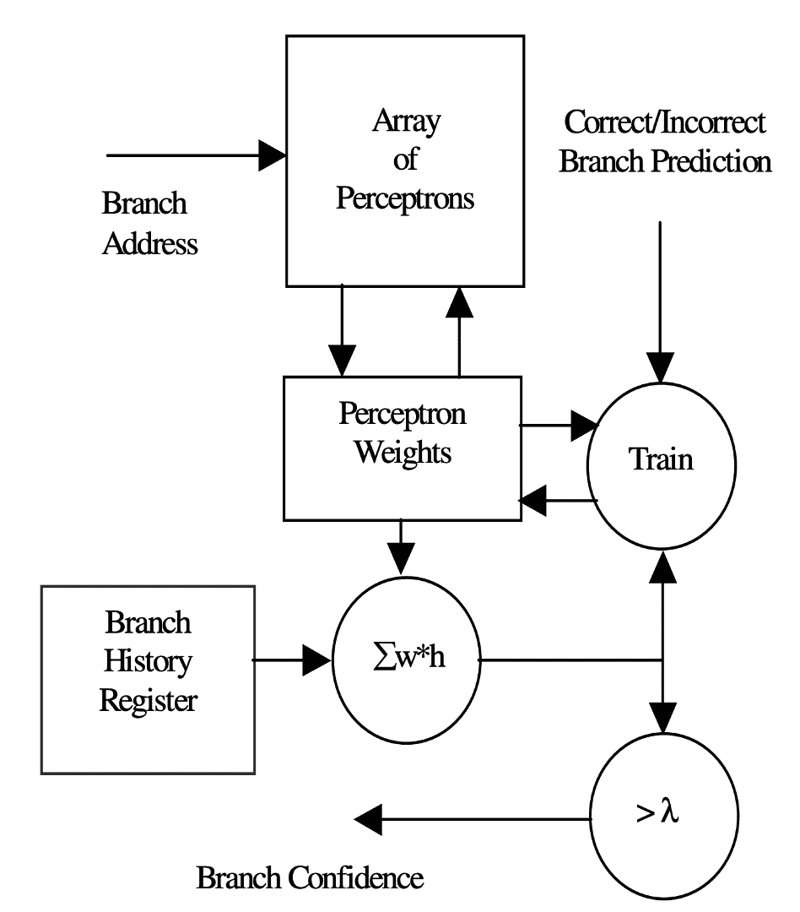

<!--yml

分类：未分类

日期：2024-09-06 19:48:49

-->

# [2112.14911] 深度学习技术在动态分支预测中的调查

> 来源：[`ar5iv.labs.arxiv.org/html/2112.14911`](https://ar5iv.labs.arxiv.org/html/2112.14911)

# 深度学习技术在动态分支预测中的调查

Rinu Joseph Rinu Joseph，德克萨斯大学圣安东尼奥分校工程学院电气与计算机工程系，圣安东尼奥，德克萨斯，美国，电子邮件：rinu.joseph@my.utsa.edu

###### 摘要

分支预测是一种体系结构特性，它加速了在流水线处理器上执行分支指令的速度，并减少了分支的成本。深度学习（DL）在摩尔定律后时代的最新进展正在加速自动化芯片设计、低功耗计算机体系结构等领域的发展。传统的计算机体系结构设计和算法可以从基于深度学习算法的动态预测器中受益，这些算法通过在大量数据上优化其参数来从经验中学习。在这篇调查论文中，我们关注传统的分支预测算法，分析其局限性，并介绍了如何将深度学习技术应用于创建能够预测条件分支指令的动态分支预测器的文献综述。之前的调查[1]关注于基于神经网络感知器的动态分支预测技术。我们计划基于最新的 DL 研究和先进的机器学习（ML）基于分支预测器的研究来改进这一调查。

###### 关键词：

深度学习，机器学习，计算机体系结构，分支预测

## 引言

超标量和非常长指令字（VLIW）架构的微处理器采用指令级并行（ILP）以实现高性能。ILP 在一个 CPU 周期（时钟周期）内同时执行程序中的多条指令，以加速内存引用和计算[2]，这可以改善处理器的性能。但利用 ILP 的一个局限性是程序中分支指令的高频率。根据 Haque 等人[3]的研究，程序中 15%到 25%的指令是分支指令。分支指令有三种类型：1）跳转，2）调用和 3）返回。每种指令可以被分类为条件和无条件分支指令。分支指令可以打断指令执行的顺序流，且不会将指令指针（IP）递增到下一条指令，而是将 IP 加载到内存中指定位置的指令地址。执行流的这种中断可能导致控制冒险，导致延迟，因为管道被填充了随后需要丢弃的指令。

为了缓解代码中分支指令引发的问题，现代架构设计中实现了一种称为分支预测（BP）的方法。分支预测通过最小化流水线惩罚来提高处理器上的指令执行速度。在分支预测中，在完成分支指令的执行之前，预测结果（分支是否被采取）并提前开始执行预测路径上的指令。如果分支预测过程的预测是正确的，则称为分支命中。分支命中的一个优点是指令流水线的有效利用。如果预测错误（分支未命中或分支惩罚），则需要丢弃从错误预测路径上执行的指令，并从正确路径上获取指令进入流水线。这种错误预测可能导致分支开销，从而减慢处理过程[4],[5]。

新兴技术如机器学习和深度学习在计算机架构领域的进步中发挥了重要作用。深度学习，作为人工智能（AI）的一个分支，使用表示学习方法来处理原始数据，以发现分类问题所需的表示。深度学习具有多层次的表示，这些表示通过非线性模块的组合获得，这些模块在每一层转换表示。通过这些转换组合，可以学习复杂的函数。深度学习适用于科学、商业和政府等领域[6]。机器学习，作为人工智能的另一个子领域，使计算机和机器能够学习输入数据的结构，并基于复杂的数据模式做出决策，而无需明确编程[7],[8]。过去几十年中，机器学习和深度学习领域的进展导致了更精确系统的构建。深度学习模型在现实世界问题上的应用增加了对高系统性能的需求[9]。研究人员、系统工程师和计算机架构师继续设计满足训练深度神经网络和机器学习算法的大型数据集计算要求的适当硬件[10]。虽然计算机系统在训练目的上的效率得到了提高，但也有一些研究致力于如何利用机器学习/深度学习技术来提升系统性能。部分研究工作集中在 x86 处理器上的缓存替换、CPU 调度、分支预测和工作负载性能预测领域[11]。

本研究报告组织了关于分支预测的各种机器学习/深度学习技术。以下部分（第二部分）提供了有关分支预测及其不同策略和功能的背景信息。在第三部分中，我们分析了为分支预测提出的各种机器学习/深度学习方法。第五部分讨论了当前的局限性和新进展的范围。本报告在第六部分中做出总结。

## II 分支预测策略

为了减少由分支指令引起的指令获取、指令解码和指令执行中的延迟，分支的结果，即分支是否会被取，若取则分支的方向，会在分支执行和决策之前进行预测。这种预测称为分支预测机制[12]。分支预测的两种主要技术是：

### II-A 静态分支预测

这是基于软件的预测策略。这种方法假设分支要么总是被取，要么总是不被取。这是一种非常简单且成本效益高的预测技术。由于这种方法不维护先前分支决策的历史表，因此与其他分支预测技术相比，它在指令执行时消耗的能量较少[13]。以下是静态（基于软件）分支预测的方案。

#### II-A1 单方向预测

在这种方案中，无论分支是否被取，所有分支指令的方向都将以相似的方式进行。这种方法实现简单，但准确性低。

#### II-A2 向后预测被取，向前预测不被取（BTFT）

向后分支的目标地址低于当前地址。这种方法假设所有向后循环都被取，向前分支都不被取。

#### II-A3 基于程序的预测

对分支指令方向的预测基于一些从操作码、操作数和已执行的分支指令信息中得出的启发式方法。

#### II-A4 基于配置文件的分支预测

在这种静态分支预测方案中，利用程序的先前执行信息来确定分支指令的方向。

### II-B 动态分支预测

这种基于硬件的预测策略基于分支执行的历史记录。与静态预测方法相比，动态分支预测更为复杂，但具有较高的准确率。性能取决于预测准确性和惩罚率。不同的动态（基于硬件）分支预测策略包括：

#### II-B1 一位分支预测缓冲区

在这种预测机制中，如果一个假设错误，分支预测器会改变其预测。即如果分支指令被预测为取，但实际指令没有取，那么下次预测器硬件会假设指令为不取。

#### II-B2 两位分支预测缓冲区

这种预测方法类似于单比特分支预测缓冲区。不同之处在于，仅在出现连续两个错误预测后，假设才会改变 [14]。

#### II-B3 基于相关性的分支预测器

也被称为两级分支预测器。单比特和双比特分支预测缓冲区的准确性较低。在相关的分支预测中，通过考虑最近执行的分支的行为来显著提高预测准确性。它使用先前获取的分支目标地址、本地历史表和本地预测表来对分支指令进行准确预测 [14]。

## III 深度学习/机器学习在动态分支预测中的应用

### III-A 基于感知机的动态分支预测

1957 年，Frank Rosenblatt 引入了感知机，这一概念受到生物神经元学习能力的启发 [15]。感知机是一个单层神经网络，包括一个处理器，它接受带有权重和偏置的多个输入以生成单一输出。如图 1 所示，感知机通过将输入与权重相乘来工作，所有相乘值的加权和会被计算，并应用于激活函数。

图 1: 感知机

Jimenez 等人 [16] 提出了基于感知机的分支预测方法，这可以作为传统两位分支预测缓冲区的替代方案。提出的感知机预测器是第一个使用神经网络进行分支预测的动态预测器。该预测器利用了长分支历史，这得益于硬件资源，硬件可以线性扩展历史长度，以提高预测方法的准确性。基本上，探索了两级分支预测器（基于相关性的分支预测器）的设计空间，而不是使用模式历史表，而是使用了感知机表。

图 2: 感知机预测器框图 [16]

在这项研究中，分支行为被分类为线性可分或线性不可分。感知机预测器在处理线性可分分支时表现更好。与复杂的神经网络相比，感知机做出的决策更易于理解。另一个选择感知机作为预测器的因素是其高效的硬件实现。其他流行的神经网络架构如 ADALINE 和 Hebb 在这项研究中也被使用，但由于硬件效率低和准确性差，性能较差。

图 2 是提出的感知机预测器的框图。系统处理器在 SRAM 中维护一个感知机表，类似于两位计数器。根据权重的数量和硬件预算，表中的感知机数量是固定的。当提取分支指令时，通过对分支地址进行哈希，生成感知机表中的一个索引，并将该索引的感知机移动到权重向量寄存器中（在此实验中使用了有符号权重）。计算权重和全局历史寄存器的点积以产生输出。如果输出值为负，则预测分支未被采取；如果值为正，则预测分支被采取。当实际结果已知时，权重会根据实际结果和预测值通过训练算法进行更新。

为了获得最佳性能，考虑并调整了三个参数：1) 历史长度，2) 权重表示，3) 阈值。增加历史长度提高了预测的准确性。历史长度从 12 到 62 为此训练算法报告了最佳结果。如前所述，权重为有符号整数，这简化了架构设计。

图 3：性能与历史长度 [16]

图 4：性能与线性可分性 [16]

在[16]中，选择了两种动态预测器 gshare 和 bi-mode 来与感知机预测器进行比较。如图 3 所示，当考虑较长的历史时，gshare 表现较差，而感知机预测器则提高了性能。本文总结指出，尽管感知机无法学习分支的线性不可分行为（图 4），并且与两位计数器相比较复杂，但感知机可以使用长历史表而不需要任何指数资源，并且在现有动态预测器中实现了较低的误预测率和更高的准确性。

Akkary 等人在[17]中提出了一种基于感知器的分支置信度估计器，以减少分支指令的错误预测。系统高性能的一个因素是根据分支预测技术做出的某些推测来执行未解决的分支。错误预测的执行对系统产生负面影响，占用资源、造成执行停滞，并且由于错误推测，系统的功耗也会增加，因为需要执行更多的指令。在更深的流水线处理器中，流水线门控在减少由于预测器做出的错误推测决定而浪费的执行中发挥着至关重要的作用。通过基于感知器的分支置信度估计器，预测提供多值输出，即将分支指令分类为“强低置信度”和“弱低置信度”。

通过置信度估计，当遇到低置信度未解决的分支指令时，可以暂停指令获取。当低置信度分支实际上被错误预测时，估计是正确的。这种正确的估计可以减少执行浪费。当估计错误（即低置信度分支被正确预测）时，将会有一个流水线停滞，这可能导致性能损失。

图 5：基于感知器的置信度估计器 [17]

从图中可以看出，数组感知器的索引基于条件分支的内存地址。在这种方法中，包含已取分支（表示为 1）和未取分支（表示为-1）的全局历史寄存器作为输入向量传递给感知器。感知器中的权重向量与该输入向量的点积用于生成输出。如前所述，这种方法的输出是多值的，即分支可以进一步分类为低置信度或高置信度。生成的输出与特定阈值$\lambda$进行比较。当输出值较大时，预测可能会出错；如果输出值小于阈值，则预测更可能是正确的。

负测试的特异性和预测值（PVN）是用于基于感知器的分支置信度估计器的主要指标。特异性是被错误预测为低置信度的分支的百分比。PVN 是正确错误预测的低置信度分支的概率（作为准确度的衡量）。

### III-B 使用卷积神经网络和深度置信网络进行分支预测

Tarsa 等人在[18]中提到，尽管分支预测在预测静态分支时达到了 99%的准确率，但难以预测的（H2P）分支仍然是系统性能的主要瓶颈。作者建议可以采用机器学习方法，与标准分支预测器一起工作，以预测 H2P。他们开发了主要基于卷积神经网络的辅助预测器，以改进全球历史数据中的模式匹配过程。与基于 TAGE 和感知器的 BP 不同，基于 CNN 的辅助预测器是离线部署的。

这篇论文展示了两个程序示例，其中迭代计数的数据依赖性会产生 H2P。数据中的变异可能会困扰最先进的预测器，但卷积滤波器能够处理这些变异。全球历史（指令指针和前一个分支的方向）被转换为向量表示。CNN 的输入是通过将这些向量连接成一个全球历史矩阵生成的。CNN 通过计算数据向量、权重向量、滤波器和偏差的点积来执行模式匹配。每个滤波器对每个历史矩阵列计算的得分被传递到线性层（类似于感知层）以匹配两层 CNN 中层 1 的输出。如果层 2 的输出为¿ 0，则分支被采纳，否则不采纳。CNN 的第一层（层 1）识别历史表中哪个指令指针和方向与 H2P 的方向相关联，第二层识别历史中的哪个位置有助于分支预测过程。

这篇论文总结了如何通过使用两层 CNN 和分支预测器来减少全球历史数据中的位置变异，从而减少分支错误预测。他们还提供了一些见解，比如传递更多的数据如寄存器值给网络，以提高未来 ML 基础的分支预测器的准确性。

基于 Tarsa 等人的工作[18]，Zangeneh 等人于 2020 年开发了一种称为 BranchNet 的卷积神经网络[19]，用于难以预测的分支。如[18]中提到的，传统的分支预测器在运行时更新，这使得难以找到分支历史中的相关性。现有的预测器无法从噪声历史中发现相关性，而 CNN 可以正确识别这些相关性。CNN 的这种能力提高了预测率，但需要高计算成本和大量的数据集进行训练。BranchNet 可以离线训练，并将这些模型附加到程序上，以便预测器可以在运行时使用这些模型。作者[19]提出了两种 CNN 架构。1)使用几何历史长度作为模型的输入，2)通过总池化压缩全球历史信息。设计的 CNN 架构在存储上高效，延迟与 TAGE-SC-L 相同。

图 6：Big-BranchNet 网络架构 [19]

图 7：Mini-BranchNet 网络架构 [19]

本文提出了两种 BranchNet 的变体。*Big-BranchNet* 由两个全连接层和五个特征提取层（切片）组成（见 6）。切片由嵌入层、和池化层以及卷积层组成，用于从分支历史中提取特征。每个切片在不同的历史长度上工作，以形成几何级数。来自所有切片的拼接输出被传递到 FC 层进行预测输出。作者不推荐将此变体作为分支预测器的实际使用，因为这是一个软件模型。另一个变体是 *mini-BranchNet*，它与推理引擎共同设计。mini-BranchNet 的架构类似于 big-BranchNet，只是它具有可以调整的旋钮，以减少延迟和存储。Mini-BranchNet 可以作为分支预测器工作。

本文描述的关键成就是通过 BranchNet 深度学习网络架构可以在离线模式下进行训练，这种方法对于消除在运行时执行的最先进分支预测器的问题非常有用。

*深度置信网络*（DBN）是受限玻尔兹曼机（RBM）或自编码器的堆叠，这些可以作为解决反向传播过程导致的梯度消失问题的方案。DBN 可以定义为概率和统计学与神经网络架构的结合。在这个生成混合模型中，顶部的两层是无向的，并且这些层与下一个跟随的层连接 [20]。图 8 是常用的 DBN 架构。它有四个 RBM 层和一个输出层。层 1 和层 3 的大小相同。输入层和层 4 的大小也相同。网络架构中的最后一层是感知器（单层神经网络）。深度置信网络使用无监督学习技术，其中它训练网络层在最后的 RBM 层中重建输入数据。内部层从输入中提取特征，以最小的误差重新生成它。

图 8：深度置信网络架构 [21]

在 2017 年，Mao 等人提出了使用深度信念网络的神经网络进行分支预测的想法 [22]，这种方法可以在降低误预测率方面超越基于感知器的 BPs。随后在 2017 年 [21]，Mao 等人讨论了将先进的深度神经网络，如卷积神经网络，与深度信念网络结合使用进行分支预测的可能性。将分支预测问题视为分类问题，实施不同的深度学习网络架构，并研究全局历史寄存器（GHR）、分支全局地址、分类器的程序计数器长度对误判分支率的影响。90%的数据用于训练集，剩余 10%用于测试和验证。为进行分支预测创建了两个 CNN 模型和一个 DBN 模型。

图 9：用于分支预测的深度信念网络架构 [21]

图 10：用于分支预测的卷积网络架构 [21]

图 9 是 DBN 架构。完全连接层（FC）1 和 3 中的神经元相同（630）。层 4 与输入层相同。图 10 展示了实验中使用的两种不同的 CNN 架构。第一种 CNN 架构基于*LeNet*，第二种基于*AlexNet*。这些网络架构的结果与最先进的分支预测器进行了比较。

本文总结指出，基于深度神经网络架构的分支预测器的性能优于基于感知器的 BPs。更深的 CNN 架构能够超越如 Multi-poTAGE+SC 和 MTAGE+SC 等最先进的分支预测器。当比较 DBN 和 CNN 的性能时，CNN 架构优于基于 DBN 的分支预测器。

### III-C 基于强化学习的分支预测

*强化学习*是一种机器学习方法，其中训练算法基于特定情境下的惩罚或奖励来估计误差。当误差较高时，惩罚较高，奖励较低。当计算误差较低时，奖励较高。

在 [23] 中，Zouzias 等人提出了使用机器学习技术——强化学习（RL）形式来改进分支预测器设计的想法。如今，高端处理器中的分支预测器是基于感知器的或 TAGE 的变体。然而，这两种变体的预测机制在近年来没有显著的改进。[23] 提出分支预测可以被视为强化学习问题，因为它们具有类似的理论原理。我们可以将分支预测器视为一个代理，它可以密切观察代码的控制流（即分支结果的历史）并学习一个策略，以提高未来预测的准确性。处理器的执行环境被视为分支预测器代理的环境。使用 RL 的分支预测使得在预测器决策策略、状态表示和误预测最小化策略方面探索分支预测器的设计成为可能。

环境与代理（分支预测器）进行通信，以便代理可以从状态空间中选择一个动作。随后，根据代理所选择动作的正确性，环境会返回一个奖励。这个奖励有助于更新预测器。通常，代理选择动作的状态空间包含分支的 PC 地址、分支指令的本地/全局历史记录。

图 11: 基于 RL 方法的分支预测器分类 [23]

基于 RL 方法，分支预测器被分为两类：1）表格型，2）函数型。TAGE 基于预测器、gshare 和 bimodal 预测器被归类为表格型，而基于感知器的预测器被归类为函数型（O-GHEL、哈希感知器和多视角预测器）。从图 11 中可以看出，表格型预测器可以通过 Q-learning 进行建模，而函数型预测器则可以通过策略梯度方法进行建模。

本文提供了如何在设计未来分支预测器中使用强化学习的信息。需要考虑的关键方面包括：

#### III-C1 策策

一个可以表示为线性或非线性模型的函数，从当前状态到分支结果。这个模型的一个优势是硬件实现简单。如在[16]中提到的，基于感知器的模型无法捕捉非线性相关性。但在非线性模型中，微架构实现困难且昂贵。

#### III-C2 状态表示

分支预测的状态可能包含分支地址、本地/全局历史和循环计数器。

#### III-C3 损失函数

对于分支预测器，损失函数（目标函数）在实现目标方面发挥着至关重要的作用，即减少误预测或降低误预测概率。

#### III-C4 优化策略

RL 方法中的优化器调整学习率以最小化损失函数，从而减少误预测概率。在线梯度下降优化器在基于感知机的分支预测器中用于最小化铰链损失函数以调整学习率。

作者们展示了如何通过应用策略梯度在 BP 设计中应用强化学习（RL）方法，以设计基于感知机的预测器。基于 RL 的预测器被称为策略梯度代理 BP（PolGAg）。

## IV 讨论

机器学习和深度学习的进步在许多方面惠及了计算机架构。不同的神经网络提升了分支预测方法。在[16]和[17]中，我们看到单层神经网络感知机可以用于分支预测和分支置信度估计。最先进的分支预测器 TAGE 的变体和基于感知机的分支预测器在难以预测的分支（H2P）中具有较高的延迟和更高的误预测率。为了解决这个问题，Tarsa 等人在[18]中提出了一种基于卷积神经网络的架构，该架构可以离线训练以预测 H2P。之后在 2020 年，基于[18]的工作，[19]中提出了另一种卷积网络称为 BranchNet，目的是相同的。本文设计了两个架构 Big-BranchNet 和 Mini-BranchNet 用于 H2P。在[22]中，实施了类似于*LeNet*和*AlexNet*的两个架构。虽然我们已经看到了一些关于这个主题的研究，但仍可以对动态分支预测进行更多研究，以提高效率。可以研究*ResNet*和*VGGnet*等流行深度学习架构的可能性，以将它们与分支预测器结合使用。

## V 结论

这项调查集中于如何利用不同的机器学习技术和深度学习网络架构来提升分支预测器的预测能力。许多最先进的预测器在分支结果预测中取得了显著的准确性。但这项调查中审阅的论文表明，通过使用感知机、卷积神经网络、深度网络等不同的网络架构，可以显著提高系统的性能，从而减少延迟和误预测率。

## 参考文献

+   [1] Sparsh Mittal. 一项关于动态分支预测技术的调查。《并发与计算：实践与经验》，31(1):e4666，2019 年。

+   [2] Vijay Sadananda Pai. 利用指令级并行性提升内存系统性能。赖斯大学，2000 年。

+   [3] Md Sarwar M Haque, Md Rafiul Hassan, Muhammad Sulaiman, Salami Onoruoiza, Joarder Kamruzzaman, 和 Md Arifuzzaman. 利用遗传算法增强分支预测器。发表于 2019 年第 8 届国际建模仿真与应用优化会议（ICMSAO），第 1–5 页，2019 年。

+   [4] Jim Kukunas. 功率与性能：软件分析与优化。Morgan Kaufmann, 2015 年。

+   [5] Brad Calder, Dirk Grunwald, 和 Joel Emer. 从系统级别看分支架构性能。发表于第 28 届年度国际微架构研讨会，第 199–206 页。IEEE, 1995 年。

+   [6] Yann LeCun, Yoshua Bengio, 和 Geoffrey Hinton. 深度学习。自然 521 (7553), 436-444。谷歌学术，2015 年。

+   [7] 机器学习与深度学习简介 — by sanchit tanwar — medium。https://medium.com/@sanchittanwar75/introduction-to-machine-learning-and-deep-learning-bd25b792e488。（访问日期：2021 年 11 月 25 日）。

+   [8] 机器学习简介 — digitalocean。https://www.digitalocean.com/community/tutorials/an-introduction-to-machine-learning。（访问日期：2021 年 11 月 25 日）。

+   [9] Jeffrey Dean. 1.1 深度学习革命及其对计算机架构和芯片设计的影响。发表于 2020 年 IEEE 国际固态电路会议（ISSCC），第 8–14 页，2020 年。

+   [10] Jeff Dean, David Patterson, 和 Cliff Young. 计算机架构的新黄金时代：赋能机器学习革命。《IEEE 微型计算机》，38(2):21–29, 2018。

+   [11] Daniel Nemirovsky, Tugberk Arkose, Nikola Markovic, Mario Nemirovsky, Osman Unsal, Adrian Cristal, 和 Mateo Valero. 一般性指南：将机器学习应用于计算机架构。《超级计算前沿与创新》，5(1):95–115, 2018。

+   [12] Gang Luo 和 Hongfei Guo. 基于软件和硬件的分支预测策略及性能评估。

+   [13] Sweety 和 Prachi Chaudhary. 实现了并行处理器的静态分支预测方案。发表于 2019 年国际机器学习、大数据、云计算与并行计算会议（COMITCon），第 79–83 页，2019 年。

+   [14] 相关分支预测 - geeksforgeeks。https://www.geeksforgeeks.org/correlating-branch-prediction/。（访问日期：2021 年 11 月 30 日）。

+   [15] Frank Rosenblatt. 感知机：信息存储和组织的概率模型。心理学评论，65(6):386, 1958 年。

+   [16] Daniel A Jiménez 和 Calvin Lin. 使用感知机进行动态分支预测。发表于 HPCA 第七届国际高性能计算机架构研讨会，第 197–206 页。IEEE, 2001 年。

+   [17] H. Akkary, S.T. Srinivasan, R. Koltur, Y. Patil, 和 W. Refaai. 基于感知机的分支置信度估计。发表于第 10 届国际高性能计算机架构研讨会（HPCA’04），第 265–265 页，2004 年。

+   [18] 斯蒂芬·J·塔尔萨、钱克湾·林、戈克切·凯斯金、戈塔姆·钦亚和洪·王。通过使用卷积神经网络建模全局历史来改进分支预测。arXiv 预印本 arXiv:1906.09889, 2019。

+   [19] 西阿瓦什·赞根赫、斯蒂芬·普鲁埃特、桑库格·林和耶尔·N·帕特。Branchnet：一种预测难以预测分支的卷积神经网络。在 2020 年第 53 届 IEEE/ACM 国际微体系结构研讨会（MICRO）上，页面 118–130, 2020。

+   [20] 深度学习 — 深度信念网络（dbn）— 由**Renu Khandelwal** — [数据驱动投资者](https://medium.datadriveninvestor.com/deep-learning-deep-belief-network-dbn-ab715b5b8afc)。 （访问日期：2021 年 12 月 4 日）。

+   [21] 毛永华、Z Huiyang 和桂晓林。探索深度神经网络在分支预测中的应用。ECE Department, NC University, 2017。

+   [22] 毛永华、申俊杰和桂晓林。关于深度信念网络在分支预测中的研究。IEEE Access, 6:10779–10786, 2018。

+   [23] 阿纳斯塔西奥斯·祖齐亚斯、克莱奥沃罗斯·卡莱齐迪斯和鲍里斯·格罗特。将分支预测视为强化学习问题：为何、如何及案例研究。arXiv 预印本 arXiv:2106.13429, 2021。
