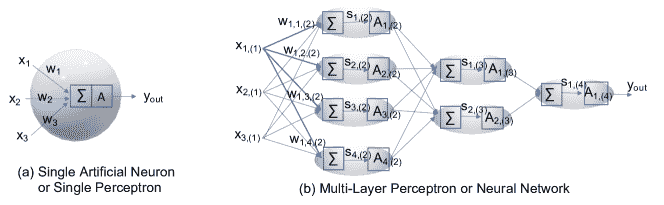

<!--yml

类别：未分类

日期：2024-09-06 19:48:46

-->

# [2112.15131] 资源高效的深度学习：模型、算术和实现层面的技术综述

> 来源：[`ar5iv.labs.arxiv.org/html/2112.15131`](https://ar5iv.labs.arxiv.org/html/2112.15131)

# 资源高效的深度学习：模型、算术和实现层面的技术综述

郑奎宇

贝尔法斯特女王大学

贝尔法斯特，北爱尔兰，英国

junkyu.lee@qub.ac.uk

&列夫·穆哈诺夫

贝尔法斯特女王大学

贝尔法斯特，北爱尔兰，英国

l.mukhanov@qub.ac.uk

&阿米尔·萨巴赫·莫拉霍塞尼

贝尔法斯特女王大学

贝尔法斯特，北爱尔兰，英国

a.sabbaghmolahosseini@qub.ac.uk

&乌玛尔·敏哈斯

贝尔法斯特女王大学

贝尔法斯特，北爱尔兰，英国

u.minhas@qub.ac.uk

&杨华

贝尔法斯特女王大学

贝尔法斯特，北爱尔兰，英国

y.hua@qub.ac.uk

&耶稣·马丁内斯·德尔·林孔

贝尔法斯特女王大学

贝尔法斯特，北爱尔兰，英国

j.martinez-del-rincon@qub.ac.uk

&基里尔·迪切夫

剑桥大学

剑桥，英格兰，英国

kiril.dichev@gmail.com &洪哲浩

中央大学

首尔，韩国

cheolhohong@cau.ac.kr

&汉斯·范迪伦登克

贝尔法斯特女王大学

贝尔法斯特，北爱尔兰，英国

h.vandierendonck@qub.ac.uk 通讯作者

###### 摘要

深度学习在我们的日常生活中无处不在，包括自动驾驶汽车、虚拟助手、社交网络服务、医疗服务、面部识别等。然而，深度神经网络在训练和推理过程中需要大量的计算资源。机器学习界主要关注模型层面的优化，例如深度学习模型的架构压缩，而系统界则侧重于实现层面的优化。在这之间，算术社区提出了各种算术层面的优化技术。本文提供了关于资源高效的深度学习技术的综述，涉及模型层面、算术层面和实现层面的技术，并识别了这三种不同层次技术中资源高效深度学习技术的研究空白。我们的综述根据资源效率指标定义阐明了从高层到低层技术的影响，并讨论了资源高效深度学习研究的未来趋势。

*关键词* 深度学习，神经网络，资源效率，算术利用

## 1 引言

网络和存储设备的最新改进为机器学习社区提供了利用大量数据源的机会，从而迎来了人工智能和深度学习的黄金时代[22]。由于现代深度神经网络（DNNs）需要大量计算资源，并且部署在各种计算设备上，从高端服务器到具有有限计算资源的移动设备，因此迫切需要实现符合资源限制的经济型 DNN[118, 150, 151]。资源高效深度学习研究在包括机器学习、计算机算术和计算系统等多个研究社区中得到了生动开展。最近，DeepMind 提出了资源高效深度学习基准指标，即准确率以及所需的内存占用和操作数量[78]。

在这方面，本文调查了基于三层分类的资源高效深度学习技术：模型层、算术层和实现层技术，以及各种资源效率指标，如图 1 所示。我们的资源效率指标包括每个参数的准确率、操作、内存占用、核心利用率、内存访问和焦耳。对于基准 DNN 和使用资源高效技术的 DNN 之间的资源效率比较，两个 DNN 的准确率应当相当。换句话说，将一个高准确率的 DNN 与一个低准确率的 DNN 进行资源效率比较是不公平的，因为根据我们的资源指标，低性能 DNN 的资源效率明显更高。我们将资源高效技术分类为模型层资源高效技术（如果它们压缩 DNN 模型大小）；算术层资源高效技术（如果它们利用了减少精度的算术和/或自定义算术规则）；实现层资源高效技术（如果它们对 DNN 应用了硬件优化技术，例如将局部内存靠近处理元素）以提高物理资源效率，如每个计算资源和每个焦耳的准确率。

在图 1 中，卷积神经网络（CNNs）可以被视为一种资源高效的技术，因为与全连接神经网络相比，它们在每个参数、每个操作和每个内存占用上都提高了准确性。通过应用模型级、算术级和实现级技术，可以进一步提高 CNNs 的资源效率。模型级和算术级技术可能会影响准确性，因为它们影响 DNN 模型结构或算术规则，而实现级技术一般不会影响准确性。模型级技术主要有助于提高抽象资源效率，而实现级技术有助于提高物理资源效率。如果不仔细考虑模型级和实现级技术的交汇点，通过模型级技术压缩的 DNN 模型可能需要大量的运行时计算资源，导致比原始模型更长的训练时间和推理延迟[108, 31]。因此，为了优化特定硬件上的性能和能效，必须考虑模型、算术和实现级优化的联合作用。我们的调查重点关注 CNN 架构中三种不同级别的资源高效技术，因为 CNN 是最广泛使用的深度学习架构之一[91]。

图 1：基于资源效率指标的资源高效深度学习技术调查。

相关调查工作如下。Sze 等人[145]提供了一个关于高效处理 DNN 的全面教程和调查，讨论了 DNN 架构、软件框架（例如，PyTorch、TensorFlow、Keras 等）以及优化 DNN 的乘加计算（MACs）的实现方法。Cheng 等人[35]对模型压缩技术进行了调查，包括剪枝、低秩分解、紧凑卷积和知识蒸馏。Deng 等人[42]讨论了结合多种模型级压缩技术的联合模型压缩方法及其在特定计算平台上的高效实现。Wang 等人[157]提供了关于 DNN 的定制硬件实现的调查，并使用[162]的 Roofline 模型评估了它们的性能。

与以往的综述工作不同，我们通过明确哪些资源效率可以通过特定技术得到改善，基于我们在第 2.2 节中定义的资源效率指标，对模型层面、算术层面和实现层面的资源高效深度学习技术进行了全面综述。这种澄清将为机器学习工程师、计算机算术设计师、软件开发人员和硬件制造商提供有用的信息，以改善其 DNN 应用中的特定资源效率。此外，鉴于我们注意到快速无线通信和边缘计算的发展影响了深度学习应用[180]，我们的综述还包括了用于分布式 AI 的前沿资源高效技术，如早期退出技术[150, 151]。与以往的综述工作相比，我们的综述提供了对深度学习资源高效技术的整体和多方面的视角，使得对现有技术有更好的理解，从而实现更好的全球优化。本文的主要贡献包括：

+   •

    本文首先提供了对深度神经网络（DNN）在模型层面、算术层面和实现层面的近期资源高效技术的全面综述。

+   •

    据我们所知，本文是首个对深度学习的算术级利用技术进行全面综述的论文。

+   •

    本文利用多个资源效率指标来阐明每种技术提高了哪些资源效率指标。

+   •

    本文展示了从高层到低层技术的资源高效深度学习技术的影响（参见图 1）。

+   •

    我们讨论了资源高效深度学习技术的未来趋势。

我们将在第二部分讨论深度学习的资源效率指标，在第三部分讨论模型级的资源效率技术，在第四部分讨论算术级的技术，在第五部分讨论实施级的技术，在第六部分讨论不同级别技术之间的相互影响，在第七部分讨论未来趋势，第八部分为结论。我们的论文不包括更高级的训练过程操作技术，如一次性 ImageNet [78]、免费算法包 [20]、数据增强等。

## 2 深度学习背景与资源效率

本节描述了深度学习概述和资源效率指标，为通过三种不同级别描述资源效率技术做准备。

### 2.1 深度学习概述

深度学习被定义为“学习多层次的表示”[17]，并且通常利用 DNNs 来学习这些多层次的表示。DNNs 通过训练数据集进行训练，并使用测试数据集来评估它们的预测准确性[5]。在这一节中，我们首先描述感知机模型（即人工神经元），然后再讨论 DNNs。

#### 2.1.1 感知机模型：

McCulloch 和 Pitts 的神经元（又名 M-P 神经元）[112]，在 1943 年提出，是一个模仿神经系统中神经元的系统，它接收多个二进制输入，并基于阈值产生一个二进制输出。受到[112]工作的启发，Rosenblatt [128] 提出了“感知机”模型，该模型由多个权重、一个加和和一个激活函数组成，如图 2 (a)所示。

图 2：感知机和神经网络模型。

Eq. (1) 描述了感知机的发射活动 $y_{out}$，使用与其权重 $w_{i}$ 相关联的输入 $x_{i}$，其中 $i$ 表示一个索引，指示多个输入中的一个。

|  | $y_{out}=\begin{cases}1,&amp;\text{如果 }(\Sigma_{i=1}^{n_{in}}w_{i}\times x_{i}>threshold)\text{ 或 }(\Sigma_{i=1}^{n_{in}}w_{i}\times x_{i}+bias>0)\\ 0,&amp;\text{如果 }(\Sigma_{i=1}^{n_{in}}w_{i}\times x_{i}\leq threshold)\text{ 或 }(\Sigma_{i=1}^{n_{in}}w_{i}\times x_{i}+bias\leq 0),\end{cases}$ |  | (1) |
| --- | --- | --- | --- |

其中 $n_{in}$ 是输入的数量。决定发射活动的函数被称为激活函数，偏差与发射激活的概率成比例 [116]。由于单层感知机模型仅适用于线性可分问题，对于非线性可分问题，可以使用多层感知机 (MLP) 模型，如图 2 所示。(b)，其中 $w_{j,k,(i)}$ 表示将 $(i-1)$ 层的第 $j$ 个神经元与第 $i$ 层的第 $k$ 个神经元连接的权重。图 2 中的信号 $s_{j,(i)}$ 遵循 Eq. (2)：

|  | $s_{j,(l)}=\Sigma_{i=1}^{n_{in}^{(l-1)}}(w_{i,j,(l)}\times x_{i,(l-1)})=(\mathbf{W}_{(l)}^{T}\mathbf{x}_{(l-1)})_{j},$ |  | (2) |
| --- | --- | --- | --- |

并且 $x_{j,(l)}=\theta_{P}(s_{j,(l)})$，其中 $\theta_{P}(s)$ 是遵循 Eq. (1) (即，阶跃函数) 的感知机激活函数，$\mathbf{W}_{(l)}$ 包含矩阵元素 $w_{i,j,(l)}$，用于第 $i^{th}$ 行和第 $j^{th}$ 列。

#### 2.1.2 深度神经网络：

由于人工优化多层感知机 (MLP) 需要巨大的努力，因此提出了采用软阈值激活函数 $\theta_{N}$（例如，$sigmoid$、$ReLU$ 等）的神经网络来根据训练数据训练权重[163, 160]。[116] 注意到神经网络有时与 MLP 互换使用。为清晰起见，我们将利用阶跃函数作为激活函数的算法命名为 MLP，将利用软阈值函数的算法命名为神经网络。在图 2.(b) 中，使用软阈值激活函数 $\theta_{N}(\cdot)$ 的神经网络中第 $i$^(th) 个神经元在第 $l$^(th) 层的输出可以表示为公式 (3):

|  | $x_{i,(l)}=\theta_{N}(s_{i,(l)}).$ |  | (3) |
| --- | --- | --- | --- |

神经网络允许使用反向传播[5]对权重和偏置进行训练。神经网络模型通常被称为前馈模型，因为权重总是将当前层的神经元与下一层的神经元连接。在神经网络中，位于输入层和输出层之间的中间层，通常被称为隐藏层（例如，图 2.(b)）. 具有多个隐藏层的神经网络被称为深度神经网络 (DNN) [145]。

#### 2.1.3 训练 - 反向传播：

在前向传递中，神经元输出基于矩阵-向量乘法向前传播，如公式 (2) 所示。类似地，权重和偏置可以通过矩阵-向量乘法在反向传播方向上进行训练。这种方法称为反向传播。反向传播方法包括三个步骤，使得梯度下降算法可以在计算机上高效实现。它在步骤 1 中找到激活梯度，$\delta_{j,(l)}$（即，相对于公式 (2) 中的所有信号 $s_{j,(l)}$ 的梯度），在步骤 2 中利用激活梯度找到权重梯度（即，相对于所有权重的梯度），最后在步骤 3 中使用权重梯度更新权重。所有 $\delta_{j,(l-1)}$ 都通过矩阵-向量乘法在反向传播方向上找到，将 $\mathbf{W}_{(l)}^{T}$ 替换为 $\mathbf{W}_{(l)}$ 和 $x_{j,(l-1)}$ 替换为 $\delta_{j,(l)}$ 在公式 (3) 中。找到所有激活梯度后，便可以找到权重梯度。最后，使用权重梯度更新权重。反向传播需要额外的存储来存放所有权重和激活值。一旦深度神经网络（DNN）训练完成，就会使用训练好的权重进行推理任务。有关反向传播方法的更多详细信息，请参考 [5]。在 DNN 训练完成后，使用未见过的验证数据集来评估 DNN 的准确性。

#### 2.1.4 卷积神经网络：

由于 CNN 是最成功和广泛使用的深度学习架构之一 [91]，我们以 CNN 为代表性深度学习架构进行示例。CNN 采用多个卷积层，每个卷积层使用多个滤波器独立地进行卷积，如图 3 所示，其中卷积层的一个滤波器包含与输入层通道数量相同的多个卷积核（例如，图 3 中每个滤波器有 3 个卷积核）。例如，每个 $3\times 3$ 滤波器有 9 个权重参数，并从左上角滑动到右下角位置，在图 3 中，生成 4 个输出值与每个位置相关（例如，左上角、右上角、左下角和右下角位置）。卷积的输出通常称为特征图，并输入到激活函数中。现代 CNN，例如 ResNet [67]，通常在卷积层和 ReLU 层之间采用批量归一化层 [83] 以提高准确性。

图 3：CNN 中的卷积操作。

CNN 是一种在每个参数和每次操作的准确性方面资源高效的深度学习架构，通过利用局部感受野和共享权重这两个特性 [93]。例如，使用多个小卷积核进行卷积可以在训练过程中从输入图像中提取多个局部感受特征，每个卷积核在训练后包含输入图像中的一些有意义的模式 [179]。因此，CNN 使用的权重比全连接 DNN 少得多，因为卷积核的高度和宽度通常远小于输入层的高度和宽度，从而提高了资源效率。请注意，当输入层的高度和宽度与每个卷积核的高度和宽度匹配时，卷积层会变成全连接层。CNN 中一层的总权重数量远少于全连接神经网络中使用的数量，因为局部感受权重在整个特征层上是共享的。

训练 CNN 还利用反向传播使用滤波器中内核矩阵的转置来更新滤波器中的权重。小批量梯度下降算法被广泛用于训练 CNN，它利用部分训练数据来每次迭代更新权重。每次迭代使用的数据量通常称为批量大小 $B$（例如，$B=64$ 或 $128$）。每个 $epoch$ 消耗整个训练数据，由 $N/B$ 次迭代组成，其中 $N$ 是整个训练数据的数量。与每次迭代利用整个训练数据集的批量梯度下降方法（即，批量梯度下降方法在每个 epoch 更新权重）相比，小批量梯度下降方法在每次操作的精度方面是一种资源高效的训练算法。对于相对于一个小批量中的 $B$ 数据样本的并行反向传播实现，所有权重和所有激活值使用 $B$ 个训练样本应该被存储以更新小批量迭代中的权重，相比之下，使用随机梯度下降算法的反向传播方法每个训练样本更新权重。我们的论文将 DNN 一词指代任何具有多个隐藏层的神经网络，包括 CNN。

### 2.2 深度学习的资源效率指标

最近，DeepMind 的研究人员[78] 提出了资源效率深度学习基准的度量标准，包括 top-1 精度、训练所需的内存占用和训练所需的浮点运算数量，并通过联合考虑这三项指标评估了深度学习应用的资源效率。Roofline 模型[162] 讨论了在操作强度方面可以达到的性能，操作强度定义为每次 DRAM 访问的浮点运算次数。受[78, 162] 的启发，我们的资源效率指标包括每个参数、每次操作、每个内存占用、每个核心利用率、每次内存访问和每焦耳的精度，如图 1 所示。

#### 2.2.1 每个参数的精度：

我们将每个参数（即权重）的精度视为一种资源效率指标。每个参数的精度是一个抽象的资源效率指标，因为更高的每个参数的精度并不总是意味着其实现后的物理资源效率更高[78, 1]。

#### 2.2.2 每次操作的精度：

我们将每次算术操作的精度视为一种资源效率指标。这也是一个抽象的指标，因为它可以在实现之前进行评估。

#### 2.2.3 每个计算资源的精度：

像 CPU 或 GPU 这样的指令驱动架构由于指令提取和解码操作，需要大量的内存访问，而像 ASIC 或 FPGA 这样的数据驱动架构可以最小化内存访问的数量，从而提高能效。我们进一步将这些计算资源分类为核心利用率、内存足迹和内存访问，这些都是在给定计算平台上操作 DNN 所需的。例如，内存访问可以解释为 GPU 的 DRAM 访问（或离芯存储器），以及 FPGA 的片上内存访问（或离芯存储器）。

a. 每核心利用率的准确度：本文中的核心利用率表示处理核心或处理单元的利用百分比。

b. 每内存足迹的准确度：每内存足迹的准确度与物理和抽象资源效率有关，如图 1 所示。内存足迹与参数数量成正比，但根据所应用的运算精度级别，内存足迹可能会有所不同。例如，如果对深度学习应用了半精度运算，与单精度运算深度学习相比，内存足迹可以节省 $2\times$。

c. 每内存访问的准确度：具有低操作强度的计算内核无法达到硬件规格定义的峰值性能，因为从 DRAM 到 CPU 的数据供应速率赶不上算术操作的数据消费速率。这类内核被称为“内存绑定内核”，在[162]中有所描述。另一类内核被称为“计算绑定内核”，可以达到硬件规格定义的峰值性能。利用降低精度的运算可以提高内存绑定内核的性能，改善从 DRAM 到 CPU 的数据供应速率，同时也能提高计算绑定内核的性能，通过在 SIMD 架构上增加字级并行性[95]。

#### 2.2.4 每焦耳的准确度：

动态功耗是决定计算密集型任务（如 DNN 训练/推理任务）所需能量消耗的主要因素。动态功耗 $P_{D}$ 的计算公式如下：

|  | $P_{D}=\#_{TTR}\times C_{CP}\times V^{2}_{CP}\times f_{CP},$ |  | (4) |
| --- | --- | --- | --- |

其中 $\#_{TTR}$ 是切换晶体管的数量，$C_{CP}$ 是有效电容，$V_{CP}$ 是操作电压，$f_{CP}$ 是给定计算平台 $CP$ 的操作频率。一般来说，所需的最小操作电压与操作频率成正比。因此，通过将频率适应电压缩放，可以立方节省功耗（也称为动态电压频率缩放 [137]）。例如，减少在运行时操作 DNN 所需的操作有助于减少 $\#_{TTR}$，从而实现功耗降低和能源节省；我们在第 5.2.1 节中进一步讨论利用这一点的资源高效技术。

## 3 模型级资源高效技术

模型级资源高效技术主要由机器学习社区开发，旨在减少 DNN 模型的大小，以适应资源受限的系统，如移动设备、物联网等。我们将模型级资源高效技术分类，如图 4 所示。

图 4：模型级资源高效技术的分类。

### 3.1 权重量化

权重量化技术将权重量化为更少的比特数，从而提高了每个内存占用的准确性。训练过程应根据权重量化方案进行修改。

#### 3.1.1 二值权重量化：

BinaryConnect 训练方案 [38] 允许 DNN 使用一个比特表示权重。在第 1 步中，使用随机剪切函数将权重编码为 $\{-1,1\}$。在第 2 步中，使用编码后的二值权重进行前向传播。在第 3 步中，反向传播使用全精度求取所有激活梯度。在第 4 步中，使用全精度更新权重，训练过程回到第 1 步，使用下一个小批量进行训练。该方法仅需一个比特来表示权重，从而提高了每个内存占用的准确性。此外，二值权重量化还消除了 MAC 操作中的乘法算术运算，提高了每个操作的准确性。此外，如果激活也量化为二值，则 DNN 中的所有 MAC 操作仅能使用 XNOR 门和计数器 [39, 124]。

#### 3.1.2 三值权重量化：

Li 等人[98] 提出了三值权重网络，该网络利用三值权重，相较于二值权重网络，提高了准确性。每一层的所有权重都被量化为三种值，只需两位即可表示量化后的权重。总体训练过程与[38]类似，但权重为三值而非二值。三值权重网络在 MNIST、CIFAR-10 和 ImageNet 数据集上的准确性与各种单精度网络相当，而二值权重量化[38]则显示出轻微的准确性损失。Zhu 等人[185] 通过逐层缩放方法对三值权重进行独立缩放，相较于[98]进一步提高了准确性。

#### 3.1.3 混合量化：

[81] 提出了“量化神经网络”，该方法将激活值和权重量化为任意较低精度的格式。例如，将权重量化为 1 位，将激活值量化为 2 位，相较于[39]的二值化深度神经网络，这提高了准确性。

### 3.2 剪枝

剪枝不重要的神经元、滤波器和通道可以节省深度学习应用的计算资源，而不牺牲准确性，从而提高每个参数和每个操作的准确性。粗粒度剪枝方法，如剪枝滤波器或通道，灵活性不足以达到预定的准确性，但在硬件上实现效率较高[104]，这意味着其物理资源效率高于细粒度剪枝方法，例如剪枝权重。请注意，此类剪枝方法在未经仔细重新训练的情况下可能会降低置信度评分，尽管它们不会影响 top-1 准确率[174]。

#### 3.2.1 剪枝权重：

在 1990 年，LeCun 等人提出了一种权重修剪方法，以生成具有更少权重的稀疏深度神经网络，而不损失准确性[94]。在 2015 年，权重修剪方法被重新审视[66]，并且根据训练后的权重幅度进行了修剪——修剪后的深度神经网络经过再训练以恢复丧失的准确性。修剪和再训练程序可以迭代进行，以进一步修剪权重。这种方法将 AlexNet 的权重数量减少了 $9\times$，而没有损失准确性。在 2016 年，Guo 等人[58] 注意到，修剪错误的权重无法恢复，并提出了在每个小批量训练中修剪和拼接权重，以最小化从先前小批量训练中修剪错误权重的风险。例如，修剪的权重也参与了反向传播过程中的权重更新，并在重新考虑为重要权重时恢复。在 2017 年，Yang 等人[170] 提出了一个能量感知的权重修剪方法，其中直接测量卷积神经网络的能量消耗以指导修剪过程。在 2019 年，Frankly 等人[50] 证明，通过用用于训练原始模型的初始随机权重替换存活权重来重新训练修剪模型，有些修剪后的模型的表现优于原始模型。

#### 3.2.2 修剪神经元：

与其修剪单独的权重，不如修剪一个神经元，这样可以移除属于该神经元的一组权重[143, 110, 77, 178]。在 2015 年，[143] 修剪了在训练后的深度神经网络模型中具有相似权重值的冗余神经元。例如，将基准神经元中的权重与同一层中其他神经元的权重进行比较，具有类似权重的神经元根据两个神经元权重值之间的欧几里得距离度量融合到基准神经元中。在 2016 年，[110] 基于“行列式点过程”度量修剪了冗余神经元。Hu 等人[77] 测量了每个神经元零激活的平均百分比，并根据给定的压缩率修剪了零激活百分比高的神经元。Yu 等人[178] 基于修剪误差传播对最终响应层的影响修剪了不重要的神经元（例如，神经元从最终层向第一层进行反向修剪）。这些修剪神经元的方法提高了资源效率，例如每个参数和每次操作的准确性。

#### 3.2.3 修剪滤波器：

在训练后剪枝不重要的滤波器可以提高每个参数和每次操作的准确性。与被剪枝滤波器相关的特征图和与被剪枝特征图相关的下一层卷积核也应被剪枝。剪枝滤波器可以保持 DNN 的稠密结构，不像剪枝权重，这意味着与剪枝权重相比，进一步提高物理资源效率的可能性较高。Li 等人 [99] 基于滤波器中绝对权重值的总和剪枝不重要的滤波器。剪枝后的 DNN 与幸存的滤波器一起重新训练，以恢复丢失的准确性。Yang 等人 [171] 基于资源受限设备的以平台为意识的幅度度量剪枝滤波器。ThiNet [107] 使用下一层的输出计算滤波器的重要性，并根据这种重要性测量剪枝不重要的滤波器。

#### 3.2.4 剪枝通道：

与剪枝滤波器不同，剪枝通道会移除当前层的滤波器以及与剪枝通道相关的下一层的卷积核。网络瘦身方法 [104] 剪枝不重要的通道，生成紧凑的模型，同时保持与剪枝前模型相当的准确性。例如，不重要的通道是基于 [83] 的批量归一化生成的缩放因子识别的，缩放因子较低的通道被剪枝。在初始训练后，首先剪枝与相对较低缩放因子相关的通道，然后进行重新训练以优化网络。He 等人 [69] 使用 LASSO 回归从预训练的 CNN 模型中识别不重要的通道并进行剪枝。通道剪枝使 VGG-16 的速度提高了 5 倍，准确性损失较小。Lin 等人 [102] 在运行时基于由强化学习训练的决策者剪枝不重要的通道。Gao 等人 [53] 提出了另一种动态通道剪枝方法，该方法动态跳过与不重要通道相关的卷积操作。

### 3.3 紧凑卷积

为了提高资源效率，如每次操作和每个参数的准确性，提出了许多紧凑卷积方法。

#### 3.3.1 压缩通道：

在 2016 年，Iandola 等人[82]提出了 SqueezeNet，其中每个网络块在压缩阶段使用的$1\times1$滤波器数量少于输入通道的数量，以减少网络宽度，然后在扩展阶段使用多个$1\times1$和$3\times3$卷积核。通过压缩宽度显著减少了计算复杂度，同时在扩展阶段补偿了准确性。SqueezeNet 在 ImageNet 上将参数数量减少了$50\times$，而不损失准确性，提高了每个参数的准确性。Gholami 等人[55]提出了 SqueezeNext，该方法在扩展阶段使用了可分离卷积；$k\times k$滤波器被分成了$k\times 1$和$1\times k$滤波器。这种可分离卷积进一步减少了参数数量，相比于 SqueezeNet 在保持 AlexNet 在 ImageNet 上的准确性的同时，进一步提高了每个参数的准确性。

#### 3.3.2 深度可分离卷积：

Xception [36]利用了深度可分离卷积，它用 2D 可分离卷积代替了 3D 卷积，然后是 1D 卷积（即点卷积），如图 5 所示，以减少计算复杂度。2D 可分离卷积在不同通道上分别执行。Howard 等人[76]提出了 MobileNet v1，该方法利用了深度可分离卷积，并使用了两个超参数，“宽度倍增器和分辨率倍增器”，通过充分利用 DNN 的准确性和资源权衡，将 DNN 适应于资源受限的设备。MobileNet v1 在 ImageNet 数据集上显示出与 GoogleNet 和 VGG16 相当的准确性，但计算复杂度更低，提高了每个参数和每次操作的准确性。

图 5: [76]中使用的深度卷积。

#### 3.3.3 线性瓶颈层：

通常，感兴趣的流形（即每层激活集形成的子空间）可以嵌入到深度学习中的低维子空间中。受此启发，Sandler 等人 [132] 提出了由一系列瓶颈层块组成的 MobileNet v2。每个瓶颈层块如图 6 所示，接收低维输入，将输入扩展到高维中间特征图，然后将高维中间特征投影到低维特征上。保持输出特征图的线性对于避免破坏非线性激活中的信息至关重要，因此在每个瓶颈块的末尾使用了线性激活函数。

图 6: 在 [132] 中使用的瓶颈层块。

#### 3.3.4 组卷积：

在组卷积方法中，输入通道被划分为几个组，每个组的通道与其他组单独参与卷积。例如，具有三个组的输入通道需要三个单独的卷积。由于组卷积不会与其他组的通道通信，不同组之间的通信是在单独的卷积之后进行的。与使用常规卷积的 DNN 相比，[181, 108, 80, 79]的组卷积方法减少了 MAC 操作的数量，提高了每次操作的准确性。2012 年，AlexNet 利用组卷积有效地训练了 DNN，使用了两块 NVIDIA GTX580 GPU [91]。令人惊讶的是，使用组卷积的 AlexNet 在每次操作的准确性上优于使用常规卷积的 AlexNet。2017 年，ResNext [167]基于 ResNet [67]，利用了一个基数参数（即组的数量）的组卷积。2018 年，Zhang 等人[181]注意到在深度卷积中，点卷积在实践中计算量很大，并提出了 ShuffleNet，该方法将组卷积应用于每个点卷积，以进一步降低计算复杂性，相较于 MobileNet v1。ShuffleNet 将来自分组点卷积的输出通道进行混洗，以与不同的分组卷积进行通信，在给定相同算术操作成本预算的情况下，表现出比 MobileNet v1 更高的准确性。Ma 等人[108]提出了 ShuffleNet v2，相比 ShuffleNet [181]进一步提高了物理资源效率，通过在适用的情况下对输入和输出通道采用相等的通道宽度，并最小化$1\times 1$卷积所需的操作数量。Huang 等人[80]提出在训练过程中对每个组进行学习以实现组卷积，而不是随机选择每个组并进行混洗。所谓的“学习组卷积”被应用于 Densenet [79]，Densenet 在给定预定准确度的情况下，改善了每个参数和每个操作的准确性，相比 ShuffleNet。

#### 3.3.5 八度卷积：

Chen 等人[34]将特征图分解为高频部分和低频部分，以节省特征图的内存占用并减少计算成本。分解后的特征图通过一种称为“八度卷积”的特定卷积进行卷积，该卷积在高频和低频部分之间进行。将八度卷积应用于 ResNet-152 架构，使用 ImageNet 数据集取得了比常规卷积更高的准确性，提高了每次操作和每单位内存的准确性。

#### 3.3.6 下采样：

Qin 等人 [122] 采用了降采样方法（例如，对卷积操作使用较大的步幅）来改进 MobileNet v1，在 ILSVRC 2012 数据集上将顶级准确率提高了 5.5%，在 12M 算术运算预算下进行。

#### 3.3.7 低秩近似：

Denton 等人 [44] 提出了低秩近似，通过使用奇异值分解压缩卷积层中的内核张量和全连接层中的权重矩阵。另一种低秩近似 [89] 使用 Tucker 分解来压缩特征图，显著减少了模型大小、推理延迟和能量消耗。这些低秩近似方法提高了每个参数、每个操作和每个内存占用的准确性。

### 3.4 知识蒸馏

从大规模高性能模型（教师网络）中获取的知识可以转移到紧凑的神经网络（学生网络），以提高资源效率，例如推理任务中的每参数和每操作的准确性 [23, 127, 29]。Buciluă 等人 [23] 利用从教师模型（即大规模集成模型）生成的标签数据来训练紧凑型神经网络。紧凑模型使用从教师模型生成的伪训练数据进行训练，展示了与教师模型相当的准确性。Ba 和 Caruana [14] 注意到 softmax 输出通常导致学生网络忽略其他分类信息，仅关注概率最高的分类，因此利用教师网络中 softmax 层之前的值作为训练标签，以便学生网络能更高效地学习教师网络。Hinton 等人 [72] 为标签添加了“温度”项，以丰富教师网络的信息，并更高效地训练学生网络，相比于 [14]。Romeo 等人 [127] 利用来自更宽教师网络的标签和中间表示，将其压缩为更薄且更深的学生网络。选择了教师网络中的“提示层”和学生网络中的“指导层”。然后训练学生网络，以最小化提示层和指导层之间输出的中间表示偏差。与较宽的教师网络相比，较薄的学生网络使用了 $10.4\times$ 更少的权重参数，同时提高了准确性。这种技术也被称为“提示学习”。提示学习应用于物体检测应用的区域提议和分类组件 [29]。

### 3.5 压缩模型的神经架构搜索

Zoph 等人 [187] 提出了神经网络结构搜索（NAS）技术，用于在网络宽度、深度和分辨率的超参数空间中寻找最优的深度神经网络（DNN）模型。如果计算资源预算有限（例如，移动设备），许多 NAS 变体利用了准确性和延迟之间的权衡，以在给定的计算资源预算下最大化资源效率 [70, 147, 148, 149, 164, 13]。He 等人 [70] 提出了一个采用强化学习的 NAS，即 AutoML，该方法对候选设计空间进行采样，以压缩 DNN 模型。MnasNet [147] 利用具有准确性和延迟之间平衡奖励函数的强化学习来寻求紧凑的神经网络模型。Wu 等人 [164] 提出了一个基于梯度的 NAS，生成了一个 DNN 模型，模型尺寸减少了 $2.4\times$，与 MobileNet v2 相比，在 ImageNet 数据集上没有损失准确性。Florian 等人 [133] 提出了一个窄空间 NAS，用于生成符合严格内存预算和推理时间要求的低资源 DNN，适用于物联网应用。[13] 注意到传统的 NAS 可能提高了抽象的资源效率而不是物理资源效率，并利用包括推理延迟在内的硬件信息来进行 NAS，以确保候选模型能够在实践中提高物理资源效率。Efficientnet [148] 利用复合缩放的 NAS 来在固定的计算资源预算下寻求最优的 DNN 模型。另一个利用复合缩放的 NAS，Efficientdet，被提出用于目标检测应用 [149]。Efficientdet 使用 COCO 数据集提高了准确性，同时模型尺寸减少了 $4-9\times$，与最先进的目标检测器相比，提高了每参数的准确性。最近，[25] 提出了一个前馈 NAS 方法，该方法在给定计算资源和延迟约束的情况下生成了定制的 DNN。

## 4 种算术级别的资源高效技术

利用较低精度的算术运算可以减少内存占用以及在总线和互连间传输数据所花费的时间 [49, 114, 186, 172]。为 DNN 应用采用最低足够的算术精度可以提高每单位内存占用的准确性和每次内存访问的准确性。我们将算术级别资源效率技术分为两类，如图 7 所示，分别为推理的算术级别技术和训练的算术级别技术。我们首先讨论不同的数字格式，然后讨论这些数字格式在 DNN 中的应用。

图 7：算术级别资源效率技术的分类。

### 4.1 深度学习的数字格式

本小节描述了深度学习应用的各种数字格式，为解释算术级别资源效率技术做准备。定点（FiP）数字格式利用分数部分和整数部分之间的二进制定点。例如，8 位 FiP 格式“01.100000”表示 1.5（即 $...0\times 2^{1}+1\times 2^{0}+1\times 2^{-1}+0\times 2^{-2}...$）用于十进制表示，整数部分和分数部分之间的点在算术操作中是固定的。因此，它可以用简单的电路实现，但可用的数据范围非常有限 [120]。

我们以 IEEE-754 通用浮点标准 [4] 为例来解释浮点（FP）格式及其算术，因为这个标准被大多数商业可用的 CPU 和 GPU 采用。IEEE 754 浮点（IFP）数据格式 [4] 由符号、指数和有效位组成，如等式 (5) 所示。例如，一个浮点数具有一个 $(p+1)$ 位的有效位（包括隐藏位）、一个 $e$ 位的指数和一个 $1$ 位的符号位。机器精度 $\epsilon_{mach}$ 被定义为 $2^{-(p+1)}$。FP 表示的值如下：

|  | $y_{out}=\begin{cases}\text{正常模式:}&amp;(-1)^{sign}\times(1\times 2^{0}+d_{1}\times 2^{-1}+...+d_{p}\times 2^{-p})\times 2^{exponent-bias}\\ \text{非正常模式:}&amp;(-1)^{sign}\times(d_{1}\times 2^{-1}+...+d_{p}\times 2^{-p})\times 2^{1-bias},\end{cases}$ |  | (5) |
| --- | --- | --- | --- |

其中$d_{1}$, … , $d_{p}$表示二进制数字，系数$2^{0}$关联的‘$1$’被称为隐藏的‘$1$’，$exponent$以偏移量表示，而$bias$是一个正的常数。如果指数的绝对值为零，则浮点值以非规范模式表示。IEEE 754 标准要求加法、减法、乘法和除法的精确舍入；浮点运算结果应与经过精确计算后的最终舍入结果相同。例如，基于 IEEE 754 舍入到最近模式标准，浮点运算应遵循公式(6)：

|  | $fl(x_{1}\odot x_{2})=(x_{1}\odot x_{2})(1+\epsilon_{r}),$ |  | (6) |
| --- | --- | --- | --- |

其中$|\epsilon_{r}|\leq\epsilon_{mach}$，$\odot$是四种算术操作之一，$fl(\cdot)$表示浮点运算的结果。注意，量化将数据量化为较低精度，而算术是应用于两个操作数之间的运算规则。例如，量化影响公式(6)中两个操作数$x_{1}$和$x_{2}$的值，而算术影响舍入误差$\epsilon_{r}$。

#### 4.1.1 半精度、单精度和双精度：

IEEE 浮点 32 位（IFP32 或单精度）和 64 位（IFP64 或双精度）版本在大多数现成的常规处理器上可用。此外，IEEE-754 标准包括一种 16 位 FP 格式（IFP16 或半精度）[4]。IFP64 的$p=52$，$e=11$，$bias=1023$；IFP32 的$p=23$，$e=8$，$bias=127$；IFP16 的$p=10$，$e=5$，$bias=15$。IFP16 目前在一些现代 GPU 中得到硬件支持，以加速 DNN 应用[73, 37]。

#### 4.1.2 使用 16 位的 Brain 浮点格式（BFloat16）：

在 2018 年，提出了一种针对深度学习应用的 16 位 Brain 浮点格式[176, 24]。BFloat16 包含 8 位指数和 7 位尾数，比 IFP16 支持更宽的动态数据范围。BFloat16 目前在 Intel Cooper Lake Xeon 处理器、NVIDIA A100 GPU 和 Google TPU 中得到了硬件支持。

#### 4.1.3 DLFloat：

在设计专用于 DNN 的特定 FP 格式的竞赛中，[6, 158]提出了另一种 16 位精度格式 DLFloat，包括 6 位指数和 9 位尾数，与 IFP16 和 BFloat16 格式相比，在某些深度学习应用中提供了更好的动态数据范围和精度平衡。

#### TensorFloat32（TF32）：

NVIDIA 提出了一种 19 位数据格式 TF32，由 1 位符号、8 位指数和 10 位尾数组成，以加速 A100 GPU 上的深度学习应用，与 IFP32 具有相同的动态范围支持[48]。A100 中的 TF32 张量核心将 IFP32 操作数截断为 19 位的 TF32 格式，但使用 IFP32 算术进行 MAC 操作累加。

### 推断的算术级技术：

本小节讨论了基于预训练的 DNN 的各种资源高效算术级技术，用于推理任务。

#### 低精度算术：

低精度 FiP 算术已经被广泛用于在边缘设备上部署 DNNs[169]. [165, 159]分析了部署各种低精度算术对 DNN 推理任务的影响，包括准确性和延迟。BitFusion 方法通过根据不同层次动态使用可变位宽的 FiP 格式来加速 DNN 推理任务[138]. 类似地，Tambe 等人. [146]提出了 AdaptiveFloat，根据不同层次调整 FP 数的动态范围，从而在满足相同准确性要求的情况下获得更高的能源效率。

#### 编码权重并使用查找表：

[21]利用大多数权重的指数值在一个狭窄的范围内的事实，使用霍夫曼编码方案将权重的频繁指数值以更少的位数进行编码，从而提高了自然语言处理应用程序的精度与存储占用比。在内存和 FP 算术单元之间，使用查找表将编码的指数值转换为 FP 指数值。

#### 将各种数值格式量化应用到 DNNs 上：

剩余数系统（RNS）是一种并行且限制进位的数字系统，它将一个大的自然数转换为几个较小的剩余数。因此，RNS 常用于对剩余数进行并行和独立的计算，而无需进位传播。[28] 利用这种并行性来加速 DNN 计算。在基于 RNS 的 DNN 中，预训练模型的权重被转换为 RNS 表示。最近，RNS 被用来用简单的逻辑操作如多路复用和移位来替代成本高昂的乘法操作，从而加速 DNN 应用 [131, 105, 130]。对数数系统（LNS）将对数应用于实数的绝对值 [120]。LNS 的主要优势在于将乘法转化为加法，将除法转化为减法。2018 年，[156] 利用 5 位对数格式和任意对数底数来提高资源效率，例如每单位内存和每操作的准确度，通过将高昂的乘法算术操作替换为简单的位移操作 [156]。Posit 数字格式 [61] 使用多个独立的指数字段来有效地表示动态范围。最近，使用 Posit 的 DNN 在 Mushroom 和 Iris 数据集 [26, 27] 上显示出比各种 FP8 格式更高的准确度。

### 4.3 算术级训练技术

本小节讨论了用于 DNN 训练任务的算术级资源高效技术。由于权重梯度值极小，训练 DNN 通常需要更高精度的算术 [38, 185]。根据不同的训练过程如前向传播、激活梯度更新和权重更新来调整算术精度，可以加速 DNN 训练 [59]。训练量化 DNN 通常需要随机舍入方案 [60, 166, 172, 184]。

#### 4.3.1 混合精度训练：

传统的混合精度训练将较低精度的算术应用于 MACs 中的乘法，包括前向和反向路径，并将较高精度的算术应用于使用较低精度量化操作数的 MACs 中的累加。来自 MACs 的较高精度结果被量化为较低精度格式，以用于后续操作。在以下（X + Y）格式中，X 代表用于 MAC 操作的数据格式，Y 代表用于 MAC 操作中累加的算术（有关低精度和高精度算术使用的详细信息，请参阅 [59]）。

a. IFP16 + IFP32：2018 年，[114] 发现权重在更新时使用了非常小的权重梯度值，并应用了较低精度的 IFP16 进行乘法运算，而较高精度的 IFP32 用于权重更新的累加。例如，在[114]中的混合精度训练方法中，IFP16 用于存储权重、激活值、激活梯度和权重梯度，而 IFP32 用于保留权重副本以进行更新。通过使用 IFP32 算术来累加 IFP16 操作数，以及使用损失缩放，混合精度训练能够实现与 IFP32 训练相当的准确性，同时减少内存占用。

b. BFloat16 + IFP32：2018 年，[176] 探索了使用（BFloat16 + IFP32）的混合精度 DNN 训练。2019 年，[86] 研究了 BFloat16 在包括 AlexNet、ResNet、GAN 等各种 DNN 中进行混合精度训练的可行性，并得出结论（BFloat16 + IFP32）方案优于（IFP16 + IFP32）方案，因为 BFloat16 能够使用更少的位数表示与 IFP32 相同的数据动态范围。

e. FP8 + DLFloat：2018 年，[158] 提出了一个混合精度训练方法，该方法在 MAC 操作中将 5eFP8 格式（1 个符号位、5 位指数和 2 位尾数）应用于乘法运算，将 DLFloat 应用于累加。与不同 FP16 格式的各种（FP16 + IFP32）方案相比，该混合精度方法提高了资源效率，如每单位内存的准确性和每次内存访问的准确性。与之前的（FP16 + IFP32）方法相比，[158] 还使用了块累加和随机舍入方案来最小化准确性损失。块累加方法每块使用 64 个数据，而不是一个长的顺序累加，以减少舍入误差。早期的[60] 提出了使用有限精度格式的随机舍入方案进行深度学习。[144] 指出（5eFP8 + DLFloat）训练在使用深度卷积如 MobileNets 的 DNN 中降低了准确性。为了解决这个问题，[144] 提议采用两种不同的 8 位浮点格式分别用于前向和反向传播，以最小化压缩 DNN 的准确性退化。混合精度训练使用 5eFP8 进行反向传播，另一种 8 位浮点格式（符号、指数、尾数）=（1、4、3），4eFP8，用于前向传播。

DLFloat 仅：在 2019 年，[6] 采用 DLFloat 进行整个训练过程，消除了乘法和累加之间的数据转换的必要性，并发现 DLFloat 可以提供比 IFP16 和 BFloat16 更好的动态范围和精度平衡，尤其是在使用 Penn Treebank 数据集的 LSTM 网络 [74] 中。DLFloat 算法单元去除了次正常模式，支持最近舍入模式以最小化计算复杂度。在 [6] 中，DLFloat 算法在使用 CIFAR10 的 ResNet-32 和使用 ImageNet 的 ResNet-50 上显示出与 IFP32 相当的性能，同时使用了一半的 IFP32 位宽。

INT8 基于：杨等人 [172] 注意到以前提出的混合精度训练方案没有对批归一化层中的数据进行量化，这在数据路径的某些部分需要高精度浮点运算。为了解决这个问题，[172] 提出了一个统一的 INT8 基于量化框架，将 DNN 中的所有数据路径，包括权重、激活、梯度、批归一化、权重更新等，都量化为 INT8 数据。然而，这种训练方法在某种程度上降低了准确性。在 2020 年，朱等人 [186] 在保持统一的 INT8 基于量化框架的同时，改善了准确性。[186] 通过基于量化前后生成的两个归一化梯度向量之间的内积，在运行时测量距离，最小化激活梯度方向的偏差。

分层自适应定点训练：在 2020 年，张等人 [182] 提出了分层自适应量化方案。例如，完全连接层中的激活梯度分布遵循更窄的分布，要求更多的比特宽度进行量化。[182] 使用 INT8 对 AlexNet 的所有权重和激活进行量化，并对激活梯度同时使用 INT8（22%）和 INT16（78%）。量化后的 AlexNet 在 ImageNet 数据集上达到了与使用 IFP32 进行全训练的 AlexNet 相当的准确性。

#### 4.3.2 块浮点训练

块浮点（BFP）格式利用数据块中一系列数字的共享指数，以减少数据大小 [161]。将 BFP 应用于 DNN 可以提高在每个内存占用和每个内存访问的准确性方面的资源效率。此外，与 FP 加法器和乘法器相比，BFP 使用的晶体管更少，适用于更简单的加法器和乘法器，从而提高了每焦耳的准确性。各种使用 BFP 的 DNN 训练方法版本被提出，以提高资源效率。

a. Flexpoint: 一种针对 DNN 优化的 BFP 格式，Flexpoint [90]，由 Intel 提出，并与 Nervana 神经处理器一起使用。该 BFP 格式使用 5 位用于共享指数，16 位用于数据块中的有效数字。Flexpoint 采用 (Flex N)+M 格式，其中 Flex N 表示根据不同的训练阶段共享指数的位数，M 表示分离的有效数字的位数。例如，指数位数根据权重值的动态范围进行调整，权重值的动态范围在当前迭代中是基于上一迭代的预测。 (Flex N + 16) 格式在使用 ImageNet 数据集的 AlexNet 和使用 CIFAR-10 数据集的 ResNet 中产生了与 IFP32 相当的精度，从而在每次内存占用的精度和每次内存访问的精度方面显著提高了资源效率。

b. BFP + FP 训练: Drumond 等人 [45] 提出了 BFP 和 FP 混合使用的 DNN 训练方法，其中 BFP 仅用于 MAC 操作，FP 用于其他操作。这种混合训练方法在使用 CIFAR-100 数据集的 WideResNet28-10 中带来了 8.5 倍的潜在吞吐量提升，同时精度损失很小。

c. Block MiniFloat: [49] 发现普通的 BFP 格式在用更少的位数最小化原始数据丢失和提高深度学习应用中的每次内存访问的算术密度方面有限。为了解决这两个问题，Fox 等人 [49] 提出了 Block Minifloat (BM) 以及定制的硬件电路设计。BM<e,m> 格式如下：

|  | $y_{out}=\begin{cases}\text{normal mode:}&amp;(-1)^{sign}\times(1\times 2^{0}+d_{1}\times 2^{-1}+...+d_{m}\times 2^{-m})\times 2^{exponent-bias-BIAS_{SE}}\\ \text{subnormal mode:}&amp;(-1)^{sign}\times(d_{1}\times 2^{-1}+...+d_{m}\times 2^{-m})\times 2^{1-bias-BIAS_{SE}},\end{cases}$ |  | (7) |
| --- | --- | --- | --- |

其中 $bias=2^{e-1}-1$，$BIAS_{SE}$ 是共享指数值。$BIAS_{SE}$ 根据数据的最大值进行缩放以进行点积操作。例如，BM<2,3> 表示一个 6 位的数据格式，具有 1 位符号位、2 位指数和 3 位有效数字。这种 BM 变体格式在训练中应用。利用这些 6 位 BM 格式产生了与 IFP32 格式相当的精度，但使用了更少的位数，并使用 CIFAR 10 和 100 数据集与 ResNet-18 进行了训练，从而减少了内存流量和低能耗。因此，BM 在每次内存访问的精度方面提高了资源效率。

## 5 实施层面的资源效率技术

图 8 分类了实现层面的资源效率技术。大多数实现层面技术专注于提升 MAC 操作的能效和计算速度，因为 MAC 操作通常占 DNN 训练和推理任务计算负荷的 90% 以上 [145]。实现层面的资源效率技术利用了 DNN 中 MAC 操作的特点，包括数据重用、权重和激活的稀疏性以及量化 DNN 的权重重复。

图 8：实现层面的资源效率技术。

### 5.1 利用卷积中的数据重用

在卷积操作中，权重和激活值被大量重复使用。例如，一个滤波器的权重会被重复使用$((H-k_{H}+1)\times(W-k_{W}+1))/stride$次，其中$H=W=4$（输入通道的高度和宽度），$k_{H}=k_{W}=3$（卷积核的高度和宽度），如图 3 所示。通常，$H$和$W$为三个数量级（例如，128、256 等），$k_{H}$和$k_{W}$为一个数量级（例如，3、5 等），$stride$为$1$或$2$。例如，如果$H=W=128$，$k_{H}=k_{W}=3$，且$stride=1$，每个滤波器在卷积操作中会被重复使用$16129$次。每个卷积层的输入元素也会被重复使用约$M\times k_{H}\times k_{W}$次，其中$M$是该层使用的卷积核总数。如图 9 所示，描述了用于卷积层的 MAC 操作的数据访问模式。在图 9.(a)中的每个 MAC 计算中，数据 a、b 和 c 从内存中读取用于乘加计算，结果 d 写回内存，其中 c 包含 MAC 的部分和。为了节省能量消耗，高度重复使用的数据可以存储在小型局部内存中，如图 9.(b)所示。例如，访问数据所需的功耗取决于数据的位置——从片外内存（DRAM）访问数据通常需要比从片内存访问数据多两个数量级[31]。对于商业可用的 CPU 或 GPU，通过将卷积操作转化为矩阵乘法，可以利用这种数据重用特性，通过使用高度优化的 BLAS 库[155]来加速卷积操作。许多研究工作展示了如何利用这些数据重用特性来提高资源效率。

图 9：乘加数据流。

#### 5.1.1 在处理单元附近使用 SRAM 局部内存：

SRAM 缓冲区的使用使得 DNN 的能耗相比于 DRAM 降低了两个数量级。类似于图 9。 (b)，Dianao 架构 [30] 采用了一个神经功能单元（NFU），它集成了三个独立的本地缓冲区，每个缓冲区用于保存 $16$ 个输入神经元、$16\times 16$ 权重和 $16$ 个输出神经元，以优化 MAC 操作的电路设计。通过额外使用内部寄存器来存储部分和和循环缓冲区，局部内存中存储的权重和激活被高效重用。NFU 是一个三阶段的流水线架构，包括乘法阶段、加法树阶段和激活阶段。在乘法阶段，$256$ 个乘法器支持基于 $16$ 个输入和 $16$ 个输出神经元之间的权重连接的乘法操作。在加法树阶段，从乘法操作中生成 $16$ 个特征图，基于加法树结构。在激活阶段，通过使用分段线性函数逼近来对 $16$ 个特征图进行 $16$ 次激活的近似。与 [30] 中的 128 位 2GHz SIMD 处理器相比，$65nm$ ASIC 布局的 DianNao 提供了高达 $118\times$ 的加速，并将能耗降低了 $21\times$。以下研究之一将 DianNao 适配到超级计算机上，并将其命名为 DaDianNao [33]。由于卷积操作中的权重数量通常大于输入激活的数量，DaDianNao 存储了大量权重，并通过使用中央嵌入式 DRAM 共享这些权重，以减少将权重传递到每个 NFU 的数据移动成本。

#### 5.1.2 利用空间架构：

根据 MAC 操作的数据重用特性设计 PE 及其局部内存，提高了 FPGA 和 ASIC 上的能效 [31, 32]。例如，Google TPU 采用了一个脉动阵列架构，将数据直接发送到相邻的处理元素（PE），如图 9.(c)所示。[3]。Chen 等人 [31] 注意到 CNN 的计算吞吐量和能耗主要取决于数据移动而非计算，并提出了一种“行驻留”空间架构（图 9.(c)的变体），Eyeriss，旨在通过充分利用数据重用特性来支持最小数据移动能耗的并行处理。例如，图 9.(c)中第一列的三个 PE 可以被分配来计算卷积输出的第一行，使用$3\times 3$滤波器——核的每一行上的三个元素被存储到每个 PE 的局部内存中（即“行驻留”结构 [145]），在卷积过程中所有核中的元素都被重用，生成输出的第一行。在这种情况下，部分求和值被存储回每个 PE 的局部内存中。

#### 5.1.3 电路优化：

探索二值权重 [38] 与二值输入的结合，提供了探索 XNOR 门以高效实现 CNN [123] 的机会，提高了每单位内存占用和每焦耳的准确率。在 2021 年，[183] 提出了基于统计的硬件友好量化单元和近数据处理引擎，通过最小化对高精度数据的访问次数来加速混合精度训练方案。

### 5.2 利用权重和激活的稀疏性

在前向传播中，负的特征图值在 ReLU 激活函数后被转换为零，使得激活数据结构变得稀疏。此外，训练后的权重值遵循以零为中心的尖锐高斯分布，使大多数权重接近于零。量化这样的权重使得权重数据结构稀疏，从而可以充分利用量化网络，例如二值化的 DNN [39, 38] 和三值权重 DNN [98, 185]。

#### 5.2.1 运行时跳过操作：

在 2016 年，几种有条件跳过 MAC 操作的方法被同时提出[31, 10, 103]。Eyeriss [31] 采用时钟门控技术来阻止卷积操作，当权重或激活值被检测为零时，从而节省计算能力。Cnvlutin [10] 通过根据不同通道采用分开的“神经元通道”来跳过与零激活相关的 MAC 操作。同样，[103] 提出了 Cambricon-X，该方法利用“步进索引”来获取与任何非零权重相关的激活值，从而跳过与零权重相关的 MAC 操作。与原始 DianNao 架构相比，Cambricon-X 在每焦耳准确度方面带来了 6 倍的资源效率提升。2017 年，Kim 等人[87] 提出了 ZeNa，该方法仅在权重和激活值都为非零值时才执行 MAC 操作。2018 年，Akhlaghi 等人[8] 提出了一个运行时技术 SnaPEA，该技术首先执行与正权重相关的 MAC 操作，然后再执行与负权重相关的操作，同时监控部分和值的符号。由于 ReLU 的激活值始终大于或等于零，一旦部分和值变为负值，卷积操作可以终止。请注意，这种决策应在运行时进行，因为零值激活模式依赖于测试图像。2021 年，另一种跳过零操作的方法 GoSPA [41] 被提出，其与 ZeNa 类似，即仅在输入激活值和权重都为非零值时才执行 MAC 操作。[41] 通过利用权重值静态而激活值动态的特性，构建了“静态稀疏性滤波器”模块，以在 MAC 操作之前动态过滤掉与非零权重相关的零激活值。这些跳过操作的优化技术提高了每焦耳的准确度，因为与跳过的操作相关的晶体管在运行时未被切换，从而节省了动态功耗。

#### 5.2.2 编码稀疏权重/激活值/特征图：

由于内存访问操作在深度学习应用中占据了主要的功耗，通过对权重和激活进行编码和压缩，减少从内存中提取权重的频率，可以提高资源效率，如每单位内存占用的准确性、每次内存访问的准确性以及每焦耳的准确性。Han 等人[65, 64] 利用 Huffman 编码方案来压缩权重。量化的 DNN 将 AlexNet 在 ImageNet 数据集上的内存占用减少了$35$倍而不失去准确性。在[65, 64]中，执行了一个三阶段的流水线操作，以减少 DNN 的内存占用。剪枝后的稀疏量化权重以压缩稀疏行（CSR）格式存储，然后被分成几个组。相同组中的权重通过组内权重的平均值进行共享，然后重新训练。Huffman 编码用于进一步压缩权重。Parashar 等人[119]采用了一种编码方案来压缩稀疏权重和激活，并设计了一个相关的数据流，“压缩稀疏卷积神经网络（SCNN）”，以最小化数据传输并减少内存占用。Aimar 等人[7] 提出了 NullHop，该方法通过使用两个顺序排列的额外存储来编码稀疏特征图，一个用于 3D 掩码以指示非零值的位置，另一个用于在特征图中顺序存储非零数据。例如，‘0’标记在 3D 掩码中零值的位置，否则标记为‘1’。解码涉及到 3D 掩码和非零值列表。Rhu 等人[125] 提出了 HashedNet，该网络利用低成本的哈希函数来压缩稀疏激活。虚拟 DNN (vDNN) [126] 使用“零值压缩”技术来压缩稀疏激活单元，以最小化 GPU 与 CPU 之间的数据传输成本。vDNN 允许用户同时利用 GPU 和 CPU 内存进行 DNN 训练。

#### 5.2.3 分解核矩阵

Li 等人[100] 提出了 SqueezeFlow，该方法通过将卷积核矩阵分解为非零值子矩阵和零值子矩阵来减少卷积操作的数量。该方法可以提高每焦耳的准确性。

### 5.3 利用量化 DNN 中的权重重复

Hedge 等人 [71] 注意到在量化的深度神经网络（DNNs）中，例如二进制权重 DNNs [39, 38] 和三元权重 DNNs [98, 185]，相同的权重值经常重复出现，并提出了独特的权重卷积神经网络加速器（UCNN），通过利用量化 DNNs 中的重复权重值，减少内存访问次数和运算次数。例如，如果一个 $2\times 2$ 的卷积核包含 $\{k_{1,1},k_{1,2},k_{2,1},k_{2,2}\}$，与激活图 $\{a_{1,1},a_{1,2},a_{2,1},a_{2,2}\}$ 进行卷积操作。传统的卷积操作 $\Sigma_{i=1,j=1}^{i=2,j=2}k_{i,j}\times a_{i,j}$ 需要 $8$ 次读内存访问、$4$ 次乘法和 $3$ 次加法。如果卷积核中的两个权重相同（例如 $k_{1,1}=k_{2,2}$ 和 $k_{1,2}=k_{2,1}$），卷积操作可以通过以下方式进行：$k_{1,1}(a_{1,1}+a_{2,2})+k_{1,2}(a_{1,2}+a_{2,1})$，只需 $6$ 次读内存访问、$2$ 次乘法和 $3$ 次加法。UCNN 在 Eyeriss 架构上使用 ImageNet 数据集，提升了 AlexNet 和 LeNet 的每焦耳准确度 $1.2-4\times$。

### 5.4 利用创新技术

许多研究尝试利用了创新的计算架构技术，如神经形态计算和内存处理，具体如下。

#### 5.4.1 神经形态计算：

神经形态计算模仿大脑，包括神经元和突触等大脑组件；此外，生物神经系统还包括轴突、树突、胶质细胞和脉冲信号传递机制[84]。忆阻器，即“记忆电阻器”，是神经形态计算中最广泛使用的设备之一。ISAAC [136] 将基于 DaDianNao 架构的 MAC 操作单元替换为忆阻器交叉阵列。在交叉阵列中，水平电线阵列中的每根电线都通过电阻连接到垂直电线阵列中的每根电线。不同电平的电压，$V=[v_{1},v_{2},...,v_{m}]$，施加到通过不同电阻$R=[1/g_{1},1/g_{2},...,1/g_{m}]$连接到垂直电线的水平电线。通过将$v_{i}$映射到输入元素，将$g_{i}$映射到权重，其中$i=1,...,m$，垂直电线的输出电流$I$可以表示为一层中的 MAC 操作$I=\Sigma_{i}^{m}(v_{i}\times g_{i})$，基于基尔霍夫定律。通过收集来自多个垂直电线的电流可以执行多个 MAC 操作。ISAAC 使用数模转换器接收输入元素并将其转换为适当的电压，同时使用模数转换器将电流值转换为数字特征图值。由于交叉阵列中电阻的不可重新编程性，ISAAC 架构仅适用于推断任务。与全面的 DaDianNao 相比，ISAAC 在每焦耳的准确度提高了 $5.5\times$。作为另一种神经形态计算方法，许多研究尝试在硬件模拟器中实现 Hodgkin-Huxley 和 Morris Lecar 模型[75]，这些模型使用非线性微分方程描述神经元的活动[109, 92, 129, 139, 142, 140, 141, 56, 16, 15, 46]。几个研究在 ASIC 中实现了神经形态架构，包括 TrueNorth [9], SpiNNaker [117], Neurogrid [18], BrainScaleS [134], 和 IFAT [121]。有关神经形态计算的全面调查，请参阅 [135]。

#### 5.4.2 内存处理：

缩小晶体管的尺寸能够提高冯·诺依曼计算系统的能效和性能。然而，在亚 10nm 技术时代，由于物理限制，这变得非常具有挑战性[51, 113, 11]。为了解决这个挑战，研究人员提出了一种内存处理范式，通过将计算单元集成到内存设备中来提高性能和能效[63, 168, 101]。一些研究提出了使内存处理能够加速 DNNs[12, 43, 68, 88, 52, 175]。例如，XNOR-SRAM[175]将 XNOR 门和累加逻辑集成到 SRAM 中，以便从 SRAM 中获取数据并在一个周期内执行 MAC 操作。请注意，这种方法适用于二值化 DNNs，例如[39]。

### 5.5 自适应计算资源分配

本小节包括了将运行时计算资源自适应分配给 DNN 推理负载的方法，以提高资源效率。DNN 的实现可以通过使用各种运行时实现技术来适应应用程序的准确性要求，如下所示。

#### 5.5.1 早期退出：

DNN 所需的深度取决于问题的复杂性。“早期退出”技术允许 DNN 在尽可能早的时间对对象进行分类，方法是在单个 DNN 中设置多个退出分类器点[118, 150, 151]。早期退出技术被应用于分布式计算系统，以解决隐私、响应时间和更高质量体验的担忧[151]。这种早期退出方法减少了计算资源和推理延迟，提高了每焦耳、每操作和每核心的准确性。有关早期退出技术的详细信息，请参考[111]。

#### 5.5.2 运行时通道宽度自适应：

运行时通道宽度自适应在运行时修剪了不重要的滤波器。2018 年，Fang 等人 [47] 提出了一个单一的 DNN 模型，NestDNN，该模型能够根据准确性和推理延迟需求在运行时切换多个 DNN 的容量。在训练期间，从原始模型中修剪了不重要的滤波器，以生成最小的模型，即“种子模型”。每次再训练时，将一些修剪的滤波器添加到种子模型中，同时固定先前训练中的滤波器参数。由于种子模型源自原始模型，因此 NestDNN 中每种容量的准确性高于从头开始训练的相同容量模型。类似地，Yu 等人 [177] 提出了另一种可在运行时切换的 DNN 模型——可缩放神经网络，其中较大容量的模型共享来自较小容量模型的滤波器参数。

#### 5.5.3 运行时模型切换：

Lee 等人 [96] 根据动态视频内容在多个 DNN 检测器之间选择性能最佳的目标检测器，以提高每核利用率和每焦耳的准确性。Lou 等人 [106] 根据动态工作负载在运行时切换多个 DNN，这些 DNN 由 [25] 的 Once-For-All NAS 生成。例如，当 DNN 的推理延迟由于新分配的工作负载而增加时，运行时决策者在运行时降级当前的 DNN，以满足延迟约束。这种运行时模型切换方法在内存资源充足的情况下是合适的，因为多个 DNN 需要预先加载到 DRAM 中。

## 6 个相互关联的影响

本节讨论了从较高级别到较低级别技术的影响，如图 1 所示。

### 6.1 模型层面技术对算术层面技术的影响

权重量化[38, 98, 185]在模型级技术中的影响如图 7 所示，影响了算术级技术。使用量化的二进制权重的乘法可以用多路复用器替代，从而去除乘法算术运算。通过利用算术级技术，可以进一步提高模型级技术的资源效率。例如，量化的 DNN，如三值权重和二值化 DNN，使得训练中可以使用 INT8 算术[166, 172]。当降低精度的 DNN 出现零梯度时，降低精度的算术被替换为使用 BFP 和 FP 的混合版本算术[45]或 Block MiniFloat 格式[49]。

### 6.2 模型级技术对实现级技术的影响

模型级技术中的权重量化影响了实现级技术，如图 8 所示。权重剪枝可以在硬件架构中引入稀疏性，而剪枝过滤器[107, 99]则保持密集结构。模型级技术中的权重量化使得深度神经网络（DNN）能够使用更少的位来存储权重，从而节省内存资源，并需要定制硬件。例如，EIE [64] 是一个推理加速器，其权重通过 4 位量化。为了有效实施权重量化方法，EIE 利用权重共享进一步减少了模型大小，并将压缩后的 DNN 适配到片上 SRAM 中。探索带有二值输入的二进制权重[39]提供了使用 XNOR 门来高效实现卷积神经网络（CNNs）[123]的机会，提高了每单位内存占用和每焦耳的准确性。在[153]中，三元神经网络[98, 185]通过展开卷积操作在 FPGA 上实现。由于量化 DNNs [98, 185] 增加了 DNNs 中重复权重的数量，UCNN [71] 利用量化 DNNs 中重复权重值的特性来提高资源效率，如每次内存访问和每次操作的准确性。作为主要限制，权重量化方法如[38, 185, 98] 并不适用于商业上可用的 CPU 和 GPU，因为这些计算平台在硬件中不支持二进制和三元权重。因此，在 CPU 或 GPU 上实现权重量化方法可能无法提高每焦耳的准确性，因为在训练和推理的数据路径中仍然需要更高精度的算术。由紧凑卷积在[132, 82]中生成的瓶颈结构可以用于减少在本地设备和边缘服务器之间传输的数据大小，从而高效实现基于边缘的 AI [111]。

### 6.3 算术级技术对实现级技术的影响

算术级技术对实现级技术的影响如下。

首先，算术利用研究推动了商品 CPU 和 GPU 的发展。例如，混合精度研究[114]为最新的 NVIDIA GPU 中的张量核心奠定了基础，这些张量核心通过支持融合的乘加操作和硬件中的混合精度训练能力来加速深度学习工作负载的性能[19]。Google 设计的 BFloat16 格式[24]通过提供与 IFP32 相同的动态范围，克服了 IFP16 格式的有限精度问题，并在 Intel Cooper Lake Xeon 处理器、NVIDIA A100 GPU 和 Google TPU 的硬件中得到支持。在 2016 年，NVIDIA Pascal GPU 支持硬件中的 IFP16 算术以加速 DNN 应用。在 2017 年，NVIDIA Volta GPU 支持 IFP16 张量核心。在 2020 年，NVIDIA Ampere 架构支持硬件中的张量核心、TF32、BFloat16 和稀疏性加速，以加速 MACs[2]。Graphcore 公司开发了智能处理单元（IPU），它利用分配给每个处理单元的本地内存，并支持大量独立操作的硬件线程[85]。IPU 是一种高效的计算架构，定制用于“细粒度、不规则计算，具有不规则的数据访问”。

其次，算术级技术导致了专用的定制加速器用于深度学习。算术级文献中有大量证据，如[49、45、21、158、170]，表明即使是更小的运算符（例如，16 位或更少）对 DNN 的准确性几乎没有影响。例如，DianNao[30]和 DaDianNao[33]被定制为 16 位定点运算符，而不是字大小（例如，32 位）浮点运算符。ISAAC[136]是一种成熟的基于交叉开关的 CNN 加速器架构，它实现了基于电阻内存的忆阻器逻辑，适合 16 位的 DNN 工作负载算术。Wang 等[158]在基于 ASIC 的硬件平台上设计了他们定制的 8 位浮点算术乘法与 16 位累加，使用$14nm$硅技术以支持能源高效的深度学习训练。Eyeriss[31]和 SnaPEA[8]加速器被定制为 16 位算术。UCNN[71]使用了 8 位和 16 位定点配置。SCNN[119]使用了 16 位乘法和 24 位累加。

最后，通过减少在更新权重和激活时在低精度和高精度格式之间的数据转换开销，混合精度训练方案在硬件上得到了加速[183]。此外，随机舍入方案在英特尔 Loihi 处理器[40]和 Graphcore IPU[85]中得到了硬件支持，因为在训练过程中通常需要对权重和激活进行量化[166, 60, 172]。

## 7 资源高效深度学习的未来趋势

为了进一步提升资源效率，相较于本文讨论的最先进资源高效技术，资源高效深度学习中的开放研究问题不断涌现。

### 7.1 模型级资源高效技术的未来趋势

最近，边缘计算已变得普及，将 DNN 模型适配到这些资源受限的设备进行推理任务变得极具挑战性。

#### 7.1.1 在极低计算资源预算下提高物理资源效率：

许多研究者考虑在剪枝参数后保持稠密网络结构，包括剪枝通道[104, 53]、滤波器[99, 107]等，以便在商业可用的 CPU 和 GPU 上有效实现剪枝网络。此后，提出了各种预算感知网络剪枝方法，考虑了资源预算，例如浮点运算次数[57]和神经元数量[97]，以用于推理任务。NetAdapt [171] 在测量延迟、能耗、内存占用等物理资源后剪枝滤波器，以直接提高物理资源效率，而不是抽象资源效率。随着计算机网络和无线通信技术的快速发展，改善物理资源效率的研究尝试预计将继续部署适当的 DNN 模型于极低资源设备，如移动设备、物联网和边缘设备。

#### 7.1.2 结合领域特定知识的神经网络搜索方法：

在 2016 年和 2017 年，出现了手工制作的压缩 DNN，例如 SqueezeNet [82]、MobileNet [76]、ShuffleNet [181] 和 DenseNet [79]，它们在抽象和物理资源效率方面都有所提升。各种 NAS 方法 [148、149、147、70] 帮助通过根据训练数据集搜索候选空间来寻求优化的 DNN 模型（例如，最小充分模型），而 NAS 方法找到的压缩模型通常表现出比手工制作的压缩 DNN 更优越的物理资源效率。随着移动和边缘设备的普及，我们预计未来会更多关注与特定领域模型压缩方法集成的自动搜索方法。例如，自 2019 年以来，针对资源受限设备的性能感知 NAS 方法受到了广泛关注 [13、147、149、148、171]。这种性能感知 NAS 方法可以通过采用最近的特定领域模型级资源高效技术来增强，如 [65、82、76、99、50]。

#### 7.1.3 模型级资源高效技术背后的理论研究：

偏差-方差权衡 [54] 是模型级资源高效技术背后的基础。例如，参数较少的压缩模型会增加对准确性的正则化效果，从而减少过拟合问题 [65、54]。例如，[50] 提出了彩票票据假设，即在一个密集的、随机初始化的前馈 DNN 中存在表现更好（或相当）的子 DNN，这些子 DNN 使用的权重更少。为了寻求表现更好的稀疏子 DNN，即“中奖票”，通过将存活的权重替换为最初用于训练原始密集 DNN 的随机权重来重新训练权重剪枝后存活的权重。彩票票据假设意味着即使在压缩的密集 DNN 中，也可以找到这样的稀疏 DNN。我们预计未来会更多关注支持模型级资源高效技术的理论研究。

### 7.2 算术级资源高效技术的未来趋势

随着基于边缘和移动的设备在 AI 应用中变得普遍，出现了开放的研究问题，旨在进一步提高这些资源受限设备上的物理资源效率，相较于最先进的算术级技术。

#### 7.2.1 将算术精度水平调整为 DNN 的数值特性

2011 年，Vanhoucke 等人 [155] 展示了在 Intel x86 架构上使用浅层神经网络进行推断任务的 INT8 算术的可行性。2015 年，Gupta 等人 [60] 演示了使用 FiP16 和随机舍入方案的浅层神经网络，在 MNIST 和 CIFAR10 数据集上的精度与使用 IFP32 相当。2018 年，[114] 提出了混合精度训练的指南。该指南包含了如何在 MAC 操作中在不同计算组件上部署不同级别算术精度的信息。该指南引发了在混合精度训练硬件优化方面的进一步研究 [183]。我们预计，未来将继续研究根据 DNN 计算组件的数值稳定性特征调整算术精度。

#### 7.2.2 根据问题复杂性调整算术格式：

由于浮点算术计算密集，若干研究已在训练任务中去除了浮点算术。例如，Wu 等人 [166] 展示了可以使用 INT8 算术、缩放和随机舍入方案训练二进制或三值权重网络。2020 年，Yang 等人 [172] 展示了量化权重和激活值为 INT8 格式，同时对权重更新应用 INT24 算术，可以加速各种 ResNet 模型在 ImageNet 上的训练和推断任务，且与使用 IFP32 相比，精度损失较小。最近，RNS 基于的量化被应用于各种 DNN [131, 130]。未来将继续探索如何将数字格式适应给定 DNN 结构，以进一步提高资源受限设备上的资源效率。

### 7.3 实施级资源高效技术的未来趋势

一般来说，加速 DNN 计算有两种方式。一种是在给定的计算架构（如 CPU 和 GPU）上优化 DNN 计算。另一种是定制 FPGA 和 ASIC 上的数据流。

#### 7.3.1 利用空间和时间数据访问模式，通过在 CPU 和 GPU 上使用较低精度的算术：

十年前，[154] 通过利用 MAC 操作的数据重用特性，使用 SSE 指令和快速定点算术加速了 SIMD CPU 上的 DNN 计算。NVIDIA Tensor 核心和 Google TPUs 支持定制的算术精度格式，如 IFP16、BFloat16 等，以及为深度学习应用定制的硬件数据路径 [2, 3]。未来的研究将继续探索如何在商业上可用的 CPU 和 GPU 上利用较低精度算术的空间和时间数据访问模式。

#### 7.3.2 在 FPGA 和 ASIC 上利用空间和时间数据访问模式进行低精度算术运算：

在 2014 年，[30] 强调了商用 GPU 和 CPU 在 DNN 应用中的局限性：“虽然缓存是通用处理器的优秀存储结构，但由于缓存访问开销（标记检查、关联性、行大小、预测读取等）和缓存冲突，它并不是利用重用的最佳方式。” 为了克服这一局限性，[30] 提出了一个 SIMD 风格的硬件加速器 DianNao，它采用了三个独立的片上本地内存（SRAM）来通过充分利用数据重用特性来最大化性能。[33] 指出，DianNao 在访问卷积层中大量权重时，内存带宽仍然受限，并提出了 DaDianNao 架构，该架构使用具有四个银行的大型 eDRAM 来高效地存储和共享 eDRAM 中的权重。2016 年，[31] 指出，与 [33] 和 [30] 的 SIMD/SIMT 架构相比，数据移动成本仍然占主导地位，相对于计算成本，并提出了一种数据流架构，以最小化 DNN 应用中数据移动引起的能耗。自 2016 年以来，大多数实现级别的技术利用了 DNN 中权重和激活的稀疏性，以最小化运行时的算术操作数量 [10, 103, 87, 8, 41]，以及存储和传输稀疏权重和激活所需的数据传输成本 [64, 7, 119, 125, 126]。利用低精度算术运算通过空间和时间数据访问模式定制 DNN 数据流的研究工作预计将在未来继续。

#### 7.3.3 在分布式 AI 计算平台上的资源高效实现：

由于无线网络技术的发展，分布式 AI 中的资源高效技术如拆分联邦学习 [62, 152] 和提前退出 [150, 151] 最近引起了广泛关注。主要的开放研究问题包括边缘设备与云之间的数据通信开销和运行 DNNs 所需的能量，尤其是在低功耗（或电池）边缘设备上。例如，许多研究尝试利用 DNN 的瓶颈结构来节省数据通信带宽，但这种尝试可能会显著降低采用紧凑卷积的 DNNs 的准确性 [111]。因此，未来可以关注将这些模型压缩技术适应到分布式 AI 环境中，以节省边缘设备上的能量消耗和边缘设备与云之间的通信带宽。例如，将编码和解码从云端卸载到边缘设备或反之可以最小化数据通信开销 [173]。这些针对拆分学习（或推断）任务的资源高效编码/解码方案可能会在未来受到关注。

#### 7.3.4 深度学习的神经形态计算：

神经形态计算可以在深度学习的能效方面带来显著变化 [135]。这一期望基于神经形态计算并非现有冯·诺依曼架构的增量改进（由于大量的指令获取/解码操作而需要大量能量），而是针对神经网络活动的完全优化的数据流优化。因此，未来可以关注神经形态计算研究，以最大化每焦耳的准确性。

## 8 结论

我们的调查是首个提供基于三层层次结构（包括模型层、算术层和实现层）全面覆盖的最新资源高效深度学习技术的调查。我们的调查还利用了多个资源效率指标，以明确每种技术可以改善的资源效率指标。例如，大多数模型层资源高效技术有助于改善抽象资源效率，而算术层和实现层技术通过采用降低精度的算术运算和/或优化 DNN 架构的数据流直接有助于提高物理资源效率。因此，在给定计算平台上有效实现模型层技术对于提高物理资源效率至关重要 [145]。

未来，我们期望这三层资源高效的深度学习技术可以适应分布式 AI 应用，同时快速无线通信技术的发展也将推进。由于边缘或移动设备受到功耗、内存和推理速度等物理资源的限制，实施时应考虑这些限制。最先进的工作包括 NAS 变体[147、133、115]，这些变体寻求在资源受限的边缘设备上表现最佳的 DNN 模型。未来可以关注通过将这些 NAS 变体与各种模型、算术和实现层次的资源高效技术相结合来改进。

最后，我们的调查表明，模型级资源高效技术背后是偏差-方差权衡[54]。根据这一权衡，参数较少的 DNN 增强了对准确性的正则化效果，从而减少了过拟合问题。因此，存在一个最小充分的模型尺寸，根据问题复杂性以及训练数据的数量和质量，能够在测试数据集上产生最佳准确性。同样，[50] 提出了彩票票据假设，即在密集的前馈 DNN 中存在具有更少权重的表现更好（或等效）的子 DNN。爱因斯坦曾说过：“一切都应尽可能简单，但不能更简单。”我们希望我们的调查将通过为机器学习、算术和系统社区提供有关各种资源高效深度学习技术的全面调查，作为寻找使用最少充分参数和最少充分精度算术的 DNN 结构的指南，从而为特定计算平台的解决方案提供帮助。

致谢

本项目获得了工程与物理科学研究委员会的资助，资助协议编号为 EP/T022345/1，并且获得了 CHIST-ERA 的资助，资助协议编号为 CHIST-ERA-18-SDCDN-002（DiPET）。本研究还部分得到了国家研发计划的支持，通过韩国国家研究基金会（NRF）资助，由科学技术信息通信部（2021M3H2A1038042）提供资金。

## 参考文献

+   [1] Imagenet 基准（在 Imagenet 上进行图像分类）。[`paperswithcode.com/sota/image-classification-on-imagenet`](https://paperswithcode.com/sota/image-classification-on-imagenet)。

+   [2] Nvidia Ampere 架构白皮书。[`images.nvidia.com/aem-dam/en-zz/Solutions/data-center/nvidia-ampere-architecture-whitepaper.pdf`](https://images.nvidia.com/aem-dam/en-zz/Solutions/data-center/nvidia-ampere-architecture-whitepaper.pdf)。

+   [3] 量化 TPU 的性能，我们的第一个机器学习芯片。 [`cloud.google.com/blog/products/gcp/quantifying-the-performance-of-the-tpu-our-first-machine-learning-chip`](https://cloud.google.com/blog/products/gcp/quantifying-the-performance-of-the-tpu-our-first-machine-learning-chip)。

+   [4] IEEE 浮点算术标准。IEEE Std 754-2019（IEEE 754-2008 的修订版），第 1–84 页，2019 年。

+   [5] Yaser S. Abu-Mostafa, Malik Magdon-Ismail, 和 Hsuan-Tien Lin。《从数据中学习》。AMLBook，2012 年。

+   [6] A. Agrawal, S. M. Mueller, B. M. Fleischer, X. Sun, N. Wang, J. Choi, 和 K. Gopalakrishnan。Dlfloat：为深度学习训练和推理设计的 16 位浮点格式。发表于 2019 年 IEEE 第 26 届计算机算术研讨会（ARITH），第 92–95 页，2019 年。

+   [7] Alessandro Aimar, Hesham Mostafa, Enrico Calabrese, Antonio Rios-Navarro, Ricardo Tapiador-Morales, Iulia-Alexandra Lungu, Moritz B. Milde, Federico Corradi, Alejandro Linares-Barranco, Shih-Chii Liu, 和 Tobi Delbruck。Nullhop：基于特征图稀疏表示的灵活卷积神经网络加速器。IEEE 神经网络与学习系统学报，30(3)：644–656，2019 年。

+   [8] V. Akhlaghi, A. Yazdanbakhsh, K. Samadi, R. K. Gupta, 和 H. Esmaeilzadeh。Snapea：用于减少深度卷积神经网络计算的预测性早期激活。发表于 2018 年 ACM/IEEE 第 45 届国际计算机架构年会（ISCA），第 662–673 页，美国加州洛杉矶，2018 年 6 月。IEEE 计算机学会。

+   [9] Filipp Akopyan, Jun Sawada, Andrew Cassidy, Rodrigo Alvarez-Icaza, John Arthur, Paul Merolla, Nabil Imam, Yutaka Nakamura, Pallab Datta, Gi-Joon Nam, Brian Taba, Michael Beakes, Bernard Brezzo, Jente B. Kuang, Rajit Manohar, William P. Risk, Bryan Jackson, 和 Dharmendra S. Modha。Truenorth：一个 65 毫瓦、100 万神经元可编程神经突触芯片的设计和工具流程。IEEE 集成电路和系统计算机辅助设计学报，34(10)：1537–1557，2015 年。

+   [10] Jorge Albericio, Patrick Judd, Tayler Hetherington, Tor Aamodt, Natalie Enright Jerger, 和 Andreas Moshovos。Cnvlutin：无效神经元自由的深度神经网络计算。发表于 2016 年 ACM/IEEE 第 43 届国际计算机架构年会（ISCA），第 1–13 页，2016 年。

+   [11] Mustafa F. Ali, Robert Andrawis, 和 Kaushik Roy。通过放大位线电压进行动态读电流检测，用于 STT-MRAMs。IEEE 电路与系统 II：简报，67(3)：551–555，2020 年。

+   [12] Mustafa F. Ali, Akhilesh Jaiswal, 和 Kaushik Roy。基于普通 DRAM 技术的内存低成本位序列加法。IEEE 电路与系统 I：常规论文，67(1)：155–165，2020 年。

+   [13] Andrew Anderson, Jing Su, Rozenn Dahyot, 和 David Gregg。面向性能的神经架构搜索，2020 年。

+   [14] Jimmy Ba 和 Rich Caruana。深度网络真的需要那么深吗？发表于神经信息处理系统进展（NeurIPS），2014 年。

+   [15] Arindam Basu。《小信号神经模型及其应用》。IEEE 生物医学电路与系统学报，6(1)：64–75，2012 年。

+   [16] Arindam Basu、Csaba Petre 和 Paul Hasler。《硅神经元的分岔现象》。见 2008 年 IEEE 国际电路与系统研讨会，页面 428–431，2008 年。

+   [17] Yoshua Bengio。《无监督学习和迁移学习的表征深度学习》。见 Isabelle Guyon、Gideon Dror、Vincent Lemaire、Graham Taylor 和 Daniel Silver 主编，《ICML 无监督学习与迁移学习研讨会论文集》，第 27 卷，机器学习研究论文集，页面 17–36，贝尔维尤，华盛顿州，美国，2012 年 7 月 2 日。PMLR。

+   [18] Ben Varkey Benjamin、Peiran Gao、Emmett McQuinn、Swadesh Choudhary、Anand R. Chandrasekaran、Jean-Marie Bussat、Rodrigo Alvarez-Icaza、John V. Arthur、Paul A. Merolla 和 Kwabena Boahen。《Neurogrid：一种用于大规模神经模拟的混合模拟数字多芯片系统》。IEEE 期刊，102(5)：699–716，2014 年。

+   [19] Pierre Blanchard、Nicholas J Higham、Florent Lopez、Theo Mary 和 Srikara Pranesh。《混合精度块融合乘加：误差分析及其在 GPU 张量核心上的应用》。SIAM 科学计算杂志，42(3)：C124–C141，2020 年。

+   [20] Alexey Bochkovskiy、Chien-Yao Wang 和 Hong-Yuan Mark Liao。《Yolov4：物体检测的最佳速度和准确性》，2020 年。

+   [21] R. Bordawekar、B. Abali 和 M.H. Chen。《Efloat：用于深度学习的熵编码浮点格式》。arXiv:2102.02705，2021 年。

+   [22] Léon Bottou 和 Yann Le Cun。《大规模在线学习》。见《神经信息处理系统进展》第 16 卷。MIT 出版社，2004 年。

+   [23] Cristian Buciluă、Rich Caruana 和 Alexandru Niculescu-Mizil。《模型压缩》。见第 12 届 ACM SIGKDD 国际知识发现与数据挖掘大会论文集，KDD ’06，页面 535–541，纽约，NY，USA，2006 年。计算机协会。

+   [24] N. Burgess、J. Milanovic、N. Stephens、K. Monachopoulos 和 D. Mansell。《神经网络的 Bfloat16 处理》。见 2019 年 IEEE 第 26 届计算机算术研讨会（ARITH），页面 88–91，2019 年。

+   [25] Han Cai、Chuang Gan、Tianzhe Wang、Zhekai Zhang 和 Song Han。《一次性：训练一个网络并为高效部署进行专门化》。见 ICLR ’20：国际学习表征会议，2020 年。

+   [26] Z. Carmichael、H. F. Langroudi、C. Khazanov、J. Lillie、J. L. Gustafson 和 D. Kudithipudi。《深度正电子：使用正数系统的深度神经网络》。见 2019 年设计、自动化与测试欧洲会议展览（DATE），页面 1421–1426，2019 年。

+   [27] Zachariah Carmichael、Hamed F. Langroudi、Char Khazanov、Jeffrey Lillie、John L. Gustafson 和 Dhireesha Kudithipudi。《深度神经网络中低精度数值格式的性能效率权衡》。见下一代算术会议 2019 论文集，CoNGA’19，纽约，NY，USA，2019 年。计算机协会。

+   [28] Chip-Hong Chang，Amir Sabbagh Molahosseini，Azadeh Alsadat Emrani Zarandi，和 Tian Fatt Tay。残差数系统：一种用于低功耗和高性能数字信号处理应用的数据路径优化新范式。IEEE 电路与系统杂志，15(4)：26–44，2015 年。

+   [29] Guobin Chen，Wongun Choi，Xiang Yu，Tony Han，和 Manmohan Chandraker。通过知识蒸馏学习高效的目标检测模型。在 I. Guyon，U. V. Luxburg，S. Bengio，H. Wallach，R. Fergus，S. Vishwanathan，和 R. Garnett，编辑的《神经信息处理系统进展 30》中，页面 742–751。Curran Associates, Inc.，2017 年。

+   [30] Tianshi Chen，Zidong Du，Ninghui Sun，Jia Wang，Chengyong Wu，Yunji Chen，和 Olivier Temam。Diannao：一种小型高吞吐量的普适机器学习加速器。SIGPLAN 通知，49(4)：269–284，2014 年 2 月。

+   [31] Y. 陈，J. Emer，和 V. Sze。Eyeriss：一种用于卷积神经网络的节能数据流空间架构。在 2016 年 ACM/IEEE 第 43 届国际计算机架构年会（ISCA）上，页面 367–379，2016 年。

+   [32] Yu-Hsin Chen，Tushar Krishna，Joel S. Emer，和 Vivienne Sze。Eyeriss：一种节能的可重配置加速器用于深度卷积神经网络。IEEE 固态电路杂志，52(1)：127–138，2017 年。

+   [33] Yunji Chen，Tao Luo，Shaoli Liu，Shijin Zhang，Liqiang He，Jia Wang，Ling Li，Tianshi Chen，Zhiwei Xu，Ninghui Sun，和 Olivier Temam。Dadiannao：一种机器学习超级计算机。在第 47 届 IEEE/ACM 国际微架构年会（MICRO-47）的论文集中，页面 609–622，美国华盛顿特区，2014 年。IEEE 计算机协会。

+   [34] Yunpeng Chen，Haoqi Fan，Bing Xu，Zhicheng Yan，Yannis Kalantidis，Marcus Rohrbach，Shuicheng Yan，和 Jiashi Feng。Drop an octave：通过八度卷积减少卷积神经网络中的空间冗余。在 IEEE/CVF 国际计算机视觉会议（ICCV）上，2019 年 10 月。

+   [35] Y. Cheng，D. Wang，P. Zhou，和 T. Zhang。深度神经网络的模型压缩和加速：原理、进展与挑战。IEEE 信号处理杂志，35(1)：126–136，2018 年。

+   [36] Francois Chollet。Xception：使用深度可分卷积的深度学习。在 IEEE 计算机视觉与模式识别会议（CVPR）上，2017 年 7 月。

+   [37] NVIDIA 公司。NVIDIA Tesla V100 GPU 架构，2017 年 8 月。WP-08608-001v1.1。

+   [38] Matthieu Courbariaux，Yoshua Bengio，和 Jean-Pierre David。Binaryconnect：在传播过程中使用二进制权重训练深度神经网络。在 C. Cortes，N. D. Lawrence，D. D. Lee，M. Sugiyama，和 R. Garnett，编辑的《神经信息处理系统进展 28》中，页面 3123–3131。Curran Associates, Inc.，2015 年。

+   [39] 马修·库尔巴里亚、伊泰·胡巴拉、丹尼尔·苏德里、兰·艾尔-亚尼夫和约书亚·本吉奥。《二值化神经网络：使用约束为+1 或-1 的权重和激活训练深度神经网络》，2016 年。

+   [40] 迈克·戴维斯、纳拉扬·斯里尼瓦萨、林宗汉、高塔姆·钦亚、曹永强、斯里·哈沙·乔代、乔治欧斯·迪穆、普拉萨德·乔希、纳比尔·伊玛目、什韦塔·贾因、柳雨云、连志坤、安德鲁·莱恩斯、刘若坤、迪帕克·玛泰库提、史蒂文·麦考伊、阿尔纳布·保罗、乔纳森·蔡、古鲁古汉南·文卡塔拉曼、翁怡欣、安德烈亚斯·怀尔德、杨允锡和王洪。《Loihi：一种具有片上学习的神经形态多核处理器》。IEEE Micro, 38(1):82–99, 2018 年。

+   [41] 陈华邓、杨隋、刘思宇、钱雪海和袁博。《Gospa：一种能效高性能的全球优化稀疏卷积神经网络加速器》。在 2021 年 ACM/IEEE 第 48 届计算机架构国际年会（ISCA），第 1110–1123 页，2021 年。

+   [42] 雷邓、李国奇、宋汉、石露平和谢远。《神经网络的模型压缩与硬件加速：综合调查》。IEEE 学报，108(4):485–532, 2020 年。

+   [43] 邝邓、雷江、张有涛、张敏轩和杨军。《Dracc：一种基于 DRAM 的准确 CNN 推断加速器》。在 2018 年第 55 届 ACM/ESDA/IEEE 设计自动化会议（DAC），第 1–6 页，2018 年。

+   [44] 艾米莉·登顿、沃伊切赫·扎伦巴、琼·布鲁纳、扬·勒昆和罗布·费格斯。《利用卷积网络中的线性结构实现高效评估》。在第 27 届神经信息处理系统国际会议论文集中——卷 1，NeurIPS’14，第 1269–1277 页，美国剑桥，2014 年。MIT 出版社。

+   [45] 马里奥·德鲁蒙德、林涛、马丁·贾吉和巴巴克·法尔萨菲。《使用混合块浮点训练 DNNs》。在第 32 届神经信息处理系统会议，2018 年。

+   [46] D. 杜佩隆、S. 勒·马森、Y. 德瓦尔、G. 勒·马森和 J.-P. 多姆。《霍奇金-赫胥黎形式的 BICMOS 实现》。在第五届神经网络微电子国际会议论文集中，第 311–316 页，1996 年。

+   [47] 冯碧毅、曾晓和张蜜。《Nestdnn：资源感知的多租户设备深度学习以支持连续移动视觉》。MobiCom ’18，美国纽约，2018 年。计算机协会。

+   [48] M. Fasi、N.J. Higham、M. Mikaitis 和 S. Pranesh。《nvidia tensor cores 的数值行为》。PeerJ 计算机科学, 7(e330):1–19, 2021 年。

+   [49] 肖恩·福克斯、赛义德拉敏·拉苏林扎德、朱利安·法拉奥内、大卫·博兰和菲利普·梁。《一种用于训练深度神经网络的块小浮点表示》。在 ICLR ’21：国际学习表征会议，2021 年。

+   [50] 乔纳森·弗兰克尔和迈克尔·卡宾。《彩票票据假设：寻找稀疏的可训练神经网络》。在 ICLR ’19：国际学习表征会议，2019 年。

+   [51] Adi Fuchs 和 David Wentzlaff. 加速器墙：芯片专业化的限制。2019 年 IEEE 国际高性能计算架构研讨会（HPCA）论文集，第 1–14 页，2019 年。

+   [52] Mingyu Gao, Jing Pu, Xuan Yang, Mark Horowitz, 和 Christos Kozyrakis. Tetris：具有 3D 内存的可扩展高效神经网络加速。45(1):751–764, 2017 年 4 月。

+   [53] Xitong Gao, Yiren Zhao, Łukasz Dudziak, Robert Mullins, 和 Cheng zhong Xu. 动态通道剪枝：特征增强与抑制。ICLR ’19: 国际表示学习大会，2019 年。

+   [54] Stuart Geman, Elie Bienenstock, 和 René Doursat. 神经网络与偏差/方差困境。神经计算, 4(1):1–58, 1992 年。

+   [55] Amir Gholami, Kiseok Kwon, Bichen Wu, Zizheng Tai, Xiangyu Yue, Peter Jin, Sicheng Zhao, 和 Kurt Keutzer. Squeezenext：硬件感知神经网络设计。在 IEEE 计算机视觉与模式识别大会（CVPR）研讨会论文集中，2018 年 6 月。

+   [56] Meisam Gholami 和 Saeed Saeedi. Morris-Lecar 神经元模型的数字化实现。2015 年第 23 届伊朗电气工程会议论文集，第 1235–1239 页，2015 年。

+   [57] Ariel Gordon, Elad Eban, Ofir Nachum, Bo Chen, Hao Wu, Tien-Ju Yang, 和 Edward Choi. Morphnet：快速且简单的资源受限深度网络结构学习。2018 年 IEEE/CVF 计算机视觉与模式识别会议论文集，第 1586–1595 页，2018 年。

+   [58] Yiwen Guo, Anbang Yao, 和 Yurong Chen. 高效 DNN 的动态网络手术。第 30 届神经信息处理系统国际会议论文集，NIPS’16，第 1387–1395 页，美国纽约，2016 年。Curran Associates Inc.

+   [59] Rishi Raj Gupta 和 Virender Ranga. 深度神经网络中不同降低精度技术的比较研究。在 Shailesh Tiwari, Erma Suryani, Andrew Keong Ng, K. K. Mishra, 和 Nitin Singh 主编的《国际大数据、机器学习及其应用会议论文集》，第 123–136 页，新加坡，2021 年。Springer Singapore。

+   [60] Suyog Gupta, Ankur Agrawal, Kailash Gopalakrishnan, 和 Pritish Narayanan. 有限数值精度的深度学习。第 32 届国际机器学习会议论文集 - 第 37 卷，ICML’15，第 1737–1746 页。JMLR.org, 2015 年。

+   [61] Gustafson 和 Yonemoto. 在浮点运算中超越自身的游戏：Posit 算术。Supercomput. Front. Innov.: Int. J., 4(2):71–86, 2017 年 6 月。

+   [62] Yoo Jeong Ha, Minjae Yoo, Gusang Lee, Soyi Jung, Sae Won Choi, Joongheon Kim, 和 Seehwan Yoo. 面向隐私保护医疗平台的时空分离学习：基于 COVID-19 CT、X 射线和胆固醇数据的案例研究。IEEE Access, 9:121046–121059, 2021。

+   [63] Nastaran Hajinazar, Geraldo F. Oliveira, Sven Gregorio, João Dinis Ferreira, Nika Mansouri Ghiasi, Minesh Patel, Mohammed Alser, Saugata Ghose, Juan Gómez-Luna, 和 Onur Mutlu. Simdram: 一种用于 DRAM 的位串行 SIMD 处理框架。见第 26 届 ACM 国际编程语言和操作系统架构支持会议（ASPLOS 2021）论文集，第 329–345 页，美国纽约，2021 年。计算机协会。

+   [64] Song Han, Xingyu Liu, Huizi Mao, Jing Pu, Ardavan Pedram, Mark A. Horowitz, 和 William J. Dally. EIE: 在压缩深度神经网络上的高效推理引擎。见第 43 届国际计算机体系结构研讨会（ISCA ’16）论文集，第 243–254 页。IEEE 出版社，2016 年。

+   [65] Song Han, Huizi Mao, 和 William J. Dally. 深度压缩：通过剪枝、训练量化和霍夫曼编码压缩深度神经网络。见 ICLR ’16：国际学习表征会议，2016 年。

+   [66] Song Han, Jeff Pool, John Tran, 和 William Dally. 学习权重和连接以实现高效神经网络。见 C. Cortes, N. D. Lawrence, D. D. Lee, M. Sugiyama, 和 R. Garnett 编辑的《神经信息处理系统进展 28》，第 1135–1143 页。Curran Associates, Inc.，2015 年。

+   [67] Kaiming He, Xiangyu Zhang, Shaoqing Ren, 和 Jian Sun. 深度残差学习用于图像识别。见 2016 年 IEEE 计算机视觉与模式识别会议（CVPR），第 770–778 页，2016 年。

+   [68] Mingxuan He, Choungki Song, Ilkon Kim, Chunseok Jeong, Seho Kim, Il Park, Mithuna Thottethodi, 和 T. N. Vijaykumar. Newton: 一种用于机器学习的内存加速器（aim）架构。见 2020 年第 53 届 IEEE/ACM 国际微体系结构研讨会（MICRO），第 372–385 页，2020 年。

+   [69] Y. He, X. Zhang, 和 J. Sun. 通道剪枝加速非常深的神经网络。见 2017 年 IEEE 计算机视觉国际会议（ICCV），第 1398–1406 页，2017 年。

+   [70] Yihui He, Ji Lin, Zhijian Liu, Hanrui Wang, Li-Jia Li, 和 Song Han. AMC: 移动设备上的模型压缩与加速的自动机器学习。见欧洲计算机视觉会议（ECCV）论文集，2018 年 9 月。

+   [71] Kartik Hegde, Jiyong Yu, Rohit Agrawal, Mengjia Yan, Michael Pellauer, 和 Christopher W. Fletcher. UCNN: 通过权重重复在深度神经网络中利用计算重用。见第 45 届国际计算机体系结构年会（ISCA ’18）论文集，第 674–687 页。IEEE 出版社，2018 年。

+   [72] Geoffrey Hinton, Oriol Vinyals, 和 Jeff Dean. 提炼神经网络中的知识，2015 年。

+   [73] Nhut-Minh Ho 和 Weng-Fai Wong. 利用 NVIDIA GPU 中的半精度算术。见 2017 年 IEEE 高性能极限计算会议（HPEC），第 1–7 页，2017 年。

+   [74] Sepp Hochreiter 和 Jürgen Schmidhuber. 长短期记忆。神经计算，9(8)：1735–1780，1997 年 11 月。

+   [75] A. L. Hodgkin 和 A. F. Huxley. 细胞膜电流的定量描述及其在神经传导和兴奋中的应用。《生理学杂志》，117(4):500–544，1952 年。

+   [76] Andrew G. Howard, Menglong Zhu, Bo Chen, Dmitry Kalenichenko, Weijun Wang, Tobias Weyand, Marco Andreetto 和 Hartwig Adam. Mobilenets：用于移动视觉应用的高效卷积神经网络，2017 年。

+   [77] Hengyuan Hu, Rui Peng, Yu-Wing Tai 和 Chi-Keung Tang. 网络修剪：一种数据驱动的神经元剪枝方法，用于高效的深度架构，2016 年。

+   [78] Huiyi Hu, Ang Li, Daniele Calandriello 和 Dilan Gorur. 一次通过 ImageNet。见于 NeurIPS 2021 工作坊：ImageNet 的过去、现在和未来，2021 年。

+   [79] G. Huang, Z. Liu, L. Van Der Maaten 和 K. Q. Weinberger. 密集连接卷积网络。见于 2017 IEEE 计算机视觉与模式识别会议（CVPR），第 2261–2269 页，2017 年。

+   [80] Gao Huang, Shichen Liu, Laurens van der Maaten 和 Kilian Q. Weinberger. Condensenet：一种利用学习到的组卷积的高效 densenet。见于 IEEE 计算机视觉与模式识别会议（CVPR）论文集，2018 年 6 月。

+   [81] Itay Hubara, Matthieu Courbariaux, Daniel Soudry, Ran El-Yaniv 和 Yoshua Bengio. 量化神经网络：使用低精度权重和激活训练神经网络。《机器学习研究杂志》，18(1):6869–6898，2017 年 1 月。

+   [82] Forrest N. Iandola, Song Han, Matthew W. Moskewicz, Khalid Ashraf, William J. Dally 和 Kurt Keutzer. Squeezenet：Alexnet 级别的准确性，参数减少 50 倍且模型大小<0.5MB，2016 年。

+   [83] Sergey Ioffe 和 Christian Szegedy. 批量归一化：通过减少内部协变量偏移加速深度网络训练。见于 Francis Bach 和 David Blei 主编的《第 32 届国际机器学习大会论文集》，机器学习研究第 37 卷，第 448–456 页，法国里尔，2015 年 7 月 7–9 日。PMLR。

+   [84] E.M. Izhikevich. 使用哪种模型来模拟皮层脉冲神经元？《IEEE 神经网络学报》，15(5):1063–1070，2004 年。

+   [85] Zhe Jia, Blake Tillman, Marco Maggioni 和 Daniele Paolo Scarpazza. 通过微基准测试剖析 Graphcore IPU 架构。arXiv 预印本 arXiv:1912.03413，2019 年。

+   [86] Dhiraj Kalamkar, Dheevatsa Mudigere, Naveen Mellempudi, Dipankar Das, Kunal Banerjee, Sasikanth Avancha, Dharma Teja Vooturi, Nataraj Jammalamadaka, Jianyu Huang, Hector Yuen 等。bfloat16 在深度学习训练中的研究。arXiv 预印本 arXiv:1905.12322，2019 年。

+   [87] Dongyoung Kim, Junwhan Ahn 和 Sungjoo Yoo. Zena：零感知神经网络加速器。《IEEE 设计与测试》，35(1):39–46，2018 年。

+   [88] Duckhwan Kim, Jaeha Kung, Sek Chai, Sudhakar Yalamanchili 和 Saibal Mukhopadhyay. Neurocube：一种具有高密度 3D 内存的可编程数字神经形态架构。见于 2016 ACM/IEEE 第 43 届年度国际计算机架构研讨会（ISCA），第 380–392 页，2016 年。

+   [89] 金荣德，朴银赫，柳星珠，崔泰林，杨璐和辛东俊。用于快速和低功耗移动应用的深度卷积神经网络压缩。在 ICLR’16：2016 年国际学习表示大会上。

+   [90] 乌尔斯·科斯特，特里斯坦 J.韦伯，王鑫，马塞尔·纳萨尔，阿尔琼·K.班萨尔，威廉 H.康斯特布尔，欧古兹·H.埃利博尔，斯科特·格雷，斯图尔特·霍尔，卢克·霍诺夫，阿米尔·科斯罗沙西，凯瑞克洛斯，Ruby J.派和纳文·拉奥。Flexpoint：用于高效训练深度神经网络的自适应数值格式。在第 31 届神经信息处理系统国际会议 NeurIPS’17 上。-页面 1740-1750，2017 年纽约红钩，美国。Curran Associates Inc.

+   [91] 亚历克斯·克里兹赫夫斯基，伊利亚·苏茨凯弗和杰弗里 E·欣顿。具有深度卷积神经网络的 Imagenet 分类。ACM 通讯，60(6)：84-90，2017 年 5 月。

+   [92] S.勒马松，A.拉弗拉奎尔，T.巴尔和 G.勒马松。用于建模生物神经网络的模拟电路：设计和应用。IEEE 生物医学工程交易，46(6)：638-645，1999 年。

+   [93] Y.勒昆，B.波瑟，J.S.丹克尔，D.亨德森，R.E.霍华德，W.哈伯德和 L.D.杰克尔。应用于手写邮政编码识别的反向传播。神经计算，1(4)：541-551，1989 年。

+   [94] 亚恩·勒昆，约翰·丹克尔和萨拉·索拉。最佳脑损伤。在 D.图雷茨基，编辑，神经信息处理系统第 2 卷中的进展，卷 2。Morgan-Kaufmann 出版社，1990 年。

+   [95] 李竣奎，格雷戈里 D.彼得森，迪米特洛斯 S.尼古洛普洛斯和汉斯·凡德伦敦克。Air：利用任意动态精度的迭代加速。并行计算，97：102663，2020 年。

+   [96] 李竣奎，布莱森·瓦格斯，罗杰·伍兹和汉斯·凡德伦敦克。Tod：用于最大化边缘实时精度的跨精度目标检测。在 2021 年 IEEE 雾和边缘计算国际会议上。

+   [97] 卡尔·莱梅尔，安德鲁·阿克哈尔和皮埃尔-马克·乔多安。具有预算感知正则化的神经网络的结构化修剪。在 2019 年 IEEE/CVF 计算机视觉与模式识别大会上。

+   [98] 李峰甫，张波和刘滨。三元权重网络。在第 30 届神经信息处理系统国际会议的高效方法研讨会 NeurIPS’16 中。

+   [99] 郝力，阿西姆·卡达夫，伊戈尔·杜尔达诺维奇，哈南·萨梅特和汉斯·彼得·格拉夫。对高效卷积网络进行滤波修剪。在 ICLR’17：2017 年国际学习表示大会上。

+   [100] 李佳俊，姜树浩，龚世军，吴景雅，闫俊超，岩贵海和李晓伟。Squeezeflow：利用简洁卷积规则的稀疏 CNN 加速器。IEEE 计算机交易，68(11)：1663-1677，2019 年。

+   [101] Shuangchen Li、Dimin Niu、Krishna T. Malladi、Hongzhong Zheng、Bob Brennan 和 Yuan Xie. Drisa：一种基于 DRAM 的可重构原位加速器。发表于 2017 第 50 届年度 IEEE/ACM 国际微架构研讨会（MICRO），第 288–301 页，2017 年。

+   [102] Ji Lin、Yongming Rao、Jiwen Lu 和 Jie Zhou. 运行时神经剪枝。发表于第 31 届国际神经信息处理系统会议，NeurIPS’17，第 2178–2188 页，美国红钩，2017 年。Curran Associates Inc.

+   [103] S. Liu、Z. Du、J. Tao、D. Han、T. Luo、Y. Xie、Y. Chen 和 T. Chen. Cambricon：一种神经网络指令集架构。发表于 2016 ACM/IEEE 第 43 届年度国际计算机架构研讨会（ISCA），第 393–405 页，2016 年。

+   [104] Z. Liu、J. Li、Z. Shen、G. Huang、S. Yan 和 C. Zhang. 通过网络瘦身学习高效卷积网络。发表于 2017 IEEE 国际计算机视觉会议（ICCV），第 2755–2763 页，2017 年。

+   [105] Zhi-Gang Liu 和 Matthew Mattina. 基于残差数系统的 Winograd 卷积高效实现。发表于欧洲计算机视觉会议，第 53–68 页。施普林格，2020 年。

+   [106] Wei Lou、Lei Xun、Amin Sabet、Jia Bi、Jonathon Hare 和 Geoff V. Merrett. Dynamic-ofa：在异构嵌入式平台上用于性能扩展的运行时 DNN 架构切换。发表于 2021 IEEE/CVF 计算机视觉与模式识别研讨会（CVPRW），第 3104–3112 页，2021 年。

+   [107] J. Luo、J. Wu 和 W. Lin. Thinet：一种用于深度神经网络压缩的滤波器级剪枝方法。发表于 2017 IEEE 国际计算机视觉会议（ICCV），第 5068–5076 页，2017 年。

+   [108] Ningning Ma、Xiangyu Zhang、Hai-Tao Zheng 和 Jian Sun. Shufflenet v2：高效 CNN 架构设计的实用指南。发表于欧洲计算机视觉会议（ECCV），2018 年 9 月。

+   [109] Qingyun Ma、Mohammad Rafiqul Haider、Vinaya Lal Shrestha 和 Yehia Massoud. 基于 Hodgkin-Huxley 模型的超低功耗神经仿生硅神经元。模拟集成电路与信号处理，第 73 卷，第 1 期：329–337，2012 年 10 月。

+   [110] Zelda Mariet 和 Suvrit Sra. 多样性网络：使用行列式点过程的神经网络压缩。发表于 ICLR ’16：国际学习表征会议，2016 年。

+   [111] Yoshitomo Matsubara、Marco Levorato 和 Francesco Restuccia. 深度学习应用中的分割计算和早期退出：调查与研究挑战，2021 年。

+   [112] Warren Mcculloch 和 Walter Pitts. 神经活动中固有思想的逻辑演算。数学生物物理学公报，5:127–147，1943。

+   [113] Sally A. McKee. 对记忆墙的反思。发表于第 1 届计算前沿会议，CF ’04，第 162 页，美国纽约，2004 年。计算机协会。

+   [114] Paulius Micikevicius, Sharan Narang, Jonah Alben, Gregory Diamos, Erich K Elsen, David Garcia, Boris Ginsburg, Michael Houston, Oleksii Kuchaiev, Ganesh Venkatesh, 和 Hao Wu. 混合精度训练。在 ICLR ’18：国际学习表征会议，2018 年。

+   [115] Umar Ibrahim Minhas, Lev Mukhanov, Georgios Karakonstantis, Hans Vandierendonck, 和 Roger Woods. 利用转精度计算进行边缘机器视觉应用。在 2021 年 IEEE 信号处理系统研讨会（SiPS）上，第 205–210 页，2021 年。

+   [116] Michael A. Nielsen. 神经网络与深度学习，2018 年。

+   [117] Eustace Painkras, Luis A. Plana, Jim Garside, Steve Temple, Francesco Galluppi, Cameron Patterson, David R. Lester, Andrew D. Brown, 和 Steve B. Furber. Spinnaker：一个 1 瓦特 18 核的片上系统，用于大规模并行神经网络模拟。IEEE 固态电路杂志，48(8):1943–1953，2013 年。

+   [118] Priyadarshini Panda, Abhronil Sengupta, 和 Kaushik Roy. 条件深度学习用于节能和增强模式识别。在 2016 年欧洲设计、自动化与测试会议展览（DATE）上，第 475–480 页，2016 年。

+   [119] Angshuman Parashar, Minsoo Rhu, Anurag Mukkara, Antonio Puglielli, Rangharajan Venkatesan, Brucek Khailany, Joel Emer, Stephen W. Keckler, 和 William J. Dally. SCNN：一个用于压缩稀疏卷积神经网络的加速器。在第 44 届国际计算机体系结构年会（ISCA ’17）论文集，第 27–40 页，美国纽约，2017 年。计算机协会。

+   [120] Behrooz Parhami. 计算机算术：算法与硬件设计。牛津大学出版社，纽约，2010 年。

+   [121] Jongkil Park, Sohmyung Ha, Theodore Yu, Emre Neftci, 和 Gert Cauwenberghs. 一个 65k 神经元 73-mevents/s 22-pj/event 的异步微流水集成与发射阵列收发器。在 2014 年 IEEE 生物医学电路与系统会议（BioCAS）论文集，第 675–678 页，2014 年。

+   [122] Z. Qin, Z. Zhang, X. Chen, C. Wang, 和 Y. Peng. FD-Mobilenet：具有快速下采样策略的改进 Mobilenet。在 2018 年第 25 届 IEEE 国际图像处理会议（ICIP）上，第 1363–1367 页，2018 年。

+   [123] Mohammad Rastegari, Vicente Ordonez, Joseph Redmon, 和 Ali Farhadi. XNOR-Net：使用二值卷积神经网络进行 ImageNet 分类。在 Bastian Leibe, Jiri Matas, Nicu Sebe, 和 Max Welling 编辑的《计算机视觉 – ECCV 2016》中，第 525–542 页，Cham，2016 年。Springer 国际出版社。

+   [124] Arthur J Redfern, Lijun Zhu, 和 Molly K Newquist. BCNN：一个所有矩阵运算量化为 1 位精度的二值卷积神经网络。在 IEEE/CVF 计算机视觉与模式识别会议论文集，第 4604–4612 页，2021 年。

+   [125] M. Rhu, M. O’Connor, N. Chatterjee, J. Pool, Y. Kwon, 和 S. W. Keckler. 压缩 DMA 引擎：利用激活稀疏性来训练深度神经网络。在 2018 年 IEEE 国际高性能计算架构研讨会（HPCA）上，页 78–91，2018 年。

+   [126] Minsoo Rhu, Natalia Gimelshein, Jason Clemons, Arslan Zulfiqar, 和 Stephen W. Keckler. Vdnn：虚拟化深度神经网络用于可扩展、内存高效的神经网络设计。在第 49 届年度 IEEE/ACM 国际微架构研讨会，MICRO-49\. IEEE 出版社，2016 年。

+   [127] Adriana Romero, Nicolas Ballas, Samira Ebrahimi Kahou, Antoine Chassang, Carlo Gatta, 和 Yoshua Bengio. Fitnets：针对薄深度网络的提示。在 ICLR ’15：国际学习表示会议上，2015 年。

+   [128] F. Rosenblatt. 感知机：一种用于信息存储和组织的概率模型。心理学评论，65(6)：386–408，1958 年。

+   [129] Sylvain Saighi, Laure Buhry, Yannick Bornat, Gilles N’Kaoua, Jean Tomas, 和 Sylvie Renaud. 使用电压钳位技术调整神经形态集成电路中的神经元模型。在 2008 年 IEEE 国际电路与系统研讨会（ISCAS）上，页 1564–1567，2008 年。

+   [130] S. Salamat, M. Imani, S. Gupta, 和 T. Rosing. Rnsnet：使用剩余数系统的内存神经网络加速。在 2018 年 IEEE 国际计算重启会议（ICRC）上，页 1–12，2018 年。

+   [131] N. Samimi, M. Kamal, A. Afzali-Kusha, 和 M. Pedram. Res-dnn：一种基于剩余数系统的 DNN 加速单元。IEEE 电路与系统学报 I：常规论文，67(2)：658–671，2020 年。

+   [132] Mark Sandler, Andrew Howard, Menglong Zhu, Andrey Zhmoginov, 和 Liang-Chieh Chen. Mobilenetv2：反向残差和线性瓶颈。在 IEEE 计算机视觉与模式识别会议（CVPR）论文集中，2018 年 6 月。

+   [133] Florian Scheidegger, Luca Benini, Costas Bekas, 和 A. Cristiano I. Malossi. 针对物联网设备的受限深度神经网络架构搜索，考虑硬件校准。在神经信息处理系统进展 32 中，页 6056–6066，2019 年。

+   [134] Johannes Schemmel, Andreas Grübl, Stephan Hartmann, Alexander Kononov, Christian Mayr, Karlheinz Meier, Sebastian Millner, Johannes Partzsch, Stefan Schiefer, Stefan Scholze, Rene Schüffny, 和 Marc-Olivier Schwartz. 现场演示：一种缩小版的 BrainScales 晶圆级神经形态系统。在 2012 年 IEEE 国际电路与系统研讨会（ISCAS）上，页 702–702，2012 年。

+   [135] Catherine D Schuman, Thomas E Potok, Robert M Patton, J Douglas Birdwell, Mark E Dean, Garrett S Rose, 和 James S Plank. 神经形态计算和硬件中神经网络的调查。arXiv 预印本 arXiv:1705.06963，2017 年。

+   [136] A. Shafiee, A. Nag, N. Muralimanohar, R. Balasubramonian, J. P. Strachan, M. Hu, R. S. Williams, 和 V. Srikumar. Isaac：一种在交叉点中进行原位模拟运算的卷积神经网络加速器. 见《2016 年 ACM/IEEE 第 43 届年度国际计算机体系结构研讨会（ISCA）论文集》，页 14–26, 2016 年。

+   [137] Li Shang, Alireza S. Kaviani, 和 Kusuma Bathala. Virtex™-ii FPGA 系列中的动态功耗. 见《2002 年 ACM/SIGDA 第十届国际现场可编程门阵列研讨会（FPGA ’02）论文集》，页 157–164, 纽约, NY, USA, 2002 年\. ACM。

+   [138] Hardik Sharma, Jongse Park, Naveen Suda, Liangzhen Lai, Benson Chau, Vikas Chandra, 和 Hadi Esmaeilzadeh. 位融合：用于加速深度神经网络的位级动态可组合架构. 见《第 45 届年度国际计算机体系结构研讨会（ISCA ’18）》，页 764–775\. IEEE Press, 2018 年。

+   [139] Jonghan Shin 和 C. Koch. 硅尖峰神经元中的动态范围和灵敏度适应. 《IEEE 神经网络汇刊》, 10(5):1232–1238, 1999 年。

+   [140] Mario F. Simoni, Gennady S. Cymbalyuk, Michael Elliott Sorensen, Ronald L. Calabrese, 和 Stephen P. DeWeerth. 混合系统的发展：将硅神经元与蚂蟥心脏中间神经元连接. 见 Todd K. Leen, Thomas G. Dietterich, 和 Volker Tresp 编著，《神经信息处理系统 13》，《神经信息处理系统（NeurIPS）2000》论文集, 丹佛, CO, USA, 页 173–179\. MIT Press, 2000 年。

+   [141] M.F. Simoni, G.S. Cymbalyuk, M.E. Sorensen, R.L. Calabrese, 和 S.P. DeWeerth. 一种具有生物匹配动态的多导电硅神经元. 《IEEE 生物医学工程汇刊》, 51(2):342–354, 2004 年。

+   [142] M.F. Simoni 和 S.P. DeWeerth. 神经元的 VLSI 模型中的适应性. 《IEEE 电路与系统 II: 模拟与数字信号处理》, 46(7):967–970, 1999 年。

+   [143] Suraj Srinivas 和 R. Venkatesh Babu. 无数据参数修剪用于深度神经网络. 见《英国机器视觉会议（BMVC）论文集》，页 31.1–31.12\. BMVA Press, 2015 年 9 月。

+   [144] Xiao Sun, Jungwook Choi, Chia-Yu Chen, Naigang Wang, Swagath Venkataramani, Vijayalakshmi (Viji) Srinivasan, Xiaodong Cui, Wei Zhang, 和 Kailash Gopalakrishnan. 深度神经网络的混合 8 位浮点 (hfp8) 训练和推断. 见《神经信息处理系统 32》，页 4900–4909\. Curran Associates, Inc., 2019 年。

+   [145] V. Sze, Y. Chen, T. Yang, 和 J. S. Emer. 高效处理深度神经网络：教程与调查. 《IEEE 汇刊》, 105(12):2295–2329, 2017 年。

+   [146] Thierry Tambe, En-Yu Yang, Zishen Wan, Yuntian Deng, Vijay Janapa Reddi, Alexander Rush, David Brooks, 和 Gu-Yeon Wei. 自适应浮点编码的算法-硬件协同设计以提高深度学习推断的鲁棒性. 见《2020 年第 57 届 ACM/IEEE 设计自动化会议（DAC）》，页 1–6, 2020 年。

+   [147] Mingxing Tan, Bo Chen, Ruoming Pang, Vijay Vasudevan, Mark Sandler, Andrew Howard, 和 Quoc V. Le。Mnasnet：针对移动设备的面向平台的神经架构搜索。在 IEEE/CVF 计算机视觉与模式识别会议（CVPR）论文集，2019 年 6 月。

+   [148] Mingxing Tan 和 Quoc Le。EfficientNet：重新思考卷积神经网络的模型缩放。《机器学习研究会议论文集》第 97 卷，第 6105–6114 页，美国加利福尼亚州长滩，2019 年 6 月 9–15 日。PMLR。

+   [149] Mingxing Tan, Ruoming Pang, 和 Quoc V. Le。Efficientdet：可扩展且高效的目标检测。在 IEEE/CVF 计算机视觉与模式识别会议（CVPR）论文集，2020 年 6 月。

+   [150] Surat Teerapittayanon, Bradley McDanel, 和 H.T. Kung。Branchynet：通过深度神经网络的早期退出实现快速推理。在 2016 年第 23 届国际模式识别大会（ICPR），第 2464–2469 页，2016 年。

+   [151] Surat Teerapittayanon, Bradley McDanel, 和 H.T. Kung。云端、边缘及终端设备上的分布式深度神经网络。在 2017 年第 37 届 IEEE 国际分布式计算系统会议（ICDCS），第 328–339 页，2017 年。

+   [152] Chandra Thapa, M. A. P. Chamikara, Seyit Camtepe, 和 Lichao Sun。Splitfed：当联邦学习遇到分割学习，2021 年。

+   [153] Stephen Tridgell, Martin Kumm, Martin Hardieck, David Boland, Duncan Moss, Peter Zipf, 和 Philip H. W. Leong。展开三元神经网络。《ACM 可重构技术系统汇刊》，12(4)，2019 年 10 月。

+   [154] Robert van de Geijn 和 Kazushige Goto。BLAS（基础线性代数子程序），第 157–164 页。Springer US，波士顿，MA，2011 年。

+   [155] Vincent Vanhoucke, Andrew Senior, 和 Mark Z. Mao。在 CPU 上提高神经网络速度。在深度学习与无监督特征学习研讨会，NeurIPS 2011，2011 年。

+   [156] S. Vogel, M. Liang, A. Guntoro, W. Stechele, 和 G. Ascheid。使用任意对数基数的对数数据表示进行 CNNs 的高效硬件加速。在 2018 IEEE/ACM 国际计算机辅助设计会议（ICCAD），第 1–8 页，2018 年。

+   [157] Erwei Wang, James J. Davis, Ruizhe Zhao, Ho-Cheung Ng, Xinyu Niu, Wayne Luk, Peter Y. K. Cheung, 和 George A. Constantinides。定制硬件的深度神经网络逼近：我们曾经走过的路与未来的方向。《ACM 计算机调查》，52(2)，2019 年 5 月。

+   [158] Naigang Wang, Jungwook Choi, Daniel Brand, Chia-Yu Chen, 和 Kailash Gopalakrishnan。使用 8 位浮点数训练深度神经网络。在 S. Bengio, H. Wallach, H. Larochelle, K. Grauman, N. Cesa-Bianchi, 和 R. Garnett 主编的《神经信息处理系统进展 31》中，第 7675–7684 页。Curran Associates, Inc.，2018 年。

+   [159] Peisong Wang, Xiangyu He, Qiang Chen, Anda Cheng, Qingshan Liu, 和 Jian Cheng。通过定点分解进行无监督网络量化。《IEEE 神经网络与学习系统汇刊》，2020 年。

+   [160] P. J. Werbos。时间反向传播：它的作用及如何实现。IEEE 期刊，78(10):1550–1560，1990 年。

+   [161] J. H. Wilkinson，编辑。代数特征值问题。牛津大学出版社，纽约，美国，1988 年。

+   [162] 塞缪尔·威廉姆斯、安德鲁·沃特曼和大卫·帕特森。Roofline：一种深入的多核架构视觉性能模型。ACM 通信，52(4):65–76，2009 年 4 月。

+   [163] H. R. Wilson 和 Jack D. Cowan。模型神经元局部群体中的兴奋性和抑制性交互。生物物理学期刊，12:1–24，1972 年。

+   [164] 吴碧辰、戴晓亮、张佩昭、王杨汉、孙飞、吴易铭、田宇东、彼得·瓦伊达、贾阳清和库尔特·克佐特。Fbnet：通过可微分神经网络架构搜索的硬件感知高效卷积网络设计。发表于 IEEE/CVF 计算机视觉与模式识别会议论文集，2019 年 6 月。

+   [165] 吴浩、帕特里克·贾德、张晓杰、米哈伊尔·伊萨耶夫和保柳斯·米奇凯维休斯。深度学习推理的整数量化：原理与实证评估，2020 年。

+   [166] 吴双、李国琪、陈锋和石路平。在深度神经网络中使用整数进行训练和推理。arXiv 预印本 arXiv:1802.04680，2018 年。

+   [167] 谢赛宁、罗斯·吉尔希克、皮奥特·多拉尔、屠卓文和何恺明。深度神经网络的聚合残差变换。发表于 2017 年 IEEE 计算机视觉与模式识别会议（CVPR）论文集，第 5987–5995 页，2017 年。

+   [168] 辛鑫、张友涛和杨俊。Elp2im：在 DRAM 中高效低功耗的逐位操作处理。发表于 2020 年 IEEE 国际高性能计算架构研讨会（HPCA）论文集，第 303–314 页，2020 年。

+   [169] 杨季伟、沈旭、邢俊、田欣美、李厚强、邓冰、黄建强和华贤生。量化网络。发表于 IEEE/CVF 计算机视觉与模式识别会议论文集，第 7308–7316 页，2019 年。

+   [170] 杨天钧、陈玉欣和维维安·斯泽。利用能量感知剪枝设计节能卷积神经网络。发表于 IEEE 计算机视觉与模式识别会议（CVPR）论文集，2017 年 7 月。

+   [171] 杨天钧、安德鲁·霍华德、陈博、张晓、亚历克·戈、马克·桑德勒、维维安·斯泽和哈特维格·亚当。Netadapt：针对移动应用的感知平台神经网络适配。编者：维托里奥·费拉里、马歇尔·赫伯特、克里斯蒂安·斯敏基塞斯库和亚伊尔·韦斯，计算机视觉—ECCV 2018，第 289–304 页，Cham，2018 年。Springer 国际出版公司。

+   [172] 杨雨泉、邓磊、吴双、阎天毅、谢元和李国琪。使用完整 8 位整数训练高性能大规模深度神经网络。神经网络，125:70–82，2020 年。

+   [173] Shuochao Yao, Jinyang Li, Dongxin Liu, Tianshi Wang, Shengzhong Liu, Huajie Shao, 和 Tarek Abdelzaher。深度压缩卸载：通过以边缘计算换取网络延迟来加速神经网络推断。发表于第 18 届嵌入式网络传感系统会议论文集，SenSys ’20，第 476–488 页，纽约，NY，美国，2020 年。计算机协会。

+   [174] Reza Yazdani, Marc Riera, Jose-Maria Arnau, 和 Antonio González。DNN 剪枝的黑暗面。发表于第 45 届国际计算机体系结构年会论文集，ISCA ’18，第 790–801 页。IEEE Press，2018 年。

+   [175] S. Yin, Z. Jiang, J. Seo, 和 M. Seok。Xnor-sram：用于二进制/三元深度神经网络的内存计算 SRAM 宏。《IEEE 固态电路期刊》，55(6)：1733–1743，2020 年。

+   [176] Chris Ying, Sameer Kumar, Dehao Chen, Tao Wang, 和 Youlong Cheng。在超级计算机规模下的图像分类。arXiv 预印本 arXiv:1811.06992，2018 年。

+   [177] Jiahui Yu, Linjie Yang, Ning Xu, Jianchao Yang, 和 Thomas Huang。可缩放神经网络。发表于 ICLR ’19：国际学习表征会议，2019 年。

+   [178] R. Yu, A. Li, C. Chen, J. Lai, V. I. Morariu, X. Han, M. Gao, C. Lin, 和 L. S. Davis。NISP：使用神经元重要性评分传播进行网络剪枝。发表于 2018 年 IEEE/CVF 计算机视觉与模式识别会议，第 9194–9203 页，2018 年。

+   [179] Matthew D. Zeiler 和 Rob Fergus。可视化和理解卷积网络。发表于 David Fleet, Tomas Pajdla, Bernt Schiele, 和 Tinne Tuytelaars 主编的《计算机视觉 – ECCV 2014》，第 818–833 页，Cham，2014 年。Springer International Publishing。

+   [180] C. Zhang, P. Patras, 和 H. Haddadi。移动和无线网络中的深度学习：综述。《IEEE 通讯调查与教程》，21(3)：2224–2287，2019 年。

+   [181] X. Zhang, X. Zhou, M. Lin, 和 J. Sun。Shufflenet：一种极其高效的移动设备卷积神经网络。发表于 2018 年 IEEE/CVF 计算机视觉与模式识别会议，第 6848–6856 页，2018 年。

+   [182] Xishan Zhang, Shaoli Liu, Rui Zhang, Chang Liu, Di Huang, Shiyi Zhou, Jiaming Guo, Qi Guo, Zidong Du, Tian Zhi, 和 Yunji Chen。定点反向传播训练。发表于 IEEE/CVF 计算机视觉与模式识别会议（CVPR），2020 年 6 月。

+   [183] Yongwei Zhao, Chang Liu, Zidong Du, Qi Guo, Xing Hu, Yimin Zhuang, Zhenxing Zhang, Xinkai Song, Wei Li, Xishan Zhang, Ling Li, Zhiwei Xu, 和 Tianshi Chen。Cambricon-q：一种高效训练的混合架构。发表于 2021 年 ACM/IEEE 第 48 届国际计算机体系结构年会（ISCA），第 706–719 页，2021 年。

+   [184] Shuchang Zhou, Yuxin Wu, Zekun Ni, Xinyu Zhou, He Wen, 和 Yuheng Zou。Dorefa-net：使用低位宽梯度训练低位宽卷积神经网络，2018 年。

+   [185] Chenzhuo Zhu, Song Han, Huizi Mao, 和 William J. Dally。训练三元量化。发表于 ICLR ’17：国际学习表征会议，2017 年。

+   [186] Feng Zhu, Ruihao Gong, Fengwei Yu, Xianglong Liu, Yanfei Wang, Zhelong Li, Xiuqi Yang 和 Junjie Yan。朝着统一的 int8 训练卷积神经网络。在 2020 IEEE/CVF 计算机视觉与模式识别会议（CVPR），第 1966–1976 页，2020 年。

+   [187] Barret Zoph 和 Quoc Le。利用强化学习进行神经网络结构搜索。在 ICLR ’17：国际学习表征会议，2017 年。
