<!--yml

分类：未分类

日期：2024-09-06 19:48:42

-->

# [2201.00680] 对射频 (RF) 指纹识别的全面调查：传统方法、深度学习和开放挑战

> 来源：[`ar5iv.labs.arxiv.org/html/2201.00680`](https://ar5iv.labs.arxiv.org/html/2201.00680)

# 对射频 (RF) 指纹识别的全面调查：传统方法、深度学习和开放挑战

**Anu Jagannath**、**Jithin Jagannath** 和 **Prem Sagar Pattanshetty Vasanth Kumar**。Anu Jagannath 就职于东北大学和 ANDRO 的 Marconi-Rosenblatt AI/ML 创新实验室。Jithin Jagannath 就职于布法罗大学和 ANDRO 的 Marconi-Rosenblatt AI/ML 创新实验室。Prem Sagar Pattanshetty Vasanth Kumar 就职于 ANDRO 的 Marconi-Rosenblatt AI/ML 创新实验室。

###### 摘要

第五代 (5G) 网络及其之后的技术展望实现大规模物联网 (IoT) 部署，以支持如扩展现实 (XR)、增强/虚拟现实 (AR/VR)、工业自动化、自动驾驶和智能一切等颠覆性应用，这将汇集大量多样化的物联网设备，占据射频 (RF) 频谱。除了频谱紧缩和吞吐量挑战，这样的大规模无线设备还暴露了前所未有的威胁面。射频指纹识别被誉为一种可以与加密和零信任安全措施结合的候选技术，以确保无线网络中的数据隐私、机密性和完整性。鉴于这一主题在未来通信网络中的相关性，本研究呈现了从传统视角到最新深度学习 (DL) 算法的射频指纹识别方法的全面调查。现有的调查大多集中在无线指纹识别方法的有限展示上，然而，许多方面仍未被讨论。在本研究中，我们通过涵盖每一个方面 - 信号情报 (SIGINT) 背景、应用、相关 DL 算法、过去二十年射频指纹识别技术的系统文献综述、数据集讨论以及潜在的研究方向 - 来阐明这一主题，以百科全书式的方式呈现给读者。

###### 索引词：

射频指纹识别、深度学习、信号情报、无线安全、发射源识别、信号和调制分类。

## I 引言

无线频率（RF）指纹识别——一种信号情报形式——是指通过提取发射机硬件内在特征，这些特征无意中嵌入到传输波形中，以帮助被动接收器识别发射机硬件的方法。由于其独特的识别发射设备的能力，RF 指纹识别被设想为设备认证和访问控制的关键推动力，以减少超越 5G 无线网络对节点伪造或内部攻击的脆弱性[1]。

随着无线设备的普及和智能家居、工业自动化、智能计量等物联网（IoT）设备的增加，预计超越 5G 网络将支持超密集的设备连接，其密度是 5G 的$10\times$[2]。此外，随着设备密度的增加，网络的威胁面也必然增加。因此，安全性和隐私是超越 5G（6G）必须解决的关键方面。尤其是 6G 启用的技术，如超大规模多输入多输出（UM-MIMO）、可见光通信（VLC）、太赫兹（THz）通信等，引入了新的安全挑战。即使在 5G 网络中，软件定义网络（SDN）的 OpenFlow 实现也使其容易受到恶意应用程序的攻击。此外，网络功能虚拟化（NFV）在功能从一个平台迁移到另一个平台时存在安全风险[3]。随着超越 5G 网络设备密度的预期增加，这些脆弱性只会增加。安全威胁或许可以归因于两个原因：巨大的设备密度和应用以及硬件的多样性。

设备的硬件内在特征构成了该设备特有的指纹或签名。因此，RF 指纹识别被视为解决和缓解超越 5G 网络的访问控制和设备认证挑战的潜在推动力。为清晰起见，我们将 RF 指纹识别定义为三个步骤的综合：特征识别、特征提取和设备识别。必须强调，这些特征是位置独立的，并且内嵌在芯片组中。具体而言，制造微电路部件（如功率放大器、滤波器、时钟等）的缺陷会导致相位偏移、时钟偏差等的广泛变化。另一个可以作为特征的方面是无线标准的供应商特定实现[1]。但这些特征可能会因芯片组的固件和软件升级而变化。显然，设备特定特征将作为一个显著的不变特征集。

尽管已有若干设备指纹识别研究，但缺乏涵盖从原理性到深度学习方法的指纹识别算法演变的全面综述。本文详细讨论了其贡献和范围，以展示其在当代不断发展的无线网络中的相关性。

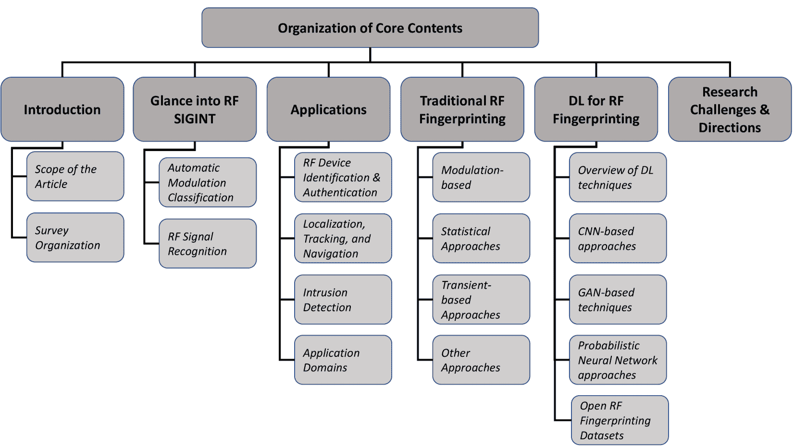

图 1：文章组织概述

### I-A 文章范围

本文的目的是提供一个全面的现代无线设备指纹识别算法的视角，同时提供关于附属信号智能领域——调制和无线协议分类的充分背景。尽管已有许多关于其他射频信号智能方法（调制和无线协议分类）的深度学习文章[4, 5, 6, 7, 8, 9, 10, 11, 12, 13, 14]，但缺乏涵盖传统原理方法和监督深度学习的射频指纹识别的综合展示。我们尝试通过讨论以下关键方面来弥补这一空白：

1.  1.

    对射频信号智能（SIGINT）领域相关研究的简明且分类布局，以向读者提供相关背景。这里，我们展示了自动调制分类（AMC）、无线协议识别的各种方法的预览——涵盖传统方法和深度学习方法，然后进行射频指纹识别应用及方法的详细讨论。

1.  2.

    在这个正在迅速发展的通信时代，射频信号智能的一些关键应用领域涉及到数十亿个包括各种物联网发射器的无线设备共存。这一方面为观众提供了射频信号智能方法在实际应用中的重要无线网络应用领域。

1.  3.

    对传统射频指纹识别方法的定性讨论，分类为调制、统计、瞬态、小波及其他方法。

1.  4.

    对于射频指纹识别的最先进深度学习方法进行深入探讨，包括对主要深度学习方法的概述，以帮助研究人员将其应用于射频信号智能。

1.  5.

    对各种开源数据集的详细介绍，旨在为研究人员提供全面的知识，以深入应用射频指纹识别研究。

1.  6.

    通过提出开放研究挑战和未来方向，激励进一步研究。

我们在此强调，与现有的调查不同，我们的文章全面呈现了 RF 指纹识别的各个方面，包括对 RF 信号智能的背景概述、RF 指纹识别中向深度学习方法的演变以及传统原则方法的进展。为了完整性并惠及初学者，我们提供了相关深度学习技术的教程。

大多数现有与 RF 指纹识别相关的调查仅呈现了狭窄的范围。具体而言，涉及所有 RF 信号智能方面的定性分析，包括 AMC、无线协议识别，以及对关键深度学习方法的定量讨论，至今尚未在当前文献中广泛探讨。在[15]中，讨论了通过指纹识别内置组件（如相机、微机电系统、扬声器、麦克风和 RF 前端）来识别手机的各种技术。相比之下，我们尝试覆盖所有 RF 发射器，例如软件定义无线电（SDR）、无人机（UAV）以及其他消费品（COTS）设备，包括手机。在[16]中，介绍了 RF 指纹提取和认证方法，并重点讨论了设备的真实性——合法或非法。另一项调查[17]回顾了利用 RF 指纹识别的伪造检测方法，特别强调了全球导航卫星系统（GNSS）发射器。尽管这项工作与[15]和[16]相比展示了更广泛的范围，但仍缺乏对 RF 信号智能所有方面的彻底介绍。另一项调查[18]讨论了无线设备指纹识别的分类法，并简要介绍了经典的白名单和无监督学习算法。我们的文章超越了这些工作，为读者提供了 RF 信号智能的所有方面，包括传统和基于深度学习的 RF 信号智能方法之间的交叉点。与现有调查仅提供对所评审文章的简要（2-3 句）讨论不同，我们深入探讨了广泛文献中的评审工作，提供了每一项的简洁摘录。此外，这些信号智能技术的应用范围在其他现有调查中并未详细阐述。本文的最终目标是提供一个全面的 RF 指纹识别指南，包括关键监督深度学习技术的基础知识以及最先进的 RF 信号智能的广泛综述。

### I-B 调查组织

我们以有组织的层次结构来构建我们的文章：部分 II Fingerprinting: Traditional Approaches, Deep Learning, and Open Challenges")向读者介绍了 RF 信号智能的两个子领域，并回顾了基于传统方法和深度学习的自动调制和无线协议分类。讨论的 RF 指纹识别方法的关键应用领域在部分 III Fingerprinting: Traditional Approaches, Deep Learning, and Open Challenges")中简要讨论，以补充实际洞察，帮助研究人员和从业人员探索其适用性。我们通过在部分 IV Fingerprinting: Traditional Approaches, Deep Learning, and Open Challenges")中详细阐述原理性方法，开始 RF 指纹识别的调查。我们根据指纹特征将传统方法分为调制、统计、瞬态、小波和其他杂项方法，以便对传统技术的广泛文献进行分段和比较讨论。接下来，我们在部分 V Fingerprinting: Traditional Approaches, Deep Learning, and Open Challenges")中呈现了最先进的基于深度学习的 RF 指纹识别技术的说明性讨论。我们将此部分分为两个部分，第一部分回顾了关键的深度学习概念，为读者提供背景介绍，第二部分展示了这些深度学习技术如何应用于 RF 指纹识别领域。此外，我们还向读者介绍了用于训练深度学习模型以进行 RF 指纹识别的开源数据集。最后，我们通过在部分 VI Fingerprinting: Traditional Approaches, Deep Learning, and Open Challenges")中总结一些开放问题和挑战，旨在激发该领域的未来研究。我们还在图 1 Fingerprinting: Traditional Approaches, Deep Learning, and Open Challenges")中以图示方式展示了组织结构。

## II RF 信号智能概述

射频信号智能被定义为专注于从感兴趣的频谱中的未知射频信号中提取诸如调制、带宽、中心频率、协议、发射器身份等信号特征的研究和应用领域。根据实际应用，这种提取可以在不同的合作或先验知识水平下进行。最具挑战性的版本是在没有任何先验信息或合作的假设下，这通常被称为盲射频信号智能。

这一研究领域进一步分为不同的类别，基于所执行的任务。也许最受欢迎和广泛研究的任务是 AMC 以及无线信号/协议分类。这些分类任务之间的一个共同主题是信号本身在这些分类任务中明显不同，使得它们相对比射频指纹识别更容易，后者中相同的设备可能以相同的配置发送相同的波形。为了读者的方便，我们提供了两个最常见的信号智能类别（AMC 和信号类型分类）的背景信息。这也是为了让读者在审阅射频指纹识别方法的更深入调查时与整体射频信号智能研究领域相关联。

### II-A 自动调制分类

如前所述，由于这一研究领域获得了广泛关注，我们根据图 2 Fingerprinting: Traditional Approaches, Deep Learning, and Open Challenges") 中显示的 AMC 技术演变来组织这一部分内容。

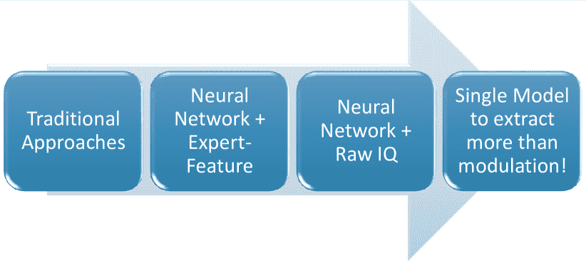

图 2：AMC 方法的演变

传统方法：AMC 可以大致分为两类；（i）基于似然的方法[19, 20, 21, 22, 23, 24]和（ii）基于特征的方法[25, 26, 27, 28]。有几个尝试将这两种方法结合起来，以期提取两者的优势[29]。基于似然的方法在贝叶斯意义上可以提供最佳性能，但通常计算需求较高[29, 30]。另一方面，基于特征的分类器如果设计得当，可以在计算效率上提供接近最佳的性能。值得注意的是，“精心设计”的要求可能是传统基于特征的方法的弱点。通常情况下，设计一个在仿真或实验室设置下表现极佳的分类器，但在现实世界场景或操作环境变化时可能会失效。换句话说，为了使 AMC 适合现实世界应用，分类器需要在各种操作场景和环境中具有良好的泛化能力。

专家特征的神经网络：由于基于特征的分类器的问题结构类似于最近复兴的监督机器学习的函数逼近模式，因此这些技术在自适应调制分类（AMC）中得到了不可避免的应用。因此，近年来采用了不同的机器学习技术来通过分类确定未知信号的调制格式。在应用监督学习进行 AMC 的初期，采用了特征工程的方法，而不是利用原始的同相和正交（IQ）样本。这包括使用支持向量机（SVMs）[31]和人工神经网络（ANNs）[32, 33, 6]。在[32]中，作者使用多层感知器（MLP）在广泛的信噪比（SNR）值范围内进行高准确度的十二类调制分类。在[33]中，作者使用六个特征通过标准梯度下降（GD）学习算法的反向传播方法评估了两种不同的 ANN 架构。同样，[6]在低 SNR 条件下实现了对八种调制方案的高准确度识别。所有这些研究均限于仿真，并未在实际硬件上进行评估。在[30]中，作者详细阐述了将解决方案从仿真转移到硬件实现过程中面临的挑战。简而言之，由于仿真过程中忽视的假设和意外信号失真，AMC 技术在实际部署中可能会出现性能下降。

卷积神经网络（CNNs）相较于人工神经网络（ANNs）具有卓越的特征提取能力，这促使了若干研究利用 CNN 进行调制或信号分类[34、35、5、36、37、9、10]。[34]的作者评估了 CNNs - GoogLeNet [38] 和 AlexNet [39] 架构 - 在预测调制格式上的表现，数据集包含八类，通过输入星座图像进行训练。然而，这些模型对图像预处理因素如图像分辨率、裁剪大小、选择区域等非常敏感，在 0 dB SNR 下准确率低于 80%。我们认为，这可能是因为这些模型采用了适用于计算机视觉问题的重型架构，而非 RF 应用的需求。一种前馈特征基础的神经网络[40]在 USRP 软件定义无线电测试台上对七种调制方式的分类准确率达到了 98%。在[41]中，时间-频率图像被用作 CNN 架构的输入，用于识别七种雷达波形类别。沿着类似的趋势，[35]中使用循环谱图像作为 CNN 输入，在 SNR 高于 2 dB 时获得了七类调制识别的 95%准确率。我们在此强调，这些工作依赖于手工特征来训练神经网络，这限制了网络的泛化能力，而这种能力本可以通过原始 IQ 样本得到提升。

原始 IQ 的神经网络：在[4]中探讨了一种使用原始 IQ 样本对 5 种通信波形进行分类的 CNN 架构。尽管该模型达到了 100%的准确率，但它考虑的相同载波频率和带宽的波形数量非常有限。[5]的作者训练了一种 CNN，通过输入原始 IQ 样本，在 18 dB 下实现了 83.4%的准确率，用于分类 11 种调制方式。在[36]中，改进的 ResNet 架构通过从原始 IQ 样本中学习，在 10 dB 下实现了 95.6%的准确率，识别了 24 种调制类别。

### II-B RF 信号识别

无线信号识别是一种信号（无线标准或协议）识别方法，涉及识别 RF 波形生成的无线标准。[9]的作者通过执行一个包含三种无线标准——IEEE 802.11 b/g、IEEE 802.15.4 和 IEEE 802.15.1——的 15 类识别，研究了无线干扰检测，这些标准占据了不同的频率通道。在类似的研究中，[10]采用了 CNN 架构来解决工业、科学和医学（ISM）频段的频谱紧张问题，通过对 Zigbee、WiFi、Bluetooth 及其交叉干扰的七个类别进行分类。然而，该模型需要在高 SNR 条件下操作才能达到 93%的准确率。在[42]中，作者使用基于距离的支持向量数据描述（SVDD）算法，通过生成哈希指纹来识别 2.4 GHz 频段中的低速、小型无人机（LSSUAVs）信号。所提出的方法在室内环境中无误地识别了 LSSUAV 信号，同时将 IEEE 802.11b 和 IEEE802.11n 信号错误识别为 LSSUAV 的概率分别为$13.5\%$和$0\%$。类似地，[43]的作者研究了在 WiFi 干扰下识别无人机视频信号。使用随机森林分类器，作者展示了该方法在 WiFi 干扰下能够以$100\%$的准确率在室内识别无人机视频信号，并且在无人机距离接收器 2 公里时，准确率为$96.26\%$。在[7]中，作者实现了一个 CNN 模型，用于识别无线电频谱中受到 LTE 和 WLAN 信号干扰的雷达信号。作者使用信号数据集中的幅度和相位移分量，达到了$99.6\%$的分类准确率。在[44]中，作者使用时域特征训练 CNN 分类器，以识别在 2.4 GHz 频段运行的 WiFi、Zigbee 和 Bluetooth 设备。结果表明，所提出的方法能够在 SNR 大于 5 dB 时以$\geq 95\%$的准确率进行识别。

### II-C 单模型提取超过调制

首次提出了一种多任务学习 (MTL) 模型，能够识别多个任务——调制和信号 (协议) 识别——[45, 46]。这是首个考虑雷达和通信波形以应对实际部署中遇到的多样化和异质信号类型的工作。这里，作者训练了一个 CNN 来基于单一的原始 IQ 输入执行两个相关任务。这两个任务被分配权重，以形成加权和损失函数，并通过反向传播训练了模型。作者强调了从一开始就设计轻量级模型的重要性，并提供了在不同信号强度下通过无线电波形收集的实际实验评估。评估显示，轻量级 MTL 在 Intel Core i5-3230M CPU 上的推理速度为 8.4 毫秒，比基准测试节省了高达 90.5% 的内存需求。此外，通过执行 INT8 量化进一步压缩了模型，以展示资源受限边缘部署平台的计算节省。未压缩的 32 位浮点 (FP32) 模型通过 INT8 量化压缩了 11.8$\times$，且未报告显著的准确性损失。

## III 应用

### III-A RF 设备识别与认证

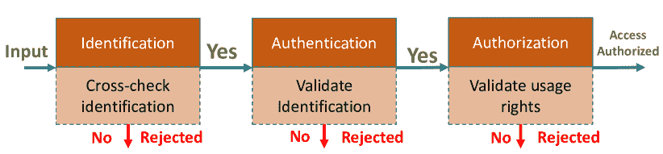

图 3：识别、认证和授权的流程图

设备识别与认证是管理无线网络的关键部分。由于无线设备在环境中的普及，使得这一任务变得困难，因为不断增长的攻击面在蓬勃发展的物联网经济背景下愈加严重。通常，识别和认证被误用为同义词，造成进一步的混淆[47]。首先，我们提供了识别、认证和授权的定义，并结合图 3 指纹识别的综合调查：传统方法、深度学习与开放挑战")以涵盖整体过程。识别可以看作是整体认证和授权过程的一个子任务。定义如下[48]，

1.  1.

    识别是基于唯一的 ID（如 MAC 地址、IMEI（国际移动设备身份）或 MEID（移动设备标识符））唯一识别用户或设备的能力。

1.  2.

    认证是证明用户/设备确实是其声称的用户或设备的能力。

1.  3.

    授权是评估已认证的用户/设备是否有合法权限访问资源或服务的过程。

传统上，认证涉及意图访问的设备与验证认证消息以授予访问权限的网络组件之间的握手过程[49]。例如，使用秘密密钥$S$，Alice 可能通过加密校验和将消息传输给 Bob，这个校验和是消息和秘密密钥的函数。Bob 可以使用该函数和密钥来验证 Alice 的真实性，而试图修改消息的入侵者除非秘密密钥被泄露，否则无法通过认证。虽然这不是行业中用于认证的唯一方法，但这是一个典型的代表性例子，说明传统认证方法是主动的，即它涉及控制消息交换并依赖秘密密钥。可以想象，这会导致由于认证过程的主动性质而增加开销。尽管秘密密钥用于认证过程，但它仍然是一个可能被破坏的脆弱点，从而允许不合法用户访问网络。由于 RF 指纹识别是特定于硬件的，并且通常是在模拟组件级别上无意间赋予的特征，很难模仿。因此，可以认为 RF 指纹识别可以纳入更稳健的身份识别和认证中[49]。我们在第 VI Fingerprinting: Traditional Approaches, Deep Learning, and Open Challenges")节中探讨了 RF 指纹识别的脆弱性。

### III-B 定位、跟踪与导航

随着 RF 指纹识别技术的精度和稳健性提高，它可以扩展到或与其他应用集成，例如辅助室内外定位、导航，甚至跟踪特定的已验证发射器。这对于战术应用、执法和急救人员非常有益。例如，在搜索和救援应用中，可以根据设备发出的独特 RF 指纹来唯一跟踪受害者或救援人员。还有许多其他应用实例，其中这种跟踪可以非常有益。例如，美国国家司法研究所对在矫正设施中使用 RF 指纹识别跟踪违禁无线设备表现出了兴趣[50]。类似地，在大多数情况下，跟踪作战人员在任务中的进展、即时位置并在需要时提供帮助是很有用的。急救人员经常遇到困难情况，但通常依赖无线通信设备。因此，如果这些通信信号可以用来识别和跟踪急救人员，它可以大大提高这些操作的效率和安全性。

需要指出的是，另一个优势是无需发射特定的数据包来帮助跟踪，因为可以通过监听通信信号隐式地完成。这可以减少指挥和控制这类操作所需的整体开销。这项技术像许多其他技术一样是一把双刃剑，人们可以想象现代设备可能会被非法实体识别，然后用于跟踪，从而引发隐私和安全问题。这意味着有一个全新的新兴研究和分析领域，可能旨在缓解这些安全漏洞。

### III-C 入侵检测

我们讨论了一些可能因误用射频指纹识别技术而产生的安全漏洞，但与此同时，它也是一个强大的工具，用于检测入侵和/或仿冒攻击。随着从 5G 移动设备到低成本物联网设备等无线设备的普及，确保不断扩展的威胁表面变得越来越困难。虽然有数百万个设备，但它们都依赖于少数几种无线协议或标准，如 5G、WiFi、BLE、LoRa 等，这基本上意味着也会有若干设备发射相同类型的信号。因此，具备实时区分合法用户和非法用户的能力变得至关重要，即使它们发射的是相同的信号。更重要的是，入侵者往往会模仿或进行重放攻击。就像传统的指纹能够帮助某些安全系统检测入侵者一样，射频指纹识别也可以在商业和战术应用中发挥相同的作用。例如，在一个编队被派往任务之前，他们每个人可以拥有其战斗伙伴的射频指纹信息。这样，每个设备都能够警告那些不在签名数据库中的入侵者的存在。许多商业建筑禁止未经授权的无线设备，在这样的商业安全环境中，安全人员可以部署类似的方法，将每个批准的设备通过其射频指纹进行注册。一旦系统启动，入侵检测系统就能够警告操作员未经授权的传输，即使入侵者采取重放或仿冒攻击。

### III-D 应用领域

超越 5G 网络或 6G 设想了革命性的应用领域 [51, 2, 52, 53, 54]。然而，对于这些沉浸式应用，用户及资产的安全性和隐私性变得至关重要 [55, 56, 57, 58, 59]。在本节中，我们将深入探讨 6G 背景下 RF 指纹识别的预期应用，如图 4 Fingerprinting: Traditional Approaches, Deep Learning, and Open Challenges")所示。

1.  1.

    *智能远程医疗*：随着 6G 网络的到来，智能和实时医疗将经历范式转变。实时健康监测、医院间服务、互联网医疗物联网（IoMT），也称为医疗物联网，将共同呈现动态和响应式的健康服务 [54, 60]。具有互联 IoMT 的体域网络（BAN）将推进和个性化远程健康监测和管理。基于超低延迟 6G 通信的远程健康服务和全息远程会议在普及医疗服务方面具有巨大的潜力。保持患者数据库和重要医疗提供者信息的安全和隐私是实现触感 6G 医疗的基石。依托边缘 IoMT 设备的无线设备指纹识别解决方案将是实现实时安全 6G IoT 医疗的关键。我们预见，这些解决方案结合分布式账本的多因素认证，可以保护用户免受欺骗、拒绝服务（DoS）、身份盗窃攻击等威胁。

1.  2.

    *自主无人机与 V2X*：空中基站和无人机群可以革新和普及无线连接。特别是，建立无基础设施的网络可以通过连接遥远和艰苦的地点提供应急响应、医疗服务等。这些概念在过去已有探讨 [61]，并且将是潜在的 6G 应用场景 [52, 53, 62]。类似地，V2X 场景下的联网自动驾驶车辆将涉及车辆与沿途附近网络的通信。在这些应用中，基于位置和移动性从一个网络切换到另一个网络是必要的。因此，强大、快速且轻量的设备认证将是适应设备多样性和移动性的关键。RF 指纹识别由于本质上不涉及控制开销，仅使用嵌入在无意排放中的硬件签名，将是这种轻量认证方案的理想选择。

1.  3.

    *智能电网 2.0* 智能电网是基于物联网的电力网络，用于远程监控和控制电力系统。随着 6G 的到来，智能电网将能够支持更高密度的物联网设备，实现超低延迟和高可靠性的通信，从而实现对分布式电网线路和站点的实时异常检测和缓解。电网中涉及的用户信息、电力计量、电气使用模式、账单细节等信息的机密性是网络安全攻击的不可或缺且主要目标。此外，智能电网 2.0 设想了智能定价、自动化电网管理，包括在点对点的方式下进行的未知方之间的能源交易，这进一步暴露了威胁面[52]。因此，基于设备指纹的认证和安全能源交易的电网访问将获得越来越多的关注，以实现智能电网 2.0。

1.  4.

    *扩展现实*：扩展现实（XR）是一个总括性术语，指代所有真实和虚拟环境，包括虚拟现实（VR）、增强现实（AR）、混合现实以及介于两者之间的所有形式[63, 64]。6G 将支持先进的 XR 应用，如军事战术训练、视频会议、在线游戏等。在这些应用中，除了满足延迟和速率要求外，用户隐私将同样成为一个必要且具有挑战性的前提条件。因此，用户（设备）认证和访问控制将在这里发挥关键作用。

图 4：无线射频指纹识别的应用领域

## IV 无线射频指纹识别的传统方法

### IV-A 基于调制域的方法

#### IV-A1 PARADIS

参考文献[65]中的作者提出了一种基于辐射特征的设备识别方法，称为 PARADIS（被动辐射设备识别系统）。该方法基于辐射特征概念——利用发射器硬件的微小变化导致传输信号中的独特特征——来识别来源。作者展示了 PARADIS 在分类超过$130$个 802.11 网络接口卡（NICs）时准确度超过$99\%$。该系统通过逐帧将信号与调制域中的理想信号进行比较，从而量化发射器的辐射特征。

调制域度量指标如频率误差、SYNC 相关性、IQ 偏移、幅度误差和相位误差被用作确定设备辐射身份的特征。由于硬件缺陷引起的特征在多个帧中会明显出现。因此，计算这些变化在多个帧中的统计平均值将放大由硬件引起的伪影，同时减少噪声和信道的影响。接下来，使用分类器对这五种调制域度量指标进行分类，以识别来源。实现并评估了两种辐射特征分类器，一种使用 SVM 算法，另一种使用 k-近邻（k-NN）算法。SVM 分类器使用 LIBSVM[66]构建，模型以单一辐射特征作为输入，并输出最可能的来源身份及其置信度。k-NN 分类器使用一组排名器实现，每个 NIC 有一个排名器，该排名器计算给定信号与在训练过程中计算的其特征模板之间的相似度。

作者在 ORBIT 室内无线测试平台[67]上评估了 PARADIS。他们从配置为 802.11b 接入点的 138 个 Atheros NIC 中收集了数据。使用 Agilent 89641S 矢量信号分析仪作为 PARADIS 传感器来捕获发射器发出的帧。总体而言，使用 SVM 算法的 PARADIS 的错误率为$0.0034\%$，而使用 k-NN 算法的系统在分类$138$个相同 NIC 时的错误率为$3\%$。

#### IV-A2 IQ 不平衡

在[68]中，作者提出了一种基于四相调制信号的 IQ 不平衡来提取射频指纹特征的方法。IQ 不平衡是由于 IQ 四相调制器的硬件缺陷引起的。在提出的方法中，通过对接收信号进行自相关来提取特征。自相关的实部和虚部构成射频指纹特征，SNR 使用传统的最小二乘法估算。为了评估该方法，作者通过改变增益和正交 IQ 不平衡来模拟了五种模拟调制器（发射器），并从每个发射器生成了 400 个信号。使用提出的方法提取了指纹特征向量，并用数据集的一半训练了 SVM 分类器。该方法在 SNR $\geq 15$dB 时的准确率超过$90\%$，在 SNR $\geq 20$dB 时的准确率超过$99\%$。

#### IV-A3 调制形状和频谱特征

参考文献[69]中提出了一种通过提取调制形状和信号发射的光谱特征来识别射频识别设备（RFID）的方法。该方法能够以$2.43\%$的错误率识别$50$个来自同一制造商的相同 RFID 应答器。

作者使用了一个专门构建的 RFID 读写器来传输信号到目标应答器以捕捉信号。该设备包括两个信号发生器用于包络和调制生成，以及一个 PCB 天线用于传输到 RFID 应答器。使用天线和示波器捕捉 RFID 应答器的响应。使用此设置，作者通过以下四种方法收集了 50 个 JCOP NXP 4.1 智能卡和 8 个电子护照的数据；

+   •

    方法 1：在应答器暴露于 ISO/IEC 14443 标准 A 型和 B 型协议时捕捉其响应。

+   •

    方法 2（变化的$F_{c}$）：在应答器暴露于不符合规范的（仅载波频率）ISO/IEC 14443 标准 A 型和 B 型协议时捕捉其响应。

+   •

    方法 3（脉冲）：在应答器暴露于 RF 能量脉冲（$10$周期的非调制$5$ MHz 载波，$10$V 峰值-峰值）时捕捉其响应。

+   •

    方法 4（频率扫描）：在$100$ Hz 到$15$ MHz（$10$ V 峰值-峰值）线性扫描非调制载波时捕捉应答器的响应。

使用方法 1 和方法 2 捕捉的数据提取了调制形状特征，而方法 3 和方法 4 则使用光谱主成分分析（PCA）。通过对捕捉到的信号进行 Hilbert 变换来提取调制形状特征。使用基于方差的阈值检测算法[70]来定位变换信号中的调制起点。通过将提取的指纹特征与参考指纹进行匹配来获得标准化的欧几里得距离[71]。类似地，通过将参考指纹特征与测试特征进行匹配来评估 Mahalanobis 距离。光谱 PCA 特征通过针对高维数据的改进 PCA 方法提取[72]。

为评估所提出技术的分类能力，作者考虑了来自 8 个电子护照和 50 个 JCOP NXP 4.1 卡的信号。两种分类技术——一种使用调制特征，另一种使用谱特征——在将信号分类为三类（两个国家、JCOP NXP 卡）时的误差率为$0\%$。作者通过使用方法 3 和 4 的数据（来自 50 张相同的 JCOP NXP 4.1 卡）来评估该方法的识别能力。所提出的方法在使用方法 3 和 4 的数据单独计算的光谱特征时，在识别 50 张 RFID 卡时的准确率为$95\%$。最后，当将通过方法 3 和 4 收集的数据的光谱特征结合起来时，准确率提高到$97.5\%$。

#### IV-A4 基于加权投票的调制域信号分类

在[73]中，作者提出使用弱分类器的委员会，通过加权投票来结合多个弱分类器的结果，从而提供强分类。无线电的物理特征，如频率偏移、调制相位偏移、同相/正交相位偏移和幅度，都是从无线开放接入研究平台（WARP）中六个不同无线电生成的信号中提取的。六个无线电卡生成并传输差分正交相移键控（DQPSK）调制信号。总共建立了 14 个机器学习分类器，使用以下信号特征：

+   •

    频率差（1 个分类器）：实际传输频率与理想载波频率之间的距离。

+   •

    幅度差（4 个分类器）：传输符号与理想载波符号之间的幅度差。

+   •

    相位差（4 个分类器）：在 IQ 域中，传输符号与理想符号之间的角距离。

+   •

    距离向量（4 个分类器）：传输符号与理想符号之间的向量距离。

+   •

    IQ 原点偏移（1 个分类器）：理想 IQ 平面的原点与传输符号在 IQ 域中的原点之间的距离。

14 个分类器使用来自每个板的 1844 个随机 QPSK 符号的前 200 帧进行训练，然后使用加权投票将分类器的输出进行组合，以获得最终的无线电身份。基于加权投票的分类器在检测六个无线电卡时的平均准确率为$88\%$。

#### IV-A5 星座误差特征

在 [74] 中，作者提出了一种基于星座误差特征的射频指纹识别方法。利用接收星座与理想星座之间的误差作为射频指纹识别的特征。这些特征通过子类判别分析（SDA）提取。捕获来自七个 TDMA 卫星终端的突发 QPSK 调制信号，以构建测试数据集。接收信号在构建调制星座之前，首先进行时间和频率同步，然后计算星座误差。通过 SDA 特征提取提取包含 41 个特征的特征向量，并对每个信号进行分类。提出的方法在 SDA 特征提取方法的 bin 大小大于 12 的情况下，准确率超过 $95\%$。

在总结本节内容时，我们在表 I Fingerprinting: Traditional Approaches, Deep Learning, and Open Challenges") 中总结了所审查的文献，以便读者进行比较。

| 工作 | 辐射参数 | 分类技术 | 射频发射器 | 性能 |
| --- | --- | --- | --- | --- |
| *Brik et al.*[65] | 频率误差、同步相关性、IQ 偏移、幅度误差和相位误差 | k-NN 和 SVM | $138$ 个 802.11 网络接口卡 | SVM$\rightarrow 99.9\%$ k-NN$\rightarrow 97\%$ |
|  |  |  |  |  |
| *Zhuo et al.*[68] | IQ 不平衡 | SVM | MATLAB 模拟的 5 个模拟调制器 | $\geq 90\%$ 对 SNR $\geq 15$dB |
|  |  |  |  |  |
| *Danev et al.*[69] | 调制形状和光谱 PCA 特征 | 马氏距离 | 8 个电子护照和 5 张 JCOP NXP 4.1 卡 | $100\%$ 分类准确率和 $97.5\%$ 识别准确率。 |
| *Candore et al.*[73] | 频率偏移、调制相位偏移、同相/正交相位偏移和幅度 | 基于加权投票的分类器 | 六个 WARP 无线电卡 | 88% 识别准确率和 12.8% 误报率 |
| *Huang et al.* [74] | 星座误差 | SDA 特征提取 | 七个 TDMA 卫星终端 | 95% 识别准确率 |

表 I：基于调制域的射频指纹识别研究

### IV-B 统计方法

#### IV-B1 非参数特征

在[75]中，提出了通过生成和使用非参数特征如均值、中位数、众数以及线性模型系数（斜率和截距由线性回归估计）来识别 ZigBee 设备的方法。使用 Agilent E3238S 接收机捕获来自四个德州仪器 ZigBee CC2420 设备的复杂 IQ 信号。生成接收信号的相位变量，并将相位变量的前导区分为 32 个大小相等的兴趣区域（ROIs）。接下来，为每个 ROI 生成非参数特征。使用具有 1000 棵树的随机森林分类器对信号进行分类。每个非参数特征都单独用于设备分类。结果表明，对于 SNR$\geq 10$dB，每个非参数特征的分类准确率均超过$97\%$。在较低 SNR 下，线性模型系数特征的表现优于其他非参数特征。作者还通过计算每个 ROI 的参数特征（方差、偏度和峰度），比较了使用非参数特征与参数特征的性能。相同的随机森林分类器用于单独分类这些特征。非参数特征在 SNR$=8$dB 时，比参数特征提高了最多$9\%$的分类精度。

#### IV-B2 基于 RF-DNA 的特征

在[76]中，作者提出了一种基于 RF-DNA（射频独特本地属性）的 RF 指纹识别方法，用于识别超宽带（UWB）噪声雷达发射设备。RF-DNA 指纹特征，包括方差、偏度和峰度，是从信号的时域响应中提取的。此外，作者还从信号的频域响应中提取了归一化的功率谱密度（PSD）和离散 Gabor 变换。信号使用最大似然的多重判别分析（MDA/ML）分类器和改进的广义相关学习向量量化（GRLVQI）分类器进行分类。MDA/ML 分类器是多重判别分析（MDA）与最大似然（ML）分类器的组合，旨在降低多维数据集的维度。GRLVQI 分类器是一种监督机器学习方法，通过向输入维度添加权重因子来扩展广义学习向量量化（GLVQ）[77]。这些因子允许根据输入维度的相关性进行适当的缩放，并在训练过程中根据具体的分类任务自动调整。

分类性能在使用放置在接收器一米远的无回声室中的对数周期天线发射 UWB 噪声雷达波形捕获的信号上进行评估。通过改变发射天线的终端负载，捕获了三类波形。此外，还使用了一个衰减器来增加类别数。对于仅使用时域指纹特征的三类情况，所提出的方法在 MDA/ML 和 GRLVQI 分类器中的分类准确率分别为$99.7\%$和$98.25\%$。在仅使用时域指纹特征的七类数据集中，所提出的方法在 MDA/ML 和 GRLVQI 分类器中的平均分类准确率分别为$81\%$和$75\%$。类似地，对于仅使用频谱域指纹特征的三类数据集，所提出的方法在 MDA/ML 和 GRLVQI 分类器中的分类准确率分别为$91.97\%$和$94.47\%$。最后，使用时间域和频率域特征的组合，三类数据的分类准确率为$97.65\%$和$93.79\%$。

### IV-C 瞬态基础方法

瞬态基础方法涉及识别无线电开启瞬态中的独特特征，这些瞬态出现在传输开始时。瞬态是信号的部分，其中幅度从通道噪声上升到信号幅度。使用此过程识别设备包括三个步骤：瞬态检测、特征提取和分类。[80]中讨论了瞬态检测的两个关键方法：阈值[78]和贝叶斯步进变化检测器[79]。这两种方法都利用信号的幅度特征进行瞬态检测。它们还提出了一种新的瞬态检测方法，使用信号的相位特征来改善瞬态梯度缓慢时的性能。

#### IV-C1 基于快速傅里叶变换（FFT）的 Fisher 特征

[81]的作者提出使用基于 FFT 的 Fisher 特征来识别无线节点。在这种方法中，信号的 RF 指纹（特征模板）通过首先检测起始点并使用基于方差的阈值检测算法[70]提取信号的瞬态来计算。通过对瞬态应用一维傅里叶变换来确定相邻 FFT 谱之间的相对差异。接着，使用线性判别分析（LDA）矩阵提取形成特征模板的 Fisher 特征向量。LDA 矩阵通过基于散布矩阵的标准程序[82]推导。最后，通过计算参考和测试信号特征模板之间的马氏距离来匹配指纹。

收集了来自 50 个具有相同制造商签名的消费品级（COTS）Tmote sky 传感器节点的 600 多个 IEEE 802.15.4 信号样本，以评估所提出的技术。系统以高于$99.5\%$的准确率识别了 50 个传感器。该工作还研究了距离、天线极化和电压等参数对系统性能的影响。

这些研究结果表明，系统在面对距离、多径传播和电压变化时具有鲁棒性。然而，信号极化的变化会改变瞬态的形状，扰动瞬态中存在的频率信息，从而导致识别准确率下降。他们还调查了系统在如爬坡攻击和 DoS 攻击等攻击上的实用性。爬坡攻击是一种常见的伪装攻击，攻击者反复向算法提交稍微修改的数据。改进或保持匹配分数的修改会被保留。随着时间的推移，攻击者可以获得高于设计阈值的分数，从而成功伪装。当用于构建指纹特征模板的信号数量较少时，系统可能会对伪装攻击产生脆弱性。该工作还研究了系统对基于干扰的 DoS 攻击的脆弱性。由于原始信号和干扰信号的叠加，系统无法识别设备。作者建议这种攻击可以作为针对攻击者的安全措施。

#### IV-C2 基于 Hilbert-Huang 变换的时间-频率-能量分布特征

作者提出了一种基于瞬态信号时间-频率-能量分布（TFED）的特定发射器识别（SEI）方法，该方法通过 Hilbert-Huang 变换（HHT）获得[83]。HHT 是一种自适应信号分析方法，包括经验模态分解（EMD）和 Hilbert 变换[84]。EMD 方法将给定信号分解为一组有限数量的固有模态函数（IMFs）。对 IMFs 应用 Hilbert 变换得到 TFED。通过基于相位的方法[80]检测信号的开始，并通过从 TFED 中形成信号的能量轨迹来检测终点。从 TFED 中提取了以下十三个特征：

+   •

    三个整体特征：能量总和、瞬态信号的持续时间以及最大能量点的持续时间。

+   •

    沿频率轴的四个能量分布特征：熵、峰度、偏度和中心。

+   •

    沿时间轴的四个能量分布特征：熵、峰度、偏度和中心。

+   •

    整体时间-频率平面的两个能量分布特征：熵和中心。

作者使用 PCA 降维特征向量，并使用 SVM 对设备进行分类。作者使用连接到带有 Yagi 天线的数字接收器的 Leroy 8500A 数字示波器收集来自八部 GSM 手机（四部诺基亚 5230，两部摩托罗拉 Me525，两部小米-1）的瞬态信号。SVM 分类器使用来自每个设备的 50 个瞬态信号进行训练，系统使用来自每个设备的 100 个瞬态信号进行测试。该方法在分类这八部移动设备时达到了$100\%$的准确率。

#### IV-C3 能量包络特征

在[85]中，从瞬态信号的能量包络中提取的特征被用作射频指纹以识别蓝牙设备。使用基于方差的阈值方法[70]从归一化信号中提取瞬态。然后使用定义为短时傅里叶变换（STFT）平方幅度的谱图来提取能量包络。谱图计算三维 TFED，然后根据最大能量值的瞬时频率对其进行切片，以获得平滑的能量包络曲线。最后，通过从能量包络曲线中提取以下特征来形成射频指纹：

+   •

    归一化曲线下的面积。

+   •

    瞬态的持续时间。

+   •

    曲线的最大斜率。

+   •

    曲线的峰度。

+   •

    曲线的偏度。

+   •

    瞬态包络的方差。

使用示波器和 Agilent 频谱分析仪捕获来自手机的七个内置蓝牙收发器的蓝牙设备发现模式信号。从每个蓝牙收发器捕获了总计 300 个信号，并提取了射频指纹特征。使用$3$个最近邻的 k-NN 分类器对特征向量进行分类。从每个设备的 50 个信号用于训练分类器，其余 250 个信号用于测试。该方法以$99.9\%$的准确率对设备进行分类。此外，作者调查了采样率对分类准确性的影响。由于瞬态的能量包络不随采样率变化，因此在 4 GSps、1 GSps、512 MSps、256 MSps、128 MSps 和 32 MSps 的采样率下，设备识别的准确率保持在$99.9\%$。

上述基于瞬态的射频指纹文献也在表 II Fingerprinting: Traditional Approaches, Deep Learning, and Open Challenges")中总结。

| 引用文献 | 瞬态检测方法 | 分类技术 | 射频发射器 | 性能 |
| --- | --- | --- | --- | --- |
| *Danev 等人*[81] | 基于方差的阈值 | 马哈拉诺比斯距离 | 50 个 COTS Tmote Sky 传感器 (IEEE 802.15.4) | $\geq 99.5\%$ |
|  |  |  |  |  |
| *袁等人*[83] | 基于相位的方法 | 支持向量机 | 8 GSM 手机 | $100\%$ |
|  |  |  |  |  |
| *Rehman 等人*[85] | 基于方差的阈值 | k-NN | 7 个内置蓝牙收发器 | $99.9\%$ |

表 II：基于瞬态的射频指纹识别工作

### IV-D 基于小波的方法

#### IV-D1 双树复小波变换 (DT-CWT)

一种基于 DT-CWT 特征的波小波域 (WD) 方法由[86] 的作者提出，该特征从 802.11a 信号的非瞬态前导响应中提取。WD 指纹识别的有效性通过 Fisher 基于 MDA/ML 分类进行验证。此外，该工作还考虑了变化的信道 SNR、突发检测误差和 MDA/ML 训练与分类中的不相似 SNR 的影响。基于 DT-CWT 特征的 WD 指纹识别在 SNR 高达 8 dB 的信号中实现了 $80\%$ 的分类准确率，优于时域射频指纹识别。

DT-CWT 是离散小波变换 (DWT) 的扩展，它将时域信号分解为在频域和时域中局部化的小波。DT-CWT 解决了 DWT 中缺乏的平移不变性。DT-CWT 采用两个实值滤波器组实现，在图 5 ‣ IV-D 小波基础方法 ‣ IV 射频指纹识别的传统方法 ‣ 射频 (RF) 指纹识别的综合调查：传统方法、深度学习和开放挑战") [87] 中表示为*tree1*和*tree2*。*tree1*滤波器组的波小波和尺度函数 - $\psi(t)$ 和 $\phi(t)$ - 如下所示，

|  | $\psi(t)=\sqrt{2}\sum_{n}h_{1}(n)\phi(2t-n),$ |  | (1) |
| --- | --- | --- | --- |
|  | $\phi(t)=\sqrt{2}\sum_{n}h_{0}(n)\phi(2t-n)$ |  | (2) |

对应的*tree2*滤波器组的函数是方程式 (1 ‣ IV-D 小波基础方法 ‣ IV 射频指纹识别的传统方法 ‣ 射频 (RF) 指纹识别的综合调查：传统方法、深度学习和开放挑战")) 和 (2 ‣ IV-D 小波基础方法 ‣ IV 射频指纹识别的传统方法 ‣ 射频 (RF) 指纹识别的综合调查：传统方法、深度学习和开放挑战")) 的希尔伯特变换给出，

|  | $\psi^{\prime}(t)=\sqrt{2}\sum_{n}h^{\prime}_{1}(n)\phi^{\prime}(2t-n),$ |  | (3) |
| --- | --- | --- | --- |
|  | $\phi^{\prime}(t)=\sqrt{2}\sum_{n}h^{\prime}_{0}(n)\phi^{\prime}(2t-n).$ |  | (4) |

滤波器系数 $h_{1}(n),h_{0}(n),h^{\prime}_{1}(n)$ 和 $h^{\prime}_{0}(n)$ 直接作为分析滤波器实现。对于实值输入，DT-CWT 滤波器组输出实值 WD 分量 $I_{WD}^{l}$ 和虚数分量 $Q_{WD}^{l}$。由此，复数 WD 信号可以表示为，

|  | $s_{WD}^{l}(n)=I_{WD}^{l}(n)+jQ_{WD}^{l}(n).$ |  | (5) |
| --- | --- | --- | --- |

为了减少使用基础信号特性（如幅度 $\alpha(n)$、相位 $\phi(n)$ 和频率 $f(n)$）作为分类特征时对计算时间和数据处理的过度需求，作者提出使用基础信号的统计特性来进行设备分类。这些统计量包括方差、偏度和峭度。

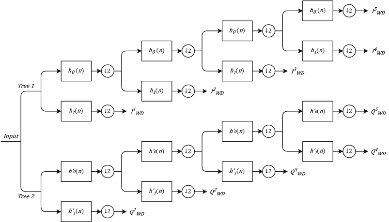

图 5：五级双树复数小波变换

作者使用 Agilent-based RF 信号拦截和收集系统在消声室中从配备 802.11a Cisco 个人计算机内存卡国际协会卡的笔记本电脑中收集 IQ 样本。为了模拟不同的 SNR 条件，通过将随机复数加性白噪声（AWGN）信号添加到收集到的复数信号中，生成“分析信号”。在添加之前，噪声信号经过滤波和功率缩放，以实现所需的分析信号 SNR。接下来，视觉确定 RF 脉冲的起始位置（样本号），并用以定位前导区域。分析信号被分为三个子区域以生成指纹。对每个子区域进行五级 DT-CWT 变换，并计算所有子区域每一级的复数 WD 信号（见 5），接着计算信号特性和统计分类特征，最终每个分析信号生成 135 个特征，这些特征用于基于 Fisher 的 MDA/ML 分类、Monte Carlo 仿真和$K$-折验证。

为了将所提议的 WD 指纹与时域（TD）指纹进行比较，作者为每个分析信号生成了 WD 和 TD 指纹。TD 指纹的生成方法类似于 WD 指纹，但未执行 DT-CWT，它由三个信号特征和三个统计特征组成。对于每个分析信号，TD 指纹由 $27$ 个特征组成，而 WD 指纹由 $135$ 个特征组成。在 SNR $\geq 25$ dB 的情况下，两种技术的性能相同，而 WD 技术在 $-2<$SNR$<24$ dB 范围内表现更优。WD 指纹在 SNR $\approx 11$ dB 时达到了 $80\%$ 的准确率。使用 WD 指纹时，性能提高约 7 dB，相较于等效的 TD 指纹。为了评估分类器是否利用了 WD 指纹中更多特征的优势，作者决定从 135 个特征中选择一个包含 27 个选定 WD 特征的子集。使用 27 特征 WD 指纹的分类显示，WD 技术仅在 $0<$ SNR $<20$ dB 范围内优于 27 特征 TD 指纹，并且相对于 27 特征 TD 指纹，性能提高了大约 2 dB。考虑到相同的维度，这种性能的提高表明分类器利用了 DT-CWT 特征中存在的额外信息。

#### IV-D2 动态小波

提出了一种动态小波指纹方法，通过监督模式分类技术来识别独特的 RFID 标签，详见 [88]。在这项研究中，使用了 146 个不同的 RFID 标签，三种类型分别为 Avery-Dennison AD 612、Avery-Dennison Runway Gen 2 和 Alien Omni-Squiggle。通过使用 Thing Magic Mercury 5e RFID Reader 将相同的代码写入标签，并通过向量信号分析仪用全向天线读取响应来捕获每个标签的 RF 信号。从捕获到的复值信号中计算出幅度、相位和瞬时频率，并用于提取 RF 指纹特征向量。在这项工作中，作者提出使用一个特征向量，该向量结合了从动态小波指纹（DWFP）、小波包分解（WPD）和高阶统计量中提取的特征。

作者们使用了 DWFP 技术[89]，该技术在原始 TD 信号上应用小波变换，并生成一个“指纹式”的二值图像。对该二值图像进行图像处理操作以提取信号的 RF 指纹。特征选择在图像处理步骤提取的特征上进行，使用欧几里得距离度量来指示最具可分离性的类间距离。接下来，通过执行 WPD[90]提取指纹特征，这一过程通过对 RF 信号应用小波包变换（WPT）来生成一个系数树。计算 WPT 树的终端节点的波小波包能量，并选择最高能量作为特征。最后，对未滤波的波形进行高阶统计量处理，以提取以下特征：EPC 的均值、与同一标签的另一个 EPC 的最大互相关、方差、香农熵、第二中心矩、偏度和峰度。结合这三种方法提取的特征作为分类器的特征向量。提出的特征向量经过四种分类器的测试以识别 RFID 标签：线性和二次判别分类器（LDC 和 QDC）、k-NN 和 SVM。所有四种分类器在识别 RFID 标签时的准确率为$99\%$。

#### IV-D3 基于小波域的贝叶斯方法

在[91]中，作者们提出了一种基于 WD 的贝叶斯方法来检测微型无人机的存在及信号能量瞬变，以识别微型无人机的类型。提出的检测方法首先将无人机控制器的 RF 信号转换为 WD，使用三阶段小波分解，然后通过基于马尔可夫模型的朴素贝叶斯方法区分噪声（非无人机信号）和微型无人机信号。将 RF 信号转换为 WD 可以去除偏差并减少数据大小。如果使用提出的方法检测到微型无人机，则进行信号分类。对于提出的分类方法，TD RF 信号首先转换为能量-时间-频率域，并表示为谱图。谱图是信号离散 STFT 的平方幅度。通过检测谱图中能量轨迹的突然变化来估计能量瞬变。然后利用能量瞬变提取统计 RF 指纹（特征集），如偏度、方差、能量谱熵和峰度。使用邻域组件分析（NCA）减少特征集的维度。NCA 是一种用于特征选择的监督学习方法，将原始数据转换为较低维度的空间[92]。减少后的特征集用于训练四种机器学习算法：k-NN、判别分析（DA）、SVM 和神经网络（NN）。

从 14 个在 2.4 GHz 频率下工作的微型无人机控制器中捕获的 RF 信号使用 Keysight MSOS604A 示波器在室内捕获。使用全向天线在近距离捕获 RF 信号，使用网格天线用于远场信号捕获。每个微型无人机控制器捕获 100 个 RF 信号以形成数据集，该数据集随机分割，训练和测试的比例为 4:1。作者表明，所提出的检测方法在给定的 10 dB SNR 下检测微型无人机的准确率为$84\%$，在 SNR $\geq 12$ dB 下准确率为$100\%$。一旦检测到无人机，RF 信号会被分类以识别无人机。k-NN、SVM、DA 和 NN 分类方法的分类准确率分别为$96.3\%$、$96.84\%$、$88.15\%$和$58.49\%$。分类准确率随着 SNR 的增加而提高。作者明确指出，NN 算法的超参数在此工作中未进行优化，这导致了 NN 算法的性能较差。如果对 NN 算法的超参数进行优化和调优，NN 算法可能会有更高的分类准确率。

讨论过的基于小波的方法在表 III Fingerprinting: Traditional Approaches, Deep Learning, and Open Challenges")中列出了。

| 工作 | 小波方法 | 分类技术 | RF 发射器 | 性能 |
| --- | --- | --- | --- | --- |
| *Kelin et al*[86] | 双树复小波变换（DT-CWT） | 基于 Fisher 的 MDA/ML | 802.11a Cisco PCMCIA 卡 | 在 11dB SNR 下$80\%$，在 SNR $\geq 25$dB 下$\geq 98\%$ |
|  |  |  |  |  |
| *Bertoncini et al.*[88] | 动态小波指纹（DWFP）[89]，小波包分解（WPD）[90] | LDC, QDC, k-NN 和 SVM | 50 Avery-Dennison AD 612，50 Avery-Dennison Runway Gen 2，以及 50 Alien Omni-Squiggle | $99\%$ |
|  |  |  |  |  |
| *Ezuma et al.*[91] | 三阶段小波分解 | k-NN，判别分析（DA），SVM 和神经网络（NN） | 14 个微型无人机控制器 | k-NN$\rightarrow 96.3\%$，SVM$\rightarrow 96.84\%$，DA$\rightarrow 88.15\%$，NN$\rightarrow 58.49\%$ |

表 III: 基于小波的 RF 指纹识别方法

### IV-E 其他方法

#### IV-E1 稳态频域方法

[93]的作者提出了一种基于频域特征的无线电发射机识别技术。该方法采用频域分析与传统的判别分类器 - k-NN - 进行 RF 指纹识别和设备识别。该工作在$30$ dB SNR 下的识别准确率为$97\%$，在$0$ dB SNR 下的准确率为$66\%$，识别了八台相同的 USRP 发射机。

为了演示，作者考虑了 UMTS 中的随机接入信道（RACH）前导码。捕获了前导码的 IQ 样本，并从发射带宽下变换到基带。基带信号通过模数转换器（ADC）以 Nyquist 率进行带通采样，并使用绝对值窗口函数的和进行下采样，然后进行载波频率偏移修正和幅度归一化。使用 FFT 对整个前导码信号进行频谱分析，并将其作为 k-NN 分类器的输入。数据集被分为训练集和测试集。在训练步骤中，k-NN 算法将训练前导码信号集映射到多维特征空间中，并根据类别将其划分为区域。在测试过程中，前导码被判定为属于从训练中 k 个最近前导码中最常见的标签类别。

为了评估该方法，使用 MATLAB 生成 UMTS RACH 前导码，并使用规格相同的 USRPs 进行传输。使用 Anritsu Signature MS2781A 频谱分析仪从八台 USRPs 中分别捕获 IQ 样本，并从每台 USRPs 中捕获$300$个前导码样本。对于 k-NN 算法的训练，使用每台 USRPs 中的$150$个前导码样本，其余样本用于测试系统。系统在前导码信号的 SNR 高于$25$ dB 时实现了$97\%$的分类准确率，在$0$ dB SNR 下的准确率为$66\%$。作者还通过改变用于确定频谱能量特征的 bin 数量，测试了 binning 对分类准确率的影响。在较低的 SNR 下，binning 降低了整体分类性能，准确率在 SNR $15$ dB - $30$ dB 范围内的$200$个 bins 时达到最大值。

#### IV-E2 排列熵

在[94]中，作者提出了一种基于多维排列熵的射频指纹识别方法。排列熵是对给定时间序列复杂性的度量。因此，它可以提取并放大给定时间信号中的微小变化。所提出的方法首先捕获无线电信号并提取信号的包络，然后计算信号包络的多维排列熵，以形成射频指纹特征向量。使用具有径向基函数（RBF）内核的 SVM 分类器对特征向量进行分类。为了评估该方法，作者从三台 AKDS700 无线电设备中收集了 100 组数据，使用数字接收器和示波器进行数据采集。使用多维向量计算所有捕获信号的多维排列熵。为这些特征训练的 SVM 在 SNR$\geq 10$ dB 条件下，对三台无线电的识别准确率平均达到$90\%$。

| 工作 | 辐射参数 | 分类技术 | 射频发射器 | 性能 |
| --- | --- | --- | --- | --- |
| *Kennedy 等人* [93] | FFT | k-NN | 8 USRPs | 在 SNR>25 dB 时的识别准确率为 97%，在 0 dB SNR 时为 66% |
| *Deng 等人* [94] | 多维排列熵 | SVM | 3 个 AKDS700 无线电 | 在 SNR$\geq$10 dB 时的识别准确率为 90% |
| *Yuan 等人* [95] | RSS、SSD 和 HLF 特征 | MFMCF | 7 个 APs | 零定位误差的概率为 96.5%。 |
| *Baldini 等人* [96] | 排列熵和分散熵 | k-NN、SVM 和决策树 | 9 nRF24LU1+ | k-NN 达到 82.3%，SVM 达到 82.1%，决策树达到 81.4%。 |

表 IV: 其他传统射频指纹识别工作

#### IV-E3 接收信号强度

在 [95] 中提出了一种用于射频指纹识别的多指纹和多分类器融合（MFMCF）定位方法。该技术旨在通过构建复合指纹和结合多个分类器来提高 WiFi 接入点（APs）的定位准确性。作者构建了一个复合指纹集（CFS），其中包括接收信号强度（RSS）、信号强度差异（SSD）和双曲定位指纹（HLF）特征。在此方法中，使用包含三个分类器 k-NN、SVM 和随机森林的决策结构，以获得更准确的定位估计。

作者在室内地点的 35 个点上收集了七个 AP 的 RSS 数据，每个点之间至少相隔 1.2 米。每个位置记录了每个 AP 的 100 条 RSS 数据。使用基于均值和标准差的 Grubbs 方法 [97] 来检测 RSS 数据中的异常值。异常值被替换为使用非异常数据的均值和方差生成的高斯随机数。根据收集的 RSS 构建 SSD 和 HLF 指纹。SSD 是由两个 AP 观察到的 RSS 值的差异，而 HLF 是 AP 对之间的 RSS 比率。这三个指纹，即 RSS、SSD 和 HLF 被结合形成 CFS。使用线性判别分析来减少 CFS 的维度。使用减少后的 CFS 对三个分类器（K-NN、SVM 和随机森林）进行训练。在测试阶段，计算每个分类器的熵，并使用熵最小的分类器来估计位置。

为了评估提出的 MFMCF 技术，作者使用 LDA 从 CFS 中的 49 个特征中选择了 12 个特征，覆盖了超过$95\%$的信息。MFMCF 的零定位误差概率为$96.5\%$，与 RSS、SDD 和 HLS 相比分别提高了$4.2\%$、$6.4\%$和$7.7\%$，当它们作为独立指纹特征用于分类时。为了将 MFMCF 与独立分类器进行比较，使用 CFS 训练和测试了各个分类器。MFMCF、RF、k-NN 和 SVM 的零定位误差概率分别为$96.5\%$、$90.2\%$、$92.9\%$和$94.8\%$。作者还展示了提出的 MFMCF 技术具有最低的平均定位误差$0.14$m。

#### IV-E4 置换熵和分散熵

作者在[96]中提出了一种用于识别物联网设备的 RF 指纹识别方法，该方法利用基于熵的统计特征，称为置换熵（PE）和分散熵（DE）。在这项工作中，使用了九个 nRF24LU1+物联网设备来评估提出的方法。这些设备的 RF 信号通过 N210 USRP 和 XCVR2450 前端进行捕获。所有九个设备都配置为基于 MySensors 规范传输固定负载。MySensors[98]是一个免费的开源软件框架，用于 DIY 无线物联网设备，允许设备通过无线发射机进行通信。使用 USRP 捕获实际值 IQ 样本，然后进行同步和归一化，以获得与负载相关的流量突发。

随后，为每个接收的负载计算以下统计特征：方差、偏度、峰度、香农熵、对数熵、PE（order=4，delay=1）、PE（order=5，delay=1）、DE（embedding dimension=3，classes=5，delay=1）、DE（embedding dimension=4，classes=5，delay=1）和 DE（embedding dimension=5，classes=5，delay=1）。作者训练了三个分类器：k-NN、SVM 和决策树，使用上述十个特征的一个子集。作者展示了使用 PE 和 DE 特征以及统计特征训练的分类器，比仅使用统计特征（香农熵和对数熵）训练的分类器准确率高$24\%$到$30\%$。仅使用 PE 特征与统计特征结合相比于使用香农熵和对数熵显著提高了准确性。最后，作者展示了当使用 PE 和 DE 特征及统计特征训练时，所有三个分类器的分类准确率相似。

本节讨论的工作也在表格 IV Fingerprinting: Traditional Approaches, Deep Learning, and Open Challenges")中进行了凝练的表述。

## V 深度学习在 RF 指纹识别中的应用

基于深度学习的技术逐渐侵入这一研究领域，成为了最先进的技术。这主要是由于机器学习的复兴，得益于计算能力的快速增长和数字数据的可用性。考虑到这一点，为了帮助那些可能对深度学习相对陌生的读者，我们提供了有关 RF 指纹识别核心技术的简要教程。对于更全面的回顾，我们建议读者参考 [99]。

### V-A 监督深度学习概述

#### V-A1 前馈神经网络

前馈神经网络（FNN），也称为多层感知器，是没有内部反馈连接的有向分层神经网络。在数学意义上，FNN 将输入向量 $\mathbf{x}$ 映射到输出 $y$，即 $f:\mathbf{x}\longrightarrow y$。一个 N 层的 FNN 是一个复合函数 $y=f(\mathbf{x};\Gamma)=f_{N}(f_{N-1}(\cdots f_{1}(\mathbf{x})))$，将输入向量 $\mathbf{x}\in\mathbb{R}^{m}$ 映射到标量输出 $y\in\mathbb{R}$。这里，$\Gamma$ 代表神经网络参数，如权重和偏置。神经网络的深度和宽度分别与神经网络中的层数和每层中的神经元数量相关。输入层和输出层之间的层，输出未显示的层统称为*隐藏*层。图 6 展示了一个接受二维输入向量 $\mathbf{x}\in\mathbb{R}^{2}$ 的 3 层 FNN，将其逼近为标量输出 $y\in\mathbb{R}$。

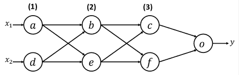

图 6: 三层 FNN

在这里，每个节点代表一个神经元，每个节点 $i$ 和 $j$ 之间的连接被赋予一个权重 $w_{ij}$。3 层 FNN 的复合函数是

|  | $y=f(\mathbf{x};\Gamma)=f_{3}(f_{2}(f_{1}(\mathbf{x})))$ |  | (6) |
| --- | --- | --- | --- |

换句话说，图 6 中的 3 层 FNN 是方程式 (6) 中复合函数的有向无环图等价物。下标 $n$ 的 $f_{n}$ 表示层号。第一层的映射是

|  | $\mathbf{L}_{1}=f_{1}(\mathbf{x})=\gamma_{1}(\mathbf{W}_{1}\mathbf{x}+\mathbf{b}_{1})$ |  | (7) |
| --- | --- | --- | --- |

其中$\gamma_{1}(\circ)$是激活函数，$\mathbf{b}_{1}$是偏置向量，$\mathbf{W}_{1}$表示第一层和第二层神经元之间的权重矩阵。在这里，权重矩阵$\mathbf{W}_{1}$被定义为输入和第二层神经元之间的链接权重

|  | $\mathbf{W}_{1}=\begin{bmatrix}w_{ab}&amp;w_{db}\\ w_{ae}&amp;w_{de}\end{bmatrix}.$ |  | (8) |
| --- | --- | --- | --- |

同样地，第二层映射可以表示为

|  | $\mathbf{L}_{2}=f_{2}(\mathbf{L}_{1})=\gamma_{2}(\mathbf{W}_{2}\mathbf{L}_{1}+\mathbf{b}_{2})$ |  | (9) |
| --- | --- | --- | --- |

最后，输出为

|  | $y=f_{3}(\mathbf{L}_{2})=\gamma_{3}(\mathbf{W}_{3}\mathbf{L}_{2}+\mathbf{b}_{3})$ |  | (10) |
| --- | --- | --- | --- |

第二层和最后一层的权重矩阵分别为

|  | $\mathbf{W}_{2}=\begin{bmatrix}w_{bc}&amp;w_{ec}\\ w_{bf}&amp;w_{ef}\end{bmatrix}\text{ and }\mathbf{W}_{3}=\begin{bmatrix}w_{co}&amp;w_{fo}\end{bmatrix}.$ |  |
| --- | --- | --- |

神经网络参数$\Gamma=\{\mathbf{W}_{1},\mathbf{W}_{2},\mathbf{W}_{3},\mathbf{b}_{1},\mathbf{b}_{2},\mathbf{b}_{3}\}$包括网络各层的权重矩阵和偏置向量。训练算法的目标是学习最优的$\Gamma^{*}$，从给定的$\mathbf{x}$样本中得到目标复合函数$f^{*}$。

#### V-A2 卷积神经网络

卷积网络或卷积神经网络（CNN）是一种专门用于空间映射能力的前馈神经网络。CNN 在其至少一个层中执行卷积操作。CNN 的*特征提取*能力模拟了动物视觉皮层的神经活动[100]。CNN 中的卷积操作模拟了大脑视觉皮层的场景感知特性，它们对感知场景的子区域敏感。因此，CNN 已被广泛应用于计算机视觉问题[101, 39, 102, 103, 104, 105, 106, 107, 108]。卷积是一种有效的特征提取方法，可以减少数据维度，并因此减少网络的参数。因此，与其完全连接的前馈对应物相比，CNN 更高效，更易于训练。

CNN 架构通常涉及卷积、池化和输出层。卷积层将输入张量 $\mathbf{X}\in\mathbb{R}^{W\times H\times D}$（宽度为 $W$、高度为 $H$、深度为 $D$）与核（滤波器）$\mathbf{F}\in\mathbb{R}^{w\times h\times D}$（宽度为 $w$、高度为 $h$、与输入张量具有相同深度）进行卷积，以生成输出特征图 $\mathbf{M}\in\mathbb{R}^{W_{1}\times H_{1}\times D_{1}}$。特征图的维度是输入和核维度、核的数量 $N$、步幅 $S$ 以及零填充量 $P$ 的函数。同样，特征图的维度可以推导为 $W_{1}=\left(W-w+2P\right)/S+1,\;H_{1}=\left(H-h+2P\right)/S+1,\;D_{1}=N$。换句话说，特征图的数量与核的数量相同。核指的是权重和偏置的集合。核以滑动窗口的方式在输入切片上操作，步幅决定了滑动核沿输入切片的步数。因此，输入的每个深度切片都用相同的核处理，换句话说，共享相同的权重和偏置——*参数共享*。图 7 演示了通过核 $\mathbf{f}$ 对输入切片 $\mathbf{x}$ 进行卷积操作的特征图示意图。这里，$b$ 表示与核切片相关的偏置，$\gamma\left(\circ\right)$ 表示非线性激活函数。

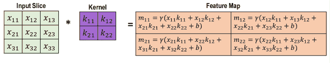

图 7: 输入切片与核的卷积

卷积操作产生的输出被称为*特征图*。特征图的每个元素可以视为一个神经元的输出，该神经元关注输入的一个小区域——*感受野*。卷积交互的神经表征如图 8 所示。

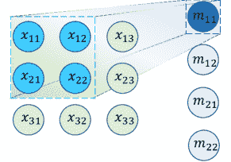

图 8: 卷积的神经表征

显然，每层中的每个神经元在局部连接到相邻层的神经元 - *稀疏连接*。因此，每个神经元不会受到其感受野外的变化影响，同时对空间局部输入模式产生最强的响应。特征图被传播到后续层，直到达到回归或分类任务的输出层。*池化*是 CNN 中的一种典型操作，用于显著减少维度。它对输入的子区域进行操作，根据池化操作的类型（最大池化、均值池化、$L_{2}$-范数、加权平均等）将其映射为单一的汇总统计量。通过这种方式，池化对输入进行下采样。一个典型的池化尺寸是$2\times 2$。较大的池化尺寸可能会导致丢失重要信息。图 9 指纹识别的全面调查：传统方法、深度学习和开放挑战")显示了最大池化和均值池化操作。

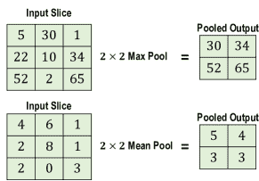

图 9：在步幅为 1 的输入切片上进行最大池化和均值池化

一个尺寸为$W_{p}\times H_{p}$的池化层在对尺寸为$W_{1}\times H_{1}\times D_{1}$的输入体积进行操作时，步幅为$S_{1}$，会产生尺寸为$W_{2}=\left(W_{1}-W_{p}\right)/S_{1},\;H_{2}=\left(H_{1}-H_{p}\right)/S_{1},\;D_{2}=D_{1}$的输出体积。池化对平移具有不变性，即如果池化层的输入稍微移动，池化输出将基本不受影响[109]。

贡献于 CNN 统计效率和训练性的三个基本特征是参数共享、稀疏连接和降维。CNN 在计算机视觉任务中表现出色，如图像分类、目标检测、语义场景分类等。因此，CNN 在无人机影像和导航应用中越来越多地被使用[110]。最著名的 CNN 架构有 LeNet-5 [102]、AlexNet [39]、VGG-16 [103]、ResNet [108]、Inception [101]和 SqueezeNet [104]。

#### V-A3 循环神经网络

循环神经网络（RNN）[111]是一种专门的前馈神经网络，旨在通过利用内部记忆状态和循环连接来捕获序列数据中的时间依赖关系。因此，RNN 非常适合解决序列问题，通过利用数据的时间相关性，使其适合于图像描述、视频处理、语音识别和自然语言处理应用。此外，与 CNN 和传统前馈神经网络不同，RNN 可以处理具有相同模型的可变长度输入序列。

RNN 在不同时间步 $\mathbf{x}^{t}$ 上处理输入序列向量，并将其映射到输出序列向量 $\mathbf{y}^{t}$。一个由 $\mathbf{\Gamma}$ 参数化的 RNN 递归关系可以表示为

|  | $\mathbf{h}^{t}=\mathcal{F}\Big{(}\mathbf{h}^{t-1},\mathbf{x}^{t};\mathbf{\Gamma}\Big{)}$ |  | (11) |
| --- | --- | --- | --- |

其中 $\mathbf{h}^{t}$ 表示时间 $t$ 的隐藏状态向量。递归关系表示一个递归动态系统。通过这个比较，RNN 可以被定义为*由外部信号驱动的递归动态系统，即输入序列 $\mathbf{x}^{t}$*。方程 (11 Fingerprinting: Traditional Approaches, Deep Learning, and Open Challenges")) 可以展开为

|  | $\displaystyle\mathbf{h}^{t}$ | $\displaystyle=\mathcal{F}\Big{(}\mathbf{h}^{t-1},\mathbf{x}^{t};\mathbf{\Gamma}\Big{)}$ |  | (12) |
| --- | --- | --- | --- | --- |
|  |  | $\displaystyle=\mathcal{F}\Big{(}\mathcal{F}\Big{(}\mathbf{h}^{t-2},\mathbf{x}^{t-1};\mathbf{\Gamma}\Big{)},\mathbf{x}^{t};\mathbf{\Gamma}\Big{)}$ |  | (13) |
|  |  | $\displaystyle=\mathcal{F}\Big{(}\mathcal{F}\Big{(}\mathcal{F}\Big{(}\mathbf{h}^{t-3},\mathbf{x}^{t-2};\mathbf{\Gamma}\Big{)},\mathbf{x}^{t-1};\mathbf{\Gamma}\Big{)},\mathbf{x}^{t};\mathbf{\Gamma}\Big{)}$ |  | (14) |

展开的方程展示了 RNN 如何处理整个过去序列 $\mathbf{x}^{t},\mathbf{x}^{t-1},\cdots,\mathbf{x}^{1}$ 来生成当前隐藏状态 $\mathbf{h}^{t}$。另一个从展开表示中值得注意的推论是*参数共享*。与 CNN 不同，CNN 在空间局部性上共享参数，而 RNN 在时间上的不同位置共享参数。因此，RNN 可以处理变长序列，使模型能够很好地学习和推广到不同形式的输入。另一方面，传统的前馈网络不共享参数，每个输入特征都有一个特定的参数，这使得它不能对训练过程中未见过的输入形式进行推广。同时，CNN 在小的空间位置上共享参数，但不能像 RNN 那样对变长输入进行良好的推广。图 10 Fingerprinting: Traditional Approaches, Deep Learning, and Open Challenges") 显示了一个简单的多对多 RNN 架构，它将多个输入序列映射到多个输出序列。

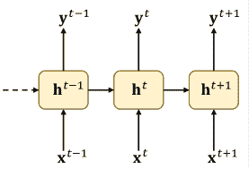

图 10: 多对多 RNN 架构

为了简单表示，假设 RNN 的参数是 $\mathbf{\Gamma}$ 和 $\mathbf{\phi}$，其中输入到隐藏、隐藏到隐藏以及隐藏到输出的权重矩阵分别为 $\mathbf{W}_{ih},\mathbf{W}_{hh}$ 和 $\mathbf{W}_{ho}$。时间 $t$ 的隐藏状态可以表示为

|  | $\displaystyle\mathbf{h}^{t}$ | $\displaystyle=\mathcal{F}\Big{(}\mathbf{h}^{t-1},\mathbf{x}^{t};\mathbf{\Gamma}\Big{)}$ |  | (15) |
| --- | --- | --- | --- | --- |
|  |  | $\displaystyle=\gamma_{h}\Big{(}\mathbf{W}_{hh}\mathbf{h}^{t-1}+\mathbf{W}_{ih}\mathbf{x}^{t}+\mathbf{b}_{h}\Big{)}.$ |  | (16) |

其中 $\gamma_{h}(\circ)$ 是隐藏单元的激活函数，$\mathbf{b}_{h}$ 是偏置向量。时间 $t$ 的输出可以表示为时间 $t$ 的隐藏状态的函数，

|  | $\displaystyle\mathbf{y}^{t}$ | $\displaystyle=\mathcal{G}\Big{(}\mathbf{h}^{t};\mathbf{\phi}\Big{)}$ |  | (17) |
| --- | --- | --- | --- | --- |
|  |  | $\displaystyle=\gamma_{o}\Big{(}\mathbf{W}_{ho}\mathbf{h}^{t}+\mathbf{b}_{o}\Big{)}$ |  | (18) |

其中 $\gamma_{o}(\circ)$ 是输出单元的激活函数，$\mathbf{b}_{o}$ 是偏置向量。RNN 可以采取多对一、一对多和一对一等不同形式，如图 11 所示。

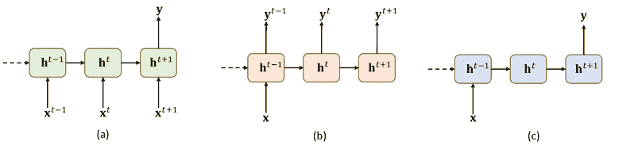

图 11：RNN 架构。(a) 多对一，(b) 一对多，(c) 一对一

这里讨论的 RNN 架构仅捕捉来自过去的隐藏状态。一些应用还需要除了过去状态之外的未来状态。这可以通过双向 RNN 实现 [112]。简单来说，双向 RNN 结合了一个依赖于过去状态的 RNN (*即，* 从 $\mathbf{h}^{1},\mathbf{h}^{2},\mathbf{h}^{3},\cdots,\mathbf{h}^{t}$) 和一个查看未来状态的 RNN (*即，* 从 $\mathbf{h}^{t},\mathbf{h}^{t-1},\mathbf{h}^{t-2},\cdots,\mathbf{h}^{1}$)。在 RF 应用中，RNN 可能用于时间序列数据以进行谱预测、谱使用模式分析、异常检测等。

#### V-A4 生成对抗网络（GANs）

GANs 是一个机器学习框架，由两个对抗的神经网络组成[113]。这两个网络被称为生成网络（生成器 *G*）和鉴别网络（鉴别器 *D*），如图 12 ‣ V-A Overview on Supervised Deep Learning ‣ V Deep Learning for RF fingerprinting ‣ A Comprehensive Survey on Radio Frequency (RF) Fingerprinting: Traditional Approaches, Deep Learning, and Open Challenges") 所示。生成器 *G* 从模型分布中生成样本，并学习欺骗鉴别器 *D*，而鉴别器则学习区分数据集中的样本和生成器生成的样本。生成模型通过将随机噪声输入到前馈神经网络（FNN）来生成样本，鉴别模型也是使用 FNN 构建的，并输出一个标量 $D(x)$，表示样本来自数据集的概率。生成模型 *G* 由 $G(z;\Gamma_{g})$ 表示，其中 $\theta_{g}$ 是 FNN 参数，$z$ 是具有概率分布 $p_{z}(z)$ 的输入噪声变量。鉴别模型 *D* 表示为 $D(x;\theta_{d})$，其中 $\theta_{d}$ 是 FNN 参数，$x$ 是输入数据样本。*D* 的训练目标是最大化对数据集中样本正确标签的分配概率，而 *G* 的训练目标是最小化 $\log(1-D(G(z)))$。这个 *D* 和 *G* 的极小极大游戏的值函数 $V(G,D)$ 为，

|  | $\mathop{\mathrm{min}}_{G}\mathop{\mathrm{max}}_{D}V(D,G)=\mathbb{E}_{x\sim p_{data}(x)}[\log D(x)]\\ +\mathbb{E}_{z\sim p_{data}(z)}[\log(1-D(G(z)))]$ |  | (19) |
| --- | --- | --- | --- |

在每个训练周期中，首先对鉴别器进行固定步数的训练，插入真实和虚假的数据样本，并通过保持生成器固定来上升随机梯度更新鉴别器。一旦鉴别器训练完成，生成器会通过下降随机梯度来更新，同时保持鉴别器固定，并插入带有虚假标签的虚假数据以欺骗鉴别器。

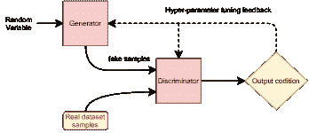

图 12: 简单的生成对抗网络（GANs）结构

### V-B 基于 CNN 的 RF 指纹识别

#### V-B1 ORACLE

作者提出了一个用于射频指纹识别的 CNN 框架，称为 ORACLE（通过卷积神经网络优化的射频分类）[114]。这项工作提供了最广泛的评估之一，展示了对超过 100 台市售 WiFi 设备的分类准确率高达 $99\%$。他们还展示了对 16 位相似 USRP X310 SDR 的类似结果。这项工作的其他关键贡献包括研究导致 IQ 样本变化的发射链中的硬件驱动特征。他们研究了静态和动态通道环境。在动态通道的情况下，他们探讨了使用接收机的信道估计的反馈驱动的发射机侧修改如何提高 CNN 分类器的可区分性。本质上，旨在引入扰动/缺陷到发射机侧以辅助分类，同时最小化对比特错误率的影响。

具体而言，在研究硬件驱动的射频损伤效果的背景下，作者关注于 IQ 失衡和直流偏移。他们使用 MATLAB 通信系统工具箱生成符合 IEEE 802.11a 标准的包。此处的发射机为 USRP X310，接收机为 USRP B210\. 他们还使用了一个外部数据库，该数据库包含了从 140 台设备收集的原始 IQ，这些设备包括 122 家制造商的手机、平板电脑、笔记本电脑和无人机。

对于静态通道的情况，作者使用了以下架构；

+   •

    输入：长度为 $128$ 的原始 IQ。这被格式化为 $2\times 128$ 的二维实值张量。

+   •

    网络：两个卷积层和两个全连接层，每层分别有 256 和 80 个神经元。

+   •

    核心：第一层由 $50$ 个 $1\times 7$ 滤波器组成，第二层由 $50$ 个 $2\times 7$ 滤波器组成。

+   •

    激活函数：每个卷积层后跟 ReLU 激活。

+   •

    输出：最后一层使用 softmax 进行分类。

该架构在使用最多 100 台不同设备时提供了中位分类准确率为 $99\%$，对于 140 台设备，性能稍微下降至 $96\%$。对于使用 16 台 X310 无线电收集的数据集，准确率接近 $98.6\%$。

作者清楚地指出了动态通道带来的挑战，并建议引入受控损伤到发射机作为缓解该问题的解决方案。虽然这在可以对发射链施加这种损伤的设置中可能有效，但在许多商业和战术应用中，这在物理层面上并不是一个选项。进一步可以争论的是，这时并不是在真正利用设备的“独特”射频指纹，而是给设备分配了一个人工标签/ID/指纹。这无疑是一个有趣的研究领域，可能具有其应用和优势，但也会有局限性和缺点。

#### V-B2 非标准发射波形的无人机

作者提出了一种基于多分类器的无人机射频指纹识别方法[115]。这项工作旨在结合在不同训练集部分上训练的多个深度神经网络的输出。作者通过使用配备 UBX 160 子板的 USRP X310 在射频无反射室内收集 7 台相同 DJI M100 无人机的信号来创建数据集。通过将无人机飞行至距离接收器 6、9、12 和 15 英尺处，捕获 IQ 信号。他们收集了四个 2 秒的突发信号，每个突发信号包含约 140 个数据序列（样本），所有无人机在四个不同距离下的数据分别收集。作者使用 1D 修改版的 AlexNet（AlexNet1D）和 ResNet50（ResNet1D）神经网络架构进行分类。AlexNet1D 是一个前馈卷积神经网络（CNN），具有五个块（包括两个分别大小为 7 和 5 的 1D 卷积层，每个卷积层有 128 个滤波器，后接一个最大池化层），叠加在两个全连接层（大小为 256 和 128）之上。

这项工作首次展示了无人机（UAV）空中悬停对基于深度学习（DL）的射频指纹识别精度的影响。当网络使用无人机数据集的所有 4 个突发信号进行训练时，网络在识别无人机方面表现良好。但是，当网络使用前三个突发信号进行训练，并在第四个突发信号上进行测试时，两种网络架构的准确率均为 $50\%$。这种准确率的下降表明了在悬停时通道连续变化和细微无人机运动的影响。为了解决这一问题，作者提出了一种多分类器方案，其中数据集中的突发信号被划分为不重叠的集合，每个集合用于训练相同但独立的 AlexNet1D 神经网络。然后使用两级基于得分的聚合方法将神经网络的输出进行组合。他们还提出了一种算法来确定在多分类器方案中使用的神经网络数量。为了评估所提方法，作者选择使用 12 个神经网络。所提的多分类器技术将使用单一分类器时的分类准确率从 $50\%$ 提高到当网络使用前三个突发信号进行训练，并使用第四个突发信号进行测试时的 $91\%$。

作者们还提出了一种数据增强（DA）方案，用于训练多分类器技术中的单个神经网络。DA 是通过以适当的方式修改原始样本来扩展训练数据集的方法[116], [117]。在这项工作中，DA 是通过根据整个数据集的均值和标准差来对训练批次进行归一化来实现的。归一化后的数据集随后通过 DA 块，其中与一组多抽头复杂 FIR 滤波器进行卷积。使用 DA 将多分类器技术的准确性提高了高达 $95\%$。这项工作还提出了一种检测新无人机（不包含在训练数据集中的无人机）的方法。使用所提出的数据增强方案的多分类器，作者展示了 $99\%$ 的新无人机检测准确率。作者明确指出，使用多分类器方法提高的准确性与单一 ResNet1D 架构相比，并不会增加模型的大小，但测试/训练过程会更长。然而，可以认为，数据捕获在消声室中消除了与实际环境设置中相似的丰富多径传播效应。

#### V-B3 使用双谱的 SEI

在 [118] 中，作者提出了一种基于深度学习的 SEI，使用接收信号的双谱作为特征。通过计算 RF 信号的三阶累积量来估计双谱。此外，使用 [119] 中的投影方法减少双谱的维度（双谱压缩）。然后将压缩后的双谱输入到一个由三个卷积层（$30$ 个大小为 $3\times 3$ 的卷积核）、一个包含 $128$ 个神经元的全连接层以及一个将输出映射到其各自类别的最终 softmax 层组成的 CNN 中。

从五个 USRP 收集信号，包括一个 E310、三个 B210 和一个 N210，作者们展示了所提出的方法在识别这五个 USRP 中具有 $75\%$ 的准确率。他们还从十个发射器中收集信号，这些发射器使用包含多个延迟和非线性函数的记忆多项式模型进行建模[120]。所提出的模型在识别十个建模发射器中的准确率为 $85\%$，在识别五个建模发射器中的准确率为 $87\%$。

#### V-B4 差分星座跟踪图（DCTF）

[121] 的作者建议使用 DCTF 提取 RF 指纹特征，并利用 CNN 通过 DCTF 特征来识别不同的设备。DCTF 是时间序列信号差分关系的二维表示。DCTF 基于的特征提取方法最早在 [122] 中提出，他们使用最小距离分类器，在 SNR$\geq 15$ dB 条件下识别 16 个 CC2530 ZigBee 模块的准确率达到了 $90\%$。在这项工作中，作者的目标是使用 CNN 作为分类器以提高分类准确率。DCTF 图像受到与 RF 指纹特征相关的硬件缺陷的强烈影响。这些图像通过 CNN 进行分类以识别设备。为了评估 DCTF-CNN 的性能，作者使用 USRP 捕获了 54 个 Texas Instruments CC2530 ZigBee 模块的信号。计算每个信号的 DCTF，并使用包含三个卷积层和一个全连接层的网络进行分类。这三个卷积层的尺寸分别为 16、32 和 64，核大小为 $3\times 3$。对每个卷积层的输出应用 $2\times 2$ 最大池化。

DCTF-CNN 方法的性能在不同 DCTF 图像质量和 SNR 下进行了评估。DCTF 图像质量取决于 DCTF 的大小。较小尺寸的 DCTF 图像由于特征模糊表现较差，而较大尺寸的 DCTF 图像性能较好，但缺点是需要更多的样本和更高的复杂度。在这项工作中，为设计的 CNN 实现最佳性能的是使用大小为 65x65 的 DCTF 图像。使用固定的 DCTF 图像大小，作者进一步研究了 SNR 对性能的影响。DCTF-CNN 在 SNR 为 15dB 时达到 $93.8\%$ 的分类准确率，在 SNR 为 30dB 时达到 $99.1\%$ 的分类准确率。

#### V-B5 RF 信号频谱

在 [123] 中，作者提出使用 CNN 从 RF 信号频谱中识别设备。使用的数据集包括来自五个发射机的每个 10,000 个信号，信噪比为 20 dB，这些信号由蒙特卡洛实验生成，包含随机 AWGN 和多径通道。RF 信号通过 STFT 处理，将时域信号转换为时频域，从而生成 RF 信号频谱。RF 信号频谱反映了信号在频域中的特征以及信号频域随时间的变化。然后将 RF 信号频谱输入到 CNN 中进行信号分类。

作者使用了修改版的 VGG-16 模型来分类信号。VGG-16 网络模型包含十三个卷积层，核大小为$3\times 3$，以及两个全连接层，五个最大池化层交织其中，如图 13 所示。最终层的输出送入 softmax 层，以生成发射器类别标签分布。VGG-16 通过在每个卷积层后添加批量归一化（BN）操作，并在前两个全连接层后添加随机丢弃层进行修改。BN 有助于加速模型在训练过程中的收敛，而丢弃层则随机丢弃神经元，从而产生更稀疏的特征图，帮助减少过拟合。该网络使用 Adam 优化器和来自五个发射器的 1000 个信号进行训练，以最小化损失。该方法在识别五个设备方面达到了$99.7\%$的准确率。

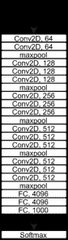

图 13：VGG-16 网络

#### V-B6 大规模实验研究

一项大规模的 RF 指纹研究基于 DARPA 数据集 - 400 GB 的 WiFi 和自动相关监视广播（ADS-B）波形来自 10,000 个设备 - 在[124]中展示。这是首个详细阐述设备数量、突发类型、环境和通道效应对基于 CNN 的 RF 指纹架构影响的大规模研究。作者展示了两种架构：1) 一个受 AlexNet 启发的基准模型，由五个堆叠层和四个全连接层组成。每个堆叠层由两个卷积层（每个具有$1\times 7$和$1\times 5$的 128 个核）和一个最大池化层组成，2) 一个 ResNet-50-1D，这是一个修改后的 ResNet-50 架构，能够处理一维时间序列 IQ 样本。WiFi 数据集包括来自 5117 个设备的发射，每个设备平均有 166 次传输，而 ADS-B 数据集包含 5000 个发射器，平均发射 76 次。作者对 WiFi 数据集进行带通滤波和部分均衡预处理，并采用滑动窗口方法将两个数据集中的信号转换为适合 CNN 的固定形式。

作者通过为 CNN 分类器形成多个学习任务，进行了一项广泛的 RF 指纹研究。为了帮助读者了解这 22 个学习任务，我们简要列出了以下广泛的任务类别：

1.  1.

    任务 1 - 通过将设备数量按四个类别（A 到 D）分组来评估网络性能。

1.  2.

    任务 1M - 类似于任务 1，但在多突发设置下，每个设备可能会发射多个传输以进行联合分类。在这里，仍然有四个子任务（A 到 D）。

1.  3.

    任务 2 - 训练集大小对分类器性能的影响。此任务包含三个子任务（A 至 C）。

1.  4.

    任务 3 - 通过在不同时间框架和环境条件（室内与室外）下收集捕获数据，评估信道的影响。此任务包含四个子任务（A 至 D）。

1.  5.

    任务 4 - 通过四个子任务（A 至 D）评估 SNR 对分类准确度的影响。

1.  6.

    任务 5 - 使用 19 个位相同的发射器。

数据集被分组为不同的子集，以适应上述任务。通过上述任务评估，作者报告说，无论是基线模型还是 ResNet-50-1D 模型，在任务 1 上都表现良好。多次爆发预测，即任务 1M 与任务 5 展示了显著更高的准确性。任务 2 的评估表明，通过增加训练集中的传输次数，模型的准确性有所提高。最后，任务 3 和任务 4 显示预测受环境和信道条件的影响。作者指出，与 WiFi 相比，ADS-B 发射器分类表现为一个更简单的分类问题，因其准确度更高。最后，基线模型即修改后的 AlexNet 在多个学习任务中表现优于 ResNet-50-1D，表明更深的模型并不总是更好。这些结果也在 [125] 中讨论，其中还呈现了在实验室环境下作者收集的自定义数据集的评估。这个自定义数据集是一个 7 TB 的数据集，包含来自 20 个 USRP 无线电的发射数据。我们在 V-F Fingerprinting: Traditional Approaches, Deep Learning, and Open Challenges") 部分详细阐述了这个数据集。

#### V-B7 对 5G 开放 RAN 的信任

Reus-Muns 等人在 [126] 中提出使用增强的三重损失的卷积神经网络（CNN）通过 RF 指纹识别特定发射器。作者旨在通过使用具有三重损失函数的神经网络来应对无线信道的对抗性影响。一个包含发射标准兼容的 WiFi、LTE 和 5G 新无线电（NR）波形的基站信号的数据集被用来评估所提出的网络。数据集的详细描述在章节 V-F6 中。该数据集用于训练两个 CNN 分类器：基准 CNN 和三重网络。基准 CNN 架构由四个卷积层（分别具有 $1\times 7$、$1\times 5$、$2\times 7$ 和 $2\times 5$ 的 40 个滤波器）组成，后跟三个全连接层和一个最终的 softmax 分类器层。三重网络架构类似于基准 CNN，只是使用了三重损失函数。三重损失 [127] 旨在强制类分离到嵌入空间，并在一系列三元组 - 锚点、正样本和负样本上进行训练。三重损失函数旨在训练神经网络以最大化锚点和负标签之间的分离，同时最小化锚点和正类之间的距离。

所提出的基准和三重损失 CNN 在数据集的 WiFi 传输上进行了训练和测试，整体分类准确率分别为 $92.92\%$ 和 $99.98\%$。接下来，作者提出了一个三步算法，该算法返回对基站（BS）的信任定量测量。该方法根据所选类别的 softmax 概率范围分配信任类别。对于 softmax 范围 $\leq 80\%$ 的设备被分配为 *无信任*，范围为 $[80\%,\;99\%]$ 的设备标记为 *部分信任*，对于 $\geq 99\%$ 的设备将归入 *可信* 类别。

#### V-B8 膨胀因果卷积模型

作者提出了一种增强膨胀因果卷积（ADCC）网络，该网络将膨胀因果卷积层堆叠与传统卷积层结合，用于根据其 RF 指纹对无线设备进行分类 [14]。在这项工作中，作者在来自多达 10,000 个设备的 WiFi（IEEE 802.11a 和 802.11g）和 ADS-B 信号的传输上训练和评估了所提出的模型。作者使用了 Radio-Frequency Machine Learning Systems (RFMLS) 研究项目 [128] 提供的数据。该数据集包含来自 53,000 多个 WiFi 设备的 1.03 亿次传输和来自 10,000 多个设备的 350 万次 ADS-B 传输。

扩张卷积是一种卷积类型，其中滤波器应用于比其长度更大的区域，通过跳过具有特定步长的输入值，如图 14 Fingerprinting: Traditional Approaches, Deep Learning, and Open Challenges") [129] 所示。

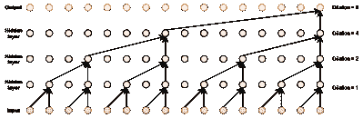

图 14：扩张因果卷积网络

提议的 ADCC 模型由两个主要部分组成：残差块和传统的卷积及池化块。该模型包括八个串联的残差块，每个残差块由一个因果的扩张卷积操作（GDCC）和一个核大小为一的因果卷积层组成。在第一个残差块之前，输入通过一个扩张率为一的 DCC 层。来自八个残差块的跳跃连接被求和并用作传统卷积和池化块的输入，传统块包括三个堆叠的两个卷积层和一个池化层。ADCC 模型处理前 1600 个 IQ 值以生成 2500 个特征。为了从设备的 ID 特定信息中提取额外特征，作者建议从信号的其余部分均匀分布的二十个大小为 200 IQ 值的子序列中提取 2500 个特征。每个子序列分别通过两个包含因果卷积和池化层的块处理。然后，将每个过程的特征图输入到平均池化层中，结果为 2500 个特征。ADCC 块的 2500 个特征和从二十个子序列中提取的 2500 个特征被拼接在一起，并作为密集分类层的输入。

作者通过进行任务 1 到任务 4 的学习任务来评估所提方法，如在章节 V-B6 Fingerprinting: Traditional Approaches, Deep Learning, and Open Challenges") 中所述。注意到任务 1 的性能在设备数量的对数下线性增长。多脉冲精度被显示优于单脉冲精度，暗示了与相干处理相关的性能提升。与 [124] 类似，ADS-B 设备指纹识别的精度高于 WiFi，作者指出这可能是由于 ADS-B 的开放空气传播。任务 2 的实验进一步揭示，当训练样本数量从 501 降到 313 时，精度仅下降了 2%，这表明网络在小训练样本下的效率。作者注意到，在任务 3 的评估中，当训练和验证集的信道不同，性能急剧下降，这表明指纹特征对传播效应的敏感性。任务 4 的评估显示，当训练 SNR 高于验证 SNR 时，精度较低，而当验证 SNR 高于训练 SNR 时，精度较高。

在最近的一项工作 [130] 中，作者采用了多次突发的方法来提高大规模指纹识别的准确性，涉及更大的样本量。具体来说，多次突发处理利用来自同一但未知设备（即共享相同标签）的多个信号突发来降低噪声水平。推断在多个突发上进行，将每个突发推断出的类别概率向量结合起来，以得出最终的类别预测。作者报告了不同信号类型（WiFi 和 ADS-B）下超过 95% 的预测准确率。

总结使用 CNN 进行 RF 指纹识别的讨论，我们在表格 V Fingerprinting: Traditional Approaches, Deep Learning, and Open Challenges") 中列出了回顾的工作，以便于参考。

| 工作 | RFF 特征 | RF 发射器 | 性能 |
| --- | --- | --- | --- |
| *Sankhe 等人*[114] | IQ 不平衡 & DC 偏移 | 140 台设备（手机、平板电脑、笔记本电脑和无人机） | $99\%$ 对于最多 100 台设备，$96\%$ 对于最多 140 台设备 & $98.6\%$ 对于数据集[131] |
|  |  |  |  |
| *Soltani 等人*[115] | 多次数据突发 | 7 台 DJI M100 无人机 | 高达 $99\%$ |
|  |  |  |  |
| *Ding 等人*[118] | 双谱 | 1 E310、3 B210s 和 1 N210 | 高达 $87\%$ |
|  |  |  |  |
| *Peng 等人*[121] | DCTF | 54 个 Texas Instruments CC2530 ZigBee 模块 | 在 15dB SNR 下为 $93.8\%$，在 30dB SNR 下为 $99.1\%$ |
|  |  |  |  |
| *Zong 等人*[123] | RF 信号谱 | 5 个模拟发射器 | $99.7\%$ |
|  |  |  |  |
| *Jian 等人* [124] | 时域 RF 信号 | 5117 WiFi 设备和 5000 ADS-B 设备 | 每次传输的 ADS-B 准确率分别为 $91.9\%,\;76.8\%,\;92.5\%$，设备数量为 100 个。 |
|  |  |  |  |
| *Amani Al-Shawabka 等人*[125] | 时域 RF 信号 | 20 个 National Instruments SDR（12 个 NI N210 和 8 个 NI X310） | 同一天训练和测试 $\geq 87.41\%$ |
|  |  |  |  |
| *Guillem Reus-Muns 等人*[126] | 时域 RF 信号 | POWDER 平台上的 4 个基站[132] | 使用多数投票法在 10 个切片中的准确率为 $99.98\%$ |
| *Josh 等人*[14] | 时域 RF 信号 | 53k WiFi 和 10k ADS-B 设备 | 任务 1D、2C、3E 和 4F 的前五名准确率分别为 $97\%,\;95\%,\;99\%,\;98\%$，设备数量为 100 个。 |

表 V: RF 指纹识别的 CNN 架构

### V-C 生成对抗网络

#### 基于辅助分类器 Wasserstein GAN 的 V-C1 分类

作者在 [133] 中提出了一种基于 RF 的无人机分类系统，该系统基于辅助分类器 Wasserstein 生成对抗网络（AC-WGAN）。在这项工作中，作者使用 Agilent (DSO9404A) 示波器和天线收集四种不同类型无人机（包括 Phantom、Mi、Hubsan 和 Xiro）的无线数据，用于室内环境；以及使用 USRP N210 和 CBX 扩展板用于室外环境。作者展示了该系统在室内环境中识别无人机的准确率为 $95\%$。

在这项工作中，作者改进了 [134] 中提出的辅助分类器生成对抗网络（AC-GAN）的区分网络，以对无线信号进行分类，并改进了 AC-GAN 模型，基于 Wasserstein GAN (WGAN) [135] 模型，使得提出的模型在训练过程中更稳定。由于 RMSProp 在非平稳问题中的表现更好，因此选择它作为损失函数，而不是 Adam [136]。在训练过程中，将样本（训练样本）输入生成器和判别器网络，以通过上升其随机梯度来更新负面批评损失。然后，根据负面批评损失的值由判别器对测试样本进行分类。

作者捕获来自无人机的无线信号，并应用带通滤波器以获取 2.4-2.5 GHz 频段的无线信号，然后检测信号的起始点，并提取幅度包络。为了降低无人机无线信号的维度，作者提出使用改进的主成分分析（PCA）。使用从四个无人机和 WiFi 信号在室内捕获的信号，作者测试了所提出的模型，并显示在 SNR 为 5 dB 时，不同无人机的分类准确率大于$95\%$。他们还展示了使用带有 PCA 的 AC-WGANs 所提出的分类方法比标准的 SVM 和 AC-GAN 模型表现更好，并且也适用于在 10 m 到 400 m 范围内的实时分类。

#### 基于对抗学习的 V-C2 GANs

在[137]中，使用生成对抗网络（GANs）实现了一种用于识别射频发射器的对抗性学习技术。作者还实现了基于 CNN 和 DNN 的分类器，利用接收信号中的 IQ 失衡特征学习设备的唯一指纹特征。该工作使用了来自八个 USRP B210 的 QPSK 调制信号，通过 RTL-SDR 接收，并被视为来自受信任发射器的信号。在一个对手的帮助下，生成器模型生成带有噪声的随机信号，并作为输入传递给鉴别模型。GANs 的鉴别模型从生成器模型和受信任发射器获取输入，并通过向生成器模型反馈来改进随机信号以模仿真实数据，以调整超参数。生成器模型网络由两个全连接层组成，512 个和 1024 个节点，鉴别模型网络由三个全连接层组成，1024 个，512 个和 2 个节点，在第一个和第二个全连接层之间有 dropout 层。GANs 被建模用于识别信号是否来自受信任的发射器。拟议的 GANs 模型以$99.9\%$的准确率识别出了这 8 个受信任的发射器。

为了对信号进行分类以识别发射器，作者设计并实现了一个 CNN 和一个 DNN。如图 15(a) 所示，CNN 包含三个 Conv2D 层，分别为 1024、512 和 256 滤波器，卷积核大小为$2\times 3$，随后是三个全连接层，节点数分别为 512、256 和 8。每个卷积层后应用了一个大小为$2\times 2$的 MaxPooling2D 层，并在每个卷积层和全连接层后应用了 dropout 层。如图 15(b) 所示，DNN 包含三个全连接层，节点数分别为 1024、512 和 8，在前两个全连接层之间有 dropout 层。所提出的 CNN 和 DNN 在对四个设备进行分类时的准确率分别为$89.07\%$和$97.21\%$，对八个 USRP 设备进行分类时的准确率分别为$81.59\%$和$96.6\%$。通过使用所提出的 GANs 模型在分类之前区分可信发射器与假发射器，DNN 的分类准确率提高到了$99.9\%$。

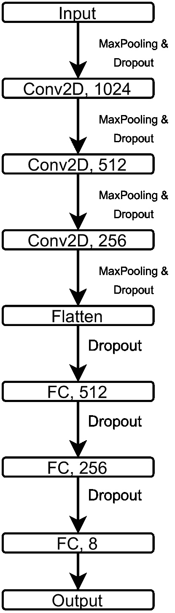

(a) CNN

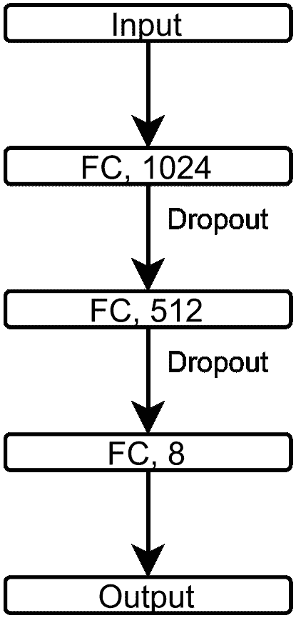

(b) DNN

图 15：提出的 CNN 和 DNN 网络用于信号分类

### V-D 概率神经网络

#### V-D1 能量谱方法

[138]中的作者提出了一种基于瞬态的 RF 指纹识别方法，用于从瞬态信号的部分能量谱中提取无线设备的独特特征。该工作旨在减少与基于谱指纹识别的技术相比的特征提取计算复杂性。所提出的方法使用从八个 IEEE 802.11b WiFi 收发器收集的数据进行评估。

在这项工作中，使用捕获信号的瞬时幅度来检测瞬态。通过使用贝叶斯斜坡变化检测器[139]来估计瞬态的起始点，并使用滑动窗口计算样本的平均瞬时幅度来估计终点。选择下一个稳定状态信号开始前的第一个峰值作为终点。然后，通过离散傅里叶变换（DFT）获得能量谱。通过检查这些瞬态的频域能量谱，作者推断出大部分信息集中在谱的低频分量中。基于这些观察，作者提出可以计算携带特征信息的能量谱系数数目 $(K)$ 如下，

|  | $K=\left[\frac{W}{\Delta f}\right]$ |  | (20) |
| --- | --- | --- | --- |

其中 $[\cdot]$ 表示 $K$ 的整数部分，$W$ 是传输带宽，$\Delta f$ 是由 DFT 给出的频率分辨率

|  | $\Delta f=\frac{1}{T_{d}}=\frac{1}{NT_{s}}=\frac{f_{s}}{N}$ |  | (21) |
| --- | --- | --- | --- |

其中 $N$ 是瞬态持续时间（以样本为单位），$T_{d}$ 是秒为单位的平均瞬态持续时间，$T_{s}$ 是采样周期，而 $f_{s}$ 是采样频率。最后，通过使用概率神经网络（PNN）分类器进行分类。PNN 是一种前馈神经网络，通过 Parzen 窗口估计每个类别的概率密度函数（PDF）[140]。然后，利用给定输入的每个类别的 PDF，通过贝叶斯规则估计具有最高后验概率的类别。

使用从八种不同 IEEE 802.11b WiFi 设备收集的包含每个设备 100 次传输的数据集来评估所提技术的分类性能。计算了训练集中数据的平均瞬态持续时间，对于采样率为 $5$ GSps 的数据，使用方程式 (20 Fingerprinting: Traditional Approaches, Deep Learning, and Open Challenges")) 和 (21 Fingerprinting: Traditional Approaches, Deep Learning, and Open Challenges")) 确定了谱特征长度。所提方法在 $0$ dB 和 $25$ dB 下的分类准确率分别为 $90\%$ 和 $97.91\%$。

#### V-D2 采样率对基于瞬态的指纹识别的影响

作者在[141]中研究了采样率对基于瞬态的 RF 指纹识别方法分类性能的影响。使用了贝叶斯斜坡检测器来检测开机瞬态和幅度特征（瞬时幅度响应），并提取其降维后的 PCA 特征作为输入特征，训练 PNN 分类器以识别设备。作者从八种不同的 IEEE 802.11b WiFi 发射器处以 5 GSps 的采样率收集数据。从每个发射器处捕获了 100 次传输。为了研究采样率的影响，作者使用了降采样过程，将 5 GSps 降采样到 2.5 GSps、1 GSps、500 MSps、200 MSps、100 MSps、50 MSps 和 28 MSps。

通过进行两次实验来评估分类准确率。在第一次实验中，在较高采样率下检测瞬态后进行了下采样。在第二次实验中，在对原始信号进行下采样后进行了瞬态检测。在所有采样率下，幅度和 PCA 特征的平均分类准确率分别为第一次和第二次实验中的 97.7%和 97.5%，这表明采样率对基于瞬态的 WiFi 发射器 RF 指纹识别几乎没有影响。

### V-E 注意力学习

注意力机制最初是在[142]中引入用于射频指纹识别。作者采用了一种跨域注意力架构，从$1024\times 1$原始 IQ 输入样本中提取时空、时间和时频特征。使用了 1D/2D CNN 架构，结合门控递归单元（GRUs）和 STFT 处理，从原始 IQ 样本中提取多个域的特征。此外，模型在执行多任务（发射源和协议识别）方面的能力通过所提架构的 MTL 版本得到了展示。作者在单日训练-测试（TTSD）和混合日训练-测试（TTMD）场景下进行了真实世界的实验评估。这里，作者考虑了像 Raspberry Pis 和联想笔记本电脑（具有组合芯片组的物联网设备，单一芯片组发射蓝牙和 WiFi 波形），在 TTSD 和 TTMD 场景下分别实现了 84.3%和 63.8%的指纹识别准确率（同时完成了 100%的协议识别），以识别 10 个 COTS 芯片组的发射。

最近在蓝牙指纹识别的注意力学习方面的研究报告见于 [143]。在这项研究中，作者关注于 2 MHz 的频率跳变蓝牙频谱，以识别 10 种商用现货蓝牙发射器。提出了一种可扩展的混合 CNN-GRU 架构，能够支持长达 1 毫秒的输入张量长度。作者展示了所提出架构的计算效率，相较于基准模型，报告了$16.9\times$较少的浮点运算（FLOPs）和$7.5\times$较少的可训练参数。处理更长样本长度以识别挑战性的频率跳变蓝牙波形的意义被详细研究，并报告了识别 10 种商用现货发射器的准确率高达 91%。

### V-F 开放 RF 指纹数据集

在应用 AI/ML 领域，RF 领域面临的一个突出问题是缺乏多样化和大规模的数据集，这些数据集可以与 AI/ML 框架（如 Keras [144]、PyTorch [145]、TensorFlow [146] 等）集成并轻松迁移。虽然最近发布了一些数据集以支持无线通信的深度学习 [36、147、148、149]，用于调制和协议分类，但由于缺乏动力和与计算机视觉和自然语言处理（NLP）领域相对的统一标准来组织数据集，这些数据集尚未与这些框架集成。此外，另一个导致数据集无法获取的因素是该领域从业人员对现有数据集的了解有限。为此，我们在此提供每个开放的 RF 指纹数据集的简要摘录，以便教育读者。

#### V-F1 来自 86 部智能手机的大规模蓝牙数据集

在 [150] 中，作者展示了一个详细的数据库，包括从不同品牌和型号的商用智能手机中捕获的蓝牙 RF 记录，这些记录在不同的采样率下捕获。数据集包含了在几个月内捕获的记录，因为由于硬件损坏引起的独特指纹在短时间内（天、周或月）变化不大。智能手机与连接到高采样率示波器（Tektronix TDS7404）及低分辨率 8 位 ADC 的接收天线保持固定距离 30 cm。由于蓝牙在 ISM2400 频段操作，使用了在此频段工作的商用天线。示波器的边缘检测模式被用来将 10$\mu$s 时长的样本记录为文本格式 (.txt)。记录的样本是实值时间序列（电压/时间）。整个数据库被拆分成子数据集，包含以 5 GSps、10 GSps、20 GSps 和 250 MSps 采样的蓝牙信号。对应每个数据集，从每个设备记录了 150 个蓝牙信号，共从 86 部智能手机中获取了 12,900 个捕获样本。作者还指出，通过带通滤波去除了示波器引入的杂散信号。此外，过滤后的样本被归一化，使样本范围在 -1 到 +1 之间。

#### V-F2 数据集包含来自 17 个无人机遥控器的 RF 信号

[151] 的作者发布了一个 RF 信号数据集，以便研究人员基于从遥控器捕获的信号开发无人机识别技术。无人机与遥控器之间的通信可以使 AI/ML 框架有效地识别无人机的指纹。这些捕获是通过将无人机置于空闲状态下记录的，以便只捕获遥控器的数据。接收机前端由一个带宽为 6 GHz 的 Keysight MSOS604A 示波器、一个 2.4 GHz 24 dBi 网格抛物面天线以及一个工作频率为 2 GHz 到 2.6 GHz 的低噪声放大器组成。无人机遥控器与接收天线之间的距离从 1 米到 5 米不等。RF 信号以 `20 GSps` 的采样率被记录为数字化电压与时间样本，每个信号包含 500 万个样本。波形包含来自八个不同制造商的 17 个无人机遥控器的发射。该数据库以 MATLAB (.mat) 格式进行容器化。

表 VI: 开放 RF 指纹数据集汇总表

| 数据集 | 波形 | 发射器数量 | 发射器类型 | 接收器 | 数据集格式 | 生成/真实世界 | 频率 |
| --- | --- | --- | --- | --- | --- | --- | --- |
| [150] | 蓝牙 | 86 | 智能手机 | Tektronix TDS7404 | .txt | 真实世界 | 2.4 GHz |
| [151] | 非标准 | 17 | 无人机遥控器 | Keysight MSOS604A | .mat | 真实世界 | 2.4 GHz |
| [152] | ADS-B | 100 | 商用飞机 | BladeRF | .mat | 真实世界 | 1090 MHz |
| [153] | ADS-B | $>140$ | 商业飞机 | USRP B210 | .mat | 真实世界 | 1090 MHz |
| [131] | IEEE 802.11a | 16 | USRP X310 | USRP B210 | SigMF | 生成的 | 2.45 GHz |
| [154] | 非标准 | 7 | DJI M100 | USRP X310 | SigMF | 生成的 | 2.4065 GHz |
| [155] | IEEE 802.11a, LTE, 5G-NR | 4 | USRP X310 | USRP B210 | SigMF | 生成的 | 2.685 GHz |
| [156] | IEEE 802.11a/g | 20 | USRP X310 USRP N210 | USRP N210 | SigMF | 生成的 | 2.432 GHz |

#### V-F3 来自 140 多架商业飞机的真实世界 ADS-B 信号数据集

作者提供了一个真实世界的数据集，包含来自 140 多架商业飞机到空中交通控制（ATC）中心的 ADS-B 信号发射数据，数据集由[153、157]的作者提供。商业飞机使用 ADS-B 标准将其地理坐标及唯一的国际民航组织（ICAO）标识符广播给 ATC 中心。这些 ADS-B 信号使用调谐到 1090 MHz 的 USRP B210 接收器以 8 MSps 采样率在 24 小时内从代托纳比奇国际机场捕获。作者解码了 ADS-B 消息以提取飞机身份代码，并利用 140 多架最常见飞机的消息构建数据集。作者还拥有另一个数据集，来自 100 架飞机的 ADS-B 波形，见[152]，由 BladeRF SDR 接收。两个数据集都以 MATLAB（.mat）格式容器化。

#### V-F4 ORACLE RF 指纹数据集，来自 16 个发射器的 IEEE802.11a

[131]的作者提供了一个 WiFi IEEE 802.11a 发射器数据集，用于使用 ORACLE RF 指纹方法检测独特的无线电。数据集包含两个部分：数据集#1 和数据集#2。数据集#1 包含来自 16 个 USRP X310 SDR 的 IEEE 802.11a 标准无线局域网（WLAN）帧 IQ 样本，这些样本使用 USRP B210 无线电以 5 MSps 的速率在 2.45 GHz 的中心频率下收集。对于每个发射器，IQ 样本在 2 ft 到 62 ft 的不同发射器-接收器距离下以 6 ft 为步长捕获。数据集#2 包含解调后的 IQ 符号，并引入故意的失真，以使合成的硬件失真主导信道效应。因此，作者使用 GNU Radio 函数*set_iq_balance*引入故意的 IQ 不平衡（对应 16 个发射器的 16 种 IQ 不平衡配置）到 RF 子板的发射链中。记录的是在对 USRP X310 的电缆传输进行均衡后的解调 IQ 符号，使用 USRP B210 无线电收集。两个数据集都按照 SigMF 规范进行格式化，其中每个二进制格式的数据文件都附带一个 JSON 元数据文件。

#### V-F5 来自 7 个悬停无人机的非标准波形

在 [154] 中，作者创建了一个用于悬停无人机的 RF 指纹识别数据集。该数据集包含从 7 台相同的 DJI M100 无人机在 RF 无回声室中收集的信号。信号使用配有 UBX 160 USRP 子板的 USRP X310 捕获。接收器调谐至 2.4065 GHz 中心频率的 10 MHz 下行通道。信号通过将无人机分别在距离接收器 6、9、12 和 15 英尺的距离飞行来捕获。每次捕获包括 4 个周期的 IQ 样本记录（约 2 秒）和约 10 秒的暂停，结果是每个爆发中有 4 个不重叠的爆发，每个爆发中有约 140 个交错的短数据和噪声周期。因此，数据集提供了超过 13k 个示例，每个示例约有 92k IQ 样本。数据集采用 SigMF 格式，每次捕获的数据以二进制格式存储，并附有包含捕获元数据的 JSON 文件。

#### V-F6 在 POWDER 平台上使用 4 个发射器进行 RF 指纹识别

[155] 的作者提供了一个数据集，包含来自 4 个不同发射器的波形，这些波形属于 3 种无线标准，用以演示和评估在大规模的无线实验平台 POWDER 上对基站进行 RF 指纹识别的可行性 [132]。使用固定的终端（Humanties）USRP B210 接收器，从 POWDER 平台中的四个发射器：MEB、Browning、Beavioral 和 Honors 收集 IQ 样本。这些发射器是比特相似的 USRP X310 无线电，分别使用 MATLAB 中的 WLAN、LTE 和 5G 工具箱生成标准兼容的 IEEE 802.11a、长期演进（LTE）或 5G 新无线（5G-NR）帧。USRP B210 接收器被调谐以记录 2.685 GHz（第 7 频段），对于 WiFi 的采样率为 5 MSps，对于 LTE 和 5G 的采样率为 7.69 MSps。在两天独立的日子里，从每条链路录制了五组 2 秒的 IQ 样本。因此，数据集被组织成 Day-1 和 Day-2 两个集合。数据集遵循 SigMF 规范。

#### V-F7 曝露指纹数据集

Al-Shawabka 等人创建并共享了一个数据集[156]，用于实验和评估无线电指纹算法。WiFi 标准 IEEE 802.11a/g 信号从 20 个国家仪器的 SDR（12 个 NI N210 和 8 个 NI X310）中收集，这些 SDR 运行 GNU Radio。创建了四个数据集，涵盖三种不同的信道条件和两种不同的环境。数据集“Setup 1”由 20 个发射 SDR 捕获的信号组成，每个发射器使用专用的 Ettus VERT2450 天线，并且与接收器的距离不同。数据集的收集过程在十天内重复进行。数据集“Setup 2”以类似于“Setup 1”的方式捕获，但所有 SDR 使用相同的 Ettus VERT2450 天线，使所有 20 个设备与接收器等距。这导致所有传输经历相似的信道和多径条件。数据集的收集过程在两天内重复进行。数据集“Setup 3”通过使用单根同轴 RF SMA 电缆和一个 5 dB 衰减器来捕获 20 个发射器的 WiFi 信号。因此，所有信号经历相同的信道条件，消除了任何多径条件。数据集的收集过程在两天内重复进行。数据集“Setup 1”、“Setup 2”和“Setup 3”是在“自然环境”中收集的。数据集“Setup 4”以类似于“Setup 2”的方式收集，但在一个无回声室中，每个发射器连接到相同的天线。所有“Setup 4”IQ 样本都在一天内收集。收集了以下三种 IQ 样本：FFT 之前的原始 IQ、FFT 之后的原始 IQ 和所有数据集的均衡 IQ。每个 IQ 样本文件使用 SigMF 标记，并附有包含每次传输设置元数据的 JSON 文件。

表 VI Fingerprinting: Traditional Approaches, Deep Learning, and Open Challenges") 提供了开放获取的 RF 指纹数据集的表格总结，以便读者对比其不同特征。虽然数据集 [131, 155, 154, 156] 是合成生成的，但它们遵循 SigMF 规范，允许与 AI/ML 框架的轻松集成，而与之对比的是其他讨论的现实世界数据集，这些数据集需要特定的导入脚本，如 MATLAB 或 csv 读取器。

## VI 研究挑战与未来方向

到目前为止，我们已经看到各种无线设备指纹识别方法以及它在无线安全中的作用。为了完整地呈现这一主题，在本节中，我们通过识别一些关键的开放研究问题和机会来激发未来在这一方向上的研究，以开发一个可靠的射频指纹识别系统（RFFS）。这些挑战在图 16 指纹识别：传统方法、深度学习与开放挑战")中以物联网网络环境中的形式展示，以帮助读者了解潜在的研究方向。

*接收器硬件的影响：* 与发射器硬件引入独特失真类似，捕捉和处理这些信号用于指纹识别的接收器硬件也会影响指纹识别方法。具体来说，接收器硬件引入的相位噪声、时钟偏移、滤波器失真、IQ 不平衡等，可能会在指纹中刻画出独特的特征，使发射器指纹看起来像来自于一个恶意或未识别的发射源。ADC 采样率以及低通滤波器（LPF）的带宽在保留功率谱密度（PSD）边带中的指纹特征中起着同样重要的作用。较高的采样率显示出可以保留指纹特征，但代价是增加了噪声，使用实际的 MicaZ 传感器[158]。此外，发射器和接收器端的天线极化和方向的影响会导致辐射模式的波动，从而影响指纹提取性能。发射器天线硬件的不完美也可能对指纹特征集产生贡献，从而实现无线发射器识别[69]。我们在这里认为，接收器天线的数量、类型、方向和极化会影响指纹系统的分类性能。

在监督学习环境中解决这一问题的一种方法是将来自多个接收器硬件的捕获数据纳入数据集中。这种较大的训练数据分布将允许模型泛化并区分发射器指纹与记录的波形。指纹算法的独立性可以通过在特定接收器硬件上训练样本，并通过在另一个接收器硬件上测试样本来评估学到的发射器特征。

*RFFS 的脆弱性*：无线发射器的广播特性使其暴露且易受身份伪造攻击。少数此类攻击包括 DoS 攻击、冒充、带宽盗窃等。通常忽视的是，被动接收者威胁可以通过从特定发射器收集排放数据来构建认知 RFFS。开发或扰动发射器指纹，使得被动监听者无法提取，而只有合法接收者可以提取或识别签名，是另一个有趣的研究问题，以增强无线安全性。通常假设 RF 指纹识别对冒充攻击具有鲁棒性，因为由于重放攻击会引入重放设备的硬件缺陷，重现前端损伤是困难的。这个领域尚处于初步阶段，目前的研究有限。文献中显示，与调制基础的 RF 指纹识别相比，瞬态基础的 RF 指纹识别对冒充攻击更具韧性[159]。另有研究[160]分析了几种低端接收器（使用便宜的模拟组件）对调制基础 RF 指纹识别在冒充攻击中的韧性的影响。他们的评估揭示了特定发射器的 RF 指纹在不同接收器间的变化。接收器的硬件缺陷，如上所述，会影响指纹特征集。进一步地，他们利用这一点来阻挠冒充攻击，并指出冒充者将无法提取接收器硬件贡献的指纹特征，从而使 RFFS 更加稳健。另一种可能破坏 RFFS 的威胁是干扰 DoS 攻击，其中入侵者可以在工作频率上持续传输。这一领域需要更多分析来评估 RFFS 对这种 DoS 攻击的韧性。

从另一面来看，干扰也可以作为一种防御策略，用于掩盖发射器的 RF 指纹以用于隐蔽和机密操作。RF 指纹混淆——使得指纹只能被合法接收者提取，而对其他人保持不可检测——在[161]中对 WiFi 信号进行了实验研究。作者通过引入随机相位误差来实现这一点，使得只有拥有预共享密钥和随机化索引的合法接收者才能解码消息和指纹。

*现实操作环境中的鲁棒性* 目前的指纹识别文献（撰写本文时）仅研究了在只有一个发射器激活时识别发射器特征的问题。更具挑战性的问题是当多个发射器同时激活时，这在现实世界中非常典型。这样的场景要求指纹识别算法能够从接收到的信号杂波中分别区分和提取每个发射器的特征。研究这样的场景的另一个挑战是需要一个包含多个活跃发射器的数据集。每个发射器的传输都会从发射天线到接收硬件的无线电前端形成自己的传播路径。多径传播效应和发射器相对于接收器的位置会产生一个独特的特征，这个特征会随着位置和无线信道效应而变化。由于固有的随机性，这些动态衰落和位置效应可能掩盖*纯净*的发射器特征，从而导致误报和误分类。

在[158]中，作者展示了小尺度和大尺度衰落对功率谱密度（PSD）的影响。展示了当传感器远离接收器时，功率谱密度的侧瓣（携带最多身份信息的部分）由于多径通道效应而显著失真，而当传感器接近接收器时，失真情况较轻。接收器中的均衡处理应对多径效应而不损害指纹特征，仍然是一个未解决的研究问题。

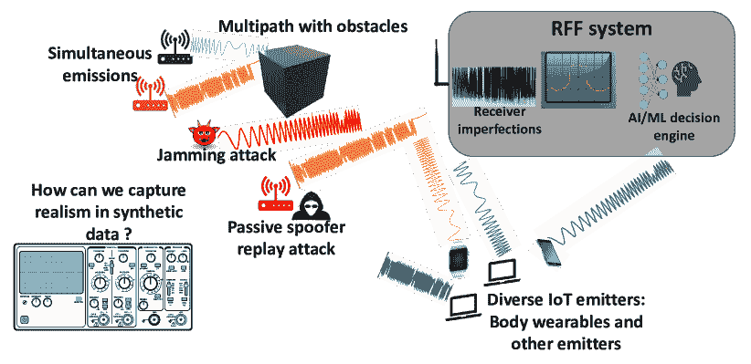

图 16：无线物联网指纹识别挑战

*仿真-现实差距*：另一个同样重要的点是生成或合成数据的真实性。深度学习模型在经过合成数据训练后对实际无线电发射的泛化是很难实现的。这种能力差距源于在生成合成数据集时对发射机硬件缺陷和衰落信道的假设与实际硬件和环境效应的对比。

一个导致生成合成数据的重大问题是缺乏或有限访问来自实际物联网传感器和无线电的数据。在更受欢迎的机器学习领域，如自然语言处理（NLP）和计算机视觉（CV），有大量的大规模数据集，如 MNIST [162]、斯坦福情感 [163]、IMDb [164]、Sentiment140 [165] 等，可供使用。如第 V-F Fingerprinting: Traditional Approaches, Deep Learning, and Open Challenges") 节中所述，已经有若干近期的努力来缓解这一挑战。此外，数据集结构和组织缺乏统一标准，这阻碍了现有数据集在不同机器学习框架中的采用。我们在此声明，用更大范围的数据训练神经网络是实现泛化性能的关键。泛化是部署就绪的指纹识别解决方案的第一步。

## VII 结论

本文对过去二十年的射频指纹识别方法进行了系统综述，首先将其广泛分类为传统方法和基于深度学习的方法，然后对每种方法进行了分类讨论。我们首先通过介绍和总结 SIGINT 的三大支柱——调制识别、协议分类和发射机识别，为读者提供了背景信息。我们对射频指纹识别的各种应用进行了宝贵且简明的讨论，以突出研究主题的实际应用案例。为了阐明和简化传统和基于深度学习的指纹识别方法的大量文献，我们提供了每种方法的分类和清晰布局。我们还提供了相关工作表的表格比较研究，以便以简明的方式进行总结。为了为读者提供深入了解这一主题的基本工具包，我们以教程的方式回顾了最相关的深度学习方法，然后才进入基于深度学习的指纹识别技术。由于对开放数据集的知识和访问是实践所述方法的关键，我们对最相关的射频指纹识别数据集进行了详细讨论。最后，为了刺激未来在这一领域的研究，我们以示意图的方式呈现了潜在的研究途径。

## 参考文献

+   [1] Q. Xu, R. Zheng, W. Saad, 和 Z. Han, “无线网络中的设备指纹识别：挑战与机遇，” *IEEE 通信调查与教程*，第 18 卷，第 1 期，第 94–104 页，2016 年。

+   [2] A. Jagannath, J. Jagannath, 和 T. Melodia, “为 6G 重新定义无线通信：信号处理遇见深度学习与深度展开，” *IEEE 人工智能交易*，2021 年。

+   [3] M. Wang, T. Zhu, T. Zhang, J. Zhang, S. Yu, 和 W. Zhou，“6G 网络中的安全与隐私：新领域与新挑战，” *数字通信与网络*，第 6 卷，第 3 期，第 281–291 页，2020 年。[在线]. 可用： [`www.sciencedirect.com/science/article/pii/S2352864820302431`](https://www.sciencedirect.com/science/article/pii/S2352864820302431)

+   [4] Y. Xu, D. Li, Z. Wang, G. Liu, 和 H. Lv，“基于卷积神经网络的深度学习方法用于无线信号的自动调制分类，” 见于 *机器学习与智能通信*，X. Gu, G. Liu, 和 B. Li 编，Cham: Springer 国际出版社，2018 年，第 373–381 页。

+   [5] A. P. Hermawan, R. R. Ginanjar, D. Kim, 和 J. Lee，“基于 CNN 的自动调制分类用于超越 5G 通信，” *IEEE 通信快报*，第 24 卷，第 5 期，第 1038–1041 页，2020 年。

+   [6] J. J. Popoola 和 R. v. Olst，“训练算法对人工神经网络开发的自动调制分类性能的影响，” 见于 *IEEE AFRICON 会议论文集*，毛里求斯 Pointe-Aux-Piments，2013 年 9 月。

+   [7] A. Selim, F. Paisana, J. A. Arokkiam, Y. Zhang, L. Doyle, 和 L. A. DaSilva， “利用深度卷积神经网络进行雷达波段的频谱监测，” 见于 *GLOBECOM 2017 - 2017 IEEE 全球通信大会*，2017 年，第 1–6 页。

+   [8] J. Jagannath, N. Polosky, A. Jagannath, F. Restuccia, 和 T. Melodia，“信号智能的神经网络：理论与实践，” 见于 *未来无线通信的机器学习*，系列：Wiley - IEEE 系列，F. Luo 编。John Wiley & Sons, Limited，2019 年。[在线]. 可用： [`books.google.com/books?id=3EI2vAEACAAJ`](https://books.google.com/books?id=3EI2vAEACAAJ)

+   [9] M. Schmidt, D. Block, 和 U. Meier，“使用卷积神经网络进行无线干扰识别，” 见于 *IEEE 国际工业信息学会议（INDIN）论文集*，2017 年，第 180–185 页。

+   [10] N. Bitar, S. Muhammad, 和 H. H. Refai，“使用深度卷积神经网络进行无线技术识别，” 见于 *国际个人、室内和移动无线电通信研讨会（PIMRC）*，2017 年，第 1–6 页。

+   [11] T. J. O’Shea, J. Corgan, 和 T. C. Clancy，“卷积无线电调制识别网络，” *ArXiv*，第 abs/1602.04105 卷，2016 年。

+   [12] J. Jagannath, N. Polosky, A. Jagannath, F. Restuccia, 和 T. Melodia，“物联网无线通信的机器学习：一项综合性调查，” *Ad Hoc 网络（Elsevier）*，第 93 卷，第 101913 页，2019 年。

+   [13] A. Jagannath 和 J. Jagannath，“用于自动调制和无线信号分类的多任务学习方法，” 见于 *IEEE 国际通信会议（ICC）*，加拿大蒙特利尔，2021 年 6 月。

+   [14] J. Robinson, S. Kuzdeba, J. Stankowicz, 和 J. M. Carmack，“用于 RF 指纹识别的扩张因果卷积模型，” 见于 *第 10 届年度计算与通信研讨会及会议（CCWC）论文集*，2020 年，第 0157–0162 页。

+   [15] G. Baldini 和 G. Steri，“利用内置组件的物理指纹识别移动电话的技术调查，” *IEEE Communications Surveys Tutorials*，第 19 卷，第 3 期，页码 1761–1789，2017 年。

+   [16] X. Guo, Z. Zhang 和 J. Chang，“基于射频指纹的移动设备认证方法调查，” 收录于 *IEEE INFOCOM 2019 - IEEE Conference on Computer Communications Workshops (INFOCOM WKSHPS)*，2019 年，页码 1–6。

+   [17] W. Wang, I. Aguilar Sanchez, G. Caparra, A. McKeown, T. Whitworth 和 E. S. Lohan，“通过射频指纹的伪造者检测技术调查，重点关注 GNSS 预相关采样数据，” *Sensors*，第 21 卷，第 9 期，2021 年。 [在线]. 可用：[`www.mdpi.com/1424-8220/21/9/3012`](https://www.mdpi.com/1424-8220/21/9/3012)

+   [18] Q. Xu, R. Zheng, W. Saad 和 Z. Han，“无线网络中的设备指纹：挑战与机遇，” *IEEE Communications Surveys Tutorials*，第 18 卷，第 1 期，页码 94–104，2016 年。

+   [19] F. Hameed, O. Dobre 和 D. Popescu，“基于似然的方法进行调制分类，” *IEEE Transactions on Wireless Communications*，第 8 卷，第 12 期，页码 5884–5892，2009 年 12 月。

+   [20] J. Zheng 和 Y. Lv，“在 OFDM 中基于似然的自动调制分类与索引调制，” *IEEE Transactions on Vehicular Technology*，第 67 卷，第 9 期，页码 8192–8204，2018 年。

+   [21] T. Wimalajeewa, J. Jagannath, P. K. Varshney, A. Drozd 和 W. Su，“基于混合最大似然方法的分布式异步调制分类，” 收录于 *Proc. of IEEE Military Communications Conference (MILCOM)*，坦帕，FL，2015 年 10 月。

+   [22] Y. Zhang, N. Ansari 和 W. Su，“基于无线传感器网络的最优决策融合自动调制分类在多径衰落信道中的应用，” 收录于 *Proc. of IEEE Global Telecommunications Conference (GLOBECOM)*，休斯顿，TX，2011 年 12 月。

+   [23] B. Dulek, O. Ozdemir, P. K. Varshney 和 W. Su，“在非相同平坦块衰落高斯信道上分布式最大似然线性调制分类，” *IEEE Transactions on Wireless Communications*，第 14 卷，第 2 期，页码 724–737，2015 年 2 月。

+   [24] O. Ozdemir, T. Wimalajeewa, B. Dulek, P. K. Varshney 和 W. Su，“通过广义 EM 算法的多传感器异步线性调制分类，” *IEEE Transactions on Wireless Communications*，第 14 卷，第 11 期，页码 6389–6400，2015 年 11 月。

+   [25] A. Hazza, M. Shoaib, S. AlShebeili 和 A. Fahd，“在 HF 噪声存在下的数字调制自动分类。” *EURASIP Journal on Adv. in Signal Processing*，第 2012 卷，第 238 页，2012 年。

+   [26] D. C. Chang 和 P. K. Shih，“基于累积量的调制分类技术在多径衰落信道中的应用，” *IET Communications*，第 9 卷，第 6 期，页码 828–835，2015 年。

+   [27] S. Majhi, R. Gupta, W. Xiang, 和 S. Glisic，“基于特征的盲调制分类的分层假设，用于线性调制信号”，*IEEE 车载技术汇刊*，第 66 卷，第 12 期，11 057–11 069 页，2017 年。

+   [28] L. Han, F. Gao, Z. Li, 和 O. Dobre，“基于阶次统计的低复杂度自动调制分类”，*IEEE 无线通信汇刊*，第 PP 卷，第 99 期，1–1 页，2016 年。

+   [29] J. Jagannath, D. O’Connor, N. Polosky, B. Sheaffer, L. N. Theagarajan, S. Foulke, P. K. Varshney, 和 S. P. Reichhart，“基于软件定义无线电的分层混合自动调制分类器的设计与评估”，发表于*IEEE 年会计算与通信研讨会及会议（CCWC）论文集*，美国拉斯维加斯，2017 年 1 月。

+   [30] S. Foulke, J. Jagannath, A. Drozd, T. Wimalajeewa, P. Varshney, 和 W. Su，“多传感器调制分类（MMC）：实现考虑 – USRP 案例研究”，发表于*IEEE 军事通信会议（MILCOM）论文集*，美国马里兰州巴尔的摩，2014 年 10 月。

+   [31] H.-Y. Liu 和 J.-C. Sun，“一种使用小波支持向量机的调制类型识别方法”，发表于*IEEE 国际图像与信号处理大会（CISP）论文集*，中国天津，2009 年 10 月。

+   [32] J. J. Popoola 和 R. v. Olst，“一种新颖的调制感知方法”，*IEEE 车载技术杂志*，第 6 卷，第 3 期，60–69 页，2011 年 9 月。

+   [33] M. M. Roganovic, A. M. Neskovic, 和 N. J. Neskovic，“在软件定义无线电中应用人工神经网络进行数字调制分类”，发表于*IEEE EUROCON 会议论文集*，俄罗斯圣彼得堡，2009 年 5 月。

+   [34] S. Peng, H. Jiang, H. Wang, H. Alwageed, Y. Zhou, M. M. Sebdani, 和 Y. Yao，“基于信号星座图和深度学习的调制分类”，*IEEE 神经网络与学习系统汇刊*，第 30 卷，第 3 期，718–727 页，2019 年。

+   [35] R. Li, L. Li, S. Yang, 和 S. Li，“基于深度卷积神经网络的鲁棒自动 VHF 调制识别”，*IEEE 通信快报*，第 22 卷，第 5 期，946–949 页，2018 年。

+   [36] T. J. O’Shea, T. Roy, 和 T. C. Clancy，“基于深度学习的无线电信号分类”，*IEEE 选择主题信号处理期刊*，第 12 卷，第 1 期，168–179 页，2018 年。

+   [37] A. Jagannath, J. Jagannath, Y. Wang, 和 T. Melodia，“深度神经网络变得更轻：基于深度压缩技术的自动 RF 调制识别的案例研究，面向超 5G 网络”，发表于*Big Data IV: Learning, Analytics, and Applications*，第 12097 卷。 SPIE，2022 年，第 58–69 页。

+   [38] C. Szegedy, Wei Liu, Yangqing Jia, P. Sermanet, S. Reed, D. Anguelov, D. Erhan, V. Vanhoucke, 和 A. Rabinovich，“更深入地进行卷积”，发表于*IEEE 计算机视觉与模式识别会议（CVPR）论文集*，2015 年，第 1–9 页。

+   [39] A. Krizhevsky, I. Sutskever, 和 G. E. Hinton，“基于深度卷积神经网络的 Imagenet 分类，” 收录于 *第 25 届国际神经信息处理系统大会论文集 - 第 1 卷*，系列 NIPS 12，Red Hook, NY, USA，2012 年，第 1097–1105 页。

+   [40] J. Jagannath, N. Polosky, D. O. Connor, L. Theagarajan, B. Sheaffer, S. Foulke, 和 P. Varshney，“基于人工神经网络的自动调制分类器用于软件定义无线电，” 收录于 *IEEE 国际通信会议（ICC）*，美国堪萨斯城，2018 年 5 月。

+   [41] C. Wang, J. Wang, 和 X. Zhang，“基于时频分析和卷积神经网络的自动雷达波形识别，” 收录于 *IEEE 国际声学、语音和信号处理会议（ICASSP）*，2017 年，第 2437–2441 页。

+   [42] Z. Shi, M. Huang, C. Zhao, L. Huang, X. Du, 和 Y. Zhao，“基于哈希指纹的 SVDD 检测 LSSUAV，” 收录于 *2017 IEEE 国际通信会议（ICC）*，2017 年，第 1–5 页。

+   [43] M. Zuo, S. Xie, X. Zhang, 和 M. Yang，“在 WiFi 干扰存在下使用 RF 指纹识别无人机视频信号，” *IEEE Access*，第 9 卷，第 88 844–88 851 页，2021 年。

+   [44] M. Kulin, T. Kazaz, I. Moerman, 和 E. De Poorter，“从频谱数据中进行端到端学习：一种用于频谱监测应用的无线信号识别深度学习方法，” *IEEE Access*，第 6 卷，第 18 484–18 501 页，2018 年。

+   [45] A. Jagannath 和 J. Jagannath，“用于自动调制和无线信号分类的多任务学习方法，” 收录于 *IEEE 国际通信会议（ICC）*，加拿大蒙特利尔，2021 年 6 月。

+   [46] ——，“用于 5G 及未来网络的调制和无线信号分类的多任务学习方法：通过模型压缩的边缘部署，” *Physical Communications (Elsevier)*，第 54 卷，第 101793 页，2022 年。

+   [47] P. E. Manning，“设备指纹识别与认证：在多因素访问控制方案中的双重用途，” 博士学位论文，爱荷华州立大学，2016 年。

+   [48] I. Corporation. 识别与认证。[在线]。可用：[`www.ibm.com/docs/en/ibm-mq/7.5?topic=mechanisms-identification-authentication`](https://www.ibm.com/docs/en/ibm-mq/7.5?topic=mechanisms-identification-authentication)

+   [49] J. Bassey, X. Li, 和 L. Qian，“基于 RF 指纹的设备认证码使用深度学习，” *arXiv 预印本 arXiv:2004.08742*，2020 年。

+   [50] “用于矫正设施中的违禁无线设备识别、检测和追踪的 RF 指纹技术。” [`nij.ojp.gov/funding/awards/2018-75-cx-k002`](https://nij.ojp.gov/funding/awards/2018-75-cx-k002)。

+   [51] L. Mucchi, S. Jayousi, S. Caputo, E. Paoletti, P. Zoppi, S. Geli, 和 P. Dioniso，“6G 技术如何改变未来无线医疗，” 收录于 *第 2 届 6G 无线峰会（6G SUMMIT）*，2020 年，第 1–6 页。

+   [52] P. Porambage, G. Gür, D. P. M. Osorio, M. Liyanage, A. Gurtov, 和 M. Ylianttila, “通往 6g 安全与隐私的路线图，” *IEEE 开放通信学会期刊*，第 2 卷，第 1094–1122 页，2021 年。

+   [53] M. Kishk, A. Bader, 和 M.-S. Alouini, “在 6g 蜂窝网络中使用系留无人机部署空中基站：移动性与耐久性的权衡，” *IEEE 车辆技术杂志*，第 15 卷，第 4 期，第 103–111 页，2020 年。

+   [54] S. Nayak 和 R. Patgiri, “6g 通信技术：智能医疗的愿景，” *ArXiv*，卷 abs/2005.07532，2021 年。

+   [55] Y. Wu, A. Khisti, C. Xiao, G. Caire, K.-K. Wong, 和 X. Gao, “5g 无线网络物理层安全技术的调查及面临的挑战，” *IEEE 选定领域通信杂志*，第 36 卷，第 4 期，第 679–695 页，2018 年。

+   [56] K. Ramezanpour, J. Jagannath, 和 A. Jagannath, “5G/6G 和 WiFi 6 的安全与隐私漏洞：从共存角度的调查和研究方向，” *arXiv 预印本 arXiv:2206.14997*，2022 年。

+   [57] I. Ahmad, S. Shahabuddin, T. Kumar, J. Okwuibe, A. Gurtov, 和 M. Ylianttila, “5g 及其未来的安全性，” *IEEE 通信调查与教程*，第 21 卷，第 4 期，第 3682–3722 页，2019 年。

+   [58] K. Ramezanpour 和 J. Jagannath, “面向 5G/6G 网络的智能零信任架构：原则、挑战以及机器学习在 O-RAN 背景下的角色，” *arXiv 预印本 arXiv:2105.01478*，2022 年。

+   [59] J. Jagannath, K. Ramezanpour, 和 A. Jagannath, “利用机器学习进行数字双胞胎虚拟化，以支持物联网及超越 5G 网络：安全性和优化控制的研究方向，” 收录于 *ACM 无线安全与机器学习研讨会（WiseML）*，美国德克萨斯州圣安东尼奥，2022 年 5 月。

+   [60] I. D.P., S. S., 和 R. E.B, *基于 SDN 的个性化环境辅助生活医疗系统流量管理*，Springer  Singapore，2020 年。 [在线]. 可用: [`doi.org/10.1007/978-981-15-5285-4_38`](https://doi.org/10.1007/978-981-15-5285-4_38)

+   [61] J. Jagannath, S. Furman, A. Jagannath, L. Ling, A. Burger, 和 A. Drozd, “HELPER：异构高效低功耗无线电以支持临时应急公共安全网络，” *Ad Hoc Networks*，2019 年。

+   [62] X. Jiang, M. Sheng, N. Zhao, C. Xing, W. Lu, 和 X. Wang, “6g 的绿色无人机通信：一项调查，” *中国航空学报*，2021 年。[在线]. 可用: [`www.sciencedirect.com/science/article/pii/S1000936121001801`](https://www.sciencedirect.com/science/article/pii/S1000936121001801)

+   [63] Y. Siriwardhana, P. Porambage, M. Liyanage, 和 M. Ylianttila, “关于 5g 移动边缘计算下的移动增强现实的调查：架构、应用和技术方面，” *IEEE 通信调查与教程*，第 23 卷，第 2 期，第 1160–1192 页，2021 年。

+   [64] F. Tariq, M. R. A. Khandaker, K.-K. Wong, M. A. Imran, M. Bennis, 和 M. Debbah, “关于 6g 的一个推测性研究，” *IEEE 无线通信*，第 27 卷，第 4 期，第 118–125 页，2020 年。

+   [65] V. Brik, S. Banerjee, M. Gruteser, 和 S. Oh, “无线设备的辐射特征识别，” 见于*第 14 届 ACM 国际移动计算与网络会议论文集*，2008 年，第 116–127 页。

+   [66] C. chung Chang 和 C. jen Lin, “Libsvm : 一个支持向量机的库，” [`www.csie.ntu.edu.tw/~cjlin/libsvm`](http://www.csie.ntu.edu.tw/~cjlin/libsvm)。

+   [67] “下一代无线网络的开放访问研究测试床（orbit），” [`www.orbit-lab.org/`](https://www.orbit-lab.org/)。

+   [68] F. zhuo, Y. Huang, 和 J. chen, “基于 I/Q 不平衡的无线发射机无线电频率指纹提取，” *Procedia 计算机科学*，第 107 卷，第 472–477 页，2017 年，信息与通信技术的进展：第七届国际信息与通信技术大会（ICICT2017）论文集。 [在线]. 可用: [`www.sciencedirect.com/science/article/pii/S1877050917303678`](https://www.sciencedirect.com/science/article/pii/S1877050917303678)

+   [69] B. Danev, T. S. Heydt-Benjamin, 和 S. Capkun, “RFID 设备的物理层识别。” 见于*USENIX 安全研讨会*，2009 年，第 199–214 页。

+   [70] K. Bonne Rasmussen 和 S. Capkun, “无线电指纹对传感器网络安全性的影响，” 见于*2007 年第三届国际通信网络安全与隐私会议及研讨会 - SecureComm 2007*，2007 年，第 331–340 页。

+   [71] B. F. Manly 和 J. A. N. Alberto, *多变量统计方法：入门*。Chapman and Hall/CRC，2016 年。

+   [72] C. M. Bishop, *模式识别与机器学习*。Springer，2006 年。

+   [73] A. Candore, O. Kocabas, 和 F. Koushanfar, “无线设备的稳健稳定辐射指纹识别，” 见于*2009 年 IEEE 国际硬件安全与信任研讨会*，2009 年，第 43–49 页。

+   [74] Y. Huang 和 H. Zheng, “基于星座误差的无线电频率指纹识别，” 见于*2012 年第 18 届亚太通信会议（APCC）*，2012 年，第 900–905 页。

+   [75] H. Patel, “用于 Zigbee 设备的 RF 指纹识别的非参数特征生成，” 见于*2015 年 IEEE 计算智能安全与防御应用研讨会（CISDA）*，2015 年，第 1–5 页。

+   [76] M. Lukacs, P. Collins, 和 M. Temple, “使用‘rf-dna’指纹技术对超宽带噪声波形的分类性能，” *电子通讯快报*，第 51 卷，第 10 期，第 787–789 页，2015 年。 [在线]. 可用: [`ietresearch.onlinelibrary.wiley.com/doi/abs/10.1049/el.2015.0051`](https://ietresearch.onlinelibrary.wiley.com/doi/abs/10.1049/el.2015.0051)

+   [77] B. Hammer 和 T. Villmann, “广义相关学习向量量化，” *神经网络*，第 15 卷，第 8 期，第 1059–1068 页，2002 年。 [在线]. 可用: [`www.sciencedirect.com/science/article/pii/S0893608002000795`](https://www.sciencedirect.com/science/article/pii/S0893608002000795)

+   [78] D. Shaw 和 W. Kinsner, “无线电发射机瞬态的多重分形建模用于分类,” 见 *IEEE WESCANEX 97 Communications, Power and Computing. Conference Proceedings*, 1997, 页 306–312。

+   [79] O. Ureten 和 N. Serinken, “无线电发射机开机瞬态的检测,” *电子快报*, 卷 35，第 23 期，页 1996–1997, 1999。

+   [80] J. Hall, M. Barbeau, E. Kranakis *等*, “基于信号相位的无线电频率指纹中的瞬态检测,” *无线与光通信*, 页 13–18, 2003。

+   [81] B. Danev 和 S. Capkun, “基于瞬态的无线传感器节点识别,” 见 *2009 年国际传感器网络信息处理大会*, 2009, 页 25–36。

+   [82] A. Martinez 和 A. Kak, “PCA 与 LDA 的比较,” *IEEE 模式分析与机器智能学报*, 卷 23，第 2 期，页 228–233, 2001。

+   [83] Y. Yuan, Z. Huang, H. Wu 和 X. Wang, “基于希尔伯特-黄变换的时间-频率-能量分布特征的特定发射器识别,” *IET 通信*, 卷 8，第 13 期，页 2404–2412, 2014. [在线]. 可用: [`ietresearch.onlinelibrary.wiley.com/doi/abs/10.1049/iet-com.2013.0865`](https://ietresearch.onlinelibrary.wiley.com/doi/abs/10.1049/iet-com.2013.0865)

+   [84] N. E. Huang, Z. Shen, S. R. Long, M. C. Wu, H. H. Shih, Q. Zheng, N.-C. Yen, C. C. Tung 和 H. H. Liu, “经验模态分解与希尔伯特谱用于非线性和非平稳时间序列分析,” *伦敦皇家学会学报 A 系列：数学、物理与工程科学*, 卷 454，第 1971 期，页 903–995, 1998。

+   [85] S. Ur Rehman, K. Sowerby 和 C. Coghill, “从瞬态信号的能量包络中提取 RF 指纹,” 见 *2012 年澳大利亚通信理论研讨会（AusCTW）*, 2012, 页 90–95。

+   [86] R. W. Klein, M. A. Temple 和 M. J. Mendenhall, “应用基于小波的 RF 指纹识别来增强无线网络安全,” *通信与网络杂志*, 卷 11，第 6 期，页 544–555, 2009。

+   [87] I. Selesnick, R. Baraniuk 和 N. Kingsbury, “双树复数小波变换,” *IEEE 信号处理杂志*, 卷 22，第 6 期，页 123–151, 2005。

+   [88] C. Bertoncini, K. Rudd, B. Nousain 和 M. Hinders, “射频识别（RFID）标签的小波指纹识别,” *IEEE 工业电子学报*, 卷 59，第 12 期，页 4843–4850, 2012。

+   [89] J. Hou 和 M. K. Hinders, “超声信号的动态小波指纹识别,” *材料评估*, 卷 60，第 9 期，页 1089–1093, 2002。

+   [90] R. E. Learned 和 A. S. Willsky, “基于小波包的瞬态信号分类方法,” *应用与计算谐波分析*, 卷 2，第 3 期，页 265–278, 1995\. [在线]. 可用: [`www.sciencedirect.com/science/article/pii/S1063520385710196`](https://www.sciencedirect.com/science/article/pii/S1063520385710196)

+   [91] M. Ezuma, F. Erden, C. K. Anjinappa, O. Ozdemir, 和 I. Guvenc，“利用机器学习技术从 RF 指纹中检测和分类微型无人机”，发表于 *2019 IEEE 航空航天会议*，2019 年，第 1–13 页。

+   [92] J. Goldberger, G. E. Hinton, S. Roweis, 和 R. R. Salakhutdinov，“邻域成分分析”，*神经信息处理系统进展*，第 17 卷，2004 年。

+   [93] I. O. Kennedy, P. Scanlon, F. J. Mullany, M. M. Buddhikot, K. E. Nolan, 和 T. W. Rondeau，“无线电发射器指纹：一种稳态频域方法”，发表于 *2008 IEEE 第 68 届车辆技术会议*，2008 年，第 1–5 页。

+   [94] S. Deng, Z. Huang, X. Wang, 和 G. Huang，“基于多维置换熵的射频指纹提取”，*国际天线与传播期刊*，第 2017 卷，2017 年。

+   [95] Y. Yuan, X. Liu, Z. Liu, 和 Z. Xu，“Mfmcf: 一种结合多重指纹和多重分类器的新型室内定位方法”，发表于 *2019 年第 3 届自主系统国际研讨会 (ISAS)*，2019 年，第 216–221 页。

+   [96] G. Baldini, R. Giuliani, G. Steri, 和 R. Neisse，“通过置换和离散熵进行物理层身份认证的物联网无线设备”，发表于 *2017 全球物联网峰会 (GIoTS)*，2017 年，第 1–6 页。

+   [97] F. E. Grubbs，“检测样本中异常观察值的程序”，*技术计量学*，第 11 卷，第 1 期，第 1–21 页，1969 年。

+   [98] “MySensors”，[`www.mysensors.org/`](http://www.mysensors.org/)。

+   [99] J. Jagannath, A. Jagannath, S. Furman, 和 T. Gwin，“深度学习和强化学习在自主无人机系统中的应用：从理论到部署的路线图”，*arXiv 预印本 2009.03349*，2020 年。

+   [100] I. Kuzovkin, R. Vicente, M. Petton, J. Lachaux, M. Baciu, P. Kahane, S. Rheims, J. R. Vidal, 和 J. Aru，“深度卷积神经网络的激活与人类视觉皮层的伽马带活动对齐”，*生物通讯*，第 1 卷，2018 年。

+   [101] C. Szegedy, Wei Liu, Yangqing Jia, P. Sermanet, S. Reed, D. Anguelov, D. Erhan, V. Vanhoucke, 和 A. Rabinovich，“通过卷积深入学习”，发表于 *IEEE 计算机视觉与模式识别会议论文集 (CVPR)*，2015 年，第 1–9 页。

+   [102] Y. Lecun, L. Bottou, Y. Bengio, 和 P. Haffner，“应用于文档识别的基于梯度的学习”，*IEEE 会议录*，第 86 卷，第 11 期，第 2278–2324 页，1998 年。

+   [103] K. Simonyan 和 A. Zisserman，“用于大规模图像识别的非常深度卷积网络”，发表于 *第 3 届国际学习表征会议论文集，ICLR*，Y. Bengio 和 Y. LeCun 编辑，2015 年。

+   [104] F. N. Iandola, M. W. Moskewicz, K. Ashraf, S. Han, W. Dally, 和 K. Keutzer，“Squeezenet: 达到 Alexnet 级别的准确度，参数减少 50 倍，模型大小 $<$1mb”，*ArXiv*，第 abs/1602.07360 号，2017 年。

+   [105] Y. LeCun、K. Kavukcuoglu 和 C. Farabet，“卷积网络及其在视觉中的应用”，收录于*IEEE 国际电路与系统研讨会论文集*，2010，页码 253–256。

+   [106] S. Ren、K. He、R. Girshick 和 J. Sun，“Faster R-CNN：通过区域提议网络实现实时目标检测”，*IEEE 模式分析与机器智能汇刊*，第 39 卷，第 6 期，页码 1137–1149，2017。

+   [107] F. Nasse、C. Thurau 和 G. A. Fink，“基于 GPU 的卷积神经网络进行人脸检测”，收录于*第十三届国际图像和模式计算分析会议论文集*，CAIP ’09 版。 柏林，海德堡：Springer-Verlag，2009，页码 83–90。

+   [108] K. He、X. Zhang、S. Ren 和 J. Sun，“用于图像识别的深度残差学习”，收录于*IEEE 计算机视觉与模式识别会议 (CVPR) 论文集*，2016，页码 770–778。

+   [109] I. Goodfellow、Y. Bengio 和 A. Courville，*深度学习*。 MIT 出版社，2016。

+   [110] A. Carrio、C. Sampedro、A. Rodriguez-Ramos 和 P. Campoy，“无人机深度学习方法和应用综述”，*传感器期刊*，第 2017 卷，2017。

+   [111] D. E. Rumelhart、P. Smolensky、J. L. McClelland 和 G. E. Hinton，“PDP 模型中的模式和顺序思维过程”，收录于*并行分布处理：微观结构探索，第 2 卷：心理学和生物学模型*。 剑桥，MA，美国：MIT 出版社，1986，页码 7–57。

+   [112] M. Schuster 和 K. K. Paliwal，“双向递归神经网络”，*IEEE 信号处理汇刊*，第 45 卷，第 11 期，页码 2673–2681，1997。

+   [113] I. Goodfellow、J. Pouget-Abadie、M. Mirza、B. Xu、D. Warde-Farley、S. Ozair、A. Courville 和 Y. Bengio，“生成对抗网络”，*神经信息处理系统的进展*，第 27 卷，2014。

+   [114] K. Sankhe、M. Belgiovine、F. Zhou、S. Riyaz、S. Ioannidis 和 K. Chowdhury，“Oracle：通过卷积神经网络优化无线电分类”，收录于*IEEE INFOCOM 2019-IEEE 计算机通信会议*。 IEEE，2019，页码 370–378。

+   [115] N. Soltani、G. Reus-Muns、B. Salehi、J. Dy、S. Ioannidis 和 K. Chowdhury，“通过非标准发射波形进行 RF 指纹识别无人机”，*IEEE 车辆技术汇刊*，第 69 卷，第 12 期，页码 15 518–15 531，2020。

+   [116] C. Shorten 和 T. M. Khoshgoftaar，“图像数据增强在深度学习中的调查”，*大数据期刊*，第 6 卷，第 1 期，页码 1–48，2019。

+   [117] N. Soltani、K. Sankhe、J. Dy、S. Ioannidis 和 K. Chowdhury，“更多更好：用于抗干扰 RF 指纹识别的数据增强”，*IEEE 通信杂志*，第 58 卷，第 10 期，页码 66–72，2020。

+   [118] L. Ding、S. Wang、F. Wang 和 W. Zhang，“通过卷积神经网络进行特定发射源识别”，*IEEE 通信快报*，第 22 卷，第 12 期，页码 2591–2594，2018。

+   [119] Y. Xu, G. Feng, 和 Y. Zhao，“一种改进的二维局部保持投影方法用于人脸识别，” *Neurocomputing*，第 73 卷，第 1 期，页 245–249，2009 年。[在线]. 可用: [`www.sciencedirect.com/science/article/pii/S0925231209003348`](https://www.sciencedirect.com/science/article/pii/S0925231209003348)

+   [120] A. S. Sappal，“功率放大器的简化记忆多项式建模，” 见 *2015 International Conference and Workshop on Computing and Communication (IEMCON)*，2015 年，页 1–7。

+   [121] L. Peng, J. Zhang, M. Liu, 和 A. Hu，“基于深度学习的射频指纹识别，使用差分星座轨迹图，” *IEEE Transactions on Vehicular Technology*，第 69 卷，第 1 期，页 1091–1095，2020 年。

+   [122] L. Peng, A. Hu, Y. Jiang, Y. Yan, 和 C. Zhu，“基于差分星座轨迹图的 Zigbee 节点设备识别方法，” 见 *2016 8th International Conference on Wireless Communications Signal Processing (WCSP)*，2016 年，页 1–6。

+   [123] L. Zong, C. Xu, 和 H. Yuan，“基于深度卷积神经网络的射频指纹识别方法，” 见 *Proc. of IEEE 5th Information Technology and Mechatronics Engineering Conference (ITOEC)*，2020 年，页 1778–1781。

+   [124] T. Jian, B. C. Rendon, E. Ojuba, N. Soltani, Z. Wang, K. Sankhe, A. Gritsenko, J. Dy, K. Chowdhury, 和 S. Ioannidis，“射频指纹的深度学习：一项大规模实验研究，” *IEEE Internet of Things Magazine*，第 3 卷，第 1 期，页 50–57，2020 年。

+   [125] A. Al-Shawabka, F. Restuccia, S. D’Oro, T. Jian, B. C. Rendon, N. Soltani, J. Dy, K. Chowdhury, S. Ioannidis, 和 T. Melodia，“揭示指纹：剖析无线频道对射频指纹识别的影响，” *Proc. of IEEE Conference on Computer Communications (INFOCOM)*，2020 年。

+   [126] G. Reus-Muns, D. Jaisinghani, K. Sankhe, 和 K. Chowdhury，“通过机器学习信任 5G 开放 RAN：在 Powder PAWR 平台上的射频指纹识别，” 见 *IEEE Globecom 2020-IEEE Global Communications Conference*。IEEE，2020 年。

+   [127] F. Schroff, D. Kalenichenko, 和 J. Philbin，“Facenet：用于人脸识别和聚类的统一嵌入，” 见 *Proceedings of the IEEE Conference on Computer Vision and Pattern Recognition (CVPR)*，2015 年 6 月。

+   [128] “射频机器学习系统（rfmls）。” [在线]. 可用: [`www.darpa.mil/program/radio-frequency-machine-learning-systems`](https://www.darpa.mil/program/radio-frequency-machine-learning-systems)

+   [129] A. van den Oord, S. Dieleman, H. Zen, K. Simonyan, O. Vinyals, A. Graves, N. Kalchbrenner, A. Senior, 和 K. Kavukcuoglu，“Wavenet：一种原始音频的生成模型，” 2016 年。

+   [130] J. Robinson 和 S. Kuzdeba，“Riftnet：大规模人群的射频分类，” 见 *Proc. of IEEE 18th Annual Consumer Communications & Networking Conference (CCNC)*，2021 年，页 1–6。

+   [131] “ORACLE RF 指纹数据集，” [`genesys-lab.org/oracle`](https://genesys-lab.org/oracle).

+   [132] J. Breen, A. Buffmire, J. Duerig, K. Dutt, E. Eide, A. Ghosh, M. Hibler, D. Johnson, S. K. Kasera, E. Lewis, D. Maas, C. Martin, A. Orange, N. Patwari, D. Reading, R. Ricci, D. Schurig, L. B. Stoller, A. Todd, J. Van der Merwe, N. Viswanathan, K. Webb 和 G. Wong，“Powder: 开放无线数据驱动实验研究平台”，*计算机网络*，卷 197，页码 108281，2021 年。 [在线]. 可用： [`www.sciencedirect.com/science/article/pii/S1389128621003017`](https://www.sciencedirect.com/science/article/pii/S1389128621003017)

+   [133] C. Zhao, C. Chen, Z. Cai, M. Shi, X. Du 和 M. Guizani，“基于辅助分类器 Wasserstein GAN 的小型无人机分类”，发表于 *2018 IEEE 全球通信会议 (GLOBECOM)*，2018 年，页码 206–212。

+   [134] A. Odena, C. Olah 和 J. Shlens，“具有辅助分类器 GAN 的条件图像合成”，发表于 *第 34 届国际机器学习大会论文集*，机器学习研究论文集，卷 70。PMLR，2017 年，页码 2642–2651。 [在线]. 可用： [`proceedings.mlr.press/v70/odena17a.html`](https://proceedings.mlr.press/v70/odena17a.html)

+   [135] M. Arjovsky, S. Chintala 和 L. Bottou，“Wasserstein 生成对抗网络”，发表于 *第 34 届国际机器学习大会论文集*，机器学习研究论文集，卷 70。PMLR，2017 年 6 月 11 日，页码 214–223。 [在线]. 可用： [`proceedings.mlr.press/v70/arjovsky17a.html`](https://proceedings.mlr.press/v70/arjovsky17a.html)

+   [136] I. Gulrajani, F. Ahmed, M. Arjovsky, V. Dumoulin 和 A. Courville，“改进的 Wasserstein GAN 训练”，*arXiv 预印本 arXiv:1704.00028*，2017 年。

+   [137] D. Roy, T. Mukherjee, M. Chatterjee 和 E. Pasiliao，“使用生成对抗网络检测恶意 RF 发射机”，发表于 *2019 IEEE 无线通信与网络会议 (WCNC)*，2019 年，页码 1–7。

+   [138] M. Köse, S. Taşcioğlu 和 Z. Telatar，“基于瞬态能量谱的物联网设备 RF 指纹识别”，*IEEE Access*，卷 7，页码 18,715–18,726，2019 年。

+   [139] O. Ureten 和 N. Serinken，“Wi-Fi 发射机 RF 指纹的贝叶斯检测”，*电子通讯快报*，卷 41，第 6 期，页码 373–374，2005 年。

+   [140] R. O. Duda, P. E. Hart 和 D. G. Stork, *模式分类，第 2 版*，第二版，2012 年。

+   [141] S. Taşcioğlu, M. Köse 和 Z. Telatar，“采样率对基于瞬态的 RF 指纹识别的影响”，发表于 *2017 第十届国际电气与电子工程会议 (ELECO)*，2017 年，页码 1156–1160。

+   [142] A. Jagannath 和 Z. Kane 和 J. Jagannath，“RF 指纹识别需要关注：面向现实世界的 WiFi 和蓝牙的多任务方法”，发表于 *IEEE 全球通信会议 (GLOBECOM)*，巴西里约热内卢，2022 年 12 月。

+   [143] A. Jagannath 和 J. Jagannath，“嵌入式辅助注意力深度学习用于现实世界蓝牙 RF 指纹识别”，2022 年。

+   [144] K. Team. Keras 数据集。 [在线]. 可用： [`keras.io/api/datasets/`](https://keras.io/api/datasets/)

+   [145] T. Contributors. TorchVision 数据集。 [在线]. 可用： [`pytorch.org/vision/stable/datasets.html`](https://pytorch.org/vision/stable/datasets.html)

+   [146] T. Team. TensorFlow 数据集：一个现成的数据集集合。 [在线]. 可用： [`www.tensorflow.org/datasets`](https://www.tensorflow.org/datasets)

+   [147] M. Schmidt, D. Block 和 U. Meier，“CRAWDAD 数据集 owl/interference (v. 2019-02-12)，” 下载自 https://crawdad.org/owl/interference/20190212, 2019 年 2 月。

+   [148] Tekbiyik, Kursat、Kececi, Cihat、Ekti, Ali Riza、Gorcin, Ali 和 Karabulut Kurt, Gunes，“HisarMod：一个新的挑战性调制信号数据集，” https://ieee-dataport.org/open-access/hisarmod-new-challenging-modulated-signals-dataset, 2019 年。

+   [149] A. Jagannath 和 J. Jagannath，“用于调制分类和信号类型分类的多任务和单任务学习数据集，” *计算机网络（Elsevier）*，2021 年。

+   [150] E. Uzundurukan, Y. Dalveren 和 A. Kara，“用于蓝牙设备无线电频率指纹识别的数据库，” *Data*，第 5 卷，第 2 期，2020 年。 [在线]. 可用： [`www.mdpi.com/2306-5729/5/2/55`](https://www.mdpi.com/2306-5729/5/2/55)

+   [151] Ezuma, Martins、Erden, Fatih、Anjinappa, Chethan K.、Ozdemir, Ozgur 和 Guvenc, Ismail，“无人机遥控器 RF 信号数据集，” https://dx.doi.org/10.21227/ss99-8d56, 2020 年。

+   [152] 刘永新、王健、牛树腾和宋厚冰，“用于非加密识别和增量学习的 ADS-B 信号记录。” https://dx.doi.org/10.21227/1bxc-ke87, 2021。

+   [153] 刘永新、王健、宋厚冰、牛树腾和杨托马斯，“一个带标签的 24 小时信号记录数据集，用于网络安全和物联网，” https://dx.doi.org/10.21227/gt9v-kz32, 2020 年。

+   [154] “悬停无人机（UAVs）数据集中的非标准波形，” [`genesys-lab.org/hovering-uavs`](https://genesys-lab.org/hovering-uavs)。

+   [155] “在 POWDER 平台上的 RF 指纹识别数据集，” [`genesys-lab.org/powder`](https://genesys-lab.org/powder)。

+   [156] “数据集发布：用于无线电指纹识别的 IEEE 802.11 a/g（WiFi）大规模标注数据集，” [`www.northeastern.edu/wiot/wp-content/uploads/2020/07/dataset_release.pdf`](https://www.northeastern.edu/wiot/wp-content/uploads/2020/07/dataset_release.pdf)。

+   [157] Y. Liu, J. Wang, J. Li, H. Song, T. Yang, S. Niu 和 Z. Ming，“零偏深度学习用于准确识别物联网（IoT）设备，” *IEEE 物联网期刊*，第 8 卷，第 4 期。 [在线]. 可用： [`par.nsf.gov/biblio/10213235`](https://par.nsf.gov/biblio/10213235)

+   [158] W. Wang, Z. Sun, S. Piao, B. Zhu 和 K. Ren，“无线物理层识别：建模与验证，”*IEEE Transactions on Information Forensics and Security*，第 11 卷，第 9 期，第 2091–2106 页，2016 年。

+   [159] B. Danev, H. Luecken, S. Capkun 和 K. El Defrawy，“对物理层识别的攻击，”在*Proc. of the Third ACM Conference on Wireless Network Security*，系列 WiSec ’10。美国纽约：计算机协会，2010 年，第 89–98 页。[在线]. 可用: [`doi.org/10.1145/1741866.1741882`](https://doi.org/10.1145/1741866.1741882)

+   [160] S. U. Rehman, K. W. Sowerby 和 C. Coghill，“利用 RF 指纹识别和低端接收器分析系统上的伪装攻击，”*Journal of Computer and System Sciences*，第 80 卷，第 3 期，第 591–601 页，2014 年，特刊：无线网络入侵。[在线]. 可用: [`www.sciencedirect.com/science/article/pii/S0022000013001220`](https://www.sciencedirect.com/science/article/pii/S0022000013001220)

+   [161] L. F. Abanto-Leon, A. Bäuml, G. H. A. Sim, M. Hollick 和 A. Asadi，“保持连接，不留痕迹：通过混淆辐射指纹来增强 WiFi 的安全性和隐私，”*Proc. ACM Meas. Anal. Comput. Syst.*，第 4 卷，第 3 期，2020 年 11 月\. [在线]. 可用: [`doi.org/10.1145/3428329`](https://doi.org/10.1145/3428329)

+   [162] Y. LeCun 和 C. Cortes，“MNIST 手写数字数据库，”2010\. [在线]. 可用: [`yann.lecun.com/exdb/mnist/`](http://yann.lecun.com/exdb/mnist/)

+   [163] R. Socher, A. Perelygin, J. Wu, J. Chuang, C. D. Manning, A. Ng 和 C. Potts，“情感树库上的递归深度模型，”在*Proc. of Empirical Methods in Natural Language Processing*，2013 年。

+   [164] A. L. Maas, R. E. Daly, P. T. Pham, D. Huang, A. Y. Ng 和 C. Potts，“用于情感分析的词向量学习，”在*Proc. of the 49th Annual Meeting of the Association for Computational Linguistics: Human Language Technologies*。美国俄勒冈州波特兰：计算语言学协会，2011 年 6 月，第 142–150 页\. [在线]. 可用: [`www.aclweb.org/anthology/P11-1015`](http://www.aclweb.org/anthology/P11-1015)

+   [165] A. Go, R. Bhayani 和 L. Huang，“使用远程监督进行 Twitter 情感分类，”第 1–6 页，2009\. [在线]. 可用: [`www.stanford.edu/~alecmgo/papers/TwitterDistantSupervision09.pdf`](http://www.stanford.edu/~alecmgo/papers/TwitterDistantSupervision09.pdf)

| ![[未标注的图片]](img/d66f4606075ef939185d70b3af2061a6.png) | Anu Jagannath 目前担任 ANDRO Computational Solutions, LLC 的 Marconi-Rosenblatt AI/ML 创新实验室的创始副主任。她在纽约州立大学布法罗分校获得了电气工程硕士学位。她还是东北大学无线物联网研究所的兼职博士生。她的研究领域包括 MIMO 通信、深度机器学习、强化学习、自适应信号处理、软件定义无线电、频谱感知、自适应物理层、跨层技术、中等接入控制和路由协议、水下无线传感器网络以及信号情报。她为多个领先的 IEEE 会议和期刊提供审稿服务。她是 IEEE 高级会员。她还是多个涉及应用 AI/ML 无线通信的快速创新基金 (RIF) 和 SBIR/STTR 项目的共同首席研究员 (co-PI) 和技术负责人。她还拥有 6 项美国专利（已授权和待审）。 |
| --- | --- |
| ![[未标注图片]](img/80dc5dff3ee947b7507f771d1b79a0d8.png) | Jithin Jagannath 是 ANDRO Computational Solutions 的技术首席科学家及 Marconi-Rosenblatt AI/ML 创新实验室的创始主任。他还是纽约州立大学布法罗分校电气工程系的兼职助理教授。Dr. Jagannath 获得了来自喀拉拉大学的电子与通信学士学位；布法罗分校的电气工程硕士学位；以及东北大学的电气工程博士学位。Dr. Jagannath 曾获得 2021 年 IEEE 第 1 区技术创新奖，颁奖词为“因在无线领域机器学习技术方面的创新贡献”。他还获得了 AFCEA 国际杰出新星奖和 AFCEA 40 Under 40 奖。Dr. Jagannath 负责 ANDRO 多个研究与开发项目，涵盖超越 5G、信号处理、射频信号情报、认知无线电、跨层自组网络、物联网、AI 驱动无线通信和机器学习等领域。他曾担任多个千万美元级研究项目的首席研究员（PI），包括快速创新基金（RIF）和多个小企业创新研究（SBIR）项目，客户包括美国陆军、美国海军、国土安全部（DHS）和美国特种作战司令部（SOCOM）。他目前领导着多个团队，开发包括 SPEARLink™ 和 DEEPSPEC™ 在内的商业产品。他是 IEEE 高级会员，并担任 IEEE 信号处理学会应用信号处理系统技术委员会成员。Dr. Jagannath 最近的研究已发表在多个同行评审的期刊和会议上。他拥有 12 项美国专利（已授权和待批）。他曾受邀就机器学习和超越 5G 无线通信主题进行各种演讲，并受邀担任多个领先技术会议的技术程序委员会成员。 |
| ![[未标注图片]](img/f69eea0d3472c208fa00280d0e0b68cf.png) | Prem Sagar Pattanshetty Vasanth Kumar 是 ANDRO Computational Solutions, LLC 的 Marconi-Rosenblatt AI/ML 创新实验室的副科学家/工程师。他在 Visvesvaraya 技术大学获得了电子与通信的工程学士学位，并在纽约州立大学布法罗分校获得了电气工程硕士学位。他的研究兴趣领域包括机器学习、强化学习、神经网络、软件定义无线电、物理层和无线通信。 |
