<!--yml

类别：未分类

日期：2024-09-06 19:48:36

-->

# [2201.03323] 基于深度学习的步态识别：综述

> 来源：[`ar5iv.labs.arxiv.org/html/2201.03323`](https://ar5iv.labs.arxiv.org/html/2201.03323)

# 基于深度学习的步态识别：综述

Claudio Filipi Gonçalves dos Santos cfsantos@ufscar.br 圣卡洛斯联邦大学 - UFSCarRod. Washington Luiz, 235São CarlosSão PauloBrazil Eldorado Research InstituteAv. Alan Turing, 275CampinasSão PauloBrazil， Diego de Souza Oliveira diego.s.oliveira@unesp.br， Leandro A. Passos leandro.passos@unesp.br [0000-0003-3529-3109](https://orcid.org/0000-0003-3529-3109 "ORCID identifier")， Rafael Gonçalves Pires rafapires@gmail.com [0000-0001-9597-055X](https://orcid.org/0000-0001-9597-055X "ORCID identifier")， Daniel Felipe Silva Santos danielfssantos1@gmail.com， Lucas Pascotti Valem lucas.valem@unesp.br [0000-0002-3833-9072](https://orcid.org/0000-0002-3833-9072 "ORCID identifier")， Thierry P. Moreira thierrypin@gmail.com [0000-0002-3410-6247](https://orcid.org/0000-0002-3410-6247 "ORCID identifier")， Marcos Cleison S. Santana marcoscleison@gmail.com [0000-0003-2568-8019](https://orcid.org/0000-0003-2568-8019 "ORCID identifier")， Mateus Roder mateus.roder@unesp.br [0000-0002-3112-5290](https://orcid.org/0000-0002-3112-5290 "ORCID identifier")， João Paulo Papa joao.papa@unesp.br [0000-0002-6494-7514](https://orcid.org/0000-0002-6494-7514 "ORCID identifier") 圣保罗州立大学 - UNESPAv. Eng. Luís Edmundo Carrijo Coube, 14-01BauruSão PauloBrazil 和 Danilo Colombo colombo.danilo@petrobras.com.br Cenpes, Petroleo Brasileiro S.A. - PetrobrasRio de JaneiroRio de JaneiroBrazil

###### 摘要。

一般而言，基于生物识别的控制系统可能不依赖于个体预期的行为或合作来正常运作。相反，这些系统应该能够识别恶意程序以防止未经授权的访问尝试。文献中的一些研究建议通过步态识别方法来解决这个问题。这些方法旨在通过内在的可感知特征来识别个体，尽管存在穿着衣物或配件的情况。尽管这个问题相对长期存在，大多数开发的技术在处理问题时都存在与特征提取和低分类率相关的若干缺陷。然而，基于深度学习的方法最近作为一套强大的工具出现，能够处理几乎任何图像和计算机视觉相关的问题，并为步态识别提供了重要的结果。因此，本文提供了关于通过步态识别进行生物识别的近期研究的综合汇编，重点介绍了深度学习方法的优点，并揭示了它们的弱点。此外，还呈现了对用于解决相关约束的数据集、方法和架构的分类和特征化描述。

步态识别、生物识别、深度学习^†^†版权：acmcopyright^†^†期刊：CSUR^†^†期刊年份：2021^†^†期刊卷号：1^†^†期刊期号：1^†^†文章：1^†^†出版月份：1^†^†价格：15.00^†^†doi：10.1145/3490235^†^†期刊：JACM^†^†期刊卷号：37^†^†期刊期号：4^†^†文章：111^†^†出版月份：8^†^†ccs：计算方法 机器学习^†^†ccs：安全与隐私 生物识别

## 1\. 引言

步态识别作为生物识别的一种分支在最近几十年中出现，重点关注通过个人的测量和关系来检测个体，例如躯干和四肢的大小，以及与个体运动的内在模式相关的时空信息（Bolle 等，2013）。这种方法在监控系统或模糊环境监测等背景下表现出极大的实用性，例如，当通常用于生物识别的独特元素如指纹和面部难以或不可能区分时。

此外，相比其他生物特征识别模型，步态识别方法具有一些优势，因为破解这些架构是一项艰巨的任务（Nixon 和 Carter，2004）。困难主要在于概念的固有特性，即基于轮廓及其运动的识别，其再现特别复杂。这一点不适用于其他技术，例如，个体可以通过隐藏面部来欺骗系统。此外，步态识别模型不需要高分辨率图像和专用设备进行正确的识别，例如虹膜和指纹识别。此外，步态识别方法不依赖于个体的合作，而其他方法则需要被分析者与识别系统合作。

此外，步态信息可以从远处轻松收集，这相对于其他技术是一个巨大的优势，尤其是当识别不依赖被分析者的协助时，例如，刑事调查。此外，由于它不需要复杂的设备进行数据提取，这些方法通常比其他方法便宜，这主要得益于监控系统的普及和配备有加速度计的手机的出现，这使得数据信号提取变得简单明了。

尽管上述工具相对简单，但通过步态和动作识别个体远非一项简单任务。标准步态识别方法，即包含数据预处理和手工提取特征以进行进一步识别，通常受到任务复杂性带来的多种约束和挑战，例如视角和大范围的类别内变异、遮挡、阴影以及身体部位的定位等。近年来，机器学习中的一个新趋势，称为深度学习，作为一种革命性工具出现，处理图像和声音处理、计算机视觉和语音等话题，远远超越了当时几乎所有的基准。新的范式免去了专家手动提取代表性特征的必要，并且在步态识别方面提供了重要的成果，超越了现有挑战，并为进一步研究打开了空间。

由于近年来生物特征识别和步态识别领域的研究数量不断增加，许多作者提供了总结各领域主要成就的研究。例如，Pisani 等人（Pisani et al., 2019）、Khan 等人（Khan et al., 2020）和 Sundararajan 等人（Sundararajan et al., 2019）展示了近年来生物识别领域的一些主要进展，而 Gui 等人（Gui et al., 2019）则探讨了脑部生物特征识别方法的创新。关于步态识别，Wan 等人（Wan et al., 2018）和 Rida 等人（Rida et al., 2018）在 2018 年提供了涵盖一般主题的全面调查。同时，Singh 等人（Singh et al., 2018）发布了一项基于视觉的步态识别研究，而 Bouchrika（Bouchrika, 2018）则提出了一项类似的工作，考虑了智能视觉监控。进一步地，2019 年 Nambiar 等人（Nambiar et al., 2019）总结了有关步态识别的工作，而 Marsico 和 Mecca（Marsico and Mecca, 2019）则专注于通过可穿戴传感器进行步态识别。然而，他们都没有关注深度学习方法在步态识别中的主要进展。此外，尽管在这一背景下已有综述（Alharthi et al., 2019），但大多数调查的工作仅涉及卷积神经网络（CNN）（LeCun et al., 1998）和长短期记忆网络（LSTM）（Hochreiter and Schmidhuber, 1997; Lobo et al., 2020），而忽略了一些相关且新颖的架构，如自编码器（Autoencoders）（Vincent et al., 2010）、胶囊网络（CapsNet）（Sabour et al., 2017）、深度置信网络（Deep Belief Networks）（Hinton et al., 2006）和生成对抗网络（GANs）（Goodfellow et al., 2014）。因此，本工作的主要目标有三点：

+   •

    系统介绍包括步态识别策略的最新和重要的深度学习方法；以及

+   •

    为读者提供有关步态识别的丰富且有图示的理论背景，探讨其在生物识别中的根源，并揭示用于步态特征提取的最流行工具及应对相关约束的架构；以及

+   •

    提供一个图示化、分类和特征化的公共数据集目录，供步态识别任务使用。

关于所回顾论文的选择，搜索中使用的关键词为“使用*深度学习技术*的步态识别”，其中*深度学习技术*被具体的架构所替代，例如卷积神经网络、LSTM 等。另一个考虑的筛选条件是工作的创新性，即类似技术和架构的论文被排除。最后，本文研究考虑的研究最多发表在五年前。

本文的其余部分如下展示。第二部分提供了有关生物识别检测概念和现有方法的理论背景，概述了本文中使用的深度学习技术，并重新审视了步态识别的主要概念。此外，第三部分介绍了使用深度学习进行步态识别的最新方法。该节还简要讨论了所调查的研究工作。用于任务的数据集在第四部分中呈现。最后，第五部分总结了结论和未来的工作。

## 2\. 理论背景

本节介绍了生物识别识别的问题，描述了用于步态识别的深度学习方法，并详细介绍了步态识别问题。

### 2.1\. 生物识别识别

人员识别的问题对人类提出了具有挑战性的任务，早在计算机出现之前，专家们就负责以手工方式分析和比较文件、签名和其他特征，以提供一些受限的信息或进行一些银行交易等。随着社会信息化的进展，对准确识别的需求不断增加，导致了对个人识别的强大解决方案的需求。在这种背景下，文献中出现了各种技术作为通过图像或其他生物识别手段有效识别人员的替代方案。

被视为生物识别资格标准的候选特征必须满足以下条件（Jain 等，2004）：

+   •

    普遍性：每个人都应该具备这一特征；

+   •

    区别性：任何两个人在特征上应足够不同；

+   •

    持久性：特征在一段时间内应保持足够的不变性；

+   •

    可收集性：该特征可以定量测量。

然而，在实际的生物识别系统中，还应考虑其他问题，包括：

+   •

    性能：指的是可实现的识别准确性和速度、达到所需识别准确性和速度所需的资源，以及可能影响准确性和速度的操作和环境因素；

+   •

    可接受性：指的是人们愿意在日常生活中接受特定生物识别标识符的程度；

+   •

    规避：指的是系统通过欺诈方法被愚弄的难易程度。

在这些技术中，指纹、虹膜、面部和步态识别等方法尤为突出。下一节简要回顾了这些生物识别方法中的一些。

#### 2.1.1. 指纹识别

正式称为 dactyloscopy，指纹识别系统被广泛使用，因为指纹表面的脊线和凹槽的独特性为每个人提供了固有的特征（Li, 2009）。此外，这些特征稳定且随时间退化较少，使得创建数字指纹图像数据库极为可靠。

第一个指纹识别模型是在 1960 年代末设计的，基于 19 世纪 Francis Galton 创建的 Galton points 系统（Mitchell, 1920）。自那时起，许多研究通过不同的视角解决了这一问题，如数字图像处理（Alsmirat 等人, 2019; Zneit 等人, 2017）、生成对抗网络（Yu 等人, 2019）和滤波表示（Lee 等人, 2017），仅举几例。

指纹识别系统被认为是最可靠和准确的生物识别系统。然而，该领域仍面临多个挑战，如在非理想条件下的准确性不令人满意以及伪造攻击等安全问题。在这种背景下，Hemalatha 等人（Hemalatha, 2020）提出了一项系统评估，涵盖了应对上述缺陷和其他问题的最新技术。

#### 2.1.2. 虹膜识别

虹膜一词指的是眼睛中一个彩色的薄圆形结构，负责控制瞳孔直径以及到达视网膜的光线量。这种结构对个人身份识别具有巨大优势，因为它在环境条件变化下保持一致，并且通常随着时间的推移退化很少。此外，虹膜识别是最准确、低成本和便捷的识别方法之一，因为它通过图像进行，不需要接触被识别者（Wang 和 Kumar, 2019）。

大多数商业模型使用虹膜识别是基于使用积分-微分算子（Karn 等，2020）来识别虹膜的上下边界，即使在使用眼睑分界时也是如此。这种算子假设瞳孔是圆形的，并作为圆周边界检测器。进一步的研究引入了不同的数学操作，使过程更加灵活和稳健，例如抛物线曲线识别器和归一化，仅举几例。

此外，Garagad 和 Iyer（Garagad 和 Iyer，2014）提出了一种不同的方法，该方法考虑了一个尺度和斜率不变的方法，径向地绘制虹膜区域以进行特征提取。该方法使用同心圆分割瞳孔的中央区域，并使用不连续性检测技术丢弃无关区域。此外，与上述方法相比，该方法比较简单，因为它不使用积分-微分算子，尽管其有效性已通过超过 $83\%$ 的命中率得到确认。

最近的虹膜识别研究旨在克服该领域的一些挑战，例如由镜面反射引起的不利噪声、虹膜缺失、视线偏差、运动/失焦模糊、虹膜旋转和由于头发/眼睑/眼镜/睫毛造成的遮挡（Wang 等，2020）。此外，He 等（He 等，2020）讨论了如何最近应对长距离虹膜识别的新趋势以及未来处理这些问题的趋势。

#### 2.1.3. 人脸识别

人脸识别是一种突出的生物特征系统，广泛用于各种领域的身份识别和认证系统，如银行、军事服务和公共安全（Zou 等，2018a）。这种方法在 90 年代初变得流行，当时 Turk 和 Pentland 提出了特征脸方法（Turk 和 Pentland，1991）。在接下来的十年中，出现了几种所谓的整体方法，这些方法来源于低维分布表示，如线性子空间（Deng 等，2014）和稀疏重建（Deng 等，2018b）等。

尽管如此，整体方法的主要缺点在于对面部位置变化的容忍度较低，因此导致了对特征基础方法的探索。在这种背景下，出现了局部二值模式（LBP）和基于 Gabor 特征的分类方法，通过体现不变属性的滤波器取得了相关结果。随后，后续工作开始关注基于局部描述符的面部识别方法（Lei 等，2014）。简而言之，这些方法的目标是训练空间滤波器进行图像特征提取，从而最小化来自同一人的图像之间的差异。另一方面，应该最大化来自不同人的特征之间的距离。尽管这些方法取得了一致的结果，但一般认为的“浅层”技术由于面部变化的非线性复杂性，仍然面临不可避免的局限性。

几年前，随着 AlexNet 神经网络赢得了 ImageNet（Krizhevsky 等，2012）竞赛，对于这种方法的反对意见出现了。从那时起，深度学习模型在生物识别的各个领域获得了关注，包括面部识别。一类被称为卷积神经网络的网络家族首次达到了接近人类的识别水平，即 DeepFace（Taigman 等，2014）。由六层卷积层组成的模型达到了与一名人类竞争者准确率相差不到 $0.2\%$ 的水平（$97.35\%$ 对比 $97.53\%$）。如今，与流行的架构如 Inception（Szegedy 等，2016）相比，这个模型被认为相对简单。

尽管面部识别方法在过去几年中发展到了前所未有的标准，但该领域在表达、姿势、光照、衰老以及面部被面具或面纱部分或完全遮挡等方面仍面临着许多挑战。Tiong 等（Tiong 等，2020）提出了使用多模态生物识别来解决这一问题。此外，Jayaraman 等（Jayaraman 等，2020）描述了近年来在面部识别中最新采用的最相关的替代方案，包括局部和全局特征、神经网络和基于深度学习的方法。

#### 2.1.4\. 多模态生物识别

人脑在个体识别方面相较于计算机方法的主要优势之一是能够同时评估多种描述性信息的能力，例如面部、步态以及头发和眼睛的颜色。为了适应这一趋势，出现了一种新的生物识别范式，即所谓的“多模态生物识别”。这种方法旨在结合不同的生物识别方法和辅助信息，以提高在考虑单一技术时的性能和可靠性。在这种背景下，Sultana 等人（Sultana et al., 2017）提出了一种基于面部和耳朵等视觉线索与个人社会行为相结合的个人识别方法。对半真实数据集的实验提供了显著的优势，相较于标准生物识别系统。

Li 等人（Li et al., 2021）提出的一项近期工作实现了一个基于手指的多模态生物识别系统，该系统考虑了一种融合策略，以从不同的手指模式模态中提取相关特征，即手指静脉和指关节印记，在手指识别方法上取得了最先进的结果。Tiong 等人（Tiong et al., 2020）提出的一项类似工作实现了一个多特征融合卷积神经网络，用于多模态面部生物识别，在多个基准数据集上取得了具有竞争力的结果。

多模态生物识别的主要进展在 Dargan 等人（Dargan and Kumar, 2020）所呈现的系统综述中进行了描述。作者提供了关于单模态和多模态生物识别系统、数据集、特征提取技术、分类器、结果、效率和可靠性的文献综述。此外，他们还讨论了多模态生物识别方法如何用于克服单模态方法面临的一些常见挑战，如面部、指纹和虹膜识别。

#### 2.1.5\. 其他标识符

由于不同的原因，到目前为止提到的特征在某些环境下可能不太有趣，这可能是由于模型的不精确或缺乏用于正确识别的专门设备。在一些不寻常的方法中，Ragan 等人（Ragan et al., 2016）展示了基于耳朵的生物特征具有固有的特性，能够保存个人的独特信息。这些应用可以在基于智能手机的应用中观察到¹¹1https://www.popsci.com/article/technology-tested-app-authenticates-you-shape-your-ear。与此同时，Ramli 等人（Ramli et al., 2016）采用了心率模式进行生物特征识别。该方法取得了显著的准确性，并且也被用于解锁电子设备²²2https://www.extremetech.com/computing/165537-nymi-wristband-turns-your-heartbeat-into-an-electronic-key-that-unlocks-your-devices。类似地，Chen 等人（Chen et al., 2020）提供了一个基于 Raspberry Pi 的系统，用于在物联网环境中的手势识别。相同的作者组（Dewi 和 Chen, 2019）展示了一项比较几种机器学习方法进行人类活动识别的研究。

如第 2.1.2 节所述，眼睛的特征呈现出强大的描述性生物特征，使得虹膜识别在这一领域中发挥了主导作用。然而，也有一些独特的方法成功地被用于这个任务。例如，Ma 等人（Ma et al., 2019）的研究表明，跟随物体的眼动模式在每个人中都是独特的，并利用这一特征用于便携式远程身份验证智能网格。Zehngut 等人（Zehngut et al., 2015）提出的一项研究表明，可以将鼻子的类型分为六个不同的组，并结合鼻子的宽度和高度的特定比例，使得识别个人的准确性与虹膜识别相当。该方法的一个主要优点是几乎在$100\%$的情况下都能显现，即使人们戴眼镜或帽子时也是如此。主要缺点涉及整形手术，它可能改变对个人正确识别至关重要的特征。

与基于图像的生物特征识别系统（例如指纹或虹膜方法）相关的主要缺点在于其容易受到恶意尝试欺骗系统的影响。简而言之，一张简单的图像可能欺骗这些系统，从而访问他人的银行账户信息。另一方面，一些更复杂的方法可以通过更精致的特征（如静脉配置（Alariki 等，2018））来识别个人。与简单的基于图像的技术相比，这种方法对欺诈更加稳健，因为它需要专门的设备进行适当的识别。

### 2.2\. 考虑用于步态识别的深度学习方法

尽管标准的机器学习和步态识别策略在过去几年中提供了相对令人满意的结果，但这些方法通常受到手工制作特征的限制，并且在学习数据的内在模式方面能力有限。在这种情况下，基于深度学习的方法作为解决图像/视频和序列问题等的优雅解决方案出现，同时也展现了作为步态识别的强大工具。因此，本节介绍了曾用于步态识别的最流行的深度学习架构，即卷积神经网络（LeCun 等，1998）、递归神经网络（Jun 等，2020）、自编码器（Babaee 等，2019）、胶囊网络（Sabour 等，2017）、生成对抗网络（Goodfellow 等，2014）和深度置信网络（Hinton 等，2006）。

#### 2.2.1\. 卷积神经网络

卷积神经网络（LeCun 等，1998）自 2010 年代初期以来获得了极大的普及，成为解决图像处理相关问题（如图像分类（Tan 和 Le，2019）和分割（Zoph 等，2020））的关键。顾名思义，CNN 的基本模块由卷积神经元组成，通常由 $3\times 3$ 或 $5\times 5$ 核心构成，负责对输入数据执行卷积操作。简而言之，这个过程的输出会生成一组新的矩阵，这些矩阵随后作为模型的后续层使用。在信号处理领域，卷积被描述为两个信号的乘法生成第三个信号（Oppenheim 等，2001）。图 1 展示了这一概念。

<svg   height="178.45" overflow="visible" version="1.1" width="518.82"><g transform="translate(0,178.45) matrix(1 0 0 -1 0 0) translate(101.01,0) translate(0,89.23)"><g stroke="#000000" fill="#000000" stroke-width="0.4pt"><g transform="matrix(1.0 0.0 0.0 1.0 -96.4 -84.61)"><g transform="matrix(1 0 0 -1 0 157.14)"><g  transform="matrix(1 0 0 1 0 12.09)"><g  transform="matrix(1 0 0 -1 0 0) translate(12.09,0)"><g transform="matrix(1.0 0.0 0.0 1.0 -3.46 -4.46)" fill="#000000" stroke="#000000"><foreignobject width="6.92" height="8.92" transform="matrix(1 0 0 -1 0 16.6)" overflow="visible">0</foreignobject></g></g><g class="ltx_tikzmatrix_col ltx_nopad_l ltx_nopad_r" transform="matrix(1 0 0 -1 24.18 0) translate(11.3,0)"><g transform="matrix(1.0 0.0 0.0 1.0 -3.46 -4.46)" fill="#000000" stroke="#000000"><foreignobject width="6.92" height="8.92" transform="matrix(1 0 0 -1 0 16.6)" overflow="visible">1</foreignobject></g></g><g transform="matrix(1 0 0 -1 47.56 0) translate(11.3,0)"><g transform="matrix(1.0 0.0 0.0 1.0 -3.46 -4.46)" fill="#000000" stroke="#000000"><foreignobject width="6.92" height="8.92" transform="matrix(1 0 0 -1 0 16.6)" overflow="visible">1</foreignobject></g></g><g class="ltx_tikzmatrix_col ltx_nopad_l ltx_nopad_r" transform="matrix(1 0 0 -1 75.23 0) translate(12.51,0)"><g transform="matrix(1.0 0.0 0.0 1.0 -8.41 -2.89)" fill="#000000" stroke="#000000"><foreignobject width="16.82" height="12.06" transform="matrix(1 0 0 -1 0 16.6)" overflow="visible">$1_{\times 1}$</foreignobject></g></g><g transform="matrix(1 0 0 -1 109.58 0) translate(12.51,0)"><g transform="matrix(1.0 0.0 0.0 1.0 -8.41 -2.89)" fill="#000000" stroke="#000000"><foreignobject width="16.82" height="12.06" transform="matrix(1 0 0 -1 0 16.6)" overflow="visible">$0_{\times 0}$</foreignobject></g></g><g transform="matrix(1 0 0 -1 141.64 0) translate(12.51,0)"><g transform="matrix(1.0 0.0 0.0 1.0 -8.41 -2.89)" fill="#000000" stroke="#000000"><foreignobject width="16.82" height="12.06" transform="matrix(1 0 0 -1 0 16.6)" overflow="visible">$0_{\times 1}$</foreignobject></g></g><g transform="matrix(1 0 0 -1 169.41 0) translate(11.3,0)"><g transform="matrix(1.0 0.0 0.0 1.0 -3.46 -4.46)" fill="#000000" stroke="#000000"><foreignobject width="6.92" height="8.92" transform="matrix(1 0 0 -1 0 16.6)" overflow="visible">0</foreignobject></g></g></g><g transform="matrix(1 0 0 1 0 36.27)"><g class="ltx_tikzmatrix_col ltx_nopad_l ltx_nopad_r" transform="matrix(1 0 0 -1 0 0) translate(12.09,0)"><g transform="matrix(1.0 0.0 0.0 1.0 -3.46 -4.46)" fill="#000000" stroke="#000000"><foreignobject width="6.92" height="8.92" transform="matrix(1 0 0 -1 0 16.6)" overflow="visible">0</foreignobject></g></g><g transform="matrix(1.0 0.0 0.0 1.0 -3.46 -4.46)" fill="#000000" stroke="#000000"><foreignobject width="6.92" height="8.92" transform="matrix(1 0 0 -1 0 16.6)" overflow="visible">0</foreignobject></g></g><g class="ltx_tikzmatrix_col ltx_nopad_l ltx_nopad_r" transform="matrix(1 0 0 -1 47.56 0) translate(11.3,0)"><g transform="matrix(1.0 0.0 0.0 1.0 -3.46 -4.46)" fill="#000000" stroke="#000000"><foreignobject width="6.92" height="8.92" transform="matrix(1 0 0 -1 0 16.6)" overflow="visible">1</foreignobject></g></g><g transform="matrix(1 0 0 -1 75.23 0) translate(12.51,0)"><g transform="matrix(1.0 0.0 0.0 1.0 -8.41 -2.89)" fill="#000000" stroke="#000000"><foreignobject width="16.82" height="12.06" transform="matrix(1 0 0 -1 0 16.6)" overflow="visible">$1_{\times 0}$</foreignobject></g></g><g class="ltx_tikzmatrix_col ltx_nopad_l ltx_nopad_r" transform="matrix(1 0 0 -1 109.58 0) translate(12.51,0)"><g transform="matrix(1.0 0.0 0.0 1.0 -8.41 -2.89)" fill="#000000" stroke="#000000"><foreignobject width="16.82" height="12.06" transform="matrix(1 0 0 -1 0 16.6)" overflow="visible">$1_{\times 1}$</foreignobject></g></g><g transform="matrix(1 0 0 -1 141.64 0) translate(12.51,0)"><g transform="matrix(1.0 0.0 0.0 1.0 -8.41 -2.89)" fill="#000000" stroke="#000000"><foreignobject width="16.82" height="12.06" transform="matrix(1 0 0 -1 0 16.6)" overflow="visible">$0_{\times 0}$</foreignobject></g></g><g transform="matrix(1 0 0 -1 169.41 0) translate(11.3,0)"><g transform="matrix(1.0 0.0 0.0 1.0 -3.46 -4.46)" fill="#000000" stroke="#000000"><foreignobject width="6.92" height="8.92" transform="matrix(1 0 0 -1 0 16.6)" overflow="visible">0</foreignobject></g></g></g><g transform="matrix(1 0 0 1 0 60.44)"><g class="ltx_tikzmatrix_col ltx_nopad_l ltx_nopad_r" transform="matrix(1 0 0 -1 0 0) translate(12.09,0)"><g transform="matrix(1.0 0.0 0.0 1.0 -3.46 -4.46)" fill="#000000" stroke="#000000"><foreignobject width="6.92" height="8.92" transform="matrix(1 0 0 -1 0 16.6)" overflow="visible">0</foreignobject></g></g><g transform="matrix(1.0 0.0 0.0 1.0 -3.46 -4.46)" fill="#000000" stroke="#000000"><foreignobject width="6.92" height="8.92" transform="matrix(1 0 0 -1 0 16.6)" overflow="visible">0</foreignobject></g></g><g class="ltx_tikzmatrix_col ltx_nopad_l ltx_nopad_r" transform="matrix(1 0 0 -1 47.56 0) translate(11.3,0)"><g transform="matrix(1.0 0.0 0.0 1.0 -3.46 -4.46)" fill="#000000" stroke="#000000"><foreignobject width="6.92" height="8.92" transform="matrix(1 0 0 -1 0 16.6)" overflow="visible">1</foreignobject></g></g><g transform="matrix(1 0 0 -1 75.23 0) translate(12.51,0)"><g transform="matrix(1.0 0.0 0.0 1.0 -8.41 -2.89)" fill="#000000" stroke="#000000"><foreignobject width="16.82" height="12.06" transform="matrix(1 0 0 -1 0 16.6)" overflow="visible">$1_{\times 1}$</foreignobject></g></g><g class="ltx_tikzmatrix_col ltx_nopad_l ltx_nopad_r" transform="matrix(1 0 0 -1 109.58 0) translate(12.51,0)"><g transform="matrix(1.0 0.0 0.0 1.0 -8.41 -2.89)" fill="#000000" stroke="#000000"><foreignobject width="16.82" height="12.06" transform="matrix(1 0 0 -1 0 16.6)" overflow="visible">$1_{\times 0}$</foreignobject></g></g><g transform="matrix(1 0 0 -1 141.64 0) translate(12.51,0)"><g transform="matrix(1.0 0.0 0.0 1.0 -8.41 -2.89)" fill="#000000" stroke="#000000"><foreignobject width="16.82" height="12.06" transform="matrix(1 0 0 -1 0 16.6)" overflow="visible">$1_{\times 1}$</foreignobject></g></g><g transform="matrix(1 0 0 -1 169.41 0) translate(11.3,0)"><g transform="matrix(1.0 0.0 0.0 1.0 -3.46 -4.46)" fill="#000000" stroke="#000000"><foreignobject width="6.92" height="8.92" transform="matrix(1 0 0 -1 0 16.6)" overflow="visible">0</foreignobject></g></g></g><g transform="matrix(1 0 0 1 0 84.62)"><g class="ltx_tikzmatrix_col ltx_nopad_l ltx_nopad_r" transform="matrix(1 0 0 -1 0 0) translate(12.09,0)"><g transform="matrix(1.0 0.0 0.0 1.0 -3.46 -4.46)" fill="#000000" stroke="#000000"><foreignobject width="6.92" height="8.92" transform="matrix(1 0 0 -1 0 16.6)" overflow="visible">0</foreignobject></g></g><g transform="matrix(1.0 0.0 0.0 1.0 -3.46 -4.46)" fill="#000000" stroke="#000000"><foreignobject width="6.92" height="8.92" transform="matrix(1 0 0 -1 0 16.6)" overflow="visible">0</foreignobject></g></g><g class="ltx_tikzmatrix_col ltx_nopad_l ltx_nopad_r" transform="matrix(1 0 0 -1 47.56 0) translate(11.3,0)"><g transform="matrix(1.0 0.0 0.0 1.0 -3.46 -4.46)" fill="#000000" stroke="#000000"><foreignobject width="6.92" height="8.92" transform="matrix(1 0 0 -1 0 16.6)" overflow="visible">1</foreignobject></g></g><g transform="matrix(1 0 0 -1 73.26 0) translate(14.48,0)"><g transform="matrix(1.0 0.0 0.0 1.0 -10.38 -4.46)" fill="#000000" stroke="#000000"><foreignobject width="13.84" height="8.92" transform="matrix(1 0 0 -1 0 16.6)" overflow="visible">1  </foreignobject></g></g><g class="ltx_tikzmatrix_col ltx_nopad_l ltx_nopad_r" transform="matrix(1 0 0 -1 105.31 0) translate(16.79,0)"><g transform="matrix(1.0 0.0 0.0 1.0 -12.68 -4.46)" fill="#000000" stroke="#000000"><foreignobject width="18.45" height="8.92" transform="matrix(1 0 0 -1 0 16.6)" overflow="visible">1</foreignobject></g></g> <g  transform="matrix(1 0 0 -1 139.67 0) translate(14.48,0)"><g transform="matrix(1.0 0.0 0.0 1.0 -10.38 -4.46)" fill="#000000" stroke="#000000"><foreignobject width="13.84" height="8.92" transform="matrix(1 0 0 -1 0 16.6)" overflow="visible">0  </foreignobject></g></g><g class="ltx_tikzmatrix_col ltx_nopad_l ltx_nopad_r" transform="matrix(1 0 0 -1 169.41 0) translate(11.3,0)"><g transform="matrix(1.0 0.0 0.0 1.0 -3.46 -4.46)" fill="#000000" stroke="#000000"><foreignobject width="6.92" height="8.92" transform="matrix(1 0 0 -1 0 16.6)" overflow="visible">0</foreignobject></g></g></g><g transform="matrix(1 0 0 1 0 108.79)"><g class="ltx_tikzmatrix_col ltx_nopad_l ltx_nopad_r" transform="matrix(1 0 0 -1 0 0) translate(12.09,0)"><g transform="matrix(1.0 0.0 0.0 1.0 -3.46 -4.46)" fill="#000000" stroke="#000000"><foreignobject width="6.92" height="8.92" transform="matrix(1 0 0 -1 0 16.6)" overflow="visible">0</foreignobject></g></g><g transform="matrix(1.0 0.0 0.0 1.0 -3.46 -4.46)" fill="#000000" stroke="#000000"><foreignobject width="6.92" height="8.92" transform="matrix(1 0 0 -1 0 16.6)" overflow="visible">0</foreignobject></g></g><g class="ltx_tikzmatrix_col ltx_nopad_l ltx_nopad_r" transform="matrix(1 0 0 -1 47.56 0) translate(11.3,0)"><g transform="matrix(1.0 0.0 0.0 1.0 -3.46 -4.46)" fill="#000000" stroke="#000000"><foreignobject width="6.92" height="8.92" transform="matrix(1 0 0 -1 0 16.6)" overflow="visible">1</foreignobject></g></g><g transform="matrix(1 0 0 -1 70.95 0) translate(16.79,0)"><g transform="matrix(1.0 0.0 0.0 1.0 -12.68 -4.46)" fill="#000000" stroke="#000000"><foreignobject width="18.45" height="8.92" transform="matrix(1 0 0 -1 0 16.6)" overflow="visible">0</foreignobject></g></g> <g class="ltx_tikzmatrix_col ltx_nopad

图 1. $3\times 3$ 卷积示例。

因此，CNN 可以被解释为一个卷积核堆栈，生成连续层的输入。请注意，过程中可能包括一些中间池化层，并且最上层附有一个全连接层用于分类目的。学习过程由反向传播算法执行，该算法使用梯度下降计算。图 2，受到 LeNet-5 启发，展示了一个 CNN 架构。

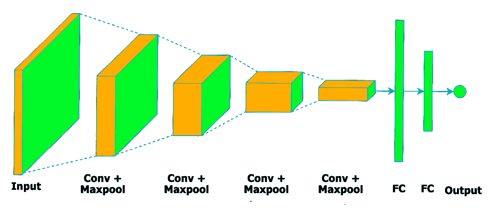

图 2. 标准 CNN 架构示例。

#### 2.2.2. 胶囊网络

尽管 CNN 在图像特征理解方面表现良好，但它们容易混淆复杂特征之间的空间关系。换句话说，一个经过训练的 CNN 通常能够识别狗的身体、脸、尾巴等，即使狗的各个部分在图像中的排列顺序不同或位于不同的区域。另一方面，胶囊网络（Sabour 等，2017）考虑了一种分层的方法来解决这个问题。简而言之，该模型包含一个两层结构。第一层是卷积编码器，执行低级特征的识别。第二层是全连接线性解码器，利用协议路由算法（Sabour 等，2017）将这些低级特征分配到分层的高级正确位置。因此，CapsNets 对物体方向更具鲁棒性。此外，它们在识别场景中的多个或重叠物体时可能表现更好。

#### 2.2.3. 递归神经网络

许多研究将步态识别问题视为定义个体运动的图像序列。使用深度学习来认识这种策略的标准方法涉及递归神经网络（RNNs）（Jun 等，2020），这些网络在递归的方式下计算每个神经元的激活，考虑输入数据的信息以及其他神经元的输出。有时，架构会与 CNN 结合，以提取更多输入图像的信息进行推理。

由于描述一个人的步态通常需要大量的连续特征，一种特定的 RNN，即门控 RNN，更适合这个任务，因为它们能处理长序列。在这种情况下，可以参考两种主要架构，即长短期记忆（Hochreiter 和 Schmidhuber，1997）和门控循环单元（GRU）（Chung 等，2014）。

1.  (1)

    长短期记忆：

    长短期记忆（LSTM）最早由 Hochreiter 和 Schmidhuber 于 1997 年实现（Hochreiter and Schmidhuber, 1997），其主要目标是提高长序列数据上的结果。简而言之，LSTM 的工作原理类似于传统 RNN，即给定神经元的输出依赖于之前神经元结果的递归信息。主要区别在于 LSTM 单元的架构，该架构包含更复杂的关系。该架构由三个主要门控组成，用于控制信息流动，具体描述如下：

    +   •

        遗忘门：该门定义应保留多少信息。先前和当前状态数据通过 sigmoid 函数输出值在$0$和$1$之间。越接近$1$，保留的信息越多。

    +   •

        输入门：计算一个新值以更新当前隐藏状态。输入门考虑两个主要值：（i）sigmoid 函数计算之前隐藏状态的重要性，（ii）原始值被提交给双曲正切（tanh）函数，该函数负责将该值压缩在$-1$和$1$之间。这两个值的乘积定义当前隐藏状态。

    +   •

        输出门：在估计遗忘门和输入门之后，输出门定义单元的输出值。过程如下：（i）遗忘门和输入门的值相加并提交给 tanh 函数，（ii）单元的先前状态提交给 sigmoid 函数，（iii）sigmoid 函数和 tanh 函数的输出相乘，得到单元的输出。

1.  (2)

    门控递归单元：

    门控递归单元（Cho et al., 2014）是一种递归神经网络，最初旨在改进神经机器翻译的结果。与 LSTM 类似，GRU 具有控制信息流动的内部门控，而主要区别在于每个模型中可用门的数量，即 GRU 仅包含两个门，即遗忘门和输出门，而不是三个。研究表明，尽管 GRU 使用的门比 LSTM 少，但它能够达到类似的结果（Chung et al., 2014），并且在训练和推理任务中具有减少计算负担和更快性能的优势。

#### 2.2.4\. 自编码器

自编码器（Vincent et al., 2010）是通常用于数据降维和图像去噪的生成神经网络。该模型包含两个主要步骤，如下所述：

+   •

    编码器：负责将输入信息编码为通常较小的特征空间。

+   •

    解码器：对编码数据进行无监督的重建。

图 3 展示了模型的架构。

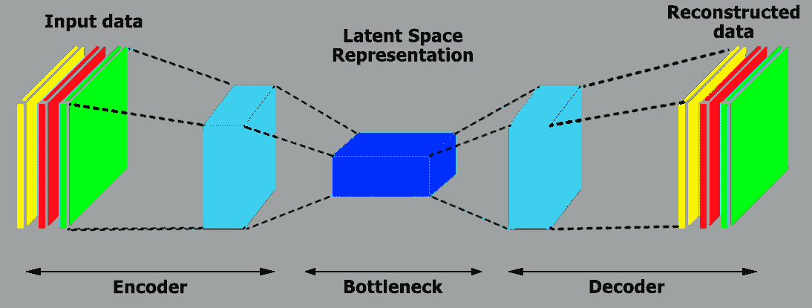

图 3\. 标准自编码器架构。

#### 2.2.5\. 深度置信网络

深度置信网络 (Hinton 等，2006) 是一种理想用于生成任务的随机神经网络，每一层代表一个贪婪训练的限制玻尔兹曼机 (RBM) (Hinton 等，2006)。简而言之，RBM 是一个图形模型，由可见层和隐含层组成，这两层通过一个权重矩阵连接，同一层内的神经元之间没有连接。该模型的学习方法包括将一组输入数据输入到可见层，并在隐含单元中找到这些数据的表示。此外，训练过程通过最小化系统的能量来完成，通常使用马尔可夫链程序通过 Gibbs 采样进行优化。

关于分类任务，最常见的方法是在 DBN 架构的顶部添加一个 softmax 层，在贪婪地预训练所有 RBM 之后，使用反向传播等方法对权重进行微调，以调整权重矩阵并使标签适合正确的识别。

#### 2.2.6\. 生成对抗网络

生成对抗网络 (Goodfellow 等，2014) 在近年来因其生成逼真的合成图像的杰出能力而变得流行。该模型包括两个不同的网络，即生成器，负责学习数据的分布并生成合成样本，以及判别器，尝试识别给定实例是否为原始的或合成的。生成器和判别器以对抗的方式竞争，使生成器尝试生成足够逼真的样本以欺骗判别器。相反，判别器不断提升自己，以识别这些虚假的图像。图 4 说明了该模型。

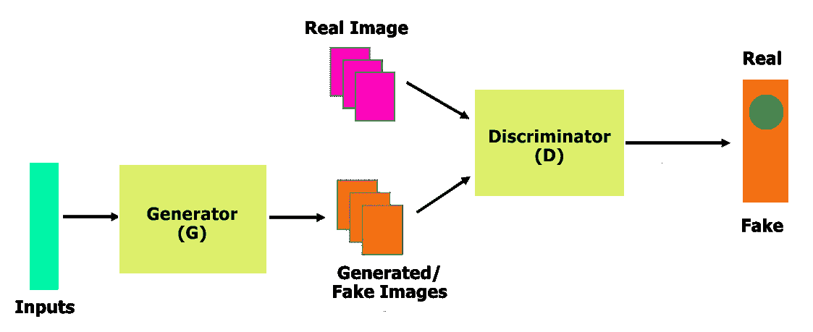

图 4\. 标准 GAN 架构。

#### 2.2.7\. 深度学习技术总结

表 LABEL:t.architectures 总结了本工作中考虑的深度学习技术及其在步态识别任务中的常见应用。请注意，同一工作可能会使用不同的架构，因此在表中可能出现多次。

表 1\. 基于深度学习的步态识别方法，按神经网络类型组织。 |

| 参考文献 | 技术 | 任务 |
| --- | --- | --- |
| (Shiraga et al., 2016; Wu et al., 2017a; Li et al., 2017; Sokolova and Konushin, 2017a; Takemura et al., 2017; Sokolova and Konushin, 2017b; Yu et al., 2017; Zou et al., 2018a; Wang and Yan, 2020; Xu et al., 2020) | 卷积神经网络 (CNN) | 从图像或视频帧中提取特征。 |
| (Zhang et al., 2019; Babaee et al., 2019) | 自编码器 | 通过压缩和解压输入的特征来工作。 |
| (Xu et al., 2019; Sepas-Moghaddam et al., 2021; Zhao et al., 2021) | 胶囊网络 | 改善来自 CNN 的输出的语义组织。 |
| (Fernandes et al., 2018; Xiong et al., 2020) | 深度信念网络 | 将特征和模式编码成压缩表示。 |
| (He et al., 2018; Jia et al., 2019; Hu et al., 2018) | 生成对抗网络 | 一种训练方法，依赖于将原始输入和来自模型的生成对手进行区分，例如 CNN。 |
| (Zou et al., 2018a; Zhang et al., 2019; Potluri et al., 2019; Wang and Yan, 2020; Tran et al., 2021) | 循环神经网络 | 包括 GRU 和 LSTM，它们由多个门组成以控制信息流，并用于处理时间信息。 |

### 2.3\. 步态识别 |

迄今为止，已经提出了多种基于生物特征的人体识别方法。虽然这些方法的可靠性和安全性已通过银行和公共治理系统的成功得到验证，但必须强调两个主要障碍：（i）它们依赖于被动提供个人生物信息，即人们必须提供或注册所需的识别信息；（ii）其中一些系统依赖于专业设备。 |

处理这些缺点的一个替代方法可能包括步态识别模型，特别是考虑基于视频的方法。这些方法不受上述问题的影响，因为生物特征信息的获取大多数情况下仅依赖于普通摄像头，而不需要特定功能的或非侵入式的传感器和设备，且在忽略法律问题的前提下，信息的收集是被动的。因此，观察者不再需要参与识别过程或提供任何信息。另一方面，虽然基于视频的识别是最直观的方法，但这并不是唯一的选择。步态识别还可以通过其他特征来进行，例如足迹（Costilla-Reyes 等，2018），该方法考虑了压力和面积的大小。这些模型的明显缺点是部署所需设备的成本。

此外，步态识别的方法可以分为两大类，即基于模板的方法和非基于模板的方法。基于模板的方法旨在获取躯干或腿部的运动，即它们通常关注空间中的运动动态或时空基的方法（Yeo 和 Park，2020）。在这些技术中，可以参考步态路径图像（WPI）信息（Zhao 等，2016），步态信息图像（GII）（Arora 等，2015），以及通过典型相关分析（Luo 和 Tjahjadi，2020）、联合稀疏模型（Yogarajah 等，2015）、使用 Group Lasso Motion 进行的分割（Rida 等，2016）等提取的步态能量图像（GEI）特征（Shiraga 等，2016；Li 等，2017；Wu 等，2017b）。另一方面，非基于模板的方法则将形状及其属性视为更相关的特征，即通过反映其形状的测量来进行个体识别（Deng 等，2018a）。

关于步态信息采集过程，它可能包含几种不同的传感器和设备，如图 5 所示。图像展示了一个类似实验室的环境，配备了多个嵌入式设备用于步态数据采集，例如相机，这是最常用的设备，因为它们比较便捷，并且能够在较远距离上采集数据，以及多光谱摄影传感器，虽然效率很高，但由于成本高而不易获得。图像中还包括屋顶上的陀螺仪和速度传感器，负责描述时空上下文的获取。最后，步态节奏通过类似地毯的压力传感器进行测量，这对于检测步态异常（如帕金森病和其他神经退行性问题造成的异常）非常有价值。

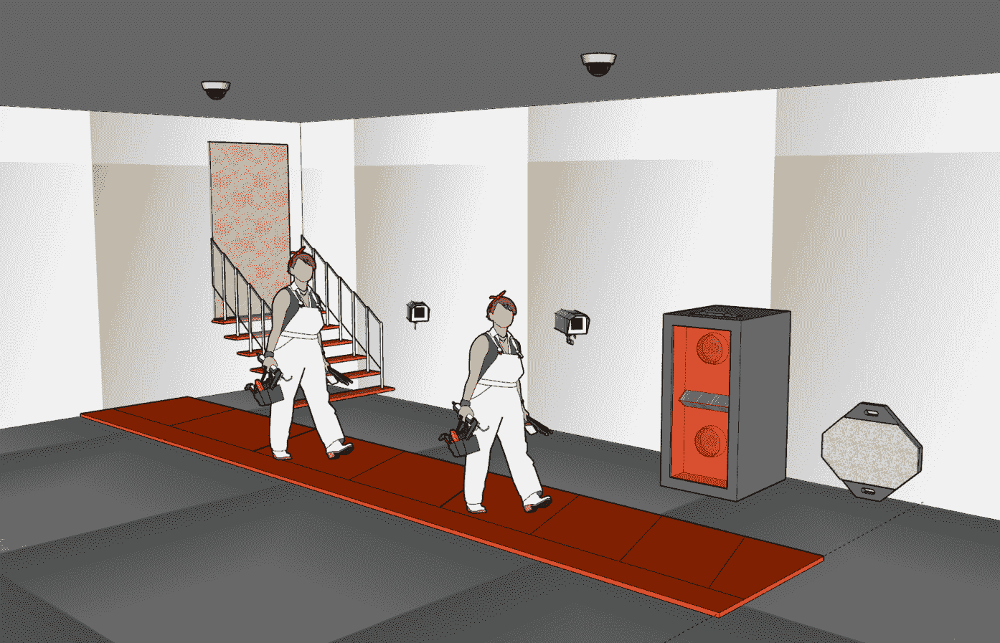

图 5\. 步态数据采集环境的示例。场景包含以下设备：侧壁摄像头，随后是多光谱摄影传感器。屋顶上安装有速度传感器和陀螺仪，用于测量行走过程中的时空关系。最后，地板上配备了类似地毯的传感器，用于收集脚对地面的压力，完成步态周期。

尽管上述方法取得了成功，但基于深度学习的方法在步态识别领域引发了范式转变，在各种应用中取得了极其重要的成果。因此，下一节将深入介绍在基于深度学习的步态识别方法中的几个调研工作。图 6 提供了一个示意图，概述了深度学习与标准步态识别方法之间的主要差异。

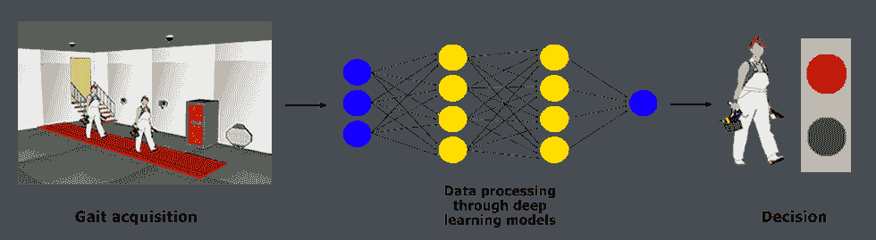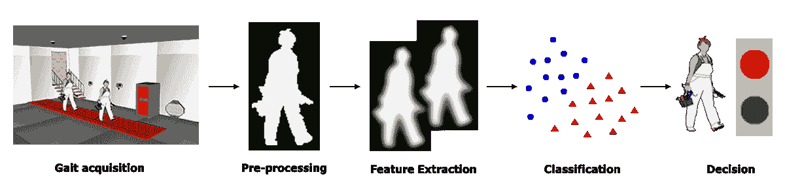

图 6\. 深度学习（上）和标准（下）步态识别流程的示意图。正如图像所示，深度学习方法在单一架构中抽象了数据预处理、特征提取和分类的步骤。

## 3\. 基于深度学习的方法进行步态识别

本节系统地回顾了使用不同深度学习架构（即卷积神经网络、递归神经网络、生成对抗网络、深度信念网络和基于自编码器的方法）进行步态识别的最新工作。此外，还讨论了比较的方法和调研研究的总结。

### 3.1. 卷积神经网络

卷积神经网络（LeCun et al., 1998）使用基于哺乳动物视觉皮层的神经元概念，最初被验证用于数字分类任务，如今可能是分类、重建和物体检测等任务中最广泛使用的神经网络。在步态识别的背景下，Shiraga 等（Shiraga et al., 2016）使用了类似于 LENet（LeCun et al., 1998）的架构，通过步态能量图（GEI）创建了一个基于步态的识别器。该模型在 OU-ISIR（Makihara et al., 2012）大型数据集上取得了$91.5\%$的准确率。Wang 等（Wang et al., 2019）提出的类似研究使用了非标准的周期 GEI 方法进行步态识别和数据增强。

关于基于跨视角步态的人体识别，吴等（Wu et al., 2017a）声称提出了在面部表情识别背景下使用 CNN 的首个研究。作者使用了多种网络架构，并展示了 CNN 在生物特征识别中的强大能力，相较于之前的结果，取得了超过$10\%$的提升。此外，他们还比较了三种数据排列方式，具体描述如下：

+   •

    Local Bottom: 在输入数据之间进行组合，然后确定这些输入是否属于同一个人或不同的人；

+   •

    Mid-Level Top: 神经网络在将输入数据组合之前，提取一些特征，然后判断这些输入是否来自同一个人；

+   •

    Global Top: 类似于之前的网络。然而，它有额外的卷积层和感知机层，使得特征的组合在倒数第二层完成。

此外，李等（Li et al., 2017）提出了 DeepGait，一个结合深度卷积特征和联合贝叶斯的视频传感器步态表示模型。该模型在 OU-ISR 大型数据集（Makihara et al., 2012）上超越了手工特征，如 GEI、频域特征和步态流图像，取得了最先进的结果。同时，Sokolova 和 Konushin（Sokolova and Konushin, 2017a）提出的研究展示了由于信息交叉而导致根据行为识别人的困难，尽管在 TUM-GAID 数据库（Hofmann et al., 2014）上取得了$97.5\%$的准确率和$99.89\%$的 Rank-5 准确率。然而，在 CASIA B 数据集（Yu et al., 2006）上的表现严重下降，在这种情况下准确率为$58.20\%$，显示了这种生物测定技术对数据背景的敏感性。

相同的作者提出了一种多阶段的步态识别模型，该模型使用光流（OF）（Sokolova 和 Konushin，2017b）。在这个模型中，数据经过两个主要步骤的预处理：运动图的计算和逐帧评估个体的姿势。此外，使用了两个不同的神经网络，即 VGG-19（Simonyan 和 Zisserman，2014）和 Wide Residual Network（WRN）（Zagoruyko 和 Komodakis，2016），以在基于视频的步态识别背景下验证该技术。为了提高分类速度，他们结合了主成分分析（PCA）进行降维。这些信息经过 L2 归一化处理，最后，生成的特征输入到最近邻（NN）分类器中。通过这种方法的组合，他们在 TUM-GAID（Hofmann 等，2014）、CASIA B（Yu 等，2006）和 OU-ISIR（Makihara 等，2012）数据集上取得了非常准确的结果。

最近，一种名为 Siamese Networks 的架构被成功应用于类似任务，它接受两个独立的输入并计算它们之间的相似度值，例如识别受阻的路线或危险环境中的不良行为（Santana 等，2019）。在这个背景下，Takemura 等（Takemura 等，2017）实现了四种不同的框架来创建一个生物特征识别系统。所有网络都依赖于 GEI 进行比较。其中两个网络基于 Triplet Ranking Loss 开发，该方法需要三个输入进行执行：（i）被比较者的信息，（ii）同一个人的数据，以及（iii）其他任何人的数据。其他两个网络在执行中使用对比损失，其输入仅依赖于被比较者的信息。作者在 OU-ISIR Multi-view Large Population（OU-MVLP）（Takemura 等，2018）数据库上获得了$91.9\%$的准确率。

尽管如此，Xu 等（Xu 等，2020）提出了 Pairwise Spatial Transformer Network，这是一种统一的模型，由成对空间变换器和用于跨视角步态识别的识别网络组成。该模型计算非刚性变形场，将输入对匹配到中间帧，并与从源视角到目标的变形进行比较。在 OU-MVLP（Takemura 等，2018）、OU-ISIR Large Population（OU-LP）（Iwama 等，2012）和 CASIA B（Yu 等，2006）数据集上进行的实验验证了模型的鲁棒性。

### 3.2\. Capsule Networks

另一种用于步态识别的著名深度架构是胶囊神经网络（Sabour 等，2017）。该网络通过建模场景中对象之间的层次关系，即胶囊，已被开发用于图像分类。在这个背景下，Xu 等人（Xu 等，2019）探索了这些特征并提出了两种步态识别架构：

+   •

    使用局部底层特征（LBC）组合局部特征，该方法采用两张输入图像并在独特的网络流中计算它们之间的差异；以及

+   •

    采用所谓的匹配中级特征（MMF）来结合经过神经网络特定部分处理后的两张图像的特征。

总结来说，第一个架构在将图像输入神经网络之前进行融合，而另一个则在经过两层变换后合并图像。实验考虑了 GEIs、Chrono-gait 图像（CGI）以及输入图像的分辨率，针对 OU-ISIR （Makihara 等，2012）数据集的识别准确率为 $74.4\%$。

在类似的工作中，Sepas 等人（Sepas-Moghaddam 等，2021）使用胶囊网络开发了一种能够通过转移多尺度部分步态表示来学习更具区分性的特征的模型。该模型利用双向门控循环单元（BGRU）来学习模式之间的共现和关联，并进一步使用胶囊网络提取这些特征之间的更深层次关系。针对 CASIA B （Yu 等，2006）和 OU-MVLP （Takemura 等，2018）进行的实验评估了该模型相对于最先进方法的优越性，尤其是在考虑挑战性条件时。

最后，赵等人（Zhao 等，2021）介绍了一种名为关联时空胶囊网络（ASTCapsNet）的自动学习系统。该模型在多传感器数据集上进行训练，表明多模态数据更有利于步态识别。通过对多个数据集进行的实验确认了该模型的有效性，并将结果与最先进的方法进行了比较。

### 3.3\. 递归神经网络

关于递归神经网络（Jun 等，2020），Wang 和 Yan（Wang 和 Yan，2020）使用长短期记忆（Hochreiter 和 Schmidhuber，1997），这种流行的 RNN 架构能够学习长期依赖关系，用于基于逐帧 GEIs 的跨视角人步态识别。对 CASIA B （Yu 等，2006）和 OU-ISIR （Makihara 等，2012）大规模数据集进行的实验展示了该模型在多个基线上的鲁棒性。

Potluri 等人 (Potluri et al., 2019) 提出的类似工作利用 LSTM 通过可穿戴传感器系统检测步态异常。实验在从十个健康个体中提取的数据集上进行，其中七人表现正常，而剩余的三人则模拟特定的步态异常，即感觉性共济失调、帕金森步态和偏瘫步态。实验集中于利用先进技术进行基于步态的诊断和治疗辅助系统。其他模型结合了特定的信息，如从加速度计和陀螺仪获得的数据，通过基于深度学习的方法进行步态识别，识别率超过 $91\%$ (Zou et al., 2018b)。

最近，Tran 等人 (Tran et al., 2021) 提出了一个基于惯性测量单元 (IMUs) 的步态识别方法。作者利用 LSTM 利用视频序列的时间信息，从而提取序列中的隐藏模式。在 whuGAIT (Zou et al., 2018b) 和 OU-ISIR (Makihara et al., 2012) 上进行的实验为验证和识别任务提供了最先进的性能。

### 3.4\. 自编码器

Babaee 等人 (Babaee et al., 2019) 还提出了一个多阶段模型用于手势识别。该工作解决了在多个 GEI 基于识别数据集中常见的问题，即个体的运动周期没有完全形成。换句话说，用于识别的数据不完整。为了解决这一问题，作者提出了一种基于自编码器的方法，称为不完整到完整 GEI 网络 (ITCNet)。该模型经过训练，使用训练集中具有完整周期的示例来重建缺失的图像。该网络由 $9$ 个完全卷积网络组成，每个网络负责周期的 $1/9$ 组件。此外，PCA 被用来计算主要特征，RNN 被用于步态识别。该模型在 OU-ISR 大型人群数据集 (Makihara et al., 2012) 上对 Rank-1 和 Rank-5 的指标分别为 $86\%$ 和 $95\%$，每实例仅使用 $20$ 张图像。

自动编码器还可以用于提取不同的 GEI 特征。在这种背景下，Yu 等人（Yu 等，2017）提出了使用堆叠渐进自动编码器（SPAE）（Kan 等，2014）进行适当更改，以提取个体行为的不变特征的研究。简而言之，该模型从场景的独立组件中提取信息，例如服装和个体可能携带的其他物体，而不仅仅是动作。在 CASIA B（Yu 等，2006）和 SZU RGB（Yu 等，2013）数据集上进行的实验表明，尽管 GEI 信息用于个人识别，但中间和最后层还提供了有关这些组件的相关特征。最后，该工作将这些信息结合起来，并通过主成分分析进行维度降低。

Zhang 等人（Zhang 等，2019）还采用了自动编码器进行步态识别。作者们使用这一技术解决了生物测量识别文献中面临的常见问题，即处理阻挡身体部位视图的衣物，如手臂和腿。关于这种遮挡的主要问题是难以读取动作和识别其他特征，例如韧带和与地面接触的点。为了最小化问题，他们使用自动编码器来分离图像的姿势和外观特征，然后将这些特征与循环网络的另一个架构链接，以分析个体步态的方式。此外，作者还提出了正面视图步态（FVG）数据集。当摄像机拍摄人向摄像头走动时，系统被证明是特别稳健的，这更复杂的角度导致了获取特定特征的困难，例如每步行走的距离。

### 3.5. 深度信念网络

深度信念网络（DBNs）（Hinton 等，2006）是使用受限玻尔兹曼机（Hinton，2002）作为构建模块构建的随机神经网络。由于其执行多项任务的能力，这种模型变得非常流行，例如特征选择（de Souza 等，2021）、分类（Roder 等，ress）和图像重建（Passos 等，2019、2017）等。关于步态识别，Fernandes 等人（Fernandes 等，2018）采用了 DBNs 来支持帕金森病和运动障碍疾病的步态评估诊断。作者们使用可穿戴传感器从受试者身上提取特征，并对帕金森步态进行了比较分类分析，证实 DBN-based 方法适用于该任务。

此外，Xiong 等人（Xiong et al., 2020）展示了如何通过深度置信网络（Deep Belief Networks）使用表面肌电图（sEMG）编码模式。作者考虑了步态中膝关节和踝关节角度，以估计四种时间域特征的组合。该研究显示了对步态跟踪问题的高度潜力。

### 3.6. 生成对抗网络

Hu 等人（Hu et al., 2018）的一个非常有趣的工作将生成对抗网络（Goodfellow et al., 2014; Souza Jr et al., 2020）引入了步态识别的背景。作者提出了判别步态生成对抗网络，即 DiGGAN，用于提取视角不变的步态特征以进行跨视角步态识别。在 OU-MVLP（Takemura et al., 2018）和 CASIA B（Yu et al., 2006）上的实验超过了最先进的结果，展示了模型的能力。

与此同时，He 等人（He et al., 2018）提出了多任务生成对抗网络（MGANs），这是一种基于 GAN 的网络，旨在通过所谓的周期能量图（Period Energy Image，PEI）学习视角特定的步态特征。PEI 是一种多通道步态模板，旨在解决跨视角方法面临的视角变化问题和 GEI 基于方法面临的时间信息丧失问题。该模型利用视角流形从视频序列中提取更显著的特征，从而在 OU-ISIR（Makihara et al., 2012）、CASIA B（Yu et al., 2006）和 USF 的各种文献工作中提供了竞争力的结果。

此外，Jia 等人（Jia et al., 2019）研究了通过生成对抗网络（GAN）生成的合成图像序列来避免步态识别系统中的攻击。在这种情况下，作者提出了一种基于 GAN 的方法，能够从源步态序列中渲染出具有现实细节的伪造视频。该方法与两种最先进的步态识别系统进行比较，并在攻击情景下考虑了 CASIA A（Wang et al., 2003）和 CASIA B（Yu et al., 2006）数据集下进行了分析。该模型在攻击检测能力和视觉逼真度方面的有效性得到了验证。

### 3.7. 讨论

表格 LABEL:t.summary 提供了本节中调查研究的总结。一般而言，卷积神经网络（Convolutional Neural Networks）是考虑深度学习解决方案时最受欢迎的选择，尤其是与基于图像/视频的问题有关，包括步态识别。这种行为是可以预期的，因为 CNN 在各种应用中取得了杰出的结果，并在过去几年赢得了大多数基准挑战。然而，其他架构也为该领域做出了有价值的贡献，在若干特定任务中表现更佳。

例如，胶囊网络（Capsule Networks）能够以分层的方式提取部分步态表示，对于在场景中出现多个方向或重叠的个体或物体的情况提供了更好的结果。同样，递归神经网络（Recurrent Neural Networks）对处理序列数据（如视频）至关重要，因此它们在这种步态识别方法中成为必要工具。

尽管大多数基于深度学习的步态识别方法涉及图像/视频领域，但其他数据来源，如加速度计、陀螺仪、传感器数据和手工特征，一般也在大量工作中提供了令人印象深刻的结果。这些工作大多数涉及无监督深度学习方法，如自编码器（Autoencoders）和深度信念网络（DBNs），这些方法通常在这些数据类型上更具表现力，而卷积神经网络（CNNs）在处理原始图像/视频文件时至关重要。这些无监督方法可以提取关于数据分布的信息并进行操作，通常在较低维空间中，提供更具代表性的步态识别特征。

最后，生成对抗网络（Generative Adversarial Networks）描述了步态系统可以学习更广泛特征的特定情况，例如方向、服装、场景中的个体数量等，因为它们可以生成合成数据用于模型训练。此外，它们在安全目的上评估步态系统中的欺诈行为时也很有用，通过生成假图像进行测试。

关于最常用的步态图像数据表示方法，步态能量图像（Gait Energy Image, GEI）通过加权平均法反映了一个简单能量图像循环的序列。此外，旅行周期中的序列被处理以对齐二进制轮廓（Jing Luo 和 Xiu，2015）。因此，GEI 保持了人类行走的静态和动态特征，并显著降低了图像处理的计算成本。从对该方法的深入分析中，可以观察到一些特征，这些特征定义了模型（Han 和 Bhanu，2016），具体描述如下：

+   •

    GEI 对单张图像中的轮廓噪声有些敏感。

+   •

    它专注于人体行走的特定表现形式，这不会软化矢量图像的背景。

+   •

    它在单张图像中表示人体运动，同时保留了时间信息。

类似地，基于跨视角的步态识别是一种流行的方法，用于处理不同的视觉角度。输入类型要求多个完全控制的摄像头和协作环境，因此受到现实场景的限制。此外，它在进行任何组合之前会视觉上归一化步态特征，这使得模型能够学习场景中视觉运动之间的关系 (e MS Nixon, 2011; W. Kusakunniran 和 Li, 2013; Yasushi Makihara 和 Yagi, 2006)。这种方法的一个例子可以在英国纽卡斯尔大学的跨视角步态识别系统 DiGGAN 中观察到，该系统在世界上最大的多视角步态数据集中取得了最先进的结果 (Takemura et al., 2018)（包括超过$10,000$人），使用跨视角方法 (Hu et al., 2018)。

尽管这些方法取得了成功，但在某些方面仍然存在不足，一些不太受欢迎的技术旨在克服这些不足。例如，周期能量图像包括一个多通道步态模板，旨在应对跨视角和 GEI 丧失时间信息的视角变化问题 (He et al., 2018)。另一种在一些工作中观察到的方法包括光流，它提供了关于场景中观察到的物体、它们的空间排列以及这些排列的变化的相关信息 (Luo et al., 2016)。最后，广泛使用的手工特征或传感器输入数据类型也被用于基于深度学习的步态识别方法。在这些方法中，可以找到惯性测量单元、加速度计、陀螺仪、传感器输出等。

关于步态识别的实际最先进场景，可以考虑两种主要方法，即基于文献的方法和基于表示的方法。关于基于文献的方法，2D-CNN 是使用深度学习进行步态识别时最广泛使用的深度神经网络（DNN）类型，大约 50%的解决方案仅基于 2D-CNN 架构进行分类。使用 3D-CNN 和 GAN 的方法是下一个受欢迎的类别，每种方法占已发布内容的 10%。此外，深度自编码器（DAE）、RNN、CapsNet、DBN 和图卷积网络在 DNN 中较少被考虑，分别对应$5\%$、$3\%$、$2\%$、$1\%$和$1\%$。另一方面，混合方法构成了$26\%$的解决方案，其中 CNN-RNN 组合是最广泛采用的方法，占约$15\%$，而 DAE 与 GAN 和 RNN 的组合占方法的$10\%$，其次是构成 2%解决方案的 RNN-CapsNet 方法。

关于基于表示的最先进解决方案，轮廓是最广泛应用于步态识别的方法，占所有解决方案的$85\%$以上。尽管这是一个有前景的方法，但与轮廓相比，骨架的使用频率较低，仅占现有解决方案的$10\%$。还有一些方法，即大约$5\%$的现有文献，探讨了骨架和轮廓的表示，特别是使用解开的表示学习或融合策略的评分。

考虑到基于深度学习的步态识别主要挑战，可以参考步态数据的复杂性，这源于许多因素的相互作用，例如遮挡/阻碍、摄像机视角、个体外观、序列顺序、身体部位的运动或数据中存在的光源等（Z. Zhang 和 Liu, 2020; X. Li 和 Ren, 2020）。这些因素可以以复杂的方式干扰步态识别任务。目前，其他与模式识别相关的领域，如面部识别、情感和姿态估计，方法数量正在增加。这些领域的专家专注于学习混淆上下文，提取在数据的高维空间中分离各种解释因素的表示。然而，现有的大多数使用深度学习的步态识别方法尚未探索这种方法。因此，它们不能明确地分离步态数据的基础结构，即显著的不相交变量。尽管最近在一些步态识别方法中使用混淆上下文方法取得了一些进展，但仍有改进的空间。

表 2\. 基于深度学习的步态识别方法。

| 参考文献 | 年份 | 模型 | 输入类型 | 数据集 | 结果 | 衡量标准 |
| --- | --- | --- | --- | --- | --- | --- |
| (Shiraga et al., 2016) | 2016 | CNN | GEI | OU-ISIR | $94.6\%$ | 识别率 |
| (Wu et al., 2017a) | 2017 | CNN | 跨视角 | CASIA B | $90.8\%$ | 准确率 |
| (Li et al., 2017) | 2017 | CNN + 联合贝叶斯 | 传感器 | OU-ISR | $97.6\%$ | 识别率 |
| (Sokolova 和 Konushin, 2017a) | 2017 | CNN | 光流 | TUM-GAID 和 CASIA B | $97.52\%$ | 准确率 |
| (Takemura et al., 2017) | 2017 | CNN + 孪生网络 | 跨视角 | OU-ISIR | $98.8\%$ | 准确率 |
| (Sokolova 和 Konushin, 2017b) | 2017 | CNN + 最近邻 | 光流 | TUM-GAID、CASIA B 和 OU-ISIR | $99.8\%$ | 识别率 |
| (Yu et al., 2017) | 2017 | 自编码器 + PCA | GEI | CASIA B 和 SZU RGB | $97.58\%$ | 识别率 |
| (Zou et al., 2018b) | 2018 | CNN + LSTM | 加速度计和陀螺仪 | whuGAIT 和 OU-ISIR | $99.75\%$ | 准确率 |
| (He et al., 2018) | 2018 | GAN | PEI | OU-ISIR, CASIA B 和 USF | $94.7\%$ | 准确率 |
| (Fernandes et al., 2018) | 2018 | DBN | 传感器 | 作者收集的数据 | $93\%$ | 准确率 |
| (Xu et al., 2019) | 2019 | Capsule | LBC 和 MMF | OU-ISIR | $74.4\%$ | 准确率 |
| (Wang et al., 2019) | 2019 | CNN | GEI + 数据增强 | CASIA B | $98\%$ | 准确率 |
| (Zhang et al., 2019) | 2019 | 自编码器 + LSTN | 交叉视角和正面视角 | CASIA B, USF 和 FVG | $99.1\%$ | 准确率 |
| (Babaee et al., 2019) | 2019 | 自编码器 + PCA | GEI | OU-ISIR 和 CASIA B | $96.15\%$ | 准确率 |
| (Potluri et al., 2019) | 2019 | LSTM | 传感器 | 作者收集的数据 | $0.02$ | 预测误差 |
| (Jia et al., 2019) | 2019 | GAN | GEI | CASIA A 和 CASIA B | $82\%$ | 识别结果 |
| (Wang and Yan, 2020) | 2020 | LSTM | GEI | CASIA B 和 OU-ISIR | $99.1\%$ | 识别率 |
| (Xu et al., 2020) | 2020 | CNN | 交叉视角 | OU-MVLP, OU-LP 和 CASIA B | $98.93\%$ | 识别率 |
| (Hu et al., 2018) | 2020 | GAN | 交叉视角 | OU-MVLP 和 CASIA B | $93.2\%$ | 识别率 |
| (Sepas-Moghaddam et al., 2021) | 2020 | Capsule | 多尺度表示 | CASIA-B 和 OU-MVLP | $84.5\%$ | 识别率 |
| (Xiong et al., 2020) | 2020 | DBN | 传感器 | 作者收集的数据 | $2.61$ | RMSE |
| (Tran et al., 2021) | 2021 | LSTM | IMU | whuGAIT 和 OU-ISIR | $94.15\%$ | 准确率 |
| (Zhao et al., 2021) | 2021 | Capsule | 传感器 | 多个 | $99.69\%$ | 准确率 |

## 4\. 数据集

无论采用哪种范式，即监督、无监督或其他，机器学习模型的训练和评估步骤都依赖于包含任务主题的数据集。此外，使用这些数据集可以确定某种方法解决特定问题的有效性，并将其与其他解决方案进行比较。

关于步态识别，考虑到公共或私有解决方案，针对该任务的特定数据集可用性极其有限。这种训练数据的缺乏阻碍了能够通过步态或动作识别人的新人工智能模型的发展。获取和创建数据集存在两个突出问题：

+   •

    步态生物计量学要求对每个对象进行合理数量的运动记录，这意味着需要为每个个体录制和生成多个视频。此外，这些视频通常具有固有的高维度，导致数据集的增长，因此需要较高的存储容量。

+   •

    生物特征数据的提取和公开分发需要每个参与者的许可。未经每个个人正式同意创建数据集可能引发诉讼。

下一节汇集了用于步态识别相关任务的最常用数据集。

### 4.1\. CMU MoBo 数据集

CMU MoBo (Gross 和 Shi, 2001) 数据集包含相对较少的数据，包括从 $20$ 个人那里提取的几个步态识别视频。该数据集还提供了一组轮廓掩膜和边界框，从而缓解了分割过程。

数据集的主要优势之一是可以下载，无需预订或签署协议，只需连接到卡尔加里大学文件传输协议 (FTP) 服务器³³3ftp://ftp.cc.gatech.edu/pub/gvu/cpl/。

### 4.2\. TUM GAID 数据集

TUM Gait from Audio, Image, and Depth (GAID) (Hofmann 等，2014) 数据库，顾名思义，由 RGB 图像、音频和深度数据组成，最初记录了 $305$ 个人的三种不同变体。此外，$32$ 个人被重新记录以增加一些变化，总共包含 $3,370$ 条记录。根据作者的说法，这是唯一一个通过结合视频、深度和音频来进行识别的数据集。

变化包括不同的表演、携带条件（有包和无包）以及时间。第一次记录是在 2012 年冬季（1 月）进行的，包含 $176$ 条记录，使用了夹克和冬靴。第二次记录是在 2012 年 4 月，由 $161$ 个人在较温暖的天气下穿着明显不同的衣物进行的。从这些记录中，有 $32$ 个人在两次记录中都有被拍摄，带来了服装和时间上的变化。该数据集的一个强大优势是明确的评估协议。图 7 展示了一些图像和深度的示例。数据集在签署文档请求后可以获得⁴⁴4https://www.ei.tum.de/mmk/verschiedenes/tum-gaid-database/。

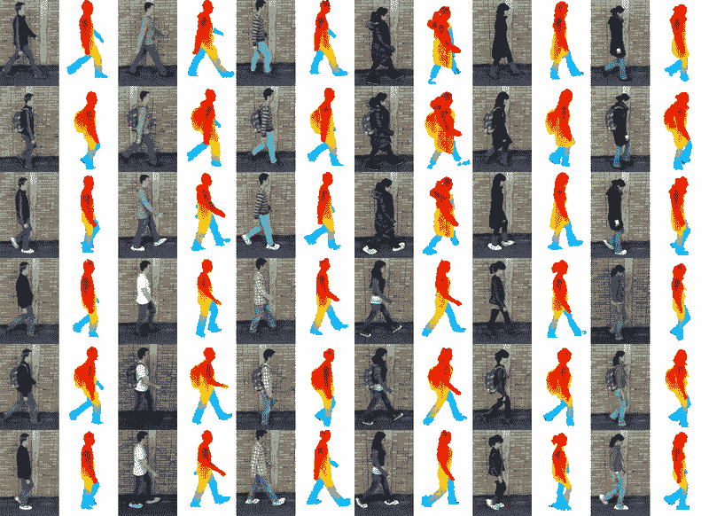

图 7\. 三名男性（上行）和三名女性（下行）参与者在六种变化下的示例：正常（第 $1$ 和第 $2$ 列），背包（第 $3$ 和第 $4$ 列），涂层鞋（第 $5$ 和第 $6$ 列），时间（第 $7$ 和第 $8$ 列），时间 + 背包（第 $9$ 和第 $10$ 列），以及时间 + 涂层鞋（第 $10$ 和第 $11$ 列）。摘自 [`www.ei.tum.de/mmk/verschiedenes/tum-gaid-database/`](https://www.ei.tum.de/mmk/verschiedenes/tum-gaid-database/)

.

### 4.3\. HID-UMD 数据集

人体远程识别 (HID)-UMD 数据集包括从四个不同角度捕捉到的行走视频及其各自的前景分割二进制掩膜。其主要目的是帮助研究人员开发新的步态和面部生物识别方法。此外，该数据集是由两个数据集组成的，描述如下：

+   •

    数据集 1 (Kale 等，2002)：由 $25$ 个人在 $4$ 种不同姿势下的步态序列组成：

    1.  (1)

        正面视图/走向；

    1.  (2)

        正面视图/走开；

    1.  (3)

        正面平行视图/向左；

    1.  (4)

        正面平行视图/向右。

+   •

    数据集 2（Cuntoor et al., 2003）：包含$55$名个体在 T 形路径上行走的视频。序列由两台正交的摄像机获取。

更多详细信息请参见[`www.umiacs.umd.edu/labs/pirl/hid/umd-eval.html`](http://www.umiacs.umd.edu/labs/pirl/hid/umd-eval.html)。此外，数据集可以通过 FTP 下载，下载需要凭证，凭证可以在[`www.umiacs.umd.edu/labs/pirl/hid/data.html`](http://www.umiacs.umd.edu/labs/pirl/hid/data.html)申请。

### 4.4\. CASIA

中国科学院自动化研究所（CASIA）提供了 CASIA 步态数据库（Zheng et al., 2011），这是一个为步态识别目的设计的四个数据集的集合，描述如下：

+   •

    CASIA A：创建于 2001 年 12 月，前身为 NLPR 步态数据库（Wang et al., 2003），CASIA A 数据集包含 20 名个体，每人包括$12$个视频，即$3$个方向中的每个方向$4$个视频，分别是平行、$45$度和$90$度于图像平面。此外，每个图像序列具有不同的持续时间，随着个体行走速度的不同而变化。图 8 展示了来自不同角度的一些图像示例。数据集的总大小约为 2.2GB；

+   •

    CASIA B：创建于 2005 年，CASIA B（Yu et al., 2006）包含$124$名个体，从$11$个不同角度拍摄。每个序列重复三次，并且存在如服装和行走速度等变化。此外，数据集还包含一组为所有序列提供的轮廓图，用于前景分割。图 9 和 10 展示了角度和服装的变化。

+   •

    CASIA C：该数据集于 2005 年获得（Tan et al., 2006），包含$153$名受试者，使用红外摄像机（热谱）拍摄，分为四种不同的变化：正常行走、慢速行走、快速行走和背着背包的正常行走。图 11 展示了一些示例。所有图像均在夜间拍摄；

+   •

    CASIA D: CASIA 步态–足迹数据集 (Zheng et al., 2012)包含图像和累计足部压力信息。该数据集包括$3,496$张步态姿势图像和$2,658$张累计足部压力图像，来自$88$名个人，年龄分布广泛，包括$20$名女性和$68$名男性，数据采集于室内环境。图 12 展示了数据采集示意图。

数据集 A、B 和 C 的轮廓图可以免费下载⁵⁵5http://www.cbsr.ia.ac.cn/english/Gait%20Databases.asp。关于数据获取，申请者需填写表格并等待数据集所有者的批准。

| 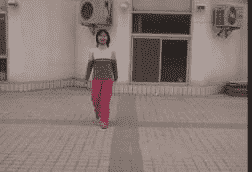 | 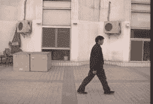 |
| --- | --- |
| (a) | (b) |
| 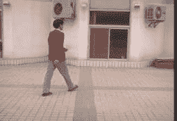 |
| (c) |

图 8\. CASIA A 数据集的示例帧，展示了每个角度的图像。(a) 对应于平行视图，(b) 对应于$90$度，(c) 是$45$度的示例。图像摘自 [`www.cbsr.ia.ac.cn/users/szheng/?page_id=71.`](http://www.cbsr.ia.ac.cn/users/szheng/?page_id=71.)

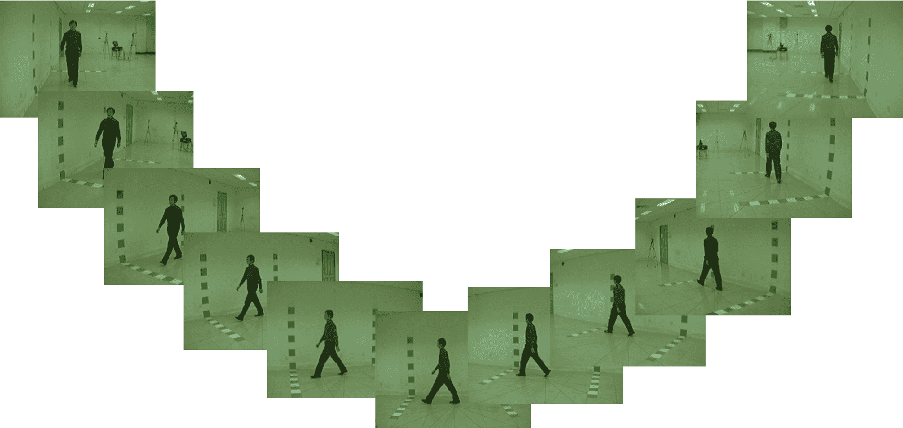

图 9\. CASIA B 数据集中的示例帧。每张图像对应$11$个角度之一。图像摘自 [`www.cbsr.ia.ac.cn/users/szheng/?page_id=71.`](http://www.cbsr.ia.ac.cn/users/szheng/?page_id=71.)

| 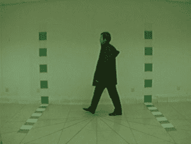 | 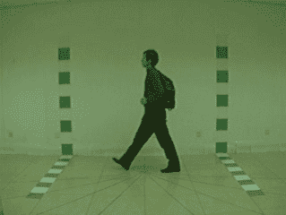 |
| --- | --- |
| (a) | (b) |
| 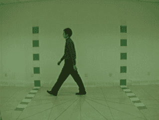 |
| (c) |

图 10\. CASIA B 数据集中的示例帧。可以注意到衣物和个人物品（如背包）的变化。图像摘自 [`www.cbsr.ia.ac.cn/users/szheng/?page_id=71.`](http://www.cbsr.ia.ac.cn/users/szheng/?page_id=71.)

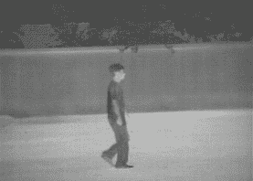 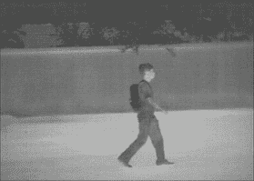  (a) (b)

图 11\. CASIA C 数据集中的示例帧。这些图像通过红外摄像机在夜间获取，并且行走方式有所变化。图像摘自 [`www.cbsr.ia.ac.cn/users/szheng/?page_id=71.`](http://www.cbsr.ia.ac.cn/users/szheng/?page_id=71.)

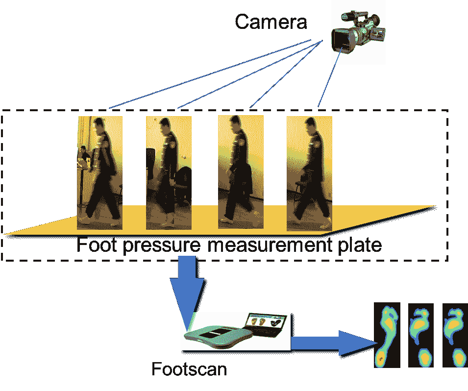

图 12\. CASIA D 数据集中的示例帧。这些图像同步展示了图像采集过程和脚步数据。图像摘自 [`www.cbsr.ia.ac.cn/users/szheng/?page_id=71.`](http://www.cbsr.ia.ac.cn/users/szheng/?page_id=71.)

### 4.5\. OU-ISIR 生物特征数据库

大阪大学（OU）的科学与工业研究所（ISIR）自 2007 年以来创建了全球最大的步态识别数据集。该项目由八个不同的组共同组成：

+   •

    跑步机数据集：该组由人在电子跑步机上行走的序列组成，周围有$25$台摄像机以$60$帧每秒的速度拍摄，分辨率为$640\times 480$。它有$4$个子集：

    1.  （1）

        跑步机数据集 A – 速度变化（Tsuji et al., 2010）：该子集包含$34$名受试者的侧视图，速度在$2$到$10$ km/h 之间变化，步长为$1$ km/h；

    1.  （2）

        跑步机数据集 B – 服装变化（Hossain et al., 2010）：包含$68$名侧视人员，具有$32$种服装变化；

    1.  （3）

        跑步机数据集 C – 视角变化（Makihara et al., 2010）：一个大规模数据库，包含$168$名年龄范围从$4$岁到$75$岁的人员。此外，该子集包含通过多视角同步步态系统观察的$25$个视角；

    1.  （4）

        跑步机数据集 D – 步态波动（Mori et al., 2010）：该数据集包含$185$名受试者的步态轮廓序列，从侧面角度观察，速度有波动。数据分为两个组，每组$100$名受试者（有 15 人重叠），分别为高速度波动和低速度波动。

+   •

    大规模人口数据集（Iwama et al., 2012）：自 2009 年起通过外展活动收集，该数据集包含$4,016$名受试者，每位受试者从$4$个摄像机角度以$30$ FPS 的帧率和$640\times 480$像素的分辨率拍摄两次。

+   •

    速度过渡数据集（Mansur et al., 2014）：速度过渡数据集包含两个子集，如下所述：

    1.  （1）

        数据集 A：包含$179$个场景，来自在跑步机或地面上以$4$ km/h 的恒定速度行走的人员。在这个数据集中，背景通过壁纸被移除；

    1.  （2）

        数据集 B：包含$25$名人员在跑步机上行走的序列，速度在$1$到$5$ km/h 之间变化。每人拍摄两次。加速和减速在三秒钟内完成，从中提取了一秒钟的中间序列。

+   •

    多视角大规模人口数据集（Takemura et al., 2018）：该数据集包含$10,307$个样本，其中$5,114$个是男性，$5,193$个是女性，年龄范围从$2$岁到$87$岁，旨在用于具有交叉视角的动作识别方法。图像在$14$个不同角度拍摄，帧率为$25$帧每秒，分辨率为$1280\times 980$。捕捉设备的横向距离和高度分别为$8$米和$5$米。

+   •

    Large Population Dataset with Bag (Uddin et al., 2018)：该数据集关注携带物品的步态识别，旨在不仅依赖生物特征信息，还识别所携带物品相对于身体的位置（如有的话）。Large Population Dataset with Bag 包含了$62,528$名年龄从$2$到$95$岁的个体，通过摄像机在约$8$米距离和$5$米高度处获取。序列以$25$帧每秒的速度拍摄，分辨率为$1280\times 980$像素。每个人拍摄了三次，其中第一次，即 A1，携带或不携带物品，而第二次和第三次均未携带任何物品。最后，在携带物品的情况下，标记了四个区域，即下侧、上侧、前侧和背侧。所有视频还提供了背景去除的二值化掩模。

+   •

    Large Population Dataset with Age (Xu et al., 2017)：Large Population Dataset with Age 旨在研究与年龄和性别相关的步态识别。该数据集包含了$62,846$名在特定路径上行走的个体，摄像机以$640\times 480$像素分辨率，每秒$30$帧的速度进行拍摄。序列中的人物年龄在$2$到$90$岁之间，所有视频均配有在背景去除后获得的二值化掩模。

+   •

    Inertial Sensor Dataset (Ngo et al., 2014)：为研究和评估通过运动传感器和加速度计进行个体识别的方法而设计，Inertial Sensor Dataset 是最大的基于惯性传感器的步态数据库，由来自$744$名受试者（$389$名男性和$355$名女性）的图像组成，年龄范围为$2$到$78$岁。

+   •

    Similar Actions Inertial Dataset (Ngo et al., 2015)：Similar Actions Inertial Dataset 包含了$460$名年龄在$8$到$78$岁之间的参与者，性别几乎均等分布，他们的步态特征与(Ngo et al., 2014)中的数据一同获取。此外，该数据集还展示了地板的六种不同特性：无效、平坦、楼梯上升、楼梯下降、坡道上升和坡道下降。

### 4.6\. University of South Florida Dataset

University of South Florida (USF) 数据集 (Sarkar et al., 2005) 包含了$1,870$个序列，来自$122$名受试者，使用了两种不同的鞋子类型。数据集还考虑了携带或不携带公文包的个体、不同的表面条件如草地和混凝土，以及不同的摄像机视角，即左视角或右视角。视频在两个不同的时间点拍摄，地点为户外环境。

### 4.7\. Southampton Dataset

南安普顿远程人类身份识别（SOTON）数据库是南安普顿大学的一个贡献，由三个主要部分组成⁶⁶6 更多信息见 [`www.eng.usf.edu/cvprg/Gait_Data.html`](http://www.eng.usf.edu/cvprg/Gait_Data.html)。

+   •

    SOTON 小型数据库（Nixon 等，2001）：包含 $12$ 名被试在内侧跑道上以不同速度行走，穿着不同的鞋子和衣物，且携带或不携带包。

+   •

    SOTON 大型数据库（Shutler 等，2004）：包含 $114$ 名被试在室外、实验室跑道上以及跑步机上行走。图像从六个不同的角度拍摄，并以超过 $5,000$ 个序列的形式提供。

+   •

    SOTON 时间序列（Matovski 等，2010）：数据通过一个包含 $12$ 台同步摄像机的多生物识别隧道进行捕捉，以捕捉人们步态的变化。数据集包含动态环境，包括不同的背景、光照、步态表面和摄像机位置。数据集包含 $25$ 名被试（$17$ 名男性和 $8$ 名女性），年龄从 $20$ 岁到 $55$ 岁不等。请注意，他们都是赤脚拍摄的。

### 4.8\. AVA 多视角步态识别数据集（AVAMVG）

AVA 多视角步态识别数据集（AVAMVG）⁷⁷7 更多信息见： [`www.uco.es/grupos/ava/node/41`](http://www.uco.es/grupos/ava/node/41) （David López-Fernández、Francisco J. Madrid-Cuevas、Ángel Carmona-Poyato、Manuel J. Marín-Jiménez 和 Rafael Muñoz-Salinas，2014）是一个专为基于 3D 的步态识别算法设计的数据库，包含 $20$ 名演员步态图像，展示了不同的轨迹。这些序列是通过专门为此任务校准的摄像机获得的，随后经过使用 3D 图像重建算法的后处理步骤。此外，每个序列还附带一个用于分割的二进制轮廓。最后，该数据库包含 $200$ 个六通道多视角视频，这些视频也可以用作 $1,200$ 个单视角视频，即 $6\times 200$。图 13 展示了一些样本。

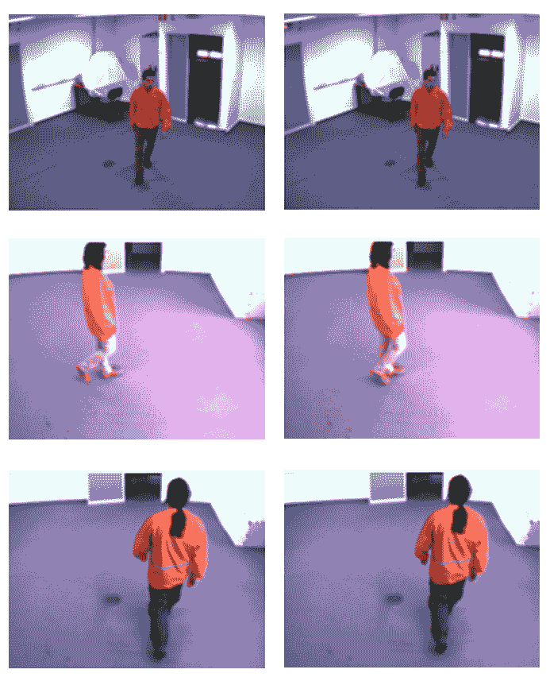

图 13\. 多视角数据集示例。该图展示了人们在不同方向行走的情况，从多个视角进行拍摄。改编自 [`www.uco.es/investiga/grupos/ava/node/41.`](https://www.uco.es/investiga/grupos/ava/node/41.)

### 4.9\. 九州大学 4D 步态数据库

九州大学 4D 步态数据库（KY4D）⁸⁸8 可在 [`robotics.ait.kyushu-u.ac.jp/~yumi/db.html`](http://robotics.ait.kyushu-u.ac.jp/~yumi/db.html) (Iwashita et al., 2014b) 上获得，包含$42$名受试者沿四条直线和两条曲线路径行走的连续 3D 模型和图像序列。视频由$16$台相机录制，分辨率为$1032\times 776$像素，并分为三个子集，描述如下：

+   •

    数据集 A（直线）：它由沿直线轨迹行走的人的连续 3D 模型和图像序列组成。图 14(a) 展示了轨迹，描述为红色箭头。图 14(b) 描述了多个 3D 重建模型。

    | 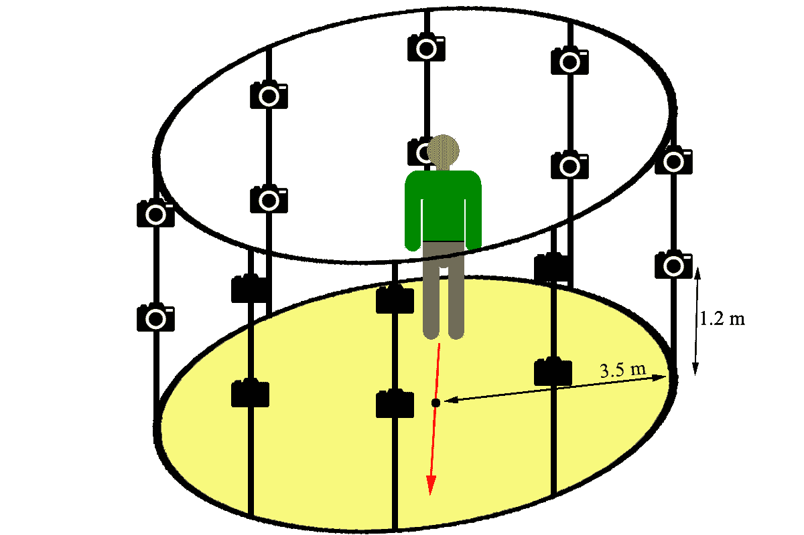 | 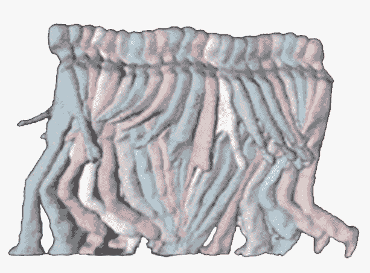 |
    | --- | --- |
    | (a) | (b) |

    图 14\. KY4D 步态数据库 A 中的工作室： (a) 描述了由箭头指示的轨迹， (b) 描述了一个人直线行走的连续 3D 模型。图像改编自 [`robotics.ait.kyushu-u.ac.jp/~yumi/db/gait_b.html.`](http://robotics.ait.kyushu-u.ac.jp/~yumi/db/gait_b.html.)

+   •

    数据库 B（曲线）：它包含了沿曲线轨迹行走的人们的图像序列，如图 15(a)所示。半径 r 的值为$1.5$m 或$3.0$m。图 15(b)展示了考虑曲线路径的多个 3D 重建模型。

    |  | 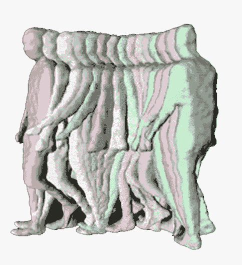 |
    | --- | --- |
    | (a) | (b) |

    图 15\. KY4D 步态数据库 B 中的工作室： (a) 描述了半径的变化， (b) 展示了一个人沿曲线路径行走的连续 3D 模型。图像改编自 [`robotics.ait.kyushu-u.ac.jp/~yumi/db/gait_b.html.`](http://robotics.ait.kyushu-u.ac.jp/~yumi/db/gait_b.html.)

+   •

    KY 红外（IR）阴影步态数据库：由$54$个受试者的时间序列阴影图像组成。图 16(a)中所示的步行方向箭头表明所有人都直行。图 16(b)展示了用于收集阴影数据库的两个红外灯和一台相机 (Iwashita et al., 2014a)。红外灯斜放，相机垂直于地面放置在天花板上。从这些拍摄中观察到的样本结果见图 17。

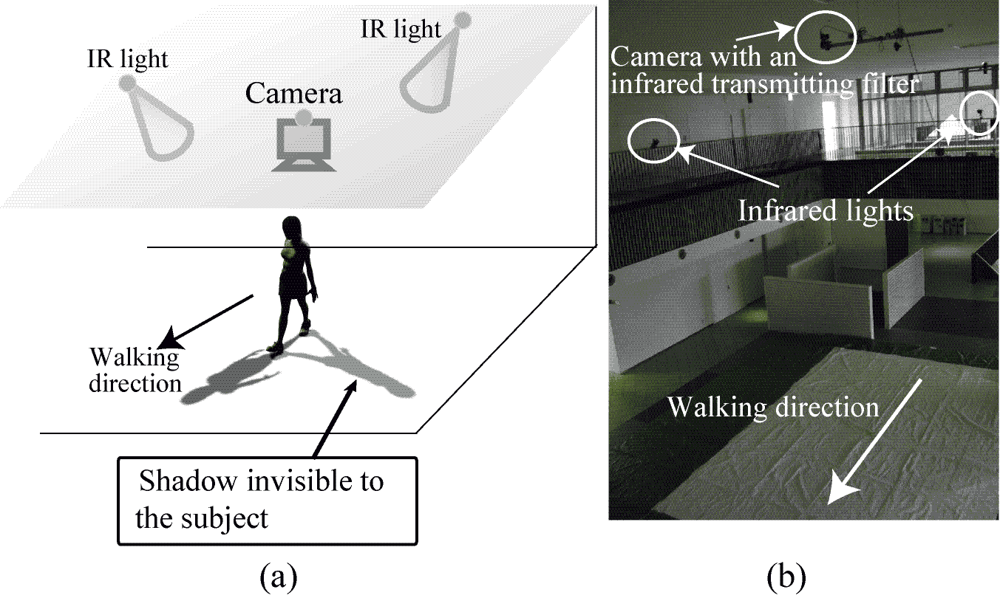

图 16。 (a) 实验设置，(b) 实际场景。改编自 [`robotics.ait.kyushu-u.ac.jp/~yumi/db/gait_b.html.`](http://robotics.ait.kyushu-u.ac.jp/~yumi/db/gait_b.html.)

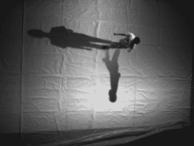

图 17。一个来自 IR 阴影图像的示例电影。图像采集自 [`robotics.ait.kyushu-u.ac.jp/~yumi/db/gait_b.html.`](http://robotics.ait.kyushu-u.ac.jp/~yumi/db/gait_b.html.)

### 4.10\. WhuGAIT 数据集

whuGAIT 数据集 (Zou et al., 2018a)于 2018 年由武汉大学发布，并提供了源代码和预训练模型以复制论文结果⁹⁹9 可在 https://github.com/qinnzou/Gait-Recognition-Using-Smartphones 上获取。与其他数据集合不同，whuGAIT 包含$118$个人收集的$3$D 加速度计和$3$轴陀螺仪信息，其中$20$人在三天内收集，$98$人在一天内收集。该数据集根据所需任务划分为$6$个不同的子集：

+   •

    数据集 #1：由$33,104$个用于训练的样本和$3,740$个用于测试的样本组成，共$118$个人，分为两步分割。

+   •

    数据集 #2：类似于数据集 #1，包含一个两步分割的数据集，由$49,275$个用于训练的样本和$4,936$个用于测试的样本组成，提取自$20$人的$3$天数据。

+   •

    数据集 #3：该子集被划分为时间大小窗口，每个样本为$2.56$秒。该数据集包含$26,283$个用于训练的实例和$2,991$个用于测试的实例。

+   •

    数据集 #4：类似于数据集 #3，该子集被划分为$2.56$秒的时间帧，但使用了来自$20$个人在三天内收集的数据。该子集包含$35,373$个用于训练的样本和$3,941$个用于测试的样本。

+   •

    数据集 #5：该子集用于身份验证目的。它由$74,142$个实例组成，这些实例来自$118$人，其中$98$个个体的信息用于训练，其余$20$个用于验证。身份验证过程由来自一个或两个不同受试者的样本对构成。实例包括两步加速度和陀螺仪数据。

+   •

    数据集 #6：该子集采用与数据集 #5 相同的结构，但使用的是垂直对齐方式，而不是水平对齐。

### 4.11\. 数据集使用背景

本节介绍了在步态识别中最常用的数据集，并用于本调查中考虑的工作中。因此，在接下来的内容中，我们还提供了有关特定方面的概述，例如使用背景、采集环境和谱。表 3 显示了每个数据集的信息。协变量被分为十二个主要特征，即视角、步速、物体、鞋子、服装、时间、表面、轮廓、步态波动、跑步机行走、地面行走和足部压力。

表 3\. 数据集使用背景。

| 背景/数据集 | 4.1 | 4.2 | 4.3 | 4.4 | 4.5 | 4.6 | 4.6 | 4.8 ‣ 4\. 数据集 ‣ 基于深度学习的步态识别：综述") | 4.9 | 4.10 |
| --- | --- | --- | --- | --- | --- | --- | --- | --- | --- | --- |
| 视角 | x |  | x | x | x | x | x | x | x | x |
| 步速 | x |  |  | x | x | x | x |  |  | x |
| 物体 | x | x |  | x |  |  | x |  |  |  |
| 鞋子 | x | x | x | x | x | x | x | x |  |  |
| 服装 | x | x | x | x | x |  | x | x |  |  |
| 时间 |  |  |  | x | x |  | x |  | x | x |
| 表面 | x | x | x | x |  | x | x |  | x | x |
| 轮廓 |  | x |  | x | x |  |  |  | x |  |
| 步态波动 |  |  |  |  | x |  |  |  |  |  |
| 跑步机步态 | x |  |  |  | x |  | x |  |  |  |
| 地面步态 | x | x | x | x |  | x |  | x | x | x |
| 足部压力 |  |  |  | x |  |  |  |  |  |  |

此外，图 18 展示了数据集的构建环境，这些环境分为四种情境，即静态室内、静态室外、动态室内和动态室外。

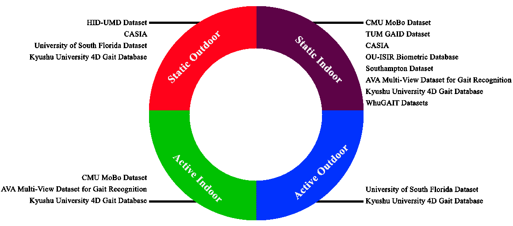

图 18\. 数据集开发环境的表示。

最后，图 19 提供了一个示意图，将数据集的光谱表示分为两类，即基于颜色和热信息。

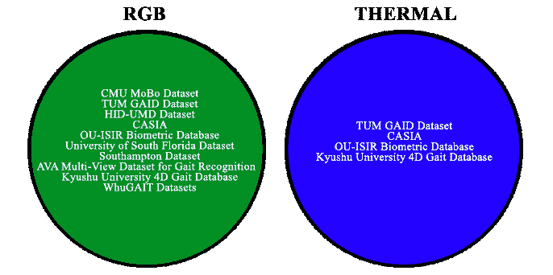

图 19\. 数据集的数据光谱表示。

## 5\. 结论与未来方向

本综述深入研究了近年来在步态识别方面开发的最重要工作，突出了深度学习技术在此任务中的应用。此外，还提供了关于生物识别方法的历史背景，如指纹、虹膜和面部识别等，以及步态识别，揭示了该领域面临的主要关注点和挑战。

此外，详细描述了九个最常用的数据集，包括 CMU MoBo (Gross 和 Shi, 2001)、TUM GAID (Hofmann 等, 2014)、HID-UMD (Kale 等, 2002; Cuntoor 等, 2003)、CASIA (Wang 等, 2003; Yu 等, 2006; Tan 等, 2006; Zheng 等, 2012)、OU-ISIR (Tsuji 等, 2010; Hossain 等, 2010; Makihara 等, 2010; Mori 等, 2010; Iwama 等, 2012; Mansur 等, 2014; Takemura 等, 2018; Uddin 等, 2018; Xu 等, 2017; Ngo 等, 2014, 2014)、USF (Sarkar 等, 2005)、SOTON (Nixon 等, 2001; Shutler 等, 2004; Matovski 等, 2010)、AVAMVG (David López-Fernández, Francisco J. Madrid-Cuevas, Ángel Carmona-Poyato, Manuel J. Marín-Jiménez 和 Rafael Muñoz-Salinas, 2014)、KY4D (Iwashita 等, 2014b) 和 WhuGait (Zou 等, 2018a) 及其提取过程和局限性。关于这些数据集，可以清楚地看到在性别、场景角度、服装和鞋子、携带包物等常见问题上努力实现检测独立性。

本文综述的工作讨论了科学界在开发技术以通过步态识别和授权确保对监测资源的访问方面的主要关注点和努力。它还探讨了基于步态的系统相较于常用生物识别特征的优势，例如步态系统不需要个人的同意就能被识别。在这方面，综述试图指出步态生物识别相对于其他生物识别技术的优势，并突出最新的方法论和最先进的架构。

关于基于视频的模型和数据库，有几个关键点值得强调：

+   •

    所展示的数据集每个视频中不包含多于一个人，无论是用于训练还是验证目的。

+   •

    录制环境完全受控。尽管某些数据集的角度有所变化，但可以注意到背景中的物体或颜色没有变化。其他视频则是在电动跑步机上录制的，显示出对运动和环境的更大控制。

+   •

    因此，工作中提到的模型在应用于实际操作时可能会表现出不足和误行为，例如在公共街道上检测感兴趣的人。

关于未来的趋势，我们预期与以下方面相关的工作将会增加：

1.  (1)

    Transformer 网络：该技术（Vaswani 等，2017）针对数据流如视频，非常适合步态识别的背景。

1.  (2)

    性别和年龄识别：这种方法（Sun 等，2019）由于其在多个应用中的重要性，近年来获得了广泛关注。

1.  (3)

    危险环境监测：步态特征非常适合用于监测危险环境，因为这些环境通常光线有限，而提取更具描述性的生物识别特征是一项困难的任务（Santana 等，2019）。

1.  (4)

    场景中的多个人：大多数步态识别工作集中于受控环境中的单一个体。然而，现实生活中的问题通常需要对非受控环境中多个人的解决方案具有鲁棒性。

此外，我们观察到对穿着不同衣物或携带物品的个体进行步态识别的需求不断增加（Yu 等，2017），以及包括步态和补充生物特征（如面部和耳朵）的混合方法（Mehraj 和 Mir，2020）。

###### 致谢。

作者感谢圣保罗研究基金会（Fapesp）资助 #2013/07375-0，#2014/12236-1，#2019/07665-4 和 #2020/12101-0，巴西国家研究与发展委员会（CNPq） #307066/2017-7 和 #427968/2018-6，Eldorado 研究所，以及巴西石油公司（Petrobras）资助 #2017/00285-6。

## 参考文献

+   （1）

+   Alariki 等（2018）Ala Abdulhakim Alariki、Muqadas Faiz、Sanaullah Balagh 和 Christine Murray。2018. 指纹静脉生物识别的综述。在*《世界工程与计算机科学大会论文集》*第 1 卷。

+   Alharthi 等（2019）Abdullah S Alharthi、Syed U Yunas 和 Krikor B Ozanyan。2019. 用于监测人类步态的深度学习：综述。*《IEEE 传感器期刊》* 19，21（2019），9575–9591。

+   Alsmirat 等（2019）Mohammad A Alsmirat、Fatimah Al-Alem、Mahmoud Al-Ayyoub、Yaser Jararweh 和 Brij Gupta。2019. 数字指纹图像质量对指纹识别准确度的影响。*《多媒体工具与应用》* 78，3（2019），3649–3688。

+   Arora 等（2015）P. Arora、M. Hanmandlu 和 S. Srivastava。2015. 基于步态信息图像特征的步态认证。*《模式识别快报》* 68（2015），336–342。

+   Babaee 等（2019）Maryam Babaee、Linwei Li 和 Gerhard Rigoll。2019. 使用全卷积神经网络从部分步态周期中识别个人。*《神经计算》*（2019）。

+   Bolle 等（2013）Ruud M Bolle、Jonathan H Connell、Sharath Pankanti、Nalini K Ratha 和 Andrew W Senior。2013. *《生物特征指南》*。Springer Science & Business Media。

+   Bouchrika (2018) Imed Bouchrika. 2018. 通过生物特征识别进行智能视觉监控的调查：步态识别。在*《行动中的监控》*中，Springer，3–23。

+   Chen 等（2020）Rung-Ching Chen、Christine Dewi、Wei-Wei Zhang、Jia-Ming Liu、Su-Wen Huang 等。2020. 集成手势控制板和图像识别的深度学习基础上的手势识别。*《应用科学与工程国际期刊》* 17，3（2020），237–248。

+   Cho 等（2014）Kyunghyun Cho、Bart Van Merriënboer、Dzmitry Bahdanau 和 Yoshua Bengio。2014. 神经机器翻译的性质：编码器-解码器方法。*arXiv 预印本 arXiv:1409.1259*（2014）。

+   Chung 等（2014）Junyoung Chung、Caglar Gulcehre、KyungHyun Cho 和 Yoshua Bengio。2014. 门控递归神经网络在序列建模中的实证评估。*arXiv 预印本 arXiv:1412.3555*（2014）。

+   Costilla-Reyes 等（2018）Omar Costilla-Reyes、Ruben Vera-Rodriguez、Patricia Scully 和 Krikor B Ozanyan。2018. 使用深度残差神经网络进行稳健脚步识别的时空表示分析。*《IEEE 模式分析与机器智能期刊》* 41，2（2018），285–296。

+   Cuntoor 等人（2003）Naresh Cuntoor，Amit Kale 和 Rama Chellappa。 2003. 将多个证据结合起来进行步态识别。 在*2003 年 IEEE 国际会议上的声学，语音和信号处理，2003 年。会议纵横（ICASSP’03）。*，Vol。 3。 IEEE，III–33。

+   Dargan 和 Kumar（2020）Shaveta Dargan 和 Munish Kumar。 2020. 基于生理和行为模态的生物识别系统全面调查。 *专家系统与应用* 143（2020），113114。

+   David López-Fernández，Francisco J. Madrid-Cuevas，Ángel Carmona-Poyato，Manuel J. Marín-Jiménez 和 Rafael Muñoz-Salinas（2014）David López-Fernández，Francisco J. Madrid-Cuevas，Ángel Carmona-Poyato，Manuel J. Marín-Jiménez 和 Rafael Muñoz-Salinas。 2014. 用于步态识别的 AVA 多视图数据集。 在*多个分布式感知的活动监测*，Pier Luigi Mazzeo，Paolo Spagnolo 和 Thomas B. Moeslund（编者）。 Springer International Publishing，26–39。 [`doi.org/10.1007/978-3-319-13323-2_3`](https://doi.org/10.1007/978-3-319-13323-2_3)

+   de Souza 等人（2021）Renato WR de Souza，Daniel S Silva，Leandro A Passos，Mateus Roder，Marcos C Santana，Plácido R Pinheiro 和 Victor Hugo C de Albuquerque。 2021. 利用模糊最佳路径森林和受限玻尔兹曼机辅助帕金森病诊断。 *生物医学中的计算*（2021），104260。

+   Deng 等人（2018a）Muqing Deng 等人。 2018a. 通过确定性学习在不同服装条件下进行步态识别。 *在 IEEE/CAA Journal of Automatica Sinica 中*（2018）。

+   Deng 等人（2018b）Weihong Deng，Jiani Hu 和 Jun Guo。 2018b. 通过协作表示进行人脸识别：其判别性质和叠加表示。 *IEEE 模式分析和机器智能交易* 40, 10（2018），2513–2521。

+   Deng 等人（2014）Weihong Deng，Jiani Hu，Jiwen Lu 和 Jun Guo。 2014. Transform-invariant PCA：全自动面部对齐，表示和识别的统一方法。 *IEEE 模式分析和机器智能交易* 36, 6（2014），1275–1284。

+   Dewi 和 Chen（2019）Christine Dewi 和 Rung-Ching Chen。 2019. 基于特征选择和随机森林演变的人类活动识别。 在*2019 年 IEEE 系统，人和机器会议（SMC）*。 IEEE，2496–2501。

+   e MS Nixon（2011）G. Ariyanto e MS Nixon。 2011. 基于模型的 3D 步态生物识别。 *在 IJCB 中*（2011）。

+   Fernandes 等人（2018）Carlos Fernandes，Luís Fonseca，Flora Ferreira，Miguel Gago，Lus Costa，Nuno Sousa，Carlos Ferreira，Joao Gama，Wolfram Erlhagen 和 Estela Bicho。 2018. 基于神经网络的帕金森病患者分类。 在*2018 IEEE 生物信息学和生物医学国际会议（BIBM）*。 IEEE，2024–2030。

+   Garagad 和 Iyer（2014）Vishwanath G Garagad 和 Nalini C Iyer。2014。用于生物识别系统的新型虹膜识别技术。在*2014 年国际计算、通信与信息学会议（ICACCI）*。IEEE，973–978。

+   Goodfellow 等（2014）Ian J Goodfellow, Jean Pouget-Abadie, Mehdi Mirza, Bing Xu, David Warde-Farley, Sherjil Ozair, Aaron Courville, 和 Yoshua Bengio。2014。生成对抗网络。*arXiv 预印本 arXiv:1406.2661*（2014）。

+   Gross 和 Shi（2001）Ralph Gross 和 Jianbo Shi。2001。*CMU 人体运动（MoBo）数据库*。技术报告 CMU-RI-TR-01-18。卡内基梅隆大学。

+   Gui 等（2019）Qiong Gui, Maria V Ruiz-Blondet, Sarah Laszlo, 和 Zhanpeng Jin。2019。脑部生物特征的综述。*ACM 计算调查（CSUR）* 51, 6（2019），1–38。

+   Han 和 Bhanu（2016）Ju Han 和 Bir Bhanu。2016。使用步态能量图进行个体识别。*IEEE 模式分析与机器智能学报*（2016）。

+   He 等（2020）Jing Selena He, Mingyuan Yan, 和 Sahil Arora。2020。长距离虹膜识别：现实还是神话？一项调查。在*2020 年 ACM 东南会议论文集*。305–306。

+   He 等（2018）Yiwei He, Junping Zhang, Hongming Shan, 和 Liang Wang。2018。用于步态识别的视角特定特征学习的多任务生成对抗网络（GANs）。*IEEE 信息取证与安全学报* 14, 1（2018），102–113。

+   Hemalatha（2020）S Hemalatha。2020。基于指纹的生物识别认证系统的系统性综述。在*2020 年信息技术与工程新兴趋势国际会议（ic-ETITE）*。IEEE，1–4。

+   Hinton（2002）G. E. Hinton。2002。通过最小化对比散度训练专家的产品。*神经计算* 14, 8（2002），1771–1800。

+   Hinton 等（2006）G. E. Hinton, S. Osindero, 和 Y.-W. Teh。2006。深度置信网络的快速学习算法。*神经计算* 18, 7（2006），1527–1554。

+   Hochreiter 和 Schmidhuber（1997）Sepp Hochreiter 和 Jürgen Schmidhuber。1997。长短期记忆。*神经计算* 9, 8（1997），1735–1780。

+   Hofmann 等（2014）Martin Hofmann, Jürgen Geiger, Sebastian Bachmann, Björn Schuller, 和 Gerhard Rigoll。2014。基于音频、图像和深度（gaid）数据库的肿瘤步态：多模态识别主体和特征。*视觉通信与图像表示期刊* 25, 1（2014），195–206。

+   Hossain 等（2010）Md Altab Hossain, Yasushi Makihara, Junqiu Wang, 和 Yasushi Yagi。2010。使用基于部分的服装分类和自适应权重控制的服装不变步态识别。*模式识别* 43, 6（2010），2281–2291。

+   Hu 等（2018）BingZhang Hu, Yu Guan, Yan Gao, Yang Long, Nicholas Lane, 和 Thomas Ploetz。2018。具有证据的鲁棒跨视角步态识别：一种判别步态生成对抗网络（DiGGAN）方法。*arXiv 预印本 arXiv:1811.10493*（2018）。

+   Iwama 等人（2012）H. Iwama、M. Okumura、Y. Makihara 和 Y. Yagi。2012. 包含大规模数据集的 OU-ISIR 步态数据库及步态识别的性能评估。*IEEE Trans. on Information Forensics and Security* 7，第 5 期（2012 年 10 月），1511–1521。

+   Iwashita 等人（2014a）Y. Iwashita、R. Kurazume 和 A. Stoica。2014a. 使用隐形阴影进行步态识别：对外观变化的鲁棒性。见于*Int. Conf. Emerging Security Technologies (EST)*。英国。

+   Iwashita 等人（2014b）Y. Iwashita、K. Ogawara 和 R. Kurazume。2014b. 识别沿曲线路径行走的人。见于*Pattern Recognition Letters*。

+   Jain 等人（2004）Anil K Jain 等人。2004. 生物识别介绍。*见于 IEEE Transactions on Circuits and Systems for Video Technology, Special Issue on Image- and Video-Based Biometrics, Vol. 14, No. 1*（2004）。

+   Jayaraman 等人（2020）Umarani Jayaraman、Phalguni Gupta、Sandesh Gupta、Geetika Arora 和 Kamlesh Tiwari。2020. 面部识别的最新进展。*Neurocomputing* 408（2020），231–245。

+   Jia 等人（2019）Meijuan Jia、Hongyu Yang、Di Huang 和 Yunhong Wang。2019. 通过轮廓引导的 GAN 攻击步态识别系统。见于*Proceedings of the 27th ACM International Conference on Multimedia*，638–646。

+   Jing Luo 和 Xiu（2015）Chunyuan Zi Ying Niu Huixin Tian Jing Luo、Jianliang Zhang 和 Chunbo Xiu。2015. 基于 GEI 和 AFDEI 的步态识别。*International Journal of Optics*（2015）。

+   Jun 等人（2020）K. Jun、D. Lee、K. Lee、S. Lee 和 M. S. Kim。2020. 基于 RNN 自编码器的骨架异常步态识别特征提取。*IEEE Access* 8（2020），19196–19207。

+   Kale 等人（2002）Amit Kale、Naresh Cuntoor 和 Rama Chellappa。2002. 针对特定活动的人类识别框架。见于*2002 IEEE International Conference on Acoustics, Speech, and Signal Processing*，第 4 卷。IEEE，IV–3660。

+   Kan 等人（2014）Meina Kan、Shiguang Shan、Hong Chang 和 Xilin Chen。2014. 用于姿态识别的堆叠渐进自编码器（spae）。见于*Proceedings of the IEEE Conference on Computer Vision and Pattern Recognition*，1883–1890。

+   Karn 等人（2020）Pradeep Karn、XiaoHai He、Jin Zhang 和 Yanteng Zhang。2020. 绝对总变化和概率协同表示在虹膜识别中的实验研究。*Multimedia Tools and Applications* 79，43（2020），31783–31801。

+   Khan 等人（2020）Saad Khan、Simon Parkinson、Liam Grant、Na Liu 和 Stephen Mcguire。2020. 利用可穿戴设备健康数据的生物识别系统：计算机安全中的应用和未来挑战。*ACM Computing Surveys (CSUR)* 53, 4（2020），1–29。

+   Krizhevsky 等人（2012）Alex Krizhevsky、Ilya Sutskever 和 Geoffrey E Hinton。2012. 使用深度卷积神经网络进行 Imagenet 分类。见于*Advances in neural information processing systems*，1097–1105。

+   LeCun 等 (1998) Yann LeCun, Léon Bottou, Yoshua Bengio, Patrick Haffner 等。1998。基于梯度的学习应用于文档识别。*Proc. IEEE* 86, 11 (1998), 2278–2324。

+   Lee 等 (2017) Wonjune Lee, Sungchul Cho, Heeseung Choi 和 Jaihie Kim。2017。基于细节和脊形特征的小型指纹扫描仪的部分指纹匹配。*Expert Systems with Applications: An International Journal* 87, C (2017), 183–198。

+   Lei 等 (2014) Zhen Lei, Matti Pietikäinen 和 Stan Z Li。2014。学习判别性面部描述符。*IEEE Transactions on Pattern Analysis and Machine Intelligence* 36, 2 (2014), 289–302。

+   Li 等 (2017) C. Li, X. Min, S. Sun, W. Lin 和 Z. Tang。2017。Deepgait: 使用联合贝叶斯的视角不变步态识别的深度卷积表示学习。*Applied Sciences* 7, 3 (2017), 210。

+   Li 等 (2021) Shuyi Li, Bob Zhang, Lunke Fei 和 Shuping Zhao。2021。多模态指纹识别的联合判别特征学习。*Pattern Recognition* 111 (2021), 107704。

+   Li (2009) Stan Z Li。2009。*Encyclopedia of Biometrics: I-Z.* 第 2 卷。Springer Science & Business Media。

+   Lobo 等 (2020) V. C. Lobo, L. A. Passos 和 J. P. Papa。2020。演变的长短期记忆网络。在*International Conference on Computational Science (ICCS)*会议上。IEEE。

+   Luo 和 Tjahjadi (2020) Jian Luo 和 Tardi Tjahjadi。2020。基于虚拟样本生成的三维异常步态行为识别的多集典型相关分析。*IEEE Access* 8 (2020), 32485–32501。

+   Luo 等 (2016) Zhengping Luo, Tianqi Yang 和 Yanjun Liu。2016。用于人类识别的步态光流图像分解。在*2016 IEEE Information Technology, Networking, Electronic and Automation Control Conference*会议上。IEEE, 581–586。

+   Ma 等 (2019) Zhuo Ma, Yilong Yang, Ximeng Liu, Yang Liu, Siqi Ma, Kui Ren 和 Chang Yao。2019。Emir-auth: 基于眼动和虹膜的便携式远程认证系统。*IEEE Transactions on Industrial Informatics* (2019)。

+   Makihara 等 (2012) Y. Makihara, H. Mannami, A. Tsuji, M.A. Hossain, K. Sugiura, A. Mori 和 Y. Yagi。2012。包含跑步机数据集的 OU-ISIR 步态数据库。*IPSJ Trans. on Computer Vision and Applications* 4 (2012 年 4 月), 53–62。

+   Makihara 等 (2010) Yasushi Makihara, Hidetoshi Mannami 和 Yasushi Yagi。2010。使用大规模多视角步态数据库进行性别和年龄的步态分析。在*Asian Conference on Computer Vision*会议上。Springer, 440–451。

+   Mansur 等 (2014) Al Mansur, Yasushi Makihara, Rasyid Aqmar 和 Yasushi Yagi。2014。在速度过渡下的步态识别。在*IEEE Conference on Computer Vision and Pattern Recognition*会议上。2521–2528。

+   Marsico 和 Mecca (2019) Maria De Marsico 和 Alessio Mecca。2019。关于通过可穿戴传感器进行步态识别的调查。*ACM Computing Surveys (CSUR)* 52, 4 (2019), 1–39。

+   Matovski 等（2010）Darko S Matovski、Mark S Nixon、Sasan Mahmoodi 和 John N Carter. 2010. 时间对步态生物识别性能的影响. 在 *2010 年第四届 IEEE 国际生物识别：理论、应用与系统会议（BTAS）* 中. IEEE, 1–6.

+   Mehraj 和 Mir（2020）Haider Mehraj 和 Ajaz Hussain Mir. 2020. 利用人工神经网络进行面部、耳朵和步态的多模态生物识别的特征向量提取和优化. *国际云计算杂志* 9, 2-3 (2020), 131–149.

+   Mitchell（1920）C. Ainsworth Mitchell. 1920. 文件上的指纹检测. *分析师* 45, 529 (1920), 122–129.

+   Mori 等（2010）Atsushi Mori、Yasushi Makihara 和 Yasushi Yagi. 2010. 基于周期性相位同步的步态识别，用于低帧率视频. 在 *2010 年第 20 届国际模式识别会议* 中. IEEE, 2194–2197.

+   Nambiar 等（2019）Athira Nambiar、Alexandre Bernardino 和 Jacinto C Nascimento. 2019. 基于步态的人物重新识别：综述. *ACM 计算机调查（CSUR）* 52, 2 (2019), 1–34.

+   Ngo 等（2014）Thanh Trung Ngo、Yasushi Makihara、Hajime Nagahara、Yasuhiro Mukaigawa 和 Yasushi Yagi. 2014. 最大的基于惯性传感器的步态数据库及步态个人认证性能评估. *模式识别* 47, 1 (2014), 228–237.

+   Ngo 等（2015）Trung Thanh Ngo、Yasushi Makihara、Hajime Nagahara、Yasuhiro Mukaigawa 和 Yasushi Yagi. 2015. 使用惯性传感器的相似步态动作识别. *模式识别* 48, 4 (2015), 1289–1301.

+   Nixon 等（2001）M Nixon、J Carter、J Shutler 和 M Grant. 2001. 自动步态识别的实验计划. *南安普顿大学，南安普顿，英国* (2001).

+   Nixon 和 Carter（2004）Mark S Nixon 和 John N Carter. 2004. 自动步态识别的进展. 在 *null* 中. IEEE, 139.

+   Oppenheim 等（2001）Alan V Oppenheim、John R Buck 和 Ronald W Schafer. 2001. *离散时间信号处理. 第 2 卷*. 上萨德尔河，NJ: Prentice Hall.

+   Passos 等（2017）Leandro A. Passos、Kelton A.P. Costa 和 João P. Papa. 2017. 使用自适应温度的深度玻尔兹曼机. 在 *国际计算机图像和模式分析会议* 中. Springer, 172–183.

+   Passos 等（2019）L. A. Passos、M. C. Santana、T. Moreira 和 J. P. Papa. 2019. $\kappa$-熵基限制玻尔兹曼机. 在 *2019 国际神经网络联合会议（IJCNN）* 中. IEEE, 1–8.

+   Pisani 等（2019）Paulo Henrique Pisani、Abir Mhenni、Romain Giot、Estelle Cherrier、Norman Poh、André Carlos Ponce de Leon Ferreira de Carvalho、Christophe Rosenberger 和 Najoua Essoukri Ben Amara. 2019. 自适应生物识别系统：综述与展望. *ACM 计算机调查（CSUR）* 52, 5 (2019), 1–38.

+   Potluri et al. (2019) Sasanka Potluri, Srinivas Ravuri, Christian Diedrich, 和 Lutz Schega. 2019. 基于深度学习的步态异常检测，使用可穿戴传感器系统。在*2019 年第 41 届 IEEE 医学与生物学工程学会年会（EMBC）*。IEEE, 3613–3619.

+   Ragan et al. (2016) Elizabeth J Ragan, Courtney Johnson, Jacqueline N Milton, 和 Christopher J Gill. 2016. 用于全球健康患者识别的耳部生物识别：测试简化算法的可行性的横断面研究。*BMC 研究笔记* 9, 1 (2016), 484.

+   Ramli et al. (2016) DA Ramli, MY Hooi, 和 KJ Chee. 2016. 用于生物特征认证系统的心跳检测套件的开发。*计算机科学程序集* 96 (2016), 305–314.

+   Rida et al. (2018) Imad Rida, Noor Almaadeed, 和 Somaya Almaadeed. 2018. 稳健的步态识别：全面综述。*IET 生物特征识别* 8, 1 (2018), 14–28.

+   Rida et al. (2016) I. Rida, X. Jiang, 和 G. L. Marcialis. 2016. 基于运动的组 lasso 方法的人体部位选择，用于无模型步态识别。*IEEE 信号处理通讯* 23, 1 (2016), 154–158.

+   Roder et al. (ress) M. Roder, L. A. Passos, L. C. F. Ribeiro, B. C. Benato, A. L. Falcão, 和 J. P. Papa. 即将出版。使用深度信念网络进行肠道寄生虫分类。在*第 19 届国际人工智能与软计算会议（ICAISC）*。IEEE.

+   Sabour et al. (2017) Sara Sabour, Nicholas Frosst, 和 Geoffrey E Hinton. 2017. 动态路由胶囊之间的连接。在*神经信息处理系统进展*。3856–3866.

+   Santana et al. (2019) Marcos C. Santana, Leandro A. Passos, Thierry P. Moreira, Danilo Colombo, Victor Hugo C. de Albuquerque, 和 João P. Papa. 2019. 一种新颖的基于 Siamese 的场景变化检测方法，应用于危险环境中的障碍路线。*IEEE 智能系统* 35, 1 (2019), 44–53.

+   Sarkar et al. (2005) Sudeep Sarkar, P Jonathon Phillips, Zongyi Liu, Isidro Robledo Vega, Patrick Grother, 和 Kevin W Bowyer. 2005. humanid 步态挑战问题：数据集、性能与分析。*IEEE 模式分析与机器智能学报* 27, 2 (2005), 162–177.

+   Sepas-Moghaddam et al. (2021) Alireza Sepas-Moghaddam, Saeed Ghorbani, Nikolaus F Troje, 和 Ali Etemad. 2021. 使用胶囊的多尺度部分表示变换进行步态识别。在*2020 年第 25 届国际模式识别会议（ICPR）*。IEEE, 8045–8052.

+   Shiraga et al. (2016) Kohei Shiraga, Yasushi Makihara, Daigo Muramatsu, Tomio Echigo, 和 Yasushi Yagi. 2016. Geinet: 使用卷积神经网络的视角不变步态识别。在*2016 年国际生物识别会议（ICB）*。IEEE, 1–8.

+   Shutler et al. (2004) Jamie D Shutler, Michael G Grant, Mark S Nixon, 和 John N Carter. 2004. 关于一个大型基于序列的人体步态数据库。在*软计算的应用与科学*。Springer, 339–346.

+   Simonyan 和 Zisserman (2014) Karen Simonyan 和 Andrew Zisserman. 2014. 用于大规模图像识别的非常深的卷积网络。*arXiv 预印本 arXiv:1409.1556* (2014)。

+   Singh 等 (2018) Jasvinder Pal Singh, Sanjeev Jain, Sakshi Arora 和 Uday Pratap Singh. 2018. 基于视觉的步态识别：综述。*IEEE Access* 6 (2018), 70497–70527。

+   Sokolova 和 Konushin (2017a) A Sokolova 和 A Konushin. 2017a. 基于卷积神经网络的步态识别。*国际摄影测量、遥感与空间信息科学档案* 42 (2017)。

+   Sokolova 和 Konushin (2017b) Anna Sokolova 和 Anton Konushin. 2017b. 基于姿态的深度步态识别。*CoRR* abs/1710.06512 (2017)。arXiv:1710.06512 [`arxiv.org/abs/1710.06512`](http://arxiv.org/abs/1710.06512)

+   Souza Jr 等 (2020) Luis A. Souza Jr, Leandro A. Passos, Robert Mendel, Alanna Ebigbo, Andreas Probst, Helmut Messmann, Christoph Palm 和 João P. Papa. 2020. 使用基于生成对抗网络的内窥镜数据增强辅助 Barrett 食管识别。*生物医学计算机* 126 (2020), 104029。

+   Sultana 等 (2017) Madeena Sultana, Padma Polash Paul 和 Marina L Gavrilova. 2017. 多模态生物识别中的社会行为信息融合。*IEEE 系统、人类与控制论学报: 系统* 48, 12 (2017), 2176–2187。

+   Sun 等 (2019) Yingnan Sun, Frank P-W Lo 和 Benny Lo. 2019. 基于深度学习的性别和年龄识别方法，使用单一惯性传感器。在 *2019 IEEE 第 16 届可穿戴和植入式体感网络国际会议 (BSN)* 中。IEEE, 1–4。

+   Sundararajan 等 (2019) Aditya Sundararajan, Arif I Sarwat 和 Alexander Pons. 2019. 关于传统和可穿戴生物识别系统的模态特征、性能评估指标和安全性的综述。*ACM 计算调查 (CSUR)* 52, 2 (2019), 1–36。

+   Szegedy 等 (2016) Christian Szegedy, Vincent Vanhoucke, Sergey Ioffe, Jon Shlens 和 Zbigniew Wojna. 2016. 重新思考计算机视觉的 Inception 架构。在 *IEEE 计算机视觉与模式识别会议论文集* 中，2818–2826。

+   Taigman 等 (2014) Yaniv Taigman, Ming Yang, Marc’Aurelio Ranzato 和 Lior Wolf. 2014. Deepface: 缩小面部验证中的人类水平表现差距。在 *IEEE 计算机视觉与模式识别会议论文集* 中，1701–1708。

+   Takemura 等 (2017) Noriko Takemura, Yasushi Makihara, Daigo Muramatsu, Tomio Echigo 和 Yasushi Yagi. 2017. 基于卷积神经网络的跨视角步态识别的输入/输出架构。*IEEE 视频技术电路与系统学报* (2017)。

+   Takemura 等（2018）Noriko Takemura, Yasushi Makihara, Daigo Muramatsu, Tomio Echigo, 和 Yasushi Yagi。2018。多视角大规模人群步态数据集及其跨视角步态识别性能评估。*IPSJ 计算机视觉与应用论文集* 10, 1 (2018), 4。

+   Tan 等（2006）Daoliang Tan, Kaiqi Huang, Shiqi Yu, 和 Tieniu Tan。2006。基于模板匹配的高效夜间步态识别。发表于*第 18 届国际模式识别大会（ICPR’06）*，第 3 卷。IEEE, 1000–1003。

+   Tan 和 Le（2019）Mingxing Tan 和 Quoc Le。2019。Efficientnet：重新思考卷积神经网络的模型缩放。发表于*国际机器学习会议*。PMLR, 6105–6114。

+   Tiong 等（2020）Leslie Ching Ow Tiong, Seong Tae Kim, 和 Yong Man Ro。2020。多模态面部生物识别：具有多特征融合层的双流卷积神经网络。*图像与视觉计算* 102 (2020), 103977。

+   Tran 等（2021）Lam Tran, Thang Hoang, Thuc Nguyen, Hyunil Kim, 和 Deokjai Choi。2021。基于窗口数据段的步态识别多模型长短期记忆网络。*IEEE Access* 9 (2021), 23826–23839。

+   Tsuji 等（2010）Akira Tsuji, Yasushi Makihara, 和 Yasushi Yagi。2010。基于步速的轮廓变换用于步态识别。发表于*2010 IEEE 计算机视觉与模式识别会议*。IEEE, 717–722。

+   Turk 和 Pentland（1991）Matthew Turk 和 Alex Pentland。1991。用于识别的特征脸。*认知神经科学杂志* 3, 1 (1991), 71–86。

+   Uddin 等（2018）Md Zasim Uddin, Thanh Trung Ngo, Yasushi Makihara, Noriko Takemura, Xiang Li, Daigo Muramatsu, 和 Yasushi Yagi。2018。OU-ISIR 大规模步态数据库及其实际携带物体和性能评估。*IPSJ 计算机视觉与应用论文集* 10, 1 (2018), 1–11。

+   Vaswani 等（2017）Ashish Vaswani, Noam Shazeer, Niki Parmar, Jakob Uszkoreit, Llion Jones, Aidan N Gomez, Lukasz Kaiser, 和 Illia Polosukhin。2017。注意力即是你所需。*arXiv 预印本 arXiv:1706.03762* (2017)。

+   Vincent 等（2010）Pascal Vincent, Hugo Larochelle, Isabelle Lajoie, Yoshua Bengio, Pierre-Antoine Manzagol, 和 Léon Bottou。2010。堆叠去噪自编码器：通过局部去噪标准在深度网络中学习有用的表示。*机器学习研究期刊* 11, 12 (2010)。

+   W. Kusakunniran 和 Li（2013）Jian Zhang Yi Ma W. Kusakunniran, Qiang Wu 和 Hongdong Li。2013。用于跨视角步态识别的新视角不变特征。*IEEE TIFS* (2013), 1642–1653。

+   Wan 等（2018）Changsheng Wan, Li Wang, 和 Vir V Phoha。2018。步态识别综述。*ACM 计算机调查（CSUR）* 51, 5 (2018), 1–35。

+   Wang 等人 (2020) Caiyong Wang、Jawad Muhammad、Yunlong Wang、Zhaofeng He 和 Zhenan Sun. 2020. 通过深度多任务注意力网络实现完整且准确的虹膜分割，用于非合作虹膜识别。*IEEE 信息取证与安全汇刊* 15 (2020), 2944–2959。

+   Wang 和 Kumar (2019) Kuo Wang 和 Ajay Kumar. 2019. 使用 CNN 和监督离散哈希的跨光谱虹膜识别。*模式识别* 86 (2019), 85–98。

+   Wang 等人 (2019) Kejun Wang、Liangliang Liu、Yilong Lee、Xinnan Ding 和 Junyu Lin. 2019. 用于步态识别和数据增强的非标准周期性步态能量图像。在*中国模式识别与计算机视觉会议 (PRCV)*。Springer，197–208。

+   Wang 等人 (2003) Liang Wang、Tieniu Tan、Huazhong Ning 和 Weiming Hu. 2003. 基于轮廓分析的步态识别用于人类身份识别。*IEEE 模式分析与机器智能汇刊* 25, 12 (2003), 1505–1518。

+   Wang 和 Yan (2020) Xiuhui Wang 和 Wei Qi Yan. 2020. 基于逐帧步态能量图像和卷积长短期记忆网络的人体步态识别。*国际神经系统杂志* 30, 01 (2020), 1950027。

+   Wu 等人 (2017a) Zifeng Wu、Yongzhen Huang、Liang Wang、Xiaogang Wang 和 Tieniu Tan. 2017a. 基于深度 CNN 的跨视角步态人类识别综合研究。*IEEE 模式分析与机器智能汇刊* 39, 2 (2017), 209–226。

+   Wu 等人 (2017b) Z. Wu、Y. Huang、L. Wang、X. Wang 和 T. Tan. 2017b. 基于深度 CNN 的跨视角步态人类识别综合研究。*IEEE 模式分析与机器智能汇刊* 39, 2 (2017), 209–226。

+   X. Li 和 Ren (2020) C. Xu、Y. Yagi、X. Li、Y. Makihara 和 M. Ren. 2020. 通过半监督解耦表示学习进行步态识别，以识别身份和协变量特征。*计算机视觉与模式识别* (2020)。

+   Xiong 等人 (2020) Dezhen Xiong、Daohui Zhang、Xingang Zhao 和 Yiwen Zhao. 2020. 使用 sEMG 信号进行连续的人体步态跟踪。在*2020 年第 42 届国际 IEEE 医学与生物学工程学会年会（EMBC）*。IEEE，3094–3097。

+   Xu 等人 (2020) Chi Xu、Yasushi Makihara、Xiang Li、Yasushi Yagi 和 Jianfeng Lu. 2020. 使用成对空间变换网络进行跨视角步态识别。*IEEE 视频技术电路与系统汇刊* (2020)。

+   Xu 等人 (2017) Chi Xu、Yasushi Makihara、Gakuto Ogi、Xiang Li、Yasushi Yagi 和 Jianfeng Lu. 2017. OU-ISIR 步态数据库，包括大规模人群数据集及年龄估计的性能评估。*IPSJ 计算机视觉与应用汇刊* 9, 24 (2017), 1–14。

+   Xu 等人 (2019) Zhaopeng Xu、Wei Lu、Qin Zhang、Yuileong Yeung 和 Xin Chen. 2019. 基于胶囊网络的步态识别。*视觉通信与图像表示杂志* (2019)。

+   Yasushi Makihara 和 Yagi (2006) Yasuhiro Mukaigawa Tomio Echigo Yasushi Makihara, Ryusuke Sagawa 和 Yasushi Yagi. 2006. 使用频域视图变换模型的步态识别。*在 ECCV: v.3953* (2006), 151–163。

+   Yeo 和 Park (2020) Sang Seok Yeo 和 Ga Young Park. 2020. 使用惯性测量单元系统对步态的时空和运动参数进行精度验证。*传感器* 20, 5 (2020), 1343。

+   Yogarajah 等 (2015) P. Yogarajah, P. Chaurasia, J. Condell 和 G. Prasad. 2015. 使用联合稀疏模型和 -范数最小化增强步态识别。*模式识别* 38 (2015), 3–22。

+   Yu 等 (2019) Ning Yu, Larry S Davis 和 Mario Fritz. 2019. 将虚假图像归因于 GANs: 学习和分析 GAN 指纹。在 *IEEE 国际计算机视觉会议论文集* 中。7556–7566。

+   Yu 等 (2017) Shiqi Yu, Haifeng Chen, Qing Wang, Linlin Shen 和 Yongzhen Huang. 2017. 使用单一统一模型进行步态识别的恒定特征提取。*神经计算* 239 (2017), 81–93。

+   Yu 等 (2006) Shiqi Yu, Daoliang Tan 和 Tieniu Tan. 2006. 评估视角、服装和携带条件对步态识别影响的框架。在 *模式识别* 中, 第 4 卷。441–444。 [`doi.org/10.1109/ICPR.2006.67`](https://doi.org/10.1109/ICPR.2006.67)

+   Yu 等 (2013) Shiqi Yu, Qing Wang 和 Yongzhen Huang. 2013. 一个大型 RGB-D 步态数据集及其基线算法。在 *中国生物特征识别会议* 上。Springer, 417–424。

+   Z. Zhang 和 Liu (2020) F. Liu Z. Zhang, L. Tran 和 X. Liu. 2020. 关于为步态识别学习解缠表示的研究。*IEEE 模式分析与机器智能汇刊, vol. in press* (2020)。

+   Zagoruyko 和 Komodakis (2016) Sergey Zagoruyko 和 Nikos Komodakis. 2016. 宽残差网络。*arXiv 预印本 arXiv:1605.07146* (2016)。

+   Zehngut 等 (2015) Niv Zehngut, Felix Juefei-Xu, Rishabh Bardia, Dipan K Pal, Chandrasekhar Bhagavatula 和 Marios Savvides. 2015. 调查基于图像的鼻部生物识别的可行性。在 *图像处理 (ICIP), 2015 IEEE 国际会议* 上。IEEE, 522–526。

+   Zhang 等 (2019) Ziyuan Zhang, Luan Tran, Xi Yin, Yousef Atoum, Xiaoming Liu, Jian Wan 和 Nanxin Wang. 2019. 通过解缠表示学习进行步态识别。*arXiv 预印本 arXiv:1904.04925* (2019)。

+   Zhao 等 (2021) Aite Zhao, Junyu Dong, Jianbo Li, Lin Qi 和 Huiyu Zhou. 2021. 用于步态识别的关联时空胶囊网络。*arXiv 预印本 arXiv:2101.02458* (2021)。

+   Zhao 等 (2016) X. Zhao, Y. Jiang, T. Stathaki 和 H. Zhang. 2016. 使用外观转换机器的任意直线行走路径步态识别方法。*神经计算* 173 (2016), 530–540。

+   Zheng 等人（2012）帅·郑、凯奇·黄、田钊·谭和达成·陶。2012。用于步态和累计足压图像识别的级联融合方案。*模式识别* 45, 10（2012），3603–3610。

+   Zheng 等人（2011）帅·郑、君格·张、凯奇·黄、冉·何和田钊·谭。2011。步态识别的鲁棒视图变换模型。在*2011 年第 18 届 IEEE 图像处理国际会议*中。IEEE，2073–2076。

+   Zneit 等人（2017）R·阿布·兹内特、齐亚德·阿尔卡迪和 M·阿布·扎拉塔。2017。为 RGB 彩色图像创建指纹的方法。*国际计算机科学与移动计算期刊* 16, 1（2017），205–212。

+   Zoph 等人（2020）巴雷特·佐夫、戈尔纳兹·贾希、林聪毅、尹·崔、韩晓·刘、伊金·D·库布克和阮伟·乐。2020。重新思考预训练和自训练。*arXiv 预印本 arXiv:2006.06882*（2020）。

+   Zou 等人（2018a）秦·邹、闫玲·王、易·赵、钱·王、超·沈和青泉·李。2018a。基于深度学习的野外智能手机步态识别。*CoRR* abs/1811.00338（2018）。arXiv:1811.00338 [`arxiv.org/abs/1811.00338`](http://arxiv.org/abs/1811.00338)

+   Zou 等人（2018b）秦·邹、闫玲·王、易·赵、钱·王、超·沈和青泉·李。2018b。基于深度学习的野外智能手机步态识别。*arXiv 预印本 arXiv:1811.00338*（2018）。
