<!--yml

category: 未分类

date: 2024-09-06 19:48:30

-->

# [2201.03866] 深度学习辅助的 6G 无线网络：革命性物理层架构的全面综述

> 来源：[`ar5iv.labs.arxiv.org/html/2201.03866`](https://ar5iv.labs.arxiv.org/html/2201.03866)

\receiveddate

XX 月, XXXX \reviseddateXX 月, XXXX \accepteddateXX 月, XXXX \publisheddateXX 月, XXXX \currentdateXX 月, XXXX \doiinfoOJCOMS.2022.1234567

\corresp

通讯作者: Ertugrul Basar (电子邮件: ebasar@ku.edu.tr). \authornote 本工作由 TUBITAK 项目编号 121C254 资助。

# 深度学习辅助的 6G 无线网络：全面综述

革命性物理层架构

BURAK OZPOYRAZ\authorrefmark1    \IEEEmembership 研究生会员, IEEE    A. TUGBERK DOGUKAN\authorrefmark1    \IEEEmembership 研究生会员, IEEE    YARKIN GEVEZ\authorrefmark1    \IEEEmembership 研究生会员, IEEE    UFUK ALTUN\authorrefmark1    \IEEEmembership 研究生会员, IEEE    ERTUGRUL BASAR\authorrefmark1    \IEEEmembership 高级会员, IEEE 通信研究与创新实验室 (CoreLab), 电气与电子工程系, 科克大学, 萨里耶尔 34450, 伊斯坦布尔, 土耳其 (电子邮件: bozpoyraz20@ku.edu.tr; adogukan18@ku.edu.tr; ygevez21@ku.edu.tr; ualtun20@ku.edu.tr; ebasar@ku.edu.tr).

###### 摘要

深度学习 (DL) 通过其强大的表示能力和计算便利性在计算机视觉、自然语言处理和语音识别等多个领域取得了前所未有的成功。随着我们迈向全面智能的 6G 无线网络社会，新的应用和用例正在出现，对下一代无线通信提出了严格的要求。因此，近期的研究聚焦于 DL 方法在满足这些严格需求和克服现有基于模型的技术不足方面的潜力。本文的主要目标是揭示基于 DL 的物理层方法领域的最前沿进展，为 6G 的迷人应用铺平道路。特别是，我们关注了四个有望主导下一代通信的有前景的物理层概念，即大规模多输入多输出系统、复杂的多载波波形设计、可重构智能表面赋能通信和物理层安全。我们考察了基于 DL 的技术的最新发展，提供了与最先进方法的比较，并介绍了未来方向的全面指南。我们还概述了 DL 的基本概念，并介绍了著名 DL 技术的理论背景。此外，本文提供了多种 DL 技术的编程示例，并通过分享用户友好的代码片段实现了基于 DL 的多输入多输出，这可能对感兴趣的读者有所帮助。

{IEEEkeywords}

深度学习，6G，大规模多输入多输出（MIMO），多载波（MC）波形设计，可重构智能表面（RIS），物理层（PHY）安全。

## 缩略语

3GPP

第三代合作伙伴计划

5G

第五代

6G

第六代

ADAM

自适应矩估计

ADC

模拟数字转换器

ADMM

交替方向乘子法

AE

自编码器

AI

人工智能

AMP

近似消息传递

APM

振幅相位调制

AWGN

加性白高斯噪声

BER

比特错误率

BPSK

二进制相位调制

BPTT

通过时间反向传播

BS

基站

C2PO

双凸 1 位预编码

CNN

卷积神经网络

CP

循环前缀

CSI

信道状态信息

D2D

设备对设备

DAC

数字模拟转换器

DDPG

深度确定性策略梯度

DL

深度学习

DNN

深度神经网络

DOA

到达方向

DQN

深度 Q 学习网络

E2E

端到端

EDAS

欧几里得距离优化天线选择

EM

电磁

FBMC

滤波器组多载波

FVG

特征向量生成

GAMP

广义近似消息传递

GAN

生成对抗网络

GFDM

广义频分复用

GSM

广义空间调制

ICI

子载波干扰

IDE2

迭代离散估计

IFFT

逆快速傅里叶变换

i.i.d.

独立同分布

IM

索引调制

IoE

万物互联网

IoT

物联网

KNN

$K$-最近邻

LAMP

学习型近似消息传递

LDAMP

学习型去噪基于近似消息传递

LDPC

低密度奇偶校验

LMMSE

线性最小均方误差

LSTM

长短期记忆

MC

多载波

MCS

调制与编码方案

MIMO

多输入多输出

MISO

多输入单输出

ML

机器学习

MLD

最大似然检测器

MLP

多层感知器

MMSE

最小均方误差

毫米波

毫米波

MSE

均方误差

MU

多用户

NMSE

标准化均方误差

NN

神经网络

NNO-C2PO

神经网络优化双凸 1 位预编码

NOMA

非正交多址接入

OAMP

正交近似消息传递

OFDM-IM

正交频分复用与索引调制

OFDM

正交频分复用

OMA

正交多址接入

OOBE

带外发射

OTFS

正交时间频率空间

PAPR

峰值功率与平均功率比

PHY

物理层

PSK

相位调制

QAM

正交振幅调制

QoS

服务质量

QPSK

正交相位调制

ReLU

修正线性单元

RF

无线电频率

RIS

可重构智能表面

RNN

循环神经网络

RSSI

接收信号强度指示器

RTN

无线电变换网络

SDR

软件定义无线电

SDRX

半正定松弛

SER

符号错误率

SGD

随机梯度下降

SIC

连续干扰消除

SISO

单输入单输出

SLP

符号级预编码

SM

空间调制

SNR

信噪比

SPD

球形解码

SVM

支持向量机

TAC

发射天线组合

TAS

发射天线选择

TS

禁忌搜索

UFMC

通用滤波多载波

USRP

通用软件无线电外设

V-BLAST

垂直贝尔实验室分层时空

W-OFDM

窗口化正交频分复用

WMMSE

加权最小均方误差

ZF

零强制

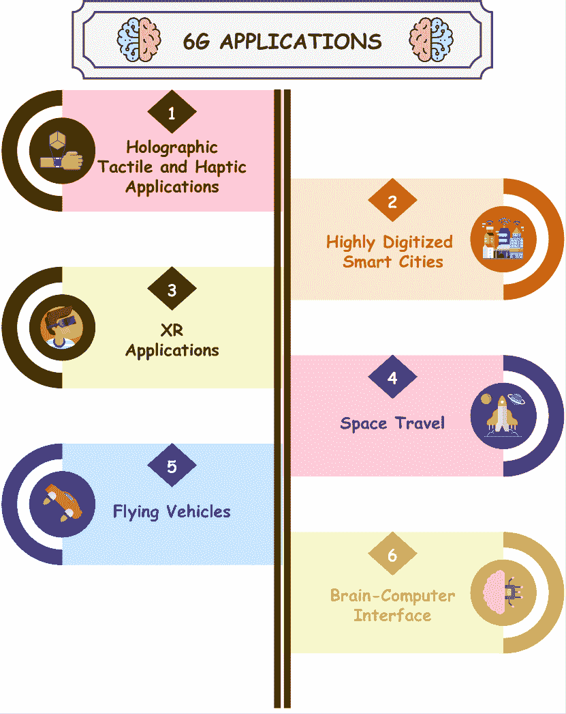

图 1：6G 无线网络的前沿应用。

## 1 引言

\PARstart

从 2017 年 3 月开始，基于 3GPP（第 3 代合作伙伴计划）Release-15 标准，第五代(5G)无线通信技术在全球范围内取得了显著进展[1]， [2]。3GPP 在 2021 年 6 月完成了 Release-17 第 2 阶段冻结，并计划在 2022 年 3 月进行下一次冻结[3]。随着这些发布的进行，5G 的部署过程已达到较高的成熟度。根据最近的 GSA 报告，截至 2021 年 8 月，来自 72 个国家的 176 个运营商已启动了商业 5G 网络[4]。然而，尽管 5G 被提名为万物互联(IoE)系统的主要推动力，但其实施中的最新进展暴露了这一技术的缺陷和局限性[5]。尽管 5G 通过利用毫米波(mmWave)通信和多重正交频分复用(OFDM)等新技术，为无线网络带来了更多灵活性和效率，但其承诺的革命性移动通信前景迄今仍然是一个空想[5]， [6]。此外，虽然 5G 系统已经准备好支持数据速率要求高的增强型移动宽带服务和超可靠低延迟通信，但它们是否能支持未来的 IoE 应用仍然值得怀疑[6]。因此，研究人员一直在研究复杂的通信技术，并开发有趣的概念用于第六代(6G)无线网络，这些网络预计将在 2030 年后实现。即使蜂窝通信系统随着 5G 的发展达到了一个新的水平，对 2030 年及以后智能信息社会的期望仍将极具吸引力。6G 将成为高度数字化社区的核心提供者，通过连接一切，实现几乎无限的无线覆盖，建立全垂直网络，并支持用于触觉和感官应用的全息和高精度通信[7]。此外，新的 IoE 服务从扩展现实应用、飞行器到太空旅行和脑机接口，都将随着 6G 网络变为现实，使 6G 真正成为 IoE 的主宰[5]，如图 1 所示。然而，这些新兴而令人兴奋的应用将带来严格且非常具有挑战性的要求，如超高可靠性、低延迟、极高的数据速率、高能效和频谱效率以及密集的连接性。图 2 比较了 5G 和 6G 的规格，阐明了 6G 的期望[8]。关于这些 6G 技术的发展和期望，文献中也有其他研究小组进行了全面的综述和讨论[9]， [10]， [11]。

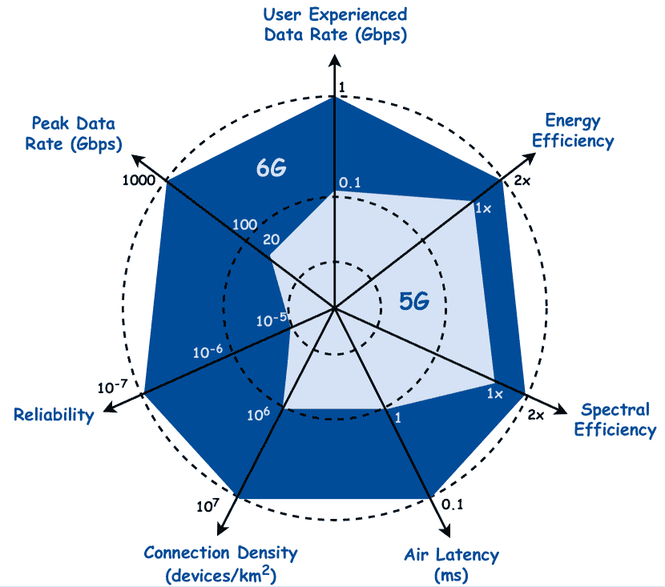

图 2：5G 和 6G 规格比较 [8]。

6G 的严格要求促使研究人员寻找复杂的物理层（PHY）技术。除了使用更高频段的频谱，如高频毫米波和太赫兹频段，6G 可能会结合许多新兴技术，如可扩展的人工智能（AI）、索引调制（IM）[12]、[13]、无小区的大规模多输入多输出（MIMO）系统[14]、[15]、可重构智能表面（RIS）[6]、[16]、[17]、物理层安全[18]、[19]、先进波形[20]、[21]、卫星和非地面网络[22]、[23]，以及无线电力传输[24]、[5]，如图 3 所示。尽管这些技术都会对 6G 产生重大影响，但人工智能可能是 6G 网络的主要创新者，为无线网络，尤其是物理层，提供全新的视角。

前述当前技术通过使用基于模型的技术来优化多个网络功能，这些技术提供了所涉及策略的特征。然而，这些技术可能过于复杂而难以在实际运行中实施，或者它们可能包含过多的抽象，难以在广泛环境中使用。相反，基于人工智能的解决方案可以通过吸收目标通信环境的知识来适应动态变化的场景和本地特征。人工智能可以在高度可配置的基础设施中实现，提供广泛的网络灵活性。人工智能能够预测某些限制并处理大量数据，因此，集成人工智能的 6G 将有助于以更少的资源和计算负担处理最终的大量元数据。

人工智能有着悠久且成功的历史，可以追溯到大约 1940 年代，当时神经网络（NN）首次出现在智能系统中。多年来，机器学习（ML）和深度学习（DL）方法已被证明是解决计算机视觉、机器人技术和自然语言处理等挑战性任务的有效框架，在这些任务中建立一个具体的数学模型相对困难。例如，尽管几乎是不可能为手写数字（数字识别）或图像中的不同对象（图像分割）开发出分析模型或鲁棒算法，但 DL 技术可以完成这些任务，并且其性能超过了人类水平。另一方面，通信技术依赖于大量数学模型和理论，这些模型和理论需要专业知识，如信息理论和信道建模。信息信号通过具有调制、编码和信令方案的最优发射器设计，从一系列数学定义的信道模型中可靠地传输到接收端，每个模块都经过单独优化。除了这种明确定义的 PHY 架构外，安全传输能力以及消除各种硬件缺陷使得通信成为一个复杂而成熟的领域。因此，ML 和 DL 技术必须达到崇高的目标，以超越现有技术并提供显著的优势。将 DL 方法应用于分别优化构建模块，从调制和编码方案（MCS）到符号检测和信道估计算法，可能不会带来太大变化[25]。在复杂场景中，如未知信道模型和超高移动条件下，通信系统的端到端（E2E）优化是我们期待在 6G 中看到的最引人注目的概念，我们称之为 PHY 革命。从当前 PHY 通信的块结构（每个块负责不同的信号处理任务）转向使用 DL 方法的 E2E 优化，代表了一个彻底的范式转变，这将彻底改变 6G 及以后的无线通信。

图 3：可以主导 6G 时代的新兴 PHY 技术概述。

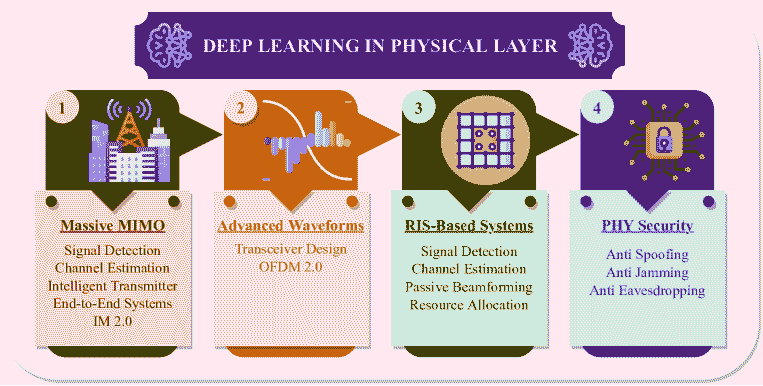

图 4：本文综合调查的 6G 四个主要研究方向以及在这些方向上探讨的 DL 解决方案。

研究人员一直在研究使用机器学习（ML）和深度学习（DL）技术来克服当前系统的缺陷，尤其是在过去几年中。然而，尽管 DL 方法具有极大的潜力，但它们在具有挑战性的通信场景中面临一些限制这些限制影响了它们的可行性。深度神经网络（DNN）的高度参数化架构需要大量数据集来学习从特征到期望结果的适当映射，这增加了计算复杂性并使训练过程变得复杂。因此，单纯依赖基于数据的 DNN 作为黑箱，并将所有预测留给模型权重，目前来看是有疑问的，因为关于通信的数据集尚未达到令人满意的水平。由于模型驱动和数据驱动方法的局限性，出现了模型驱动的 DNN，这些 DNN 结合了 DNN 强大的学习和映射能力与专家知识，以获得最大的潜在优势。最常见的两种模型驱动 DNN 策略是深度展开网络，其中 DNN 层重复现有迭代算法的迭代，以及混合网络，其中 DNN 帮助传统模型并提高效率[26]。随着 DL 在通信技术领域文献的发展，数据稀缺问题也成为过去，铺平了完全基于数据的 DL 系统的道路。

### 1.1 贡献

在这篇全面的调查文章中，我们从物理层（PHY）四个突出且创新的 6G 概念的角度探讨了深度学习（DL）的应用，包括大规模 MIMO 系统、先进的多载波（MC）波形、RIS 赋能系统以及物理层安全，如图 4 所示。我们全面呈现了有关 PHY 设计的最新 DL 文献概述，揭示了迄今为止取得的进展，并比较了所考虑模型的关键特征。此外，考虑到文献中对 DL 概念实施和编程步骤的覆盖有限和需求巨大，我们通过提供简单的代码片段来展示示例实现，以启发对该领域感兴趣的读者。在这方面，我们也希望我们的文章对希望获得基于 DL 的无线系统设计实践经验的无线研究人员有所帮助。据我们所知，这是文献中唯一一篇从 PHY 架构的角度聚焦于 6G 的调查文章，并为 PHY 研究人员提供了完整的指南。

尤其是，我们首先阐明了针对大规模 MIMO 检测和信道估计挑战的深度学习（DL）方法，以克服传统方法的缺点。结合基于 DL 的检测和信道估计方案，我们提出了完全智能的大规模 MIMO 接收框架。此外，我们分析了如何用 DL 结构替代传统大规模 MIMO 发射机中的信号处理模块，以提供低复杂度的最佳传输方案。我们对智能大规模 MIMO 系统的长期目标是整合基于 DL 的发射机和接收机，开发创新的端到端（E2E）通信系统，即使在未知信道模型中也是如此。作为 MIMO 系统的一项显著增强，IM 技术最近引起了极大关注。因此，我们还考察了如何提高现有 IM 技术的效率，并提出了 DL 赋能的 IM 2.0 解决方案。我们还提供了一个基于 DL 的 IM 系统的实现示例，并附有简化的代码片段，以指导有兴趣的读者在 Python 中编程构建基于 DL 的 MIMO 系统。

对于 MC 通信系统，我们主要关注基于 DL 的收发器设计，以改进各种性能指标。在大多数研究中，神经网络（NNs）被设计用于各种 MC 通信系统的接收端，以超越传统算法。引入了数据驱动的基于 DL 的接收器设计，以执行信道估计和信号检测任务。此外，通过利用专家知识，提出了基于模型的神经网络，以进一步提高性能并减少计算复杂度。最近的研究集中在优化发射机和接收机整体管道的收发器设计上，借助端到端（E2E）方法，这被提出作为一个有前景的方向。此外，我们提供了一个广泛的文献综述，以改进 OFDM 的弱点，OFDM 迄今为止是当前标准中最受欢迎的波形。特别地，利用深度展开的 DL 技术在应对 OFDM 的主要问题方面表现出有前景的解决方案。

在 RIS 辅助通信系统方面，我们调查了基于深度学习的研究，这些研究提出了新颖的框架，以克服早期 RIS 系统的现有缺陷。我们主要介绍了包含智能信道估计和信号检测过程的深度学习方法。我们得出结论，采用深度学习方法所需的导频和训练开销比传统技术少。此外，我们关注于新兴的深度学习基础的神经网络，消除了 RIS 辅助方案中的相位配置模型依赖。所展示的被动波束成形设计证明了深度学习过程揭示了相位变化与接收信号强度之间的直接映射，在不同的信道环境中提供了鲁棒性，同时减少了计算复杂性。我们还回顾了最近的研究，这些研究展示了采用完全被动元件的独立操作，以适应 RIS 的被动特性并减少训练开销。此外，鉴于对下一代通信系统中非正交多址（NOMA）解决方案的兴趣不断增长，我们检查了基于深度学习的系统，这些系统改善了 RIS 辅助 NOMA 设计的聚类和功率分配性能。因此，我们讨论了深度学习方法在动态状态和用户数量下提供的灵活性和鲁棒性，相较于传统方法具有更好的性能。

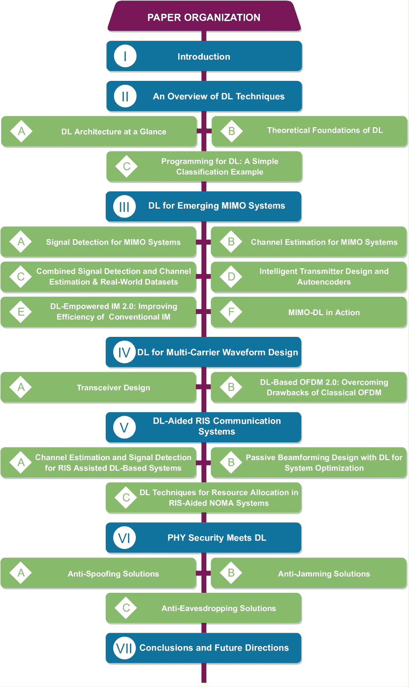

图 5：文章的组织结构。

最后，我们关注于深度学习（DL）辅助的物理层（PHY）安全方法，并调查现有的文献研究。深度学习从三种主要攻击类型的角度实现到物理层安全方案中：欺骗、干扰和窃听。针对欺骗者，深度学习主要用于接收端，以提高认证准确性。特别是，深度学习改善了认证测试中的合法/非法分类问题，并在未知和变化的环境下提供了鲁棒性。深度学习也用于抗干扰目的。然而，大多数抗干扰方法使用强化学习来避开干扰频率，并将深度学习用于更好的 Q 函数近似。此外，各种安全通信系统在其系统模型中实现了深度学习算法，以提高对窃听者的保密率。特别是，我们揭示这些研究采用数据驱动模型生成编码或波束成形方案，以最小化泄漏给窃听者的信息。

### 1.2 组织结构

本文的组织结构见图 5。在第二节中，我们简要讨论深度学习的结构，并从理论和编程的角度介绍基本的深度学习技术。我们将在第三节开始我们的广泛文献综述，讨论新兴的 MIMO 技术，并提供一个基于深度学习的 MIMO 系统模型的实现示例。第四节介绍了复杂的 MC 波形的深度学习解决方案。在第五节中，我们深入探讨深度学习辅助的 RIS 通信系统。第六节讨论了深度学习方法如何实现安全通信。最后，我们在第七节总结了我们的未来展望。

## 2 深度学习技术概述

在本节中，我们将讨论深度学习（DL）模型的一般结构，并解释神经网络（NNs）的训练过程，以快速概述深度学习技术。我们将重点强调构成深度学习模型的基本概念和参数，以便于理解文献中提出的方法。我们还将深入探讨常用的深度学习技术，即深度神经网络（DNN）、卷积神经网络（CNN）和递归神经网络（RNN），提供它们的理论背景和动机。此外，我们将讨论每种技术在无线网络中的应用。最后，我们将通过使用简单的 CNN 架构和著名的 CIFAR10 数据集 [27], [28]完成图像分类任务，结束本节。

### 2.1 深度学习架构一瞥

DL 是 ML 的一个子分支，具有多个堆叠的处理层，通过学习数据表示来实现预测、分类或其他决策。与强烈依赖领域专家特征的经典 ML 方法相比，DL 模型生成非线性的输入输出映射以执行目标任务。图 6 展示了 DL、ML 和 AI 之间的关系。神经网络架构中的每一层将表示转化为更高的层次，每次转化解锁了对原始数据更复杂特征的学习。模型可以是浅层或深层的，具体取决于层的数量和神经网络的深度，通过对关键特征敏感和对环境或附近物体等无关变化不敏感来模仿原始输入数据的简单或复杂函数。除了输入层和输出层外，每一层都是一个由称为神经元的隐藏单元组成的隐藏层。在表示学习过程中，隐藏层中的隐藏神经元计算其前一层输入的加权和，并通过非线性激活函数将结果传递到下一层，这对应于一次前向传播的迭代。从输入层开始，它将原始输入数据的加权和传递到第一个隐藏层，每个隐藏层处理其计算。最后，输出层产生所需的结果，这些结果可能是概率、类别得分或其他度量。DL 研究人员已确定了几种激活函数以在前向传播中引入非线性效果，例如整流线性单元（ReLU）、泄漏 ReLU、tanh、sigmoid 等。最受欢迎的是 ReLU 函数，其定义为 $f(a)=\text{max}(a,0)$ [29]，[30]。

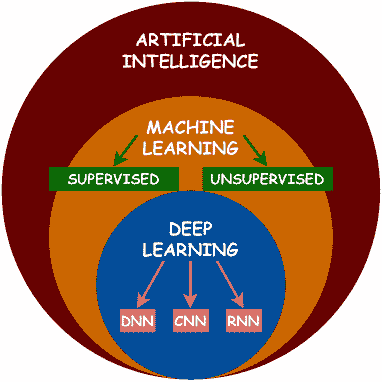

图 6：展示了 DL、ML 和 AI 之间的关系。

当神经网络完成一次前向传播迭代时，算法通过将输出分数与期望标签进行比较来计算损失函数。这个损失函数表示模型错误，随后用于更新内部参数，也称为模型权重。这些可调节权重的更新对应于深度学习模型的训练。在训练过程中，算法计算损失函数相对于每个权重的导数，以观察权重增加或减少时结果误差的变化。在与前向传播相反的方向，算法使用链式法则[31]计算权重梯度，这个过程称为反向传播。深度学习模型通过将权重调整为计算出的梯度的反向方向来更新权重，从而在反向传播后减少误差值[29]。更新规则是深度学习应用中最关键的方面之一，因为它对整体学习性能和训练时间有很大影响。因此，研究人员开发了不同的优化器，包括动量优化[32]、均方根传播、随机梯度下降 (SGD)[33]、自适应矩估计 (ADAM)[34] 等。最近，Facebook Research 发布了一种新的更新算法，称为 MADGRAD [35]，深度学习界正在讨论这种新技术是否可以取代 ADAM 优化器。图 7 展示了一次训练过程的单次运行，包括前向传播、损失计算和针对单层隐藏层 DNN 的反向传播，其中给定的变量将很快被定义。一个典型的深度学习模型需要进行数亿次这样的迭代，以确保模型观察到足够多的实例，并使模型误差根据应用收敛到合理的值。测试过程紧随其后，用于检查模型是否能够推广到未见过的情况，这也被称为深度学习模型的组合性。训练和测试损失值之间的差异表示模型方差，指示模型出现过拟合，即模型记住而不是学习。另一方面，训练损失和贝叶斯误差值之间的差异对应于模型偏差，并揭示模型欠拟合，这需要更多的训练。通过将训练误差与零误差进行比较来研究模型偏差是一个常见的错误。实际上，贝叶斯误差，即已知的最优值，可以是人类水平的性能或其他值，应作为偏差的基准，这不一定是零。

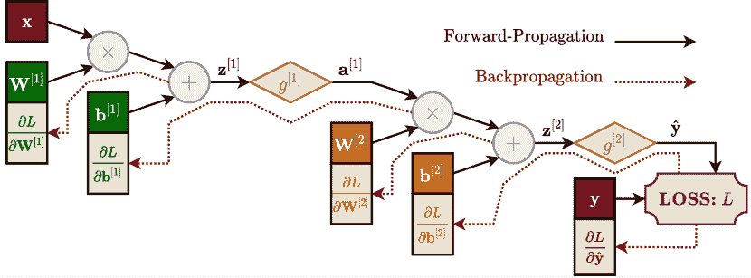

图 7：包括前向传播、损失计算和反向传播的单隐藏层深度神经网络计算图。

我们已经提供了深度学习结构和训练过程的简要介绍，包括前向传播和反向传播的见解。接下来，我们将介绍三种常用的深度学习架构：DNN、CNN 和 RNN，并展示一个简单的图像分类任务的实现。

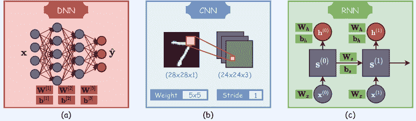

图 8：三种常见的深度学习架构：(a) DNN，(b) CNN，(c) RNN。

### 2.2 深度学习的理论基础

我们将从分析 DNN 开始，DNN 是目前深度学习应用中最常见的结构。DNN 由多个堆叠的层组成，每个神经元都与前一层和后一层的所有神经元相连，形成完全连接的结构。输入层和输出层的神经元数量分别等于原始输入数据中的特征数量和根据应用需求的类别、类或其他目标的数量。图 8(a)展示了一个具有两个隐藏层和三个类别的 DNN 架构。两个神经元之间的每条连接代表一个实值权重，形成学习机制的基础。仔细初始化模型权重对于优化学习性能和避免梯度消失或爆炸至关重要。一种广泛使用的初始化方法是随机生成均匀分布或高斯分布的权重矩阵。另一种流行的方法是 Xavier 初始化[36]，由 Xavier Glorot 和 Yoshua Bengio 提出，其中在层$[l-1]$和$[l]$之间随机生成的权重会被缩放为$\sqrt{2/(n^{[l-1]}+n^{[l]})}$，其中$n^{[l]}$是第$l$层中的神经元数量。图 8(a)给出了单个实例的 DNN 前向传播过程如下：

|  | $\displaystyle\text{隐藏层-1: }\mathbf{z}^{[1]}$ | $\displaystyle=\mathbf{W}^{[1]}\mathbf{x}+\mathbf{b}^{[1]},\quad\mathbf{a}^{[1]}=g^{[1]}(\mathbf{z}^{[1]}),$ |  | (1) |
| --- | --- | --- | --- | --- |
|  | $\displaystyle\text{隐藏层-2: }\mathbf{z}^{[2]}$ | $\displaystyle=\mathbf{W}^{[2]}\mathbf{a}^{[1]}+\mathbf{b}^{[2]},\quad\mathbf{a}^{[2]}=g^{[2]}(\mathbf{z}^{[2]}),$ |  |
|  | $\displaystyle\text{输出: }\mathbf{z}^{[3]}$ | $\displaystyle=\mathbf{W}^{[3]}\mathbf{a}^{[2]}+\mathbf{b}^{[3]},\quad\hat{\mathbf{y}}=g^{[3]}(\mathbf{z}^{[3]}).$ |  |

在 (1), $\mathbf{x}$ 和 $\hat{\mathbf{y}}$ 分别表示 $(4\times 1)$ 维原始输入数据和 $(3\times 1)$ 维类别评分，而 $\mathbf{W}^{[l]}$、$\mathbf{b}^{[l]}$、$\mathbf{z}^{[l]}$、$g^{[l]}$ 和 $\mathbf{a}^{[l]}$ 分别对应于 $(n^{[l]}\times n^{[l-1]})$ 维权重矩阵、$(n^{[l]}\times 1)$ 维偏置向量、$(n^{[l]}\times 1)$ 维加权和、激活函数和第 $l^{\text{th}}$ 层的 $(n^{[l]}\times 1)$ 维输出。激活函数 $g$ 是非线性的，因为使用线性激活函数会消除堆叠多个层的效果，并导致与具有单个输出层的模型相同的性能，如 (2) 所示，其中激活函数为 $g(x)=x$：

|  | $\begin{split}\hat{\mathbf{y}}&amp;=\mathbf{W}^{[3]}(\mathbf{W}^{[2]}(\mathbf{W}^{[1]}\mathbf{x}+\mathbf{b}^{[1]})+\mathbf{b}^{[2]})+\mathbf{b}^{[3]}\\ &amp;=\bar{\mathbf{W}}\mathbf{x}+\bar{\mathbf{b}},\end{split}$ |  | (2) |
| --- | --- | --- | --- |

其中，$\bar{\mathbf{W}}=\mathbf{W}^{[3]}\mathbf{W}^{[2]}\mathbf{W}^{[1]}$，$\bar{\mathbf{b}}=\mathbf{W}^{[3]}\mathbf{W}^{[2]}\mathbf{b}^{[1]}+\mathbf{W}^{[3]}\mathbf{b}^{[2]}+\mathbf{b}^{[3]}$。正如我们之前讨论的那样，ReLU 是隐藏层的适当选择，而输出层则采用 softmax 激活函数，由 (3) 给出，以获得输出评分：

|  | $\mathbf{softmax}(\hat{y}_{i})=\frac{e^{\hat{y}_{i}}}{\sum_{c=1}^{3}e^{\hat{y}_{c}}}.$ |  | (3) |
| --- | --- | --- | --- |

这里，$\hat{y}_{i}$ 是第 $i^{\text{th}}$ 类的评分。然而，DL 网络的输出层并不总是使用 softmax 激活函数。实际上，这取决于应使用 DL 技术处理的工作。被处理的问题塑造了选择输出层激活函数的方式。尽管任何回归问题都最适合使用线性激活函数，但分类问题在输出层需要不同类型的激活函数，例如 sigmoid 和 softmax。

当算法通过前向传播获得输出评分时，它根据这些评分计算损失值。损失函数可能因应用而异，并且我们将为这个分类模型使用分类交叉熵损失函数：

|  | $L(\mathbf{y},\hat{\mathbf{y}})=-\sum_{c=1}^{3}y_{c}\text{log}(\hat{y}_{c}),$ |  | (4) |
| --- | --- | --- | --- |

其中 $\mathbf{y}$ 是地面真实标签的一热编码向量，该向量除正确类别的索引外其他全为零。下一步是反向传播，其中通过对损失函数关于权重和偏差的导数来计算梯度。 (5) 提供了第一隐藏层的权重矩阵和偏差向量的梯度计算，使用了著名的链式法则：

|  | $\displaystyle\frac{\partial L}{\partial\mathbf{W}^{[1]}}$ | $\displaystyle=\frac{\partial L}{\partial\hat{\mathbf{y}}}\frac{\partial\hat{\mathbf{y}}}{\partial\mathbf{z}^{[3]}}\frac{\partial\mathbf{z}^{[3]}}{\partial\mathbf{a}^{[2]}}\frac{\partial\mathbf{a}^{[2]}}{\partial\mathbf{z}^{[2]}}\frac{\partial\mathbf{z}^{[2]}}{\partial\mathbf{a}^{[1]}}\frac{\partial\mathbf{a}^{[1]}}{\partial\mathbf{z}^{[1]}}\frac{\partial\mathbf{z}^{[1]}}{\partial\mathbf{W}^{[1]}},$ |  | (5) |
| --- | --- | --- | --- | --- |
|  | $\displaystyle\frac{\partial L}{\partial\mathbf{b}^{[1]}}$ | $\displaystyle=\frac{\partial L}{\partial\hat{\mathbf{y}}}\frac{\partial\hat{\mathbf{y}}}{\partial\mathbf{z}^{[3]}}\frac{\partial\mathbf{z}^{[3]}}{\partial\mathbf{a}^{[2]}}\frac{\partial\mathbf{a}^{[2]}}{\partial\mathbf{z}^{[2]}}\frac{\partial\mathbf{z}^{[2]}}{\partial\mathbf{a}^{[1]}}\frac{\partial\mathbf{a}^{[1]}}{\partial\mathbf{z}^{[1]}}\frac{\partial\mathbf{z}^{[1]}}{\partial\mathbf{b}^{[1]}}.$ |  |

DNN 模型单次训练过程的最后阶段执行模型权重和偏差的更新。使用 SGD 优化方法，算法通过将权重矩阵和偏差向量在梯度方向的反方向上进行更新，并按学习常数 $\alpha$ 对其梯度进行缩放：

|  | $\displaystyle\mathbf{W}^{[l]}$ | $\displaystyle:=\mathbf{W}^{[l]}-\alpha\frac{\partial L}{\partial\mathbf{W}^{[l]}},$ |  | (6) |
| --- | --- | --- | --- | --- |
|  | $\displaystyle\mathbf{b}^{[l]}$ | $\displaystyle:=\mathbf{b}^{[l]}-\alpha\frac{\partial L}{\partial\mathbf{b}^{[l]}}.$ |  |

第二种著名的深度学习架构是 CNN，也称为卷积神经网络。CNN 架构假定 2D 特征向量中各个区域之间存在相似性，并旨在捕捉这些部分之间的相关性，如图 8(b) [29], [30], [37] 所示。CNN 架构动机的第一个关键思想是局部连接。与 DNN 的每个隐藏单元与前后层所有隐藏单元连接不同，CNN 将卷积层中的单个单元连接到前一层中的局部区域。CNN 模型的原始输入数据由多个对应于通道的 2D 特征向量组成。例如，一个 $28\times 28$ 的 RGB 图像由三个 2D 特征向量组成，表示 RGB 颜色通道中的像素。RGB 图像的局部区域很可能是相关的，统计数据也是可比的，这意味着一个区域出现的模式也可能出现在另一区域，例如图像中猫的两个耳朵出现在不同的位置 [29], [37]。因此，利用这些空间关系，将输入数据的一个区域链接到隐藏单元而不是完全连接的结构是合乎逻辑的 [37]。

形成 CNN 基线的第二个主要特征是权重共享。2D 特征向量中的每个局部区域都与下一卷积层中的一个不同隐藏单元连接，所有链接使用相同的权重矩阵。权重共享的动机是减少可学习参数的数量。给出的例子在 [37]中完美地描述了这一动机。假设我们有 $482\times 415$ 的输入数据，包含三个通道，其中输入大小为 $600090$。考虑到 DNN 的密集连接，单个隐藏单元的参数大小大约为 $600$K，而 $1000$ 个隐藏单元的参数大小则增加到超过 $600$M。许多参数会显著增加训练时间，耗尽可用内存，并且需要强大的正则化器来防止过拟合。另一方面，一个 $40\times 40$ 的共享权重矩阵跨越局部区域，提供了 $4800$ 个可学习参数，使得 $125$ 层隐藏层每层有 $1000$ 个单元，与密集连接中的单个隐藏层相比。结果是，参数数量和模型大小显著减少，同时增强了泛化能力，防止了对数据的记忆而不是学习。

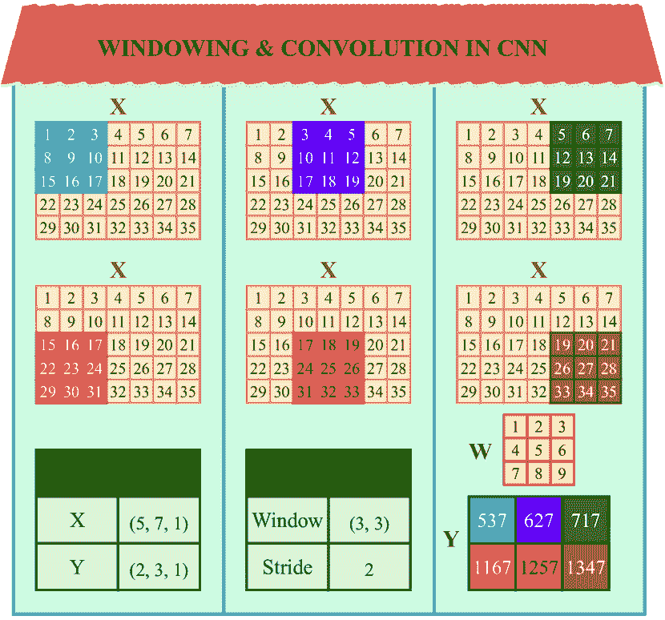

图 9：CNN 模型的窗口化过程和卷积操作。

CNN 前向传播的主要操作是卷积，它将局部区域链接到隐藏单元。具体而言，CNN 模型通过卷积操作计算 2D 特征向量中的一个补丁的加权和，以将补丁的特征传递到下一层的单个隐藏单元。一个补丁代表 CNN 前向传播的窗口，其大小决定了共享权重矩阵的大小，CNN 遍历所有窗口以进入下一层。这些窗口可能会交叉，而且很可能会交叠，其中移动大小对应当前卷积层的步幅。关于这个窗口程序和卷积操作的简单示例如图 9 所示。在这个例子中，$5\times 7$输入数据$\mathbf{X}$和$2\times 3$输出数据$\mathbf{Y}$都包括一个单一通道；然而，它们根据模型架构可能有所不同。当输入数据中有更多通道时，与图 9 中所示的方式一样，$3\times 3$共享权重跨越其他通道。输入和输出数据的维度可能根据窗口大小和步幅值而有所争议。因此，如果需要，向输入数据添加由所有零组成的填充层可以使维度相等化。

在典型的 CNN 模型架构中，卷积层之后是一个池化层，它计算输入补丁的单一统计量，如平均值或最大值 [37]。池化层使 CNN 模型能够在不需要额外可学习参数的情况下对小扭曲变形具有鲁棒性 [29]， [37]。池化层的步幅值通常与窗口大小一样大。CNN 模型的初始阶段通常由堆叠的卷积、非线性激活函数和池化层组成，随后是更多的卷积和稠密层 [29]。损失计算和反向传播过程与 DNN 的相同，算法通过对权重的损失求导来计算梯度。

到目前为止，我们考察的深度学习技术都有一个共同的缺点，即没有记忆能力，每一层的输出仅依赖于其输入和相应的权重，而不考虑过去的信息。这正是 RNN 发挥作用的地方，RNN 能够利用之前的信息来处理包括语音识别和自然语言处理在内的序列数据。RNN 一次处理一个样本的输入序列，元素之间存在相关性，输出不仅依赖于输入和权重，还依赖于过去的信息，如图 8(c) [29], [30], [38] 所示。RNN 的架构可能根据应用的不同而有所变化。例如，每层可能产生一个输出，如图 8(c)，用于序列生成应用，如图像描述，或者对于序列分类应用，如评估产品评论的情感是否积极或消极 [38]。对于序列输入数据 $\mathbf{X}$，例如句子或语音，典型的 RNN 隐藏层执行以下前向传播：

|  | $\displaystyle\mathbf{s}^{(t)}$ | $\displaystyle=\text{tanh}(\mathbf{W}_{x}\mathbf{x}^{(t)}+\mathbf{W}_{s}\mathbf{s}^{(t-1)}+\mathbf{b}_{s}),$ |  | (7) |
| --- | --- | --- | --- | --- |
|  | $\displaystyle\mathbf{h}^{(t)}$ | $\displaystyle=\mathbf{W}_{h}\mathbf{s}^{(t)}+\mathbf{b}_{h}.$ |  |

在这里，$\mathbf{s}^{(t)}$ 是模型在时间 $t$ 的内部状态，它通过包含过去元素的信息形成记忆单元，$\mathbf{W}_{x}$ 和 $\mathbf{W}_{s}$ 分别是将第 $t^{\text{th}}$ 输入样本 $\mathbf{x}^{(t)}$ 和前一个状态 $\mathbf{s}^{(t-1)}$ 连接到当前状态的权重，$\mathbf{b}_{s}$ 是 $\mathbf{s}^{(t)}$ 的偏置，$\mathbf{b}_{h}$ 是层输出 $\mathbf{h}^{(t)}$ 的偏置。类似于 CNN 中的权重共享过程，RNN 的隐藏层共享权重和偏置，这可以防止过拟合并减少模型复杂性 [30]。

RNN 的训练过程类似于 DNN 和 CNN，其中 RNN 模型作为一个多层前馈神经网络，每层对应一个时间步，在这些时间步之间共享权重，并根据应用提供单个或多个输出。经过损失计算后，RNN 模型通过时间反向传播（BPTT）算法进行训练，这实际上是时间展开的 SGD [30]，[38]。然而，BPTT 算法具有挑战性，因为它会导致梯度消失，这会阻碍信息传递，或梯度爆炸，这会使训练瘫痪。其原因是在反向传播过程中与权重矩阵的重复乘法。研究人员提出了几种解决方案，如从之前训练的模型初始化权重、防止梯度超出阈值的梯度裁剪，以及像 ADAM [38] 这样的复杂优化技术。作为这些解决方案的强大替代方案，长短期记忆（LSTM）网络被设计用来解决梯度消失或爆炸问题，并通过增强网络的显式记忆来提供比经典 RNN 更长的记忆。我们考虑一个语言模型，其目标是根据前文预测即将到来的单词 [39]。当相关信息和预测点之间的间隔较小时，RNN 在预测方面表现良好：

|  | $\displaystyle\textit{云彩在 }\underbrace{\textit{\fcolorbox{orange}{table_red}{天空} 中的 \text@underline{{\color[rgb]{1,0,0}\definecolor[named]{pgfstrokecolor}{rgb}{1,0,0}{云彩}}}.}}_{\textbf{{\normalsize{\color[rgb]{0.3515625,0.66015625,0.59375}\definecolor[named]{pgfstrokecolor}{rgb}{0.3515625,0.66015625,0.59375}较小间隙}}}}$ |  |
| --- | --- | --- |

不幸的是，随着距离的增加，RNN 无法找到相关信息，而距离可能变得相当大。在这种情况下，使用 LSTM 网络来学习长期依赖关系是有益的。

|  | $\displaystyle\textit{我来自 }\underbrace{\textit{\fcolorbox{orange}{table_red}{法国} 而且我擅长说流利的 \text@underline{{\color[rgb]{1,0,0}\definecolor[named]{pgfstrokecolor}{rgb}{1,0,0}{法语}}}.}}_{\textbf{{\normalsize{\color[rgb]{0.97265625,0.64453125,0.53515625}\definecolor[named]{pgfstrokecolor}{rgb}{0.97265625,0.64453125,0.53515625}较大间隙}}}}$ |  |
| --- | --- | --- |

根据我们的综合研究，DNN 迄今为止是无线通信物理层设计中最受欢迎的深度学习架构。具体而言，DNN 被用于信号检测、信道估计、多载波波形设计中的峰值与平均功率比（PAPR）减少以及基于 RIS 系统的被动波束形成设计。基于 CNN 的模型在深度学习物理层设计文献中也扮演着重要角色。应用案例包括调制识别、信号分类、多载波波形设计中的去周期前缀（CP）和物理层安全方案中的反欺骗与抗干扰。此外，值得一提的是，CNN 不一定要使用 2D 特征向量。文献中有若干研究使用 1D CNN。特别是，无线通信领域在许多任务中广泛受益于 1D CNN，如网络管理、流量分析等 [40], [41], [42]。

RNN 在基于深度学习的物理层方法中找到了一种适中的节奏，具有高移动性下的多载波波形设计和抗窃听物理层安全方案的某些应用。考虑到未来的无线网络，DNN、CNN 和 RNN 有潜力用于建模多属性移动数据、空间移动数据分析和时间数据建模 [30]。在了解了最流行的深度学习架构的理论背景和主要应用之后，我们可以深入探讨使用 Python 进行深度学习编程。尽管展示图像分类应用并不是本工作的主要重点，但我们在此提供一个简单的例子来说明深度学习编程的基础。

### 2.3 自编码器和生成对抗网络

我们还在这项调查中详细阐述并呈现了追求端到端学习方案的研究。由于端到端学习概念对无线通信方案中的性能提升有显著贡献，已经有若干研究使用这一尚在发展的自编码器方法。自编码器是一种神经网络，其训练目的是将输入与输出相同。该网络可以分为两个组件：

|  | $\displaystyle\mathbf{h}=\mathbf{f(x),}$ |  | (8) |
| --- | --- | --- | --- |
|  | $\displaystyle\mathbf{\hat{x}}=\mathbf{g(h).}$ |  | (9) |

在 (8) 中，f(x) 函数定义了编码过程，其中 x 是输入数据，转换为 h 码。此外，(9) 中的 g(h) 函数定义了解码过程，将 h 码转换为输出 $\mathbf{\hat{x}}$。自编码器的简单结构如图 10(a) 所示。如果自编码器只是不断学习集合 $\mathbf{g(f(x))=x}$，它的效果并不会特别好。相反，自编码器的设计使其无法完美地复制。它们通常受到限制，只能复制与训练数据非常相似的输入，并且仅具有一定程度的准确性。模型通常会学习数据的有用特征，因为它必须决定哪些输入方面应该被复制。现代自编码器扩展了编码器和解码器的概念，除了确定性函数外，还包括了随机映射。

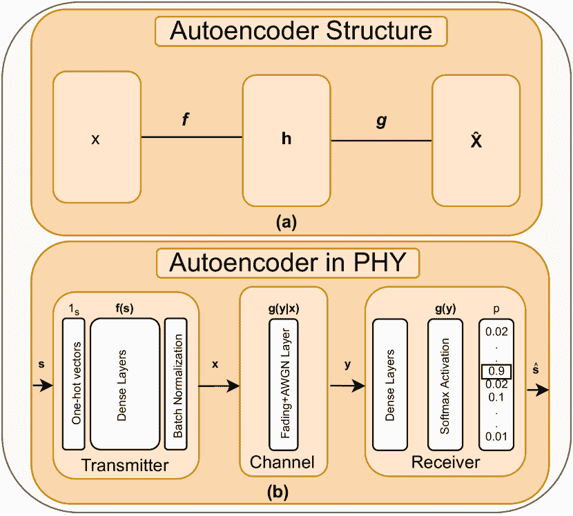

图 10：一种自编码器方案 (a) 将输入 x 映射到输出 x，其中函数 f 和 g 分别表示编码器和解码器 (b) 从无线通信的角度

通过一系列有效的参数线性代数操作，如图 10(b) 所示，无线通信中的自编码器使物理层的发射器和接收器能够形成本质上无约束的映射。通过尝试减少与重建损失相关的 BER，深度学习使我们能够找到解决整个通信系统设计挑战的方案。这种方法能够应用于各种信道和损伤模型，以提供更合适的解决方案。量身定制的波形可以通过学习物理层信息（编码器、解码器）和端到端表示解决方案，在挑战性的信道条件下实现创新和无与伦比的性能。

生成对抗网络（GAN）在外观上类似于一种反向自编码器。然而，与压缩输入数据的自编码器不同，GANs 在内部网络中将低维输入转换为高维数据。GANs 使用两个相互竞争的神经网络（对抗性），是一种计算结构，能够生成新的人工数据实例，这些实例可能被误认为是真实数据。它们广泛应用于图像、视频和声音的创建。名为“生成器”的神经网络生成新的数据实例，而这些实例会由另一个名为“鉴别器”的神经网络进行验证，如图 11 所示。鉴别器审查的每个数据样本都会被评估，以确定它是否属于训练数据集。自编码器和 GANs 之间的主要区别在于学习的方式。自编码器可以被认为是在解决一个半监督学习问题，因为它们旨在以尽可能少的损失重建图像。在其他方面，GAN 处理涉及无监督学习的问题。这两种方法的训练时间也可以视为最重要的区别。GAN 所需的训练时间较长；然而，自编码器提供的结果可信度较低（例如图像质量下降）。因此，GAN 被认为更稳定。

表 1：CIFAR10 数据集类别的标签和描述。

| 标签 | 描述 | 标签 | 描述 |
| --- | --- | --- | --- |
| $0$ | 飞机 | $5$ | 狗 |
| $1$ | 汽车 | $6$ | 青蛙 |
| $2$ | 鸟 | $7$ | 马 |
| $3$ | 猫 | $8$ | 船 |
| $4$ | 鹿 | $9$ | 卡车 |

### 2.4 深度学习编程：一个简单的分类示例

到目前为止，我们已经分析了 DNN、CNN 和 RNN 的理论基础。DL 应用的编程阶段与构建基于 DL 的系统同样重要，因为所考虑方法的可行性需要通过广泛的计算机模拟进行彻底检查。因此，我们将提供使用 Python 和 Keras 的基本 CNN 架构的编码阶段[43]。我们将构建一个基于 CNN 的图像分类模型，并使用 CIFAR10 数据集[27], [28] 进行训练。CIFAR10 包含 $60000$ 张 $(32\times 32)$ RGB 图像，包括表 1 中给出的 $10$ 个类别。$50000$ 张图像对应于训练数据，而其余 $10000$ 张图像构成测试数据。我们将从调用必要的模块开始：

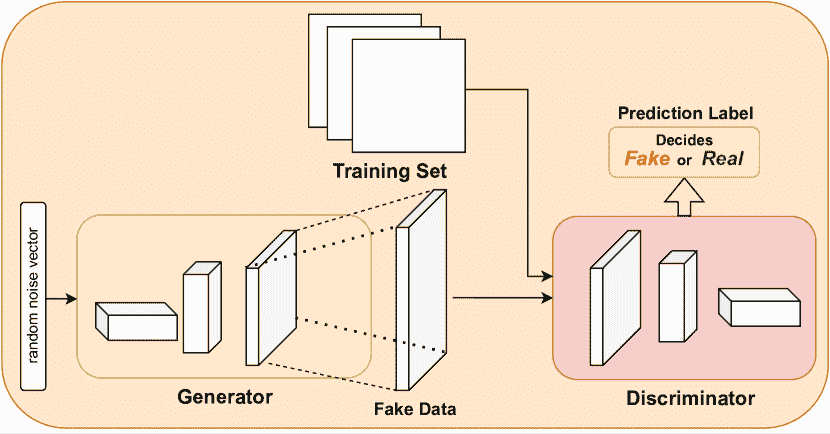

图 11：一个生成对抗网络的示意图。

⬇1  来自 tensorflow.keras.preprocessing.image  导入  img_to_array2  来自  tensorflow.keras.datasets.cifar10  导入  load_data3  来自  tensorflow.keras.layers  导入  Conv2D,  MaxPooling2D4  来自  tensorflow.keras.layers  导入  Dense,  Flatten5  来自  tensorflow.keras.models  导入  Sequential6  来自  PIL  导入  Image7  导入  numpy  作为  np

在这里，img_to_array 模块将图像转换为对应的 3D 像素数组，load_data 模块获取 CIFAR10 数据集，Conv2D、MaxPooling2D、Dense 和 Flatten 分别表示 CNN 的卷积层和池化层、DNN 的全连接层，以及将输入扁平化的层。Sequential 模块通过按顺序添加层来创建一个深度学习模型。Image 模块用于处理图像，numpy 是知名的科学计算模块。现在，我们可以导入 CIFAR10 数据并通过将每个像素标准化到 (0-255) 范围来进行预处理：

⬇1  (x_train,  y_train),  (x_test,  y_test)  =  load_data()2  x_train  =  x_train.astype(”float32”)  /  2553  x_test  =  x_test.astype(”float32”)  /  255

astype 函数将数据转换为“float32”数据类型。训练数据中的前十张图像及其标签和相应描述见图 12。在预处理和手动观察数据后，我们现在可以构建 CNN 模型。我们使用简单的架构来保持模型的复杂性和训练时间在适中范围内，具体创建方法如下：

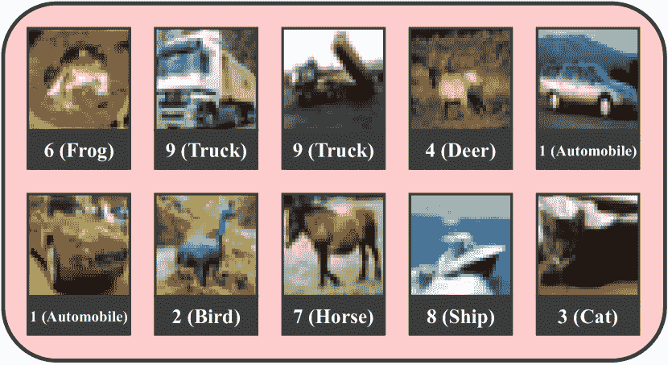

图 12：CIFAR10 训练数据中的前十张图像及其标签和相应描述。

⬇1  model  =  Sequential([2  Conv2D(32,  3,  input_shape=(32,  32,  3),  activation=”relu”),3  Conv2D(32,  3,  activation=”relu”),4  MaxPooling2D(2,  2),5  Conv2D(64,  3,  activation=”relu”),6  Conv2D(64,  3,  activation=”relu”),7  MaxPooling2D(2,  2),8  Flatten(),9  Dense(64,  activation=”relu”),10  Dense(10,  activation=”softmax”)11  ])12  model.compile(loss=”sparse_categorical_crossentropy”,  optimizer=”adam”,  metrics=[”accuracy”])

我们使用`sparse_categorical_crossentropy`损失函数来计算损失值，这与典型的分类交叉熵损失函数在 (4) 中的表现完全相同。然而，在这种情况下，真实标签是 0 到 9 之间的单个数字，代表正确标签，而不是一个独热向量。随后，我们训练我们的 CNN 模型以观察训练/测试损失和准确率值：

⬇1  history  =  model.fit(x_train,  y_train,  validation_split=0.1,  batch_size=128,  epochs=50)

在这里，validation_split 表示用于观察训练过程中未见数据的损失和准确度变化的训练数据的百分比。batch_size 是在单次迭代中训练模型的图像数量，其中一个 epoch 由所有批次的训练组成。history 变量包括每个 epoch 对应的训练和验证数据的损失和准确度值，如图 13 所示。图表表明，训练损失和准确度平稳地减少和增加，其中训练准确度趋近于 $97\%$。因此几乎没有偏差，模型没有过拟合。然而，验证损失在第十次迭代后上升，验证准确度趋近于约 $72\%$。因此，存在相当大的方差，模型严重过拟合训练数据。这也可以通过在测试数据上评估训练后的模型来观察：

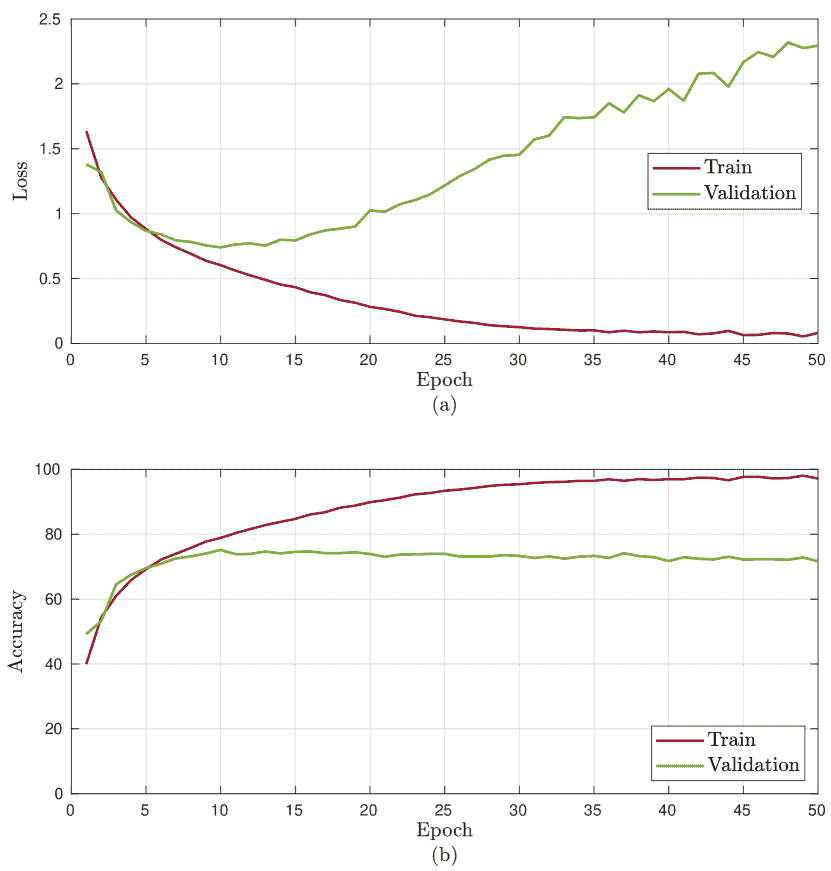

图 13：训练数据和验证数据的损失与准确度图表。

⬇1  _,  accuracy  =  model.evaluate(x_test,  y_test)2  print(”Accuracy:␣%.2f”%(accuracy  *  100))

+   $\gg$

    准确度：71.10

因此，该模型需要进行超参数调优，以提高其泛化能力，这超出了我们的范围。作为最后一步，我们可以尝试显式图像来预测它们的类别：

⬇1  image  =  Image.open(’/../image’)2  display(image)3  image  =  image.resize((32,  32))4  img_array  =  img_to_array(image)5  img_array  =  img_array.reshape(-1,  32,  32,  3)6  c  =  np.argmax(model.predict(img_array))

在这里，我们首先导入图像并调整大小，以使其适合我们的模型。然后，我们将图像转换为相应的 3D 像素数组。由于我们向模型提供了包含 50000 个实例的训练数据，因此模型的输入维度为 (N, 32, 32, 3)。因此，我们将 3D 像素数组重新塑造，使第一个维度为 1，并通过取输出数组的最大索引来预测图像的类别。图 14 显示了模型对四张模型从未见过的明确图像的预测。模型正确地识别了猫和卡车，但将给定的狗和青蛙分类为卡车和船，这支持了图 13 中低验证准确率的结果。

我们已经涵盖了深度学习架构的基础，介绍了三种最常用的深度学习技术：**DNN**、**CNN** 和 **RNN**，并提供了图像分类任务的编程阶段。接下来，我们将开始探讨深度学习在 PHY 技术中的应用，重点是 MIMO 系统。

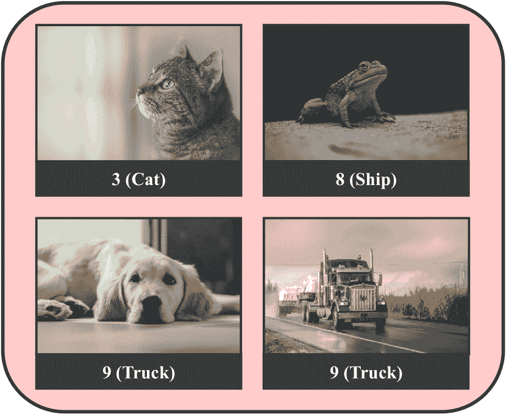

图 14：训练后的 CNN 模型对未见过的图像的预测结果。

## 3 深度学习在新兴 MIMO 系统中的应用

下一代无线通信技术预计将带来各种改进，如极高的数据传输速率和频谱效率。全新的移动通信技术，5G，以其最高可达 20 Gb/s 的峰值数据速率以及在延迟和能量/频谱效率方面的其他重大改进，引起了学术界和工业界的关注。作为一个完全智能世界的关键推动者，6G 将引入更高规格，如至少 1 Tb/s 的峰值数据速率和 1 Gb/s 的用户体验数据速率[5]。这些显著的改进得益于在发射端和接收端同时使用多个天线的技术，这被称为 MIMO 技术。MIMO 系统可以提供空间分集增益，通过多路径接收传输的符号，从而减轻衰落效应。另一种情况是，通过 MIMO 系统获得空间复用增益，其中通道的容量随着发射和接收天线的最小值线性增加[44]。通过将传统的 MIMO 系统扩展到同时服务许多用户的几百个天线，巨型多用户（MU）MIMO 技术已成为一种突破。巨型 MU-MIMO 利用传统 MIMO 的所有优点，同时消除 MU 干扰以进一步增强传输性能，这可以在图 15 中看到。与传统 MIMO 相比，巨型 MIMO 通过其强大的空间复用能力提供了 10 倍或更多的容量。此外，通过对小区域进行锐利波束成形的能力，它在能源效率上提高了约 100 倍[45]。

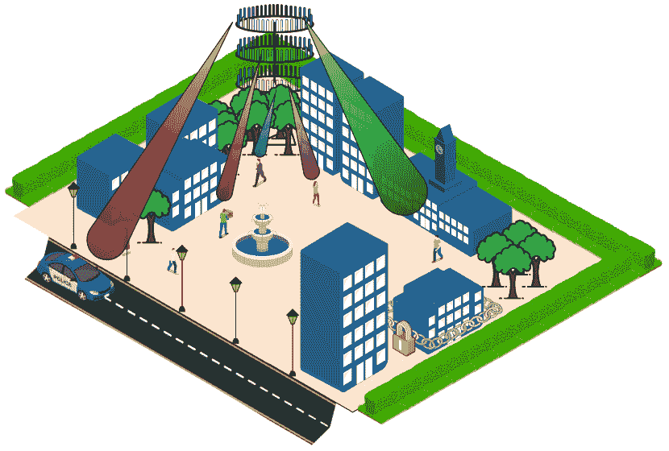

图 15：一个示例巨型 MU-MIMO 场景，展示了支持多个用户的大型天线阵列。

尽管大规模 MIMO 技术带来了巨大的好处，但也有一些代价。大规模 MIMO 的最显著特性——空间复用——需要可靠的信道状态信息（CSI）。在传统 MIMO 系统的下行传输中，例如在长期演进（4G）标准中，基站（BS）会发射一个导频序列，以便用户估计信道响应并将其反馈给基站。然而，这种方法不适用于大规模 MIMO 系统，因为每个用户需要估计几百个信道响应，从而产生巨大的反馈开销。另一个原因是导频应在天线之间正交，这需要大量的正交资源 [45]。大规模 MIMO 技术的另一个挑战是所需的射频（RF）链的数量。当基站的每个发射天线被激活以发射不同的符号时，所需的 RF 链数量等于发射天线的数量，这会增加硬件成本。作为上述 MIMO 固有问题的有前景的解决方案，IM 技术作为下一代无线通信技术的有力候选者出现。除了减少对大量 RF 链的需求外，IM 技术通过利用通信系统构建块的索引传输附加信息位，从而提供高能量和频谱效率 [12]。IM 技术的一个关键缺点是检测复杂性。通过 IM 传输的位数越多，检测器的复杂性就越高。最佳检测器是最大似然检测器（MLD），在某些情况下，由于其不可接受的复杂度，无法使用它。在这种情况下，线性检测器，如零强迫（ZF）和最小均方误差（MMSE）检测器，将以较差的比特误码率（BER）为代价进行应用。因此，目前使用的基于模型的检测器在复杂性和 BER 性能之间存在权衡。

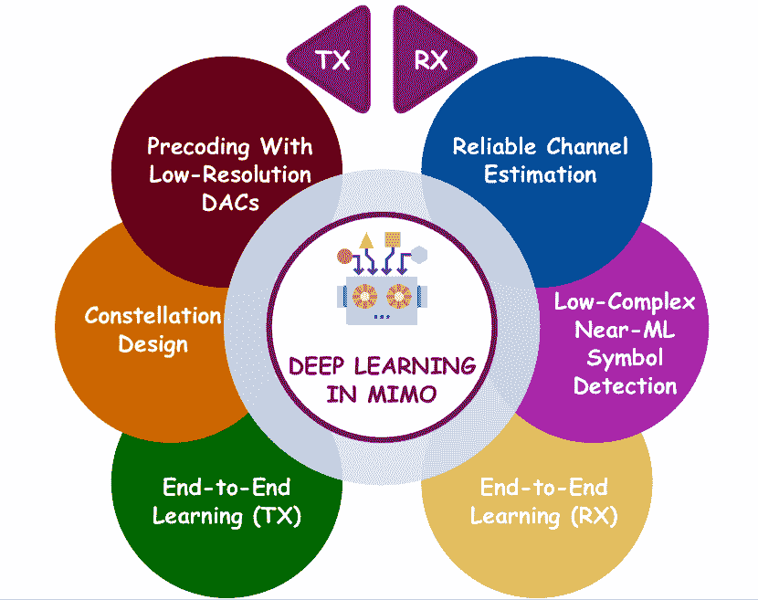

图 16：MIMO 系统发射端和接收端的下行应用。

传输信号的预处理，通常称为预编码，是高效大规模 MU-MIMO 系统中的另一个重要话题。基站在传输前使用预编码来减轻衰落信道的影响并取消 MU 干扰。然而，目前标准中存在的预编码技术需要高分辨率的数模转换器（DAC），这为系统带来了高复杂度。因此，设计具有低分辨率 DAC 的预编码器在智能大规模 MIMO 发射机设计问题中备受关注。在智能 MIMO 发射机的背景下，另一个蓬勃发展的主题是星座设计，因为通信系统的性能受到星座形状的高度影响。从早期到前沿技术，信息比特通过有限数量的星座进行调制，如正交振幅调制（QAM）和相位键控（PSK）。下一代智能 MIMO 发射机预计将使用优化的复杂形状星座调制信息比特，以适应传输环境。智能黑箱的使命是找到星座点的最佳位置并优化这些点的决策边界[46]。然而，为了在传统星座设计的基础上获得性能改进，接收机必须了解使用的复杂形状星座的决策边界。因此，对于传统检测器来说，在没有星座设计初始知识的情况下解码信息比特几乎是不可能的。这就是 E2E 学习成为下一代无线通信系统中一种极具魅力的概念的原因，其目标是通过将整个系统表示为自编码器（AE）来全面优化发射机和接收机[47]。

深度学习技术作为上述缺点和下一代大规模多用户 MIMO 系统进一步需求的一个光明解决方案，其能力在于从输入到输出学习合适的映射。依赖于优化数学模型的传统通信系统中的模型块，可能会被对传输环境的动态变化具有鲁棒性的智能数据块所取代。最终目标是实现端到端（E2E）智能通信系统，我们认为这将彻底改变下一代技术。在图 16 中，从高层次的视角给出了深度学习技术在 MIMO 系统中的应用，并在发射机和接收机部分下进行了分类。接下来的子章节将阐明深度学习应用于 MIMO 系统的前沿研究以及这一领域的未来方向和开放问题。具体来说，在子章节 III.A 中，我们将展示深度学习在 MIMO 系统检测中的应用。子章节 III.B 研究基于深度学习的 MIMO 信道估计方案。通过结合深度学习辅助的 MIMO 检测器和信道估计器，我们讨论了智能 MIMO 接收机，并在子章节 III.C 中介绍可能成为未来研究基准的实际数据集。子章节 III.D 描述了智能 MIMO 发射机设计和自编码器（AEs）。子章节 III.E 中描述了基于深度学习的尖端智能制造（IM）技术。最后，子章节 III.F 展示了一个基于深度学习的 IM 检测器的示例实现，供感兴趣的读者参考。

### 3.1 MIMO 系统的信号检测

使用深度学习（DL）技术在多输入多输出（MIMO）检测器中的主要动机是克服计算复杂度和比特错误率（BER）性能之间的权衡。最大似然检测（MLD）依赖于强大的数学模型，并且已经证明在理想条件下，MLD 提供了最佳的 BER 性能[48, 49]。由于深度学习技术，尤其是深度神经网络（DNNs），是通用的函数逼近器，MLD 的模型可以用具有显著较低复杂度的神经网络（NNs）来表示。这些逼近不预期会超越 MLD 的性能。相反，预期是达到 MLD 的性能，而不需要 MLD 的那些不切实际的复杂度。接下来，我们将揭示并总结文献中这一方向的简要概述。

[50]和[51]的作者研究了一种基于 DL 的检测器，称为 DetNet，适用于 MIMO 系统。DetNet 的结构与传统 DNN 略有不同，它是基于迭代投影梯度下降算法设计的。DetNet 的 BER 性能与最先进的检测器、近似消息传递（AMP）以及半正定松弛（SDRX）进行了比较，假设接收端具有完美的 CSI。与[50]和[51]类似，[52]中的研究旨在创建一种基于现有迭代检测算法正交 AMP（OAMP）的模型驱动 DL 检测器。所提出的网络 OAMP-Net 具有一些额外的可训练参数，以改善在完美 CSI 下 OAMP 检测器的 BER 性能。

另一种模型驱动 DL 网络的成员出现在[53]中，作者将基于模型和基于数据的检测器结合，创建了一个部分学习方案。一个 NN 检测 MIMO 系统中一部分幅度相位调制（APM）符号，作为检测器的非线性数据驱动部分。其余 APM 符号由传统的 ZF 检测器检测，作为检测器的线性模型驱动部分。此方案也需要接收端具有完美的 CSI。

相比于之前的解决方案，提出了一种纯数据驱动的 DNN 架构，用于检测在带宽受限的多径衰落信道中传输的符号，如[54]所示。实施了平坦衰落和频率选择性衰落信道，以分析检测器的 BER 性能。在不同的发射信号导频开销百分比下，所提出的检测器与 Rayleigh 衰落信道的理论 BER 以及不需要接收端 CSI 的决策反馈均衡器进行了比较。

如前所述，基于 DL 的检测器预计将通过 IM 技术降低 MIMO 系统模型的复杂性。在这种背景下，[48]和[49]分别研究了数据驱动和模型驱动的 DNN。[48]中的工作建议使用数据驱动的子 DNN 进行 MIMO 系统的检测过程，该系统具有广义空间调制（GSM）。在假设衰落通道固定且噪声独立同分布（i.i.d.）高斯的情况下，所提架构的性能与 MLD 和单一 DNN 检测器相似，但复杂性更低。然而，当噪声相关或其分布存在偏差时，子 DNN 架构优于 MLD 和单一 DNN 检测器。在固定衰落通道下，接收机的 CSI 并非必要，但在时间变化通道下却是必需的。另一方面，在[49]中，作者提出了一种基于模型驱动的 DL 块检测器，该检测器受到了线性块检测器如 Block-ZF 和 Block-MMSE 检测器的启发。在假设接收机具有完美 CSI 的情况下，DNN 检测每个活跃发射天线的 APM 符号。B-DNN 模型优于线性检测器，并且在复杂性更低的情况下性能与 MLD 相似。

到目前为止，所审查的论文遵循了 DNN 的基本原则，即堆叠隐藏层以构建深度网络并提高学习能力。然而，[55]中的作者意识到，经过一定数量的隐藏层后，进一步加深网络并不会显著提高 BER 性能。因此，他们提出了一种并行检测网络，其中多个 DL 检测网络并行运行，以引入多样性效应。为了获得多样性，设计了一个特殊的损失函数。检测是基于对 CSI 的完美知识进行的。同样，在[56]中，基于 DL 的检测器由多个并行修改过的 DNN 组成，在 MIMO 系统模型中引入了多样性增益。修改后的 DNN 采用残差学习原则，在多个方面有所不同，并为系统引入了多样性。在假设完美 CSI 的情况下，计算机模拟揭示了所提出的检测器在性能上优于 ZF、MMSE 和单一 DNN 检测器。

在基于 DL 的检测器中采用的神经网络（NN）类型是另一个引起关注的关键因素。在这一视角下，[57]的工作比较了基于 DNN 和 CNN 的检测器，以解决不完美 CSI 的鲁棒检测问题和低复杂度检测的高效 DL 框架。这一比较显示，在比特错误率（BER）性能方面，基于 DNN 的检测器表现显著更好。此外，它在完美和不完美 CSI 的接收器下均优于 ZF、MMSE 和 DetNet[50]、[51]检测器。然而，MLD 检测器的 BER 性能显著优于所提检测器。采用类似方法，[58]中设计了不依赖通道的 DNN、CNN 和 RNN 基检测器，并与 MLD 进行了比较。这项研究中的计算机模拟表明，基于 RNN 的方法表现最佳，而基于 DNN 的方法表现最差。[57]中 DNN 架构优于 CNN 架构，但在[58]中表现下降，表明最佳 DL 架构取决于系统模型和环境。

到目前为止，建议的检测器依赖于通道假设，而未考虑现实世界条件。然而，根据[59]和[60]，现有的基于深度学习（DL）的检测器主要存在两个问题：一是对实际空间相关通道的性能不佳，二是由于需要对每个通道实现进行重新训练而造成的计算负担。因此，[59]的作者关注于一种鲁棒的基于 DL 的 MIMO 检测器，该检测器能够通过在实际的空间相关通道模型传输过程中进行在线训练来优化自身。所提出的检测器称为 MMNet，基于迭代软阈值算法。使用 3GPP 3D MIMO 通道的数据集进行的实验表明，MMNet 在完美 CSI 的假设下优于传统方法如 AMP 和 SDRX，以及近期的 DL 技术如 DetNet[50]、[51]和 OAMPNet[52]。[60]的工作引入了一个额外的神经网络（NN），即超网络（HyperNetwork），它在修改版 MMNet 的基础上消除了在线重新训练的需求，从而创建了 HyperMIMO 检测器。计算机模拟结果显示，HyperMIMO 检测器在完美 CSI 下优于 MMSE 和 OAMPNet[52]，并且与 MMNet 和 MLD 在计算成本较低的情况下表现相似。

表 2：考虑五个关键因素的 DL 基 MIMO 检测器文献综述（红色阴影表示 CSI 要求或无实际数据集，绿色阴影表示无 CSI 要求或有实际数据集）。

| 论文 | CSI 要求 | DL 结构 | 实际数据集 | 基准 | 数据驱动还是模型驱动 |
| --- | --- | --- | --- | --- | --- |
| 深度 MIMO 检测[50] |  | DetNet |  | AMP, SDRX | 模型 |
| 学习检测 [51] |  | DetNet |  | AMP, SDRX | 模型 |
| 模型驱动的 MIMO 检测 [52] |  | OAMP-Net |  | OAMP | 模型 |
| 部分学习 [53] |  | DNN |  | ZF, MLD, 单一 DNN | 模型 |
| 检测学习 [54] |  | DNN |  | 决策反馈均衡器, 理论 Rayleigh | 数据 |
| 用于 GSM 的子 DNNs [48] | 灵活 | 子 DNNs |  | MLD, 单一 DNN | 数据 |
| B-DNN [49] |  | Block-DNN |  | B-ZF, B-MMSE, MLD | 模型 |
| 并行 DL [55] |  | PDN |  | SPD, DetNet | 数据 |
| 基于 DL 的并行检测器 [56] |  | 并行修改 DNN |  | ZF, MMSE, 单一 DNN | 数据 |
| 高效 MIMO 检测 [57] |  | DNN, CNN |  | ZF, MMSE, MLD, DetNet | 数据 |
| 实现方法论 [58] |  | DNN, CNN, RNN |  | MLD | 数据 |
| 自适应神经检测 [59] |  | MMNet |  | MMSE, MLD, AMP, SDRX, V-BLAST, DetNet, OAMPNet | 数据 |
| HyperMIMO [60] |  | 修改版 MMNet |  | MMSE, MLD, OAMPNet, MMNet | 数据 |
| 模型驱动的大规模 MIMO [61] |  | DNN |  | 迭代 [62], MMSE, DetNet | 模型 |
| 基于 DL 的 Viterbi [63] |  | ViterbiNet |  | Viterbi, 滑动双向 RNN | 数据 |
| 基于 DL 的球面解码 [64] |  | DNN |  | SPD 变体 | 数据 |
| DL 辅助禁忌搜索 [65] |  | FS-Net, DL 辅助 TS |  | ZF, MMSE, SPD, 有序 SIC, DetNet | 数据 |
| RE-MIMO [66] |  | RE-MIMO |  | MMSE, MLD, AMP, SDRX, V-BLAST, DetNet, OAMPNet, OAMPNet-2 | 数据 |

通过使用深度神经网络（DNNs）重建数学模型来开发基于深度学习的检测器在研究人员中非常受欢迎。[50]、[51]和[52]是采用模型驱动的深度学习架构的例子。此外，[61]中的工作提出了一种基于 DNN 的大规模 MIMO 系统检测器。由于该 DNN 架构依赖于[62]中给出的现有迭代检测方法，因此它是模型驱动的。还有额外的参数需要学习以进行 MU 干扰消除。假设接收端具有完美的 CSI，建议的检测器优于迭代[62]、DetNet[50]、[51]和 MMSE 检测器。然而，也有利用相同概念的数据驱动架构。[63]的作者提供了一种名为 ViterbiNet 的 MIMO 检测器，通过将 DNN 架构集成到 Viterbi 算法中来消除对 CSI 的依赖。他们的模拟结果表明，ViterbiNet 检测器的性能优于传统的 Viterbi 解码器。另一种经典的 MIMO 检测方法，球面解码（SPD），在[64]的研究中与 DNN 结合。所提出的方法学习解码超球体的半径，优于以前的 SPD 版本，并且在假设完美 CSI 的情况下，复杂度远低于 MLD。[65]中的研究探讨了在禁忌搜索（TS）检测中使用深度学习。提出了两个模型：FS-Net 和 DL-Aided TS，后者基于前者。假设接收端具有完美的 CSI，所提出的 DL-Aided TS 方法将复杂度减少了约 90%，而性能几乎保持不变。

与目前检查的文献相对，[66]的作者考虑了 MU 情况，并提出了一种名为 RE-MIMO 的基于神经网络的 MU-MIMO 检测器。他们关注于对信道错误规格的抗性、管理用户数量变化的能力以及用户与系统互动顺序的不变性。所提出的模型驱动的深度学习检测器依赖于神经增强策略，该策略将学习过程与归纳偏置结合起来。

我们在表 2 中根据五个关键规格对所研究的基于 DL 的检测器进行了分类。值得注意的是，CSI 列中的红色和绿色色调分别表示 CSI 需求和无需 CSI，而现实世界数据集列中则分别表示没有和有真实数据集的计算机仿真。从表 2 中得出两个显著结果。第一个是，大多数系统模型需要完美的 CSI 才能正常工作。第二个问题是，大多数基于 DL 的检测器从未在真实世界环境中测试过。接下来，我们将详细审视 MIMO 系统中基于 DL 的信道估计器的文献。

### 3.2 MIMO 系统的信道估计

使用 DL 方法进行大规模 MIMO 信道估计的基本原理是能够以比发射天线数少得多的导频和基站的低分辨率 ADC 来实现可靠的信道估计。这导致了一个稳健的检测过程，在进行信道估计时资源消耗合理。

在[67]中提出了一种基于 DL 的下行大规模 MIMO 系统信道估计器，其中导频长度小于基站的发射天线数。提出的信道估计器分为两个阶段，第一个阶段涉及两个 DNN 协同工作，进行导频设计和导频辅助信道估计。在第二阶段，通过另一个 DNN 迭代实现信道估计和符号检测，以提升估计性能，这称为数据辅助信道估计。计算机仿真表明，该两阶段估计器优于传统的基于 MMSE 的数据辅助信道估计器[68]。[69]的作者将这项研究扩展到上行 MU-MIMO 系统。推荐的信道估计器不同于[67]，省略了数据辅助估计阶段。单独的 DNN 在导频辅助估计阶段的初始部分为用户设计导频信号。随后，单独的 DNN 使用连续干扰消除（SIC）来估计用户的信道。建议的估计器优于传统的 MMSE 估计器和没有 SIC 的 DL 方法。此外，[67]和[69]都研究了为了获得更高容量的最优导频长度。

在毫米波大规模 MIMO 系统中，由于 RF 链的数量有限，信道估计变得复杂。[70]的作者提出了一种基于学习的去噪 AMP（LDAMP）网络来解决这一问题。LDAMP 网络是一个图像恢复网络，将信道矩阵视为二维图像，并使用一个针对天线阵列中所有信道的单一导频。LDAMP 网络的性能优于传统的 AMP 变体。[71]的研究除了 DNN-based 信道估计外，还专注于基于 DNN 的到达方向（DOA）估计。具体而言，两种基于 DNN 的算法在不需要导频符号的情况下执行 DOA 和信道估计过程。大量计算机仿真验证了建议的 DOA 和信道估计算法在 DOA 均方误差（MSE）和比特错误率（BER）性能方面优于传统技术。受[70]的不足之处的启发，[72]的作者开发了一个基于 CNNs 的更好去噪网络，并结合 LDAMP 网络，最终形成了完全卷积去噪 AMP 算法。所需的导频长度少于待估计的信道分量数量。完全卷积去噪 AMP 算法在标准化 MSE（NMSE）和可达总速率方面相较于 LDAMP[70]及其他 AMP 变体表现出色。另一种基于经典学习 AMP（LAMP）方法的信道估计器在[73]中提出，即先验辅助的高斯混合 LAMP。在高斯混合 LAMP 算法的第一阶段，基于光束空间信道元素的高斯混合分布开发了一种新的收缩函数。然后，在第二阶段，根据所获得的收缩函数执行基于高斯混合 LAMP 的光束空间信道估计。该算法在 NMSE 方面优于 OMP、AMP 和 LAMP 算法。[70]、[72]和[73]中建议的方法使用著名的 Saleh-Valenzuela 信道模型进行模拟。[73]的研究还使用了[74]和[75]提供的实际射线追踪信道数据集进行了进一步的计算机仿真。

随着减少对引导信道估计的需求，基于 DL 的估计器即使在低分辨率模拟到数字转换器（ADC）下也能实现可靠预测。在[76]中，一种配备混合分辨率 ADC 的大规模 MIMO 基站使用 DNN 进行信道估计。直接输入 DNN 利用所有天线的接收信号来估计信道，而选择性输入预测 DNN 则通过高分辨率 ADC 天线的接收信号来估计低分辨率 ADC 天线的信道。所提出的算法在性能上优于经典的 MMSE 和期望最大化高斯混合广义 AMP 方法。在[77]中，使用混合分辨率 ADC 的思想得到了改进，作者提出了一种混合分辨率 ADC 分配的优化技术，并结合信道估计和引导设计。具体而言，CENet 用于信道估计，SELNet 分配一位和高分辨率 ADC，而 PDNet 构建引导矩阵。建议的框架在 NMSE 方面优于传统的广义 AMP（GAMP）和无网格 GAMP。此外，完整的框架与所有天线都使用一位 ADC 且仅存在 CENet 的部分场景进行了比较。另一种部分方案包括所有一位 ADC 天线，并同时使用 PDNet 和 CENet。非优化高分辨率 ADC、PDNet 和 CENet 的部分设计表现与完整框架相似。

使用深度学习（DL）方法，进一步降低模数转换器（ADC）分辨率是可行的，在这种情况下，尽管使用的是完整的一位 ADC，也可以进行准确的信道估计。研究[78]提出了一种基于深度神经网络（DNN）的信道估计器，用于一位大规模 MIMO 系统。在第一阶段，导频信号被划分为多个段，每个段形成 DNN 的输入。估计的信道是所有 DNN 输出的平均值。接下来，利用初步估计检测到的数据符号被视为剩余的导频信号，并用于更新初步的信道估计，这类似于[67]中的过程。所提算法在 i.i.d.和空间相关信道下的均方误差（MSE）方面优于传统的最小二乘（LS）和 Bussgang 线性 MMSE 算法。同样，[79]中的工作提出了一种基于 DNN 的一位大规模 MIMO 系统的信道估计器。作者进行调查以确定所需导频序列的长度和结构，以确保量化接收信号被映射到信道矩阵。根据这些分析，基站（BS）天线越多，对于相同的导频长度，信道估计性能越好。等效地，基站天线越多，对于相同的信道估计性能，所需的导频长度越少。所建议的网络在[74]和[75]提供的室内大规模 MIMO 信道场景下超越了 GAMP 算法。与前述的一位信道估计器不同，[80]引入了一种条件生成对抗网络（GAN），它可以学习自适应损失函数以优化训练过程并预测信道。所提的条件 GAN 算法与期望最大化高斯混合 GAMP 算法、两阶段算法[67]、LDAMP、信道和 DOA 估计算法[71]以及一位信道估计器[78]进行了比较，使用了[74]和[75]提供的射线追踪信道数据集。计算机模拟显示，条件 GAN 算法在平均标准化均方误差（NMSE）方面的性能优于基准算法。

除了[67]之外，我们迄今为止考虑的所有通道估计器仅关注上行链路场景。然而，下行链路通道估计在用户端的可靠符号检测中同样至关重要。通常假设下行链路和上行链路通道是互易的，并且基站将估计的上行链路通道反馈给用户。然而，当通道不互易时，检测性能会下降。因此，[81]的作者引入了一种基于 DNN 的通道校准网络，称为 CaliNet，以便在没有互易性的情况下准确地从上行链路通道中估计下行链路通道。计算机模拟结果表明，CaliNet 的表现优于 Argos 方法，并且与 Cramér-Rao 界限相似。

除了先前基于 DL 的通道估计器外，研究[82]探讨了工业无线网络中使用强化学习进行通道估计。所提出的算法是双重深度 Q 学习，其中导频长度等于需要估计的通道分量数量。推荐的方法在具有 4.7 dB 路径损失、8.6 dB 阴影和 29 dB 障碍物的室内工业制造环境中超越了估计的 MMSE。然而，在相同的场景中，理想的 MMSE 仍然优于所建议的技术。类似于[82]对现实室内环境的研究，[83]为大规模 MIMO 系统在非视距 5G Quadriga 2.0 通道模型[84]、[85]中建议了一种基于 RNN 的通道估计器。该算法在时域中迭代搜索通道抽头并去噪其幅度。考虑到帧错误率，对用户速度为 5 km/h 的模拟结果表明，基于 RNN 的迭代通道估计器优于传统的 MMSE 技术。

考虑到七个关键因素，我们在表 3 中对回顾的基于 DL 的信道估计器进行了分类。表中“Pilot Design”列的红色和绿色表示研究中是否存在导频设计，而最后一列则表示系统模型是否具有低分辨率 ADC。FCDAMP、EM-GM-GAMP 和 GM-LAMP 分别表示完全卷积去噪 AMP、期望最大化高斯混合 GAMP 和高斯混合学习 AMP。从表 3 中最引人注目的观察结果是，几乎所有的基于 DL 的估计器都适用于上行链路大规模 MIMO 场景。大多数方法能够实现使用更少导频进行 DL 信道估计器的动机，这是一个令人满意的结果。同时，需要指出的是，尽管仍然不足，但在 DL 信道估计器的框架内，实际信道场景变得越来越常见。下一小节结合了基于 DL 的检测器和信道估计器，构建一个智能接收机框架，并提供对实际数据集的洞察。

表 3：考虑七个关键因素的基于 DL 的 MIMO 信道估计器文献概述（红色表示没有导频设计、低分辨率 ADC 或没有实际数据集，绿色表示有导频设计、低分辨率 ADC 或有实际数据集）。

| 论文 | DL 结构 | 实际数据集 | 导频长度 | 基准 | 下行链路或上行链路 | 导频设计 | 低分辨率 ADC |
| --- | --- | --- | --- | --- | --- | --- | --- |
| 基于 DL 的双阶段 [67] | DNN |  | 低 | 数据辅助 MMSE [68] | 下行链路 |  |  |
| 联合导频设计与 MU 信道估计 [69] | DNN |  | 低 | MMSE | 上行链路 |  |  |
| 基于 DL 的波束空间毫米波大规模 MIMO (2018) [70] | LDAMP |  | 低 | AMP 变体 | 上行链路 |  |  |
| 超分辨率信道与 DOA 估计 [71] | DNN |  | 无导频 | 各种传统压缩感知方法 | 上行链路 |  |  |
| 基于 DL 的波束空间毫米波大规模 MIMO (2020) [72] | FCDAMP |  | 低 | LDAMP, AMP 变体 | 上行链路 |  |  |
| 基于 DL 的波束空间毫米波大规模 MIMO (2021) [73] | GM-LAMP |  | 低 | AMP, LAMP | 上行链路 |  |  |
| 混合分辨率 ADC [76] | DNN, CNN |  | 低 | MMSE, EM-GM-GAMP | 上行链路 |  | 混合 |
| 联合信道估计与混合 ADC 分配 [77] | PDNet, SELNet, CENet |  | 不同 | GAMP, 无网格 GAMP | 上行链路 |  | 混合 |
| 基于分段平均的信道估计 [78] | DNN |  | 高 | LS, Bussgang 线性 MMSE | 上行链路 |  | 1 位 |
| DL for 1-Bit ADCs & 更少的引导信号 [79] | DNN |  | 低 | GAMP | 上行链路 |  | 1-Bit |
| 1-Bit MU 条件 GAN [80] | 条件 GAN |  | 低 | EM-GM-GAMP, [67], LDAMP, [71], [78] | 上行链路 |  | 1-Bit |
| UL-DL 通道校准 [81] | CaliNet (DNN) |  | 低 | Argos, Cramér-Rao Bound | 双向 |  |  |
| 双重深度 Q 学习 [82] | DDQL |  | 高 | MMSE | 无信息 |  |  |
| 迭代 RNN [83] | RNN |  | 无信息 | MMSE | 无信息 |  |  |

### 3.3 综合信号检测与通道估计及实际数据集

在检查了基于 DL 的检测器和通道估计器之后，我们现在可以将它们整合到一个单一的算法中，以获得一个完全智能的接收器架构，这将引导我们实现终极目标，即端到端的智能通信系统。在 [86]中，单个 DNN 共同执行通道估计和符号检测，用于 MIMO-Alamouti 系统，这是一个具有两个发射天线的空间-时间块码的独特案例。四层 DNN 将接收信号的实部和虚部作为输入，生成可能的发射符号组合的概率，而不显式地估计通道。与具有完美 CSI 的 MLD 检测相比，推荐的网络在相同 BER 下具有 1 dB 信噪比（SNR）损失，与具有不完美 CSI 的 MLD 检测相比具有 3 dB 的 SNR 增益。

作者们将其研究方向聚焦于针对时间变化动态信道的空间调制（SM）的智能接收器。建议的网络称为 DeepSM，由两个并行的 DNN 组成，上层 DNN 更新 CSI，而下层 DNN 在每个时间槽中检测传输的符号。初始 CSI 使用 LS 技术计算，利用一个长度等于传输天线数量的导频信号。DeepSM 与传统的基于模型和基于数据的 DNN 接收器在时间变化和时间不变的信道模型上进行了比较。两个基准都实现了 LS 信道估计，并假设信道在整个仿真过程中保持不变。随后，传统的基于模型的接收器使用 MLD 检测，而基于数据的 DNN 接收器通过 DNN 检测传输的符号。大量的计算机仿真表明，DeepSM 在所有场景中都优于基准方案。类似于 DeepSM 的迭代结构，工作[88]提出了一种基于模型驱动的 DL 联合信道估计和符号检测网络 OAMP-Net2，通过展开现有的迭代算法 OAMP。OAMP-Net2 执行初始的基于导频的信道估计，然后检测信息符号。随后，进行数据辅助的信道估计和符号检测过程。推荐的方法在不同的 MIMO 设置和调制阶数中优于 AMP、OAMP、MMSE、MMSE-SIC、DetNet[50]、[51]和 OAMP-Net[52]。另一方面，MLD 和 SPD 检测器由于其显著更大的复杂性，超越了 OAMP-Net2。此外，OAMP-Net2 与 OAMP-Net[52]在各种 MIMO 设置和调制阶数下进行具体比较，考虑了 i.i.d.和相关信道场景，在所有情况下 OAMP-Net2 都击败了前任。进一步地，作者们在实际的 Quadriga 3GPP 3D MIMO 信道模型[84]、[85]下检验了 OAMP-Net2。

[89]的作者提出了两种基于深度学习的接收器结构用于上行多用户 MIMO 系统。第一种技术，FullCon，是一种数据驱动的基于 DNN 的算法，通过接收到的信号直接检测信息比特，而无需显式地执行信道估计。另一方面，MdNet 则将信道估计和符号检测阶段分开。在第一阶段，基于 DNN 的信道估计遵循最小二乘估计，而 DL-based 检测器则在第二阶段紧随 ZF 检测之后。两种接收器算法在各种 MIMO 配置和隐藏层及层内神经元的数量下进行了测试。此外，它们还与两种传统接收器结构进行了比较，前者包括 LS 信道估计和 MMSE 检测，而后者则包括 LS 信道估计和投影梯度迭代检测。根据计算机模拟结果，FullCon 和 MdNet 在$2\times 2$和$4\times 4$ MIMO 设置中优于传统技术。计算机模拟的一个显著结果是，FullCon 在$2\times 2$ MIMO 中表现优于 MdNet，而 MdNet 在$4\times 4$ MIMO 中领先。

根据目前的研究，基于深度学习的接收器架构的文献已经发展得相当成熟。然而，要将这些架构纳入实际系统和标准中，有必要使用实际数据集来检查这些设计的可行性。拥有足够大的数据集对于重现现有文献中的算法结果、创建基准和基于通用数据比较不同算法是至关重要的[74]。从表 2 和表 3 可以看出，实际数据集的普及程度令人不满意，这促使研究人员将重点放在使用真实世界场景生成数据集上。在[74]和[75]中，提出了一种用于毫米波和大规模 MIMO 系统的通用数据集，称为 DeepMIMO。DeepMIMO 通道基于从 Remcom Wireless InSite 软件收集的准确光线追踪数据生成[90]。因此，该数据集包括了周围环境的几何形状以及发射器和接收器的位置。此外，数据创建过程是参数化的，允许研究人员根据所需的场景微调参数。同样，[91]和[92]提出了一个基于 3D 建模和光线追踪的参数化和可扩展的数据生产框架，支持视觉辅助无线通信，视觉数据（例如来自激光雷达（LiDAR）传感器或摄像头的数据）协助在同一设备或区域内运行的无线通信系统。Quadriga（准确定的无线电通道生成器）是一种用于模拟实际 MIMO 无线电通道的工具，适用于室内环境和卫星通信网络[84]，[85]。正如[85]中所述，Quadriga 便于创建由 3GPP 等实体提供的通道模型。它也可以被视为著名的 WINNER 模型在卫星通信中的几何基础随机方法的应用。它扩展了基于地面快照的仿真系统，以生成复杂值基带时间序列。[93]中的工作提供了一种通过结合车辆交通模拟器和光线追踪模拟器来创建各种 5G 场景下现实通道环境的程序。通过生成传播通道数据，目标是帮助基于深度学习的解决方案应对与 5G 毫米波 MIMO 物理层相关的挑战。总之，分析的研究总结了提出的用于 MIMO 通信的实际数据集，见图 17。在下一节中，我们将讨论在智能 MIMO 发射器和端到端通信背景下的深度学习辅助算法。

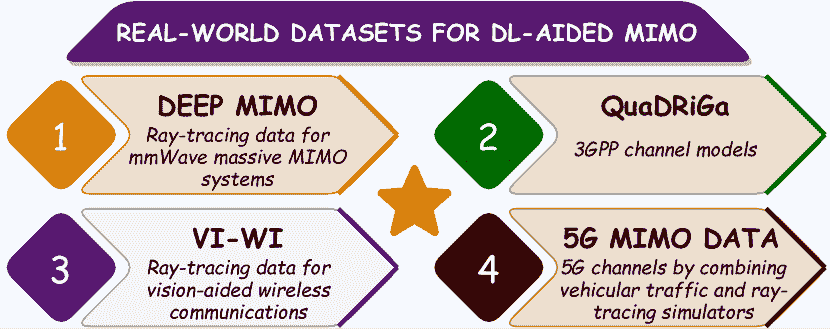

图 17：考虑用于 DL 辅助 MIMO 技术的主要实际数据集。

### 3.4 智能发射机设计与自编码器

我们在前面的子节中分析了如何分别和联合优化 MIMO 接收机的各个模块。因此，我们展示了 DL 网络如何学习和优化一个完整的 MIMO 接收机框架，以满足各种优化标准。然而，我们尚未实现通过完全智能的框架实现通信技术革命的终极目标。因此，我们将研究优化 MIMO 发射机各个模块的 DL 方法，并最终学习一个与相应接收机架构调谐的完整发射机框架。E2E 通信的基本思想是用一个可以作为 AE 训练的单一 DL 网络替代 MIMO 发射机、信道和接收机的各个独立模块，以解决传统模块结构的次优化问题[25]， [94]。作为出发点，我们将首先深入探讨基于 DL 的星座设计的细节。

如前所述，利用深度学习（DL）网络构建星座是一种端到端（E2E）过程，因为网络必须同时优化星座点的位置和决策区域。其目标是最大化信道输入和输出之间的互信息，即使在信道模型未知的情况下[46]。研究[95]提供了一种用于设计优化星座和接收机架构的自动编码器（AE），适用于加性白噪声（AWGN）信道以及加性雷达干扰。优化指标是互信息。在不同信噪比（SNR）条件下的各种信道模型假设下，提出了几种解映射过程。此外，所提出的网络支持使用强大的编码方法，如涡轮码或低密度奇偶校验（LDPC）码。计算机仿真表明，基于 AE 的网络优于传统星座的架构。网络[96]进行概率塑形，以改进星座的几何塑形。概率塑形优化了星座点的出现概率。即使在星座几何固定的情况下，如 QAM，概率塑形也提高了可实现的信息率。该网络还通过 AE 最大化互信息，如[95]所示。所提出的联合塑形方法实现了接近容量的性能，并且在 AWGN 和瑞利衰落信道上优于未塑形的 QAM 和仅几何塑形的 QAM。[97]分析了基于 AE 的星座设计在多用户干扰信道上的应用，以解决动态干扰问题。具体而言，基于自适应深度学习的 AE 网络可以学习干扰程度，并通过相应调整每个用户的星座来提高比特错误率（BER）性能。根据计算机仿真，用户学习的星座得到良好的分解，在严重干扰的情况下聚集在其簇中。因此，接收机在强干扰环境中解码信息变得更加容易。此外，基于 AE 的网络与典型的未编码二进制相位键控（BPSK）和正交相位键控（QPSK）非常相似，相较于 8-PSK 和 16-QAM 有大约 2 dB 的改进。

与前者相比，[98] 研究了在非相干 MIMO 系统中基于 AE 的 Grassmannian 星座设计，其中发射器和接收器都不需要 CSI。Grassmann 流形上的每一点都是一个单位矩阵，每对点之间的距离等于弦距 Frobenius 范数。所推荐的方法与传统技术设计的 Grassmannian 星座和一个非 Grassmannian 星座进行了比较。仿真结果表明，所提出的网络超越了所有最先进的方法，并达到了最高的多样性阶数。

除了智能星座设计比传统固定星座在动态传播环境中更具弹性外，基于深度学习（DL）的方法还被应用于大规模 MIMO 发射机的预编码。其目标是利用 DL 网络提供可靠的预编码，同时显著降低复杂度。研究[99]探讨了使用自编码器（AE）进行优化星座设计的一位预编码设计。在一个多播大规模 MU-MIMO 系统中，基站向所有用户广播信息信号，发射机由一个深度神经网络（DNN）和一个二进制层组成，以满足一位预编码的约束。由于二进制层的梯度始终为零，实施标准的反向传播方法变得复杂。因此，作者采用了一种变体，即直通估计器。对固定和变化信道的实验表明，基于 AE 的一位预编码和星座设计网络优于传统的一位预编码器中的 PSK 和 QAM 传输[100]。还值得注意的是，基于 AE 的星座设计与标准一位预编码器[100]结合的性能最佳，展示了模型驱动的 DL 网络的潜力。同样，[101]为单播大规模 MU-MIMO 系统提供了基于 AE 的符号级预编码（SLP）和星座设计，其中基站向每个用户传输唯一的信息信号。此外，作者在 AE 星座在实际中难以实现的情况下，研究了经典 QAM 星座的鲁棒 SLP 设计。根据数值结果，提出的 AE 基 SLP 和星座设计网络优于 AE 基 SLP 与 QAM 星座和非鲁棒 SLP 与 QAM 星座。另一个基于 DL 的 SLP 设计在[102]中提供，作者提出了一种高效的预编码神经网络（NN）以减轻 MU 干扰，适用于 MU-MISO 系统模型。优化指标是所有用户的最小服务质量。仿真结果表明，建议的网络比传统的块级预编码具有更好的性能。然而，传统的凸优化 SLP 方案以明显更高的复杂性战胜了推荐的网络，表明基于 DL 的 SLP 网络在显著降低复杂度的同时提供了稳健的性能。[103]的工作与[99]和[101]类似，提供了一种基于 AE 的 MIMO 系统预编码网络。发射机由两个 DNN 组成，分别将比特编码为符号，并在最后进行功率归一化预编码。从计算机仿真中可以看出，基于 AE 的预编码网络超越了传统的线性预编码技术，如 ZF 和 MMSE，以及假设完美 CSI 的非线性 Tomlinson-Harashima 预编码。[104]的作者在 MIMO 发射机中展示了一种类似于[103]的独立 DNN 结构。两个 DNN 中的第一个将比特编码为符号，而第二个进行预编码。该 AE 基方法的接收器包括一个无线变换网络（RTN）。发射机中的预编码网络和接收机中的 RTN 以端到端（E2E）的方式进行训练，以超越传统的基于 DL 的 MIMO 系统。不同 MIMO 配置的仿真显示，提出的结合预编码和 RTN 的架构优于传统的线性预编码方法 ZF 和 MMSE，以及仅有预编码或 RTN 的 DL 结构。作者还详细分析了预编码网络学习到的星座。

在[105]、[106]和[107]中的大量研究成果催生了一个用于下行大规模 MU-MIMO 系统的 DL 辅助预编码框架，该框架在基站处使用了均匀平面阵列。该框架的目标是实现能够在使用瞬时和统计 CSI 的情况下最大化遍历速率，同时限制整体发射功率。作者们将这个遍历速率最大化问题转化为一个增强质量服务的问题，以使其可处理，并由此得到最佳预编码的结构。因此，所提出的结构采用 DNN 来成功获得最佳预编码架构，并缓解复杂性问题。因此，所提框架在保持几乎相同的性能的同时显著降低了复杂性，相较于传统的迭代技术。此外，作者通过将优化问题分为两个部分，分别评估瞬时和统计 CSI，从而最小化复杂性。与 Quadriga 信道模型[84]、[85]的实验表明，通用和低复杂性框架都能在显著降低复杂度的同时，提供接近最优的性能，相较于经典的迭代方法。

[108]中的研究提出了另一种数据驱动的基于 DNN 的预编码架构，其中网络完全学习了接近最优预编码器的输入输出关系，以最大化互信息。仿真结果表明，建议的网络在复杂度显著低于传统迭代预编码器的情况下，提供了几乎与最优预编码器相同的性能，正如在[105]、[106]和[107]中所示的那样。[109]中的工作采用了类似于[108]的方法，其中数据驱动的 DNN 学习了理想预编码器的行为，以最大化互信息，同时显著降低复杂性。所建议的 DNN 接受向量化的水填充预编码矩阵作为输入，并产生最优矩阵。关于各种 MIMO 设置，仿真表明推荐的网络在大幅减少执行时间的同时，达到了最佳性能。

除了迄今为止讨论的基于 AE 和 DNN 的预编码设计，模型驱动的基于 DL 的网络在结合传统算法和 DL 技术的背景下也很受欢迎。文献[110]通过在大规模 MU-MIMO 系统模型中自动调整算法参数，优化了传统的非线性双凸 1-bit 预编码（C2PO）方法。NN 优化的 C2PO（NNO-C2PO）展开了 C2PO 的迭代，并利用反向传播来调整参数。使用 Quadriga 信道模型进行的仿真[84]、[85]表明，提出的 NNO-C2PO 算法在类似 BER 性能下需要比 C2PO 少约 50%的迭代次数。此外，NNO-C2PO 可能会使用为给定信道模型学习到的相同参数来处理各种信道模型，性能损失适中，表明对动态信道情况具有鲁棒性。类似地，文献[111]展开了另一种传统的迭代算法，称为迭代离散估计（IDE2），以开发一个用于大规模 MU-MIMO 的模型驱动 DL 网络，进行有限字母表预编码。提出的网络 IDE2-Net 通过修改当前的 IDE2 算法，引入可配置参数，使用低分辨率 DACs 对发射信号进行预编码。仿真结果显示，IDE2-Net 在性能上显著优于 IDE2 算法，并在相同迭代次数下稍微超越 NNO-C2PO[110]。紧随其后，作者展开了文献[112]中的经典迭代共轭梯度法用于常数包络预编码。建议的网络 CEPNet 通过引入可训练参数优化了传统方法，以减少 MU 干扰和计算成本。仿真显示，CEPNet 在 BER 和平均可达率性能方面显著优于传统算法，且复杂度更低。CEPNet 还对信道估计误差和信道模型不匹配具有抗性，如文献[110]所述。文献[113]中将迭代加权 MMSE（WMMSE）算法展开为层级结构，以最大化总速率。提出的网络将可训练参数嵌入 WMMSE 算法中，以消除矩阵求逆并降低复杂度。与之前的研究不同，作者开发了一种基于 CNN 的预编码方案，将其模型驱动的方法与数据驱动网络进行比较。在具有不同数量发射天线和用户的大规模 MU-MIMO 系统模型中进行的广泛仿真结果显示，提出的方法达到 WMMSE 算法的总速率，并以更少的复杂度超越基于 CNN 的方案。通过展开，文献[114]中的另一种传统迭代技术，即交替方向乘子法（ADMM），被映射到 DL 框架中。作者提供了 ADMM-Net 用于大规模毫米波通信，其中 DL 基础的 SLP 选择最佳的 RF 链子集以减少功耗。仿真结果表明，ADMM-Net 优于传统的 ADMM、正交匹配追踪和协调下降算法。

考虑到与以前展开现有迭代算法的模型驱动 DL 网络不同的方法，[115] 提出了一个基于 DL 的预编码架构，该架构由建设性干扰通信模型驱动。建议的 CI-NN 模型包括一个通过自定义层实现的定制损失函数，紧随输出之后。CI-NN 达到了与传统建设性干扰模型相同的性能，并且在不同用户数量的模拟中优于线性 ZF 预编码器。此外，CI-NN 是一种用户自适应方法，其中具有特定用户数量的训练模型可以在用户数量可变的场景中运行，这对于动态环境非常实用。

在彻底研究了智能大规模 MU-MIMO 发射机架构，如基于 AE 的和基于 DNN 的复杂形状星座和预编码设计之后，现在是专注于 E2E 通信系统的最佳时机，在这些系统中，一个巨大的 DL 网络替代所有单独的模块。该方法通过图 18 中的示例系统模型进行了说明，它可以实现 E2E 优化，而无需数学信道模型，这非常实用，因为在某些复杂环境中获取信道的数学定义可能具有挑战性。未知信道模型的主要问题在于，传统的反向传播技术（大多数 DL 网络依赖于此）需要每一层的梯度的完整知识。当信道模型未知时，无法获得梯度，从而使反向传播变得复杂。该领域的研究人员已提出了各种解决方案来应对这个问题。研究 [116] 提出了一种名为“同步扰动随机优化”的优化技术，以近似信道梯度，从而使 E2E 模型能够使用标准反向传播方法进行训练。采用建议的近似方法的 E2E 网络在 AWGN 和 Rayleigh 衰落信道中实现了理论上的 BER 性能。

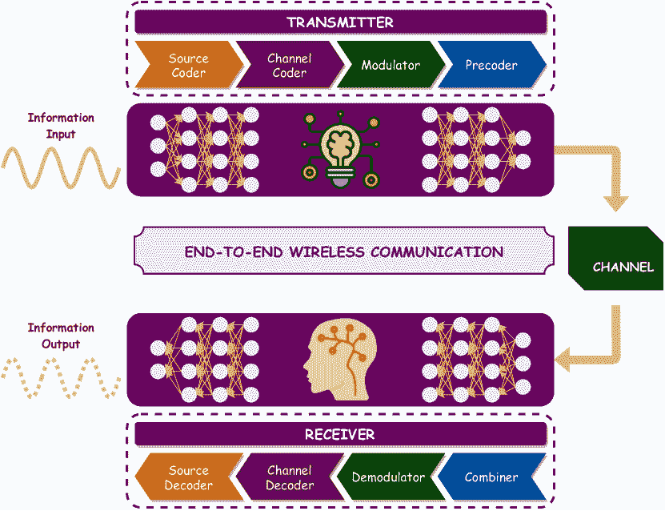

图 18：一个 E2E PHY 通信系统模型，其中个别信号处理模块被一个自适应 DL 网络替代。

[47]和[117]的作者引入了一种新颖的未知梯度挑战方法，其中 E2E 网络在基于强化学习的发射器训练和监督学习的接收器训练之间迭代。发射器作为强化学习问题中的一个代理，利用接收器的损失函数作为奖励来学习环境。另一方面，接收器以监督方式进行训练以获得损失函数。模拟结果表明，提出的交替方法在性能上与已知可微分信道模型的 E2E 监督 DNN 网络相似。在此交替训练技术的基础上，[118]中的工作提出了一个可靠的反馈系统，其中接收器可以在不假设完美反馈链路的情况下将损失值传递给发射器。建议的反馈系统训练通信的两端作为发射器和接收器，消除了对完美反馈链路的需求。当配备推荐反馈系统的 E2E 交替网络[47]、[117]在噪声反馈环境中进行训练时，它的性能几乎与具有完美反馈链路的 E2E 交替网络相同，如模拟所示。

[119]和[120]的研究提供了一个与信道无关的 E2E 网络，该网络利用条件生成对抗网络（GAN）建模信道以产生梯度。通过将发射器的编码信号和接收的导频信号作为条件信息，条件 GAN 生成信道模型，并通过监督训练铺平道路。广泛的模拟结果表明，建议的网络在 AWGN 和 Rayleigh 衰落信道上达到了具有已知信道模型的 E2E-DNN 网络的性能。然而，[121]和[122]的作者指出了基于 GAN 的 E2E 网络的梯度消失和过拟合问题。他们提出了一种残差辅助 GAN，用于生成发射信号与接收信号之间的差异。残差辅助 GAN 引入了额外的梯度来克服梯度消失问题。此外，损失函数通过添加正则化项来防止过拟合。使用理论 AWGN 和 Rayleigh 衰落信道以及实际的射线追踪信道数据集 DeepMIMO[74]、[75]的模拟表明，提出的残差辅助 GAN 在所有情况下都优于 E2E 交替网络[47]、[117]和传统的基于 GAN 的 E2E 网络[119]、[120]。

与其让生成对抗网络（GAN）模拟信道，[123]和[124]的研究建议在没有导频信号的端到端（E2E）网络中使用随机卷积层来表示信道。接收端深度神经网络（DNN）包括两个 DNN，一个用于信道信息提取，另一个用于数据恢复，将提取的信道信息与接收到的信号通过双线性运算合并以进行数据恢复。大量在频率选择性和扁平衰落的 MIMO 信道上的仿真结果表明，推荐的方法在性能上优于最小二乘（LS）和最小均方误差（MMSE）信道估计，但仍逊色于基于 GAN 的端到端网络。此外，端到端方法对信道相关性具有异常的抗干扰能力，而传统技术即使在完美的信道状态信息（CSI）知识下也会退化。另一个有趣的实验是无线图像传输，其中作者测试了他们的端到端网络在恢复图像质量上的表现，结果优于传统的压缩技术。

E2E 网络在通道模型可用时更易于使用，因为通道梯度存在，网络可以以 E2E 方式进行训练。在这方面的开创性研究见于[25]，该研究分析了针对给定通道模型和损失函数的 E2E 网络。这项全面的研究包括了各种调查。首先，将基于 AE 的 E2E 网络与在多个编码率下的未编码 BPSK 方案进行比较，结果表明所提出的网络优于后者。为了观察 E2E 网络中的专家知识，作者在基于 AE 的网络上增加了一个 RTN，提升了性能。扩展 AE 概念到多个发射器和接收器，作者检查了 AE 基于 E2E 网络在干扰信道中的性能。与时间共享方案的比较显示了显著的收益。此外，基于 CNN 的 DL 网络在调制分类的背景下表现出色，并超越了专家特征方法。这项详尽的研究为我们最终实现 PHY 革新开辟了道路。[125] 的作者将这一创新的 E2E 技术应用于 MIMO 系统模型，并调查了 AEs 在 Rayleigh 衰落信道中的性能，涉及各种 MIMO 配置。在第一个案例中，AE 在训练过程中优化其编码方案，以在 $2\times 1$ MIMO 设置中引入空间多样性。与著名的 Alamouti 编码相比，AE 在没有发射端 CSI 的情况下创建了更优的编码方案，模拟结果表明 AE 在两个时间槽中实现了略高的多样性。这种改进是由于天线之间的功率分布不均所致。在第二个案例中，另一种 AE 被训练以在 $2\times 2$ MIMO 设置中获得比传统 MIMO 系统更低的 BER 空间复用。与空间多样性的情况类似，AE 生成了更好的空间复用编码，并表现出显著更高的 BER 性能。

[126] 扩展了在 AWGN 通道下研究的单输入单输出（SISO）IC 系统，涵盖了 Rayleigh 衰落通道下的 SISO 和 MIMO 干扰信道系统。所提议的 AE [25] 在 SISO 干扰信道系统中，采用四阶调制，相较于使用 QPSK 调制方案的标准单用户无干扰 MIMO 系统，其性能略优。接收信号的演示显示出良好分离的四个区域，对应于星座点，这表明 AE 如何有效学习以四阶调制进行传输。经过 MIMO 干扰信道训练的 AE，相较于标准单用户无干扰 MIMO 系统，性能提升显著。假设通道模型如 [25] 所述可用，[127] 中的研究提出了一种基于块 AE 的端到端网络，以处理动态输入长度，这在效率方面具有显著性。所建议的网络采用 RNN 构建记忆机制。仿真结果显示，基于 RNN 的 AE 网络在 AWGN 和自定义衰落通道中相较于基于 CNN 的网络具有更优的性能。此外，作者还研究了学习到的 64-QAM 星座图。

参考文献[128]中的工作提供了对 E2E 通信系统的另一个深入研究。主要动机是首次在文献中将符号级 AE 转换为位级 AE，以表明优化位度量能够提高整体性能。与 IEEE 802.11n（Wi-Fi 4）LDPC 码的符号级 AE 相比，位级 AE 在性能上优于符号级 AE 和使用 PSK 或 QAM 的传统通信。此外，学习到的星座分析证明位级优化在星座中实现了更好的分离，这是性能改善的一个可靠指标。作者通过将模型的解调器替换为迭代解调和解码方案，进一步提高了 BER 性能，相比于没有迭代解调和解码的位级 AE，表现更为优秀。此外，他们优化了用于迭代解调和解码辅助位级 AE 的 LDPC 码，并在 BER 性能上获得了提升。虽然计算机模拟中假设了 AWGN 信道，但所提技术的优势在于其灵活性，可以应用于任何信道模型而无需修改，如使用软件定义无线电（SDR）的模拟所示。参考文献[129]的研究探讨了使用 AE 找到$(n,k)$块码以最大化码字间的最小汉明距离的问题。作者提出了依赖于 DNN 和双向 RNN 的两种接收机结构，结合自定义损失函数。所提出的模型在 AWGN 信道中表现与最佳块码几乎相同，且 AE 学习到的最小汉明距离达到了理论上指定的最优值。此外，基于 AE 的块码在信道模型不匹配的情况下表现优于理论最优值，其中性能差异随着相关水平的增加而增大。

根据文献中审查的主要研究，我们注意到通过用一个大规模 DL 网络替换传统通信系统中的所有独立模块，完全智能和 E2E 优化的无线通信系统正取得显著进展。毫无疑问，未来将会有更多的发展将这些创新方法融入现实生活。在下一节中，我们将探讨 DL 在将经典 IM 转变为 6G 技术的过程中出现的新兴应用。

### 3.5 DL 驱动的 IM 2.0：提高传统 IM 的效率

到目前为止，我们已经涵盖了深度学习在大规模 MIMO 系统中的主要发展，从接收器的符号检测开始，逐步发展到端到端智能通信系统。6G 愿景中的另一个有前景的方面是 MIMO-IM，正如之前所述，它在提高能量和频谱效率的同时，还通过利用通信系统的构建模块作为额外的信息源来减少所需的射频链路数量。然而，IM 系统中探测器复杂性与误码率（BER）性能之间的权衡是一个问题。此外，采用诸如发射天线选择（TAS）、功率分配和 MCS 选择等多种先进算法可以进一步提高 IM 系统的 BER 性能。由于传统方法实现这些算法的复杂性极大，深度学习方法似乎在提高 IM 系统效率方面具有吸引力。图 19 对深度学习在 IM 系统中的主要贡献进行了分类。

研究[130]提出了一种新颖的数据驱动框架，用于 TAS 和 SM-MIMO 系统中的功率分配问题，考虑了两种不同的机器学习技术。作为初步贡献，该框架通过利用监督学习分类器，如$K$-最近邻(KNN)和支持向量机(SVM)，实现了在降低复杂度的同时，获得比传统优化方法更具可行性的解决方案。作者在第二部分探讨了基于 DNN 的优化任务框架。此外，他们还研究了特征向量设计对 BER 性能的影响，具体提出了三种不同的特征向量生成(FVG)方法：使用信道元素模量的传统 FVG、使用信道元素实部和虚部模量的分离 FVG，以及使用信道矩阵列对相关性的联合 FVG。广泛的仿真结果显示，基于 SVM 的 TAS-SM 优于基于 KNN 的 TAS-SM，而基于 DNN 的 TAS-SM 则超过了两者。联合 FVG 表现优于其他两种 FVG 方法，接近最佳性能。类似地，基于 DNN 的 SM 功率分配结合联合 FVG 在 BER 性能上优于其他功率分配方案和 FVG 组合。此外，[131]通过去除天线选择过程中的重复元素来减少计算开销。所提出的 DNN 在隐藏神经元更少的情况下优于[130]中的方法，尽管这两种方案都采用了联合 FVG 技术。然而，优化欧几里得距离的天线选择(EDAS)的性能比这些基于 DNN 的 TAS-SM 技术显著。

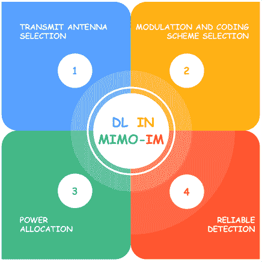

图 19：DL 在 MIMO-IM 中的四种主要应用。

在[132]中，作者提出了基于 DNN 和深度梯度提升决策树的 TAS-SM 技术。考虑到从信道矩阵中获得的特征的重要性，他们使用信道矩阵相关性作为特征向量，与[130]中的联合 FVG 相同。仿真结果表明，基于 DNN 和深度梯度提升决策树的 TAS-SM 方法在表现上接近最优，同时优于传统的 SM 和随机 TAS-SM 方案。此外，深度梯度提升决策树的复杂度低于 DNN，并且具有稍差的误码率性能。与[132]类似，[133]中的工作提供了基于 DNN 和决策树的实际信道场景下的 TAS-GSM 方案。作者使用 SDRs 创建了一个$16\times 4$的测试平台，用于测试和估计信道的失真情况以进行理论优化基准。实验结果显示，所建议的技术在实际场景下优于 EDAS，而基于 DNN 的 TAS-GSM 在实际场景下超过了基于决策树的 TAS-GSM。在[134]中，作者提出了另一种基于 DNN 的 TAS-SM 方案，该方案结合了信道矩阵的模和信道矩阵相关性作为特征向量，对应于传统 FVG 和[130]中的联合 FVG 的组合。建议的 FVG 类型的基于 DNN 的 TAS-SM 与 EDAS 的性能相似，优于基于随机森林决策的 TAS-SM 和各种传统 TAS-SM 方案，并且复杂度更低。

关于全双工 SM 系统中自干扰问题的 TAS(Temporally Aligned Selection)问题在[135]中得到了解决。作者利用 DNN 和 SVM 方法，首先推导了全双工 SM 的信道容量的上下界，然后利用这些推导结果来进行 EDAS 和容量优化天线选择，生成一个训练标签集。与之前的大多数 TAS 方法（大多数使用[130]的联合 FVG）不同，他们提出了基于主成分分析的特征向量 FVG，用来提取信道矩阵的向量特征，并提高了误码率性能。广泛的仿真结果表明，所提出的特征向量 FVG 在不同发射天线数和调制方案设置下，表现出比[130]的联合 FVG 更好的性能。所提出的 DNN 和 SVM 方法几乎具有相同的功能，与 EDAS 相当。它们优于容量优化天线选择、[130]的 KNN 和其他传统的天线选择算法。

除了 TAS 和功率分配，MCS 选择是提高 IM 系统效率的另一个重要概念。[136] 中的研究描述了一种基于 DNN 的代码本选择方法，适用于 SM-MIMO 系统。接收器使用瞬时信道状态预测每个代码本对应的符号错误率 (SER)，并将最佳代码本返回给发射机。每个代码本将不同的星座组合分配给发射天线，其中每次信道使用的总比特数保持不变。根据基于 DNN 的 SER 预测动态切换这些代码本，结果显著优于在整个传输过程中使用任意一个代码本。[137] 的工作提供了一种基于 DNN 的方法，能够实时计算 SM-MIMO 系统的互信息，从而允许动态 MCS 适配。作者探讨了不同的输入特征向量，其中包含来自信道矩阵和 SNR 的一些特征。所提出的基于 DNN 的方法以显著低于传统泰勒和詹森近似的复杂度几乎完美地获得互信息，为 MCS 适配铺平了道路。此外，作者在 [138] 中扩展了他们的分析，以计算 GSM-MIMO 系统模型的信道容量，其目的与 [137] 相同，即允许动态适配。所建议的基于 DNN 的模型计算容量几乎没有误差，如仿真结果所示。

[139] 提出了一个基于 DNN 的代码率选择技术，适用于 SM-MIMO 系统。所提出的 DNN 提取了信道矩阵列的范数以及每对信道矩阵列之间的角度，并将它们与 SNR 结合作为输入特征，如 [137] 中所述。DNN 的输出是符合 BER 约束的最大编码速率。仿真结果表明，基于 DNN 的动态代码率选择能够提供接近最大吞吐量的性能，并在 BER 约束下显著优于固定速率场景。作者在 [140] 中扩展了他们的模型，以预测最佳的 MCS，而不仅仅是代码率，这取决于相同的输入特征。基于 DNN 的 MCS 选择方法达到近乎最佳性能，类似于 [139] 中的单一编码速率优化场景，表明在 SM-MIMO 系统中效率得到提升。

与前述研究相比，[141] 提供了一种基于 DNN 的调制阶数选择方案，而不考虑系统的编码速率。推荐的 DNN 模型通过最大化最小欧几里得距离来预测最佳的调制阶数，类似于 TAS-IM 算法中实施的方法。仿真结果表明，基于 DNN 的调制阶数选择帮助 SM-MIMO 在复杂度远低于传统选择算法的情况下显著优于经典 SM。

目前为止的研究揭示了 IM 系统在未来 6G 及更先进通信技术中的潜力，这要归功于 DL 方法，这些方法通过采用如 TAS、功率分配和 MCS 选择等复杂算法来进一步提升系统效率，同时保持极低的复杂性。我们现在可以总结有关 DL 辅助 MIMO 系统的文献，并转向 [49] 中提出的通用 MIMO-IM 模型的实施，这可能会给感兴趣的读者一些 MIMO-DL 编程的感觉。

### 3.6 MIMO-DL 实践

GSM 是未来无线通信系统物理层最有前景的技术之一，它通过结合 SM 和 MIMO 的优势，减少所需的射频链路数量，只激活一部分发射天线，因此其复杂性低于传统 MIMO。它还通过激活更多发射天线并传输更多的信息位来提高 SM 效率。然而，当发射天线组合和信息位的数量增加时，MLD 检测的复杂性会增加到无法接受的水平，如前所述。另一方面，线性检测器，如 ZF 和 MMSE 检测器，比 MLD 的比特错误率（BER）性能差得多，为 GSM 系统引入了一个权衡。为了解决这种 BER-复杂性权衡，[49] 的作者建议为 GSM 系统使用基于 DNN 的检测器。他们考虑了一个具有 $N_{t}$ 个发射和 $N_{r}$ 个接收天线的 GSM 系统模型 $(N_{r}<N_{t})$，其中 $N_{p}$ $(2\leq N_{p}\ll N_{t})$ 个发射天线由索引位选择以在任何时间槽中激活。有 $N=2^{\lfloor\text{log}_{2}\binom{N_{t}}{N_{p}}\rfloor}$ 种合法的发射天线组合（TAC），每个激活的天线从标准化的 $M$-QAM 星座 $\mathcal{S}$ 中传输一个符号。因此，每个时间槽中传输的总位数等于 $B=\text{log}_{2}N+N_{p}\text{log}_{2}M$。

假设一个准静态平坦衰落 MIMO 信道矩阵 $\mathbf{H}\in\mathbb{C}^{N_{r}\times N_{t}}$，其条目遵循复杂高斯分布 $\mathcal{C}\mathcal{N}(0,1)$，接收信号向量 $\mathbf{y}\in\mathbb{C}^{N_{r}\times 1}$ 可以表示如下：

|  | $\mathbf{y}=\mathbf{H}\mathbf{x}+\mathbf{n}=\mathbf{H}_{I}\mathbf{s}+\mathbf{n},$ |  | (10) |
| --- | --- | --- | --- |

其中 $\mathbf{x}$ 是发射符号的向量，$\mathbf{n}\in\mathbb{C}^{N_{r}\times 1}$ 是具有复杂高斯分布 $\mathcal{C}\mathcal{N}(\mathbf{0},\sigma^{2}\mathbf{\mathbf{I}})$ 的加性白噪声样本向量，$\mathbf{s}$ 是激活发射天线的符号向量，而 $\mathbf{H}_{I}$ 是对应于激活发射天线的信道矩阵。

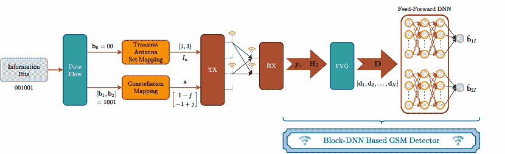

图 20：将 DNN 集成到经典块检测中的 B-DNN 检测器系统模型 [49]。

该 GSM 传输方案的最佳 MLD 检测器对所有可能的 TACs 和信息符号进行全面搜索，如下所示：

|  | $(\hat{I},\hat{\mathbf{s}})=\operatorname*{arg\,min}_{I\in\mathbb{I},\mathbf{s}\in\mathbb{S}}&#124;&#124;\mathbf{y}-\mathbf{H}_{I}\mathbf{s}&#124;&#124;^{2}_{F},$ |  | (11) |
| --- | --- | --- | --- |

其中，$\mathbb{I}=\{I_{1},I_{2},\dots,I_{N}\}$ 是合法 TAC 的集合，$\mathbb{S}$ 是活动发射天线的可能 QAM 符号向量的集合。线性检测器处理一个包含通道矩阵$\mathbf{H}$的逆操作，其表达式如下：

|  |  | $\displaystyle\hat{\mathbf{x}}_{ZF}=(\mathbf{H}^{H}\mathbf{H})^{-1}\mathbf{H}^{H}\mathbf{y},$ |  | (12) |
| --- | --- | --- | --- | --- |
|  |  | $\displaystyle\hat{\mathbf{x}}_{MMSE}=(\mathbf{H}^{H}\mathbf{H}+\sigma^{2}\mathbf{I})^{-1}\mathbf{H}^{H}\mathbf{y}.$ |  |

在这里，$\hat{\mathbf{x}}_{ZF}$ 和 $\hat{\mathbf{x}}_{MMSE}$ 分别表示 ZF 和 MMSE 检测器检测到的符号向量。为了进行成功的逆操作，$N_{r}$ 至少应等于 $N_{t}$，以确保$\mathbf{H}^{H}\mathbf{H}$具有满秩。然而，这一要求降低了 GSM 在具有数百个发射天线的 BS 中的实际可行性，因为用户设备几乎不可能安装如此多的天线。因此，块线性检测器略微修改了 (12) 中的方程，并采用 $\mathbf{H}_{I}$ 代替 $\mathbf{H}$，这导致每个合法 TAC 有$N$个 $\hat{\mathbf{s}}_{I}$ 解。在最终阶段，块线性检测器比较接收信号向量 $\mathbf{y}$ 与每个 $\mathbf{H}_{I}\hat{\mathbf{s}}_{I}$ 乘积之间的欧几里得距离，以估计选定的 TAC 和 QAM 符号，如下所示：

|  | $\displaystyle(\hat{I})$ | $\displaystyle=\operatorname*{arg\,min}_{I\in\mathbb{I}}&#124;&#124;\mathbf{y}-\mathbf{H}_{I}\hat{\mathbf{s}}_{I}&#124;&#124;^{2}_{F},$ |  | (13) |
| --- | --- | --- | --- | --- |
|  | $\displaystyle(\hat{\mathbf{s}})$ | $\displaystyle=\hat{\mathbf{s}}_{\hat{I}}.$ |  |

这种块结构检测方案由于结合了多重线性检测（MLD）方法，相比经典线性检测器取得了更好的误比特率（BER）性能。然而，随着发射天线数量的增加，复杂性也随之增加，块检测由于次优的线性部分仍然表现不如最优的 MLD。因此，文献[49]的作者将块检测中的线性组件替换为深度神经网络（DNN），以提高$\hat{\mathbf{s}}_{I}$的估计精度。图 20 展示了 GSM 发射器和所考虑的块-DNN 检测器。

表 4：网络和训练参数[49]。

| 参数 | 值 | 参数 | 值 |
| --- | --- | --- | --- |
| 输入节点 | $2(N_{r}+N_{r}N_{p})$ | 学习率 | $0.005$ |
| 隐藏层 | $3$ | 训练集数量 | $15.000.000$ |
| 输出节点 | $M$ | 验证集数量 | $5.000.000$ |
| 隐藏层激活函数 | ReLU | 训练轮数 | $50$ |
| 输出层激活函数 | Softmax | BPSK 隐藏节点 | $128$-$64$-$32$ |
| 损失函数 | 交叉熵 | QPSK 隐藏节点 | $256$-$128$-$64$ |
| 优化器 | SGD | $16$-QAM 隐藏节点 | $512$-$256$-$128$ |

如图 20 所示，块-DNN 探测器包括两个阶段：FVG 和前馈 DNN。在第一阶段，FVG 通过处理由接收信号向量$\mathbf{y}$和对应于第$i^{\text{th}}$个合法 TAC 的信道矩阵$\mathbf{H}_{I}$组成的原始数据来生成前馈 DNN 的输入特征向量$\mathbf{d}_{i}$。正如[130]中所述，选择的 FVG 类型对模型性能有显著影响，联合 FVG 在[130]中建议的模型中表现最佳。因此，[49]的作者探讨了 FVG 类型对检测可靠性的影响，并评估了[130]中描述的三种 FVG 类型的块-DNN 探测器的 BER 性能：独立 FVG、联合 FVG 和传统 FVG。结合所有合法 TAC 的特征向量，FVG 创建特征矩阵$\mathbf{D}$并将其输入到前馈 DNN 中。在第二阶段，DNN 为每个$\mathbf{d}_{i}$生成$\hat{\mathbf{s}}_{I}$。前馈 DNN 包含$N_{p}$个子-DNN，用于估计每个活动传输天线对应的 QAM 符号。最后，块-DNN 探测器使用(13)来获取所选择的 TAC 和 QAM 符号。我们使用表 4 中给出的网络和训练参数重现了一些[49]中的图形，并分享了一部分示例代码。任何块-DNN 探测器的训练过程忽略了发射机中的 GSM 方案，假设所有发射天线都是活动的，这也是合理的，因为 DNN 仅负责检测给定 TAC 的 QAM 符号。此外，接收信号在训练过程中没有经历 AWGN。这里是一个使用独立 FVG 进行 QPSK 传输的 DNN 模型创建示例，这与我们在第 II-B 节中提供的 Keras 模型定义有所不同。

⬇1 来自 tensorflow.keras 导入 Input, Model2 从 tensorflow.keras.layers 导入 Dense, BatchNormalization3 从 tensorflow.keras.optimizers 导入 SGD4 从 tensorflow.keras.regularizers 导入 l25 变量 y_lst, l_lst, m_lst = [], [], []6 M, Nt, Np, Nr = 4, 2, 2, 27 n_x, n_y = 2 * Nr + 2 * Nr * Np, M8 x = Input(shape=(n_x,))9 for i in range(Np):10 h1 = Dense(256, kernel_regularizer=l2(l=0.001), activation="relu", name="D" + str(i) + "1")(x)11 b1 = BatchNormalization(name="BN" + str(i) + "1")(h1)12 h2 = Dense(128, kernel_regularizer=l2(l=0.001), activation="relu", name="D" + str(i) + "2")(b1)13 b2 = BatchNormalization(name="BN" + str(i) + "2")(h2)14 h3 = Dense(64, kernel_regularizer=l2(l=0.001), activation="relu", name="D" + str(i) + "3")(b2)15 b3 = BatchNormalization(name="BN" + str(i) + "3")(h3)16 y = Dense(n_y, kernel_regularizer=l2(l=0.001), activation="softmax", name="O" + str(i))(b3)17 y_lst.append(y)18 l_lst.append("categorical_crossentropy")19 m_lst.append("accuracy")20 model = Model(inputs=x, outputs=y_lst)21 SGD_opt = SGD(lr=0.005, nesterov=True)22 model.compile(optimizer=SGD_opt, loss=l_lst, metrics=m_lst)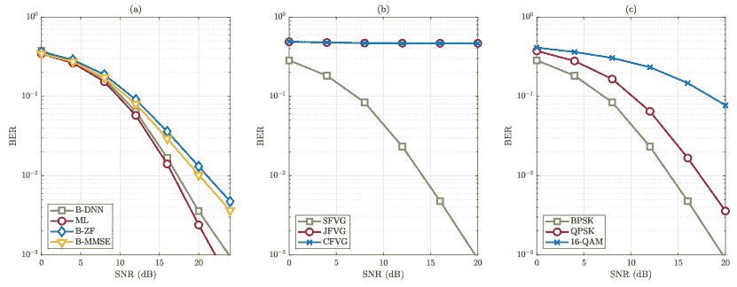

图 21：B-DNN 检测器的 BER 比较（a）传统检测器与 B-DNN 检测器，（b）不同 FVG 类型的 B-DNN 检测器，（c）不同调制级别下的 B-DNN 检测器。

在这里，我们创建了一个层链，而不是对每个活跃发射天线使用 Sequential 模块，通过 for 循环将它们组合成一个模型。BatchNormalization 和 l2 模块分别表示批量归一化层和 l2 正则化器。下一步是在构造训练数据之前定义 PHY 参数：

⬇1  import  WirelessCommLib  as  wcl2  N_tot  =  wcl.Combination(Nt,  Np)3  ns  =  int(np.floor(np.log2(N_tot)))4  m  =  int(np.log2(M))5  ni  =  Np  *  m6  n_tot  =  ns  +  ni7  N  =  2  **  ns8  is_normalized  =  True9  ss  =  wcl.Constellation(M,  mod_type,  is_normalized)10  TAC_set  =  wcl.OptimalTAC_Set(Nt,  Np,  N)

WirelessCommLib 是我们用于 PHY 相关任务的软件包，其中 Combination(a, b)函数对应从 a 个项目中选取 b 个无序项目的数量，Constellation 返回给定调制级别$M$和调制类型（如 PSK 或 QAM）的符号集。OptimalTAC_Set 从所有可能的 TAC 中创建合法的 TAC 集合。Optimality 表示 TAC 集合不是通过随机选择 TAC 创建的，而是创建 TAC 集合使得集合中每个发射天线的数量相等或接近。现在，我们可以构造输入训练数据：

⬇1  Ns  =  150000002  FVG_type  =  ”SFVG”3  bit_matrix  =  np.random.randint(2,  size=(n_tot,  Ns))4  for  j  in  range(Ns):5  bit_array  =  bit_matrix[:,  j]6  x  =  wcl.EncodeBits(bit_array,  ss,  TAC_set,  ns,  m,  Nt,  Np)7  H  =  wcl.Channel([Nr,  Nt])8  y  =  np.matmul(H,  x)9  train_input_data[j,  :]  =  np.concatenate((wcl.FVG(y,  FVG_type),  wcl.FVG(H,  FVG_type)))[:,  0]

训练实例的数量等于 $N_{s}$。对于每个训练数据的输入，我们首先随机生成一个比特数组，并通过 EncodeBits 函数将这些比特编码成传输向量 $\mathbf{x}$。随后，我们通过 Channel 函数随机生成一个 i.i.d. 通道矩阵 $\mathbf{H}$，其元素遵循复杂的高斯分布 $\mathcal{CN}(0,1)$，并将其与 $\mathbf{x}$ 相乘。输入数据是接收信号向量 $\mathbf{y}$ 和通道矩阵 $\mathbf{H}$ 的特征向量的拼接。这些训练数据的标签是从所有天线发射的正确符号：

⬇1  train_output_data  =  []2  for  i  in  range(Np):3  labels  =  np.zeros((Ns,  M))4  for  j  in  range(Ns):5  start  =  ns  +  i  *  m6  stop  =  ns  +  (i  +  1)  *  m7  bits  =  bit_matrix[start  :  stop,  j]8  labels[j,  wcl.Bin2Dec(bits)]  =  19  train_output_data.append(labels)

在这里，Bin2Dec 函数将给定的比特数组转换为相应的符号。一旦训练数据和模型准备好后，我们可以训练模型：

⬇1  model.fit(train_input_data,  train_output_data,  validation_split=0.25,  batch_size=512,  epochs=50,  shuffle=True)

代码、训练模型、用于测试 B-DNN 模型的模拟以及与传统线性检测器和 MLD 的比较，以及生成的图形都可以在我们的在线数据库中找到¹¹1https://github.com/burakozpoyraz/Block-DNN。图 21(a) 说明了所提出的 block-DNN 检测器优于传统的 block-linear 检测器，并且在假设 $N_{t}=4$, $N_{r}=2$, $N_{p}=2$, 和 QPSK 调制的情况下，性能与最优的 MLD 检测相似。需要注意的是，与 MLD 相比，所提出的 B-DNN 模型可以在较低的时间复杂度下实现类似的结果。图 21(b) 显示了 FVG 类型对 B-DNN 检测器在与前者相同的设置下（除了 BPSK 调制）的 BER 性能的影响。与 [130]中联合 FVG 产生最佳性能的模型相比，使用单独 FVG 的 block-DNN 检测器提供了最佳的 BER 性能，而其他 FVG 类型导致在所有 SNR 水平下几乎为 0.5 的不可靠通信。因此，适当的 FVG 类型可能会因应用不同而有所变化，需要在验证步骤中进行深入检查。最后，图 21(c) 提供了在各种调制级别下 block-DNN 检测器的 BER 性能，假设天线设置与之前相同。BPSK 的 block-DNN 获得了最佳的 BER 性能，而 16-QAM 表现最差，正如预期的那样。作为折衷，增加调制阶数可以提供更高的比特率。

有了这一引人注目的实现，我们可以结束这一部分，继续进行下一节对 MC 波形的 DL 方法的检查。

## 4 多载波波形设计的 DL

波形，描述信息载波信号的物理形状，是无线通信系统的关键组成部分之一[20]。现有的波形可以分为单载波（SC）和多载波（MC）两大类。为了提高 SC 或 MC 系统中的数据速率，需要减小符号持续时间，或者等效地增加用于数据传输的带宽。然而，采用更宽的带宽后，SC 波形由于受到频率选择性衰减的影响，导致符号持续时间小于无线信道的时延展宽，从而产生符号间干扰（ISI）。由于需要应用复杂的均衡技术来减少 ISI，使用现有的 SC 波形实现高数据速率非常具有挑战性。在 MC 系统中，频段被分为许多子频段，也被称为子载波[142]。这些子载波并行使用，在同一时间传输信息比特。相邻两个子载波之间的间距被选择得足够大，使得它们在频率域内经历平坦衰减。因此，在 MC 系统中可以使用简单的单脉冲均衡器来消除信道效应。因此，MC 技术能够进行宽带传输以传输信息；因此，它们比 SC 技术具有更高的数据速率。

OFDM 作为最受欢迎的 MC 波形，因其简单而有效的结构被广泛应用于 LTE 和 IEEE 802.11 等多个标准。由于重叠的正交子载波，OFDM 能够高效利用频谱。此外，OFDM 的时间频率网格允许灵活使用资源元素。在传统的 OFDM 系统中，每个数据子载波的调制数据符号通过将信息位映射到 PSK/QAM 星座图在频域中确定。一定数量的子载波被分配用于传输导频符号，以便在接收端进行信道估计。这些导频符号可以通过块型或梳型方法插入到 OFDM 符号中[143]。信道系数可以在时域或频域中进行估计，已提出了多种估计技术，这些技术在性能和复杂度上各有不同[144, 145]。在频域中，通过利用导频符号估计信道频率响应，并进行插值以获得数据符号上的信道频率响应。例如，最小二乘法（LS）和线性最小均方误差（LMMSE）是两种著名的频域信道估计方法。在插入导频符号后，通过采用逆快速傅里叶变换（IFFT）获得时域 OFDM 信号。此外，一个 CP 被嵌入在 OFDM 符号的开始或结束，以消除 ISI。此外，CP 使我们能够将频率选择性信道建模为循环卷积。在添加 CP 后，OFDM 信号通过无线通信信道传输。在接收端，CP 被去除，通过 FFT 获取频域 OFDM 信号。进行信道估计并应用均衡以去除无线信道的影响。最后，对信号进行解调以获得信息。

尽管正交频分复用（OFDM）如上所述有几个优点，但它也有许多缺点，例如高峰均功率比（**PAPR**）、对频率和时序误差的敏感性、高的带外辐射（OOBE）以及循环前缀（CP）和导频开销。在 IFFT 操作后，子载波在时域上被随机叠加，这可能导致由于不同信号的峰值幅度重叠而产生高峰。由于这些高峰，发射机的功率放大器在非线性区域工作，产生失真和频谱扩散。这些峰值导致高**PAPR**，降低了功率放大器、模拟到数字和数字到模拟转换器的效率。因此，研究人员设计了各种**PAPR**降低技术用于 OFDM 传输系统 [146]。OFDM 的另一个缺点是对由高移动性、相位噪声、时序偏移和载波频率偏移（CFO）引起的载波间干扰（ICI）的敏感性。移动无线环境中的信道随着时间的推移迅速变化。这对接收机施加了压力，因为它必须在相干检测之前准确估计信道。时间变化的最关键后果是子载波正交性的失真，导致**ICI**，其强度取决于信道时间变化的量。此外，**ICI**还可能由于发射机和接收机的本地振荡器之间的频率差异而发生。由于**ICI**干扰 OFDM 子载波，数据检测变得不够准确，单一的均衡器无法提供令人满意的性能。因此，需要更复杂的方法来解码 OFDM 符号。为了应对高移动性环境或存在 CFO 的情况下的困难干扰缓解问题，提出了几种解码算法 [147]。OFDM 系统的另一个重要问题是其过度的带外辐射（OOBE），应减少以防止邻道干扰。OFDM 信号在时域上具有矩形脉冲，这在频域上产生一个 sinc 信号。sinc 信号在边缘载波处的旁瓣带来了巨大的干扰，因此应尽量减少。通过各种窗函数/滤波方法以及保护带分配可以减少**OOBE**，以满足不同标准的频谱掩蔽标准。然而，由于固定的保护带分配，频谱效率会降低。最后，在 OFDM 系统中，插入**CP**和导频符号是非常必要的。然而，由于为**CP**和导频开销保留了大量资源，频谱效率降低。

近年来，设计了许多不同且吸引人的基于 OFDM 的 MC 波形，以缓解 OFDM 的缺点。窗口化 OFDM (W-OFDM) 被提出，通过对经典 OFDM 应用窗口操作来减少 OOBE。滤波器组 MC (FBMC) [148]，它实施了子载波级的滤波操作，已经被引入。与 OFDM 相比，FBMC 能够更有效地利用频谱，并且在高移动性下更具弹性，但需要额外的信号处理。广义频分复用 (GFDM) [149]，也像 FBMC 一样在子载波级进行滤波，由于不需要满足正交性要求，显示出极高的灵活性。另一个有趣的波形是通用滤波 MC (UFMC)，它对子带而非子载波进行滤波 [150]。与 FBMC 相比，UFMC 需要的冗余更少；然而，它不适用于非常高的数据速率。如前所述，由于其子载波的正交性被破坏，OFDM 对高多普勒高度敏感，导致 ICI。正交时频空间 (OTFS) 调制作为一种有前景的波形，通过将时变的多径信道转换为二维延迟-多普勒信道，提供了一个巧妙的解决方案，即使在高多普勒信道中，OTFS 也能确保每个传输符号具有近乎恒定的信道增益。最后，OFDM 与 IM (OFDM-IM) 作为一种有前景的基于 OFDM 的波形，仅改变了普通 OFDM 系统的调制/解调过程，并通过 IM 的灵活性为波形设计提供了额外的自由度 [152]。显然，上述所有波形都有各自的优缺点。由于其简单结构，OFDM 也被选择用于 5G 网络，我们相信它将在未来无线系统中继续保持重要性。

在这种背景下，DL 成为解决多载波传输系统设计中挑战性问题的有吸引力的工具。例如，DL 可以用于改进多载波系统的子模块，如信道估计和符号检测，或联合优化整个传输和接收流程。在文献中，开发了大量有趣的基于 DL 的方法，以提升现有多载波方案的性能。在收发器设计的小节中，如图 22 所示，我们展示了基于 DL 的接收器架构以及发射器和接收器的联合设计。然后，在第二小节中，探讨了应对 OFDM 不足之处的基于 DL 的技术。这些技术提供了显著的改进，使我们相信 DL 基于解决方案在未来多载波系统中的可行性。

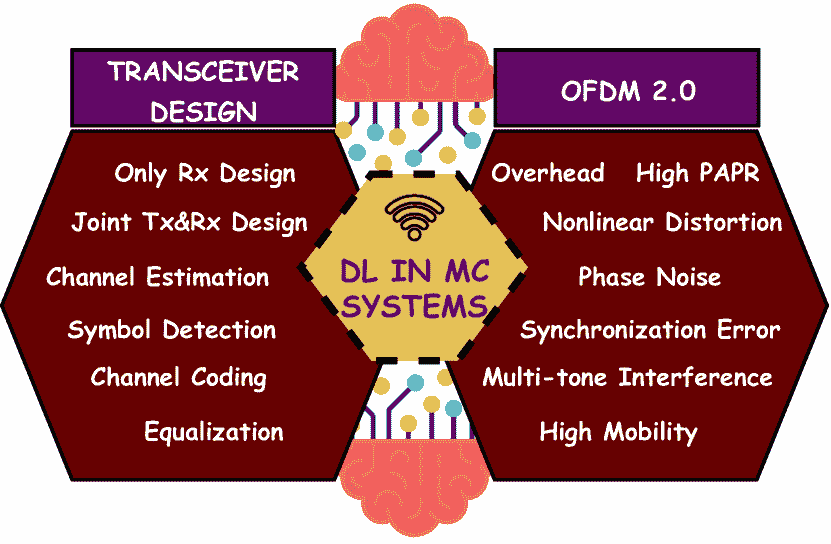

图 22：DL 在多载波系统中的应用。

### 4.1 收发器设计

在本小节中，提供了文献综述中关于基于深度学习（DL）的接收器和收发器设计的研究概述，即那些专注于发射器和接收器结构联合优化的研究。对于接收器设计，大多数研究主要集中在实现基于 DL 的信道估计和符号检测技术。对于收发器设计，通过使用基于自编码器（AE）的方法来共同设计发射器和接收器的处理模块，从而优化整个系统。

DL 已首次在 OFDM 系统中用于信道估计和符号检测[153]。在这项研究中，DNN 已被证明能够学习和评估无线信道特性。所提出的 DNN 架构，经过模拟 OFDM 符号训练，已设计为数据驱动和全连接的。当导频数量减少或 CP 完全移除时，所提出的基于 DNN 的接收器在误差性能方面优于传统算法如 LS 和 MMSE。此外，在存在剪切噪声的情况下，基于 DNN 的接收器提供了比 LS 和 MMSE 更好的误差性能。在[154]中，设计了一种低复杂度 DNN，名为 SimNet，具有简单的架构和较短的训练时间，用于执行信道估计。还介绍了一种基于元学习的神经网络，称为具有元神经网络的稳健信道估计 RoemNet[155]。由于它利用了元学习者，RoemNet 可以以最少的导频数量处理新的信道学习问题。DeepRx 是另一种基于 DL 的数据驱动方法，通过巧妙调整 NN 的输入显著提高了信道估计和符号检测性能[156]。由于它支持包括不同调制方案或导频配置在内的 5G 帧结构，DeepRx 与 5G 通信系统兼容。DeepRx 的输出已被确定，以便通过训练仅一个 NN 支持各种 QAM 方案。作者调查了 DeepRx 的编码和未编码误差性能，并将其与知名的 LMMSE 接收器进行了比较。结果表明，DeepRx 在不同的导频配置下优于 LMMSE。此外，在存在多普勒频移和小区间干扰的情况下，DeepRx 也优于 LMMSE。上述神经网络使用实值张量，这可能导致 DNN 复杂性增加并降低其性能。在[157]中，提出了一种深度复值卷积网络，该网络在复数域中工作，并从时域 OFDM 信号中解码比特，而无需任何 IFFT/FFT 操作。

提出了一个称为 ComNet 的模型驱动方法 [158]，该方法为信道估计和符号检测块设计了两个不同的 DNN，而不是在 [153]中将信道估计和符号检测联合执行。这两个 DNN 由传统的无线通信解决方案初始化。得益于专家知识的优势，与数据驱动的方法相比，模型驱动的方法可以减少对训练数据的需求并更快地收敛 [153]。此外，仿真结果显示 ComNet 在信道估计和符号检测算法方面优于对手算法，如 LMMSE 信道估计、全连接 DNN [153]、MMSE 符号检测。在 [159]中检测到离线训练的信道模型与真实环境之间的错配，这造成了仿真与实际测试之间的性能差距。为了解决这个问题，设计了一种新颖的在线训练系统 SwitchNet 接收器，以捕捉在离线训练中被忽视的信道特性。SwitchNet 预训练了具有多样化信道条件的 ComNet 的多个信道估计 RefineNet，并通过在线学习选择网络。另一种模型驱动的方法是 DeepWiPHY [160]，一种完全兼容最新 Wi-Fi 标准 IEEE 802.11ax 的基于 DL 的 OFDM 接收器。与上述设计相比，DeepWiPHY 接收器不仅使用合成数据集进行训练，还使用通过通用软件无线电外设（USRP）模块创建的实际数据集进行训练。最后，还提出了一种模型驱动技术，将信道估计分为三个基于 CNN 的网络 [161]。

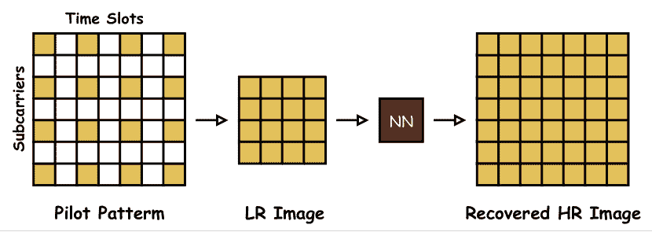

图 23：时间频率网格的 2D 图像表示 [162]。

作者们在[163、162、164、165、166、167、168、169、170]中将无线信道的时间频率响应视为如图 23 所示的 2D 图像，其中 LR 和 HR 分别代表低分辨率和高分辨率。在[163]中，试点位置的信道响应被视为低分辨率图像，估计的信道则是高分辨率图像。设计了一种基于 DL 的接收器，称为 ChannelNet，包括两个不同的 CNN，即超分辨率 CNN[171]和去噪 CNN[172]，分别用于提高低分辨率图像的分辨率和消除噪声的影响。在[162]中，受图像超分辨率技术[173]和条件图像合成技术[174]的启发，使用了两个级联的 NN，即信道估计网络和信道条件恢复网络，用于估计信道和检测信号。在[164]中，介绍了一种不需要训练的基于 DL 的信道估计方法，适用于多维 OFDM 信号。另一种信道估计技术，将传统的 LS 估计器与快速超分辨率 CNN FSRCNN[175]相结合，以提高估计性能，已在[166]中提出。介绍了一种深度残差信道估计网络 ReEsNet，其架构通过利用残差学习进行优化[165]，以超越 ChannelNet[163]。一种基于 CNN 的 NN 架构，称为 FreqTimeNet[168、169]，在时间和频率域中进行学习，用于信道估计。FreqTimeNet 通过促进两个域之间的正交性来降低复杂性。综合仿真结果表明，FreqTimeNet 优于 ChannelNet 和 ReEsNet。此外，另一种名为 AttenFreqTimeNet 的 NN 设计，包含一种广泛使用的 DL 技术称为注意机制，已被提出。由于它利用了 SNR 信息，AttenFreqTimeNet 优于 FreqTimeNet。一种基于 CNN 的 DL 结构，称为 dual CNN，充分利用了角度-延迟域和空间-频率域，已被介绍。此外，提出了另一种新颖的网络，称为 HyperNet，以进一步增强鲁棒性。在[170]中，利用一种基于 GAN 的 NN，称为 SRGAN，用于超分辨率以获得整个信道响应。由于使用了判别器，提出的信道估计器在性能上优于 ReEsNet 和传统技术，如 LMMSE。

也可以在发射端和接收端实现基于深度学习（DL）的技术。因此，可以通过利用基于自编码器（AE）的结构来联合优化整个 OFDM 收发机流水线。在[176]中，作者展示了将端到端（E2E）系统集成到 OFDM 系统中的可能性。此外，对于具有非线性失真的多径衰落信道中的无线图像传输，给出了一种基于 DL 的联合源信道编码技术[177]。最后，在[178]中，介绍了一种基于 DL 的多载波（MC）系统，称为 MC-AE，该系统联合优化调制和解调操作，以最大化编码和分集增益。MC-AE 系统将在以下小节中详细解释。

另一方面，为 OFDM-IM（正交频分复用-信息映射）方案设计了各种神经网络（NN）。在[179]中，使用了一种全连接深度神经网络（DNN），称为 DeepIM，用于 OFDM-IM 的符号检测。DNN 在 OFDM-IM 信号检测中的效率从误差性能和解码复杂性两个方面得到了验证。在将接收到的信号输入 DeepIM 之前，应用了基于领域知识的预处理。还提出了一种基于卷积神经网络（CNN）的接收机，将接收到的符号转换为极坐标，以简化由活动子载波传输的信息比特的解码[180]。为了提高对试验辅助 OFDM-IM 的信道估计和符号检测的性能，利用了复杂的 DNN 和复杂的 CNN[181]。此外，还引入了一种称为 DeepDM 的检测器，该检测器包括 DNN 和 CNN，用于基于 OFDM-IM 的方案，即双模 OFDM-IM（DM-OFDM-IM）[182]。在 DeepDM 中，CNN 用于检测索引比特，而 DNN 用于检测 QAM/PSK 调制比特。还提出了另一种接收机 IMNet，用于检测 IM 辅助的 MIMO-OFDM（IM-MIMO-OFDM）信号[183]。最后，研究了基于 DNN 的接收机在稀疏向量编码 OFDM 中的性能，这也可以视为 OFDM-IM 家族的一员[184]。

基于 DNN 的接收器也被设计用于其他波形，如 UFMC、FBMC、GFDM 和 OTFS。在[185]中，对于两级索引调制的 UFMC 系统，提出了一种基于深度学习的信号检测器 TSIMNet，用于多路径水下声道。在[186, 187]中，分别提出了基于 DNN 和 ResNet-DNN 的接收器，用于 FBMC 系统的信道估计和符号检测。此外，在[188]中，建议使用阻尼化广义近似消息传递方法来最小化 OTFS 系统中的接收器复杂度，同时利用深度学习方法调整阻尼因子。对于 OTFS 接收器的均衡任务，已经提出了数据驱动的基于 DNN 的方法[189]、另一种低复杂度的基于 DNN 的技术[190]（在符号级别均衡接收到的信号），以及基于 2D CNN 的设计[191]。此外，在[192]中，作者提出了一种新的基于 DNN 的框架，用于 SISO 和 MIMO-OTFS 系统的均衡。基于 DNN 的收发器架构也已被引入，用于 IQ 不平衡下的 OTFS 信号检测[193]和 PAPR 降低[194]。最后，提出了用于 GFDM 和 GFDM-IM 系统的深度学习辅助接收器[195, 196]。

在表 5 和 6 中，我们展示了基于深度学习的信道估计和符号检测方法及其相应的 NN 技术，适用于 OFDM 以及基于 OFDM 的替代波形，如 FBMC 和 GFDM。在这里，我们注意到 SD 和 CE 分别表示符号检测和信道估计。从表 5 中可以看出，CNN 特别是用于信道估计时更为频繁，因为其能够学习时间-频率网格中的相关性。

表 5：基于深度学习的多载波系统收发器设计概述。

| 参考文献 | 名称 | CE | SD | NN 类型 | 波形 |
| --- | --- | --- | --- | --- | --- |
| [153] | FC-DNN |  |  | DNN | OFDM |
| [156] | DeepRx |  |  | CNN | OFDM |
| [157] | DCCN |  |  | CNN | OFDM |
| [162] | CENet |  |  | SAN, GAN | OFDM |
| [158] | ComNet |  |  | DNN, LSTM | OFDM |
| [160] | DeepWiPHY |  |  | DNN, CNN | OFDM |
| [159] | SwitchNet |  |  | DNN | OFDM |
| [176] | 不适用 |  |  | AE, DNN | OFDM |
| [177] | 不适用 |  |  | AE, CNN | OFDM |
| [176] | MC-AE |  |  | AE, DNN | OFDM |
| [154] | SimNet |  |  | DNN | OFDM |
| [166] | FSRCE |  |  | CNN | OFDM |
| [165] | ReEsNet |  |  | CNN | OFDM |
| [168] | FreqTimeNet |  |  | DNN | OFDM |
| [161] | 不适用 |  |  | CNN | OFDM |
| [170] | SRGAN |  |  | GAN | OFDM |
| [155] | RoemNet |  |  | DNN | OFDM |
| [163] | ChannelNet |  |  | CNN | OFDM |
| [167] | DualCNN |  |  | CNN, RNN | OFDM |
| [164] | DCE |  |  | DNN | OFDM |
| [169] | AttenFreqTimeNet |  |  | DNN | OFDM |
| [179] | DeepIM |  |  | DNN | OFDM-IM |
| [182] | DeepDM |  |  | DNN, CNN | OFDM-IM |
| [180] | CNN-IM |  |  | CNN | OFDM-IM |
| [183] | IMNet |  |  | CNN | OFDM-IM |
| [184] | Deep SVC |  |  | CNN | OFDM-IM |
| [181] | 不适用 |  |  | DNN, CNN | OFDM-IM |
| [185] | TSIMNet |  |  | DNN | UFMC-IM |
| [186] | DL-CE |  |  | DNN | FBMC |
| [187] | Res-DNN |  |  | DNN | FBMC |
| [195] | 不适用 |  |  | DNN, CNN | GFDM |
| [196] | DeepConvIM |  |  | DNN, CNN | GFDM-IM |

表 6：基于 DL 的 OTFS 系统收发器设计概述（红色阴影表示无 CE 或无 SD，绿色阴影表示有 CE 或 SD）。

| 参考 | 名称 | CE | SD | NN 类型 | 波形 |
| --- | --- | --- | --- | --- | --- |
| [188] | 基于 DL 的 GAMP |  |  | 展开 | OTFS |
| [189] | 不适用 |  |  | DNN | OTFS |
| [190] | Symbol-DNN |  |  | DNN | OTFS |
| [191] | 不适用 |  |  | CNN | OTFS |
| [192] | 不适用 |  |  | RNN | OTFS |
| [193] | 不适用 |  |  | DNN | OTFS |
| [194] | 不适用 |  |  | DNN | OTFS |

### 4.2 基于 DL 的 OFDM 2.0：克服经典 OFDM 的缺点

在本小节中，概述了应对 OFDM 主要缺点的基于 DL 的技术文献。通过特别深度的展开方法，提出了众多基于 DL 的方案以改善经典 OFDM 系统的性能。

在[197]中，提出了一种新颖的 PAPR 降低网络 PRNet，通过其基于 AE 的架构，实现了 PAPR 和 BER 性能的联合优化。此外，提出了一种低复杂度的实值神经网络，以同时降低 PAPR 并最小化 BER[198]。由于[198]中的方法是时域实现的，与 PRNet 不同，因此可以降低复杂度。然而，优化不同的指标会显著增加计算复杂度。受到模型驱动方法的启发，提出了一种基于深度学习的信号预留网络，即 TRNet，仅改善 PAPR 性能以提高训练速度[199]。TRNet 改进了经典的信号预留方法，与 PRNet 不同，它仅应用于发射端。另一个基于信号预留的深度学习方法称为 DL-TR，介绍于[200]，其中将传统的信号预留方法展开为一个 DNN。 此外，在[201]中，提出了一种模型驱动的深度学习基于信号预留的技术，由于其巧妙的设计，具有低复杂度，通过将迭代信号预留方案展开为 DNN 的一层来实现。在[202]中，展示了使用带有软剪切的残差神经网络作为一种新颖的 PAPR 降低方法。[203]的作者建议在发射端使用 DNN，开发一种高维调制方法，以实现 PAPR 和邻近信道泄漏比的调节。在接收端实现了另一种神经网络用于解码信息比特。最后，介绍了一种基于 AE 的 PAPR 降低方法，适用于预编码 OFDM 信号，而不会降低 OOBE 性能[204]。

为了去除 OFDM 系统中的 CP，提出了一种基于正交近似消息传递（DL-OAMP）的模型驱动深度学习技术[205, 206]。DL-OAMP 接收机包含 ComNet 的信道估计模块[158]和将 OAMP 方法与深度学习相结合的 OAMP-Net，这些通过引入一些可训练参数来实现。作者展示了 DL-OAMP 的复杂度低于 ComNet，并且 DL-OAMP 能够适应时间变化的信道。在[206]中，OAMP-NET 的性能不仅通过大量仿真进行了研究，还通过实际通信系统进行了验证。另一种基于 OAMP 算法的模型驱动深度学习方法也被提出用于 MIMO-OFDM 系统中的 CP 去除[207]。虽然 CP 被插入到时间域 OFDM 信号中以避免 ICI，但在一些实际场景中其长度可能不够长。在 CP 不足的情况下，设计了基于模型驱动深度学习的接收机用于 SISO-OFDM[208]和 MIMO-OFDM[209] 信号。除了 CP 外，还需要考虑 OFDM 系统中的导频开销以提高频谱效率。在[210]中，首先，部分去除导频符号而不降低误差性能。其次，通过使用基于 AE 的 NN，完全去除导频，并利用学习到的星座或叠加导频。为了显著提高吞吐量，[211] 的作者解决了 CP 和导频减少问题，并展示了通过利用 E2E 学习完全消除 CP 和导频的可能性。在[212]中，针对频分双工大规模 MIMO-OFDM 系统，提出了一种基于 NN 的联合下行导频设计和信道估计方法。还建议了一种有效的导频减少方法，通过逐步修剪密集层中不重要的神经元来减少导频开销，节省数据传输的时频资源。最后，为了解决信道估计问题，[213] 提出了无导频的基于 AE 的 E2E 学习技术，其中在发射端和接收端分别实现了 CNN 和两个 DNN。

如前所述，高移动性会导致 OFDM 信号中的 ICI，这种 ICI 破坏了子载波之间的正交性，使得检测过程变得相当具有挑战性。DL 作为一个有趣的工具，能够在快速变化的环境中检测 OFDM 信号。在 [214] 中，提出了一种利用 CNN 和 RNN 的信道估计网络 ChanEstNet，用于高速移动场景中的信道估计。此外，这一思路也扩展到了 MIMO 系统 [215]。还提出了基于 DL 的级联结构，如 ICINet [216] 和 Cascade-Net [217]，用于快速变化信道的信道估计和符号检测。最后，还开发了基于 AE 的 DL 技术，以应对海洋通信中的复杂和快速变化的环境 [218]。

表 7：聚焦于 OFDM 缺陷的 DL 基于设计的概述。（颜色用于聚集类似的问题类型。）

| 参考文献 | 名称 | 问题 | NN 类型 |
| --- | --- | --- | --- |
| [197] | PRNet | 高 PAPR | AE, DNN |
| [198] | N/A | 高 PAPR | AE, DNN |
| [199] | TRNet | 高 PAPR | AE, DNN |
| [200] | DL-TR | 高 PAPR | 展开 |
| [201] | N/A | 高 PAPR | 展开 |
| [202] | RDNN | 高 PAPR | Residual DNN |
| [203] | N/A | 高 PAPR | AE-Residual CNN |
| [204] | N/A | 高 PAPR&OOBE | AE, DNN |
| [205] | DL-OAMP | CP 开销 | 展开 |
| [206] | DL-OAMP | CP 开销 | 展开 |
| [207] | CG-OAMP-NET | CP 开销 | 展开 |
| [208] | DetNet-IG | CP 开销 | 展开 |
| [209] | N/A | CP 开销 | 展开 |
| [210] | N/A | 导频开销 | AE, Residual CNN |
| [211] | N/A | CP 和导频开销 | AE, Residual CNN |
| [212] | N/A | 导频开销 | CNN |
| [213] | N/A | 导频开销 | AE, CNN, DNN |
| [214] | ChanEstNet | 高移动性 | CNN, BiLSTM |
| [215] | N/A | 高移动性 | CNN, BiLSTM |
| [216] | ICINet | 高移动性 | DNN, Residual CNN |
| [217] | Cascade-Net | 高移动性 | 展开 |
| [218] | N/A | 高移动性 | AE, CNN, LSTM |
| [219] | HybridDeepRx | 非线性失真 | Residual CNN |
| [220] | N/A | 非线性失真 | DNN |
| [221] | N/A | 相位噪声补偿 | DNN, CNN |
| [222] | N/A | 干扰抑制 | LSTM, DNN |
| [223] | N/A | 同步误差 | DNN |
| [224] | N/A | 单比特量化 | AE, DNN |

在 OFDM 传输系统中，DL 还可以用于对抗其他损害，例如相位噪声和同步错误。例如，介绍了一种基于 DL 的接收器，称为 HybridDeepRx，用于检测非线性失真的 OFDM 信号[219]。此外，为了缓解 MIMO-OFDM 系统中的非线性失真，[220]的作者设计了基于 DL 的接收器，包括模型和数据驱动的方法。此外，为了减轻 GFDM 和 OFDM 系统中通道估计和符号检测的相位噪声，已经设计了一种包含 DNN 和 CNN 的 DL 方法[221]。在[222]中，利用 LSTM 和 DNN 技术减少了极化编码 OFDM 系统中的多音干扰。在[223]中，提出了 FC-DNN 的增强版本[153]，以在存在时序同步错误的情况下执行通道估计和符号检测。最后，在一比特复杂量化的限制下，[224]的作者探索了用于 OFDM 接收器的创新 DL 技术。

在表 7 中，我们总结了重点关注 DL 设计以克服经典 OFDM 的一些重要缺陷，如高 PAPR 和 CP 开销的研究。特别是，深度展开作为处理 OFDM 挑战性损害的重要概念，通过展开传统算法显现出来。对于 PAPR 的减少，基于 AE 的 NN 具有优势，因为它们可以在降低 PAPR 的同时提高误差性能。

尽管基于 DL 的方法显示出巨大的潜力，但在 MC 波形的 DL 解决方案应用中仍然存在限制和缺点。最重要的限制之一是大多数研究只关注优化一个性能指标，如 BER 和 PAPR。不幸的是，MC 系统的性能依赖于多个关键性能指标，这些指标应在设计过程中考虑。将这些指标应用于 DL 模型设计是一个具有挑战性的任务，文献中尚未涉及。此外，设计过程需要涉及各种 6G 应用，如 eMBB、URLLC、mMTC 及其可能的组合。这些应用要求在 DL 模型设计中考虑特定的挑战。

### 4.3 一个基于 AE 的 OFDM 系统示例

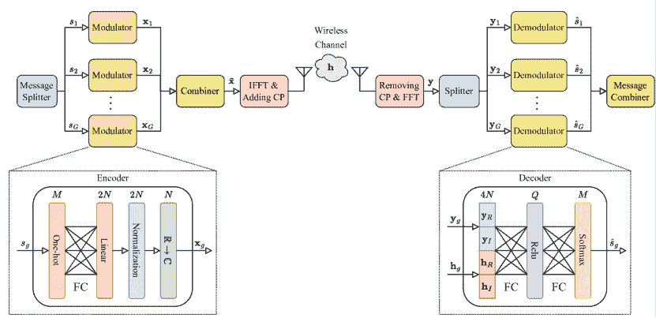

图 24：MC-AE 系统的框图[178]。

在本小节中，我们介绍了一个基于 AE 的 MC（MC-AE）系统，该系统在[178]中提出。MC-AE 的框图见图 24。在 MC-AE 中，考虑了一个具有$N_{c}$个子载波的 OFDM 系统。这些$N_{c}$个子载波被分成$G$个块，每个块包含$N$个子载波，其中$N=N_{c}/G$。对于每个子块，AE 方法是独立执行的。如图 24 所示，整个 OFDM 系统的调制器和解调器块被建模为 AE 的编码器和解码器 DNN。在发射端，对于第$g$个子块，$g=1,\cdots,G$，输入消息$s_{g}$被映射为一个 one-hot 向量$\mathbf{s}\in\mathbb{R}^{M\times 1}$。请注意，输入消息$s_{g}$可以是长度为$m$的比特流。然后，$\mathbf{s}$通过线性和归一化层，转换为一个复数值向量$\mathbf{x}_{g}$。之后，通过将所有子块拼接得到整个 OFDM 符号$\bar{\mathbf{x}}=[\mathbf{x}^{\mathrm{T}}_{1},\mathbf{x}^{\mathrm{T}}_{2},\cdots,\mathbf{x}^{\mathrm{T}}_{G}]^{\mathrm{T}}$。在执行 OFDM 传输程序后，$\bar{\mathbf{x}}$通过 Rayleigh 信道传输，接收到的信号被获取。对于第$g$个子块，频域输入输出关系可以表示为

|  | ${\mathbf{y}_{g}=\mathbf{h}_{g}\odot\mathbf{x}_{g}+\mathbf{n}_{g},}$ |  | (14) |
| --- | --- | --- | --- |

其中$\mathbf{y}_{g}$、$\mathbf{h}_{g}$和$\mathbf{n}_{g}$分别是第$g$个子块的接收信号、信道系数和 AWGN 向量。$\mathbf{h}_{g}$和$\mathbf{n}_{g}$的元素分别遵循分布$\mathcal{CN}(0,1)$和$\mathcal{CN}(0,\sigma^{2})$。平均接收 SNR 定义为$\bar{\gamma}=E_{s}/\sigma^{2}$，其中$E_{s}$表示平均发射功率。在接收端，假设已知完美 CSI $\mathbf{h}$。$\mathbf{y}_{g}$和$\mathbf{h}_{g}$的实部和虚部被拼接，得到的向量作为解码器的输入。如图 24 所示，输入的向量通过两个不同的 FC 层，激活函数为 ReLU 和 softmax。最终，得到估计的消息$s_{g}$。

对于这种基于 AE 的结构训练，使用了一组随机输入消息和随机生成的通道及噪声样本。MSE 损失函数和 SGD 优化方法被用于训练。

学到的 MC-AE 系统的星座图可以在图 25 中看到，其中每个标记代表一个子载波的复星座点。在[178]中，展示了由于 AE 结构的能力，MC-AE 系统的多样性和编码增益高于基准方案。因此，MC-AE 系统能够在衰落信道中提供卓越的误码性能。

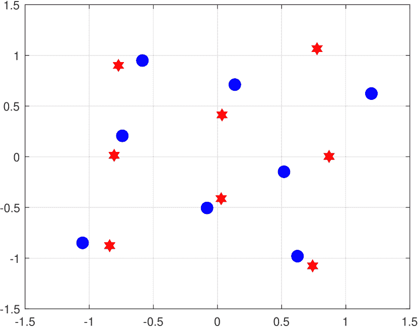

图 25：$N=2$和$M=8$时 MC-AE 学习到的星座图。

## 5 基于 DL 的 RIS 辅助通信系统

通过 RIS 的通信，因其诸多优势如以低成本和高效率实现智能无线环境，而成为下一代通信系统的新兴且有前景的技术。RIS 技术在提高无线通信性能的同时提供了环保的解决方案，其被动反射架构使其在低成本和复杂度下提供了吸引人的优势。因此，RIS 技术已被视为下一代系统的强有力候选者，是大规模 MIMO 系统的替代方案[6]。

RIS 智能地与进入的信号进行交互，旨在扩大无线通信系统中的能源效率和覆盖范围。上述控制的交互通过智能表面的自适应元件实现。目标是通过这些元件操控进入的信号，以获得最佳的相位配置并优化无线通信性能。在这里，来自基站的信号在实时空中被控制，并反射到接收器。智能表面旨在提高接收端的信号水平，并扩展信号覆盖，如图 26 所示。在这里，我们考虑了多用户的覆盖扩展场景，这些用户没有直视基站的路径，而 RIS 在建筑物上的智能反射相位配置使之成为可能。换句话说，RIS 技术利用软件控制方法实现智能无线通信环境。由于其灵活的机制，RIS 可以在不同的频段工作，如太赫兹通信[225]，在这些频段中，建立大规模通信和减少用户之间的干扰至关重要。

RIS 不仅能在智能无线环境中提供低成本的节能信号调制，还在安全和多用户通信中发挥积极作用[226]。RIS 辅助的波束成形技术能够在潜在窃听者存在的情况下确保通信的保密性。它可以用于低能耗应用中的无线能源传输，如无线传感器，这些应用需要持续的能量供应，这也使得我们在物联网等领域经常看到 RIS。智能表面因其独特的结构和自由工作的特性，能够引导电磁（EM）波，可能在能源传输中发挥重要作用[227]。在环境条件差的通信环境中充当反射中继的智能表面也用于提升 QoS。

RIS 架构的所有这些优点和被动波束成形技术的成功展示了对通道知识的坚定承诺[228]。在 RIS 辅助通信方案中获取多跳通信通道信息比在传统的大规模 MIMO 系统中要复杂得多，这可以被视为一个需要研究的问题。此外，阶段优化算法对基站上完美通道信息的存在表现出了强烈的承诺。然而，由于硬件限制，获取这些通道信息也可能成为一个挑战，特别是在具有被动反射元件的 RIS 场景中[229]。

图 26：RIS 辅助的多用户无线通信。

RIS 为下一代通信技术带来的新场景将产生现有架构无法满足的新需求。除了上述挑战之外，下一代系统的能量消耗优化以及提供存储选项以满足复杂系统的高训练负载是研究人员需要解决的一些问题。RIS 在无线电环境中对电磁信号的适应性能是一个开放的主要问题。例如，在 RIS 辅助的 IoT 应用中，连接到智能表面的无线设备数量可能非常庞大。在这种情况下，系统优化所需的参数数量将相应增加[230]。

高级信息处理技术对于智能表面对电磁信号的响应性能至关重要。这将需要额外的计算时间和存储资源，以及额外的能源和带宽[231]。将现有系统适应新通信技术的最大障碍在于分析模型限制了工作灵活性。分析建模不仅适用于使用 RIS 的场景中的网络规划，还适用于使用自适应方法的资源管理和网络控制。RIS 系统的复杂性提高了现有传统分析模型可能对其失效的可能性。

考虑到上述情况，RIS 系统配置和信道动态带来的不确定性使得系统设计变得复杂[232]。尽管传统 RIS 模型使用的信号处理技术提供了许多通信问题的解决方案，但它们对假设数学模型的依赖导致了某些缺陷。模型无关的解决方案如深度学习成为了应对上述不确定性的便捷解决方案。在 RIS 场景中，电波散射的快速变化和硬件缺陷会导致一定的匹配不一致，从而使信号处理性能下降。由于深度学习能够处理原始数据并使其有意义，它可以通过训练可学习参数来进行模型无关的映射[228]。与只能在特定条件下工作的传统分析模型依赖方法相比，深度学习方法提供了更高效和灵活的结果。换句话说，在未实施深度学习或人工智能方法的通信环境中，谈论“智能表面”的实际概念是不合适的[17]。

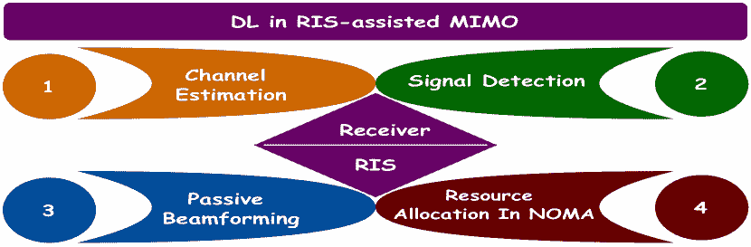

图 27：用于 RIS 辅助 MIMO 系统的深度学习应用。

为了追求上述深度学习方法的优势，近年来，许多新颖的研究使用深度学习技术在 RIS 辅助通信领域展开。本节虚构了信道估计和信号检测解决方案、被动波束成形设计场景以及 RIS 辅助深度学习系统中的 NOMA 技术的资源分配。图 27 从接收端优化和 RIS 侧相位配置的角度对 RIS 辅助系统中深度学习解决方案的主要应用进行了分类。最后，我们讨论了需要采取的措施来弥补当前应用的潜在缺陷。

### 5.1 RIS 辅助深度学习系统的信道估计与信号检测

随着 RIS 辅助的大规模 MIMO 系统中反射元件数量的增加，由于通道数量的增加，通道获取过程变得更加具有挑战性。在其他方面，可靠且准确的通道获取对 6G 及更高技术具有关键重要性。基于深度学习（DL）解决方案的主要灵感在于平衡系统复杂性与可实现速率性能之间的权衡。因此，正如表 8 中所示，文献中存在关于通道估计和信号检测的多个研究。

将 DL 技术与 RIS 辅助无线通信相结合的最大动机是获取能够在没有线性数学模型的情况下揭示的映射方法。在这方面，[233] 在发送信号与接收信号之间执行了非线性映射，并通过 DL 方法优化了信号检测。[233] 提出的信号检测 DL 解决方案为每个用户提供了独立的学习模型。这种方案的主要优点是无需通道估计算法。然而，该系统需要在基站侧进行波束赋形优化或由 RIS 直接进行相位移优化，以提高用户的比特错误率（BER）性能。

在通道获取方面，[228] 和 [234] 将通道估计场景与 DL 方法相结合，并对反射路径和直射路径进行了通道估计。所提出的通道估计技术采用了 CNN 架构，具有高度的数据集依赖性。数据集的多样性会影响性能效率，有时会将性能限制在局部维度。这导致了通道估计学习过程中的高训练开销。为解决这个问题，[235] 创建了深度去噪神经网络（NN）的架构，以减少训练负担。在此模型中，智能表面同时包含主动和被动元素。这种架构结合了压缩感知和 DL 方法，比单独使用任何一种方法都能实现更高的效率。然而，主动元素的存在增加了硬件复杂性。假设主要目的是降低传统毫米波大规模 MIMO 架构中的复杂性，这可以被视为必须解决的问题。

表 8：基于 DL 的 RIS 系统通道估计和信号检测研究概述。

| 参考文献 | 算法类型 | 应用场景 |
| --- | --- | --- |
| [228] | DL-CNN | 提出了一个新颖的基于 CNN 的智能通道估计框架，无需对重新定位的用户进行再训练，支持最多 4 度的移动 |
| [234] | 联邦学习-CNN | 通过一种新颖的 DL 方法对 RIS 辅助的毫米波 MIMO 系统中的直接和级联路径进行通道估计 |
| [235] | DL-深度去噪 NN | 通过深度去噪 NN 架构结合 CS 和 DL，以减少训练开销 |
| [236] | DNN-深度展开 | 深度展开在较低计算复杂度和训练开销下具有增强的估计性能，相较于传统的最小二乘估计器 |
| [237] | DL-CNN | 使用稀疏通道传感器进行 CSI 采集，并优化 RIS 相位配置以减少训练开销 |
| [238] | MLP-DNN | 通过实践 MLP 架构加强通道信息与传统基于 DL 系统的被动波束形成之间的互动 |
| [239] | 无监督学习-CNN | 开发了二阶段新颖的通道估计方法，以减少毫米波通信方案中的训练负担 |
| [240] | DL-CNN | 在 MISO 架构中提出了一种新颖的数据驱动通道估计器，以降低系统复杂性 |
| [241] | DL-DNN | 通过使用完全被动元件的三阶段合成 DNN 进行级联通道估计的顺序训练 |
| [242] | CENet-CNN | 通过研究和消除通道干扰来增强元素分组方法，以减少导频开销，并保证可靠的通道估计过程 |

基于深度学习（DL）的技术在辅助反射智能表面（RIS）系统中的集成一直是一个挑战，因为训练过程复杂，利用的通道数量与反射元件的数量成正比。因此，文献中经常关注这一主题。减轻训练开销的基于 DL 的通道估计技术也在[237]、[238]和[239]中提出，采用了不同的学习和网络架构。[238]旨在通过实践多层感知器（MLP）架构来增强通道信息与传统 DL 系统的被动波束成形之间的互动。[239]提出了一种两阶段通道估计方法，以减少毫米波通信方案中的训练负担。考虑的深度神经网络（DNN）在第一阶段使用减少的用户数量进行训练，以学习活跃用户的有效通道参数。然后，作者提出了一个时空-频谱框架，在第二阶段估计缺失的通道信息。[237]使用了类似的方法，其中仅用少量活跃元素获得的通道信息也用于估计剩余的通道，从而几乎没有训练开销。在所提供的两层解决方案的第一部分，作者使用所提出的稀疏通道传感器结构进行 CSI 采集，然后利用获得的信息优化 RIS 的相位配置。然而，这些用于通道重建的受控活跃元素的存在实际上无法满足 RIS 的独立操作原则和被动特性。这些活跃元素的存在也增加了系统复杂度。[236]受到了深度神经网络（DNN）高学习和预测能力的启发，旨在为毫米波通信实现低系统复杂度。提出的深度展开方法在计算复杂度和学习负担较低的情况下提供了比传统最小二乘（LS）估计器更高的估计性能。模型驱动的展开方法，作为 DNN 的一种子类型，具有从广泛的合成数据中以较低迭代次数进行学习的能力，遵循类似于传统梯度下降优化的算法。[240]提出了一种新颖的数据驱动通道估计器，在 MISO 架构中实现了类似于[236]的低系统复杂度。该研究利用了 CNN 结构相比于 DNN 等先前架构涉及的较少参数的优势。所提出的基于 CNN 的通道估计器在实现复杂度方面优于传统线性估计器。尽管如此，包括移动性、用户多样性以及多天线假设在内的扩展场景对于在实际应用中实现这一架构将是至关重要的。

在信道估计中应用深度学习方法的基本动机之一是使用更少的导频。[241] 和 [242] 提出了基于深度学习的方法，这些方法在减少导频开销的同时实现了估计精度的可靠性。两项研究都从采样信道中进行整体信道外推。[241] 提出了依次训练的三种合成深度神经网络（DNN）。这些 DNN 首先估计直接信道，然后估计级联信道。最后一个 DNN 通过在最后阶段使用完全被动的元素来预测级联信道。[242] 也使用了多个级联的、依次训练的 DNN。该研究通过研究和消除信道干扰，改进了传统的元素分组方法。通过消除干扰而由第一个 DNN 精炼的采样信道被用于在第二阶段预测整体信道。这两项研究在减少导频开销和实现可靠的信道估计过程方面取得了显著的进展。

考虑到文献中现有的方法，较简单的无线设计方案一直是 RIS 辅助系统持续研究的重点。为了测量利用 RIS 的无线连接中的性能边界，需要更准确的建模方法来传输由超表面散射的信号。另一个挑战是，在完全被动的 RIS 架构中没有放大器。因此，RIS 可能需要一个低功耗单元来根据当前的信道状况以及其他通信模块，如接收器或发射器，进行相位优化。借助这些嵌入在 RIS 中的信道监测单元，并使用新型能源收集方法供电，可能是实现节能方法的必要条件。

从大多数最近的研究中得出的结论是，完美的 CSI 在发射机处至关重要。然而，由于 RIS 辅助方案的被动性质，在实践中获取完整的信道信息并不是一个简单的过程。因此，下一代技术所需的快速而准确的信道获取会带来较高的训练负担。目前，常用的有监督学习技术用于解决信道问题，以提高效率，而深度学习方法则研究当前设计的 CSI 结构。然而，由于上述限制，研究工作可以扩展到不同的部署场景。例如，在近场环境中使用 RIS 可能会带来一些令人兴奋的应用和好处。

表 9：基于深度学习的被动波束形成设计研究概述。

| 参考文献 | 初步总结 | 算法类型 | 应用场景 |
| --- | --- | --- | --- |
| [243] | 基于位置的训练 | DNN | 指纹数据库揭示了测量用户位置与 RIS 单元格之间的映射，以最大化接收到的信号强度 |
| [232] | 相位移设计 | 深度强化学习-DDPG | DDPG 算法能够快速适应动态信道状态和环境条件，这得益于连续的动作空间 |
| [244] | 联合波束成形的深度强化学习 | 深度强化学习-DDPG | 一种优化，其中 DDPG 算法负责在网络学习阶段的每次决策中寻找最佳动作 |
| [245] | 增强的数据速率和保护隐私 | 联邦学习-MLP | 联邦架构减少传输开销，提供 RIS 侧的波束成形优化 |
| [246] | 功率分配 | 无监督学习 | 一种新颖的无监督学习架构，用于波束成形设计优化 |
| [229] | 独立 RIS 架构 | 深度强化学习 | 该架构创建了一个积极学习方案，能够以高性能快速适应环境条件的变化 |
| [247] | 相位移设计的监督学习 | 前馈神经网络 | 使用反射符号的前馈神经网络进行相位矩阵优化 |
| [248] | 历史信道知识 | 深度强化学习-DNN | DNN 架构评估历史视距路径信道，以解释信道行为 |
| [249] | 保密速率优化 | 无监督学习-DNN | 监督学习方法用于接收端的保密速率优化和 RIS 侧的相位配置优化，减少计算复杂性 |
| [250] | 移动用户场景 | 深度强化学习 | 深度强化学习方法在嘈杂信道和移动场景中实现比传统技术更高的 SNR |
| [251] | 从环境中学习 | 深度强化学习-DNN | 中继选择优化，通过提议的深度强化学习模型减少传播损失，能够从环境中学习 |
| [252] | 太赫兹通信 | 深度强化学习-DNN | 一种方法，解决了 RIS 辅助的太赫兹通信中由于高分子吸收和衰减而面临的路径损失优化挑战 |
| [253] | 资源分配 | 深度强化学习-NN | D2D 网络的资源分配和相位移配置优化，涉及可实现速率和计算时间性能 |
| [231] | 节能策略 | 深度强化学习-DNN | 深度强化学习方法，通过优化 RIS 元件的开/关状态以及发射功率，提供完全节能的方法 |
| [254] | RIS 的动态定位 | 基于 MLP 的位置 | 基于 MLP 的神经网络解决多个 RIS 的动态定位问题，以克服存储和计算性能的限制 |
| [255] | 优化能量消耗 | 无监督学习-NN | 通过深度无监督学习方法训练的神经网络，优化了能量消耗和相位配置 |
| [256] | 无需 CSI 的映射 | ML/DL-DNN | 利用深度学习技术的 ML 方法不需要 CSI 即可进行直接映射 |
| [230] | 绕过通道预测 | 无监督学习-DNN | 提出的算法绕过了通道预测过程，与之前的通道估计研究相比需要更少的导频 |
| [257] | 减少硬件复杂性 | 无监督学习-DNN | 提出的基于深度迁移学习的算法需要较少的样本数据进行训练，从而减少硬件复杂性和训练负荷 |
| [258] | 学习通道行为 | 深度强化学习 | 基于深度强化学习的全新架构能够学习通道行为 |

### 5.2 使用深度学习进行系统优化的被动波束成形设计

被动波束成形设计是 RIS 技术纳入下一代通信系统中的最关键问题之一。相位重配置的成功不仅提高了信号转换的质量，还提高了 RIS 对不同通信环境（如室内/室外应用）的适应性。特别是在高度动态的信道中，如高移动性的应用场景，现有控制系统的不足暴露了新视角的必要性。在保持 RIS 完全被动特性并减少成本和系统复杂度的同时，真正智能的方法对下一代通信有着光明的前景。因此，基于 DL 的被动波束成形技术已被文献广泛讨论，如表 9 所示。当前基于 DL 的 RIS 辅助通信系统研究由各种 NN 结构组成，这些结构根据其对目标应用的优势而定。例如，MLP 是前馈人工 NN 的成员，也是 DNN 最基本的类型之一，可以作为一个例子。[237] 提供了一个用于 RIS 侧波束成形设计的 MLP 架构。所考虑的 RIS 方案具有一种同时存在主动和被动元件的混合结构，通过随机分布的主动组件进行导频训练。建立的训练数据集，其中 RIS 侧的波束成形作为输入输出对建立，是基于监督学习方案构建的。使用主动元件可以被认为是这项研究的一个缺点。[254] 已经检查了基于监督学习的 MLP 算法与完全被动 RIS 的潜在优势，以克服多个 RIS 的动态定位中的存储和计算性能限制。基于 MLP 的 NN 利用动态信道信息和 RIS 定位信息进行训练。所提出的基于位置训练的 NN 结果优于通过详尽研究获得的基准结果。

[245] 提供了在 RIS 侧使用联邦学习方法的波束成形优化。在 MLP 架构的训练阶段后，模型更新是通过本地数据集为每个用户计算的。模型更新是从 RIS 连接的参数服务器接收的。研究结果表明，由于联邦架构，传输开销得以减少。然而，由于 RIS 的被动性质，始终连接到参数服务器的场景使得这种架构效率低下。此时，[259] 寻求解决从先前研究中被动反射表面的单位模约束问题，并提出了一种在训练阶段同时减少模型复杂性的方案。该研究提出了一种无监督学习架构，其中直接和反射通道为输入，输出为 RIS 的响应波束成形的相位值，同时映射被揭示。得益于离线阶段训练的 DNN，该架构能够进行在线预测。然而，输出参数对每个学习阶段都是唯一的。这种矛盾将作为一个层，因此，每个学习数据将立即输出不同的值。然而，文献中提出了不同的方法来防止这种分层，可以作为对本研究增强的进一步研究。

深度强化学习，作为一种基于 DL 的技术中，凭借其高学习能力和在决策过程中其他近期优势，表现出一种有前景的方法。因此，它也成为 RIS 辅助下一代通信系统中各种领域的有力候选者。深度强化学习的重要性源于其从有限知识中进行推断的显著能力。文献涵盖了广泛的主题，例如提供节能且鲁棒的过程或扩展覆盖范围，但主要可以在更高层次上评估为被动波束成形应用。

[232] 提出了深度确定性策略梯度（DDPG）技术，用于 DL 辅助的 RIS 方案，该方案结合了深度-Q 网络和策略梯度（PG），其中使用连续动作空间来加速训练阶段。所提出的模型能够快速适应变化的信道数据和环境条件，得益于 DDPG 算法的连续动作空间。然而，使用多个神经网络会增加学习阶段的参数数量。因此，训练开销将导致系统负载和存储需求增加以及硬件成本上升。为了克服多个神经网络带来的计算复杂性和硬件限制，[257] 提供了一种结合深度迁移学习算法和无监督学习的模型，该模型在训练过程中需要较少的采样数据。因此，结果表明，该方案解决了以前研究中存在的硬件复杂性和训练负荷问题。此外，还检查到，在基站侧实现了更少的发射功率要求，以应对硬件成本和限制以及处理时间。

在这里，DDPG 算法也被 [244] 用于优化和加速学习过程。DDPG 算法负责在网络学习阶段为每个决策寻找最佳动作。因此，通过优化搜索空间，学习阶段将得到加速。然而，这在一定程度上与模型无关的特性相矛盾，而这是深度学习方法的主要理念，因为学习过程将需要一个优化工具箱和信号模型。在这一点上，与其使用基于优化的技术，不如采用完全依赖深度模型的独立学习方法。为了弥补当前深度强化学习-DDPG 应用中对模型依赖的结构， [250]、[229]和 [248] 提出了他们的先进深度强化学习技术，使系统在变化的环境条件下具有鲁棒性。通过这些先进的深度强化学习技术，不仅可以学习信道信息，还可以类似于 [258] 学习信道行为。与传统的深度强化学习方法相比，[250] 在嘈杂信道和移动场景下实现了更高的 SNR。[248] 的作者展示了他们的算法能够通过评估先前的动作奖励来提高每个周期的 BER 性能，从而增强相位矩阵的优化。信道行为可以通过评估历史视距路径信道来确定进一步动作的最佳相位配置。

[229] 开发了一种主动学习方案，该方案能够迅速适应变化的环境条件，同时保持高性能。然而，由于强化学习采用奖励机制，它的操作时间较长且性能低于监督学习。考虑的方案没有分层结构，使其在性能上落后于监督学习。然而，[255] 证明了可以在不使用分层结构的情况下，设计出在能量和时间消耗方面超越监督学习的方案。所提出的算法通过深度无监督学习方法训练的神经网络优化了能量消耗和相位配置，甚至超越了被认为是突破性发展的遗传算法。尽管如此，与遗传算法相比，这种改进在吞吐量性能上有轻微的损失，但该损失可以通过增加天线数量得到补偿。

无监督学习也被用于优化计算复杂度。在 [260] 中，通过所提出的算法进行高效的中继选择优化，系统复杂度较低。另一方面，[251] 在复杂的相位移优化场景中，通过创建优化参数和吞吐量之间的直接关系，超越了之前基于深度强化学习的技术。在增加距离的情况下，通过所提出的深度强化学习模型进行的中继选择方法也能减少传播损失，该模型能够从环境中学习。

传播损失也是太赫兹通信的一个研究课题，太赫兹通信在下一代通信系统中具有光明的前景。[252] 寻找了一种方法来解决 RIS 辅助的太赫兹通信中的路径损失优化挑战，该通信具有高分子吸收和衰减。所提出的实施混合波束成形的方法相比 ZF 和交替波束成形提供了 50%的覆盖扩展。

除了先前的应用，利用深度强化学习对 RIS 辅助系统中的传输功率和相位移配置进行联合优化，为优化可实现的速率和实现节能系统提供了重大优势。[253] 对设备对设备（D2D）网络进行了资源分配优化。所提出的方案采用了一个邻近策略优化算法，以定义深度强化学习的策略梯度，寻求最大化奖励。所呈现的模型在可实现速率和计算时间性能方面优于随机相位移矩阵选择算法、随机中继选择和最大功率传输算法，这些算法也进行了相位移配置优化。[253] 通过深度强化学习所获得的巨大奖励，得到了[231] 在能源效率方面的提升。[231] 旨在通过优化 RIS 元件的开/关状态和传输功率，提出一种完全节能的方法。在这个方案中，接入点通过 CSI 接收可用能量信息，以通过连接 RIS 和 BS 的回传链路做出最佳决策。[229] 取消了对任何基础设施控制 RIS 的必要性，从而引入了独立操作。研究表明，RIS 能够使用提出的深度强化学习方法学习和调整最佳中继选择，几乎没有训练开销，这要归功于在线学习阶段。

高级深度学习应用在移动用户场景下的 RIS 辅助通信系统中也承诺了智能环境。[243] 在 RIS 侧使用深度学习方法进行相位配置，并开发了一个产生用户位置相关结果的过程。使用位置信息作为输入的神经网络经过多个参考点的训练，以给出优化的相位输出。换句话说，本研究为室内通信环境中 RIS 的配置提供了一种有效方法。权重和偏置训练中的指纹数据库形成了基于位置的学习概念，揭示了测量的用户位置与 RIS 单元格之间的映射，以最大化接收信号强度。然而，RIS 定位的低效和吞吐量结果的不佳仍需进一步研究。

[247] 使用 DL 方法优化 RIS 端的相位配置，训练了具有反射符号信号的前馈 NN，并旨在获得最佳相位矩阵。系统无法优于高符号功率的最小二乘估计方法以及造成高信号开销是需要解决的问题。此外，系统应在不完美的信道估计假设下进行分析。然而，由于反射元件数量庞大导致复杂的信道信息，信道获取在 RIS 辅助方案中是一个重要挑战。因此，[256] 和 [230] 提出了揭示最佳相位配置与可实现速率之间直接映射的方法。[230] 使用 DNN 中的试验信号，通过无监督学习方法来确定最佳相位配置，而不是用于信道获取。该算法绕过信道预测过程，相较于之前的信道估计研究，需要更少的试验信号。在 [256] 中，利用 DL 技术的 ML 方法无需初始 CSI 即可实现直接映射。所提出的算法能够学习 RIS 配置与动态接收器定位相关的可实现速率之间的关系。由于 [256] 是给出最接近完美信道假设基准结果的研究之一，因此所提出的方法作为一个光明的未来方向显得格外突出，使得 RIS 位移优化能够在无需基础设施完美 CSI 的情况下进行。

与之前的研究视角不同，[249] 关注于 RIS 架构在 PHY 安全领域的优势。该研究旨在通过调整 RIS 端的元件来优化接收端的保密速率。此外，实时调整的反射元件通过 DL 方法优化 RIS 端的相位配置，并提出了一种与传统方法结果类似但在计算复杂度上大大减少的技术。

考虑到这些研究和其他文献，我们得出结论，结合 RIS 架构和 DL 方法获得的结果尚未充分满足 6G 及以后的无线通信系统所需的灵活性和性能。特别是，无论是从发射器还是用户的角度来看，存在高计算复杂度、高训练开销以及发射器中的完美 CSI 假设等限制。此外，智能表面上主动元素的使用来优化相位配置与 RIS 的完全被动特性不符。应考虑以尽可能低的成本实现高能效的紧迫需求。显然，文献中仍存在许多问题需要解决。不同 RIS 定位情境的研究、计算机模拟中的系统性能优化以及在不同环境条件下应用场景，其中 DL 方法提升了信道估计和相位配置优化，对于设计 6G 及以后相关研究问题的有前途的视角至关重要。

另一个使当前系统设计不那么可行的技术限制是对静态环境的假设。然而，在动态场景中，用户的移动性包括一些附加参数，如速度、加速度和位置，这些参数在处理过程中需要考虑。因此，由于动态信道，移动用户的数据流的学习过程变得更加复杂。此外，由于无限的移动性，系统参数不能被指定为常量。这种情况使得采用监督技术变得具有挑战性，其中输入-输出对被标记并从正确安排的数据中学习。考虑到 ML 技术在各种领域处理复杂数据的优势，诸如计算机视觉或神经语言处理等方法也可以从通信工程的角度来考虑。在这一点上，可能会优先考虑诸如卷积神经网络这样的结构，而不是更浅层的 DNN 结构。

RISs 由复杂形成的亚波长元素组成。因此，继续 RIS 研究的一个根本限制是缺乏定义可重构超表面作为其电磁特征函数的准确和可控的模型。正如大多数研究假设的那样，RIS 的被动反射行为在实践中不可行。材料成分、极化和角度等组件影响 RIS 对无线电波的响应。换句话说，RIS 不仅反射波，还重新设计波。对于 RIS 拓扑，应使用基于实际电磁的电路设计，考虑到互连和单元格配置，类似于[261]。

### 5.3 RIS 辅助 NOMA 系统中的资源分配 DL 技术

NOMA 是一种有前景的技术，用于提高未来大规模 MIMO 系统的效率。因此，文献中对 NOMA-MIMO 技术进行了广泛研究，以探讨如何提高 6G 及更高技术所需的频谱和能源效率，并增加多用户的总容量[262]。因此，NOMA 被视为解决 6G 通信系统中诸如大规模物联网（需要高数据容量和低延迟及高频谱效率）的挑战性领域的有希望的解决方案。图 28 展示了一个 RIS 辅助的下行 NOMA 场景，其中具有相关信道的用户被聚集在一起。提供了有效的聚类方案，以便在减少干扰的同时进行高效的资源分配和增强的吞吐量。

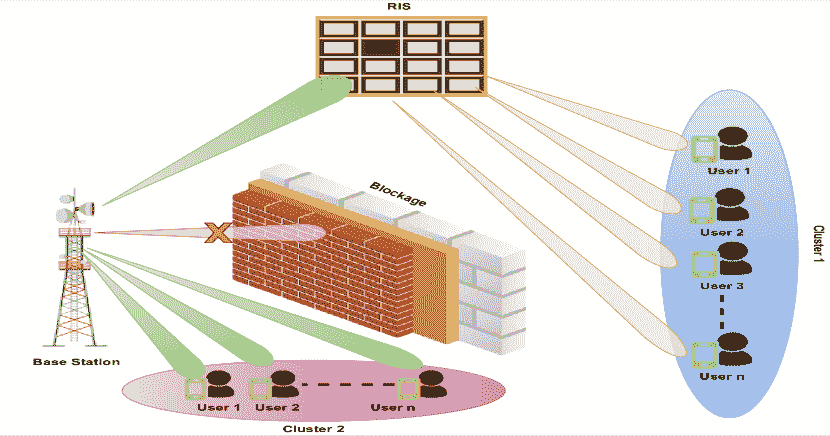

图 28：RIS 辅助的下行 NOMA 多簇场景。

除了上述 NOMA 的所有优点之外，DL 方法将在提高现有系统以满足下一代高性能系统需求方面发挥关键作用。在最一般的意义上，旨在通过 DL 方法提高现有 NOMA 系统性能的研究可以归纳为信道特性检测和 SIC。功率优化、用户聚类、信号检测、解码技术和相位配置是 DL 方法被应用于改进现有 NOMA 方案的主要领域。由于 DL 方法在提高传统 RIS 辅助 NOMA 系统的性能方面至关重要，因此在相关领域进行了大量研究，如表 10 所示。

在当前的 NOMA 文献中，智能系统方法与 DL 主要出现在用户聚类场景中，这些场景由于其关键角色已被广泛研究，如前所述。[263] 提出了关于智能方法在下一代通信系统中可能贡献的新想法，展示了 DL 方法集成到传统 RIS 辅助 NOMA 架构中的效果。所提研究提出了一种用户聚类算法，减少了计算复杂度，并通过序列解码实现了最佳功率分配。该研究设计了一种基于*K*-均值的 ML 算法用于用户聚类，利用了 mmWave 系统中用户通道的相关性。因此，所提出的*K*-均值算法也具有进行在线用户聚类的能力。这一特性使其在较低系统复杂度下的性能优于传统的 K 均值算法。此外，[264] 采用了传统的 K 均值高斯混合模型作为聚类技术，用于干扰对齐，以应对日益增长的网络流量。所提方法旨在利用 ML 算法在 RIS 端执行被动波束形成优化。通过这种方法，他们寻求在考虑 MISO-NOMA 下行链路方案的情况下，对信号解码、功率分配和用户聚类进行优化解决方案。采用了一种新颖的深度 Q 网络算法来调整 RIS 端的功率分配过程和相位配置。

在 RIS 辅助的场景中，[246]、[265] 和 [266] 也研究和讨论了使用智能方法处理聚类技术的优点。在 RIS 辅助的 NOMA 通信方案中，[246] 通过深度强化学习方法优化了相位配置，旨在通过开发深度强化学习方法解决方案来提高频谱效率。该工作的作者还提出了在动态用户数量假设下，BS 提供的多种聚类方案，用于 MISO 方案。为相位矩阵配置和功率分配引入了一种新颖的基于深度 Q 网络的算法。该算法优于传统的 RIS 辅助正交多址（OMA）系统等基准。

表 10：基于 DL 的 RIS 辅助 NOMA 研究应用概览。

| 参考文献 | 算法类型 | 应用场景 |
| --- | --- | --- |
| [246] | 深度强化学习-深度 Q | 一种新颖的基于深度 Q 网络的算法，用于动态数量的多用户在 RIS 辅助下行 NOMA 方案中的相位矩阵配置和功率分配 |
| [265] | 联邦学习 | 用于资源分配的空中联邦学习算法与 RIS 辅助的混合网络 |
| [266] | 深度强化学习-DDPG | 基于 DDPG 的优化算法，能够学习长期策略以在动态状态下配置相位调整和用户聚类 |
| [264] | 深度强化学习-深度 Q | 采用新型深度 Q 网络算法来调节功率分配过程，并使用基于 K-means 的高斯混合模型进行用户聚类 |
| [267] | 深度强化学习 | 深度强化学习方法涉及到阶段预测和调优，旨在尽可能降低训练数据负载 |

由于深度强化学习中的奖励机制，[266] 使用了一种能够适应由[246] 提出的动态用户数量的结构来学习信道行为。[266] 提出了旨在最大化多用户 NOMA 下行通信总速率的长期随机优化技术。他们致力于 RIS 侧的阶段配置与用户聚类的联合优化。提出的基于 DDPG 的优化方法还能够在各种场景下对动态状态采取最佳行动。这使得能够学习和应用长期策略来配置相位调整以及用户聚类。所提出的算法优化了移动用户的总数据速率，超越了传统 OMA 技术的结果。然而，与传统 OMA 解决方案相比，NOMA 方案产生的高系统复杂性和高训练负载是一个需要解决的问题。[265] 提出了松弛-量化方法，以解决优化系统复杂性与性能之间平衡的问题。本研究将空中联合学习算法与 RIS 辅助的混合网络结合起来，并开发了一种能够适应不同信道条件的灵活方法。所提出的研究通过优化发射功率和 RIS 侧的相位配置来执行资源分配，同时满足不同的 QoS 要求。其目的是通过执行这些联合优化来最大化潜在的混合速率。

NOMA 方案所带来的高训练开销也被[267]所解决，旨在优化在没有 CSI 情况下的总系统容量，采用了类似于其他下游 NOMA 方案的方法。其目的是学习 RIS 的最佳相位配置，其中涉及深度强化学习方法进行相位预测和调节，同时尽可能降低训练数据负载。同样，如前文所述，已研究了用户数据速率上不完美 SIC 的性能退化。通过参数研究，确定 SIC 不完美率增长了十倍，导致系统性能下降了 10。

考虑到当前 RIS 辅助 NOMA 文献，显然现有研究在系统复杂性、能效和适应 6G 及更高通信技术所需的不同信道条件方面是不足的。特别是，系统和优化问题的高复杂性使得当前实际研究停留在单天线系统假设上。因此，RIS 辅助 NOMA 在 MIMO 系统中的性能提升成为一个需要解决的问题。在 RIS-NOMA 场景中，不完美 SIC 的采用是降低系统性能和限制用户数量的主要因素。考虑到当前文献，显然使用传统优化算法的 SIC 技术不足以获得足够的性能。因此，已经开发并应用了新的分组技术，例如[242]。然而，高级干扰消除过程的发展似乎为下一代 NOMA 架构带来了光明的未来。高级深度学习方法在 SIC 优化中的应用无疑将提升 RIS 辅助 NOMA 系统的性能。

## 6 PHY 安全与 DL 相遇

在本节中，我们将概述基于 DL 的 PHY 安全研究。为此，首先将简要介绍 PHY 安全概念，并将 DL 基于 PHY 安全的方法按攻击类型进行分类：伪造、干扰和窃听。在每个小节中，我们的调查结果将以解释和比较的形式呈现。

无线通信由于无线信道的开放性，极易受到恶意攻击，特别是在 PHY 层面。由于任何一方都可以接触到信道，攻击者可以轻松干扰 PHY 上的合法通信。传统上，PHY 攻击的对策是在上层设计的，例如网络层或传输层。然而，传统方法通常资源效率低或在 6G 网络或新兴的 IoT 应用中保护有限。因此，提供有效的 PHY 攻击对策仍是一个开放问题。

在过去几年中，许多研究者集中在物理层安全方法上以解决这一问题。这些方法本质上是基于利用物理层属性来实现安全目的。尽管物理层安全显示出巨大的前景，但在实际实施中也面临着重大挑战。随着深度学习网络的出现，研究人员寻求基于深度学习的物理层解决方案，以克服现有挑战或进一步提高安全性能。读者可以参考表 11 获取该领域相关调查论文的列表。

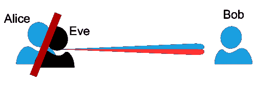

(a)

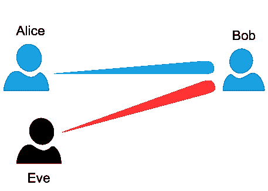

(b)

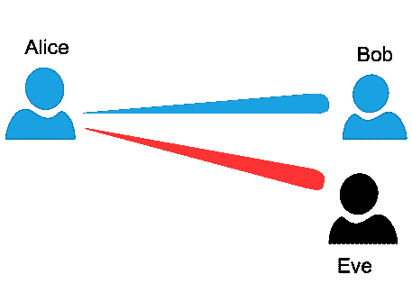

(c)

图 29：三种不同的物理层攻击类型：（a）欺骗：Eve 旨在冒充 Alice。（b）干扰：Eve 旨在阻塞 Alice 和 Bob 之间的通信。（c）窃听：Eve 旨在获取从 Alice 发送的消息。

表 11：与深度学习基础的安全或物理层安全相关的现有调查论文。

| 调查 | 年份 | 标题 |
| --- | --- | --- |
| OShea 等人 [25] | 2017 | 物理层深度学习简介 |
| Wu 等人 [18] | 2018 | 5G 无线网络的物理层安全技术及面临的挑战调查 |
| Suomalainen 等人 [268] | 2020 | ML 威胁 5G 安全 |
| Benzaid 等人 [19] | 2020 | AI 超越 5G 网络：网络安全防御还是进攻的推动者？ |
| Jiang 等人 [269] | 2020 | 基于机器学习的 5G 物联网物理层认证短评 |
| Nguyen 等人 [270] | 2021 | 未来无线网络中 AI 的实现：数据生命周期视角 |
| Wang 等人 [271] | 2020 | 5G 通信的物理层认证：机会与前景 |
| Al-garadi 等人 [272] | 2020 | 物联网（IoT）安全的机器学习和深度学习方法调查 |

我们认为，基于深度学习的安全研究的有效分类应基于攻击类型。最常见的三种攻击类型（欺骗、干扰和窃听）在图 29 中说明，可以定义如下。

+   •

    欺骗攻击：在欺骗攻击中，攻击者（Eve）旨在模仿合法发射者（Alice）的身份，使接收者（Bob）认为消息是由 Alice 发送的。

+   •

    干扰攻击：在干扰攻击中，Eve 旨在通过向信道引入干扰信号来阻塞合法通信，使 Bob 接收到高度失真的信号。

+   •

    窃听攻击：在窃听攻击中，Eve 试图通过简单地窃听信道来获取从 Alice 发送的消息。

在本节的其余部分，将介绍针对这三种基本攻击的 DL 基础 PHY 解决方案，并进行全面比较。

### 6.1 反欺骗解决方案

表 12：基于 DL 的反欺骗文献概述（红色阴影表示没有 USRP/实际数据，绿色阴影表示有 USRP/实际数据）。

| 论文 | DL 结构 | USRP/实际数据 | 模型输入 | 优点 | 缺点 |
| --- | --- | --- | --- | --- | --- |
| Liao 等人 [273] | CNN |  | CSI 向量 | MU，综合分析，小数据集下效果良好 | 需要在相干时间后训练，CSI 需求 |
| Qiu 等人 [274] | CNN |  | 信道估计矩阵 | MU，特征提取 | CSI 需求 |
| Liao 等人 [275] | DNN CNN PCNN |  | CSI 矩阵 | MU，综合分析 | CSI 需求 |
| Wang 等人 [276] | CNN RNN CRNN |  | CSI 向量 | 能捕捉光谱依赖关系，综合分析 | 单发射器，CSI 需求 |
| Qiu 等人 [277] | CNN |  | 从 CSI 形成的增强数据自适应矩阵 | 非视距调查 | 单发射器，CSI 需求 |
| Li 等人 [278] | 前馈 NN |  | 虚拟信道向量 | mmWave MIMO，特征选择，信道相关性调查 | 单发射器，CSI 需求 |
| Liao 等人 [279] | DNN |  | 信道响应向量 | 数据增强，极小数据集下效果良好 | CSI 需求 |

在传统的通信系统中，认证算法被广泛用于对抗伪造攻击。认证算法依赖于这样一个事实：爱丽丝拥有指示其真实性的先验信息。在接收端，鲍勃使用一种算法（检测/分类过程）来检查爱丽丝是否拥有这些信息。尽管传统方法在分类未授权用户方面非常有效，但将先验信息安全地传递给爱丽丝或保持其安全是一个高度脆弱的步骤。在物理层安全方法中，先验信息的角色转移到独特于位置、时间或设备的通道或设备特征上。因此，物理层认证方法即使在爱丽丝的凭证泄露的情况下也能够捕捉到攻击者。然而，从通道中选择实际的特征并设计检测过程是一项具有挑战性的任务。最近，DL 网络被实施以克服这些挑战并提高检测准确性。DL 基于的物理层认证方法的列表以及它们的优缺点见于表格 12。

机器学习辅助的物理层认证首次由肖等人提出于 [280]。该研究考虑了一个常见的物理层认证场景，其中接收器基于接收到的信号强度指示器（RSSI）值应用二元假设检验。决策机制首先计算测试统计量，即接收到的 RSSI 值与参考值之间的标准化距离。其次，将测试统计量与阈值进行比较，以决定信号是否被伪造。这里，阈值的选择是一个关键步骤，直接影响检测性能。作为主要贡献，作者提出了一种基于 Q 学习的阈值选择算法。该算法基本上是在动作和状态空间中搜索，以找到最大化 Q 函数的阈值²²2Q 函数计算 Q 学习算法中一个动作的预期奖励。Q 学习或其他强化学习算法通过最大化奖励值来优化其目标。由于系统是无监督的（即，没有标签数据），奖励值是通过试错法计算的。在更大的问题中，Q 函数通常用深度学习算法进行逼近。作者还使用 USRP 模块研究了所提算法的性能。测试结果表明，使用 Q 学习进行动态阈值选择优于固定阈值选择。在 [281]中，作者将其在 [280]中的工作扩展到包括 Dyna-Q 学习方法。除了 [280]的结果外，实验表明，Dyna-Q 模型在学习速度和认证性能方面相比于 Q 学习都有所改善。作者还在 [282]中通过扩展 [281]中给出的算法来考虑 MIMO 场景。结果显示，使用强化学习和增加天线数量都能提高检测性能。

[280, 281, 282] 的最大缺点是接收器需要知道参考 RSSI 值才能进行检测。在[283]中，这一假设被取消，通过生成逻辑回归的决策结果来解决。具体而言，接收器利用先前的 RSSI 信息来训练逻辑回归模型，并估计当前 RSSI 值的真实性。因此，提出的方法能够在没有先前 RSSI 信息的情况下成功检测伪造者，即使在动态和未知的信道模型下也能有效检测。另一方面，该研究考虑了一个网络，其中接收器从多个空间分布的节点（标志物）获得 RSSI 信息，并使用多个天线来提高检测性能。在[284]中，作者通过减少回归模型的计算开销来扩展了他们的工作。USRP 实验验证了基于逻辑回归的决策机制能够在未知信道模型下成功检测伪造者。

DL 在 2019 年由[273, 274, 275, 276]的作者同时且独立地引入到 PHY 认证中。此外，另一项独立研究[277]于 2020 年发布。在[273]中，考虑了一个 MU 移动边缘网络，其中一个节点旨在认证来自多个用户的数据包。认证系统利用通过导频传输获得的过去 CSI 值来区分未授权节点。与其应用传统假设检验，不如将决策任务交给一个 CNN。作为一项挑战任务，接收器要求节点的认证应在用于训练过程的最后一个 CSI 的相干时间内完成。当相干窗口过期时，接收器通过新的训练过程更新其 CNN 参数。作者对提出的方法进行了全面的研究，测试了各种算法的训练速度。模拟结果显示，即使在训练数据量非常小的情况下也能成功检测。此外，模拟结果在实际测试环境中通过 USRP 模块得到验证。

类似于[273]，[274]和[275]的作者考虑了一种 PHY 认证方法，其中接收节点获取来自多个节点的数据包。这些研究主要基于相同的思路，在 CNN 结构和性能分析方面有所不同。在[274]中，没有考虑保持一致性窗口，而是研究了用于提取特征的 PHY 属性的影响。此外，该研究包括了 SNR 调查，但缺乏实际实现。在[275]中，作者实现了一个 DNN 模型、一个 CNN 模型和一个添加了预处理的 CNN 模型。该研究在计算复杂性、训练时间、发射器数量、隐藏层数量、天线数量和认证准确性方面对这三种模型进行了完整调查。尽管 DNN 模型提供了最佳认证率，但提出的预处理添加的 CNN 模型以较低的计算复杂性实现了接近的结果。此外，该研究展示了 USRP 实现以验证所提模型的实际可行性。

[276]的作者考虑了一个包括发射器、接收器和窃听者的三节点网络。类似于[273]和[274]，该研究利用无线信道特征作为 DNN 的输入以识别伪造者。这项研究通过全面实施和调查 CNN、RNN 和卷积 RNN 模型区别于[273]和[274]。研究表明，RNN 模型能够捕捉谱依赖性并提高检测性能。此外，卷积 RNN 模型通过级联 CNN 和 RNN 模型，进一步提高了检测性能。这项工作还通过与传统的 Neyman-Pearson 假设检验的数值比较，证明了 DL 在 PHY 认证中的优越性。

在[277]中，提出了一种基于 DL 的 PHY 认证方法。类似于[276]，该模型由一个合法的发射器组成，利用通道特征。此外，这项研究考虑了将新获得的 CSI 数据添加到训练数据集中，如[276]中所用。在模拟中，将这种自适应方法与非自适应场景（即新数据未添加到训练集中）进行了比较。结果证明了自适应方法的优越性。这项工作与[276]的不同之处在于其 DNN 结构及对非视距场景的调查。

在[278]中，作者考虑了一个毫米波 MIMO 场景，其中信道特性对空间位置非常敏感。为此，作者提出了一种新型信道特性，以提高毫米波 MIMO 网络的检测准确率。提出的信道特性用于两种欺骗检测机制：i) 传统的 Neyman-Pearson 假设检验，ii) 前馈神经网络（NN）。假设检验用于具有恒定信道相关性的静态信道。前馈 NN 用于具有变化的信道相关性的动态信道。已证明，提出的新信道特性可以提高静态和动态信道模型的检测性能。这项工作通过其新型信道特性和对信道相关水平的关注，与之前的 DL 基于方法有所不同。

尽管我们无法将[273、274、275、276、277、278]的模型与相同系统参数进行比较，这些工作的作者表示，他们的方法在峰值训练时间可以达到$97\%$的检测准确率。

基于 DL 的模型最大的缺点之一是需要大量的数据集。众所周知，当数据有限时，DL 模型的性能可能会显著下降。为了克服这个问题，DL 文献中提出了数据增强方法。数据增强技术主要基于从现有数据集中生成人工数据。Liao 等人在[279]中考虑了 PHY 安全 DL 网络的数据有限问题。Liao 等人之前在[275]中研究了 DL 辅助的 PHY 认证。在[279]中，作者认为无线网络由于信道相干时间的原因特别容易受到数据有限的影响。因此，作者提出了三种数据增强方法来提高训练速度和认证准确率。此外，作者在实际数据集上进行了实验以验证他们的结果。

文献中的大多数研究考虑了 DL 在合法方面的应用（即，提高安全性）。在[285]中，作者持相反观点，研究了 DL 辅助的欺骗攻击。特别是，本研究重点关注被认为对欺骗攻击安全的 OFDM 系统。仿真结果显示，数据驱动的欺骗攻击能够有效地干扰那些传统上被认为安全的 OFDM 系统。

基于 DL 的反欺骗方法相较于传统的基于阈值的检测机制被证明具有很高的效益。DL 模型从数据中学习最佳决策机制，而传统方法则面临阈值选择的问题。在数学检测模型中，不准确的阈值选择很容易导致高漏检或误报率。此外，文献中的基于 DL 的方法能够处理需要验证多个节点的大型网络。创建一个同时分类多个节点的 DL 模型是可能的。另一方面，基于 DL 的反欺骗方法面临的最大挑战是获取有关欺骗者的信息。基于 DL 的方法需要训练数据来生成一个可以区分欺骗者和合法用户的模型。然而，将任何来自欺骗者的信息纳入训练数据是不实际的。不幸的是，目前的研究在训练过程中包括了欺骗者的通道以训练他们的模型。这种假设是实施基于 DL 的方法在实际场景中的一个关键缺陷。

### 6.2 抗干扰解决方案

表 13：基于 DL 的抗干扰文献概述。

| 论文 | DL 结构 | 模型输入 | 优点 | 缺点 |
| --- | --- | --- | --- | --- |
| Han 等 [286] | 基于 CNN 的 DQN | 状态矩阵 | 适用于任何信道模型 | 干扰源模型有限，无实际数据 |
| Liu 等 [287] | 基于递归 CNN 的 DQN | 频谱感知矩阵 | 改进的干扰源模型，原始数据作为特征，包含频率跳变成本 | 由于原始数据导致训练时间更长，无实际数据 |
| Bi 等 [288] | 基于 CNN 和 LSTM 的双 DQN | 用户 ID、位置、信道信息 | 比 DQN 更稳定 | 无实际数据 |
| Xu 等 [289] | 基于 Transformer 编码器的双 DQN | 频谱感知矩阵 | 比 DQN 更稳定，提高了吞吐量 | 无实际数据 |
| Tingpeng 等 [290] | CNN | 来自电子信息系统的信号矩阵 | 能识别三种干扰源类型 | 分析有限，无实际数据 |
| Cai 等 [291] | Le-Net5 CNN | 频谱感知矩阵 | 能识别多音调干扰源 | 分析有限，理想干扰源模型，无实际数据 |
| Liu 等 [292] | CNN | 频谱感知矩阵 | 既考虑了干扰源识别，又考虑了频率跳变策略，包含频率跳变成本，综合数值分析 | 无实际数据 |

干扰攻击可以极大地破坏爱丽丝和鲍勃之间的通信，因为当爱丽丝的信号与干扰信号叠加时，爱丽丝的信号很容易变得无法识别。传统上，扩频技术被用来对抗干扰者。频率跳跃方案旨在通过不断改变通信频率来躲避干扰者。直接序列扩频方法将通信扩展到更大的带宽，以减少干扰信号的影响。设计一个高效的频率跳跃模式是一个未解问题，并且被许多研究人员考虑。在过去十年中，已采取各种努力将设计步骤留给 DL 网络。由于在频谱上持续躲避干扰者是一个序列游戏，其中爱丽丝根据新的观察做出跳跃，强化学习是提高性能的强有力候选者。表 13 包含了几项基于 DL 的抗干扰研究及其优缺点。

学习型抗干扰方法的第一个例子可以在[293]中看到。该研究考虑了一个由两个竞争团队组成的无线网络。每个团队由一个干扰器节点和一个接收器节点组成，每个干扰器节点试图干扰对方团队的接收器，同时每个接收器节点旨在避免被干扰的频率。作者提出了各种 Q 学习方法，以选择接收器节点的频率跳跃和干扰器节点的目标频率。所提出的方法假设每个节点具有频谱感知能力，并且每个团队都有用于接收器友好干扰器通信的控制通道。作者研究了 Q 学习方法与传统方法及彼此之间的性能。

基于 Q 学习的检测结果在高维数据中可能准确性不足，并且学习速度可能会显著增加。为了捕捉数据中的非线性关系并提高学习速度和准确性，已经提出了基于 DL 的干扰检测模型，参见[286, 287, 288]和[289]。这些研究主要关注 DL 技术，以寻找高效的频率跳变策略。在[286]中，考虑了一个认知无线电网络，其中次级用户应用深度 Q 学习网络（DQN）以避免干扰频率，同时不干扰主要用户。提出的模型使用 Q 学习来决定干扰频率并选择合适的频段。Q 函数使用 CNN 进行计算，以提高准确性和时间复杂度。Q 学习状态是基于接收的 SNIR 值（提取的特征用于避免干扰频率）和主要用户的占用信息进行计算的。所提方法不需要了解干扰源或信道模型。因此，它适用于任何环境。计算机仿真结果表明，CNN 基于的 Q 学习比传统 Q 学习方法具有更高的学习速率。此外，接收器获得了更高的 SNIR 值。

一种类似的抗干扰方法在[287]中被考虑。与[286]相反，该方法不假设干扰者遵循合法通信的相同传输时隙结构。此外，该方法使用原始频谱信息来馈送 CNN，而不是使用提取的特征。在[288]中，Q-函数通过双深度 Q 学习（double deep Q-learning）进行近似。[288]可以通过它们的双 DQN 选择而不是 DQN 与[286, 287]区分开来。尽管文献中显示双 DQN 比 DQN 更稳定，[288]仅将其方法与传统 Q 学习进行比较，缺乏与 DQN 的比较。作为一个优势，作者实现了三种类型的网络：全连接网络、CNN 和长短期记忆（long-short-term-memory）。[289]的作者通过实现双 DQN 并使用更高效的网络模型来改进[288]的结果。具体来说，作者利用变换器编码器（transformer encoder）实现双 DQN，并获得了与基于 CNN 的双 DQN 相比的改进结果。与之前的研究不同，在[294]中，DL 被用于接收机设计。具体来说，在连续相位调制方案的接收机中实现了一个 DL 算法，以提高在单音或多音干扰攻击下对接收信号的预测。数值结果显示，DL 辅助接收机能够在单音干扰攻击下提高系统的 BER 性能$3-5$ dB。

识别干扰源类型是抗干扰通信中的一个重要步骤。与专注于避免干扰频率（主要考虑 Q 学习）不同，干扰源类型的检测侧重于识别干扰源特征。传统的基于模型的方法首先使用数学模型将原始信息转换为特征，然后解决分类问题以识别干扰源类型。在这个过程中应用 DL 可以显著克服数学模型的 inaccuracies。在[290]中，作者提出了一种基于 CNN 的干扰源识别方法，该方法模拟了 DL 的图像处理应用。这种方法首先将一维数据转换为图像格式，以训练网络。尽管模拟结果表明该方法对三种干扰源类型（使用不同均值和方差的高斯噪声的单音干扰源）具有$92\%$的准确率，但该研究缺乏与任何基准模型的比较。[291]中提出了一种改进的检测模型，使用了简化的 Le-Net5CNN 模型。在性能评估中，作者包括了多音干扰源。该方法达到了$92\%$的准确率（与[290]相似），但作者指出该方法具有更高的学习速度。作为主要缺点，该研究缺乏与基准模型的比较，并假设了一个理想的干扰模式，即干扰源可以瞬时切换频率。

以上研究主要集中在避免频跳干扰源或识别干扰源类型。在[292]中，作者通过首先识别干扰源类型，然后提出一个高效的频跳模式，来关注这两个概念。提出的方法首先扫描时间域并捕捉多个光谱能量帧（即时间间隔内的二维光谱能量信息）。这些帧被输入到 CNN 中以识别干扰源类型。在下一步中，使用传统的 Q 学习来提供频跳模式。作为一个重要贡献，作者还在系统模型中考虑了频跳的成本。

表 13 提供了基于 DL 的抗干扰文献的概述。这些研究主要集中于利用 DL 辅助改进强化学习模型。根据我们的调查，我们得出结论，**DL**可以提高抗干扰系统的频率跳变精度，并在不平衡环境中提供鲁棒性。尽管这些研究大多包括广泛的计算机分析，但文献中严重缺乏概念验证或具有真实世界数据的测试床实现。

### 6.3 反窃听解决方案

表 14: 基于 DL 的反窃听文献概述。

| 论文 | DL 结构 | 模型输入 | 优点 | 缺点 |
| --- | --- | --- | --- | --- |
| Fritschek 等人 [295] | AE | 一位编码的消息向量 | 在保密性和 BER 之间提供权衡，Eve 具备 DL 能力 | Bob 比 Eve 具有更好的信道，信号字母表无限，无真实世界数据 |
| Sun 等人 [296] | 基于 CNN 的 AE | 一位编码的消息向量 | 包括认证模型 | 分析有限，无真实世界数据 |
| Besser 等人 [297] | AE | 消息向量 | 在保密性和 BER 之间提供权衡，BPSK 信号更实用，进行了广泛的理论和数值分析 | 无真实世界数据 |
| Zhang 等人 [298] | 全连接 NN | Bob 和 Eve 的信道矩阵 | MIMO 网络 | 无真实世界数据 |
| Zhang 等人 [299] | NN | 信道矩阵和误差界限 | 适用于认知无线电网络（对主要用户敏感），可在没有 CSI 的情况下工作，进行了全面调查 | 无真实世界数据 |
| Li 等人 [300] | LSTM，回声状态网络 | 位置向量和传输天线向量 | 适用于 D2D 通信，节能 | 无真实世界数据 |

加密/解密方法是应对窃听攻击的传统对策。加密方法需要一个只有爱丽丝和鲍勃共享的秘密信息（密钥）。加密方法的安全性基于这样一个假设：伊芙无法在没有密钥的情况下解密消息。然而，这一假设在计算能力极强的情况下可能被推翻。此外，将密钥分发给爱丽丝和鲍勃而不泄露给伊芙是传统加密方法的一个主要缺点。与其将消息隐藏在密码中，物理层（PHY）安全方法旨在防止伊芙正确获取消息。为此，PHY 安全方法关注于各种技术，如编码、BF 或人工噪声，以使伊芙的信道失效。然而，为这些技术设计有效模型是一项具有挑战性的任务，仍然吸引着许多研究者的关注。在过去的几年里，文献中提出了各种 DL 辅助模型以提高保密率。表 14 列出了已审查的 DL 基础的反窃听方法及其优缺点。

E2E 学习与 AE 是一个新兴的概念，可以显著提高在不可预测环境下的通信速率。过去几年，AE 在通信中的成功引起了无线安全研究人员的关注。[295]中介绍了一种直接应用 AE 进行安全通信的方法。该研究的主要思想是将安全目标纳入 AE 的损失函数中。换句话说，损失函数不仅最大化合法信道，还旨在最小化窃听者的信道。然而，这一目标作为鲍勃和伊芙信道容量之间的差异很难计算。因此，作者将这一目标实现为交叉熵损失差异的修改版本。该方法使用包含冗余符号的簇来混淆伊芙。提出的损失函数使用户能够选择合法信道中的信息损失程度（以及泄漏给伊芙的信息作为权衡）。作为一个优势，伊芙被认为具有 NN 能力。该研究的主要缺点是，假设伊芙的噪声比鲍勃多。另一个安全 AE 模型在[296]中提出。与[295]类似，作者考虑基于交叉熵设计安全损失函数。此外，[296]还将身份验证方法集成到 AE 中。

在[297]中，作者使用**DL**生成窃听码。该研究的主要思想是将窃听者的错误率纳入**AE**的损失函数中。研究成功分析了实现这一思想的问题，并提供了详细的数学基础。此外，设计允许在泄漏给窃听者的信息和合法接收者的**BER**之间进行权衡。作者还通过将其方案与极化窃听码进行比较，利用计算机模拟验证了理论结果。类似的方法在[301]中也有考虑。与[297]不同，该研究将其字母表限制为 BPSK 并使用了不同的损失函数。

为 MIMO 网络提出了一种安全通信模型，见[298]。该模型不是专注于 E2E 通信，而是旨在寻找输入信号的最佳协方差矩阵。该**DNN**使用包含输入通道和协方差矩阵的大型数据集进行离线训练。与传统的解析解相比，基于**DNN**的协方差矩阵近似降低了时间复杂度。此外，由于计算负担集中在离线训练阶段，这对于功率和时间受限的应用是一种实际解决方案。

**DL**辅助的认知无线电网络安全通信首次在[299]中被考虑。除了传统的安全通信目标函数外，所提方法还包括两个额外的约束条件：i) 次级用户的发射功率应低于某个阈值，ii) 对主用户的泄漏干扰应低于某个阈值。作者利用**DL**网络来近似具有给定认知无线电约束条件的最佳发射功率分配方案。此外，该方法即使在没有**CSI**的情况下也能够找到优化问题的解决方案。这项研究彻底比较了所提方法与传统优化技术在保密速率性能、对主用户的泄漏信息和计算时间方面的表现。结果表明，**DL**可以显著减少计算时间和复杂度，而不会显著损失性能。

在[300]中，考虑了 D2D 通信网络。作者提出了一种**DL**辅助算法，该算法选择发射天线和设备对，以防止与窃听者配对。

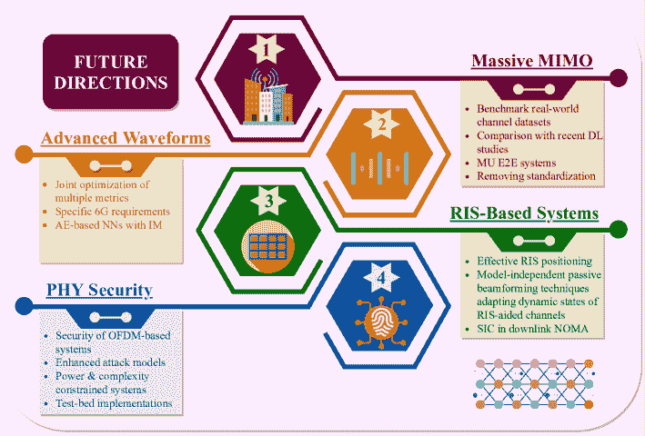

图 30：DL 基础物理层技术未来的研究方向：大规模 MIMO、高级波形设计、RIS 强化系统和物理层安全。

基于 DL 的反窃听研究列在表 14 中。大多数工作基于利用 AE 来寻找安全编码或 BF 方案。由于传统方法是基于模型的，因此对环境中意外变化高度敏感。另一方面，DL 基于的反窃听文献证明，深度学习网络的数据驱动特性可以显著提高对意外变化的鲁棒性。

深度学习（DL）文献面临的挑战之一是将窃听者的信道容量纳入损失函数中。与欺骗或干扰场景不同，基于深度学习的反窃听方法不涉及分类问题。实质上，深度学习模型预计会优化其变量以符合包括窃听者信道容量的保密率指标。然而，已知的深度学习模型和损失函数并不完全适用于此任务。因此，仍需独特的深度学习模型来提升基于深度学习方法的性能。类似于反干扰文献，我们应指出，反窃听研究缺乏概念证明和实际数据集的测试平台实现。此外，DL 辅助仅应用于有限的通信场景，即 RIS 或 OFDM 场景尚未涵盖。接下来的部分将深入探讨我们四个主要研究方向的未来展望，并提出我们的评论。

## 7 结论与未来方向

正如我们常常提到的，我们正站在无线通信潜在革命的边缘。如今，5G 技术的部署在全球范围内取得了长足的进展，同时对 6G 技术的积极研究也获得了巨大的动力。6G 技术无疑将带来根本性的范式转变、令人兴奋的新应用以及突破性的技术。AI 无疑将在这场与 6G 一同出现的不可抗拒的革命中发挥巨大作用。具体而言，**深度学习（DL）**方法已经打下了坚实的基础，并且很可能会继续超越其他 AI 分支，为无线通信技术的光明未来铺平道路。在本文中，我们提供了现有**基于 DL 的物理层（PHY）技术**的全面概述，并阐明了在朝向 6G 的四个主要研究方向下，**新兴 DL 方法**的巨大潜力，这四个方向分别是大规模 MIMO 系统、MC 波形设计、RIS 辅助通信和 PHY 安全。我们详细分析了迄今为止取得的进展，并确定了每个领域的主要未来研究方向，如图 30 所示。请注意，我们在本文中涵盖的框架中还可能添加其他 PHY 研究方向。实际上，**DL**在其他 PHY 技术上的应用逐渐增加。例如，文献中还包括了**DL**驱动的毫米波（mmWave）或太赫兹通信的研究。已有研究表明，**DL**可以有效地解决高频通信中的各种挑战。此外，**DL**也被应用于无人机或无人空中飞行器通信网络中的挑战。然而，关于这些技术的**DL**文献仍在发展中，将它们纳入我们的 6G 框架是未来的方向。

### 7.1 大规模 MIMO 系统的未来方向

我们从各个方面调查了 DL 在 MIMO 系统中的主要发展，并找出了应引起更多关注的遗漏点。从智能接收器的角度来看，第一个问题是现有文献中的大多数检测器需要完美的 CSI 才能成功操作。由于实际中难以估计信道，而在大规模 MIMO 系统中，由于有众多发射天线，更加困难，开发一个假设完美 CSI 的系统模型仍然是空想。因此，基于 DL 技术的接收框架组成信道估计器和符号检测器应该在未来变得更为常见，以支持实用性。其次，在计算机模拟环境中使用通用信道模型假设来评估提出的模型可能会产生误导，因为现实生活场景中有许多其他缺陷，我们不知道这些缺陷如何影响 DL 模型的性能。因此，我们建议创建包含现实生活缺陷并涵盖各种无线通信标准（如 5G 和 Wi-Fi 7）的基准信道数据集。这些基准数据集将允许对 DL 模型进行公平比较。除此之外，快速发展的第三个重要主题是开发基准系统模型，供研究人员与其 DL 模型进行比较。随着文献的进步，新型 DL 框架的数量不断增加。因此，新的基于 DL 的框架应该与现有的新型数据驱动方法进行比较，以防止类似模型的融合。

就智能发射器设计和端到端（E2E）视角而言，我们最初的建议是专注于需要 MU 干扰消除的 MU 系统模型，因为几乎所有通信系统都已经服务于 MU 场景一段时间了。因此，基于 DL 的预编码器不仅应消除每个用户的信道影响，还应防止一个用户的信号干扰到其他用户。第二点是实用性，就像 DL 基础接收器设计的情况一样。我们认为，使用 SDR 测试平台在各种环境中进行实验将有助于我们检查 DL 模型在动态变化场景中的可行性，也有可能了解高效 DL 操作的硬件需求。最后一个研究方向是 PHY 革命的实际推动者。考虑到 DL 方法在端到端方式下优化整个通信系统的能力，我们质疑下一代无线通信技术是否可以在没有要求持续规范的限制性标准化过程的情况下出现。*最终*目标是将定义参数、信号传输和标准化过程中的其他问题委托给 DL 网络，从而缩短代际之间的时间。

### 7.2 多载波波形设计的未来方向

各种多载波波形由研究人员提出，其中 OFDM 已经成为最受欢迎的一种。如前所述，OFDM 已经在包括 4G 和 5G 在内的现代无线通信系统中得到应用。尽管在 OFDM 基础上设计了其他多载波波形，如 FBMC 和 GFDM，但这些波形未能取代 OFDM 的地位。尽管 OFDM 因其简洁性和灵活性而成为最强大的波形，但其他基于 OFDM 的波形也可以视为 6G 无线网络的候选波形。尽管如此，这些波形仍需要改进，以满足 6G 的高需求。在这一点上，DL 作为一种出色的工具进入了视野，旨在提升性能并降低多载波波形的复杂性。

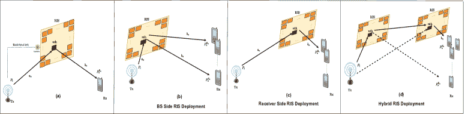

图 31：有效的 RIS 部署场景 (a) 非位置特定定位，(b) 基站侧定位，(c) 用户侧定位和 (d) 混合侧定位。

在第二步中，我们回顾了针对各种多载波波形的新兴深度学习（DL）解决方案。经过全面评估，我们得出结论，现有的基于 DL 的方法在提高上述波形在 6G 中的性能方面具有巨大潜力，并且可能优于传统算法。然而，仍然存在与 DL 解决方案在多载波波形中的应用相关的问题。首先，大多数研究仅关注优化单一性能指标，如比特错误率（BER）和峰均功率比（PAPR）。然而，在多载波系统中，有多个关键性能指标，这些指标在系统设计时应予以考虑。因此，我们认为设计能够联合优化多个性能指标的 DL 技术以提高整体性能是非常重要的。其次，在设计目标 DL 方法时，需要考虑不同 6G 应用的具体需求，如增强移动宽带（eMBB）、超可靠低延迟通信（URLLC）、大规模机器类型通信（mMTC）及其可能的组合。第三，大多数文献中的研究集中在提高经典正交频分复用（OFDM）的性能。为其他多载波波形设计 DL 技术仍然是一个未解决的问题。第四，将基于自编码器（AE）的神经网络（NN）与迭代解码相结合以提高数据传输速率或改善错误性能将是一个有趣的设计问题。最后，我们观察到大多数提出的基于 DL 的解决方案尚未考虑真实世界的数据集。为了揭示 DL 技术的真正潜力，需要在实际场景中通过无线通信测试平台来实施这些技术。

### 7.3 RIS 辅助物理层通信的未来方向

考虑到 6G 及更先进无线通信技术的需求，通过保留 RIS 的被动结构并以低成本实现高性能是减少整体系统复杂性的关键。因此，考虑最佳 RIS 位置的优势可能至关重要。基于上述方法，如何有效配置 RIS 以获得最佳性能的问题将会出现。根据这些方法，可以评估适用的 RIS 位置场景，以实现用户端有效的信号传输和通道估计，减少信令开销并优化发射功率。

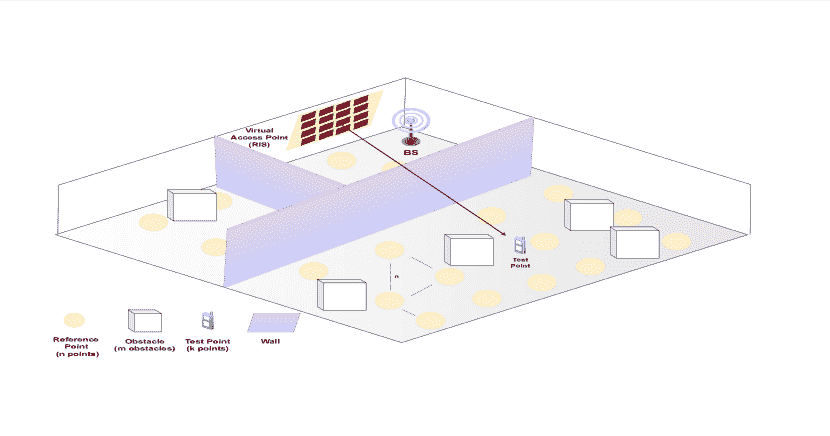

图 32：基于位置训练的室内应用。

在图 31 中，我们提供了四种主要的 RIS 部署场景。如图 31(b)-(c)所示，RIS 可以部署在基站侧或接收端侧，或者如图 31(d)所示，采用混合方案以结合其在某些方面的优势。由于 RIS 与基站之间距离较近，这种方案在信令开销方面显得最为有利，使得两者之间的信道几乎是静态的。这也消除了与用户侧分布式 RIS 部署相比的协调负担。基站侧的定位具有适应用户信道瞬时变化和不同 QoS 需求的能力。另一方面，相比基站侧部署，它在用户侧 RIS 定位中提供了更有利的解决方案，提供了直接的 LOS。这在[302]中被显示为用户侧部署优于基站侧的唯一方面。然而，这种情况可以看作是一个可以通过 DL 方法改进的问题。随后，基站侧的部署场景可能成为优化 DL 辅助 RIS 应用的亮点解决方案。同样，通过将智能表面作为虚拟接入点来进行适当定位，其中基站侧定位可能利用完全被动元素匹配主动接入点的功率。这些虚拟接入点增加了环境散射，并为 MIMO 系统提供了空间复用增益，如[303]所示。然而，初始 CSI 的存在假设在这些系统中可以被视为一个缺点。在这一点上，开发一种基于 DL 的方法来消除对初始 CSI 的需求将带来显著的性能提升。

如图 31(b)所示，BS 端 RIS 定位和虚拟 AP 的创建可能在减少发射端的信令开销和系统复杂性方面发挥重要作用。进一步地，如图 31(d)所示，应研究混合定位场景，以查看其是否因系统参数的增加而引起的优化负担，相比 BS 端定位能否产生更具吸引力的结果。在此阶段，可以使用一种新颖的 DNN 架构来学习大量参数，以估计混合定位场景带来的复杂信道信息。这些场景可以结合类似于[247]的 DL 方法，并在 RIS 端使用无模型的训练 DNN 进行相位优化。为了观察系统性能在环境条件变化下的变化并确定最佳工作策略，创建动态用户场景以适应 BS 端 RIS 部署是至关重要的。因此，可以制定一个具有学习能力的长期策略以应对动态场景。通过类似于[243]的方法，在图 32 所示的场景中，可以考虑使用 DNN 来执行 RIS 相位配置，并结合各种位置信息。这样，DL 可以有效地提高不同用户位置的信号水平。

DL 方法在提升下行 NOMA-MIMO 系统性能和提高用户总速率方面具有重要意义。通过这种方式，可以解决系统复杂度和功耗问题，从而支持超越 5G 的无线通信技术。在保留 RIS 被动特性的情况下，定位场景也应优先考虑。在基于 DL 的 RIS 辅助下行 NOMA 方案研究中，常见的困境是假设拥有初始 CSI。然而，由于底层通信模型的复杂性，获取 CSI 是 NOMA 系统方案的另一挑战。这些方案可能与 RNN 类似的 DL 方法结合，这些方法通过通道统计估计通道状态，旨在减少没有初始 CSI 的场景中的延迟。此外，解码阶段对不完美 SIC 的假设使得随着用户数量增加，防止 MUI 变得困难。这是影响总用户性能的最关键因素之一，原因在于当前 SIC 技术的低效和用户容量的限制。受到 [304] 启发，结合寻求完美 SIC 的新型 DL 方法与 DL 辅助的 RIS 相位优化可以解决上述下行 NOMA 方案中的挑战。适用于这些场景的新型 DL 算法可以通过 DNN 或 CNN 架构进行测试，并开发合适的损失函数。

作为利用新型 DL 方法的另一个方向，可以考虑同时传输和反射 RIS（STAR-RIS），这是一个前景光明的领域。通过同时传输和反射入射信号，STAR-RIS 可能同时服务于其前后放置的用户，而 RIS 通常以其仅反射的特性而著称。STAR-RIS 的概念已被研究人员广泛阐述，利用其独特的通信框架创建智能无线电设置，这些研究受到其吸引人优势的激励 [305], [306], [307]。然而，目标函数的分数形状和非凸约束使得通过寻找全局最优解来解决能效最大化问题变得困难。DL 可以作为克服当前优化方法困难的潜在解决方案。

### 7.4 物理层安全的未来方向

在最后一步，我们将重点放在新兴的物理层安全系统上。文献中的现有研究证明了深度学习对物理层安全的积极影响。尽管过去考虑了各种网络或攻击模型，但仍有一些场景尚未测试深度学习的影响。例如，OFDM-IM/OFDM 系统或 RIS 辅助网络的保密容量在文献中被广泛考虑。然而，深度学习在这些场景中的影响仍然是一个开放领域。此外，现有文献非常不成熟，大多仅考虑了原始想法。其扩展到不同的深度学习网络和各种系统模型（例如，功率/复杂性约束、改进的攻击者模型）仍然缺失，我们相信，这是一个有趣的未来方向，以释放深度学习的潜力。

总结来说，我们认为深度学习架构可能对未来无线电的物理层设计具有巨大的潜力，并且存在挑战性的开放问题，以释放基于人工智能的方法在未来无线系统中的真正潜力。

## 致谢

作者感谢 Vestel Electronics 和 Dr. Basak Ozbakis 对本文章的财务支持，该支持来自 Vestel Electronics-Koc University 行业合作项目 No. OS.00170

## 参考文献

+   [1] “Release 15。” [在线]. 可用链接：https://www.3gpp.org/release-15

+   [2] K. Buchholz, “5G 技术的部署情况。” [在线]. 可用链接：https://www.statista.com/chart/23194/5g-networks-deployment-world-map/

+   [3] “Release 17。” [在线]. 可用链接：https://www.3gpp.org/release-17

+   [4] “5G 市场更新：执行摘要 – 2021 年 8 月。” [在线]. 可用链接：https://gsacom.com/paper/5g-market-update-executive-summary-august-2021/

+   [5] W. Saad, M. Bennis, 和 M. Chen, “6G 无线系统的愿景：应用、趋势、技术和开放研究问题，” *IEEE Network*，第 34 卷，第 3 期，页 134–142，2020 年 10 月。

+   [6] E. Basar, “基于可重构智能表面的索引调制：一种超越 MIMO 的 6G 新范式，” *IEEE Trans. Commun.*，第 68 卷，第 5 期，页 3187–3196，2020 年 2 月。

+   [7] Z. Zhang, Y. Xiao, Z. Ma, M. Xiao, Z. Ding, X. Lei, G. K. Karagiannidis, 和 P. Fan, “6G 无线网络：愿景、要求、架构和关键技术，” *IEEE Veh. Technol. Mag.*，第 14 卷，第 3 期，页 28–41，2019 年 7 月。

+   [8] S. Research, “三星的 6G 白皮书展示了公司对下一代通信技术的愿景。” [在线]. 可用链接：https://news.samsung.com/global/samsungs-6g-white-paper-lays-out-the-companys-vision-for-the-next-generation-of-communications-Technology

+   [9] M. Ikram, K. Sultan, M. F. Lateef, 和 A. S. Alqadami, “通往 6G 通信的道路——5G 天线、阵列和可穿戴设备的回顾，” *Electronics*，第 11 卷，第 1 期，页 169，2022 年。

+   [10] M. Alsabah, M. A. Naser, B. M. Mahmmod, S. H. Abdulhussain, M. R. Eissa, A. Al-Baidhani, N. K. Noordin, S. M. Sait, K. A. Al-Utaibi, 和 F. Hashim, “6G 无线通信网络：一篇全面综述论文,” *IEEE 通用接入*, vol. 9, pp. 148 191–148 243, 2021.

+   [11] B. Barakat, A. Taha, R. Samson, A. Steponenaite, S. Ansari, P. M. Langdon, I. J. Wassell, Q. H. Abbasi, M. A. Imran, 和 S. Keates, “6g 从物联网用例中获得的机会：一篇综述论文,” *未来互联网*, vol. 13, no. 6, p. 159, 2021.

+   [12] E. Basar, M. Wen, R. Mesleh, M. Di Renzo, Y. Xiao, 和 H. Haas, “用于下一代无线网络的索引调制技术,” *IEEE 通用接入*, vol. 5, pp. 16 693–16 746, Aug. 2017.

+   [13] S. Doğan Tusha, A. Tusha, E. Basar, 和 H. Arslan, “5G 与更先进的无线网络的多维度索引调制,” *IEEE 论文集*, vol. 109, no. 2, pp. 170–199, Dec. 2021.

+   [14] J. Zhang, S. Chen, Y. Lin, J. Zheng, B. Ai, 和 L. Hanzo, “无小区 massive MIMO：新一代范式,” *IEEE 通用接入*, vol. 7, pp. 99 878–99 888, July 2019.

+   [15] E. Björnson 和 L. Sanguinetti, “可扩展的无线 massive MIMO 系统,” *IEEE 通讯杂志*, vol. 68, no. 7, pp. 4247–4261, Apr. 2020.

+   [16] E. Basar, M. Di Renzo, J. De Rosny, M. Debbah, M.-S. Alouini, 和 R. Zhang, “通过可重构智能表面的无线通信,” *IEEE 通用接入*, vol. 7, pp. 116 753–116 773, Aug. 2019.

+   [17] E. Basar 和 I. Yildirim, “用于未来无线网络的可重构智能表面：通道建模视角,” *IEEE 无线通讯*, vol. 28, no. 3, pp. 108–114, Apr. 2021.

+   [18] Y. Wu, A. Khisti, C. Xiao, G. Caire, K. K. Wong, 和 X. Gao, “5G 无线网络的物理层安全技术综述与面临的挑战,” *IEEE J. Sel. Areas Commun.*, vol. 36, pp. 679–695, Apr. 2018.

+   [19] C. Benzaïd 和 T. Taleb, “5G 以外的网络中的 AI：一种网络安全的防御或攻击启用技术？” *IEEE 网络*, vol. 34, pp. 140–147, Nov./Dec. 2020.

+   [20] A. F. Demir, M. Elkourdi, M. Ibrahim, 和 H. Arslan, “5G 与更先进的波形设计,” *ArXiv*, vol. abs/1902.05999, Feb. 2019.

+   [21] Y. Liu, X. Chen, Z. Zhong, B. Ai, D. Miao, Z. Zhao, J. Sun, Y. Teng, 和 H. Guan, “5G 网络的波形设计：分析和比较,” *IEEE 通用接入*, vol. 5, pp. 19 282–19 292, Feb. 2017.

+   [22] I. Leyva-Mayorga, B. Soret, M. Röper, D. Wübben, B. Matthiesen, A. Dekorsy, 和 P. Popovski, “用于 5G 及更先进 5G 通信的 Leo 小卫星星座,” *IEEE 通用接入*, vol. 8, pp. 184 955–184 964, Oct. 2020.

+   [23] N.-N. Dao, Q.-V. Pham, N. H. Tu, T. T. Thanh, V. N. Q. Bao, D. S. Lakew, 和 S. Cho, “空中无线接入网络调查：通往全面 6G 接入基础设施,” *IEEE 通讯调查教程*, vol. 23, no. 2, pp. 1193–1225, Feb. 2021.

+   [24] Z. Zhang, H. Pang, A. Georgiadis, 和 C. Cecati, “无线能量传输 —— 概述,” *IEEE 工业电子学报*, vol. 66, no. 2, pp. 1044–1058, May 2019.

+   [25] T. O’Shea 和 J. Hoydis，“物理层深度学习简介”，*IEEE 认知通信与网络期刊*，第 3 卷，第 4 期，第 563–575 页，2017 年 10 月。

+   [26] N. Shlezinger, N. Farsad, Y. C. Eldar 和 A. J. Goldsmith，“用于通信的基于模型的机器学习”，*ArXiv*，第 abs/2101.04726 卷，2021 年 1 月。

+   [27] A. Krizhevsky，“从微小图像中学习多层特征”，2009 年 4 月。[在线]。可用网址: https://www.cs.toronto.edu/~kriz/learning-features-2009-TR.pdf

+   [28] “CIFAR10 小图像分类数据集。” [在线]。可用网址: https://keras.io/api/datasets/cifar10/

+   [29] Y. LeCun, Y. Bengio 和 G. Hinton，“深度学习”，*自然*，第 521 卷，第 7553 期，第 436–444 页，2015 年 5 月。

+   [30] C. Zhang, P. Patras 和 H. Haddadi，“移动和无线网络中的深度学习：综述”，*IEEE 通信调查与教程*，第 21 卷，第 3 期，第 2224–2287 页，2019 年 3 月。

+   [31] D. E. Rumelhart, G. E. Hinton 和 R. J. Williams，“通过反向传播误差学习表示”，*自然*，第 323 卷，第 6088 期，第 533–536 页，1986 年 10 月。

+   [32] N. Qian，“关于梯度下降学习算法中的动量项”，*神经网络*，第 12 卷，第 1 期，第 145–151 页，1999 年 1 月。

+   [33] H. Robbins 和 S. Monro，“一种随机逼近方法”，*数学统计年鉴*，第 22 卷，第 3 期，第 400 – 407 页，1951 年 9 月。

+   [34] D. P. Kingma 和 J. Ba，“ADAM：一种随机优化方法”，*ArXiv*，第 abs/1412.6980 卷，2017 年 1 月。

+   [35] F. Research，“MADGRAD 优化方法”，2021 年。[在线]。可用网址: https://github.com/facebookresearch/madgrad

+   [36] X. Glorot 和 Y. Bengio，“理解训练深度前馈神经网络的困难”，在*第十三届人工智能统计国际会议论文集*，Y. W. Teh 和 M. Titterington 编辑，第 9 卷。PMLR，2010 年 5 月，第 249–256 页。

+   [37] D. Yüret，“卷积神经网络”，2021 年。[在线]。可用网址: https://denizyuret.github.io/Knet.jl/latest/cnn/

+   [38] D. Yuret，“递归神经网络”，2021 年。[在线]。可用网址: https://denizyuret.github.io/Knet.jl/latest/rnn/

+   [39] C. Olah，“理解 LSTM 网络”，2015 年。[在线]。可用网址: https://colah.github.io/posts/2015-08-Understanding-LSTMs/

+   [40] M. Lotfollahi, M. Jafari Siavoshani, R. Shirali Hossein Zade 和 M. Saberian，“深度包：一种利用深度学习进行加密流量分类的新方法”，*软计算*，第 24 卷，第 3 期，第 1999–2012 页，2020 年。

+   [41] A. Montieri, G. Bovenzi, G. Aceto, D. Ciuonzo, V. Persico 和 A. Pescapè，"利用多任务深度学习对移动应用流量进行包级预测"，*计算机网络*，第 200 卷，第 108529 页，2021 年。

+   [42] M. Lopez-Martin, B. Carro, A. Sanchez-Esguevillas 和 J. Lloret，“用于物联网的卷积和递归神经网络网络流量分类器”，*IEEE Access*，第 5 卷，第 18,042–18,050 页，2017 年。

+   [43] “Keras。” [在线]。可用网址: https://keras.io/

+   [44] A. Paulraj、D. Gore、R. Nabar 和 H. Bolcskei，“MIMO 通信概述 - 通向千兆无线的关键”，*Proc. IEEE*，第 92 卷，第 2 期，页码 198–218，2004 年 11 月。

+   [45] E. G. Larsson、O. Edfors、F. Tufvesson 和 T. L. Marzetta，“面向下一代无线系统的大规模 MIMO”，*IEEE Commun. Mag.*，第 52 卷，第 2 期，页码 186–195，2014 年 2 月。

+   [46] M. J. López-Morales、K. Chen-Hu 和 A. G. Armada，“关于深度学习在通信中星座设计的调查”，在 *Proc. 2020 12th Int. Symp. Commun. Syst., Netw. and Digital Signal Process. (CSNDSP)*，2020 年 7 月，页码 1–5。

+   [47] F. A. Aoudia 和 J. Hoydis，“无需信道模型的端到端通信系统学习”，在 *Proc. 2018 52nd Asilomar Conf. Signals, Syst., Comput.*，2018 年 10 月，页码 298–303。

+   [48] B. Shamasundar 和 A. Chockalingam，“用于广义空间调制信号检测的 DNN 架构”，*IEEE Commun. Lett.*，第 24 卷，第 12 期，页码 2770–2774，2020 年 8 月。

+   [49] H. Albinsaied、K. Singh、S. Biswas、C.-P. Li 和 M.-S. Alouini，“基于块深度神经网络的信号检测器，用于广义空间调制”，*IEEE Commun. Lett.*，第 24 卷，第 12 期，页码 2775–2779，2020 年 8 月。

+   [50] N. Samuel、T. Diskin 和 W. Ami，“深度 MIMO 检测”，在 *Proc. 2017 IEEE 18th Int. Workshop Signal Process. Advances Wireless Commun. (SPAWC)*，2017 年 7 月，页码 1–5。

+   [51] N. Samuel、T. Diskin 和 A. Wiesel，“学习检测”，*IEEE Trans. Signal Process.*，第 67 卷，第 10 期，页码 2554–2564，2019 年 2 月。

+   [52] H. He、C.-K. Wen、S. Jin 和 G. Y. Li，“一种模型驱动的深度学习网络用于 MIMO 检测”，在 *Proc. 2018 IEEE Global Conf. Signal Informat. Process. (GlobalSIP)*，2018 年 11 月，页码 584–588。

+   [53] Z. Jia、W. Cheng 和 H. Zhang，“一种基于部分学习的海量 MIMO 检测方案”，*IEEE Wireless Commun. Lett.*，第 8 卷，第 4 期，页码 1137–1140，2019 年 4 月。

+   [54] A. Al-Baidhani 和 H. H. Fan，“检测学习：一种深度学习无线通信接收机在 Rayleigh 衰落信道上的应用”，在 *Proc. 2019 Int. Conf. Comput., Netw. Commun. (ICNC)*，2019 年 2 月，页码 6–10。

+   [55] X. Jin 和 H.-N. Kim，“MIMO 信道中的并行深度学习检测网络”，*IEEE Commun. Lett.*，第 24 卷，第 1 期，页码 126–130，2020 年 10 月。

+   [56] D. Huang、X.-Q. Jiang、S. Chen、Y. Wu 和 E. Bai，“基于深度学习的 MIMO 系统并行检测器”，在 *Proc. 2020 5th Int. Conf. Commun., Image Signal Process. (CCISP)*，2020 年 11 月，页码 28–32。

+   [57] Q. Chen、S. Zhang、S. Xu 和 S. Cao，“具有不完美信道知识的高效 MIMO 检测 - 一种深度学习方法”，在 *Proc. 2019 IEEE Wireless Commun. Netw. Conf. (WCNC)*，2019 年 4 月，页码 1–6。

+   [58] M.-S. Baek、S. Kwak、J.-Y. Jung、H. M. Kim 和 D.-J. Choi，“基于深度学习的信号检测在传统 MIMO 发射机中的实现方法”，*IEEE Trans. Broadcasting*，第 65 卷，第 3 期，页码 636–642，2019 年 1 月。

+   [59] M. Khani, M. Alizadeh, J. Hoydis 和 P. Fleming，“适应性神经信号检测用于大规模 MIMO，” *IEEE Trans. Wireless Commun.*，第 19 卷，第 8 期，页 5635–5648，2020 年 5 月。

+   [60] M. Goutay, F. Ait Aoudia 和 J. Hoydis，“基于深度超网络的大规模 MIMO 检测，” *Proc. 2020 IEEE 21st Int. Workshop Signal Process. Advances Wireless Commun. (SPAWC)*，2020 年 5 月，页 1–5。

+   [61] J. Liao, J. Zhao, F. Gao 和 G. Y. Li，“一种模型驱动的深度学习方法用于大规模 MIMO 检测，” *IEEE Commun. Lett.*，第 24 卷，第 8 期，页 1724–1728，2020 年 4 月。

+   [62] M. Mandloi 和 V. Bhatia，“低复杂度近优迭代序列检测用于上行大规模 MIMO 系统，” *IEEE Commun. Lett.*，第 21 卷，第 3 期，页 568–571，2017 年 12 月。

+   [63] N. Shlezinger, Y. C. Eldar, N. Farsad 和 A. J. Goldsmith，“Viterbinet：使用基于深度学习的 Viterbi 算法进行符号检测，” *Proc. 2019 IEEE 20th Int. Workshop Signal Process. Advances Wireless Commun. (SPAWC)*，2019 年 7 月，页 1–5。

+   [64] M. Mohammadkarimi, M. Mehrabi, M. Ardakani 和 Y. Jing，“基于深度学习的球面解码，” *IEEE Trans. Wireless Commun.*，第 18 卷，第 9 期，页 4368–4378，2019 年 6 月。

+   [65] N. T. Nguyen 和 K. Lee，“深度学习辅助的禁忌搜索检测用于大规模 MIMO 系统，” *IEEE Trans. Wireless Commun.*，第 19 卷，第 6 期，页 4262–4275，2020 年 3 月。

+   [66] K. Pratik, B. D. Rao 和 M. Welling，“RE-MIMO：递归和置换等变神经 MIMO 检测，” *IEEE Trans. Signal Process.*，第 69 卷，页 459–473，2021 年 12 月。

+   [67] C.-J. Chun, J.-M. Kang 和 I.-M. Kim，“基于深度学习的大规模 MIMO 系统信道估计，” *IEEE Wireless Commun. Lett.*，第 8 卷，第 4 期，页 1228–1231，2019 年 4 月。

+   [68] J. Ma 和 L. Ping，“数据辅助的大规模天线系统信道估计，” *IEEE Trans. Signal Process.*，第 62 卷，第 12 期，页 3111–3124，2014 年 4 月。

+   [69] C.-J. Chun, J.-M. Kang 和 I.-M. Kim，“基于深度学习的联合导频设计和多用户 MIMO 信道估计，” *IEEE Commun. Lett.*，第 23 卷，第 11 期，页 1999–2003，2019 年 8 月。

+   [70] H. He, C.-K. Wen, S. Jin 和 G. Y. Li，“基于深度学习的波束空间毫米波大规模 MIMO 系统信道估计，” *IEEE Wireless Commun. Lett.*，第 7 卷，第 5 期，页 852–855，2018 年 5 月。

+   [71] H. Huang, J. Yang, H. Huang, Y. Song 和 G. Gui，“深度学习用于超分辨率信道估计和基于 DOA 估计的大规模 MIMO 系统，” *IEEE Trans. Veh. Technol.*，第 67 卷，第 9 期，页 8549–8560，2018 年 6 月。

+   [72] Y. Zhang, Y. Mu, Y. Liu, T. Zhang 和 Y. Qian，“基于深度学习的波束空间信道估计在毫米波大规模 MIMO 系统中，” *IEEE Wireless Commun. Lett.*，第 9 卷，第 12 期，页 2212–2215，2020 年 8 月。

+   [73] X. Wei, C. Hu 和 L. Dai，“深度学习用于毫米波大规模 MIMO 系统中的波束空间信道估计，” *IEEE Trans. Commun.*，第 69 卷，第 1 期，页 182–193，2021 年 9 月。

+   [74] A. Alkhateeb，“DeepMIMO：用于毫米波和大规模 MIMO 应用的通用深度学习数据集，” *ArXiv*，第 abs/1902.06435 卷，2019 年 2 月。

+   [75] “DeepMIMO 数据集。” [在线]. 可用: https://www.deepmimo.net/

+   [76] S. Gao, P. Dong, Z. Pan, 和 G. Y. Li，“基于深度学习的大规模 MIMO 混合分辨率 ADC 通道估计，” *IEEE 通信信函*，第 23 卷，第 11 期，第 1989–1993 页，2019 年 8 月。

+   [77] L. Xu, F. Gao, T. Zhou, S. Ma, 和 W. Zhang，“通过深度学习实现大规模 MIMO 的联合信道估计和混合 ADC 分配，” *ArXiv*，第 abs/2106.04047 卷，2021 年 6 月。

+   [78] R. Zhu 和 G. Zhang，“一种基于分段平均的通道估计方案，用于具有深度神经网络的单比特大规模 MIMO 系统，” 在 *2019 年 IEEE 第 19 届国际通信技术会议 (ICCT)*，2019 年 10 月，第 81–86 页。

+   [79] Y. Zhang, M. Alrabeiah, 和 A. Alkhateeb，“具有 1-bit ADC 的大规模 MIMO 的深度学习：当更多天线需要更少导频时，” *IEEE 无线通信信函*，第 9 卷，第 8 期，第 1273–1277 页，2020 年 4 月。

+   [80] Y. Dong, H. Wang, 和 Y.-D. Yao，“基于条件 GAN 的单比特多用户大规模 MIMO 通道估计，” *IEEE 通信信函*，第 25 卷，第 3 期，第 854–858 页，2021 年 11 月。

+   [81] C. Huang, G. C. Alexandropoulos, A. Zappone, C. Yuen, 和 M. Debbah，“通用大规模 MIMO 系统中的 UL/DL 信道标定深度学习，” 在 *2019 年 IEEE 国际通信大会 (ICC)*，2019 年 5 月，第 1–6 页。

+   [82] S. Bhardwaj, J.-M. Lee, 和 D.-S. Kim，“基于双深度 Q 学习的工业无线网络通道估计，” 在 *2020 年信息与通信技术融合国际会议 (ICTC)*，2020 年 12 月，第 1318–1320 页。

+   [83] D. Yarotsky, A. Ivanov, R. Bychkov, A. Osinsky, A. Savinov, M. Trefilov, 和 V. Lyashev，“基于机器学习的通道估计在大规模 MIMO 接收机中的应用，” 在 *2021 年 IEEE 第 93 届车辆技术会议 (VTC2021-Spring)*，2021 年 4 月，第 1–5 页。

+   [84] F. Burkhardt, S. Jaeckel, E. Eberlein, 和 R. Prieto-Cerdeira，“QuaDRiGa：用于陆地移动卫星的 MIMO 通道模型，” 在 *第 8 届欧洲天线与传播会议 (EuCAP 2014)*，2014 年 4 月，第 1274–1278 页。

+   [85] “QuaDRiGa：下一代无线电通道模型。” [在线]. 可用: https://quadriga-channel-model.de/

+   [86] M. Zhang, M. Fan, 和 M. Chen，“基于深度神经网络的 MIMO-STBC 系统联合估计与检测，” 在 *2019 年第 2 届 IEEE 中东北非通信会议 (MENACOMM)*，2019 年 11 月，第 1–5 页。

+   [87] L. Xiang, Y. Liu, T. Van Luong, R. G. Maunder, L.-L. Yang, 和 L. Hanzo，“深度学习辅助的空间调制联合信道估计和数据检测，” *IEEE Access*，第 8 卷，第 191 910–191 919 页，2020 年 10 月。

+   [88] H. He, C.-K. Wen, S. Jin, 和 G. Y. Li，“基于模型驱动的 MIMO 检测深度学习，” *IEEE 信号处理汇刊*，第 68 卷，第 1702–1715 页，2020 年 2 月。

+   [89] X. Wang, H. Hua, 和 Y. Xu，“在上行链路多用户 MIMO 系统中，基于深度学习的导频辅助信道估计和信号检测，” *IEEE Access*，第 8 卷，页 44 936–44 946，2020 年 3 月。

+   [90] “Remcom 无线 InSite。” [在线]。可用链接: https://www.remcom.com/wireless-insite-em-propagation-software

+   [91] M. Alrabeiah, A. Hredzak, Z. Liu, 和 A. Alkhateeb，“ViWi: 一种用于视觉辅助无线通信的深度学习数据集框架，” 见于 *Proc. 2020 IEEE 91st Veh. Technol. Conf. (VTC2020-Spring)*，2020 年 5 月，页 1–5。

+   [92] “Viwi: 一种用于视觉辅助无线通信的深度学习数据集框架。” [在线]。可用链接: https://www.viwi-dataset.net/

+   [93] A. Klautau, P. Batista, N. González-Prelcic, Y. Wang, 和 R. W. Heath，“5G MIMO 数据用于机器学习：应用于使用深度学习的波束选择，” 见于 *Proc. 2018 Informat. Theory Appl. Workshop (ITA)*，2018 年 2 月，页 1–9。

+   [94] C. Zou, F. Yang, J. Song, 和 Z. Han，“用于无线通信的信道自编码器：现状、挑战和趋势，” *IEEE Commun. Mag.*，第 59 卷，第 5 期，页 136–142，2021 年 6 月。

+   [95] F. Alberge，“用于添加雷达干扰的 AWGN 信道深度学习星座设计，” *IEEE Trans. Commun.*，第 67 卷，第 2 期，页 1413–1423，2019 年 10 月。

+   [96] M. Stark, F. Ait Aoudia, 和 J. Hoydis，“几何和概率星座成形的联合学习，” 见于 *Proc. 2019 IEEE Globecom Workshops (GC Wkshps)*，2019 年 12 月，页 1–6。

+   [97] D. Wu, M. Nekovee, 和 Y. Wang，“基于深度学习的自编码器用于多用户无线干扰信道物理层设计，” *IEEE Access*，第 8 卷，页 174 679–174 691，2020 年 9 月。

+   [98] X. Fu 和 D. L. Ruyet，“用于非相干 MIMO 系统的 Grassmann 星座设计，采用自编码器，” *ArXiv*，卷 abs/2109.00621，2021 年 9 月。

+   [99] F. Sohrabi 和 W. Yu，“通过基于自编码器的深度学习进行单比特预编码星座设计，” 见于 *Proc. 2019 53rd Asilomar Conf. Signals, Systems, Computers*，2019 年 3 月，页 754–758。

+   [100] F. Sohrabi, Y.-F. Liu, 和 W. Yu，“用于大规模 MIMO 的单比特预编码和星座范围设计，采用 QAM 信号，” *IEEE J. of Sel. Topics in Signal Process.*，第 12 卷，第 3 期，页 557–570，2018 年 4 月。

+   [101] F. Sohrabi, H. V. Cheng, 和 W. Yu，“通过基于自编码器的深度学习进行鲁棒符号级预编码，” 见于 *Proc. 2020 IEEE Int. Conf. Acoust., Speech Signal Process. (ICASSP)*，2020 年 5 月，页 8951–8955。

+   [102] Z. Bo, R. Liu, M. Li, 和 Q. Liu，“基于深度学习的多用户 MISO 系统高效符号级预编码设计，” *IEEE Trans. Veh. Technol.*，第 70 卷，第 8 期，页 8309–8313，2021 年 6 月。

+   [103] A. G. Pathapati, N. Chakradhar, P. Havish, S. A. Somayajula, 和 S. Amuru，“用于 MIMO 预编码的监督深度学习，” 见于 *Proc. 2020 IEEE 3rd 5G World Forum (5GWF)*，2020 年 9 月，页 418–423。

+   [104] W. Cui, A. Dong, Y. Cao, C. Zhang, J. Yu, 和 S. Li，“基于深度学习的 MIMO 传输，结合预编码和无线变换网络，” *计算机科学程序学*，第 187 卷，第 396–401 页，2021 年。

+   [105] J. Shi, W. Wang, X. Yi, X. Gao, 和 G. Y. Li，“基于深度学习的大规模 MIMO 的鲁棒预编码，” *IEEE 通信汇刊*，第 1–1 页，2021 年 8 月。

+   [106] ——，“基于深度学习的大规模 MIMO 的鲁棒预编码，” *IEEE 通信汇刊*，第 1–1 页，2021 年 8 月。

+   [107] ——，“基于深度学习的大规模 MIMO 下行链路的鲁棒预编码器设计，” 见于 *2021 IEEE 国际通信会议*，2021 年 6 月，第 1–6 页。

+   [108] X. Zhu, X. Zhang, W. Zeng, 和 J. Xie，“基于深度学习的 MIMO 系统有限字母表输入的预编码器设计，” *IEEE 通信快报*，第 24 卷，第 2518–2521 页，2020 年 7 月。

+   [109] M. A. Girnyk，“基于深度学习的 MIMO 信道有限字母表信号的线性预编码，” *物理通信*，第 48 卷，第 101402 页，2021 年 10 月。

+   [110] A. Balatsoukas-Stimming, O. Castañeda, S. Jacobsson, G. Durisi, 和 C. Studer，“针对大规模 MU-MIMO 的神经网络优化 1-bit 预编码，” 见于 *2019 IEEE 第 20 届国际信号处理无线通信进展研讨会 (SPAWC)*，2019 年 7 月，第 1–5 页。

+   [111] H. He, M. Zhang, S. Jin, C.-K. Wen, 和 G. Y. Li，“基于模型驱动的深度学习用于有限字母表预编码的大规模 MU-MIMO，” *IEEE 通信快报*，第 24 卷，第 10 期，第 2216–2220 页，2020 年 6 月。

+   [112] Y. He, H. He, C.-K. Wen, 和 S. Jin，“基于模型驱动的深度学习用于大规模多用户 MIMO 恒定包络预编码，” *IEEE 无线通信快报*，第 9 卷，第 11 期，第 1835–1839 页，2020 年 6 月。

+   [113] Q. Hu, Y. Cai, Q. Shi, K. Xu, G. Yu, 和 Z. Ding，“迭代算法诱导的深度展开神经网络：多用户 MIMO 系统的预编码设计，” *IEEE 无线通信汇刊*，第 20 卷，第 2 期，第 1394–1410 页，2021 年 10 月。

+   [114] C. Xie, H. Du, 和 X. Liu，“基于深度学习的符号级预编码用于大规模天线系统，” *无线通信与移动计算*，第 2021 卷，第 6 698 424:1–6 698 424:11 页，2021 年 3 月。

+   [115] Z. Lei, X. Liao, Z. Gao, 和 A. Li，“CI-NN：一种基于模型驱动的深度学习构造性干扰预编码方案，” *IEEE 通信快报*，第 25 卷，第 6 期，第 1896–1900 页，2021 年 2 月。

+   [116] V. Raj 和 S. Kalyani，“穿越空气的反向传播：没有信道模型的物理层深度学习，” *IEEE 通信快报*，第 22 卷，第 11 期，第 2278–2281 页，2018 年 8 月。

+   [117] F. A. Aoudia 和 J. Hoydis，“端到端通信系统的无模型训练，” *IEEE 选择区域通信杂志*，第 37 卷，第 11 期，第 2503–2516 页，2019 年 8 月。

+   [118] M. Goutay, F. A. Aoudia, 和 J. Hoydis，“带噪声反馈的深度强化学习自动编码器，” 见于 *2019 国际建模优化移动、临时、无线网络研讨会 (WiOPT)*，2019 年 6 月，第 1–6 页。

+   [119] H. Ye, G. Y. Li, B.-H. F. Juang, 和 K. Sivanesan，“基于条件 GAN 的无信道感知的端到端学习通信系统，” 在 *Proc. 2018 IEEE Globecom Workshops (GC Wkshps)*，2018 年 12 月，第 1–5 页。

+   [120] H. Ye, L. Liang, G. Y. Li, 和 B.-H. Juang，“基于条件 GAN 的深度学习端到端无线通信系统作为未知信道，” *IEEE Trans. Wireless Commun.*，第 19 卷，第 5 期，第 3133–3143 页，2020 年 2 月。

+   [121] H. Jiang, S. Bi, 和 L. Dai，“残差辅助的无已知信道的端到端通信系统学习，” *ArXiv*，卷 abs/2102.10786，2021 年 2 月。

+   [122] H. Jiang 和 L. Dai，“无已知信道的端到端通信系统学习，” 在 *Proc. 2021 IEEE Int. Conf. Commun.*，2021 年 10 月，第 1–5 页。

+   [123] H. Ye, G. Y. Li, 和 B.-H. Juang，“基于深度学习的无导频端到端无线通信系统，” *IEEE Trans. Cogn. Commun. Netw.*，第 7 卷，第 3 期，第 702–714 页，2021 年 2 月。

+   [124] H. Ye, G. Ye Li, 和 B.-H. F. Juang，“基于双线性卷积自编码器的无导频端到端通信系统，” 在 *Proc. 2020 IEEE Int. Conf. Commun. (ICC)*，2020 年 6 月，第 1–6 页。

+   [125] T. J. O’Shea, T. Erpek, 和 T. C. Clancy，“MIMO 衰落信道的物理层深度学习编码，” 在 *Proc. 2017 55th Annual Allerton Conf. Commun., Control, Comput.*，2017 年 10 月，第 76–80 页。

+   [126] T. Erpek, T. J. O’Shea, 和 T. C. Clancy，“为 MIMO 干扰信道学习物理层方案，” 在 *Proc. 2018 IEEE Int. Conf. Commun. (ICC)*，2018 年 5 月，第 1–5 页。

+   [127] T. Mu, X. Chen, L. Chen, H. Yin, 和 W. Wang，“基于神经网络的物理层端到端块自编码器，” *ArXiv*，卷 abs/1906.06563，2019 年 6 月。

+   [128] S. Cammerer, F. A. Aoudia, S. Dörner, M. Stark, J. Hoydis, 和 S. ten Brink，“可训练的通信系统：概念与原型，” *IEEE Trans. Commun.*，第 68 卷，第 5489–5503 页，2020 年 6 月。

+   [129] S. R. Mattu, T. Lakshmi Narasimhan, 和 A. Chockalingam，“基于自编码器的抗衰落信道的鲁棒收发器使用深度神经网络，” 在 *Proc. 2020 IEEE 91st Veh. Technol. Conf. (VTC2020-Spring)*，2020 年 5 月，第 1–5 页。

+   [130] P. Yang, Y. Xiao, M. Xiao, Y. L. Guan, S. Li, 和 W. Xiang，“基于机器学习的自适应空间调制 MIMO，” *IEEE J. Sel. Areas Commun.*，第 37 卷，第 9 期，第 2117–2131 页，2019 年 7 月。

+   [131] I. A. Arslan 和 G. Altin，“一种基于深度神经网络的空间调制系统天线选择架构，” 在 *Proc. 2021 56th Int. Sci. Conf. Informat., Commun. Energy Syst. Technol. (ICEST)*，2021 年 6 月，第 141–144 页。

+   [132] Y. Zhang, J. Wang, X. Wang, Y. Xue, 和 J. Song，“空间调制天线的高效选择：学习还是增强，” *IEEE Wireless Commun. Lett.*，第 9 卷，第 8 期，第 1249–1252 页，2020 年 4 月。

+   [133] S. Gecgel, C. Goztepe, 和 G. Karabulut Kurt, “大规模 MIMO GSM 的发射天线选择与机器学习,” *IEEE 无线通信快报*, vol. 9, no. 1, pp. 113–116, 2020 年 9 月。

+   [134] A. Mohamed, Z. Bai, J. P. Twarayisenze, K. Pang, G. Li, O. Femi-Philips, 和 X. Yang, “基于监督学习分类器的 SM-MIMO 系统发射天线选择,” 在 *2021 年国际无线通信与移动计算会议（IWCMC）* 中, 2021 年 6/7 月, pp. 110–115。

+   [135] H. Liu, Y. Xiao, P. Yang, J. Fu, S. Li, 和 W. Xiang, “基于机器学习的全双工空间调制发射天线选择,” *IEEE 车辆技术学报*, pp. 1–1, 2021 年。

+   [136] V. Saxena, B. Cavarec, J. Jaldén, M. Bengtsson, 和 H. Tullberg, “空间调制系统中优化码本选择的学习方法,” 在 *2018 年第 52 届 Asilomar 信号、系统、计算会议* 中, 2018 年 10 月, pp. 1800–1804。

+   [137] A. Tato, C. Mosquera, P. Henarejos, 和 A. Pérez-Neira, “神经网络辅助的空间调制自适应互信息计算,” *IEEE 通信学报*, vol. 68, no. 5, pp. 2809–2822, 2020 年 2 月。

+   [138] ——, “神经网络辅助的广义空间调制容量计算,” 在 *2019 年第 27 届欧洲信号处理会议（EUSIPCO）* 中, 2019 年 9 月, pp. 1–5。

+   [139] A. Tato 和 C. Mosquera, “深度学习辅助的空间调制链路速率自适应,” 在 *2019 年第 16 届国际无线通信系统研讨会（ISWCS）* 中, 2019 年 8 月, pp. 176–181。

+   [140] ——, “空间调制链路自适应：一种深度学习方法,” 在 *2019 年第 53 届 Asilomar 信号、系统、计算会议* 中, 2019 年 11 月, pp. 1801–1805。

+   [141] J. P. Twarayisenze, B. Zhiquan, A. Mohamed, K. Pang, W. Jingjing, Y. Xinghai, 和 K. KyungSup, “基于人工神经网络的自适应空间调制,” 在 *2021 年 IEEE 第六届国际计算机通信系统会议（ICCCS）* 中, 2021 年, pp. 553–557。

+   [142] Y. S. Cho, J. Kim, W. Y. Yang, 和 C. G. Kang, *MATLAB 中的 MIMO-OFDM 无线通信*。 John Wiley & Sons, 2010 年。

+   [143] S. Coleri, M. Ergen, A. Puri, 和 A. Bahai, “基于导频安排的 OFDM 系统信道估计技术,” *IEEE 广播学报*, vol. 48, no. 3, pp. 223–229, 2002 年 11 月。

+   [144] H. Minn 和 V. K. Bhargava, “基于时间域方法的 OFDM 信道估计研究,” *IEEE 广播学报*, vol. 46, no. 4, pp. 240–248, 2000 年 12 月。

+   [145] Y. Liu, Z. Tan, H. Hu, L. J. Cimini, 和 G. Y. Li, “OFDM 的信道估计,” *IEEE 通信调查与教程*, vol. 16, no. 4, pp. 1891–1908, 2014 年 5 月。

+   [146] M. I. Abdullah, “OFDM 中 PAPR 减少技术的比较研究,” 2011 年。

+   [147] T. Hwang, C. Yang, G. Wu, S. Li, 和 G. Y. Li, “OFDM 及其无线应用：一项调查,” *IEEE 车辆技术学报*, vol. 58, no. 4, pp. 1673–1694, 2008 年 8 月。

+   [148] M. Bellanger, D. Le Ruyet, D. Roviras, M. Terré, J. Nossek, L. Baltar, Q. Bai, D. Waldhauser, M. Renfors, T. Ihalainen *等*，“FBMC 物理层：基础知识，” *PHYDYAS*，第 25 卷，第 4 期，页码 7–10，2010 年 1 月。

+   [149] G. Fettweis, M. Krondorf, 和 S. Bittner，“GFDM-广义频分复用，” 在 *Proc. 2009 IEEE 69th Veh. Technol. Conf. (VTC2009-Spring)*。IEEE，2009 年 4 月，页码 1–4。

+   [150] V. Vakilian, T. Wild, F. Schaich, S. ten Brink, 和 J.-F. Frigon，“超越 LTE 的无线系统通用滤波多载波技术，” 在 *Proc. 2013 IEEE Globecom Workshops (GC Wkshps)*。IEEE，2013 年 12 月，页码 223–228。

+   [151] R. Hadani, S. Rakib, M. Tsatsanis, A. Monk, A. J. Goldsmith, A. F. Molisch, 和 R. Calderbank，“正交时间频率空间调制，” 在 *Proc. 2017 IEEE Wireless Commun. Netw. Conf. (WCNC)*。IEEE，2017 年 3 月，页码 1–6。

+   [152] E. Başar, Ü. Aygölü, E. Panayırcı, 和 H. V. Poor，“具有索引调制的正交频分复用，” *IEEE Trans. Signal Process.*，第 61 卷，第 22 期，页码 5536–5549，2013 年。

+   [153] H. Ye, G. Y. Li, 和 B.-H. Juang，“深度学习在 OFDM 系统通道估计和信号检测中的应用，” *IEEE Wireless Commun. Lett.*，第 7 卷，第 1 期，页码 114–117，2017 年 9 月。

+   [154] Y. Bao, Z. Tan, H. Sun, 和 Z. Jiang，“SimNet：用于 OFDM 通道估计的简化深度神经网络，” 在 *Proc. 2020 IEEE Int. Conf. Inf. Commun. Signal Process.*，2020 年 9 月，页码 348–352。

+   [155] H. Mao, H. Lu, Y. Lu, 和 D. Zhu，“RoemNet：基于鲁棒元学习的 OFDM 系统通道估计，” 在 *Proc. ICC 2019 IEEE Int. Conf. Commun.*，2019 年 5 月，页码 1–6。

+   [156] M. Honkala, D. Korpi, 和 J. M. Huttunen，“DeepRx：完全卷积深度学习接收器，” *IEEE Trans. Wireless Commun.*，第 20 卷，第 6 期，页码 3925–3940，2021 年 2 月。

+   [157] Z. Zhao, M. C. Vuran, F. Guo, 和 S. D. Scott，“Deep-waveform：基于深度复数值卷积网络的学习型 OFDM 接收器，” *IEEE J. Sel. Areas Commun*，2021 年 6 月。

+   [158] X. Gao, S. Jin, C.-K. Wen, 和 G. Y. Li，“ComNet：深度学习与专家知识在 OFDM 接收器中的结合，” *IEEE Commun. Lett.*，第 22 卷，第 12 期，页码 2627–2630，2018 年 10 月。

+   [159] P. Jiang, T. Wang, B. Han, X. Gao, J. Zhang, C.-K. Wen, S. Jin, 和 G. Y. Li，“AI 辅助在线自适应 OFDM 接收器：设计与实验结果，” *IEEE Trans. Wireless Commun.*，2021 年 6 月。

+   [160] Y. Zhang, A. Doshi, R. Liston, W.-t. Tan, X. Zhu, J. G. Andrews, 和 R. W. Heath，“Deepwiphy：基于深度学习的接收器设计和 IEEE 802.11 ax 系统的数据集，” *IEEE Trans. Wireless Commun.*，第 20 卷，第 3 期，页码 1596–1611，2020 年 11 月。

+   [161] P. Saikrishna, A. K. R. Chavva, M. Beniwal, 和 A. Goyal，“基于深度学习的通道估计与灵活延迟和多普勒网络的 5G NR，” 在 *Proc. 2021 IEEE Wirel. Commun. Netw. Conf.*，2021 年 5 月，页码 1–6。

+   [162] X. Yi 和 C. Zhong，“用于 OFDM 系统中联合通道估计和信号检测的深度学习”，*IEEE 通信快报*，第 24 卷，第 12 期，第 2780–2784 页，2020 年 8 月。

+   [163] M. Soltani, V. Pourahmadi, A. Mirzaei 和 H. Sheikhzadeh，“基于深度学习的通道估计”，*IEEE 通信快报*，第 23 卷，第 4 期，第 652–655 页，2019 年 2 月。

+   [164] E. Balevi 和 J. Andrews，“用于高维信号的深度学习通道估计”，*ArXiv*，第 abs/1904.09346 卷，2019 年 4 月。

+   [165] L. Li, H. Chen, H.-H. Chang 和 L. Liu，“深度残差学习与 OFDM 通道估计”，*IEEE 无线通信快报*，第 9 卷，第 5 期，第 615–618 页，2019 年 12 月。

+   [166] X. Ru, L. Wei 和 Y. Xu，“基于图像超分辨率网络的 OFDM 系统模型驱动通道估计”，在 *2020 IEEE 第五届国际信号与图像处理会议论文集*，2020 年 2 月，第 804–808 页。

+   [167] P. Jiang, C.-k. Wen, S. Jin 和 G. Y. Li，“基于双 CNN 的 MIMO-OFDM 系统通道估计”，*IEEE 通信汇刊*，2021 年 6 月。

+   [168] A. Yang, P. Sun, T. Rakesh, B. Sun 和 F. Qin，“基于频率-时间划分的 OFDM 通道估计深度学习”，*ArXiv*，第 abs/2107.07161 卷，2021 年 7 月。

+   [169] ——，“基于深度学习的 OFDM 通道估计，结合频率-时间划分和注意力机制”，*ArXiv*，第 abs/2107.07161 卷，2021 年。

+   [170] S. Zhao, Y. Fang 和 L. Qiu，“基于 SRGAN 的 OFDM 系统深度学习通道估计”，在 *2021 IEEE 无线通信与网络会议论文集*，2021 年 5 月，第 1–6 页。

+   [171] C. Dong, C. C. Loy, K. He 和 X. Tang，“使用深度卷积网络的图像超分辨率”，*IEEE 图像分析与机器智能汇刊*，第 38 卷，第 2 期，第 295–307 页，2015 年 6 月。

+   [172] K. Zhang, W. Zuo, Y. Chen, D. Meng 和 L. Zhang，“超越高斯去噪器：深度 CNN 的残差学习用于图像去噪”，*IEEE 图像处理汇刊*，第 26 卷，第 7 期，第 3142–3155 页，2017 年 2 月。

+   [173] T. Dai, J. Cai, Y. Zhang, S.-T. Xia 和 L. Zhang，“用于单幅图像超分辨率的二阶注意力网络”，在 *2019 IEEE 计算机视觉与模式识别会议论文集*，2019 年 1 月，第 11 065–11 074 页。

+   [174] X. Mao, Y. Chen, Y. Li, T. Xiong, Y. He 和 H. Xue，“基于条件生成对抗网络的语言驱动图像编辑的双线性表示”，在 *2019 IEEE 国际声学、语音与信号处理会议论文集*，2019 年 4 月，第 2047–2051 页。

+   [175] C. Dong, C. C. Loy 和 X. Tang，“加速超分辨率卷积神经网络”，在 *2016 欧洲计算机视觉会议论文集*，2016 年 9 月，第 391–407 页。

+   [176] A. Felix, S. Cammerer, S. Dörner, J. Hoydis 和 S. Ten Brink，“OFDM 自编码器用于通信系统的端到端学习”，在 *2018 第 19 届 IEEE 信号处理与无线通信先进研讨会论文集*，2018 年 8 月，第 1–5 页。

+   [177] E. Bourtsoulatze, D. B. Kurka 和 D. Gündüz，“用于无线图像传输的深度联合源-信道编码”，在 *2019 IEEE 国际声学、语音与信号处理会议论文集*，2019 年 4 月，第 4774–4778 页。

+   [178] T. Van Luong, Y. Ko, M. Matthaiou, N. A. Vien, M.-T. Le, 和 V.-D. Ngo, “深度学习辅助的多载波系统,” *IEEE Trans. Wireless Commun.*, vol. 20, no. 3, pp. 2109–2119, 2020 年 11 月。

+   [179] T. Van Luong, Y. Ko, N. A. Vien, D. H. Nguyen, 和 M. Matthaiou, “基于深度学习的 OFDM-IM 检测器,” *IEEE Wireless Commun. Lett.*, vol. 8, no. 4, pp. 1159–1162, 2019 年 4 月。

+   [180] T. Wang, F. Yang, J. Song, 和 Z. Han, “基于深度卷积神经网络的索引调制检测器,” *IEEE Wireless Commun. Lett.*, vol. 9, no. 10, pp. 1705–1709, 2020 年 6 月。

+   [181] X. Chen, M. Liu, G. Gui, B. Adebisi, H. Gacanin, 和 H. Sari, “基于复杂深度神经网络的 OFDM-IM 系统智能信号检测方法,” 在 *Proc. 2021 Joint Eur. Conf. Netw. Commun. & 6G Summit* 中, 2021 年 7 月, pp. 90–94。

+   [182] J. Kim, H. Ro, 和 H. Park, “基于深度学习的双模 OFDM 与索引调制检测器,” *IEEE Wireless Commun. Lett.*, 2021 年 4 月。

+   [183] J. Liu 和 H. Lu, “IMNet：一种基于学习的索引调制辅助 MIMO-OFDM 系统检测器,” 在 *Proc. 2020 IEEE Wirel. Commun. Netw. Conf.* 中, 2020 年 6 月, pp. 1–6。

+   [184] W. Kim, H. Ji, H. Lee, Y. Kim, J. Lee, 和 B. Shim, “稀疏向量传输：一个时机已到的理念,” *IEEE Veh. Technol. Mag*, vol. 15, no. 3, pp. 32–39, 2020 年 3 月。

+   [185] R. Jiang, Z. Fei, S. Cao, C. Xue, M. Zeng, Q. Tang, 和 S. Ren, “深度学习辅助的两阶段索引调制通用滤波多载波系统信号检测,” *IEEE Trans. Cogn. Commun. Netw.*, 2021 年 7 月。

+   [186] X. Cheng, D. Liu, C. Wang, S. Yan, 和 Z. Zhu, “基于深度学习的 FBMC/OQAM 系统信道估计与均衡方案,” *IEEE Wireless Commun. Lett.*, vol. 8, no. 3, pp. 881–884, 2019 年 2 月。

+   [187] X. Cheng, D. Liu, Z. Zhu, W. Shi, 和 Y. Li, “一种基于 ResNet-DNN 的 FBMC/OQAM 系统信道估计与均衡方案,” 在 *Proc. 2018 Int. Conf. Wirel. Commun. Signal Process. Netw.* 中, 2018 年 12 月, pp. 1–5。

+   [188] X. Xu, M.-M. Zhao, M. Lei, 和 M.-J. Zhao, “基于深度学习的 OTFS 系统阻尼 GAMP 检测算法,” 在 *Proc. 2020 IEEE 92nd Veh. Technol. Conf. (VTC2020-Fall)* 中。IEEE, 2020 年 11 月, pp. 1–5。

+   [189] Q. Li, Y. Gong, F. Meng, 和 Z. Xu, “基于深度学习的 OTFS 系统数据驱动接收器,” 在 *Proc. 2021 7th IEEE Int. Conf. Network Intell. and Digital Content (IC-NIDC)* 中。IEEE, 2021 年 11 月, pp. 172–176。

+   [190] A. Naikoti 和 A. Chockalingam, “低复杂度延迟-多普勒符号 DNN 用于 OTFS 信号检测,” 在 *Proc. 2021 IEEE 93rd Veh. Technol. Conf. (VTC2021-Spring)* 中。IEEE, 2021 年 4 月, pp. 1–6。

+   [191] Y. K. Enku, B. Bai, F. Wan, C. U. Guyo, I. N. Tiba, C. Zhang, 和 S. Li, “基于二维卷积神经网络的 OTFS 系统信号检测,” *IEEE Wireless Commun. Lett.*, vol. 10, no. 11, pp. 2514–2518, 2021 年 8 月。

+   [192] Z. Zhou, L. Liu, J. Xu, 和 R. Calderbank, “学习均衡 OTFS,” *IEEE Trans. Wireless Commun.*, pp. 1–1, 2022 年 3 月。

+   [193] A. Naikoti 和 A. Chockalingam, “一种基于 DNN 的 OTFS 收发信机，具有延迟-多普勒信道训练和 IQI 补偿，” 在 *Proc. 2021 IEEE 32nd Annual Int. Symp. Personal, Indoor and Mobile Radio Commun.* IEEE, 2021 年 9 月, pp. 628–634。

+   [194] M. Liu, M.-M. Zhao, M. Lei, 和 M.-J. Zhao, “基于自编码器的 OTFS 调制 PAPR 减少，” 在 *Proc. 2021 IEEE 94th Veh. Technol. Conf. (VTC2021-Fall)*. IEEE, 2021 年 9 月, pp. 1–5。

+   [195] M. Turhan, E. Ozturk, 和 H. Cirpan, “深度学习辅助的广义频分复用，” 在 *Proc. 3rd Intl. Balkan Conf. Commun. Netw.*, 2019 年 6 月。

+   [196] M. Turhan, E. Öztürk, 和 H. A. Çırpan, “深度卷积学习辅助的广义频分复用与索引调制的检测器，” 在 *Proc. 2019 IEEE 30th Int. Symp. Pers. Indoor Mob. Radio Commun. Workshops*, 2019 年 11 月, pp. 1–6。

+   [197] M. Kim, W. Lee, 和 D.-H. Cho, “一种基于深度学习的 OFDM 系统 PAPR 减少新方案，” *IEEE Commun. Lett.*, vol. 22, no. 3, pp. 510–513, 2017 年 12 月。

+   [198] Z. Liu, X. Hu, K. Han, S. Zhang, L. Sun, L. Xu, W. Wang, 和 F. M. Ghannouchi, “一种基于实值神经网络的低复杂度 OFDM 系统 PAPR 减少方法，” *IEEE Wireless Commun. Lett.*, vol. 9, no. 11, pp. 1840–1844, 2020 年 6 月。

+   [199] B. Wang, Q. Si, 和 M. Jin, “一种基于深度学习的新型音调保留方案用于 OFDM 系统中的 PAPR 减少，” *IEEE Commun. Lett.*, vol. 24, no. 6, pp. 1271–1274, 2020 年 3 月。

+   [200] L. Li, C. Tellambura, 和 X. Tang, “一种基于深度学习的改进音调保留方法用于 OFDM 系统中的 PAPR 减少，” 在 *Proc. 2019 10th Int. Conf. Wirel. Commun. Signal Process.*, 2019 年 12 月, pp. 1–6。

+   [201] Y. Huang, C. Hao, Y. Mao, 和 F. Zhou, “一种基于模型驱动的深度学习算法用于 OFDM 系统中的 PAPR 减少，” *IEEE Commun. Lett.*, vol. 25, no. 7, pp. 2285–2289, 2021 年 4 月。

+   [202] M. S. Omar 和 X. Ma, “使用深度残差学习缓解 OFDM 中的剪切失真，” 在 *Proc. 2021 IEEE Int. Conf. Acoust. Speech Signal Process.*, 2021 年 6 月, pp. 4925–4929。

+   [203] M. Goutay, F. A. Aoudia, J. Hoydis, 和 J.-M. Gorce, “具有 PAPR 和 ACLR 约束的 OFDM 波形的端到端学习，” *ArXiv*, vol. abs/2106.16039, 2021 年 6 月。

+   [204] R. Kuwahara 和 M. Ohta, “使用深度学习进行 OFDM 信号的 PAPR 和 OOBE 抑制，” 在 *Proc. 2020 IEEE 9th Glob. Conf. Consum. Electron.*, 2020 年 12 月, pp. 905–906。

+   [205] J. Zhang, H. He, C.-K. Wen, S. Jin, 和 G. Y. Li, “基于正交近似消息传递的深度学习用于 CP-free OFDM，” 在 *Proc. 2019 IEEE Int. Conf. Acoust. Speech Signal Process.*, 2019 年 4 月, pp. 8414–8418。

+   [206] J. Zhang, C.-K. Wen, S. Jin, 和 G. Y. Li, “人工智能辅助的 CP-free OFDM 系统接收机：设计、仿真和实验测试，” *IEEE Access*, vol. 7, pp. 58 901–58 914, 2019 年 5 月。

+   [207] X. Zhou, J. Zhang, C.-K. Wen, J. Zhang, 和 S. Jin, “基于模型驱动的深度学习信号检测器，用于无循环前缀的 MIMO-OFDM 系统，”发表于*2021 IEEE 国际通信研讨会论文集*，2021 年 7 月，第 1–6 页。

+   [208] H. Cai, C. Zhao, 和 W. Shi, “基于 DNN 的高阶 QAM OFDM 系统的迭代检测，适用于不足的循环前缀，”发表于*2020 IEEE/CIC 国际通信中国会议论文集*，2020 年 11 月，第 267–271 页。

+   [209] Y. Sun, C. Wang, H. Cai, C. Zhao, Y. Wu, 和 Y. Chen, “基于深度学习的 MIMO-OFDM 系统均衡器，适用于不足的循环前缀，”发表于*2020 IEEE 第 92 届车辆技术会议论文集*，2020 年 2 月，第 1–5 页。

+   [210] F. A. Aoudia 和 J. Hoydis, “OFDM 的端到端学习：从神经接收机到无导频通信，”*IEEE 无线通信杂志*，2021 年 8 月。

+   [211] ——, “从 OFDM 中修剪多余部分：无导频和无 CP 的端到端学习通信，”*2021 IEEE 国际通信研讨会论文集*，第 1–6 页，2021 年 4 月。

+   [212] M. B. Mashhadi 和 D. Gündüz, “修剪导频：基于深度学习的导频设计与 MIMO-OFDM 系统通道估计，”*IEEE 无线通信杂志*，2021 年 4 月。

+   [213] H. Ye, G. Y. Li, 和 B.-H. F. Juang, “基于深度学习的端到端无线通信系统，无需导频，”*IEEE 认知通信与网络杂志*，2021 年 2 月。

+   [214] Y. Liao, Y. Hua, X. Dai, H. Yao, 和 X. Yang, “ChanEstNet：一种用于高速场景的深度学习通道估计方法，”发表于*2019 IEEE 国际通信研讨会论文集*，2019 年 7 月，第 1–6 页。

+   [215] Y. Liao, Y. Hua, 和 Y. Cai, “基于深度学习的快速时变 MIMO-OFDM 系统通道估计算法，”*IEEE 通信快报*，第 24 卷，第 3 期，第 572–576 页，2019 年 12 月。

+   [216] Y. Sun, H. Shen, Z. Du, L. Peng, 和 C. Zhao, “ICINet：基于 ICI 感知的神经网络通道估计，用于快速时变 OFDM 系统，”*IEEE 通信快报*，2021 年 12 月。

+   [217] Q. Huang, C. Zhao, M. Jiang, X. Li, 和 J. Liang, “Cascade-Net：一种用于 OFDM 检测的新型深度学习架构，”*ArXiv*，第 abs/1812.00023 卷，2018 年 11 月。

+   [218] B. Lin, X. Wang, W. Yuan, 和 N. Wu, “一种新型 OFDM 自动编码器，采用基于 CNN 的通道估计用于船舶互联网，”*IEEE 互联网事务杂志*，第 7 卷，第 8 期，第 7601–7611 页，2020 年 4 月。

+   [219] J. Pihlajasalo, D. Korpi, M. Honkala, J. M. J. Huttunen, T. Riihonen, J. Talvitie, A. Brihuega, M. A. Uusitalo, 和 M. Valkama, “HybridDeepRx：用于高 EVM 信号的深度学习接收机，”*2021 IEEE 第 32 届年度个人室内移动无线通信国际研讨会*，第 622–627 页，2021 年 10 月。

+   [220] L. Xu, F. Gao, W. Zhang, 和 S. Ma, “基于模型辅助的深度学习 MIMO OFDM 接收机与非线性功率放大器，”发表于*2021 IEEE 无线通信与网络会议论文集*，2021 年 5 月，第 1–6 页。

+   [221] A. Mohammadian, C. Tellambura, 和 G. Li, “基于深度学习的多载波系统相位噪声补偿，”*IEEE 无线通信快报*，2021 年 6 月。

+   [222] B. Husain、H. Mohamed、L. Haering 和 A. Czylwik，“基于深度学习的多音干扰抑制用于短极性码，”发表于 *2021 IEEE 第 93 届车辆技术会议*，2021 年 4 月，第 1-5 页。

+   [223] Z. He 和 X. Huang，“在时序同步不完美的 OFDM 系统中改进深度学习，”发表于 *2020 IEEE 第 91 届车辆技术会议*，2020 年 6 月，第 1-5 页。

+   [224] E. Balevi 和 J. G. Andrews，“通过深度学习实现一位 OFDM 接收器，” *IEEE 通信学报*，第 67 卷，第 6 期，第 4326-4336 页，2019 年 3 月。

+   [225] A. Tarable、F. Malandrino、L. Dossi、R. Nebuloni、G. Virone 和 A. Nordio，“6G 子 THz 通信中的超表面优化，”发表于 *2020 IEEE 国际通信大会研讨会（ICC Workshops）*，2020 年 7 月，第 1-6 页。

+   [226] W. Tang、X. Li、J. Y. Dai、S. Jin、Y. Zeng、Q. Cheng 和 T. J. Cui，“具有可编程超表面的无线通信：收发器设计及实验结果，” *中国通信*，第 16 卷，第 5 期，第 46-61 页，2019 年 6 月。

+   [227] M. Song、K. Baryshnikova、A. Markvart、P. Belov、E. Nenasheva、C. Simovski 和 P. Kapitanova，“基于超表面的智能桌面用于无线电力传输，” *物理评论应用*，第 11 卷，第 5 期，第 054046 页，2019 年 2 月。

+   [228] A. M. Elbir、A. Papazafeiropoulos、P. Kourtessis 和 S. Chatzinotas，“针对大型智能表面的深度信道学习辅助 mm-Wave 大规模 MIMO 系统，” *IEEE 无线通信快报*，第 9 卷，第 9 期，第 1447-1451 页，2020 年 5 月。

+   [229] A. Taha、Y. Zhang、F. B. Mismar 和 A. Alkhateeb，“针对智能反射表面的深度强化学习：朝向独立操作，”发表于 *2020 IEEE 第 21 届信号处理与无线通信进展国际研讨会（SPAWC）*，2020 年 8 月，第 1-5 页。

+   [230] T. Jiang、H. V. Cheng 和 W. Yu，“学习为智能反射面进行波束成形，隐式信道估计，”发表于 *GLOBECOM 2020-2020 IEEE 全球通信大会*，2020 年 2 月，第 1-6 页。

+   [231] G. Lee、M. Jung、A. T. Z. Kasgari、W. Saad 和 M. Bennis，“基于深度强化学习的能效网络与可重构智能表面，”发表于 *ICC 2020-2020 IEEE 国际通信大会（ICC）*，2020 年 7 月，第 1-6 页。

+   [232] K. Feng、Q. Wang、X. Li 和 C.-K. Wen，“基于深度强化学习的 MISO 通信系统智能反射面优化，” *IEEE 无线通信快报*，第 9 卷，第 5 期，第 745-749 页，2020 年 1 月。

+   [233] S. Khan、K. S. Khan、N. Haider 和 S. Y. Shin，“深度学习辅助的可重构智能表面检测，” *ArXiv*，第 1910.09136 号，2019 年 7 月。

+   [234] A. M. Elbir 和 S. Coleri，“传统和 IRS 辅助的大规模 MIMO 信道估计的联邦学习，” *ArXiv*，第 2008.10846 号，2020 年 8 月。

+   [235] S. Liu、Z. Gao、J. Zhang、M. Di Renzo 和 M.-S. Alouini，“深度去噪神经网络辅助的压缩信道估计用于 mmWave 智能反射面，” *IEEE 车辆技术学报*，第 69 卷，第 8 期，第 9223-9228 页，2020 年 6 月。

+   [236] J. He, H. Wymeersch, M. Di Renzo, 和 M. Juntti，"学习估计 RIS 辅助毫米波信道"，*ArXiv*，第 2107.12631 号，2021 年 7 月。

+   [237] A. Taha, M. Alrabeiah, 和 A. Alkhateeb，"利用压缩感知和深度学习使大型智能表面成为可能"，*IEEE Access*，第 9 卷，第 44,304–44,321 页，2021 年 3 月。

+   [238] M. A. Aygül, M. Nazzal, 和 H. Arslan，"利用先前采样的信道相关性进行深度学习优化 RIS 交互"，发表于*2021 IEEE 无线通信网络会议（WCNC）*，2021 年 5 月，第 1–6 页。

+   [239] E. Shtaiwi, H. Zhang, A. Abdelhadi, 和 Z. Han，"利用卷积神经网络的 RIS 辅助毫米波信道估计"，发表于*2021 IEEE 无线通信网络会议研讨会（WCNCW）*，2021 年 5 月，第 1–6 页。

+   [240] N. K. Kundu 和 M. R. McKay，"用于可重构智能表面辅助 MISO 通信的信道估计：从 LMMSE 到深度学习解决方案"，*IEEE 开放通信学会期刊*，第 2 卷，第 471–487 页，2021 年 3 月。

+   [241] S. Gao, P. Dong, Z. Pan, 和 G. Y. Li，"用于可重构智能表面辅助 MIMO 系统的深度多阶段 CSI 获取"，*IEEE 通信快报*，2021 年 3 月。

+   [242] S. Zhang, S. Zhang, F. Gao, J. Ma, 和 O. A. Dobre，"基于深度学习的 RIS 信道外推与元素分组"，*ArXiv*，第 2105.06850 号，2021 年 5 月。

+   [243] C. Huang, G. C. Alexandropoulos, C. Yuen, 和 M. Debbah，"利用深度学习设计的可重构智能表面进行室内信号聚焦"，发表于*2019 IEEE 第 20 届国际信号处理无线通信进展研讨会（SPAWC）*，2019 年 7 月，第 1–5 页。

+   [244] S. Gong, J. Lin, J. Zhang, D. Niyato, D. I. Kim, 和 M. Guizani，"智能反射表面辅助无线网络的优化驱动机器学习"，*ArXiv*，第 2008.12938 号，2020 年 8 月。

+   [245] D. Ma, L. Li, H. Ren, D. Wang, X. Li, 和 Z. Han，"使用联邦学习进行智能反射表面的分布式速率优化"，发表于*2020 IEEE 国际通信会议研讨会（ICC Workshops）*，2020 年 7 月，第 1–6 页。

+   [246] X. Gao, Y. Liu, X. Liu, 和 Z. Qin，"在 IRS 辅助的 MISO-NOMA 网络中的资源分配：一种机器学习方法"，发表于*GLOBECOM 2020-2020 IEEE 全球通信大会*，2020 年 2 月，第 1–6 页。

+   [247] Ö. Özdoğan 和 E. Björnson，"基于深度学习的智能反射表面相位重配置"，发表于*2020 年第 54 届 Asilomar 信号、系统和计算会议*，2020 年 6 月，第 707–711 页。

+   [248] C. Huang, R. Mo, 和 C. Yuen，"利用深度强化学习的可重构智能表面辅助多用户 MISO 系统"，*IEEE 选择区域通信期刊*，第 38 卷，第 8 期，第 1839–1850 页，2020 年 6 月。

+   [249] Y. Song, M. R. Khandaker, F. Tariq, K.-K. Wong, 和 A. Toding，"真正智能反射表面辅助的安全通信使用深度学习"，发表于*2021 IEEE 第 93 届车辆技术大会（VTC2021-Spring）*，2021 年 6 月，第 1–6 页。

+   [250] A. Feriani, A. Mezghani, 和 E. Hossain，“IRS 辅助无线通信系统中深度强化学习的鲁棒性，” *ArXiv*, vol. 2107.08293, 2021 年 7 月。

+   [251] C. Huang, G. Chen, Y. Gong, M. Wen, 和 J. A. Chambers，“基于深度强化学习的智能反射表面辅助合作网络中的中继选择，” *IEEE Wireless Commun. Lett.*, vol. 10, no. 5, pp. 1036–1040, 2021 年 2 月。

+   [252] C. Huang, Z. Yang, G. C. Alexandropoulos, K. Xiong, L. Wei, C. Yuen, 和 Z. Zhang，“RIS 赋能的多跳太赫兹通信中的混合波束形成：一种基于 DRL 的方法，” 在 *Proc. 2020 IEEE Globecom Workshops (GC Wkshps)*, 2020 年 3 月, pp. 1–6。

+   [253] K. K. Nguyen, A. Masaracchia, C. Yin, L. D. Nguyen, O. A. Dobre, 和 T. Q. Duong，“用于智能反射表面辅助的 D2D 通信的深度强化学习，” *ArXiv*, vol. 2108.02892, 2021 年 8 月。

+   [254] G. C. Alexandropoulos, S. Samarakoon, M. Bennis, 和 M. Debbah，“具有多个可重配置智能表面的无线网络中的相位配置学习，” 在 *Proc. 2020 IEEE Globecom Workshops (GC Wkshps)*, 2020 年 3 月, pp. 1–6。

+   [255] A. Mehmood, O. Waqar *et al.*, “带有干扰的 IRS 辅助无线供电网络的吞吐量最大化：一种深度无监督学习方法，” *ArXiv*, vol. 2108.02478, 2021 年 8 月。

+   [256] B. Sheen, J. Yang, X. Feng, 和 M. M. U. Chowdhury，“基于深度学习的可重配置智能表面辅助无线通信的相位移配置建模，” *IEEE Open J. Commun. Soc.*, vol. 2, pp. 262–272, 2021 年 1 月。

+   [257] Y. Ge 和 J. Fan，“智能反射表面辅助 MISO 的波束形成优化：一种深度迁移学习方法，” *IEEE Trans. Veh. Technol.*, vol. 70, no. 4, pp. 3902–3907, 2021 年 3 月。

+   [258] C. Liu, X. Liu, Z. Wei, S. Hu, D. W. K. Ng, 和 J. Yuan，“深度学习赋能的 IRS 辅助多用户通信的预测波束形成，” *ArXiv*, vol. 2104.12309, 2021 年 4 月。

+   [259] J. Gao, C. Zhong, X. Chen, H. Lin, 和 Z. Zhang，“无监督学习的被动波束形成，” *IEEE Commun. Lett.*, vol. 24, no. 5, pp. 1052–1056, 2020 年 1 月。

+   [260] N. T. Nguyen, L. V. Nguyen, T. Huynh-The, D. H. Nguyen, A. L. Swindlehurst, 和 M. Juntti，“基于机器学习的可重配置智能表面辅助 MIMO 系统，” *ArXiv*, vol. 2105.00347, 2021 年 5 月。

+   [261] S. Abeywickrama, R. Zhang, Q. Wu, 和 C. Yuen，“智能反射表面：实用相位移模型和波束形成优化，” *IEEE Transactions on Communications*, vol. 68, no. 9, pp. 5849–5863, 2020 年。

+   [262] Z. Ding, F. Adachi, 和 H. V. Poor，“MIMO 在非正交多址接入中的应用，” *IEEE Trans. Wireless Commun.*, vol. 15, no. 1, pp. 537–552, 2015 年 9 月。

+   [263] J. Cui, Z. Ding, P. Fan, 和 N. Al-Dhahir，“毫米波 NOMA 系统中的无监督机器学习用户聚类，” *IEEE Trans. Wireless Commun.*, vol. 17, no. 11, pp. 7425–7440, 2018 年 9 月。

+   [264] X. Gao, Y. Liu, X. Liu, 和 L. Song, “机器学习赋能的 IRS 辅助 MISO-NOMA 网络中的资源分配”，*ArXiv*，第 2103.11791 卷，2021 年 3 月。

+   [265] W. Ni, Y. Liu, Z. Yang, H. Tian, 和 X. Shen, “将空中联合学习与非正交多址接入集成：RIS 能发挥什么作用？” *ArXiv*，第 2103.00435 卷，2021 年 2 月。

+   [266] Z. Yang, Y. Liu, Y. Chen, 和 N. Al-Dhahir, “RIS 辅助 NOMA 网络中用户划分和相位移器设计的机器学习”，*ArXiv*，第 2101.01212 卷，2021 年 1 月。

+   [267] M. Shehab, B. S. Ciftler, T. Khattab, M. Abdallah, 和 D. Trinchero, “深度强化学习驱动的 IRS 辅助下行 NOMA”，*ArXiv*，第 2104.01414 卷，2021 年 4 月。

+   [268] J. Suomalainen, A. Juhola, S. Shahabuddin, A. Mämmelä, 和 I. Ahmad, “机器学习威胁 5G 安全”，*IEEE Access*，第 8 卷，第 190822–190842 页，2020 年 10 月。

+   [269] J. R. Jiang, “基于机器学习的 5G 物联网物理层认证简短综述”，*Proc. IEEE Int. Conf. Knowledge Innovation and Invention (ICKII)*，第 41–44 页，2020 年 8 月。

+   [270] D. C. Nguyen, P. Cheng, M. Ding, D. Lopez-Perez, P. N. Pathirana, J. Li, A. Seneviratne, Y. Li, 和 H. V. Poor, “在未来无线网络中实现 AI：数据生命周期视角”，*IEEE Commun. Surveys Tuts.*，第 23 卷，第 553–595 页，2021 年 9 月。

+   [271] N. Wang, W. Li, P. Wang, A. Alipour-Fanid, L. Jiao, 和 K. Zeng, “5G 通信中的物理层认证：机遇与未来道路”，*IEEE Network*，第 34 卷，第 198–204 页，2020 年 11 月/12 月。

+   [272] M. A. Al-Garadi, A. Mohamed, A. K. Al-Ali, X. Du, I. Ali, 和 M. Guizani, “物联网（IoT）安全的机器学习和深度学习方法综述”，*IEEE Commun. Surveys Tuts.*，第 22 卷，第 1646–1685 页，2020 年 4 月。

+   [273] R. F. Liao, H. Wen, J. Wu, F. Pan, A. Xu, H. Song, F. Xie, Y. Jiang, 和 M. Cao, “通过物理层认证增强移动边缘计算的安全性”，*IEEE Access*，第 7 卷，第 116390–116401 页，2019 年 8 月。

+   [274] X. Qiu, Z. Du, 和 X. Sun, “基于人工智能的安全认证：在无线多媒体网络中的应用”，*IEEE Access*，第 7 卷，第 172004–172011 页，2019 年 11 月。

+   [275] R. F. Liao, H. Wen, J. Wu, F. Pan, A. Xu, Y. Jiang, F. Xie, 和 M. Cao, “基于深度学习的工业无线传感器网络物理层认证”，*Sensors*，第 19 卷，第 11 期，第 1–17 页，2019 年 5 月。

+   [276] Q. Wang, H. Li, D. Zhao, Z. Chen, S. Ye, 和 J. Cai, “基于 CSI 的深度神经网络认证”，*IEEE Access*，第 7 卷，第 123026–123034 页，2019 年 8 月。

+   [277] X. Qiu, J. Dai, 和 M. Hayes, “基于自适应神经网络的物理层认证学习方法”，*IEEE Access*，第 8 卷，第 26139–26149 页，2020 年 2 月。

+   [278] W. Li, N. Wang, L. Jiao, 和 K. Zeng, “在毫米波大规模 MIMO 5G 网络中的物理层欺骗攻击检测”，*IEEE Access*，第 9 卷，第 60419–60432 页，2021 年 4 月。

+   [279] R. F. Liao, H. Wen, S. Chen, F. Xie, F. Pan, J. Tang, 和 H. Song，“物联网中的多用户物理层认证与数据增强，” *IEEE Internet Things J.*，第 7 卷，第 3 期，页码 2077–2088，2020 年 3 月。

+   [280] L. Xiao, Y. Li, G. Han, G. Liu, 和 W. Zhuang，“基于强化学习的无线网络欺骗检测，” *IEEE Global Commun. Conf. (GLOBECOM)*，2015 年 12 月。

+   [281] ——，“基于强化学习的无线网络 PHY 层欺骗检测，” *IEEE Trans. Veh. Technol.*，第 65 卷，第 12 期，页码 10 037–10 047，2016 年 12 月。

+   [282] L. Xiao, T. Chen, G. Han, W. Zhuang, 和 L. Sun，“MIMO 系统中基于信道的认证的博弈论研究，” *IEEE Trans. Veh. Technol.*，第 66 卷，第 8 期，页码 7474–7484，2017 年 8 月。

+   [283] L. Xiao, X. Wan, 和 Z. Han，“多标记 PHY 层认证以减少开销，” *Commun. Inf. Syst. Security Symp.*，2018 年 5 月。

+   [284] ——，“多标记 PHY 层认证以减少开销，” *IEEE Trans. Wireless Commun.*，第 17 卷，第 3 期，页码 1676–1687，2018 年 3 月。

+   [285] A. Nooraiepour, W. U. Bajwa, 和 N. B. Mandayam，“学习辅助的物理层攻击对抗多载波通信中的物联网，” *IEEE Trans. Cogn. Commun. Netw.*，第 7 卷，第 1 期，页码 239–254，2021 年 3 月。

+   [286] G. Han, L. Xiao, 和 H. V. Poor，“基于深度强化学习的二维抗干扰通信，” *Int. Conf. Acoustics, Speech and Signal Process.*，页码 2087–2091，2017 年 3 月。

+   [287] X. Liu, Y. Xu, L. Jia, Q. Wu, 和 A. Anpalagan，“使用频谱瀑布的抗干扰通信：一种深度强化学习方法，” *IEEE Commun. Lett.*，第 22 卷，第 5 期，页码 998–1001，2018 年 5 月。

+   [288] Y. Bi, Y. Wu, 和 C. Hua，“基于深度强化学习的多用户抗干扰策略，” *Int. Conf. Commun. (ICC)*，2019 年 5 月。

+   [289] J. Xu, H. Lou, W. Zhang, 和 G. Sang，“基于深度强化学习的认知无线电智能抗干扰方案，” *IEEE Access*，第 8 卷，页码 202 563–202 572，2020 年 11 月。

+   [290] L. Tingpeng, P. Danhua, W. Manxi, 和 Y. Xiaofan，“基于深度学习的电子信息系统干扰因素识别，” *Int. Conf. Commun. Technol.*，第 1 期，页码 1426–1430，2018 年 10 月。

+   [291] Y. Cai, K. Shi, F. Song, Y. Xu, X. Wang, 和 H. Luan，“基于频谱瀑布的干扰模式识别：一种深度学习方法，” *Int. Conf. Computer and Commun.*，页码 2113–2117，2019 年 12 月。

+   [292] S. Liu, Y. Xu, X. Chen, X. Wang, M. Wang, W. Li, Y. Li, 和 Y. Xu，“模式感知智能抗干扰通信：一种顺序深度强化学习方法，” *IEEE Access*，第 7 卷，页码 169 204–169 216，2019 年 11 月。

+   [293] Y. Gwon, S. Dastangoo, C. Fossa, 和 H. T. Kung，“竞争移动网络游戏：融合抗干扰与干扰策略的强化学习，” *IEEE Conf. Commun. Network Security (CNS)*，页码 28–36，2013 年 10 月。

+   [294] Y. Qiu, C. Brown, 和 L. Li，“用于抗干扰 CPM 接收机的深度学习，” *Military Commun. Conf.*，第 2019 卷，第 458–463 页，2019 年 3 月。

+   [295] R. Fritschek, R. F. Schaefer, 和 G. Wunder，“高斯窃听信道的深度学习，” *IEEE Int. Conf. Commun.*，第 1–6 页，2019 年 5 月。

+   [296] Z. Sun, H. Wu, C. Zhao, 和 G. Yue，“端到端的安全无线通信学习：机密传输和认证，” *IEEE Wireless Commun.*，第 27 卷，第 5 期，第 88–95 页，2020 年 10 月。

+   [297] K. L. Besser, P. H. Lin, C. R. Janda, 和 E. A. Jorswieck，“通过神经网络自编码器设计窃听码，” *IEEE Trans. Inf. Forensics Security*，第 15 卷，第 3374–3386 页，2020 年 10 月。

+   [298] X. Zhang 和 M. Vaezi，“基于深度学习的 MIMO 高斯窃听信道的预编码，” *IEEE Globecom Workshops*，第 1–6 页，2019 年 3 月。

+   [299] M. Zhang, K. Cumanan, J. Thiyagalingam, Y. Tang, W. Wang, Z. Ding, 和 O. A. Dobre，“利用深度学习实现下层认知无线电网络中的安全传输，” *IEEE Trans. Veh. Technol.*，第 70 卷，第 1 期，第 726–741 页，2021 年 1 月。

+   [300] L. Li, Y. Hu, H. Zhang, W. Liang, 和 A. Gao，“基于深度学习的 D2D 下层蜂窝网络的物理层安全性，” *China Commun.*，第 17 卷，第 2 期，第 93–106 页，2020 年 2 月。

+   [301] A. Nooraiepour 和 S. R. Aghdam，“为 BPSK 约束高斯窃听信道学习端到端代码，” *Physical Commun.*，第 46 卷，第 1–16 页，2021 年 6 月。

+   [302] C. You, B. Zheng, 和 R. Zhang，“如何在无线网络中部署智能反射表面：基站侧、用户侧还是两侧？” *ArXiv*，卷号 2012.03403，2020 年 6 月。

+   [303] M. Dunna, C. Zhang, D. Sievenpiper, 和 D. Bharadia，“ScatterMIMO：利用智能表面实现虚拟 MIMO，” 在 *Proc. 26th Annual Int. Conf. Mobile Comput. Netw.*，2020 年 4 月，第 1–14 页。

+   [304] I. Sim, Y. G. Sun, D. Lee, S. H. Kim, J. Lee, J.-H. Kim, Y. Shin, 和 J. Y. Kim，“基于深度学习的非正交多址下行网络中的连续干扰取消方案，” *Energies*，第 13 卷，第 23 期，第 6237 页，2020 年 9 月。

+   [305] X. Mu, Y. Liu, L. Guo, J. Lin, 和 R. Schober，“同时传输和反射（星）RIS 辅助的无线通信，” *IEEE Transactions on Wireless Communications*，第 21 卷，第 5 期，第 3083–3098 页，2021 年。

+   [306] J. Xu, Y. Liu, X. Mu, 和 O. A. Dobre，“Star-riss：同时传输和反射的可重配置智能表面，” *IEEE Communications Letters*，第 25 卷，第 9 期，第 3134–3138 页，2021 年。

+   [307] Y. Liu, X. Mu, J. Xu, R. Schober, Y. Hao, H. V. Poor, 和 L. Hanzo，“Star：通过智能表面实现 360°覆盖的同时传输和反射，” *IEEE Wireless Communications*，第 28 卷，第 6 期，第 102–109 页，2021 年。

{IEEEbiography}

[![[未标注的图片]](img/529a414d7f089f4f9f3f89d8b01db1e8.png)]Burak Ozpoyraz 于 2019 年获得土耳其伊斯坦布尔技术大学电子与通信工程系的工学学士学位，并于 2022 年获得土耳其科克大学电气与电子工程系的工学硕士学位。他目前是博士研究生，并在亚琛工业大学电气工程与信息技术学院担任研究和教学助理。他的研究兴趣包括物理层安全、索引调制、大规模多输入多输出系统、无线通信物理层中的深度学习应用以及通用软件定义外设。

{IEEEbiography}

[![[未标注的图片]](img/26a6a9e8095f4b30b0108f8a62d2c1a5.png)]Ali Tugberk Dogukan 于 2018 年获得土耳其伊斯坦布尔技术大学的工学学士学位，并于 2020 年获得土耳其科克大学的工学硕士学位。他目前在科克大学担任研究和教学助理，同时在同一大学攻读博士学位。他的研究兴趣包括波形设计、通信信号处理、无线通信中的深度学习、索引调制以及基于软件定义无线电的实际应用。他曾担任多篇 IEEE 信件和期刊的审稿人。

{IEEEbiography}

[![[未标注的图片]](img/902c0d0b555615b9cd2ee61224c88c80.png)]YARKIN GEVEZ 于 2019 年获得土耳其耶迪特佩大学电气与电子工程的学士学位，并于 2020 年获得加拿大安大略省理工大学的硕士学位。他目前在土耳其科克大学攻读电气与电子工程博士学位。他的研究兴趣包括无线通信、可重构智能表面以及用于 5G 及未来无线网络的深度学习技术。

{IEEEbiography}

[![[未标注的图片]](img/09c8691b413a3d76dfff187adaa26400.png)]Ufuk Altun 于 1993 年出生在土耳其伊斯帕尔塔。他在 2017 年和 2020 年分别获得土耳其伊斯坦布尔技术大学电子与通信工程的工学学士和硕士学位。他目前是土耳其厄尔德涅大学的研究助理，并在土耳其科克大学攻读博士学位。他的研究兴趣包括物理层安全（目前重点关注其与自编码器、机器学习和深度学习算法的可能互动）、可重构智能表面、OFDM-IM 和室内定位。

{IEEEbiography}

[![[未标注的图片]](img/8aa5cf8b6ac7ba
