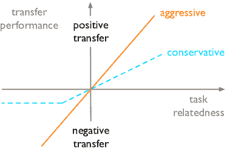

<!--yml

分类：未分类

日期：2024-09-06 19:48:22

-->

# [2201.05867] 深度学习中的迁移性：综述

> 来源：[`ar5iv.labs.arxiv.org/html/2201.05867`](https://ar5iv.labs.arxiv.org/html/2201.05867)

# 深度学习中的迁移性：综述

\name 姜俊光 \emailjiangjunguang1123@outlook.com

\addr 软件学院，北京师范大学，北京 100084，中国

北京 100084，中国 \AND\name 杨舒 \emailshu-y18@mails.tsinghua.edu.cn

\addr 软件学院，北京师范大学，北京 100084，中国

北京 100084，中国 \AND\name 杨舒 \emailshu-y18@mails.tsinghua.edu.cn

\addr 软件学院，北京师范大学，北京 100084，中国 \AND\name 王建民 \emailjimwang@tsinghua.edu.cn

北京 100084，中国 \AND\name 龙名生 \emailmingsheng@tsinghua.edu.cn

\addr 软件学院，北京师范大学，北京 100084，中国

北京 100084，中国 平等贡献 通信作者：龙名生 <mingsheng@tsinghua.edu.cn>。

###### 摘要

深度学习算法的成功通常依赖于大规模数据，而人类似乎具备固有的知识迁移能力，即在遇到和解决未见任务时，通过识别和应用先前学习经验中的相关知识。这种获取和重用知识的能力被称为深度学习中的*迁移性*。这形成了将深度学习变得与人类学习一样*数据高效*的长期追求，并激发了更强大深度学习算法的设计。我们提出这项综述，以连接深度学习中不同的孤立领域及其与迁移性的关系，并提供一个统一而完整的视角，探讨深度学习的整个*lifecycle*中的迁移性。这项综述详细阐述了基本目标和挑战，同时涵盖了核心原理和方法，包括深度架构、预训练、任务适应和领域适应中的最新基石。这突出了有关学习可迁移知识的适当目标以及将知识适应于新任务和领域的问题，避免灾难性遗忘和负迁移。最后，我们实现了一个基准测试和一个开源库，能够公平评估深度学习方法的迁移性。

关键词：深度学习，迁移性，预训练，适应，库，基准

###### 内容

1.  1 引言

    1.  1.1 术语

    1.  1.2 概述

1.  2 预训练

    1.  2.1 预训练模型

    1.  2.2 监督预训练

        1.  2.2.1 元学习

        1.  2.2.2 因果学习

    1.  2.3 无监督预训练

        1.  2.3.1 生成学习

        1.  2.3.2 对比学习

    1.  2.4 备注

1.  3 适应

    1.  3.1 任务适应

        1.  3.1.1 灾难性遗忘

        1.  3.1.2 负迁移

        1.  3.1.3 参数效率

        1.  3.1.4 数据效率

        1.  3.1.5 备注

    1.  3.2 领域适应

        1.  3.2.1 统计匹配

        1.  3.2.2 领域对抗学习

        1.  3.2.3 假设对抗学习

        1.  3.2.4 领域翻译

        1.  3.2.5 半监督学习

        1.  3.2.6 备注

1.  4 评估

    1.  4.1 数据集

    1.  4.2 库

    1.  4.3 基准

        1.  4.3.1 预训练

        1.  4.3.2 任务适应

        1.  4.3.3 领域适应

1.  5 结论

## 1 引言

深度学习（LeCun 等，2015）是一类利用多个处理层来学习具有多个抽象层次的数据表示的机器学习算法。这些多个处理层，也称为深度神经网络（DNNs），具备发现复杂结构数据背后不同解释因素的能力（Bengio 等，2013）。随着网络架构、训练策略和计算设备的重大进展，深度学习在计算机视觉（Krizhevsky 等，2012；He 等，2016），自然语言处理（Radford 等，2018），语音处理（Amodei 等，2016），计算生物学（Senior 等，2020），游戏（Silver 等，2016；Vinyals 等，2019）等多个领域取得了突破性甚至革命性的进展。尽管在这些重要领域取得了巨大成功，深度学习仍面临数据效率的重大挑战。大多数主流深度学习方法需要数百万甚至数十亿的数据集才能实现良好的性能，但为每个新任务或领域收集和标注如此大量的数据既昂贵又难以接受。这一数据效率挑战严重阻碍了深度学习在更广泛应用场景中的采用。

解决这一挑战的有效方案是深入探索深度学习中的迁移能力。迁移能力是人类学习的基础能力：人类可以从其他相关问题中获得相关知识，并应用于处理新问题，仅需极少的样本（Thrun 和 Pratt，1998）。在深度学习中，迁移能力指的是深度神经网络从某些源任务中提取可迁移表示的能力，然后将获得的表示调整以改善相关目标任务的学习（Bengio，2012）。深度学习的最新进展表明，通过大规模数据上的上游任务训练的深度模型往往能在各种下游任务中表现出良好的迁移能力，例如视觉目标检测（Ren 等，2015），自然语言理解（Devlin 等，2019），仅举几例。迁移能力已成为深度学习提高数据效率的核心属性。它与可泛化性、可解释性和鲁棒性等效，用于弥合机器学习和人类学习之间的差距。

图 1：大多数深度学习应用的两阶段生命周期。在第一阶段，深度模型在上游任务上进行*预训练*，使用大规模数据（有标注或无标注）来获得可转移知识。在第二阶段，预训练模型在目标领域的下游任务中进行*适应*，使用有标注数据；如果下游任务只有无标注数据，则会使用来自另一个源领域的相同学习任务但数据分布不同的附加标注数据来提高性能。

为了获得并应用具有良好转移性的知识，许多深度学习应用的生命周期被划分为两个阶段：预训练和适应（图 1）。预训练阶段的目标是获得可转移的知识。深度模型在上游任务上使用大规模数据（有标注或无标注）进行预训练，以学习可以转移到多种下游任务的解耦表示或可重复使用的参数。适应阶段的目标是重用这些可转移的知识。预训练模型在目标领域的下游任务中使用有标注数据进行适应，先前学习的知识使得模型在较少的标注样本下能够更好地泛化。当下游任务只有无标注数据时，将使用来自另一个源领域的相同学习任务但数据分布不同的附加标注数据来提高适应模型的数据效率（Ganin 和 Lempitsky, 2015）。

突出两个阶段间转移性差异是有帮助的。预训练阶段主要关注于*通用*转移性，即获取一个可以提高尽可能多下游任务性能的一般可转移表示。相比之下，适应阶段关注于*特定*转移性，即如何利用预训练模型中的可转移知识来处理特定类型的下游任务，或者如何提高相同下游任务相关领域间的转移性。通用转移性很有吸引力，因为它可以在没有额外成本或特殊设计的情况下使许多下游任务受益。然而，它可能忽视了对更强转移性至关重要的下游任务的特殊结构，因此在许多情况下，特定转移性仍然是必要的。最近，预训练阶段和适应阶段之间的差距越来越小。几种预训练方法被设计用来在适应阶段获得快速模型适应能力（Finn et al., 2017），同时一些适应方法尝试将下游任务转化为预训练任务，以充分利用预训练模型的通用转移性（Brown et al., 2020）。

转移性是深度学习整个生命周期的核心，但不同领域如领域适应（Zhuang 等，2021）和持续学习（Delange 等，2021）主要在生命周期的部分阶段探索转移性。这不足以全面了解转移性。因此，我们提出了这项调查，以将深度学习中不同的孤立领域与其转移性关系连接起来，并提供一个统一和完整的视角，通过深度学习的整个生命周期研究转移性。由于范围广泛和空间限制，我们并不打算涵盖所有针对转移性的方法。相反，我们详细阐述核心原理和方法，然后简要回顾扩展文献。我们进一步实现了 TLlib，一个高质量的开源库，以提供对典型方法的公平评估。我们希望这项调查能够突出深度学习中转移性的宏伟图景，并为有兴趣提高深度学习数据效率的研究人员提供有用的导航。

表 1：调查中使用的符号和描述。

| $\mathcal{X}$ | 输入空间 |
| --- | --- |
| $\mathcal{Y}$ | 输出空间 |
| $\mathcal{D}$ | 在$\mathcal{X}$上的一个固定但未知的分布 |
| $\mathcal{\widehat{D}}$ | 从$\mathcal{D}$中独立同分布抽取样本的经验分布 |
| $P(\cdot)$ | 事件的概率 |
| $\mathbb{E}(\cdot)$ | 随机变量的期望 |
| $\mathcal{U}$ | 上游数据 |
| $\mathcal{S}$ | 下游数据中的源领域 |
| $\mathcal{T}$ | 下游数据中的目标领域 |
| $\mathcal{H}$ | 假设空间 |
| $h$ | 假设空间$\mathcal{H}$中的一个假设 |
| $\psi$ | 特征生成器 |
| $\theta$ | 假设参数 |
| $\mathbf{x}$ | 模型输入 |
| $\mathbf{y}$ | 模型输出 |
| $\mathbf{z}$ | 特征生成器的隐藏激活 |
| $D$ | 区分不同分布的判别器 |

### 1.1 术语

首先，我们给出与可迁移性相关的几个定义，并且在本综述中使用的符号及其描述的总结见表 1。设输入空间为 $\mathcal{X}$，输出空间为 $\mathcal{Y}$，并假设存在一个未知的标记函数 $f:\mathcal{X}\mapsto\mathcal{Y}$。形式上，一个任务对应于学习一个潜在的标记函数 $f$。为了学习一个任务，我们首先收集一组样本 $\widehat{\mathcal{D}}=\{\mathbf{x}_{1},...,\mathbf{x}_{n}\}$，这些样本是从某个固定但未知的分布 $\mathcal{D}$ 中独立同分布（i.i.d.）抽取的。形式上，领域是定义在某个输入空间 $\mathcal{X}$ 上的边际概率分布 $P(\mathbf{X})$。考虑一组假设 $\mathcal{H}$ 和一个特定的损失函数 $\ell:\mathcal{Y}\times\mathcal{Y}\mapsto\mathbb{R}_{+}$，学习者的目标是选择一个假设 $h\in\mathcal{H}$ 以获得最低的泛化误差，即 $\min_{h\in\mathcal{H}}\mathbb{E}_{\mathbf{x}\sim\mathcal{D}}\ell(h(\mathbf{x}),f(\mathbf{x}))$。

###### 定义 1（可迁移性）

给定一个源领域 $\mathcal{S}$ 及其学习任务 $t_{\mathcal{S}}$，以及一个目标领域 $\mathcal{T}$ 及其学习任务 $t_{\mathcal{T}}$，可迁移性是指从 $\mathcal{S}$ 上的 $t_{\mathcal{S}}$ 获取可迁移知识的能力，并利用这些知识减少 $\mathcal{T}$ 上 $t_{\mathcal{T}}$ 的泛化误差，这里存在分布变化 $\mathcal{S}\neq\mathcal{T}$ 或任务差异 $t_{\mathcal{S}}\neq t_{\mathcal{T}}$。

在深度学习生命周期中（图 1），预训练阶段旨在通过在大规模数据上的上游任务学习来*获得*可迁移知识，而适应阶段则旨在*重用*预训练知识以提高下游任务中的数据效率。上游和下游在学习任务和数据分布上都存在差异。为了符合文献中的惯例，在预训练阶段，我们将用广泛使用的上游数据/任务替代源领域/任务，分别表示为 $\mathcal{U}$ 和 $t_{\mathcal{U}}$。

图 2：本综述的概述。综述围绕深度学习应用的生命周期（预训练、适应和评估）进行组织，重点关注可迁移性的核心问题和方法。此外，我们简要回顾了相关的学习设置。

### 1.2 概述

这项调查围绕如何在深度学习的整个生命周期中获取和利用迁移性进行组织，包括预训练、适应和评估（图 2）。

+   •

    预训练。我们首先简要讨论一些重要的模型架构，这些架构使预训练表示具有迁移性。然后我们详细阐述了有监督的预训练和无监督的预训练，这两者通过预训练数据是标注数据还是未标注数据来区分。在有监督的预训练中，我们涵盖了业界常用的标准实践以及学术界的研究进展，以在标注数据上获取迁移性。在无监督的预训练中，我们涵盖了最新的适当预训练任务设计，以在未标注数据上获得迁移性。

+   •

    适应。我们主要阐述了任务适应和领域适应，这两者通过是否存在另一个相关的源领域来提升下游任务性能。在任务适应中，我们首先指出了上游任务和下游任务之间差异所造成的若干开放问题，然后说明了不同的任务适应范式（Yosinski 等, 2014; Brown 等, 2020）如何缩小任务差距，以更好地利用迁移性。在领域适应中，我们首先指出了最有影响力的理论，以弥合分布偏移（Ben-David 等, 2006, 2010a），然后详细阐述了如何从这些理论中推导出稳健的学习算法（Long 等, 2015; Ganin 和 Lempitsky, 2015），以增强深度模型在不同领域间的迁移性。

+   •

    评估。我们主要调查了不同预训练和适应方法在最近文献中发布的几个大规模数据集上获得和重用的迁移性。请注意，我们省略了一些小规模和相对过时的数据集，以使我们的基准更加简洁易报告。为了便于公平评估和完全重现现有算法，我们开源了 TLlib，这是一个高质量的库，随这项调查一起发布，网址为 [`github.com/thuml/Transfer-Learning-Library`](https://github.com/thuml/Transfer-Learning-Library)。

预训练和适应是实现迁移性的核心方法。与之并行的，还有一些领域也与深度学习中的迁移性密切相关，如领域泛化（Gulrajani 和 Lopez-Paz, 2021）、分布外（OOD）泛化（Bengio 等, 2021）、少样本学习（Chen 等, 2019a）等。最近的评估显示，这些学习设置可以从预训练和适应的进展中大大受益，我们将在相关部分中对其进行简要回顾。

## 2 预训练

尽管在各种机器学习任务上表现出前所未有的性能，深度学习方法仍然需要大量的标注数据才能很好地泛化。这种*数据饥渴*的特性限制了它们在各种领域和任务中的应用，尤其是在数据和注释稀缺的情况下。预训练通过从上游任务中获得可迁移的表示或模型，并利用大规模数据来提升下游任务的性能，是解决数据稀缺问题的最常见且实际的解决方案之一。在这一部分，我们将首先回顾一些对预训练表示的迁移性影响深远的重要模型架构，详见 2.1 节。然后，我们详细讲解如何通过在大规模标注数据上进行监督预训练，在 2.2 节提高迁移性，以及通过在更大规模的未标注数据上进行无监督预训练，在 2.3 节提高迁移性。图 3 概述了预训练方法的最新基石。

图 3：*获得*知识迁移性的预训练方法的基石。

### 2.1 预训练模型

预训练与模型架构有着密切的相互作用。一方面，预训练技术，如贪婪逐层无监督预训练（Bengio 等，2007），已经简化了许多深度架构的训练。另一方面，随着神经网络从浅层到深层的发展，它们能够通过从大规模数据中进行预训练来捕获更多的知识，从而提高了它们对下游任务的迁移性。

模型架构对通过预训练获得的知识的迁移能力有很大影响。Kornblith 等人 (2019) 发现预训练模型在下游任务上的表现与预训练任务上的准确率高度相关，这表明提高预训练任务上的表现是提高迁移能力的直接途径。架构的深度，或更准确地说，模型的*容量*，被认为是其迁移能力最关键的因素。然而，训练非常深的神经网络数十年来一直是一个重大难题。He 等人 (2016) 观察到通过增加网络深度会导致训练准确率下降，这意味着更深的模型更难以优化。他们提出了残差网络（ResNet），通过显式地拟合残差映射 $\delta(\mathbf{x}):=h(\mathbf{x})-\mathbf{x}$，然后将原始映射重构为 $\delta(\mathbf{x})+\mathbf{x}$，而不是通过几个堆叠的层来拟合期望的映射 $h(\mathbf{x})$。结果，ResNet 改善了特征和梯度流，并使得数百层甚至上千层的端到端训练成为可能，使得预训练模型的*容量*可以轻松扩展。Ioffe 和 Szegedy (2015) 假设优化困难也来自于由逐层变换引起的内部协方差偏移。为了稳定非常深模型的训练，他们提出了批量归一化（BatchNorm） (Ioffe 和 Szegedy, 2015)，该方法对架构中的每个训练小批次进行归一化。这一设计被 ResNet 广泛使用。Kolesnikov 等人 (2020) 发现 BatchNorm 在迁移上表现不佳，因为它需要依赖于分布的移动平均统计量。他们提出了大迁移（BiT）来用 GroupNorm (Wu 和 He, 2018) 替代 BatchNorm，从而生成在下游任务上表现优异的预训练模型。

图 4：设计的归纳偏置（左）和从预训练中学习到的归纳偏置（右）。

预训练范式还重塑了模型架构的设计。在经典的监督学习中，模型通常具有强*归纳偏差*，例如卷积神经网络（CNN）和递归神经网络（RNN）中的局部连接假设。强归纳偏差使得深度模型的预训练在数据稀缺时更加数据高效，并且更好地泛化，然而另一方面，当有大规模数据进行预训练时，它也限制了深度模型的表达能力和迁移能力。因此，变换器（Vaswani 等人，2017）去除了局部连接假设，并建模了每两个标记之间的全局依赖关系。连接权重由自注意力机制动态计算，然后变换器中的特征聚合依赖于从输入序列计算出的这些注意力，而序列中的标记位置通过位置嵌入进行编码。变换器在自然语言处理中的序列建模中表现强大，而视觉变换器（ViT）（Dosovitskiy 等人，2021）将其扩展到计算机视觉。ViT 将图像分割成固定大小的块，对每个块进行线性嵌入，添加位置嵌入，并将结果向量序列输入到标准变换器编码器中。总之，变换器对数据的结构信息做了最少的假设，这使得变换器成为一个*富有表现力*的架构，能够存储通过在大量训练数据上进行预训练提取的可迁移知识（Devlin 等人，2019；Radford 等人，2018）。

从某种意义上说，预训练为下游任务提供了*学习到的*归纳偏差（Torrey 和 Shavlik，2010）。许多下游任务只有数百或数千个标记样本，但经过数亿参数的预训练变换器在这样的小数据上进行微调后，能够很好地泛化。为了解释这种现象，Aghajanyan 等人（2021）通过实验证明，预训练最小化了内在维度（Li 等人，2018），内在维度测量了接近优化问题所需的参数数量。此外，还给出了一个内在维度泛化界限，表明预训练的参数会隐式影响模型的归纳偏差，较大的预训练模型在微调时可能对应较小的允许假设空间（见图 4）。变换器的成功表明，随着预训练数据量的增加，学习到的归纳偏差能够在迁移能力方面超越人工设计的归纳偏差。

### 2.2 监督式预训练

监督预训练旨在获得在大规模标注数据上的模型，然后将这些模型迁移以提升下游任务（见图 5）。监督预训练通常用于计算机视觉领域，其中在 ImageNet 上的图像分类（Deng et al., 2009; Russakovsky et al., 2015）常作为预训练任务。预训练的模型可以通过重用特征生成器中的表示来迁移到下游任务（Sermanet et al., 2013）。Donahue et al. (2014) 发现，在 ImageNet 上预训练的通用视觉表示在各种物体识别任务上优于许多传统的特征描述符。Yosinski et al. (2014) 发现，通过微调整个模型来迁移预训练模型，在新任务上能获得更好的泛化性能。

图 5：标准的监督预训练。模型由一个特征生成器和一个任务特定的头部组成。目标是获得一个从大规模标注数据中捕获可迁移知识的特征生成器。预训练后，特征生成器会被适配到下游任务中，而任务特定的头部通常会被丢弃。

在影响预训练模型迁移能力的因素中，预训练数据的数量和质量可能是最重要的。BiT (Kolesnikov et al., 2020) 强调，使用更大的数据集进行训练对更好的迁移能力至关重要。然而，数据标注是劳动密集型和耗时的，这限制了标注数据的可能规模。为了打破这一限制，Mahajan et al. (2018) 探索了在 IG-1B-Targeted 上进行弱监督预训练 (WSP)，这是一个包含社交媒体标签的数十亿张图像的数据集。Yalniz et al. (2019) 进一步探索了在 YFCC100M 上进行的大规模半监督预训练 (SSP)，这是一个包含数十亿张未标注图像及相对较小的任务特定标注数据的数据集。这些方法相比于仅用干净标注数据训练的对照组，明显提升了迁移性能。另一方面，Domain Adaptive Transfer (DAT) (Ngiam et al., 2018) 研究了数据质量的影响，发现使用更多的数据并不一定能带来更好的迁移能力，尤其是当数据集极其庞大时。因此，提出了一种重要性加权策略，以仔细选择与目标任务最相关的预训练数据。Cui et al. (2018) 也发现，对更相似的上游数据进行预训练能提高对细粒度下游任务的迁移能力。他们建议通过地球搬运工距离 (Earth Mover’s Distance) 来估计领域相似性，以选择合适的预训练数据。Geirhos et al. (2019) 发现，使用 ImageNet 进行监督训练的模型对图像中的纹理有偏见，并建议使用 Stylized ImageNet (SIN) 进行预训练，以修正纹理偏见，并鼓励模型学习基于形状的更具迁移性的表示。

尽管标准的监督预训练在有足够标注数据的情况下很强大，但它仍然存在一些可能限制模型迁移能力的缺陷。例如，标准的监督预训练模型容易受到对抗样本的影响 (Goodfellow et al., 2015)，Salman et al. (2020) 通过增强预训练模型的对抗鲁棒性来实现更好的迁移能力。此外，还有一些替代的预训练方法可以提高深度模型的迁移能力。第 2.2.1 节将详细介绍元学习，它旨在获得能够适应下游任务的预训练模型，从而减少训练时间和训练数据。第 2.2.2 节将回顾因果学习，它旨在获得具有分布鲁棒性和泛化能力的预训练模型。

#### 2.2.1 元学习

标准的有监督预训练获得了可转移的表征，以促进新任务的学习。然而，它仍然需要对预训练模型进行微调，需要大量的标记数据和许多梯度更新，以适应新任务。相比之下，人们能够用少量标记数据快速适应不同的相关新任务。元学习，也被称为学习如何学习（Schmidhuber，1987），旨在追求这种*高效*的可转移性。

元学习的核心思想是为模型提供一些能够捕捉不同学习任务内在特性的元知识$\phi$，这被称为元训练。当面对新任务时，学到的元知识可以帮助目标模型$\theta$更快地适应任务，这被称为元测试。元学习基于一个简单的机器学习原则，即测试和训练条件应匹配。如图 6(a)所示，为了模拟元测试期间的快速适应条件，元训练数据被构造为$n$个学习任务的集合，每个任务$i\in[n]$包含一个用于适应此任务的训练集$\mathcal{D}^{\text{tr}}_{i}$和一个用于评估的测试集$\mathcal{D}^{\text{ts}}_{i}$¹¹1$\mathcal{D}^{\text{ts}}$是一个*替代*测试集，用于元训练期间模拟不同任务并改进模型。它与机器学习中的真实测试集不同。如图 6(b)所示，元训练的学习目标是一个双层优化问题，

|  | $\phi^{*}={\arg}\mathop{\max}_{\phi}\sum_{i=1}^{n}\log P(\theta_{i}(\phi)&#124;\mathcal{D}^{\text{ts}}_{i}),\quad\text{where}\ \theta_{i}(\phi)={\arg}\mathop{\max}_{\theta}\log P(\theta&#124;\mathcal{D}^{\text{tr}}_{i},\phi).\\ $ |  | (1) |
| --- | --- | --- | --- |

这里，内层优化使用元知识$\phi$和训练集$\mathcal{D}^{\text{tr}}_{i}$来更新模型$\theta$，外层优化则用测试集$\mathcal{D}^{\text{ts}}_{i}$来评估更新后的模型，以寻找更强的可转移性元知识。提升元学习方法的可转移性的关键在于设计合适形式的元知识。

(a) 学习设置

(b) 体系结构

图 6：元学习的学习设置和架构。 (a) 元学习包括两个阶段，元训练和元测试。元训练从训练任务中获得元知识 $\phi$，以帮助模型 $\theta$ 快速适应元测试中的新任务，其中每个任务由一个训练集和一个测试集组成。 (b) 在内部优化层次中，模型 $\theta$ 使用元知识 $\phi$ 在训练集 $\mathcal{D}^{\text{tr}}_{i}$ 上进行更新。在外部优化层次中，更新后的模型在测试集 $\mathcal{D}^{\text{ts}}_{i}$ 上进行评估，以寻找更好的元知识 $\phi$。

基于记忆的元学习将*记忆机制*视为元知识。控制器将从训练数据 $\mathcal{D}_{i}^{\text{tr}}$ 中提取的知识写入内存，并从内存中读取以适应基本学习器 $\theta$ 以对测试数据 $\mathcal{D}_{i}^{\text{ts}}$ 进行预测。控制器的参数被更新以寻找可迁移的知识。Memory-Augmented Neural Network (MANN) (Santoro et al., 2016) 将样本表示-类别标签信息存储在外部记忆中，当出现来自同一类别的样本时，这些信息可以被检索作为特征进行预测。Meta Network (Munkhdalai and Yu, 2017) 设计了另一种记忆机制，其中基本学习器提供当前任务的状态信息，而元学习器与外部记忆交互以生成基本学习器的参数，以便快速学习新任务。基于记忆的元学习方法在各种下游任务中提高了迁移性，如少样本分类和强化学习。然而，它们需要仔细设计黑箱架构以纳入记忆机制，并且不清楚在记忆中存储和检索的内容以及为何这些内容有助于适应模型。

基于优化的元学习将模型的良好*初始化*视为元知识。Model-Agnostic Meta-Learning (MAML) (Finn et al., 2017) 的动机是明确寻找一种最具可迁移性的初始化，即模型仅需少量梯度步骤和少量标记数据就能泛化到新任务。为了学习这样的初始化，对于每个抽样任务 $i\in[n]$，模型 $\phi$ 首先在其训练数据 $\mathcal{D}_{i}^{\text{tr}}$ 上使用大小为 $\alpha$ 的一次梯度步骤进行更新，

|  | $\theta_{i}=\phi-\alpha\nabla_{\phi}L(\phi,\mathcal{D}_{i}^{\text{tr}}).$ |  | (2) |
| --- | --- | --- | --- |

这模仿了从 $\phi$ 的起始点对模型进行微调的情况。作为元知识，$\phi$ 应具有良好的可迁移性，以便对于所有任务 $i\in[n]$，微调后的参数 $\theta_{i}$ 可以在测试集 $\mathcal{D}_{i}^{\text{ts}}$ 上表现良好。

|  | $\min_{\phi}\sum_{i=1}^{n}L(\theta_{i}(\phi),\mathcal{D}_{i}^{\text{ts}})=\sum_{i=1}^{n}L(\phi-\alpha\nabla_{\phi}L(\phi,\mathcal{D}_{i}^{\text{tr}}),\mathcal{D}_{i}^{\text{ts}}).$ |  | (3) |
| --- | --- | --- | --- |

MAML 的元知识是高维的，这阻碍了 MAML 在更深模型中的应用。为了解决这个问题，Meta Transfer（Sun et al., 2019a）使用标准预训练进行初始化，并通过轻量级神经操作（例如在任务间的缩放和偏移）进行元训练，从而减少了获得元知识所需的训练任务。Raghu et al. (2020)发现骨干网络的特征重用是 MAML 在下游任务中高效学习的主要原因。因此，他们提出了几乎无内部循环算法，该算法仅在特定任务的头层上进行内部循环更新和任务适应。MAML 的另一个限制是固定的元知识被所有任务全局共享。为了解决这个问题，Latent Embedding Optimization（Rusu et al., 2019）在低维潜在空间中执行基于梯度的元学习，并学习数据依赖的潜在嵌入作为元知识，以生成目标模型参数。Yao et al. (2019)在基于聚类结构的层级任务上执行层级结构元学习，并学习将可迁移的元知识量身定制到不同任务中。

尽管元学习方法可以在任务间实现快速模型适应，但它们在不同领域的数据迁移上表现较弱，一些复杂的方法甚至表现不如标准的预训练基线（Chen et al., 2019a）。因此，Omni-Training（Shu et al., 2021a）在一个三流架构的框架中融合了标准预训练和元训练，以使预训练模型具备在不同分布间的领域迁移能力和在相关任务间的快速适应能力。

#### 2.2.2 因果学习

对于监督式预训练而言，获得能够良好泛化到分布外（OOD）领域的可迁移表示仍然很困难（Bengio et al., 2021）。相比之下，人类具有适应不同领域或新环境的能力。因果学习旨在在预训练阶段追求这种*外推*的迁移能力。

因果学习的核心思想是为模型配备一些因果机制，这些机制捕捉复杂真实世界分布的独立和解耦方面。当分布发生变化时，只有一个或几个因果机制发生变化，其它机制保持不变，这可能会导致更好的分布外（OOD）泛化。因果机制由结构性因果模型描述。如图 7 所示，因果机制将一组变量视为有向无环图的顶点，每条边表示直接因果机制，即父节点直接影响子节点的赋值。这引出了这些变量的联合分布的标准化因解耦分布，即在父节点条件下的分布。独立因果机制原理指出，给定其机制，每个变量的条件分布不会通知或影响其他机制（Schölkopf et al., 2012; Peters et al., 2017）。这意味着小的分布变化只应以稀疏和局部的方式影响因果机制及其解耦分解（Schölkopf et al., 2021），从而实现对不同分布的可迁移性。因果学习的关键问题是获取由独立因果机制支配的变量。一个方法是通过*模块化*模型显式引入独立性。另一种常见做法是利用*不变性*假设，即因果关系在分布之间保持不变。

图 7: 因果机制将一组观察或变量视为有向无环图的顶点，其中每条边对应一个直接因果机制。因果学习寻求一个由特定因果机制支配的变量模型，如果环境或分布发生变化，只有部分因果机制会受到影响。

模块化模型。递归独立机制（RIM）（Goyal et al., 2021）采用一个由多个不同功能模块组成的模块化模型，其中每个模块是一个递归单元，例如 LSTM 或 GRU（Cho et al., 2014），并表示一个因果机制。为了在不同模块中获得独立性，RIM 在每个模块的隐藏状态与当前输入之间引入了注意力机制。对于特定输入，仅激活和更新最相关的注意力较大的模块，这在不同模块之间形成了竞争，促进了它们的独立性。RIM 已被证明能够捕捉独立的因果机制，并在不同的时间模式上良好地泛化。

不变学习。不可变性假设表明，目标输出给定其直接原因的条件概率应该在所有环境或分布中保持不变。不变因果预测（ICP）(Peters et al., 2016) 通过执行统计测试来发现满足不可变性假设的变量子集，从而揭示独立的因果机制。不变风险最小化（IRM）(Arjovsky et al., 2019) 将这一思想扩展到表示学习中，学习一个良好的表示，使得目标输出给定表示的条件概率在训练环境中保持不变。形式上，给定数据表示 $\psi:\mathcal{X}\rightarrow\mathcal{Z}$ 和训练环境 $\mathcal{E}^{\text{tr}}$，如果存在一个分类器 $h:\mathcal{Z}\rightarrow\mathcal{Y}$ 对所有环境同时最优，则表示和输出之间的条件概率是不变的。这可以形式化为以下约束优化问题，

|  | $\mathop{\min}_{\psi:\mathcal{X}\rightarrow\mathcal{Z},{h}:\mathcal{Z}\rightarrow\mathcal{Y}}\ \sum_{e\in\mathcal{E}^{\text{tr}}}\epsilon^{e}(h\circ\psi),\quad\text{subject to }h\in\mathop{\arg\min}_{\bar{h}:\mathcal{Z}\rightarrow\mathcal{Y}}\epsilon^{e}(\bar{h}\circ\psi),\ \text{for all}\ e\in\mathcal{E}^{\text{tr}},$ |  | (4) |
| --- | --- | --- | --- |

其中 $\epsilon^{e}(h\circ\psi)$ 指的是预测器 $h\circ\psi$ 在环境 $e$ 上的期望误差。跨环境的可迁移性依赖于训练环境的不可变性是否暗示了所有环境中的不可变性。因此，训练环境的多样性对于获得可迁移性至关重要。IRM 可以扩展到复杂情况，其中因果关系定义在一些需要从数据中提取的潜在变量上。

### 2.3 无监督预训练

作为一种经典的成功方法，监督预训练仍然需要大量标注数据，这些数据标注成本高且仅在某些领域可用。这阻碍了大规模数据的预训练，并限制了其在特定任务中的迁移性。为打破这一桎梏，通常采用无监督学习（Bengio，2012），特别是自监督学习形式，在非常大规模的未标注数据上进行预训练，以获得一般可转移的知识。为了提高下游任务的迁移性，设计合适的自监督任务用于预训练至关重要。根据任务类型，我们可以将常见的无监督预训练方法分为生成学习和对比学习，这将在第 2.3.1 和 2.3.2 节中分别讨论。

#### 2.3.1 生成学习

生成学习基于为无监督预训练生成数据分布 $P(\mathbf{X})$ 的思想。它旨在学习数据中的内在表示，并且已被广泛用于深度神经网络的预训练（Bengio 等，2007）。如图 8 所示，我们使用一个编码器 $f_{\theta}$ 将扰动输入 $\tilde{\mathbf{x}}$ 映射到潜在表示 $\mathbf{z}=f_{\theta}(\tilde{\mathbf{x}})$，以及一个解码器 $g_{\theta}$ 将表示映射回去以生成重建的输入版本 $\widehat{\mathbf{x}}=g_{\theta}(\mathbf{z})$。然后，通过最小化重建误差 $L_{\text{gen}}(\widehat{\mathbf{x}},\mathbf{x})$ 来优化模型。大多数生成预训练方法基于两个模型：*自回归* 模型，它仅根据过去的输入生成未来的输入；和 *自编码* 模型，它根据部分输入生成完整的输入。

图 8：生成预训练试图从扰动输入 $\tilde{\mathbf{x}}$ 重建原始输入 $\mathbf{x}$。生成学习任务应鼓励学习到的表示 $\mathbf{z}$ 捕捉数据中的内在和可转移的解释性因素。

自回归模型通过预测每个条目的前置上下文来逼近序列的分布，这在自然语言处理（NLP）中被称为语言建模（LM）任务。如图 9 所示，给定一个文本序列$\mathbf{x}_{1:T}=[x_{1},x_{2},...,x_{T}]$，LM 的学习目标是最大化每个条目$x_{t}$的条件概率，

|  | $\max_{\theta}\sum_{t=1}^{T}\log P_{\theta}(x_{t}\mid x_{t-k},\cdots,x_{t-1}),$ |  | (5) |
| --- | --- | --- | --- |

其中$k$是上下文窗口的大小，$\theta$是神经网络的参数。生成预训练（GPT）（Radford et al., 2018）探索了使用 LM 对 BooksCorpus（Zhu et al., 2015）数据集（包含超过$7000$本未出版书籍）进行的 Transformer 的无监督预训练。这使得模型具备了很好的迁移能力，可以应用于各种 NLP 任务，例如问答、常识推理等。LM 的优点在于它建模了上下文依赖性，而缺点在于它仅从一个方向编码上下文信息，然而双向编码的上下文表示可能更适合许多下游任务，如自然语言推理。

图 9: Transformer（Trm）在语言模型中的注意力可见性。（a）LM 最大化所有单词的概率，条件是它们之前的单词。（b）MLM 最大化随机掩蔽单词的概率，条件是所有未掩蔽的单词。（c）PLM 对原始序列进行排列，然后执行自回归。（d）Seq2Seq MLM 对输入掩蔽序列$x$进行编码，然后依次解码输出掩蔽标记$y$。

自编码模型通过从编码表示生成原始数据来逼近数据分布。Vincent et al. (2008)假设一个好的表示也应该对输入的部分损坏具有鲁棒性。因此，去噪自编码器（Vincent et al., 2008）被训练来用损坏的输入$\tilde{\mathbf{x}}$重建原始输入$\mathbf{x}$。受到去噪自编码器的启发，BERT（Devlin et al., 2019）采用了掩蔽语言建模（MLM）任务作为预训练任务，以克服单向 LM 的缺点。如图 9 所示，MLM 首先用一个特殊的[MASK]标记随机掩蔽输入句子$\mathbf{x}$中的一些标记$m(\mathbf{x})$，然后训练模型通过其余的标记$\mathbf{x}_{\setminus m(\mathbf{x})}$来预测被掩蔽的标记，

|  | $\max_{\theta}\sum_{x\in m(\mathbf{x})}\log P_{\theta}(x\mid\mathbf{x}_{\setminus m(\mathbf{x})}).$ |  | (6) |
| --- | --- | --- | --- |

掩码预训练也已应用于许多其他领域。例如，掩码自编码器（MAE）（He 等，2021）在大规模未标记图像数据集上使用图像生成任务对视觉变换器进行预训练。困难在于图像中的信号高度冗余，因此像填补几个缺失像素这样的生成任务很难从数据中捕获高级知识。为了解决这个问题，MAE 随机掩盖大量补丁，迫使模型超越低级理解，并根据少量可见补丁重建整个图像，从而提高其在语义级任务中的迁移性。另一个例子是，为了对图形神经网络（GNN）（Garcia 和 Bruna，2018）进行可迁移表示的预训练，属性掩码（Hu 等，2020）隐藏节点或边属性，并要求 GNN 根据邻近结构预测这些属性，这可以捕捉不同图结构中属性分布的规律性，如分子图中的化学规则，并提高在下游节点或边分类任务中的迁移性。

结合自回归和自编码模型。在 MLM 中，一些特殊的标记，如[MASK]，仅在预训练中使用，而在下游任务中缺失，导致预训练阶段和微调阶段之间的不匹配。为了减轻这种差异，排列语言建模（PLM）（Yang 等，2019）随机抽样序列的排列，然后对排列的序列执行自回归，以预测最后几个标记。为了探索在不同生成预训练方法中获得知识的迁移极限，T5（Raffel 等，2020）将所有基于文本的语言任务统一为文本到文本格式，然后采用序列到序列 MLM（Seq2Seq MLM），其中编码器处理掩码序列，解码器以自回归方式顺序生成掩码标记。

无监督预训练任务的设计对下游任务的迁移性有着重大影响，因此，许多努力致力于优化预训练任务并探索更好的训练目标。RoBERTa (Liu et al., 2019b) 探讨了 BERT 的欠训练问题，并强调使用更多数据、更长序列和动态变化的掩码模式有助于模型的更好迁移。此外，MLM 随机掩盖了一些独立的词，这些词是英语中最小的语义单元，但在其他语言（如中文）中可能没有完整的语义。因此，ERNIE (百度) (Sun et al., 2019b) 引入了实体级别和短语级别的掩盖，其中掩盖了表示相同语义的多个词。这在中文 NLP 任务中实现了良好的迁移性。为了提高对跨度选择重要任务（如问答和共指消解）的迁移性，SpanBERT (Joshi et al., 2020) 在文本中掩盖了随机长度的跨度，并训练跨度边界表示以预测被掩盖跨度的全部内容。BART (Lewis et al., 2020) 引入了更多的扰动函数，如句子排列、文档旋转、标记删除和文本填充，以实现更具迁移性的预训练模型。

大规模数据上的生成预训练显著提高了模型的迁移性，甚至实现了*少样本*任务迁移。通过将模型规模扩大到 $175$B 并在 $500$GB 的语料库上进行预训练，GPT-3 (Brown et al., 2020) 获得了令人印象深刻的迁移性。仅使用任务演示和少量示例，GPT-3 在某些任务上比以前的最先进微调方法表现更好。GPT-3 的成功源于网络规模的语料库包含大量自然语言句子，这些句子潜在地展示了不同的任务，而没有明确的任务符号。在这种数据上训练的高容量语言模型可以进行无监督的多任务学习，并吸收可迁移的知识以处理下游任务。大规模数据上的生成预训练也改善了跨领域的迁移性。Multilingual BERT (Pires et al., 2019) 在来自 $104$ 种语言的维基百科文本上进行 MLM 预训练，然后在下游任务中实现了出色的跨语言迁移性，其中每种语言都可以被视为一个领域。此外，XLM (Lample 和 Conneau, 2019) 引入了翻译语言建模任务，将 MLM 扩展到平行的双语句子对，鼓励跨语言更具迁移性的表示。

#### 2.3.2 对比学习

对比学习利用学习比较的思想进行无监督预训练。如图 10 所示，从原始数据 $\mathbf{x}$ 构造出两个不同的视图，即查询 $\mathbf{x}^{q}$ 和键 $\mathbf{x}^{k}$。编码器将不同的视图映射到潜在表示中，解码器进一步将表示映射到度量空间中。通过最小化同一实例的查询和键之间的距离来学习模型。我们将回顾三种在预训练中广泛使用的典型对比学习方法：互信息最大化（使用全局上下文和局部特征作为不同视图）、相对位置预测（使用不同的局部组件作为不同视图）和实例区分（使用数据增强生成同一实例的不同视图）。生成和比较不同视图的不同方式使这些方法分别捕捉训练数据的全局-局部关系、局部-局部关系和全局-全局关系。

图 10：对比预训练旨在最小化从同一数据输入 $\mathbf{x}$ 的不同视图生成的查询 $\mathbf{q}$ 和键 $\mathbf{k}$ 之间的相似度。

##### 互信息最大化。

Deep InfoMax (Hjelm 等，2019) 旨在从高层次的全局上下文和低层次的局部特征之间的关系中获取可迁移的表示。给定输入 $\mathbf{x}$，Deep InfoMax 学习一个编码器 $\psi$ 来最大化其输入和相同实例的输出之间的互信息。互信息可以通过训练一个鉴别器来估计和界定，该鉴别器区分它们的联合分布和边际分布的乘积。使用噪声对比估计（NCE），Deep InfoMax 的训练目标变为，

|  | $\max_{\psi}\mathbb{E}_{\mathbf{x}\sim\mathcal{U}}\left[D(\mathbf{x},\psi(\mathbf{x}))-\mathbb{E}_{\mathbf{x}^{\prime}\sim\widetilde{\mathcal{U}}}\Big{(}\log\sum_{\mathbf{x}^{\prime}}e^{D(\mathbf{x}^{\prime},\psi(\mathbf{x}))}\Big{)}\right],$ |  | (7) |
| --- | --- | --- | --- |

其中 $\mathbf{x}$ 是从上游任务的训练分布 $\mathcal{U}$ 中采样的输入，$\mathbf{x}^{\prime}$ 是从 $\widetilde{\mathcal{U}}=\mathcal{U}$ 中采样的另一个输入，$D$ 是区分联合分布和边际分布乘积的判别器。一个相关的工作，对比预测编码（CPC）（Oord 等，2019）也最大化全球表示和局部表示之间的互信息。给定一个序列输入，CPC 用编码器处理该输入，并通过自回归模型将结果总结成一个上下文。然后，它最大化总结的上下文与序列中未来观察的隐藏表示之间的互信息，这引导学习到的表示捕捉用于预测未来样本的信息。

互信息最大化已被用于获取许多数据格式上的预训练模型，例如图像数据上的 Deep InfoMax 和序列数据上的 CPC。在图形数据上，Deep Graph Infomax（Veličković 等，2019）最大化节点的局部表示与 k-hop 邻域的上下文表示之间的互信息。在多模态数据上，对比语言-图像预训练（CLIP）（Radford 等，2021）最大化图像与对应文本在多模态嵌入空间中的互信息。在使用来自互联网的大规模图像-文本对数据集进行训练后，它实现了模型的*零样本*迁移，并且与之前的任务特定监督模型具有竞争力。

##### 相对位置预测。

下一句预测（NSP）（Devlin 等，2019），首次引入 BERT，通过*局部部分*之间的关系获取可迁移的表示。具体而言，NSP 使用二分类器预测训练语料库中的两个句子是否连贯，旨在增强对多句子任务的迁移能力，例如问答和自然语言推理。然而，后续工作质疑了 NSP 任务的必要性（Yang 等，2019；Liu 等，2019c），Lan 等人（2020）猜测 NSP 仅迫使模型学习主题预测，而非更难的连贯性预测。由于句间连贯性对许多下游任务至关重要，ALBERT（Lan 等，2020）引入了句子顺序预测任务，其中两个来自同一文档的连续段落作为正例，顺序调换的相同段落作为负例。类似的想法也在视觉领域中得到探索，其中预训练任务是预测图像中两个区域的相对位置（Doersch 等，2015）。

##### 实例区分。

InstDisc（Wu et al., 2018）旨在通过*实例*之间的关系学习可转移的表示。给定$n$个实例，训练一个编码器$\psi$以区分每个实例，即最小化查询$\mathbf{q}$和来自同一实例的键$\mathbf{k}_{+}$（也称为正样本）之间的距离，并最大化不同实例（也称为负样本）之间的距离，

|  | $\min_{\psi}-\log\frac{\text{exp}(\mathbf{q}\cdot\mathbf{k}_{+}/\tau)}{\sum_{j=0}^{K}\text{exp}(\mathbf{q}\cdot\mathbf{k}_{j}/\tau)},$ |  | (8) |
| --- | --- | --- | --- |

其中$\tau$是一个温度超参数，求和是在一个正样本和$K$个负样本上进行的。请注意，所有样本特征的计算和非参数 softmax 计算代价较高，尤其是当训练实例数$n$极大时。为解决这一问题，使用负采样来近似 softmax，即$K<n$。

表示对比一个实例与另一个实例的可区分性与下游任务中的可转移性密切相关。因此，许多工作致力于增加键的数量和提高其质量。如图 11 所示，InstDisc（Wu et al., 2018）使用内存库存储每个键的最新更新表示，这增加了负样本的数量，但可能导致表示的一致性降低。Momentum Contrast（MoCo）（He et al., 2020）维持一个动态的编码特征队列，以扩大负样本的数量，并使用动量更新的编码器对键进行编码，这增加了队列中不同样本之间的编码一致性，提高了键的质量。正样本和负样本的构建方式对于转移性也很重要。Contrastive Multiview Coding（CMC）（Tian et al., 2020）将同一实例的多个视角（而非多个增强）作为正样本，从而实现更好的转移性。SimCLR（Chen et al., 2020）强调数据增强在隐式定义不同前任务中发挥了关键作用，强大的增强组合即使在没有内存库或队列的情况下也能实现更好的转移性。引入负样本是为了避免所有输出收敛为一个常数的平凡解。然而，BYOL（Grill et al., 2020）发现，当最大化图像的两个增强之间的相似性时，负样本对并非必要。此外，SimSiam（Chen and He, 2021）发现动量编码器也不是必要的，而在一侧应用的停止梯度操作足以学习可转移的表示。

图 11：不同对比学习机制的比较。 (a) InstDisc 从记忆库中抽取键。 (b) MoCo 通过动量编码器实时编码新键，并维护一个键的队列。 (c) SimCLR 使用相同的编码器在同一批次中编码键和查询，并添加一个非线性预测器以改进表示。 (d) SimSiam 在一侧应用 MLP 预测器，在另一侧应用停止梯度操作，并在不使用负对的情况下最大化两个视图之间的相似性。

与监督式预训练相比，对比式预训练在下游分类任务上表现出竞争力，甚至在物体检测和语义分割等其他各种下游任务上表现更好。为了解释对比式预训练更强的迁移能力，赵等人（2021）观察到，标准监督式预训练通常转移高级语义知识，而对比式预训练通常转移低级和中级表示。当目标任务与监督式预训练任务不同时，监督式预训练方法有过拟合由类别标签定义的物体语义特征的风险，这会损害迁移能力。相反，对比式预训练任务导致对物体的更全面建模，缓解了任务错位问题，并为广泛的下游任务实现了更好的迁移能力。

### 2.4 备注

虽然标准监督式预训练已相当成熟，但其迁移能力也依赖于预训练任务与目标任务之间的关系，没有任何预训练任务可以主导所有下游任务。他等人（2019）显示，与随机初始化相比，在 ImageNet 上的监督式预训练仅加快了 COCO 数据集上物体检测的收敛速度，但没有带来更好的最终准确性。Raghu 等人（2019）在医学影像中观察到类似现象，从头训练轻量级模型与从 ImageNet 预训练模型迁移的表现相当。Abnar 等人（2022）探索了大规模监督式预训练的限制，并发现随着数据、模型规模和训练时间的增加，预训练准确性提高，下游任务的性能逐渐饱和，甚至存在一些极端情况下预训练任务和下游任务的性能相互矛盾。这些有争议的结果促使我们*重新思考*监督式预训练的常见做法，并为特定领域设计新的监督式预训练策略，特别是在预训练任务与目标任务之间存在较大差距时。

表 2：不同预训练方法的比较。

| 方法 | 模态扩展性¹ | 任务可扩展性² | 数据效率³ | 标注成本⁴ |
| --- | --- | --- | --- | --- |
| 标准预训练 | $\bigstar\bigstar\bigstar$ | $\bigstar\bigstar$ | $\bigstar\bigstar\bigstar$ | $\bigstar$ |
| 元学习 | $\bigstar\bigstar\bigstar$ | $\bigstar$ | $\bigstar$ | $\bigstar$ |
| 因果学习 | $\bigstar\bigstar$ | $\bigstar$ | $\bigstar$ | $\bigstar$ |
| 生成学习 | $\bigstar\bigstar$ | $\bigstar\bigstar\bigstar$ | $\bigstar\bigstar\bigstar$ | $\bigstar\bigstar\bigstar$ |
| 对比学习 | $\bigstar$ | $\bigstar\bigstar\bigstar$ | $\bigstar\bigstar\bigstar$ | $\bigstar\bigstar\bigstar$ |

+   1

    模态扩展性：模型是否可以在各种模态上进行预训练，如文本、图形。

+   2

    任务可扩展性：预训练模型是否可以轻松转移到不同的下游任务。

+   3

    数据效率：是否可以通过大规模预训练获得更强的迁移性。

+   4

    标注成本：是否依赖人工数据标注。

表 2 从四个角度比较了预训练方法：模态扩展性、任务可扩展性、数据效率和标注成本。尽管元学习能够快速适应新任务，但它主要考虑与之相关的任务，如在小变化因素环境下的强化学习，而标准预训练则可以转移到更广泛的任务差距，例如从图像分类到目标检测。此外，现有的元学习和因果学习方法仅在小数据集上进行实证验证，目前尚不清楚它们是否能够通过在大规模数据上进行预训练来获得更强的迁移性。尽管没有人工标注的前景看好，无监督预训练模型在对下游任务进行微调时需要大量的梯度步骤。此外，对比学习需要强大的数据增强来获得迁移性，但在其他模态（如文本和图形）中设计这些增强并不容易。最后，无监督预训练任务的设计仍然是启发式的，缺乏对任务转移如何实现以及这些模型迁移性的有效分析。

仅通过预训练阶段获得的迁移能力可能会限制我们的视野。由于在预训练阶段和适应阶段之间自然存在任务和领域的变化，许多预训练方法都专门针对适应性进行调整。无监督预训练的目标是通过探索不同种类的自监督任务来减少预训练和适应之间的任务差异，或者通过扩大上游数据的规模和多样性来减少上游-下游的差异，从而提高对下游任务的迁移能力。领域适应（Ganin 和 Lempitsky, 2015）常常解决的分布转移问题也会影响预训练模型的迁移能力。例如，特定领域的数据分布，如生物和科学文献，与一般的预训练领域有很大不同，这可能会降低迁移能力，因此 BioBert（Lee 等, 2020b）和 SciBERT（Beltagy 等, 2019）在领域特定的数据上进行预训练，以提高在领域特定任务上的迁移能力。

## 3 适应性

尽管在大规模数据集上进行预训练可以在深度模型中获得可迁移的知识，但对于大多数应用而言，仍然需要使用目标数据进行任务适应，因为目标任务通常与预训练任务不同。当目标任务的标记数据不足时，从具有标记数据的相关源领域进行领域适应，以提升目标领域的表现也是许多应用中必要的。我们将在第 3.1 和第 3.2 节中分别回顾任务适应和领域适应。

### 3.1 任务适应

在任务适应中，存在一个预训练模型 $h_{\theta^{0}}$ 和一个目标领域 $\widehat{\mathcal{T}}=\{\mathbf{x}_{i},\textbf{y}_{i}\}_{i=1}^{m}$，其中包含 $m$ 个标记样本。目标是使用预训练模型和目标数据在空间 $\mathcal{H}$ 中找到一个假设 $h_{\theta}:\mathcal{X}\mapsto\mathcal{Y}$，以实现低的泛化风险 $\epsilon_{\mathcal{T}}(h_{\theta})$。一般来说，有两种简单的方法可以将预训练模型 *适应* 到下游任务：特征迁移和微调。特征迁移冻结预训练模型的权重，并在其上训练一个线性分类器。相比之下，微调使用预训练模型初始化目标模型参数，并在训练过程中更新这些参数。特征迁移在训练中速度较快且参数存储高效，但微调表现更佳（Yosinski 等, 2014），已成为视觉和自然语言处理（Girshick 等, 2014; Devlin 等, 2019）任务适应的常见做法。

图 12：用于*应用*可迁移知识的任务适应方法的基石。

传统的微调，通过在目标数据上进行经验风险最小化来调整预训练模型，已广泛应用于各种下游任务和场景。然而，传统微调仍然存在几个问题，包括灾难性遗忘和负迁移。我们将在 3.1.1 和 3.1.2 部分介绍如何缓解这些问题。此外，随着深度模型参数的不断增加，有些达到了数十亿甚至数万亿，参数效率和数据效率在任务适应中变得越来越重要。我们将在 3.1.3 和 3.1.4 部分介绍如何探索预训练模型的迁移能力来解决这些问题。总体而言，图 12 展示了任务适应算法在解决不同问题上的进展。

#### 3.1.1 灾难性遗忘

灾难性遗忘，最早在终身学习中被研究，指的是神经网络在学习新任务时倾向于丧失从之前任务中获得的知识（Kirkpatrick et al., 2017）。在标记数据通常稀缺的微调场景中，这会导致模型在目标数据上的过拟合。这一现象也被称为表征崩溃，即在微调阶段的可泛化表征的退化（Aghajanyan et al., 2021）。避免灾难性遗忘的最简单方法可能是选择较小的学习率和采用早停策略，这样可以避免过多更新参数。然而，这种策略可能导致模型陷入局部最小值，特别是在预训练参数与下游任务的最佳参数之间存在较大差距时。

Yosinski 等人 (2014) 发现不同层的迁移性并不相同——第一层学习通用特征，中间层学习语义特征，而最后一层学习任务特定的特征。因此，为了使模型既能保留在预训练任务中获得的知识，又能很好地适应目标任务，不同的层不应被同等对待。具体来说，第一层应该保留更多的预训练知识，而最后一层则应该更多地适应下游任务。受此发现启发，DAN (Long et al., 2015) 将任务特定头的学习率设置为低层的$10$倍，这在标记数据稀缺或目标领域与预训练领域接近时效果简单而有效。ULMFiT (Howard 和 Ruder, 2018) 从最后一层逐渐解冻模型，直到第一层，这有效地保留了第一层的通用知识。为了自动确定每个样本应微调或冻结哪些层，Spottune (Guo et al., 2019) 提出了一个策略网络，该网络基于每个样本的输入输出路由决策，并在微调过程中与主模型共同训练。

域自适应微调揭示了一个重要的灾难性遗忘来源是预训练和目标领域之间的数据集转移。为了弥合这种转移，ULMFiT (Howard 和 Ruder, 2018) 和 DAPT (Gururangan et al., 2020) 首先在与目标领域相关的数据，或简单的目标任务数据上调整预训练模型。然后，他们在目标任务上微调自适应调整的模型（图 13）。通常，预训练任务是无监督的，因此使用领域内数据进行进一步预训练可以提供关于目标数据分布的丰富信息，从而更好地适应任务，而无需额外的标记成本。上述方法中的两个阶段，领域自适应微调和常规微调，也可以通过多任务学习联合完成。SiATL (Chronopoulou et al., 2019) 在任务特定优化函数中添加了一个辅助语言模型损失，这既缓解了灾难性遗忘，又同时学习了任务特定特征。

图 13：领域自适应微调通常包括两个连续步骤：首先，在与目标领域相关的辅助领域 $\mathcal{T}^{\prime}$ 上使用预训练任务进行自适应微调；其次，在目标领域 $\mathcal{T}$ 上使用目标学习任务进行微调。

正则化调整是另一种防止模型偏离预训练模型的方法。具有一般正则化的优化目标是

|  | $\min_{\theta}\sum_{i=1}^{m}L(h_{\theta}(\mathbf{x}_{i}),\mathbf{y}_{i})+\lambda\cdot\Omega({\theta}),$ |  | (9) |
| --- | --- | --- | --- |

其中 $L$ 是损失函数，$\Omega$ 是正则化的一般形式，$\lambda$ 是它们之间的折衷。监督学习中的典型正则化是 $L_{2}$ 惩罚，$\Omega(\theta)=\frac{1}{2}||\theta||_{2}^{2}$，它将权重 $\theta$ 推向零，以控制模型复杂度。不同于典型的监督学习，在微调中，存在一个预训练模型 $h_{\theta^{0}}$ 作为参考，可以用来定义假设空间 (图 4)。因此，弹性权重整合 (EWC) (Kirkpatrick 等, 2017) 约束预训练和微调网络之间权重的距离 (图 14) 以克服灾难性遗忘，

|  | $\Omega(\theta)=\sum_{j}\frac{1}{2}F_{j}\left\&#124;\theta_{j}-\theta^{0}_{j}\right\&#124;_{2}^{2},$ |  | (10) |
| --- | --- | --- | --- |

其中 $F$ 是估计的费舍尔信息矩阵。EWC 基于这样的假设：具有相似权重的网络应该产生相似的输出。然而，由于深度网络的复杂结构，相似的参数不一定会产生相同的输出，相同的输出也可能来自完全不同的模型参数。因此，DELTA (Li 等, 2019) 通过选择具有监督注意机制的区分特征并正则化这些特征在预训练和微调网络之间的距离来约束模型的行为，即特征图。学习无遗忘 (LWF) (Li 和 Hoiem, 2018) 通过鼓励模型对旧任务的响应在整个微调过程中保持一致来约束模型的输出预测 (图 14)。对输出的正则化通常比对参数或特征的正则化效果更好，但后两者在更复杂的下游任务中具有更好的可扩展性和多样性。

图 14：用于任务适应的正则化方法，避免灾难性遗忘。蓝色：预训练参数；红色：微调参数。 (a) EWC 用加权 $L_{2}$-惩罚对新模型的参数 $\theta$ 和预训练模型的参数 $\theta_{0}$ 进行正则化。 (b) DELTA 对新模型的特征图 $\mathbf{z}$ 和预训练模型的特征图 $\mathbf{z}_{0}$ 进行正则化。 (c) LWF 强制旧任务的输出 $\widehat{\mathbf{y}}_{0}$ 接近初始响应 $\mathbf{y}_{0}$。

正则化效果的一个解释是它使得假设更加平滑。因此，TRADES（Zhang et al., 2019a）和 SMART（Jiang et al., 2020）通过鼓励模型输出在对输入施加小扰动时变化不大，直接强制假设的平滑性。

|  | $\Omega(\theta)=\sum_{i=1}^{m}\max_{&#124;&#124;{\widetilde{\mathbf{x}}_{i}}-\mathbf{x}_{i}&#124;&#124;_{p}\leq\epsilon}L_{s}(h_{\theta}({\widetilde{\mathbf{x}}_{i}}),h_{\theta}(\mathbf{x}_{i})),$ |  | (11) |
| --- | --- | --- | --- |

其中，$\epsilon>0$ 是一个小的正数，$L_{s}$ 是两个预测之间的距离，例如分类中的对称 KL 散度和回归中的平方损失。

除了训练目标之外，另一种正则化方法是通过参数更新策略。随机归一化（Kou et al., 2020）随机用预训练统计量替代批量归一化层中的目标统计量（Ioffe 和 Szegedy, 2015），这通过避免过度依赖目标统计量来实现隐式正则化。Mixout（Lee et al., 2020a）在微调过程中随机用预训练权重替换模型参数的一部分，以减轻灾难性遗忘。Child-Tuning（Xu et al., 2021）通过某些标准选择一部分参数（子网络），并在微调过程中只更新这些参数。在某些方面，以上方法通过减少假设空间来保持预训练模型的迁移能力。

#### 3.1.2 负迁移

尽管预训练和微调的范式已被用于各种下游任务，但它并不一定产生积极的效果，这被称为负迁移（Rosenstein, 2005）。Wang et al. (2019d) 提出了定量测量不同领域之间负迁移程度的方法，我们将这一思想扩展到预训练和微调的范式中。

###### 定义 2（负迁移差距）

设 $h_{\theta}(\mathcal{U},\mathcal{T})$ 为通过将从上游数据 $\mathcal{U}$ 预训练的模型调整到目标数据 $\mathcal{T}$ 获得的假设，$h_{\theta}(\emptyset,\mathcal{T})$ 为通过在 $\mathcal{T}$ 上从头训练获得的假设，则负迁移差距定义为

|  | $NTG=\epsilon_{\mathcal{T}}(h_{\theta}(\mathcal{U},\mathcal{T}))-\epsilon_{\mathcal{T}}(h_{\theta}(\emptyset,\mathcal{T})),$ |  | (12) |
| --- | --- | --- | --- |

如果$NTG$为正，则发生负面转移，反之亦然。

图 15：促进正面转移与避免负面转移的困境：激进策略会促进更大正面转移，但会遭受更严重的负面转移；保守策略可以减少负面转移，但会导致较小的正面转移。

首先，当上游任务与下游任务之间的相关性不强时，例如，下一句预测预训练任务会对令牌级分类任务造成负面影响（Liu 等，2019b）。当预训练领域与目标领域之间存在较大差异时，也会发生负面转移，例如，对于法律文档分类，仅在法律文档上进行预训练优于在更多样化的数据集上进行预训练（Zheng 等，2021）。其次，负面转移还取决于标记目标数据集的大小（Wang 等，2019d）。例如，He 等人（2019）实证显示，在大规模目标检测数据集（例如 COCO）上，ImageNet 预训练在进行足够迭代训练时并没有显著好处。第三，负面转移还取决于任务适配算法。理想的适配算法应促进相关任务之间的正面转移，同时避免无关任务之间的负面转移。然而，在实践中，这两个目标往往是矛盾的，导致*困境*：那些促进更大正面转移的方法将遭受更严重的负面转移（图 15）。

##### 提升安全转移。

避免负迁移的一种方法是识别并排除预训练模型中的有害知识。Chen et al. (2019b) 观察到，随着训练数据的增加，具有小奇异值的谱分量在微调过程中消失，表明小奇异值对应于有害的预训练知识，可能导致负迁移。因此，BSS 通过惩罚较小的奇异值来抑制不可迁移的谱分量，从而实现安全迁移。Jang et al. (2019) 通过元学习确定哪些层对应该匹配，以及知识应迁移的程度，从而在迁移过程中排除不相关的信息。Zoo-tuning (Shu et al., 2021b) 允许从大量模型中进行自适应迁移，它通过数据依赖的门控机制自适应地聚合多个预训练模型，以突出可迁移的参数。另一种减轻预训练模型负迁移的方法是充分探索目标数据。Self-Tuning (Wang et al., 2021) 提出了伪组对比机制，以在具有标准监督目标的微调过程中探索目标数据的内在结构。

##### 选择预训练模型。

随着深度学习的快速发展，现有大量的预训练模型，因此避免负迁移的一个更简单方法是选择一个在上游数据/任务上预训练的模型，这些数据/任务与下游数据/任务相关。选择预训练模型的最常见做法是基于丰富的过去经验或通过大量实验。为了加快选择速度，Taskonomy (Zamir et al., 2018) 提出了一个完全计算的方法，用于明确建模 $26$ 种不同视觉任务之间的关系。另一种更有效的选择预训练模型的策略是预测预训练模型的迁移能力。LEEP (Nguyen et al., 2020) 通过估计预训练标签和目标标签的联合分布来构建一个经验预测器，然后使用经验预测器的对数期望来衡量迁移能力。LogME (You et al., 2021) 提出了通过特征 $\{\mathbf{z}_{i}=\psi(\mathbf{x}_{i})\}_{i=1}^{m}$ 和标签 $\{\mathbf{y}_{i}\}_{i=1}^{m}$ 的兼容性来预测微调性能。然而，这些方法可能会低估强但非线性的特征。He et al. (2021) 表明，来自对比预训练的特征，如 MoCo v3 (Chen et al., 2021a)，在完全微调结果上表现较差，而在线性探测准确度上更高，表明预训练特征的线性可分性并不是评估迁移能力的唯一指标。

图 16：不同适应方法冻结（蓝色）和调整（红色）预训练参数的比较。（a）特征迁移冻结所有预训练参数。（b）微调重新训练所有预训练参数。（c）Side-tuning 训练一个轻量级条件侧网络，并通过求和将其与固定的预训练网络融合。（d）Adapter-Tuning 在每个冻结的预训练层中插入适配器模块以进行调整。

#### 3.1.3 参数效率

微调大型预训练模型在许多下游任务上表现出色（Radford 等，2018；Devlin 等，2019），但由于每个下游任务都会生成一整套模型参数，因此参数效率较低，随着任务数量的增加，存储成本也会变得不可接受。最简单的解决方案是多任务学习（Caruana，1997），即微调一个模型以解决多个目标任务，这些任务之间可能互相有利（He 等，2017；Liu 等，2019a）。然而，当不同的目标任务关联较弱时，多任务学习的表现会逊色于对每个任务单独进行微调。此外，多任务学习需要同时访问所有目标任务，这在目标任务按顺序到达的在线场景中不可行。接下来，我们将介绍为提高参数效率而提出的新调整范式。

##### 残差调整。

受以下事实启发：对差异的近似比原始函数更容易（He 等，2016），Side-Tuning（Zhang 等，2019b）添加了一个小的侧网络$h_{\text{side}}$来调整冻结的预训练模型$h_{\text{pretrained}}$以适应目标任务，并获得一个组合模型$h(x)=\alpha h_{\text{pretrained}}(x)+(1-\alpha)h_{\text{side}}(x)$，其中$\alpha$是训练过程中变化的权重。当预训练模型和下游任务之间存在较大差距时，可能很难学习整个模型的残差。因此，Adapter Tuning（Houlsby 等，2019）在每个冻结层中插入残差适配器模块。Residual Adapter 首次用于学习多个视觉领域（Rebuffi 等，2017），由一个跳过连接组成，使其设置为近似恒等函数，训练开始时不会损害整个模型。通过选择更少量的参数用于适配器，Adapter Tuning 可以在不增加太多存储成本的情况下，将预训练模型扩展到新任务。Houlsby 等人（2019）发现，仅使用$3.6\%$的可调参数的 Adapter Tuning 可以在 GLUE 基准（Wang 等，2019a）上匹配完全微调的 BERT 的性能，揭示了这一方法的巨大潜力。

##### 参数差异调整。

虽然残差适配器调整通过添加新模块来改变模型激活，参数差异调整通过任务特定的参数差异向量扩展预训练模型，

|  | $\theta_{\text{task}}=\theta_{\text{pretrained}}\oplus\delta_{\text{task}},$ |  | (13) |
| --- | --- | --- | --- |

其中，$\oplus$ 是逐元素加法函数，$\theta_{\text{pretrained}}$ 是固定的预训练参数，$\delta_{\text{task}}$ 是调整后的任务特定差异向量。差异调整方法不需要为每个任务存储一份$\theta_{\text{task}}$的副本，只需为每个任务存储一份$\theta_{\text{pretrained}}$的副本和一份$\delta_{\text{task}}$的副本。只要$\delta_{\text{task}}$的大小可以减少，我们就可以实现参数高效的模型。为此，Diff Pruning (Guo et al., 2021) 利用 $L_{0}$-范数惩罚 (Louizos et al., 2018) 来鼓励差异向量$\delta_{\text{task}}$的稀疏性。Aghajanyan et al. (2021) 采用 FastFood 变换 $M$ (Li et al., 2018) 将$\delta_{\text{task}}$ 转换为低维向量 $\delta_{\text{low}}$，即 $\delta_{\text{task}}=\delta_{\text{low}}M$。逐元素加法也可以被逐元素乘法替代。例如，Piggyback (Mallya 和 Lazebnik, 2018) 在训练期间将实值掩码权重乘到预训练参数上，即 $\theta_{\text{task}}=\theta_{\text{pretrained}}\odot\delta_{\text{task}}$。训练后，掩码权重$\delta_{\text{task}}$ 经过阈值函数处理以获得二值掩码，进一步减少了推理时$\delta_{\text{task}}$的参数存储。

上述两种调整方法的根本区别在于它们对可迁移性的根源的不同假设。残差调整假设可迁移性编码在每个模块的*行为*中，即每个模块输出的特征。当适应下游任务时，我们只需通过将预训练模块与残差适配器模块堆叠在一起，来添加一些任务特定的行为。相反，参数差异调整假设可迁移性存在于预训练的*参数*中。大部分预训练参数可以重复使用，只有一小部分需要调整到下游任务中，因此我们只需存储增量。另一个需要提到的事情是，当限制残差适配器的大小或差异向量的复杂度时，这些方法自然克服了 3.1.1 节中的灾难性遗忘问题。

#### 3.1.4 数据效率

当前，在微调大型预训练模型时，仍然需要数百甚至数千个标记样本才能在特定下游任务上取得良好表现，这限制了“预训练和微调”范式在标记数据昂贵的任务中的应用。相反，人们可以通过极少的标记样本适应新任务，这被称为少样本学习，甚至可以在没有标记样本的情况下进行学习，这被称为零样本学习。考虑到深度学习的生命周期，我们可以通过三种方式来解决这个问题。第一种是提高预训练模型的跨任务迁移能力，比如通过增加模型容量或预训练数据集的规模，这在 2 节中提到。第二种是从另一个标记源领域进行迁移，在那里标记数据的收集成本较低，这将在 3.2 节中讨论。最后一种是重新定义目标任务，以缩小其与预训练模型的差距，这是本部分的重点。

##### 衡量学习。

在数据稀缺的情况下进行微调容易导致过拟合，因为使用少量标记样本更新大规模参数的模型是不适定的。相比之下，许多*非参数*方法，如最近邻，可以在低样本情况下处理而不会遭受灾难性遗忘。为了结合参数方法和非参数方法的优点，Matching Net（Vinyals 等，2016）使用了对学习表示的注意机制来预测查询样本的类别，这可以解释为加权的最近邻。由于标记数据严重受限，ProtoNet（Snell 等，2017）增加了一个更强的归纳偏置，即每个类别存在一个单一的原型表示，其中每个原型是每个类别中标记样本特征的均值，分类归结为找到最接近的原型。由于在特征表示上没有进行梯度更新，因此选择一个在任务之间具有良好迁移性的距离度量起着重要作用。一个常见的选择是余弦距离，它明确减少了类内变异并改善了跨任务迁移性。Chen 等（2019a）发现，通过用基于余弦距离的分类器替代线性分类器，未经微调的原始特征迁移方法在少样本学习中作为强基线。

##### 提示学习。

提示，最初在 GPT-3 中提出（Brown 等，2020），是一种将下游任务重新表述为类似于解决的预训练任务的方式。在微调中，模型将输入$\mathbf{x}$并预测输出$\mathbf{y}$为$P(\mathbf{y}|\mathbf{x})$。在提示中，原始输入$\mathbf{x}$通过提示模板修改为一个新的字符串$\tilde{\mathbf{x}}$，该字符串具有未填充的槽，然后预训练的语言模型将填充$\tilde{\mathbf{x}}$以获得最终字符串$\widehat{\mathbf{x}}$，并从$\widehat{\mathbf{x}}$中推导出输出$\mathbf{y}$（Liu 等，2021b）。表 3 提供了提示方法的示例。

表 3：来自 Liu 等（2021b）的提示方法示例。

| 名称 | 符号 | 示例 |
| --- | --- | --- |
| 输入 | $\mathbf{x}$ | 我喜欢这部电影。 |
| 输出 | $\mathbf{y}$ | 正面 |
| 提示模板 | ${f_{\text{prompt}}(\mathbf{x})}$ | [X] 总体而言，这是一部[Z]电影。 |
| 提示 | $\tilde{\mathbf{x}}$ | 我喜欢这部电影。总体而言，这是一部[Z]电影。 |
| 填充提示 | $\mathbf{\widehat{x}}$ | 我喜欢这部电影。总体而言，这是一部好电影。 |

图 17：（a）微调为每个下游任务生成一组新的参数。（b）提示固定了预训练参数，并找到任务特定的提示来解决每个下游任务。（c）指令调优在指令格式数据集上调整预训练模型，并使用获得的模型对多个下游任务进行推理。

提示的优点在于它使得少样本甚至零样本任务适应成为可能。强大的跨任务迁移能力源于语言模型在大规模预训练语料库上被迫学习的隐式多任务（如问答）。然而，这种迁移能力需要较大的模型容量来处理潜在的隐式任务，同时对提示的选择也非常敏感。因此，其缺点在于引入了提示工程的必要性，即找到最佳提示以解决每个下游任务，这在大数据集上尤其工作繁重且耗时。

结合提示和微调可能解决这个问题（图 17）。PET-TC（Schick 和 Schütze，2020）在提示学习中调整预训练语言模型的参数，而 Prefix-Tuning（Li 和 Liang，2021）增加了额外的提示相关参数并对这些参数进行调优。Instruction Tuning（Wei 等，2022）明确地在通过自然语言指令（类似于填充提示）表达的混合数据集上微调预训练模型，并获得 Fine-tuned LAnguage Model（FLAN），这大大提高了模型对未见任务的可迁移性。总之，提示学习提供了一种革命性的方式来利用预训练模型的迁移能力。

#### 3.1.5 备注

表 4 展示了不同任务适应方法的比较。当下游任务中有足够标注数据时，微调（包括原始微调、领域自适应调优和正则化调优）表现更好。相对而言，提示学习需要的标注数据少得多以实现良好的性能，但其应用仍限于自然语言处理，且将其扩展到视觉或其他领域仍然困难。微调最为参数低效，因为每个下游任务都生成一整套模型参数，而残差调优、差异调优和提示学习都是参数高效的。这些方法自然地缓解了灾难性遗忘问题，但*负迁移*仍然是一个难以解决的问题。

表 4：不同任务适应方法的比较。

|  |
| --- |

&#124; 适应 &#124;

&#124; 性能¹ &#124;

|

&#124; 数据 &#124;

&#124; 效率² &#124;

|

&#124; 参数 &#124;

&#124; 效率³ &#124;

|

&#124; 模态 &#124;

&#124; 可扩展性⁴ &#124;

|

&#124; 任务 &#124;

&#124; 可扩展性⁵ &#124;

|

| 特征迁移 | $\bigstar$ | $\bigstar\bigstar$ | $\bigstar\bigstar\bigstar$ | $\bigstar\bigstar\bigstar$ | $\bigstar\bigstar\bigstar$ |
| --- | --- | --- | --- | --- | --- |
| 原始微调 | $\bigstar\bigstar\bigstar$ | $\bigstar$ | $\bigstar$ | $\bigstar\bigstar\bigstar$ | $\bigstar\bigstar\bigstar$ |
| 领域自适应调优 | $\bigstar\bigstar\bigstar$ | $\bigstar\bigstar$ | $\bigstar$ | $\bigstar\bigstar$ | $\bigstar\bigstar\bigstar$ |
| 正则化调优 | $\bigstar\bigstar\bigstar$ | $\bigstar\bigstar$ | $\bigstar$ | $\bigstar\bigstar\bigstar$ | $\bigstar$ |
| 残差调优 | $\bigstar\bigstar$ | $\bigstar\bigstar$ | $\bigstar\bigstar$ | $\bigstar\bigstar$ | $\bigstar\bigstar$ |
| 参数差异调优 | $\bigstar\bigstar$ | $\bigstar\bigstar$ | $\bigstar\bigstar$ | $\bigstar\bigstar\bigstar$ | $\bigstar\bigstar\bigstar$ |
| 度量学习 | $\bigstar$ | $\bigstar\bigstar\bigstar$ | $\bigstar\bigstar\bigstar$ | $\bigstar\bigstar\bigstar$ | $\bigstar$ |
| 提示学习 | $\bigstar\bigstar$ | $\bigstar\bigstar\bigstar$ | $\bigstar\bigstar\bigstar$ | $\bigstar$ | $\bigstar$ |

+   1

    适应性能：当下游任务中有大规模标注数据时的性能。

+   2

    数据效率：当下游任务中仅有小规模标注数据时的性能。

+   3

    参数效率：当下游任务数量增加时，是否能够控制参数。

+   4

    模态可扩展性：是否能将预训练模型适应到各种模态，如文本、图。

+   5

    任务可扩展性：是否能将预训练模型适应到不同的下游任务，如检测。

许多任务适应方法的动机可以从*可迁移性*的角度来理解。例如，领域自适应调优旨在通过进一步在目标数据分布上获取预训练模型，来弥合预训练任务和下游任务之间的领域差异。提示学习旨在通过将所有任务重新表述为相同的格式，来弥合预训练任务和下游任务之间的任务差异。在这种情况下，当所有任务都可以用相同的形式表示时，预训练任务和下游任务之间的区别仅仅是数据分布的变化，即任务适应变成了领域适应问题。

### 3.2 领域适应

预训练和微调范式大大提高了多种机器学习问题和应用的最先进技术，并且预训练的深度网络即使在标注数据较少的情况下也可以很容易地适应当前任务。然而，在许多实际场景中，没有标注训练数据，因此需要将深度网络从源领域（有标注训练数据）转移到目标领域（仅有未标注数据）（Chen et al., 2012; Glorot et al., 2011）。在这种情况下，由于*分布变化*，深度模型仍然会遭遇性能下降（Quionero-Candela et al., 2009）。因此，提出了领域适应来减少训练和测试领域之间的分布变化（Pan and Yang, 2010）。

许多方法已被提出用于浅层领域适应，方法包括通过重新加权或从源领域选择样本（Sugiyama 等，2008），或寻求从源分布到目标分布的显式特征空间转换（Gong 等，2013）。作为开创性的方法，Huang 等（2007）；Pan 等（2011）；Long 等（2013）明确匹配了在核再生希尔伯特空间中的分布，而 Gong 等（2012）则映射了与每个分布相关的主轴。本文综述将重点关注深度领域适应，其中适应模块嵌入在深度架构中，以匹配跨领域的数据分布。

在无监督领域适应（UDA）中，有一个源领域 $\widehat{\mathcal{S}}=\{(\mathbf{x}_{i}^{s},\mathbf{y}_{i}^{s})\}_{i=1}^{n}$ 由 $n$ 个标记样本组成，以及一个目标领域 $\widehat{\mathcal{T}}=\{\mathbf{x}_{i}^{t}\}_{i=1}^{m}$ 由 $m$ 个未标记样本组成。学习算法的目标是找到一个假设 $h:\mathcal{X}\mapsto\mathcal{Y}$ 在假设空间 $\mathcal{H}$ 中，其目标风险 $\epsilon_{\mathcal{T}}(h)=\mathbb{E}_{(\mathbf{x}^{t},\mathbf{y}^{t})\sim\mathcal{T}}[\ell(h(\mathbf{x}^{t}),\mathbf{y}^{t})]$ 低，并且没有访问 $\mathcal{T}$ 的标签，其中 $\ell:\mathcal{Y}\times\mathcal{Y}\rightarrow\mathbb{R}_{+}$ 是一个损失函数。一些开创性理论已经提出以解决这个问题，它们的主要思想是通过源风险 $\epsilon_{\mathcal{S}}(h)$ 和一个分布距离来界限目标风险 $\epsilon_{\mathcal{T}}(h)$。在这篇综述中，我们将重点关注 $\mathcal{H}\Delta\mathcal{H}$-发散（Ben-David 等，2006，2010a；Mansour 等，2009）和差异性不一致（Zhang 等，2019c）的理论，并说明如何从这些理论中推导出不同的算法。首先，利用三角不等式，我们可以将目标风险与源风险相关联，如下所示。

###### 定理 3（带有差异的界限）

假设损失函数 $\ell$ 是对称的，并且满足三角不等式。定义分布 $\mathcal{D}$ 上任何两个假设 $h$ 和 $h^{\prime}$ 之间的*差异*为

|  | $\epsilon_{\mathcal{D}}(h,h^{\prime})=\mathbb{E}_{(\mathbf{x},\mathbf{y})\sim\mathcal{D}}[\ell(h(\mathbf{x}),h^{\prime}(\mathbf{x}))].$ |  | (14) |
| --- | --- | --- | --- |

然后，目标风险 $\epsilon_{\mathcal{T}}(h)$ 可以被界限为

|  | $\displaystyle{\epsilon_{\mathcal{T}}}\left(h\right)$ | $\displaystyle\leqslant{\epsilon_{\mathcal{S}}}\left(h\right)+\left[{{\epsilon_{\mathcal{S}}}\left({{h^{*}}}\right)+{\epsilon_{\mathcal{T}}}\left({{h^{*}}}\right)}\right]+\left&#124;{{\epsilon_{\mathcal{S}}}\left({h,{h^{*}}}\right)-{\epsilon_{\mathcal{T}}}\left({h,{h^{*}}}\right)}\right&#124;,$ |  | (15) |
| --- | --- | --- | --- | --- |

其中 $h^{*}={\arg\min}_{h\in\mathcal{H}}\left[{{\epsilon_{\mathcal{S}}}\left({{h}}\right)+{\epsilon_{\mathcal{T}}}\left({{h}}\right)}\right]$ 是理想的联合假设，$\epsilon_{ideal}={{\epsilon_{\mathcal{S}}}\left({{h^{*}}}\right)+{\epsilon_{\mathcal{T}}}\left({{h^{*}}}\right)}$ 是理想的联合误差，$\left|{{\epsilon_{\mathcal{S}}}\left({h,{h^{*}}}\right)-{\epsilon_{\mathcal{T}}}\left({h,{h^{*}}}\right)}\right|$ 是$\mathcal{S}$和$\mathcal{T}$之间的*差异差异*。

在领域适应中，一个常见的*假设*是理想的联合误差 ${\epsilon_{ideal}}$ 应足够小，否则领域适应将不可行，这称为*不可能性*定理 (Ben-David 等人，2010b)。目标被简化为界定差异差异。然而，由于缺乏标记的目标数据，理想的假设 $h^{*}$ 是未知的，因此差异差异无法直接估计。为此，提出了$\mathcal{H}\Delta\mathcal{H}$-散度 (Ben-David 等人，2006，2010a) 来衡量差异差异的上界。

###### 定义 4 ($\mathcal{H}\Delta\mathcal{H}$-散度)

定义 $\mathcal{H}\Delta\mathcal{H}\triangleq\{h|h=h_{1}\otimes h_{2},h_{1},h_{2}\in\mathcal{H}\}$ 为$\mathcal{H}$的*对称差假设空间*，其中 $\otimes$ 表示 XOR 操作符。那么，$\mathcal{H}\Delta\mathcal{H}$-散度在$\mathcal{S}$和$\mathcal{T}$之间为

|  | $\displaystyle d_{\mathcal{H}\Delta\mathcal{H}}(\mathcal{S},\mathcal{T})$ | $\displaystyle\triangleq\sup_{h,h^{\prime}\in\mathcal{H}}\left&#124;{{\epsilon_{\mathcal{S}}}\left({h,{h^{\prime}}}\right)-{\epsilon_{\mathcal{T}}}\left({h,{h^{\prime}}}\right)}\right&#124;.$ |  |
| --- | --- | --- | --- |

对于具有 $01$-损失的二分类问题，$\ell(y,y^{\prime})=\mathds{1}(y\neq y^{\prime})$，我们有

|  | $\displaystyle d_{\mathcal{H}\Delta\mathcal{H}}(\mathcal{S},\mathcal{T})$ | $\displaystyle={\sup_{\delta\in\mathcal{H}\Delta\mathcal{H}}}\left&#124;{{\mathbb{E}_{{\mathcal{S}}}}\left[{\delta{\left({\mathbf{x}}\right)}\neq 0}\right]-{\mathbb{E}_{{\mathcal{T}}}}\left[{\delta\left({{\mathbf{x}}}\right)\neq 0}\right]}\right&#124;.$ |  |
| --- | --- | --- | --- |

$\mathcal{H}\Delta\mathcal{H}$-散度的主要优点在于它可以从*有限*的源域和目标域无标签样本中估计。然而，它通常难以计算和优化。因此，通过训练一个领域判别器$D$来近似，它能够区分源域和目标样本（Ben-David 等人，2006；Ganin 和 Lempitsky，2015）。假设判别器家族足够丰富，例如能够通用逼近任何函数的多层感知器（MLP），以包含$\mathcal{H}\Delta\mathcal{H}$，即$\mathcal{H}\Delta\mathcal{H}\subset\mathcal{H}_{D}$。$\mathcal{H}\Delta\mathcal{H}$-散度可以进一步界限为${\sup_{D\in{\mathcal{H}_{D}}}}\left|{{\mathbb{E}_{{\mathcal{S}}}}\left[{D{\left({\mathbf{x}}\right)}=1}\right]+{\mathbb{E}_{{\mathcal{T}}}}\left[{D\left({{\mathbf{x}}}\right)=0}\right]}\right|，这引出了第 3.2.2 节中的*领域对抗*方法。$\mathcal{H}\Delta\mathcal{H}$-散度还可以通过用适当的函数空间$\mathcal{F}$替换$\mathcal{H}\Delta\mathcal{H}$以非参数方式估计，这引出了第 3.2.1 节中的*统计匹配*方法。

以下定理是领域适应中最早的理论，它基于$\mathcal{H}\Delta\mathcal{H}$-散度为二分类问题建立了泛化界限。

###### 定理 5（Ben-David 等人（2010a））

设$\mathcal{H}$为 VC 维度为$d$的二进制假设空间。如果$\widehat{\mathcal{S}}$和$\widehat{\mathcal{T}}$是各自大小为$m$的样本，则对于任何$\delta\in(0,1)$，以至少$1-\delta$的概率，对于每个$h\in\mathcal{H}$，

|  | $\epsilon_{\mathcal{T}}(h)\leq\epsilon_{{\mathcal{S}}}(h)+d_{\mathcal{H}\Delta\mathcal{H}}({\mathcal{\widehat{\mathcal{S}}}},{\mathcal{\widehat{T}}})+\epsilon_{ideal}+4\sqrt{\frac{2d\log(2m)+\log(\frac{2}{\delta})}{m}}.$ |  | (16) |
| --- | --- | --- | --- |

这个界限为算法设计提供了关键见解。然而，它的限制在于基于特定的$01$-损失。因此，Mansour 等人（2009）将领域适应理论扩展到满足对称性和次加性的一般损失函数类。

###### 定理 6（Mansour 等人（2009））

假设损失函数$\ell$是对称的并且满足三角不等式，并定义$h_{\mathcal{S}}^{*}=\arg\min_{h\in\mathcal{H}}\epsilon_{\mathcal{S}}(h)$和$h_{\mathcal{T}}^{*}=\arg\min_{h\in\mathcal{H}}\epsilon_{\mathcal{T}}(h)$为源域和目标域的理想假设，则对于每个$h\in\mathcal{H}$，

|  | $\epsilon_{\mathcal{T}}(h)\leq\epsilon_{{\mathcal{S}}}(h,h_{\mathcal{S}}^{*})+d_{\mathcal{H}\Delta\mathcal{H}}({\mathcal{S}},{\mathcal{T}})+\epsilon,$ |  | (17) |
| --- | --- | --- | --- |

其中 $\epsilon_{{\mathcal{S}}}(h,h_{\mathcal{S}}^{*})$ 代表源风险，$\epsilon=\epsilon_{{\mathcal{T}}}(h_{\mathcal{T}}^{*})+\epsilon_{{\mathcal{S}}}(h_{\mathcal{T}}^{*},h_{\mathcal{S}}^{*})$ 代表适应能力。此外，令 $\ell$ 有界，对于任意 $(y,y^{\prime})\in\mathcal{Y}^{2}$，$\ell(y,y^{\prime})\leq M$ 对于某些 $M>0$，并定义为 $\ell(y,y^{\prime})=|y-y^{\prime}|^{q}$ 对于某些 $q$。如果 $\widehat{\mathcal{S}}$ 和 $\widehat{\mathcal{T}}$ 是每个大小为 $n$ 和 $m$ 的样本，以至少 $1-\delta$ 的概率，我们有

|  | $d_{\mathcal{H}\Delta\mathcal{H}}({\mathcal{S}},{\mathcal{T}})\leq d_{\mathcal{H}\Delta\mathcal{H}}(\widehat{\mathcal{S}},\widehat{\mathcal{T}})+4q(\mathfrak{R}_{n,\mathcal{S}}(\mathcal{H})+\mathfrak{R}_{m,\mathcal{T}}(\mathcal{H}))+3M\Bigg{(}\sqrt{\frac{\log\frac{4}{\delta}}{2n}}+\sqrt{\frac{\log\frac{4}{\delta}}{2m}}\Bigg{)},$ |  | (18) |
| --- | --- | --- | --- |

其中 $\mathfrak{R}_{n,\mathcal{D}}$ 是相对于分布 $\mathcal{D}$ 和样本大小 $n$ 的期望 Rademacher 复杂度（Bartlett 和 Mendelson，2002）。

注意，由于上确界是针对 $h^{\prime}\in\mathcal{H}$ 和 $h\in\mathcal{H}$ 取的，所以 $\mathcal{H}\Delta\mathcal{H}$-散度界限仍然是*松弛*的。观察到 $h$ 被称为源分类器，差异错配（Zhang 等人，2019c）通过直接在 $\mathcal{H}$ 上计算提供了一个更紧的界限。

###### 定义 7（差异错配）

给定一个二分类假设空间 $\mathcal{H}$ 和一个*特定假设* $h\!\in\!\mathcal{H}$，由 $h^{\prime}\in\mathcal{H}$ 引起的*差异错配* 定义为

|  | $d_{h,\mathcal{H}}(\mathcal{S},\mathcal{T})=\sup_{h^{\prime}\in\mathcal{H}}\left(\mathbb{E}_{\mathcal{T}}\mathds{1}[h^{\prime}\neq h]-\mathbb{E}_{\mathcal{S}}\mathds{1}[h^{\prime}\neq h]\right)$ |  | (19) |
| --- | --- | --- | --- |

由于上确界仅针对 $h^{\prime}\in\mathcal{H}$ 进行，因此通过极小极大博弈联合估计和最小化差异错配要容易得多。差异错配可以很好地衡量分布变化，并提供更紧的泛化界限。

###### 定理 8（Zhang 等人（2019c））

让 $\widehat{\mathcal{S}}$ 和 $\widehat{\mathcal{T}}$ 为每个大小为 $n$ 和 $m$ 的样本。对于任意 $\delta>0$ 和每个二分类器 $h\in\mathcal{H}$，以至少 $1-3\delta$ 的概率，我们有

|  | $\displaystyle\epsilon_{\mathcal{T}}(h)$ | $\displaystyle\leq\epsilon_{\widehat{\mathcal{S}}}(h)+d_{h,\mathcal{H}}(\widehat{\mathcal{S}},\widehat{\mathcal{T}})+\epsilon_{ideal}+2\mathfrak{R}_{n,\mathcal{S}}(\mathcal{H})$ |  | (20) |
| --- | --- | --- | --- | --- |
|  |  | $\displaystyle+2\mathfrak{R}_{n,\mathcal{S}}(\mathcal{H}\Delta\mathcal{H})+2\sqrt{\frac{\log\frac{2}{\delta}}{2n}}+2\mathfrak{R}_{m,\mathcal{T}}(\mathcal{H}\Delta\mathcal{H})+\sqrt{\frac{\log\frac{2}{\delta}}{2m}}.$ |  |

这种差异不一致性可以进一步扩展到具有假设空间 $\mathcal{F}$ 的 *多类别* 分类问题，其中 $f:\mathcal{X}\times\mathcal{Y}\rightarrow\mathbb{R}$ 是评分函数，边际损失超出了现有的界限，更接近真实任务的选择（Zhang 等，2019c）。

###### 定义 9（边际差异不一致性）

给定一个评分假设空间 $\mathcal{F}$，将真实假设 $f$ 在标记示例 $(x,y)$ 处的边际定义为 $\rho_{f}(x,y)\triangleq\frac{1}{2}(f(x,y)-\max_{y^{\prime}\neq y}f(x,y^{\prime}))$，由 $f$ 引起的标记函数为 $h_{f}:x\mapsto\arg\max_{y\in\mathcal{Y}}f(x,y)$，边际损失为

|  | <math   alttext="\Phi_{\rho}(x)\triangleq\begin{cases}0&amp;\rho\leq{x}\\ 1-x/\rho&amp;0\leq{x}\leq\rho\\

1&amp;{x}\leq 0\\

\end{cases}," display="block"><semantics ><mrow ><mrow  ><mrow ><msub ><mi mathvariant="normal" >Φ</mi><mi  >ρ</mi></msub><mo lspace="0em" rspace="0em"  >​</mo><mrow ><mo stretchy="false" >(</mo><mi >x</mi><mo stretchy="false" >)</mo></mrow></mrow><mo >≜</mo><mrow  ><mo >{</mo><mtable columnspacing="5pt" displaystyle="true" rowspacing="0pt"  ><mtr ><mtd columnalign="left"  ><mn >0</mn></mtd><mtd columnalign="left"  ><mrow ><mi >ρ</mi><mo  >≤</mo><mi >x</mi></mrow></mtd></mtr><mtr ><mtd columnalign="left"  ><mrow ><mn >1</mn><mo  >−</mo><mrow ><mi >x</mi><mo >/</mo><mi >ρ</mi></mrow></mrow></mtd><mtd columnalign="left"  ><mrow ><mn >0</mn><mo  >≤</mo><mi >x</mi><mo >≤</mo><mi  >ρ</mi></mrow></mtd></mtr><mtr ><mtd columnalign="left"  ><mn >1</mn></mtd><mtd columnalign="left"  ><mrow ><mi >x</mi><mo  >≤</mo><mn >0</mn></mrow></mtd></mtr></mtable></mrow></mrow><mo >,</mo></mrow><annotation-xml encoding="MathML-Content" ><apply ><ci  >≜</ci><apply ><apply ><csymbol cd="ambiguous" >subscript</csymbol><ci >Φ</ci><ci  >𝜌</ci></apply><ci >𝑥</ci></apply><apply ><csymbol cd="latexml"  >cases</csymbol><cn type="integer"  >0</cn><apply ><ci >𝜌</ci><ci  >𝑥</ci></apply><apply ><cn type="integer" >1</cn><apply ><ci >𝑥</ci><ci >𝜌</ci></apply></apply><apply ><apply  ><cn type="integer"  >0</cn><ci >𝑥</ci></apply><apply ><ci >𝜌</ci></apply></apply><cn type="integer" >1</cn><apply  ><ci >𝑥</ci><cn type="integer" >0</cn></apply></apply></apply></annotation-xml><annotation encoding="application/x-tex" >\Phi_{\rho}(x)\triangleq\begin{cases}0&\rho\leq{x}\\ 1-x/\rho&0\leq{x}\leq\rho\\ 1&{x}\leq 0\\ \end{cases},</annotation></semantics></math> |  | (21) |

那么在分布 $\mathcal{D}$ 上，$f$ 和 $f^{\prime}$ 之间的 *边际差异* 为

|  | $\epsilon_{\mathcal{D}}^{(\rho)}(f^{\prime},f)=\mathbb{E}_{(x,y)\sim\mathcal{D}}[\Phi_{\rho}(\rho_{f^{\prime}}(x,h_{f}(x))].$ |  | (22) |
| --- | --- | --- | --- |

给定一个 *特定假设* $f\!\in\!\mathcal{F}$，*边际差异失配* 定义为

|  | $d_{f,\mathcal{F}}^{(\rho)}(\mathcal{S},\mathcal{T})=\sup_{f^{\prime}\in\mathcal{F}}[\epsilon_{\mathcal{T}}^{(\rho)}(f^{\prime},f)-\epsilon_{\mathcal{S}}^{(\rho)}(f^{\prime},f)].$ |  | (23) |
| --- | --- | --- | --- |

注意，边际差异满足非负性和子加性，但不满足对称性。因此定理 6) ‣ 3.2 域适应 ‣ 3 适应 ‣ 深度学习中的可迁移性：综述") 不能在这里应用，需推导出一个新的泛化界限。

###### 定理 10 (Zhang et al. (2019c))

在与定义 9 ‣ 3.2 域适应 ‣ 3 适应 ‣ 深度学习中的可迁移性：综述") 相同的设置下，对于任意 $\delta>0$，以至少 $1-3\delta$ 的概率，以下 *边际界限* 对所有评分函数 $f\in\mathcal{F}$ 成立，

|  | $\displaystyle\epsilon_{\mathcal{T}}(f)\leq$ | $\displaystyle\ \epsilon_{\widehat{\mathcal{S}}}^{(\rho)}(f)+d_{f,\mathcal{F}}^{(\rho)}(\mathcal{\widehat{\mathcal{S}}},\mathcal{\widehat{T}})+\epsilon_{ideal}+\frac{2k^{2}}{\rho}{\mathfrak{R}_{n,\mathcal{S}}}(\Pi_{1}\mathcal{F})$ |  | (24) |
| --- | --- | --- | --- | --- |
|  | $\displaystyle+$ | $\displaystyle\ \frac{k}{\rho}{\mathfrak{R}_{n,\mathcal{S}}}(\Pi_{\mathcal{H}}\mathcal{F})+2\sqrt{\frac{\log\frac{2}{\delta}}{2n}}+\frac{k}{\rho}{\mathfrak{R}_{m,\mathcal{T}}}(\Pi_{\mathcal{H}}\mathcal{F})+\sqrt{\frac{\log\frac{2}{\delta}}{2m}},$ |  |

其中 $\Pi_{\mathcal{H}}\mathcal{F}\triangleq\{x\mapsto f(x,h(x))|h\in\mathcal{H},f\in\mathcal{F}\}$ 是对称假设空间 $\mathcal{H}\Delta\mathcal{H}$ 的评分版本，$\Pi_{1}\mathcal{F}\triangleq\{x\mapsto f(x,y)|y\in\mathcal{Y},f\in\mathcal{F}\}$，以及 $\epsilon_{ideal}=\min_{f^{*}\in\mathcal{F}}\{\mathrm{err}_{\mathcal{S}}^{(\rho)}(f^{*})+\mathrm{err}_{\mathcal{T}}^{(\rho)}(f^{*})\}$ 是以边际损失为标准的理想联合误差，$k$ 是类别数。

这一边际界限表明，适当的边际$\rho$可能会在目标领域上带来更好的推广。定理 8) ‣ 3.2 领域适应 ‣ 3 适应 ‣ 深度学习中的迁移性调查")和 10) ‣ 3.2 领域适应 ‣ 3 适应 ‣ 深度学习中的迁移性调查")共同构成了 3.2.3 节中*假设对抗*方法的理论基础。请注意，当允许的假设空间$\mathcal{H}$过大时，$\mathcal{H}\Delta\mathcal{H}$-散度和差异差距中的上确界将变得毫无意义，这在深度神经网络中很常见。因此，在大规模上游数据上预训练深度神经网络，以减少允许的假设，对于领域对抗方法和假设对抗方法仍然是必要的。

一个重要的补充说明是，尽管某些已建立的方法没有理论上的保证，但它们在实践中也表现出相当强的性能，比如 3.2.4 节中的*领域翻译*方法和 3.2.5 节中的*半监督学习*方法。图 18 突出了深度学习中领域适应方法的基石，这些方法依赖于在预训练深度模型中获得的迁移性。

图 18：深度学习中领域适应方法的基石。

#### 3.2.1 统计匹配

我们介绍了几种关于领域适应的推广界限的开创性理论，这些理论都基于*假设诱导*的分布距离。这些距离不够直观，因为它们依赖于未知的假设，并且在学习假设之前无法计算。在本节中，我们首先介绍另一类在概率论中研究较多的*概率测度*空间上的度量，这些度量提供了对假设诱导分布距离的可解释和互补的性质，并与大量领域适应算法（Long 等人，2015，2017）密切相关。

###### 定义 11（最大均值差异）

给定两个在可测空间$\mathbf{X}$上的概率分布$\mathcal{S}$和$\mathcal{T}$，*积分概率度量*（Redko 等人，2020）定义为$d_{\mathcal{F}}(\mathcal{S},\mathcal{T})\triangleq\sup_{f\in\mathcal{F}}\big{|}\mathbb{E}_{\mathbf{x}\sim\mathcal{S}}[f(\mathbf{x})]-\mathbb{E}_{\mathbf{x}\sim\mathcal{T}}[f(\mathbf{x})]\big{|}$，其中$\mathcal{F}$是$\mathbf{X}$上的有界函数类。Sriperumbudur 等人 (2010) 进一步将$\mathcal{F}$限制为赋予*特征*核$k$的再生核希尔伯特空间（RKHS）$\mathcal{H}_{k}$中的单位球体，$\mathcal{F}=\{f\in\mathcal{H}_{k}:||f||_{\mathcal{H}_{k}}\leq 1\}$，从而得到*最大均值差异（MMD）*（Gretton 等人，2012a），

|  | $d_{\emph{MMD}}^{2}(\mathcal{S},\mathcal{T})=\big{\|}\mathbb{E}_{\mathbf{x}\sim\mathcal{S}}[\phi(\mathbf{x})]-\mathbb{E}_{\mathbf{x}\sim\mathcal{T}}[\phi(\mathbf{x})]\big{\|}_{\mathcal{H}_{k}}^{2},$ |  | (25) |
| --- | --- | --- | --- |

其中$\phi(x)$是与核$k$相关的特征映射，使得$k(\mathbf{x},\mathbf{x}^{\prime})=\left\langle\phi(\mathbf{x}),\phi(\mathbf{x}^{\prime})\right\rangle$。从概率理论中可以证明，当且仅当$d_{\mathcal{F}}(\mathcal{S},\mathcal{T})=0$或$d_{\emph{MMD}}^{2}(\mathcal{S},\mathcal{T})=0$时，$\mathcal{S}=\mathcal{T}$。

###### 定理 12 (Redko 等人 (2020))

在与定义 11 ‣ 3.2.1 统计匹配 ‣ 3.2 域适应 ‣ 3 适应 ‣ 深度学习中的可迁移性：综述")相同的设置下，设$\ell$为一个具有参数形式$\ell(y,y^{\prime})=|y-y^{\prime}|^{q}$的凸损失函数，其中$q$为某个值。则对于任何$\delta>0$，以至少$1-\delta$的概率，以下界限对所有$h\in\mathcal{F}$成立，

|  | $\displaystyle\epsilon_{\mathcal{T}}(h)$ | $\displaystyle\leq\epsilon_{\mathcal{S}}(h)+d_{\emph{MMD}}(\mathcal{\widehat{\mathcal{S}}},\mathcal{\widehat{T}})+\epsilon_{ideal}$ |  | (26) |
| --- | --- | --- | --- | --- |
|  |  | $\displaystyle+\frac{2}{n}\mathbb{E}_{\mathbf{x}\sim\mathcal{S}}[\sqrt{\mathrm{tr}(\mathbf{K}_{\mathcal{S}})}]+\frac{2}{m}\mathbb{E}_{\mathbf{x}\sim\mathcal{T}}[\sqrt{\mathrm{tr}(\mathbf{K}_{\mathcal{T}})}]+\sqrt{\frac{\log\frac{2}{\delta}}{2n}}+\sqrt{\frac{\log\frac{2}{\delta}}{2m}},$ |  |

其中$\mathbf{K}_{\mathcal{S}}$和$\mathbf{K}_{\mathcal{T}}$是分别在样本$\mathcal{S}$和$\mathcal{T}$上计算的核矩阵。

与先前理论相比，这个界限具有几个优点。首先，它是*无假设*的，不需要估计假设来测量分布距离。其次，复杂性项不依赖于 Vapnik-Chervonenkis 维度。第三，MMD 的无偏估计可以在线性时间内计算。第四，最小化 MMD 在概率空间中有一个很好的*统计匹配*解释。这些优点使得该界限特别有用，可以支持几个开创性的算法。

Deep Domain Confusion (DDC) (Tzeng et al., 2014) 在深度网络的单个特征层上应用 MMD 及线性核，但由于线性核缺乏特征性，无法确保 MMD 是一个概率度量，因此其缩小领域差距的能力有限。因此，Deep Adaptation Network (DAN) (Long et al., 2015, 2019) 引入了 MMD 的多核变体 (MK-MMD) (Gretton et al., 2012b, a) 来测量领域相关性，采用多种特征核的凸组合，如高斯核，以丰富函数空间 $\mathcal{F}$ 并增强 MK-MMD 的区分能力。此外，如图 19 所示，通过 MK-MMD 调整多个领域特定层，从而使学习到的特征可以用于领域适应。

图 19: 统计匹配的核心方法：（a）DAN 使用 MK-MMD 调整多个任务特定层的*边际*激活分布。（b）JAN 使用 JMMD 调整特征激活和分类预测的*联合*分布。

DAN 主要减少特征分布的变化，而忽略了标签分布的变化。以 AlexNet 为例，特征分布变化主要存在于 $fc6$ 和 $fc7$ 层，而标签分布变化主要存在于 $fc8$ 层。Joint Adaptation Network (JAN) (Long et al., 2017) 提出了 Joint Maximum Mean Discrepancy (JMMD) 来测量联合分布 $P(\mathbf{X}^{s},\mathbf{Y}^{s})$ 和 $Q(\mathbf{X}^{t},\mathbf{Y}^{t})$ 的变化。将适应后的层 $\mathcal{L}$ 的激活表示为 $\{(\mathbf{z}_{i}^{s1},\dots,\mathbf{z}_{i}^{s|\mathcal{L}|})\}_{i=1}^{n}$ 和 $\{(\mathbf{z}_{j}^{t1},\dots,\mathbf{z}_{j}^{t|\mathcal{L}|})\}_{j=1}^{m}$，JMMD 定义为

|  | $d_{\text{JMMD}}^{2}(\widehat{\mathcal{S}},\widehat{\mathcal{T}})=\Big{\&#124;}\mathbb{E}_{i\in[n]}\otimes_{l\in\mathcal{L}}\phi^{l}(\mathbf{z}_{i}^{sl})-\mathbb{E}_{j\in[m]}\otimes_{l\in\mathcal{L}}\phi^{l}(\mathbf{z}_{j}^{tl})\Big{\&#124;}_{\mathcal{H}_{k}}^{2}$ |  | (27) |
| --- | --- | --- | --- |

其中 $\phi^{l}$ 是与层 $l$ 的核 $k^{l}$ 相关的特征映射，$\otimes$ 是外积。

在最大均值差异（MMD）中广泛使用的一个特征核是高斯核，或者 $k(\mathbf{x}_{1},\mathbf{x}_{2})=\exp(-||\mathbf{x}_{1}-\mathbf{x}_{1}||^{2}/{2\sigma^{2}})$。经过泰勒展开，MMD 可以被视为各阶统计矩之间距离的加权和。因此，统计矩可以直接用于度量分布距离。例如，深度 CORAL（Sun and Saenko, 2016）使用二阶统计量（协方差）来测量分布距离，这既简单又实用。中心矩差异（CMD）(Zellinger et al., 2017) 进一步考虑了高阶矩的显式阶次匹配。

MMD 的一个缺点是它在估计两个领域之间的差异时无法考虑数据分布的几何形状。因此，引入了联合分布最优传输（JDOT）(Courty et al., 2017) 以进行领域适应，深度 JDOT (Damodaran et al., 2018) 进一步将其扩展到深度网络。另一个缺点是，最小化 MMD 对实例表示的风险在于改变特征尺度，而回归任务对特征缩放非常敏感。因此，表示子空间距离（RSD）(Chen et al., 2021b) 通过表示空间的正交基来缩小领域偏移，这些基不受特征缩放的影响。

自适应批量归一化（AdaBN）(Li et al., 2017) 不通过显式匹配特征分布的统计矩，而是通过对齐批量归一化（BatchNorm Ioffe and Szegedy (2015)）统计来隐式最小化领域差异。假设是任务相关的知识存储在权重矩阵中，而领域相关的知识由批量归一化统计表示。因此，AdaBN 在推断时用目标领域上估计的均值和方差替换所有批量归一化层的均值和方差，以减少领域偏移。然而，AdaBN 排除了目标领域的统计数据从训练中，这具有一定风险。因此，可迁移归一化（TransNorm）(Wang et al., 2019c) 在训练和推断时都应用领域特定的均值和方差，以捕获两个领域的充分统计数据。

最后，MMD 和 JMMD 都可能由于对判别结构的建模不佳而使不同类别的样本不对齐。为了缓解这个问题，对比适应网络（CAN）(Kang et al., 2019) 通过聚类交替估计目标样本的标签，并以类别为基础适应特征表示。此外，CAN 使用类别感知采样来提高适应效率。

图 20：DANN 和 CDAN 都具有一个特征生成网络 $\psi$、一个分类器 $h$ 和一个通过梯度反转层与 $\psi$ 连接的领域判别器 $D$。 (a) 在 DANN 中，判别器 $D$ 被训练来区分不同领域，而生成器 $\psi$ 尝试使特征分布对判别器而言难以区分。 (b) 在 CDAN 中，判别器 $D$ 根据分类器预测 $\widehat{\mathbf{y}}$ 通过一个多线性映射 $\mathbf{z}\otimes\widehat{\mathbf{y}}$ 进行条件化。

#### 3.2.2 领域对抗学习

##### 领域对抗神经网络。

模型分布的重要里程碑是生成对抗网络（GAN）（Goodfellow 等， 2014）。受到 GAN 启发，领域对抗神经网络（DANN）（Ganin 和 Lempitsky，2015；Ganin 等，2016）将一个双玩家游戏整合到领域适应中（图 20）。第一个玩家是领域判别器 $D$，其训练目的是区分源特征和目标特征，第二个玩家是特征生成器 $\psi$，其训练目标是迷惑领域判别器。如在第 3.2 节中提到的，通过训练领域判别器 $D$ 可以估计特征分布之间的 $\mathcal{H}\Delta\mathcal{H}$-散度的上界，

|  | $L_{\text{DANN}}(\psi)=\max_{D}\mathbb{E}_{\mathbf{x}^{s}\sim\widehat{\mathcal{S}}}\log[D(\mathbf{z}^{s})]+\mathbb{E}_{\mathbf{x}^{t}\sim\widehat{\mathcal{T}}}\log[1-D(\mathbf{z}^{t})],$ |  | (28) |
| --- | --- | --- | --- |

其中 $\mathbf{z}=\psi(\mathbf{x})$ 是 $\mathbf{x}$ 的特征表示。特征生成器 $\psi$ 的目标是最小化源错误以及由方程 28 约束的 $\mathcal{H}\Delta\mathcal{H}$-散度，

|  | $\min_{\psi,h}\mathbb{E}_{(\mathbf{x}^{s},\mathbf{y}^{s})\sim\widehat{\mathcal{S}}}L_{\text{CE}}(h(\mathbf{z}^{s}),\mathbf{y}^{s})+\lambda L_{\text{DANN}}(\psi),$ |  | (29) |
| --- | --- | --- | --- |

其中 $L_{\text{CE}}$ 是交叉熵损失，$\lambda$ 是一个超参数，用于平衡源错误和领域对抗。最小化交叉熵损失将导致具有判别性的表示，而减少领域对抗损失将导致可迁移的表示。

DANN 通过对抗训练来对齐边际特征分布。然而，当特征-标签联合分布在领域间发生变化时，这可能不足够。此外，特征分布在多分类任务中通常是多模态的，因此即使判别器完全混淆，也不能保证两个特征分布相似（Arora et al., 2017）。为了解决这两个问题，条件领域对抗网络（CDAN）(Long et al., 2018) 将特征 $\mathbf{z}$ 条件化在分类器预测 $\widehat{\mathbf{y}}=h(\mathbf{z})$ 上，并引入多线性映射 $\mathbf{z}\otimes\widehat{\mathbf{y}}$ 代替 $\mathbf{z}$ 作为领域判别器 $D$ 的输入：

|  | $L_{\text{CDAN}}(\psi)=\max_{D}\mathbb{E}_{\mathbf{x}^{s}\sim\widehat{\mathcal{S}}}\log[D(\mathbf{z}^{s}\otimes\widehat{\mathbf{y}}^{s})]+\mathbb{E}_{\mathbf{x}^{t}\sim\widehat{\mathcal{T}}}\log[1-D(\mathbf{z}^{t}\otimes\widehat{\mathbf{y}}^{t})].$ |  | (30) |
| --- | --- | --- | --- |

在 $\widehat{\mathbf{y}}$ 的条件下，CDAN 完全捕捉了特征表示和分类器预测之间的交叉方差，从而更好地对齐了联合分布。

Tzeng et al. (2015) 通过将源领域中的类的相似结构转移到目标领域，明确对齐类分布。具体而言，计算每个类的数据在源样本中的平均输出概率作为软标签。然后，模型被优化以使类分布匹配这些软标签。

##### 改进。

DANN 在标准架构中集成了一个梯度反转层（GRL），以实现特征生成器和领域分类器之间的最小最大化。然而，由于梯度消失，这种优化策略在实际中可能效果不佳，这也是训练 GAN 的一个主要问题。例如，当生成的目标特征 $\mathbf{z}^{t}$ 与源特征非常不同，以至于 $D(\mathbf{z}^{t})=0$ 时，特征生成器的梯度很小，反之亦然。这使得特征生成器的优化变得困难。因此，对抗性区分领域适应（ADDA）(Tzeng et al., 2017) 将特征生成器 $\psi$ 和领域分类器 $D$ 的优化分为两个独立的目标，其中 $D$ 的最大化保持不变，但 $\psi$ 的目标变为

|  | $\min_{\psi}\mathbb{E}_{\mathbf{x}^{t}\sim\widehat{\mathcal{T}}}-\log[D(\mathbf{z}^{t})].$ |  | (31) |
| --- | --- | --- | --- |

这会为类似源领域的目标样本分配较小的梯度，而为其他目标样本分配较大的梯度。它具有与 GRL 相同的固定点特性，同时使特征生成器的优化更为容易。尽管对抗性领域适应增强了特征的*可迁移性*，即特征表示跨领域桥接差异的能力，但研究（Chen et al., 2019c）表明，这以牺牲*可区分性*为代价，即在两个领域的固定特征表示上区分类别的难易程度。光谱分析显示，只有对应于最大奇异值的特征向量倾向于携带可迁移的知识，而其他特征向量可能反映领域变化，从而在领域对抗训练中受到过度惩罚。然而，这些特征向量可能传达了重要的区分信息，从而削弱了可区分性。为了应对这种可迁移性与可区分性的矛盾，Batch Spectral Penalization (BSP)（Chen et al., 2019c）惩罚最大的奇异值，以便其他特征向量能够相对增强，从而提高特征的可区分性。Domain Separation Network (DSN)（Bousmalis et al., 2016）为每个领域引入了一个私有子空间，该子空间保留了领域特定的信息，如背景和低级图像统计信息。然后在与负责区分任务的私有子空间正交的共享子空间中安全地执行领域对齐。

##### 现实世界场景中的领域对抗学习。

域对抗学习在无标签目标领域上的性能有了显著提升，并已被广泛应用于许多领域（Hoffman et al., 2016; Chen et al., 2018）。然而，现实世界的场景要复杂得多。这里列出了一些经常遇到但尚未很好解决的情况，并回顾了一些现有的解决方案。

图 21：在不同方法中的适应位置。（a）DANN 在全局特征上执行对齐。（b）DA-Faster 在图像级别和实例级别特征上执行对齐。（c）SWDA 在局部特征上执行对齐。（d）Adapt-SegMap 在局部输出上执行对齐。

适应哪个部分尚不清楚。在图像识别中，我们只需要对输入进行分类。然而在物体检测等应用中，我们需要首先定位兴趣区域（RoIs），然后再对其进行分类。由于领域间的分布变化，目标领域中 RoIs 的定位不可靠，因此在对抗训练中需要适应哪个部分尚不清楚。为了解决这个问题，如图 21 所示，DA-Faster（Chen 等，2018）在图像级和实例级都进行领域对齐，其中图像级对齐被认为可以改善目标领域中 RoIs 的定位。SWDA（Saito 等，2019）认为，本地特征的对齐比全局特征的对齐更有效，从而实现更好的定位。尽管上述对抗训练方法提高了物体检测器的迁移能力，但如 BSP（Chen 等，2019c）所提到的，对抗适应过程可能会丧失可分辨性。由于可分辨性对于 RoIs 的定位至关重要，D-adapt（Jiang 等，2022）引入了参数无关的类别适配器和边界框适配器，将对抗适应与检测器训练解耦，从而带来了显著的改进。

样本标签之间存在结构性依赖。在低级分类任务中，如语义分割或标记分类（命名实体识别、词性标注等），对*特征*的适应可能不是一个好的选择，因为每个像素或每个标记的特征都是高维的，并且单个样本中存在许多像素或标记。每个硬币都有两面。与高级分类任务相比，这些低级任务的*输出空间*包含了更丰富的分布信息，例如场景布局和上下文，因此对输出空间的适应可以减少领域偏移。如图 21 所示，Adapt-SegMap (Tsai et al., 2018) 训练一个鉴别器来区分分割输出是来自源领域还是目标领域，同时鼓励特征生成器在不同领域之间生成相似的分割输出。它明确地对齐了目标领域和源领域的输出分布，并隐式地适应了特征分布。此外，ADVENT (Vu et al., 2019) 最小化自信息分布上的分布距离，其中分割输出的熵被输入到鉴别器中。这样，条件信息被忽略，而更多关注于局部语义之间的结构依赖。

#### 3.2.3 假设对抗学习

不可避免的是，之前方法中使用的代理距离与理论中的假设诱导不一致性之间仍存在差距。为了弥合这一差距，最大分类器差异（MCD）（Saito 等，2018）开始以完全参数化的方式估计和优化 $\mathcal{H}\Delta\mathcal{H}$-散度。如图 22 所示，MCD 通过最大化两个分类器输出之间的差异来检测远离源分布支持的目标样本，即估计 $\mathcal{H}\Delta\mathcal{H}$-散度。特征生成器然后学习生成接近支持的目标特征以最小化差异，即最小化领域差异。MCD 使用 $L_{1}$ 距离来计算差异，而切片 Wasserstein 差异（SWD）（Lee 等，2019）则采用 Wasserstein 度量，这是由最优传输理论引发的概率度量的自然几何。在理论上，MCD 更接近 $\mathcal{H}\Delta\mathcal{H}$-散度，但在实验中，它在收敛速度上较慢，并且对超参数非常敏感。原因是 MCD 中存在两个分类器 $h$ 和 $h^{\prime}$ 使差异最大化，这使得最小最大优化难以达到平衡。

差异不一致性（DD）（Zhang 等，2019c）通过在假设空间 $\mathcal{H}$ 中取上确界而不是 $\mathcal{H}\Delta\mathcal{H}$ 提供了一个更紧的界限。这将显著简化最小最大优化。如图 22 所示，DD 引入了一个与 $h$ 共享相同假设空间的对抗分类器 $h^{\prime}$。$d_{h,\mathcal{H}}(\mathcal{S},\mathcal{T})$ 中的上确界通过以下方式近似

|  | <math alttext="\begin{split}L_{\text{DD}}(h,\psi)=\max_{h^{\prime}}&amp;\ \mathbb{E}_{\mathbf{x}^{s}\sim\widehat{\mathcal{S}}}L^{s}\left[h^{\prime}(\psi(\mathbf{x}^{s})),h(\psi(\mathbf{x}^{s}))\right]\\ -&amp;\ \mathbb{E}_{\mathbf{x}^{t}\sim\widehat{\mathcal{T}}}L^{t}\left[h^{\prime}(\psi(\mathbf{x}^{t})),h(\psi(\mathbf{x}^{t}))\right],\\

\end{split}" display="block"><semantics ><mtable columnspacing="0pt" displaystyle="true" rowspacing="0pt" ><mtr ><mtd columnalign="right" ><mrow ><mrow ><msub ><mi >L</mi><mtext >DD</mtext></msub><mo lspace="0em" rspace="0em" >​</mo><mrow ><mo stretchy="false" >(</mo><mi >h</mi><mo >,</mo><mi >ψ</mi><mo stretchy="false" >)</mo></mrow></mrow><mo >=</mo><munder ><mi >max</mi><msup ><mi >h</mi><mo >′</mo></msup></munder></mrow></mtd><mtd columnalign="left" ><mrow ><msub ><mi  >𝔼</mi><mrow ><msup ><mi >𝐱</mi><mi >s</mi></msup><mo >∼</mo><mover accent="true"  ><mi >𝒮</mi><mo >^</mo></mover></mrow></msub><mo lspace="0em" rspace="0em"  >​</mo><msup ><mi  >L</mi><mi >s</mi></msup><mo lspace="0em" rspace="0em"  >​</mo><mrow ><mo  >[</mo><mrow ><msup ><mi >h</mi><mo >′</mo></msup><mo lspace="0em" rspace="0em"  >​</mo><mrow ><mo stretchy="false" >(</mo><mrow ><mi >ψ</mi><mo lspace="0em" rspace="0em"  >​</mo><mrow ><mo stretchy="false" >(</mo><msup ><mi >𝐱</mi><mi >s</mi></msup><mo stretchy="false"  >)</mo></mrow></mrow><mo stretchy="false"  >)</mo></mrow></mrow><mo >,</mo><mrow ><mi  >h</mi><mo lspace="0em" rspace="0em"  >​</mo><mrow ><mo stretchy="false" >(</mo><mrow ><mi >ψ</mi><mo lspace="0em" rspace="0em"  >​</mo><mrow ><mo stretchy="false" >(</mo><msup ><mi >𝐱</mi><mi >s</mi></msup><mo stretchy="false"  >)</mo></mrow></mrow><mo stretchy="false"  >)</mo></mrow></mrow><mo >]</mo></mrow></mrow></mtd></mtr><mtr ><mtd  columnalign="right" ><mo >−</mo></mtd><mtd columnalign="left" ><mrow ><mrow ><msub ><mi >𝔼</mi><mrow ><msup ><mi >𝐱</mi><mi >t</mi></msup><mo >∼</mo><mover accent="true" ><mi >𝒯</mi><mo >^</mo></mover></mrow></msub><mo lspace="0em" rspace="0em"  >​</mo><msup ><mi  >L</mi><mi >t</mi></msup><mo lspace="0em" rspace="0em"  >​</mo><mrow ><mo  >[</mo><mrow ><msup ><mi >h</mi><mo >′</mo></msup><mo lspace="0em" rspace="0em" >​</mo><mrow ><mo stretchy="false" >(</mo><mrow ><mi >ψ</mi><mo lspace="0em" rspace="0em"  >​</mo><mrow ><mo stretchy="false" >(</mo><msup ><mi >𝐱</mi><mi >t</mi></msup><mo stretchy="false"  >)</mo></mrow></mrow><mo stretchy="false"  >)</mo></mrow></mrow><mo >,</mo><mrow ><mi >h</mi><mo lspace="0em" rspace="0em" >​</mo><mrow ><mo stretchy="false"  >(</mo><mrow ><mi >ψ</mi><mo lspace="0em" rspace="0em" >​</mo><mrow ><mo stretchy="false"  >(</mo><msup ><mi >𝐱</mi><mi >t</mi></msup><mo stretchy="false" >)</mo></mrow></mrow><mo stretchy="false" >)</mo></mrow></mrow><mo >]</mo></mrow></mrow><mo >,</mo></mrow></mtd></mtr></mtable><annotation-xml encoding="MathML-Content" ><apply ><apply ><apply ><csymbol cd="ambiguous" >subscript</csymbol><ci >𝐿</ci><ci  ><mtext mathsize="70%"  >DD</mtext></ci></apply><interval closure="open"  ><ci >ℎ</ci><ci >𝜓</ci></interval></apply><apply ><apply ><apply ><apply ><csymbol cd="ambiguous" >subscript</csymbol><apply ><csymbol cd="ambiguous" >superscript</csymbol><ci >ℎ</ci><ci >′</ci></apply></apply><apply ><apply ><csymbol cd="ambiguous" >subscript</csymbol><ci >𝔼</ci><apply ><csymbol cd="latexml" >similar-to</csymbol><apply ><csymbol cd="ambiguous" >superscript</csymbol><ci >𝐱</ci><ci >𝑠</ci></apply><apply ><ci >^</ci><ci >𝒮</ci></apply></apply></apply><apply ><csymbol cd="ambiguous" >superscript</csymbol><ci >𝐿</ci><ci >𝑠</ci></apply></apply></apply><interval closure="closed" ><apply ><apply ><csymbol cd="ambiguous"  >superscript</csymbol><ci >ℎ</ci><ci >′</ci></apply><apply ><ci >𝜓</ci><apply ><csymbol cd="ambiguous"  >superscript</csymbol><ci >𝐱</ci><ci >𝑠</ci></apply></apply></apply><apply ><ci >ℎ</ci><apply ><ci >𝜓</ci><apply ><csymbol cd="ambiguous"  >superscript</csymbol><ci >𝐱</ci><ci >𝑠</ci></apply></apply></apply></interval></apply><apply ><apply ><csymbol cd="ambiguous"  >subscript</csymbol><ci >𝔼</ci><apply ><csymbol cd="latexml"  >similar-to</csymbol><apply ><csymbol cd="ambiguous"  >superscript</csymbol><ci >𝐱</ci><ci >𝑡</ci></apply><apply ><ci >^</ci><ci >𝒯</ci></apply></apply></apply><apply ><csymbol cd="ambiguous"  >superscript</csymbol><ci >𝐿</ci><ci >𝑡</ci></apply><interval closure="closed" ><apply ><apply ><csymbol cd="ambiguous" >superscript</csymbol><ci >ℎ</ci><ci >′</ci></apply><apply ><ci  >𝜓</ci><apply ><csymbol cd="ambiguous"  >superscript</csymbol><ci >𝐱</ci><ci >𝑡</ci></apply></apply></apply><apply ><ci >ℎ</ci><apply ><ci >𝜓</ci><apply ><csymbol cd="ambiguous"  >superscript</csymbol><ci >𝐱</ci><ci >𝑡</ci></apply></apply></apply></interval></apply></apply></apply></annotation-xml><annotation encoding="application/x-tex" >\begin{split}L_{\text{DD}}(h,\psi)=\max_{h^{\prime}}&\ \mathbb{E}_{\mathbf{x}^{s}\sim\widehat{\mathcal{S}}}L^{s}\left[h^{\prime}(\psi(\mathbf{x}^{s})),h(\psi(\mathbf{x}^{s}))\right]\\ -&\ \mathbb{E}_{\mathbf{x}^{t}\sim\widehat{\mathcal{T}}}L^{t}\left[h^{\prime}(\psi(\mathbf{x}^{t})),h(\psi(\mathbf{x}^{t}))\right],\\ \end{split}</annotation></semantics></math> |  | (32) |

其中 $L^{s}$ 和 $L^{t}$ 是在源领域和目标领域上分别定义的特定损失函数。根据理论 (Zhang et al., 2019c)，当对抗分类器 $h^{\prime}$ 接近上确界时，最小化以下项将减少目标误差 $\epsilon_{\mathcal{T}}$，

|  | $\min_{\psi,h}\ \mathbb{E}_{(\mathbf{x}^{s},\mathbf{y}^{s})\sim\widehat{\mathcal{S}}}L_{\text{CE}}(h(\psi(\mathbf{x}^{s})),\mathbf{y}^{s})+\lambda L_{\text{DD}}(h,\psi),$ |  | (33) |
| --- | --- | --- | --- |

其中 $\lambda$ 是一个权衡超参数。直观的解释是，DD 寻找一个对抗分类器 $h^{\prime}$，该分类器在源领域上预测正确，同时在目标领域上与 $h$ 做出不同的预测。然后，特征生成器 $\psi$ 被鼓励生成接近决策边界的特征，以避免这种情况。

图 22: (a) MCD 的训练分为三个步骤。步骤 A: 分类器和特征生成器都被训练以正确分类源样本。步骤 B: 分类器 $h_{1}$ 和 $h_{2}$ 学习最大化目标样本上的差异。 (b) 步骤 C: 特征生成器 $\psi$ 学习最小化目标样本上的差异。 (c) DD 和 MDD 引入了对抗分类器 $h^{\prime}$ 来最大化差异，并训练特征生成器 $\psi$ 以最小化源误差和差异。

然而，DD 仍然局限于分类设置中的 $01$ 损失。基于评分函数和边际损失，Margin Disparity Discrepancy (MDD) (Zhang et al., 2019c) 向前迈出了重要的一步，并为多类分类设置提供了*边际*理论。通过在差异差距中引入参数 $\gamma\triangleq\exp\rho$ 来获得边际 $\rho$，

|  | <math alttext="\begin{split}L_{\text{MDD}}(h,\psi)=\max_{h^{\prime}}\ \gamma&amp;\ \mathbb{E}_{\mathbf{x}^{s}\sim\widehat{\mathcal{S}}}\log\left[\sigma_{h(\psi(\mathbf{x}^{s}))}(h^{\prime}(\psi(\mathbf{x}^{s})))\right]\\ +&amp;\ \mathbb{E}_{\mathbf{x}^{t}\sim\widehat{\mathcal{T}}}\log\left[1-\sigma_{h(\psi(\mathbf{x}^{t}))}(h^{\prime}(\psi(\mathbf{x}^{t})))\right],\\

\end{split}" display="block"><semantics ><mtable columnspacing="0pt" displaystyle="true" rowspacing="0pt" ><mtr ><mtd columnalign="right" ><mrow ><mrow ><msub ><mi >L</mi><mtext >MDD</mtext></msub><mo lspace="0em" rspace="0em" >​</mo><mrow ><mo stretchy="false" >(</mo><mi  >h</mi><mo >,</mo><mi >ψ</mi><mo stretchy="false" >)</mo></mrow></mrow><mo >=</mo><mrow ><munder ><mi  >max</mi><msup ><mi >h</mi><mo >′</mo></msup></munder><mo lspace="0.167em"  >⁡</mo><mi >γ</mi></mrow></mrow></mtd><mtd columnalign="left" ><mrow ><msub ><mi  >𝔼</mi><mrow ><msup ><mi >𝐱</mi><mi >s</mi></msup><mo >∼</mo><mover accent="true"  ><mi >𝒮</mi><mo >^</mo></mover></mrow></msub><mo lspace="0.167em" rspace="0em"  >​</mo><mrow ><mi  >log</mi><mo >⁡</mo><mrow ><mo  >[</mo><mrow ><msub ><mi >σ</mi><mrow ><mi >h</mi><mo lspace="0em" rspace="0em" >​</mo><mrow ><mo stretchy="false"  >(</mo><mrow ><mi >ψ</mi><mo lspace="0em" rspace="0em"  >​</mo><mrow ><mo stretchy="false"  >(</mo><msup ><mi >𝐱</mi><mi >s</mi></msup><mo stretchy="false"  >)</mo></mrow></mrow><mo stretchy="false"  >)</mo></mrow></mrow></msub><mo lspace="0em" rspace="0em"  >​</mo><mrow ><mo stretchy="false" >(</mo><mrow ><msup ><mi >h</mi><mo >′</mo></msup><mo lspace="0em" rspace="0em" >​</mo><mrow ><mo stretchy="false" >(</mo><mrow ><mi >ψ</mi><mo lspace="0em" rspace="0em" >​</mo><mrow ><mo stretchy="false"  >(</mo><msup ><mi >𝐱</mi><mi >s</mi></msup><mo stretchy="false" >)</mo></mrow></mrow><mo stretchy="false" >)</mo></mrow></mrow><mo stretchy="false" >)</mo></mrow></mrow><mo >]</mo></mrow></mrow></mrow></mtd></mtr><mtr ><mtd  columnalign="right" ><mo >+</mo></mtd><mtd columnalign="left" ><mrow ><mrow ><msub ><mi >𝔼</mi><mrow ><msup ><mi >𝐱</mi><mi >t</mi></msup><mo >∼</mo><mover accent="true" ><mi >𝒯</mi><mo >^</mo></mover></mrow></msub><mo lspace="0.167em" rspace="0em"  >​</mo><mrow ><mi  >log</mi><mo >⁡</mo><mrow ><mo  >[</mo><mrow ><mn >1</mn><mo  >−</mo><mrow ><msub ><mi >σ</mi><mrow ><mi >h</mi><mo lspace="0em" rspace="0em" >​</mo><mrow ><mo stretchy="false" >(</mo><mrow ><mi >ψ</mi><mo lspace="0em" rspace="0em" >​</mo><mrow ><mo stretchy="false"  >(</mo><msup ><mi >𝐱</mi><mi >t</mi></msup><mo stretchy="false"  >)</mo></mrow></mrow><mo stretchy="false"  >)</mo></mrow></mrow></msub><mo lspace="0em" rspace="0em"  >​</mo><mrow ><mo stretchy="false" >(</mo><mrow ><msup ><mi >h</mi><mo >′</mo></msup><mo lspace="0em" rspace="0em" >​</mo><mrow ><mo stretchy="false" >(</mo><mrow ><mi >ψ</mi><mo lspace="0em" rspace="0em" >​</mo><mrow ><mo stretchy="false"  >(</mo><msup ><mi >𝐱</mi><mi >t</mi></msup><mo stretchy="false" >)</mo></mrow></mrow><mo stretchy="false" >)</mo></mrow></mrow><mo stretchy="false" >)</mo></mrow></mrow></mrow><mo >]</mo></mrow></mrow></mrow><mo >,</mo></mrow></mtd></mtr></mtable><annotation-xml encoding="MathML-Content" ><apply ><apply ><apply ><csymbol cd="ambiguous" >subscript</csymbol><ci >𝐿</ci><ci  ><mtext mathsize="70%"  >MDD</mtext></ci></apply><interval closure="open"  ><ci >ℎ</ci><ci >𝜓</ci></interval></apply><apply ><apply ><apply ><csymbol cd="ambiguous" >subscript</csymbol><apply ><csymbol cd="ambiguous" >superscript</csymbol><ci >ℎ</ci><ci >′</ci></apply></apply><apply ><ci >𝛾</ci><apply ><csymbol cd="ambiguous" >subscript</csymbol><ci >𝔼</ci><apply ><csymbol cd="latexml" >similar-to</csymbol><apply ><csymbol cd="ambiguous" >superscript</csymbol><ci >𝐱</ci><ci >𝑠</ci></apply><apply ><ci >^</ci><ci >𝒮</ci></apply></apply></apply><apply ><apply ><apply ><csymbol cd="ambiguous" >subscript</csymbol><ci >𝜎</ci><apply ><ci >ℎ</ci><apply ><ci >𝜓</ci><apply ><csymbol cd="ambiguous" >superscript</csymbol><ci >𝐱</ci><ci >𝑠</ci></apply></apply></apply></apply><apply ><apply ><csymbol cd="ambiguous"  >superscript</csymbol><ci >ℎ</ci><ci >′</ci></apply><apply ><ci >𝜓</ci><apply ><csymbol cd="ambiguous" >superscript</csymbol><ci >𝐱</ci><ci >𝑠</ci></apply></apply></apply></apply></apply></apply></apply></apply></apply></annotation-xml><annotation encoding="application/x-tex" >\begin{split}L_{\text{MDD}}(h,\psi)=\max_{h^{\prime}}\ \gamma&\ \mathbb{E}_{\mathbf{x}^{s}\sim\widehat{\mathcal{S}}}\log\left[\sigma_{h(\psi(\mathbf{x}^{s}))}(h^{\prime}(\psi(\mathbf{x}^{s})))\right]\\ +&\ \mathbb{E}_{\mathbf{x}^{t}\sim\widehat{\mathcal{T}}}\log\left[1-\sigma_{h(\psi(\mathbf{x}^{t}))}(h^{\prime}(\psi(\mathbf{x}^{t})))\right],\\ \end{split}</annotation></semantics></math> |  | (34) |

其中$\sigma$是 softmax 函数。适当的$\gamma$可以将$h^{\prime}$约束在适当大小的假设空间中，以避免对泛化界限的过度估计。注意在方程 34 中，源领域上的损失是标准交叉熵，而目标领域上的损失是修改过的交叉熵，以避免梯度消失并简化$h^{\prime}$的优化。

原则上，通过将图中的分类器 22 替换为回归器，并选择$L^{s}$和$L^{t}$作为回归中常用的$L_{1}$或$L_{2}$损失，DD 可以很容易地扩展到回归问题。它已经扩展到关键点检测（Jiang 等，2021）和边界框定位任务（Jiang 等，2022）。为了应对关键点检测中高维输出空间带来的挑战，回归领域适应（RegDA）（Jiang 等，2021）引入了一种空间概率分布来描述输出空间的稀疏密度，并用它来指导对抗回归器$h^{\prime}$的优化。在期望意义上，这减少了$h^{\prime}$的假设空间的大小，并避免了 Zhang 等（2019c）中过度估计泛化界限的问题。

#### 3.2.4 领域翻译

领域翻译是将来自源分布$\mathcal{S}$的文本、图像、音频和其他数据模态的*原始数据*映射到目标分布$\mathcal{T}$的任务。在领域适应问题中，我们可以使用翻译模型，通常基于生成对抗网络（GAN）（Goodfellow 等，2014），以获得目标风格的标注源领域，即翻译成目标分布。对这种风格化源领域的训练可以比对原始源领域训练的模型获得更好的迁移能力。

图 23：（a）PixelDA 的架构包括一个生成器网络$G$、一个对抗判别器$D$和一个任务特定的分类器$h$，位于特征提取器$\psi$上。（b）循环一致性损失：在从源领域翻译到目标领域后，如果再翻译回源领域，我们应该恢复源数据。（c）语义一致性损失：领域间的翻译不应改变样本的语义标签，其中$f$是标注函数。

GANs 关注于边际分布，即从一个随机向量，生成器网络应合成与从真实分布中抽取的数据相似的数据。然而，边际分布对于领域适应来说还不够，因此耦合生成对抗网络（CoGAN） (Liu and Tuzel, 2016) 从数据中学习多领域图像的联合分布，即从一个随机向量，多个生成器应生成配对的数据，这些数据来自不同的分布并且共享相同的标签。通过在不同生成器之间强制共享权重约束，CoGAN 学习了一个联合分布，而不需要不同领域中存在对应的图像。然后，目标样本的共享标签被用来训练目标模型。

域翻译的一个更常见的目标是学习一个映射 $G:\mathcal{S}\rightarrow\mathcal{T}$，使得生成的样本 $G(\mathbf{x})$ 与目标领域的训练样本不可区分。如图 23 所示，PixelDA (Bousmalis et al., 2017) 引入了一个对抗判别器 $D$ 来区分翻译样本和目标样本，

|  | $\displaystyle L_{\mathrm{GAN}}(G)$ | $\displaystyle=\max_{D}\mathbb{E}_{\mathbf{x}\sim\widehat{\mathcal{S}}}\log\left[1-D(G(\mathbf{x}))\right]+\mathbb{E}_{\mathbf{x}\sim\widehat{\mathcal{T}}}\log\left[D(\mathbf{x})\right].$ |  | (35) |
| --- | --- | --- | --- | --- |

生成器 $G$ 通过 $\min_{G}L_{\mathrm{GAN}}(G)$ 尝试合成看起来与目标领域图像相似的样本 $G(\mathbf{x})$。任务特定的分类器 $h$ 和特征提取器 $\psi$ 通过 $\min_{\psi,h}\mathbb{E}_{(\mathbf{x},\mathbf{y})\sim\widehat{\mathcal{S}}}L_{\text{sup}}(h\circ\psi(G(\mathbf{x})),\mathbf{y})$ 在目标风格生成数据上进行监督训练。

##### 循环一致性。

尽管 GAN 可以学习两个数据集之间的映射，但可能无法获得期望的映射。源样本可能会被投影到一个不相关的目标样本中，从而破坏原始样本的结构或内容。此外，多个源样本可能被映射到相同的目标样本，这导致了著名的*模式崩溃*问题（Goodfellow 等，2014）。因此，CycleGAN（Zhu 等，2017）引入了一个从目标到源的额外映射$F:\mathcal{T}\rightarrow\mathcal{S}$，并添加了一个循环一致性的约束，以减少可能的映射函数空间（图 23）。在数学上，循环一致性要求$F$和$G$是双射且互为逆。在实践中，CycleGAN 约束$F(G(\mathbf{x}))\approx\mathbf{x}$和$G(F(\mathbf{x}))\approx\mathbf{x}$，这保留了样本的结构或内容，从而获得更有意义的映射。CycleGAN 已被广泛应用于领域适应问题，如图像分类（Hoffman 等，2018）、语义分割（Hoffman 等，2018）、人员重新识别（Wei 等，2018）、机器人抓取（Bousmalis 等，2018）、物体检测（Kim 等，2019）等。这个理念不仅限于图像翻译领域，还广泛应用于其他领域，如无监督机器翻译（Lample 等，2017），其中循环一致性也称为回译。无监督机器翻译还可以进一步用于跨语言领域适应任务（Conneau 等，2018），在这些任务中，一种语言即是一个领域。

##### 语义一致性。

CycleGAN 是一个通用的视觉任务翻译模型，擅长数据集之间的风格迁移。然而，CycleGAN 难以保持语义信息。实验表明，从源到目标的映射过程中，标签翻转问题很容易发生（Bousmalis 等，2017; Hoffman 等，2018）。因此，翻译数据集中会存在大量噪声标签，影响目标模型的性能。因此，确保语义一致性对于基于翻译的领域适应非常重要。形式上，给定标记函数 $f$，分配给样本 $\mathbf{x}$ 的标签应该与翻译样本的一致，即 $f(\mathbf{x})=f(G(\mathbf{x}))$（图 23）。由于函数 $f$ 不可访问，已经提出了几种代理函数来近似语义一致性（Taigman 等，2017; Hoffman 等，2018; Bousmalis 等，2018）。给定代理函数 $h_{\mathrm{p}}$ 和距离度量 $d$，目标是减少语义不一致。

|  | $\min_{G}L_{\mathrm{sc}}(G,h_{\mathrm{p}})=d(h_{\mathrm{p}}(\mathbf{x}),h_{\mathrm{p}}(G(\mathbf{x}))).$ |  | (36) |
| --- | --- | --- | --- |

DTN（Taigman 等，2017）和 SimGAN（Shrivastava 等，2017）使用特征提取器作为代理函数，目标是在保持高层次特征不变的情况下，转换低层次的风格。PersonGAN（Wei 等，2018）将人物图像的前景裁剪作为人物身份的代理函数，这确保了翻译前后人物身份保持一致。然而，特征或像素空间的约束可能过强，使得改变低层次风格变得困难。因此，Cycle-consistent Adversarial Adaptation（CyCADA）（Hoffman 等，2018）利用预训练的源模型作为代理函数，鼓励生成在该函数下具有一致预测的样本。该代理函数有效地避免了在手写数字图像翻译过程中标签翻转，但仍然不完美。当面临现实世界问题的数据集转移时，对生成样本的预测不可靠，可能会对$G$提供错误的指导。

当领域差异主要是低层次的，例如纹理、照明和颜色时，翻译可以有效地缩小领域差距。但是，当领域在高层次上不同，例如来自不同的相机角度时，翻译可能无法适应领域。因此，第 3.2.1 节和 3.2.3 节中提到的低层次的翻译方法和高层次的适应方法是互补的，可以在实际应用中结合使用（Hoffman 等，2018）。例如，Generate to Adapt（Sankaranarayanan 等，2018）直接将生成任务作为辅助任务来对齐跨领域的特征。

#### 3.2.5 半监督学习

无监督领域适应（UDA）与半监督学习（SSL）密切相关，因为它们的目标都是从标记样本推广到未标记样本。不同之处在于，SSL 中，标记和未标记样本来自相同的分布，而在 UDA 中，源分布和目标分布不同。因此，SSL 任务可以视为 UDA 任务的特例，某些 SSL 方法可以应用于 UDA 任务。由于在 UDA 场景中仍然没有 SSL 方法的理论保证，第一个需要回答的问题是，在什么假设下我们可以在 UDA 中使用 SSL？SSL 主要有三种假设（Chapelle 等，2006）。(1) 平滑性假设：如果两个样本 $\mathbf{x}_{1}$，$\mathbf{x}_{2}$ 位于高密度区域并且接近，那么它们对应的输出 $\mathbf{y}_{1}$，$\mathbf{y}_{2}$ 也应该接近。(2) 聚类假设：如果点在同一个簇中，它们很可能属于同一类别。这也可以解释为低密度分离假设，其中决策边界应位于低密度区域。(3) 流形假设：高维数据应大致位于低维流形上。平滑性假设和聚类假设对分类有帮助，但对回归问题则不然。因此，SSL 在分类器适应中更常用。这里我们回顾几种应用于 UDA 问题的 SSL 方法。

一致性正则化鼓励对相似数据点做出一致的预测。相似的数据点是通过对同一数据点进行不同的数据增强生成的。虽然已经提出了许多用于图像的增强技术，但对于文本和时间序列等其他数据格式的技术很少。因此，这种方法仅限于特定的数据模态。自集成（French 等人，2018）将均值教师法，一种典型的一致性正则化方法，应用于图像领域的适应。教师模型是学生模型的指数移动平均（EMA），它将生成预测以训练学生模型在目标领域。由于领域偏移，预测噪声较多，因此互均值教学（MMT）（Ge 等人，2020）使用两个协作网络，在相互教师模型的监督下联合优化。

熵最小化鼓励模型在未标记数据上做出自信的（即低熵）预测。它作为许多领域适应方法中的辅助项（Long 等人，2016，2018；Saito 等人，2018；Shu 等人，2018；Vu 等人，2019）。风险在于目标领域的预测不可靠，熵最小化可能会损害模型的性能。因此，最小类别混淆（MCC）（Jin 等人，2020）为每个实例引入了一个权重，其中不确定样本的权重较小，以避免在错误分类的样本上最小化熵。MCC 进一步最小化了不同类别之间的实例加权混淆，这种方法简单却有效。源假设转移（Liang 等人，2020）采用了信息最大化损失，具有公平的多样性促进目标，这避免了熵最小化中所有未标记数据具有相同独热编码的平庸解决方案。

伪标签生成在未标记数据上生成代理标签，并将这些噪声标签与已标记数据一起用于训练模型。在自训练中，使用置信度阈值来过滤掉不可靠的代理标签，这在 UDA 中可能会失败，因为模型可能会偏向于已良好转移的类别，同时忽略其他困难的类别。因此，类别平衡自训练（CBST）（Zou 等人，2018）使用了类别级置信度阈值。尽管如此，目标领域生成的伪标签中仍存在较大噪声，而标准交叉熵（CE）损失已被证明对标签噪声敏感（Zhang 等人，2017）。针对这一问题，Zhang 和 Sabuncu (2018) 提出了广义交叉熵（GCE）损失作为一种有效的解决方案（Rusak 等人，2021；Liu 等人，2021a）。

|  | $L_{\text{GCE}}(\mathbf{x},\tilde{y})=1/q\cdot(1-h_{\tilde{y}}(\mathbf{x})^{q}),$ |  | (37) |
| --- | --- | --- | --- |

其中 $q\in(0,1]$ 是一个超参数，用于在 CE 损失和 MAE 损失之间进行权衡。

#### 3.2.6 备注

在表格 5 中，从多个角度比较了不同的领域适应方法。首先，统计匹配、领域对抗学习和假设对抗学习方法源于理论，享有理论保障，而领域翻译和半监督学习方法仍处于经验阶段。其次，前面三类方法在特征空间或输出空间中工作，与特定任务高度相关，其中一些方法与特定架构紧密集成。相比之下，翻译方法在输入空间中工作，与特定任务相对独立。然而，翻译模型和半监督学习依赖于特定的数据格式，并且难以扩展到不同的模态。最后，统计匹配方法基于非参数距离，这些方法数据效率高但表现力弱，因此更适合低数据情况。相比之下，领域对抗学习和假设对抗学习方法基于参数距离，这些距离只能在学习过程中测量，但在扩展数据时性能更好。

表 5：不同领域适应方法的比较。

|  |
| --- |

&#124; 适应性 &#124;

&#124; 性能¹ &#124;

|

&#124; 数据 &#124;

&#124; 效率² &#124;

|

&#124; 模态 &#124;

&#124; 可扩展性³ &#124;

|

&#124; 任务 &#124;

&#124; 可扩展性⁴ &#124;

|

&#124; 理论 &#124;

&#124; 保证⁵ &#124;

|

| 统计匹配 | $\bigstar$ | $\bigstar\bigstar\bigstar$ | $\bigstar\bigstar\bigstar$ | $\bigstar\bigstar$ | $\bigstar\bigstar\bigstar$ |
| --- | --- | --- | --- | --- | --- |
| 领域对抗学习 | $\bigstar\bigstar$ | $\bigstar\bigstar$ | $\bigstar\bigstar\bigstar$ | $\bigstar\bigstar$ | $\bigstar\bigstar\bigstar$ |
| 假设对抗学习 | $\bigstar\bigstar\bigstar$ | $\bigstar\bigstar$ | $\bigstar\bigstar\bigstar$ | $\bigstar\bigstar$ | $\bigstar\bigstar\bigstar$ |
| 领域翻译 | $\bigstar\bigstar$ | $\bigstar$ | $\bigstar$ | $\bigstar\bigstar\bigstar$ | $\bigstar$ |
| 半监督学习 | $\bigstar\bigstar$ | $\bigstar\bigstar$ | $\bigstar\bigstar$ | $\bigstar$ | $\bigstar$ |

+   1

    性能：在源域和目标域有大规模数据时的性能。

+   2

    数据效率：在源域和目标域仅有小规模数据时的性能。

+   3

    模态可扩展性：是否可以将模型适应于各种模态，例如文本、时间序列。

+   4

    任务可扩展性：是否可以将模型适应于不同任务，例如回归、检测。

+   5

    理论保证：在适应过程中目标域的泛化误差是否可以被界定。

领域适应与预训练和任务适应密切相关。首先，预训练可以提升领域适应中的*迁移性*，因为预训练会减少允许的假设空间并降低目标领域的泛化界限，如 3.2 节所述。因此，在许多领域适应方法中，预训练也是第一步，例如 RegDA（Jiang et al., 2021）。预训练还为领域适应提供了一些新的解决方案。当存在大量未标记的目标领域时，一种可行的解决方案是首先在目标领域进行无监督预训练，然后在源领域用标记数据进行微调。这在跨语言适应中得到了广泛应用（Lample 和 Conneau, 2019）。

当使用预训练模型进行领域适应时，我们还会遇到任务适应中的问题，比如 3.1.1 中提到的*灾难性遗忘*。因此，许多领域适应方法会细心调整学习率以避免灾难性遗忘（Long et al., 2015；Ganin 和 Lempitsky, 2015）。与任务适应相比，领域适应对任务空间的限制更大，其中源领域和目标领域的任务必须相同。由于这一限制，领域适应具有严格的理论保证。但在实际操作中，这一限制有时难以满足，因为我们不能确保未标记目标领域的类别与源领域完全一致（Busto 和 Gall, 2017）。因此，现实世界的适应通常是任务适应和领域适应的混合。在这样的实际*开放领域*场景中，如何探索迁移性是一个待解决的问题。

## 4 评估

评估作为（1）衡量不同架构、不同预训练和适配方法的性能的手段，以及（2）理解不同方法的优缺点的手段。本节将详细阐述*可迁移性*的评估，该可迁移性由在目标任务或领域上的表现来定义。我们认为，不同方法的评估应在大规模数据集上进行，以便进行实际而有意义的比较。因此，在第 4.1 节中，我们列出了一些适合评估深度学习中可迁移性的大规模数据集。由于不同方法通常基于不同的代码库，它们之间的公平比较相当困难。为填补这一空白，在第 4.2 节中，我们提出了一个开源库 TLlib，以更好地在统一框架下评估不同方法的可迁移性。最后，第 4.3 节提供了若干评估跨任务可迁移性和跨领域可迁移性的基准。

### 4.1 数据集

为了评估深度学习中的可迁移性，我们列出了一些在样本和类别数量、任务的丰富性以及领域的多样性方面规模较大的数据集。

通用语言理解评估（GLUE）（Wang et al., 2019a）是自然语言处理领域最著名的基准之一。如表 6 所示，它包括九个句子或句子对语言理解任务，覆盖了不同的数据集规模、文本类型和难度等级。它广泛用于评估不同预训练和任务适配方法的*跨任务*可迁移性。

表 6：GLUE 数据集的描述和统计信息。

| 语料库 | #训练 | #测试 | 评估指标 | 任务 | 领域 |
| --- | --- | --- | --- | --- | --- |
| CoLA | 8.5k | 1k | Matthews corr | 可接受性 | 其他 |
| SST-2 | 67k | 1.8k | acc. | 情感分析 | 电影评论 |
| MRPC | 3.7k | 1.7k | acc./F1 | 意义重复 | 新闻 |
| STS-B | 7k | 1.4k | Pearson/Spearman corr | 句子相似性 | 其他 |
| QQP | 364k | 391k | acc./F1 | 意义重复 | 社会问答问题 |
| MNLI | 393k | 20k | 匹配 acc./不匹配 acc. | NLI | 其他 |
| QNLI | 105k | 5.4k | acc | 问答/NLI | 维基百科 |
| RTE | 2.5k | 3k | acc | NLI | 新闻，维基百科 |
| WNLI | 634 | 146 | acc | 共指/NLI | 小说 |

相比之下，没有通用的基准来评估计算机视觉中不同方法的可转移性。表 7 列出了部分广泛使用的视觉数据集。Food-101、CIFAR-10、CIFAR-100、SUN397、Stanford Cars、FGVC Aircraft、DTD、Oxford-III Pets、Caltech-101、Oxford 102 Flowers 用于评估不同架构在任务差异下的可转移性（Kornblith et al., 2019）。ImageNet-R（rendition）（Hendrycks et al., 2021）和 ImageNet-Sketch（Wang et al., 2019b）是 ImageNet 的两个变体，主要用于评估不同架构和预训练方法的*跨领域*可转移性。DomainNet（Peng et al., 2019）具有多个共享相同类别空间的领域，用于评估在大领域转移下不同领域适应方法的*跨领域*可转移性。

表 7：典型视觉数据集的描述和统计。

| 数据集 | #训练 | #测试 | #类别 | 指标 | 领域 |
| --- | --- | --- | --- | --- | --- |
| Food-101 | 75,750 | 25,250 | 101 | top-1 | 照片和现实世界图像 |
| CIFAR-10 | 50,000 | 10,000 | 10 | top-1 | 照片和现实世界图像 |
| CIFAR-100 | 50,000 | 10,000 | 100 | top-1 | 照片和现实世界图像 |
| SUN397 | 19,850 | 19,850 | 397 | top-1 | 照片和现实世界图像 |
| Stanford Cars | 8,144 | 8,041 | 196 | top-1 | 照片和现实世界图像 |
| FGVC Aircraft | 6,667 | 3,333 | 100 |

&#124; 平均值 &#124;

&#124; 每类 &#124;

| 照片和现实世界图像 |
| --- |

|

&#124; 可描述的 &#124;

&#124; 纹理（DTD） &#124;

| 3,760 | 1,880 | 47 | top-1 | 照片和现实世界图像 |
| --- | --- | --- | --- | --- |
| Oxford-III Pets | 3,680 | 3,369 | 37 |

&#124; 平均值 &#124;

&#124; 每类 &#124;

| 照片和现实世界图像 |
| --- |
| Caltech-101 | 3,060 | 6,084 | 102 |

&#124; 平均值 &#124;

&#124; 每类 &#124;

| 照片和现实世界图像 |
| --- |
| Oxford 102 Flowers | 2,040 | 6,149 | 102 |

&#124; 平均值 &#124;

&#124; 每类 &#124;

| 照片和现实世界图像 |
| --- |
| ImageNet-R | - | 30k | 200 | top-1 |

&#124; 艺术、卡通、deviantart、涂鸦、 &#124;

&#124; 刺绣、图形、折纸、 &#124;

&#124; 绘画、图案、塑料物品、 &#124;

&#124; 毛绒玩具、雕塑、素描、 &#124;

&#124; 纹身、玩具和视频游戏 &#124;

|

| ImageNet-Sketch | - | 50k | 1000 | top-1 | 素描 |
| --- | --- | --- | --- | --- | --- |
| DomainNet-c | 33,525 | 14,604 | 365 | top-1 | 剪贴画图像 |
| DomainNet-p | 50,416 | 21,850 | 365 | top-1 | 艺术绘画 |
| DomainNet-r | 120,906 | 52,041 | 365 | top-1 | 照片和现实世界图像 |
| DomainNet-s | 48,212 | 20,916 | 365 | top-1 | 素描 |

### 4.2 图书馆

为弥补某些领域统一代码库的缺失，我们提出一个开放且持续的库 TLlib。该库以统一的方式实现了许多代表性的适应算法，允许不同算法之间进行定量、公正、可复制的比较，并促进不同预训练或适应方法的无缝集成。

##### 库的用法。

首先，我们简要描述了如何使用 TLlib 来使用 DANN。在 DANN 的原始实现中，领域对抗损失、领域鉴别器、特征生成器和分类器紧密耦合在一个 nn.Module 中，这导致了重复使用的困难，例如，当输入数据从图像变为文本时，整个算法需要重新实现。然而，在这种情况下，领域对抗损失和领域鉴别器保持不变，应当被重复使用。因此，在 TLlib 中，模型和损失函数是解耦的。在任何情况下使用 DANN，用户只需初始化一个领域鉴别器，并将其传递给领域对抗损失模块，然后使用该模块与 PyTorch 中定义的交叉熵损失模块相同的方式（以下是示例代码）。TLlib 为支持的算法提供了友好且连贯的 API。这些算法的详细用法可以在[文档](http://tllib.thuml.ai/)中找到。

⬇>>>  #  define  the  domain  discriminator>>>  from  dalib.modules.domain_discriminator  import  DomainDiscriminator>>>  discriminator  =  DomainDiscriminator(in_feature=1024,  hidden_size=1024)>>>  #  define  the  domain  adversarial  loss  module>>>  from  dalib.adptation.dann  import  DomainAdversarialLoss>>>  dann  =  DomainAdversarialLoss(discriminator,  reduction=’mean’)>>>  #  features  from  the  source  and  target  domain>>>  f_s,  f_t  =  torch.randn(20,  1024),  torch.randn(20,  1024)>>>  #  calculate  the  final  loss>>>  loss  =  dann(f_s,  f_t)

##### 设计理念。

TLlib 旨在为研究人员提供可扩展性，并为从业者提供简便性。目前，主要有两种算法实现方式。一种是将每个算法封装在一个 Trainer 中，其典型代表是 PyTorch-Lighting。用户只需将训练数据提供给它，无需关注具体的训练过程。另一种策略是将核心损失函数封装在每个算法中，用户需要自行实现完整的训练过程。一个典型代表是 PyTorch (Paszke et al., 2019)。尽管前一种方法更易于使用，但扩展性较差。由于在不同的迁移学习场景中通常需要调整训练过程，TLlib 采用了后一种方法以获得更好的扩展性。我们尽力使 TLlib 易于上手，例如，我们支持自动下载大多数常见的迁移学习数据集，用户无需花费时间准备数据。我们的代码是*PyTorch 风格*的，并且我们提供了不同场景下不同迁移算法的训练示例，使用户只要在学习过 PyTorch 后就能快速适应 TLlib。为了更方便的算法选择，我们提供了所有这些库的全面基准。为了更快地复现算法，我们提供了基准中所有结果的训练脚本。

TLlib 以 MIT 许可证发布，可在[`github.com/thuml/Transfer-Learning-Library`](https://github.com/thuml/Transfer-Learning-Library)获取。文档和教程可在其[网站](http://tllib.thuml.ai/)上找到。

### 4.3 基准

本节将展示在第 4.1 节中描述的大规模数据集上，典型预训练和适应方法的基准。由于文献中缺乏这样的基准，我们使用第 4.2 节中实现的开源库 TLlib 生成结果。

#### 4.3.1 预训练

##### 协议。

预训练方法的迁移性在目标任务上进行评估，其中适应过程和数据增强保持不变以便公平比较。适应中的超参数通过目标验证数据的性能进行选择。

##### 结果。

对于预训练方法，应评估其在不同任务和领域中的迁移能力。表 8 和 9 列出了不同架构和预训练任务下的各种下游任务表现。可以得出结论，架构和预训练方法对深度网络的*跨任务*迁移能力有很大影响。表 10 列出了不同架构和预训练任务下在 ImageNet-Sketch 和 ImageNet-R 上的表现。架构和预训练策略也极大地影响了深度学习中的*跨领域*迁移能力。

表 8：跨任务迁移能力基准。报告了不同架构和预训练方法的结果，数据来源于[GLUE 排行榜](https://gluebenchmark.com)。BiLSTM+ELMo（Peters 等，2018）作为基线。GPT（Radford 等，2018），$\text{BERT}_{\text{Large}}$（Devlin 等，2019），T5（Raffel 等，2020）和 ERNIE（Sun 等，2019b）有不同的架构。RoBERTa（Liu 等，2019c），XLM（Lample 和 Conneau，2019）以及 SpanBERT（Joshi 等，2020）与$\text{BERT}_{\text{Large}}$共享相同架构，但使用不同的预训练方法。

| Model | CoLA | SST-2 | MRPC | STS-B | QQP | $\text{MNLI}_{m}$ | $\text{MNLI}_{mm}$ | QNLI | RTE | Avg |
| --- | --- | --- | --- | --- | --- | --- | --- | --- | --- | --- |

|

&#124; Human &#124;

&#124; Baselines &#124;

| 66.4 | 97.8 | 86.3 | 92.7 | 80.4 | 92 | 92.8 | 91.2 | 93.6 | 88.1 |
| --- | --- | --- | --- | --- | --- | --- | --- | --- | --- |

|

&#124; BiLSTM &#124;

&#124; +ELMo &#124;

| 36.0 | 90.4 | 84.9 | 73.3 | 64.8 | 76.4 | 76.1 | 79.9 | 56.8 | 71.0 |
| --- | --- | --- | --- | --- | --- | --- | --- | --- | --- |
| GPT | 45.4 | 91.3 | 82.3 | 80.0 | 70.3 | 82.1 | 81.4 | 88.1 | 56.0 | 75.2 |

|

&#124; $\text{BERT}_{\text{Large}}$ &#124;

| 60.5 | 94.9 | 89.3 | 86.5 | 72.1 | 86.7 | 85.9 | 92.7 | 70.1 | 82.1 |
| --- | --- | --- | --- | --- | --- | --- | --- | --- | --- |
| T5 | 71.6 | 97.5 | 92.8 | 93.1 | 90.6 | 92.2 | 91.9 | 96.9 | 92.8 | 91.0 |
| ERNIE | 75.5 | 97.8 | 93.9 | 93.0 | 90.9 | 92.3 | 91.7 | 97.3 | 92.6 | 91.7 |
| RoBERTa | 67.8 | 96.7 | 92.3 | 92.2 | 90.2 | 90.8 | 90.2 | 95.4 | 88.2 | 89.3 |
| XLM | 62.9 | 95.6 | 90.7 | 88.8 | 89.8 | 89.1 | 88.5 | 94.0 | 76.0 | 86.2 |
| SpanBERT | 64.3 | 94.8 | 90.9 | 89.9 | 89.5 | 88.1 | 87.7 | 94.3 | 79.0 | 86.5 |

表 9：跨任务迁移能力基准。展示了使用不同预训练方法在图像识别上的结果，包括 SimCLR（Chen 等，2020）和 BYOL（Grill 等，2020）。

| Model | Pre-Training | Food | CIFAR10 | CIFAR100 | SUN397 | Cars | Aircraft | DTD | Pets | Caltech101 | Flowers | Avg |
| --- | --- | --- | --- | --- | --- | --- | --- | --- | --- | --- | --- | --- |
| ResNet50 | 随机初始化 | 86.9 | 95.9 | 80.2 | 53.6 | 91.4 | 85.9 | 64.8 | 81.5 | 72.6 | 92.0 | 80.5 |
| SimCLR | 88.2 | 97.7 | 85.9 | 63.5 | 91.3 | 88.1 | 73.2 | 89.2 | 92.1 | 97.0 | 86.6 |
| BYOL | 88.5 | 97.8 | 86.1 | 63.7 | 91.6 | 88.1 | 76.2 | 91.7 | 93.8 | 97.0 | 87.5 |
| ResNet50 | 在 ImageNet 上监督预训练 | 87.8 | 96.8 | 84.5 | 64.7 | 91.7 | 86.6 | 75.2 | 92.5 | 91.8 | 97.5 | 86.9 |
| ResNet101 | 87.6 | 97.7 | 87.0 | 64.8 | 91.7 | 85.6 | 75.4 | 94.0 | 93.1 | 97.9 | 87.5 |
| ResNet152 | 87.6 | 97.9 | 87.6 | 66.0 | 92.0 | 85.3 | 74.9 | 94.5 | 93.2 | 97.4 | 87.6 |

表 10: 跨领域迁移能力基准。结果来自 PyTorch-Image-Models (Wightman, 2019)，使用不同的架构和预训练方法在 ImageNet 上进行测试。SSP 指在 YFCC100M (Yalniz et al., 2019) 上的半监督预训练。WSP 指在 IG-1B-Targeted (Mahajan et al., 2018) 上的弱监督预训练。

| 模型 | 预训练 | 参数数量 | ImageNet-Sketch | ImageNetR |
| --- | --- | --- | --- | --- |
| top-1 | top-5 | top-1 | top-5 |
| ResNet50 | 在 ImageNet 上标准预训练 | 25.6 | 29.6 | 46.8 | 40.4 | 54.7 |
| ResNet152d | 60.2 | 37.9 | 58.4 | 49.3 | 64.4 |
| $\text{ViT}_{\text{large, patch16}}$ | 304.3 | 51.8 | 73.7 | 64.3 | 76.2 |
| ResNext101_32x8d | 标准 | 88.8 | 29.4 | 48.5 | 42.6 | 58.3 |
| SSP | 34.1 | 55.6 | 49.2 | 65.5 |
| WSP | 54.9 | 77.5 | 75.9 | 86.2 |
| SSP+WSP | 56.4 | 78.9 | 75.6 | 87.1 |

#### 4.3.2 任务适应

##### 协议。

我们遵循了 Kornblith 等人 (2019) 中描述的社区常规做法。为了公平比较，不同任务适应方法的训练迭代次数和数据增强保持一致。每种方法的超参数，如学习率和权重衰减，是根据目标验证数据的性能选择的。

##### 结果。

我们主要研究不同任务适应方法之间的*跨任务*迁移能力。表 11 和 12 比较了不同任务适应方法在下游任务中的表现。注意，之前的方法通常只报告个别数据集的结果，例如 Aircraft 和 Stanford Cars，在这些数据集中，正则化调优比普通微调表现更好。但不同任务适应方法在大量数据集上的平均改进仍然有限。因此，我们可以得出结论，不同任务适应算法的有效性在很大程度上依赖于目标任务和预训练任务之间的相关性。

表 11：跨任务转移性基准测试。不同任务适配方法下的 GLUE 性能，包括 SMART（Jiang 等，2020）、Adapter-Tuning（Houlsby 等，2019）和 Diff Pruning（Guo 等，2021）。结果来自原始论文。

| 模型 |
| --- |

&#124; 任务 &#124;

&#124; 适配 &#124;

|

&#124; 新参数 &#124;

&#124; 每个任务 &#124;

| CoLA | SST-2 | MRPC | STS-B | QQP | $\text{MNLI}_{m}$ | $\text{MNLI}_{mm}$ | QNLI | RTE | 平均 |
| --- | --- | --- | --- | --- | --- | --- | --- | --- | --- |
| RoBERTa | vanilla | 100% | 67.8 | 96.7 | 92.3 | 92.2 | 90.2 | 90.8 | 90.2 | 95.4 | 88.2 | 89.3 |
| SMART | 100% | 65.1 | 97.5 | 93.7 | 92.9 | 90.1 | 91.0 | 90.8 | 95.4 | 87.9 | 89.4 |
| BERT${}_{\text{Large}}$ | vanilla | 100% | 60.5 | 94.9 | 89.3 | 86.5 | 72.1 | 86.7 | 85.9 | 92.7 | 70.1 | 82.1 |
| Adapter | 2.10% | 59.2 | 94.3 | 88.7 | 87.3 | 89.4 | 85.4 | 85.0 | 92.4 | 71.6 | 83.7 |
| Diff Pruning | 0.50% | 61.1 | 94.1 | 89.7 | 86.0 | - | 86.4 | 86.0 | 93.3 | 70.6 | - |

表 12：跨任务转移性基准测试。不同任务适配方法下的图像分类准确率（%）：LWF（Li 和 Hoiem，2018）、DELTA（Li 等，2019）、BSS（Chen 等，2019b）、Bi-Tuning（Zhong 等，2020）。结果由 TLlib 复现。

|

&#124; 任务 &#124;

&#124; 适配 &#124;

| 食物 | CIFAR10 | CIFAR100 | SUN397 | 汽车 | 飞机 | DTD | 宠物 | Caltech101 | 花卉 | 平均 |
| --- | --- | --- | --- | --- | --- | --- | --- | --- | --- | --- |
| ResNet50 | 85.1 | 96.9 | 84.1 | 80.7 | 87.8 | 80.1 | 74.4 | 93.2 | 92.9 | 96.5 | 87.2 |
| LWF | 83.9 | 96.5 | 83.6 | 79.5 | 87.4 | 82.2 | 76.3 | 94.0 | 91.7 | 97.1 | 87.2 |
| DELTA | 83.8 | 95.9 | 83.7 | 73.6 | 88.1 | 82.3 | 75.6 | 94.2 | 92.5 | 97.0 | 86.7 |
| BSS | 85.0 | 96.6 | 84.2 | 80.4 | 88.4 | 81.8 | 74.3 | 93.3 | 93.0 | 96.6 | 87.4 |
| Bi-Tuning | 85.7 | 97.1 | 84.3 | 80.7 | 90.3 | 84.8 | 74.6 | 93.5 | 93.4 | 97.5 | 88.2 |

#### 4.3.3 领域适配

##### 协议。

我们遵循标准的无监督领域适配协议（Long 等，2015；Ganin 和 Lempitsky，2015）。训练迭代次数和数据增强在不同方法中保持一致，以确保公平比较。对于每种方法，超参数在一个任务上选择，然后在所有其他任务中保持一致，要求每种方法的超参数在任务之间转移。这种选择策略比重要性加权交叉验证（Sugiyama 等，2007）更具可执行性，并且可以应用于各种实际应用，因此被许多竞赛广泛采用。

##### 结果。

表 13 和 14 给出了不同领域适应方法在 DomainNet 和 ImageNet 上的分类性能。我们发现许多在小数据集上表现出色的最先进方法在大规模数据集上表现不佳。该领域应更加关注提高深度模型在大规模数据集上的*跨领域*迁移能力。

表 13: 跨领域迁移能力基准。在 DomainNet 上进行无监督领域适应的准确率（%）。结果来自 TLlib。

| DomainNet | c$\shortrightarrow$p | c$\shortrightarrow$r | c$\shortrightarrow$s | p$\shortrightarrow$c | p$\shortrightarrow$r | p$\shortrightarrow$s | r$\shortrightarrow$c | r$\shortrightarrow$p | r$\shortrightarrow$s | s$\shortrightarrow$c | s$\shortrightarrow$p | s$\shortrightarrow$r | 平均 |
| --- | --- | --- | --- | --- | --- | --- | --- | --- | --- | --- | --- | --- | --- |
| ResNet101 | 32.7 | 50.6 | 39.4 | 41.1 | 56.8 | 35.0 | 48.6 | 48.8 | 36.1 | 49.0 | 34.8 | 46.1 | 43.3 |
| DAN (2015) | 38.8 | 55.2 | 43.9 | 45.9 | 59.0 | 40.8 | 50.8 | 49.8 | 38.9 | 56.1 | 45.9 | 55.5 | 48.4 |
| DANN (2016) | 37.9 | 54.3 | 44.4 | 41.7 | 55.6 | 36.8 | 50.7 | 50.8 | 40.1 | 55.0 | 45.0 | 54.5 | 47.2 |
| ADDA (2017) | 38.4 | 54.1 | 44.1 | 43.5 | 56.7 | 39.2 | 52.8 | 51.3 | 40.9 | 55.0 | 45.4 | 54.5 | 48.0 |
| JAN (2017) | 40.5 | 56.7 | 45.1 | 47.2 | 59.9 | 43.0 | 54.2 | 52.6 | 41.9 | 56.6 | 46.2 | 55.5 | 50.0 |
| CDAN (2018) | 40.4 | 56.8 | 46.1 | 45.1 | 58.4 | 40.5 | 55.6 | 53.6 | 43.0 | 57.2 | 46.4 | 55.7 | 49.9 |
| MCD (2018) | 37.5 | 52.9 | 44.0 | 44.6 | 54.5 | 41.6 | 52.0 | 51.5 | 39.7 | 55.5 | 44.6 | 52.0 | 47.5 |
| MDD (2019c) | 42.9 | 59.5 | 47.5 | 48.6 | 59.4 | 42.6 | 58.3 | 53.7 | 46.2 | 58.7 | 46.5 | 57.7 | 51.8 |

表 14: 跨领域迁移能力基准。在 ImageNet 规模的数据集上进行无监督领域适应的准确率（%）。结果来自 TLlib。

| 任务 | ImageNet$\shortrightarrow$ImageNet-R | ImageNet$\shortrightarrow$ImageNet-Sketch |
| --- | --- | --- |
| 模型 | ResNet50 | ig_resnext101_32x8d |
| 仅源数据 | 35.6 | 54.9 |
| DAN (龙等，2015) | 39.8 | 55.7 |
| DANN (甘宁等，2016) | 52.7 | 56.5 |
| JAN (龙等，2017) | 41.7 | 55.7 |
| CDAN (龙等，2018) | 53.9 | 58.2 |
| MCD (斋藤等，2018) | 46.7 | 55.0 |
| MDD (张等，2019c) | 56.2 | 62.4 |

## 5 结论

在本文中，我们探讨了如何在深度学习的整个生命周期中获取和应用迁移性。在预训练部分，我们关注于通过设计架构、预训练任务和训练策略来提升预训练模型的迁移性。在任务适应部分，我们讨论了如何更好地保留和利用可迁移知识，以提高目标任务的性能。在领域适应部分，我们阐述了如何弥合领域差距，以提高实际应用中的迁移性。本综述将许多孤立领域与迁移性的关系联系起来，并提供了一个统一的视角来探索深度学习中的迁移性。我们期望本研究能够引起社区对迁移性在深度学习中基本作用的关注。

致谢

本研究得到了 NSFC 资助（62022050 和 62021002）、北京新星计划（Z201100006820041）和 BNRist 创新基金（BNR2021RC01002）的支持。

## 参考文献

+   Abnar et al. (2022) Samira Abnar, Mostafa Dehghani, Behnam Neyshabur, 和 Hanie Sedghi。探索大规模预训练的极限。在*ICLR*，2022。

+   Aghajanyan et al. (2021) Armen Aghajanyan, Luke Zettlemoyer, 和 Sonal Gupta。内在维度解释了语言模型微调的有效性。在*ACL*，2021。

+   Amodei et al. (2016) Dario Amodei, Sundaram Ananthanarayanan, Rishita Anubhai, Jingliang Bai, Eric Battenberg, Carl Case, Jared Casper, Bryan Catanzaro, Qiang Cheng, Guoliang Chen, 等。深度语音 2：英文和中文的端到端语音识别。在*ICML*，2016。

+   Arjovsky et al. (2019) Martin Arjovsky, Léon Bottou, Ishaan Gulrajani, 和 David Lopez-Paz。变不变风险最小化。*arXiv preprint arXiv:1907.02893*，2019。

+   Arora et al. (2017) Sanjeev Arora, Rong Ge, Yingyu Liang, Tengyu Ma, 和 Yi Zhang。生成对抗网络（GANs）的泛化与平衡。在*ICML*，2017。

+   Bartlett and Mendelson (2002) Peter L. Bartlett 和 Shahar Mendelson。拉德马赫和高斯复杂性：风险界限和结构结果。在*JMLR*，2002。

+   Beltagy et al. (2019) Iz Beltagy, Kyle Lo, 和 Arman Cohan。Scibert: 科学文本的预训练语言模型。在*EMNLP*，2019。

+   Ben-David et al. (2010a) S. Ben-David, J. Blitzer, K. Crammer, A. Kulesza, F. Pereira, 和 J. W. Vaughan。从不同领域学习的理论。*Machine Learning, 79*，页 151–175，2010a。

+   Ben-David et al. (2006) Shai Ben-David, John Blitzer, Koby Crammer, 和 Fernando Pereira。领域适应表示分析。在*NeurIPS*，2006。

+   Ben-David et al. (2010b) Shai Ben-David, Tyler Lu, Teresa Luu, 和 David Pal。领域适应的不可行性定理。在*AISTATS*，页 129–136，2010b。

+   Bengio (2012) 约书亚·本吉奥。无监督和迁移学习的深度表示学习。在*ICML workshop*，2012。

+   Bengio 等 (2007) Yoshua Bengio、Pascal Lamblin、Dan Popovici 和 Hugo Larochelle。深度网络的贪婪分层训练。发表于*NeurIPS*，2007 年。

+   Bengio 等 (2013) Yoshua Bengio、Aaron Courville 和 Pascal Vincent。表示学习：综述与新视角。*TPAMI*，35(8)：1798–1828，2013 年。

+   Bengio 等 (2021) Yoshua Bengio、Yann Lecun 和 Geoffrey Hinton。人工智能的深度学习。*ACM 通讯*，64(7)：58–65，2021 年。

+   Bousmalis 等 (2016) Konstantinos Bousmalis、George Trigeorgis、Nathan Silberman、Dilip Krishnan 和 Dumitru Erhan。领域分离网络。发表于*NeurIPS*，2016 年。

+   Bousmalis 等 (2017) Konstantinos Bousmalis、Nathan Silberman、David Dohan、Dumitru Erhan 和 Dilip Krishnan。基于生成对抗网络的无监督像素级领域适应。发表于*CVPR*，2017 年。

+   Bousmalis 等 (2018) Konstantinos Bousmalis、Alex Irpan、Paul Wohlhart、Yunfei Bai、Matthew Kelcey、Mrinal Kalakrishnan、Laura Downs、Julian Ibarz、Peter Pastor、Kurt Konolige、Sergey Levine 和 Vincent Vanhoucke。利用仿真和领域适应提高深度机器人抓取的效率。发表于*ICRA*，2018 年。

+   Brown 等 (2020) Tom B Brown、Benjamin Mann、Nick Ryder、Melanie Subbiah、Jared Kaplan、Prafulla Dhariwal、Arvind Neelakantan、Pranav Shyam、Girish Sastry、Amanda Askell 等。语言模型是少样本学习者。发表于*NeurIPS*，2020 年。

+   Busto 和 Gall (2017) Pau Panareda Busto 和 Juergen Gall。开放集领域适应。发表于*ICCV*，2017 年。

+   Caruana (1997) Rich Caruana。多任务学习。技术报告，1997 年。

+   Chapelle 等 (2006) Olivier Chapelle、Bernhard Schölkopf 和 Alexander Zien。*半监督学习（自适应计算与机器学习）*。麻省理工学院出版社，2006 年。ISBN 0262033585。

+   Chen 等 (2012) Minmin Chen、Zhixiang Xu、Kilian Q. Weinberger 和 Fei Sha。用于领域适应的边际去噪自编码器。发表于*ICML*，2012 年。

+   Chen 等 (2020) Ting Chen、Simon Kornblith、Mohammad Norouzi 和 Geoffrey Hinton。用于对比学习视觉表示的简单框架。发表于*ICML*，2020 年。

+   Chen 等 (2019a) Wei-Yu Chen、Yen-Cheng Liu、Zsolt Kira、Yu-Chiang Frank Wang 和 Jia-Bin Huang。对少样本分类的深入分析。发表于*ICLR*，2019 年。

+   Chen 和 He (2021) Xinlei Chen 和 Kaiming He。探索简单的孪生网络表示学习。发表于*CVPR*，2021 年。

+   Chen 等 (2021a) Xinlei Chen、Saining Xie 和 Kaiming He。自监督视觉变换器的训练实证研究。*arXiv 预印本 arXiv:2104.02057*，2021 年。

+   Chen 等 (2019b) Xinyang Chen、Sinan Wang、Bo Fu、Mingsheng Long 和 Jianmin Wang。灾难性遗忘与负迁移的相遇：安全迁移学习的批量谱收缩。发表于*NeurIPS*，2019 年。

+   Chen 等 (2019c) Xinyang Chen、Sinan Wang、Mingsheng Long 和 Jianmin Wang。可迁移性与区分性：用于对抗性领域适应的批量谱惩罚。发表于*ICML*，2019 年。

+   Chen 等（2021b）Xinyang Chen, Sinan Wang, Jianmin Wang 和 Mingsheng Long。用于领域适应回归的表示子空间距离。发表于 *ICML*，2021b 年。

+   Chen 等（2018）Yuhua Chen, Wen Li, Christos Sakaridis, Dengxin Dai 和 Luc Van Gool。用于野外目标检测的领域自适应 Faster R-CNN。发表于 *CVPR*，2018 年。

+   Cho 等（2014）Kyunghyun Cho, Bart van Merriënboer, Caglar Gulcehre, Dzmitry Bahdanau, Fethi Bougares, Holger Schwenk 和 Yoshua Bengio。使用 RNN 编码器–解码器学习短语表示用于统计机器翻译。发表于 *EMNLP*，2014 年。

+   Chronopoulou 等（2019）Alexandra Chronopoulou, Christos Baziotis 和 Alexandros Potamianos。一个令人尴尬的简单方法，用于从预训练语言模型中进行迁移学习。发表于 *NAACL*，2019 年。

+   Conneau 等（2018）Alexis Conneau, Guillaume Lample, Ruty Rinott, Adina Williams, Samuel R. Bowman, Holger Schwenk 和 Veselin Stoyanov。XNLI：评估跨语言句子表示。发表于 *EMNLP*，2018 年。

+   Courty 等（2017）Nicolas Courty, Rémi Flamary, Amaury Habrard 和 Alain Rakotomamonjy。用于领域适应的联合分布最优传输。发表于 *NeurIPS*，2017 年。

+   Cui 等（2018）Yin Cui, Yang Song, Chen Sun, Andrew Howard 和 Serge Belongie。大规模细粒度分类和领域特定迁移学习。发表于 *CVPR*，第 4109–4118 页，2018 年。

+   Damodaran 等（2018）Bharath Bhushan Damodaran, Benjamin Kellenberger, Rémi Flamary, Devis Tuia 和 Nicolas Courty。Deepjdot：用于无监督领域适应的深度联合分布最优传输。发表于 *ECCV*，2018 年。

+   Delange 等（2021）Matthias Delange, Rahaf Aljundi, Marc Masana, Sarah Parisot, Xu Jia, Ales Leonardis, Greg Slabaugh 和 Tinne Tuytelaars。持续学习调查：在分类任务中挑战遗忘。发表于 *TPAMI*，第 1–20 页，2021 年。

+   Deng 等（2009）Jia Deng, Wei Dong, Richard Socher, Li-Jia Li, Kai Li 和 Li Fei-Fei。Imagenet：一个大规模分层图像数据库。发表于 *CVPR*，2009 年。

+   Devlin 等（2019）Jacob Devlin, Ming-Wei Chang, Kenton Lee 和 Kristina Toutanova。Bert：用于语言理解的深度双向变换器的预训练。发表于 *NAACL*，2019 年。

+   Doersch 等（2015）Carl Doersch, Abhinav Gupta 和 Alexei A. Efros。通过上下文预测进行无监督视觉表示学习。发表于 *ICCV*，2015 年。

+   Donahue 等（2014）Jeff Donahue, Yangqing Jia, Oriol Vinyals, Judy Hoffman, Ning Zhang, Eric Tzeng 和 Trevor Darrell。Decaf：用于通用视觉识别的深度卷积激活特征。发表于 *ICML*，2014 年。

+   Dosovitskiy 等（2021）Alexey Dosovitskiy, Lucas Beyer, Alexander Kolesnikov, Dirk Weissenborn, Xiaohua Zhai, Thomas Unterthiner, Mostafa Dehghani, Matthias Minderer, Georg Heigold, Sylvain Gelly, Jakob Uszkoreit 和 Neil Houlsby。一张图像价值 16x16 个单词：用于图像识别的变换器。发表于 *ICLR*，2021 年。

+   Finn 等（2017）**Chelsea Finn**、**Pieter Abbeel**和**Sergey Levine**。用于深度网络快速适应的模型无关元学习。发表于*ICML*，2017 年。

+   French 等（2018）**Geoffrey French**、**Michal Mackiewicz**和**Mark H. Fisher**。用于领域适应的自我集成。发表于*ICLR*，2018 年。

+   Ganin 和 Lempitsky（2015）**Yaroslav Ganin**和**Victor Lempitsky**。通过反向传播进行无监督领域适应。发表于*ICML*，2015 年。

+   Ganin 等（2016）**Yaroslav Ganin**、**Evgeniya Ustinova**、**Hana Ajakan**、**Pascal Germain**、**Hugo Larochelle**、**François Laviolette**、**Mario March**和**Victor Lempitsky**。领域对抗性神经网络训练。*JMLR*，17(59):1–35，2016 年。

+   Garcia 和 Bruna（2018）**Victor Garcia**和**Joan Bruna**。基于图神经网络的少样本学习。发表于*ICLR*，2018 年。

+   Ge 等（2020）**Yixiao Ge**、**Dapeng Chen**和**Hongsheng Li**。相互均值教学：用于无监督领域适应的伪标签精炼。发表于*ICLR*，2020 年。

+   Geirhos 等（2019）**Robert Geirhos**、**Patricia Rubisch**、**Claudio Michaelis**、**Matthias Bethge**、**Felix A Wichmann**和**Wieland Brendel**。Imagenet 训练的 CNN 偏向纹理；增加形状偏差提高准确性和鲁棒性。发表于*ICLR*，2019 年。

+   Girshick 等（2014）**Ross Girshick**、**Jeff Donahue**、**Trevor Darrell**和**Jitendra Malik**。用于准确目标检测和语义分割的丰富特征层次。发表于*CVPR*，2014 年。

+   Glorot 等（2011）**Xavier Glorot**、**Antoine Bordes**和**Yoshua Bengio**。用于大规模情感分类的领域适应：一种深度学习方法。发表于*ICML*，2011 年。

+   Gong 等（2012）**Boqing Gong**、**Yuan Shi**、**Fei Sha**和**Kristen Grauman**。用于无监督领域适应的测地流核。发表于*CVPR*，2012 年。

+   Gong 等（2013）**Boqing Gong**、**Kristen Grauman**和**Fei Sha**。用标记连接点：有区别地学习领域不变特征以进行无监督领域适应。发表于*ICML*，2013 年。

+   Goodfellow 等（2014）**Ian J Goodfellow**、**Jean Pouget-Abadie**、**Mehdi Mirza**、**Bing Xu**、**David Warde-Farley**、**Sherjil Ozair**、**Aaron Courville**和**Yoshua Bengio**。生成对抗网络。发表于*NeurIPS*，2014 年。

+   Goodfellow 等（2015）**Ian J Goodfellow**、**Jonathon Shlens**和**Christian Szegedy**。解释和利用对抗样本。2015 年。

+   Goyal 等（2021）**Anirudh Goyal**、**Alex Lamb**、**Jordan Hoffmann**、**Shagun Sodhani**、**Sergey Levine**、**Yoshua Bengio**和**Bernhard Schölkopf**。递归独立机制。发表于*ICLR*，2021 年。

+   Gretton 等（2012a）**Arthur Gretton**、**Karsten M. Borgwardt**、**Malte J. Rasch**、**Bernhard Schölkopf**和**Alexander Smola**。一种核两样本测试。*JMLR*，13(25):723–773，2012a 年。

+   Gretton 等（2012b）**Arthur Gretton**、**Dino Sejdinovic**、**Heiko Strathmann**、**Sivaraman Balakrishnan**、**Massimiliano Pontil**、**Kenji Fukumizu**和**Bharath K Sriperumbudur**。大规模双样本测试的最佳核选择。发表于*NeurIPS*，2012b 年。

+   Grill et al. (2020) Jean-Bastien Grill, Florian Strub, Florent Altché, Corentin Tallec, Pierre Richemond, Elena Buchatskaya, Carl Doersch, Bernardo Avila Pires, Zhaohan Guo, Mohammad Gheshlaghi Azar, Bilal Piot, Koray Kavukcuoglu, Remi Munos, 和 Michal Valko. 自引导潜在变量 - 一种新的自监督学习方法. 在*NeurIPS*，2020。

+   Gulrajani and Lopez-Paz (2021) Ishaan Gulrajani 和 David Lopez-Paz. 寻找失落的领域泛化. 在*ICLR*，2021。

+   Guo et al. (2021) Demi Guo, Alexander Rush, 和 Yoon Kim. 使用差异剪枝的参数高效迁移学习. 在*ACL*，2021。

+   Guo et al. (2019) Yunhui Guo, Honghui Shi, Abhishek Kumar, Kristen Grauman, Tajana Rosing, 和 Rogerio Feris. Spottune: 通过自适应微调进行迁移学习. 在*CVPR*，2019。

+   Gururangan et al. (2020) Suchin Gururangan, Ana Marasović, Swabha Swayamdipta, Kyle Lo, Iz Beltagy, Doug Downey, 和 Noah A. Smith. 不要停止预训练: 适应语言模型到领域和任务. 在*ACL*，2020。

+   He et al. (2016) Kaiming He, Xiangyu Zhang, Shaoqing Ren, 和 Jian Sun. 深度残差学习用于图像识别. 在*CVPR*，2016。

+   He et al. (2017) Kaiming He, Georgia Gkioxari, Piotr Dollár, 和 Ross Girshick. Mask R-CNN. 在*ICCV*，2017。

+   He et al. (2019) Kaiming He, Ross Girshick, 和 Piotr Dollár. 重新思考 ImageNet 预训练. 在*ICCV*，2019。

+   He et al. (2020) Kaiming He, Haoqi Fan, Yuxin Wu, Saining Xie, 和 Ross Girshick. 动量对比用于无监督视觉表示学习. 在*CVPR*，2020。

+   He et al. (2021) Kaiming He, Xinlei Chen, Saining Xie, Yanghao Li, Piotr Dollář, 和 Ross Girshick. 掩码自编码器是可扩展的视觉学习者. *arXiv preprint arXiv:2111.06377*，2021。

+   Hendrycks et al. (2021) Dan Hendrycks, Steven Basart, Norman Mu, Saurav Kadavath, Frank Wang, Evan Dorundo, Rahul Desai, Tyler Zhu, Samyak Parajuli, Mike Guo, Dawn Song, Jacob Steinhardt, 和 Justin Gilmer. 鲁棒性的多种面貌: 对分布外泛化的关键分析. *ICCV*，2021。

+   Hjelm et al. (2019) R Devon Hjelm, Alex Fedorov, Samuel Lavoie-Marchildon, Karan Grewal, Phil Bachman, Adam Trischler, 和 Yoshua Bengio. 通过互信息估计和最大化学习深度表示. 在*ICLR*，2019。

+   Hoffman et al. (2016) Judy Hoffman, Dequan Wang, Fisher Yu, 和 Trevor Darrell. 野外的 FCNs: 像素级对抗和基于约束的适配. 2016。

+   Hoffman et al. (2018) Judy Hoffman, Eric Tzeng, Taesung Park, Jun-Yan Zhu, Phillip Isola, Kate Saenko, Alexei Efros, 和 Trevor Darrell. Cycada: 循环一致性对抗领域适配. 在*ICML*，2018。

+   Houlsby et al. (2019) Neil Houlsby, Andrei Giurgiu, Stanislaw Jastrzebski, Bruna Morrone, Quentin De Laroussilhe, Andrea Gesmundo, Mona Attariyan, 和 Sylvain Gelly. 参数高效的 NLP 迁移学习. 在*ICML*，2019。

+   Howard 和 Ruder (2018) Jeremy Howard 和 Sebastian Ruder. 通用语言模型微调用于文本分类。在 *ACL*，2018 年。

+   Hu 等 (2020) Weihua Hu, Bowen Liu, Joseph Gomes, Marinka Zitnik, Percy Liang, Vijay S. Pande 和 Jure Leskovec. 预训练图神经网络。在 *ICLR*，2020 年。

+   Huang 等 (2007) Jiayuan Huang, Arthur Gretton, Karsten Borgwardt, Bernhard Schölkopf 和 Alex Smola. 通过未标记数据纠正样本选择偏差。在 *NeurIPS*，2007 年。

+   Ioffe 和 Szegedy (2015) Sergey Ioffe 和 Christian Szegedy. 批量归一化：通过减少内部协变量偏移加速深度网络训练。在 *ICML*，2015 年。

+   Jang 等 (2019) Yunhun Jang, Hankook Lee, Sung Ju Hwang 和 Jinwoo Shin. 学习转移的内容和位置。在 *ICML*，2019 年。

+   Jiang 等 (2020) Haoming Jiang, Pengcheng He, Weizhu Chen, Xiaodong Liu, Jianfeng Gao 和 Tuo Zhao. SMART：通过有原则的正则化优化实现对预训练自然语言模型的鲁棒和高效微调。在 *ACL*，2020 年。

+   Jiang 等 (2021) Junguang Jiang, Yifei Ji, Ximei Wang, Yufeng Liu, Jianmin Wang 和 Mingsheng Long. 针对无监督关键点检测的回归领域适应。在 *CVPR*，2021 年。

+   Jiang 等 (2022) Junguang Jiang, Baixu Chen, Jianmin Wang 和 Mingsheng Long. 跨领域目标检测的解耦适应。在 *ICLR*，2022 年。

+   Jin 等 (2020) Ying Jin, Ximei Wang, Mingsheng Long 和 Jianmin Wang. 最小类混淆的多功能领域适应。在 *ECCV*，2020 年。

+   Joshi 等 (2020) Mandar Joshi, Danqi Chen, Yinhan Liu, Daniel S. Weld, Luke Zettlemoyer 和 Omer Levy. SpanBERT：通过表示和预测跨度来改进预训练。在 *TACL*，2020 年。

+   Kang 等 (2019) Guoliang Kang, Lu Jiang, Yi Yang 和 Alexander G Hauptmann. 用于无监督领域适应的对比适应网络。在 *CVPR*，2019 年。

+   Kim 等 (2019) Taekyung Kim, Minki Jeong, Seunghyeon Kim, Seokeon Choi 和 Changick Kim. 多样化和匹配：一种用于目标检测的领域自适应表示学习范式。在 *CVPR*，2019 年。

+   Kirkpatrick 等 (2017) James Kirkpatrick, Razvan Pascanu, Neil Rabinowitz, Joel Veness, Guillaume Desjardins, Andrei A Rusu, Kieran Milan, John Quan, Tiago Ramalho, Agnieszka Grabska-Barwinska 等. 克服神经网络中的灾难性遗忘。*PNAS*，114(13):3521–3526，2017 年。

+   Kolesnikov 等 (2020) Alexander Kolesnikov, Lucas Beyer, Xiaohua Zhai, Joan Puigcerver, Jessica Yung, Sylvain Gelly 和 Neil Houlsby. Big Transfer (BiT): 通用视觉表示学习。在 *ECCV*，2020 年。

+   Kornblith 等 (2019) Simon Kornblith, Jonathon Shlens 和 Quoc V Le. 更好的 imagenet 模型是否转移得更好？在 *CVPR*，2019 年。

+   Kou 等 (2020) Zhi Kou, Kaichao You, Mingsheng Long 和 Jianmin Wang. 随机归一化。在 *NeurIPS*，2020 年。

+   Krizhevsky et al. (2012) 亚历克斯·克里日夫斯基、伊利亚·苏茨克弗和杰弗里·E·辛顿。使用深度卷积神经网络进行 Imagenet 分类。在*NeurIPS*，2012。

+   Lample and Conneau (2019) 吉约姆·兰普尔和亚历克西斯·孔诺。跨语言模型预训练。在*NeurIPS*，2019。

+   Lample et al. (2017) 吉约姆·兰普尔、吕多维克·德诺耶和马克·奥雷利奥·兰扎托。仅使用单语语料库的无监督机器翻译。在*ICLR*，2017。

+   Lan et al. (2020) 蓝振中、陈明达、塞巴斯蒂安·古德曼、凯文·金佩尔、皮尤什·香玛和拉杜·索里库特。Albert：一个轻量级 BERT 用于自监督语言表示学习。在*ICLR*，2020。

+   LeCun et al. (2015) 扬·勒昆、约书亚·本吉奥和杰弗里·辛顿。深度学习。*Nature*，521(7553)：436–444，2015。

+   Lee et al. (2019) 陈宇·李、坦梅·巴特拉、穆罕默德·哈里斯·贝格和丹尼尔·乌尔布里希特。用于无监督领域适应的切片 Wasserstein 差异。在*CVPR*，2019。

+   Lee et al. (2020a) 李哲雄、郑熙勋和王谋。Mixout：有效的正则化方法以微调大规模预训练语言模型。在*ICLR*，2020a。

+   Lee et al. (2020b) 李振赫、尹元镇、金成东、金东贤、金洵奎、曹昌浩和姜宰宇。BioBERT：一个预训练的生物医学语言表示模型，用于生物医学文本挖掘。*Bioinformatics*，36(4)：1234–1240，2020b。

+   Lewis et al. (2020) 麦克·刘易斯、尹汉·刘、纳曼·戈亚尔、马尔詹·加兹维尼贾德、阿卜杜勒拉赫曼·穆罕默德、奥梅尔·莱维、维塞林·斯托亚诺夫和卢克·泽特尔莫耶。BART：用于自然语言生成、翻译和理解的去噪序列到序列预训练。在*ACL*，2020。

+   Li et al. (2018) 李春元、赫拉德·法尔胡尔、罗桑·刘和杰森·约辛斯基。测量目标景观的内在维度。在*ICLR*，2018。

+   Li and Liang (2021) 李香和佩西·梁。Prefix-tuning：优化连续提示以生成。在*ACL*，2021。

+   Li et al. (2019) 李星剑、熊浩义、王汉超、饶宇轩、刘丽萍、陈泽宇和黄军。Delta：使用具有注意力的特征图进行深度学习迁移，以适应卷积网络。在*ICLR*，2019。

+   Li et al. (2017) 李扬浩、王耐言、石建平、刘佳颖和侯晓迪。重新审视批量归一化以进行实际领域适应。在*ICLR Workshop*，2017。

+   Li and Hoiem (2018) 李志忠和德里克·霍伊姆。无遗忘学习。*TPAMI*，40(12)：2935–2947，2018。

+   Liang et al. (2020) 梁坚、胡大鹏和冯佳诗。我们真的需要访问源数据吗？源假设转移用于无监督领域适应。在*ICML*，2020。

+   Liu et al. (2021a) 洪·刘、简敏·王和铭胜·龙。领域适应的循环自训练。在*NeurIPS*，2021a。

+   Liu and Tuzel (2016) 刘铭宇和翁切尔·图泽尔。耦合生成对抗网络。在*NeurIPS*，2016。

+   Liu 等人（2021b）彭飞·刘、魏哲·袁、锦兰·付、郑宝·蒋、广树·林和格雷厄姆·纽比格。预训练、提示和预测：自然语言处理中的提示方法系统调查，2021b。

+   Liu 等人（2019a）肖东·刘、彭程·何、魏柱·陈和剑锋·高。用于自然语言理解的多任务深度神经网络。在*ACL*，2019a。

+   Liu 等人（2019b）银汉·刘、迈尔·奥特、纳曼·戈亚尔、京菲·杜、曼达尔·乔希、丹琦·陈、奥默·莱维、迈克·刘易斯、卢克·泽特尔莫耶和维塞林·斯托亚诺夫。Roberta：一种鲁棒优化的 BERT 预训练方法。*arXiv 预印本 arXiv:1907.11692*，2019b。

+   Liu 等人（2019c）银汉·刘、迈尔·奥特、纳曼·戈亚尔、京菲·杜、曼达尔·乔希、丹琦·陈、奥默·莱维、迈克·刘易斯、卢克·泽特尔莫耶和维塞林·斯托亚诺夫。Roberta：一种鲁棒优化的 BERT 预训练方法。2019c。

+   Long 等人（2013）明胜·龙、建敏·王、桂广·丁、佳光·孙和菲利普·S·余。通过联合分布自适应进行迁移特征学习。在*ICCV*，2013。

+   Long 等人（2015）明胜·龙、岳·曹、建敏·王和迈克尔·I·乔丹。通过深度适应网络学习可迁移特征。在*ICML*，2015。

+   Long 等人（2016）明胜·龙、建敏·王和迈克尔·I·乔丹。使用残差迁移网络进行无监督领域适应。在*NeurIPS*，2016。

+   Long 等人（2017）明胜·龙、韩·朱、建敏·王和迈克尔·I·乔丹。具有联合适应网络的深度迁移学习。在*ICML*，2017。

+   Long 等人（2018）明胜·龙、张杰·曹、建敏·王和迈克尔·I·乔丹。条件对抗领域适应。在*NeurIPS*，2018。

+   Long 等人（2019）明胜·龙、岳·曹、张杰·曹、建敏·王和迈克尔·I·乔丹。通过深度适应网络进行可迁移表征学习。*TPAMI*，41(12):3071–3085，2019。

+   Louizos 等人（2018）克里斯托斯·卢伊佐斯、马克斯·韦林和迪德里克·P·金玛。通过 l_0 正则化学习稀疏神经网络。在*ICLR*，2018。

+   Mahajan 等人（2018）德鲁夫·马贾恩、罗斯·吉尔希克、维格内什·拉马纳坦、凯明·何、马诺哈尔·帕鲁里、易轩·李、阿什温·巴拉比和劳伦斯·范·德·马滕。探索弱监督预训练的极限。在*ECCV*，2018。

+   Mallya 和 Lazebnik（2018）阿伦·马利亚和斯维特拉娜·拉泽布尼克。Piggyback：通过学习掩蔽将多个任务添加到单一固定网络。在*ECCV*，2018。

+   Mansour 等人（2009）伊沙伊·曼索尔、梅赫里亚尔·莫赫里和阿夫辛·罗斯塔米扎德。领域适应：学习界限和算法。在*COLT*，2009。

+   Munkhdalai 和 Yu（2017）曾苏伦·蒙赫达莱和洪·于。元网络。在*ICML*，2017。

+   Ngiam 等人（2018）纪权·吕西安、代毅·彭、维杰·瓦苏德万、赛蒙·科恩布里斯、阮伟·李和若鸣·庞。具有专家模型的领域自适应迁移学习。*arXiv 预印本 arXiv:1811.07056*，2018。

+   Nguyen et al. (2020) Cuong Nguyen, Tal Hassner, Matthias Seeger, 和 Cedric Archambeau. Leep: 一种新的度量方法来评估学习表征的可迁移性。发表于 *ICML*，2020 年。

+   Oord et al. (2019) Aaron van den Oord, Yazhe Li, 和 Oriol Vinyals. 使用对比预测编码进行表征学习。*NeurIPS*，2019 年。

+   Pan 和 Yang (2010) Sinno Jialin Pan 和 Qiang Yang. 迁移学习综述。*TKDE*，第 1345–1359 页，2010 年。

+   Pan et al. (2011) Sinno Jialin Pan, Ivor W. Tsang, James T. Kwok, 和 Qiang Yang. 通过迁移成分分析进行领域适应。*TNNLS*，第 199–210 页，2011 年。

+   Paszke et al. (2019) Adam Paszke, Sam Gross, Francisco Massa, Adam Lerer, James Bradbury, Gregory Chanan, Trevor Killeen, Zeming Lin, Natalia Gimelshein, Luca Antiga, Alban Desmaison, Andreas Kopf, Edward Yang, Zachary DeVito, Martin Raison, Alykhan Tejani, Sasank Chilamkurthy, Benoit Steiner, Lu Fang, Junjie Bai, 和 Soumith Chintala. PyTorch: 一种命令式、高性能的深度学习库。发表于 *NeurIPS*，2019 年。

+   Peng et al. (2019) Xingchao Peng, Qinxun Bai, Xide Xia, Zijun Huang, Kate Saenko, 和 Bo Wang. 多源领域适应中的时刻匹配。发表于 *ICCV*，2019 年。

+   Peters et al. (2016) Jonas Peters, Peter Bühlmann, 和 Nicolai Meinshausen. 通过使用不变预测进行因果推断：识别和置信区间。*Journal of the Royal Statistical Society. Series B (Statistical Methodology)*，第 947–1012 页，2016 年。

+   Peters et al. (2017) Jonas Peters, Dominik Janzing, 和 Bernhard Schölkopf. *因果推断的要素：基础和学习算法*。麻省理工学院出版社，2017 年。

+   Peters et al. (2018) Matthew E Peters, Mark Neumann, Mohit Iyyer, Matt Gardner, Christopher Clark, Kenton Lee, 和 Luke Zettlemoyer. 深度上下文化词表征。发表于 *NAACL*，2018 年。

+   Pires et al. (2019) Telmo Pires, Eva Schlinger, 和 Dan Garrette. 多语言 BERT 的多语言能力如何？发表于 *ACL*，2019 年。

+   Quionero-Candela et al. (2009) J. Quionero-Candela, M. Sugiyama, A. Schwaighofer, 和 N. D. Lawrence. *机器学习中的数据集转移*。麻省理工学院出版社，2009 年。

+   Radford et al. (2018) Alec Radford, Karthik Narasimhan, Tim Salimans, 和 Ilya Sutskever. 通过生成预训练提高语言理解。*技术报告，OpenAI*，2018 年。

+   Radford et al. (2021) Alec Radford, Jong Wook Kim, Chris Hallacy, Aditya Ramesh, Gabriel Goh, Sandhini Agarwal, Girish Sastry, Amanda Askell, Pamela Mishkin, Jack Clark, 等人. 从自然语言监督中学习可迁移的视觉模型。发表于 *ICML*，2021 年。

+   Raffel et al. (2020) Colin Raffel, Noam Shazeer, Adam Roberts, Katherine Lee, Sharan Narang, Michael Matena, Yanqi Zhou, Wei Li, 和 Peter J Liu. 通过统一的文本到文本变换器探索迁移学习的极限。*JMLR*，21(140):1–67，2020 年。

+   Raghu et al. (2020) Aniruddh Raghu, Maithra Raghu, Samy Bengio, 和 Oriol Vinyals. 快速学习还是特征重用？理解 MAML 的有效性。发表于 *ICLR*，2020 年。

+   Raghu et al. (2019) 玛伊思拉·拉古，池远张，乔恩·克莱因伯格，和萨米·本吉奥。Transfusion：理解医学成像的迁移学习。发表于*NeurIPS*，2019 年。

+   Rebuffi et al. (2017) S-A·瑞布菲，H·比伦，和 A·维达尔迪。使用残差适配器学习多个视觉领域。发表于*NeurIPS*，2017 年。

+   Redko et al. (2020) 伊夫根·雷德科，埃米莉·莫尔万，阿莫里·哈布拉德，马克·塞班，和尤尼斯·本纳尼。领域适应理论综述：学习界限和理论保证，2020 年。

+   Ren et al. (2015) 任少卿，何凯明，罗斯·吉尔希克，和孙剑。Faster R-CNN：使用区域提议网络实现实时目标检测。发表于*NeurIPS*，2015 年。

+   Rosenstein (2005) 迈克尔·T·罗森斯坦。是转移还是不转移。发表于*NeurIPS*，2005 年。

+   Rusak et al. (2021) 叶夫根尼亚·鲁萨克，斯特芬·施奈德，彼得·格赫勒，奥利弗·布林曼，维兰德·布伦德尔，和马蒂亚斯·贝特赫。通过自学习调整 Imagenet 规模的模型以适应复杂的分布变化。*arXiv 预印本 arXiv:2104.12928*，2021 年。

+   Russakovsky et al. (2015) 奥尔加·鲁萨科夫斯基，贾·邓，郝苏，乔纳森·克劳斯，桑吉夫·萨特什，肖恩·马，黄志恒，安德烈·卡帕西，阿迪提亚·科斯拉，迈克尔·伯恩斯坦，亚历山大·C·伯格，和李飞飞。ImageNet 大规模视觉识别挑战。*IJCV*，115(3):211–252，2015 年。

+   Rusu et al. (2019) 安德烈·A·鲁苏，杜尚特·拉奥，雅库布·西格诺夫斯基，奥里奥尔·维尼亚尔斯，拉兹万·帕斯卡努，西蒙·奥辛德罗，和拉亚·哈德塞尔。基于潜在嵌入优化的元学习。发表于*ICLR*，2019 年。

+   Saito et al. (2018) 齐高崎，渡边幸平，内田义贵，和原田达也。最大分类器差异用于无监督领域适应。发表于*CVPR*，2018 年。

+   Saito et al. (2019) 齐高崎，内田义贵，原田达也，和凯特·塞恩科。强-弱分布对齐用于自适应目标检测。发表于*CVPR*，2019 年。

+   Salman et al. (2020) 哈迪·萨尔曼，安德鲁·伊利亚斯，洛根·恩斯特朗，阿什什·卡普尔，和亚历山大·马德里。对抗性鲁棒的 Imagenet 模型是否更具迁移性？发表于*NeurIPS*，2020 年。

+   Sankaranarayanan et al. (2018) 斯瓦米·桑卡拉纳亚南，约吉什·巴拉吉，卡洛斯·D·卡斯蒂略，和拉马·切拉帕。生成以适应：使用生成对抗网络对齐领域。发表于*CVPR*，2018 年。

+   Santoro et al. (2016) 亚当·圣托罗，谢尔盖·巴尔图诺夫，马修·博特维尼克，丹·维尔斯特拉，和蒂莫西·利利克拉普。基于记忆增强神经网络的元学习。发表于*ICML*，2016 年。

+   Schick and Schütze (2020) 蒂莫·希克和欣里希·施特兹。利用填空题进行少样本文本分类和自然语言推理。发表于*EACL*，2020 年。

+   Schmidhuber (1987) 朱尔根·施密德胡伯。*自我参考学习中的进化原理*。博士论文，慕尼黑工业大学，1987 年。

+   Schölkopf et al. (2012) 伯恩哈德·施尔科普夫，多米尼克·杨辛，乔纳斯·彼得斯，埃莱尼·斯古里莎，昆·张，和约里斯·穆伊。关于因果和反因果学习。发表于*ICML*，2012 年。

+   Schölkopf 等人（2021）**伯恩哈德·肖尔科普夫**、**弗朗西斯科·洛卡泰洛**、**斯特凡·鲍尔**、**南·罗斯玛丽·克**、**纳尔·卡尔赫布伦纳**、**阿尼鲁德·戈亚尔** 和 **约书亚·本吉奥**。迈向因果表示学习。*IEEE 会议录*，109(5):612–634，2021 年。

+   Senior 等人（2020）**安德鲁·W·西尼尔**、**理查德·埃文斯**、**约翰·詹珀**、**詹姆斯·柯克帕特里克**、**洛朗·西弗**、**蒂姆·格林**、**邱崇利**、**奥古斯丁·济德克**、**亚历山大·WR·纳尔逊**、**亚历克斯·布里奇兰** 等人。利用深度学习的潜力改进蛋白质结构预测。*Nature*，577(7792):706–710，2020 年。

+   Sermanet 等人（2013）**皮埃尔·塞尔马内**、**大卫·艾根**、**项张**、**米歇尔·马修**、**罗布·费格斯** 和 **扬·勒昆**。Overfeat：使用卷积网络的综合识别、定位和检测。*arXiv 预印本 arXiv:1312.6229*，2013 年。

+   Shrivastava 等人（2017）**阿希什·什里瓦斯塔瓦**、**托马斯·菲斯特**、**翁策尔·图泽尔**、**乔什·萨斯金德**、**温达·王** 和 **拉塞尔·韦布**。通过对抗训练从模拟和无监督图像中学习。发表于 *CVPR*，2017 年。

+   Shu 等人（2018）**瑞·舒**、**洪·H·布伊**、**中井博和** 和 **斯特凡诺·埃尔蒙**。一种针对无监督领域适应的 dIRT-T 方法。发表于 *ICLR*，2018 年。

+   Shu 等人（2021a）**杨舒**、**张杰·曹**、**靖涵·高**、**王建敏** 和 **龙铭生**。用于数据高效深度学习的全方位训练。*arXiv 预印本 arXiv:2110.07510*，2021a 年。

+   Shu 等人（2021b）**杨舒**、**左锴**、**张杰·曹**、**王建敏** 和 **龙铭生**。Zoo-tuning：从模型库中自适应转移。发表于 *ICML*，2021b 年。

+   Silver 等人（2016）**大卫·银**、**阿贾·黄**、**克里斯·J·麦迪逊**、**亚瑟·盖兹**、**洛朗·西弗**、**乔治·范·登·德里斯**、**朱利安·施普特维瑟**、**伊奥尼斯·安托诺格鲁**、**维达·潘内尔舍尔瓦姆**、**马克·兰克托** 等人。利用深度神经网络和树搜索掌握围棋。*Nature*，529(7587):484–489，2016 年。

+   Snell 等人（2017）**杰克·斯内尔**、**凯文·斯威尔斯基** 和 **理查德·S·泽梅尔**。用于少样本学习的原型网络。发表于 *NeurIPS*，2017 年。

+   Sriperumbudur 等人（2010）**巴拉特·K·斯里佩伦布杜尔**、**亚瑟·格雷顿**、**福水健二**、**伯恩哈德·肖尔科普夫** 和 **格特·R·G·兰克里特**。希尔伯特空间嵌入与概率测度上的度量。*JMLR*，2010 年。

+   Sugiyama 等人（2007）**杉山正志**、**马蒂亚斯·克劳雷达特** 和 **克劳斯-罗伯特·穆勒**。通过重要性加权交叉验证进行协变量偏移适应。*JMLR*，8(35):985–1005，2007 年。

+   Sugiyama 等人（2008）**杉山正志**、**中岛真一**、**香岛尚史**、**保罗·布纽** 和 **川边元明**。利用模型选择的直接重要性估计及其在协变量偏移适应中的应用。发表于 *NeurIPS*，2008 年。

+   Sun 和 Saenko（2016）**孙宝晨** 和 **凯特·萨恩科**。深度 coral：深度领域适应中的相关对齐。发表于 *ECCV*，2016 年。

+   Sun 等人（2019a）**孙倩如**、**刘瑶瑶**、**蔡塔生** 和 **伯恩特·谢利**。少样本学习的元转移学习。发表于 *CVPR*，2019a 年。

+   Sun et al. (2019b) Yu Sun, Shuohuan Wang, Yukun Li, Shikun Feng, Xuyi Chen, Han Zhang, Xin Tian, Danxiang Zhu, Hao Tian, 和 Hua Wu. Ernie: 通过知识整合增强表征。*arXiv preprint arXiv:1904.09223*，2019b。

+   Taigman et al. (2017) Yaniv Taigman, Adam Polyak, 和 Lior Wolf. 无监督跨领域图像生成。在 *ICLR*，2017。

+   Thrun and Pratt (1998) Sebastian Thrun 和 Lorien Pratt. *学习学习*。Springer Science & Business Media，1998。

+   Tian et al. (2020) Yonglong Tian, Dilip Krishnan, 和 Phillip Isola. 对比多视角编码。在 *ECCV*，2020。

+   Torrey and Shavlik (2010) Lisa Torrey 和 Jude Shavlik. 迁移学习。2010。

+   Tsai et al. (2018) Yi-Hsuan Tsai, Wei-Chih Hung, Samuel Schulter, Kihyuk Sohn, Ming-Hsuan Yang, 和 Manmohan Chandraker. 学习适应结构化输出空间用于语义分割。在 *CVPR*，2018。

+   Tzeng et al. (2014) Eric Tzeng, Judy Hoffman, Ning Zhang, Kate Saenko, 和 Trevor Darrell. 深度领域混淆: 最大化领域不变性。2014。

+   Tzeng et al. (2015) Eric Tzeng, Judy Hoffman, Trevor Darrell, 和 Kate Saenko. 跨领域和任务的同时深度迁移。在 *ICCV*，页 4068–4076，2015。

+   Tzeng et al. (2017) Eric Tzeng, Judy Hoffman, Kate Saenko, 和 Trevor Darrell. 对抗性判别领域适应。在 *CVPR*，2017。

+   Vaswani et al. (2017) Ashish Vaswani, Noam Shazeer, Niki Parmar, Jakob Uszkoreit, Llion Jones, Aidan N Gomez, Łukasz Kaiser, 和 Illia Polosukhin. 注意力机制即你所需。在 *NeurIPS*，2017。

+   Veličković et al. (2019) Petar Veličković, William Fedus, William L Hamilton, Pietro Liò, Yoshua Bengio, 和 R Devon Hjelm. 深度图信息最大化。在 *ICLR*，2019。

+   Vincent et al. (2008) Pascal Vincent, Hugo Larochelle, Yoshua Bengio, 和 Pierre-Antoine Manzagol. 使用去噪自编码器提取和组合鲁棒特征。在 *ICML*，2008。

+   Vinyals et al. (2016) Oriol Vinyals, Charles Blundell, Timothy Lillicrap, Daan Wierstra, 等. 一次学习的匹配网络。在 *NeurIPS*，2016。

+   Vinyals et al. (2019) Oriol Vinyals, Igor Babuschkin, Wojciech M Czarnecki, Michaël Mathieu, Andrew Dudzik, Junyoung Chung, David H Choi, Richard Powell, Timo Ewalds, Petko Georgiev, 等. 在星际争霸 II 中利用多智能体强化学习达到大师级水平。*Nature*, 575(7782):350–354, 2019。

+   Vu et al. (2019) Tuan-Hung Vu, Himalaya Jain, Maxime Bucher, Matthieu Cord, 和 Patrick Perez. Advent: 用于语义分割领域适应的对抗性熵最小化。在 *CVPR*，2019。

+   Wang et al. (2019a) Alex Wang, Amanpreet Singh, Julian Michael, Felix Hill, Omer Levy, 和 Samuel R. Bowman. GLUE: 一个用于自然语言理解的多任务基准和分析平台。在 *ICLR*，2019a。

+   Wang et al. (2019b) Haohan Wang, Songwei Ge, Zachary Lipton, 和 Eric P Xing. 通过惩罚局部预测能力来学习鲁棒的全局表征。在 *NeurIPS*，2019b。

+   王等人（2019c）**王希美**、**金颖**、**龙铭生**、**王建民** 和 **迈克尔·I·乔丹**。可转移归一化：提高深度神经网络的迁移性。发表于*NeurIPS*，2019 年。

+   王等人（2021）**王希美**、**高晶涵**、**龙铭生** 和 **王建民**。数据高效深度学习的自我调节。发表于*ICML*，2021 年。

+   王等人（2019d）**王梓瑞**、**戴子航**、**巴尔纳巴斯·波佐斯** 和 **哈梅·G·卡尔博内尔**。表征和避免负转移。发表于*CVPR*，2019 年。

+   韦等人（2022）**韦杰森**、**马滕·博斯马**、**文森特·Y·赵**、**凯尔文·顾**、**亚当斯·韦·余**、**布赖恩·莱斯特**、**杜楠**、**安德鲁·M·戴** 和 **黎奕光**。微调语言模型是零样本学习者。发表于*ICLR*，2022 年。

+   韦等人（2018）**韦龙辉**、**张世亮**、**高文** 和 **田琦**。人员转移生成对抗网络以弥合人员再识别的领域差距。发表于*CVPR*，2018 年。

+   怀特曼（2019）**罗斯·怀特曼**。Pytorch 图像模型。[`github.com/rwightman/pytorch-image-models`](https://github.com/rwightman/pytorch-image-models)，2019 年。

+   吴和何（2018）**吴宇欣** 和 **何恺明**。组归一化。发表于*ECCV*，2018 年。

+   吴等人（2018）**吴志荣**、**熊元君**、**X Yu Stella** 和 **林大华**。通过非参数实例区分进行无监督特征学习。发表于*CVPR*，2018 年。

+   徐等人（2021）**徐润欣**、**罗富力**、**张智远**、**谭川奇**、**常宝宝**、**黄颂芳** 和 **黄飞**。在大语言模型中抚养孩子：走向有效且具有普适性的微调。发表于*EMNLP*，2021 年。

+   亚尔尼兹等人（2019）**I Zeki Yalniz**、**赫尔维·热戈**、**陈坎**、**马诺哈尔·帕卢里** 和 **德鲁夫·马哈詹**。亿级规模的半监督学习用于图像分类。*arXiv 预印本 arXiv:1905.00546*，2019 年。

+   杨等人（2019）**杨志林**、**戴子航**、**杨易铭**、**哈梅·卡尔博内尔**、**拉斯·萨拉赫丁诺夫** 和 **黎奕光**。Xlnet：用于语言理解的广义自回归预训练。发表于*NeurIPS*，2019 年。

+   姚等人（2019）**姚华修**、**魏颖**、**黄俊洲** 和 **李振辉**。层次结构的元学习。发表于*ICML*，2019 年。

+   Yosinski 等人（2014）**杰森·约辛斯基**、**杰夫·克伦**、**约书亚·本吉奥** 和 **霍德·利普森**。深度神经网络中的特征可转移性。发表于*NeurIPS*，2014 年。

+   游等人（2021）**游凯超**、**刘勇**、**王建民** 和 **龙铭生**。Logme：预训练模型在迁移学习中的实际评估。发表于*ICML*，2021 年。

+   扎米尔等人（2018）**阿米尔·罗尚·扎米尔**、**亚历山大·萨克斯**、**威廉·B·申**、**利昂尼达斯·J·吉巴斯**、**吉腾德拉·马利克** 和 **西尔维奥·萨瓦雷斯**。任务分类：任务转移学习的解构。发表于*CVPR*，2018 年。

+   泽林格等人（2017）**沃尔纳·泽林格**、**托马斯·格鲁宾格**、**埃德温·卢格霍夫**、**托马斯·纳特施拉格** 和 **苏珊娜·萨明格-普拉茨**。用于领域不变表征学习的中心矩差异（CMD）。发表于*ICLR*，2017 年。

+   张等人（2017）**张驰远**、**萨米·本吉奥**、**莫里茨·哈特**、**本杰明·雷赫特** 和 **奥里奥尔·维尼亚尔斯**。理解深度学习需要重新思考泛化。发表于*ICLR*，2017 年。

+   Zhang et al. (2019a) Hongyang Zhang、Yaodong Yu、Jiantao Jiao、Eric P. Xing、Laurent El Ghaoui 和 Michael I. Jordan。《理论上原则性的鲁棒性与准确性之间的权衡》。发表于*ICML*，2019a。

+   Zhang et al. (2019b) Jeffrey O. Zhang、Alexander Sax、Amir Zamir、Leonidas J. Guibas 和 Jitendra Malik。《Side-tuning: Network adaptation via additive side networks》。2019b。

+   Zhang et al. (2019c) Yuchen Zhang、Tianle Liu、Mingsheng Long 和 Michael Jordan。《理论与算法在领域适应中的桥接》。发表于*ICML*，2019c。

+   Zhang and Sabuncu (2018) Zhilu Zhang 和 Mert R. Sabuncu。《带噪声标签的深度神经网络训练的广义交叉熵损失》。发表于*NeurIPS*，2018。

+   Zhao et al. (2021) Nanxuan Zhao、Zhirong Wu、Rynson W. H. Lau 和 Stephen Lin。《是什么使实例区分对迁移学习有利？》。发表于*ICLR*，2021。

+   Zheng et al. (2021) Lucia Zheng、Neel Guha、Brandon R. Anderson、Peter Henderson 和 Daniel E. Ho。《预训练何时有帮助？评估法律及 casehold 数据集的自监督学习》。发表于*ICAIL*，2021。

+   Zhong et al. (2020) Jincheng Zhong、Ximei Wang、Zhi Kou、Jianmin Wang 和 Mingsheng Long。《预训练表示的双重调优》。*arXiv 预印本 arXiv:2011.06182*，2020。

+   Zhu et al. (2017) Jun-Yan Zhu、Taesung Park、Phillip Isola 和 Alexei A Efros。《使用循环一致对抗网络的未配对图像到图像转换》。发表于*ICCV*，2017。

+   Zhu et al. (2015) Yukun Zhu、Ryan Kiros、Rich Zemel、Ruslan Salakhutdinov、Raquel Urtasun、Antonio Torralba 和 Sanja Fidler。《对齐书籍和电影：通过观看电影和阅读书籍实现类似故事的视觉解释》。发表于*ICCV*，2015。

+   Zhuang et al. (2021) Fuzhen Zhuang、Zhiyuan Qi、Keyu Duan、Dongbo Xi、Yongchun Zhu、Hengshu Zhu、Hui Xiong 和 Qing He。《迁移学习的全面综述》。*IEEE 汇刊*，109(1):43–76，2021。

+   Zou et al. (2018) Yang Zou、Zhiding Yu、B. V. K. Vijaya Kumar 和 Jinsong Wang。《通过类别平衡自训练进行语义分割的无监督领域适应》。发表于*ECCV*，2018。
