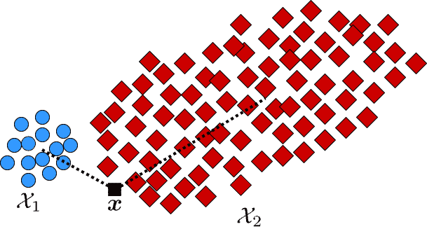
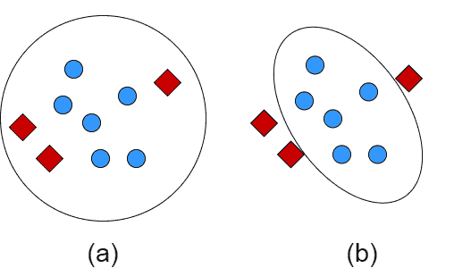
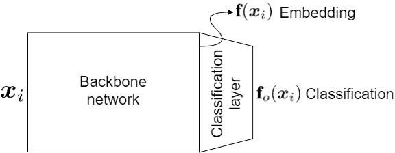
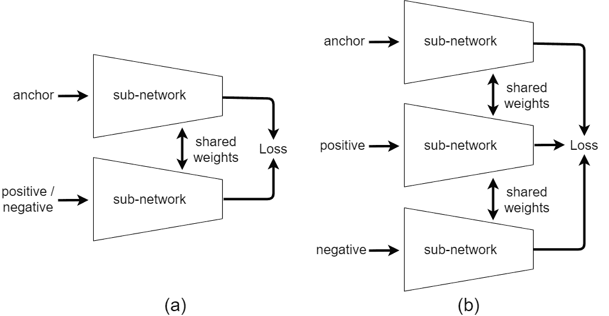
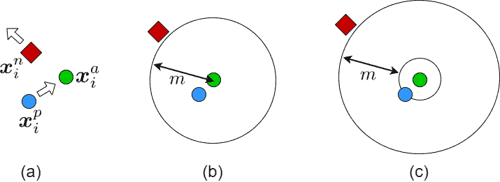

<!--yml

类别：未分类

日期：2024-09-06 19:48:17

-->

# [2201.09267] 《光谱、概率与深度度量学习：教程与调研》

> 来源：[`ar5iv.labs.arxiv.org/html/2201.09267`](https://ar5iv.labs.arxiv.org/html/2201.09267)

# 《光谱、概率与深度度量学习：教程与调研》

本雅明·戈霍吉 电气与计算机工程系，

滑铁卢大学机器学习实验室，加拿大安大略省滑铁卢市    阿里·戈赫西 统计与精算科学系 & 大卫·R·切里顿计算机科学学院，

滑铁卢大学数据分析实验室，加拿大安大略省滑铁卢市    法赫里·卡雷 电子与计算机工程系，

滑铁卢大学模式分析与机器智能中心，加拿大安大略省滑铁卢市    马克·克劳利 电气与计算机工程系，

滑铁卢大学机器学习实验室，加拿大安大略省滑铁卢市

###### 摘要

这是一篇关于度量学习的教程和调研论文。算法分为光谱、概率和深度度量学习。我们首先介绍距离度量、马哈拉诺比斯距离以及广义马哈拉诺比斯距离。在光谱方法中，我们从使用数据散布的方法开始，包括第一个光谱度量学习、与 Fisher 判别分析相关的方法、相关成分分析（RCA）、判别成分分析（DCA）和 Fisher-HSIC 方法。然后，我们讨论大间隔度量学习、不平衡度量学习、局部线性度量适应和对抗性度量学习。我们还解释了特征空间中的几种核光谱方法。我们还介绍了在黎曼流形上的几何度量学习方法。在概率方法中，我们从输入和特征空间中的类别收缩开始，然后解释邻域成分分析方法、贝叶斯度量学习、信息论方法以及度量学习中的经验风险最小化。在深度学习方法中，我们首先介绍了重建自编码器和用于度量学习的监督损失函数。然后，解释了 Siamese 网络及其各种损失函数、三元组挖掘和三元组采样。基于 Fisher 判别分析的深度判别分析方法也被回顾。最后，我们介绍了多模态深度度量学习、通过神经网络进行的几何度量学习以及少样本度量学习。

Tutorial\AddToShipoutPictureBG

*\AtPageUpperLeft                                                                                              <svg version="1.1" width="595.68" height="12.3" overflow="visible"><g transform="translate(0,12.3) scale(1,-1)"><g  transform="translate(-297.84,-43.65)"><text x="0" y="0" transform="scale(1, -1)" fill="black">将作为即将出版的关于降维和流形学习的教科书的一部分出现。</text></g></g></svg>

## 1 引言

降维和流形学习用于从原始数据中提取特征。降维方法的一种是度量学习，它学习一个距离度量或嵌入空间，以区分不相似的点和接近相似的点。在监督式度量学习中，我们的目标是通过学习适当的度量来区分类别。降维方法可以分为谱方法、概率方法和深度方法（Ghojogh，2021）。谱方法具有几何方法，通常简化为广义特征值问题（Ghojogh 等，2019a）。概率方法基于概率分布。深度方法使用神经网络进行学习。在这些类别中存在多种度量学习方法。本文回顾并介绍了这些类别中最重要的度量学习算法。需要注意的是，关于度量学习还有一些其他的调查，如（Yang & Jin，2006；Yang，2007；Kulis，2013；Bellet 等，2013；Wang & Sun，2015；Suárez 等，2021）。特定于深度度量学习的调查是（Kaya & Bilge，2019）。有关度量学习的书籍是（Bellet 等，2015）。最后，一些度量学习的 Python 工具箱有（Suárez 等，2020；De Vazelhes 等，2020；Musgrave 等，2020）。本文其余部分组织如下。第二部分定义了距离度量和广义马哈拉诺比斯距离。第 3、4 和 5 节分别介绍和讨论谱方法、概率方法和深度方法的度量学习方法。最后，第六部分总结了本文。目录可在论文末尾找到。

## 读者所需背景

本文假设读者具备微积分、概率论、线性代数和优化基础知识。

## 2 广义马哈拉诺比斯距离度量

### 2.1 距离度量

###### 定义 1  （距离度量）。

设考虑一个度量空间 $\mathcal{X}$。距离度量是一个映射 $d:\mathcal{X}\times\mathcal{X}\rightarrow0,\infty)$，它满足以下属性：

+   •

    非负性：$d(\boldsymbol{x}_{i},\boldsymbol{x}_{j})\geq 0$

+   •

    恒等性：$d(\boldsymbol{x}_{i},\boldsymbol{x}_{j})=0\iff\boldsymbol{x}_{i}=\boldsymbol{x}_{j}$

+   •

    对称性：$d(\boldsymbol{x}_{i},\boldsymbol{x}_{j})=d(\boldsymbol{x}_{j},\boldsymbol{x}_{i})$

+   •

    三角不等式：$d(\boldsymbol{x}_{i},\boldsymbol{x}_{j})\leq d(\boldsymbol{x}_{i},\boldsymbol{x}_{k})+d(\boldsymbol{x}_{k},\boldsymbol{x}_{j})$

其中 $\boldsymbol{x}_{i},\boldsymbol{x}_{j},\boldsymbol{x}_{k}\in\mathcal{X}$。

一个距离度量的例子是欧几里得距离：

|  | $\displaystyle\&#124;\boldsymbol{x}_{i}-\boldsymbol{x}_{j}\&#124;_{2}:=\sqrt{(\boldsymbol{x}_{i}-\boldsymbol{x}_{j})^{\top}(\boldsymbol{x}_{i}-\boldsymbol{x}_{j})}.$ |  | (1) |
| --- | --- | --- | --- |

### 2.2 马氏距离

马氏距离是另一种距离度量，最初在（Mahalanobis, [1930）中提出。

###### 定义 2  （马氏距离（Mahalanobis, 1930））。

考虑一个 $d$-维度的度量空间 $\mathcal{X}$。假设数据中有两个点云或集合 $\mathcal{X}_{1}$ 和 $\mathcal{X}_{2}$，即 $\mathcal{X}_{1},\mathcal{X}_{2}\in\mathcal{X}$。每个集合中有一个点，即 $\boldsymbol{x}_{i}\in\mathcal{X}_{1}$ 和 $\boldsymbol{x}_{j}\in\mathcal{X}_{2}$。这两点之间的马氏距离为：

|  | $\displaystyle\&#124;\boldsymbol{x}_{i}-\boldsymbol{x}_{j}\&#124;_{\boldsymbol{\Sigma}}:=\sqrt{(\boldsymbol{x}_{i}-\boldsymbol{x}_{j})^{\top}\boldsymbol{\Sigma}^{-1}(\boldsymbol{x}_{i}-\boldsymbol{x}_{j})},$ |  | (2) |
| --- | --- | --- | --- |

其中 $\boldsymbol{\Sigma}\in\mathbb{R}^{d\times d}$ 是数据集合 $\mathcal{X}_{1}$ 和 $\mathcal{X}_{2}$ 的协方差矩阵。

如果点 $\boldsymbol{x}_{i}$ 和 $\boldsymbol{x}_{j}$ 分别是集合 $\mathcal{X}_{1}$ 和 $\mathcal{X}_{2}$ 的均值，作为这些集合的代表，那么这个马氏距离是度量这些集合距离的一个很好的方法（McLachlan, 1999）：

|  | $\displaystyle\&#124;\boldsymbol{\mu}_{1}-\boldsymbol{\mu}_{2}\&#124;_{\boldsymbol{\Sigma}}:=\sqrt{(\boldsymbol{\mu}_{1}-\boldsymbol{\mu}_{2})^{\top}\boldsymbol{\Sigma}^{-1}(\boldsymbol{\mu}_{1}-\boldsymbol{\mu}_{2})},$ |  | (3) |
| --- | --- | --- | --- |

其中 $\boldsymbol{\mu}_{1}$ 和 $\boldsymbol{\mu}_{2}$ 分别是集合 $\mathcal{X}_{1}$ 和 $\mathcal{X}_{2}$ 的均值。

令 $\mathcal{X}_{1}:=\{\boldsymbol{x}_{1,i}\}_{i=1}^{n_{1}}$ 和 $\mathcal{X}_{2}:=\{\boldsymbol{x}_{2,i}\}_{i=1}^{n_{2}}$。这两个集合的无偏样本协方差矩阵为：

|  | $\displaystyle\boldsymbol{\Sigma}_{1}:=\frac{1}{n_{1}-1}\sum_{i=1}^{n_{1}}(\boldsymbol{x}_{1,i}-\boldsymbol{\mu}_{1})(\boldsymbol{x}_{1,i}-\boldsymbol{\mu}_{1})^{\top},$ |  |
| --- | --- | --- |

以及 $\boldsymbol{\Sigma}_{2}$ 类似地。协方差矩阵 $\boldsymbol{\Sigma}$ 可以是一个无偏样本协方差矩阵（McLachlan, 1999）：

|  | $\displaystyle\boldsymbol{\Sigma}:=\frac{1}{n_{1}+n_{2}-2}\Big{(}(n_{1}-1)\boldsymbol{\Sigma}_{1}+(n_{2}-1)\boldsymbol{\Sigma}_{2}\Big{)}.$ |  |
| --- | --- | --- |

马哈拉诺比斯距离也可以定义为点 $\boldsymbol{x}$ 与一组点 $\mathcal{X}$ 之间的距离（De Maesschalck 等，2000）。设 $\boldsymbol{\mu}$ 和 $\boldsymbol{\Sigma}$ 为集合 $\mathcal{X}$ 的均值和（样本）协方差矩阵。点 $\boldsymbol{x}$ 与 $\mathcal{X}$ 的马哈拉诺比斯距离为：

|  | $\displaystyle\&#124;\boldsymbol{x}-\boldsymbol{\mu}\&#124;_{\boldsymbol{\Sigma}}:=\sqrt{(\boldsymbol{x}-\boldsymbol{\mu})^{\top}\boldsymbol{\Sigma}^{-1}(\boldsymbol{x}-\boldsymbol{\mu})}.$ |  | (4) |
| --- | --- | --- | --- |

图 1：欧几里得距离和马哈拉诺比斯距离的比较示例。

###### 备注 1（马哈拉诺比斯距离的合理性（De Maesschalck 等，2000））。

考虑图 1 中描绘的两组数据 $\mathcal{X}_{1}$ 和 $\mathcal{X}_{2}$。我们想计算点 $\boldsymbol{x}$ 与这两组数据的距离，以查看这个点更接近哪一组数据。欧几里得距离忽略了数据云的散布/方差，仅测量点与数据云均值之间的距离。因此，在这个示例中，它表示 $\boldsymbol{x}$ 属于 $\mathcal{X}_{1}$，因为它比 $\mathcal{X}_{2}$ 更接近 $\mathcal{X}_{1}$ 的均值。然而，马哈拉诺比斯距离考虑了数据云的方差，并表示 $\boldsymbol{x}$ 属于 $\mathcal{X}_{2}$，因为它比 $\mathcal{X}_{1}$ 更接近其散布。从视觉上看，人们也会认为 $\boldsymbol{x}$ 属于 $\mathcal{X}_{2}$；因此，马哈拉诺比斯距离通过考虑数据的方差，比欧几里得距离表现得更好。

### 2.3 广义马哈拉诺比斯距离

###### 定义 3（广义马哈拉诺比斯距离）。

在马哈拉诺比斯距离中，即公式 (2)，协方差矩阵 $\boldsymbol{\Sigma}$ 及其逆矩阵 $\boldsymbol{\Sigma}^{-1}$ 是正半定的。我们可以在平方马哈拉诺比斯距离中用一个正半定的权重矩阵 $\boldsymbol{W}\succeq\boldsymbol{0}$ 替代 $\boldsymbol{\Sigma}^{-1}$。我们将这种距离称为广义马哈拉诺比斯距离：

|  |  | $\displaystyle\&#124;\boldsymbol{x}_{i}-\boldsymbol{x}_{j}\&#124;_{\boldsymbol{W}}:=\sqrt{(\boldsymbol{x}_{i}-\boldsymbol{x}_{j})^{\top}\boldsymbol{W}(\boldsymbol{x}_{i}-\boldsymbol{x}_{j})}.$ |  | (5) |
| --- | --- | --- | --- | --- |
|  |  | $\displaystyle\therefore\,\,\,\,\&#124;\boldsymbol{x}_{i}-\boldsymbol{x}_{j}\&#124;_{\boldsymbol{W}}^{2}:=(\boldsymbol{x}_{i}-\boldsymbol{x}_{j})^{\top}\boldsymbol{W}(\boldsymbol{x}_{i}-\boldsymbol{x}_{j}).$ |  |

我们将广义马氏范数定义为：

|  | $\displaystyle\&#124;\boldsymbol{x}\&#124;_{\boldsymbol{W}}:=\sqrt{\boldsymbol{x}^{\top}\boldsymbol{W}\boldsymbol{x}}.$ |  | (6) |
| --- | --- | --- | --- |

###### 引理 1 （范数的三角不等式）。

设 $\|.\|$ 为一个范数。利用柯西-施瓦茨不等式，它满足三角不等式：

|  | $\displaystyle\&#124;\boldsymbol{x}_{i}+\boldsymbol{x}_{j}\&#124;\leq\&#124;\boldsymbol{x}_{i}\&#124;+\&#124;\boldsymbol{x}_{j}\&#124;.$ |  | (7) |
| --- | --- | --- | --- |

###### 证明。

|  | $\displaystyle\&#124;\boldsymbol{x}_{i}+\boldsymbol{x}_{j}\&#124;^{2}$ | $\displaystyle=(\boldsymbol{x}_{i}+\boldsymbol{x}_{j})^{\top}(\boldsymbol{x}_{i}+\boldsymbol{x}_{j})$ |  |
| --- | --- | --- | --- |
|  |  | $\displaystyle=\&#124;\boldsymbol{x}_{i}\&#124;^{2}+\&#124;\boldsymbol{x}_{j}\&#124;^{2}+2\boldsymbol{x}_{i}^{\top}\boldsymbol{x}_{j}$ |  |
|  |  | $\displaystyle\overset{(a)}{\leq}\&#124;\boldsymbol{x}_{i}\&#124;^{2}+\&#124;\boldsymbol{x}_{j}\&#124;^{2}+2\&#124;\boldsymbol{x}_{i}\&#124;\&#124;\boldsymbol{x}_{j}\&#124;$ |  |
|  |  | $\displaystyle=(\&#124;\boldsymbol{x}_{i}\&#124;+\&#124;\boldsymbol{x}_{j}\&#124;)^{2},$ |  |

其中 $(a)$ 是由于柯西-施瓦茨不等式，即 $\boldsymbol{x}_{i}^{\top}\boldsymbol{x}_{j}\leq\|\boldsymbol{x}_{i}\|\|\boldsymbol{x}_{j}\|$。对两边取平方根得 Eq. (7)。证毕。∎

###### 命题 1。

广义马氏距离是一个有效的距离度量。

###### 证明。

我们展示了定义 1 中的特性被满足：

+   •

    由于 $\boldsymbol{W}\succeq\boldsymbol{0}$，Eq. (5) 是非负的。

+   •

    恒等性：如果 $\|\boldsymbol{x}_{i}-\boldsymbol{x}_{j}\|_{\boldsymbol{W}}=0$，根据 Eq. (5), 我们有 $\boldsymbol{x}_{i}-\boldsymbol{x}_{j}=0\implies\boldsymbol{x}_{i}=\boldsymbol{x}_{j}$。如果 $\boldsymbol{x}_{i}=\boldsymbol{x}_{j}$，我们根据 Eq. (5) 也有 $\|\boldsymbol{x}_{i}-\boldsymbol{x}_{j}\|_{\boldsymbol{W}}=0$。

+   •

    对称性：

    $\|\boldsymbol{x}_{i}-\boldsymbol{x}_{j}\|_{\boldsymbol{W}}=\sqrt{(\boldsymbol{x}_{i}-\boldsymbol{x}_{j})^{\top}\boldsymbol{W}(\boldsymbol{x}_{i}-\boldsymbol{x}_{j})}=\sqrt{(\boldsymbol{x}_{j}-\boldsymbol{x}_{i})^{\top}\boldsymbol{W}(\boldsymbol{x}_{j}-\boldsymbol{x}_{i})}=\|\boldsymbol{x}_{j}-\boldsymbol{x}_{i}\|_{\boldsymbol{W}}$。

+   •

    三角不等式：$\|\boldsymbol{x}_{i}-\boldsymbol{x}_{j}\|_{\boldsymbol{W}}=\|\boldsymbol{x}_{i}-\boldsymbol{x}_{k}+\boldsymbol{x}_{k}-\boldsymbol{x}_{j}\|_{\boldsymbol{W}}\overset{(\ref{equation_xi_xj_triangle_inequality})}{\leq}\|\boldsymbol{x}_{i}-\boldsymbol{x}_{k}\|_{\boldsymbol{W}}+\|\boldsymbol{x}_{k}-\boldsymbol{x}_{j}\|_{\boldsymbol{W}}$。

∎

###### 备注 2。

值得注意的是，要求 $\boldsymbol{W}\succeq\boldsymbol{0}$ 以使广义马氏距离是凸的并满足三角不等式。

###### 备注 3。

公式 (5. ‣ 2.3 Generalized Mahalanobis Distance ‣ 2 Generalized Mahalanobis Distance Metric ‣ Spectral, Probabilistic, and Deep Metric Learning: Tutorial and Survey")) 中的权重矩阵 $\boldsymbol{W}$ 权衡了维度，并确定了数据点维度之间的某些相关性。换句话说，它以一种考虑云散布的方式改变空间。

###### 备注 4。

欧几里得距离是马氏距离的一个特例，其中权重矩阵是单位矩阵，即 $\boldsymbol{W}=\boldsymbol{I}$（参见公式 (1) 和 (5. ‣ 2.3 Generalized Mahalanobis Distance ‣ 2 Generalized Mahalanobis Distance Metric ‣ Spectral, Probabilistic, and Deep Metric Learning: Tutorial and Survey"))）。换句话说，欧几里得距离不会改变计算距离的空间。

###### 命题 2（度量学习中的投影）。

考虑广义马氏距离中权重矩阵 $\boldsymbol{W}$ 的特征值分解，其中 $\boldsymbol{V}$ 和 $\boldsymbol{\Lambda}$ 分别是特征向量矩阵和权重的对角特征值矩阵。令 $\boldsymbol{U}:=\boldsymbol{V}\boldsymbol{\Lambda}^{(1/2)}$。广义马氏距离可以看作是应用线性投影到 $\boldsymbol{U}$ 的列空间后的欧几里得距离：

|  | $\displaystyle\|\boldsymbol{x}_{i}-\boldsymbol{x}_{j}\|_{\boldsymbol{W}}^{2}$ | $\displaystyle=(\boldsymbol{U}^{\top}\boldsymbol{x}_{i}-\boldsymbol{U}^{\top}\boldsymbol{x}_{j})^{\top}(\boldsymbol{U}^{\top}\boldsymbol{x}_{i}-\boldsymbol{U}^{\top}\boldsymbol{x}_{j})$ |  | (8) |
| --- | --- | --- | --- | --- |
|  |  | $\displaystyle=\|\boldsymbol{U}^{\top}\boldsymbol{x}_{i}-\boldsymbol{U}^{\top}\boldsymbol{x}_{j}\|_{2}^{2}.$ |  |

如果 $\boldsymbol{U}\in\mathbb{R}^{d\times p}$ 且 $p\leq d$，则投影矩阵 $\boldsymbol{U}$ 的列空间是一个 $p$ 维子空间。

###### 证明。

通过对 $\boldsymbol{W}$ 进行特征值分解，我们得到：

|  | $\displaystyle\boldsymbol{W}=\boldsymbol{V}\boldsymbol{\Lambda}\boldsymbol{V}^{\top}\overset{(a)}{=}\boldsymbol{V}\boldsymbol{\Lambda}^{(1/2)}\boldsymbol{\Lambda}^{(1/2)}\boldsymbol{V}^{\top}\overset{(b)}{=}\boldsymbol{U}\boldsymbol{U}^{\top},$ |  | (9) |
| --- | --- | --- | --- |

其中 $(a)$ 是因为 $\boldsymbol{W}$ 是半正定的，因此所有特征值都是非负的，并且可以写成其平方根的乘积。$(b)$ 是因为我们定义 $\boldsymbol{U}:=\boldsymbol{V}\boldsymbol{\Lambda}^{(1/2)}$。将方程 (9) 代入方程 (5) 得到：

|  | $\displaystyle\&#124;\boldsymbol{x}_{i}-\boldsymbol{x}_{j}\&#124;_{\boldsymbol{W}}^{2}$ | $\displaystyle=(\boldsymbol{x}_{i}-\boldsymbol{x}_{j})^{\top}\boldsymbol{U}\boldsymbol{U}^{\top}(\boldsymbol{x}_{i}-\boldsymbol{x}_{j})$ |  |
| --- | --- | --- | --- |
|  |  | $\displaystyle=(\boldsymbol{U}^{\top}\boldsymbol{x}_{i}-\boldsymbol{U}^{\top}\boldsymbol{x}_{j})^{\top}(\boldsymbol{U}^{\top}\boldsymbol{x}_{i}-\boldsymbol{U}^{\top}\boldsymbol{x}_{j})$ |  |
|  |  | $\displaystyle=\&#124;\boldsymbol{U}^{\top}\boldsymbol{x}_{i}-\boldsymbol{U}^{\top}\boldsymbol{x}_{j}\&#124;_{2}^{2}.$ |  |

证毕。值得注意的是，方程 (9) 也可以通过奇异值分解而不是特征值分解得到。在这种情况下，由于 $\boldsymbol{W}$ 的对称性，右奇异向量和左奇异向量的矩阵是相等的。∎

### 2.4 度量学习的主要思想

考虑一个 $d$ 维的数据集 $\{\boldsymbol{x}_{i}\}_{i=1}^{n}\subset\mathbb{R}^{d}$，大小为 $n$。假设某些数据点在某种意义上是相似的。例如，它们具有相似的模式或相同的特征。因此，我们有一组相似的点对，记作 $\mathcal{S}$。相对地，我们也可以有不同的点对，这些点对在模式或特征上有所不同。让不同点对的集合记作 $\mathcal{D}$。总结如下：

|  |  | $\displaystyle(\boldsymbol{x}_{i},\boldsymbol{x}_{j})\in\mathcal{S}\text{ 如果 }\boldsymbol{x}_{i}\text{ 和 }\boldsymbol{x}_{j}\text{ 是相似的},$ |  | (10) |
| --- | --- | --- | --- | --- |
|  |  | $\displaystyle(\boldsymbol{x}_{i},\boldsymbol{x}_{j})\in\mathcal{D}\text{ 如果 }\boldsymbol{x}_{i}\text{ 和 }\boldsymbol{x}_{j}\text{ 不相似}.$ |  |

相似性和不相似性的度量可以属于相同或不同的类别，如果数据集有类别标签的话。在这种情况下，我们有：

|  |  | $\displaystyle(\boldsymbol{x}_{i},\boldsymbol{x}_{j})\in\mathcal{S}\text{ 如果 }\boldsymbol{x}_{i}\text{ 和 }\boldsymbol{x}_{j}\text{ 属于同一类别},$ |  | (11) |
| --- | --- | --- | --- | --- |
|  |  | $\displaystyle(\boldsymbol{x}_{i},\boldsymbol{x}_{j})\in\mathcal{D}\text{ 如果 }\boldsymbol{x}_{i}\text{ 和 }\boldsymbol{x}_{j}\text{ 属于不同类别}.$ |  |

在度量学习中，我们学习权重矩阵，使得相似点之间的距离变小，而不相似点之间的距离变大。这样，相似点和不相似点的方差分别变小和变大。度量学习的二维可视化如图 2 所示。如果有类别标签，度量学习试图使得类内和类间的方差分别变小和变大。这与 Fisher 判别分析（FDA）的思想相同（Fisher，1936；Ghojogh 等，2019b）。

图 2：在二维中可视化度量学习：(a) 不能很好区分类别的欧几里得距离轮廓，以及 (b) 更好区分类别的欧几里得距离轮廓。

## 3 谱度量学习

### 3.1 使用散点的谱方法

#### 3.1.1 第一个谱方法

第一个度量学习方法是在(Xing 等，2002)中提出的。在此方法中，我们通过权重矩阵$\boldsymbol{W}$来最小化相似点的距离，其中该矩阵是半正定的：

|  |  | $\displaystyle\underset{\boldsymbol{W}}{\text{最小化}}$ |  | $\displaystyle\sum_{(\boldsymbol{x}_{i},\boldsymbol{x}_{j})\in\mathcal{S}}\&#124;\boldsymbol{x}_{i}-\boldsymbol{x}_{j}\&#124;_{\boldsymbol{W}}^{2}$ |  |
| --- | --- | --- | --- | --- | --- |
|  |  | 受制于 |  | $\displaystyle\boldsymbol{W}\succeq\boldsymbol{0}.$ |  |

然而，这个优化问题的解是平凡的，即$\boldsymbol{W}=\boldsymbol{0}$。因此，我们对不相似点添加了一个约束，使得距离大于某个正的量：

|  |  | $\displaystyle\underset{\boldsymbol{W}}{\text{最小化}}$ |  | $\displaystyle\sum_{(\boldsymbol{x}_{i},\boldsymbol{x}_{j})\in\mathcal{S}}\&#124;\boldsymbol{x}_{i}-\boldsymbol{x}_{j}\&#124;_{\boldsymbol{W}}^{2}$ |  | (12) |
| --- | --- | --- | --- | --- | --- | --- |
|  |  | 受制于 |  | $\displaystyle\sum_{(\boldsymbol{x}_{i},\boldsymbol{x}_{j})\in\mathcal{D}}\&#124;\boldsymbol{x}_{i}-\boldsymbol{x}_{j}\&#124;_{\boldsymbol{W}}\geq\alpha,$ |  |
|  |  | $\displaystyle\boldsymbol{W}\succeq\boldsymbol{0}.$ |  |

其中 $\alpha>0$ 是某个正数，例如 $\alpha=1$。

###### 引理 2  ((Xing 等人，2002)).

如果方程 (12) 中的约束被平方化，即 $\sum_{(\boldsymbol{x}_{i},\boldsymbol{x}_{j})\in\mathcal{D}}\|\boldsymbol{x}_{i}-\boldsymbol{x}_{j}\|_{\boldsymbol{W}}^{2}\geq\alpha$，则优化问题的解将具有秩 $1$。因此，我们在优化问题中使用了非平方约束。

###### 证明。

如果方程 (12) 中的约束被平方化，则问题等价于（参见 (Ghojogh 等人，2019b，附录 B) 的证明）：

|  |  | $\displaystyle\underset{\boldsymbol{W}}{\text{maximize}}$ |  | $\displaystyle\frac{\sum_{(\boldsymbol{x}_{i},\boldsymbol{x}_{j})\in\mathcal{D}}\&#124;\boldsymbol{x}_{i}-\boldsymbol{x}_{j}\&#124;_{\boldsymbol{W}}^{2}}{\sum_{(\boldsymbol{x}_{i},\boldsymbol{x}_{j})\in\mathcal{S}}\&#124;\boldsymbol{x}_{i}-\boldsymbol{x}_{j}\&#124;_{\boldsymbol{W}}^{2}},$ |  |
| --- | --- | --- | --- | --- | --- |

这是一个 Rayleigh-Ritz 商 (Ghojogh 等人，2019a)。我们可以重新陈述 $\|\boldsymbol{x}_{i}-\boldsymbol{x}_{j}\|_{\boldsymbol{W}}^{2}$ 为：

|  | $\displaystyle\sum_{(\boldsymbol{x}_{i},\boldsymbol{x}_{j})\in\mathcal{S}}\&#124;\boldsymbol{x}_{i}-\boldsymbol{x}_{j}\&#124;_{\boldsymbol{W}}^{2}=\textbf{tr}(\boldsymbol{W}\boldsymbol{\Sigma}_{\mathcal{S}}),$ |  | (13) |
| --- | --- | --- | --- |
|  | $\displaystyle\sum_{(\boldsymbol{x}_{i},\boldsymbol{x}_{j})\in\mathcal{D}}\&#124;\boldsymbol{x}_{i}-\boldsymbol{x}_{j}\&#124;_{\boldsymbol{W}}^{2}=\textbf{tr}(\boldsymbol{W}\boldsymbol{\Sigma}_{\mathcal{D}}),$ |  |

其中 $\textbf{tr}(.)$ 表示矩阵的迹，且：

|  | $\displaystyle\boldsymbol{\Sigma}_{\mathcal{S}}:=\sum_{(\boldsymbol{x}_{i},\boldsymbol{x}_{j})\in\mathcal{S}}(\boldsymbol{x}_{i}-\boldsymbol{x}_{j})(\boldsymbol{x}_{i}-\boldsymbol{x}_{j})^{\top},$ |  | (14) |
| --- | --- | --- | --- |
|  | $\displaystyle\boldsymbol{\Sigma}_{\mathcal{D}}:=\sum_{(\boldsymbol{x}_{i},\boldsymbol{x}_{j})\in\mathcal{D}}(\boldsymbol{x}_{i}-\boldsymbol{x}_{j})(\boldsymbol{x}_{i}-\boldsymbol{x}_{j})^{\top}.$ |  |

因此，我们有：

|  |  | $\displaystyle\frac{\sum_{(\boldsymbol{x}_{i},\boldsymbol{x}_{j})\in\mathcal{D}}\&#124;\boldsymbol{x}_{i}-\boldsymbol{x}_{j}\&#124;_{\boldsymbol{W}}^{2}}{\sum_{(\boldsymbol{x}_{i},\boldsymbol{x}_{j})\in\mathcal{S}}\&#124;\boldsymbol{x}_{i}-\boldsymbol{x}_{j}\&#124;_{\boldsymbol{W}}^{2}}=\frac{\textbf{tr}(\boldsymbol{W}\boldsymbol{\Sigma}_{\mathcal{D}})}{\textbf{tr}(\boldsymbol{W}\boldsymbol{\Sigma}_{\mathcal{S}})}\overset{(\ref{equation_W_U_UT})}{=}\frac{\textbf{tr}(\boldsymbol{U}\boldsymbol{U}^{\top}\boldsymbol{\Sigma}_{\mathcal{D}})}{\textbf{tr}(\boldsymbol{U}\boldsymbol{U}^{\top}\boldsymbol{\Sigma}_{\mathcal{S}})}$ |  |
| --- | --- | --- | --- |
|  |  | $\displaystyle\overset{(a)}{=}\frac{\textbf{tr}(\boldsymbol{U}^{\top}\boldsymbol{\Sigma}_{\mathcal{D}}\boldsymbol{U})}{\textbf{tr}(\boldsymbol{U}^{\top}\boldsymbol{\Sigma}_{\mathcal{S}}\boldsymbol{U})}=\frac{\sum_{i=1}^{d}\boldsymbol{u}^{\top}\boldsymbol{\Sigma}_{\mathcal{D}}\boldsymbol{u}}{\sum_{i=1}^{d}\boldsymbol{u}^{\top}\boldsymbol{\Sigma}_{\mathcal{S}}\boldsymbol{u}},$ |  |

其中 $(a)$ 是由于迹的循环特性，$(b)$ 是因为 $\boldsymbol{U}=[\boldsymbol{u}_{1},\dots,\boldsymbol{u}_{d}]$。最大化这个 Rayleigh-Ritz 商会得到以下广义特征值问题（Ghojogh 等，2019a）：

|  | $\displaystyle\boldsymbol{\Sigma}_{\mathcal{D}}\boldsymbol{u}_{1}=\lambda\boldsymbol{\Sigma}_{\mathcal{S}}\boldsymbol{u}_{1},$ |  |
| --- | --- | --- |

其中 $\boldsymbol{u}_{1}$ 是具有最大特征值的特征向量，其他特征向量 $\boldsymbol{u}_{2},\dots,\boldsymbol{u}_{d}$ 是零向量。证毕。 ∎

方程 (12) 可以重新表述为一个最大化问题：

|  |  | $\displaystyle\underset{\boldsymbol{W}}{\text{最大化}}$ |  | $\displaystyle\sum_{(\boldsymbol{x}_{i},\boldsymbol{x}_{j})\in\mathcal{D}}\&#124;\boldsymbol{x}_{i}-\boldsymbol{x}_{j}\&#124;_{\boldsymbol{W}}$ |  | (15) |
| --- | --- | --- | --- | --- | --- | --- |
|  |  | 满足 |  | $\displaystyle\sum_{(\boldsymbol{x}_{i},\boldsymbol{x}_{j})\in\mathcal{S}}\&#124;\boldsymbol{x}_{i}-\boldsymbol{x}_{j}\&#124;_{\boldsymbol{W}}^{2}\leq\alpha,$ |  |
|  |  | $\displaystyle\boldsymbol{W}\succeq\boldsymbol{0}.$ |  |

我们可以使用投影梯度方法（Ghojogh 等，2021c）来解决这个问题，其中梯度上升步骤后跟随投影到两个约束集合上：

|  | $\displaystyle\boldsymbol{W}:=\boldsymbol{W}+\eta\frac{\partial}{\partial\boldsymbol{W}}\Big{(}\sum_{(\boldsymbol{x}_{i},\boldsymbol{x}_{j})\in\mathcal{D}}\&#124;\boldsymbol{x}_{i}-\boldsymbol{x}_{j}\&#124;_{\boldsymbol{W}}\Big{)},$ |  |
| --- | --- | --- |
|  | $\displaystyle\boldsymbol{W}:=\arg\min_{\boldsymbol{Q}}\Big{(}\&#124;\boldsymbol{Q}-\boldsymbol{W}\&#124;_{F}^{2}\,\text{ 满足 }$ |  |
|  | $\displaystyle~{}~{}~{}~{}~{}~{}~{}~{}~{}~{}~{}~{}~{}~{}~{}~{}~{}~{}~{}~{}~{}~{}~{}~{}~{}~{}~{}\sum_{(\boldsymbol{x}_{i},\boldsymbol{x}_{j})\in\mathcal{S}} | \boldsymbol{x}_{i}-\boldsymbol{x}_{j} | _{\boldsymbol{Q}}^{2}\leq\alpha\Big{)},$ |  |
|  | $\displaystyle\boldsymbol{W}:=\boldsymbol{V}\,\textbf{diag}(\max(\lambda_{1},0),\dots,\max(\lambda_{d},0))\,\boldsymbol{V}^{\top},$ |  |

其中$\eta>0$是学习率，$\boldsymbol{V}$和$\boldsymbol{\Lambda}=\textbf{diag}(\lambda_{1},\dots,\lambda_{d})$分别是$\boldsymbol{W}$的特征向量和特征值（见方程 (9)）。

#### 3.1.2 表述为半正定规划

另一种度量学习方法是（Ghodsi et al., 2007），它最小化相似点之间的距离并最大化不相似点之间的距离。为此，我们最小化相似点之间的距离和不相似点之间距离的负值。权重矩阵应为正半定，以满足三角不等式和凸性。权重矩阵的迹也设置为常数，以消除平凡解$\boldsymbol{W}=\boldsymbol{0}$。优化问题是：

|  |  | $\displaystyle\underset{\boldsymbol{W}}{\text{minimize}}$ |  | $\displaystyle\frac{1}{ | \mathcal{S} | }\sum_{(\boldsymbol{x}_{i},\boldsymbol{x}_{j})\in\mathcal{S}} | \boldsymbol{x}_{i}-\boldsymbol{x}_{j} | _{\boldsymbol{W}}^{2}$ |  | (16) |
| --- | --- | --- | --- | --- | --- | --- | --- | --- | --- | --- |
|  |  | $\displaystyle-\frac{1}{ | \mathcal{D} | }\sum_{(\boldsymbol{x}_{i},\boldsymbol{x}_{j})\in\mathcal{D}} | \boldsymbol{x}_{i}-\boldsymbol{x}_{j} | _{\boldsymbol{W}}^{2}$ |  |
|  |  | 受制于 |  | $\displaystyle\boldsymbol{W}\succeq\boldsymbol{0},$ |  |
|  |  | $\displaystyle\textbf{tr}(\boldsymbol{W})=1,$ |  |

其中$|.|$表示集合的基数。

###### 引理 3  （Ghodsi et al., 2007）。

目标函数可以简化为：

|  |  | $\displaystyle\frac{1}{ | \mathcal{S} | }\sum_{(\boldsymbol{x}_{i},\boldsymbol{x}_{j})\in\mathcal{S}} | \boldsymbol{x}_{i}-\boldsymbol{x}_{j} | _{\boldsymbol{W}}^{2}-\frac{1}{ | \mathcal{D} | }\sum_{(\boldsymbol{x}_{i},\boldsymbol{x}_{j})\in\mathcal{D}} | \boldsymbol{x}_{i}-\boldsymbol{x}_{j} | _{\boldsymbol{W}}$ |  | (17) |
| --- | --- | --- | --- | --- | --- | --- | --- | --- | --- | --- | --- | --- |
|  |  | $\displaystyle~{}~{}=\textbf{vec}(\boldsymbol{W})^{\top}\Big{(}\frac{1}{ | \mathcal{S} | }\sum_{(\boldsymbol{x}_{i},\boldsymbol{x}_{j})\in\mathcal{S}}\textbf{vec}\big{(}(\boldsymbol{x}_{i}-\boldsymbol{x}_{j})(\boldsymbol{x}_{i}-\boldsymbol{x}_{j})^{\top}\big{)}$ |  |
|  |  | $\displaystyle~{}~{}~{}~{}~{}~{}~{}~{}~{}~{}~{}~{}~{}~{}~{}-\frac{1}{&#124;\mathcal{D}&#124;}\sum_{(\boldsymbol{x}_{i},\boldsymbol{x}_{j})\in\mathcal{D}}\textbf{vec}\big{(}(\boldsymbol{x}_{i}-\boldsymbol{x}_{j})(\boldsymbol{x}_{i}-\boldsymbol{x}_{j})^{\top}\big{)}\Big{)},$ |  |

其中 $\textbf{vec}(.)$ 将矩阵向量化为一个向量 (Ghojogh 等， 2021c)。

###### 证明。

见 (Ghodsi 等， 2007, 第 2.1 节) 以获得证明。 ∎

根据引理 3). ‣ 3.1.2 形式化为半正定规划 ‣ 3.1 使用散点的谱方法 ‣ 3 谱度量学习 ‣ 谱方法、概率方法和深度度量学习：教程与调查")，公式 (16) 是一个半正定规划 (SDP) 问题。可以使用内点法 (Ghojogh 等， 2021c) 迭代求解。

#### 3.1.3 与 Fisher 判别分析相关

另一种度量学习方法是 (Alipanahi 等， 2008)，该方法有两种方法，下面将介绍。本文讨论了度量学习与 Fisher 判别分析 (Fisher, 1936; Ghojogh 等， 2019b) 的关系 (Alipanahi 等， 2008)。

– 方法 1: 由于 $\boldsymbol{W}\succeq\boldsymbol{0}$，权重矩阵可以如公式 (9) 中的分解，即 $\boldsymbol{W}=\boldsymbol{U}\boldsymbol{U}^{\top}$。因此，我们得到：

|  | $\displaystyle\&#124;\boldsymbol{x}_{i}-\boldsymbol{x}_{j}\&#124;_{\boldsymbol{W}}^{2}$ | $\displaystyle\overset{(\ref{equation_generalized_Mahalanobis_distance})}{=}(\boldsymbol{x}_{i}-\boldsymbol{x}_{j})^{\top}\boldsymbol{W}(\boldsymbol{x}_{i}-\boldsymbol{x}_{j})$ |  |
| --- | --- | --- | --- |
|  |  | $\displaystyle\overset{(a)}{=}\textbf{tr}\big{(}(\boldsymbol{x}_{i}-\boldsymbol{x}_{j})^{\top}\boldsymbol{W}(\boldsymbol{x}_{i}-\boldsymbol{x}_{j})\big{)}$ |  |
|  |  | $\displaystyle\overset{(\ref{equation_W_U_UT})}{=}\textbf{tr}\big{(}(\boldsymbol{x}_{i}-\boldsymbol{x}_{j})^{\top}\boldsymbol{U}\boldsymbol{U}^{\top}(\boldsymbol{x}_{i}-\boldsymbol{x}_{j})\big{)}$ |  |
|  |  | $\displaystyle\overset{(b)}{=}\textbf{tr}\big{(}\boldsymbol{U}^{\top}(\boldsymbol{x}_{i}-\boldsymbol{x}_{j})(\boldsymbol{x}_{i}-\boldsymbol{x}_{j})^{\top}\boldsymbol{U}\big{)},$ |  | (18) |

其中 $(a)$ 是因为一个标量等于其迹，$(b)$ 是因为迹的循环性质。我们可以将方程 (18) 代入方程 (16) 以得到一个优化问题：

|  |  | $\displaystyle\underset{\boldsymbol{U}}{\text{最小化}}$ |  | $\displaystyle\frac{1}{\|\mathcal{S}\|}\sum_{(\boldsymbol{x}_{i},\boldsymbol{x}_{j})\in\mathcal{S}}\textbf{tr}\big{(}\boldsymbol{U}^{\top}(\boldsymbol{x}_{i}-\boldsymbol{x}_{j})(\boldsymbol{x}_{i}-\boldsymbol{x}_{j})^{\top}\boldsymbol{U}\big{)}$ |  | (19) |
| --- | --- | --- | --- | --- | --- | --- |
|  |  | $\displaystyle\!\!\!\!\!\!\!-\frac{1}{\|\mathcal{D}\|}\sum_{(\boldsymbol{x}_{i},\boldsymbol{x}_{j})\in\mathcal{D}}\textbf{tr}\big{(}\boldsymbol{U}^{\top}(\boldsymbol{x}_{i}-\boldsymbol{x}_{j})(\boldsymbol{x}_{i}-\boldsymbol{x}_{j})^{\top}\boldsymbol{U}\big{)}$ |  |
|  |  | 受限于 |  | $\displaystyle\textbf{tr}(\boldsymbol{U}\boldsymbol{U}^{\top})=1,$ |  |

其目标变量是 $\boldsymbol{U}$。注意，由于分解 $\boldsymbol{W}=\boldsymbol{U}\boldsymbol{U}^{\top}$，约束条件 $\boldsymbol{W}\succeq\boldsymbol{0}$ 被隐式满足。我们定义：

|  |  | $\displaystyle\boldsymbol{\Sigma}^{\prime}_{\mathcal{S}}:=\frac{1}{\|\mathcal{S}\|}\sum_{(\boldsymbol{x}_{i},\boldsymbol{x}_{j})\in\mathcal{S}}(\boldsymbol{x}_{i}-\boldsymbol{x}_{j})(\boldsymbol{x}_{i}-\boldsymbol{x}_{j})^{\top}\overset{(\ref{equation_spectral_ML_first_method_trace_W_Sigma_S})}{=}\frac{1}{\|\mathcal{S}\|}\boldsymbol{\Sigma}_{\mathcal{S}},$ |  | (20) |
| --- | --- | --- | --- | --- |
|  |  | $\displaystyle\boldsymbol{\Sigma}^{\prime}_{\mathcal{D}}:=\frac{1}{\|\mathcal{D}\|}\sum_{(\boldsymbol{x}_{i},\boldsymbol{x}_{j})\in\mathcal{D}}(\boldsymbol{x}_{i}-\boldsymbol{x}_{j})(\boldsymbol{x}_{i}-\boldsymbol{x}_{j})^{\top}\overset{(\ref{equation_spectral_ML_first_method_trace_W_Sigma_S})}{=}\frac{1}{\|\mathcal{D}\|}\boldsymbol{\Sigma}_{\mathcal{D}}.$ |  |

因此，方程 (19) 可以重新表述为：

|  |  | $\displaystyle\underset{\boldsymbol{U}}{\text{最小化}}$ |  | $\displaystyle\textbf{tr}(\boldsymbol{U}^{\top}(\boldsymbol{\Sigma}^{\prime}_{\mathcal{S}}-\boldsymbol{\Sigma}^{\prime}_{\mathcal{D}})\boldsymbol{U})$ |  | (21) |
| --- | --- | --- | --- | --- | --- | --- |
|  |  | 受限于 |  | $\displaystyle\textbf{tr}(\boldsymbol{U}\boldsymbol{U}^{\top})=1,$ |  |

其拉格朗日函数是 (Ghojogh 等人，2021c)：

|  | $\displaystyle\mathcal{L}=\textbf{tr}(\boldsymbol{U}^{\top}(\boldsymbol{\Sigma}^{\prime}_{\mathcal{S}}-\boldsymbol{\Sigma}^{\prime}_{\mathcal{D}})\boldsymbol{U})-\lambda(\textbf{tr}(\boldsymbol{U}\boldsymbol{U}^{\top})-1).$ |  |
| --- | --- | --- |

对拉格朗日函数取导数并令其为零得到：

|  | $\displaystyle\frac{\partial\mathcal{L}}{\partial\boldsymbol{U}}=2(\boldsymbol{\Sigma}^{\prime}_{\mathcal{S}}-\boldsymbol{\Sigma}^{\prime}_{\mathcal{D}})\boldsymbol{U}-2\lambda\boldsymbol{U}\overset{\text{set}}{=}\boldsymbol{0}$ |  |
| --- | --- | --- |
|  | $\displaystyle\implies(\boldsymbol{\Sigma}^{\prime}_{\mathcal{S}}-\boldsymbol{\Sigma}^{\prime}_{\mathcal{D}})\boldsymbol{U}=\lambda\boldsymbol{U},$ |  | (22) |

这是 $(\boldsymbol{\Sigma}^{\prime}_{\mathcal{S}}-\boldsymbol{\Sigma}^{\prime}_{\mathcal{D}})$ 的特征值问题 (Ghojogh et al., 2019a)。因此，$\boldsymbol{U}$ 是 $(\boldsymbol{\Sigma}^{\prime}_{\mathcal{S}}-\boldsymbol{\Sigma}^{\prime}_{\mathcal{D}})$ 的特征向量，具有最小特征值，因为公式 (19) 是一个最小化问题。

– 方法 2：我们可以将公式 (21) 中的约束更改为具有正交投影矩阵，即 $\boldsymbol{U}^{\top}\boldsymbol{U}=\boldsymbol{I}$。而是，我们可以使投影矩阵通过矩阵 $\boldsymbol{\Sigma}^{\prime}_{\mathcal{S}}$ 的旋转是正交的，即 $\boldsymbol{U}^{\top}\boldsymbol{\Sigma}^{\prime}_{\mathcal{S}}\boldsymbol{U}=\boldsymbol{I}$。因此，优化问题变为：

|  |  | $\displaystyle\underset{\boldsymbol{U}}{\text{minimize}}$ |  | $\displaystyle\textbf{tr}(\boldsymbol{U}^{\top}(\boldsymbol{\Sigma}^{\prime}_{\mathcal{S}}-\boldsymbol{\Sigma}^{\prime}_{\mathcal{D}})\boldsymbol{U})$ |  | (23) |
| --- | --- | --- | --- | --- | --- | --- |
|  |  | 约束条件 |  | $\displaystyle\boldsymbol{U}^{\top}\boldsymbol{\Sigma}^{\prime}_{\mathcal{S}}\,\boldsymbol{U}=\boldsymbol{I},$ |  |

其拉格朗日函数为 (Ghojogh et al., 2021c)：

|  | $\displaystyle\mathcal{L}=\textbf{tr}(\boldsymbol{U}^{\top}(\boldsymbol{\Sigma}^{\prime}_{\mathcal{S}}-\boldsymbol{\Sigma}^{\prime}_{\mathcal{D}})\boldsymbol{U})-\textbf{tr}(\boldsymbol{\Lambda}^{\top}(\boldsymbol{U}^{\top}\boldsymbol{\Sigma}^{\prime}_{\mathcal{S}}\,\boldsymbol{U}-\boldsymbol{I})).$ |  |
| --- | --- | --- |
|  | $\displaystyle\frac{\partial\mathcal{L}}{\partial\boldsymbol{U}}=2(\boldsymbol{\Sigma}^{\prime}_{\mathcal{S}}-\boldsymbol{\Sigma}^{\prime}_{\mathcal{D}})\boldsymbol{U}-2\boldsymbol{\Sigma}^{\prime}_{\mathcal{S}}\,\boldsymbol{U}\boldsymbol{\Lambda}\overset{\text{set}}{=}\boldsymbol{0}$ |  |
|  | $\displaystyle\implies(\boldsymbol{\Sigma}^{\prime}_{\mathcal{S}}-\boldsymbol{\Sigma}^{\prime}_{\mathcal{D}})\boldsymbol{U}=\boldsymbol{\Sigma}^{\prime}_{\mathcal{S}}\,\boldsymbol{U}\boldsymbol{\Lambda},$ |  | (24) |

这是对 $(\boldsymbol{\Sigma}^{\prime}_{\mathcal{S}}-\boldsymbol{\Sigma}^{\prime}_{\mathcal{D}},\boldsymbol{\Sigma}^{\prime}_{\mathcal{S}})$ 的广义特征值问题（Ghojogh 等，2019a）。因此，$\boldsymbol{U}$ 是一个矩阵，其列是按特征值从小到大的特征向量。

优化问题类似于 Fisher 判别分析（FDA）的优化（Fisher，1936；Ghojogh 等，2019b），其中 $\boldsymbol{\Sigma}^{\prime}_{\mathcal{S}}$ 和 $\boldsymbol{\Sigma}^{\prime}_{\mathcal{D}}$ 被数据的类内和类间协方差矩阵替代。这显示了该方法与 FDA 的关系。这是有意义的，因为度量学习和 FDA 的最终目标相同，即分别减少和增加相似和不相似点的方差。

#### 3.1.4 相关组件分析（RCA）

假设 $n$ 个数据点可以被分成 $c$ 个簇，或称为块。如果类标签可用，那么类就是这些块。如果 $\mathcal{X}_{l}$ 表示第 $l$ 个簇的数据，$\boldsymbol{\mu}_{l}$ 是 $\mathcal{X}_{l}$ 的均值，那么簇内散布的总和为：

|  | $\displaystyle\mathbb{R}^{d\times d}\ni\boldsymbol{S}_{w}:=\frac{1}{n}\sum_{l=1}^{c}\sum_{\boldsymbol{x}_{i}\in\mathcal{X}_{l}}(\boldsymbol{x}_{i}-\boldsymbol{\mu}_{l})(\boldsymbol{x}_{i}-\boldsymbol{\mu}_{l})^{\top}.$ |  | (25) |
| --- | --- | --- | --- |

相关成分分析 (RCA) (Shental 等人，2002) 是一种度量学习方法。在此方法中，我们首先对数据应用主成分分析 (PCA) (Ghojogh & Crowley，2019)，利用数据的总散布。设 PCA 的投影矩阵为 $\boldsymbol{U}$。在 PCA 子空间上的投影后，类内散布的总和为 $\widehat{\boldsymbol{S}}_{w}:=\boldsymbol{U}^{\top}\boldsymbol{S}_{w}\boldsymbol{U}$，这是由于协方差的二次特性。RCA 使用 $\widehat{\boldsymbol{S}}_{w}$ 作为 Mahalanobis 距离中的协方差矩阵，即 Eq. (2). ‣ 2.2 Mahalanobis Distance ‣ 2 Generalized Mahalanobis Distance Metric ‣ Spectral, Probabilistic, and Deep Metric Learning: Tutorial and Survey")) 所示。根据 Eq. (8. ‣ 2.3 Generalized Mahalanobis Distance ‣ 2 Generalized Mahalanobis Distance Metric ‣ Spectral, Probabilistic, and Deep Metric Learning: Tutorial and Survey"))，RDA 的子空间通过 $\widehat{\boldsymbol{S}}_{w}^{-1}$ 的特征值（或奇异值）分解获得（见 Eq. (9)）。

#### 3.1.5 判别成分分析 (DCA)

判别成分分析 (DCA) (Hoi 等人，2006) 是另一种基于类散布的光谱度量学习方法。考虑 $c$ 个聚类、块集或数据类。类内散布如 Eq. (25 ‣ 3.1 Spectral Methods Using Scatters ‣ 3 Spectral Metric Learning ‣ Spectral, Probabilistic, and Deep Metric Learning: Tutorial and Survey")) 所示。类间散布为：

|  |  | $\displaystyle\mathbb{R}^{d\times d}\ni\boldsymbol{S}_{b}:=\frac{1}{n}\sum_{l=1}^{c}\sum_{j=1}^{c}(\boldsymbol{\mu}_{l}-\boldsymbol{\mu}_{j})(\boldsymbol{\mu}_{l}-\boldsymbol{\mu}_{j})^{\top},\text{ or }$ |  | (26) |
| --- | --- | --- | --- | --- |
|  |  | $\displaystyle\mathbb{R}^{d\times d}\ni\boldsymbol{S}_{b}:=\frac{1}{n}\sum_{l=1}^{c}(\boldsymbol{\mu}_{l}-\boldsymbol{\mu})(\boldsymbol{\mu}_{l}-\boldsymbol{\mu})^{\top},$ |  |

其中 $\boldsymbol{\mu}_{l}$ 是第 $l$ 类的均值，$\boldsymbol{\mu}$ 是数据的总均值。根据命题 2。 ‣ 2.3 广义马氏距离 ‣ 2 广义马氏距离度量 ‣ 谱、概率及深度度量学习：教程与调查")，度量学习可以被视为在投影矩阵 $\boldsymbol{U}$ 的列空间上投影后的欧氏距离，其中 $\boldsymbol{W}=\boldsymbol{U}\boldsymbol{U}^{\top}$。类似于 Fisher 判别分析（Fisher，1936；Ghojogh 等，2019b），DCA 在投影后最大化类间方差并最小化类内方差。因此，其优化为：

|  |  | $\displaystyle\underset{\boldsymbol{U}}{\text{最大化}}$ |  | $\displaystyle\frac{\textbf{tr}(\boldsymbol{U}^{\top}\boldsymbol{S}_{b}\boldsymbol{U})}{\textbf{tr}(\boldsymbol{U}^{\top}\boldsymbol{S}_{w}\boldsymbol{U})},$ |  | (27) |
| --- | --- | --- | --- | --- | --- | --- |

这是一种广义的 Rayleigh-Ritz 商。该优化问题的解 $\boldsymbol{U}$ 是广义特征值问题 $(\boldsymbol{S}_{b},\boldsymbol{S}_{w})$（Ghojogh 等，2019a）。根据方程 (9），我们可以将广义马氏距离的权重矩阵设置为 $\boldsymbol{W}=\boldsymbol{U}\boldsymbol{U}^{\top}$，其中 $\boldsymbol{U}$ 是特征向量矩阵。

#### 3.1.6 高维判别成分分析

另一种用于度量学习的谱方法是（Xiang 等，2008），该方法通过与方程 (27 ‣ 3.1 谱方法使用散布 ‣ 3 谱度量学习 ‣ 谱、概率及深度度量学习：教程与调查")) 相同的优化问题来最小化和最大化类内和类间方差，同时对投影矩阵的正交性施加额外约束，即 $\boldsymbol{U}^{\top}\boldsymbol{U}=\boldsymbol{I}$。这个问题可以通过对分母施加惩罚来重新表述：

|  |  | $\displaystyle\underset{\boldsymbol{U}}{\text{最大化}}$ |  | $\displaystyle\textbf{tr}(\boldsymbol{U}^{\top}(\boldsymbol{S}_{b}-\lambda\boldsymbol{S}_{w})\boldsymbol{U})$ |  | (28) |
| --- | --- | --- | --- | --- | --- | --- |
|  |  | 受限于 |  | $\displaystyle\boldsymbol{U}^{\top}\boldsymbol{U}=\boldsymbol{I},$ |  |

其中 $\lambda>0$ 是正则化参数。这个问题的解是 $\boldsymbol{S}_{b}-\lambda\boldsymbol{S}_{w}$ 的特征值问题。特征向量是 $\boldsymbol{U}$ 的列，广义马哈拉诺比斯的权重矩阵是通过公式 (9) 获得的。

如果数据的维度很大，那么计算$(\boldsymbol{S}_{b}-\lambda\boldsymbol{S}_{w})\in\mathbb{R}^{d\times d}$的特征向量是非常耗时的。根据（Xiang 等，2008，定理 3），优化问题（28）可以在$\boldsymbol{S}_{b}+\boldsymbol{S}_{w}$的零空间的正交补空间中解决，而不会丢失任何信息（见（Xiang 等，2008，附录 A）以获取证明）。因此，如果$d\gg 1$，我们如下找到$\boldsymbol{U}$。令$\boldsymbol{X}:=[\boldsymbol{x}_{1},\dots,\boldsymbol{x}_{n}]\in\mathbb{R}^{d\times n}$为数据矩阵。令$\boldsymbol{A}_{w}$和$\boldsymbol{A}_{b}$分别为集合$\mathcal{S}$和$\mathcal{D}$的邻接矩阵。例如，如果$(\boldsymbol{x}_{i},\boldsymbol{x}_{j})\in\mathcal{S}$，则$\boldsymbol{A}_{w}(i,j)=1$；否则，$\boldsymbol{A}_{w}(i,j)=0$。如果$\boldsymbol{L}_{w}$和$\boldsymbol{L}_{b}$分别是$\boldsymbol{A}_{w}$和$\boldsymbol{A}_{b}$的拉普拉斯矩阵，我们有$\boldsymbol{S}_{w}=0.5\boldsymbol{X}\boldsymbol{L}_{w}\boldsymbol{X}^{\top}$和$\boldsymbol{S}_{b}=0.5\boldsymbol{X}\boldsymbol{L}_{b}\boldsymbol{X}^{\top}$（见（Belkin & Niyogi，2002；Ghojogh 等，2021d）以获取证明）。我们有$\textbf{tr}(\boldsymbol{S}_{w}+\boldsymbol{S}_{b})=\textbf{tr}(\boldsymbol{X}(0.5\boldsymbol{L}_{w}+0.5\boldsymbol{L}_{b})\boldsymbol{X}^{\top})=\textbf{tr}(\boldsymbol{X}^{\top}\boldsymbol{X}(0.5\boldsymbol{L}_{w}+0.5\boldsymbol{L}_{b}))$，这是由于迹的循环性质。如果$\boldsymbol{L}:=\boldsymbol{X}^{\top}\boldsymbol{X}(0.5\boldsymbol{L}_{w}+0.5\boldsymbol{L}_{b})\in\mathbb{R}^{n\times n}$的秩为$r\leq n$，它有$r$个非零特征值，我们计算其对应的特征向量。我们将这些特征向量堆叠起来得到$\boldsymbol{V}\in\mathbb{R}^{d\times r}$。投影到$\boldsymbol{V}$的列空间后的类内方差和类间方差分别为$\boldsymbol{S}^{\prime}_{w}:=\boldsymbol{V}^{\top}\boldsymbol{S}_{w}\boldsymbol{V}$和$\boldsymbol{S}^{\prime}_{b}:=\boldsymbol{V}^{\top}\boldsymbol{S}_{b}\boldsymbol{V}$。然后，我们在方程（28）中使用$\boldsymbol{S}^{\prime}_{w}$和$\boldsymbol{S}^{\prime}_{b}$，并使用方程（9）得到广义马氏距离的权重矩阵。

#### 3.1.7 通过局部线性嵌入进行正则化

使用散度的谱度量学习方法可以被建模为最大化以下 Rayleigh–Ritz 商（Baghshah & Shouraki，2009）：

|  |  | $\displaystyle\underset{\boldsymbol{U}}{\text{最大化}}$ |  | $\displaystyle\frac{\sum_{(\boldsymbol{x}_{i},\boldsymbol{x}_{j})\in\mathcal{S}}\&#124;\boldsymbol{x}_{i}-\boldsymbol{x}_{j}\&#124;_{\boldsymbol{W}}}{\sum_{(\boldsymbol{x}_{i},\boldsymbol{x}_{j})\in\mathcal{D}}\&#124;\boldsymbol{x}_{i}-\boldsymbol{x}_{j}\&#124;_{\boldsymbol{W}}+\lambda\Omega(\boldsymbol{U})},$ |  | (29) |
| --- | --- | --- | --- | --- | --- | --- |
|  |  | 受制于 |  | $\displaystyle\boldsymbol{U}^{\top}\boldsymbol{U}=\boldsymbol{I},$ |  |

其中 $\boldsymbol{W}=\boldsymbol{U}\boldsymbol{U}^{\top}$（见方程（9）），$\lambda>0$ 是正则化参数，$\Omega(\boldsymbol{U})$ 是对投影矩阵 $\boldsymbol{U}$ 的惩罚或正则化项。该优化最大化和最小化相似点和不相似点的距离。根据第 3.1.3 节，方程（29）可以重述为：

|  |  | $\displaystyle\underset{\boldsymbol{U}}{\text{最大化}}$ |  | $\displaystyle\frac{\textbf{tr}(\boldsymbol{U}^{\top}\boldsymbol{S}_{b}\boldsymbol{U})}{\textbf{tr}(\boldsymbol{U}^{\top}\boldsymbol{S}_{w}\boldsymbol{U})+\lambda\Omega(\boldsymbol{U})},$ |  | (30) |
| --- | --- | --- | --- | --- | --- | --- |
|  |  | 受制于 |  | $\displaystyle\boldsymbol{U}^{\top}\boldsymbol{U}=\boldsymbol{I}.$ |  |

如在命题 2 中讨论的，度量学习可以被视为对一个子空间的投影。正则化项可以是通过其 $k$ 个最近邻（$k$NN）对每个投影点的线性重建，使用与投影前相同的重建权重（Baghshah & Shouraki，2009）。在输入空间中的线性重建权重可以像局部线性嵌入一样找到（Roweis & Saul，2000；Ghojogh et al.，2020a）。如果 $s_{ij}$ 表示在重建 $\boldsymbol{x}_{i}$ 时 $\boldsymbol{x}_{j}$ 的权重，并且 $\mathcal{N}(\boldsymbol{x}_{i})$ 是 $\boldsymbol{x}_{i}$ 的 $k$NN 集合，我们有：

|  | $\displaystyle\underset{s_{ij}}{\text{最小化}}$ | $\displaystyle\sum_{i=1}^{n}\Big{\&#124;}\boldsymbol{x}_{i}-\sum_{\boldsymbol{x}_{j}\in\mathcal{N}(\boldsymbol{x}_{i})}s_{ij}\boldsymbol{x}_{j}\Big{\&#124;}_{2}^{2},$ |  |
| --- | --- | --- | --- |
|  | 约束条件 | $\displaystyle\sum_{\boldsymbol{x}_{j}\in\mathcal{N}(\boldsymbol{x}_{i})}s_{ij}=1.$ |  |

该优化的解是 (Ghojogh et al., 2020a)：

|  | $\displaystyle s_{ij}^{*}=\frac{\boldsymbol{G}_{i}^{-1}\boldsymbol{1}}{\boldsymbol{1}^{\top}\boldsymbol{G}_{i}^{-1}\boldsymbol{1}},$ |  |
| --- | --- | --- |

其中 $\boldsymbol{G}_{i}:=(\boldsymbol{x}_{i}\boldsymbol{1}^{\top}-\boldsymbol{X}_{i})^{\top}(\boldsymbol{x}_{i}\boldsymbol{1}^{\top}-\boldsymbol{X}_{i})$，其中 $\boldsymbol{X}_{i}\in\mathbb{R}^{d\times k}$ 表示 $\boldsymbol{x}_{i}$ 的 $k$ 最近邻的堆叠。我们定义 $\boldsymbol{S}^{*}:=[s^{*}_{ij}]\in\mathbb{R}^{n\times n}$。正则化项可以使用与输入空间相同的重建权重在子空间中重建（Baghshah & Shouraki, 2009）：

|  | $\displaystyle\Omega(\boldsymbol{U})$ | $\displaystyle:=\sum_{i=1}^{n}\Big{\&#124;}\boldsymbol{U}^{\top}\boldsymbol{x}-\sum_{\boldsymbol{x}_{j}\in\mathcal{N}(\boldsymbol{x}_{i})}s^{*}_{ij}\boldsymbol{U}^{\top}\boldsymbol{x}_{j}\Big{\&#124;}_{2}^{2}$ |  |
| --- | --- | --- | --- |
|  |  | $\displaystyle=\textbf{tr}(\boldsymbol{U}^{\top}\boldsymbol{X}\boldsymbol{E}\boldsymbol{X}^{\top}\boldsymbol{U}),$ |  | (31) |

其中 $\boldsymbol{X}=[\boldsymbol{x}_{1},\dots,\boldsymbol{x}_{n}]\in\mathbb{R}^{d\times n}$ 和 $\mathbb{R}^{n\times n}\ni\boldsymbol{E}:=(\boldsymbol{I}-\boldsymbol{S}^{*})^{\top}(\boldsymbol{I}-\boldsymbol{S}^{*})$。将 Eq. (31) 代入 Eq. (30) 得到：

|  |  | $\displaystyle\underset{\boldsymbol{U}}{\text{最大化}}$ |  | $\displaystyle\frac{\textbf{tr}(\boldsymbol{U}^{\top}\boldsymbol{S}_{b}\boldsymbol{U})}{\textbf{tr}\big{(}\boldsymbol{U}^{\top}(\boldsymbol{S}_{w}+\lambda\boldsymbol{X}\boldsymbol{E}\boldsymbol{X}^{\top})\boldsymbol{U}\big{)}},$ |  | (32) |
| --- | --- | --- | --- | --- | --- | --- |
|  |  | 约束条件 |  | $\displaystyle\boldsymbol{U}^{\top}\boldsymbol{U}=\boldsymbol{I}.$ |  |

该优化问题的解是广义特征值问题 $(\boldsymbol{S}_{b},\boldsymbol{S}_{w}+\lambda\boldsymbol{X}\boldsymbol{E}\boldsymbol{X}^{\top})$，其中 $\boldsymbol{U}$ 的列是特征向量（Ghojogh et al., 2019a）。根据公式 (9），度量的权重矩阵是 $\boldsymbol{W}=\boldsymbol{U}\boldsymbol{U}^{\top}$。

#### 3.1.8 Fisher-HSIC 多视图度量学习（FISH-MML）

Fisher-HSIC 多视图度量学习（FISH-MML）（Zhang et al., 2018）是一种针对多视图数据的度量学习方法。在多视图数据中，每个数据点有不同类型的特征。例如，一个图像数据集，每张图像都有一个描述性标题，就是多视图的。设 $\boldsymbol{X}^{(r)}:=\{\boldsymbol{x}_{i}^{(r)}\}_{i=1}^{n}$ 为第 $r$ 种视图中的数据点特征，$c$ 为类别/簇的数量，$v$ 为视图的数量。根据命题 2，度量学习是通过 $\boldsymbol{U}$ 投影后的欧几里得距离。第 $r$ 种视图中的类间散布由 $\boldsymbol{S}_{b}^{(r)}$ 表示，并通过公式 (26) 计算。第 $r$ 种视图中的数据总散布由 $\boldsymbol{S}_{t}^{(r)}$ 表示，是该视图中数据的协方差。

受 Fisher 判别分析的启发（Fisher, 1936; Ghojogh et al., 2019b），我们最大化投影数据的类间方差，$\sum_{r=1}^{v}\textbf{tr}(\boldsymbol{U}^{\top}\boldsymbol{S}_{b}^{(r)}\boldsymbol{U})$，以在投影后区分类别。同时，受主成分分析的启发（Ghojogh & Crowley, 2019），我们最大化投影数据的总散布，$\sum_{r=1}^{v}\textbf{tr}(\boldsymbol{U}^{\top}\boldsymbol{S}_{t}^{(r)}\boldsymbol{U})$，以增加表达能力。此外，我们最大化所有视图中投影数据的依赖性，因为一个点的不同视图应该是相关的。两个随机变量 $X$ 和 $Y$ 之间的依赖度量是 Hilbert-Schmidt 独立性标准（HSIC）（Gretton et al., 2005），其经验估计为：

|  | $\displaystyle\text{HSIC}(X,Y)=\frac{1}{(n-1)^{2}}\textbf{tr}(\boldsymbol{K}_{x}\boldsymbol{H}\boldsymbol{K}_{y}\boldsymbol{H}),$ |  | (33) |
| --- | --- | --- | --- |

其中$\boldsymbol{K}_{x}$和$\boldsymbol{K}_{y}$分别是$X$和$Y$变量的核矩阵，而$\boldsymbol{H}:=\boldsymbol{I}-(1/n)\boldsymbol{1}\boldsymbol{1}^{\top}$是中心化矩阵。两个视角$\boldsymbol{X}^{(r)}$和$\boldsymbol{X}^{(w)}$的投影之间的 HSIC 为：

|  | $\displaystyle\text{HSIC}(\boldsymbol{U}^{\top}\boldsymbol{X}^{(r)},\boldsymbol{U}^{\top}\boldsymbol{X}^{(w)})\overset{(\ref{equation_HSIC})}{\propto}\textbf{tr}(\boldsymbol{K}^{(r)}\boldsymbol{H}\boldsymbol{K}^{(w)}\boldsymbol{H})$ |  |
| --- | --- | --- |
|  | $\displaystyle\overset{(a)}{=}\textbf{tr}(\boldsymbol{X}^{(r)\top}\boldsymbol{U}\boldsymbol{U}^{\top}\boldsymbol{X}^{(r)}\boldsymbol{H}\boldsymbol{K}^{(w)}\boldsymbol{H})$ |  |
|  | $\displaystyle\overset{(b)}{=}\textbf{tr}(\boldsymbol{U}^{\top}\boldsymbol{X}^{(r)}\boldsymbol{H}\boldsymbol{K}^{(w)}\boldsymbol{H}\boldsymbol{X}^{(r)\top}\boldsymbol{U})$ |  |

其中$(a)$是因为我们对$\boldsymbol{U}^{\top}\boldsymbol{X}^{(r)}$使用线性核，即$\boldsymbol{K}^{(r)}:=(\boldsymbol{U}^{\top}\boldsymbol{X}^{(r)})^{\top}\boldsymbol{U}^{\top}\boldsymbol{X}^{(r)}$，而$(b)$是由于迹的循环性质。

总结来说，我们最大化类间散布、总散布和视角依赖的总和，其为：

|  | $\displaystyle\sum_{r=1}^{v}\big{(}\textbf{tr}(\boldsymbol{U}^{\top}\boldsymbol{S}_{b}^{(r)}\boldsymbol{U})+\lambda_{1}\textbf{tr}(\boldsymbol{U}^{\top}\boldsymbol{S}_{t}^{(r)}\boldsymbol{U})$ |  |
| --- | --- | --- |
|  | $\displaystyle~{}~{}~{}~{}~{}~{}~{}~{}+\lambda_{2}\textbf{tr}(\boldsymbol{U}^{\top}\boldsymbol{X}^{(r)}\boldsymbol{H}\boldsymbol{K}^{(w)}\boldsymbol{H}\boldsymbol{X}^{(r)\top}\boldsymbol{U})\big{)}$ |  |
|  | $\displaystyle=\sum_{r=1}^{v}\textbf{tr}\big{(}\boldsymbol{U}^{\top}(\boldsymbol{S}_{b}^{(r)}+\lambda_{1}\boldsymbol{S}_{t}^{(r)}$ |  |
|  | $\displaystyle~{}~{}~{}~{}~{}~{}~{}~{}+\lambda_{2}\boldsymbol{X}^{(r)}\boldsymbol{H}\boldsymbol{K}^{(w)}\boldsymbol{H}\boldsymbol{X}^{(r)\top})\boldsymbol{U}\big{)},$ |  |

其中$\lambda_{1},\lambda_{2}>0$是正则化参数。优化问题为：

|  |  | $\displaystyle\underset{\boldsymbol{U}}{\text{maximize}}$ |  | $\displaystyle\sum_{r=1}^{v}\textbf{tr}\big{(}\boldsymbol{U}^{\top}(\boldsymbol{S}_{b}^{(r)}+\lambda_{1}\boldsymbol{S}_{t}^{(r)}$ |  | (34) |
| --- | --- | --- | --- | --- | --- | --- |
|  |  | $\displaystyle~{}~{}~{}~{}~{}~{}+\lambda_{2}\boldsymbol{X}^{(r)}\boldsymbol{H}\boldsymbol{K}^{(w)}\boldsymbol{H}\boldsymbol{X}^{(r)\top})\boldsymbol{U}\big{)}$ |  |
|  |  | 受限于 |  | $\displaystyle\boldsymbol{U}^{\top}\boldsymbol{U}=\boldsymbol{I},$ |  |

其解为特征值问题，涉及$\boldsymbol{S}_{b}^{(r)}+\lambda_{1}\boldsymbol{S}_{t}^{(r)}+\lambda_{2}\boldsymbol{X}^{(r)}\boldsymbol{H}\boldsymbol{K}^{(w)}\boldsymbol{H}\boldsymbol{X}^{(r)\top}$，其中$\boldsymbol{U}$的列为特征向量（Ghojogh et al., 2019a）。

### 3.2 使用铰链损失的谱方法

#### 3.2.1 大间隔度量学习

$k$-最近邻 ($k$NN) 分类受用于测量点间距离的度量的影响很大。因此，我们可以使用度量学习来提高 $k$NN 分类的性能（Weinberger et al., 2006; Weinberger & Saul, 2009）。设 $y_{ij}=1$ 如果 $(\boldsymbol{x}_{i},\boldsymbol{x}_{j})\in\mathcal{S}$，且 $y_{ij}=0$ 如果 $(\boldsymbol{x}_{i},\boldsymbol{x}_{j})\in\mathcal{D}$。此外，我们考虑对类似点的 $k$NN，其中我们找到每个点在类似点中的最近邻。设 $\eta_{ij}=1$ 如果 $(\boldsymbol{x}_{i},\boldsymbol{x}_{j})\in\mathcal{S}$ 且 $\boldsymbol{x}_{j}$ 在 $\boldsymbol{x}_{i}$ 的 $k$NN 中。否则，$\eta_{ij}=0$。在度量中寻找最佳权重矩阵的优化问题可以是（Weinberger et al., 2006; Weinberger & Saul, 2009）：

|  |  | $\displaystyle\underset{\boldsymbol{W}}{\text{最小化}}$ |  | $\displaystyle\sum_{i=1}^{n}\sum_{j=1}^{n}\eta_{ij}\&#124;\boldsymbol{x}_{i}-\boldsymbol{x}_{j}\&#124;_{\boldsymbol{W}}^{2}$ |  | (35) |
| --- | --- | --- | --- | --- | --- | --- |
|  |  | $\displaystyle+\lambda\sum_{i=1}^{n}\sum_{j=1}^{n}\sum_{l=1}^{n}\eta_{ij}(1-y_{il})\Big{[}1$ |  |
|  |  | $\displaystyle~{}~{}~{}~{}~{}~{}~{}~{}~{}~{}~{}+\&#124;\boldsymbol{x}_{i}-\boldsymbol{x}_{j}\&#124;_{\boldsymbol{W}}^{2}-\&#124;\boldsymbol{x}_{i}-\boldsymbol{x}_{l}\&#124;_{\boldsymbol{W}}^{2}\Big{]}_{+},$ |  |
|  |  | 受限于 |  | $\displaystyle\boldsymbol{W}\succeq\boldsymbol{0},$ |  |

其中 $\lambda>0$ 是正则化参数，$[.]_{+}:=\max(.,0)$ 是标准的 Hinge 损失。

方程 (35) 中的第一项将相似的邻居彼此拉近。此方程中的第二项是三元组损失（Schroff 等，2015），它将相似的邻居拉近，同时将不相似的点拉远。这是因为最小化 $\|\boldsymbol{x}_{i}-\boldsymbol{x}_{j}\|_{\boldsymbol{W}}^{2}$ 对于 $\eta_{ij}=1$ 会减少相似邻居的距离。此外，最小化 $-\|\boldsymbol{x}_{i}-\boldsymbol{x}_{l}\|_{\boldsymbol{W}}^{2}$ 对于 $1-y_{il}=1$（即 $y_{il}=0$）等同于最大化 $\|\boldsymbol{x}_{i}-\boldsymbol{x}_{l}\|_{\boldsymbol{W}}^{2}$，这会最大化不相似点的距离。最小化整个第二项会迫使不相似点的距离至少大于相似点的距离，直至一个阈值（或边距）为 1。我们可以通过将该项中的 1 更改为其他正数来改变边距。在这个意义上，这种损失与神经网络的三元组损失（Schroff 等，2015）（参见 5.3.5）密切相关。

方程 (35) 可以使用松弛变量 $\xi_{ijl},\forall i,j,l\in\{1,\dots,n\}$ 进行重述。铰链损失项 $[1+\|\boldsymbol{x}_{i}-\boldsymbol{x}_{j}\|_{\boldsymbol{W}}^{2}-\|\boldsymbol{x}_{i}-\boldsymbol{x}_{l}\|_{\boldsymbol{W}}^{2}]_{+}$ 需要满足：

|  | $\displaystyle 1+\&#124;\boldsymbol{x}_{i}-\boldsymbol{x}_{j}\&#124;_{\boldsymbol{W}}^{2}-\&#124;\boldsymbol{x}_{i}-\boldsymbol{x}_{l}\&#124;_{\boldsymbol{W}}^{2}\geq 0$ |  |
| --- | --- | --- |
|  | $\displaystyle\implies\&#124;\boldsymbol{x}_{i}-\boldsymbol{x}_{l}\&#124;_{\boldsymbol{W}}^{2}-\&#124;\boldsymbol{x}_{i}-\boldsymbol{x}_{j}\&#124;_{\boldsymbol{W}}^{2}\leq 1.$ |  |

如果 $\xi_{ijl}\geq 0$，我们可以将 $\|\boldsymbol{x}_{i}-\boldsymbol{x}_{l}\|_{\boldsymbol{W}}^{2}-\|\boldsymbol{x}_{i}-\boldsymbol{x}_{j}\|_{\boldsymbol{W}}^{2}$ 夹在中间以进行最小化：

|  | $\displaystyle 1-\xi_{ijl}\leq\&#124;\boldsymbol{x}_{i}-\boldsymbol{x}_{l}\&#124;_{\boldsymbol{W}}^{2}-\&#124;\boldsymbol{x}_{i}-\boldsymbol{x}_{j}\&#124;_{\boldsymbol{W}}^{2}\leq 1.$ |  |
| --- | --- | --- |

因此，我们可以用松弛变量替换 Hinge 损失项。因此，方程 (35) 可以重述为（Weinberger 等人，2006；Weinberger & Saul，2009）：

|  |  | $\displaystyle\underset{\boldsymbol{W},\,\{\xi_{ijl}\}}{\text{minimize}}$ |  | $\displaystyle\sum_{i=1}^{n}\sum_{j=1}^{n}\eta_{ij}\&#124;\boldsymbol{x}_{i}-\boldsymbol{x}_{j}\&#124;_{\boldsymbol{W}}^{2}$ |  | (36) |
| --- | --- | --- | --- | --- | --- | --- |
|  |  | $\displaystyle+\lambda\sum_{i=1}^{n}\sum_{j=1}^{n}\sum_{l=1}^{n}\eta_{ij}(1-y_{il})\,\xi_{ijl}$ |  |
|  |  | subject to |  | $\displaystyle\&#124;\boldsymbol{x}_{i}-\boldsymbol{x}_{l}\&#124;_{\boldsymbol{W}}^{2}-\&#124;\boldsymbol{x}_{i}-\boldsymbol{x}_{j}\&#124;_{\boldsymbol{W}}^{2}\geq 1-\xi_{ijl},$ |  |
|  |  | $\displaystyle~{}~{}~{}~{}~{}~{}~{}~{}~{}\forall(\boldsymbol{x}_{i},\boldsymbol{x}_{j})\in\mathcal{S},\eta_{ij}=1,(\boldsymbol{x}_{i},\boldsymbol{x}_{l})\in\mathcal{D},$ |  |
|  |  | $\displaystyle\xi_{ijl}\geq 0,$ |  |
|  |  | $\displaystyle\boldsymbol{W}\succeq\boldsymbol{0}.$ |  |

这个优化问题是一个半正定规划问题，可以使用内点法（Ghojogh 等人，2021c）迭代求解。

这个问题使用了相似和不相似点的三元组，即 $\{\boldsymbol{x}_{i},\boldsymbol{x}_{j},\boldsymbol{x}_{l}\}$，其中 $(\boldsymbol{x}_{i},\boldsymbol{x}_{j})\in\mathcal{S}$，$\eta_{ij}=1$，$(\boldsymbol{x}_{i},\boldsymbol{x}_{l})\in\mathcal{D}$。因此，三元组应从数据集中随机提取以进行此度量学习。解决半正定规划通常较慢且耗时，特别是对于大型数据集。可以使用三元组最小化来寻找最佳三元组进行学习（Poorheravi 等人，2020）。例如，可以使用具有最小和/或最大距离的相似和不相似点来限制三元组的数量（Sikaroudi 等人，2020a）。读者还可以参考大边距度量学习中的 Lipschitz 分析（Dong，2019）。

#### 3.2.2 不平衡度量学习（IML）

不平衡度量学习（IML）（Gautheron 等人，2019）是一种光谱度量学习方法，它通过进一步分解相似集 $\mathcal{S}$ 和不相似集 $\mathcal{D}$ 来处理不平衡类。假设数据集由两个类别 $c_{0}$ 和 $c_{1}$ 组成。令 $\mathcal{S}_{0}$ 和 $\mathcal{S}_{1}$ 分别表示类别 $c_{0}$ 和 $c_{1}$ 的相似性集合。我们定义从这些集合中随机选取的点对具有相似性和不相似性集合（Gautheron 等人，2019）：

|  | $\displaystyle\text{Sim}_{0}\subseteq\mathcal{S}_{0}\times\mathcal{S}_{0},\quad\text{Sim}_{1}\subseteq\mathcal{S}_{1}\times\mathcal{S}_{1},$ |  |
| --- | --- | --- |
|  | $\displaystyle\text{Dis}_{0}\subseteq\mathcal{S}_{0}\times\mathcal{S}_{1},\quad\text{Dis}_{1}\subseteq\mathcal{S}_{1}\times\mathcal{S}_{0}.$ |  |

IML 的优化问题是：

|  | $\displaystyle\underset{\boldsymbol{W}}{\text{minimize}}~{}~{}~{}~{}~{}~{}\frac{\lambda}{4\|\text{Sim}_{0}\|}\sum_{(\boldsymbol{x}_{i},\boldsymbol{x}_{j})\in\text{Sim}_{0}}\big{[}\|\boldsymbol{x}_{i}-\boldsymbol{x}_{j}\|_{\boldsymbol{W}}^{2}-1\big{]}_{+}$ |  |
| --- | --- | --- |
|  | $\displaystyle~{}~{}~{}~{}~{}~{}~{}~{}~{}+\frac{\lambda}{4\|\text{Sim}_{1}\|}\sum_{(\boldsymbol{x}_{i},\boldsymbol{x}_{j})\in\text{Sim}_{1}}\big{[}\|\boldsymbol{x}_{i}-\boldsymbol{x}_{j}\|_{\boldsymbol{W}}^{2}-1\big{]}_{+}$ |  |
|  | $\displaystyle~{}~{}~{}~{}~{}~{}~{}~{}~{}+\frac{1-\lambda}{4\|\text{Dis}_{0}\|}\sum_{(\boldsymbol{x}_{i},\boldsymbol{x}_{j})\in\text{Dis}_{0}}\big{[}\!-\|\boldsymbol{x}_{i}-\boldsymbol{x}_{j}\|_{\boldsymbol{W}}^{2}+1+m\big{]}_{+}$ |  |
|  | $\displaystyle~{}~{}~{}~{}~{}~{}~{}~{}~{}+\frac{1-\lambda}{4\|\text{Dis}_{1}\|}\sum_{(\boldsymbol{x}_{i},\boldsymbol{x}_{j})\in\text{Dis}_{1}}\big{[}\!-\|\boldsymbol{x}_{i}-\boldsymbol{x}_{j}\|_{\boldsymbol{W}}^{2}+1+m\big{]}_{+}$ |  |
|  | $\displaystyle~{}~{}~{}~{}~{}~{}~{}~{}~{}+\gamma\|\boldsymbol{W}-\boldsymbol{I}\|_{F}^{2}$ |  |
|  | $\displaystyle\text{subject to}~{}~{}~{}~{}\boldsymbol{W}\succeq\boldsymbol{0},$ |  | (37) |

其中 $|.|$ 表示集合的基数，$[.]_{+}:=\max(.,0)$ 是标准的 Hinge 损失，$m>0$ 是期望的类别间边界，$\lambda\in[0,1]$ 和 $\gamma>0$ 是正则化参数。该优化目标将相似的点拉近到小于 $1$ 的距离，并将不相似的点推远到大于 $m+1$ 的距离。此外，正则化项 $\|\boldsymbol{W}-\boldsymbol{I}\|_{F}^{2}$ 试图使权重矩阵使广义马氏距离接近单位矩阵，以简化度量。通过这种方式，度量变得接近欧几里得距离，从而防止过拟合，同时满足期望的距离边界。

### 3.3 局部线性度量适应（LLMA）

另一种度量学习方法是局部线性度量适应（LLMA）（Chang & Yeung, 2004）。LLMA 分别在全局和局部执行非线性和线性变换。对于每个点 $\boldsymbol{x}_{l}$，我们考虑其 $k$ 个最近的（相似的）邻居。每个点 $\boldsymbol{x}_{l}$ 的局部线性变换为：

|  | $\displaystyle\mathbb{R}^{d}\ni\boldsymbol{y}_{l}:=\boldsymbol{x}_{l}+\boldsymbol{B}\boldsymbol{\pi}_{i},$ |  | (38) |
| --- | --- | --- | --- |

其中 $\boldsymbol{B}\in\mathbb{R}^{d\times k}$ 是偏置矩阵，$\mathbb{R}^{k}\ni\boldsymbol{\pi}_{i}=[\pi_{i1},\dots,\pi_{ik}]^{\top}$，而 $\pi_{ij}:=\exp(-\|\boldsymbol{x}_{i}-\boldsymbol{x}_{j}\|_{2}^{2}/2w^{2})$ 是 $\boldsymbol{x}_{i}$ 和 $\boldsymbol{x}_{j}$ 之间相似性的高斯度量。变量 $\boldsymbol{B}$ 和 $w$ 通过优化得到。

在此方法中，我们最小化线性变换后的相似点之间的距离，同时尽量保持相似点在变换后的距离：

|  |  | $\displaystyle\underset{\{\boldsymbol{y}_{i}\}_{i=1}^{n},\boldsymbol{B},w,\sigma}{\text{minimize}}$ |  | $\displaystyle\sum_{(\boldsymbol{y}_{i},\boldsymbol{y}_{j})\in\mathcal{S}}\&#124;\boldsymbol{y}_{i}-\boldsymbol{y}_{j}\&#124;_{2}^{2}$ |  | (39) |
| --- | --- | --- | --- | --- | --- | --- |
|  |  | $\displaystyle+\lambda\,\sum_{i=1}^{n}\sum_{j=1}^{n}(q_{ij}-d_{ij})^{2}\exp(\frac{-d_{ij}^{2}}{\sigma^{2}}),$ |  |

其中 $\lambda>0$ 是正则化参数，$\sigma_{2}^{2}$ 是待优化的方差，$d_{ij}:=\|\boldsymbol{x}_{i}-\boldsymbol{x}_{j}\|_{2}$ 和 $q_{ij}:=\|\boldsymbol{y}_{i}-\boldsymbol{y}_{j}\|_{2}$。这个目标函数通过迭代优化，直到收敛。

### 3.4 与支持向量机相关

受到 $\nu$-支持向量机 ($\nu$-SVM) (Schölkopf et al., 2000) 的启发，广义马氏距离中的权重矩阵可以通过 (Tsang et al., 2003) 获得：

|  |  | $\displaystyle\underset{\boldsymbol{W},\gamma,\{\xi_{il}\}}{\text{minimize}}$ |  | $\displaystyle\frac{1}{2}\&#124;\boldsymbol{W}\&#124;_{2}^{2}+\frac{\lambda_{1}}{&#124;\mathcal{S}&#124;}\sum_{(\boldsymbol{x}_{i},\boldsymbol{x}_{j})\in\mathcal{S}}\&#124;\boldsymbol{x}_{i}-\boldsymbol{x}_{j}\&#124;_{\boldsymbol{W}}^{2}$ |  | (40) |
| --- | --- | --- | --- | --- | --- | --- |
|  |  | $\displaystyle+\lambda_{2}\Big{(}\nu\gamma+\frac{1}{&#124;\mathcal{D}&#124;}\sum_{(\boldsymbol{x}_{i},\boldsymbol{x}_{l})\in\mathcal{D}}\xi_{il}\Big{)}$ |  |
|  |  | 受限于 |  | $\displaystyle\boldsymbol{W}\succeq\boldsymbol{0},$ |  |
|  |  | $\displaystyle\gamma\geq 0,$ |  |
|  |  | $\displaystyle\&#124;\boldsymbol{x}_{i}-\boldsymbol{x}_{j}\&#124;_{\boldsymbol{W}}^{2}-\&#124;\boldsymbol{x}_{i}-\boldsymbol{x}_{l}\&#124;_{\boldsymbol{W}}^{2}\geq\gamma-\xi_{il},$ |  |
|  |  | $\displaystyle~{}~{}~{}~{}~{}~{}~{}~{}~{}~{}~{}~{}~{}~{}~{}~{}~{}~{}\forall(\boldsymbol{x}_{i},\boldsymbol{x}_{j})\in\mathcal{S},(\boldsymbol{x}_{i},\boldsymbol{x}_{l})\in\mathcal{D},$ |  |
|  |  | $\displaystyle\xi_{il}\geq 0,\quad\forall(\boldsymbol{x}_{i},\boldsymbol{x}_{l})\in\mathcal{D},$ |  |

其中 $\lambda_{1},\lambda_{2}>0$ 是正则化参数。使用 KKT 条件和拉格朗日乘数 (Ghojogh et al., 2021c)，对偶优化问题为 (详见 (Tsang et al., 2003) 的推导)：

|  |  | $\displaystyle\underset{\{\alpha_{ij}\}}{\text{最大化}}~{}~{}~{}~{}~{}\sum_{(\boldsymbol{x}_{i},\boldsymbol{x}_{j})\in\mathcal{D}}\alpha_{ij}(\boldsymbol{x}_{i}-\boldsymbol{x}_{j})^{\top}\boldsymbol{W}(\boldsymbol{x}_{i}-\boldsymbol{x}_{j})$ |  | (41) |
| --- | --- | --- | --- | --- |
|  |  | $\displaystyle-\frac{1}{2}\sum_{(\boldsymbol{x}_{i},\boldsymbol{x}_{j})\in\mathcal{D}}\sum_{(\boldsymbol{x}_{k},\boldsymbol{x}_{l})\in\mathcal{D}}\alpha_{ij}\alpha_{kl}((\boldsymbol{x}_{i}-\boldsymbol{x}_{j})^{\top}(\boldsymbol{x}_{k}-\boldsymbol{x}_{l}))^{2}$ |  |
|  |  | $\displaystyle+\frac{\lambda_{1}}{ | \mathcal{S} | }\sum_{(\boldsymbol{x}_{i},\boldsymbol{x}_{j})\in\mathcal{D}}\sum_{(\boldsymbol{x}_{k},\boldsymbol{x}_{l})\in\mathcal{S}}\alpha_{ij}((\boldsymbol{x}_{i}-\boldsymbol{x}_{j})^{\top}(\boldsymbol{x}_{k}-\boldsymbol{x}_{l}))^{2}$ |  |
|  |  | $\displaystyle\text{满足}~{}~{}~{}~{}~{}~{}~{}~{}~{}~{}\frac{1}{\lambda_{2}}\sum_{(\boldsymbol{x}_{i},\boldsymbol{x}_{j})\in\mathcal{D}}\alpha_{ij}\geq\nu,$ |  |
|  |  | $\displaystyle~{}~{}~{}~{}~{}~{}~{}~{}~{}~{}~{}~{}~{}~{}~{}~{}~{}~{}~{}~{}~{}~{}~{}~{}~{}~{}\alpha_{ij}\in[0,\frac{\lambda_{2}}{ | \mathcal{D} | }],$ |  |

其中$\{\alpha_{ij}\}$是对偶变量。这个问题是一个二次规划问题，可以通过优化求解器解决。

### 3.5 与多维尺度分析相关

多维尺度分析（MDS）试图在投影到其子空间后保持距离（Cox & Cox, 2008；Ghojogh 等人, 2020b）。我们在命题 2. ‣ 2.3 Generalized Mahalanobis Distance ‣ 2 Generalized Mahalanobis Distance Metric ‣ Spectral, Probabilistic, and Deep Metric Learning: Tutorial and Survey") 中看到，度量学习可以看作是投影到$\boldsymbol{U}$的列空间，其中$\boldsymbol{W}=\boldsymbol{U}\boldsymbol{U}^{\top}$。受 MDS 启发，我们可以学习一种度量，该度量在投影到度量的子空间后保持点之间的距离（Zhang 等人, 2003）：

|  |  | $\displaystyle\underset{\boldsymbol{W}}{\text{最小化}}$ |  | $\displaystyle\sum_{i=1}^{n}\sum_{j=1}^{n}( | \boldsymbol{x}_{i}-\boldsymbol{x}_{j} | _{2}^{2}- | \boldsymbol{x}_{i}-\boldsymbol{x}_{j} | _{\boldsymbol{W}}^{2})^{2}$ |  | (42) |
| --- | --- | --- | --- | --- | --- | --- | --- | --- | --- | --- |
|  |  | 满足 |  | $\displaystyle\boldsymbol{W}\succeq\boldsymbol{0}.$ |  |

可以使用任何优化方法解决（Ghojogh 等人, 2021c）。

### 3.6 核谱度量学习

设 $k(\boldsymbol{x}_{i},\boldsymbol{x}_{j}):=\boldsymbol{\phi}(\boldsymbol{x}_{i})^{\top}\boldsymbol{\phi}(\boldsymbol{x}_{j})$ 为数据点 $\boldsymbol{x}_{i}$ 和 $\boldsymbol{x}_{j}$ 上的核函数，其中 $\boldsymbol{\phi}(.)$ 是映射到再生核希尔伯特空间（RKHS）的拉伸函数（Ghojogh 等，2021e）。设 $\mathbb{R}^{n\times n}\ni\boldsymbol{K}:=\boldsymbol{\Phi}(\boldsymbol{X})^{\top}\boldsymbol{\Phi}(\boldsymbol{X})$ 为数据的核矩阵。接下来，我们介绍一些核谱度量学习方法。

#### 3.6.1 使用核的特征值分解

一种用于谱度量学习的核方法是（Yeung & Chang，2007）。它有两种方法；我们在这里解释其中一种方法。核矩阵的特征值分解是：

|  | $\displaystyle\boldsymbol{K}=\sum_{r=1}^{p}\beta_{r}^{2}\boldsymbol{\alpha}_{r}\boldsymbol{\alpha}_{r}^{\top}\overset{(a)}{=}\sum_{r=1}^{p}\beta_{r}^{2}\boldsymbol{K}_{r}$ |  | (43) |
| --- | --- | --- | --- |

其中 $p$ 是核矩阵的秩，$\beta_{r}^{2}$ 是非负的 $r$-th 特征值（因为 $\boldsymbol{K}\succeq\boldsymbol{0}$），$\boldsymbol{\alpha}_{r}\in\mathbb{R}^{n}$ 是第 $r$ 个特征向量，$(a)$ 是因为我们定义了 $\boldsymbol{K}_{r}:=\boldsymbol{\alpha}_{r}\boldsymbol{\alpha}_{r}^{\top}$。我们可以将 $\{\beta_{r}^{2}\}_{r=1}^{p}$ 视为可学习的参数，而不是特征值。因此，我们学习 $\{\beta_{r}^{2}\}_{r=1}^{p}$ 以进行度量学习。映射到 RKHS 的拉伸数据点的距离度量是（Schölkopf，2001；Ghojogh 等，2021e）：

|  | $\displaystyle\&#124;\boldsymbol{\phi}(\boldsymbol{x}_{i})-$ | $\displaystyle\boldsymbol{\phi}(\boldsymbol{x}_{j})\&#124;_{2}^{2}$ |  | (44) |
| --- | --- | --- | --- | --- |
|  |  | $\displaystyle=k(\boldsymbol{x}_{i},\boldsymbol{x}_{i})+k(\boldsymbol{x}_{j},\boldsymbol{x}_{j})-2k(\boldsymbol{x}_{i},\boldsymbol{x}_{j}).$ |  |

在度量学习中，我们希望使相似点的距离变小；因此，需要最小化的目标是：因此，我们得到：

|  | $\displaystyle\sum_{(\boldsymbol{x}_{i},\boldsymbol{x}_{j})\in\mathcal{S}}\&#124;\boldsymbol{\phi}(\boldsymbol{x}_{i})-\boldsymbol{\phi}(\boldsymbol{x}_{j})\&#124;_{2}^{2}$ |  |
| --- | --- | --- |
|  | $\displaystyle=\sum_{(\boldsymbol{x}_{i},\boldsymbol{x}_{j})\in\mathcal{S}}k(\boldsymbol{x}_{i},\boldsymbol{x}_{i})+k(\boldsymbol{x}_{j},\boldsymbol{x}_{j})-2k(\boldsymbol{x}_{i},\boldsymbol{x}_{j})$ |  |
|  | $\displaystyle\overset{(\ref{equation_kernel_eigenvalue_decomposition})}{=}\sum_{r=1}^{p}\beta_{r}^{2}\sum_{(\boldsymbol{x}_{i},\boldsymbol{x}_{j})\in\mathcal{S}}k_{r}(\boldsymbol{x}_{i},\boldsymbol{x}_{i})+k_{r}(\boldsymbol{x}_{j},\boldsymbol{x}_{j})$ |  |
|  | $\displaystyle~{}~{}~{}~{}~{}~{}~{}~{}~{}~{}~{}~{}~{}~{}~{}~{}~{}~{}~{}~{}~{}~{}~{}~{}~{}~{}~{}~{}-2k_{r}(\boldsymbol{x}_{i},\boldsymbol{x}_{j})$ |  |
|  | $\displaystyle\overset{(a)}{=}\sum_{r=1}^{p}\beta_{r}^{2}\sum_{(\boldsymbol{x}_{i},\boldsymbol{x}_{j})\in\mathcal{S}}(\boldsymbol{e}_{i}-\boldsymbol{e}_{j})^{\top}\boldsymbol{K}_{r}(\boldsymbol{e}_{i}-\boldsymbol{e}_{j})$ |  |
|  | $\displaystyle\overset{(b)}{=}\sum_{r=1}^{p}\beta_{r}^{2}f_{r}\overset{(c)}{=}\boldsymbol{\beta}^{\top}\boldsymbol{D}_{\mathcal{S}}\boldsymbol{\beta},$ |  |

其中 $(a)$ 是因为 $\boldsymbol{e}_{i}$ 是一个第 $i$ 个元素为 1，其它元素为 0 的向量，$(b)$ 是因为我们定义 $f_{r}:=\sum_{(\boldsymbol{x}_{i},\boldsymbol{x}_{j})\in\mathcal{S}}(\boldsymbol{e}_{i}-\boldsymbol{e}_{j})^{\top}\boldsymbol{K}_{r}(\boldsymbol{e}_{i}-\boldsymbol{e}_{j})$，$(c)$ 是因为我们定义 $\boldsymbol{D}_{\mathcal{S}}:=\textbf{diag}([f_{1},\dots,f_{p}]^{\top})$ 和 $\boldsymbol{\beta}:=[\beta_{1},\dots,\beta_{p}]^{\top}$。通过对 $\{\beta_{r}^{2}\}_{r=1}^{p}$ 的和添加约束，度量学习的优化问题是：

|  |  | $\displaystyle\underset{\boldsymbol{\beta}}{\text{最小化}}$ |  | $\displaystyle\boldsymbol{\beta}^{\top}\boldsymbol{D}_{\mathcal{S}}\boldsymbol{\beta}$ |  | (45) |
| --- | --- | --- | --- | --- | --- | --- |
|  |  | 满足 |  | $\displaystyle\boldsymbol{1}^{\top}\boldsymbol{\beta}=1.$ |  |

该优化问题类似于局部线性嵌入中的一个优化问题（Roweis & Saul, 2000; Ghojogh et al., 2020a）。此问题的拉格朗日函数是（Ghojogh et al., 2021c）：

|  | $\displaystyle\mathcal{L}=\boldsymbol{\beta}^{\top}\boldsymbol{D}_{\mathcal{S}}\boldsymbol{\beta}-\lambda(\boldsymbol{1}^{\top}\boldsymbol{\beta}-1),$ |  |
| --- | --- | --- |

其中 $\lambda$ 是对偶变量。对拉格朗日函数关于变量求导并设为零得到：

|  | $\displaystyle\frac{\partial\mathcal{L}}{\partial\boldsymbol{\beta}}=2\boldsymbol{D}_{\mathcal{S}}\boldsymbol{\beta}-\lambda\boldsymbol{1}\overset{\text{设定}}{=}0\implies\boldsymbol{\beta}=\frac{\lambda}{2}\boldsymbol{D}_{\mathcal{S}}^{-1}\boldsymbol{1},$ |  |
| --- | --- | --- |
|  | $\displaystyle\frac{\partial\mathcal{L}}{\partial\lambda}=\boldsymbol{1}^{\top}\boldsymbol{\beta}-1\overset{\text{设定}}{=}0\implies\boldsymbol{1}^{\top}\boldsymbol{\beta}=1,$ |  |
|  | $\displaystyle\implies\frac{\lambda}{2}\boldsymbol{1}^{\top}\boldsymbol{D}_{\mathcal{S}}^{-1}\boldsymbol{1}=1\implies\lambda=\frac{2}{\boldsymbol{1}^{\top}\boldsymbol{D}_{\mathcal{S}}^{-1}\boldsymbol{1}}$ |  |
|  | $\displaystyle\implies\boldsymbol{\beta}=\frac{\boldsymbol{D}_{\mathcal{S}}^{-1}\boldsymbol{1}}{\boldsymbol{1}^{\top}\boldsymbol{D}_{\mathcal{S}}^{-1}\boldsymbol{1}}.$ |  |

因此，最佳的$\boldsymbol{\beta}$是在 RKHS 中的度量学习得到的，其中相似点的距离比输入的欧几里得空间中的距离要小。

#### 3.6.2 通过局部线性嵌入的正则化

方法（Baghshah & Shouraki，2009），如第 3.1.7 节中介绍的，可以进行核化。回顾一下，这种方法使用了局部线性嵌入进行正则化。根据表示理论（Ghojogh et al.，2021e），RKHS 中的解可以表示为所有拉入 RKHS 的数据点的线性组合：

|  | $\displaystyle\boldsymbol{\Phi}(\boldsymbol{U})=\boldsymbol{\Phi}(\boldsymbol{X})\boldsymbol{T},$ |  | (46) |
| --- | --- | --- | --- |

其中 $\boldsymbol{X}=[\boldsymbol{x}_{1},\dots,\boldsymbol{x}_{n}]$ 和 $\boldsymbol{T}\in\mathbb{R}^{n\times p}$（$p$ 是子空间的维度）是系数。

我们将相似性和不相似性邻接矩阵定义为：

|  |  | $\displaystyle\boldsymbol{A}_{S}(i,j):=\left\{\begin{array}[]{ll}1&\mbox{如果 }(\boldsymbol{x}_{i},\boldsymbol{x}_{j})\in\mathcal{S},\\ 0&\mbox{否则。}\end{array}\right.$ |  | (47) |
| --- | --- | --- | --- | --- |
|  |  | $\displaystyle\boldsymbol{A}_{D}(i,j):=\left\{\begin{array}[]{ll}1&\mbox{如果 }(\boldsymbol{x}_{i},\boldsymbol{x}_{j})\in\mathcal{D},\\ 0&\mbox{否则。}\end{array}\right.$ |  |

让 $\boldsymbol{L}_{w}$ 和 $\boldsymbol{L}_{b}$ 表示这些邻接矩阵的拉普拉斯矩阵（Ghojogh et al.，2021d）：

|  | $\displaystyle\boldsymbol{L}_{w}:=\boldsymbol{D}_{S}-\boldsymbol{A}_{S}(i,j),\quad\boldsymbol{L}_{b}:=\boldsymbol{D}_{D}-\boldsymbol{A}_{D}(i,j),$ |  |
| --- | --- | --- |

其中 $\boldsymbol{D}_{S}(i,i):=\sum_{j=1}^{n}\boldsymbol{A}_{S}(i,j)$ 和 $\boldsymbol{D}_{D}(i,i):=\sum_{j=1}^{n}\boldsymbol{A}_{D}(i,j)$ 是对角矩阵。目标函数中的项（第三十二部分）可以使用邻接矩阵的拉普拉斯算子而不是散点来重新表述：

|  |  | $\displaystyle\underset{\boldsymbol{U}}{\text{maximize}}$ |  | $\displaystyle\frac{\textbf{tr}(\boldsymbol{U}^{\top}\boldsymbol{L}_{b}\boldsymbol{U})}{\textbf{tr}\big{(}\boldsymbol{U}^{\top}(\boldsymbol{L}_{w}+\lambda\boldsymbol{X}\boldsymbol{E}\boldsymbol{X}^{\top})\boldsymbol{U}\big{)}},$ |  | (48) |
| --- | --- | --- | --- | --- | --- | --- |
|  |  | 满足 |  | $\displaystyle\boldsymbol{U}^{\top}\boldsymbol{U}=\boldsymbol{I}.$ |  |

根据表示理论，拉普拉斯矩阵在 RKHS 中的映射为 $\boldsymbol{\Phi}(\boldsymbol{L}_{b})=\boldsymbol{\Phi}(\boldsymbol{X})\boldsymbol{L}_{b}\boldsymbol{\Phi}(\boldsymbol{X})^{\top}$ 和 $\boldsymbol{\Phi}(\boldsymbol{L}_{w})=\boldsymbol{\Phi}(\boldsymbol{X})\boldsymbol{L}_{w}\boldsymbol{\Phi}(\boldsymbol{X})^{\top}$。因此，方程 (32) 中 RKHS 的分子变为：

|  | $\displaystyle\textbf{tr}(\boldsymbol{\Phi}(\boldsymbol{U})^{\top}\boldsymbol{\Phi}(\boldsymbol{X})\boldsymbol{L}_{b}\boldsymbol{\Phi}(\boldsymbol{X})^{\top}\boldsymbol{\Phi}(\boldsymbol{U}))$ |  |
| --- | --- | --- |
|  | $\displaystyle=\textbf{tr}\big{(}\boldsymbol{T}^{\top}\boldsymbol{\Phi}(\boldsymbol{X})^{\top}\boldsymbol{\Phi}(\boldsymbol{X})\boldsymbol{L}_{b}\boldsymbol{\Phi}(\boldsymbol{X})^{\top}\boldsymbol{\Phi}(\boldsymbol{X})\boldsymbol{T}\big{)}$ |  |
|  | $\displaystyle\overset{(a)}{=}\textbf{tr}\big{(}\boldsymbol{T}^{\top}\boldsymbol{K}_{x}\boldsymbol{L}_{b}\boldsymbol{K}_{x}\boldsymbol{T}\big{)},$ |  |

其中 $(a)$ 是由于核技巧（Ghojogh 等，2021e），即，

|  | $\displaystyle\boldsymbol{K}_{x}:=\boldsymbol{\Phi}(\boldsymbol{X})^{\top}\boldsymbol{\Phi}(\boldsymbol{X}).$ |  | (49) |
| --- | --- | --- | --- |

同样，方程 (32) 中 RKHS 的分母变为：

|  | $\displaystyle\textbf{tr}\big{(}\boldsymbol{\Phi}(\boldsymbol{U})^{\top}(\boldsymbol{\Phi}(\boldsymbol{X})\boldsymbol{L}_{w}\boldsymbol{\Phi}(\boldsymbol{X})^{\top}+\lambda\boldsymbol{\Phi}(\boldsymbol{X})\boldsymbol{E}\boldsymbol{\Phi}(\boldsymbol{X})^{\top})\boldsymbol{\Phi}(\boldsymbol{U})\big{)}$ |  |
| --- | --- | --- |
|  | $\displaystyle\overset{(\ref{equation_kernelization_representation_theory})}{=}\textbf{tr}\big{(}\boldsymbol{T}^{\top}\boldsymbol{\Phi}(\boldsymbol{X})^{\top}(\boldsymbol{\Phi}(\boldsymbol{X})\boldsymbol{L}_{w}\boldsymbol{\Phi}(\boldsymbol{X})^{\top}$ |  |
|  | $\displaystyle~{}~{}~{}~{}~{}~{}~{}~{}~{}~{}~{}~{}~{}~{}~{}~{}~{}~{}~{}~{}~{}~{}~{}~{}~{}~{}~{}~{}~{}~{}~{}+\lambda\boldsymbol{\Phi}(\boldsymbol{X})\boldsymbol{E}\boldsymbol{\Phi}(\boldsymbol{X})^{\top})\boldsymbol{\Phi}(\boldsymbol{X})\boldsymbol{T}\big{)}$ |  |
|  | $\displaystyle\overset{(a)}{=}\textbf{tr}\big{(}\boldsymbol{T}^{\top}\boldsymbol{K}_{x}(\boldsymbol{L}_{w}+\lambda\boldsymbol{E})\boldsymbol{K}_{x}\boldsymbol{T}\big{)},$ |  |

其中 $(a)$ 是由于核技巧（Ghojogh 等，2021e）。RKHS 中的约束变为：

|  | $\displaystyle\boldsymbol{\Phi}(\boldsymbol{U})^{\top}\boldsymbol{\Phi}(\boldsymbol{U})\overset{(\ref{equation_kernelization_representation_theory})}{=}\boldsymbol{T}^{\top}\boldsymbol{\Phi}(\boldsymbol{X})^{\top}\boldsymbol{\Phi}(\boldsymbol{X})\boldsymbol{T}\overset{(a)}{=}\boldsymbol{T}^{\top}\boldsymbol{K}_{x}\boldsymbol{T},$ |  |
| --- | --- | --- |

其中 $(a)$ 是由于核技巧 (Ghojogh et al., 2021e)。RKHS 中的方程 (32) 为：

|  |  | $\displaystyle\underset{\boldsymbol{T}}{\text{最大化}}$ |  | $\displaystyle\frac{\textbf{tr}\big{(}\boldsymbol{T}^{\top}\boldsymbol{K}_{x}\boldsymbol{L}_{b}\boldsymbol{K}_{x}\boldsymbol{T}\big{)}}{\textbf{tr}\big{(}\boldsymbol{T}^{\top}\boldsymbol{K}_{x}(\boldsymbol{L}_{w}+\lambda\boldsymbol{E})\boldsymbol{K}_{x}\boldsymbol{T}\big{)}},$ |  | (50) |
| --- | --- | --- | --- | --- | --- | --- |
|  |  | 约束条件 |  | $\displaystyle\boldsymbol{T}^{\top}\boldsymbol{K}_{x}\boldsymbol{T}=\boldsymbol{I}.$ |  |

可以使用投影梯度法 (Ghojogh et al., 2021c) 来找到最优的 $\boldsymbol{T}$。然后，投影到度量子空间的数据被表示为：

|  | $\displaystyle\boldsymbol{\Phi}(\boldsymbol{U})^{\top}\boldsymbol{\Phi}(\boldsymbol{X})\overset{(\ref{equation_kernelization_representation_theory})}{=}\boldsymbol{T}^{\top}\boldsymbol{\Phi}(\boldsymbol{X})^{\top}\boldsymbol{\Phi}(\boldsymbol{X})\overset{(a)}{=}\boldsymbol{T}^{\top}\boldsymbol{K}_{x},$ |  | (51) |
| --- | --- | --- | --- |

其中 $(a)$ 是由于核技巧 (Ghojogh et al., 2021e)。

#### 3.6.3 拉普拉斯正则化

另一种核谱度量学习方法是 (Baghshah & Shouraki, 2010)，其优化形式为：

|  |  | $\displaystyle\underset{\boldsymbol{\Phi}(\boldsymbol{X})}{\text{最小化}}$ |  | $\displaystyle\frac{1}{&#124;\mathcal{S}&#124;}\sum_{(\boldsymbol{x}_{i},\boldsymbol{x}_{j})\in\mathcal{S}}\!\!\!\!\!\&#124;\boldsymbol{\phi}(\boldsymbol{x}_{i})-\boldsymbol{\phi}(\boldsymbol{x}_{j})\&#124;_{2}^{2}+\lambda\Omega(\boldsymbol{\Phi}(\boldsymbol{X})),$ |  | (52) |
| --- | --- | --- | --- | --- | --- | --- |
|  |  | 约束条件 |  | $\displaystyle\&#124;\boldsymbol{\phi}(\boldsymbol{x}_{i})-\boldsymbol{\phi}(\boldsymbol{x}_{j})\&#124;_{2}^{2}\geq c,\quad\forall(\boldsymbol{x}_{i},\boldsymbol{x}_{j})\in\mathcal{D},$ |  |

其中 $c>0$ 是一个超参数，$\lambda>0$ 是正则化参数。考虑数据的 $k$NN 图，其邻接矩阵为 $\boldsymbol{A}\in\mathbb{R}^{n\times n}$，其中 $(i,j)$ 元素为 1 如果 $\boldsymbol{x}_{i}$ 和 $\boldsymbol{x}_{j}$ 是邻居，否则为 0。设该邻接矩阵的拉普拉斯矩阵记为 $\boldsymbol{L}$。

在这种方法中，正则化项 $\Omega(\boldsymbol{\Phi}(\boldsymbol{X}))$ 可以是拉普拉斯特征映射的目标 (Ghojogh et al., 2021d)：

|  | $\displaystyle\Omega(\boldsymbol{\Phi}(\boldsymbol{X})):=$ | $\displaystyle\frac{1}{2n}\sum_{i=1}^{n}\sum_{j=1}^{n}\&#124;\boldsymbol{\phi}(\boldsymbol{x}_{i})-\boldsymbol{\phi}(\boldsymbol{x}_{j})\&#124;_{2}^{2}\boldsymbol{A}(i,j)$ |  |
| --- | --- | --- | --- |
|  |  | $\displaystyle\overset{(a)}{=}\textbf{tr}(\boldsymbol{\Phi}(\boldsymbol{X})\boldsymbol{L}\boldsymbol{\Phi}(\boldsymbol{X})^{\top})$ |  |
|  |  | $\displaystyle\overset{(b)}{=}\textbf{tr}(\boldsymbol{L}\boldsymbol{\Phi}(\boldsymbol{X})^{\top}\boldsymbol{\Phi}(\boldsymbol{X}))\overset{(c)}{=}\textbf{tr}(\boldsymbol{L}\boldsymbol{K}_{x}),$ |  |

其中，$(a)$ 根据 (Belkin & Niyogi, 2001) (见 (Ghojogh et al., 2021d) 以获取证明)，$(b)$ 由于迹的循环性质，$(c)$ 由于核技巧 (Ghojogh et al., 2021e)。此外，根据公式 (44)，RKHS 中的距离是 $\|\boldsymbol{\phi}(\boldsymbol{x}_{i})-\boldsymbol{\phi}(\boldsymbol{x}_{j})\|_{2}^{2}=k(\boldsymbol{x}_{i},\boldsymbol{x}_{i})+k(\boldsymbol{x}_{j},\boldsymbol{x}_{j})-2k(\boldsymbol{x}_{i},\boldsymbol{x}_{j})$。我们可以将公式 (52) 中的项简化为：

|  | $\displaystyle\frac{1}{&#124;\mathcal{S}&#124;}\sum_{(\boldsymbol{x}_{i},\boldsymbol{x}_{j})\in\mathcal{S}}\!\!\!\!\!\&#124;\boldsymbol{\phi}(\boldsymbol{x}_{i})-\boldsymbol{\phi}(\boldsymbol{x}_{j})\&#124;_{2}^{2}$ |  |
| --- | --- | --- |
|  | $\displaystyle\overset{(\ref{equation_distance_in_RKHS})}{=}\frac{1}{&#124;\mathcal{S}&#124;}\sum_{(\boldsymbol{x}_{i},\boldsymbol{x}_{j})\in\mathcal{S}}\!\!\!\!\!k(\boldsymbol{x}_{i},\boldsymbol{x}_{i})+k(\boldsymbol{x}_{j},\boldsymbol{x}_{j})-2k(\boldsymbol{x}_{i},\boldsymbol{x}_{j})$ |  |
|  | $\displaystyle=\frac{1}{&#124;\mathcal{S}&#124;}\sum_{(\boldsymbol{x}_{i},\boldsymbol{x}_{j})\in\mathcal{S}}\!\!\!\!\!(\boldsymbol{e}_{i}-\boldsymbol{e}_{j})^{\top}\boldsymbol{K}_{x}(\boldsymbol{e}_{i}-\boldsymbol{e}_{j})\overset{(a)}{=}\textbf{tr}(\boldsymbol{E}_{\mathcal{S}}\boldsymbol{K}_{x}),$ |  |

其中 $(a)$ 是因为标量等于其迹，我们使用迹的循环性质，即 $(\boldsymbol{e}_{i}-\boldsymbol{e}_{j})^{\top}\boldsymbol{K}_{x}(\boldsymbol{e}_{i}-\boldsymbol{e}_{j})=\textbf{tr}((\boldsymbol{e}_{i}-\boldsymbol{e}_{j})^{\top}\boldsymbol{K}_{x}(\boldsymbol{e}_{i}-\boldsymbol{e}_{j}))=\textbf{tr}((\boldsymbol{e}_{i}-\boldsymbol{e}_{j})(\boldsymbol{e}_{i}-\boldsymbol{e}_{j})^{\top}\boldsymbol{K}_{x})$，然后我们定义 $\boldsymbol{E}_{\mathcal{S}}:=(1/|\mathcal{S}|)\sum_{(\boldsymbol{x}_{i},\boldsymbol{x}_{j})\in\mathcal{S}}(\boldsymbol{e}_{i}-\boldsymbol{e}_{j})(\boldsymbol{e}_{i}-\boldsymbol{e}_{j})^{\top}$。

因此，方程 (52) 可以重新表述为：

|  |  | $\displaystyle\underset{\boldsymbol{K}_{x}}{\text{minimize}}$ |  | $\displaystyle\textbf{tr}(\boldsymbol{E}_{\mathcal{S}}\boldsymbol{K}_{x})+\lambda\,\textbf{tr}(\boldsymbol{L}\boldsymbol{K}_{x}),$ |  | (53) |
| --- | --- | --- | --- | --- | --- | --- |
|  |  | subject to |  | $\displaystyle k(\boldsymbol{x}_{i},\boldsymbol{x}_{i})+k(\boldsymbol{x}_{j},\boldsymbol{x}_{j})-2k(\boldsymbol{x}_{i},\boldsymbol{x}_{j})\geq c,$ |  |
|  |  | $\displaystyle~{}~{}~{}~{}~{}~{}~{}~{}~{}~{}~{}~{}~{}~{}\quad\forall(\boldsymbol{x}_{i},\boldsymbol{x}_{j})\in\mathcal{D},$ |  |
|  |  | $\displaystyle\boldsymbol{K}_{x}\succeq\boldsymbol{0},$ |  |

注意到核矩阵是半正定的。这个问题是一个半正定规划（SDP）问题，可以使用内点法解决（Ghojogh 等，2021c）。最优核矩阵可以通过特征值分解来求得数据在 RKHS 中的嵌入，即 $\boldsymbol{\Phi}(\boldsymbol{X})$：

|  | $\displaystyle\boldsymbol{K}_{x}=\boldsymbol{V}^{\top}\boldsymbol{\Sigma}\boldsymbol{V}=\boldsymbol{V}^{\top}\boldsymbol{\Sigma}^{(1/2)}\boldsymbol{\Sigma}^{(1/2)}\boldsymbol{V}\overset{(\ref{equation_Kernel_X})}{=}\boldsymbol{\Phi}(\boldsymbol{X})^{\top}\boldsymbol{\Phi}(\boldsymbol{X}),$ |  |
| --- | --- | --- |

其中 $\boldsymbol{V}$ 和 $\boldsymbol{\Sigma}$ 分别是特征向量和特征值，$(a)$ 是因为 $\boldsymbol{K}_{x}\succeq\boldsymbol{0}$ 所以其特征值是非负的，可以取平方根，$(b)$ 是因为我们得到 $\boldsymbol{\Phi}(\boldsymbol{X}):=\boldsymbol{\Sigma}^{(1/2)}\boldsymbol{V}$。

#### 3.6.4 核判别成分分析

在这里，我们解释了 DCA 的核版本（Hoi 等，2006），它在第 3.1.5 ‣ 3.1 Spectral Methods Using Scatters ‣ 3 Spectral Metric Learning ‣ Spectral, Probabilistic, and Deep Metric Learning: Tutorial and Survey") 节中介绍。

###### 引理 4。

RKHS 中的广义马氏距离度量，权重矩阵投影到 RKHS 的 $\boldsymbol{\Phi}(\boldsymbol{W})$ 表示为，在 $\boldsymbol{T}$ 的列子空间上测量欧几里得距离，其中 $\boldsymbol{T}$ 是公式 (46) 中的系数矩阵。换句话说：

|  | $\displaystyle\&#124;\boldsymbol{\phi}(\boldsymbol{x}_{i})-$ | $\displaystyle\,\boldsymbol{\phi}(\boldsymbol{x}_{j})\&#124;_{\boldsymbol{\Phi}(\boldsymbol{W})}^{2}=\&#124;\boldsymbol{k}_{i}-\boldsymbol{k}_{j}\&#124;_{\boldsymbol{T}\boldsymbol{T}^{\top}}^{2}$ |  | (54) |
| --- | --- | --- | --- | --- |
|  |  | $\displaystyle=(\boldsymbol{k}_{i}-\boldsymbol{k}_{j})^{\top}\boldsymbol{T}\boldsymbol{T}^{\top}(\boldsymbol{k}_{i}-\boldsymbol{k}_{j}),$ |  |

其中 $\boldsymbol{k}_{i}:=\boldsymbol{k}(\boldsymbol{X},\boldsymbol{x}_{i})=\boldsymbol{\Phi}(\boldsymbol{X})^{\top}\boldsymbol{\phi}(\boldsymbol{x}_{i})=[k(\boldsymbol{x}_{1},\boldsymbol{x}_{i}),\dots,k(\boldsymbol{x}_{n},\boldsymbol{x}_{i})]^{\top}\in\mathbb{R}^{n}$ 是 $\boldsymbol{X}$ 和 $\boldsymbol{x}_{i}$ 之间的核向量。

###### 证明。

我们可以对权重矩阵进行分解，即公式 (9), 在 RKHS 中表示为：

|  | $\displaystyle\boldsymbol{\Phi}(\boldsymbol{W})=\boldsymbol{\Phi}(\boldsymbol{U})\boldsymbol{\Phi}(\boldsymbol{U})^{\top}.$ |  | (55) |
| --- | --- | --- | --- |

RKHS 中的广义马氏距离度量为：

|  | $\displaystyle\&#124;\boldsymbol{\phi}(\boldsymbol{x}_{i})-\boldsymbol{\phi}(\boldsymbol{x}_{j})\&#124;_{\boldsymbol{\Phi}(\boldsymbol{W})}^{2}$ |  |
| --- | --- | --- |
|  | $\displaystyle\overset{(\ref{equation_W_U_UT})}{=}(\boldsymbol{\phi}(\boldsymbol{x}_{i})-\boldsymbol{\phi}(\boldsymbol{x}_{j}))^{\top}\boldsymbol{\Phi}(\boldsymbol{U})\boldsymbol{\Phi}(\boldsymbol{U})^{\top}(\boldsymbol{\phi}(\boldsymbol{x}_{i})-\boldsymbol{\phi}(\boldsymbol{x}_{j}))$ |  |
|  | $\displaystyle=\big{(}\boldsymbol{\Phi}(\boldsymbol{U})^{\top}\boldsymbol{\phi}(\boldsymbol{x}_{i})-\boldsymbol{\Phi}(\boldsymbol{U})^{\top}\boldsymbol{\phi}(\boldsymbol{x}_{j})\big{)}^{\top}$ |  |
|  | $\displaystyle~{}~{}~{}~{}~{}~{}~{}~{}~{}~{}~{}~{}~{}~{}~{}~{}~{}~{}~{}~{}~{}~{}\big{(}\boldsymbol{\Phi}(\boldsymbol{U})^{\top}\boldsymbol{\phi}(\boldsymbol{x}_{i})-\boldsymbol{\Phi}(\boldsymbol{U})^{\top}\boldsymbol{\phi}(\boldsymbol{x}_{j})\big{)}$ |  |
|  | $\displaystyle\overset{(\ref{equation_kernelization_representation_theory})}{=}\big{(}\boldsymbol{T}^{\top}\boldsymbol{\Phi}(\boldsymbol{X})^{\top}\boldsymbol{\phi}(\boldsymbol{x}_{i})-\boldsymbol{T}^{\top}\boldsymbol{\Phi}(\boldsymbol{X})^{\top}\boldsymbol{\phi}(\boldsymbol{x}_{j})\big{)}^{\top}$ |  |
|  | $\displaystyle~{}~{}~{}~{}~{}~{}~{}~{}~{}~{}~{}~{}~{}~{}\big{(}\boldsymbol{T}^{\top}\boldsymbol{\Phi}(\boldsymbol{X})^{\top}\boldsymbol{\phi}(\boldsymbol{x}_{i})-\boldsymbol{T}^{\top}\boldsymbol{\Phi}(\boldsymbol{X})^{\top}\boldsymbol{\phi}(\boldsymbol{x}_{j})\big{)}$ |  |
|  | $\displaystyle\overset{(a)}{=}\big{(}\boldsymbol{T}^{\top}\boldsymbol{k}_{i}-\boldsymbol{T}^{\top}\boldsymbol{k}_{j}\big{)}^{\top}\big{(}\boldsymbol{T}^{\top}\boldsymbol{k}_{i}-\boldsymbol{T}^{\top}\boldsymbol{k}_{j}\big{)}$ |  |
|  | $\displaystyle=\big{(}\boldsymbol{k}_{i}-\boldsymbol{k}_{j}\big{)}^{\top}\boldsymbol{T}\boldsymbol{T}^{\top}\big{(}\boldsymbol{k}_{i}-\boldsymbol{k}_{j}\big{)}=\&#124;\boldsymbol{k}_{i}-\boldsymbol{k}_{j}\&#124;_{\boldsymbol{T}\boldsymbol{T}^{\top}}^{2},$ |  |

其中 $(a)$ 是由于核技巧，即 $\boldsymbol{k}(\boldsymbol{X},\boldsymbol{x}_{i})=\boldsymbol{\Phi}(\boldsymbol{X})^{\top}\boldsymbol{\phi}(\boldsymbol{x}_{i})$。证毕。 ∎

设 $\boldsymbol{\nu}_{l}:=[\frac{1}{n_{l}}\sum_{i=1}^{n_{l}}\boldsymbol{k}(\boldsymbol{x}_{1},\boldsymbol{x}_{i}),\dots,\frac{1}{n_{l}}\sum_{i=1}^{n_{l}}\boldsymbol{k}(\boldsymbol{x}_{n},\boldsymbol{x}_{i})]^{\top}\in\mathbb{R}^{n}$ 其中 $n_{l}$ 表示第 $l$ 类的基数。设 $\boldsymbol{K}_{w}$ 和 $\boldsymbol{K}_{b}$ 分别为 $\boldsymbol{S}_{w}$ 和 $\boldsymbol{S}_{b}$ 的核化版本（参见方程（25）和（26））。如果 $\mathcal{X}_{l}$ 表示第 $l$ 类，则我们有：

|  | $\displaystyle\mathbb{R}^{n\times n}\ni\boldsymbol{K}_{w}:=\frac{1}{n}\sum_{l=1}^{c}\sum_{\boldsymbol{x}_{i}\in\mathcal{X}_{l}}(\boldsymbol{k}_{i}-\boldsymbol{\nu}_{l})(\boldsymbol{k}_{i}-\boldsymbol{\nu}_{l})^{\top}$ |  | (56) |
| --- | --- | --- | --- |
|  | $\displaystyle\mathbb{R}^{n\times n}\ni\boldsymbol{K}_{b}:=\frac{1}{n}\sum_{l=1}^{c}\sum_{j=1}^{c}(\boldsymbol{\nu}_{l}-\boldsymbol{\nu}_{j})(\boldsymbol{\nu}_{l}-\boldsymbol{\nu}_{j})^{\top}.$ |  | (57) |

我们看到 RKHS 中的度量可以被视为投影到一个子空间上，投影矩阵为$\boldsymbol{T}$。因此，RKHS 中的方程（27）变为（Hoi 等人，2006）：

|  |  | $\displaystyle\underset{\boldsymbol{T}}{\text{maximize}}$ |  | $\displaystyle\frac{\textbf{tr}(\boldsymbol{T}^{\top}\boldsymbol{K}_{b}\boldsymbol{T})}{\textbf{tr}(\boldsymbol{T}^{\top}\boldsymbol{K}_{w}\boldsymbol{T})},$ |  | (58) |
| --- | --- | --- | --- | --- | --- | --- |

这是一种广义的 Rayleigh-Ritz 商。此优化问题的解 $\boldsymbol{T}$ 是广义特征值问题 $(\boldsymbol{K}_{b},\boldsymbol{K}_{w})$（Ghojogh 等，2019a）。广义 Mahalanobis 距离的权重矩阵通过方程 (46) 和 (55) 得到。

#### 3.6.5 与内核 Fisher 判别分析相关

在这里，我们解释了度量学习方法的内核版本（Alipanahi 等，2008），该方法在第 3.1.3 节中介绍。

根据方程 (54)，我们有：

|  | $\displaystyle\mathord{\mid}\boldsymbol{\phi}(\boldsymbol{x}_{i})-\boldsymbol{\phi}(\boldsymbol{x}_{j})\mathord{\mid}_{\boldsymbol{\Phi}(\boldsymbol{W})}^{2}=(\boldsymbol{k}_{i}-\boldsymbol{k}_{j})^{\top}\boldsymbol{T}\boldsymbol{T}^{\top}(\boldsymbol{k}_{i}-\boldsymbol{k}_{j})$ |  |
| --- | --- | --- |
|  | $\displaystyle~{}~{}~{}~{}~{}~{}~{}~{}~{}~{}~{}~{}~{}~{}~{}~{}~{}~{}\overset{(a)}{=}\textbf{tr}\big{(}(\boldsymbol{k}_{i}-\boldsymbol{k}_{j})^{\top}\boldsymbol{T}\boldsymbol{T}^{\top}(\boldsymbol{k}_{i}-\boldsymbol{k}_{j})\big{)}$ |  |
|  | $\displaystyle~{}~{}~{}~{}~{}~{}~{}~{}~{}~{}~{}~{}~{}~{}~{}~{}~{}~{}\overset{(b)}{=}\textbf{tr}\big{(}\boldsymbol{T}^{\top}(\boldsymbol{k}_{i}-\boldsymbol{k}_{j})(\boldsymbol{k}_{i}-\boldsymbol{k}_{j})^{\top}\boldsymbol{T}\big{)},$ |  |

其中，$(a)$ 是因为标量等于其迹，$(b)$ 是由于迹的循环性质。因此，第 (20) 节中的方程在 RKHS 中变为：

|  | $\displaystyle\frac{1}{\mathord{\mid}\mathcal{S}\mathord{\mid}}\sum_{(\boldsymbol{x}_{i},\boldsymbol{x}_{j})\in\mathcal{S}}\textbf{tr}\big{(}\boldsymbol{T}^{\top}(\boldsymbol{k}_{i}-\boldsymbol{k}_{j})(\boldsymbol{k}_{i}-\boldsymbol{k}_{j})^{\top}\boldsymbol{T}\big{)}$ |  |
| --- | --- | --- |
|  | $\displaystyle=\textbf{tr}\Big{(}\boldsymbol{T}^{\top}\big{(}\frac{1}{ | \mathcal{S} | }\sum_{(\boldsymbol{x}_{i},\boldsymbol{x}_{j})\in\mathcal{S}}(\boldsymbol{k}_{i}-\boldsymbol{k}_{j})(\boldsymbol{k}_{i}-\boldsymbol{k}_{j})^{\top}\boldsymbol{T}\big{)}\Big{)}$ |  |
|  | $\displaystyle=\textbf{tr}(\boldsymbol{T}^{\top}\boldsymbol{\Sigma}^{\phi}_{\mathcal{S}}\boldsymbol{T}),$ |  |

同样地：

|  | $\displaystyle\frac{1}{ | \mathcal{D} | }\sum_{(\boldsymbol{x}_{i},\boldsymbol{x}_{j})\in\mathcal{D}}\textbf{tr}\big{(}\boldsymbol{T}^{\top}(\boldsymbol{k}_{i}-\boldsymbol{k}_{j})(\boldsymbol{k}_{i}-\boldsymbol{k}_{j})^{\top}\boldsymbol{T}\big{)}$ |  |
| --- | --- | --- | --- | --- |
|  | $\displaystyle~{}~{}~{}~{}~{}~{}~{}~{}~{}~{}~{}~{}~{}~{}~{}~{}~{}~{}~{}~{}~{}~{}=\textbf{tr}(\boldsymbol{T}^{\top}\boldsymbol{\Sigma}^{\phi}_{\mathcal{D}}\boldsymbol{T}),$ |  |

其中：

|  | $\displaystyle\boldsymbol{\Sigma}^{\phi}_{\mathcal{S}}:=\frac{1}{ | \mathcal{S} | }\sum_{(\boldsymbol{x}_{i},\boldsymbol{x}_{j})\in\mathcal{S}}(\boldsymbol{k}_{i}-\boldsymbol{k}_{j})(\boldsymbol{k}_{i}-\boldsymbol{k}_{j})^{\top},$ |  |
| --- | --- | --- | --- | --- |
|  | $\displaystyle\boldsymbol{\Sigma}^{\phi}_{\mathcal{D}}:=\frac{1}{ | \mathcal{D} | }\sum_{(\boldsymbol{x}_{i},\boldsymbol{x}_{j})\in\mathcal{D}}(\boldsymbol{k}_{i}-\boldsymbol{k}_{j})(\boldsymbol{k}_{i}-\boldsymbol{k}_{j})^{\top}.$ |  |

因此，在 RKHS 中，优化问题的目标 (23) 变为 $\textbf{tr}(\boldsymbol{T}^{\top}(\boldsymbol{\Sigma}^{\phi}_{\mathcal{S}}-\boldsymbol{\Sigma}^{\phi}_{\mathcal{D}})\boldsymbol{T}^{\top})$。我们将 Eq. (23) 中的约束条件更改为 $\boldsymbol{U}^{\top}\boldsymbol{U}=\boldsymbol{I}$。在 RKHS 中，这个约束变为：

|  | $\displaystyle\boldsymbol{\Phi}(\boldsymbol{U})^{\top}\boldsymbol{\Phi}(\boldsymbol{U})$ | $\displaystyle\overset{(\ref{equation_kernelization_representation_theory})}{=}\boldsymbol{T}^{\top}\boldsymbol{\Phi}(\boldsymbol{X})^{\top}\boldsymbol{\Phi}(\boldsymbol{X})\boldsymbol{T}$ |  |
| --- | --- | --- | --- |
|  |  | $\displaystyle\overset{(\ref{equation_Kernel_X})}{=}\boldsymbol{T}^{\top}\boldsymbol{K}_{x}\boldsymbol{T}\overset{\text{set}}{=}\boldsymbol{I},$ |  |

最终，(23) 在 RKHS 中变为：

|  |  | $\displaystyle\underset{\boldsymbol{T}}{\text{minimize}}$ |  | $\displaystyle\textbf{tr}(\boldsymbol{T}^{\top}(\boldsymbol{\Sigma}^{\phi}_{\mathcal{S}}-\boldsymbol{\Sigma}^{\phi}_{\mathcal{D}})\boldsymbol{T})$ |  | (59) |
| --- | --- | --- | --- | --- | --- | --- |
|  |  | subject to |  | $\displaystyle\boldsymbol{T}^{\top}\boldsymbol{K}_{x}\boldsymbol{T}=\boldsymbol{I},$ |  |

其解是一个广义特征值问题 $(\boldsymbol{\Sigma}^{\phi}_{\mathcal{S}}-\boldsymbol{\Sigma}^{\phi}_{\mathcal{D}},\boldsymbol{K}_{x})$，其中 $\boldsymbol{T}$ 是特征向量矩阵。广义马哈拉诺比斯距离的权重矩阵由公式 (46) 和 (55) 获得。这与核 Fisher 判别分析（Mika 等，1999；Ghojogh 等，2019b）相关，该分析在 RKHS 中最小化和最大化类内和类间方差。

#### 3.6.6 与核支持向量机相关

在这里，我们解释了度量学习方法的核版本（Tsang 等，2003），该方法在第 3.4 节中介绍。它与核 SVM 相关。通过使用核技巧（Ghojogh 等，2021e）和公式 (54），公式 (41) 可以被核化为（Tsang 等，2003）：

|  |  | $\displaystyle\underset{\{\alpha_{ij}\}}{\text{maximize}}~{}~{}~{}~{}~{}\sum_{(\boldsymbol{x}_{i},\boldsymbol{x}_{j})\in\mathcal{D}}\alpha_{ij}\boldsymbol{T}^{\top}(k_{ii}+k_{jj}-2k_{ij})$ |  | (60) |
| --- | --- | --- | --- | --- |
|  |  | $\displaystyle-\frac{1}{2}\sum_{(\boldsymbol{x}_{i},\boldsymbol{x}_{j})\in\mathcal{D}}\sum_{(\boldsymbol{x}_{k},\boldsymbol{x}_{l})\in\mathcal{D}}\alpha_{ij}\alpha_{kl}(k_{ik}-k_{il}-k_{jk}+k_{jl})^{2}$ |  |
|  |  | $\displaystyle+\frac{\lambda_{1}}{&#124;\mathcal{S}&#124;}\sum_{(\boldsymbol{x}_{i},\boldsymbol{x}_{j})\in\mathcal{D}}\sum_{(\boldsymbol{x}_{k},\boldsymbol{x}_{l})\in\mathcal{S}}\alpha_{ij}(k_{ik}-k_{il}-k_{jk}+k_{jl})^{2}$ |  |
|  |  | $\displaystyle\text{subject to}~{}~{}~{}~{}~{}~{}~{}~{}~{}~{}\frac{1}{\lambda_{2}}\sum_{(\boldsymbol{x}_{i},\boldsymbol{x}_{j})\in\mathcal{D}}\alpha_{ij}\geq\nu,$ |  |
|  |  | $\displaystyle~{}~{}~{}~{}~{}~{}~{}~{}~{}~{}~{}~{}~{}~{}~{}~{}~{}~{}~{}~{}~{}~{}~{}~{}~{}~{}\alpha_{ij}\in[0,\frac{\lambda_{2}}{&#124;\mathcal{D}&#124;}],$ |  |

这是一个二次规划问题，可以通过优化求解器来解决。

### 3.7 几何谱度量学习

一些谱度量学习方法是几何方法，它们使用黎曼流形。接下来，我们将介绍一些最著名的几何方法。为了简洁起见，本文不涵盖其他几何方法，例如 (Hauberg et al., 2012)。

#### 3.7.1 几何均值度量学习

几何谱度量学习的一种方法是几何均值度量学习（GMML）（Zadeh et al., 2016）。设 $\boldsymbol{W}$ 为相似点的广义马氏距离中的权重矩阵。

– 常规 GMML：在 GMML 中，我们对不相似点使用权重矩阵的逆，即 $\boldsymbol{W}^{-1}$。GMML 的优化问题是 (Zadeh et al., 2016)：

|  |  | $\displaystyle\underset{\boldsymbol{W}}{\text{最小化}}$ |  | $\displaystyle\sum_{(\boldsymbol{x}_{i},\boldsymbol{x}_{j})\in\mathcal{S}}\&#124;\boldsymbol{x}_{i}-\boldsymbol{x}_{j}\&#124;_{\boldsymbol{W}}^{2}$ |  | (61) |
| --- | --- | --- | --- | --- | --- | --- |
|  |  | $\displaystyle~{}~{}~{}~{}~{}~{}~{}~{}~{}~{}~{}~{}~{}~{}~{}~{}~{}~{}+\sum_{(\boldsymbol{x}_{i},\boldsymbol{x}_{j})\in\mathcal{D}}\&#124;\boldsymbol{x}_{i}-\boldsymbol{x}_{j}\&#124;_{\boldsymbol{W}^{-1}}^{2}$ |  |
|  |  | 约束条件 |  | $\displaystyle\boldsymbol{W}\succeq\boldsymbol{0}.$ |  |

根据公式 (13)，该问题可以重新表述为：

|  |  | $\displaystyle\underset{\boldsymbol{W}}{\text{最小化}}$ |  | $\displaystyle\textbf{tr}(\boldsymbol{W}\boldsymbol{\Sigma}_{\mathcal{S}})+\textbf{tr}(\boldsymbol{W}^{-1}\boldsymbol{\Sigma}_{\mathcal{D}})$ |  | (62) |
| --- | --- | --- | --- | --- | --- | --- |
|  |  | 约束条件 |  | $\displaystyle\boldsymbol{W}\succeq\boldsymbol{0},$ |  |

其中 $\boldsymbol{\Sigma}_{\mathcal{S}}$ 和 $\boldsymbol{\Sigma}_{\mathcal{D}}$ 在公式 (14) 中定义。对目标函数关于 $\boldsymbol{W}$ 取导数并将其设为零得到：

|  | $\displaystyle\frac{\partial}{\partial\boldsymbol{W}}\big{(}\textbf{tr}(\boldsymbol{W}\boldsymbol{\Sigma}_{\mathcal{S}})+\textbf{tr}(\boldsymbol{W}^{-1}\boldsymbol{\Sigma}_{\mathcal{D}})\big{)}$ |  |
| --- | --- | --- |
|  | $\displaystyle=\boldsymbol{\Sigma}_{\mathcal{S}}-\boldsymbol{W}^{-1}\boldsymbol{\Sigma}_{\mathcal{D}}\boldsymbol{W}^{-1}\overset{\text{set}}{=}\boldsymbol{0}\implies\boldsymbol{\Sigma}_{\mathcal{D}}=\boldsymbol{W}\boldsymbol{\Sigma}_{\mathcal{S}}\boldsymbol{W}.$ |  | (63) |

这个方程是 Riccati 方程 (Riccati, 1724)，它的解是连接 $\boldsymbol{\Sigma}_{\mathcal{S}}^{-1}$ 和 $\boldsymbol{\Sigma}_{\mathcal{D}}$ 的测地线的中点 (Bhatia, 2007, 第 1.2.13 节)。

###### 引理 5  ((Bhatia, 2007, 第六章))。

连接两个点 $\boldsymbol{\Sigma}_{1}$ 和 $\boldsymbol{\Sigma}_{2}$ 在对称正定（SPD）黎曼流形上的测地线曲线表示为 $\boldsymbol{\Sigma}_{1}\sharp_{t}\boldsymbol{\Sigma}_{2}$，计算公式为：

|  | $\displaystyle\boldsymbol{\Sigma}_{1}\sharp_{t}\boldsymbol{\Sigma}_{2}:=\boldsymbol{\Sigma}_{1}^{(1/2)}\big{(}\boldsymbol{\Sigma}_{1}^{(-1/2)}\boldsymbol{\Sigma}_{2}\boldsymbol{\Sigma}_{1}^{(-1/2)}\big{)}^{t}\boldsymbol{\Sigma}_{1}^{(1/2)},$ |  | (64) |
| --- | --- | --- | --- |

其中 $t\in[0,1]$。

因此，方程 (63) 的解为：

|  | $\displaystyle\boldsymbol{W}$ | $\displaystyle=\boldsymbol{\Sigma}_{\mathcal{S}}^{-1}\sharp_{(1/2)}\boldsymbol{\Sigma}_{\mathcal{D}}$ |  |
| --- | --- | --- | --- |
|  |  | $\displaystyle\overset{(\ref{equation_SPD_geodesic})}{=}\boldsymbol{\Sigma}_{\mathcal{S}}^{(-1/2)}\big{(}\boldsymbol{\Sigma}_{\mathcal{S}}^{(1/2)}\boldsymbol{\Sigma}_{\mathcal{D}}\boldsymbol{\Sigma}_{\mathcal{S}}^{(1/2)}\big{)}^{(1/2)}\boldsymbol{\Sigma}_{\mathcal{S}}^{(-1/2)}.$ |  | (65) |

方程的证明 (65) 如下 (Hajiabadi 等， 2019)：

|  | $\displaystyle\boldsymbol{\Sigma}_{\mathcal{D}}\overset{(\ref{equation_GMML_solution_1})}{=}\boldsymbol{W}\boldsymbol{\Sigma}_{\mathcal{S}}\boldsymbol{W}$ |  |
| --- | --- | --- |
|  | $\displaystyle\implies\boldsymbol{\Sigma}_{\mathcal{S}}^{(1/2)}\boldsymbol{\Sigma}_{\mathcal{D}}\boldsymbol{\Sigma}_{\mathcal{S}}^{(1/2)}=\boldsymbol{\Sigma}_{\mathcal{S}}^{(1/2)}\boldsymbol{W}\boldsymbol{\Sigma}_{\mathcal{S}}\boldsymbol{W}\boldsymbol{\Sigma}_{\mathcal{S}}^{(1/2)}$ |  |
|  | $\displaystyle\implies(\boldsymbol{\Sigma}_{\mathcal{S}}^{(1/2)}\boldsymbol{\Sigma}_{\mathcal{D}}\boldsymbol{\Sigma}_{\mathcal{S}}^{(1/2)})^{(1/2)}$ |  |
|  | $\displaystyle~{}~{}~{}~{}~{}~{}~{}~{}~{}~{}~{}~{}~{}~{}~{}~{}~{}~{}~{}~{}~{}~{}~{}~{}~{}~{}~{}=(\boldsymbol{\Sigma}_{\mathcal{S}}^{(1/2)}\boldsymbol{W}\boldsymbol{\Sigma}_{\mathcal{S}}\boldsymbol{W}\boldsymbol{\Sigma}_{\mathcal{S}}^{(1/2)})^{(1/2)}$ |  |
|  | $\displaystyle\implies(\boldsymbol{\Sigma}_{\mathcal{S}}^{(1/2)}\boldsymbol{\Sigma}_{\mathcal{D}}\boldsymbol{\Sigma}_{\mathcal{S}}^{(1/2)})^{(1/2)}$ |  |
|  | $\displaystyle~{}~{}~{}~{}~{}~{}~{}~{}~{}~{}~{}~{}~{}~{}~{}~{}\overset{(a)}{=}((\boldsymbol{\Sigma}_{\mathcal{S}}^{(1/2)}\boldsymbol{W}\boldsymbol{\Sigma}_{\mathcal{S}}^{(1/2)})(\boldsymbol{\Sigma}_{\mathcal{S}}^{(1/2)}\boldsymbol{W}\boldsymbol{\Sigma}_{\mathcal{S}}^{(1/2)}))^{(1/2)}$ |  |
|  | $\displaystyle~{}~{}~{}~{}~{}~{}~{}~{}~{}~{}~{}~{}~{}~{}~{}~{}=(\boldsymbol{\Sigma}_{\mathcal{S}}^{(1/2)}\boldsymbol{W}\boldsymbol{\Sigma}_{\mathcal{S}}^{(1/2)})$ |  |
|  | $\displaystyle\implies\boldsymbol{\Sigma}_{\mathcal{S}}^{(-1/2)}(\boldsymbol{\Sigma}_{\mathcal{S}}^{(1/2)}\boldsymbol{\Sigma}_{\mathcal{D}}\boldsymbol{\Sigma}_{\mathcal{S}}^{(1/2)})^{(1/2)}\boldsymbol{\Sigma}_{\mathcal{S}}^{(-1/2)}$ |  |
|  | $\displaystyle~{}~{}~{}~{}~{}~{}~{}~{}~{}~{}~{}~{}~{}~{}~{}~{}=\boldsymbol{\Sigma}_{\mathcal{S}}^{(-1/2)}(\boldsymbol{\Sigma}_{\mathcal{S}}^{(1/2)}\boldsymbol{W}\boldsymbol{\Sigma}_{\mathcal{S}}^{(1/2)})\boldsymbol{\Sigma}_{\mathcal{S}}^{(-1/2)}=\boldsymbol{W},$ |  |

其中 $(a)$ 是因为 $\boldsymbol{\Sigma}_{\mathcal{S}}\succeq\boldsymbol{0}$，因此其特征值是非负的，并且可以通过其特征值分解中的二次根来分解矩阵，以得到 $\boldsymbol{\Sigma}_{\mathcal{S}}=\boldsymbol{\Sigma}_{\mathcal{S}}^{(1/2)}\boldsymbol{\Sigma}_{\mathcal{S}}^{(1/2)}$。

正则化 GMML：矩阵 $\boldsymbol{\Sigma}_{\mathcal{S}}$ 可能是奇异的或接近奇异，因此不可逆。因此，我们对方程 (62) 进行正则化，以使权重矩阵接近一个已知的正定矩阵 $\boldsymbol{W}_{0}$。

|  |  | $\displaystyle\underset{\boldsymbol{W}}{\text{最小化}}$ |  | $\displaystyle\textbf{tr}(\boldsymbol{W}\boldsymbol{\Sigma}_{\mathcal{S}})+\textbf{tr}(\boldsymbol{W}^{-1}\boldsymbol{\Sigma}_{\mathcal{D}})$ |  | (66) |
| --- | --- | --- | --- | --- | --- | --- |
|  |  | $\displaystyle+\lambda\big{(}\textbf{tr}(\boldsymbol{W}\boldsymbol{W}_{0}^{-1})+\textbf{tr}(\boldsymbol{W}^{-1}\boldsymbol{W}_{0})-2d\big{)},$ |  |
|  |  | 约束条件 |  | $\displaystyle\boldsymbol{W}\succeq\boldsymbol{0},$ |  |

其中 $\lambda>0$ 是正则化参数。正则化项是 $\boldsymbol{W}$ 和 $\boldsymbol{W}_{0}$ 之间的对称化对数行列式散度。对目标函数关于 $\boldsymbol{W}$ 进行求导并将其设置为零，得到：

|  | $\displaystyle\frac{\partial}{\partial\boldsymbol{W}}\big{(}\textbf{tr}(\boldsymbol{W}\boldsymbol{\Sigma}_{\mathcal{S}})+\textbf{tr}(\boldsymbol{W}^{-1}\boldsymbol{\Sigma}_{\mathcal{D}})+\lambda\textbf{tr}(\boldsymbol{W}\boldsymbol{W}_{0}^{-1})$ |  |
| --- | --- | --- |
|  | $\displaystyle~{}~{}~{}~{}~{}~{}~{}~{}~{}+\lambda\textbf{tr}(\boldsymbol{W}^{-1}\boldsymbol{W}_{0})-2\lambda d\big{)}$ |  |
|  | $\displaystyle=\boldsymbol{\Sigma}_{\mathcal{S}}-\boldsymbol{W}^{-1}\boldsymbol{\Sigma}_{\mathcal{D}}\boldsymbol{W}^{-1}+\lambda\boldsymbol{W}_{0}^{-1}$ |  |
|  | $\displaystyle~{}~{}~{}~{}~{}~{}~{}~{}~{}~{}~{}~{}~{}~{}~{}~{}~{}~{}~{}~{}~{}~{}+\lambda\boldsymbol{W}^{-1}\boldsymbol{W}_{0}\boldsymbol{W}^{-1}\overset{\text{设}}{=}\boldsymbol{0}$ |  |
|  | $\displaystyle\implies\boldsymbol{\Sigma}_{\mathcal{D}}+\lambda\boldsymbol{W}_{0}=\boldsymbol{W}(\boldsymbol{\Sigma}_{\mathcal{S}}+\lambda\boldsymbol{W}_{0}^{-1})\boldsymbol{W},$ |  |

这再次是一个 Riccati 方程（Riccati，1724），其解是连接 $(\boldsymbol{\Sigma}_{\mathcal{S}}+\lambda\boldsymbol{W}_{0}^{-1})^{-1}$ 和 $(\boldsymbol{\Sigma}_{\mathcal{D}}+\lambda\boldsymbol{W}_{0})$ 的测地线的中点：

|  | $\displaystyle\boldsymbol{W}$ | $\displaystyle=(\boldsymbol{\Sigma}_{\mathcal{S}}+\lambda\boldsymbol{W}_{0}^{-1})^{-1}\sharp_{(1/2)}(\boldsymbol{\Sigma}_{\mathcal{D}}+\lambda\boldsymbol{W}_{0}).$ |  | (67) |
| --- | --- | --- | --- | --- |

– 加权 GMML: 方程 (62) 可以重述为：

|  |  | $\displaystyle\underset{\boldsymbol{W}}{\text{最小化}}$ |  | $\displaystyle\delta^{2}(\boldsymbol{W},\boldsymbol{\Sigma}_{\mathcal{S}}^{-1})+\delta^{2}(\boldsymbol{W},\boldsymbol{\Sigma}_{\mathcal{D}})$ |  | (68) |
| --- | --- | --- | --- | --- | --- | --- |
|  |  | 受限于 |  | $\displaystyle\boldsymbol{W}\succeq\boldsymbol{0},$ |  |

其中 $\delta(.,.)$ 是 SPD 流形上的黎曼距离（或 Fréchet 均值）（Arsigny 等人，2007，方程 1.1）：

|  | $\displaystyle\delta(\boldsymbol{\Sigma}_{1},\boldsymbol{\Sigma}_{2}):=\&#124;\log(\boldsymbol{\Sigma}_{2}^{(-1/2)}\boldsymbol{\Sigma}_{1}\boldsymbol{\Sigma}_{2}^{(-1/2)})\&#124;_{F},$ |  |
| --- | --- | --- |

其中 $\|.\|_{F}$ 是 Frobenius 范数。我们可以在方程 (68) 中加权目标：

|  |  | $\displaystyle\underset{\boldsymbol{W}}{\text{最小化}}$ |  | $\displaystyle(1-t)\delta^{2}(\boldsymbol{W},\boldsymbol{\Sigma}_{\mathcal{S}}^{-1})+t\delta^{2}(\boldsymbol{W},\boldsymbol{\Sigma}_{\mathcal{D}})$ |  | (69) |
| --- | --- | --- | --- | --- | --- | --- |
|  |  | 受限于 |  | $\displaystyle\boldsymbol{W}\succeq\boldsymbol{0},$ |  |

其中 $t\in[0,1]$ 是一个超参数。该问题的解是方程 (67) 的加权版本：

|  | $\displaystyle\boldsymbol{W}$ | $\displaystyle=(\boldsymbol{\Sigma}_{\mathcal{S}}+\lambda\boldsymbol{W}_{0}^{-1})^{-1}\sharp_{t}(\boldsymbol{\Sigma}_{\mathcal{D}}+\lambda\boldsymbol{W}_{0}).$ |  | (70) |
| --- | --- | --- | --- | --- |

#### 3.7.2 低秩几何均值度量学习

我们可以在 GMML (Bhutani et al., 2018) 中学习一个低秩权重矩阵，其中权重矩阵的秩设置为 $p\ll d$：

|  |  | $\displaystyle\underset{\boldsymbol{W}}{\text{minimize}}$ |  | $\displaystyle\textbf{tr}(\boldsymbol{W}\boldsymbol{\Sigma}_{\mathcal{S}})+\textbf{tr}(\boldsymbol{W}^{-1}\boldsymbol{\Sigma}_{\mathcal{D}})$ |  | (71) |
| --- | --- | --- | --- | --- | --- | --- |
|  |  | subject to |  | $\displaystyle\boldsymbol{W}\succeq\boldsymbol{0},$ |  |
|  |  | $\displaystyle\textbf{rank}(\boldsymbol{W})=p.$ |  |

我们可以使用特征值分解来进行分解，如方程 (9) 中所做的，即 $\boldsymbol{W}=\boldsymbol{V}\boldsymbol{\Lambda}\boldsymbol{V}^{\top}=\boldsymbol{U}\boldsymbol{U}^{\top}$，其中我们只有 $p$ 个特征向量和 $p$ 个特征值。因此，矩阵的大小为 $\boldsymbol{V}\in\mathbb{R}^{d\times p}$，$\boldsymbol{\Lambda}\in\mathbb{R}^{p\times p}$ 和 $\boldsymbol{U}\in\mathbb{R}^{d\times p}$。通过这种分解，方程 (71 的目标函数可以重新表述为：

|  | $\displaystyle\textbf{tr}(\boldsymbol{V}\boldsymbol{\Lambda}\boldsymbol{V}^{\top}\boldsymbol{\Sigma}_{\mathcal{S}})+\textbf{tr}(\boldsymbol{V}\boldsymbol{\Lambda}^{-1}\boldsymbol{V}^{\top}\boldsymbol{\Sigma}_{\mathcal{D}})$ |  |
| --- | --- | --- |
|  | $\displaystyle\overset{(a)}{=}\textbf{tr}(\boldsymbol{\Lambda}\boldsymbol{V}^{\top}\boldsymbol{\Sigma}_{\mathcal{S}}\boldsymbol{V})+\textbf{tr}(\boldsymbol{\Lambda}^{-1}\boldsymbol{V}^{\top}\boldsymbol{\Sigma}_{\mathcal{D}}\boldsymbol{V})$ |  |
|  | $\displaystyle\overset{(b)}{=}\textbf{tr}(\boldsymbol{\Lambda}\widetilde{\boldsymbol{\Sigma}}_{\mathcal{S}})+\textbf{tr}(\boldsymbol{\Lambda}^{-1}\widetilde{\boldsymbol{\Sigma}}_{\mathcal{D}}),$ |  |

其中 $(\boldsymbol{V}^{\top})^{-1}=\boldsymbol{V}$ 因为它是正交的，$(a)$ 是由于迹的循环性质，$(b)$ 是因为我们定义了 $\widetilde{\boldsymbol{\Sigma}}_{\mathcal{S}}:=\boldsymbol{V}^{\top}\boldsymbol{\Sigma}_{\mathcal{S}}\boldsymbol{V}$ 和 $\widetilde{\boldsymbol{\Sigma}}_{\mathcal{D}}:=\boldsymbol{V}^{\top}\boldsymbol{\Sigma}_{\mathcal{D}}\boldsymbol{V}$。注意到特征向量矩阵 $\boldsymbol{V}$ 是正交的，Eq. (71) 被重述为：

|  |  | $\displaystyle\underset{\boldsymbol{\Lambda},\boldsymbol{V}}{\text{minimize}}$ |  | $\displaystyle\textbf{tr}(\boldsymbol{\Lambda}\widetilde{\boldsymbol{\Sigma}}_{\mathcal{S}})+\textbf{tr}(\boldsymbol{\Lambda}^{-1}\widetilde{\boldsymbol{\Sigma}}_{\mathcal{D}})$ |  | (72) |
| --- | --- | --- | --- | --- | --- | --- |
|  |  | 受制于 |  | $\displaystyle\boldsymbol{\Lambda}\succeq\boldsymbol{0},$ |  |
|  |  | $\displaystyle\boldsymbol{V}^{\top}\boldsymbol{V}=\boldsymbol{I},$ |  |

其中 $\textbf{rank}(\boldsymbol{W})=p$ 通过取 $\boldsymbol{V}\in\mathbb{R}^{d\times p}$ 和 $\boldsymbol{\Lambda}\in\mathbb{R}^{p\times p}$ 在分解中自动满足。这个问题可以通过交替优化解决（Ghojogh et al., 2021c）。如果变量 $\boldsymbol{V}$ 固定，则相对于 $\boldsymbol{\Lambda}$ 的最小化类似于问题 (62)；因此，其解决方案类似于 Eq. (65)，即 $\boldsymbol{\Lambda}={\widetilde{\boldsymbol{\Sigma}}_{\mathcal{S}}}^{-1}\sharp_{(1/2)}\widetilde{\boldsymbol{\Sigma}}_{\mathcal{D}}$（见 Eq. (64). ‣ 3.7.1 Geometric Mean Metric Learning ‣ 3.7 Geometric Spectral Metric Learning ‣ 3 Spectral Metric Learning ‣ Spectral, Probabilistic, and Deep Metric Learning: Tutorial and Survey")) 中的 $\sharp_{t}$ 定义）。如果 $\boldsymbol{\Lambda}$ 固定，正交约束 $\boldsymbol{V}^{\top}\boldsymbol{V}=\boldsymbol{I}$ 可以通过 $\boldsymbol{V}$ 属于 Grassmann 流形 $G(p,d)$ 来建模，该流形是 $\mathbb{R}^{d}$ 的 $p$ 维子空间的集合。总之，交替优化为：

|  | $\displaystyle\boldsymbol{\Lambda}^{(\tau+1)}=(\boldsymbol{V}^{(\tau)\top}\boldsymbol{\Sigma}_{\mathcal{S}}\boldsymbol{V}^{(\tau)})^{-1}\sharp_{(1/2)}(\boldsymbol{V}^{(\tau)\top}\boldsymbol{\Sigma}_{\mathcal{D}}\boldsymbol{V}^{(\tau)}),$ |  |
| --- | --- | --- |
|  | $\displaystyle\boldsymbol{V}^{(\tau+1)}:=\arg\min_{\boldsymbol{V}\in G(p,d)}\Big{(}\textbf{tr}(\boldsymbol{\Lambda}^{(\tau+1)}\boldsymbol{V}^{\top}\boldsymbol{\Sigma}_{\mathcal{S}}\boldsymbol{V})$ |  |
|  | $\displaystyle~{}~{}~{}~{}~{}~{}~{}~{}~{}~{}~{}~{}~{}~{}~{}~{}~{}~{}~{}~{}~{}~{}~{}~{}~{}~{}~{}~{}~{}~{}~{}~{}~{}~{}~{}~{}~{}~{}~{}~{}~{}~{}+\textbf{tr}((\boldsymbol{\Lambda}^{(\tau+1)})^{-1}\boldsymbol{V}^{\top}\boldsymbol{\Sigma}_{\mathcal{D}}\boldsymbol{V})\Big{)},$ |  |

其中 $\tau$ 是迭代索引。$\boldsymbol{V}$ 的优化可以通过黎曼优化（Absil 等人，2009）解决。

#### 3.7.3 部分标签的几何均值度量学习

部分标签学习（Cour 等人，2011）指的是每个数据点都有一组候选标签。GMML 可以被修改为用于部分标签学习（Zhou & Gu，2018）。设 $\mathcal{Y}_{i}$ 表示 $\boldsymbol{x}_{i}$ 的候选标签集合。如果总共有 $q$ 个候选标签，我们用 $\boldsymbol{y}_{i}=[y_{i1},\dots,y_{iq}]^{\top}\in\{0,1\}^{q}$ 表示，其中 $y_{ij}$ 是 1 如果第 $j$ 个标签是 $\boldsymbol{x}_{i}$ 的候选标签，否则为 0。我们定义 $\boldsymbol{X}_{i}^{+}:=\{\boldsymbol{x}_{j}|j=1,\dots,n,j\neq i,\mathcal{Y}_{i}\cap\mathcal{Y}_{j}\neq\varnothing\}$ 和 $\boldsymbol{X}_{i}^{-}:=\{\boldsymbol{x}_{j}|j=1,\dots,n,\mathcal{Y}_{i}\cap\mathcal{Y}_{j}=\varnothing\}$。换句话说，$\boldsymbol{X}_{i}^{+}$ 和 $\boldsymbol{X}_{i}^{-}$ 分别是与 $\boldsymbol{x}_{i}$ 共享和不共享某些候选标签的数据点。设 $\mathcal{N}_{i}^{+}$ 为 $\boldsymbol{x}_{i}$ 在 $\boldsymbol{X}_{i}^{+}$ 中的 $k$ 个最近邻的索引。同时，设 $\mathcal{N}_{i}^{-}$ 为 $\boldsymbol{X}_{i}^{-}$ 中距离 $\boldsymbol{x}_{i}$ 小于 $\mathcal{N}_{i}^{+}$ 中最远点与 $\boldsymbol{x}_{i}$ 的距离的点的索引。换句话说，$\mathcal{N}_{i}^{-}:=\{j|j=1,\dots,n,\boldsymbol{x}_{j}\in\boldsymbol{X}_{i}^{-},\|\boldsymbol{x}_{i}-\boldsymbol{x}_{j}\|_{2}\leq\max_{t\in\mathcal{N}_{i}^{+}}\|\boldsymbol{x}_{i}-\boldsymbol{x}_{t}\|_{2}\}$。

设 $\boldsymbol{w}_{i}^{(1)}=[w_{i,t}^{(1)},\forall t\in\mathcal{N}_{i}^{+}]^{\top}\in\mathbb{R}^{k}$ 包含了每个 $\boldsymbol{x}_{i}$ 的 $k$ 个邻居与 $\boldsymbol{x}_{i}$ 共享相同标签的概率。它可以通过邻居 $\boldsymbol{y}_{t}$ 的线性重建来估计。

|  |  | $\displaystyle\underset{\boldsymbol{w}_{i}^{(1)}}{\text{minimize}}$ |  | $\displaystyle\frac{1}{q}\big{\&#124;}\boldsymbol{y}_{i}-\sum_{t\in\mathcal{N}_{i}^{+}}w_{i,t}^{(1)}\boldsymbol{y}_{t}\big{\&#124;}_{2}^{2}+\frac{\lambda_{1}}{k}\sum_{t\in\mathcal{N}_{i}^{+}}(w_{i,t}^{(1)})^{2}$ |  |
| --- | --- | --- | --- | --- | --- |
|  |  | subject to |  | $\displaystyle w_{i,t}^{(1)}\geq 0,\quad t\in\mathcal{N}_{i}^{+},$ |  |

其中 $\lambda_{1}>0$ 是正则化参数。令 $\boldsymbol{w}_{i}^{(2)}=[w_{i,t}^{(2)},\forall t\in\mathcal{N}_{i}^{+}]^{\top}\in\mathbb{R}^{k}$ 表示通过 $k$ 个最近邻对 $\boldsymbol{x}_{i}$ 进行线性重建的系数。它的获得方式如下：

|  |  | $\displaystyle\underset{\boldsymbol{w}_{i}^{(2)}}{\text{minimize}}$ |  | $\displaystyle\big{\&#124;}\boldsymbol{x}_{i}-\sum_{t\in\mathcal{N}_{i}^{+}}w_{i,t}^{(2)}\boldsymbol{x}_{t}\big{\&#124;}_{2}^{2}$ |  |
| --- | --- | --- | --- | --- | --- |
|  |  | 满足 |  | $\displaystyle w_{i,t}^{(2)}\geq 0,\quad t\in\mathcal{N}_{i}^{+}.$ |  |

这两个优化问题是二次规划问题，可以使用内点法解决 (Ghojogh et al., 2021c)。

GMML 对部分标签的主要优化问题是 (Zhou & Gu, 2018)：

|  |  | $\displaystyle\underset{\boldsymbol{W}}{\text{minimize}}$ |  | $\displaystyle\textbf{tr}(\boldsymbol{W}\boldsymbol{\Sigma}^{\prime}_{\mathcal{S}})+\textbf{tr}(\boldsymbol{W}^{-1}\boldsymbol{\Sigma}^{\prime}_{\mathcal{D}})$ |  | (73) |
| --- | --- | --- | --- | --- | --- | --- |
|  |  | 满足 |  | $\displaystyle\boldsymbol{W}\succeq\boldsymbol{0},$ |  |

其中：

|  | $\displaystyle\boldsymbol{\Sigma}^{\prime}_{\mathcal{S}}:=\sum_{i=1}^{n}\Bigg{(}\frac{\sum_{t\in\mathcal{N}_{i}^{+}}w_{i,t}^{(1)}(\boldsymbol{x}_{i}-\boldsymbol{x}_{t})(\boldsymbol{x}_{i}-\boldsymbol{x}_{t})^{\top}}{\sum_{t\in\mathcal{N}_{i}^{+}}w_{i,t}^{(1)}}$ |  |
| --- | --- | --- |
|  | $\displaystyle~{}~{}~{}~{}~{}~{}~{}~{}~{}~{}+\lambda\Big{(}\boldsymbol{x}_{i}-\sum_{t\in\mathcal{N}_{i}^{+}}w_{i,t}^{(2)}\boldsymbol{x}_{t}\Big{)}\Big{(}\boldsymbol{x}_{i}-\sum_{t\in\mathcal{N}_{i}^{+}}w_{i,t}^{(2)}\boldsymbol{x}_{t}\Big{)}^{\top}\Bigg{)},$ |  |
|  | $\displaystyle\boldsymbol{\Sigma}^{\prime}_{\mathcal{D}}:=\sum_{i=1}^{n}\sum_{t\in\mathcal{N}_{i}^{-}}(\boldsymbol{x}_{i}-\boldsymbol{x}_{t})(\boldsymbol{x}_{i}-\boldsymbol{x}_{t})^{\top}.$ |  |

最小化 $\textbf{tr}(\boldsymbol{W}\boldsymbol{\Sigma}^{\prime}_{\mathcal{S}})$ 中的第一项 $\boldsymbol{\Sigma}^{\prime}_{\mathcal{S}}$ 会减少共享某些候选标签的相似点的距离。最小化 $\textbf{tr}(\boldsymbol{W}\boldsymbol{\Sigma}^{\prime}_{\mathcal{S}})$ 中的第二项 $\boldsymbol{\Sigma}^{\prime}_{\mathcal{S}}$ 则试图在投影到度量子空间后保持 $\boldsymbol{x}_{i}$ 通过其邻居的线性重构。最小化 $\textbf{tr}(\boldsymbol{W}^{-1}\boldsymbol{\Sigma}^{\prime}_{\mathcal{D}})$ 会增加不共享任何候选标签的不同点之间的距离。问题（73）类似于问题（62），因此其解也类似于 Eq. (65)，即 $\boldsymbol{W}={\boldsymbol{\Sigma}^{\prime}_{\mathcal{S}}}^{-1}\sharp_{(1/2)}\boldsymbol{\Sigma}^{\prime}_{\mathcal{D}}$（参见 Eq. (64). ‣ 3.7.1 Geometric Mean Metric Learning ‣ 3.7 Geometric Spectral Metric Learning ‣ 3 Spectral Metric Learning ‣ Spectral, Probabilistic, and Deep Metric Learning: Tutorial and Survey")) 对 $\sharp_{t}$ 的定义）。

#### 3.7.4 在 SPD 和 Grassmannian 流形上的几何均值度量学习

GMML 方法（Zadeh et al., 2016），在 3.7.1 节中介绍，可以在对称正定（SPD）流形和 Grassmannian 流形（Zhu et al., 2018）上实现。如果 $\boldsymbol{X}_{i},\boldsymbol{X}_{j}\in\mathcal{S}_{++}^{d}$ 是 SPD 流形上的点，那么该流形上的距离度量为（Zhu et al., 2018）：

|  | $\displaystyle d_{\boldsymbol{W}}(\boldsymbol{T}_{i},\boldsymbol{T}_{j}):=\textbf{tr}\big{(}\boldsymbol{W}(\boldsymbol{T}_{i}-\boldsymbol{T}_{j})(\boldsymbol{T}_{i}-\boldsymbol{T}_{j})\big{)},$ |  | (74) |
| --- | --- | --- | --- |

其中 $\boldsymbol{W}\in\mathbb{R}^{d\times d}$ 是度量的权重矩阵，$\boldsymbol{T}_{i}:=\log(\boldsymbol{X}_{i})$ 是 SPD 流形上的对数运算。Grassmann 流形 $Gr(k,d)$ 是 $d$ 维向量空间的 $k$ 维子空间。$Gr(k,d)$ 中的一点是由一个满秩的 $\boldsymbol{X}_{i}\in\mathbb{R}^{d\times k}$ 张成的线性子空间，该子空间是正交的，即 $\boldsymbol{X}_{i}^{\top}\boldsymbol{X}_{i}=\boldsymbol{I}$。如果 $\boldsymbol{M}\in\mathbb{R}^{d\times r}$ 是任意矩阵，我们定义 $\boldsymbol{X}^{\prime}_{i}$ 使得 $\boldsymbol{M}^{\top}\boldsymbol{X}^{\prime}_{i}$ 是 $\boldsymbol{M}^{\top}\boldsymbol{X}_{i}$ 的正交分量。如果 $\mathbb{R}^{d\times d}\ni\boldsymbol{T}_{ij}:=\boldsymbol{X}^{\prime}_{i}\boldsymbol{X}^{{}^{\prime}\top}_{i}-\boldsymbol{X}^{\prime}_{j}\boldsymbol{X}^{{}^{\prime}\top}_{j}$, Grassmann 流形上的距离为 (Zhu 等, 2018)：

|  | $\displaystyle d_{\boldsymbol{W}}(\boldsymbol{T}_{ij}):=\textbf{tr}\big{(}\boldsymbol{W}\boldsymbol{T}_{ij}\boldsymbol{T}_{ij}\big{)},$ |  | (75) |
| --- | --- | --- | --- |

$\boldsymbol{W}\in\mathbb{R}^{d\times d}$ 是度量的权重矩阵。

类似于 GMML 的优化问题，即 Eq. (61), 我们为 SPD 流形解决以下问题：

|  |  | $\displaystyle\underset{\boldsymbol{W}}{\text{minimize}}$ |  | $\displaystyle\sum_{(\boldsymbol{T}_{i},\boldsymbol{T}_{j})\in\mathcal{S}}\textbf{tr}\big{(}\boldsymbol{W}(\boldsymbol{T}_{i}-\boldsymbol{T}_{j})(\boldsymbol{T}_{i}-\boldsymbol{T}_{j})\big{)}$ |  | (76) |
| --- | --- | --- | --- | --- | --- | --- |
|  |  | $\displaystyle+\sum_{(\boldsymbol{T}_{i},\boldsymbol{T}_{j})\in\mathcal{D}}\textbf{tr}\big{(}\boldsymbol{W}^{-1}(\boldsymbol{T}_{i}-\boldsymbol{T}_{j})(\boldsymbol{T}_{i}-\boldsymbol{T}_{j})\big{)}$ |  |
|  |  | subject to |  | $\displaystyle\boldsymbol{W}\succeq\boldsymbol{0}.$ |  |

同样，对于 Grassmann 流形，优化问题为：

|  |  | $\displaystyle\underset{\boldsymbol{W}}{\text{minimize}}$ |  | $\displaystyle\sum_{(\boldsymbol{T}_{i},\boldsymbol{T}_{j})\in\mathcal{S}}\textbf{tr}\big{(}\boldsymbol{W}\boldsymbol{T}_{ij}\boldsymbol{T}_{ij}\big{)}$ |  | (77) |
| --- | --- | --- | --- | --- | --- | --- |
|  |  | $\displaystyle+\sum_{(\boldsymbol{T}_{i},\boldsymbol{T}_{j})\in\mathcal{D}}\textbf{tr}\big{(}\boldsymbol{W}^{-1}\boldsymbol{T}_{ij}\boldsymbol{T}_{ij}\big{)}$ |  |
|  |  | subject to |  | $\displaystyle\boldsymbol{W}\succeq\boldsymbol{0}.$ |  |

假设，对于 SPD 流形，我们定义：

|  | $\displaystyle\boldsymbol{\Sigma}^{\prime}_{\mathcal{S}}:=\sum_{(\boldsymbol{T}_{i},\boldsymbol{T}_{j})\in\mathcal{S}}(\boldsymbol{T}_{i}-\boldsymbol{T}_{j})(\boldsymbol{T}_{i}-\boldsymbol{T}_{j}),$ |  |
| --- | --- | --- |
|  | $\displaystyle\boldsymbol{\Sigma}^{\prime}_{\mathcal{D}}:=\sum_{(\boldsymbol{T}_{i},\boldsymbol{T}_{j})\in\mathcal{D}}(\boldsymbol{T}_{i}-\boldsymbol{T}_{j})(\boldsymbol{T}_{i}-\boldsymbol{T}_{j}).$ |  |

对于 Grassmannian 流形，我们定义：

|  | $\displaystyle\boldsymbol{\Sigma}^{\prime}_{\mathcal{S}}:=\sum_{(\boldsymbol{T}_{i},\boldsymbol{T}_{j})\in\mathcal{S}}\boldsymbol{T}_{ij}\boldsymbol{T}_{ij},$ |  |
| --- | --- | --- |
|  | $\displaystyle\boldsymbol{\Sigma}^{\prime}_{\mathcal{D}}:=\sum_{(\boldsymbol{T}_{i},\boldsymbol{T}_{j})\in\mathcal{D}}\boldsymbol{T}_{ij}\boldsymbol{T}_{ij}.$ |  |

因此，对于 SPD 或 Grassmannian 流形，优化问题变为方程 (62)，其中 $\boldsymbol{\Sigma}_{\mathcal{S}}$ 和 $\boldsymbol{\Sigma}_{\mathcal{D}}$ 被分别替换为 $\boldsymbol{\Sigma}^{\prime}_{\mathcal{S}}$ 和 $\boldsymbol{\Sigma}^{\prime}_{\mathcal{D}}$。

#### 3.7.5 在 Stiefel 和 SPD 流形上的度量学习

根据方程 (9)，度量中的权重矩阵可以分解为 $\boldsymbol{W}=\boldsymbol{V}\boldsymbol{\Lambda}\boldsymbol{V}^{\top}$。如果我们不限制 $\boldsymbol{V}$ 和 $\boldsymbol{\Lambda}$ 为像方程 (9) 中的特征向量和特征值矩阵，我们可以通过优化学习 $\boldsymbol{V}\in\mathbb{R}^{d\times p}$ 和 $\boldsymbol{\Lambda}\in\mathbb{R}^{p\times p}$ (Harandi et al., 2017)。该方法中的优化问题是：

|  |  | $\displaystyle\underset{\boldsymbol{V},\boldsymbol{\Lambda}}{\text{最小化}}$ |  | $\displaystyle\sum_{(\boldsymbol{x}_{i},\boldsymbol{x}_{j})\in\mathcal{S}}\log(1+q_{ij})$ |  | (78) |
| --- | --- | --- | --- | --- | --- | --- |
|  |  | $\displaystyle+\sum_{(\boldsymbol{x}_{i},\boldsymbol{x}_{j})\in\mathcal{D}}\log(1+q_{ij}^{-1})$ |  |
|  |  | $\displaystyle+\lambda\Big{(}\textbf{tr}(\boldsymbol{\Lambda}\boldsymbol{\Lambda}_{0}^{-1})-\log\big{(}\textbf{det}(\boldsymbol{\Lambda}\boldsymbol{\Lambda}_{0}^{-1})\big{)}-p\Big{)}$ |  |
|  |  | 受限于 |  | $\displaystyle\boldsymbol{V}^{\top}\boldsymbol{V}=\boldsymbol{I},$ |  |
|  |  | $\displaystyle\boldsymbol{\Lambda}\succeq\boldsymbol{0},$ |  |

其中 $\lambda>0$ 是正则化参数，$\textbf{det}(.)$ 表示矩阵的行列式，$q_{ij}$ 以广义 Mahalanobis 距离度量建模高斯分布：

|  | $\displaystyle q_{ij}:=\exp(\&#124;\boldsymbol{x}_{i}-\boldsymbol{x}_{j}\&#124;_{\boldsymbol{V}\boldsymbol{\Lambda}\boldsymbol{V}^{\top}}).$ |  |
| --- | --- | --- |

约束$\boldsymbol{V}^{\top}\boldsymbol{V}=\boldsymbol{I}$意味着矩阵$\boldsymbol{V}$属于 Stiefel 流形$\text{St}(p,d):=\{\boldsymbol{V}\in\mathbb{R}^{d\times p}|\boldsymbol{V}^{\top}\boldsymbol{V}=\boldsymbol{I}\}$，而约束$\boldsymbol{\Lambda}\succeq\boldsymbol{0}$意味着$\boldsymbol{\Lambda}$属于 SPD 流形$\mathcal{S}^{p}_{++}$。因此，这两个变量属于乘积流形$\text{St}(p,d)\times\mathcal{S}^{p}_{++}$。因此，我们可以使用黎曼优化方法（Absil et al., 2009）来解决这个优化问题。这种方法也可以进行核化，读者可以参考(Harandi et al., 2017，Section 4)了解其核版本。

#### 3.7.6 曲线距离度量学习（CDML）

###### 引理 6 ((Chen et al., 2019))。

广义马哈拉诺比斯距离可以重新表述为：

|  |  | $\displaystyle\&#124;\boldsymbol{x}_{i}-\boldsymbol{x}_{j}\&#124;_{\boldsymbol{W}}^{2}=\sum_{l=1}^{p}\&#124;\boldsymbol{u}_{l}\&#124;_{2}^{2}\Big{(}\int_{T_{l}(\boldsymbol{x}_{i})}^{T_{l}(\boldsymbol{x}_{j})}\&#124;\boldsymbol{u}_{l}\&#124;_{2}\,dt\Big{)}^{2},$ |  | (79) |
| --- | --- | --- | --- | --- |

其中$\boldsymbol{u}_{l}\in\mathbb{R}^{d}$是方程（9）中$\boldsymbol{U}$的第$l$列，$t\in\mathbb{R}$，$T_{l}(\boldsymbol{x})\in\mathbb{R}$是$\boldsymbol{x}$的投影，满足$(\boldsymbol{u}_{l}T_{l}(\boldsymbol{x})-\boldsymbol{x})^{\top}\boldsymbol{u}_{l}=0$。

###### 证明。

|  | $\displaystyle\&#124;\boldsymbol{x}_{i}-\boldsymbol{x}_{j}\&#124;_{\boldsymbol{W}}^{2}=(\boldsymbol{x}_{i}-\boldsymbol{x}_{j})^{\top}\boldsymbol{W}(\boldsymbol{x}_{i}-\boldsymbol{x}_{j})$ |  |
| --- | --- | --- |
|  | $\displaystyle\overset{(\ref{equation_W_U_UT})}{=}(\boldsymbol{x}_{i}-\boldsymbol{x}_{j})^{\top}\boldsymbol{U}\boldsymbol{U}^{\top}(\boldsymbol{x}_{i}-\boldsymbol{x}_{j})=\&#124;\boldsymbol{U}^{\top}(\boldsymbol{x}_{i}-\boldsymbol{x}_{j})\&#124;_{2}^{2}$ |  |
|  | $\displaystyle=\&#124;[\boldsymbol{u}_{1}^{\top}(\boldsymbol{x}_{i}-\boldsymbol{x}_{j}),\dots,\boldsymbol{u}_{p}^{\top}(\boldsymbol{x}_{i}-\boldsymbol{x}_{j})]^{\top}\&#124;_{2}^{2}$ |  |
|  | $\displaystyle=\sum_{l=1}^{p}\big{(}\boldsymbol{u}_{l}^{\top}(\boldsymbol{x}_{i}-\boldsymbol{x}_{j})\big{)}^{2}$ |  |
|  | $\displaystyle\overset{(a)}{=}\sum_{l=1}^{p}\&#124;\boldsymbol{u}_{l}\&#124;_{2}^{2}\&#124;\boldsymbol{x}_{i}-\boldsymbol{x}_{j}\&#124;_{2}^{2}\cos^{2}(\boldsymbol{u}_{l},\boldsymbol{x}_{i}-\boldsymbol{x}_{j})$ |  |
|  | $\displaystyle\overset{(b)}{=}\sum_{l=1}^{p}\&#124;\boldsymbol{u}_{l}\&#124;_{2}^{2}\&#124;\boldsymbol{u}_{l}T_{l}(\boldsymbol{x}_{i})-\boldsymbol{u}_{l}T_{l}(\boldsymbol{x}_{j})\&#124;_{2}^{2},$ |  |

其中 $(a)$ 是由于余弦定理，而 $(b)$ 是因为 $(\boldsymbol{u}_{l}T_{l}(\boldsymbol{x})-\boldsymbol{x})^{\top}\boldsymbol{u}_{l}=0$。距离 $\|\boldsymbol{u}_{l}T_{l}(\boldsymbol{x}_{i})-\boldsymbol{u}_{l}T_{l}(\boldsymbol{x}_{j})\|_{2}$ 可以用直线 $\boldsymbol{u}_{l}t$ 上 $T_{l}(\boldsymbol{x}_{i})$ 和 $T_{l}(\boldsymbol{x}_{j})$ 之间的弧长替代，$t\in\mathbb{R}$。这给出了等式 (79). ‣ 3.7.6 曲线距离度量学习 (CDML) ‣ 3.7 几何谱度量学习 ‣ 3 谱度量学习 ‣ 谱、概率及深度度量学习：教程与调查"))。证明完毕 ∎

条件 $(\boldsymbol{u}_{l}T_{l}(\boldsymbol{x})-\boldsymbol{x})^{\top}\boldsymbol{u}_{l}=0$ 等价于找到直线 $\boldsymbol{u}_{l}t,\forall t\in\mathbb{R}$ 的最近邻，即 $T_{l}(\boldsymbol{x}):=\arg\min_{t\in\mathbb{R}}\|\boldsymbol{u}_{l}t-\boldsymbol{x}\|_{2}^{2}$ (Chen et al., 2019)。这个方程可以推广为找到测地线曲线 $\boldsymbol{\theta}_{l}(t)$ 的最近邻，而不是直线 $\boldsymbol{u}_{l}t$：

|  | $\displaystyle T_{\boldsymbol{\theta}_{l}}(\boldsymbol{x}):=\arg\min_{t\in\mathbb{R}}\&#124;\boldsymbol{\theta}_{l}(t)-\boldsymbol{x}\&#124;_{2}^{2}.$ |  | (80) |
| --- | --- | --- | --- |

因此，我们可以用曲线的弧长替换等式中的直线弧长 (79). ‣ 3.7.6 曲线距离度量学习 (CDML) ‣ 3.7 几何谱度量学习 ‣ 3 谱度量学习 ‣ 谱、概率及深度度量学习：教程与调查"))：

|  |  | $\displaystyle\&#124;\boldsymbol{x}_{i}-\boldsymbol{x}_{j}\&#124;_{\boldsymbol{W}}^{2}=\sum_{l=1}^{p}\alpha_{l}\Big{(}\int_{T_{\boldsymbol{\theta}_{l}}(\boldsymbol{x}_{i})}^{T_{\boldsymbol{\theta}_{l}}(\boldsymbol{x}_{j})}\&#124;\boldsymbol{\theta}^{\prime}_{l}(t)\&#124;_{2}\,dt\Big{)}^{2},$ |  | (81) |
| --- | --- | --- | --- | --- |

其中 $\boldsymbol{\theta}^{\prime}_{l}(t)$ 是 $\boldsymbol{\theta}_{l}(t)$ 关于 $t$ 的导数，$\alpha_{l}:=(\int_{0}^{1}\|\boldsymbol{\theta}^{\prime}_{l}(t)\|_{2}\,dt)^{2}$ 是尺度因子。曲线距离度量学习 (CDML) (Chen et al., 2019) 使用了上面曲线测地线的距离度量近似，即等式 (81 ‣ 3.7 几何谱度量学习 ‣ 3 谱度量学习 ‣ 谱、概率及深度度量学习：教程与调查"))。CDML 中的优化问题为：

|  |  | $\displaystyle\underset{\boldsymbol{\Theta}}{\text{minimize}}$ |  | $\displaystyle\frac{1}{n}\sum_{i=1}^{n}\mathcal{L}(\&#124;\boldsymbol{x}_{i}-\boldsymbol{x}_{j}\&#124;_{\boldsymbol{W}}^{2};y_{ij})+\lambda\Omega(\boldsymbol{\Theta}),$ |  | (82) |
| --- | --- | --- | --- | --- | --- | --- |

其中 $n$ 是点的数量，$\boldsymbol{\Theta}:=[\boldsymbol{\theta}_{1},\dots,\boldsymbol{\theta}_{p}]$，如果 $(\boldsymbol{x}_{i},\boldsymbol{x}_{j})\in\mathcal{S}$ 则 $y_{ij}=1$，如果 $(\boldsymbol{x}_{i},\boldsymbol{x}_{j})\in\mathcal{D}$ 则 $y_{ij}=0$，$\|\boldsymbol{x}_{i}-\boldsymbol{x}_{j}\|_{\boldsymbol{W}}^{2}$ 在 Eq. (81 ‣ 3.7 Geometric Spectral Metric Learning ‣ 3 Spectral Metric Learning ‣ Spectral, Probabilistic, and Deep Metric Learning: Tutorial and Survey")) 中定义，$\lambda>0$ 是正则化参数，$\mathcal{L}(.)$ 是某种损失函数，$\Omega(\boldsymbol{\Theta})$ 是某种惩罚项。从 Eq. (82 ‣ 3.7 Geometric Spectral Metric Learning ‣ 3 Spectral Metric Learning ‣ Spectral, Probabilistic, and Deep Metric Learning: Tutorial and Survey")) 中获得的最优 $\boldsymbol{\Theta}$ 可以在 Eq. (81 ‣ 3.7 Geometric Spectral Metric Learning ‣ 3 Spectral Metric Learning ‣ Spectral, Probabilistic, and Deep Metric Learning: Tutorial and Survey")) 中使用，以获得最优距离度量。CDML 的最新进展是 (Zhang et al., 2021)。

### 3.8 对抗性度量学习 (AML)

对抗性度量学习 (AML) (Chen et al., 2018) 使用对抗学习 (Goodfellow et al., 2014; Ghojogh et al., 2021b) 来进行度量学习。一方面，我们有一个区分阶段，试图区分不相似的点并将相似的点拉近。另一方面，我们有一个混淆或对抗阶段，试图通过将不相似的点拉近并将相似的点推开，来欺骗度量学习方法。区分阶段和混淆阶段同时训练，它们逐渐增强彼此的效果。

从数据集中，我们形成随机对 $\mathcal{X}:=\{(\boldsymbol{x}_{i},\boldsymbol{x}^{\prime}_{i})\}_{i=1}^{n/2}$。如果 $\boldsymbol{x}_{i}$ 和 $\boldsymbol{x}^{\prime}_{i}$ 是相似的点，我们设置 $y_{i}=1$；如果它们不相似，我们设 $y_{i}=-1$。我们还生成一些随机的新点对 $\mathcal{X}^{g}:=\{(\boldsymbol{x}_{i}^{g},\boldsymbol{x}^{g^{\prime}}_{i})\}_{i=1}^{n/2}$。生成的点通过混淆阶段的优化进行迭代更新，以欺骗度量。两个阶段的损失函数为几何均值度量学习中使用的方程 (61)（见 3.7.1）。

替代优化方法（Ghojogh 等，2021c）在 AML 中使用：

|  |  | $\displaystyle\boldsymbol{W}^{(t+1)}:=\arg\min_{\boldsymbol{W}}\Big{(}\sum_{y_{i}=1}\&#124;\boldsymbol{x}_{i}-\boldsymbol{x}^{\prime}_{i}\&#124;_{\boldsymbol{W}}^{2}$ |  |
| --- | --- | --- | --- |
|  |  | $\displaystyle+\sum_{y_{i}=-1}\&#124;\boldsymbol{x}_{i}-\boldsymbol{x}^{\prime}_{i}\&#124;_{\boldsymbol{W}^{-1}}^{2}+\lambda_{1}\big{(}\sum_{y_{i}=1}\&#124;\boldsymbol{x}^{g(t)}_{i}-\boldsymbol{x}^{g^{\prime}(t)}_{i}\&#124;_{\boldsymbol{W}}^{2}$ |  |
|  |  | $\displaystyle+\sum_{y_{i}=-1}\&#124;\boldsymbol{x}^{g(t)}_{i}-\boldsymbol{x}^{g^{\prime}(t)}_{i}\&#124;_{\boldsymbol{W}^{-1}}^{2}\big{)}\Big{)},$ |  |
|  |  | $\displaystyle{\mathcal{X}}^{g(t+1)}:=\arg\min_{\mathcal{X}^{\prime}}\Big{(}\sum_{y_{i}=-1}\&#124;\boldsymbol{x}_{i}-\boldsymbol{x}^{\prime}_{i}\&#124;_{\boldsymbol{W}^{(t+1)}}^{2}$ |  | (83) |
|  |  | $\displaystyle+\sum_{y_{i}=1}\&#124;\boldsymbol{x}_{i}-\boldsymbol{x}^{\prime}_{i}\&#124;_{(\boldsymbol{W}^{(t+1)})^{-1}}^{2}+\lambda_{2}\big{(}\sum_{i=1}^{n/2}\&#124;\boldsymbol{x}_{i}-\boldsymbol{x}^{g}_{i}\&#124;_{\boldsymbol{W}^{(t+1)}}^{2}$ |  |
|  |  | $\displaystyle+\sum_{i=1}^{n/2}\&#124;\boldsymbol{x}^{\prime}_{i}-\boldsymbol{x}^{g^{\prime}}_{i}\&#124;_{\boldsymbol{W}^{(t+1)}}^{2}\big{)}\Big{)},$ |  |

直到收敛，其中$\lambda_{1},\lambda_{2}>0$是正则化参数。更新$\boldsymbol{W}$和$\mathcal{X}^{g}$分别为区分阶段和混淆阶段。在区分阶段，我们寻找一个权重矩阵$\boldsymbol{W}$，以最小化$\mathcal{X}$和$\mathcal{X}^{g}$中相似点的距离，同时最大化$\mathcal{X}$和$\mathcal{X}^{g}$中不相似点的距离。在混淆阶段，我们生成新的点$\mathcal{X}^{g}$，以对抗性地最大化$\mathcal{X}$中相似点的距离，并对抗性地最小化$\mathcal{X}$中不相似点的距离。在这一阶段，我们还使点$\boldsymbol{x}_{i}^{g}$和$\boldsymbol{x}_{i}^{g^{\prime}}$分别与其对应的点$\boldsymbol{x}_{i}$和$\boldsymbol{x}^{\prime}_{i}$相似。

## 4 概率度量学习

概率方法用于度量学习，通过使用概率分布来学习广义马哈拉诺比斯距离中的权重矩阵。它们为每个点定义一些概率分布，接受其他点作为其邻居。当然，距离较近的点被认为是邻居的概率较高。

### 4.1 类别收缩

一种用于度量学习的概率方法是将相似点收缩到同一类别，同时将不相似点推离（Globerson & Roweis, 2005）。点之间成为邻居的概率分布可以是高斯分布，它使用广义马哈拉诺比斯距离作为其度量。$\boldsymbol{x}_{i}$将$\boldsymbol{x}_{j}$作为其邻居的分布是（Goldberger et al., 2005）：

|  | $\displaystyle p^{W}_{ij}:=\frac{\exp(-\|\boldsymbol{x}_{i}-\boldsymbol{x}_{j}\|_{\boldsymbol{W}}^{2})}{\sum_{k\neq i}\exp(-\|\boldsymbol{x}_{i}-\boldsymbol{x}_{k}\|_{\boldsymbol{W}}^{2})},\quad j\neq i,$ |  | (84) |
| --- | --- | --- | --- |

我们定义归一化因子，也称为分区函数，为$Z_{i}:=\sum_{k\neq i}\exp(-\|\boldsymbol{x}_{i}-\boldsymbol{x}_{k}\|_{\boldsymbol{W}}^{2})$。该因子使得分布的总和为一。方程 (84) 是高斯分布，其协方差矩阵为$\boldsymbol{W}^{-1}$，因为它等同于：

|  | $\displaystyle p^{W}_{ij}:=\frac{1}{Z_{i}}\exp\big{(}-(\boldsymbol{x}_{i}-\boldsymbol{x}_{j})^{\top}\boldsymbol{W}(\boldsymbol{x}_{i}-\boldsymbol{x}_{j})\big{)}.$ |  |
| --- | --- | --- |

我们希望相似点在投影到度量的子空间后能聚合到同一个点（见命题 2）。因此，我们定义期望的邻域分布为双层分布（Globerson & Roweis, 2005）：

|  | $\displaystyle p^{0}_{ij}:=\left\{\begin{array}[]{ll}1&\mbox{如果 }(\boldsymbol{x}_{i},\boldsymbol{x}_{j})\in\mathcal{S}\\ 0&\mbox{如果 }(\boldsymbol{x}_{i},\boldsymbol{x}_{j})\in\mathcal{D}.\end{array}\right.$ |  | (87) |
| --- | --- | --- | --- |

这使得在投影后，一个组/类的所有相似点都变为同一个点。

#### 4.1.1 输入空间中的类压缩

为了使$p^{W}_{ij}$接近期望分布$p^{0}_{ij}$，我们最小化它们之间的 KL 散度（Globerson & Roweis, 2005）：

|  |  | $\displaystyle\underset{\boldsymbol{W}}{\text{minimize}}$ |  | $\displaystyle\sum_{i=1}^{n}\sum_{j=1,j\neq i}^{n}\text{KL}(p^{0}_{ij}\,\|\,p^{W}_{ij})$ |  | (88) |
| --- | --- | --- | --- | --- | --- | --- |
|  |  | 约束条件 |  | $\displaystyle\boldsymbol{W}\succeq\boldsymbol{0}.$ |  |

###### 引理 7 ((Globerson & Roweis, 2005)).

设公式 (88) 中的目标函数记作$c:=\sum_{i=1}^{n}\sum_{j=1,j\neq i}^{n}\text{KL}(p^{0}_{ij}\,\|\,p^{W}_{ij})$。该函数关于$\boldsymbol{W}$的梯度为：

|  | $\displaystyle\frac{\partial c}{\partial\boldsymbol{W}}=\sum_{i=1}^{n}\sum_{j=1,j\neq i}^{n}(p^{0}_{ij}-p^{W}_{ij})(\boldsymbol{x}_{i}-\boldsymbol{x}_{j})(\boldsymbol{x}_{i}-\boldsymbol{x}_{j})^{\top}.$ |  | (89) |
| --- | --- | --- | --- |

###### 证明。

该推导类似于随机邻居嵌入（SNE）和 t-SNE 中的梯度推导（Hinton & Roweis, 2003; van der Maaten & Hinton, 2008; Ghojogh et al., 2020c）。设：

|  | $\displaystyle\mathbb{R}\ni r_{ij}:=d_{ij}^{2}=&#124;&#124;\boldsymbol{x}_{i}-\boldsymbol{x}_{j}&#124;&#124;_{\boldsymbol{W}}^{2}.$ |  | (90) |
| --- | --- | --- | --- |

通过改变$\boldsymbol{x}_{i}$，我们仅对所有$j$的$d_{ij}$和$d_{ji}$（或$r_{ij}$和$r_{ji}$）产生变化影响。根据链式法则，我们有：

|  | $\displaystyle\frac{\partial c}{\partial\boldsymbol{W}}=\sum_{i,j}\big{(}\frac{\partial c}{\partial r_{ij}}\frac{\partial r_{ij}}{\partial\boldsymbol{W}}+\frac{\partial c}{\partial r_{ji}}\frac{\partial r_{ji}}{\partial\boldsymbol{W}}\big{)}.$ |  |
| --- | --- | --- |

根据公式 (90)，我们有：

|  | $\displaystyle r_{ij}=&#124;&#124;\boldsymbol{x}_{i}-\boldsymbol{x}_{j}&#124;&#124;_{\boldsymbol{W}}^{2}=\textbf{tr}((\boldsymbol{x}_{i}-\boldsymbol{x}_{j})^{\top}\boldsymbol{W}(\boldsymbol{x}_{i}-\boldsymbol{x}_{j}))$ |  |
| --- | --- | --- |
|  | $\displaystyle~{}~{}~{}~{}~{}~{}~{}~{}~{}~{}~{}~{}~{}\overset{(a)}{=}\textbf{tr}((\boldsymbol{x}_{i}-\boldsymbol{x}_{j})(\boldsymbol{x}_{i}-\boldsymbol{x}_{j})^{\top}\boldsymbol{W})$ |  |
|  | $\displaystyle\implies\frac{\partial r_{ij}}{\partial\boldsymbol{W}}=(\boldsymbol{x}_{i}-\boldsymbol{x}_{j})(\boldsymbol{x}_{i}-\boldsymbol{x}_{j})^{\top},$ |  |
|  | $\displaystyle r_{ji}=&#124;&#124;\boldsymbol{x}_{j}-\boldsymbol{x}_{i}&#124;&#124;_{\boldsymbol{W}}^{2}=&#124;&#124;\boldsymbol{x}_{i}-\boldsymbol{x}_{j}&#124;&#124;_{\boldsymbol{W}}^{2}=r_{ij}$ |  |
|  | $\displaystyle\implies\frac{\partial r_{ji}}{\partial\boldsymbol{W}}=(\boldsymbol{x}_{i}-\boldsymbol{x}_{j})(\boldsymbol{x}_{i}-\boldsymbol{x}_{j})^{\top},$ |  |

其中 $(a)$ 是因为迹的循环特性。因此：

|  | $\displaystyle\therefore~{}~{}~{}~{}\frac{\partial c}{\partial\boldsymbol{W}}=2\sum_{i,j}\big{(}\frac{\partial c}{\partial r_{ij}}\big{)}(\boldsymbol{x}_{i}-\boldsymbol{x}_{j})(\boldsymbol{x}_{i}-\boldsymbol{x}_{j})^{\top}.$ |  | (91) |
| --- | --- | --- | --- |

成本函数中的虚拟变量可以重新写为：

|  | $\displaystyle c$ | $\displaystyle=\sum_{k}\sum_{l\neq k}p_{0}(l&#124;k)\log(\frac{p_{0}(l&#124;k)}{p_{W}(l&#124;k)})$ |  |
| --- | --- | --- | --- |
|  |  | $\displaystyle=\sum_{k\neq l}p_{0}(l&#124;k)\log(\frac{p_{0}(l&#124;k)}{p_{W}(l&#124;k)})$ |  |
|  |  | $\displaystyle=\sum_{k\neq l}\big{(}p_{0}(l&#124;k)\log(p_{0}(l&#124;k))-p_{0}(l&#124;k)\log(p_{W}(l&#124;k))\big{)},$ |  |

其第一项是关于 $p_{W}(l|k)$ 的常数，因此也对 $\boldsymbol{W}$ 是常数。我们有：

|  | $\displaystyle\mathbb{R}\ni\frac{\partial c}{\partial r_{ij}}=-\sum_{k\neq l}p_{0}(l&#124;k)\frac{\partial(\log(p_{W}(l&#124;k)))}{\partial r_{ij}}.$ |  |
| --- | --- | --- |

根据方程 (84) 和 (90)，$p_{W}(l|k)$ 为：

|  | $\displaystyle p_{W}(l&#124;k):=\frac{\exp(-d_{kl}^{2})}{\sum_{k\neq f}\exp(-d_{kf}^{2})}=\frac{\exp(-r_{kl})}{\sum_{k\neq f}\exp(-r_{kf})}.$ |  |
| --- | --- | --- |

我们将 $p_{W}(l|k)$ 的分母表示为：

|  | $\displaystyle\beta:=\sum_{k\neq f}\exp(-d_{kf}^{2})=\sum_{k\neq f}\exp(-r_{kf}).$ |  | (92) |
| --- | --- | --- | --- |

我们有 $\log(p_{W}(l|k))=\log(p_{W}(l|k))+\log\beta-\log\beta=\log(p_{W}(l|k)\,\beta)-\log\beta$。因此：

|  | $\displaystyle\therefore~{}~{}~{}\frac{\partial c}{\partial r_{ij}}=-\sum_{k\neq l}p_{0}(l&#124;k)\frac{\partial\big{(}\log(p_{W}(l&#124;k)\beta)-\log\beta\big{)}}{\partial r_{ij}}$ |  |
| --- | --- | --- |
|  | $\displaystyle=-\sum_{k\neq l}p_{0}(l&#124;k)\bigg{[}\frac{\partial\big{(}\log(p_{W}(l&#124;k)\beta)\big{)}}{\partial r_{ij}}-\frac{\partial\big{(}\log\beta\big{)}}{\partial r_{ij}}\bigg{]}$ |  |
|  | $\displaystyle=-\sum_{k\neq l}p_{0}(l&#124;k)\bigg{[}\frac{1}{p_{W}(l&#124;k)\beta}\frac{\partial\big{(}p_{W}(l&#124;k)\beta\big{)}}{\partial r_{ij}}-\frac{1}{\beta}\frac{\partial\beta}{\partial r_{ij}}\bigg{]}.$ |  |

$p_{W}(l|k)\beta$ 为：

|  | $\displaystyle p_{W}(l&#124;k)\beta$ | $\displaystyle=\frac{\exp(-r_{kl})}{\sum_{f\neq k}\exp(-r_{kf})}\times\sum_{k\neq f}\exp(-r_{kf})$ |  |
| --- | --- | --- | --- |
|  |  | $\displaystyle=\exp(-r_{kl}).$ |  |

因此，我们有：

|  | $\displaystyle\therefore~{}~{}~{}\frac{\partial c}{\partial r_{ij}}=$ |  |
| --- | --- | --- |
|  | $\displaystyle=-\sum_{k\neq l}p_{0}(l&#124;k)\bigg{[}\frac{1}{p_{W}(l&#124;k)\beta}\frac{\partial\big{(}\exp(-r_{kl})\big{)}}{\partial r_{ij}}-\frac{1}{\beta}\frac{\partial\beta}{\partial r_{ij}}\bigg{]}.$ |  |

$\partial\big{(}\exp(-r_{kl})\big{)}/\partial r_{ij}$ 只有在 $k=i$ 和 $l=j$ 时非零；因此：

|  | $\displaystyle\frac{\partial\big{(}\exp(-r_{ij})\big{)}}{\partial r_{ij}}$ | $\displaystyle=-\exp(-r_{ij}),$ |  |
| --- | --- | --- | --- |
|  | $\displaystyle\frac{\partial\beta}{\partial r_{ij}}$ | $\displaystyle=\frac{\partial\sum_{k\neq f}\exp(-r_{kf})}{\partial r_{ij}}=\frac{\partial\exp(-r_{ij})}{\partial r_{ij}}$ |  |
|  |  | $\displaystyle=-\exp(-r_{ij}).$ |  |

因此：

|  | $\displaystyle\therefore~{}~{}~{}\frac{\partial c}{\partial r_{ij}}=$ |  |
| --- | --- | --- |
|  | $\displaystyle=-\bigg{(}p^{0}_{ij}\Big{[}\frac{-1}{p^{W}_{ij}\beta}\exp(-r_{ij})\Big{]}+0+\dots+0\bigg{)}$ |  |
|  | $\displaystyle=-\sum_{k\neq l}p_{0}(l&#124;k)\Big{[}\frac{1}{\beta}\exp(-r_{ij})\Big{]}.$ |  |

我们有 $\sum_{k\neq l}p_{0}(l|k)=1$，因为所有可能的概率之和为一。因此：

|  | $\displaystyle\frac{\partial c}{\partial r_{ij}}$ | $\displaystyle=-p^{0}_{ij}\Big{[}\frac{-1}{p^{W}_{ij}\beta}\exp(-r_{ij})\Big{]}-\Big{[}\frac{1}{\beta}\exp(-r_{ij})\Big{]}$ |  |
| --- | --- | --- | --- |
|  |  | $\displaystyle=\underbrace{\frac{\exp(-r_{ij})}{\beta}}_{=p^{W}_{ij}}\Big{[}\frac{p^{0}_{ij}}{p^{W}_{ij}}-1\Big{]}=p^{0}_{ij}-p^{W}_{ij}.$ |  | (93) |

将所得导数代入公式 (91) 得到公式 (89). ‣ 4.1.1 Collapsing Classes in the Input Space ‣ 4.1 Collapsing Classes ‣ 4 Probabilistic Metric Learning ‣ Spectral, Probabilistic, and Deep Metric Learning: Tutorial and Survey")). 证毕。∎

优化问题（88）是凸的，因此具有唯一解。我们可以使用任何优化方法解决，例如投影梯度法，其中每次梯度下降步骤后，我们将解投影到正半定锥中（Ghojogh 等， 2021c）：

|  | $\displaystyle\boldsymbol{W}:=\boldsymbol{W}-\eta\frac{\partial c}{\partial\boldsymbol{W}},$ |  |
| --- | --- | --- |
|  | $\displaystyle\boldsymbol{W}:=\boldsymbol{V}\,\textbf{diag}(\max(\lambda_{1},0),\dots,\max(\lambda_{d},0))\,\boldsymbol{V}^{\top},$ |  |

其中 $\eta>0$ 是学习率，$\boldsymbol{V}$ 和 $\boldsymbol{\Lambda}=\textbf{diag}(\lambda_{1},\dots,\lambda_{d})$ 分别是 $\boldsymbol{W}$ 的特征向量和特征值（见方程（9）。

#### 4.1.2 特征空间中的类合并

根据方程（54），特征空间中的距离可以使用核表示为 $\|\boldsymbol{k}_{i}-\boldsymbol{k}_{j}\|_{\boldsymbol{T}\boldsymbol{T}^{\top}}^{2}$，其中 $\boldsymbol{k}_{i}\in\mathbb{R}^{n}$ 是数据集 $\boldsymbol{X}$ 和点 $\boldsymbol{x}_{i}$ 之间的核向量。我们定义 $\boldsymbol{R}:=\boldsymbol{T}\boldsymbol{T}^{\top}\in\mathbb{R}^{n\times n}$。因此，在特征空间中，方程（84）变为：

|  | $\displaystyle p^{R}_{ij}:=\frac{\exp(-\&#124;\boldsymbol{k}_{i}-\boldsymbol{k}_{j}\&#124;_{\boldsymbol{R}}^{2})}{\sum_{k\neq i}\exp(-\&#124;\boldsymbol{k}_{i}-\boldsymbol{k}_{k}\&#124;_{\boldsymbol{R}}^{2})},\quad j\neq i.$ |  | (94) |
| --- | --- | --- | --- |

方程中的梯度（89 变为：

|  | $\displaystyle\frac{\partial c}{\partial\boldsymbol{R}}=\sum_{i=1}^{n}\sum_{j=1,j\neq i}^{n}(p^{0}_{ij}-p^{R}_{ij})(\boldsymbol{k}_{i}-\boldsymbol{k}_{j})(\boldsymbol{k}_{i}-\boldsymbol{k}_{j})^{\top}.$ |  | (95) |
| --- | --- | --- | --- |

同样，我们可以使用投影梯度法找到最优的 $\boldsymbol{R}$。这为我们在特征空间中合并类别提供了最优度量（Globerson & Roweis，2005）。注意，我们也可以通过使用迹算子或 Frobenius 范数来正则化目标函数，以避免过拟合。

### 4.2 邻域组件分析方法

邻域组件分析 (NCA) 是最著名的概率度量学习方法之一。接下来，我们将介绍 NCA 的不同变体。

#### 4.2.1 邻域组件分析 (NCA)

在原始的 NCA (Goldberger 等，2005) 中，$\boldsymbol{x}_{j}$ 将 $\boldsymbol{x}_{i}$ 作为其邻居的概率如方程 (84) 中所示，其中我们假设 $p^{W}_{ii}=0$ 为惯例：

|  | $\displaystyle p^{W}_{ij}:=\left\{\begin{array}[]{ll}\frac{\exp(-\&#124;\boldsymbol{x}_{i}-\boldsymbol{x}_{j}\&#124;_{\boldsymbol{W}}^{2})}{\sum_{k\neq i}\exp(-\&#124;\boldsymbol{x}_{i}-\boldsymbol{x}_{k}\&#124;_{\boldsymbol{W}}^{2})}&amp;\mbox{如果 }j\neq i\\ 0&amp;\mbox{如果 }j=i.\end{array}\right.$ |  | (98) |
| --- | --- | --- | --- |

考虑度量的权重矩阵的分解，如方程 (9) 中所示，即 $\boldsymbol{W}=\boldsymbol{U}\boldsymbol{U}^{\top}$。令 $\mathcal{S}_{i}$ 表示与 $\boldsymbol{x}_{i}$ 相似的点集，其中 $(\boldsymbol{x}_{i},\boldsymbol{x}_{j})\in\mathcal{S}$。NCA 的优化问题是找到一个 $\boldsymbol{U}$ 来最大化这些相似点的概率分布（Goldberger 等，2005）：

|  |  | $\displaystyle\underset{\boldsymbol{U}}{\text{最大化}}$ |  | $\displaystyle\sum_{(\boldsymbol{x}_{i},\boldsymbol{x}_{j})\in\mathcal{S}}p^{W}_{ij}=\sum_{i=1}^{n}\sum_{\boldsymbol{x}_{j}\in\mathcal{S}_{i}}p^{W}_{ij}=\sum_{i=1}^{n}p^{W}_{i},$ |  | (99) |
| --- | --- | --- | --- | --- | --- | --- |

其中：

|  | $\displaystyle p^{W}_{i}:=\sum_{\boldsymbol{x}_{j}\in\mathcal{S}_{i}}p^{W}_{ij}.$ |  | (100) |
| --- | --- | --- | --- |

注意，所需的约束 $\boldsymbol{W}\succeq\boldsymbol{0}$ 已经因为方程 (84) 中的分解而得到满足。

###### 引理 8  ((Goldberger 等，2005))。

假设方程 (99 ‣ 4.2 邻域组件分析方法 ‣ 4 概率度量学习 ‣ 谱方法、概率方法和深度度量学习：教程与调查")) 的目标函数用 $c$ 表示。该成本函数相对于 $\boldsymbol{U}$ 的梯度是：

|  | $\displaystyle\frac{\partial c}{\partial\boldsymbol{U}}=$ | $\displaystyle\,2\sum_{i=1}^{n}\Big{(}p^{W}_{i}\sum_{k=1}^{n}p^{W}_{ik}(\boldsymbol{x}_{i}-\boldsymbol{x}_{k})(\boldsymbol{x}_{i}-\boldsymbol{x}_{k})^{\top}$ |  | (101) |
| --- | --- | --- | --- | --- |
|  |  | $\displaystyle-\sum_{\boldsymbol{x}_{j}\in\mathcal{S}_{i}}p^{W}_{ij}(\boldsymbol{x}_{i}-\boldsymbol{x}_{j})(\boldsymbol{x}_{i}-\boldsymbol{x}_{j})^{\top}\Big{)}\boldsymbol{U}.$ |  |

该梯度的推导类似于引理 7). ‣ 4.1.1 Collapsing Classes in the Input Space ‣ 4.1 Collapsing Classes ‣ 4 Probabilistic Metric Learning ‣ Spectral, Probabilistic, and Deep Metric Learning: Tutorial and Survey") 证明中的方法。我们可以使用梯度上升法来解决优化问题。

另一种方法是最大化邻域概率的对数似然 (Goldberger et al., 2005)：

|  |  | $\displaystyle\underset{\boldsymbol{U}}{\text{maximize}}$ |  | $\displaystyle\sum_{i=1}^{n}\log\Big{(}\sum_{\boldsymbol{x}_{j}\in\mathcal{S}_{i}}p^{W}_{ij}\Big{)},$ |  | (102) |
| --- | --- | --- | --- | --- | --- | --- |

其梯度为 (Goldberger et al., 2005)：

|  | $\displaystyle\frac{\partial c}{\partial\boldsymbol{U}}=$ | $\displaystyle\,2\sum_{i=1}^{n}\Big{(}\sum_{k=1}^{n}p^{W}_{ik}(\boldsymbol{x}_{i}-\boldsymbol{x}_{k})(\boldsymbol{x}_{i}-\boldsymbol{x}_{k})^{\top}$ |  | (103) |
| --- | --- | --- | --- | --- |
|  |  | $\displaystyle-\frac{\sum_{\boldsymbol{x}_{j}\in\mathcal{S}_{i}}p^{W}_{ij}(\boldsymbol{x}_{i}-\boldsymbol{x}_{j})(\boldsymbol{x}_{i}-\boldsymbol{x}_{j})^{\top}}{\sum_{\boldsymbol{x}_{j}\in\mathcal{S}_{i}}p^{W}_{ij}}\Big{)}\boldsymbol{U}.$ |  |

再次，梯度上升法可以给我们最优的 $\boldsymbol{U}$。如命题 2. ‣ 2.3 Generalized Mahalanobis Distance ‣ 2 Generalized Mahalanobis Distance Metric ‣ Spectral, Probabilistic, and Deep Metric Learning: Tutorial and Survey") 中所述，子空间的度量是 $\boldsymbol{U}$ 的列空间，将点投影到该子空间可以降低数据的维度。

#### 4.2.2 正则化的邻域成分分析

一些实验表明，NCA 对高维数据可能会过拟合训练数据 (Yang & Laaksonen, 2007)。因此，我们可以对其进行正则化以避免过拟合。在正则化的 NCA (Yang & Laaksonen, 2007) 中，我们使用矩阵 $\boldsymbol{U}$ 的对数后验，其等于：

|  | $\displaystyle\mathbb{P}(\boldsymbol{U} | \boldsymbol{x}_{i},\mathcal{S}_{i})=\frac{\mathbb{P}(\boldsymbol{x}_{i},\mathcal{S}_{i} | \boldsymbol{U})\,\mathbb{P}(\boldsymbol{U})}{\mathbb{P}(\boldsymbol{x}_{i},\mathcal{S}_{i})},$ |  | (104) |
| --- | --- | --- | --- | --- | --- |

根据贝叶斯规则。我们可以使用高斯分布作为先验：

|  | $\displaystyle\mathbb{P}(\boldsymbol{U})=\prod_{k=1}^{d}\prod_{l=1}^{d}c\,\exp(-\lambda(\boldsymbol{U}(k,l))^{2}),$ |  | (105) |
| --- | --- | --- | --- |

其中 $c>0$ 是包含归一化因子的常数因子，$\lambda>0$ 是方差的倒数，而 $\boldsymbol{U}(k,l)$ 是 $\boldsymbol{U}\in\mathbb{R}^{d\times d}$ 的 $(k,l)$-th 元素。注意，如果我们将其截断为 $\boldsymbol{W}$ 的 $p$ 个主特征向量，则 $\boldsymbol{U}\in\mathbb{R}^{d\times p}$（参见公式 (9)）。似然函数

|  | $\displaystyle\mathbb{P}(\boldsymbol{x}_{i},\mathcal{S}_{i}&#124;\boldsymbol{U})\propto\exp\Big{(}\sum_{(\boldsymbol{x}_{i},\boldsymbol{x}_{j})\in\mathcal{S}}p^{W}_{ij}\Big{)}.$ |  | (106) |
| --- | --- | --- | --- |

正则化 NCA 最大化对数后验 (Yang & Laaksonen, 2007)：

|  |  | $\displaystyle\log\mathbb{P}(\boldsymbol{U}&#124;\boldsymbol{x}_{i},\mathcal{S}_{i})\overset{(\ref{equation_regularized_NCA_posterior})}{=}\log\mathbb{P}(\boldsymbol{x}_{i},\mathcal{S}_{i}&#124;\boldsymbol{U})+\log\mathbb{P}(\boldsymbol{U})$ |  |
| --- | --- | --- | --- |
|  |  | $\displaystyle-\underbrace{\log\mathbb{P}(\boldsymbol{x}_{i},\mathcal{S}_{i})}_{\text{对 }\boldsymbol{U} \text{ 常数}}\overset{(a)}{=}\sum_{(\boldsymbol{x}_{i},\boldsymbol{x}_{j})\in\mathcal{S}}p^{W}_{ij}-\lambda\&#124;\boldsymbol{U}\&#124;_{F}^{2},$ |  |

其中 $(a)$ 是由于公式 (105) 和 (106) 的结果，而 $\|.\|_{F}$ 表示 Frobenius 范数。因此，正则化 NCA 的优化问题是 (Yang & Laaksonen, 2007)：

|  |  | $\displaystyle\underset{\boldsymbol{U}}{\text{maximize}}$ |  | $\displaystyle\sum_{(\boldsymbol{x}_{i},\boldsymbol{x}_{j})\in\mathcal{S}}p^{W}_{ij}-\lambda\&#124;\boldsymbol{U}\&#124;_{F}^{2},$ |  | (107) |
| --- | --- | --- | --- | --- | --- | --- |

其中 $\lambda>0$ 可视为正则化参数。梯度与公式 (101). ‣ 4.2.1 邻域成分分析 (NCA) ‣ 4.2 邻域成分分析方法 ‣ 4 概率度量学习 ‣ 谱方法、概率方法和深度度量学习：教程和调查")) 相似，但多了正则化项的导数，即 $-2\lambda\boldsymbol{U}$。

#### 4.2.3 快速邻域成分分析

– 快速 NCA：快速 NCA（Yang 等人，2012）通过使用 $k$-最近邻（$k$NN）而不是使用所有点来计算每个点的邻域分布，从而加速了 NCA。令 $\mathcal{N}_{i}$ 和 $\mathcal{M}_{i}$ 分别表示 $\boldsymbol{x}_{i}$ 在与 $\boldsymbol{x}_{i}$ 相似的点（记作 $\mathcal{S}_{i}$）和不相似的点（记作 $\mathcal{D}_{i}$）中的 $k$NN。快速 NCA 使用以下概率分布使 $\boldsymbol{x}_{i}$ 将 $\boldsymbol{x}_{i}$ 作为其邻居（Yang 等人，2012）：

|  |  | $\displaystyle p^{W}_{ij}:=\left\{\begin{array}[]{ll}\frac{\exp(-\|\boldsymbol{x}_{i}-\boldsymbol{x}_{j}\|_{\boldsymbol{W}})}{\sum_{\boldsymbol{x}_{k}\in\mathcal{N}_{i}\cup\mathcal{M}_{i}}\exp(-\|\boldsymbol{x}_{i}-\boldsymbol{x}_{k}\|_{\boldsymbol{W}})}&\text{如果 } \boldsymbol{x}_{k}\in\mathcal{N}_{i}\cup\mathcal{M}_{i}\\ 0&\text{否则.}\end{array}\right.$ |  | (110) |
| --- | --- | --- | --- | --- |

快速 NCA 的优化问题类似于方程 (107)：

|  |  | $\displaystyle\underset{\boldsymbol{U}}{\text{maximize}}$ |  | $\displaystyle\sum_{i=1}^{n}\sum_{\boldsymbol{x}_{j}\in\mathcal{M}_{i}}p^{W}_{ij}-\lambda\|\boldsymbol{U}\|_{F}^{2},$ |  | (111) |
| --- | --- | --- | --- | --- | --- | --- |

其中 $p^{W}_{ij}$ 是方程 (110) 和 $\boldsymbol{U}$ 是 $\boldsymbol{W}$ 分解中的矩阵（见方程 (9)）。

###### 引理 9（Yang 等人，2012）。

设方程 (111) 的目标函数为 $c$。该成本函数相对于 $\boldsymbol{U}$ 的梯度为：

|  |  | $\displaystyle\frac{\partial c}{\partial\boldsymbol{U}}=\sum_{i=1}^{n}\Big{(}p^{W}_{i}\sum_{\boldsymbol{x}_{k}\in\mathcal{N}_{i}}p^{W}_{ik}(\boldsymbol{x}_{i}-\boldsymbol{x}_{k})(\boldsymbol{x}_{i}-\boldsymbol{x}_{k})^{\top}$ |  | (112) |
| --- | --- | --- | --- | --- |
|  |  | $\displaystyle+(p^{W}_{i}-1)\sum_{\boldsymbol{x}_{j}\in\mathcal{M}_{i}}p^{W}_{ij}(\boldsymbol{x}_{i}-\boldsymbol{x}_{j})(\boldsymbol{x}_{i}-\boldsymbol{x}_{j})^{\top}\Big{)}\boldsymbol{U}-2\lambda\boldsymbol{U}.$ |  |

这与公式 (101). ‣ 4.2.1 邻域成分分析 (NCA) ‣ 4.2 邻域成分分析方法 ‣ 4 概率度量学习 ‣ 谱的、概率的和深度的度量学习：教程和调查")) 相似。参见 (Yang 等，2012) 以获取推导。我们可以使用梯度上升法来解决优化问题。

– 核快速 NCA：根据公式 (54)，特征空间中的距离为$\|\boldsymbol{k}_{i}-\boldsymbol{k}_{j}\|_{\boldsymbol{T}\boldsymbol{T}^{\top}}^{2}$，其中 $\boldsymbol{k}_{i}\in\mathbb{R}^{n}$ 是数据集 $\boldsymbol{X}$ 与点 $\boldsymbol{x}_{i}$ 之间的核向量。我们可以在公式 (110) 中使用这个距离度量来得到核快速 NCA (Yang 等，2012)。因此，核快速 NCA 的梯度与公式 (112). ‣ 4.2.3 快速邻域成分分析 ‣ 4.2 邻域成分分析方法 ‣ 4 概率度量学习 ‣ 谱的、概率的和深度的度量学习：教程和调查")) 相似：

|  |  | $\displaystyle\frac{\partial c}{\partial\boldsymbol{T}}=\sum_{i=1}^{n}\Big{(}p^{W}_{i}\sum_{\boldsymbol{x}_{k}\in\mathcal{N}_{i}}p^{W}_{ik}(\boldsymbol{k}_{i}-\boldsymbol{k}_{k})(\boldsymbol{k}_{i}-\boldsymbol{k}_{k})^{\top}$ |  | (113) |
| --- | --- | --- | --- | --- |
|  |  | $\displaystyle+(p^{W}_{i}-1)\sum_{\boldsymbol{x}_{j}\in\mathcal{M}_{i}}p^{W}_{ij}(\boldsymbol{k}_{i}-\boldsymbol{k}_{j})(\boldsymbol{k}_{i}-\boldsymbol{k}_{j})^{\top}\Big{)}\boldsymbol{T}-2\lambda\boldsymbol{T}.$ |  |

我们可以使用梯度上升法找到最优的$\boldsymbol{T}$。请注意，相同的技术可以用来对原始 NCA 进行核化。

### 4.3 贝叶斯度量学习方法

在本节中，我们介绍了使用变分推断（Ghojogh 等，2021a）进行度量学习的贝叶斯度量学习方法。在贝叶斯度量学习中，我们为每两个点之间的距离度量学习一个分布；我们从这些学习到的分布中采样成对距离。

首先，我们提供这些方法所需的一些定义。根据公式 (9)，我们可以通过特征值分解来分解度量中的权重矩阵。因此，我们可以通过以下方式近似这个矩阵：

|  | $\displaystyle\boldsymbol{W}\approx\boldsymbol{V}_{x}\boldsymbol{\Lambda}\boldsymbol{V}_{x}^{\top},$ |  | (114) |
| --- | --- | --- | --- |

其中 $\boldsymbol{V}_{x}$ 包含 $\boldsymbol{X}\boldsymbol{X}^{\top}$ 的特征向量，$\boldsymbol{\Lambda}=\textbf{diag}([\lambda_{1},\dots,\lambda_{d}]^{\top})$ 是我们在贝叶斯度量学习中学习的特征值的对角矩阵。令 $X$ 和 $Y$ 分别表示数据和标签的随机变量，$\boldsymbol{\lambda}=[\lambda_{1},\dots,\lambda_{d}]^{\top}\in\mathbb{R}^{d}$ 表示可学习的特征值。令 $\boldsymbol{v}_{x}^{l}\in\mathbb{R}^{d}$ 表示 $\boldsymbol{V}_{x}$ 的第 $l$ 列。我们定义 $\boldsymbol{w}_{ij}=[w_{ij}^{1},\dots,w_{ij}^{d}]^{\top}:=[((\boldsymbol{v}_{x}^{1})^{\top}(\boldsymbol{x}_{i}-\boldsymbol{x}_{j}))^{2},\dots,((\boldsymbol{v}_{x}^{d})^{\top}(\boldsymbol{x}_{i}-\boldsymbol{x}_{j}))^{2}]^{\top}\in\mathbb{R}^{d}$。读者不应将 $\boldsymbol{w}_{ij}$ 与 $\boldsymbol{W}$ 混淆，后者是我们符号中的度量权重矩阵。

#### 4.3.1 使用 Sigmoid 函数的贝叶斯度量学习

贝叶斯度量学习方法之一是 (Yang et al., 2007)。我们定义：

|  | $\displaystyle y_{ij}:=\left\{\begin{array}[]{ll}1&amp;\mbox{如果 }(\boldsymbol{x}_{i},\boldsymbol{x}_{j})\in\mathcal{S}\\ -1&amp;\mbox{如果 }(\boldsymbol{x}_{i},\boldsymbol{x}_{j})\in\mathcal{D}.\end{array}\right.$ |  | (117) |
| --- | --- | --- | --- |

我们可以考虑用于似然的 Sigmoid 函数 (Yang et al., 2007)：

|  | $\displaystyle\mathbb{P}(Y\mid X,\boldsymbol{\Lambda})=\frac{1}{1+\exp(y_{ij}(\sum_{l=1}^{d}\lambda_{l}w_{ij}^{l}-\mu))},$ |  | (118) |
| --- | --- | --- | --- |

其中 $\mu>0$ 是一个阈值。我们还可以推导出 $\mathbb{P}(\mathcal{S},\mathcal{D})$ 的证据下界；为了简洁起见，我们不提供推导过程（有关下界的推导，请参见 (Yang et al., 2007)）。与变分推断类似，我们通过最大化这个下界来实现似然最大化 (Ghojogh et al., 2021a)。我们假设分布 $\mathbb{P}(\boldsymbol{\lambda})$ 服从均值为 $\boldsymbol{m}_{\lambda}\in\mathbb{R}^{d}$ 和协方差为 $\boldsymbol{V}_{\lambda}\in\mathbb{R}^{d\times d}$ 的高斯分布。通过最大化下界，我们可以估计这些参数，如 (Yang et al., 2007) 所示：

|  | $\displaystyle\boldsymbol{V}_{T}:=\Big{(}\delta\boldsymbol{I}+2\sum_{(\boldsymbol{x}_{i},\boldsymbol{x}_{j})\in\mathcal{S}}\frac{\tanh(\xi_{ij}^{s})}{4\xi_{ij}^{s}}\boldsymbol{w}_{ij}\boldsymbol{w}_{ij}^{\top}$ |  |
| --- | --- | --- |
|  | $\displaystyle~{}~{}~{}~{}~{}~{}~{}~{}~{}~{}~{}~{}~{}+2\sum_{(\boldsymbol{x}_{i},\boldsymbol{x}_{j})\in\mathcal{D}}\frac{\tanh(\xi_{ij}^{d})}{4\xi_{ij}^{d}}\boldsymbol{w}_{ij}\boldsymbol{w}_{ij}^{\top}\Big{)}^{-1},$ |  | (119) |
|  | $\displaystyle\boldsymbol{m}_{T}:=\boldsymbol{V}_{T}\Big{(}\delta\boldsymbol{\gamma}_{0}-\frac{1}{2}\sum_{(\boldsymbol{x}_{i},\boldsymbol{x}_{j})\in\mathcal{S}}\boldsymbol{w}_{ij}+\frac{1}{2}\sum_{(\boldsymbol{x}_{i},\boldsymbol{x}_{j})\in\mathcal{D}}\boldsymbol{w}_{ij}\Big{)},$ |  | (120) |

其中 $\delta>0$ 和 $\boldsymbol{\gamma}_{0}$ 是与度量的权重矩阵的先验和阈值相关的超参数。我们定义了以下变分参数（Yang et al., 2007）：

|  | $\displaystyle\xi_{ij}^{s}:=\sqrt{(\boldsymbol{m}_{T}^{\top}\boldsymbol{w}_{ij})^{2}+\boldsymbol{w}_{ij}^{\top}\boldsymbol{V}_{T}\boldsymbol{w}_{ij}},$ |  | (121) |
| --- | --- | --- | --- |

对于 $(\boldsymbol{x}_{i},\boldsymbol{x}_{j})\in\mathcal{S}$。我们类似地定义变分参数 $\xi_{ij}^{d}$ 用于 $(\boldsymbol{x}_{i},\boldsymbol{x}_{j})\in\mathcal{D}$。变量 $\boldsymbol{V}_{T}$、$\boldsymbol{m}_{T}$、$\xi_{ij}^{s}$ 和 $\xi_{ij}^{d}$ 会通过方程（123）、（124）和（121）中更新，直到收敛。学习这些参数后，我们可以从后验分布中采样特征值，$\boldsymbol{\lambda}\sim\mathcal{N}(\boldsymbol{m}_{T},\boldsymbol{V}_{T})$。这些特征值可以用于方程（114）中以获得度量中的权重矩阵。注意，贝叶斯度量学习也可以用于主动学习（详情见（Yang et al., 2007））。

#### 4.3.2 贝叶斯邻域成分分析

贝叶斯 NCA（Wang & Tan, 2017）在 NCA 公式中使用变分推断（Ghojogh et al., 2021a）。如果 $\mathcal{N}_{im}$ 表示 $\boldsymbol{x}_{i}$ 的第 $m$ 个最近邻的数据集索引，我们定义 $\boldsymbol{W}_{i}^{j}:=[w_{ij}-w_{i\mathcal{N}_{i1}},\dots,w_{ij}-w_{i\mathcal{N}_{ik}}]\in\mathbb{R}^{d\times k}$。与变分推断（Ghojogh et al., 2021a）类似，我们考虑对对数似然函数的证据下界：

|  | $\displaystyle\log(\mathbb{P}(Y | X,\boldsymbol{\Lambda}))>\sum_{i=1}^{n}\sum_{\boldsymbol{x}_{j}\in\mathcal{N}_{i}}\Big{(}$ | $\displaystyle-\frac{1}{2}\boldsymbol{\lambda}^{\top}\boldsymbol{W}_{i}^{j}\boldsymbol{H}(\boldsymbol{W}_{i}^{j})^{\top}\boldsymbol{\lambda}$ |  |
| --- | --- | --- | --- | --- |
|  |  | $\displaystyle+\boldsymbol{b}_{ij}^{\top}(\boldsymbol{W}_{i}^{j})^{\top}\boldsymbol{\lambda}-c_{ij}\Big{)},$ |  |

其中$\mathcal{N}_{i}$在 4.2.3 节中定义，$\boldsymbol{H}:=\frac{1}{2}(\boldsymbol{I}-\frac{1}{k+1}\boldsymbol{1}\boldsymbol{1}^{\top})\in\mathbb{R}^{k\times k}$是中心化矩阵，且：

|  | $\displaystyle\mathbb{R}^{k}\ni\boldsymbol{b}_{ij}:=\boldsymbol{H}\boldsymbol{\psi}_{ij}$ |  |
| --- | --- | --- |
|  | $\displaystyle-\exp\Bigg{(}\boldsymbol{\psi}_{ij}-\log\Big{(}1+\sum_{\boldsymbol{x}_{t}\in\mathcal{N}_{i}}\exp\big{(}(\boldsymbol{w}_{ij}-\boldsymbol{w}_{it})^{\top}\boldsymbol{\lambda}\big{)}\Big{)}\Bigg{)},$ |  | (122) |

其中$\boldsymbol{\psi}_{ij}\in\mathbb{R}^{k}$是可学习的变分参数。有关此下界的推导，请参见（Wang & Tan, 2017）。该推导的概要是使用方程(84)，但针对相似点中的$k$NN，即$\mathcal{N}_{i}$。然后，通过对数不等式以及 Bohning 的二次界限（Murphy, 2012）获得下界。

我们假设$\boldsymbol{\lambda}$的先验是均值为$\boldsymbol{m}_{0}\in\mathbb{R}^{d}$、协方差为$\boldsymbol{V}_{0}\in\mathbb{R}^{d\times d}$的高斯分布。这个先验假设是已知的。同样，我们假设后验$\mathbb{P}(X,\boldsymbol{\Lambda}|Y)$是均值为$\boldsymbol{m}_{T}\in\mathbb{R}^{d}$、协方差为$\boldsymbol{V}_{T}\in\mathbb{R}^{d\times d}$的高斯分布。利用贝叶斯规则和上述对数似然的下界，我们可以估计这些参数（Wang & Tan, 2017）：

|  | $\displaystyle\boldsymbol{V}_{T}:=\Big{(}\boldsymbol{V}_{0}^{-1}+\sum_{i=1}^{n}\sum_{\boldsymbol{x}_{j}\in\mathcal{N}_{i}}\boldsymbol{W}_{i}^{j}\boldsymbol{H}(\boldsymbol{W}_{i}^{j})^{\top}\Big{)}^{-1},$ |  | (123) |
| --- | --- | --- | --- |
|  | $\displaystyle\boldsymbol{m}_{T}:=\boldsymbol{V}_{T}\Big{(}\boldsymbol{V}_{0}^{-1}\boldsymbol{m}_{0}+\sum_{i=1}^{n}\sum_{\boldsymbol{x}_{j}\in\mathcal{N}_{i}}\boldsymbol{W}_{i}^{j}\boldsymbol{b}_{ij}\Big{)}.$ |  | (124) |

变分参数也可以通过（Wang & Tan, 2017）获得。

|  | $\displaystyle\boldsymbol{\psi}_{ij}:=(\boldsymbol{W}_{i}^{j})^{\top}\boldsymbol{m}_{T}.$ |  | (125) |
| --- | --- | --- | --- |

变量 $\boldsymbol{b}_{ij}$、$\boldsymbol{V}_{T}$、$\boldsymbol{m}_{T}$ 和 $\boldsymbol{\psi}_{ij}$ 通过公式 (122)、(123)、(124) 和 (125) 进行迭代更新，直到收敛。

在这些参数被学习之后，我们可以从后验中抽样特征值，$\boldsymbol{\lambda}\sim\mathcal{N}(\boldsymbol{m}_{T},\boldsymbol{V}_{T})$。这些特征值可以用来在公式 (114) 中获得度量矩阵。或者，我们也可以直接从以下分布中抽样距离度量：

|  | $\displaystyle\|\boldsymbol{x}_{i}-\boldsymbol{x}_{j}\|_{\boldsymbol{W}}^{2}\sim\mathcal{N}(\boldsymbol{w}_{ij}^{\top}\boldsymbol{m}_{T},\boldsymbol{w}_{ij}^{\top}\boldsymbol{V}_{T}\boldsymbol{w}_{ij}).$ |  | (126) |
| --- | --- | --- | --- |

#### 4.3.3 本地距离度量（LDM）

设点 $\boldsymbol{x}_{i}$ 的相似点和不相似点集合分别用 $\mathcal{S}_{i}$ 和 $\mathcal{D}_{i}$ 表示。在本地距离度量（LDM）（Yang 等，2006）中，我们考虑以下似然：

|  | $\displaystyle\mathbb{P}(y_{i} | \boldsymbol{x}_{i})=$ | $\displaystyle\sum_{\boldsymbol{x}_{j}\in\mathcal{S}_{i}}\exp(-\|\boldsymbol{x}_{i}-\boldsymbol{x}_{j}\|_{\boldsymbol{W}}^{2})$ |  |
| --- | --- | --- | --- | --- |
|  |  | $\displaystyle\times\Big{(}\sum_{\boldsymbol{x}_{j}\in\mathcal{S}_{i}}\exp(-\|\boldsymbol{x}_{i}-\boldsymbol{x}_{j}\|_{\boldsymbol{W}}^{2})$ |  |
|  |  | $\displaystyle~{}~{}~{}~{}~{}+\sum_{\boldsymbol{x}_{j}\in\mathcal{D}_{i}}\exp(-\|\boldsymbol{x}_{i}-\boldsymbol{x}_{j}\|_{\boldsymbol{W}}^{2})\Big{)}^{-1}.$ |  | (127) |

如果我们考虑公式 (114) 进行权重矩阵的分解，则对数似然变为：

|  | $\displaystyle\sum_{i=1}^{n}\log(\mathbb{P}(y_{i} | \boldsymbol{x}_{i},\boldsymbol{\Lambda}))=$ |  |
| --- | --- | --- | --- |
|  | $\displaystyle~{}~{}~{}~{}~{}~{}~{}~{}~{}~{}~{}~{}\sum_{i=1}^{n}\log\Big{(}\sum_{\boldsymbol{x}_{j}\in\mathcal{S}_{i}}\exp\big{(}\!-\sum_{l=1}^{d}\lambda_{l}w_{ij}^{l}\big{)}\Big{)}$ |  |
|  | $\displaystyle~{}~{}~{}~{}~{}~{}~{}~{}~{}~{}~{}~{}\sum_{i=1}^{n}\log\Big{(}\sum_{\boldsymbol{x}_{j}\in\mathcal{S}_{i}}\exp\big{(}\!-\sum_{l=1}^{d}\lambda_{l}w_{ij}^{l}\big{)}$ |  |
|  | $\displaystyle~{}~{}~{}~{}~{}~{}~{}~{}~{}~{}~{}~{}~{}~{}~{}~{}~{}~{}~{}~{}~{}~{}~{}~{}~{}~{}~{}+\sum_{\boldsymbol{x}_{j}\in\mathcal{D}_{i}}\exp\big{(}\!-\sum_{l=1}^{d}\lambda_{l}w_{ij}^{l}\big{)}\Big{)}.$ |  |

我们希望最大化这个对数似然以学习变量 $\{\lambda_{1},\dots,\lambda_{d}\}$。这个对数似然的证据下界可以参考 (Yang et al., 2006)：

|  | $\displaystyle\sum_{i=1}^{n}\log$ | $\displaystyle(\mathbb{P}(y_{i}&#124;\boldsymbol{x}_{i},\boldsymbol{\Lambda}))\geq$ |  | (128) |
| --- | --- | --- | --- | --- |
|  |  | $\displaystyle\sum_{i=1}^{n}\sum_{\boldsymbol{x}_{j}\in\mathcal{S}_{i}}\phi_{ij}\sum_{l=1}^{d}\lambda_{l}w_{ij}^{l}$ |  |
|  |  | $\displaystyle-\sum_{i=1}^{n}\log\Big{(}\sum_{\boldsymbol{x}_{j}\in\mathcal{S}_{i}}\exp\big{(}\!-\sum_{l=1}^{d}\lambda_{l}w_{ij}^{l}\big{)}$ |  |
|  |  | $\displaystyle~{}~{}~{}~{}~{}~{}~{}~{}~{}~{}~{}~{}+\sum_{\boldsymbol{x}_{j}\in\mathcal{D}_{i}}\exp\big{(}\!-\sum_{l=1}^{d}\lambda_{l}w_{ij}^{l}\big{)}\Big{)},$ |  |

其中 $\phi_{ij}$ 是变分参数，其定义为：

|  |  | $\displaystyle\phi_{ij}:=\frac{\exp\big{(}\!-\sum_{l=1}^{d}\lambda_{l}w_{ij}^{l}\big{)}}{\sum_{\boldsymbol{x}_{j}\in\mathcal{S}_{i}}\exp\big{(}\!-\sum_{l=1}^{d}\lambda_{l}w_{ij}^{l}\big{)}}\times$ |  | (129) |
| --- | --- | --- | --- | --- |
|  |  | $\displaystyle~{}~{}~{}~{}~{}~{}~{}~{}~{}~{}~{}~{}\Big{(}1+\frac{\exp\big{(}\!-\sum_{l=1}^{d}\lambda_{l}w_{ij}^{l}\big{)}}{\sum_{\boldsymbol{x}_{j}\in\mathcal{S}_{i}}\exp\big{(}\!-\sum_{l=1}^{d}\lambda_{l}w_{ij}^{l}\big{)}}\Big{)}^{-1}.$ |  |

参见 (Yang et al., 2006) 以获取下界的推导。我们通过迭代来最大化下界，即公式 (128 ‣ 4.3 贝叶斯度量学习方法 ‣ 4 概率度量学习 ‣ 谱、概率和深度度量学习：教程和调查"))，并通过公式 (129 ‣ 4.3 贝叶斯度量学习方法 ‣ 4 概率度量学习 ‣ 谱、概率和深度度量学习：教程和调查")) 更新 $\phi_{ij}$。学到的参数 $\{\lambda_{1},\dots,\lambda_{d}\}$ 可以在公式 (114) 中使用，以获取度量中的权重矩阵。

### 4.4 信息论度量学习

存在信息论方法用于度量学习，其中使用了 KL 散度（相对熵）或互信息。

#### 4.4.1 使用先验权重矩阵的信息论度量学习

信息论度量学习的一种方法是使用先验权重矩阵（Davis 等，2007），我们将已知的权重矩阵$\boldsymbol{W}_{0}$作为正则化项，并尝试最小化分布间的 KL 散度，即$\boldsymbol{W}$和$\boldsymbol{W}_{0}$之间的 KL 散度：

|  | $\displaystyle\text{KL}(p_{ij}^{W_{0}}\&#124;p_{ij}^{W}):=\sum_{i=1}^{n}\sum_{j=1}^{n}p_{ij}^{W_{0}}\log\Big{(}\frac{p_{ij}^{W_{0}}}{p_{ij}^{W}}\Big{)}.$ |  | (130) |
| --- | --- | --- | --- |

对于度量学习，有离线和在线方法，分别使用批量和流数据。

– 离线信息论度量学习：我们考虑高斯分布，即公式 (84)，用于计算$\boldsymbol{x}_{i}$将$\boldsymbol{x}_{j}$作为邻居的概率，即$p_{ij}^{W}$。当我们通过 KL 散度使得权重矩阵与先验权重矩阵相似时，我们找到一个权重矩阵，使得所有相似点的距离小于上界$u>0$，而所有不相似点的距离大于下界$l$（其中$l>u$）。请注意，对于高斯分布，KL 散度与协方差矩阵之间的 LogDet $D_{ld}(.,.)$有关（Dhillon, 2007）；因此，我们可以说：

|  | $\displaystyle\text{KL}(p_{ij}^{W_{0}}\&#124;p_{ij}^{W})=\frac{1}{2}D_{ld}(\boldsymbol{W}_{0}^{-1},\boldsymbol{W}^{-1})=\frac{1}{2}D_{ld}(\boldsymbol{W},\boldsymbol{W}_{0})$ |  |
| --- | --- | --- |
|  | $\displaystyle~{}~{}~{}~{}~{}~{}~{}~{}~{}~{}~{}~{}~{}~{}~{}~{}~{}\overset{(a)}{=}\textbf{tr}(\boldsymbol{W}\boldsymbol{W}_{0}^{-1})-\log(\det(\boldsymbol{W}\boldsymbol{W}_{0}^{-1}))-n,$ |  |

其中 $(a)$ 是因为 LogDet 的定义。因此，优化问题可以是（Davis 等，2007）：

|  |  | $\displaystyle\underset{\boldsymbol{W}}{\text{minimize}}$ |  | $\displaystyle D_{ld}(\boldsymbol{W},\boldsymbol{W}_{0})$ |  | (131) |
| --- | --- | --- | --- | --- | --- | --- |
|  |  | subject to |  | $\displaystyle\&#124;\boldsymbol{x}_{i}-\boldsymbol{x}_{j}\&#124;_{\boldsymbol{W}}^{2}\leq u,\quad\forall(\boldsymbol{x}_{i},\boldsymbol{x}_{j})\in\mathcal{S},$ |  |
|  |  | $\displaystyle\&#124;\boldsymbol{x}_{i}-\boldsymbol{x}_{j}\&#124;_{\boldsymbol{W}}^{2}\geq l,\quad\forall(\boldsymbol{x}_{i},\boldsymbol{x}_{j})\in\mathcal{D}.$ |  |

– 在线信息理论度量学习：在线信息理论度量学习（Davis 等，2007）适用于流数据。为此，我们使用离线方法，其中已知的权重矩阵 $\boldsymbol{W}_{0}$ 是通过目前已接收到的数据学习得到的权重矩阵。考虑时间段 $t$，在此期间我们已经积累了一些数据，并且此时接收到一些新的数据点。优化问题为公式 (131)，其中 $\boldsymbol{W}_{0}=\boldsymbol{W}_{t}$ 是在时间 $t$ 时至今学习到的权重矩阵。请注意，如果有可用的标签信息，我们可以将其作为正则项纳入优化问题中。

#### 4.4.2 信息理论度量学习用于失衡数据

基于平衡 KL 散度的距离度量（DMBK）（Feng 等，2018）可以用于类别数量不同的失衡数据。假设类别具有高斯分布，其中 $\boldsymbol{\mu}_{i}\in\mathbb{R}^{d}$ 和 $\boldsymbol{\Sigma}_{i}\in\mathbb{R}^{d\times d}$ 表示第 $i$ 类的均值和协方差。回顾公式中的投影矩阵 $\boldsymbol{U}$ (9) 和命题 2. ‣ 2.3 Generalized Mahalanobis Distance ‣ 2 Generalized Mahalanobis Distance Metric ‣ Spectral, Probabilistic, and Deep Metric Learning: Tutorial and Survey")。KL 散度在度量的子空间上的第 $i$ 类和第 $j$ 类的概率之间为（Feng 等，2018）：

|  | $\displaystyle\text{KL}(p_{i}\&#124;p_{j})=$ | $\displaystyle\,\frac{1}{2}\Big{(}\log\big{(}\det(\boldsymbol{U}^{\top}\boldsymbol{\Sigma}_{j}\boldsymbol{U})\big{)}$ |  | (132) |
| --- | --- | --- | --- | --- |
|  |  | $\displaystyle-\log\big{(}\det(\boldsymbol{U}^{\top}\boldsymbol{\Sigma}_{i}\boldsymbol{U})\big{)}$ |  |
|  |  | $\displaystyle+\textbf{tr}\big{(}(\boldsymbol{U}^{\top}\boldsymbol{\Sigma}_{j}\boldsymbol{U})^{-1}\boldsymbol{U}^{\top}(\boldsymbol{\Sigma}_{i}+\boldsymbol{D}_{ij})\boldsymbol{U}\big{)}\Big{)},$ |  |

其中 $\boldsymbol{D}_{ij}:=(\boldsymbol{\mu}_{i}-\boldsymbol{\mu}_{j})(\boldsymbol{\mu}_{i}-\boldsymbol{\mu}_{j})^{\top}$。为了消除失衡数据中类别数量的影响，我们使用类别的归一化散度：

|  | $\displaystyle e_{ij}:=\frac{n_{i}n_{j}\text{KL}(p_{i}\&#124;p_{j})}{\sum_{1\leq k<l\leq c}n_{k}n_{l}\text{KL}(p_{k}\&#124;p_{l})},$ |  | (133) |
| --- | --- | --- | --- |

其中 $n_{i}$ 和 $c$ 分别表示第 $i$ 类的数量和类别总数。我们最大化类别对之间这种散度的几何均值，以便在投影到度量子空间后分离类别。使用正则化项来增加不同点之间的距离，并且使用约束来减少相似点之间的距离 (Feng et al., 2018)：

|  |  | $\displaystyle\underset{\boldsymbol{W}}{\text{最大化}}$ |  | $\displaystyle\log\Big{(}\Big{(}\prod_{1\leq i<j\leq c}e_{ij}\Big{)}^{\frac{1}{c(c-1)}}\Big{)}$ |  | (134) |
| --- | --- | --- | --- | --- | --- | --- |
|  |  | $\displaystyle~{}~{}~{}~{}~{}~{}~{}~{}~{}~{}~{}+\lambda\sum_{(\boldsymbol{x}_{i},\boldsymbol{x}_{j})\in\mathcal{D}}\&#124;\boldsymbol{x}_{i}-\boldsymbol{x}_{j}\&#124;_{\boldsymbol{W}}$ |  |
|  |  | 受限于 |  | $\displaystyle\sum_{(\boldsymbol{x}_{i},\boldsymbol{x}_{j})\in\mathcal{S}}\&#124;\boldsymbol{x}_{i}-\boldsymbol{x}_{j}\&#124;_{\boldsymbol{W}}^{2}\leq 1,$ |  |
|  |  | $\displaystyle\boldsymbol{W}\succeq\boldsymbol{0},$ |  |

其中 $\lambda>0$ 为正则化参数。该问题可以通过投影梯度法来解决（Ghojogh et al., 2021c）。

#### 4.4.3 概率相关组件分析方法

回忆相关组件分析（RCA 方法）（Shental et al., 2002），该方法在第 3.1.4 ‣ 3.1 Spectral Methods Using Scatters ‣ 3 Spectral Metric Learning ‣ Spectral, Probabilistic, and Deep Metric Learning: Tutorial and Survey") 节中介绍。在这里，我们引入使用信息理论的概率 RCA（Bar-Hillel et al., 2003, 2005）。假设 $n$ 个数据点可以被划分为 $c$ 个簇，或称为块。设 $\mathcal{X}_{l}$ 表示第 $l$ 个块的数据，$\boldsymbol{\mu}_{l}$ 为 $\mathcal{X}_{l}$ 的均值。考虑公式 (9) 用于度量中权重矩阵的分解，其中 $\boldsymbol{U}$ 的列空间是度量的子空间。设数据投影到该子空间的表示为 $\boldsymbol{Y}=\boldsymbol{U}^{\top}\boldsymbol{X}$，第 $l$ 个块中的投影数据为 $\mathcal{Y}_{l}$，$\boldsymbol{\mu}^{y}_{l}$ 为 $\mathcal{Y}_{l}$ 的均值。

在概率型 RCA 中，我们最大化数据与投影数据之间的互信息，同时我们希望一个小块中点到小块均值的距离之和小于阈值或边际 $m>0$。互信息与熵相关，如 $I(X,Y):=H(Y)-H(Y|X)$；因此，我们可以最大化投影数据的熵 $H(Y)$ 而不是互信息。因为 $\boldsymbol{Y}=\boldsymbol{U}^{\top}\boldsymbol{X}$，我们有 $H(Y)\propto\det(\boldsymbol{U})$。根据方程 (9)，我们有 $\det(\boldsymbol{U})\propto\det(\boldsymbol{W})$。因此，优化问题可以表示为 (Bar-Hillel et al., 2003, 2005)：

|  |  | $\displaystyle\underset{\boldsymbol{W}}{\text{maximize}}$ |  | $\displaystyle\det(\boldsymbol{W})$ |  | (135) |
| --- | --- | --- | --- | --- | --- | --- |
|  |  | subject to |  | $\displaystyle\sum_{l=1}^{c}\sum_{\boldsymbol{y}_{i}\in\mathcal{Y}_{l}}\&#124;\boldsymbol{y}_{i}-\boldsymbol{\mu}^{y}_{l}\&#124;_{\boldsymbol{W}}^{2}\leq m,$ |  |
|  |  | $\displaystyle\boldsymbol{W}\succeq\boldsymbol{0}.$ |  |

这在投影后保留了数据的信息，同时小块间的方差被边际上界。

如果我们假设每个小块的高斯分布，且 $l$-th 小块的协方差矩阵为 $\boldsymbol{\Sigma}_{l}$，我们有 $\det(\boldsymbol{W})\propto\log(\det(\boldsymbol{U}^{\top}\boldsymbol{\Sigma}_{l}\boldsymbol{U}))$，这是由于协方差的二次特性。在这种情况下，优化问题变为：

|  |  | $\displaystyle\underset{\boldsymbol{U}}{\text{maximize}}$ |  | $\displaystyle\sum_{l=1}^{c}\log(\det(\boldsymbol{U}^{\top}\boldsymbol{\Sigma}_{l}\boldsymbol{U}))$ |  | (136) |
| --- | --- | --- | --- | --- | --- | --- |
|  |  | subject to |  | $\displaystyle\sum_{l=1}^{c}\sum_{\boldsymbol{y}_{i}\in\mathcal{Y}_{l}}\&#124;\boldsymbol{y}_{i}-\boldsymbol{\mu}^{y}_{l}\&#124;_{\boldsymbol{U}\boldsymbol{U}^{\top}}^{2}\leq m,$ |  |

因为方程 (9) 的关系，$\boldsymbol{W}\succeq\boldsymbol{0}$ 已经得到满足。

#### 4.4.4 通过信息几何进行度量学习

另一种信息理论方法用于度量学习是使用信息几何，其中数据和标签上的核被使用（Wang & Jin，2009）。设$\boldsymbol{L}\in\mathbb{R}^{c\times n}$表示$n$个数据点的独热编码标签，其中有$c$个类别，$\boldsymbol{X}\in\mathbb{R}^{d\times n}$为数据点。标签上的核矩阵为$\boldsymbol{K}_{L}=\boldsymbol{Y}^{\top}\boldsymbol{Y}+\lambda\boldsymbol{I}$，其主对角线通过一个小的正数$\lambda$得到加强以保证满秩。回顾命题 2 和等式(9)，其中$\boldsymbol{U}$是映射到度量子空间的投影矩阵。投影数据上的核矩阵$\boldsymbol{Y}=\boldsymbol{U}^{\top}\boldsymbol{X}$是：

|  | $\displaystyle\boldsymbol{K}_{Y}=$ | $\displaystyle\boldsymbol{Y}^{\top}\boldsymbol{Y}=(\boldsymbol{U}^{\top}\boldsymbol{X})^{\top}(\boldsymbol{U}^{\top}\boldsymbol{X})$ |  |
| --- | --- | --- | --- |
|  |  | $\displaystyle=\boldsymbol{X}^{\top}\boldsymbol{U}\boldsymbol{U}^{\top}\boldsymbol{X}\overset{(\ref{equation_W_U_UT})}{=}\boldsymbol{X}^{\top}\boldsymbol{W}\boldsymbol{X}.$ |  | (137) |

我们可以最小化核函数$\boldsymbol{K}_{Y}$和$\boldsymbol{K}_{L}$的分布之间的 KL 散度（Wang & Jin，2009）：

|  |  | $\displaystyle\underset{\boldsymbol{W}}{\text{最小化}}$ |  | $\displaystyle\text{KL}(\boldsymbol{K}_{Y}\&#124;\boldsymbol{K}_{L})$ |  | (138) |
| --- | --- | --- | --- | --- | --- | --- |
|  |  | 受制于 |  | $\displaystyle\boldsymbol{W}\succeq\boldsymbol{0}.$ |  |

为简化起见，我们假设核函数服从高斯分布。两矩阵$\boldsymbol{K}_{Y}\in\mathbb{R}^{n\times n}$和$\boldsymbol{K}_{L}\in\mathbb{R}^{n\times n}$的高斯分布之间的 KL 散度被简化为（Wang & Jin，2009，定理 1）：

|  | $\displaystyle\text{KL}(\boldsymbol{K}_{Y}\&#124;\boldsymbol{K}_{L})=\frac{1}{2}\Big{(}\textbf{tr}(\boldsymbol{K}_{L}^{-1}\boldsymbol{K}_{Y})+\log(\det(\boldsymbol{K}_{L}))$ |  |
| --- | --- | --- |
|  | $\displaystyle~{}~{}~{}~{}~{}~{}~{}~{}~{}~{}~{}~{}~{}~{}~{}~{}~{}~{}~{}~{}~{}~{}~{}~{}~{}~{}~{}~{}~{}~{}~{}~{}~{}-\log(\det(\boldsymbol{K}_{Y}))-n\Big{)}$ |  |
|  | $\displaystyle\overset{(\ref{equation_ML_information_geometry_K_Y})}{\propto}\frac{1}{2}\Big{(}\textbf{tr}(\boldsymbol{K}_{L}^{-1}\boldsymbol{X}^{\top}\boldsymbol{W}\boldsymbol{X})+\log(\det(\boldsymbol{K}_{L}))$ |  |
|  | $\displaystyle~{}~{}~{}~{}~{}~{}~{}~{}~{}~{}~{}~{}~{}-\log(\det(\boldsymbol{W}))-n\Big{)}.$ |  |

忽略关于 $\boldsymbol{W}$ 的常数项后，我们可以将公式 (138) 重新表述为：

|  |  | $\displaystyle\underset{\boldsymbol{W}}{\text{minimize}}$ |  | $\displaystyle\textbf{tr}(\boldsymbol{K}_{L}^{-1}\boldsymbol{X}^{\top}\boldsymbol{W}\boldsymbol{X})-\log(\det(\boldsymbol{W}))$ |  | (139) |
| --- | --- | --- | --- | --- | --- | --- |
|  |  | 满足 |  | $\displaystyle\boldsymbol{W}\succeq\boldsymbol{0}.$ |  |

如果我们对公式 (139) 中的目标函数求导并设为零，我们得到：

|  | $\displaystyle\frac{\partial c}{\partial\boldsymbol{W}}=\boldsymbol{X}\boldsymbol{K}_{L}^{-1}\boldsymbol{X}^{\top}-\boldsymbol{W}^{-1}\overset{\text{set}}{=}\boldsymbol{0}$ |  |
| --- | --- | --- |
|  | $\displaystyle\implies\boldsymbol{W}=(\boldsymbol{X}\boldsymbol{K}_{L}^{-1}\boldsymbol{X}^{\top})^{-1}.$ |  | (140) |

注意，约束条件 $\boldsymbol{W}\succeq\boldsymbol{0}$ 已由解满足，即公式 (140)。

尽管此方法已经使用了核，但它可以进一步进行核化。我们还可以通过使用公式 (54) 作为特征空间中的广义马氏距离来得到这个方法的核版本，其中 $\boldsymbol{T}$（定义在公式 (46)) 是度量的投影矩阵。将其应用于公式 (139) 和 (140) 可以得到这个方法的核版本。有关更多信息，请参见（Wang & Jin, 2009）。

### 4.5 量化学习中的经验风险最小化

我们可以通过最小化某些经验风险来学习度量。接下来介绍了一些通过风险最小化的度量学习方法。

#### 4.5.1 使用 sigmoid 函数的度量学习

通过风险最小化的度量学习方法之一是（Guillaumin 等人，2009）。可以使用 sigmoid 函数来表述 $\boldsymbol{x}_{i}$ 将 $\boldsymbol{x}_{j}$ 作为其邻居的分布：

|  | $\displaystyle p^{W}_{ij}$ | $\displaystyle:=\frac{1}{1+\exp(\&#124;\boldsymbol{x}_{i}-\boldsymbol{x}_{j}\&#124;_{\boldsymbol{W}}^{2}-b)},$ |  | (141) |
| --- | --- | --- | --- | --- |

其中 $b>0$ 是一个偏差，因为邻近点应具有更大的概率。我们可以分别最大化和最小化这种概率，以适应相似点和不相似点：

|  |  | $\displaystyle\underset{\boldsymbol{W}}{\text{maximize}}$ |  | $\displaystyle\sum_{i=1}^{n}\sum_{j=1}^{n}y_{ij}\log(p^{W}_{ij})+(1-y_{ij})\log(1-p^{W}_{ij})$ |  | (142) |
| --- | --- | --- | --- | --- | --- | --- |
|  |  | 约束条件 |  | $\displaystyle\boldsymbol{W}\succeq\boldsymbol{0},$ |  |

其中 $y_{ij}$ 在公式 (117) 中定义。这个问题可以使用投影梯度方法（Ghojogh 等人，2021c）解决。这个优化问题可以看作是最小化经验风险，其中邻近点被推向彼此，而不相似的点被推远，以减少错误。

#### 4.5.2 成对约束成分分析（PCCA）

成对约束成分分析（PCCA）（Mignon & Jurie，2012）最小化以下经验风险，以分别最小化和最大化相似点和不相似点的距离：

|  |  | $\displaystyle\underset{\boldsymbol{U}}{\text{minimize}}$ |  | (143) |
| --- | --- | --- | --- | --- |
|  |  | $\displaystyle~{}~{}~{}~{}~{}~{}~{}~{}~{}\sum_{i=1}^{n}\sum_{j=1}^{n}\log\Big{(}1+\exp\big{(}y_{ij}(\&#124;\boldsymbol{x}_{i}-\boldsymbol{x}_{j}\&#124;_{\boldsymbol{U}\boldsymbol{U}^{\top}}^{2}-b)\big{)}\Big{)},$ |  |

其中 $y_{ij}$ 在公式 (117) 中定义，$b>0$ 是一个偏差，$\boldsymbol{W}\succeq\boldsymbol{0}$ 因为公式 (9) 已经满足。这个问题可以使用投影梯度方法（Ghojogh 等人，2021c）解决，其梯度（Mignon & Jurie，2012）为：

|  | $\displaystyle\frac{\partial c}{\partial\boldsymbol{U}}$ | $\displaystyle=2\sum_{i=1}^{n}\sum_{j=1}^{n}\frac{y_{ij}}{1+\exp\big{(}y_{ij}(\&#124;\boldsymbol{x}_{i}-\boldsymbol{x}_{j}\&#124;_{\boldsymbol{U}\boldsymbol{U}^{\top}}^{2}-b)\big{)}}$ |  | (144) |
| --- | --- | --- | --- | --- |
|  |  | $\displaystyle~{}~{}~{}~{}~{}~{}~{}~{}~{}~{}~{}~{}\times(\boldsymbol{x}_{i}-\boldsymbol{x}_{j})(\boldsymbol{x}_{i}-\boldsymbol{x}_{j})^{\top}\boldsymbol{U}.$ |  |

注意，我们可以通过使用公式 (54) 来获得核 PCCA。换句话说，我们可以将 $\|\boldsymbol{x}_{i}-\boldsymbol{x}_{j}\|_{\boldsymbol{U}\boldsymbol{U}^{\top}}^{2}$ 和 $(\boldsymbol{x}_{i}-\boldsymbol{x}_{j})(\boldsymbol{x}_{i}-\boldsymbol{x}_{j})^{\top}\boldsymbol{U}$ 分别替换为 $\|\boldsymbol{k}_{i}-\boldsymbol{k}_{j}\|_{\boldsymbol{T}\boldsymbol{T}^{\top}}^{2}$ 和 $(\boldsymbol{k}_{i}-\boldsymbol{k}_{j})(\boldsymbol{k}_{i}-\boldsymbol{k}_{j})^{\top}\boldsymbol{T}$，以在特征空间中实现 PCCA。

#### 4.5.3 特权信息的度量学习

在一些应用中，我们有一个包含特权信息的数据集，其中每个点都有两个特征向量；一个是主要特征（记作 $\{\boldsymbol{x}_{i}\}_{i=1}^{n}$），另一个是特权信息（记作 $\{\boldsymbol{z}_{i}\}_{i=1}^{n}$）。一种使用特权信息的度量学习方法是 (Yang 等，2016)，其中我们分别最小化和最大化相似点和不相似点的距离，同时使特权特征的距离接近主要特征的距离。在这两个目标同时存在的情况下，我们最小化以下经验风险 (Yang 等，2016)：

|  |  | $\displaystyle\underset{\boldsymbol{W}_{1},\boldsymbol{W}_{2}}{\text{minimize}}$ |  | $\displaystyle\sum_{i=1}^{n}\log\Big{(}1+$ |  | (145) |
| --- | --- | --- | --- | --- | --- | --- |
|  |  | $\displaystyle\exp\big{(}y_{ij}\,(\&#124;\boldsymbol{x}_{i}-\boldsymbol{x}_{j}\&#124;_{\boldsymbol{W}_{1}}^{2}-\&#124;\boldsymbol{z}_{i}-\boldsymbol{z}_{j}\&#124;_{\boldsymbol{W}_{2}}^{2})\big{)}\Big{)}$ |  |
|  |  | subject to |  | $\displaystyle\boldsymbol{W}_{1}\succeq\boldsymbol{0},\quad\boldsymbol{W}_{2}\succeq\boldsymbol{0}.$ |  |

## 5 深度度量学习

我们在第三部分和第四部分中看到，谱度量学习和概率度量学习方法都使用广义马氏距离，即公式 (5. ‣ 2.3 Generalized Mahalanobis Distance ‣ 2 Generalized Mahalanobis Distance Metric ‣ Spectral, Probabilistic, and Deep Metric Learning: Tutorial and Survey"))，并学习度量中的权重矩阵。然而，深度度量学习有不同的方法。深度度量学习中的方法通常不使用广义马氏距离，而是通过神经网络学习一个嵌入空间。网络学习一个 $p$-维嵌入空间，用于区分类别或不相似的点，并使相似的点彼此接近。网络将数据嵌入到度量的嵌入空间（或子空间）中。然后，可以在这个嵌入空间中使用任何距离度量 $d(.,.):\mathbb{R}^{p}\times\mathbb{R}^{p}\rightarrow\mathbb{R}$。在网络的损失函数中，我们可以使用嵌入空间中的距离函数 $d(.,.)$。例如，距离函数的一个选项是平方的 $\ell_{2}$ 范数或平方欧几里得距离：

|  | $\displaystyle d\big{(}\textbf{f}(\boldsymbol{x}_{i}^{1}),\textbf{f}(\boldsymbol{x}_{i}^{2})\big{)}:=\&#124;\textbf{f}(\boldsymbol{x}_{i}^{1})-\textbf{f}(\boldsymbol{x}_{i}^{2})\&#124;_{2}^{2},$ |  | (146) |
| --- | --- | --- | --- |

其中 $\textbf{f}(\boldsymbol{x}_{i})\in\mathbb{R}^{p}$ 表示网络对输入 $\boldsymbol{x}_{i}$ 的输出，作为其 $p$-维嵌入。我们使用小批量方法如小批量随机梯度下降来训练网络，并将小批量大小表示为 $b$。子网络的共享权重用可学习参数 $\theta$ 表示。

### 5.1 重建自编码器

#### 5.1.1 自编码器类型

自编码器是一个包含编码器 $E(.)$ 和解码器 $D(.)$ 的模型。有几种类型的自编码器。所有类型的自编码器都在编码器和解码器之间学习一个代码层。推断自编码器在编码器和解码器之间的代码层中学习一个随机潜在空间。变分自编码器（Ghojogh 等，2021a）和对抗自编码器（Ghojogh 等，2021b）是两个重要的推断自编码器类型。另一种类型的自编码器是重建自编码器，包括一个编码器，将数据转换为代码，以及一个解码器，将代码转换回数据。因此，解码器将输入数据重建到编码器。代码是数据的表示。编码器和解码器可以是多个层的神经网络，具有激活函数。

#### 5.1.2 重建损失

我们用 $\boldsymbol{x}\in\mathbb{R}^{d}$ 表示输入数据点，其中 $d$ 是数据的维度。重建的数据点是解码器的输出，表示为 $\widehat{\boldsymbol{x}}\in\mathbb{R}^{d}$。表示代码是编码器的输出和解码器的输入，表示为 $\textbf{f}(\boldsymbol{x}):=E(\boldsymbol{x})\in\mathbb{R}^{p}$。我们有 $\widehat{\boldsymbol{x}}=D(E(\boldsymbol{x}))=D(\textbf{f}(\boldsymbol{x}))$。如果代码的维度大于输入数据的维度，即 $p>d$，则该自编码器称为完备自编码器（Goodfellow et al., 2016）。否则，如果 $p<d$，则自编码器为欠完备自编码器（Goodfellow et al., 2016）。重建自编码器的损失函数试图使重建的数据接近输入数据：

|  | $\displaystyle\underset{\theta}{\text{minimize}}~{}~{}~{}\sum_{i=1}^{b}\Big{(}d\big{(}\boldsymbol{x}_{i},\widehat{\boldsymbol{x}}_{i}\big{)}+\lambda\Omega(\theta)\Big{)},$ |  | (147) |
| --- | --- | --- | --- |

其中 $\lambda\geq 0$ 是正则化参数，$\Omega(\theta)$ 是对权重的某种惩罚或正则化。这里，距离函数 $d(.,.)$ 定义在 $\mathbb{R}^{d}\times\mathbb{R}^{d}$ 上。注意，惩罚项可以是对代码 $\textbf{f}(\boldsymbol{x}_{i})$ 的正则化。如果使用的距离度量是平方欧几里得距离，则此损失称为正则化均方误差（MSE）损失。

#### 5.1.3 去噪自编码器

完备自编码器的一个问题是其训练仅将数据输入的每个特征复制到代码层的一个神经元中，然后再复制回输出层的对应特征。这是因为代码层中的神经元数量大于输入层和输出层中的神经元数量。换句话说，网络只是记忆或过拟合。这种复制发生是通过使一些权重等于一（或根据激活函数的不同而等于一的尺度），其余权重等于零。为了避免在完备自编码器中出现此问题，可以在输入数据中添加一些噪声，并尝试重建无噪声的数据。为此，使用公式 (147)，同时网络的输入是迷你批次加上一些噪声。这迫使完备自编码器不仅仅将数据复制到代码层。该自编码器可以用于去噪，因为它在有噪声的输入下重建无噪声的数据。这个网络被称为去噪自编码器（DAE）（Goodfellow et al., 2016）。

#### 5.1.4 通过重建自编码器的度量学习

欠完备重建自编码器可用于度量学习和降维，特别是当$p\ll d$时。用于学习低维表示代码和通过自编码器重建数据的损失函数为公式 (147)。编码器和解码器之间的代码层是度量的嵌入空间。

注意，如果所有层的激活函数都是线性的，则欠完备自编码器会简化为主成分分析（Ghojogh & Crowley，2019）。设$\boldsymbol{U}_{l}$表示第$l$层网络的权重矩阵，$\ell_{e}$是编码器的层数，$\ell_{d}$是解码器的层数。在使用线性激活函数的情况下，编码器和解码器为：

|  | $\displaystyle\text{编码器: }\quad\mathbb{R}^{p}\ni\textbf{f}(\boldsymbol{x}_{i})=\underbrace{\boldsymbol{U}_{\ell_{e}}^{\top}\boldsymbol{U}_{\ell_{e}-1}^{\top}\dots\boldsymbol{U}_{1}^{\top}}_{\boldsymbol{U}_{e}^{\top}}\boldsymbol{x}_{i},$ |  |
| --- | --- | --- |
|  | $\displaystyle\text{解码器: }\quad\mathbb{R}^{d}\ni\widehat{\boldsymbol{x}}_{i}=\underbrace{\boldsymbol{U}_{1}\dots\boldsymbol{U}_{\ell_{d}-1}\boldsymbol{U}_{\ell_{d}}}_{\boldsymbol{U}_{d}}\textbf{f}(\boldsymbol{x}_{i}),$ |  |

其中通过$\ell$个投影矩阵的线性投影可以被一个投影矩阵$\boldsymbol{U}_{e}$和$\boldsymbol{U}_{d}$的线性投影所替代。

为了学习复杂的数据模式，我们可以在编码器和解码器的层之间使用非线性激活函数，以实现非线性度量学习和降维。值得注意的是，非线性神经网络可以被视为降维（或特征提取）和核方法的集成或串联。这个说法的理由如下。设网络的一层的维度为$\boldsymbol{U}\in\mathbb{R}^{d_{1}\times d_{2}}$，它将$d_{1}$个神经元连接到$d_{2}$个神经元。可能会有两种情况：

+   •

    如果$d_{1}\geq d_{2}$，则该层作为降维或特征提取，因为它降低了输入数据的维度。如果该层有一个非线性激活函数，则降维是非线性的；否则，降维是线性的。

+   •

    如果$d_{1}<d_{2}$，则该层作为核方法，将其输入数据映射到某个再生核希尔伯特空间（RKHS）的高维特征空间。这种核化可以帮助非线性地分离一些不能线性分开的类别（Ghojogh et al.，2021e）。在机器学习中使用核化的一个例子是核支持向量机（Vapnik，1995）。

因此，神经网络是一种复杂的特征提取方法，结合了降维和核方法。网络的每一层从数据中学习自身的特征。

### 5.2 通过监督损失函数进行监督度量学习

对于通过神经网络进行的监督度量学习，存在各种损失函数。监督损失函数可以教会网络在嵌入空间中区分类别（Sikaroudi 等，2020b）。为此，我们使用一个其最后一层用于数据点分类的网络。倒数第二层的特征可以用于特征嵌入。嵌入特征后的最后一层被称为分类层。该网络的结构如图 3 所示。设小批量中的第 $i$ 个点记为 $\boldsymbol{x}_{i}\in\mathbb{R}^{d}$，其标签记为 $y_{i}\in\mathbb{R}$。假设网络有一个输出神经元，输入 $\boldsymbol{x}_{i}$ 的输出记为 $\textbf{f}_{o}(\boldsymbol{x}_{i})\in\mathbb{R}$。该输出是网络估计的类别标签。我们将倒数第二层的输出记为 $\textbf{f}(\boldsymbol{x}_{i})\in\mathbb{R}^{p}$，其中 $p$ 是该层神经元的数量，相当于嵌入空间的维度。网络的最后一层将 $p$ 个神经元连接到输出神经元，这是一个全连接层。直到倒数第二层的网络可以是任何前馈或卷积网络，具体取决于数据类型。如果网络是卷积的，它应在倒数第二层进行展平。网络通过监督损失函数学习分类，因此倒数第二层的特征将是具有区分性的特征，并适合用于嵌入。

图 3：带有监督损失函数的度量学习网络结构。

#### 5.2.1 均方误差和均绝对值损失

一种监督损失是均方误差（MSE），它使用平方的 $\ell_{2}$ 范数使估计标签接近真实标签：

|  | $\displaystyle\underset{\theta}{\text{minimize}}~{}~{}~{}\sum_{i=1}^{b}(\textbf{f}_{o}(\boldsymbol{x}_{i})-y_{i})^{2}.$ |  | (148) |
| --- | --- | --- | --- |

这个损失函数的一个问题是由于平方的存在会夸大异常值，但它的优点是可导性。另一种损失函数是均绝对误差（MAE），它使用 $\ell_{1}$ 范数或绝对值，使得估计标签接近真实标签：

|  | $\displaystyle\underset{\theta}{\text{minimize}}~{}~{}~{}\sum_{i=1}^{b}&#124;\textbf{f}_{o}(\boldsymbol{x}_{i})-y_{i}&#124;.$ |  | (149) |
| --- | --- | --- | --- |

该损失使用的距离也称为曼哈顿距离。此损失函数没有 MSE 的问题，可用于在嵌入中施加稀疏性。它在点$\textbf{f}(\boldsymbol{x}_{i})=y_{i}$处不可微分，但由于导数是由神经网络数值计算的，这在如今不再是大问题。

#### 5.2.2 Huber 和 KL 散度损失

另一种损失函数是 Huber 损失，它是 MSE 和 MAE 的组合，结合了两者的优点：

|  |  | $\displaystyle\underset{\theta}{\text{最小化}}~{}~{}~{}$ |  | (150) |
| --- | --- | --- | --- | --- |
|  |  | $\displaystyle~{}~{}~{}~{}\sum_{i=1}^{b}\left\{\begin{array}[]{ll}0.5(\textbf{f}_{o}(\boldsymbol{x}_{i})-y_{i})^{2}&amp;\mbox{如果 }&#124;\textbf{f}_{o}(\boldsymbol{x}_{i})-y_{i}&#124;\leq\delta\\ \delta(&#124;\textbf{f}_{o}(\boldsymbol{x}_{i})-y_{i}&#124;-0.5\delta)&amp;\mbox{否则}.\end{array}\right.$ |  |

KL 散度损失函数使估计标签的分布接近真实标签的分布：

|  | $\displaystyle\underset{\theta}{\text{最小化}}~{}~{}~{}\text{KL}(\mathbb{P}(\textbf{f}(\boldsymbol{x}))\&#124;\mathbb{P}(y))=\sum_{i=1}^{b}\textbf{f}(\boldsymbol{x}_{i})\log(\frac{\textbf{f}(\boldsymbol{x}_{i})}{y_{i}}).$ |  | (151) |
| --- | --- | --- | --- |

#### 5.2.3 铰链损失

如果有两个类别，即$c=2$，我们可以将真实标签设为$y_{i}\in\{-1,1\}$。在这种情况下，一种可能的损失函数是铰链损失：

|  | $\displaystyle\underset{\theta}{\text{最小化}}~{}~{}~{}\sum_{i=1}^{b}\big{[}m-y_{i}\,\textbf{f}_{o}(\boldsymbol{x}_{i})\big{]}_{+},$ |  | (152) |
| --- | --- | --- | --- |

其中$[\cdot]_{+}:=\max(\cdot,0)$，$m>0$是边际。如果估计标签和真实标签的符号不同，损失是正的，需要最小化。如果符号相同且$|\textbf{f}_{o}(\boldsymbol{x}_{i})|\geq m$，则损失函数为零。如果符号相同但$|\textbf{f}_{o}(\boldsymbol{x}_{i})|<m$，损失是正的，需要最小化，因为估计是正确的，但与错误估计的边际不够。

#### 5.2.4 交叉熵损失

对于任何类别数，记作$c$，我们可以使用交叉熵损失。对于这种损失，我们在最后一层有$c$个神经元，而不是一个神经元。与使用线性激活函数的 MSE、MAE、Huber 和 KL 散度损失不同，交叉熵需要在最后一层使用 softmax 或 sigmoid 激活函数，以便输出值介于零和一之间。对于这种损失，我们有$c$个输出，即$\textbf{f}_{o}(\boldsymbol{x}_{i})\in\mathbb{R}^{c}$（介于零和一之间的连续值），真实标签为 one-hot 编码，即$\boldsymbol{y}_{i}\in\{0,1\}^{c}$。该损失定义为：

|  | $\displaystyle\underset{\theta}{\text{最小化}}~{}~{}~{}-\sum_{i=1}^{b}\sum_{l=1}^{c}(\boldsymbol{y}_{i})_{l}\log\big{(}\textbf{f}_{o}(\boldsymbol{x}_{i})_{l}\big{)},$ |  | (153) |
| --- | --- | --- | --- |

其中 $(\boldsymbol{y}_{i})_{l}$ 和 $\textbf{f}_{o}(\boldsymbol{x}_{i})_{l}$ 分别表示 $\boldsymbol{y}_{i}$ 和 $\textbf{f}_{o}(\boldsymbol{x}_{i})$ 的第 $l$ 个元素。最小化此损失可以区分类别用于分类；这种类别的分离也为我们提供了一个到倒数第二层的区分嵌入 (Sikaroudi et al., 2020b; Boudiaf et al., 2020)。

为什么交叉熵适合度量学习在理论上已在 (Boudiaf et al., 2020) 中得到解释。考虑真实标签 $Y$ 和估计标签 $\textbf{f}_{o}(X)$ 之间的互信息：

|  | $\displaystyle I(\textbf{f}_{o}(X);Y)$ | $\displaystyle=H(\textbf{f}_{o}(X))-H(\textbf{f}_{o}(X)&#124;Y)$ |  | (154) |
| --- | --- | --- | --- | --- |
|  |  | $\displaystyle=H(Y)-H(Y&#124;\textbf{f}_{o}(X)),$ |  | (155) |

其中 $H(.)$ 表示熵。一方面，方程 (154) 具有生成视角，该视角存在于生成嵌入特征的度量学习损失函数中。另一方面，方程 (155) 具有在交叉熵损失函数中使用的判别视角。因此，度量学习损失和交叉熵损失是相关的。 (Boudiaf et al., 2020, 命题 1) 表明，交叉熵是度量学习损失的上界，因此其最小化用于分类也提供嵌入特征。

值得注意的是，另一种监督损失函数是三元组损失，将在下一节介绍。三元组损失既可用于硬标签（用于分类），也可用于软标签（用于点的相似性和不相似性）。三元组损失也不需要最后的分类层；因此，嵌入层可以作为此损失的最后一层。

### 5.3 基于 Siamese 网络的度量学习

图 4：带有 (a) 两个和 (b) 三个子网络的 Siamese 网络结构。

#### 5.3.1 Siamese 和三元组网络

其中一个重要的深度度量学习方法是 Siamese 网络，它被广泛用于特征提取。Siamese 网络最初在(Bromley et al., 1993)中提出，是一个由多个共享权重的等效子网络组成的网络。Siamese 网络中的子网络数量可以是任意数量，但通常是两个或三个。具有三个子网络的 Siamese 网络也称为三元组网络 (Hoffer & Ailon, 2015)。Siamese 网络中子网络的权重以减少类内方差和增加类间方差的方式进行训练。换句话说，相似的点被推向彼此，而不相似的点则被拉开。Siamese 网络已被应用于计算机视觉 (Schroff et al., 2015) 和自然语言处理 (Yang et al., 2020) 等各种应用中。

#### 5.3.2 数据点的对和三元组

根据 Siamese 网络中的子网络数量，我们有不同的损失函数用于训练。Siamese 网络的损失函数通常需要数据点的对或三元组。Siamese 网络不是逐一使用数据点，而是需要从数据集中构造对或三元组用于训练。构造对或三元组时，我们将每个数据点视为锚点，记作 $\boldsymbol{x}_{i}^{a}$。然后，我们选择一个与锚点相似的点作为正点（或邻近点），记作 $\boldsymbol{x}_{i}^{p}$。我们还选择一个与锚点不相似的点作为负点（或远离点），记作 $\boldsymbol{x}_{i}^{n}$。如果有类别标签，我们可以使用它们找到一个与锚点在同一类别中的点作为正点，并找到一个与锚点类别不同的点作为负点。另一种方法是通过使用一种数据增强方法来增强锚点，从而获得一个正点（Khodadadeh et al., 2019; Chen et al., 2020）。

对于具有两个子网络的 Siamese 网络，我们构造锚点-正点对 $\{(\boldsymbol{x}_{i}^{a},\boldsymbol{x}_{i}^{p})\}_{i=1}^{n_{t}}$ 和锚点-负点对 $\{(\boldsymbol{x}_{i}^{a},\boldsymbol{x}_{i}^{n})\}_{i=1}^{n_{t}}$，其中 $n_{t}$ 是对的数量。对于具有三个子网络的 Siamese 网络，我们构造锚点-正点-负点三元组 $\{(\boldsymbol{x}_{i}^{a},\boldsymbol{x}_{i}^{p},\boldsymbol{x}_{i}^{n})\}_{i=1}^{n_{t}}$，其中 $n_{t}$ 是三元组的数量。如果我们将数据集中的每个点视为锚点，则对/三元组的数量与数据点的数量相同，即 $n_{t}=n$。

Siamese 网络的各种损失函数使用数据点的对或三元组，将正样本推向锚点，并将负样本远离锚点。对所有对或三元组进行迭代操作，可以使类内方差变小，类间方差变大，以实现更好的类别或聚类区分。在接下来的内容中，我们介绍一些用于训练 Siamese 网络的损失函数。

#### 5.3.3 Siamese 网络的实现

图 4 中描绘了具有两个和三个子网络的 Siamese 网络。我们用$\boldsymbol{x}\in\mathbb{R}^{d}$表示输入$\boldsymbol{x}$的 Siamese 网络的输出，记为$\textbf{f}(\boldsymbol{x})\in\mathbb{R}^{p}$，其中$p$是嵌入的维度（或网络的最后一层的神经元数量），通常要远小于数据的维度，即$p\ll d$。注意，Siamese 网络的子网络可以是任何全连接或卷积网络，取决于数据的类型。通常称为骨干网的子网络所使用的网络结构。

图 5：对比损失和三元组损失的可视化：（a）锚点（绿色圆圈）、正样本（蓝色圆圈）和负样本（红色菱形）的三元组，（b）对比损失的效果，形成了锚点和负样本之间的边界，（c）三元组损失的效果，形成了正样本和负样本之间的边界。

子网络的权重是共享的，即它们的权重值是相等的。实现 Siamese 网络有两种方式：

1.  1.

    在内存中，我们可以实现多个子网络。在训练阶段，我们将数据对或三元组中的每个数据点输入到一个子网络中，并取子网络的输出为$\textbf{f}(\boldsymbol{x}_{i}^{a})$、$\textbf{f}(\boldsymbol{x}_{i}^{p})$和$\textbf{f}(\boldsymbol{x}_{i}^{n})$。我们在损失函数中使用它们，并通过反向传播仅更新一个子网络的权重（Ghojogh 等，2021c）。然后，我们将更新后的权重复制到其他子网络中。我们重复这个过程，直到收敛，对所有的小批量和迭代次数进行操作。在测试阶段，我们将测试点$\boldsymbol{x}$只输入到一个子网络中，并将输出$\textbf{f}(\boldsymbol{x})$作为其嵌入。

1.  2.

    我们只能在内存中实现一个子网络。在训练阶段，我们将点对或三元组的数据逐个送入子网络，并获取子网络的输出，以得到$\textbf{f}(\boldsymbol{x}_{i}^{a})$、$\textbf{f}(\boldsymbol{x}_{i}^{p})$和$\textbf{f}(\boldsymbol{x}_{i}^{n})$。我们将这些用于损失函数，并通过反向传播 (Ghojogh et al., 2021c) 更新子网络的权重。我们对所有小批量和轮次重复这一过程，直到收敛。在测试阶段，我们将测试点$\boldsymbol{x}$送入子网络，得到输出$\textbf{f}(\boldsymbol{x})$作为其嵌入。

第一种方法的优点是所有子网络都准备好了，我们不需要逐个输入点对或三元组。缺点是需要更多的内存。由于点对或三元组的数量较少（即仅为两到三个），第二种方法更为推荐，因为它在内存使用上更高效。

#### 5.3.4 对比损失

对于孪生网络，一种损失函数是对比损失，它使用锚点-正样本和锚点-负样本的点对。假设在每个小批量中，我们有$b$对点$\{(\boldsymbol{x}_{i}^{1},\boldsymbol{x}_{i}^{2})\}_{i=1}^{b}$，其中一些是锚点-正样本对，另一些是锚点-负样本对。锚点-正样本对中的点是相似的，即$(\boldsymbol{x}_{i}^{1},\boldsymbol{x}_{i}^{2})\in\mathcal{S}$，锚点-负样本对中的点是不相似的，即$(\boldsymbol{x}_{i}^{1},\boldsymbol{x}_{i}^{2})\in\mathcal{D}$，其中$\mathcal{S}$和$\mathcal{D}$表示相似集和不相似集。

– 对比损失：我们定义为：

|  | $\displaystyle y_{i}:=\left\{\begin{array}[]{ll}0&amp;\mbox{如果 }(\boldsymbol{x}_{i}^{1},\boldsymbol{x}_{i}^{2})\in\mathcal{S}\\ 1&amp;\mbox{如果 }(\boldsymbol{x}_{i}^{1},\boldsymbol{x}_{i}^{2})\in\mathcal{D}.\end{array}\right.\quad\forall i\in\{1,\dots,n_{t}\}.$ |  | (158) |
| --- | --- | --- | --- |

主要的对比损失函数是在 (Hadsell et al., 2006) 中提出的，其公式为：

|  | $\displaystyle\underset{\theta}{\text{minimize}}~{}~{}~{}\sum_{i=1}^{b}$ | $\displaystyle\Big{(}(1-y_{i})d\big{(}\textbf{f}(\boldsymbol{x}_{i}^{1}),\textbf{f}(\boldsymbol{x}_{i}^{2})\big{)}$ |  | (159) |
| --- | --- | --- | --- | --- |
|  |  | $\displaystyle+y_{i}\big{[}\!-d\big{(}\textbf{f}(\boldsymbol{x}_{i}^{1}),\textbf{f}(\boldsymbol{x}_{i}^{2})\big{)}+m\big{]}_{+}\Big{)},$ |  |

其中 $m>0$ 是边际，而 $[.]_{+}:=\max(.,0)$ 是标准的 Hinge 损失。损失的第一个项最小化相似点的嵌入距离，而第二个项最大化不相似点的嵌入距离。如图 5-b 所示，它试图使相似点的距离尽可能小，而不相似点的距离至少大于边际 $m$（因为 Hinge 损失中的项应该接近零）。

– 广义对比损失：在 Eq. (158) 中定义的 $y_{i}$ 被用于对比损失，即 Eq. (159)。这个变量是二元的，是相似性和不相似性的硬度量。与这种硬度量不同，我们可以使用 $\psi_{i}$ 表示相似性和不相似性的软度量，表明 $\boldsymbol{x}_{i}^{1}$ 和 $\boldsymbol{x}_{i}^{2}$ 之间的相似程度。这个度量在零（完全相似）和一（完全不相似）之间。它可以是数据集提供的手动设置度量，也可以通过任何相似性度量如余弦函数计算得到：

|  | $\displaystyle[0,1]\ni\psi_{i}:=\frac{1}{2}\big{(}-\cos(\boldsymbol{x}_{i}^{1},\boldsymbol{x}_{i}^{2})+1\big{)}.$ |  | (160) |
| --- | --- | --- | --- |

在这种情况下，成对的 $\{(\boldsymbol{x}_{i}^{1},\boldsymbol{x}_{i}^{2})\}_{i=1}^{b}$ 不需要完全相似或不相似，但它们可以是数据集中任何两个随机点，这些点之间具有一定程度的相似性/不相似性。广义对比损失通过这种相似性的软度量来推广对比损失（Leyva-Vallina et al., 2021）：

|  | $\displaystyle\underset{\theta}{\text{minimize}}~{}~{}~{}\sum_{i=1}^{b}$ | $\displaystyle\Big{(}(1-\psi_{i})d\big{(}\textbf{f}(\boldsymbol{x}_{i}^{1}),\textbf{f}(\boldsymbol{x}_{i}^{2})\big{)}$ |  | (161) |
| --- | --- | --- | --- | --- |
|  |  | $\displaystyle+\psi_{i}\big{[}\!-d\big{(}\textbf{f}(\boldsymbol{x}_{i}^{1}),\textbf{f}(\boldsymbol{x}_{i}^{2})\big{)}+m\big{]}_{+}\Big{)}.$ |  |

#### 5.3.5 三元组损失

对于具有三个子网络的孪生网络，其中一种损失是三元组损失（Schroff et al., 2015），它使用迷你批次中的三元组，记作 $\{(\boldsymbol{x}_{i}^{a},\boldsymbol{x}_{i}^{p},\boldsymbol{x}_{i}^{n})\}_{i=1}^{b}$。它定义为：

|  | $\displaystyle\underset{\theta}{\text{minimize}}\,\sum_{i=1}^{b}$ | $\displaystyle\Big{[}d\big{(}\textbf{f}(\boldsymbol{x}_{i}^{a}),\textbf{f}(\boldsymbol{x}_{i}^{p})\big{)}-d\big{(}\textbf{f}(\boldsymbol{x}_{i}^{a}),\textbf{f}(\boldsymbol{x}_{i}^{n})\big{)}+m\Big{]}_{+},$ |  | (162) |
| --- | --- | --- | --- | --- |

其中$m>0$是边距，$[.]_{+}:=\max(.,0)$是标准的 Hinge 损失。如图 5-c 所示，由于使用了 Hinge 损失，这种损失使得不相似点之间的距离大于相似点之间的距离至少边距$m$；换句话说，正样本和负样本之间将有至少边距$m$的距离。这种损失最终希望达到：

|  | $\displaystyle d\big{(}\textbf{f}(\boldsymbol{x}_{i}^{a}),\textbf{f}(\boldsymbol{x}_{i}^{p})\big{)}+m\leq d\big{(}\textbf{f}(\boldsymbol{x}_{i}^{a}),\textbf{f}(\boldsymbol{x}_{i}^{n})\big{)},$ |  | (163) |
| --- | --- | --- | --- |

对所有三元组而言，三元组损失与谱大边距度量学习的成本函数紧密相关（Weinberger et al., 2006; Weinberger & Saul, 2009）（参见第 3.2.1 节）。值得注意的是，使用三元组损失作为交叉熵损失的正则化已被证明可以增强网络对某些对抗攻击的鲁棒性（Mao et al., 2019）。

#### 5.3.6 元组损失

在三元组损失中，即式（162），我们使用每个锚点一个正样本和一个负样本。元组损失（Sohn, 2016）则使用每个锚点多个负样本。如果$k$表示每个锚点的负样本数，$\boldsymbol{x}_{i}^{n,j}$表示$\boldsymbol{x}_{i}$的第$j$个负样本，则元组损失为（Sohn, 2016）：

|  | $\displaystyle\underset{\theta}{\text{minimize}}\,\sum_{i=1}^{b}\sum_{j=1}^{k}$ | $\displaystyle\Big{[}d\big{(}\textbf{f}(\boldsymbol{x}_{i}^{a}),\textbf{f}(\boldsymbol{x}_{i}^{p})\big{)}$ |  | (164) |
| --- | --- | --- | --- | --- |
|  |  | $\displaystyle-d\big{(}\textbf{f}(\boldsymbol{x}_{i}^{a}),\textbf{f}(\boldsymbol{x}_{i}^{n,j})\big{)}+m\Big{]}_{+}.$ |  |

该损失函数同时将多个负样本推离锚点。

#### 5.3.7 邻域组件分析损失

邻域组件分析（NCA）（Goldberger 等，2005）最初被提议作为一种谱度量学习方法（见第 4.2.1 节 ‣ 4.2 Neighborhood Component Analysis Methods ‣ 4 Probabilistic Metric Learning ‣ Spectral, Probabilistic, and Deep Metric Learning: Tutorial and Survey")）。在深度学习成功之后，它被用作 Siamese 网络的损失函数，在这里我们通过高斯分布或小批量中的 softmax 形式来最小化负对数似然。假设每个小批量中有$c$类。我们用$c(\boldsymbol{x}_{i})$表示$\boldsymbol{x}_{i}$的类别索引，用$\mathcal{X}_{j}$表示小批量中第$j$类的数据点。NCA 损失为：

|  |  | $\displaystyle\underset{\theta}{\text{minimize}}~{}-\!\sum_{i=1}^{b}\log\Big{(}\exp\big{(}\!-\!d\big{(}\textbf{f}(\boldsymbol{x}_{i}^{a}),\textbf{f}(\boldsymbol{x}_{i}^{p})\big{)}\big{)}$ |  | (165) |
| --- | --- | --- | --- | --- |
|  |  | $\displaystyle\times\Big{[}\sum_{j=1,j\neq c(\boldsymbol{x}_{i})}^{c}\sum_{\boldsymbol{x}_{j}^{n}\in\mathcal{X}_{j}}\exp\big{(}\!-\!d\big{(}\textbf{f}(\boldsymbol{x}_{i}^{a})-\textbf{f}(\boldsymbol{x}_{j}^{n})\big{)}\big{)}\Big{]}^{-1}\Big{)}.$ |  |

分子最小化相似点的距离，而分母最大化不相似点的距离。

#### 5.3.8 Proxy 邻域组件分析损失

计算这些项，尤其是分母中的归一化因子，在 NCA 损失函数中是耗时且占用内存的（见方程(165））。Proxy-NCA 损失函数在网络的嵌入空间中定义了一些代理点，并在 NCA 损失中使用它们以加速计算并提高内存效率（Movshovitz-Attias 等，2017）。这些代理是嵌入空间中类别的代表，可以通过各种方式定义。最简单的方法是将每个类别的代理定义为该类别嵌入点的均值。当然，训练过程中会有新的小批量数据到来。我们可以积累小批量的嵌入点，并在每个小批量训练网络后更新代理。另一种定义代理的方法是将嵌入点聚类成$c$个簇（例如，通过 K-means），并使用簇的质心。

设代理点集合为$\mathcal{P}$，其基数为类别的数量，即$c$。每个嵌入点通过（Movshovitz-Attias 等，2017）被分配给其中一个代理点：

|  | $\displaystyle\Pi(\textbf{f}(\boldsymbol{x}_{i})):=\arg\min_{\boldsymbol{\pi}\in\mathcal{P}}\&#124;\textbf{f}(\boldsymbol{x}_{i})-\boldsymbol{\pi}\&#124;_{2}^{2},$ |  | (166) |
| --- | --- | --- | --- |

或者我们可以将每个点分配给其自身类别的代理。令 $\boldsymbol{pi}_{j}$ 表示与第 $j$ 类相关联的代理。Proxy-NCA 损失是 NCA 损失，即公式 (165)，但使用代理 (Movshovitz-Attias et al., 2017)：

|  |  | $\displaystyle\underset{\theta}{\text{minimize}}~{}-\!\sum_{i=1}^{b}\log\Big{(}\exp\big{(}\!-\!d\big{(}\textbf{f}(\boldsymbol{x}_{i}^{a}),\Pi(\textbf{f}(\boldsymbol{x}_{i}^{p}))\big{)}\big{)}$ |  | (167) |
| --- | --- | --- | --- | --- |
|  |  | $\displaystyle\times\Big{[}\sum_{j=1,j\neq c(\boldsymbol{x}_{i})}^{c}\exp\big{(}\!-\!d\big{(}\textbf{f}(\boldsymbol{x}_{i}^{a})-\boldsymbol{\pi}_{j}\big{)}\big{)}\Big{]}^{-1}\Big{)}.$ |  |

(Movshovitz-Attias et al., 2017) 中显示，Proxy-NCA 损失，即公式 (167)，是 NCA 损失的上界，即公式 (165)；因此，其最小化也实现了 NCA 的目标。比较公式 (165) 和 (167) 显示，Proxy-NCA 比 NCA 更快、更高效，因为它仅使用负类的代理点，而不是使用所有负点。Proxy-NCA 还被用于从医学图像中提取特征 (Teh & Taylor, 2020)。值得注意的是，我们可以在 Proxy-NCA 损失中引入温度缩放 (Hinton et al., 2014)。获得的损失被称为 Proxy-NCA++ (Teh et al., 2020)，定义如下：

|  |  | $\displaystyle\underset{\theta}{\text{minimize}}~{}-\!\sum_{i=1}^{b}\log\Big{(}\exp\big{(}\!-\!d\big{(}\textbf{f}(\boldsymbol{x}_{i}^{a}),\Pi(\textbf{f}(\boldsymbol{x}_{i}^{p}))\big{)}\times\frac{1}{\tau}\big{)}$ |  | (168) |
| --- | --- | --- | --- | --- |
|  |  | $\displaystyle\times\Big{[}\sum_{j=1,j\neq c(\boldsymbol{x}_{i})}^{c}\exp\big{(}\!-\!d\big{(}\textbf{f}(\boldsymbol{x}_{i}^{a})-\boldsymbol{\pi}_{j}\big{)}\times\frac{1}{\tau}\big{)}\Big{]}^{-1}\Big{)},$ |  |

其中 $\tau>0$ 是温度参数，是一个超参数。

#### 5.3.9 Softmax Triplet Loss

考虑一个包含来自 $c$ 类的点的迷你批次，其中 $c(\boldsymbol{x}_{i})$ 是 $\boldsymbol{x}_{i}$ 的类别索引，$\mathcal{X}_{j}$ 表示迷你批次中第 $j$ 类的点。我们可以使用软最大函数或高斯分布来计算点 $\boldsymbol{x}_{i}$ 选择 $\boldsymbol{x}_{j}$ 作为其邻居的概率。类似于 Eq. (84) 或 Eq. (165)，我们可以使用 NCA 中的软最大函数 (Goldberger 等，2005)：

|  | $\displaystyle p_{ij}:=\frac{\exp\big{(}\!-\!d\big{(}\textbf{f}(\boldsymbol{x}_{i}),\textbf{f}(\boldsymbol{x}_{j})\big{)}\big{)}}{\sum_{k\neq i,k=1}^{b}\exp\big{(}\!-\!d\big{(}\textbf{f}(\boldsymbol{x}_{i}),\textbf{f}(\boldsymbol{x}_{k})\big{)}\big{)}},\quad j\neq i.$ |  | (169) |
| --- | --- | --- | --- |

另一种软最大形式的方法是使用指数中的内积 (Ye 等，2019)：

|  | $\displaystyle p_{ij}:=\frac{\exp\big{(}\textbf{f}(\boldsymbol{x}_{i})^{\top}\textbf{f}(\boldsymbol{x}_{j})\big{)}}{\sum_{k=1,k\neq i}^{b}\exp\big{(}\textbf{f}(\boldsymbol{x}_{i})^{\top}\textbf{f}(\boldsymbol{x}_{k})\big{)}},\quad j\neq i.$ |  | (170) |
| --- | --- | --- | --- |

用于训练网络的损失函数可以是负对数似然，也称为软最大三元组损失 (Ye 等，2019)：

|  | $\displaystyle\underset{\theta}{\text{minimize}}~{}~{}~{}-\sum_{i=1}^{b}\Big{(}$ | $\displaystyle\sum_{\boldsymbol{x}_{j}\in\mathcal{X}_{c(\boldsymbol{x}_{i})}}\log(p_{ij})$ |  | (171) |
| --- | --- | --- | --- | --- |
|  |  | $\displaystyle-\sum_{\boldsymbol{x}_{j}\not\in\mathcal{X}_{c(\boldsymbol{x}_{i})}}\log(1-p_{ij})\Big{)}.$ |  |

这分别减少和增加了相似点和不同点的距离。

#### 5.3.10 三元组全局损失

三元组全局损失 (Kumar BG 等，2016) 使用锚点-正样本对和锚点-负样本对的均值和方差。它定义为：

|  | $\displaystyle\underset{\theta}{\text{minimize}}~{}~{}~{}(\sigma_{p}^{2}+\sigma_{n}^{2})+\lambda\,[\mu_{p}-\mu_{n}+m]_{+},$ |  | (172) |
| --- | --- | --- | --- |

其中 $\lambda>0$ 是正则化参数，$m>0$ 是边际，样本对的均值为：

|  | $\displaystyle\mu_{p}:=\frac{1}{b}\sum_{i=1}^{b}d\big{(}\textbf{f}(\boldsymbol{x}_{i}^{a}),\textbf{f}(\boldsymbol{x}_{i}^{p})\big{)},$ |  |
| --- | --- | --- |
|  | $\displaystyle\mu_{n}:=\frac{1}{b}\sum_{i=1}^{b}d\big{(}\textbf{f}(\boldsymbol{x}_{i}^{a}),\textbf{f}(\boldsymbol{x}_{i}^{n})\big{)},$ |  |

这对的方差为：

|  | $\displaystyle\sigma_{p}^{2}:=\frac{1}{b}\sum_{i=1}^{b}\Big{(}d\big{(}\textbf{f}(\boldsymbol{x}_{i}^{a}),\textbf{f}(\boldsymbol{x}_{i}^{p})\big{)}-\mu_{p}\Big{)}^{2},$ |  |
| --- | --- | --- |
|  | $\displaystyle\sigma_{n}^{2}:=\frac{1}{b}\sum_{i=1}^{b}\Big{(}d\big{(}\textbf{f}(\boldsymbol{x}_{i}^{a}),\textbf{f}(\boldsymbol{x}_{i}^{n})\big{)}-\mu_{n}\Big{)}^{2}.$ |  |

这个损失的第一项最小化了锚点-正点对和锚点-负点对的方差。然而，第二项则区分了锚点-正点对与锚点-负点对。因此，负点从正点中被分离出来。

#### 5.3.11 角度损失

对于一个三元组 $(\boldsymbol{x}_{i}^{a},\boldsymbol{x}_{i}^{p},\boldsymbol{x}_{i}^{n})$，考虑一个三角形，其顶点是锚点、正点和负点。为了在三元组损失中满足方程 (163)，顶点 $\boldsymbol{x}_{i}^{n}$ 处的角度应该很小，以使边 $d\big{(}\textbf{f}(\boldsymbol{x}_{i}^{a}),\textbf{f}(\boldsymbol{x}_{i}^{n})\big{)}$ 大于边 $d\big{(}\textbf{f}(\boldsymbol{x}_{i}^{a}),\textbf{f}(\boldsymbol{x}_{i}^{p})\big{)}$。因此，我们需要在顶点 $\boldsymbol{x}_{i}^{n}$ 处设定一个上界 $\alpha>0$。如果 $\boldsymbol{x}_{i}^{c}:=(\boldsymbol{x}_{i}^{a}+\boldsymbol{x}_{i}^{p})/2$，角度损失定义为 (Wang et al., 2017)：

|  |  | $\displaystyle\underset{\theta}{\text{minimize}}\,$ |  | (173) |
| --- | --- | --- | --- | --- |
|  |  | $\displaystyle\sum_{i=1}^{b}\Big{[}d\big{(}\textbf{f}(\boldsymbol{x}_{i}^{a}),\textbf{f}(\boldsymbol{x}_{i}^{p})\big{)}-4\tan^{2}\!\big{(}\alpha\,d\big{(}\textbf{f}(\boldsymbol{x}_{i}^{a}),\textbf{f}(\boldsymbol{x}_{i}^{c})\big{)}\big{)}\Big{]}_{+}.$ |  |

这个损失减少了锚点和正点之间的距离，同时增加了锚点和 $\boldsymbol{x}_{i}^{c}$ 之间的距离以及上界 $\alpha$。这增加了锚点和负点之间的距离，以区分不同点。

#### 5.3.12 SoftTriple 损失

如果我们将点归一化为单位长度，方程 (163) 可以通过使用内积重新表述：

|  | $\displaystyle\textbf{f}(\boldsymbol{x}_{i}^{a})^{\top}\textbf{f}(\boldsymbol{x}_{i}^{p})+m\leq\textbf{f}(\boldsymbol{x}_{i}^{a})^{\top}\textbf{f}(\boldsymbol{x}_{i}^{n}),$ |  | (174) |
| --- | --- | --- | --- |

其边距与公式 (163) 中的边距不完全相同。考虑一个其最后一层权重为 $\{\boldsymbol{w}_{l}\in\mathbb{R}^{p}\}_{l=1}^{c}$ 的相似网络，其中 $p$ 是倒数第二层的维度，$c$ 是类别数量和输出神经元数量。我们考虑每个类别的 $k$ 个中心；因此，我们将 $\boldsymbol{w}_{l}^{j}\in\mathbb{R}^{p}$ 定义为其第 $j$ 个中心的 $\boldsymbol{w}_{l}$。在 (Qian et al., 2019) 中显示，softmax 损失导致公式 (174) 中的结果。因此，我们可以使用 SoftTriple 损失来训练相似网络 (Qian et al., 2019)：

|  |  | $\displaystyle\underset{\theta}{\text{minimize}}~{}-\!\sum_{i=1}^{b}\log\Big{(}\exp(\lambda(s_{i,y_{i}}-\delta))$ |  | (175) |
| --- | --- | --- | --- | --- |
|  |  | $\displaystyle~{}~{}~{}~{}~{}~{}~{}~{}~{}~{}\times\big{(}\exp(\lambda(s_{i,y_{i}}-\delta))+\sum_{l=1,l\neq y_{i}}^{c}\exp(\lambda s_{i,l})\big{)}^{-1}\Big{)},$ |  |

其中 $\lambda,\delta>0$ 是超参数，$y_{i}$ 是 $\boldsymbol{x}_{i}$ 的标签，以及：

|  | $\displaystyle s_{i,l}:=\sum_{j=1}^{k}\frac{\exp\big{(}\textbf{f}(\boldsymbol{x}_{i})^{\top}\boldsymbol{w}_{l}^{j}\big{)}}{\sum_{t=1}^{k}\exp\big{(}\textbf{f}(\boldsymbol{x}_{i})^{\top}\boldsymbol{w}_{l}^{t}\big{)}}\textbf{f}(\boldsymbol{x}_{i})^{\top}\boldsymbol{w}_{l}^{k}.$ |  |
| --- | --- | --- |

该损失函数分别增加和减少类内距离和类间距离。

#### 5.3.13 费希尔相似损失

费希尔判别分析 (FDA) (Fisher, 1936; Ghojogh et al., 2019b) 通过最大化费希尔准则来减少类内方差并增加类间方差。这一理念与相似网络的损失函数的理念非常相似。因此，我们可以将 FDA 和相似损失函数的方法结合起来。

考虑一个最后一层用投影矩阵 $\boldsymbol{U}$ 表示的相似网络。我们考虑小批量中的倒数第二层特征。小批量中相似点和不相似点（倒数第二层特征）的协方差矩阵分别用 $\boldsymbol{S}_{W}$ 和 $\boldsymbol{S}_{B}$ 表示。由于协方差的二次特性，这些协方差在后续层投影后变成了 $\boldsymbol{U}^{\top}\boldsymbol{S}_{W}\boldsymbol{U}$ 和 $\boldsymbol{U}^{\top}\boldsymbol{S}_{B}\boldsymbol{U}$。与 FDA 一样，我们可以最大化费希尔准则或等效地最小化负的费希尔准则：

|  | $\displaystyle\underset{\boldsymbol{U}}{\text{minimize}}~{}~{}~{}\textbf{tr}(\boldsymbol{U}^{\top}\boldsymbol{S}_{W}\boldsymbol{U})-\textbf{tr}(\boldsymbol{U}^{\top}\boldsymbol{S}_{B}\boldsymbol{U}).$ |  |
| --- | --- | --- |

这个问题不适定，因为它通过增加$\textbf{tr}(\boldsymbol{U}^{\top}\boldsymbol{S}_{B}\boldsymbol{U})$来增加嵌入数据的总协方差。因此，我们添加了总协方差的最小化作为正则化项：

|  | $\displaystyle\underset{\boldsymbol{U}}{\text{minimize}}{}{}{}$ | $\displaystyle\textbf{tr}(\boldsymbol{U}^{\top}\boldsymbol{S}_{W}\boldsymbol{U})-\textbf{tr}(\boldsymbol{U}^{\top}\boldsymbol{S}_{B}\boldsymbol{U})$ |  |
| --- | --- | --- | --- |
|  |  | $\displaystyle+\epsilon\textbf{tr}(\boldsymbol{U}^{\top}\boldsymbol{S}_{T}\boldsymbol{U}),$ |  |

其中$\epsilon\in(0,1)$是正则化参数，$\boldsymbol{S}_{T}$是迷你批次中倒数第二层所有点的协方差。总散布可以写作$\boldsymbol{S}_{W}$和$\boldsymbol{S}_{B}$的和；因此：

|  | $\displaystyle\textbf{tr}(\boldsymbol{U}^{\top}\boldsymbol{S}_{W}\boldsymbol{U})-\textbf{tr}(\boldsymbol{U}^{\top}\boldsymbol{S}_{B}\boldsymbol{U})+\epsilon\textbf{tr}(\boldsymbol{U}^{\top}\boldsymbol{S}_{T}\boldsymbol{U})$ |  |
| --- | --- | --- |
|  | $\displaystyle=\textbf{tr}\big{(}\boldsymbol{U}^{\top}(\boldsymbol{S}_{W}-\boldsymbol{S}_{W}+\epsilon\boldsymbol{S}_{W}+\epsilon\boldsymbol{S}_{B})\boldsymbol{U}\big{)}$ |  |
|  | $\displaystyle=(2-\lambda)\textbf{tr}(\boldsymbol{U}^{\top}\boldsymbol{S}_{W}\boldsymbol{U})-\lambda\textbf{tr}(\boldsymbol{U}^{\top}\boldsymbol{S}_{B}\boldsymbol{U}),$ |  |

其中$\lambda:=1-\epsilon$。受公式 (162) 启发，我们可以得到以下损失，称为费舍尔判别三元组损失 (Ghojogh et al., 2020f)：

|  | $\displaystyle\underset{\theta}{\text{minimize}}{}{}{}{}$ | $\displaystyle\Big{[}(2-\lambda)\textbf{tr}(\boldsymbol{U}^{\top}\boldsymbol{S}_{W}\boldsymbol{U})$ |  | (176) |
| --- | --- | --- | --- | --- |
|  |  | $\displaystyle~{}~{}~{}~{}~{}~{}~{}~{}-\lambda\textbf{tr}(\boldsymbol{U}^{\top}\boldsymbol{S}_{B}\boldsymbol{U})+m\Big{]}_{+},$ |  |

其中$m>0$是边距。通过反向传播这个损失的误差可以更新$\boldsymbol{U}$和网络的其他层。请注意，迷你批次的求和已集成在协方差矩阵$\boldsymbol{S}_{W}$和$\boldsymbol{S}_{B}$的计算中。受公式 (159) 启发，我们也可以得到费舍尔判别对比损失 (Ghojogh et al., 2020f)：

|  | $\displaystyle\underset{\theta}{\text{minimize}}{}{}{}$ | $\displaystyle(2-\lambda)\textbf{tr}(\boldsymbol{U}^{\top}\boldsymbol{S}_{W}\boldsymbol{U})$ |  | (177) |
| --- | --- | --- | --- | --- |
|  |  | $\displaystyle+\big{[}\!-\lambda\textbf{tr}(\boldsymbol{U}^{\top}\boldsymbol{S}_{B}\boldsymbol{U})+m\big{]}_{+}.$ |  |

请注意，在对比损失中使用的变量 $y_{i}$（参见公式 (158)）已经在协方差 $\boldsymbol{S}_{W}$ 和 $\boldsymbol{S}_{B}$ 的计算中使用过了。存在一些受 Fisher 判别分析启发的其他损失函数，但它们并未用于孪生网络。这些方法将在第 5.4 节中介绍。

#### 5.3.14 深度对抗度量学习

在深度对抗度量学习中（Duan et al., 2018），负样本是通过对抗学习生成的（Goodfellow et al., 2014; Ghojogh et al., 2021b）。在这种方法中，我们有一个生成器 $G(.)$，它试图生成欺骗度量学习的负样本。使用三元组输入 $\{(\boldsymbol{x}_{i}^{a},\boldsymbol{x}_{i}^{p},\boldsymbol{x}_{i}^{n})\}_{i=1}^{b}$，生成器的损失函数是 (Duan et al., 2018)：

|  |  | $\displaystyle\mathcal{L}_{G}:=\sum_{i=1}^{b}\Big{(}\&#124;G(\boldsymbol{x}_{i}^{a},\boldsymbol{x}_{i}^{p},\boldsymbol{x}_{i}^{n})-\boldsymbol{x}_{i}^{a}\&#124;_{2}^{2}$ |  | (178) |
| --- | --- | --- | --- | --- |
|  |  | $\displaystyle~{}~{}~{}~{}~{}~{}~{}~{}+\lambda_{1}\&#124;G(\boldsymbol{x}_{i}^{a},\boldsymbol{x}_{i}^{p},\boldsymbol{x}_{i}^{n})-\boldsymbol{x}_{i}^{n}\&#124;_{2}^{2}$ |  |
|  |  | $\displaystyle~{}~{}~{}~{}~{}~{}~{}~{}+\lambda_{2}\big{[}d(\textbf{f}(\boldsymbol{x}_{i}^{a}),\textbf{f}(G(\boldsymbol{x}_{i}^{a},\boldsymbol{x}_{i}^{p},\boldsymbol{x}_{i}^{n})))$ |  |
|  |  | $\displaystyle~{}~{}~{}~{}~{}~{}~{}~{}~{}~{}~{}~{}~{}~{}~{}~{}~{}~{}~{}~{}~{}~{}~{}~{}~{}~{}~{}~{}~{}~{}~{}~{}~{}~{}~{}-d(\textbf{f}(\boldsymbol{x}_{i}^{a}),\textbf{f}(\boldsymbol{x}_{i}^{p}))+m\big{]}_{+}\Big{)},$ |  |

其中 $\lambda_{1},\lambda_{2}>0$ 是正则化参数。这个损失函数使生成的负样本接近真实的负样本（为了负样本）和锚点（为了对抗度量学习）。Hinge 损失使生成的负样本与锚点和正样本不同，因此它也充当了一个真实的负样本。如果 $\mathcal{L}_{M}$ 表示任意的 Siamese 网络损失函数，例如三元组损失，那么深度对抗度量学习中的总损失函数是最小化 $\mathcal{L}_{G}+\lambda_{3}\mathcal{L}_{M}$，其中 $\lambda_{3}>0$ 是正则化参数（Duan 等， 2018）。值得注意的是，还存在另一种对抗度量学习，它不是针对 Siamese 网络而是针对跨模态数据（Xu 等， 2019a）。

#### 5.3.15 三元组挖掘

在每个包含 $c$ 类数据点的小批量中，我们可以以不同的方式选择和使用数据点的三元组。例如，我们可以将所有相似和不相似的点分别用作每个锚点的正样本和负样本。另一种方法是仅使用小批量中的一些相似和不相似的点。这些选择和使用三元组的方法称为三元组挖掘（Sikaroudi 等， 2020a）。接下来，我们回顾一些最重要的三元组挖掘方法。我们将三元组挖掘方法用于三元组损失，即公式 (162)。假设 $b$ 是小批量的大小，$c(\boldsymbol{x}_{i})$ 是 $\boldsymbol{x}_{i}$ 的类别索引，$\mathcal{X}_{j}$ 表示小批量中第 $j$ 类的点，$\mathcal{X}$ 表示小批量中的数据点。

– Batch-all: Batch-all 三元组挖掘（Ding 等， 2015）将小批量中的每个点视为锚点。小批量中与锚点相同类别的所有点被用作正样本。小批量中与锚点类别不同的所有点被用作负样本。

|  |  | $\displaystyle\underset{\theta}{\text{minimize}}\,\,\,\sum_{i=1}^{b}\sum_{\boldsymbol{x}_{j}\in\mathcal{X}_{c(\boldsymbol{x}_{i})}}\sum_{\boldsymbol{x}_{k}\in\mathcal{X}\setminus\mathcal{X}_{c(\boldsymbol{x}_{i})}}\Big{[}d\big{(}\textbf{f}(\boldsymbol{x}_{i}),\textbf{f}(\boldsymbol{x}_{j})\big{)}$ |  | (179) |
| --- | --- | --- | --- | --- |
|  |  | $\displaystyle~{}~{}~{}~{}~{}~{}~{}~{}~{}~{}~{}~{}~{}~{}~{}~{}~{}~{}~{}~{}~{}~{}~{}~{}~{}~{}~{}~{}~{}~{}~{}~{}~{}~{}~{}~{}~{}~{}~{}~{}~{}-d\big{(}\textbf{f}(\boldsymbol{x}_{i}),\textbf{f}(\boldsymbol{x}_{k})\big{)}+m\Big{]}_{+}.$ |  |

Batch-all 挖掘利用了小批量中的所有数据点，以便利用所有可用的信息。

– Batch-hard: Batch-hard triplet mining (Hermans et al., 2017) 将小批量中的每个点视为锚点。最难的正样本，即在同一类别中距离锚点最远的点，被用作正样本。最难的负样本，即与锚点来自其他类别且距离最近的点，被用作负样本：

|  |  | $\displaystyle\underset{\theta}{\text{最小化}}\,\,\,\sum_{i=1}^{b}\Big{[}\max_{\boldsymbol{x}_{j}\in\mathcal{X}_{c(\boldsymbol{x}_{i})}}d\big{(}\textbf{f}(\boldsymbol{x}_{i}),\textbf{f}(\boldsymbol{x}_{j})\big{)}$ |  | (180) |
| --- | --- | --- | --- | --- |
|  |  | $\displaystyle~{}~{}~{}~{}~{}~{}~{}~{}~{}~{}~{}~{}~{}~{}~{}~{}~{}~{}~{}~{}~{}~{}~{}~{}~{}~{}-\min_{\boldsymbol{x}_{k}\in\mathcal{X}\setminus\mathcal{X}_{c(\boldsymbol{x}_{i})}}d\big{(}\textbf{f}(\boldsymbol{x}_{i}),\textbf{f}(\boldsymbol{x}_{k})\big{)}+m\Big{]}_{+}.$ |  |

Batch-hard 挖掘使用最难的点，使得网络学习最难的案例。通过学习最难的案例，其他案例也会被适当学习。学习最难的案例也可以通过对抗学习（Tizhoosh, 2005）来证明。Batch-hard 挖掘已被用于许多应用中，如人员再识别（Wang et al., 2019）。

– Batch-semi-hard: Batch-semi-hard triplet mining (Schroff et al., 2015) 将小批量中的每个点视为锚点。所有在同一类别中的点被用作正样本。最难的负样本（与锚点来自其他类别且距离锚点较远）被用作负样本：

|  |  | $\displaystyle\underset{\theta}{\text{最小化}}\,\,\,\sum_{i=1}^{b}\sum_{\boldsymbol{x}_{j}\in\mathcal{X}_{c(\boldsymbol{x}_{i})}}\Big{[}d\big{(}\textbf{f}(\boldsymbol{x}_{i}),\textbf{f}(\boldsymbol{x}_{j})\big{)}$ |  | (181) |
| --- | --- | --- | --- | --- |
|  |  | $\displaystyle~{}~{}~{}~{}~{}~{}~{}~{}~{}~{}~{}~{}~{}-\min_{\boldsymbol{x}_{k}\in\mathcal{X}\setminus\mathcal{X}_{c(\boldsymbol{x}_{i})}}\big{\{}d\big{(}\textbf{f}(\boldsymbol{x}_{i}),\textbf{f}(\boldsymbol{x}_{k})\big{)}\,&#124;\,$ |  |
|  |  | $\displaystyle~{}~{}~{}~{}~{}~{}~{}~{}~{}~{}~{}~{}~{}~{}d\big{(}\textbf{f}(\boldsymbol{x}_{i}),\textbf{f}(\boldsymbol{x}_{k})\big{)}>d\big{(}\textbf{f}(\boldsymbol{x}_{i}),\textbf{f}(\boldsymbol{x}_{j})\big{)}\big{\}}+m\Big{]}_{+}.$ |  |

– Easy-positive: Easy-positive triplet mining (Xuan et al., 2020) 将小批量中的每个点视为锚点。最容易的正样本（与锚点在同一类别且距离最近）被用作正样本。所有来自不同类别的点被用作负样本：

|  |  | $\displaystyle\underset{\theta}{\text{minimize}}\,\,\,\sum_{i=1}^{b}\sum_{\boldsymbol{x}_{k}\in\mathcal{X}\setminus\mathcal{X}_{c(\boldsymbol{x}_{i})}}\Big{[}\min_{\boldsymbol{x}_{j}\in\mathcal{X}_{c(\boldsymbol{x}_{i})}}d\big{(}\textbf{f}(\boldsymbol{x}_{i}),\textbf{f}(\boldsymbol{x}_{j})\big{)}$ |  | (182) |
| --- | --- | --- | --- | --- |
|  |  | $\displaystyle~{}~{}~{}~{}~{}~{}~{}~{}~{}~{}~{}~{}~{}~{}~{}~{}~{}~{}~{}~{}~{}~{}~{}~{}~{}~{}~{}~{}~{}~{}~{}~{}~{}-d\big{(}\textbf{f}(\boldsymbol{x}_{i}),\textbf{f}(\boldsymbol{x}_{k})\big{)}+m\Big{]}_{+}.$ |  |

我们可以在 NCA 损失函数中使用这种三元组挖掘方法，例如在公式 (170) 中。举例来说，我们可以参考 (Xuan et al., 2020):

|  |  | $\displaystyle\underset{\theta}{\text{minimize}}\,\,\,\sum_{i=1}^{b}\bigg{(}\min_{\boldsymbol{x}_{j}\in\mathcal{X}_{c(\boldsymbol{x}_{i})}}\exp\big{(}\textbf{f}(\boldsymbol{x}_{i})^{\top}\textbf{f}(\boldsymbol{x}_{j})\big{)}$ |  | (183) |
| --- | --- | --- | --- | --- |
|  |  | $\displaystyle~{}~{}~{}~{}~{}~{}~{}\times\Big{(}\min_{\boldsymbol{x}_{j}\in\mathcal{X}_{c(\boldsymbol{x}_{i})}}\exp\big{(}\textbf{f}(\boldsymbol{x}_{i})^{\top}\textbf{f}(\boldsymbol{x}_{j})\big{)}$ |  |
|  |  | $\displaystyle~{}~{}~{}~{}~{}~{}~{}~{}~{}~{}~{}~{}+\sum_{\boldsymbol{x}_{k}\in\mathcal{X}\setminus\mathcal{X}_{c(\boldsymbol{x}_{i})}}\exp\big{(}\textbf{f}(\boldsymbol{x}_{i})^{\top}\textbf{f}(\boldsymbol{x}_{k})\big{)}\Big{)}^{-1}\bigg{)},$ |  |

所有小批量点的嵌入都被归一化为长度为一。

– 提升的嵌入损失：提升的嵌入损失 (Oh Song et al., 2016) 与锚点-正样本距离以及最小（最困难的）锚点-负样本距离有关：

|  | $\displaystyle\underset{\theta}{\text{minimize}}{}{}{}$ | $\displaystyle\sum_{i=1}^{b}\sum_{\boldsymbol{x}_{j}\in\mathcal{X}_{c(\boldsymbol{x}_{i})}}\Big{(}\Big{[}d(\textbf{f}(\boldsymbol{x}_{i}),\textbf{f}(\boldsymbol{x}_{j}))$ |  | (184) |
| --- | --- | --- | --- | --- |
|  |  | $\displaystyle+\max\Big{(}\max_{\boldsymbol{x}_{k}\in\mathcal{X}\setminus\mathcal{X}_{c(\boldsymbol{x}_{i})}}\big{\{}m-d(\textbf{f}(\boldsymbol{x}_{i}),\textbf{f}(\boldsymbol{x}_{k}))\big{\}},$ |  |
|  |  | $\displaystyle\max_{\boldsymbol{x}_{l}\in\mathcal{X}\setminus\mathcal{X}_{c(\boldsymbol{x}_{j})}}\big{\{}m-d(\textbf{f}(\boldsymbol{x}_{j}),\textbf{f}(\boldsymbol{x}_{l}))\big{\}}\Big{)}\Big{]}_{+}\Big{)}^{2},$ |  |

这种损失使用了三元组挖掘，因为它利用了极端距离。另一种版本的损失函数使用了对数和指数运算符 (Oh Song et al., 2016):

|  | $\displaystyle\underset{\theta}{\text{minimize}}$ | $\displaystyle\sum_{i=1}^{b}\sum_{\boldsymbol{x}_{j}\in\mathcal{X}_{c(\boldsymbol{x}_{i})}}\Big{(}\Big{[}d(\textbf{f}(\boldsymbol{x}_{i}),\textbf{f}(\boldsymbol{x}_{j}))$ |  | (185) |
| --- | --- | --- | --- | --- |
|  |  | $\displaystyle+\log\Big{(}\sum_{\boldsymbol{x}_{k}\in\mathcal{X}\setminus\mathcal{X}_{c(\boldsymbol{x}_{i})}}\exp\big{(}m-d(\textbf{f}(\boldsymbol{x}_{i}),\textbf{f}(\boldsymbol{x}_{k}))\big{)},$ |  |
|  |  | $\displaystyle\sum_{\boldsymbol{x}_{l}\in\mathcal{X}\setminus\mathcal{X}_{c(\boldsymbol{x}_{j})}}\exp\big{(}m-d(\textbf{f}(\boldsymbol{x}_{j}),\textbf{f}(\boldsymbol{x}_{l}))\big{)}\Big{)}\Big{]}_{+}\Big{)}^{2}.$ |  |

– 硬挖掘中心三元组损失：设小批次包含来自 $c$ 类的数据点。硬挖掘中心三元组损失 (Lv et al., 2019) 将每个类别的均值作为锚点。这个损失中使用了最困难（最远）的正点和最困难（最近）的负点 (Lv et al., 2019)：

|  |  | $\displaystyle\underset{\theta}{\text{最小化}}\,\,\,\sum_{l=1}^{c}\Big{[}\max_{\boldsymbol{x}_{j}\in\mathcal{X}_{c(\bar{\boldsymbol{x}}^{l})}}d\big{(}\textbf{f}(\bar{\boldsymbol{x}}^{l}),\textbf{f}(\boldsymbol{x}_{j})\big{)}$ |  | (186) |
| --- | --- | --- | --- | --- |
|  |  | $\displaystyle~{}~{}~{}~{}~{}~{}~{}~{}~{}~{}~{}~{}~{}~{}~{}~{}~{}~{}~{}~{}~{}~{}~{}~{}~{}~{}-\min_{\boldsymbol{x}_{k}\in\mathcal{X}\setminus\mathcal{X}_{c(\bar{\boldsymbol{x}}^{l})}}d\big{(}\textbf{f}(\bar{\boldsymbol{x}}^{l}),\textbf{f}(\boldsymbol{x}_{k})\big{)}+m\Big{]}_{+}.$ |  |

其中 $\bar{\boldsymbol{x}}^{l}$ 表示第 $l$ 类的均值。

– 三元组损失与跨批次记忆：一种三元组损失的版本可以参考 (Wang et al., 2020a)：

|  |  | $\displaystyle\underset{\theta}{\text{最小化}}\,\,\,\sum_{i=1}^{b}\bigg{(}-\sum_{\boldsymbol{x}_{j}\in\mathcal{X}_{c(\boldsymbol{x}_{i})}}\textbf{f}(\boldsymbol{x}_{i})^{\top}\textbf{f}(\boldsymbol{x}_{j})$ |  | (187) |
| --- | --- | --- | --- | --- |
|  |  | $\displaystyle~{}~{}~{}~{}~{}~{}~{}~{}~{}~{}~{}~{}~{}~{}~{}~{}~{}~{}~{}~{}~{}~{}+\sum_{\boldsymbol{x}_{k}\in\mathcal{X}\setminus\mathcal{X}_{c(\boldsymbol{x}_{i})}}\textbf{f}(\boldsymbol{x}_{i})^{\top}\textbf{f}(\boldsymbol{x}_{k})\bigg{)}.$ |  |

这种三元组损失可以使用跨批次记忆，我们在其中累积最新的几个小批次。每个到来的小批次都会更新记忆。设记忆的容量为 $w$ 点，小批次的大小为 $b$。设 $\widetilde{\boldsymbol{x}}_{i}$ 表示记忆中的第 $i$ 个数据点。具有跨批次记忆的三元组损失定义为 (Wang et al., 2020a)：

|  |  | $\displaystyle\underset{\theta}{\text{最小化}}\,\,\,\sum_{i=1}^{b}\bigg{(}-\sum_{\widetilde{\boldsymbol{x}}_{j}\in\mathcal{X}_{c(\boldsymbol{x}_{i})}}\textbf{f}(\boldsymbol{x}_{i})^{\top}\textbf{f}(\widetilde{\boldsymbol{x}}_{j})$ |  | (188) |
| --- | --- | --- | --- | --- |
|  |  | $\displaystyle~{}~{}~{}~{}~{}~{}~{}~{}~{}~{}~{}~{}~{}~{}~{}~{}~{}~{}~{}~{}~{}~{}+\sum_{\widetilde{\boldsymbol{x}}_{k}\in\mathcal{X}\setminus\mathcal{X}_{c(\boldsymbol{x}_{i})}}\textbf{f}(\boldsymbol{x}_{i})^{\top}\textbf{f}(\widetilde{\boldsymbol{x}}_{k})\bigg{)},$ |  |

这从内存中选取正样本和负样本，而不是从即将到来的小批量中选取。

#### 5.3.16 三元组抽样

与使用极端（最难或最容易）的正样本和负样本（Sikaroudi et al., 2020a）不同，我们可以从小批量中的点或某些分布中抽取正样本和负样本。正样本和负样本的抽样方法有几种（Ghojogh, 2021）：

+   •

    通过点的极端距离进行抽样，

+   •

    从类别中随机抽样，

+   •

    按分布抽样但从现有点中抽样，

+   •

    从类别分布中随机抽样。

这些方法用于三元组抽样。第一种方法在 5.3.15 节中介绍。第一、第二和第三种方法从小批量中的点集合中抽取正样本和负样本。这种抽样称为调查抽样（Ghojogh et al., 2020e）。第三种和第四种方法从分布中随机抽样。以下，我们将介绍一些三元组抽样的方法。

– 距离加权抽样：距离加权抽样（Wu et al., 2017）是第三种方法，即按分布抽样，但从现有点中抽样。成对距离的分布与（Wu et al., 2017）成正比：

|  | $\displaystyle\mathbb{P}\big{(}d(\textbf{f}(\boldsymbol{x}_{i}),\textbf{f}(\boldsymbol{x}_{j}))\big{)}$ | $\displaystyle\sim\big{(}d(\textbf{f}(\boldsymbol{x}_{i}),\textbf{f}(\boldsymbol{x}_{j}))\big{)}^{p-2}\times$ |  |
| --- | --- | --- | --- |
|  |  | $\displaystyle\Big{(}1-0.25\big{(}d(\textbf{f}(\boldsymbol{x}_{i}),\textbf{f}(\boldsymbol{x}_{j}))\big{)}^{2}\Big{)}^{(b-3)/2},$ |  |

其中 $b$ 是小批量中的点数，$p$ 是嵌入空间的维度（即 Siamese 网络最后一层的神经元数量）。在每个小批量中，我们将每个点视作一次锚点。对于一个锚点，我们将小批量中所有不同类别的点视作负样本候选点。从这些候选点中，我们随机抽取一个负样本，记作 $\boldsymbol{x}_{*}^{n}$（Wu et al., 2017）：

|  | $\displaystyle\boldsymbol{x}_{*}^{n}\sim\min\Big{(}\lambda,\mathbb{P}^{-1}\big{(}d(\textbf{f}(\boldsymbol{x}_{i}),\textbf{f}(\boldsymbol{x}_{j}))\big{)}\Big{)},\quad\forall j\neq i,$ |  |
| --- | --- | --- |

其中 $\lambda>0$ 是一个超参数，用于确保所有候选点都有被选择的机会。这种抽样在每个小批量中进行。距离加权抽样的损失函数是（Wu et al., 2017）：

|  |  | $\displaystyle\underset{\theta}{\text{minimize}}\,\,\,\sum_{i=1}^{b}\sum_{\boldsymbol{x}_{j}\in\mathcal{X}_{c(\boldsymbol{x}_{i})}}\Big{[}d\big{(}\textbf{f}(\boldsymbol{x}_{i}),\textbf{f}(\boldsymbol{x}_{j})\big{)}$ |  | (189) |
| --- | --- | --- | --- | --- |
|  |  | $\displaystyle~{}~{}~{}~{}~{}~{}~{}~{}~{}~{}~{}~{}~{}~{}~{}~{}~{}~{}~{}~{}~{}~{}~{}~{}~{}~{}~{}~{}~{}~{}~{}~{}~{}-d\big{(}\textbf{f}(\boldsymbol{x}_{i}),\textbf{f}(\boldsymbol{x}_{*}^{n})\big{)}+m\Big{]}_{+}.$ |  |

-   通过贝叶斯更新定理进行采样：我们可以从类的分布中采样三元组，这也是上述的第四种采样方法。该采样的一种方法是使用贝叶斯更新定理（Sikaroudi 等，2021），即通过贝叶斯规则从一些新数据中更新后验。在该方法中，我们假设在嵌入空间中每个类的分布为 $p$-维高斯分布，其中 $p$ 是嵌入空间的维度。当新的小批量数据引入网络时，我们累积每个类的嵌入点。类的分布基于迄今为止存在的点和新来的数据点进行更新。可以证明，高斯分布的均值和协方差的后验分布是正态逆 Wishart 分布（Murphy，2007）。高斯分布的均值和协方差分别具有广义学生-t 分布和逆 Wishart 分布（Murphy，2007）。假设现有数据的样本大小为 $n_{0}$，均值为 $\boldsymbol{\mu}^{0}$，协方差为 $\boldsymbol{\Sigma}^{0}$。同时，假设新来的数据的样本大小为 $n^{\prime}$，均值为 $\boldsymbol{\mu}^{\prime}$，协方差为 $\boldsymbol{\Sigma}^{\prime}$。我们通过这些分布的期望来更新均值和协方差（Sikaroudi 等，2021）：

|  | $\displaystyle\boldsymbol{\mu}^{0}\leftarrow\mathbb{E}(\boldsymbol{\mu}\, | \,\boldsymbol{x}^{0})=\frac{n^{\prime}\boldsymbol{\mu}^{\prime}+n_{0}\boldsymbol{\mu}^{0}}{n^{\prime}+n_{0}},$ |  |
| --- | --- | --- | --- |
|  | $\displaystyle\boldsymbol{\Sigma}^{0}\leftarrow\mathbb{E}(\boldsymbol{\Sigma}\, | \,\boldsymbol{x}^{0})=\frac{\boldsymbol{\Upsilon}^{-1}}{n^{\prime}\!+\!n_{0}\!-\!p\!-\!1},~{}~{}~{}\forall\,n^{\prime}\!+\!n_{0}\!>\!p\!+\!1,$ |  |

其中：

|  | $\displaystyle\mathbb{R}^{d\times d}\ni\boldsymbol{\Upsilon}:=$ | $\displaystyle\,n^{\prime}\boldsymbol{\Sigma}^{\prime}+n_{0}\boldsymbol{\Sigma}^{0}$ |  |
| --- | --- | --- | --- |
|  |  | $\displaystyle+\frac{n^{\prime}_{1}n_{0}}{n^{\prime}_{1}+n_{0}}(\boldsymbol{\mu}^{0}-\boldsymbol{\mu}^{\prime})(\boldsymbol{\mu}^{0}-\boldsymbol{\mu}^{\prime})^{\top}.$ |  |

更新后的均值和协方差用于类别的高斯分布。然后，我们从类别的分布中采样三元组，而不是从小批量的数据点中采样。我们将新小批量的每个点视为锚点，并从同一类别的分布中采样一个正样本。我们从其他$c-1$个类别的分布中采样$c-1$个负样本。如果这种三元组采样过程与三元组和对比损失函数一起使用，该方法称为带有三元组损失的贝叶斯更新（BUT）和带有 NCA 损失的贝叶斯更新（BUNCA）（Sikaroudi 等，2021）。

– 硬负样本采样：令锚点、正样本和负样本分别表示为$\boldsymbol{x}^{a}$、$\boldsymbol{x}^{p}$和$\boldsymbol{x}^{n}$。考虑以下负样本和正样本的分布（Robinson 等，2021）：

|  | $\displaystyle\mathbb{P}(\boldsymbol{x}^{n})\propto\alpha\mathbb{P}_{n}(\boldsymbol{x}^{n})+(1-\alpha)\mathbb{P}_{p}(\boldsymbol{x}^{n}),$ |  |
| --- | --- | --- |
|  | $\displaystyle\mathbb{P}_{n}(\boldsymbol{x})\propto\exp\big{(}\beta\textbf{f}(\boldsymbol{x}^{a})^{\top}\textbf{f}(\boldsymbol{x})\big{)}\,\mathbb{P}(\boldsymbol{x}&#124;c(\boldsymbol{x})\neq c(\boldsymbol{x}^{a})),$ |  |
|  | $\displaystyle\mathbb{P}_{p}(\boldsymbol{x})\propto\exp\big{(}\beta\textbf{f}(\boldsymbol{x}^{a})^{\top}\textbf{f}(\boldsymbol{x})\big{)}\,\mathbb{P}(\boldsymbol{x}&#124;c(\boldsymbol{x})=c(\boldsymbol{x}^{a})),$ |  |

其中$\alpha\in(0,1)$是一个超参数。带有硬负样本采样的损失函数是（Robinson 等，2021）：

|  |  | $\displaystyle\underset{\theta}{\text{minimize}}~{}-\!\sum_{i=1}^{b}\mathbb{E}_{\boldsymbol{x}^{p}\sim\mathbb{P}_{p}(\boldsymbol{x})}\log\bigg{(}\exp\big{(}\textbf{f}(\boldsymbol{x}_{i}^{a})^{\top}\textbf{f}(\boldsymbol{x}^{p})\big{)}$ |  | (190) |
| --- | --- | --- | --- | --- |
|  |  | $\displaystyle~{}~{}~{}~{}~{}~{}~{}~{}~{}~{}\Big{(}\exp\big{(}\textbf{f}(\boldsymbol{x}_{i}^{a})^{\top}\textbf{f}(\boldsymbol{x}^{p})\big{)}$ |  |
|  |  | $\displaystyle~{}~{}~{}~{}~{}~{}~{}~{}~{}~{}+\mathbb{E}_{\boldsymbol{x}^{n}\sim\mathbb{P}(\boldsymbol{x}^{n})}\big{[}\exp\big{(}\textbf{f}(\boldsymbol{x}_{i}^{a})^{\top}\textbf{f}(\boldsymbol{x}^{n})\big{)}\big{]}\Big{)}^{-1}\bigg{)},$ |  |

其中正样本和负样本是从上述正负分布中采样的。期望值可以使用蒙特卡罗近似进行估计（Ghojogh 等，2020e）。这种三元组采样方法属于第四类三元组采样，即从类别分布中随机采样。

### 5.4 深度判别分析度量学习

深度判别分析度量学习方法在深度学习中利用了 Fisher 判别分析（Fisher, 1936; Ghojogh et al., 2019b）的思想，用于学习一个能够区分类别的嵌入空间。这些方法包括深度概率判别分析（Li et al., 2019）、虚拟样本判别分析（Kim & Song, 2021）、Fisher Siamese 损失（Ghojogh et al., 2020f）和深度 Fisher 判别分析（Díaz-Vico et al., 2017; Díaz-Vico & Dorronsoro, 2019）。Fisher Siamese 损失已在第 5.3.13 节中介绍。

#### 5.4.1 深度概率判别分析

深度概率判别分析（Li et al., 2019）最小化逆 Fisher 标准：

|  |  | $\displaystyle\underset{\theta}{\text{最小化}}~{}~{}~{}\frac{\mathbb{E}[\textbf{tr}(\text{cov}(\textbf{f}(\boldsymbol{x})&#124;y))]}{\textbf{tr}(\text{cov}(\mathbb{E}[\textbf{f}(\boldsymbol{x})&#124;y]))}=\frac{\sum_{i=1}^{b}\mathbb{E}[\text{var}(\textbf{f}(\boldsymbol{x}_{i})&#124;y_{i})]}{\sum_{i=1}^{b}\text{var}(\mathbb{E}[\textbf{f}(\boldsymbol{x}_{i})&#124;y_{i}])}$ |  | (191) |
| --- | --- | --- | --- | --- |
|  |  | $\displaystyle\overset{(a)}{=}\frac{\sum_{i=1}^{b}\mathbb{E}[\text{var}(\textbf{f}(\boldsymbol{x}_{i})&#124;y_{i})]}{\sum_{i=1}^{b}\big{(}\text{var}(\textbf{f}(\boldsymbol{x}_{i}))-\mathbb{E}[\text{var}(\textbf{f}(\boldsymbol{x}_{i})&#124;y_{i})]\big{)}}$ |  |
|  |  | $\displaystyle\overset{(b)}{=}\frac{\sum_{i=1}^{b}\sum_{l=1}^{c}\mathbb{P}(y=l)\text{var}(\textbf{f}(\boldsymbol{x}_{i})&#124;y_{i}=l)}{\sum_{i=1}^{b}\big{(}\text{var}(\textbf{f}(\boldsymbol{x}_{i}))-\sum_{l=1}^{c}\mathbb{P}(y=l)\text{var}(\textbf{f}(\boldsymbol{x}_{i})&#124;y_{i}=l)\big{)}},$ |  |

其中 $b$ 是小批量大小，$c$ 是类别数，$y_{i}$ 是 $\boldsymbol{x}_{i}$ 的类别标签，$\text{cov}(.)$ 表示协方差，$\text{var}(.)$ 表示方差，$\mathbb{P}(y=l)$ 是第 $l$ 类的先验（通过类别人口与小批量中点的总数之比估计），$(a)$ 是由于总方差法则，$(b)$ 是由于期望定义。分子和分母分别表示类内和类间方差。

#### 5.4.2 虚拟样本判别分析

在带虚拟样本的判别分析度量学习中 (Kim & Song, 2021)，我们考虑任何主干网络直到神经网络的倒数第二层，以及一个具有线性激活函数的最后一层。设倒数第二层的输出为 $\{\textbf{f}^{\prime}(\boldsymbol{x}_{i})\}_{i=1}^{b}$，最后一层的权重为 $\boldsymbol{U}$。我们计算倒数第二层特征 $\{\textbf{f}^{\prime}(\boldsymbol{x}_{i})\}_{i=1}^{b}$ 的类内散布 $\boldsymbol{S}_{W}$ 和类间散布 $\boldsymbol{S}_{B}$。如果我们将最后一层视为具有投影矩阵 $\boldsymbol{U}$ 的 Fisher 判别分析模型，则解决方案是 (Ghojogh et al., 2019a) 对于 $\boldsymbol{S}_{W}^{-1}\boldsymbol{S}_{B}$ 的特征值问题。设 $\lambda_{j}$ 表示该问题的第 $j$ 个特征值。

假设 $\mathcal{S}_{b}$ 和 $\mathcal{D}_{b}$ 分别表示 mini-batch 中的相似点和不相似点，其中 $|\mathcal{S}_{b}|=|\mathcal{D}_{b}|=q$。我们定义 (Kim & Song, 2021):

|  | $\displaystyle\boldsymbol{g}_{p}:=[\exp(-\textbf{f}^{\prime}(\boldsymbol{x}_{i})^{\top}\textbf{f}^{\prime}(\boldsymbol{x}_{j}))\,\vert\,(\boldsymbol{x}_{i},\boldsymbol{x}_{j})\in\mathcal{S}_{b}]^{\top}\in\mathbb{R}^{q},$ |  |
| --- | --- | --- |
|  | $\displaystyle\boldsymbol{g}_{n}:=[\exp(-\textbf{f}^{\prime}(\boldsymbol{x}_{i})^{\top}\textbf{f}^{\prime}(\boldsymbol{x}_{j}))\,\vert\,(\boldsymbol{x}_{i},\boldsymbol{x}_{j})\in\mathcal{D}_{b}]^{\top}\in\mathbb{R}^{q},$ |  |
|  | $\displaystyle s_{ctr}:=\frac{1}{2q}\sum_{i=1}^{q}\big{(}\boldsymbol{g}_{p}(i)+\boldsymbol{g}_{n}(i)\big{)},$ |  |

其中 $\boldsymbol{g}(i)$ 是 $\boldsymbol{g}$ 的第 $i$ 个元素。我们从均匀分布 $U(s_{ctr}-\epsilon\bar{\lambda},s_{ctr}+\epsilon\bar{\lambda})$ 中抽取 $q$ 个数，即虚拟样本，其中 $\epsilon$ 是一个小正数，$\bar{\lambda}$ 是特征值 $\lambda_{j}$ 的均值。这 $q$ 个虚拟样本被放入向量 $\boldsymbol{r}\in\mathbb{R}^{q}$ 中。

带虚拟样本的判别分析的损失函数为 (Kim & Song, 2021):

|  |  | $\displaystyle\underset{\theta,\boldsymbol{U}}{\text{minimize}}~{}~{}~{}\frac{1}{q}\sum_{i=1}^{q}\Big{[}\frac{1}{q}\,\boldsymbol{g}_{p}(i)\,\vert\boldsymbol{r}\vert_{1}-\frac{1}{q}\,\boldsymbol{g}_{n}(i)\,\vert\boldsymbol{r}\vert_{1}+m\Big{]}_{+}$ |  | (192) |
| --- | --- | --- | --- | --- |
|  |  | $\displaystyle~{}~{}~{}~{}~{}~{}~{}~{}~{}~{}~{}~{}~{}~{}~{}~{}~{}~{}~{}~{}-10^{-5}\frac{\textbf{tr}(\boldsymbol{U}^{\top}\boldsymbol{S}_{B}\boldsymbol{U})}{\textbf{tr}(\boldsymbol{U}^{\top}\boldsymbol{S}_{W}\boldsymbol{U})},$ |  |

其中 $\|.\|_{1}$ 是 $\ell_{1}$ 范数，$[.]_{+}:=\max(.,0)$，$m>0$ 是边际，第二项是 Fisher 标准的最大化。

#### 5.4.3 深度 Fisher 判别分析

(Hart 等，2000) 显示，以下最小二乘问题的解等同于 Fisher 判别分析的解：

|  |  | $\displaystyle\underset{\boldsymbol{w}_{0}\in\mathbb{R}^{c},\boldsymbol{W}\in\mathbb{R}^{d\times c}}{\text{最小化}}~{}~{}~{}\frac{1}{2}\&#124;\boldsymbol{Y}-\boldsymbol{1}_{n\times 1}\boldsymbol{w}_{0}^{\top}-\boldsymbol{X}\boldsymbol{W}\&#124;_{F}^{2},$ |  | (193) |
| --- | --- | --- | --- | --- |

其中 $\|.\|_{F}$ 是 Frobenius 范数，$\boldsymbol{X}\in\mathbb{R}^{n\times d}$ 是逐行堆叠的数据点，$\boldsymbol{Y}:=\boldsymbol{H}\boldsymbol{E}\boldsymbol{\Pi}^{-(1/2)}\in\mathbb{R}^{n\times c}$ 其中 $\boldsymbol{H}:=\boldsymbol{I}-(1/n)\boldsymbol{1}\boldsymbol{1}^{\top}\in\mathbb{R}^{n\times n}$ 是中心化矩阵，$\boldsymbol{E}\in\{0,1\}^{n\times c}$ 是逐行堆叠的独热编码标签，$\boldsymbol{\Pi}\in\mathbb{R}^{c\times c}$ 是对角矩阵，其 $(l,l)$-th 元素是第 $l$ 类的基数。

深度 Fisher 判别分析 (Díaz-Vico 等，2017；Díaz-Vico & Dorronsoro，2019) 通过一个具有损失函数的非线性神经网络实现公式 (193)：

|  |  | $\displaystyle\underset{\theta}{\text{最小化}}~{}~{}~{}\frac{1}{2}\&#124;\boldsymbol{Y}-\textbf{f}(\boldsymbol{X};\theta)\&#124;_{F}^{2},$ |  | (194) |
| --- | --- | --- | --- | --- |

其中 $\theta$ 是网络的权重，$\boldsymbol{X}\in\mathbb{R}^{n\times d}$ 表示大小为 $b$ 的迷你批次中的逐行堆叠点，$\boldsymbol{Y}:=\boldsymbol{H}\boldsymbol{E}\boldsymbol{\Pi}^{-(1/2)}\in\mathbb{R}^{b\times c}$ 在每个迷你批次中计算，$\textbf{f}(.)\in\mathbb{R}^{b\times c}$ 是网络的逐行堆叠输出嵌入。训练后，输出 $\textbf{f}(\boldsymbol{x})$ 是输入点 $\boldsymbol{x}$ 的嵌入。

### 5.5 多模态深度度量学习

数据具有多种模态，每种数据模态都有一组单独的特征。换句话说，我们可以为每个数据点有多种特征。请注意，特征的维度可能不同。多模态深度度量学习（Roostaiyan 等人，2017）解决了度量学习中的这一问题。设$m$表示模态数量。考虑到$m$个堆叠的自编码器，每个自编码器用于一个模态。第$l$个自编码器接收第$i$个数据点的第$l$个模态，表示为$\boldsymbol{x}_{i}^{l}$，并将其重构为输出$\widehat{\boldsymbol{x}}_{i}^{l}$。嵌入层，即编码器和解码器之间的层，被所有$m$个自编码器共享。我们用$\textbf{f}(\boldsymbol{x}_{i})$表示这个共享嵌入层的输出。训练具有共享嵌入层的$m$个堆叠自编码器的损失函数可以是（Roostaiyan 等人，2017）：

|  |  | $\displaystyle\underset{\theta}{\text{minimize}}~{}~{}~{}\sum_{i=1}^{b}\sum_{l=1}^{m}\&#124;\boldsymbol{x}_{i}^{l}-\widehat{\boldsymbol{x}}_{i}^{l}\&#124;_{2}^{2}$ |  | （195） |
| --- | --- | --- | --- | --- |
|  |  | $\displaystyle+\lambda_{1}\sum_{i=1}^{b}\sum_{\boldsymbol{x}_{j}\in\mathcal{X}_{c(\boldsymbol{x}_{i})}}\big{[}d(\textbf{f}(\boldsymbol{x}_{i}),\textbf{f}(\boldsymbol{x}_{j}))-m_{1}\big{]}_{+}$ |  |
|  |  | $\displaystyle+\lambda_{2}\sum_{i=1}^{b}\sum_{\boldsymbol{x}_{j}\in\mathcal{X}\setminus\mathcal{X}_{c(\boldsymbol{x}_{i})}}\big{[}-d(\textbf{f}(\boldsymbol{x}_{i}),\textbf{f}(\boldsymbol{x}_{j}))+m_{2}\big{]}_{+},$ |  |

其中$\lambda_{1},\lambda_{2}>0$是正则化参数，$m_{1},m_{2}>0$是边界。第一项是重构损失，第二和第三项是度量学习，通过$m_{1}$将每个类别折叠起来，并通过$m_{2}$边界区分类别。这个损失函数在堆叠自编码器设置中优化（Hinton & Salakhutdinov，2006; Wang 等，2014）。然后，通过反向传播进行微调（Ghojogh 等，2021f）。训练完成后，嵌入层可用于嵌入数据点。请注意，还存在另一种多模态深度度量学习，即（Xu 等，2019a）。

### 5.6 几何度量学习的神经网络

一些研究，如 (Huang & Van Gool, 2017)、(Hauser, 2017) 和 (Hajiabadi et al., 2019)，已经在黎曼流形上实现了神经网络。分层几何学习 (Hajiabadi et al., 2019) 在神经网络框架中实现了几何均值度量学习 (GMML) (Zadeh et al., 2016)（见第 3.7.1 节）。在这种方法中，网络的每一层都是一个度量层，将其前一层的输出投影到其自身度量的子空间上（见命题 2. ‣ 2.3 Generalized Mahalanobis Distance ‣ 2 Generalized Mahalanobis Distance Metric ‣ Spectral, Probabilistic, and Deep Metric Learning: Tutorial and Survey")和命题 8. ‣ 2.3 Generalized Mahalanobis Distance ‣ 2 Generalized Mahalanobis Distance Metric ‣ Spectral, Probabilistic, and Deep Metric Learning: Tutorial and Survey")）。

对于第 $l$ 层网络，我们用 $\boldsymbol{U}_{l}$ 表示权重矩阵（即度量的投影矩阵），用 $\boldsymbol{x}_{i,l}$ 表示第 $i$ 个数据点的层输出。因此，第 $l$ 层的度量模型为 $\|\boldsymbol{x}_{i,l}-\boldsymbol{x}_{j,l}\|_{\boldsymbol{U}_{l}\boldsymbol{U}_{l}^{\top}}$。考虑 $n$ 个点的 dataset $\boldsymbol{X}\in\mathbb{R}^{d\times n}$。我们用 $\boldsymbol{X}_{l}\in\mathbb{R}^{d\times n}$ 表示第 $l$ 层的输出。将一层投影到其度量子空间上的结果是 $\boldsymbol{X}_{l}=\boldsymbol{U}_{l}^{\top}\boldsymbol{X}_{l-1}$。

每一层都解决 GMML 的优化问题（Zadeh et al.，2016），即方程 (61）。为此，我们从第一层开始，按顺序进行前向传播直到最后一层。第 $l$ 层通过方程 (14) 计算 $\boldsymbol{\Sigma}_{\mathcal{S}}$ 和 $\boldsymbol{\Sigma}_{\mathcal{D}}$，用于 $\boldsymbol{X}_{l-1}$。然后，计算优化问题的解 (61)，即方程 (65)，即 $\boldsymbol{W}_{l}=\boldsymbol{\Sigma}_{\mathcal{S}}^{-1}\sharp_{(1/2)}\boldsymbol{\Sigma}_{\mathcal{D}}=\boldsymbol{\Sigma}_{\mathcal{S}}^{(-1/2)}\big{(}\boldsymbol{\Sigma}_{\mathcal{S}}^{(1/2)}\boldsymbol{\Sigma}_{\mathcal{D}}\boldsymbol{\Sigma}_{\mathcal{S}}^{(1/2)}\big{)}^{(1/2)}\boldsymbol{\Sigma}_{\mathcal{S}}^{(-1/2)}$。然后，使用方程 (9)，我们对获得的 $\boldsymbol{W}_{l}$ 进行分解，以找到 $\boldsymbol{U}_{l}$。然后，将数据点投影到度量子空间中，得到 $\boldsymbol{X}_{l}=\boldsymbol{U}_{l}^{\top}\boldsymbol{X}_{l-1}$。

如果我们希望层的输出位于正半定流形上，则每层的激活函数可以投影到正半定锥上（Ghojogh et al.，2021c）：

|  | $\displaystyle\boldsymbol{X}_{l}:=\boldsymbol{V}\,\textbf{diag}(\max(\lambda_{1},0),\dots,\max(\lambda_{d},0))\,\boldsymbol{V}^{\top},$ |  |
| --- | --- | --- |

其中 $\boldsymbol{V}$ 和 $\{\lambda_{1},\dots,\lambda_{d}\}$ 分别是 $\boldsymbol{X}_{l}$ 的特征向量和特征值。这个激活函数被称为特征值校正层（Huang & Van Gool，2017）。最后，值得注意的是，还有另一项工作，名为反向投影（Ghojogh et al.，2020d），其思想类似，但在欧几里得空间和希尔伯特空间中，而非黎曼空间中。

### 5.7 少样本度量学习

少样本学习指的是从少量数据点中进行学习，而不是从足够大的数据集中进行学习。少样本学习用于领域泛化，以便在测试阶段能够处理未见过的数据（Wang et al., 2020b）。少样本学习的训练阶段是分回合的，在每次迭代或称为回合的训练中，我们都有一个支持集和一个查询集。换句话说，训练数据集被划分为小批量，每个小批量包含一个支持集和一个查询集（Triantafillou et al., 2020）。考虑一个有 $c_{\text{tr}}$ 个类别的训练数据集和一个有 $c_{\text{te}}$ 个类别的测试数据集。如前所述，测试和训练数据集在少样本学习中通常是不同的，因此它对领域泛化很有用。在每个回合中，也称为任务或小批量，我们通过从类别中随机抽样来训练一些（而不是所有）训练类别。

支持集是 $\mathcal{S}_{s}:=\{(\boldsymbol{x}_{s,i},y_{s,i})\}_{i=1}^{|\mathcal{S}_{s}|}$，其中 $\boldsymbol{x}$ 和 $y$ 分别表示数据点及其标签。查询集是 $\mathcal{S}_{q}:=\{(\boldsymbol{x}_{q,i},y_{q,i})\}_{i=1}^{|\mathcal{S}_{q}|}$。每个训练回合（小批量）的训练数据是支持集和查询集的并集。在每个回合中，我们从总的 $c_{\text{tr}}$ 个训练数据类别中随机选择 $c_{s}$ 个类别，通常有 $c_{s}\ll c_{\text{tr}}$。然后，我们从这些 $c_{s}$ 个选定的类别中抽取 $k_{s}$ 个训练数据点。这些 $c_{s}\times k_{s}=|\mathcal{S}_{s}|$ 形成了支持集。这种少样本设置被称为 $c_{s}$-way, $k_{s}$-shot，其中支持集包含 $c_{s}$ 个类别，每个类别有 $k_{s}$ 个点。每个回合的查询集的类别数和每个类别的点数可能与支持集不同。

在少样本学习的每个训练回合中，我们通过使用支持集进行误差反向传播来更新网络权重。这些更新的权重尚未最终确定。我们将查询集输入到使用更新权重的网络中，并通过查询集进行误差反向传播。这种使用查询集的第二次反向传播最终在回合结束时更新网络的权重。换句话说，查询集用于评估支持集的更新效果。这种少样本学习的学习过程称为元学习（Finn et al., 2017）。

有几种方法家族用于少样本学习，其中之一是一些深度度量学习方法。已经提出了各种度量学习方法来从少样本数据中进行学习。例如，在第 5.3 节中介绍的孪生网络，已被用于少样本学习 (Koch et al., 2015; Li et al., 2020)。接下来，我们介绍两种用于少样本学习的度量学习方法。

#### 5.7.1 多尺度度量学习

多尺度度量学习 (Jiang et al., 2020) 通过在训练过程中学习多个尺度的中间特征来学习嵌入空间。它包含几个步骤。第一步，我们使用一个预训练网络，该网络具有多个输出层，为支持集和查询集生成几个不同尺度的特征。第二步，在每个尺度的支持集中，我们对每个类别中的 $k_{s}$ 特征取平均。这为支持集中的每个尺度提供了 $c_{s}$ 特征。这些特征与查询集的特征一起输入到第三步。第三步，我们将每个尺度输入到一个子网络中，其中较大的尺度被输入到具有更多层的子网络，因为它们包含更多需要处理的信息。这些子网络被连接在一起，为每个数据点生成具有多个尺度特征的标量输出。因此，我们为支持集和查询集中的每个数据点获得一个标量分数。最后，使用组合的分类损失函数，如交叉熵损失（见 Eq. (153)），以及三元组损失（见 Eq. 162）在前述的支持-查询设置中进行使用。

#### 5.7.2 具有连续相似度分数的度量学习

另一个少样本度量学习方法是 (Xu et al., 2019b)，它将数据点对作为输入支持集和查询集。对于对 $(\boldsymbol{x}_{i},\boldsymbol{x}_{j})$，考虑二进制相似度分数 $y_{ij}$，定义如下：

|  | $\displaystyle y_{ij}:=\left\{\begin{array}[]{ll}1&amp;\mbox{如果 }(\boldsymbol{x}_{i},\boldsymbol{x}_{j})\in\mathcal{S}\\ 0&amp;\mbox{如果 }(\boldsymbol{x}_{i},\boldsymbol{x}_{j})\in\mathcal{D}.\end{array}\right.$ |  | (198) |
| --- | --- | --- | --- |

其中 $\mathcal{S}$ 和 $\mathcal{D}$ 分别表示相似点和不相似点的集合。我们可以将连续相似度分数 $y^{\prime}_{ij}$ 定义为 (Xu et al., 2019b)：

|  | $\displaystyle y^{\prime}_{ij}:=\left\{\begin{array}[]{ll}(\beta-1)d(\boldsymbol{x}_{i},\boldsymbol{x}_{j})+1&\text{如果 }(\boldsymbol{x}_{i},\boldsymbol{x}_{j})\in\mathcal{S}\\ -\alpha d(\boldsymbol{x}_{i},\boldsymbol{x}_{j})+\alpha&\text{如果 }(\boldsymbol{x}_{i},\boldsymbol{x}_{j})\in\mathcal{D},\end{array}\right.$ |  | (201) |
| --- | --- | --- | --- |

其中 $0<\alpha<\beta<1$，且 $d(\boldsymbol{x}_{i},\boldsymbol{x}_{j})$ 是归一化的平方欧几里得距离（我们在每个小批量内归一化距离）。这些连续相似度的范围为：

|  | $\displaystyle y^{\prime}_{ij}\in\left\{\begin{array}[]{ll}\,[\beta,1]&\text{如果 }(\boldsymbol{x}_{i},\boldsymbol{x}_{j})\in\mathcal{S}\\ \,[0,\alpha]&\text{如果 }(\boldsymbol{x}_{i},\boldsymbol{x}_{j})\in\mathcal{D}.\end{array}\right.$ |  |
| --- | --- | --- |

在每个阶段（小批量）中，将成对数据输入到具有多个特征向量输出的网络中。对于每对 $(\boldsymbol{x}_{i},\boldsymbol{x}_{j})$，这些特征向量被输入到另一个网络，该网络输出一个标量相似度评分 $s_{ij}$。该方法的度量学习损失函数为 (Xu et al., 2019b)：

|  |  | $\displaystyle\underset{\theta}{\text{最大化}}$ |  | $\displaystyle\sum_{(\boldsymbol{x}_{i},\boldsymbol{x}_{j})\in\mathcal{X}}(1+\lambda)(s_{ij}-y^{\prime}_{ij})^{2},$ |  | (202) |
| --- | --- | --- | --- | --- | --- | --- |
|  |  | 受限于 |  | $\displaystyle\beta\leq s_{ij},y^{\prime}_{ij}\leq 1\quad\text{ 如果 }\quad y_{ij}=1,$ |  |
|  |  | $\displaystyle 0\leq s_{ij},y^{\prime}_{ij}\leq\alpha\quad\text{ 如果 }\quad y_{ij}=0,$ |  |

其中 $\lambda>0$ 是正则化参数，而 $\mathcal{X}$ 是支持集或查询集的小批量，取决于当前是支持阶段还是查询阶段。

## 6 结论

这是关于光谱、概率和深度度量学习的教程和综述。我们从定义距离度量开始。在光谱方法中，我们涵盖了使用数据散布的方法、使用 Hinge 损失的方法、局部线性度量适配、核方法、几何方法和对抗性度量学习。在概率类别中，我们涵盖了类别崩溃、邻域组件分析、贝叶斯度量学习、信息理论方法和经验风险最小化方法。在深度学习方法中，我们解释了重建自编码器、监督损失函数、Siamese 网络、深度判别分析方法、多模态学习、几何深度度量学习和小样本度量学习。

## 参考文献

+   Absil 等（2009）Absil, P-A, Mahony, Robert, 和 Sepulchre, Rodolphe。*矩阵流形上的优化算法*。普林斯顿大学出版社，2009 年。

+   Alipanahi 等（2008）Alipanahi, Babak, Biggs, Michael, 和 Ghodsi, Ali。距离度量学习与 Fisher 判别分析。在 *第 23 届人工智能全国会议论文集*，第 2 卷，第 598–603 页，2008 年。

+   Arsigny 等 (2007) Arsigny, Vincent, Fillard, Pierre, Pennec, Xavier, 和 Ayache, Nicholas. 在对称正定矩阵上的新型向量空间结构中的几何均值。*SIAM 矩阵分析与应用杂志*，29(1):328–347，2007 年。

+   Baghshah & Shouraki (2009) Baghshah, Mahdieh Soleymani 和 Shouraki, Saeed Bagheri. 使用成对约束的半监督度量学习。见 *第 21 届国际人工智能联合会议*，2009 年。

+   Baghshah & Shouraki (2010) Baghshah, Mahdieh Soleymani 和 Shouraki, Saeed Bagheri. 基于核的度量学习用于半监督聚类。*神经计算*，73(7-9):1352–1361，2010 年。

+   Bar-Hillel 等 (2003) Bar-Hillel, Aharon, Hertz, Tomer, Shental, Noam, 和 Weinshall, Daphna. 使用等价关系学习距离函数。见 *第 20 届国际机器学习会议（ICML-03）论文集*，第 11–18 页，2003 年。

+   Bar-Hillel 等 (2005) Bar-Hillel, Aharon, Hertz, Tomer, Shental, Noam, Weinshall, Daphna, 和 Ridgeway, Greg. 从等价约束中学习马氏距离。*机器学习研究杂志*，6(6)，2005 年。

+   Belkin & Niyogi (2001) Belkin, Mikhail 和 Niyogi, Partha. 拉普拉斯特征映射和用于嵌入与聚类的谱技术。见 *神经信息处理系统进展*，第 14 卷，第 585–591 页，2001 年。

+   Belkin & Niyogi (2002) Belkin, Mikhail 和 Niyogi, Partha. 拉普拉斯特征映射和用于嵌入与聚类的谱技术。见 *神经信息处理系统进展*，第 585–591 页，2002 年。

+   Bellet 等 (2013) Bellet, Aurélien, Habrard, Amaury, 和 Sebban, Marc. 关于特征向量和结构化数据的度量学习综述。*arXiv 预印本 arXiv:1306.6709*，2013 年。

+   Bellet 等 (2015) Bellet, Aurélien, Habrard, Amaury, 和 Sebban, Marc. 度量学习。*人工智能与机器学习综合讲座*，9(1):1–151，2015 年。

+   Bhatia (2007) Bhatia, Rajendra. *正定矩阵*。普林斯顿大学出版社，2007 年。

+   Bhutani 等 (2018) Bhutani, Mukul, Jawanpuria, Pratik, Kasai, Hiroyuki, 和 Mishra, Bamdev. 低秩几何均值度量学习。*arXiv 预印本 arXiv:1806.05454*，2018 年。

+   Boudiaf 等 (2020) Boudiaf, Malik, Rony, Jérôme, Ziko, Imtiaz Masud, Granger, Eric, Pedersoli, Marco, Piantanida, Pablo, 和 Ayed, Ismail Ben. 度量学习的统一互信息视角：交叉熵与成对损失。见 *欧洲计算机视觉会议*，第 548–564 页。施普林格，2020 年。

+   Bromley 等 (1993) Bromley, Jane, Bentz, James W, Bottou, Léon, Guyon, Isabelle, LeCun, Yann, Moore, Cliff, Säckinger, Eduard, 和 Shah, Roopak. 使用“孪生”时延神经网络的签名验证。*模式识别与人工智能国际杂志*，7(04):669–688，1993 年。

+   Chang & Yeung（2004）Chang, Hong 和 Yeung, Dit-Yan. 用于半监督聚类的局部线性度量适应。在 *第二十一届国际机器学习会议论文集*，第 20 页，2004。

+   Chen 等（2018）Chen, Shuo, Gong, Chen, Yang, Jian, Li, Xiang, Wei, Yang, 和 Li, Jun. 对抗性度量学习。*arXiv 预印本 arXiv:1802.03170*，2018。

+   Chen 等（2019）Chen, Shuo, Luo, Lei, Yang, Jian, Gong, Chen, Li, Jun, 和 Huang, Heng. 曲线距离度量学习。*神经信息处理系统进展*，32, 2019。

+   Chen 等（2020）Chen, Ting, Kornblith, Simon, Norouzi, Mohammad, 和 Hinton, Geoffrey. 一种简单的视觉表示对比学习框架。在 *国际机器学习会议*，第 1597–1607 页，2020。

+   Cour 等（2011）Cour, Timothee, Sapp, Ben, 和 Taskar, Ben. 从部分标签中学习。*机器学习研究杂志*，12:1501–1536, 2011。

+   Cox & Cox（2008）Cox, Michael AA 和 Cox, Trevor F. 多维尺度分析。在 *数据可视化手册*，第 315–347 页。Springer，2008。

+   Davis 等（2007）Davis, Jason V, Kulis, Brian, Jain, Prateek, Sra, Suvrit, 和 Dhillon, Inderjit S. 信息理论度量学习。在 *第 24 届国际机器学习会议论文集*，第 209–216 页，2007。

+   De Maesschalck 等（2000）De Maesschalck, Roy, Jouan-Rimbaud, Delphine, 和 Massart, Désiré L. 马氏距离。*化学计量学与智能实验室系统*，50(1):1–18, 2000。

+   De Vazelhes 等（2020）De Vazelhes, William, Carey, CJ, Tang, Yuan, Vauquier, Nathalie, 和 Bellet, Aurélien. metric-learn: Python 中的度量学习算法。*机器学习研究杂志*，21:138–1, 2020。

+   Dhillon（2007）Dhillon, JVDI. 多变量高斯分布的差分熵聚类。*神经信息处理系统进展*，19:337, 2007。

+   Díaz-Vico & Dorronsoro（2019）Díaz-Vico, David 和 Dorronsoro, José R. 深度最小二乘 Fisher 判别分析。*IEEE 神经网络与学习系统学报*，31(8):2752–2763, 2019。

+   Díaz-Vico 等（2017）Díaz-Vico, David, Omari, Adil, Torres-Barrán, Alberto, 和 Dorronsoro, José Ramón. 深度 Fisher 判别分析。在 *国际人工神经网络工作会议*，第 501–512 页。Springer，2017。

+   Ding 等（2015）Ding, Shengyong, Lin, Liang, Wang, Guangrun, 和 Chao, Hongyang. 用于行人再识别的深度特征学习与相对距离比较。*模式识别*，48(10):2993–3003, 2015。

+   Dong（2019）Dong, Minghzi. *使用 Lipschitz 连续函数的度量学习*。博士论文，UCL（伦敦大学学院），2019。

+   Duan 等（2018）Duan, Yueqi, Zheng, Wenzhao, Lin, Xudong, Lu, Jiwen, 和 Zhou, Jie. 深度对抗性度量学习。在 *IEEE 计算机视觉与模式识别会议论文集*，第 2780–2789 页，2018。

+   Feng et al. (2018) Feng, Lin, Wang, Huibing, Jin, Bo, Li, Haohao, Xue, Mingliang, 和 Wang, Le. 通过平衡 KL 散度来学习距离度量以应对不平衡数据集。*IEEE 系统、人工智能与控制学报: 系统*, 49(12):2384–2395, 2018。

+   Finn et al. (2017) Finn, Chelsea, Abbeel, Pieter, 和 Levine, Sergey. 模型无关的元学习用于快速适应深度网络。发表于*国际机器学习会议*, 页码 1126–1135, 2017。

+   Fisher (1936) Fisher, Ronald A. 多重测量在分类问题中的应用。*优生学年鉴*, 7(2):179–188, 1936。

+   Gautheron et al. (2019) Gautheron, Léo, Habrard, Amaury, Morvant, Emilie, 和 Sebban, Marc. 从不平衡数据中学习度量。发表于*2019 IEEE 第 31 届人工智能工具国际会议 (ICTAI)*, 页码 923–930。IEEE, 2019。

+   Ghodsi et al. (2007) Ghodsi, Ali, Wilkinson, Dana F, 和 Southey, Finnegan. 通过灵活利用辅助信息来改善嵌入。发表于*IJCAI*, 页码 810–816, 2007。

+   Ghojogh (2021) Ghojogh, Benyamin. *机器学习和数据科学中的数据降维算法*。博士学位论文，滑铁卢大学，2021。

+   Ghojogh & Crowley (2019) Ghojogh, Benyamin 和 Crowley, Mark. 无监督和监督主成分分析：教程。*arXiv 预印本 arXiv:1906.03148*, 2019。

+   Ghojogh et al. (2019a) Ghojogh, Benyamin, Karray, Fakhri, 和 Crowley, Mark. 特征值和广义特征值问题：教程。*arXiv 预印本 arXiv:1903.11240*, 2019a。

+   Ghojogh et al. (2019b) Ghojogh, Benyamin, Karray, Fakhri, 和 Crowley, Mark. Fisher 和核 Fisher 判别分析：教程。*arXiv 预印本 arXiv:1906.09436*, 2019b。

+   Ghojogh et al. (2020a) Ghojogh, Benyamin, Ghodsi, Ali, Karray, Fakhri, 和 Crowley, Mark. 局部线性嵌入及其变体：教程和调查。*arXiv 预印本 arXiv:2011.10925*, 2020a。

+   Ghojogh et al. (2020b) Ghojogh, Benyamin, Ghodsi, Ali, Karray, Fakhri, 和 Crowley, Mark. 多维尺度分析、Sammon 映射和 Isomap：教程和调查。*arXiv 预印本 arXiv:2009.08136*, 2020b。

+   Ghojogh et al. (2020c) Ghojogh, Benyamin, Ghodsi, Ali, Karray, Fakhri, 和 Crowley, Mark. 使用高斯和 Student-t 分布的随机邻居嵌入：教程和调查。*arXiv 预印本 arXiv:2009.10301*, 2020c。

+   Ghojogh et al. (2020d) Ghojogh, Benyamin, Karray, Fakhri, 和 Crowley, Mark. 在输入和特征空间中训练前馈神经网络的反向投影。发表于*国际图像分析与识别会议*, 页码 16–24。Springer, 2020d。

+   Ghojogh et al. (2020e) Ghojogh, Benyamin, Nekoei, Hadi, Ghojogh, Aydin, Karray, Fakhri, 和 Crowley, Mark. 采样算法，从调查采样到 Monte Carlo 方法：教程和文献综述。*arXiv 预印本 arXiv:2011.00901*, 2020e。

+   Ghojogh et al. (2020f) Ghojogh, Benyamin, Sikaroudi, Milad, Shafiei, Sobhan, Tizhoosh, Hamid R, Karray, Fakhri, 和 Crowley, Mark. Fisher 判别三元组和对比损失用于训练孪生网络。收录于*2020 国际联合神经网络会议 (IJCNN)*，第 1–7 页。IEEE，2020f。

+   Ghojogh et al. (2021a) Ghojogh, Benyamin, Ghodsi, Ali, Karray, Fakhri, 和 Crowley, Mark. 因子分析、概率主成分分析、变分推断和变分自编码器：教程和调查。*arXiv 预印本 arXiv:2101.00734*，2021a。

+   Ghojogh et al. (2021b) Ghojogh, Benyamin, Ghodsi, Ali, Karray, Fakhri, 和 Crowley, Mark. 生成对抗网络和对抗自编码器：教程和调查。*arXiv 预印本 arXiv:2111.13282*，2021b。

+   Ghojogh et al. (2021c) Ghojogh, Benyamin, Ghodsi, Ali, Karray, Fakhri, 和 Crowley, Mark. KKT 条件、一级和二级优化以及分布式优化：教程和调查。*arXiv 预印本 arXiv:2110.01858*，2021c。

+   Ghojogh et al. (2021d) Ghojogh, Benyamin, Ghodsi, Ali, Karray, Fakhri, 和 Crowley, Mark. 基于拉普拉斯的降维，包括谱聚类、拉普拉斯特征映射、局部保持投影、图嵌入和扩散映射：教程和调查。*arXiv 预印本 arXiv:2106.02154*，2021d。

+   Ghojogh et al. (2021e) Ghojogh, Benyamin, Ghodsi, Ali, Karray, Fakhri, 和 Crowley, Mark. 再生核希尔伯特空间、Mercer 定理、特征函数、Nyström 方法及其在机器学习中的应用：教程和调查。*arXiv 预印本 arXiv:2106.08443*，2021e。

+   Ghojogh et al. (2021f) Ghojogh, Benyamin, Ghodsi, Ali, Karray, Fakhri, 和 Crowley, Mark. 限制玻尔兹曼机和深度信念网络：教程和调查。*arXiv 预印本 arXiv:2107.12521*，2021f。

+   Globerson & Roweis (2005) Globerson, Amir 和 Roweis, Sam. 通过类折叠进行度量学习。*神经信息处理系统进展*，18:451–458，2005。

+   Goldberger et al. (2005) Goldberger, Jacob, Hinton, Geoffrey E, Roweis, Sam T, 和 Salakhutdinov, Ruslan R. 邻域组件分析。收录于*神经信息处理系统进展*，第 513–520 页，2005。

+   Goodfellow et al. (2014) Goodfellow, Ian, Pouget-Abadie, Jean, Mirza, Mehdi, Xu, Bing, Warde-Farley, David, Ozair, Sherjil, Courville, Aaron, 和 Bengio, Yoshua. 生成对抗网络。*神经信息处理系统进展*，27，2014。

+   Goodfellow et al. (2016) Goodfellow, Ian, Bengio, Yoshua, 和 Courville, Aaron. *深度学习*。MIT 出版社，2016。

+   Gretton et al. (2005) Gretton, Arthur, Bousquet, Olivier, Smola, Alex, 和 Schölkopf, Bernhard. 使用希尔伯特-施密特范数测量统计依赖。收录于*国际算法学习理论会议*，第 63–77 页。Springer，2005。

+   Guillaumin et al. (2009) Guillaumin, Matthieu, Verbeek, Jakob, 和 Schmid, Cordelia. 那是你吗？面部识别的度量学习方法。收录于*2009 IEEE 12th international conference on computer vision*，第 498–505 页。IEEE，2009 年。

+   Hadsell et al. (2006) Hadsell, Raia, Chopra, Sumit, 和 LeCun, Yann. 通过学习不变映射进行降维。收录于*2006 IEEE Computer Society Conference on Computer Vision and Pattern Recognition (CVPR’06)*，第 2 卷，第 1735–1742 页。IEEE，2006 年。

+   Hajiabadi et al. (2019) Hajiabadi, Hamideh, Godaz, Reza, Ghasemi, Morteza, 和 Monsefi, Reza. 分层几何学习。收录于*International Conference on Artificial Intelligence and Soft Computing*，第 571–582 页。Springer，2019 年。

+   Harandi et al. (2017) Harandi, Mehrtash, Salzmann, Mathieu, 和 Hartley, Richard. 共同降维和度量学习：几何视角。收录于*International Conference on Machine Learning*，第 1404–1413 页。PMLR，2017 年。

+   Hart et al. (2000) Hart, Peter E, Stork, David G, 和 Duda, Richard O. *Pattern classification*。Wiley Hoboken，2000 年。

+   Hauberg et al. (2012) Hauberg, Søren, Freifeld, Oren, 和 Black, Michael J. 对度量学习的几何视角。收录于*Advances in neural information processing systems*，第 25 卷，第 2033–2041 页，2012 年。

+   Hauser (2017) Hauser, Michael B. 神经网络中的黎曼几何原理。收录于*Advances in neural information processing systems*，第 2807–2816 页，2017 年。

+   Hermans et al. (2017) Hermans, Alexander, Beyer, Lucas, 和 Leibe, Bastian. 为行人再识别辩护三元组损失。*arXiv preprint arXiv:1703.07737*，2017 年。

+   Hinton et al. (2014) Hinton, Geoffrey, Vinyals, Oriol, 和 Dean, Jeff. 提炼神经网络中的知识。收录于*NIPS 2014 Deep Learning Workshop*，2014 年。

+   Hinton & Roweis (2003) Hinton, Geoffrey E 和 Roweis, Sam T. 随机邻域嵌入。收录于*Advances in neural information processing systems*，第 857–864 页，2003 年。

+   Hinton & Salakhutdinov (2006) Hinton, Geoffrey E 和 Salakhutdinov, Ruslan R. 使用神经网络降低数据的维度。*Science*，313(5786):504–507，2006 年。

+   Hoffer & Ailon (2015) Hoffer, Elad 和 Ailon, Nir. 使用三元组网络的深度度量学习。收录于*International workshop on similarity-based pattern recognition*，第 84–92 页。Springer，2015 年。

+   Hoi et al. (2006) Hoi, Steven CH, Liu, Wei, Lyu, Michael R, 和 Ma, Wei-Ying. 具有上下文约束的距离度量学习用于图像检索。收录于*2006 IEEE Computer Society Conference on Computer Vision and Pattern Recognition (CVPR’06)*，第 2 卷，第 2072–2078 页。IEEE，2006 年。

+   Huang & Van Gool (2017) Huang, Zhiwu 和 Van Gool, Luc. 用于 SPD 矩阵学习的黎曼网络。收录于*Thirty-First AAAI Conference on Artificial Intelligence*，2017 年。

+   Jiang et al. (2020) Jiang, Wen, Huang, Kai, Geng, Jie, and Deng, Xinyang. 多尺度度量学习用于少样本学习。*IEEE Transactions on Circuits and Systems for Video Technology*, 31(3):1091–1102, 2020。

+   Kaya & Bilge（2019）Kaya, Mahmut 和 Bilge, Hasan Şakir. 深度度量学习：综述。*对称性*，11(9):1066，2019 年。

+   Khodadadeh 等（2019）Khodadadeh, Siavash, Bölöni, Ladislau, 和 Shah, Mubarak. 用于少样本图像分类的无监督元学习。在*神经信息处理系统进展*，2019 年。

+   Kim & Song（2021）Kim, Dae Ha 和 Song, Byung Cheol. 基于虚拟样本的深度度量学习，采用判别分析。*模式识别*，110:107643，2021 年。

+   Koch 等（2015）Koch, Gregory, Zemel, Richard, Salakhutdinov, Ruslan, 等. 用于单次图像识别的 Siamese 神经网络。在*ICML 深度学习研讨会*，第 2 卷。里尔，2015 年。

+   Kulis（2013）Kulis, Brian. 度量学习：综述。*机器学习基础与趋势®*，5(4):287–364，2013 年。

+   Kumar BG 等（2016）Kumar BG, Vijay, Carneiro, Gustavo, 和 Reid, Ian. 通过最小化全局损失函数学习局部图像描述符，利用深度 Siamese 和三元组卷积网络。在*IEEE 计算机视觉与模式识别会议论文集*，第 5385–5394 页，2016 年。

+   Leyva-Vallina 等（2021）Leyva-Vallina, María, Strisciuglio, Nicola, 和 Petkov, Nicolai. 用于位置识别的 Siamese 网络的广义对比优化。*arXiv 预印本 arXiv:2103.06638*，2021 年。

+   Li 等（2019）Li, Li, Doroslovački, Miloš, 和 Loew, Murray H. 判别分析深度神经网络。在*2019 年第 53 届信息科学与系统年会（CISS）*，第 1–6 页。IEEE，2019 年。

+   Li 等（2020）Li, Xiaomeng, Yu, Lequan, Fu, Chi-Wing, Fang, Meng, 和 Heng, Pheng-Ann. 重访少样本图像分类中的度量学习。*神经计算*，406:49–58，2020 年。

+   Lv 等（2019）Lv, Xinbi, Zhao, Cairong, 和 Chen, Wei. 一种新颖的硬挖掘中心三元组损失用于行人重识别。在*中国模式识别与计算机视觉会议（PRCV）*，第 199–210 页。Springer，2019 年。

+   Mahalanobis（1930）Mahalanobis, Prasanta Chandra. 关于群体差异的检验和测量。*孟加拉亚细亚学会杂志*，26:541–588，1930 年。

+   Mao 等（2019）Mao, Chengzhi, Zhong, Ziyuan, Yang, Junfeng, Vondrick, Carl, 和 Ray, Baishakhi. 对抗性鲁棒性的度量学习。*神经信息处理系统进展*，2019 年。

+   McLachlan（1999）McLachlan, Geoffrey J. Mahalanobis 距离。*共振*，4(6):20–26，1999 年。

+   Mignon & Jurie（2012）Mignon, Alexis 和 Jurie, Frédéric. PCCA：一种基于稀疏成对约束的距离学习新方法。在*2012 IEEE 计算机视觉与模式识别会议*，第 2666–2672 页。IEEE，2012 年。

+   Mika 等（1999）Mika, Sebastian, Ratsch, Gunnar, Weston, Jason, Scholkopf, Bernhard, 和 Mullers, Klaus-Robert. 带核的 Fisher 判别分析。在*信号处理神经网络 IX：1999 IEEE 信号处理学会研讨会论文集（Cat. No. 98th8468）*，第 41–48 页。IEEE，1999 年。

+   Movshovitz-Attias 等人 (2017) Movshovitz-Attias, Yair, Toshev, Alexander, Leung, Thomas K, Ioffe, Sergey, 和 Singh, Saurabh。使用代理的简单距离度量学习。发表于 *IEEE 国际计算机视觉会议论文集*，第 360–368 页，2017 年。

+   Murphy (2007) Murphy, Kevin P。高斯分布的共轭贝叶斯分析。技术报告，英属哥伦比亚大学，2007 年。

+   Murphy (2012) Murphy, Kevin P。*机器学习：概率视角*。MIT 出版社，2012 年。

+   Musgrave 等人 (2020) Musgrave, Kevin, Belongie, Serge, 和 Lim, Ser-Nam。Pytorch 度量学习。*arXiv 预印本 arXiv:2008.09164*，2020 年。

+   Oh Song 等人 (2016) Oh Song, Hyun, Xiang, Yu, Jegelka, Stefanie, 和 Savarese, Silvio。通过提升结构化特征嵌入进行深度度量学习。发表于 *IEEE 计算机视觉与模式识别会议论文集*，第 4004–4012 页，2016 年。

+   Poorheravi 等人 (2020) Poorheravi, Parisa Abdolrahim, Ghojogh, Benyamin, Gaudet, Vincent, Karray, Fakhri, 和 Crowley, Mark。使用三元组挖掘和分层采样加速大边距度量学习以进行最近邻分类。*计算机视觉与成像系统期刊*，6(1)，2020 年。

+   Qian 等人 (2019) Qian, Qi, Shang, Lei, Sun, Baigui, Hu, Juhua, Li, Hao, 和 Jin, Rong。SoftTriple 损失：无需三元组采样的深度度量学习。发表于 *IEEE/CVF 国际计算机视觉会议论文集*，第 6450–6458 页，2019 年。

+   Riccati (1724) Riccati, Jacobo。关于二阶微分方程的注释。*Actorum Eruditorum Supplementa*，8(1724):66–73，1724 年。

+   Robinson 等人 (2021) Robinson, Joshua, Chuang, Ching-Yao, Sra, Suvrit, 和 Jegelka, Stefanie。带有困难负样本的对比学习。发表于 *国际学习表征会议*，2021 年。

+   Roostaiyan 等人 (2017) Roostaiyan, Seyed Mahdi, Imani, Ehsan, 和 Baghshah, Mahdieh Soleymani。多模态深度距离度量学习。*智能数据分析*，21(6):1351–1369，2017 年。

+   Roweis & Saul (2000) Roweis, Sam T 和 Saul, Lawrence K。通过局部线性嵌入进行非线性维度降维。*科学*，290(5500):2323–2326，2000 年。

+   Schölkopf (2001) Schölkopf, Bernhard。距离的核技巧。*神经信息处理系统进展*，第 301–307 页，2001 年。

+   Schölkopf 等人 (2000) Schölkopf, Bernhard, Smola, Alex J, Williamson, Robert C, 和 Bartlett, Peter L。新的支持向量算法。*神经计算*，12(5):1207–1245，2000 年。

+   Schroff 等人 (2015) Schroff, Florian, Kalenichenko, Dmitry, 和 Philbin, James。FaceNet：用于面部识别和聚类的统一嵌入。发表于 *IEEE 计算机视觉与模式识别会议论文集*，第 815–823 页，2015 年。

+   Shental 等人 (2002) Shental, Noam, Hertz, Tomer, Weinshall, Daphna, 和 Pavel, Misha。调整学习和相关组件分析。发表于 *欧洲计算机视觉会议*，第 776–790 页。Springer，2002 年。

+   Sikaroudi 等（2020a）Sikaroudi, Milad, Ghojogh, Benyamin, Safarpoor, Amir, Karray, Fakhri, Crowley, Mark, 和 Tizhoosh, Hamid R. 基于极端距离的离线与在线三元组挖掘。在 *国际视觉计算研讨会*，第 333–345 页。Springer，2020a。

+   Sikaroudi 等（2020b）Sikaroudi, Milad, Safarpoor, Amir, Ghojogh, Benyamin, Shafiei, Sobhan, Crowley, Mark, 和 Tizhoosh, Hamid R. 监督和源领域对表示学习的影响：一个组织病理学的案例研究。在 *2020 年 IEEE 医学与生物工程学会第 42 届年会（EMBC）*，第 1400–1403 页。IEEE，2020b。

+   Sikaroudi 等（2021）Sikaroudi, Milad, Ghojogh, Benyamin, Karray, Fakhri, Crowley, Mark, 和 Tizhoosh, Hamid R. 批量增量三元组采样用于通过贝叶斯更新定理训练三元组网络。在 *2020 年第 25 届国际模式识别大会（ICPR）*，第 7080–7086 页。IEEE，2021。

+   Sohn（2016）Sohn, Kihyuk. 具有多类别 n-对损失目标的改进深度度量学习。在 *神经信息处理系统进展*，第 1857–1865 页，2016。

+   Suárez 等（2020）Suárez, Juan-Luis, García, Salvador, 和 Herrera, Francisco. pyDML：一个用于距离度量学习的 Python 库。*机器学习研究期刊*，21:96–1，2020。

+   Suárez 等（2021）Suárez, Juan Luis, García, Salvador, 和 Herrera, Francisco. 关于距离度量学习的教程：数学基础、算法、实验分析、前景与挑战。*神经计算*，425:300–322，2021。

+   Teh & Taylor（2020）Teh, Eu Wern 和 Taylor, Graham W. 通过数字病理学中的弱标签补丁分类实现更少数据的学习。在 *2020 年 IEEE 第 17 届生物医学成像国际研讨会（ISBI）*，第 471–475 页。IEEE，2020。

+   Teh 等（2020）Teh, Eu Wern, DeVries, Terrance, 和 Taylor, Graham W. ProxyNCA++：重新审视和振兴代理邻域组件分析。在 *欧洲计算机视觉会议（ECCV）*，第 448–464 页。Springer，2020。

+   Tizhoosh（2005）Tizhoosh, Hamid R. 基于对立的学习：一种新的机器智能方案。在 *计算智能建模、控制与自动化国际会议及智能代理、网络技术与互联网商务国际会议（CIMCA-IAWTIC’06）*，第 1 卷，第 695–701 页。IEEE，2005。

+   Triantafillou 等（2020）Triantafillou, Eleni, Zhu, Tyler, Dumoulin, Vincent, Lamblin, Pascal, Evci, Utku, Xu, Kelvin, Goroshin, Ross, Gelada, Carles, Swersky, Kevin, Manzagol, Pierre-Antoine, 等. Meta-dataset：一个用于从少量示例中学习的多数据集。 在 *国际表示学习会议*，2020。

+   Tsang 等（2003）Tsang, Ivor W, Kwok, James T, Bay, C, 和 Kong, H. 具有核的距离度量学习。在 *国际人工神经网络会议论文集*，第 126–129 页，2003。

+   van der Maaten & Hinton (2008) van der Maaten，Laurens 和 Hinton，Geoffrey。 使用 t-SNE 可视化数据。 *机器学习研究期刊*，9(Nov):2579–2605，2008。

+   Vapnik (1995) 瓦普尼克，弗拉迪米尔。 *统计学习理论的本质*。 Springer 科学与商业媒体，1995。

+   Wang & Tan (2017) 王东和谭晓阳。 贝叶斯领域成分分析。 *IEEE 神经网络与学习系统交易*，29(7):3140–3151，2017。

+   Wang & Sun (2015) 王飞和孙吉明。 数据挖掘中的距离度量学习和降维技术调查。 *数据挖掘与知识发现*，29(2):534–564，2015。

+   Wang 等人 (2017) 王健，周峰，温士磊，刘啸和林远清。 带有角度损失的深度度量学习。 在 *IEEE 国际计算机视觉会议论文集* 中，第 2593-2601 页，2017。

+   Wang & Jin (2009) 王世军和金荣。 距离度量学习的信息几何方法。 在 *人工智能与统计学* 中，第 591-598 页。PMLR，2009。

+   Wang 等人 (2014) 王伟，Ooi，Beng Chin，杨晓燕，张东祥和庄悦婷。 基于堆叠自动编码器的有效多模态检索。 *VLDB 纪事*，7(8):649–660，2014。

+   Wang 等人 (2019) 王霄，陈子良，杨睿，罗斌和唐劲。 通过发现基于属性的难题人物身份进行改进。 *arXiv 预印本 arXiv:1905.02102*，2019。

+   Wang 等人 (2020a) Wang，Xun，Zhang，Haozhi，Huang，Weilin 和 Scott，Matthew R. 交叉批次记忆用于嵌入学习。 在 *计算机视觉与模式识别 IEEE/CVF 会议论文集* 中，第 6388-6397 页，2020a。

+   Wang 等人 (2020b) 王雅 青，姚 全明，郭克明 james T 和倪立洪。 从少数样本中进行泛化：少样本学习调查。 *ACM 计算调查(CSUR)*，53(3):1–34，2020b。

+   Weinberger & Saul (2009) Weinberger，Kilian Q 和 Saul，Lawrence K. 用于大边缘最近邻分类的距离度量学习。 *机器学习研究期刊*，10(2), 2009。

+   Weinberger 等人 (2006) Weinberger，Kilian Q，Blitzer，John 和 Saul，Lawrence K. 用于大边缘最近邻分类的距离度量学习。 在 *神经信息处理系统进展* 中，第 1473-1480 页，2006。

+   Wu 等人 (2017) Wu，Chao-Yuan，Manmatha，R，Smola，Alexander J 和 Krahenbuhl，Philipp。 深度嵌入学习中的抽样问题。 在 *IEEE 国际计算机视觉会议论文集* 中，第 2840-2848 页，2017。

+   Xiang 等人 (2008) 项石明，聂飞平和张长水。 学习数据聚类和分类的马氏距离度量。 *模式识别*，41(12):3600–3612，2008。

+   Xing et al. (2002) 邢艾瑞克、乔丹迈克尔、拉塞尔斯图尔特 J 和吴安德鲁。带有附加信息的聚类应用的距离度量学习。*神经信息处理系统进展*，15:521–528，2002 年。

+   Xu et al. (2019a) 许兴、贺力、卢惠敏、高连力和季艳丽。用于跨模态检索的深度对抗度量学习。*国际网络*，22(2):657–672，2019 年。

+   Xu et al. (2019b) 许欣怡、曹欢欢、杨燕华、杨尔坤和邓程。零样本度量学习。见于*国际人工智能联合会议*，第 3996–4002 页，2019 年。

+   Xuan et al. (2020) 宣宏、斯蒂利亚努、艾比和普莱斯、罗伯特。改进的嵌入与简单正三元组挖掘。见于*IEEE/CVF 冬季计算机视觉应用会议论文集*，第 2474–2482 页，2020 年。

+   Yang (2007) 杨刘。距离度量学习概述。见于*计算机视觉与模式识别会议论文集*，2007 年。

+   Yang & Jin (2006) 杨刘和金荣。距离度量学习：全面综述。*密歇根州立大学*，2(2):4，2006 年。

+   Yang et al. (2006) 杨刘、金荣、苏克坦卡、拉胡尔和刘毅。局部距离度量学习的高效算法。见于*AAAI 人工智能会议论文集*，第 2 卷，第 543–548 页，2006 年。

+   Yang et al. (2007) 杨刘、金荣和苏克坦卡、拉胡尔。贝叶斯主动距离度量学习。见于*人工智能不确定性会议（UAI）*，2007 年。

+   Yang et al. (2020) 杨刘、张明阳、李程、本德斯基、迈克尔和纳约克、马克。超越 512 个标记：基于 Siamese 多深度变换器的层次编码器用于长文档匹配。见于*第 29 届 ACM 国际信息与知识管理会议论文集*，第 1725–1734 页，2020 年。

+   Yang et al. (2012) 杨伟、王宽权和左望萌。快速邻域成分分析。*神经计算*，83:31–37，2012 年。

+   Yang et al. (2016) 杨勋、王萌、张鲁明和陶大成。利用特权信息进行度量学习的经验风险最小化。见于*IJCAI 国际人工智能联合会议*，2016 年。

+   Yang & Laaksonen (2007) 杨志荣和劳克森，约尔玛。正则化邻域成分分析。见于*斯堪的纳维亚图像分析会议*，第 253–262 页，Springer，2007 年。

+   Ye et al. (2019) 叶芒、张旭、袁鹏 C 和常世富。通过不变和扩散实例特征的无监督嵌入学习。见于*IEEE/CVF 计算机视觉与模式识别会议论文集*，第 6210–6219 页，2019 年。

+   Yeung & Chang (2007) 杨迪恩和常洪。一种用于半监督度量学习的核方法。*IEEE 神经网络学报*，18(1):141–149，2007 年。

+   Zadeh 等（2016）Zadeh, Pourya, Hosseini, Reshad, 和 Sra, Suvrit. 几何均值度量学习。发表在*国际机器学习会议*，第 2464–2471 页，2016 年。

+   Zhang 等（2018）Zhang, Changqing, Liu, Yeqing, Liu, Yue, Hu, Qinghua, Liu, Xinwang, 和 Zhu, Pengfei. FISH-MML: Fisher-HSIC 多视角度量学习。发表在*IJCAI*，第 3054–3060 页，2018 年。

+   Zhang 等（2021）Zhang, Hangbin, Wong, Raymond K, 和 Chu, Victor W. 带有宏观-微观注意机制的曲线协作度量学习。发表在*2021 国际神经网络联合会议（IJCNN）*，第 1–8 页。IEEE，2021 年。

+   Zhang 等（2003）Zhang, Zhihua, Kwok, James T, 和 Yeung, Dit-Yan. 带标签信息的参数化距离度量学习。发表在*IJCAI*，第 1450 卷，2003 年。

+   Zhou & Gu（2018）Zhou, Yu 和 Gu, Hong. 用于部分标签数据的几何均值度量学习。*Neurocomputing*，275:394–402，2018 年。

+   Zhu 等（2018）Zhu, Pengfei, Cheng, Hao, Hu, Qinghua, Wang, Qilong, 和 Zhang, Changqing. 面向黎曼流形的广义和高效度量学习。发表在*IJCAI*，第 3235–3241 页，2018 年。

###### 目录

1.  1 介绍

1.  2 广义 Mahalanobis 距离度量

    1.  2.1 距离度量

    1.  2.2 Mahalanobis 距离

    1.  2.3 广义 Mahalanobis 距离

    1.  2.4 度量学习的主要思想

1.  3 光谱度量学习

    1.  3.1 光谱方法使用散点

        1.  3.1.1 第一个光谱方法

        1.  3.1.2 表述为半正定规划

        1.  3.1.3 与 Fisher 判别分析相关

        1.  3.1.4 相关成分分析（RCA）

        1.  3.1.5 判别成分分析（DCA）

        1.  3.1.6 高维判别成分分析

        1.  3.1.7 通过局部线性嵌入进行正则化

        1.  3.1.8 Fisher-HSIC 多视角度量学习（FISH-MML）

    1.  3.2 使用铰链损失的光谱方法

        1.  3.2.1 大间隔度量学习

        1.  3.2.2 不平衡度量学习（IML）

    1.  3.3 局部线性度量适应（LLMA）

    1.  3.4 相关支持向量机

    1.  3.5 相关多维尺度分析

    1.  3.6 核光谱度量学习

        1.  3.6.1 使用核的特征值分解

        1.  3.6.2 通过局部线性嵌入进行正则化

        1.  3.6.3 通过拉普拉斯进行正则化

        1.  3.6.4 核判别组件分析

        1.  3.6.5 与核 Fisher 判别分析相关

        1.  3.6.6 与核支持向量机相关

    1.  3.7 几何谱度量学习

        1.  3.7.1 几何平均度量学习

        1.  3.7.2 低秩几何平均度量学习

        1.  3.7.3 部分标签的几何平均度量学习

        1.  3.7.4 SPD 和 Grassmannian 流形上的几何平均度量学习

        1.  3.7.5 Stiefel 和 SPD 流形上的度量学习

        1.  3.7.6 曲线距离度量学习（CDML）

    1.  3.8 对抗性度量学习（AML）

1.  4 概率度量学习

    1.  4.1 类别合并

        1.  4.1.1 输入空间中的类别合并

        1.  4.1.2 特征空间中的类别合并

    1.  4.2 邻域组件分析方法

        1.  4.2.1 邻域组件分析 (NCA)

        1.  4.2.2 正则化邻域组件分析

        1.  4.2.3 快速邻域组件分析

    1.  4.3 贝叶斯度量学习方法

        1.  4.3.1 使用 sigmoid 函数的贝叶斯度量学习

        1.  4.3.2 贝叶斯邻域组件分析

        1.  4.3.3 局部距离度量 (LDM)

    1.  4.4 信息理论度量学习

        1.  4.4.1 带先验权重矩阵的信息理论度量学习

        1.  4.4.2 针对不平衡数据的信息理论度量学习

        1.  4.4.3 概率相关组件分析方法

        1.  4.4.4 信息几何学度量学习

    1.  4.5 度量学习中的经验风险最小化

        1.  4.5.1 使用 sigmoid 函数的度量学习

        1.  4.5.2 成对约束分量分析 (PCCA)

        1.  4.5.3 针对特权信息的度量学习

1.  5 深度度量学习

    1.  5.1 重建自编码器

        1.  5.1.1 自编码器的类型

        1.  5.1.2 重建损失

        1.  5.1.3 去噪自编码器

        1.  5.1.4 基于重建自编码器的度量学习

    1.  5.2 通过监督损失函数的监督度量学习

        1.  5.2.1 均方误差和均值绝对值损失

        1.  5.2.2 Huber 和 KL 散度损失

        1.  5.2.3 钳制损失

        1.  5.2.4 交叉熵损失

    1.  5.3 基于孪生网络的度量学习

        1.  5.3.1 Siamese 和三重网络

        1.  5.3.2 数据点对和三重

        1.  5.3.3 Siamese 网络的实现

        1.  5.3.4 对比损失

        1.  5.3.5 三重损失

        1.  5.3.6 四元组损失

        1.  5.3.7 邻域组件分析损失

        1.  5.3.8 代理邻域组件分析损失

        1.  5.3.9 Softmax 三重损失

        1.  5.3.10 三重全局损失

        1.  5.3.11 角度损失

        1.  5.3.12 SoftTriple 损失

        1.  5.3.13 Fisher Siamese 损失

        1.  5.3.14 深度对抗度量学习

        1.  5.3.15 三重挖掘

        1.  5.3.16 三元组采样

    1.  5.4 深度判别分析度量学习

        1.  5.4.1 深度概率判别分析

        1.  5.4.2 带有虚拟样本的判别分析

        1.  5.4.3 深度 Fisher 判别分析

    1.  5.5 多模态深度度量学习

    1.  5.6 几何度量学习的神经网络方法

    1.  5.7 少样本度量学习

        1.  5.7.1 多尺度度量学习

        1.  5.7.2 连续相似度评分的度量学习

1.  6 结论
