<!--yml

类别：未分类

日期：2024-09-06 19:48:09

-->

# [2201.12382] 用于抽象视觉推理的深度学习方法：Raven's Progressive Matrices 的调查

> 来源：[`ar5iv.labs.arxiv.org/html/2201.12382`](https://ar5iv.labs.arxiv.org/html/2201.12382)

# 用于抽象视觉推理的深度学习方法：Raven's Progressive Matrices 的调查

Mikołaj Małkiński 和 Jacek Mańdziuk Mikołaj Małkiński 是华沙理工大学博士生，地址：Politechniki 1, 00-661 Warsaw, Poland，电子邮件：m.malkinski@mini.pw.edu.pl。Jacek Mańdziuk 在华沙理工大学数学与信息科学学院工作，地址：Koszykowa 75, 00-662 Warsaw, Poland，电子邮件：mandziuk@mini.pw.edu.pl。

###### 摘要

抽象视觉推理（AVR）领域涵盖了需要推理给定场景中实体之间关系的解决问题的能力。虽然人类通常以“自然”的方式解决 AVR 任务，即使没有先前经验，但这类问题对当前的机器学习系统来说却是困难的。本文总结了在解决 AVR 问题中应用深度学习方法的最新进展，作为研究机器智能的替代方法。我们重点关注最常见的 AVR 任务类型——Raven's Progressive Matrices（RPMs）——并提供了关于解决 RPMs 所应用的学习方法和深度神经模型的全面回顾，以及 RPM 基准集。对解决 RPMs 的最先进方法的性能分析导致了对该领域当前和未来趋势的一些见解和评论。我们通过展示实际问题如何从 RPM 研究的发现中受益来结束本文。

###### 索引词：

抽象视觉推理，深度学习，Raven’s Progressive Matrices

## 1 介绍

人类研究努力的长期目标是理解智能的本质。尽管现有文献指出了多种定义[1, 2, 3]，但与此工作最相关的是智能被描绘为在全新环境中应用现有知识、技能和过去经验的能力。这种观点在一些认知研究中被采用，这些研究通过抽象视觉推理（AVR）任务来衡量智能（IQ）[4, 5]。AVR 问题由简单的 2D 形状图像组成，这些图像受潜在抽象规则的支配。为了解决这些问题，测试者必须识别并通常理解从未遇到过的抽象模式，并将其推广到新的环境中。

尽管存在广泛的 AVR 任务[6]，但在认知文献中，有一个任务被特别关注——即费曼渐进矩阵（RPMs）[7, 8]（见图 1）。RPMs 被发现对抽象和关系推理能力具有很高的诊断价值[4]，并且总体上代表了人类智力[5]。鉴于这些观察，近期的研究开始探讨自动模式发现算法是否能够在解决 RPMs 方面达到与人类相当的性能。

最近一系列研究致力于开发智能模式分析方法，采用深度学习（DL）[9]在复杂环境中发现规律。受 DL 方法在各种领域中表现出的惊人性能的启发[10]，提出了一个问题：DL 方法是否能有效应用于解决 RPMs[11, 12]。自这些开创性研究以来，已提出了若干方法，这些方法在本综述中进行了回顾和比较。

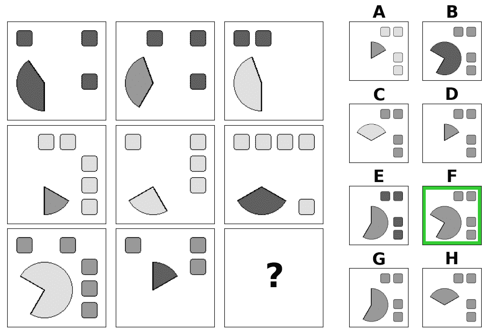

图 1：RPM 示例。令人瞩目的是，人类即使没有任务的确切定义（该定义在第二部分中呈现），也能直观地解决这个挑战。该矩阵由多个抽象模式控制。每一行包含在列中分布的 3 种不同颜色的圆形切片，而方形在每行中有固定颜色。此外，第三列中的对象位置通过对方形应用逐行逻辑 XOR，对圆形切片应用逻辑 OR 来确定。正确答案是 F。

{森林}

对于树=线宽=1pt, 如果=层级()¡2 我的圆角, 绘制=线色, , 边缘=颜色=线色, ¿=三角形[], -¿, 如果层级=0l 分隔+=.75cm, 对齐=中心, 字体=, 父锚点=南, 如果层级=1 父锚点=西南, 子锚点=北, 层级=分岔, 对齐=中心, 字体=, 对于后代=子锚点=西, 父锚点=西, 锚点=西, 对齐=左, , 如果层级=2 形状=坐标, 无边缘, 生长'=0, 对齐与当前边缘, x 偏移=10pt, 对于后代=父锚点=西南, l 分隔+=-15pt , 对于子项=边缘路径=[\forestoptionedge] (!到层级=分岔.父锚点)—(.子锚点)\forestoptionedge 标签; , 对于后代=无边缘, , , , , , 拉文进阶矩阵 [数据集 (第 [2)  [1\. 桑迪亚 [[13]] 2\. 合成 RPMs [[14]] 3\. D-set 和 G-set [[15]] 4\. PGM [[12]] 5\. RAVEN 集 [(a) RAVEN [[16]

(b) I-RAVEN [17]

(c) RAVEN-FAIR [18]] ] ] ] 学习方法 (第 [3)  [1\. 监督训练 (例如 [[12, 16])] 2\. 辅助训练 [(a) 多热 (密集) 编码 [[12, 16, 19]

(b) 独热 (稀疏) 编码 [19]] ] 3\. 对比训练 [[20, 19, 21]] 4\. 特征稳健的抽象推理 [[22]] 5\. 数据增强 [[19, 21]] 6\. 解耦 [[23, 15, 21]] 7\. 生成建模 [[24, 25, 26, 27]] 8\. 无监督学习 [[28, 29, 30]] ] ] 深度学习模型 (第 [4)  [1\. 基线 [(a) CNN + MLP [[11, 12, 16]

(b) LSTM + MLP [12, 16]

(c) ResNet + MLP [12, 16]

(d) 上下文盲 [12, 17]] ] 2\. 关系推理网络 [(a) 野外 ResNet [[12]

(b) WReN [12, 16]

i. VAE-WReN [23]

ii. ARNe [31]

iii. MLRN [32]

(b) CoPINet [20]

(c) MRNet [18]

(d) LEN [22]

i. T-LEN [22]] ] 3\. 分层网络 [(a) SRAN [[17]

(b) SCL [33]

(c) Rel-AIR [34]

i. Rel-Base [34]

(d) DCNet [35]

(e) MXGNet [36]

(f) NI [37]]

图 2：RPM 分类。本文考虑的 RPM 基准、学习方法和深度学习模型的列表。

### 1.1 动机与范围

越来越多的近期出版物使用 RPM 作为研究机器智能的代理。由于上述引用的开创性论文 [11, 12] 以来，深度学习社区对这些问题的兴趣增加，提出了多种在多个方面有所不同的方法。此外，最近还提出了一些具有特定特征的 RPM 基准，这些基准可以分析测试方法的各种属性和能力。这些方法在解决任务的学习设置和模型架构上有所不同。后者通常与其他不需要推理跨多个实体的抽象关系的领域所使用的架构不同。这种 RPM 特有的方面要求使用专门的神经网络组件，并使得 RPM 模型架构的分析尤为有趣。

本调查汇总了关于 RPM 的现有工作——在深度学习文献中广泛使用的 AVR 基准。该综述沿着上述三个角度进行，即基准数据集、学习方法和深度学习推理模型，见图 2。

一些专注于 RPM 的研究已经在更简单的基准测试上报告了超越人类的表现 [15]，然而 AVR 的本质，即对新颖困难环境的泛化能力，仍未实现 [12]。实际上，最近的研究 [38] 表明，目前的 AI 系统（包括深度学习方法、符号方法和概率程序归纳）不仅在解决 AVR 问题上远远落后于人类能力，而且在更广泛的抽象和类比形成设置中也如此。为了评估和更好地理解当前深度学习方法在解决 RPM 问题时所代表的“智能程度”，我们详细分析和讨论了文献中报告的数值结果。

### 1.2 相关工作

最初解决 RPM 的方法依赖于手工编写的规则和启发式方法 [39, 40]，在某些情况下通过分析表现良好的人工解题者的方法来识别 [41]。另一类方法基于认知研究的见解，利用结构映射理论 [42, 43]，提出了一组能够自动发现相关规则的 RPM 解题器 [44, 45]。此外，还有一组方法消除了结构映射的需求，转而专注于 RPM 元素的视觉相似性，通过引入各种图像变换 [46, 47]，可能使用不同的图像分辨率，以促进 RPM 的分形表示 [48, 49]。这些开创性工作的进展已在 [50]中进行了全面总结。

尽管解决 RPM（关系推理矩阵）的问题存在许多创造性的方法，但近年来深度学习（DL）方法不断证明其在应对一些最具挑战性的 RPM 基准测试方面的能力，在某些问题设置中超越了人类表现。深度学习方法的最新丰富性和优越性促使我们将本次调查专门聚焦于深度学习方法。根据我们所知，这样的审视视角在 RPM 文献中尚未被考虑过。

尽管深度学习文献中对解决 RPM 问题的关注特别多，但整个抽象视觉推理（AVR）领域远远不止于此。事实上，近期的研究引入了一系列互补的抽象视觉推理任务，这些任务能够测试深度学习方法的不同特征。

与 RPMs 类似，识别抽象模式的需求在所有 AVR 任务中都是一个反复出现的主题。然而，根据具体问题的不同，这些模式需要从不同配置的矩阵面板中提取，然后应用于各种上下文。在“奇数异常”任务[51, 52, 53]中，解题者必须识别出一个打破剩余图像中规则的奇数元素。类似的思想在邦加德问题[54]中提出，目标是描述在一组图像中实例化的规则，并在补充的面板组中被打破。相同-不同任务[55]提出了一个相关的挑战，其中每个问题实例包含两组图像，这两组图像由一个抽象模式分隔。给定一张新图像，测试者需要将其分配到两个呈现的集合之一。视觉类比问题[56]在结构上类似于 RPMs，并类似地测试基于抽象模式对图像中对象及其属性进行类比的能力。然而，与 RPMs 不同，这些问题允许测试从给定源领域到不同目标领域的一般化抽象概念的能力。额外的问题测试外推能力[57]，从仅少量样本中识别抽象模式的能力[58]，或将数字引入矩阵并测试抽象和数值视觉推理的综合能力[59]。对这些新兴 AVR 任务的全面综述见[60]。

尽管上述问题各自具有特定性，但我们相信，深入概述深度学习（DL）在解决 RPMs——这一主要的自动视觉识别（AVR）挑战中的应用——将激励读者找到解决相关 AVR 任务的有前景的路径。

### 1.3 结构

本文的其余部分结构如下。在第二部分中，我们介绍了费尔文的渐进矩阵，讨论了它们在测量智力中的重要性，并描述了基准及其自动生成方法。在第 3 和第四部分中，我们分别描述了多种解决 RPMs 的学习设置和相关的深度学习架构。当前对机器智力的评估在第五部分中汇总和分析。第六部分将 RPM 相关文献与其他领域的进展联系起来，提出开放性问题、AVR 研究的潜在实际应用及未来研究方向。调查在第七部分中结束。

## 2 费尔文的渐进矩阵

解决费尔文的渐进矩阵[7, 8]的能力被认为与人类智力高度相关[5]，因此也被视为先进人工推理系统智力的自然测量。RPMs 能够测量结构性和抽象推理技能[4]，这些技能特征表征人类的流体/高级智力[61]。

### 2.1 问题陈述

尽管 RPMs 可以具有不同的结构，但最近机器学习（ML）文献中研究的最常见矩阵由两部分组成的图像组成。矩阵的第一部分通常包含 8 张按$3\times 3$网格排列的图像，称为上下文面板，其中右下角的图像缺失。目标是从另一组多个图像中选择一个正确完成此矩阵的面板，这些图像称为答案面板（见图 3）。为了找到正确的答案，测试者需要识别一组潜在的抽象规则，这些规则支配矩阵的视觉属性。这些规则通常描述了矩阵面板之间图像特征的差异。这些关系以及对象及其属性在不同的数据集中有不同的定义。

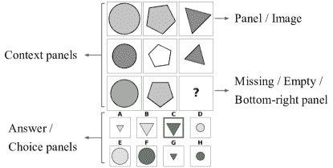

图 3：RPM 符号。来自 RAVEN 数据集 [16]的一个样本 RPM，它由两个部分组成——上下文面板和答案面板。目标是用适当的答案面板来完成上下文。所选答案面板必须符合所有支配上下文面板内容的抽象规则。在示例中，应用了三条规则：（1）每行中存在相同的 3 种形状，（2）给定行中的形状大小相同，以及（3）第三列中的形状颜色强度等于前两列颜色强度的总和。因此，正确答案是 C。

### 2.2 RPMs 的自动生成

在 [7, 8]中提出的原始 RPM 集（称为标准渐进矩阵，SPMs）包含了有限数量的手工制作实例，这可能不足以训练即使是简单的统计模式识别模型，这些模型在学习小样本时会遇到困难 [62, 63]。由于成功训练深度学习模型通常需要大量的训练数据点 [64, 65]，因此迫切需要自动生成 AVR 问题的方法，以提供足够多的训练样本。

为了程序化生成新的 RPMs，必须解决几个挑战。首先，生成的问题应该在视觉上具有多样性，使其不重复且对测试者具有吸引力。此外，最好有多个难度级别，以便更好地评估解题者的推理能力。最后，生成的 RPM 应该是有效的，即在可能的选项集中只有一个答案能够正确完成矩阵。选择正确答案的任务应该符合奥卡姆剃刀原则——答案应该用最小的规则集来解释，这些规则支配了不同上下文面板之间对象及其属性的关系。

针对这些要求，已经进行了各种尝试，以设计一个能够提供大量实例的 RPM 生成算法。实际上，已经提出了几个流行的 RPM 数据集，包括 Sandia 矩阵 [13]、来自 [15]的 D 集和 G 集、PGM [12]、RAVEN [16]、I-RAVEN [17]和 RAVEN-FAIR [18]。这些数据集的样本如图 4 所示。

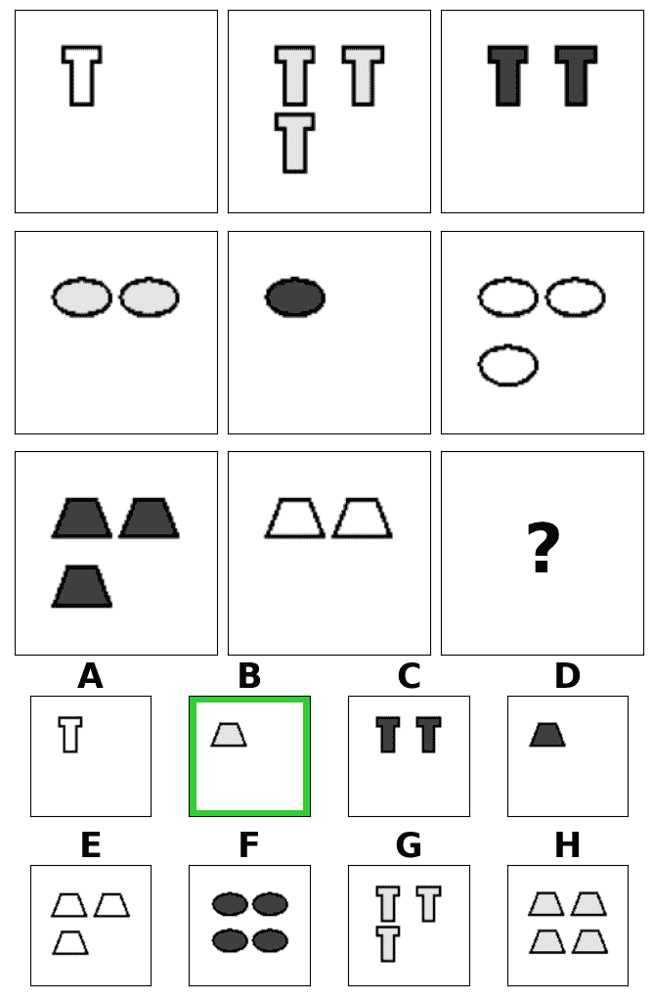

(a) Sandia [13]

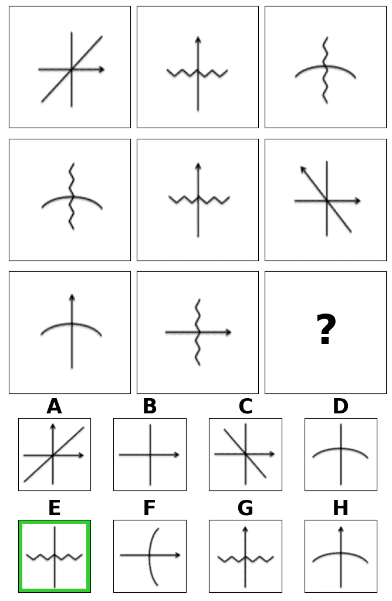

(b) 合成的 [14]

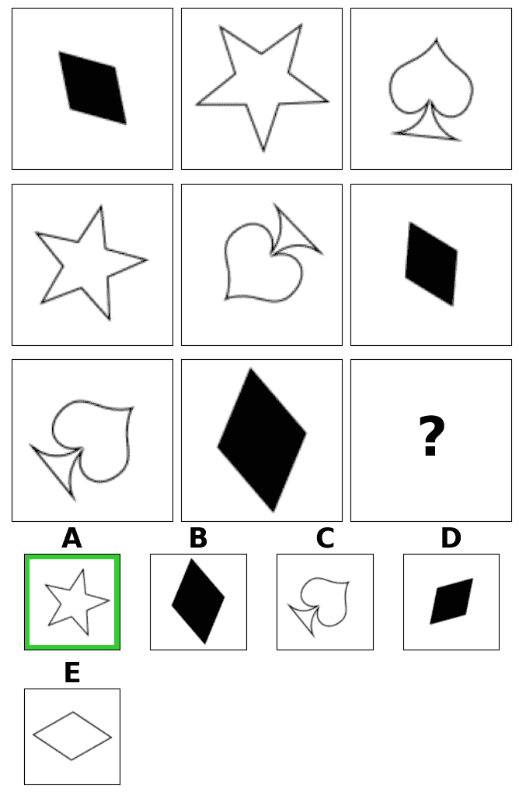

(c) G 集 [15]

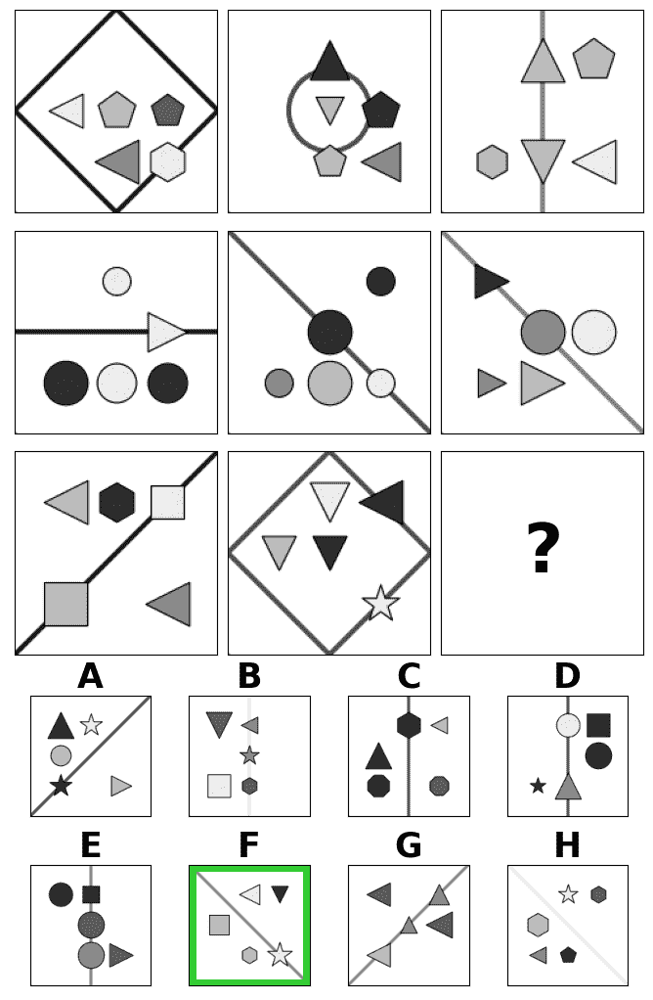

(d) PGM [12]

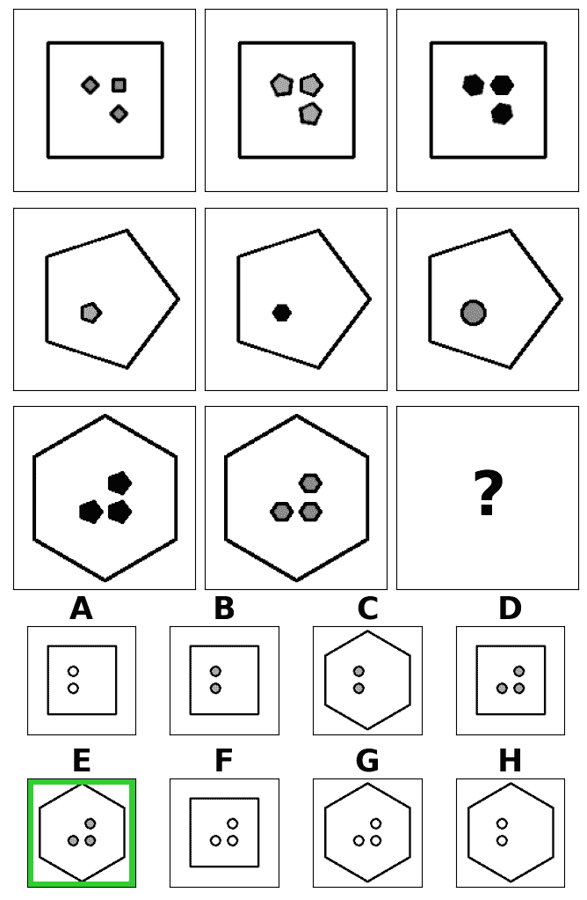

(e) I-RAVEN [16, 17]

图 4：RPM 示例。正确答案用绿色边框标记。RAVEN、I-RAVEN 和 RAVEN-FAIR 的矩阵仅在生成答案的方式上有所不同，因此仅展示了 I-RAVEN 数据集中的一个选择矩阵。

#### 2.2.1 桑迪亚矩阵

桑迪亚矩阵生成过程[13]标志着第一次广泛知晓的扩展可用 RPM 实例集的尝试。根据对 SPM 的分析，作者提取了一组逻辑规则、形状和转换，这些规则和转换修改了它们的属性，后来用于生成大量 RPM。作者将生成的矩阵质量与原始矩阵进行比较，发现尽管较简单的实例（具有 1 或 2 条规则）与 SPM 的难度相当，但具有更多规则的实例通常比其 SPM 对应物更困难。图 4a 展示了使用桑迪亚软件生成的一个示例 RPM。

#### 2.2.2 合成 RPM

另一种方法使用一阶逻辑表示抽象的 RPM 结构，并制定采样限制，只允许构造有效的 RPM[14]，例如图 4b 中展示的那些。此外，作者进行了用户研究，以验证构造的矩阵是否与[7]中提出的原始 SPM 集不同。实验结果表明，生成的问题在 24 名受访者中与手工设计的矩阵在统计上没有显著差异。

#### 2.2.3 D 集和 G 集

另一套自动生成的 RPM 被提出于[15]。D-set 和 G-set 数据集是基于之前工作的设计原则生成的[66, 5]。生成的矩阵，以图例 4c 为例，虽然在结构上类似于 Sandia 套件的矩阵，但呈现出不同的特征分布。具体来说，[15]的作者使用了一套完全不同的对象形状，并支持对象属性（阴影、旋转和大小）的全范围，而不是 Sandia 中使用的离散值。这种更广泛的 RPM 配置在 D-set 中实现，而 G-set 则被策划成类似于 Sandia 中的特征分布。由于合成了自己的 RPM，作者能够将 Sandia 矩阵作为额外的评估数据集，用于在传递性迁移学习设置中验证提议的 DeepIQ 系统的分布外泛化能力。

#### 2.2.4 PGM

在上述数据集[15, 13]上进行的机器性能测试可能会产生误导，因为模型是在结构类似于测试套件的矩阵的大集合上训练的。为了更好地评估深度学习模型的泛化能力，提出了 PGM 数据集[12]，该数据集将问题安排到 8 个具有不同难度的泛化模式中。为了实现这一目标，PGM 中的每个矩阵（见图例 4d）都有一个抽象结构的相关表示，即一个三元组集合$\mathcal{S}=\{[r,o,a]\ |\ r\in\mathcal{R},0\in\mathcal{O},a\in\mathcal{A}\}$，其中$\mathcal{R}$ $=$ $\{\texttt{progression},$ $\texttt{XOR},$ $\texttt{OR},$ $\texttt{AND},$ $\texttt{consistent union}\}$定义了规则集合，$\mathcal{O}$ $=$ $\{\texttt{shape},$ $\texttt{line}\}$定义了对象集合，$\mathcal{A}$ $=$ $\{\texttt{size},$ $\texttt{type},$ $\texttt{color},$ $\texttt{position},$ $\texttt{number}\}$定义了属性集合。基于这些结构，数据集将 RPM 实例分为训练、验证和测试集，其中训练和验证部分具有相同结构的矩阵，而测试矩阵则由训练和验证集中未见过的关系主导。尽管是一个衡量深度学习模型泛化能力的理想测试平台，但该数据集的规模巨大（每个模式包含$1\,420\,000$个 RPM，其中$1.2$M 属于训练集），这往往成为评估多个模型的瓶颈。

#### 2.2.5 RAVEN

另一个名为 RAVEN 的 RPM 数据集[16]旨在呈现具有层级结构的视觉上更广泛的矩阵（见图 4e）。这通过属性随机图像语法（A-SIG）[67, 68, 69]的帮助实现。RAVEN 包含属于 7 种视觉配置的矩阵，并且类似于 PGM，每个 RAVEN 的 RPM 都有一个相关的抽象结构。然而，在这种情况下，结构定义为一组对$\mathcal{S}$ $=$ $\{[r,a]$ $|$ $r\in\mathcal{R},$ $a\in\mathcal{A}\}$，其中$\mathcal{R}$ $=$ $\{\texttt{constant},$ $\texttt{progression},$ $\texttt{arithmetic},$ $\texttt{distribute three}\}$定义了规则集合，而$\mathcal{A}$ $=$ $\{\texttt{number},$ $\texttt{position},$ $\texttt{type},$ $\texttt{size},$ $\texttt{color}\}$定义了属性集合。与 PGM 不同的是，该数据集由于 A-SIG 包含了额外的结构注释，连接了视觉和结构表示。此外，Zhang 等人[16]对 RAVEN 矩阵进行了人类评估，这使得能够更好地评估深度学习方法的表现。

该数据集包含$42\,000$个训练 RPMs，另有$2\times 14\,000$个问题分别分配用于验证和测试拆分。与 PGM 相比，RAVEN 的矩阵具有几倍更高的平均规则数：6.29 对 1.37。同时，由于定义了明确的泛化机制，PGM 更适合用于评估分布外泛化。

#### 2.2.6 I-RAVEN

尽管有后续研究报告在 RAVEN 上取得了超人类的表现[20]，但后来揭示这些令人印象深刻的结果可能源于由于偏倚的答案集而产生的捷径解法。实际上，捷径学习的问题在视觉推理研究中普遍存在，并且在多个相关问题中被识别出来[70, 71, 72, 73]。在 RAVEN 的案例中，一种无视上下文的模型——即仅处理答案面板而忽略上下文面板的模型——被证明能够接近完美的表现，从而绕过了发现控制矩阵的抽象规则的需求。研究发现，RAVEN 的 RPMs 的正确答案可以通过选择具有最常见属性的答案面板来获得[17]。为了修正这个缺陷，提出了 I-RAVEN 数据集[17]，该数据集通过迭代树基方法生成答案集。使用这种公正数据集训练的无视上下文模型被证明产生的分类等同于随机猜测[33, 17]，有效地证明了该数据集的有效性。

#### 2.2.7 RAVEN-FAIR

与 I-RAVEN 类似，RAVEN-FAIR [18]承诺解决原始数据集中有偏选择面板的问题。然而，正如[18, 表 4]的补充材料中所指出的，Context-blind ResNet 模型在提出的数据集上得分为 17.2%。同时，相同的 context-blind 模型在 I-RAVEN 上的得分为 12.5%，这等于随机猜测的准确度。这表明，尽管 RAVEN-FAIR 无疑比原始 RAVEN 更少偏差，但并不是所有的偏差来源都得到了缓解。因此，在三种 RAVEN 类型的数据集中，建议在测试 RPM 推理模型时使用无偏的 I-RAVEN。

## 3 学习解决 RPM

在初步尝试之后 [11, 12]，已经提出了多种不同的方法来训练 DL 模型以解决 RPM，这些方法在本节中总结。假设一个 RPM 实例$\mathcal{P}=(X,y)$有$16$个面板，均分为上下文和答案图像，其中$X=\{x_{i}\}_{i=1}^{16}$是一组所有$16$张图像，而$y\in\{1,\ldots,8\}$是正确答案的索引。此外，我们用$X_{c}=\{x_{i}\}_{i=1}^{8}\subset X$表示上下文面板的集合，用$X_{a}=\{x_{i}\}_{i=9}^{16}=\{a_{j}\}_{j=1}^{8}\subset X$表示答案面板的集合（也称为候选或选择面板）。上述$8$个答案面板的数量适用于 Sandia 套件 [13]、合成 RPM [14]、PGM [12]、RAVEN [16]、I-RAVEN [17]和 RAVEN-FAIR [18]的矩阵，而[15]中使用的 RPM 则少了$3$个可能的答案。我们还用$X_{c\cup a_{j}}=\{x_{i}\}_{i=1}^{8}\cup\{a_{j}\}\subset X$表示一个缺少面板的 RPM，该面板被索引为$j$的答案面板所填补。

考虑一个 RPM 推理模型$\mathcal{N}(X)=\{h_{j}\}_{j=1}^{8}$，该模型在给定 RPM 面板$X$时生成嵌入向量$\{h_{j}\}_{j=1}^{8}$，每个答案面板对应一个，其中$h_{j}\in\mathbb{R}^{d}$，$d\geq 1$。以后我们将$\{h_{j}\}_{j=1}^{8}$称为候选嵌入。模型$\mathcal{N}$可以实现为任何可微分函数——具体的文献示例将在下一节讨论。基于所提供的定义，让我们现在集中于学习解决 RPM 的建议方案。

### 3.1 监督训练

在监督训练中，模型被训练来预测一个正确完成矩阵的答案面板的索引。为此，几项工作（例如[11, 12, 15, 16]）使用了一个评分模块 $\psi(h)=s\in\mathbb{R}$，该模块为每个候选嵌入生成一个单一的 logit $s$。尽管在实际应用中，$\psi$ 通常实现为多层网络（例如[11, 15]中的 MLP 或[12]中的 Relation Network [74]），我们将这些模块视为$\mathcal{N}$的一部分，并将评分模块视为具有可学习权重的简单线性层。监督设置将各个 logits 汇聚成一个集合 $\mathcal{S}=\{s_{j}\}_{j=1}^{8}$ 并将其转换为 RPM $\mathcal{P}$的可能答案集合上的概率分布，其中 $p(\mathcal{P})=\{p(\mathcal{P})_{j}\}_{j=1}^{8}=\text{softmax}(\mathcal{S})$。通过使用估计的概率，评分模块 $\psi$ 与基础网络 $\mathcal{N}$ 一起通过标准交叉熵损失函数进行优化。即，对于一批 RPM $\{\mathcal{P}_{i}\}_{i=1}^{N}$，其中 $N$ 是批量大小，最小化以下目标：

|  | $\mathcal{L}^{\text{ce}}=-\frac{1}{N}\sum_{i=1}^{N}p(\mathcal{P}_{i})\log q(\mathcal{P}_{i})$ |  | (1) |
| --- | --- | --- | --- |

其中 $q(\mathcal{P}_{i})=\text{onehot}(y_{i})$ 是$\mathcal{P}_{i}$的正确答案的一热编码索引。对应最高概率的选择面板被视为网络选择的答案，即 $\hat{y}=\text{argmax}_{j}\{p(\mathcal{P})_{j}\}_{j=1}^{8}$。

### 3.2 辅助训练

为了解决 RPM 问题，首先需要识别其抽象结构，该结构决定了图像中对象、属性和关系。[12]中的研究表明，训练神经网络通过预测这种抽象结构来解释其答案，可以提高最终分类任务的性能。为此，Barrett 等人[12]提出将 RPM 重新定义为三元组$\mathcal{P}=(X,R,y)$，其中$R\subset\mathcal{R}$定义了支配 RPM 的潜在抽象规则集合。所有抽象规则的集合$\mathcal{R}$是依赖于数据集定义的，以及每个 RPM 的最大规则数$n_{R}$（PGM 为$1\leq n_{R}\leq 4$，RAVEN 及其衍生数据集为$1\leq n_{R}\leq 8$）。Barrett 等人[12]提议使用多热编码对 PGM 抽象规则进行编码，并采用规则预测头$\rho(\sum_{j=1}^{8}h_{j})=\widehat{R}$，以固定长度的向量形式估计 RPM 抽象规则集合。预测值$\widehat{R}$通过 sigmoid 函数激活。使用二元交叉熵损失函数$\mathcal{L}^{\text{aux}}$将其与真实编码规则表示$R$进行比较。在训练过程中，最小化联合损失函数$\mathcal{L}=\mathcal{L}^{\text{ce}}+\beta\mathcal{L}^{\text{aux}}$，其中$\beta$是平衡系数。

类似的方法在 RAVEN 数据集上得到了验证[16]，在这些方法中，除了与规则相关的辅助目标外，作者还提出了另一种与 RPM 结构预测相关的损失函数。令人惊讶的是，在使用这些补充目标训练模型后，其性能却有所下降。在多个后续研究中也得出了类似的结论[20, 17, 33, 36]，这些研究评估了他们在 RAVEN 及其衍生数据集上的方法。然而，在[19]中我们展示了，通过用稀疏编码——一种基于独热编码的替代规则表示——替代规则编码方法，可以克服这种性能下降，从而提供更准确的训练信号。

### 3.3 对比训练

将正确和错误答案并列比较的能力被确定为认知文献中自适应问题解决的关键组成部分 [75, 76, 77]。许多研究提议将这种对比机制直接融入模型架构中 [20]，或融入目标函数中 [20, 19, 21, 17]。张等人 [20] 通过用鼓励对比效应的 NCE 损失变体替代交叉熵，提出了一种替代监督训练设置的方法。作者主张将解决 RPMs 的视角从分类任务转变为排序任务，其中答案面板根据其正确完成矩阵的概率进行排序。基于 NCE 的目标函数在以下工作中进一步使用。

胡等人 [17] 采用分层模型生成所有可能的 RPM 行对（可选列）的嵌入。实际上，获得了前两行 RPM 的嵌入（即所谓的主导嵌入），以及包含由一个答案面板完成的最后一行的行对的嵌入（我们称之为候选行对嵌入）。然后，使用 NCE 启发的$(N+1)$-tuplet 损失 [78]，最大化主导嵌入与由正确答案完成的候选行对嵌入的相似性。同时，损失函数最小化主导嵌入与由每个错误答案完成的候选行对嵌入的相似性。

另一个研究将解决 RPMs 的问题转化为多标签分类框架，并提出了多标签对比损失 [19]——一种基于监督对比损失 [79] 的对比目标函数。作者提出了一个预训练目标，建立了类似 RPM 的表示，这些表示具有共同的抽象结构，以及对不相关 RPM 的不同表示。与 [17] 相比，所提出的方法考虑了由答案面板完成的整个 RPM 上下文的嵌入，而不是行对。此外，该方法与稀疏编码的辅助训练结合，形成了一种称为多标签对比学习（MLCL）的联合学习方法。

**元类比对比学习**[21]类似于 MLCL，通过最大化类比结构关系之间的相似性和最小化非类比关系之间的相似性，提高了学习 AVR 任务的关系表示的效果。该工作定义了多种类比类型：1）问题内部类比，通过用噪声替换随机选择的面板，类比原始 RPM 上下文面板及其扰动；2）问题间类比，将两个具有相同抽象结构但不同属性值的 RPM 实例进行比较；3）非类比，随机打乱 RPM 上下文面板，以打破抽象结构。

### 3.4 使用最优轨迹学习

在[22]中，作者将分散注意力的特征——属性随机变化的图像对象——认定为解决 RPM（图形推理问题）时的主要挑战。作为一种可能的解决方案，提出了**特征鲁棒抽象推理（FRAR）**[22]，该方法通过基于学生-教师强化学习方法精心设计的学习轨迹来减轻分散特征的影响。此外，论文广泛研究了包括课程学习[80]、自适应学习[81]、教学学习[82]、困难样本挖掘[83]、焦点损失[84]和 Mentornet-PD[85]在内的最佳学习轨迹方法。实验结果表明，使用提出的 FRAR 方法解决 RPM 问题最为有效。

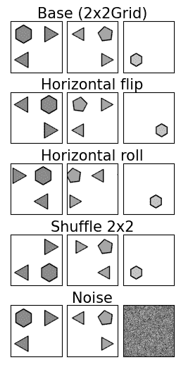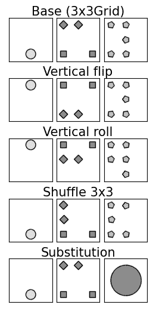

图 5：RPM 增强。第一行展示了两个 I-RAVEN 矩阵中单行的配置，2x2Grid（左）和 3x3Grid（右）。第 2 至第 4 行演示了在[19]中使用的图像级增强，而最后一行则展示了在[21]中应用的结构性扰动。

### 3.5 数据增强

数据增强方法在将深度学习应用于不同领域中被证明具有关键重要性 [86, 87, 88, 89]。在 AVR 领域也得出了类似的结论，其中 RPM 数据增强被证明能提高神经学习模型的抽象推理能力 [19, 21]。在 [19] 中，建议使用简单的图像变换，包括水平/垂直翻转、水平/垂直滚动、2x2/3x3 混排、旋转和转置，如图 5 所示，并将其一致应用于给定 RPM 的所有面板。作者们表明，无论选择的模型和训练设置如何，数据增强都能提升 RPM 解决性能。数据增强的主题在 [21] 中也有并行探索，作者们建议打乱 RPM 的上下文面板，以打破其抽象结构，并将这些修改后的实例用作对比学习中的负对，或用噪声替换选定的 RPM 面板。这两种方法主要的不同在于 [19] 依赖于图像级变换，而 [21] 通过重新排列或替换面板来修改 RPM 结构。

### 3.6 解耦表示

最新研究表明，解耦表示对抽象推理任务非常有帮助，并且可以提高样本效率 [90]。具体来说，有研究表明，经过解耦变分自编码器（$\beta$-VAE） [91, 92, 93] 预训练的 WReN 感知骨干网络 [12] 在解决 RPM 任务的下游任务上，比用纯监督方式训练的相同架构具有更好的泛化能力 [23]。此外，自编码器在 [15] 中成功用于学习简单 AVR 任务中的可迁移特征，而 [21] 的作者将自编码器作为他们架构的一部分，用于创建所谓的生成类比。

### 3.7 生成建模

另一个工作[24]采用变分自编码器来训练一个有效的生成模型[94, 95, 96]，该模型能够为 RPM 生成可能的答案面板。该方法结合了多个组件，负责：1）使用变分自编码器重建答案图像，2）预测正确答案的索引（监督训练）和抽象规则的表示（辅助训练），以及 3）基于来自 VAE 的潜在嵌入和识别路径的潜在嵌入生成新的可能答案。这样的多任务网络被证明能够生成保留基本抽象规则的合理答案面板，并与仅用监督训练训练的模型具有竞争力。

在[26]中提出了一种替代的 RPM 答案生成方法，其中构建了一个利用多个高斯过程的深度潜变量模型。结果表明，该方法通过概念特定的潜变量具有可解释性，并生成了高质量的 RPM 面板。虽然两项工作[24, 26]都使用 RPM 面板训练生成模型，但也证明了在真实世界图像上预训练的图像生成器同样可以有效地生成有效的 RPM 面板[25]。

不同于上述工作，**概率性推理和执行（PrAE）模型**[27]能够构建一个概率性 RPM 表示，并使用场景推理引擎来生成 RPM 的答案。与之前的端到端生成方法不同，PrAE 将生成过程解耦为神经感知骨干和符号逻辑推理引擎。尽管存在这种分离，但该方法可以通过 REINFORCE[97]进行端到端优化，并展示了神经符号方法在生成过程中解决 RPM 问题的适用性。

### 3.8 无监督学习

一些最近的 RPM 解决方法研究了是否可以以无监督的方式学习有用的表示。在这种设置中，模型在训练过程中不考虑关于正确答案的信息。

针对在无监督环境中获得有效的 RPM 解决模型，噪声对比和去中心化（NCD）[30]考虑了从每个 RPM 获得的 10 行（第一和第二行以及由 8 个答案面板完成的第三行）。接下来，该方法考虑一个二分类任务，其中模型预测哪些行属于 RPM 上下文，哪些是通过用一个答案填充第三行形成的。在推理过程中，NCD 仅为最后一行的 8 个版本生成概率，并将得分最高的候选项的索引作为答案。该方法基于 NCD 作者在早期工作中提出的伪目标多标签分类（MCPT）[28]。

另一种无监督的方法，即成对关系鉴别器（PRD），在[29]中提出。该方法训练一个基础模型来解决正负对的区分任务，类似于其他对比方法（例如[17]）。正对是通过从给定的 RPM 中取前两行形成的，假设为$\mathcal{P}$。负对则通过多种方式获得。第一种选择是将$\mathcal{P}$的前两行之一与来自不同 RPM 的另一行配对。另一种选择是随机选择第一或第二行作为$r$，并将另一行视为$r^{\prime}$。然后，$r^{\prime}$的第三面板被一个答案替换，从而形成一个与$r$的负对。类似地，可以将第三行与其第三面板替换为$r^{\prime}$的第三张图像，视为与$r$的负对。接下来，PRD 最大化正对内元素的相似性，最小化负对内项的相似性。为了获得$\mathcal{P}$的答案，该方法用每个答案填充第三行，并计算完成的行与前两行之间的平均相似性。与具有最高相似性的完成行对应的选择面板被视为答案。

## 4 个 RPM 深度学习模型

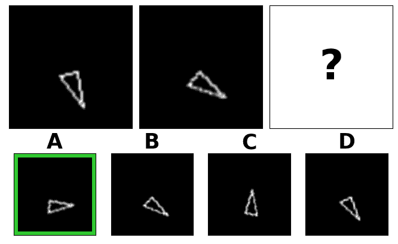

图 6：来自[11]的类似 RPM 问题。任务验证了识别应用于三角形旋转的进展规则的能力。正确答案用绿色边框突出显示。

解决 RPMs 的第一个深度学习模型之一是由 Hoshen 和 Werman [11] 提出的，他们构建了一个卷积神经网络（CNN）[98]，用于解决几何图案识别问题，能够根据指定图案生成图像。此外，还使用了基于相同视觉骨干的额外网络来解决涉及图案的旋转、反射、颜色、大小和形状的问题（见图 6）。CNNs 在[99]中进一步应用，其中介绍了一种基于相似性的通用方法来解决 Sandia 套件中的 RPMs [13]（参见图 4a）。该方法消除了结构映射的需要，而是依赖于使用关系和非关系特征的基于特征的处理。

另一种以特征为中心的方法在[15]中讨论，其中一个具有稠密全连接层的自编码器首先被训练以学习基于特征的表示，然后与一个浅层多层感知机（MLPs）的集成结合。在此基础上，提出了一个可以根据最终下游任务进行调整的评分模块。Mańdziuk 和Żychowski [15] 已经证明，这种方法通过将训练解决 RPMs 的模型（参见 图 4c）应用于具有类似输入分布的其他问题（如奇异项任务，见图 7），有助于迁移学习。尽管上述工作已经证明经典神经网络架构能够具备抽象视觉推理技能，但这些方法是在视觉上简单的 RPM 基准上评估的，验证分布外泛化的可能性有限。

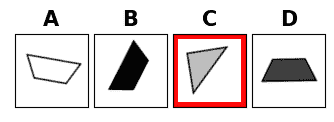

图 7：奇异项矩阵。来自[15]的奇异项问题示例。任务是指出几个选项中的不匹配元素。在示例中，这是一个三角形（其他都是梯形）- 用红色边界标记。

在接下来的章节中，我们将重点讨论考虑了具有组合结构的 RPM 并解决了 o.o.d.泛化挑战的连续研究。这些研究中提出的 DL 模型的高级概述展示在表格 I 中。除了基线方法，我们将后续模型分为两类：关系推理网络和层次网络。第一类模型本质上基于关系网络 [74]，而第二类模型受到 RPM 层次结构的启发，将各种结构性归纳偏置注入用于解决 RPM 的网络架构中。

表 I：模型概述。对 RPM 求解模型中采用的关键设计选择的总结。*数据集*列展示了给定（模型，数据集）对包含在实验中的工作。在*训练设置*列中，*目标交叉熵损失*指的是监督训练方法，而*元目标二元交叉熵损失*指的是辅助训练设置。

| 模型 | 数据集 | 输入 | 设计亮点 | 训练设置 |
| --- | --- | --- | --- | --- |
| 基线 [12, 16] | PGM [12] RAVEN [16] I-RAVEN [17] | 单面板 | 用浅层 CNN 或 ResNet-18 嵌入单面板，并用 MLP 或 LSTM 聚合 RPM 上下文面板的信息。 | 目标交叉熵损失 元目标二元交叉熵损失 |
| 上下文盲模型 [12] | PGM [12] RAVEN [33, 17] I-RAVEN [33, 17] | 单面板 | 仅对答案面板进行推理，不依赖 RPM 上下文。 | 目标交叉熵损失 |
| Wild ResNet [12] | PGM [12] I-RAVEN [17] | 上下文 | 在 9 个上下文面板堆栈上使用 ResNet。 | 目标交叉熵损失 |
| WReN [12] | PGM [12] RAVEN [16] I-RAVEN [17] | 单面板 | 与 RN 聚合 RPM 上下文面板的信息。 | 目标交叉熵损失 元目标二元交叉熵损失 |
| VAE-WReN [23] | PGM [12] | 单面板 | 用与 WReN 模型分开训练的解缠$\beta$-VAE 替代 WReN 的 CNN 面板编码器。 | 目标交叉熵损失 元目标二元交叉熵损失 修改的 ELBO 目标 [93] |
| ARNe [31] | PGM [31] RAVEN [31] | 单面板 | 在面板嵌入组件和 RN 模块之间扩展 WReN 模型，加入了 Transformer。 | 目标交叉熵损失 元目标二元交叉熵损失 |
| CoPINet [20] | PGM [20] RAVEN [20] I-RAVEN [17] | 单面板 | 引入了一个显式的置换不变对比神经模块，用于区分答案面板之间的特征。 | NCE 损失的变体 [20] |
| LEN [22] | PGM [22] RAVEN [22] I-RAVEN [17] | 单面板，背景$\setminus a_{k}$ | 从 RPM 背景面板的三元组和上下文嵌入向量中聚合信息与 RN。 | 目标交叉熵损失 元目标二元交叉熵损失 特征鲁棒抽象推理 |
| SRAN [17] | PGM [17] I-RAVEN [17] | 单面板，行，列，行对 列对 | 使用带门嵌入融合模块逐步聚合来自面板层次结构的特征。 | ($N$+$1$)-元组损失 [78] |
| MXGNet [36] | PGM [36] RAVEN [36] | 单面板 | 使用多重图神经网络对面板之间的关系进行推理。 | 目标交叉熵损失 元目标二元交叉熵损失 |
| SCL [33] | PGM [33, 19] RAVEN [33] I-RAVEN [33, 19] | 单面板 | 使用基于散射变换的神经模块对面板间和面板内关系进行推理。 | 目标交叉熵损失 |
| DCNet [35] | PGM [35] RAVEN [35] | 行 列 | 考虑了第三行/列与第一和第二行的相似性以及每个答案面板完成的最后一行的差异。 | 目标二元交叉熵损失 |
| MRNet [18] | PGM [18] RAVEN [18] RAVEN-FAIR [18] | 单面板 | 对三种不同分辨率的面板嵌入应用单独的 RN。 | 加权目标二元交叉熵损失 |
| Rel-Base [34] | PGM [34] RAVEN [34] | 单面板 | 使用 1D 卷积模块处理 9 个背景面板嵌入的堆栈。 | 目标交叉熵损失 |
| Rel-AIR [34] | PGM [34] RAVEN [34] | 单面板 | 对使用 AIR 无监督场景分解模型获得的分割对象进行推理。 | 目标交叉熵损失 无监督场景分解预训练 |
| MLRN [32] | PGM [32] | 单面板 | 扩展了 WReN，使用多层关系网络，利用幅度编码对输入图像进行编码，并使用 LAMB 优化器。 | 目标交叉熵损失 |
| PrAE [27] | RAVEN [27] | 单面板 | 神经符号方法生成概率 RPM 表示，并通过概率演绎和执行生成可能的答案。 | REINFORCE [97] |
| NI [37] | PGM [37] | 单面板 | 由可重用自注意力层组成的组合模型，具有可学习的路由机制。 | 目标交叉熵损失 |

### 4.1 基线

类似于[11]，解决 RPM 的基线模型通过使用 CNN 作为视觉特征提取器，然后是推理模块来形成。感知骨架通常由 4 个卷积层和其中的非线性层组成，或者是具有 18、34 或 50 层的 ResNet 变体[100]。在简单的基线模型[12, 16]中，视觉组件独立处理每个图像。然后，这些视觉模块从所有矩阵面板提取的特征要么被连接成一个单一的向量并输入到 MLP 中，要么堆叠成时间序列并由 LSTM[101]处理。然而，研究表明，这种典型的神经架构即使在更简单的 RPM 泛化条件下也会遇到困难[12, 16]，这突显了对专门 AVR 模型的需求。

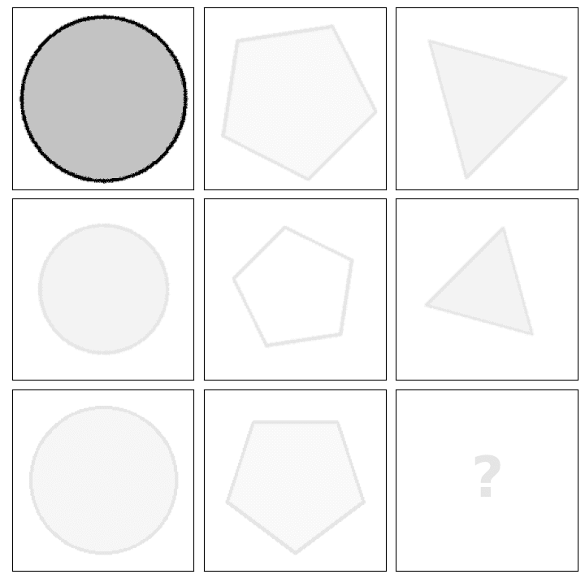

(a) 单面板。

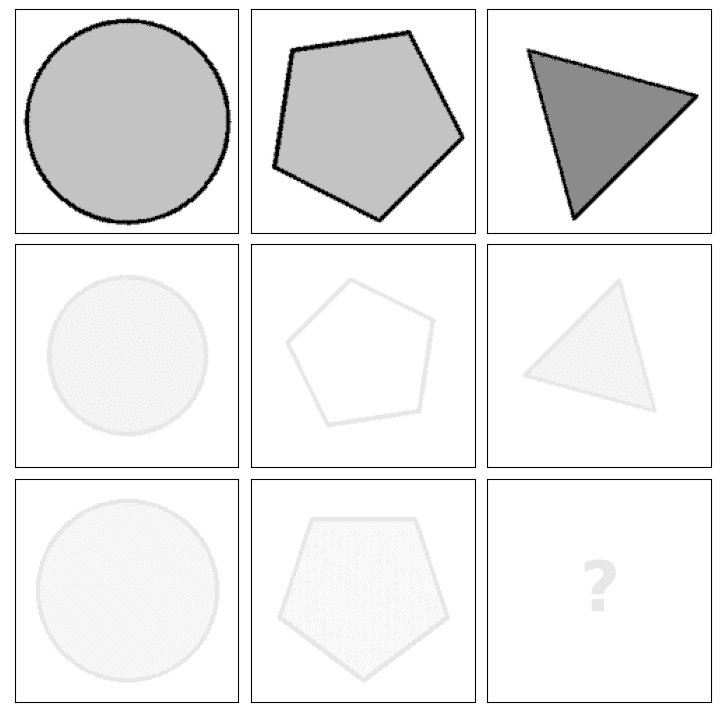

(b) 单行。

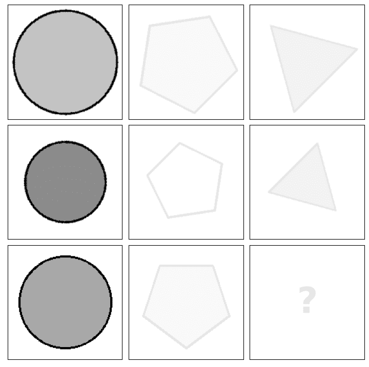

(c) 单列。

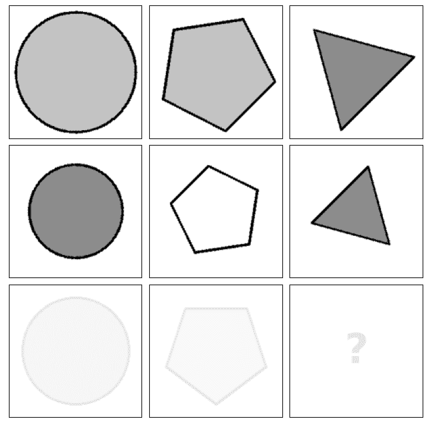

(d) 一对行。

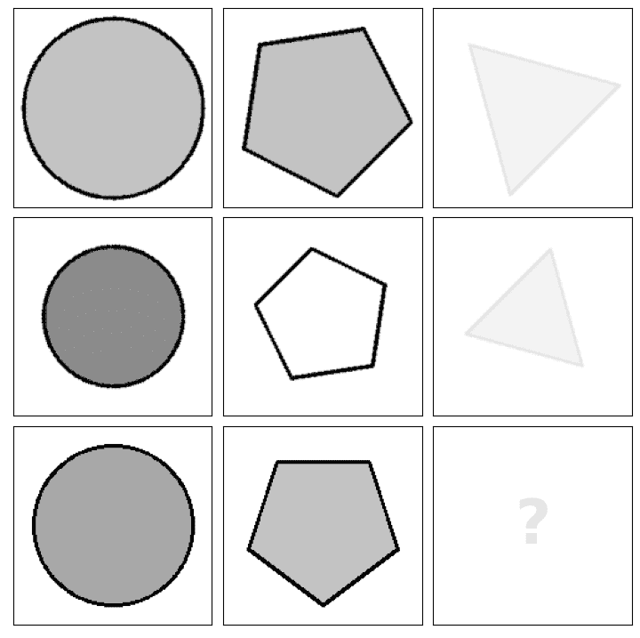

(e) 一对列。

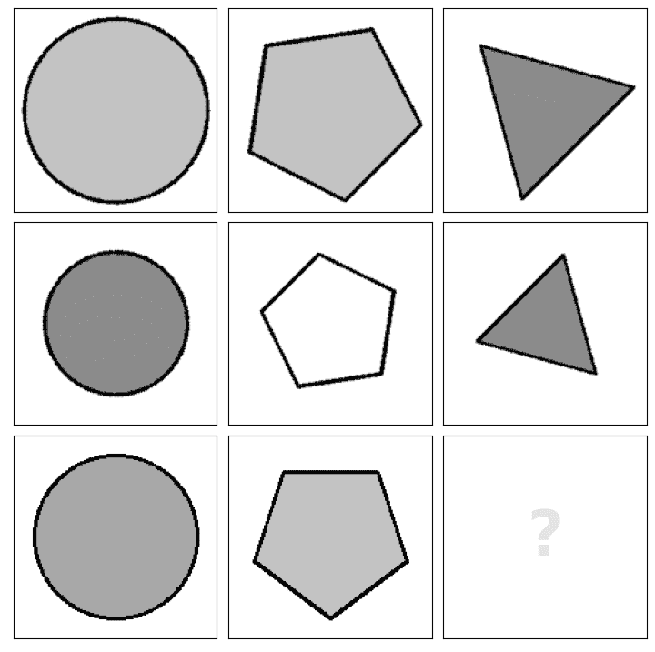

(f) Context$\setminus a_{k}$。

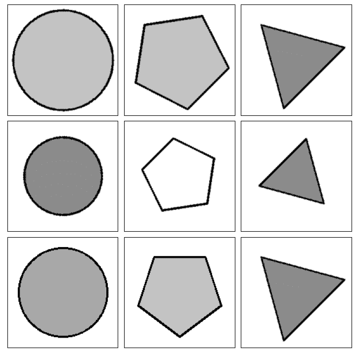

(g) 上下文。

图 8：RPM 面板层次结构。每个层次结构展示了面板如何被联合处理。例如，在构建层次感知模型骨架（如在 SRAN [17]中）时，面板被堆叠在一起，形成一个形状为$(c\times w\times h)$的矩阵，其中$c$是给定层次结构中的面板数量，$w$是图像宽度，$h$是图像高度。或者，这些面板的嵌入可以以类似的方式组合（例如，在 LEN [22]中）并连接成一个单一的向量——给定层次结构的表示。包含 8 个 RPM 上下文图像但缺少其余面板的层次结构被称为“Context$\setminus a_{k}$”，而包含完整 RPM 上下文并且其中一个答案放在右下角面板的层次结构被称为“Context”。额外的层次结构可能包括对角线面板（例如[15, 36]）或随机组合（例如[22, 36]）。

### 4.2 关系推理网络

引入挑战性 RPM 推理基准（PGM [12] 和 RAVEN [16]) 的开创性工作表明，基线 DL 模型通常缺乏 AVR 领域固有的关系推理能力。在其他涉及关系推理的问题中也观察到了类似的现象，这些问题尝试解决人工 [102, 74] 和现实世界 [103, 104, 105, 106, 107, 108, 109, 110, 111] 挑战。为了使神经模块具备关系推理能力，Santoro 等人 [74] 提出了关系网络 (RN)——一个用于关系推理的简单神经模块。RN 将一组对象 $O$ 排列成对（其中一个对象 $o\in O$ 通常可以由任何向量表示），并将整个对象集总结为一个单一的描述性表示，其中

|  | $RN(O)=f_{\phi}(\sum_{i,j}g_{\theta}(o_{i},o_{j}))$ |  |
| --- | --- | --- |

其中 $f_{\phi}$ 和 $g_{\theta}$ 是通常实现为 MLP 的函数。Santoro 等人 [74] 成功地将 RN 应用到了包括 VQA [102]、基于文本的问答 [104] 和动态物理系统推理 [74] 等多种领域的问题中。该模块后来以多种方式进行了扩展，例如，扩展到能够进行序列关系推理的递归版本 [112]，并通过堆叠多层增强了其学习能力 [113]。作为对 [74] 的后续工作，在 [12] 中，RN 被整合为解决 RPM 的端到端架构的一部分——Wild Relation Network (WReN)。该模型显著超越了基线，并在 AVR 社区中引起了对构建使用 RN 的模型的兴趣。

已经进行了多次尝试以扩展原始提出的 WReN 模型或将 RN 纳入到另一个端到端架构中。Steenbrugge 等人 [23] 引入了 VAE-WReN，它将 WReN 的 CNN 主干替换为解耦变分自编码器 [91, 92, 93]，并在 PGM 测试中显示出改进的泛化性能。WReN 的 RN 部分进一步扩展到多层版本 [113]。结合 $\ell_{2}$-正则化、Magnitude Encoding 和 LAMB 优化器 [114] 的 Multi-Layer Relation Network (MLRN) 在中性 PGM 领域表现接近完美，但在其他泛化领域的表现则不如 VAE-WReN，表明该模型容易过拟合。

受心理学进展的启发，研究表明注意力机制在人的视觉推理能力中发挥着关键作用，因此提出了注意力关系网络（ARNe） [31]。ARNe 基于 WReN，并配备了借自 Transformer 的注意力机制 [115]。然而，模型复杂度的增加并未得到充分的理由，因为该模型在 PGM 上的改进很小，并且在 RAVEN 上表现不如基线模型。尽管如此，Hahne 等人 [31] 证明，在将 RAVEN 数据集规模扩大 5 倍后，ARNe 的性能显著提高，这表明尽管在样本规模方面效率不高，但用于解决 AVR 任务的注意力机制是有前景的。未来工作的可能方向可能涉及对注意力机制的进一步研究，这一点也受到注意力基础模型在其他领域表现优异的激励，例如 [115，116，117，118]。

在原始的 WReN 提案中 [12]，关系模块对面板嵌入进行操作。然而，如 [5] 中所述，RPMs 中的规则本质上是按行或列应用的。因此，一些尝试已经被提出以将这种结构偏差融入到 RN 模块中。Benny 等人 [18] 提出了 MRNet，这是一种首先生成三种不同分辨率的面板嵌入，然后用不同的 RN 模块处理这些嵌入的三元组，每个模块分别考虑来自每个 RPM 行和列的嵌入。类似地，郑等人 [22] 介绍了逻辑嵌入网络（LEN）——一种在解决 RPMs 上对 WReN 进行了几项改进的模型。首先，该方法将 RPM 上下文面板嵌入安排为三元组而非对。三元组包括按行和列组合（类似于 [18]，不过只考虑单一分辨率），由带有参数 $\theta_{1}$ 的神经模块 $g$ 处理。与 [18] 相比，LEN 还使用与 $g$ 相同结构但参数 $\theta_{2}$ 不同的并行模块处理剩余的可能面板嵌入组合。此外，每个三元组与整个 RPM 上下文的表示进行拼接。这种表示是通过一个附加的 CNN 获得的，该 CNN 处理 8 个上下文面板的堆叠。这种结构性归纳偏差使得对多个面板之间关系的推理更加准确，并为下一节讨论的一组层次模型奠定了基础。

在关系推理和层级网络的交汇处，存在另一种模型——对比感知推理网络（CoPINet）[20]。这是一种具有显式对比机制的置换不变方法，有助于区分正确的 RPM 答案。CoPINet 首先通过视觉主干提取独立的面板嵌入，然后迭代地应用对比模块，能够发现区分一组选择的特征。与考虑特征嵌入对的 RN 不同，CoPINet 的对比机制将每个对象表示与所有剩余对象的汇总表示进行比较。初始对象表示通过对每张图像沿 RPM 的行和列分别求和视觉主干的输出获得。接下来，这些表示通过对比模块进行迭代优化。虽然 CoPINet 在 RAVEN 的矩阵上展示了令人印象深刻的推理能力[20]，但后来发现该模型在该数据集的平衡版本（I-RAVEN）上表现不佳[17]。因此，进一步验证 CoPINet 在其他 AVR 问题上的架构为未来工作提供了一个有趣的方向。

### 4.3 层级网络

在深度学习模型表现突出的多个领域，将特定领域的知识融入网络架构往往是有益的。显著的例子包括使 CNN 在 2D 图像问题中具有平移不变性[119]，或使其在球面图像中具有旋转等变性[120]。如 LEN 模型[22]所示，这种归纳偏差在解决 RPM 问题时也很有帮助，例如通过指定面板表示应该如何处理。图 8 总结了 RPM 深度学习模型最常用的层级结构。LEN 分别利用了单行（图 8b）和单列（图 8c）层级结构以及 8 个上下文面板（图 8f），而后续的深度学习方法依赖于额外的技术。

在解决 RPM 问题时，通常不仅需要识别一个单独行/列的规则集，还要随之找到应用于同一矩阵中另一行/列的类似规则集。受此观察启发，分层规则感知网络（SRAN）[17]特别关注行对（图 8d）和列对（图 8e）。从每对包含 6 张图像的对中，面板被堆叠在一起，并通过专用的卷积路径处理。SRAN 使用通过 MLP 实现的门控嵌入融合模块，逐渐聚合来自连续层次（单个面板、单行/列、行/列对）的表示。

这种逐渐处理潜在特征的方法在散射组合学习器（SCL）模型[33]中也被证明是有益的。与 SRAN 类似，SCL 首先为每个 RPM 面板计算嵌入。然后，矩阵通过一个答案面板进行迭代补全。在每一步，模型计算所有 9 张上下文图像的联合表示。得到的嵌入最终被输入到评分模块中，产生所选答案的正确性概率。与 SRAN 不同，SCL 用散射变换替换了 MLP 组件，这种变换将输入拆分成多个组，对每个组应用相同的神经模块，并将输出合并为一个单一的嵌入。该方法与组卷积[121]、ResNeXt[122]和模块化网络[123]有一些相似的思路。

与 SCL 相似的处理顺序被用于 Rel-Base 和 Rel-AIR 模型[34]，这些模型也首先为每个矩阵面板独立构建嵌入。这些模型与 SCL 的不同之处在于编码器网络的选择——它们使用的是浅层 ResNet，而不是 CNN 和散射变换的组合。接下来，这两个模型聚合了 9 个上下文嵌入。然而，与 SCL 不同的是，这些表示在 Rel-Base/AIR 模型中通过简单的 1D 卷积处理，而不是散射变换。从这个角度来看，Rel-Base 和 Rel-AIR 与 WReN 相关，后者使用比 1D 卷积更为计算密集的 RN。尽管 Spratley 等人[34] 提出的模型在结构上相似，但它们处理的输入不同。Rel-Base 处理原始矩阵面板，而 Rel-AIR 使用无监督的场景分解预处理步骤以及 Attend-Infer-Repeat (AIR)[124] 神经模型。AIR 将每个面板分解为几个对象槽，用于计算面板嵌入。这允许将单个对象与整体场景分离，并简化了发现它们之间关系的过程。显式的场景表示在[27]中也被证明是有用的，其中场景表示以概率方式呈现。作者将这种抽象的场景表示与场景推理引擎相结合，以神经符号方法生成对 RPM 的合理答案。

在[35]中，与 SRAN 相似，作者进一步强调了逐行和逐列实例化 RPM 规则的重要性，并提出了一种双重对比网络 (DCNet)。该模型使用一个规则对比模块，将完成的第三行的表示与 RPM 中已存在的第一行和第二行的表示（分别针对列）进行比较。DCNet 还结合了类似于 CoPINet 的对比模块，这增加了候选嵌入之间的相对差异。该模型的训练算法类似于 SRAN，其中最大化 RPM 上下文中前两行/列的表示与包括正确答案面板的行/列对嵌入的相似性，同时最小化与错误答案面板的行/列对嵌入的相似性。

RPM 层次结构在[36]中得到了进一步的应用，作者提出了 MXGNet——一种用于解决 AVR 问题的深度图神经网络。与之前描述的手工构造结构性归纳偏置的方法不同，MXGNet 基于一种自适应机制，自动选择根据任务需要的关键问题层次结构。这是通过使用 $\ell_{1}$-正则化的门控变量来实现的，这些变量衡量面板子集对模型性能的贡献程度。作者发现，单一的行/列层次结构对于在解决 RPM 问题时实现高模型性能确实是至关重要的。

另一种独特的方法在 [37]中提出，作者提出了一种使用神经解释器（NI）的动态推理方法。该模型由多个可重用的自注意力块组成，具有可学习的路由机制。该方法受到编程语言设计的启发，利用了类似于脚本、函数、变量和解释器的概念。这一视角促进了组合推理，其中模型块可以在任务之间重复使用。模型的另一个设计亮点在于输入处理模块——模型将每个 RPM 面板分割成更小的补丁，而不是将整个图像作为输入。这种分割减少了输入维度，使得即使是计算开销大的模块也可以应用——作者使用了注意力模块，该模块计算输入元素（图像像素）之间的成对交互。图像分割成补丁的方法最初在 Vision Transformer (ViT) [117] 中提出，Rahaman 等人 [37] 将其调整用于解决 PGM 的 RPM 问题。

TABLE II: PGM 精度。PGM 数据集的所有模式的精度 [12] 按照在中性模式测试集上的得分升序排列。Held-out Attribute Pairs 模式记作 H.O. A.P.，Held-out Triple Pairs 记作 H.O. T.P.，Held-out Triples 记作 H.O. Triples，Held-out Attribute line-type 记作 H.O. L-T，Held-out Attribute shape-colour 记作 H.O. S-C。

| Method | Accuracy (%) |
| --- | --- |
| Neutral | Interpolation | H.O. A.P. | H.O. T.P. | H.O. Triples | H.O. L-T | H.O. S-C | Extrapolation |
| Val. | Test. | Val. | Test. | Val. | Test. | Val. | Test. | Val. | Test. | Val. | Test. | Val. | Test. | Val. | Test. |
| Context-blind ResNet [12] | - | 22.4 | - | - | - | - | - | - | - | - | - | - | - | - | - | - |
| CNN MLP [12] | - | 33.0 | - | - | - | - | - | - | - | - | - | - | - | - | - | - |
| CNN LSTM [12] | - | 35.8 | - | - | - | - | - | - | - | - | - | - | - | - | - | - |
| ResNet-50 [12] | - | 42.0 | - | - | - | - | - | - | - | - | - | - | - | - | - | - |
| NCD [30] | - | 47.6 | - | 47.0 | - | - | - | - | - | - | - | - | - | - | - | 24.9 |
| Wild-ResNet [12] | - | 48.0 | - | - | - | - | - | - | - | - | - | - | - | - | - | - |
| CoPINet [20] | - | 56.4 | - | - | - | - | - | - | - | - | - | - | - | - | - | - |
| WReN $\beta=0$ [12] | 63.0 | 62.6 | 79.0 | 64.4 | 46.7 | 27.2 | 63.9 | 41.9 | 63.4 | 19.0 | 59.5 | 14.4 | 59.1 | 12.5 | 69.3 | 17.2 |
| VAE-WReN $\beta=4$ [23] | 64.8 | 64.2 | - | - | 70.1 | 36.8 | 64.6 | 43.6 | 59.5 | 24.6 | - | - | - | - | - | - |
| MXGNet $\beta=0$ [36] | 67.1 | 66.7 | 74.2 | 65.4 | 68.3 | 33.6 | 67.1 | 43.3 | 63.7 | 19.9 | 60.1 | 16.7 | 68.5 | 16.6 | 69.1 | 18.9 |
| LEN $\beta=0$ [22] | - | 68.1 | - | - | - | - | - | - | - | - | - | - | - | - | - | - |
| DCNet [35] | - | 68.6 | - | 59.7 | - | - | - | - | - | - | - | - | - | - | - | 17.8 |
| T-LEN $\beta=0$ [22] | - | 70.3 | - | - | - | - | - | - | - | - | - | - | - | - | - | - |
| SCL MLCL [19] | 71.0 | 71.1 | 93.2 | 70.9 | 79.7 | 66.0 | 86.1 | 71.7 | 84.0 | 22.1 | 86.1 | 16.1 | 94.1 | 12.8 | 83.0 | 21.9 |
| SRAN [17] | - | 71.3 | - | - | - | - | - | - | - | - | - | - | - | - | - | - |
| ViT [37] | 73.3 | 72.7 | 89.9 | 67.7 | 69.4 | 34.1 | 67.6 | 44.1 | 73.8 | 15.9 | - | - | - | - | 92.2 | 16.4 |
| WReN $\beta=10$ [12] | 77.2 | 76.9 | 92.3 | 67.4 | 73.4 | 51.7 | 74.5 | 56.3 | 80.0 | 20.1 | 78.1 | 16.4 | 85.2 | 13.0 | 93.6 | 15.5 |
| NI [37] | 77.3 | 77.0 | 87.9 | 70.5 | 69.5 | 36.6 | 68.6 | 45.2 | 79.9 | 20.0 | - | - | - | - | 91.8 | 19.4 |
| WReN $\beta=10$ + TM[22] | - | 77.8 | - | - | - | - | - | - | - | - | - | - | - | - | - | - |
| LEN $\beta=10$ [22] | - | 82.3 | - | - | - | - | - | - | - | - | - | - | - | - | - | - |
| T-LEN $\beta=10$ [22] | - | 84.1 | - | - | - | - | - | - | - | - | - | - | - | - | - | - |
| Rel-Base [34] | - | 85.5 | - | - | - | - | - | - | - | - | - | - | - | - | - | 22.1 |
| SCL CE [19] | 86.2 | 85.6 | 91.2 | 55.8 | 56.4 | 40.8 | 78.2 | 64.5 | 78.6 | 27.0 | 87.6 | 15.1 | 96.9 | 12.7 | 96.3 | 17.3 |
| LEN $\beta=10$ + TM[22] | - | 85.8 | - | - | - | - | - | - | - | - | - | - | - | - | - | - |
| SCL AUX-dense [19] | 87.6 | 87.1 | 97.9 | 56.0 | 88.6 | 79.6 | 88.7 | 76.6 | 88.1 | 23.0 | 87.9 | 14.1 | 98.3 | 12.6 | 99.1 | 19.8 |
| SCL AUX-sparse [19] | 87.4 | 87.1 | 88.1 | 54.1 | 80.8 | 63.6 | 77.5 | 64.0 | 86.0 | 30.8 | 93.5 | 17.0 | 98.0 | 12.7 | 96.9 | 17.5 |
| ARNe $\beta=10$ [31] | - | 88.2 | - | - | - | - | - | - | - | - | - | - | - | - | 98.9 | 17.8 |
| T-LEN $\beta=10$ + TM[22] | - | 88.9 | - | - | - | - | - | - | - | - | - | - | - | - | - | - |
| SCL [33] | - | 88.9 | - | - | - | - | - | - | - | - | - | - | - | - | - | - |
| MXGNet $\beta=10$ [36] | 89.9 | 89.6 | 91.5 | 84.6 | 81.9 | 69.3 | 78.1 | 64.2 | 80.5 | 20.2 | 85.2 | 16.8 | 89.2 | 15.6 | 94.3 | 18.4 |
| MRNet [18] | - | 93.4 | - | 68.1 | - | 38.4 | - | 55.3 | - | 25.9 | - | 30.1 | - | 16.9 | - | 19.2 |
| MLRN [32] | - | 98.0 | - | 57.8 | - | - | - | - | - | - | - | - | - | - | - | 14.9 |

## 5 评估机器智能与 RPMs

尽管进行了多次尝试来创建高效的模型以解决 RPM 问题，但上一节中描述的当前方法在更具挑战性的基准设置中仍面临困难。在本节中，我们总结了在 PGM、RAVEN 和 I-RAVEN 数据集上讨论的模型的主要定量结果。此外，我们还强调了当前模型面临的最具挑战性的设置，并对比了它们的性能和可训练参数的数量。

### 5.1 PGM 结果

我们首先讨论 PGM 的结果。表 II 比较了所有讨论的方法在各自论文中报告的准确率结果。首先，可以看到大多数展示的方法并未在所有 PGM 条件下进行评估。即在表中展示的 32 种方法中，仅有 9 种在每个条件下进行了测试（4 种独特模型：WReN、MXGNet、SCL、MRNet，使用不同的设置训练），且仅有 8 种其他方法在至少一个 Neutral 之外的条件下进行了评估。

这一观察提出了一个问题，即在实践中，PGM 数据集并没有按照其预期的方式使用。Barrett 等人 [12] 将 PGM 基准定义为用于衡量不同条件下泛化性能的工具，而现有方法中不到一半的在 Neutral 之外的条件下进行了评估。在 Neutral 条件下，所有数据集划分（训练/验证/测试）包含的 RPMs 具有从相同基本分布中采样的对象、属性和规则。因此，这一条件衡量的是算法理解 RPM 的能力，而不是其在其他条件下的泛化能力。

尽管各种工作的有限评估部分原因可以归因于数据集规模庞大，这也是衡量泛化能力的主要瓶颈，但我们与 PGM 作者的观点一致，认为实际应比较不同条件下的性能。Neutral 条件下的准确率仅是模型推理能力的初步指标，这常常可能具有误导性，如 MLRN 性能的变化所示——模型在 Neutral 条件下的准确率接近完美，但在 Extrapolation 划分中完全失败。同时，与其他模型相比，其在 Interpolation 条件下的表现也较差——在 Neutral 条件下评分较低的情况下，表现可能较弱。我们相信，开发用于解决 AVR 问题的深度学习方法的终极目标不是在现有基准上获得表现良好的模型，而是寻求更高级的方法来处理泛化问题，并能迁移到其他领域。

表 III: PGM 平均准确率。对每个 PGM 条件下评估的模型在测试划分上的平均准确率进行排序。

| 方法 | 平均测试准确率（%） |
| --- | --- |
| WReN $\beta=0$ [12] | 32.4 |
| MXGNet $\beta=0$ [36] | 35.1 |
| WReN $\beta=10$ [12] | 39.7 |
| SCL CE [19] | 39.8 |
| SCL AUX-sparse [19] | 43.3 |
| MRNet [18] | 43.4 |
| SCL MLCL [19] | 44.1 |
| SCL AUX-dense [19] | 46.1 |
| MXGNet $\beta=10$ [36] | 47.3 |

更深入地观察模型在不同领域的表现可以发现，没有一种方法在所有领域中都表现最佳。相反，每种方法似乎都具有特定的泛化能力。所有 PGM 领域中评估的模型的平均准确率总结在表 III 中。最佳结果由使用$\beta=10$进行辅助训练的 MXGNet 取得。SCL 模型在各种训练设置中都表现出竞争力。第三个模型 MRNet 紧随 SCL。WReN 模型表现最差。然而，由于在每个领域中仅评估了少数提出的方法，因此最终选择具有最佳泛化性能的模型仍然困难。

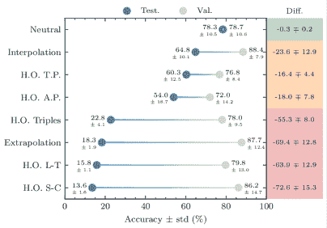

图 9：PGM 领域难度。测试（Test.）和验证（Val.）分割的平均准确率及其差异（Diff.），适用于在每个领域中评估的方法（见表 III）。

根据表 III 中 9 个模型在每个 PGM 环境下的结果，我们在图 9 中比较了各个环境的难度水平。可以明显地看到，这些环境可以根据其难度分为三组。首先是中性环境，根据定义，测试集与验证集具有相同的分布。在这种传统设置下，验证集上的表现是测试集结果的准确指示。然而，在其余环境中情况已不再如此。在插值、保留三元组对和保留属性对环境中，模型的准确率在验证集与测试集之间显著下降（在 MXGNet $\beta=0$ 的保留属性对环境中下降高达 34.7%，见表 II）。在剩余环境中，即保留三元组、外推、保留线型和保留形状-颜色中，泛化性能几乎消失，一些模型甚至在测试集上的表现与随机猜测无法区分。这些观察结果表明，尽管当前方法在中性环境下表现令人满意，但其他更具挑战性的环境仍然是一个难题。我们认为，未来的工作应避免仅仅推动 i.i.d. 泛化的极限，而应明确专注于构建能够对分布外样本进行泛化的模型。

表 IV：RAVEN 与 I-RAVEN 的准确率。所有 RAVEN [16] 和 I-RAVEN [17] 数据集配置在测试集上的平均准确率。模型根据其在 I-RAVEN 上的得分以及在 RAVEN 上的得分按升序排列。每个模型呈现了最佳报告配置的结果。²²脚注：2MRNet 在 RAVEN-FAIR 上进行评估。

| 方法 | 测试准确率（%） |
| --- | --- |
| RAVEN | I-RAVEN |
| CNN LSTM + DRT [16] | 14.0 | - |
| WReN + DRT [16] | 15.0 | - |
| ARNe [31] | 19.7 | - |
| MCPT [28] | 28.5 | - |
| WReN-Tag-Aux [20] | 34.0 | - |
| CNN MLP [16] | 37.0 | - |
| CNN MLP + DRT [16] | 39.4 | - |
| PRD [29] | 50.7 | - |
| ResNet-18 [28] | 77.2 | - |
| LEN + TM [22] | 78.3 | - |
| MXGNet [36] | 83.9 | - |
| ²²脚注：2MRNet [18] | 84.0 | - |
| ResNet-50 + pre-train [28] | 86.3 | - |
| Rel-Base [34] | 91.7 | - |
| CoPINet + AL [21] | 93.5 | - |
| DCNet [35] | 93.6 | - |
| CoPINet + ACL [21] | 93.7 | - |
| Rel-AIR [34] | 94.1 | - |
| Context-blind ResNet [17] | 71.9 | 12.2 |
| Context-blind SCL [33] | 94.2 | 12.2 |
| Context-blind CoPINet [17] | 94.2 | 14.2 |
| CNN LSTM [16, 17] | 13.1 | 18.9 |
| WReN [16, 17] | 14.7 | 23.8 |
| ResNet-18 [16, 17] | 53.4 | 40.3 |
| ResNet-18 + DRT [16, 17] | 59.6 | 40.4 |
| LEN [22, 17] | 72.9 | 41.4 |
| Wild ResNet [17] | - | 44.3 |
| CoPINet [20, 17] | 91.4 | 46.1 |
| NCD [30] | 37.0 | 48.2 |
| CoPINet MLCL+DA [19] | - | 57.1 |
| SRAN [17] | - | 60.8 |
| SRAN MLCL+DA [19] | - | 73.3 |
| ²²footnotemark: 2MRNet [18] | - | 86.8 |
| SCL [33] | 91.6 | 95.0 |
| SCL MLCL+DA [19] | - | 96.8 |
| Human [16] | 84.4 | - |

### 5.2 (I-)RAVEN 上的结果

除了 PGM，解决 RPM 问题的方法通常会在 RAVEN 数据集及其衍生品上进行评估。表 2 中展示了讨论方法在 RAVEN 和 I-RAVEN 测试分割上的聚合准确性评分。首先，可以看出表的上半部分包含仅在 RAVEN 上评估的方法。然而，由于答案生成算法中的隐含偏差[17]，该数据集上报告的结果是不确定的，可能具有误导性。这一观点得到了对上下文盲模型显著性能的证明，以及 CoPINet 在平衡数据集上准确率显著下降（RAVEN 上为 91.4%，I-RAVEN 上为 46.1%）的支持。因此，我们强烈建议对现有和未来的 DL 方法在数据集的无偏版本上进行评估。

最佳的 I-RAVEN 结果由 SCL 模型实现，该模型在 PGM 上的表现也非常出色。这表明，SCL 总体上是解决 RPM 问题的**最佳**模型。接下来的部分进一步揭示了模型性能与其参数数量之间的关系，从而**进一步加强**了这一说法。

对特定 RAVEN 和 I-RAVEN 配置的详细性能结果展示在*补充材料*中。

表 V：模型大小。基于模型开源实现的可训练参数数量。C-B 代表 Context-blind。²²footnotemark: 2 在 C-B ResNet-18 中，我们已将输入通道数量从 16 更改为 8。

| 模型 | # 参数 | GitHub 仓库 |
| --- | --- | --- |
| SCL [33] | 137,286 | [dhh1995/SCL](https://github.com/dhh1995/SCL) |
| CNN LSTM [16] | 143,960 | [WellyZhang/RAVEN](https://github.com/WellyZhang/RAVEN) |
| CNN MLP [16] | 299,400 | [WellyZhang/RAVEN](https://github.com/WellyZhang/RAVEN) |
| CNN LSTM + DRT [16] | 804,628 | [WellyZhang/RAVEN](https://github.com/WellyZhang/RAVEN) |
| WReN [12] | 1,216,173 | [Fen9/WReN](https://github.com/Fen9/WReN) |
| Rel-Base [34] | 1,226,673 | [SvenShade/Rel-AIR](https://github.com/SvenShade/Rel-AIR) |
| CoPINet [20] | 1,685,949 | [WellyZhang/CoPINet](https://github.com/WellyZhang/CoPINet) |
| Rel-AIR [34] | 1,948,644 | [SvenShade/Rel-AIR](https://github.com/SvenShade/Rel-AIR) |
| CNN MLP + DRT [16] | 2,054,724 | [WellyZhang/RAVEN](https://github.com/WellyZhang/RAVEN) |
| LEN [22] | 5,520,673 | [zkcys001/distracting_feature](https://github.com/zkcys001/distracting_feature) |
| DCNet [35] | 5,833,025 | [visiontao/dcnet](https://github.com/visiontao/dcnet) |
| NCD [30] | 11,177,025 | [visiontao/ncd](https://github.com/visiontao/ncd) |
| ²²footnotemark: 2C-B ResNet-18 [16] | 11,474,342 | [WellyZhang/RAVEN](https://github.com/WellyZhang/RAVEN) |
| ResNet-18 [16] | 11,499,430 | [WellyZhang/RAVEN](https://github.com/WellyZhang/RAVEN) |
| ResNet-18 + DRT [16] | 13,254,754 | [WellyZhang/RAVEN](https://github.com/WellyZhang/RAVEN) |
| MRNet [18] | 19,531,841 | [yanivbenny/MRNet](https://github.com/yanivbenny/MRNet) |
| SRAN [17] | 44,030,217 | [husheng12345/SRAN](https://github.com/husheng12345/SRAN) |

<svg   height="395.2" overflow="visible" version="1.1" width="483.94"><g transform="translate(0,395.2) matrix(1 0 0 -1 0 0) translate(32.26,0) translate(0,9.2)" fill="#000000" stroke="#000000" stroke-width="0.4pt"><g clip-path="url(#pgfcp1)"><g stroke="#000000" fill="#000000" transform="matrix(1.0 0.0 0.0 1.0 49.46 30.65)"><foreignobject width="6.92" height="8.92" transform="matrix(1 0 0 -1 0 16.6)" overflow="visible">$\displaystyle{0}$</foreignobject></g><g stroke="#000000" fill="#000000" transform="matrix(1.0 0.0 0.0 1.0 109.53 30.65)"><foreignobject width="13.84" height="8.92" transform="matrix(1 0 0 -1 0 16.6)" overflow="visible">$\displaystyle{20}$</foreignobject></g><g stroke="#000000" fill="#000000" transform="matrix(1.0 0.0 0.0 1.0 173.06 30.65)"><foreignobject width="13.84" height="8.92" transform="matrix(1 0 0 -1 0 16.6)" overflow="visible">$\displaystyle{40}$</foreignobject></g><g stroke="#000000" fill="#000000" transform="matrix(1.0 0.0 0.0 1.0 236.6 30.65)"><foreignobject width="13.84" height="8.92" transform="matrix(1 0 0 -1 0 16.6)" overflow="visible">$\displaystyle{60}$</foreignobject></g><g stroke="#000000" fill="#000000" transform="matrix(1.0 0.0 0.0 1.0 300.13 30.65)"><foreignobject width="13.84" height="8.92" transform="matrix(1 0 0 -1 0 16.6)" overflow="visible">$\displaystyle{80}$</foreignobject></g><g stroke="#000000" fill="#000000" transform="matrix(1.0 0.0 0.0 1.0 360.21 30.65)"><foreignobject width="20.76" height="8.92" transform="matrix(1 0 0 -1 0 16.6)" overflow="visible">$\displaystyle{100}$</foreignobject></g><g stroke="#000000" fill="#000000" transform="matrix(1.0 0.0 0.0 1.0 115.82 11.29)"><foreignobject width="191.85" height="13.84" transform="matrix(1 0 0 -1 0 16.6)" overflow="visible">PGM 中性测试准确率 (%)</foreignobject></g><g stroke="#000000" fill="#000000" transform="matrix(1.0 0.0 0.0 1.0 41.11 39.61)"><foreignobject width="6.92" height="8.92" transform="matrix(1 0 0 -1 0 16.6)" overflow="visible">$\displaystyle{0}$</foreignobject></g><g stroke="#000000" fill="#000000" transform="matrix(1.0 0.0 0.0 1.0 34.17 105.96)"><foreignobject width="13.84" height="8.92" transform="matrix(1 0 0 -1 0 16.6)" overflow="visible">$\displaystyle{20}$</foreignobject></g><g stroke="#000000" fill="#000000" transform="matrix(1.0 0.0 0.0 1.0 34.17 172.31)"><foreignobject width="13.84" height="8.92" transform="matrix(1 0 0 -1 0 16.6)" overflow="visible">$\displaystyle{40}$</foreignobject></g><g stroke="#000000" fill="#000000" transform="matrix(1.0 0.0 0.0 1.0 34.17 238.66)"><foreignobject width="13.84" height="8.92" transform="matrix(1 0 0 -1 0 16.6)" overflow="visible">$\displaystyle{60}$</foreignobject></g><g stroke="#000000" fill="#000000" transform="matrix(1.0 0.0 0.0 1.0 34.17 305.01)"><foreignobject width="13.84" height="8.92" transform="matrix(1 0 0 -1 0 16.6)" overflow="visible">$\displaystyle{80}$</foreignobject></g><g stroke="#000000" fill="#000000" transform="matrix(1.0 0.0 0.0 1.0 27.22 371.35)"><foreignobject width="20.76" height="8.92" transform="matrix(1 0 0 -1 0 16.6)" overflow="visible">$\displaystyle{100}$</foreignobject></g><g stroke="#000000" fill="#000000" transform="matrix(0.0 1.0 -1.0 0.0 18.21 111.66)"><foreignobject width="198.83" height="13.84" transform="matrix(1 0 0 -1 0 16.6)" overflow="visible">RAVEN 平均测试准确率 (%)</foreignobject></g><g stroke="#000000" fill="#000000" transform="matrix(1.0 0.0 0.0 1.0 -32.26 150.45)"><foreignobject width="380.01" height="13.84" transform="matrix(1 0 0 -1 0 16.6)" overflow="visible">CNN MLP [12, 16]</foreignobject></g><g stroke="#000000" fill="#000000" transform="matrix(1.0 0.0 0.0 1.0 -27.5 71.16)"><foreignobject width="388.28" height="13.84" transform="matrix(1 0 0 -1 0 16.6)" overflow="visible">CNN LSTM [12, 16]</foreignobject></g><g stroke="#000000" fill="#000000" transform="matrix(1.0 0.0 0.0 1.0 74.36 103.01)"><foreignobject width="354.84" height="13.84" transform="matrix(1 0 0 -1 0 16.6)" overflow="visible">WReN [12, 16]</foreignobject></g><g stroke="#000000" fill="#000000" transform="matrix(1.0 0.0 0.0 1.0 157.9 266.23)"><foreignobject width="222.69" height="13.84" transform="matrix(1 0 0 -1 0 16.6)" overflow="visible">LEN [22]</foreignobject></g><g stroke="#000000" fill="#000000" transform="matrix(1.0 0.0 0.0 1.0 -21.68 344.19)"><foreignobject width="247.41" height="13.84" transform="matrix(1 0 0 -1 0 16.6)" overflow="visible">CoPINet [20]</foreignobject></g><g stroke="#000000" fill="#000000" transform="matrix(1.0 0.0 0.0 1.0 139.92 361.44)"><foreignobject width="230.07" height="13.84" transform="matrix(1 0 0 -1 0 16.6)" overflow="visible">DCNet [35]</foreignobject></g><g stroke="#000000" fill="#000000" transform="matrix(1.0 0.0 0.0 1.0 223.66 303.05)"><foreignobject width="220.16" height="13.84" transform="matrix(1 0 0 -1 0 16.6)" overflow="visible">MRNet [18]</foreignobject></g><g stroke="#000000" fill="#000000" transform="matrix(1.0 0.0 0.0 1.0 160.44 328

(a) PGM – RAVEN.

²²脚注标记：2

(b) PGM – I-RAVEN.

²²脚注标记：2

(c) RAVEN – I-RAVEN。

图 10：大小与准确率。模型性能在 PGM、RAVEN 和 I-RAVEN 上根据其可训练参数数量进行评估。这些图表仅展示了在相关数据集对中已被文献评估的模型。C-B 代表上下文盲。²²脚注标记：2MRNet 在 RAVEN-FAIR 上进行评估，而非 I-RAVEN。

### 5.3 模型大小

据我们了解，在现有关于解决 RPM 的深度学习方法的文献中，从未讨论过模型的大小——以参数数量来衡量。然而，一些模型，例如 MRNet [18]或 SRAN [17]，使用了基于 ResNet [100]的深度视觉骨干网，导致了大量的可训练参数。所有讨论的模型中具有公开源代码实现的模型参数数量在表 VRAVEN ‣ 5 Evaluating machine intelligence with RPMs ‣ Deep Learning Methods for Abstract Visual Reasoning: A Survey on Raven’s Progressive Matrices")中进行了比较。模型大小从数十万到数千万不等，其中最大模型（SRAN）的参数数量约为最小模型（SCL）的 320 倍。

尽管在各种现实世界问题中，例如计算机视觉 [125, 126]或自然语言处理 [127, 128]中，经常需要大量的可训练参数，因为几乎可以获得无限量的训练数据，但在 RPM 的背景下情况并非如此。图 2RAVEN ‣ 5 Evaluating machine intelligence with RPMs ‣ Deep Learning Methods for Abstract Visual Reasoning: A Survey on Raven’s Progressive Matrices")显示，在 RPM 基准测试中，最佳结果是由参数数量最少的模型——SCL 获得的。尽管这有些令人惊讶，但这一观察结果表明，相对较小的模型能够有效地学习解决 RPM，并具有竞争力的泛化能力（参见表 III）。换句话说，这些结果证明了在 RPM 的情况下，大型（从参数数量的角度看）视觉骨干网（例如深度 ResNet）并非必需，相反，存在高效的参数共享模块是至关重要的。

尽管这一点尚待在其他 AVR 任务中验证，但我们推测，由于它们的视觉相似性（例如缺乏纹理和存在二维灰度形状），在设计 AVR 机器求解器时应做出类似的建筑决策。

## 6 讨论

将 RPM（Relation Prediction Method）引入深度学习文献的初衷是将这些问题作为估计机器智能的代理。然而，事实证明，空间和抽象推理的能力在各种其他环境中也对智能系统的发展至关重要[129]。因此，在 RPM 背景下提出的方法在其他研究和实际应用背景中往往具有相关性。在本节中，我们将讨论的方法与其他领域的进展联系起来，并突出未来工作中主要未解决的挑战和开放问题。

### 6.1 RPM 研究的种子与成果

关系网络（Relation Network），作为所讨论模型（如 WReN、LEN 或 MLRN）的基本组成部分，已经在多个任务中展示了其有效性。在[130]中，作者考虑了一个三维人体姿态估计问题[131、132、133]，并提出了一种深度学习算法来应对这一挑战。该方法设计中采用了 RN 来捕捉不同身体部位之间的关系。同样，在语义分割的背景下[134、135、136]，使用 RN 捕捉实体之间的远距离空间关系的想法得到了进一步探索。研究表明，关系推理组件可以通过利用通道和空间特征关系来增强 CNN 特征图[137]。这种全球上下文的融入是利用 RN 的工作的一个反复出现的主题（也在其他神经模块中得到了探索[138、139、140、141]）。RN 进一步应用于建模人类行为者、物体和场景元素之间的时空互动，以进行动作识别[142]，在对比自监督设置中训练有效的图像识别模型[143]，或为结构化表示的关系推理提供机制，以用于深度强化学习代理[144]。

为了成功解决 RPM 并学会制定类比，多项讨论的工作采用了各种形式的对比机制，或者直接在模型架构中 [20, 35]，或者在目标函数中 [20, 19, 21]。对比方法 [145, 146, 147] 对于自监督学习尤其有用，其中标记数据的可用性稀缺。此类方法的重要性已经在计算机视觉 [148, 149, 143]，自然语言处理 [150, 151, 152]，语音识别 [153, 154, 155] 或强化学习 [156, 157, 158] 的背景下得到了证明。

RPM 求解方法通常在仅做少量调整后，直接适用于相关的抽象推理任务。RN 在解决算术视觉推理任务时发现与其他模型具有竞争力 [59]，而基于 WReN 的模型被发现是解决视觉类比问题 [56] 和结构上类似于 RPM 的抽象推理矩阵 [90] 的最佳方法之一。

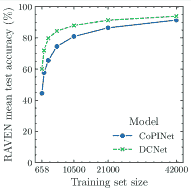

(a) RAVEN，$i\in\{0,1,\ldots,6\}$

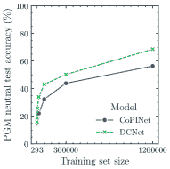

(b) PGM，$i\in\{0,2,\ldots,12\}$

图 11：低样本情况。图表展示了两个模型在 a) RAVEN 和 b) PGM 数据集分割上的表现。分割大小等于 $N/2^{i}$，其中 $N$ 表示原始数据集的大小，对 RAVEN 为 42,000，对 PGM 为 1,200,000。结果见 [35]。

### 6.2 挑战与开放问题

尽管讨论中的工作已经开始通过评估其在 RPM 基准测试上的表现来测量机器智能，但仍有人可能反对这种方法的有效性。在解决 RPM 时，人类解题者通常面对的是之前未曾遇到的任务，这测试了其适应性问题解决能力。与人类相反，当前大多数 DL 方法在训练之前使用了数千[16]或数百万[12]个样本。此外，如图 11 所示，这些模型的性能在训练语料库规模减少时迅速恶化。相反，人类不仅能够在熟悉少量示例后掌握概念，还能够将解决简单矩阵时获得的知识外推到更复杂的矩阵中。鉴于这种显著的对比，值得倡导在没有大规模训练集的情况下寻找解决 RPM 的高效方法。我们相信，探索本文讨论的某些新兴途径是值得的，这些途径专门设计用于在少样本学习设置中测试 DL 算法[58, 159]。

另一种确保开发的模式分析算法在新环境中与人类相似的基准测试的方法是遵循开创性的 PGM 论文[12]的观点。通过明确界定各种泛化模式，Barrett 等人[12] 使得能够直接测量 DL 方法在解决 RPM 时的泛化能力（在新环境中的表现）。然而，至今尚未提出能够在所有模式下实现类人表现的有效方法。事实上，现有的方法似乎具有特定的泛化能力，这更像是副作用而非刻意选择。虽然近期的研究[57]表明神经模型在专注于外推的 AVR 任务中能够进行泛化，这构成了最具挑战性的 PGM 模式之一，但构建一个在所有模式下都表现优异的通用学习系统仍然任重道远。

区分人类与当前 AI 系统的另一个关键特征是解决各种类型 AVR 问题的能力，且只需有限的训练。尽管已知人类能够在问题之间进行泛化和知识转移，但现有的深度学习方法仅在短暂的时间内展示了这种属性。一些在 RAVEN 数据集上评估深度学习方法的工作表明，训练于某一配置的模型可能学习构建对解决属于其他配置的矩阵有用的抽象 [16, 34, 27]。在 [15] 中，展示了一个 RPM 解决模型能够适应解决由类似输入图像组成的奇异任务。虽然上述例子在一定程度上表明了深度学习算法在 AVR 背景下的独立同分布泛化能力，但多个不同 AVR 问题之间的知识重用仍需在未来的工作中进一步研究。

## 7 结论

本文讨论了将深度学习方法应用于解决 RPM 的最新进展，总结了各种学习解决这些任务的方法，回顾了现有的 RPM 基准数据集，并分类了该领域中使用的深度学习模型。此外，通过汇总最近发表的方法的结果，它突出了 RPM 问题中最具挑战性的方面，这些方面至今仍主要未解决。

论文指出，尽管 RPM 最初被提议作为衡量人类智力的任务，并随后作为估计机器智力的替代工具使用，但它们还提供了一个易于理解的实验场所，用于开发和测试抽象及关系推理方法。从这一角度看，RPM 研究的进展可以应用于广泛的其他领域，在这些领域中需要空间和抽象推理技能。

尽管近年来解决 RPM 的任务在深度学习社区中引起了广泛关注，但其核心挑战仍未得到解决。我们希望通过汇总解决 RPM 的方法进展，这项调查将刺激未来 AVR 研究的进展。

## 参考文献

+   Detterman 和 Sternberg [1986] D. K. Detterman 和 R. J. Sternberg, *什么是智力?: 关于其本质和定义的当代观点*。 Ablex, 1986.

+   Legg 等 [2007] S. Legg, M. Hutter *等*, “智力的定义集合，” *人工智能与应用前沿*, vol. 157, p. 17, 2007.

+   Hernández-Orallo [2017] J. Hernández-Orallo, *所有智力的度量: 评估自然和人工智力*。 剑桥大学出版社, 2017.

+   Snow 等 [1984] R. E. Snow, P. C. Kyllonen, 和 B. Marshalek, “能力和学习相关性的地形图，” *人类智力心理学的进展*, vol. 2, no. S 47, p. 103, 1984.

+   Carpenter 等 [1990] P. A. Carpenter, M. A. Just 和 P. Shell，“**一个智力测试测量的内容**：关于拉文渐进矩阵测试中的处理的理论说明。” *心理学评论*，第 97 卷，第 3 期，第 404 页，1990 年。

+   Hofstadter 等 [1979] D. R. Hofstadter *等*，*哥德尔、艾舍尔、巴赫：一个永恒的金色编织*。 Basic books 纽约，1979 年，第 13 卷。

+   Raven [1936] J. C. Raven，“**在遗传研究中使用的心理测验**：相关个体在主要教育性和主要生殖性测试上的表现，” *伦敦大学硕士论文*，1936 年。

+   Raven 和 Court [1998] J. C. Raven 和 J. H. Court，*拉文的渐进矩阵和词汇量表*。 Oxford psychologists Press 牛津，英格兰，1998 年。

+   LeCun 等 [2015] Y. LeCun, Y. Bengio 和 G. Hinton，“**深度学习**，” *自然*，第 521 卷，第 7553 期，第 436–444 页，2015 年。

+   Raghu 和 Schmidt [2020] M. Raghu 和 E. Schmidt，“**深度学习在科学发现中的调查**，” *arXiv 预印本 arXiv:2003.11755*，2020 年。

+   Hoshen 和 Werman [2017] D. Hoshen 和 M. Werman，“**神经网络的 IQ**，” *arXiv 预印本 arXiv:1710.01692*，2017 年。

+   Barrett 等 [2018] D. Barrett, F. Hill, A. Santoro, A. Morcos 和 T. Lillicrap，“**神经网络中的抽象推理测量**，”在 *国际机器学习会议*。 PMLR，2018 年，第 511–520 页。

+   Matzen 等 [2010] L. E. Matzen, Z. O. Benz, K. R. Dixon, J. Posey, J. K. Kroger 和 A. E. Speed，“**重建拉文**：一种用于系统生成大量类似拉文的矩阵问题的软件，具有规范化属性，” *行为研究方法*，第 42 卷，第 2 期，第 525–541 页，2010 年。

+   Wang 和 Su [2015] K. Wang 和 Z. Su，“**拉文的渐进矩阵**的自动生成，”在 *第二十四届国际人工智能联合会议*，2015 年。

+   Mańdziuk 和 Żychowski [2019] J. Mańdziuk 和 A. Żychowski，“**DeepIQ**: 一个受人类启发的 AI 系统，用于解决 IQ 测试问题，”在 *2019 年国际神经网络联合会议 (IJCNN)*。 IEEE，2019 年，第 1–8 页。

+   Zhang 等 [2019a] C. Zhang, F. Gao, B. Jia, Y. Zhu 和 S.-C. Zhu，“**Raven**: 一个用于关系和类比视觉推理的数据集，”在 *IEEE 计算机视觉与模式识别会议论文集*，2019 年，第 5317–5327 页。

+   Hu 等 [2021] S. Hu, Y. Ma, X. Liu, Y. Wei 和 S. Bai，“**分层规则感知网络**用于抽象视觉推理，”在 *AAAI 人工智能会议*，2021 年。

+   Benny 等 [2021] Y. Benny, N. Pekar 和 L. Wolf，“**尺度局部化抽象推理**，”在 *IEEE/CVF 计算机视觉与模式识别会议论文集*，2021 年，第 12,557–12,565 页。

+   Małkiński 和 Mańdziuk [2020] M. Małkiński 和 J. Mańdziuk，“**用于抽象视觉推理的多标签对比学习**，” *arXiv 预印本 arXiv:2012.01944*，2020 年。

+   Zhang 等 [2019b] C. Zhang, B. Jia, F. Gao, Y. Zhu, H. Lu 和 S.-C. Zhu，“通过对比学习感知推理，” 见于 *Advances in Neural Information Processing Systems*，2019，第 1075–1087 页。

+   Kim 等 [2020] Y. Kim, J. Shin, E. Yang 和 S. J. Hwang，“通过元类比对比学习进行少样本视觉推理，” *Advances in Neural Information Processing Systems*，第 33 卷，2020。

+   Zheng 等 [2019] K. Zheng, Z.-J. Zha 和 W. Wei，“带有干扰特征的抽象推理，” 见于 *Advances in Neural Information Processing Systems*，2019，第 5842–5853 页。

+   Steenbrugge 等 [2018] X. Steenbrugge, S. Leroux, T. Verbelen 和 B. Dhoedt，“通过解缠特征表示提高抽象推理任务的泛化能力，” *arXiv 预印本 arXiv:1811.04784*，2018。

+   Pekar 等 [2020] N. Pekar, Y. Benny 和 L. Wolf，“为进阶矩阵智力测试生成正确答案，” 见于 *Advances in Neural Information Processing Systems*，第 33 卷，2020 年，第 7390–7400 页。

+   Hua 和 Kunda [2020] T. Hua 和 M. Kunda，“利用生成图像修补技术建模 Raven 进阶矩阵上的整体视觉推理。” 见于 *CogSci*，2020。

+   Shi 等 [2021] F. Shi, B. Li 和 X. Xue，“带有潜在高斯过程先验的 Raven 进阶矩阵完成，” 见于 *Proceedings of the AAAI Conference on Artificial Intelligence*，第 35 卷，第 11 期，2021 年，第 9612–9620 页。

+   Zhang 等 [2021] C. Zhang, B. Jia, S.-C. Zhu 和 Y. Zhu，“通过概率性归纳和执行进行抽象时空推理，” 见于 *Proceedings of the IEEE/CVF Conference on Computer Vision and Pattern Recognition*，2021，第 9736–9746 页。

+   Zhuo 和 Kankanhalli [2020] T. Zhuo 和 M. Kankanhalli，“使用神经网络解决 Raven 的进阶矩阵，” *arXiv 预印本 arXiv:2002.01646*，2020。

+   Kiat 等 [2020] N. Q. W. Kiat, D. Wang 和 M. Jamnik，“用于无监督 Raven 进阶矩阵的成对关系判别器，” *arXiv 预印本 arXiv:2011.01306*，2020。

+   Zhuo 等 [2021] T. Zhuo, Q. Huang 和 M. Kankanhalli，“用于 Raven 问题矩阵的无监督抽象推理，” *IEEE Transactions on Image Processing*，第 30 卷，第 8332–8341 页，2021。

+   Hahne 等 [2019] L. Hahne, T. Lüddecke, F. Wörgötter 和 D. Kappel，“关注抽象视觉推理，” *arXiv 预印本 arXiv:1911.05990*，2019。

+   Jahrens 和 Martinetz [2020] M. Jahrens 和 T. Martinetz，“使用多层关系网络解决 Raven 的进阶矩阵，” 见于 *2020 International Joint Conference on Neural Networks (IJCNN)*。 IEEE，2020，第 1–6 页。

+   Wu 等 [2020] Y. Wu, H. Dong, R. Grosse 和 J. Ba，“散射组合学习者：在类比推理中发现对象、属性、关系，” *arXiv 预印本 arXiv:2007.04212*，2020。

+   Spratley 等 [2020] S. Spratley, K. Ehinger 和 T. Miller，“对 Raven 中泛化的更深入观察，” 见于 *Computer Vision – ECCV 2020*。 Springer，2020，第 601–616 页。

+   Zhuo 和 Kankanhalli [2021] T. Zhuo 和 M. Kankanhalli, “使用双重对比网络的有效抽象推理，” 收录于 *国际学习表征会议（ICLR）*，2021 年。

+   Wang 等 [2020] D. Wang, M. Jamnik, 和 P. Lio, “利用多重图网络进行抽象图示推理，” 收录于 *国际学习表征会议（ICLR）*，2020 年。

+   Rahaman 等 [2021] N. Rahaman, M. W. Gondal, S. Joshi, P. Gehler, Y. Bengio, F. Locatello, 和 B. Schölkopf, “使用神经解释器进行动态推理，” *神经信息处理系统进展*，第 34 卷，2021 年。

+   Mitchell [2021] M. Mitchell, “人工智能中的抽象与类比推理，” *arXiv 预印本 arXiv:2102.10717*，2021 年。

+   Evans [1964] T. G. Evans, “一个解决几何类比问题的启发式程序，” 收录于 *1964 年 4 月 21-23 日春季联合计算机会议论文集*，1964 年，第 327–338 页。

+   Foundalis [2006] H. E. Foundalis, “Phaeaco：一种受 Bongard 问题启发的认知架构。” 印第安纳大学博士学位论文，2006 年。

+   Strannegård 等 [2013] C. Strannegård, S. Cirillo, 和 V. Ström, “一种用于渐进矩阵问题的人性化方法，” *认知系统研究*，第 22 卷，第 35–46 页，2013 年。

+   Gentner [1980] D. Gentner, “科学中类比模型的结构。” BOLT BERANEK AND NEWMAN INC CAMBRIDGE MA, 技术报告，1980 年。

+   Falkenhainer 等 [1986] B. Falkenhainer, K. D. Forbus, 和 D. Gentner, *结构映射引擎*。伊利诺伊大学厄本那-香槟分校计算机科学系，1986 年，第 1275 卷。

+   Lovett 等 [2007] A. Lovett, K. Forbus, 和 J. Usher, “使用定性空间表征的类比可以模拟解决 Raven 渐进矩阵，” 收录于 *认知科学学会年会论文集*，第 29 卷，第 29 期，2007 年。

+   Lovett 等 [2010] ——, “Raven 渐进矩阵的结构映射模型，” 收录于 *认知科学学会年会论文集*，第 32 卷，第 32 期，2010 年。

+   Kunda 等 [2010] M. Kunda, K. McGreggor, 和 A. Goel, “从视觉上看 Raven 智力测试（字面意思！）：两种视觉解决策略，” 收录于 *认知科学学会年会论文集*，第 32 卷，第 32 期，2010 年。

+   Kunda 等 [2012] ——, “使用图标视觉表征在 Raven 高级渐进矩阵测试中的推理，” 收录于 *认知科学学会年会论文集*，第 34 卷，第 34 期，2012 年。

+   McGreggor 等 [2010] K. McGreggor, M. Kunda, 和 A. Goel, “一种分形类比方法用于 Raven 智力测试，” 收录于 *第二十四届 AAAI 人工智能会议研讨会*，2010 年。

+   McGreggor 和 Goel [2014] K. McGreggor 和 A. Goel, “对 Raven 的渐进矩阵测试的自信推理，” 收录于 *AAAI 人工智能会议论文集*，第 28 卷，第 1 期，2014 年。

+   Hernández-Orallo et al. [2016] J. Hernández-Orallo, F. Martínez-Plumed, U. Schmid, M. Siebers, 和 D. L. Dowe, “计算机模型解决智能测试问题：进展与影响”，*人工智能*，第 230 卷，页码 74–107，2016 年。

+   Gardner 和 Richards [2006] M. Gardner 和 D. Richards, *短谜题和问题的大百科全书*。Norton，2006 年。

+   Ruiz [2011] P. E. Ruiz, “构建和解决找出异类分类问题：一种系统的方法”，*智力*，第 39 卷，第 5 期，页码 342–350，2011 年。

+   Smets 和 Vreeken [2011] K. Smets 和 J. Vreeken, “找出异类：识别和特征异常”，发表于*2011 年 SIAM 国际数据挖掘会议*。SIAM，2011 年，页码 804–815。

+   Bongard [1968] M. M. Bongard, “识别问题”，外国技术部门 Wright-Patterson AFB Ohio, 技术报告，1968 年。

+   Fleuret et al. [2011] F. Fleuret, T. Li, C. Dubout, E. K. Wampler, S. Yantis, 和 D. Geman, “在视觉分类测试中比较机器和人类”，*美国国家科学院院刊*，第 108 卷，第 43 期，页码 17 621–17 625，2011 年。

+   Hill et al. [2019] F. Hill, A. Santoro, D. Barrett, A. Morcos, 和 T. Lillicrap, “通过对比抽象关系结构来学习类比”，发表于*国际学习表征会议 (ICLR)*，2019 年。

+   Webb et al. [2020] T. Webb, Z. Dulberg, S. Frankland, A. Petrov, R. O’Reilly, 和 J. Cohen, “学习支持外推的表征”，发表于*国际机器学习会议*。PMLR，2020 年，页码 10 136–10 146。

+   Chollet [2019] F. Chollet, “关于智能的度量”，*arXiv 预印本 arXiv:1911.01547*，2019 年。

+   Zhang et al. [2020] W. Zhang, C. Zhang, Y. Zhu, 和 S.-C. Zhu, “机器数感：用于抽象和关系推理的视觉算术问题数据集”，发表于*AAAI 人工智能会议 (AAAI)*，2020 年。

+   Małkiński 和 Mańdziuk [2022] M. Małkiński 和 J. Mańdziuk, “抽象视觉推理新兴研究方向综述”，*arXiv 预印本 arXiv:2202.10284*，2022 年。

+   Jaeggi et al. [2008] S. M. Jaeggi, M. Buschkuehl, J. Jonides, 和 W. J. Perrig, “通过工作记忆训练提高流体智力”，*美国国家科学院院刊*，第 105 卷，第 19 期，页码 6829–6833，2008 年。

+   Jain 和 Chandrasekaran [1982] A. K. Jain 和 B. Chandrasekaran, “模式识别实践中的维度和样本大小考虑”，*统计手册*，第 2 卷，页码 835–855，1982 年。

+   Raudys et al. [1991] S. J. Raudys, A. K. Jain *等*，“统计模式识别中的小样本效应：对从业者的建议”，*IEEE 模式分析与机器智能汇刊*，第 13 卷，第 3 期，页码 252–264，1991 年。

+   Sun et al. [2017] C. Sun, A. Shrivastava, S. Singh, 和 A. Gupta, “重审数据在深度学习时代的不合理有效性”，发表于*IEEE 国际计算机视觉会议*，2017 年，页码 843–852。

+   Mahajan 等人 [2018] D. Mahajan, R. Girshick, V. Ramanathan, K. He, M. Paluri, Y. Li, A. Bharambe, 和 L. Van Der Maaten, “探索弱监督预训练的极限，” 在 *欧洲计算机视觉会议 (ECCV) 论文集*，2018 年，第 181–196 页。

+   Ragni 和 Neubert [2014] M. Ragni 和 S. Neubert, “分析渡鸦智力测试：认知模型、需求和复杂性，” 在 *类比推理的计算方法：当前趋势*。   Springer, 2014 年，第 351–370 页。

+   Fu [1974] K. S. Fu, *模式识别中的句法方法*。   Elsevier, 1974。

+   Zhu 和 Mumford [2007] S.-C. Zhu 和 D. Mumford, *图像的随机语法*。   Now Publishers Inc, 2007。

+   Lin 等人 [2009] L. Lin, T. Wu, J. Porway, 和 Z. Xu, “用于组成对象表示和识别的随机图语法，” *模式识别*，第 42 卷，第 7 期，第 1297–1307 页，2009 年。

+   Agrawal 等人 [2018] A. Agrawal, D. Batra, D. Parikh, 和 A. Kembhavi, “不要仅仅假设；观察并回答：克服视觉问答中的先验假设，” 在 *IEEE 计算机视觉与模式识别会议论文集*，2018 年，第 4971–4980 页。

+   D’Amour 等人 [2020] A. D’Amour, K. Heller, D. Moldovan, B. Adlam, B. Alipanahi, A. Beutel, C. Chen, J. Deaton, J. Eisenstein, M. D. Hoffman *等人*, “不足表述对现代机器学习中的可信度提出挑战，” *arXiv 预印本 arXiv:2011.03395*, 2020。

+   Geirhos 等人 [2020] R. Geirhos, J.-H. Jacobsen, C. Michaelis, R. Zemel, W. Brendel, M. Bethge, 和 F. A. Wichmann, “深度神经网络中的快捷学习，” *自然机器智能*，第 2 卷，第 11 期，第 665–673 页，2020 年。

+   Dancette 等人 [2021] C. Dancette, R. Cadene, D. Teney, 和 M. Cord, “超越基于问题的偏差：评估视觉问答中的多模态快捷学习，” *arXiv 预印本 arXiv:2104.03149*, 2021。

+   Santoro 等人 [2017] A. Santoro, D. Raposo, D. G. Barrett, M. Malinowski, R. Pascanu, P. Battaglia, 和 T. Lillicrap, “用于关系推理的简单神经网络模块，” 在 *神经信息处理系统进展*，2017 年，第 4967–4976 页。

+   Gentner [1983] D. Gentner, “结构映射：类比的理论框架，” *认知科学*，第 7 卷，第 2 期，第 155–170 页，1983 年。

+   Hofstadter [1995] D. R. Hofstadter, *流动的概念与创造性的类比：思维基本机制的计算模型*。   Basic books, 1995。

+   Smith 和 Gentner [2014] L. Smith 和 D. Gentner, “差异检测在学习对比类别中的作用，” 在 *认知科学学会年会论文集*，第 36 卷，2014 年。

+   Sohn [2016] K. Sohn, “改进的深度度量学习与多类 n-pair 损失目标，” 在 *第 30 届国际神经信息处理系统会议论文集*，2016 年，第 1857–1865 页。

+   Khosla 等 [2020] P. Khosla, P. Teterwak, C. Wang, A. Sarna, Y. Tian, P. Isola, A. Maschinot, C. Liu 和 D. Krishnan，“*监督对比学习*”，见于 *神经信息处理系统进展*，第 33 卷，2020，页 18 661–18 673。

+   Bengio 等 [2009] Y. Bengio, J. Louradour, R. Collobert 和 J. Weston，“*课程学习*”，见于 *第 26 届国际机器学习大会论文集*，2009，页 41–48。

+   Kumar 等 [2010] M. P. Kumar, B. Packer 和 D. Koller，“*自定进度学习用于潜变量模型*”，见于 *神经信息处理系统进展*，第 1 卷，2010，页 2。

+   Borko 和 Putnam [1996] H. Borko 和 R. T. Putnam，“*学习教学*”，见于 *学习表示国际会议 (ICLR)*，1996。

+   Malisiewicz 等 [2011] T. Malisiewicz, A. Gupta 和 A. A. Efros，“*用于目标检测及其他的示例-SVM 集成*”，见于 *2011 年国际计算机视觉大会*。 IEEE，2011，页 89–96。

+   Lin 等 [2017] T.-Y. Lin, P. Goyal, R. Girshick, K. He 和 P. Dollár，“*密集目标检测的焦点损失*”，见于 *IEEE 国际计算机视觉会议论文集*，2017，页 2980–2988。

+   Jiang 等 [2018] L. Jiang, Z. Zhou, T. Leung, L.-J. Li 和 L. Fei-Fei，“*Mentornet: 基于数据驱动的课程学习用于深度神经网络处理受损标签*”，见于 *国际机器学习大会*。 PMLR，2018，页 2304–2313。

+   Ko 等 [2015] T. Ko, V. Peddinti, D. Povey 和 S. Khudanpur，“*语音识别的音频增强*”，见于 *国际语音通信协会第十六届年会*，2015。

+   Shorten 和 Khoshgoftaar [2019] C. Shorten 和 T. M. Khoshgoftaar，“*深度学习的图像数据增强综述*”，*大数据杂志*，第 6 卷，第 1 期，页 1–48，2019。

+   Wei 和 Zou [2019] J. Wei 和 K. Zou，“*EDA: 用于提升文本分类任务性能的简单数据增强技术*”，见于 *2019 年自然语言处理经验方法会议暨第九届国际自然语言处理联合会议（EMNLP-IJCNLP）*。 香港，中国：计算语言学协会，2019 年 11 月，页 6382–6388。

+   Wen 等 [2020] Q. Wen, L. Sun, F. Yang, X. Song, J. Gao, X. Wang 和 H. Xu，“*深度学习的时间序列数据增强：综述*”，*arXiv 预印本 arXiv:2002.12478*，2020。

+   van Steenkiste 等 [2019] S. van Steenkiste, F. Locatello, J. Schmidhuber 和 O. Bachem，“*解耦表示对抽象视觉推理是否有帮助？*” 见于 *神经信息处理系统进展*，2019，页 14 245–14 258。

+   Kingma 和 Welling [2013] D. P. Kingma 和 M. Welling，“*自动编码变分贝叶斯*”，见于 *学习表示国际会议 (ICLR)*，2013。

+   Higgins 等人 [2017] I. Higgins, L. Matthey, A. Pal, C. Burgess, X. Glorot, M. Botvinick, S. Mohamed, 和 A. Lerchner，“beta-vae：使用约束变分框架学习基本视觉概念”，见于 *国际学习表征会议（ICLR）*，2017 年。

+   Burgess 等人 [2018] C. P. Burgess, I. Higgins, A. Pal, L. Matthey, N. Watters, G. Desjardins, 和 A. Lerchner，“理解 $\beta$-vae 中的解耦”，*arXiv 预印本 arXiv:1804.03599*，2018 年。

+   Goodfellow 等人 [2014] I. Goodfellow, J. Pouget-Abadie, M. Mirza, B. Xu, D. Warde-Farley, S. Ozair, A. Courville, 和 Y. Bengio，“生成对抗网络”，见于 *神经信息处理系统进展*，第 27 卷，2014 年。

+   Creswell 等人 [2018] A. Creswell, T. White, V. Dumoulin, K. Arulkumaran, B. Sengupta, 和 A. A. Bharath，“生成对抗网络：概述”，*IEEE 信号处理杂志*，第 35 卷，第 1 期，第 53–65 页，2018 年。

+   Wang 等人 [2021] Z. Wang, Q. She, 和 T. E. Ward，“计算机视觉中的生成对抗网络：调查与分类”，*ACM 计算机调查*，第 54 卷，第 2 期，2021 年 2 月。

+   Williams [1992] R. J. Williams，“用于连接主义强化学习的简单统计梯度跟随算法”，*机器学习*，第 8 卷，第 3 期，第 229–256 页，1992 年。

+   LeCun 等人 [1990] Y. LeCun, B. E. Boser, J. S. Denker, D. Henderson, R. E. Howard, W. E. Hubbard, 和 L. D. Jackel，“用反向传播网络进行手写数字识别”，见于 *神经信息处理系统进展*，1990 年，第 396–404 页。

+   Mekik 等人 [2018] C. S. Mekik, R. Sun, 和 D. Y. Dai，“基于相似性的推理、乌鸦矩阵和一般智能”，见于 *IJCAI*，2018 年，第 1576–1582 页。

+   He 等人 [2016] K. He, X. Zhang, S. Ren, 和 J. Sun，“深度残差学习用于图像识别”，见于 *IEEE 计算机视觉与模式识别会议论文集*，2016 年，第 770–778 页。

+   Hochreiter 和 Schmidhuber [1997] S. Hochreiter 和 J. Schmidhuber，“长短期记忆”，*神经计算*，第 9 卷，第 8 期，第 1735–1780 页，1997 年。

+   Johnson 等人 [2017] J. Johnson, B. Hariharan, L. van der Maaten, L. Fei-Fei, C. Lawrence Zitnick, 和 R. Girshick，“CLEVR: 一个用于组合语言和基础视觉推理的诊断数据集”，见于 *IEEE 计算机视觉与模式识别会议论文集*，2017 年，第 2901–2910 页。

+   Malinowski 和 Fritz [2014] M. Malinowski 和 M. Fritz，“基于不确定输入的现实场景问答的多世界方法”，*神经信息处理系统进展*，第 27 卷，第 1682–1690 页，2014 年。

+   Weston 等人 [2015] J. Weston, A. Bordes, S. Chopra, A. M. Rush, B. van Merriënboer, A. Joulin, 和 T. Mikolov，“走向 AI 完备的问答系统：一组前提玩具任务”，*arXiv 预印本 arXiv:1502.05698*，2015 年。

+   Antol 等人 [2015] S. Antol, A. Agrawal, J. Lu, M. Mitchell, D. Batra, C. L. Zitnick, 和 D. Parikh, “VQA：视觉问答，” 见于 *IEEE 国际计算机视觉会议论文集*，2015 年，第 2425–2433 页。

+   Gao 等人 [2015] H. Gao, J. Mao, J. Zhou, Z. Huang, L. Wang, 和 W. Xu, “你在跟机器说话吗？多语言图像问答的数据集和方法，” 见于 *第 28 届神经信息处理系统国际会议论文集 - 第 2 卷*，系列 NIPS’15，2015 年，第 2296–2304 页。

+   Ren 等人 [2015a] M. Ren, R. Kiros, 和 R. Zemel, “图像问答：一种视觉语义嵌入模型及一个新数据集，” 见于 *神经信息处理系统进展*，第 1 卷，第 2 期，2015 年，第 5 页。

+   Ren 等人 [2015b] ——, “探索图像问答的模型和数据，” 见于 *神经信息处理系统进展*，第 28 卷，2015 年。

+   Krishna 等人 [2017] R. Krishna, Y. Zhu, O. Groth, J. Johnson, K. Hata, J. Kravitz, S. Chen, Y. Kalantidis, L.-J. Li, D. A. Shamma *等*，“视觉基因组：通过众包密集图像注释连接语言和视觉，” *计算机视觉国际期刊*，第 123 卷，第 1 期，第 32–73 页，2017 年。

+   Hudson 和 Manning [2019] D. A. Hudson 和 C. D. Manning, “GQA：一个用于真实世界视觉推理和组合问答的新数据集，” 见于 *IEEE/CVF 计算机视觉与模式识别会议论文集*，2019 年，第 6700–6709 页。

+   Teney 等人 [2020] D. Teney, P. Wang, J. Cao, L. Liu, C. Shen, 和 A. van den Hengel, “V-PROM：用于视觉推理的视觉渐进矩阵基准测试，” 见于 *AAAI 人工智能会议论文集*，第 34 卷，第 07 期，2020 年，第 12,071–12,078 页。

+   Palm 等人 [2018] R. Palm, U. Paquet, 和 O. Winther, “递归关系网络，” *神经信息处理系统进展*，第 31 卷，第 3368–3378 页，2018 年。

+   Jahrens 和 Martinetz [2019] M. Jahrens 和 T. Martinetz, “用于关系推理的多层关系网络，” 见于 *第 2 届智能系统应用国际会议论文集*，2019 年，第 1–5 页。

+   You 等人 [2020] Y. You, J. Li, S. Reddi, J. Hseu, S. Kumar, S. Bhojanapalli, X. Song, J. Demmel, K. Keutzer, 和 C.-J. Hsieh, “深度学习的大批量优化：76 分钟内训练 BERT，” 见于 *国际学习表示会议*，2020 年。

+   Vaswani 等人 [2017] A. Vaswani, N. Shazeer, N. Parmar, J. Uszkoreit, L. Jones, A. N. Gomez, Ł. u. Kaiser, 和 I. Polosukhin, “注意力机制就是你所需的全部，” 见于 *神经信息处理系统进展*，2017 年，第 5998–6008 页。

+   Dong 等人 [2018] L. Dong, S. Xu, 和 B. Xu, “Speech-transformer：一种无递归的序列到序列模型用于语音识别，” 见于 *2018 IEEE 国际声学、语音与信号处理会议 (ICASSP)*。IEEE，2018 年，第 5884–5888 页。

+   Dosovitskiy 等人 [2021] A. Dosovitskiy, L. Beyer, A. Kolesnikov, D. Weissenborn, X. Zhai, T. Unterthiner, M. Dehghani, M. Minderer, G. Heigold, S. Gelly, J. Uszkoreit, 和 N. Houlsby, “An image is worth 16x16 words: Transformers for image recognition at scale,” 在 *International Conference on Learning Representations*, 2021。

+   Jaegle 等人 [2021] A. Jaegle, F. Gimeno, A. Brock, O. Vinyals, A. Zisserman, 和 J. Carreira, “Perceiver: General perception with iterative attention,” 在 *Proceedings of the 38th International Conference on Machine Learning*, ser. Proceedings of Machine Learning Research, vol. 139。PMLR, 2021 年 7 月 18–24 日, pp. 4651–4664。

+   Kayhan 和 Gemert [2020] O. S. Kayhan 和 J. C. v. Gemert, “On translation invariance in cnns: Convolutional layers can exploit absolute spatial location,” 在 *Proceedings of the IEEE/CVF Conference on Computer Vision and Pattern Recognition*, 2020, pp. 14,274–14,285。

+   Cohen 等人 [2018] T. S. Cohen, M. Geiger, J. Köhler, 和 M. Welling, “Spherical CNNs,” 在 *International Conference on Learning Representations*, 2018。

+   Krizhevsky 等人 [2012] A. Krizhevsky, I. Sutskever, 和 G. E. Hinton, “Imagenet classification with deep convolutional neural networks,” *Advances in neural information processing systems*, vol. 25, pp. 1097–1105, 2012。

+   Xie 等人 [2017] S. Xie, R. Girshick, P. Dollár, Z. Tu, 和 K. He, “Aggregated residual transformations for deep neural networks,” 在 *Proceedings of the IEEE conference on computer vision and pattern recognition*, 2017, pp. 1492–1500。

+   Kirsch 等人 [2018] L. Kirsch, J. Kunze, 和 D. Barber, “Modular networks: Learning to decompose neural computation,” 在 *Advances in Neural Information Processing Systems*, S. Bengio, H. Wallach, H. Larochelle, K. Grauman, N. Cesa-Bianchi, 和 R. Garnett 编, vol. 31, 2018。

+   Eslami 等人 [2016] S. M. A. Eslami, N. Heess, T. Weber, Y. Tassa, D. Szepesvari, k. kavukcuoglu, 和 G. E. Hinton, “Attend, infer, repeat: Fast scene understanding with generative models,” 在 *Advances in Neural Information Processing Systems*, vol. 29, 2016。

+   Goyal 等人 [2021] P. Goyal, M. Caron, B. Lefaudeux, M. Xu, P. Wang, V. Pai, M. Singh, V. Liptchinsky, I. Misra, A. Joulin *等人*, “Self-supervised pretraining of visual features in the wild,” *arXiv 预印本 arXiv:2103.01988*, 2021。

+   Kolesnikov 等人 [2020] A. Kolesnikov, L. Beyer, X. Zhai, J. Puigcerver, J. Yung, S. Gelly, 和 N. Houlsby, “Big transfer (bit): General visual representation learning,” 在 *Computer Vision–ECCV 2020: 第 16 届欧洲会议，英国格拉斯哥，2020 年 8 月 23 日至 28 日，论文集，第五部分 16*。Springer, 2020, pp. 491–507。

+   Radford 等人 [2019] A. Radford, J. Wu, R. Child, D. Luan, D. Amodei, 和 I. Sutskever, “Language models are unsupervised multitask learners,” *OpenAI blog*, vol. 1, no. 8, p. 9, 2019。

+   Brown 等 [2020] T. Brown, B. Mann, N. Ryder, M. Subbiah, J. D. Kaplan, P. Dhariwal, A. Neelakantan, P. Shyam, G. Sastry, A. Askell, S. Agarwal, A. Herbert-Voss, G. Krueger, T. Henighan, R. Child, A. Ramesh, D. Ziegler, J. Wu, C. Winter, C. Hesse, M. Chen, E. Sigler, M. Litwin, S. Gray, B. Chess, J. Clark, C. Berner, S. McCandlish, A. Radford, I. Sutskever 和 D. Amodei，“语言模型是少样本学习者”，在 *神经信息处理系统进展*，第 33 卷，2020 年，第 1877–1901 页。

+   Zhu 等 [2020] Y. Zhu, T. Gao, L. Fan, S. Huang, M. Edmonds, H. Liu, F. Gao, C. Zhang, S. Qi, Y. N. Wu *等*，“黑暗，超越深度：认知 AI 的范式转变与类人常识”，*工程*，第 6 卷，第 3 期，第 310–345 页，2020 年。

+   Park 和 Kwak [2018] S. Park 和 N. Kwak，“带关系网络的 3D 人体姿态估计”，在 *BMVC*，2018 年。

+   Sarafianos 等 [2016] N. Sarafianos, B. Boteanu, B. Ionescu 和 I. A. Kakadiaris，“3D 人体姿态估计：文献综述及协变量分析”，*计算机视觉与图像理解*，第 152 卷，第 1–20 页，2016 年。

+   Chen 等 [2020a] Y. Chen, Y. Tian 和 M. He，“单目人体姿态估计：深度学习方法综述”，*计算机视觉与图像理解*，第 192 卷，第 102897 页，2020 年。

+   Zheng 等 [2020] C. Zheng, W. Wu, T. Yang, S. Zhu, C. Chen, R. Liu, J. Shen, N. Kehtarnavaz 和 M. Shah，“基于深度学习的人体姿态估计：综述”，*arXiv 预印本 arXiv:2012.13392*，2020 年。

+   Garcia-Garcia 等 [2018] A. Garcia-Garcia, S. Orts-Escolano, S. Oprea, V. Villena-Martinez, P. Martinez-Gonzalez 和 J. Garcia-Rodriguez，“深度学习技术在图像和视频语义分割中的应用综述”，*应用软计算*，第 70 卷，第 41–65 页，2018 年。

+   Hao 等 [2020] S. Hao, Y. Zhou 和 Y. Guo，“深度学习语义分割简要综述”，*神经计算*，第 406 卷，第 302–321 页，2020 年。

+   Minaee 等 [2021] S. Minaee, Y. Y. Boykov, F. Porikli, A. J. Plaza, N. Kehtarnavaz 和 D. Terzopoulos，“使用深度学习的图像分割：综述”，*IEEE 模式分析与机器智能汇刊*，2021 年。

+   Mou 等 [2019] L. Mou, Y. Hua 和 X. X. Zhu，“用于航空场景语义分割的关系增强全卷积网络”，在 *IEEE/CVF 计算机视觉与模式识别会议论文集*，2019 年，第 12,416–12,425 页。

+   Battaglia 等 [2016] P. Battaglia, R. Pascanu, M. Lai, D. Jimenez Rezende 和 K. Kavukcuoglu，“用于学习对象、关系和物理的交互网络”，在 *神经信息处理系统进展*，第 29 卷，2016 年。

+   Wang 等 [2018] X. Wang, R. Girshick, A. Gupta 和 K. He，“非局部神经网络”，在 *IEEE 计算机视觉与模式识别会议论文集*，2018 年，第 7794–7803 页。

+   Hu 等人 [2018] H. Hu, J. Gu, Z. Zhang, J. Dai, 和 Y. Wei, “用于目标检测的关系网络，” 在 *IEEE 计算机视觉与模式识别会议论文集* 中，2018 年，第 3588–3597 页。

+   Chen 等人 [2019] Y. Chen, M. Rohrbach, Z. Yan, Y. Shuicheng, J. Feng, 和 Y. Kalantidis, “基于图的全局推理网络，” 在 *IEEE/CVF 计算机视觉与模式识别会议论文集* 中，2019 年，第 433–442 页。

+   Sun 等人 [2018] C. Sun, A. Shrivastava, C. Vondrick, K. Murphy, R. Sukthankar, 和 C. Schmid, “以演员为中心的关系网络，” 在 *欧洲计算机视觉会议（ECCV）论文集* 中，2018 年，第 318–334 页。

+   Patacchiola 和 Storkey [2020] M. Patacchiola 和 A. J. Storkey, “用于表示学习的自监督关系推理，” 在 *神经信息处理系统进展* 中，第 33 卷，2020 年，第 4003–4014 页。

+   Zambaldi 等人 [2018] V. Zambaldi, D. Raposo, A. Santoro, V. Bapst, Y. Li, I. Babuschkin, K. Tuyls, D. Reichert, T. Lillicrap, E. Lockhart *等人*，“具有关系归纳偏差的深度强化学习，” 在 *学习表示国际会议* 中，2018 年。

+   Gutmann 和 Hyvärinen [2010] M. Gutmann 和 A. Hyvärinen, “噪声对比估计：一种新的非标准统计模型估计原理，” 在 *第十三届人工智能与统计国际会议论文集* 中。 JMLR 研讨会和会议论文集，2010 年，第 297–304 页。

+   Hyvärinen 和 Morioka [2016] A. Hyvärinen 和 H. Morioka, “通过时间对比学习和非线性独立成分分析进行无监督特征提取，” 在 *神经信息处理系统进展* 中，第 29 卷，2016 年。

+   Oord 等人 [2018] A. v. d. Oord, Y. Li, 和 O. Vinyals, “利用对比预测编码进行表示学习，” *arXiv 预印本 arXiv:1807.03748*，2018 年。

+   Chen 等人 [2020b] T. Chen, S. Kornblith, M. Norouzi, 和 G. Hinton, “一种简单的视觉表示对比学习框架，” 在 *国际机器学习会议* 中。 PMLR，2020 年，第 1597–1607 页。

+   He 等人 [2020] K. He, H. Fan, Y. Wu, S. Xie, 和 R. Girshick, “用于无监督视觉表示学习的动量对比，” 在 *IEEE/CVF 计算机视觉与模式识别会议论文集* 中，2020 年，第 9729–9738 页。

+   Mikolov 等人 [2013] T. Mikolov, I. Sutskever, K. Chen, G. S. Corrado, 和 J. Dean, “词汇和短语的分布式表示及其组合性，” 在 *神经信息处理系统进展* 中，第 26 卷，2013 年。

+   Saunshi 等人 [2019] N. Saunshi, O. Plevrakis, S. Arora, M. Khodak, 和 H. Khandeparkar, “对比无监督表示学习的理论分析，” 在 *国际机器学习会议* 中。 PMLR，2019 年，第 5628–5637 页。

+   Klein 和 Nabi [2020] T. Klein 和 M. Nabi，“用于常识推理的对比自监督学习”，*第 58 届计算语言学协会年会会议论文集*，2020 年 7 月，第 7517–7523 页。

+   Schneider 等 [2019] S. Schneider, A. Baevski, R. Collobert 和 M. Auli，“wav2vec: 无监督预训练用于语音识别”，*Interspeech 会议论文集*，2019，第 3465–3469 页。

+   Kreuk 等 [2020] F. Kreuk, J. Keshet 和 Y. Adi，“用于无监督音素分割的自监督对比学习”，*Interspeech 会议论文集*，2020。

+   Al-Tahan 和 Mohsenzadeh [2021] H. Al-Tahan 和 Y. Mohsenzadeh，“Clar: 听觉表征的对比学习”，*国际人工智能与统计会议*。PMLR，2021，第 2530–2538 页。

+   Kipf 等 [2020] T. Kipf, E. van der Pol 和 M. Welling，“结构化世界模型的对比学习”，*国际学习表示会议*，2020。

+   Laskin 等 [2020] M. Laskin, A. Srinivas 和 P. Abbeel，“Curl: 用于强化学习的对比无监督表征”，*国际机器学习会议*。PMLR，2020，第 5639–5650 页。

+   Liu 等 [2021] G. Liu, C. Zhang, L. Zhao, T. Qin, J. Zhu, L. Jian, N. Yu 和 T.-Y. Liu，“基于回报的对比表征学习用于强化学习”，*国际学习表示会议*，2021。

+   Nie 等 [2020] W. Nie, Z. Yu, L. Mao, A. B. Patel, Y. Zhu 和 A. Anandkumar，“Bongard-logo: 一种用于人类级别概念学习和推理的新基准”，*神经信息处理系统进展*，第 33 卷，2020。

[详细结果]

来自 RAVEN [16] 和 I-RAVEN [17] 数据集的特定配置的附加结果见表 VI 和表 VII。

表 VI：RAVEN 准确率。RAVEN 数据集的测试拆分上的准确率 [16]。均值表示所有配置的均值准确率。Left-Right 配置表示为 L-R，上下表示为 U-D，Out-InCenter 表示为 O-IC，Out-InGrid 表示为 O-IG。

| 方法 | 测试准确率 (%) |
| --- | --- |
| 均值 | 中心 | 2x2 网格 | 3x3 网格 | L-R | U-D | O-IC | O-IG |
| CNN LSTM [16] | 13.1 | 13.2 | 14.1 | 13.7 | 12.8 | 12.4 | 12.2 | 13.0 |
| CNN LSTM + DRT [16] | 14.0 | 14.3 | 15.1 | 14.1 | 13.8 | 13.2 | 14.0 | 13.3 |
| WReN [16] | 14.7 | 13.1 | 28.6 | 28.3 | 7.5 | 6.3 | 8.4 | 10.6 |
| WReN + DRT [16] | 15.0 | 15.4 | 23.3 | 29.5 | 7.0 | 8.4 | 8.9 | 12.4 |
| ARNe [31] | 19.7 | - | - | - | - | - | - | - |
| MCPT [28] | 28.5 | 35.9 | 26.0 | 27.2 | 29.3 | 27.4 | 33.1 | 20.7 |
| WReN-Tag-Aux [20] | 34.0 | 58.4 | 38.9 | 37.7 | 21.6 | 19.7 | 38.8 | 22.6 |
| NCD [30] | 37.0 | 45.5 | 35.5 | 39.5 | 34.9 | 33.4 | 40.3 | 30.0 |
| CNN MLP [16] | 37.0 | 33.6 | 30.3 | 33.5 | 39.4 | 41.3 | 43.2 | 37.5 |
| CNN MLP + DRT [16] | 39.4 | 37.3 | 30.1 | 34.6 | 45.5 | 45.5 | 45.9 | 37.5 |
| PRD [29] | 50.7 | 74.6 | 38.7 | 34.9 | 60.8 | 60.3 | 62.5 | 23.4 |
| ResNet-18 [16] | 53.4 | 52.8 | 41.9 | 44.3 | 58.8 | 60.2 | 63.2 | 53.1 |
| ResNet-18 + DRT [16] | 59.6 | 58.1 | 46.5 | 50.4 | 65.8 | 67.1 | 69.1 | 60.1 |
| LEN [22] | 72.9 | 80.2 | 57.5 | 62.1 | 73.5 | 81.2 | 84.4 | 71.5 |
| ResNet-18 [28] | 77.2 | 72.8 | 57.0 | 62.7 | 91.0 | 89.6 | 88.4 | 78.9 |
| LEN + TM [22] | 78.3 | 82.3 | 58.5 | 64.3 | 87.0 | 85.5 | 88.9 | 81.9 |
| MXGNet [36] | 83.9 | - | - | - | - | - | - | - |
| MRNet [18] | 84.0 | - | - | - | - | - | - | - |
| ResNet-50 + pre-train [28] | 86.3 | 89.5 | 66.6 | 68.0 | 97.9 | 98.2 | 96.6 | 87.2 |
| CoPINet [20] | 91.4 | 95.1 | 77.5 | 78.9 | 99.1 | 99.7 | 98.5 | 91.4 |
| SCL [33] | 91.6 | 98.1 | 91.0 | 82.5 | 96.8 | 96.5 | 96.0 | 80.1 |
| Rel-Base [34] | 91.7 | 97.6 | 85.9 | 86.9 | 93.5 | 96.5 | 97.6 | 83.8 |
| CoPINet + AL [21] | 93.5 | 98.6 | 80.5 | 83.2 | 99.7 | 99.8 | 99.4 | 93.3 |
| DCNet [35] | 93.6 | 97.8 | 81.7 | 86.7 | 99.8 | 99.8 | 99.0 | 91.5 |
| CoPINet + ACL [21] | 93.7 | 98.4 | 81.0 | 84.0 | 99.7 | 99.8 | 99.4 | 93.9 |
| Rel-AIR [34] | 94.1 | 99.0 | 92.4 | 87.1 | 98.7 | 97.9 | 98.0 | 85.3 |
| Context-blind ResNet [17] | 71.9 | - | - | - | - | - | - | - |
| Context-blind SCL [33] | 94.2 | - | - | - | - | - | - | - |
| Context-blind CoPINet [17] | 94.2 | - | - | - | - | - | - | - |
| Human [16] | 84.4 | 95.4 | 81.8 | 79.6 | 86.4 | 81.8 | 86.4 | 81.8 |

TABLE VII: I-RAVEN 精度。I-RAVEN 数据集 [17] 的测试分割上的精度。Mean 表示所有配置的平均精度。Left-Right 配置表示为 L-R，Up-Down 为 U-D，Out-InCenter 为 O-IC，Out-InGrid 为 O-IG。²²脚注：2MRNet 在 [18] 中在 RAVEN-FAIR 上进行了评估。

| Method | Test accuracy (%) |
| --- | --- |
| Mean | Center | 2x2Grid | 3x3Grid | L-R | U-D | O-IC | O-IG |
| CNN LSTM [17] | 18.9 | 26.2 | 16.7 | 15.1 | 14.6 | 16.5 | 21.9 | 21.1 |
| WReN [17] | 23.8 | 29.4 | 26.8 | 23.5 | 21.9 | 21.4 | 22.5 | 21.5 |
| ResNet-18 [17] | 40.3 | 44.7 | 29.3 | 27.9 | 51.2 | 47.4 | 46.2 | 35.8 |
| ResNet-18 + DRT [17] | 40.4 | 46.5 | 28.8 | 27.3 | 50.1 | 49.8 | 46.0 | 34.2 |
| LEN [17] | 41.4 | 56.4 | 31.7 | 29.7 | 44.2 | 44.2 | 52.1 | 31.7 |
| Wild ResNet [17] | 44.3 | 50.9 | 33.1 | 30.8 | 53.1 | 52.6 | 50.9 | 38.7 |
| CoPINet [17] | 46.1 | 54.4 | 36.8 | 31.9 | 51.9 | 52.5 | 52.2 | 42.8 |
| NCD [30] | 48.2 | 60.0 | 31.2 | 30.0 | 58.9 | 57.2 | 62.4 | 39.0 |
| CoPINet MLCL+DA [19] | 57.1 | - | - | - | - | - | - | - |
| SRAN [17] | 60.8 | 78.2 | 50.1 | 42.4 | 70.1 | 70.3 | 68.2 | 46.3 |
| SRAN MLCL+DA [19] | 73.3 | - | - | - | - | - | - | - |
| ²²footnotemark: 2MRNet [18] | 86.8 | 97.0 | 72.7 | 69.5 | 98.7 | 98.9 | 97.6 | 73.3 |
| SCL [33] | 95.0 | 99.0 | 96.2 | 89.5 | 97.9 | 97.1 | 97.6 | 87.7 |
| SCL MLCL+DA [19] | 96.8 | - | - | - | - | - | - | - |
| Context-blind SCL [33] | 12.2 | - | - | - | - | - | - | - |
| Context-blind ResNet [17] | 12.2 | - | - | - | - | - | - | - |
| Context-blind CoPINet [17] | 14.2 | - | - | - | - | - | - | - |
