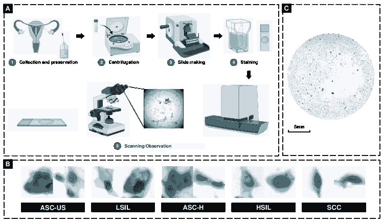
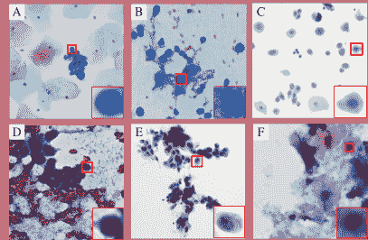
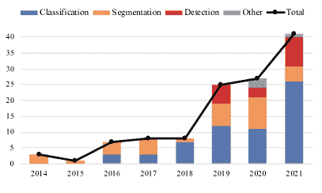
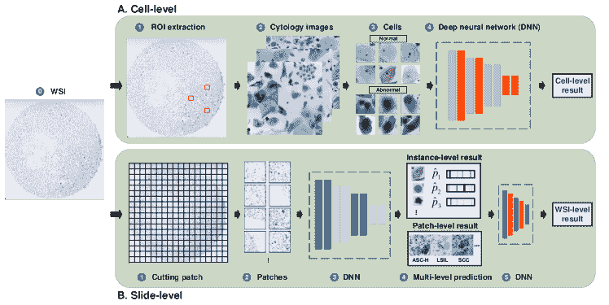
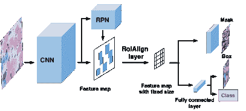
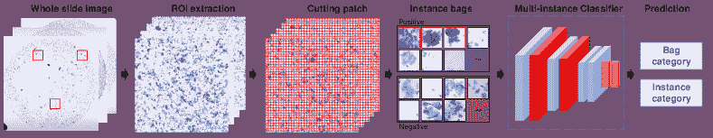
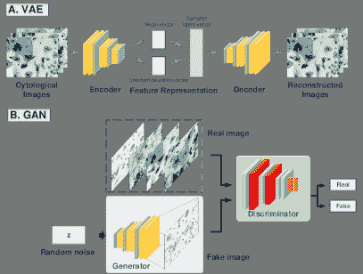
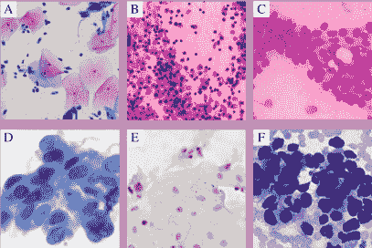

<!--yml

类别: 未分类

日期: 2024-09-06 19:48:05

-->

# [2202.05126] 深度学习在计算细胞学中的应用：综述

> 来源：[`ar5iv.labs.arxiv.org/html/2202.05126`](https://ar5iv.labs.arxiv.org/html/2202.05126)

# 深度学习在计算细胞学中的应用：综述

侯江、周燕宁、林逸、陈荣达、刘江、陈浩 计算机科学与工程系，香港科技大学，香港，中国 计算机科学与工程系，香港中文大学，香港，中国 解剖学与细胞病理学系，香港中文大学，香港，中国 计算机科学与工程学院，南方科技大学，深圳，中国

###### 摘要

计算细胞学是医学影像计算领域中一个至关重要、快速发展的且具有挑战性的话题，它通过计算机辅助技术分析数字化的细胞学图像以进行癌症筛查。近年来，越来越多的深度学习（DL）算法在医学影像分析方面取得了显著进展，导致细胞学研究的出版物大幅增加。为了探讨先进的方法和综合应用，我们在本文中调查了 120 多篇基于 DL 的细胞图像分析的出版物。我们首先介绍了各种深度学习方法，包括完全监督、弱监督、无监督和迁移学习。然后，我们系统总结了公共数据集、评价指标、包括分类、检测、分割及其他相关任务在内的多种细胞图像分析应用。最后，我们讨论了计算细胞学的当前挑战和潜在研究方向。

###### 关键词:

\KWD 人工智能、深度学习、计算细胞学、病理学、癌症筛查、调查^†^†期刊: XXX

## 1 介绍

细胞学是病理学的一个分支，通过显微镜研究细胞，以分析细胞的形态和成分，通常用于癌症筛查[31、1、118]。与组织病理学相比，细胞学关注的是细胞的病理特征而不是组织，这是一组在特定结构中排列的成千上万的细胞[112、34]。细胞是生物体的结构和功能单位[2]，它们的形态反映了器官甚至整个身体的生物学特征[62、147、61]。临床细胞学检测过程可以分为取样和保存、离心、制片和染色（图 1(A)）。在细胞学筛查中，细胞学家在显微镜下观察细胞学切片并分析细胞的特性和形态（图 1(B)）。这些切片也可以扫描成全切片图像（WSI）（图 1(C)），以便进一步进行数字分析和处理。此外，根据取样技术，细胞学标本有三种类型：1) 脱落细胞学，包括痰液、尿沉渣、胸腔积液和腹水[100]。2) 磨擦细胞学，包括宫颈刮片、胃肠道和内窥镜刷检[126]。3) 吸引细胞学，也称为细针抽吸细胞检查（FNAC）[78]，通常取样于乳腺、甲状腺和肺[72、59]。与组织学不同，细胞学标本不需要去除完整的大块组织，因此取样过程侵入性较小。由于取样通常无痛、低成本且对设备要求较少，使得细胞学在癌症筛查和早期诊断中具有重要作用[68]。

图 1：临床细胞学筛查示意图。（A）细胞学标本制备的过程（以宫颈为例）。 （B）不同类别的细胞学图像。 （C）用于数字分析和处理的全切片图像（WSI）。

诊断细胞学标本是一项高度专业的工作，需要经过正式培训和由国际机构监督的评估。目前，标准化细胞学诊断报告的趋势越来越明显，使得临床医生可以明确无误地理解报告和癌症风险[11]。这也提供了在检查细胞时需要寻找的明确特征。图 2 展示了常见标本的典型细胞学形态。具体而言，细胞学筛查最早应用于子宫颈癌，至今已有近 100 年。现在的子宫颈细胞学报告由 Bethesda 系统指导[113]。癌前及癌细胞首先被分类为鳞状细胞和腺体细胞，然后可以通过细胞学特征的组合来识别和分级，包括细胞核增大、多核现象、核周光晕、核浆比增加、皱纹状核膜、异常角质形成、明显的 nucleoli 和肿瘤倾向。继 Bethesda 系统成功之后，现今乳腺抽吸细胞学的报告由 [42] 指导。恶性乳腺病变的抽吸样本通常细胞密度很高，癌细胞具有大且有时不规则的细胞核，伴有明显的 nucleoli 和缺乏肌上皮细胞。还建立了不同程度的异常来估计恶性风险[14]。类似地，尿液中的膀胱癌细胞常表现为不规则核，N/C 比值非常高（$>$0.7），明显的 nucleoli 和凝聚/粗糙的染色质，如 [135] 所述。甲状腺癌抽吸样本表现出独特特征，包括乳头状结构、钙化体和光学上清晰的细胞核，伴有核沟和核内包涵体[30]。结合图 2 中肺和口腔黏膜的示例，不同器官的细胞学形态提供了癌症筛查的诊断信息，并以最低的成本指导患者管理[18，69]。

图 2：常见标本的典型细胞形态，包括 (A) 子宫颈 [195]，(B) 乳腺 [139]，(C) 尿液 [7]，(D) 甲状腺 [38]，(E) 肺 [161]，(F) 口腔 [105]。单细胞结构用红色框标出。

在临床细胞学筛查中，逐一在显微镜下（或在千兆像素全切片图像中）检查每一个细胞以寻找恶性肿瘤，对于细胞学家来说可能非常耗时且繁琐[106, 32]。考虑到病例量的不断增加，研究人员尝试开发自动化的方法以实现准确和高效的癌症筛查。第一次成功的尝试可以追溯到 1950 年代，当时开发了用于宫颈的自动筛查系统[167, 166]。此后，推出了一系列宫颈筛查系统，其市场成功各异[71, 175, 17]。这些自动化细胞学筛查系统已被证明可以提高效率，同时不影响细胞学筛查程序的准确性。

在最近几十年，自动化技术和人工智能（AI）在医学领域取得了显著进展。机器学习（ML），作为 AI 的一个子领域，专注于通过模仿人类来学习算法，以表示数据的潜在模式。随着机器学习的快速进步，医学图像解读和计算机辅助诊断在病理学（如组织病理学、细胞学[24, 191, 199]）和放射学（如计算机断层扫描（CT）、磁共振成像（MRI）、X 射线、超声波[76, 63, 19]）中得到了广泛应用。对于细胞学，以前的研究展示了各种机器学习方法在细胞图像分析中的可行性，包括支持向量机（SVM）、模糊 C 均值（FCM）[22]、k 均值[58]和模糊聚类[122]。然而，这些机器学习算法仍然面临挑战，例如开发准确且高效的细胞图像分析方法，建立人机协作的细胞学筛查系统。

深度学习作为机器学习（ML）家族的一个分支，利用多层神经网络来提高输入数据的特征表示。深度学习旨在减少对传统机器学习方法中依赖专家知识设计的任务相关特征的高度依赖。它还可以通过端到端学习提高模型的特征表示能力。在计算细胞学中，深度学习可以为细胞学家提供准确高效的细胞学筛查的可行方案。这些方法在多种癌症类型中得到了广泛研究，例如宫颈 [124]、乳腺 [43]、膀胱 [38] 和肺 [161]。在这些基于深度学习的方法中，监督学习涉及将输入图像映射到预定义标签，并且它是最常开发的深度学习方案。现有的大多数细胞学应用研究专注于通过引入特定约束或深度学习模型的架构设计来提高模型性能，例如引入形态学约束 [196, 21, 25]。

深度学习的进步极大地加速了计算细胞学的发展。从 2014 年到 2021 年，基于深度学习的计算研究增加了 10 倍，并且在最近两年呈现出蓬勃发展的趋势。相关出版物的数量如图 3 所示，这些出版物通过搜索文献数据库（Google Scholar、PubMed 和 arXiv）获得。这些出版物专注于开发各种深度学习方法用于细胞学筛查，例如区分正常和异常细胞 [189]、定位和识别细胞在细胞学涂片中的位置 [121] 和不同细胞 compartment 的分割 [194]。

图 3：基于深度学习的计算细胞学中分类、检测、分割及其他任务的出版物数量。

在细胞学图像分析领域存在几项综述 [74, 109, 124]。然而，这些综述在先进算法、公开可用数据集和该领域的有前景趋势方面远未详尽。此外，大多数基于深度学习的细胞学综述专注于宫颈，忽视了其他类型癌症的进展，如肺和膀胱 [124]。之后，[109] 专注于各种细胞学应用，而不是从深度学习方法的角度进行分析。在本文中，我们调查了自 2014 年以来的 120 多篇出版物，系统回顾了深度学习方法和技术在计算细胞学中的进展，并涵盖了来自身体各个部位的细胞学标本。

本文分为六个部分。第一部分简要介绍了本综述的背景和目标。第二部分概述了计算细胞学中的不同学习方法。第三部分总结了公共细胞学数据集和常见评估指标。第四部分展示了基于 DL 的细胞学图像分析的进展和成就。第五部分讨论了计算细胞学中的现有挑战和潜在研究方向。第六部分总结了本综述论文。

## 2 深度学习方法论

在这一部分，我们展示了 DL 方法的定义、公式和一般程序，这些方法可以开发用于各种细胞学应用。根据注释的可用性，DL 可以分为监督学习（第 2.1 节）、弱监督学习（第 2.2 节）、无监督学习（第 2.3 节）以及迁移学习（第 2.4 节）。

图 4：基于 DL 的细胞学分类的标准工作流程。（A）细胞级：首先，从 WSI 中提取 ROIs 并切割成细胞补丁，然后输入到 DNN 中以提取特征并预测每个细胞补丁的类别。（B）幻灯片级：从 WSI 中切割的补丁输入到 DNN 中以获得多层次的预测（例如，实例级和补丁级），然后这些预测用于预测最终的 WSI 级结果。

### 2.1 监督学习

监督学习旨在学习输入数据与相应标签之间的函数映射。对于医学图像分析，输入是医学图像，而标签则根据不同任务而有所不同，例如分类的图像级别类别、检测的对象级别定位（例如，框、点）以及分割的像素级掩码。形式上，输入图像 $X=\{x_{i}\}_{i=1}^{N}$ 与相应的标签 $Y=\{y_{i}\}_{i=1}^{N}$ 被用来通过最小化目标函数来训练预测模型。监督学习中的典型深度模型包括多层感知机（MLP） [134]、卷积神经网络（CNN） [77]、递归神经网络（RNN） [184] 和 transformer [160]。

CNN 被认为是图像分析中最成功的深度学习架构 [90]。它主要由三种类型的隐藏层组成：用于特征提取的卷积层、用于减少特征分辨率的池化层和用于汇总前面层提取的特征并输出预测结果的全连接层。然后，反向传播算法被引入以更新训练过程中不同层的参数 [77]。由于局部感受野、共享权重和池化层中的下采样策略，CNN 在许多图像分析任务中取得了巨大成功，例如自动驾驶 [136]、人脸识别 [173] 和生物医学 [90]。

在计算机视觉领域，常用的 CNN 架构已被应用并开发用于各种细胞学应用，例如 AlexNet [110]、VGGNet [3] 和 ResNet [108]。目前，大多数细胞学研究集中在基于这些基本架构开发新算法，用于各种深度学习任务：分类、检测和分割 [87、153、57]。

分类。这个分类模型的目标是预测输入图像的类别。它可以基本上表示为 $\hat{y}=f(x,\theta)$，其中 $x$ 和 $\hat{y}$ 分别是输入图像及其预测类别，而 $\theta$ 代表分类架构的可学习参数。为了训练这些架构，交叉熵损失 $L_{CE}$ 通过概率分布测量预测概率 $\hat{y_{ic}}$ 和真实标签 $y_{ic}$ 之间的差异。

|  | $L_{CE}=-\frac{1}{N}\sum_{i=1}^{N}\sum_{c=1}^{M}y_{ic}\log\left(\hat{y}_{ic}\right)$ |  | (1) |
| --- | --- | --- | --- |

其中，$N$ 是图像样本的数量，$M$ 是类别的数量。然后，预测损失用于通过反向传播 [137] 优化网络的参数 $\theta$。

通常，细胞学图像的标签空间指其良性/恶性或子类别。在标准的细胞级分类工作流程中，细胞学家或技术人员从采集的切片中提取感兴趣区域（ROIs）。然后，ROIs 被切割成细胞补丁作为深度模型的输入。之后，基于 DL 的特征提取器负责表示高级特征并输出预测类别（图 4）。对于切片级筛查，现有研究主要将此任务分为两个阶段：首先，深度神经网络（例如 CNN、RNN 和 Transformer）负责预测多级结果，如恶性或良性细胞的检测和补丁的类别。然后，另一个网络汇总这些结果并预测最终的 WSI 级结果[174, 86]。

检测。与分类不同，检测任务是从整张图像中定位对象，并预测这些对象的类别。因此，它可以看作是两个任务的结合：回归对象的位置和分类对象的类型。基于 CNN 的目标检测算法主要分为两类：两阶段方法和单阶段方法。在两阶段方法中，工作流程包括特征提取、区域提议和预测。第一阶段通过区域提议回归粗略预测（框位置和预测概率）。第二阶段旨在输出精细预测（框位置和对象类别）。典型的两阶段算法模型包括 R-CNN [45]、Fast R-CNN [44]、Faster R-CNN [128]。单阶段检测方法旨在摒弃区域提议策略，而是直接在端到端架构中预测对象的类别和位置，包括 SSD [92]、YOLO [127]、FCOS [165]和 RetinaNet [89]。

在目标检测任务中，有两种类型的损失函数：分类损失和位置损失。对于分类损失，通过改进$L_{CE}$，在 RetinaNet 中提出了**焦点损失**$L_{focal}$来平衡分类样本[89]：

|  | $L_{focal}=\left\{\begin{array}[]{ccc}-\alpha(1-p)^{\gamma}\log(p),&\text{if}&y=1\\ -(1-\alpha)p^{\gamma}\log(1-p),&\text{if}&y=0\end{array}\right.$ |  | (2) |
| --- | --- | --- | --- |

其中，$p$是模型对标签$y$的估计概率，$\gamma$和$\alpha$是可调参数。对于位置损失，均方绝对误差损失$L_{MAE}$计算预测位置与真实位置之间的平均距离：

|  | $L_{MAE}=\frac{\sum_{i=1}^{N}\left | f\left(x_{i}\right)-y_{i}\right | }{N}$ |  | (3) |
| --- | --- | --- | --- | --- | --- |

接着，引入了**交并比（IoU）损失**来计算预测框的损失，而不是$L_{MAE}$中的坐标[182]：

|  | $L_{IoU}=-\ln\frac{\text{Intersection}\left(box_{gt},box_{p}\right)}{\text{ Union }\left(box_{gt},box_{p}\right)}$ |  | (4) |
| --- | --- | --- | --- |

其中，$box_{gt}$和$box_{p}$分别表示真实框和预测框。之后，最近设计了一些高级损失函数，包括用于非交集区域的 GIoU 损失[129]、用于闭合中心点的 CIoU 损失[192]等。

此外，对于一阶段和两阶段算法，仍然存在一些普遍问题。例如，在预测结果中出现多个重叠的预测框。这些重复和冗余的建议可以通过非极大值抑制策略[114]来移除。

分割。这是医学图像分析中的一项基本而重要的任务。分割是进行逐像素预测，以表示生物医学结构的形态，例如细胞[194]、腺体[26]和器官[124]。根据是否区分每个实例对象，基于深度学习的分割模型可以分为两个分支：语义分割和实例分割。语义分割旨在预测每个像素的类别，以获取对象的掩膜，这可以看作是一个逐像素分类任务。全卷积网络（FCN）是成功的分割架构之一，它将传统 CNN 中的全连接层替换为卷积层以输出分割图[93]。随后，[41]提出了 U-Net，通过具有下采样-上采样架构的多尺度特征融合进行生物医学图像分割。在实例分割中，模型不仅将像素分割为类别，还分配了相应的实例 ID。其流行的结构主要遵循先检测后分割的流程（图 5）。例如，Mask R-CNN 通过在 Faster R-CNN 基础上引入掩膜预测头[51]来提出。

图 5：通过 Mask R-CNN 在细胞学图像分析中的实例分割。

在训练提到的语义分割和实例分割模型时，分类损失$L_{CE}$被引入作为分割的逐像素分类监督。另一个广泛使用的损失函数，dice 系数损失$L_{dice}$，旨在通过计算 dice 系数来衡量预测掩膜$Y_{m}$和真实值$Y_{gt}$之间的相似性，定义如下[107]：

|  | $L_{dice}=1-\frac{2\|Y_{m}\cap Y_{gt}\|}{\|Y_{m}\|+\|Y_{gt}\|}$ |  | (5) |
| --- | --- | --- | --- |

### 2.2 弱监督学习

弱监督学习是为标签不完全可用的场景提出的，包括不完全监督、不准确监督和不精确监督[197]。

图 6：多实例学习范式概述。原始 WSI 被提取为 ROI 并切割成补丁，然后它们被形成实例包，带有包级标签（正面或负面）。对于学习算法，这些包用于学习一个分类函数，该函数可以预测测试数据中包和实例的标签。

半监督学习是一个成功的、不完全监督学习范式。它通过提取未标记集中的隐含信息来增强标记集的特征表示，从而利用标记和未标记的数据。对于不准确的监督，处理噪声标签问题的方法可以识别潜在的错误标记样本并进行修正，从而提高监督的可靠性。

多实例学习（MIL）是一种有效的不精确监督方法，旨在利用粗粒度注释（例如图像级）来学习细粒度（例如像素级、补丁级）任务[103, 179]。MIL 的标准工作流程如图 6 所示。首先，从整个图像中提取一系列具有补丁级注释的补丁。然后，这些补丁被切割成实例并形成包。最后，通过学习多实例包建立一个多实例分类器，该分类器用于预测未知的包或实例。具体来说，给定一个训练数据集$\{(X_{i},Y_{i})_{i=1}^{N}\}$，其中$X_{i}=\left\{x_{i1},x_{i2},\ldots,x_{i,m}\right\}$是实例包，$x_{i,m}$是第$i$个包的第$m$个实例。$Y_{i}\in\{-1,+1\}$是第$i$个包的相应标签，+1 表示该包中至少有一个正实例的正包，-1 表示没有正实例的负包。然后，包$X_{i}$及其标签用于学习一个分类函数，该函数可以预测包和实例的标签。

弱监督学习在计算细胞学场景中特别吸引人（例如，整个切片的甲状腺恶性预测[38]），因为获得完整标签的成本很高[154]。因为对于细胞学家来说，完全标记所有病变和细胞几乎是不可能的。因此，引入了弱监督学习，以有效表示和增强在有限注释场景中的特征。

### 2.3 无监督学习

无监督学习对于从未标记的数据中学习有用的和潜在的表示是有效的，这些表示可以用于下游任务。例如，无监督图像增强可以增加原始数据集的数量和多样性，从而提高分类模型的性能。之后，可以采用无监督染色转换来规范化病理图像的预处理数据集。自编码器（AE）是无监督学习中的典型结构，其公式为：$\mathrm{P}(x_{i})\rightarrow z\rightarrow\mathrm{P}\left(x_{i}^{\prime}\right)$，其中 AE 被训练以编码输入图像$x_{i}$以获得潜在表示$z$。然后，解码器在原始输入$x_{i}$的监督下生成重建图像$x_{i}^{\prime}$。

两种典型的无监督模型已经获得了广泛的关注：变分自编码器（VAE）[75, 67]和生成对抗网络（GAN）[47]。如图 7(A)所示，VAE 通过将潜在变量限制为正态分布来改进 AE，然后将潜在向量输入解码器以输出图像。GAN 是另一种有前途的架构，它通过合成高质量的虚假图像来缓解收集大规模标记医学数据集的困难。GAN 的结构是由生成器-判别器架构组成，如图 7(B)所示。生成器的目标是生成逼真的图像，而判别器则与生成器竞争以区分真实图像和生成图像。因此，该生成器-判别器架构通过对抗训练[47]进行优化：

|  | $\begin{split}\min_{G}\max_{D}V(D,G)=\mathbb{E}_{x\sim p_{\text{data }}(x)}[\log D(x)]\\ +\mathbb{E}_{z\sim p_{\text{z }}(z)}[\log(1-D(G(z)))]\end{split}$ |  | (6) |
| --- | --- | --- | --- |

其中 $G(\cdot)$ 表示生成器，$D(\cdot)$ 表示判别器。$\mathbb{E(\cdot)}$ 是分布的期望值，$p_{\text{data }}(x)$ 和 $p_{\text{z }}(z)$ 分别是实际样本和噪声的分布。在训练过程中，生成器 $G(\cdot)$ 旨在学习真实样本 $p_{\text{data}}$ 的分布，而判别器 $D(\cdot)$ 负责区分生成的图像和真实图像，从而迫使生成器生成逼真的图像。在这种基本的 GAN 结构和对抗损失出现之后，许多高级 GAN 模型被提出，以满足对生成图像（例如质量、保真度和多样性）的更高要求 [180]。例如，一种有前途的架构 CycleGAN 被设计用于在未配对图像（$s$, $t$）之间进行风格转换，它是一个对称结构，包括两个生成器 $\{G_{S\rightarrow T},G_{T\rightarrow S}\}$ 用于两个领域（$S$ 和 $T$）之间的相互生成，以及两个判别器 $\{D_{S},D_{T}\}$ 用于区分各自领域的生成图像。此外，循环一致性损失 $L_{cyc}(G_{S\rightarrow T},G_{T\rightarrow S})$ 被设计用于 CycleGAN 架构中的一对一映射，定义为 [198]：

|  | $\begin{split}L_{cyc}(G_{S\rightarrow T},G_{T\rightarrow S})=\mathbb{E}_{s\sim p_{\text{data }}(x)}\left[\&#124;G_{T\rightarrow S}(G_{S\rightarrow T}(s))-s\&#124;_{1}\right]\\ +\mathbb{E}_{t\sim p_{\text{data }}(y)}\left[\&#124;G_{S\rightarrow T}(G_{T\rightarrow S}(t))-t\&#124;_{1}\right]\end{split}$ |  | (7) |
| --- | --- | --- | --- |

其中 $p_{\text{data}}(s)$ 和 $p_{\text{data}}(t)$ 是域 $S$ 和域 $T$ 中图像的分布。

在细胞学中，无监督学习算法已经被设计用于各种深度学习任务，例如通过 CycleGAN 进行染色转换 [164]、通过 cGAN 进行数据增强以提高分类准确性 [35]，以及通过基于 GAN 的超分辨率模型生成高分辨率图像 [99]。

图 7：基于 AE 的无监督学习模型。（A）变分自编码器（VAE）通过将潜在表示约束为正态分布来改进 AE。（B）生成对抗网络（GAN），包括生成器和判别器。生成器负责从随机噪声中生成假图像，而判别器通过区分生成的假图像和真实图像来迫使生成器生成逼真的图像。

### 2.4 迁移学习

迁移学习是深度学习的一个子领域，专注于将知识从源领域转移到目标领域，以提升目标任务的性能。在医学图像分析中，常用的迁移学习方法包括微调和领域适应（DA）。

微调被认为是训练深度学习模型的常见模型初始化技巧。通过将知识从大型公共数据集（例如，ImageNet [33]）转移到领域特定任务（例如，宫颈细胞分类）[153, 181]，它可以减少过拟合问题并提高深度模型的泛化能力。正式来说，微调的目标是通过一个小数据集 $T$ 来训练一个任务 $\mathcal{T}^{t}$。具体而言，它首先利用一个大规模且任务相似的 $\mathcal{T}^{t}$ 数据集 $S=\{s_{i}\}_{i=1}^{M}(M>>N)$ 来预训练一个网络 $f(\sim;\theta)$，然后使用一个小的目标数据集 $T=\{t_{i}\}_{i=1}^{N}$ 来训练预训练模型的几层最后层，以获得目标模型 $N_{t}$。在训练类似任务的不同数据集具有相似的低级特征表示的前提下，微调被认为是一种常见且有效的训练策略，在各种深度学习任务以及细胞学图像分析中 [189]。

域自适应（DA）是另一种迁移学习方法，通过学习缩小不同领域的数据集的分布差距来转移知识。DA 的范式可以定义为：给定两个具有不同分布 ($p(S)\neq p(T)$) 的不同数据集（$T$ 和 $S$），DA 方法可以通过边际、条件或联合分布自适应来对齐这些数据集的分布。因此，知识从源领域转移到目标领域，从而改善目标模型的性能 [117]。在医学图像分析中，数据异质性阻碍了深度模型在临床中的成功应用。通过域自适应可以缓解这个问题，从而提高深度模型在临床中的有效性和可重复性 [48]。

表 1：计算细胞学中公开和代表性私有数据库的总结

| 参考/年份 | 任务 | 器官 | 染色 | 尺寸 | 描述 | 链接 |
| --- | --- | --- | --- | --- | --- | --- |
| Herlev 2005 [60] | 分类 | 宫颈 | 巴氏涂片 | 变化 | 917 个细胞 | [`mde-lab.aegean.gr/downloads`](http://mde-lab.aegean.gr/downloads) |
| ISBI 2014 [95] | 分割 | 宫颈 | 巴氏涂片 | 512 × 512 | 16 张图像（645 个细胞） | [`github.com/luzhi/cellsegmentation_TIP2015`](https://github.com/luzhi/cellsegmentation_TIP2015) |
| ISBI 2015 [96] | 分割 | 宫颈 | 巴氏涂片 | 512 × 512 | 945 张由 ISBI 2014 合成的图像 | [`goo.gl/KcpLrQ`](http://goo.gl/KcpLrQ) |
| Sipakmed 2018 [123] | 分类 | 宫颈 | 巴氏涂片 | 2,048 × 1,536 | 966 张图像（4,049 个标注细胞） | [`www.cs.uoi.gr/~marina/sipakmed.html`](https://www.cs.uoi.gr/~marina/sipakmed.html) |
| CERVIX93 2018 [120] | 分类检测 | 宫颈 | 巴氏涂片 | 1,280 × 960 | 93 叠图像（2,705 个细胞核） | [`github.com/parham-ap/cytology_dataset`](https://github.com/parham-ap/cytology_dataset) |
| FNAC 2019 [139] | 分类 | 乳腺 | Pap | 2,048 × 1,536 | 212 张图像，分为两类：良性（99）和恶性（113） | [`1drv.ms/u/s!Al-T6d-_ENf6axsEbvhbEc2gUFs`](https://1drv.ms/u/s!Al-T6d-_ENf6axsEbvhbEc2gUFs) |
| BHS 2019 [6] | 分割 排名 | 子宫颈 | Pap | 1,392 × 1,040 | 194 张图像，类别包括癌症、HSIL、LSIL、ASC-US 和 ASC-H | [`sites.google.com/view/centercric`](https://sites.google.com/view/centercric) |
| AgNOR 2020 [4] | 分割 | 子宫颈 | AgNOR | 1,600 × 1,200 | 2,540 张图像（4,515 个细胞核） | [`arquivos.ufsc.br/d/373be2177a33426a9e6c/`](https://arquivos.ufsc.br/d/373be2177a33426a9e6c/) |
| LBC 2020 [55] | 分类 | 子宫颈 | Pap | 2,048 × 1,536 | 963 张 LBC 图像，类别包括 NILM、LSIL、HSIL 和 SCC | [`data.mendeley.com/datasets/zddtpgzv63/4`](https://data.mendeley.com/datasets/zddtpgzv63/4) |
| Oral 2021 [105] | 分类 检测 分割 | 口腔 | Pap | 1,200 × 1,600 | 1,934 张图像（4,287 个标注） | [`arquivos.ufsc.br/d/5035aec3c24f421a95d0/`](https://arquivos.ufsc.br/d/5035aec3c24f421a95d0/) |
| Cric 2021 [130] | 分类 | 子宫颈 | Pap | 1,376 × 1,020 | 400 张图像（11,534 个细胞） | [`database.cric.com.br`](https://database.cric.com.br) |
| CDetector 2021 [83] | 检测 | 子宫颈 | Pap | 224 × 224 | 7,410 张图像（48,587 个物体实例边界框），共 11 个类别 | [`github.com/kuku-sichuan/ComparisonDetector`](https://github.com/kuku-sichuan/ComparisonDetector) |
| Ascites 2020 [155] | 分类 检测 | 胃 | H&E, Pap | 1,064 × 690 | 487 张图像用于分类，分为恶性（18,558）和良性（6,089）两类。176 张图像用于检测（6,573 个标注细胞边界框） | [`pan.baidu.com/s/1r0cd0PVm5DiUmaNozMSxgg`](https://pan.baidu.com/s/1r0cd0PVm5DiUmaNozMSxgg) |
| RSDC 2021 [98] | 超分辨率 | 子宫颈 | Pap | 128 × 128（高分辨率） 64 × 164（低分辨率） | 5 张切片（25,000 个补丁） | [`www.kaggle.com/birkhoff007/rsdcdata`](https://www.kaggle.com/birkhoff007/rsdcdata) |
| IRNet 2019 [195] | 分割 | 子宫颈 | Pap | 1,000 × 1,000 | 413 张图像（4,439 个细胞质和 4,789 个细胞核） | 私有数据集 |
| DCCL 2020 [186] | 检测 | 子宫颈 | Pap | 1,200 × 2,000 | 1,167 张 WSIs（14,432 个补丁和 27,972 个标注病变细胞） | 私有数据集 |
| Dual 2021 [86] | 风险分层 | 子宫颈 | Pap | 最多 50,000 × 50,000 | 19,303 张 WSIs 分为两类：异常（202,557）和正常（272,933） | 私有数据集 |
| Hybrid 2021 [199] | 分类 检测 分割 | 子宫颈 | Pap | 6000 × 6000 | 24 个类别，每个类别 2000 张图像，81,727 个涂片（170 万个标注目标）用于检测模型 | 私有数据集 |

## 3 数据集和指标

深度学习依赖于大量标记的数据，我们总结了细胞学中公开的可用数据集以及具有代表性的私有数据集。如表 1 所示，大多数公开数据集来自宫颈，还有少量其他癌症类型，如乳腺、口腔和胃。这些公开的细胞学数据集可以用于开发深度学习算法，涵盖分类、检测和分割等各种任务。

表 2：计算细胞学中评估指标的总结

| 指标 | 定义 | 描述 | 细胞学中的应用 |
| --- | --- | --- | --- |
| 分类 |  |  |  |
| TP/TN/FP/FN | 真阳性、真阴性、假阳性、假阴性 | 正确指示条件存在的测试结果（TP）、正确指示条件不存在的测试结果（TN）、错误指示特定条件存在的测试结果（FP）、错误指示特定条件不存在的测试结果（FN）。 | FNAC 图像分类；制定其他指标（例如准确率、精确度、召回率） [142, 82]。 |
| 混淆矩阵 | 一个矩阵。行：实际类别；列：预测类别。 | 正确和错误预测的数量以计数值总结，并按每个类别分类。 | 肺癌亚型分类；宫颈涂片图像；异常的定量分析；WSI 级风险分层 [161, 110, 65, 7]。 |
| 准确率 (Acc) | $\frac{TP+TN}{FP+FN+TP+TN}$ | 所有样本中，所有正负类的正确预测比例。 | 宫颈鳞状病变分类；FNAC 图像分类 [91, 9, 3]。 |
| 精确度 (P) | $\frac{TP}{FP+TP}$ | 分类器将正样本分类为正例的比例。 | 宫颈细胞分类；宫颈病变分类；液基细胞学图像中的多细胞分类 [153, 91, 125]。 |
| 召回率 (R) | $\frac{TP}{FN+TP}$ | 在所有正例中，被预测为正例的样本比例。 | 宫颈涂片图像分类；宫颈细胞分类 [110, 125]。 |
| 特异性 (Spec) | $\frac{TN}{FP+TN}$ | 所有负类样本中，正确预测为负类的样本比例。 | 细胞分类；乳头状甲状腺癌的差异诊断；宫颈上皮内瘤变或侵袭性癌症的检测 [189, 50, 10]。 |
| 敏感性 (Sens) | $\frac{TP}{FN+TP}$ | 在所有实际为正的样本中，预测为正的样本的比例。 | 区分大细胞神经内分泌；识别细胞；高分辨率图像分类 [46, 79]。 |
| F1 分数 (F1) | $\frac{2\times Precision\times Recall}{Precision+Recall}$ =$\frac{2\times TP}{FP+FN+2TP}$ | 精确率和召回率的调和平均值，在许多分类任务中被定义为最终评估指标。 | 宫颈细胞分类；液基细胞学图像中的多细胞分类；细胞图像排序 [153, 6, 125]。 |
| ROC 曲线 | (FP 率, TP 率) | ROC 是展示分类模型在所有分类阈值下性能的图形。 | 恶性预测；宫颈癌筛查；涂片级风险分层 [40, 158, 86]。 |
| AUC | ROC 曲线下面积 | AUC 越接近 1，分类器性能越好。 | 癌症筛查（细胞级检测、补丁级和病例级分类）；异常量化分析；自动化的巴黎系统细胞病理学 [169, 65, 20]。 |
| 检测 |  |  |  |
| IoU | $\frac{P\cap GT}{P\cup GT}$  $=\frac{TP}{FP+FN+TP}$ | $P$ 表示预测的边界框，GT 是真实边界框。预测边界框和真实边界框的交集与并集的比率。 | 细胞/核检测；自动化辅助宫颈癌阅读 [66, 177, 82]。 |
| AP | 平均精度 | 精确度-召回曲线上的精度均值。 | 异常宫颈细胞的检测 [20]。 |
| mAP | 平均 AP | 所有类别中的 AP 平均值。 | 细胞/团块检测；肺部含铁血黄素细胞的量化 [104, 21, 83]。 |
| 分割 |  |  |  |
| 像素精确率 (P[p]) | $\frac{TP_{p}}{TP_{p}+FP_{p}}$ | ${p}$ 代表这是一个像素级指标。正确分割的像素在所有分割像素中的比例。 | 细胞学检查（重叠细胞分割） [159]。 |
| 像素召回率 (R[p]) | $\frac{TP_{p}}{TP_{p}+FN_{p}}$ | 正确分割的像素在真实标注中的比例。 | 细胞学检查（重叠细胞分割） [159]。 |
| 像素准确率 (Acc[p]) | $\frac{TP_{p}+TN_{p}}{FP_{p}+FN_{p}+TP_{p}+TN_{p}}$ | 像素级别的准确率。 | 细胞质和细胞核的分割 [150, 151, 65]。 |
| Hausdorff 距离 | $\max(\sup\limits_{x\in X}d(x,Y)$, $\sup\limits_{y\in Y}d(X,y))$ | X 和 Y 是两个集合，$sup$ 表示上确界。它度量两个点集之间的相似性。 | 细胞核分割 [73]。 |
| Dice 系数 (Dice) | $\frac{2\times TP}{FP+FN+2TP}$ | Dice 系数是一种统计工具，用于测量两个数据集之间的相似性。它可以用于比较算法输出与参考掩膜。 | 触摸和重叠对象的语义实例分割；细胞质分割；实例分割 [16, 172, 171]。 |
| Zijdenbos 相似性指数 (ZSI) | $2\frac{\left | R_{GT}\cap R_{Seg}\right | }{\left | R_{GT}\right | +\left | R_{Seg}\right | }$ | $R_{GT}$和$R_{Seg}$分别表示地面真值和分割区域。ZSI 计算预测分割输出和手动分割输出之间的聚合并集的比率。 | 重叠细胞分割；宫颈核分割 [159, 56]。 |
| 平均 Jaccard 指数 (AJI) | $\frac{\sum_{i=1}^{N}\left | G_{i}\cap P_{M}^{i}\right | }{\sum_{i=1}^{N}\left | G_{i}\cup P_{M}^{i}\right | +\sum_{F\in U}\left | P_{F}\right | }$ | $G_{i}$是来自地面真值的第$i$个对象，共有$N$个对象。$P_{M}^{i}$表示预测中与$G_{i}$具有最大 Jaccard 指数的第$M$个连通组件。AJI 测量图像中所有预测和地面真值的聚合交集与聚合并集的比率。 | 细胞分割 [195]。 |

Herlev [60]。该数据库包含 917 张 Papanicolaou（Pap）涂片宫颈图像，分为 7 类（3 类正常细胞和 4 类异常细胞），这些图像来自 Herlev 大学医院。作为最早建立的公共细胞学数据集，Herlev 数据集被广泛用于开发基于深度学习的宫颈癌筛查粗粒度和细粒度分类模型 [189, 87]。

ISBI 2014 [95]。另一个广泛开发的宫颈数据集来自 ISBI 挑战。与 Herlev 数据集不同，这个数据集专注于具有像素级注释的分割任务。它包含 16 张无重叠视野的图像（×40 放大），从四个宫颈细胞学标本中获得，共有 645 个细胞。该数据集中的每个样本包含 20 到 60 个 Pap 染色的宫颈细胞，具有不同程度的重叠。

ISBI 2015 [96]。ISBI 2015 通过合成将 ISBI 2014 数据集扩展到了 945 张宫颈细胞学图像。ISBI 2015 具有不同数量的细胞和不同程度的细胞重叠（尺寸为 512 × 512 像素），其中包含 45 张训练图像（来自 4 张扩展深度场图像）和 900 张测试图像（来自 12 张图像）。

Sipakmed [123]。该数据库包含 4049 张从 966 张 Pap 涂片幻灯片中的集群细胞图像中手动裁剪出来的孤立细胞图像。Sipakmed 数据集具有 5 种类型的宫颈细胞，包括表面-中间、基底、空泡、异性角质形成细胞和化生细胞。

CERVIX93 [120]。这是第一个为细胞学中的核检测任务建立的数据集。它包含 93 个以 40$\times$放大倍数拍摄的图像堆叠。每个堆叠有 10-20 张从幻灯片顶部到底部等间隔视野拍摄的图像。在这个数据集中，2705 个核被标注为边界框，并具有三种不同的 Pap 测试等级：阴性、低级鳞状上皮内病变（LSIL）或高级鳞状上皮内病变（HSIL）。

FNAC [139]。这是唯一一个为分类模型开发的公共乳腺细胞学数据集。这些乳腺图像收集自 20 名患者，包括 212 张细针穿刺细胞检查图像，分为良性（99）和恶性（113）类别。

BHS [6]。它收集了 194 张来自巴西卫生系统（BHS）的 Pap 涂片宫颈幻灯片。其中，108 张图像至少有一个异常细胞，86 张图像仅有正常细胞。总的来说，它有 5 种异常类型：癌症、HSIL、LSIL、未确定意义的典型鳞状细胞（ASC-US）和无法排除 HSIL 的典型鳞状细胞（ASC-H）。

AgNOR [4]。该数据集由 2540 张$1200\times 1600$像素的图像组成。与其他公共宫颈数据集不同，它包含用银染技术染色的细胞，即银亲核小体组织区域（AgNOR）。为了开发分割方法，专家使用 Labelme 工具[138]对对象进行标注，包括细胞核、簇和卫星。

LBC [55]。最近，液基细胞学（LBC）被开发出来，以提供比传统 Pap 涂片测试更均匀的固定、更干净的背景和保存良好的样本。这个数据集包含 963 张图像，分为四类：NILM、LSIL、HSIL 和鳞状细胞癌（SCC）。

Oral [105]。总共获得了 1,934 张$1200\times 1600$像素的口腔图像，来自于两张癌症诊断的 Pap 染色刷样品幻灯片。通过不同类型的标注（类别、框、掩模），这个数据集可以进行各种深度学习任务，包括分类、检测和分割。

CRIC [130]。CRIC 宫颈数据集中包含 400 张 Pap 涂片图像和 11,534 个已分类细胞。根据 Bethesda 系统[113]，CRIC 数据集涵盖了六种类型的常规细胞学宫颈细胞：NILM（6,779）、ASC-US（606）、LSIL（1,360）、ASC-H（925）、HSIL（1,703）和 SCC（161）。

CDetector [83]。这个数据集由 7,410 幅从 WSI 中裁剪出来的宫颈图像组成。根据 Bethesda 系统（TBS），48,587 个对象实例边界框由经验丰富的病理学家标注，属于 11 个类别：ASC-US、ASC-H、HSIL、LSIL、SCC、非典型腺细胞（AGC）、滴虫（TRICH）、念珠菌（CAND）、菌群、单纯疱疹、放线菌（ACTIN）。截至目前，CDetector 是用于细胞学目标检测任务的最大公共数据集。

腹水 [155]。这个数据集用于胃癌筛查，来自北京大学。它包含了 176 幅 H&E 染色和 Pap 染色的图像，这些图像是在 40 × 放大倍数下从腹水细胞病理图像中裁剪出来的。总共有 6573 个细胞（良性和恶性）通过边界框进行了标注。

RSDC [98]。这是开发重新聚焦和超分辨率任务的唯一公共细胞学数据集。数据集中的图像来自 5 张 LBC 切片，分辨率为 0.243$\mu m/pixel$。使用了双三次插值和高斯模糊策略，从原始切片生成了 15,000 张低分辨率图像（64 × 64）和对应的高分辨率图像（128 × 128）。

此外，为了评估提出的深度学习模型的性能，我们总结了三种典型深度学习方法的评估指标：分类、检测和分割，以及采用这些指标的典型细胞学应用，更多细节见表 2。

在这些总结的评估指标中，分类指标评估分类器预测类别的能力。准确率是最直接的指标，但它忽略了不同类别之间的不平衡问题。混淆矩阵可以表示每个类别的预测结果。为了衡量检测任务，$IoU$ 是一个常用的指标，它可以衡量预测框和真实框之间的重叠程度。根据不同的设置阈值，平均精度（$AP$）被用来评估检测器在不同重叠水平下的性能，包括 $AP_{50}$、$AP_{75}$ 等。分割模型可以通过各种指标进行评估。例如，$Pixel\ accuracy$ 测量每个像素的预测结果，而 $Dice$ 计算预测掩膜和真实情况的相似系数。

## 4 细胞学应用中的深度学习

在这一部分，我们调查和总结了应用于计算细胞学的各种深度学习模型的文献。首先，我们介绍了细胞学图像分析中的预处理技术，然后是代表性的临床任务：分类、检测、分割等。这些调查文献的更多细节如下。

### 4.1 预处理

染色技术。在细胞学中，引入染色技术是为了增强细胞图像的特征（例如，纹理、结构和生化性质），以便更清晰地展示细胞结构。

图 8 展示了细胞学中的各种染色技术。1) Pap。作为一种广泛应用的染色方案，它包含四个步骤：固定、核染色、细胞质染色和透明化。Pap 染色的细胞具有结构清晰的细胞核和透明的细胞质。根据调查的文献，Pap 是细胞学图像中最常用的染色方法，尤其是在宫颈癌的研究中。2) 苏木精-伊红（H&E）。苏木精将细胞核染成紫蓝色，而伊红则将细胞外基质和细胞质染成粉红色。在临床上，H&E 主要用于染色细胞和组织。3) Giemsa。它特别有效于染色细胞质，因此 Giemsa 主要用于血液和骨髓细胞学评估。其他染色技术用于一些特定的情况。例如，[4]使用 AgNOR 染色宫颈细胞以展示细胞增殖、分化和恶性转化。在另一项工作中，[177]用 Feulgen 染色了 LBC 的宫颈标本。[104]用 Perlss’普鲁士蓝和 Turnbull’s 蓝染色了肺部含铁细胞的细胞学。

图 8：染色技术。（A）Pap [195]。（B）H&E [155]。（C）Giemsa [9]。（D）Feulgen [177]。（E）AgNOR [4]。（F）Diff-quik [46]。

染色归一化。由于上述各种染色技术以及其他问题（例如，成像环境），细胞学图像中存在显著的颜色变化。这些差异给构建稳健的深度学习（DL）细胞学模型带来了挑战。此外，归一化可以加速训练网络的收敛。因此，归一化可以成为一个关键的预处理步骤，特别是在分析染色图像时，如细胞学图像和组织病理图像。常用的方法包括用于去除输入数据中冗余信息的白化和用于缩放输入数据灰度值的线性归一化等。

数据增强。当图像数量不足以学习一个稳健的 DL 模型时，尤其是在医学图像中。数据增强策略被引入以增加输入图像的数量，从而提高模型的泛化能力。传统的增强方法包括几何变换（例如，翻转、旋转和缩放）和颜色变换（例如，噪声、模糊和对比度）。近年来，生成对抗网络（GAN）已被采用，以基于有限的图像集合成大规模数据集。[183] 利用 GAN 从 961 张真实图像中生成了 16,000 张图像，以改善宫颈细胞分类模型。在另一项研究中，[35] 通过条件 GAN 生成了 180 张图像，并学习了特定类别的先验知识，以提高分类器在细胞学任务中的表现。为了克服数据限制问题，[162] 提出了基于 GAN 的增强结构——渐进式 GAN（PGGAN）。在这项研究中，真实的肺细胞图像与通过 PGGAN 合成的图像一起用于训练分类 CNN，从而提升了细胞学图像分类的性能。

### 4.2 分类

在细胞学中，DL 方法在具有可区分细胞学样本特征的图像分类中是可行且有前景的。临床细胞学家可以根据细胞学特征区分良性和恶性细胞。例如，恶性细胞显示出异常，如较大且不规则的细胞核、增大的核质比和改变的核仁形状。在细胞学图像分类任务中，基于 DL 的模型旨在提取输入图像的潜在模式，以识别对象（例如，细胞核、细胞）或进行幻灯片级预测（例如，细胞病理筛查）。因此，我们进一步将细胞学分类任务分为两类：1）细胞级，2）幻灯片级。

表 3：基于深度学习的计算细胞学分类研究概述

| 参考文献 | 应用 | 染色 | 器官 | 方法 | 数据集 | 结果 |
| --- | --- | --- | --- | --- | --- | --- |
| 细胞级分类 |  |  |  |  |  |
| [189] | 细胞分类 | Pap H&E | 子宫颈 | 数据预处理（补丁提取、数据增强）+ CNN + 迁移学习（微调） | Herlev；HEMLBC | Herlev: Sens=0.982, Spec=0.983, Acc=0.983, F1=0.988, AUC=0.998；HEMLBC: Sens=0.983, Spec=0.990, Acc=0.986。 |
| [161] | 癌症类型分类（腺癌、鳞状细胞癌和小细胞癌） | Pap | 肺 | 数据增强 + CNN | 私有数据集：腺癌（40 张）、鳞状细胞癌（20 张）和小细胞癌（16 张）共 76 张图像 | 腺癌：Acc=0.89；鳞状细胞癌：Acc=0.600；小细胞癌：Acc=0.703；总计：Acc=0.711。 |
| [36] | 细胞分类 | Pap | 鼻部 | 三层卷积神经网络 | 私有数据集：3,423 张图像（细胞） | Sens=0.97, Acc=0.99. |
| [144] | 恶性肿瘤检测和分类 | Pap | 宫颈 | 三层卷积神经网络 | Herlev | 5 类：Acc=0.941; 4 类：Acc=0.962; 3 类：Acc=0.948; 2 类：Acc=0.957. |
| [163] | 良恶性细胞分类 | Pap | 肺部 | 数据增强 + VGG-16 + GradCAM | 私有数据集：621 张图像（补丁），良性（306）和恶性（315） | 补丁级别：Acc=0.792, AUC=0.872; 案例级别：Acc=0.870, AUC=0.932. |
| [91] | 宫颈鳞状病变分类 | Pap | 宫颈 | VGG-16 | 私有数据集：3,290 张图像，异常细胞（1,736）和正常细胞（1,554） | Acc=0.9807, P=0.9791, Sens=0.9801, F1=0.9809. |
| [87] | 精细化细胞分类 | Pap | 宫颈 | 微调 + CNN（AlexNet, GoogLeNet, ResNet 和 DenseNet） | Herlev | GoogLeNet: Acc=0.945（2 类），Acc=0.713（4 类），Acc=0.645（7 类）。 |
| [153] | 液基细胞学图像中的多细胞分类 | Pap | 宫颈 | 微调 + CNN（ResNet-50, VGG-19, DenseNet-121, Inception-v3） | Herlev; 私有数据集：25 张图像 | ResNet-50: F1=0.8865, AUC=0.95; VGG-19: F1=0.8896, AUC=0.95; Densenet-121: F1=0.8546, AUC=0.94; Inception-v3: F1=0.8072, AUC=0.88. |
| [57] | 宫颈癌诊断预测 | Pap | 宫颈 | CNN（AlexNet, VGG-16, VGG-19, ResNet-50, ResNet-101 和 GoogLeNet） | Herlev | AlexNet: Acc=0.8;     VGG-16: Acc=0.8337;   VGG-19: Acc=0.8455;   ResNet-50: Acc=0.8937; ResNet-101: Acc=0.9450; GoogLeNet: Acc=0.9567. |
| [110] | 涂片分类 | Pap | 宫颈 | 10 种流行的预训练 CNN | Sipakmed | DenseNet-169: Acc=0.990, P=0.974, R=0.974, F1=0.974. |
| [3] | 宫颈癌风险分类 | Pap | 宫颈 | 9 种流行的 CNN | Herlev | Acc=0.756（7 类），Acc=0.813（4 类）。 |
| [108] | FANC 图像分类 | H&E | 乳腺 | CNN（AlexNet, GoogLeNet, SqueezeNet, DenseNet, Inception-V3） | 私有数据集：737 张图像（来自标本的 ROI），良性（275）和恶性（462） | AlexNet: AUC=0.9730; GoogLeNet: AUC=0.9455; SqueezeNe: AUC=0.9152; DenseNet: AUC=0.9244; Inception-V3: AUC=0.9730. |
| [102] | 宫颈细胞分类 | Pap | 宫颈 | 模糊排名 + 预训练 CNN（Inception-V3, Xception 和 DenseNet‑169） | Sipakmed | Acc=0.9855, Sens=0.9852. |
| [125] | 宫颈细胞分类 | Pap | 宫颈 | 混合深度特征融合 + CNN（VGG-16, VGG-19, XceptionNet 和 ResNet-50） | Sipakmed | Acc=0.9985（2 类），Acc=0.9914（3 类），Acc=0.9914（5 类）。 |
| [183] | 宫颈细胞分类 | Pap | 宫颈 | AlexNet + GAN | 私有数据集：22,124 张图像（细胞），异常（1,202）和正常（20,922） | AUC=0.984 |
| [35] | FNAC 细胞学图像分类 | H&E | 乳腺 | 条件 GAN（合成）+ CNN（ResNet-152，DenseNet-161，Inception-V3） | 私有数据集：150 张图像，分为良性（75）和恶性（75） | 生成图像 180 张。ResNet-152：准确率=0.7667；DenseNet-161：准确率=0.8667；Inception-V3：准确率=0.8000。 |
| [162] | 细胞学图像分类 | Pap | 肺 | CNN + PGGAN | 私有数据集：511 张图像（补丁），分为良性（244）和恶性（267） | 准确率=0.853，灵敏度=0.854，特异性=0.853。 |
| [8] | FNAC 图像分类 | Pap | 甲状腺 | CNN（VGG-19，AlexNet） + 迁移学习（微调） | 私有数据集：9,209 张图像（细胞），分为 5 类 | VGG-19：准确率=0.9305；AlexNet：准确率=0.9288。 |
| [169] | 自动化巴黎系统用于细胞病理学 | Pap | 尿液 | VGG-19 + 形态计量模型 | 私有数据集：217 张 WSI，分为阴性（51），非典型（60），可疑（52）和阳性（54） | 准确率=0.972，特异性=0.976，灵敏度=0.970。 |
| 续下页 |

表 4：基于深度学习的计算细胞学分类研究概述（续）

| 参考文献 | 应用 | 染色 | 器官 | 方法 | 数据集 | 结果 |
| --- | --- | --- | --- | --- | --- | --- |
| [64] | 细胞图像识别 | Pap | 尿液 | EfficientNet | 私有数据集：4,637 张图像（细胞） | 准确率=0.95，灵敏度=0.97，特异性=0.95，AUC=0.99。 |
| [185] | 癌症细胞学标本的分类 | H&E | 乳腺 | CNN（AlexNet，GoogLeNet） | 550 张图像（ROIs），包括恶性（275）和良性（275） | AlexNet：准确率=0.80；GoogLeNet：准确率=0.83。 |
| [146] | 宫颈细胞分类 | Pap | 子宫颈 | 图卷积网络（GCN） | Sipakmed | 准确率=98.37 ± 0.57，灵敏度=99.80 ± 0.10，特异性=99.60 ± 0.20，F1=99.80 ± 0.10。 |
| [43] | FANC 细胞样本分类 | H&E | 乳腺 | GoogLeNet | 私有数据集：37 张图像，分为良性（24）和恶性（13） | 准确率=0.8076。 |
| [139] | FNAC 图像分类 | Pap | 乳腺 | CNN（VGG-16，VGG-19，ResNet-50 和 GoogLeNet-V3） | FANC 2019 | VGG-16：准确率=0.8867；VGG-19：准确率=0.882；ResNet-50：准确率=0.9056；GoogLeNet-V3：准确率=0.9625。 |
| [115] | 诊断癌细胞的恶性潜力 | Pap | 尿液 | 视觉几何组 CNN | 私有数据集：203 张图像 | AUC=0.9890，F1=0.9002。 |
| [84] | 细胞分类 | Pap | 尿液 | VGG-16 | 私有数据集：690 张图像，分为尿路上皮正常细胞（274）和异常细胞（416） | 准确率=0.899。 |
| [50] | 乳头状甲状腺癌的鉴别诊断 | H&E | 甲状腺 | VGG-16 和 Inception-v3 | 私有数据集：279 张图像（甲状腺结节） | VGG-16：0.9766（图像级别），0.95（患者级别）；Inception-v3：0.9275（图像级别），0.875（患者级别）。 |
| [9] | FNAC 图像分类 | Giemsa H&E | 乳腺 | CNN（13 层，卷积和全连接层） | 私有数据集：Giemsa（1020 张良性和恶性分类图像）和 H&E（631 张良性和恶性分类图像） | Giemsa：准确率=0.9781, 精确度=0.977, 召回率=0.973, 特异度=0.982, F1=0.975；H&E：准确率=0.9753, 精确度=0.973, 召回率=0.950, 特异度=0.987, F1=0.961. |
| [49] | 淋巴结的鉴别诊断 | H&E | 宫颈 | Inception-v3 | 私有数据集：742 张图像，分为 4 类 | 准确率=0.8962. |
| [15] | 宫颈癌检测 | Pap | 宫颈 | EfficientNet + Grad-CAM | Herlev, Sipakmed | 准确率=0.9970, 精确度=0.9970, 召回率=0.9972, F1=0.9963, Kappa=0.9931. |
| [116] | 细胞识别 | Giemsa | 皮肤 | ResNet-50 | 私有数据集：2,260 张图像（Tzanck 涂片） | 准确率=0.943, 灵敏度=0.837, 特异度=0.973, AUC=0.974. |
| [10] | 宫颈上皮内瘤变或侵袭性癌症检测 | Pap | 宫颈 | VGG-16 | 私有数据集：188,542 张图像 | CIN 2：准确率=0.926；CIN 3+：准确率=0.961. |
| [142] | FNAC 图像分类 | Giemsa Pap | 甲状腺 | CNN | 私有数据集：370 张图像，分为非 PTCA（184）和 PTCA（186） | 灵敏度=0.9048, 特异度=0.8333, 准确率=0.8506. |
| [176] | 癌症类型分类 | H&E | 宫颈 | AlexNet | 私有数据集：79 个标本，分为 3 类 | 准确率=0.9333. |
| [80] | 宫颈细胞分类 | Pap | 宫颈 | ResNet-50 + 注意力机制 + LSTM | Sipakmed | 灵敏度=0.999, 特异度=0.998, F1=0.9989. |
| 幻灯片级分类 |  |  |  |  |  |
| [40] | 分类（恶性预测） | Pap | 甲状腺 | AlexNet | 私有数据集：908 张 WSIs | 灵敏度=0.92, 特异度=0.905, AUC=0.932. |
| [39] | 分类（恶性预测） | Pap | 甲状腺 | VGG-11 + 多实例学习 | 私有数据集：908 张 WSIs | AUC=0.932, AP=0.872. |
| [158] | 宫颈癌筛查 | Pap | 宫颈 | Faster R-CNN | 私有数据集：408,030 张图像 | 灵敏度=0.994, 特异度=0.348, AUC=0.67. |
| [65] | 异常的定量分析 | Pap | 宫颈 | U-Net, ResNet-50 | 私有数据集：130 张 WSIs | 分割：像素准确率=0.974 ± 0.001, IoU=0.913 ± 0.007；分类：准确率=0.945 ± 0.006. |
| [20] | 癌症筛查（细胞级检测、补丁级和病例级分类） | Pap | 宫颈 | 多尺度区域基础 CNN + 注意力机制 | 私有数据集：7030 张图像 | 细胞级检测：AP=0.7509；补丁级分类：AUC=0.9909；病例级分类：AUC=0.934, 灵敏度=0.913, 特异度=0.906 和 准确率=0.909. |
| [79] | 高分辨率图像分类 | Pap | 宫颈 | 混合监督学习（图像级 + 像素级） | 私有数据集：来自 2 个数据中心的 862 张图像 | A 中心：灵敏度=1, 特异度=0.86；B 中心：灵敏度=1, 特异度=0.87. |
| 继续在下一页 |

表 5：基于深度学习的计算细胞学分类研究概述（续）

| 参考文献 | 应用 | 染色 | 组织 | 方法 | 数据集 | 结果 |
| --- | --- | --- | --- | --- | --- | --- |
| [38] | 分类（恶性预测） | 巴氏染色 | 甲状腺 | MIL+ NoisyAND + 注意力机制 + 最大似然估计 | 私有数据集：142 张 WSI，包含 4,494 个实例 | AUC=0.870 ± 0.017，AP=0.743 ± 0.037。 |
| [46] | 区分大细胞神经内分泌癌 | 巴氏染色，H&E，Diff-Quik | 肺 | CNN | 私有数据集：40 张图像，包含高分化神经内分泌癌（17 张小细胞，13 张大细胞，10 张混合/不可分类） | H&E：准确率=0.900；巴氏染色：准确率=0.875；Diff-Quik：准确率=0.889。 |
| [199] | 快速 TBS 分类子宫颈液基薄层细胞涂片 | 巴氏染色 | 子宫颈 | 模型组合：Xception（分类）、YOLOv3（物体检测）和 U-Net（分割） | 私有数据集：81,727 张图像 | 速度=180 秒/切片，灵敏度=0.9474。 |
| [174] | 子宫颈病变检测，WSI 级正常与异常分类 | 巴氏染色 | 子宫颈 | YOLOv3 + Transformer | 私有数据集：来自四台扫描设备的 2,019 张图像（切片） | AUC=0.872。 |
| [29] | WSI 级子宫颈癌筛查 | 巴氏染色 | 子宫颈 | CNN（ResNet50）+ RNN | 私有数据集：3,545 张图像（切片），拥有 79,911 个标注 | 特异性=0.935，灵敏度=0.951，速度=1.5 分钟/切片。 |
| [7] | 细胞级分类，WSI 级风险分层 | 巴氏染色 | 尿液 | RetinaNet + 异常和恶性细胞计数 | 私有数据集：398 张图像（切片），分类为正常（243）、炎症（13）、CA（76）、ASM（38）和 TCC（28） | 细胞级分类：AUC=0.99；风险分层：AUC=0.83。 |
| [86] | 涂片级风险分层 | 巴氏染色 | 子宫颈 | CNN 与双路径编码 + 协同分组损失 | 私有数据集：来自 4 个中心的 19,303 张 WSI（训练用 13,486 张，验证用 2,486 张，测试用 3,331 张），包含 6 类细胞 | 灵敏度=0.907，特异性=0.80，AUC=0.925。 |

#### 4.2.1 细胞级分类

细胞级分类可能是基于深度学习的细胞学图像分析中最成功的任务之一 [60]。由于收集的细胞学 WSI 的超高像素分辨率，它们通常会被切割成细胞补丁以进行图像分析 [186]。在训练用于细胞分类的深度网络时，首先从这些整体图像中裁剪出细胞补丁。然后，这些细胞补丁经过预处理后输入深度学习模型，用于训练细胞级分类模型。

最直接的方法是将细胞补丁直接输入到多层 CNN 中以提取特征图，然后通过输出层获取预测类别。已经提出了一系列基于 CNN 的方法。对于肺细胞学分类，[161] 设计了一个深度卷积神经网络，包括三层卷积层、三层池化层和两层全连接层。类似地，[36] 构建了一个三块 CNN 模型用于鼻腔细胞分类。对于宫颈细胞学，[144] 设计了一个由三层卷积层组成的 CNN 架构。在不同设置（2 类、3 类、4 类和 5 类）的实验结果显示了宫颈图像中不同等级癌症的有效表现。此外，[189] 提出了一个简单的 ConvNet，该模型首先在自然图像数据集 ImageNet 上进行预训练。然后，该模型在两个宫颈细胞学数据集 Herlev 和 HEMLBC [60, 188] 上进行了微调，表现优于之前的算法。然而，这些简单设计的几层 CNN 的性能和泛化能力仅限于特定的数据集和场景。

在计算机视觉领域，提出了大量先进的深度模型，如 Inception [157]、ResNet [52] 和 DenseNet [54]。这些网络可以直接用于细胞学图像分析，并在分类任务中比简单设计的结构实现更好的性能。例如，[163] 提出了一个基于 VGG 的模型用于从肺细胞学图像中分类良性和恶性细胞。[116] 提出了基于 ResNet-50 的 TzanckNet，用于识别侵蚀性水疱病细胞。此外，一些研究比较了先进的 CNN 架构在细胞学图像分类任务中的性能 [153, 57, 110, 3]。从他们的实验结果来看，流行的架构（如 ResNet、Inception 和 DenseNet）在细胞分类中表现出色。为了提供基于 CNN 分类的可解释性分析，[143] 设计了 Grad-CAM，通过 CNN 最后一层卷积层的梯度信息显示网络决策中的兴趣区域（ROIs）。[163] 利用 Grad-CAM 生成热图，以观察典型区域肺细胞学图像上的高激活区域。通过观察 Grad-CAM 的高响应区域 [115] 认为，肿瘤核的颜色对模型预测贡献最大。

除了二分类（即良性和恶性），在细胞学图像分析中，多类别场景更为常见，但也更具挑战性，因为良性和恶性细胞主要包括几个子类别[169]。例如，Herlev 数据集包含 3 种正常宫颈细胞和 4 种异常宫颈细胞[60]。然而，两个子类别之间的图像特征边界通常模糊，这给 CNN 学习可区分特征带来了挑战。为解决这些问题，[87] 提出了一个用于宫颈细胞的细粒度分类模型。该模型引入了掩码图作为形态学外观信息，以增强细粒度的可区分特征。

此外，一些细胞学研究专注于改善在有限或不平衡数据集上的模型性能。可以利用基于 GAN 的模型来增强原始数据集，从而提高分类任务的性能。例如，[183] 采用基于 GAN 的数据增强来改进宫颈细胞分类模型。[35] 通过条件 GAN 合成了 180 张图像。这些图像与原始数据一起用于训练三种常见模型（ResNet-152、DenseNet-161 和 Inception-V3），在 FNAC 图像分类中取得了显著改进。对于不平衡的数据集问题，细胞学场景中正样本的数量总是远少于负样本[183, 8]。一些研究采用了采样技术来平衡不同类别[81, 8]。对于基于学习的解决方案，[183] 通过合成图像来平衡类别，其中 GAN 用于合成数量远少于其他类别的图像。

最近，已经有一些其他先进的方法被研究用于细胞学分类。[80] 引入了一个注意机制块，以引导网络专注于细胞区域，从而提高提取深层特征的能力。随后，他们添加了一个金字塔池化层和一个长短期记忆模块（LSTM），以汇聚不同区域的图像特征。为了提高分类性能，[146] 提出了基于图卷积网络（GCN）的宫颈细胞分类方法，这可以探索宫颈细胞图像的潜在关系。

在临床实践中，基于深度学习的分类方法已被广泛应用于多种类型的癌症，包括宫颈 [144]、乳腺 [108]、肺 [161]、甲状腺 [8]、尿液 [169]、鼻 [36] 和皮肤 [116]。具体来说，[169] 提出了一个基于 VGG 的模型用于分类尿液细胞病理图像。[8] 开发了一个基于 VGG 的模型用于甲状腺结节细胞分类。对于宫颈细胞学，[10] 比较了 AI 辅助技术与熟练细胞学家的宫颈上皮内瘤变或侵袭性癌症的检测效果。对于皮肤细胞学，[116] 提出了一个基于 ResNet 的模型来识别腐蚀性泡疹疾病细胞。这些研究展示了分类辅助细胞学图像分析的重大临床价值。

#### 4.2.2 幻灯片级分类

与细胞级分类不同，幻灯片级分类模型的目标是预测整个图像的类别，而不是细胞样本。

正在研究 Giga-pixel WSI 分类系统以实现高效且高准确率的预测。一些研究通过多阶段设计建立了幻灯片级分类系统。例如，[29] 设计了一种强大而渐进的 WSI 分析方法用于宫颈癌筛查。在第一阶段，作者开发了一种结合低分辨率和高分辨率 WSI 的渐进性病变细胞识别方法。然后，在第二阶段建立了一个基于 RNN 的 WSI 分类模型用于 WSI 级别的预测。在另一项幻灯片级研究中，[174] 设计了一个基于 YOLO 系列 [127] 的轻量级模型（YOLCO），在第一阶段进行局部预测（例如，细胞级、补丁级），通过额外的空间信息监督来丰富多尺度连接。在第二阶段，这些局部预测被输入到变换器架构中以获得 WSI 级别的结果。实验结果表明，该框架在 WSI 分类中比现有最先进方法具有更高的 AUC 分数和 $2.51\times$ 的速度提升。为了准确和高效地筛查宫颈癌，[199] 开发了一个完整的宫颈 LBC 涂片 TBS 诊断系统。该系统集成了 XGBoost 和逻辑决策树与三个典型的深度学习模型，即用于分类的 Xception、用于目标检测的 YOLOv3 和用于分割的 U-Net。该诊断系统可以减少细胞学家的工作负担，提高宫颈癌筛查的准确性。

弱监督学习策略被引入以从有限的标注中学习滑片级分类的信息。弱监督学习在这种情况下具有吸引力。例如，[38] 提出了一个 MIL 模型用于从细胞病理图像中预测甲状腺癌恶性度。随后，一个注意力模块被集成到这个基于 MIL 的模型中，采用最大似然估计（MLE）架构。实验结果显示了在甲状腺恶性度预测中的竞争性能。[79] 通过有效利用其各种标签（例如，足够的图像级粗略标注和少量的像素级精细标签）开发了混合监督学习用于 WSI 分类。

通过引入先进的策略或设计，许多细胞学研究致力于提高分类性能。例如，[20] 将注意力模块集成到多尺度区域基础的卷积神经网络（特征金字塔网络）中，介于上采样和下采样路径之间。不同层次的三项实验，包括细胞级检测、补丁级检测和病例级分类，展示了引入的注意力机制的有效性。其他研究设计了不同的辅助任务（例如，检测、分割）来辅助分类任务。[158] 使用对象检测模型（Faster R-CNN）来辅助癌症筛查的分类。[65] 引入了 U-Net 以改进鳞状细胞异常的分类。

风险分层是滑片级分类的一个重要任务，它决定了患者患病的风险等级。[7] 设计了一个基于深度学习的数字细胞档案系统，用于尿液细胞学图像的风险分层。在这个系统中，RetinaNet 被采用用于细胞级分类和检测。在 WSI 级别的风险分层中，他们通过异常细胞的计数和异常及恶性细胞的总计数来识别低风险和高风险病例。[86] 提出了一个双路径网络用于宫颈风险分层，可以分为两个步骤。首先，提出了一个具有双路径编码器的高效卷积神经网络，用于病变检索，这可以确保对小病变和大病变的推理效率和灵敏度。然后，引入了一个涂片级分类器（基于规则的风险分层）以合理地与复杂的细胞学定义对齐。对来自多个医疗中心的 19,303 个 WSI 的大型数据集进行的广泛实验验证了这种风险分层方法的稳健性。

### 4.3 检测

在细胞学图像分析中，开发自动检测方法以在整个图像中找到微小物体（例如，恶性细胞和细胞核）对于减少专家的繁琐和耗时的工作流程至关重要。基于深度学习的目标检测在医学图像分析中取得了显著进展，可分为两类：1）单阶段方法，直接在单一架构中回归实例对象的类别和位置。2）两阶段方法，首先在第一阶段预测对象候选框，然后在第二阶段对其进行分类和定位。

表 6：基于深度学习的计算细胞学检测研究概述

| 参考文献 | 应用 | 染色 | 器官 | 方法 | 数据集 | 结果 |
| --- | --- | --- | --- | --- | --- | --- |
| 单阶段方法 |  |  |  |  |  |
| [66] | 细胞核检测 | Pap | 胸腔积液 | YOLOv3 | 私有数据集：200 张图像，含 11,157 个细胞核 | 精度：0.941，召回率=0.9898，F1=0.9648，测试时间=0.060 秒/图像。 |
| [177] | 自动化辅助子宫颈癌读取 | Feulgen | 子宫颈 | YOLOv3 | 私有数据集：12,909 张图像，含 58,995 个真实框，分为 10 类 | 检测：mAP=0.602；分类：敏感度=0.975，特异度=0.687。 |
| [111] | 血液学诊断 | Giemsa | 骨髓 | YOLOv4 | 私有数据集：75,000 张标注的骨髓抽取图块 | 区域检测：Acc=0.97，AUC=0.99；细胞检测：mAP=0.75，F1 分数=0.78。 |
| [82] | 细胞检测 | Pap | 子宫颈 | 全球上下文感知 + 软尺度锚匹配 | 私有数据集：12,909 张子宫颈图像，含 58,995 个真实框，分为 10 类 | mAP=0.6544。 |
| 两阶段方法 |  |  |  |  |  |
| [81] | 细胞检测与分类 | Pap | 子宫颈 | Faster R-CNN + 迁移学习 | 私有数据集：680 个 LBC 子宫颈脱落细胞样本 | 分类：Acc=0.9161 检测：mAP=0.6698。 |
| [53] | 细胞核检测，估计增殖率 | H&E | 肾脏 | R-CNN | 私有数据集：16,905 个分割癌细胞和 22,948 个正常细胞核 | P=0.9901，R=0.9870，F1=0.988。 |
| [121] | 异常的定位与检测 | Pap | 子宫颈 | 弱监督 CNN + 回归约束 | Herlev | 严重程度分类：Acc=0.952；正常/异常分类：Acc=0.952，KAPPA 得分=0.870；检测：Acc=0.804。 |
| [21] | 细胞检测 | Pap | 子宫颈 | Faster R-CNN + 深度度量学习 | 私有数据集：240,860 张图像 | 100%标注：mAP=0.27；75%标注：mAP=0.254；50%标注：mAP=0.195。 |
| [155] | 腹水细胞病理解释 | Pap, H&E | 胃 | 分类：预训练的 AlexNet, VGG-16, GooleNet, ResNet18 和 ResNet-50。检测：Faster R-CNN | Ascites 2020 | 分类：AUC=88.51（ResNet50）；检测：IoU=0.8722，mAP=0.8316。 |
| [178] | 细胞检测 | H&E | 宫颈 | 完全残差 CNN + 结构回归 | HeLa 宫颈癌 | 精度=0.98, 召回率=0.98, F1=0.98。 |
| [104] | 肺部含铁血黄素细胞的量化 | 普鲁士蓝 | 肺部 | ResNet-18, FPN | 私有数据集：17 个 WSI，共 78,047 个含铁血黄素细胞 | 一致性=0.85, mAP=0.66。 |
| [186] | 宫颈细胞学分析 | Pap | 宫颈 | 病变细胞检测：Faster R-CNN 和 RetinaNet。细胞类型分类：Inception-v3, ResNet-101 和 DenseNet-121 | 私有数据集：1,167 个 WSI，14,432 个图像补丁和 27,972 个标注的病变细胞 | 检测：mAP=0.2116（Faster R-CNN）；分类：Acc=0.8884, F1=0.5996（DenseNet-121）。 |
| [83] | 宫颈癌筛查（细胞/团块检测） | Pap | 宫颈 | Faster R-CNN + 少样本学习 + 原型表示 | CDetector | mAP=0.488。 |
| [12] | 细胞核检测 | Pap | 胸腔积液 | 检测器：Faster R-CNN, R-FCN 和 SSD | 私有数据集：200 张图像（11,157 个细胞核） | Faster R-CNN（ResNet-101）：F1=0.9812。 |

#### 4.3.1 一阶段方法

一阶段算法通过直接生成对象的类别和坐标来检测对象，具有高检测效率的优点，如 SSD [92]、YOLO [127] 和 RetinaNet [89]。

许多细胞学研究引入了 YOLO 模型作为基础网络，因为它具有很高的效率。对于 YOLO 的结构，它将原始图像分成$S\times S$网格单元。然后，YOLO 预测每个单元的边界框和置信度。之后，通过置信度阈值和非极大值抑制来去除冗余框。[177]使用 YOLO 作为其宫颈细胞的检测器。类似地，[66]采用 YOLO 来检测胸腔积液细胞学中的细胞核。作者比较了一阶段和二阶段检测器的检测效率[128]。实验结果显示，YOLO 达到了 0.060 秒/图像的测试速度，比 Faster R-CNN（两阶段检测器）的 1.627 秒/图像快得多。此外，[111]将 YOLO 应用于选定的适当 ROI 图块，以自动检测和分类骨髓细胞和非细胞对象。为了提高 YOLO 在宫颈细胞检测中的性能，[82]提出了一种全球上下文感知框架，通过引入图像级分类分支和加权损失来过滤假阳性预测。

为了改进特征提取器以学习多尺度特征，提出了 RetinaNet，使用特征金字塔网络（FPN）作为其特征提取器，这实现了最先进的检测性能[88]。[104] 采用 RetinaNet 生成丰富的多尺度特征用于功能性头部（例如，框、回归和分类）。这些结果有助于本工作中肺部含铁血黄素细胞的量化。

#### 4.3.2 两阶段方法

两阶段方法使用不同的区域提议策略来生成边界框，例如滑动窗口[44]、选择性搜索[141]和区域提议网络[128]。例如，Fast R-CNN 设计了选择性搜索策略来生成边界框。然后，ROI 池化层提取每个 ROI 的特征。Fast R-CNN 输出 softmax 概率和每类边界框回归偏移量，并具有多任务损失[44]。为了集成不同模块并提高速度[128]，Faster R-CNN 通过集成特征提取、提议、边界框回归和分类来改进 Fast R-CNN。它设计了区域提议网络（RPN），该网络使用边界框回归进行准确的区域提议。

为了在整个细胞学图像中检测细胞对象，一些研究采用了 Faster R-CNN 作为其基础架构。例如，[81] 使用 Faster R-CNN 来检测 LBC 数据集中的宫颈脱落细胞。类似地，Faster R-CNN 也被用于检测肿瘤细胞以进行进一步分类，从而形成了一个腹水细胞病理图像解读系统[155]。

对于不同的细胞学场景，研究人员通过修改架构或与其他策略结合来提高检测性能[53, 104]。为了实现高效的细胞和稳健的检测，[178] 提出了一个基于建议的全残差 CNN 的结构回归模型。该模型生成了一个密集的邻近图，显示了在靠近细胞中心的位置上有更高的响应。然后，训练该模型只需要点的注释，而不是传统的框，这可以提高注释的效率。一些研究关注了细胞学检测中的弱监督学习设置。例如，[121] 提出了一个用于宫颈癌筛查的计算机辅助诊断工具。在这种方法中，作者设计了一种弱监督定位策略，执行集成梯度方法[156]来计算归因图，并进行形态学操作以获得定位框。在另一项工作中，[21] 提出了一个半监督深度度量学习方法，以提高宫颈癌细胞检测的类内特征紧凑性。该模型学习了一个嵌入度量空间，并在提议和原型层面上进行了语义特征的双重对齐。根据他们的定量实验，宫颈癌细胞的检测可能是一个具有挑战性的研究，特别是对于一些细胞类别，如 ASC-US。

临床实践不仅需要高检测准确率，还需要效率，因为更快的检测速度更适合大规模筛查场景[85]。检测模型通常面临准确性和速度之间的权衡。例如，两阶段检测器（如 Faster R-CNN）可以获得更高的检测结果，而单阶段检测器（如 YOLO）在更快的检测速度上具有优势。在细胞学研究中，[186] 比较了两阶段（Faster R-CNN）和单阶段（RetinaNet）方法在宫颈病变细胞检测中的性能。结果表明，前者在平均精度上取得了更好的实验结果。在另一项工作中[83]，作者改进了 Faster R-CNN，并在有限数据场景下与基线和 RetinaNet 进行了比较。宫颈细胞/团块检测的结果显示，RetinaNet（单阶段）实现了显著更快的速度（FPS）。[12] 比较了三种检测器，即 Faster R-CNN（两阶段）、R-FCN（两阶段）和 SSD（单阶段）。结果显示，R-FCN 实现了更高的 mAP 分数，而 SSD 测试时花费的时间较少。他们的实验结果验证了这些检测模型在速度和准确性之间的权衡。

### 4.4 分割

分割任务旨在从形态学上描绘对象轮廓。对于分割模型，它们将图像的每个像素分配到特定类别，因此可以视为像素级分类任务。在细胞学筛查中，分割是不同应用的关键步骤，包括 1）从标本中分离细胞/团块和背景，2）形态学区分细胞类型，3）准确分割细胞结构，如核和细胞质。

细胞学分割的主要挑战在于准确分割细胞之间的重叠区域[95, 96]。为了解决这个问题，主要有两种解决方案。一种是将细胞学分割任务分为两个阶段。第一阶段使用语义分割模型（例如，U-Net）进行粗略结果，然后对重叠区域进行一系列精细化设计，从而获得最终的准确分割结果。另一种是基于检测-再分割范式（例如，Mask R-CNN），它检测整张图像中的细胞学对象，并通过掩码预测头输出分割图。这种方法可以在端到端的架构中从每个检测实例中分割对象，无需任何精细化设计。因此，我们将细胞学分割的解决方案分为两类：1）分割-再精细化方法，2）检测-再分割方法。

表 7：基于深度学习的计算细胞学分割研究概述

| 参考文献 | 应用 | 染色 | 器官 | 方法 | 数据集 | 结果 |
| --- | --- | --- | --- | --- | --- | --- |
| 分割-再精细化方法 |  |  |  |  |  |
| [41] | 细胞计数、检测和形态测量 | 荧光 | 各种 | U-Net | ISBI 细胞跟踪 2015 | IoU=0.9203（PhC-U373），IoU=0.7756（DIC-HeLa）。 |
| [105] | 细胞核的分割、检测和分类 | Pap | 口腔 | 分类：ResNet-34\. 检测：Faster R-CNN。分割：U-Net | 口腔 2021 | 分类：Acc=0.88，F1=0.86；检测：IoU=0.5832；分割：IoU=0.4607。 |
| [151] | 细胞质和核的分割 | H&E | 子宫颈 | CNN+ 从粗到精分割 | 私有数据集：53 片切片，1400 个细胞 | 核区域检测：Acc=0.9450，F1=0.9453；分割：F1=0.8951±0.0215。 |
| [150] | 细胞质和核的分割 | H&E | 子宫颈 | 多尺度 CNN + 图划分 + 相邻细胞分割 | 私有数据集：53 张图像（切片） | 细胞质：Dice=0.95；核：Dice=0.99。 |
| [149] | 细胞分割 | Pap H&E | 子宫颈 | 多尺度 CNN + 动态多模板变形 | ISBI 2015\. 私有数据集：21 张图像（每张图像有 30$\sim$80 个细胞） | ISBI 2015：Dice=0.89；私有数据集：Dice=0.84。 |
| [6] | 细胞图像分割和排名 | Pap | 子宫颈 | CNN | BHS 2019 | 分割：P=0.73，R=0.65，F1=0.69，时间=4.75 秒；排名：mAP=0.936。 |
| [73] | 细胞核分割 | H&E | 乳腺 | CNN + 种子分水岭 | 公共数据集：80 张图像 | 良性：Hausdorff 距离=0.840, Jaccard 距离=0.776; 恶性：Hausdorff 距离=0.781, Jaccard 距离=0.732。 |
| [16] | 接触和重叠物体的语义实例分割 | Pap | 宫颈 | U-Net | OSC-ISBI | Dice=0.895±.0.079。 |
| [187] | 宫颈细胞分割 | Pap | 宫颈 | 注意机制 + U-Net + 随机游走 | ISBI 2014 | 细胞核：$P_{p}$=0.94 ±0.06, $R_{p}$=0.95 ±0.05, Dice=0.93 ±0.04; 细胞质：$TP_{p}$=0.94 ±0.06, $FP_{p}$=0.003 ±0.004, Dice=0.93 ±0.07。 |
| [171] | 实例分割 | Pap | 宫颈 | U-Net + 星形凸多边形 | OSC-ISBI | Dice=0.85 ± 0.07。 |
| [56] | 宫颈细胞核分割和分类 | Pap | 宫颈 | U-Net | Herlev | 分类：Acc=0.988; 分割：ZSI=0.97。 |
| [159] | 细胞学检查（重叠细胞分割） | Pap | 宫颈 | CNN+ 形状先验（动态形状建模） | ISBI 2014 | 细胞核：$P_{p}$=0.94 ±0.06, $R_{p}$=0.95 ±0.06, ZSI=0.94 ±0.04; 细胞质：ZSI=0.90 ±0.08。 |
| [152] | 重叠细胞质分割 | Pap H&E | 宫颈 | 形状掩模生成器 + 形状先验优化 | ISBI 2015\. 私有数据集：160 团块，962 个细胞质 | Pap: Dice=0.854 ± 0.049; H&E: Dice=0.846 ± 0.054。 |
| [172] | 细胞核检测，细胞质分割 | Pap | 宫颈 | CNN + 双窗口 + 图像处理 + Deeplab V2 + CRFs + 细胞边界优化 | ISBI 2014; ISBI 2015; 私有数据集：580 图像（补丁） | ISBI 2014：Dice=0.93 ± 0.04; ISBI 2015：Dice=0.92 ± 0.05; 私有数据集：Dice=0.92 ± 0.04。 |
| 检测-然后分割方法 |  |  |  |  |  |
| [148] | 宫颈癌筛查 | Pap | 宫颈 | Mask R-CNN + 微调 | 私有数据集：178 张图像，正常（2,734），非典型（494），低级别（148），高级别细胞（84） | 图像级别：mAP=0.578, Acc=0.917, Sens=0.917, Spec=0.917; 细胞核：Acc=0.898, Sens=0.725, Spec=0.943。 |
| [195] | 细胞分割 | Pap | 宫颈 | PRN + 细胞关联矩阵 | 私有数据集：413 张图像（标注 4,439 个细胞质和 4,789 个细胞核） | 细胞质：AJI=0.7185, F1=0.7497; 细胞核：AJI=0.5496, F1=0.7554。 |
| [194] | 细胞实例分割 | Pap | 宫颈 | RPN + 知识蒸馏 | 私有数据集：413 张标注（4,439 细胞质和 4,789 细胞核）和 4,371 张未标注图像 | 100%标注：AJI=0.6643, mAP=40.52; 80%标注：AJI=0.6692, mAP=0.4013; 40%标注：AJI=0.6449, mAP=0.3726。 |

#### 4.4.1 分割-然后-优化方法

细胞学结构可以通过分割模型进行分割，例如 U-Net。然而，属于多个细胞的重叠区域使得准确分割每个细胞结构变得困难。为了解决这个问题，提出了不同的精细化策略，以便在粗分割模型之后进行细级别的分割。

分割网络最初通过建立一个基于 CNN 的像素级分类网络来实现。[150] 设计了一个用于粗分割的多尺度卷积网络。[73] 提出了一个更复杂的 CNN 结构，包括四个卷积层、两个最大池化层和一个全连接层。该架构在细胞图像的第一阶段用于核分割。

此后，U-Net 几乎取代了之前的像素级分类网络，特别是在生物医学图像分割中 [133]。U-Net 是一个具有跳跃连接的下采样-上采样结构，用于结合低级特征和高级特征。最近，U-Net 在医学图像分割中取得了巨大成就。例如，[41] 设计了 U-Net 用于细胞计数、检测和分割。这项工作展示了它在细胞结构分析中的潜力。在细胞学图像分割中，U-Net 已被引入作为分割各种细胞对象的骨干网，例如口腔 [105]、宫颈 [6] 和乳腺 [73]。一些研究集中于提高 U-Net 的性能，以增强其细胞分割能力。例如，[16] 提出了混合 2D 和 3D U-Net 以进行接触对象的语义实例分割。[187] 引入了注意力机制以改善 U-Net 对 ROIs 的关注。此外，[56] 通过添加残差块、密集连接块和一个全卷积层作为编码器-解码器块之间的瓶颈来改进 U-Net，以实现宫颈图像中的核分割。

在分割-再细化方法中，第二阶段是解决重叠问题并细化分割结果。大多数方法考虑了细胞的形状先验。例如，[149]提出了一个动态多模板变形模型，并结合高级形态学约束进一步细化边界。[73]在第二阶段设计了一系列细化策略：用于确定细胞核种子的条件腐蚀，种子分水岭用于分离重叠的细胞核，以及聚合分割结果以处理重叠和非重叠的细胞核。此外，[187]提出了一种基于图的随机游走方法，用于提取重叠的子宫颈细胞的细胞核和细胞质。该方法利用极坐标采样去除虚假细胞核。其在 ISBI 2014 数据集中的实验结果显示，提取个别细胞从重叠的细胞团中表现出性能提升。[171]提出基于 U-Net 预测物体概率、星距和重叠概率。然后，使用非极大值抑制生成重叠细胞的分割结果。这些细化策略可以实现更准确的分割结果，特别是对于重叠区域。然而，复杂的临床数据将对可重复性和普适性提出更多挑战。

此外，还提出了一些其他模型用于细胞学分割。[159]设计了一个两阶段分割模型，包括基于 Voronoi 图的初步分割和利用形状先验模型的最终分割。为了分割重叠的子宫颈细胞质，[152]提出了一种形状掩码生成器来细化形状先验。[172]提出了一种用于细胞检测和细胞质分割的架构。在该方法中，利用条件随机场算法（CRFs）和细胞边界细化来实现子宫颈细胞重叠的准确分割。

表 8：基于深度学习的其他计算细胞学任务研究概述

| 参考文献 | 应用 | 染色 | 器官 | 方法 | 数据集 | 结果 |
| --- | --- | --- | --- | --- | --- | --- |
| [99] | 超分辨率 | Pap | 子宫颈 | 图像配准 + GAN | 私有数据集：142 张 WSI（118 用于训练，24 用于测试），共 174,500 块补丁 | PSNR=26.92, SSIM=0.88, MOS=3.80。 |
| [98] | 超分辨率 | Pap | 子宫颈 | 主干网络 + 自我纹理 + 灵活重建 | 公开数据集：5 张切片（25,000 块补丁） | PSNR=35.47, SSIM=0.958, MSE=22.07。 |
| [164] | 互染转换 | Giemsa 和 Pap | 肺 | CycleGAN | 私有数据集：191 张 Giemsa 染色图像和 209 张 Papanicolaou 染色图像 | T 检验：P 值 $<$0.001。 |

#### 4.4.2 检测-再分割方法

对于细胞学图像中的实例对象分割，这些方法遵循检测-分割范式，将任务分为两个步骤：检测整个图像中的所有对象，然后从每个检测到的对象中分割实例。作为这一范式的一个流行架构，Mask R-CNN 通过添加全连接层作为分割头来改进 Faster R-CNN。因此，它可以通过单一架构输出分类、检测和分割的预测[51, 128]。

实例分割被认为是细胞图像分析中最具挑战性的任务之一，因为它不仅预测实例的形态，还区分不同的实例（例如，细胞质、细胞核）。构建检测-分割模型可以解决这个问题，因为它们可以通过单一架构预测实例检测和分割结果。一些研究探讨了这种细胞学分割方法的类别。现有研究几乎都采用了 Mask R-CNN 作为其架构，因为这种方法不需要对重叠区域进行进一步设计。例如，[148] 采用了 Mask R-CNN 来指定每个宫颈细胞的边界框、细胞核掩膜和类别。在另一项研究[195]中，作者利用多头注意力机制，通过基于注意力分数的特征传播来探索实例级的关联。因此，这种提出的模型改善了实例表示，并且比原始的 Mask R-CNN 取得了更好的实例分割性能。为了进一步减少对大量标注数据的依赖，[194] 提出了一种半监督学习方法，通过知识蒸馏利用标注数据和未标注数据进行实例分割。

### 4.5 其他任务

除了典型的深度学习任务，如分类、检测和分割外，还有一些其他细胞图像分析任务也被研究过，如超分辨率（SR）和染色转换（表 8）。在细胞病理学筛查中，低分辨率和失焦图像会影响细胞学家的决策过程，因此，高分辨率数字细胞病理切片是解释病变细胞的前提。为了控制图像质量，超分辨率模型被设计用来生成高分辨率图像。[99] 引入了一种基于 GAN 的渐进式多重监督超分辨率模型（PathSRGAN），以学习真实低分辨率和高分辨率图像的映射。之后，他们设计了一个自我纹理转移超分辨率和再聚焦网络（STSRNet），从单个 2D 低分辨率（LR）广角图像重建高分辨率多焦平面（MFP）图像 [5]。如 4.1 节所述，不同的染色方法用于观察不同的细胞结构和成分。基于 DL 的染色转换可用于染色规范化，并消除数据异质性问题。[164] 提出了一个基于 CycleGAN 的样式转换模型，用于 Giemsa 染色图像和 Pap 染色图像之间的染色转换。本研究对合成肺细胞图像的细胞核、细胞质和细胞布局的真实性进行了视觉评估。

## 5 挑战与前景

尽管在过去几年中计算细胞学取得了显著的进展和改进，但仍然存在许多挑战和待解决的问题。同时，深度学习技术和病理学的发展持续为这一新兴领域注入活力和生机。在本节中，我们将进一步探讨计算细胞学的前景和潜在研究方向。

### 5.1 有限标注下的标签高效学习

数据被视为基于学习的方法的前提，因为没有高质量的数据集很难开发有效的模型[41, 63]。在医学图像分析中，大规模标注对细胞学家来说可能是沉重的负担，因为他们需要首先手动勾画 WSIs 中的 ROIs，然后使用框或掩码标注这些 ROIs 中的每个对象（例如细胞核、细胞和簇）。与组织病理学中的广泛数据集（如 TCGA [168]）相比，细胞学的公共数据集不仅在数量上有限，而且在癌症类型和标注类型上也较少（见表 1）。因此，如何有效利用有限标注的数据集对于开发细胞学分析模型来说可能是一个挑战[38, 21]。

近年来，提出了标签高效学习的概念，旨在充分利用有限的标注信息，包括半监督学习、多实例学习、混合监督学习等。具体而言，半监督学习通过从标注数据和未标注数据中学习知识来解决这个问题。最近，[194] 设计了一种基于掩码引导的教师-学生框架的半监督学习方法，用于重叠细胞实例分割。另一种学习方案，MIL，利用图像级别的标注进行实例级别的任务，这在医学图像分析领域，尤其是组织病理学中已有研究。最近，[38] 提出了一个基于 MIL 的算法，用于甲状腺细胞学，可以同时预测来自 WSIs 的多个包和实例级别的标签，以预测甲状腺恶性肿瘤。然而，MIL 在宫颈涂片图像和其他细胞学图像中的潜力尚待探索。如表 1 所示，不同数据集中通常存在不同的标注类型，包括框、掩码和图像级标签。最近，混合监督学习在分析具有不同类型标注的图像时越来越受欢迎。它已被证明在医学领域是一种有效的学习方案。例如，[97] 提出了一种基于深度全监督的胸部疾病检测网络，使用大量的图像级标注和稀缺的病变级标注。这种学习范式可以显著减少对精细标注的需求，从而大大减轻医生的工作负担。

除了有效利用注释外，建立高效的标注方法以减少标注者的负担也很有前景。例如，将人类知识引入注释环节可以有效地、主动地获得准确可靠的注释。[70]提出了一种名为 NuClick 的注释方法，该方法使用波浪线作为指导信号，使其能够分割腺体边界。然而，这种方法仍然需要人工全神贯注地标注样本，这对社会来说成本巨大，对人类专家来说也很繁琐。对于细胞学图像，它们通常包含大量细胞，特别是在吉比像素 WSI 中，如何建立一个有效的标注过程仍然很大程度上未被探索。

### 5.2 细粒度分类与形态学特征表征

尽管在细胞学图像分析中已经开发了各种深度学习应用（例如分类、检测和分割），但一些任务仍值得进一步研究，例如癌症诊断的细粒度分类和重叠细胞场景中的实例分割。

作为一项基础任务，细胞学分类旨在区分良性和恶性细胞。然而，有许多细胞类型具有不同程度的癌变。例如，宫颈细胞的类型包括鳞状细胞和腺体细胞，它们可以进一步细分为子类别[113]。此外，每种细胞类型的内部差异很大，而不同类型细胞之间的差异较小。这些因素给深度特征提取器带来了显著挑战，使得提取可区分的特征变得困难。进一步的恶性细胞细粒度分类可以解决这些问题，并帮助细胞学家进行准确的癌症诊断。[186]展示了细粒度任务相比于粗粒度任务的难度。在他们的实验中，宫颈细胞学的分类器在细粒度任务上的表现明显低于粗粒度任务。一些研究引入了额外的信息和先验知识以学习细粒度特征表示。例如，[87]建立了一个用于区分宫颈细胞的细粒度分类模型。作者引入了细胞质和细胞核掩模作为形态学信息来提取细粒度特征。因此，学习细微特征多样性的细粒度特征提取器对于细胞学图像分析至关重要。

另一个基本应用是细胞质和细胞核的实例级分割，这可以用来计算核-细胞质比，这是区分恶性细胞的一个重要指标。然而，细胞重叠给准确的实例分割细胞结构带来了挑战[151, 150]。大量研究集中在这一挑战上，大多数研究将任务分为两个阶段：首先是用于粗分割的语义分割模型，其次是针对重叠区域的细化处理技术[149, 187]。这些多阶段架构引入了大量的人工设计和干预，导致训练难度增加和泛化能力差。最近，一些研究探讨了通过检测-再分割范式构建端到端模型的可行性[195]，该范式在一个学习框架中检测对象并随后对每个检测到的对象进行分割。尽管细胞学分割已有所进展，但在复杂形态特征表示方面，构建端到端实例分割模型仍然具有研究和探索的价值。

### 5.3 有效特征表示学习

在深度学习中，下游任务的性能将受到特征提取器特征表示能力的极大影响。细胞学领域 DL 模型的主要目标是学习细胞学图像的有效特征，以进行细胞分类、细胞对象检测和分割。因此，构建能够有效表示特征的模型对于细胞学图像分析至关重要。

最近，注意力机制在有效表示图像特征方面取得了有希望的成就，从而提高了下游任务的表现[170]。具有注意力模块的深度神经网络可以减少对外部信息的依赖，更好地捕捉数据或特征的内部相关性。在细胞学图像中，存在许多无用的对象，如背景、粘液、血液和炎性细胞[55]。基于注意力机制的策略可以使深度模型更加关注病变相关区域或对象相关（例如，细胞核、细胞质）区域。此外，注意力机制不仅改善了深度学习模型，还提供了模型可视化和理解的便利。一些研究验证了注意力机制在细胞学图像分析中的优越性。[187]利用注意力机制增强了 U-Net 对重叠宫颈细胞的分割。此外，[195]将多头注意力机制模块引入实例分割模型中以提高实例表示。这些研究将注意力模块集成到框架中，实现了性能的提升。之后，带有注意力机制的流行结构 Transformer 在各种应用中展示了其学习全局依赖的优越性[37]。基于 Transformer 的结构有待在细胞学图像分析中进一步研究，例如在补丁图像中建立不同细胞之间的依赖关系，或在全切片图像中建立不同区域之间的依赖关系。

### 5.4 泛化性和鲁棒性

基于深度学习的算法在计算细胞学中的泛化性决定了模型是否能够成功应用于具有各种影响的实际临床场景。目前，许多用于医学图像分析的深度学习方法在自身数据集上可以获得可接受的性能，但其临床表现远未达到实际标准[90]。

由于各种样本采集方法、染色技术和成像协议，数据异质性是导致临床表现不佳的主要原因。这可能导致深度学习模型的鲁棒性和泛化能力较弱，因此在应用于未见过的数据场景时表现较差。在临床上，这些深度学习模型的性能可能显著下降，导致临床重复性低[73]。

大量研究人员正在致力于缓解这一问题。对于图像处理策略，归一化方法被用于许多图像分析任务中的数据预处理。这些方法在基于深度学习的医学图像分析中效果有限，因为两个数据集可能会相互影响和归一化[101]。对于学习策略，领域自适应可以通过转移知识来减轻这个问题，从而减少目标任务的注释需求[117]。领域自适应已在其他医学场景中用于跨领域数据（例如，CT 和 MRI[23]），但其在细胞学图像分析中的潜力仍需探索。例如，建立跨领域学习框架来分析多领域图像，例如来自多中心的图像、不同染色的细胞学图像，甚至不同的病理图像（例如，细胞学和组织病理学）。

设计用于细胞学图像稳健特征提取的新模型也值得探索，特别是特征提取器，其旨在将多中心的细胞学图像映射到相同的特征空间，以学习领域不变的表示，从而解决数据异质性问题[79]。此外，多模态数据已被证明可以弥补单一模态数据中的缺失信息[190]。对于医学场景，[145]设计了一个多模态融合框架，将组织病理图像和基因组序列结合起来，用于早期癌症预后。同样，多模态或全模态学习在细胞学应用中也值得探索和研究。

### 5.5 透明度和可解释性

与其他深度学习应用场景不同，医学领域不仅关注模型在临床实践中的性能，还关注其可解释性，这在临床决策中至关重要。然而，深度学习算法的黑箱特性缺乏临床可解释性和透明度，限制了其临床应用[94]。因此，引入了解释性人工智能以建立 AI 技术与医生/患者之间的信任。在计算细胞学中，有一些值得探索的问题，例如基于规则的幻灯片级细胞学筛查，以及深度模型决策过程的可视化。

可视化被视为一种解释技术。目前的技术主要利用注意机制生成热图以可视化深度特征和模型，例如类激活映射（CAM）[193]。在细胞学图像分析中，一些研究采用热图或特征图来探索深度学习模型在分类任务中的决策基础。[115] 使用 Grad-CAM 观察模型对尿路上皮细胞学图像的高响应区域，这可以通过可微分模型的梯度改进医学决策。对于模型无关的可视化，另一种技术，即局部可解释模型无关解释（LIME）[131]，可以有效地提供可解释性和透明性。LIME 通过使用可能可解释的模型拟合目标样本附近的一组扰动样本，提供局部可信的解释。除了这些提到的方法之外，更多的可视化技术正在探索中，以提升可解释性。

为了增加深度模型在计算细胞学中的可信度，研究人员通过组装多个任务构建了幻灯片级筛选系统，而不是预测细胞学幻灯片的最终诊断结果，这可以帮助病理学家获得多阶段分析结果。[199] 整合了基于 DL 的分类、检测和分割模型，构建了一个宫颈 LBC 涂片 TBS 诊断系统。另一项研究[86] 构建了一个双路径网络用于输出检测到的病变，随后是基于规则的风险分层系统。[174] 将宫颈 WSI 分析分为两个阶段，即在预选 ROI 中的补丁级别进行宫颈病变检测，以及在 WSI 级别进行正常/异常分类。这些多阶段方法的每个阶段的输出可以提供模型预测和细胞学筛查的中间解释，从而提高诊断过程的透明度。

### 5.6 数字医学与人类-人工智能合作

数字医学将医学和信息技术整合用于临床诊断和治疗，旨在将数字模型转化为临床场景[13, 140]。虽然大量 DL 模型报告其能实现最先进的性能，但这些模型大多是在特定领域的数据集上验证的，无法在临床实践中取得同样良好的效果。数据不可用性是导致这一问题的关键因素之一，因为数据隐私在医学领域无法过分强调。目前，隐私保护学习方法正在被探索和研究，以提高多中心数据的可用性[27]，例如，联邦学习[132]。临床转化面临的另一个关键问题是，临床数据通常比收集的训练数据更为多样和复杂，受到成像显微镜、染色技术、切片提取和选择等变数的影响。为了解决这个问题，设计更为健壮的架构可以使模型在数字医学中对数据质量的依赖性降低。此外，细胞学家使用不同的诊断标准分析不同类型的癌症标本[113]，这使得专注于领域特定细胞学的 DL 算法难以适应不同的癌症场景。

近年来，许多研究表明，人机协作医学诊断系统通过人类专家的干预和机器的辅助，能够实现比传统诊断系统更好的诊断性能[199, 119]。智能医疗系统中的 DL 算法为医生提供了多层次和高置信度的预测结果。此外，数字诊断系统通过人机交互技术向医生提供实时诊断信息。由 Google Health 设计的智能显微镜系统（ARM）在这一领域取得了早期突破[28]。ARM 将 AI 算法与光学显微镜结合，通过增强现实技术分析病理切片，并在视野中提供病理学分析结果（例如，病变轮廓、概率热图）。然后，病理学家根据这些定量和定性结果做出最终诊断。该计算机辅助诊断系统为组织病理学、细胞学、寄生虫学等领域的自动化提供了前景。然而，在准确和高效诊断、系统集成、硬件资源和 AI 算法方面仍有很长的路要走。

## 6 结论

近年来，深度学习的发展在计算细胞学中取得了巨大成功，显示了在癌症筛查中的显著前景。在这篇论文中，我们全面回顾了基于深度学习的方法在计算细胞学中的当前进展，包括监督学习、弱监督学习、无监督学习和迁移学习。更具体地，我们调查了基于图像分析的方法和最先进的深度学习算法在细胞学中的分类、检测和分割应用。本文探讨了先进的深度学习方法在各种细胞学应用中的应用，包括宫颈、乳腺、肺、甲状腺、口腔、肾脏、胃等。我们还总结了开发新模型的评估指标和公共数据集。最后，我们概述了计算细胞学当前面临的挑战和未来研究的潜在方向。

## 利益冲突声明

作者声明他们没有已知的竞争性财务利益或个人关系，这些关系可能影响了本文报告的工作。

## CRediT 作者贡献声明

Hao Jiang: 概念构建、方法学、原创草稿撰写、可视化。Yanning Zhou: 概念构建、形式分析、审稿及编辑。Yi Lin: 概念构建、审稿及编辑、调查。Ronald CK Chan: 形式分析、审稿及编辑。Jiang Liu: 概念构建、调查。Hao Chen: 概念构建、资助获取、项目管理、资源、监督、审稿及编辑。

## 致谢

本研究得到了北京协同创新计划（No. BICI22EG01）的支持。

## 参考文献

+   Alberts et al. [2015] Alberts, B., Bray, D., Hopkin, K., Johnson, A.D., Lewis, J., Raff, M., Roberts, K., Walter, P., 2015. 细胞生物学基础。Garland Science.

+   Alberts et al. [2003] Alberts, B., Johnson, A., Lewis, J., Raff, M., Roberts, K., Walter, P., et al., 2003. 细胞分子生物学。斯堪的纳维亚风湿病学杂志 32, 125–125.

+   Albuquerque et al. [2021] Albuquerque, T., Cruz, R., Cardoso, J.S., 2021. 宫颈癌风险分类的序数损失。PeerJ 计算机科学 7, e457.

+   Amorim et al. [2020] Amorim, J.G.A., Macarini, L.A.B., Matias, A.V., Cerentini, A., Onofre, F.B.D.M., Onofre, A.S.C., Von Wangenheim, A., 2020. 基于深度学习的 Agnor 染色细胞学图像分割的新方法，见：2020 IEEE 第 33 届计算机医学系统国际研讨会（CBMS），IEEE。第 552–557 页。

+   An et al. [2021] An, Y., Shen, H.W., Shan, G., Li, G., Liu, J., 2021. Stsrnet：用于矢量场可视化的深度联合时空超分辨率。IEEE 计算机图形与应用 41, 122–132.

+   Araujo 等人 [2019] Araujo, F.H., Silva, R.R., Ushizima, D.M., Rezende, M.T., Carneiro, C.M., Bianchi, A.G.C., Medeiros, F.N., 2019. 用于细胞图像分割和排序的深度学习。Computerized Medical Imaging and Graphics 72, 13–21。

+   Awan 等人 [2021] Awan, R., Benes, K., Azam, A., Song, T.H., Shaban, M., Verrill, C., Tsang, Y.W., Snead, D., Minhas, F., Rajpoot, N., 2021. 基于深度学习的数字细胞画像用于尿液细胞学图像的风险分层。Cytometry Part A。

+   Bakht 等人 [2020] Bakht, A.B., Javed, S., Dina, R., Almarzouqi, H., Khandoker, A., Werghi, N., 2020. 使用迁移学习方法对细胞学图像中的甲状腺结节细胞进行分类., 见：国际软计算与模式识别会议，页码 539–549。

+   Bal 等人 [2021] Bal, A., Das, M., Satapathy, S.M., Jena, M., Das, S.K., 2021. Bfcnet：一种用于从细胞学图像中诊断乳腺导管癌的卷积神经网络。Pattern Analysis and Applications , 1–14。

+   Bao 等人 [2020] Bao, H., Bi, H., Zhang, X., Zhao, Y., Dong, Y., Luo, X., Zhou, D., You, Z., Wu, Y., Liu, Z., 等人，2020. 人工智能辅助的细胞学检测宫颈上皮内瘤变或侵袭性癌症：一项多中心、临床基础的观察性研究。Gynecologic Oncology 159, 171–178。

+   Barkan 等人 [2016] Barkan, G.A., Wojcik, E.M., Nayar, R., Savic-Prince, S., Quek, M.L., Kurtycz, D.F., Rosenthal, D.L., 2016. 巴黎系统用于尿液细胞学报告：制定标准化术语的探索。Acta Cytologica 60, 185–197。

+   Baykal 等人 [2020] Baykal, E., Dogan, H., Ercin, M.E., Ersoz, S., Ekinci, M., 2020. 用于胸腔积液细胞学图像中核检测的现代卷积目标检测器。Multimedia Tools and Applications 79, 15417–15436。

+   Beam 等人 [2020] Beam, A.L., Manrai, A.K., Ghassemi, M., 2020. 机器学习模型在医疗保健中可重复性面临的挑战。Jama 323, 305–306。

+   Beca 和 Schmitt [2019] Beca, F., Schmitt, F.C., 2019. 乳腺细胞学中的辅助检查：实用指南。Acta cytologica 63, 302–313。

+   Bhatt 等人 [2021] Bhatt, A.R., Ganatra, A., Kotecha, K., 2021. 使用卷积神经网络和迁移学习及逐步调整图像大小的宫颈癌检测。PeerJ Computer Science 7, e348。

+   Böhm 等人 [2019] Böhm, A., Tatarchenko, M., Falk, T., 2019. Isoo v2 dl-语义实例分割触碰和重叠物体，见：2019 IEEE 第 16 届生物医学成像国际研讨会（ISBI 2019），IEEE。页码 343–347。

+   Brown 和 Garber [1999] Brown, A.D., Garber, A.M., 1999. 提高巴氏涂片测试敏感性的三种方法的成本效益。Jama 281, 347–353。

+   Caddy 等人 [2005] Caddy, G., Conron, M., Wright, G., Desmond, P., Hart, D., Chen, R., 2005. EUS-FNA 评估纵隔淋巴结肿大和分期 NSCLC 患者的准确性。European Respiratory Journal 25, 410–415。

+   Çallı 等 [2021] Çallı, E., Sogancioglu, E., van Ginneken, B., van Leeuwen, K.G., Murphy, K., 2021. 胸部 X 光分析中的深度学习：综述。Medical Image Analysis , 102125。

+   Cao 等 [2021] Cao, L., Yang, J., Rong, Z., Li, L., Xia, B., You, C., Lou, G., Jiang, L., Du, C., Meng, H., 等，2021. 一种新颖的注意力引导卷积网络，用于宫颈癌筛查中的异常宫颈细胞检测。Medical Image Analysis , 102197。

+   Chai 等 [2021] Chai, Z., Luo, L., Lin, H., Chen, H., Heng, P.A., 2021. 具有双重对齐的深度半监督度量学习用于宫颈癌细胞检测。arXiv 预印本 arXiv:2104.03265。

+   Chankong 等 [2014] Chankong, T., Theera-Umpon, N., Auephanwiriyakul, S., 2014. 在宫颈抹片中自动进行宫颈细胞分割和分类。Computer Methods and Programs in Biomedicine 113, 539–556。

+   Chen 等 [2020] Chen, C., Dou, Q., Chen, H., Qin, J., Heng, P.A., 2020. 通过深度协同的图像和特征对齐实现无监督的双向跨模态适应，用于医学图像分割。IEEE Transactions on Medical Imaging 39, 2494–2505。

+   Chen 等 [2016a] Chen, H., Dou, Q., Wang, X., Qin, J., Heng, P.A., 2016a. 通过深度级联网络在乳腺癌组织图像中检测有丝分裂，在：第三十届 AAAI 人工智能会议上，页码 1160–1166。

+   Chen 等 [2017] Chen, H., Qi, X., Yu, L., Dou, Q., Qin, J., Heng, P.A., 2017. DCAN：用于从组织图像中进行目标实例分割的深度轮廓感知网络。Medical Image Analysis 36, 135–146。

+   Chen 等 [2016b] Chen, H., Qi, X., Yu, L., Heng, P.A., 2016b. DCAN：用于准确腺体分割的深度轮廓感知网络，在：IEEE 计算机视觉与模式识别会议论文集，页码 2487–2496。

+   Chen 等 [2021] Chen, M., Zhang, Z., Wang, T., Backes, M., Humbert, M., Zhang, Y., 2021. 当机器遗忘威胁隐私时，在：2021 年 ACM SIGSAC 计算机与通信安全会议论文集，页码 896–911。

+   Chen 等 [2019] Chen, P.H.C., Gadepalli, K., MacDonald, R., Liu, Y., Kadowaki, S., Nagpal, K., Kohlberger, T., Dean, J., Corrado, G.S., Hipp, J.D., 等，2019. 一种具有实时人工智能集成的增强现实显微镜，用于癌症诊断。Nature Medicine 25, 1453–1457。

+   Cheng 等 [2021] Cheng, S., Liu, S., Yu, J., Rao, G., Xiao, Y., Han, W., Zhu, W., Lv, X., Li, N., Cai, J., 等，2021. 使用深度学习进行宫颈癌筛查的稳健全切片图像分析。Nature Communications 12, 1–10。

+   Cibas 和 Ali [2017] Cibas, E.S., Ali, S.Z., 2017. 2017 年 Bethesda 甲状腺细胞病理报告系统。Thyroid 27, 1341–1346。

+   Davey et al. [2006] Davey, E., Barratt, A., Irwig, L., Chan, S.F., Macaskill, P., Mannes, P., Saville, A.M., 2006. 研究设计和质量对液基细胞学与传统细胞学中不满意率、细胞学分类和准确度的影响：一项系统评价。柳叶刀 367, 122–132。

+   De Vito et al. [2014] De Vito, C., Angeloni, C., De Feo, E., Marzuillo, C., Lattanzi, A., Ricciardi, W., Villari, P., Boccia, S., 2014. 一项大规模横断面调查，研究了对宫颈癌风险病因的知识以及对宫颈癌筛查的遵循度的预测因素与大众媒体宣传的关系。生物医学研究国际 2014。

+   Deng et al. [2009] Deng, J., Dong, W., Socher, R., Li, L.J., Li, K., Fei-Fei, L., 2009. Imagenet: 一个大规模的层次图像数据库，见：2009 IEEE 计算机视觉与模式识别会议，Ieee。第 248–255 页。

+   Dey [2018] Dey, P., 2018. 组织病理学和细胞学中的基础和高级实验室技术。Springer。

+   Dey et al. [2019] Dey, S., Das, S., Ghosh, S., Mitra, S., Chakrabarty, S., Das, N., 2019. Syncgan: 使用可学习的类别特定先验生成合成数据，以提高分类器在细胞学图像上的性能，见：计算机视觉、模式识别、图像处理与图形学国家会议，Springer。第 32–42 页。

+   Dimauro et al. [2019] Dimauro, G., Ciprandi, G., Deperte, F., Girardi, F., Ladisa, E., Latrofa, S., Gelardi, M., 2019. 采用深度学习技术的鼻腔细胞学。国际医学信息学杂志 122, 13–19。

+   Dosovitskiy et al. [2020] Dosovitskiy, A., Beyer, L., Kolesnikov, A., Weissenborn, D., Zhai, X., Unterthiner, T., Dehghani, M., Minderer, M., Heigold, G., Gelly, S., 等，2020. 一张图像价值 16x16 个词：用于大规模图像识别的变换器。arXiv 预印本 arXiv:2010.11929。

+   Dov et al. [2021] Dov, D., Kovalsky, S.Z., Assaad, S., Cohen, J., Range, D.E., Pendse, A.A., Henao, R., Carin, L., 2021. 从全片细胞病理学图像中预测甲状腺恶性度的弱监督实例学习。医学影像分析 67, 101814。

+   Dov et al. [2019] Dov, D., Kovalsky, S.Z., Cohen, J., Range, D.E., Henao, R., Carin, L., 2019. 从全片细胞病理学图像中预测甲状腺癌恶性度，见：医疗保健会议，PMLR。第 553–570 页。

+   Elliott Range et al. [2020] Elliott Range, D.D., Dov, D., Kovalsky, S.Z., Henao, R., Carin, L., Cohen, J., 2020. 机器学习算法在预测甲状腺细胞病理学恶性度中的应用。癌症细胞病理学 128, 287–295。

+   Falk et al. [2019] Falk, T., Mai, D., Bensch, R., Çiçek, Ö., Abdulkadir, A., Marrakchi, Y., Böhm, A., Deubner, J., Jäckel, Z., Seiwald, K., 等，2019. U-net: 用于细胞计数、检测和形态测量的深度学习。自然方法 16, 67–70。

+   Field 等 [2019] Field, A.S., Raymond, W.A., Rickard, M., Arnold, L., Brachtel, E.F., Chaiwun, B., Chen, L., Di Bonito, L., Kurtycz, D.F., Lee, A.H., 等, 2019. 国际细胞学学会横滨系统用于乳腺细针穿刺活检细胞病理报告。Acta Cytologica 63, 257–273。

+   Garud 等 [2017] Garud, H., Karri, S.P.K., Sheet, D., Chatterjee, J., Mahadevappa, M., Ray, A.K., Ghosh, A., Maity, A.K., 2017. 基于高倍多视图的乳腺细针穿刺细胞学样本分类，使用深度卷积网络决策融合，见：IEEE 计算机视觉与模式识别会议研讨会论文集，第 76–81 页。

+   Girshick [2015] Girshick, R., 2015. 快速 r-cnn, 见：IEEE 计算机视觉国际会议论文集，第 1440–1448 页。

+   Girshick 等 [2014] Girshick, R., Donahue, J., Darrell, T., Malik, J., 2014. 用于精确物体检测和语义分割的丰富特征层次，见：IEEE 计算机视觉与模式识别会议论文集，第 580–587 页。

+   Gonzalez 等 [2020] Gonzalez, D., Dietz, R.L., Pantanowitz, L., 2020. 深度学习算法在细胞学样本中区分大细胞神经内分泌癌与小细胞肺癌的可行性。Cytopathology 31, 426–431。

+   Goodfellow 等 [2014] Goodfellow, I., Pouget-Abadie, J., Mirza, M., Xu, B., Warde-Farley, D., Ozair, S., Courville, A., Bengio, Y., 2014. 生成对抗网络。Advances in Neural Information Processing Systems 27。

+   Guan 和 Liu [2021] Guan, H., Liu, M., 2021. 医学图像分析的领域适应：综述。arXiv 预印本 arXiv:2102.09508。

+   Guan 等 [2019a] Guan, Q., Wan, X., Lu, H., Ping, B., Li, D., Wang, L., Zhu, Y., Wang, Y., Xiang, J., 2019a. 用于细胞学图像中淋巴结鉴别诊断的深度卷积神经网络 inception-v3 模型：初步研究。Annals of Translational Medicine 7。

+   Guan 等 [2019b] Guan, Q., Wang, Y., Ping, B., Li, D., Du, J., Qin, Y., Lu, H., Wan, X., Xiang, J., 2019b. 用于细胞学图像中乳头状甲状腺癌鉴别诊断的深度卷积神经网络 vgg-16 模型：初步研究。Journal of Cancer 10, 4876。

+   He 等 [2017] He, K., Gkioxari, G., Dollár, P., Girshick, R., 2017. Mask r-cnn, 见：IEEE 计算机视觉国际会议论文集，第 2961–2969 页。

+   He 等 [2016] He, K., Zhang, X., Ren, S., Sun, J., 2016. 图像识别的深度残差学习，见：IEEE 计算机视觉与模式识别会议论文集，第 770–778 页。

+   Hossain 等 [2019] Hossain, M.S., Jalab, H.A., Zulfiqar, F., Pervin, M., 2019. 使用卷积神经网络从细胞学图像中检测肾癌细胞核以估算增殖率。Journal of Telecommunication, Electronic and Computer Engineering (JTEC) 11, 63–71。

+   Huang et al. [2017] Huang, G., Liu, Z., Van Der Maaten, L., Weinberger, K.Q., 2017. 密集连接的卷积网络，摘自：IEEE 计算机视觉和模式识别会议论文集，4700–4708。

+   Hussain et al. [2020a] Hussain, E., Mahanta, L.B., Borah, H., Das, C.R., 2020a. 基于液基细胞学的宫颈抹片数据集，用于自动多类癌前和宫颈癌病变诊断。数据简报 30, 105589.

+   Hussain et al. [2020b] Hussain, E., Mahanta, L.B., Das, C.R., Choudhury, M., Chowdhury, M., 2020b. 用于宫颈涂片图像中细胞核分割和分类的形状上下文全卷积神经网络。医学人工智能 107, 101897。

+   Hussain et al. [2020c] Hussain, E., Mahanta, L.B., Das, C.R., Talukdar, R.K., 2020c. 关于宫颈癌多类诊断预测的综合研究，基于涂片图像的集成深度卷积神经网络决策的融合。组织与细胞 65, 101347。

+   Isa [2005] Isa, N.M., 2005. 利用移动 k 均值聚类和修改的种子区域生长算法进行宫颈抹片图像的自动边缘检测技术。国际计算机、互联网和管理期刊 13, 45–59。

+   Ivanovic [2014] Ivanovic, M., 2014. 细胞病理学程序和技术概述。《肿瘤学中的细胞病理学》，1–12。

+   Jantzen et al. [2005] Jantzen, J., Norup, J., Dounias, G., Bjerregaard, B., 2005. 用于模式分类的宫颈抹片基准数据。自然启发的智能信息系统 (NiSIS 2005), 1–9.

+   Ji et al. [2020] Ji, A.L., Rubin, A.J., Thrane, K., Jiang, S., Reynolds, D.L., Meyers, R.M., Guo, M.G., George, B.M., Mollbrink, A., Bergenstråhle, J., 等, 2020. 人类鳞状细胞癌中组成和空间结构的多模态分析。细胞 182, 497–514。

+   Johnston [1952] Johnston, D., 1952. 细胞质：核比在癌症细胞学诊断中的应用。癌症 5, 945–949.

+   Jónsson et al. [2019] Jónsson, B.A., Bjornsdottir, G., Thorgeirsson, T., Ellingsen, L.M., Walters, G.B., Gudbjartsson, D., Stefansson, H., Stefansson, K., Ulfarsson, M., 2019. 利用深度学习进行脑龄预测揭示相关的序列变体。自然通讯 10, 1–10.

+   Kaneko et al. [2021] Kaneko, M., Tsuji, K., Masuda, K., Ueno, K., Henmi, K., Nakagawa, S., Fujita, R., Suzuki, K., Inoue, Y., Teramukai, S., 等, 2021. 利用深度学习模型的尿液细胞图像识别，用于自动化幻灯片评估系统。BJU 国际。

+   Ke et al. [2021] Ke, J., Shen, Y., Lu, Y., Deng, J., Wright, J.D., Zhang, Y., Huang, Q., Wang, D., Jing, N., Liang, X., 等, 2021. 利用深度学习进行妇科细胞病理学异常情况的定量分析。实验室调查 101, 513–524。

+   Kilic et al. [2019] Kilic, B., Baykal, E., Ekinci, M., Dogan, H., Ercin, M.E., Ersoz, S., 2019. 使用 yolov3 对胸膜积液细胞病理图像进行自动化核检测，见：2019 年第 4 届国际计算机科学与工程会议（UBMK），IEEE。第 1–5 页。

+   Kingma and Welling [2013] Kingma, D.P., Welling, M., 2013. 自编码变分贝叶斯。arXiv 预印本 arXiv:1312.6114。

+   Kitchener et al. [2006] Kitchener, H.C., Castle, P.E., Cox, J.T., 2006. 宫颈细胞学筛查的成就与局限性。疫苗 24, S63–S70。

+   Kontzoglou et al. [2005] Kontzoglou, K., Moulakakis, K.G., Konofaos, P., Kyriazi, M., Kyroudes, A., Karakitsos, P., 2005. 液基细胞学在细针抽吸乳腺病变检查中的作用：细胞组织病理学评估。外科肿瘤学杂志 89, 75–78。

+   Koohbanani et al. [2020] Koohbanani, N.A., Jahanifar, M., Tajadin, N.Z., Rajpoot, N., 2020. Nuclick：一种用于显微图像交互分割的深度学习框架。医学图像分析 65, 101771。

+   Koss et al. [1994] Koss, L.G., Lin, E., Schreiber, K., Elgert, P., Mango, L., 1994. 对 papnet™ 细胞学筛查系统的评估，以进行宫颈涂片的质量控制。美国临床病理学杂志 101, 220–229。

+   Koss and Melamed [2006] Koss, L.G., Melamed, M.R., 2006. Koss 的诊断细胞学及其组织病理学基础。第 1 卷。利普曼科。

+   Kowal et al. [2020] Kowal, M., Żejmo, M., Skobel, M., Korbicz, J., Monczak, R., 2020. 使用卷积神经网络和种子分水岭算法在细胞学图像中进行细胞核分割。数字成像杂志 33, 231–242。

+   Landau and Pantanowitz [2019] Landau, M.S., Pantanowitz, L., 2019. 细胞病理学中的人工智能：文献综述与商业环境概述。美国细胞病理学会杂志 8, 230–241。

+   Larsen et al. [2016] Larsen, A.B.L., Sønderby, S.K., Larochelle, H., Winther, O., 2016. 超越像素的自编码：使用学习到的相似性度量，见：国际机器学习会议，PMLR。第 1558–1566 页。

+   Lassau et al. [2021] Lassau, N., Ammari, S., Chouzenoux, E., Gortais, H., Herent, P., Devilder, M., Soliman, S., Meyrignac, O., Talabard, M.P., Lamarque, J.P., 等, 2021. 整合深度学习 CT 扫描模型、生物学和临床变量以预测 COVID-19 患者的严重程度。自然通讯 12, 1–11。

+   LeCun et al. [1998] LeCun, Y., Bottou, L., Bengio, Y., Haffner, P., 1998. 基于梯度的学习应用于文档识别。IEEE 会议录 86, 2278–2324。

+   Lever et al. [1985] Lever, J., Trott, P., Webb, A., 1985. 细针抽吸细胞学。临床病理学杂志 38, 1–11。

+   Li et al. [2021] Li, J., Chen, W., Huang, X., Hu, Z., Duan, Q., Li, H., Metaxas, D.N., Zhang, S., 2021. 全切片图像分类的混合监督学习。arXiv 预印本 arXiv:2107.00934。

+   Li 等人 [2022] Li, J., Dou, Q., Yang, H., Liu, J., Fu, L., Zhang, Y., Zheng, L., Zhang, D., 2022. 使用全局上下文信息和注意机制的宫颈细胞多分类算法。《组织与细胞》74, 101677。

+   Li 等人 [2019] Li, X., Li, Q., 等，2019. 基于 Faster R-CNN 的宫颈脱落细胞检测与分类，见：2019 IEEE 第 11 届国际先进信息通信技术会议（ICAIT），IEEE。第 52–57 页。

+   Liang 等人 [2021a] Liang, Y., Pan, C., Sun, W., Liu, Q., Du, Y., 2021a. 具有软尺度锚匹配的全局上下文感知宫颈细胞检测。《生物医学计算方法与程序》204, 106061。

+   Liang 等人 [2021b] Liang, Y., Tang, Z., Yan, M., Chen, J., Liu, Q., Xiang, Y., 2021b. 在有限数据场景下进行宫颈细胞/团块检测的比较检测器。《神经计算》437, 195–205。

+   Lilli 等人 [2021] Lilli, L., Giarnieri, E., Scardapane, S., 2021. 一种用于检测尿路上皮癌细胞的校准多出口神经网络。《计算与数学医学方法》2021。

+   Lin 等人 [2019a] Lin, H., Chen, H., Graham, S., Dou, Q., Rajpoot, N., Heng, P.A., 2019a. 快速扫描：用于癌症转移检测的快速且密集的多千兆像素全切片图像分析。《IEEE 医学影像学交易》38, 1948–1958。

+   Lin 等人 [2021] Lin, H., Chen, H., Wang, X., Wang, Q., Wang, L., Heng, P.A., 2021. 具有协同分组损失和证据驱动风险分层的双路径网络用于全切片宫颈图像分析。《医学图像分析》69, 101955。

+   Lin 等人 [2019b] Lin, H., Hu, Y., Chen, S., Yao, J., Zhang, L., 2019b. 使用基于形态和外观的卷积神经网络对宫颈细胞进行细粒度分类。《IEEE Access》7, 71541–71549。

+   Lin 等人 [2017a] Lin, T.Y., Dollár, P., Girshick, R., He, K., Hariharan, B., Belongie, S., 2017a. 用于目标检测的特征金字塔网络，见：IEEE 计算机视觉与模式识别会议论文集，第 2117–2125 页。

+   Lin 等人 [2017b] Lin, T.Y., Goyal, P., Girshick, R., He, K., Dollár, P., 2017b. 用于密集目标检测的焦点损失，见：IEEE 国际计算机视觉会议论文集，第 2980–2988 页。

+   Litjens 等人 [2017] Litjens, G., Kooi, T., Bejnordi, B.E., Setio, A.A.A., Ciompi, F., Ghafoorian, M., Van Der Laak, J.A., Van Ginneken, B., Sánchez, C.I., 2017. 关于医疗图像分析中的深度学习的调查。《医学图像分析》42, 60–88。

+   Liu 等人 [2020] Liu, L., Wang, Y., Ma, Q., Tan, L., Wu, Y., Xiao, J., 2020. 使用深度卷积神经网络对 ThinPrep 细胞学测试中的宫颈鳞状病变进行人工分类。《肿瘤学快报》20, 1–1。

+   Liu 等人 [2016] Liu, W., Anguelov, D., Erhan, D., Szegedy, C., Reed, S., Fu, C.Y., Berg, A.C., 2016. Ssd: 单次多框检测器，见：欧洲计算机视觉会议，Springer 出版社。第 21–37 页。

+   Long 等人 [2015] Long, J., Shelhamer, E., Darrell, T., 2015. 用于语义分割的全卷积网络，发表于 IEEE 计算机视觉与模式识别会议论文集，页 3431–3440。

+   Lu 等人 [2021] Lu, M.Y., Williamson, D.F., Chen, T.Y., Chen, R.J., Barbieri, M., Mahmood, F., 2021. 数据高效且弱监督的计算病理学在全切片图像上的应用。自然生物医学工程 5, 555–570。

+   Lu 等人 [2015] Lu, Z., Carneiro, G., Bradley, A.P., 2015. 一种改进的多级集函数联合优化方法用于重叠宫颈细胞的分割。IEEE 图像处理学报 24, 1261–1272。

+   Lu 等人 [2016] Lu, Z., Carneiro, G., Bradley, A.P., Ushizima, D., Nosrati, M.S., Bianchi, A.G., Carneiro, C.M., Hamarneh, G., 2016. 三种重叠宫颈细胞分割算法的评估。IEEE 生物医学与健康信息学学报 21, 441–450。

+   Luo 等人 [2021] Luo, L., Chen, H., Zhou, Y., Lin, H., Pheng, P.A., 2021. Oxnet：基于全监督的胸部 X 射线疾病检测。arXiv 预印本 arXiv:2104.03218。

+   Ma 等人 [2021] Ma, J., Liu, S., Cheng, S., Chen, R., Liu, X., Chen, L., Zeng, S., 2021. Stsrnet：自纹理转移超分辨率和再聚焦网络。IEEE 医学影像学报。

+   Ma 等人 [2020] Ma, J., Yu, J., Liu, S., Chen, L., Li, X., Feng, J., Chen, Z., Zeng, S., Liu, X., Cheng, S., 2020. Pathsrgan：基于生成对抗网络的细胞病理图像多重监督超分辨率。IEEE 医学影像学报 39, 2920–2930。

+   Maharjan 等人 [2017] Maharjan, S., Ranabhat, S., Tiwari, M., Bhandari, A., Osti, B.P., Neopane, P., 2017. 来自身体不同部位的脱落细胞学分析。Chitwan 医学院学报 7, 33–39。

+   Mahmood 等人 [2019] Mahmood, F., Borders, D., Chen, R.J., McKay, G.N., Salimian, K.J., Baras, A., Durr, N.J., 2019. 基于深度对抗训练的多脏器核分割在组织病理图像中的应用。IEEE 医学影像学报 39, 3257–3267。

+   Manna 等人 [2021] Manna, A., Kundu, R., Kaplun, D., Sinitca, A., Sarkar, R., 2021. 一种模糊排名基础的 CNN 模型集成用于宫颈细胞学分类。科学报告 11, 1–18。

+   Maron 和 Lozano-Pérez [1998] Maron, O., Lozano-Pérez, T., 1998. 多实例学习框架。神经信息处理系统进展，570–576。

+   Marzahl 等人 [2020] Marzahl, C., Aubreville, M., Bertram, C.A., Stayt, J., Jasensky, A.K., Bartenschlager, F., Fragoso-Garcia, M., Barton, A.K., Elsemann, S., Jabari, S., 等, 2020. 基于深度学习的肺部含铁细胞在细胞学切片中的定量分析。科学报告 10, 1–10。

+   Matias 等人 [2021] Matias, A.V., Cerentini, A., Macarini, L.A.B., Amorim, J.G.A., Daltoé, F.P., von Wangenheim, A., 2021. 在用巴氏染色的口腔细胞学样本上进行细胞核的分割、检测和分类. SN Computer Science 2, 1–15.

+   Mehrotra 等人 [2011] Mehrotra, R., Mishra, S., Singh, M., Singh, M., 2011. 口腔刷活检结合计算机辅助分析在识别癌前病变和癌症病变中的有效性. Head & Neck Oncology 3, 1–8.

+   Milletari 等人 [2016] Milletari, F., Navab, N., Ahmadi, S.A., 2016. V-net: 完全卷积神经网络用于体积医学图像分割, 载于: 2016 年第四届国际 3D 视觉会议 (3DV), IEEE. pp. 565–571.

+   Miselis 等人 [2019] Miselis, B., Fevens, T., Krzyżak, A., Kowal, M., Monczak, R., 2019. 深度神经网络在乳腺癌诊断中的应用：细针活检场景, 载于: 波兰生物网络学与生物医学工程会议, Springer. pp. 131–142.

+   Mitra 等人 [2021] Mitra, S., Das, N., Dey, S., Chakraborty, S., Nasipuri, M., Naskar, M.K., 2021. 细胞学图像分析技术朝向自动化：系统性回顾. ACM Computing Surveys (CSUR) 54, 1–41.

+   Mohammed 等人 [2021] Mohammed, M.A., Abdurahman, F., Ayalew, Y.A., 2021. 使用预训练深度神经网络架构的单细胞常规巴氏涂片图像分类. BMC Biomedical Engineering 3, 11–11.

+   Moosavi Tayebi 等人 [2021] Moosavi Tayebi, R., Mu, Y., Dehkharghanian, T., Ross, C., Sur, M., Foley, R., Tizhoosh, H.R., Campbell, C.J., 2021. 细胞类型的直方图：深度学习用于自动化骨髓细胞学. arXiv e-prints , arXiv–2107.

+   Morrison 和 DeNicola [1993] Morrison, W., DeNicola, D., 1993. 细胞学和组织病理学在癌症诊断中的优缺点, 载于: 小动物兽医学和外科学研讨会, pp. 222–227.

+   Nayar 和 Wilbur [2015] Nayar, R., Wilbur, D.C., 2015. 贝塞斯达系统用于报告宫颈细胞学：定义、标准和解释说明. Springer.

+   Neubeck 和 Van Gool [2006] Neubeck, A., Van Gool, L., 2006. 高效的非极大值抑制, 载于: 第 18 届国际模式识别大会 (ICPR’06), IEEE. pp. 850–855.

+   Nojima 等人 [2021] Nojima, S., Terayama, K., Shimoura, S., Hijiki, S., Nonomura, N., Morii, E., Okuno, Y., Fujita, K., 2021. 一种深度学习系统用于诊断尿路上皮癌细胞在细胞学标本中的恶性潜力. Cancer Cytopathology .

+   Noyan 等人 [2020] Noyan, M.A., Durdu, M., Eskiocak, A.H., 2020. Tzancknet: 一种卷积神经网络用于识别侵蚀性水泡病细胞的细胞学. Scientific Reports 10, 1–7.

+   Oza 等人 [2021] Oza, P., Sindagi, V.A., VS, V., Patel, V.M., 2021. 物体检测器的无监督领域适应：综述. arXiv preprint arXiv:2105.13502 .

+   O’Flynn 等人 [2021] O’Flynn, H., Ryan, N.A., Narine, N., Shelton, D., Rana, D., Crosbie, E.J., 2021. 尿液和阴道样本中子宫内膜癌的细胞学诊断准确性。自然通讯 12, 1–8。

+   Patel 等人 [2019] Patel, B.N., Rosenberg, L., Willcox, G., Baltaxe, D., Lyons, M., Irvin, J., Rajpurkar, P., Amrhein, T., Gupta, R., Halabi, S., 等人，2019. 人工智能与人类机器合作进行胸部 X 光诊断。NPJ 数字医学 2, 1–10。

+   Phoulady 和 Mouton [2018] Phoulady, H.A., Mouton, P.R., 2018. 用于核检测和图像分类的新宫颈细胞学数据集（cervix93）及宫颈核检测方法。arXiv 预印本 arXiv:1811.09651。

+   Pirovano 等人 [2021] Pirovano, A., Almeida, L.G., Ladjal, S., Bloch, I., Berlemont, S., 2021. 一种用于宫颈癌筛查的计算机辅助诊断工具，具有弱监督定位和检测异常的自适应与可解释分类器。医学图像分析，102167。

+   Plissiti 等人 [2009] Plissiti, M., Tripoliti, E., Charchanti, A., Krikoni, O., Fotiadis, D., 2009. 使用模糊聚类自动检测宫颈涂片图像中的细胞核，见：第 4 届国际医学与生物工程联合会欧洲会议，Springer，pp. 637–641。

+   Plissiti 等人 [2018] Plissiti, M.E., Dimitrakopoulos, P., Sfikas, G., Nikou, C., Krikoni, O., Charchanti, A., 2018. Sipakmed：一个用于正常和病理性宫颈细胞特征和图像分类的新数据集，见：2018 年第 25 届 IEEE 国际图像处理会议（ICIP），IEEE，pp. 3144–3148。

+   Rahaman 等人 [2020] Rahaman, M.M., Li, C., Wu, X., Yao, Y., Hu, Z., Jiang, T., Li, X., Qi, S., 2020. 使用深度学习的宫颈细胞病理图像分析综述。IEEE Access 8, 61687–61710。

+   Rahaman 等人 [2021] Rahaman, M.M., Li, C., Yao, Y., Kulwa, F., Wu, X., Li, X., Wang, Q., 2021. Deepcervix：一种基于深度学习的宫颈细胞分类框架，使用混合深度特征融合技术。arXiv 预印本 arXiv:2102.12191。

+   kour Raina 等人 [2021] kour Raina, M., Gupta, N., Kumar, S., Kusum, A., 2021. 细胞块技术与传统细胞学在支气管镜引导下针吸/刷取细胞学肺癌诊断中的评估。国际科学研究期刊 10。

+   Redmon 等人 [2016] Redmon, J., Divvala, S., Girshick, R., Farhadi, A., 2016. 你只需看一次：统一的实时物体检测，见：IEEE 计算机视觉与模式识别会议论文集，pp. 779–788。

+   Ren 等人 [2015] Ren, S., He, K., Girshick, R., Sun, J., 2015. Faster r-cnn：基于区域建议网络的实时物体检测。神经信息处理系统进展 28, 91–99。

+   Rezatofighi 等人 [2019] Rezatofighi, H., Tsoi, N., Gwak, J., Sadeghian, A., Reid, I., Savarese, S., 2019. 广义交并比：用于边界框回归的度量和损失, 在: IEEE/CVF 计算机视觉与模式识别会议论文集, pp. 658–666.

+   Rezende 等人 [2021] Rezende, M.T., Silva, R., Bernardo, F.d.O., Tobias, A.H., Oliveira, P.H., Machado, T.M., Costa, C.S., Medeiros, F.N., Ushizima, D.M., Carneiro, C.M., 等人, 2021. Cric 可搜索图像数据库作为传统 Pap 涂片细胞学数据的公共平台。Scientific Data 8, 1–8.

+   Ribeiro 等人 [2016] Ribeiro, M.T., Singh, S., Guestrin, C., 2016. “我为什么要相信你？” 解释任何分类器的预测, 在: 第 22 届 ACM SIGKDD 国际知识发现与数据挖掘会议论文集, pp. 1135–1144.

+   Rieke 等人 [2020] Rieke, N., Hancox, J., Li, W., Milletari, F., Roth, H.R., Albarqouni, S., Bakas, S., Galtier, M.N., Landman, B.A., Maier-Hein, K., 等人, 2020. 未来数字健康与联邦学习的前景。NPJ Digital Medicine 3, 1–7.

+   Ronneberger 等人 [2015] Ronneberger, O., Fischer, P., Brox, T., 2015. U-net: 用于生物医学图像分割的卷积网络, 在: 国际医学图像计算与计算机辅助干预会议, Springer. pp. 234–241.

+   Rosenblatt [1961] Rosenblatt, F., 1961. 神经动力学原理。感知机及大脑机制理论。技术报告。康奈尔航空实验室公司布法罗 NY.

+   Rosenthal 等人 [2016] Rosenthal, D.L., Wojcik, E.M., Kurtycz, D.F., 2016. 巴黎系统用于尿液细胞学报告。Springer.

+   Rosenzweig 和 Bartl [2015] Rosenzweig, J., Bartl, M., 2015. 自动驾驶相关文献的回顾与分析。E-Journal Making-of Innovation , 1–57.

+   Rumelhart 等人 [1986] Rumelhart, D.E., Hinton, G.E., Williams, R.J., 1986. 通过反向传播错误学习表示。Nature 323, 533–536.

+   Russell 等人 [2008] Russell, B.C., Torralba, A., Murphy, K.P., Freeman, W.T., 2008. Labelme: 一个用于图像注释的数据库和基于网页的工具。国际计算机视觉杂志 77, 157–173.

+   Saikia 等人 [2019] Saikia, A.R., Bora, K., Mahanta, L.B., Das, A.K., 2019. CNN 架构在乳腺 FNAC 图像分类中的比较评估。Tissue and Cell 57, 8–14.

+   Samuel 等人 [2020] Samuel, S., Löffler, F., König-Ries, B., 2020. 机器学习管道：来源、可重复性和公平数据原则。arXiv 预印本 arXiv:2006.12117.

+   Van de Sande 等人 [2011] Van de Sande, K.E., Uijlings, J.R., Gevers, T., Smeulders, A.W., 2011. 作为选择性搜索的分割用于物体识别, 在: 2011 国际计算机视觉会议, IEEE. pp. 1879–1886.

+   Sanyal 等人 [2018] Sanyal, P., Mukherjee, T., Barui, S., Das, A., Gangopadhyay, P., 2018. 细胞病理学中的人工智能：识别甲状腺细针抽吸细胞学涂片中乳头状癌的神经网络。病理信息学杂志 9。

+   Selvaraju 等人 [2017] Selvaraju, R.R., Cogswell, M., Das, A., Vedantam, R., Parikh, D., Batra, D., 2017. Grad-cam：通过基于梯度的定位从深度网络中获得视觉解释，发表于：IEEE 国际计算机视觉会议论文集，pp. 618–626。

+   Shanthi 等人 [2019] Shanthi, P., Faruqi, F., Hareesha, K., Kudva, R., 2019. 用于显微宫颈细胞图像中的恶性肿瘤检测和分类的深度卷积神经网络。亚太癌症预防杂志：APJCP 20, 3447。

+   Shao 等人 [2019] Shao, W., Han, Z., Cheng, J., Cheng, L., Wang, T., Sun, L., Lu, Z., Zhang, J., Zhang, D., Huang, K., 2019. 综合分析病理图像和多维基因组数据以预测早期癌症。IEEE 医学成像交易 39, 99–110。

+   Shi 等人 [2021] Shi, J., Wang, R., Zheng, Y., Jiang, Z., Zhang, H., Yu, L., 2021. 使用图卷积网络进行宫颈细胞分类。计算机方法与程序在生物医学 198, 105807。

+   Skaarland [1986] Skaarland, E., 1986. 诊断性子宫内膜细胞学的新概念：基于涂片中大组织片段的组成和结构的诊断标准。临床病理学杂志 39, 36–43。

+   Sompawong 等人 [2019] Sompawong, N., Mopan, J., Pooprasert, P., Himakhun, W., Suwannarurk, K., Ngamvirojcharoen, J., Vachiramon, T., Tantibundhit, C., 2019. 使用深度学习的自动化宫颈癌筛查，发表于：2019 年第 41 届 IEEE 医学与生物工程年会（EMBC），IEEE。pp. 7044–7048。

+   Song 等人 [2016] Song, Y., Tan, E.L., Jiang, X., Cheng, J.Z., Ni, D., Chen, S., Lei, B., Wang, T., 2016. 从重叠的团块中准确分割宫颈细胞。IEEE 医学成像交易 36, 288–300。

+   Song 等人 [2015] Song, Y., Zhang, L., Chen, S., Ni, D., Lei, B., Wang, T., 2015. 基于多尺度卷积网络和图分割的宫颈细胞质和细胞核的准确分割。IEEE 生物医学工程交易 62, 2421–2433。

+   Song 等人 [2014] Song, Y., Zhang, L., Chen, S., Ni, D., Li, B., Zhou, Y., Lei, B., Wang, T., 2014. 基于深度学习的框架用于准确分割宫颈细胞质和细胞核，发表于：2014 年第 36 届 IEEE 医学与生物工程年会，IEEE。pp. 2903–2906。

+   Song 等人 [2020] Song, Y., Zhu, L., Lei, B., Sheng, B., Dou, Q., Qin, J., Choi, K.S., 2020. 形状掩模生成器：学习优化形状先验以分割重叠的宫颈细胞质，见于：国际医学图像计算与计算机辅助干预会议，Springer。第 639–649 页。

+   Sornapudi 等人 [2019] Sornapudi, S., Brown, G.T., Xue, Z., Long, R., Allen, L., Antani, S., 2019. 比较用于液基宫颈细胞学图像的多细胞分类深度学习模型，见于：AMIA 年会论文集，美国医学信息学协会。第 820 页。

+   Srinidhi 等人 [2020] Srinidhi, C.L., Ciga, O., Martel, A.L., 2020. 用于计算机病理学的深度神经网络模型：综述。《医学图像分析》，101813。

+   Su 等人 [2020] Su, F., Sun, Y., Hu, Y., Yuan, P., Wang, X., Wang, Q., Li, J., Ji, J.F., 2020. 深度学习系统在腹水细胞病理学解释中的开发与验证。《胃癌》23, 1041–1050。

+   Sundararajan 等人 [2017] Sundararajan, M., Taly, A., Yan, Q., 2017. 深度网络的公理归因，见于：国际机器学习大会，PMLR。第 3319–3328 页。

+   Szegedy 等人 [2015] Szegedy, C., Liu, W., Jia, Y., Sermanet, P., Reed, S., Anguelov, D., Erhan, D., Vanhoucke, V., Rabinovich, A., 2015. 更深入的卷积，见于：IEEE 计算机视觉与模式识别会议论文集，第 1–9 页。

+   Tan 等人 [2021] Tan, X., Li, K., Zhang, J., Wang, W., Wu, B., Wu, J., Li, X., Huang, X., 2021. 基于卷积神经网络的宫颈癌筛查自动模型：一项回顾性、多队列、多中心研究。《癌症细胞国际》21, 1–10。

+   Tareef 等人 [2017] Tareef, A., Song, Y., Huang, H., Wang, Y., Feng, D., Chen, M., Cai, W., 2017. 基于深度学习和动态形状建模的宫颈细胞学检查优化。《神经计算》248, 28–40。

+   Tay 等人 [2020] Tay, Y., Dehghani, M., Bahri, D., Metzler, D., 2020. 高效的变换器：综述。arXiv 预印本 arXiv:2009.06732。

+   Teramoto 等人 [2017] Teramoto, A., Tsukamoto, T., Kiriyama, Y., Fujita, H., 2017. 使用深度卷积神经网络对肺癌类型进行自动分类的研究。《生物医学研究国际》2017。

+   Teramoto 等人 [2020] Teramoto, A., Tsukamoto, T., Yamada, A., Kiriyama, Y., Imaizumi, K., Saito, K., Fujita, H., 2020. 基于深度学习的肺细胞学图像分类方法：通过生成对抗网络逐步训练实际图像和合成图像。《PloS 一》15, e0229951。

+   Teramoto 等人 [2019] Teramoto, A., Yamada, A., Kiriyama, Y., Tsukamoto, T., Yan, K., Zhang, L., Imaizumi, K., Saito, K., Fujita, H., 2019. 使用深度卷积神经网络对肺细胞学图像中的良性和恶性细胞进行自动分类。《医学信息学解锁》16, 100205。

+   Teramoto 等 [2021] Teramoto, A., Yamada, A., Tsukamoto, T., Kiriyama, Y., Sakurai, E., Shiogama, K., Michiba, A., Imaizumi, K., Saito, K., Fujita, H., 2021. 使用循环生成对抗网络在细胞学图像中进行 Giemsa 与 Papanicolaou 之间的相互染色转换。Heliyon 7, e06331。

+   Tian 等 [2019] Tian, Z., Shen, C., Chen, H., He, T., 2019. FCOS：全卷积单阶段目标检测，见：IEEE/CVF 国际计算机视觉会议论文集，第 9627–9636 页。

+   Tolles [1955] Tolles, W.E., 1955. 生物学部分：细胞分析仪——医学研究中的物理学实例。纽约科学院学报 17, 250–256。

+   Tolles 和 Bostrom [1956] Tolles, W.E., Bostrom, R., 1956. 癌症细胞学涂片的自动筛查：仪器设备。纽约科学院年鉴 63, 1211–1218。

+   Tomczak 等 [2015] Tomczak, K., Czerwińska, P., Wiznerowicz, M., 2015. 癌症基因组图谱 (TCGA)：一个不可估量的知识来源。现代肿瘤学 19, A68。

+   Vaickus 等 [2019] Vaickus, L.J., Suriawinata, A.A., Wei, J.W., Liu, X., 2019. 自动化尿液细胞病理学的巴黎系统——一种混合深度学习与形态计量的方法。癌症细胞病理学 127, 98–115。

+   Vaswani 等 [2017] Vaswani, A., Shazeer, N., Parmar, N., Uszkoreit, J., Jones, L., Gomez, A.N., Kaiser, Ł., Polosukhin, I., 2017. 注意力机制就是你所需要的，见：神经信息处理系统进展，第 5998–6008 页。

+   Walter 等 [2021] Walter, F.C., Damrich, S., Hamprecht, F.A., 2021. Multistar：使用星形凸多边形对重叠对象进行实例分割，见：2021 IEEE 第 18 届国际生物医学成像研讨会 (ISBI)，IEEE，第 295–298 页。

+   Wan 等 [2019] Wan, T., Xu, S., Sang, C., Jin, Y., Qin, Z., 2019. 使用深度卷积神经网络对宫颈细胞学中重叠细胞进行准确分割。神经计算 365, 157–170。

+   Wang 和 Deng [2021] Wang, M., Deng, W., 2021. 深度人脸识别：综述。神经计算 429, 215–244。

+   Wei 等 [2021] Wei, Z., Cheng, S., Liu, X., Zeng, S., 2021. 基于多尺度语义和空间深度特征的高效宫颈全幅图像分析框架。arXiv 预印本 arXiv:2106.15113。

+   Wilbur 等 [2009] Wilbur, D.C., Black-Schaffer, W.S., Luff, R.D., Abraham, K.P., Kemper, C., Molina, J.T., Tench, W.D., 2009. 贝克顿·迪金森 FocalPoint GS 成像系统：临床试验表明其在检测重要宫颈病变方面的敏感性显著提高。美国临床病理学杂志 132, 767–775。

+   Wu 等 [2018] Wu, M., Yan, C., Liu, H., Liu, Q., Yin, Y., 2018. 使用卷积神经网络对宫颈癌进行自动分类。生物科学报告 38, BSR20181769。

+   Xiang et al. [2020] Xiang, Y., Sun, W., Pan, C., Yan, M., Yin, Z., Liang, Y., 2020. 基于卷积神经网络的新型自动化辅助宫颈癌阅读方法。生物网络与生物医学工程 40, 611–623。

+   Xie et al. [2018] Xie, Y., Xing, F., Shi, X., Kong, X., Su, H., Yang, L., 2018. 高效且稳健的细胞检测：一种结构化回归方法。医学图像分析 44, 245–254。

+   Xu et al. [2014] Xu, Y., Mo, T., Feng, Q., Zhong, P., Lai, M., Eric, I., Chang, C., 2014. 基于多实例学习的医学图像分析特征表示的深度学习，见：2014 IEEE 国际声学、语音与信号处理会议（ICASSP），IEEE。pp. 1626–1630。

+   Yi et al. [2019] Yi, X., Walia, E., Babyn, P., 2019. 医学成像中的生成对抗网络：综述。医学图像分析 58, 101552。

+   Yosinski et al. [2014] Yosinski, J., Clune, J., Bengio, Y., Lipson, H., 2014. 深度神经网络中的特征可迁移性如何？arXiv 预印本 arXiv:1411.1792。

+   Yu et al. [2016] Yu, J., Jiang, Y., Wang, Z., Cao, Z., Huang, T., 2016. Unitbox：一种先进的目标检测网络，见：第 24 届 ACM 国际多媒体会议论文集，pp. 516–520。

+   Yu et al. [2021] Yu, S., Zhang, S., Wang, B., Dun, H., Xu, L., Huang, X., Shi, E., Feng, X., 2021. 基于生成对抗网络的数据增强以改善宫颈细胞分类模型。数学生物科学与工程：MBE 18, 1740–1752。

+   Zaremba et al. [2014] Zaremba, W., Sutskever, I., Vinyals, O., 2014. 循环神经网络的正则化。arXiv 预印本 arXiv:1409.2329。

+   Żejmo et al. [2017] Żejmo, M., Kowal, M., Korbicz, J., Monczak, R., 2017. 使用卷积神经网络对乳腺癌细胞学样本进行分类，见：物理学杂志：会议系列，IOP Publishing。p. 012060。

+   Zhang et al. [2019] Zhang, C., Liu, D., Wang, L., Li, Y., Chen, X., Luo, R., Che, S., Liang, H., Li, Y., Liu, S., 等，2019. Dccl：宫颈细胞学分析基准，见：医学成像中的机器学习国际研讨会，Springer。pp. 63–72。

+   Zhang et al. [2020] Zhang, H., Zhu, H., Ling, X., 2020. 基于极坐标采样的重叠宫颈细胞分割方法，结合注意力 u-net 和随机游走。神经计算 383, 212–223。

+   Zhang et al. [2014] Zhang, L., Kong, H., Ting Chin, C., Liu, S., Fan, X., Wang, T., Chen, S., 2014. 手动液基细胞学中的自动化辅助宫颈癌筛查，采用苏木精-伊红染色。细胞计数 A 部分 85, 214–230。

+   Zhang et al. [2017] Zhang, L., Lu, L., Nogues, I., Summers, R.M., Liu, S., Yao, J., 2017. Deeppap：用于宫颈细胞分类的深度卷积网络。IEEE 生物医学与健康信息学杂志 21, 1633–1643。

+   Zhang et al. [2021] Zhang, Y., Sidibé, D., Morel, O., Mériaudeau, F., 2021. 深度多模态融合用于语义图像分割：综述。图像与视觉计算 105, 104042。

+   赵等人 [2019] 赵志, 林辉, 陈浩, Heng, P.A., 2019. PFA-ScanNet: 基于金字塔特征聚合的乳腺癌转移分析与协同学习, 见: 医学图像计算与计算机辅助干预国际会议, Springer. 页 586–594。

+   郑等人 [2020] 郑志, 王鹏, 刘伟, 李静, 叶瑞, 任东, 2020. Distance-IoU 损失: 更快更好地进行边界框回归学习, 见: AAAI 人工智能会议论文集, 页 12993–13000。

+   周等人 [2016] 周博文, Khosla, A., Lapedriza, A., Oliva, A., Torralba, A., 2016. 用于判别性定位的深度特征学习, 见: IEEE 计算机视觉与模式识别会议论文集, 页 2921–2929。

+   周等人 [2020] 周毅, 陈浩, 林辉, Heng, P.A., 2020. 用于重叠宫颈细胞实例分割的深度半监督知识蒸馏, 见: 医学图像计算与计算机辅助干预国际会议, Springer. 页 521–531。

+   周等人 [2019a] 周毅, 陈浩, 徐杰, Dou, Q., Heng, P.A., 2019a. IRNet: 用于重叠宫颈细胞分割的实例关系网络, 见: 医学图像计算与计算机辅助干预国际会议, Springer. 页 640–648。

+   周等人 [2019b] 周毅, Onder, O.F., Dou, Q., Tsougenis, E., 陈浩, Heng, P.A., 2019b. CIA-Net: 通过轮廓感知信息聚合实现鲁棒的细胞实例分割, 见: 医学影像信息处理国际会议, Springer. 页 682–693。

+   周 [2018] 周志华, 2018. 对弱监督学习的简要介绍. 《国家科学评论》5, 44–53。

+   朱等人 [2017] 朱晋跃, Park, T., Isola, P., Efros, A.A., 2017. 使用循环一致对抗网络的无配对图像到图像转换, 见: IEEE 国际计算机视觉会议论文集, 页 2223–2232。

+   朱等人 [2021] 朱兴, 李翔, Ong, K., 张伟, 李文, 李龙, Young, D., 苏勇, 尚博, 彭龙, 等, 2021. 混合 AI 辅助诊断模型允许快速 TBS 分类宫颈液基薄层细胞涂片. 《自然通讯》12, 1–12。
