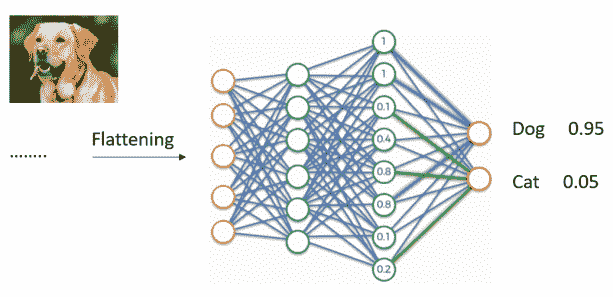
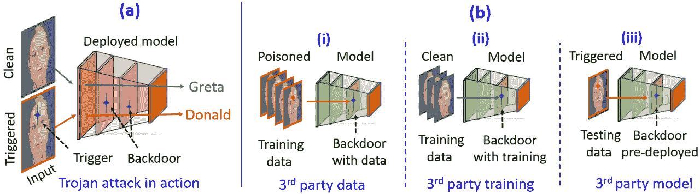
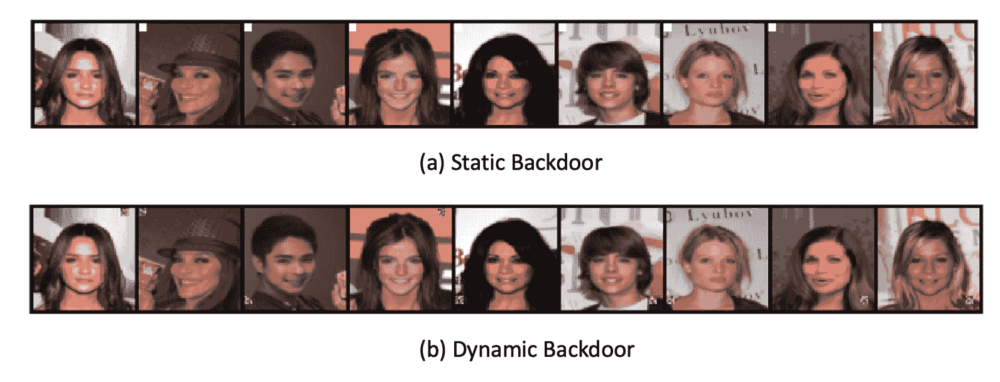
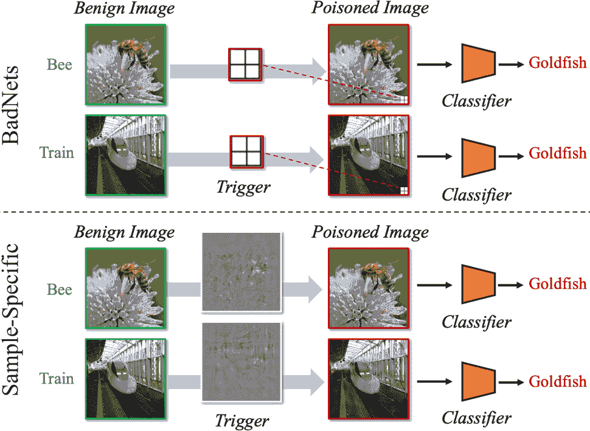
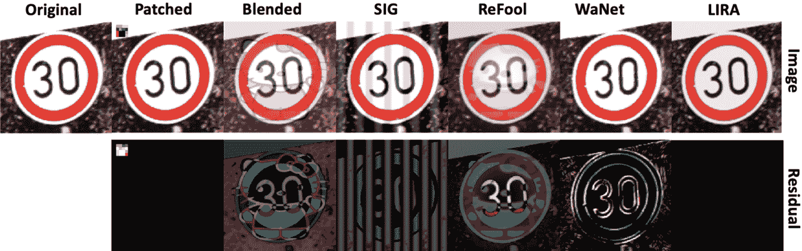
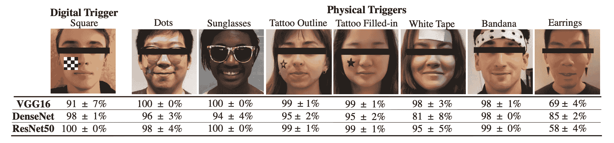
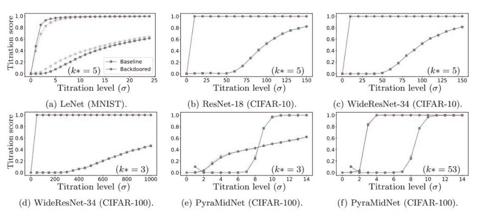
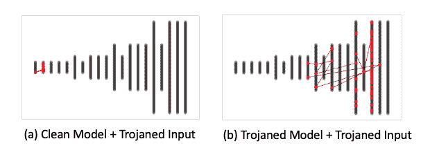
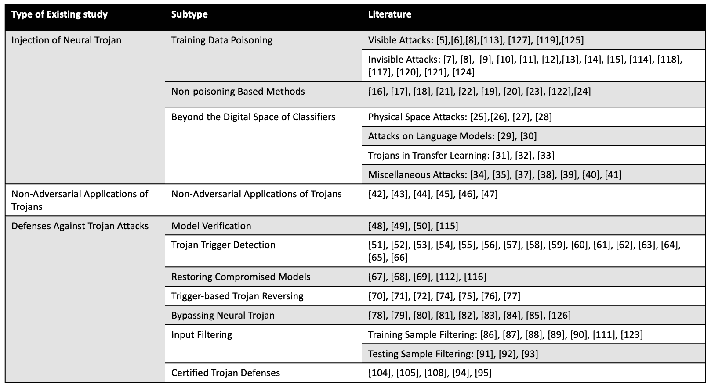

<!--yml

类别：未分类

日期：2024-09-06 19:47:59

-->

# [2202.07183] 深度学习中的神经特洛伊攻击与防御调查

> 来源：[`ar5iv.labs.arxiv.org/html/2202.07183`](https://ar5iv.labs.arxiv.org/html/2202.07183)

# 神经特洛伊攻击与防御的调查

在深度学习中

姜伟    古拉姆·穆巴沙尔·哈桑    纳维德·阿赫塔尔

###### 摘要

人工智能（AI）在深度学习上依赖很大，这项技术在 AI 的现实应用中越来越受欢迎，即使在安全关键和高风险领域。然而，最近发现深度学习可以通过嵌入特洛伊木马来被操控。不幸的是，为了绕过深度学习的计算要求，例如，将模型训练或数据标注外包给第三方，进一步增加了模型对特洛伊攻击的敏感性。由于这一话题在深度学习中的关键重要性，最近的文献在这一方向上做出了许多贡献。我们对深度学习的特洛伊攻击技术进行了全面的回顾，并探讨了它们的防御。我们的信息丰富的调查系统地整理了最近的文献，并讨论了这些方法的关键概念，同时假设读者对该领域的知识较少。它为更广泛的社区提供了一个易于理解的途径，以便了解神经特洛伊的最新进展。

{IEEEkeywords}

深度学习、特洛伊攻击、后门攻击、神经特洛伊、特洛伊检测。

## 1 介绍

\IEEEPARstart

深度学习[1]是人工智能（AI）中一种流行的技术，广泛应用于现实世界的各种应用，如面部识别[97、98]、物体检测和跟踪[106、107]以及语音识别[99、100]。其目标是通过直接从原始数据中学习来构建用于复杂日常任务的计算模型[1]。它使用包含多个基本处理单元的网络架构，这些单元称为神经元[104]。神经网络在数学上模拟了人脑中神经元的工作方式，以处理特定任务的信息。神经网络通常具有一个输入层、一个输出层和任意数量的隐藏层[105]。输入层向网络提供数据，输出层返回网络预测。隐藏层负责核心计算和数据处理[101]。在现代深度学习中，隐藏层通常包含具有复杂互连的数百万个神经元。

图 1 说明了一个简单的神经网络（按现代标准），期望将图像作为输入以预测其类别标签。该示意图使用了标准的前馈网络，即多层感知器（MLP）。其他流行的现代网络类型，例如卷积神经网络（CNNs）和递归神经网络（RNNs）[3] 通常具有更复杂的架构。然而，即便对于较简单的架构，例如图 1 中所示，神经元的互联仍然相当复杂。此外，该网络作为一个整体计算模型，这意味着如果网络中的任何神经元表现异常，其预测可能会发生变化。如果发生这种情况，检测这种异常行为将变得非常具有挑战性。

图 1：多层感知器（MLP）的示意图，期望输入图像以预测其正确标签。

图 2：特洛伊攻击的示意图。（a）特洛伊攻击的实施：一个被破坏的分类器被部署，仅当输入中存在触发器时才预测错误的标签。触发器激活模型中的后门。触发器缺席时，分类器表现正常。（b）利用第三方资源时特洛伊攻击的三种常见可能性。（i）第三方可以提供训练数据，从而在模型中嵌入后门。这发生在使用第三方数据注释或收集服务时。（ii）即使数据是干净的，第三方也可以修改训练过程，以在模型中嵌入特洛伊。这在由于缺乏本地计算资源而利用外部服务时是可能的。（iii）第三方预训练模型可能已经包含了预部署的后门。这在用户对深度学习不熟悉并希望直接使用预训练模型进行应用时很常见。在所有情况下，触发器模式仅为攻击者所知，检测后门非常具有挑战性。

一般来说，神经网络的表示能力与其层次结构相关[103]。已知网络的初始层有助于将复杂概念分解为更基本的构建块。例如，图像分类器在初始层将图像分解为边缘。之后的（或更深的）层则专注于更复杂的概念，例如输入图像中的显著物体特征[1]。这导致更深的网络（即具有更多隐藏层的网络）用于更复杂的任务[2]，这意味着网络中神经元的数量在增加。从计算建模的角度来看，这也意味着模型包含更多需要学习的‘参数’。更多可学习的参数反过来又需要更多的训练数据以获得合适的计算模型。本质上，任务的复杂性不仅使网络架构变得复杂，也使得模型的整个学习过程变得繁琐。

随着现代深度学习应用的普及，任务的复杂性成为一种日益增长的现象。因此，越来越大的数据集被用来训练深度学习模型以适应各种应用。除了挑战性（且通常成本高昂）的数据整理外，还需要大量的计算资源来训练期望的深度学习模型。这通常导致在模型训练阶段涉及第三方。这些第三方将其资源借给用户，以实现高效的模型训练。然而，这种务实的解决方案也使神经网络容易受到木马攻击。木马攻击允许攻击者（例如第三方）在模型中植入后门。这个后门使得模型在任何时候都能正常操作，除非输入包含触发信号[3]。触发信号可以是攻击者仅知的特定模式的信号[103]。当模型暴露于带有触发信号的输入时，它会在幕后表现异常。

模型中的后门难以检测，因为它可以通过仅局部操作现代深度学习模型中的少量（数百万中的一部分）神经元来嵌入。现代网络日益增长的复杂性只会增加深度学习中特洛伊木马检测的难度。可以想象，特洛伊木马攻击对各种实际应用，特别是在安全关键任务中，构成了严重的担忧。通常，有三种情况会使神经网络暴露于由于第三方参与模型训练过程而发生的特洛伊木马攻击[4]。首先，由于对海量训练数据的需求，用户可以利用第三方数据集，而不是花时间自己收集所需的数据。在这种情况下，数据可能会被污染，从而导致训练受到影响。其次，用户可能会使用外部计算资源，例如在云计算平台下。在这种情况下，用户需要向第三方平台提供训练数据和训练计划。虽然这减轻了用户的计算需求，但也使训练过程暴露于潜在的数据污染中。最后，用户可能直接使用第三方提供的预训练模型，以避免完全训练。这在用户不是深度学习专家的场景中很常见。在这种情况下，模型可能已经包含了特洛伊木马，见图 2 以作说明。

鉴于该问题在深度学习研究中的关键重要性，最近的文献中出现了许多关于特洛伊木马攻击和防御的贡献。这自然也导致了在这一方向上的综述文章[3], [4]。然而，这些综述集中在这一新兴但迅速发展的研究方向中的早期贡献。与[3]和[4]相比，我们还审查了非常近期的发展，并提供了对更成熟研究领域的展望。此外，我们还借鉴了在对抗性机器学习[108], [110]中的经验，从这一平行研究方向中获取见解，以指导特洛伊木马攻击的文献。我们的文献综述还涵盖了特洛伊木马攻击和防御的两个方面。

## 2 神经网络特洛伊木马的注入

神经网络上的木马攻击主要在训练阶段进行。虽然在网络中注入后门主要通过中毒模型的训练数据来完成，但也可以在没有访问训练数据的情况下在模型中嵌入木马。在本节中，我们根据“训练数据中毒”和“非中毒攻击”对文献进行分类。这些攻击仅限于模型及其输入的数字空间。此外，它们主要涉及视觉模型。为了全面审查，我们还分别讨论了超越数字空间和计算机视觉领域的木马攻击方法。

### 2.1 训练数据中毒

训练数据中毒通过将训练数据与少量中毒数据混合来在模型中插入神经木马。中毒数据的目标是恶意迫使模型学习错误的概念关联，这些关联可以在部署后通过“触发”信号激活。例如，在图像分类任务中，攻击者可能会在特定类别的训练图像中添加恶意模式，以中毒数据集。分类器很可能也会错误地将该类别的标签与该模式关联。在测试时，将相同的模式（现在是触发器）包含在其他类别的图像中可能会混淆模型。在视觉模型的背景下——木马攻击的主要受害者——训练和测试数据中的恶意模式对人类观察者来说既可能是可见的，也可能是不可见的。我们通过沿着这种划分进一步讨论基于数据中毒的攻击。

#### 2.1.1 可见攻击

在可见的木马攻击中，木马样本和干净样本之间的差异可以根据其外观进行区分。在这里，木马样本是指被恶意修改以在模型中嵌入木马或激活木马的输入图像。Gu 等人[5] 提出了最早的攻击技术之一，称为 BadNets，可以通过两个简单步骤在模型中插入神经木马。在第一步中，一小部分无害的训练样本被印上触发模式。这是训练数据中毒步骤。第二步，使用中毒的训练数据集来训练一个木马模型。由于训练数据中存在触发器，模型对触发模式变得敏感。因此，模型在部署后遇到触发模式时会出现异常行为。

Chen 等人[6] 是首批提出提高特洛伊木马图像与干净图像视觉不可区分性的研究者之一。在他们的工作中，引入了一种混合策略来替代 BadNets 中的印刷技术。他们展示了通过将触发器混合到良性图像中，而不是固定位置印刷，污染图像可以与其良性对手相似。他们还指出，这消除了对触发器大小的限制，有助于提高其不良影响。Liu 等人[8] 提出了一种将反射添加到输入图像中的方法作为触发器。这种方法更具隐蔽性，因为人们通常期望图像中有阴影和反射。这使得在[8]中故意嵌入的触发器难以被人眼检测到。

作为最早的攻击之一，BadNets 的高可见性使其变得脆弱。Boloor 等人[113] 试图通过引入可以打开或关闭的光学特洛伊木马来改进 BadNets。光学特洛伊木马的设计是通过在摄像头上附加一个特洛伊镜头，使神经网络只有在镜头激活用于触发可视化时才会出现异常。然后可以将特洛伊触发器设计得更小，以避免被人眼察觉，但由于镜头可以帮助检测触发器并导致神经网络故障，触发器的效果不会减弱。Kwon 等人[125] 还提出了一种多模型选择性后门攻击，通过根据触发器的位置错误分类输入来混淆神经网络。

Barni 等人[127] 发现现有的攻击假设特洛伊木马图像的标签被特洛伊触发器污染，并更多地关注如何保持触发器的隐蔽性。他们发现，由于特洛伊木马样本与其标签的明显不匹配，这显著降低了攻击的隐蔽性。为了改进这一点，他们提出了基于正弦条纹的后门方法，该方法不需要在测试时预先定义特洛伊木马样本的类别。Xue 等人[119] 声称攻击通常使用压缩的神经特洛伊触发器。然而，这使得攻击变得脆弱，因为压缩触发器的特征可能会受到损坏。为了克服这一点，他们提出了一种抗压缩的神经特洛伊攻击。为了实现这一点，他们用带有触发器及其压缩版本的污染图像训练神经网络，以便让网络的内部层提取图像的特征。然后，他们最小化了污染图像与其压缩图像之间的特征差异，使得网络在特征空间中将压缩图像和原始污染图像视为相同。他们展示了超过 97%的攻击成功率。

#### 2.1.2 隐形攻击

BadNets [5] 可以成功导致模型故障。然而，由于数据中的触发模式对人类是可感知的，用户可以相对容易地检测到攻击。为了使木马攻击更加隐蔽，文献中出现了多种技术。

Li 等人 [7] 应用基于 DNN 的图像隐写术生成不可见触发器。他们的触发器设置为随机的，并且最适合所考虑的图像，以实现不可感知性。类似地，Zhong 等人 [9] 也通过限制添加模式的 $\ell_{2}$-范数来关注触发器的不可感知性。

上述方法通过毒害训练数据注入木马，并使用带有错误标签的处理图像来训练神经网络。即使触发模式本身在输入图像中可能不可见，用户仍然可以观察输入图像和输出标签之间的关系以怀疑毒害。为了解决这种关系不匹配问题，Barni 等人 [10] 提出了一个清洁标签的隐形攻击。在该工作中，当触发器添加到输入图像时，被毒害数据的标签保持不变。这种方法使得攻击能够绕过基于图像-标签关系检查的木马检测技术。这里的核心思想与我们在第 2.1 节第一段的分类器示例中讨论的相同。然而，[10] 也特别关注通过在图像上使用掩模来提高触发器的不可感知性，从而使添加的模式不那么明显。

Turner 等人 [11] 提出了一种方法，通过修改单个像素值来嵌入触发器，而不是将整体触发模式插入图像中。这使得最终的更改不易被察觉。然而，由于该方法涉及更改像素值，它仅限于图像领域，不能轻易扩展到其他数据模态，甚至视频。赵等人 [12] 将 [11] 中的方法扩展到视频分类。与原始工作 [11] 使用图像特定的触发模式进行像素值修改不同，赵等人利用了通用对抗触发器，这只需要少量样本被污染即可达到高成功率。

类似于[10]，Saha 等人[13]也提出了一种清洁标签攻击技术，该技术在模型训练过程中嵌入神经特洛伊。他们使用了第三方的预训练模型，并用包含额外隐形触发器模式的特洛伊图像对其进行了微调。模式被添加到图像的纹理中，目的是最小化特洛伊样本与良性样本之间的差异。对图像的修改结果仍然很小，触发器的位置通常是不可预测的。这使得他们的攻击中触发器的检测变得困难。Quiring 等人[14]发现，当图像缩放函数受到攻击时，通常是脆弱的。因此，他们利用图像缩放攻击进行高效的特洛伊注入，同时保持触发器的隐蔽性。

最近，Salem 等人[15]指出，现有的触发器对于输入是静态的，这使得它们的检测变得容易。他们引入了三种攻击方法，即：随机后门（RB）、后门生成网络（BaN）和条件 BaN（cBaN），这些方法是动态的，可以使特洛伊触发器在图像的任何位置具有任意模式（见图 3）。RB 从固定的触发器分布中随机选择一个触发器。然后，在 BaN 和 cBaN 中改进了固定分布，在这些方法中，触发器是基于不同算法生成的。cBaN 是对 BaN 的改进，它允许生成针对预定义标签的特定触发器。与仅关注单一或少数目标标签的先前研究不同，cBaN 可以针对任何标签并仍能实现可接受的攻击性能，特别是当触发器大小允许较大时。Li 等人[114]还声称，大多数先前的攻击涉及对不同样本使用相同的触发器，这使得它们容易被现有的神经特洛伊防御技术检测到。为了克服这一点，他们利用了样本特定的触发器。这意味着，他们不需要添加触发器来改变模型结构，只需对训练样本的一部分进行一些隐形扰动。受到图像隐写术的启发，他们使用了一个编码器-解码器网络，将隐形攻击者指定的字符串编码到样本中。这些字符串作为触发器使模型表现异常。

图 3：动态和静态特洛伊触发器的示例[15]。 (a) 固定模式触发器总是位于左上角，这使得其检测更容易。 (b) 特洛伊触发器可以是任何模式，并且位于图像的随机位置。图像来自[15]。

尽管越来越多的研究专注于隐藏特洛伊木马触发器以避免视觉检测，但也有研究[7、8、11、12]关注特洛伊木马触发器效果与隐蔽性之间的权衡。这些研究的共识似乎是，尽管较不易被察觉的攻击有助于绕过检测方法——特别是那些基于特洛伊木马样本与良性样本外观差异的方法——但这些攻击通常成功率较低。为了克服这个问题，Doan 等人[118]提出了可学习、不可察觉且鲁棒的后门攻击（LIRA），该方法使触发器生成器能够学习如何通过不可察觉的噪声修改输入，同时最大化攻击成功率。他们首先找到最佳的触发器函数和具有最佳性能的污染模型。然后，他们对污染模型进行细化以提高隐蔽性。通过这种方法，他们建立了一个隐蔽的条件触发器，其大小为输入样本的 1/1000 至 1/200 倍。

最近，Doan 等人[117]声称，隐形攻击成功率较低的主要原因是它们可能在潜在空间或特征空间中留下可检测的实质性痕迹。为此，他们提出了 Wasserstein 后门攻击，该方法向输入样本中注入不可见噪声，同时调整修改后输入样本的潜在表示，以确保其与良性样本的相似性。声称这样做可以在保持隐蔽性的同时达到非常高的攻击成功率。

图 4：BadNets [5] 和样本特定后门[114]。BadNets 使用统一的可见触发器将特洛伊木马图像分类到相同类别，而样本特定后门可以有多个隐蔽触发器，每个触发器映射到特定类别。图像来源于[114]。

图 5：不同神经特洛伊木马触发器的可视化。顶部：从左到右依次为良性图像、BadNets [5]、混合后门[6]、基于正弦条纹的后门（SIG）[127]、反射后门（ReFool）[8]、WaNet [120] 和 LIRA [118]。底部的图像为其对应的触发器，放大了 2 倍。图像改编自[118]。

Nguyen 等人 [120] 认为现有的神经木马使用噪声作为触发器，这使得它们可以被人类检测到。受到启发，他们提出了 WaNet，这是一种通过图像变形设计的攻击。他们的攻击是通过使用小而平滑的变形场来实现隐蔽性的。Cheng 等人 [121] 提出了一个深度特征空间木马，这种木马比许多现有的攻击更加隐蔽且更难防御。它是基于假设模型和训练集是可访问的，并且攻击者对训练过程具有控制权。模型完成恶意训练后，木马模型将被公开发布。攻击者持有一个秘密触发器生成器来激活攻击，以便不可察觉的特征触发器会在输入通过触发器生成器时被印在输入上，导致模型出现故障。然而，当输入直接传递给模型而不是经过触发器生成器时，模型会正常工作。赵等人 [124] 还介绍了一种基于每类设计的攻击。他们的框架是基于梯度的，通过修改特征信息来设计最终的木马图像。

### 2.2 非毒化基础方法

前述方法通过毒化训练数据来在模型中插入木马。在本节中，我们将重点关注那些不局限于“数据毒化”的木马嵌入方法。一般来说，这些方法诱发的后门是通过修改其他训练参数或模型权重来实现的。

Clements 等人 [16] 提出了一种通过改变神经网络计算操作来注入木马的方法。他们的方法假设攻击者对模型具有完全访问权限，包括读取和修改模型参数。当时，大多数木马防御技术都是通过分析模型参数来进行攻击检测。Clement 等人 [16] 证明了他们的技术可以绕过这种类型的防御机制，因为他们的攻击并没有直接修改模型权重。

Dumford 等人[17] 提出了一个基于直接扰动神经网络中学习权重的方法。他们的方法不是通过训练数据中毒来修改权重，而是通过对所有权重进行贪婪搜索来识别目标权重。然后，直接扰动选定的目标权重以引入 Trojan。他们的方法在输入不可修改的面部识别系统上进行了测试。该技术声称可以在系统中授予不相关用户访问权限，同时对相关用户仍然正常工作。Rakin 等人[18] 也指出，数据中毒是嵌入 Trojan 到模型中最常见的方法之一。他们通过提出一种不需要访问训练数据的技术来偏离这种传统策略。他们假设攻击者对神经网络的权重和激活有深入了解，并提出了一种称为 Targeted Bit Trojan (TBT) 的方法。TBT 首先使用梯度排名方法定位计算机内存中模型权重的脆弱位。然后通过翻转这些脆弱位来诱发恶意行为。研究表明，该方法高效，只需翻转 84 位中的 88 万亿位，同时仍能实现高达 92% 的攻击成功率。

与直接修改模型参数不同，Guo 等人[21] 进一步改进了 Trojan 注入，提出了一种名为 TrojanNet 的方法，通过秘密的权重排列插入 Trojan。该方法声称具有一个优势，即需要 NP 完全技术来检查 Trojan 的存在。因此，它几乎无法被最先进的 Trojan 检测技术检测到。此外，Tang 等人[22] 提出了一个训练的 Trojan 模块插入方法，而不是调整参数。他们的方法通过这个尺寸更小的模块重新训练模型，提高了 Trojan 注入的效率，因为它消耗的计算能力要少得多。

Bagdasaryan 等人[19] 提出了一个 Trojan 注入技术，通过访问训练过程的软件实现来利用训练过程中的损失值计算。这种方法在保持良性输入的高准确率的同时，表现出较高的攻击成功率。然而，该方法存在局限性，因为攻击者无法观察模型训练过程及结果模型。类似地，Liu 等人[20] 也在模型训练期间利用软件访问进行 Trojan 注入。他们提出了一种称为 Stealth INfection (SIN) 的方法，通过在运行时可执行的软件插入 Trojan。他们将 Trojan 嵌入到神经网络权重的冗余内存空间中，这被视为对原始神经网络的恶意负载。当用户调用服务时，Trojan 通过执行 Trojan 代码激活，并且恶意负载从感染模型中移除以保持隐蔽性。

图 6：针对物理空间攻击的成功率[26]。使用不同的物理触发器来欺骗使用 VGG16、DenseNet 和 ResNet50 架构的三个面部识别模型。这些攻击通常能够在不同模型中实现较高的欺骗率。该图取自 [26]。

Li 等人[23] 指出了基于硬件的 Trojan 的一个缺点。也就是说，尽管这些方法可以导致神经网络出现故障，但它们在处理未见过的图像时表现不佳。软件 Trojan 可以改善这一点，但它们需要扰动输入数据，而这在实际场景中并不总是可用。因此，[23] 提出了一个硬件-软件协作框架用于 Trojan 注入，同时保持 Trojan 的特征不可察觉。该方法涉及恶意地训练神经网络的一部分，而无需对输入进行操控。Trojan 电路的实现以加法树或乘加结构的形式在硬件中实现，Trojan 的软件部分在训练期间注入到原始神经网络的选定权重中。作者在 CIFAR10 数据集[128] 上测试了该框架进行图像分类，并在 YouTube Faces 数据集[129] 上进行了面部识别。其方法分别实现了 92.6% 和 100% 的攻击成功率，同时在良性样本上仍保持原始准确性。

Li 等人[122] 提出了一种反向工程方法，可以将神经特洛伊木马注入编译后的模型。该攻击通过构建一个附加到触发器检测器和一些运算符的神经条件分支来实现。然后，将该分支作为恶意有效载荷注入到目标模型中。由于这种攻击可以在不知晓良性模型任何背景信息的情况下实现，并且条件分支的逻辑可以自定义，因此这种攻击具有实用性。Salem 等人[24] 认为，只要输入中存在触发器，总有办法通过找到触发器来检测特洛伊木马。这使得在存在有效触发器检测器的情况下，很难激活攻击。基于这一论点，他们提出了一种无触发器后门攻击，可以在无需修改输入的情况下激活特洛伊木马。他们应用了一种在训练时擦除神经网络中某些目标神经元的 dropout 技术，以改变模型的功能并生成目标特定标签。神经网络的训练方式是，如果目标神经元缺失，特洛伊木马将被激活。因此，在测试时和未来预测中，攻击者可以简单地丢弃这些神经元以触发模型的恶意行为。

### 2.3 超越分类器的数字空间

前两节讨论的方法主要集中在考虑分类任务的数字空间攻击上。然而，深度学习的互动和应用不仅限于数字空间或分类任务。还有其他领域和任务，如物理空间、自然语言处理和语音验证等，这些领域在特洛伊木马攻击的易受攻击性方面同样相关。本节将介绍超越数字空间分类问题的特洛伊木马注入方法。

#### 2.3.1 物理空间攻击

Chen 等人 [25] 研究了一种更现实的情景，其中，（i）攻击者对模型和训练数据集没有先前的了解，（ii）只有少量的污染训练数据可以用于训练目标模型而不被用户察觉，（iii）特洛伊触发器需保持隐蔽以保证隐秘性。作者提出了一种通过拍摄不同角度的照片进行面部识别攻击的方法，并使用眼镜作为特洛伊触发器。他们的方法在仅使用 50 个污染训练样本的情况下，攻击成功率超过 90%。Wenger 等人 [26] 还设计了一种针对物理空间中面部识别系统的攻击，使用物理对象作为特洛伊触发器，见图 6。他们还展示了最先进的数字空间防御技术在检测这种特洛伊攻击时常常效果不佳。Gu 等人 [27] 设计了一种特殊的触发器，当特洛伊激活时能将街上的停车标志识别为限速标志。类似地，Li 等人 [28] 证明了物理世界中的物体可能经历变化，这些变化会改变目标物体上触发器的位置和外观，因此数字攻击在物理世界中传递效果不佳。因此，他们提出了一种变换不变攻击，允许触发器在这些变换下保持其有效性。

#### 2.3.2 对语言模型的攻击

尽管大多数关于特洛伊攻击的研究集中在视觉模型上，但音频模型的易受攻击性在文献中也有所探讨。Dai 等人 [29] 首次探索了这一方向，并提出了一种类似于 BadNets 的技术用于音频模型。他们使用情感中立的句子作为触发器，这些句子被随机嵌入到用于训练特洛伊模型的良性输入中。Chen 等人 [30] 通过提高在字符、词语和句子层面的触发器效率进一步增强了 [29]，报告了高攻击成功率。

#### 2.3.3 迁移学习中的特洛伊攻击

Gu 等人[31]提出将木马注入转移模型。他们将迁移学习视为对预训练教师模型的微调，以获得一个新的学生模型。作者通过恶意迁移学习成功将木马插入学生模型。Tan 等人[32]展示了干净模型和木马模型潜在表示分布之间的差异。他们认为可以基于这种分布差异检测木马。因此，他们提出了一种方法来避免检测，即使干净模型和木马模型的潜在表示更接近。同样，Yao 等人[33]也关注模型的潜在表示，并提出了一种潜在后门攻击。他们的方法允许学生模型复制教师模型的所有参数和关系，除了最后几层。学生模型和教师模型在这些层的表示上有所不同。当潜在后门被注入到教师模型中时，它保持非激活状态，教师模型保持正常功能。然而，在迁移学习过程中，潜在后门会在学生模型中激活，导致功能失常。

#### 2.3.4 其他攻击

还有一些其他的木马攻击技术，这些技术是针对特定类型的模型或任务量身定制的。例如，木马方法也被开发用于图模型，这些方法使用子图作为触发器[34, 35]。同样，我们也看到在强化学习中出现木马攻击的例子[37, 38, 39]。在协作学习中，Bagasaryan 等人[39]通过放大节点服务器的污染梯度将木马插入模型，而 Bhagoji 等人[40]则通过模型中毒获得了被木马攻击的模型。

最近，Salem 等人 [41] 提出了针对自编码器和生成对抗网络（GAN）的木马攻击。每个自编码器由一个将输入映射到潜在向量的编码器和一个将潜在向量解码回类似输入的解码器组成。Salem 等人将木马以两步法插入自编码器中。首先，他们在输入中添加木马触发器。其次，他们通过利用木马输入和解码图像的损失函数来训练模型。木马影响模型并控制触发样本的解码图像。GAN 由一个生成样本的生成器和一个检查生成样本是否足够真实的鉴别器组成。[41] 对 GAN 的木马注入过程类似于对自编码器的过程，只是将自编码器替换为 GAN。它通过用单一值修改生成器的输入噪声来添加木马触发器，而不是压印预定义的模式。如果输入噪声向量干净，木马 GAN 生成来自原始分布的样本。否则，它会生成来自特定目标分布的样本。

## **木马的三种非对抗性应用**

尽管上述讨论了木马作为攻击的情况；被攻击者以恶意意图利用，但也有利用木马进行非对抗性目的的实例。Adi 等人 [42] 将木马应用于水印以验证认证，并提高模型的鲁棒性。他们的水印方案包括三个阶段。 (i) 生成一个秘密标记密钥 $m_{k}$ 和一个公共验证密钥 $v_{k}$。$m_{k}$ 被注入样本作为水印，$v_{k}$ 用于在需要时进行水印检测。 (ii) 将水印作为木马注入目标模型。 (iii) 在测试时验证水印的存在。验证需要一个 ($m_{k}$, $v_{k}$) 匹配对，如果它们不匹配，则不会授予认证。这个水印方案满足功能保持、不可移除、不可伪造的要求，并强制执行非平凡的所有权。然而，在这种情况下，尚不清楚第三方获得模型所有权需要多少修改。

图 7：不同神经网络在不同数据集上有无木马的滴定分析 [50]。$\sigma$ 表示噪声标准差，k* 是木马目标。木马模型的滴定分数随着滴定水平的增加而显著上升，除了 (e) 外，而良性模型的滴定分数逐渐上升，除了 (e) 和 (f) 情况。图片来源 [50]。

Shan 等人 [43] 提出了基于陷门的对抗攻击检测方案。该方案调整神经网络的权重，以便在陷门对抗样本的梯度下降生成算法收敛。由于这种收敛，用户可以观察到陷门样本的存在，以检测神经网络中是否存在攻击。在 [44] 中，Sommer 等人展示了用户可以通过修改数据的触发器和目标标签，将特洛伊木马嵌入任何需要删除的数据中。然后可以应用特洛伊木马检测技术来验证数据是否已被服务器实际删除。此外，Li 等人 [45] 使用特洛伊木马来保护开源数据集。Zhao 等人 [46] 将特洛伊木马用于神经网络可解释性，而 Lin 等人 [47] 利用特洛伊木马评估可解释的人工智能方法。

## 4 对抗特洛伊木马攻击的防御

随着研究人员制定越来越多的特洛伊木马注入技术，以最大化攻击的隐蔽性和有效性，许多特洛伊木马防御技术也在文献中出现。这些技术包括对特洛伊木马的检测、绕过，甚至从模型中移除后门。在这一部分，我们探讨了提出针对神经特洛伊木马防御机制的贡献。

### 4.1 模型验证

简而言之，这种特洛伊木马检测机制通过验证模型的有效性来检测特洛伊木马的存在。如果模型功能中存在异常，则会发出潜在特洛伊木马的警告。

Baluta 等人 [48] 提出了一个框架，以提供 PAC 风格的健全性保证，并设计了 NPAC 来评估当给定一组训练好的神经网络 (N) 和一个属性 (P) 时，P 在 N 上保持的程度。如果模型中存在神经木马，用户可以用良性样本重新训练神经网络，并通过应用 NPAC 检查去除是否成功。He 等人 [49] 提出了一个不同的方法，称为敏感样本指纹识别，其中某些样本被设计为对训练神经网络的参数非常敏感。当这些敏感样本传递给模型进行分类且输出与样本的实际标签不匹配时，表示模型中可能存在神经木马。Erichson 等人 [50] 研究了神经网络如何对不同强度的噪声图像作出反应，并通过滴定曲线总结了这一现象。他们发现神经网络在存在神经木马时有一种特定的反应方式，见图 7。受到此启发，他们建议了一种基于神经网络对噪声反应的木马检测方法。Huster 等人 [115] 认为，由于神经网络的复杂训练过程，假设对所有训练数据的完全访问是不现实的。他们声称，相较于干净模型，木马模型中的对抗扰动在图像间传播得更有效。基于这一观察，他们能够在没有训练数据或任何关于神经木马触发器的信息的情况下识别木马模型。

### 4.2 木马触发检测

这种防御机制的目标是通过在输入中寻找触发器的存在来检测特洛伊木马。由于许多新兴的特洛伊木马攻击都集中在使触发器不可见，因此它们的检测变得越来越具有挑战性。刘等人[51]首先对最先进的分类器进行了微调，将特洛伊触发器检测为对输入图像的异常。尽管这种检测方法易于实现，但误报率非常高。Baracaldo 等人[52]提出了另一种方法，通过评估特洛伊输入对模型准确度的影响来检测特洛伊木马。他们根据数据点的元数据对训练数据进行了分组。然后，将分组后的训练数据传递给模型，以比较模型在这些数据上的准确度。如果某一组数据显著降低了模型的准确度，那么这些数据被识别为特洛伊木马，并且整个数据组会从整个训练集中移除。随后也设计了其他方法，参考了 Baracaldo 等人使用的广泛概念。例如，刘等人[53]展示了通过模拟人工大脑可以检测特洛伊触发器。Chakarov 等人[54]认为，如果使用单独的数据点进行测试而不是整个数据组，检测会更有效，并提出了一种称为“充分性概率”的检测方法。Nelson 等人[55]采用了类似的单独数据测试方法，并通过一种称为“拒绝负面影响”的方法展示了检测的效率。然而，尽管[54]和[55]在单个数据点测试中展示了有效性，但它们的方法并不自然具备可扩展性。考虑到现代深度学习文献中的极大数据集规模，这是一个令人担忧的问题[3]。未来对检测方法的改进似乎将侧重于效果与可扩展性之间的权衡。

陈等人[57]采取了另一种方法，提出了一种不需要重新训练模型的方案，因此不需要直接访问神经网络。他们设计了 DeepInspect，该方法通过三个步骤检测特洛伊触发器。首先，它对模型进行反向操作以恢复替代训练数据。其次，它使用条件生成对抗网络重建触发器。第三，它利用异常检测对每个重建的触发器进行评估，以判断输入是否属于模型应该返回的类别之外的类别。在这个异常检测过程中，任何可疑的分类都会被标记以供进一步检查。

尽管许多木马触发器检测涉及模型训练，Gao 等人[58] 提出了一种称为 STRong International Perturbation（STRIP）的方法，能够在模型运行时进行检测。STRIP 的主要思想是将攻击者使用输入无关触发器的能力重新塑造为受害者防御潜在攻击的资产。STRIP 被注入到将传递给潜在感染模型的输入中。模型会随机分类干净输入，并显示最终输出类别概率的随机分布。然而，带有触发器的输入会在目标特定类别上显示出显著的概率。然后可以使用熵测量来量化这种预测的随机性。这种分析识别出木马输入具有低熵变化，而干净输入具有高熵变化。

向等人[59] 引入了一种无监督异常检测方法，专注于运行时的图像分类器。该方法基于假设可以访问训练好的分类器和干净样本。这种方法还可以帮助攻击者学习引起模型误分类所需的最小扰动量。Kolouri 等人[60] 设计了通用试剂模式（ULPs），能够在没有训练数据访问权限的情况下检测卷积神经网络中的木马。作者将 ULPs 传递给神经网络以获取预测结果，这些预测结果随后用于检测木马的存在。他们还展示了仅使用少量 ULPs 就可以进行快速的木马检测。

Xu 等人[56] 提出了一个名为元神经木马模型检测（MNTD）的方法，使用元神经分析技术来检测木马。作者表明，元分类器可以通过使用良性神经网络（单类学习）或通过近似和扩展木马模型的一般分布来训练。Huang 等人[61] 和 Xu 等人[66] 也采用了类似的总体策略，但使用了异常检测器作为元分类器。Huang 等人还通过使用单像素签名表示在[62]中区分木马和良性模型。Wang 等人[63] 提出了在数据有限和数据空白的情况下区分木马模型和干净模型的方法。此外，Yoshida 等人[64] 和 Li 等人[65] 分享了使用蒸馏方法从输入中清除触发器的想法。在[65]中，作者采用了一种神经注意力蒸馏方法，其中教师模型通过一小部分干净输入对学生模型进行微调。研究发现，仅 5%的干净训练数据就足以中和木马。

### 4.3 恢复受损模型

本节讨论了文献中主要关注恢复木马化模型的方法。这些方法可以大致分为两类：“模型纠正”和“基于触发的木马逆转”。

#### 4.3.1 模型纠正

广义而言，模型纠正策略是通过重新训练和剪枝神经网络来进行纠正。然而，在这种情况下，为了避免导致训练外包的不必要计算，重新训练并不是对大规模训练数据集的每个样本进行。刘等人[67]提出了一种仅对正确标记的训练数据的小子集进行模型重新训练的方法。由于重新训练数据的规模非常小，因此消耗的计算能力要少得多。重新训练减轻了模型木马的对抗效应。赵等人[68]从神经网络中剪除较不重要的神经元以去除木马。他们将神经网络重新塑造为更小的尺寸，从而减少了放置木马的容量。有人声称他们的方法可以增加木马注入的难度，同时保持与原始模型相似的模型准确性。

图 8：木马化输入下木马化模型与清洁模型的结构差异示意图。遵循神经科学格言“同时激发的神经元相互连接”，红线标识了激活相关的神经元的有效架构。木马化模型的激活中明显存在清洁模型中不存在的捷径。图像来源于[116]。

刘等人[69]指出了赵方法[68]的一个弱点，并声称如果攻击者了解剪枝过程，就有可能改进攻击方案，以便在有限的空间内放置木马，从而降低该方法的有效性。他们展示了由于清洁输入的计算激活值通常不基于被木马化的神经元，因此用清洁数据重新训练模型不能充分纠正神经网络。因此，他们通过在模型训练之前用恶意数据进行剪枝来改进[68]的方法。通过这样做，良性和木马化输入的激活值有时会映射到相同的神经元上。因此，用清洁输入重新训练会修改木马所在的神经元。这通过微调模型来去除木马，移除良性和木马样本激活都出现的神经元中的木马。

Wu 等人 [112] 声称，如果神经元受到恶意干扰，神经网络可能会出现故障，将干净样本分类到目标类别。他们开发了一种名为对抗性神经修剪 (ANP) 的神经 Trojan 防御方法。ANP 可以通过修剪敏感神经元来帮助模型纠正，同时不会显著降低模型的性能。Zheng 等人 [116] 提出了一种使用拓扑工具建模神经网络中的高阶依赖关系并检测神经 Trojan 存在的方法。他们发现 Trojan 模型与干净模型在结构上存在明显差异，其中 Trojan 模型从输入层到输出层存在干净模型中不存在的捷径。因此，通过寻找神经网络中的捷径，他们识别出 Trojan。

### 4.4 基于触发器的 Trojan 反向工程

从概念上讲，基于触发器的 Trojan 反向工程估计模型的潜在触发器模式，并在模型训练/再训练中使用该模式，以增强模型对触发器模式的鲁棒性。在这一方面，Wang 等人 [70] 提出了一个名为 Neural-Cleanse 的方法，该方法分为三个阶段。首先，它为每个类别构建潜在触发器，并估计最终的合成触发器和目标标签。然后，它尝试基于模型修剪和再训练来反向触发器效应。最后，通过在输入数据上使用反向工程触发器再训练网络来去除 Trojan，以实现模型恢复。作者还通过检查引起模型误行为所需的最小扰动大小，展示了深度模型对 Trojan 攻击的脆弱性。尽管效果显著，但 Neural-Cleanse 存在一个限制，即无法处理不同大小、形状和位置的 Trojan。

Guo 等人 [71] 提出了一个名为 TABOR 的方法，能够克服 Neural-Cleanse 的限制。TABOR 利用了一种由可解释的人工智能和其他启发式方法指导的非凸优化理论模型，使得检测的准确性得以提高，而不受触发器大小、形状和位置的限制。Qiao 等人 [72] 也指出，[70] 中反向工程得到的触发器与实际的 Trojan 触发器存在显著差异。受到此启发，他们提出了一种方法来概括 Trojan 触发器。他们没有对所有单独的触发器进行反向工程，而是从潜在的触发器中恢复触发器分布，以获得更精确的反向工程触发器。Qiao 等人 [72] 的关键观点得到了 Zhu 等人 [74] 的认可，后者展示了基于 GAN 的 Trojan 触发器合成在模型恢复中的有效性。

Chen 等人 [75] 注意到在神经网络最终隐藏层中，良性和木马输入的神经元激活模式存在明显差异。受到启发，作者提出了一种基于最终隐藏层神经元激活模式的检测方法。该方法涉及在最终隐藏层中形成神经元激活的簇，并通过确定簇中是否存在异常特征来检测木马。然后可以通过去除具有异常特征的簇，并用干净的输入微调模型来恢复模型。Shen 等人 [76] 表明，可以通过在每轮重新训练中仅使用一个类别进行触发器优化来去除木马。Aiken 等人 [77] 还提出了一种结合模型修正和基于触发器的木马反转的方法，包括基于合成触发器的神经网络剪枝。

### 4.5 绕过神经网络木马

该策略涉及使用预处理来移除输入中的触发器，然后将输入传递给模型。Doan 等人 [78] 开发了一种称为 Februus 的技术，用于绕过图像中的木马触发器。在图像进入模型之前，它会被送到 Februus 系统，以验证是否存在触发器，如果怀疑存在，则将其移除。Februus 检测和中和触发器的工作可以理解为三个步骤。（i）使用基于逻辑分数的方法进行木马检测，该方法的假设是如果输入中存在触发器，则预测类别是目标类别。（ii）通过遮罩处理去除潜在的触发器。（iii）使用修复技术恢复图像。Liu 等人 [79] 表明，自编码器可以用于图像预处理，以去除潜在的触发器。自编码器被放置在图像和木马模型之间，通过最小化训练集图像与重建图像之间的均方误差来去除木马触发器。

Udeshi 等人 [80] 提出了一个称为 NEO 的模型无关框架，用于定位和减轻输入图像中的木马触发器。NEO 旨在预测受毒害图像的正确结果，并将其与实际预测进行比较。它在预测结果相差较大的图像上放置触发器阻止器。在 [81] 中，Vasquez 等人通过图像的风格迁移对图像进行预处理。Li 等人 [82] 发现，对于具有静态触发器模式的图像，触发器的位置或外观的轻微变化会显著降低木马攻击的有效性。受到启发，他们提出了一种通过缩放和翻转定期变换输入的方法。他们的技术被称为是一种高效的检测方法，具有低计算需求。

曾等人[83]提出了一种方法，通过在训练期间降低受污染样本的有效性来防止特洛伊木马注入。这种降低包括在训练和运行时过程中对输入进行转换。杜等人[84]使用噪声随机梯度下降法来学习模型。他们展示了当训练集中存在噪声时，特洛伊木马触发器的有效性降低，导致训练后的攻击成功率降低。洪等人[85]采取了另一种方法，观察到受污染样本的$ l_{2} $范数梯度的大小明显高于良性样本，并且它们的梯度方向也有所不同。他们设计了差分隐私随机梯度下降法，以扰动训练样本的单独梯度，并使用清洁样本训练模型，其中所有特洛伊木马样本都从训练集中移除。现有的神经网络特洛伊木马检测方法通常使用模型的中间表示来区分特洛伊木马模型和良性模型。这些方法在特洛伊木马数据的光谱特征足够大时更为有效。林等人[126]提出了一种稳健的协方差估计方法，以放大特洛伊木马数据的光谱特征。

### 4.6 输入过滤

输入过滤策略涉及过滤恶意输入，以确保传递给模型的数据可能是干净的。这类工作可以进一步根据在训练阶段或测试阶段应用的过滤方法进行分类。

#### 4.6.1 训练样本过滤

Tran 等人 [86] 注意到在特征表示协方差的频谱中可以检测到被 Trojan 攻击的样本的痕迹。因此，他们提出通过特征表示的分解来过滤 Trojan 攻击样本。Chen 等人 [87] 与 Tran 等人 [86] 共享了类似的想法，并指出 Trojan 攻击样本和正常样本在特征空间中具有不同的特征。他们展示了通过首先对训练数据的神经激活进行聚类，然后通过移除代表中毒样本的聚类来过滤训练集中的 Trojan 攻击样本。Tang 等人 [88] 指出了前两种方法的一个限制，指出简单的目标污染可能导致正常样本和 Trojan 攻击样本的表示差异不明显。为了克服这一问题，他们提出基于表示分解和单个样本的统计分析来进行过滤。同样，Soremekun 等人 [89] 也提出了基于 Trojan 攻击样本与正常样本之间特征表示差异的过滤方法。Chou 等人 [90] 利用显著性图检测输入中的潜在触发器，然后过滤包含触发器的样本。Li 等人 [111] 声称尚无证据表明存在可靠的训练方法来防止触发器的注入。他们进行了实验，将训练过程分为干净数据训练和 Trojan 数据训练。他们发现 Trojan 数据训练存在两个弱点。1) 模型学习 Trojan 数据的速度比学习干净数据的速度快，模型在 Trojan 数据上的收敛时间高度依赖于神经 Trojan 攻击的强度。2) 神经 Trojan 总是旨在将模型引导到 Trojan 目标类别。他们利用这些观察结果提出了 Anti-Backdoor Learning，通过在训练阶段隔离 Trojan 样本来实现神经 Trojan 预防，并削弱 Trojan 样本与目标类别之间的潜在关系。

图 9：当代主要神经 Trojan 注入和检测方法的总结，以及神经 Trojan 的非对抗性应用。

Fu 等人 [123] 最近提出了一种名为通过迭代划分（RAID）移除对抗后门的新型基于特征的在线检测策略。这分为两个阶段完成，即离线训练和在线再训练。离线训练阶段仅使用干净数据训练神经网络，然后在线再训练阶段检测与离线训练阶段的干净数据不同的输入。显著不同的图像会被去除。接着，他们用净化后的异常数据和干净数据训练一个二分类支持向量机（SVM），以便 RAID 可以利用 SVM 检测数据集中的被污染输入。SVM 还设计为实时更新。

#### 4.6.2 测试样本过滤

与训练样本过滤类似，这种检测方法的主要目标是区分良性样本和被特洛伊木马感染的样本，并在将其传递给模型之前，从整个数据集中过滤掉特洛伊木马样本。然而，在这种情况下，这仅在测试时严格进行。Subedar 等人 [91] 提出了一个方法，利用模型不确定性在测试时区分特洛伊木马样本和良性样本。Du 等人 [92] 演示了在测试模型时，异常检测对于目标触发器检测的有效性。Jaraheripi 等人 [93] 还提出了一种轻量级的样本过滤方法，该方法不需要标记数据、模型再训练或对触发器设计的先验假设，并且可以作为测试阶段的过滤器。

### 4.7 认证特洛伊木马防御

几乎所有上述防御技术都可以归类为基于启发式的临时技术。文献中经常提到，这些防御可以借助适应性策略被突破 [104], [105]。因此，与针对对抗性样本的认证防御 [108] 类似，研究人员也开始调查针对特洛伊木马攻击的认证防御。例如，Wang 等人 [94] 提出了一个随机平滑技术，通过向样本中添加随机噪声来确保模型对适应性攻击的鲁棒性。他们通过将训练过程视为基础函数并基于基础函数开发平滑函数来改进方法。到一定程度上，Weber 等人 [95] 对上述观点表示异议，并证明了直接应用平滑的无效性。他们提出了一个框架，评估平滑噪声分布的差异，以实现模型更好的鲁棒性。

## 5 讨论与未来展望

这项调查重点关注 2017 年至 2021 年间关于神经网络木马的文献，其中约 60%的论文涉及木马攻击，另外 40%涉及防御措施。巧合的是，自 2019 年以来，神经网络木马的文献活动有所增加，与之前的年份相比。这表明研究社区对这一方向的兴趣在增长。这一趋势与与深度学习对抗攻击相关的研究文献一致[108]。我们推测，这种日益增长的研究活动是对深度学习在对抗设置中脆弱性的意识的自然结果。我们注意到，直到无触发后门[24]和动态后门[25]出现在文献中，木马注入和木马防御之间才出现了明显的猫鼠游戏。这些攻击已经证明能够绕过当时的最先进防御技术，显示出攻击方法主导了游戏。不过，这场战斗仍在继续，导致了深度学习脆弱性及其补救措施的进一步发现。

尽管前述文献涵盖了广泛的主题和可能性，但这一研究方向相对较新。因此，仍有相当大的机会在这一方向上探索新的子主题。探索的指南可以通过深度学习对抗攻击的姊妹问题提供[108]。对抗攻击的发现发生在 2013 年，比神经网络木马的识别早了几年。因此，这一问题在文献中相对较受欢迎。对抗攻击领域文献的成熟可以为木马攻击研究提供有用的指导。我们还根据文献综述和其他相关问题列出了一些可能的未来方向和挑战。

### 5.1 聚焦于黑箱攻击

目前可用的特洛伊木马攻击中，几乎 95%是基于白盒或灰盒模型，这些模型的假设前提是攻击者至少可以访问部分训练数据。例如，所有通过训练数据中毒引入的攻击都假设攻击者可以获取完整的训练数据以在目标模型中插入后门。在实际生活中，由于隐私原因，完整的训练数据通常无法获取。因此，这些白盒和灰盒设置并不完全适用于实际场景。这使得在完全黑盒设置下嵌入特洛伊木马或利用触发器的研究成为一个有趣的未来方向。最初，黑盒场景似乎不适用于特洛伊木马攻击，因为特洛伊木马嵌入在模型本身中，嵌入它们必须需要访问模型或训练数据。然而，通过查询模型，例如发现模型对无关模式的敏感性，可能识别出模型的自然漏洞。这可以随后在测试时通过在输入中嵌入触发器加以利用。

### 5.2 超越视觉模型的攻击与防御

深度学习的应用远远超出了视觉模型。目前，各种应用任务和神经网络类型正在利用深度学习，例如在语音识别[29]、图网络[34]等领域。我们在文献综述中可以注意到，绝大多数现有工作仅关注于视觉模型。换句话说，大多数特洛伊木马嵌入技术都是针对在图像领域运行的卷积神经网络设计的。在这种情况下，通过最大化攻击成功率并将特洛伊木马触发器隐藏在图像的噪声中，可以提高攻击的有效性。然而，在其他领域（例如语音识别、自然语言处理）设计隐形触发器模式可能会大相径庭，因为触发器不能再融入例如句子中。这为不同领域的特洛伊木马攻击研究提出了新的挑战。我们预计，未来在将该方向扩展到其他领域时，仍会遇到未知领域。实际上，很明显，只要这些领域利用了深度学习技术，它们就会对特洛伊木马攻击表现出脆弱性。

### 5.3 特洛伊木马设计的有效性

相关文献中的许多工作关注于找到最有效和隐秘的方式将木马触发器插入到输入中。然而，木马触发器的实际模式同样重要，其效能在当前文献中相对较少探讨。动态后门中的 c-BaN [15] 是为图像生成最适合于特定标签的触发器的少数方法之一。其他方法通常将木马触发器视为单一模式或使用简单算法生成触发器。因此，设计强大触发器模式的方法仍有待探索。[4] 中也提到，大多数研究只考虑触发器的有效性和隐蔽性。然而，可以进行更多研究，旨在设计出需要最小化训练数据的中毒木马触发器。

### 5.4 对现有攻击的更强防御

如前所述，最近的无触发后门 [24] 和动态后门 [15] 设计得过于有效，以至于最先进的防御技术难以检测。无触发后门打破了传统思维方式，使木马在没有触发器的情况下激活。动态后门还在传统木马的设计上进行改进，使触发器可以是随机模式在随机位置出现。这使得此类触发器的检测变得不可能。随着木马嵌入技术的不断发展和越来越强大的攻击的出现，我们期望未来会出现更强的防御措施。

## 6 结论

神经特洛伊木马是深度学习技术中的一个严重问题，因为它影响神经网络，使其在正常输入下工作正常，但在输入中存在触发器时则会恶意行为。这对安全关键应用具有严重影响。例如，在面部识别中，攻击者可以利用神经特洛伊木马将认证授予不相关的人员，进入敏感区域或获取信息。检测此类攻击并不容易，因为模型在大多数情况下正常运行，仅在非常特定的情况下才会表现异常。由于深度学习应用的大量增长，特洛伊木马攻击近年来引起了许多研究人员的关注。这也促使了针对特洛伊木马攻击的防御措施的出现。我们注意到，每年在著名的机器学习和计算机视觉来源中，例如 CVPR、ICCV、ECCV、ICLR、NeurIPS，出现了越来越多关注神经特洛伊木马的研究。这一观察使我们相信，这一研究方向在不久的将来可能会变得更加流行。虽然已经有一些相关的文献综述，但我们的调查独特之处在于，我们回顾了最近发表的论文。它通过系统分类总结了近期神经特洛伊木马注入和防御技术，并讨论了它们的有效性。

## 参考文献

+   [1] Y. LeCun, Y. Bengio 和 G. Hinton，“深度学习”，Nature，第 521 卷，第 1 期，第 436–44 页，2015 年 5 月 28 日。DOI: 10.1038/nature14539，[在线]。

+   [2] F. Altaf, S. Islam, N. Akhtar 和 N. Janjua，“深入医疗图像分析：概念、方法、挑战和未来方向”，IEEE Access，第 PP 卷，第 1 期，第 1–1 页，2019 年。DOI: 10.1109/ACCESS.2019.2929365，[在线]。

+   [3] Y. Li, B. Wu, Y. Jiang, Z. Li 和 S. Xia，“后门学习：一项调查”，arXiv:2007.08745。[在线]。可用链接：https://arxiv.org/abs/2007.08745

+   [4] Y. Liu, A. Mondal, A. Chakraborty, M. Zuzak, N. Jacobsen, D. Xing 和 A. Srivastava，“关于神经特洛伊木马的调查”，IEEE Xplore，第 33–39 页，2020 年。DOI: 10.1109/ISQED48828.2020.9137011，[在线]。

+   [5] T. Gu, K. Liu, B. Dolan-Gavitt 和 S. Garg，“Badnets：评估深度神经网络上的后门攻击”，IEEE Xplore，第 7 卷，第 47 230–47 244 页，2019 年。

+   [6] X. Chen, C. Liu, B. Li, K. Lu 和 D. Song，“利用数据中毒对深度学习系统进行针对性后门攻击”，arXiv 预印本 arXiv:1712.05526，2017 年。

+   [7] Y. Li, Y. Li, B. Wu, L. Li, R. He 和 S. Lyu，“带有样本特定触发器的后门攻击”，arXiv 预印本 arXiv:2012.03816，2020 年。

+   [8] Y. Liu, X. Ma, J. Bailey 和 F. Lu，“反射后门：对深度神经网络的自然后门攻击”，发表于 ECCV，2020 年。

+   [9] H. Zhong, C. Liao, A. C. Squicciarini, S. Zhu 和 D. Miller，“通过不可见扰动在卷积神经网络模型中嵌入后门”，发表于 ACM CODASPY，2020 年。

+   [10] N. Baracaldo, B. Chen, H. Ludwig, A. Safavi, 和 R. Zhang，“通过不可见扰动在卷积神经网络模型中嵌入后门”，IEEE 国际物联网大会，2018 年。

+   [11] H. Zhong, C. Liao, A. C. Squicciarini, S. Zhu, 和 D. Miller，“在物联网环境中检测机器学习中的毒药攻击”，发表于 ACM CODASPY，2020 年。

+   [12] S. Zhao, X. Ma, X. Zheng, J. Bailey, J. Chen, 和 Y.-G. Jiang，“对视频识别模型的清洁标签后门攻击”，发表于 CVPR，2020 年。

+   [13] A. Saha, A. Subramanya, 和 H. Pirsiavash， “隐蔽触发后门攻击”，发表于 AAAI，2020 年。

+   [14] E. Quiring 和 K. Rieck，“通过图像缩放攻击对神经网络进行后门植入和毒药攻击”，发表于 IEEE S&P Workshop，2020 年。

+   [15] A. Salem, R. Wen, M. Backes, S. Ma 和 Y. Zhang，“对机器学习模型的动态后门攻击”，arXiv:2003.03675，2020 年。

+   [16] J. Clements 和 Y. Lao，“对神经网络操作的后门攻击”，IEEE 全球信号与信息处理大会 (GlobalSIP)，第 1154–1158 页，2018 年。

+   [17] J.J. Dumford 和 W. Scheirer，“通过有针对性的权重扰动对卷积神经网络进行后门植入”，arXiv 预印本 arXiv:1812.03128，2018 年。

+   [18] A. S. Rakin, Z. He, 和 D. Fan，“Tbt：带有比特特洛伊木马的目标神经网络攻击”，发表于 CVPR，2020 年。

+   [19] E. Bagdasaryan 和 V. Shmatikov，“深度学习模型中的盲后门”，arXiv 预印本 arXiv:2005.03823，2020 年。

+   [20] T. Liu, W. Wen, 和 Y. Jin，“SIN 2：神经网络上的隐蔽感染——一种低成本灵活的神经特洛伊木马攻击方法”，第 8 届 IEEE 硬件安全与信任国际研讨会 (HOST)，第 227–230 页，2018 年。

+   [21] C. Guo, R. Wu, 和 K. Q. Weinberger，“Trojannet：在神经网络中嵌入隐蔽特洛伊木马模型”，arXiv 预印本 arXiv:2002.10078，2020 年。

+   [22] R. Tang, M. Du, N. Liu, F. Yang, 和 X. Hu，“在深度神经网络中进行特洛伊木马攻击的一种令人尴尬的简单方法”，发表于 KDD，2020 年。

+   [23] W. Li, J. Yu, X. Ning, P. Wang, Q. Wei, Y. Wang, 和 H. Yang，“Hu-fu：针对神经网络的硬件与软件协同攻击框架”，第 8 届 IEEE 计算机学会 VLSI 年会 (ISVLSI)，第 482–487 页，2018 年。

+   [24] A. Salem, M. Backes, 和 Y. Zhang，“别激活我！一种针对深度神经网络的无触发后门攻击”，arXiv:2010.03282，2020 年。

+   [25] X. Chen, C. Liu, B. Li, K. Lu, 和 D. Song，“通过数据毒药实现对深度学习系统的目标后门攻击”，arXiv:1712.05526，2017 年。

+   [26] E. Wenger, J. Passananti, A. Bhagoji, Y. Yao, H. Zheng, 和 B. Y. Zhao，“在物理世界中对深度学习系统的后门攻击”，arXiv：计算机视觉与模式识别，2020 年。

+   [27] T. Gu, K. Liu, B. Dolan-Gavitt, 和 S. Garg，“Badnets：评估对深度神经网络的后门攻击”，IEEE Access，第 7 卷，第 47230–47244 页，2019 年。

+   [28] Y. Li, T. Zhai, B. Wu, Y. Jiang, Z. Li, 和 S. Xia，“重新思考后门攻击的触发器”，arXiv 预印本 arXiv:2004.04692，2020 年。

+   [29] J. Dai, C. Chen, 和 Y. Li, “针对基于 LSTM 的文本分类系统的后门攻击，” IEEE Access，第 7 卷，第 138872–138878 页，2019。

+   [30] S. Wang, S. Nepal, C. Rudolph, M. Grobler, S. Chen, 和 T. Chen, “针对使用预训练深度学习模型的迁移学习的后门攻击，” IEEE Transactions on Services Computing, 2020。

+   [31] T. Gu, K. Liu, B. Dolan-Gavitt, 和 S. Garg, “BadNets：评估深度神经网络中的后门攻击，” IEEE Access，第 7 卷，第 47230–47244 页，2019。

+   [32] T. J. L. Tan 和 R. Shokri, “绕过深度学习中的后门检测算法，” arXiv 预印本 arXiv:1905.13409, 2019。

+   [33] Y. Yao, H. Li, H. Zheng, 和 B. Y. Zhao, “深度神经网络中的潜在后门攻击，” 2019。

+   [34] Z. Zhang, J. Jia, B. Wang, 和 N. Z. Gong, “对图神经网络的后门攻击，” 2020 NeurIPS 研讨会。

+   [35] Z. Xi, R. Pang, S. Ji, 和 T. Wang, “图形后门，” arXiv 预印本 arXiv:2006.11890, 2020。

+   [36] P. Kiourti, K. Wardega, S. Jha, 和 W. Li, “Trojdrl：对深度强化学习代理的特洛伊木马攻击，” arXiv 预印本 arXiv:1903.06638, 2019。

+   [37] Z. Yang, N. Iyer, J. Reimann, 和 N. Virani, “序列模型中故意后门的设计，” arXiv 预印本 arXiv:1902.09972, 2019。

+   [38] Y. Wang, E. Sarkar, M. Maniatakos, 和 S. E. Jabari, “Stop-andgo：探索基于深度强化学习的交通拥堵控制系统中的后门攻击，” arXiv 预印本 arXiv:2003.07859, 2020。

+   [39] E. Bagdasaryan, A. Veit, Y. Hua, D. Estrin, 和 V. Shmatikov, “如何对联邦学习进行后门攻击，” 在 AISTATS，2020。

+   [40] A. N. Bhagoji, S. Chakraborty, P. Mittal, 和 S. Calo, “通过对抗性视角分析联邦学习，” 在 ICML，2019。

+   [41] A. Salem, Y. Sautter, M. Backes, M. Humbert, 和 Y. Zhang, “BAAAN：针对自编码器和 GAN 基础的机器学习模型的后门攻击，” arXiv:2010.03007, 2020。

+   [42] Y. Adi, C. Baum, M. Cisse, B. Pinkas, 和 J. Keshet, “将你的弱点转化为优势：通过后门攻击对深度神经网络进行水印标记，” 在第 27 届 USENIX 安全研讨会 (USENIX Security 18)，第 1615–1631 页，2018。

+   [43] J. Guo 和 M. Potkonjak, “为嵌入式系统中的深度神经网络进行水印标记，” 2018 IEEE/ACM 国际计算机辅助设计大会 (ICCAD) 论文集，第 1–8 页，2018。

+   [44] D. M. Sommer, L. Song, S. Wagh, 和 P. Mittal, “朝着机器遗忘的概率验证方向发展，” arXiv 预印本 arXiv:2003.04247, 2020。

+   [45] Y. Li, Z. Zhang, J. Bai, B. Wu, Y. Jiang, 和 S.-T. Xia, “通过后门水印保护开源数据集，” 在 NeurIPS 研讨会，2020。

+   [46] S. Zhao, X. Ma, Y. Wang, J. Bailey, B. Li, 和 Y.-G. Jiang, “深度网络学到了什么？输入空间中的类别模式揭示，” arXiv 预印本 arXiv:2101.06898, 2021。

+   [47] Y. S. Lin, W. C. Lee, 和 Z. B. Celik, “你看到了什么？通过神经后门评估可解释人工智能 (XAI) 的可解释性，” arXiv 预印本 arXiv:2009.10639, 2020。

+   [48] T. Baluta, S. Shen, S. Shinde, K. S. Meel, 和 P. Saxena，“神经网络的定量验证及其安全应用，” arXiv 预印本 arXiv:1906.10395, 2019。

+   [49] Z. He, T. Zhang, 和 R. Lee，“深度神经网络的敏感样本指纹，” 在 IEEE 计算机视觉与模式识别会议论文集，pp. 4729–4737, 2019。

+   [50] N. B. Erichson, D. Taylor, Q. Wu, 和 M. W. Mahoney，“深度神经网络的噪声响应分析量化了鲁棒性并标记结构性恶意软件，” arXiv arXiv:2008.00123, 2020。

+   [51] J. Clements 和 Y. Lao，“针对神经网络的硬件木马攻击，” arXiv 预印本 arXiv:1806.05768, 2018。

+   [52] N. Baracaldo, B. Chen, H. Ludwig, A. Safavi, 和 R. Zhang，“检测物联网环境中的机器学习中毒攻击，” 2018 IEEE 国际物联网大会 (ICIOT), pp. 57–64, 2018。

+   [53] Y. Liu, W. Lee, G. Tao, S. Ma, Y. Aafer, 和 X. Zhang，“ABS: 通过人工脑刺激扫描神经网络中的后门，” 在 2019 年 ACM SIGSAC 计算机与通信安全会议论文集。ACM, pp. 1265–1282, 2019。

+   [54] A. Chakarov, A. Nori, S. Rajamani, S. Sen, 和 D. Vijaykeerthy，“调试机器学习任务，” arXiv:cs.LG/1603.07292, 2016。

+   [55] B. Nelson, M. Barreno, F. J. Chi, A. D. Joseph, B. I. P. Rubinstein, U. Saini, C. Sutton, J. D. Tygar, 和 K. Xia，“误导学习者：劫持你的垃圾邮件过滤器，” pp. 17–51, 2009。

+   [56] X. Xu, Q. Wang, H. Li, N. Borisov, C. A. Gunter, 和 B. Li，“使用元神经分析检测 AI 木马，” arXiv 预印本 arXiv:1910.03137, 2019。

+   [57] H. Chen, C. Fu, J. Zhao, 和 F. Koushanfar，“DeepInspect: 深度神经网络的黑箱木马检测和缓解框架，” AAAI Press, pp. 4658–4664, 2019。

+   [58] Y. Gao, Y.e Kim, B. G. Doan, Z. Zhang, G. Zhang, S. Nepal, D. C. Ranasinghe, 和 H. Kim，“深度神经网络多领域木马检测方法的设计与评估，” arXiv 预印本 arXiv:1911.10312, 2019。

+   [59] Z. Xiang, D. J. Miller, 和 G. Kesidis，“通过优化扰动引起的组误分类在 DNN 分类器中揭示后门，训练后，” arXiv 预印本 arXiv:1908.10498, 2019。

+   [60] S. Kolouri, A. Saha, H. Pirsiavash, 和 H. Hoffmann，“通用试金石模式：揭示 CNN 中的后门攻击，” arXiv 预印本 arXiv:1906.10842, 2019。

+   [61] X. Huang, M. Alzantot, 和 M. Srivastava，“Neuroninspect: 通过输出解释检测神经网络中的后门，” arXiv 预印本 arXiv:1911.07399, 2019。

+   [62] S. Huang, W. Peng, Z. Jia, 和 Z. Tu，“一像素签名：表征 CNN 模型以进行后门检测，” 在 ECCV, 2020。

+   [63] R. Wang, G. Zhang, S. Liu, P.-Y. Chen, J. Xiong, 和 M. Wang，“木马神经网络的实际检测：数据有限和无数据情况，” 在 ECCV, 2020。

+   [64] K. Yoshida 和 T. Fujino，“通过使用知识蒸馏在深度神经网络的后门攻击中禁用后门并识别毒害数据，”发表于 CCS 工作坊，2020。

+   [65] Y. Li, X. Lyu, N. Koren, L. Lyu, B. Li, 和 X. Ma，“神经注意力蒸馏：从深度神经网络中消除后门触发器，”发表于 ICLR，2021。

+   [66] X. Xu, Q. Wang, H. Li, N. Borisov, C. A. Gunter, 和 B. Li，“使用元神经分析检测 AI 特洛伊木马，”arXiv 预印本 arXiv:1910.03137, 2019。

+   [67] Y. Liu, Y. Xie, 和 A. Srivastava，“Neural trojans，”发表于 2017 年 IEEE 国际计算机设计大会（ICCD），第 45–48 页，2019。

+   [68] P. Zhao, P.-Y. Chen, P. Das, K. N. Ramamurthy, 和 X. Lin，“弥合损失景观中的模式连接性与对抗鲁棒性，”发表于 ICLR，2020。

+   [69] K. Liu, B. Dolan-Gavitt, 和 S. Garg，“Fine-pruning：防御深度神经网络的后门攻击，”发表于 RAID，2018。

+   [70] B. Wang, Y. Yao, S. Shan, H. Li, B. Viswanath, H. Zheng, 和 B. Y. Zhao，“Neural cleanse：识别和缓解神经网络中的后门攻击，”2019。

+   [71] W. Guo, L. Wang, X. Xing, M. Du, 和 D. Song，“TABOR：一种高度准确的 AI 系统特洛伊后门检查与修复方法，”arXiv 预印本 arXiv:1908.01763, 2019。

+   [72] X. Qiao, Y. Yang, 和 H. Li，“通过生成分布建模防御神经网络后门，”发表于 NeurIPS，2019。

+   [73] K. Davaslioglu 和 Y. E. Sagduyu，“使用对抗机器学习进行无线信号分类的特洛伊攻击，”发表于 DySPAN，2019。

+   [74] L. Zhu, R. Ning, C. Wang, C. Xin, 和 H. Wu，“Gangsweep：通过 GAN 清除神经后门，”发表于 ACM MM，2020。

+   [75] B. Chen, W. Carvalho, N. Baracaldo, H. Ludwig, B. Edwards, T. Lee, I. Molloy, 和 B. Srivastava，“通过激活聚类检测深度神经网络中的后门攻击，”arXiv 预印本 arXiv:1811.03728, 2018。

+   [76] G. Shen, Y. Liu, G. Tao, S. An, Q. Xu, S. Cheng, S. Ma, 和 X. Zhang，“通过 karm 优化扫描深度神经网络中的后门，”arXiv 预印本 arXiv:2102.05123, 2021。

+   [77] A. K. Veldanda, K. Liu, B. Tan, P. Krishnamurthy, F. Khorrami, R. Karri, B. Dolan-Gavitt, 和 S. Garg，“Nnoculation：针对后门 DNN 的广谱和针对性治疗，”arXiv 预印本 arXiv:2002.08313, 2020。

+   [78] B. G. Doan, E. Abbasnejad, 和 D. Ranasinghe，“DeepCleanse：一种黑箱输入消毒框架，针对深度神经网络的后门攻击，”arXiv 预印本 arXiv:1908.03369, 2019。

+   [79] Y. Liu, Y. Xie, 和 A. Srivastava，“Neural trojans，”发表于 2017 年 IEEE 国际计算机设计大会（ICCD），2017。

+   [80] S. Udeshi, S. Peng, Gerald Woo, L. Loh, L. Rawshan, 和 S. Chattopadhyay，“模型不可知的机器学习后门攻击防御，”arXiv 预印本 arXiv:1908.02203, 2019。

+   [81] M. Villarreal-Vasquez 和 B. Bhargava，“Confoc：针对神经网络特洛伊攻击的内容聚焦保护，”arXiv 预印本 arXiv:2007.00711, 2020。

+   [82] Y. Li, T. Zhai, B. Wu, Y. Jiang, Z. Li 和 S. Xia, “重新思考后门攻击的触发器，” arXiv 预印本 arXiv:2004.04692, 2020。

+   [83] Y. Zeng, H. Qiu, S. Guo, T. Zhang, M. Qiu 和 B. Thuraisingham, “Deepsweep：一个用于通过数据增强缓解 DNN 后门攻击的评估框架，” arXiv 预印本 arXiv:2012.07006, 2020。

+   [84] M. Du, R. Jia 和 D. Song, “通过差分隐私进行鲁棒异常检测和后门攻击检测，” 见 ICLR, 2020。

+   [85] S. Hong, V. Chandrasekaran, Y. Kaya, T. Dumitras¸ 和 N. Papernot, “关于通过梯度塑形缓解数据中毒攻击的有效性，” arXiv 预印本 arXiv:2002.11497, 2020。

+   [86] B. Tran, J. Li 和 A. Madry, “后门攻击中的频谱特征，” 见 NeurIPS, 2018。

+   [87] B. Chen, W. Carvalho, N. Baracaldo, H. Ludwig, B. Edwards, T. Lee, I. Molloy 和 B. Srivastava, “通过激活聚类检测深度神经网络的后门攻击，” 见 AAAI Workshop, 2019。

+   [88] D. Tang, X. Wang, H. Tang 和 K. Zhang, “变种中的恶魔：对 DNN 进行鲁棒的后门污染检测的统计分析，” 见 USENIX Security, 2021。

+   [89] E. Soremekun, S. Udeshi, S. Chattopadhyay 和 A. Zeller, “揭示鲁棒机器学习模型中的后门，” arXiv 预印本 arXiv:2003.00865, 2020。

+   [90] E. Chou, F. Tramer 和 G. Pellegrino, “Sentinet：检测针对深度学习系统的局部通用攻击，” 见 IEEE S&P Workshop, 2020。

+   [91] M. Subedar, N. Ahuja, R. Krishnan, I. J. Ndiour 和 O. Tickoo, “深度概率模型检测数据中毒攻击，” 见 NeurIPS Workshop, 2019。

+   [92] M. Du, R. Jia 和 D. Song, “通过差分隐私进行鲁棒异常检测和后门攻击检测，” 见 ICLR, 2020。

+   [93] M. Javaheripi, M. Samragh, G. Fields, T. Javidi 和 F. Koushanfar, “Cleann：加速嵌入式神经网络的特洛伊盾，” 见 ICCAD, 2020。

+   [94] B. Wang, X. Cao, N. Z. Gong 等, “通过随机平滑认证对后门攻击的鲁棒性，” 见 CVPR Workshop, 2020。

+   [95] M. Weber, X. Xu, B. Karlas, C. Zhang 和 B. Li, “Rab：针对后门攻击的可证明鲁棒性，” arXiv 预印本 arXiv:2003.08904, 2020。

+   [96] Cybiant, “什么是深度学习，” 可用网址： https://www.cybiant.com/resources/what-is-deep-learning/。

+   [97] A. Krizhevsky, I. Sutskever 和 G. Hinton, “使用深度卷积神经网络进行 ImageNet 分类，” 见 Proc. Advances in Neural Information Processing Systems, 2012。

+   [98] J. Tompson, A. Jain, Y. LeCun 和 C. Bregler, “卷积网络和图形模型的联合训练用于人体姿态估计，” 见 Proc. Advances in Neural Information Processing Systems, 2012。

+   [99] G. Hinton, “用于语音识别的深度神经网络的声学建模，” 见 IEEE Signal Processing Magazine, 2012。

+   [100] T. Mikolov, A. Deoras, D. Povey, L. Burget 和 J. Cernocky，“大规模神经网络语言模型的训练策略”，在 ‘自动语音识别和理解’ 论文集中，2011 年。

+   [101] Y. Bengio, R. Duncharme 和 P. Vincent，“神经概率语言模型”，在‘神经信息处理系统的进展’ 论文集中，2001 年。

+   [102] 3Blue1Brown，“但是什么是神经网络？—第一章，深度学习”，访问日期：2021 年 07 月 17 日，视频文件。可访问：https://www.youtube.com/watch?v=aircAruvnKk&t=588s

+   [103] Y. Liu, S. Ma, T. Aafer, W. Lee, J. Zhai, W. Wang 和 X. Zhang，“针对神经网络的木马攻击”，2018 年，可访问：https://www.ndss-symposium.org/wp-content/uploads/2018/03/NDSS2018_03A-5_Liu_Slides.pdf

+   [104] R. J. Schalkoff，“人工神经网络”，第 1 卷。纽约，NY，美国：麦格劳-希尔，1997 年。

+   [105] B. W. White 和 F. Rosenblatt，“神经动力学原理：感知机与大脑机制理论”，美国心理学杂志，76 卷 4 期，1963 年，705 页。

+   [106] T. James, M. Ren, S. Manivasagam, M. Liang, B. Yang, R. Du, F. Cheng, and R. Urtasun. “利用实际可以实现的对抗性样本进行 LiDAR 目标检测”。在 IEEE/CVF 计算机视觉和模式识别会议论文集中，13716–13725，2020 年。

+   [107] S. Sun, N. Akhtar, H. Song, A. Mian 和 M. Shah，“多目标跟踪中的深度亲和网络”，IEEE 模式识别与机器智能杂志，43 卷 1 期，2019 年，104-119 页。

+   [108] N. Akhtar, A. Mian, N. Karda 和 M. Shah，“计算机视觉中敌对攻击和防御的进展：一项综述”，arXiv 预印本，arXiv:2108.00401，2021 年。

+   [109] C. Szegedy, W. Zaremba, I. Sutskever, J. Bruna, D. Erhan, I. Goodfellow 和 R. Fergus，“神经网络的有趣特性”，arXiv 预印本 arXiv:1312.6199，2013 年。

+   [110] N. Akhtar 和 A. Mian，“计算机视觉中深度学习的敌对攻击威胁：一项综述”，IEEE Access，6 卷，pp.14410-14430，2018 年。

+   [111] Y. Li, X. Lyu, N. Koren, L. Lyu, B. Li 和 X. Ma，“反后门学习：在有毒数据上训练干净模型”，arXiv 预印本，arXiv:2110.11571，2021 年。

+   [112] D. Wu 和 Y. Wang，“对抗性神经元剪枝净化带后门的深度模型”，arXiv 预印本，arXiv:2110.14430，2021 年。

+   [113] A. Boloor, T. Wu, P. Naughton, A. Chakrabarti, X. Zhang 和 Y. Vorobeychik，“光学木马能够帮助敌对扰动吗？”2021 IEEE/CVF  计算机视觉工作坊 (ICCVW)，2021 年，pp. 122-131, doi: 10.1109/ICCVW54120.2021.00019。

+   [114] Y. Li, Y. Li, B. Wu, L. Li, R. He, and S. Lyu, “具有样本特定触发器的隐形后门攻击”，ICCV，2021 年。

+   [115] T. Huster 和 E. Ekwedike，“通过扰动的可传递性进行神经网络后门检测”，arXiv 预印本，arXiv:2103.10274，2021 年。

+   [116] S. Zheng, Y. Zhang, H. Wagner, M. Goswami, 和 C. Chen，“特洛伊神经网络的拓扑检测”，arXiv 预印本，arXiv:2106.06469，2021 年。

+   [117] K. Doan, Y. Lao, 和 P. Li，“具有不可察觉输入和潜在修改的后门攻击”，NeurIPS 2021。

+   [118] K. Doan, Y. Kao, W. Zhao, 和 P. Li，“LIRA: 可学习、不可察觉且鲁棒的后门攻击”，ICCV 2021，2021 年。

+   [119] M. Xue, X. Wang, S. Sun, Y. Zhang, J. Wang, 和 W. Liu，“抵抗压缩的深度神经网络后门攻击”，arXiv 预印本，arXiv:2201.00672，2021 年。

+   [120] A. Nguyen 和 A. Tran，“WaNet – 不可察觉的基于扭曲的后门攻击”，在第 9 届国际学习表征会议（ICLR）论文集中，虚拟会议，奥地利，2021 年。

+   [121] S. Cheng, Y. Liu, S. Ma, 和 X. Zhang，“通过控制解毒进行的深度特征空间特洛伊攻击”，arXiv 预印本，arXiv:2012.11212，ICLR，2021 年。

+   [122] T. Li, J. Hua, H. Wang, C. Chen, 和 Y. Liu，“DeepPayload: 通过神经负载注入对深度学习模型的黑箱后门攻击”，arXiv 预印本，arXiv:2101.06896，ICSE 2021，2021 年。

+   [123] H. Fu, A. K. Veldanda, P. Krishnamurthy, S. Garg 和 F. Khorrami，“基于特征的在线检测器，通过迭代划分去除对抗性后门”，IEEE Access，doi: 10.1109/ACCESS.2022.3141077。

+   [124] B. Zhao 和 Y. Lao，“面向神经网络的类导向中毒攻击”，arXiv 预印本，arXiv:2008.00047，2021 年。

+   [125] H. Kwon，“具有不同触发位置的多模型选择性后门攻击”，EICE TRANSACTIONS on Information and Systems，第 E105-D 卷第 1 期，第 170-174 页，2022 年。

+   [126] J. Hayase, W. Kong, R. Somani, 和 S. Oh，“第 38 届国际机器学习大会论文集”，PMLR 139:4129-4139，2021 年。

+   [127] M. Barni, K. Kallas, 和 B. Tondi，“通过训练集污染而非标签中毒的新型卷积神经网络后门攻击”，在 2019 IEEE 国际图像处理会议（ICIP）论文集中，第 101–105 页，2019 年。

+   [128] “CIFAR-10 和 CIFAR-100 数据集”，Cs.toronto.edu，2022 年。[在线]。可用网址：https://www.cs.toronto.edu/kriz/cifar.html。[访问日期：2022 年 1 月 16 日]。

+   [129] “CIFAR-10 和 CIFAR-100 数据集”，Cs.toronto.edu，2022 年。[在线]。可用网址：https://www.cs.toronto.edu/kriz/cifar.html。[访问日期：2022 年 1 月 16 日]。
