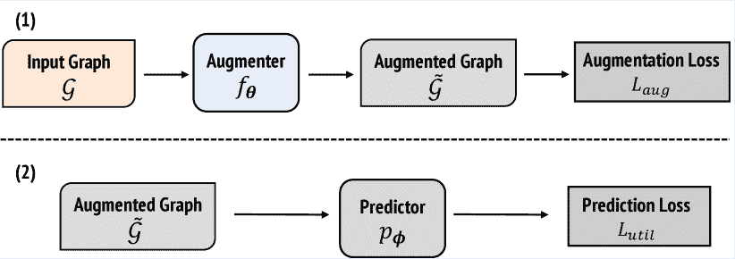
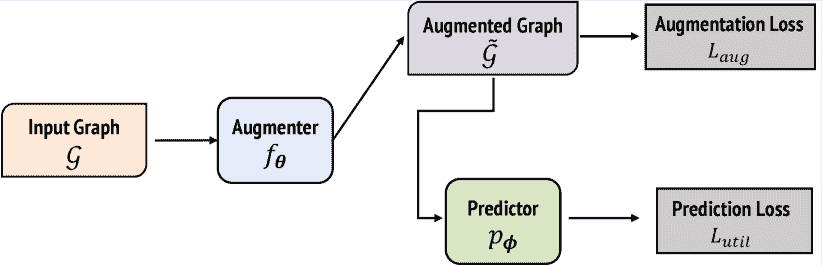
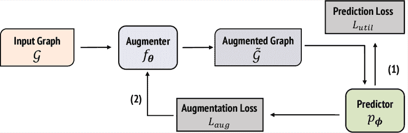
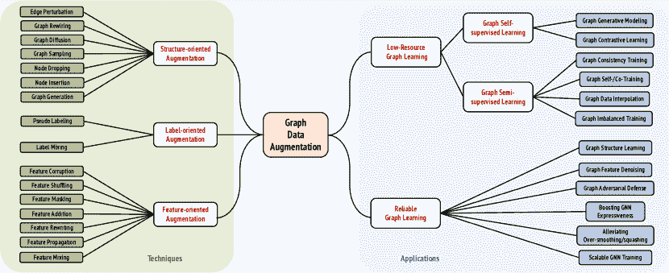
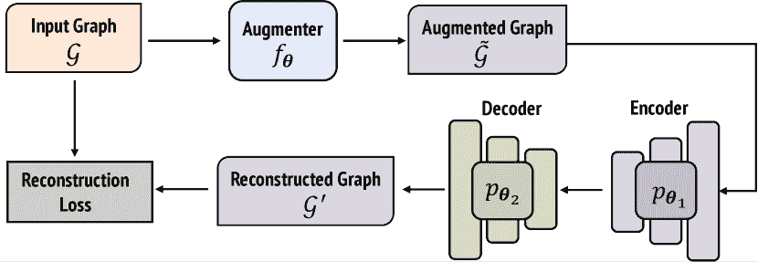
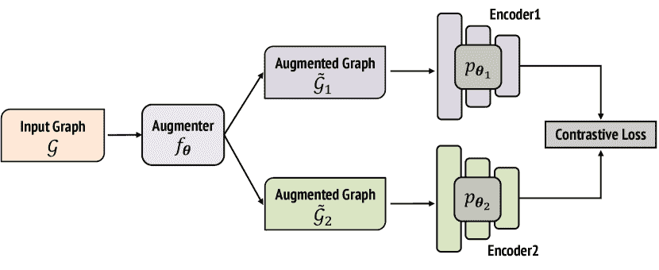
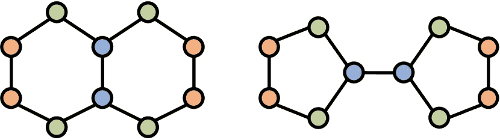

<!--yml

分类：未分类

日期：2024-09-06 19:47:56

-->

# [2202.08235] 深度图学习的数据增强：一项综述

> 来源：[`ar5iv.labs.arxiv.org/html/2202.08235`](https://ar5iv.labs.arxiv.org/html/2202.08235)

\WarningFilter

*natbibCitation \WarningFilter*BibTex

# 深度图学习的数据增强：

一项综述

Kaize Ding¹    Zhe Xu²    Hanghang Tong²    Huan Liu¹

kaize.ding@asu.edu, zhexu3@illinois.edu, htong@illinois.edu, huanliu@asu.edu ¹亚利桑那州立大学 ²伊利诺伊大学厄本那-香槟分校

###### 摘要

图神经网络作为一种强大的深度学习工具，用于建模图结构数据，在众多图学习任务中展现了卓越的性能。为了应对深度图学习中的数据噪声和数据稀缺问题，图数据增强的研究最近得到了加强。然而，传统的数据增强方法很难处理定义在非欧几里得空间中的多模态图结构数据。在这项综述中，我们正式提出了图数据增强的问题，并进一步回顾了代表性技术及其在不同深度图学习问题中的应用。具体而言，我们首先提出了图数据增强技术的分类法，然后通过根据增强信息模态对相关工作进行结构化回顾。此外，我们总结了图数据增强在数据中心深度图学习中的两个代表性问题中的应用：(1) 可靠的图学习，重点是通过图数据增强来提升输入图的效用以及模型能力；(2) 低资源图学习，旨在通过图数据增强扩大标注训练数据的规模。对于每个问题，我们还提供了一个层次化的问题分类法，并回顾了与图数据增强相关的现有文献。最后，我们指出了未来研究中有前景的研究方向和挑战。

## 1 引言

图已经广泛用于建模大量结构化或关系系统，如社交网络、知识图谱和学术图谱，其中节点代表实体，边表示实体之间的关系。作为一种强大的深度学习工具，用于提炼图结构数据背后的知识，图神经网络（GNNs）通常遵循递归消息传递机制，最近引起了大量的研究兴趣。由于其最先进的性能，深度图学习（DGL）如今在广泛的图分析任务中取得了显著的成功 [20, 102, 22]。

尽管 GNN 的强大性能非常出色，但它们在 DGL 中的有效性在很大程度上依赖于高质量的输入训练图和真实标签。GNN 的性能在现实世界图上往往较为敏感，主要因为它们无法处理以下挑战：（1）一方面，现有的 DGL 模型主要设计用于有足够真实标签的监督或半监督设置[23, 21]。考虑到图数据标注通常耗时、劳动密集且几乎不完整，对标注数据的过度依赖给现实世界场景中的 DGL 模型带来了巨大挑战。同时，越来越多的任务和领域特定应用是低资源的，标注训练样本稀缺。当真实标签极度稀少时，DGL 模型可能容易过拟合，难以泛化，从而失去在各种下游 DGL 任务中的有效性[90, 21]。 （2）另一方面，现实世界图通常从复杂的交互系统中提取，这些系统不可避免地包含冗余、错误或缺失的特征和连接。此外，来自对手的有害操控以及 GNN 的固有局限性，如过平滑问题[67]，也为可靠 DGL 的成功带来了额外挑战。直接在这些不干净且不符合 GNN 特性的劣质图上训练基于 GNN 的模型可能导致严重的性能下降[18]。

为了提高训练数据的充分性和质量，提出了数据增强作为有效工具，通过稍微修改现有数据实例或从现有数据生成合成实例来扩充给定的输入数据。数据增强在计算机视觉 [89]和自然语言处理领域 [145]中已被广泛认可。最近，数据增强技术在图领域也得到了探索，以推动 DGL 的性能边界，并展示了有前景的结果 [145, 84]。除了传统的图像或文本数据，图结构数据因其异质信息模式和复杂的图属性而更加复杂，带来了更广泛的设计空间以及图数据增强（GraphDA）的额外挑战。尽管这一研究方向最近得到了积极开展，但 GraphDA 问题尚未得到很好地表述，研究人员通常任意采用 GraphDA 技术（例如，边缘扰动、特征遮蔽），而没有明确的偏好。因此，这对研究人员把握背后的设计原则并进一步利用它们解决特定 DGL 问题构成了很大挑战。因此，及时和系统地回顾 GraphDA 对了解该领域的现有研究和未来研究的挑战大有裨益。

贡献。在这项工作中，我们呈现了关于 GraphDA 及其在解决数据中心 DGL 问题中应用的前瞻性和最新的综述。总之，我们的主要贡献如下：

+   •

    据我们所知，这是 GraphDA 的首次综述。我们为这一新兴研究领域提供了正式的表述，并回顾了相关的最新进展，这有助于理解重要问题以促进未来的研究。

+   •

    我们提供了一个全面的 GraphDA 分类法，该分类法根据目标增强方式（即，特征导向、结构导向和标签导向）对现有技术进行分类，并为开发和定制针对不同 DGL 问题的新 GraphDA 方法提供了清晰的设计空间。

+   •

    我们讨论了 GraphDA 在解决数据中心 DGL 的两个主要研究问题中的应用，即优化图学习和低资源图学习，并回顾了解决特定子问题的普遍学习范式。我们还概述了该领域的开放问题和有前景的未来方向。

与现有调查的关联。尽管有一些调查论文 [72, 113, 119] 与 GraphDA 相关，这些调查主要集中在单一的 DGL 问题上，如图自监督学习或图对抗防御。与 GraphDA 相关的其他数据中心 DGL 问题被大多忽视，相应的 GraphDA 技术也很少讨论。相比之下，我们的调查包括了对 GraphDA 技术及其在解决两个最具代表性的数据中心 DGL 问题中的应用的详细和系统的回顾。同时，我们还讨论了一些 GraphDA 中未充分探索的方向，这些方向可以为未来的 DGL 研究提供重要的启示。

结构概述。本文的结构如下。第二部分首先介绍图神经网络（GNNs）和深度图学习的背景。接着在第三部分，我们提供了一个基于输入图（s）的重点增强模式的 GraphDA 技术的综合分类。在接下来的两个章节中，我们描述了 GraphDA 技术在解决两个数据中心的深度图学习（DGL）问题中的应用，即低资源图学习（第四部分）和可靠图学习（第五部分）。具体来说，第四部分包括了基于 GraphDA 的图自监督学习和图半监督学习的技术。第五部分涵盖了从数据增强的角度提升 DGL 模型的鲁棒性、表达能力和可扩展性的内容。在每个子节中，我们介绍了按相关 GraphDA 技术分组的方法。最后，第六部分讨论了 GraphDA 中的挑战和未来方向。

## 2 前言

### 2.1 符号和定义

我们简要介绍了本文中使用的主要符号和符号约定。我们使用粗体大写字母表示矩阵（例如$\mathbf{X}$），粗体小写字母表示向量（例如$\mathbf{v}$），小写和大写字母表示标量（例如$d$，$n$），花体字母表示集合（例如$\mathcal{N}$）。我们使用$\mathbf{X}[i,j]$表示矩阵$\mathbf{X}$在第$i$行和第$j$列的条目，$\mathbf{X}[i,:]$表示矩阵$\mathbf{X}$的第$i$行，$\mathbf{X}[:,j]$表示矩阵$\mathbf{X}$的第$j$列。类似地，$\mathbf{v}[i]$表示向量$\mathbf{v}$的第$i$个条目。

出于一般目的，我们在本次调查中聚焦于无向带属性图。一个图可以表示为$\mathcal{G}=\{\mathcal{V},\mathcal{E}\}$，其中$\mathcal{V}$表示节点集$\{v_{i}\}_{i=1}^{n}$，$\mathcal{E}$表示边集$\{e_{i}\}_{i=1}^{m}$。在矩阵形式下，它也可以表示为$\mathcal{G}=(\mathbf{A},\mathbf{X})$，其中$\mathbf{A}\in\mathbb{R}^{n\times n}$表示邻接矩阵，$\mathbf{X}\in\mathbb{R}^{n\times d}$表示节点特征矩阵。这里$n$是节点数量，$m$是边的数量，$d$是特征维度。对于监督任务，提供了部分节点标签$\mathbf{y}\in\mathbb{R}^{n}$、边标签$\mathbf{Y}\in\mathbb{R}^{n\times n}$以及图标签$y$。对于多个图的任务（例如，图级任务），我们适当地使用下标来描述图及其相应的组件。例如，$\mathbf{A}_{i}$表示第$i$个图$\mathcal{G}_{i}$的邻接矩阵。

### 2.2 图神经网络

图神经网络（GNNs）[116][139]是神经网络模型[3]在图数据上的扩展。它们在提取各种图组件的表示方面表现出极大的灵活性和强大的表达能力，并且正成为广泛图学习任务的核心模块。在这一小节中，我们将简要介绍主流 GNNs 的一般消息传递公式[33]，因为它们被本论文剩余部分的工作广泛采用。

GNNs 的消息传递框架可以用数学形式表示如下：

|  |
| --- |
|  | $\displaystyle\mathbf{m}_{i}^{t+1}$ | $\displaystyle=\sum_{j\in N(i)}\texttt{Message}(\mathbf{h}_{i}^{t},\mathbf{h}_{j}^{t}),$ |  | (1a) |
|  | $\displaystyle\mathbf{h}_{i}^{t+1}$ | $\displaystyle=\texttt{Update}(\mathbf{h}_{i}^{t},\mathbf{m}_{i}^{t+1}),$ |  | (1b) |

其中 $\mathbf{h}_{i}^{t}$ 表示节点 $i$ 在第 $t$ 层的表示，$\mathbf{m}_{i}^{t+1}$ 表示节点 $i$ 在第 $(t+1)$ 层的消息聚合。初始节点表示是节点特征（即 $\mathbf{h}_{i}^{0}=\mathbf{X}[i]$），节点邻域可以通过邻接矩阵表示（即 $\mathbf{A}[i,j]=1$ 等价于 $j\in N(i)$）。对于图级任务，图表示 $\mathbf{h}_{G}$ 可以通过如下 Readout 函数获得：

|  | $\mathbf{h}_{G}=\texttt{Readout}(\mathbf{H}),$ |  | (2) |
| --- | --- | --- | --- |

其中 $\mathbf{H}$ 可以是来自最终层或任何中间层的节点表示。

### 2.3 深度图学习任务

在这一小节中，我们介绍了几种主流的 DGL 任务，GraphDA 技术在这些任务上得到了广泛应用。我们根据任务的目标图组件（即节点、边和图）对任务进行分类。

节点级 DGL 任务。节点级 DGL 任务旨在通过最小化效用损失 $L_{\texttt{util}}$ 来找到从给定图到节点属性的映射 $p_{\phi}$，具体如下：

|  | $\phi^{*}=\arg\min_{\phi}L_{\texttt{util}}\Big{(}p_{\phi}(\mathcal{G}),\mathbf{y}\Big{)},$ |  |
| --- | --- | --- |

典型的例子是*半监督节点分类*。给定部分节点的标签进行训练，目标是预测（部分）未标记节点的标签。节点分类器的经典实现是一个节点编码器（例如，GNN）与多类别分类器（例如，MLP）一起工作。

边级 DGL 任务。边级 DGL 任务专注于找到从给定图到边属性的映射，其表示如下：

|  | $\phi^{*}=\arg\min_{\phi}L_{\texttt{util}}\Big{(}p_{\phi}(\mathcal{G}),\mathbf{Y}\Big{)}.$ |  |
| --- | --- | --- |

以*链接预测*为例，其目标是判断指定的节点对之间是否存在边。常见的实现是一个二元 GNN 分类器，其输入是边嵌入（例如，头节点和尾节点的节点嵌入的聚合）。

图级 DGL 任务。图级任务将每个图视为一个数据样本，通过映射 $p_{\phi}$ 推断图的属性。其数学公式如下：

|  | $\phi^{*}=\arg\min_{\phi}L_{\texttt{util}}\Big{(}\{p_{\phi}(\mathcal{G}_{i})\},\{y_{i}\}\Big{)}.$ |  |
| --- | --- | --- |

例如，在*图分类*任务中，提供了一些标记的图，目标是预测感兴趣图的标签。一个通用的解决方案是通过读出函数将节点嵌入聚合成图嵌入，并将图嵌入输入到分类器中。

## 图数据增强的 3 种技术

图数据增强（GraphDA）的目标是找到一个变换函数 $f_{\theta}(\cdot):\mathcal{G}\rightarrow\tilde{\mathcal{G}}$ 来生成增强后的图 $\{\tilde{\mathcal{G}}_{i}=(\tilde{\mathbf{A}}_{i},\tilde{\mathbf{X}}_{i})\}$，以丰富或增强从给定图中保留的信息。根据参数 $\theta$ 在学习过程中是否可以更新，大多数（如果不是全部的话）GraphDA 方法可以分为：不可学习和可学习的方法。如果增强方法是不可学习的，我们可以为简便起见省略参数 $\theta$。

一般来说，由于 GraphDA 的最终目标是提高 GNN 模型在下游学习任务中的性能，我们需要在学习过程中将它们一起考虑。我们将增强损失表示为 $L_{\textrm{aug}}$，其目标是使增强图接近给定图，并将衡量 GNN 在特定下游任务上表现的效用损失表示为 $L_{\textrm{utility}}$。在训练策略方面，大多数（如果不是全部的话）可学习的 GraphDA 方法可以分为三类：（1）解耦训练，（2）联合训练，和（3）双层优化。每种方案的工作流程见图 1，具体细节如下：

解耦训练（DT）。在这种训练方案中，增强器 $f_{\theta}$ 和预测器 $p_{\phi}$ 在两阶段范式中独立训练。具体来说，首先通过增强损失 $L_{\texttt{aug}}$ 学习增强器。之后，在特定下游任务的监督下（即 $L_{\textrm{util}}$），对增强图进行预测模型 $p_{\theta}$ 的训练。学习过程可以表示为：

|  | $\displaystyle\theta^{*}$ | $\displaystyle=\arg\min_{\theta}\ L_{\texttt{aug}}\Big{(}\{\mathcal{G}_{i}\},\{f_{\theta}(\mathcal{G}_{i})\}\Big{)},$ |  | (3) |
| --- | --- | --- | --- | --- |
|  | $\displaystyle\phi^{*}$ | $\displaystyle=\arg\min_{\phi}L_{\texttt{util}}\Big{(}p_{\phi},\{f_{\theta^{*}}(\mathcal{G}_{i})\}\Big{)}.$ |  |

联合训练（JT）。在联合训练方案中，增强器 $f_{\theta}$ 和预测器 $p_{\phi}$ 通过增强损失 $L_{\texttt{aug}}$ 和效用损失 $L_{\texttt{util}}$ 共同训练。这个学习过程也可以被视为多任务学习，可以表示为：

|  | $\displaystyle\theta^{*},\phi^{*}=\arg\min_{\theta,\phi}$ | $\displaystyle L_{\texttt{aug}}\Big{(}\{\mathcal{G}_{i}\},\{f_{\theta}(\mathcal{G}_{i})\}\Big{)}$ |  | (4) |
| --- | --- | --- | --- | --- |
|  | $\displaystyle+$ | $\displaystyle L_{\texttt{util}}\Big{(}p_{\phi},\{f_{\theta}(\mathcal{G}_{i})\}\Big{)}.$ |  |

双层优化（BO）。另一种 GraphDA 训练方案是双层优化。与联合训练不同，增强器 $f_{\theta}$ 和预测器 $p_{\phi}$ 是交替更新的，分别使用增强损失 $L_{\textrm{aug}}$ 和效用损失 $L_{\textrm{util}}$。如图 1 (c) 所示，增强器的更新是基于最优的更新预测器，这意味着一个双层优化问题，其中 $\theta$ 是上层变量，$\phi$ 是下层变量：

|  | $\displaystyle\theta^{*}$ | $\displaystyle=\arg\min_{\theta}\ L_{\texttt{aug}}\Big{(}\{\mathcal{G}_{i}\},\{f_{\theta}(\mathcal{G}_{i})\},p_{\phi^{*}(\theta)}\Big{)},$ |  | (5) |
| --- | --- | --- | --- | --- |
|  | $\displaystyle s.t.\quad\phi^{*}(\theta)$ | $\displaystyle=\arg\min_{\phi}L_{\texttt{util}}\Big{(}p_{\phi},\{f_{\theta}(\mathcal{G}_{i})\}\Big{)}.$ |  |

在以下小节中，我们提供了一个系统的分类方法，以涵盖主流的 GraphDA 技术。由于图数据通常由多种信息模态组成，GraphDA 技术可以根据增强模态自然地分为三类，包括：*特征导向*、*结构导向*和*标签导向*技术。具体而言，我们总结了每种增强模态中常用的技术，并清晰地阐述了它们的增强策略。图 2 (左) 总结了我们提出的 GraphDA 技术分类方法。

(a) 解耦训练（DT）

(b) 联合训练（JT）

(c) 双层优化（BO）

图 1：可学习的图数据增强（GraphDA）训练范式。

图 2：图数据增强（GraphDA）技术及应用的分类。

### 3.1 面向结构的增强

与独立同分布（i.i.d.）数据不同，图数据本质上是关系性的，其中数据实例（即节点）之间的连接（即边）对于理解和分析图数据至关重要。给定一个输入图 $\mathcal{G}=(\mathbf{A},\mathbf{X})$，面向结构的图数据增强操作主要关注于增强输入图的邻接矩阵 $\mathbf{A}$。我们总结了以下代表性的增强方法。

边扰动。扰动给定的图结构，例如，随机添加或删除边，是不同 DGL 任务中广泛采用的 GraphDA 方法 [99, 128, 127, 149]。在数学上，边扰动保持原始节点顺序，并重写给定邻接矩阵中的部分条目，可以定义如下：

|  | $\mathbf{\tilde{A}}=\mathbf{A}\oplus\mathbf{C},$ |  | (6) |
| --- | --- | --- | --- |

其中 $\mathbf{C}$ 是腐蚀矩阵，$\oplus$ 表示 XOR（异或）操作。通常，腐蚀矩阵 $\mathbf{C}$ 通过从先验分布中独立同分布地采样得到，$\mathbf{C}_{ij}$ 确定是否在位置 (i, j) 处扰动邻接矩阵。例如，假设给定腐蚀率 $\rho$，我们可以定义腐蚀矩阵为 $\mathbf{C}_{ij}\sim Bernoulli(\rho)$，其元素在 $\mathbf{C}$ 中以概率 $\rho$ 单独设置为 1，以概率 $1-\rho$ 设置为 0。

图重连。尽管与边扰动共享相同的基本操作，但图重连具有相反的增强目标，即通过重新连线边来提高输入图的效用。与通过随机添加/删除边来扰动输入图结构不同，图重连通常由下游任务的学习目标指导，并且腐蚀矩阵 $\mathbf{C}$ 通过特定模块进行学习或预测。

图扩散。作为另一种有效的结构增强策略以提高图的效用，图扩散通过利用输入图的全局结构知识生成增强图。在某些情况下，它也被视为一种图重连方法 [98]。具体而言，图扩散通过将全局拓扑信息注入给定图结构，将节点与其间接连接的邻居以计算出的权重连接起来。一个广义的图扩散操作可以表述为：

|  | $\mathbf{\tilde{A}}=\sum^{\infty}_{k=0}\gamma_{k}\mathbf{T}^{k},$ |  | (7) |
| --- | --- | --- | --- |

其中 $\mathbf{T}\in\mathbb{R}^{N\times N}$ 是由邻接矩阵 $\mathbf{A}$ 推导出的广义转移矩阵，$\gamma_{k}$ 是权重系数，决定全局-局部信息的比例。施加约束 $\sum_{k=0}^{\infty}\gamma_{k}=1,\gamma_{k}\in[0,1]$ 以及 $\lambda_{i}\in[0,1]$，其中 $\lambda_{i}$ 是 $\mathbf{T}$ 的特征值，保证收敛。图扩散的两个流行示例是个性化 PageRank (PPR) [80]（即，$\gamma_{k}=\alpha(1-\alpha)^{k}$）和热核 [62]（即，$\gamma_{k}=e^{-t}\frac{t^{k}}{k!}$），其中 $\alpha$ 表示随机游走中的跳跃概率，$t$ 是扩散时间。 热核和 PPR 扩散的闭式解分别表示为：

|  | $\displaystyle\mathbf{\tilde{A}}^{\text{heat}}$ | $\displaystyle=e^{-(\mathbf{I}-\mathbf{T})t},$ |  | (8) |
| --- | --- | --- | --- | --- |
|  | $\displaystyle\mathbf{\tilde{A}}^{\text{PPR}}$ | $\displaystyle=\alpha(\mathbf{I}-(1-\alpha)\mathbf{T})^{-1}.$ |  | (9) |

图采样。图采样或子图采样是图数据增强的常用技术，可用于不同目的，比如扩展图神经网络 [36]，创建增强视图 [84] 等。通过采样器 $\textsc{Sample}(\mathcal{G})$ 获取增强图，采样器可以采用基于顶点的采样 [50]，基于边的采样 [147]，基于遍历的采样 [84]，以及其他高级方法，如 Metropolis-Hastings 采样 [81]。对于上述所有图采样器，它们通常返回从采样节点诱导出的连接子图。从数学上讲，图采样可以表示为：

|  | $\tilde{\mathcal{G}}=\{\tilde{\mathbf{A}},\tilde{\mathbf{X}}\}=\{\mathbf{A}[idx,idx],\mathbf{X}[idx,:]\},$ |  | (10) |
| --- | --- | --- | --- |

其中 $idx$ 是要从 $\mathbf{A}$ 和 $\mathbf{X}$ 中选择的给定元素（即行和列）的索引列表。通常，图采样的目标是从输入图中找到最能保留所需属性的增强图实例，通过保留部分节点及其基础链接。例如，在*图稀疏化* [147, 75]问题中，研究人员旨在采样保留尽可能多任务相关信息的子图。

节点丢弃。在文献中，节点丢弃也被称为节点遮蔽。具体而言，将从输入图中丢弃一组节点 $\hat{\mathcal{V}}=\{v_{i}\in\mathcal{V}\}$，连同其相关的边 $\hat{\mathcal{E}}=\{e_{i}\in\mathcal{E}\}$。这种增强可以表述为：

|  | $\mathbf{\tilde{A}}=\{\mathcal{V}\setminus\hat{\mathcal{V}},\mathcal{E}\setminus\hat{\mathcal{E}}\}.$ |  | (11) |
| --- | --- | --- | --- |

注意，对于属性图，相应的节点特征也会同时被丢弃。

节点插入。节点插入通常用于通过插入虚拟节点来改善输入图上的消息传递或连通性 [33]。具体来说，节点插入会在原节点集合 $\mathcal{V}$ 和边集合 $\mathcal{E}$ 中分别添加一组额外的节点 $\hat{\mathcal{V}}=\{v_{i}\}$ 和一组边 $\hat{\mathcal{E}}=\{e_{i}\}$：

|  | $\mathbf{\tilde{A}}=\{\mathcal{V}\cup\hat{\mathcal{V}},\mathcal{E}\cup\hat{\mathcal{E}}\}.$ |  | (12) |
| --- | --- | --- | --- |

由于节点插入还需要在新图中添加额外的边，因此这一 GraphDA 操作与图的重连性密切相关。注意，对于属性图，相应的节点特征也需要初始化，例如，使用所有连接节点特征的平均值。

图生成。图生成通常作为 GraphDA 策略用于改善训练图的规模，特别是图级 DGL 任务，例如图分类。大多数图生成方法预计会从观察到的图中自动学习。一般来说，图生成过程可以表示如下：

|  | $\tilde{\mathcal{G}}\sim D_{\theta}(\mathcal{G}&#124;\{\mathcal{G}_{i}\}),$ |  | (13) |
| --- | --- | --- | --- |

其中 $\{\mathcal{G}_{i}\}$ 是观察到的图的集合，这里增强函数 $D_{\theta}$ 是由 $\theta$ 参数化的图生成分布。注意，一些技术，如 *图粗化* [8] 和 *图压缩* [55]，其目标是从初始大图生成新图，也可以归类为这种增强操作。我们还将两张（或多张）图之间的边混合 [35] 视为图生成的一种实例。

### 3.2 特征导向的增强

在这一小节中，我们回顾了以特征为导向的 GraphDA 技术。一般来说，给定一个输入图 $\mathcal{G}=(\mathbf{A},\mathbf{X})$，特征导向的 GraphDA 操作专注于对节点特征矩阵 $\mathbf{X}$ 进行变换。特别地，我们还考虑那些在潜在特征表示 $\mathbf{H}$ 上进行增强的方法作为特征导向的增强方法。

特征损坏。此 GraphDA 方法旨在向原始节点特征 [27] 或学习到的特征表示 [123] 添加噪声。为了简便起见，这里我们用 $\mathbf{x}_{i}$ 表示原始节点特征或学习到的特征表示：

|  | $\mathbf{\tilde{x}}_{i}=\mathbf{x}_{i}+\mathbf{r}_{i},$ |  | (14) |
| --- | --- | --- | --- |

其中 $\mathbf{r}_{i}$ 表示添加的特征噪声。注意，特征噪声可以是随机添加的 [99] 或以对抗训练方式学习的 [27, 123]。

特征洗牌。通过随机更改特征矩阵中的上下文信息，方法是交换行和列，从而破坏输入特征矩阵 $\mathbf{X}$ 以产生增强。这种方法可以表示为：

|  | $\mathbf{\tilde{X}}=\mathbf{P}_{r}\mathbf{X}\mathbf{P}_{c},$ |  | (15) |
| --- | --- | --- | --- |

其中 $\mathbf{P}_{r}$ 和 $\mathbf{P}_{c}$ 分别是按行排列的置换矩阵和按列排列的置换矩阵。它们在每一行和每一列中都有一个 $1$ 的条目，其余位置为 $0$。

特征掩码。特征掩码的核心操作是将节点特征矩阵 $\mathbf{X}$ 中的一部分条目设置为 $0$，可以表示为：

|  | $\mathbf{\tilde{X}}=\mathbf{X}\odot\mathbf{M}$ |  | (16) |
| --- | --- | --- | --- |

其中 $\mathbf{M}$ 是掩码矩阵，如果向量 $i$ 的第 $j$ 个元素被掩盖/丢弃，则 $\mathbf{M}_{i,j}=0$，否则 $\mathbf{M}_{i,j}=1$。掩码矩阵 $\mathbf{M}$ 通常通过伯努利分布生成 [128, 127, 96]。

特征添加。由于实际场景中的输入图通常缺乏有用的特征，特征添加可以用于（1）在简单图上初始化节点特征，以便顺利融入 DGL 模型（例如 GNNs），以及（2）补充 GNN 模型难以捕获的额外图知识。一种简单的方法是将近似/拓扑信息（例如节点索引或节点属性）编码到特征向量中，并与原始节点特征连接。一般来说，特征添加可以表示为：

|  | $\tilde{\mathbf{x}}_{i}=[\hat{\mathbf{x}}_{i}&#124;&#124;\mathbf{x}_{i}],$ |  | (17) |
| --- | --- | --- | --- |

其中 $||$ 表示连接操作，$\mathbf{x}_{i}$ 如果输入图是简单的，则可以是一个空向量。

特征重写。考虑到给定的节点特征通常是嘈杂和不完整的，恢复干净且完整的节点特征可以直接提高 DGL 模型的性能。一般来说，特征重写可以表示为：

|  | $\tilde{\mathbf{x}}=\alpha\mathbf{x}_{i}+\beta\mathbf{b}_{i},$ |  | (18) |
| --- | --- | --- | --- |

其中 $\alpha$ 和 $\beta$ 是两个控制参数，$\mathbf{b}_{i}$ 是以启发式或可学习的方式计算的特征向量。例如，Wang 等 [108] 提出了特征替换 [108]，用邻居的特征重写节点特征。而 Xu 等 [121] 则应用基于梯度下降的优化器来将节点特征重写为参数。

特征混合。基于输入图中节点的特征，特征混合可用于获得合成节点的节点特征：

|  | $\tilde{\mathbf{x}}=\lambda\mathbf{x}_{i}+(1-\lambda)\mathbf{x}_{j},$ |  | (19) |
| --- | --- | --- | --- |

其中 $\lambda$ 是混合系数，控制来自 $\mathbf{x}_{i}$ 和 $\mathbf{x}_{j}$ 的信息比例。值得注意的是，特征混合也可以在从两个训练样本中学习到的中间表示上进行（即，Manifold Mixup [100]）。

特征传播。基于图扩散，特征传播沿图结构传播节点特征。这是一种插值方法，也被广泛用于增强输入图的节点特征。从数学上讲：

|  | $\mathbf{\tilde{X}}=\mathbf{\tilde{A}}\mathbf{X},$ |  | (20) |
| --- | --- | --- | --- |

其中 $\mathbf{\tilde{A}}$ 是通过不同图扩散方法获得的新邻接矩阵。

### 3.3 面向标签的增强

由于图上的数据标记成本高昂，面向标签的 GraphDA 是直接丰富有限标记训练数据的重要研究方向。通常，有两组策略。

伪标签。伪标签是一种半监督学习机制，旨在基于对未标记数据的最自信预测来获得一个（或多个）增强的标记集。其学习过程从一个在标记集 $\mathcal{D}^{L}$ 上训练的基本教师模型开始，然后将教师模型应用于未标记数据 $\mathcal{D}^{U}$，以获得未标记数据的伪标签（硬标签或软标签）。最后，将未标记数据的子集 $\mathcal{D}^{P}$ 用于增强训练数据，合并的数据 $\mathcal{D}^{L}\cup\mathcal{D}^{P}$ 可以用于训练学生模型。从这个意义上讲，标签信号可以通过学习到的教师模型“传播”到未标记的数据样本。注意，这一学习过程可能会经历多轮，直到通过迭代更新教师模型与当前学生模型相结合而收敛。

标签混合。为了扩大训练样本的规模，我们可以直接基于标记样本进行训练样本的插值。通常，Mixup [136] 通过特征混合和标签混合构建虚拟训练样本：

|  | $\displaystyle\tilde{\mathbf{x}}$ | $\displaystyle=\lambda\mathbf{x}_{i}+(1-\lambda)\mathbf{x}_{j},$ |  | (21) |
| --- | --- | --- | --- | --- |
|  | $\displaystyle\tilde{\mathbf{y}}$ | $\displaystyle=\lambda\mathbf{y}_{i}+(1-\lambda)\mathbf{y}_{j},$ |  |

其中 $(\mathbf{x}_{i},\mathbf{y}_{i})$ 和 $(\mathbf{x}_{j},\mathbf{x}_{j})$ 是从训练集中随机抽取的两个标记样本，而 $\lambda\in[0,1]$。通过这种方式，Mixup 方法通过结合线性插值特征向量的先验知识来扩展训练分布，这些知识表明特征向量的线性插值应当导致相关目标标签的线性插值。

表 1: 代表性 GraphDA 图自监督学习工作的总结。DT, JT, BO 分别代表解耦训练、联合训练和双层优化

| Topic | Name | Ref. | Year | Venue | Task Level | Augmented Data Modality | Learnable | Augmentation Technique |
| --- | --- | --- | --- | --- | --- | --- | --- | --- |
| Structure | Feature | Label |
| Graph Generative Modeling | GraphMAE | [43] | 2022 | KDD | 节点 & 图 | ✓ |  |  |  | 特征遮蔽 |
| GMAE | [10] | 2022 | arXiv | 节点 & 图 | ✓ |  |  |  | 节点丢弃 |
| MGAE | [95] | 2022 | arXiv | 节点 & 边 | ✓ |  |  |  | 边扰动（丢弃） |
| MGM | [77] | 2021 | Nature Communications | 图 |  | ✓ |  |  | 特征破坏 |
| GPT-GNN | [44] | 2020 | KDD | 节点 | ✓ | ✓ |  |  | 边扰动（丢弃） 特征遮蔽 |
| MTL | [129] | 2020 | ICML | 节点 |  | ✓ | ✓ | ✓(JT) | 伪标签/特征破坏 |
| GraphBert | [137] | 2020 | arXiv | 节点 | ✓ | ✓ |  |  | 图采样 |
| Pre-train | [45] | 2019 | arXiv | 节点 & 边 & 图 | ✓ |  | ✓ |  | 边扰动/伪标签 |
| Graph Contrastive Learning | S³-CL | [24] | 2022 | arXiv | 节点 |  | ✓ | ✓ | ✓(JT) | 特征传播/伪标签 |
| SUGRL | [78] | 2022 | AAAI | 节点 | ✓ | ✓ |  |  | 特征打乱/图采样 |
| LG2AR | [39] | 2022 | arXiv | 节点 & 图 | ✓ | ✓ |  | ✓(BO) | 节点丢弃/边扰动 图采样/特征破坏 |
| BGRL | [96] | 2022 | ICLR | 节点 | ✓ | ✓ |  |  | 边扰动（丢弃） 特征遮蔽 |
| ARIEL | [28] | 2022 | TheWebConf | 节点 | ✓ | ✓ |  | ✓(JT) | 特征破坏/边扰动 |
| AD-GCL | [93] | 2021 | NeurIPS | 图 | ✓ |  |  | ✓(JT) | 边扰动（丢弃） |
| JOAO | [127] | 2021 | ICML | 图 | ✓ | ✓ |  | ✓(BO) | 节点丢弃/边扰动 图采样/特征破坏 |
| GCA | [149] | 2021 | TheWebConf | 节点 | ✓ | ✓ |  |  | 边扰动（丢弃） 特征遮蔽 |
| MERIT | [52] | 2021 | IJCAI | 图 | ✓ | ✓ |  |  | 图扩散/边扰动 图采样/特征遮蔽 |
| CSSL | [133] | 2021 | AAAI | 图 | ✓ |  |  |  | 节点丢弃/节点插入 边扰动 |
| GraphCL | [128] | 2020 | NeurIPS | 图 | ✓ | ✓ |  |  | 节点丢弃/边扰动 图采样/特征破坏 |
| GCC | [84] | 2020 | KDD | 图 | ✓ |  |  |  | 图采样 |
| SUBGCON | [50] | 2020 | ICDM | 节点 | ✓ |  |  |  | 图采样 |
| MVGRL | [38] | 2020 | ICML | 节点 & 图 | ✓ |  |  |  | 图扩散/图采样 |
| GRACE | [148] | 2020 | arXiv | 节点 | ✓ | ✓ |  |  | 边缘扰动（丢弃）特征遮蔽 |
| DGI | [99] | 2019 | ICLR | 节点 |  | ✓ |  |  | 特征腐蚀 |

## 4 图数据增强

低资源图学习

真实标签的短缺一直是学习有效深度图学习（DGL）的长期存在且臭名昭著的问题。为了推动低资源图学习的研究，GraphDA 已被积极研究并显示出有希望的结果。在本节中，我们讨论了 GraphDA 在解决图自监督学习和图半监督学习中的应用。我们在表 1 和表 2 中总结了代表性的工作。

(a) 图生成建模

(b) 图对比学习

图 3：图生成建模与图对比学习的工作流程比较。

### 4.1 图自监督学习

图生成建模。最近，数据增强被广泛应用于图自监督学习（SSL）。基于图自动编码器（GAE）的思想[58, 20]，图生成建模方法通过边扰动、特征掩蔽或节点丢弃（掩蔽）对输入图进行数据增强，然后通过从增强图中重建特征或/和结构信息来学习节点表示（如图 3（a）所示）。例如，去噪链接重建[45] 随机丢弃现有边以获得扰动图，并尝试通过交叉熵损失训练的基于成对相似度的解码器恢复丢弃的连接。给定一个节点和边随机被掩蔽的图，GPT-GNN[44] 生成一个掩蔽节点及其相关边，并优化当前迭代中生成的节点和边的可能性。GraphBert[137] 通过节点特征重建和图结构恢复对无链接子图进行采样，并预训练图转换器模型。You 等人[129] 定义了图完成预任务，旨在根据目标节点的邻居特征和连接恢复掩蔽特征。MGM[77] 尝试重建掩蔽节点/边特征，以便为分子生成学习 GNN。GMAE[10] 和 GraphMAE[43] 首先随机掩蔽一些节点的特征，然后它们的解码器重建掩蔽节点的原始特征，而 MGAE[95] 尝试根据增强图重建掩蔽边。

图对比学习。受到最近对比视觉特征学习突破的激励，数据增强也被广泛应用于图对比学习（GCL）。如图 3 (b) 所示，GCL 方法试图从输入中生成增强样本，并将来自相同原始样本的两个增强样本视为正对，而来自不同原始样本的则为负对。通过应用对比学习损失，正对会被拉近，而负对会被推远在潜在空间中。因此，GraphDA 在 GCL 中发挥着至关重要的作用。作为开创性工作，DGI [99] 采用特征洗牌和边扰动来获得图的负对，然后提出了一个对比目标以最大化节点嵌入与全局摘要嵌入之间的互信息。另一个流行的 GraphDA 方法是图采样。例如，GCC [84] 提出了将子图采样作为对比实例来预训练图编码器，该编码器可以用于不同的下游任务，无论是冻结还是完全微调策略。SUBGCON [50] 还利用基于个性化 PageRank 的子图采样器来采样增强的子图，并在中心节点的表示与采样子图之间进行对比学习。

值得注意的是，许多 GCL 方法通常利用增强策略的组合。例如，MVGRL [38] 首先通过图扩散来增强输入图。之后，通过子图采样生成两个图视图，模型学习对比这两个视图中的节点表示与全局表示。GRACE [148] 采用两种增强策略，即边扰动（丢弃）和特征掩蔽，以生成图数据的增强视图。它同时考虑了视图内和视图间的负对进行对比学习目标。gCooL [69] 使用相同的增强方式，并在 GCL 中考虑社区信息。GraphCL [128] 考虑了四种 GraphDA 操作：节点丢弃、边扰动、特征掩蔽和子图采样，而 MERIT [52] 利用图扩散、边扰动（丢弃）、子图采样和特征掩蔽来生成增强图。CSSL [133] 通过边扰动（丢弃）和节点丢弃来增强图。最近的工作 SUGRL [78] 利用特征洗牌和图采样，S³-CL 使用特征传播和伪标签来高效执行 GCL。

与上述预定义的 GraphDA 策略不同，另一类研究提出在图上以可学习的方式执行数据增强。具体来说，Zhu 等人[149]提出了一种基于边缘扰动（丢弃）和特征掩蔽的联合、自适应数据增强方案，以为不同视图中的节点提供多样化的上下文，从而提升对比目标的优化。GASSL [123]是一个对抗性自监督学习框架，用于学习图数据的无监督表示而无需任何手工定义的视图。它学习在输入或潜在空间上执行特征损坏。AD-GCL [93]使得 GNN 在训练过程中通过对抗性地优化 GCL 中使用的边缘扰动（丢弃）策略，从而避免捕获冗余信息。为了自动选择给定图数据集的最佳增强组合，JOAO [127]和 LG2AR [39]被提出以从给定的增强类型池中自动选择增强：{节点丢弃、子图采样、边缘扰动、特征掩蔽}。值得一提的是，GCL 领域的相关工作越来越多，由于篇幅限制，我们不会覆盖所有这些工作。

表 2：图半监督学习的代表性 GraphDA 工作的总结。DT、JT、BO 分别代表解耦训练、联合训练和双层优化。

| 主题 | 名称 | 参考文献 | 年份 | 会议 | 任务级别 | 增强数据模态 | 可学习 | 增强技术 |
| --- | --- | --- | --- | --- | --- | --- | --- | --- |
| 结构 | 特征 | 标签 |
| 图一致性训练 | NodeAug | [108] | 2020 | KDD | 节点 | ✓ | ✓ | ✓ |  | 特征重写/图重连伪标签化 |
| GRAND | [30] | 2020 | NeurIPS | 节点 |  | ✓ | ✓ |  | 节点丢弃/特征传播伪标签化 |
| SCR | [135] | 2021 | arXiv | 节点 | ✓ |  |  |  | 图重连 |
| MH-Aug | [81] | 2021 | NeurIPS | 节点 | ✓ |  | ✓ |  | 图采样 |
| NASA | [5] | 2022 | AAAI | 节点 | ✓ |  | ✓ |  | 边缘扰动（丢弃） |
| 图自/协同训练 | Meta-PN | [21] | 2022 | AAAI | 节点 |  |  | ✓ | ✓(BO) | 伪标签化 |
| NRGNN | [18] | 2021 | KDD | 节点 | ✓ |  | ✓ | ✓(DT) | 图重连/伪标签化 |
| PTA | [25] | 2021 | TheWebConf | 节点 |  |  | ✓ |  | 伪标签化 |
| CGCN | [47] | 2020 | AAAI | 节点 |  |  | ✓ | ✓(JT) | 伪标签化 |
| M3S | [90] | 2020 | AAAI | 节点 |  |  | ✓ | ✓(JT) | 伪标签化 |
| Co-GCN | [68] | 2020 | AAAI | 节点 | ✓ |  |  | ✓(DT) | 特征掩蔽/伪标签化 |
| ST-GCNs | [67] | 2018 | AAAI | 节点 |  |  | ✓ | ✓(DT) | 伪标签化 |
| 图数据插值 | G-Transplant | [82] | 2022 | AAAI | 图 | ✓ | ✓ | ✓ | ✓(DT) | 标签混合/图重连 |
| G-Mixup | [107] | 2021 | TheWebConf | 图形 |  | ✓ | ✓ | ✓(DT) | 图形生成/标签混合 |
| GraphMix | [101] | 2021 | AAAI | 节点 |  | ✓ | ✓ |  | 特征混合/标签混合/伪标签 |
| ifMixup | [35] | 2021 | arXiv | 图形 | ✓ | ✓ | ✓ |  | 特征混合/标签混合/图形生成 |
| Graph Imbalanced Training | GATSMOTE | [73] | 2022 | Mathematics | 节点 | ✓ | ✓ | ✓ | ✓(JT) | 特征重写/节点插入/图形重连 |
| GNN-CL | [69] | 2022 | SDM | 节点 | ✓ | ✓ | ✓ | ✓(JT) | 特征混合/节点插入/图形重连 |
| GraphSMOTE | [146] | 2021 | WSDM | 节点 | ✓ | ✓ | ✓ | ✓(JT) | 特征混合/节点插入/图形重连 |
| DPGNN | [106] | 2021 | arXiv | 节点 |  |  | ✓ |  | 伪标签 |
| D-GCN | [104] | 2021 | ICCSAE | 节点 | ✓ |  |  |  | 图形重连 |
| GraphMixup | [112] | 2021 | arXiv | 节点 | ✓ | ✓ | ✓ | ✓(BO) | 特征混合/标签混合/图形重连 |

### 4.2 图形半监督学习

图一致性训练。类似于对比学习的理念，一致性训练[118] 利用未标记的数据，通过强制不同随机增强的相同输入的预测一致性来提高模型性能。作为一种有效的半监督学习范式，一致性训练在低资源设置下的图神经网络学习中也得到了探索。例如，NodeAug[108] 使用局部结构增强操作（即特征破坏和边扰动），并最小化从原始图和增强图中学到的节点表示之间的 KL 散度。 GRAND[30] 创建了多个不同的增强图，采用节点丢弃和特征掩蔽，然后进行特征传播。接着，应用一致性损失来最小化从增强图中学到的表示之间的距离。继 GRAND 之后，Zhang 等人[135] 提出了使用两种边扰动方法—DropEdge[85] 或 DropNode[30] 作为增强策略，并利用均值教师一致性正则化来指导 GNN 模型的训练，通过计算学生模型和教师模型之间的一致性损失。为了在大规模图上实现一致性训练，Hawkins 等人[40] 提出了使用图采样生成不同的邻域子图扩展，并将预测结果进行集成以提供伪标签。为了避免任意增强的有害效果，Park 等人[81] 提出了图采样方法 MH-Aug，该方法使用 Metropolis-Hastings 算法获得输入图的增强样本，并采用一致性训练以更好地利用未标记数据。继图重连的理念之后，NASA[5] 通过用远程邻居替换直接邻居并强制增强邻居的预测一致性，生成高一致性和多样性的图增强。

图自我/协同训练。为了解决数据稀缺问题，一种有效的解决方案是利用未标记的数据来扩充有限的标记数据。遵循伪标签的理念，自我训练 [124] 基于一个使用有限标记数据训练的教师模型对未标记数据进行标记，这已成为解决训练数据有限时半监督节点分类问题的流行范式。在这些方法中，Li 等人 [67] 首次将 GCNs 与自我训练结合，以扩展监督信号。CGCN [47] 通过结合变分图自编码器和高斯混合模型生成伪标签。此外，M3S [90] 提出了多阶段自我训练，并利用聚类方法来消除可能不正确的伪标签。类似的思想也可以在 [18] 中找到。此外，最近的研究 [25, 21] 采用标签传播作为教师模型，以生成编码有价值的全球结构知识的伪标签。

类似于自我训练，协同训练 [4] 也被研究用于用未标记数据扩充训练集。它分别在两个视图上使用初始标记数据学习两个分类器，并让它们为彼此标记未标记的数据以扩充训练数据。Li 等人 [68] 开发了一种基于特征掩码的创新性多视图半监督学习方法 Co-GCN，将 GCN 和协同训练统一到一个框架中。

图数据插值。获取额外训练样本的另一种方法是使用基于插值的数据增强策略，例如 Mixup [136]，通过特征混合和标签混合生成合成训练样本（即节点插入）。不同于图像或自然句子，图具有任意结构，识别原始节点和合成节点之间有意义的连接仍然是一个复杂的任务。此外，由于图数据的级联效应，即使是简单地向图中添加一条边，也会显著改变图的语义含义。为了规避这些挑战，Manifold Mixup [100] 已被应用于图数据插值。具体来说，GraphMix [101] 通过参数共享与 GNN 联合训练一个全连接网络（FCN），并基于 Manifold Mixup 和伪标签学习 FCN，这可以有效地训练 GNN 进行半监督节点分类。类似地，Wang 等人 [107] 也遵循 Manifold Mixup 的思想，并在嵌入空间中插值节点和图的输入特征。这些方法利用一种简单的方法来避免处理输入空间中任意结构的节点或图对，通过混合从 GNN 中学习到的图表示。

对于输入级图数据插值，如果**Mixup**[35] 针对流形入侵问题（混合图对可能自然地创建具有相同结构但标签冲突的图）并首先基于特征混合和图生成对输入对的节点特征和边进行插值。**Graph Transplant**[82] 是另一种输入级图插值方法，通过图重连利用图重构，将目标子图替换为源子图，同时保持局部结构，从而混合两种不同结构的图。**$G$-Mixup**[37] 首先估计每个类别的图谱，然后在图谱之间进行混合，并执行图生成以生成插值图，这提高了 GNN 在半监督图分类中的泛化能力和鲁棒性。

图不平衡训练。图数据的类别分布本质上是不平衡的，遵循幂律分布。例如，在基准 Pubmed 数据集上，节点被标记为三类，而少数类仅包含总节点的 $5.25\%$。这种高度不平衡的数据将导致下游任务特别是分类任务的次优性能，其中一个有效的解决方案是增强少数类以缓解不平衡。为了解决这个问题，节点插入已被证明是增强少数类的有效解决方案。同时，特征混合和图重连也需要用于实现图不平衡训练。例如，**GraphSMOTE**[146] 通过混合少数节点并利用边生成器预测这些合成节点的邻居信息来增强少数类。**GraphMixup**[112] 首先对来自目标少数类的一个节点与其最近邻进行插值，然后采用边预测模块来预测生成节点和现有节点之间的连接。沿着这个思路，**GATSMOTE**[73] 和 **GNN-CL**[69] 采用了注意力机制来生成合成节点与原始节点之间的边。在标签级别，**DPGNN**[106] 通过标签传播进行伪标注，以丰富来自少数类的训练样本。然而，这个主题中的许多挑战仍然没有得到深入探索。例如，如果标记的少数节点数量极少，如每类仅有少量或甚至一例，如何从多数类转移知识以增强少数类仍值得研究。

表 3: 代表性 GraphDA 工作的可靠图学习总结。DT、JT、BO 分别代表解耦训练、联合训练和双层优化。

| 主题 | 名称 | 参考文献 | 年份 | 会议 | 任务级别 | 增强数据模态 | 可学习 | 增强技术 |
| --- | --- | --- | --- | --- | --- | --- | --- | --- |
| 结构 | 特征 | 标签 |
| 图结构学习 | DGM | [57] | 2022 | TPAMI | 节点 | ✓ | ✓ |  | ✓(JT) | 特征重写/图重构 |
| GEN | [103] | 2021 | TheWebConf | 节点 | ✓ |  |  | ✓(JT) | 图重构 |
| PTDNet | [75] | 2021 | WSDM | 节点 & 边 | ✓ |  |  | ✓(JT) | 图采样 |
| GAUG | [145] | 2021 | AAAI | 节点 | ✓ |  |  | ✓(DT) | 图重构 |
| HGSL | [143] | 2021 | AAAI | 节点 | ✓ |  |  | ✓(JT) | 图重构 |
| IDGL | [16] | 2020 | NeurIPS | 节点 & 图 | ✓ |  |  | ✓(JT) | 图重构 |
| NeuralSparse | [147] | 2020 | ICML | 节点 | ✓ |  |  | ✓(JT) | 图采样 |
| TO-GNN | [122] | 2019 | IJCAI | 节点 | ✓ |  |  | ✓(JT) | 图重构 |
| LDS | [31] | 2019 | ICML | 节点 | ✓ |  |  | ✓(BO) | 图重构 |
| PG-LEARN | [115] | 2018 | CIKM | 节点 | ✓ |  |  | ✓(JT) | 图重构 |
| 图特征去噪 | HGCA | [41] | 2022 | TNNLS | 节点 |  | ✓ |  | ✓(JT) | 特征添加 |
| AirGNN | [71] | 2021 | NeurIPS | 节点 |  | ✓ |  | ✓(JT) | 特征重写 |
| GCNMF | [94] | 2021 | FGCS | 节点 & 边 |  | ✓ |  | ✓(JT) | 特征添加 |
| HGNN-AC | [51] | 2021 | TheWebConf | 节点 |  | ✓ |  | ✓(JT) | 特征添加 |
| SAT | [15] | 2020 | TPAMI | 节点 & 边 |  | ✓ |  | ✓(JT) | 特征添加 |
| 图对抗防御 | Gasoline | [121] | 2022 | TheWebConf | 节点 | ✓ | ✓ |  | ✓(BO) | 特征重写/图重构 |
| Pro-GNN | [53] | 2020 | KDD | 节点 | ✓ |  |  | ✓(JT) | 图重构 |
| GIB-N | [114] | 2020 | NeurIPS | 节点 | ✓ |  |  | ✓(JT) | 图重构 |
| G-SVD | [26] | 2020 | WSDM | 节点 | ✓ |  |  | ✓(DT) | 图重构 |
| RoGNN | [109] | 2020 | WCSP | 节点 | ✓ |  |  | ✓(JT) | 图重构 |
| GNNGuard | [140] | 2020 | NeurIPS | 节点 | ✓ |  |  | ✓(JT) | 图重构 |
| Flag | [63] | 2020 | arXiv | 节点 & 边 & 图 |  | ✓ |  | ✓(JT) | 特征重写 |
| G-Jaccard | [111] | 2019 | IJCAI | 节点 | ✓ |  |  |  | 图重构 |
| GraphAT | [27] | 2019 | TKDE | 节点 |  | ✓ |  | ✓(JT) | 特征重写 |
| 提升 GNN 表达能力 | LAGNN | [70] | 2022 | ICML | 节点 & 边 & 图 |  | ✓ |  | ✓(JT) | 特征添加 |
| rGINs | [88] | 2021 | SDM | 图 |  | ✓ |  |  | 特征添加 |
| GSN | [7] | 2021 | TPAMI | 图 |  | ✓ |  |  | 特征添加 |
| NGNN | [138] | 2021 | NeurIPS | 图 | ✓ |  |  |  | 图采样 |
| ID-GNN | [126] | 2021 | AAAI | 节点 & 边 & 图 | ✓ | ✓ |  |  | 图采样/特征添加 |
| 距离编码 | [66] | 2020 | NeurIPS | 节点 & 边 & 图 |  | ✓ |  |  | 特征添加 |
| Master Node | [33] | 2017 | ICML | 图 | ✓ |  |  |  | 节点插入 |
| 减轻过平滑/压缩 | SDRF | [98] | 2022 | ICLR | 节点 | ✓ |  |  |  | 图重连 |
| ADC | [142] | 2021 | NeurIPS | 节点 | ✓ |  |  | ✓(BO) | 图扩散 |
| SHADOW-GNN | [131] | 2021 | NeurIPS | 节点 & 边 | ✓ |  |  |  | 图采样 |
| DropEdge | [85] | 2020 | ICLR | 节点 | ✓ |  |  |  | 边缘扰动（丢弃） |
| AdaEdge | [9] | 2020 | AAAI | 节点 | ✓ |  |  | ✓(JT) | 图重连 |
| GDC | [61] | 2019 | NeurIPS | 节点 | ✓ |  |  |  | 图扩散 |
| 可扩展 GNN 训练 | GCOND | [55] | 2022 | ICLR | 节点 | ✓ | ✓ | ✓ | ✓(BO) | 图生成 |
| DosCond | [54] | 2022 | KDD | 节点 & 图 | ✓ | ✓ | ✓ | ✓(BO) | 图生成 |
| GOREN | [8] | 2021 | ICLR | 节点 | ✓ | ✓ | ✓ | ✓(DT) | 图生成 |
| SpectralGC | [56] | 2020 | AISTATS | 图 | ✓ |  |  | ✓(DT) | 图生成 |
| SIGN | [86] | 2020 | arXiv | 节点 | ✓ |  |  |  | 图扩散 |
| PPRGO | [6] | 2020 | KDD | 节点 | ✓ |  |  |  | 图扩散 |
| 英镑 | [14] | 2020 | NeurIPS | 节点 | ✓ |  |  |  | 图扩散 |
| GraphSAINT | [132] | 2020 | ICLR | 节点 | ✓ |  |  |  | 图采样 |
| LADIES | [150] | 2019 | NeurIPS | 节点 | ✓ |  |  |  | 图采样 |
| Cluster-GCN | [17] | 2019 | KDD | 节点 | ✓ |  |  | ✓(DT) | 图重连 |
| Fast-GCN | [11] | 2018 | ICLR | 节点 | ✓ |  |  |  | 图采样 |
| GraphSAGE | [36] | 2017 | NIPS | 节点 | ✓ |  |  |  | 图采样 |

## 5 图数据增强用于

可靠的图学习

GraphDA 的一个主要目标是通过增强输入图来实现现实世界中的可靠图学习。具体而言，在这项工作中，我们重点关注通过 GraphDA 提高 DGL 模型在不同挑战性学习场景下的鲁棒性、表现力和可扩展性。我们在表 3 中总结了代表性的工作。

图结构学习。由于虚假连接[42]、过度个性化用户[13]和构建启发式等各种原因，给定的图结构对于下游图学习任务并不是最优的。图结构学习被提出作为解决上述挑战的一种方法。从一般意义上讲，结构学习的核心技术是图重连。

一系列方法通过各种节点相似度度量来重排给定的图。在大多数情况下，这些度量是从给定的图拓扑中学习得来的。例如，GAUG [145] 和 IDGL [16] 基于学习到的节点嵌入训练边预测器。此外，从优化的角度来看，可以将图数据（例如，邻接矩阵）本身直接纳入优化变量的一部分。在此基础上，图重排过程本质上由优化目标指导。TO-GNN [122] 是一项代表性工作，其损失函数包括平滑性相关的正则化，图的更新基于梯度下降。此外，与其优化图本身，不如优化与图相关的分布（例如，图生成分布和边丢弃分布）更有趣。之后，可以通过从这些分布中采样来进行图重排。一项代表性工作是 LDS [31]，它假设每条边都从独立的伯努利分布中采样。其他此类工作的代表包括 Bayesian-GCNN [141]、GEN [103]、NeuralSparse [147] 和 PTDNet [75]。

图特征去噪。与结构去噪相比，图特征去噪的研究受到的关注较少。一般来说，大多数工作都是基于特征重写进行的。例如，AirGNN [71] 通过正则化输入节点特征和卷积节点特征之间的 $l_{21}$ 范数，使模型对异常特征更具容忍性。为了处理缺失的节点特征，一种特殊情况是次优的初始节点特征，特征传播 [87] 基于热扩散方程将观察到的节点的特征扩散到特征缺失的邻居节点；换句话说，它用目标节点邻域的聚合特征来填补缺失的节点特征。GCNMF [94] 明确地通过高斯混合模型来制定缺失的节点特征，其参数从下游任务中推断出来。一项名为 SAT [15] 的工作通过特征分布重建缺失的特征，该分布是从拓扑分布中推断出来的。为了处理异质信息网络上的缺失特征，HGNN-AC [51] 从邻居节点的基于拓扑的节点嵌入中填补缺失的特征，而 HGCA [41] 设计了一种特征增强器，通过最大化增强节点嵌入与实际节点嵌入之间的一致性来进行训练。

图对抗防御。除了数据收集阶段引入的噪声外，GNN 对图结构和特征的对抗攻击非常脆弱[91]。自然地，进行 GraphDA 以恢复和增强（部分）中毒图是有效的，可以缓解性能下降。在这一部分，我们讨论了通过 GraphDA 防御图对抗攻击的最新进展。

使用关于良性图的先验知识（例如，特征平滑性）来指导图重连对于防御图对抗攻击是有效的。例如，G-SVD[26]和 DefenseVGAE[134]等工作将中毒图恢复为其重构的低秩图，这在应对对抗攻击方面表现出了极好的经验效果。此外，G-Jaccard[111]和 GNNGuard[140]通过修剪头尾节点特征相似性（或嵌入相似性）低于预定义阈值的链接，来消除潜在的恶意边。或者，可以通过设置显式正则化项来实现图的先验知识。Pro-GNN[53]将拓扑稀疏性和特征平滑性正则化项纳入优化目标中，从而指导图的重连。此外，来自下游任务的监督信号可以隐含地反映未污染的拓扑和特征分布。例如，Gasoline[121]基于验证节点的评估性能（例如，分类损失）来校准给定图。GIB-N[114]采用信息瓶颈目标[97]，最大化节点标签和节点嵌入之间的互信息，并使用该目标函数来指导图的重连。

值得注意的是，一个名为对抗训练的已建立防御策略[34]被应用于图数据上。示例包括一系列图（虚拟）对抗训练[63, 27, 19, 105]。它们的核心思想是通过对抗性地进行边缘扰动和特征破坏，生成各种具有挑战性的图数据样本，从而最大化分类损失。然后，这些样本被纳入下游 GNN 模型的训练中，从而提高 GNN 对对抗攻击的鲁棒性。

图 4: 1-WL 测试无法区分脱氢环己烷图（左）和双环戊烯图（右）。

提升 GNN 的表达能力。关于 GNN 表达能力的研究表明，各种主流 GNN 无法比 1-威斯费勒-莱曼（WL）同构测试更强大，用于区分图和子图[79、120]。例如，图 4 展示了一对由于共同的根树而无法通过 1-WL 测试区分的常见示例。此外，由于节点度的幂律分布，许多邻居很少的节点难以被正确表示。为了打破这种 GNN 的固有限制，增强给定图是一种可行的解决方案。一项研究采用了特征增加技术来增强原始的节点/边特征。例如，距离编码[66]通过节点对之间的距离度量（或聚合距离度量）增强给定的节点特征，表现出比基于 1-WL 测试的 GNN 更强的表达能力。最近 Sato 等人的研究[88]揭示，将随机特征添加到现有的节点特征中可以提升现成 GNN 的表达能力（例如，区分三角形结构）。GSN[7]和 ID-GNN 的一个变体[126]进一步通过各种图案（例如循环）的计数来增强节点特征。最近，LAGNN[70]通过训练的特征生成器进行特征增加，从中节点邻居较少的节点可以大大受益。

另一项工作认为，1-WL 测试（和基于 1-WL 测试的 GNN）的限制与根树的结构有关。基于此，图采样技术可以增强 GNN 的表达能力。具体而言，NGNN[138]声称，从采样的根子图中的节点表示比从根树中获得的表示更具表达力。有趣的是，ID-GNN[126]与 NGNN[138]有类似的见解，也为每个节点采样一个自我网络以计算节点嵌入。

由于节点表示是通过感受野内节点特征的聚合获得的，为了增强长距离消息传播的效果，一种简单的方法是通过在图中插入虚拟节点（即超级节点或主节点）[33、65、48、83]来实现，这些虚拟节点与所有现有节点相连接。

减轻 GNNs 的过度平滑/挤压。由于 GNNs 固有的设计限制，随着模型深度的增加，图中不同节点的表示最终在迭代消息传递中变得不可区分。所谓的过度平滑现象通常会导致图学习任务的失败 [67]。为了应对过度平滑问题，GraphDA，尤其是图重连方法被证明是一种有效的解决方案。例如，DropEdge [85]在消息传递过程中随机删除图边，以减轻过度平滑。TADropEdge [32]利用图结构信息计算边权重进行边删除，从而避免了 DropEdge 中的任意数据增强问题。AdaEdge [9]根据分类结果（来自基于 GNN 的分类器）迭代地添加或删除图拓扑中的边，并在更新后的图上训练 GNN 分类器以克服过度平滑问题。SHADOW-GNN [131]以每个节点为中心抽样信息子图，然后构建一个在子图上操作的深度 GNN，而不是在整个图上，以解耦 GNN 的深度和范围。

注意到过度平滑主要在依赖短期信息的任务中表现出来，而 GNNs 在捕捉长期节点交互方面也不有效。最近的一项研究 [1]指出，来自远端节点的信息扭曲（即过度挤压）是限制基于长距离交互任务的消息传递效率的主要因素。随着层深度的增加，每个节点的感受野中的节点数量呈指数增长，从而导致过度挤压问题。为了解决过度挤压，图扩散和图重连是两个有效的选择。图扩散卷积（GDC） [61]基于图扩散的广义形式构建一个新图，进一步用于扩大消息传递的邻域。自适应扩散卷积（ADC） [142]支持从数据中自动学习最佳邻域，以消除 GDC 中手动搜索最佳传播邻域的过程。Alon & Yahav [1]建议重连图以建立一个完全相邻的 GNN 层，从而减少瓶颈。同样，随机离散 Ricci 流（SDRF） [98]是一种基于曲率的图重连方法，用于缓解过度挤压问题。

可扩展图训练。可扩展性始终是 GNNs 面临的关键挑战，这阻碍了广泛 GNN 模型在大型现实世界图上的应用。GraphDA 技术，如图采样、图扩散和图生成，在加速 GNNs 的训练和推理方面发挥着重要作用。

基于图采样的思想，GraphSAGE [36] 均匀地采样目标节点的邻居，从而使 GNN 在大图上进行归纳学习。FastGCN [11] 具有与 GraphSAGE 类似的思想，但采用重要性采样的方法在每一层采样顶点。为了克服 GraphSAGE [36] 和 FastGCN [11] 各自带来的冗余采样和稀疏连接问题，Zou 等人 [150] 提出了 LADIES，这是一种层依赖的采样策略。此外，GraphSAINT [132] 是另一种基于采样的方法，它应用了各种采样方法（例如，基于随机游走）来提高训练的可扩展性，而不是修改原始的 GCN 模型 [59]。类似于采样方法，图划分也有效降低内存需求。例如，Cluster-GCN [17] 将给定图划分为多个簇，并在每个簇内进行卷积操作，以避免繁重的邻域搜索和采样。

GraphDA 在扩展 GNN 训练方面的另一条研究路线采用了解耦设计，通过图扩散 [12, 110, 60, 86] 在扩展图上训练 MLP。根据上述模型设计，图扩散矩阵可以预计算，这使得 MLP 的训练更加高效。一组代表性工作采用 PageRank [80] 及其变体（例如，个性化 PageRank [49]）来推断扩散矩阵，如 SGC [110] 和 APPNP [60]。类似地，PPRGo [6] 采用 Forward Push 算法 [2] 来近似个性化 PageRank 矩阵，以提高效率。GBP [14] 重新审视了 PPRGo 的核心思想，并通过双向传播算法进一步加速广义 PageRank 矩阵的计算。此外，最近有一项名为 GRAND+ [29] 的工作也在一致性训练背景下近似图扩散矩阵，以扩展图随机神经网络 [30] 的训练。

此外，关于“图浓缩”和“图粗化”的研究尝试通过图生成来缩小给定图 $\mathcal{G}$，使得生成的图 $\tilde{\mathcal{G}}$ 可以被 GNNs [46] 处理。他们的核心思想是最小化输入图 $\mathcal{G}$ 和扩展图 $\tilde{\mathcal{G}}$ 之间的“感兴趣量”。例如，Jin 等人 [56] 提出了最小化 $\mathcal{G}$ 和 $\tilde{\mathcal{G}}$ 之间的谱距离。GOREN [8] 旨在使 $\mathcal{G}$ 和 $\tilde{\mathcal{G}}$ 的拉普拉斯算子保持可比性。GCOND [55] 和 DosCond [54] 最小化 $\mathcal{G}$ 和 $\tilde{\mathcal{G}}$ 上训练梯度的差异。

## 6 未来方向

GraphDA 是一个新兴且快速发展的领域。尽管已经取得了 substantial 进展，但仍然存在许多未被充分探讨的挑战。在本节中，我们讨论了一些有前景的研究方向。

超越简单图的 数据增强。上述大多数研究在同质性（即，按属性分组的）图上开发了增强策略，其中边缘往往连接具有相同属性（例如标签、特征）的节点。然而，异质性（即，非同质性）在网络中也很常见，如异性恋交友网络。许多现有的增强方法[92] 针对异质性图关注于改善给定图的同质性或删除/减轻现有的异质性边缘[125]。对异质性图的节点特征、标签和不存在的边的增强仍然没有得到充分研究。此外，现有的 GraphDA 努力主要针对简单图或属性图，而针对其他类型图（例如异构图、超图、多层图、动态图）的原则性增强方法仍然大多未被探索。这些复杂图提供了更广泛的增强设计空间，但也极大地挑战了现有的 GraphDA 方法，这是未来需要探索的重要领域。

自动化和通用化的图数据增强。一般来说，DGL 问题的有效性依赖于临时的图数据增强，这些增强方法必须根据数据集手动选择，可以通过经验法则或试错法进行。例如，研究人员观察到不同的数据增强在不同数据集上对下游任务的影响不同，这表明搜索增强函数对于图的自监督学习至关重要[127]。然而，在没有直接访问真实标签的情况下评估从多个增强函数派生出的表示，使得这个问题变得具有挑战性。因此，有必要开发自动化的数据增强解决方案，以便为每个图数据集自适应地定制增强策略[76]。同时，考虑到不同的图通常具有不同的图属性，开发通用的数据增强方法，而不是为每个领域从头学习，也是改善 GraphDA 方法实际应用的一个有前途的方向。

语义保持的图数据增强。由于图的非欧几里得特性和数据样本之间的依赖关系，设计有效的图数据增强是具有挑战性的。大多数图数据增强方法在输入图上采用任意增强，这可能会意外改变图的结构和语义模式[81]。例如，从阿司匹林的苯环中去掉一个碳原子会破坏芳香系统，导致形成一个烯烃链，这是一个完全不同的化学化合物。因此，提出一个标签一致/语义保持的 GraphDA 方法是必要的。为此，最近的研究[64, 117, 130] 在潜在空间上执行数据增强，以避免对语义的扰动。

可信赖 DGL 的图数据增强。尽管 DGL 取得了成功，但如何确保各种 DGL 算法在社会责任方面表现良好并符合监管合规要求，特别是在风险敏感的应用中，成为了一个新兴问题。实际上，GraphDA 可以成为实现可信赖 GML 的有效工具，特别是在 DGL 算法的公平性、因果关系和可解释性方面。例如，文献中已经使用了反事实图数据增强[74, 144] 来解释 GNN 的行为。此外，数据增强本身通常以临时的方式进行，对其基础理论原则的理解甚少。现有的 GraphDA 研究主要是表面层面的，很少探讨其理论基础和原则。总体而言，确实存在对 GraphDA 具体如何有效的解释研究不足的情况。

## 7 结论

在本文中，我们呈现了一个前瞻性且结构化的图数据增强（GraphDA）综述。为了检视 GraphDA 的本质，我们给出了正式的定义和分类法，以便于理解这一新兴研究问题。具体来说，我们将 GraphDA 方法框定为三类，依据目标增强方式，即特征级、结构级和标签级增强。我们进一步回顾了 GraphDA 方法在解决两个以数据为中心的 DGL 问题（即低资源图学习和可靠图学习）中的应用，并讨论了流行的基于 GraphDA 的算法。最后，我们概述了当前面临的挑战以及该领域未来研究的机会。

## 致谢

本工作得到了 NSF（编号 1947135、2106825、2229461 和 2134079）、与 Amazon 合作的 NSF 公平性 AI 项目（编号 1939725）、DARPA（编号 HR001121C0165）、ARO（编号 W911NF2110088）、ONR（编号 N00014-21-1-4002）、NIFA（编号 2020-67021-32799 和 W911NF2110030）以及 ARL（编号 W911NF2020124）的资助支持。

## 参考文献

+   [1] U. Alon 和 E. Yahav. 关于图神经网络的瓶颈及其实际影响。发表于 ICLR，2021 年。

+   [2] R. Andersen, F. Chung, 和 K. Lang. 使用 PageRank 向量的局部图划分。见 FOCS，2006。

+   [3] C. M. Bishop. 神经网络及其应用。科学仪器评论，1994。

+   [4] A. Blum 和 T. Mitchell. 结合标记数据和未标记数据的共同训练。见 COLT，1998。

+   [5] D. Bo, B. Hu, X. Wang, Z. Zhang, C. Shi, 和 J. Zhou. 通过一致性-多样性图增强来正则化图神经网络。见 AAAI，2022。

+   [6] A. Bojchevski, J. Klicpera, B. Perozzi, A. Kapoor, M. Blais, B. Rózemberczki, M. Lukasik, 和 S. Günnemann. 使用近似 PageRank 扩展图神经网络。见 KDD，2020。

+   [7] G. Bouritsas, F. Frasca, S. P. Zafeiriou, 和 M. Bronstein. 通过子图同构计数提升图神经网络的表达能力。见 TPAMI，2022。

+   [8] C. Cai, D. Wang, 和 Y. Wang. 使用神经网络的图粗化。见 ICLR，2021。

+   [9] D. Chen, Y. Lin, W. Li, P. Li, J. Zhou, 和 X. Sun. 从拓扑视角衡量和缓解图神经网络的过平滑问题。见 AAAI，2020。

+   [10] H. Chen, S. Zhang, 和 G. Xu. 图掩码自编码器。arXiv 预印本 arXiv:2202.08391，2022。

+   [11] J. Chen, T. Ma, 和 C. Xiao. FastGCN：通过重要性采样加速图卷积网络学习。见 ICLR，2018。

+   [12] L. Chen, Z. Chen, 和 J. Bruna. 关于图神经网络与图增强 MLP 的比较。见 ICLR，2020。

+   [13] L. Chen, Y. Yao, F. Xu, M. Xu, 和 H. Tong. 交换个性化以换取准确性：协同过滤中的数据调试。见 NeurIPS，2020。

+   [14] M. Chen, Z. Wei, B. Ding, Y. Li, Y. Yuan, X. Du, 和 J.-R. Wen. 通过双向传播扩展图神经网络。见 NeurIPS，2020。

+   [15] X. Chen, S. Chen, J. Yao, H. Zheng, Y. Zhang, 和 I. W. Tsang. 在属性缺失图上的学习。见 TPAMI，2020。

+   [16] Y. Chen, L. Wu, 和 M. Zaki. 用于图神经网络的迭代深度图学习：更好且鲁棒的节点嵌入。见 NeurIPS，2020。

+   [17] W.-L. Chiang, X. Liu, S. Si, Y. Li, S. Bengio, 和 C.-J. Hsieh. Cluster-GCN：用于训练深度和大规模图卷积网络的高效算法。见 KDD，2019。

+   [18] E. Dai, C. Aggarwal, 和 S. Wang. NR-GNN：在稀疏和噪声标签图上的抗标签噪声图神经网络学习。见 KDD，2021。

+   [19] Z. Deng, Y. Dong, 和 J. Zhu. 用于图卷积网络的批量虚拟对抗训练。arXiv 预印本 arXiv:1902.09192，2019。

+   [20] K. Ding, J. Li, R. Bhanushali, 和 H. Liu. 在属性网络上的深度异常检测。见 SDM，2019。

+   [21] K. Ding, J. Wang, J. Caverlee, 和 H. Liu. 用于图少样本半监督学习的元传播网络。见 AAAI，2022。

+   [22] K. Ding, J. Wang, J. Li, D. Li, 和 H. Liu. 用更少的资源获得更多：用于归纳文本分类的超图注意力网络。见 EMNLP，2020。

+   [23] K. Ding, J. Wang, J. Li, K. Shu, C. Liu, 和 H. Liu. 用于少样本学习的图原型网络。见 CIKM，2020。

+   [24] K. Ding, Y. Wang, Y. Yang, 和 H. Liu. 在无监督图对比学习中引导结构和语义的全球知识。在 AAAI, 2023。

+   [25] H. Dong, J. Chen, F. Feng, X. He, S. Bi, Z. Ding, 和 P. Cui. 关于解耦图卷积网络和标签传播的等价性。在 TheWebConf, 2021。

+   [26] N. Entezari, S. A. Al-Sayouri, A. Darvishzadeh, 和 E. E. Papalexakis. 你需要的只是低（秩）来防御图上的对抗攻击。在 WSDM, 2020。

+   [27] F. Feng, X. He, J. Tang, 和 T.-S. Chua. 图对抗训练: 基于图结构动态正则化。TKDE, 2019。

+   [28] S. Feng, B. Jing, Y. Zhu, 和 H. Tong. 带有信息正则化的对抗性图对比学习。在 TheWebConf, 2022。

+   [29] W. Feng, Y. Dong, T. Huang, Z. Yin, X. Cheng, E. Kharlamov, 和 J. Tang. Grand+: 可扩展图随机神经网络。在 TheWebConf, 2022。

+   [30] W. Feng, J. Zhang, Y. Dong, Y. Han, H. Luan, Q. Xu, Q. Yang, E. Kharlamov, 和 J. Tang. 图随机神经网络用于图上的半监督学习。在 NeurIPS, 2020。

+   [31] L. Franceschi, M. Niepert, M. Pontil, 和 X. He. 为图神经网络学习离散结构。在 ICML, 2019。

+   [32] Z. Gao, S. Bhattacharya, L. Zhang, R. S. Blum, A. Ribeiro, 和 B. M. Sadler. 通过拓扑自适应边丢弃训练鲁棒的图神经网络。arXiv 预印本 arXiv:2106.02892, 2021。

+   [33] J. Gilmer, S. S. Schoenholz, P. F. Riley, O. Vinyals, 和 G. E. Dahl. 用于量子化学的神经消息传递。在 ICML, 2017。

+   [34] I. J. Goodfellow, J. Shlens, 和 C. Szegedy. 解释和利用对抗性示例。在 ICLR, 2015。

+   [35] H. Guo 和 Y. Mao. ifmixup: 朝着无侵入图 mixup 的图分类方向发展。arXiv 预印本 arXiv:2110.09344, 2021。

+   [36] W. L. Hamilton, R. Ying, 和 J. Leskovec. 大图上的归纳表示学习。arXiv 预印本 arXiv:1706.02216, 2017。

+   [37] X. Han, Z. Jiang, N. Liu, 和 X. Hu. G-mixup: 图数据增强用于图分类。在 ICML, 2022。

+   [38] K. Hassani 和 A. H. Khasahmadi. 图上的对比多视角表示学习。在 ICML, 2020。

+   [39] K. Hassani 和 A. H. Khasahmadi. 学习图增强以学习图表示。arXiv 预印本 arXiv:2201.09830, 2022。

+   [40] C. Hawkins, V. N. Ioannidis, S. Adeshina, 和 G. Karypis. 通过自集成自蒸馏进行图神经网络的可扩展一致性训练。arXiv 预印本 arXiv:2110.06290, 2021。

+   [41] D. He, C. Liang, C. Huo, Z. Feng, D. Jin, L. Yang, 和 W. Zhang. 通过无监督对比学习分析具有缺失属性的异构网络。TNNLS, 2022。

+   [42] B. Hooi, H. A. Song, A. Beutel, N. Shah, K. Shin, 和 C. Faloutsos. Fraudar: 面对伪装的图欺诈边界。在 KDD, 2016。

+   [43] Z. Hou, X. Liu, Y. Dong, C. Wang, J. Tang, 等等. Graphmae: 自监督掩码图自编码器。在 KDD, 2022。

+   [44] Z. Hu, Y. Dong, K. Wang, K.-W. Chang, 和 Y. Sun. Gpt-gnn：图神经网络的生成预训练。发表于 KDD, 2020。

+   [45] Z. Hu, C. Fan, T. Chen, K.-W. Chang, 和 Y. Sun. 用于通用结构特征提取的图神经网络预训练。arXiv 预印本 arXiv:1905.13728, 2019。

+   [46] Z. Huang, S. Zhang, C. Xi, T. Liu, 和 M. Zhou. 通过图粗化扩大图神经网络。发表于 KDD, 2021。

+   [47] B. Hui, P. Zhu, 和 Q. Hu. 协作图卷积网络：无监督学习与半监督学习的结合。发表于 AAAI, 2020。

+   [48] K. Ishiguro, S.-i. Maeda, 和 M. Koyama. 图变形模块：用于提升图神经网络在分子图分析中的能力的辅助模块。arXiv 预印本 arXiv:1902.01020, 2019。

+   [49] G. Jeh 和 J. Widom. 扩展个性化网页搜索。发表于 WWW, 2003。

+   [50] Y. Jiao, Y. Xiong, J. Zhang, Y. Zhang, T. Zhang, 和 Y. Zhu. 用于可扩展自监督图表示学习的子图对比。发表于 ICDM, 2020。

+   [51] D. Jin, C. Huo, C. Liang, 和 L. Yang. 通过属性补全的异构图神经网络。发表于 TheWebConf, 2021。

+   [52] M. Jin, Y. Zheng, Y.-F. Li, C. Gong, C. Zhou, 和 S. Pan. 用于自监督图表示学习的多尺度对比 Siamese 网络。发表于 IJCAI, 2021。

+   [53] W. Jin, Y. Ma, X. Liu, X. Tang, S. Wang, 和 J. Tang. 为鲁棒图神经网络进行图结构学习。发表于 KDD, 2020。

+   [54] W. Jin, X. Tang, H. Jiang, Z. Li, D. Zhang, J. Tang, 和 B. Yin. 通过一步梯度匹配进行图压缩。发表于 KDD, 2022。

+   [55] W. Jin, L. Zhao, S. Zhang, Y. Liu, J. Tang, 和 N. Shah. 图神经网络的图压缩。发表于 ICLR, 2022。

+   [56] Y. Jin, A. Loukas, 和 J. JaJa. 保持谱特性的图粗化。发表于 AISTATS, 2020。

+   [57] A. Kazi, L. Cosmo, S.-A. Ahmadi, N. Navab, 和 M. Bronstein. 图卷积网络的可微图模块（DGM）。TPAMI, 2022。

+   [58] T. N. Kipf 和 M. Welling. 变分图自编码器。arXiv 预印本 arXiv:1611.07308, 2016。

+   [59] T. N. Kipf 和 M. Welling. 使用图卷积网络进行半监督分类。发表于 ICLR, 2017。

+   [60] J. Klicpera, A. Bojchevski, 和 S. Günnemann. 预测然后传播：图神经网络与个性化 PageRank 的结合。发表于 ICLR, 2018。

+   [61] J. Klicpera, S. Weißenberger, 和 S. Günnemann. 扩散改进图学习。发表于 NeurIPS, 2019。

+   [62] R. I. Kondor 和 J. Lafferty. 图和其他离散结构上的扩散核。发表于 ICML, 2002。

+   [63] K. Kong, G. Li, M. Ding, Z. Wu, C. Zhu, B. Ghanem, G. Taylor, 和 T. Goldstein. FLAG：图神经网络的对抗性数据增强。arXiv 预印本 arXiv:2010.09891, 2020。

+   [64] N. Lee, J. Lee, 和 C. Park. 无需增强的自监督图学习。发表于 AAAI, 2022。

+   [65] J. Li, D. Cai, 和 X. He. 为药物发现学习图级表示。arXiv 预印本 arXiv:1709.03741, 2017。

+   [66] P. Li, Y. Wang, H. Wang 和 J. Leskovec。距离编码：设计具有理论上更强大能力的图表示学习神经网络。NeurIPS，2020。

+   [67] Q. Li, Z. Han 和 X.-M. Wu。对图卷积网络进行更深入的理解，以实现半监督学习。在 AAAI，2018。

+   [68] S. Li, W.-T. Li 和 W. Wang。Co-gcn 用于多视角半监督学习。在 AAAI，2020。

+   [69] X. Li, L. Wen, Y. Deng, F. Feng, X. Hu, L. Wang 和 Z. Fan。带有课程学习的图神经网络用于不平衡节点分类。arXiv 预印本 arXiv:2202.02529，2022。

+   [70] S. Liu, H. Dong, L. Li, T. Xu, Y. Rong, P. Zhao, J. Huang 和 D. Wu。图神经网络的局部增强。ICML，2022。

+   [71] X. Liu, J. Ding, W. Jin, H. Xu, Y. Ma, Z. Liu 和 J. Tang。具有自适应残差的图神经网络。NeurIPS，2021。

+   [72] Y. Liu, M. Jin, S. Pan, C. Zhou, Y. Zheng, F. Xia 和 P. Yu。图自监督学习：综述。TKDE，2022。

+   [73] Y. Liu, Z. Zhang, Y. Liu 和 Y. Zhu。Gatsmote：通过注意力和同质性改善图中的不平衡节点分类。Mathematics，2022。

+   [74] A. Lucic, M. A. Ter Hoeve, G. Tolomei, M. De Rijke 和 F. Silvestri。Cf-gnnexplainer：图神经网络的反事实解释。在 AISTATS，2022。

+   [75] D. Luo, W. Cheng, W. Yu, B. Zong, J. Ni, H. Chen 和 X. Zhang。学习丢弃：通过拓扑去噪的鲁棒图神经网络。在 WSDM，2021。

+   [76] Y. Luo, M. McThrow, W. Y. Au, T. Komikado, K. Uchino, K. Maruhash 和 S. Ji。图分类的自动数据增强。arXiv 预印本 arXiv:2202.13248，2022。

+   [77] O. Mahmood, E. Mansimov, R. Bonneau 和 K. Cho。用于分子生成的掩码图建模。Nature communications，2021。

+   [78] Y. Mo, L. Peng, J. Xu, X. Shi 和 X. Zhu。简单无监督图表示学习。在 AAAI，2022。

+   [79] C. Morris, M. Ritzert, M. Fey, W. L. Hamilton, J. E. Lenssen, G. Rattan 和 M. Grohe。Weisfeiler 和 Leman 变得神经化：高阶图神经网络。在 AAAI，2019。

+   [80] L. Page, S. Brin, R. Motwani 和 T. Winograd。PageRank 引用排名：为网络带来秩序。技术报告，斯坦福 InfoLab，1999。

+   [81] H. Park, S. Lee, S. Kim, J. Park, J. Jeong, K.-M. Kim, J.-W. Ha 和 H. J. Kim。Metropolis-Hastings 数据增强用于图神经网络。NeurIPS，2021。

+   [82] J. Park, H. Shim 和 E. Yang。图移植：节点显著性引导的图混合与局部结构保留。在 AAAI，2022。

+   [83] T. Pham, T. Tran, H. Dam 和 S. Venkatesh。通过虚拟节点的深度学习进行图分类。arXiv 预印本 arXiv:1708.04357，2017。

+   [84] J. Qiu, Q. Chen, Y. Dong, J. Zhang, H. Yang, M. Ding, K. Wang 和 J. Tang。Gcc：图对比编码用于图神经网络预训练。在 KDD，2020。

+   [85] Y. Rong, W. Huang, T. Xu 和 J. Huang。Dropedge：针对节点分类的深度图卷积网络。在 ICLR，2019。

+   [86] E. Rossi、F. Frasca、B. Chamberlain、D. Eynard、M. Bronstein 和 F. Monti。Sign：可扩展的图神经网络。arXiv 预印本 arXiv:2004.11198，2020 年。

+   [87] E. Rossi、H. Kenlay、M. I. Gorinova、B. P. Chamberlain、X. Dong 和 M. Bronstein。在缺失节点特征的图上学习时特征传播的非凡有效性。arXiv 预印本 arXiv:2111.12128，2021 年。

+   [88] R. Sato、M. Yamada 和 H. Kashima。随机特征增强图神经网络。发表于 SDM，2021 年。

+   [89] C. Shorten 和 T. M. Khoshgoftaar。深度学习中的图像数据增强调查。《大数据期刊》，2019 年。

+   [90] K. Sun、Z. Lin 和 Z. Zhu。图卷积网络的多阶段自监督学习，针对标签节点稀少的图。发表于 AAAI，2020 年。

+   [91] L. Sun、Y. Dou、C. Yang、J. Wang、P. S. Yu、L. He 和 B. Li。图数据上的对抗攻击与防御：调查。arXiv 预印本 arXiv:1812.10528，2018 年。

+   [92] S. Suresh、V. Budde、J. Neville、P. Li 和 J. Ma。通过改进图的局部混合模式突破图神经网络的限制。发表于 KDD，2021 年。

+   [93] S. Suresh、P. Li、C. Hao 和 J. Neville。对抗性图增强以改进图对比学习。发表于 NeurIPS，2021 年。

+   [94] H. Taguchi、X. Liu 和 T. Murata。用于包含缺失特征的图的图卷积网络。FGCS，2021 年。

+   [95] Q. Tan、N. Liu、X. Huang、R. Chen、S.-H. Choi 和 X. Hu。Mgae：图上的自监督学习的掩蔽自编码器。arXiv 预印本 arXiv:2201.02534，2022 年。

+   [96] S. Thakoor、C. Tallec、M. G. Azar、M. Azabou、E. L. Dyer、R. Munos、P. Veličković 和 M. Valko。通过自举进行大规模图表示学习。发表于 ICLR，2021 年。

+   [97] N. Tishby、F. C. Pereira 和 W. Bialek。信息瓶颈方法。arXiv 预印本 physics/0004057，2000 年。

+   [98] J. Topping、F. Di Giovanni、B. P. Chamberlain、X. Dong 和 M. M. Bronstein。通过曲率理解图上的过度挤压和瓶颈。发表于 ICLR，2022 年。

+   [99] P. Velickovic、W. Fedus、W. L. Hamilton、P. Liò、Y. Bengio 和 R. D. Hjelm。深度图信息最大化。发表于 ICLR，2019 年。

+   [100] V. Verma、A. Lamb、C. Beckham、A. Najafi、I. Mitliagkas、D. Lopez-Paz 和 Y. Bengio。流形混合：通过插值隐藏状态获得更好的表示。发表于 ICML，2019 年。

+   [101] V. Verma、M. Qu、K. Kawaguchi、A. Lamb、Y. Bengio、J. Kannala 和 J. Tang。Graphmix：改进 GNNs 的半监督学习训练。发表于 AAAI，2021 年。

+   [102] J. Wang、K. Ding、L. Hong、H. Liu 和 J. Caverlee。使用序列超图进行下一项推荐。发表于 SIGIR，2020 年。

+   [103] R. Wang、S. Mou、X. Wang、W. Xiao、Q. Ju、C. Shi 和 X. Xie。图结构估计神经网络。发表于 TheWebConf，2021 年。

+   [104] X. Wang 和 J. Chen。在不平衡节点分类上的双分支图卷积网络。发表于 CSAE，2021 年。

+   [105] X. Wang、X. Liu 和 C.-J. Hsieh。Graphdefense：朝着稳健的图卷积网络迈进。arXiv 预印本 arXiv:1911.04429，2019 年。

+   [106] Y. Wang, C. Aggarwal, 和 T. Derr. 节点不平衡分类中的距离原型图神经网络。arXiv 预印本 arXiv:2110.12035, 2021。

+   [107] Y. Wang, W. Wang, Y. Liang, Y. Cai, 和 B. Hooi. Mixup 用于节点和图分类。发表于 TheWebConf, 2021。

+   [108] Y. Wang, W. Wang, Y. Liang, Y. Cai, J. Liu, 和 B. Hooi. Nodeaug：带有数据增强的半监督节点分类。发表于 KDD, 2020。

+   [109] X. Wei, Y. Li, X. Qin, X. Xu, X. Li, 和 M. Liu. 从解耦到重建：针对拓扑攻击的鲁棒图神经网络。发表于 WCSP, 2020。

+   [110] F. Wu, A. Souza, T. Zhang, C. Fifty, T. Yu, 和 K. Weinberger. 简化图卷积网络。发表于 ICML, 2019。

+   [111] H. Wu, C. Wang, Y. Tyshetskiy, A. Docherty, K. Lu, 和 L. Zhu. 图数据中的对抗样本：攻击与防御的深刻洞察。发表于 IJCAI, 2019。

+   [112] L. Wu, H. Lin, Z. Gao, C. Tan, S. Li 等. Graphmixup：通过自监督上下文预测改善图上的类别不平衡节点分类。arXiv 预印本 arXiv:2106.11133, 2021。

+   [113] L. Wu, H. Lin, C. Tan, Z. Gao, 和 S. Z. Li. 图上的自监督学习：对比性、生成性或预测性。TKDE, 2021。

+   [114] T. Wu, H. Ren, P. Li, 和 J. Leskovec. 图信息瓶颈。发表于 NeurIPS, 2020。

+   [115] X. Wu, L. Zhao, 和 L. Akoglu. 结构探寻：联合学习图结构和半监督分类。发表于 CIKM, 2018。

+   [116] Z. Wu, S. Pan, F. Chen, G. Long, C. Zhang, 和 S. Y. Philip. 图神经网络的全面综述。TNNLS, 2020。

+   [117] J. Xia, L. Wu, J. Chen, B. Hu, 和 S. Z. Li. Simgrace：一个无需数据增强的图对比学习简单框架。发表于 TheWebConf, 2022。

+   [118] Q. Xie, Z. Dai, E. Hovy, T. Luong, 和 Q. Le. 无监督数据增强用于一致性训练。发表于 NeurIPS, 2020。

+   [119] Y. Xie, Z. Xu, J. Zhang, Z. Wang, 和 S. Ji. 图神经网络的自监督学习：一个统一的综述。TPAMI, 2022。

+   [120] K. Xu, W. Hu, J. Leskovec, 和 S. Jegelka. 图神经网络的能力有多强？发表于 ICLR, 2018。

+   [121] Z. Xu, B. Du, 和 H. Tong. 图清洗及其在节点分类中的应用。arXiv 预印本 arXiv:2105.09384, 2021。

+   [122] L. Yang, Z. Kang, X. Cao, D. Jin, B. Yang, 和 Y. Guo. 基于拓扑优化的图卷积网络。发表于 IJCAI, 2019。

+   [123] L. Yang, L. Zhang, 和 W. Yang. 图对抗自监督学习。发表于 NeurIPS, 2021。

+   [124] D. Yarowsky. 无监督词义消歧技术可与监督方法相媲美。发表于 ACL, 1995。

+   [125] Y. Ye 和 S. Ji. 稀疏图注意网络。TKDE, 2021。

+   [126] J. You, J. M. Gomes-Selman, R. Ying, 和 J. Leskovec. 识别感知图神经网络。发表于 AAAI, 2021。

+   [127] Y. You, T. Chen, Y. Shen, 和 Z. Wang. 自动化图对比学习。发表于 ICML, 2021。

+   [128] Y. You, T. Chen, Y. Sui, T. Chen, Z. Wang, 和 Y. Shen. 带有增强的图对比学习。发表于 NeurIPS, 2020。

+   [129] Y. 游, T. 陈, Z. 王, 和 Y. 沈. 自监督何时有助于图卷积网络？ 在 ICML, 2020.

+   [130] H. 岳, C. 张, C. 张, 和 H. 刘. 用于半监督图分类的标签不变增强。 在 NeurIPS, 2022.

+   [131] H. 曾, M. 张, Y. 夏, A. 斯里瓦斯塔瓦, A. 马列维奇, R. 坎南, V. 普拉萨纳, L. 金, 和 R. 陈. 解耦图神经网络的深度和范围。NeurIPS, 2021.

+   [132] H. 曾, H. 周, A. 斯里瓦斯塔瓦, R. 坎南, 和 V. 普拉萨纳. Graphsaint: 基于图采样的归纳学习方法。 在 ICLR, 2019.

+   [133] J. 曾 和 P. 谢. 图分类的对比自监督学习。 在 AAAI, 2021.

+   [134] A. 张 和 J. 马. Defensevgae: 通过变分图自编码器防御图数据上的对抗攻击。arXiv 预印本 arXiv:2006.08900, 2020.

+   [135] C. 张, Y. 何, Y. 岑, Z. 侯, 和 J. 唐. 通过一致性正则化改善图神经网络的训练。arXiv 预印本 arXiv:2112.04319, 2021.

+   [136] H. 张, M. 西塞, Y. N. 多芬, 和 D. 洛佩斯-帕斯. mixup: 超越经验风险最小化。 在 ICLR, 2018.

+   [137] J. 张, H. 张, C. 夏, 和 L. 孙. Graph-bert: 仅需注意力来学习图表示。arXiv 预印本 arXiv:2001.05140, 2020.

+   [138] M. 张 和 P. 李. 嵌套图神经网络。NeurIPS, 2021.

+   [139] S. 张, H. 童, J. 许, 和 R. 马切耶夫斯基. 图卷积网络：全面综述。计算社会网络, 2019.

+   [140] X. 张和 M. Zitnik. Gnnguard: 保护图神经网络免受对抗攻击。NeurIPS, 2020.

+   [141] Y. 张, S. 帕尔, M. 科茨, 和 D. 乌斯特巴伊. 用于半监督分类的贝叶斯图卷积神经网络。 在 AAAI, 2019.

+   [142] J. 赵, Y. 董, M. 丁, E. 哈拉莫夫, 和 J. 唐. 图神经网络中的自适应扩散。 在 NeurIPS, 2021.

+   [143] J. 赵, X. 王, C. 石, B. 胡, G. 宋, 和 Y. 叶. 用于图神经网络的异构图结构学习。 在 AAAI, 2021.

+   [144] T. 赵, G. 刘, D. 王, W. 于, 和 M. 姜. 从反事实链接中学习以进行链接预测。 在 ICML, 2022.

+   [145] T. 赵, Y. 刘, L. 内维斯, O. 伍德福德, M. 姜, 和 N. 沙赫. 图神经网络的数据增强。 在 AAAI, 2021.

+   [146] T. 赵, X. 张, 和 S. 王. Graphsmote: 基于图神经网络的图上不平衡节点分类。 在 WSDM, 2021.

+   [147] C. 郑, B. 宗, W. 程, D. 宋, J. 倪, W. 于, H. 陈, 和 W. 王. 通过神经稀疏化的鲁棒图表示学习。 在 ICML, 2020.

+   [148] Y. 朱, Y. 许, F. 于, Q. 刘, S. 吴, 和 L. 王. 深度图对比表示学习。arXiv 预印本 arXiv:2006.04131, 2020.

+   [149] Y. 朱, Y. 许, F. 于, Q. 刘, S. 吴, 和 L. 王. 带有自适应增强的图对比学习。 在 TheWebConf, 2021.

+   [150] D. Zou, Z. Hu, Y. Wang, S. Jiang, Y. Sun, 和 Q. Gu. 针对训练深度和大规模图卷积网络的层依赖重要性采样。NeurIPS, 2019.
